# 扑克牌梅花易

### 序

一部好书，可以使一个作者名垂千古，如《史记》的司马迁，《三国演义》的罗贯中等；一部好书，也可以让一个民族、一种文化在人类历史长河中熠熠生辉，光照寰宇。在中华民族的文化宝库中《周易》是一颗让整个华夏民族为之生辉的瑰宝。

翻阅中国古代诸子百家的经典，上起殷商之际，下至清朝近代，其渊源之流长，数量之浩繁，意蕴之深邃，文思之博奥，在世界文明的长河中《周易》堪称璀璨夺目，首屈一指，无与伦比，处处彰显着中华民族最为绮丽辉煌的精蕴所在。清人纪晓岚在《四库全书总目提要》中称：“易道广大，无所不包，旁及天文、地理、乐律、兵法、韵学，算术，以逮方外之炉火，皆可援以为说。”《周易》以卜筮之文观世，却汇集了中华先民深邃而幽微的智慧，经历代哲人阐扬发剔，终成一门思接千载，视通万里的圣典之学，构成了中华系统的哲学核心思想。

我的老家在安徽，从军入伍，辗转西北地区几十年，从宝鸡市委常委、军分区政委职位退休。特别是对发源于宝鸡的《周易》文化情有独钟，深感学习宣传，继承弘扬《周易》文化是我义不容辞的责任。

我在任期间，找市上主要领导建议成立宝鸡市周易研究会。通过多方面努力，经宝鸡市民政局、市社科联审批同意。宝鸡市周易研究会于2008年10月正式挂牌成立，何东兴先生是宝鸡市周易研究会现任会长。今年二月初他电话告诉我，他的第四本易学研究专著《扑克牌·梅花易》已经脱稿准备付梓出版，托我为之序言。我与他因爱好易学而结缘，他是往届副会长、本届会长，我已连续三届担任宝鸡市周易研究会首席顾问，因道相同谋相近，故欣然应诺。

以何会长的智慧和才能，“文能提笔安天下，武能上马定乾坤”，读书之人能够坚守正念，富贵不淫，贫贱不移，威武不屈，于个人而言是莫大的修养。翻阅书稿感觉很有创意，人类一切事物如果没有创新就会停止。在创新中求发展，在发展中再创新，这就是传统文化的发扬与继承。

何东兴1958年出生于宝鸡岐山脚下的一个书香门第之家，自幼勤学，善于思考，尤其对《周易》文化的研究30多年来持之以恒，从不懈怠。曾就读于西府百年名校——陕西省凤翔师范学校，毕业后留校工作，后供职于宝鸡职业技术学院，现任该学院周易文化研究所所长，陕西省周易研究会副会长，宝鸡市社科联理事等社会职务，已经有三部易学专著出版，是陕西易学研究领域富有成就的一位文化学者。

《周易》被世人誉为“群经大道之首，诸子百家之源”，回顾中国几千年历史，研习《周易》文化者如过江鲤鱼，恒河沙数，解释《周易》的著作可谓汗牛充栋，但具有原创性东西者不多。他缘于机遇，基于兴趣，发现并创立了用“扑克牌”起卦的全新方法，主要是把（方片、黑桃、梅花、红桃）四种“扑克牌”与《周易·四象》（少阴、少阳、老阴、老阳），以及《梅花易数》巧妙的联系，编纂结集成《扑克牌·梅花易》一书。

> 唐代宰相虞世南说：“不读《周易》不可为将相”。

> 药王孙思邈说：“不知《易》者，不足以言太医”。

> 孔子曰：“假我数年，五十以学《易》，可以无大过矣。”

可见《周易》文化在中国历史上的地位和影响。

相传宋代易学大师邵康节遁世归隐山林，冬不向炉，夏不摇扇，废寝忘食，忽略寒暑，全神贯注苦读《周易》，从《河图》《洛书》《伏羲八卦》《周易·六十四卦》中悟出道理，学有大成，著成《皇极经世》《梅花易数》等传世经典。邵氏邃于义理，发于象数，茅塞顿开，彻悟得道，终为易学之大成者。特别是《梅花易数》依先天八卦数理为体，以后天八卦象数为用，起卦方式灵活多样。可借助声音、方位、数字、时间、生日、动静、地理、天时、人物、颜色、动植物等自然界的事物表象特征起卦预测事物（件）发展趋势与吉凶祸福，此为宋人洞悉物象天机的神奇所在。

纵观宇宙世界的万事万物，无不遵循《周易》“变易，不易，简易”的自然规律。一分为二，合二而一的太极阴阳告诉人们万事变化都遵守恒定不变的规律，亘古不变的规律无不来自于简单的自然法则。一年四季，春夏秋冬，万事纷呈虽错综复杂，千姿百态，但万变不离其宗，亦在永恒的规律之中。所以，我们眼睛能看到的事情既存在规律的一面，又有不可预知的因素，聪明的中国古人结合易理象数便可推算出其发展趋势，此为生生不息的《周易》文化之无穷魅力。孔子曰：“知我者春秋，罪我者春秋。”正是因为有孜孜不倦的《周易》文化研究者，才得以有“关学”创始人张载所说的：为往圣继绝学，为万世开太平。

> 孔子曰：“知我者春秋，罪我者春秋。”

> 张载所说的：为往圣继绝学，为万世开太平。

在《梅花易研究精要》一书中他发现创立了预测时间窗口概念，为易学预测研究者判定应期向前迈进了一大步。《扑克牌·梅花易》一书共五章三十节有60多个预测实战卦例组成，图文并茂，案例翔实，形成了20多万字的新著。全书详述了《周易》预测的基础理论知识，为“方片、黑桃、梅花、红桃”16张扑克牌做出定义性的规定，是传统蓍草占卜和铜钱摇卦起卦方式之后的一种自成体系的预测起卦方法，书中对体用关系，月令时间窗口、节气时间窗口、时辰时间窗口概念，以及覆卦和复原卦的妙用等，做出了有理有据的分析推演，将其分为：寻物寻人、事业婚姻、疾病安全、经济官司、军事战争、重大事件、随机事件等十多个方面进行了详尽介绍。值得关注的是著者对国际重大事件的预测，如：中美贸易，美伊博弈等特大事件的客观预测是值得预测文化爱好者借鉴的范例。

2015年10月他在西安“第三届世界周易高峰论坛”上就发表了《巧用扑克演‘梅花’》的论文，受到与会专家学者的关注和赞赏。他紧扣义理，立足实践，发于敏思，通过整整5年时间的完善整理，而今终成《周易》象数研究的一家成果公之于世，值得赞扬的是他毫不保留地将自己的研究要领展现给了读者，其心公允敞亮，治学精神可嘉，令人十分敬佩。在此隆重推荐给广大易学预测文化研习者在预测实践中进一步学习参考和探索验证。

没有文化创新探索，就没有文化繁荣发展。《礼记·聘义》云：“瑕不掩瑜，瑜不掩瑕”。此书著者虽有全新的探索意识和大胆创新，作为一种预测万事万物的方法和理论体系，尚有待于进一步在实践中完善提高。以飨读者，望各位易学专家不吝赐教。
是为序。

许道化

2020年4月15日于宝鸡

作者系宝鸡市委原常委、宝鸡军分区政委，现任宝鸡市周易研究会首席顾问。

### 前言

公元1867年，要不是奥地利著名作曲家约翰·施特劳斯的妻子杰蒂·德雷弗丝把他写在衬衫上的乐谱及时从洗衣盆中捞出来，人间压根就没有今天经典绝伦的圆舞曲之王——蓝色的多瑙河。2018年春，《梅花易研究精要》书稿在送达中国文化出版社之前，著者征求一位易学圈外朋友发表意见。他建议把“扑克牌与梅花易”一章从书稿中择出，进一步充实资料，细化内容，反复推导，详加论证，完善步骤，系统整理，另册出版，让更多的易学文化爱好者分享你几十年研究中国易学预测文化春秋苦思、冬夏辛劳悟出来的心血《扑克牌·梅花易》。真乃是“与君一席话，胜读十年书”，一语惊醒梦中之人。这句话激发了著者出版第四本易学专著《扑克牌·梅花易》的决心。特别是2019年春《梅花易研究精要》由中国文化出版社付梓出版之后，此书得到了业内专家学者的高度评价，尤其是每一次收到新书读者从网上给予此书的点赞和好评，更加坚定了我继续努力学习、笔耕不辍的研易信念。

著者总喜欢讲：“西方文化有今无古，西亚文化有古无今。当今世界，唯我中华文化有古有今。”可能有人会认为这话很偏颇，或者是偏激吧！所谓的西方文化有今无古是指美国1775年建国至今不到250年历史，根本就没有什么历史文化可言；西亚文化有古无今是指两河流域的巴比伦文化、古埃及的金字塔文化、古印度的哈拉帕文化一个个都戛然而止，“风流总被风吹雨打去”，昔日繁荣鼎盛的文明社会，如今我们所看到的只有硝烟弥漫的战乱血腥与贫穷饥荒的民不聊生。唯我中华文化是世界四大文明古国中唯一仅存5000多年不间断悠久历史的世界文明文化。我们的人民安居乐业，我们的文化繁荣昌盛，我们的国家兴旺发达，十四亿中国人民在共产党的英明领导下全面奔向小康社会，努力实现中华民族伟大复兴的中国梦。

中国《周易》文化雄冠世界三大古经之首，值得我们每一位中华儿女为之感到骄傲和自豪。《周易》是亘往亘来华夏文化生生不息的源头。它对宇宙自然、人类社会和心理思维的起源、变化、发展做出了最权威的诠释。所以，西方人认为《周易》是人类打开宇宙奥秘的金钥匙。自从人类摆脱野蛮，走出愚昧，产生文明思想意识的那一刻起，预知未来吉凶祸福就成为人类一直苦苦探求的神圣命题。华夏人文始祖伏羲氏在甘肃天水“一画开天地”创立先天八卦，神农炎帝在宝鸡姜水之滨发明了以艮卦为首的《连山易》，轩辕氏黄帝创立了以坤卦为首的《归藏易》，岐山脚下的周文王姬昌发古人之创造、启后人之智慧，将先天易推演成《六十四卦》，著成一部贯穿天、地、人三才，纵横气、流、固三界，前无古人、后无来者的神奇预测天书——《周易》。

几千年来，上至炎黄大帝，殷商成汤，西周文王、周公太公等人文始祖，中到春秋时期的老庄孔孟以及诸子百家，《周易》被历代先贤圣人视为王道之学。从汉代起，诸家研易，门派林立，治学立言，刻简成卷，预测书籍，层出不穷；上层阶级，闾阎街市，空谷大隐，江湖术士，研易之风蔚为大观。西汉张良韩信，东汉孔明庞统，南北朝郭璞，唐代李淳风、袁天罡、孔颖达、杨筠松，宋朝陈抟、邵雍、程颢、程颐、王安石、张载、周敦颐，朱熹，明朝刘伯温等易学大家，以及近代鸿儒教授、江湖才子、文化学者无不涉足于中国易学文化的河流中，穷经皓首，为注一经，初心不改，终生追求，但真正得道者少之甚少，大多数著作百家借鉴，千遍抄袭，有些神乎其神，玄之又玄，以讹传讹，了无建树，缺乏新意，反倒给中国易学文化蒙上了玄妙神秘的面纱。

> 《周易·系辞》曰：“《易》有圣人之道四焉：以言者尚其辞，以动者尚其变，以制器者尚其象，以卜筮者尚其占。”这是至圣孔子在《周易》经文中备述圣人之道的四大功能，研究语言文字者拜读“经文”语言修辞，研究事物运动者观察“卦爻”变化规律，研究器物制造者欣赏“卦象”实物形象，研究卜筮预测者推演“占卜”预示吉凶。所以，著者认为源远流长的预测文化是中国《周易》文化发展的必然结果，因为《周易》始终体现了辩证思想，其天生就是一部预测未来的哲学经典。

著名现代哲学家冯友兰先生说：“《周易》为宇宙代数学”。著名科学家钱学森说：“《易经》是科学的经典。”著名物理学家杨振宁认为：“《易经》是纯而又纯的科学精华。”英国历史学家汤因比认为：“19世纪是英国人的世纪，20世纪是美国人的世纪，21世纪是中国人的世纪，因为，中国的基本理论是《易经》阴阳。”《周易》是研究宇宙万事万物起源的经典之书，由于它抓住了根本，揭示了本质，道法自然，类物成象，上通天文，下晓地理，中达人世。它总结了宇宙自然，社会人文，思维发散的统一性和同一性，因此便可以预测未来。从孔夫子到郭沫若2500多年来，无数哲人为之倾倒，多少英雄为之折腰，多少文人为之发狂，皓首穷经，古今学者，唯治《易经》，著作之多，汗牛充栋，起始源远流长，内容博大精深，形成独一无二的中国易学文化。有人说：“易”是中国文化的原点、万事万物之核心，“易”为本初之道。哲学家认为弄懂了“易”，就明白了中国历史文化之大半，了解了宇宙人生之概貌。然至简者唯“易”，至难者亦唯“易”。

著者认为《周易》也是一座深受世人敬仰的圣神殿堂，更是一座引人入胜的科学殿堂。在弘扬中华优秀传统文化的当下，探索研究《周易》文化已经成为国人之共识。

世界著名科学家牛顿说：没有大胆的猜想，就做不出伟大的发现。他说自己只是个贪玩的小孩子，因为站在了巨人的肩膀上，所以才看得比巨人更远。在《周易》这座神秘圣神的殿堂前，我们都是好奇、幼小、无知的童蒙。但是我们很幸运地站在了前人研易的坚实基础之上，站在了周文王、周公姬旦、孔子、王朔、京房、王弼、焦延寿、郑玄、诸葛亮、李淳风、袁天罡、孔颖达、杨筠松、陈抟、邵雍、周敦颐、张载、刘伯温等易学大师们的肩膀上，对中国《周易》文化大道义理和神秘象数的研究应用形成了自己的感悟观点和判断方法，著者也很幸运地站在了巨人们的肩膀之上，在自己目所能及的前方发现了新的东西。

著者生于中国宝鸡的岐山脚下，长于周原故土，自幼在岐山箭括岭上放牛羊、挖药材、打柴火，拔韭菜，开荒地，种庄稼，是看着岐山箭括岭峰头、喝着周原的天水（窖水）长大的。正是周原大地给了我得天独厚的灵性与智慧，才有今天对《周易》文化形成自己与众不同的思维和创新发现。在《寸心天地》《周文化丛书·周易卷》《梅花易研究精要》三部专著出版之后，另外惊喜地发现“西方扑克牌与东方四象六十四卦”之间的微妙联系，以及日积月累使用这种方法预测的经典卦例，著成了《扑克牌·梅花易》一书将要付梓。此书凝结着著者30多年的研易心血，列举了著者在生活中得到验证的60多个典型卦例，并将感悟于心的看家本领和方法步骤毫不保留地展现分享给广大读者。著者斗胆狂言，此书是当代中国易学象数研究领域具有突破性发现的预测专著，为研究易学象数预测的人打开了另外一条轻便快捷、简洁准确的通道。它将在中国易学象数预测研究史上留下值得世人深刻铭记的辉煌篇章，高扬并竖起中国·宝鸡大周原预测文化史上一座纪实性的丰碑。

《扑克牌·梅花易》一书分为五章内容，前四章介绍中国预测文化的基础知识，主要分享著者研究扑克牌与《周易·四象》《周易·六十四卦》的感悟发现，创新心得，方法步骤，以及创立时间窗口和预测应期的独家模式，愚自喻为预测实战秘籍；第五章介绍经过验证的经典卦例，图文并茂，推理严谨，逻辑性强，通俗易懂，不失为象数预测文化研究者首选必备的、具有突破性的高端资料和参考书籍。此书还有四大特点：一是创造了一种携带方便、使用灵活的独特起卦方法；二是以“四象”原理为基础为《周易·六十四卦》增加了四种预测信息；三是有理有据的详细划分出月令、节气和时辰的时间窗口，解决了预测的应期问题；四是在同一地点、时间、空间可以满足不同人的预测需求。但愿《扑克牌·梅花易》成为著者和读者朋友人生道路上殊途同归的一盏闪亮心灯！

孔子曰：“天下何思何虑？天下同归而殊途，一致而百虑。”在此书即将付梓之际，笔者想告诉读者的是：条条大路通罗马，只有想不到，没有做不到。在学习和传承优秀传统文化方面，特别要注重总结经验，不断创新。《扑克牌·梅花易》权且作为著者的一点创新成果奉献给大家，请各位方家批评指正。

> 孔子曰：“天下何思何虑？天下同归而殊途，一致而百虑。”

#### 第一章 《周易》基础理论

古人云：“欲求木之长，必固其根本；欲知流之远，必浚其源泉。”研究中国预测文化，必须寻根问底，究其历史渊源，方能弘扬光大。2014年4月15日，我国著名中华文化史专家、厦门大学教授易中天在西安交通大学演讲中，他将泾河、渭河同古巴比伦的底格里斯河类比，提出了泾渭之间的周原是中国的“美索不达米亚平原”。崛起于周原的周人则是中华文明的真正奠基者。诚哉斯言啊！

《周易》位居世界三大古经《周易》《圣经》《古兰经》之首，几千年来令无数学者为之穷经皓首，芸芸众生为之着迷如痴。《周易》文化从渭河流域的伏羲氏、神农氏、周文王那里一路走来，臻至孔子传承下来的一份弥足珍贵的华夏民族文化遗产。正因为我们有7000年生生不息的人文历史，有5000年连续传承的文明文化。1987年8月8日《人民日报》海外版发布了一条重要消息：“在距伏羲故都淮阳仅四百公里的安徽含山县发掘出一块玉刻的八卦图，经碳十四鉴定为五千年以前的物品。”这一史料证明，八卦图早在5000多年前就已经被雕刻在玉石之上，可见其存世历史之悠久，其发明人自然非伏羲氏莫属。

> > 1990年11月26日，著名哲学家冯友兰先生在临终前留下一句话：“中国将来一定会大放光彩，要注意《周易》。”

> > 瑞士心理学家荣格认为：“谈到世界人类唯一宝典，首推中国的《易经》，在科学方面，我们所得的定律，常常是短命的，或被后来的事实推翻，唯独中国的《易经》亘古常新，相延四千年之久，依然具有价值，而与最新原子物理学颇多相同地方。”

现代史学家、易学家王赣、牛力达、刘兆玖合著的《古易新编》载：

“神农氏推演六十四卦可能是一种误解，从二进制数学的发展规律看，是不能一下发展到2⁶的。神农氏发明和应用连山易十六卦是一个很大的突破，这是神农氏在‘结绳而治’时对易学探索的发现。”如此说来神农创立《连山易》并非无中生有、空穴来风。西周王朝创始人周文王姬昌和周公姬旦，承接了“易”文化传承使命，最终形成了一部系统地经典巨著《周易》。《汉书·儒林传》记载：“孔子读易，韦编三绝，而为之传。”孔子和他的学生们为传承《周易》文化付出了大量心血，通过梳理拓展，给《周易》插上了飞跃的翅膀，从此中国历史经典文化《周易》最终形成了一部科学系统的巨著——《周易大传》。此为华夏《周易》文化创立发源，逐渐成熟大致的来龙去脉。

## 第一节 《周易》与《梅花易数》

#### 一、《周易》与《易经》

何谓《周易》？何又谓《易经》呢？《周易》是西周文王姬昌“为往圣继绝学”创立的经典之学，故称《周易》。西汉时期雄霸天下的汉武帝刘彻听从董仲舒谏言：“罢黜百家，独尊儒术。”从此《周易》被列为六经（易、诗、书、礼、乐、春秋）之首。此为史称“群经之首，大道之源”的来由所在。就《周易》而言是由《经》与《传》两大部分组成。前者《经》是由六十四卦的卦辞、爻辞、彖辞、象辞构成，系周文王姬昌和周公（旦）创作的原汁原味的经文；后者《传》是由系辞、文言、说卦、序卦、杂卦构成，系孔子多年解读《周易》经文的心得体会是也。二者合二而一总共十大部分，古称《十翼》，也称《周易大传》。因是之故，在西汉之前称作《周易》，西汉之后称作《易经》，对于现代人来说，二者的实质无异，只是因为时代变迁叫法不同而已。

#### 二、《周易》的四大功能

> > 《周易·系辞》曰：“易有圣人之道四焉，以言者尚其辞，以动者尚其变，以制器者尚其象，以下筮者尚其占”。

这是孔子“五十而研易，韦编三绝”总结出来《周易》的四大功能：辞、变、象、占。就“辞”而言，是《周易》语言词汇的人文历史功能；从“变”分析，是《周易》阴阳互变的大道哲学功能；以“象”察之，是《周易》由象生数的社会科学功能；从“占”理解，是《周易》知来察往的预测推断功能。

> > 正如《系辞》所云：“夫《易》何为者也，是故蓍之德圆而神，卦之德方以知，六爻之义易以贡。圣人以此洗心，退藏于密，吉凶与民同患。神以知来，知以藏往，其孰能与于此哉！”

所以，自古至今世人认为《周易》是一部古老的占卜之书，这与方家认同的意见基本一致。

#### 三、《周易》与《梅花易数》

对于《周易》的解读我们在前边已经作了简要介绍，此处不再赘述。《梅花易数》是宋代易学大师邵雍倾注一生精力，研易心得智慧的大成之作。清代人黄宗羲在《梅花易数》（序）中这样记载：

> > 宋庆历中，康节邵先生隐处山林，冬不炉，夏不扇，盖心在于《易》，忘乎其为寒暑也。犹以为未至，糊《易》于壁，心致而目玩焉，遂于《易》理，欲造《易》之数而未有征也。
>
> 一日午睡，有鼠走而前，以所枕瓦枕投击之，鼠走而枕破。觉中有字，取视之：“此枕卖与贤人康节，某年月日某时击鼠枕破。”
>
> 先生怪而询之陶家，其陶枕者曰：“昔一人手执《易》憩坐，举枕其书，此必此老也。今不至久矣。吾能识其家。”
>
> 先生偕陶往访焉，及门，则已不存矣，但遗书一册，谓其家人曰：“某年某月某时，有一秀士至吾家，可以此书授之，能终吾身后事矣。”
>
> 其家以书授先生，先生阅之，乃《易》之文，并有诀例。推例演数，谓其人曰：“汝父存曰有白金，置睡床西北窖中，可以营葬事。”

家如言，果得金。

先生受书以归，后观梅，以雀争胜布算，知次晚有邻人女折花，堕伤其股。其卜盖始于此，后世相传，遂名《观梅数》。后算落花之日，午时为马所践毁；又算西林寺额，知有阴人之祸。凡此皆所谓先天之数也。盖未得卦，先得数也。以数起卦，故曰“先天”。

若夫见老人有忧色，卜而知老人有食鱼之祸；见少年有喜色，卜而知有婚聘之喜；闻鸡鸣，知鸡必烹；听牛鸣，知牛当杀。凡此皆后天之数也。盖未得数先得卦也。以卦起数，故曰“后天”。

一日，置一椅，以数推之，书椅底曰：“某年月日，当为仙客坐破。”至期，果有道者来访，坐破其椅。仙客愧谢，先生曰：“物之成毁有数，岂足介意，且公神仙也，幸坐以示教。”因举椅下所书以验，道者愕然，趋起出，忽不见。乃知数之妙，虽鬼神莫逃，而况于人乎？况于物乎？

从黄宗羲言简意赅的《梅花易数》序中，可见邵雍当年研习《周易》，也是传承了高人隐士未完成的使命，也是感受到《周易》之学神奇之后，才下决心“隐处山林，冬不炉，夏不扇，盖心在于《易》，忘乎其为寒暑也”，从而成就了一部前无古人、后无来者的历史文化研究巨著而流传至今。所以，《梅花易数》当属于《周易》象数派的鼎力之作。

> > 恩格斯指出：“物质的。可以感觉到的世界即我们自己所属的世界，是唯一真实的世界，我们的意识和思维，不管它怎样好像是超越感觉的东西，总是物质实体器官的产物，即人脑的产物。物质不是精神的产物，而精神本身倒是物质的最高产物。”（《马克思恩格斯文选》第二卷，人民出版社1958年版第370页）。恩格斯在这里精辟地阐述了物质第一性，意识第二性，这是辩证唯物主义物质决定意识的唯物主义观点，也为我们正确的认识和研究《梅花易数》提出科学的思维与途径。

## 第二节 太极与阴阳

亘古至今，哲学界一直纠结着一个命题：我是谁？我从何而来？我要到那里去？在《周易》中似乎能找到一些蛛丝马迹。《周易·系辞》云：“易有太极，是生两仪，两仪生四象，四象生八卦，八卦定吉凶，吉凶生大业。”这是《周易》哲学思想告诉人们的一个简单而朴素、生生而不息的宇宙观思想。

《周易·系辞》云：“天地之大德曰生”。古人认为天地之间最伟大的德行就是有生命。生，是一个丰富多彩的生命符号。这个无声无息的天地生出了宇宙世界、生出了山川河流、生出了森林空气、生出了主宰世界的人类、也生出了千姿百态的动物世界。正如中国古代哲学家老子所云：“道生一，一生二，二生三，三生万物。”需要说明一点，“三生万物”，三在古汉语中指的是很多的意思。

“易”就这样生生不息的不断衍生。现代世界天文科学发现认为，宇宙是由于物质的不断膨胀变化衍生而来的。科学界把这种所谓的“生”看作是膨胀，给它起了一个吓人的名字叫作“宇宙大爆炸”。天文学家认为是宇宙物质的核裂变产生了“大爆炸”，形成了今天的繁星点点的宇宙世界。据推测“大爆炸”理论中的“奇点”，距今约460亿年，时至今日，这么大的一个宇宙天体至今仍在爆炸波中膨胀聚散而存在。那么，人们就要问：易学中的聚散之力是什么呢？著名物理学家牛顿的“万有引力”定律给出了答案。《周易》风水学中通过人为的选择或者改造添减居住环境磁场能量，其实就是通过人为的添减引力参数，从而改变了引力的结果使人感到舒适，这是十分科学的，也很符合物理学原理。在中国，最原始的宇宙叫混沌，易学中人们叫它太极。

#### 一、何谓太极

老子说：“知其白，守其黑，为天下式；为天下式，常德不忒，复归于无极。”从“知白守黑”四字，便知无极包含太极。太极是表示天地未分阴阳之前的一种混沌状态。《周易·系辞》曰：“易有太极，是生两仪，两仪生四象，四象生八卦，八卦定吉凶，吉凶生大业。”

何谓太极？古人把太极之母叫无极。中国古代哲学家庄子叫它“无中生有”，也就是无极所生之物。所以，易云：无极生太极，太极生阴阳，阴阳生万物。聪明的中国古人用“○”来表示这个大而无外的世界——无极。从现代数字上讲，我们也可以把“太极”看作是很小很小，小的再没有办法变小的东西，或者看作是“0”，而“0”并非等于什么都没有。我们也可以将“太极”看作是一个很大很大、大得无法再大的东西。周敦颐《太极图说》中说：“无极而太极，太极动而生阳，动极而静，静而生阴……阴阳——太极也，太极本无极也。”

太极阴阳在科学上便是本初之奇点，其爆炸而产生了宇宙。宋儒朱熹认为：太极是抽象的“理”，显然理解偏了。理是衍生或爆炸的原理和规律，只是原因、而不是结果。这一点，中国的《周易》和现代科学从各自不同的角度做出了自洽的揭示。“易”中所说的那个宇宙爆炸奇点是物质，它包含着巨大的能量，而绝非是一个抽象的理论。

中国古人认为：混沌是指天地未开以前的一种特殊的混元状态。具体地说，太极就是宇宙没有形成之前的一个非常非常大的阴阳二气互存、混为一体的一种混沌气态。汉代郑玄《易乾凿度上》云：“太易者，未见气也。太初者，气之始也。太始者，行之始也。太素者，质之始也。气似质具而未相离，谓之混沌。”

就是说太极是一个似气似质，而且阴阳未分离的一种混沌状态。中国神话传说中盘古开天之前的那个世界人们就叫它混沌。

简言之太极就是宇宙。那么这个“宇宙太极”到底有多大呢？著者无法说清。但2500多年前的中国古代哲学家、道家鼻祖老子的学生尹喜先生在著作《关尹子》中说：“是道也，其高无盖，其低无载；其来无今，其往无古；其大无外，其小无内；其本无一，其末无多；其外无物，其内无人；其近无我，其远无彼；其来无首，其去无尾。”这是中国古人对宇宙天体总体的比较全面的认识和描述，也是中国最早的宇宙认识论。特别是：“其来无今，其往无古；其外无物，其内无人；其大无外，其小无内；其来无首，其去无尾。”这32个字自洽地做出古人自己对宇宙的结论，也很符合我们现代科学界对宇宙世界认识的观点。

庄子说过：“大而无外，小而无内。”他认为宇宙大到了没有了外沿，大到没有比它再大就是最大；小小小，小到人们看不见、没有里边的那个小就是最小。庄子的思想逻辑是最为精确彻底的，所以，最大的也就是最小，这就是中国人所讲的太极和无极的奥秘所在。

宇宙是一个特别大的太极，由好多星系组成，我们所看见的银河系就是无数星系中的一员。所以，一个星系可以是一个太极，太阳系可以是一个太极，一个星球也可以是一个太极，一个家庭也可以是一个太极，一个人或者一个动物都可以是一个小太极。台湾师范大学曾仕强教授说：“‘其大无外’，大到没有外面；‘其小无内’小到找不到里面，就叫太极。”所以，太极代表宇宙，宇宙是自然构成的。尊重自然规律就吉利，就会无咎，就亨通顺畅，违背了这个自然规律就是凶险、就有祸害，就闭塞不通。《周易》告诉我们太极衍生的第一个状态就是生成自然的阴阳两仪。

#### 二、何谓阴阳

《周易·系辞》说：“易有太极，是生两仪，两仪生四象，四象生八卦……”那么，何谓两仪呢？宋代易学大师陈抟说：“两仪即太极也，太极即无极也。两仪未判，鸿蒙未开，上而日月未光，下而山川未奠，一气交融，万气全具，故名太极，即吾身未生之前面目。”陈抟老先生的理论中明显有一个“一分为二，合二而一”的哲学思想概念。

古人认为天地之道，以阴阳二气造化万物，归纳历代易学家的理论。至少有七种说法：一曰阴阳，二曰天地，三曰奇偶，四曰刚柔，五曰玄黄，六曰乾坤，七曰春秋。通常阴阳是指天地、日月、雷电、风雨、四时，以及雄雌、刚柔、强弱、动静、显敛、上下、左右、凹凸等等，万事万物，莫不分阴阳强弱。所以，阴阳二气生养人之百骸。人的经络、骨肉、腹背、五脏、六腑，乃至七损八益，身体之内，皆符合阴阳之道理。

北京清华大学副校长、清华大学生命科学学院院长，中国科学院院士施一公教授在“未来论坛”年会上发表的《生命科学认知的极限》演讲中指出：

> “人的整个出生过程是这样的：一个精子在卵子表面不停地游逛，寻找一个入口，找到合适位点以后，会分泌一些酶，然后钻进去。卵子很聪明，一般不会让第二个精子再有机会，所以一有精子进来，马上把入口封死。精子进来后就被降解，然后精子的细胞核和卵子的细胞核结合，形成双倍体，受精卵开始发育，逐渐分裂为2个细胞、再分裂为4个细胞、8个细胞、16个细胞，此时受精卵还在子宫外面游逛，还没有着床。继续分裂下去，形成64个细胞、128个细胞，这时它快要找到着床地点了。着床之后，继续发育。你们可能知道也可能不知道，短短四个礼拜，胎儿开始有心跳。慢慢地，神经管形成了，脊椎形成了，四肢开始发育，通过细胞凋亡，开始形成手指头。到四五个月的时候，胎儿开始在母亲肚子里踢腾”。

这里的一个精子和一个卵子结合以后，然后分裂成2个细胞，再分裂4个细胞，8个细胞，16个细胞，32个细胞，64个细胞，128个细胞，四个星期就有心跳形成胎儿。就是“我从哪里来？”的科学答案。

> 《周易·系辞》云：“易有太极，是生两仪，两仪生四象，四象生八卦，八卦定吉凶，吉凶生大业。”

八卦可以分为16卦，16卦可以分为32卦，32卦可分为64卦，64卦可分为128卦，等等。这与一个分子变为一个人的方式是非常吻合的，也是《周易》告诉人们的一个简单而朴素、生生不息的生命来源依据。

阴阳两仪虽然是由太极变化衍生而来的产物，表示在图像上就是太极图中的阴阳鱼。阴阳始终处于一种顺时针旋转的运动状态。黑鱼中白眼睛，白鱼中黑眼睛，表示阴中有阳、阳中有阴，阴阳相互平衡、互相依赖、相互存在。太极生两仪不是简单地把一个东西从中间一劈两开。‘一分为二’反过去看又表示阴阳两个元素的‘合二而一’——太极。宋人陈抟老祖认为：

> 《易》之为书，本于阴阳。万物负阴抱阳，何适而非阴阳也。

所以说阴阳是对立的，又是统一的。《周易》中说：独阴不生，孤阳不长。讲的就是这个自然道理。

自古至今，关于《太极图》的画法尚无统一标准，阴阳鱼究竟应该顺时针还是逆时针旋转？著者想就这个问题从八个方面细述一二。

- 1. 第一、从一年四季的流转看，春在东方，夏在南方，秋在西方，冬在北方。四季交替，顺时针旋转，循环往复，永无停止。
- 2. 第二、从八卦的分布看，后天八卦：乾、坎、艮、震、巽、离、坤、兑。自西北乾位开始，顺时针旋转，至正西的兑位正好旋转一周，如此循环，时刻不停。
- 3. 第三、《周易》十二消息卦的排列，从十月坤卦始，依次顺时针旋转，从十一月复卦、腊月临卦、正月泰卦、二月大壮卦、三月夬卦、四月乾卦、五月姤卦、六月遁卦、七月否卦、八月观卦、九月剥卦，十月坤卦，年复一年，循环往复，周而复始。
- 4. 第四、古老的石磨逆时针旋转（见右图）。古人认为天在上而动，地在下而静。过去推过石磨子人都知道，人要逆时针推着石磨子旋转。也就是说石磨的上扇逆时针转，相对而言，石磨的下扇则是顺时针旋转的。老祖宗不知道推了多少年的石磨，一直到了电气化之后的70年代电磨子问世，石磨才完成了自己的历史使命，但是它告诉我们这个宇宙运行的自然规律始终不变。

第五、国际交通惯例是车辆靠左行。世界上的火车全部是靠左行（有些国家汽车靠右行、有些靠左行），因为，靠左行与地球的地磁一致，可以减少交通事故。其实这也是一个叙述地磁顺时针旋转的事例。

##### 第六、从儒道两家的太极图画法看。

古人认为宇宙开始是一个阴阳不分的硕大的无形无状、没眉没眼的怪物“混沌”。中国上古神话传说，盘古当年就住在这个暗无天日的黑屋子里。有一天，盘古实在憋不住了，就拔下自己一颗牙齿变成一把锋利无比的斧子，稀里哗啦几下就把“混沌”劈成碎片，清者上升为青天，浊者下沉为大地。天地自始，宇宙形成，但这毕竟是一个美丽神话传说。

中国儒家认为，阳气生于冬至（当日白天开始渐长）而止于夏至；阴气生于夏至（当日白天开始渐短）而止于冬至。所以，太极图的阴阳鱼是阳鱼在左，头向南尾巴在北，以示由北而南，代表阳气（春与夏）；阴鱼在右，头向北尾巴在南，以示由南而北，代表阴气（秋与冬），此为儒家对阴阳太极图之认识。所以，太极图中的阴阳鱼永无止境的顺时针旋转（见右图一）；

中国儒道两家的太极图中，区别在于，道家认为阳气清而上升为天（代表宇宙），阴气浊而下降为地（代表大地），因而阳在上、阴在下。所以，在道教文化典籍中，大多数太极图中的阴阳鱼则是阳鱼在上，阴鱼在下（见左图二）。此为儒道两家阴阳观念之区别所在，而太极图阴阳鱼顺时针旋转是一致的。

##### 第七、从农历二十四节气看。

农历二十四节气从冬至一阳生始，到“立春、雨水、惊蛰、春分，清明、谷雨、立夏、小满、芒种、夏至，小暑、大暑、立秋、处暑、白露、秋分，寒露、霜降、立冬、小雪、大雪”循环一周，再回到冬至。如果我们沿图中冬至、大寒、雨水、春分、谷雨、小满的交叉点做弧线到极心。再由夏至、大暑、处暑、秋分、霜降、小雪的交叉点做弧线到极心，正好画出了一个反的“S”曲线，勾勒出一个清晰的顺时针旋转的太极图（见右上图）。

第八、我们再从下面二十四节气图以冬至与夏至画出一条直线，左边为阳，右边为阴。然后以冬至为起点分别向“大寒、立春、雨水、惊蛰、春分、清明、谷雨、立夏、小满、芒种”做射线；再以夏至为起点分别向“大暑、立秋、处暑、白露、秋分、寒露、霜降、立冬、小雪、大雪”做射线，再把射线与二十四节气的连线交叉的点用弧线连在一起，一个顺时针旋转的太极清晰可见（见左图）。不管这两个图的结构、画法有无科学道理，最起码给我们一个“阴阳太极图”的绘制方法，而且太极图以顺时针旋转显示给人家。

综上所述，阴阳太极图的正确画法应该是阴阳鱼顺时针旋转。此事看上去虽小，其实是一个很严肃的学术大问题。因为太极图是华夏易学文化的图腾标志，国人必须有一个正确统一的画法，要不然五花八门的图像传到国外，会让人家贻笑大方，闹出国际玩笑。

#### 三、阴阳符号

《周易》六十四卦的卦爻中用“—”代表阳，叫阳爻；用“- -”代表阴，叫阴爻，这是阴阳两仪所代表组成卦象的基本符号——爻象。

目前表示阴阳的符号大致有五种：

第一种：阳“—”、阴“- -”，古人用它表示卦象的阴爻与阳爻。

郭沫若先生认为：这两个符号是古人用来象征男人和女人生殖器的。现代科学也证明，男性的体内有女性荷尔蒙，女性体内也有男性荷尔蒙。这就是《周易》你中有我，我中有你，阴中有阳，阳中有阴，在一个人身体内的具体反映。

第二种：阳“—”阴“--”，据说它是《连山易》的卦象符号表示的阴爻和阳爻，与上面情况大同小异。《连山易》早于《归藏易》和《周易》，神农炎帝创立《连山易》时，华夏文字尚未发明，故《连山易》只有卦象符号，目前尚未见到具体文字记载。虽然有人说它横空出世早于文字发明年代，奇怪的是有人说他们家有祖传经文等说辞，著者认为这纯粹是好古学者人为炮制的假冒学说，无法令人置信。

第三种：《卜筮正宗》中用于预测的阴阳符号是：少阳用一个点表示，“、”叫单，数字为7；老阳用“○”表示，数字为9，表示阳极生阴；少阴用两个点表示，“、、”叫拆，数字为8；老阴用“×”表示，数字为6，表示阴极变阳。这是《周易》六爻预测中规定和使用的四个阴阳符号。

第四种：现在有人把阴阳的表示符号拓展到用英文字母表示，一般用 A 代表阳，B 代表阴；或者 a 代表阳，b 代表阴。这是用来研究《周易》与社会自然科学时常用的阴阳替代符号。

第五种：在二进制数学中，阴用 0 表示，阳用 1 表示。我们现在使用的计算机语言、网络信号语言以及数码电视信号，就是采用 1 和 0 来完成复杂的数据传导。

以上是目前常见的几种阴阳符号表示形式。

#### 四、阴阳的定义

关于阴阳的定义，《灵枢经·阴阳系日月》云：“阴阳者，有名而无形。”什么意思呢？它是说阴阳属性有其抽象的一面，没有具体的物质表象。我们经常说世界上万事万物都是由阳性物质和阴性物质构成的。那么，究竟什么是阳性物质，什么又是阴性物质呢？著者个人对阴性物质和阳性物质用如下语言表述。

##### （一）阴性物质——看不见，摸不着，无重量，无温度，无形无象，确实存在，但不以实物形式存在，它充满宇宙空间又不占有宇宙空间，速度与光速接近或相同，或者说在光速之上运行，它也属于(暗， 或者反)物质，只有通过阳性的物质才能充分体现它的存在和价值作用。

例如说：石和水相对，石为阳，水为阴；水流与空气相对，则水流为阳，空气为阴；空气与虚无相对，则空气为阳，虚无为阴。其实，虚无是阴之极，阴极生阳，阳生万物，如此又变化形成了万物，是唯无极生太极，太极生万物也。

有时候阴性物质也会以看得见、摸不着、有形有象的形式出现。如：通过互联网，手机，电视荧光屏，你可以看见对方清晰的图像，也能听到他（她）说话的声音，他（她）确实存在，可就是摸不着、靠不近。科学在进步，社会在发展，阴阳物质的存在形式也在不断地扩展，以不同的方式表示其存在。

##### （二）阳性物质——看得见，摸得着，有重量，有温度，有形有象，以实物形式存在，它占有宇宙空间而不充满宇宙空间，速度绝对在光速以下、甚至很慢或者静止不动、甚至没有速度，只有通过阴性物质方可更好的发挥它的作用和能量价值。

如：楼房、树木、汽车、家具、电台、电视机、手机和收音机等都是阳性的物质。但是，通过对它们的使用，总是能处处让人感受到阴性物质信号的奇妙，使人们相信并体验到阴阳物质相互依赖、互为存在。

阴与阳只是相对而言的。例如：天地中的地，对天而言地是阴，但对空而言地又是阳；对人而言阳是身体，阴是思想。妇女对丈夫而言属阴，对子女而言则又属阳。总而言之，阳是实体，阴是程序；阳是物质，阴是意识；阳是形象，阴是原理。这就相当于计算机中的硬件和软件，哲学上的内容和形式。

人造地球卫星是一个阳性的实体物质，它同步与地球在那里转动，可以瞬间把地球上任何一个地方的信息报告给地面，这就产生了速度缩短距离的效果。在科学技术高度发达的今天，距离确实已经不是什么问题了。

二进制数学的创立，催生计算机的问世，确实给人类社会各行各业带来飞跃性发展，这是《周易》理论对人类电子科学的一大贡献。计算机应该是一个阳性的物质，人们可以通过它与外界取得联系，它会告诉你好多未知的东西。计算机用在国防军事领域，它的功能可就大了，导弹的导航系统定位，指挥员发出一个阴性的指令，通过无线电发出信号，传入卫星定位系统，操控巡航导弹就立即发射升空，命中几千里之外需要打击的目标，而且是想打那里，就打那里，随心所欲，百分之百毫不差，一切全然在神不知鬼不觉之中进行，致使重大的残酷后果往往在突然之间发生，这一切无不与阴阳有着重大的联系。

现在工厂现代化生产用的数控车床，在加工零件之前要在计算机上输入必要的数据，模拟出一个三维的图像。操作者提前通过计算机可以看见这个零件的外形和内部结构，数据确证无误后，由计算机按照给出的程序指令精准的操作车床，把一块块毛坯加工成一件件合格的工业产品，这就是高科技下的阴阳理论。三维图像是一個阴性实物表象，加工出来了就是一件没有数字程序只有流线外表的机器零件，加工前毛坯与三维图像是一分为二，加工好了的零件就变成实物与图像的合二而一。目前的3D 打印技术就是阴阳理论的进一步延展。

《周易》阴阳理论应用广泛，在生活中随处可见。中国人民银行发行的人民币50元和100元票面上，有阴阳互补的古钱币防伪标记，就是采用《周易》阴阳理论，达到简单明快、古朴大方、可靠性很高的防伪目的。还有中国的股票市场，阳线飘红为上涨，阳线越长，涨得越高；阴线泛绿为下跌，阴线越长，跌得越惨。有趣的是出现两根阳线加一根阴线之后，后市大多数看涨；两根阴线加一根阳线之后，后市大多数看跌。这恰恰与西方股市的绿长红跌形成强烈的反差。有些人不一定了解股市，k 线的红与绿和阴与阳有何关系？著者只是想说明阴阳理论在生活中无处不在。所以，看似单调的数字背后往往存在很大的变数，而且通过数字可以创造出新的“生命”。如此来说，数字是活的，而不是死的。它是具有特殊生命的数术代码，而不是简单的数字编号。此所谓的“一阴一阳之谓道”，太极生两仪，两仪生四象，生生不息，变化无穷，其中内藏的阴阳理论体系确实太大了，其包括整个宇宙万物的互联化生。

#### 五、什么是四象

古人认为太极生阴阳，阴阳代表天地。天为气，地为体，气分阴阳，体分刚柔，依据二者的强弱刚柔，天之气可分为太阳、少阳、太阴、少阴，对应天上的日、月、星、辰。地之体可分为太刚、少刚、太柔、少柔，对应地上的木、火、金（石）、水，它们的演变慢慢地生成细化了宇宙万事万物。

> 《周易·系辞》曰：“易有太极，是生两仪，两仪生四象，四象生八卦，八卦定吉凶，吉凶生大业。”

四象是由两仪衍生而来的二分为四，或者是两仪与两仪直接组合而成的一种数学排列。即：阳“—”、阴“--”分别两两组合，衍生出四种状态的象，即：（⚊⚋）为少阳，（⚊⚊）为太（老）阳，（⚋⚊）为少阴，（⚋⚋）太（老）阴。

对于四象：少阳、老阳、少阴、老阴的说法有很多。一是表示方位：东、南、西、北；少阳为东方，老阳为南方，少阴为西方，老阴为北方。二是对应的四大神兽为：东方青龙、南方朱雀、西方白虎、北方玄武；三是五行表示：木、火、金、水；四是季节代表：春季、夏季、秋季、冬季。

四象实际上就是一个二分为四的物质变化过程，它既代表四季，又代表四个重要的节气。

少阳代表春季——节气为春分；太阳代表夏季——节气为夏至；少阴代表秋季——节气为秋分；太阴代表冬季——节气为冬至。

一年四季春、夏、秋、冬，由东自南，自南而西，从西向北，始北而东，顺时针旋转，以次东、南、西、北循环往复的运转不止。从这个划分，我们有充分的理由认为《周易》文化起源于陕西关中的渭水流域。

2015年2月，习近平总书记对太白山的保护发展做出重要指示：“秦岭是我国南北气候的分界线和重要的生态安全屏障，具有调节气候、保持水土、涵养水源，维护生物多样性诸多功能。秦岭之中的太白山更是历来为人们所称颂。郦道元在《水经注》里写道：‘太白山南连武功山，于诸山最为秀杰，冬夏积雪，望之皓然’。白居易远望太白山，执笔在壁上也写下了‘石拥百泉合，云破千峰开’的诗句。这样的自然生态美景，谁都不能破坏。”

《禹贡》中就有秦岭是昆仑山以东中国内陆海拔最高的山峰，其高3770多米。东西走势的秦岭就是中国阳（南）与阴（北）太极的分界线。理由是江南有春、夏、秋而无冬；塞北有秋、冬、春而无夏，四季分明是秦岭以北的渭河为天象的。宝鸡地处中原，东、西、南、北也是此地才有的方位用语。在南、北两极，则只有南或北，各一个方向，而无法分出四个方位来，这就如同上古时期人们只知道有“东西”，而不知道有“南北”是同样的道理。

从汉代开始，人们就认为一年有四季春、夏、秋、冬。一天也有四季晨、午、暮、夜。即“晨象春，午象夏，暮象秋，夜象冬。”同理，一天也可分为四象，即：早晨为少阳，中午为老阳，黄昏为少阴，晚上为老阴。

再引申一点看，四象也是一个宇宙人生的生、老、病、死的自然循环。人从弱小（少阳）成长为强大的（老阳）成人，再渐渐地衰老（少阴）逐步走向死亡（老阴），从而完成了一个生命周期的自然循环。用佛教的轮回理论说，人一旦死去，就变成另一种新的生命存在，人的灵魂被认为是永恒不灭的。不过这是一个属于边缘科学范畴的问题，尽管国外有少数科学家经过长期观察、积累数据，证实人的灵魂是有一定重量的，而且还发现了灵魂的平均重量，听起来有理有据、也有点玄乎神奇，但是，至今尚无最终的科学定论。

#### 六、扑克牌与四象的联系

由于《扑克牌·梅花易》一书本身涉及扑克牌与相关的易学知识，所以，在这里我们先说一说扑克牌与四象之间的联系。

关于扑克牌的起源有许多种说法，尽管说法很多，可是都说不清扑克牌的真实起源。比较一致的说法是：扑克牌是从多种类似的游戏中演化而来的。根据文字记载，中国最早在公元969年时就出现了类似扑克纸牌的游戏。相传早在秦末楚汉相争时期，大将军韩信为了缓解士兵的思乡之愁，发明了一种纸牌游戏，因为牌面只有树叶大小，所以被称为“叶子戏”。图案是用木刻版印成，牌面是用丝绸和纸裱糊而成，这大致就是扑克牌的雏形。

17世纪时，马可·波罗把中国这种纸牌游戏带到了欧洲，立刻引起了西方人的极大兴趣，很快就在民间流行开来。后来欧洲国家给予四种纸牌不同意义的象征。法国人将四种花色理解为矛、方形、丁香叶和红心；德国人把四种花色理解为树叶、铃铛、橡树果和红心；意大利人将四种花色理解为宝剑、硬币、拐杖和酒杯；瑞士人将四种花色理解为橡树果、铃铛、花朵和盾牌；英国人则将四种花色理解为铲子、钻石、三叶草和红心。

为什么要以这四种图案作为扑克牌的花色，比较集中的说法有两种：

一是说这四种花色代表当时社会的四种主要行业，其中黑桃代表长矛，象征军人；梅花代表三叶花，象征农业；方块代表工匠使用的砖瓦；红桃代表红心，象征牧师。

二是说这四种花色来源于欧洲古代占卜所用器物的图样，其中黑桃代表橄榄叶，象征和平；梅花为三叶草，意味着幸运；方块呈钻石形状，象征财富；而红桃为红心型，象征智慧和爱情。

扑克牌的54张模式解释起来也非常奇妙：大王代表太阳、小王代表月亮，其余52张牌代表一年中的52个星期。红桃、方块、梅花、黑桃四种花色分别象征着春、夏、秋、冬四个季节；每种花色有13张牌，表示每个季节有13个星期。如果把J、Q、K，当作11、12、13点，大王、小王为半点，一副扑克牌的总点数恰好是365点。而闰年把大、小王各算为1点，共366点。专家普遍认为，以上解释并非巧合，而是扑克牌的设计发明与星相、占卜以及天文、历法有着千丝万缕的联系。

著者偏向于扑克牌的设计发明与星相、占卜以及天文、历法有联系。在此我们不去深究扑克牌的来历，只是借用“红桃、方块、梅花、黑桃”四种花色分别象征“春、夏、秋、冬”四个季节的这个观点。著者发现扑克牌中的“红桃、方块、梅花、黑桃”与《周易》的四象：“老阳，少阳，少阴，老阴”之间有相通融借鉴之处，所以把这个概念引用到《周易·六十四卦》的起卦和象数预测分析之中，以此拓展《周易·六十四卦》预测分析的信息面。具体方法和细节规定著者将在本书的第四章中详细讲述。

## 第三节 何谓五行

中国古人将宇宙万物归为五大类，称其为五行。五行说最早见于《尚书·洪范》。何谓“洪范”？洪，指浩然宏大，范，为方圆规范。洪范者，宇宙万物生生不息、循环往复之大法也。周武王十三年，武王姬发拜访殷商旧臣箕子，请教治国之道。箕子曰：“上天赐给禹九种大法，初一曰五行……一曰水，二曰火，三曰木，四曰金，五曰土。水曰润下，火曰炎上，木曰曲直，金曰从革，土曰稼穑，润下作咸，炎上作苦，曲直作酸，从革作辛，稼穑作甘”。箕子这段话，不单单是讲五行，而且还讲出了五行所代表的特性：润下、炎上、曲直、从革、稼穑。以及五种味道：咸、苦、酸、辛、甘。由此看来，箕子是一位精通五行之术，熟悉阴阳之道的高人。著者认为五行说哲学思想大概也诞生于商周时期。

宋代易学家周敦颐在《太极图说》中说：“无极而太极，太极动而生阳，动极而静，静而生阴，静极复动。一动一静，互为其根；分阴分阳，两仪立焉。阳变阴合而生水、火、木、金、土，五气顺布，四时行焉。”周敦颐从阴阳互动的哲学角度讲述了“五行”衍生与一年四季节气伴随顺行的道理。实际上把“阴阳”与“五行”相对接，是汉唐以来的一个创造性成果，为后来把“五行”纳入《周易》找到了依据。所以，五行说被认为是中国古老的一个哲学体系。

#### 一、五行说哲学体系

五行说是一种自洽的哲学体系，它是“四象”与“八卦”的折中，在“四象”之外加了一个“中”即中央戊己土。土是金、木、水、火的相叠、相交、相并的部分，是其公约数。四时是贯穿其中的时间流，即年和月。其实，五行相生相克也是古人经过实践观察自然界的变化总结得来的。金生水，是从山是河之源而悟出来的；水生木，是从有水即生草木而发现的；木生火，是从钻木取火而知道的；火生土，是因为万物焚烧之后皆为灰土发现的；土生金，是所有金属源于土中的物质。相克也一样，如金克木，很显然是刀子切菜、斧子砍树中悟出来的；木克土，是植物发芽破土而出悟出来的；土克水，就是人们习惯说的水来土掩，因此，土堤坝能约束水；水克火，更易理解；火克金，就是玉石俱焚，浴火重生，即火克金。五行说认为，世界是由：水、木、火、土、金五类物质组成。

五行说不仅是一种宇宙观哲学思想，而且是一种朴素的物质系统论。它告诉人们五种物质之间相生相克，相互依存，和谐运动，相得益彰。五行与“阴阳二元论”哲学思想有好多相同和相通之处，是古代先哲奉献给世界哲学领域一朵灿烂芳香的奇葩。

> 老子的学生古代哲学家尹喜在《关尹子》中说：“精神，水火也，五行互生灭之，其来无首，其去无尾。精者水，在天为寒，在地为水，在人为精；魄者金，在天为燥，在地为金，在人为魄；神者火，在天为热，在地为火，在人为神；魂者木，在天为风，在地为木，在人为魂。”

这是中国道家先哲对五行说和“天、地、人”三才的论述。我们今天无法知道究竟是先有水？还是先有火？或者是先有土？先有木？没有人知道它们的先后顺序，也不知道它循环往复生生不息要到什么时候。这本身就是一个先有蛋生鸡，还是先有鸡生蛋的问题。只要记住“其来无首，其去无尾”，就知道而且理解了五行说的开始与未来。

#### 二、五行的基本概念和内容

五行说的基本概念有两方面。一是“五”：五是数、是物质，是具体的种类，是客观存在，它不是单纯的五，而是将宇宙世界的万事万物归纳为五大类。二是“行”：行是性质、是运动、是变化、是转化、是其中的自然运动规律。

“五”——指的是宇宙间水、木、火、土、金五种抽象的大物质现象。“行”——指的是物质生生不息的运行、生、克、制化的变化运动规律。

五行有两大特征：一是基本特征，二是五行分类。

##### （一）基本特征：

- 1. 木具有生长、条达、能曲、能伸的特征；
- 2. 火具有发热、温暖、向上、流动的特征；
- 3. 土具有载物、生化、顺从、静止的特征；
- 4. 金具有变革、肃杀、能柔、能刚的特征；
- 5. 水具有滋润、深入、向下、闭藏的特征。

##### （二）五行分类：

五行说对万事万物的归纳推衍，完全依据“天人相应”的全息理论。在古代预测学中，五行说起着纲举目张的特殊作用。如八卦化五行为：乾、兑化为金；坤、艮化为土；震、巽化为木；坎化为水；离化为火。五行还可以联系到五数、五方、五位、五色、五常、五音、五戒、五脏、五神、五窍、五味、五毒等方面。见下表列示：

| 五行 | 木 | 火 | 土 | 金 | 水 |
| --- | --- | --- | --- | --- | --- |
| 五数 | 三 | 二 | 五 | 四 | 一 |
| 五方 | 东方 | 南方 | 中央 | 西方 | 北方 |
| 五位 | 左 | 前 | 中央 | 右 | 后 |
| 五色 | 青 | 红 | 黄 | 白 | 黑 |
| 五常 | 仁 | 礼 | 信 | 义 | 智 |
| 五音 | 角 | 徵 | 宫 | 商 | 羽 |
| 五戒 | 杀 | 淫 | 妄 | 盗 | 酒 |
| 五脏 | 肝 | 心 | 脾 | 肺 | 肾 |
| 五神 | 魂 | 神 | 意 | 魄 | 志 |
| 五窍 | 眼 | 舌 | 口 | 鼻 | 耳 |
| 五味 | 酸 | 苦 | 甘 | 辛 | 咸 |
| 五毒 | 怨 | 恨 | 怨 | 恼 | 烦 |

#### 三、五行生克制化

五行说不是简单的、静止的、片面的、孤立的将各种事物归属于五种，而是以五行之间生、克、制、化、乘、侮的自然变化规律，探索事物之间相互关联、相互协调，矛盾作用的整体一致性。

##### (一) 五行相生:

指甲事物对乙事物的推进、生化有辅助作用，叫作生。具体是：水生木，木生火，火生土，土生金，金生水。在相生关系中，任何一行都有“生我”与“我生”两方面的关系，“生我”者为母体，“我生”者为子体。

##### (二) 五行相克:

指在相克的关系中，任何一行都有“我克”与“克我”两方面的关系。“我克”者我能胜，“克我”者我不能胜。即水克火，火克金，金克木，木克土，土克水。如果我为土，它为水，那么土克水是“我克”，就是人们习惯说的“兵来将挡，水来土掩”；木克土就是“克我”，表示遇上天敌。“我克”虽有付出但出于主动，属于胜利者。而“克我”是被动，一般情况下属于失败者。

##### (三) 五行制化:

五行之间有特殊的制化规律。即木克土、土生金、金克木；火克金、金生水，水反能克火；土克水、水生木，木反能克土；金克木、木生火，火反能克金；水克火、火生土，土反能克水。这就有点像家庭人际关系，爷爷可以管住儿子，儿子能管住孙子，孙子反过来可以管住爷爷是同样的道理。

五行制化与五行生克关系紧密相连，相生相克是不可分割的两个方面。没有生，万事万物就不会滋生发展；没有克，万事万物就不能相互转化。生中有克，克中有生，万事万物在运动变化中，解决它们之间积蓄形成的矛盾，这就是我们经常说的在发展中解决问题的真谛。中国古人发现的五行制化规律，是一个了不起的发明。制化简单的解释是制约和化解。通过制约可以使万事万物保持相对稳定的平衡关系，通过化解可以把复杂的问题简单化，把大事化小，小事化了。此为五行说的奇妙之处。

##### (四) 五行乘与侮:

五行既有相生的发展机制，也有相克的制约机制。另外，五行之间在生克制化过程中，遭到遏制后的平衡机制，我们叫它乘侮规律，也叫作相乘、相侮规律。

###### 一是相乘规律。

乘是表示以强凌弱的意思，是事物相克太过，超越正常限度引起的一种乘虚侵袭现象。相乘的次序与相克相同，“宜“将剩勇追穷寇”讲的就是一种顺势而为的态势。在当旺的情况下，如木→土→水→火→金，就是体现出的一种动态势能。

二是相侮规律。侮，就是侮辱、欺负的意思。侮是五行的任何一行本身过于亢盛，使原来克它的一行不仅不能制约它，反而被对方所克制，也就是反克的意思。在五行失令的情况下，往往被得月令当旺的一行所“侮”，相侮的次序为：木侮金、金侮火、火侮水、水侮土、土侮木，表示特殊季节的一种反其道而行之。

五行的相乘、相侮是生克过程中一种异常表现。乘是相克有余，是甲事物对乙事物过度克制造成的现象；侮是被克者反过去欺侮克者，就是甲事物本来克乙事物所不能胜，反被其克的一种异常现象。如本来金克木，侮就是当金处于衰死绝地的状态，春季木正处于旺盛状态，木就对金构成侮辱。

阴阳五行哲学最高级、最精髓的东西，就是在生、克、制化上。它让复杂问题变得简单容易，是一个科学唯物的概念，属于自然科学的哲学范畴。反之，把简单问题复杂化了，是不懂《周易》，是唯心论的形而上学观点。或者我们就说它故弄玄虚，或者叫封建迷信。

#### 四、五行与仁、义、礼、智、信

宋人周敦颐在《通书》中说：“德，爱曰仁，宜曰义，理曰礼，通曰智，守曰信。”这是宋人从“德”的角度把“爱、宜、理、通、守”引申到“仁、义、礼、智、信”。古人认为：仁、义、礼、智、信与五行说的木、火、土、金、水也有密切的关联。

- （一）木——东方青帝之神，主仁。仁者生，生者圆。万物非时不生，观星非时不验，因其时令，察其盛衰，则知变化。春令之木渐有长生之象；木与太阳同宫，名为向阳花木，必然早占鳌头；夏令之木根燥叶干，喜水润济；秋令之木气脉已虚；冬令之木，随逢生气，但折穷至极。

- （二）火——南方赤帝之神，主礼。礼者齐，齐者平。春令之火寒气未消；火本酷烈，逢木慈仁，以善化恶，以刚制柔；夏令之火逢土有救，能破水孛之气；秋令之火，宜借水以济其盛，使刚柔变化；冬令之火气脉已虚，如有木来泄水之气则可刚健。

- （三）土——中央皇帝之神，主信。信者诚，诚者真。上居五行之中，有养育之权。春令之土喜火，不宜与水孛交会；夏令之土喜水；秋令之土不宜火躁；冬令之土喜木火相助。

- （四）金——西方白帝之神，主义。义者成，成者方。春令之金不怕火，借火成形，性柔体弱。夏令之金不宜生水；秋令之金喜水，成金白水清之局。木盛则金纯而费力，土盛则金埋而少光辉，水盛则体寒，火盛则体治镕，金盛则太刚而折，五行以中和为贵，故冬令之金忌水。

- （五）水——北方黑帝之神，主智。智者谋，谋者重。水为天地之血脉，能生养万物。春令之水喜木，夏令之水得土为奇，秋令之水忌火克，冬令之水得火为上。

以上是五行说对应道德所讲的仁、义、礼、智、信。

#### 五、何谓道、德、仁、义、礼、智、信

##### （一）何谓道？

《关尹子》曰：“非有道不可言，不可言即道；非有道不可思，不可思即道。”古人认为，道是人们必须遵循地妙不可言的自然规律。即：安居时能思危，知道自己该做什么；行走时知道自己要去哪里，做事时知道自己所依靠的条件；行动时知道自己何时应该停止，它使万事万物不迷失其固有的自然法则，这就是所谓的道。其实在哲学上就是指本体，过去如此，现在如此，将来亦如此，古往今来，无不如此的永恒存在，所生而不祜。即人们常言的“以天地共存，与日月同辉”是也。

##### （二）何谓德？

古人认为，德是人们所应该获得的，也是其他人各得其所的东西。现在人们认为德是一种高尚的品质，是一种自身悟性和修行积累的高乘因果。就是哲学上所说的主体，通过学习而获得的对本体的觉悟。

##### （三）何谓仁？

仁者，人也，两个人才能作成事。五行属木。仁，即：人的本质规定性，是人生来具有的恻隐之心。古人认为，仁是爱，得利除害，广爱无私就是仁；也有说仁是仁慈、爱心，同情心和恻隐之心；仁也是一种推己及人的爱心传递。

##### （四）何谓义？

义者、宜也，五行属金。就是做适宜自己做的、适合身份的一切事情，是一种担当与责任。古人认为，义是适宜，明确是非，是肯定与否定的界线，勇者以此建功立业；也有说义是人所做的一切事情，都要适宜赏善罚恶，弘扬正义，见义勇为。

##### （五）何谓礼？

礼（禮），从示从豊，五行属火，即天地神灵。礼就是为天地神灵献上牺牲贡品，虔诚致祭。古人认为，礼是人们要实行的进退，必须具有规范，尊卑、长幼、上下、贵贱之差别。也有说礼是人们必须实行的昼做夜息，立善防恶，维护固定的统治秩序和生活风俗，是人们处世为人的方法。

##### （六）何谓智？

从字面看，智，从知从日，即日有所知，五行属水。顾炎武在《日知录》中说，智书之谓焉，即人了解自然万物的能力。所以，古人认为，智是人们利用自己掌握的知识，来判断得与失、进与退、胜与败、是与非、取与舍的综合处事能力。

##### （七）何谓信？

从字面看，信，从人从言，即人之言能在行为中兑现，五行属土。古人谓之不欺人，是从诚（不自欺）推衍出来的，故曰，信者，诚也，连同于诚信。因此，信在人身上是一种承诺，在人与人之间是一种信赖；在一个集体是制度，在一个国家是法令，一般指以最高统帅的命令为行动。

#### 六、五德始终说

历史上流传下来的“五德始终说”有两种说法。

##### 第一个五德始终说。

中国五行说的生克制化演绎出了一个朝代更替的五德始终说。据《吕氏春秋》记载：黄帝是土德，“土气盛”；大禹是木德，“木气盛”等等。黄帝土德，大禹木德，木克土大禹接替黄帝而统治天下；大禹是木德，商汤是金德，金克木商汤取代了大禹而管理天下；商汤是金德，周文王是火德，火克金西周革了殷商的命，以德治理天下；下一个是水德。然后再周而复始，依次相推。秦始皇统一中国以后，自认为自己是代替周代火德的水德，坎象为水、数为六，水为黑色，所以，大秦帝国特别崇尚的数字是“六”，官服的颜色也崇尚黑色。刘邦建立汉朝后，就引来学者对大汉王朝是否是土德的争论。

##### 第二个五德始终说。

雄霸天下的大唐帝国被视为土德；木克土，大宋赵氏取代了大唐李氏而统治天下；成吉思汗为金人之后，取德为金，金能克木，元朝代替宋朝而一统天下；朱元璋为火德，从南向北起兵，火入水乡，大明朝灭掉了元朝。明从日月，为火，所以，朱氏建立了大明王朝；后来满清人入关，自喻水德，灭了大明王朝的火德，统治中国长达300年之久。据说满清开始叫青，为了体现水德，专门为青字加了三点水，改为清。这是中国历史上两次把与五行有关的“五德始终说”用在朝代更替革命。

五德始终说实质上就像卦气说一样，也是一种气论，即：木、火、土、金、水五气循环论。这些显然是没有确凿的科学依据让人信服。如果我们要问五行之中到底是先有那一行，是水？是木？还是火？这个恐怕也没有人能回答得了。

世界上的万事万物不仅有自己本身的形体，而且还有自身的“气”。人走到水边感到凉爽，这是水气。在火旁就会感到燥热，这是火气。水有寒气，火有燥气，花有香气，人有朝气。人对自然界的反映可以表现出：喜笑颜开的喜气，怒发冲冠的怒气，盛气凌人的傲气，和蔼可亲的和气，稀里糊涂的耍气，倒霉透顶的晦气，等等。

社会是由人组成的，社会有社会风气，民间有民间风俗，家庭有传统家风，人身上有气质，这些都是“气”不同形式的反映。《三国演义》中不时地提到汉家“气数”已尽。古人说：人生百年是一个定数。古时候照明用的油灯，油熬干了，灯自然就灭了。所以说，一切事物到了一定时候气数就尽了，这是古人把对自然界物质的认识引申到了人类社会和历史。

## 第四节 八卦与六十四卦

“八卦”是“六十四卦”的基础元素符号，谈及“八卦”必须涉及两张蕴藏玄机的图，即“河图”与“洛书”。这两个神奇玄乎的图，是《周易》文化的图腾标志，也是象数理论无法逾越的基石。

#### 一、‘河图’与‘洛书’

> 《周易·系辞》曰：“河出图，洛出书，圣人则之。”这个圣人指的是人文始祖伏羲氏。

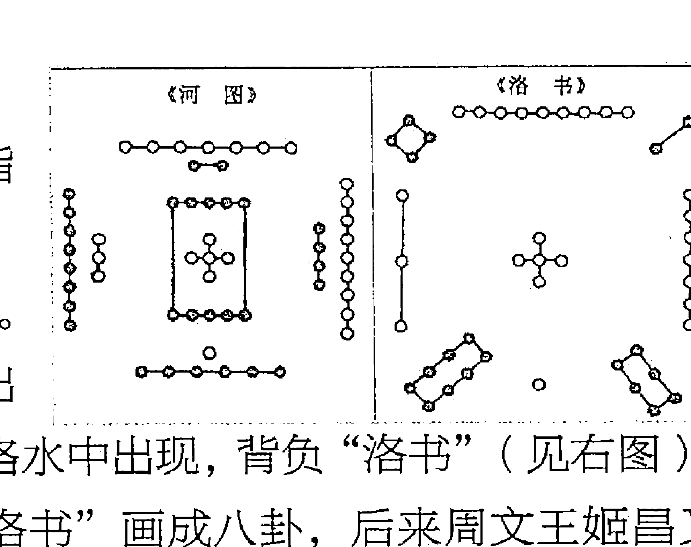

“河图”中的“一六共尊，二七同道，三八为朋，四九为友，五十居中”，成为后来风水理论的支撑。而“洛书”中的“戴九履一，左三右七，二四为肩，六八为足，五居中央”，这是《奇门遁甲》《小成图》推演依据，在这里也可以看到中国数字起源的初始端倪。2014年11月11日，据说“河图”与“洛书”经国务院批准列入第四批国家级非物质文化遗产名录。此乃众人周知的“河图”与“洛书”之大致来历和实际用途。

| 4 | 9 | 2 |
|---|---|---|
| 3 | 5 | 7 |
| 8 | 1 | 6 |

> 著名科学史家钱宝琮对“洛书”有很高的评价。他说：“三数相加都得十五，这是很令人惊奇的。”

个自然数排列在每边n格的方图里，纵横斜n数相加都得到相同的和，南宋算学家叫它‘纵横图’，日本人叫它‘方阵’，西洋人叫它‘幻方’。”（见九宫图）

它的神奇特点吸引了无数人对它如痴如迷，趣味无穷。在中国最早系统研究矩阵幻方的第一人就是宋代数学家杨辉。三阶幻方就是n=3时的幻方，它与“洛书”的数字排列组合完全吻合。它是世界上最古老的“三行纵横图”，也是最古老三阶“幻方”。

现在小学数学教学中，数学老师会给小学生布置这样的智力题作业，用自然数填充“九宫格”：把1、2、3、4、5、6、7、8、9分别填入“九宫格”中，使它的每一行、每一列和对角线都等于15。只要知道了“洛书”图，这个问题就会迎刃而解。我们用“洛书”来填写这个“九宫格”三阶幻方，可以得到四种准确答案（见下图）。

| 4 | 9 | 2 |
|---|---|---|
| 3 | 5 | 7 |
| 8 | 1 | 6 |

| 2 | 7 | 6 |
|---|---|---|
| 9 | 5 | 1 |
| 4 | 3 | 8 |

| 6 | 1 | 8 |
|---|---|---|
| 7 | 5 | 3 |
| 2 | 9 | 4 |

| 8 | 3 | 4 |
|---|---|---|
| 1 | 5 | 9 |
| 6 | 7 | 2 |

> > 台湾师范大学曾仕强教授在《周易的奥秘》一书中说：“《周易》是解开宇宙人生密码的宝典。”这个“解开宇宙人生的密码”的观点著者不敢完全苟同。但是，说它是解开地球人生密码的宝典，我认为不是夸张。《周易》理论对于地球上生存的人类应该都是适用的，可以说迄今为止，世界上大多数秘密都可用《周易》理论揭开它的谜底。

还有中国“洛书”九宫图与奇异神秘的“希腊十字形”也有微妙的联系，这些不仅仅是一个简单的巧合。宇宙自然，变化无穷，道法天地，世界大同。这是源远流长的中国古代文化与历史悠久的西方文化神奇互通的交合，而且也是东方文明与西方文明的完美结合。其中，东方文化与西方文化联系的渊源和大同之处值得我们进一步去研究与探讨。这些知识著者在《梅花易研究精要》一书中有详细介绍，此处不再赘述。

> > 《周易·系辞》曰：“易有太极，是生两仪，两仪生四象，象生八卦，八卦定吉凶，吉凶生大业。”这里所说的生和分是完全不同的概念，生生才可以不息，是一种愉悦的状态。但是，分就不同了，分是分离、分开了就会有伤害的部分或者是一个方面。就像女人生孩子一样，是生出来一个新的生命，而不是把女人一劈两开，直接变成两个人。

#### 二、何谓八卦？

八卦有“先天八卦”和“后天八卦”之分，二者用来表示的符号、卦象和名字相同，只是它们各自代表的方位有根本的区别。

##### （一）先天八卦

先天八卦是7000多年前传说时期的人文始祖伏羲氏创立的，人们叫它伏羲先天八卦。它的排列是乾为阳在南，坤为阴在北。依次为：乾（☰）（正南）数字为1→，兑（☱）（东南）数字为2→，离（☲）（正东）数字为3→，震（☳）（东北）数字为4→，巽（☴）（西南）数字为5→，坎（☵）（正西）数字为6→，艮（☶）（西北）数字为7→，坤（☷）（正北）数字为8，人们叫它三爻卦，也叫八经卦（见右图）。

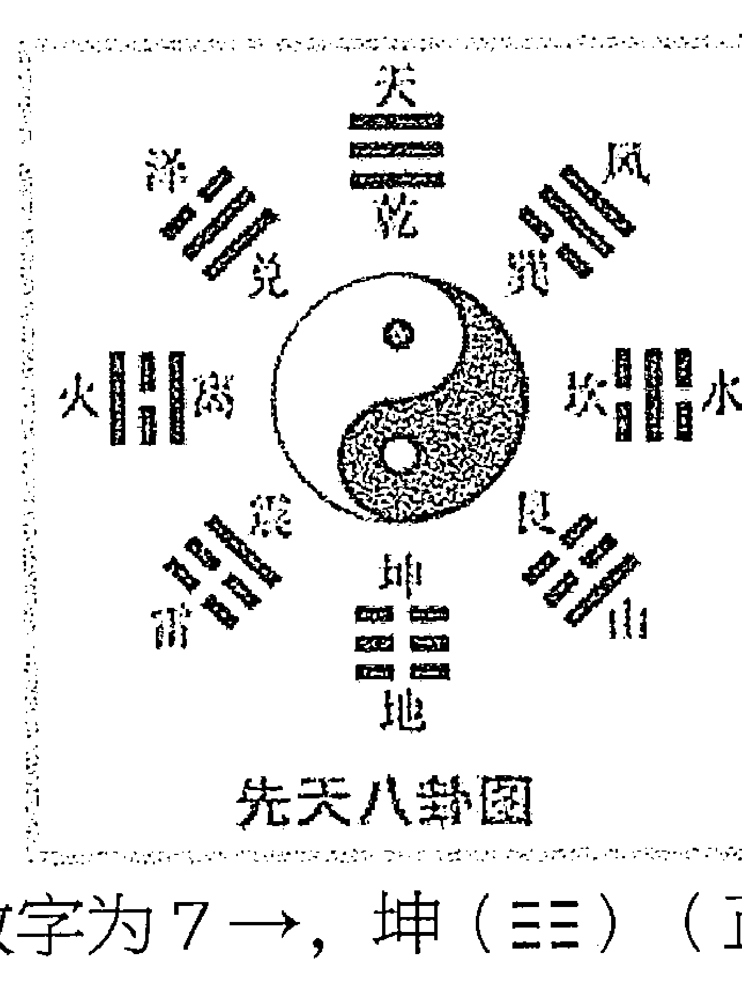

先天八卦具有阴阳对称和谐的特征。即：乾坤相对称、震巽相对称、坎离相对称、艮兑相对称，卦与卦之间，阴爻对应阳爻，形成了四组阴阳对称的卦象。同时它也代表男女之间一种对应关系。即：乾对坤就是父亲对母亲；震对巽就是长男对长女；坎对离就是中男对中女；艮对兑就是少男对少女。另外，八卦最早规定了四面八方。即：四方与四维。

四方：东、南、西、北；离（☲）在正东、乾（☰）在正南、坎（☵）在正西、坤（☷）在正北。

四维：东南、西南、西北、东北；兑（☱）在东南、震（☳）在东北、巽（☴）在西南、艮（☶）在西北。

伏羲八卦为什么从南方开始：依次从乾（☰）南方→兑（☱）东南方→离（☲）东方→震（☳）东北方→巽（☴）西南方→坎（☵）西方→艮（☶）西北方→坤（☷）北方结束，正好要走一个“S”形的曲线，也许是告诉人们世界上所有的事情都是曲曲折折的。事实证明，现实生活中只有线段，根本没有一条直线；就连水面也是相对水平，而没有绝对的水平。如果水面是水平的，我们就不会从地球东半球走到西半球又返回到原地。我们知道飞机的航线虽然是一条直线，而实际上也是一条“抛物线”。如果航线是一条直线，飞机就会飞到地球以外的宇宙空间去。好多事情都可以证明这一点，先天八卦除过对充性、艺术性和平衡性之外，它带给人们的想象空间是十分巨大的，而且是充满科学依据的。

##### （二）后天八卦

后天八卦是周文王姬昌按《易卦》的实用性排列的，人们叫它文王八卦。有人说周文王当年是殷商王朝的西北侯，他要扭转天地乾坤，把乾从正南方移到了西北方。所以，后天八卦的卦象从西北开始顺时针旋转依次为：乾（☰）西北→坎（☵）正北→艮（☶）东北→震（☳）正东→巽（☴）东南→离（☲）正南→坤（☷）西南→兑（☱）正西（见右图）。

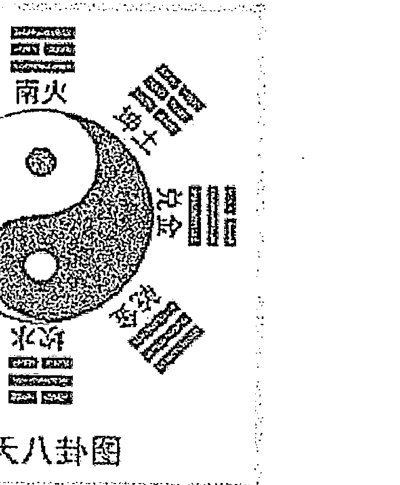

八卦：亦称三爻卦，也叫八经卦。它代表八种宇宙自然现象。即：乾（☰）代表天，坤（☷）代表地，震（☳）代表雷，坎（☵）代表水，艮（☶）代表山，巽（☴）代表风，离（☲）代表火，兑（☱）代表泽。

乾（☰）：三阳爻之卦，代表至阳，乾为天、为君、为父、为圆、为玉、为金、为寒、为冰、为大赤、为良马、为老马、为瘠马、为驳马、为木果；方位西北。在人指：领导，有身份地位，长辈尊者，德高望重的男人。

坤（☷）：三阴爻之卦，代表至阴，坤为地、为母亲、为布、为釜、为吝啬；方位西南。在人指：有身份地位，女性长辈，人很厚道的女人。

震（☳）：一阳两阴之卦，震之象，为长男、为木、为青龙、方位正东。在人指：瘦高个子，排行老大，说话声音大的长年男人。

坎（☵）：一阳两阴之卦，坎为水，为中男，为黑色、为玄武、为车轮，方位正北。在人指：瘦小个子，排行中间，皮肤黑，有智慧的中年男人。

艮（☶）：一阳两阴之卦，艮为山，为少男、为土、为丘、为楼、方位东北。在人指：年龄小，话语少，不好动，比较幼稚的少年男子。

巽（☴）：两阳一阴之卦，巽为风，为长女、为木，为风、为信息、方位东南。在人指：高个子，身材苗条，时髦性感，头发黄的长年女人。

离（☲）：两阳一阴之卦，离为火，为中女，为火，为马、为朱雀、为日、方位正南。在人指：个子不高，身体偏胖，性格开朗，热心助人的中年女人。

兑（☱）：两阳一阴之卦，兑为沼泽湖泊，为少女、为口舌、为白虎、为羊、方位西方。在人指：伶牙俐齿，皮肤白净，做事干练的少年女子。

八经卦是《周易·六十四卦》成卦的基础符号，初学者一定要记住这八个卦象符号。其口诀是：乾三连（☰），坤六断（☷），震仰盂（☳），艮覆碗（☶）；离中虚（☲），坎中满（☵），兑上缺（☱），巽下断（☴）。

八经卦的五行属性，坎（☵）属水，震（☳）、巽（☴）属木，离（☲）属火，艮（☶）、坤（☷）属土，乾（☰）、兑（☱）属金。后天八卦的实用性很大，《六爻预测》《梅花易数》《奇门遁甲》《四柱八字》，地理风水学等实际生活应用学科都是以“后天八卦”的数字和方位为基准。

#### 三、八卦与气、流、固三界

《周易·说卦》中说：“昔者圣人之作《易》也，将以顺性命之理。是以立天之道曰：阴与阳；立地之道曰：柔与刚；立人之道曰：仁与义。兼三才而两之，故《易》六画而成卦。分阴分阳，选用柔刚，故《易》六位而成章。”这是《周易》的“天、地、人”三才之道。

先天八卦和后天八卦的八种符号，乾（☰），坎（☵），艮（☶），震（☳），巽（☴），离（☲），坤（☷），兑（☱），可以划分为“气、流、固”三界。乾（☰）为“其大无外”的上天，坤（☷）为“厚德载物”大地，在宇宙天地之间，分为“天、地、人”三才之说，著者认为天地之间也有“气、流、固”三界之分，即：气界、流界、固界。

- （一）何谓气界？气属于上乘的物质，无形无相，无影无踪，在天空中飘忽游荡，传递的速度也比较快，如风云雷电，都属于气界。震（☳）为雷，是流动速度最快的物质表象；巽（☴）为风，徐徐而来，无孔不入，这两种物质在上界天空中活动。主宰刮风、打雷、闪电、电波、气流、云层、空气等。所以，著者把震（☳）与巽（☴）划归气界，也归属于三才之道中的天。

- （二）何谓流界？坎（☵）为水，代表河流、溪水、天雨；离（☲）为火，代表天然和人为的热能资源，是处于运动状态或者液态的物质表象，它们在人间大地之上活动。代表河流洪水、热量传递、火山喷泉、地震灾害、泥石流、管道输送线等，流是指他们都依附在大地之上流动转移的物质。老子曰：“上善若水。”水润下，往往向低处流，火上炎，往往向有柴薪的地方燃烧。虽说水火无情，但是，人类生活又离不开水火。所以，著者把坎（☵）与离（☲）划归流界，归属于三才之道中的人。

- （三）何谓固界？艮（☶）为高山险峰、土塬丘陵，兑（☱）为湖泊沼泽，它们与大地无法脱离，并且是处于静止状态的物质表象。如山脉岩石、土丘湿地、湖泊池塘、水库水井、桥梁楼房等，因是之故，“固”是依附于大地之上相对静止的物质，人类无法轻易地移动和改变它们。所以，艮（☶）为山，兑（☱）为泽。著者把艮（☶）与兑（☱）划归固界，归属于三才之道中的地。

此所谓的“气、流、固”三界，它对《梅花易数》预测判断有非常重要的作用。如预测一件事情，卦象属于固界，代表静止不动，就说明事情还没有启动；若属于流界，象征流动状态，说明事情正在运作交流之中；如若属于气界，代表雷和电，则表示要办的事情马上就有消息。此为气、流、固三界在预测信息方面的妙用之处。

#### 四、六十四卦由何而来

前面介绍了太极、四象、八卦，人们只知道周文王姬昌发明了六十四卦。那么，六十四卦究竟是通过怎样的步骤演绎出来的，史书没有详尽的记载。我们只能从十六卦、三十二卦、六十四卦的成卦原理中找出一些比较科学的依据。

##### （一）何谓十六卦

《十六卦》是八卦的更进一层。据出土文物资料记载：《连山易·十六卦》是两仪与八卦演生的。它是由两仪的阴爻“∧”和阳爻“一”分别与八卦的各个符号相配后，得来一组阴“∧”八卦和一组阳“一”八卦共两组，《十六卦》也叫四爻卦，它是八分为十六的物质变化演绎过程。现在有些考古发现的陶片上就有四爻卦，史传是神农氏发明和应用了《十六卦》（见上：连山易十六卦图）。根据《魏书》记载：“包牺因燧皇之图而制八卦，神农演之为六十四卦”的说法，有些学者认为是神农氏演出了六十四卦的《连山易》，但这只能是人们的一个猜测。《十六卦》就是四爻卦，包含的信息不是很多，虽说没有多大的实用价值，著者认为它是八卦之后的一个重大突破创新，是由八卦到六十四卦推演过程中的一个非常重要的步骤环节。

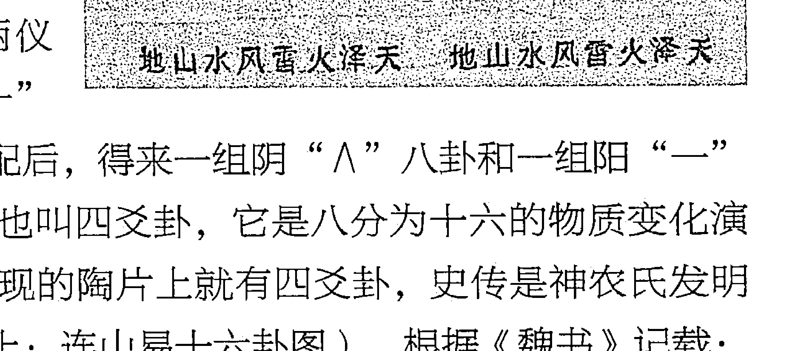

有学者认为《十六卦》的成卦时间相当早，说它是表示数学的16进位制。因为，古时候宝鸡周原一带使用的杆秤的单位是一斤为十六两；珠算用的算盘一个挡表示的最大数是十五，满十六进一了就要向上进一个档位等等，都能体现十六进位的数学逻辑和存在踪迹。

##### （二）三十二卦的过渡阶段

根据《十六卦》的成卦原理，《三十二卦》显然是两仪与《十六卦》，或者是《四象》与《八卦》演绎而来的。（符号从左到右排列）：四象：太阳○○，少阴○×，少阳×○，太阴××四种元素分别与八卦：乾○○○，兑○○×，离○×○，震○××，巽×○○，坎×○×，艮××○，坤×××的八种元素相配演绎而来的，得来少阳“×○”八卦一组，太阳“○○”八卦一组，少阴“○×”八卦一组，太阴“××”八卦一组，共四组计《三十二卦》，我们也叫它五爻卦（见上表）。它是“十六分为三十二”的一个物质变化演绎过程。现在唯一能见到的《三十二卦》就是《观世音金钱三十二课》，简称《金钱课》，它是何人发明？无人知道，也有假托为孔明所创。但是，易卦推演到这一步已经成为一部比较全面的预测著作。按理《观世音金钱三十二课》应该早于《六十四卦》，它的每一卦都有详细的卦辞，具体预示吉凶祸福。预测时成卦方式是用五枚铜钱一次抛出，由近到远按正、反面取卦象、定卦名，然后查看固定的卦辞，以此判断吉凶祸福。卦象演化到《三十二卦》显然有了系统分析的预测实用价值（篇幅有限，具体卦辞略）。

| 类别 | 乾 | 兑 | 离 | 震 | 巽 | 坎 | 艮 | 坤 |
|------|----|----|----|----|----|----|----|----|
| 太阳 | 000 | 00x | 0x0 | 0xx | x00 | x0x | xx0 | xxx |
| 少阴 | 0xx | 0xx | 0xx | 0xx | 0xx | 0xx | 0xx | 0xx |
| 少阳 | x00 | x00 | x00 | x00 | x00 | x00 | x00 | x00 |
| 太阴 | xxx | xxx | xxx | xxx | xxx | xxx | xxx | xxx |
| 乾 | 000 | 00x | 0x0 | 0xx | x00 | x0x | xx0 | xxx |
| 兑 | 000 | 00x | 0x0 | 0xx | x00 | x0x | xx0 | xxx |
| 离 | 000 | 00x | 0x0 | 0xx | x00 | x0x | xx0 | xxx |
| 震 | 000 | 00x | 0x0 | 0xx | x00 | x0x | xx0 | xxx |
| 巽 | 000 | 00x | 0x0 | 0xx | x00 | x0x | xx0 | xxx |
| 坎 | 000 | 00x | 0x0 | 0xx | x00 | x0x | xx0 | xxx |
| 艮 | 000 | 00x | 0x0 | 0xx | x00 | x0x | xx0 | xxx |
| 坤 | 000 | 00x | 0x0 | 0xx | x00 | x0x | xx0 | xxx |

##### （三）六十四卦与分类

> 宋人邵雍曰：“八卦相错，然后万物生焉。是故一分为二。二分为四，四分为八，八分为十六，十六分为三十二，三十二分为六十四，”

故曰‘分阴分阳，迭用柔刚，故易六位而成章’也。”邵雍认为《六十四卦》的成卦形式是阴阳一分为二分出了八卦，十六卦，三十二卦和六十四卦。从《十六卦》和《三十二卦》的成卦原理看，《六十四卦》显然是两仪与《三十二卦》的排列组合，或者是八经卦与八经卦两两重叠演绎而来的。

《周易·六十四卦》是太极“三十二分为六十四”的一个物质变化演绎过程，也是目前《六爻预测》和《梅花易数》象数预测常用的六爻卦。从数学排列组合看《周易·六十四卦》，是八经卦与八经卦的两两组合，形成八横八纵的六十四卦（见右《周易·六十四卦图》）。

| 天 | 泽 | 火 | 雷 | 风 | 水 | 山 | 地 |
|----|----|----|----|----|----|----|----|
| 乾 | 夬 | 大有 | 大壮 | 小畜 | 需 | 大畜 | 泰 |
| 履 | 兑 | 睽 | 归妹 | 中孚 | 节 | 损 | 临 |
| 同人 | 革 | 离 | 丰 | 家人 | 既济 | 贲 | 明夷 |
| 无妄 | 随 | 噬嗑 | 震 | 益 | 屯 | 颐 | 复 |
| 姤 | 大过 | 鼎 | 恒 | 巽 | 井 | 蛊 | 升 |
| 讼 | 困 | 未济 | 解 | 涣 | 坎 | 蒙 | 师 |
| 遁 | 咸 | 旅 | 小过 | 渐 | 蹇 | 艮 | 谦 |
| 否 | 萃 | 晋 | 豫 | 观 | 比 | 剥 | 坤 |

史传的《周易·六十四卦》按上经卦和下经卦分类，上经卦称为上篇，共三十卦，下经卦称为下篇，共三十四卦。根据古人的八卦取象，乾（☰）为天，坤（☷）为地，震（☳）为雷，坎（☵）为水，艮（☶）为山，巽（☴）为风，离（☲）为火，兑（☱）为泽。为了提请大家注意，画六爻卦时从下向上排卦象，读六爻卦的顺序是先读外（上）卦后读内（下）卦，著者将《周易·六十四卦》和编排的口诀分享于后，以供读者参考。

###### 上篇的上经三十卦：

- 天天乾卦（☰）
- 地地坤卦（☷）
- 水雷屯卦（屯）
- 山水蒙卦（蒙）
- 水天需卦（需）
- 天水讼卦（讼）
- 地水师卦（师）
- 水地比卦（比）
- 风天小畜卦（小畜）
- 天泽履卦（履）
- 地天泰卦（泰）
- 天地否卦（否）
- 天火同人卦（同人）
- 火天大有卦（大有）
- 地山谦卦（谦）
- 雷地豫卦（豫）
- 泽雷随卦（随）
- 山风蛊卦（蛊）
- 地泽临卦（临）
- 风地观卦（观）
- 火雷噬嗑卦（噬嗑）
- 山火贲卦（贲）
- 山地剥卦（剥）
- 地雷复卦（复）
- 天雷无妄卦（无妄）
- 山天大畜卦（大畜）
- 山雷颐卦（颐）
- 泽风大过卦（大过）
- 水水坎卦（坎）
- 火火离卦（离）

###### 下篇的下经三十四卦：

- 泽山咸卦（咸）
- 雷风恒卦（恒）
- 天山遁卦（遁）
- 雷天大壮卦（大壮）
- 火地晋卦（晋）
- 地火明夷卦（明夷）
- 风火家人卦（家人）
- 火泽睽卦（睽）
- 水山蹇卦（蹇）
- 雷水解卦（解）
- 山泽损卦（损）
- 风雷益卦（益）
- 泽天夬卦（夬）
- 天风姤卦（姤）
- 泽地萃卦（萃）
- 地风升卦（升）
- 泽水困卦（困）
- 水风井卦（井）
- 泽火革卦（革）
- 火风鼎卦（鼎）
- 雷雷震卦（震）
- 山山艮卦（艮）
- 风山渐卦（渐）
- 雷泽归妹卦（归妹）
- 雷火丰卦（丰）
- 火山旅卦（旅）
- 风风巽卦（巽）
- 泽泽兑卦（兑）
- 风水涣卦（涣）
- 水泽节卦（节）
- 风泽中孚卦（中孚）
- 雷山小过卦（小过）
- 水火既济卦（既济）
- 火水未济卦（未济）

以上是《周易·六十四卦》以卦象来命卦名的具体介绍，不管是学习《梅花易数》还是《六爻预测》，看象识卦是最基本的知识，所以，《周易·六十四卦》的卦象和卦名必须记得滚瓜烂熟，信手拈来一个卦象，就要知道它的卦名。随便说一个卦名就能反映出这个卦的卦象组合。为了方便记忆，著者把《周易·六十四卦》上经三十卦和下经三十四卦编成如下七言《卦序歌诀》：

- 乾坤屯蒙需讼师，比小畜兮履泰否，
- 同人大有谦豫随，蛊临观兮噬嗑贲，
- 剥复无妄大畜颐，大过坎离三十整。
- 咸恒遯兮大壮晋，明夷家人之睽蹇，
- 解损益兮夬姤萃，升困井革又鼎震，
- 艮渐归妹丰旅巽，兑涣节兮中孚至。
- 小过既济并未济，此谓下经三十四。

在《卜筮正宗》中以八经卦领衔，把《周易·六十四卦》分为八宫卦。每一宫分配八个卦，并且规定每一宫的第七卦为游魂卦，第八卦为归魂卦。著者按顺序将八宫卦编成五字口诀如下：

- 乾（☰）宫八卦：乾宫姤遁否，观剥晋大有；
- 坎（☵）宫八卦：坎节屯既济，革丰明夷师；
- 艮（☶）宫八卦：艮贲大畜损，睽履中孚渐；
- 震（☳）宫八卦：震卦豫解恒，升井大过随；
- 巽（☴）宫八卦：巽（小）畜家人益，无妄噬（嗑）颐蛊；
- 离（☲）宫八卦：离旅鼎未济，蒙涣讼同人；
- 坤（☷）宫八卦：坤宫复临泰，大壮夬需比；
- 兑（☱）宫八卦：兑卦困萃咸，蹇谦小（过）归妹。

周文王姬昌是中国历史上一位睿智哲思，洞悉玄机，而且是能抓住纷繁物象要领的高人。他为《周易·六十四卦》每一卦起了具有总摄性的卦名，并配有彖辞、象辞和爻辞。这些文字都提纲挈领，简明扼要地概括了每一卦的卦意。每一卦六个爻的爻辞和象辞，是对卦爻在卦象中表示意思的解说。据说卦名、彖辞和爻辞为周文王姬昌所撰，象辞乃周公姬旦所撰，著者从实际阅览过的历史资料研究分析，这完全是有历史依据的。

#### 五、卦象的互覆、互通

《周易·六十四卦》象数研究是“变易”思想的体现，但是万变不离其宗，只要是六爻卦，所有的变化都在六十四卦之内，绝对变不出第六十五卦或者六十六卦，这是一个不变的规律，也符合数学二项式定理，此为“变易”中的“不易”思想的象征。《周易·六十四卦》中六个阳爻和六个阴爻的卦分别是《乾卦䷀》和《坤卦䷁》；五阳一阴和五阴一阳的卦各有六个共十二卦，四阳二阴和四阴二阳的卦各有十五个共三十卦，三阳三阴的卦共有二十卦，合起来共计六十四卦。从象数角度看六十四卦有两大特点：一是卦象两两组成三十二对“互通”的卦；二是每个卦在六十四卦中都能找到自己的一个（影子）“覆卦”；下面我们就逐一进行介绍：

##### （一）何谓“覆卦”？

> 《周易·说卦》云：“八卦相错，数往者顺，知来者道，是故《易》逆数也。”

顾名思义，覆者，反也。古人把“覆卦”也叫“综卦”，就是把卦象翻过去看。《周易·六十四卦》按上经卦和下经卦分为上篇和下篇，为什么要这样划分？道理无从而知，但著者发现是有规律的。

- 上经三十卦中：《乾䷀》《坤䷁》《颐䷚》《大过䷛》《坎䷜》《离䷝》这六个卦自身为覆卦。其他的《屯䷂》《蒙䷃》；《需䷄》《䷅》；《师䷆》《比䷇》；《小畜䷈》《履䷉》；《泰䷊》《否䷋》；《同人䷌》《大有䷍》；《谦䷎》《豫䷏》；《随䷐》《蛊䷑》；《临䷒》《观䷓》；《噬嗑䷔》《贲䷕》；《剥䷖》《复䷗》；《无妄䷘》《大畜䷙》；两卦一组，共十二组，二十四卦之间互为覆卦。

- 下经三十四卦中：《中孚䷼》《小过䷽》这两个卦自身为覆卦。其他的《咸䷞》《恒䷟》；《遁䷠》《大壮䷡》；《晋䷢》《明夷䷣》；《家人䷤》《睽䷥》；《蹇䷦》《解䷧》；《损䷨》《益䷩》；《夬䷪》《姤䷫》；《萃䷬》《升䷭》；《困䷮》《井䷯》；《革䷰》《鼎䷱》；《震䷲》《艮䷳》；《渐䷴》《归妹䷵》；《丰䷶》《旅䷷》；《巽䷸》《兑䷹》；《涣䷺》《节䷻》；《既济䷾》《未济䷿》；两卦一组，共十六组，三十二卦之间互为覆卦。

总结归纳，《周易·六十四卦》上经卦和下经卦中《乾䷀》《坤䷁》《颐䷚》《大过䷛》《坎䷜》《离䷝》《中孚䷼》《小过䷽》这八个卦自身为覆卦，其他的两卦一组，共二十八组五十六卦互为覆卦。就象数预测而言，要通过卦象掌握对方的心理状态，这就必须学会换位思考。把卦象翻过去看，是站在对方立场看事态、想问题。自己舒服了，对方心里肯定不爽。如果自己觉得亏大了，对方心里可能会乐滋滋的，道理就这么简单。

如《泰卦䷊》与《否卦䷋》，站在内卦向外看是《泰卦䷊》，预示三阳开泰、大吉大利；站在外卦向内看，即为《否卦䷋》，预示否极阻塞，遇到大凶大险。再如《革卦䷰》与《鼎卦䷱》，站在内卦向外看为《革卦䷰》，预示事物之间产生了矛盾，要进行革故鼎新，此为在矛盾中求发展；如果站在外卦向内看，《革卦䷰》变成《鼎卦䷱》，预示鼎中烹饪好了美味佳肴，一顿丰盛的大餐正等待人们分享。所以，改革者要经受一番脱胎换骨的艰难痛苦。翻过去看，人民大众就会从中得到改革带来的好处和红利。

所谓的覆卦，一正一反，一来一往，用古人的话来说，这叫作错综复杂。即以已推彼，知往察来。要想把象数学精，就必须在认识卦象和灵活断卦上下大功夫，分析思维一定要灵活，养成换位思考的习惯。只要弄清楚了“覆卦”与“本卦”的关系，也就明白了“变卦”与“互通”的道理。

##### （二）何谓“互通”？

《周易·六十四卦》体现了“一阴一阳之谓道”，阴爻与阳爻互为对称，它们可以组合三十二对互通卦。提到《周易》卦象变通，大家经常会说：变化莫测，错综复杂。卦象“互通”也叫“错卦”，它是《周易·六十四卦》的一种变卦形式。这个大概源于八纯卦《乾卦☰》与《坤卦☷》天地定位，《艮卦☶》与《兑卦☱》山泽通气，《震卦☳》与《巽卦☴》雷风相薄，《坎卦☵》与《离卦☲》水火相悖，形成两卦之间阴爻与阳爻同时变化，得到卦爻相对应的另一个卦象。《周易·六十四卦》可以组成三十二组“互通”卦象。

- 六阳六阴的卦是《乾☰》《坤☷》，一组两卦。
- 五阳一阴与五阴一阳的卦有：《姤☰》《复☷》；《同人☰》《师☷》；《履☰》《谦☷》；《小畜☰》《豫☷》；《大有☰》《比☷》；《夬☰》《剥☷》；共六组十二卦；
- 四阳二阴与四阴二阳的卦有：《巽☰》《震☷》；《离☰》《坎☷》；《兑☰》《艮☷》；《大壮☰》《观☷》；《大过☰》《颐☷》；《需☰》《晋☷》；《讼☰》《明夷☷》；《无妄☰》《升☷》；《大畜☰》《萃☷》；《遁☰》《临☷》；《家人☰》《解☷》；《睽☰》《蹇☷》；《中孚☰》《小过☷》；《革☰》《蒙☷》；《鼎☰》《屯☷》；共十五组三十卦。
- 三阳三阴的卦有：《泰☰》《否☷》；《随☰》《蛊☷》；《噬嗑☰》《井☷》；《贲☰》《困☷》；《咸☰》《损☷》；《恒☰》《益☷》；《渐☰》《归妹☷》；《丰☰》《涣☷》；《旅☰》《节☷》；《既济☰》《未济☷》；共十组二十卦。

以上四种组合形式，共三十二组（2+12+30+20=64）六十四卦。

> 《周易·六十四卦》之所以这样划分上经三十卦和下经三十四卦，完全是总览万象，归并类象的结果。宋代易学家张载在《正蒙·太和篇》中说：“有象斯有对，对必反其为；有反斯有仇，仇必和而解”其此之谓焉。大到宇宙间的物质和反物质，能量和反能量，小到细胞质，细胞核，质子、中子、电子、离子、量子、DNA双螺旋结构，无不如此。易学不是别的，它是一切物质具体道理之上的终极表象和大道至理，这个终极道理的表现形式便是辩证法，故而也说它是“易老辩证法”或者“朴素辩证法”。所以，《周易》阴阳相互对立、相互依存、相辅相成的辩证法原则是非常重要的知识和方法。

#### 六、《周易·六十四卦》的卦爻

《周易·六十四卦》的每一卦都是由六个“爻”元素组成的，通称六爻卦，此所谓：六位时成也。在《周易·六十四卦》中：六爻纯阳的卦只有一个《乾卦䷀》；六爻纯阴的卦也只有一个《坤卦䷁》；乾坤两卦作为六十四卦的领衔卦与其他卦不同的是，它们在六爻之外，各自还多了一个用爻，乾卦叫用九爻，坤卦叫用六爻，这是古人规定。

《周易·六十四卦》六爻卦的爻位是从下向上排列，依次称作初爻、二爻、三爻、四爻、五爻、上爻。具体是逢阳爻加九，逢阴爻加六。例如八纯卦《离卦䷝》的读法依次为：初九爻、六二爻、九三爻、九四爻、六五爻、上九爻。画卦爻的时候一般是从初爻依次向上画起（见右图）。每一爻的彖辞、象辞、爻辞，以及所成卦象，都是用来解释卦意的重要资料依据，《周易·六十四卦》预测全凭从这些细小的环节来判断事物发展变化的趋势和吉凶祸福。

##### （一）六爻的位置与社会地位

《周易·乾卦䷀》彖辞说：“大明终始，六位时成。时乘六龙以御天。”《周易》六爻卦就是所谓的“六位时成”。所以，六爻卦与社会地位有很大的关系。它大可以代表一个国家机构，小可以表示一个集体单位。如果表示国家，初爻代表最底层的普通老百姓。二爻代表古时候的方士、小吏。三爻代表大夫、将军，四爻代表王侯公卿。五爻代表国君帝王。上爻代表退居二线的君主或者高而无位的尊者。如果用六爻卦表示一个公司或企业，初爻为一般职员或工人。二爻为技术员、组长。三爻为科长、部长。四爻为（副总）高级管理者。五爻为总经理、董事长。上爻为董事会或者顾问以及顾问委员会等。

##### （二）何谓六爻之位的正与不正

根据《周易》奇数为阳、偶数为阴的规定，六爻卦的六个爻位有阴阳之分和上下之别。即初爻、三爻、五爻为阳位，二爻、四爻、上爻为阴位。如阳位得阳爻，阴位得阴爻，即称为“正”。“正”就是阴爻占阴位，阳爻占阳位，阴阳各就其位，也叫物归其位，是符合宇宙自然规律的一种常态。相反，阳位得阴爻、阴位得阳爻，即表示为“不正”。说明阴爻和阳爻都不得其位，没有做到物归其位，就是不符合自然规律的一种非常态（见上图）。例如这个渐卦（䷴），初六爻阳位得阴爻、上九爻阴位得阳爻，都叫“不正”。六二爻阴位得阴爻、九三爻阳位得阳爻、六四爻阴位得阴爻、九五爻阳位得阳爻，这都叫“正”。

| 爻位 | 图示 | 解释 |
|---|---|---|
| 上九爻 | ☰ (⚋) | 阴位得阳不正 |
| 九五爻 | ☲ (⚊) | 阳位得阳 正 |
| 六四爻 | ☵ (⚋) | 阴位得阴 正 |
| 九三爻 | ☴ (⚊) | 阳位得阳 正 |
| 六二爻 | ☶ (⚋) | 阴位得阴 正 |
| 初六爻 | ☱ (⚋) | 阳位得阴不正 |

世界上的万事万物往往就是这样，常态的时候少，非常态的时候多。明白了这个道理，就懂得了老子所说的：“知和曰常，知常曰明”。明字是日字与月字的左右结构，日为阳月为阴，代表的是阴阳之道，理解了这些常识就知道了人生处于非常态的时候多，处于常态的时候少。所以，生活中遇到再大的烦心事，我们也没有必要整天唉声叹气、怨天尤人。

> “人生不如意事常十有八九，可与人言者却只有一二。”——唐代诗人白居易

因此，唯自乐而乐天，才是正确选择。宋儒张载说：“存，吾顺事；殁，吾宁矣。”所以，作为一个平常普通的人，为什么要与天道自然、与个人命运硬拗呢？乐天知命是谓常态。

##### （三）六爻卦中应与比的关系

在《周易》六爻卦中，初爻与四爻、二爻与五爻、三爻与上爻之间有一个上下对应关系。也就是在上卦与下卦之间，它们的下位与下位、中位与中位、上位与上位是相互对应的。如水天需卦初九爻与六四爻、九二爻与九五爻、九三爻与上六爻是一一对应关系（见右图），我们把它叫作应。应在这里要讲阴阳正应。如需卦，初九爻为阳，六四爻为阴这是正应；九二爻为阳与九五爻为阳，这个不叫正应；九三爻为阳与上六爻为阴这是正应，所以，只有这样的阴爻与阳爻之间的相应叫做正应。如果初爻为阴，四爻也为阴；二爻为阳，五爻也为阳；三爻为阴，上爻也为阴，阴与阴，阳与阳的相互对应就不能叫正应。在这个时候我们就要看爻与爻之间“比”的关系。

什么是“比”呢？《周易》六爻卦通常是把邻挨的爻叫“比”。如初爻与二爻、二爻与三爻、三爻与四爻、四爻与五爻、五爻与上爻，叫做“比”（见右需卦图）。“比”是一个附加条件,卦爻的阴阳相应叫“正应”，卦爻有“正应”时就舍去“比”不用。没有“正应”时才看“比”，因为“正应”的关系比“比”的关系要更好一些。这些都是《周易》六爻卦象数预测的基础性知识，学习研究《梅花易数》预测一定要详细了解其内在的知识，理解其中象数与易理的阴阳相互变化规律。

##### （四）“天、地、人”三才

古人把宇宙世界分为三层: 上层为天, 中层为人, 下层为地。即“天、地、人”三才（见右否卦图）。《周易·六十四卦》的六爻卦，也有“天、## 第五节 八卦类象法

地、人”三才之分，具体是上爻和五爻代表天，四爻与三爻代表人，二爻与初爻代表地。“天、地、人”三才中的两个爻，也各有阴阳之分，代表天的五爻为阳，六爻为阴。代表人的三爻为阳，四爻为阴。代表地的初爻为阳，二爻为阴。如果要预测走失的人，如应爻在初爻和二爻，很可能人在外边发生危险；应爻在三爻和四爻，一般视做人在正常范围内活动；应爻在五爻和上爻，预示人远走他乡一时半会回不来。这是研究《周易》卦象数术常用的一个重要知识。如果把“天、地、人”三才与前面讲到的“气、流、固”三界结合起来看，就会发现它们是非常的有意思，值得我们进一步去仔细参悟。

孔子在《系辞·下传》中说：“古者包羲氏之王天下也，仰则观象于天，俯则观法于地，观鸟兽之文与地之宜，近取诸身，远取诸物，于是始作八卦，以通神明之德，以类万物之情。”所谓的八卦取象，就是用八卦为宇宙万事万物建立起一个个的形象概念，即八卦代表八大类事物：乾(☰)为天、坤(☷)为地、震(☳)为雷、巽(☴)为风、坎(☵)为水、离(☲)为火、艮(☶)为山、兑(☱)为泽。这个在《梅花易数》中宋人邵雍把它叫做“取象”，后世也有人叫它八卦类象法。

这里的“象”就是把宇宙间的万事万物化分为八个大类，各类下边有男女老少、山川水泊、宫殿房舍、交通工具、用具器物、货币珠宝、美味佳肴、植物花草、动物家禽、喜怒哀乐、吉凶祸福，等等，我们必须从复杂的万事万物中抽象、规整、定义和分类出一个大众公认的物象类型，好让预测操作者一看见卦象就能联想到人与人、人与物、人与事、事与物、物与物相互之间的内在联系和生动形象，这就是下面要介绍的八卦类象法。

说白了《梅花易数》预测就是给万事万物分类画像，要弄懂这个问题，著者认为首先必须学习孔子的《易传·说卦》。其次是要认真学习宋代易学大师邵雍的“八卦万物类象”理论。再次就是要参考清代易学大家宋书升《周易要义》（十卷）中的“八卦配象”。

首先介绍孔子的《易传·说卦》。史传《系辞·上下传》《文言》《说卦》《序卦》《杂卦》这六篇大作是孔子研究《周易》心得体会之精华。所以说孔子“五十以学《易》，韦编三绝。”可是后来孔子却说：“不占而已矣”。后来荀子总结为“善为易者不占”。只要你认真读完《易传·说卦》，就会明白孔老夫子确实是一个地地道道的占卜高手，他以类取象，以象论事，当然就可以“不占而已矣”。

#### 一、何谓《说卦》？

著者认为《周易·说卦》是预测的理论基石，也是象数预测的根本，它是孔子研易心得积累的成果。面对复杂纷呈的万事万物和变化莫测的自然环境，如何理清这些纷繁的乱象呢？《易》云：“物以类聚，人以群分”，智慧的孔子想出了一个很好的方法，建立概念，归类立象，集为《周易·说卦》。所以，著者认为预测学命定的就以《周易·说卦》为基石，读者不可不参。

《周易·说卦》共分为十一章内容，具体如下：

第一章 昔者圣人之作《易》也，幽赞于神明而生著，参天两地而倚数，观变于阴阳而立卦，发挥于刚柔而生爻，和顺于道德而理于义，穷理尽性以至于命。

第二章 昔者圣人之作《易》也，将以顺性命之理。是以立天之道曰：阴与阳；立地之道曰：柔与刚；立人之道曰：仁与义。兼三才而两之，故《易》六画而成卦。分阴分阳，迭用柔刚，故《易》六位而成章。

### 第三章

天地定位，山泽通气，雷风相薄，水火不相射，八卦相错。数往者顺，知来者逆，是故《易》逆数也。

### 第四章

雷以动之，风以散之，雨以润之，日以烜之，艮以止之，兑以说之，乾以君之，坤以藏之。

### 第五章

帝出乎震，齐乎巽，相见乎离，致役乎坤，说言乎兑，战乎乾，劳乎坎，成言乎艮。万物出乎震，震东方也。齐乎巽，巽东南也；齐也者，言万物之絜齐也。离也者，明也，万物皆相见，南方之卦也。圣人南面而听天下，向明而治，盖取诸此也。坤也者，地也，万物皆致养焉，故曰：致役乎坤。兑，正秋也，万物之所说也，故曰：说言乎兑。战乎乾，乾西北之卦也，言阴阳相薄也。坎者水也，正北方之卦也，劳卦也，万物之所归也，故曰：劳乎坎。艮，东北之卦也。万物之所成终而所成始也，故曰：成言乎艮。

#### 第六章

神也者，妙万物而为言者也。动万物者，莫疾乎雷；桡万物者，莫疾乎风；燥万物者，莫熯乎火；说万物者，莫说乎泽；润万物者，莫润乎水；终万物始万物者，莫盛乎艮。故水火相逮，雷风不相悖，山泽通气，然后能变化，既成万物也。

#### 第七章

乾，健也。坤，顺也。震，动也。巽，入也。坎，陷也。离，丽也。艮，止也。兑，说也。

#### 第八章

乾为马，坤为牛，震为龙，巽为鸡，坎为豕，离为雉，艮为狗，兑为羊。

#### 第九章

乾为首，坤为腹，震为足，巽为股，坎为耳，离为目，艮为手，兑为口。

#### 第十章

乾，天也，故称乎父。坤，地也，故称乎母。震一索而得男，故谓之长男。巽一索而得女，故谓之长女。坎再索而得男，故谓之中男。离再索而得女，故谓之中女。艮三索而得男，故谓之少男。兑三索而得女，故谓之少女。

#### 第十一章

乾为天，为圆，为君，为父，为玉，为金，为寒，为冰，为大赤，为良马，为老马，为瘠马，为驳马，为木果。（为龙、为直、为衣、为言）。

坤为地，为母，为布，为釜，为吝啬，为均，为子母牛，为大舆，为文，为众，为柄，其于地也为黑。（为牝（pìn）、为迷、为方、为囊、为裳、为黄、为帛、为浆）。

震为雷，为龙，为玄黄，为专，为大途，为长子，为决躁，为苍筤竹，为萑苇。其于马也，为善鸣，为鼻足，为作足，为的颡。其于稼也，为反生。其究为健，为蕃鲜，（为五、为鹄、为鼓）。

巽为木，为风，为长女，为绳直，为工，为白，为长，为高，为进退，为不果，为臭。其于人也，为寡发，为广颡，为多白眼，为近利市三倍，其究为躁卦，（为杨、为鹤）。

坎为水，为沟渎，为隐伏，为矫輮，为弓轮。其于人也，为加忧，为心病，为耳痛，为血卦，为赤。其于马也，为美脊，为亟心，为下首，为薄蹄，为曳。其于舆也，为多眚，为通，为月，为盗。其于木也，为坚多心，（为宫、为律、为可、为栋、为枣棘、为狐、为蒺藜、为桎梏）。

离为火，为日，为电，为中女，为甲胄，为戈兵。其于人也，为大腹。为乾卦，为鳖，为蟹，为蠃，为蚌，为龟。其于木也，为科上槁，（为牝牛）。

艮为山，为径路，为小石，为门阙，为果蓏，为阍寺，为指，为狗，为鼠，为黔喙之属。其于木也，为坚多节。（为鼻、为虎、为狐）。

兑为泽，为少女，为巫，为口舌，为毁折，为附决。其于地也，为刚卤。为妾，为羊，（为常、为辅颊）。

从《周易·说卦》中不难看出，孔子是中国八卦象数分类第一人。他按照八经卦的顺序，从震卦说起，依次巽卦，离卦，坤卦，兑卦，乾卦，坎卦，到艮卦结束。用孔子的话说，就是“万物之所成终而成始也，故曰：成言乎艮。”并且建立这个八卦类象体系。

著者认为宋代易学大师邵雍可能是根据孔子的《周易·说卦》创立了有自己特色的预测系统——《梅花易数》的“八卦万物类象”系统。如离为中女、为中午、为红色、为马、为南方；兑为少女、为白色、为金器、为毁折，为西方。所以，邵氏在《梅花易数》案例中：就用这些简单的卦象所代表的人和事物，也就是根据象、数、理，占卜预测到有两个女子明日晚上前来折花，其中一少女跌倒摔伤的神奇预测，至今传为佳话。

#### 二、邵雍的“八卦万物类象”

前边介绍了孔子的研易心得《说卦》中的类象法，著者认为邵雍《梅花易数》中的“八卦万物类象”很可能是在孔子《说卦》基础之上，总结自己的实践经验得出一套八经卦的物象分类方法。客观地讲，邵雍的“八卦万物类象”体系比孔子的“八卦类象”系统细腻、完善了好多。下边介绍给大家。

##### 1、乾（☰）卦五行属金，卦数一，代表的物象为如下方面。

- 天时：天、冰、雹、霹。
- 地理：西北方位、京都、大郡、形胜之地、高亢之所。
- 人物：君父、大人、老人、长者、宦官、名人、公门人。
- 人事：刚健勇武、果决，多动少静、高上下屈。
- 身体：首、骨、肺。
- 时序：秋、九月、十月之交，戌亥年、月、日、时，五金年月日时。
- 动物：马、天鹅、狮、象。
- 静物：金玉、宝珠、圆物、木果、刚物、冠、镜。
- 屋舍：公府、楼台、高堂、大厦、驿舍、西北向之居。
- 家宅：秋占宅兴隆，夏占宅有祸，冬占宅冷落，春占宅吉利。
- 婚姻：贵官之眷，有声名之家，冬占宜成，夏占不利。
- 饮食：马肉、珍味、多骨、肝肺、干肉、干果、诸物之首、圆物、辛辣之物。
- 生产：易生，秋占生贵子，夏占有损，坐宜向西北。
- 求名：有名、宜随朝内任，刑官、武官、武职、掌权，宜向西北之任、天使、驿官。
- 谋望：有成、利公门，宜动中有财，夏占不成，冬占多谋少成。
- 交易：宜金玉、宝珠、贵货、易成，夏占不利。
- 求利：有财、金玉之利，公门中得财，秋占大利，夏占损财，冬占无财。
- 出行：利于出行，宜入京师，利西北之行，夏占不利。
- 谒见：利见大人，有德行之人，宜见官贵、可见。
- 疾病：头面之疾、肺疾、筋骨疾、上焦病、夏占不安。
- 官讼：健讼、有贵人助，秋占得胜，夏占失理。
- 坟墓：宜向西北，宜乾山气脉，宜天穴，宜高，秋占出贵，夏占大凶。
- 方道：西北。
- 五色：大赤色，玄色。
- 姓名：带金傍者，商音，行位一、四、九。
- 数目：一、四、九。
- 五味：辛、辣。

##### 2、兑（☱）卦五行属金，卦数二，代表的物象为如下方面。

- 天时：雨泽，新月，星。
- 地理：西方，泽、水际、缺池、废井，山崩破裂之地，其地为刚卤。
- 人物：少女、妾、歌妓、伶人、译人、巫师。
- 人事：喜悦、口舌、谗毁、谤说、饮食。
- 身体：舌、口、肺、痰、涎。
- 时序：秋八月，酉年、月、日、时，金年、月、日、时，二四九数月。
- 动物：羊、泽中之物。
- 静物：金刃、金类、乐器、缺器、废物。
- 屋舍：西向之居，近泽之居，败墙壁宅，户有损。
- 家宅：不安、防口舌，秋占宅喜悦，夏占宅有祸。
- 婚姻：不成、又喜，秋占可成，主成婚之吉，利婚少女，夏占不利。
- 饮食：羊肉，泽中之物，宿味，辛辣味。
- 生产：不利、恐有损胎，或利生女，夏占不利，生宜向西。
- 求名：难成、因名有损，利西之任，宜刑官、武职、伶官、泽官。
- 谋望：难成、谋中有损，秋占有喜，夏占不遂。
- 交易：不利、防口舌，有争竟，夏占不利，秋占有交易之财。
- 求利：无利有损，财利主口舌，秋占有财喜，夏占破财。
- 出行：不宜远行，防口舌，或损失，宜西行，秋占宜有利。
- 谒见：利行西方见，有诅咒。
- 疾病：口舌咽喉之疾，气逆喘疾，饮食不调。
- 官讼：有贵人帮，秋占有理，夏占理亏。
- 坟墓：宜西向，防穴中有水，近泽之墓，夏占不宜，或葬废穴。
- 方道：西方。
- 五色：白色。
- 姓名：带口带金字傍姓氏，商音，行位四、二、九。
- 数目：四、二、九。
- 五味：辛辣。

##### 3、离（☲）卦五行属火，卦数三，代表的物象为如下方面。

- 天时：日、电、虹、霓、霞。
- 地理：南方、干亢之地，窑，灶、炉冶之所，刚爆厥地，其地面阳。
- 人物：中女、文人、大腹、目疾人、介胄之士。
- 人事：文画之所，聪明才学，相见虚心，书事。
- 身体：目、心、上焦。
- 时序：夏五月，午火年、月、日、时，三二七年、月、日、时。
- 动物：雉、龟、螺、蟹蚌。
- 静物：书文，甲胄，干戈，槁衣，干燥之物，赤色之物。
- 屋舍：南舍之居，阳明之宅，明窗，虚室。
- 家宅：安稳、平善、冬占不安，克体主火灾。
- 婚姻：不成、利中女之婚，夏占可成，冬占不利。
- 饮食：雉肉、煎炒、烧炙之物，干脯之类，热肉。
- 生产：易生、产中女，冬占有损，坐宜向南。
- 求名：有名、宜南方之职，文官之任，宜炉冶坑场之职。
- 谋望：可以谋望，宜文书之事。
- 交易：可成、宜有文书之交易。
- 求利：有财、宜南方求，宜南方之财，冬占有失。
- 出行：可行、宜动向南方，就文书之行，冬占不宜行，不宜行舟。
- 谒见：可见南方人，冬占不顺，秋见文书考察才士。
- 疾病：目疾、心疾、上焦，夏占伏暑，时疫。
- 官讼：易散，文书动，词讼明辨。
- 坟墓：南向之墓，无树木之所阳穴，夏占出文人，冬占不利。
- 方道：南方。
- 五色：赤色、紫色、红。
- 姓名：带火字及立人傍姓氏，徵音，行位二、七、三。
- 数目：三、二、七。
- 五味：苦味。

##### 4、震（☳）卦五行属木，卦数四，代表的物象为如下方面。

- 天时：雷。
- 地理：东方、树木、闹市、大途、竹林、草木茂盛之所。
- 人物：长男。
- 人事：起动、怒、虚惊、鼓噪、多动、少静。
- 身体：足、肝、发、声音。
- 时序：春三月，卯年、月、日、时，四三八年、月、日、时。
- 动物：龙、蛇。
- 静物：木竹、萑苇、乐器、花草繁鲜之物。
- 屋舍：阁楼，山林之处，东向之居。
- 家宅：宅中不时有虚惊，秋占不利，春占吉。
- 婚姻：可有成，声名之家，利长男之婚，秋占不宜婚。
- 饮食：蹄、肉、山林野味，鲜肉，果酸味，菜蔬。
- 生产：虚惊、胎动不安，头胎必生男，生宜东向，秋占必有损。
- 求名：有名，宜东方之任，施发号司令之职，掌刑狱之官，有茶竹木税课之任，或闹市司货之职。
- 谋望：可望、可求、宜动中谋，秋占不遂。
- 交易：利于成交，秋占难成，山林木竹茶货之利。
- 求利：山林竹木之财，宜东方求财，动处求财，或山林竹木茶货之利。
- 出行：宜向利于东方，利山林之人，秋占不宜行，但恐虚惊。
- 谒见：可见，宜见山林之人，宜见有声名之人。
- 疾病：足疾，肝经之疾，惊怖不安。
- 官讼：健讼，有虚惊，行移取勘反复。
- 坟墓：利于东向，山林中穴，秋占不利。
- 方道：东方。
- 五色：青色、绿色、碧。
- 姓名：带木字的姓氏，角音，行位四、八、三。
- 数目：三、四、八。
- 五味：酸味。

##### 5、巽（☴）卦五行属木，卦数五，代表的物象为如下方面。

- 天时：风。
- 地理：东南方之地，草木茂秀之所，花果菜园。
- 人物：长女，秀士，寡妇之人，山林仙道之人。
- 人事：柔和，不定，鼓舞，利市三倍，进退不果。
- 身体：首、骨、肺。
- 时序：春夏之交，三五八之年、月、日、时，三月，辰巳年、月、日、时。
- 动物：鸡，百禽，山林中之禽虫。
- 静物：木香，绳，直物、长物、竹木，工巧之器。
- 屋舍：寺观楼园，山林之居，东南向之居。
- 家宅：安稳利市，春占吉，秋占不安。
- 婚姻：可成，宜长女之婚，秋占不利。
- 饮食：鸡肉，山林之味，蔬菜、酸味。
- 生产：易生，头胎产女，秋占损胎，宜向东南坐。
- 求名：有名，宜文职有风宪之力，宜入风宪，宜茶课竹木税货之职，宜东南之任。
- 谋望：可谋望，有财，可成，秋占多谋少遂。
- 交易：可成，进退不一，交易之利，山林木茶之类。
- 求利：有利三倍，宜山林之利，秋占不吉，山林木货之类。
- 出行：可行，有出入之利，宜向东南行，秋占不利。
- 谒见：可见，利见山林之人，利见文人秀士。
- 疾病：股肱之疾，风疾，肠疾，中风，寒邪，气疾。
- 官讼：宜和，恐遭风宪之责。
- 坟墓：宜东南方向，山林之穴，多树木，秋占不利。
- 方道：东南。
- 五色：青绿色，碧色，洁白。
- 姓名：草木傍之姓氏，角音，行位五、三、八。
- 数目：五、三、八。
- 五味：酸味。

##### 6、坎（☵）卦五行属水，卦数六，代表的物象为如下方面。

- 天时：雨、月、雪、霜、露。
- 地理：北方、江湖、溪涧、泉井、卑湿之地。
- 人物：中男，江湖之人，舟人，盗贼。
- 人事：险陷卑下，外示以柔，内存以刚，漂泊不成，随波逐流。
- 身体：耳、血、肾。
- 时序：冬十一月，子年月日时，一、六月日时。
- 动物：豕，鱼，水中之物。
- 静物：水带子，带核之物，弓轮矫揉之物，酒器，水具。
- 屋舍：向北之居，近水、水阁、江楼，茶酒肆，宅中湿地之处。
- 家宅：不安一暗味，防盗。
- 婚姻：利中男之婚，宜北方之婚，不利成婚，不可婚辰戌丑未月。
- 饮食：豕肉、酒、冷味、海味、羹汤酸味，鱼，带血，水中之物，多骨之物，淹藏。
- 生产：难产有险，宜次胎，中男，辰戌丑未月有损，宜北向。
- 求名：艰难，恐有灾陷，宜北方之任，鱼盐河泊之职，酒兼醋。
- 谋望：不宜谋望，不能成就，秋冬占可谋望。
- 交易：不利成交，恐防失陷，宜水边交易，宜鱼盐酒货之交易，或点水人之交易。
- 求利：有失，宜水边财，恐有失陷，宜鱼盐，酒货之利。
- 出行：不宜远行，宜涉舟，宜北方之行，防盗、恐遇险阻陷溺之事。
- 谒见：难见，宜见江湖之人，或有水傍姓氏之人。
- 疾病：耳痛，心疾，感寒，胃冷水泻，肾疾，痼冷之病，血病。
- 官讼：不利，有阴险，有失困讼，失陷。
- 坟墓：宜北向之穴，近水旁之穴，不利葬。
- 方道：北方。
- 五色：黑色。
- 姓名：三点水傍之姓氏、羽音、行位一、六。
- 数目：一、六。
- 五味：咸酸。

##### 7、艮（☶）卦五行属土，卦数七，代表的物象为如下方面。

- 天时：云、雾、山岚。
- 地理：山，径路，近山城，丘陵，坟墓，东北方。
- 人物：少男，闲人，山中人。
- 人事：阻隔，宁静，进退不决，反背，止住，不见。
- 身体：手指，骨，鼻，背。
- 时序：冬春之月，十二及，丑寅年、月、日、时，七五十年、月、日、时。
- 动物：虎、狗、鼠，百兽，黔喙之物。
- 静物：土石，瓜果，黄物，土中之物。
- 屋舍：东北方之居，山居，近石，近路之宅。
- 家宅：安稳，诸事有阻，家人不睦，春占不安。
- 婚姻：阻隔难成，利少男之婚，春占不利，成也迟，宜对乡里婚。
- 饮食：土中物味，诸兽之肉，墓畔竹笋之属，野味。
- 生产：难产，有险阻之厄，宜向东北，春占有失。
- 求名：阻隔无名，宜东北方之任，宜上官山城之职。
- 谋望：阻隔难成，进退不决。
- 交易：难成，有山林田土之交易，春占有失。
- 求利：求财阻隔，宜山林中取财，春占不利，有损失。
- 出行：不宜远行，有阻，宜近陆行。
- 谒见：不可见，有阻，宜见山林之人。
- 疾病：手指之疾，脾胃之疾。
- 官讼：贵人阻滞，未讼未解，牵连不决。
- 坟墓：东北之穴，山中之穴，近路边有石，春占不利。
- 方道：东北方。
- 五色：黄色。
- 姓名：带火字及立人傍姓氏，徵音，行位二、七、三。
- 数目：五、七、十。
- 五味：甘。

##### 8、坤（☷）卦五行属土，卦数八，代表的物象为如下方面。

- 天时：云阴、雾气。
- 地理：田野，乡里，平地，西南方。
- 人物：老母，后母，农夫，乡人，众人，大腹人。
- 人事：吝啬，柔顺，懦弱，众多。
- 身体：腹、脾、胃、肉。
- 时序：辰戌丑未月，未申年、月、日、时，八、五、十月、日、时。
- 动物：牛，百兽，牝马。
- 静物：方物，柔物，布帛，丝绵，五谷，舆，斧，瓦器。
- 屋舍：西南向，村居，田舍，短屋，土阶，仓库。
- 家宅：安稳，多阴气，春占宅舍不安。
- 婚姻：利于婚姻，宜税产之家，乡村之家，寡妇之家，春占不利。
- 饮食：牛肉，土中之物，甘味，野味，五谷之味，芊笋之物，腹脏之物。
- 生产：易产，春占难产，有损或不利于母，宜坐西南方。
- 求名：有名，宜西南方，或教官，农官守土之职，春占虚名。
- 谋望：利求谋，邻里求谋，静中求谋，春占少遂，或谋于妇人。
- 交易：宜利交易，宜田土交易，宜五谷利，贱货，重物，布帛，静中有财，春占不利。
- 求利：有利，宜土中之利，贱货重物之利，静中得财，春占无财，多中取利。
- 出行：可行，宜西南行，宜往乡里行，宜陆行，春占不宜行。

#### 三、《周易要义》的八卦配象

清代易学大家宋书升，光绪十八年（1892年）中进士，钦点翰林院庶吉士。他博学强记，遍读经史。其所著《周易要义》一书，上溯河洛，中萃汉宋，下采毛惠、张焦诸家之说，取精扬粕，在象数领域形成独具风格的一家之言。他认为研究《周易》必须从天文、算术入手，写成此书时他已年近七旬，刻版尚未竣工，不幸故去。一生著作丰富，多在死前焚毁，仅存《周易要义》。庆幸的是该书于1988年由齐鲁书社出版。《周易要义》（卷十）有八卦配象，值得象数研究者借鉴，现与大家共同分享：

- 渴见：可见，利见乡人，宜见亲朋或阴人。
- 疾病：腹疾，脾胃之病，饮食停伤，谷食不化。
- 官讼：理顺，得众情，讼当解散。
- 坟墓：宜向西南，宜坤山气脉，宜田野，宜低，四季占出贵，春占大凶。
- 方道：西南。
- 五色：黄色、黑色。
- 姓名：带土字的姓氏，宫音，行位八、五、十。
- 数目：八、五、十。
- 五味：甘。

以上是邵雍《梅花易数》的“八卦万物类象”法，读者一定要多看，反复的看，拿这个“类象”去与现实生活中人和事进行对接，才能提高个人的预测水平和准确性。

1.  乾（☰）为直，为衣，为玄，为武人，为王，为德，为祥，为闲，为系，为包，为大车，为水，为塞，为聋，为就，为疾，为鸠，为梶，为辐，为輹，为云。
2.  坤（☷）为迷，为方，为囊，为裳，为黄，为帛，为大君，为主，为宗，为天子，为臣妾，为章，为载，为承，为德，为事，为随，为朋，为众，为林，为肉，为肤，为否，为蔑，为荒，为羞，为霜。
3.  震（☳）为鼓，为道，为享，为遂，为躬，为趾，为克，为侯，为笑，为伐，为葬，为茹，为敦，为纳，为容，为安，为埴，为簋，为樽，为爵，为斗，为縠，为牖，为阶，为屋，为筐，为触，为锡，为生，为交，为振，为驱，为髠，为盘桓，为建，为行，为飞鸟，为鹤，为奔，为遄，为所，为至，为坦坦，为门庭，为鹿，为苋，为舍，为盱。
4.  巽（☴）为杨，为湋，为鱼，为命，为允，为牵，为茅，为死，为即，为鸿，为誉，为陂，为旆，为弋，为系，为须，为泣，为踟蹰，为杞，为舆，为翇翇。
5.  坎（☵）为宫，为律，为栋，为业棘，为狐，为蒺藜，为桎梏，为束，为约，为休，为习，为素，为忧，为恤，为光，为宠，为跛，为禽，为车，为河，为泉，为桑，为行师，为征，为疑，为须，为寇，为矢，为收，为硕果，为祗，为恻，为不快，为酒，为食，为泥，为涂，为涕，为基斧，为褕，为怀，为不宁，为虩虩，为谷，为宑，为匕鬯，为孕，为汗，为刑，为杀，为鼠，为膏，为幕，为弧，为引，为闻，为不覯，为限，为大首。
6.  离（☲）为墉，为园，为福，为祉，为裭，为彭，为狱，为惕，为敬，为缶，为冈，为巷，为薰，为戎，为好，为饮，为食，为舆，为祭祀，为瓮，为袂，为蔀，为緇，为赏，为面，为穴，为晦，为药，为视，为眇，为牛革，为鼎铉，为壶，为光。
7.  艮（☶）为鼻，为处，为拔，为威，为颧，为戎，为祐，为居，为陵，为丘，为庐，为侵，为错，为不食，为执，为藩，为揪，为拘，为狩，为登，为跻，为升，为拇，为户庭，为圭，为愠，为瓜，为豹，为贝，为资，为背，为羽，为飞，为休，为机，为求，为挈，为马，为号咷，为不出，为失，为撝，为拯。
8.  兑（☱）为辅颊，为言，为和，为喜，为咥，为获，为得，为突，为致，为嗟，为歌，为瓶，为取，为号，为鸣，为发，为錍，为告，为虎，为葛藟，为隼，为叶，为耕，为菑，为衎衎，为说，为大号。

以上是清代学者宋书升《周易要义》中的“八卦配象”介绍，虽然有些与孔子的《说卦》和宋代易学家邵雍的《八卦万物类象》有重叠，但他有新的发现，这对于《梅花易数》研究者来说都是预测中必须应用的基础性学习资料。另外，著者认为，时代进入高度的现代化时期，比如小到手机、游戏机、电视机、计算机，大到航空母舰、飞机、高铁、坦克、导弹等等，它们该属于什么八卦类象？还需要我们研易者不断地去探索和发现。

#### 四、象、数、理的解读

> 老子《道德经》云：“道之为物，惟恍惟惚。惚兮恍兮，其中有象；恍兮惚兮，其中有物。窈兮冥兮，其中有精，其精甚真，其中有信。”

由此可见有物必有象数，有象数必有信息，有信息必见真相。《周易》象数预测入门首先要涉及三个抽象的问题：象、数、理。宋人邵雍在《梅花易数》中说：“君子于《易》，玩象、玩数、玩辞、玩意（理）。象起于形，数起于质，名起于言，意起于用。有意必有言，有言必有象，有象必有数。数立则象生，象生则言彰，言彰则意显。”这是古代易学大师对、数、理的精辟阐述。

##### （一）何谓“象”？

通俗地讲“象”是万事万物表现出来的形状各异的外在形象。是《周易》预测理论特有的一种表现形式。天有天象，地有地象，人有人象，物有物象，卦有卦象，不同事物有其不同的形象和模样，这是形式上的“象”。

“象”不需要文字解释，也不要语言表述，你一看就会明白是什么样子。就像欣赏一幅画，一看那个精巧的构图，柔和的色调，均匀的线条，鲜艳的色彩，协调的神韵，浓淡的对比，光线的折射，画中的寓思想就表示得明明白白，不管是男人女人、是中国人还是外国人，心灵感受的喜怒哀乐，真善美丑应该是相同的，这就是“象”的绝妙之处。北宋易学家刘牧在《易数构隐图序》中说：“卦者，圣人设之，观于象也。象者，形上之应，原其本，则形由象生，象由数设。”这

##### （二）何谓“数”？

邵雍的儿子邵伯温说：“数者何也？道之运也，理之会也，阴阳之度也，万物之纪也。”想想看，某个人出生于1970年10月8日，年龄40岁，身高1.78米，体重80公斤，胸围105cm，腰围76cm，脚穿42码的鞋，可以跳2米高，等等，这就是这个人身上存在的数。根据这些数字，就可以判断此人可能是一个运动员，或者是体育爱好者。现代数学中，任何一个图形和曲线我们都可以用数学函数把它表示出来。

##### （三）何谓“理”？

总而言之，象、数、理是《梅花易数》预测的关键三要素，有人说还有一个“占”。《周易·系辞》曰：“天下何思何虑，天下同归殊途，一致而百虑。”著者认为“占”只是指起卦的形式，也就是预测的前提，或者预测的途径问题。比如同样的一个时间起一个卦，用《六爻》和《梅花易数》的分析途径就有所不同，如果再用《小成图》《大六壬》《奇门遁甲》分别预测，肯定与前面两种预测方法大相径庭，但是，很有可能得到基本相近的答案。读者必须详细比较，仔细体悟其中的奥秘。

## 第六节 象数开山与义理立祖

当代哲学史家，北京大学教授朱伯崑在《易学哲学史（一）》中说：“从历史上看，研究《周易》的有两类人物：一类是历代经师或经学家，以及后来从事于注释、考据《周易》经传的专家；一类是历代的哲学家、思想家，将《周易》当成一部哲学著作，研究其中的义理。”

纵观易学文化研究体系，公众比较认可的主要是两派六宗之说。

- 太卜遗法
- 京房，焦延寿的襆祥说
- 王弼的老庄说
- 陈抟，邵雍的造化说
- 胡瑗，程子的儒理说
- 李光，杨万里的史事说

其中：太卜遗法，京房、焦延寿法的襆祥说，陈抟、邵雍的造化说归属于象数派；王弼的老庄说，胡瑗、程子的儒理说，李光、杨万里的史事说归属于义理派。

而两派六宗之间相互攻讦一直在矛盾中发展。

客观地讲，象数派应该早于义理派，道理很简单，伏羲氏创立八卦，神农氏创立《连山易》时，中国文字尚未发明。所以，圣人仰观天文，俯察地理，结绳而治，记录下来的只是一些简单的符号，那些只是近乎于文字的雏形，而并非寓意深刻的文字。根据《汉书·艺文志》记载：“凡易十三家，二百九十四篇。”西汉时期的易学十三家是指：

- 王同
- 周王孙
- 丁宽
- 服生
- 杨何
- 蔡公
- 韩氏
- 施雠（chou）
- 孟喜
- 梁丘贺、京房、古五子、淮南九子。随着西汉经学的繁荣发展，《周易》之学从此分化成今文经学和古文经学两大体系。

#### 一、《周易》研究的两大亮点

> 《汉书·艺文志》中说：“刘向以中古文《周易》，校施、孟、梁丘经，或脱去无咎悔亡，唯费氏经与古文同。”

所以，施、孟、梁丘三家自属今文经学，而费氏学为古文经学。西汉时期国家将属于今文经学系统的诸家《易》立了博士，成为官方易学。而以费直为代表的古文经学没有立博士，被排除在官方之外，成为了民间《易》。因此，从汉代开始对《周易》的研究大致分为了象数和义理两大宗派。

##### （一）汉代是象数派开山立始

汉元帝时期，皇帝立京房为易学博士。所谓象数派，是以八卦象征各种物象，用卦象来阐述卦辞和爻辞，注重预测研究。以汉代《京氏易传》为代表的《周易章句》《焦氏易林》等均为象数派的经典之作。

##### （二）魏晋为义理派开河之源

所谓义理派，是以诸卦的卦意来解释卦辞和爻辞。以魏晋王弼《周易注》为代表，偏重于《周易》彖辞与象辞的文字理论，注重于数术研究和客观判断并重的推理分析。

> 《三国演义》云：“话说天下大势，分久必合，合久必分。周末七国纷争，并入于秦。及秦灭之后，楚、汉纷争，又并入于汉。汉朝自高祖斩白蛇而起义，一统天下，后来光武中兴，传至献帝，遂分为三国。”

魏晋之前，始于西汉张良、韩信，后有东汉孔明、周瑜等，汉代精英们把中国易学文化在战场上演绎得风生水起，出神入化，淋漓尽致，大江东去，千古风流，留下诸多经典的东西。

大唐帝国盛世，李氏为王，统一天下，因为姓氏缘故，从而崇尚老子。起初《道德经》一时间风靡盛行，尔后又崇拜佛教文化，虽有孔颖达、李淳风、袁天罡、李鼎祚、杨筠松、李虚中等上知天文，下晓地理，神机妙算，被世人传得神乎其神的高人。遗憾的是大美阳刚的大唐王朝在易学文化研究领域并无太多的精品著作留于后世。但是，隋唐时期的易学爱好者聚会“射覆”之风盛行。

何谓“射覆”？它是古代雅士学习《周易》占卜为了提高占筮技能日常玩索的一种高超而有趣的游戏。顾名思义，“射”是猜度预测，“覆”是覆盖遮掩。覆者用瓯盂、盒子等器具覆盖某一物件，射者通过占筮等途径，猜测里面是什么东西。所藏之物大都是些生活用品，如手巾、扇子、笔墨、果实、盒子、碗罐、佩件、首饰等。

纵观史料，“射覆”游戏历史悠久，早在汉代时期已经流行于皇宫中。《汉书·东方朔传》云：“上尝使诸数家射覆。”唐代颜师古《汉书注》曰：“于覆器之下置诸物，令闇射之，故云射覆。”唐代诗人李商隐《无题》中云：“身无彩凤双飞翼，心有灵犀一点通。隔座送钩春酒暖，分曹射覆蜡灯红。”明代开国军师刘伯温的《烧饼歌》与“射覆”有联系。传说：朱元璋正在吃饭，刚把烧饼咬了一口，军师刘伯温求见。他把烧饼用碗盖住让刘伯温猜。刘伯温答：“半似日兮半如月，定是金龙咬一缺。”皇帝大惊，便让他预测明代江山能传多少代？刘伯温便预言了大明王朝的国都要从南京迁到北京、明成祖篡位、土木之变、魏忠贤专权、李自成起义、吴三桂引清兵入关等许多大事，著成《烧饼歌》一书流传后世。《三国演义》《水浒传》《西游记》《红楼梦》四大名著中都有“射覆”的事例。

“射覆”类似于猜谜游戏只是谜面为各自所得的卦象，它们根据《周易》八卦的象、数、理、占，从无限种可能的事物中推断出某种具体事物来。“射覆”可以无心“玩占”也可以考验研易者的功力，成为古今易占家的一种高难度游戏。“射覆”的趣味性和交互性很强，可以即时验证卦象，无论射中与否，都可以加深对易象思考的理解和启发，是练习占卜预测能力和自信的一种好的方法。

宇宙中的万事万物与时间、空间以及人的意识、思维都是全息的时空信息。“射覆”看起来无任何规律，所覆之物从一枚钉子到一只小鸟，从一颗珠宝到一碎片玻璃都有可能，没有任何的参数可供推测，此时形象思维和逻辑思维都不会发生作用，猜中的可能性微乎其微，一般人的聪明才智在这种游戏上都不起作用。但从全息论角度来看，时间与空间构成了时空信息。而沟通和揭示其全息的信息，其媒介就是《周易》的象数。某人在什么时间、什么方位、什么次序、什么情况下隐藏什么东西，有可能是受易理所阐述的规律性制约。因此，理论上只要抓住时空中任何一个节点，射覆者都可以拎起一整张全覆盖的信息网。从某种程度上说，“射覆”是象数派预测的一种常用手段，《梅花易数》研究者一定要了解这些知识。

大宋王朝帝王昏庸无能，高隐不仕，国力衰退，疆土沦陷，但庆幸的是在易学文化研究方面却出现了前所未有的发展盛况，形成蔚为大观的繁华景象，涌现出了陈抟、王安石、程颐、程颢、邵雍、张载、朱熹等大师级人物。大儒朱熹，把义理派和象数派的成果集于《周易本义》，成为宋代之后集易学之大成的杰作专著。邵雍的《皇极经世》《梅花易数》的问世，使象数派理论得到飞跃性发展。观象悟道，以形喻物，以象演绎，以道推理，详说人事，即使不识字的人也能从卦象中知了得道，传播易学知识，形成了一道靓丽的风景线。

纵观象数派与义理派，各有明显的特色，创新的思维，发散的思想，崇拜的信徒，这对《周易》研究发展皆具有积极地意义。义理派登人大雅之堂，被象牙塔中的学者名流所推崇研习，占据庙堂之高，发展成为后世所谓的“学院派”；象数派走入闹市街巷，被行走江湖、沦落与闾阇街市的隐士玩索穷究，处于江湖之远，形成了后世流传的“江湖派”。

> 正如孔子所云：“天下何思何虑，天下同归而殊途，一致而百忧。天下何思何虑？”

历史变迁，岁月演绎，经久不衰，同源一脉的华夏易学文化分流出来的义理派和象数派，形成了中国《周易》文化研究不同风格的两大亮点，一直延绵流传至今。

#### 二、《周易·六十四卦》的吉凶之说

《周易》本来是讲事物变化的朴素辩证哲学，其六十四卦究竟有无吉凶之说？答案既是肯定的，又是不定然的。为何要这样说呢？从六十四卦的卦象看，并没有吉凶祸福的区别；就六十四卦的卦辞而论，显然是有吉凶之分的。这要从“象数”和“义理”两个方面说起。

从象数的角度看，六十四卦的卦爻只有阴阳之分，没有吉凶之别。在象数预测过程中，通过定义代表人与事物的体卦和用卦，或者是世爻与用爻，加上四季运行，五行制化，以及卦爻的变化直接导致卦象变化，致使有些卦象由吉变凶，亦有卦象自凶化吉。所以，象数派认为卦象本身没有吉凶之别，关键是看通过阴阳运行和五行生克、卦爻变化之后的结果。比如说：火山《旅卦☲☶》，六五爻动，变卦天山《遁卦☰☶》，象数派用《梅花易数》看只是从体卦和用卦的角度分析吉凶。

本卦火山《旅卦☲☶》，离上艮下，离火生艮土。这个艮（☶）象定义为体卦，相对的离（☲）象就定义为用卦，卦象火生土，用卦生体卦，预示事情生我，对我有好处，视为吉兆。

变卦天山《遁卦☰☶》，乾上艮下，艮土生乾金，艮为体卦，乾为用卦，卦象土生金，体生用之象，预示我有付出，肯定不是好事。这是由于卦象自吉变凶导致的结果而已。所以，象数派注重卦象的五行生克和四时节气的旺衰变化。

从义理的角度讲，《周易·六十四卦》每一卦有六个爻，每一卦又有一句彖辞作为提纲性的提示，每一个爻有爻辞和象辞，这些爻辞和象辞就是所谓的经文，那些言简意赅的晦涩文字，寓意着人们想预知的吉凶祸福。但是这些生僻的卦辞，往往会使人产生“仁者见仁、智者见智”的思维。因此，义理派研究者往往以卦辞论事，推理认为卦有吉凶之分。再如火山《旅卦☲☶》，六五爻动，变卦天山《遁卦☰☶》。

本卦《旅卦☲☶》六五爻卦辞曰：“射雉，一矢亡，终以誉命。”象辞曰：“终以誉命，上逮也。”卦辞的大意是说：旅途中见到（雉）野鸡，一箭就射中了，最终获得了荣誉和爵命。这显然是名利双收的好事情。

变卦天山《遁卦》九五爻卦辞曰：“嘉遁，贞吉。”象辞曰：“嘉遁，贞吉，以正志也。”卦辞的意思是说：功成名就，急流勇退，坚守正道，终得吉祥。这是作为君子才能明白怎样坚守正确的人生志向。

以上象数与义理在具体吉凶预测方面所告诉人们的参考结果显然是不同的。

#### 三、义理派预测事例

##### （一）姜子牙逆势推义理

相传姜子牙怀揣八卦，袖筒乾坤，有神人之先见。公元前1027年正月，遵照文王“时至而勿疑”的遗嘱，果断决定发兵伐商，通告各诸侯国向朝歌进军。武王起兵之前，姜子牙为其卜卦，一连卜了三卦，卦象都为凶。武王与百官心中不悦，这时姜子牙扔掉筮草，摔碎龟板。对武王说：“枯草死壳，知何吉凶”。他鼓励武王和将士们坚定信心，不迷信鬼神，统率兵车300乘，虎贲3000人，甲士45000人，浩浩荡荡东进伐商，最终取得了灭纣立周千秋功业的伟大胜利。“时至而勿疑”，替天行道的时间到了，还迟疑什么？这里的顺应天时是中国历史上义理派预测经国大事的千古一例。

##### （二）孔子读《易》卷不离手

据说当初孔子在鲁国时，听说鲁国要攻打越国，就卜卦预测胜败吉凶，卜卦得的卦辞为“鼎折足”。子贡说：“此卦凶，如仕兵折足怎么打仗”，而孔子却说：“此卦吉，越国人再水城，打仗要用船不用足，所以为吉卦”。要按《周易》六十四卦的爻辞而断，子贡的分析推断‘凶’应该是没有错的。但是孔子按常规大道推理的结果也很正确。孔子晚年对《周易》爱不释手，经常“居则在席，行则在囊”，时刻把《周易》带在身边，翻阅学习，居然把穿书简的牛皮绳都磨断了好多根。看到孔子如此喜欢读这本占筮书，弟子子贡大为不解，问孔子说：

> “老师您平时教导我们，德行高尚的人不用去问神，有智慧的人不用去占卜。可是，您都这把年纪了，为什么喜欢上占卜书呢？”

> “你全搞错了，我读《周易》不是为了占卜，而是这本占卜书中有很多做人的道理。刚强的人读它，可以知道如何提防风险；柔弱的人读它，可以让自己变得坚强起来；狡诈的人读它，可以去除狡诈之心；勇猛的人读它，可以小心谨慎，不至于胆大妄为。总而言之，这是一部让人能理性生活的书。”

正因为圣人孔子深刻领会了《周易》中的大道之理，所以后来为《周易》续写了系辞、文言、说卦、杂卦、序卦，集而成为《周易大传》，从而使《周易》升华为中华民族经典文化中具有最高哲学智慧的经典，一直流传至今，从而奠定了孔子义理派一代尊师的历史地位。

##### （三）《左传》中的经典义理占卜

《左传》原名《春秋左氏传》，相传是春秋末年鲁国的左丘明为《春秋》做注解的一部史书，与《公羊传》《谷梁传》合称“春秋三传”。也是中国第一部叙事详细的编年体史书，共三十五卷，是儒家经典之一，在《十三经》中篇幅最长，清代的《四库全书》将其列在经部。记述范围从公元前722（鲁隐公元年）至公元前468（鲁哀公二十七年），记载了战国250年的历史。

现举《左传》中《周易》预测两个案例与大家分享。

例一、《左传·昭公十二年》：“南蒯之将叛也……筮之，遇《坤 ䷁》之《比 ䷏》（六五爻变）”。爻辞曰：“黄裳元吉”。预测者以为是大吉。但问了子服惠伯，惠伯对他说：这一卦问的若是忠信之事就是吉，若不是的话必败无疑。惠伯还强调，《周易》是不可以用来问险恶之事的。后来南蒯举事之后，果然败亡，应验了子服惠伯的义理占断。

例二、《左传·鲁襄公九年》（前564年）：穆姜薨于东宫。始往而筮之，遇《艮䷳》之八。史曰：“是谓《艮䷳》之《随䷐》（初九、九三、六四、六五、上九爻，五个爻同变）”。《随䷐》，其出也。君必速也。”穆姜曰：“亡。是于《周易》曰：‘《随䷐》，元亨利贞，无咎。’元，体之长也；亨，嘉之会也；利，义之和也；贞，事之干也。体仁足以长人，嘉德足以合礼，利物足以和义，贞固足以干事。然，故不可诬也，是以虽《随䷐》无咎。今我妇人而与于乱，固在下位而有不仁，不可谓元。不靖国家，不可谓亨。作而害身，不可谓利。弃位而姣（淫），不可谓贞。有四德者，《随䷐》而无咎。我皆无之，岂《随䷐》也哉？我则取恶，能无咎乎？必死于此，弗得出矣。”

穆姜是鲁宣公的妻，鲁成公之母，她与大夫叔孙侨如私通并图谋废掉成公，于成公十六年事败后被迁于东宫。她到东宫时占了一卦，得“《艮》之八”，即《艮》卦（887887），没有变爻。这个筮史认定没有变爻即“闭而不通”，穆姜下场不吉。所以他诡称“《艮》之八”是指“《艮》之《随》”，说“随”为外出，您必须速速离开这里。不想穆姜道：出走？《随卦》卦辞是说有元、亨、利、贞这四德的人才没有灾祸，而我都没有，必定死在这里，出不去了。

此处筮史先用无爻变之占法解释“《艮》之八”，认为不吉。再随机应变用《随卦》之卦象，劝说穆姜迅速逃走（占多爻变不用卦辞）；穆姜读过《周易》，但不懂占断法，偏偏用《周易·文言》之中的四德解释《随卦》卦辞“元、亨、利、贞”，最后束手待毙，薨于东宫。应了“《艮》之八”的筮辞。战国时期的女人竟然把《周易》研究到如此精通的程度，不知令多少须眉汗颜啊！

##### （四）纪晓岚的义理预测

大清王朝大才子、乾隆朝大学士、《四库全书》总纂纪晓岚学识渊博，上通天文，下晓地理，尤其是对《周易》颇有研究。他当年在应乡举考试前预测考试结果。老师为他占了一卦泽水《困卦⚋⚊⚋⚊⚋⚊》，兑上坎下，六三爻动。老师根据泽水《困卦⚋⚊⚋⚊⚋⚊》六三爻卦辞：“困于石，据于蒺藜，入于其宫，不见其妻，凶。”预测判断纪晓岚此次考试不吉利，估计难以上榜。但纪晓岚看了这个卦爻辞后却有自己不同的见解。他对老师说：“我尚未娶妻，卦辞不见其妻，是我的实际状况，哪有妻可见啊？不见其妻是正常的，怎么会凶呢？”所以，纪晓岚根据《困卦》爻辞推测分析：“这次我会中第一名，第二名可能是姓石的人，或者是姓中有石字旁的人，第三名可能是姓米的人，或者是姓中有米字旁的人。”后来榜文公布，果不其然纪晓岚中了第一名，第二名刚好是一位姓石的，第三位是一位姓米的。这是近代一个义理派预测的经典卦例。

> 从以上义理派的卦例看，义理预测看重用《周易》六十四卦卦辞的推理分析来判断吉凶；就象数派而言，则认为《周易》六十四卦的卦象没有吉凶之分，而与阴阳，四季，五行生克制化有密切的联系。著者本书专门讲述象数预测理论，故在讲象数预测方法之前，先将这些历史知识分享简述，以资大家借鉴参考。

第七节 邵雍《梅花易数》

北宋著名易学大师邵雍（字康节）在易学象数研究领域是一位非常了不起的人物。他的《梅花易数》广为流传，其晚年所著的《皇极经世》，民间称为《邵子神数》，官学称谓《皇极天书》。自宋代至今邵氏之学倍受易学界推崇，《皇极天书》词义精湛渊博，内容深奥，变化巧妙，推断精准，包罗人生万象，测事历历如绘，让智者叹服，使愚者疯狂，有神奇惊人的准确性，被视之为“有字天书、人生密码”。所以，《皇极经世》史称中国五大数术之最，是解开人生密码的术数宝典。

#### 一、邵雍人生命运之学

《邵子神数》囊括所有易学原理，融会象数、贯通义理，自成一派。但凡依年、月、日、时推命之法，结纳其中，是一门精准神秘的超级学术，对命理学一知半解者是无法想象和理解的。遗憾的是，唯此绝学，历代单传，有“传书不传诀，传诀不传图”之说，非福缘深厚者不能尽得。其入门诀曰：“吾门一入深似海，非是真人莫进来”。还有什么吾师曾言：“强入者，不是神仙，便是疯子。”因是之故，成书一千多年来，未闻有外人能入邵子门者。由此观之，《四柱八字》当与《皇极经世》为一个体系，它是推算个人的命理公式，不是预测某一件经国大事成败的方法。

相传邵康节将它传于其子邵伯温。尔后又有洛阳铁板道人的《铁板神数》问世，但世人视邵氏后人此术为正宗。此“二数”皆以生辰八字化卦数，以此划定人生命运轨迹如神差鬼断，其“六亲”推断使后世研究者更加着迷穷究。

《邵子神数》属高层次预测学。它合河洛数之精神，贯通三易之奥妙，其理至玄至微，其用至大至广。将人的生辰八字按河洛数变为基数，综合九宫八卦形成一组特定数字，对应《周易·六十四卦》中每一个六爻卦，依此细断一个人一生的流年吉凶祸福，总断其一生前途命运。此神数将命、数、卦归于一体，独成一家宗派。《邵子神数》分为口诀、图表、条文共十三卷。首卷为匙部，记载入门诀窍、运算心法和取数密图，包括《元经运九十六气数表》《会经世六十四卦数表》《太玄卦爻归藏图》《太玄玉景混天图》等六十份秘图。锁部为具体条文内容。即：子、丑、寅、卯、辰、巳、午、未、申、酉、戌、亥共十二部。相传其传承极为严密，目前原著尚未流露于世；现今极少有人收藏，能见到此书的人微乎其微。因这十三部只是半部，另半部在门人弟子之间，按一代只传一人的门规传授，给《邵子神数》更加蒙上神秘的面纱，历来都是手抄学习，现在市面有书出售，还未见到国家正式刊印的正宗版本的《邵子神数》。前面说过，著者有幸见到朋友家祖上收藏的一套十三本、清代线装版本。家藏的珍宝，厚交之情分，只是容著者当场翻了翻而已，不可能让人带走细看深读啊！

#### 二、邵雍淡定的人生观

##### （一）邵雍其人。

邵雍（1011年—1077年），字号尧夫，别称安乐先生，生于范阳（今河北涿州大邵村），幼年随父邵古迁往衡漳（今河南林县康节村），邵雍16岁时，随其父到共城苏门山，卜居于此地。宋仁宗康定元年（1040年），邵雍30岁，游历河南，因父母葬于伊水（河南境内南洛水支流）之上，遂而在此久居，成为河南（今河南洛阳）人。他少怀壮志，刻苦读书，游历天下，久经历练，悟道在胸，后师从李之才学《河图》《洛书》与伏羲八卦和文王六十四卦，学有大成，著有《皇极经世》《观物内外篇》《先天图》《渔樵问对》《伊川击壤集》《梅花诗》等。宋仁宗皇祐元年（1049年）定居洛阳，以教学授徒为生。宋嘉祐七年（1062年），移居洛阳天宫寺西天津桥南，自号安乐先生。后因腿脚不便，出游时必坐一小车，由一人推着。宋仁宗嘉祐与宋神宗熙宁初，两度被举荐重用，雍均称疾不授，善意谢绝。宋熙宁十年（1077年）邵雍病卒，终年六十七岁。宋哲宗元祐中赐谥“康节”。

##### （二）邵雍的人生观。

尽管邵雍创立了人间命理天书。但是，邵雍认为人的一生，生死有命，富贵在天，所以，他对生死的看法非常淡定从容。他重病之中，时有张载、程颐、程颢、司马光等易学大家专程探望，从他们的对话中，足见邵雍对自己命运了如指掌和从容淡定。

> 据史书载：是年三月（邵）雍感疾，气日益耗，值张载（关学创始人）归陕过洛，问疾于榻前。载喜论命，曰：“先生信命乎？载试为先生推之。”雍曰：“世俗所谓命者，某所不知。若天命则知之矣。”载曰：既曰天命，则无可言者。”到七月病笃。程颐在邵雍病危之际探视，说：“先生至此，他人无以为力，愿自主张。”雍曰：“平生学道，岂不知此？然亦无可主张。”又一次，司马光来问疾，雍曰：“某疾势必不起，且试与观化一巡也，愿君实自爱。”光曰：“尧夫（邵雍字）未应至此。”雍曰：“死生亦常事耳。”

由此可见邵雍对人生命理预测学研究达到了炉火纯青的境界，非一般人能企及。但其深知生命终结，天命难违，“死生亦常事耳”。生命最终的归宿，是世界上每一个有生命的动物必须要走的唯一路子，当然作为高级动物的人更不能例外。所以，他嘱咐自己的朋友，“愿君实自爱”。钟爱自己，珍惜生命，坦然面对，知天乐命是邵雍面对人生归宿的真谛和感悟。

《邵子神数》虽说是一部美轮美奂的命理学专著，也是迄今命理预测学的权威论著，是中国五大神数中的鼎力之作，代表易学命理预测研究的最高水平。但是，此书虽然经典绝伦，现在原著真迹隐世，目前人们所见到的也是错误百出、以讹传讹的假冒之作，实不敢仔细参之。希望有识之士能早日将隐世的这部真传之作公之于世，以资易学爱好者的更好学习和研究，将其发扬光大。

#### 三、邵氏的易学体系

易学文化的传承历尽曲折，是一件不可思议的事情。据《古易新编（上）》云：“（《周易》）从北宋到南宋，经陈抟（道士）传给的弟子穆修（字伯长，河南人），再由穆修传给李之才（字挺之，山东青州人），李之才传给了邵雍，邵雍传给了程颢和程颐，辗转流传到南宋儒家经学大师朱熹手上。朱熹认为这才是《周易》的精华，将四张《易图》加上按语，刻印到《周易本义》的卷首，并据此对《周易》原文做了注解，使其流传后世。”可谓奇哉妙哉啊！《周易》在北宋初期在道教弟子的手中，传来传去，竟然传到儒家学者的手上，说明儒道两家对《周易》文化的传承和弘扬是功不可没的，邵雍等理学大家在传承中国经典传统文化《周易》方面各自做出了重要的贡献。

邵雍作为两宋理学奠基人之一，其哲学思想受《列子》《庄子》的影响，在吸收道家《易》与汉代《易》学思想的基础上，形成了对《周易》预测学的独到理解，其所著的《皇极经世》一书，基本精神是效法天道法则而归本于人事自然。邵雍对《周易》的传承弘扬主要体现在其巨著《梅花易数》之中。他编制宇宙年谱的目的在于经世致用，其对“道”的概念从“形而上”的理解超越了历代儒家，对于宋代理学的形成和发展起到了至关重要的作用。首先，以天地之数和圆方之数作为天地起源之象征，并以此二数分为十六大位，以穷究天地体用之变化。其次，以阴阳奇偶之数作为天圆地方之数的基础，并以阴阳之刚柔，四象与四时、五行生克制化、八卦配合天干地支之数，参以天地变化之自然法则，推导出象征生灵万物的命运通数。再次，结合前两部分所探讨之天圆地方变化十六位数和阴阳刚柔奇偶通数，呈现出以体用生、克、制化运行的具象之数，以此代表天地万物的流行生化之象，“天主运行，地主生化”的大道之源。最后，将天行刚健之数进一步具体细分为元会运世之数，以成就他独创之历法纪年。同时，也将地生柔顺之数进一步体现于律吕声音之多元性和差异性来表现动植生物之参差不齐。臻至于五类大数施行，统贯于整个自然界，旁通于人文界之一切所有，以此作为邵雍易学中穷理之学、蔚为大观的终结因果——《梅花易数》。

纵观中华易学宝库中的预测方法，如同“十八般兵器”，《周易》是诸学之纲纪大法，大家了解了情况，应手的几件预测兵器当属《奇门遁甲》《六壬课》《六爻预测》《梅花易数》，不妨从中选一种自己喜爱的深入研究。著者斗胆狂言，大唐盛世的绝顶高人李淳风、袁天罡，只留下《推背图》和神奇的民间传说，汉代张良、三国诸葛、两晋司马，只是演义小说中的传奇人物，留于后世的只是引人入胜的顶礼膜拜，并无什么专著可参。大宋王朝虽然国运不济，深受外夷欺辱，国破山河尚在，家贫人才辈出，幸有陈抟、李子才、邵雍、程颐、程颢、张载、朱熹等易学大师“为往圣继绝学”，反倒留下以《梅花易数》为代表象数预测的扛鼎之作，扶中华传统预测文化于危难之中，救华夏易学传承于水火之际，令人十分敬仰。因此，传承中华优秀传统文化《周易》是我辈不可推卸的历史重任。

第二章 起卦的相关知识

## 第一节 起卦及其方法

《周易·六十四卦》六爻卦的成卦方式很多。所谓起卦是指用什么方法组成一个六爻卦，古老的方法是用五十根蓍草卜卦，后来改用三枚铜钱摇卦，再后来以时间起卦，按生日起卦，按字的笔画数起卦，按声音起卦，按看见的人与人、人与物、物与物等都可以起卦。起卦又叫摇卦、发卦、置卦、装卦等，下面介绍一般常用的十几种起卦方法。

#### 第一种：卜筮起卦法

这是最原始、最古老、原汁原味的占卜方法，就是用五十根蓍草棒来卜卦，按一步步所得的策数构成卦象，卜三次成一爻，卜十八次才能组成六个爻，六个爻组成一个具体的卦象，再结合本卦、变卦、互卦的卦象和卦爻判断吉凶祸福，这是《周易》象数预测最为正宗的一种古老方法。宋儒朱熹在《周易本义·筮仪》一章中有详细介绍，因为其操作复杂，工具笨重，不便携带，所以，现在人很少使用此法，详情不再叙述。

#### 第二种：铜钱摇卦法

《周易·说卦》云：“昔者圣人之作《易》也，幽赞于神明而生蓍，叁天两地而倚数，观变于阴阳而立卦，发挥于刚柔而生爻，和顺于道德而理于义，穷理尽性以至于命”。这个“叁天两地”朱熹在《周易本义》中这样解释：“故揲蓍三变之末，其余三奇，则三三而九，偶则三二而六，两二一三则为七，两三一二则为八。”这就是古人铜钱摇卦法的数字依据。

据说铜钱摇卦法始于汉代京房派，起卦方法采用三枚内方外圆的铜钱，放于手心，双手合掌抱成一个空间，静心摇一摇铜钱，再将铜钱抛于案上。以钱背面为阳、数字为3，以钱字面为阴、数字为2。即三个背面为老阳9，两背一字为少阴8，一背两字为少阳7，三个字面为老阴6。摇一次得一爻，依次从初爻向上排列，摇六次得一卦。然后根据老阴、老阳的变化，确定变爻与变卦。在《梅花易数》预测中，成卦之后，只需要知道动爻，必要的时候要根据卦爻的总数来确定用爻，以用爻找出用卦和体卦，然后就可以分析推测。如果是《六爻》预测，就根据所得卦象，再给每一爻配上天干地支叫做纳干纳支，安上六亲和六神，并且要确定世爻和应爻，依此来分析预测未来的吉凶祸福。

#### 第三种：生日起卦法

此法是根据一个人出生的农历生年、生月、生日、生时所占地支的数字起卦，也叫四柱起卦法。取某人的生年、生月、生日地支的排列的数字，将前面三个数字相加之和用8去除，以余数得出上卦，再将三个数之和加上时辰数之和用8去除，以余数得出下卦，再将四柱数字相加的总数除以6，以余数确定变（动）爻，也就是变卦的那个爻位。这种方法起卦与第一种“卜筮起卦法”和第二种“铜钱摇卦法”不同的是先得出上卦，然后第二步再得到下卦，而且只有一个动爻。

例如：乙丑年、庚午月、甲申日、丁卯时出生的人，丑年为2、午月为5、甲申日为16、丁卯时为4。数字：2、5、16、4。

- 即：
  1. 年、月、日数字相加，2+5+16=23，23÷8=2……7，7为艮（≡）象，外卦（上卦）为艮（≡）象；
  2. 以年、月、日、时数字相加，23+4=27÷8=3……3，3为离（≡）象，内卦（下卦）为离（≡）象，得本卦山火《贲卦》；
  3. 再将卦爻总数27除以6确定变爻，即：27÷6=4……3，九三爻变动，内卦离（≡）象变为震（≡）象，得变卦山雷《颐卦》。

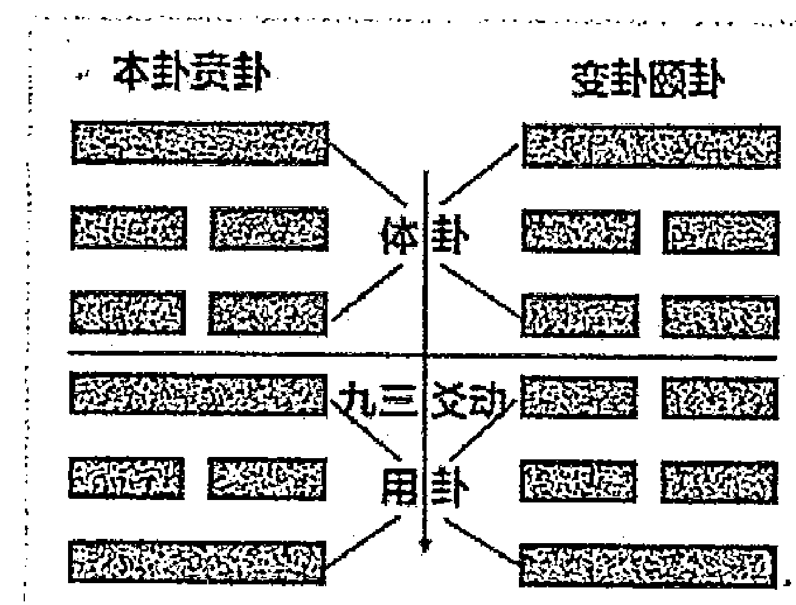

然后根据本卦《贲卦》与变卦《颐卦》卦象结构判断预测事情的吉凶结果（见上图）。这是按传统的方法起卦，但著者发现起卦总数除6确定动爻时，存在一个商是“奇数”还是“偶数”的问题需要探讨，关于奇数和偶数确定动爻，这里只提出这个问题，我们在第二节再详细讲述。

#### 第四种：汉字笔画数起卦法

有时候写几个汉字，以所写字的笔画数起卦。如：随便写三个汉字，以前面两个汉字的笔画数之和除以8，按所得余数取上卦；再将三个汉字的总笔画数之和除以8，按所得余数取下卦。以这三个汉字笔画的总数除以6，按所得余数确定动爻，其起卦计算方法与第三种方法相同，不再赘述。

#### 第五种：即时起卦法

通俗地讲即时就是随机的一个时间。根据问卦人到场时间，以问卦人打来电话的时间，或者在微信、QQ、短信上留言的时间，起卦预测某一件事，以即时的年、月、日、时的数字起卦，这个叫作即时起卦法。成卦的方法与第三种方法相同。有时候在同一时间为第二个人，或者第三个人起卦，可以把他们的姓氏笔画数加在前面。如：张姓7画，王姓4画，李姓7画，赵姓8画，等等。这样处理的结果是，每一个问卦人会得到不同卦象。

#### 第六种：报数起卦法

此法是让求测者随机报两个，或者三个数字；也可以是两组，或者三组数字；也可以是单个数，两位数，三位数，或者四位数。例如：报两个数：7、8。按先天八卦数，7为艮（≡）象，8为坤（☷）象，艮上坤下，得本卦山地《剥卦》。按总数取用爻：7+8=15，15÷6=2……3，六三爻动，变卦为八纯卦《艮卦☶》。然后按卦象，结合月令旺衰，再去分析求测事情的吉凶祸福。（见上图）

#### 第七种：手机号码起卦法

现在通讯工具手机的广泛使用，有人探索出用手机号码起卦方法，以此法预测手机主人的运气好坏和吉凶祸福。现举两种方法：

- 1、手机号码共11位，前5位取上卦，后6位取下卦。例如：13995112566，前5位之和为27，27÷8=3……3，3为离（☲）象做上卦，后6位之和为21，21÷8=2……5，5为巽（☴）象做下卦，得本卦火风《鼎卦䷱》。按总数取用爻：27+21=48÷6=8……0。上六爻动，得变卦雷风《恒卦䷟》，然后按《梅花易数》的预测方法解卦分析即可。
- 2、手机号码后4位起卦法。前两位为上卦，后两位为下卦，按总数取用爻。如上例：25、66。2+5=7，7为艮（☶）象取上卦，6+6=12÷8=1……4，4为震（☳）象取下卦，得本卦山雷《颐卦䷚》。按总数取用爻：7+12=19÷6=3……1，初六爻动，得变卦山地《剥卦䷖》，再按传统的方法，结合本人的其他信息推断分析吉凶祸福。

#### 第八种：外应起卦法

根据突然听到的一种声音，发现一种奇特现象，或者看见手机上一短信等等，都可以起卦预测。《梅花易数》中这类起卦形式很多，也很灵活多样，也符合《周易》变易的基本思想。外应起卦法是一种快捷的预测方法，它抓捕瞬间的时间、空间信息往往是比较准确的，现在有人给它起了一个很时尚名字，叫它“梅花心易”。这些知识宋人邵雍在《梅花易数》中有详细介绍，此处不再赘述。

#### 第九种：抽签起卦法

此法一般用于寺庙求签预测。大多数是将《周易·六十四卦》做成六十四根签，求测者任意抽出那一根签，就是某一个卦，卦辞一般不是《周易·六十四卦》经文中的卦辞，而是用一段故事性的打油诗句，说明一个意向性的谶语或者导语，由解签的人为求测者指点迷津。此方法可以作为一个游戏把玩，一般专业预测者不用此法。

还有把《周易·六十四卦》直接印制成64张牌，求测者任意从中抽一张就是一个卦。这种方法的弊端是没有办法看变卦，所以，信息量就可想而知了，只能当作游戏把玩而已。著者想这个可以延展方法，如按当时的时辰数字找动爻，然后根据动爻找到变卦，这样预测信息就能得到很好的拓展，可供分析的信息会更加全面。

#### 第十种：按服装颜色起卦

根据问卦人穿的衣服颜色起卦。例如：来了一位女士，上身穿红色，为离（☲）象，数字为3；下身穿淡绿色，为震（☳）象，数字为4，上离下震，本卦火雷《噬嗑卦䷔》，卦象总数：3+4=7÷6=1……1，按传统方法初九爻动（按著者的方法上九爻动），变卦火地《晋卦䷢》，属于卦象体用不得位，本卦的覆卦为山火《贲卦䷕》，变卦的复原卦为地火《明夷卦䷣》。然后再分析预测吉凶祸福。另外，此方法还可以用于体育比赛预测，根据双方队员的服装颜色起卦，结合月令旺衰，推算双方比赛的胜负结果。

以上介绍的十种起卦方法，有古人规定的传统方法，也有近代人总结的灵活实用的《周易·六十四卦》成卦方法，学习者可以认真体悟，灵活掌握使用。

#### 第十一种：扑克牌起卦法

扑克牌起卦法是著者多年来琢磨创立的一种全新的起卦方法。就是把扑克牌中红桃、黑桃、方片、梅花4种牌的6、7、8、9，共16张牌取出来，用它们来起卦。详细理论和操作方法著者将在本书的第四章具体介绍，此处暂不叙述。

《周易》中说“初筮告，再三渎，渎则不告”。就是说求测一件事情不能反复摇卦，否则就不应验。古人认为起卦前要沐浴焚香，以示心诚，这个朱熹在《周易本义·筮仪》中讲得很清楚。还有人认为哪一天宜起卦，哪一天不宜起卦，也不能用手机、电脑起卦等说法。著者认为从科学角度看，六十四卦预测是数学的排列组合和概率问题，只要你操作认真就行，不必太多的顾及古训，因此而拘役于固定教条的模式。

## 第二节 用爻、体卦、用卦的确定

#### 一、变爻的几种因素

按照《梅花易数》传统之法，如果卦象一个爻动时，就以这个动爻作为“用爻”，再确定以“用爻”所在的卦象作为“用卦”。这个只有用数字或时间起卦时才能正确使用。如果采用铜钱摇卦或者扑克牌起卦方法，出现的成卦信息变爻肯定不是唯一的，也是不可把控的。著者认为一般情况下会出现七个不确定因素。

- 1. 第一：摇卦或者抽牌所得的卦爻都是少阳7，少阴8，六个卦爻无动爻，得到一个静卦，这时候将卦爻总数之和除以6，按余数确定用爻，这个与传统方法相似。
- 2. 第二：摇卦或者抽牌所得的卦象只有一个动爻，动爻可能在内卦，也可能在外卦。按照传统方法，动爻在内卦，内卦就是“用卦”，外卦是“体卦”；动爻在外卦，外卦就是“用卦”，内卦是“体卦”。
- 3. 第三：摇卦或者抽牌所得的卦象有两个动爻，可能两个动爻全在内卦，或者动爻全在外卦，也许内卦、外卦各有一个动爻。
- 4. 第四：摇卦或者抽牌所得的卦象有三个动爻，可能三个爻全动在内卦，或者全动在外卦；也许内卦两个爻动、外卦一个爻动；也可能内卦一个动爻，外卦两个动爻。

第五：摇卦或者抽牌所得的卦象有四个动爻，可能内卦三个动爻、外卦一个动爻；也许内卦两个动爻、外卦两个动爻；或者是内卦一个动爻、外卦三个动爻。

第六：摇卦或者抽牌所得的卦象有五个动爻，可能内卦三个动爻、外卦两个动爻；或者内卦两个动爻、外卦三个动爻。

第七：摇卦或者抽牌所得的卦象是六个爻全动。可能出现由《乾卦☰》变《坤卦☷》，或者由《泰卦☷☰》变《否卦☰☷》。此所谓乾坤互通，否极泰来的大变卦。

#### 二、用爻与用卦、体卦

在起好卦之后，如果出现卦爻多变的情况，就遇到如何确定“用爻”即“应爻”，“用卦”和“体卦”的问题。著者下面大致分五种情况作以详细说明。

第一种情况：如果是一个、两个、或者三个动爻，动爻全在内卦，外卦无动爻，这时就以内卦为“用卦”，以外卦为“体卦”。

第二种情况：如果是一个、两个、或者三个动爻，动爻全在外卦，内卦无动爻，那么就以外卦为“用卦”，以内卦为“体卦”。

第三种情况：如果内卦和外卦都有动爻，也可以选动爻多的卦为“用卦”。如内卦一个爻动，外卦两个、或者三个爻全动，那就以外卦作为“用卦”，以内卦作为“体卦”；如果外卦一个爻动，内卦两个、或者三个爻全动，那就以内卦作为“用卦”，以外卦作为“体卦”。

第四种情况：采用传统的铜钱起卦方法，确定用爻一般是将六个卦爻的数字相加之和除以6，按余数从初爻依次向上数数确定用爻，余数是1，初爻为用爻；余数是2，二爻为用爻，以此类推。著者发现这里忽略了一个至关重要的问题。那就是商数是奇数、还是偶数。根据著者多年来的实践经验，如果六个爻数字加起来除以6，商数为奇数，应该从上爻向下数余数，确定应爻；如果六爻数字加起来除以6，商数为偶数，就从初爻向上数余数，确定应爻。传统的起卦方法忽略这个细节，不管三七二十一，见到余数就直接从初爻向上数余数确定应爻，这个问题非常重要，学习者要仔细体悟其中的道理，如其不然，失之毫厘，差之千里。

例：本卦天地《否卦≡≡》；初六爻和九四爻同动，得变卦风雷《益卦≡≡》，内卦和外卦各有一个爻动。用总数除以6确定‘用爻’和‘用卦’。即六个爻的总数：6+8+8+9+7+7=45 ÷ 6=7……3，商数7为奇数，那就从上爻向下数3个数，九四爻9为‘应爻’，外卦乾（≡）象为‘用卦’，内卦坤（≡）象为‘体卦’。假如这个商数为6，是偶数，余数是3，那就从初爻向上数3个数，六三爻就是‘用爻’，内卦坤（≡）象为‘用卦’，外卦乾（≡）象为‘体卦’。然后，按照《梅花易数》分析方法预测结果。

##### 第五种情况：

如果6个爻都是少阴8、少阳7，得到一个六爻静卦时，‘应爻’如何确定呢？还是把6个爻的数字相加之和，除以6，如果商数为偶数，余数从初爻向上数确定‘用爻’和‘用卦’；如果商数为奇数，余数从上爻向下数确定‘用爻’和‘用卦’，这时候无动爻的卦象就理所当然地成为‘体卦’。

以上这些情况，是著者在几十年实践中琢磨体会的一点心得，一家之言，独家之法，提出的这个说法有悖于传统方法，初学者一定会感到有点晦涩难解，请读者朋友耐心品读，仔细琢磨，方能领悟其中实质性的东西。

## 第三节 体卦与用卦的关系

在《梅花易数》预测中，正确判定‘体卦’和‘用卦’是预测分析关键的一步。‘体卦’简称‘体’，‘用卦’简称‘用’。如何准确、灵活的掌握和应用‘体’与‘用’之间的连带关系，就必须要搞清楚什么是‘体’？什么是‘用’？

#### 一、何谓“体”？

从哲学的角度看，“体”是矛盾者双方的内因，是主动的因素，代表事物本身。在《梅花易数》预测中，“体”指代的是问卦者本人，一般情况下指的是六爻卦中的内卦。如果是间接的代别人求卦，“体”所指代的是代替问卦的人。

“体”是指事物的本身，因为人生活在纷繁的矛盾和复杂的人际关系之中，我们经常讲人在任何情况下都要摆正自己的位置，也就是将自己摆放在自身应该处的位子上去。摆对了位置，就叫作得“体”得位。如果摆错了位置，叫作错位，或者叫不得体、不得位。这时候就需要调换位置，或者说叫换位思考，著者把这种情况叫作“体不得位”。具体的讲就是“体卦”在外卦，“用卦”在内卦，这个问题我们后边再细讲。

#### 二、何谓“用”？

从哲学的角度讲，“用”是矛盾者双方的外因，是被动的因素，代表事物周边或者外围环境。在《梅花易数》预测中，“用”指代的是问卦者想知道的事情，一般指代的是六爻卦中的外卦。它可以是某一个人、亲戚、领导、长辈，也可以代表水灾、地震、战争、功名、天雨、地位、钱财、官司、住房、车辆、飞机、船只、家具、饮食、衣服、信件、消息、动物、家禽、日用品等等。如果是间接的代人求卦，“用”往往指代的是被代之人所需要请求事件的未来趋势、方位、地点和重要变化的“时间窗口”。

凡是用数字、时间、生日、笔画数、摇卦、扑克牌起卦时，“体”和“用”很难保证各得其位，由于动爻为用爻，依此确定“用卦”。如果动（用）爻在外卦，“用卦”就是外卦，“体卦”就在内卦，此为“体、用”得位；如果动（用）爻在内卦，“用卦”就是内卦，而“体卦”就在外卦，这叫“体、用”不得位。这就好比原告和被告双方坐错了席位，这时必须要调整座次。或者说是各自站在对方的立场上去看问题了，如是而已。

如果用铜钱摇卦，往往有六个爻全动。或者一个爻、两个爻、三个爻、四个爻、五个爻动的时候。也有六个爻无动爻的情形。所以，“体”与“用”的确定就要另当别论（前面讲过，此处不再赘述）。

#### 三、何谓体生用？

在《梅花易数》中，一旦数字成象，卦象确定之后，下一步就是按照阴阳五行相生相克，一年四季月令旺衰的原理，根据“体”和“用”之间的关系，分析判断吉凶祸福。如水天《需卦䷄》，坎上乾下，内卦“体”为乾（☰）象，乾为金；外卦“用”为坎（☵）象，坎为水，乾金能生坎水，就是“体”生“用”。“体”生“用”是指自身生别人，一般预示主人有付出，有损失，肯定不是好事，其它各卦如离（☲）火生坤（☷）土、艮（☶）土；震（☳）木、巽（☴）木生离（☲）火；坎（☵）水生震（☳）木、巽（☴）木等，依此类推。所以，“体”生“用”被视作是自己生别人，一般情况按去舍和损失而论。

#### 四、何谓用生体？

同理，预测卦成之后，要按照阴阳五行相生相克、月令旺衰的原理，判断体与用之间的关系。如地泽《临卦䷒》，坤上兑下，外卦“用”为坤（☷）象，坤为土；内卦“体”为兑（☱）象，兑为金，坤土能生兑金，这就是“用”生“体”。再比如雷火《丰卦䷶》，上震下离，外卦“用”为震（☳）象，震为木，内卦“体”为离（☲）象，离为火，震木能生离火，即别人生自己，主人有收入，获得能量，得到好处，肯定是好事啊！其它各个卦象依此类推。一般情况下，“用”生“体”被视作主人好事可期，得利纳财，顺风顺水，吉祥如意。

#### 五、何谓体用比和？

通俗地讲，“比和”是指外卦和内卦的五行属性为同类。如风雷《益卦䷩》，巽上震下，内卦“体”卦为震（☳）象，震为木、为长男，外卦“用”卦为巽（☴）象，巽为木、为长女，震木见巽木，属于同类。人以群分，物以类聚。震为长男，巽为长女，夫妻正配，处于和谐状态，此所谓的体用“比和”。再如泽天《夬卦䷪》，兑上乾下，外卦“用”为兑（☱）象，兑为金，内卦“体”为乾（☰）象，乾为金，兑金与乾金相遇，金见金属同类，这个也叫“比和”。再如坎（☵）水见坎（☵）水，离（☲）火见离（☲）火，震（☳）木见震（☳）木，其它卦象依此类推。一般情况下，体用“比和”被视作双方握手言和，平等和谐，气息相通，和平相处，事遂人愿。

#### 六、何谓体用相克？

顾名思义，克就是甲事物对乙事物形成了制约、克制。比如泽雷《随卦䷐》，兑上震下，内卦“体”卦为震（☳）象，震为木、为长男，外卦“用”卦为兑（☱）象，兑为金、为少女，兑金能克震木，少女克长男之象，这叫用克体。如同事情克制本人，用克体看作主人遇到了麻烦，大事受阻，没有外援，视为不吉。一般情况下用克体指事与愿违，凶多吉少。

再比如地雷《复卦䷗》，坤上震下，内卦“体”卦为震（☳）象，震为木、为长男，外卦“用”卦为坤（☷）象，坤为土、为母亲，震木克坤土，长男克母亲之象，此为体克用。这就如同自己要去管束、制服对方，视作主动的胜利者。一般情况下体克用，预示好事可期，只是要延迟一些时间，为获利受益之象，其他各卦依此类推。

#### 七、何谓难克、难生？

八卦分阴阳，化为五行，就有旺衰之分，主要以月令是否当令当旺，或者逢生气来确定五行属性的旺衰。如一年当中，四季五行旺衰如下表：

| 季节 | 旺 | 相 | 泄 | 囚 | 绝 |
| :--- | :--- | :--- | :--- | :--- | :--- |
| 春季 | 木 | 火 | 水 | 金 | 土 |
| 夏季 | 火 | 土 | 木 | 水 | 金 |
| 秋季 | 金 | 水 | 土 | 火 | 木 |
| 冬季 | 水 | 木 | 金 | 土 | 火 |

例如春季得泽雷《随卦☳☷》，兑上震下，内卦“体”为震（☳）象，震为木；外卦“用”为兑（☱）象，兑为金，“体”和“用”之间形成兑金克震木的“用”克“体”关系。因为春季震木当旺，兑金处于休囚状态，这个时候兑金衰而无力，它是无法克制震木的，衰金反而会被旺木所侮，就是所谓的“反克”。这是五行属性本来能克制对方，由于自身处于休囚病态之中而无法战胜对方，此所谓的“难克”。

再比如春季得天水《讼卦☰☵》，乾上坎下，内卦“体”为坎（☵）象，坎为水；外卦“用”为乾（☰）象，乾为金，“体”和“用”之间形成金生水的“用”生“体”关系，可是春季木旺，金处休囚之地，无生水的能力，加之春季木旺、坎水泄气。所以“体”卦坎水就无法得到“用”卦乾金来生的能量，只有等到下半年金处于旺地的月份，才有可能得到“金生水”的能量，这是所谓的“难生”是也。

以上所谓的难克、难生，也是《梅花易数》预测的关键所在，关于月令的旺衰，各位读者在学习时要仔细捉摸，用心感悟。鉴于五行生、克、制、化在前一章已经详细讲述，此处不再赘述。

## 第四节 吉凶的分析推断

在《梅花易数》预测中，装好卦象就是为了分析预测吉凶。著者总结有八个关键步骤必须要掌握好。一要看本卦；二要看变卦；三要看体和用是否得位；四要看互卦；五要看覆卦（也叫错卦）；六要看复原卦（也叫综卦）；七要看本卦与什么卦互通；八要看卦象五行的月令旺衰。

#### 一、何谓本卦？

“本卦”就是用传统的起卦方法装好的这个六爻卦是个什么卦象。不管是根据年、月、日、时辰，还是报数字，报生日，或者是用铜钱摇、扑克牌抽的卦象，首先要看它是属于《周易·六十四卦》中上经卦，还是下经卦中的哪一个卦象。

例如：壬辰年农历二月十八日午时，博友在网上留言说：“何老师您好，请帮我看看卦，我开了家翡翠店，2月和3月，阴雨潮湿天，生意都不太好。请问这个店以后生意如何？”按年月日时取数字：5、2、18、7。

数字起卦：5+2+18=25÷8=3……1，1为乾（☰）象，外卦取乾（☰）象，25+7=32÷8=4……0，0为坤（☷）象，内卦取坤（☷）象，得本卦天地《否卦䷋》；32÷6=5……2，2为兑（☱）象，六二爻动，得变卦天水《讼卦䷅》（见右图），这是按传统的起卦方法得来的本卦和变卦。如果按著者的起卦方法，与传统之法有两个不同。

一是看体用得位不得位。这个天地《否卦䷋》，六二爻动在内卦，按著者的方法叫作体用不得位，互卦不用看。本卦的覆卦为《泰卦䷊》。本卦《否卦䷋》与覆卦《泰卦䷊》这叫作互通；变卦《讼卦䷅》与复原卦《需卦䷄》，两个卦又是互为覆卦。这种卦象的预测结果就是看似不好的事情，实际上隐藏着向好的机遇，只是需要等待一段时间罢了（见上图）。

二是按卦爻总数之和取用爻。本卦天地《否卦䷋》，著者的方法是按卦爻总数之和取用爻：32÷6=5……2，商数5为奇数，从上九爻向下数2个数，九五爻为用爻，变卦为火地《晋卦䷢》，离上坤下，卦象体用得位，互卦为风山《渐卦》，巽上艮下。大致分析，本卦《否卦》坤土生乾金，体生用，预示主人付出之象；变卦《晋卦》离火生坤土，用生体，预示主人有收入之象；互卦《渐卦》巽木克艮土为用克体，预示中间会出现一些制约因素，需要逐渐解决问题，卦象整体推理呈现先凶后吉之象（见右上图）。

#### 二、何谓变卦？

岐山脚下的周原地区民间有句俗话：“这人又变卦了！”所以，在《周易·六十四卦》的六爻卦中，变卦是一种很常见的情况。用年、月、日、时辰，或者报数字，报生日起的卦，一般变爻只有一个。以上卦为例：外卦为乾（☰）象，内卦为坤（☷）象，得本卦天地《否卦》；总数32÷6=5……2，2为兑（☱）象，按传统之法从初六爻向上数2个数，六二爻变动，得变卦为天水《讼卦》（见上图）。

如果用卜筮起卦法和铜钱摇卦法起卦时，情况就复杂了。很可能六个爻得到的全是少阴（八）、少阳（七），那这个卦就是一个没有变爻的静卦；但是也可能得到的全是老阴（六）、老阳（九），那这个卦六个爻都得由阴变阳、由阳变阴。所以，变卦是很不确定的因素，有时候有一个爻变，有时候两个爻变，或者是三个爻、四个爻、五个爻变，六个爻全变的情形，特殊情况下也会出现六个爻没有变爻。因为《周易·六十四卦》讲的就是事物千变万化，有些事情由凶向吉变化，有些事情由吉向凶发展，变卦看的是事物变化的一个趋势。所以，任何一个六爻卦都存在“变卦”。由于“变卦”产生变化，有了变化说明事态是发展运动的，而不是静止不动的，这很符合“变易”的哲学思想。因为《周易·六十四卦》存在很多的变数，后来人们习惯把《周易》（易经）叫做《变经》。在日常生活中人们经常说：“这件事变卦了”、“你又变卦了”等等。“变卦”二字也就成为民间的一个口头禅流传至今。

#### 三、何谓体用得位与不得位

古人云：阴有阴位，阳有阳位，阴阳各得其位，各司其职。《周易》阴阳二元论讲究的就是物归其位。一般情况下《梅花易数》中“用卦”在外卦，“体卦”在内卦，视为“体用得位”，这是古人的规定，后世一直沿用至今。如果外卦的第四爻、第五爻、上爻中其中任何一个卦爻变动，内卦中的三个爻安静不动，这个就叫作体用得位。

那么究竟什么是“体用不得位”呢？还是以上卦为例：外卦为乾（☰）象，内卦为坤（☷）象，得本卦天地《否卦䷋》；六二爻变动，变卦为天水《讼卦䷅》。变爻在内卦，六二爻为用爻，用卦就在内卦，体卦只能在外卦，这个就叫作“体用不得位”（见上图）。

如果这个天地《否卦䷋》内卦的坤（☷）象的三个爻，初六爻、六二爻、六三爻其中任何一个爻变动，外卦乾（☰）象的三个爻安静不动，这都视作“体用不得位”。

综上所述，确定用爻首先是看动爻在内卦还是在外卦，如果外卦爻动，内卦爻静，视为“体用得位”；若外卦爻静，内卦爻动，视作“体用不得位”。所谓的“得位”指的是“体”和“用”双方都处在自己应该处的位置；“不得位”指的是“体”和“用”各自没有站在自己的位置，而是你站在了别人的位置上去了，别人也错站在了你的位置，这个肯定不合适，就需要相互换位调整。此为《扑克牌·梅花易》预测的关键环节，大家一定要搞清楚。否则，失之毫厘，差之千里。

#### 四、何谓互卦？

“互卦”的概念是邵雍先生在《梅花易数》原著中定义的概念。还是以上例来说：本卦天地《否卦䷋》，变卦为天水《讼卦䷅》。本卦的二爻、三爻、四爻为艮（☶）象，三爻、四爻、五爻为巽（☴）象，所以，互卦为上巽下艮，风山《渐卦䷴》；变卦天水《讼卦䷅》的二爻、三爻、四爻为离（☲）象，三爻、四爻、五爻为巽（☴）象，变卦的互卦为巽上离下，风火《家人卦䷤》，如此而已（见右上图）。

“互卦”主要是用来分析内卦与外卦之间相互联系的因素和条件。“体用得位”时一定要看“互卦”；“体用不得位”时，位置站错了，这个“互卦”也就错了，既然是错误的，“互卦”就省去不用。因为本卦天地《否卦䷋》的互卦为风山《渐卦䷴》，而覆卦地天《泰卦䷊》的互卦为雷泽《归妹卦䷵》，两个互卦风山《渐卦䷴》与雷泽《归妹卦䷵》的寓意相去甚远，所以，著者认为在卦象“体用不得位”时，不能看“互卦”。这时主要看本卦的“覆卦”和变卦的“复原卦”。“覆卦”是指在“体用不得位”时，双方各自站在对方的位置上看卦象、想问题。

特殊情况下，从“互卦”的原理得到一个启示，我们可以用三个爻组成的八经卦中直读数字，下面举例说明。

例一、天地《否卦䷋》，初爻、二爻、三爻为坤（☷）象，数字为8；二爻、三爻、四爻为艮（☶）象，数字为7；三爻、四爻、五爻为巽（☴）象，数字为5；四爻、五爻、上爻为乾（☰）象，数字为1；由下往上直读数字为8751，由上向下直读数字为1578。

例二、雷泽《归妹卦䷵》，初爻、二爻、三爻为兑（☱）象，数字为2；二爻、三爻、四爻为离（☲）象，数字为3；三爻、四爻、五爻为坎（☵）象，数字为6；四爻、五爻、上爻为震（☳）象，数字为4；由下向上直读数字为2364，由上往下直读数字为4632。

例三、风山《渐卦䷴》，初爻、二爻、三爻为艮（䷳）象，数字为7；二爻、三爻、四爻为坎（䷜）象，数字为6；三爻、四爻、五爻为离（䷝）象，数字为3；四爻、五爻、上爻为巽（䷸）象，数字为5；由下往上直读数字为7635，由上向下直读数字为5367。

这个方法我们一般用在预测经济数字，合同数据，聚会人数，或者预测股市指数涨与跌时是很管用的方法。

#### 五、何谓覆卦？

覆者，反也，倒过来看的意思。“覆卦”是指将一个卦整个翻过来所形成的卦象。“覆卦”也叫作“综卦”。例如地天《泰卦䷊》的覆卦是天地《否卦䷋》；再例如火风《鼎卦䷱》的“覆卦”是泽火《革卦䷰》。通俗地讲，“覆卦”就是站在对方的立场看卦象、想问题。

以上卦为例：本卦天地《否卦䷋》，覆过去站在外面向里看就是地天《泰卦䷊》呈现否极泰来。《否卦䷋》的变卦天水《讼䷅》，复原卦为水天《需卦䷄》，二者也是互为覆卦（见右下否卦变讼卦示意图）。

为什么著者要主张看“覆卦”？道理很简单，现实生活中，当事者双方因某些问题争执不下的时候，往往中间人就会让双方相互站在对方立场上去思考问题。同样一件事情，站在甲方的立场看是好事，那么，站在乙方的立场看可能就是坏事。这个叫作以己推彼，以彼度人，阴阳互变，知往察来的换位思考。特别强调的是，如果“体卦”与“用卦”出现了“体用不得位”时，本卦就出现换位问题，这时候看互卦就会出现差池。我们必须把卦象覆过来，调整好位置，再做卦象分析。下面举一例与一位“不速之客”易友切磋的卦例。

2017年12月25日（农历腊月初八）上午9时46分，腊八小年，瑞雪纷飞。突然接到一个陌生人电话。对方自称姓王，研究数术多年，现人在你们单位办公楼上，问学院的周易文化研究所在那里办公？处于习惯，著者马上用传统方法即时起卦。得数字：10、12、8、6。

数字起卦：10+12+8=30÷8=3……6，6为坎（☵）象，外卦取坎（☵）象，30+6=36÷8=4……4，4为震（☳）象，内卦取震（☳）象，坎上震下，得本卦水雷《屯卦䷂》。总数：36÷6=6，6为坎（☵）象，按传统方法上六爻动，得变卦风雷《益卦䷩》。

推测分析：以体为自己，以用为来人。

1、本卦水雷《屯卦䷂》，坎上震下，坎水生震木，用生体之象，冬季水旺，木逢生气，预示来人对我有生，此次见面应该是好事情。
2、变卦风雷《益卦䷩》，巽上震下，巽木见震木，比和之象，预示两个人见面的气氛应该是很愉快的。
3、然后著者再按自己看本卦与覆卦，变卦与复原卦的方法分析。本卦水雷《屯卦䷂》的覆卦为山水《蒙卦䷃》，卦辞：“匪我求童蒙，童蒙求我。”说明这人见我的心情十分迫切；变卦风雷《益卦䷩》的覆卦为山泽《损卦䷨》，卦辞：“损上益下。”说明我们见面，我自己会有损失。

于是，我电话给对方说让他在我们办公的二楼等，我赶紧开车赶过去。见面确实很愉快，爱好相同，一见如故，相互交流了研易心得。对方说自己研究易学与数字20多年，对数理研究有自己的一套办法。

法。我就让他用我的手机号码（13092916001）起一卦看看我的运势。对方起好卦说：本卦山天《大蓄卦☰☶》，九二爻动，变卦山火《贲卦☲☶》。他说：从本卦《大蓄卦☰☶》看，你后边事业越来越好，宏图大展。从变卦山火《贲卦☲☶》看，老师你后面的名声会越来越大。

听完易友简单的分析，我笑着对他说：你这个卦“体用不得位”，我认为是要看“覆卦”的。山天《大蓄卦☰☶》的“覆卦”为天雷《无妄卦☳☰》，乾金克震木，用克体之象，事业克本人，预示我要成功本来是无希望的事情，但是冬季木逢生气，尚有可能；变卦山火《贲卦☲☶》的“覆卦”为火雷《噬嗑卦☳☲》，震木生离火，体生用之象，说明吃吃喝喝还可以，要想成功必须要做出很大的付出和努力。好在目前农历腊月水旺当令，用卦乾金泄气，体卦震木逢生气，来日小有名气还是可以期待的。再者这个变卦山火《贲卦☲☶》的复原卦为火山《旅卦☶☲》，离火生艮土，用生体之象，人在旅途，说明我日后的事情还有一些名利双收的迹象。

说完我顺便把接他电话后起的卦给来人陈述了一番（见上页）。朋友说：老师断卦灵活，注重“覆卦”和“复原卦”，使我耳目一新，今天拜访不虚此行啊！

后来我给来访者赠送了个人专著《周文化丛书·周易卷》《寸心天地》各一本，还有《周易与生活》《中国宝鸡周易》两本期刊，因为天下大雪，出行不方便，我开私家车把这位易友一直送到市内他要去的地方，这些应该算是我有损失吧！

#### 六、何谓复原卦？

老子曰：“道可道，非常道；名可名，非常名。”实际预测中当得来的卦象用卦在外卦，体卦在内卦，即为“体用得位”，就是“常道”。每当得来的卦象用卦在内卦，体卦在外卦时，就呈现“体用不得位”，这就是“非常道”。因此，我们有时候就不能以所得的卦象来解读所要预测的事情。一旦照本宣科，必将差之千里。这是一个非常关键的概念，初学预测者一定要理解其中的道理和奥秘。否则将事与愿违，必然得出错误的答案。著者所说的“复原卦”，古人把它叫“错卦”。因为《周易·六十四卦》的变化本来就是错综复杂的。

著者所说的“复原卦”就是把变卦的内卦和外卦互换位置，也就是纠错之后的卦象，这个没有史料可援，是著者在实际应用中自己悟出来的，而且应验率很高，故而在这里作出定义性的规定。还是以上卦为例，本卦天地《否卦☰☷》，六二爻动，变卦为天水《讼卦☰☵》，变爻在内卦，“用”在内卦，“体”在外卦，这就遇到了著者所说的“体用不得位”。前边说过“体用不得位”时，一定要看本卦变卦的“复原卦”。

“复原卦”就是把变卦的外卦调下来，把内卦移上去看。即以上卦的变卦为例：本卦天地《否卦☰☷》的变卦为天水《讼卦☰☵》，这个变卦天水《讼卦☰☵》的“复原卦”就要把坎（☵）象移上去，把乾（☰）象移下来，按水天《需卦☵☰》来看。只有调整好卦象位置，方可达到体用各得其位，最后才能为分析预测做出比较准确的决断条件。（见上图）

我们回头再看，本卦天地《否卦☰☷》，变卦天水《讼卦☰☵》，它的复原卦为水天《需卦☵☰》。就《讼卦☰☵》看，乾上坎下，天上的日月星辰向西运行，地上的河水向东流去，预示各奔东西，事与愿违之象；而《需卦☵☰》，坎上乾下，卦象水在天上为云，天上阴云密布，要想下雨尚要具备热气流和风力等其他自然条件的紧密配合，卦象预示虽然有好事，尚需等待一定时间才能实现。如果理解不了这个问题，可以参考本书第一章第四节中的“互覆”“互通”内容进一步去推敲体悟。

#### 七、何谓互通？

通俗地讲“错卦”就是“互通”。《周易·说卦》中说：“天地定位，山泽通气，雷风相薄，水火不相射，八卦相错。数往者顺，知来者逆，是故《易》逆数也。”什么意思呢？古人说的是八纯卦《乾卦☰》与《坤卦☷》为天地定位，《艮卦☶》与《兑卦☱》为山泽通气，《震卦☳》与《巽卦☴》雷风相薄，《坎卦☵》与《离卦☲》为水火相射，原因是卦爻相互平行的卦爻顺逆之间存在阴爻变阳爻、阳爻变阴爻，阴阳相互转化，形成“数往者顺，知来者逆”不确定的变化因素。简言之，“互通”就是说本卦与变卦之间存在一种相互变化转换的一一对应关系。如本卦为天地《否卦☰☷》，通过六个爻全变，就变成地天《泰卦☷☰》。具体一点讲，就是当下的事态为《否卦☰☷》，现状不看好，通过时间的推移，坏事逐渐会变成好事，就会变成三阳开泰的《泰卦☷☰》。弄懂了这些道理，我们就掌握了“知常达变”的卦象“互通”。这个问题在后边介绍十二消息卦《乾卦☰》与《坤卦☷》互变时，我们再细述其随着时令变化，从量的积累，达到质的飞跃，这个符合辩证唯物主义哲学的质量互变规律。

#### 八、何谓五行月令旺相

在一年四季的春、夏、秋、冬中，春季（寅、卯、辰月）木旺，夏季（巳、午、未月）火旺，秋季（申、酉、戌月）金旺，冬季（亥、子、丑月）水旺。每一个季度的最后一个（辰、未、戌、丑）月中有18天为土旺。所以五行的旺与衰是针对月令来判定的，十二个月就像一个大单位有十二个领导轮流值班一样。该谁值班，谁的权力就大，但是承担的责任也大。不该你值班时你权力相对就小一些，相对承担的责任就小。这就形成了五行（金、木、水、火、土）在四季各个月份中有旺有衰，这个在断卦分析中是至关重要的因素。如果春季农历二月得雷天《大壮卦☳☰》，六五爻动，震（☳）象为用卦，乾（☰）象为体卦，乾金克震木，体金克用木之象。但是，春季木旺金死，乾金失令，它不但克不了震木，反而会被这个得令的震木来侮，这就是所谓的反克。只有等到春季三月下旬土旺时，或者是等月令到了农历六月、七月、八月，乾金逢生气或者当令时，方能制服这个震木。否则就是有想法、没办法的事情，如此而已。这个问题著者将在本书“预测不准”一节详细讲述。

著者一直认为：万物皆有缘，诸事起有因；事理全在悟，大道不远人。以上所讲的这八个问题，在《扑克牌·梅花易》预测判断吉凶中至关重要，使提高个人预测技能的关键步骤。读者必须反复推敲琢磨，深刻领会其中要领，千万不可忽视这些细节。

## 第五节 地支“冲、合”断吉凶

> 《周易·系辞》曰：“易有圣人之道四焉，以言者尚其辞，以动者尚其变，以制器者尚其象，以卜筮者尚其占”。

古代易学大师孔子告诉我们预测是《周易》四大功能之一。从周代迄今，关于《周易》预测的书籍可谓汗牛充栋，门派林立，方法多杂，可谓百家齐放，百家争鸣，吸引历朝历代翰林大儒、方家隐士、得道高人，前仆后继的用毕生精力去探求真谛。

著名科学家爱因斯坦曾经说：人类对宇宙自然的认知充其量不过百分之十。人类经过近百年的不断探索发现，科学家们现在又说：人类对宇宙自然的认知充其量不过百分之五。所以，世人把揭示宇宙密码的金钥匙寄托于中国经典文化——《周易》。著者这里主要想告知研究预测学的朋友，人类预知未来的学问，有《周易》文化奠定的基础，通过人类的不断探求，在不远的将来一定会创研出一个程序化的理论体系来预知复杂的明天。

- 中国农历纪年中的十二地支：子、丑、寅、卯、辰、巳、午、未、申、酉、戌、亥
- 民间也称其为十二属相：鼠、牛、虎、兔、龙、蛇、马、羊、猴、鸡、狗、猪。

这十二个地支之间有六冲、六合。大多数人认为逢冲是凶，逢合为吉。其实这是一个静止的、片面的缺乏辩证思想的认识。六冲、六合在《周易》六爻卦预测、《梅花易数》《奇门遁甲》《大六壬》《皇极经世》《紫微神数》《四柱八字》等学科中都有非常重要的用途。冲与合究竟是吉是凶，根据著者近三十年的实践经验，必须辩证对待，特殊情况下巧妙运用冲与合可以不用占卜而断吉凶祸福。

#### 一、逢冲有四吉四不吉之分

农历地支十二属相之间有：子与午、丑与未、寅与申、卯与酉、辰与戌、巳与亥，称作六冲，也就是说在一个太极圆上180度时两个属相就形成对冲（见六冲图）。例如2011年是兔（卯）年，属鸡（酉）的人逢之就是卯酉相冲犯太岁，所以说属鸡的人兔（卯）年为流年不利；反过去，太岁在鸡（酉）年时，酉卯相冲，属兔（卯）的人就犯太岁。其实，在日常实际应用中，六冲有四吉、四不吉之分，必须仔细详察。

##### （一）逢冲有四吉

- **一吉工作调动顺利** 如属鸡（酉）之人兔（卯）年办理工作调动，卯酉相冲，逢冲必动。当年的二（卯）月或者八（酉）月份大多数就能事遂人愿，轻松调动，此其一也。
- **二吉官司离婚立决** 遇到打官司、闹离婚一定要逢地支六冲，逢冲时双方都有及时了却麻烦的意愿。如属马（午）的人遇到官司和离婚的诉讼纠纷，一般在鼠（子）年或十一（子）月就可以顺利协商结案或者协议分手。2010（庚寅）年腊月初，咸阳市有一位老板专门来宝鸡咨询我讨债打官司一事。此人 1957（丁酉）年生属鸡（酉），我当时对他说：“不用推算了，对方现在没钱，等明年农历二（卯）月初二过后，你就去讨债，不用打官司你会讨回债务的。”后来他依我所言，回去照此办理。2011（辛卯）年4月份这位老板专程从咸阳来宝鸡答谢我。见面后他高兴地对我说：“何老师你好，我今天是专门来看你的，570 万元债务啊！今年二月初六，一次讨回了 500 万元，跟您说的完全一样。余下的 70 万元啥时间给都行，我的一桩大心事就算了结了。”
- **三吉小病不药而愈** 一个平时非常健康的人如果得了小病，逢冲必愈。如属虎（寅）的人，农历四月得了病，一般不能很快痊愈，到了七（申）月，寅申相冲，即可冲去疾病，不药而痊愈。其他属相一样，只要是小病逢冲必愈，此其三也。
- **四吉测事准时起动** 如想知道要办的事情进展如何，逢冲必然启动。例如属龙（辰）的人八月预测某一桩事情进展，一定要等到九（戌）月，辰戌相冲，事情必然启动；再如出差旅行，一般逢冲之日，必然准时出发上路，此其四也。

##### （二）逢冲四不吉

- **一不吉婚姻不幸福** 在男女婚事上，我遇到过好多属相相冲的婚姻，如虎（寅）男与猴（申）女，兔（卯）男与鸡（酉）女，猪（亥）男与蛇（巳）女，鼠（子）男与马（午）女等等，大多数人都是生活中小吵不断的过了大半生，有些闹到要离婚的地步，但最终却没有离了。因为男为阳、女为阴，“一阴一阳之谓道”，阴阳对冲，才能溅起爱情的火花。但是，可以肯定，最起码他们前半辈子很难有和谐日子可言。因为，逢冲不是金木相克，就是水火相悖，所以，就不会有平安和谐的日子，此其一也。
- **二不吉出门要谨慎** 出门远行一定要看出行方位与太岁、月建是否有冲。如，属狗（戌）人在龙（辰）年或三（辰）月要去东南方向，特别在路途一定得多加小心，要预防不测之殃、飞来之祸的发生，以免伤及自身。2018（戌）年有位属龙（辰）的朋友，当年视为犯太岁。我叮咛过他，今年农历九（戌）月不要去西北方位出差。后来这位朋友农历九（戌）月与几位同事去了甘肃天水市（在宝鸡偏西北），返回的路上，小车的一只前轮子突然飞出去了，好在司机技术老练，沉着驾驶，车身蹭在山体上停了下来，车撞得面目皆非，车上的四个人都不同程度地负了伤，好在没有性命之忧。原因是辰戌相冲的作用，此其二也。
- **三不吉久病难活命** 古语：近病小病，逢冲必愈；久病大病，逢冲必死。例如2010（庚寅）年农历九月二十九日是个星期五，我刚下班进了家门，有朋友打来电话说：“老父亲年事已高、久病住院，问近日吉凶如何？”他父属蛇（巳），当年九月是小月，第二天就是十（亥）月初一，正好逢月建“亥”与其父属相“巳”形成对冲（加之庚寅年与老人属相六害）。我立即告诉朋友：不用预测了，就这一两天的事，该准备什么就准备吧！结果第二天（星期六）上午9点40分朋友的父亲就去世了。此其三也。
- **四不吉游子不回家** 如果预测长期外出、久不归家之人何时回家？若逢八宫卦中的游魂卦，加之在外之人的属相与问卦之人，或者问卦之人、之年、之月相冲，那说明此人游兴未尽，根本没有任何要回家的念头，即使家里人再急、再心切，那也是没有办法的事情，此其四也。

#### 二、逢合也有四吉四不吉之别

地支十二属相之间有：子与丑、寅与亥、卯与戌、辰与酉、巳与申、午与未，两两相合六组地支，称作六合。就是顺地球旋转的方向两种事物相互作用，产生了同向的引力，它们是很容易走到一起的（见六合图）。如：太岁在牛（丑）年，属鼠（子）的人，丑与子相合，也叫太岁逢六合；反过去，太岁在鼠（子）年，属牛（丑）之人，也是子丑相合。所以，大多数人认为逢合是吉利的事情，其实，逢合也有四吉、四不吉之别，千万不能忽视，不可不细察。

##### （一）逢合有四吉

- **一吉婚姻易成美满** 按老祖宗留下的规矩，一般情况下男女合婚一定要属相逢六合或者三合局，一般情况下，逢合男女志向相同，感情笃深，爱情天长地久，家庭幸福美满；我有个本家侄子，他儿子是属牛（丑）的，找了一个比他大一岁属鼠（子）的女朋友，女大男一岁，双方家长都不愿意这门亲事。侄子来问我咋办？我对他说：子与丑相合，没有什么不好。你们就别太认真了，回去准备办喜事吧！后来两个孩子果然结婚了，第一胎还生了一个大胖小子，双方家长都皆大欢喜。
- **二吉求财如愿以偿** 预测做生意求财之事，一定要与对方十二地支相合。如六爻卦中妻财爻来合世爻，逢合财来找我，生意顺当送上家门来，投资决策一拍即合，相对来说成功的概率就很大，失败的概率就很小，此其二也。
- **三吉官运仕途亨通** 凡是涉及个人提拔升迁之事，本人的属相要与所谋事情、太岁、月建相合为吉。逢合容易得到领导的赏识，好事专来找人，事业顺利畅通。2005（乙酉）年10月，有个（甲辰）年出生的朋友打来电话，问自己的工作变动？我对他说：“你就安心等待吧！2005年内没门，明（2006）年农历三（辰）月，才能运作到位。”那朋友说：“你说其他的我都相信，这件事不可能。”结果，2006（丙戌）年3月25日我去西安开会碰见他。他说：“让你给说准了，估计新任职务4月初才能发文。”道理就是2006（戌）年冲他（辰）本人，到了农历三（辰）月，辰戌一冲，必然能动。
- **四吉灾难巧逢救星** 人逢困难或遇到灾祸的时候，往往要预测吉凶祸福。如所测之事与当事人相合，而且有生气，这说明遇事尽有贵人相助，山重水复之际，出现时来运转，定当柳暗花明，逢凶化吉的美好时刻即将就要到来，此其四也。

##### （二）逢合四不吉

- **一不吉官司难解难分** 遇到打官司、闹离婚，若逢与（太岁）年、月建相合，肯定不是好事。地支逢合双方当事人主意未决，各自没有了结官司的打算，即是再有道理的事情也难说得清楚，呈现难解难分的迷茫之势。所以，著者曾经为人代笔写诉状打官司，总是要叮咛他们逢冲之日到法院去递交诉状，就是怕官司打得难解难分令人伤神费心。
- **二不吉疾病难以治愈** 如果有人预测疾病，久病逢合，病情必然加重，或者在旧病之外另添新疾，一时半月很难治愈，必须作持久与疾病做斗争的打算。如果是久病的年事已高的老人，那就该提早准备后事了。
- **三不吉出行尽有羁绊** 好多人出远门办事前要预测。如果月建、日辰、时辰与本人的属相逢六合、三合，必定有特殊事情绊缠，不能如期成行。如果是去他邦异域远行旅游，手续必然不能按时办理，美事暂时不能如愿。
- **四不吉男女暧昧滋生** 如预测男女苟且暧昧之事，逢合必定暧昧滋生，私下以身相许，感情难分难舍，或者其中必有第三者从中插足，一定要妥善处理。否则小事闹大，大事成凶，竹篮打水，人财两空。

农历地支十二属相的六冲与六合是中国古老的文化概念，它是两组相对而言的属相在时间与空间相遇、相离的自然规律和科学理论。逢冲是面对面直接而来冲撞形成的运动力，只会产生背离，相逢的概率很少；逢合是地球自然运转中越走越近的顺便不期而遇，没有相悖的条件，水到渠成，很容易就走到一起。这是一种普通的物理现象，并不是有什么神鬼从中作祟，读者要用科学的思维去加以理解。

> 荀子说：“善为《诗》者不说，善为《易》者不卜，善为《礼》者不相，其心同也。”古人在这里强调要注重思想深处的一致性。

孔子熟悉阴阳之道，他说：“不恒其德，或承之羞，不占而已矣。”孔子说：没有坚持提高个人品德的人，很有可能会承受羞辱的祸患，就不用去占卜了。所以，学习灵活掌握冲与合的自然规律，学会辩证看待同一事情的两个层面，这样我们就可以巧妙的运用这些自然规律，“不占”而预知未来道路上的吉凶祸福。

## 第三章 预测应期的判定

茫茫宇宙，芸芸众生。人类自从有了思想以来，就一直在追问我是谁？我从哪里来？要到哪里去？因此萌生了一系列预测未来吉凶祸福的问题，一直是人类梦寐以求的原始命题。在这个地球上，凡是人类发明创造的一切预测方法中，最主要最精华的无外乎就是如何准确判定预测应期。我们做任何一件事的成与败、得与失是很好预测的，要问成在何时？失在何地？再具体一点，在某年、某月、某日、某时、某地？恐怕就很难有人说得清楚了。不管是神秘莫测的《奇门遁甲》，细腻有致的《六爻纳甲》，玄机遁藏的《六壬术数》，简明扼要的《梅花易数》，还是未卜先知的《四柱命理》《紫微斗数》《邵子神数》，最困难、最重要、最精华的东西，一句话还是预测应期的判定问题。

从古到今，预测著作，汗牛充栋，蔚为大观，陈词宏论，精华秘籍，实难把控，大多数都是隔靴搔痒，以讹传讹，以涉及到预测应期的精华部分就含混其词，玄而至玄，往往使人如坠云雾，不管那一家预测门派，谁也不愿意合盘托出自家门派中确定预测应期的秘诀真谛。虽说周文王、姜子牙、孔子、孙膑、诸葛亮、李淳风、袁天罡、邵雍、刘伯温等创立和发扬了我国预测文化，但迄今为止，“应期”仍然是预测研究者人人渴望揭示的“谜底”。如果谁能准确掌握预测的应期，谁就可能得到宇宙人生的破译密码，谁就是世人敬仰的预测大师。

如何破译和掌握这个神秘莫测的秘诀呢？著者在《梅花易研究精要》一书中合盘托出自己三十多年的潜心研究《梅花易数》，从中悟出了一套掌握预测应期的规律性东西，著者经过几年时间的进一步细化总结，在这里再次向大家详细介绍这个破解千古至难命题的方法，这也是《扑克牌·梅花易》的精华章节，请读者朋友精细阅读，认真体悟。

## 第一节 何谓预测应期

#### 一、何谓应期

按照预测学的一般常理，“应期”是指在某一个时间结点预测某一桩事情，所测之事的吉凶结果会在某年、某月、某日的那个时间区间内成功兑现。比如说有人要预测工作调动，想知道这件事情在那一个月的某一日，或者在某日至某日之间可以办成；再比如有一个孩子突然走失，家人十分着急，想通过预测知道这个孩子在外平安与否？什么时间能回来？或者在什么地方找能尽快找到他。首先举宋代易学大师邵雍的两个卦例，将我们的话题引入本章的内容：预测应期判定。

> 例一、邵雍《梅花易数·观梅占》记载：“康节先生偶观梅，见二雀争枝坠地，先生曰：“不动不占，不因事不占。今二雀争枝坠地，怪也。”因占之，辰年数五，十二月十二数，十七日十七数，共三十四数，四八除三十二，零得二属兑（☱），为上卦，加申时九数，总得四十三数，五八除四十，零得三数为离（☲），作下卦，又上下总四十三数。以六除，六七除四十二，得一为动爻，是为泽火革卦（䷞），初九爻变咸卦（䷠），互见乾巽姤卦（姤）。断之曰：明晚当有女子折花，园丁不知而逐之。女子失惊坠地，逐伤其股。又兑金为体，离火克之；互中巽木，又逢乾金兑金克之，则巽木被伤。而巽为股，故有伤股之应，幸变为艮土，兑金得生，知女子有伤而不至凶危也。”

> 例二、邵雍《梅花易数·牡丹占》记载：“巳年三月十六日卯时。先生与客往司马公家共观牡丹。时值花开甚盛。客曰：‘花盛如此，亦有数乎？’先生曰：‘莫不有数，且因问而占可矣。’遂占之，以巳年六数，三月三数，十六日十六数，总得二十五数，三八除二十四，零数为乾（☰），为上卦；加卯时四数，共得二十九数，又三八除二十四，得零五为☴卦，作下卦，得天风姤卦（䷫）。又以总数二十九数，以六除之。四六除二十四，得零五爻动。变鼎卦（䷱），互见重乾卦（䷀）。遂谓客曰：‘怪哉，此明日午时，当为马所践毁。’众客愕然不信。次日午时，果有贵官观牡丹。二马相啮，群至花间驰骤，花尽为之践毁。”

以上的两个古老卦例，记载的是邵雍先生所预测的“明晚当有女子折花”和“次日午时，果有贵官观牡丹”，这就是《梅花易数》预测中所谓的“应期”。在预测学中，应期是最难把握的环节。因为“应期”决定预测的准确性，是代表预测者水平高低的关键所在。学习者当认真参悟古人的经典卦例，寻找准确的分析途径，更好地掌握提高自己的预测技能。

#### 二、邵雍对应期“速”与“迟”的判定

> 夫先天者，已露之机；后天者，未成之兆也。先天则有事，始占一事之吉凶；后天则有所未知，而出仓猝之顷，而休咎验焉。故先天为易测，后天为难测也。先天则有执著而成卦，后天触物即有卦。此全在人心神之所用也。其能推测之精，所用之活，则一事一物莫逃之数矣。我居者为中，现于前者为离（☲），现于后者为坎（☵），出于左者为震（☳），出于右者为兑（☱）；在我左后角者为艮（☶），在我右后角者为乾（☰），左前角者为巽（☴），右前角者为坤（☷），此八卦位也。

八方而定吉凶，立八卦而定克应；取时日而定吉凶，观变爻而定体用。故我坐，则其祸福应二卦成数之间；我立，则其祸福应于中分二卦之间。大抵坐则静，行则动，立则半动半静。静则应迟，动则应速。凡有触于我而有意，以为我；二吉凶，则吉凶在我，应验在人意者。何如？盖八卦之画既定，六爻之断既明，仍余以生克之理，究以刑；中之蕴，万无一失矣。近取诸身，远取诸物，仍当以心求，不可以迹求，不可拘泥于物圆为天卦，物方为地卦，是为序。

以上是宋代易学大师邵雍根据“后天八卦”之方位为《梅花易数》断卦预测总结出来的真知灼见，在此介绍给大家。由于篇幅原因，此处不做过细的解读，留于读者朋友仔细阅读，在实践应用中体悟其中之奥秘。

## 第二节 月令、节气与应期的划定

#### 一、阴历与农历的区别

关于天干地支纪年中，好多人认为阴历与农历是一回事，农历就是阴历，阴历等于农历，其实二者有严格的区别，学习预测必须掌握这一基础知识。

##### （一）阴历

阴历也叫太阴历，它完全是按照月亮的朔、望周期来纪月成年的一种纪年方法。阴历的弊端是没有完全顾及地球的公转周期，因此，划分出一年中四季的具体界限也不够精准。所以，阴历根据月亮的上弦、下弦的圆缺变化误差，计算出每三年有一个闰月，五年有两个闰月，加上大月和小月，以此来调整一年365天的分配后的时间误差。阴历年的起始之日是中国传统的春节，人们习惯叫它阴历年。强调一下，著者在《梅花易研究精要》和本书中所讲的“应期”和“时间窗口”就是依据“月亮的朔、望”周期来确定的。

##### （二）农历

农历是中国古人根据农时种植编制的一种纪年法。它实际上是太阳历和太阴历的合二而一，它一方面以月亮的朔望周期纪月，一方面又巧妙地按照二十四节气，把一年四季二十四节气的交替准确划分到了分和秒，借鉴了太阳历优点，基本做到与回归年同步，弥补了太阴历的不足，使之成为一个与农业时令紧密结合的一套科学历法。农历年的起始之日是立春，我们学习的《四柱八字》就是以二十四节气为纪月，以立春为纪年的。

所谓农历与二十四节气有关，它是将地球绕太阳一周即一个回归年的360度角划作24等分，即太阳在黄经向东每移动15度角为一“气”，移动一周为360度、共分为24气。农历将二十四个节气分别命名为：立春、雨水、惊蛰、春分、清明、谷雨、立夏、小满、芒种、夏至、小暑、大暑、立秋、处暑、白露、秋分、寒露、霜降、立冬、小雪、大雪、冬至、小寒、大寒。这里需要强调的是，其中：立春，惊蛰，清明，立夏，芒种，小暑，立秋，白露，寒露，立冬，大雪，小寒这十二个称为“节气”；其他的雨水，春分，谷雨，小满，夏至，大暑，处暑，秋分，霜降，小雪，冬至，大寒这十二个称为“中气”就是每个月中间，但是，它与月亮的旺朔不是对应关系。节气通常被看作与农业的种植作业有关，实际上这些是严格按照回归年计算的，属于阴历的范畴。《四柱八字》就是以农历的“立春”划分纪年，以二十四节气中十二节气划分月令。

| 正月 JAN | 二月 FEB | 三月 MAR | 四月 APR | 五月 MAY | 六月 JUN | 七月 JUL | 八月 AUG | 九月 SEP | 十月 OCT | 冬月 NOV | 腊月 DEC |
| :--- | :--- | :--- | :--- | :--- | :--- | :--- | :--- | :--- | :--- | :--- | :--- |
| 立春 | 惊蛰 | 清明 | 立夏 | 芒种 | 小暑 | 立秋 | 白露 | 寒露 | 立冬 | 大雪 | 小寒 |
| 雨水 | 春分 | 谷雨 | 小满 | 夏至 | 大暑 | 处暑 | 秋分 | 霜降 | 小雪 | 冬至 | 大寒 |

农历的二十四节气与一年十二个月形成两个节气是一个月的对应关系。即立春、雨水对应正（寅）月，惊蛰、春分对应二（卯）月，清明、谷雨对应三（辰）月，立夏、小满对应四（巳）月，芒种、夏至对应五（午）月，小暑、大暑对应六（未）月，立秋、处暑对应七（申）月，白露、秋分对应八（酉）月，寒露、霜降对应九（戌）月，立冬、小雪对应十（亥）月，大雪、冬至对应十一（子）月，也叫冬月，小寒、大寒对应十二（丑）月，也叫腊月（见上面：一年四季月令图）。

以上的两种纪年方式，各有所长，各有专用，本书中采用阴历的月相来确定“应期”和“时间窗口”，这一点大家一定要搞清楚，千万不能混为一谈。

#### 二、阴历干支与十二消息卦

在阴历天干地支纪年中，每一年、每一月、每一日、每一个时辰的名字都是由一个天干和一个地支组合而成的。

##### 六十年甲子（干支）表

| | | | | | | | | | |
|---|---|---|---|---|---|---|---|---|---|
|甲子|乙丑|丙寅|丁卯|戊辰|己巳|庚午|辛未|壬申|癸酉|
|甲戌|乙亥|丙子|丁丑|戊寅|己卯|庚辰|辛巳|壬午|癸未|
|甲申|乙酉|丙戌|丁亥|戊子|己丑|庚寅|辛卯|壬辰|癸巳|
|甲午|乙未|丙申|丁酉|戊戌|己亥|庚子|辛丑|壬寅|癸卯|
|甲辰|乙巳|丙午|丁未|戊申|己酉|庚戌|辛亥|壬子|癸丑|
|甲寅|乙卯|丙辰|丁巳|戊午|己未|庚申|辛酉|壬戌|癸亥|

十天干：甲、乙、丙、丁、戊、己、庚、辛、壬、癸。十二地支是：子、丑、寅、卯、辰、巳、午、未、申、酉、戌、亥，这22个符号依次从甲和子开始，两两组合。从甲子、乙丑开始，到壬戌、癸亥终结，十个天干转六圈，十二个地支转五圈，纪年就完成了一个六十年甲子大循环。下一个新的六十年甲子又重新从甲子、乙丑开始，依次排列，循环往复，古人把这六十年叫作一个花甲子，即一个大的纪年单元（见上：六十花甲干支表）。

> 宋代易学家邵雍在《梅花易数·观物外篇》中说：“天地之气运，北而南则治，南而北则乱，乱久则复北而南矣。天道人事皆然，推之历代可见，消长之理也。”古人认为，春夏为阳，富有生机，天下则大治，秋冬为阴，肃杀冷清，天下则生乱，天时地利人和无不如此，这显然是缺乏科学依据的。其实一年四季春夏秋冬二十四节气的循环往复，是中国古人根据宇宙天体日久天长，寒来暑往，春秋交替的表现总结出来的一种自然规律，这个被科学认知的普遍现象，也是地球运行的一个恒久不变的法则。这就需要我们探讨一年十二个月与《周易·十二消息卦》之间的对应关系。

#### 三、何谓《周易·十二消息卦》

《周易·十二消息卦》是由乾宫：乾卦（䷀）、姤卦（䷫）、遁卦（䷠）、否卦（䷋）、观卦（䷓）、剥卦（䷖）六卦和坤宫：坤卦（䷁）、复卦（䷗）、临卦（䷒）、泰卦（䷊）、大壮卦（䷡）、夬卦（䷪）六卦组成的。它主要表示一年四季春、夏、秋、冬中十二个月的时令变化。

讲到《周易·十二消息卦》，人们就会提出一个很简单的问题，为什么一年要分为四季？而不是三季或者五季？为什么一年要分为十二个月？而不是十一个月或者十三个月？这就涉及一个“时”与“间”的时空概念。我们现在采用的计算单位“时”与“间”，如：年、季、月、旬、候、日、时、分、秒等，都是人们根据太阳、月亮和地球三者之间自然运行的规律划分的，这个问题我们在本章的第三节具体讲述，先看《周易·十二消息卦》在六十四卦中的分布（见上：十二消息卦示意图）。

《周易·十二消息卦》是从农历子（十一、冬）月的复卦（䷗）起始，依次顺时针旋转为临卦（䷒）、泰卦（䷊）、大壮卦（䷡）、夬卦（䷪）、乾卦（䷀）、姤卦（䷫）、遁卦（䷠）、否卦（䷋）、观卦（䷓）、剥卦（䷖），坤卦（䷁）为止，循环一周，正好是农历一年十二个月时间，再从（十一、冬）月复卦（䷗）开始下一轮的循环往复。

《周易·复卦䷗》代表农历十一（子）月，也叫冬月。常言道：一九一阳生。冬至以前阴气至极，冬至一到，阳气始生。所以，冬月复卦（䷗）一阳生于五阴之下，象征一阳的种子已经入土，正在徐徐生发。宋人邵雍认为：“五阴一阳之剥，代之以一阳五阴之复，表示以治代乱。治生于乱，乱萌于治，符合物极则反的法则”在二十四节气中对应大雪、冬至。

《周易·临卦䷒》代表农历十二（丑）月，也叫腊月。临卦（䷒）两阳伏在四阴之下，六爻卦下面的两爻代表地，象征春天像幼苗一样将要破土而出了，它将给大地带来勃勃生机，在二十四节气中对应小寒、大寒。

《周易·泰卦䷊》代表农历正（寅）月，当北斗七星的斗柄指向东北寅位，时令就回到了农历的正月。所以，人们习惯用斗柄回寅指代正月。泰卦（䷊）乾坤颠倒，三阳在下、三阴在上，阴阳平衡，阴乘阳之气，阳得阴之生。人们常说的三阳开泰，就是指正月开始交上新春勃勃生机的好运气，在二十四节气中对应立春、雨水。

《周易·大壮卦䷡》代表农历二（卯）月，有一副古对联云：“火伞初离东海潮，玉兔涌出扶桑国”。火伞指的太阳，玉兔代表月亮，人们都知道太阳每天从东海面上出来。大壮卦（䷡）四阳在下，两阴在上，象征太阳从东方卯位上升起，在二十四节气中对应惊蛰、春分。

《周易·夬卦䷪》代表农历三（辰）月。从卦象看六爻卦形成了五阳决一阴的卦象。夬卦（䷪）告诉人们阳气已经升到了相当高的位置，时令不久将进入阳亢至极的状态，二十四节气中对应清明、谷雨。

《周易·乾卦䷀》代表农历四（巳）月。乾卦六爻全是阳爻，象征阳气生发壮大到了顶峰状态。古人云：“日中则昃，月盈则亏”。阴极变阳，阳极生阴，乾卦（䷀）卦象告诉我们阳气到头了，阴气即将产生，在二十四节气中对应立夏、小满。

《周易·姤卦䷫》代表农历五（午）月。姤卦（䷫）五阳在上一阴在下，表示阴气已经滋生，处于萌芽状态。邵雍认为：“一阴五阳之姤，取代五阳一阴之夬，表示由治趋乱。”它告诉人们勃勃生机、热量至极的夏日将要过去，金秋凉爽的时日将逐渐来临，在二十四节气中对应芒种、夏至。

《周易·遯卦䷠》代表农历六（未）月。遯卦（䷠）四阳在上两阴在下，告诉人们阴气已经进入加速来临的时期，炎热即将成为过去，秋天的凉爽将要扮演时令的主角，二十四节气中对应小暑、大暑。

《周易·否卦䷋》代表农历七（申）月。否卦（䷋）天在上、地在下，三阳在上、三阴在下，象征阴阳平衡之象。表示阴阳达到相对静止的状态，阴气以不断加速发展的趋势上升，在二十四节气中对应立秋、处暑。

《周易·观卦䷓》代表农历八（酉）月。观卦（䷓）两阳在上、四阴在下，风行地上之象，告诉我们阴气已经呈现出明显的优势，秋天的凄凉加剧，寒气将继续加重，二十四节气中对应白露、秋分。

《周易·剥卦䷖》代表农历九（戌）月。卦象一阳在上、五阴在下，阴气旺盛已经达到绝对优势，一阳马上要被五阴所剥落。剥卦（䷖）告诉人们阳气已经收藏，阴气成为冬天的主宰，在二十四节气中对应寒露、霜降。

《周易·坤卦䷁》代表农历十（亥）月。卦象六爻全阴，坤卦（䷁）表示阴气达到了全阴至极的限度，冬寒将慢慢过去，阴极生阳，否极泰来，阳气马上就要诞生了。春天的种子已经到了入土的时令，在二十四节气中对应立冬、小雪。

如此这般，从十一月《复卦䷗》开始，至十月《坤卦䷁》为一年时间。然后再从十月《坤卦䷁》下去再接十一月《复卦䷗》，又形成新一年的一个循环往复。以上是《周易》十二消息卦与农（阴）历月令的对应联系，也是《周易》预测必不可少的时令判断条件。

古人说：“阴阳消息。”所谓消息，消，指的是削弱；息，指的是生息。《周易·十二消息卦》亦称“十二辟卦”“十二君卦”“十二月卦”“十二主卦”等，汉代经学大师郑玄在《易纬》一书中说：“辟卦为君，杂卦为臣，四正为方伯。”郑玄认为“十二消息卦”像君主一样统领其他各卦，伴随着二十四节气，遵守一年四季中寒暑交替，阴阳消长、生生不息的自然变化规律。

这里特别强调一点，每逢农历闰年闰月预测，在推断分析应期的时候，不妨参考一下二十四节气对应的月令，这样虽然麻烦一些，但你将会收到意想不到的惊喜，请大家仔细琢磨领会其精华所在。

## 第三节 月令与时间窗口

过去在《中国宝鸡周易》期刊上看过著者《梅花易数》预测实战卦例的朋友，肯定记得著者提及的“时间窗口”概念。什么是“时间窗口”呢？著者一直保留这个信息，没有详细告诉读者。因为，这是著者学习《周易》近40年的研究成果，也是本书的精华所在。大家会说既然是研究精华，理当拿出来一同分享，千万不能藏着掖着。但是，当今社会，物欲横流，人心悱恻，在这之前著者生怕有道德浅薄之人得之而捷足先登，而错传信息，误导世人。所以，在《梅花易研究精要》书付梓之前著者一直心存疑虑未敢轻易示人。

原因是这样的，几年前著者在宝鸡举办《周易》文化公益讲座，有一次讲到“宇宙与人生”章节中的“人生一知三不知”概念，大家觉得著者对人生的这个认识非常的切合实际。讲座结束后有一位年近八旬的长者听众对我说：“何老师，你总结的‘人生一知三不知’非常精辟，我耳朵不好使，没有完全记住，你能不能把你的讲稿给我拿回去学习学习。”我当时觉得这位老人能坚持听完我的讲座，也算是一位忘年之交的粉丝，感到十分高兴，顺手就将两页纸质版的讲稿撕下来送给了这位老先生。

事过两年之后，我收到老先生送我的一本书。翻了几页，发现眼前的文字咋就这么熟悉呢？啊呀，这不是我“人生一知三不知”的讲稿吗？整整三页全是我的东西啊！老先生竟然一字不落的全部变成了自己著作的内容，关键是没有任何的注释说明此观点来自何处。如此情景之下，使著者一时感到晕头转向，大惑不解，真不知说什么是好。这个世道真精彩，难道作为一位有知识素养的文化人，竟然堂而皇之、大大方方的抄袭别人的学术观点据为己有，而且印在了自己的著作，没有任何引用脚注。更为令人不解的是他竟然还亲自将他的书交到了原创作者的手上，使我无言以对啊！你说我面对一位耄耋之年的老者还能说些什么呢？古人云：吃一堑，长一智。因是之故，这个“时间窗口”概念就这样守口如瓶，秘而不宣的保留到《梅花易研究精要》一书出版发行，在著者的预测专著中首次展示给世人，由此引出了以上题外话。在这里著者又将这几年对“时间窗口”总结的经验作了新的充实，一并分享给大家。

#### 一、何谓时间窗口？

《周易·系辞》曰："易有圣人之道四焉，以言者尚其辞，以动者尚其变，以制器尚其象，以卜筮者尚其占。"什么意思呢？简单的理解是：至圣孔子认为《周易》有四大功能，要研究文学历史，你就去学习其卦辞爻辞；要研究哲学规律，你就直接观察事物的变化；要研究制造工艺，你就去琢磨其形象设计；要研究易学预测，你就要推敲卦象爻变的数理。诚哉斯言啊！这说明《周易》是具有预测功能的，而且是中国古代思想家、教育家、儒家学派创始人孔子所言，并非名师所授，亦非后学杜撰，也算是为《周易》预测研究者找到了一点由头和援引资料，或者说是有章可循的辩解吧！

大千世界中万物皆有缘，诸事起有因。任何事物的发展变化，有其前因，必有后果。不管是良缘也好，或者是恶果也罢，都是从“量”的积累，而达到“质”的飞跃，最终形成“质量互变”的结果。无论是由好到坏，还是由坏到好的发展，总会有一个运行的线路和变化的过程，也就是人们常说的运行轨迹可考。

科学家发现西半球亚马逊雨林中一只蝴蝶的翅膀轻轻地扇动了几下，几天之后，东半球这边可能就发生了毁灭性的地震灾害。有人无意间发现河堤坝上有好多的小蚂蚁急匆匆的搬家，几个小时之后突然大雨倾盆，就发生了特大的水灾。著者在这里要讲的是“时间窗口”，如同有一架飞机今天上午10点钟从上海虹桥机场起飞，往西安方向而去，中午12点30分左右到达西安咸阳国际机场降落。有了飞机起飞的时间始点，就可以根据正常情况下飞机每小时飞行的速度，推算出2个半小时后飞机在西安咸阳国际机场着陆的具体时间。计算出来的这个飞行终点时间，就是这架飞机到达目的地西安的“时间窗口”。

如果天气发生异常变化，飞机就不一定按原来推算的“时间窗口”到达。几年前著者去青岛出差返回西安时，于当日下午16点在青岛机场准时登机，飞机准点从青岛机场起飞，两个小时就飞到西安咸阳国际机场上空。可是那天老天不作美，咸阳机场突降特大暴雨，云层太厚，加之大雨倾盆，飞机根本无法降落，在万米高空转了两个回旋后，向东飞行降落在河南郑州机场。在那里一直等待了一个多小时，才得到咸阳机场那边雨过天晴的消息。飞机再次从郑州机场起飞，一个小时后到达咸阳机场。原来的“时间窗口”向后推移了3个多小时。由此就说明生活中存在一个“时间窗口”向后推移，或者向前移动的可能性。

我们在这里介绍的是易学预测的“时间窗口”。比如说，某一个人要办理工作调动，从某一时间点开始谋划，托人联系单位，寻找人际关系，按照组织程序办理相关手续，大约在某个月的中旬或者下旬一切手续办理妥当，这个时间就是这个人办理工作调动的“时间窗口”。当然，著者所讲的“时间窗口”也是总结自己将近40年来研究易学的心得体会。根据一年四季春、夏、秋、冬的节气交替变化，以及“时间”与“空间”变化的自然规律，总结象数预测经验，编制了一个“时间”与“空间”定义性的程序，依此来判断和预知未来的时间区间和吉凶结果，此为著者所说的“时间窗口”。

六十年代我上小学时，学习毛泽东主席的诗词，有一句诗：“坐地日行八万里，巡天遥看一千河。”当时年龄太小，真的没有理解其中的深奥道理。原来这里的“坐地日行八万里”就是地球赤道上的周长，也是地球运行一圈的“时间窗口”。对于初学象数预测者来说，著者提出的这个“时间窗口”听起来似乎有点玄乎，但是，在实际应用中很实用、也很准确，我们下面就具体介绍如何确定“时间窗口”。

#### 二、卦爻与月令的关系

在介绍“时间窗口”之前，我们必须搞清楚卦爻与月令的关系。否则，这个“时间窗口”就没有办法讲清楚。

> 孔子在《周易·系辞》中曰：“夫《易》何为者也？夫《易》开物成务，冒天下之道，如斯而已者也。是故圣人以通天下之志，以定天下之业，以断天下之疑。是故蓍之德圆而神，卦之德方以知，六爻之易以贡，圣人以此洗心，退藏于密，吉凶与民同患。神以知来，知以藏往，其孰能与此哉？古之聪明睿知，神武而不杀者夫。是以明于天之道，而察于民之故，是兴神物以前民用。圣人以此斋戒，以神明其德夫。是故阖户谓之坤，辟户谓之乾，一阖一辟谓之变，往来不穷谓之通。见乃谓之象，形乃谓之器，制而用之谓之法，利用出入，民咸用之谓之神。是故《易》有太极，是生两仪，两仪生四象，四象生八卦，八卦定吉凶，吉凶生大业。是故法象莫大乎天地；变通莫大乎四时；悬象著明莫大乎日月；崇高莫大乎富贵；备物致用，立功成器以为天下利，莫大乎圣人；探赜索隐，钩深致远，以定天下之吉凶，成天下之亹亹（wei）者，莫大乎蓍龟。是故天生神物，圣人则之。天地变化，圣人效之。天垂象，见吉凶，圣人象之。河出图，洛出书，圣人则之。《易》有四象，所以示也。系辞焉，所以告也。定之以吉凶，所以断也。”

此为孔夫子对作《易》圣人上观日月天象，下知四时地理，中示人事富贵，精细至薇的精辟阐述。2500多年来，隐士贤达顶礼膜拜，勤而时习之，精读而悟之，从中悟到定吉凶，生大业之智慧与思维，成就了一代又一代帝王霸业而千古流传。

究竟如何确定“时间窗口”呢？易云：“一阴一阳谓之道。”老子曰：“阳极生阴，阴极生阳；盈极必损，盛极必衰；月盈则亏，日中则昃”。这个问题我们得回过头去，从《乾卦☰》与《坤卦☷》的相互变化说起。下面我们就在古代圣人阴阳互变理论的引领下，首先看《坤卦☷》通过爻变而成为《乾卦☰》的逐步变化。这个问题从“阴极生阳，阳极生阴”八个字说起。## （一）阴极生阳

《周易·系辞》云：“穷则变，变则通；通则达，达则久”。阴极生阳的问题我们先以《周易·坤卦☷》作为基础始点。

《坤卦☷》的初六爻变动，一阳生成，初六阴爻变初九阳爻，就变成了地雷《复卦☳》，代表冬季阴历的十一（冬）月；

《复卦☳》的六二爻再变，两阳生成，六二阴爻变九二阳爻，就变成了地泽《临卦☱》，代表冬季阴历十二（腊）月；

《临卦☱》的六三爻再变，三阳三阴对等，六三阴爻变九三阳爻，就变成了地天《泰卦☷》，代表春季阴历的正月；

《泰卦☷》的六四爻再变，四阳生成，六四阴爻变九四阳爻，就变成了雷天《大壮卦☳》，代表春季阴历的二月；

《大壮卦☳》的六五爻再变，五阳生成，六五阴爻变九五阳爻，就变成了泽天《夬卦☱》，代表春季阴历的三月；

《夬卦☱》的上六爻再变，六阳代替六阴，上六阴爻变上九阳爻，就变成了天上天下《乾卦☰》，代表夏季阴历的四月。

易云：“一阴一阳之谓道”。就这样六个爻位通过六次逐一的爻变，使一个六爻全阴的《坤卦☷》变成了一个六爻阳刚十足的《乾卦☰》（见下图所示），月令从阴历十一月走到了来年的四月。此为“厚德载物”的阴柔向“自强不息”的阳刚转化的渐变过程。通过《坤卦☷》的爻变产生《乾卦☰》逐步变化，我们也可以把它反过去看，就是《乾卦☰》的爻变演化《坤卦☷》逐渐生成转化过程。

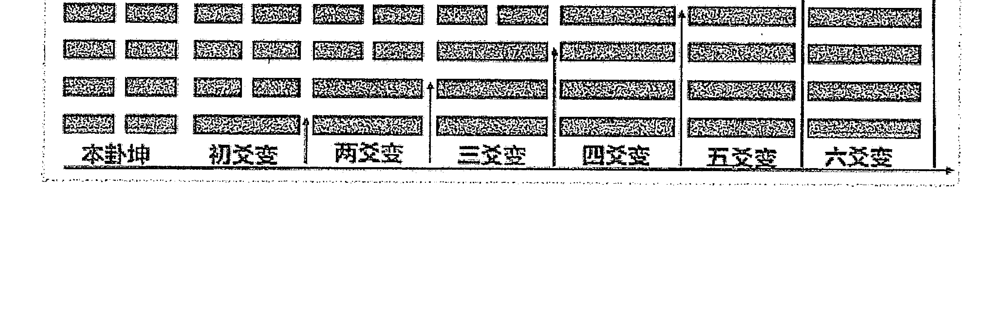

##### （二）阳极生阴

阳极生阴是阴极生阳的一个逆向思维，我们再从《周易·乾卦☰》阳极生阴把卦象逆推回去。

《乾卦☰》的初九爻变，一阴生成，初九阳爻变初六阴爻，就变成了天风《姤卦䷫》，代表夏季阴历的五月；

《姤卦䷫》的九二爻再变，二阴成双，九二阳爻变六二阴爻，就变成了天山《遁卦䷠》，代表夏季阴历的六月；

《遁卦䷠》的九三爻再变，三阴三阳平衡，九三阳爻变六三阴爻，就变成了天地《否卦䷋》，代表秋季阴历的七月；

《否卦䷋》的九四爻再变，四阴生成，九四阳爻变六四阴爻，就变成了风地《观卦䷓》，代表秋季阴历的八月；

《观卦䷓》的九五爻再变，五阴成象，九五阳爻变六五阴爻，就变成了山地《剥卦䷖》，代表秋季阴历的九月；

《剥卦䷖》的上九爻再变，六爻全变阴爻，上九阳爻变上六阴爻，就变成了地上地下《坤卦䷁》，代表冬季阴历的十月。

岐下周原地区有句俗话说：“女大十八变，越变越好看。”这个卦爻变化非常的有趣，就是这样通过六个爻位阳与阴的逐一互变，使一个六个爻阳刚十足的《乾卦☰》又变成了六个爻阴柔俱全的《坤卦䷁》（见下图所示），月令从五月走到了十月，又一次完成了“自强不息”的阳刚向“厚德载物”的阴柔转化的渐变过程。

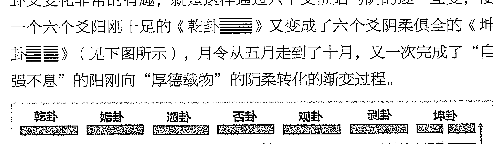

通过以上十二个步骤，《坤卦䷁》因爻变转化为《乾卦☰》，再通过《乾卦☰》的爻变转化成《坤卦☷》的变化过程。我们用朴素唯物辩证法理论进行归纳整理，可以从中得出一个结论叫作阴阳互变规律，或者叫质量互变规律。再引申一点也可以叫阴阳互通，即阴卦通阳，阳卦通阴是也，这个完全符合唯物辩证法的能量守恒定律。总结归纳出了比较科学的规律，然后我们再联系“十二消息卦”所代表的月令，就可以从《乾卦☰》和《坤卦☷》的变化中找到“十二消息卦”与阴历的每一个月令之间形成的一一对应关系。

冬至过后阳气逐渐生成，所以从《坤卦☷》开始，《复卦䷗》一阳始生，我们把《乾卦☰》的初九爻定为阴历十一（子）月；《临卦䷒》两阳生成，再把《乾卦☰》的九二爻定为阴历十二（丑）月；《泰卦䷊》三阳开泰，就把《乾卦☰》的九三爻定为阴历正（寅）月；《大壮卦䷡》四阳生成，再把《乾卦☰》的九四爻定为阴历二（卯）月；《夬卦䷪》五阳生成，再将《乾卦☰》的九五爻定为阴历三（辰）月；《乾卦☰》六阳至极，最后把《乾卦☰》的上六爻定为阴历四（巳）月（见下坤卦变乾卦示意图）。

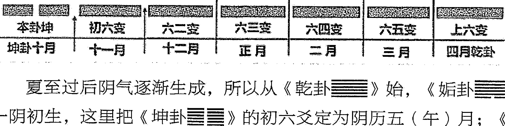

夏至过后阴气逐渐生成，所以从《乾卦☰》始，《姤卦䷫》一阴初生，这里把《坤卦☷》的初六爻定为阴历五（午）月；《遁卦䷠》二阴生成，再把《坤卦☷》的六二爻定为阴历六（未）月；《否卦䷋》三阴生成，再把《坤卦☷》的六三爻定为阴历七（申）月；《观卦䷓》四阴生成，再把《坤卦☷》的六四爻定为阴历八（酉）月；《剥卦䷖》五阴生成，再把《坤卦䷁》的六五爻定为阴历九（戌）月；《坤卦䷁》六阴至极，所以，最后就把《坤卦䷁》的上六爻定为阴历十（亥）月。这个推理结果证明，阴历一年的十二个月与《乾卦䷀》《坤卦䷁》有着一一对应的内在联系（见下乾卦变坤卦示意图）。

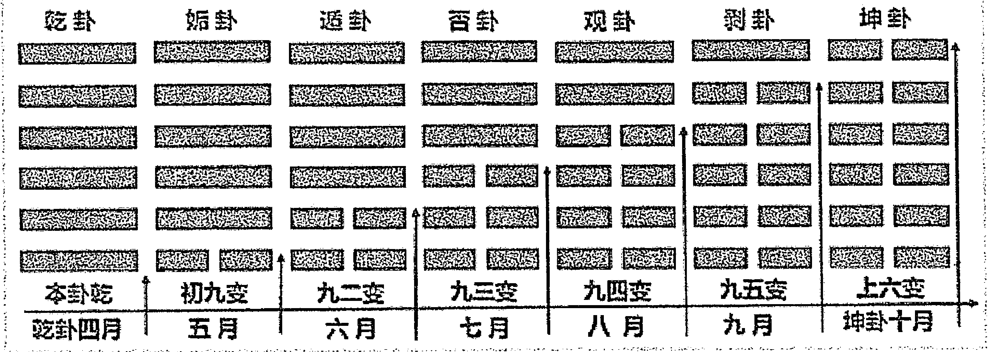

因为《乾卦䷀》为阳，占据春夏，《坤卦䷁》为阴占据秋冬。然后我们把上面这两张大图进行压缩整理一下，就会发现《乾卦䷀》和《坤卦䷁》的六个爻位分别与一年十二个月挂上了钩，它们之间有一个一一对应的关系。即《乾卦䷀》的初九爻对应阴历十一月，九二爻对应阴历十二月，九三爻对应阴历正月，九四爻对应阴历二月，九五爻对应阴历三月，上九爻对应阴历四月。而《坤卦䷁》的初六爻对应阴历五月，六二爻对应阴历六月，六三爻对应阴历七月，六四爻对应阴历八月，六五爻对应阴历九月，上六爻对应阴历十月（见右图所示）。通过这么复杂的推理变化，我们就解决了月令与卦爻一一对应的第一个“时间窗口”问题。

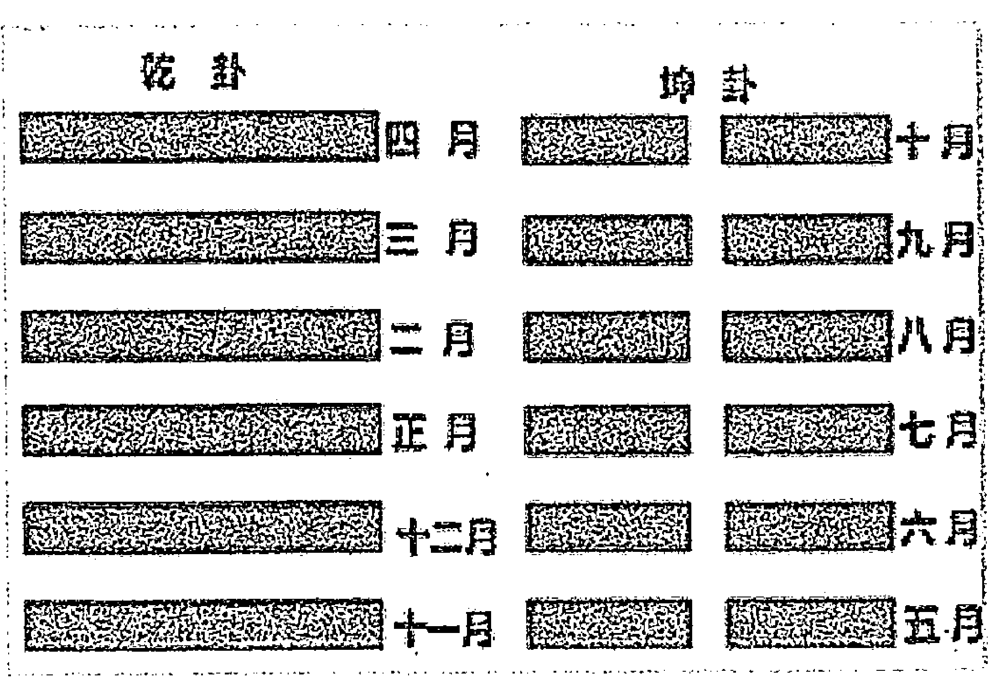

#### 三、月令与时间窗口

通过卦爻与月令的研究推理，我们需要确定的“时间窗口”有两个点：一个是月令的“时间窗口”；一个是日期的“时间窗口”。

##### （一）月令的“时间窗口”

根据以上推导的《乾卦䷀》与《坤卦䷁》之间与十二个月的对应关系。著者根据六爻卦的初爻与四爻、二爻与五爻、三爻与上爻这三组卦爻阴阳对应关系，总结出了三组一年十二个月的循环与六爻卦爻位之间的对应关系，并推演出了《梅花易数》预测中解决月令对应卦爻的“时间窗口”问题。

- 第一组：《乾卦䷀》初九爻十一月对应九四爻二月，《坤卦䷁》初六爻五月对应六四爻八月，这是第一组初爻与四爻对应的关系。
- 第二组：《乾卦䷀》九二爻十二月对应九五爻三月，《坤卦䷁》六二爻六月对应六五爻九月，这是第二组二爻与五爻对应的关系。
- 第三组：《乾卦䷀》九三爻正月对应上九爻四月，《坤卦䷁》六三爻七月对应上六爻十月，这是三爻与六爻对应的关系（见上图：月令时间窗口对照表）。

###### 月令时间窗口对照表

| 对应组合 | 时间窗口（月） | 对应关系 |
| :--- | :--- | :--- |
| 第一组 | 十一、二、五、八 | 初爻与四爻 |
| 第二组 | 十二、三、六、九 | 二爻与五爻 |
| 第三组 | 一、四、七、十 | 三爻与六爻 |

以上推理出来的这三组数字，第一组：十一月，二月，五月，八月；第二组：十二月，三月，六月，九月；第三组：正月，四月，七月，十月，它们预示着时间与空间变化中二者有着奇妙的联系。

这就如同我们给这台预测计算机编制了一个新的操作程序，即对卦爻做出定义性的规定。此为著者所要告诉大家的“月令时间窗口”。

那么，创立了月令时间窗口，在实际预测中，究竟如何去应用这个“月令时间窗口”呢？下面给大家演示两个卦例。

##### 例一、即时起卦（时间区间属农历十一月至来年四月）

得本卦天水《讼卦☰》，九四爻动，震（☳）象，外卦为用卦（指的是要预测的事或人），内卦为体卦（指的是问卦的人），用卦在外卦，体卦在内卦，这叫体用得位。天水《讼卦☰》九四爻动，得变卦风水《涣卦☴》。本卦九四爻动爻对应农历二月，应爻对应农历十一月，变卦六四爻对应农历八月，应爻对应农历五月。那么，本卦与变卦的时间窗口合起来就是：农历的十一月、二月、五月、八月。（见右上：讼卦变涣卦图）。

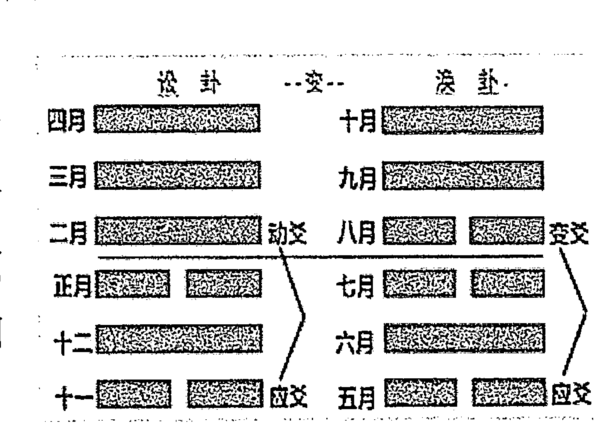

著者分析预测时一般按本卦的动爻说事情，动爻在九四爻对应农历二月，预示着某一件事应在二月这个时间窗口兑现，由于九四爻向下与初六爻相呼应，那么，此事应该在去年农历十一月就开始酝酿了，今年农历二月很可能解决。要不然就会往后顺延，快则应在农历五月，慢则农历八月才会有确定的结果。如果这是预测一桩面临分手的问题婚姻。预测分析如下：

- 1. 本卦天水《讼卦☰》，乾金生坎水，用生体之象，看上去主人能从中得到收获。
- 2. 变卦风水《涣卦☴》，坎水生巽木，体生用之象，实际可能是主人反倒要损失。
- 3. 卦象应该是遇到一个得理不让人对手，《讼卦☰》是先起诉离婚，后对簿公堂。
- 4. 卦象先吉后凶，得不偿失，《涣卦☴》主散，属劳燕分飞人财两空的悲惨结局。
- 5. 双方解决问题的时间窗口：农历十一月、二月、五月、八月。

如此而已，就这么根据卦象轻松分析的预测结果，仅供大家参考。

##### 例二、即时起卦（时间区间属农历十一月至来年四月）

得本卦天泽《履卦䷉》，六三爻动，三为离（☲）象，内卦为用卦，用卦指要问的事或人；外卦为体卦，体指的是问卦之人。动爻在内卦，此卦视作体用不得其位。变卦为八纯卦《乾卦䷀》。本卦六三爻对应农历正月，向上应在上九爻对应农历四月，变卦的九三爻对应农历七月，向上应在上九爻对应农历十月。如果是预测一个出走未归的人在外是否安全？什么时间能回来？（见下“履卦与乾卦”图）。预测分析如下：

一、本卦天泽《履卦䷉》，乾金见兑金，体用比和之象；变卦为《乾卦䷀》，乾上乾下，体用比和之象，预示此人在外人身安全，绝对没有性命之忧。

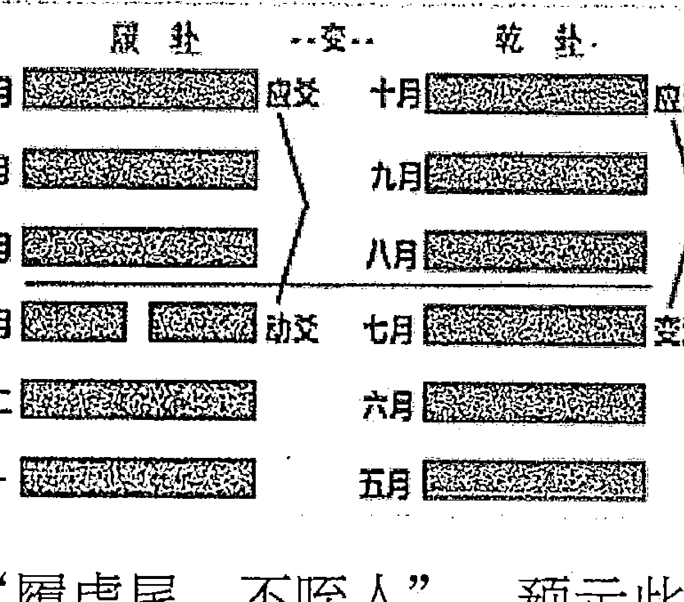

二、本卦与变卦全是乾金兑金，卦象满盘金象，《履卦䷉》卦辞：“履虎尾，不咥人”，预示此人在外虽没有灾难，但目前可能在经济上遇到了比较大的麻烦。

三、外卦与内卦全部为兑（☱）象与乾（☰）象，方向为正西和西北方位。如果以宝鸡为中心，此人应该在西偏西北方位的甘肃兰州一带。

四、卦象六三爻动，三为离（☲）象，为中女、为马、为南方、为牢狱，预示此人目前人身不自由，但是在他居住的南方有一个属马的中年女士可以帮助他渡过难关。

五、根据本卦与变卦看，解决问题的时间窗口：农历正月、四月、七月、十月。

以上是根据卦象一个粗略的分析预测，仅供大家学习“月令时间窗口”时参考。

《梅花易数》预测时一般拿本卦的动爻说事情，如果是正月预测，动爻应在农历正月，就是说要问的这件事情当下的农历正月就有消息，慢则农历四月就有结果。要不然就会有一个较长的调整期，要等到下半年农历七月才有眉目，弄不好还要等到农历十月才会有最终结果。就这个卦例来说，因为本卦与变卦皆为比和，应该是一件先凶后吉，皆大欢喜的好事情。开始“履虎尾，不咥人”，先历凶险，尔后“君子以自强不息”，出现趋吉避凶之象也，这在预测中视为吉祥之兆。

## 第四节　节气与时间窗口

第三节我们介绍了月令与时间窗口，本节主要讲节气与时间窗口。大家都知道，节气是农历纪年中划分月的一个单位，一个节气是十五天，每个月是两个节气，这个涉及天文知识。太阳与月亮是地球上的人用肉眼能看见的两个个头最大的宇宙天体。宇宙起始形成，太阳从核裂变的那一瞬间开始，就一直源源不断地向宇宙输送光能和热能，地球上有了太阳源源不断送来的光和热能量，渐渐地就有了微生物，日久天长就有生命诞生。太阳对地球而言我们人类应该是最大的受益者。

#### 一、时与间的划分

实际上太阳本身并没有“时长”与“时间”，“时”与“间”是地球上的人根据自己看到的实际情形划分出来的一个个计算单位。由于地球的公转和自转原因，使得生活在地球上的人类，发现太阳每天从东方升起，从西方落下，人们就把太阳一升一落出现的白天和黑夜定为 1 天，这就形成一个天的“时”与“间”概念。“时”为长度，“间”为单位，1 天代表一个单位“时长”，1 天 12 个时辰、24 个小时是一天划出的“间”。月亮是地球的卫星，它自然的绕着地球自转，转 1 圈 30 天，正好是 1 个月。

月亮从月初的晦——月中的盈——月末的亏，这样圆缺变化一次约为 30 天，而且很稳定，后来人们就把这个时间段叫做 1 个月，月是单位间，30天是月的时长。1天的时长古人将它划为12个时辰，有了钟表计时之后1个时辰是2小时，1天就是十二个时辰，等于24小时，这里1天是单位间，十二个时辰和24小时是时长。1个月的时长为30天，可以划为上、中、下三旬。一旬为10天，10天可划分2个候，1候为5天。一个月可分为三旬，也可分为6候。一年是一个单位“时长”，分为春、夏、秋、冬4个季度，也可以分为12个月，季与月都是“间”。这些都是地球上的人类在生活中，根据宇宙天体的自然规律，人为刻意的给本来就没有“时长”的太阳和月亮划上了一个个的“间”，好多个人为因素划分的“时”与“间”加起来就称作“时间”。

茫茫宇宙，朗朗乾坤。阴历天干地支纪年把一年（间）分为12个月（时长），即农历正（寅）月、二（卯）月、三（辰）月、四（巳）月、五（午）月、六（未）月、七（申）月、八（酉）月、九（戌）月、十（亥）月、十一（子）月，十二（丑）月。前边说过，阴历的每个月在《周易·十二消息卦》中都有一个固定的卦来代表。一年分为春、夏、秋、冬4个季，每1季分为3个月。每1个月分为30天，30天正好是农历二十四节气中的2个节气；1个月30天也可分为上、中、下3个旬。每1旬又可分为2个候，每1候为5天，1个月可分为6个候，1年360天可以划分为72个候，这些都是生活中人们耳熟能详的常识。

#### 二、月相划候的理论依据

任何一门学问，必须有其科学的理论依据。东汉魏伯阳在《周易·参同契》中说：“月节有五六，经纬奉日使。坎（☵）戊月精，离（☲）己日光。三日出为爽，震（☳）庚受西方；八日兑（☱）受丁，上弦平如绳；十五乾（☰）体就，盛满甲东方；十六转受统，巽（☴）辛见平明；艮（☶）直于丙南，下弦二十三；坤（☷）乙三十日，东北丧其朋。”仔细琢磨魏伯阳的这几句话，坎（☵）象代表月亮，离（☲）象代表太阳，震（☳）代表月初三日之月，兑（☱）象代表上弦月初八日，乾（☰）象代表十五月圆，巽（☴）象代表十六日，艮（☶）象代表下弦二十三日，坤（☷）象代表月末三十日。源自于东汉魏伯阳对月亮定义性的表述，给著者研究探索“时间窗口”划分提供了很大的启示。

后来偶然的机会，在网上见到了郑悍马教授《生霸死霸再考及月相正名》的文章，更使著者眼前为之一亮，茅塞顿开。真实验证了古人的一句话：“踏破铁鞋无觅处，得来全不费工夫”。原来在3000多年前的周代，人们就将一个月分为初吉、既望、既生霸、既死霸、旁生霸、旁死霸六个名称，也就是人为的把一个月划为六个时间段。

郑悍马教授研究了大量的青铜器铭文，通过农历换算，找到了初吉代表每月农历的二十九、三十、初一、初二（4天）月相的依据；既生霸代表每月农历的初六、初七、初八、初九、初十（5天）月相的依据；既望代表每月农历的十五、十六、十七、十八（4天）月相的依据；既死霸代表每月农历的二十三、二十四（2天）月相的依据。这些都是郑教授通过查证、核实换算的周人用天干地支纪日的具体日期，为每月中的15天时间找到了与农历月相名词对应的具体日子。郑教授没有发现“旁生霸”和“旁死霸”代表什么月相，从上述资料中发现每个月还有初三、初四、初五、十一、十二、十三、十四，十九、二十、二十一、二十二、二十五、二十六、二十七、二十八，这15天没有月相可依。不过这个在著者来看已经不要紧了，只要找到了第一步确切史料，那我们就可以推演出剩余部分的月相对应关系。

受此启发，著者将这6个时段定义到了卦象之上，算是给自己创立的三爻卦与月相找到了一个历史依据，这个发现令人着实的振奋啊！遗憾的是无缘当面向郑悍马教授致谢。

#### 三、干支纪月的“六分法”

基于上述历史资料和著者长期以来的推测验证和琢磨思考。因为古时候对月相的划分有一种“四分法”之说，著者想这可能是与四象：少阳、老阳、少阴、老阴有关，但“四分法”在预测实际应用方面有一定的难度，在预测实战中不好操作。每个月分为六个时段，就与农历一个节气分三候有了联系。这就又回到我们前面讲述的一候时段为 5 天，一个月分为 6 个候（段），全月 30 天（小月在月底自行微调）。这样三爻八经卦除过坎（☵）象代表月亮，离（☲）象代表太阳，其它的 6 个三爻卦象：震（☳）、兑（☱）、乾（☰）、巽（☴）、艮（☶）、坤（☷）我们就可以根据《周易·参同契》中的表述，把它们与月相联系在一起，运用到预测实践之中。这个月相划分就像现在人给计算机编制程序，解决了象数预测中的千古难题。著者认为我们大家应该为此鼓之舞之，共同庆贺这一飞跃性的历史创新成就。

扑克牌·梅花易

#### 四、月相决定时间窗口

古人通常把月令叫作月建，这是人们实际预测中判断分析卦气旺衰的关键。那么，节气与候，与《梅花易数》预测又有那些内在联系呢？我们下面就讨论这个问题。

为了研究预测判断应期的准确性，在《梅花易研究精要》一书中，著者通过翻阅大量历史资料，查阅求证上古时期对阴历月的六分法，即“初吉，既生霸，既望，既死霸，旁生霸、旁死霸”，将它们与月象对照研究发现。把每个月 30 天分为 6 个候，然后按照月亮的朔望，为每一候在三爻八经卦中各取了一个月象。即《震》（☳）、《兑》（☱）、《乾》（☰）、《巽》（☴）、《艮》（☶）、《坤》（☷）六个卦象，每一个卦象对应每月中的某一个五天的时间段。著者将其总结归纳成：三爻八经卦与月象时间对照表。

##### 三爻八经卦与月象时间对照表

| 分类 | 第一象 | 第二象 | 第三象 | 第四象 | 第五象 | 第六象 |
| :--- | :--- | :--- | :--- | :--- | :--- | :--- |
| 卦象 | 震象 | 兑象 | 乾象 | 巽象 | 艮象 | 坤象 |
| 符号 | ☳ | ☱ | ☰ | ☴ | ☶ | ☷ |
| 时间 | 3至7 | 8至12 | 13至17 | 18至22 | 23至27 | 28至2 |
| 旺朔 | 初生 | 上弦 | 望月 | 既望 | 下弦 | 晦朔 |

> 注：由于表格小，汉字放不下，表中时间一栏用数学数字代表农历时间段

> 《后汉书·律历志下》曰：“晦朔合离，斗建移辰，谓之月。”人们习惯把《周易》八经卦叫三爻卦，著者把八经卦中与月象有关的三爻卦定义为：《震》（☳）、《兑》（☱）、《乾》（☰）、《巽》（☴）、《艮》（☶）、《坤》（☷）。它们分别代表每个月月亮的初生、上弦、望月、既望、下弦、晦朔六种变化状态。每一种形状对应一个卦象，每一个卦象代表5天，著者把它叫作一个候。这就是《梅花易研究精要》一书的精华与发现，所谓的定应期的秘籍——时间窗口。

- 震（☳）卦一阳生于两阴之下，代表每月初三——初七日，为初生的月象；
- 兑（☱）卦二阳生于一阴下，代表每月初八——十二日，为上弦的月象；
- 乾（☰）卦三阳生为月满，代表十三日——十七日，为月亮最圆时的望月象。
- 巽（☴）卦一阴生于两阳之下，代表每月十八——二十二日，为既望的月象；
- 艮（☶）卦两阴生于一阳之下，代表每月二十三——二十七日，为下弦的月象；
- 坤（☷）卦三阴生晦朔，代表每月二十八——下月初二日为朔，无月亮的象。

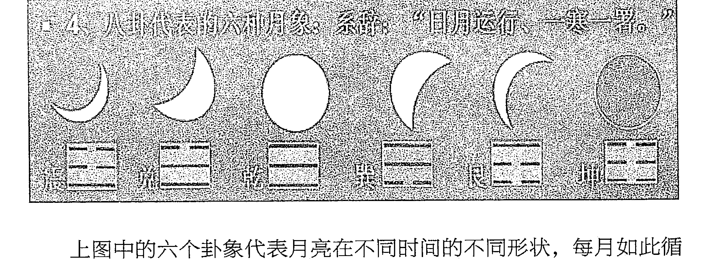

上图中的六个卦象代表月亮在不同时间的不同形状，每月如此循环往复，如遇小月可以在月末进行调整。但是还要考虑一个阴历闰月。的问题。阴历三年一闰，五年两闰，闰月如何分配调整当月的这个“候”，是一个比较困难的事情，只能靠我们自己去琢磨，做到灵活处理。遇到这种情况，著者认为要借鉴《四柱八字》中的原理参考当月的农历二十四节气与月令的时间差来处置。将应期作以适当调整，这个棘手问题就会迎刃而解。

根据著者多年来研究《梅花易数》预测的经验和体会，以上这六个三爻卦代表的月象，在《梅花易研究精要》一书中有介绍，它对于判断应期有着非常重要的作用，可以大大提高预测“应期时间”的准确率，而且精准度也是神奇的超准。

#### 五、应期的实战应用

世界上任何事情都不是一成不变的，《梅花易数》预测本来就是一个动态的学说，研究者必须具备跳跃思维，才能灵活掌握应用。人类面对的天气突变，地震水灾，等不可抗力的自然灾害等无时不在变化之中，随时都会引发变卦的事情发生。所以，有变化就有变卦，变卦了应期自然就会变化。实战预测中“应期”因故提前或者推迟属于客观因素的存在，下面我们举例从两个方面说明。

##### （一）应期时间提前

例一、本卦风泽《中孚卦》。

本卦的起卦总数：50 ÷ 6 = 8 …… 2，商数 8 为偶数，余数为 2，从初九爻向上数 2，九二爻变动，得变卦风雷《益卦》；按传统方法，互卦为山雷《颐卦》（见下图）。

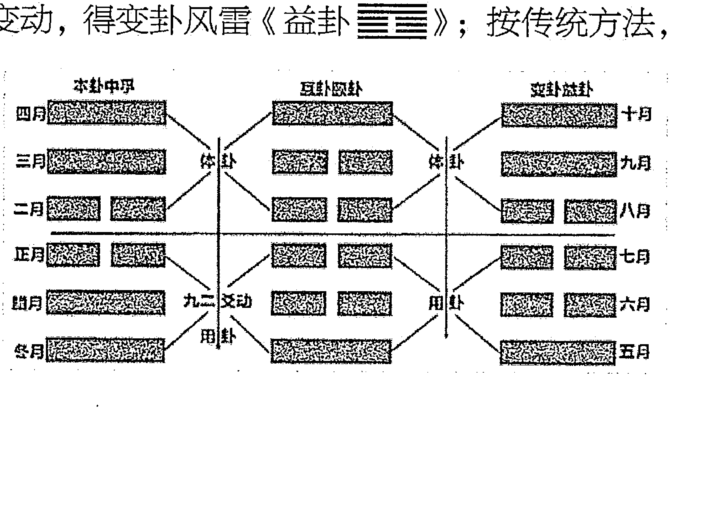

为用卦，卦象为兑（☱）象，卦象对应的具体“应期”为农历腊（丑）月的初八——十二日这5日之间。因为九二爻发动，得变卦《益卦☳☴》，用卦由兑（☱）象变为震（☳）象，说明“应期”时间变化提前到了农历腊（丑）月的初三——初七这5日之间；假如说这个兑（☱）象变为了乾（☰）象，则说明“应期”时间变化要推迟到腊（丑）月十三——十七这5日之间，这是按照传统方法预测应期提前或推后的卦例。

例二、抽扑克牌起卦：梅花7、红桃7、红桃8、红桃7、红桃7、黑桃8。

按扑克牌起卦：梅花7、红桃7、红桃8组成兑（☱）象，内卦取兑（☱）象；红桃7、红桃7、黑桃8组成兑（☱）象，外卦取兑（☱）象，得本卦八纯卦《兑卦☱☱》；本卦六爻安静无变爻是一个静卦，按卦象数字之和找用爻：22+22=44÷6=7……2，商数7为奇数，余数为2，从上六爻向下数2，九五爻红桃7为用爻，外卦兑（☱）象变震（☳）象，得变卦雷泽《归妹卦☳☱》，卦象体用得位，掐头去尾，得互卦风火《家人卦☴☲》。

八经卦兑卦

| 梅7少阴 | 红7老阳 | 红8老阳 | 红7老阳 | 红7老阳 | 黑8老阴 |
| :--- | :--- | :--- | :--- | :--- | :--- |
| [梅花7图案] | [红桃7图案] | [红桃8图案] | [红桃7图案] | [红桃7图案] | [黑桃8图案] |
| 初9爻少阴 | 九2爻少阳 | 六3爻少阴 | 九4爻少阳 | 九5爻少阳 | 上6爻少阴 |

应期分析：本卦八纯卦《兑卦☱☱》九五爻红桃7老阳为用爻对应农历三月和九月，向下应在九二爻红桃7老阳对应农历六月和腊月。外卦兑（☱）象对应的时间段为农历三月或者九月的初八至十二日这5日之间。卦象兑（☱）象变震（☳）象，对应的时间段为农历三月或者九月的初三至初七这5日之间。因为卦象由兑（☱）象变为震（☳）象，应期时间就从该应期月的初八至十二日提前到初三至初七之间，这是扑克牌起卦预测应期时间提前的卦例。

##### （二）应期时间推后

例一、本卦泽雷《随卦☰☴》。

本卦的起卦总数：43÷6=7余1，商数7为奇数，余数为1，上六爻变动，6为坎（☵）象，得变卦天雷《无妄卦☰☳》；本卦体用得位，互卦为风山《渐卦☴☶》。

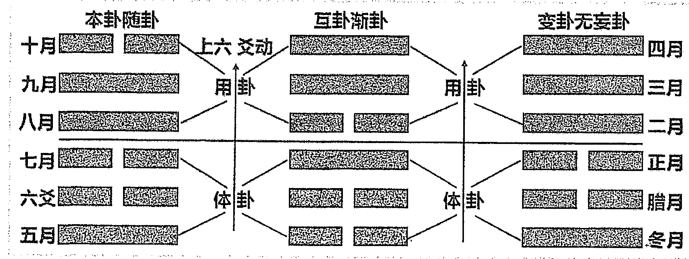

应期分析：本卦泽雷《随卦☰☴》，兑上震下，上六爻为用卦，对应农历十月和四月，向下应在九三爻对应农历七月和正月，兑（☱）象对应十月和四月的初八——十二日这5日之间；兑（☱）象变为了乾（☰）象，说明时间变化可能推迟到十月和四月的十三——十七这5日之间，这是按照传统方法判定应期时间推后的卦例。

例二、抽扑克牌起卦：黑桃7、红桃7、红桃7、方片6、黑桃6、黑桃8。

按扑克牌起卦：黑桃7、红桃7、红桃7组成乾（☰）象，内卦取乾（☰）象；方片6、黑桃6、黑桃8组成坤（☷）象，外卦取坤（☷）象，得本卦地天《泰卦☷☰》；六四爻为方片6老阴、六五爻为黑桃6老阴、两个老阴爻同动，外卦坤（☷）象变兑（☱）象，变卦泽天《夬卦☱☰》；内卦三个爻安静不动。卦象总数：21+20=41÷6=6……5，商数6为偶数，余数为5，从初九爻向上数5个数，六五爻黑桃6为用爻。本卦体用得位，互卦雷泽《归妹卦》，覆卦和复原卦不用。

###### 地天泰卦变泽天夬卦
| 黑7老阴 | 红7老阳 | 红7老阳 | 方6少阴 | 黑6老阴 | 黑8老阴 |
| :--- | :--- | :--- | :--- | :--- | :--- |
| 7♠️ | 7♥️ | 7♥️ | 6♦️ | 6♠️ | 8♠️ |
| 初九爻少阳 | 九二爻少阳 | 九三爻少阳 | 六四爻老阴 | 六五爻老阴 | 上六爻少阴 |

应期分析：本卦地天《泰卦》变卦泽天《夬卦》；卦中六五爻黑桃6老阴为用爻对应农历三月和九月，六五爻黑桃6老阴向下应在九二爻红桃7老阳对应农历六月和十二月。由于外卦六四爻方片6老阴和六五爻为黑桃6老阴两个爻同动，外卦由坤（☷）象变为兑（☱）象，坤（☷）象对应当月的二十八日至下个月初二这5日之间，兑（☱）象对应当月的初八至十二日这5日之间。应期时间就从该应期月的二十八日至下个月初二推后到下个月初八至十二日这5日之间，这是扑克牌起卦预测应期时间推后的卦例。

采用铜钱摇卦或者扑克牌起卦时，卦象的变爻可能较多，这个应期时间窗口就要根据用爻相邻卦爻的变化灵活把握。比如刚才这个卦，外卦六四爻方片6老阴和六五爻为黑桃6老阴两个爻同动，外卦为用卦为坤（☷）象本来卦象中反映的具体时间是在当月二十八——下月的初二这5日之间；卦象由坤（☷）象变为兑（☱）象应期时间就推后到下个月初八——十二这5日之间。

如果是坤（☷）象的初爻动，卦象就变为震（☳）象，为初生的月象，说明时间要推后到下个月的初三——初七日；也可能六四爻、六五爻同动，卦象就变为了兑（☱）象，为上弦的月象，说明时间变化会推迟到下个月的初八——十二这5日之间；也可能六四、六五、上六爻三个爻全动，卦象由坤（☷）象就变为乾（☰）象，为月亮最圆时的望月象，说明时间变化可能推后到下个月的十三——十七这5日之间。

如果坤（䷁）象上六爻动，卦象变为艮（䷳）象时，为下弦的月象，说明时间变化可能提前到了当月的二十三——二十七日这5日之间；再如果说坤（䷁）象上六爻、六五爻动，卦象变为巽（䷸）象，为既望的月象，说明时间变化可能提前到了当月的十八——二十二日。其它卦象依此类推，大家可以根据卦例，下去以后认真地去体验。

## 第五节 时辰与时间窗口

上面我们讲述了“月令与时间窗口”解决了六爻卦每一爻与农历一年十二个月的对应关系，让大家学会了怎么寻找月令时间窗口；讲述了“节气与时间窗口”解决了八经卦与每个月六个月象的对应关系，将应期划定在某一个的某一日至某一日的5天之内，大大提高了预测应期的准确判断。

为了更细致、更准确把握预测应期，第五节我们主要讨论每一天的十二时辰：子、丑、寅、卯、辰、巳、午、未、申、酉、戌、亥，与八经卦：乾（䷀）、巽（䷸）、艮（䷳）、坤（䷁）、震（䷲）、兑（䷹）之间如何对应和划分的问题。这也是著者在研究解决了月令、节气与时间窗口之后一直思考的问题。

大家都知道每天有十二个时辰，一个时辰是2个小时，十二时辰就等于二十四小时。晚上子时阴气至极为老阴，白天午时阳气至极为老阳，我们首先把坤（䷁）象老阴与子时（23点至1点）对应，把乾（䷀）象老阳与午时（11点至13点）对应，这样就找到太极阴阳的两个极点。然后我们再人为的去具体划分。把晚上亥时至丑时（22点至凌晨2点）划归坤（䷁）象（老阴）；把凌晨丑时至卯时（2点至早上6点）划归震（䷲）象（少阳）；把早上卯时至巳时（6点至上午10点）划归兑（䷹）象（少阴）；把上午巳时至未时（10点至下午14点）划归乾（䷀）象（老阳）；把下午未时至酉时（14点至傍晚18点）划归巽（䷸）象（少阴）；把傍晚酉时至亥时（18点至晚上22点）划归艮（☶）象（少阳）。这样就把每一天十二个时辰（24小时）划分为坤（☷）、震（☳）、兑（☱）、乾（☰）、巽（☴）、艮（☶）六个卦象（见：三爻卦与时辰对应表），这样就解决了“时辰时间窗口”。

三爻卦与时辰时间对应表
| 晚上 | 亥时至丑时 | 22点至2点 | 坤（☷）象 | 老阴 |
| 凌晨 | 丑时至卯时 | 2点至6点 | 震（☳）象 | 少阳 |
| 早上 | 卯时至巳时 | 6点至10点 | 兑（☱）象 | 少阴 |
| 上午 | 巳时至未时 | 10点至14点 | 乾（☰）象 | 老阳 |
| 下午 | 未时至酉时 | 14点至18点 | 巽（☴）象 | 少阴 |
| 傍晚 | 酉时至亥时 | 18点至22点 | 艮（☶）象 | 少阳 |

那么这个“时辰时间窗口”到底究竟怎样在实际预测中准确使用呢？下面我们给大家分享两个预测卦例。

例一、剖腹产生女孩子

2012年2月28日（农历二月初七）18时30分。朋友的女儿生孩子，预产期临近，他们非常担心，食不甘味，寝不安席。用三枚一角钱的硬币摇卦预测。

按传统方法摇卦，得：少阳7、少阳7、少阳7、老阳9、少阳7、少阳7，得本卦八纯卦《乾卦䷀》；九四爻变动，四为震（☳）象，得变卦风天《小畜卦䷈》。本卦体用得位，互卦为八纯卦《乾卦䷀》，覆卦和复原卦不用。

推测分析：以体为母亲，以用为孩子。

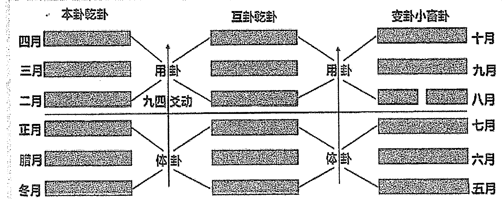

1、本卦八纯卦《乾卦☰》，互卦为八纯卦《乾卦☰》，乾上乾下，乾金见乾金，卦象体用比和，平和顺畅之象，只是卦中阳气过足，说明大家都期望能生个男孩。

2、变卦风天《小畜卦☰》，巽上乾下，乾金克巽木，体克用之象，生产期大致要推后5天左右。农历二月木旺当令，金处绝地，母克子的力量不大。卦象九三爻、六四爻、九五爻互为离（☲）象，为孕妇大肚子；九二爻、九三爻、六四爻互为兑（☱）象，为金、为刀具刃器之象，可能要剖腹生产。

3、确定时间窗口：
    +   (1) 月令时间窗口：卦象九四爻动，农历二月、五月、八月、十一月；
    (2) 节气时间窗口：外卦乾（☰）象代表每月十三至十七之间，变卦巽（☴）象代表每月十八至二十二之间，预示生产日期要退后大约5天时间；
    (3) 时辰时间窗口：外卦乾（☰）象代表上午10时至下午14时之间。变巽（☴）象代表下午14时至下午18时之间，九四爻动，时间推后4小时，下午18时左右孩子出生。

5、外卦乾（☰）金变巽（☴）木，变卦互见巽（☴）象、离（☲）象、兑（☱）象。古人云：阴卦阳多，阳卦阴多。卦气属阴，生女孩子，剖腹产可能极大，但母子绝对平安。

预测完了，我对他说：“你就放心等待吧，可能生一个千金，母子绝对平安。”

事后应验：

7天之后，2012年3月6日（农历二月十二）下午18点35分，对方说女婿来电话了，说：（女儿）剖腹生产，母女平安。朋友高兴地说：你太神了！

例二、预测老人去世

2019年11月13日（农历十月十七日）下午16时08分，朋友说：老人年事已高，求测有无危险。按时间起卦，数字：12，10，17，9。

数字起卦：12+10+17=39÷8=4……7，7为艮（☶）象，外卦取艮（☶）象，39+9=48÷8=6，坤（☷）象，内卦取坤（☷）象，艮上坤下，得本卦《剥卦䷖》。48÷6=8，上九爻为用爻（传统方法），得变卦八纯卦《坤卦䷁》，卦象体用得位，互卦《坤卦䷁》。

推测分析：
    +   1. 本卦《剥卦䷖》，互卦和变卦都是《坤卦䷁》三个卦都是体用比和之象，初看上去老人身体好像没有什么大病。
    2. 卦象全盘土，当下农历十月水旺当令，土处死地，艮（☶）象为土、为止，坤（☷）象为土、为腹，都代表人体的消化系统，预示老人的消化器官严重衰竭，可能已经无法进食，恐怕凶多吉少。
    3. 时间窗口：分三步推测。
        （1）上九爻动，正好应在农历十月，向下倒看应在农历七月，向前看应在明年正月，这是月令时间窗口。
        （2）本卦的外卦艮（☶）象变坤（☷）象，艮（☶）象代表每个月的二十三日至二十七日，坤（☷）象代表每个月的二十八至下个月初二，预示老人本来十月二十三至二十七日之间可能有危险，但是可以推后到十月二十八至十一月初二，这是节气时间窗口；
        （3）艮（☶）象对应的时辰时间是傍晚18时至22时，变坤（☷）象对应的时辰时间是22时至凌晨2时，两个时辰交接的时段21时至23时之间有危险，这是时辰时间窗口。

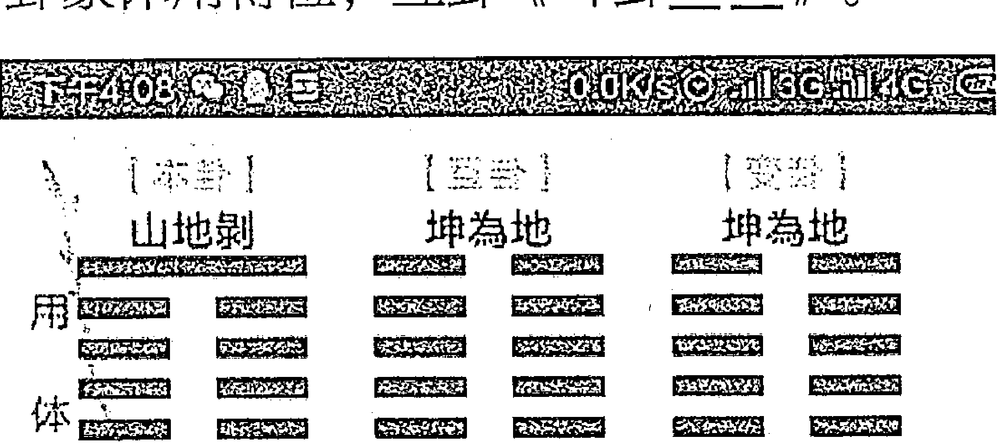

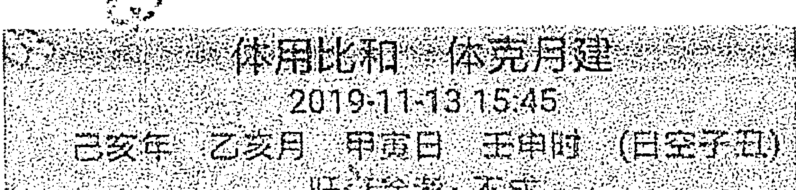

事后应验：

此事十二天之后的 2019 年 11 月 24 日（农历十月二十八）晚上 21 时 55 分老人在家中安详的去世。

以上是时辰时间窗口的介绍，这个看起来容易，实际预测中很不好把握，需要在日常预测实战中进一步认真体悟和完善总结。

第三章分享的内容是著者经过近四十年长期实践观察，琢磨总结出来的精华经验之谈，大半辈子的研究心血，也算是独家秘籍，有朋友建议暂且保留，不可轻易公之于世。思前想后，做学问还是要与大家沟通交流，在此毫不吝啬地把它竹筒倒豆子般的公开告诉给读者，请大家在《扑克牌·梅花易》象数预测实战中进一步验证，但愿能起到抛砖引玉的作用。

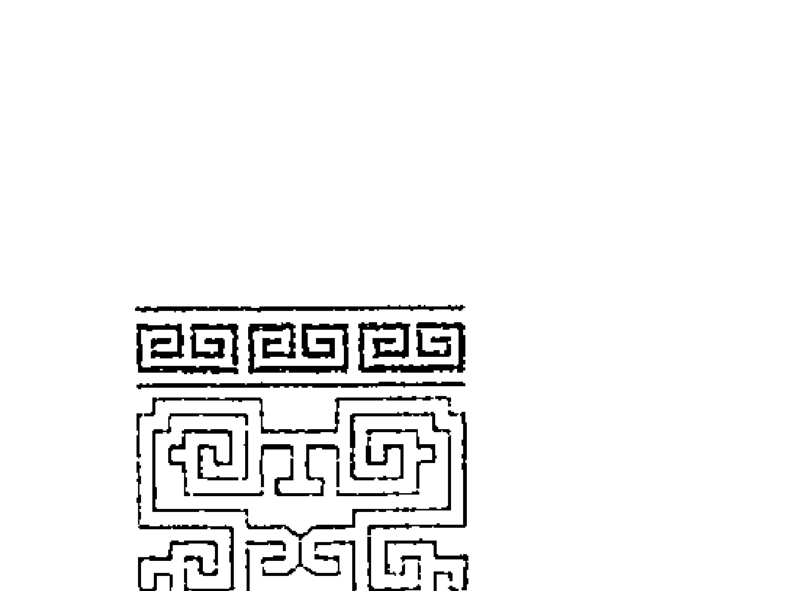

## 第四章 扑克牌与梅花易

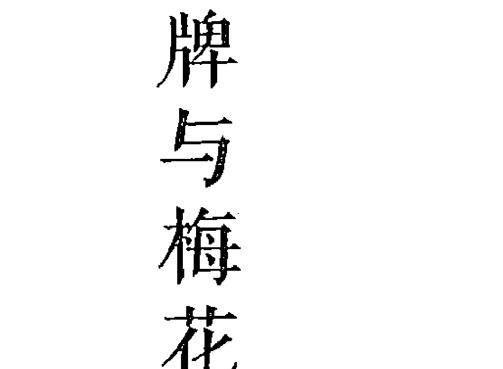

## 第一节 何谓占卜筮仪之法

据史书记载，古人初始《周易·六十四卦》的起卦预测方式是采用一种能通天地之神灵的蓍草棒卜卦。蓍草一般生长在河滩沼泽之地，精选枝干挺直的蓍草50根，将其截成约一尺长的蓍草棒，将它们装在一个用绸缎制作的锦囊中，放置于用上等木材制作的盒子里，专门用来占卜起卦之用。占卜起卦时按照一套严密的办法，占卜三次蓍草所得的单数和策数，才能得出一个爻位，一共占卜十八次而成一卦。这个卜卦方法宋人朱熹在《周易本义·筮仪》中有详尽的介绍。

#### 一、朱熹的《筮仪》

择地洁处为蓍室，南户，置床于室中央。床大约长五尺，广三尺，勿太近壁。蓍五十茎，韬以缥帛，贮以皂囊，纳之椟中，置于床北。椟以竹筒或坚木或布漆为之，圆径三寸，如蓍之长，半为底，半为盖，下别为台函之，使不偃仆。设木格于椟南，居床二分之北。格以横木板为之，高一尺，长竟床，当中为两大刻，相距一尺。大刻之西为三小刻，相距各五寸许，下施横足，侧立案上。置香炉一于格南，香合一于炉南，日炷香致敬。

将筮，则洒扫拂拭，涤砚一注水，及笔一，墨一，黄漆板一，于炉东。东上，筮者齐洁衣冠，北面，盥手焚香致敬。筮者北面，见《仪礼》。若使人筮，则主人焚香毕，少退，北向立，筮者进立于床前少西，南向受命。主人直述所占之事，筮者许诺，主人右还西向立，筮者右还北向立。两手奉椟盖，置于格南炉北，出蓍于椟，去囊解韬，置于椟东。合五十策，两手执之，熏于炉上。此后所用蓍策之数，其说并见《启蒙》。

> > 命之曰：“假尔泰筮有常，假尔泰筮有常，某官姓名，今以某事云云，未知可否。爱质所疑于神于灵，吉凶得失，悔吝忱虞，惟尔有神，尚明告之。”

乃以右手取一策，反于椟中，而以左右手中分四十九策，置格之左右两大刻。此第一营，所谓分而为二以象两者也。

次以左手取左大刻之策执之，而以右手取右大刻之一策，挂于左手之小指间。此第二营，所谓挂一以象三者也。

次以右手四揲左手之策。揲，食列反。此第三营之半，所谓揲之以四以象四时者也。

次归其所余之策，或一、或二、或三、或四，而扐之左手无名指间。此第四营之半，所谓归奇于扐以象闰者也。

次以右手反过揲之策于左大刻，遂取右大刻之策执之，而以左手四揲之。此第三营之半。

次归其所余之策如前，而扐之左手中指之间。此第四营之半，所谓再扐以象再闰者也。

一变所余之策，左一则右必三，左二则右亦二，左三则右必一，左四则右亦四。通挂一之策，不五则九。五以一其四而为奇，九以两其四而为偶，奇者三而偶者一也。

次以右手反过揲之策于右大刻，而合左手一挂二扐之策，置于格上第一小刻。以东为上，后放此，是为一变。

再以两手取左右大刻之蓍合之。或四十四策或四十策。复四营如第一变之仪，而置其挂扐之策于格上第二小刻，是为二变。

二变所余之策，左一则右必二，左二则右必一，左三则右必四，左四则右必三。通挂一之策，不四则八。四以一其四而为奇，八以两其四而为偶，奇偶各得四之二焉。

又再取左右大刻之蓍合之。或四十策，或三十六策，或三十二策。复四营如第二变之仪，而置其挂扐之策于格上第三小刻，是为三变。

三变余策，与二变同。三变既毕，乃视其三变所得挂扐过揲之策，而画其爻于版。

挂扐之数，五四为奇，九八为偶。挂扐三奇合十三策，则过揲三十六策而为老阳，其画为“□”，所谓重也。挂扐两奇一耦合十七策，则过揲三十二策而为少阴，其画为“--”，所谓拆也。挂扐两偶一奇，合二十一策，则过揲二十八策而为少阳，其画为“—”，所谓单也。挂扐三耦合二十五策，则过揲二十四策而为老阴，其画为“×”，所谓交也。

如是每三变而成爻。第一，第四，第七，第十，第十三，第十六，凡六变并同，但第二变以下不命，而但用四十九蓍耳。第二，第五，第八，第十一，第十四，第十七，凡六变亦同。第三，第六，第九，第十二，第十五，第十八，凡六变亦同。

凡十有八变而成卦，乃考其卦之变，而占其事之吉凶。卦变别有图，说见《启蒙》。

礼毕，韬蓍袭之以囊，入椟加盖，收笔砚墨版，再焚香致敬而退。如使人筮则主人焚香，揖筮者而退。

以上是宋人朱熹在《周易本义》中介绍的我国最古老的占卜起卦方法，从中可以看出，古人把《周易·六十四卦》预测看作是非常神圣的事情，所以，起卦必须有一套神圣规范的仪式。这让现在人来看确实是很繁琐的事情，也许是因为此方法过于麻烦的原因，从汉代开始占卜方法就简化为铜钱摇卦。

#### 二、铜钱摇卦法

据史料记载铜钱摇卦法始于汉代的京房。汉代易学大师京房将古人的蓍草棒卜卦改为用三枚内方外圆的铜钱摇卦。以铜钱的背面为阳，阳数为3，若摇出三个背面，3×3数字为9，视作老阳；以铜钱的字面为阴，阴数为2，如摇出三个字面，3×2数字为6，视作老阴；摇得一个背面（3）、两个字面（2×2=4），数字之和为7，视作少阳；摇得一个字面（2）、两个背面（3×2=6），数字之和为8，视作少阴，这就是汉代的铜钱摇卦法的数字规定。这个问题有好多人就没有弄清楚，摇卦时以铜钱的字面为阳，以背为阴，阴阳相去甚远，就闹出了专业性的大笑话。

除过以上两种古老正统的起卦方法，当然还有宋代易学大师邵雍发现“两雀争斗坠地”而创立的《梅花易数》，以及明代之后发明的数字起卦，按年、月、日、时的时间数字起卦，还有用汉字的笔画数起卦，以及用颜色、看到的物象、听到的声音等，各式各样的起卦方式，本书第二章第一节已经介绍，此处不再赘述。

#### 三、扑克牌起卦法

著者在本书的第二章中讲到“扑克牌与四象的联系”。这里就给大家详细介绍《周易·六十四卦》的起卦方式采用扑克牌中“红桃、方片、梅花、黑桃”四种牌（见右图）的6、7、8、9共16张牌起卦，并依此起卦推演《周易·六十四卦》。这个起卦方法是著者经过长期探索，琢磨推演出来的一种全新的起卦预测方法，可以说是《周易·六十四卦》象数预测的一个创新方法。

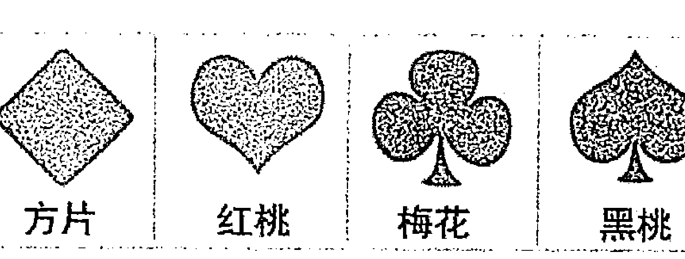

> 牛顿说：“如果我比其他的人看得远些，那是因为我站在巨人的肩膀上”。

17世纪著名科学家牛顿发现一个苹果从树上自然落地，由此人类发现了“万有引力”。18世纪英国人詹姆斯·瓦特发现水壶中的水一旦烧开，壶盖子就不停地被反复掀起，由此发明蒸汽机，推动了第一次工业革命。所以牛顿说：“如果我比其他的人看得远些，那是因为我站在巨人的肩膀上”。著者不敢自比瓦特、牛顿、京房、邵雍等先贤大师，但是，源于生活的一个偶然，著者发现了扑克牌与《周易·六十四卦》象数预测之间的联系，顿生创立这个扑克牌起卦方法。近年来，著者使用这个预测方法给好多外地的朋友通过网络义务预测婚姻、事业、就业、寻人、经济纠纷等事宜，准确率之高，效果之神奇，受到了朋友们的高度赞赏，这种起卦方法亦适合用于（六十四卦）《六爻预测》。

此方法的特点是可以为《周易·六十四卦》六爻卦的每一个爻位增加四种不同的信息，大大拓展了《周易·六十四卦》象数预测的信息面。2015年10月由陕西省周易研究会举办的“第三届世界周易高峰论坛”在西安召开，著者有幸在此次大会上向中外专家学者介绍了《巧用扑克演‘梅花’》学术论文，得到与会专家学者，以及周易文化爱好者的一致赞同。经过这几年的认真总结和反复印证，现将此起卦方法和象数推理的依据介绍给大家，以资易学同道、预测文化爱好者共同研究探讨，从中能得到更大的受益和启示，更好地将中国《周易》预测文化发扬光大。

## 第二节 扑克牌定义命名

有一位伟人曾经说过：“宇宙在我心中，我心即是宇宙。细微至发梢，宏大至天地”换句话说就是“法无定法，我心为法。其小无内，其大无外”是也。明代著名的思想家、哲学家王阳明先生说：“知行工夫，本不可离。真知即所以为行，不行不足以谓之知。”所以，我们一旦发现了“道”就要积极地去践行，在生活中验证体会，并加以总结概括，拓展我们对自然界认知的层面，将自己成功的经验介绍分享给大家，此为习易之人的天职本分。

著者所谓的定义命名？顾名思义，就是给这个扑克牌推演《六十四卦》的方法做出一个程序化的定义。也就是将扑克牌所代表的象数预测符号做出阴阳定位，四季划分，以及它们包含的内容和形式做出一定的分类界定，为我们后续讲述《扑克牌·梅花易》预测方法做好铺垫性的基础工作。

#### 一、选择扑克牌

首先我们找一撮娱乐用的普通扑克牌，最好是一撮新牌。将其中的：红桃、方片、梅花、黑桃4种牌的6、7、8、9，共16张牌全部挑选出来备用。然后按照著者创立的要求起卦，分析预测。（见下扑克牌四象图）

##### 扑克牌起卦法四象中的16张牌四象图

|      | 老阴 | 少阳 | 少阴 | 老阳 |
|------|------|------|------|------|
| 少阳 | 梅花6（老阴） | 梅花7（少阳） | 梅花8（少阴） | 梅花9（老阳） |
| 老阴 | 红桃6（老阴） | 红桃7（少阳） | 红桃8（少阴） | 红桃9（老阳） |
| 老阳 | 黑桃6（老阴） | 黑桃7（少阳） | 黑桃8（少阴） | 黑桃9（老阳） |
| 少阴 | 方片6（老阴） | 方片7（少阳） | 方片8（少阴） | 方片9（老阳） |

在以上图表中，著者从纵向和横向层面对“红桃、方片、梅花、黑桃”四种扑克牌从“四象”的角度做出了明确的界定。就是说“少阳7、老阳9、少阴8、老阴6”中各自在卦气层面又多了一层“少阳 = 方片、老阳 = 红桃、少阴 = 梅花、老阴 = 黑桃”的双重组合关系。比如说：方片8，方片为少阳，8为少阴，这个“方片8”就集少阴少阳于一身；再比如：黑桃9，黑桃为老阴，9为老阳，所以这个“黑桃9”也同时具备老阴老阳的属性。

#### 二、符号信息对接

挑选好了“红桃、方片、梅花、黑桃”四种16张扑克牌，我们必须在信息面上将它们作以符号扩展。让这四种扑克牌与一年四季中的：“春、夏、秋、冬”；与《周易》中的四象：“少阳、老阳、少阴、老阴”；与《周易·乾卦》所讲的：“元、亨、利、贞”；与事物的：“生、老、病、死”；与一天当中的：“早晨、正午、傍晚、子夜”之间建立一个一一对应关系。

著者根据多年的实践经验，得出一个结论性的规定，用“方片”代表“少阳”对应“春季”；用“红桃”代表“老阳”对应“夏季”；用“梅花”代表“少阴”对应“秋季”；用“黑桃”代表“老阴”对应“冬季”。下面著者用两张图来说明阴阳二气在“四象”和“四季”运行过程中的表现状态。

第一张：“四象图”。它表示的是事物（或事态）在“立体层面”上下循环的状态（见右四象图）。就是从春季少阳（方片）之气开始上行，逐渐上升为夏季阳刚的老阳（红桃）之气，夏至阴气始生，然后再慢慢地拐头向下进入秋季肃杀的少阴（梅花）之气，再从少阴渐渐地下降进入冬季严酷的老阴（黑桃）之气，形成一个完整的循环之后，然后通过冬季的老阴（黑桃）之气的蛰伏。冬至阴气绝，阳气开始生，再拐头向上慢慢地进入又一个春季的少阳（方片）之气，依次年复一年，日复一日、永无停止的上下往复的循环变化。强调一下，我们这里谈及的问题属于“卦气”论的范畴，也代表阴阳二气在一年四季当中一个立体循环往复的运转状态。

#### 第二张：“四季图”。

它表示的是事物（或事态）在平面状态下顺时针旋转的循环运行过程（见右四季图）。少阳（方片）从春季开始，跟随月建的时令节奏，从春分的少阳（方片）逐渐过渡到夏季的老阳（红桃），然后再从夏季的夏至开始，慢慢地进入秋季的少阴（梅花），再从秋分的少阴（梅花）渐渐地进入冬季的老阴（黑桃），然后经过冬季的冬至老阴（黑桃）的蛰伏时期。此后再慢慢地复苏重生，进入来年的又一个春季的少阳（方片），依次顺时针旋转，不停的往复循环运行变化。需要说明的是，这个图表述的是阴阳二气在平面上与一年四季的“春、夏、秋、冬”有关的旋转运行状态。

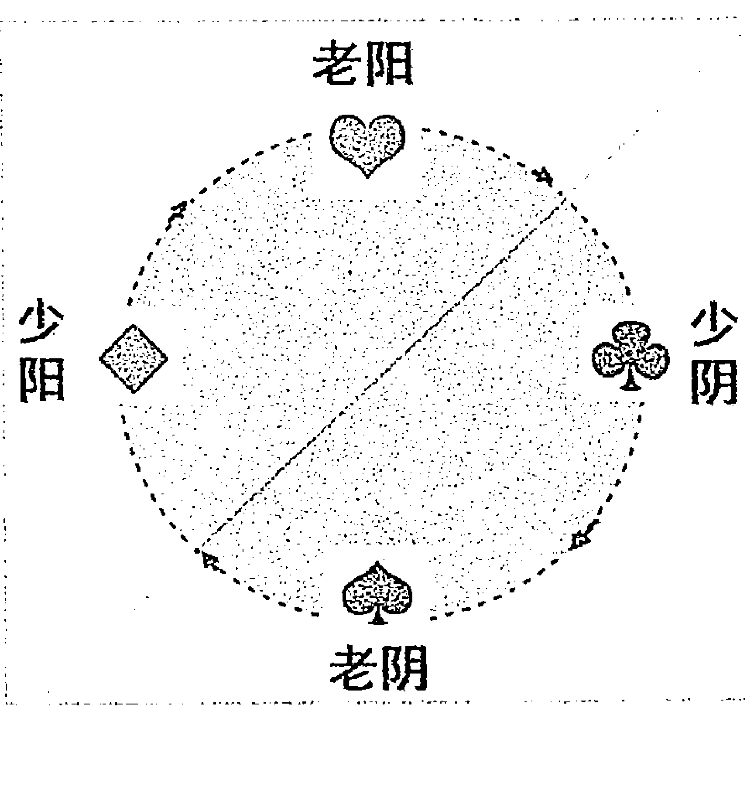

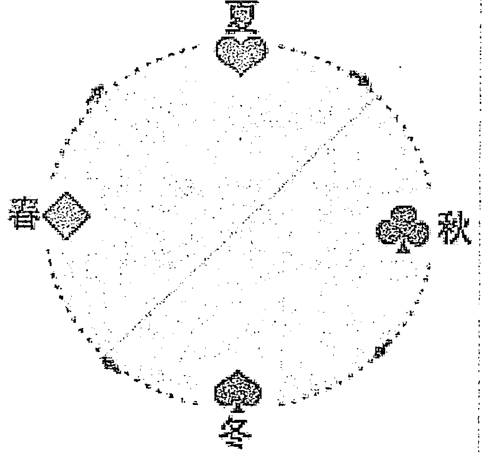

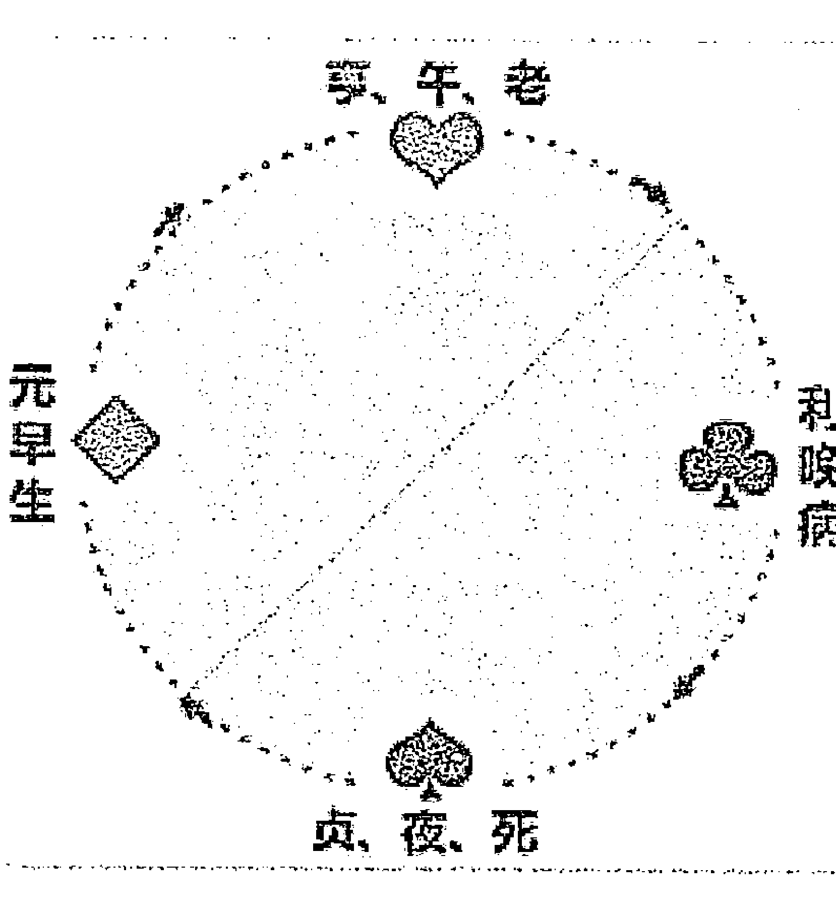

我们把这两个“四象图”和“四季图”综合起来看，就会发现阴阳二气的运行是在立体层面和平面状态下相辅相成的旋转运行状态，而不是一个单纯的循环变化，或者说是一个简单的“变爻”问题。因为我们这种方法是给每一个六爻卦的每一个爻增加四种：“少阳7、老阳9、少阴8、老阴6”信息的理论根据。著者提出的这个问题，对于初学象数预测的人来说可能有点晦涩或者难解其意，目的是为了让易学象数研究者拓展一下自己想问题、做分析、看卦象的视野和思维，从立体空间和平面视觉，春夏秋冬，早午晚夜，元亨利贞，生老病死等层面上去仔细体悟这个四象表述的卦象上扬、减缓、下行，或者加速变化的综合思维（见左上图所示）。

#### 三、定义命名

著者根据扑克牌的四种不同花色，把“方片”定义为“少阳”，“红桃”定义为“老阳”，“梅花”定义为“少阴”，“黑桃”定义为“老阴”。大家一定要看清楚，这是著者人为作出的规定。有了这个规定，我们传统的四象：“少阳7，老阳9，少阴8，老阴6”中就又增加了几种可供参考的信息，那就是：少阳 = 方片 = 春季 = 早晨 = 元 = 生；老阳 = 红桃 = 夏季 = 正午 = 亨 = 老；少阴 = 梅花 = 秋季 = 傍晚 = 利 = 病；老阴 = 黑桃 = 冬季 = 子夜 = 贞 = 死（见右四象四季关系图所示）。

方红梅黑四种牌与四象、四季关系

| 方片 | 红桃 | 梅花 | 黑桃 |
|------|------|------|------|
| 少阳 | 老阳 | 少阴 | 老阴 |
| 春季 | 夏季 | 秋季 | 冬季 |
| 早晨 | 正午 | 傍晚 | 子夜 |
| 元   | 亨   | 利   | 贞   |
| 生   | 老   | 病   | 死   |

据此，可以推理想象出以下四种情形。

-   1. 少阳 = 方片，其中包含着老阴方片6，少阳方片7，少阴方片8，老阳方片9。
-   2. 老阳 = 红桃，其中包含着老阴红桃6，少阳红桃7，少阴红桃8，老阳红桃9。
-   3. 少阴 = 梅花，其中包含着老阴梅花6，少阳梅花7，少阴梅花8，老阳梅花9。
-   4. 老阴 = 黑桃，其中包含着老阴黑桃6，少阳黑桃7，少阴黑桃8，老阳黑桃9。

## 扑克牌·梅花易

为什么要这样规定呢？因为我们生活在五彩缤纷、瞬息多变的现实社会，大多时候看似很有规律、很符合常理的事情，往往会出现很不规律、不符合常理的各种不同表现，也就是所谓的“常态”与“非常态”表象。好多事情的表面下往往隐藏着吉中带凶，或者凶中有吉的隐性秘密，而且这些都是不为人知的信息。所以，我们就要不断完善这个预测信息系统，尽量使其接近完备周全，尽可能地让人们在预测推理中掌握和发现潜在的吉凶。下面我们分四种情况分析讨论这个问题。

第一种：老阳9。古人规定9是“老阳”，卦爻逢9时阳爻是要变阴爻的。当这个9是“红桃”时，说明它这个“老阳”正处于阳刚鼎盛的阶段；当这个9是“方片”时，说明它这个“老阳”正处于从“少阳”刚过渡到“老阳”之初的状态，后续还有一定的上升潜力；当这个9是“梅花”时，说明这个“老阳”已经如日过午、处于“少阴”拐头向下运行的阶段；当这个9是“黑桃”时，则说明这个“老阳”已经进入“老阴”加速下行的状态。

第二种：少阳7。古人规定7是“少阳”，卦爻逢7为阳爻是不变爻的。当这个7是“红桃”时，说明它这个“少阳”正在向上接近“老阳”的刚健时期；当这个7是“方片”时，说明它这个“少阳”正好处于“少阳”青春年少的状态，后续还有不错的发展空间；当这个7是“梅花”时，说明这个“少阳”下面萌生了“少阴”消极的下行因素；当这个7是“黑桃”时，则说明这个“少阳”下面隐藏着“老阴”的晦气，已进入低谷运行的蛰伏状态。

第三种：少阴8。古人规定8是“少阴”，卦爻逢8为阴爻是不变爻的。当这个8是“红桃”时，说明它这个“少阴”下蕴藏着“老阳”的刚健之气；当这个8是“方片”时，说明它这个“少阴”正好处于“少阳”青春年少的和谐状态，后续还有不错的表现；当这个8是“梅花”时，说明这个“少阴”下面出现了“少阴”消极阻滞的不利因素；当这个8是“黑桃”时，则说明这个“少阴”下面隐藏着“老阴”巨大的晦气，“屋漏又逢连阴雨”，属于阴上加阴，正处在进入低谷运行晦气状态。

第四种：老阴 6。古人规定 6 是“老阴”，卦爻逢 6 时阴爻是要变阳爻的。当这个6是“红桃”时，说明它这个“老阴”正好处在与“老阳”的和谐刚健时期；当这个6是“方片”时，说明它这个“老阴”中有“少阳”青春年少的老来俏状态，后续会延缓下行的时间和速度；当这个6是“梅花”时，说明这个本身晦气的“老阴”下面存在着“少阴”消极的不利因素；当这个6是“黑桃”时，则说明这个非常晦气的“老阴”下面还隐藏着“老阴”的晦气，晦气加晦气，老阴加老阴，雪上加霜，已进入最最低谷运行的倒霉状态。

以上是对老阳9、少阳7、老阴6、少阴8在遇到红桃、方片、梅花、黑桃四种扑克牌的情况下组成的各种因素并存的吉凶状态，如果读者能在实际预测断卦中细心的去体悟其中的道理所在，必然会有大的收获。

## 第三节 抽取信息与起卦、装卦

> > 宋人朱熹在《周易本义·筮仪》一章中讲得很清楚，预测者在用蓍草棒卜卦求测时，必须要沐浴静气，全神贯注，集中思想意念，要有发自内心对神灵的一种敬重，心中一定要想着目前求测的重大事情，要以十分虔诚的态度求卦预测，否则，求卦预测结果就会大相径庭，或者会出现不灵验。实际上古人是讲在预测的时候一定要专心致志，千万不可三心二意，而不是真有什么神仙站在身后给你暗示。

#### 一、怎样抽取信息起卦

用 16 张扑克牌抽牌求卦预测者，事先最好用清水洗一洗自己的手，集中自己的思想意念，心中一定要想着自己要求测的某一件事情。将准备好的 16 张扑克牌反复洗一洗，从中任意抽出第一张牌，记录下来，作为初爻的卦象；然后再将抽出的牌放回去，重新洗牌后，任意抽出第二张牌，记录下来，作为二爻的卦象；依次再将抽出的牌放回去，再洗再抽牌，任意抽出第三张牌，记录下来，作为三爻的卦象；如此重复洗牌、抽牌六次，抽出的这六张扑克牌从初爻到上爻的信息就具备了一个完整的六爻卦。重要的话说三遍。再提醒一下，每次必须从16张牌中抽牌，也就是将抽出来的牌登记一下就将它放回去，保证下一次是从16张牌中抽牌。有些人理解不了，而是将抽的牌放出来，这样就错了，下次可能从15张，或者14张牌中抽取。否则，抽取的信息就不准确。下面我们举个抽牌起卦的例子，例如：

抽出的第一张牌：红桃6，红桃属于老阳，6属于老阴；
抽出的第二张牌：黑桃8，黑桃属于老阴，8属于少阴；
抽出的第三张牌：方片8，方片属于少阳，8属于少阴；
抽出的第四张牌：梅花9，梅花属于少阴，9属于老阳；
抽出的第五张牌：红桃7，红桃属于老阳，7属于少阳；
抽出的第六张牌：黑桃7，黑桃属于老阴，7属于少阳。

然后用抽出来的这六张牌，红桃6、黑桃8、方片8、梅花9、红桃7、黑桃7，从初爻到上爻开始排列装卦。

#### 二、用抽出的扑克牌装卦

（一）阴阳定位。按照传统的卜筮起卦方法，6视作老阴，7为少阳，8为少阴、9为老阳。逢见老阴6和老阳9，本卦是阴爻的变阳爻，是阳爻的变阴爻，这个老规矩不变。用传统的《六爻》《梅花易数》预测时，可以不看四种扑克牌的花色，直接使用这种方法起卦，即可进行预测分析。

（二）抽扑克牌。以前面抽出的六张扑克牌为例：红桃6、黑桃8、方片8、梅花9、红桃7、黑桃7。第一张牌红桃6作为初六爻，第二张牌黑桃8作为六二爻，第三张牌方片8作为六三爻，第四张牌梅花9作为九四爻，第五张牌红桃7作为九五爻，第六张牌黑桃7作为上九爻，然后是从下向上依次排列卦爻。以扑克牌四种花色入卦预测，是著者新创立的一种高层次的“梅花易”预测手段。

（三）以爻取象。

用抽出来的六张牌去装卦，红桃6、黑桃8、方片8、梅花9、红桃7、黑桃7。即：第一张牌红桃6为初六爻，第二张牌黑桃8为六二爻，第三张牌方片8为六三爻，内卦红桃6、黑桃8、方片8组成坤（☷）象；第四张牌梅花9为九四爻，第五张牌红桃7为九五爻，第六张牌黑桃7为上九爻，外卦梅花9、红桃7、黑桃7组成乾（☰）象，得本卦天地《否卦䷋》（见下图）。

**天地否卦**
| 红6老阳 | 黑8老阴 | 方8少阳 | 梅9少阴 | 红7老阳 | 黑7老阴 |
| :---: | :---: | :---: | :---: | :---: | :---: |
|  |  |  |  |  |  |
| 初6爻老阴 | 六2爻少阴 | 六3爻少阴 | 九4爻老阳 | 九5爻少阳 | 上9爻少阳 |

（四）按本卦排变卦。

遵照古人传统起卦方法规定，逢老阴6、老阳9要变爻。上卦天地《否卦䷋》，本卦初六爻红桃6动，内卦由坤（☷）象变为震（☳）象，本卦的九四爻梅花9动，外卦由乾（☰）象变为巽（☴）象，本卦天地《否卦䷋》，由于初六爻红桃6与九四爻梅花9同动，变卦为风雷《益卦䷩》（见下图）。其他卦象根据变爻如同此例，此处不再细述。

**天地否卦变风雷益卦**
| 红6老阳 | 黑8老阴 | 方8少阳 | 梅9少阴 | 红7老阳 | 黑7老阴 |
| :---: | :---: | :---: | :---: | :---: | :---: |
|  |  |  |  |  |  |
| 初6爻老阴 | 六2爻少阴 | 六3爻少阴 | 九4爻老阳 | 九5爻少阳 | 上9爻少阳 |

（五）卦气分析。

我们把这四种扑克牌作为符号：红桃代表老阳，方片代表少阳，梅花代表少阴，黑桃代表老阴。卦象排好之后，要根据六个爻位中的这四种牌出现的情况来确定卦气阴阳的强与衰。继续以上卦天地否卦为例：卦中有2个红桃，1个方片，1个梅花，2个黑桃，阴（黑）占50%，阳（红）占50%，卦象中阴阳成分各占一半，这说明所得到卦象的卦气处于阴阳相互平衡的状态。

如果说六个爻全是红桃，则说明卦象纯阳，卦气十足，视为大吉状态，但不要侥幸；

如果说六个爻全是黑桃，则说明卦象阴暗，晦气至极，视为大凶状态，也不要气馁；

如果说是红多黑少，则说明卦气阳多阴少，阳盛阴衰，视为小吉状态，保持好节操；

如果说是黑多红少，则说明卦气阴多阳少，阴盛阳衰，视为不吉状态，积极去努力。

这就如同我们观察一个人的气色面貌和精神状态一样。如这个人面色红润，双目朗朗，喜笑颜开，说明此人气血畅通，身体健康，心情愉悦。如果这个人面无血色，目光呆滞，愁眉苦脸，则说明此人身体虚弱，健康欠佳，心情不爽。所以，我们将这个道理用来判断一个卦象的卦气旺衰。

如果要做一个大胆尝试，根据“天、地、人”三才和“气、流、固”三界，再用扑克牌起的六爻卦，就可以去分析预测一个人一生的运势。一般会有如下几种情况：

第一种情况：卦象呈现六爻全是红桃和方片，则说明此人一生运势很好，一路凯歌，顺风顺水。但是，人生无常，命运多舛，这样的运势毕竟是凤毛麟角，往往很少能见到。

第二种情况：卦象呈现两头黑中间红，则说明此人的运气是早年运气不佳，中年运势很好，晚年时运不济。就是所谓的两头苦中间甜是也。

第三种情况：卦象若是两头红中间黑，则说明此人的运势是年少得志，中道衰落，晚景向好。此所谓的两头甜中间苦是也。

第四种情况：卦象若是六爻全是黑桃和梅花，则说明此人一生运势不佳，少年家境贫寒，中年时运不济，老年孤独潦倒，常走背运，诸事不顺，此所谓的人生最大的不幸是也。

第五种情况：如若卦象呈现红桃、方片、梅花、黑桃，一阴一阳，均等出现，则说明此人一生小运亨通，喜忧参半，祸福均衡，也算平安人生。

著者提出的这个“阴阳卦气”之说，宋人邵雍在《梅花易数》中尚未涉及，其他预测论著也没有提到。研究象数预测的朋友一定要深刻思考“卦气”在一年四季：春、夏、秋、冬时令运转中生、旺、休、囚的道理，一旦领悟其中真意，你的断卦预测水平一定会得到飞跃性的提升。

##### （六）分析预测

确定了本卦和变卦之后，如果是按传统的“六爻预测法”分析预测，那就再按八宫卦来确定“世爻”和“应爻”，通过纳干纳支，配上六亲：兄弟、子孙、妻财、官鬼、父母。再加上六神：青龙、朱雀、白虎、玄武、螣蛇、勾陈，然后就可以预测推断所问事情的吉凶结果。

以上主要讲的是《扑克牌·六十四卦》预测中按照古人传统的六爻卦预测方法，以内卦为“体”，以外卦为“用”。传统方法是根据本卦的“动爻”来确定所得卦象的“用爻”。如果“用爻”在外卦，就以外卦为“用”，内卦为“体”，这个笔者叫做“体用得位”。如果“动爻”在内卦，“用爻”就在内卦，这时候内卦就为“用”，外卦为体，出现了“体”与“用”互反的现象，这在传统的《梅花易数》预测来说是很正常的事情。但是，著者认为道法自然，物归其位，象由数生，位有所属，这显然是不正常的“非常态”表现，所以，著者把它叫作卦象“体用不得位”。

何谓“体用不得位”我们前边已经讲过，因为它很重要，此处再重申这个话题。通俗地讲就是“体卦”和“用卦”站错了位置，就像人和人一样，甲某错站在了乙某的位置，乙某就只能站在本该属于甲某的位置了，这就出现了一个需要调整位置的时间和时空问题。如果遇到“体用不得位”的情况，著者强调一定要看本卦的“覆卦”。这个很简单，就是我们经常说的站在对方的立场上去想问题。首先是这时候切记不能看“互卦”，因为“体”和“用”站错了位置，这时候的“互卦”就不管用了；其次是“体用不得位”时要看本卦的“覆卦”，就是把卦象打个颠倒看。如本卦是天地《否卦䷋》，它的“覆卦”就是地天《泰卦䷊》；再次是看变卦要参考“复原卦”（这个在本书的第二章第四节已经介绍）。把这些因素理顺了，然后再按一年四季的月令旺相休囚，以及五行生克制化来推断分析预测结果。

#### 三、如何确定“体”和“用”

按照《梅花易数》传统之法，一般有动爻的(三爻)卦象视作为“用”。这个规定只适合用于数字起卦、时间起卦、生日起卦、字数笔画起卦时才能正确使用。“扑克牌起卦”和“铜钱摇卦”方法相近，得出来的卦象可能是一个动爻都没有的静卦；也可能是一个爻动，或者是两个爻动；或许是三个爻、四个爻、五个爻动，也有可能是六个爻全动，这时候就会遇到一个如何准确判定“体”和“用”的问题。下面就扑克牌起卦如何去确认“用爻”和“用卦”问题作以下五种详细说明。

**第一种情况：** 如果是一个、两个，或者三个动爻，动爻全在“外卦”，“内卦”无动爻，那么就可以取“外卦”为“用卦”，以“内卦”为“体卦”。这种情况，就是“体卦”和“用卦”都各自在自己本来的位置，我们把它叫作“体用得位”。

**第二种情况：** 如果是一个、两个，或者三个动爻，动爻全在“内卦”，“外卦”无动爻，这时就以“内卦”为“用卦”，以“外卦”为“体卦”。这就出现一个“体”与“用”不得其位的问题，即本来“体卦”应该在“内卦”，“用卦”在“外卦”，这时候恰恰反过来了，著者把这种情况叫作“体用不得位”。

##### 第三种情况：

如果“内卦”和“外卦”都有动爻，那就用数字来确定“用爻”。如：前边的卦例：天地《否卦䷋》。
本卦《否卦䷋》内卦的初六爻和外卦九四爻各有一个动爻，我们就将六个爻的卦爻数字加起来除以 6（即 22+23=45÷6=7……3），以余数来确定用爻，余数为 3。按照古人传统的方法，那就从初爻一、二、三向上数 3 个数，六三爻为“用爻”，“内卦”为“用卦”，“外卦”就是“体卦”；假如余数为 5，那就从初爻一、二、三、四、五向上数 5 个数，九五爻为“用爻”，“外卦”就为“用卦”，“内卦”为“体卦”。但是，著者认为这个是很不确切的，因为数字分为阴阳，那么必须要考虑商数是奇数和偶数的区别。古人云：“奇数为阳，偶数为阴。”既然数有阴阳之分，那我们就得考虑这个阴阳怎样来区分？根据著者多年的实践经验，这种情况下必须考虑卦爻总数除以 6 的这个“商”是“奇数”还是“偶数”的问题。前边讲过，这里不展开讲述。

> 奇数为阳，偶数为阴。

###### 天地否卦变风雷益卦

| 红6老阳 | 黑8老阴 | 方8少阳 | 梅9少阴 | 红7老阳 | 黑7老阴 |
| :---: | :---: | :---: | :---: | :---: | :---: |
|  |  |  |  |  |  |
| 初6爻老阴 | 六2爻少阴 | 六3爻少阴 | 九4爻老阴 | 九5爻少阳 | 上9爻少阳 |

##### 第四种情况：

著者发现古人传统的用余数确定“用爻”时，往往忽略了“商”是“奇数”还是“偶数”的问题。如果六个爻数字加起来除以 6，商数为“奇数”，必须从上爻向下数余数确定“用爻”，以“用爻”确定“用卦”。如果六个爻数字加起来除以 6，商数为“偶数”，那就从初爻向上数余数来确定“用爻”，以“用爻”确定“用卦”。
例如：上卦的本卦天地《否卦䷋》；变卦风雷《益卦䷩》，内卦和外卦各有一个爻动，我们无法判定用爻。这时候我们就用卦象数字之和除以6来确定用爻。即22+23=45÷6=7……3，商数7为“奇数”，余数为3，那就要从上九爻向下一、二、三数3个数，九四爻梅花9为“用爻”，外卦的乾（☰）象就是“用卦”，内卦的坤（☷）象就是“体卦”，得到的卦象体用得位。假如这个商数为6，6是“偶数”，余数是3，那就从初爻向上一、二、三数3个数，内卦的六三爻方片8就是“用爻”，内卦的坤（☷）象就是“用卦”，外卦的乾（☰）象就是“体卦”，卦象体用不得位。然后，我们再按照《梅花易数》的规定来分析预测结果。

这个问题有一点绕，也有点复杂。怎样才能把这个复杂的问题搞清楚？还是用上边例子：本卦天地《否卦䷋》，变卦风雷《益卦䷩》，六个爻数字为：22+23=45÷6=7……3。（参考扑克牌卦象图）

###### 天地否卦变风雷益卦
| 红6老阳 | 黑8老阴 | 方8少阳 | 梅9少阴 | 红7老阴 | 黑7老阳 |
| :---: | :---: | :---: | :---: | :---: | :---: |
| 红桃6 (♠️) | 黑桃8 (♠️) | 方块8 (♦️) | 梅花9 (♣️) | 红桃7 (♥️) | 黑桃7 (♠️) |
| 初6爻老阴 | 六2爻少阴 | 六3爻少阴 | 九4爻老阳 | 九5爻少阳 | 上9爻少阳 |

著者认为，确定“用爻”应该是把卦数的总数从初爻向上依次按“爻位”数数，数上去六个爻到上爻算1次，数字是6；再从上爻依次数到初爻算2次，数字就是12；再从初爻数上去到上爻算3次，数字就是18；再从上爻依次数下来到初爻算4次，数字就是24；再从初爻数上去到上爻算5次，数字就是30，再从上爻依次数下来到初爻算6次，数字就是36；再从初爻数上去到上爻算7次，数字就是42，再从上爻一、二、三，数到九四爻（梅花9）就数完了，正好就等于这个45÷6=（商）7……3。第7次数到上爻再一、二、三数3个数下来，这不正好停在九四爻的位置吗？如果这个商是偶数6，卦爻总数数到36时正好停在初爻，从初爻一、二、三依次向上数3个数，“用爻”就排在六三爻方片8。但是，这个卦例商是奇数7，“用爻”就落在九四爻梅花9的位置。

这样我们就得出两个结论：

1. 当卦爻总数之和除以6，商是“奇数”时，从本卦的上爻依次向下数余数，来确定“用爻”。
2. 如果卦爻总数之和除以6，商是“偶数”时，从本卦的初爻依次向上数余数，来确定“用爻”。

以上是著者的一家之言，依照上边的卦例，究竟应该把六三爻作为“用爻”？还是把九四爻作为“用爻”？大家可以自己去体验。下面再给大家介绍两个实际案例作为参考。

例一：2019（己亥）年9月2日农历八月初四14点26分（未时），著者的私家车在市内一个丁字路口与一辆三轮车剐蹭，按发生事故的实际时间起卦预测维修费用。为了说明问题，这里按两种情况分析预测。

##### 第一种：手机梅花易软件排盘（传统方法）起卦预测分析：

手机即时排盘，得本卦八纯卦《坤卦䷁》，互卦《坤卦䷁》，六二爻动，（卦象体用不得位）变卦地水《师卦䷆》（见右手机截图）。

###### 推断分析：

1. 本卦八纯卦《坤卦䷁》，互卦《坤卦䷁》，坤（䷁）象为和顺，两个卦都是体用比和之象，说明此次事故没有造成大的损失。卦数：8，8。
2. 六二爻变为用爻，用卦在内卦，卦象体用不得位。变卦地水《师卦䷆》，坤土克坎水，体克用之象，预示事故的主要责任是车主自己撞上对方的三轮车。卦数：6，8。

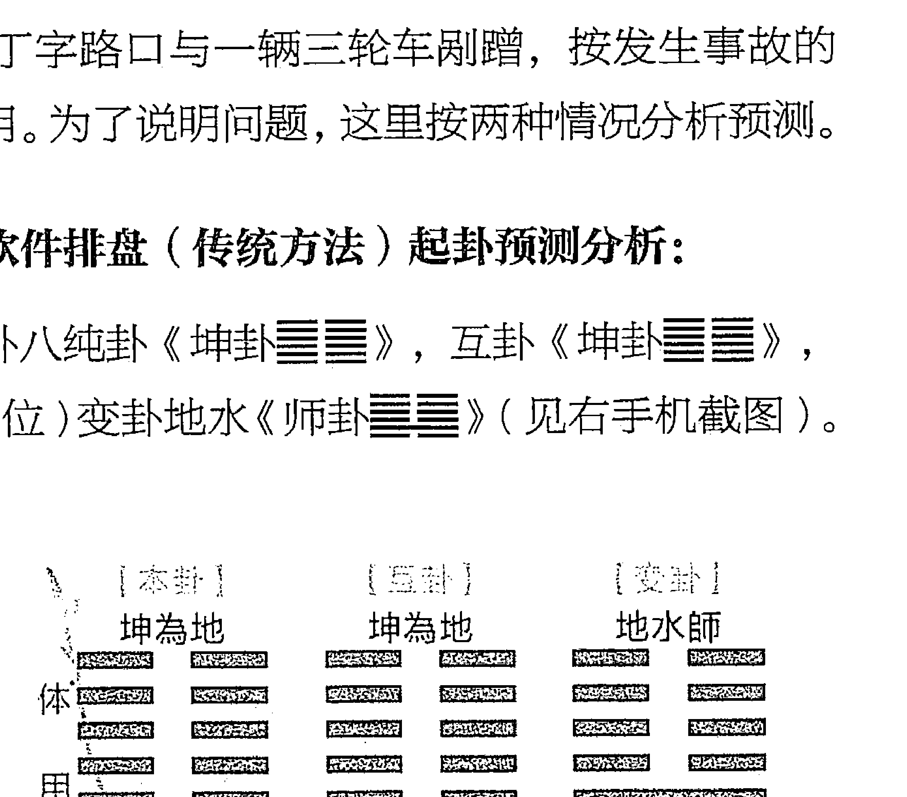

3. 六二爻动，2为兑（☱）象，为金，为西方，为少女，为口舌之争，中间的其他费用数字为2，车上可能有一位伶牙俐齿的少年女子。事故者双方现场要发生口舌之争。
4. 修车总费用为：88+68=156÷2=78，减去预计中间费用数字2，预计修车费用大数为7，小数为6。如果以百元估算，实际修理费用约为760元。

##### 第二种：用手工按时间数字起卦（按著者的方法）预测分析：

2019己亥年（12），八月（8），初四（4），未时（8），得数字：12，8，4，8。按数字起卦：12+8+4=24÷8=3。外卦取坤（☷）象，24+8=32÷8=4，内卦取坤（☷）象。得本卦八纯卦《坤卦䷁》。按起卦总数字之和取用爻，32÷6=5……2，商数5为奇数，从上六爻向下数2个数。六五爻为用爻。得变卦水地《比卦䷇》，卦象体用得位，互卦为《坤卦䷁》（见右‘手工数字起卦’图）。

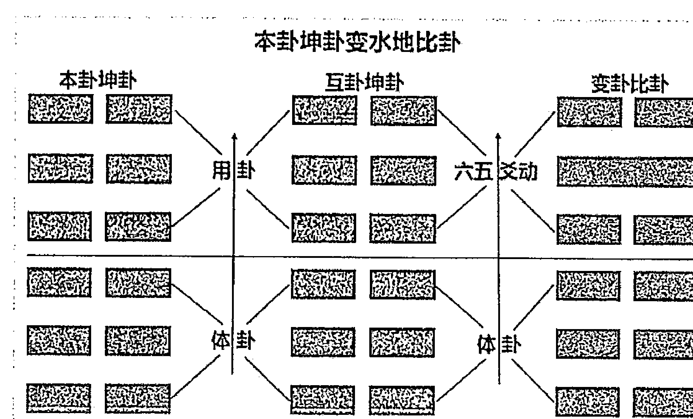

###### 推断分析：

1. 本卦八纯卦《坤卦䷁》，互卦也为《坤卦䷁》，坤（☷）象为和顺，体用比和之象，说明事故没有造成大损失。卦数：8，8。
2. 变卦水地《比卦䷇》，坤土克坎水，体克用之象，预示事故的主要责任是车主人撞上了对方的三轮车。卦数：8，6。
3. 六五爻动，用爻在外卦，卦象体用得位。5为巽（☴）象，为东南，为木，为风，为文凭、文书印信，为长女。此事中间有其它费用数字为5，车上可能还有一位有文化、爱好时尚、在家排行老大的长年女士，事故者双方现场无口舌之争发生。
4. 修车总费用为：88+86=174÷2=87，减去（现场实际）中间费用数字5，预计修车费用大数为8，小数为2，如果按百元估算，实际修车费用约820元。

###### 实际验证：

一、当时由于视线不好，是车主自己撞上一位老头子骑的一辆旧三轮车，把三轮车的车胎给人家抵爆了（老人一看说你最少得给我50元），老人很讲道理，双方现场没有争论，直接给赔付了50元修车费用，老人二话没说推车就走了。

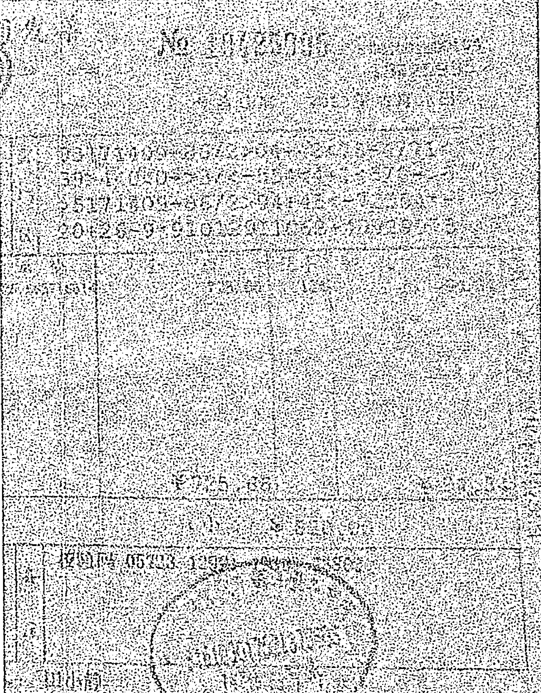

二、车上当时坐着一位50多岁，大学本科学历的知识女性，人比较时尚，在她们家兄姊妹4人中排行老大。

三、事故是小车的前保险杠撞了一个大窟窿，漆面划蹭多处痕迹，去4S店修车的实际费用为820元，加上现场费用50元，事故总费用870元。实际情况与第一种预测数据不符，与第二种预测数字和事态过程神奇的吻合（见修车发票）。

##### 例二：预测身体部位有啥问题？

2019己亥年11月1日14点02分（农历十月初五未时）微信群有人发一条求测信息：一个女士代人求测身体，1、身体什么部位有啥问题？2、目前身体状况？3、什么时间会好转？

数字起卦：12，10，5，8

得本卦八纯卦《离卦䷝》，六二爻动，变卦火天《大有卦䷍》。

###### 推断分析：

1. 本卦八纯卦《离卦☲》，离火见离火，体用比和之象，农历十月火处绝地，离为心脏，为眼睛，预示这个人的心脏、右眼睛，小腿部位有问题。
2. 按著者的方法取用爻，六二爻动，变卦火天《大有卦䷍》，离火克乾金，体克用之象，卦象体用不得位，可能心脏血管导致头部也有问题。
3. 时间窗口：六月，九月，腊月。农历六月此人身体就有发病征兆，九月十三至十七之间病情加重，不排除做手术治疗。目前病情有所好转，到农历腊月中旬病情可能有反复。

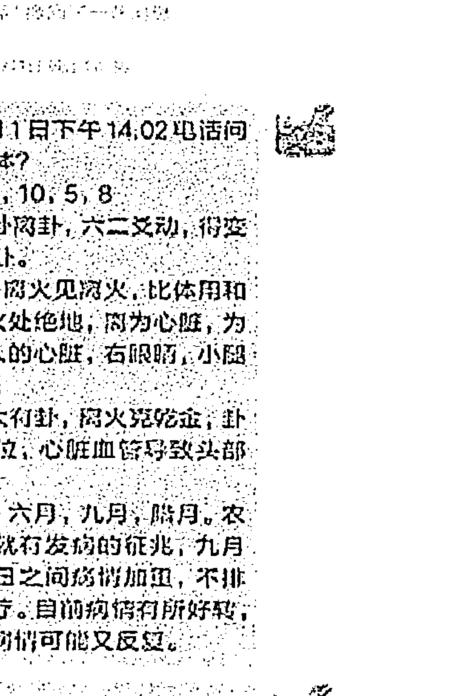

4. 按起卦数字之和取用爻：12+10+5+8=35÷6=5……5，商数5为奇数，从上九爻向下数5个数，六二爻为用爻，内卦为用卦，外卦为体卦，变卦火天《大有卦䷍》，这是按照著者的方法取用爻。如果按照传统的方法，商数5为奇数，余数为5，从初九爻向上数5个数，六五爻为用爻，变卦为天火《同人卦䷌》，两个变卦正好互为覆卦。
两种不同的取用爻方法必然得出两个不同的变卦，结果也就可想而知了。这样我们要讨论的问题就来了。

这个案例著者是按六二爻动取用爻，预测出病人“小腿部位有问题”，经过对方证实，病人小腿肿胀行走困难，其他方面与预测的实际情况都很吻合。如果按六五爻动取用爻，那就只能看出来这个人的病灶全在腹部以上，根本就看不出小腿部位有病的问题。

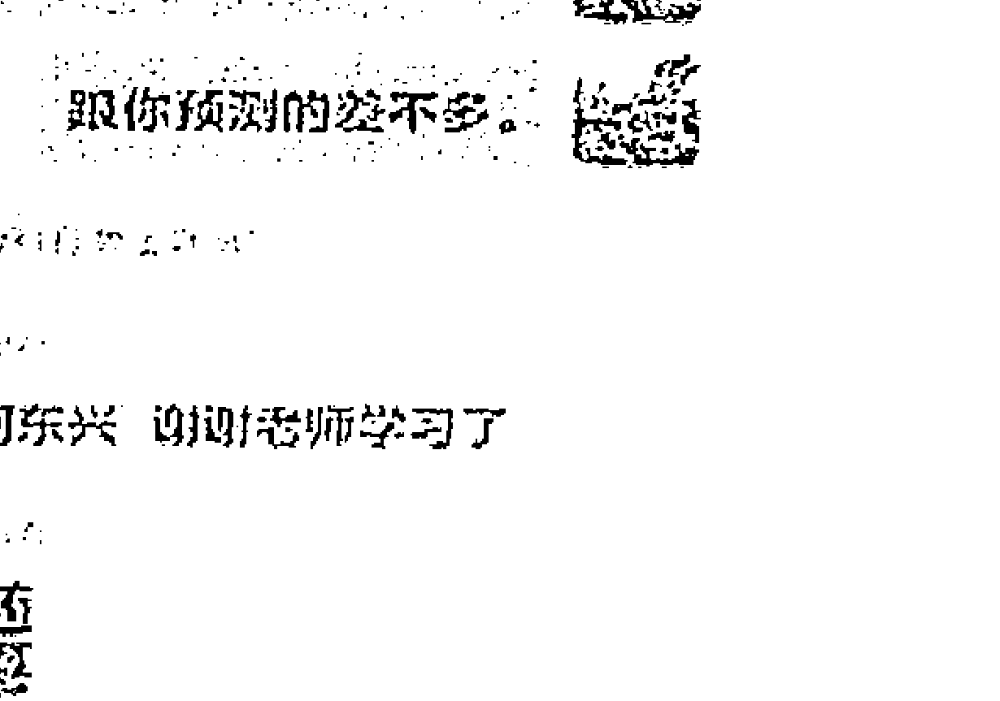

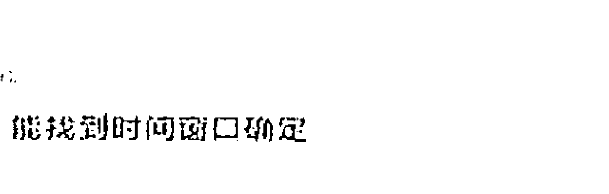

###### 比较说明：

以上两种预测方法不同的就是“用爻”的确定。一种是按照传统方法，不考虑卦数之和除6所得商数的奇偶，一律从初爻向上数数确定“用爻”，六五爻为用爻。一种是按照著者的方法，考虑卦数之和除6所得商数的奇偶来确定“用爻”，六二爻为用爻。比较之下，后者的预测显然比前者更接近病人的实际情况。所以，著者认为，按起卦总数定用爻，一定要看总数除以6所得的“商”是奇数还是偶数。商数为奇数从上爻向下数余数；商数为偶数从初爻向上数余数。著者不是说传统的方法是错误的，请读者朋友对照两种方法在实际预测分析中去进一步加以验证。

##### 第五种情况：

如果遇到六个爻全是少阳少阴无动爻，得到一个静卦时，确定用爻有两种方法。

1.  是根据以上方法，以六个爻的总数字之和除以6，然后按“商”是奇数还是偶数，依次去数数确定“用爻”，与以上方法相同。
2.  是卦象无动爻，也可以按当月的月令确定“用爻”，冬至以后，十一（冬）月为初爻，十二（腊）月为二爻，正月为三爻，二月为四爻，三月为五爻，四月为上爻；夏至以后，五月为初爻，六月为二爻，七月为三爻，八月为四爻，九月为五爻，十月为上爻。这是著者个人的一点探索，仅供大家参考。

以上所讲述的是实际预测分析的关键环节，读者朋友要自己下去仔细的加以琢磨体会，方能从中领悟出实用性的东西来。

## 第四节 扑克牌四象的吉凶

《周易》中的“卦爻”与“四象”是一个古老的概念，古人在原著中反反复复的提到它。古人规定：数字6为老阴（==）、数字8为少阴（--）、数字7为少阳（—）、数字9为老阳（===）。著者在这里把扑克牌中的黑桃定义为老阴（==）、梅花定义为少阴（--）、方片定义为少阳（⚊）、红桃定义为老阳（⚋）。它们之间究竟有什么吉凶区别？我们下面来分享这个问题。

#### 一、扑克牌吉凶的定义

《扑克牌·梅花易》就是涉及要给传统的六爻卦每一爻增加四种：老阳（⚋）、少阳（⚊）、少阴（⚋）、老阴（⚋），不同的预测分析信息。所以，我们在这里将这 16 张牌一一加以定义性的说明。

##### （一）红桃6、红桃7、红桃8、红桃9

1.  红桃6（见右图）。红桃的定义为老阳（⚋），而6是偶数，为阴数中的老阴（⚋），卦爻逢6时要变，遵照古人规定，卦爻逢6时阴爻变为阳爻。所以，红桃6的定义为老阴（⚋）中的老阳（⚋）。

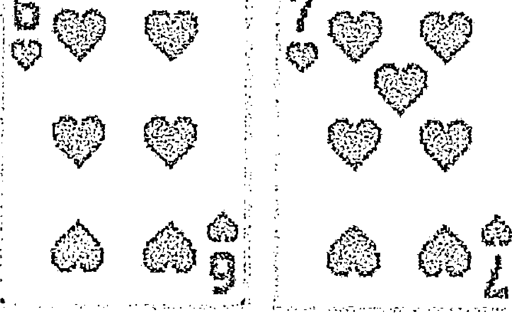

2.  红桃7（见右图）。红桃的定义为老阳（⚋），而7是奇数，为阳数中的少阳（⚊），卦爻逢7时为静爻，遵照古人规定，卦爻逢7时不用变爻。所以，红桃7的定义为少阳（⚊）中的老阳（⚋）。
3.  红桃8（见右图）。红桃的定义为老阳（⚋），而8是偶数，为阴数中的少阴（⚋），卦爻逢8时为静爻，遵照古人规定，卦爻逢8时不用变爻。所以，红桃8的定义为少阴（⚋）中的老阳（⚋）。

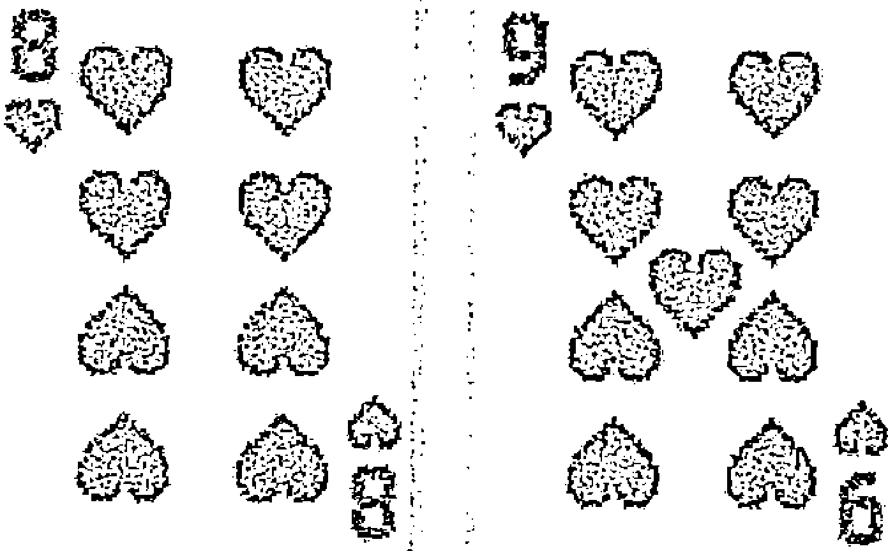

4.  红桃9（见右图）。红桃的定义为老阳（⚋），而9是奇数，为阳数中的老阳（⚋），卦爻逢9时要变动，遵照古人规定，卦爻逢9时阳爻要变阴爻。所以，红桃9的定义为老阳（⚋）中的老阳（⚋）。

##### （二）方片6、方片7、方片8、方片9

1.  方片6（见右图）。方片的定义为少阳（⚊），而6是偶数，为阴数中的老阴（==），卦爻逢6时为动，遵照古人规定，卦爻逢6时阴爻变为阳爻。所以，方片6的定义为老阴（==）中的少阳（==）。

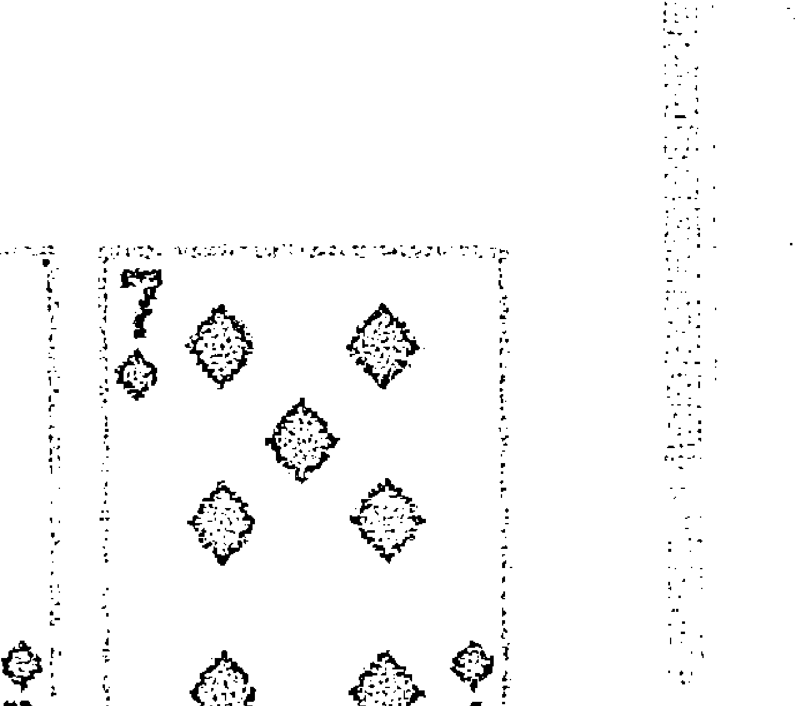

2.  方片7（见右图）。方片的定义为少阳（==），而7是奇数，为阳数中的少阳（==），卦爻逢7时为静，遵照古人规定，卦爻逢7时不用变爻。所以，方片7的定义为少阳（==）中的少阳（==）。
3.  方片8（见右图）。方片的定义为少阳（==），而8是偶数，为阴数中的少阴（==），卦爻逢8时为静，遵照古人规定，卦爻逢8时不变爻。所以，方片8的定义为少阴（==）中的少阳（==）。

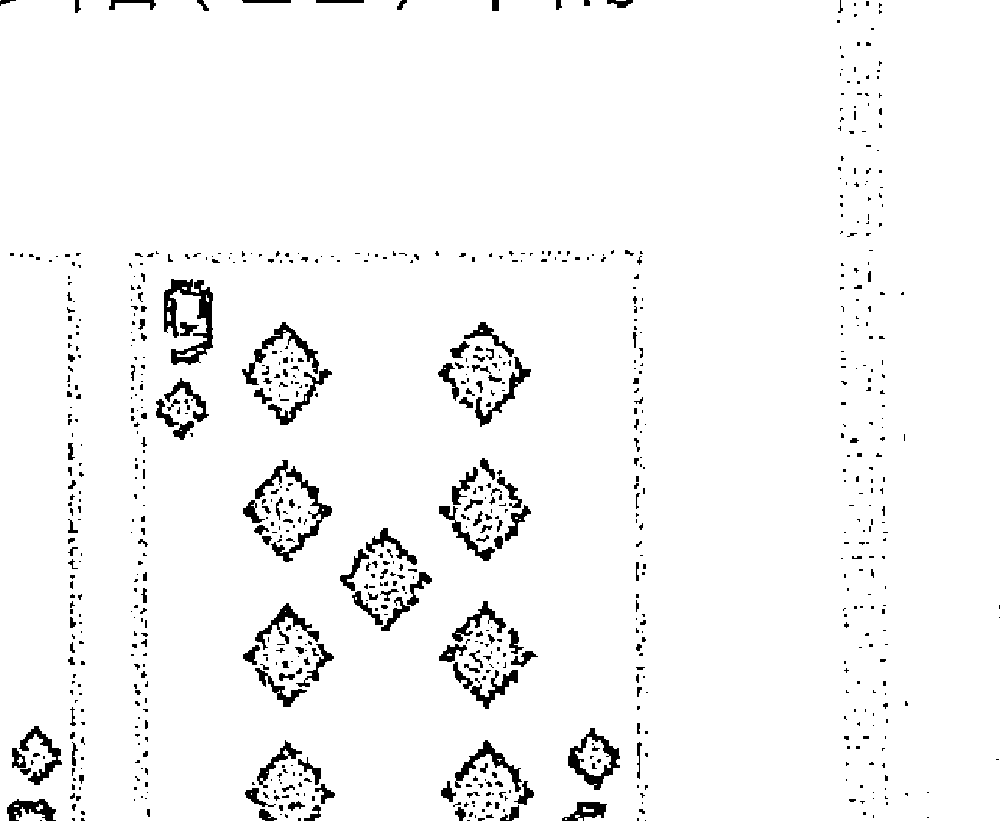

4.  方片9（见右图）。方片的定义为少阳（==），而9是奇数，为阳数中的老阳（==），卦爻逢9时为动，遵照古人规定，卦爻逢9时阳爻变为阴爻。所以，方片9的定义为老阳（==）中的少阳（==）。

##### （三）梅花6、梅花7、梅花8、梅花9

1.  梅花6（见右图）。梅花的定义为少阴（==），而6是偶数，为阴数中的老阴（==），卦爻逢6时为动，遵照古人规定，卦爻逢6时阴爻变阳爻。所以，梅花6的定义为老阴（==）中的少阴（==）。

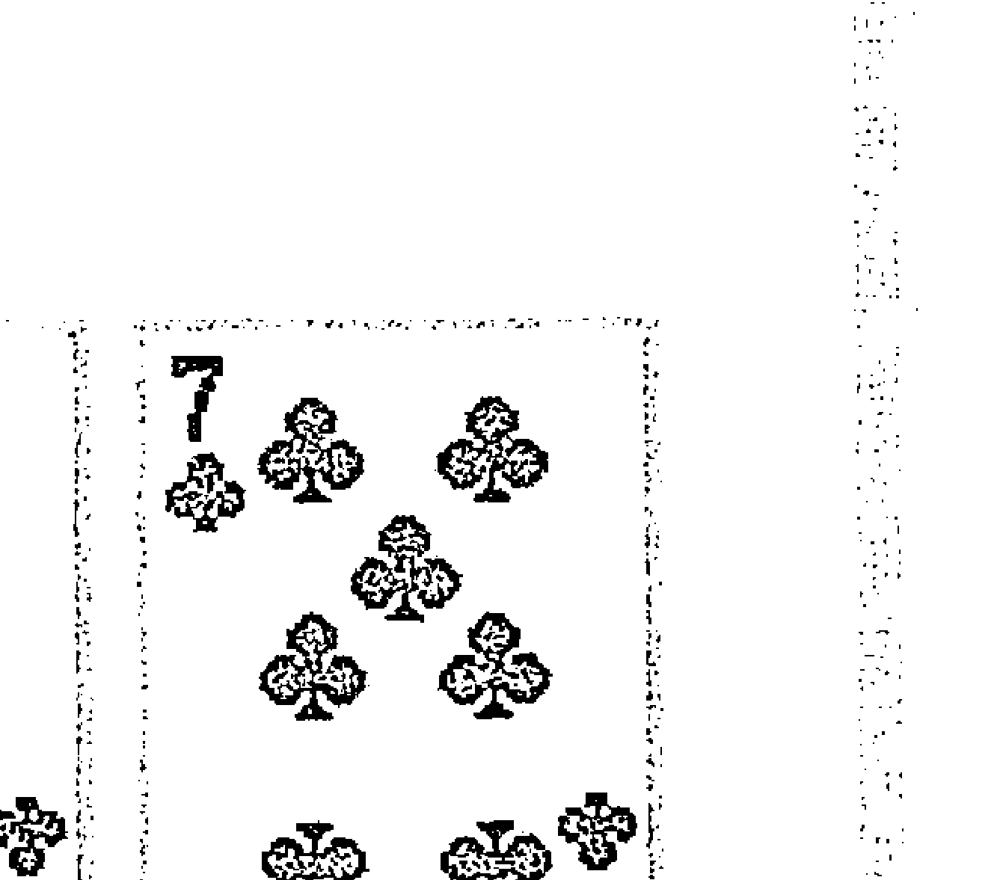

2.  梅花7（见右图）。梅花的定义为少阴（==），而7是奇数，为阳数中的少阳（==），卦爻逢7时为静，遵照古人规定，卦爻逢7时不用变爻。所以，梅花7的定义为少阳（==）中的少阴（==）。
3.  梅花8（见右图）。梅花的定义为少阴（==），而8是偶数，为阴数中的少阴（==），卦爻逢8时为静，遵照古人规定，卦爻逢8时不变爻。所以，梅花8的定义为少阴（==）中的少阴（==）。

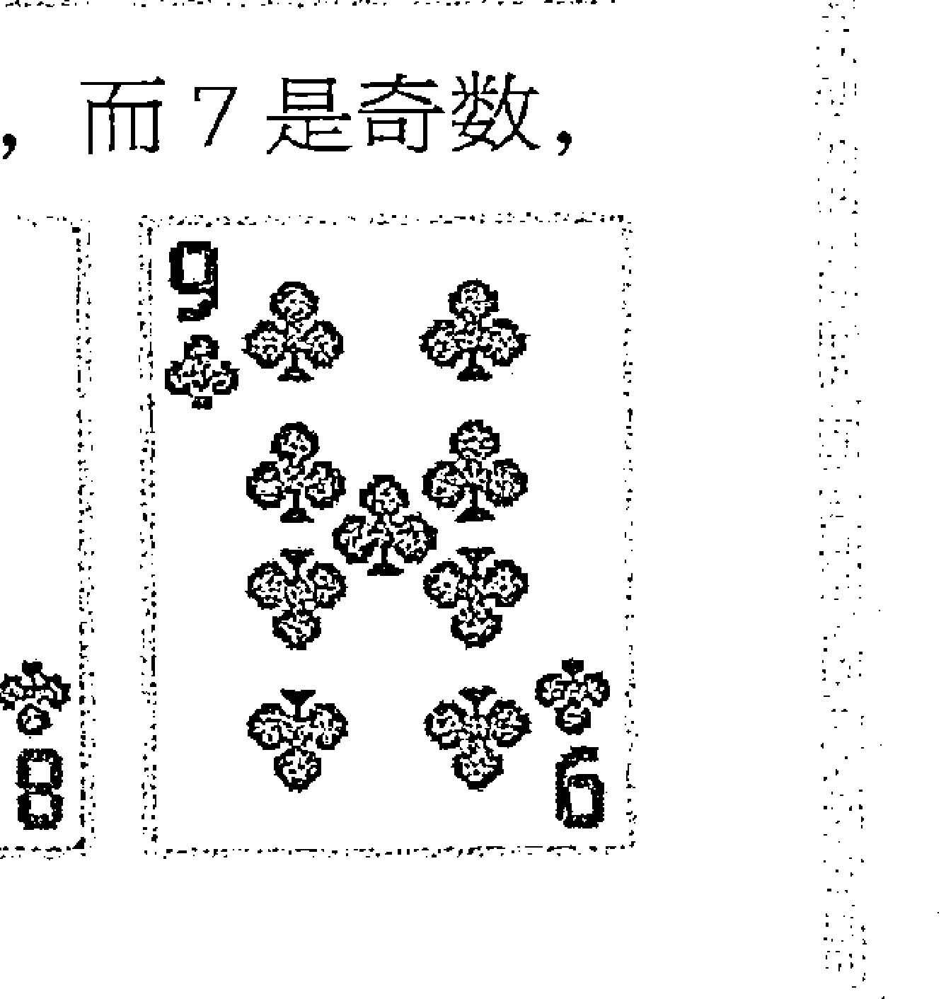少阴(⚋)，而8是偶数，为阴数中的少阴(⚋)，卦爻逢8时为静，遵照古人规定，卦爻逢8时不变爻。所以，梅花8的定义为少阴(⚋)中的少阴(⚋)。

梅花9（见右图）。梅花的定义为少阴(⚋)，而9是奇数，为阳数中的老阳(⚀)，卦爻逢9时为动，遵照古人规定，卦爻逢9时阳爻变为阴爻。所以，梅花9的定义为老阳(⚀)中的少阴(⚋)。

##### （四）黑桃6、黑桃7、黑桃8、黑桃9。

- 1. 黑桃6（见右图）。黑桃的定义为老阴(⚎)，而6是偶数，为阴数中的老阴(⚎)，卦爻逢6时为动，遵照古人规定，卦爻逢6时阴爻变为阳爻。所以，黑桃6的定义为老阴(⚎)中的老阴(⚎)。它是16张扑克牌中阴气最重、凶上加凶的一张牌。
- 2. 黑桃7（见右图）。黑桃的定义为老阴(⚎)，而7是奇数，为阳数中的少阳(⚊)，卦爻逢7时为静，遵照古人规定，卦爻逢7时不变爻。所以，黑桃7的定义为少阳(⚊)中的老阴(⚎)。它在16张扑克牌中是老阴少阳相逢，吉凶基本参半，是仅好于黑桃8的倒数第三张牌。
- 3. 黑桃8（见右图）。黑桃的定义为老阴(⚎)，而8是偶数，为阴数中的少阴(⚋)，卦爻逢8时为静，遵照古人规定，卦爻逢8时不变爻。所以，黑桃8的定义为少阴(⚋)中的老阴(⚎)。它是16张扑克牌中阴气太重、凶上逢险，是仅次于黑桃6的倒数第二张牌。
- 4. 黑桃9（见右图）。黑桃的定义为老阴(⚎)，而9是奇数，为阳数中的老阳(⚀)，卦爻逢9时为动，遵照古人规定，卦爻逢9时阳爻变为阴爻。所以，黑桃9的定义为老阳(⚀)中的老阴(⚎)。它在16张扑克牌中是老阴老阳相逢，吉凶参半，是仅好于黑桃7的倒数第四张牌。

以上是著者对《周易》四象：少阳（⚊）、老阳（⚊）、少阴（⚋）、老阴（⚋）与扑克牌“红桃、方片、梅花、黑桃”四种16张牌中的每一张牌所代表的吉凶信息用于卦爻做出的定义，以资读者朋友在预测断卦分析时作为参考条件。

#### 二、卦爻与四象的联系

我们还是以前面的天地《否卦䷋》变风雷《益卦䷪》为例，一个爻一个爻往下看：

- 初六爻红桃定义为老阳（⚊），这个数字6又为老阴（⚋），老阳老阴聚集初六爻；
- 六二爻黑桃定义为老阴（⚋），这个数字8又为少阴（⚋），老阴少阴聚集六二爻；
- 六三爻方片定义为少阳（⚊），这个数字8又为少阴（⚋），少阳少阴聚集六三爻；
- 九四爻梅花定义为少阴（⚋），这个数字9又为老阳（⚊），少阴老阳聚集九四爻；
- 九五爻红桃定义为老阳（⚊），这个数字7又为少阳（⚊），老阳少阳聚集九五爻；
- 上九爻黑桃定义为老阴（⚋），这个数字7又为少阳（⚊），老阴少阳聚集上九爻。

天地否卦变风雷益卦

| 红6老阳 | 黑8老阴 | 方8少阳 | 梅9少阴 | 红7老阳 | 黑7老阴 |
|---|---|---|---|---|---|
| 6红桃 | 8黑桃 | 8方片 | 9梅花 | 7红桃 | 7黑桃 |
| 初6爻老阴 | 六2爻少阴 | 六3爻少阴 | 九4爻老阳 | 九5爻少阳 | 上9爻少阳 |

这就使得同一个卦爻符号，出现了不同的两种阴阳信息（见上卦象图所示）。需要我们仔细地去加以分析，对这些情况做出较为详尽的解释。

（一）初六爻的数字6本是老阴（⚋），却遇见红桃老阳（⚊），说明这个老阴6下隐藏着红桃老阳的巨大能量，老阳老阴，阴中有阳，阳中有阴，这个数字6老阴（⚋）虽然会爻变，但是，它本身还具有红桃老阳（⚊）的阳性能量，使这个属于大凶的卦象中隐藏着大吉的能量，分析预测这个卦爻时，可以按逢凶化吉而论。

（二）六二爻的数字8本是少阴（⚋），遇到了黑桃老阴（⚋），说明少阴（⚋）8下面隐藏着黑桃老阴（⚋）的凶险杀机，阴中老阴，晦气太重，让属于小凶的卦象中隐藏着大凶，分析预测这个卦爻时，可以当作小凶上加大凶来理解。

（三）六三爻数字8本是少阴（⚋），遇到方片少阳（⚊），说明少阴（⚋）8下面隐藏着方片少阳（⚊）的勃勃生机，阴中见阳，阴阳平衡，使属于小凶的卦象中隐藏小吉的因素，分析预测这个卦爻时，可以当作小凶化小吉来论。

（四）九四爻数字9本是老阳（⚊），遇见梅花少阴（⚋），说明老阳（⚊）9下面隐藏梅花少阴（⚋）的少量阴气和晦气，阳中见阴，属于吉祥的卦象中带有其他不利因素，分析预测这个卦爻时，可以当作阳气已经向下拐头，预示老阳大势已去，要做好面对不利因素的打算。

（五）九五爻数字7本是少阳（⚊），见了红桃老阳（⚊），说明少阳（⚊）7下面隐藏红桃老阳（⚊）的巨大能量，少阳见老阳，属于小吉的卦象中隐藏着大吉之象，如花初放，持续向好，分析预测这个卦爻时，可以当作阳气持续上升、运势逐渐向好来理解。

（六）上九爻数字7本是少阳（⚊），遇见黑桃老阴（⚋），说明少阳（⚊）7下面隐藏黑桃老阴（⚋）的凶险危机，少阳见老阴，属于小吉的卦象中隐藏着大凶因素，分析预测这个卦爻时，可以当作看似吉祥，实则为大凶险即将来临而论。

以上是《扑克牌·六十四卦》起卦方法和吉凶定义，它能够为传统的六爻卦增加四种吉凶成分互换的信息，通过这种方法我们给传统的《周易·六十四卦》预测带来了更多分析判断的信息依据。著者对16张扑克牌做出了详细的吉凶界定和推演分析的判断说明，也是《扑克牌·梅花易》的主要内容，分享给大家在实际预测分析中参考使用，以期对《周易·六十四卦》预测收到抛砖引玉的作用。

# 第五章

# 卦例实战集锦

俗话说：只说不练假把式，有说有练真把式。《周易》象数预测文化研究不能只停留在理论上，而是要理论联系实际，给大家分享一些实实在在的真东西。下面著者就与大家一起分享用扑克牌推演《梅花易数》预测的卦例，但愿通过实例学习，使读者能掌握《扑克牌·梅花易》预测断卦的技巧，更好的服务广大人民群众的实际所需。

## ## 第一节 预测不准

预测未来事件的吉凶祸福是一个原始的命题，也是一件非常不好把握的事情。科学试验有失败，预测理所当然也有失败，因此，马失前蹄很常见。如果象数预测分析过程中稍有一点点把握不到位，会直接导致失之毫厘、差之千里的预测结果，往往使预测者感到十分难堪。

话说一代大师李淳风与袁天罡当年初入江湖，有一天，风和日丽，两人坐在岐山脚下大路边上的一个酒店喝酒。突然看见门外大路上走来了一位鹤发童颜，道风仙骨，气宇轩昂的老者。说来也巧，这条路中间长着一棵双叉的大槐树。李淳风说：仁兄，你猜这位老者是从树的右边走过来呢？还是从树的左边走过来？于是袁、李两人一个猜右，一个猜左。谁知那位老者走到大树面前打住了脚步，左看看、右看看、上看看、下看看，突然身子一跃，轻身如燕般的竟然从大树叉中间飞了过来。老者的这一举动，使对酌之中的李淳风与袁天罡大惊失色，差点把手中的酒杯扔在地上。原来老者是隐居在岐山箭括岭中的一位世外高人。老者健步如飞来至酒店门前，李、袁二人急忙上前双膝跪地，顿首拜曰：“老神仙在上，在下有眼不识泰山，刚才多有得罪。”老者捋须笑答：“你我素不相识，何言得罪二字啊！”据说后来李淳风与袁天罡拜这位老者为师，潜心研易修道，终成一代高人。讲这个故事的用意是告诉大家，天外有天，人上有人，当然这毕竟是岐山脚下的一个美丽传说。

这个历史故事告诉我们艺无止境，人上有人。即使你身怀绝技，高人一筹，在预测中难免会有失误的时候。著者回顾以往预测经验总结，预测不准的原因无外乎五个方面：

#### 一、月令的四季旺衰

正确把握“月令”旺衰，阴阳时令、五行休囚是预测准确与否的一个关键。如果农历二月预测，遇到金克木之象，因为二月木旺当令，金处死地根本无法克木，反而会被旺木所侮（也就反克）；再如农历五月预测，遇到水克火之象，五月火旺当令，水处绝地，这个弱水就灭不了旺火，反遭火来侮辱（也是反克）。易卦象数预测一定要搞清楚一年四季的五行旺、相、囚、死，否则预测结果大相径庭，必然导致失误。

著者早年预测过两例经济合同纠纷，都是春季二月得雷天《大壮卦☰☷》，六五爻动，震（☳）木为用，乾（☰）金为体，卦象乾金克震木，体克用之象，当时以主家有理有利可得推断。结果忽略了卯月木旺当令，金处绝地，结果有理的主家反倒被对方所无礼羞辱。究其原因就是没有把握好月令旺衰，导致预测结果不准确的严重后果。

#### 二、卦象体用不得位

分析推测卦象之前必须搞清楚本卦的体用是否得位。如果变（用）爻（用卦）在外卦者，一般视为体用得位，这时候就要参考本卦的互卦。凡变（用）爻（用卦）在内卦时，视为体用不得位，这时候的互卦就不能用，必须要看本卦的覆卦和变卦的复原卦（请参考本书的第二章第四节内容）。否则，预测结果南辕北辙，相去甚远，测不准是必然结果。

#### 三、预测者状态要好

预测者在预测分析操作时一定要在良好的状态中进行起卦、分析推理、预测吉凶。如果因为本人遇到重大的烦心事，或者因身体严重不适、神情恍惚不在状态中。例如：饮酒过度，近亲新故，身体有病，思维处于恍惚状态等情况下，一旦预测，判断分析推理就很难正常发挥，势必受到这些客观和主观因素的限制，直接导致推理失误而影响预测结果的准确性。因此，著者认为在状态中和不在状态中的预测效果是天上人间，差异很大，不可不察。

#### 四、搞清楚起卦方法

有时候在微信群、QQ群里，别人起的卦，你不知道他是摇的卦？还是时间起的卦？或者是报数字起的卦。再者，手机上下载的起卦软件程序有所差异。例如，同一时间用“六爻排盘宝”起的卦就与“梅花易数”排盘软件起的卦完全不一样。如果你事先没有搞清楚这些因素，稀里糊涂地就去跟上解卦分析，势必得出大相径庭的预测结果。著者也是在微信群里才悟出这些经验的，一并在此告诉大家借鉴。

#### 五、人际关系太熟悉

古人占卦有一个“三不占”原则：一是不诚不占，即心不诚则自身感应力不强，所以占卦首重诚心诚意。二是不义不占，即不合乎正当性、合法性、合理性的事绝不占问，特别是逃脱罪责，涉及违法事件的坚决不预测。三是不疑不占，即必须是生活中理性难以测度的事情，才能起卦预测。现实生活中，熟人往往近水楼台，芝麻大的一点小事，就要你起卦预测，碍于人情面子的事情，往往应验率不高。原因是不符合这个“三不占”原则，再者对方把这个神圣文化当成了儿戏，尽拿一些鸡毛蒜皮的小事让你预测，故而很难准确应验。以上是著者三十多年来琢磨探索预测失败事例，总结出来的实践经验，读者一定要仔细参悟，方能大幅提升《扑克牌·梅花易》预测的准确率。由于篇幅有限，这方面的例子著者在《梅花易研究精要》中有好多卦例讲解，此处不再赘述。

## ## 第二节 婚姻预测

俗话说：男大当婚，女大当嫁。促成一桩婚姻，功德爱心无量；成就一桩婚姻，双方父母开心。新婚姻预测，涉及男女感情、心理状态、时间窗口，以及能不能佳偶天成，幸福美满，这是一件人生皆大欢喜的好事情。下边介绍几个卦例，与大家共同探讨。

### ### 例一、求测事业、感情

2012年7月18日（农历五月三十日），海南一位博友通过网易博客求测。由于人在外地，所以，我就让他抽扑克牌起卦。

### ### 抽扑克牌依次是：

- 红桃7
- 方片7
- 黑桃6
- 黑桃8
- 梅花6
- 方片6

### ### 扑克牌起卦：

红桃7；方片7；黑桃6组成兑（☰）象，内卦取兑（☰）象；黑桃8、梅花6、方片6组成坤（☷）象，外卦取坤（☷）象，坤上兑下，得本卦地泽《临卦》；本卦的六三爻黑桃6动，内卦由兑（☰）象变为乾（☰）象；六五爻梅花6和上六爻方片6同动，外卦由坤（☷）象变为巽（☴）象，巽上乾下，得变卦风天《小畜卦》。按卦数之和取用爻：20+20=40÷6=6……4，商数6为偶数，从初爻向上数4个数，六四爻黑桃8为用爻，取外卦为用卦。卦象体用得位，掐头去尾，互卦为地雷《复卦䷗》。

###### 地泽临卦变风天小畜卦

| 红7老阳 | 方7少阳 | 黑6老阴 | 黑8老阴 | 梅6少阴 | 方6少阳 |
|---|---|---|---|---|---|
| 7❤️ | 7♦️ | 6♠️ | 8♠️ | 6♣️ | 6♦️ |
| 初9爻少阳 | 九2爻少阳 | 六5爻老阴 | 六4爻少阴 | 六5爻老阴 | 上6爻老阴 |

卦气分析：

此卦中红桃1张，方片2张，梅花1张，黑桃2张，三红三黑，农历五月阳气正旺，卦气阴阳基本平衡，六四爻黑桃8为用爻，预示求测的不是好事情，但没有大的凶险。

推测分析：以主人为主体，以事业婚姻为用。

- 1. 此卦初九爻红桃7、九二爻方片7、上九爻方片6，两端飘红为阳，中间黑桃、梅花，阴气很重，预示此人一生总体运势是中间苦，两头甜。
- 2. 初九爻红桃7和九二爻方片7阳气充足，说明事业上开始是比较看好。六三爻黑桃6对应正月，六四爻黑桃8对应二月，六五爻梅花6对应三月，三个爻全是阴，预示今年春季（正月至三月）主人遇到了麻烦事情。
- 3. 互卦地雷《复卦䷗》，六四爻动，为震（☳）象，震为长男、为高个子、排行老大。分析推断此人在工作上遇到的问题与一个瘦高个、说话声音大，排行老大的男人有关。
- 4. 从时间窗口看：六三爻对应七月、六四爻对应八月、六五爻对应九月，说明这个时段将是该同志最郁闷的时间段，只有耐心坚持，才会走出阴霾，迎来阳光的未来。
- 5. 卦象初九爻红桃7与六四爻黑桃8形成阴阳相呼应，在感情方面，此人婚姻上结缘较远。变卦风天《小畜卦》，外卦变为巽（☴）象，巽为长女、为黄头发、为臀部丰满、为时髦性感、为舆论。卦象显示目前有个身材苗条，皮肤细白，头发黄，很时髦性感的女性给主人造成舆论上的不利。
- 6. 因为上六爻为方片少阳，对应十月，所以说，过了今年的农历九月，进入十月该了结的烦心事情才会有清楚的结果。

当即验证：

以上预测结果发给博友40分钟后，回复：“神了，佩服，佩服。两事皆准。请问目前女性之事是继续还是终止，祸福可料否？另请大师帮忙测一下近期投资可行否？大师，在下有个不情之请，如方便请您来海南一玩，费用算我的。若不介意请留个联系方式，打扰了。你我之缘，我会努力争取的。”

##### 例二、婚姻会出现两次变化

外地的一个粉丝博友某女士，生于1964年农历十二月初三日晚20点10分，在大城市有固定的工作单位，问自己的婚姻家庭问题。

###### 抽扑克牌依次是：

黑桃7、红桃7、红桃7、方片6、黑桃6、黑桃8。

###### 扑克牌起卦：

黑桃7、红桃7、红桃7组成乾（☰）象，内卦取乾（☰）象；方片6、黑桃6、黑桃8组成坤（☷）象，外卦取坤（☷）象，坤上乾下，得本卦地天《泰卦䷊》；六四爻为方片6老阴、六五爻为黑桃6老阴同动，外卦坤（☷）象变兑（☱）象，兑上乾下，变卦泽天《夬卦䷪》；内卦三个爻安静不动。按卦象总数取用爻：21+20=41÷6=6……5，商数6为偶数，余数为5，从初九爻向上数5个数，六五爻黑桃6为用爻。本卦体用得位，互卦雷泽《归妹卦䷵》。（这个卦内卦安静，外卦爻动，也可以直接取外卦为用卦）

卦气分析：

此卦中1个方片，2个红桃，3个黑桃，三红三黑，卦气阴阳平衡。体卦阳气足，用卦阴气重。六五爻黑桃6为用爻，预示婚姻最终不会有好的结果。

推测分析：婚姻事，女人问卦。以女为体，以男为用。

- 1. 本卦地天《泰卦䷊》，坤上乾下，坤土生乾金，用生体之象，泰卦对应正月，三阳开泰之象，预示此人婚姻开始比较和谐，目前男方对女方有付出和留恋之情。
- 2. 变卦泽天《夬卦䷪》，兑上乾下，兑金见乾金，体用比和之象。从卦象变化看，目前男女双方还算和谐，女人阳刚过剩，男人虽有不轨，似乎还有一点回心转意的迹象。
- 3. 从卦象总体看，女方小时候很顺，从15岁到50岁这30多年中学习、工作、婚姻一直很顺。大概于2011年二月婚姻出现了大裂痕，2012年进入极不愉快的阶段。女主人1964（甲辰）年人属龙，2012（壬辰）年农历九（庚戌）月形成对冲，这是要了结这个痛苦婚姻的最佳时间。
- 4. 每逢农历二月、三月；七月、八月，这两人的感情就出现不愉快。女主人现在对婚姻还没有灰心，仍然寄予和好的愿望。兑（☱）象为善辩、为白皮肤，为少女，卦象看从2011年初开始，这个丈夫就与一个皮肤较白、能言利嘴的年轻女子在感情上有染，后来变本加厉，一致明火执仗的好上了。
- 5. 去年农历八月、九月情况又反复；今年农历二月、三月如果男方没有回心转意，那这个婚姻就走到头了。
- 6. 总体来说，女主人的婚姻幸福已经度过了最愉快的时期，后面不是很看好。互卦为雷泽《归妹卦䷵》，嫁女之象，说明目前两个人各自的心中对未来婚姻已经有自己的打算了。

事后应验：

2011年11月5日13:35分，某女士说：哦，看来我的卦不好啊！你说得很对的。从2011年初开始，我丈夫就与一个皮肤较白，能言利嘴的年轻女子有染，后来变本加厉，明火执仗的好上了。其实2010年就和另一个在外有暧昧，只是我不知道，2011年就跟这个女的公然出去住了。

最后，这两个人于2012年11月7日（九月二十四）正式办理离婚手续，一对生活了25年多的恩爱夫妻，最终劳燕分飞了。这与著者预测的“2012年农历九（庚戌）月是了结痛苦的最佳时间”非常吻合。

##### 例三、婚外恋感情

博友&&，女，1964年出生，2012年11月25日在微信留言，求测自己的感情婚姻问题。

###### 抽扑克牌依次是：

- 红桃6、方片6、黑桃8、红桃8、梅花7、红桃9。

###### 扑克牌起卦：

红桃6、方片6、黑桃8组成坤（☷）象，内卦取坤（☷）象；红桃8、梅花7、红桃9组成巽（☴）象，外卦取巽（☴）象，巽上坤下，得本卦风地《观卦䷓》；初六爻红桃6老阴、六二爻方片6老阴同动，内卦由坤（☷）象变为兑（☱）象；上九爻红桃9老阳动，外卦由巽（☴）象变为坎（☵）象，坎上兑下，得变卦水泽《节卦䷻》；按卦象总数之和取用爻：20+24=44÷6=7……2，商数7为奇数，余数为2，从上九爻向下数2，九五爻梅花7为用爻，外卦为用卦。本卦体用得位，互卦为山地《剥卦☷艮》。

风地观卦变水泽节卦
| 红6老阴 | 方6少阳 | 黑8老阴 | 红8老阳 | 梅7少阴 | 红9老阳 |
| :---: | :---: | :---: | :---: | :---: | :---: |
| 6♥ | 6♦ | 8♠ | 8♥ | 7♣ | 9♥ |
| 初六爻老阴 | 六二爻老阴 | 六三爻少阴 | 六四爻少阴 | 九五爻少阳 | 上九爻老阳 |

###### 卦气分析：

此卦中1个方片，3个红桃，1个梅花，1个黑桃，四红二黑。卦气阳占70%，阴占30%，体卦与用卦相比，阳气偏弱，月令农历十月，水气旺相。九五爻梅花7为用爻，少阳少阴居于一体，预示主人要丢掉幻想，理性面对现实。

###### 推测分析：以体为女主人，以用为感情。

- 1、本卦风地《观卦☴坤》，巽上坤下，巽木克坤土，用克体之象，巽为风、为东南方位、为消息，预示外边有一桩感情方面的信息主动来寻找女主人。
- 2、变卦水泽《节卦☵兑》，坎上兑下，兑金生坎水，体生用之象，十月水旺，泽中水满外溢，预示女主人要注意高筑道德感情修养的围堰，防止感情之水外溢漫流，致使一桩婚外恋感情的发生。
- 3、互卦山地《剥卦艮坤》，艮上坤下，艮土见坤土，比和之象，土太厚，坎水一时半会渗透不进来，预示女主人开始坚守不动感情念头。
- 4、时间窗口：初六爻红桃6对应十一月、五月；六二爻方片6对应腊月、六月；上九爻红桃9对应四月、十月。到2012年农历十月份，女方的思想可能就突然开朗想通了，感情上会出现很大的冲动和变化。
- 5、结识的这位（上九爻红桃9）男士开始很主动，但这个人的感情有两次变化。农历十月主动，十一月变得不主动了。感情就好像一潭死水，有情而无意，有波而无浪。
- 6、此事2012年腊月初八至十二日（五日）内有一个突破性的变化；有无圆满结果2013年农历三月中旬才能兑现。

###### 综上分析：

本卦风地观卦，预示女主人心里想的事情需要观望等待；互卦剥卦，艮土见坤土，说明事情中间的环节不很畅通；变卦水泽节卦，水为感情，男女主人感情之水泛滥，呈现遍地流淌之象。这就需要节制感情，如果不克制自己，势必造成感情灾难。

###### 事后应验：

对方回复，就是家庭个人感情出了问题，女主人发现了一个可心的（男士）目标，准备以身相许。可是新结识的那位老帅哥的条件较好，纯粹一个情场老手，就是给她没有个准信。感情发展了好长一段时间，那男士借故去了国外，致使女主人成了单相思，最终女主人竹篮打水一场空。

##### 例四、某女士问婚姻

2019年9月20日（农历八月二十二）下午，某女士已经离异十多年，亲自抽扑克牌请著者预测自己的婚姻。

###### 抽扑克牌依次是：

- - 黑桃9，方片8，黑桃9，黑桃6，梅花6，梅花9。

###### 扑克牌起卦：

黑桃9、方片8、黑桃9组成离（☰）象，内卦取离（☲）象，黑桃6、梅花6、梅花9组成艮（☶）象，外卦取艮（☶）象，艮上离下，得本卦山火《贲卦䷕》。初九爻黑桃9动，九三爻黑桃9动，内卦由离（☲）象变为坤（☷）象；六四爻黑桃6，六五爻梅花6，上九爻梅花9动，外卦由艮（☶）象变为离（☲）象，得变卦《山雷颐䷚》。

黑桃9三个爻同动，外卦由艮（☶）象变为兑（☱）象，兑上坤下，得变卦泽地《萃卦☷兑》。按卦数之和取用爻：26+21=47÷6=7……5，商数7为奇数，从上九爻向下数5个数，六二爻方片8为用爻，内卦为用卦。体用不得位，互卦不用，复原卦为地泽《临卦兑坤》。

山火贲卦变泽地萃卦
| 黑桃9老阴 | 方片8少阳 | 黑桃9老阴 | 黑桃6老阴 | 梅花6少阴 | 梅花9少阴 |
|---|---|---|---|---|---|
| 初九爻老阳 | 六二爻少阴 | 九三爻老阳 | 六四爻老阴 | 六五爻老阴 | 上九爻老阳 |

###### 卦气分析：

此卦中1个方片，2个梅花，3个黑桃，一红五黑，卦气阳占15%，阴占85%，内卦两黑一方，外卦两梅一黑，卦中阴气太重，主人的运气很不好，婚姻非常糟糕。六二爻方片8为用爻，预示主人心中的期望值太高。

###### 推测分析：以体为本人，以用为婚姻。

- 1. 本卦山火《贲卦艮离》，艮上离下，离火生艮土，用生体之象，现象上看婚姻尚有生气，因为自己运气太背，心气太高，可能导致事与愿违、难成正果。
- 2. 变卦泽地《萃卦兑坤》，兑上坤下，坤土生兑金，用生体之象，农历八月金旺土衰，目前遇到的男人很难满足女主人的要求。
- 3. 复原卦地泽《临卦坤兑》，坤上兑下，与变卦意义相同，预示着主人的婚姻还需要一段时间等待。
- 4. 卦象初九爻黑桃9对应五月、十一月，九三爻黑桃9对应七月、正月，六四爻黑桃6对应八月、二月，六五爻梅花6对应九月、三月，上九爻黑桃9对应十月、四月，卦中五个爻同动，预示主人婚姻面临变数太大，目前没有稳定的缘分可言。
- 5、时间窗口：六月、九月、腊月、三月。农历六月二十八至七月初二之间有一个理想的目标，但一时半会儿定不下来。农历九月下旬将再次出现机会，快则到腊月下旬有可能出现好的转机。

综合分析：此女士的卦象阴气太重是其一；卦中五个爻动，主人感情面临不确定的变数很大是其二。在婚姻方面可能很难找到满意的人生伴侣。

###### 事后应验：

此女士反馈农历六月底确实与北京方面的一位男士接触，可是那个男士只谈感情，不谈婚姻。农历九月女士与此人中断联系，截至2020年2月此女士的婚姻没有实质进展。

##### 例五、测一事是否好，另一桩事是否可行

2017年11月份在延安参加一个易学研讨会,20日中午13时44分，有一位参会的外地女士求测一事是否好，另一桩事是否可行？

###### 抽扑克牌依次是：

方片8，梅花7，红桃6，黑桃9，黑桃8，红桃9。

###### 扑克牌起卦：

方片8、梅花7、红桃6组成坎（☵）象，内卦取坎（☵）象，黑桃9、黑桃8、红桃9组成离（☲）象，外卦取离（☲）象，离上坎下，得本卦火水《未济卦䷿》。卦象六三爻红桃6动，内卦由坎（☵）象变为巽（☴）象；九四爻黑桃9动，上九爻红桃9动，外卦由离（☲）象变为坤（☷）象，坤上巽下，得变卦地风《升卦䷭》。按卦数之和定用爻：21+26=47÷6=7……5，商数7为奇数，从上九爻向下数5个数，九二爻梅花7为用爻，内卦为用卦。体用不得位，互卦不用，覆卦水火《既济卦䷾》，变卦的复原卦为风地《观卦䷓》。

###### 火水未济卦变地风升卦

（此处原文有图片标记，处理时保留空行）

###### 卦气分析：

此卦中1个方片，2个红桃，1个梅花，2个黑桃，三红三黑，卦气阳占50%，阴占50%，内卦两红一梅，外卦两黑一红，卦气阴阳平衡，主人的运气处于中平状态。九二爻梅花7为用爻，少阳少阴集于一身，主人要防止在感情方面有美好幻想。

###### 推测分析：以体为本人人，以用为事情。

- 1、本卦火水《未济卦䷿》，离上坎下，坎水克离火，用克体之象。农历十月水旺当令，坎水正旺，离火处绝地，预示前边的这一桩事情主人目前处于很被动的状态。
- 2、变卦地风《升卦䷭》，巽木克坤土，用克体之象，事情克主人，预示后边的另一桩事情才处于发展状态，目前还没有破土而出，进展不是很乐观。
- 3、复原卦为风地《观卦䷓》，目前主人需要的是耐心等待、观望事态的自然发展。
- 4、卦象六三爻红桃6动，内卦由坎（☵）象变为巽（☴）象，九四爻黑桃9动，上九爻红桃9动，外卦由离（☲）象变为坤（☷）象，求测事情会出现三个变化，农历七月中旬有一桩好事；农历八月将有一桩不好的事情出现；农历十月后前一桩事情有可能向好的方向变化。
- 5、时间窗口：六月，九月，腊月，三月。主人心中想的不好的事情，最快农历腊月中旬基本了结，最迟明年农历三月中旬全部结束。
- 6、九二爻梅花7为用爻，二为兑（≡）象，为金，为少女，为口舌，为正西方位，有一位皮肤白，伶牙俐齿的年轻女士可以帮助解决问题。

###### 事后应验：

这是一个婚外情案例，前边的婚姻名存实亡，没有办理离婚手续；后面的感情已经另有归宿。后来该女士反馈，腊月中旬前边的婚姻了结。第二年春上该女士新组建了一个家庭。

##### 例六、男士求测婚姻

2019年3月4日18时16分，有一离异男士求测婚姻。

###### 抽扑克牌依次是：

梅花7, 方片9, 梅花8, 红桃8, 红桃8, 红桃7。

###### 扑克牌起卦：

梅花7，方片9，梅花8组成兑（≡）象，内卦取兑（≡）象，红桃8，红桃8，红桃7组成艮（≡）象，外卦取艮（≡）象，艮上兑下，得本卦山泽《损卦☰兑》。九二爻方片9动，内卦由兑（≡）象变为震（≡）象，外卦无动爻，艮上震下，得变卦山雷《颐卦艮震》。按卦数之和找用爻：24+23=47÷6=7……5，商数7为奇数，从上九爻向下数5个数，九二爻方片9为用爻，内卦为用卦。卦象体用不得位，覆卦风雷《益卦巽震》，变卦的复原卦雷山《小过卦震艮》。

山泽损卦变山雷颐卦
| 梅花7少阴 | 方片9少阳 | 梅花8少阴 | 红桃8老阳 | 红桃8老阳 | 红桃7老阳 |
|---|---|---|---|---|---|
| 初九爻少阳 | 九二爻老阳 | 六三爻少阴 | 六三爻少阴 | 六五爻少阴 | 上九爻少阳 |

###### 卦气分析：

此卦中1个方片，3个红桃，2个梅花，四红二黑，卦气阳占75%，阴占25%，内卦两阴一阳，外卦全阳，主人的婚姻起初就出问题，后边逐渐向好。九二爻方片9老阳见少阳，六三爻梅花8阴居阳位，六五爻红桃8阴居阳位，上九爻红桃7阳居阴位，预示男主人心中对女性要求有点过于理想化，与现实情况很不相符。

###### 推测分析：以体为本人，以用为婚姻。

- 1. 内卦九二爻方片9动，外卦无动爻，按内卦动爻或者卦数之和找用爻，都是九二爻方片9为用爻，内卦为用卦，外卦为体卦，卦象体用不得位。
- 2. 本卦山泽《损卦艮兑》艮上兑下，艮土生兑金，损上益下，体生用之象，我为艮土，婚姻是兑金，我生婚姻。说明婚姻家庭以开始就对男主人不利，不管是在经济上、还是感情上都会受到较大的损失和心理上的影响。
- 3. 本卦的覆卦风雷《益卦巽震》，巽上震下，体用比和之象，巽为风、震为雷，在“气流固”三界中同属于气界，预示男主人心中对未来的婚姻有一个恒久和谐的美好向往。
- 4. 变卦山雷《颐卦艮震》，艮上震下，震木克艮土，用克体，婚姻克主人之象，说明男主人在婚姻感情方面存在很大的困扰。变卦的复原卦为雷山《小过卦震艮》，预示主人的婚姻实际上存在一定人为的过失或者过错。
- 5. 九二爻方片9动，时间窗口：农历腊月，三月，六月，九月。今年农历三月下旬有信息；农历六月上旬将遇到一位身材苗条、能说会道的高个子（离异）女士。今年内的婚姻成与不成就在此一举。
- 6. 用爻落在九二爻方片9，二为兑（☱）象，兑为金，为西方，为少女。预示有一位伶牙俐齿的年轻女性可以帮忙，但主人对婚姻的期望值不能太高。

###### 事后应验：

2019年秋上，男主人确实遇到了一位比他小七八岁、身材苗条、能说会道的（离异）女性，两个人相处得还相当好，后来因为性格不合等原因不欢而散了。时至2020年2月底，这位先生的婚姻问题还没有得到解决。

##### 例七、女孩求测婚姻

2018年5月15日（农历四月初一）18时51分，有一女孩问婚姻。

###### 抽扑克牌依次是：

梅花8，红桃8，红桃8，梅花7，黑桃7，方片7。

###### 扑克牌起卦：

梅花8，红桃8，红桃8组成坤（☷）象，内卦取坤（☷）象，梅花7，黑桃7，方片7组成乾（☰）象，外卦取乾（☰）象，乾上坤下，得本卦天地《否卦䷋》。卦象少阳少阴无动爻，视为静卦。按卦数之和取用爻：24+21=45÷6=7……3，商数7为奇数，从上九爻向下数3个数，九四爻梅花7为用爻，外卦为用卦，内卦为体卦，卦象体用得位，互卦为风山《渐卦䷴》。

**天地否卦（静卦）**
| 梅花8少阴 | 红桃8老阳 | 红桃8老阳 | 梅花7少阴 | 红桃7老阴 | 方片7少阳 |
| :---: | :---: | :---: | :---: | :---: | :---: |
| 初爻少阴 | 六二爻少阴 | 六三爻少阴 | 九四爻少阳 | 九五爻少阳 | 上九爻少阳 |

###### 卦气分析：

此卦中1个方片，2个红桃，2个梅花，1个黑桃，卦气阳占50%，阴占50%，内卦两红一梅，外卦两黑一红，卦象与卦气阴阳平衡，卦中少阳少阴，六个爻安静无动爻；初六爻梅花8与六三爻红桃8阴居阳位，九四爻梅花7与上九爻方片7阳居阴位，视为不正，预示女孩婚姻尚未启动。

###### 推测分析：以体为女孩，以用为婚姻。

- 1、本卦天地《否卦坤乾》，乾上坤下，坤土生乾金，体生用之象。乾为男在外卦，坤为女在内卦，四月火旺当令，坤土逢生气，预示女孩对婚姻很有信心，也很期待。
- 2、互卦为风山《渐卦巽艮》，巽上艮下，巽木克艮土，用克体之象。巽为风，为信息，为东南。艮为山，为少男，为东北。四月中旬女方将有来自东南方向关于婚姻方面的信息。
- 3、上半年走在《否卦坤乾》中婚姻不动，从五月开始《否卦坤乾》将变为《泰卦坤乾》。否极泰来，婚姻将出现积极的转折。
- 4、卦象少阳少阴，无动爻，为静卦，九四爻梅花7为用爻对应二月。时间窗口：农历二月，五月，八月，十一月。婚姻方面农历二月中旬有负面消息；农历五月下旬有好消息；八月下旬很可能订婚；十一月下旬有望走进婚姻殿堂。
- 5、九四爻梅花7为用爻，四为震（☳）象，为长男，为东方，为高个子。预示到时候有一个瘦高个子、说话声音大、在家排行老大、身上女人气息很浓的男人会出现，要求不高的话就是正式缘分。

###### 事后应验：

可能是缘分还未到，这个女孩的婚姻，农历二月出现小矛盾，一致到了僵化的程度；农历五月突然破冰回暖；国庆节前订了婚；于2019 年元旦成功走进婚姻殿堂。

##### 例八、女孩求测婚姻

2018年元月8日，有一女孩求测婚姻。

- - 抽扑克牌依次是：方片6、梅花7、梅花8、梅花6、方片8、黑桃9。

###### 扑克牌起卦：

方片6，梅花7，梅花8组成坎（☵）象，内卦取坎（☵）象，梅花6，方片8，黑桃9组成艮（☶）象，外卦取艮（☶）象，艮上坎下，得本卦山水《蒙卦䷃》。卦象的初六爻方片6动，内卦由坎（☵）象变为兑（☱）象；六四爻梅花6、上九爻黑桃9同动，外卦由艮（☶）象变为震（☳）象，震上兑下，得变卦雷泽《归妹卦䷵》。按卦数之和找用爻：23+21=44÷6=7……2，商数7为奇数，从上九爻向下数2个数，六五爻方片8为用爻，外卦为用卦，内卦为体卦，卦象体用得位，互卦为地雷《复卦䷗》。

###### 山水蒙卦变雷泽归妹卦
| 方片6少阳 | 梅花7少阴 | 梅花8少阴 | 梅花6少阴 | 方片8少阳 | 黑桃9老阴 |
| :---: | :---: | :---: | :---: | :---: | :---: |
| ♦6 | ♣7 | ♣8 | ♣6 | ♦8 | ♠9 |
| 初六爻老阴 | 九二爻少阳 | 六三爻少阴 | 六四爻老阴 | 六五爻少阴 | 上九爻老阳 |

###### 卦气分析：

此卦中2个方片，3个梅花，1个黑桃，二红四黑，卦气阳占33%，阴占67%，内卦1红2黑，外卦2黑1红，卦气的阴盛阳衰。六五爻方片8少阴少阳集于一身，主人能遇到比较满意的对象。

###### 推测分析：以体为女孩，以用为婚姻。

- 1、卦象的初六爻方片6、六四爻梅花6、上九爻黑桃9，三个爻同动。六五爻为用爻，外卦为用卦，卦象体用得位。预示自己有一个变化，对方有两个变化。
- 2、本卦山水《蒙卦艮坎》，艮上坎下，艮土克坎水，用克体之象。“童蒙求我”，卦象看有一个男孩比较主动，女孩对这个男孩不是很满意。
- 3、变卦雷泽《归妹卦震兑》震上兑下，兑金克震木，体克用之象，此卦象长男少女。六五爻方片8为用爻，《归妹卦震兑》六五爻辞：“帝乙归妹，其君之袂，不如其娣之袂良；月几望，吉。”预示嫁女之象，说明女孩后来会很愉快的同意这桩婚事。
- 4、卦象体用得位，互卦地雷《复卦坤震》，坤上震下，震木克坤土，体克用之象。《复卦坤震》预示2017年农历十一月份开始提起这桩婚事。
- 5、时间窗口：农历十一月，二月、四月是关键时段。2017年十一月婚事开始接触，2018年农历二月有一个不愉快的变化，三月回暖向好，四月再次遇到一个重大变化，然后向好发展。预计五月之后就能订婚。

###### 事后应验：

这一桩婚姻后来发展一直是逐渐向好，于2018年国庆节两家家长参加两个人订了婚约。2019年5月领结婚证，6月份举行结婚典礼。

## 第三节 事业预测

事业与就业紧密相连，我国人口众多就业困难是一个很常见的社会现象，也是下岗职工和大学生们生活中一件非常重要的大事情。为下岗职工再就业提供咨询，等于帮扶了一个家庭；能为年轻的大学生就业提供咨询指导是一种社会责任。著者觉得咨询就业是充分发挥《周易》文化应用功能的一件很有意义的善事，研习易学文化的人值得去日行一善、服务桑梓。现将几个就业案例介绍给朋友们，以资共同探讨。

##### 例一、求测事业

2012年8月4日，博友 qh1+1 有事求测，问我：“是我洗牌吗？不需要我的生辰八字吗？还请示下！”著者回答：“肯定是你自己操作啊，生辰八字附上，信息会多一些。”

博友说：“我今年打算去北京工作，不知是否成功？出生时间：&& 年十一月十七日，是阴历，晚上五六点钟。抽牌顺序是：梅花7、红桃7、红桃8、红桃7、红桃7、黑桃8。还请大师指点一二，多谢！”

###### 抽扑克牌依次是：

- - 梅花7、红桃7、红桃8、红桃7、红桃7、黑桃8。

###### 扑克牌起卦：

梅花7、红桃7、红桃8组成兑（☱）象，内卦取兑（☱）象；红桃7、红桃7、黑桃8组成兑（☱）象，外卦取兑（☱）象，兑上兑下，得本卦八纯卦《兑卦☱》；本卦六爻安静无变爻，按卦数之和取用爻：22+22=44÷6=7……2，商数7为奇数，从上六爻向下数2，九五爻红桃7为用爻，外卦兑（☱）象变震（☳）象，得变卦雷泽《归妹卦☳☱》，卦象体用得位，掐头去尾，得互卦风火《家人卦☴☲》。

###### 八纯卦兑卦
| 梅7少阴 | 红7老阳 | 红8老阳 | 红7老阳 | 红7老阳 | 黑8老阴 |
| :---: | :---: | :---: | :---: | :---: | :---: |
| (梅花7图案) | (红桃7图案) | (红桃8图案) | (红桃7图案) | (红桃7图案) | (黑桃8图案) |
| 初9爻少阴 | 九2爻少阳 | 六3爻少阴 | 九4爻少阳 | 九5爻少阳 | 上6爻少阴 |

###### 卦气分析：

此卦少阳少阴，六个爻无动爻为静卦，卦中4张红桃，1张梅花，1张黑桃，四红二黑，卦中阳气成分占70%，阴气占30%，卦象两头黑短，中间红长，预示此人一生中年鸿运当头。

###### 推测分析：以主人为主体，以事业为用。

- 1. 此卦中九二爻红桃7，六三爻红桃8，九四爻红桃7，九五爻红桃7，少阳少阴和谐安静，都是少阳带着红桃老阳，可谓鸿运当头。九五爻红桃7为用爻，下应爻为九二爻红桃7，九二爻对应六月，内卦兑（三）象对应每月的初八至十二时间段。说明工作调动的事情，今年六月初八至十二日这五日之内就已经启动。
- 2. 外卦九五爻红桃7为用爻，时间窗口：农历九月、腊月、三月、六月是应验的月份。今年农历九月初三至初七时间段好事才能兑现；看来目前帮助你的人很多，特别是目前遇到的所有人，都是赤诚卖力，全力以赴地帮助。
- 3. 互卦风火《家人卦☰》，卦象都是由红桃老阳组成的卦爻，说明主人生活在一个阳光、正能量充足的和谐家庭之中，要学会感恩家人，珍惜一切。
- 4. 卦中九二爻红桃7、六三爻红桃8、九四爻红桃7、九五爻红桃7，四个爻全是红桃老阳，说明卦中阳气充足，工作的事情不存在变数，你就等候着给我报喜讯吧！
- 5. 本卦八纯卦《兑卦☰》变雷泽《归妹卦☰》。兑（三）象为少女、为金，震（三）象为长男、为木，《归妹卦☰》说的是嫁女之事，卦象呈现长男领着少女佳偶天成之象；看来你一定要把握处理好朋友和家人的关系，提防给家人带来不悦！

预测完了，将结果发给了对方。

###### 事后应验：

后来“qh1+1”回复：“多谢大师！如果如愿，我很想去拜会你，向您学习！关于提醒我不要给家人带来不悦，您真是神人啊！目前就是有件事要我帮家人做决定，正在纠结中，大师一句提醒，为了不让家人不悦，我就答应下来。能否告知我您的通讯地址，送件礼物以表谢意。”

| 用户 | 内容 | 时间 |
| :--- | :--- | :--- |
| 🌸+1 | 多谢大师！如果如愿，我很想去拜会大师，向您学习！
关于提醒我不要给家人带来不悦，您真是神人啊！目前有件事就是要我帮家人做决定，正在纠结中，一句大师提醒，为了不让家人不悦，我就答应下来。
能否告知我您的通讯地址，送件礼物以表谢意。 | 2012-08-05 09:22 |
| 我 | 祝贺你啊！1、你问的事情六月初三至初七日之内已经启动；2、就要好事才能兑现；3、帮你的人很多，都是一颗赤诚之心；4、你走红运了，事情无变数，你就等候在北京给我报信吧！5、要把握好朋友和家人的关系，提防给家人带来不悦！祝你好运！ | 2012-08-04 22:13 |
| 🌸+1 | 我的出生年月：1972年11月17日，是阴历。阳历是12月22日。晚上五六点钟。 | 2012-08-04 20:29 |
| 🌸+1 | 真是麻烦大师了！
我今年打算去北京工作，不知是否成功？
我的洗牌结果如下：梅花7、红桃7、红桃8、红桃7、红桃7、黑桃8。还请大师指点一二。多谢！ | 2012-08-04 20:25 |
| 我 | 肯定是你自己操作了，生辰八字也附上，信息会多一些。 | 2012-08-04 18:05 |
| 🌸+1 | 请问何老师：
是我洗牌吗？不需要我的生辰八字吗？
还请大师示下！ | 2012-08-04 09:50 |

##### 例二、我想知道工作调动的事情

2012年8月4日19点58分，博友 ymj 说：“大师，你好，我想就一些事占卜，请问该给你提供什么样的信息啊？谢谢！”

著者说：洗净手，取一撮扑克牌，取出四种牌的6、7、8、9。将16张牌洗一次随意抽一张，再把抽出的牌放回去，再洗16张牌任意抽一张，共做六次，依次记录：如方6、红8……连同想知道什么事情，一起发给我。

ymj 说：梅花7、梅花6、方片7、梅花8、梅花6、方片8。我想知道工作调动的事情，谢谢！

###### 扑克牌起卦：

梅花7、梅花6、方片7组成离（==）象，内卦取离（==）象；梅花8、梅花6、方片8组成坤（===）象，外卦取坤（===）象，坤上离下，得本卦地火《明夷卦==》；卦中六二爻梅花6老阴动，内卦由离（==）象变为乾（==）象；六五爻梅花6老阴动，外卦由坤（===）象变为坎（==）象，坎上乾下，得变卦水天《需卦==》；按卦象总数之和定用爻：20+22=42÷6=7……0，商数7为奇数，余数为0，上六爻方片8为用爻，取外卦为用卦，卦象体用得位，互卦雷水《解卦==》。

###### 地火明夷卦变水天需卦

| 梅7少阴 | 梅6少阴 | 方7少阳 | 梅8少阴 | 梅6少阴 | 方8少阳 |
| :---: | :---: | :---: | :---: | :---: | :---: |
| 7♣ | 6♣ | 7♦ | 8♣ | 6♣ | 8♦ |
| 初九爻少阳 | 六二爻老阴 | 九三爻少阳 | 六四爻少阴 | 六五爻老阴 | 上六爻少阴 |

###### 卦气分析：

此卦中2张方片少阳，4张梅花少阴，二红四黑，卦气阴占67%，阳占33%；卦象阴气太重，内卦和外卦各有一个爻动，阴阳二气互动，农历七月金气旺，说明内外各有一次变化。六五爻梅花6阴居阳位，老阴少阴集于一身，有女人主事的迹象。

###### 推测分析：以体为问卦人，以用为工作调动。

1. 本卦地火《明夷卦==》，坤上离下，离火生坤土，体生用之象；预示主人在人情方面要付出，卦中六二爻梅花6与六五爻梅花6同动有呼应，说明工作之事有门路、有变数、有希望，看来已经从礼节上可能有所表示了，感情沟通交流上还需要继续加强。

2. 变卦水天《需卦☰☷》，坎上乾下，乾金生坎水，七月金旺，体生用之象，还是主人在经济上要付出，要向上走动，就是六二爻梅花6的人，得向六五爻梅花6的贵人送礼沟通感情，工作调动的事情要花钱才能办成。
3. 六二爻梅花6老阴、六五爻梅花6老阴，两个（梅花少阴）老阴爻同动，互为应爻，说明办事的双方正在互动中。六二爻梅花6对应六月，六五爻梅花6对应九月。时间窗口：农历六月、九月为应验的月份。卦象预示农历六月初主人自己才动了调动工作的念头；九月上旬此事有决定性向好转机的势头。
4. 中间有两个女人。兑为少女，一个能说会道的年轻女士，不同意你调动；坤为女性长辈，一个很时髦的成年女士支持你办成此事。卦气2老阴、2少阴、2少阳，天气正红，说明上边找对了人；人地二气不足，本卦动克变卦，可能是去新的单位工作之后有一点小不如意。
5. 费用大数字1、3，小数字6、8，此事需要花费1.6 - 3.8万元经费，九月中旬有实质性进展，工作调动有望办成。

后来博友 yrnj 催问预测结果，说：请问一下朋友，我按你说的方法把抽的扑克牌发给你了，你没有回复，请问我现在还需要重新抽吗？

著者回复 yrnj：你的信息还在。你抽的卦为地火《明夷卦☰☷》变水天《需卦☵☰》：

1. 首先告诉你，你的工作调动是要花钱的，花费1.6 - 3.8万元；
2. 好像是一个长辈女士委托一位中年男人办事，此事最少要涉及到五个人；
3. 六二爻梅花6和六五爻梅花6同动，今年农历三月此事启动，六月中旬有互动的信息；农历九月中旬之前有决定性转机，很有希望办成此事。
4. 从“天、地、人三才”看，地气太阴，人气不佳，好在头上天气为阳，你个人的运气不是很佳，幸好有贵人相助。
5. 你和办事的人心里都处在最后下决心的状态。就此而已，仅供参考。因我母亲新逝，最近精神状态不好。祝你好运！

###### 事后应验：

2012 年 10 月 26 日 23 点 50 分，我在网上问 yrnj：“你的工作问题怎么样了！”

10 月 27 日 19 点 35 分，yrnj 回复：“谢谢老师，弄好了，10 月 1 日之前开始办，前几天刚办好，也就是这个星期一。”

这个星期一正好是 2012 年 10 月 22 日（农历九月初八日）。与著者 8 月 4 日预测的：“九月中旬有决定性转机，很有望办成此事” 非常吻合。

| 发送者 | 消息内容 | 时间戳 |
|---|---|---|
| 怡然宁静 | 也就是前几天，这个星期一。 | 2012-10-27 20:37 |
| 我 | 能说一下具体办好的时间吗？我想总结一下。 | 2012-10-27 20:17 |
| 怡然宁静 | 弄好了，十一之前开始办，前几天刚办好。 | 2012-10-27 19:37 |
| 我 | 你的工作问题怎么样了！ | 2012-10-26 23:50 |
| 怡然宁静 | 请问你说的月份是农历吗？ | 2012-08-31 21:00 |
| 我 | 你的信息还准。你抽的卦为地火明夷卦变水天需卦；1. 你的工作调动是要花钱的；2. 好像是一个长辈女性委托一位中年男人从中办事，当然此事最少要涉及五个人；3. 二爻和四爻动摇，三月此事启动、六月中旬有动摇，九月中旬有决定性转机；4. 从天地人三才看，你个人的运气不错，地气也光明，好在头上天气为阴；5. 你和办事的对方心里都处在难以下最后决心的状态。就此而已，仅供参考。因我母亲新逝，最近状态不好。祝你好运！ | 2012-08-31 20:27 |
| 怡然宁静 | 请问一下朋友，我以前按你说的方法把抽的扑克牌发给你了，你没有回应，请问我现在还需要重新抽吗？ | 2012-08-31 20:02 |
| 怡然宁静 | 1982年农历12月13日凌晨4点10分
谢谢 | 2012-08-06 19:14 |
| 怡然宁静 | 花7、花6、方7、花8、花5、方8我想知道工作调动的事情。谢谢。 | 2012-08-05 15:20 |

##### 例三、工作调动的事情

在铁路部门工作多年的朋友某某先生，2012年12月的一天，他让我预测一下他的工作变动情况。年近花甲之人，工作变动不是什么好事。

###### 抽扑克牌依次是：

梅花6、梅花6、黑桃6、方片7、黑桃7、方片9。

###### 扑克牌起卦：

梅花6、梅花6、黑桃6组成坤（☷）象，内卦取坤（☷）象；方片7、黑桃7、方片9组成乾（☰）象，外卦取乾（☰）象，乾上坤下，得本卦天地《否卦䷋》；内卦初六爻梅花6老阴、六二爻梅花6老阴、六三爻黑桃6老阴三个爻同动，内卦由坤（☷）象变为乾（☰）象；上九爻动方片9老阳动，外卦由乾（☰）象变为兑（☱）象，兑上乾下，得变卦泽天《夬卦䷪》。变爻太多，按卦象总数之和定用爻，18+23=41÷6=6……5，商数6为偶数，余数为5，为巽（☴）象，从初六爻向上数5个数，九五爻黑桃7为用爻，外卦为用卦。本卦体用得位；互卦风山《渐卦䷴》。

###### 天地否卦变泽天夬卦

| 梅6少阴 | 梅6少阴 | 黑6老阴 | 方7少阳 | 黑7老阴 | 方9少阳 |
| --- | --- | --- | --- | --- | --- |
| 初六爻老阴 | 六二爻老阴 | 六三爻老阴 | 九四爻少阳 | 九五爻少阳 | 上九爻少阳 |

###### 卦气分析：

此卦中2个方片，2个梅花，2个黑桃，二红四黑，卦气阴占67%，阳占33%，卦爻变数太多，内卦阴气太重，预示主人的运势不佳。

###### 推测分析：以体为朋友，以用为工作。

1. 本卦天地《否卦☰☷》，乾上坤下，坤土生乾金，体生用之象，主人有付出的迹象。初六爻梅花6、六二爻梅花6、六三爻黑桃6，上九爻方片9同时动，体卦三个爻全动，说明工作面临的变数太多，本人在现在的岗位上就很不顺心，有强烈要求调动意向，此事需要花费一些运作经费。用卦上九爻方片9动，可以得到一位退休领导的帮助。
2. 互卦风山《渐卦☴☶》，巽象为风、为信息在上，艮象为山、为不动在下，预示着上边有动作的消息，自己才想到了工作调动的。
3. 变卦泽天《夬卦☱☰》，兑上乾下，兑金见乾金，体用比和之象，事情向好的方向发展，工作调动可以办成。
4. 九五爻为用爻，为巽（☴）象、为长女、为东南方位、为消息。看上去人在宝鸡，调动的事要在东南方向（西安）去做工作。
5. 用卦的上九爻方片9动，数字为六、为坎（☵）象，最终要调往的单位方向在北方。上九爻代表退位的领导，有一位退居二线的老领导将会实心实意的帮助主人办成这桩事情。
6. 用爻落在九五爻黑桃7，动爻为上九爻方片9，调动的具体时间应在农历三月、四月。三月中旬会有确切消息，四月上旬工作调动基本到位。

###### 事后应验：

这位老朋友某某先生人在当地一个铁路部门上班都大半辈子，后来在他们单位的总部找到了退居二线的老领导从中帮忙，于 2013 年四月调到外地陕北延安去工作了。

##### 例四、预测岗位调换的事

2019 年 7 月 30 日，有一女孩求测工作岗位是否可以调换。

###### 抽扑克牌依次是：

红桃6、梅花9、梅花6、梅花8、方片9、黑桃7。

###### 扑克牌起卦：

红桃6、梅花9、梅花6组成坎（≡）象，内卦取坎（≡）象，梅花8、方片9、黑桃7组成巽（≡）象，外卦取巽（≡）象，巽上坎下，得本卦风水《涣卦䷺》，初六爻红桃6，九二爻梅花9，六三爻梅花6三个爻同动，内卦由坎（≡）象变离（≡）象；九五爻方片9动，外卦由巽（≡）象变为艮（≡）象，艮上离下，得变卦山火《贲卦䷕》；按卦象总数之和定用爻，21+24=45÷6=7……3，商数7为奇数，余数3，从上九爻向下数3，六四爻梅花8为用爻，外卦为用卦，卦象体用得位，互卦山雷《颐卦䷚》。

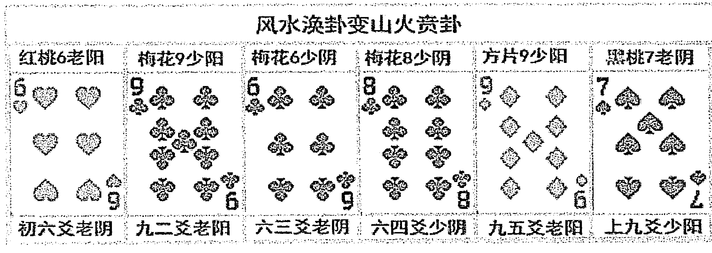

###### 卦气分析：

此卦中1个方片，1个红桃，3个梅花，1个黑桃，二红四黑，总卦气阴占66%，阳占34%，内卦与外卦都是两阴一阳，卦气平分秋色，预示主人当前运气不佳。

###### 推测分析：以体为女孩，以用为工作。

1. 本卦风水《涣卦䷺》，巽上坎下，坎水生巽木，体生用之象，预示主人工作调动就要有付出。主要体卦的初六爻红桃6、九二爻梅花9、六三爻梅花6同动，处于全面变动的状态，说明主人目前的运气不佳。
2. 变卦山火《贲卦》；艮上离下，离火生艮土，体生用之象，这与本卦相似，都是主人要付出，看来工作调动的事情需要去做的工作太多，面临的困难较大。
3. 卦象体用得位，互卦山雷《颐卦》，艮上震下，震木克艮土，体克用之象，农历六月土旺木入墓，体木克不了用土，看来调动工作的事情要推迟一些时日。《颐卦》的覆卦和本卦相同，卦象呈现双方处于对峙的状态。
4. 时间窗口：用爻六四爻梅花8对应农历八月。本卦的初六爻红桃6对应五月，九二爻梅花9对应六月、六三爻梅花6对应七月，用卦的九五爻方片9对应九月，说明在五月、六月、七月、九月这几个月工作都面临一些变化，特别是九月十八至二十二日之间有不确定的因素。
5. 用爻在六四爻梅花8阴居阳位，四为震（☳）象，为木，为长男，为东方，有一位高个子、说话声音大、在家排行老大的男士可以帮忙，但震木不当令，作用不会太大。
6. 卦中2红4黑，卦气偏阴。农历五月有好事；六月、七月、八月事情不是很顺，九月有点希望。

###### 综合分析：

工作面临的变数太大，调动成功的概率不是很大。

###### 事后应验：

从6月份就开始做工作，一直到2020年4月底，这个孩子的工作一直繁忙、压力很大，加之本人结婚以及身体状况等原因，调动工作的事请没有实质进展。

##### 例五、明年三月有望到位

2018年12月30日7时54分，浙江的某先生微信留言：“何老师，新年好！又要麻烦您了。我的亲戚正与一家大型国企会谈，成立一家合资公司，拟请我出任总经理，此事重大，盼得到您的指示，拜托。”我让他抽六张扑克牌发过来。

###### 他抽扑克牌依次是：

红桃9、黑桃8、梅花9、梅花8、方片6、红桃7。

###### 扑克牌起卦：

红桃9、黑桃8、梅花9组成离（☰）象，内卦取离（☰）象，梅花8、方片6、黑桃7组成艮（☶）象，外卦取艮（☶）象，艮上离下，得本卦山火《贲卦䷕》，初九爻红桃9、九三爻梅花9同动，内卦由离（☰）象变为坤（☷）象；九五爻方片6动，外卦由艮（☶）象变巽（☴）象，巽上坤下，得变卦风地《观卦䷓》；按卦象总数之和定用爻，26+21=47÷6=7……5，商数7为奇数，余数5，从上九爻向下数5，六二爻黑桃8为用爻，内卦为用卦，卦象体用不得位，本卦的覆卦《噬嗑卦䷔》，变卦的复原卦《升卦䷭》。

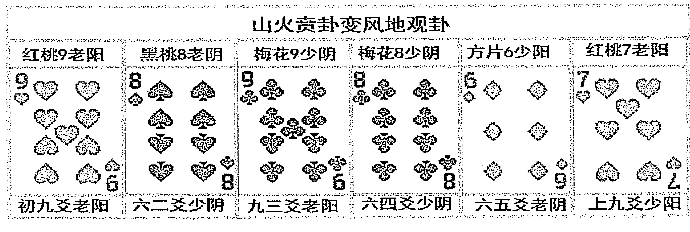

###### 卦气分析：

此卦中1个方片，2个红桃，2个梅花，1个黑桃，三红三黑，卦气阴占50%，阳占50%，内卦阴多阳少，外卦阳多阴少，预示求测之事应该是喜忧参半的事情。

###### 推测分析：以体为某先生，以用为项目。

1. 本卦山火《贲卦》，艮上离下，离火生艮土，用生体之象。卦中初九爻红桃9，九三爻梅花9，九五爻方片6，三个爻同动，卦爻3动3静，共有三次变化，对方两次，主人一次。此事是2018年农历十一月下旬提起的，预示有好事来找主人，但存在不确定的变数。
2. 内卦为用卦，外卦为体卦，体用不得位，覆卦火雷《噬嗑卦》，此卦有吃喝宴请的含义，预示此事要办成尚需请客吃饭加深感情沟通。
3. 变卦风地《观卦》；巽上坤下，巽木克坤土，体克用之象；变卦的复原卦为《升》，木入地中，有破土而出的迹象，徐徐生发。预示主人目前谋划的好事情还要向后推迟一段时间。
4. 时间窗口：十一月、十二月，正月、三月有变化。卦中初九爻红桃9对应农历十一月，九三爻梅花9对应正月，九五爻方片6对应三月。卦象显示2019年农历正月下旬对方会有一次大的变化，到农历三月下旬才会有确切消息。
5. 本卦和变卦中有离（☰）象，巽（☴）象，坤（☷）象，这件事情有女士从中主事的迹象。

###### 事后应验：

2018年12月31日早上7时23分，对方说：“相信您的预测和祝福，明年一定会有收获的。”
注：此事过去了半年时间没有音信。原来是对方在抽牌操作时，没有把每一次抽出来的牌放回再抽，这样提供信息就有误差。著者再强调一下，用扑克牌起卦时，每一次必须把抽出的这张牌放回去，以保证下一次都从16张牌中抽牌。

##### 例六、半年后预测同一件事

半年之后的2019年7月11日9点49分，这位先生又在我微信留言：“何老师，去年您预测的项目能与今年四月份有希望，而四月没有如期到来，原来发现我把抽牌方法搞错了，就是没有把抽出的牌放回去。现在这个项目还在争取中，不知道什么时间能落实，甚为焦虑，所以请您再作分析。我将刚才抽扑克牌的情况报告如下：红桃7，梅花8，红桃9，梅花6，红桃6，梅花7，谢谢！”

###### 扑克牌起卦：

红桃7、梅花8、红桃9组成离（☰）象，内卦取离（☰）象，梅花6、红桃6、梅花7组成艮（☶）象，外卦取艮（☶）象，艮上离下，得本卦山火《贲卦䷕》；卦中九三爻红桃9动，内卦由离（☰）象变震（☳）象；六四爻梅花6和六五爻红桃6同动，外卦由艮（☶）象变乾（☰）象，乾上震下，得变卦天雷《无妄卦䷘》；按卦象总数之和定用爻，24+19=43÷6=7……1，商数7为奇数，余数1，从上九爻向下数1，上九爻梅花7为用爻，外卦为用卦，卦象体用得位，互卦雷水《解卦䷧》。此事有点神奇？时隔半年之后（2018年12月至2019年7月），此人第一次抽的数字是989867，第二次抽的数字是789667，内卦的二爻和三爻都是89，外卦的五爻和上爻都是67。按他抽的牌起的两个本卦都是山火《贲卦䷕》，这从数学上讲可能是几万分之一概率，令著者感到神奇和不可思议。这是题外话，下面解卦。

###### 山火贲卦变天雷无妄卦

| 红桃7老阴 | 梅花8少阴 | 红桃9老阳 | 梅花6少阴 | 红桃6老阳 | 梅花7少阴 |
|-----------|-----------|-----------|-----------|-----------|-----------|
| 初九爻少阴 | 六二爻少阴 | 九三爻老阳 | 六四爻老阴 | 六五爻老阴 | 上九爻少阳 |

###### 卦气分析：

此卦中3个红桃老阳，3个梅花少阴，三红三黑，老阳少阴组合，卦气阳占55%，阴占45%，内卦阳多阴少，外卦阴多阳少，预示主人的诚意非常强烈，对方的热情似乎不足。

###### 推测分析：以体为某先生，以用为项目。

1. 本卦山火《贲卦䷕》，艮上离下，离火生艮土，体生用之象，主人有付出，这个项目的方位大致在主人居住的东北方位。
2. 变卦天雷《无妄卦䷘》，乾上震下，乾金见震木，用克体之象，农历六月土旺，震木入墓气绝，乾金逢生气，预示该项目进一步争取成功的希望不是很大。
3. 本卦的互卦雷水《解卦䷧》，震上坎下，坎水生震木，体生用之象，还是主人有付出。卦中九三爻红桃9对应农历七月，六四爻梅花6对应八月，六五爻红桃6对应九月，这三个爻连续发动，还是与上次预测的结果相似，此项目共有三次变化，对方两次，主人一次。

预示此项目中间环节的不确定因素太多、变数太大。
-   4、时间窗口：九三爻红桃9对应七月，六四爻梅花6对应八月，六五爻红桃6对应九月，预示农历四月下旬事情在疏通阶段，七月初三至初八之间事情有水落石出的迹象，八月上旬情况又出现反复，九月上旬将有利好消息，十月上旬将是最后抉择的时间窗口。
-   5、上九爻黑桃7为用爻，数字六为坎（☵）象，坎为水，为智慧，为北方，为中男，好像有一个低个子、黑皮肤、很精明的中年男人从中帮忙，应该有这么一个人，需要他来从中周旋运作。

###### 事后应验：

此事神奇之处就在第一次和第二次抽扑克牌起的本卦都是山火《贲卦䷕》，第一次的变卦是风地《观卦䷓》，用爻在六二爻，卦象有等待观望之意；第二次的变卦是天雷《无妄卦䷘》，用爻在上九爻，卦象看呈现没有希望。

2019年7月11日中午11点46分，这位先生微信回复：“帮忙的男人与您描述的很相符，时间上也说是七八月份能有消息，与您预测七月初三至初八也能对上，希望能有奇迹。这个人就是我表弟，形象很符合。去年您说的好事上门，相信您的预测和祝愿，明年一定会有收获的。谢谢！

何老师，去年您给预测的项目能于今年四月份有希望，而四月份没有如期到来，原来发现我把方法搞错了，就是没有把抽出的牌放回去，现在这个项目还是争取中，不知道什么时间能落实，心里焦急，所以请您再作分析，我将刚才用扑克抽牌情况报告如下：1.红桃7  2.梅花8  3.红桃9  4.梅花6  5.红桃6  6.黑桃7  谢谢！

这个茶卦山火贲卦，变卦天雷无妄卦，卦气得56%，45%，总数43-7-7-7-9-6。1.山火贲卦，火生艮土，体生用之象，主人有付出。2.天雷无妄卦，乾金克震木，用克体之象，项目争取的希望不是很大。3.时间窗口，农历四月下旬在疏通阶段。农历七月初三至初八之间此事水落石出。4.上九爻动，坎象，好似有一个低个子，皮肤黑，很精明的男人从中帮忙，但作用不大。

谢谢您，近日似有好

去年与这次都是山火贲卦比

原来如此

有没有这么一个人，需要他来从中周旋运作。

帮忙的男人与您描述相符，时间上也说是七八月份能有消息，与您预测的七月初三到初八也对得上，希望会有奇迹

这个人就是我表弟，形象相符合

谢谢，去年您说的好事上门，果然您舅舅提出，如果项目成功，则要我北上工作

把这个人的重要性发动起来，事情将易如反掌。

谢谢您的指点，一有好消息，立马向您报喜

果真是表弟提出，如果项目成功，我要北上工作。”
此人后来再没有回复，我估计跟踪了大半年的项目没有成功。

##### 例七、预测他爱人的事业

2019年11月20（农历十月二十四）日中午，外地的某先生专门赶到宝鸡，求测与他爱人有关的事情。

抽扑克牌依次是：
方片6，红桃7，黑桃9，梅花8，红桃9，方片8。

###### 扑克牌起卦：

方片6，红桃7，黑桃9组成巽（☴）象，内卦取巽（☴）象，梅花8，红桃9，方片8组成坎（☵）象，外卦取坎（☵）象，坎上巽下，得本卦水风《井卦䷾》。卦中初六爻方片6，九三爻黑桃9同动，内卦由巽（☴）象变兑（☱）象；九五爻红桃9动，外卦由坎（☵）象变坤（☷）象，坤上兑下，得变卦地泽《临卦䷒》。按卦爻数之和取用爻：22+25=47÷6=7……5，商数7为奇数，从上六爻向下数5个数，九二爻红桃7为用爻，内卦为用卦，外卦为体卦，卦象体用不得位，互卦不看，覆卦泽水《困卦䷮》，变卦的复原卦为泽地《萃卦䷬》。

| 水风井卦变地泽临卦 | | | | | |
|---|---|---|---|---|---|
| 方片6少阳 | 红桃7老阳 | 黑桃9老阴 | 梅花8少阴 | 红桃9老阳 | 方片8少阳 |
| <image of 6 of diamonds> | <image of 7 of hearts> | <image of 9 of spades> | <image of 8 of clubs> | <image of 9 of hearts> | <image of 8 of diamonds> |
| 初六爻老阴 | 九二爻少阳 | 九三爻老阳 | 六四爻少阴 | 九五爻老阳 | 上六爻少阴 |

###### 卦气分析：

卦中2个方片，2个红桃，1个梅花，1个黑桃，四红二黑，卦气阳占70%，阴占30%，卦气阳气充足。卦象两头飘红中间发黑，地气正红，人气阴暗，天气泛红，预示此人年轻春风得意，中年经历磨难，晚年福寿安康。

###### 预测分析：以体为主人，以用为事情。

-   1、本卦卦象体用不得位，内卦初六爻方片6和九三爻黑桃9同动，外卦九五爻红桃9动，说明主人自己有一次变化，面对的事情有两个变化。预示此事目前尚在不明朗之中，需要一段时间的等待。
-   2、本卦水风《井卦䷄》，坎上巽下。坎水生巽木，体生用之象，主人有付出之象。从现象上看《井卦䷄》是水木相生，卦象体用不得位，而覆卦《困卦䷮》则是泽内无水之象，预示主人目前从感情和事业上都遇到了很大的困惑，或者重大的困难。
-   3、变卦地泽《临卦䷒》，坤上兑下，坤土生兑金，预示主人在金钱方面有付出，用卦由巽（☴）象变兑（☱）象，主人遇到的事情已经从舆论传言变为口舌争讼。变卦的复原卦为《萃卦䷬》，上为兑金，下为坤土，预示必须在腊月上旬把金钱付出去。《临卦䷒》为十二消息卦对应的是农历腊月。

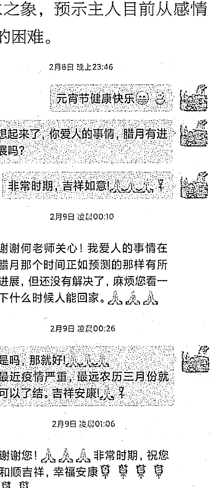

-   4、时间窗口：农历六月，九月，腊月，三月。2019年农历五月到六月中旬女主人就有出问题的迹象。农历七月上旬事情发生了突然变化。农历九月下旬事情变得明朗。农历十一月有向好的转机，腊月初十左右主人的事情会有一个很大的进展。
-   5、用卦初六爻红桃6，九三爻黑桃9，用爻为九二爻红桃7，为兑（☱）象，女主人的事情与一位伶牙俐齿的年轻女士有关联。九三爻黑桃9动，此事中间还有一位职务不高的男士从中作梗。

###### 事后应验：

来人听完我的分析说：感谢何老师，您太神奇了，说的人和事情，以及事情发生的时间段都很准确，我心里有底了。

2020年2月9日对方回复：谢谢何老师关心，我爱人的事情在腊月那个时间正如预测的那样有所进展，但还没有解决了。（见微信对话截图）

##### 例八、我想看看工作的事情

2020年2月4日农历正月十一日，今天立春。外省有一位（1976年属龙）的某先生微信留言：您好！我想请你看看我工作的事情，不知道需要提供哪些信息？我让他抽扑克牌起卦预测。

###### 抽扑克牌依次是：

-   黑桃7，红桃7，方片9，黑桃8，方片7，红桃8

###### 扑克牌起卦：

黑桃7，红桃7，方片9组成乾（☰）象，内卦取乾（☰）象，黑桃8，方片7，红桃8组成坎（☵）象，外卦取坎（☵）象。坎上乾下，得本卦水天《需卦䷄》。卦中只有一个九三爻方片9动，内卦由乾（☰）象变兑（☱）象，坎上兑下，得变卦水泽《节卦䷻》。按传统方法直接可以取九三爻方片9用爻。按卦爻总数再确认：23+23=46÷6=7……4，商数7为奇数，从上六爻向下数4个数。还是九三爻方片9为用爻，内卦为用卦，外卦为体卦，卦象体用不得位。覆卦天水《讼卦䷅》，变卦的复原卦泽水《困卦䷮》。

###### 水天需卦变水泽节卦

| 黑桃7老阴 | 红桃7老阳 | 方片9少阳 | 黑桃8老阴 | 方片7少阳 | 红桃8老阳 |
| :---: | :---: | :---: | :---: | :---: | :---: |
| 初九爻少阳 | 九二爻少阳 | 九三爻老阳 | 六四爻少阴 | 九五爻少阳 | 上六爻少阴 |

###### 卦气分析:

卦中2个方片，2个红桃，2个黑桃，四红二黑，卦气阳气占66%，阴气占34%，阳气充足，卦爻阴爻阳爻得正位，今天立春，节气交替，预示主人工作的事情只是暂时遇到了一点小困难。

###### 推测分析：以主人为体，以工作为用。

-   1、本卦水天《需卦䷄》，坎上乾下，乾金生坎水，用生体之象，卦象天上有水，水在天为云，想下雨尚需等待各种条件成熟之后实现，预示主人想的工作还需要等待一段时间才能解决。
-   2、变卦水泽《节卦䷻》，兑金生坎水，冬季水旺，呈现水满为患之象，好在今日立春，正月木旺当令，水势减弱，预示主人要克制自己的行为，管控自己的欲望。
-   3、覆卦为天水《讼卦䷅》，乾上坎下，天象向西移，河水往东流，事与愿违，预防官非争讼之忧，好在卦象用生体之象，预示主人只是事业出现了与愿望相悖的发展趋势。

> 现在在等待安排中，不知道下一步安排情况如何？2月5日下午16.12
> 找一撂扑克牌，取出四种牌的6789，共16张牌。洗净手，再洗牌，任意抽一张记下，再将这张牌放回去洗，再抽一张记下。共抽六张牌，按顺序发我，给你推测一哈。
> 好的！何老师
> 抽的牌依次:黑7，红7，方9，黑8，方7，红8。①，卦气分析，卦中2个方片，2个红桃，2个黑桃，阳气占66%，阴气占34%。阳气充足，运势尚好。②，本卦水天需，乾金生坎水，用生体，水在天上之象，需要等待时机。③，变卦水泽节卦，兑金生坎水，体生用之象，水满为患遍地流，目前主人需要控制自己的情绪。④，时间窗口：农历七月，十月，正月，四月。一是坏事在去年农历七月初就已形成。二是农历十月上旬正式停职。三是今年正月应该有安排但目前疫情影响，可能推后。四是农历四月初八至十二之间就有确切消息。
-   4、复原卦为泽水《困卦䷮》，兑上坎下，泽中无水之象，预示主人在感情方面遇到前所未有困惑，要注意回避男女感情方面的暧昧之事发生。
-   5、九三爻方片9动，为离象，为中女，为马，为南方，为红色。事情可能因一个热情大方属马的女士而起，也应该由这个女人去帮你解决问题。
-   6、用卦乾象变兑象，乾为官府衙门，兑为纪检法院。下一步可能去纪检，司法，公安，财经部门，方向在你离你不是很远的正西方位。

以上分析，仅供参考。祝你心想事成！[表情]

-   5、九三爻方片9用爻动，时间窗口：农历2019年七月、十月，2020年正月、四月。一是不顺的事情2019年农历七月初八至十二日之间就已经形成；二是农历十月上旬遇到了麻烦事情；三是今2020年农历正月初十前后本该有好事，但目前武汉疫情严重，单位太忙时间因故推后；四是体卦六四爻黑桃8对应农历二月，预示农历二月又有人从中使坏作梗，主人目前比较倒霉郁闷。五是农历四月初八至十二日之间，主人将会得到与工作有关的好消息。

2月5日下午17:01

安排的职务是正职还是副职？何老师

2月5日下午17:06

九三爻方片9，老阳下有少阳，有正职的信息。

谢谢您，何老师

未来发展咋样？

官运只有三年时间，只做事情，莫问前程！预祝吉祥！[表情]

周二16:37

在么？何老师

周二16:53

在啊

请教你个事情

你说吧

-   6、九三爻方片9动，数字为三，卦象为离（☲）象，为中女，为马，为南方，为红色。预示在主人的南方有一位热情大方、属马的女士，事情因这个女人而起，也应该由这个女人去帮主人解决。

我的工作安排你看看三月份什么情况？

我看过了啊，4月初吧

可能就在这几天

农历4月初么

周二17:08

那一次卦象看正月可以安排，但疫情严重耽搁。下一个时间窗口可能就是四月初，祝你好运！[表情]

好的

-   7、用卦乾（☰）象变兑（☱）象，乾（☰）象为西北方位的官府衙门。兑（☱）象为正西方位，白虎为武、为西方，主人下一步有可能去纪检，司法，公安，财经部门工作，方向在距离主人不是很远的正西方位。

我的停职是去年农历7月，不是10月

周二17:16

我的时间窗口是1月，4月，7月，10月。

不要急，再等等吧

###### 事后应验：

据此人反馈，他实际是一个有身份的公务人员，2019年农历七月感觉自己没有什么问题，上级突然宣布他停职了，所以，此人目前一直等待单位给他重新安置工作，感到非常郁闷向著者咨询预测（见2020年2月5日微信对话截图）。

## 第四节 人身安全预测

人生在世，所有事情都莫大于人身安全，特别是经历2020（庚子）年武汉新冠病毒疫情，更加证实身体健康的重要啊！我们生存的这个世界是非常美好的，如果没有了你自己，一切美好都会变成曾经的故事，你我她很可能就是故事中的人。所以，要珍惜生命，关心别人，珍爱自己，就显得格外的重要。

##### 例一、患淋巴癌男孩

2012年3月28日（农历三月初七）下午，受某县周文化研究会邀请去举办周易文化讲座。讲座结束后，该周文化研究会的某同志说：何老师，有一个亲戚男孩患非霍奇金淋巴癌，生命垂危，与CCTV罗京得的是一个病。请预测一下结果，最好有大概的日期，务必告我。

男孩姓帖，生于1985（乙丑）年九（丙戌）月十五（庚子）日戊寅时。2012（壬辰）年3月30日（农历三月初九）（庚寅）日（甲申旬午未空），病人在西安某医院病房抽的扑克牌，发过来著者起卦。

###### 抽扑克牌依次是：

-   黑桃8、梅花8、梅花7、方片8、梅花6、黑桃9。

###### 扑克牌起卦：

黑桃8、梅花8、梅花7组成艮（☶）象，内卦取艮（☶）象，方片8、梅花6、黑桃9组成艮（☶）象，外卦取艮（☶）象，得本卦八纯卦《艮䷳》，外卦六五爻梅花6，上九爻黑桃9同动，外卦由艮（☶）象变坎（☵）象，得变卦水山《蹇䷦》；动爻全在外卦，外卦为用卦，卦象体用得位。

###### 八纯卦艮卦变水山蹇卦

| 黑桃8老阴 | 梅花8少阴 | 梅花7少阴 | 方片8少阳 | 梅花6少阴 | 黑桃9老阴 |
| --- | --- | --- | --- | --- | --- |
| 初爻少阴 | 六二爻少阴 | 九三爻少阳 | 六四爻少阴 | 六五爻老阴 | 上九爻老阴 |

卦气分析：卦象中2个黑桃、3个梅花、1个方片，卦象5黑1红，阴气占85%，阳气15%，体卦全部为阴气，用卦只有一个方片8阳爻，卦气阴气太重，好在三月阳气处于上升阶段，预示该男孩的生命已经出现垂危之象。

###### 推测分析：按六爻预测法

| 艮上艮下《艮䷳》 | 坎上艮下《蹇䷦》 | 六神 |
| --- | --- | --- |
| 黑桃9 官鬼寅木、x世 | 妻财子水、、 | 滕蛇 |
| 梅花6 妻财子水、、x | 兄弟戌土、 | 勾陈 |
| 方片8 兄弟戌土、、 | 子孙申金、、世 | 朱雀 |
| 梅花7 子孙申金、应 | 子孙申金、、 | 青龙 |
| 梅花8 父母午火、、 | 父母午火、、 | 玄武 |
| 黑桃8 兄弟辰土、、 | 兄弟辰土、应 | 白虎 |

-   1、本卦八纯卦《艮䷳》艮上艮下，土厚土旺，山象重叠，卦象静止不动之象；
-   2、得变卦《蹇䷦》坎上艮下，山上有水之象，外卦两个爻同动，病情将有大的变化。本卦看此人的病情结论已定，不可改变，变卦坎坷重重，此人病情尚有大的变数。
-   3、上九爻（黑桃9）老阳官鬼寅木持世，世动化妻财子水回头生；六五爻（梅花6）老阴子水妻财动，化兄弟戌土，回头克财星子水。兄克财，财化鬼，世爻原神力量严重不足。寅木临四月令泄气，预示病人精力殆尽。
-   4、九三爻应爻子孙申金逢月建辰土有微弱生气，克世爻官鬼寅木，应爻子孙申金克世爻，此为雪上加霜，说明这男孩的病情已经失去了最佳的治疗机会。
-   5、以“天、地、人”而论，六五爻梅花6是少阴老阴，上九爻黑桃9是老阴加老阳，天气阴极；九三爻梅花7是少阴少阳、九四爻方片8是少阳少阴，人气一阴一阳，尚存一线希望；初六爻黑桃8是老阴少阴，六二爻梅花8少阴少阴，地气也处阴极状态，天地二气已经死绝。预示年轻的生命只能靠自己微弱的一丝存活希望。
-   6、上九爻螣蛇、六五爻勾陈同时发动，预示病人经历过离奇怪异或者被人强迫欺骗的事情，导致病人情绪极为不佳，对病情恢复十分不利。
-   7、六五爻梅花6为老阴对应农历三月，上九爻黑桃9为老阳对应农历四月。用卦艮（☶）象变坎（☵）象，对应的日期时间窗口为每月的二十三至二十七日之间，预示农历三月和四月二十三至二十七日之间是病情发生加速恶化的时间段。

###### 事后应验：

2012年5月13日一大早，某某周文化研究会某同志发短信。某男孩子于5月10日（农历四月二十）凌晨2点30分逝去了。一个26岁的小伙子，患淋巴癌医治无效，告别了家人，告别了这个世界，就那样地走了。著者实在不敢相信这个残酷的现实。只能为他们的家人送上一句：节哀顺变！今天是母亲节，男孩的母亲此时此刻无疑沉浸在极度的痛苦之中，我们只能祈祷好人一生平安！

病人叫帖锋欢，名字的谐音就是贴在剑锋上寻欢乐，这哪有欢乐可言啊！反有性命之忧。病人四柱八字日元是庚金，著者当时建议其家人将孩子的名字帖锋欢改为帖金奂，并让转告病人这个名字可以唤起命运的生机。但是，癌症如魔鬼，没有给孩子机会。

尽管年轻是生命最大的资本，但是一定要珍爱自己的生命，活着就是王道！

注：这是用扑克牌起的卦，用六爻预测方法进行分析预测的一个案例。

##### 例二、人是不是救不下来了

有一个人因感情问题，在微信上发了一段告别人生的信息后，突然电话关机，与她朋友（我的学生）两人之间失去联系。我这个学生感觉朋友是吃了什么药，可能要出大事了，因为此人在外地，距离宝鸡很远，无法及时赶到现场，所以，准备向公安机关报警。

2019年5月13日（农历四月初九）下午18时28分，学生在微信留言、并打电话过来：“说外地的一个朋友因感情问题，电话失去联系，我感觉她吃药了，问她人是不是救不下来了？帮我看看，黑桃8、方片8、红桃9、红桃9、梅花8、红桃6。应该是个小过卦。”

###### 扑克牌起卦：

黑桃8、方片8、红桃9组成艮（☶）象，内卦取艮（☶）象，红桃9、梅花8、红桃6组成震（☳）象，外卦取震（☳）象，震上艮下，得本卦雷山《小过䷽》。九三爻红桃9动，内卦由艮（☶）象变为坤（☷）象；九四爻红桃9动和上六爻红桃6同动，外卦由震（☳）象变为艮（☶）象，艮上坤下，变卦山地《剥䷖》。按卦数之和取用爻：25+23=48÷6=8，商数8为偶数，初六爻黑桃8为用爻，内卦为用卦，外卦为体卦，卦象体用不得位。（这一卦是著者看见信息紧急，在外边即时解的卦，没有看覆卦）

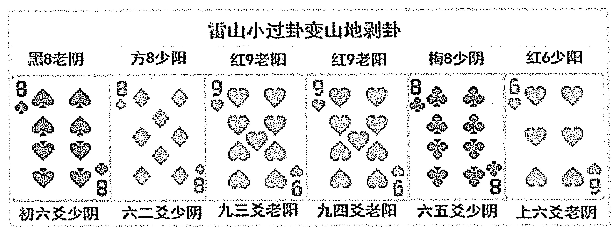

###### 卦气分析：

卦中1个方片，3个红桃，1个梅花，1个黑桃，四红二黑，卦象阳气占70%。阴气占30%，只是阳位得阴爻，阴位得阳爻，用爻初六爻黑桃8老阴，只是事不顺心，卦中阳气占绝对优势，预示人的生命应该没有危险。

###### 预测分析：以体为主人，以用为生死。

-   1. 本卦雷山《小过䷽》，震上艮下，震木克艮土，体克用之象。农历四月火旺当令，震木见火泄气，艮土逢生气，这个震木克不了艮土。预示这事情与一个高个子、说话声音大、在家排行老大男人有关。
-   2. 变卦山地《剥䷖》，艮上坤下，艮土见坤土，卦象体用比和之象，加上四月令火旺生土，人应该不会有什么生命危险。
-   3. 时间窗口：内卦九三爻红桃9动，对应农历正月，四月。九四爻初爻红桃9动，对应农历二月，五月。可能是因为农历正月因感情问题发生了一桩很不愉快的事情，二月份感情方面再次出现不好的变化，四月上旬突然爆发了。初六爻黑桃8为用爻对应农历五月，事情到农历四月下旬至五月上旬才能恢复平静。

###### 4、从卦气看红多黑少，阳气充足，卦象呈现先凶后吉之象，所以，主人的生命应该绝对不会出现危险的情况。

###### 事后应验：

著者很快把预测结果发给对方，1个多小时之后，当天傍晚19时34分，学生回复：“老师爱死你了，她是没事了，谢谢，不是你我就把事情闹大了，准备报警呢。”
20时35分，著者回复：“6张牌。三红，一方片，一梅花，一黑桃，卦气阳气占67%，阴气占33%，肯定不会有问题的。你为朋友操心，乾坤居士给你点赞！”
学生回复：谢谢你！
后来这个人果然没有出问题，只是个人感情上受了一次比较大的打击，但此人心理素质好，很快就走出了生活的阴霾。

> 1978.5.7辰阳历
帮我看看是不是真的感情劫过不去呀
她努力想试试和别人但不行
我替她做好准备了解自己呢

> 帮我看看，黑8方8红9红9梅8红6

> 问[一二]是不是放不下来
我感觉她吃药了
应该是小过卦

> 1.本卦小过卦，得本兑艮土之爻，用克体，四月震木泄气，克不了坤土，这事与一个高个子男人有关。
2.变卦山地剥卦，体用比和，应该没什么问题。
3.时间吻口，正月，四月。正月有一桩事，二月有不好的变化，四月上旬爆发了，四月下旬才能恢复平静。
4.卦象先凶后吉，人应该没有危险的。

> 是吗？先谢谢了

> 我从商贸学校到研究会，取了U盘，给那个老侯一本书。然后回来的。
放心吧，卦象看人没有危险。

> 老师爱死你了，她是没事了
谢谢谢谢谢谢
不是你我就把事情闹大了，准备报警呢

> 6张牌，三红，一方片，一梅花，一黑桃，卦气阳气占66%，阴气占33%，肯定不会有问题的。你为朋友操心，乾坤居士给你点赞！[表情][表情][表情]

> 谢谢你。

# 第五节　随机事件预测

生活中人们常常会遇到随机发生的事情。比如说车次晚点呀！临时找东西啊！再例如：几个人聚在一起，突然有人问：你看我什么时间有难？等等突发事件，都需要即时预测结果。这就需要借助临机一动的意念和当时情景下出现的外应来推测预知结果。

2016年农历正月，侨居加拿大的常先生回国，邀请宝鸡市周易研究会副会长以上人员聚在一起。酒过三巡，菜过五味。常先生突然起身发话：“诸位老师，今天在座的都是宝鸡周易研究界的大师高手。我们经常会听到预测很神奇的案例，但预测未来的事情暂时无法应验。请大家预测一下我过去在宝鸡历险遇难的一件事情发生在那一年？如果测得准，我就真正佩服宝鸡周易研究会的水平。”

提供的唯一信息就是常先生（男），1964（甲辰）年某月某日生于宝鸡。于是大家各自用《四柱八字》《一掌经》《大六壬》《奇门遁甲》《六爻》《梅花易数》等方法进行预测。著者当时用了自己的“梅花心易”和“流年吉凶”推断法直接给他预测。根据著者多年的经验，人生突发的致命事件大多数与“本命年”和“六害年”有关。今年是2016年，倒推5年2012（壬辰）年是常先生的本命年，但是，此人那时候侨居加拿大，与宝鸡没有直接联系。再倒推一轮12年是2000（庚辰）年，也是此人的本命，1999（己卯）年是六害年。遇难事件肯定是1999年农历九（戌）月到十（亥）月发生的。我当时直接对常先生说：遇难的事情发生在1999年农历九（戌）月底十（亥）月初，在宝鸡的西北方向。

只要能说年份就很不错了，没想到何老师推算到月份和方位，佩服！佩服！他说那一年他自己驾车与夫人去宝鸡西北的甘肃平凉市谈一桩生意，从平凉返回宝鸡途中，车正好走在陇县境内的峰山梁上，对面突然冲过来一辆拉煤的大卡车，路面太窄，情急之下打了一把方向，车就从山坡上翻滚下去。翻了几个跟头后，车子地盘突然靠在一棵大树上，车身晃了几下，卡在了半山腰。幸好他们两人只是擦破了一点外皮，没有重伤，相互帮着从车窗爬出来，艰难地爬上公路边，挡了一辆车把他们拉到陇县县城。第二天雇用了一辆吊车，才把车子从半坡吊了上来。

这是发生在17年前的一件突发事件。为什么著者会推算的那么准，难道有特异功能？其实复杂的问题答案往往很简单。当时我用“梅花心易”观察，常先生正好坐在饭桌东南（辰）位，他是面向西北（戌）方站立说这个话题的，正好形成辰戌相冲。1999（己卯）年九（戌）月与太岁戌卯六合，十（亥月）月与太岁亥卯三合，九（戌）月月建冲本人属相（辰）引动有惊无险的事件发生。这是随机事件预测当场应验的一个事例，顺便与大家分享。下面举几个卦例与大家进一步交流。

##### 例一、预测校园停电故障

2013年3月25日晚8时许，学院突然停电。3月26日学院电工和供电局工作人员全天排查地下高压电缆，一直到3月27日上午还没有查出事故的原因，停电已超过40多个小时，给学院一万六千多名师生员工生活造成严重困难。本人在后勤工作，心中着急啊！农历二月十六日中午12时40分，著者在办公室用扑克牌起卦预测，抽了六张牌：红桃8、黑桃8、红桃7、黑桃9、红桃8、黑桃9。

###### 扑克牌起卦：

红桃8、黑桃8、红桃7组成艮（☶）象，内卦取艮（☶）象；黑桃9、红桃8、黑桃9组成离（☲）象，外卦取离（☲）象，离上艮下，

得本卦火山《旅卦䷷》；卦中九四爻（黑桃）9老阳和上九爻（黑桃）9老阳同动，外卦由离（☲）象变为坤（☷）象，坤上艮下，得变卦地山《谦卦䷎》；两个动爻全在外卦，内卦安静，故取外卦为用卦。互卦泽风《大过卦䷛》。

###### 火山旅卦变地山谦卦
| 红8老阳 | 黑8老阴 | 红7老阳 | 黑9老阴 | 红8老阳 | 黑9老阴 |
| :---: | :---: | :---: | :---: | :---: | :---: |
| 8♥ 8♥ | 8♠ 8♠ | 7♥ 7♥ | 9♠ 9♠ | 8♥ 8♥ | 9♠ 9♠ |
| 初6爻少阴 | 六2爻少阴 | 九3爻少阳 | 九4爻老阳 | 六5爻少阴 | 上9爻老阳 |

###### **卦气分析：**

此卦中3张红桃老阳，3张黑桃老阴，卦气阴阳各占50%；内卦安静，两阳夹一阴，外卦两阴夹一阳，有两个爻动，预示故障十有八九发生在单位外边。

###### **推测分析：** 以体为单位、以用为故障。

- 1、本卦火山《旅卦䷷》，离上艮下，内卦三个爻安静不动，卦象体用得位，说明校园内的（地下高压电缆）线路应该是完好无损，没有故障的迹象。卦数：7、3。
- 2、外卦的九四爻黑桃9老阳和上九爻黑桃9老阳，两个爻同动，动爻全在外卦，说明故障十有八九发生在校园之外。两个爻同动，很可能是两处发生故障。
- 3、互卦泽风《大过卦䷛》兑上巽下，卦象的外卦为兑（☱）象，兑为泽、为池塘沼泽，九四爻黑桃9动，预示距离内卦（学校）最近的第一处故障应该在校园外不远处的一个池塘边上；上九爻黑桃9也动，预示第二处故障应该在供电专线的终端部位。卦数：5、2。
- 4、本卦火山《旅卦䷷》离上艮下，离火生坤土，用生体之象；变卦地山《谦卦䷎》，坤上艮下，坤土见艮土，体用比和之象。卦数：7、8。
- 5、外卦离（☲）象变坤（☷）象，离（☲）为火，坤（☷）为土，可能是因外部起火而接地导致校园内停电，变卦《谦卦䷎》用土与体土比和，是小问题，不是大故障。
- 6、卦象数字显示：本卦7、3，互卦5、2，变卦7、8，或者8、7。最后一处故障应该在72号至87号电杆之间的高压线路上出了问题。

###### 事后验证：

当天下午经仔细检查发现校外两处故障：第一处是在离学院不远处的军管区低洼地段，地下电缆头漏电击穿；第二处是第86号高压杆上有一个鸟窝，因为天下连阴雨日久，高压瓷瓶被击穿，线路接地。及时排除故障后，于3月27日下午17时全部供电。常言道：细节成就大事，一粒老鼠屎能坏一锅饭。一个鸟窝，竟然造成如此大的停电事故啊！

##### 例二、学生报到人数

2015年9月5日晚上，因学院招生情况非常的好，签报志愿的学生远远超过计划招生的5000人，著者当时主管后勤保障工作，担心准备的5000套公寓用品不够用，因此预测新生报到人数。

###### 抽扑克牌依次是：

红桃8、红桃9、方片7、黑桃6、梅花8、方片7。

###### 扑克牌起卦：

红桃8，红桃9，方片7组成巽（☴）象，内卦取巽（☴）象，黑桃6，梅花8，方片7组成艮（☶）象，外卦取艮（☶）象，艮上巽下，

得本卦山风《蛊卦䷑》。卦象的九二爻红桃9动，内卦由巽（☴）象变为艮（☶）象；六四爻黑桃6动，外卦由艮（☶）象变为离（☲）象，离上艮下，得变卦火山《旅卦䷷》。按卦数之和取用爻：24+21=45÷6=7……3，商数7为奇数，从上九爻向下数3个数，六四爻黑桃6为用爻，外卦为用卦，内卦为体卦，卦象体用得位，互卦为雷泽《归妹卦䷵》。

###### 山风蛊卦变火山旅卦
| 红桃8老阳 | 红桃9老阳 | 方片7少阳 | 黑桃6老阴 | 梅花8少阴 | 方片7少阳 |
| --- | --- | --- | --- | --- | --- |
| （红桃8扑克图案） | （红桃9扑克图案） | （方片7扑克图案） | （黑桃6扑克图案） | （梅花8扑克图案） | （方片7扑克图案） |
| 初六爻少阴 | 九二爻老阳 | 九三爻少阳 | 六四爻老阴 | 六五爻少阴 | 上九爻少阳 |

卦气分析：

此卦中2个方片，2个红桃，1个梅花，1个黑桃，四红二黑，卦气阳占67%，阴占33%，内卦3红，外卦2黑1红，卦象的卦气阳盛阴衰，说明今年的人气旺盛。

推测分析：以体为后勤，以用为学生。

- 1、本卦的九二爻红桃9、六四爻黑桃6为用爻，两个爻同动。外卦为用卦，内卦为体卦，卦象体用得位，人数不会有什么特殊变化。
- 2、本卦山风《蛊卦䷑》艮上巽下，巽木克艮土，体克用之象，卦象推断人数：初六爻、九二爻、九三爻组成巽（☴）象数字为5，九二爻、九三爻、六四爻组成兑（☱）象数字为2，九三爻、六四爻、六五爻组成震（☳）象数字为4，六四爻、六五爻、上九爻组成艮（☶）象数字为7，从下向上直读：5247。这个数看作今年填报专业的学生总人数。
- 3、互卦雷泽《归妹卦䷵》震上兑下，兑金克震木，体克用之象，卦象数字：2364。这个看作学院（凤翔分院）的学生人数：236人。
- 4、变卦火山《旅卦䷷》离上艮下，离火生艮土，用生体之象，卦象数字从下向上为：7523。本卦与大数已定，这个数字可以看作百位以后的数字：752人。
- 5、用爻落在六四爻动，预示新生报到人数是4位数，这个4为千位的大数字，百位以后752，预计新校区4752人。外加（凤翔校区）学生人数：236人，预计实际报到学生人数约为：（4752+236）4988人。

###### 事后应验：

根据预测的数字4988人，我们就没有二次追加公寓用品。一直到23天之后的2015年9月28日11时，询问学院招生就业处的主管老师，学院新校区报到新生4746人，凤翔校区227人，实际报到新生为4973人。预测数字与实际报到人数只差了15人。

##### 例三、我的东西丢了

2019年3月25日（农历二月十九）早上9时32分，朋友微信留言：方片6、方片8、方片7、梅花7、红桃9、梅花8。应该是个咸卦，泽山咸对吧？我的东西丢了。

###### 扑克牌起卦：

方片6、方片8、方片7组成艮（☶）象，内卦取艮（☶）象，梅花7、红桃9、梅花8组成兑（☱）象，外卦取兑（☱）象，兑上艮下，得本卦泽山《咸卦䷞》。初六爻方片6动，内卦由艮（☶）象变为离（☲）象，九五爻红桃9动，外卦由兑（☱）象变为震（☳）象，震上离下，得变卦雷火《丰卦䷶》。按卦象总数之和取用爻：21+24=45÷6=7……3，商数7为奇数，从上六爻向下数3个数，九四爻梅花7为用爻，外卦为用卦，卦象体用得位，互卦天风《姤卦䷫》。

###### 泽山咸卦变雷火丰卦

（图片描述：显示扑克牌卦象图，对应“泽山咸卦变雷火丰卦”）

###### 卦气分析:

卦中3个方片，1个红桃，2个梅花，四红二黑，卦气阳占70%。阴占30%，体卦三个阳爻阳气十足，阴气外露，阳气内藏，从卦气看东西应该不会丢的。

###### 预测分析: 以体为主人，以用为东西。

- 1、本卦泽山《咸卦䷞》，艮土生兑金，体生用之象，卦象开始看好像是有损失的，用卦兑（☱）象为金，应该与金钱首饰，或者存折之类的东西有关。
- 2、变卦雷火《丰卦䷶》，震木生离火，用生体之象，春季木旺，体卦离火逢生气，卦象回头来生，预示东西应该没有丢，很快会找到。
- 3、九五爻红桃9为用爻，老阳得正位，鸿运当头，预示主人的东西失而复得的征兆。
- 4、外卦由兑（☱）象变为震（☳）象，时间窗口：从初八至十二日提前到初三至初七之间。今天是二月十七日，东西

（聊天记录部分）
> 方6方8方7梅7红9梅8
应该是是个咸卦
泽山咸对吧
我的东西丢了

> 存折丢了？
一，这个卦本卦泽山咸卦，艮土生兑金，体生用之象，开始若有损失。
二，变卦雷火丰卦，震木生离火，用生体，春季木旺火逢生气。
三，九五爻的红9为用爻，是失而复得的征兆。
四，东西三月初三至初七才能找到。
五，先失后得之象。东西丢不了，在东边的第五层楼，或者柜子的第五层找。

不是存折，是首饰
兑金是首饰
哦
没有丢，在呢。好好找
好的知道了
晚上回去在找
东西找到了，是在柜子里，就是时间提前了
今天有时间请你吃饭吧嘿嘿谢谢

最远在农历三月初三至初七之间一定会找到。

- 5、兑（☱）象为正西，震（☳）象为正东，外卦九五爻红桃9为用爻，东西应该在自己家的楼上，东边房子木柜子里的第五层。这里也可以断为他们家住在五楼以上的楼层。

###### 事后应验：

3月26日（农历二月二十）早上8点15分，对方回复：“东西找到了，是在柜子里，就是时间提前了。今天有时间请你吃饭。”

后来对方电话说：“东西确实是在他们家东边房子木柜子里的第五层隔层中找到的，你太神奇了。他们家实际住在六层楼。”

注：这个时间还可以这样推断。九四爻梅花7为用爻，正好对应农历二月，六二爻、九三爻、九四爻组成巽（☴）象，代表每月的十八至二十二日这五天之间，二十日找着东西，正好应在这个时间段。

##### 例四、房子出问题了

2019年5月5日（农历四月初一，初二立夏）下午13时54分，朋友微信留言：“房子出问题了，贷款出问题了，梅花6、梅花6、红桃7、方片7、红桃8、黑桃9。应该是个旅卦。”

###### 扑克牌起卦：

梅花6、梅花8、红桃7组成艮（☶）象，内卦取艮（☶）象，方片7、红桃8、黑桃9组成离（☲）象，外卦取离（☲）象，离上艮下，得本卦火山《旅卦䷷》。卦中初六爻梅花6、六二爻梅花6同动，内卦由艮（☶）象变为乾（☰）象；上九爻黑桃9动，外卦由离（☲）象变为震（☳）象，震上乾下，得变卦雷天《大壮卦䷡》。按卦象总数之和定用爻：

19+24=43÷6=7……1

商数7为奇数，从上九爻数1个数，上九爻黑桃9为用爻，外卦为用卦。卦象体用得位，互卦泽风《大过卦䷛》。

###### 火山旅卦变雷天大壮卦

（图片描述：显示扑克牌卦象图，对应“火山旅卦变雷天大壮卦”）

###### 卦气分析：

卦中2个方片，1个红桃，2个梅花，1个黑桃，三红三黑，卦气阳占50%。阴占50%，阴阳二气平衡，卦象动爻在两头，中间三个爻安静，预示房子贷款的事情双方中间环节上应该是没有问题的。

（聊天记录部分）
房子出问题了
贷款出问题了
梅6.梅6.红7.方7.红8.黑9
应该是个旅卦

###### 预测分析：以体为主人，以用为贷款。

- 1、本卦火山《旅卦䷷》，离上艮下，离火生艮土，用生体之象，贷款找主人，预示贷款应该会很快就能办好的。
- 2、变卦雷天《大壮卦䷡》，震上乾下，乾金克震木，体克用之象，只是好事（贷款）要推迟几天到账的日子罢了。
- 3、上九爻黑桃9动，时间窗口：农历四月，七月，十月。农历四月初三至初七之间应该可以解决问题的。
- 4、互卦泽风《大过卦䷛》，兑金克巽木，用克体之象，说明中间环节出了问题。
- 5、用卦在外卦，用爻为上九爻黑桃9，

（聊天记录部分）
> 1.本卦火山旅卦，用生体之象，是找人，是好事。
2.变卦雷天大壮卦，体金克用木，体克用之象，事可以办成，时间要拖后。
3.上九爻为用爻，四月初三之初七之间就能搞定。
4.有一个退休二线的个子低，皮肤黑，很聪明的男士可以帮忙解决问题。

谢谢
你看可以吗
时间上没问题吧

（图片描述：显示表情图片）

余数为1为乾（☰）象，预示有一位退休的公职人员。黑桃9在人事方面指的是这位退休的公职人员（卦气看此人身体不太好）。另外还有一位退休的年龄较大的长者，还有一位个子不高，皮肤较黑，人很精明中年男士，两个人都可以帮忙的。

###### 事后反馈:

两天之后的2019年5月7日（农历四月初三），对方反馈，房子的贷款手续上出了点问题，后来有一个在银行退休的熟人从中帮忙解决了问题。

##### 例五、活动不很理想

> 今天看来日子真的不顺利吧，梅6、梅8、梅7、黑8、黑6、梅9。只要注意就无大碍了。谢谢！

###### 扑克牌起卦:

梅花6、梅花8、梅花7组成艮（☶）象，内卦取艮（☶）象，黑桃8、黑桃6、梅花9组成艮（☶）象，外卦取艮（☶）象，艮上艮下，得本卦八纯卦《艮卦䷳》。初六爻梅花6动，内卦由艮（☶）象变为离（☲）象，六五爻黑桃6与上九爻梅花9同动，外卦由艮（☶）象变为坎（☵）象，坎上离下，得变卦水火《既济卦䷾》。按卦爻总数之和取用爻：21+23=44÷6=7……2，商数7为奇数，从上九爻数2个数，六五爻黑桃6为用爻，外卦为用卦，卦象体用得位，互卦雷水《解卦䷧》。

###### 卦气分析:

（注：此卦6个爻全是黑桃和梅花，这是著者所有卦例中唯一的一个纯阴卦。）
卦中5个梅花，1个黑桃，卦气阴占100%，初六爻梅花6阳位得老阴爻，六五爻黑桃6阳位得老阴爻，上九爻梅花9阴位得阳爻，阴阳失调，卦中阴气笼罩，说明主人近期运气不佳，本次联谊活动举办的不是很理想。

（图片描述：显示扑克牌卦象图，对应“艮卦变水火既济卦”）

预测分析：以体为主人，以用为活动。

- 1、本卦八纯卦《艮卦䷳》，艮土见艮土，体用比和之象，活动应该不会有什么问题，只是艮卦为山山重叠，为静止不动，活动气氛可能不活跃。卦象数字：7，7。
- 2、变卦水火《既济卦䷾》，坎上离下，坎水克离火，用克体之象，目前是农历二月木旺水泄火逢生气，用卦（坎）水泄气，月令木通关，体卦（离）火逢月令来生，这个用（水）克不了体（火），活动比较顺畅，不会出什么问题。卦象数字：3，6。
- 3、活动人数，本卦数字之和为14，变卦数字之和为9，卦象阴气太重，

（聊天记录部分）
梅6.梅8.梅7.黑8.黑6.梅9
今天看起来真的不顺利吧
只要注意就无大碍了谢谢
本卦比和之象本来没有什么问题，变卦水火既济卦，用克体之象，先凶后吉。但是，月令木旺，用水泄气，体火逢生，应该没有什么问题。
好知道了
活动结束，平平安安感恩有你给我打气🙏🙏🙏
这次是所有活动以来人最少的一次扑克牌梅花易数来断。活动最多13人，坚持到最后的只有9人，有4个人提前走了。

4、本卦《艮卦》，艮为止，为不动，为少男，为东北方位，卦象为阳少阴多，“阳卦阴多，阴卦阳多”，推测现场参加活动的应该是男士多女士少。

5、变卦水火《既济卦》，火炎升腾，水润向下，阴阳二气相交，预示到场的男女交流气氛应该还是比较愉快的。

###### 事后应验：

活动结束，对方回复：“这次是所有活动以来人最少的一次。”

笔者回复：“9-13人，有4个人提前走了。”

对方问：“你怎么知道的，你厉害，是的，有4个人走了，就是我发的那个艮卦知道的吗。太厉害了，早上不告诉我人数嘿嘿，怕影响我对吧？”

笔者说：“本卦山上山下艮卦，艮为止，为不动，为少男，现场男人多女人少。变卦水火既济卦，火炎升腾，水润向下，预示到场的男女交流应该还是很愉快的。”

对方回复：“是的，男多女少，交流还不错。”

注：此卦的特点是人数测得很准，本卦为开始的人数14人，总数为何要减去1？首先把组织者本人减去，然后才是实际到场的确切人数，9~13人。

13

你咋知道的

梅花易数计算的

你厉害

可能有四个人没有参加完活动，提前就走了。

帮忙人8个

共二十多人

是的，有四个走了

就我发的那个艮卦知道的吗？

是的啦，你老帅有两手吧？

太厉害了，早上不告诉我人数嘿嘿 怕影响我对吧

本卦山上山下艮卦，艮为止，为不动，为少男，现场男人多女人少。变卦水火既济卦，火炎升腾，水润向下，预示到场的男女交流应该还是很愉快的。

是的，男多女少

交流还不错

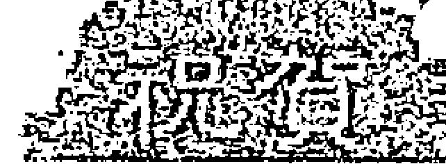

看变卦为最后的人数9人，差是4，故断有4人提前走了。

##### 例六、男士预测考研

2019年8月27日（农历七月二十七）21时22分，有一位男士求测在职报考研究生的事情。

-   抽扑克牌依次是：
    方片9，梅花9，梅花6，梅花8，方片9，红桃9。

-   扑克牌起卦：
    方片9，梅花9，梅花6组成兑（☱）象，内卦取兑（☱）象，梅花8，方片9，红桃9组成巽（☴）象，外卦取巽（☴）象，上巽下兑，得本卦《中孚卦䷼》。初九爻方片9、九二爻梅花9、六三爻梅花6三个爻同动，内卦由兑（☱）象变为艮（☶）象；九五爻方片9、上九爻红桃9两个爻同动，外卦由巽（☴）象变为坤（☷）象，坤上艮下，得变卦地山《谦卦䷎》。按卦数之和取用爻：24+26=50÷6=8……2，商数8为偶数，从初九爻向上数2个数，九二爻为梅花9用爻，内卦为用卦。卦象体用不得位，覆卦《中孚卦䷼》与本卦相同，变卦的复原卦山地《剥卦䷖》。

| 风泽中孚卦变地山谦卦 |
|---|
| 方片9少阳 | 梅花9少阴 | 梅花6少阴 | 梅花8少阴 | 方片9少阳 | 红桃9老阳 |
| 初九爻老阳 | 九二爻老阳 | 六三爻老阴 | 六四爻少阴 | 九五爻老阳 | 上九爻老阳 |

###### 卦气分析：

此卦中2个方片，1个红桃，3个梅花，三红三黑，卦气阳占55%，阴占45%，内卦两黑一红，外卦两红一黑，预示主人有奋斗的决心，事情（用卦）变化太大，此事不是很顺心。

###### 推测分析：以体为本人，以用为考试。

-   1、初九爻方片9对应五月，九二爻梅花9对应六月，六三爻梅花6对应七月，九五爻方片9对应九月，上九爻红桃9对应十月，卦中五个爻同动，事情变化太多，九二爻梅花9用爻，内卦为用卦，外卦为体卦，卦象体用不得位，预示要调整自己的思维和方案。
-   2、本卦《中孚卦䷼》，巽上兑下，兑金克巽木，用克体，事克人之象，农历七月金旺木绝，主人的工作面临很大的困惑，农历五月、六月、七月、九月、十月份面临很大的变数和不确定因素。
-   3、变卦地山《谦卦䷎》，坤上艮下，坤土见艮土，卦象比和，卦象山在地下，预示韬光养晦之象，主人想通过考研究生来突破工作上的压力，选择方位在东北或者西南方位。到农历九月、十月十八至二十二之间才有最终考与不考的决定。
-   4、覆卦《中孚卦䷼》与本卦相同，说明主人目前面临的处境不管是从哪个角度看感觉都是一样的。变卦《谦卦䷎》的复原卦是山地《剥卦䷖》，都是体用比和，艮不宜出，坤为闭塞，预示选择以静制动，不失为良策。
-   5、九二爻梅花9为用爻，时间窗口：六月，九月，腊月，明年三月。说明主人农历六月初八至十二日之间就有辞职考研究生的强烈愿望。农历九月上旬会有另外的好消息；十月中旬才能决定，即使参加考试会感到更迷茫；明年三月上旬考研究生的事情很难有确切消息。

###### 事后应验：

预测之后，对方说农历六月上旬孩子确实给单位领导提出辞职的事情，但没有得到同意。农历八月请假在家学习准备参加明年的研究生考试，九月份单位领导做工作，小伙子重回工作岗位上班。十月份公布2019年全国有350万人考研，即使参加考试也没有把握，放弃考研应该是正确的选择。

##### 例七、是否平安分娩

2019年9月10日（农历八月十二）10时44分，有一位母亲，代测女儿是否平安分娩？

###### 抽扑克牌依次是：

-   方片9, 方片8, 梅花8, 梅花7, 梅花8, 黑桃9。

###### 扑克牌起卦：

方片9, 方片8, 梅花8组成震（☳）象，内卦取震（☳）象，梅花7, 梅花8, 黑桃9组成离（☲）象，外卦取离（☲）象，离上震下，得本卦《噬嗑卦䷔》。初九爻方片9动，内卦由震（☳）象变为坤（☷）象；上九爻黑桃9动，外卦由离（☲）象变为震（☰）象，震上坤下，得变卦雷地《豫卦䷏》。按卦数之和取用爻：25+24=49÷6=8……1，商数8为偶数，从初九爻向上数1个数，初九爻方片9为用爻，内卦为用卦。卦象体用不得位，本卦的覆卦山火《贲卦䷕》，变卦的复原卦地雷《复卦䷗》。

| 火雷噬嗑卦变雷地豫卦 | | | | | |
| --- | --- | --- | --- | --- | --- |
| 方片9少阳 | 方片8少阳 | 梅花8少阴 | 梅花7少阴 | 梅花8少阴 | 黑桃9老阴 |
| (扑克牌图片) | (扑克牌图片) | (扑克牌图片) | (扑克牌图片) | (扑克牌图片) | (扑克牌图片) |
| 初九爻老阳 | 六二爻少阴 | 六三爻少阴 | 九四爻少阳 | 六五爻少阴 | 上九爻老阳 |

###### 卦气分析：

此卦中2个方片，3个梅花，1个黑桃，二红四黑，卦气阴占66%，阳占34%，内卦两方一梅，外卦两梅一黑，用卦少阳之气十足预示胎儿阳气充足，体卦母亲阴气较重。

###### 推测分析：以体为孕妇，以用为孩子。

1、初九爻方片9为用爻，上九爻黑桃9，这两个爻同动，内卦为用卦，外卦为体卦，卦象体用不得位。
2、本卦《噬嗑卦䷔》，离上震下，震木生离火，用生体之象，预示胎儿很正常，与孕妇有生气，怀孕期间孕妇的身体状态很好。
3、变卦雷地《豫卦䷏》，震上坤下，震木克坤土，体克用，母克子之象。孩子出生时有点困难，可以顺产，母子平安。变卦的复原卦地雷《复卦䷗》，分娩时间农历二月初，木克土，其中也带有一点母克子的信息。
4、本卦的覆卦山火《贲卦䷕》，艮上离下，艮为用，为少男；离为体，为孕妇。古人云“阴卦阳多，阳卦阴多”，变卦《豫卦䷏》阴多阳少，预示生男孩的可能较大。
5、初九爻方片9对应五月，时间窗口：农历五月，八月，十一月，二月。初九爻方片9应在农历五月、十一月，对应的九四爻梅花7应在八月、二月。应该是农历五月怀孕，明年的二月初三至初七之间孩子出生。
6、卦象中没有兑（☱）象和乾（☰）象，看不到刀具刃器之象，所以，顺产的可能大。

###### 事后应验：

预测之后，我对求测者说：母子平安，顺产不会剖腹产。你虽然没问，顺便给你说说，你女儿生男孩，明年农历二月初三至初七之间生产。

听了我的预测结果，对方感到非常的惊讶。她说：“你太神奇了，我没有告诉你什么时间怀孕，你怎么知道明年二月初三至初七之间生孩子呢？医生说预产期在明年农历二月初三左右。不管生男生女，母子平安我就放心了！”

事后我把这个卦例发在“宝鸡市周易研究会微信群”让大家根据这个卦象，回答三个问题：一、是否顺产？二、生男生女？三、什么时间生产？大多数同志预测：顺产，男孩。啥时间生还没有准确答案？现在是农历八月，只能等待明年二月验证了。

2019年11月23日对方反馈：检查是个男孩子，谢谢！

##### 例八、再次预测是否顺利分娩？

2020年2月29日（农历二月初七），这件事（2019年9月10日）曾预测生孩子的孕妇，分娩期限到了但还没有任何要生的迹象，孕妇亲自抽扑克牌预测能不能顺产？

抽扑克牌依次是：

-   黑桃6
-   黑桃9
-   方片9
-   红桃6
-   方片7
-   红桃7

扑克牌起卦：

黑桃6、黑桃9、方片9组成巽（☴）象，内卦取巽（☴）象；红桃6、方片7、红桃7组成巽（☴）象，外卦取巽（☴）象，巽上巽下，得本卦八纯卦《巽卦䷸》；初六爻黑桃6、九二爻黑桃9、九三爻方片9同动，内卦由巽（☴）象变为震（☳）象；六四爻方片6动，外卦由巽（☴）象变为乾（☰）象，乾上震下，得变卦天雷《无妄卦䷘》。按卦爻总数之和取用爻：24+20=44÷6=7……2，商数为奇数，从上九爻向下数2个数，九五爻方片7为用爻，外卦为用卦。卦象体用得位，互卦火泽《睽卦䷥》。

###### 八纯卦巽卦变天雷无妄卦

| 黑桃6老阴 | 黑桃9老阴 | 方片9少阳 | 红桃6老阳 | 方片7少阳 | 红桃7老阳 |
|------------|------------|------------|------------|------------|------------|
| 初六爻老阴 | 九二爻老阳 | 九三爻老阳 | 六四爻老阴 | 九五爻少阳 | 上九爻少阳 |

###### 卦气分析：

此卦中2个方片，2个红桃，2个黑桃，4红2黑，卦气阳占67%，阴占33%，旺盛阴衰。体卦2黑1方，体卦阴气太重，用卦阳气充足，预示分娩与母亲不利。

###### 推测分析：

以体卦为母，以用卦为子。

-   1. 本卦八纯卦《巽卦☴》，巽上巽下，体用比和之象，预示可以顺利分娩。
-   2. 变卦天雷《无妄卦☰》，乾上震下，乾金克震木，用克体之象，二月木旺当令，乾金处于绝地，反被震木来侮，本来子克母，变成母克子，预示顺产会有一定的困难。
-   3. 互卦火泽《睽卦☱》，离上兑下，离火克兑金，用克体之象，体卦为兑、为金、为刃器刀具之象，不排除剖腹分娩。
-   4. 九五爻为用爻，外卦为巽（☴）象变乾（☰）象；乾（☰）象代表每月十三至十七日这五日之间。2019年农历八月十二日预测2020年农历二月初三至初七五日内分娩的时间向后推迟（本卦上巽5，下巽5）五天半，即5天至6天时间。
-   5. 孩子出生的具体时间窗口：巽（☴）象为14点至18点，乾（☰）象为上午10点至下午14点。巽（☴）象变乾（☰）象时间前移。预计孩子中午11点至13点之间出生。

###### 事后应验：

2020年3月3日农历二月初十住进医院，医生检查可以顺产，但是折腾了三天，很不理想。于3月6日（农历二月十三日）13时09分剖腹分娩男孩，母子平安。

注：这一卦预测生男孩是对的。分娩时间推迟5天，最终剖腹产。一是与第一次预测的卦象体卦梅花黑桃多和第二次卦象初六爻黑桃6，九二爻黑桃9卦气太阴有关。二是今年元月23日武汉疫情，到处都居家隔离，可能与孕妇活动太少有关。

##### 例九、有关论文的事情

2018年12月28日（农历十一月二十二甲午日）下午，外地朋友微信留下抽的扑克牌：梅8, 红8, 红7, 梅7, 黑8, 红6, 小过卦, 问论文发表事关职称的事情。

###### 扑克牌起卦：

梅花8、红桃8、红桃7组成艮（☶）象，内卦取艮（☶）象，梅花7、黑桃8、红桃8组成震（☳）象，外卦取震（☳）象，震上艮下，得本卦雷山《小过䷽》，卦象4个少阴、2个少阳，无动爻属于静卦。今天是农历十一月二十二（甲午）日，按月令取用爻，十一月应在初六爻，取初六爻梅花8为用爻，内卦艮（☶）象为用卦。卦象体用不得位。本卦覆卦为《小过䷽》，变卦可以按雷火《丰卦䷶》对待，复原卦为火雷《噬嗑卦䷔》。（提示：这个卦为静卦，按月令取用爻和用卦）

雷山小过卦（静卦）

| 梅花8少阴 | 红桃8少阳 | 红桃7老阳 | 梅花7少阴 | 黑桃8老阴 | 红桃8老阳 |
|-----------|-----------|-----------|-----------|-----------|-----------|
| 初六爻少阴 | 六二爻少阴 | 九三爻少阳 | 九四爻少阳 | 六五爻少阴 | 上六爻少阴 |

###### 卦气分析：

此卦中3个红桃，2个梅花，1个黑桃，总卦气阳占55%，阴占45%，内卦两阳一阴，外卦两阴一阳，静卦无动爻，所问之事稳定，不存在什么变数。

###### 推测分析：以体为本人，以用为论文

-   1、本卦雷山《小过卦䷽》，覆卦也是《小过卦䷽》，上震下艮，震木克艮土，体克用之象，事情可以办成，就是时间上要推后一些时日。
-   2、本卦4个少阴2个少阳，静卦无动爻。今天是农历十一月二十二（甲午）日，十一月应在初六爻梅花8为用爻，内卦艮（☶）象为用卦。卦象体用不得位。可以按雷火《丰卦䷶》找变卦，震木生离火，体生用之象，预示主人从物质和感情上要付出一些。
-   3、变卦的复原卦为火雷《噬嗑卦䷔》，时间对应在农历二月，此卦有吃喝宴请的意思，需要请人吃饭加深感情沟通，问题就很快解决了。
-   4、时间窗口：十一月，二月。农历十一月二十三至二十七之间有进展。明年二月下旬就可以兑现。

> 2018年12月23日下午17:24
>
> 1梅8...2红8...3红7....4梅7..5黑8......6红8
>
> 小过

> 2018年12月26日晚上18:01
>
> 这个卦是个静卦，没有变爻。
>
> 1.本卦小过卦，体克用，预示好事来的吃一些。
>
> 2.动爻在初爻，变卦雷火丰卦，复原卦火雷噬嗑卦，皆是体生用，说明从人力和经济上要付出。
>
> 3.时间窗口。职称是农历十一月二十三至二十七日的事情。要到明年二月下旬才能兑现。
>
> 4.用卦为艮，在东北方位有一个男士可以帮忙。
>
> 综合分析，此事可以努力一下。

> 2018年12月31日晚上21:24
>
> 撤回了一条消息
>
> 大哥，我这次北京之行收获不错，认识了论坛杂志社的青年才俊，谈的比较投缘，相互认可，他准备帮我。第二天去拜见了考博没录取我的知名教授，他居然直接让我修改一篇写好的文章，我排名第一，他排名第二，这样来帮我！不过这篇稿子修改费了我整整一天神情！😊😊

> 1月2日下午16:09
>
> 年龄大的
>
> 好的 大哥😊😊
>
> 不过情况有变，编辑部说对于专家约稿，我只能排第二，这还比较麻烦。这个在全国名气大，他和编辑部头儿关系比较好，看看他们能不能协调！😊

-   5、用卦为艮（☶）象，方位东北，初六爻动为一，一为乾（☰）象，为西北，为长辈，为有身份的人。在东北方向有一位很有身份的男士可以帮忙。

###### 事后应验：

最后这位朋友在东北方位得到一位与他专业相同在学术界很有影响的专家帮助指导，于2019年二月在一家核心期刊发表了论文，解决了职称评定中的论文问题。

##### 例十、秦岭交通事故

2018年5月31日（农历四月初七）一大早与朋友一起从宝鸡驾车出发去凤县办事，当日下午16点返回宝鸡时走到凤县红花铺出现交通堵塞。经了解，原来是14点半左右秦岭上一辆装满汽油的油罐车与另一辆车发生相撞事故，导致大量油料泄露，安全隐患重大，消防队正在紧急救援，双向道路封闭不通。在无奈的等待中，顿生预测啥时间通车的念头。取出随身带的16张扑克牌抽牌：红桃8，方片7，梅花8，红桃8，红桃9，黑桃7。

风水涣卦变山水蒙卦

| 红桃8老阳 | 方片7少阳 | 梅花8少阴 | 红桃8老阳 | 红桃9老阳 | 黑桃7老阴 |
| :--- | :--- | :--- | :--- | :--- | :--- |
| 8 ❤️ | 7 ♦️ | 8 ♣️ | 8 ❤️ | 9 ❤️ | 7 ♠️ |
| 初六爻少阴 | 九二爻少阳 | 六三爻少阴 | 六四爻少阴 | 九五爻老阳 | 上九爻少阳 |

###### 扑克牌起卦：

红桃8，方片7，梅花8组成坎（☵）象，内卦取坎（☵）象，红桃8，红桃9，黑桃7组成巽（☴）象，外卦取巽（☴）象，巽上坎下，得本卦风水《涣卦䷺》。九五爻红桃9动，外卦由巽（☴）象变为艮（☶）象，艮上坎下，得变卦山水《蒙卦䷃》。卦中只有九五爻红桃9动，取九五爻红桃9为用爻，外卦为用卦，卦象体用得位。互卦山雷《颐卦䷚》。卦中只有九五爻红桃9一个动爻，以此取用爻和用卦。

###### 卦气分析：

此卦中3个红桃，1个方片，1个梅花，1个黑桃，四红二黑，卦气阳占70%，阴占30%，内卦2红1黑，外卦2红1黑，阳盛阴衰，内卦与外卦阴阳平衡，事故应该不会大。

###### 推测分析：以体为道路，以用为畅通。

-   1. 本卦风水《涣卦䷺》，巽上坎下，坎水生巽木，体生用之象。预示（道路）有损失，看来这场车祸重大经济损失是在所难免。
-   2. 变卦山水《蒙卦䷃》，艮上坎下，艮土克坎水，卦意“童蒙求我”，用克体之象。预示交通事故由车祸变成土与水的克制，油料泄漏肯定不少。
-   3. 互卦山雷《颐卦䷚》，艮上震下，震木克艮土，体克用之象，预示肇事者双方平分此次事故责任。
-   4. 本卦中九五爻红桃9动，外卦为用卦，代表交通事故。外卦巽（☴）象变艮（☶）象，巽（☴）象代表下午14点至18点之间，艮（☶）象代表傍晚18点至22点之间。根据分析推理，本来18点之前是可以通车，但时间因故推后，可能要等到18点至22点之间。
-   5. 巽（☴）象为5，艮（☶）象为7。最少堵塞5小时，最多堵塞7小时。事故发生在14点左右，加上5小时是19点左右；加上7个小时是晚上21点左右。16点起卦预测，到晚上21点左右是可以通车的。

###### 当时应验：

我们就在车上饿着肚子等待。大约在20点20分左右，对面开过来了两辆处理事故的大吊车。20点56分，道路上的车放行了。沿着山路，跟着长龙行走，到宝鸡后赶紧吃饭，吃完一看时间23点34分，微信群的朋友们担心此事，赶紧给大家回复：“谢谢大家关心，吃了个饭，总算回来了。”

这个预测从起卦，到预测分析，到道路开通，笔者一直在微信群与粉丝们保持沟通，属于当场应验。预测通车时间非常准确，得到大家的赞赏。这也是将应期定在小时上的一个学以致用的预测范例。为了体现预测的真实性，将微信截图放置于后，供大家参考。

## 扑克牌·梅花易

秦岭发生巨大交通事故，车堵的长达二三十公里，用扑克牌起卦预测何时通车。六张牌依次如下：
1. 红8
2. 方7
3. 梅8
4. 红8
5. 红9
6. 黑7
将本卦风水涣卦，九五爻动，得变卦山水蒙卦。请各位大神们预测一下，今晚能不能通车？大体几点钟通车？

咋没有解卦呢？

5月31日，下午4点，凤县秦岭段（测速处）弯道处（快到秦岭梁顶），一油罐车和轿车相撞，油罐车漏油，面积很大，非常危险，现在双向道路不通，请大家相互转告！

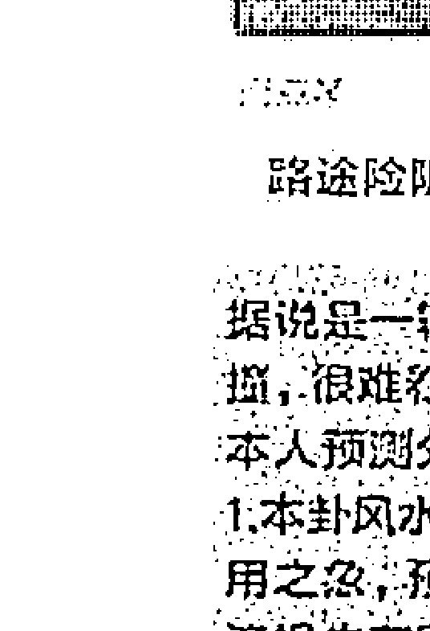

###### 路途险阻

据说是一辆油罐车与一辆小车相撞，很难行也很惨。本人预测分析如下：
1. 本卦风水涣卦，坎水生巽木，体生用之象，预示主有有付出，重大经济损失在所难免。
2. 变卦山水蒙卦，卦意蒙昧求我。艮土克坎水之象，用克体之象，预示事故有车或变成土与水的克制。
3. 互卦为山雷颐卦，说明责任事故双方责任平分。
4. 外卦巽数变艮数。巽为5，艮为7。预示事故发生后5~7小时内才能排出故障，折中时间20点钟。根据微信信息判断，大致是14点左右发生事故。乾坤居士估计最晚应该在9点左右通车吧！但愿如此，阿弥陀佛！

只有耐心等待，有点冷啊！

哈哈！对面来车了！有动静了！阿弥陀佛！

看来，不会在秦岭上过夜了！

终于走开了！路通了！😊😊😊😊😊

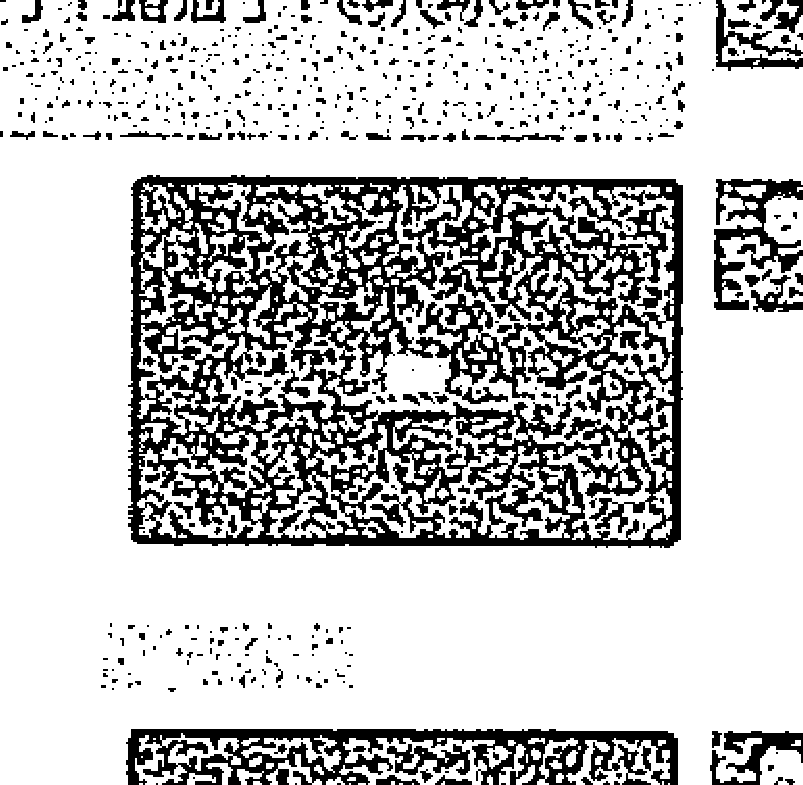

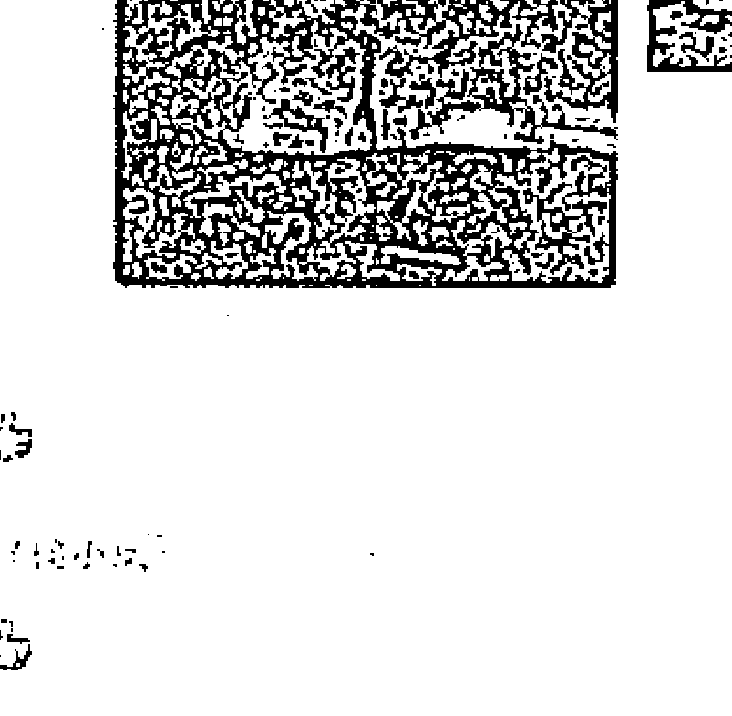

还迟9点了哈！大家关注！

谢谢大家关心，吃了个饭，总该回去了！呵呵

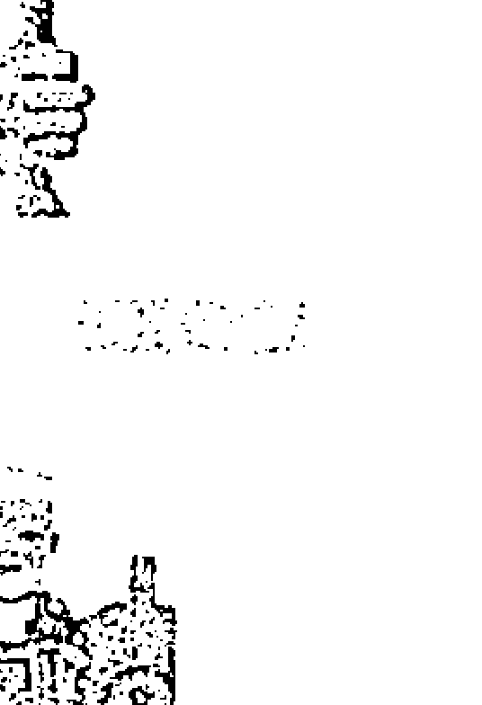

精道的目的全在于运用！何老师是我们的榜样！

古人说：百无一用是书生，就是指死读书，读死书的人。学了一辈子最后只会读书，背书。啥也干不了！

虚惊一场，阿弥陀佛

何老师👍👍👍

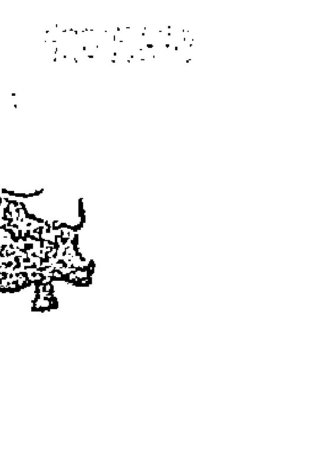

何老师👍👍👍

谢谢大家关心，吃了个饭，总该回去了！呵呵

@何东兴 刚看到你昨晚的预测，厉害！赞！

哈哈！事故在秦岭上，车都堵到红花铺了，车排了20多公里路，有人说晚上走不了了。没准伤心，用扑克牌玩秦岭。不过昨天刘艳丽小时预测把挺还真有的所领悟。谢谢关注！👍👍👍

@何东兴 👍👍👍

@何东兴 👍👍👍

老何你真成仙了👍👍👍

@何东兴，何老师👍👍👍

212省道凤县宝鸡方向柴油罐车泄漏 宝鸡消防官兵紧急救援

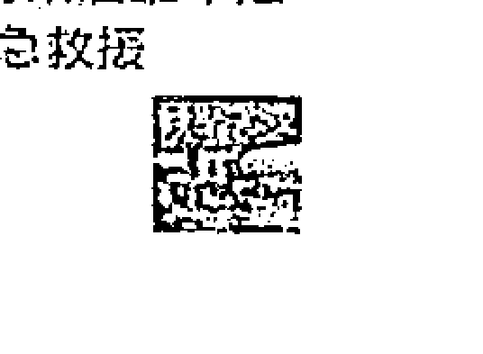

## 第六节 经济合同预测

在市场经济下协议合同是一个再平常不过的事情。大中小企业经营中无时不在履行合同之中运行，供货合同，贷款合同，采购合同等等，大多数都能愉快的履行合约，总有少部分合同会客观的，或者人为的出一些问题，这就少不了经济合同的预测咨询。

##### 例一、经济纠纷何时了结

2017年11月23日（农历十月初六）13时57分，有一位女企业家求测经济合同资金收回的问题。

抽扑克牌依次是：黑桃8，梅花9，红桃8，红桃9，方片6，方片7。

扑克牌起卦：黑桃8，梅花9，红桃8组成坎（☵）象，内卦取坎（☵）象，红桃9，方片6，方片7组成离（☲）象，外卦取离（☲）象，离上坎下，得本卦火水《未济卦䷿》。九二爻梅花9动，内卦由坎（☵）象变为坤（☷）象，九四爻红桃9、六五爻方片6与同动，外卦由离（☲）象变为巽（☴）象，巽上坤下，得变卦风地《观卦䷓》。按卦数之和取用爻：25+22=47÷6=7……5，商数7为奇数，从上九爻数向下数5个数，九二爻梅花9为用爻，内卦为用卦，卦象体用不得位。覆卦水火《既济卦䷾》，复原卦为地风《升卦䷭》。

火水未济卦变风地观卦

| 黑桃8老阴 | 梅花9少阴 | 红桃8老阳 | 红桃9老阳 | 方片6少阳 | 方片7少阳 |
|---|---|---|---|---|---|
| ♠️ 8 | ♣️ 9 | ♥️ 8 | ♥️ 9 | ♦️ 6 | ♦️ 7 |
| 初六爻少阴 | 九二爻老阳 | 六三爻少阴 | 九四爻老阳 | 六五爻老阴 | 上九爻少阳 |

###### 卦气分析：

此卦中2个方片，2个红桃，1个梅花，1个黑桃，四红二黑，卦气阳占70%，阴占30%，内卦两阴一阳，外卦全阳，预示此人小时候时运不佳，中年时期和晚年运气很好。这个卦六个爻全部是阴爻居阳位，阳爻居阴位，视为阴阳不得位，也叫位不正。

###### 推测分析：以体为本人，以用为纠纷。

1.  本卦九二爻梅花9、九四爻红桃9、六五爻方片6三个爻同动，按卦数之和，取九二爻梅花9为用爻，内卦为用卦。卦爻阴爻居阳位，阳爻居阴位，视为阴阳不得位，说明经济合同履行中存在很多需要理顺的事项，也预示此女士做事过于要强。
2.  本卦火水《未济卦䷾》，离上坎下，坎水克离火，用克体之象，目前对方得月令旺扶，了结合同与主人不利，必需等待有利时机。
3.  变卦风地《观卦䷓》，巽上坤下，巽木克坤土，体克用之象，看来好事尚需等待时日，需要到明年春季木旺时问题才能彻底解决。
4.  时间窗口：农历六月、九月、腊月、明年三月。农历2017年九月中旬有两次好的变化；过后会有两个月时间的调整期，到今年十一月底到腊月初事情会有重大进展；2018年三月中旬问题将彻底解决，不会有大的经济损失。
5.  九二爻梅花9为用爻，二为兑（☱）象，兑为金，为少女，为口舌之争，为正西方位。可以得到正西方位一位伶牙俐齿、具有男人气质的年轻女士的帮助。

###### 事后应验：

2018年五一节见到这位女企业家，她高兴地说：“谢谢何老师，正如老师所测，农历三月问题解决了，损失也不大，就是时间拖得太长了一些，让人劳神很。”

##### 例二、债务能否要回来？

2018年5月25日（农历四月十一）晚上21时15分，有朋友在我的微信留下一组数字和语音解说，求测讨外债的问题。

抽扑克牌依次是：黑桃6，黑桃7，红桃8，黑桃8，黑桃9，方片6。

扑克牌起卦：黑桃6、黑桃7、红桃8组成坎（≡）象，内卦取坎（≡）象，黑桃8、黑桃9、方片6组成坎（≡）象，外卦取坎（≡）象，坎上坎下，得本卦八纯卦《坎卦䷜》。初六爻黑桃6动，内卦由坎（≡）象变为兑（☱）象；九五爻黑桃9与上六爻方片6同动，外卦由坎（≡）象变为艮（☶）象，艮上兑下，得变卦山泽《损卦䷨》。按卦爻总数之和取用爻：21+23=44÷6=7……2，商数7为奇数，从上六爻向下数2个数，九五爻黑桃9为用爻，外卦为用卦。卦象体用得位，互卦为山雷《颐卦䷚》。

八纯卦坎卦变山泽损卦

###### 卦气分析：

此卦中1个方片，1个红桃，4个黑桃，二红四黑，卦气阳占30%，阴占70%，内卦两阴一阳，外卦两阴一阳，卦气阴气太重，主人的运气不佳，讨债的事情进展可能不是很顺利。

###### 推测分析：以体为本人，以用为债务。

1.  本卦八纯卦《坎卦☰》，坎上坎下，水见水，卦象体用比和之象，说明双方是在十分友好的前提下发生的经济债务关系。
2.  互卦为山雷《颐卦☷》，艮上震下，卦象形成对峙的状态，预示目前处于对立状态，双方的心理状态有点相似。
3.  变卦山泽《损卦☱》，艮上兑下，艮土生兑金，损上益下，用生体之象。初六爻黑桃6动说明2017年农历十一月主人方面业务上遇到了一次变化，从变卦看债务能讨回来。
4.  卦数之和：21+23=44÷6=7……2，商数7为奇数，从上六爻向下数2个数，用爻落在九五爻黑桃9，这个老阳9很倒霉，原因是对方的主要业务受到影响，负债人的身份也可能有一些变化。有一位高个子、很时尚、很有沟通能力的长年女性可以帮你解决问题。
5.  九五爻黑桃9动，5为巽（☴）象，为风、为东南、为长女、为时尚。有一位高个子、很时尚、很有沟通能力的长年女性可以从中帮助解决问题。
6.  时间窗口：农历腊月、三月、六月。2017年腊月上旬就有过一次机会。2018年三月下旬双方有接触，对方有语言或者时限方面的承诺。快则农历六月下旬有望解决问题，如果过了这个时限还没有解决问题，那就不好说了。

###### 事后应验：

我将预测结果发给对方之后。顺便问：“不知道与你的事情能吻合上不？参考一下。” 对方回答：“谢谢何老师，准很！从那找高个子会说的女人呀。” 著者说：“到时候你会遇到的。” 对方回答：“谢天谢地，谢谢何老师。”

##### 例三、品牌能否在做？

2019年10月17日（农历九月十九日）11时51分。某经理求测代理品牌能否再做下去？

抽扑克牌依次是：红桃7，方片6，黑桃9，梅花9，方片7，红桃7。

扑克牌起卦：红桃7，方片6，黑桃9组成离（☲）象，内卦取离（☲）象，梅花9，方片7，红桃7组成乾（☰）象，外卦取乾（☰）象，乾上离下，得本卦天火《同人卦䷌》。卦中六二爻方片6、九三爻黑桃9同动，内卦由离（☲）象变为兑（☱）象；九四爻梅花9动，乾（☰）象变为巽（≡）象，巽上兑下，得变卦风泽《中孚卦䷼》。按卦爻总数之和取用爻：22+23=45÷6=7……3，商数7为奇数，从上九爻向下数3个数，九四爻梅花9为用爻，外卦为用卦，内卦为体卦，卦象体用得位，互卦为天风《姤卦䷫》。

天火同人卦变风泽中孚卦

| 红桃7老阳 | 方片6少阳 | 黑桃9老阴 | 梅花9少阴 | 方片7少阳 | 红桃7老阳 |
| :---: | :---: | :---: | :---: | :---: | :---: |
| (扑克牌图: 红桃7) | (扑克牌图: 方片6) | (扑克牌图: 黑桃9) | (扑克牌图: 梅花9) | (扑克牌图: 方片7) | (扑克牌图: 红桃7) |
| 初九爻少阳 | 六二爻老阴 | 九三爻老阳 | 九四爻老阳 | 九五爻少阳 | 上九爻少阳 |

###### 卦气分析：

此卦中2个方片，2个红桃，1个梅花，1个黑桃，四红二黑，卦气阳占66%，阴占34%，内卦两红一黑，外卦两红一黑，卦象阳盛阴衰，预示品牌开始经营很不错，中间遇到一些困难，后面还是很看好的。

###### 推测分析：以体为某经理，以用为品牌商。

1.  本卦的六二爻方片6、九三爻黑桃9、九四爻梅花9，三个爻同动。九四爻梅花9为用爻，外卦为用卦，内卦为体卦，卦象体用得位，主人遇到的问题不是很大。
2.  本卦天火《同人卦䷌》，乾上离下，离火克乾金，体克用之象，九月金旺，离火入墓，离火难克乾金，预示主人在业务方面已经控制不了这家品牌商。
3.  变卦风泽《中孚卦䷼》，巽上兑下，兑金克巽木，体克用之象，预示主人目前还有说服对方的机会和理由。
4.  互卦为天风《姤卦䷫》，乾上巽下，乾金克巽木，用克体之象，说明主人目前与品牌的厂家关系处理的非常不好。需要很好的修复关系，重新布局经销策略。
5.  时间窗口：农历五月，八月，十一月，二月。六二爻方片6对应六月，九三爻黑桃9对应七月，九四爻梅花9对应八月，每逢六、七、八这三个月你的生意就冷淡，人际关系对接也会出现问题。2019年农历十一月中旬，生意会有好转。
6.  九四爻梅花9为用爻，4为震（☳）象，为东方，为长男，为高个子，预示有一个说话声音大、个头高、在家排行老大、有身份的男士可以帮助你解决问题。

###### 事后反馈：

某经理说：你预测的很准确，我确实没有处理好品牌商家的关系。我也不知怎样了？每年农历的六、七、八月份我的生意和人际关系往往就会出问题。另外，业务上确实也有你说的这么一位男士，看来我得抓紧时间解决这些问题。非常感谢！

##### 例四、外贸企业的生意能不能成交

2019年10月17日（农历四月初一）18时51分，有位徐先生求测一桩外贸企业的生意能不能成交。

抽扑克牌依次是：红桃6，黑桃9，方片9，黑桃8，梅花6，方片9。

扑克牌起卦：红桃6，黑桃9，方片9组成巽（☴）象，内卦取巽（☴）象，黑桃8，梅花6，方片9组成艮（☶）象，外卦取艮（☶）象，艮上巽下，得本卦山风《蛊卦䷑》。初六爻红桃6、九二爻黑桃9、九三爻方片9同动，内卦由巽（☴）象变为震（☳）象；六五爻梅花6、上九爻方片9同动，外卦由艮（☶）象变为坎（☵）象，坎上震下，得变卦水雷《屯卦䷇》。按卦爻总数之和取用爻：24+23=47÷6=7……5，商数7为奇数，从上九爻向下数5个数，九二爻黑桃9为用爻，内卦为用卦，外卦为体卦，卦象体用不得位，互卦不用。本卦的覆卦为泽雷《随卦䷐》，变卦的复原卦为雷水《解卦䷧》。

| 红桃6老阳 | 黑桃9老阴 | 方片9少阳 | 黑桃8老阴 | 梅花6少阴 | 方片9少阳 |
| :--- | :--- | :--- | :--- | :--- | :--- |
| 初六爻老阴 | 九二爻老阳 | 九三爻老阳 | 六四爻少阴 | 六五爻老阴 | 上九爻老阳 |

###### 卦气分析：

此卦中2个方片，1个红桃，1个梅花，2个黑桃，卦气阳占50%，阴占50%，内卦两红一黑，外卦两黑一红，卦气阴阳平衡。卦中初九爻和六五爻阴居阳位，九二爻和上九爻阳爻居阴位，爻位不正，不是什么好事。

###### 推测分析：以体为徐先生，以用为生意。

1.  卦象初六爻红桃6、九二爻黑桃9、九三爻方片9、六五爻梅花6、上九爻方片9，五个爻同动，九二爻黑桃9为用爻，内卦为用卦，外卦为体卦，卦象体用不得位，预示此项目变数太大。
2.  本卦山风《蛊卦䷑》，艮上巽下，巽木克艮土，用克体之象，预示这桩生意是对方主动找上门的。但是卦象五个爻变动，对方有三次变化，自己有两次变化，目前应该不是非常看好。
3.  变卦水雷《屯卦䷂》，坎上震下，坎水生震木，体生用之象，水在云上之象，需要等待温度等气候变化，打雷才能下雨。预示主人前期有付出，此事不可急于求成，需要耐心等待变化。
4.  卦象体用不得位。本卦的覆卦为泽雷《随卦䷐》，兑上震下，用克体之象，这桩生意的条件可能很苛刻；变卦的复原卦为雷水《解卦䷧》，震上坎下，体生用之象，还是主人有付出，此事要慎重对待，不可盲目冒进。
5.  九二爻黑桃9为用爻。时间窗口：农历六月，九月，十二月，2020年三月。2019年农历五月中旬是外方主动提起的这一桩生意；六月份进展不大；七月份向好的变化很大；八月信息进入停止状态；九月又出现了不好的变化；十月和十一月又有向好的变化，腊月是个关键时间段。2020年三月初（六五爻梅花6）成与不成见最后结果。
6.  九二爻黑桃9动，二为兑（☱），为金，为西方，为少女，为口舌。此事与一个伶牙俐齿的年轻女士有关，后面需要进行比较艰苦的谈判。

###### 事后应验：

著者分析预测完之后。徐先生说：这件事开始确实是有一位年轻女士从中牵线，也是外资方主动找上门的生意。但是，接了单之后，中间环节变数太多，一会是我们这边的审批卡住了，一会是外方在法规方面沟通出了问题，目前确实陷入了僵局。

2020年1月13日（农历腊月十九）微信回复：谢谢何老师的关注，我们在印度的事宜之前因中国法规的事情有所耽搁，后来经与多个单位协商后找到了解决办法。目前正在推进中，客户对事态的发展很高兴，正在积极准备最后一步，我正计划于年前完成相关工作，具体进展要看这周。等待2020年三月份见分晓了。

2020年1月23日新冠病毒疫情爆发，武汉封城进入“一级响应”，全国的工作重点转入了抗击疫情，此事再次出现了时间上的延误。

##### 例五、外债是否能讨回来？

2019年12月29日（农历腊月初四庚子日）中午11点51分。有一位女士专程从200公里之外赶到宝鸡，求测外债能否讨回来？

当场抽扑克牌：方片7，方片6，黑桃7，黑桃7，黑桃7，梅花7。

扑克牌起卦：方片7，方片6，黑桃7组成离（☲）象，内卦取离（☲）象，黑桃7，黑桃7，梅花7组成乾（☰）象，外卦取乾（☰）象，乾上离下，得本卦天火《同人卦䷌》。卦中只有六二爻方片6动，内卦由离（☲）象变为乾（☰）象，外卦无变爻，乾上乾下，得变卦八纯卦《乾卦䷀》。按卦爻总数之和取用爻：20+21=41÷6=6……5，商数6为偶数，从初九爻向上数5个数，九五爻黑桃7为用爻，外卦为用卦，内卦为体卦，卦象体用得位，互卦为天风《姤卦䷫》。

###### 卦气分析：

卦中2个方片，3个黑桃，1个梅花，二方四黑，一个红桃也没有。卦气阳占33%，阴占67%。体卦全阴，预示女主人年少时心气太高，中年之后个人运势非常不好。

###### 预测分析：以体为主人，以用为债务。

1.  本卦天火《同人卦䷌》，离火克乾金，火烧天门，用克体之象，腊月水旺当令，体卦乾金泄气，用卦离火处死地，用克体事情克人，但克不动，对方没钱，目前去讨债对主人很不利。
2.  变卦八纯卦《乾卦䷀》，乾金见乾金，卦象体用比和之象，预示债务的事情最终能得到理想的解决结果。
3.  互卦为天风《姤卦䷫》，乾上巽下，乾金克巽木，体克用之象，但当下乾金泄气，巽木得月令水来生，预示目前双方的沟通渠道闭塞不畅，令女主人非常的郁闷。
4.  九五爻黑桃7为用爻，时间窗口：农历九月，腊月，2020年三月、六月。2019年农历九月中旬双方好像就解决债务问题有过接触，但很可能没有结果。九五爻黑桃7下应六二爻方片6，预示2019年农历腊月十三至十七日之间，双方会有一次好的进展。
5.  六二爻方片6动，兑（☱）象，为西方，为少女，为口舌之争。主人将会遇到一位伶牙俐齿的年轻女士，她可以从中帮忙解决问题。

###### 事后应验对话：

你那天从卦众上看到我那钱能要回来，是吧？

可以要回定。

腊月十三至十七日有进展；明年三月中旬解决问题。

明年是腊，2021年还是？

2020年三月中旬。

我说的全是农历。

我应该怎么做？这件事上，我应该怎么做，有利于事情的解决。

发现我说的那个女士。

我今天去找了和这个事有关的女的，但她在在我的东边，不知道是不是她。

只要符合白皮肤伶牙俐齿的年轻女士就行。

何老师，你说的那个肤色白，和我年龄差不多，在我西边的人发现了腊月11发现了。

那就太好，祝你心想事成！

托您吉言。

何老师新年好。

年前问价的事有什么进展吗？

给了一点点钱，然后又没了消息。

那还是没进展吗，其他的哈时间还你？

没说，说现在没钱。

那就只有等三月中旬了，这人不想履约，是确实没钱。

应该是。

事后应验：

著者现场将预测结果告诉女主人。她说：我目前运气的确很背，但心气太高，这笔钱你看是不是要不回来了？我的朋友中好像没有您说的这个年轻女士啊！我说：不是钱要不回来，这个人也绝对不是有意赖账，是他目前确实没有钱。

2020年元月八日（腊月十四）晚对方微信回复：腊月十一日在我西边找到了那个白皮肤的女人。2020年元月二十五日（春节）早上对方在微信回复：给了一点点钱，然后拉了些酒。

著者问她：那就是有进展啊，其他的啥时间归还你？对方回答：没说，说现在没钱。此事只有等待农历三月中旬了。

##### 例六、建校资金收回与后续经营事宜

2020年4月13日（农历三月二十一日）中午12时59分，外地一位企业家求测：“投资建设学校和是否可以经营”的事宜。

###### 抽扑克牌依次是：

方片9，红桃8，方片6，红桃6，方片9，方片8。

###### 扑克牌起卦：

方片9，红桃8，方片6组成震（☳）象，内卦取震（☳）象；红桃6，方片9，方片8组成坎（☵）象，外卦取坎（☵）象。坎上震下，得本卦水雷《屯卦䷂》。初九爻方片9和六三爻红桃6同动，内卦由震（☳）象变为艮（☶）象；六四爻红桃6和九五爻方片9同动，外卦由坎（☵）象变为震（☳）象。震上艮下，得变卦雷山《小过卦䷽》。按卦数之和找用爻：23+23=46÷6=7……4，商数7为奇数，从上六爻向下数 4 个数，六三爻方片 6 为用爻，内卦为用卦，卦象体用不得位，覆卦为山水《蒙卦䷃》，变卦的复原卦为山雷《颐卦䷚》。

###### 水雷屯卦变雷山小过

| 方片9少阳 | 红桃8老阳 | 方片6少阳 | 红桃6老阳 | 方片9少阳 | 方片8少阳 |
| :--- | :--- | :--- | :--- | :--- | :--- |
| 初九爻老阳 | 六二爻少阴 | 六三爻老阴 | 六四爻老阴 | 九五爻老阳 | 上六爻少阴 |

###### 卦气分析：

（注：此卦 6 个爻全是红桃方片，这是著者所有卦例中唯一的一个纯阳卦。）

此卦中 2 个红桃，4 个方片，六个爻全是少阳和老阳，卦气阳占 100%，预示主人鸿运当头，事业发达，谋事可成。

###### 推测分析：以体为主人，以用为事宜。

1.  本卦水雷《屯卦䷂》，坎上震下，坎水生震木，体生用之象，农历三月震木当令，坎水入墓，想后续经营学校需要资金为 6—4 个大数字，卦象显示主人手头资金不方便。
2.  变卦雷山《小过卦䷽》，震上艮下，震木克艮土，体克用之象，预示主人面对的情况会逐步转变向好，这个好事得往后推迟一些时日。
3.  覆卦为山水《蒙卦䷃》，“童蒙求我”，有人有求于主人；变卦的复原卦山雷《颐卦䷚》，震木克艮土，震为长男，艮为少男，预示主人可以占据主动位置。
4.  六三爻方片 6 为用爻，时间窗口：农历正月，四月、七月、十月。求测之事农历正月、二月、三月都在变化之中；农历四月初此事才会明朗；农历五月还会再次出现一些变化，到农历七月才会有最终的结果。
5.  六三爻方片6阴爻发动，为离（三）象，离为中女，为南方，为火、为马，预示还有一位性格热情的中年女士正在运作参与学校经营的事情。

###### 事后应验：

4月16日对方回复：非常感谢您！此事正是，如不经营学校，建校垫资的工程款拿不到手；如果要经营学校，尚需再投入5000万元资金；目前确实有一个女老板想投资参与学校的经营。只有等待下一步的变化结果了。

## 第七节 战争预测

战争一直是悬在人类头顶上的达摩克利斯之剑，它给世界人民和中国人民心中留下了强烈的阴影和创伤。世界局势目前大致处于和平状态，但个别军事强国，整天以国际警察自居，唯恐天下不乱，为了自己国家的利益到处掠夺资源，滋生祸端，战争的硝烟此起彼伏，世界的平安和谐受到极大威胁，所以，战争仍然是危及人民生命财产安全的重大隐患。著者在“网易博客”事先预测过与国际战争有关的几件大事，一一得到应验后，博友们无不惊叹中国《周易》文化的神奇。现介绍几个卦例，与大家交流。

##### 例一、中日之间会不会开战？

2012年12月29日（农历十一月十七甲子日）22点34分，著者看到电视上的消息：“中国与日本钓鱼岛问题的矛盾日趋激烈。”即生预测“中日会不会开战？”的念头，用扑克牌起卦。

###### 抽扑克牌依次是：

-   黑桃7、黑桃9、黑桃8、方片7、梅花8、方片9。

###### 扑克牌起卦：

黑桃7、黑桃9、黑桃8组成兑（≡）象，内卦为兑（≡）象；方片7、梅花8、方片9组成离（≡）象，外卦取离（≡）象。离上兑下，得本卦火泽《睽卦䷥》。卦中九二爻黑桃9动，内卦由兑（≡）象变为震（≡）象；上九爻方片9动，外卦由离（≡）象变为震（≡）象。震上震下，得变卦八纯卦《震卦䷲》。按卦爻总数之和定用爻，24+24=48÷6=8……0，商数8为偶数，初九爻黑桃7为用爻，内卦为用卦。卦象体用不得位。覆卦为风火《家人卦䷤》，变卦的复原卦还是《震卦䷲》。

###### 火泽睽卦变八纯卦震卦

| 黑7老阴 | 黑9老阴 | 黑8老阴 | 方7少阳 | 梅8少阴 | 方9少阳 |
| :--- | :--- | :--- | :--- | :--- | :--- |
| 初九爻少阳 | 九二爻老阳 | 六三爻少阴 | 九四爻少阳 | 六五爻少阴 | 上九爻老阳 |

###### 卦气分析：

此卦中2个方片，2个梅花，2个黑桃，二红四黑，卦气阴占66%，阳占34%，邪气旺盛，正气衰弱，好在用卦全阴，体卦阳气充足，预示日方有阴谋，我方有信心。

###### 推测分析: 以体为我方，以用为日方。

1.  本卦火泽《睽卦䷥》，离上兑下，离火克兑金，体克用之象。离火本来能克兑金，但农历十一月水旺当令，兑金泄气，离火处于绝地，受月令克制。我方暂时克制不了日方，好在用卦阴气沉重，预示日方目前根本没有底气开战。
2.  变卦八纯卦《震卦䷲》，复原卦也是《震卦䷲》，震木见震木，卦象比和之象，互卦有离（☲）象和坎（☵）象。离为火，坎为水，离火被坎水克制，预示日方开战的意图被我方实力压制。
3.  本卦覆卦为《家人卦》，巽木生离火，体生用之象，我方有捍卫主权的准备，预示局势将向有利我方的方向发展。
4.  时间窗口：内卦为兑（☰）象，代表时间区间是每月初八至十二日。震（☳）象代表时间区间是每月初三至初七日。一是初九爻黑桃7为用爻，对应的时间窗口为农历十一月初八至十二日之间是双方可能发生摩擦的时间段；二是九二爻黑桃9发动，内卦变震（☳）象对应农历腊月初三至初七日之间，这个时候日方的态度将趋于减弱状态；三是上九爻方片9对应2013年四月初三至初七日之间，到那时候中日双方对峙的状态将趋于平和。
5.  内卦为用卦代表日方，三张牌全是黑桃老阴，视为阴气太重，说明日方阴谋十足，但开战的底气明显不足；外卦为体卦代表中方，两张牌为方片少阳，一张为梅花少阴，形成两阳夹一阴，阳气充足，预示中方的实力明显强于日方。

###### **综合分析：**

中国有决心捍卫祖国领土完整的准备，而日方没有打仗的底气。所以，中国与日本在钓鱼岛发生战争的可能不大，预示双方都没有准备打仗的迹象。

###### **事后应验：**

2013年1月5日（农历十一月二十四）中华军事网消息中有：《2013年4月份前后中日钓鱼岛将发生擦枪走火》的文字报道。2013年1月13日环球网：“专家称钓鱼岛四月前后中日开战，安倍扩军备战”。2013年4月23日（农历三月十四日）日本首相安倍晋三抛出一个修宪的法案，使得钓鱼岛局势非常紧张。农历四月之后逐渐减弱，时至今日（2020年4月），中国与日本在钓鱼岛虽有舆论争端，但没有发生擦枪走火的军事冲突。

##### 例二、朝美韩三方会不会发生战争

2013年4月5日（农历二月二十五日）12时30分，上网消息：美国战舰携带战斧式导弹，停靠在韩国海岸，朝鲜半岛局势剑拔弩张。朝军方称：战争不是“立刻打”就是“明天打”。朝、美、韩三方究竟战与不战？即起预测念头。

###### 抽扑克牌依次是：

-   黑桃7、黑桃9、黑桃9、梅花7、红桃9、方片8。

###### 扑克牌起卦：

黑桃7、黑桃9、黑桃9组成乾（☰）象，内卦取乾（☰）象；梅花7、红桃9、方片8组成兑（☱）象，外卦取兑（☱）象。兑上乾下，得本卦泽天《夬卦䷪》；卦中九二爻黑桃9老阳、九三爻黑桃9老阳同动，内卦由乾（☰）象变为震（☳）象；外卦九五爻红桃9老阳发动，外卦由兑（☱）象变为震（☳）象。震上震下，得变卦八纯卦《震卦䷲》。按卦象总数定用爻，25+24=49÷6=8……1，商数8为偶数，余数为1，取初九爻黑桃7为用爻，内卦为用卦。卦象体用不得位，本卦的覆卦为天风《姤卦䷫》，变卦的复原卦还是八纯卦《震卦䷲》。

###### 泽天夬卦变八纯卦震卦

| 黑7老阴 | 黑9老阴 | 黑9老阴 | 梅7少阴 | 红9老阳 | 方8少阳 |
| :--- | :--- | :--- | :--- | :--- | :--- |
| 初九爻少阳 | 九二爻老阳 | 九三爻老阳 | 九四爻少阳 | 九五爻老阳 | 上六爻少阴 |

###### 卦气分析：

此卦中1个方片，1个红桃，1个梅花，3个黑桃，二红四黑，卦气阴占67%，阳占33%，用卦三个爻全是黑桃老阴代表美国和韩国，阴气深沉；体卦两阳夹一阴，朝鲜方面阳气十足。

###### 推测分析：以体为朝鲜，以用为美韩。

1.  本卦泽天《夬卦☰》，兑上乾下，兑金见乾金，体用比和之象，卦象五阳决一阴，阳刚之气突显外露，构成硬碰硬之势，从卦象的外表数字看，朝鲜半岛很有可能发生战争。但是，内卦两个黑桃9、一个黑桃7，老阳与少阳都带有严重的阴气成分，这说明美韩两国的阴谋虽然较深，但是开战底气不足；朝鲜方面的九五爻红桃9老阳正处阳刚气盛，反倒慷慨激昂，有迎接战争的准备。
2.  三个动爻中九二爻黑桃9对应农历腊月，九三爻黑桃9对应正月，九五爻红桃9对应三月，预示农历这三个月战与不战存在变数。兑（☰）象对应每月的初三至初七日。时间窗口：应该在2013年农历三月初三至初七五日（公历4月12日至16日）之内，朝鲜半岛擦枪走火的具体时间就在这五日之内有爆发的可能，一旦过了这个时间窗口就会安然无恙。
3.  变卦为八纯卦《震卦☳》，复原卦也是《震卦☳》，震木见震木，卦象比和之象，卦中没有离火之象，互卦有艮（☶）象和坎（☵）象，艮为山不动，坎为水能灭火。也就是说我们可能看不到战争的焰火。震卦辞曰：震来虩虩。朝、美、韩三方也就是相互虚张声势，秀秀肌肉而已。
4.  卦象三个爻有变爻，分别代表朝、美、韩三方在开战的态度上，最终他们都有自己的应变策略。所以，分析推断朝鲜半岛不会发生实质性战争。
5.  2013是癸巳年，巳酉丑年三煞在寅卯辰位，癸巳年农历正月、二月、三月为三煞月，四月（丁巳）构成月三煞，此古人所谓的‘三煞会’。所以，农历四月底之前，我国东海海域以及朝鲜半岛局势动荡将是必然之中的事情，进入农历五月将风平浪静。

###### 事后应验：

事情预测10天之后的2013年04月15日（农历三月初六）凤凰卫视【时事开讲】《朝鲜或主动挑起局部冲突制造紧张气氛》评论。4月15日美国波士顿马拉松赛终点突然发生爆炸事件，朝鲜半岛没有发生战争。

也许是美国人后院起火的原因，导致决策者心神不宁没有开战的心思吧！这与著者预测的‘时间窗口：应该在2013年农历三月初三至初七五日’神奇的吻合。

时至7年之后的2020年3月著者的书截稿，朝、美、韩三方只是不断地大打口水战，并没有发生任何的军事冲突，后来朝鲜与韩国的关系还趋于平和友好状态。

##### 例三、中美贸易的未来趋势

2018 戊戌年3月12日（农历正月二十五）著者游学西安西北大学，当日上午11时40分，与一位哲学系资深教授谈及中美贸易问题。我们处于关心国家大事的热情，教授让我预测一下中美贸易未来的趋势。

###### 我们当场抽扑克牌：

梅花9，黑桃9，红桃8，黑桃7，梅花9，黑桃6。

###### 扑克牌起卦：

梅花9、黑桃9、红桃8组成兑（☱）象，内卦取兑（☱）象；黑桃7、梅花9、黑桃6组成兑（☱）象，外卦取兑（☱）象。兑上兑下，得本卦八纯卦《兑卦☱》。初六爻梅花9、九二爻黑桃9同动，内卦由兑（☱）象变为坤（☷）象；九五爻梅花9、上六爻黑桃6同动，外卦由兑（☱）象变为离（☲）象。离上坤下，得变卦火地《晋卦䷢》。按卦爻总数之和取用爻：26+22=48÷6=8，商数8为偶数，初九爻梅花9为用爻，内卦为用卦，外卦为体卦，卦象体用不得位，互卦不看。本卦的覆卦为八纯卦《巽卦☴》，复原卦为地火《明夷卦䷣》。

###### 八纯卦兑卦变火地晋卦

| 梅花9少阴 | 黑桃9老阴 | 红桃8少阳 | 黑桃7老阴 | 梅花9少阴 | 黑桃6老阴 |
| :--- | :--- | :--- | :--- | :--- | :--- |
| 初九爻老阳 | 九二爻老阴 | 六三爻少阴 | 九四爻少阳 | 九五爻老阳 | 上六爻老阴 |

###### 卦气分析：

此卦中1个方片少阳，2个梅花少阴，3个黑桃老阴，一红五黑，卦气阳占15%，阴占85%，内卦为用卦2黑1方，外卦为体卦3黑，卦气阴盛阳衰，一看这卦象的颜色就让人有“山雨欲来风满楼”阴森感觉。

###### 推测分析：以我方为体，以美方为用。

1.  卦中初六爻梅花9、九二爻黑桃9、九五爻梅花9、上六爻黑桃6四个爻发动，预示此次贸易争端存在的变数太多；而且卦象体用不得位，需要至少三个月以上时间的调整。卦气呈现阴盛阳衰，对我方十分不利。
2.  本卦八纯卦《兑卦☰》，兑上兑下，兑金见兑金，卦象比和之象，春季木旺，金不当令。兑（☰）象为金、为西方、为金属、为兵器、为金融行业、为口舌争讼之事，贸易纠纷本身就是双方争讼谈判。看来此次中美贸易的争端不只是嘴上说一说，兑（☰）象重叠，而且要付出真金白银，预示双方在经济上会有相当大的付出。
3.  变卦火地《晋卦☲☷》，离上坤下，离火生坤土，体生用之象，卦象是太阳出于地平线，这叫“日出而作”。目前是农历二月木旺土绝，离火逢生气，月令木遇火化生坤土，预示“贸易战”的发展趋势，看似问题不大，实际则与我方非常不利，在没弄清楚美国真正意图的前提下我方千万不能盲目冒进。
4.  本卦的覆卦为八纯卦《巽卦☴》，巽象为风、为交易、为舆论、为消息、为井市传闻等。关于中美贸易争端，站在对方的立场看只是与贸易有关的舆论传闻，但是，巽（☴）象属于“气界”，巽象重叠，预计坏消息不断，我们要冷静对待。
5.  复原卦为地火《明夷卦☷☲》，卦象是太阳到了地平线之下，这个叫“日落而息”，预示我们现在要保持休生养息的状态。
6.  时间窗口：2017 年农历十一月，2018 年二月、五月、八月。初九爻梅花 9 对应农历十一月、五月，九二爻黑桃 9 对应农历腊月、六月，九五爻梅花 9 对应农历三月、九月，上六爻黑桃 6 对应农历四月、十月。从卦象的变爻看，2017 年农历十一月和腊月是美方密谋贸易争端的时期；2018 年农历二月两国贸易争端问题初见端倪；2018 年农历三月、四月、五月、六月双方贸易争端持续升级，矛盾发生激化；2018 年农历七月、八月情况逐渐明朗，趋势出现暂时稳定；2018 年农历九月、十月、十一月、腊月双方贸易争端再次升级；卦象看每逢农历正月、二月和七月、八月双方争端会有务实性发展趋向；每逢农历三月、四月、五月、六月和九月、十月、十一月、腊月中美贸易争端将处于变化莫测的状态。

著者当时根据按卦象变化推算排出上半年和下半年的贸易争端形势变化周期：

2017 年十一月、腊月是美国密谋筹划贸易战的时期。

2018 年正月、二月双方之间的局势趋于稳定，三月、四月、五月、六月双方又会处于多变时期。

2018 年七月、八月双方趋于稳定；九月、十月、十一月、腊月双方处于多变时期。

2019年正月、二月双方趋于稳定；三月、四月、五月、六月双方处于多变时期。

2019年七月、八月双方趋于稳定；九月、十月、十一月、腊月双方处于多变时期。

时间窗口：农历十一月、二月、五月、八月。就是说每逢农历这些时间段，都是双方形成重要决策的时间节点。

###### 事后应验：

从2018年3月一直到2020年元月16日（2019年农历腊月二十日），美国发动的这场贸易战经过了22个月时间折腾，于2020年元月16日双方总算达成了一个最初的协议。但这并不意味着这场涉及国计民生的大国贸易博弈战最后结束，我们必须保持慎重的态度和清醒的头脑去应对。

##### 例四、伊朗和美国是否发生战争？

2020年1月3日（2019年农历腊月初九）凌晨发生了一件震惊世界的大事：“美军无人战机对伊拉克境内的巴格达国际机场附近发动空袭，‘暗杀’了伊朗高级将领苏莱曼尼。”看到这个消息，著者立刻用扑克牌预测：“美伊是否发生战争”。

###### 抽扑克牌依次是：

黑桃6，方片9，方片7，黑桃8，红桃9，黑桃9。

###### 扑克牌起卦：

黑桃6、方片9、方片7组成巽（☰）象，内卦取巽（☰）象；黑桃8、红桃9、黑桃9组成巽（☰）象，外卦取巽（☰）象。巽上巽下，本卦八纯卦《巽卦☴☴》。卦中初六爻黑桃6、九二爻方片9同动，内卦由巽（☰）象变为离（☲）象；九五爻红桃9、上六爻黑桃9同动，外卦由巽（☰）象变为坤（☷）象。坤上离下，变卦地火《明夷卦☷☲》。按卦数之和取用爻：22+26=48÷6=8，商数8为偶数，初六爻黑桃6为用爻，内卦为用卦，外卦为体卦，卦象体用不得位，互卦不看。本卦的覆卦为八纯卦《兑卦☱☱》，变卦的复原卦为火地《晋卦☲☷》。

###### 八纯卦巽卦变地火明夷卦

| 黑桃6老阴 | 方片9少阳 | 方片7少阳 | 黑桃8老阴 | 红桃9老阳 | 黑桃9老阴 |
| :--- | :--- | :--- | :--- | :--- | :--- |
| 初六爻老阴 | 九二爻老阳 | 九三爻少阳 | 六四爻少阴 | 九五爻老阳 | 上九爻老阴 |

###### 卦气分析：

此卦中2个方片少阳，1个红桃老阳，3个黑桃老阴，三红三黑，卦气阳占50%，阴占50%，内卦2方1黑代表美国，外卦2黑1红代表伊朗，总卦气阴阳平衡，预示美伊双方目前剑拔弩张，势均力敌。

###### 推测分析：以伊朗为体，以美国为用。

-   1. 卦气阴阳平衡，初六爻黑桃6为用爻，内卦为用卦，外卦为体卦。卦象属于体用不得位，预示美伊双方目前都不在正式的战争状态，需要至少三个月以上时间的调整准备。
-   2. 本卦八纯卦《巽卦》，巽上巽下，巽木见巽木，卦象比和之象。巽为风、为舆论、为消息、为井市传闻等，卦象显示美伊双方都能保持克制，只是在舆论上争斗，发生大规模战争的可能很小。互卦火泽《睽卦》，火上兑下，离火克兑金，（伊朗克美国）但冬季水旺火处绝地，离火无法顺心的克制兑金，伊朗可能发动难以避免的小打小闹。
-   3. 变卦地火《明夷卦》，坤上离下，这个叫“日落而息”，预示双方需要休息。卦象离火生坤土，用生体之象。一旦要真正的打起来，美国也将会付出惨重的损失。
-   4. 由于卦象体用不得位，这就需要换位思考问题，从本卦的覆卦《兑卦》和变卦的复原卦《晋卦》来看。覆卦兑金见兑金，强硬相对，美国只能采用金融方面的强制手段来制裁伊朗；复原卦火地《晋卦》，火出地面之象，这个叫“日出而作”，伊朗很可能采取激进的行为对美国进行报复。
-   5. 时间窗口：2019年农历十一月，2020年二月、五月、八月。卦象显示2019年农历十一月下旬美国就已经开始密谋这次暗杀行动。到2020（庚子）年农历二月不排除美伊双方发生第二次大的擦枪走火事件。
-   6. 本卦中四个动爻，对应四个月份。初六爻黑桃6对应2019年农历十一月和五月，九二爻方片9对应2019年农历腊月和六月，九五爻红桃9对应2020农历年三月和九月，上六爻黑桃9对应2020农历年四月和十月，就是说在今后农历的这些月份时间段中，美伊双方之间的矛盾会有重大变化，或者说是发生战争的重要时间窗口。

###### 事后应验：

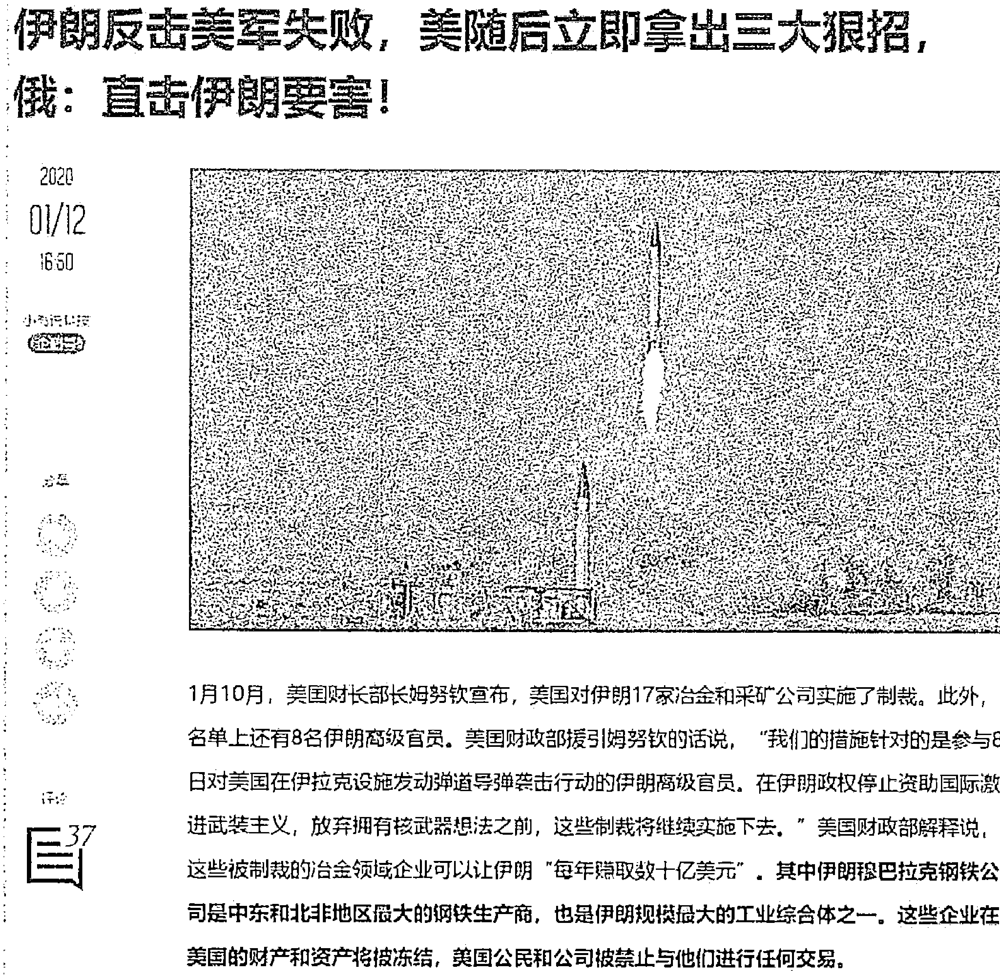

2020年1月3日美国成功实施了对伊朗二号人物苏莱曼尼的“暗杀”之后，引起世界舆论的一片哗然，激起了伊朗人民反对美国霸权主义愤怒。于2020年1月8日（农历腊月十四）凌晨，伊朗革命卫队对伊拉克境内的美军基地发起火箭弹袭击，导致多名美国士兵受伤，很多军用设施遭到惨重打击。

法新社最新消息，当地时间8日早晨，美军驻伊拉克“阿萨德空军基地”遭到至少9枚火箭弹袭击。报道介绍，该基地位于伊拉克西部，是美国和联军部队的基地。伊朗“Press TV”7日消息说，伊朗伊斯兰革命卫队证实导弹袭击美国在伊拉克的阿萨德空军基地。伊朗革命卫队：对驻伊拉克美军阿萨德空军基地的袭击，是在为3日遭美军空袭身亡的革命卫队下属“圣城旅”指挥官苏莱曼尼将军复仇。

时至2020年4月，伊朗和美国之间暂时没有发生正面冲突。可是塔利班武装和中东的民间组织时不时地对美国军用设施进行袭击，是美国陷入战与不战的两难之中。

###### 著者整理卦例时发现以上两个卦象之间出现一个令人惊叹的数字组合：

前一段时间著者在网上看到一篇文章说：“中美贸易战”背后，美国的真正目的是为了控制伊朗的霍尔木兹海峡，切断我国在巴基斯坦的能源通道瓜德尔港。当时著者感到“风马牛不相及”，很是不可思议。

2018年3月12日著者在西安西北大学用扑克牌预测“中美贸易战”的趋势。22个月之后“美国的斩首行动”发生，著者在宝鸡用扑克牌预测“美伊是否发生战争”？从预测“中美贸易战”与“美伊是否发生战争”的两次卦象中著者发现了一个神奇的卦数排列组合。

###### 一、“中美贸易战”预测抽牌：

梅花9，黑桃9，红桃8，黑桃7，梅花9，黑桃6。卦象数字依次排列为：9、9、8、7、9、6。本卦为八纯卦《兑卦》，变卦为火地《晋卦》，本卦的覆卦为八纯卦《巽卦》，变卦的复原卦为地火《明夷卦》。

###### 二、“美伊是否发生战争”预测抽牌：

黑桃6，方片9，方片7，黑桃8，红桃9，黑桃9。卦象数字依次排列为：6、9、7、8、9、9。本卦为八纯卦《巽卦》，变卦为地火《明夷卦》，本卦的覆卦为八纯卦《兑卦》，变卦的复原卦为火地《晋卦》。

这两起完全不同的事件，中间相隔22个月时间，在不同地点的预测卦象和数字顺逆排列，竟然与本卦、变卦、覆卦、复原卦出现了一个完美的逆袭组合。下边著者把这两次的卦象整理成一个对照表介绍给大家。

第一卦：数字 998796。
本卦《兑卦》，变卦《晋卦》，覆卦《巽卦》，复原卦《明夷卦》；

第二卦：数字 697899。
本卦《巽卦》，变卦《明夷卦》，覆卦《兑卦》，复原卦《晋卦》。

| 卦象数字 | 本卦 | 变卦 | 覆卦 | 复原卦 |
|---|---|---|---|---|
| 998796 | 《兑卦》 | 《晋卦》 | 《巽卦》 | 《明夷卦》 |
| 697899 | 《巽卦》 | 《明夷卦》 | 《兑卦》 | 《晋卦》 |

八纯卦兑卦变火地晋卦
梅花9少阴 - 初九爻老阳
黑桃9老阴 - 九二爻老阳
方片8少阳 - 六三爻少阴
黑桃7老阴 - 九四爻少阳
梅花9少阴 - 九五爻老阳
黑桃6老阴 - 上六爻老阴

八纯卦巽卦变地火明夷卦
黑桃6老阴 - 初六爻老阴
方片9少阳 - 九二爻老阳
方片7少阳 - 九三爻少阳
黑桃8老阴 - 六四爻少阴
红桃9老阳 - 九五爻老阳
黑桃9老阴 - 上九爻老阳

啊呀！大家看看这两个卦象，这简直是一个不可思议、千年不遇的数字与象数巧合。用 16 张扑克牌任意洗牌六次，每次从中任意抽一张牌起卦，连续抽六次牌，在两个不同的地点，而且时间相距是 22 个月之后，要抽出两组互为逆数的（卦象排列）六位数字，确实是根本不可能的事情。著者的数学底子很薄，就此事求助于一位理科专业人士。他告诉著者这个确实不好计算，需要用计算机进行一个模拟数据分析，大致估计这种情况的数学概率为：几十万分之一吧！

宇宙之大，无奇不有；万物互动，天人合一。有科学家发现亚马逊原始森林里一只蝴蝶翅膀轻轻地煽动了几下，几个月之后地球的另外一面就发生了毁灭性地震。这个卦象让著者不得不相信“中美贸易战”与“美伊的博弈”之间，没准还真有一根敏感的神经从中牵动，并且构成现实生活中的必然联系，有兴趣的读者可以去仔细琢磨这个有趣卦象。

## 第八节 重大事件预测

关于国际重大事件的预测，有朋友出于对著者关心，提醒说：国家重大事件的预测，很可能涉及政治敏感问题，会招来无妄之灾，对自己不利，让我尽量少去预测。著者认为除过与政治有关的事件之外，还有很多领域是可以用预测方法探讨的。下面将几次预测国际大事的卦例介绍给大家，以资共同研究。

##### 例一、朝鲜核试验能否成功

2013 年元月 27 日（2012 年农历腊月十六日）22 时 30 分，著者在网上看到关于“朝鲜第三次核试验”的消息。即起预测能否成功的念头。

###### 抽扑克牌依次是：

黑桃8、梅花7、黑桃9、红桃7、方片7、红桃9。

###### 扑克牌起卦：

黑桃8、梅花7、黑桃9组成乾象，内卦取乾象；红桃7、方片7、红桃9组成乾象，外卦取乾象，乾上乾下，得本卦天风《姤卦》；卦中九三爻黑桃9老阳动，内卦由乾象变为坎象；上九爻红桃9老阳动，外卦由乾象变为兑象，兑上坎下，得变卦泽水《困卦》；按卦象总数定用爻，24+23=47÷6=7……5，商数7为奇数，余数为5，从上九爻向下数5个数，九二爻梅花7为用爻，内卦为用卦，外卦为体卦。本卦体用不得位，互卦不看，本卦的覆卦为泽天《夬卦》，变卦的复原卦水泽《节卦》。

天风姤卦变泽水困卦

| 黑8老阴 | 黑7少阴 | 黑9老阴 | 红7老阳 | 方7少阳 | 红9老阳 |
|---------|---------|---------|---------|---------|---------|
| 8♠      | 7♣      | 9♠      | 7♥      | 7♦      | 9♥      |
| 初6爻少阴 | 九2爻少阳 | 九3爻老阳 | 九4爻少阴 | 九5爻少阴 | 上9爻老阳 |

###### 卦气分析：

此卦中1个方片，2个红桃，1个梅花，2个黑桃，三红三黑，卦气阴阳各占50%，用卦全阴，说明朝鲜的核技术不很成熟。体卦全阳预示朝鲜进行核试验的决心很大。

###### 推测分析：以体为朝鲜，以用为核试验。

-   1. 本卦天风《姤卦》，乾上巽下，乾金克巽木，体克用之象，农历腊月水旺当令，乾金泄气，巽木逢月建生气，体（乾）金难克用（巽）木，时间可能推迟。预示朝鲜第三次核试验的时间可能会推后一些时日进行。
-   2. 变卦泽水《困卦》，兑上坎下，兑金生坎水，卦象体生用之象。预示朝鲜在第三次核试验方面投入的资金是非常大的，现在进行试验可能导致失败结果。
-   3. 九三爻黑桃9对应正月，上九爻红桃9对应四月，两个老阳爻同动，九二爻梅花7为用爻对应腊月。时间窗口：2012年农历腊月底或者2013年正月初三至初七日五日之内。如果推迟时间，就可能在2013年农历三月初八至十五日八日之内进行。
-   4. 从卦象看，用卦代表核试验，三个爻卦象全为梅花少阴、黑桃老阴，煞气阴气太浓，说明朝鲜在核试验方面的技术还很不成熟；体卦卦爻为红桃方片，三个爻全阳代表朝鲜当局，说明朝鲜政府和科研人员信心很大，也预示朝鲜当局者第三次核试验的决心很坚定，不会因为国际舆论而停止此次核试验。
-   5. 卦象总数47除以6，商数7为奇数，从上九爻红桃9向下数5个数，九二爻梅花7为用爻。这个九二爻梅花7对应“天、地、人”中的地表，核试验将在地面实施。

综上分析：虽然世界舆论对朝鲜核试验给予强烈谴责，美国纷纷出台制裁措施。但是，朝鲜当局者第三次核试验的信心坚定不移，绝对不会改变他们的计划。核试验的具体结果：若在2013年农历正月初三至初七日五日之内试验，成功的概率不是很大；如果在2013年农历三月初八至十二日这五日之内试验，朝鲜核试验很可能成功。

###### 事后应验：

> 【凤凰军事 - 防务短评】2013年2月12日据中国地震网公布，2月12日（正月初三）10时57分在朝鲜发生4.9级地震，震源深度0公里。地震位置在北纬41.3度，东经129.0度，正是国际社会一直高度关注的

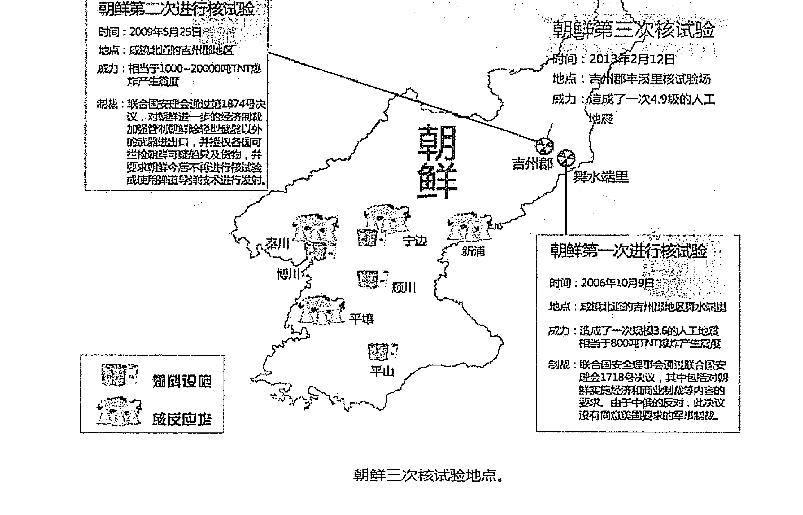

###### 原标题：朝中社公报：朝鲜成功举行第三次地下核试验

中新网2月12日电 朝鲜12日在北部地下核试验场实施了第三次核试验，朝中社当天发表新闻公报，对此进行确认，公报全文如下：

朝鲜国防科学部门于主体102(2013)年2月12日在北部地下核试验场成功举行了第三次地下核试验。

朝鲜核试验场——咸镜北道吉州郡丰溪里。丰溪里核试验场距离中国边境线仅有100多公里，位于朝鲜东北部的多山地区。由于朝鲜采用的是地下核试验，因此能避免大部分辐射物质泄露到大气层。

朝鲜的地下核试验看来是基本成功，但威力不是很大，由此引发世界各国对朝鲜的制裁声音也越来越强烈。截至2020年4月，朝鲜核问题一直是东北亚局势动荡的重要因素。

##### 例二、日本大选野田佳彦能否连任？

2012年11月20（农历十月十九）日晚亥时，网上看到：日本首相大选野田佳彦能否连任的消息。用扑克牌预测。

###### 抽扑克牌依次是：

红桃7、黑桃8、红桃7、梅花9、方片6、方片8。

###### 扑克牌起卦：

红桃7、黑桃8、红桃7组成离象，内卦取离象；梅花9、方片6、方片8组成震象，外卦取震象，震上离下，得本卦雷火《丰卦》；卦中九四爻梅花9老阳、六五爻方片6老阴同动，外卦由震象变为坎象，坎上离下，得变卦水火《既济卦》；按卦爻总数之和取用爻：22+23=45÷6=7……3，商数7为奇数，余数为3，从上六爻方片8向下数3个数，九四爻黑桃9为用爻，外卦为用卦，卦象体用得位，互卦泽风《大过卦》（这个卦也可按两个变爻全在外卦取用卦的）。

###### 雷火丰卦变水火既济卦
| 红7老阳 | 黑8老阴 | 红7老阳 | 黑9老阴 | 方6少阳 | 方8少阳 |
| :---: | :---: | :---: | :---: | :---: | :---: |
| [图片：红桃7] | [图片：黑桃8] | [图片：红桃7] | [图片：黑桃9] | [图片：方片6] | [图片：方片8] |
| 初九爻少阳 | 六二爻少阴 | 九三爻少阳 | 九四爻老阳 | 六五爻老阴 | 上六爻少阴 |

###### 卦气分析：

此卦中2个方片，2个红桃，2个黑桃，四红二黑，卦气阳占66%，阴占34%，内卦与外卦阴阳基本平衡。

###### 推测分析：以体为野田佳彦，以用为能否当选。

-   1. 本卦雷火《丰卦》，震上离下，震木生离火，用生体之象，内卦安静无动爻，体卦逢生气，预示大选开始野田佳彦民众还是比较看好的。
-   2、变卦水火《既济卦》，坎上离下，坎水克离火，用克体之象，当下是农历十月水旺当令，离火处于绝地，旺水克弱火，好景不长，预示野田佳彦连任日本首相没什么希望。
-   3、九四爻黑桃9对应农历二月、八月；六五爻方片6对应农历三月、九月。时间窗口：应在农历二月、五月、八月、十一月。看来日本首相大选中存在两次大的变化，八月份有一次重大的变化。到农历十一月二十八至十二月初二这5日之内可能就有具体选举消息公布。
-   4、体卦为离火，农历十一月水旺当令，火处绝地。预示野田佳彦连任日本首相很危险，他十有八九是给别人上台做铺垫，另有新人当选首相将成定局。

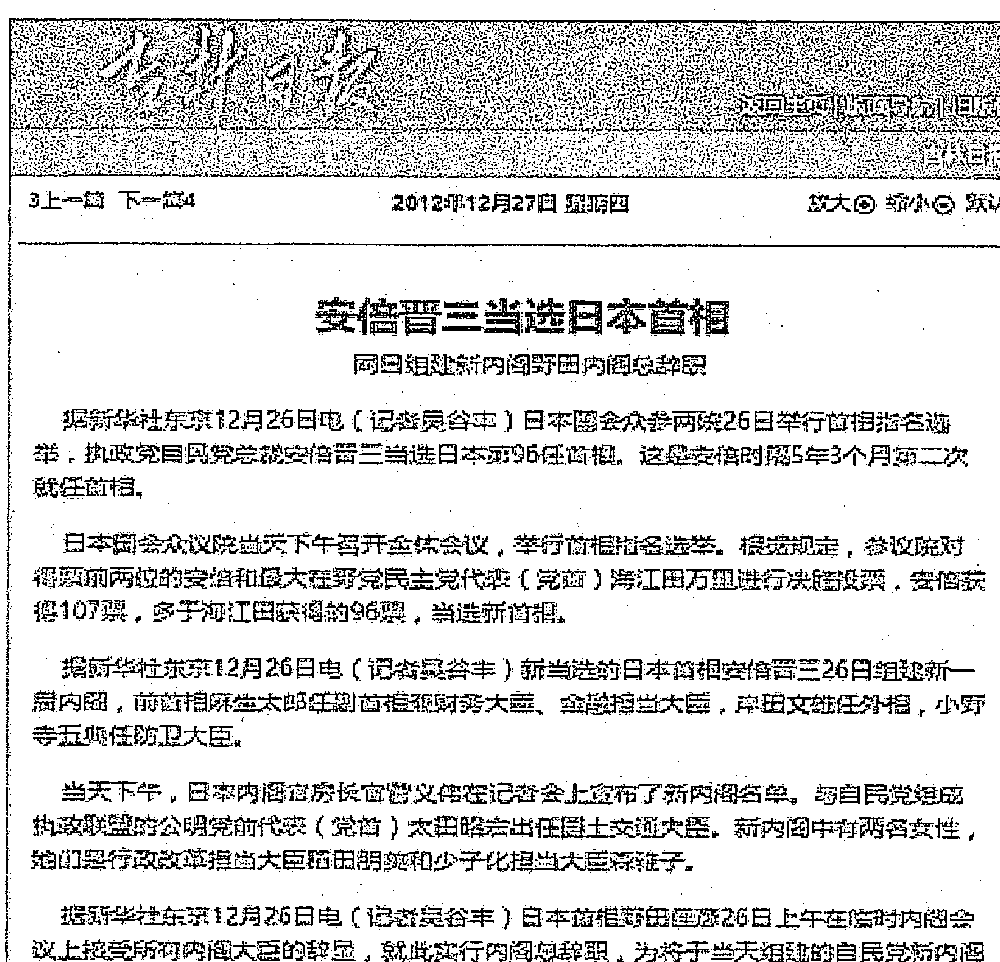

据新华社东京12月26日电（记者吴谷丰）日本国会众参两院26日举行首相指名选举，执政党自民党总裁安倍晋三当选日本第96任首相。这是安倍时隔5年3个月第二次就任首相。

日本国会众议院当天下午召开全体会议，举行首相指名选举。根据规定，参议院对得票前两位的安倍和最大在野党民主党代表（党首）�江田万里进行决胜投票，安倍获得107票，多于�江田获得的96票，当选新首相。

据新华社东京12月26日电（记者吴谷丰）新当选的日本首相安倍晋三26日组建新一届内阁，前首相麻生太郎任副首相兼财务大臣、金融担当大臣，岸田文雄任外相，小野寺五朗任防卫大臣。

当天下午，日本内阁官房长官菅义伟在记者会上宣布了新内阁名单。与自民党组成执政联盟的公明党前代表（党首）太田昭宏出任国土交通大臣。新内阁中有两名女性，她们是行政改革担当大臣稻田朋美和少子化担当大臣森雅子。

据新华社东京12月26日电（记者吴谷丰）日本首相野田佳彦26日上午在临时内阁会议上接受所有内阁大臣的辞呈，就此实行内阁总辞职，为将于当天组建的自民党新内阁铺路。

###### 事后应验：

2012年12月26（农历十一月二十四）日，日本大选消息公布，野田佳彦落选，安倍晋三当选日本首相。此事与著者35天之前的预测结果一样，只是时间与预测的“十一月二十八至十二月初二有结果”上提前了4天时间。（见《吉林日报》截图消息图）

##### 例三、马王争纷，胜败如何？

2013（癸巳）年10月1（农历八月二十九）日晚20点整，著者在网上看到“台湾地区领导人马英九与王金平纷争激烈”的消息，顿生预测后果之念。

###### 抽扑克牌依次是：

-   梅花7
-   方片7
-   黑桃9
-   黑桃9
-   梅花8
-   红桃6

###### 扑克牌起卦：

梅花7、方片7、黑桃9组成乾象，内卦取乾象；黑桃9、梅花8、红桃6组成震象，外卦取震象，震上乾下，得本卦雷天《大壮卦》；卦中九三爻黑桃9老阳动，内卦由乾象变为兑象；九四爻黑桃9老阳、上六爻红桃6老阴同动，外卦由震象变为艮象，艮上兑下，得变卦山泽《损卦》。内卦一个动爻，外卦两个动爻，以多动者为用，取外卦为用卦，以月令对应的爻为用爻，九四爻黑桃9对应八月为用爻。卦象视为体用得位，互卦为《夬卦》。

###### 卦气分析：

此卦中1个方片，1个红桃，2个梅花，2个黑桃，二红四黑，卦象阴气占67%，阳气占33%，体卦阳多代表马英九，用卦阴多代表王金平，从卦气看体卦（马英九）占优势。

雷天大壮卦变山泽损卦

| 梅7少阴 | 方7少阳 | 黑9老阴 | 黑9老阴 | 梅8少阴 | 红6老阳 |
| --- | --- | --- | --- | --- | --- |
| 7 | 7 | 9 | 9 | 8 | 6 |
| 初九爻少阳 | 九二爻少阳 | 九三爻老阴 | 九四爻老阴 | 六五爻少阴 | 上六爻老阴 |

推测分析：以体为马英九，以用为王金平。

-   1、本卦雷天《大壮卦》，震上乾下，乾金克震木，体克用之象，农历八月乾金当旺，震木发动处于绝地，预示王金平虽然气势汹汹，不怀善意，但他对马英九不会构成什么大的伤害性影响。
-   2、变卦山泽《损卦》，艮上兑下，艮土生兑金，用生体之象，山在水中之象，水气腾升，山体受损，损上益下，预示外卦王金平必然受损，内卦马英九从中得益。
-   3、卦中两红四黑，黑多红少，说明卦中阳气不足，阴气太重，视为“小人犯上，君子不宁”之象。好在体卦的卦气占优势，隐现马胜王败的趋势信息。
-   4、体卦为内卦，用卦为外卦，体用各得其位，主次位置没有紊乱。互卦为泽天《夬卦》，兑金见乾金，卦象比和之象，预示马英九、王金平两人最终完全可以达到和解。
-   5、时间窗口：九三爻黑桃9对应农历七月，九四爻黑桃9对应农历八月是用爻，预示矛盾在这个时间段内形成并且加剧激化；上六爻红桃6对应农历十月，互卦《夬卦》兑上乾下，预示到了农历九月初八至十二日之间，将是马英九和王金平两个人握手言和的有利时机。

事后应验：

中新网10月10日（农历九月初六）电：台湾当局举行活动，马英九与王金平首度握手长达数秒钟，两人脸上都挂满笑容，气氛融洽愉悦。著者预测的“上六爻红桃6对应十月，预示九月初八至十二日之间，将是马英九和王金平两个人握手言和的有利时机”的结果相符，只是时间上提前了2天。

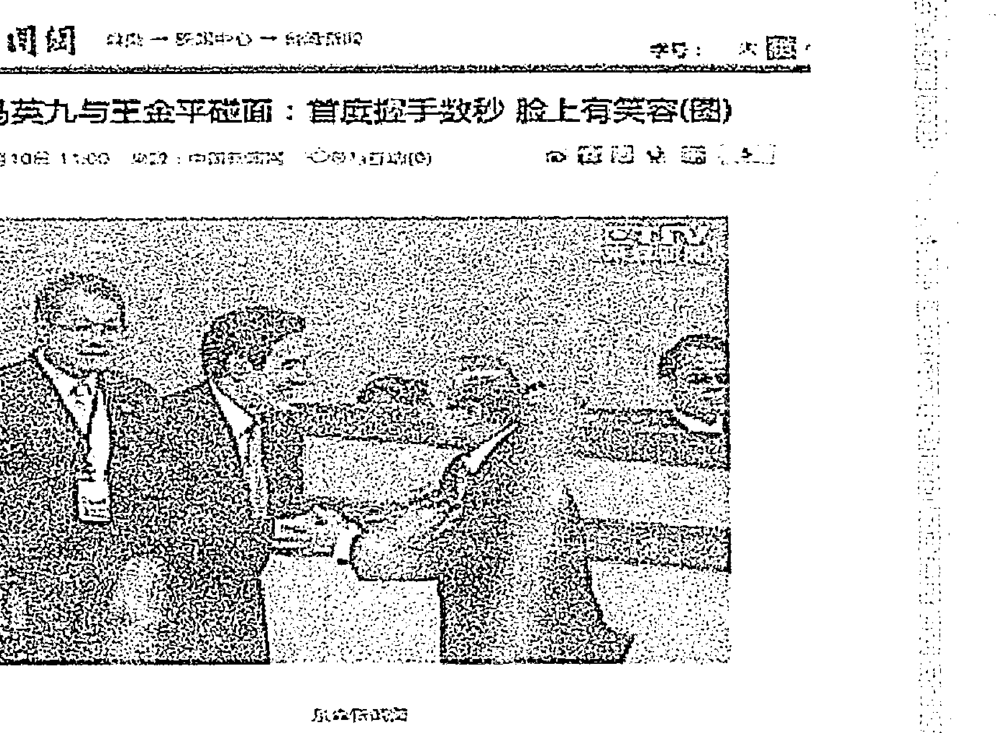

##### 例四、朱立伦2016年能否当选？

2015年11月1日（农历九月二十日）18时20分，著者在网上看到一则消息：屏东议长力挺朱立伦：“算命师说明年‘总统’是男的。”即生用扑克牌预测朱立伦能不能当选？

-   抽扑克牌依次是：
-   黑桃7
-   梅花7
-   方片9
-   黑桃9
-   梅花7
-   黑桃9

扑克牌起卦：黑桃7、梅花7、方片9组成乾象，内卦取乾象；黑桃9、梅花7、黑桃9组成乾象，外卦取乾象，乾上乾下，得本卦八纯卦《乾卦》，卦中九三爻方片9动，内卦由乾象变为兑象；九四爻黑桃9、上九爻黑桃9同动，外卦由乾象变为坎象，坎上兑下，得变卦水泽《节卦》。按卦爻总

数之和定用爻：25+23=48÷6=8，初九爻黑桃7为用爻，内卦为用卦，外卦为体卦，本卦体用不得位，覆卦也为《乾卦》，变卦的复原卦为泽水《困卦》。

八纯卦乾卦变水泽节卦
| 黑7老阴 | 梅7少阴 | 方9少阳 | 黑9老阴 | 梅7少阴 | 黑9老阴 |
| :---: | :---: | :---: | :---: | :---: | :---: |
| 梅花7 | 梅花7 | 方片9 | 黑桃9 | 梅花7 | 黑桃9 |
| 初九爻少阳 | 九二爻少阳 | 九三爻老阳 | 九四爻老阳 | 九五爻少阳 | 上九爻老阳 |

###### 卦气分析:

此卦中1个方片，2个梅花，3个黑桃，一方五黑，从数字看少阳老阳占绝对，从卦气看五黑一方，阴气特别重，预示朱立伦目前非常晦气，外卦三个爻2黑1梅全阴，好在内卦尚有一个阳爻方片9，仅存一丝希望。

###### 预测分析：以体为朱立伦，以用为能否当选。

1、本卦和覆卦都是《乾卦》，乾金见乾金，体用比和之象，预示大吉大利之卦象。朱立伦是国民党参加2016年大选的合适人选。只是这个乾卦六个爻中，两个梅花7、一个黑桃7、一个方片9、两个黑桃9，《乾卦》虽为六十四卦的领衔卦，也是“自强不息”的阳刚之卦。但是，卦爻五阴一阳，阴气太重，说明朱立伦目前非常非常的晦气。

2、变卦水泽《节卦》，坎上兑下，体金生用水，主人有付出之象。节卦为水溢外流、泛滥无制之象。本卦《乾卦》三个爻动，预示从目前到2016年初大选中间存在三次重大反复和变数。

3、变卦节卦，兑金生坎水，体生用之象，本卦乾象，九三爻动，预示朱立伦在大选前会遇到一些挫折和变化。

爻方片9对应农历七月，六四爻黑桃9对应农历八月，上九爻黑桃9对应农历十月。预示农历七月份形势与朱立伦有利；农历八月到十月形势将变得与朱立伦很不利；变卦坎（☵）象，九月金旺，乾金生坎水，预示大选的局外竞争形势异常复杂。

###### 4. 体卦为乾（☰）象
九三爻方片9动，变卦为兑（☱）象，乾金见兑金为比和之象，兑为辩论争讼，预示国民党内部气氛尚能保持和谐状态。

###### 5. 时间窗口
九三爻方片9对应农历七月，九四爻黑桃9对应农历八月，上九爻黑桃9对应农历十月。2015年的农历七月、八月、十月对于朱立伦来说是混乱惊险、变数很大的月份，只有平心静气，以待天时。乾（☰）象对应每月的十三至十七日时间段，2015年农历十月十三至十七日这5天之内，台湾地区候选人就基本明确。2015年农历十一月中旬是大选的关键时间段。

###### 6. 根据以上分析推断
朱立伦目前晦气太重，变数太多，2016年参选面临很多困难，当选存在很大的悬念。

###### 事后应验
2016年1月16日（农历2015年十一月二十六），台湾地区领导人选举投票，当晚开票，结果显示，民进党候选人蔡英文获胜当选，大家非常看好的国民党候选人朱立伦落选。通过这个卦例，可见在象数预测中，《乾卦☰》不一定就完全代表“元亨利贞，飞龙在天，利见大人”。三个变爻中，九三爻辞：君子终日乾乾，夕惕若厉，无咎；九四爻辞：或跃在渊，无咎；上九爻辞：亢龙有悔。研易者只要读一读这三个爻的爻辞，不用多想，答案就自然明白了。

## 第九节 运气—事业—婚姻
运气、事业、婚姻对每一个人来说都是一生至关重要的头等大事，尤其是年轻人就更为重要。第九节分享的内容是著者根据扑克牌起卦预测的特点，尝试着为好多年轻人预测运气、事业、婚姻，积攒了十几个实际卦例，预测虽然没有具体地针对性，可是求测者觉得还真是那么一回事情。鉴于当事人对这些预测结果比较满意，所以，单独在此分享给读者，权当我们用扑克牌做一个人生游戏，仅供朋友们在预测分析中参考。

##### 例一、《中孚卦☰☱》变《益卦☳☴》
董女士，宝鸡市人。预测：运气、事业、婚姻。

抽扑克牌依次是：
- 红桃7，梅花9，黑桃8，红桃8，梅花7，方片7。

本卦风泽《中孚卦☰☱》，九二爻梅花9变动，得变卦风雷《益卦☳☴》。

风泽中孚卦变风雷益卦
| 红桃7老阳 | 梅花9少阴 | 黑桃8老阴 | 红桃8老阳 | 梅花7少阴 | 方片7少阳 |
| :--- | :--- | :--- | :--- | :--- | :--- |
| 初九爻少阳 | 九二爻老阳 | 六三爻少阴 | 六四爻少阴 | 九五爻少阳 | 上九爻少阳 |

###### 推测分析
###### 一、用爻选择
卦中九二爻梅花9为动爻，取此爻为用爻，内卦为用卦，外卦为体卦，用爻虽为老阳，但本身带有少阴之气，预测主人小运不通。

###### 二、卦气强弱
卦中1个方片，2个红桃，2个梅花，1个黑桃，三红三黑，阳气50%，阴气50%，卦气阴阳平衡和谐。

###### 三、大运简析
36岁前事不顺心，中年运势渐顺畅，自强不息要牢记，有得有失小吉祥。

###### 四、婚姻感情
（变卦风雷益卦为婚姻卦）卦气阴阳平衡，婚姻自己做主。前边小不顺心，后面恩爱久长；婚姻感情稳定，家庭逐渐和睦；心气不宜太高，孩子伶俐聪明。

###### 五、事业发展
本卦《中孚卦》，巽上兑下，兑金克巽木，卦象用克体之象。开始生意不顺，投入回报期长，需要时间调整，艰苦奋斗创业，中年鸿运畅通，老来吉祥健康。

###### 六、财气得失
变卦《益卦》，巽木见震木，卦象用比体和。谋事易成，信息灵通，善于社交，人缘很好，生意兴隆，财运亨通。

###### 七、时间窗口
农历六月、九月、腊月、三月。卦象显示今年农历六月主人有一件不随心意的事情，农历九月初可能已经了结，有一位能说会道的年轻女性与此事有关。

###### 八、近期心思
目前自己心里有一件事，与自身的情绪有关，学会抒怀，遇事放下，将会成为一位优秀的成功女士。

###### 九、贵人印象
九二爻为用爻，2为兑，兑为金、为沼泽、为西方、为少女、为善辩。有一位少年女子；另一位高个子、说话声音大、排行老大的中年男士是你生命中的贵人。

##### 例二、《随卦☰》变《鼎卦☲》
高女士，1973年公历4月3日生于宝鸡。预测：运气、事业、婚姻。

抽扑克牌依次是：
- 黑桃9，红桃6，黑桃6，方片7，方片9，梅花6。

本卦泽雷《随卦䷐》，初九爻黑桃9、六二爻红桃6、六三爻黑桃6、九五爻方片9、上六爻梅花6，五个爻变动，得变卦火风《鼎䷱》。

###### 泽雷随卦变火风鼎卦
| 黑桃9老阴 | 红桃6老阳 | 黑桃6老阴 | 方片7少阳 | 方片9少阳 | 梅花6少阴 |
| :---: | :---: | :---: | :---: | :---: | :---: |
| ♠️9 | ♥️6 | ♠️6 | ♦️7 | ♦️9 | ♣️6 |
| 初九爻老阳 | 六二爻老阴 | 六三爻老阴 | 九四爻少阳 | 九五爻老阳 | 上六爻老阴 |

###### 推测分析
###### 一、用爻选择
按卦数之和取用爻：21+22=43÷6=7……1。商数7为奇数，上六爻梅花6为用爻，外卦为用卦。体卦为内卦。

###### 二、卦气强弱
卦中2个方片，1个红桃，1个梅花，2个黑桃，3黑3红，卦气阳占50%、阴占50%，卦气阴阳相对平衡，只是卦中变爻太多。

###### 三、大运简析
幼年生活艰辛，前半生有不顺，中年之后顺畅，小事勿放心上，九五贵人吉祥，珍惜感恩知足。

###### 四、婚姻感情
（泽雷《随卦䷐》为婚姻卦）卦气阴阳平衡，婚姻自己做主；前边有所磕碰，后面妇唱夫随。丈夫缺少阳刚，感情稳定和睦。

###### 五、事业发展
本卦泽雷《随卦䷐》，兑金克震木，卦象用克体之象。自己心气太高，开始事业不顺，努力从小做起，中年鸿运当头，自有贵人照应，帮你成就理想。

###### 六、财气得失
变卦火风《鼎卦䷱》，巽木生离火，卦象体生用之象。谋事易成，善于交往，人缘很广，生意红火，得财不易，切记戒贪。

###### 七、时间窗口
农历七月、十月、二月、五月。卦象显示今年农历五月可能有一件不随心意的事情发生；农历八月有一件比较开心的事情来临。好事一般都在每月的中旬兑现。过去的农历五月、六月、七月、九月、十月主人生活会面对一些变数。关心的事情农历九月份相对稳定，十月十八至二十二之间有一桩大好事值得期待。

###### 八、近期心思
目前自己心中有大小事情五件。三件事一好两坏，都是自己家中的事情。另两件在外边，一好一坏，都能得到和平解决。

###### 九、贵人印象
上六爻为用爻，6为坎象，坎为水、为北方、为黑色、为中男。有一位低个子、皮肤黑、很聪明的中年男士可以帮助你实现心中的梦想。

##### 例三、《临卦䷒》变《旅卦䷴》
刘女士，宝鸡市人。预测：运气、事业、婚姻。

抽扑克牌依次是：
- 黑桃9，红桃9，梅花6，红桃6，梅花8，方片6。

本卦地泽《临卦䷒》，初九爻黑桃9、九二爻红桃9、六三爻梅花6、六四爻红桃6、上六爻方片6，五个爻变动，得变卦火山《旅卦䷴》。

###### 地泽临卦变火山旅卦
| 黑桃9老阴 | 红桃9老阳 | 梅花6少阴 | 红桃6老阳 | 梅花8少阴 | 方片6少阳 |
| :--- | :--- | :--- | :--- | :--- | :--- |
| 初九爻老阳 | 九二爻老阳 | 六三爻老阴 | 六四爻老阴 | 六五爻少阴 | 上六爻老阴 |

###### 推测分析
###### 一、用爻选择
卦数之和取用爻：24+20=44÷6=7……2，商数7为奇数，从上六爻方片6向下数2数，六五爻梅花8为用爻，外卦为用卦，用爻阳气不足。

###### 二、卦气强弱
卦中1个方片，2红桃，2梅花，1个黑桃，3红3黑，阳气50%，阴气50%，卦气阴阳相对平衡，一阴一阳，布局理想。

###### 三、大运简析
少小在家有担当，中年时运渐顺畅，柔能克刚德行好，晚年幸福呈吉祥。凡是先难后易，逢凶化吉之象。

###### 四、婚姻感情
卦气阴阳平衡，婚姻自由恋爱，夫妻感情融洽，家和诸事亨通。婚姻稳定，女人当家；母慈子孝，妻旺夫弱；卦象一阴一阳，子嗣一男一女。

###### 五、事业发展
本卦地泽《临卦䷒》，坤上兑下，坤土生兑金，卦象用生体之象。起步必须努力，创业做事较顺，贵人帮扶较多，借助人缘创业。

###### 六、财气得失
变卦火山《旅卦䷷》，离上艮下，离火生艮土，卦象用生体之象。在外求财奔波，旅途广交朋友，辛劳奋斗拼搏，财似火过山坡。

###### 七、时间窗口
农历六月、九月、腊月、三月。好事一般都在这几个月份的上旬兑现。卦象显示今年六月可能有一件随心好事。农历五月、七月、八月、十月主人生活将会面对许多变化。十月上旬有一桩好事正在期待之中，可以得到一位年轻女子的帮助。

###### 八、近期心思
目前主人心中有大小事情五件。三件事是自己家中的事情，一好两坏。另两件事在外边，可能是好事临门。

###### 九、贵人印象
六五爻梅花8为用爻，五为巽，为风、为东南、为时尚、为长女。主人没有大靠山，但可以得到一位同辈的、长年女士的照应和帮助。

##### 例四、《涣卦☰☴》变《丰卦☳☲》
郭先生，1968年生于陕西咸阳。预测：运气、事业、投资。

抽扑克牌依次是：
- 梅花6，方片9，黑桃6，黑桃6，红桃9，黑桃9。

本卦风水《涣卦☰☴》，初六爻梅花6、九二爻方片9、六三爻黑桃6、六四爻黑桃6、九五爻红桃9、上九爻黑桃9，六个爻同时发动，得变卦雷火《丰卦☳☲》。

**风水涣卦变雷火丰卦**
| 梅花6少阴 | 方片9少阳 | 黑桃6老阴 | 黑桃6老阴 | 红桃9老阳 | 黑桃9老阴 |
| :---: | :---: | :---: | :---: | :---: | :---: |
| 初六爻老阴 | 九二爻老阳 | 六三爻老阴 | 六四爻老阴 | 九五爻老阳 | 上九爻老阳 |

###### 推测分析
###### 一、用爻选择
卦数之和取用爻：24+21=45÷6=7……3，商数7为奇数，从上九爻黑桃9向下数3个数，六四爻黑桃6为用爻，外卦为用卦，用爻阴气太重。

###### 二、卦气强弱
卦中1红桃、1方片、1梅花、3黑桃，2红4黑，卦气阳占34%、阴占66%，阳气衰弱，阴气盛行。卦中六爻全动，暗藏动荡杀机，卦气很不乐观。

###### 三、大运简析
幼小生活艰难，少年时运顺畅，中年运势不佳，壮年成功立业。应该是一位饱经风霜、历练成才的优秀人士。

###### 四、婚姻感情
（风水《涣卦䷸》中男长女，主散）卦气阳衰阴盛，青梅竹马恩爱；中途婚姻离散，切忌灯红酒绿，桃花暗藏劫财，家庭终难幸福。

###### 五、事业发展
本卦风水《涣卦䷴》，巽上坎下，坎水生巽木，卦象体生用之象。生意先得后失，需要重整旗鼓，卦气鸿运过午，谨慎奋斗创业。

###### 六、财气得失
变卦雷火《丰卦䷶》，震木生离火，卦象用生体之象。上半年经营亏损，下半年扭亏赚钱，生意若是兴隆，财上见好就收。

###### 七、时间窗口
六四爻黑桃6动。农历八月、十一月、二月、五月。卦象显示今年主人的事业变数较大，有一位热情奔放、忠厚诚实的中年轻女性可以帮扶。

###### 八、近期心思
自己心里有两件大事，一件在家中，一件在外边。学会控制情绪，遇事冷静处理，大度从容对待，谋事必然成功。

###### 九、贵人印象
六四爻黑桃6动，取为用爻，4为震象，为木、为东方、为长男。有一位热心的长年男士是你生命中的贵人。

##### 例五、《师卦☷☵》变《蛊卦☶☴》
郭女士，宝鸡市人。预测：运气、事业、婚姻。

抽扑克牌依次是：
- 方片8，黑桃7，黑桃6，红桃8，黑桃8，梅花6。

本卦地水《师卦☷☵》，六三爻黑桃6、上六爻梅花6，两个爻变动，得变卦山风《蛊卦☶☴》。

###### 推测分析
###### 一、用爻选择
卦数之和取用爻：21+22=43 ÷ 6=7……1，商数7为奇数，上六爻梅花6为用爻，外卦为用卦。

###### 二、卦气强弱
1个方片，1个红桃，1个梅花，3个黑桃，2红4黑，卦气阳占33%、阴占67%，卦气阴盛阳衰，主人比较晦气。

###### 三、大运简析
生性柔中带刚，天气阴柔有余，地气虽阳不吉，中年鸿运短暂，仕途无人照应，自求吉祥平安。

###### 四、婚姻感情
（地水《师卦☷☵》中男、老女之象）卦气阴阳不平，婚姻不由自主，家中阴气太重，丈夫在后帮扶，父爱享受较少，母亲关爱较多。

###### 五、事业发展
本卦地水《师卦☷☵》，坤上坎下，坤土克坎水，卦象用克体之象。自主创业不顺，做事柔顺细腻，谨慎口舌争讼，需防小人作祟。

###### 六、财气得失
变卦山风《蛊卦☶☴》，艮上巽下，巽木克艮土，卦象体克用之象。生意一事一做，切记货款两清；夏日大显身手，冬来注意亏损。

###### 七、时间窗口
农历正月、四月、七月、十月，好事一般都在这几个月的中旬兑现。卦象显示今年农历七月中可能有一件不随心意的事情，要预防一位时尚女士带来的麻烦；农历十月二十三至二十七之间有一件事情要特别谨慎对待。

###### 八、近期心思
目前主人心中有两件事情。一件是自家的事情；另一件是外边生意上事情，只管做事，莫问吉凶，平淡对待，最终和解。

###### 九、贵人印象
上六爻梅花6为用爻，6为坎象，坎为水、为北方、为黑色、为中男。有一位低个子、皮肤黑、很聪明的中年男士可以帮助你实现心中的梦想。

##### 例六、《噬嗑卦䷔》变《井卦䷯》
2017年12月22日，唐女士，宝鸡市人，求测：运气、事业、婚姻。

抽扑克牌依次是：
- 黑桃9，方片6，方片6，红桃9，黑桃6，黑桃9。

本卦火雷《噬嗑卦䷔》；卦中三个老阳、三个老阴，六个爻全动，变卦水风《井卦䷯》。

火雷噬嗑卦变水风井卦
| 黑桃9老阴 | 方片6少阳 | 方片6少阳 | 红桃9老阳 | 黑桃6老阴 | 黑桃9老阴 |
| :--- | :--- | :--- | :--- | :--- | :--- |
| ♠️9 | ♦️6 | ♦️6 | ♥️9 | ♠️6 | ♠️9 |
| 初九爻老阳 | 六二爻老阴 | 六三爻老阴 | 九四爻老阳 | 六五爻老阴 | 上九爻老阳 |

###### 推测分析
###### 一、用爻选择
按卦爻总数取用爻：27+18=45÷6=7……3，商数7为奇数，从上六爻向下数3个数，九四爻红桃9为用爻，外卦为用，内卦为体。

###### 二、卦气强弱
卦中2个方片，1个红桃，3个黑桃，3红3黑，卦气阴阳各占50%，阴阳平衡之象。

###### 三、大运简析
幼小生活不顺，少年时运渐好，中年春风得意，暮年雨打梧桐。卦象六爻全动，人生变数太大，属于一个两头苦、中间甜的运势。

###### 四、婚姻运势
本卦火雷《噬嗑卦》，离上震下，震木生离火，体生用之象，卦象显示男女吃吃喝喝之象，卦象中女长男，预示主人在家庭婚姻方面比较顺心。

###### 五、财气得失
卦中六个卦爻全动，变卦水风《井卦》，坎上巽下，坎水生巽木，用生体之象，水生木长，向上发展。预示主人后期有收获之象，诸事逐渐顺心。九四爻红桃9为用爻，外卦为用卦，内卦为体卦，先付出后收获之象。卦象六爻全动的情况很少，预示主人遇到的事情往往变数太多。

###### 六、时间窗口
农历五月、八月、十一月、正月。过去的一年当中每逢这四个月的下旬事业和婚姻等就有重大变故。每年的农历六月、七月、八月，腊月、正月、二月有好事发生。农历三月、四月、五月，九月、十月、十一月多有不顺心的事情发生。

###### 七、近期心思
农历五月至十月这半年的时间里，将有三件比较开心的事情，有三件特别不开心的事情。

###### 八、贵人印象
九四爻红桃9动，4为震象，震位东方、为长男、为瘦高个子、为排行老大、为有公职身份的人。在东方有一位高个子、说话声音大的长年男子是生命中的贵人。

##### 例七、《未济卦》变《蛊卦》
李女士，公历1973年9月24日生于宝鸡。预测：运气、事业和婚姻。

抽扑克牌依次是：
- 红桃8，梅花7，黑桃6，梅花9，方片8，黑桃7。

本卦火水《未济卦》，六三爻黑桃6、九四爻梅花9，两个爻变动，得变卦山风《蛊卦》。

火水未济卦变山风蛊卦
| 红桃8老阳 | 梅花7少阴 | 黑桃6老阴 | 梅花9少阴 | 方片8少阳 | 黑桃7老阴 |
| :--- | :--- | :--- | :--- | :--- | :--- |
| ♥️8 | ♣️7 | ♠️6 | ♣️9 | ♦️8 | ♠️7 |
| 初六爻少阴 | 九二爻少阳 | 六三爻老阴 | 九四爻老阳 | 六五爻少阴 | 上九爻少阳 |

###### 推测分析
###### 一、用爻选择
按卦数之和取用爻：21+24=45÷6=7……3，商数7为奇数，从上九爻黑桃7向下数3个数，九四爻梅花9为用爻，外卦为用卦。

###### 二、卦气强弱
卦中1个方片，1个红桃，2个梅花，2个黑桃，2红4黑，卦气阳占33%、阴占67%，阳气不足，阴气较重。九四爻梅花9用爻老阳见少阴，卦气衰弱。

###### 三、大运简析
不得天时，独占地理，求学之路不畅，中年运势坎坷，事业晚成吉祥。一生中间苦、两头甜，六五爻上有女贵人相助。

###### 四、婚姻感情
（火水《未济卦》，中女中男）卦气阴盛阳衰，婚姻顺从吉祥；常想自身过错，小得小失不怨；鸿雁逐渐高飞，日出可见坦途。

###### 五、事业发展
本卦火水《未济卦》，离上坎下，坎水克离火，卦象体克用之象。开始做事红火，随后渐觉不爽，防止受人制约，寻找贵人相帮。

###### 六、财气得失
变卦山风《蛊卦》，艮上巽下，巽木克艮土，卦象体克用之象。经营遇到困难，效益不是太好，薄利多销取胜，多与朋友合作。

###### 七、时间窗口
农历正月、四月、七月、十月。卦象显示农历七月、八月有两桩不是很开心的事情，可能阻碍事业发展。

###### 八、近期心思：

目前主人心里有两件事需要作出抉择。一件事是自身的事情可能已经过去；另一件事是外边的业务，有一位中年女士可以帮助你。

###### 九、贵人印象：

九四爻梅花9为用爻，4为震象，震为木、为东方、为长男。命中有一位高个子、说话声音大、在家排行老大的长年男士是你命中的贵人。

##### 例八、《睽卦》变《大畜卦》

刘先生，公历1988年3月3日生于宝鸡。预测：运势、事业、婚姻。

抽扑克牌依次是：

- 黑桃7
- 方片7
- 梅花6
- 黑桃9
- 红桃8
- 梅花7

本卦火泽《睽卦》，六三爻梅花6、九四爻黑桃9，两个爻变动，得变卦山天《大畜卦》。

###### 火泽睽卦变山天大畜卦

| 黑桃7老阴 | 方片7少阳 | 梅花6少阴 | 黑桃9老阴 | 红桃8老阳 | 梅花7少阴 |
| :---: | :---: | :---: | :---: | :---: | :---: |
| 初九爻少阳 | 九二爻少阳 | 六三爻老阴 | 九四爻老阳 | 六五爻少阴 | 上九爻少阳 |

###### 推测分析：

一、用爻选择：按卦数之和取用爻：20+24=44÷6=7……2，商数7为奇数，从上九爻梅花7向下数2数，六五爻红桃8为用爻，外卦为用卦。

二、卦气强弱：卦中1个方片，1个红桃，2梅花，2个黑桃，2红4黑，卦气阳占33%、阴占67%，阳气不足，阴气太盛。

###### 三、大运简析：

九二阳居阴位，青年运气不错，中年有些坎坷，晚年荣华福寿，六五女贵照应。

###### 四、婚姻感情：

（火泽《睽卦》，中女少女）卦气阴盛阳衰，九二爻方片7上应六五爻红桃8。俩女同居一室，志向爱好不同；妻子当家做主，婚姻幸福和美。

###### 五、事业发展：

本卦火泽《睽卦》，离上兑下，离火克兑金，卦象用克体之象。做事地气充足，面临诸多挑战；年少积累经验，中年历练成才；大器晚成扬名，登上人生顶峰。

###### 六、财气得失：

变卦山天《大畜卦》，艮上乾下，艮土生乾金，卦象用生体之象。期初付出，福往福来；广结善缘，人脉聚财；中年来运，财气渐佳。

###### 七、时间窗口：

农历六月、九月、十二月、三月，好事一般都在这几个月的中旬兑现。卦象显示今年七月、八月有两件不随心意的事情发生。

###### 八、近期心思：

目前主人心里有两件事情。一件是自家的事情，另一件是外边的事情，先凶后吉，如期所愿。

###### 九、贵人印象：

六五爻红桃8为用爻，五为巽象，为风、为东南、为长女、为时尚、为信息。东南方位有一位时尚年长的女士可以帮你实现心中的梦想。

##### 例九、《损卦》变《噬嗑卦》

杨女士，1977年人，籍贯陕西宝鸡。预测：运势、事业和婚姻。

抽扑克牌依次是：

梅花7，方片9，红桃8，方片6，方片8，梅花7。

本卦山泽《损卦》，卦中九二爻方片9、六四爻方片6，两个爻变动，得变卦火雷《噬嗑卦》。

###### 山泽损卦变火雷噬嗑卦

| 梅花7少阴 | 方片9少阳 | 红桃8老阳 | 方片6少阳 | 方片8少阳 | 梅花7少阴 |
| :---: | :---: | :---: | :---: | :---: | :---: |
| 初九爻少阳 | 九二爻老阳 | 六三爻少阴 | 六四爻老阴 | 六五爻少阴 | 上九爻少阳 |

###### 推测分析：

一、用爻选择：按卦数之和取用爻：24+21=45 ÷ 6=7……3，商数7为奇数，从上九爻向下数3个数，六四爻方片6为用爻，外卦为用卦。

二、卦气强弱：卦中3个方片，1个红桃，2个梅花，4红2黑，卦气阳占67%、阴占33%，阳气充足，阴气衰弱。从卦气看主人两头稍有不顺，中年运气非常好。

三、大运简析：小时生活较艰难，中年运势大顺畅，奋斗志向不可改，成功立业显祖宗。主人将是一位优秀的成功女士。

四、婚姻感情：（山泽《损卦》，少男少女）卦气阳盛阴衰，青梅竹马恩爱，损男利女婚姻，个性阳刚勿过，影响婚姻家庭。

五、事业发展：本卦山泽《损卦》，艮上兑下，艮土生兑金，卦象用生体之象。生意暂时亏损，需要重整旗鼓，中年鸿运当头，大胆奋斗创业。

六、财气得失：变卦火雷《噬嗑卦》，震木生离火，卦象体生用之象。上半年经营亏损，下半年扭亏赚钱，生意兴隆显吉祥，财源茂盛运亨通。

七、时间窗口：农历五月、八月、十一月、二月。卦象显示今年农历六月、八月有两件大事情，有一位热情奔放的中年轻女性可以帮忙。

八、近期心思：自己心里有两大件事，控制自身情绪，学会冷静处事，大度从容对待，谋事必然成功。

###### 九、贵人印象：

六四爻方片6为用爻，4为震象，为木、为东方、为长男。有一位高个子、在家排行老大的男士是你生命中的贵人。

##### 例十、《乾卦》变《旅卦》

强先生，公历1980年12月21日生于宝鸡。预测：运势、事业。

抽扑克牌依次是：

黑桃9，红桃9，红桃7，方片7，方片9，梅花7。

本卦八纯卦《乾卦》，卦中初九爻黑桃9、九二爻红桃9、九五爻方片9，三个爻同动，变卦火山《旅卦》。

八纯卦乾卦变火山旅卦

| 黑桃9老阴 | 红桃9老阳 | 红桃7老阳 | 方片7少阳 | 方片9少阳 | 梅花7少阴 |
| :---: | :---: | :---: | :---: | :---: | :---: |
| 初九爻老阳 | 九二爻老阳 | 九三爻少阳 | 九四爻少阳 | 九五爻老阳 | 上九爻少阳 |

###### 推测分析：

一、用爻选择：按卦数之和取用爻：25+23=48÷6=8。商数8为偶数，初九爻黑桃9为用爻，内卦为用卦。

二、卦气强弱：卦中2个方片，2个红桃，1个梅花，1个黑桃，4红2黑，卦气阳占67%、阴占33%，卦象六阳，卦气很好，一身正气，身体健康。

三、大运简析：幼年起步不理想，中道事业大顺畅，晚景尚需小谨慎，重大事情贵人帮。

四、婚姻感情：《乾卦》阳刚之气太浓，阴柔之气较弱。感情开始遇到一个不顺心的相遇，后面需要在旅途解决个人婚姻问题。

五、事业运势：本卦《乾卦》，体用比和，开始做事很不随心，自己决心很大，持之以恒不够；中年鸿运畅通，上有贵人提携，梦想能够成真，晚年衣食无忧。

六、财气得失：变卦火山《旅卦》，离上艮下，离火生艮土，卦象用生体之象。谋事可成，求财得利，落袋为安，莫要迟疑。

七、时间窗口：农历三月、五月、六月、九月、十一月、十二月，在这些月份都会遇到一些变化性的事情，五月和十一月是收获成果的月份。

八、近期心思：目前主人心里正在筹划三件大事情，两件在内地，一好一坏，是自己家的事情。另一件好像在外地，好事尚在期待之中。

九、贵人印象：初九爻黑桃9为用爻，1为乾象，乾为金、为西北方、为老男、为官方公职人士。有一位高个头、长辈、公职人员、长年男士可以帮助你实现心中的梦想。

##### 例十一、《中孚卦》变《屯卦》

杨女士，公历1978年6月25日生于宝鸡。预测：运气、事业、婚姻。

抽扑克牌依次是：方片7，方片9，红桃8，黑桃8，红桃7，黑桃9。本卦风泽《中孚卦》，卦中九二爻方片9、上九爻黑桃9，两个爻变动，得变卦水雷《屯卦》。

风泽中孚卦变水雷屯卦

| 方片7少阳 | 方片9少阳 | 红桃8老阳 | 黑桃8老阴 | 红桃7老阳 | 黑桃9老阴 |
| :---: | :---: | :---: | :---: | :---: | :---: |
| 初九爻少阳 | 九二爻老阳 | 六三爻少阴 | 六四爻少阴 | 九五爻少阳 | 上九爻老阳 |

###### 推测分析：

一、用爻选择：按卦数之和取用爻：24+24=48÷6=8，商数8为偶数，初九爻方片7为用爻，内卦为用卦。

二、卦气强弱：卦中2个方片，2个红桃，2个黑桃，4红2黑，卦气阳占67%、阴占33%，阳气充足、阴气衰弱，主人运气很好。

三、大运简析：40岁前顺风顺水，40岁后做事中平，九五爻上坐贵人，一生运势大吉祥。

四、婚姻感情：（风泽《中孚卦》，长女少女）卦气阳盛阴衰，婚姻双方对峙，女强男弱相遇，中间烦心事多。期待农历十月份有决策性的消息，可能心想事成。

五、事业发展：本卦风泽《中孚卦》，兑金克震木，卦象用克体之象，主人做事认真，事业停滞烦闷，投资期限较长，需要等待时机，自有贵人相帮。

六、财气得失：变卦水雷《屯卦》，坎水生震木，卦象体生用之象，目前谋事难成，好事可期，财气不错，回报较晚。

七、时间窗口：农历正月、四月、七月、十月。卦象显示这四个月份的中旬是谋事兑现的时间段。农历五月初三至初七之间有一桩好事已经兑现。

八、近期心思：目前主人心中有两件大事情。一件好事是自家的事情可能已经兑现；另一件事先凶后吉，有一位退居二线的公职人员男士可以帮助关照，在农历十月十八至二十二之间就有眉目。

九、贵人印象：卦象初九爻方片7、九五爻红桃7，阳气旺相，交相呼应，命中有两个贵人时常照应。

##### 例十二、《节卦》变《睽卦》

杨女士，宝鸡市人。预测：运气、事业、婚姻。

抽扑克牌依次是：

红桃7，方片7，黑桃8，方片6，红桃9，红桃6。

本卦水泽《节卦》，外卦的六四爻方片6、九五爻红桃9、上六爻红桃6三个爻同动，坎象变离象，得变卦火泽《睽卦》。

###### 推测分析：

一、用爻选择：按卦数之和取用爻：22+21=43÷6=7……1，商数7为奇数，上六爻红桃6为用爻，外卦为用卦。

二、卦气强弱：卦中2个方片，3个红桃，1个黑桃，5红1黑，卦气阳占85%、阴占15%，阳气充足，阴气衰弱，预示主人运气很好。

三、大运简析：幼年春风得意，三十有一个坎，过后卦气飘红，大运顺风顺水，左右逢源，富贵吉祥。

四、婚姻感情：（《节卦》，中男少女）卦气一片飘红，婚姻自己做主；前边感情较好，后面妇唱夫随；婚姻稳定，家庭和睦，孩子聪明，父母康宁。

五、事业发展：本卦《节卦》，坎上兑下，兑金生坎水，卦象体生用之象，主人能力较强，预防骄傲自满，中年鸿运畅通，梦想轻松实现。

六、财气得失：变卦《睽卦》，离上兑下，离火克兑金，卦象用克体之象。夏季谋事易成，冬季收藏生息，生意坐收渔利，财源亨通大吉。

###### 七、时间窗口：

上六爻红桃6为用爻，农历正月、四月、七月、十月。卦象显示今年农历八月、九月、十月连着有三件事情比较开心，八月贵人帮助办成一件，九月的事情自己做主，十月也有好事值得期待。

###### 八、近期心思：

目前主人心中有三件事情。三件都是与外界有联系的，常规操作，平淡对待，好事登门，心想事成。

###### 九、贵人印象：

上六爻红桃6为用爻，六为坎象，坎为水、为北方、为中男、为黑色。在北方有一位低个子、皮肤黑、聪明智慧的中年男人可以帮助你实现心中的梦想。

##### 例十三、《观卦》变《离卦》

李先生，生于1965年，宝鸡市人。预测：运势、身体、事业。

抽扑克牌依次是：

方片6，黑桃8，方片6，方片6，红桃9，梅花7。

本卦风地《观卦》，卦中初六爻方片6、六三爻方片6、六四爻方片6、九五爻红桃9，四个爻变动，得变卦八纯卦《离卦》。

风地观卦变八纯卦离卦

| 方片6少阳 | 黑桃8老阴 | 方片6少阳 | 方片6少阳 | 红桃9老阳 | 梅花7少阴 |
| :---: | :---: | :---: | :---: | :---: | :---: |
| 初六爻老阴 | 六二爻少阴 | 六三爻老阴 | 六四爻少阴 | 九五爻老阳 | 上九爻少阴 |

###### 推测分析：

###### 一、用爻选择：

按卦数之和取用爻：20+22=42÷6=7，商数7为奇数，上九爻梅花7为用爻，外卦为用卦。

###### 二、卦气强弱：

卦中3个方片，1个红桃，1个梅花，1个黑桃，4红2黑，卦气阳占67%、阴占33%，阳气充足，阴气较弱，卦气很好。

###### 三、大运简析：

早年运势大顺畅，中年波动事不爽，当下人生最低潮，九五贵人呈吉祥。

###### 四、婚姻感情：

（《观卦》，长女、母亲）卦气红色占多，家中女强男弱；朝暮等待观望，夫妻离多聚少，婚姻两地分离，家庭比较稳定。

###### 五、事业发展：

本卦《观卦》，巽上坤下，巽木克坤土，卦象用克体之象，前程观望有阻，事业回报微薄，自身运气不佳，抱负无法展示，虽有贵人相帮，理想蹉跎茫然。

###### 六、身体状况：

变卦《离卦》，离火见离火，卦象用体比和之象。离为目、为心脏，心经有火，肝经有风。本卦肝脾不和，东南风患成疾；巽为鬼魅之事，需要孝敬向善；变卦双日在天，眼疾定能康复。

###### 七、时间窗口：

农历七月、十月、正月、四月。好事一般都在这几个月份的中旬有变化。卦象显示今年七月有一件不随心意的事情。过去的五月、七月、八月、九月要面对好多变数，卦象阳气充足，目前家人和单位领导都很给力支持。

###### 八、近期心思：

目前面临大小事情四件。两件是自家的事情，两件是外边的事，皆能逢凶化吉。常想一二，不思八九，学会放下，顺心平和。

###### 九、贵人印象：

上九爻梅花7为用爻，6为坎象，为水、为北方、为黑色、为智慧，为中男。可以得到东南方向一位个头小、皮肤黑、人很瘦、退二线男士的帮助。

以上是第五章：“卦例实战集锦”的全部内容，著者先后为大家分享了60多个扑克牌卦例，以便使读者掌握这种预测方法。回顾预测过的卦例，有三个值得回味的地方，感觉不可思议，尚需提醒大家进一步探讨其中奥秘。

第一个是：本书第五章第三节“事业预测”卦例中的例五（第225页）：山火（贲卦）变风地（观卦）；例六（227页）：山火（贲卦）变天雷（无妄卦），这是浙江一位网友为了同一件事情，时隔半年时间，分两次用16张扑克牌抽牌起的卦，本卦的卦象竟然一模一样，这个让人有点不可思议啊！

第二个是：本书第五章第五节“随机事件预测”卦例中的例五（第250页）：“八纯卦（艮卦）变水火（既济卦）”，六个爻4个梅花、2个黑桃，卦象全阴，这是很少见到；再比如第六节“经济合同预测”卦例中的例六（第276页）：“水雷（屯卦）变雷山（小过卦）”六个爻4个方片、2个红桃，卦象全阳这也是很少见到的。要在16张扑克牌中连续抽六次，出现全阴（黑、梅）卦和全阳（红、方）卦的概率是很小的，这是著者从来没有遇到过的卦例。

第三个是：本书第五章第七节“战争预测”卦例中，例三（第284页）：“中美贸易的未来趋势”和例四（第287页）：“伊朗和美国是否发生战争？”，时隔22个月时间，在不同地点用扑克牌抽的卦，它们的“本卦、覆卦、变卦、复原卦”竟然神奇般地互为逆袭卦象（见291至292页）。

著者虽然学习研究《周易》预测文化近40年，遇到这些现象颇感自己学疏才浅，无法解释它的神奇现象。今天把它们分享给各位读者，以求得到大咖高人的解读和指点，使自己和朋友们对《周易》预测文化有一个更新的认识。

总而言之，经验是生活日积月累的总结，真理是成熟经验证实的结晶，实践是检验真理的唯一标准。著者的《扑克牌·梅花易》一书，从预测方法介绍到实战卦例分享，与各位易学大咖交流探讨，一家之言，不妥之处，还望批评指正。

### 参考文献

- [1] 宋·朱熹：《周易本义》〖M〗，中国书店出版，1987。
- [2] 宋·邵雍：《梅花易数》〖M〗，中国华侨出版公司出版，1991。
- [3] 清·江慎修：《河洛精蕴》〖M〗，学苑出版社，1989。
- [4] 清·王夫子：《周易外传》〖M〗，中华书局出版，1977。
- [5] 刘利、纪凌云：《中华经典藏书·左传》〖M〗，中华书局出版，2007。
- [6] 南怀瑾、徐芹庭：《周易今注今译》〖M〗，天津古籍出版社，1989。
- [7] 沈伯春：《梅花易数》〖M〗，海南出版社，2008。
- [8] 朱伯崑：《易学哲学史》〖M〗，昆仑出版社，2009。
- [9] 王赣、牛力达、刘兆玖：《古易新编》〖M〗，黄河出版社，1991。
- [10] 刘大钧：《周易概论》〖M〗，齐鲁书社出版社，1988。
- [11] 李申：《周易之河说解》〖M〗，知识出版社，1992。
- [12] 孙德厚：《易经新解》〖M〗，学苑出版社出版，1990。
- [13] 曾仕强：《易经的奥秘》〖M〗，陕西师范大学出版社，2009。
- [14] 张卫波：《和解活用反经》〖M〗，中国致公出版社，2006。
- [15] 刘雁翔：《伏羲庙志》〖M〗，甘肃文化出版社，2003。
- [16] 郭御青：《六壬全书》【M】，延边人民出版社，2009。
- [17] 华夏国学经典丛书《四书五经》【M】，内蒙古人民出版社，2009。
- [18] 明·刘伯温：《奇门遁甲》【M】，中国戏剧出版社，2006。
- [19] 姜庆和、孙守方：《未知的世界》【M】，京华出版社，2006。
- [20] [美]索甲仁波切：《西藏生死之书》【M】，中国社会科学出版社，1999。
- [21] 《奇门遁甲》【M】，中国民间文艺出版社，1989。
- [22] 《爱因斯坦文集》第一卷【M】，商务印书馆，1978。
- [23] 潘鹤年：《周易与股市预测》【M】，花山文艺出版社，1999。
- [24] 何东兴：《周文化丛书·周易卷》【M】，中国文史出版社，2015。
- [25] 何东兴：《梅花易研究精要》【M】，中国文化出版社，2015。
- [26] 何东兴：《寸心天地》【M】，中国文化出版社，2015。
- [27] 东汉·徐岳：《数术记遗》【M】，
- [28] 郑悍马：《生霸死霸再考及月相正名》（网上论文）。
- [29] 春秋·尹喜：《关尹子》【M】，（网络）
- [30] 老子：《楼观石本道德经》【M】，楼观台文物管理所，1984。

### 后记

2020庚子年将成为历史长河中一个很不平静的年份，新冠肺炎疫情肆虐给全国人民的健康造成了巨大灾难。元月23日武汉封城启动重大突发公共卫生事件一级响应，打响了全国抗击疫情的人民战争，在党中央的坚强领导下，全国人民经过近两月时间的努力拼搏，抗击新冠肺炎疫情取得了阶段性顺利。响应政府号召，为了国家安全和自身健康，不出门待在家的这半个月时间里，著者沉下气、静下心，将以前断断续续撰写了两年时间的《扑克牌·梅花易》文稿进行了最后编纂。今天是2020年正月十一日立春，对于我来说算是在一个特殊非常时期完成了一件渴望已久的特殊任务，《扑克牌·梅花易》书稿杀青脱稿，即将发送出版社审核出版。此时此刻有一种如释重负的感觉，不仅仅只是高兴和激动，唯感欣慰地是给自己旷日持久研究创作的良心有了一个比较圆满地交代，使我深信不忘初心对实现人生目标是何等重要。在此只想向各位尊贵的读者说，《周易》是中国一部古典的朴素哲学和预测学。

著者韶华之年时运不佳，一言难尽其苦衷，自己感到幸运的是作为一个名不见经传的草根学者，身后有很多粉丝追逐，眼前有近百万字的四本研究专著，这无疑是对自己近40年来初心不改，致力于《周易》与社会人文和自然科学学习研究的肯定，印证了《后汉书》中“失之东隅，收之桑榆”的警世名言。感恩上苍赐予灵感，琢磨推研，归纳总结出了对易学预测有关的一家之言，权且作为《扑克牌·梅花易》付梓出版分享读者。易云：乾为天，坤为地。乾坤者，天地之门户，众卦之纲领。《周易》创立了中国模式宇宙论和朴素辩证法，否极泰来，穷则思变的“简易、变易、不易”思想，正是《周易》辩证思想之精髓。著者运用变化的眼光、发散的思维去洞察认识这个神秘有趣的繁华世界，爱好支撑着乐此不疲的生活兴趣和日常追求。人生只有三天：昨天，今天，明天。对于我来说昨天已经成为无法复制的历史，只是觉得没有辜负；今天尽可能做到的是把握好珍贵的当下，别留下遗憾；明天要做的是保持对未来向往的良好心态，不问得失，一直沿着深研《周易》文化的路子坚定地走下去。

亘古亘来，万事万物变化的规律是恒久不变的，研究《周易》文化必须带着哲学的思维去考虑问题。俗话说：他山之石，可以攻玉。学习《周易》理论要博采众家之长，弥补自己之短。愚深知自己笨拙，从《黄帝内经》《淮南子》《左传》《周易参同契》《紫微斗数》《奇门遁甲》《六壬术数》等诸家经典中，发现了《梅花易数》对接拓展的东西。面对大千世界中的自然灾害，我们人类要是能预先看清一丝风向，提前预知一点趋势，就向化险为夷、趋吉避凶走近了一大步。就预测一件事情而言，有些人情愿花费时间去看鬼魅传奇的电视连续剧，却不愿相信预测的科学性。其实道理很简单，我们只需知道在什么时间空间？遇到什么人和事物？未来变化结果是成是败，就可知其大概，因之而做好准备，尽量使成功更加圆满，使损失减少到最小，这可能就是预测文化用于大众化生活的终极目标。因是之故，《扑克牌·梅花易》抓住了重点，瞄准了核心，创新了系统，介绍了著者三十多年辛苦探索出来的一套起卦方法和断卦技巧，积累收集了日常生活中60多个实战案例，给学习研究《梅花易数》的朋友们提供了一个快捷真实的实战学习平台，愿与广大读者共同努力，把我国预测传统文化发扬光大。

《荀子·大略》云：“善为《诗》者不说，善为《易》者不占，善为《礼》者不相，其心同也。”春秋战国时期的先哲大儒们精研《周易》，深解其谜，掌握精要，心领神会，所以一个个知性明理，不热衷于占卜命运。真正掌握《周易》的人，自然明了人生命运，内心不犯糊涂，处事少有差池。故孔子曰：“吾十有五而志于学，三十而立，四十而不惑，五十而知天命，六十而耳顺，七十而从心所欲，不逾矩”。孔子可能是结束周游列国后才开始精研《周易》，并且沉迷其中不能自拔。为此他感叹地说：“加我数年，五十以学《易》，可以无大过矣。”五十岁时孔子在鲁国雄心勃勃，大有作为，尔后命运多舛，不得不离开鲁国去周游列国寻找机会，如果那时候他就精研《周易》，无论是在鲁国还是周游列国，都会有不菲的成就。

《论语·子路》云：“不恒其德，或承之羞。”孔子曰：“不占而已矣。”此语就出于《周易·恒卦》九三爻辞：“不恒其德，或承之羞。”意思是说：没有坚定品德的人，很有可能会承受羞辱之灾祸。对于这样的人孔子说：（我）不用占卜就可以知道结果。尽管说孔子学习《周易》为时已晚，正是因为他老人家深研精通《周易》为人处世之道，才达到随心所欲而不会犯错的境地。

朱熹说：“善读者玩索而有得焉，则终身用之，有不能尽者矣。”清代《四库全书总目提要》中说：“易之广大，无所不包，旁及天文、地理、乐津、兵法、韵学、算术，以逮方外之炉火，皆可援以为说。”无论是荀子的“善为《易》者不占”，还是孔子的“不占而已矣”，研究《周易》要精修品德，博览旁通，取其精华，为我所用，这正是著者学习《周易》强大自身的出发点和落脚点。

感恩一路给予厚爱的良师益友。我1980年参加工作，2018年10月光荣退休，在高等学校后勤服务管理岗位上坚守了39个春夏秋冬。记得2015年第一本《寸心天地》付梓之际，邀请国家一级作家、陕西省作协原副主席李凤杰先生撰写序言。李老看了书稿十分感慨地说：“你不平凡的出身和经历，引起我的共鸣，很乐意为《寸心天地》序言”，后来序言《读何东兴散文感言》刊登在《秦岭文学》杂志，给我很大的鼓励和鞭策。2016年第二本《周文化丛书·周易卷》由中国文史出版社出版发行，岐山县政协文史委作为丛书的主办方，特邀全国政协副主席陈宗兴先生为之序言，确实给此书增添了神奇的光环。2019年第三本《梅花易研究精要》由中国文化出版社出版，邀请西北大学哲学教授高立勋先生和陕西省周易研究会会长李耀堂先生分别撰写序言，并邀请著名易学家、书法家、国际推背图学会会长苗元一先生题写书名，他们都给予了大力支持和热心帮助。尤其是《梅花易研究精要》在网上书店售出后，读者纷纷给予很好点赞和高度评价，这些来自不同层面的支持与点评，使我时时感恩于怀，不断激励自己向《周易》研究更高的山峰攀登。

此次《扑克牌·梅花易》出版，难得宝鸡市委原常委、宝鸡军分区政委许道化先生在百忙之中为此书撰写序言，并给予很高的评价。宝鸡市周易研究会理事兼副秘书长闫亚萍女士参与书稿图文校对。在此，深深地表示敬意和感谢！此书出版过程中得到中华文化书局编辑和工作人员的悉心指导与帮助，一并表示诚挚地谢意！

大道本至简，事理全在悟，万物皆有缘，因果由天定。《扑克牌·梅花易》虽然出自平凡之人笔下，著者拳拳之心昭然若见，经验之谈问心无愧，值得研究《周易》预测文化研究者参考借鉴。世界之大之神奇，是人类不可预知的。孔子曰：“天下何思何虑，天下同归而殊途，一致而百虑。”以此与广大读者朋友共勉！

何东兴
2020（庚子）年春于宝鸡古陈仓居室