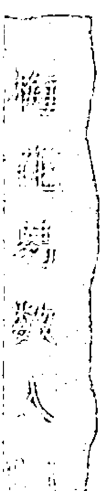
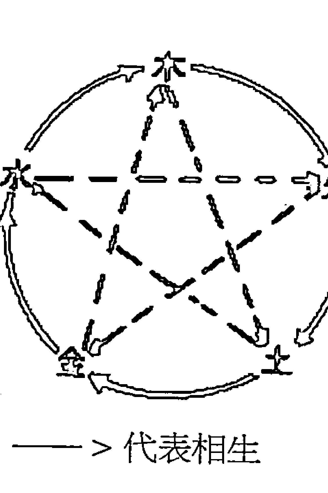
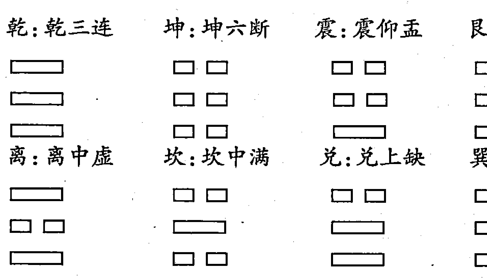
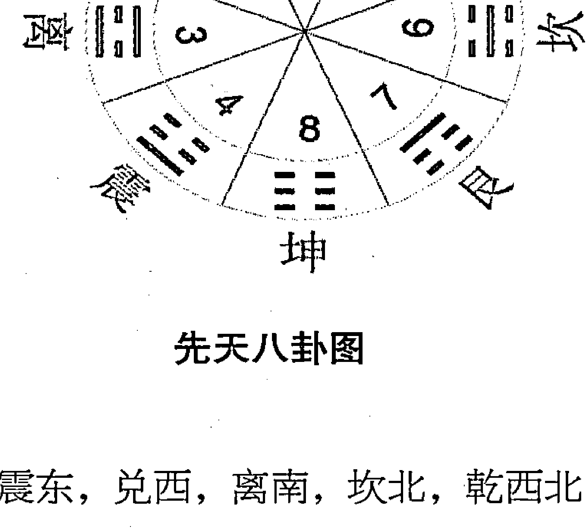
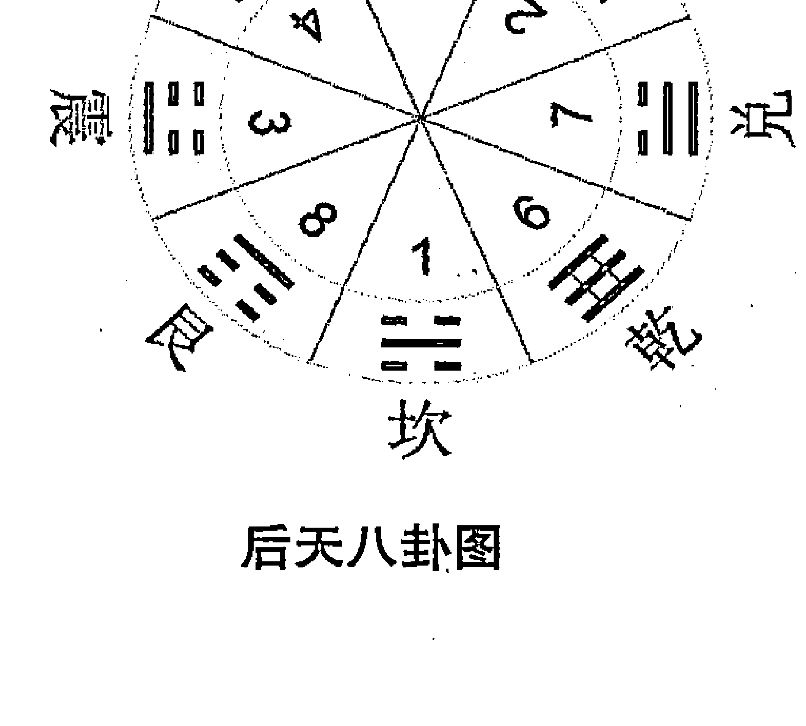
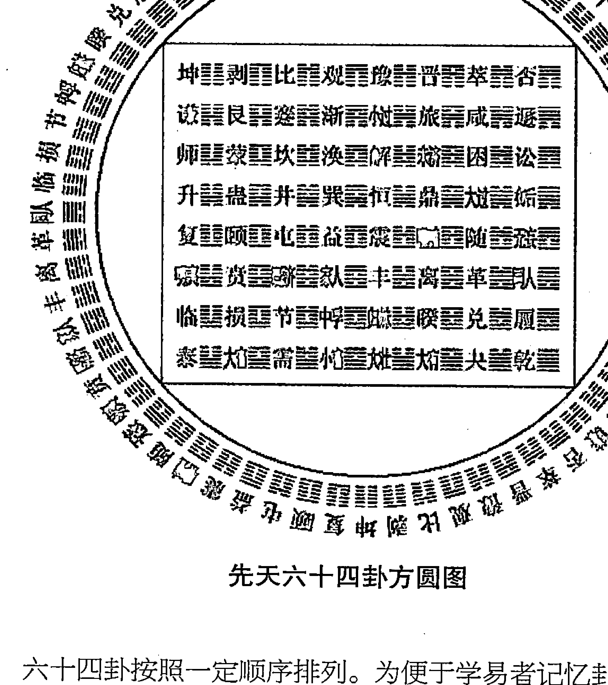

# 梅花易数入门

北宋大儒邵康节总结出了一套简单易行、灵活多变的易学预测法，世称“梅花易数”。梅花易数汲取《周易》象数之学的成果，以易学中的数学为基础，将深奥的易理具体应用于占卜，其中蕴含着我国丰富的古代数学思想与数学方法，因此也被称为“《易经》中的数学”。本书即以深入浅出的语言和大量的线条图，来讲述梅花易数的历史起源、基本概念、数理和实用技巧等，以使人人都能领略这门古老预测艺术的妙处。

# 第一章 走近梅花易数

## 一、什么是梅花易数？

《梅花易数》为宋代易学家邵雍所著，是一部以易学中的数学为基础，结合易学中的象学进行占卜的一部预测书。据说邵雍运用书中原理起卦占断时每卦必中，屡试不爽。梅花易数依先天八卦数理，即乾一、兑二、离三、震四、巽五、坎六、艮七、坤八，随时随地皆可起卦，取卦方式多种多样。

《梅花易数》一书中记载，相传：

> 辰年十二月十七日申时，康节先生偶观梅，见二雀争枝坠地。先生曰：“不动不占，不因事不占。今二雀争枝坠地，怪也。”因占之，辰年五数，十二月十二数，十七日十七数，共三十四数。除四八三十二，得余二，属兑，为上卦；加申时九数，总得四十三数，五八除四十，零得三数，为离，作下卦。又上下总四十三数，以六除，六七除四十二，余一为动爻，是为泽火革。初爻变成，互见乾巽。

> 断之曰：观此卦，明晚当有女子折花，园丁不知而逐之，女子失惊坠地，遂伤其股。右兑金为体，离火克之。互中巽木，复生起离火，则克体之卦气盛。兑为少女，因知少女被伤；而互中巽木，又逢乾金兑金克之，则巽木被伤，而巽为股，故有伤股之应。幸变为艮土，兑金得生，知女子但被伤，而不至凶危也。

这是《梅花易数》中一则典型的占测事例，让我们从这一具体的事例入手，来具体分析、认知一下《梅花易数》的具体概念、内容、玩法及论断占测的步骤吧！

上之例用今天的白话来说就是：在辰年十二月十七日的申时（申时相当于一天中的下午15点到17点钟），宋朝大易学家邵康节先生偶然去观赏梅花，看见两只麻雀为了争占树的枝头而跌落在地上。

先生说：“不行动不占测，没有什么事情不占测。现在两只麻雀为了争立树枝而落地，这也奇怪呀！应该有什么事情要发生了吧！”因此，他就以当时的时间为信息而起卦占断，看看有什么事情要发生。

他是这样起卦的：以辰年中的辰为五数，十二月为十二数，十七日为十七数，这年、月、日三个数相加的总数是三十四。他用三十四除以八，得四余二，这样以余数的二对应的八卦兑作上卦。再以年、月、日三数的和三十四加上当时的时辰申时所代表的九数，就得到了总和为四十三的一个数。又用四十三除以八，商得到了五而余数是三，他就以三所对应的八卦离作下卦。接着他又将年、月、日、时四项的数的总和除以六，得到了商七余数为一的结果，他就以一所对应的重卦爻，初爻为动爻。这样一来就生成了一个完整的八卦卦象即“革之咸”卦，用八卦具体的卦象表述是：

### 坎宫：泽火革

### 本 卦

| 爻位 | 六亲干支 | 爻象 | 世应 |
| :--- | :--- | :--- | :--- |
| 上爻 | 官鬼丁未土 | ▅▅ ▅▅ | |
| 五爻 | 父母丁酉金 | ▅▅▅▅▅ | |
| 四爻 | 兄弟丁亥水 | ▅▅▅▅▅ | 世 |
| 三爻 | 兄弟己亥水 | ▅▅▅▅▅ | |
| 二爻 | 官鬼己丑土 | ▅▅ ▅▅ | |
| 初爻 | 子孙己卯木 | ▅▅▅▅▅ | 应 |

### 兑宫：泽山咸

| 爻位 | 爻象 | 六亲干支 |
| :--- | :--- | :--- |
| 上爻 | ▅▅ ▅▅ | 父母丁未土 |
| 五爻 | ▅▅▅▅▅ | 兄弟丁酉金 |
| 四爻 | ▅▅▅▅▅ | 子孙丁亥水 |
| 三爻 | ▅▅▅▅▅ | 兄弟丙申金 |
| 二爻 | ▅▅ ▅▅ | 官鬼丙午火 |
| 初爻 | ▅▅ ▅▅ | 父母丙辰土 |

根据这一个卦象，邵康节先生推断说，在第二天晚上应当会有一个年轻的女子来这里折花，这时会有一个园丁不知道情况而去撵她，这个女孩就会惊慌失措摔倒在地而伤了大腿。

这样占断有什么道理呢？

这是因为在所得的八卦图中，主卦为革，上卦兑金为体，为自己；下卦离火为用，为环境，为相关事物。从主卦上看为用克体（即离火克兑金），互卦中有巽卦木，巽木生离火，巽木为互为内为旺为主体力量之因素，所以会助火成功，为火热很旺之象，这样一来就基本上构成了克体的卦气十分旺盛的局面。体为兑也，为少女之象，因此就可推知少女要受到伤害。

在互卦中巽木又遇到互体乾金，和主体兑金的双重克制，那么巽木为小木为被克的对象，其受伤则是必然的。巽木的卦象反映在人体上，对应部位是人的大腿，所以说这就有了伤及大腿的应验推断。

值得庆幸的是，在这个大成卦中，主卦的初爻发生了动变，动变的结果是变卦咸，卦象由主卦的用离火转变成了变卦中的艮土，在五行中土生金，变卦咸之下卦的艮土得以生抉主卦“革”之体卦兑金。自身在最后的变数中（结果）中得到了有效的生抉。

所以邵康节先生最后占测说这个女孩虽然会受到点伤，但是她不会有大的凶险和危险。

事后发生的一切，均证实了邵康节先生的占断。在感到神奇和不可思议的同时，我们该怎样理解这一占断的现象呢？这一占断的逻辑思维是什么？有什么样的理论依据？怎样才能达到邵康节先生那种占测出神入化的境界呢？

邵康节先生曾在其《梅花易数》中作“观梅数诀叙”：

> 嗟呼！《易》岂易言哉！盖《易》之为书，至精微，至玄妙。然数者，不外乎易理也。有先天后天之殊，有叶音取音之辨，明忧虞得失之机，取互变迟速之应。数有前定，祸福难测。易理灼然可察，予求得先天、玄黄、灵应诸篇，外采《易辞》，曰：观梅数诀，列图明五行生克衰旺之理，分例指避凶趋吉之道。后学君子幸鉴焉。《易辞》曰：易有太极，是生两仪，两仪生四象，四象生八卦，八卦生万物。邵子曰：“一分为二，二分为四，四分为八也。”《涣卦传》曰：“易逆数也。”邵子曰：“乾一、兑二、离三、震四、巽五、坎六、艮七、坤八，自乾至坤，皆得未生之”

> “卦，若逆推四时之比也，后天六十四卦仿这。”

这段“观梅数诀叙”不仅表达了作者对《周易》博大精深的惊叹，同时也告诉我们梅花易数的构成、理论及推占依据和推占思路。

《梅花易数》中所谓的“数”是什么意思呢？其实它不外乎依据《周易》中的易理所阐述的内容，来揭示事物不断发展变化的规律而已。其取数的过程有先天八卦数和后天八卦数的巨大差别，有谐音取音取数得卦的方法，来揭示事物变化的契机，并以互、变卦作为预测应验快慢的时间参照因素。

邵康节认为，虽说在世间万物中，其因果成败的气数所表现出来的发展规律是注定的，其前方的祸福是难以占测、预知的，然而只要遵循《周易》中所表现出来的易理，并根据易理去推断，那么事物发展变化的吉凶祸福的趋向、规律就可以透彻地观察、体会到了。

邵康节根据先天八卦、天地玄黄、三要、十应等诸多因素（内容）的真正妙旨，再结合《周易》的爻辞，列图来揭示卦象中的五行生克制化关系，及卦气的衰旺情况，然后再一一列出事物在发展过程中避凶趋吉的方法。这就是梅花易数的实质内容，也是利用梅花易数解读卦象的具体方法和步骤。

> 《周易・系辞上》说：易的核心是太极，太极生出阴阳两仪，阴阳两仪进而演化成四象，四象分而化为八卦，由此而代表了世间万物的不同属性、不同物质、不同元素，由于八卦的基本内容涵盖了宇宙万物，所以我们就常说“八卦生万物”了。

邵康节先生用更加简单的说法来表述这一过程，他说，这其实就是事物的从无到有、从一到二、从三分四、由四裂八的宇宙法则罢了。

他进一步说：先天八卦的乾一、兑二、离三、震四、巽五、坎六、艮七、坤八所代表和反映的是天地阴阳交换变化的客观规律，其他卦象都孕育隐藏在其中。如果逆推依据梅花易数的原理，也能正确地反映世界阴阳、四阳（春夏秋冬）的发展规律，而后天的六十四卦是和先天八卦的道理是一样的。

根据“观梅数诀叙”我们可知，在梅花易数的数的应用中，邵康节更注重对先天八卦数的应用，这是因为在在他看来，先天八卦之数是符合自然界发展规律之数，是自然天成之数，是最能反映客观世界之数。

让我们带着种种的疑问与探求，一步一步地走近神秘的预测圣地——《梅花易数》的世界之中吧！

## 二、《梅花易数》与《周易》

传说中的上古时代，太昊伏羲氏为天下王的时候，他通过上观天文，下察地理，进而中通万物之情，经过其长期的研读世界，终于绘制出了八卦图，以尽世界发展变化之理，人们称之为“先天八卦图”。

八卦是由表示阳的符号“一”（阳爻）和表示阴的符号“- -”（阴爻）经过三次进位制的裂变重叠而成的八种，且只有八种不同的图形所组成的。

又相传在中古时代的周文王被囚居于羑里城时，他将伏羲的先天八卦“因而重之”，即通过把先天八卦进行重叠组合，使卦象由原来的三爻组合变为六爻组合，这样就产生了新的卦象表现方式——六十四卦。在推演六十四卦中，周文王对其卦象进行命名、排序，注加断语（添加卦辞）。其子周公旦（即周武王）子承父业，在其父研易的基础上，对六十四卦象的每爻象又进行了进一步的分析解读，研究并逐一加批了断语，这就是后人所说的爻辞。

周文王和周武王的六十四重卦及卦辞，三百八十四爻及爻辞是构成《易经》的基本构架和内容。

《易经》的经文（主要是卦辞、爻辞）文句精短，内容生动，比喻形象，哲理性强，奥义深蕴，但又古僻晦涩，令人不易卒读，因此常常让人望而却步，但也更让人赏其妙及其不可揣测性。也许正因为如此，读《易》之人常有不同之感受，常受不同之启迪，常有不同之收获，故而世人对《易》的解读有“见仁见智”之现象就不足为怪了。自从孔子读《易》而“韦编三绝”之后，历代对《易经》的注解释义之作可谓浩如烟海。清代康熙五十四年（公元1716年）由李光地主编的《御纂周易折中》一书编著告成，书中所引用的历代论著易学的名士就有二百多人，可谓洋洋大观。

孔子及弟子们从解读、阐释《易经》入手，而为其作《传》，史称《易传》。

《易传》包括了《文言》、《象传》上下、《彖传》上下、《系辞传》上下，《说卦传》、《序卦传》及《杂卦传》七种十篇的内容。《易传》的主旨是对《易经》的解读与阐释，《传》就好像是《经》的羽翼一样，极大丰实了《经》的境态，所以人们又常称《易传》是《易经》的“十翼”。

在“十翼”中，《文言》分前后两节内容，分别解说的是乾、坤两卦的象征意旨。

《象传》则分别解释了六十四卦的卦名，卦辞及一卦之大意。

《象传》阐释了各卦的卦象及各爻的爻象。

《系辞传》是早期的一部关于《易经》内容的较为全面、深刻的通论性文章，它对《易经》经文的各个方面的内容都作了较为详细的、可取可信的阐发和辨析。

《说卦传》是一部阐说八卦象例的专论。

《序卦传》的主旨是解说《易经》六十四卦的编排次序的文章，它揭示了六十四卦之间相承的意义。

《杂卦传》是把六十四卦按照综卦（卦体相互倒置的两卦）、错卦（相对应的各爻阴阳属性全部相反的两卦）分成32组，并以精要的语言来概括卦旨的文章。

到了汉代，人们把《易传》和《易经》合编起来，组成了一个较为完整的理论体系，统称为《周易》。

《易经》也罢，《易传》也罢，历代对于《易传》的评论也罢，所有的这些文辞、语言，无不是配合具体的卦象而对其进行阐释而已。这也就是说，世间的事物千变万化的卦象，生发出世间百态，从而形成了《易经》博大精深的哲理机制和想象空间，它让人们以无限的遐想，联翩的浮想试图去更加接近可知的、未知的、已知的、欲知的神奇世界或世间万物。

在我国历史发展的长河中，《周易》被众家公认为无与伦比的经典之作。《周易》是中华民族的骄傲，是东方文化的明珠。它堪称一本满纸智慧的奇书，是“六经之首”、“三玄之一”，对我国的哲学、文学、史学、医学、音乐、民俗、宗教、天文、数学、历法、科技等诸方面都产生了深远的影响。

除孔子是《易经》评论的集大成者外，南宋的朱熹也是一位对《周易》颇具创见的硕儒，他融诸家之长，以义理研究为主，兼备象数，把易学推到了一个集思广益的新阶段，他的“《易》本卜筮之书”的论评可谓是在易学界的一声惊雷，有石破天惊之力。他的《周易本义》的影响可谓深入骨髓，直至今人。

易学的历史源远流长，易的内容博大精深，易卦爻符号千变万化，易之卦爻辞艰涩难懂，所以，易学的体系庞杂，派系林立。但公认其中主要有两个学派，即象数学派和义理学派。象数学派以易象、易数为解易的途径，寻求卦爻辞和卦象之间抽象的内在联系，即寻求卦爻辞一字一句在卦象中的体现。而义理学派则主要是阐明易的哲学大义。

其实，象数是基础，象数中展示着义理，没有象数何以谈义理呢？因此说，解《易》重在析象，但这并不排除象数在义理的指导下形成的可能。同时也应该深刻知道离形义理，一味地去寻求卦爻辞的一字一句在卦象中的体现，那么，象数可能就会变得枯竭。

在易学史上，宋代易学的主要贡献突出表现在两个方面：一方面，易学家们综合“河洛之学”与《易经》象数之学的成果，对宇宙、历史盛衰治乱的规律建立了一个完整的体系；另一方面，将这门经院哲学式的科学化繁为简，化难为易，使其迅速走向大众，走向社会，走向民间，使易学日益显示出其实用价值。而完成这两个变革的代表人物便是邵雍先生。

邵雍（1011—1077年），字尧夫。北宋著名理学家，象数学家、哲学家。自号安乐先生，祖籍河北范阳，后移居衡漳，再迁共城（今河南辉县），又徙洛阳。生于宋真宗大中祥符四年（1011年），卒于宋神宗熙宁十年（1077年）。宋哲宗元中谥号康节，南宋宋孝宗淳熙初从祀孔庙，追卦新安伯。明代嘉靖中祀称“先儒邵子”。后世习惯称之为“康节先生”。

按照《谥法》用字的特定含义：温良好乐曰“康”，能固所守曰“节”，所以追溢为“康节”。

邵康节先生仙逝之后，南宋朝廷诏谥他“配享孔庙”，即灵牌被供奉在孔圣人偶像一旁。一个无职无权的布衣之人，却能在其身后享受到当政者如此的礼遇，泱泱中国三千年只有一个！！

邵康节一生中多次授官而不赴，与周敦颐、张载、程颐、程颢同为中国文化史上知名的北宋五大儒，史称“北宋五子”。邵雍以讲《易经》著称，是理学象数学派的创始人。

邵雍曾表示，一生要做到“心无妄思，足无妄去，人无妄交，物无妄受”，立身处世，要做一个品行端正、与人为善的君子。他终生奉行的人生哲学是讲求高尚的道德情操，探求宇宙的无穷奥秘，研究天人的离合关系，写出传世的诗赋文章。

他融合儒家、道家思想，把《周易》归结为“象”和“数”，认为“象数”系统是最高法则，因而形成其象数之学，史称先天学。

《周易》是先民们对大自然界万物不断生长变化的思考、认知、探究的结果，是人类社会“逆思维”的产物，从它产生的那一天起就肩负起了人们预知未知、预知祸福的职责和重任，以至于长期被人们简单地只看做是一本占卜书。从这个意义上说，《周易》也可以被看作中国占卜的经典。

《周易》之后，中国的占卜术逐渐发展为一个庞大的专门研究领域。

两汉时，京房在阴阳五行说的基础上，发明了著草配“纳甲”的占卜方法。

唐代时，由于经济得到了快速的发展，生活节奏也相应地加快了起来，人们就“以钱代筮”，借助三枚铜钱来预测事物发展的吉凶祸福状态，这就极大地节约了蓍草占测的时间，去掉了其繁杂的环节。

到了北宋时，邵雍先生则更是进一步发明了一种灵活的起卦方法，这种方法可以按年月日时起卦，也可以按字的笔画或字的个数起卦，可以听声音起卦，还可以根据事物的尺寸、颜色、方位等诸多信息起卦。这种新的起卦方法，从总体上来说就是将数字或其他事物通过数学运算后而纳入全息的宇宙八卦、时空三维体系中进行解读、推演、计算，进而更加接近事物原本规律、原本性质的方法。这种全新的入卦方法及解读思路就是《梅花易数》的基本特征。因此说，《周易》之学是梅花易数的基础，梅花易数是《周易》预测术的进一步发展。

鉴于邵雍先生对于易学的重要贡献，朱熹曾盛赞康节先生说：

> 天挺人豪，英迈盖世。架风鞭霆，历览无际。
> 手探月窟，足蹑天根。闻知今古，醉里乾坤。

北宋著名思想家，“洛学”创始人，理学体系的形成者程颢、程颐称邵雍的学术为“内圣外王之学”。程颐称赞邵雍“其心虚明，自能知之”。

邵雍的门生张岷总结说，康节先生“研精极思，三十年观天地之消长，推日月之盈缩，考阴阳之度数，察刚柔之形体。故经之以元，纪之以会，始之以运，终之以世。又断自唐虞，迄于五代，本诸天道，质以人事，兴废治乱，靡所不载。其辞约，其义广，其书著，其旨隐。于是乎美矣！至矣！天下之能事毕矣！”

## 三、《梅花易数》的基本内容

《梅花易数》全书共有五个部分组成，主要阐述的内容是：
- 一、象数易理；
- 二、体用生克制化关系；
- 三、占断法诀；
- 四、字画指迷；
- 五、拆字杂编。

该书第一卷主要讲述了推卦占断的理论基础，取诸物起卦的具体方法及事例。如起卦方法，有按可数之物起卦、按时间起卦、按字起卦、按声起卦、按颜色起卦等。

该书第二卷主要讲述的是推卦占断的法诀，这是《梅花易数》推卦的核心所在，是总纲，是最重要的内容，其要旨有四：第一，依据《周易》卦，爻辞以断吉凶。第二，认真考察卦象的体用所主，即卦象中所育含的生克制化所主之事。其中“体”为主，“用”为事。“用”生“体”或“比和”就吉利。第三，看起卦时周围的动静变化所含的信息。第四、看占卜时自身的动静。

该书第三卷主要讲述了推断占卦的法诀中所讲的体用生克之理。其实，这一体用关系在《梅花易数》中的运用是不难理解的，体用的关系是依据大成卦象中五行的相互关系而体现的，五行中一共有五种情况，即生我的，我生的，克我的，我克的，以及同类的。五行中生我的关系，体用中的关系则是用生体；五行中生我的关系，体用中的关系则是体生用；五行中克我的关系，体用中的关系则是用克体；五行中我克的关系，体用中的关系则是体克用；五行中同类的关系，体用中的关系则是比合。如以木为例，木和水的关系就是水生木，他们的关系就是生我的关系；木和火的关系就是木生火，他们的关系就是我生的关系；木和金的关系是金克木，他们的关系就是克我的关系；木和土的关系是木克土，他们的关系就是我克的关系；木和木的关系则是同类的关系，比合的关系。

该书第四卷中主要是讲述了卦与字的联系，并介绍了以此推断吉凶的方法。

该书第五卷中则主要是讲述了“四言”、“五行”、“六神”等具体的测字方法。

## 四、梅花易数卦象的定象方法

象有两种，一是我们感官能真实体会到的象（如听到的、看到的、闻到的、摸到的等），还有一种是我们想象到的、抽象意思到的象，就是说万事万物都有象，有象则有数与理。《系辞》曰：“是故易者象也，象也者，像此者也。”又云：“八卦以象告。”就已经很明确地提出，象是易的精髓所在。中国的术数正是以“天人合一”思想为纲纪，以阴阳五行为运转规律，以比类取象为方法从多方位、多角度客观分析一件事物或是人生的一门综合性学科。象的定位准确，直接影响解卦的方向性是否正确，在梅花易数中占有极其重要的地位。

在象数中，我们首先要明确，万物类象是由《说卦》中而来，象并不是指万物类象表中所列的那些具体的事物，象是某种事物在某个时空环境和要求中展现出来的最突出的一个属性。万物类象表你就是背下来了，你也无法明确定象。因为任何东西，处于不同的时空环境中，有它的不同属性。比如，一个没插上电的电冰箱，你可以取离卦，因为是外实中空的，它这时的形态属性就是外实中空，就可取离卦卦象；而插上电时，它起的是制冷作用的，它这时的属性就为寒为乾卦。

再比如在《说卦》中：“乾，健也。乾，天也，故称乎父。乾为天，为圆，为君，为父，为玉，为金，为寒，为冰，为大赤，为良马，为老马，为瘠马，为驳马，为木果。”我们从中就可提炼出，凡是强有力的、冷冰冰的、有号召力的、圆满的等都是乾的象。取象取的是特质，取的是属性，而不是取物，如果只死背万物类象表是无法准确断卦的。

物类象表中的那些具体的东西，生搬硬套是无法灵活解卦的。

先天卦，我们解卦就是直接读象。读象可上下直读，也可横向直读。比如地泽临我们可以直读为有多人一起吃饭。比如，体为巽，体互为坎，我们可以直读坐车走或是路过一条河。无论怎样读象，我们不能离开义理，不能离开日常生活道理，不能偏离大家约定俗成的公理。比如说求测官讼，出现一个离卦，我们不能说官司有火有电或有外硬内软之物，更不能说眼睛怎么地。

为什么要以理定象？《梅花易数》一书中的“邻夜叩门借物占”特意举了个邻人借斧的例子来阐述：

> 冬夕酉时，先生方拥炉，有叩门者，初叩一声而止，继而又叩五声，且云借物。先生令勿言，令其子占之所借何物。以一声属乾为上卦，以五声属巽为下卦，又以一乾五巽共六数，加酉时数共得十六数，以六除之，二六一十二，得天风姤。第四爻变巽卦，互见重乾。卦中三乾金，二巽木，为金木之物也，又以乾金短，而巽木长，是借斧也。

> 子乃断曰：“金短木长者，器也，所借锄也。”先生曰：“非也，必斧也。”问之，果借斧。其子问何故，先生曰：“起数又须明理。以卦推之，斧亦可也，锄亦可也；以理推之，夕晚安用锄？必借斧。盖斧切于劈柴之用耳。”推数又须明理，为卜占之切要也。推数不推理，是不得也。学数者志之！

卦象还得结合卦气旺衰而定，比如乾：凡逢生扶比合之时，则为刚健有力、领导、有钱、圆的、金属的、圆满的等；凡逢克泄无力之时，则为穷鬼、没职无业、冰冷的等等。兑：凡逢生合之时，则断为性格开朗、高兴的等；凡逢克泄之时，则断为缺少的、吵闹烦人的。

六十四卦中，还有一些为大象之卦，这样的卦则直读经卦卦象，如果是变卦，则应期和结果直读经卦卦象。如天风姤直接以巽卦的卦德来处理。

1.  大巽卦：天风姤、天山遁。
2.  大艮卦：山地剥、风地观、天地否。
3.  大坎卦：泽风大过、雷山小过、雷地豫、地山谦。
4.  大离卦：山雷颐、风泽中孚、天火同人、火天大有、天雷无妄、山天大畜、天泽履、山泽损、风雷益。
5.  大震卦：地泽临、地雷复。
6.  大兑卦：泽天夬、雷天大壮、地天泰。
7.  大乾卦：乾为天。
8.  大坤卦：坤为地。

其中：“乾坤无互，互其变卦。”也就是说，乾为天和坤为地的互卦为变卦的互卦。

## 五、梅花易数的卦气旺衰

体用生克，必须要参照卦气的旺衰，光以体用两卦之间的五行生克是错误的解断方法。这在《梅花易数》“体用生克篇一”和“体用生克篇二”中多次提到。梅花易数的卦气，实质就是卦在当时节气和未来产生结果时节气中的旺衰。而节气中的五行旺衰就得要参照五运六气中，当时节气中的五行旺衰。

卦气论目前有多种说法，依据的原理其实都是来自于《内经》中的七篇运气论中。卦气就是《内经》中的“五运六气”的气。因为时空是不断转换的，时代是不断发展的，如果只是根据简单的经卦与经卦之间的体用生克就能评断，就算梅花易数学说的创始期较晚，几百年来，先哲们早把六十四卦的所有体用生克全记下来了，后人当做公式套就行了。易有变易之说，“数说当也，必以理论之而后备。苟论数而不论理，则拘其一见而不验矣。”要知道卦气如何来，就得先明白什么是节气、什么是五运六气。

### (一) 洛书与节气

洛书数字本就是太一下九宫而来，以四十五数演星斗之象。九宫八风图配合八风，八卦，中央一宫，即洛书的中宫，乃周围八宫的核心。古人观测天象，认为北极星(太乙)之位恒居北方，可以作为中心以定位的标准。九宫是据北斗斗柄所指，从天体中找出九个方位上最明亮的星为标志，便于配合斗柄以辨方定位，发现九星的方位及数目，即洛书的方位和数目。

古人发现，北斗斗柄围绕北极星转一圈，大地的季节依次移行，从冬至日开始，斗柄指向正北方叶蛰宫，主冬至、小寒、大寒三个节气四十六天；期满后下一天交立春，斗柄指向移居东北方的天留宫，主立春、雨水、惊蛰三个节气四十六天；期满后下一天交春分，斗柄指向移居正东方的仓门宫，主春分、清明、谷雨三个节气四十六天；期满后下一天交立夏，斗柄指向移居东南方阴洛宫，主立夏、小满、芒种三个节气四十五天；期满后下一天交夏至，斗柄指向移居正南方上天宫，主夏至、小暑、大暑三个节气四十六天；期满后下一天交立秋，斗柄指向移居西南方玄委宫，主立秋、处暑、白露三个节气四十六天；期满后下一天交秋分，斗柄指向移居正西方的仓果宫，主秋分、寒露、霜降三个节气四十六天；期满后下一天交立冬，斗柄指向移居西北方新洛宫，主立冬、小雪、大雪三个节气四十五天；期满后回到叶蛰宫，就到了来年的冬至。古人把每个月中太阳和月亮相会的一次称为一节，每个月中太阳和月亮及北斗均相会的一次称为一气，而某月有北斗不来和太阳、月亮相会的日子，则把这个月置为闰月，由此创造了二十四节气，来指导农业的生产。

现在北半球的地球自转延伸线是大约指向北极星的，在当今的天文知识中北极星指的是小熊星座 α 星，在北半球的人仰望天空时，感觉这颗星是永远不动的，故而首先在天体上，以这颗星做为定点来约定其它星球的运行方位。但小熊星座 α 星并非自古以来就是北极星，由于地球自转轴存在周期性的缓慢摆动，因此，地球自转轴北极指向的天空位置也在发生变化。地球自转轴北极指向的天空以每年 15 角秒的速度运动，在 4800 年前，北极星不是现在小熊座 α 星，而是天龙座 α 星，而那时，正是伏羲的年代，也是学易人常说的先天方位的时代。在《周易》后天方位形成的年代，虽然小熊星座 α 星尚不象现在一样更接近于地球自转轴的延伸线，但在无现代科技的年代，还是以这颗星作为北极星，因为附近没有更亮的星来做定点坐标。现在地球自转轴北极指向的天空离小熊座 α 星的角距只有约 1 度。到公元 2100 年前后，地球自转轴北极指向的天空和小熊座 α 星之间的角距最小，仅有约 28 角分。以后，地球自转轴北极指向的天空将逐渐远离小熊座 α 星。到公元 4000 年前后，仙王座 γ 星将成为北极星。这样我们就能明白，为什么会有先天方位和后天方位一说了。

### （二）五运六气与卦气

一谈到占卜，就会说到运气。运气是“五运六气”的简称。运气学说是中国古代研究气候变化及其与人体健康和疾病关系的学说，在中医学中占有比较重要的地位。《黄帝内经》认为人是大自然的一部分，人必须顺应自然阴阳的变化，否则就会产生疾病。致病因素分为三种：即外因（如六淫、疫疠等），内因（如七情）和不内外因（包括饮食不节、虫兽咬伤、劳倦、房事、外伤等）。同样，占卜人生也有外因（如大环境、周边人等），内因（自己的个性和处事的心态），不内外因（自身的条件等等），占卜就如同医生给人看病一样，望闻问切一个人的人生或是事件。

同样前人认为，梅花易数要能做到应期和结果吉凶的正确判断，就得先看好卦的运气，所以如果不懂五运六气，则无法明确把卦的旺衰定准，从而就谈不上吉凶的正确。五运六气的推算方法和应用方法，较为复杂，对于古文底子差的，可以参考现代中医写的运气学一类的书，下面只做简述。

运气学说，又称五运六气学说，是结合医学探讨气象运动规律的科学，即将五运（金木水火土五行）六气（太阳寒水、阳明燥金、少阳相火、太阴湿土、少阴君火、厥阴风木）和天干（甲乙丙丁戊己庚辛壬癸）与地支（子丑寅卯辰巳午未申酉戌亥）配合起来，按干支纪年的顺序和阴阳盛衰、五行生克的关系推断某年的太过、不及，来预测气候的变化、疾病的发生与预后。

五运有岁运、主运、客运的不同。岁运统主一年的五行之气。又名中运（五行之气处于天地气机升降之中）、大运（统主全年运候）。甲己之岁，土运统之；乙庚之岁，金运统之；丙辛之岁，水运统之；丁壬之岁，木运统之；戊癸之岁，火运统之。岁运有太过、不及之分，阳干之年为太过之年，阴干之年为不及之年。

主运指主持一年中的五季之运，它反映一年五时气候的正常变化，年年如此，固定不变，故称为主运。主运分主五时，虽然常年不变，但主运五步却有太过、不及的变化。在推算时，必须运用“五音建运”、“太少相生”和“五步推运”的方法。

客运主一年五季中气候的异常变化规律。客运与主运相对而言，亦是主时之运，但因其十年之内年年不同，如客之来去，故名客运。与主运共同主持着每年五步的每一步。每年的客运也分为木运、火运、土运、金运、水运五种。客运与主运的相同点是：五运分主五时，每运各主七十三日零五刻；均按五行相生之序，太少相生，五步推运。二者的不同点在于客运随着岁运而变，年年不同，而主运则始于春角，终于冬羽，年年不变。

六气，指风、热（暑）、火、湿、燥、寒等六种气候变化。六气分为主气、客气、客主加临三种，主气测常，客气测变，客主加临则是一种常变结合的综合分析方法。

主气，即主时之气，主治一年四季的正常气候变化。主气包括风木、君火、相火、湿土、燥金、寒水六种，因其年年如此，恒居不变，静而守位，所以又称为地气。

在天的三阴三阳之气，因其客居不定，与主气之固定不变有别，所以称为“客气”。客气和主气一样，也分为风木、相火、君火、湿土、燥金、寒水六种。

客气的情况较为复杂，有司天、在泉及左右间气之别。三之气为司天，终之气为在泉。二之气、四之气为司天的左右间气，五之气、初之气为在泉的左右间气。六气的排列，先阴后阳，均按一二三的次序排列。即：厥阴风木、少阴君火、太阴湿土、少阳相火、阳明燥金、太阳寒水。（这个顺序与主气有点不同，即把少阳相火退后一步，插在太阴湿土与阳明燥金之间）

将每年轮值的客气六步，分别加于固定不变的主气六步之上。由于主气只能概括一年气候的常规变化，而气候的具体变化则取决于客气，因此只有将客主二气结合起来分析，才能把握当年气候的实际变化情况。

五运六气主要是为中医提供气候对人体外感疾病的影响，提前做出预测。前人认为，以“天人合一”的思想，梅花易数结合五运六气中的五行旺衰，同样能做到推断外部环境对人生或事件发展的影响，从而做出提前预测。梅花易数的卦气，实质就是卦在当时节气和未来产生结果时节气中的旺衰。

以 2009 年为例，用五运六气来分析一下各个节气中的卦气：

己丑岁（2009 年 1 月 20 日－2010 年 1 月 20 日），土运不及，太阴湿土司天，太阳寒水在泉。全年土运都不够旺，上半年土更差，下半年水较强，土运不及则风乃大行，故而全年中，无论何时木均能克土。

初之气（大寒 1 月 20 日－春分 3 月 20 日）：主气厥阴风木，客气厥阴风木。木旺且木逢土不泄气。

二之气（春分3月20日－小满5月21日）：主气少阴君火，客气少阴君火。火旺，但土不得火生。

三之气（小满5月21日－大暑7月23日）：主气少阳相火，客气太阴湿土。土旺，但火不生土，土不生金，土逢木则被克泄。

四之气（大暑7月23日－秋分9月23日）：主气太阴湿土，客气少阳相火。火旺，但火不生土，土不生金，土逢木则被克泄。

五之气（秋分9月23日－小雪11月22日）：主气阳明燥金，客气阳明燥金。金旺且土完全衰，金若逢木则克泄。

六之气（小雪11月22日－大寒1月20日）：主气太阳寒水，客气太阳寒水。水旺，土不能克水。

# 第二章 梅花易数基础知识

## 一、阴阳

阴阳的概念，源自中国古代人民的自然观。在那个时代，人们观察到自然界中各种既对应又相联的大自然现象，如天地、明暗、昼夜、寒暑、男女、上下等，并由此归纳出了阴、阳的概念。其实阴阳本指对日光向背的两种状态的描述，背日为阴，向日为阳。我们的先人们经过长期对天地自然和人类社会的观察、分析、综合、归纳后认为这宇宙万物皆分阴阳，无阴无阳，有阴有阳，有阳有阴。世界万物的形成与运动变化皆源于阴阳二者的生发及其盈虚消长。因此阴阳的象征范围十分广泛，自然界和人类社会中的一切对应物象都可以以“阴阳”相称。《易经》的卦形符事情体系中，阳用“—”表示，阴用“- -”表示。

八卦、六十四卦就是用阴阳符号重叠组合而成的。中国古代的哲学家们认识到自然界中的一切现象都存在着相互对立而又相互作用的关系，他们就用“阴阳”这个概念来解释自然界中这两种相互对立和相互消长的物质势力，并认为阴阳的对立和消长是事物本身所固有的，进而认为阴阳的对立和消长是宇宙的基本规律。所以说，阴阳也是中国古代哲学的一对范畴。

阴阳学说认为，世界是物质性的整体，自然界的任何事物都包括着阴和阳相互对立的两个方面，而对立的双方又是相互统一的。阴阳的相互对立统一运动，是自然界一切事物发生、发展、变化及消亡的根本原因。正如《素问•阴阳应象大论》中所说的：“阴阳者，天地之道也，万物之纲纪，变化之父母，生杀之本始。”所以说，阴阳的矛盾对应统一运动规律是自然界一切事物运动变化固有的规律，世界本身就是阴阳二气对应统一运动的结果。

> “阴阳者，天地之道也，万物之纲纪，变化之父母，生杀之本始。”

阴阳一体，实系质之原，道之本，悟之根，命之成。阴阳双方同性相斥，异性相引。

阴阳五行学说，是中国古代朴素的唯物论和自发的辩证法思想，它认为世界是物质的，物质世界是阴阳二气作用下产生、发展、变化的，并认为金、木、水、火、土五种基本的物质属性是构成世界的基本元素，也是不可或缺的元素，而这五种基本的物质属性之间既相互资生，又相互制约，处于不断的运动变化之中。这种学说对后来古代唯物主义哲学思想有着深远的影响，如古代的天文学、气象学、化学、算学、音乐和医学都是在阴阳五行学说的影响下发展起来的。

阴和阳，既可以表示相互对应的事物，又可用来分析一个事物内部所存在着的相互对应的两个方面。一般来说，凡是剧烈的、运动的、外向的、上升的、温热的、明亮的都属于阳的范畴；而相对慢慢的、静止的、内守的、下降的、寒冷的、晦暗的都属于阴的范畴。以天地而言，天气轻清为阳，地气重浊为阴；以水火而言，水性寒而润下属阴，火性热而炎上属阳。

任何事物均可以阴阳的属性来划分，但必须是针对相互关联的一对事物，或是一个事物的两个方面，这种划分才具有实际意义。如果被分析的事物互不相关，或者根本就不是统一事物的两个对立方面，就不能用阴阳来区分其相对属性及相互关系了。

事物的阴阳属性，并不是绝对的，而是相对的。这种相对性，一方面表现为在一定的条件下，阴和阳之间可以发生相互转化，即阴可以转化为阳，阳也可以转化为阴；另一方面体现于事物的无限可分性。

阴阳学说的基本内容包括阴阳对立，阴阳互根，阴阳消长，阴阳转化四个方面。

在八卦中，乾、震、坎、艮属阳；坤、巽、离、兑属阴。如在邵雍先生的“观梅占”中主卦革是由体卦兑，用卦离组成，兑卦、离卦都属阴，在人事中代表少女、中女；互卦中互体乾属阳，互用巽木属阴，在事理中有大金克小木之辨；之卦中的艮土属阳、属山、属少男。

## 二、五行

五行，是对水、火、木、金、土等五种物质属性和这五种物质运动方式的总称。中医用五行来解释生理病理上的种种现象。占测者用五行相生相克来推算人的命运。中国思想家把五行视为构成世间万物的五种基本元素，用五行理论来说明世界万物的形成及其相互关系，用来说明和解释客观世界。五行中具有相互促进，相互依存关系，称为“相生”，简称为“生”。“生”具有产生、帮助生长和联系等意义。五行不仅具有相互促进，相互依存的“相生”关系，而且还具有相互约束，相互克制的关系。五行相互制约的关系叫做“相克”。

五行相生的次序为：金生水，水生木，木生火，火生土，土生金。

五行相克的次序为：金克木，木克土，土克水，水克火，火克金。

古代劳动人民通过长期的接触和观察，认识到五行中的每一行都有不同的性能。“木曰曲直”，意思是木具有生长、升发的特性；“火曰炎上”，意思是火具有发热、向上的特性；“土爰稼穑”，意思是指土具有种植庄稼，生化万物的特性；“金曰从革”，意思是金具有肃杀、变革的特性；“水曰润下”，意思是水具有滋润、向下的特性。

古人基于这种认识，把宇宙间各种事物分别归属于五行，因此在概念上，已经不是金、木、水、火、土本身，而是各种事物、现象所共有的可相比拟的抽象性能。

上个世纪50年代以后中国大陆有关古代阴阳哲学的认识几乎是统一的，而这种统一就在于阴阳学说符合唯物辩证法的矛盾论。与此相关的认识是，五行理论就是古代朴素的唯物论，而这种说法的依据就是把《尚书·洪范》中的五行理解成五种物质。近年来这种情况发生了一些变化，这表现在很多学者试图摆脱辩证唯物主义的统一哲学模式来重新理解古代哲学思想。事实上，当离开辩证唯物主义的角度回归到秦汉之前哲学水平上的时候，阴阳哲学就会显现表现出其原本的内容。早在上个世纪60年代台湾学者徐复观就注意到，先秦文献中凡提到“五行”时大都是用“阴阳五行”，而提到阴阳则经常不带有五行，这说明五行是依附阴阳存在的。遗憾的是徐复观对阴阳五行理论的考察没有关注到还有中医学的存在，也没有提及《黄帝内经》中的相关论述。因此对阴阳理论如何驾驭五行学说没有做出进一步的探讨。实际上，阴、阳、木、火、土、金、水，在原本体系内都是抽象的概念，其中的木、火、土、金、水并不是指有形的物质。

# 第二章 梅花易数基础知识

## 三、八卦

八卦：我国古代的一套有象征意义的符号。用“一”代表阳，用“--”代表阴，用三个这样的符号，组成八种形式，叫做八卦。每一卦形代表一定的事物（属性）。八卦互相重叠搭配又得到六十四卦，用来象征各种自然现象和人事现象。

卦者，挂也。就像是一幅图画一样挂在我们的眼前，故而称其为卦。

《易经》所说的卦，是宇宙间的现象，是我们肉眼可以看见的现象，先人们总结出宇宙间共有八个基本的大现象，而宇宙间的万事万物，皆依这八个现象而变化，这就是八卦法则的起源。

相传，八卦图最早出自伏羲所创的先天八卦。其用阴爻和阳爻的组合来阐述天地之间八种最原始的物质。后天八卦出自周文王，其后天八卦只是和伏羲的先天八卦位置不同，其含义不变。

### 八卦符号

#### （一）八卦歌诀

乾三连，坤六断，震仰盂，艮覆碗，离中虚，坎中满，兑上缺，巽下断。

缺，巽下断。

#### （二）八卦方位

先天八卦：乾南，坤北，离东，坎西，兑东南，震东北，巽西南，艮西北。

### 先天八卦图

后天八卦：震东，兑西，离南，坎北，乾西北，坤西南，艮东北，巽东南。

### 后天八卦图

#### （三）八卦所属

乾、兑（金），震、巽（木），坤、艮（土），离（火），坎（水）。

#### （四）八卦生克

乾、兑（金）生坎（水），坎（水）生震、巽（木），震、巽（木）生离（火），离（火）生坤、艮（土），坤、艮（土）生乾、兑（金）。

乾、兑（金）克震、巽（木），震、巽（木）克坤、艮（土），坤、艮（土）克坎（水），坎（水）克离（火），离（火）克乾、兑（金）。

#### （五）八卦旺衰

乾、兑旺于秋，衰于冬；震、巽旺于春，衰于夏；坤、艮旺于四季，衰于秋；离旺于夏，衰于四季；坎旺于冬，衰于春。（四季是指每个季节的后一个月）

#### （六）八卦所对应的五行

- 金—乾、兑 乾为天，兑为泽
- 木—震、巽 震为雷，巽为风
- 土—坤、艮 坤为地，艮为山
- 水—坎 坎为水
- 火—离 离为火

#### （七）八卦代数顺序

先天八卦代数：乾为一、兑为二、离为三、震为四、巽为五、坎为六、艮为七、坤为八；后天八卦代数：乾六，坎一，艮八，震三，巽四，离九，坤二，兑七。

#### （八）八卦分阴阳

乾、坎、艮、震四卦，属阳卦。其中震为长男，坎为中男，艮为少男（震、坎、艮中阴多阳少，表示阴从阳，故为阳卦）。

坤、兑、离、巽四卦，属阴卦。其中兑为少女，离为中女，巽为长女（兑、离、巽中阳多阴少，表示阳从阴，故为阴卦）。

#### （九）卦气

用八卦和四时的气候相配对，便叫做卦气。卦气学说，为汉朝孟喜、京房所倡导。卦气包含三种因素：一，卦；二，气候；三，五行。

春天雷声震震，万物因此生机勃发。草发新芽，木发新枝。震巽为木，时当春季，为得时得令，所以震卦、巽卦气旺。春天木旺，木旺克土，土为旺木所克，所以土衰。坤卦、艮卦属土，震卦、巽卦木旺于春天，所以春天坤卦、艮卦土衰。

夏天骄阳似火，万物整洁相见。离卦属火，位居南方，所以旺盛。夏天火旺，火旺克金，金为火所克，所以金衰。离卦火旺于夏，乾卦、兑卦金衰于夏天。

金秋时节。万物成熟，是喜悦收获的季节。乾兑为金，属于秋天，自然当时气旺。秋天金旺，金旺克木，木为金所克，所以木衰。谓秋天的震卦，巽卦木衰败。其原因是乾卦、兑卦金旺于秋天所致。

冬天万物归息不见，正是流动冰寒的水的时节。坎卦卦象为水，属于冬天，所以当旺。冬天水旺，水旺克火，火为水所克，所以冬天火衰。谓冬天离卦火衰败，其原因是坎卦水旺于冬天。

坤艮属土，“土旺四季”（也叫四时）。农历每一季的最后一个月，即三、六、九、十二月，也就是辰、戌、丑、未月（古制每季三月，以孟、仲、季分别称之。如夏季的四、五、六月，分别称为孟夏、仲夏、季夏。“季”就是每一季度的最后一月）。三月、六月、九月、十二月土旺，土旺克水，水为土所克，因此这四个月土衰。

五行与四时相配合为：春属木；夏属火；秋属金；冬属水；辰戌丑未属土。

八卦、四时、五行三因数组合起来后，处于旺盛状态的情况如下：

- 震卦、巽卦同春天组合起来形成木旺盛的状态；
- 离卦与夏天组合起来形成火旺盛的态势；
- 乾卦、兑卦与秋天组合起来形成金旺盛的态势；
- 坎卦与冬天组合起来形成水旺的态势；
- 坤卦、艮卦与辰戌丑未月（即三月，六月，九月，十二月）组合起来形成土旺盛的态势。

卦气的旺衰状态与衰败状态是一个互相牵制，互相影响的消长过程。卦气学说是卦与运气学说的产物。

## 四、六十四卦

### （一）六十四卦卦名

传说周文王被囚居羑里时，将先天八卦“因而重之”，即通过重叠组合，使各卦由三个爻变为六个爻，推演成六十四卦。命之以名，顺之以序，并且逐卦加注了断语，也就是所谓的卦辞，称为六十四卦。

周易里的六十四卦，图像上是由两个八经卦上下组合而成。也就是说《易经》中的八经卦，两两重复排列成为六十四别卦。

- 上经三十卦卦名是：乾、坤、屯、蒙、需、讼、师、比、小畜、履、泰、否、同人、大有、谦、豫、随、蛊、临、观、噬嗑、贲、剥、复、无妄、大畜、颐、大过、坎、离。
- 下经三十四卦卦名为：咸、恒、遯、大壮、晋、明夷、家人、睽、蹇、解、损、益、夬、姤、萃、升、困、井、革、鼎、震、艮、渐、归妹、丰、旅、巽、兑、涣、节、中孚、小过、既济、未济。

### （二）六十四卦象

六十四卦实际上是由两部分组成。一是从先天八卦图中每次取两个不同之卦的排列数，有8×7=56（种）图形。二是由先天八卦图中每个卦图自身叠加组合而成的八种图形。也就是说文王据先天八卦图所作卦图为六十四种不同的图形。这正是现代数学中的一个排列组合问题。现代的排列组合理论，三千多年前的《周易》中已有应用实例，可见，《周易》确实是一部千古奇书。可见，中国的古文化是何等的辉煌！

六十四卦按照一定顺序排列。为便于学易者记忆卦序，朱熹《周易本义》载《卦名次序歌》曰：

> 乾坤屯蒙需讼师，比小畜兮履泰否。
> 同人大有谦豫随，蛊临观兮噬嗑贲。
> 剥复无妄大畜颐，大过坎离三十备。
> 咸恒遁兮及大壮，晋与明夷家人睽。
> 蹇解损益夬姤萃，升困井革鼎震继。
> 艮渐归妹丰旅巽，兑涣节兮中孚至。
> 小过既济兼未济，是为下经三十四。

乾为天卦象：上乾下乾，纯阳卦。乾卦阳刚，刚健，自强不息。乾六爻皆盈满，故代表肥圆、圆满、亨通、成功、重大。但刚多易折，含欠安之象。人物表示为上级、领导、当官的、执法者、有钱而富贵者、司机等。

坤为地卦象：上坤下坤，纯阴卦。坤卦明柔，地道贤生，厚载万物，运行不息而前进无疆，有顺畅之象。

水雷屯卦象：上坎下震。屯卦，木得天雨而沐之，或雷雨交加，有面对困难而思慎之象。

山水蒙卦象：上艮下坎。蒙卦，山下有水，山下有险，有阴陷而不定，复杂而显著之象。

水天需卦象：上坎下乾。需卦，阴云在天，艰险在前，需伺时而进，表示需要，等待，期待，担当险难，有所欲求，有聪明才智。坎为体，有财官之喜，利中男。乾为体，且泄气，失脱，灾病，降职丢官。

天水讼卦象：上乾下坎。讼卦，天下着雨，上刚下险。有官司口舌，争讼，不亲近，孚信被窒息，内心聪明之象。在体、用于人身疾病上与需卦同解。

地水师卦象：上坤下坎。师卦，表示地下藏水、矿泉水、地下河水，小人内心阴险狡诈者，聚集群众，兴师动众，统领，统帅，军队，保守稳定，忧虑。“容民畜众，忠国怀臣。”坤为体，谋事可成。坎为体，有灾病。疾病表示为肾病、胃病、泌尿系统粉末状结石、腹泄、大便溏泻。母有病，不利中男，女人当权，遭妇辱。

水地比卦象：上坎下坤。比卦，表示地上有水渗透，辅助互比，亲善帮助。“至诚相知，相与相应。”表聪明之妇。在体、用于人身疾病方面与师卦同解。

风天小畜卦象：上巽下乾。小畜卦，表示天上起风，满天风云，强健如顺风而行，积少成多，留住，“德积载法”，济养。巽卦为体，有灾，表示金属器物之伤，上司批评，受压制。乾卦为体，谋事可成，但付出较多，来回奔劳活动，用权力压服他人。有胆经之疾、风寒。不利妇女，男人专权，克妇。

天泽履卦象：上乾下兑。履卦，圆而有缺损，刚中有险。表示履行，慎行，小心，行不逾礼，不处非礼，有官灾是非争执、交通意外、金属所伤。比和卦，事吉。乾为父，兑为少女，表示老少配、不利婚，有破损变故之虑。疾病方面，须防肺、呼吸道疾病；金旺克木，有肝胆之病、口腔之疾、头疼之疾。

地天泰卦象：上坤下乾。泰卦，大地之气相交，小往大来。表示安泰亨通，通泰，安稳，持盈，宏大，事吉。“无往不所，艰难守正，降尊从贤。”坤为体，则泄气失脱，迎奉权贵；乾为体，且有发财升宫之喜。得妇人之助，众人之拥戴。有胃寒之疾。

天地否卦象：上乾下坤。否卦，天清在上，地浊在下，天地之气不相交。有闭塞不通，阻隔，事不顺畅之象。“大人否亨，内小人而外君子。”在体、用及人身疾病方面与泰卦同。另防颈椎增生、僵直之疾。

天火同人卦象：上乾下离。同人卦，日挂中天，照耀着天下旷野万物，“旷达无私以同人，同心之言”，表示志同道合，人相亲近，为人友好。对应发热的、烫灼的金属物、金属电器物件、锅炉。乾为体，有灾；离为体，谋事可成。家庭方面，与子女有争执。疾病方面，肺、呼吸系统有疾，有血管硬化症。不利老父长男。

火天大有卦象：上离下乾。大有卦，离火丽日，满天霞光。表示富其所有，所有，众多，大有收获，“自助人助，万物所归。”在体、用及人身疾病方面与同人卦同解。另防脑血管硬化破裂。

地山谦卦象：上坤下艮。谦卦，地中藏有矿石财富。表示恭敬合礼，屈己下人，退让而不自满，谦虚退让，轻己尊人，“劳谦君子的盛德，内充实。”比和卦，事吉。测婚老母配少男，有婚变之兆，（互卦又藏坎险）有脾胃病及便结、肾虚之疾。

雷地豫卦象：上震下坤。豫卦，平地一声雷，或春雷一声，震惊百里，惊天动地，影响大，名气响亮。表示享受安乐，悦逸豫乐，乐而懈怠，发令号召，需知随时之义，出人头地，根深蒂固。震为体，求财可得，利获地产。坤为体，凶。四十岁建功立业，四十八岁名传四海。坤为体，则不吉，且赌博好饮，田园废尽，有官灾是非，桎梏难逃。疾病有肠胃病，伤内筋，肾虚。不利妇。

泽雷随卦象：上兑下震。随卦，上口说，下行动，表示言必行，言行一致，怒吼争吵，相随相从，无故追随，随众，跟随，天下的事物都要随时而动。兑为体，事可说动，说成功。震为体，枉费口舌，行动反有灾咎，受拖累。克长子，有血光灾，金属利器伤身，破相，有官非口舌。疾病有肝病、抽筋、喃语。

山风蛊卦象：上艮下巽。蛊卦，山下有风，风被山阻止不流通，静止不动，腐败之象。表示蛊惑，败家子，侵蚀，“任凭大风劲吹，我自巍然不动而静守。”艮为体，凶；巽为体，谋事可成。主小孩多病，损小口；脾胃欠佳，鼻敏感，嗅觉灵，背沉，有被蛇、犬、牛咬伤惊吓之险。

#### 地泽临卦象
上坤下兑。临卦，地下有洞穴，有泉涌。表示临近，亲临，喜临、喜悦，亲自参与，以上抚下，以尊莅卑，聚众美德于一身。“至诚至临的人生，刚正和顺化育不息。”坤为体，失脱破耗。兑为体，有坐享其成之福。利小女，为母亲之掌上明珠，享厚爱眷爱。测婚老母配少男，必婚变。疾病有肚泻，腹部动手术，身上有疤痕。

#### 风地观卦象
上巽下坤。观卦，风行地上，和风轻拂大地，表示观望、追求、临观、观赏、观察了解、惩罚告诫。“察民情，设教化。”巽为体，谋事可成；坤为体，有灾。有是非，健康差，咎当主母，女夺母权。有肠胃病、伤脾、呼吸道疾病，下肢瘫痪，半身不遂之症，风湿。观又为大艮大止，有静观不动之意。

#### 火雷噬嗑卦象
上离下震。噬嗑卦，火得木生，电闪雷鸣。表示吃而合之，嚼碎口中之物，有口福，断决狱情，除暴安民，人脾气大，易激动。离为体，财官旺。震为体，失脱破耗。疾病方面有高烧，心脏病，心悸，心跳过速，因亢奋而引起的脑血管患疾，肝火旺。

#### 山火贲卦象
上艮下离。贲卦，山下有火，万物披其光彩，装饰，修饰，美，收拾，礼仪，迎婚，求婚，有令人愉快的事发生，喜庆，子孙旺昌，田园富盛，有横财。艮为体，大吉；离为体，泄气失脱破耗。测数顶多为三，利小子。心血瘤、血液循环不畅，心肌梗阻（梗塞）。

#### 山地剥卦象
上艮下坤。剥卦，高山附地，高附于卑，刚阳剥落。表示剥掉，剥击，烂，跌伤，老人归山入墓，床，阴盛阳衰，小人道长，小人得势。女人得此卦为女中豪杰，巾帼英雄，女能人，女强人。余与谦卦相同，另有下肢疲软无力，跌伤，摔伤之象。

#### 地雷复卦象
上坤下震。复卦，地震之卦。一阳复起，阳刚始生，万物亨通。“阳刚复回，君子道生。”表示返回，回复，复兴，初兴，来复，反复，自我奋斗，踏实稳重进取。在体用及人身疾病方面与豫卦同。疾病方面，有较大的闷脾气，有精神分裂症。

#### 天雷无妄卦象
上乾下震。无妄卦，天下雷行，晴天霹雳，意外之意外；妄行则有意外之灾，得意忘形而取灾。表示无所期望，无虚妄，无不切实际的幻想、惊天之大事，真实客观。“诚化之生生大有，尽人道而合天德，活力而健。”乾为体，谋事成功，利财官。震为体，有灾，事难成，多争执，上司压制批评，多小人。克长男。疾病有头痛，头鸣，肝症，肝肥大，肝硬化。

#### 山天大畜卦象
上艮下乾。大畜卦，登高山而纵观天下事。大莫若天，止莫若山，乾为进，艮为止，不让前进，时时存蓄，表示大的等待。表示笃实刚健，勤劳不息，从而畜和富有，充实；山中蕴藏有金属矿石，下面藏有金玉珠宝钱币；坟墓，坟包内有僵尸像。艮为体，失脱破耗，孝顺父辈，迎奉讨好上司。乾为体，获意外之大财，升职、成大业。疾病方面有脾虚胃寒、骨质增生、骨瘤病疾。小子体虚。

#### 山雷颐卦象
上艮下震。大离卦颐卦，二阳爻在外，外实内虚，外刚内柔，外强中干。表示停止行动，停止思想，蕴动的火山，颐养，自养，自求口实节饭食，养生之道，君子养之以正，“致灵龟，养长生。”艮为体，受克有灾，事难成，不利小子。震为体，操心事可缓成。脾胃病，活动受制不便，背沉痛，胆结石，从高处跌伤，筋伤骨折，肝部之疾。

#### 泽风大过卦象
上兑下巽大坎卦。大过卦，二阴爻在外而虚，断折，为栋梁挠曲之像。卦为大坎卦象，坎为险，则大险，阳刚过中，大过则事物颠倒，有大灾险。出风头而致口舌官非。坎主智，大过为大坎像，主大智大慧，明敏，水灵，大能耐。“大过之人，才能独立斯世，建立非常的大事功大德学。”当注意开车速度过快而出祸事。兑为体，卖弄口舌，事可大成。巽为体，有毁折之大灾。克长女，不利婚，二女同居吵吵闹闹。有哮喘病，股受折伤，肝经疾病，上下明暗破相，受金属利器所伤，呕血早夭，有桃花劫。

#### 坎为水卦象
重坎八纯卦。坎卦为二坎相重，阳陷阴中，险陷之意，险上加险，重重险难。险阳失道，渊深不测，水道弯曲，人生历程曲折坎坷。绝顶聪明，“心诚行有功。”比和卦，谋事顺畅可成，但内中有波折。有泌尿系统疾病，血病，妇科病，视力差，心脏病。

#### 离为火卦象
重离八纯卦。离卦，离明两重，光明绚丽，火生炎上，依附团结。表离散，离开，分离。凡八纯卦互为依托帮助，但又具同性相斥之性。虽比和，但内有冲突，谋事可成，却有周折。有目疾，心脏疾病，高血压，肺虚症。

#### 泽山咸卦象
上兑下艮。咸卦，兑气在上，艮气在下，刚柔两气相咸，相应，迅速。“只说不行，道听途说。”山塘水库，火山盅，山洞穴，吊井。兑为体，财帛可得；艮为体大破耗，破损。有口腔溃疡，腿跛，刀伤，跌伤引起破相。

#### 雷风恒卦象
上震下巽。恒卦，雷动风散，阴阳比和，永恒持久，恒心，相得益彰。昧事无常，运气反复，时好时坏，“忧患中求成功之道。”有乳痛，肝胆病，脾胃功能差。比和卦，事顺可成，求财官婚姻均吉，多得人助。

#### 天山遁卦象
上乾下艮。遁卦，天高于上，天下有山，山止于地，远山人藏，遁山不进，退避隐匿。超脱行事，远小人。表示高位，高的金属塔架，电视转播塔，大山，高山。在体、用及人身疾病方面与大畜卦同。

#### 雷天大壮卦象
上震下乾。大壮卦，雷行于天，强盛壮大，“刚阳充沛，壮在正大。”壮盛则止，刚极则伤至，凶危，无定处。在体、用及人身疾病方面与无妄卦同。

#### 火地晋卦象
上离下坤。晋卦，日自地平线上升起，前进光明，离日自照，晋升上进，白天。“光明磊落，延同类以升进，厚礼广思，大明接物，自沼明德。”离为体，失落破耗。坤为体，则有进财荣耀之喜。婚事不佳，防变故。视力差，心衰竭，血病，胃邪火。

#### 地火明夷卦象
上坤下离。明夷卦，光明入地中，晦暗之像。伤夷，黑暗，明伤，诛杀，昏暗世时。“忧患之人文生命，内之明外柔顺以蒙大难。”在体、用及人身疾病方面与晋卦同。

#### 风火家人卦象
上巽下离。家人卦，风自火出，风助火势，表示一家之人，家庭亲友，友人同辈，朋友，自己人，同道，团聚于内，风驰电掣，风散火易熄。为喜庆，文明，和乐富有之家。巽为体，财不聚。离为体，学业有成。有高烧，心脏病，血液病，股部炎症。

#### 火泽睽卦象
上离下兑。睽卦，火炎于上，泽睽地下，二女同居，其志不同，睽违乖异。表示瞧，看，观察，观望，留意；发光的金属物，电热水壶，杯，电视。离为体，谋事可成。兑为体，有血光之灾。有烧伤，利器伤，口腔炎症，呼吸道炎症，低血压。

#### 水山蹇卦象
上坎下艮。蹇卦，高山流水，坎在前，艮止于后，险难当前。表示交通受阻，须飞山越海，远渡重洋。“愈担当艰难愈生发智慧，见险在前，从容镇定，待时兴发。”坎为体，有灾。艮为体，利求财。有肾病，泌尿系统病，肾与泌尿系统结石，血液病，脚疾，手指疾，耳闭塞。

#### 雷水解卦象
上震下坎。解卦，蛟龙得水，坎险之中而动免险难，表示雷雨交作，阴阳和畅，百物松懈泽润，解脱，缓解，解除灾难，解散，解决，瓦解。“雷雨动，万物生发。”在体、用及人身疾病方面与屯卦同解。

#### 山泽损卦象
上艮下兑。损卦，山下有泽，山高泽深，表示损其深，增其高，减损，破损，毁损，损失，减少，衰之始，伤。君子“损以修德，损以修己，损以益”。在体、用及人身疾病方面与咸卦同解。另有内破相，腿脚伤残。

#### 风雷益卦象
上巽下雷。益卦，风雷交加，损上益下，表示互相增益，受益，盛之始，贞洁。“克己而益千万人。”在体、用及人身疾病方面与恒卦同解。

#### 泽天夬卦象
上泽下乾。泽上于天，高天飞云。表示决断，决去，断绝关系，果断，了结，结束，切断，消除。“果决其所当决，健而悦，决而和。”长辈，上司喜悦，得长辈，上级领导之帮助，作事则美中不足，常不尽如人意。头部有破相。在体、用及人身疾病方面与履卦同解。

#### 天风姤卦象
上乾下巽。天下起风，阴渐长盛，君王发布文告，施行命令，告知四方。柔遇刚则壮，表遭遇，沟通，命令。一阴敌五阳，女壮勿娶。腿部有破相。在体、用及人身疾病方面与小畜卦同解。

#### 泽地萃卦象
上兑下坤。萃卦，泽地地上，地上有坑洼、水塘、沟渠、井口。表和顺而欢悦集聚，聚中，会合，吸收，吸取，聚众美而悦。头部有破相，下肢疲软无力。在体、用及人身疾病方面与临卦同解。

#### 地风升卦象
上坤下巽。升卦，木生于地中，长而益高。上升，不下来，破土而出。疾病方面有中风脑溢血，腿有破相。在体、用及人身疾病方面与观卦同解。

#### 泽水困卦象
上兑下坎。困卦，坎在兑下，河泽无水。穷困，危机，遭遇艰难，灾难病痛齐至；事不顺，守已待时。头部有破相，有水厄，2岁，6岁，20岁，26岁，62岁有灾病。在体、用及人身疾病方面与节卦同解。

#### 水风井卦象
上坎下巽。井卦，木入水出，提井水之象，表通达，畅达，滋养，固。“劳苦，稳慎，处忧患，常固不迁。”为水中植物，如海带、海草。坎为体，失脱破耗。巽为体，有进益之喜，谋事吉。有水厄，风湿痛，胆病，肾虚症。

#### 泽火革卦象
上兑下离。革卦，兑为泽为水为开口锅，离火煮水，水火相息，变化更新，变革除旧，有讼狱之事。表创新，革新，不守旧，革命。头部有破相。在体、用及人身疾病方面与睽卦同解。

#### 火风鼎卦象
上离下巽。鼎卦，木助火旺，烹饪食物。上下不畅，不大顺利，不停地更新，立新，鼎立，问鼎夺冠。有跛脚。“凝重安定以新命，去浮华以用实才，火木相生，木火得当。”体、用及人身疾病与家人卦同解。

#### 震为雷卦象
上震下震八纯卦。震卦，重雷交叠，相与往来，震而动起出。震动，震惊鸣叫，惊惕，再三思考，好动。建功立业，声名大振。森林，树林。八纯卦，吉顺而有波折。肝旺易怒，惊恐，肝病，抽筋，伤脾胃。

#### 艮为山卦象
上艮下艮八纯卦。艮卦，山外有山，山相连。不动，静止，停止，克制，沉稳、稳定，止其所欲，重担。两桌、两床相连，上下铺位，床上、桌下。测外出，不能出行，行人不归。癌症，青春痘，痧菲子，肿瘤，疮块，脾胃病，肾病，结石症。

#### 风山渐卦象
上巽下艮。渐卦，山上草木渐长于山，草木积而成山包草堆。渐进，有序，逐渐。一步步前进。山欲静，风不止。“内止静，外巽顺，活动不穷。”车速过快，风行于山颠，有车祸之险，因嘻戏跑动而跌伤。在体、用及人身疾病方面与蛊卦同解。

#### 雷泽归妹卦象
上震下兑。归妹卦，泽上有雷，进必有所归，女子归宿，归家，回归。在体、用及人身疾病方面与随卦同解。

#### 雷火丰卦象
上震下离。丰卦，雷电交作，光明而动，而获盛大硕果，欢乐盛大。丰富，但丰盛至极则多事故，冲动，暴躁，激动引发心脏病。在体、用及人身疾病方面与噬嗑卦同解。

#### 火山旅卦象
上离下艮。旅卦，山上有火。旅行、旅居在外、外出、亲朋寡少、不安定象。火灾，火山，火把，烟火台。“居不安，而道不废，火丽高而明而慎。”心脏停止跳动，目定眼呆滞一付死相。在体、用及人身疾病方面与贲卦同解。

#### 巽为风卦象
上巽下巽八纯卦。巽卦，“柔而又柔，前风往而后风复兴，相随不息，柔和如春风，随风而顺。”巽顺，顺从，进入而下伏之象。重巽申令，气功，双床双桌相并连，作生意可获三倍之利，头发稀少，草木丛生。活跃，坐不住，静不下来，测事比和吉。肝胆疾病，坐骨神经痛，股部疼痛，风湿中风，脾胃欠佳。

#### 兑为泽卦象
上兑下兑八纯卦。兑卦，喜悦可见，快乐临人，口若悬河，善言喜说，高兴，沼泽地，洞穴，废穴，败壁破宅，坑洼地，纵横沟渠。测事，如意悦心。有口疾，气管疾病，肺疾，麻脸，肝胆疾症，股疼，血光灾。

#### 风水涣卦象
上巽下坎。涣卦，木漂于水，水面起风，船行于水上。涣散，离散，“济险有具”。在体、用及人身疾病方面与井卦同解。

#### 水泽节卦象
上坎下兑。节卦，河泽水满，仍需节制节约用水，停止奢侈。表水溢，盛水液的容器，流脓血的创口，口腔疾病（口、齿、舌、咽喉等），咳嗽、痰喘、尿道口、肛门疾病、血压低、外伤、气管病、气虚、头部伤。坎为体，事可成；兑为体，有灾或病，破耗则事难成。

#### 风泽中孚卦象
上巽下兑。中孚卦为大离卦象，孚信，诚信相感，信守中道，胸有成竹。无定向，心不定。有讼狱之事。外刚内柔，外实内虚。在体、用及人身疾病方面与大过卦同解。

#### 雷山小过卦象
上震下艮。小过卦为大坎卦象，高山霹雷，山大雷小，小有所过；有所超过，隐伏危险，但以静制动，“小过常以成大业。”在体、用及人身疾病方面与颐卦同解。

#### 水火既济卦象
上坎下离。既济卦，坎水在上，离火在下，水火相交，二气相感，大功告成。表示矛盾的两个事物相辅相济，促成事业完成。但既济之极，险体在上，需思患预防。坎为体，事可成。离为体，有灾。婚姻正配，情投意合。有火、水之厄，视力差，风湿性心脏病，血液病，肾脏病。

#### 火水未济卦象
上离下坎。未济卦，火在水上，二气不相交，表示事尚未成功，事不利，没有终结，永无终止；男人困穷。在体、用及人身疾病方面与既济卦同解。

# 第二章 梅花易数基础知识

### （三）六十四卦相关概念

- 1. 上卦（外卦）、下卦（内卦）
六十四卦既由八卦重叠而成，故每卦中均含两个八卦。凡居上者称为上卦（又称外卦），凡居下者称为下卦（又称内卦）。
上下卦可以象征事物发展的两个阶段，下卦为小成阶段，上卦为大成阶段；又可象征事物所处地位的高低，或所居地域的内外、远近等。

- 2. 爻位
六十四卦每卦各有六爻，分处六级高低不同的等次，象征事物发展过程中所处的或上或下、或贵或贱的地位、条件、身份等。六爻分处的六级等次，谓爻位。
六爻爻位由下而上依次命名为初、二、三、四、五、上。这种自下而上的排列，表明事物从低级向高级的渐次进展的生长变化规律。
六级爻位的基本特点：初位象征事物发展萌芽，主于潜藏勿用；二位象征事物崭露头角，主于适当进取；三位象征事物功业小成，主于慎警惧审时；四位代表事物进入更高层次；五位象征事物圆满成功，主于处盛戒盈；上位象征事物发展终尽，主于穷极必反。当然，这只是概其大要，在各卦各爻的具体环境中，由于种种原因，诸爻又有错综复杂的变化。旧时亦谓“初”为士民，“二”为卿大夫，“三”为诸侯，“四”为王公、近臣，“五”为天子，“上”为太上皇。

- 3. 正、中、中正
正 六十四卦每卦各有六个爻，六个爻的位次有奇偶之分：一（初）、三、五为奇，属阳位；二、四、六（上）为偶，属阴位。凡阳爻居阳位，阴爻居阴位，称之为正（亦称得正、得位、当位）；凡阳爻居阴位，阴位居阳位，称之为失正（亦称失位、不当位）。
得正之爻，象征事物的发展遵循正道，符合规律；失正之爻，象征背逆正道，违反规律。但此非绝对。在一定条件下得正之爻可能向失正转化，失正之爻也可能向得正转化。
中 六个爻所居位次，二爻居下卦之中位，五爻居上卦之中位，故二、五爻称之为“中”，象征事物守持中道，行为不偏。凡阳爻居中位，象征刚中之德；凡阴爻居中位，象征柔中之德。中与正相比较，中德又优于正。这是因为二爻和五爻处于卦体的佳位，尤其是五爻处于卦体的最佳位置（尊位），所以中比正更为可贵。旧时占卦得到二、五两爻者，被称为得中，内容吉祥的断语特别多。
中正 凡是阴爻居二位，阳爻处五位，则是既中又正，称之为中正。中正在《易》爻中尤其是美善的象征。

- 4. 九、六、初、上、爻题
六十四卦的每卦由六个爻组成，而爻又分阳爻、阴爻。阳爻代表奇数，九是个位奇数中最大的数，因而阳爻以数字代表就称之为九；阴爻代表偶数，而六是十以内各个偶数的平均数，因而阴爻以数字代表就称之为六。习惯上，人们把六个爻中最下的一爻称为初，把六爻中最上的一爻称为上。把爻的性质（阴或阳）和位序合在一起，即成交题。如乾卦的爻题自下而上分别为初九、九二、九三、九四、九五、上九。屯卦的爻题自下而上分别为初九、六二、六三、六四、九五、上六。

- 5. 应、比、承、乘
应、比、承、乘反映卦象内部相关两爻之间的关系。
应 是下卦与上卦中相对应之两爻之间的呼应关系。即下卦的初、二、三分别与上卦的四、五、上相呼应。但须一阴一阳方为相应，否则为不相应。如屯卦中初九与六四相应、六二与九五相应。六三与上六就不相应。两爻相应，表明两爻之间的和谐、统一。
比 相邻两爻之间的比邻关系。即初与二、二与三、三与四、四与五、五与上各个相比。相比两爻也须阴阳交错，方显亲密协调。否则，身近心远，刚者相敌，柔者志异。
> 《周易折中·义例》强调指出，《易》中比应之义，惟四与五比、二与五应最为重要。这是因为五系尊位，所以四近而承之，二远而应之。近而承之，贵在恭顺小心，故刚不如柔；远而应者，贵在刚毅有为，故柔不如刚。
承 在相邻两爻中，下方之爻对上方之爻称之为承。《易》例侧重强调以阴承阳为顺，即卑微、柔弱者顺承尊高、刚强者，求获援助。如《易经》中以六四阴爻承九五阳爻计16处，断语皆吉，而以九四承六五亦16处，断语则凶多吉少。一般说来以阴阳当位相承为吉，不当位的相承多凶。
乘 在相邻的两爻中，上方之爻对下方之爻称之为乘。《易》例以阴爻乘阳爻为乘刚，象征弱者乘凌强者，“小人”乘凌“君子”，爻义多不吉善。而阳爻居阴爻之上则不言乘，认为是理之所常。

- 6. 卦主
每卦六个爻中为主之爻，称之为卦主。卦主有两种类型：一是“主卦之主”。此必爻德善美，得位得时者当之，故取五位之爻者为多，他爻也有之。如乾卦的九五爻中、正居尊位，阳则盛，即为主卦之主。二是“成卦之主”，即卦之所由以成者，此不论爻位高低，其德善否，只要卦义因之而起，则皆得为卦主。如夬卦，一阴居卦之终被决，即为成卦为主。各卦《彖传》之义，往往反映出卦主所在。

- 7. 阳遇阴则通，遇阳则阻
《易》中凡阳爻之行，遇阴爻则通，遇阳爻则阻。故大畜初、二两阳皆不进，因前临阳爻受阻，而九三利往，即前行遇阴路通。同理，凡阴爻之行，遇阳爻则通，遇阴爻则阻。验之诸卦，颇能切合。故有这是全易之精髓之说。

- 8. 初难知、上易知、二多誉、四多惧、三多凶、五多功
各卦，初爻的意义较难理解，上爻的意义容易理解。这是因为前者是事物发展的开始，后者则是事物发展的结束。初爻的爻辞拟议事物产生的初端，到了上爻则是事物发展完结而卦义最终形成之时。二爻和四爻同具阴柔的功能，但各居上下卦不同之位，两者象征的利害得失也各不相同：二爻处下卦之中，多获美誉；四爻居上卦之下，靠近君位（五）而多含惕惧。这是因为，阴柔的道理，不利于有远大作为，其要旨在于慎求“无咎”，其功用在于柔和守中。三爻和五爻同具阳刚的功能而居上下卦不同之位，三爻处下卦之极，多有凶危；五爻处上卦之尊居中，多见功。这是上下贵贱的等级所致。

- 9. 本卦、之卦（变卦）
当一卦之某些爻阴阳属性发生变化而形成新卦时，则原卦称之谓本卦，新卦称之谓卦（变卦）。如占卜得到否卦的第五爻为老阳，阳至老极势将变化为阴爻。五阳变为阴爻后，否卦随之转变为晋卦。这里，否卦就是本卦，晋卦就是之卦，称之为“否之晋”。过去，占卜问卦，在某种情况下，既要研读本卦的断语，又要参阅之卦的断语。这是因本及之，由之返本的缘故。

- 10. 大、小、往、来
《易》学中的大和小是同阳和阴相对应的，阳刚为大，阴柔为小。
“往”指远去，“来”指归来。泰卦卦辞中的“小往大来”，指地坤由下向上，由内向外而往，成为上卦，而天乾由上向下，由外向内而来，成为下卦，谓通泰之时阳者盛（大）而来，阴者衰（小）而往。否卦卦辞中的“大往小来”，即乾居外，似阳往，坤居内，似阴来，谓否闭之时阳气往而阴气来。

- 11. 卦时
《易经》六十四卦，每卦各自象征某一事物、现象在特定背景中的产生、变化、发展的规律。伴随着卦义，而存在的这种特定背景，《易》例称之为时。
六十四卦表示六十四时，即塑造出六十四种特定背景，从不同角度喻示自然界及人类社会中某些具有典型意义的事理。如泰卦象征通泰之时的事理；讼卦象征争辩之时的事理；未济卦象征事未成之时的事理等。

# 第二章 梅花易数基础知识

事未成之时的势理等。每卦六爻的变化情状，均规限在特定的时中反映事物发展到某一阶段的规律。因此，阅读六十四卦，不能不把握卦时这一概念。

## 五、天干地支

传说天干地支是黄帝时候的大挠氏所创。其在运用中有许多神奇的地方，这对现代人来说还是个谜！

在中国古代的历法中，甲、乙、丙、丁、戊、己、庚、辛、壬、癸被称为“十天干”，子、丑、寅、卯、辰、巳、午、未、申、酉、戌、亥叫作“十二地支”。两者按固定的顺序互相配合，组成了干支纪法。从殷墟出土的甲骨文来看，天干地支在我国古代主要用于纪日，此外还曾用来纪月、纪年、纪时等。

大约在战国末年，依据各国史官长期积累下来的材料编成的史书《世本》说：“容成作历，大挠作甲子”，“二人皆黄帝之臣，盖自黄帝以来，始用甲子纪日，每六十日而甲子一周”。从这段记载来看，古人认为干支是大挠创制的，大挠“采五行之情，占斗机所建，始作甲乙以名日，谓之干；作子丑以名月，谓之枝。有事于天则用日，有事于地则用月。阴阳之别，故有枝干名也。”

### （一）天干寓意

（甲）象草林破土而萌，阳在内而被阴包裹。又有认为，甲者，铠甲也，万物冲破其甲而突出了。
（乙）草木初生，枝叶柔软屈曲伸长。乙者，轧也。
（丙）丙，炳也，如赫赫太阳，炎炎火光，万物皆炳然著见而明。
（丁）壮也，草木成长壮实，好比人的成丁。
（戊）茂也，象征大地草木茂盛。
（己）起也，纪也，万物仰屈而起，有形可纪。
（庚）更也，秋收而待来春。
（辛）金味辛，物成而后有味。又有认为，辛者新也，万物肃然更改，秀实新成。
（壬）妊也，阳气潜伏地中，万物怀妊。
（癸）捱也，万物闭藏，怀妊地下，捱然萌芽。

### （二）地支寓意

（子）孽也，草木生子，吸土中水分而出，为一阳萌的开始。
（丑）扭也，草木在土中出芽，屈曲着将要冒出地面。
（寅）演也，津也，寒土中屈曲的草木，迎着春阳从地面伸展。
（卯）茂也，日照东方，万物滋茂。
（辰）震也，伸也，万物震起而生，阳气生发已经过半。
（巳）起也，万物盛长而起，阴气消尽，纯阳无阴。
（午）仵也，万物丰满长大，阳起充盛，阴起开始萌生。
（未）味也，果实成熟而有滋味。
（申）身也，物体都已长成。
（酉）老也，犹也，万物到这时都犹缩收敛。
（戌）灭也，草木凋零，生气灭绝。
（亥）劾也，阴气劾杀万物，到此已达极点。

## 六、河图

### （一）河图的来源

相传，伏羲对日月星辰、季节气候、草木兴衰等等进行了一番深入的观察。但这些观察并未为他理出世间事物生存、发展、变化的所以然来。一天，黄河中忽然跃出了“龙马”，他突然发现自己正处于一种强烈的精神震撼之中，深切地感到了自身与所膜拜的自然之间，出现了一种莫名其妙的和谐一致。他发现龙马身上的图案，与自己一直观察万物自然的“意象”心得暗合，就这样，伏羲将龙马身上的图案与自己的观察相结合画出了八卦，而这龙马身上的图案就叫“河图”。

《山海经》中说：“伏羲得河图，夏人因之，曰《连山》。”伏羲八卦源于阴阳概念的一分为二，文王八卦源于天文历法，但它们的“根”都是河图。

河图和洛书，乃由天象观察中产生的，在三代时期就成为帝王的宝贵之物。河图和洛书构造简明，它是中国古代的文化基石之一。清代经学家廖平，曾将《诗经》、《易经》、《内经》三者反复印证，证实了《内经》的理论本于《易经》，而《易经》之数理又取决于河洛。

### （二）河图图式

河图以十数合五方、五行、阴阳、天地之象。图式以白圈为阳、为天、为奇数；黑点为阴、为地、为偶数。并以天地合五方，以阴阳合五行，所以图式结构分布为：

一与六共宗居北方，因天一生水，地六成之；二与七为朋居南方，因地二生火，天七成之；三与八为友居东方，因天三生木，地八成之；四与九同道居西方，因地四生金，天九成之；五与十相守，居中央，因天五生土，地十成之。

五星古称五纬，是天上五颗行星，木曰岁星，火曰荧惑星，土曰镇星，金曰太白星，水曰辰星。五星运行，以二十八宿舍为区划，由于它的轨道距日道不远，古人用以纪日。五星一般按木火土金水的顺序，相继出现于北极天空，每星各行72天，五星合周天360度。由此可见，河图乃据五星出没的天象而绘制，这也是五行的来源。

因在每年的十一月冬至前，水星见于北方，正当冬气交令，万物蛰伏，地面上唯有冰雪和水，五行之中水的概念就是这样形成的。七月夏至后，火星见于南方，正当夏气交令，地面上一片炎热，火行的概念就是这样形成的。三月春分，木星见于东方，正当春气当令，草木萌芽生长，所谓“春到人间草木知”，木的概念就是这样形成的。九月秋分，金星见于西方，古代以多代表兵器，以示秋天杀伐之气当令，万物老成凋谢，金由此而成。五月土星见于中天，表示长夏湿土之气当令，木火金水皆以此为中点，木火金水引起的四时气候变化，皆从地面上观测出来的，土的概念就是这样形成的。

### （三）河图之象

河图用十个黑白圆点表示阴阳、五行、四象，其图为四方形。如下：

- 北方：一个白点在内，六个黑点在外，表示玄武星象，五行为水。
- 东方：三个白点在内，八个黑点在外，表示青龙星象，五行为木。
- 南方：二个黑点在内，七个白点在外，表示朱雀星象，五行为火。
- 西方：四个黑点在内，九个白点在外，表示白虎星象，五行为金。
- 中央：五个白点在内，十个黑点在外，表示时空奇点，五行为土。

其中，单数为白点为阳，双数为黑点为阴。四象之中，每象各统领七个星宿，共二十八宿。其中四象，按古人坐北朝南的方位为正位就是：前朱雀，后玄武，左青龙，右白虎。

### （四）河图之理

河图左旋之理：坐北朝南，左东右西，水生木、木生火、火生土、土生金、金生水，为五行左旋相生。中心不动，一、三、五、七、九为阳数左旋；二、四、六、八、十为阴数左旋；皆为顺时针旋转，为五行万物相生之运行。我们知道，银河系等各星系俯视皆右旋，仰视皆左旋。所以，“生气上转，如羊角而升也”。故顺天而行是左旋，旋天而行是右旋。所以这就是顺生逆死，左旋主生的道理。

河图象形之理：河图本是星图，其用为地理，是故在天为象，在地成形也。在天为象乃三垣二十八宿，在地成形则为青龙、白虎、朱雀、玄武、明堂。天之象为风为气，地之形为龙为水，故为风水。乃天星之运，地形之气也。所以四象四形乃纳天地五行之气也。

河图五行之理：河图定五行先天之位，东木西金，南火北水，中间土。五行左旋而生，中土自旋。故河图五行相生，乃万物相生之理也。土为德为中，故五行运动，先天有好生之德也。

河图阴阳之理：土为中为阴，四象在外为阳，此内外阴阳之理；木火相生为阳，金水相生为阴，是阴阳水火既济之理；五行中各有阴阳相交，生生不息，这是阴阳互根同源之理；中土为静，外四象为动，这是阴阳动静之理。若将河图方形化为圆形，木火为阳，金水为阴，阴土阳土各为黑白鱼眼，这就是太极图了。此时水为太阴，火为太阳，木为少阳，金为少阴，这就是太极四象也。故河图乃阴阳之用，易象之源也。易卜乃阴阳三才之显也。

河图先天之理：什么叫先天？人以天为天，天以人为天，人被天制之时，人是天之属，人同一于天之时，无所谓人，此时之天为先天；人能识天之时，且能逆天而行，人就是天，乃天之天，故为后天。先天之理，五行万物相生相制，以生发为主。后天之理，五行万物相克相制，以灭亡为主。河图之理，土在中间生合万物，左旋动而相生，由于土在中间，相对克受阻，故先天之理，左行螺旋而生也。又，河图之理为方为静，故河图主静也。

## 七、洛书

### （一）洛书内容

洛书古称龟书，传说有神龟出于洛水，其甲壳上有此图象，结构是戴九履一，左三右七，二四为肩，六八为足，以五居中，五方白圈皆阳数，四隅黑点为阴数。洛书是以北极星为定位星，斗柄所指的九个方位上最明亮的星为标志，其数目方位都与洛书完全一致。这也就是一般术数中常说的“九宫”（奇门遁甲术即采用此九宫作为基石）。其中奇数一、三、七、九为阳，二、四、六、八为阴数，五居中宫。这就是一个标准的洛书。

### （二）洛书由来

前人指出，洛书数字本太乙下九宫而来，以四十五数演星斗之象。九宫八风图配合八风，八卦，中央一宫，即洛书的中宫，乃周围八宫的核心。古人观测天象，认为北极星（太乙）之位恒居北方，可以作为中心以定位的标准。九宫是据北斗斗柄所指，从天体中找出九个方位上最明亮的星为标志，便于配合斗柄以辨方定位，发现九星的方位及数目，即洛书的方位和数目。

北极居中何以能下九宫？前人指出，体为北极，用在北斗，以斗为帝车，言北斗为北极帝星所乘之车，因北斗绕北极而旋转，就是北极帝星乘车临御八方之象，若根据斗柄旋指的八宫方位，便能推知四时八节的气象变化，也就是九代表了不同的时序。

### （三）洛书的价值

与河图相比较而言，洛书标志着中国原始文化的更高成就。洛书只用了9个自然数（而河图则用了10个），排列成一个正方形，形成华夏历史上影响深远的九宫图，且奇妙结构和无穷变化令中外数学家为之叹服！洛书开了幻方世界的先河，成为组合数学的鼻祖。数学家华罗庚对洛书非常推崇，称“洛书可能作为我们和另一星球交流的媒介”，因为另一星球的生命（如果存在的话）要与我们沟通，只要对着数数就行了，不必依靠任何语言。

古人对洛书推崇备至，认为它能涵盖人间万事万物，尤其是纵、横、斜每条直线上的3个数之和均等于15，成为我国古代都城的规划模式。如洛阳东周王城南北7里，东西8里，汉魏洛阳城南北9里，东西6里，两城的长宽之和皆为15里；西汉长安城和隋唐城都是经纬各长15里的方形结构；北魏洛阳城、隋唐长安城的南北长皆为15里。

# 第三章 易象、易数、易理

## 一、易 象

据《简易道德经》里所述：“易，上则日象，下则物象，有日万物显现，则易之象也。”说明了易字在人类文化中的地位。只有易象人们才能打开视角，只有易象人们才能观察。

这里的易象，主要是研究易经的阴阳符号和事物之间的关系。

#### (一) 乾 ☰

| 属性 | 描述 |
| :--- | :--- |
| 正象 | 乾三连。即乾所具有的代表性的象为上、中、下三爻皆阳爻的象，为全阳之卦。阳中之阳、强中之强之意象，故代表天（即其大象）。就广泛意义之象（即广象），乃为天、强、高大、宽广、尊贵、运动不止、明亮，纯净、健全等。 |
| 卦德 | 所谓卦德，指卦具有的性能、性情、特点之类。乾卦之德为刚健，表示天体运行，春夏秋冬四时更替不止，任何力量都难以改变其规律性，故刚强而健全（其规律深入到各个地方而起主导作用）。 |
| 概念 | 圆，满，始，行，纯粹，精，正，大，命，神，变，锐进，强盛，长，上，高，广，道，真，善，嘉，中，仁义礼智信，元亨利贞，幸福，喜，富，强暴，残酷，傲慢，向上，老成，活动，积极，迈进，决断，威严，功，振，统一，统帅，坚固，激烈，扩大，任性，强制，冷酷，轻视，压抑，灾害，专横，专制，独霸。 |
| 方位 | 西北（后天八卦），正南（先天八卦）。 |
| 数字 | 一，六，四，九，百，岁。 |
| 时间 | 下午七至十一时，共四小时。每月十五月圆时。 |
| 干支 | 十干为庚，辛。十二支为戌，亥。五行属金。 |
| 人物 | 一般从全社会讲，代表上层人物及有领导地位的人物。从局部单位讲，为核心及起决定作用的人物。按家族讲，为长辈及老人。故乾为：君王，圣人，英雄，统治者，独裁者，掌权者，总统，首相，使节（大使之类），议员，代表，元老，厂长，经理，书记，主席，会长，名人，专家，官吏，军官，律师，银行家，后台人物，恶人，过于自信者，乞丐，下人。 |
| 人体 | 头，首，胸，大肠，骨，右足，右下腹，精液，男性生殖器，身体强健，体质寒凉，骨瘦之人。 |
| 动物 | 龙，马，象，狮，天鹅。 |
| 物体 | 金玉珠宝，玛瑙，宝物宝器，高档用品，金钱，钟表，眼镜，古董，文物，首饰，神物，供神用具，高级车辆，高级飞机，小米，木果，瓜，珍味，腊肉，帽子，弯形金属制品。 |
| 场所 | 圣地，寺院，教堂，宫宅，高级住宅，大会堂，京城都市，博物馆，名胜古迹，院，宫殿，政府机构，环形体育场，广场，弯曲的大道，郊野，远处，机关大院，古建筑。 |
| 形状 | 圆的，充实的，坚硬的，完美无缺的，大的，广的，寒冷的，光泽的，高的，相连的，古老的，精致的，高级高档的，神气活现的，趾高气扬的，转圈的，大赤色的，金黄的，刚性的，苛刻的，盛大的。 |
| 大象 | 晴，冰，雹，霰，寒，凉，太阳。 |
| 季节 | 立冬，秋冬交节之季。 |
| 味道 | 辛辣。 |
| 颜色 | 大赤，金黄。 |
| 病象 | 头部疾病，胸部疾病，骨病，硬化性疾病，老病，旧病，伤寒之病，变化异常之病，急性暴病，节肠疾病，便秘壅结。 |

#### (二) 兑 ☱

| 属性 | 描述 |
| :--- | :--- |
| 正象 | 兑上缺。即兑卦表示二阳爻在下，一阴爻在上。上虚下实，上小下大，上有缺损，向上发展的趋势。二阳爻如湖泽坚硬之底，一阴爻为坎半水之象。因为阴少，故表示浅水。阳爻如湖泽岸底，将水围起来，使积水成沼泽，有制约功能。所以兑卦正象为泽。表示向上有发展趋势的事物，外皮柔、内里刚硬、外虚内实的事物。兑为泽，故有吸收功能，容易与周围事物信息沟通。 |
| 卦德 | 为悦也。表示一阴小人无力。为众君子所支持，所以有喜悦之感。兑又为秋。正是秋收季节，故有喜悦之意。乾为头，乾卦上缺，为仰天开口之状，有仰天大笑之象。“兑以说之”，“兑，正秋也，万物之所说也。故曰，说言乎兑。” |
| 概念 | 和睦，惠，笑，润，柔，常，星，新月，见，附决，诱惑，艳，毁拆，潜伏，庆，应，亲密，雄辩，讲演，言谈话语，服从，告知，仰视，魅力，弱，议论，吵闹，趣味，娱乐，爱欲，不足，破损，脱离，脱落，音乐，欢快，说明，叹息，交流。 |
| 方位 | 正西（后天八卦）。东南（先天八卦）。 |
| 数字 | 二,四,九,七。 |
| 时间 | 下午五到七时, 共两小时。每月初八前后。 |
| 干支 | 十干为庚, 辛。十二支为酉。五行属金。 |
| 人物 | 少小的女孩, 可爱的女孩, 与口有关的职业, 娱乐性职业, 破坏性职业。少女, 可爱的女性, 巫婆, 巫女, 讲师, 教授, 演讲者, 解说员, 翻译, 外科, 牙科医生, 食品工人, 饭店职工, 金属加工厂工人, 秘书, 娼妓, 妾, 非处女, 亲戚, 耍娇的人, 性感, 小人, 刑官, 副手, 二把手, 媒人, 邻居, 服务员, 歌唱家, 音乐家, 失败者, 破坏者, 歌女, 杂技演员。 |
| 人体 | 口, 舌, 牙齿, 颊骨, 口角, 咽, 喉, 肺, 气管, 痰, 涎, 右胁, 右肩臂, 肛门。 |
| 动物 | 羊, 豹, 豺, 猿猴, 水鸟, 兔子, 小动物, 鹭, 沼泽动物。 |
| 物体 | 饮食用具, 食品, 盛水用具, 金属币, 食品, 刀剑, 剪子, 金刃等带尖金属用具, 玩具, 冷藏车, 瓶子, 罐子, 破损物, 欠缺物, 修理品, 无头物, 铜, 锡, 铁, 铝等金属, 酒盏, 废物, 乐器, 带口的器物, 石榴, 胡桃, 垃圾箱, 灌木, 湿草。 |
| 场所 | 沼泽地, 泽潭, 峡谷, 凹地, 浅沟, 潮地, 湖, 池, 滑冰场, 游乐园, 会议厅, 音乐厅, 饮食店, 饭店, 门口, 路口, 垃圾站, 废墟, 旧屋宅, 工地, 聚会场所, 洞穴, 巢穴, 山洞, 工会, 交谊所, 井。 |
| 形状 | 可爱可亲的, 有吸引力的, 有欲望的, 高兴的, 有声有色的，凹的，破的，坏的，废旧的，便宜的，短缺的，不足的，吃的，小的，矮的，碎的，紧密的，密集的，有趣的，淋湿的，笑的，装饰的，入口的，与性有关的，金属的，柔小的(上柔下刚的，表面软，里面硬的)，向上的，向外，向前的，向左发展的，快乐的，有目的的，有魅力的，聚集的，口头的，公共的，玩耍的，狭小的。 |
| 大象 | 小雨，潮湿天气，气压低，毛毛雨，短期气象情况，新月，星星，露水。 |
| 季节 | 秋分（阴历八月中秋前后）。 |
| 味道 | 辛，辣。 |
| 颜色 | 白。 |
| 病象 | 口腔内疾病（口，齿，舌，咽喉等），咳嗽，痰喘，胸部疾病，食欲不振，膀胱，尿道口，肛门疾病，性病，血压低，贫血，外伤，手术，金属刃具致伤，轻微小病，胃痞病，皮肤病，头部伤，气管病。 |

#### (三) 离 ☲

| 属性 | 描述 |
| :--- | :--- |
| 正象 | 离中虚。即离卦所代表的上下两爻为阳爻，中间是阴爻的事物，表示由中心向外发展的趋势。外刚健，而内柔顺。外动内静。与内部进行交换，如火一样，向外部施放能量。火烛火苗外部可以烧毁其他东西，但火的核心确是冷的，没有毁灭性质。而火附着燃烧物上，一旦燃烧起来，火必离其原火种，故离卦的正象为火，有离散之意。 |
| 卦德 | 为明亮，美丽。离为火，为日，为电，有照耀之意，所以为明亮。阳刚在外，表示一种向外施放能量，由内向外的发展趋势，由于外刚在不断的发展变化（运动），故美丽。日照而万物茁壮生长，千姿百态，故丽。“离者，明也，万物皆相见。”“离，丽也。日月丽乎天，百谷草木丽乎土。” |
| 概念 | 美丽，热情，热烈，火热，光明，干燥，盛大，上，明了，文字，文饰，装饰，表现，竞争，中虚，移动，戒备，包围，网，进升，虚荣，外强中干，焦躁，煽动，文章，影象，文件，表章，明察，排斥，抗拒，否定，批判，流行，记录，检举，侦察，美人，轻浮，显示，示威，花言巧语，撒谎，学问，文学，艺术，美术，发明，华丽，鲜艳，医学，文科，依附，文明，磊落，干枯，聪明，鉴定，发现，扩展，漫延，礼仪。 |
| 方位 | 正南（后天八卦）。正东（先天八卦）。 |
| 数字 | 二、三、七、九 |
| 时间 | 中午（上午十一时至下午一时），共两小时。每天日中时。 |
| 干支 | 十干为丙，丁。十二支为巳，午。五行为火。纳甲为己。 |
| 人物 | 离卦一般表示中年妇女，也可引伸为中间层次，中间人物。离为文，表示为文学，艺术，医学等职业。离为兵戈，故引伸为军队，法警等职业。中女，美人，贵族，文人，学者，艺术家，演员，明星，博士，判官，猎人，革命者，军人，美容师，引人注目之人，女主人公，多情者，幻想者，说假话者，抗上的人，被软禁的人，中层干部，虚伪者，想法很多的人，编辑，画家，财务人员，银行职员，记者，作家，监查人员，纪检人员，警卫，侦察员，分析人员，战士。 |
| 人体 | 眼，心脏，视力，红血球，乳房，上焦，头首，膺，喉，小肠。 |
| 动物 | 孔雀等羽毛美丽的鸟类, 金鱼, 热带鱼, 变色龙, 蟹, 螺, 贝类, 龟, 飞鸟, 萤火虫。 |
| 物体 | 字, 画等美术品, 报纸, 书刊, 杂志, 地图, 契约, 合同书, 信, 课本, 印章, 影视等电器产品, 照相机, 摄影机, 录像机, 电视机, 复印机, 货币, 望远镜, 照明用具, 广告, 奖状, 化妆品, (花)瓶, 装饰用品, 火柴, 打火机, 火炉, 空船, 窗户, 玻璃门窗, 带眼, 带孔之物, 武器, 燃具, 遥感, 绘图设备, 屏风, 幕, 帘子, 旗帜, 烧烤物品, 葫芦, 瓜瓢, 供神用品, 火车, 电车, 轿车, 焊枪, 花, 枫, 霓虹灯。 |
| 场所 | 朝阳的土地, 名胜地, 圣地, 教堂, 华丽的大街, 火山, 喷火口, 火灾场所, 凉台, 大会堂, 博物馆, 图书馆, 画廊, 画店, 印刷厂, 部队军营, 派出所, 教会, 学校, 医院, 厨房, 窑, 炉治厂所, 仓库, 空屋, 桥梁, 立交桥, 棚子, 火车站, 监视塔, 电视台, 广告塔, 公安局, 法院, 检察院, 广场, 影剧院, 证券交易所, 银行, 展览馆, 猎场, 钓鱼场所, 殿堂。 |
| 形状 | 美的, 明亮的, 发光的, 热的, 干燥的, 可燃的, 中柔的, 独具慧眼的, 空大的, 带壳的, 外实内虚的, 外硬内软的, 随和的, 依附的, 飞升的, 开花的, 鲜艳的, 闪灼的, 胖的, 中间洼陷的, 冒火的, 向上移动的, 升发的, 膨胀的, 网状的。 |
| 大象 | 晴天, 热天, 酷暑, 烈日, 旱天, 虹, 霓, 霞光, 闪电, 太阳。 |
| 季节 | 夏至 (阳历六,七月之交)。 |
| 味道 | 苦。 |
| 颜色 | 红, 花色。 |

## （四）震 二
- 1. 正象: 震仰盂。即两阴爻在上，一阳爻在下，表示一种向上、向外发展的趋势，故其正象为雷。秋冬之间潜于两阴之下的阳气，春天到来，便开始向上，向外发展，震动其上之阴气，如春天万物开始发生一样，跃跃欲试，驱阴邪震万物而萌发，如春天的蛰雷。
- 2. 卦德: 为奋励 (起也)。表示阳刚在下不愿被阴邪所压制，而呈奋起之状。表示不墨守成规，不甘落后，勇往直前。故“万物出于震”。震为激发性，主动性。
- 3. 概念: 疾速, 奋进, 起, 出发, 积极, 果断, 勤勉, 伸长, 新, 显现, 鸣声, 躁, 惧, 雷电, 健, 惩, 从, 帅, 征, 勇气, 强, 霸道, 追求, 紧迫, 功名大, 鲜艳, 移动, 虚惊, 性急, 冲突, 无礼, 狂乱。
- 4. 方位: 正东 (后天八卦)、东北 (先天八卦)。
- 5. 数字: 三，四，八。
- 6. 时间: 上午五至七时，共二小时；每月初三 (阴历)。
- 7. 干支: 十干为甲。十二支为卯。五行为木。纳甲为庚。
- 8. 人物: 有名望的人物，与高速运动有关的人物，情绪激动不稳定人物，保卫部门人物等。警卫，军人，法官，警察，将帅，飞行员，列车员，驾驶员，成人，长子，青年，社会活动家，激情煽动家，运动员，名人，官吏，忙人，狂人，音乐家，声音大的人，爱传闲话的人，急性，情人，多动症者，神经过敏者，壮士。
- 9. 人体：足（腿，脚），肝脏，神经，筋，头发（弯而稀少），声音，左胁，左肩臂。
- 10. 动物：龙，善鸣之马，驼，麋鹿，鹭，鹰，白鹭，鹤，鸽，云雀、金丝雀等善鸣之鸟，蜂，百足之虫。
- 11. 物体：蔬菜，鲜花，嫩芽，竹子，芦苇（多节之物），花蕾，树木，柴，青绿色之物，音响，乐器，车辆，电话，广播，飞机，长枪，剑，武器类，闹钟，裤子，蹄，树林。
- 12. 场所：春季的原野，田园，菜地，庭院，山林野地，震源，菜市场，线路，战场，演奏会场，广播电台，邮电局，乐器店，花店，舞厅，闹市，噪声大的场所，游乐场，远处，大道，机场，军营，公安部门，车站。
- 13. 形状：向上的，向外发展的，外虚内实的，上虚下实的，上大下小的，朝气蓬勃的，骚乱的，有声响的，恐怖的，高速的，激烈的，勇敢的，腾飞的，振动的，传达的，生长的，竞争的，急躁的。
- 14. 大象：雷雨，雷鸣，地震，火山喷发。
- 15. 季节：春分（春季阴历三四月之交）。
- 16. 味道：酸。
- 17. 颜色：青，绿。
- 18. 病象：精神病，狂躁病，神经衰弱，羊癫风，神经过敏，惊吓症，妇科病，肝火旺，疼痛性症状，腿痛，多动症，外伤（碰撞造成），突发性症状，剧烈症状（先重后轻变化很快），咳嗽，声带咽喉症，肝病。

## （五）巽 三
- 1. 正象: 巽下断。即一阴爻潜入二阳爻之下，表示一阴爻深入二阳刚之下，有一种深入向下，向内发展的趋势，故巽卦正象为风。因为风是无孔不入的，表示一种飘动而有渗透性的事物。
- 2. 卦德: 由于风无孔不入具有渗透性，故为伏入。表示不管有再小的间隙，它都能在其中间存在，在其中运行，并能载运各种能量。故“巽，入也”，“阴阳之气，以雷动，以风行”。
- 3. 概念: 进退：风气流行无一定方向。巽卦上两阳爻为进象，下一爻，为退象，故有进退之象。从：风行是根据地势，环境，天象情况从势而行，故为顺从依赖。这与震从不一样。震从是主动奋进而跟随而从。巽从带有一定尝试性，而震从奋进。不决断，出入，轻，迷，疑，齐，命令，教，气味，巧，伪，商，利，长，直，精细，抚，疾，覆盖，直爽，清洁干净，附和，传达，散，繁昌，交涉，言信，奔波，空虚，权谋，数术。
- 4. 方位: 东南（后天八卦）、西南（先天八卦）。
- 5. 数字: 五，三，八，四。
- 6. 时间: 上午七至十一时，共四小时。每月十七日（阴历）。
- 7. 干支: 十干为乙。十二支为辰，巳。五行为木。纳甲为辛。
- 8. 人物: 僧尼，仙道之人，也可代表有灵感的人或练气功的人。巽为长女，可代表在一定范围内最大岁数的妇女。巽有流动性，可以表示流动不定的职业人物。也能表示仔细认真的，精巧的职业人物等。长女，处女，僧尼，仙道之人，气功师，练功者，商人，教师，技术人员，教育者，营业员，建材，木材经纪人，指挥官，手艺人，能工巧匠，传令兵，会谈人员，科技人员，优柔寡断的人，额头宽的人，头发细长而直的人，造谣者，下肢无力的人，交际人员，性格外刚强内柔弱之人，写作者，宗教家，秀才，设计人员。
- 9. 人体：头发（细，直，稀少），神经，气管，胆，筋，呼吸器官，肠道，食道，肱，股，左肩，左手肩，淋巴系统，血管，练功者的元气。
- 10. 动物：鸡，鹅，鸭，蝶，蜻蜓，蛇，地虫（蚯蚓等），山林禽虫，带鱼、鳗鱼等细长的鱼类，虎、猫、斑马等有条纹之兽及勇猛带风声之兽。
- 11. 物体：木，木材，木制品，纤维品，丝线，邮件，绳子，麻，条材，扇子，风扇，干燥机，刀斧之类，飞机，气球，帆船，床，救生圈，蚊香，木香，兰花，香料，草药，白茅，羽毛，竹叶，枝叶，腰带，笔，旗杆，下面有口之物，长条桌柜，薄的器物，杨柳。
- 12. 场所：草原，竹林，道路（比较直的或比较窄的），隘路，过道，长廊，寺观，各种线路，邮局，商店，码头，机场，发射场，通风，通气，出入的各种通道，各种管道（下水道、煤气管道、自来水管道等），芦苇荡，工艺工厂，设计院，索道，升降机，传送带。
- 13. 形状：飘动的，轻的，浮的，游动的，长形、条形、薄形的，细长的，轻易的，不确定的，烟状，气态的，向下向里发展的，上实下虚的，外实内虚的，精巧精密的，细致的，浸润的，传输的，神奇的，外刚内柔的，顺风的，耳闻鼻嗅的。
- 14. 大象：刮风，云（高空，长条的），飓风，台风，旋风。
- 15. 季节：立夏，春夏之交（阴历五月前后）。
- 16. 味道：酸。
- 17. 颜色：蓝。
- 18. 病象：伤风感冒，中风，受风，神经症状，胆疾，传染病，坐骨神经痛，神经痛，淋巴疾病，抽筋，强直强硬症，病情不稳定，喘息，哮喘，左肩痛，神经炎，胯股病，胫骨病，忧郁症，血管病。

### （六）坎 ☵
- 1. 正象：坎中满。即坎卦代表的是两阴爻在外，一阳爻在中间，表示四面向心性发展的趋势。外柔顺，而内刚健。内动而外静，内部交换，旋转而向心集聚，为水柔而流动，刚刀也难斩断，而滴水又能穿石，表面柔弱而内含刚性。故坎卦正象为水。“坎”字又有欠土之意，土缺必成洼穴，洼穴易得水。表示向心流动，旋转聚能之势。
- 2. 卦德：坎卦卦德为险陷。表示一阳陷于二阴爻之中，有坑穴之象，故易陷落沉溺。坎，北方之卦，为冬至前后万物归藏之季。
- 3. 概念：劳苦：水流不息，劳而不倦之象。“坎者，……劳卦也，……故曰；劳乎坎。”流动，低下，溺。心：一阳处于二阴之中，如二心团结一致。“维心亨”，“乃以刚中也。”败：坎为弓轮，车轮磨损而坏思想，法律，暗，伏从，变，忧，恶，淫，隐伏，困，矫柔，通，曲，灾难，凹，哭泣，漂泊，冷却，病，失，暗昧，不安，恩尝于人，讲义气，欺诈，狡狯，疑惑，多心，劳碌，聚集，失掉，贼盗，溃，沉寂，聪明，算计。
- 4. 方位：正北（后天八卦）。正西（先天八卦）。
- 5. 数字：一，六。
- 6. 时间：下午十一时至第二天上午一时。共两小时。每月晦朔之时。
- 7. 干支：十干为壬，癸。十二支为子。五行为水。纳甲为戊。
- 8. 人物：由劳卦坎而知，坎多代表贫穷劳碌之人，动脑筋的职业。由诚信而知，为执法人物。流动性强的职业，中年人物，冒险性职业。心狠手辣之人物等。中年男子，思想家，创造发明家，数学家，书法家，逃亡者，亡命徒，盗贼，黑社会，黑帮，印刷工人，水货商，贫困者，诈骗者，诱惑者，有犯罪历史者，恶人，病人，多情轻浮人，酒鬼，劳务人员，劳苦者，娼妇，妾，沉默者，思考者，受灾者，中毒者，船上工作人员，安全人员，冒险者，流亡者。

# 第三章 易象、易数、易理
- 9. 人体：肾脏，膀胱，泌尿系统，生殖器，血液，体液，背脊骨，耳，腰，美髯，肛门，血液循环系统，水份体液循环系统。
- 10. 动物：四足动物，美脊之马，劳动之马，狐狸，鼠，豕，水鸟，鱼类，水中之物，脊椎动物。
- 11. 物体：油，饮料，酒，酸，酱油，钢笔水，染料，涂料，药品，毒物，盐，水车，轮子，刑具，弓箭，蒺藜，丛棘，梅子，李子等带核之物，冷藏设备，排水设备，海味，掩藏物，计算器，煤，磁盘，录音，录相机，黑色物，圆形弓形物，潜艇，浮萍，冷饮。
- 12. 场所：河川，江，湖，海，沟，渠，井，泉，下水道，洼地，泥泞地，水中，酒店，冷饮店，黑暗之处，妓院，牢狱，温泉，自来水公司，煤厂，鱼市，车站，冷库。
- 13. 形状：冷的，冰冻的，暗的，不良的，不愉快的，寂静的，流动的，实芯的，有芯的，弯曲的，弓形的，轮形的，中等的，狠毒的，狡诈的，偷偷摸摸的，守信誉的，劳碌的，辛苦的，忍耐的。
- 14. 大象：雨，雪，霜，寒冷，水灾，满月，积雨云，半夜。
- 15. 季节：冬至（阴历十一月）。
- 16. 味道：碱。
- 17. 颜色：黑，紫。
- 18. 病象：肾，膀胱等泌尿系统疾病，肾冷水泻，消渴症，血液病，出血症，性病，生殖器疾病，中毒，耳病，腰背疾病，心脏病，过于疲劳，渴冷症，拉肚子，水肿症。

### （七）艮 ☶
- 1. 正象：艮覆碗。即一阳爻在上，二阴爻在下的卦象。表示阳少阴多，阳小阴大，上小下大，有山象，所以艮卦的正象为山。表示一种向下向右发展的趋势。同时也表示一个事物发展到顶点了，必须谨慎，否则就要向相反方向发展了。还有一层意思，就是表示有阻碍，困难，因为上山是很艰苦的，费力气的。还能表示表面实的，内里虚的，上实下虚的事物。
- 2. 卦德：为静止。因为山上小下大，是稳定的，还因为上到山顶了，再往前走就要走下坡路了。所以必须停住脚步，观察分析，因势利导。“艮，止也。”时止则止，时行则行。“艮其止，止其所也。”
- 3. 概念：终止，高，退，拒，防，顽，宿，保护，孤立，鼓起，贞固，安居，沉着，冷静，慎守，建设，改善，光明，变化，更替，隐蔽，困苦，阻碍，存在，抑止，主观，任性，界限，重新开始，静止，笃实。
- 4. 方位：东北（后天八卦），西北（先天八卦）。
- 5. 数字：七，五，十，八。
- 6. 时间：上午一时至五时，共四小时。每月二十三日。
- 7. 干支：十干为戊，己。 十二支为丑，寅。五行为土。纳甲为丙。
- 8. 人物：艮表示青少年、儿童，有发展前途的人，有独立能力的人，山野僧尼仙道之人，与矿山建筑有关的人。 少男，少年，儿童，官僚，贵族，继承人，亲戚，僧尼，指导者，独裁者，土建工作者，警卫，闲人，奴仆，矿工，石匠，守门员，主观主义者，训犬者，狱吏，犯人，畜财者，储蓄所人员，忠实者，孤独者，保守主义者，欲望强的人，法官，偏激者。
- 9. 人体：鼻，背，手背，指，关节，胃，趾，脚背，左足，乳房，颧骨。
- 10. 动物：有牙，有角的动物。虎，鼠，狗，狼，熊等百兽，喜鹊、鹫、鹘等，爬虫类、昆虫、家畜等有尾之动物。
- 11. 物体：岩石，门板，橙子，台阶，箱子，柜子，桌子，石碑，硬木，硬的果实，厨柜，土坑，柜台，磁器，石刻，石块，伞，钱袋，列车，床，金库，坟墓，土堆，山坡，座位，屏风，鞋，手套，墙壁，门坎，阶梯。
- 12. 场所：山，假山，丘陵，高台，休息室，堤坝，交叉点，境界，坟场，山路，小路，阁寺，房屋，门闩，监狱，公安局，派出所，贮藏室，仓库，大楼，银行，城墙，围墙，影壁，帐篷，宗庙，祠堂，矿山，采石场。
- 13. 形状：坚硬的，不动的，静止的，高的，坐着的，弯腰的，逞能，向下发展的，上硬下软的，石造的，坚固的，顽固的，变化的，与手脚有关的，相反的。
- 14. 大象：有云无雨，多云间阴。气候转折点。雾，岚。
- 15. 季节：立春（冬末初春，阴历正月前后）。
- 16. 味道：甜。
- 17. 颜色：棕，咖啡，棕黄。
- 18. 病象：脾胃之病，不食，虚胀。鼻，手，脚，背之病，麻木病，关节病，血病，血液循环不良，各种痘疹，皮肤过敏症，肿症，凸起的炎症，疑难症，营养不良症，肿瘤，结石症，血脉，气血不通症。

### （八）坤 ☷
- 1. 正象：坤六断。即坤所代表的是上、中、下三爻皆为阴爻的象意，是全阴卦。故其正象为地，其与乾卦相对应。天场对地场起作用而生万物。天为阳气，地为阴气。天为气之父，地为物之母。天主动，地从之。
- 2. 卦德：坤卦卦德为柔顺。表示坤受乾德的影响，顺从大自然的规律性，而产生万物。因其质柔，故才能有吸收一切能量的特性。如果说“乾”有放射性的话，则“坤”就是有吸收性。
- 3. 概念：方：相对圆而言。有棱角，不圆滑。“方以类聚，物以群分”，有范围、范畴之意。 虚，静，厚，载，承，后，滋养，谦让，柔和，包，有终，常，迷，贞节，操劳，低，狭，小，消极，众多，暗，藏，卑贱，胆怯，丑，灾害，迟钝。元亨，利，贞，慎，敬，养，正直，呼应，勤劳，忍耐，复杂，吝啬，优柔寡断，闭，穷，沉默，懦弱，迟缓，懒，躺，平，隐，内含，恭敬，贫贱，狭小，虚耗，衰微，伏藏，疑惑。
- 4. 方位：西南（后天八卦）。正北（先天八卦）。
- 5. 数字：二、八、五、十、万。
- 6. 时间：下午一时至下午五时，共五小时。每月三十日（阴历）。
- 7. 干支：十干为戊，己。十二支为未，申。五行为土。纳甲为乙，癸。
- 8. 人物：坤主众也，顺也，故能描述一般群众及和顺的人，无实权的人，群众关系好，性格老实的人，与土地纺织有关的人，服从命令的臣民，长辈的女人等之类。皇后，妃，臣，国民，大众，顾问，农民，俗人，村干部，助手，税务人员，凡人，祖母，母亲，后母，妻，女主人，寡妇，阴气盛的人，消极的人，小气者，忠厚之人，大腹之人，纺织工人，房地产商，胆怯者，泥瓦工。
- 9. 人体：腹部，消化器官（脾，胃），肉，右肩。
- 10. 动物：牛，母马，百禽，百兽雌性动物，地下虫类，猫类等夜行动物，子母牛。
- 11. 物体：衣裳，布帛制品，妇女用品，衣服被褥，日用品，釜，陶瓦制品，灰，水泥，砖，沙器，米，玉米，五谷杂粮，面粉，食品，牛肉，肉类，野味，袋，包，箱子，书，大车，文章，纸张，纸箱，轿子，桨，柄把。
- 12. 场所：平原，平地，农村，牧场，庄稼地，郊外，故乡，老家，田野，空地，操场，广场，古陵，平房，旧房，农舍，粮库，贮藏室，会场，农贸市场，市场，城廓，国郡，肉类加工厂。
- 13. 形状：柔软之物，平常之物，四角之物。

## 二、易数
### （一）先天八卦数
一乾，二兑，三离，四震，五巽，六坎，七艮，八坤。

### （二）后天八卦数
坎一，坤二，震三，巽四，乾六，七兑，八艮，离九。

### （三）天干数
一甲，二乙，三丙，四丁，五戊，六己，七庚，八辛，九壬，十癸。

### （四）地支数
一子，二丑，三寅，四卯，五辰，六巳，七午，八未，九申，十酉，十一戌，十二亥。

### （五）河图之数
#### 1. 天地之数
河图共有 10 个数，1，2，3，4，5，6，7，8，9，10。其中 1，3，5，7，9 为阳，2、4、6、8、10 为阴。阳数相加为 25，阴数相加得 30，阴阳相加共为 55 数。所以古人说“天地之数五十有五”，即天地之数为 55，“以成变化而行鬼神也”，即万物之数皆由天地之数化生而已。

#### 2. 万物生存之数
天一生水，地六成之；地二生火，天七成之；天三生木，地八成之；地四生金，天九成之；天五生土，地十成之。所以一为水之生数，二为火之生数，三为木之生数，四为金之生数，五为土之生数；六为水之成数，七为火之成数，八为木之成数，九为金之成数，十为土之成数。万物有生数，当生之时方能生；万物有成数，能成之时方能成。所以，万物生存皆有其数也。

#### 3. 五行之数
五行之数即五行之生数，就是水一、火二、木三、金四、土五，也叫小衍之数。一、三、五为阳数，其和为九，故九为阳极之数。二、四为阴数，其和为六，故六为阴之极数。阴阳之数合而为十五数，故化为洛书则纵横皆十五数，乃阴阳五行之数也。

#### 4. 大衍之数
大衍之数五十即五行乘土之成数十；同时也是天地之数的用数。天地之数五十五，减去小衍之数五，得大衍之数五十。其中小衍为天地之体数，大衍为天地之用数。所谓“大衍之数五十，其用四十九”，就是用大衍之数预测的占筮之法，以一为体，四十九为用，故其用四十又九。

#### 5. 天干交合之数
河图之数十，乃十天干之数也。交合之数为：一、六共宗，二、七同道，三、八为朋，四、九为友，五、十同德。正是万物生存之数。所以甲己合为一、六共宗，乙庚合为二、七同道，丙辛合为三、八为朋，丁壬合为四、九为友，戊癸合为五、十同德。十天干经交合之后，化为天干交合之五行，将河图五行之体化为天干五行之用。

#### 6. 六甲纳音之数
天地之数五十五，加上五行之数五，合化为六十甲子五行纳音之数。十天干之阴阳五行与万物相交，同气相求，同声相应，各发出十二种声音，无声无音不计，按河图北、东、南、西、中成象五位五行共六十纳音，乃天地五行声音之数也。

### （六）洛书九宫数
以一、三、七、九为奇数，亦称阳数，二、四、六、八为偶数，亦称阴数。阳数为主，位居四正，代表天气；阴数为辅，位居四隅，代表地气；五居中，属土气，为五行生数之祖，位居中宫，寄旺四隅。由此可得出三点：一，洛书九宫是观测太一之车，即北斗斗柄从中央临御四正四隅而形成的。二，提出了洛书九宫与八卦的阴阳变化存在的密切关系。三，阐明了“太一游宫”引起的四时八节及二十四节气的节令转移和气象变化。

## 三、易理
凡事必有其理，“易”字由日月两字组成，可以说易理讲的是整个太阳系里统治之学的学问，通天弥地全在一个理字，人生在世不可以不学也！

### （一）简易
易学是简易之学，此“简”乃精深之简，而非粗浅之简。大家都知道武功技艺精湛的人，往往是三拳两脚便制敌于当下，根本用不着繁杂的招式，此是简易之道最真切的体现。在中国的南方某一个道观里挂着一副对联是这样写的：“人有千算，天有一算。”可见天道行的是简道。人的习气总是把简单的事情复杂化，真实的心本来是直的，但是人为了贪图自己的欲望总是把它变曲折了，从而迷失了本性，生活在痛苦之中。

从中西文化比较的角度来看，《易经》的理论可以说是中国传统理论的代表，《易经》的理论可以说成是归纳学：世界那么大、那么复杂，《易经》把它简而化之归纳成八类，统称八卦；而西方文化正相反，它要把简单的事情分科、分类复杂化。可以说，中国的文化是把世界缩小了看，西方文化把世界放大了看。中国古人有句话说：“天地移来掌中观。”这是何等的潇洒！

八卦进一步归纳简化，便是阴阳，再进一步便是“无”，到了“无”就开始跨进了中国文化的一个特有的名词——“道”，这个“道”字，是中国乃至世界哲学领域的极致了。可以说，世界哲学至高的终极境界在中国、在《易经》里。所以说学易学，不是摇几个铜钱、搞个八字就是通了，这些不过是数术的范畴，真要是有大的气魄，我们学易者应该站在中国传统文化的立场上，把中国博大精深的《易经》文化从术到理进而至于道而发扬光大，使之立于世界文化的巅峰！

### （二）变易

变易说的是这个世界日月相推、寒暑往来、四季轮回、川流不息的现象。这个世界上就没有不变的东西，人、事、物，时时刻刻在变。有些静止的物体从我们的肉眼来观察，可能是不变的，但从物理学上来讲，虽然是静止的物体，但里面的分子原子却从来没有停止过运动。细观察人类的行为，总是因为变而产生了喜怒哀乐，没有钱的人变得有钱了而高兴，有钱的人因为没有了钱而悲伤。可以说人的一切心理与行为活动，都是随世界的变化而变化的，天气变了我们要换衣服，别人的地位变了我们要换表情，推而论之，无处不是这个规律。有人说，人情太复杂，人际关系不好处啊！其实很简单，人际关系很好处，人都是受外环境所影响的，你见到人就夸他好，见到领导就拍马屁，就没有关系处理不好的，没有不爱听好话的人！当然这里说的是玩笑话，但世界就是如此。这个规律简单得很，易学就是用简单的话，讲述了世界简单的道理，看着处理人际关系好像是很复杂的事情，其实就是这么一个非常简单的规律在控制着人的行为与情绪！

### （三）不易

“不易”是统摄了简易与变易的，也就是说简易与变易的道理是恒久不变的。不易是易学的中心内容，是进一步深入本体的一个概念，不易是体，变易是相，简易是用。这个世界就好比一个车轮一样不断地轮回运转，而车轴却永远不转，正是因为有这个不转的车轴在，所以车轮才能转动。也可以说，世界有个不易在，才能有变易在；世界生生不息的变化，要靠一个不变在才能使变化存在。这个不变的东西就是本体，我们称之为“道”。在易学里，我们叫它“不易”。

三易是互为里表的，从我们的世界观来讲，功名利禄是变易的东西，来了推不掉，走了追不回，无时无刻不在变，你如果想抓住他，想让它不变，那必然会身心痛苦，劳而无功，你再努力去让它不变它还是要变的。而人的智慧、修养、品德，一旦培养铸造起来却是不容易改变的，所以有智慧的人在不变的东西上下功夫，缺少智慧的人却是在变的东西上下功夫。差之毫厘，谬以千里！

三易的道理，存在于我们生活的任何一个地方，大到自然，小至身心，无处不在。细心观察，必有以知！

# 第四章 梅花易数具体应用

## 一、梅花易数的起卦方法

梅花易数起卦方式灵活，主要分先天卦和后天端法两大类。凡是先有数再有卦的均为先天卦，比如常用的报数法、时间法、字占法等都为先天卦。凡是先有卦或先有象的均为后天卦，比如外应直断、六爻等。梅花易数中起卦数或是由卦而生成之数均为先天八卦数，而方位为后天八卦方位。

当解卦者和求卦者，或所测之事，在不同的时空时，用先天卦测。还有一种情况是，初学者，或是后天卦不能随象起卦者，采用先天卦法。先天卦有多种方式，可以选自己习惯的起卦方式起卦。对于后天卦的运用，只有当你易理、义理和象、数都达到相当的水平，且生活阅历和知识面相当广博之时，才能得心应手。

《梅花易数》中多次提出先天卦是不加时辰取动爻，后天端法必须加时辰取动爻，这一点是必须要注意的，目前在网络中的各类梅花排盘中，时间起卦法和报数、灵动数起卦法在取动爻时都加了时辰，这是错误的，故而要引起大家的注意。

还有一点，倾向于解占者自己起卦，而不必让求测者报数或让求测者排好盘，这样更能体现“不动不占”的原则，因为有的求测者在测事时有可能大脑一片空白或思维紊乱，造成卦象信息较乱，而你在帮人解占之时，正是你“心动”和“灵动”之时。下面介绍几种常见的梅花易数起卦方法。

### （一）报数法

由求卦人在想求测之事时，从内心中自动感应数字，报出来，可以是三位数，可以为更多位数，也可以是三个个位数。例：某人报 753 这个数，以某大师所言，用 7 做上卦，5 做下卦，3 为动爻。某人报两数组 28、36，则 28/8 余数为上卦，36/8 余数为下卦，两者之和除六取动爻。

在《梅花易数》中，报数法只有“物数占例”凡见有可数之物，即以此数起作上卦，以时数配作下卦。即以卦数并时数总除六取动爻。“声音占例”，凡闻声音，数得几数，起作上卦，加时数配作下卦。又以声音，如闻动物鸣叫之声，或闻人敲击之声，皆可作数起卦。而“从物数占例”和“声音占例”中，都加了时辰数，属后天端法。这点在《梅花易数》中的《先天后天论》有这么一句话：“故后天起卦定爻必加时而后可。”且《梅花易数》通篇之中并没有直接报数之法。这是由于古人没有远程通讯设备，所以求占之人与解占之人，都会共处于一个时空环境，而当我们现代人，在网络中或是电话中为别人预测时，就借用字数占这种先天起卦的变通方式来运用。

### （二）字占法

凡见字数如均匀，即平分一半为上卦，一半为下卦。如字数不匀，即少一字为上卦，取天轻清之义，以多一字为下卦，取地重浊之义。一字为太极未判。如草书，混沌不明，不可得卦。如楷书，则取其字画，以左为阳画，右为阴画。居左者看几数，取为上卦。居右者看几数，取为下卦。又以一字之阴阳，全画取爻。彳、丿，此为左者；一、乙，此为右者。二字为两仪平分。以一字为上卦，一字为下卦。三字为三才。以一字为上卦，二字为下卦。四字为四象。平分上下为卦。又四字以上，不必数画数，只以平仄声音调之。平声为一数，上声为二数，去声为三数，入声为四数。五字为五行。以二字为上卦，三字为下卦。六字为六爻之集。平分上下为卦。七字为齐七政。以三字为上卦，四字为下卦。八字为八卦定位。平分上下为卦。九字为九畴之义。以四字为上卦，五字为下卦。十字为成数。平分上下为卦。十一字以上至于百字，皆可起卦。但十一字以上，又不用平仄声音调之，止用字数。如字数均平，则以半为上卦，以半为下卦。又合二卦总数取爻。

字占法中，要注意的是，你看到的是手写的或是行书、艺术体等，不按标准笔画数取，而是以看到的字的写出来时的笔画数取（连笔算一笔，勾有尖角的算两笔）。如果是在网络聊天中或是论坛一类的，打出来的字就是标准的宋体一类的，则以标准字体笔画数为准。姓名卦，如果求测者生活于简体字的环境中的以简体标准笔画数，如果生活于繁体字环境中的以繁体标准笔画数，姓为上卦，名为下卦，总数取动爻。一字占或是姓名占，在解卦时，必须要同时结合字形、字意的引申含义来解。

### （三）时间起卦法

年月日为上卦。年月日加时总数为下卦。又以年月日时总数取爻。如子年一数，丑年二数，直至亥年十二数。月如正月一数，直至十二月，亦作十二数。日数如初一一数，直至三十日，为三十数。以上年月日共计几数，以八除之，以余数作卦。如子时一数直至亥时十二数，就将年月日数加时之数，总计几数，以八除之，余数作下卦；以六除，余数作动爻。

### （四）常用的先天起卦法

这里介绍两种，一种是时间数法，一种是说话字数法。

时间数法：在有人提出问题的那句话出现后，后面都会由系统自动跟上一个 24 小时制的时间，时为上卦，分为下卦，两数总和取动爻，如，17 时 28 分，17/8 余 1 为上卦，28/8 余 4 起下卦，（17+28）/6 余 3 得动爻，则得卦天雷无妄之天火同人。

说话字数法：当一个人提出问题时，或是人家没提问，自己想预测的方向时，以对方出现的字数来起卦。只有一句话时，则按几字占的方法起卦。如果是多句话时，以第一句字数为上卦，最后一句字数为下卦，总数取动爻。如，“大师，我的笔记本不知道放哪里了，你帮我看看？”以第一个断句中的“大师”两字，起上卦兑，最后一个断句中的“你帮我看看”五个字起下卦巽，（2+5）/6 余 1 为动爻，得卦泽风大过之泽天夬。

### （五）后天以象言事或以象起卦法

如果解卦者的万物类象已经看得很活，而且义理较广博之时，当解占者与求占者共处于一时空环境里，且都看到、听到、感受到一个突如其来的事件或事物时，以这事件或事物的象直接推导。

当求占者，要求很明细的答案之时，则以物为上卦，方位为下卦，合物卦之数与方位卦之数加时数以取动爻，从而得出一个梅花卦来。这里的物，取的是物当时最突出的自然属性所对应的卦象，再由此而解占。比如我们午时看到一辆警车响着警报迎面而来，警车的响叫声是吸引我们注意的，所以这时警车最突出的属性是大声和疾驶，我们取震卦；方位从南方来，取离卦。就以震4加上离3再加午7得14，除6余2，则2爻动，得出卦雷火丰之雷天大壮。

后天卦法，除了要求解卦者精通八卦和阴阳五行外，还要求解卦者的知识面广阔、社会阅历丰富，更对解卦者思维的灵活转变程度要求很高，光努力学习易是不足的，知识面和人生阅历及观察思维能力，一般要求十几年甚至是几十年的积累。

一些所谓的自然语、玄空外应、自然易等方法，其实就是梅花易数的后天端法，只不过有些人故作神秘，说是自己创造发明。

后天卦法中特别是直接以象言事，就很好地解释了“善易者不卜”。善易者，一有事首先会从这事中的象中直接提取出理来，以理来推导，当然用不着用任何其他的术数方法来卜了。特别是在梅花易数没有被发明前，任何一种占卜之术的排盘列卦，都是一个很漫长的过程，当一个人直接以象言事了，别的人当然会以为他未卜而先知，以为是神人，其实只是易通了。因为象有两种，一是我们感官能真实体会到的象（如听到的、看到的、闻到的、摸到的等），还有一种是我们想象到的、意识到的象，就是说万事万物都有象，有象则有数与理。

## 二、梅花易数的体用之分

在梅花易数应用中，大多数人都是把有动爻的作为用卦、没动爻的作为体卦，这是一种错误的体用之分，是对《梅花易数》这一本书没有融会贯通的结果。梅花易占有时无所谓体用之分，直接以理定象定位就行。有时要分体用，也得必须是在理的指导下定体用。

《梅花易数》的“体用总诀”中有言：体用云者，如易卦具卜筮之道，则易卦为体，以下筮用之，此所谓体用者，借“体用”二字以寓动静之卦，以分主客之兆，以为占例之准则也。大抵体用之说，体卦为主，用卦为事，互卦为事之中间，克应变卦为事之终。体卦为主，用卦为事，互卦为事情发展的中间过程，变卦为事情的结果。但同时，在《梅花易数》“占用总诀”中有这么一句：“凡占卜决断，固以体用为主，然有不拘体用者。如起例中西林寺额得山地剥，体用互变，俱比和，则为吉，而乃不吉，何也？盖寺者，纯阳人居之地，而纯阴爻象，则群阴剥阳之义显然也。此理甚明，不必拘体用也。”这里就明确地指出，当义理很明确之时，可以不用拘泥于体用之分。

有很多学易者，把体用之法用得更为灵活，有以大象类体的，有应卦主身份为体的，有应卦主心态为体的等等。易学研究者黄鉴提出：“法外无法，法无定法，我心为法，不拘古法。”易学思维原则和“太极点”一说，这种方法其实就是先用义理来推导，这对于知识面不广或人生阅历不丰富之人，很难掌握。这不在于你对《周易》、阴阳五行说、梅花易数的熟练掌握程度，而是在于你平时对事物、对人的观察能力和判断能力，在于你的知识面和社会阅历。

下面介绍体用在各种预测中的功用。

- 预测婚姻

凡占测婚姻的状况，以体卦为主，以用卦代表婚姻。若遇用卦来生体卦，则婚姻容易成功，或因为婚姻而有所得。若遇体卦来生用卦，则婚姻难以成功，或因为婚姻而有所损失。若遇体卦克制用卦，则婚姻可以成功，但成功的时间较长。若遇用卦克制体卦，则婚姻不能成功，即使勉强成功亦有害无益。若遇体卦与用卦为比和卦，则婚姻美满且吉利。占测婚姻的状况，体卦代表所占之家状况，用卦代表所求婚之家状况。体卦卦气旺盛，则主表所占之家的门户兴旺发达，所占之家的门第超过对方。若用卦卦气旺盛，则主表所求婚之家是富贵之家。若遇用卦来生体卦，就会因为婚姻而得财，或者对方有亲附相就之意图。若遇体卦来生用卦，则主婚姻难得嫁妆之财，或者所占之家必须前去求婚方能和谐解决。若遇体卦与用卦为比和卦，则双方情投意合，必是美满婚姻无疑。从相貌、品行、肤色、身材来看，乾卦象征长相端庄而身材颀长；坎卦象征对方淫荡邪恶，皮肤呈黑色，嫉妒心强，奢侈浪费；艮卦象对方皮肤黄色，伶俐聪明，手艺很巧；震卦象征貌美而艳冷，别人难以亲近；巽卦象征对方头发少而稀疏，丑陋难看，贪心很强；离卦象征对方身材矮小，皮肤色赤，而性不常；坤卦象征对方相貌丑陋，腹大而肤色黄；兑卦象征对方身材高大颀长，说话招人喜爱，肤色白。

- 预测人事

预测人事的变化和发展，需要详细观察体卦和用卦。在判断的过程中，以体卦为主，以用卦为宾，以体卦为中心详细分析诸卦与体卦的关系。用卦克制体卦，不适于所占的事情，属不吉之占；体卦克制用卦，表示能控制事情发展的局面，为吉利之占。若是用卦来生体卦，主有进益的喜庆；若是体卦去生用卦，则主有耗精、费力、失财等忧患。若是体卦与用卦为比和之卦，则表示所谋之事易于成功，谋为吉利。此外，还应详细观察互卦、变卦与体卦的关系及其各自具体的涵义，来综合判断吉凶祸福。还应查明体卦与用卦的卦气旺衰情况，才能够明断事情发展的吉凶悔吝的情况。

预测人事的好坏与吉凶，可以根据体用关系来断吉凶祸福。如果卦中有生体之卦，即应看生体之卦有何吉利之处。再看该卦中有无克体之卦，若有克体之卦又有何凶险之处。如果没有生、克体卦的情况，那么只随本卦而论就可以了。

- 预测家宅

大凡预测家宅的吉凶祸福的情况，以体卦为主，以用卦作为所占之家宅。若遇体卦克制用卦，则居此家宅多有吉利之事；若遇用卦克制体卦，则主居此家宅多有凶险之事。若遇体卦去生用卦，则主居此家宅常常有耗散钱财或耗费精力之事，亦或有失盗的忧患。若遇用卦来生体卦，主居此家宅有进益钱财货力之喜庆，或有别人馈送财物之美事。若遇体卦与用卦为比和之卦，则主居此家宅安安稳稳，诸事遂心。

- 预测屋舍

大凡预测屋舍之吉凶祸福，以体卦为主，以用卦作为所占之屋舍。若遇体卦克制用卦，则主居此屋舍吉利；若遇用卦克制体卦，则主居此屋舍凶险。若遇体卦去生用卦，则主居此屋资财损耗、暗暗减少；若遇用卦来生体卦，则主居此屋门户兴隆、家居发达。若遇体卦与用卦为比和之卦，则主居此屋自然安稳，吉祥如意。

- 预测生产

预测分娩的情况，以体卦作为产妇，用卦代表分娩。体卦、用卦卦气皆宜于旺相，不宜于衰弱。体卦、用卦宜于相生，不宜于相互克制。体卦克制用卦，不利于孩子；用卦克制体卦，不利于母亲之平安。体卦克制用卦，而且用卦卦气极衰弱，婴孩难以保全。用卦克制体卦，而且体卦卦气极衰竭，产妇生命会有危险。用卦来生体卦，产妇平安，易于分娩。体卦去生用卦，易于婴孩分娩。体卦与用卦为比和之卦，那么生育顺利快捷，母子平安。

- 预测求谋

预测谋求计划之类的情况，以体卦为主，用卦代表所求计划方面的情况。体卦克制用卦，谋划虽然可以成功，但成功较迟。用卦克制体卦，则谋求难以成功，即使勉强去做，也只有害处没有好处。用卦来生体卦，稍一谋划即非常容易成功。体卦去生用卦，谋划之事虽然很多，但能成功的却很少。体卦与用卦为比和之卦，则谋划称必如意，易于成功。

- 预测求名

凡预测求取功名之类的事情，以体卦为主，以用卦代表所求取之功名。体卦克制用卦，所求取之功名可以成就，但成功需一段较长的时间。用卦克制体卦，所求取之功名不可能成功。体卦去生用卦，所求取之功名不可能成功，或者在求取功名的过程中有所损失。用卦来生体卦，所求取之功名易于成功，或者求取功名而又有所收获。体卦与用卦为比和之卦，所求取之功名易于成功，称必如意。想知道功成名就的日子，可以根据生体之卦的卦气详细推断。要知道任职的地方，可以根据变卦的方位来详细推断。如果没有克制体卦的卦，那么功名容易成就。在决断时看体卦的旺相和八卦卦序，以确定功成名就的日期。如果在职期间占卜，最忌卦中出现克体之卦。如果卦中出现克体之卦，那么在任职期间可能会有祸害之事发生，轻的受到上级责备惩罚，重的降级撤职。确定责罚的日期，可以根据克体之卦的卦气，在八卦万物属类所属时序中综合决断。

- 预测求财

预测求财的情况，以体卦为主，用卦代表所求之财。体卦克制用卦代表有财可求；用卦克制体卦，代表无财可求。体卦去生用卦，不但不要去求财，还有损失、耗散财物的忧虑；用卦来生体卦，就有进益财产的喜悦。体卦与用卦为比和之卦，则所求之财易求到手，称必如意。想知道得财的日子，可根据生扶体卦的卦气旺衰来确定；若想知道破财或损失财产的日期，可根据克体之卦的卦气旺衰来确定。如果卦中出现体卦克制用卦的情况，或者有其他卦生扶体卦的情况，则主进财。考察体卦所克制用卦卦气旺衰的情况以及生体之卦卦气旺衰的情况，就可以确定得财的日期。如果卦中克制体卦的卦出现，或者是体卦去生用卦，则主破财。考察其卦气的旺衰可确定破财日期。

- 预测交易

预测交易的情况，以体卦为主，用卦代表交易方面的情况。体卦克制用卦，交易可以成功，但成功的时间较长；用卦克制体卦，交易不可能成功。体卦去生用卦，所预测之交易难以成功，或因为此交易而有损失。用卦来生体卦，交易即刻可以谈成，并且能够带来财利。体卦与用卦为比和之卦，所预测之交易容易成功。

- 预测出行

预测出行的情况，以体卦为主，以用卦作为一路出行的情况。体卦克制用卦，可以出行，所到的地方大多很满意。用卦克制体卦，出行路上则有祸害。体卦去生用卦，出行路上有破散、耗失的忧虑。用卦来生体卦，出行路上会有意外的惊喜，并有意外之财。体卦与用卦为比和之卦，出行一路平安，非常顺利。又凡是预测出门远行，体卦卦气宜于旺盛，其他的卦宜于生扶体卦。体卦若是乾卦或震卦，多主能动，宜于出行。若是坤卦、艮卦，坤为土淹滞，艮为止，皆有不能动之意。若体卦为巽卦，出门宜于乘船；若体卦为离卦，出门宜于走陆路。若体卦为坎卦，坎为险陷，路上谨防失落财物。若体卦为兑卦，兑为口舌，路上难免有口舌纷争之事发生。

- 预测行人

预测行人的情况，以体卦为主，以用卦为在外之行人。体卦克制用卦，行人在旅途中，归来还需要一段较长的时间。用卦克制体卦，所预测行人在外，暂时没有返回的意思。体卦去生用卦，所预测人在旅途，没有归来。用卦来生体卦，所预测行人不久就要回来。体卦与用卦为比和之卦，所预测之在外行人回来的日子不远了。此外，还可以根据用卦来预测判断在外之行人顺逆与否的情况，用卦遇他卦生扶，在外之行人顺心快意；用卦卦气本已衰弱，又有他卦来克制，在外之行人有灾殃之虑。若用卦为震，多主到处奔波、不能安宁；若用卦为艮，艮为阻止，多主在外到处碰壁、诸事受阻。若用卦为坎，坎为险为陷，多主在外有险难之事发生。若用卦为兑，兑为口舌、纠葛，多主在外有口舌纷争之事。

- 预测谒见

预测拜谒贵人或外出访友，以体卦为主，以用卦为所要拜见之人。体卦克制用卦，可以去拜谒所要拜见之人；用卦克制体卦，不可以去拜谒所要拜见之人。体卦去生用卦，去了也难以见到所要拜见之人，即使见到了也不会有什么益处。用卦来生体卦，可以去拜谒所要拜见之人，而且见到之后必有收获。体卦与用卦为比和之卦，双方欣然相见，彼此愉悦。

- 预测失物

预测失物能否找到，以体卦为主，以用卦为所丢失的物品。体卦克制用卦，所预测丢失的器物可以找到，但需要过一段时间；用卦克制体卦，所预测丢失的物品不能找到。体卦去生用卦，所预测丢失的物品难以找到；用卦来生体卦，所预测丢失的物品容易找到。体卦与用卦为比和之卦，所预测物品并没有丢失，只不过是一时想不起来或放错地方而已。利用预测的方法可以预测物品丢失的地方，即根据变卦来确定物品丢失的地方。如果变卦是乾卦，则所预测失物可能在西北方找到，或所预测失物丢在官邸、楼、阁等公共场所，或所预测失物丢在金属、乱石之旁，或所预测失物放在圆形器具之中，或所预测失物丢在高而干燥的地方。如果变卦是坤卦，则所预测失物可往西南方去找，或所预测失物丢在田野之中，或所预测失物丢在仓库之旁，或所预测失物丢在农家耕种的地方，或所预测失物丢在土窑、穴洞之中，或所预测失物丢在泥瓦器具和方形器物之中。如果变卦是震卦，则所预测失物应往东方找，或所预测失物丢在山林之中或丛棘之中。或丢在钟鼓等乐器之旁，或丢在热闹的市井中，或丢在大路、大街之上。如果变卦是巽卦，则所预测失物应往东南方找，或所预测失物丢在山林之中，或丢在寺庙道观之旁，或丢在菜蔬果园之中，或丢在舟船车马之中，或丢在木制器具之中。如果变卦是坎卦，则所预测失物应往北方去寻找，或所预测失物藏在有水的地方，或丢在小溪、水井、沟洼、渠道之地，或丢在有鱼、有盐的地方。如果变卦是离卦，则所预测失物应往南方寻找，或所预测失物在厨房之内，或在火炉之旁，或在窗明几净的地方，或在空房之中，或在有书籍的地方，或在有烟火的地方。

如果变卦是艮卦，则所预测失物应往东北方寻找，或所预测失物丢在山林之地，或丢在近路边的地方，或丢在岩石之旁，或丢在土穴孔洞之中。如果变卦是兑卦，则所预测失物应往西方寻找，或所预测失物处在沼泽、河岸，或丢在残垣破壁之内，或在废弃的水井和残损的池沼之中。

### 14. 预测疾病

预测疾病的情况，以体卦为病人，以用卦作为疾病病症。体卦卦气宜于旺盛，不宜于衰弱。体卦宜于受他卦之生，不宜被他卦克制。用卦宜于生扶体卦，不宜于克制体卦。因此，体卦克制用卦，疾病易于痊愈，病体转安。用卦克制体卦，所预测疾病即使服药就医也不会有功效。体卦虽然受克制，但体卦卦气旺盛，病体犹可以转危为安。体卦遇克而本身卦气衰弱，存活的日子就没有多久了。要知道能否转危为安、险中是否有救，就可以从生体之卦的卦气旺衰来推断。体卦去生用卦，病情拖延而难以治愈。用卦来生体卦，不久病体即可痊愈。体卦与用卦为比和之卦，疾病易于痊愈。如想推究所预测疾病病体转安和痊愈的日子，可以根据生体之卦来决断。若想详细知道病危的日期，根据克体之卦可以推断之。若想知道所服医药的温凉属性，应当考究生体之卦。如果是离卦生体，就适宜服热性药物。如果是坎卦生体，就适宜服凉性药物。如果是艮卦生体，就适宜服温性之类的补药。如果是乾、兑之卦生体，服用凉性药物最为适宜不过。依此类推。

### 15. 预测官讼

预测诉讼的情况，以体卦为主，以用卦作为对方和官司诉讼情况。体卦卦气宜于旺盛，用卦卦气宜于衰弱。体卦宜于用卦来生，不宜于去生用卦；用卦宜于去生体卦，不宜于去克制体卦。所以，体卦克制用卦的，必是自己得理，胜过对方；用卦克制体卦的，必是对方胜过自己。体卦去生用卦，不是自己失理，就是因为官司诉讼而有所损失；用卦来生体卦，不只是情理上胜诉，还可能因为官司诉讼而有所收获。体卦与用卦为比和之卦，打官司最为吉利，不只是有人从中扶持调停，而且双方必定和好如初。

## 三、梅花易数的断卦方法

成卦之后，应把卦分为三种，即本卦、互卦、变卦。再根据动爻区分出体卦、用卦，动爻所在的卦为用卦，另一个为体卦，这就明了一体一用。

根据八卦之五行，明确生克比和之理，这对于看用卦及体卦的关系非常重要。而互卦、变卦属于用卦的一部分，体卦与用卦、互卦、变卦的关系，就是内卦的体用关系。还要看外部的预兆，即应卦，而应卦也属于体用卦的一部分，再加上内卦的体用关系，这就是综合内外卦的体用关系。

然而在具体的占卜过程中，并不仅仅看体卦、用卦的关系，而是要看所有卦与体卦的关系（这些卦包括本卦、用卦、互卦、变卦，也包括方位、声音、言语、地理、天时之类的应卦），即所谓的体一用百。体用关系一明确，就可以根据体用关系来预测事物的吉凶。

事物的发生和发展往往是吉凶参半，并非一帆风顺的，因而其过程难免是复杂的。要达到知其过程这一步，除明了简单的体用生克关系、明了外应对于体用的关系外，还必须明了如下原则，即：“生体多者则愈吉，克体多者则愈凶。然有此卦生体，诸卦克此卦者，颇减其吉。然有此卦克体，诸卦克此卦者吉。”生生克克的关系非常复杂，弄懂这些复杂的关系，对于正确预测非常重要。

> 生体多者则愈吉，克体多者则愈凶。然有此卦生体，诸卦克此卦者，颇减其吉。然有此卦克体，诸卦克此卦者吉。

大抵梅花易数预测的方法，是在成卦之后，按照如下步骤进行的：

首先，看《周易》的卦辞、爻辞，根据卦爻辞来助断吉凶。如占得乾卦初九爻动，其爻辞是“潜龙勿用”，那么就可以说什么事情都难以有所作为，应该等待时机，伺机而为。如占得乾卦九二爻动，其爻辞是“见龙在田，利见大人”，那么就宜于拜谒贵人。其他卦爻辞皆可根据此类规则而推断。

其次，区分卦之体用，以体用五行生克比和关系来推断吉凶。体用即指动静之说，即根据动爻来区分体卦、用卦。体卦为主、为自己，用卦为次、为所占之事或所占之人。用卦生体卦，或体用比和，则所谋吉利，体卦生用卦，或者用卦克体卦，为所谋之事不吉，难以办成之象。

再次，通过克应来助断吉凶。所谓克应，即成卦或析卦的过程中所出现的外界事物的突然变化，即所谓外应。古人认为这些细微变化亦预示了事物变化发展的趋势。比如，听到有人说吉利的话语，或看到某些好兆头，就是吉利的先兆，可以断为吉。听到有人说凶恶的话语，或看到某些凶恶的兆头，则可断为不吉而凶。如果见到圆物，则预示事情容易办成功；如果见到残缺、损坏了的物体，则预示事情不顺，最终不成。

最后，根据占卜时卜者的动静状况来确定应验之期。如果是坐着求占的，则表示应期较迟；如果是在行走过程中求占的，则表示应期较短，所占问的事情会迅速完成。如果是在跑动或近乎跑的过程中问占的，则表示事成或事败更为迅速；如果是在躺着的状态下求占的，则表示所占问的事情的成败最为迟缓。

对以上几种情况都予以考察，就完全可以掌握占卜的道理。

在占断的过程中，必须以易卦为主，克应作为占断的辅助。如果易卦和克应都很吉利，那么所占问的事情会大吉大利。如果两者有一凶一吉，那么必须详细地审查卦辞、爻辞的吉凶，以及体用生克比和的具体状况和克应所预示的吉凶含义，综合来断吉凶。总之，占卜的关键就在于圆融变通，最忌胶柱鼓瑟、偏执一端。

## 四、先、后天卦定应期的方法

先天卦定应期的方法与后天卦定应期的方法不同。

用先天起卦法断卦定应验之期，常常用卦气来确定。如果是乾卦，因为乾属金，那么应期应定在庚日、辛日或五行中属金的日子（如申日、酉日）。或者乾之应期应定在戌日、亥日，因为乾在八卦方位中为西北方，而戌、亥亦在西北方。或者兑之应期应定在酉日酉时。再比如，震、巽之应期当定于甲日、乙日，以及五行中属木的日子（如寅日、卯日）。或者震卦之应期应定在卯日卯时，巽卦之应期应定在辰日辰时，等等。

后天起卦法断卦定应验之期则多以卦数加时数来定，又根据求卜者当时行、卧、坐、立的姿态或者求占者心情的迟缓与急速的情况，来确定事物的应验之期。用卦数加时数来定应期的方法，是在近期而不是应在长远之期的，就没有必要断为长远之期。有许多复杂情况，必须综合先天卦数与后天卦数来断定应期，亦不可执于一端。

梅花易数

## 五、梅花易数断应期的方法

梅花易数定应期大致分为三个方面：

- 1. 体卦生、体卦克定应期的方法；
- 2. 用卦生、用卦克定应期的方法；
- 3. 体用比和卦定应期的方法。

以上三个方面用“旺卦”和“衰卦”来区分，又可以分五大项，五大项中包含十种具体的应用方法。综合来说就是：

- 1. 旺体遇克遇泄也无妨，只要克去克神和泄神即吉。
- 2. 衰体遇克遇泄都不利，只要生起克神和泄神既凶。
- 3. 旺体遇生遇比都吉利，得时当令既吉。
- 4. 衰体遇生遇比不全吉，旺生吉衰比凶。

# 附录一 梅花易数万物类象

“万物类象”是《梅花易数》中占象的重要部分，是信息预测中必不可少的。“万物类象”中讲的是八纯卦的特象，在上下卦不一样的时候，先看上卦是何卦、下卦是何卦，再看测何事，然后上下卦各主其象就是。至于互卦、变卦都是如此。

## 一、乾 卦

- 天时：天、冰、雹、霰。
- 地理：西北方、京都、大郡、形胜之地、高亢之所。
- 人物：君父、大人、老人、长者、宦官、名人、公门人。
- 人事：刚健勇武、果决、多动少静、高上屈下。
- 身体：首、骨、肺。
- 时序：秋、九十月之交、戌亥年月日时，五金年月日时。
- 动物：马、天鹅、狮子、象、良马、老马、瘠马、驳马。
- 静物：金玉、宝珠、圆物、木果、刚物、冠、镜。
- 屋宿：公廨、楼台、高堂、大厦、驿舍、西北向之居。
- 家宅：秋占宅兴隆，夏占有祸，冬占冷落，春占吉利。
- 婚姻：贵官之眷，有声名之家。秋占宜成，冬夏不利。
- 饮食：马肉、珍味、多骨、肝肺、干肉、木果、诸物之首、圆物、辛辣之物。
- 生产：易生，秋占生贵子，夏占有损，坐宜向西北。
- 求名：有名，宜随朝内任，刑官、武职、掌权、天使、驿官，宜向西北之任。
- 谋望：有成，利公门，宜动中有财。夏占不成，冬占多谋少遂。
- 交易：宜金玉、珍宝、珠、贵货，易成，夏占不利。
- 求利：有财，金、玉之利，公门中得财。秋占大利，夏占损财，冬占无财。
- 出行：利于出行，宜人京师，利西北之行，夏占不利。
- 谒见：利见大人、有德行之人，宜见贵官，可见。
- 疾病：头面之疾、肺疾、筋骨疾、上焦疾。夏占不安。
- 官讼：健讼，有贵人助。秋占得胜，夏占失理。
- 坟墓：宜向西北，宜乾山气脉，宜天穴，宜高。秋占出贵，夏占大凶。
- 方道：西北。
- 五色：大赤色、玄色。
- 姓字：带金旁者，商音，行位一四九。
- 数目：一四九。
- 五味：辛、辣。

## 二、 坤 卦

- 天时：阴云、雾气、冰霜。
- 地理：田野、乡里、平地、西南方。
- 人物：老母、后母、农夫、乡人、众人、老妇人、大腹人。
- 人事：吝啬、柔顺、懦弱、众多、小人。
- 身体：腹、脾、肉、胃。
- 时序：辰戌丑未月、未申年月日时，八五十月日。
- 静物：方物、柔物、布帛、丝绵、五谷、舆、釜、瓦器。
- 动物：牛、百兽、牝马。
- 屋宿：西南方、村店、田舍、矮屋、土阶、仓库。
- 家宅：安稳、多阴气，春占宅舍不安。
- 饮食：牛肉、土中之物、甘味、野味、五谷之味、芋笋之物、腹脏之物。
- 婚姻：利于婚姻，宜税产之家、乡村之家，或寡妇之家，春占不利。
- 生产：易产，春占难产、有损或不利于母，坐宜西南方。
- 求名：有名，宜西南方，或教官、农官守土之职。春占虚名。
- 交易：宜利交易，宜田土交易，宜五谷，利贱货、重物、布帛，静中有财，春占不利。
- 求利：有利，宜土中之利，贱货重物之利。静中得财，春占无财，多中取利。
- 谋望：利求谋，邻里求谋，静中求谋，春占少遂，或谋于妇人。
- 出行：可行，宜西南行，宜往乡里行，宜陆行。春占不宜行。
- 谒见：可见，利见乡人，宜见亲朋或阴人，春不宜见。
- 疾病：腹疾、脾胃之疾、饮食停滞，谷食不化。
- 官讼：理顺，得众情，讼当解散。
- 坟墓：宜向西南之穴、平阳之地、近田野，宜低葬，春不可葬。
- 姓字：宫音，带土姓人，行位八五十。
- 数目：八五十。
- 方道：西南。
- 五味：甘。
- 五色：黄、黑。

## 三、震 卦

- 天时：雷。
- 地理：东方、树木、闹市、大途、竹木、草木茂盛之所。
- 身体：足、肝、发、声音。
- 人物：长男。
- 人事：起动、怒、虚惊、鼓躁、多动少静。
- 时序：春三月、卯年月日时、四三八月日。
- 静物：木竹、萑苇、乐器（竹木）、花草繁鲜之物、苍筤竹。
- 动物：龙、蛇、百虫、马鸣。
- 屋舍：东向之居、山林之处、楼阁。
- 家宅：宅中不时有虚惊，春冬吉，秋占不利。
- 饮食：蹄肉、山林野味、鲜肉、果、酸味、菜蔬、鲤鱼。
- 婚姻：有成，声名之家，得长男之婚，秋占不利。
- 求利：山林竹木之财，宜东方求财，动处求财，或山林、竹木、茶货之利。
- 求名：有名，宜东方之任、施号发令之职、掌刑狱之官、竹茶木税课之任，或闹市司货之职。
- 生产：虚惊、胎动不安，头胎必生男，坐宜向东，秋不吉。
- 疾病：足疾、肝经之疾、惊怖不安。
- 谋望：可旺、可求，宜动中谋，秋占不遂。
- 交易：利于成交，秋占难成，动而可成，山林、木竹、茶货之利。
- 官讼：健讼、有虚惊、行移取勘反复。
- 谒见：可见，宜见山林之人，利见宜有声名之人。
- 出行：宜行，利东方，利山林之人，秋占不宜行，但恐虚惊。
- 坟墓：利于东向，山林中穴，秋不利。
- 姓字：角音，带木姓人，行位四八三。
- 数目：四八三。
- 方道：东。
- 五味：甘、酸味。
- 五色：黑青、绿碧。

## 四、巽卦

- 天时：风。
- 地理：东南方之地、草木茂秀之所、花果菜园。
- 人物：长女、秀士、寡妇之人、山林仙道之人、僧道。
- 人事：柔和、不定、鼓舞、利市三倍、进退不果。
- 身体：肱、股、气、风疾。
- 时序：春夏之交、二五八之时月日、三月、辰巳月日时、四月。
- 静物：木香、绳、直物、长物、竹木、工巧之器、臭、鸡毛、帆、扇、臼。
- 动物：鸡、百禽、山林中之禽、虫、蛇。
- 屋舍：东南向之居、寺观楼台、山林之居。
- 家宅：安稳利市，春占吉，秋占不安。
- 饮食：鸡肉、山林之味、蔬果、酸味。
- 婚姻：可成，宜长女之婚，秋占不利。
- 生产：易生，头胎产女。秋占损胎，宜向东南坐。
- 求名：有名，宜文职，有风宪之力。宜为风宪，宜茶课竹木税货之职，宜东南之任。
- 求利：有利三倍，宜山林之利、竹货木货之利，秋不利。
- 交易：可成，进退不一。交易之利、山林交易、山林木茶之利。
- 谋望：可谋旺、有财，可成，秋占多谋少遂。
- 出行：可行，有出入之利，宜向东南行，秋占不利。
- 谒见：可见，利见山林之人，利见文人秀士。
- 疾病：股肱之疾、风疾、肠疾、中风、寒邪、气疾。
- 姓字：草木旁姓氏，行位五三八。
- 官讼：宜和，恐遭风宪之责。
- 坟墓：宜东南方向、山林之穴，多树木，秋占不利。
- 数目：五三八。
- 方道：东南。
- 五味：酸味。
- 五色：青、绿、碧、洁白。

## 五、坎卦

- 天时：月、雨、雪、露、霜、水。
- 地理：北方、江湖、溪涧、泉井、卑湿之地、沟渎、池沼、有水之处。
- 人物：中男、江湖之人、舟人、盗贼、匪。
- 人事：险陷卑下，外示以柔，内序以利，漂泊不成，随波逐流，隐伏智利。
- 身体：耳、血、肾。
- 时序：冬十一月，子年月日时，一、六月日。
- 静物：水，带子、带核之物，弓轮矫揉之物、酒器、水具、工栋、丛棘、藜、桎梏、盐、酒。
- 动物：猪、鱼、水中之物、狐、水族。
- 屋舍：向北之居、近水之居、水阁、江楼、宅中湿地之处。
- 饮食：猪肉、酒、冷味、海味、汤、酸味、宿食、鱼、带血、淹藏、有带核之物、水中之物、多骨之物。
- 家宅：不安，暗昧，防盗、匪。
- 生产：难产有险，宜次胎；男、中男，辰戌丑未月有损，宜北向。
- 求名：艰难，恐有灾陷，宜北方之任，鱼盐河泊之职，酒兼醋。
- 求利：有财防失，宜水边财，恐有失陷，宜鱼盐酒货之利，防遗失，防盗。
- 交易：不利成交，恐防失陷，宜水边交易，宜鱼盐货酒之交易，或点水人之交易。
- 谋望：不宜谋旺，不能成就，秋冬占可谋。
- 出行：不宜远行，宜涉舟，宜北方之行，防盗匪；恐遇险阻溺之事。
- 谒见：难见，宜见江湖之人，或有水旁姓氏之人。
- 疾病：耳痛、心疾、感染、肾疾、胃冷、水泻、涸冷之疾、血病。
- 官讼：不利，有阴险，有失因讼，失陷。
- 坟墓：宜北向之穴、近水旁之墓，不利葬。
- 姓字：羽音，点水旁之姓氏。
- 数目：一、六。
- 方道：北方。
- 五味：咸、酸。
- 五色：黑。

## 六、离 卦

- 天时：日、电、虹、霓、霞。
- 地理：南方、干亢之地，窑、炉治之所，刚燥厥地，其地面阳。
- 人物：中女、文人、大腹、目疾人、甲胄之士。
- 人事：文画之所，聪明才学，相见虚心，书事，美丽。
- 身体：目、心、上焦。
- 时序：夏五月，午火年月日时，三二七日。
- 静物：火、书、文、甲胄、干戈、槁衣、干燥之物、赤色之物。
- 动物：雉、龟、鳖、蚌、蟹。
- 屋舍：南舍之居，阳明之宅，明窗、虚室。
- 家宅：安稳、平善，冬占不安，克体主火灾。
- 饮食：雉肉、煎炒、烧炙之物、干脯之类、熟肉。
- 婚姻：不成，利中女之婚，夏占可成，冬占不成。
- 生产：易生，产中女，冬占有损，坐宜向南。
- 求名：有名，宜南方之职，文官之任，宜炉冶亢场之职。
- 求利：有财宜南方求，有文书之财，冬占有失。
- 交易：可成，宜有文书之交易。
- 谋望：可以谋旺，宜文书之事。
- 出行：可行，宜动向南方，就文书之行，冬占不宜行，不宜行舟。
- 谒见：可见南方人，冬占不顺，秋见文书、考案、才士。
- 官讼：易散，文书动，词讼明辨。
- 疾病：目疾、心疾、上焦、热病，夏占伏暑，时疫。
- 坟墓：南向之墓，无树木之所，阳穴。夏占出文人，冬不利。
- 姓字：徽带次或立人旁土姓氏，行位三二七。
- 数目：三二七。
- 方道：南。
- 五色：赤、紫、红。
- 五味：苦。

## 七、艮卦

- 天时：云、雾、山岚。
- 地理：山径路近山城，丘陵、坟墓，东北方，门阙。
- 人物：少男、闲人、山中人、童子。
- 人事：阻隔、守静，进退不决，反背，止住，不见。
- 身体：手指、骨、鼻、背。
- 时序：冬春之月、十二月、丑寅年月日时，七五十月日，土年月日时。
- 静物：土石、瓜果、黄物、土中之物、阍寺、木生之物、藤生之瓜。
- 动物：虎、狗、鼠、百兽、黔喙之物、狐。
- 家宅：安稳，诸事有阻，家人不睦，春占不安。
- 屋舍：东北方之居，山居近石，近路之宅。
- 饮食：土中物味，诸兽之肉，墓畔竹笋之属，野味。
- 婚姻：阻隔难成，成亦迟，利少男之婚，宜对乡里婚，春占不利。
- 求名：阻隔无名，宜东北方之任，宜土官山城之职。
- 求利：求财阻隔，宜山林中取财。春占不利，有损失。
- 生产：难生，有险阻之厄，宜向东北，春占有损。
- 交易：难成，有山林田土之交易，春占有失。
- 谋望：阻隔难成，进退不决。
- 出行：不宜远行，有阻，宜近陆行。
- 谒见：不可见，有阻，宜见山林之人。
- 疾病：手指之疾，胃脾之疾。
- 官讼：贵人阻滞，官讼未解，牵连不决。
- 坟墓：东北之穴，山中之穴，近路旁有石，春占不利。
- 姓字：宫音，带土字旁姓氏，行位五、七、十。
- 数目：五七十。
- 方道：东北方。
- 五色：黄。
- 五味：甘。

## 八、兑卦

- 天时：雨泽、新月、星。
- 地理：泽、水际、缺池、废井，山崩破裂之地，其地为刚卤。
- 人物：少女、妾、歌妓、伶人、译人、巫师、奴仆婢。
- 人事：喜悦、口舌谗毁、谤说、饮食、毁折、附决。
- 身体：舌、口喉、肺、痰、涎。
- 时序：秋八月，酉年月日时，金年月日，二四九月日。
- 静物：金刃、金类、乐器、废物、缺器之物，带口之物，毁折之物。
- 动物：羊、泽中之物。
- 屋舍：西向之居，近泽之居，败墙壁宅，户有损。
- 家宅：不安，防口舌，秋占喜悦，夏占家宅有祸。
- 饮食：羊肉、泽中之物、宿味、辛辣之物味。
- 婚姻：不成，秋占可成，有喜，主成婚之吉，利婚少女，夏占不利。
- 生产：不利，恐有损胎或则生女，夏占不利，宜坐向西。
- 求名：难成，因名有损，利西之任，宜刑官，武职、伶官、译官。
- 求利：无利有损，财利主口舌，秋占有财喜，夏占不利。
- 出行：不宜远行，防口舌，或损失，宜西行，秋占有利宜行。
- 交易：难有利，防口舌，有竞争，秋占有交易之财，夏占不利。
- 谒见：利行西方，见有咒诅。
- 疾病：口舌、咽喉之疾，气逆喘疾，饮食不餐。
- 坟墓：宜西向，防穴中有水，近泽之墓，或葬废穴，夏占不宜。
- 官讼：争讼不已，曲直未决，因讼有损，防刑，秋占为体得理，胜讼。
- 姓字：商音，带口带金字旁姓氏，行位四二九。
- 数目：四二九。
- 方道：西方。
- 五色：白。
- 五味：辛辣。

# 附录二 梅花易数体用总诀

## 天时占第一

凡占天时，不分体用，全观诸卦，详推五行。离多主晴，坎多主雨，坤乃阴晦，乾主晴明，震多则春夏雷轰，巽多则四时风烈，艮多则久雨必晴，兑多则不阴亦雨。夏占离多而无坎，则亢旱炎炎。冬占坎多而无离，则雨雪飘飘。

全观诸卦者，谓互变卦。五行谓离属火，主晴。坎为水，主雨。坤为地气，主阴。乾为天，主晴明。震为雷，巽为风，秋冬震多无制，亦有非常之雷，有巽佐之，则为风撼震动之应。艮为山云之气，若雨久，得艮当止。艮者，止也，亦土克水之义。兑为泽，故不雨亦阴。夫以造化之辨，固难测，理数之妙亦可凭，是以乾象乎天，四时晴明；坤体乎地，一气惨然。乾坤两同，晴雨时变；坤艮雨并，阴晦不常。卜数有阳有阴，卦象有奇有偶，阴雨阳晴，奇偶暗重。坤为老阴之极，而久晴必雨；乾为老阳之极，而久雨必晴。若逢重坎重离，亦曰时晴时雨。坎为水，必雨；离为火，必晴；乾兑之金，秋明晴；坎之水，冬雪凛冽；坤艮之土，春雨泽，夏火炎蒸。

易曰：云从龙，风从虎。又曰：艮为云，巽为风。艮巽重逢，风云际会，飞沙走石，蔽日藏山，不以四时，不必二用。坎在艮上，布雾兴云，若在兑上，凝霜作雪。乾兑为霜雪霰雹，离火为日电虹霓。离为电，震为雷，重会而雷电俱作。坎为雨，巽为风，相逢则风雨骤兴。震卦重逢，雷惊百里。坎爻叠见，润泽九垓，故卦体之两逢，亦爻象之总断。地天泰，水天需，昏蒙之象。天地否，水地比，黑暗之形。八纯离，夏必旱，四季皆晴。八纯坎，冬必寒，四时多雨。久雨不晴，逢艮必止。久晴不雨，得此亦然。又若水火既济，水火未济，四时不测风云。风泽中孚，泽风大过，三冬必然雨雪。水山蹇，山水蒙，百步必须执盖。地风升，风地观，四时不可行船。离在艮上，暮雨朝晴。离互艮宫，暮晴朝雨。巽坎互离，虹霓乃见。巽离互坎，造化亦同。又须推测四时，不可执迷一理。震离为电为雷，应在夏天。乾兑为霜为雪，验于冬月。天地之理，大矣哉！理数之妙，至矣哉！得斯文者当敬宝之。

## 人事占第二

人事之占，详观体用。体卦为主，用卦为宾。用克体不宜，体克用则吉。用生体，有进益之善。体生用，有失耗之患。体用比和，谋为吉利。更详观互卦变卦，以断吉凶；复究盛衰，以明休咎。

人事之占，则以全体用总章，同决吉凶。若有生体之卦，即看前章八卦中生体之卦有何吉；又看克体之卦有何凶，即看前章克体之卦。无生克，止断本卦。

## 家宅占第三

凡占家宅，以体为主，用为家宅。体克用，则家宅多吉。用克体，则家宅多凶。体生用，多耗散，或防失盗之忧。用生体，多进益，或有馈送之喜。体用比和，家宅安稳。如有生体之卦，即以前章人事占断之。

## 屋舍占第四

凡占屋舍，以体为主，用为屋舍。体克用，居之吉。用克体，居之凶。体生用，主资财衰退。用生体，则门户兴隆。体用比和，自然安稳。

## 婚姻占第五

占婚姻，以体为主，用为婚姻。用生体，婚易成，或因婚有得。体生用，婚难成，或因婚有失。体克用，可成，但成之迟。用克体，不可成，成亦有害。体用比和，婚姻吉利。

占婚，体为所占之家，用为所婚之家。体卦旺，则此家门户胜。用卦旺，则彼家资盛。生体，则得婚姻之财，或彼有相就之意。体生用，则无嫁奁之资。或此去求婚，方偕。若体用比和，则彼此相就，良配无疑。乾，端正而长。坎，邪淫，黑色，嫉妒，奢侈。艮，色黄多巧。震，美貌难犯。巽，发少稀疏，丑陋心贪。离，短赤色，性不常。坤，貌丑，大腹而黄。兑，高长，说话喜悦，白色。

## 生产占第六

占生产，以体为母，用为生。体用俱宜乘旺，不宜乘衰。宜相生，不宜相克。体克用，不利生子。用克体，不利于母。体克用而用卦衰，则子难完。用克体而体卦衰，则母难保。用生体，易于母。体生用，易于生。体用比和，生育顺快。若欲辨其男女，当于前卦审之：阳卦阳爻多者，则生男。阴卦阴爻多者，则生女。阴阳卦爻相生，则察所占左右人之奇偶以证之。如欲决其日辰，则以用卦之气数参决之。日期用之气数者，即看何为用卦，于八卦时序之类决之。

## 饮食占第七

凡占饮食，以体为主，用为饮食。用生体，饮食必丰。体生用，饮食难就。体克用，则饮食有阻；用克体，饮食必无。体用比和，饮食丰足，又卦中有坎，则有酒。有兑，则有食。无坎无兑，则皆无。兑坎生体，酒肉醉饱。欲知所食何物，以饮食推之。疑知席上何人，以互卦人事推之。饮食人事类者，即前八卦内万物属类是也。

## 求谋占第八

占求谋，以体为主，用为所谋之应。体克用，谋虽可成，但成迟。用克体，求谋不成，谋亦有害。用生体，不谋而成。体生用，则多谋少遂。体用比和，求谋称意。

## 求名占第九

凡占求名，以体为主，用为名。体克用，名可成，但成迟。用克体，名不可成。体生用，名不可就，或因名有丧。用生体，名易成，或因名有得。体用比和，功名称意。欲知名成之日，生体之卦气详之。欲知职任之处，变卦之方道决之。若无克体之卦，则名易就，止看卦体时序之类，以定日期。若在任占卜，最忌见克体之卦，如有克体者，即居官见祸，轻则上责罚，重则削官退职。其日期克体之卦气者，于八卦万物所属时序类中断之。

## 求财占第十

占求财，以体为主，以用为财。体克用有财，用克体无财。体生用，财有损耗之忧。用生体，财有进益之喜。或体用比和，财利快意。欲知得财之日，生体之卦气定之。欲知破财之日，克体卦气定之。又若卦中有克体用之卦，及生体用之卦，则有财。此卦气即见财之日。若卦中有克体之卦，及体生用之卦，即破财。此卦气即破财之日。

## 交易占第十一

占交易，以体为主，用为交易之应。体克用，交易成迟。用克体，不成。体生用，难成，或因交易有失。用生体，即成，成必有财。体用比和，交易易成。

## 出行占第十二

占出行，以体为主，用为所行之应。体克用，可行，所至多得意。用克体，出则有祸。体生用，出行有破耗之失。用生体，有意外之财。体用比和，出行顺利。

又凡出行，体宜乘旺，诸卦宜生体。体卦乾震多主动，坤艮多主不动，巽宜舟行，离宜陆行，坎防失脱，兑主纷争之应也。

## 行人占第十三

占行人以体为主，用为行人。体克用，行人归迟。用克体，行人不归。体生用，行人未归。用生体，行人即归。体用比和，归期不日矣。

又以用卦为行人之盈旺。逢生，在外顺快；逢衰受克，在外灾殃。震多不宁，艮多有阻，坎有险难，兑主纷争之应。

## 谒见占第十四

占谒见，以体为主，用为所见之人。体克用，可见。用克体，不见。体生用，难见，见之而无益。用生体，可见，见之且有得。体用比和，欢然相见。

## 失物占第十五

占失物，以体为主，用为失物。体克用，可寻，迟得。用克体，不可寻。体生用，物难见。用生体，物易寻。体用比和，物不失矣。

又以变卦为失物之所在。如变是乾，则觅于西北，或公廨楼阁之所，或金石之傍，或圆器之中，或高亢之地。变卦是坤，则觅于西南方，或田野之所，或仓廪之处，或稼穑之处，或土窖穴藏之所，或瓦器方器之中。震则寻于东方，或山林之所，或丛棘之内，钟鼓之傍，或闹市之地，或大途之所。巽则寻于东南方，或山林之所，或寺观之傍，或菜蔬之园，或舟车之间，或木器之内。坎则寻于北方，多藏于水边，或渠井沟溪之处，或酒醋之边，或鱼盐之地。离则寻于南方，或庖厨之间，或炉冶之傍，或在明窗，或遗虚室，或在文书之侧，或在烟火之地。艮则寻于东北方，或山林之内，或近路边，或岩石边，或藏土穴内。兑则寻于西方，或居泽畔，或败垣破壁之内，或废井缺沼之中。

## 疾病占第十六

凡占疾病，以体为病人，用为病症。体卦宜旺不宜衰，体宜逢生，不宜见克。用宜生体，不宜克体，是故体克用，病易安；体生用，病难愈。体克用者，勿药有喜；用克体者，虽药无功。

若体逢克而乘旺，犹为庶几。体遇克而更衰，断无存日。欲知凶中有救，生体之卦存焉。体生用者，迁延难好。用生体，即愈。体用比和，疾病可安。若究和平之日，主体之卦决之。若详危厄之期，克体之卦定之。若论医药之属，当审生体之卦。如离卦生体，宜服热药。坎卦生体，宜服冷药。如艮宜温补。乾兑，宜凉药是也。

又有信鬼神之说，是非易道，然不可谓之不该。姑以理推之。如卦有克体者，即可测其鬼神。乾卦克体，主有西北方之神，或兵刀之鬼，或天行时气，或称正之邪神。坤则西南之神，或旷野之鬼，或连亲之鬼，或水土里社之神，或犯方隅，或无主之祟。震则东方之神，或木下之神，或妖怪百端，或影响时见。巽则东南之鬼，或自缢戕生，或枷锁致命。坎则北方之鬼，或水傍之神，或没溺而亡，或血疾之鬼。离则南方之鬼，或猛勇之神，或犯灶司，或得怨于香火，或焚烧之鬼，或遇热病而亡。艮则东北之神，或是山林之祟，或山魈木客，或土怪石精。兑则西方之神，或阵亡之鬼，或废疾之鬼，或刎颈戕生之鬼。卦中无克体之卦者，不必论之。

又问：乾上坤下，占病如何断？尧夫曰，乾上坤下，第一爻动，便是生体之义。变为震木，互见巽艮，俱是生成之义。是谓不灭，逢生之日即愈。

又曰：第二爻动如何？曰：是变为坎水，乃泄体败金之义。金入水乡，互见巽离，乃为风水扇炉。俱为克体之义。更看占时外应如何，即为焚尸之象。断之死无疑矣。以春夏秋冬四季推之，更见详理。

又曰：第三爻动，坤变艮土，俱在生体之义。不问互卦，亦断其吉无疑。

又曰：第四爻动，乾变巽木，金木俱有克体之义，互吉亦凶。木有扛尸之义，金为砖椁之推，是理必定之推，是理尸必定之理。

又曰：第五爻动，乾变离，反能生体，互变俱生体，是其吉无疑。更有吉兆则愈吉，凶则迟而忍死，其断明矣。

又曰：第六爻动，乾变兑，则能泄体，互见巽艮，一凶一吉。其病非死必危，亦宜看兆吉凶。吉则言吉，凶则言凶。此断甚明。

余卦皆仿此断。则心易无不验矣。

## 官讼占第十七

占官讼以体为主，用为对辞之人，与官讼之应。体卦宜旺，用卦宜衰。体卦宜生，不宜生用，用宜生体，不宜克体，是故体克用者，己胜人；用克体者，人胜己。体生用，非为失理，或因官有所丧。用生体，不止得理，或因讼有所得。体用比和，官讼最吉，非但扶持之力，必有主和之义。

## 坟墓占第十八

占坟墓以体为主，用为坟墓。体克用，葬之吉。用克体，葬之凶。体生用，葬之主运退。用生体，葬之主兴隆，有荫益后嗣。体用比和，乃为吉地。大宜安葬，或之吉昌。

# 邵雍年表

## 宋真宗

### 大中祥符四年辛亥（公元 1011 年）

辛丑月甲子日（12 月 25 日）甲午时，邵雍生于河南衡漳。曾祖父邵令进曾事宋太祖，善骑射，官军校尉，老归范阳（今河北省涿州）。后避战乱徙上谷、中山，又转徙衡漳（今河南省林县）。祖父邵德新读书为儒者，父邵古字天叟，生衡漳，十一岁而孤。喜儒学，尤善文字声音韵律，古今切正为解三十篇（后经邵伯温整理加入《皇极经世》书中，即今见《道藏·皇极经世》卷七至卷十一内容）。慕西晋孙登之为人，崇尚隐逸之风，不仕，自号伊川丈人。

### 乾兴元年壬戌（公元 1022 年）12 岁

举家迁共城（今河南省辉县），父古卜居苏门山下。邵雍青年时代，一心于科举之学。尝筑庐苏门山百源之上，冬不炉夏不扇，刻苦钻研。后遇共城县令李挺之，遂从业受物理之学、性命之学。雍遂三年不设榻，昼夜危坐以思。写《周易》一部贴于墙上，日诵熟十遍。待李挺之改任河阳司户曹，雍亦从之，寓州学，以饮食易灯油，克励为学。

## 宋仁宗

### 景祐三年丙子（公元1036年）26岁

生母李氏亡故，葬伊水原上。父古续弦杨氏。

### 景祐四年丁丑（公元1037年）27岁

异母弟邵睦生。

### 庆历七年丁亥（公元1047年）37岁

游历过洛阳，爱其山水风俗之美，始有迁居之意。雍居共城时，有大名人王豫字天悦者执弟子礼，从学《易》，得雍所授《伏羲八卦图》。是图后入南人郑夬手中，见于朱震《周易图》。

### 皇祐元年己丑（公元1049年）39岁

奉父伊川丈人迁居洛阳。初寓天宫寺，僧宗颢待之甚厚。雍登寺阁，尝作《洛阳怀古赋》，有“时若伤之于随，失之于宽，始则废事，久而生奸。既利不能胜害，故冗得以疾贤。是必薄其赋敛，欲民不困而民愈困；省其刑罚，欲民不残而民愈残。盖致之之道，失其本矣”至论。时与刘君玉、吕静居、张师锡、张景伯、张景宪、王胜之、张师雄、刘伯寿、刘明复、李景真、吴执中、王仲儒、李仲象、李端伯、姚周辅等人交游，或为门生。后洛人为买宅于履道坊西天庆观东，王不疑、周乡给买田于河南延秋庄。作《新居成呈刘君玉殿院》诗。

### 至和二年乙未（公元1055年）45岁

家贫不能娶，经太学博士姜子发与潞州张穆之为媒，聘王允修之妹为妻。

### 嘉祐二年丁酉（公元1057年）47岁

生子伯温。作《生男吟》诗，有“我今行年四十七，生男方始为人父”句。
是年重阳日曾访共城百源故居，有“山川一梦外，风月十年期”诗句。有张岷字子望者师事之，得先天学之传。后邵伯温得岷所记雍讲学语录，整理作《观物外篇》。又有秦玠者长雍一岁，亦称门生。

### 嘉祐三年戊戌（公元1058年）48岁

出游陕西，作《过陕》、《题黄河》、《过潼关》、《题华山》、《宿华清宫》、《长安道路作》、《题留侯庙》、《题淮阴侯庙》等诗。

### 嘉祐五年庚子（公元1060年）50岁

春游洛阳，正月赏梅花，二月看杏花，寒食乘马踏轻草，三月赏盛开牡丹。夏日不出。秋日长游，商山道中。冬日登楼看雪，至旅中岁除。

### 嘉祐六年辛丑（公元1061年）51岁

新岁在商洛，作《和商守新岁》、《题四皓庙》等诗，后经天柱山返回洛阳。登山临水，春游尽兴。龙门看胜，伊川赏景，太室观旭，天坛望云，泛舟夜里，垂钓月下。有“此身已许陪真侣，不为锱铢起重轻”诗句。

是年丞相富弼荐于朝，朝廷命雍为监主簿，命者并特有“如不欲仕，亦可奉致一闲名目”之语。雍均婉言谢绝，不仕亦不奉闲官职。作《谢富丞相招出仕》诗二首，有“愿同巢由称臣日，甘老虞唐比屋时”、“矰鸿自有江湖乐，安用区区设网罗”诗句。

### 嘉祐七年壬寅（公元1062年）52岁

王宣徽尹洛阳，就天宫寺西天津桥南五代节度使安审珂宅故基，以郭崇韬废宅余材建屋三十间，请雍居之。宰相富弼为买对宅一园。作《天津新居成谢府尹王君贶尚书》诗，有“嘉祐壬寅岁，新巢始僦功”句。

### 嘉祐八年癸卯（公元1063年）53岁

春秋出游，饮酒作诗。有《后园即事》、《观棋长吟》、《秋日登崇德阁》、《秋日饮后晚归》等诗，得“诗狂”雅号。

## 宋英宗

### 治平元年甲辰（公元1064年）54岁

正月朔日，父古逝世，享年七十九岁，遗嘱“慎勿为浮屠事以荐吾死，惟择高垲地藏焉”。三月，请同里人陈绎为墓志。雍与程颢同卜葬地，不尽用葬书，亦不拘阴阳之说，用五音之法择地，以昭穆序葬。十月初三日，葬父古于伊川神阴原西南。

### 治平三年丙午（公元1066年）56岁

春秋出访友游山。登嵩顶，观少室。代书寄友，依韵和诗。有“惟我敢开无意口，对人高道不妨言”、“每恨性昏闻道晚，长惭智短适时难”绝句。

### 治平四年丁未（公元1067年）57岁

秋游伊洛二川半月有余，作诗三十余首。有“一箪鸡黍一瓢酒，谁羡王公食万钱”、“不向黄尘浪著鞭，殊无才业合时贤”、“能休尘境为真境，未了僧家是俗家”、“话入精详皆物理，言无形迹尽天真”、“直须心逸方为乐，始信官荣未足夸”、“不因赤水时时往，焉有黄牙日日新。莫道天津便无事，也须闲处著功夫”、“读书每到天根处，长惧诸公问极玄”等言志句。
是年十月初开经筵，司马光奉旨撰《资治通鉴》，起周威烈王，迄于五代，凡一千三百六十二年，勒成二百九十四卷，英宗面赐御制序。命光自选辟官属，于崇文院置局，许借龙图、天章阁、三馆、秘阁书籍。

## 宋神宗

### 熙宁元年戊申（公元1068年）58岁

雍同父异母弟睦年三十二，四月八日忽殡东篱下。雍伤痛作《伤二弟无疾而化》、《听杜鹃思亡弟》、《书亡弟殡所》、《南园晚步思亡弟》诗。富弼再摄宰相事。

### 熙宁二年己酉（公元1069年）59岁

冬夏不出，春秋出游。作诗近五十首。有“只恐身闲心未闲，心闲何必住云山”、“林下一般闲富贵，何尝更肯让公卿”、“造物功夫意自深，从吾所乐是山林”、“浩浩长空走日轮，何烦苦苦辨根尘”、“铅锡点金终属假，丹青画马妄求真”、“先几能识是吾侪，慎勿轻为世俗咍”、“天人之际只些子，过此还同隔五湖”等绝句。神宗诏天下举遗逸，御史中丞吕诲叔、三司副使吴充、龙图阁学士等皆举荐雍，诏下除秘书省校书郎、颍州团练推官，辞不许，既受命而引疾不起。作《诏三下答乡人不起之意》，有“幸逢尧舜为真主，且放巢由作外臣”句。

是年二月，王安石充参知政事，领导变法。九月行青苗法，十一月颁布农田水利条约。富弼判毫州。吕诲力言新法不便，罢中丞，出知永州。除司马光枢密副使。

### 熙宁三年庚戌（公元1070年）60岁

作诗五十余首。有“自从会得环中意，闲气胸中一点无”、“买卜稽疑是买疑，病深何药可能医”、“虚名误了无涯事，未必虚名总到身”、“悟道本来平，人多不肯行”、“两仪长在手，万化不关心”、“却惭天下士，语道未忘筌”、“人间浪忧事，不到心头”、“道德有长理，富贵无定期”、“世上多附炎，炎歇人自去”等绝句。

王安石行新法，所用者皆新进青年，遇事风生，天下骚然。雍门生故旧仕宦四方者，皆欲投劾而归，以书问于雍。雍答曰：“正贤者所当尽力之时，新法固严，能宽一分则民受一分之赐矣。投劾而去何益？”雍作《无酒吟》诗：“自从新法行，常苦樽无酒。每有宾朋至，尽日闲相守。必欲丐于人，交亲自无有。必欲典衣买，焉能得长久。”寓新法不会长久意。司马光以议新法不合又出知永兴军，司马光求去，终辞诏命乞为西京留台，修《资治通鉴》。遂居洛阳，买园于尊贤坊，命名独乐园。从此与雍过从甚密。司马光《与王介甫书》抨击新法：“使上自朝廷下及田野，内起京师外周四海，士吏兵农工商僧道，无一人得袭故而守常者，纷纷扰扰莫安其居。”遂与王安石绝交。富弼亦自汝州得请归洛阳养疾，筑大第与雍天津居相迩，与雍相招往来，遂有“三朝为宰相，四水作闲人”语。

### 熙宁四年辛亥（公元1071年）61岁

作诗近三十首。其《感事吟》诗，有“蛇头蝎尾不相同，毒杀人多始是功”句，隐喻行新法之革新派上下荼毒百姓。给兵部侍郎秦玠诗中有“天心复处是无心，心到无时无处寻”句。是年，所著《皇极经世》书成，上起帝尧甲辰下至后周显德六年己未，简括三千三百余年历史大事记。其《书皇极经世后》诗有“朴散人道立，法始乎羲皇”、“善设称周孔，能齐是老庄”句。司马光《资治通鉴》成书则于宋神宗元丰七年十一月进呈，时当雍离世后七年。司马光进书表曰：“每患迁、固以来，文字繁多，自布衣之士，读之不便……欲删削冗长，举撮机要，专取关国家兴衰，系民休戚，善可为法，恶可为戒者，为编年一书。”而雍之《皇极经世》更是“删削冗长，举撮机要”之编年史书。

### 熙宁五年壬子（公元1072年）62岁

作诗八十余首。与司马光、富弼互有诗歌呈答。诸诗中有> “以身观万物，万物理非遥”、“众蚊多少成雷处，一拂何由议扫除”、“伊洛好烟水，愿同渔与樵”、“照破万古事，收归一点真”句。其《赠富公》诗中有“天下系休戚，世间难拟伦”句，《奉和十月二十四日初见雪呈相国元老》诗中有“寒士痛遭恐，穷民恶著惊。杯觞限新法，何故便能倾”句。《和相国元老》诗中有“畎亩无忘处，追踪击壤欢”句。是年华山崩。

### 熙宁六年癸丑（公元1073年）63岁

作诗四十余首。作《安乐窝中好打乖吟》，富弼、王拱辰、司马光、程颢、吕希哲等人均以诗和之。又作《年老逢春》十三首，中有“大凡尤物难分付，造化从来不负人”、“世态不堪新间旧，物情难免假疑真”、“大都美物天长惜，非是吾侪曲主张”佳句。所作《天意吟》“天意无他只自然，自然之外更无天”、“圣人能事人难继，无价明珠正在渊”句，则表达了哲理和志向。其《老去吟》有“行年六十有三岁，二十五年居洛阳”句。

### 熙宁七年甲寅（公元1074年）64岁

作诗三百六十余首。有观物有感者；有与友人对答者；有阐述哲理者；有以诗言志者；有简括著作主题者等。其《喜乐吟》谓“生身有五乐”（乐生中国、乐为男子、乐为士人、乐见太平、乐闻道义）；“居洛有五喜”（喜多善人、喜多好事、喜多美物、喜多佳景、喜多大体）。其《安乐窝中吟》有“安乐窝中事事无，惟存一卷伏羲书”、“苟非先圣开蒙吝，几作人间浅丈夫”、“儒风一变至于道，和气四时长若春”、“理道昧时须索讲，情于尽处更何言”、“造化功夫精妙处，都宜分付与闲人”等佳句。从其他诸诗中“闭目眼前都是暗，开怀天外更无他。若由智数经营得，大有英雄善揣摩”句，知雍不搞术数。从“少日挂心唯帝典，老年留意只羲经”知，雍年青时曾用心于科举之学，而年老则专于《易经》。其“窥牖知天乃常事，不窥牖见是知天”句，本于《老子》“不出于户，以知天下，不窥于牖，以知天道”思想而发。其“只有一般无对处，都如天地未分时”句，阐太极之明道为一而无对。其“仲尼生鲁在吾先，去圣千余五百年。今日谁能知此道，当时人自比于天”句，以“五百年必有圣者出”暗喻自己向圣人看齐的志向。其《皇极经世一元吟》“中间三千年，迄今之陈迹。治乱与兴废，著见于方策。吾能一贯之，皆如身所历”句，概括《皇极经世》一书主题。

# 邵雍年表

是年王安石新法行买官田之法，雍所居天津亦官地。出榜三月，无人认买。雍之诸友相谋曰：“使先生之宅他人居之，吾辈蒙耻矣。”于是司马光等二十余家集钱买之。雍作《天津敝居蒙诸公共为成买作诗以谢》，有“重谢诸公为买园”、“二十余家争出钱”句。雍居宅为司马光户名，游园为富弼户名，收租河南延秋庄为王郎中户名，至终而不改。

### 熙宁八年乙卯（公元1075年）65岁

作诗百余首。其《安乐吟》有“不佞禅伯，不谀方士。不出户庭，直际天地”句，知雍不近禅学与方术。《观易吟》有“天向一中分体用，人于心上起经纶。天人焉有两般义，道不虚行只在人”句。《观三皇吟》有“初分大道非盛道，才有先天未后天”句。《瞻礼孔子吟》有“陶冶有无天事业，权衡治乱帝功夫”句。《观物吟》有“耳目聪明男子身，洪钧赋与不为贫。因探月窟方知物，未蹑天根岂识人”句。

### 熙宁九年丙辰（公元1076年）66岁

作诗近三百首。有“惟愿朝廷省徭役，庶几天下少安息”、“须求骐骥方乘马，亦恐终身无马骑”、“莫向山中寻白玉，但于身上觅黄金”、“利不能胜义，自然多至诚；义不能胜利，自然多忿争”、“与天为一体，然后识宣尼”、“欲得心常明，无过用至诚”、“若问先天一字无，后天方要著工夫”、“经纶事体当言用，道义襟怀只论诚”、“万物备于身，乾坤不负人”、“须识天人理，方知造化权”、“春雷惊起千年蛰，笔下苍龙自往还”、“道不远于人，乾坤只在身”、“天学修心，人学修身”、“天地有常理，日月有常明”、“圣人有常德，小人无常情”、“兴废先言人，然后语天地”、“宽猛相济，其民自安”、“痛矣时难得，悲哉道未传”佳句，从中可见其情其志。雍时臂痛，又患“头风”，身瘦髭白，亦由其诗表白。

### 熙宁十年丁巳（公元1077年）67岁

作诗八十余首。其《窥开吟》十三首诗中有“能将函谷塞，只用一丸泥”、“能将一个字，善解百年迷”、“情中明事体，理外见天机”、“敢言天下事，到手又何难”句。其《先天吟》诗有“先天事业有谁为，为者如何告者谁”、“眼前伎俩人皆知，心上功夫世莫知”句。

是年三月雍感疾，气日益耗，值张载归陕过洛问疾于榻前。载喜论命，曰：“先生信命乎？载试为先生推之。”雍曰：“世俗所谓命者，某所不知。若天命则知之矣。”载曰：“既曰天命，则无可言者。”

梅先易数人

不意张载归途至潼关暴卒于驿中，雍闻讯作《和凤翔横渠张子厚学士亡后篇》诗。进七月病笃，程颐顾谓雍曰：“先生至此，他人无以为力，愿自主张。”雍曰：“平生学道，岂不知此？然亦无可主张。”颐犹相问难不已，雍戏曰：“正叔可谓生姜树头生，必是生姜树头出也。”颐曰：“从此与先生诀矣，更有可以见告者乎？”时雍声气已微，举两手以示之，徐曰：“面前路径常令宽，路径窄则无着身处，况能使人行耶？”又司马光来问疾，雍曰：“某疾势必不起，且试与观化一巡也，愿君实自爱。”光曰：“尧夫未应至此。”雍曰：“死生亦常事耳。”时诸人议后事于外厅，有欲择葬地于近洛城者，雍嘱伯温“当从伊川先莹”。重病中犹作《病中吟》、《重病吟》、《天人吟》、《疾革吟》、《听天吟》、《得一吟》、《答客问病》诗。其中“汤剂功非浅，膏肓疾已深。然而犹灼艾，用慰友朋心”句令人感动。至七月四日，大书《病亟吟》：“生于太平世，长于太平世，老于太平世，死于太平世。客问年几何，六十有七岁。俯仰天地间，浩然无所愧。”入夜至天明五更捐馆，时当熙宁丁巳孟秋癸丑（熙宁十年七月五日）。伯温泣告程颢“先人有言志于墓者必以属吾伯淳”。程颢所作墓铭有曰：“若先生之道就所至而论之，可谓安且成矣。先生有书六十卷，命曰《皇极经世》，古律诗二千篇，题曰《击壤集》。”是年孟冬丁酉，众人葬雍于伊川神阴原伊川丈人茔旁（今河南伊川县西村山上，东临伊水，西依紫荆山）。