# 梅花易研究精要

上篇介绍中国预测文化的来龙去脉，包括著者研易的心得、方法，以及创立时间窗口和应期的独家模式，余自喻为预测实战秘籍；下篇是经过验证的经典卦例，此书为研究梅花易预测者首选工具书籍。


# 序

岐山脚下的周原是西周王朝的肇基之地，也是《周易》文化的发祥地。圣人周文王出生于斯地，《周易》典籍根植于斯土，博大精深的中国易学文化与这块神奇的土地有着割舍不断的血脉。

何东兴1958年出生于陕西岐山脚下的一个书香门第之家，自幼聪颖勤学，善于思考，尤其对《易》学文化情有独钟。曾于1985年就读于陕西省凤翔师范学校，毕业后留校工作。后任职于宝鸡职业技术学院，现任该学院周易文化研究所所长。近年来先后有《寸心天地》《周文化丛书·周易卷》专著出版发行，是陕西易学研究领域富有成就的文化学者。他基于兴趣，致力于《易》学研习，从《梅花易数》中悟出了新的理念，积累了150多个卦例，归纳结集成《梅花易研究精要》一书，付梓之际，托我为之作序。笔者与他都从事高校教育工作，因爱好易学而结缘。他撰著的《周文化丛书·周易卷》岐山县政协文史委邀我主审书稿，因道相似、谋亦相近。故，欣然应诺。

邵氏《梅花易数》流传千年，研习者如过江鲤鱼，恒河沙数。若得其要秘，皆屡试不爽。邵雍，字尧夫，是北宋著名易学大师，与周敦颐、张载、程颢、程颐并称“北宋五子”。少有志，喜刻苦读书并游历天下，后师从李之才先生习《河图》《洛书》与伏羲八卦，学有大成，有《皇极经世》《梅花易数》等著作传世。相传宋代庆历中，邵康节先生归隐山林，冬不炉，夏不扇，盖心在于《易》，忘乎其为寒暑也。犹以为未至，糊《易》于壁，心致而目玩焉。邵氏邃于《易》理，发于象数，彻悟得道，终为易学之大成者。《梅花易数》依先天八卦数理为体，以后天八卦象数为用，随时随地皆可起卦，取卦方式灵活多样。可借助声音、方位、数字、时间、生日、动静、地理、天时、人物、颜色、动植物等自然界一切感知的事物特征为起卦缘由，预测事物（件）发展趋势与吉凶祸福。此为宋人洞悉天机的神奇所在。

大千世界，万事万物，无不遵循“变易，不易，简易”的自然规律。凡事均有定数与变数。定数有规律可循，而变数无规律可循；定数中隐藏变数，变数中含有定数，无论定数还是变数其大道易理均在“不变”之中。亘古至今，有不少习易者未明辨定数与变数之理，而混淆义理与象数的基本概念。“定数”（规律）可根据事物的规律性预测其发展轨迹，“变数”（无规律）因素太多变化无常，预测时很难准确把握趋向，即所谓的不可知也。万事纷呈虽错综复杂，千姿百态，但亦在永恒不变的规律之中。既然存在规律的一面，依据事物的某些已知的因素，结合易理象数大致可推算出其发展趋势。

关学创始人张载说：为往圣继绝学。

《梅花易研究精要》为易学数术研习者做出了大胆尝试和探索，将《梅花易数》文本研究有了新的解读，令人着实欣慰。

何东兴先生坚持30多年的不断学习研究，发现了《梅花易数》新精要。该书由两大部分、五章、四十一节，150多个卦例组成，图文并茂，形成了24万多字的新著。全书详述了周易预测文化的历史渊源和理论基础，提出了用天干地支为传统预测学分类的尝试。从《梅花易数》的起卦方式，体卦与用卦的关系，时间窗口概念，卦爻对应月令，月相六分法，按“候”判定应期，覆卦和复原卦的妙用等，做出了有理有据的科学推演。其预测分为：寻物、寻人、就业、人事、婚姻、疾病、官司、战争、地震、天气、重大事件和随机事件等十九个方面做出了详尽介绍。值得关注的是著者对国际重大事件的预测，如：俄罗斯普京上位，法国奥朗德当选，美国奥巴马连任、特朗普竞选获胜，英国脱欧公投，韩国朴槿惠下台等等，他都是在休闲之际信手拈来,事先预测,并在自己的博客公布,事后一一得到验证。2015年10月在西安“第三届世界周易高峰论坛”上我听过作者介绍扑克牌推演《梅花易数》，很有创新意识，令人感到新奇，深感易学文化源于义理，基于实践，发于敏思，相辅相成，相得益彰。而今他的研究成果终成易学数术研究一家之言，值得点赞的是他将研究要领毫不保留的展现给读者，其心公允透亮，治学精神可贵，令人十分敬佩。在此荐于广大易学研习者潜心一读，在研究和实践中进一步探索。明代文学家陈继儒说过：“事穷势蹙之人，当原初心。”此为著者研习经历的真实写照。《礼记·聘义》云：“瑕不掩瑜，瑜不掩瑕”。书中有些案例尚需进一步商榷，以臻完善。

是为序。

高立勋

2018 年 4 月于西安

作者系西北大学哲学系教授，西安周易研究会（原）理事长

# 梅花精要 易途心灯
## ——读《梅花易研究精要》感言

陕西历史文化悠久是华夏文明的发源地，也是中国《周易》文化的发祥地。陕西省周易研究会在陕西省委宣传部、省民政厅和省社科联的大力支持下于 2012 年 3 月正式成立。应运而生的陕西省周易研究会以秉承弘扬中华优秀传统文化为己任，根植于周文化沃土，得天独厚，得地独利，专家教授云集，学者高手荟萃，副会长何东兴先生就是其中的佼佼者。

宝鸡职业技术学院周易文化研究所是陕西高校中率先成立的一所周易文化学术研究机构，何东兴首任研究所所长，并长期担任宝鸡市社科联理事，宝鸡市周易研究会副会长、兼任《中国宝鸡周易》副主编。宝鸡的周易文化研究之所以走在全省前列，他为之付出了艰辛劳动，功不可没。他一直刻苦钻研，思考琢磨，答疑解惑，笔耕不辍，先后出版了 27 万字的个人专著《寸心天地》和 15 万字的《周文化丛书 · 周易卷》，被岐山县政协授予“十佳文史资料研究员”荣誉称号。致力于批判性继承，总结性阐发，著作在陕西周易研究领域产生了很大的影响，得到易学界同仁的广泛赞许。

戊戌春和，百花争妍。《梅花易研究精要》一书即将付梓，著者邀我作序。翻阅 24 万字、150 多个实践卦例组成的书稿，使人感到惊叹。在 2015 年陕西省周易研究会举办的“第三届世界周易高峰论坛”上，著者发表了精彩的演讲，记忆犹新的是“扑克牌推演梅花易”，既有创新，又有深度，深受与会者的关注。两年之后的今天，他推出了 30 多年潜心研究《周易》数术文化的鼎力之作，余以为此书是对宋代邵雍《梅花易数》的升级换代版本毋庸置疑，对于初涉《周易》文化者来说无疑是“柳暗花明又一村”，对于研究《周易》文化者来说定能从中获得启示，少走弯路。掩卷静思，感慨良多，偶发几点赞叹。

# 一、为人低调，虚心好学，善于思考，为陕西省周易研究会作出了新的成绩。

陕西省周易研究会成立以来著者担任第一届理事、第二届副会长和新型民间智库专家。他顾全大局，具有较强的组织观念，经常与大家一起交流研讨易学心得，对易学研究力求精益求精，学术交流有深度，研究认识有高度，深得省研究会同仁的一致认可。作为高等院校的一位传统文化研究学者，他思维敏捷有活力，性格开朗不保守，学术严谨有论点，观点新颖不越矩。难能可贵的人格魅力，值得研究会全体会员向他学习，精诚团结，共同携手把陕西省周易研究会学术研究推向新的高度，为振兴陕西经济提供强大的理论支撑。

# 二、岐山的灵气，周原的风水，得天独厚的给予他让人羡慕的先天资源。

斯人生于秀丽大美的岐山脚下，成长于神圣庄严的周原故土，博大精深，源远流长的周文化培育了其厚实的人格品质，执着的信仰理念，灵活的思维模式和坚韧的拼搏精神。著者虽得天时、地利、人和于一身，在人生的逆境中能耐得住寂寞，守得住初心，坚忍不拔的研究《周易》义理大道，探索卦象数术奥秘。正因为“轻璧尺、重光阴”，几十年如一日，坚持不懈，认真总结，日积月累，终于参悟得道，“为往圣继绝学”，著成易学数术研究领域一枝独秀的一部预测文化专著，作为一名易学文化爱好者、传播者与弘扬者，在此我向著者表示衷心地祝贺，但愿他百尺竿头更进一步，日后有更多的学术研究成果。

# 三、只有站得高，才能看得远。

世界著名物理学家牛顿先生曾经说过：“如果说我比别人看得要远一点，那是因为我站在巨人的肩上。”他正是站在了周原圣地的制高点，看清了实质，抓住了机遇，找准了定位，瞄准了目标。纵观明清，延于民国，臻至当下，我国易学文化研究大多数都是搬弄捯饬古人的东西，很少看到著者的研究观点和学术创新。《梅花易研究精要》的撰写本着弥补古人不足，借鉴哲学思维，对接天文月相，“变易”视角解卦，图文并茂，有理有据的实践推演，为读者展现出了一种全新的数术预测模式，创新出自己一套解卦方法和分析模式，确实让人看到了新的理论。而且他慷慨大气，毫不保守的将此研究成果公诸于世，其坦荡的君子胸怀令人钦佩，在此隆重推荐给易学研究者阅读参考。

《周易·系辞》云：“一阴一阳之谓道。继之者善也，成之者性也。仁者见之谓之仁，知者见之谓之知。百姓日用而不知，故君子之道鲜矣。”自古对《周易》文化的研究都是仁者见仁，智者见智。南朝梁简文帝《与广信侯书》云：“岂止心灯夜炳，亦乃意蕊晨飞。”《梅花易研究精要》不愧为实践研究，理论精要，预测秘籍，易途心灯。然此书虽有新意，难免不足之处，但愿读者视为他山之石，继续探索完善，使陕西易学研究著作宏论层出不穷，为弘扬光大华夏《周易》文化做出更大的努力，以此与易学同仁共勉！

陕西省周易研究会会长：李耀堂
2018年4月于古都长安

# 前言

西方文化有今无古，西亚文化有古无今。当今世界，唯我中华文化有古有今。亘往亘来，华夏文化生生不息的动力何在？源头何在？《周易》给出了答案，《周易》做出了对宇宙自然、人类社会和心理思维的起源、变化、发展最权威的解释。因是之故，《周易》被儒家尊为群经大道之首，诸子百家之源。西方人认为它是人类打开宇宙奥秘的金钥匙。

宇宙万物的生生不息，生出了太阳系，生出了地球、月球、金星、木星、水星、火星、土星、天王星、冥王星等星球，生出了地球上的江河大海、秀美山川，更为神奇的是生出了聪明的人类。自从人类退化愚昧，产生思想意识的那一刻起，预知明天生活、预测未来的吉凶祸福，成为人类一直苦苦探求的命题。华夏人文始祖伏羲氏在甘肃天水“一画开天地”创立先天八卦。几千年之后，神农炎帝在宝鸡姜水之滨发明了以艮卦为首的《连山易》，轩辕氏黄帝创立了以坤卦为首的《归藏易》。后来，出生于岐下周原大地的周文王姬昌发古人之创造、启后人之智慧，将先天易推演成《六十四卦》，著成一部贯穿“天、地、人”三才，纵横“气、流、固”三界，前无古人、后无来者的神奇预测天书——《周易》。

几千年来，上至炎黄大帝，殷商成汤，西周文王、周公太公等人文始祖，中到春秋时期的老庄孔孟以及诸子百家，臻至大秦始皇李斯，《周易》被历代先贤圣人视为王道之学。从汉代起，诸家研易，门派林立，治学立言，刻简成卷，预测书籍，层出不穷；上层阶级，闾阎街市，空谷大隐，江湖术士，研易之风，蔚为大观。西汉刘邦张良，东汉孔明庞统，南北朝有郭璞，唐代李淳风、袁天罡、孔颖达、杨筠松，宋朝陈抟、李子才、邵雍、程颢、程颐、王安石、张载、朱熹，明朝的刘伯温等易学大家，以及近代鸿儒教授、江湖才子、文化学者无不驻足于中国易学文化的“象牙塔”中，穷经皓首，为注一经，终生追求，但真正得道者毕竟少之甚少，大多数著作相互抄袭，千遍引用，百家流传，以讹传讹，无几多建树新意，反而给易学文化蒙上了玄妙神秘的面纱。

《周易 · 系辞》曰：“《易》有圣人之道四焉：以言者尚其辞，以动者尚其变，以制器者尚其象，以卜筮者尚其占。”这是孔子在《周易》经文中备述圣人之道的四大功能，研究语言文字者拜读其语句修辞，研究事物运动者观察其变化规律，研究器物制造者欣赏其形象实物，研究卜筮预测者推演其占卜预示结果。所以，著者认为预测文化是中国《周易》文化发展的必然结果，因为《周易》天生就是一部预测未来的经典书籍。

鲁迅先生认为，未来写在历史上，诚哉斯言啊！《周易》是研究宇宙万事万物起源的经典之书，由于它抓住了根本，揭示了本质，道法自然，类物成象，上通天文，下晓地理，中省人事。因是之故，它可以预测未来。由于它总结了宇宙自然、社会人文和思维发散的统一性和同一性。因此，《周易》又成为无所不包，无往不至，大而无外，小而无内的神秘天书。从孔夫子到郭沫若，2500多年来，无数哲人为之倾倒，多少英雄为之折腰，多少文人为之发狂，执着探求，古今学者，唯治一经，著作之多，汗牛充栋，起始源远流长，内容博大精深，形成独一无二的中国易学文化。有人说：“易”是中国文化的原点，万事万物之核心，为本初的大道。哲学家认为弄懂了“易”，就明白了中国文化之大半，了解了宇宙人生之大体。然而，至简者唯“易”，至难者亦唯“易”。正如中国著名科学家、文学家、历史学家、考古学家、思想家、革命活动家郭沫若先生所说：《周易》是一座神秘的殿堂。著者认为《周易》也是一座深受世人敬仰的圣神殿堂，更是一座引人入胜的科学殿堂。因此，在弘扬国学文化的当下，探索《周易》文化之真谛所在，已成为国人之共识。

习近平同志指出：“中国传统文化博大精深，学习和掌握其中的各种思想精华，对树立正确的世界观、人生观、价值观很有益处。”世界著名科学家牛顿说：“没有大胆的猜想，就做不出伟大的发现。”他说自己只是个贪玩的小孩子，因为站在了巨人的肩膀上，所以才看得比巨人更远。在《周易》这座神秘圣神的殿堂前，我们都是幼小无知的童蒙。我们很幸运的站在了前人研易的坚实基础之上，站在了周文王、周公姬旦、孔子、王朔、京房、王弼、焦延寿、郑玄、诸葛亮、李淳风、袁天罡、孔颖达、杨筠松、陈抟、邵雍、张载、刘伯温等易学大师们的肩膀上，对中国《周易》文化的实际应用形成了自己的观点和方法。

著者生于中国宝鸡的岐山脚下，长于周原故土，自幼在岐山箭括岭上放牛、挖药材、打柴火，开荒地，种庄稼，是看着岐山箭括岭峰头长大的。正是周原大地给了著者得天独厚的灵性与智慧，才有今天对《周易》文化研究形成了自己与众不同的思维和发现，在出版了专著《寸心天地》和《周文化丛书——周易卷》之后，日积月累的经典卦例，著成了《梅花易研究精要》一书将要付梓。此书凝结着著者 30 多年的研易心血，列举了著者在生活中积累的 150 多个得到验证的典型卦例，并将感悟于心的看家本领毫不保留的展现给广大读者。著者斗胆狂言，此书无疑是当代具有突破性研究成果的易学预测专著，为研究易学预测的人打开了一条轻便快捷、简洁准确的通道。它将在中国易学预测研究史上留下值得世人铭记的灿烂一页，高扬并竖起中国大周原预测文化史上一座纪实性的旗帜和丰碑。

《梅花易研究精要》分为两大部分，上篇介绍中国预测文化的来龙去脉，包括著者研易的心得、方法，以及创立时间窗口和应期的独家模式，余自喻为预测实战秘籍；下篇是经过验证的经典卦例，此书为研究梅花易预测者首选工具书籍，亦可作为学习梅花易的教材。

子曰：“知我者春秋，罪我者春秋。” 此时著者告诉读者的仅此而已。

## 上篇

## 第一章 中国预测文化的历史渊源

毛泽东同志曾经指出：“从孔夫子到孙中山，我们应当给以总结，继承这一份珍贵的遗产。”古人云：“欲求木之长，必固其根本；欲知流之远，必浚其源泉。”探讨中国预测文化的源流，必须寻根问底，究其历史渊源，方能弘扬光大。

2014年4月15日，我国著名中华文化史专家、厦门大学教授易中天在西安交通大学演讲中，他将泾河、渭河同古巴比伦的底格里斯河类比，提出了泾渭之间的周原是中国的“美索不达米亚平原”。崛起于周原的周人，则是中华文明的真正奠基者。诚哉斯言啊！《周易》文化正是从渭河流域的伏羲氏、神农氏、周文王那里一路走来，臻至孔子传承下来的一份弥足珍贵的华夏民族文化遗产。正因为我们有五千年连续不断的文明历史，所以，著者在前言中才敢狂言：“西方文化有今无古，西亚文化有古无今，唯我中华文化有古有今。”作为炎黄子孙，我们没有理由不去弘扬继承发祥于宝鸡周原大地上的这部博大厚重、举世无双的文化遗产。

### 第一节 “易”从何而来

《周易·系辞》曰：“易有太极，是生两仪，两仪生四象，四象生八卦，八卦定吉凶，吉凶生大业。”关于八卦的起源，云南民族大学教授、民族研究首席科学家汪宁生在《八卦起源》一文指出：“汉魏以来，说《易》之书不下一二百种，一再重复这套鬼话。而且愈说愈玄，八卦简直成了不可思议的东西。直到现代，人们才否定天赐神授的说法，开始想对八卦起源作出科学的解释。仅就我们所见到的专门性论著来看，关于八卦起源的解释共有过三种不同的意见。

-   第一种意见认为，八卦中的阳爻（一）和阴爻（——）分别是男女性器官的象征。
-   第二种意见认为，八卦是由文字或图画文字引导出来的。
-   第三种意见认为，八卦是龟卜兆纹所演化。

看来，迄今尚无一种令人完全满意的解释，为大家所公认。”

中国自古就有“《诗》无达诂，《易》无达占，《春秋》无达辞”之说，所谓“无达”就是没有标准地解释，没有穷尽地结论，永无停止的求证探索永远在路上。正所谓：仁者见仁，智者见智。这一点，鲁迅先生在论《红楼梦》时已经说得很明白。因是之故，自汉代起，就兴起专门的解诗之学，注易之学，释春秋之学，讫至今日，2000多年来，非但没有终结，反而蔚然大观，更加繁花似锦。虽然目前尚无令人十分满意的阐述，但是，人们试图作出比较满意的解释。

古人云：水是万物之源。周原岐山人生生不息在渭水流域，渭河不但是周原人的生命之河、文化之河、母亲之河，而且是华夏民族的一支生命之河、文化之河。她是一条流淌了很长很长历史的古老河流，谁也很难说清它的历史渊源，更说不完、道不清它在每一个拐弯处发生的鲜为人知的历史故事。很难说清，却试图说清，这正是人性的可贵之处。唯有理清起源，才能说明本质。就像预测一样，虽然没有百分之百的答案，但人们企图通过“易”学预测得到原始的、令人满意的结果。

#### 一、何谓“易”？

周武王说：人为万物之灵。“易”是中国先哲发明的一个古老而富有神话色彩的字题。勤劳智慧的华夏始祖，在很早很早以前就发现，世界是变化的，一年四季是有别的。太阳每天从东方升起，新的一天就开始了。太阳从西边落下，黑夜就要来临，忙碌了一天的人们就要睡觉休息。正如《尚书》所云：“日出而作，日落而息。凿井而饮，耕田而食。帝力于我何有哉。”春天，树木发芽了，接下来就要开花，花开过了，就要结果；秋天，果子成熟了，树叶就慢慢地发黄而枯落。于是古人就开始寻问，这是什么原因？它们为什么要不停地变化？人类用什么来说明这个变化？文明从发问开始，文化是释疑之果。易文化正是从人类对天地万物的观察中起步，从问题之解决中酝酿，从看见的现实中考证。所以，那里是中华民族的发源地，那里就是华夏文化的源头活水。

#### 二、从“识字”起步

陈寅恪先生主张做学问要从“识字”起步。所谓“识字”就是诂其本意，训其衍义。研究《周易》就是探寻中国文化之源与流，著者以为首先要从”易”字本身的结构认识起步。

“易”，从字体结构而言，古老的说法有两种：一是运动着的太阳，上面是日，下面是三足，指太阳在天上行走；大家知道能在天上行走的只有鸟类，泛指飞禽等，也叫乌。所以，古人把太阳叫金乌。二是互化中的日月，上面是日，下面是月，日月互化互动，衍生万物。不管是哪一种解释，“易”都有运动、变化、交换的本义。所以，《周易·系辞》曰：“日中为市，交易而退，各得其所。”孟子说：“以粟易器械者，不为厉陶冶”，引申就是改变、交流、变化。《周易·系辞》曰：“上古结绳而治，后世圣人易之以书契。”也许古人认为“易”是万事万物的存在状态、或者常态。所以，它揭示存在变化状态，逐渐成书之后，圣人命该书为《易》，即《连山易》、《归藏易》、《周易》，被称为上古“三易”倍受后世推崇。据说《连山易》和《归藏易》已经失传，只存《周易》，物以稀为贵，所以就显得此学空前绝后。当然，也有“夏有夏易，殷有殷易，周有周易”之说。

古人云：“易者，变也。”因为它揭示万物变化之规律，所以，人们也把《周易》叫做《变经》。在中国甲骨文中，“易”上面是一个日字，下面“勿”字只有三划，也就是三条腿。据说“易”与月亮上的蟾蜍互为对称，它们都是三条腿的神兽，能给人带来好运福祉。现在古玩店卖的聚财吉祥物——金蟾，就只有一条后腿。人们喝功夫茶滤茶时泼水的蟾蜍，也是三条腿，开水一浇到蟾蜍身上，它马上就变了颜色，这也给中国历史悠久的茶文化增添了神秘色彩。

这究竟是为什么呢？这是一个年代久远、美丽传奇、上古时期、神奇无比的古老传说。它告诉人们，自古以来太阳与月亮就是一个不可分割的整体。太阳和月亮也是地球人用肉眼每天能看到的两个最大的宇宙天体。太阳之大，即为绝对之大、绝对阳刚，所以太阳代表一切的阳，指终极之阳，为万阳之象；月亮在黑夜出现，与太阳相反，古称“太阴”。太阴之象为绝对阴柔，所以太阴代表一切的阴，指终极之阴，为万阴之象。阳与阴各取其半，即日月，合成一个字，左右结构为“明”，上下结构为“易”。故此，中国人认为懂阴阳为知”易“，为明白天下万事万物皆阴阳互化因果之道理。从道家与儒家对“阴阳太极图”的画法上就能说明这个问题。

儒家认为，阳气生于冬至（后当日白天开始渐长）而止于夏至；阴气生于夏至（后当日白天开始渐短）而止于冬至，所以，《周易》中的太极图阴阳鱼是阳鱼在左，头向南尾巴在北，以示由北而南，代表阳气，也代表春与夏；阴鱼在右，头向北尾巴在南，以示由南而北，代表阴气，也代表秋与冬，此为儒家对阴阳太极图之认识（见右图一）。

也许是受中国“盘古开天地”神话传说的影响，古人认为宇宙开始是一个阴阳不分的硕大的无形无状、没眉没眼的怪物，人们叫他“混沌”，还有一个名字叫帝江。盘古当年就住在这个暗无天日的黑屋子里。有一天，盘古实在烦闷的憋不住了，就拔下自己一颗牙齿，把它变成一把锋利无比斧子，稀里哗啦的几下就把“混沌”劈成碎片，清者上升为天，浊者下沉为地，此为盘古开天地的神话故事。

在儒道两家的太极图中，略有区别的是道家认为阳气清而上升为天（代表宇宙），阴气浊而下降为地（代表大地），因而阳气在上、阴气在下。所以，道教典籍中大多数太极图中的阴阳鱼则是阳鱼在上，阴鱼在下（见左图二）。此为儒道两家阴阳观念区别之所在也！

### 第二节 伏羲创八卦

7000 多年前，中国历史传说时期的部落领袖人物伏羲（包牺）氏在甘肃天水 “一画开天地”，创立了先天八卦这个简单朴素、神奇多变的宇宙初始系统，从此开创了中华民族“易”文化之河。这条“易”文化之河就是发源于天水渭源县的渭河。因此，天水（成纪）有古文化遗址卦台山，距今约7000多年历史，“易”文化的原点源头就来自这条川流不息的渭河之上。

近代也有怀疑古人之学的学者，试图否认伏羲氏画“八卦”、文王作《周易》之说。目前有三种说法：

-   一是成书于春秋时期。郭沫若先生研究认为：“天地对立的概念，在中国思想史中出现很晚，周朝的金文中无“八卦”的痕迹，甚至没有“地”这个字，足见《周易》不能早于春秋时代。”
-   二是成书于西周初年。张岱年先生研究发现：“卦的爻辞中有“丧牛于易”、“丧羊于易”、“高宗伐鬼方”和“帝乙归妹”“箕子之明夷”等等，都是商和西周的故事和周成王以后的故事，没有引用。所以，推断《周易》成书不会晚于周成王时代。”
-   三、成书于殷周时期。金景芳先生等研究：“《周易》是殷周时期的作品。他们认为“卦出于巫”。古代的巫师将逐年总结的大量的古巫活动的记录，经过整理成文，写成了《周易》。这个观点得到了许多研究《周易》学者的赞同。据传说：《周易》的卦辞是周文王所作，爻辞是周公所续。”

中国的事情有时候往往就是这样，我们自己质疑自己老祖先的智慧成果与发明创造。然而，国外的专家学者对此却乐此不疲、兴趣极大，给予高度赞赏和极力推崇。瑞士哲学家荣格在英文《周易》再版序言中说：

> 世界人类惟一的智慧宝典，首推中国的《周易》（八卦）。在科学方面我们所得的定律，常常是短命的。或被后来的事实所推翻，唯独中国的《周易》延续6000年之久仍然具有价值，而且与最新的原子物理学颇多相同的地方。

荣格先生认为《周易》八卦有6000多年历史，也承认八卦为伏羲氏所创。著者考证，荣格先生所言的6000年是中国三皇下限，五帝上限，伏羲为三皇之首或三皇之一，是中华民族的人文始祖，迄今少说已有7000年历史。自前6000年始，炎帝、黄帝、尧、舜、禹等号称“五帝”，至前5000年臻于高峰，文化形态骇备，文字发明，服舆出现，佳酿问世，礼仪成规，中华文明从此开始。

1987 年 8 月 8 日《人民日报》海外版发布了一条重要消息：“在距伏羲故都淮阳仅四百公里的安徽含山县发掘出一块玉刻的八卦图，经碳十四鉴定为五千年以前的物品。”这一史料证明，八卦图早在 5000 多年前就已经被雕刻在玉石之上，可见其存世历史之悠久，其发明人自然非伏羲氏莫属。

### 第三节 姜水出《连山》

“易”自始主张取象，文化也可以取象。假如文化传承似江河奔流，江河就是文化之象。那么，就“易”文化而言，渭河不仅是它的象，也是它的体。渭河从甘肃渭源县发源，向东绕过崇山峻岭，在秦岭之阴的宝鸡与姜水汇合。“易”文化也是这样，在天水由伏羲所创，经渭水传承到神农炎帝故里——宝鸡。渭水与姜水相互交融，八卦相生，神农《连山易》由是而生焉。

#### 一、神农烈山氏

据汉代古书《帝王世纪》载：“神农氏，姜姓也。有蟜氏之女，名女登。游于华阳，有神农首感女登于尚羊，生炎帝。人首牛身，长于姜水，有圣德；以火承木，位在南方，故谓之炎帝。初都陈，又徙鲁。又曰魁隗氏、连山氏、列山氏。”据考证宝鸡凤翔县尹家务乡槐原村为“炎帝之母，女登出生地”。《山海经》载：“列山氏得《河图》，周人因之曰《周易》”。四川大学舒大刚教授在《周易为龙易说》一文中指出：“列山氏即炎帝神农，姜姓，其《易》为周人所得，就是《周易》。然则《周易》原为周原一带故物，筮法为姜姓旧法，为炎帝部落所传。周人到来后，才承袭其法以为己有。《周易》原义是以龙卦居首的易”。妙哉斯言，一语道破了“易”文化发祥地之天机啊！

现代史学家、易学家王赣、牛力达、刘兆玖合著的《古易新编》载：“神农氏推演六十四卦可能是一种误解，从二进制数学的发展规律看，是不能一下发展到2⁶的。神农氏发明和应用连山易十六卦是一个很大的突破，这是神农氏在‘结绳而治’时对易学探索的发现。”如此说来，神农（连山）氏在宝鸡姜水作《连山易》并非无中生有、空穴来风。

#### 二、《连山易》十六卦与六十四卦

“易”文化沿着渭河奔腾不息，从伏羲氏那里启程，源源不断、曲曲折折地流到宝鸡与姜水汇合。神农炎帝承接了伏羲易文化——先天八卦，通过实践感悟，为“易”文化传承创意了新的灵魂，在渭水流域发明了《连山易》。根据是《魏书》中有“包牺因燧皇之图而制八卦，神农演之为六十四卦”的说法。就是说继伏羲氏之后，神农炎帝创造了十六卦，并且把它发展成六十四卦的《连山易》。著者认为神农炎帝发明《连山易》六十四卦很有可能，因为《连山易》诞生时华夏文字尚未发明问世，所以，《连山易》只有符号，没有文字内容。

据《周礼·春官》记载：“太卜……掌三易之法，一曰《连山》，二曰《归藏》，三曰《周易》。其经卦皆八，其别皆六十有四。”又曰：“筮人掌三易以辨九筮之名，一曰《连山》，二曰《归藏》，三曰《周易》。”东汉易学家郑玄在《易赞》中说：“夏时曰《连山》，即夏易，殷商时曰《归藏》，即殷易，西周时曰《周易》。”伏羲氏在天水创立八卦，世人皆知。炎帝神农氏，古称烈山氏，史传神农氏发明了《连山易》。连山象山之出云，连连不绝，《连山易》以艮卦为六十四卦之首卦，艮为山，艮卦重叠，以示山连山不断，故称《连山》，主山、天、火，属性为阳。相传《连山易》只有卦爻，经文失传。根据文字出现的年代，炎帝时期，华夏文明尚处于萌芽状态，文字尚未发明问世，说《连山易》文字失传也在情理之中。但当今社会竟有祖传《连山易》经文横空出世的惊人消息，难免让人心存质疑啊！

根据著名史学家王赣、牛力达、刘兆玖合著的《古易新编》一书介绍，有关出土文物资料记载：《连山易》十六卦是由两仪与八卦演生的。它是由两仪的阴爻“∧”和阳爻“一”分别与八卦乾（天、| | |）、兑（泽、| | >）、离（火、| > |）、震（雷、| > >）、巽（风、> | |）、坎（水、> | >）、艮（山、> > |）、坤（地、> > >）各个符号组合后，得来一组阴“∧”四爻卦和一组阳“一”四爻卦共两组，《十六卦》也叫四爻卦（见前页：神农连山十六卦图），它是“易卦”八分为十六的物质变化演绎过程。近代考古发现出土的陶片上也发现有四爻卦、五爻卦等，学者推测神农氏发明和应用《十六卦》的可能性非常大。

《古易新编》的学者一直认为是神农氏演出了《连山易·六十四卦》，但这毕竟是专家们根据历史资料和出土文献的推测。四爻的《连山易·十六卦》包含信息和实用价值不是很大，但是，它是八卦创立之后一个重大突破与创新，是由八卦向《六十四卦》推演过程中一个非常重要的步骤。学者认为，《连山易·十六卦》的成卦时间相当早，并说它是表示数学的16进位制，现在分析，此论点不无道理。宝鸡岐山周原地区从古至今计量用的称，1斤为16两；中国珠算算盘一个挡表示的最大数是15，满16了就要向上进一个档位等等，都体现16进位的数学逻辑，可能也与《连山易·十六卦》有直接联系。

关于《连山易·六十四卦》，《古易新编》中有具体的《连山易》卦象和卦名排列图（见上图）。我们用此图来考证周原岐山出土的青铜器和卜甲上的卦爻符号，便可得出一个惊人的结论。

#### 三、周原青铜器和卜甲上的连山卦爻

1950年在扶风县云塘村出土的父乙方鼎，鼎上刻有“> × ×”符号，这与《连山易》三爻经卦（凤、＞｜｜）巽卦非常相似。1976年4月在岐山京当乡贺家村M113号西周墓中出土一个铜甗（yǎn），腹内壁铸有“｜＞＞｜＞＞”符号，与《连山易·六十四卦》第三十六卦“｜＞＞｜＞＞阴物兽卦”完全重合。1991年4月在岐山京当乡凤雏村西沟边修公路时，在一座长方形竖穴式周墓中出土一个铜方鼎，腹内刻有“＞｜＞＋｜＞”符号，与《连山易·六十四卦》第二十二卦“＞｜＞｜｜＞兵臣佐卦”几乎相同。

关于以上发现，我国著名古代史专家张政烺1980年发表于《考古学报》的论文《试释周初青铜器铭文中的易卦》就有介绍。张政烺说的易卦是数字翻译的《周易》六十四卦卦爻，而并非《连山易》六十四卦卦爻。

1977年在岐山京当乡凤雏村清理西周甲组宫殿遗址时，在2号房间的11号和31号窖穴中发现卜甲、卜骨17000多片，其中293片甲骨上有卜祭、卜年、卜告、卜出入、卜渔猎、卜征战、卜人名、卜月象、卜卦等记载。其中刻有八卦和六爻卦符号的卜甲7片。另外，1979年9月在扶风县齐村采集到有12爻卦符号的卜甲1片。按照奇数为阳，偶数为阴的阴阳法则，以及《周易》卦爻自下向上依次排列规定，笔者发现卜甲符号中，四爻卦三组，六爻卦五组，十二爻卦两组。

-   1、H11：90号卜甲，四个卦爻依次为：“＋＋＞＞”，与《连山易·十六卦》四爻卦：“｜｜＞＞阳雷卦”基本接近。
-   2、H11：235号卜甲，四个卦爻依次为：“—＞｜＞”，与《连山易·十六卦》四爻卦：“｜＞｜＞阳水卦”非常相似。
-   3、H11：263号卜甲，四个卦爻依次为：“＞＞＞＋”，与《连山易·十六卦》四爻卦：“＞＞＞｜阴山卦”非常接近。

通过以上比较，不难发现三组四爻卦的爻符号，正好是三组神农《连山易·十六卦》四爻卦。下面再看六爻卦分析比较。

-   1、H11：7号卜甲，六个卦爻依次为：“× > + > + >”，这与《连山易·六十四卦》第四十二卦“| > | > | > 民阳夬卦”很相似。
-   2、H11：81号卜甲，六个卦爻依次为：“> > + > > +”，正好与《连山易·六十四卦》第九卦“> > | > > | 臣君侯卦”相吻合。
-   3、H11：85号卜甲，六个卦爻依次为：“> | + > + >”，与《连山易·六十四卦》第十一卦“> | | > | 物君金卦”很相近。
-   4、H11：177号卜甲，六个卦爻依次为：“> + > + > +”，正好与《连山易·六十四卦》第十七卦“> | > | > | > 臣民士卦”很接近。
-   5、齐采：6号卜甲（正面），六个卦爻依次为：“> > > | > |”，完全是《连山易·六十四卦》第五卦“> > > | > 连山阳卦”的翻版。

以上5组六爻卦符号与《连山易·六十四卦》比较，发现正好与《连山易·六十四卦》的五组六爻卦基本相似。

-   1、齐采：6号卜甲（反面的左边），十二个卦爻依次为：“| | | | | > >、× × > | > > > |”，这正是《连山易·六十四卦》第六十卦“| | | | | > > 阴象冬卦”之上重了一个第四十九卦“| | > | > | > 臣兵卒卦”，构成了十二爻的卦象。
-   2、齐采：6号卜甲（反面的右边），十二个爻卦依次为：“× > | | | × > > | > × > >”，也正好是《连山易·六十四卦》第四十七卦“| > | | | | 象阴夜卦”之上重了一个第十卦“> > | > | 民君食卦”，再次构成了十二爻的卦象。

以上两组十二爻卦符号，与《连山易·六十四卦》比较，这正好是两组《连山易·六十四卦》的六爻卦重叠的卦象，这在《周易》卦象中也是很少见到的。西周人用十二爻卦表示什么，有待于考古继续发现和研究。无论是四爻卦、六爻卦，还是十二爻卦，它们明显与神农《连山易·六十四卦》的卦象符号基本相似或者完全重合，我们从中不难发现《连山易》的影子。

## 四、青铜器卜甲卦爻引起的思考

通过把神农《连山易》四爻的十六卦和六爻的六十四卦的卦爻符号与周原青铜器铭文，以及卜甲所刻制的卦爻符号进行比较，从中不难发现，二者卦爻排列，符号形状非常相似和接近。故而引发笔者几点思考：

- 从河流发源看，伏羲易文化起源于渭河上游的天水，炎帝神农《连山易》发源于宝鸡姜水与渭水交汇流域，神农氏很可能是受伏羲八卦的启示，创立了《连山易》十六卦和六十四卦。“易”文化是渭河文化之精髓，神农与伏羲一脉相承。
- 从地域而言，炎帝神农发祥于陕西关中地区的渭水、姜水流域。周人始祖后稷（弃）生长在渭水之滨的炎帝故里，后转东迁武功杨凌一带，再北上至陕西彬县、旬邑境内。至周太王古公亶父时率族迁至周原岐山箭括岭脚下的岐阳一带，在此休养生息，发展壮大，长达90多年肇基历史。周人是神农炎帝文化的传承者，《周易》源于《连山易》顺理成章。
- 从“凤”文化传承而论，炎帝神农部落以火为标志，很崇尚凤凰浴火重生的精神，以“凤”作为图腾。所以，炎帝部落是迎着太阳由西向东发展。西周人也崇拜“凤”文化，以“凤鸣岐山”为荣。同时，西周人兼得“龙”文化之精髓，尤其在“凤”文化传承上有历史渊源。由此可见，神农《连山易》对西周《周易》不仅仅是影响，《周易》更多地是对《连山易》的继承和发扬。
- 从卦爻符号极其相似看，甲骨文本身就是古人灼龟占卜吉凶之后，刻在卜甲上的记录。我国远古和商周时期，由于巫文化占统治地位，崇拜祖先上天神灵，王室逢疑难之事一定要通过灼骨命龟来预测吉凶，乞求来自上天的示意和保佑。灼骨是把甲骨钻凿后用火加热，骨片受到灼热喷迸后出现的裂痕，古人视作上天示下的神圣旨意，以此判断吉凶祸福。而甲骨文是刻在牛甲骨上的图象，又称“卜辞”或“占卜文字”。西周人早期主要活动在渭水流域的周原岐山一带，当地出土的青铜器铭文和卜甲上的卦爻符号与神农《连山易·六十四卦》如出一辙，极其相似。

综上所述，就周原岐山出土的青铜器铭文和卜甲上刻制的卦爻看，《周易》卦象的前身很可能就是《连山易》，这些刻画流畅漂亮的卦爻符号可能就是失传已久的神农《连山易·六十四卦》符号。当然，这只是笔者一家之言，有待方家进一步考证。

## 第四节 周文王演《周易》六十四卦

在渭水流域岐山脚下休养生息的古公亶父后裔，西周王朝创始人周文王姬昌和周公姬旦，承接了渭河“易”文化传承的使命。在周原岐山箭括岭脚下那片神奇的沃土上，得到了来自上天的灵感，萌发了厚土给予的悟性，为“易”文化注入了新鲜血液，使其聚集了很大的能量，最终形成了 一部系统地历史文化经典巨著——《周易》。

### 一、《周易》称周取岐阳

我国东汉易学家郑玄在其《易赞》中说：“夏曰《连山》，殷曰《归藏》，周曰《周易》。”《连山易》以艮卦为六十四卦之首卦，艮卦重叠，艮为山，属性为阳，故称《连山》（前边讲过，不再赘述）。《归藏易》以坤卦为六十四卦之首卦，坤为地，万物以大地致养，生发长大，最后又回归大地中去。轩辕黄帝史称归藏氏，相传《归藏易》是他发明的。《归藏易》以坤卦为首，坤为地、为母。《归藏易》主水、地、泽，属性为阴，从历史年代看，不能排斥它是母系氏族社会文化的产物。

《周易》以《乾》卦为首，《坤》卦副之，其经卦皆八，其别卦六十四卦。《周易》以乾代表天，坤代表地，以“易”代表天地合德，阴阳合道。“易”又象征日月。所谓《周易》者，把《连山易》，《归藏易》，即夏商之易继承下来，合二为一，象征日月之道普照周天之意也！

唐代易学家孔颖达在《周易正义》序文说：“神农一日连山氏、亦曰列山氏。归藏并是代号，则《周易》称周，取岐阳地名。”孔颖达认为“周”指的就是周原“岐阳”，即陕西省岐山县京当镇岐阳村。据此“岐阳”便是“周”的一个重要的历史文化原点，从地域角度更加明确了岐下周原是中国《周易》文化的起源发祥之地。

以上为中国上古时期的三易：《连山易》、《归藏易》、《周易》。周者，密也，也就是阴阳相合，密不容间，你中有我，我中有你，循环往复，生生不息。所以，阴阳太极图是一个体现“负阴抱阳，互为存在，对立统一”的圆（如右图）。

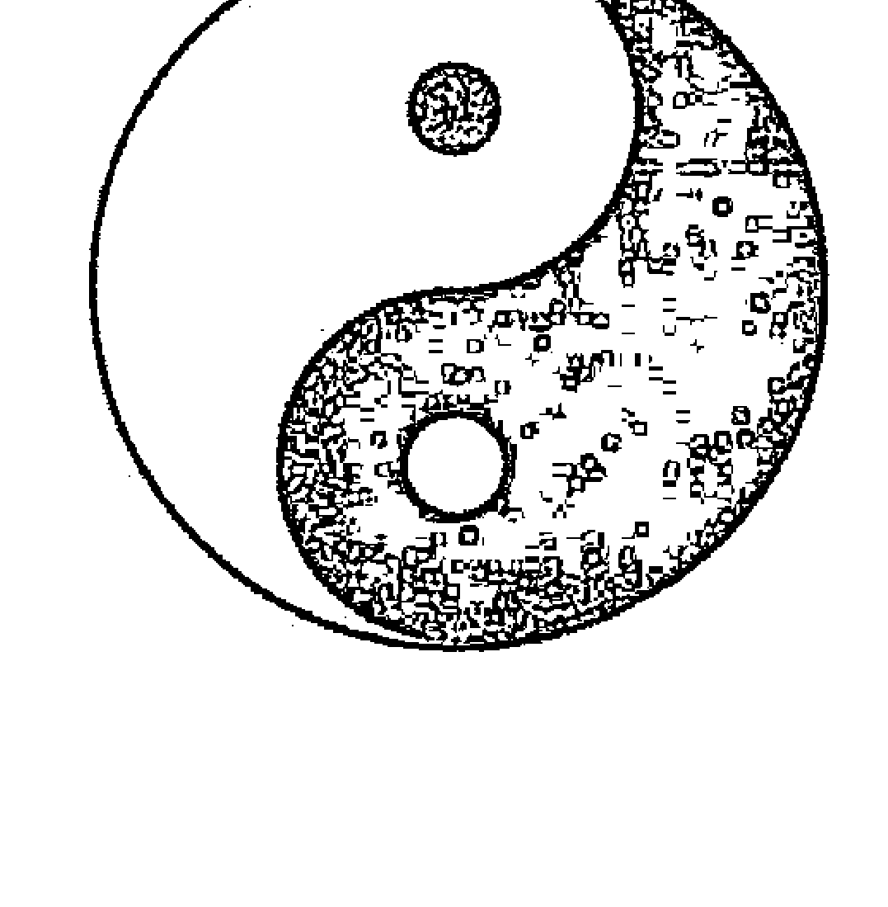

### 二、《周易》发祥于周原岐山

> 《诗经·大雅·绵》云：“古公亶父，来朝走马。率西水浒，至于岐下。爱及姜女，聿来胥宇。周原膴膴，堇荼如饴。爰始爰谋，爰契我龟，曰止曰时，筑室于兹。……，乃立皋门，皋门有伉。乃立应门，应门将将，……。”

据史料记载：周王朝肇室奠基之先祖古公亶父——周太王，当年由豳（今陕西彬县。豳也作邠，唐代因豳与幽难分，始改豳为邠），迁至岐下周原后，曾在岐山箭括岭脚下的岐阳长期居住。古公亶父与周室先贤经过灼龟预测和风水考察，发现“周原膴膴，堇荼如饴”这里是一块不可多得的风水宝地，就在这片风水上佳的沃土上安居乐业，建立了西周诸侯霸业。

另外，从《诗经·大雅》看，周太王不但是一位德高望重的首领，而且也是很精通占卜之术和风水选址的高人。周太王去世后，周人就将他安葬在他亲手创建西周基业的神奇圣地，即陕西岐山箭括岭脚下的岐阳村北300米处的风水宝地上。“周太王陵”子山午向结穴立向，大气宏伟，符合所谓天子龙脉。据《岐山县志》载：“岐阳周太王陵，隋唐时犹存”。如今岐山岐阳周太王陵尚存，陵前竖有高大的“周太王陵”石碑和青砖筑成的仿古碑楼，虽比不上秦陵、乾陵的壮观气派。但是，年年岁岁，常有寻根华人来此祭奠参拜，香火依然旺盛，人群络绎不绝。

1976年，在岐山县京当乡凤雏村发现了西周宫殿（宗庙）建筑群基址遗存——凤雏甲组建筑基址，这一考古重大发现在国内外引起轰动。该建筑群坐落在周原岐山箭括岭脚下，坐北向南，北偏西10度壬山丙结穴立向，南北长43.5米、东西宽32.5米、夯土台基高1.3米。建筑群在正中离位开大门，布局以门道、前堂和后室为中轴，东西两边配置门房、厢房，左右对称，回廊相互连接，形成一座前后两进的封闭式四合院落，此院落在风水布局中称为“动宅”。

1990年，考古工作者采用卫星遥感技术，在凤雏宫殿周围探测出西周早期的内外城墙。其外城南北长1200米，东西宽700——800米，占地面积1200多亩，据考证，这座城郭为史载的“太王城”，俗称“西岐城”。公元前12世纪，古公亶父率姬姓氏族两千多人，越岐山而定居于岐山箭括岭脚下90多年。大约在公元前1050年左右，于周文王（姬昌）四十三年才东迁都城至丰（今西安西南）。公元前1046年伐纣灭商时，周武王姬发又迁都于镐（今西安西北），岐山遂成岐邑“宗周”之地。《周易·升卦》曰：“王用享于岐山，吉，无咎。”岐山地名在《周易》经文中数见，自古至今，言及岐山，人们无不肃然起敬。因此，《周易》从编撰到成书，显然离不开岐山这片故土。

雄伟的箭括岭史称岐山，岐山前面有首阳山。山下方圆有京当，岐阳，凤雏，王家，衙里，宫里，公子庄，驸马庄，礼村，贺家，太子村，太方村（岐伯研究药方的地方），戢武村（兵器库），西土城、东土城（为西周的西、东两个城门）等，这些自然村落地名现在依然存焉。岐阳村北有全国独一无二的古公亶父周太王之墓存焉，村内有地标建筑物——“周三王庙”尚存。据资料记载：“周三王庙”始建年代无考，明朝嘉靖前，谓周太王祠。现存明嘉靖三十九年祠碑记载，重修“周太王祠”时，增附王季（季历）、文王（姬昌）塑像，尔后更名为：“周三王庙”，这在中国是绝无仅有的标志性祠庙。近代江浙一带的泰伯与仲雍（周太王的长子与次子）的后裔每年都要组团来岐山寻根祭祖、参拜祖先。“周三王庙”中增设泰伯与仲雍（周太王长子与次子）二圣的牌位于殿上，每年农历八月初二民间有庙会和重大的祭祀活动在此举行。

### 三、岐山有形有象

《周易》讲象、数、理，此三者之间，首先重视的就是象。从象形上看，岐山二字并在一起，就是“山支山”的一组特殊地象形组合。只要你置身于岐下周原那片神奇的土地上，北望岐山箭括岭最高的三座主峰头，就会明白“岐山”二字的来历和深刻含义（见上图）。

《易传》中把乾坤八卦视为父母与六个子女的关系，即乾坤为父母，震、坎、艮为三子，巽、离、兑为三女，合起来是一个八口之家，使卦象系统具有了浓厚的人伦色彩。无独有偶，周原岐山一带每家每户敬奉的灶爷神，上面有八个人，据说是姜太公当年斩将封神时封的灶君张奎和高兰英夫妇，身边领了三男三女，六个儿女。《易传》的八卦家庭文字在周原大地上是妇孺皆知的，二者是否相通尚需进一步考证（见右图）。

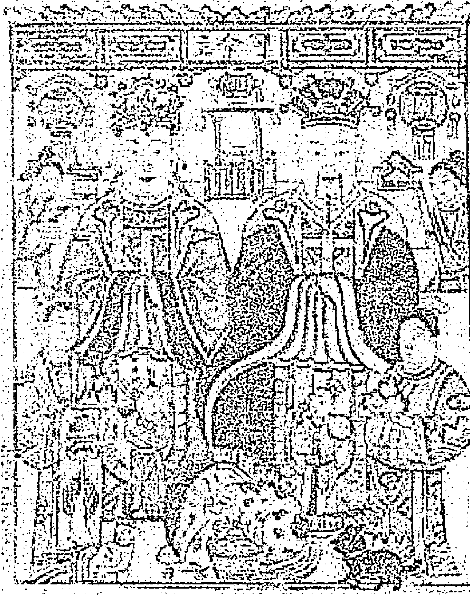

岐山是西周王朝肇基之地，是周文化的发祥之地，也是《周易》文化活水源头。周人灭商之前，周原是西周人休生养息的革命圣地，其中心在今陕西岐山、扶风一带。历史上的周原范围较大，北至岐山，南临渭水，东邻武功，西接凤翔、宝鸡，东西长达70公里，南北宽约20公里。20世纪50年代后期，中国科学院考古研究所、陕西省文物管理委员会、陕西省考古研究院等单位先后在岐山考察、试掘，发现了大量的青铜器和甲骨文等文物史料。尔后，周原遗址被国务院列为全国重点文物保护单位。

### 四、文王推演六十四卦

“易卦”经过了一个十分漫长地发展时期，它就像一条奔腾不息的河流，从伏羲氏、神农氏那里一直流淌到3000多年前的殷商时期。周文王姬昌承接了易文化传播的火种，在伏羲先天八（三爻）卦和神农《连山易》的基础上，创造性的推演出以乾卦为首的六爻卦——《周易·六十四卦》，而且为六十四卦的每一个卦起了卦名，撰写了爻辞、彖辞和象辞上、下篇，并规定了卜卦的具体方法，形成了华夏历史上一部神秘文化经典。

在文化落后的原始上古年代，要研创出如此逻辑性很强、且数据复杂庞大的系统工程，是何等的不易啊！其难度和付出的心血，是我们现代人无法想象的。但是，周文王全都做出来了，而且用《周易》预测周朝重大事件，并把它留传给了后世子孙。时至今日，我们可以说，《周易》文化的形成是中国历史上一座传统文化与科技创新的里程碑。

太史公司马迁在《报任安书》中说：“盖西伯拘而演《周易》；仲尼厄而作《春秋》；屈原放逐，乃赋《离骚》；左丘失明，厥有《国语》；孙子膑脚，《兵法》修列；不韦迁蜀，世传《吕览》；韩非囚秦，《说难》《孤愤》；《诗》三百篇，大底圣贤发愤之所为作也。” 司马迁在给朋友任安的书信中引经据典，列举赞誉古代圣贤们身处逆境而发愤有为的可贵精神，以此表白自己身残而志不残的决心。殊不知后世学者断章取义，仅凭“西伯拘而演《周易》”这七个字，认定《周易》的诞生地在河南安阳市区南10公里处的古都安阳羑里城，未免有些牵强附会。就演字而言，是一种演示或者表演，也有反反复复、推敲求证的意思。而《周易》从六十四卦卦象推演，以及彖、象、爻辞的撰写是一个承前启后的系统工程，既要借鉴古人的研究成果，又要自己探索性创新立言。客观地讲周文王生于岐下周原的岐阳村，那里有华夏唯一的“周三王庙”（古公亶父、王季、姬昌），《周易》文化的形成没有理由离开周原岐山的故土。《周易》对中国几千年的历史文化产生了巨大影响，被尊为东方民族文化的智慧结晶。所以，《周易》是帝王之学、王道之学，也是历代政治家、军事家、天文学家、医学家、商家等的必修之术。

### 五、周公继承作爻辞

据《周易大传》和宋人朱熹《周易本义》等历史文献资料记载，六十四卦的爻辞和象辞上、下篇可能为周公姬旦所作，《周易》从此完成了文化形成的牢固基础。关于周公作《易》，除过宋代学者欧阳修赞同之外，历来学界颇有争议。著者可能算第二个人吧！毛泽东同志指出：“没有调查了解，就没有发言权。……实践是检验真理的唯一标准。”历史总是要尊重事实的，历史文化亦如此。通过如下几例《周易·六十四卦》彖辞，我们可知其一二。

其一、《周易·革卦☰》彖曰：“天地革而四时成，汤武革命，顺乎天而应乎人。”商汤革了夏桀的命，武王革了商纣的命，史称汤武革命。成汤革命的胜利，周文王姬昌颂扬顺乎天意、应乎人心，顺理成章。可是武王伐纣革命的成功，不可能由周文王姬昌立言表彰，由周公姬旦来歌功颂德，更合乎情理。关键是周武王伐纣革命成功之后，西伯侯姬昌已经去世多年了。“周文王”是后来追封的谥号，因此，这个历史典故不可能由“周文王”自己写进著作。

其二、《周易·明夷卦☲》彖曰：“内文明而外柔顺，以蒙大难，文王以之，利艰贞，晦其明也。”明夷卦彖辞说周文王姬昌被殷纣王囚禁羑里(今河南安阳)蒙难时的应对策略。疑点是周文王姬昌当时是以商朝“西伯候”的身份被囚禁羑里的，他的著作中不可能自己称自己为“文王”吧。众所周知，周文王的称号是武王伐纣成功建立西周王朝之后追封的，只有周公（旦）这样称呼倒是合乎历史逻辑。

其三、《周易·明夷卦☲》六五爻：“箕子之明夷，利贞。象曰：箕子之贞，明夷不可息也。”箕子是殷纣王的叔父。据甲骨文记载：武王灭纣之后，箕子来降，而称明夷。这显然是赞美箕子知晓天时，明了事理，精通人道，顺应大势所趋，诚心归顺西周。《尚书·洪范》中有：周武王十三年，武王姬发向箕子请教治国之道的记载。说明箕子来投靠西周时，周文王姬昌已经去世多年了，他怎么能将这一事件写进《周易》的爻辞中呢？

其四、《周易·晋卦☷》：“康侯用锡马蕃庶，昼日三接。象曰：晋，进也。明出地上，顺而丽乎大明，柔进而上行。是以康侯用锡马蕃庶，昼日三接也。”晋卦说的是，康侯操持国家大事有功，得到国君赏赐的马匹和奴隶等，一日之内被国王接见了三次，可见西周国君对康侯的器重非同于一般王公大臣。康侯是周文王的儿子，是武王、周公、召公之弟，周文王说什么也不会称呼自己的儿子为康侯吧！

以上列举的《周易》经文，显然是记叙文王蒙难、武王灭纣，箕子来投，康侯得宠的具体典故。由此推理，史称周公姬旦参与撰写或修改充实《周易》经文的可能非常之大。

古人云：“世历三古，人更三圣。”综上所述，从伏羲氏时期至今约7000年历史，由此到周文王时期少说也有4000年，这是中国《周易》经典文化奠基阶段。伏羲氏、神农氏、周文王和周公姬旦以及为之付出心血的古代先哲圣贤们都是华夏民族文化的创始人和奠基者。

### 第五节 黄河成《易传》

伏羲氏在甘肃天水“一画开天地”创立了先天八卦。而后，生活在宝鸡姜水流域的神农氏炎帝再创出《连山易》。再后，经过商周“易”文化的不断繁荣发展，周文王姬昌和周公姬旦将其演变成了《周易》六十四卦，并形成了一套完整的、科学的经典文化巨著——《周易》。

### 一、孔子作《易传》

从公元前770年的春秋战国时期到西汉末期，是《周易》文化的系统形成阶段。春秋战国时期的诸子百家，孕生了百花齐放、百家争鸣的文化大繁荣。中国古代哲学家、思想家、政治家、天文学家、医学家、风水学家、预测学家等为华夏古老文化《周易》注入了发展活力和名家智慧，他们的辛勤汗水都汇聚在《周易》文化的历史长河之中，逐渐形成了一个比较完整的华夏民族文化系统。

- 孔子撰《系辞》。伟大的思想家、哲学家、教育家孔子对《周易》文化系统形成做出了非常巨大的贡献。据《汉书·儒林传》记载：“孔子读易，韦编三绝，而为之传。”由此可见孔子对《周易》爱不释手的学习和研究所下功夫之深。孔子作《春秋》，编撰《周易大传》，为《周易》注入了更加先进的文化思想和时代精神，对后来《周易》典籍研究和发展产生了极其深远地历史影响，并造就了其在中国历史上前无古人，后无来者的历史地位。

### 2、《易传》成书

《周易大传》在古代通称“十翼”。包括：《彖·上》《彖·下》《象·上》《象·下》《系辞·上》《系辞·下》《文言》《说卦》《序卦》《杂卦》共十大部分，形成一部约24000多字的历史文化巨著。传说其中的《彖·上》《彖·下》，《象·上》《象·下》和爻辞为西周圣人周文王和周公(旦)留下的原汁原味的上古经文，后学将此称作经。《系辞·上》《系辞·下》《文言》《说卦》《序卦》《杂卦》为孔子和他的学生或者其它研究者所撰，学术界把这一部分称作传，经传一共十大篇著作，合起来叫“十翼”，也叫《周易大传》。正因为将如此历史悠久、庞大厚重的文化精华荟萃成集，使得《周易》从此走上中国古典文化史上不可跨越的顶峰，成为至高无上的权威论著。

另外要说明的是，西周之后，汉代之前，《周易》就叫作《周易》。汉代之后，汉武帝罢黜百家，独尊儒术，《周易》被儒家列为六经（《易》《诗》《书》《礼》《乐》《春秋》）之首，人们开始称它为《易经》。因是之故，人们常说《周易》是“群经大道之首，诸子百家之源”。所以，近代学者说：西方文化有《圣经》，东方文明有《周易》。

其实，《圣经》和《周易》是不可以相提并论，也是无法同日而语的两个概念。《圣经》是供天主和基督教徒拜读的一部纯粹的宗教经书，而《周易》是人人都可以阅读的一部古老哲学经典，二者有质的区别。再者，在中国儒、释、道三大家中，儒家并非宗教，其学说是解决人与人之间问题的；道家不是宗教，道教是汉代由张道陵发起的中国宗教，其学说是解决人与自然问题的；释家是外来的宗教，其学说是解决自身问题的。这一点笔者在其它文章中另有论述，此处不再赘述。

> 孔子曰：“逝者如斯夫，不舍昼夜。”

光阴如梭，历史的脚步无法停止前行，“易”文化之河——渭河，在周原大地上卯足了精气神，继续向东汇入了华夏母亲河——黄河，一直流到了齐鲁大地的孔夫子那里。孔子和他的学生们为传承《周易》文化付出了大量心血，通过梳理拓展，给《周易》插上了飞跃地翅膀，从此中国历史经典文化《周易》最终形成了一部科学系统的巨著——《周易大传》。

### 二、张载立“气论”

周原有灵气，渭水出精英。上知天文，下晓地理的姜太公，当年垂钓于秦岭脚下渭水之滨的钓鱼台，后得周文王器重，辅佐武王伐纣立周，成就千秋功业，现今宝鸡陈仓有钓鱼台遗址存焉。

站在《周易》文化发祥地周原，不得不提及陈仓大地的易学后起之秀，他就是陕西关中地区研究易学的杰出代表人物宋代易学家张载。他潜心于周原渭水之滨的眉县横渠创立“关学”，以《周易》为宗，创立以“气”为本的宇宙论和本体论哲学思想。“关学”与二程（程颐、程颢）的“洛学”、王安石的“新学”在宋代理学界形成了鼎立之势。“气本论”是宋代理学中的一大学派，是中国古代朴素唯物论哲学发展的一个里程碑。“关学”强调“经世致用”，以“躬行礼教”，注重研究法律、兵法、天文、医学等。“关学”作为儒学史上承前启后的一个重要学派，从北宋到清朝末年，人才辈出、薪火传承一直延续了800余年，堪称中华渭河文化一株独秀的奇葩。这里值得一提的是张载对《周易》预测的研究水平，与当时的易学大师邵雍是不相上下的（后边再介绍）。

“易”主张取象，天有星象，地有物象，人有形象，山水草木各有其象，文化也可以取象。如果把渭河比作古巴比伦的底格里斯河，岐山就堪比埃及的金字塔。就“易”文化而言，渭河是它的象，岐山是它的体。渭河从甘肃渭源县发源，经陕西宝鸡汇合姜水，经周原岐山，东出潼关，汇入黄河，走进洛邑，经山东流入浩瀚的东海。一路奔流不息，一路荟萃壮大。“易”文化传承正是这样，在甘肃天水由伏羲所创，经陕西宝鸡神农炎帝传承，由岐下周原周文王姬昌、周公姬旦发扬光大，在河南洛伊之际臻于成形，传入山东由孔子而臻至完善，被中国儒家称为“群经之首，大道之源”。

### 第六节 象数开山与义理立祖

就易学文化的体系而言，主要分为两派六宗之说。两派即象数派和义理派，六宗指：太卜遗法、京房焦延寿禨祥说、王弼老庄说、陈抟邵雍造化说、胡瑗程子儒理说、李光杨万里史事说。其中：太卜遗法、京房焦延寿禨祥说、陈抟邵雍造化说归属于象数派；王弼老庄说、胡瑗程子儒理说、李光杨万里史事说归属于义理派。

李光、杨万里史事说归属于义理派。而两派六宗之间相互攻讦，一直在矛盾中发展。

客观地讲，象数派应该早于义理派。道理很简单，伏羲氏创立八卦，神农氏创立《连山易》的时候，文字尚未发明。所以，圣人仰观天文，俯察地理，结绳而治，记录下来的只是一些简单的符号，那些近乎于文字，而并非寓意深刻的文字雏形。根据《汉书・艺文志》记载：“凡易十三家，二百九十四篇。”西汉时期的易学十三家指的是：王同、周王孙、丁宽、服生、杨何、蔡公、韩氏、施雠（chou）、孟喜、梁丘贺、京房、古五子、淮南九子。随着西汉经学的繁荣发展，《周易》之学从此分化成今文经学和古文经学两大体系。

#### 一、《周易》研究的两大亮点

《汉书・艺文志》中说：“刘向以中古文《周易》，校施、孟、梁丘经，或脱去无咎悔亡，唯费氏经与古文同。”所以，施、孟、梁丘三家自属今文经学，而费氏学为古文经学。西汉时国家将属于今文经学系统的诸家《易》立了博士，成为官方易学。而以费直为代表的古文经学没有立博士，被排除在官方之外，成为了民间《易》。因此，从汉代开始对《周易》的研究大致分为了象数和义理两大宗派。

汉代是象数派开山立始。汉元帝时期，立京房为易学博士。所谓象数派，是以八卦象征各种物象，用象来阐述卦辞和爻辞，注重预测研究。以汉代《京氏易传》为代表的《周易章句》、《焦氏易林》等均为象数派的经典之作。

魏晋为义理派开河之源。所谓义理派，是以诸卦的卦意来解释卦辞及爻辞的。以魏晋王弼《周易注》为代表，偏重于《周易》彖辞与象辞的文字理论，偏重于数术研究和客观判断分析。

> 《三国演义》云：“话说天下大势，分久必合，合久必分。周末七国分争，并入于秦。及秦灭之后，楚、汉分争，又并入于汉。汉朝自高祖斩白蛇而起义，一统天下，后来光武中兴，传至献帝，遂分为三国。”

魏晋之后，始于西汉张良、韩信，后有东汉孔明、周瑜等，汉代精英们把中国易学文化在战场上演绎得风生水起，出神入化，淋漓尽致，大江东去，千古风流，留下诸多经典的东西。

大唐帝国盛世，李氏为王，统一天下，因为姓氏缘故，从而崇尚老子。《道德经》一时间风靡盛行，虽有李淳风、袁天罡、杨筠松上知天文，下察地理，神机妙算，被世人传得神乎其神。遗憾的是大美阳刚的唐王朝在易学文化研究领域并无几多精品著作留于后世。但是，隋唐时期的易学爱好者聚会“射覆”之风盛行。

何谓“射覆”？它是古代雅士学习《易经》占卜为了提高占筮技能经常玩索的一种高超而有趣的游戏。顾名思义，“射”是猜度预测，“覆”是覆盖遮掩。覆者用瓯盂、盒子等器具覆盖某一物件，射者通过占筮等途径，猜测里面是什么东西。所藏之物大都是些生活用品，如手巾、扇子、笔墨、果实、盒子、碗罐等。

纵观史料，“射覆”游戏历史悠久，早在汉代时期已经流行于皇宫中。《汉书·东方朔传》云：“上尝使诸数家射覆。”唐代颜师古《汉书注》曰：“于覆器之下置诸物，令闇射之，故云射覆。”唐代诗人李商隐《无题》中云：“身无彩凤双飞翼，心有灵犀一点通。隔座送钩春酒暖，分曹射覆蜡灯红。”明代开国军师刘伯温的《烧饼歌》与“射覆”有联系。传说：朱元璋正在吃饭，刚把烧饼咬了一口，军师刘伯温求见。他把烧饼用碗盖住让刘伯温猜。刘伯温答：“半似日兮半如月，定是金龙咬一缺。”皇帝大惊，便让他预测明代江山能传多少代？刘伯温便预言了大明王朝国都要从南京迁到北京、明成祖篡位、土木之变、魏忠贤专权、李自成起义、吴三桂引清兵入关等许多大事，著成《烧饼歌》一书流传后世。《三国演义》《水浒传》《西游记》《红楼梦》四大名著中都有“射覆”的事例。

“射覆”类似于猜谜游戏，只是谜面为各自所得的卦象。根据《易经》八卦的象、数、理从无限种可能的事物中推断出某种具体事物来。“射覆”可以无心“玩占”，也可以考验研易者的功力，成为古今易占家的一种高难度游戏。“射覆”的趣味性和交互性很强，可以即时验证卦象，无论射中与否，都可以加深对易象思考的理解和启发，是练习占测能力和自信心的一种好方法。

宇宙中的万事万物与时间、空间及人的意识、思维都是全息的时空信息。“射覆”看起来无任何规律，所覆之物从一枚钉子到一只小鸟，从一颗珠宝到一片碎玻璃都有可能，没有任何的参数可供推测，此时形象思维和逻辑思维都不会发生作用，猜中的可能性微乎其微，一般人的聪明才智在这种游戏上都不起作用。但从全息论角度来看，时间与空间构成了时空信息。而沟通和揭示其全息的信息，其媒介就是《易经》的象数。某人在什么时间、什么方位、什么次序、什么情况下隐藏什么东西，有可能是受易理所阐述的规律性制约。因此，理论上只要抓住时空中任何一个结点，射覆者都可以拎起一整张全覆盖的信息网。从某种程度上说，“射覆”是象数派预测的一种常用手段，《梅花易数》研究者一定要了解这些知识。

宋代虽说帝王昏晕无能，高隐不仕，国力衰退，疆土沦陷，但在易学文化研究方面却出现了前所未有的发展盛况，形成蔚为大观的繁华景象，涌现出了陈抟、王安石、程颐、程灏、邵雍、张载、朱熹等大师级人物。大儒朱熹，把义理派和象数派的成果集于《周易本义》，成为宋代之后集易学之大成的杰作专著。邵雍的《皇极经世》、《梅花易数》的问世，使象数派理论得到飞跃性发展。观象悟道，以形喻物，以象演绎，推理说事，使不识字的人也能从中知了得道，加入到了易学传播和研究的行列，形成了一道靓丽的风景线。

纵观象数派与义理派，各有明显的特色，创新的思维，发散的思想，崇拜的信徒，这对《周易》研究发展皆具有积极地意义。义理派登入大雅之堂，被象牙塔中的学者名流所推崇研习，居庙堂之高而发展为后世所谓的“学院派”；象数派走入闹市江湖，被行走江湖、沦落与闾阎街市的隐士穷究玩索，处江湖之远而形成了后世流传的“江湖派”。所以，经过历史变迁和岁月演绎，经久不衰、同源一脉的华夏易学文化分流出义理派和象数派，形成了中国古代《周易》文化研究不同风格的两大亮点，一直绵延流传至今。

#### 二、《周易·六十四卦》的吉凶之说

《周易》本来是讲事物变化的朴素辩证哲学，其六十四卦究竟有无吉凶之说？答案既是肯定的，又是不定然的。为什么这么说呢？从六十四卦的卦象来看，是没有吉凶祸福区别的；就六十四卦的卦辞而论，显然是有吉凶之分的。这问题还得从“象数派”和“义理派”说起。

从象数派的角度看，六十四卦的卦爻只有阴阳之分，没有吉凶之别。在象数预测过程中，通过定义代表事物的体卦和用卦，或者是世爻与用爻。卦爻的变化直接导致卦象变化，有些卦象由吉变凶，亦有从凶变吉者。所以，象数派认为卦象本身没有吉凶之别，关键是看它通过爻变之后的结果。比如说：火山《旅卦䷷》，六五爻动，变卦天山《遁卦䷠》，象数派用《梅花易数》看只是从体卦和用卦的角度分析吉凶。

本卦火山《旅卦䷷》，离上艮下，离火生艮土。这个艮（☶）象定义为体卦，相对的离(☲)象就定义为用卦，卦象用卦生体卦，预示事情生我，对我有好处，视为吉兆。

变卦天山《遁卦䷠》，乾上艮下，艮土生乾金，艮为体、乾为用，卦象体生用，我有付出，肯定不是好事。这时的卦象由吉变凶，如此而已。所以，象数派注重卦象的五行生克和四时节气的旺衰变化。

从义理派的角度讲，《周易·六十四卦》每一卦有六个爻，每一卦有一句彖辞作为提纲性的提示，每一个爻有爻辞和彖辞，这些爻辞和彖辞就是所谓的经文，那些言简意赅的晦涩文字，寓意着人们想预知的吉凶祸福。但是这些生僻的卦辞，往往会使人产生“仁者见仁、智者见智”的思维。因此，义理派研究者往往从卦辞论事，认为卦有吉凶之分。再如火山《旅卦䷷》，六五爻动，变卦天山《遁卦䷠》。

> 本卦《旅卦䷷》六五爻卦辞曰：“射雉，一矢亡，终以誉命。”彖辞曰：“终以誉命，上逮也。”卦辞的大意是说：旅途中见到（雉）野鸡，一箭就射中了，最终获得了荣誉和爵命。这显然是名利双收的好事情。

> 变卦天山《遁卦䷠》九五爻卦辞曰：“嘉遁，贞吉。”彖辞曰：“嘉遁，贞吉，以正志也。” 卦辞的意思是说：功成名就，激流勇退，坚守正道，终得吉祥，是因为君子才能明白坚守正确的人生志向。

#### 三、义理派预测事例

- 1、姜子牙逆势推义理。据传说姜子牙怀揣八卦，袖筒乾坤，有神人之先见。公元前 1027 年正月，遵照文王“时至而勿疑”的遗嘱，果断决定发兵伐商，通告各诸侯国向朝歌进军。武王起兵之前，姜子牙为其卜卦，一连卜了三卦，卦象都为凶。武王与百官心中不悦，这时姜子牙扔掉筮草，踏碎龟板。对武王说：“枯草死壳，知何吉凶”。他鼓励武王坚定信心，不迷信鬼神，统率兵车300乘，虎贲3000人，甲士45000人，浩浩荡荡东进伐商，最终取得了灭纣立周千秋大业的伟大胜利。“时至而勿疑”，替天行道的时间到了，还迟疑什么？这是中国历史上以义理派理论预测经国大事的千古一例。

- 2、孔子读《易》卷不离手。

据说当初孔子在鲁国时，听说鲁国要攻打越国，就卜卦预测吉凶胜败，卜卦卦辞为‘鼎折足’。子贡说：“此卦凶，如仕兵折足怎么打仗”，而孔子却说：“此卦吉，越国人在水域，打仗要用船不用足，所以为吉卦”，要按《周易》六十四卦的爻辞而断，子贡的分析推断‘凶’应是没有错的。但是孔子是按常规大道推理的。孔子晚年对《周易》爱不释手，经常“居则在席，行则在囊”，时刻把《周易》带在身边，翻阅学习，居然把穿书简的牛皮绳都磨断了好多次。看到孔子如此喜欢读这本占筮书，弟子子贡大为不解，问孔子说：“老师您平时教导我们，德行高尚的人不用去问神，有智慧的人不用去占卜。可是，您都这把年纪了，为什么喜欢上占卜书呢？”孔子对子夏说：“你全搞错了，我读《周易》不是为了占卜，而是这本占卜书中有很多做人的道理。刚强的人读它，可以知道如何提防风险；柔弱的人读它，可以让自己变得坚强起来；狡诈的人读它，可以去除狡诈之心；勇猛的人读它，可以小心谨慎，不至于胆大妄为。总之，这是一部让人能理性生活的书。”正因为圣人孔子深刻领会了《周易》中的大道之理，所以后来为《周易》续写了系辞、文言、说卦、杂卦、序卦，集而成为《周易大传》，从而使《周易》升华为中华民族经典文化中最高的哲学智慧经典，一直流传至今，也成就了孔子义理派一代尊师的历史地位。

- 3、《左传》中的经典义理占卜。

《左传》原名《春秋左氏传》，相传是春秋末年鲁国的左丘明为《春秋》做注解的一部史书，与《公羊传》、《谷梁传》合称“春秋三传”。也是中国第一部叙事详细的编年体史书，共三十五卷，是儒家经典之一，在《十三经》中是篇幅最长，清代的《四库全书》将其列在经部。记述范围从公元前722（鲁隐公元年）至公元前468（鲁哀公二十七年），记载了战国250年的历史。现举《左传》中的《周易》预测两例：

例一、《左传·昭公十二年》：“南蒯之将叛也……筮之，遇《坤》之《比》（六五爻变）”。爻辞曰：“黄裳元吉”。预测者以为是大吉。但问了子服惠伯，惠伯对他说：这一卦问的若是忠信之事就是吉，若不是的话必败无疑。惠伯还强调，《周易》是不可以用来问险恶之事的。后来南蒯举事之后，果然败亡，应验了子服惠伯的义理占断。

例二、《左传·鲁襄公九年》（前564年）：穆姜薨于东宫。始往而筮之，遇《艮》之八。史曰：“是谓《艮》之《随》（初九、九三、六四、六五上九爻，五个爻同变）。《随》，其出也。君必速也。”穆姜曰：“亡。是于《周易》曰：‘《随》，元亨利贞，无咎。’元，体之长也；亨，嘉之会也；利，义之和也；贞，事之干也。体仁足以长人，嘉德足以合礼，利物足以和义，贞固足以干事。然，故不可诬也，是以虽《随》无咎。今我妇人而与于乱，固在下位而有不仁，不可谓元。不靖国家，不可谓亨。作而害身，不可谓利。弃位而姣（淫），不可谓贞。有四德者，《随》而无咎。我皆无之，岂《随》也哉？我则取恶，能无咎乎？必死于此，弗得出矣。”

穆姜是鲁宣公的妻，鲁成公之母，她与大夫叔孙侨如私通并图谋废掉成公，于成公十六年事败后被迁于东宫。她到东宫时占了一卦，得“《艮》之八”，即《艮》卦（887887），没有变爻。这个筮史认定没有变爻即“闭而不通”，穆姜下场不吉。所以他诡称“《艮》之八”是指“《艮》之《随》”，说“随”为外出，您必须速速离开这里。不想穆姜道：出走？《随卦》卦辞是说有元、亨、利、贞这四德的人才没有灾祸，而我都没有，必定死在这里，出不去了。

此处筮史先用无爻变之占法解释“《艮》之八”，认为不吉。再随机应变用《随卦》之卦象劝穆姜速走（占多爻变不用卦辞）；穆姜读过《周易》，但不懂占断法，偏偏用《文言》之四德解释《随卦》卦辞“元、亨、利、贞”，最后束手待毙，薨于东宫。应了“《艮》之八”的筮辞。

- 4、纪晓岚的义理预测。

大清王朝大才子、乾隆朝大学士、《四库全书》总纂纪晓岚学识渊博，上通天文，下晓地理，尤其是对《周易》颇有研究。他当年在应乡举考试前预测考试结果。老师为他占了一卦泽水《困卦䷮》，兑上坎下，六三爻动。老师根据泽水《困卦䷮》六三爻卦辞：“困于石，据于蒺藜，入于其宫，不见其妻，凶。”预测判断纪晓岚此次考试不吉利，估计难以上榜。但纪晓岚看了这个卦爻辞后却有自己不同的见解。他对老师说：“我尚未娶妻，卦辞不见其妻，是我的实际状况，哪有妻可见啊？不见其妻是正常的，怎么会凶呢？”所以，纪晓岚根据《困卦》爻辞推测分析：“这次我会中第一名，第二名可能是姓石的人、或者是姓中有石字旁的人，第三名可能是姓米的人、或者是姓中有米字旁的人。”后来榜文公布，果不其然纪晓岚中了第一名，第二名刚好是一位姓石的，第三位是一位姓米的。这是一个义理派预测的经典卦例。

从以上义理派的卦例看，义理派看重用《周易》六十四卦卦辞的推理分析来判断吉凶；而就象数派而言，则认为《周易》六十四卦的卦象没有吉凶之分，而与阴阳，四季，五行生克制化有密切的联系。著者本书专门讲述象数预测理论，故在讲中国预测学分类之前，先将这个原则性问题作以简述，一家之言，可能有失偏颇。

### 第七节 中国预测学的分类

孔子在《易传》中说：“天下何思何虑？天下同归而殊途，一致而百虑。天下何思何虑？日往则月来，月往则日来，日月相推而明生焉。寒往则暑来，暑往则寒来，寒暑相推而岁成焉。往者屈也，来者信也，屈信相感而利生焉。尺蠖之屈，以求信也；龙蛇之蛰，以存身也。精义入神，以致用也；利用安身，以崇德也。过此以往，未之或知也；穷神知化，德之盛也。”这一番论述讲述了宇宙间的自然规律。

自古以来，预测之学虽说门派林立，方法不一，但往往能达到殊途同归的结果。预测学说除过有门派之别外，好像没有分出什么类别。著者的《梅花易研究精要》应该属于象数派之列，在将此书介绍给大家之前，我们很有必要理清中国预测学的分类。时至今日，提出为预测学分类这个概念的古今大概著者为第一人吧！既然提出这个概念，自然有自己的道理。

预测学为什么要分类？怎样分类？讨论这个话题，大家可能感到有些幼稚。纵观上至汉唐宋明，下至百花齐放、百家争鸣的当今21世纪，所有五花八门、林林总总的预测著作，几乎跳不出阴阳、五行、八卦、九宫、十天干、十二地支的范畴。传统的分类一般按阴阳、五行、八卦划分。除此之外，著者认为要学习研究预测之学，首先必须理清自己所学之预测技法的类型。通俗的讲，就是搞清楚自己所学的知识属于那一类别。纵览古往今来的预测学说，简言之其无外乎“天干学”与“地支学”两大类。西方文化中没有天干地支，可是他们有十二星座：白羊座、金牛座、双子座、巨蟹座、狮子座、处女座、天秤座、天蝎座、射手座、摩羯座、水瓶座、双鱼座。每一个星座代表一个时间段和一种人，从中可知此人的性格等主要特征。这里我们主要讨论中国的天干地支学。

#### 一、天干学预测

属于天干预测学的有：《奇门遁甲》、《四柱八字》、《紫微斗数》等。理由是细看它们的推理过程，除过用阴阳、五行、八卦理论之外，主要是以天干的四季旺衰来判断未来的吉凶祸福。

《太乙》、《六壬》、《奇门》被称为“古三式”，属于至为神秘、至玄而妙的学问。据说《太乙》之学已经失传，只有《六壬》、《奇门》流传下来。古人也许是为了增加玄学的玄妙神奇，假托《奇门遁甲》为黄帝战蚩尤时其部下后风所创，据说当时彩凤呈祥，神人下凡传授秘笈。其实这只是一个美妙无穷的神话传说而已，不足为信。客观的说《奇门遁甲》为明代开国军师刘伯温、根据汉代军师张良留下的“奇门十八局”和三国西蜀军师诸葛孔明的“三奇九宫”所创，其本来是用于布阵打仗的兵家宝典，后世学者将其引用到民间预测学领域。

##### 1、何谓《奇门遁甲》？

江湖上有句俗话说：“学了奇门遁，来人不用问。”可见此学神秘玄妙之一斑。《奇门遁甲》乃古代方士术数之综合典籍，传说中此术为黄帝战蚩尤时神人所受。但是，后来学者认为其成书年代至少汉代已有。

顾名思义《奇门遁甲》就是遁去了十天干中的甲，应用其他九个天干中的乙、丙、丁为“三奇”，戊、己、庚、辛、壬、癸为“六仪”，依此对应九宫八门，所以也称作“三奇六仪”。它在起局推演时，以冬至和夏至区分阴阳局的顺行与逆行，冬至后、夏至前为阳，顺行布局；夏至后、冬至前为阴，逆行布局。目前流通于世的《奇门遁甲》分为“日家奇门”和“时家奇门”两大派系，按照开、休、生、伤、杜、景、死、惊八门布阵，一一对应乾、坎、艮、震、巽、离、坤、兑八卦方位，顺逆变化，知往察来，准确无误，奇妙无穷。

尽管此学如此玄妙，著者对这门学问没有过深的涉入，只是读了读而已，但一直怀着敬畏之心，认为《奇门遁甲》是一部摆兵布阵的高级军事学说。唐代诗人杜甫诗句云：“功盖三分国，名成八阵图。”一个杀机四伏的“八阵图”成就了诸葛亮生前身后的千古美名，后来人们就把“九宫八门阵”叫做诸葛亮的“八阵图”。关于这个精彩的历史故事，《三国演义》第八十四回“陆逊营烧七百里、孔明巧布八阵图”中已经介绍的淋漓尽致，此处不再赘述。

下面以“时家奇门”之法布一局，直观的介绍一下《奇门遁甲》的操作方法。如：求测人：某先生，占问事宜：自己关心的事情。地点：陕西省 - 宝鸡，（北京时间）公历：2016年1月24日11时33分、星期日，农历：二〇一五年、十二月、十五日、午时。节气：小寒：1-6 6:9，大寒：1-20 23:28。干支：乙未年、己丑月、乙巳日、壬午时。空亡：辰巳、午未、寅卯、申酉。九星：三碧、六白、四绿，阳遁五局。旬首：甲戌（己），月将：子，直符、天心落离宫，直使、天蓬、开门落坤宫。（见排盘图）现在人们常用它来预测推断人事、诸物，以及未来的吉凶祸福（具体推断略）。此术变化莫测，神机妙算，料事如微，

| 九天天柱庚死门巽4乙 | 直符天心己惊门离9壬 | 螣蛇○◇天蓬癸开门坤2丁--戊 |
| 九地芮禽丁--戊景门震3丙 | | 太阴○天任辛休门兑7庚 |
| 玄武天蓬壬杜门艮8辛 | 白虎天辅乙伤门坎1癸 | 六合天冲丙生门乾6己 |

被誉为“三玄”之冠，属于中华易学中首屈一指的一大绝学。

##### 2、何谓《四柱八字》？

其实《四柱八字》学的起源并不是很早。它是以一个人出生的年、月、日、时所占的天干地支而得来的年、月、日、时称为四柱，年、月、日、时所占的四个天干和四个地支称作八字。

| 命主姓名：某人 | 出生地：江苏 |
| 出生公历：1995年5月8日17时6分(北京时间)，星期一。 |
| 出生农历：一九九五年四月初九日酉时。 |

| | 七杀 | 食神 | 日元 | 偏财 |
|---|---|---|---|---|
| **坤造** | 乙亥 | 辛巳 | 己亥 | 癸酉 (日空辰、巳) |
| **藏干** | 甲壬 | 丙庚戊 | 甲壬 | 辛 |
| | 官财 | 印伤劫 | 官财 | 食 |
| **地势** | 胎 | 帝旺 | 胎 | 长生 |
| **纳音** | 山头火 | 白蜡金 | 平地木 | 剑锋金 |

| 节气：立夏:1995年5月6日11时30分，芒种:1995年6月6日11时43分。 |
| 起大运周岁：9岁 7个月 3天，每一交大运年 12月 11日起运(公历)。 |

| 排大运： |
| 正财 | 偏财 | 正官 | 七杀 | 正印 | 枭神 | 劫财 | 比肩 |
| 大运 | 壬午 | 癸未 | 甲申 | 乙酉 | 丙戌 | 丁亥 | 戊子 | 己丑 |
| | 临官 | 冠带 | 沐浴 | 长生 | 养 | 胎 | 绝 | 墓 |
| 岁数 | 10岁 | 20岁 | 30岁 | 40岁 | 50岁 | 60岁 | 70岁 | 80岁 |
| 年份 | 2004 | 2014 | 2024 | 2034 | 2044 | 2054 | 2064 | 2074 |

| 排流年： |
| 始于：甲申 | 甲午 | 甲辰 | 甲寅 | 甲子 | 甲戌 | 甲申 | 甲午 |
| 1 | 乙酉 | 乙未 | 乙巳 | 乙卯 | 乙丑 | 乙亥 | 乙酉 | 乙未 |
| 2 | 丙戌 | 丙申 | 丙午 | 丙辰 | 丙寅 | 丙子 | 丙戌 | 丙申 |
| 3 | 丁亥 | 丁酉 | 丁未 | 丁巳 | 丁卯 | 丁丑 | 丁亥 | 丁酉 |
| 4 | 戊子 | 戊戌 | 戊申 | 戊午 | 戊辰 | 戊寅 | 戊子 | 戊戌 |
| 5 | 己丑 | 己亥 | 己酉 | 己未 | 己巳 | 己卯 | 己丑 | 己亥 |
| 6 | 庚寅 | 庚子 | 庚戌 | 庚申 | 庚午 | 庚辰 | 庚寅 | 庚子 |
| 7 | 辛卯 | 辛丑 | 辛亥 | 辛酉 | 辛未 | 辛巳 | 辛卯 | 辛丑 |
| 8 | 壬辰 | 壬寅 | 壬子 | 壬戌 | 壬申 | 壬午 | 壬辰 | 壬寅 |
| 9 | 癸巳 | 癸卯 | 癸丑 | 癸亥 | 癸酉 | 癸未 | 癸巳 | 癸卯 |
| 止于：2013 | 2023 | 2033 | 2043 | 2053 | 2063 | 2073 | 2083 |

据说“四柱八字术”为唐人李虚中首创，开始只使用年、月、日三柱六字预测。此术为李虚中所创的依据是韩愈为其所撰的墓志铭中说：

> > 他“以人之始生年月日所直日辰支干”来占卜命运，“百不失一二”。

由此看来唐代四柱命理学已经很成熟，而且应用也很广泛。也有说是宋代术士徐子平根据李虚中的“三柱六字”之术，创立了“四柱八字”之学。到宋末时期钱塘人徐大升（徐彦升，徐升），号东斋，编撰成《渊海子平》一书流传后世。

有学者指出，《渊海子平》中不少内容不会早于宋代，所谓源自徐子平之说，乃后人假托，不足为信。目前流传于世的四柱命理学的代表作还有：明朝进士万民英撰写的《三命通会》，张楠的《神峰通考》，张颢（假托郭璞原著）的《玉照定真经》，清代乾隆进士沈孝瞻先生所著《子平真诠》等，多为明清时易学术士编撰。到了清末民国时期有任铁樵注疏的《滴天髓》，余春台的《穷通宝鉴》，还有徐乐吾、韦千里、袁树珊等一些命理著作。

不管是唐人李虚中，还是宋人徐子平，皆为闾阎街市、江湖圈子的传说，至今尚无令人信服的确切定论与史料记载。

当下流传的四柱八字学，是以一个人出生的年、月、日、时所代表的天干地支，排出四柱八字（见右图），以天干阴阳五行确定年柱、月柱、日元、时柱的十神（即：生我者正印、枭神；克我者正官、七杀；相同者比肩、劫财；我生者伤官、食神；我克者正财、偏财），将四柱中的地支化为天干，以此来推断一个人四柱八字的命运格局，然后根据每个大运流年推算这个人一生的印绶（文凭）、性格、事业、婚姻、财运、父母、兄姊、子嗣、朋友、疾病等等，以及人生不同（大运）阶段的富贵荣华和吉凶祸福，此为四柱八字学之概述。

##### 3、何谓《紫微斗数》？

这是一个复杂的紫微斗数命盘示例图，包含十二宫位（命宫、父母宫、福德宫、田宅宫、官禄宫、迁移宫、疾厄宫、财帛宫、子女宫、夫妻宫、兄弟宫、身宫）的星曜分布、干支、大限年龄等信息。
- **主要内容**：
  - 左上方：【本命盘-天盘】玄奥软件网址，姓名：某人，未知地，公历、农历、四柱、命局、命宫、身宫、子年斗君等基本信息。
  - 中间及四周格子：分列各宫位名称、年龄范围（如 3-12， 13-22， 23-32等）、宫位主星、辅星、干支、长生十二神、博士十二神等。
  - 右下方：标注有“☆先天 ☆大限 ☆流年”。
- **格式**：为网格状图表，包含大量中文术语和数字。

构成命盘，结合各宫的星群组合，以及干支理论，来预测一个人的一生命运、富贵荣华、吉凶祸福。

《紫微斗数》规定出生在子午、辰戌、丑未、卯酉的人，都可以说是普普通通、起起伏伏、辛辛苦苦型的命运。最主要的差别是紫微在子午、辰戌的人，其空宫不是在六阳宫就是六阴宫，从机率的角度来看，这样的比率是占较多数的。而紫微在丑未、卯酉的人，其空宫一定是一者在六阳宫，一者在六阴宫。但是四者相较之下，是紫微在丑未者（中年发达）；紫微在子午、辰戌且是六阴宫的人，另一种是紫微在子午、辰戌为六阳宫的人；紫微在卯酉，会成命宫的人大器晚成。如此说来，其当属于地支预测学行列。但是，《紫微斗数》各宫又是按十个天干排序而论的，所以，它以从属于天干为主，兼论地支为辅，也就是十天干、十二地支混用的预测学说。此学玄妙神奇，机关算尽，相传有口授秘籍，非入师门，一般人不得要领，很难精通掌握的。

#### 二、地支学预测

通俗地讲，地支学预测就是以十二地支为推测依据的预测学说。地支预测学的有：《大六壬》《小六壬》《六爻预测》《皇极经世》。

##### 1、何谓大六壬？

六十花甲子中有六组与壬有关的天干地支组合，即壬子、壬寅、壬辰、壬午、壬申、壬戌，故此称作六壬。《大六壬课》属于华夏易学范畴，又称壬课、壬式、壬学等，是中国古代三式（太乙、六壬、奇门）之一的经典预测学说，是中华易学领域一枝独秀的奇葩。

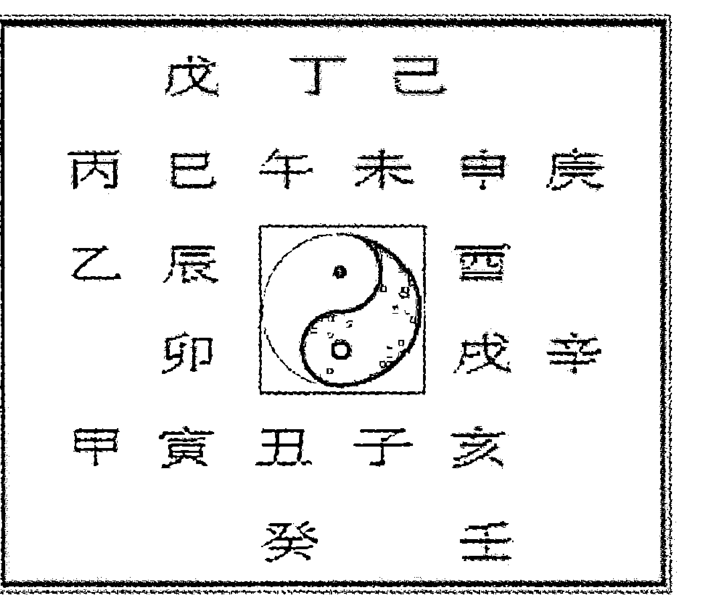

《大六壬》的日辰天干寄宫诀：“甲寄居寅乙寄辰，还将丙戊巳宫寻；未支丁己藏功用，申地庚金作主盟；辛在戌宫癸寄丑，壬干原寄在登明；三盘四正无差错，运式通灵动鬼神”。《大六壬》中将子、丑、寅、卯、辰、巳、午、未、申、酉、戌、亥作为月将，正月雨水后月将为亥，名登明；二月春分后月将为戌，名河魁；三月谷雨后月将为酉，名从魁；四月小满后月将为申，名传送；五月夏至后月将为未，名小吉；六月大暑后月将为午，名胜光；七月处暑后月将为巳，名太乙；八月秋分后月将为辰，名天罡；九月霜降后月将为卯，名太冲；十月小雪后月将为寅，名功曹；十一月冬至后月将为丑，名大吉；十二月大寒后月将为子，名神后。

此学有一个特点，月将与月令为十二地支组成“六合”格局，通过推算确定“三传”，以月将推断预测之事的吉凶祸福，此预测方法操作复杂，排盘细腻，预示透彻，准确率很高，但其理论高大上，框架细而全，并非一般习易之人能完全掌握，不经高师指点，很难悟透其真谛。

##### 2、何谓《小六壬》？

它是一个灵活方便的预测方法，又名“诸葛亮马前课”。《小六壬》以大安、留连、速喜、赤口、小吉、空亡为“六神”。对应“六兽”：青龙、朱雀、白虎、玄武、螣蛇、勾陈。大安代表青龙，主婚姻喜事，工作、学业，官职等；留连代表螣蛇，主钱财田宅之事，女人隐私之事，主男女淫欲等；速喜代表朱雀，主信息或我助他人得以回报，或有喜事等；赤口代表白虎，主博斗、打官司，凶险之事，办事不顺等；小吉代表玄武，主出行在外，主风流倜傥，感情之事等；空亡代表勾陈，主虚空变幻，主外财和牢狱等。《小六壬》预测方法很好操作，无需借助任何工具，只需一个月、日、时的数字和一只左手即可（如上图所示）。预测时随机取数，掐指一算，从食指根大安顺时钟数起，几秒钟之内即知结果。

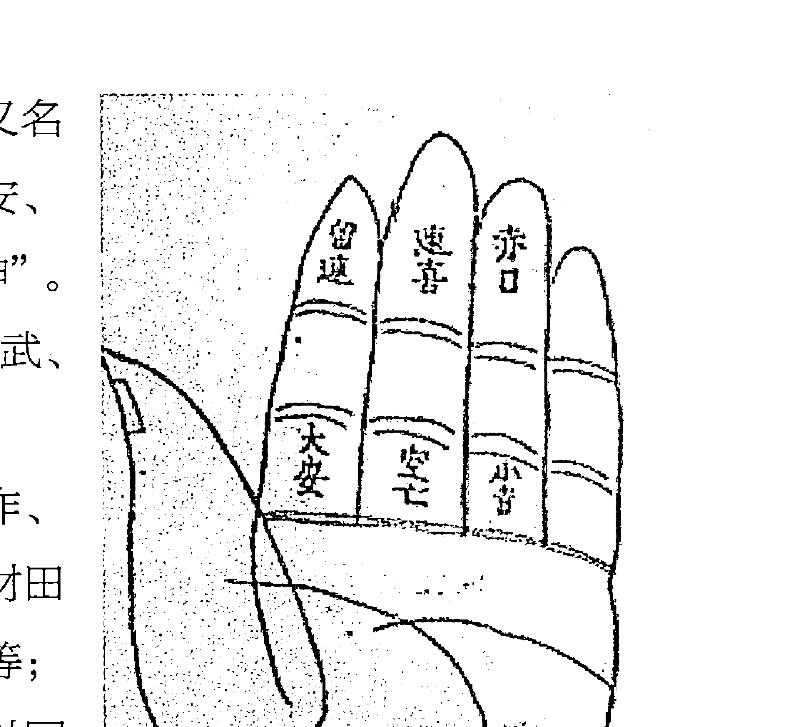

> “速喜喜来临，求财向南行。失物申未午，逢人要打听。官司有福德，病者无须恐。田宅六畜吉，行人音信明。”

例如：农历某年九月二十四日未时（14点整）预测，从大安上起九月，顺时钟以次数九个数，落在了速喜上。再从速喜上数日、二十四日落在留连上。再从留连上数起，依次数时辰：子、丑、寅、卯、辰、巳、午、未落在速喜上，结果看速喜的口诀。云： “速喜喜来临，求财向南行。失物申未午，逢人要打听。官司有福德，病者无须恐。田宅六畜吉，行人音信明。” 此预测方法简单实用，在民间广为流传，深受民间术士所推崇，偶尔即时使用，但每遇大事预测偏颇很多，此学当属于地支预测学之列。

##### 3、何谓《金口诀》？

《六壬神课金口诀》，简称《金口诀》。它是六壬预测学中的另一个经典版本，有“古三式之精华”之美誉，有上示天时、下察地理、中知人事的奥秘，内容博大精深。其在阴阳辩证、逻辑推理和五行生克方面与《奇门遁甲》、《大六壬》有同工异曲之效果，足见其在预测学领域的独特地位。因为，金口诀也是比较难掌握一门预测学问，非师传口授难得其要领。它既使用十天干，也使用十二地支,所以属于《大六壬》预测系列（见图示）。著者对此学没有涉猎，在此只是简单介绍几句罢了，但愿对此学有缘的学者将华夏这一绝学发扬光大。

金口诀课式：

| 项目 | 内容 |
| :--- | :--- |
| 求测人 | 某先生 |
| 预测地 | 陕西西安 |
| 起课公历 | 2010年2月24日12时8分（北京时间） |
| 起课农历 | 二〇一〇年 正月 十一日 午时 |
| 干支 | 庚寅年 戊寅月 乙巳日 壬午时 |
| 月将 | 亥 |
| 日空 | 寅、卯 |
| 四大空亡 | 无 |
| 人元 | 丙 火 + 休 月德 |
| 贵神 | 丁丑（贵人） 土 - 旺 天德，天医，病符，六丁 |
| 将神 | 辛巳（太乙） 用 火 - 休 月德合 |
| 地分 | 子 水 + 死 吊客 |

##### 4、何谓《六爻预测》？

《六爻预测》古称纳甲预测法，不管用蓍草卜卦，还是用铜钱摇卦，或者其它方法起卦，六爻卦落成之后，要进行纳天干、纳地支、纳六亲、纳六神装卦。此法将六十四卦分为乾、兑、离、震、巽、坎、艮、坤宫八个宫，每宫八个卦，亦称八宫卦，每一宫的每一卦世爻是规定好的，确定了世爻，初爻对四爻、二爻对五爻、三爻对上爻，按此法世爻对应的就是应爻。世爻代表问卦之人，应爻代表所问的人或事。当然还要根据五行的生克确定每一爻对应的六亲（官鬼、父母、妻财、兄弟、子孙），以及六神（青龙、朱雀、白虎、玄武、螣蛇、勾陈），亦称六兽，还有反吟、伏吟等因素（见上图所示）。另外还规定八宫卦每一宫的第七卦为游魂卦，第八卦为归魂卦等等知识。六爻预测从世面上看

出生公历：1995年5月8日17时6分（北京时间），星期一。
出生农历：一九九五年四月初九日酉时。
干支： 乙亥年 辛巳月 己亥日 癸酉时
主卦：大畜卦（艮宫） 变卦：蛊卦（巽宫） [空亡：辰、巳]

| 六神 | 本卦 | 变卦 |
| :--- | :--- | :--- |
| 勾陈 | ———— 官鬼寅木 | ———— 官鬼寅木 应 |
| 朱雀 | —— —— 妻财子水 应 | —— —— 妻财子水 |
| 青龙 | —— —— 兄弟戌土 | —— —— 兄弟戌土 |
| 玄武 | 子孙申金 ———— 兄弟辰土 | ———— 子孙酉金 世 |
| 白虎 | 父母午火 ———— 官鬼寅木 世 | ———— 妻财亥水 |
| 螣蛇 | ————○妻财子水 | —— —— 兄弟丑土 |


涉及纳干纳支，而实际在预测分析过程中，多数时候只推究地支，很少去细论天干。所以，此预测学应该属于地支预测学之列。

六爻预测学的代表作品首推《卜筮正宗》和《增删卜易》。据说《卜筮正宗》一书，为清人王洪绪辑撰，由宏道堂付梓发行，全书共十四卷，它是易学六爻预测学集大成之著作，对后世占卜预测影响深远，研习的人众多。书中系统地总结、拓展、完善了六爻占卜法，强调以“阴阳、动静、五行生克制化之理而圆神活变”，从而使六爻占卜法在传承过程中的种种迷误澄清，使得理论更加精深，趋于完备。真正起到了正本清源、继往开来的作用，使其在现今存世的同类预测著作中脱颖而出，深受后学推崇，当属首屈一指。

《增删卜易》一书，题为“野鹤老人”著，这位神秘的野鹤老人究竟何许人也？何年出生？何年何月成书？一切信息只不过是一个美丽的传说。据传说此书实为清代学者李文辉（觉子）根据“野鹤老人”手抄本资料，结合自己多年研易的实践经验总结，于康熙二十九年（1690年）庚午孟夏朔日完稿付梓。

> >野鹤老人曰：“卜易之道，乃伏羲、文王、周公、孔子四大圣人之心法也。得其精者可以参天量地，粗知其理亦可趋吉避凶。凡学卜者可以深求，亦可浅学。浅学者只要先学装卦，知道卦变及卦之六冲、六合、六害，占何人、占何事，以何爻为用神等；再看何为旬空、月破及春、夏、秋、冬四季五行之衰旺、生克、冲刑即知决断祸福。”

六爻预测的确细腻入微，精准无误，前提是纳干、纳支可精准到日期。但是，每个月有三旬，究竟在那一个月的上旬、中旬、下旬？著者感觉不好掌握。所以，著者把《六爻预测》划归地支预测学之列。

##### 5、何谓《皇极经世》？

它是宋代易学大师邵雍创立的一部揭示宇宙人生的秘笈。其分为锁部和匙部两大部分，锁部是秘笈，一般不轻易外传。匙部按十二地支分为子、丑、寅、卯、辰、巳、午、未、申、酉、戌、亥十二部是全书具体内容。所以，这是一部明显的地支预测学。著者有幸在易友家中见过一套家传线装的真迹版本，可惜只是简略的翻阅了一下，没有时间细研其中内容（下一节细述）。人家珍藏的宝典，不可能轻易让人带回去研究的，有缘目睹此书尊容已经是著者莫大的造化了。

#### 三、不属于天干地支的预测学

著者认为不属于天干地支预测学的有：《梅花易数》、《小成图》、《观世音金钱三十二课》、《袁天罡称骨算命法》等，但是，著者又感觉这样划分，似乎又有些欠妥。

##### 1、首先说《小成图》。

它是近代易学大家霍斐然先生潜心于易学研究，在“河图”、“洛书”与后天八卦顺序图的基础上创立的一个新的预测体系。它以十个天干与八卦和数字的一一对应（见地盘右图）。如：甲对应的数是一、卦象为乾，乙对应的数是二、卦象为坤，丙对应的数是三、卦象为艮，丁对应的数是四、卦象为兑，戊对应的数是五、卦象为坎，己对应的数是六、卦象为离，庚对应的数是七、卦象为震，辛对应的数是八、卦象为巽，壬对应的数是九、卦象为乾，癸对应的数是十、卦象为坤，仔细看似似乎与天干预测学有些关联。

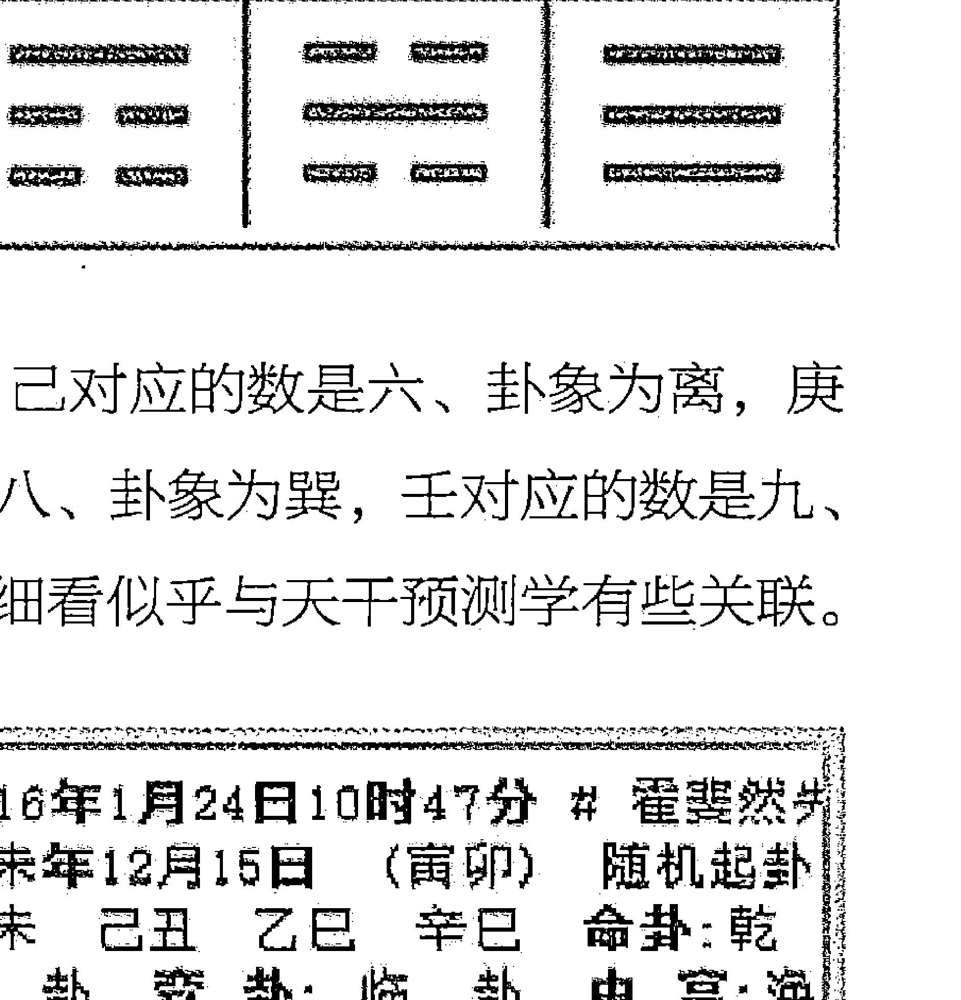

例如：以 2016 年 1 月 24 日（农历乙未年十二月十五日）10 时 47 分即时起卦排盘（见右图），得本卦天水《讼卦☰》，本卦的外卦乾入离宫，内卦坎入坎宫；互卦风火《家人卦☴》，外卦巽入巽宫，内卦离入坤宫。变卦地泽《临卦☷》，外卦坤入震宫，内卦兑入兑宫；互卦地雷《复卦☳》，外卦坤入艮宫，内卦震入乾宫。本卦与变卦、以及各卦互卦的外卦、内卦按规定的顺序排入地盘各宫之后，然后根据人事、六亲、八卦的宫位、以及五行的旺衰等，推断分析预测所求之事的发展趋势和吉凶祸福。

《小成图》是新近创立的一门预测学说，尚有很大的拓展空间。但愿好学者进一步深入研究，将其弘扬光大。

##### 2、再说《观世音金钱三十二课》

此术民间简称《金钱课》，也叫《孔明神课》。此作有人假托孔明之名，而实际上并非孔明所作。起卦方法是拿铜钱摇卦，以背面为阳，字面为阴。用一枚铜钱摇五次得一卦，或者用五枚铜钱摇一次，由近到远、从初爻到上爻，属于五爻卦，总卦可成三十二卦。每一卦都有卦名，也有一个固定格式的卦辞，以示吉凶祸福。例如第一卦和第三十二卦：

> 第一卦：（○○○○○）星震卦上上（乾象与老阳组合的卦象）。
卦辞：“彩凤呈祥瑞，麒麟降帝都；祸除通福至，喜气自然舒。”
断曰：
求官得位，考试得意；讼事有理，病即安宁；
求财十分，寻人得见；婚姻得成，买卖十分。
第三十二卦：（×××××）无数卦、凶（坤象与老阴组合的卦象）。
卦辞：“尘埋青铜钱，美玉陷淤泥，何时重出世，再得颢光辉。”
断曰：
求官难保，出行不利；行人有病，讼事不利；
求财折本，病人沉重；婚姻有灾，谋事不成。
（篇幅有限，其它三十卦简略）

这种预测方法很简单，只要识字，稍有文化，不用去读《周易·六十四卦》的经文和爻辞，就能自己预测吉凶。但是，所得出的预测结果只是一种暗示性的词句，无法准确预知具体的日期，属于小儿科游戏，无法登上大雅之堂。

按照数学二项式定理推算，五爻卦最多也只有《三十二卦》。虽说此法为雕虫小技，但毕竟它是五爻的《三十二卦》预测。著者由此大胆推测，它可能是《六十四卦》（六爻卦）的前身，与《周易·六十四卦》应该有不可分割的联系。

##### 3、最后说《梅花易数》

《梅花易数》是宋代易学大家邵雍先生在研究《周易·六十四卦》预测学之后，体悟研发出来的一门简洁明快的预测之学。它成卦方法非常灵活，可以用铜钱、用数字、用人事、用时间、用日期、用场景、用声音、用动物等等，来扑捉起卦的信息。此法成卦之后，先看体卦和用卦的生、克、比和，再按乾、坎、艮、震、巽、离、坤、兑八卦所代表的“象”来取象。如：乾象为天、为父、为马、为金、为圆大、为西北；坤象为地、为母、为雌马、为土地、为方厚、为西南等等，然后再根据当年四季的月令生、旺、休、衰，预测吉凶祸福。

著者 30 多年来研究此学发现，《梅花易数》的应期判定，与《周易》十二消息卦：乾卦、姤卦、遁卦、否卦、观卦、剥卦、坤卦、复卦、临卦、泰卦、大壮卦、夬卦有密切的联系，它们与月亮的盈亏变化也密切相关，而且从月相的晦朔变化中，可以准确判断出预测应期的具体月份和日期。所以说，《梅花易数》预测应该与地支预测学很有关连（此处不细讲，后边再详述）。

##### 4、中国预言七大奇书。

中国预测文化源远流长，还有《周易》预测文化之外的一系列预测方法。如被誉为中国预言七大奇书的：相传有姜子牙的《乾坤万年歌》、诸葛亮的《马前（十四）课》、李淳风的《推背图》、刘伯温的《烧饼歌》、《梅花诗》、《藏头诗》、《黄禅师诗》，多为谶讳之言，诗句晦涩难懂，没有一定文化的人是根本弄不懂的。有些内容过于简单浅显，无多少参考价值，所以，不受大众研究学者的欢迎。

例如《马前课》：据说这部千古奇书为东汉三国时诸葛亮所创，此十四课共 224 个字，句子前言不搭后语，皆为谶语，晦涩难懂，与唐代李淳风的《推背图》有同工异曲的妙，但是，流传民间作为老百姓用来预测日常生活琐事的方法。全文如下：

- 第一课：无力回天，鞠躬尽瘁；阴居阳拂，八千女鬼。
- 第二课：火上有火，光烛中土；称名不正，江东有虎。
- 第三课：扰扰中原，山河无主；二三其位，羊终马始。
- 第四课：十八男儿，起于太原；动则得解，日月丽天。
- 第五课：五十年中，其数有八；小人道长，生灵荼毒。
- 第六课：唯天生水，顺天应人；刚中柔外，土乃生金。
- 第七课：一元复始，以刚处中；五五相传，尔西我东。
- 第八课：日月丽天，其色若赤；绵绵延延，凡十六叶。
- 第九课：水月有主，古月为君；十传绝统，相敬若宾。
- 第十课：豕后牛前，千人一口；五二倒置，朋来无咎。
- 第十一课：四门乍辟，突如其来；晨鸣一声，其道大哀。
- 第十二课：拯患救难，是唯圣人；阳复而治，晦极生明。
- 第十三课：贤不遗野，天下一家；无名无德，光耀中华。
- 第十四课：占得此课，易数乃终；前古后今，其道无穷。

另外，还有其他预测方法如：《麻衣相法》、《柳庄相法》、《手相法》、《神签》预测等，这些原本是不属于《周易》预测系列的学科。它是古人根据人的五官长相和手相的纹路总结出来的识人方法，确实有其神奇精准的一面，深受江湖术士的亲睐。

就《推背图》而言，诞生 1400 多年来，无几人能深究其理，得其要领者凤毛麟角。然当代易学大家苗元一先生得天地之灵气，发周人的智慧，终于破解此奇书的秘籍，著就《推背图学概论》一书，填补了我国《推背图》研究的一大空白，令人鼓之舞之。当然还有《鬼谷子神断》，将一个人出生年、月、日、时辰组成四柱八字，再用四柱中年柱和时柱的天干组合，给出一段谶语之类的句式，以示吉凶。再如《袁天罡称骨算命法》，按一个人出生的年、月、日、时辰规定所对应的重量，按所累加的重量总和，对应去查阅该人的命运。这些方法纯粹为小儿科游戏，用来消遣娱乐尚且罢了，如果依此论人命运，轻率操作，势必误人前程，根本不足为信。

通过以上对各大预测著作的介绍，大家基本了解了预测之学与天干地支、阴阳、五行、八卦的关系，掌握了这些元素性的知识。这样我们就能找到预测学之间互为旁通的联系和途径，目的是为大家今后学习和研究预测之学起到分清门类，相互借鉴，取长补短，发扬光大，提供一个的清晰思路和创新思维。

### 第八节 邵雍的预测体系

纵观中国历史，在人生命运研究领域有一位非常了不起的神人，此人便是北宋著名易学大师邵雍（字康节）。他晚年所著的《皇极经世》，民间称其为《邵子神数》，也叫《邵夫子神数》，亦称《邵氏易学神数》，官学称之谓《皇极天书》。宋代至今，此书倍受易学界推崇，被视之为“有字天书、人生密码”。《皇极天书》词义精湛渊博，内容深奥，变化巧妙，推断精准，包罗人生万象，测事历历如绘，让智者叹服，使愚者疯狂，有神奇惊人的准确性。所以，《皇极经世》史称是中国五大数术之最，是解开人生密码的术数宝典。

#### 一、邵雍人生命运之学

《邵子神数》囊括所有易学原理，融会象数、贯通义理，自成一派。但凡依年、月、日、时推命之法，结纳其中，是一门精准神秘的超级学术，对命理学一知半解者是无法想象和理解的。遗憾的是，惟此绝学，历代单传，有“传书不传诀，传诀不传图”之说，非福缘深厚者不能尽得。其入门诀曰：“吾门一入深似海，非是真人莫进来”。还有什么吾师曾言：“强入者，不是神仙，便是疯子。”因是之故，成书一千多年来，未闻有外人能入邵子门者。由此观之，《四柱八字》当与《皇极经世》为一个体系，它是推算个人的命理公式，不是预测某一件经国大事成败的方法。

相传邵康节将它传于其子邵伯温。尔后又有洛阳铁板道人的《铁板神数》问世，但世人视邵氏后人此术为正宗。此“二数”皆以生辰八字化卦数，以此划定人生命运轨迹如神差鬼断，其“六亲”推断使后世研究者更加着迷穷究。

《邵子神数》属高层次预测学。它合河洛数之精蕴，贯通三易之奥妙，其理至玄至微，其用至大至广。将人的生辰八字按河洛数变为基数，综合九宫八卦形成一组特定数字，对应《周易·六十四卦》中每一个六爻卦，依此细断一个人人生的流年吉凶祸福，总断其一生前途命运。此神数将命、数、卦归于一体，独成一家宗派。《邵子神数》分为口诀、图表、条文共十三卷。首卷为匙部，记载入门诀窍、运算心法和取数密图，包括《元经运九十六气数表》、《会经世六十四卦数表》、《太玄卦爻归藏图》和《太玄玉景混天图》等六十份秘图。锁部为具体条文内容，即：子、丑、寅、卯、辰、巳、午、未、申、酉、戌、亥共十二部。相传其传承极为严密，目前原著尚未流露于世；现今极少有人收藏，能见到此书的人微乎其微。因这十三部只是半部，另半部在门人弟子之间，按一代只传一人的门规传授，给《邵子神数》更加蒙上神秘的面纱，历来都是手抄学习，现在市面有书出售，还未见到国家正式刊印的正宗版本的《邵子神数》。前面说过，著者有幸见到朋友家祖上收藏的一套十三本、清代线装版本。家藏的珍宝，只是当场翻了翻而已，遗憾的是不可能让人带走细看深读啊！

#### 二、邵雍淡定的人生观

##### 1、邵雍其人
邵雍（1011年—1077年），字号尧夫，别称安乐先生，生于范阳（今河北涿州大邵村），幼年随父邵古迁往衡漳（今河南林县康节村），邵雍16岁时，随其父到共城苏门山，卜居于此地。宋仁宗康定元年（1040年），邵雍30岁，游历河南，因父母葬于伊水（河南境内南洛水支流）之上，遂而在此久居，成为河南（今河南洛阳）人。他少怀壮志，刻苦读书，游历天下，久经历练，悟道在胸，后师从李之才学《河图》、《洛书》与伏羲八卦和文王六十四卦，学有大成，著有《皇极经世》、《观物内外篇》、《先天图》、《渔樵问对》、《伊川击壤集》、《梅花诗》等。宋仁宗皇祐元年（1049年）定居洛阳，以教学授徒为生。宋嘉祐七年（1062年），移居洛阳天宫寺西天津桥南，自号安乐先生。后因腿脚不便，出游时必坐一小车，由一人推着。宋仁宗嘉祐与宋神宗熙宁初，两度被举荐重用，雍均称疾不授，善意谢绝。宋熙宁十年（1077年）邵雍病卒，终年六十七岁。宋哲宗元祐中赐谥“康节”。

##### 2、邵雍的人生观
尽管邵雍创立了人间命理天书。但是，邵雍认为人的一生，生死有命，富贵在天，所以，他对生死的看法非常地淡定从容。他重病之中，时有张载、程颐、程颢、司马光等易学大家专程探望，从他们的对话中，足见邵雍对自己命运了如指掌和从容淡定。

据史书载：是年三月（邵）雍感疾，气日益耗，值张载（关学创始人）归陕过洛，问疾于榻前。载喜论命，曰：“先生信命乎？载试为先生推之。”雍曰：“世俗所谓命者，某所不知。若天命则知之矣。载曰：既曰天命，则无可言者。”到七月病笃。

程颐在邵雍病危之际探视，说：“先生至此，他人无以为力，愿自主张。”雍曰：“平生学道，岂不知此？然亦无可主张。”又一次，司马光来问疾，雍曰：“某疾势必不起，且试与观化一巡也，愿君实自爱。”光曰：“尧夫（邵雍字）未应至此。”雍曰：“死生亦常事耳。”

邵雍虽对人生命理预测学研究达到了炉火纯青的境界，非一般人能企及。但其深知生命终结、天命难违，“死生亦常事耳”。生命最终的归宿，使世界上每一个有生命的动物必须要走的唯一路子，当然人更不能例外。所以，他嘱咐自己的朋友，“愿君实自爱”。钟爱自己，珍惜生命，坦然面对，知天乐命是邵雍面对人生归宿的真谛和感悟。

《邵子神数》虽说是一部美轮美奂的命理学专著，也是迄今命理预测学的权威论著，是中国五大神数中的鼎力之作，代表易学命理预测研究的最高水平。但是，此书虽然经典绝伦，现在原著真迹隐世，目前人们所见到的也是错误百出、以讹传讹的假冒之作，实不敢仔细参之。希望有识之士能早日将隐世的这部真传之作公之于世，以资易学爱好者的更好学习和研究，将其发扬光大。

#### 三、邵氏的易学体系

易学文化的传承历尽曲折，是一件不可思议的事情。据《古易新编（上）》云：“（《周易》）从北宋到南宋，经陈抟（道士）传给的弟子穆修（字伯长，河南人），再由穆修传给李之才（字挺之，山东青州人），李之才传给了邵雍，邵雍传给了程颢和程颐，辗转流传到南宋儒家经学大师朱熹手上。朱熹认为这才是《周易》的精华，将四张《易图》加上按语，刻印到《周易本义》的卷首，并据此对《周易》原文做了注解，使其流传后世。”可谓奇哉妙哉啊！《周易》在北宋初期在道教弟子的手中，传来传去，竟然传到儒家学者的手上，说明儒道两家对《周易》文化的传承和弘扬是功不可没的，邵雍等理学大家在传承中国经典传统文化《周易》方面各自做出了重要的贡献。他对《周易》的传承弘扬主要体现在其巨著《梅花易数》之中。

邵雍作为两宋理学奠基人之一，其哲学思想受《列子》、《庄子》的影响，在吸收道家《易》与汉代《易》学思想的基础上，形成了对《周易》预测学的独到理解，其所著的《皇极经世》一书，基本精神是效法天道法则而归本于人事自然。邵雍编制宇宙年谱的目的在于经世致用，其对“道”的概念从“形而上”的理解超越了历代儒家，对于宋代理学的形成和发展起到了至关重要的作用。首先，以天地之数和圆方之数作为天地起源之象征，并以此二数分为十六大位，以穷究天地体用之变化。其次，以阴阳奇偶之数作为天圆地方之数的基础，并以阴阳之刚柔，四象与四时、五行生克制化、八卦配合天干地支之数，参以天地变化之自然法则，推导出象征生灵万有之动物、植物的命运通数。再次，结合前两部分所探讨之天圆地方变化十六位数和阴阳刚柔奇偶通数，呈现出以体用生、克、制化运行的具象之数，以此代表天地万物的流行生化之象，“天主运行，地主生化”的大道之源。最后，将天行刚健之数进一步具体细分为元会运世之数，以成就邵雍独创之历法纪年。同时，也将地生柔顺之数进一步体现于律吕声音之多元性和差异性来表现动植生物之参差不齐。臻至于五类大数施行，统贯于整个自然界，旁通于人文界之一切所有，以此作为邵雍易学中穷理之学、蔚为大观的终结因果——《梅花易数》。

纵观中华易学宝库中的“十八般兵器”，《周易》是诸学之纲纪大法，应手的几件兵器当属《奇门遁甲》《六壬课》《六爻预测》《梅花易数》。著者斗胆狂言，大唐盛世的绝顶高人李淳风、袁天罡，只留下《推背图》和神奇的民间传说，汉代张良、三国诸葛、两晋司马，只是演义小说中的传奇人物，留于后世的只是引人入胜的顶礼膜拜，并无专著可参。大宋王朝国运不畅，幸有陈抟、邵雍、张载、朱熹等易学大师“为往圣继绝学”，反倒留下以《梅花易数》为代表扛鼎之作，扶中华传统文化于危难之中，救华夏易学于水火之际，令人十分敬仰。因是之故，传承中华优秀传统文化——《周易》是我辈不可推卸的历史重任。

## 第二章 《梅花易数》的理论基础

### 第一节 《周易》与《梅花易数》

##### 1、《周易》与《易经》
何谓《周易》？何又谓《易经》呢？《周易》是西周文王“为往圣继绝学”创立的经典之学，故称《周易》。西汉时雄霸天下的汉武帝刘彻听从董仲舒谏言：“罢黜百家，独尊儒术。”从此《周易》被列入六经（易、诗、书、礼、乐、春秋）之首。此为史称“群经之首，大道之源”的来由所在。就《周易》而言是由《经》与《传》两大部分组成。前者《经》是由六十四卦的卦辞、爻辞、彖辞、象辞构成，系周文王姬昌和周公（旦）创作的原汁原味的经文；后者《传》是由系辞、文言、说卦、序卦、杂卦构成，系孔子多年解读《经》（《周易》）的心得体会是也。二者合二而一总共十大部分，古称《十翼》，也称《周易大传》。因是之故，在汉代之前称作《周易》，汉代之后称作《易经》，二者的实质无异，只是因为时代变迁叫法不同而已。

《周易·系辞》曰：“易有圣人之道四焉，以言者尚其辞，以动者尚其变，以制器者尚其象，以卜筮者尚其占”。这是孔子“五十而研易，韦编三绝”总结出来《周易》的四大功能：辞、变、象、占。就“辞”而言，是《周易》语言词汇的人文历史功能；从“变”分析，是《周易》阴阳互变的大道哲学功能；以“象”察之，是《周易》由象生数的社会科学功能；从“占”理解，是《周易》知来察往的预测推断功能。

> 正如《系辞》所云：“夫易何为者也，是故蓍之德圆而神，卦之德方以知，六爻之义易以贡。圣人以此洗心，退藏于密，吉凶与民同患。神以知来，知以藏往，其孰能与于此哉！”

因此《周易》是一部古老的占卜之书，方家认同意见基本一致。

##### 2、《周易》与《梅花易数》
对于《周易》的解读我们在前边已经大量介绍，此处不再赘述。《梅花易数》是宋代易学大家邵雍倾注一生研易心得智慧的大成之作。清人黄宗羲在《梅花易数》（序）中记载：

> > 宋庆历中，康节邵先生隐处山林，冬不炉，夏不扇，盖心在于《易》，忘乎其为寒暑也。犹以为未至，糊《易》于壁，心致而目玩焉，邃于《易》理，欲造《易》之数而未有徵也。
> 
> 一日午睡，有鼠走而前，以所枕瓦枕投击之，鼠走而枕破。觉中有字，取视之：“此枕卖与贤人康节，某年月日某时击鼠枕破。”
> 
> 先生怪而询之陶家，其陶枕者曰：“昔一人手执《易》憩坐，举枕其书，此必此老也。今不至久矣。吾能识其家。”
> 
> 先生偕陶往访焉，及门，则已不存矣，但遗书一册，谓其家人曰：“某年某月某时，有一秀士至吾家，可以此书授之，能终吾身后事矣。”
> 
> 其家以书授先生，先生阅之，乃《易》之文，并有诀例。推例演数，谓其人曰：“汝父存曰有白金，置睡床西北窖中，可以营葬事。”其家如言，果得金。

先生受书以归，后观梅，以雀争胜布算，知次晚有邻人女折花，堕伤其股。其卜盖始于此，后世相传，遂名《观梅数》。后算落花之日，午时为马所践毁；又算西林寺额，知有阴人之祸。凡此皆所谓先天之数也。盖未得卦，先得数也。以数起卦，故曰“先天”。
若夫见老人有忧色，卜而知老人有食鱼之祸；见少年有喜色，卜而知有婚聘之喜；闻鸡鸣，知鸡必烹；听牛鸣，知牛当杀。凡此皆后天之数也。盖未得数先得卦也。以卦起数，故曰“后天”。

一日，置一椅，以数推之，书椅底曰：“某年月日，当为仙客坐破。”至期，果有道者来访，坐破其椅。仙客愧谢，先生曰：“物之成毁有数，岂足介意，且公神仙也，幸坐以示教。”因举椅下所书以验，道者愕然，趋起出，忽不见。乃知数之妙，虽鬼神莫逃，而况于人乎？况于物乎？
从清人黄宗羲言简意赅的《梅花易数》序中，可见邵雍当年研习《周易》，也是传承了高人隐士未完成的使命，也是感受到《周易》之学神奇之后，才下决心“隐处山林，冬不炉，夏不扇，盖心在于《易》，忘乎其为寒暑也”，从而成就了一部前无古人、后无来者的历史文化研究巨著而流传至今。所以，《梅花易数》当属于《周易》象数派的鼎力之作。

> 伟大的导师恩格斯指出：“物质的。可以感觉到的世界即我们自己所属的世界，是唯一真实的世界，我们的意识和思维，不管它怎样好象是超越感觉的东西，总是物质实体器官的产物，即人脑的产物。物质不是精神的产物，而精神本身倒是物质的最高产物。”（《马克思恩格斯文选》第二卷，人民出版社1958年版第370页）。恩格斯精辟的阐述了物质第一性，意识第二性，这是物质决定意识的唯物主义观点，也对我们正确认识和研究《梅花易数》提出科学的思维与途径。

### 第二节 太极与阴阳

哲学界一直纠结着一个命题，我是谁？我从何而来？我要到那里去？在《周易》中似乎能找到一些蛛丝马迹。《周易·系辞》云：“易有太极，是生两仪，两仪生四象，四象生八卦。”这是《周易》告诉人们的一个简单而朴素、生生而不息的宇宙观思想。
易云：“天地之大德曰生”。生，是一个丰富多彩的生命符号，它不但生出了宇宙世界，而且生出了山川河流，也生出了主宰世界的人类。正如中国古代哲学家老子所云：“道生一，一生二，二生三，三生万物。”需要说明一点，三在这里指的是很多的意思。“易”就这样不断的衍生。现代世界天文科学发现认为，宇宙是由于物质的不断膨胀变化衍生而来的。科学界把这种所谓的“生”看作是膨胀，给它起了一个吓人的名字叫做“宇宙大爆炸”。天文学家认为由于宇宙的核裂变产生了“大爆炸”，形成了今天的宇宙星辰。“大爆炸”理论中的“奇点”，距今约460亿年，时至今日，这么大的一个宇宙至今仍在爆炸波中膨胀聚散而存在。那么，易学中的聚散之力是什么呢？牛顿的万有引力定律给出了答案。《周易》风水学中通过人的选择或添减，其实就是通过人为的添减引力的参数，而改变

#### 一、什么是太极
老子说：“知其白，守其黑，为天下式；为天下式，常德不忒，复归于无极。”从知白守黑四字，便知无极涵盖太极。太极是表示天地未分阴阳之前的一种混沌状态。《周易·系辞》说：“易有太极，是生两仪，两仪生四象，……”。何谓太极？古人把太极之母叫无极。中国哲学家庄子叫它“无中生有”，也就是无极所生之物。所以，易云：无极生太极，太极生万物。聪明的中国古人用“○”来表示这个大而无外的世界——无极。我们也可以把“太极”看作是很小很小，小的再没有办法变小的东西，或者看作是“0”。我们也可以将“太极”看作是一个很大很大、大得无法再大的东西（详细内容在后面章节中再讲）。周敦颐的《太极图说》中说：“无极而太极，太极动而生阳，动极而静，静而生阴，……，阴阳一一太极也，太极本无极也。”太极阴阳在科学上便是本初之奇点，其爆炸而产生了宇宙。宋儒朱熹认为：太极是抽象的“理”，显然理解偏了。理是衍生或爆炸的原理和规律，《周易》和科学从各自不同的角度做出了自洽的揭示。“易”云的那个宇宙爆炸奇点是物质，包含一定的能量，而绝不是一个抽象的理论。

中国古人认为：混沌是指天地未开以前的一种特殊的混元状态。具体地说，太极就是宇宙没有形成之前的一个非常非常大的阴阳二气互存、混为一体的一种混沌气态。《易乾凿度上》云：“太易者，未见气也。太初者，气之始也。太始者，行之似也。太素者，质之始也。气似质具而未相离，谓之混沌。”就是说太极是一个似气似质、而且阴阳未分离的一种混沌状态。中国神话传说中盘古开天之前的那个世界人们就叫它混沌。

简单说太极就是宇宙。那么这个“宇宙太极”到底有多大呢？著者无法说清。但2500多年前的中国古代哲学家、道家鼻祖老子的学生尹喜先生在著作《关尹子》中说：“是道也，其高无盖，其低无载；其来无今，其往无古；其大无外，其小无内；其本无一，其末无多；其外无物，其内无人；其近无我，其远无彼；其来无首，其去无尾。”这是中国古人对宇宙天体总体的比较全面的认识和描述，也是中国最早的宇宙认识论。特别是：“其来无今，其往无古；其外无物，其内无人；其大无外，其小无内；其来无首，其去无尾。”这32个字，自洽地做出古人自己对宇宙的结论，也很符合我们现代科学界对宇宙世界认识的观点。

庄子说过：“大而无外，小而无内。”他认为宇宙大到了没有了外沿，大到没有比它再大就是最大；小小小，小到人们看不见、没有里边的那个小就是最小。庄子的思想逻辑是最为精确彻底的，所以，最大的也就是最小，这就是我们中国人所讲的太极和无极的奥秘所在。

宇宙是一个特别大的太极，由好多星系组成，我们所看见的银河系只是无数星系中的一员。所以，一个星系可以是一个太极，太阳系可以是一个太极，一个星球也可以是一个太极，一个家庭也可以是一个太极，一个人或者一个动物都可以是一个小太极。台湾师范大学曾仕强教授说：“‘其大无外’，大到没有外面；‘其小无内’小到找不到里面，就叫太极。”所以，太极代表宇宙，宇宙是自然构成的。尊重自然规律就吉利、就会无咎，就亨通顺畅，违背了这个自然规律就是凶险、就有祸害，就闭塞不通。《周易》告诉我们太极衍生的第一个状态就是生成自然的阴阳两仪。

#### 二、什么是阴阳
《周易·系辞》说：“易有太极，是生两仪，两仪生四象，四象生八卦，...”那么，何谓两仪呢？宋代易学大师陈抟说：“两仪即太极也，太极即无极也。两仪未判，鸿蒙未开，上而日月未光，下而山川未奠，一气交融，万气全具，故名太极，即吾身未生之前面目。”陈抟老先生的理论中明显有一个“一分为二，合二而一”的哲学思想概念。

古人认为天地之道，以阴阳二气造化万物，归纳历代易学家的理论。至少有七种说法：一曰阴阳，二曰天地，三曰奇偶，四曰刚柔，五曰玄黄，六曰乾坤，七曰春秋。通常阴阳是指天地、日月、雷电、风雨、四时，以及雄雌、刚柔、强弱、动静、显敛、上下、左右、凹凸等等，万事万物，莫不分阴阳。所以，阴阳二气生养人之百骸。人的经络、骨肉、腹背、五脏、六腑，乃至七损八益，身体之内，皆合阴阳之理。

两仪虽然是由太极变化衍生而来的产物，表示在图像上就是太极图中的阴阳鱼。阴阳始终处于一种顺时针旋转的运动状态，黑鱼中白眼睛，白鱼中黑眼睛，表示阴中有阳、阳中有阴，阴阳相互平衡、互相依赖、相互存在。太极生两仪不是简单的把一个东西从中间一劈两开。“一分为二”反过去看又表示阴阳两个元素的“合二而一”——太极。宋人陈抟老祖认为：“《易》之为书，本于阴阳。万物负阴抱阳，何适而非阴阳也。”所以说阴阳是对立的，又是统一的。《周易》中说：独阴不生，孤阳不长。讲的就是这个自然道理。

自古至今，关于《太极图》的画法尚无统一标准，阴阳鱼究竟应该顺时钟还是逆时钟旋转？著者想就这个问题细述一二。

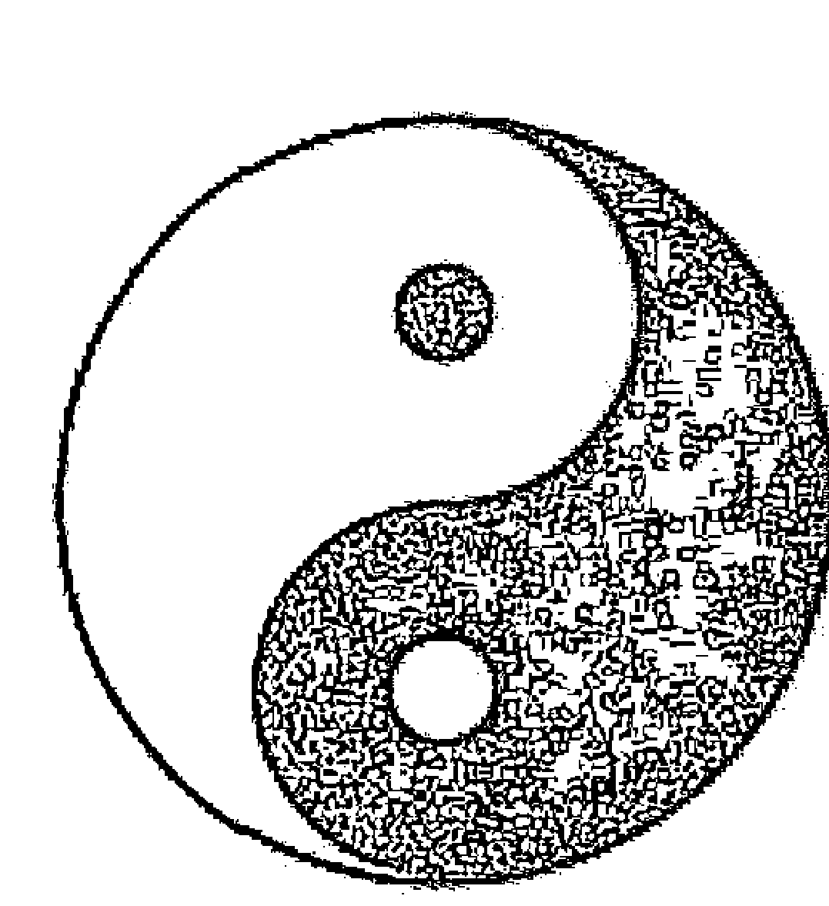

一是从一年四季的流转看，春在东方，夏在南方，秋在西方，冬在北方。四季交流，顺时钟旋转，循环往复，永无停止。
二是从八卦的分布看，后天八卦：乾、坎、艮、震、巽、离、坤、兑。自西北乾位开始，顺时钟旋转，至正西的兑位正好旋转了一周。
三是《周易》十二消息卦的排列，从十月坤卦始，依次顺时钟旋转，从十一月复卦、腊月临卦、正月泰卦、二月大壮卦、三月夬卦、四月乾卦、五月姤卦、六月遯卦、七月否卦、八月观卦、九月剥卦，十月坤卦，年复一年，循环往复，周而复始。
四是古老的石磨旋转。古人认为天在上而动，地在下而静。推过石磨子人都知道，人要逆时钟推着石磨子旋转的。也就是说石磨的上扇逆时钟转，相对而言，石磨的下扇则是顺时钟旋转的。老祖宗不知道推了多少年的石磨，一直到了电气化之后的70年代电磨子问世，石磨才完成了自己的历史使命，这是一个很好的例证。

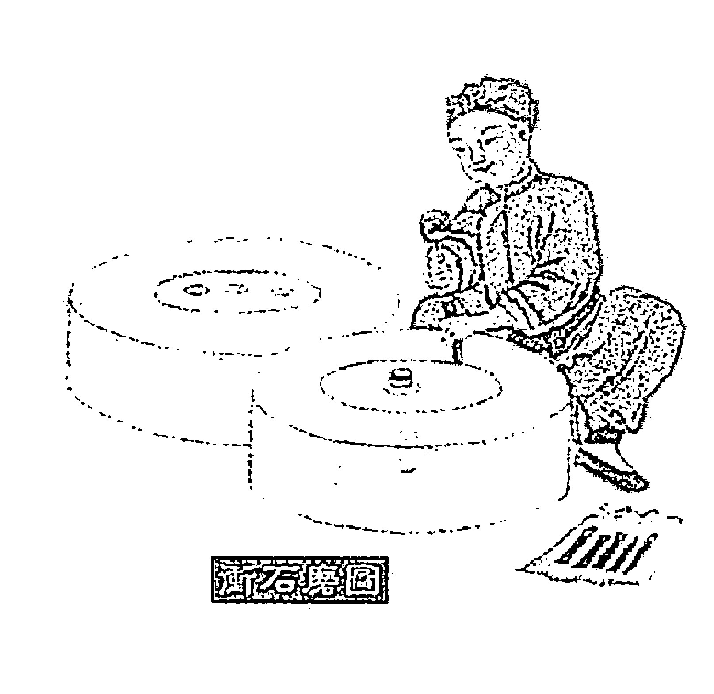

五是国际交通是靠左行，世界上的火车全部是靠左行（有些国家汽车靠右行、有些靠左行），因为，靠左行与地球的地磁一致，可以减少交通事故。其实这也是一个顺时针旋转的事例。
六是从儒道两家的太极图画法看。古人认为宇宙开始是一个阴阳不分的硕大的无形无状、没眉没眼的怪物，人们叫他“混沌”。中国上古神话传说，盘古当年就住在这个暗无天日的黑屋子里。有一天，盘古实在憋不住了，就拔下自己一颗牙齿变成一把锋利无比斧子，稀里哗啦的几下就把“混沌”劈成碎片，清者上升为青天，浊者下沉为大地。天地自始，宇宙形成，但这毕竟是一个美丽神话传说。

儒家认为，阳气生于冬至（当日白天开始渐长）而止于夏至；阴气生于夏至（当日白天开始渐短）而止于冬至，所以，太极图的阴阳鱼是阳鱼在左，头向南尾巴在北，以示由北而南，代表阳气（春与夏）；阴鱼在右，头向北尾巴在南，以示由南而北，代表阴气（秋与冬），此为儒家对阴阳太极图之认识。所以，太极图中的阴阳鱼永无止境的顺时钟旋转（见右图一）；

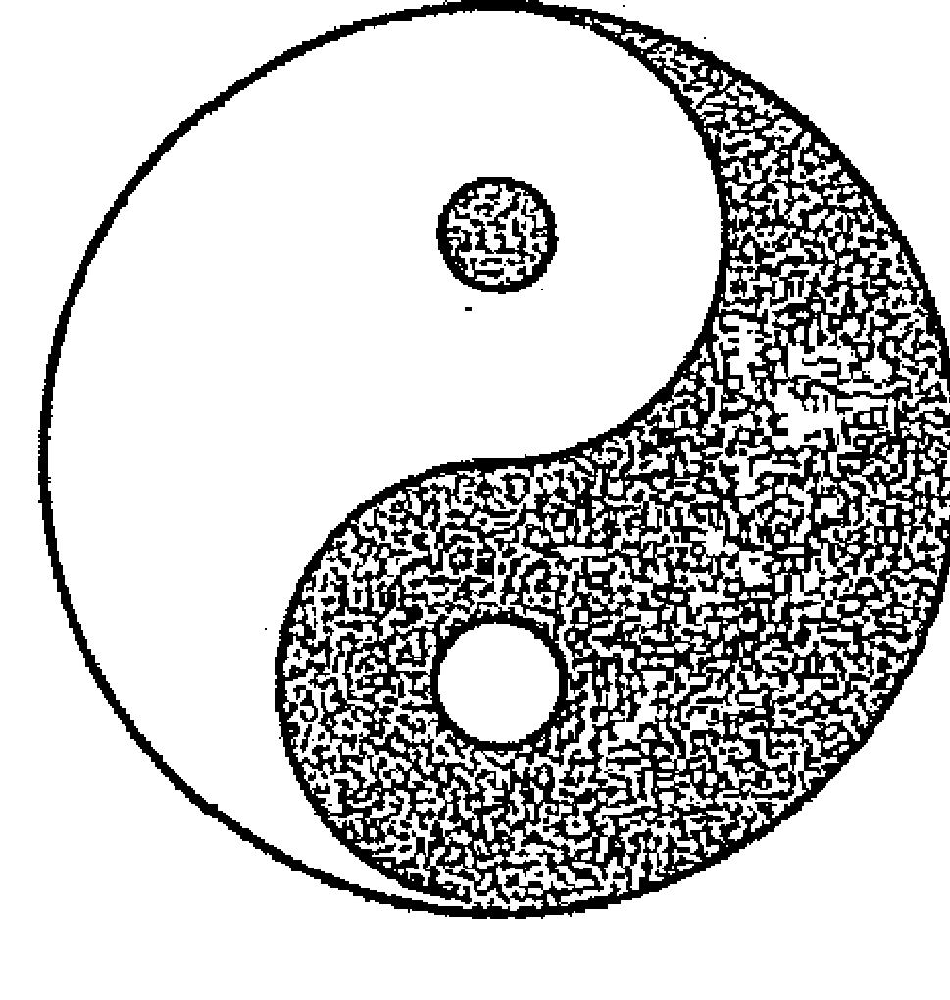

儒道两家的太极图中，区别在于，道家认为阳气清而上升为天（代表宇宙），阴气浊而下降为地（代表大地），因而阳在上、阴在下。所以，在道教文化典籍中，大多数太极图中的阴阳鱼则是阳鱼在上，阴鱼在下（见左图二）。此为儒道两家阴阳观念之区别所在，而太极图阴阳鱼顺时钟旋转是一致的。

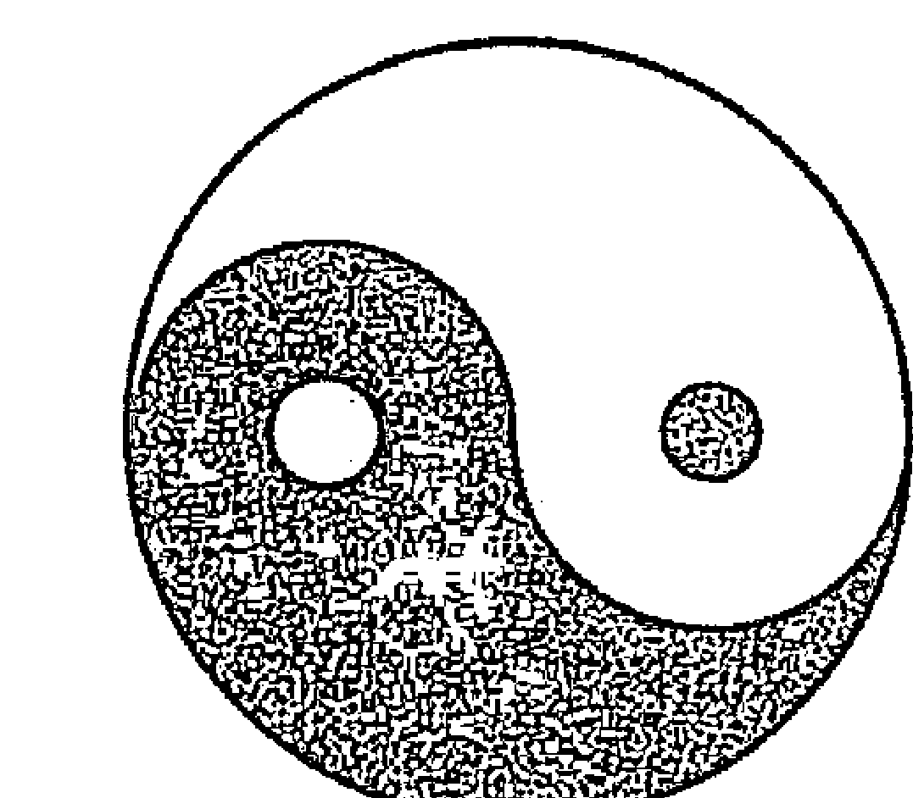七是从农历二十四节气看。农历二十四节气从冬至一阳生始，到立春、雨水、惊蛰、春分，清明、谷雨、立夏、小满、芒种、夏至，小暑、大暑、立秋、处暑、白露、秋分，寒露、霜降、立冬、小雪、大雪循环一周，再回到冬至。如果我们沿图中冬至、大寒、雨水、春分、谷雨、小满的交叉点做弧线到极心。再由夏至、大暑、处暑、秋分、霜降、小雪的交叉点做弧线到极心，正好画出了一个反的“S”曲线，勾勒出一个清晰的顺时针旋转的太极图（见上图）。

再从下面二十四节气图以冬至与夏至画出一条直线，左边为阳，右边为阴。然后以冬至为起点分别向大寒、立春、雨水、惊蛰、春分、清明、谷雨、立夏、小满、芒种做射线；再以夏至为起点分别向大暑、立秋、处暑、白露、秋分、寒露、霜降、立冬、小雪、大雪做射线，再把射线与二十四节气的连线交叉的点用弧线连在一起，一个顺时针旋转的太极图清晰可见（见上图）。不管这两个图的结构、画法有无科学道理，最起码给我们一个“阴阳太极图”的绘制方法，而且太极图以顺时针旋转。

综上所述，阴阳太极图的正确画法应该是阴阳鱼顺时针旋转。这件事看上去虽小，其实是一个很严肃的大问题。因为太极图是华夏易学文化的图腾标志，国人必须有一个正确的画法，要不然五花八门的图像传到国外，会让人家贻笑大方，闹出国际玩笑的。

《周易》六十四卦的卦爻中用“—”代表阳，叫阳爻；用“- -”代表阴，叫阴爻，这就是两仪所代表的组成卦象的基本符号——卦象。目前表示阴阳的符号大致有五种：第一种：阳“—”、阴“- -”，古人用它表示卦的阴爻与阳爻。郭沫若先生认为：这两个符号分别象征男人和女人的生殖器。现代科学也证明，男性的体内有女性荷尔蒙，女性体内也有男性荷尔蒙。这就是《周易》你中有我，我中有你，阴中有阳，阳中有阴，在人身体内的具体反映。

- 第二种：阳“一”阴“∧”，据说它是《连山易》的卦象符号表示的阴爻和阳爻，与上面情况大同小异。《连山易》早于《周易》，神农炎帝创立《连山易》时，当时华夏文字尚未发明，故《连山易》只有卦象符号，目前尚未见到实用性具体文字记载。虽然有人说它横空出世早于文字发明年代，著者认为纯粹是好古学者人为炮制的假学说，令人无法置信。
- 第三种：《卜筮正宗》中用于预测的符号是：少阳用一个点表示，“、”叫单，数字为7；老阳用○表示，数字为9，表示阳极生阴；少阴用两个点表示，“、、”叫拆，数字为8；老阴用 × 表示，数字为6，表示阴极变阳。这是《周易》六爻预测中规定和使用的四个阴阳符号。
- 第四种：现在有人把阴阳的表示符号拓展到用英文字母表示，一般用 A 代表阳，B 代表阴；或者 a 代表阳，b 代表阴。这是用来研究《周易》与社会自然科学时常用的阴阳替代符号。
- 第五种：在二进制数学中，阴用0表示，阳用1表示。我们现在使用的计算机语言、网络信号语言以及数码电视信号，就是采用1和0来完成数字传导的。

以上是目前常见的几种阴阳符号表示形式。

#### 三、阴阳的定义

> 关于阴阳的定义，《灵枢经·阴阳系日月》云：“阴阳者，有名而无形。”

什么意思呢？它是说阴阳属性有其抽象的概念，没有具体的物质表象。我们经常说世界上万事万物都是由阳性物质和阴性物质构成的。那么，究竟什么是阳性物质，什么又是阴性物质呢？著者个人对阴性、阳性物质的语言表述是：

- 1、阴性物质——看不见，摸不着，无重量，无温度，无形无象，确实存在，但不以实物形式存在，它充满宇宙空间又不占有宇宙空间，速度与光速接近或相同，或者说在光速之上运行，它也属于（暗，或者反）物质，只有通过阳性的物质才能充分体现它的存在和价值作用。

例如说：石和水相对，石为阳，水为阴；水流与空气相对，则水流为阳，空气为阴；空气与虚无相对，则空气为阳，虚无为阴。其实，虚无是阴之极，阴极生阳，阳生万物，如此又变形成了万物，是唯无极生太极，太极生万物也。

有时候阴性物质也会以看得见、摸不着、有形有象的形式出现。如：通过互联网，手机、电视荧光屏，你可以看见对方清晰的图像，也能听到他（她）说话的声音，他（她）确实存在，可就是摸不着、靠不近。科学在进步，社会在发展，阴阳物质的存在形式也在不断地扩展，以不同的方式表示其存在。

- 2、阳性物质——看得见，摸得着，有重量，有温度，有形有象，以实物形式存在，它占有宇宙空间而不充满宇宙空间，速度绝对在光速以下、甚至很慢或者静止不动、甚至没有速度，只有通过阴性物质方可更好的发挥它的作用和能量价值。

如：楼房、树木、汽车、家具、电台、电视机、手机和收音机等都是阳性的物质。但是，它们总是能处处让人感受到阴性物质信号的奇妙，使人相信并体验到阴阳物质相互依赖、互为存在。

阴与阳只是相对而言的。例如：天地中的地，对天而言地是阴，但对空而言地又是阳；对人而言阳是身体，阴是思想。妇女对丈夫而言属阴，对子女而言则又属阳。总而言之，阳是实体，阴是程序；阳是物质，阴是意识；阳是形象，阴是原理。这就相当于计算机中的硬件和软件，哲学上的内容和形式。

人造卫星是一个阳性的实体物质，它同步与地球在那里转动，可以瞬间把地球上任何一个地方的信息报告给地面，这就产生了速度缩短距离的效果。在科学技术高度发达的今天，距离确实已经不是什么问题了。

二进制数学的创立，催生计算机的问世，确实给人类社会各行各业带来飞跃性发展，这是《周易》理论对人类电子科学的一大贡献。计算机应该是一个阳性的物质，人们可以通过它与外界取得联系，它会告诉你好多未知的东西。计算机用在国防军事领域，它的功能可就大了，导弹的导航系统定位，指挥员发出一个阴性的指令，通过无线电发出信号，传入卫星定位系统，操控巡航导弹立即发射升空，命中几千里之外需要打击的目标，而且是想打那里，就打那里，随心所欲，百分之百分毫不差，一切全然在神不知鬼不觉之中进行，致使重大的残酷后果往往在突然之间发生，这一切无不与阴阳有着重大的联系。

现在工厂现代化生产用的数控车床，在加工零件之前要在计算机上输入必要的数据，模拟出一个三维的图像。操作者提前通过计算机可以看见这个零件的外形和内部结构，数据确证无误后，由计算机按数据精准的操作车床，按照给出的程序指令，把一块块毛胚加工成一件件合格的工业产品，这就是高科技下的阴阳理论。三维图像是一个阴性实物表象，加工出来了就是一件没有数字程序只有流线外表的机器零件，加工前毛胚与三维图像是一分为二，加工好了的零件就变成实物与图像的合二而一。目前的3D 打印技术就是阴阳理论的进一步延展。

《周易》阴阳理论应用广泛，在生活中随处可见。中国人民银行发行的人民币50 元和100 元票面上，有阴阳互补的古钱币防伪标记，就是采用《周易》阴阳理论，达到简单明快、古朴大方、可靠性很高的防伪目的。还有中国的股票市场，阳线飘红为上涨，阳线越长，涨得越高；阴线泛绿为下跌，阴线越长，跌得越惨。有趣的是出现两根阳线加一根阴线之后，后市大多数看涨；两根阴线加一根阳线之后，后市大多数看跌。这恰恰与西方股市的绿长红跌形成强烈的反差。有些人不一定了解股市，k 线的红与绿和阴与阳有何关系？著者只是想说明阴阳理论在生活中无处不在。所以，看似单调的数字背后往往存在很大的变数，而且通过数字可以创造出新的“生命”。如此来说，数字是活的，而不是死的。它是具有特殊生命的数术代码，而不是简单的数字编号。此所谓的“一阴一阳之谓道”，太极生两仪，两仪生四象，生生不息，变化无穷，其中内藏的阴阳理论体系确实太大了，其包括整个宇宙万物的互联化生。

#### 四、什么是四象

古人认为太极生阴阳，阴阳代表天地。天为气，地为体，气分阴阳，体分刚柔，依据二者的强弱刚柔，天之气可分为太阳、少阳、太阴、少阴，对应天上的日、月、星、辰。地之体可分为太刚、少刚、太柔、少柔，对应地上的木、火、金（石）、水，它们的演变慢慢地生成细化了宇宙万事万物。

> 《周易·系辞》曰：“易有太极，是生两仪，两仪生四象，四象生八卦，八卦定吉凶，吉凶生大业。”

四象是由两仪衍生而来的二分为四，或者是两仪与两仪直接组合而成的一种数学排列。即：阳“一”、阴“--”分别两两组合，衍生出四种状态的象，少阳、太（老）阳、少阴、太（老）阴。即：（少阳符号）为少阳，（老阳符号）为太（老）阳，（少阴符号）为少阴，（老阴符号）太（老）阴。

对于四象：少阳、老阳、少阴、老阴的说法有很多。一是表示方位：东、南、西、北；少阳为东方，老阳为南方，少阴为西方，老阴为北方。二是对应的四大神兽为：东方青龙、南方朱雀、西方白虎、北方玄武；三是五行表示：木、火、金、水；四是季节代表：春季、夏季、秋季、冬季。

四象实际上就是一个二分为四的物质变化过程，它还代表四季中四个重要的节气。

- 少阳代表春季——节气为春分；
- 太阳代表夏季——节气为夏至；
- 少阴代表秋季——节气为秋分；
- 太阴代表冬季——节气为冬至。

一年四季春、夏、秋、冬，由东自南，自南而西，从西向北，始北而东，顺时针旋转，以次东、南、西、北循环往复的运转不止。从这个划分，我们有充分的理由认为《周易》文化起源于陕西关中的渭水流域。

2015年2月，习近平总书记对太白山的保护发展做出重要指示：“秦岭是我国南北气候的分界线和重要的生态安全屏障，具有调节气候、保持水土、涵养水源，维护生物多样性诸多功能。秦岭之中的太白山更是历来为人们所称颂。郦道元在《水经注》里写道：‘太白山南连武功山，于诸山最为秀杰，冬夏积雪，望之皓然’。白居易远望太白山，执笔在壁上也写下了‘石拥百泉合，云破千峰开’的诗句。这样的自然生态美景，谁都不能破坏。”

《禹贡》中就有秦岭是昆仑山以东中国内陆海拔最高的山峰，其高3770多米。东西走势的秦岭就是中国阳（南）与阴（北）太极的分界线。理由是江南有春、夏、秋而无冬；塞北有秋、冬、春而无夏，四季分明是秦岭以北的渭河为天象的。宝鸡地处中原，东、西、南、北也是此地才有的方位用语。在南、北两极，则只有南或北，各一个方向，而无法分出四个方位来，这就如同上古时期人们只知道有“东西”，而不知道有“南北”是同样的道理。

从汉代开始，人们就认为一年有四季春、夏、秋、冬。一天也有四季晨、午、暮、夜。即“晨象春，午象夏，暮象秋，夜象冬。”同理，一天也可分为四象，即：早晨为少阳，中午为老阳，黄昏为少阴，晚上为老阴。

再引申一点看，四象也是一个宇宙人生中生、老、病、死的自然循环。人从弱小（少阳）成长为强大的（老阳）成人，再渐渐地衰老（少阴）逐步走向死亡（老阴），从而完成了一个生命周期的自然循环。用佛教的轮回理论说，人一旦死去，就变成另一种新的生命存在，人的灵魂被认为是永恒不灭的。不过这是一个属于边缘科学范畴的问题，尽管国外有少数科学家经过长期观察、积累数据，证实人的灵魂是有一定重量的，而且还发现了灵魂的平均重量，听起来有理有据、也有点玄乎神奇，但是，至今尚无最终的科学定论。

### 第三节 何谓五行

中国古代人将宇宙万物归为五大类，称其为五行。五行之说最早见于《尚书·洪范》。何谓“洪范”？洪，指浩然宏大，范，为方圆规范。洪范者，宇宙万物生生不息、循环往复之大法也。周武王十三年，武王姬发拜访殷商旧臣箕子，请教治国之道。箕子曰：“上天赐给禹九种大法，初一曰五行，……一曰水，二曰火，三曰木，四曰金，五曰土。水曰润下，火曰炎上，木曰曲直，金曰从革，土爰稼穑，润下作咸，炎上作苦，曲直作酸，从革作辛，稼穑作甘”。箕子这段话，不单单是讲五行，而且还讲出了五行所代表的特性：润下、炎上、曲直、从革、稼穑。以及五种味道：咸、苦、酸、辛、甘。由此看来，箕子是一位精通五行之术，熟悉阴阳之道的高人。著者认为五行说哲学思想大概也诞生于商周时期。

#### 一、五行说哲学体系

五行说是一种自洽的哲学体系，它是四象与八卦的折中，在四象之外加了一个“中”即中央戊己土。土是金、木、水、火的相叠、相交、相并的部分，是其公约数。四时是贯穿其中的时间流，即年。其实，五行相生相克也是古人经过实践观察自然界的变化总结得来的。金生水，是从山是河之源而悟出来的；水生木，是从有水即生草木而发现的；木生火，是从钻木取火而知道的；火生土，是因为万物焚烧之后皆为灰土发现的；土生金，是所有金属源于土中的物质。相克也一样，如金克木，很显然是刀子切菜、斧子砍树中悟出来的；木克土，是植物发芽破土而出悟出来的；土克水，就是人们习惯说的水来土掩，因此，堤坝能束水；水克火，更易理解；火克金，就是玉石俱焚，浴火重生，即火克金。五行说认为，世界是由：水、木、火、土、金五类物质组成（见上图）。

五行说不仅是一种宇宙观哲学思想，而且是一种朴素的物质系统论。五种物质之间相生相克，相互依存，和谐运动，相得益彰。五行与“阴阳二元论”哲学思想有好多相同和相通之处，是古代先哲奉献给世界哲学领域一朵灿烂芳香的奇葩。

> 老子的学生古代哲学家尹喜在《关尹子》中说：“精神，水火也，五行互生灭之，其来无首，其去无尾。精者水，在天为寒，在地为水，在人为精；魄者金，在天为燥，在地为金，在人为魄；神者火，在天为热，在地为火，在人为神；魂者木，在天为风，在地为木，在人为魂。”这是道家学者对五行说和“天、地、人”三才的论述。我们今天无法知道究竟是先有水？还是先有火？或者是先有土？先有木？没有人知道它们的先后顺序，也不知道它循环往复生生不息要到什么时候。这本身就是一个先有蛋生鸡，还是先有鸡生蛋的问题。只要记住“其来无首，其去无尾”，就知道而且理解了五行说的开始与未来。

#### 二、五行的基本概念和内容

五行说的基本概念有两方面。一是“五”：五是数、是物质，是具体的种类，是客观存在，它不是单纯的五，而是指很多种归为五类。二是“行”：行是性质、是运动、是变化、是其中的自然运动规律。

“五”——指的是宇宙间水、木、火、土、金五种抽象的大物质现象。

“行”——指的是物质生生不息的运行、生、克、制化的变化运动规律。

五行有两大特征：一是基本特征，二是五行分类。

##### 1、基本特征：

- （1）、木具有生长、条达、能曲、能伸的特征；
- （2）、火具有发热、温暖、向上、流动的特征；
- （3）、土具有载物、生化、顺从、静止的特征；
- （4）、金具有变革、萧杀、能柔、能刚的特征；
- （5）、水具有滋润、深入、闭藏、自然的特征。

##### 2、五行分类：

五行说对万事万物归纳推衍，完全依据“天人相应”的全息理论。在古代预测学中，五行说起着纲举目张的特殊作用。如八卦化五行为：乾、兑化为金；坤、艮化为土；震、巽化为木；坎化为水；离化为火。五行还可以联系到五数、五方、五位、五色、五常、五音、五戒、五脏、五神、五窍、五味、五毒等方面。见下表列示：

| 五行 | 木 | 火 | 土 | 金 | 水 |
| :--- | :--- | :--- | :--- | :--- | :--- |
| 五数 | 三 | 二 | 五 | 四 | 一 |
| 五方 | 东方 | 南方 | 中央 | 西方 | 北方 |
| 五位 | 左 | 前 | 中央 | 右 | 后 |
| 五色 | 青 | 红 | 黄 | 白 | 黑 |
| 五常 | 仁 | 礼 | 信 | 义 | 智 |
| 五音 | 角 | 徵 | 宫 | 商 | 羽 |
| 五戒 | 杀 | 淫 | 妄 | 盗 | 酒 |
| 五脏 | 肝 | 心 | 脾 | 肺 | 肾 |
| 五神 | 魂 | 神 | 意 | 魄 | 志 |
| 五窍 | 眼 | 舌 | 口 | 鼻 | 耳 |
| 五味 | 酸 | 苦 | 甘 | 辛 | 咸 |
| 五毒 | 怨 | 恨 | 怨 | 恼 | 烦 |

#### 三、五行生克制化

五行说不是简单的、静止的、片面的、孤立的将各种事物归属于五种，而是以五行之间生、克、制、化、乘、侮的自然变化规律，探索事物之间相互关联、相互协调，矛盾作用的整体一致性。

1、五行相生：指甲事物对乙事物的推进、生化有辅助作用，叫做生。具体是：水生木，木生火，火生土，土生金，金生水。在相生关系中，任何一行都有“生我”与“我生”两方面的关系，“生我”者为母体，“我生”者为子体。

2、五行相克：指在相克的关系中，任何一行都有“我克”与“克我”两方面的关系。“我克”者我能胜，“克我”者我不能胜。即水克火，火克金，金克木，木克土，土克水。如果我为土，它为水，那么土克水是“我克”，就是人们习惯说的“兵来将挡，水来土掩”；木克土就是“克我”，表示遇上天敌。“我克”虽有付出但出于主动，属于胜利者。而“克我”是被动，一般情况下属于失败者。

3、五行制化：五行之间有特殊的制化规律。即木克土、土生金、金克木；火克金、金生水，水反能克火；土克水、水生木，木反能克土；金克木、木生火，火反能克金；水克火、火生土，土反能克水。这就有点像家庭人际关系。爷爷可以管住儿子，儿子能管住孙子，孙子反过来可以管住爷爷。

五行制化关系与五行生克关系紧密相连，相生相克是不可分割的两个方面。没有生，万事万物就不会滋生发展；没有克，万事万物就不能相互转化。生中有克，克中有生，万事万物在运动变化中，解决它们之间积蓄形成的矛盾，这就是我们经常说的在发展中解决问题的真谛。中国古人发现的五行制化规律，是一个了不起的发明。制化简单的解释是制约和化解。通过制约可以使万事万物保持相对稳定的平衡关系。通过化解可以把复杂的问题简单化，把大事化小，小事化了。此为五行说的奇妙之处。

##### 4、五行乘与侮：

五行之间既有相生的发展机制，也有相克的制约机制。另外，五行之间在生克制化过程中，遭到遏制后的平衡机制，我们叫它乘侮规律，也叫做相乘、相侮规律。

**一是相乘规律**。乘是表示以强凌弱的意思，是事物相克太过，超越正常限度引起的一种乘虚侵袭现象。相乘的次序与相克相同，“宜将剩勇追穷寇”讲的就是一种顺势而为的态势。在当旺的情况下，如木一（乘）一土一（乘）一水一（乘）一火一（乘）一金，就能体现一种动态的势能。

**二是相侮规律**。侮，就是侮辱、欺负的意思。侮是五行的任何一行本身过于亢盛，使原来克它的一行不仅不能制约它，反而被对方所克制，也就是反克的意思。在五行失令的情况下，往往被得月令当旺的一行所“侮”，相侮的次序为：木侮金、金侮火、火侮水、水侮土、土侮木，反其道而行之。

五行的相乘、相侮是生克过程中一种异常表现。乘是相克有余，是甲事物对乙事物过渡克制造成的现象；侮是被克者反过去欺侮克者，就是甲事物本来克乙事物所不能胜，被其反克的一种异常现象。如本来金克木，侮就是当金处于衰死绝地的状态，木正处于旺盛状态，木就对金构成侮辱。

阴阳五行哲学最高级、最精髓的东西，就是在生、克、制化上。它让复杂问题变得简单容易，是一个科学唯物的概念，属于自然科学的哲学范畴。反之，把简单问题复杂化了，是不懂《周易》，是唯心论的形而上学。

#### 四、五行与仁、义、礼、智、信

《周易》中的“道”从不同角度都有详细的论述。古人认为：仁、义、礼、智、信与五行说的木、火、土、金、水有密切的关联。

- 木——东方青帝之神，主仁。仁者生，生者圆。万物非时不生，观星非时不验，因其时令，察其盛衰，则知变化。春令之木渐有长生之象；木与太阳同宫，名为向阳花木，必然早占鳌头；夏令之木根燥叶干，喜水润济；秋令之木气脉已虚；冬令之木，随逢生气，但折穷至极。
- 火——南方赤帝之神，主礼。礼者齐，齐者平。春令之火寒气未消；火本酷烈，逢木慈生，以善化恶，以刚制柔；夏令之火逢土有救，能破水孛之气；秋令之火，宜借水以济其盛，使刚柔变化；冬令之火气脉已虚，如有木来泄水之气则可刚健。
- 土——中央皇帝之神，主信。信者诚，诚者真。上居五行之中，有养育之权。春令之土喜火，不宜与水孛交会；夏令之土喜水；秋令之土不宜火躁；冬令之土喜木火相助。
- 金——西方白帝之神，主义。义者成，成者方。春令之金不怕火，借火成形，性柔体弱。夏令之金不宜生水；秋令之金喜水，成金白水清之局。木盛则金纯而费力，土盛则金埋而少光辉，水盛则体寒，火盛则体冶镕，金盛则太刚而折，五行以中和为贵，故冬令之金忌水。
- 水——北方黑帝之神，主智。智者谋，谋者重。水为天地之血脉，能生养万物。春令之水喜木，夏令之水得土为奇，秋令之水忌火克，冬令之水得火为上。

以上是五行说对应的道德所讲的仁、义、礼、智、信。

#### 五、何谓道、德、仁、义、礼、智、信

##### 1、何谓道？
《关尹子》曰：“非有道不可言，不可言即道；非有道不可思，不可思即道。”古人认为，道是人们必须遵循地妙不可言的自然规律。即：安居时能思危，知道自己该做什么；行走时知道自己要去哪里，做事时知道自己所依靠的条件；行动时知道自己何时应该停止，它使万事万物不迷失其固有的自然法则，这就是所谓的道。其实在哲学上就是指本体，过去如此，现在如此，将来亦如此，古往今来，无不如此的永恒存在，所生而不枯。即人们常言的“以天地共存，与日月同辉”是也。

##### 2、何谓德？
古人认为，德是人们所应该获得的，也是其他人各得其所的东西。现在人们认为德是一种高尚的品质，是一种悟性和修行积累的高乘因果。就是哲学上所说的主体，通过学习而获得的对本体的觉悟。

##### 3、何谓仁？
仁者，人也，两个人才能作成事。五行属木。仁，即：人的本质规定性，是人生来具有的恻隐之心。古人认为，仁是爱，得利除害，广爱无私就是仁；也有说仁是仁慈、爱心，同情心和恻隐之心；仁也是一种推己及人的爱心传递。

##### 4、何谓义？
义者、宜也，五行属金。就是做适宜自己做的、适合身份的一切事情，是一种担当与责任。古人认为，义是适宜，明确是非，是肯定与否定的界线，勇者以此建功立业；也有说义是人所做的一切事情，都要适宜赏善罚恶，弘扬正义，见义勇为。

##### 5、何谓礼？
礼（禮），从礻（shi）从豊，五行属火，即天地神灵。礼就是为天地神灵献上牺牲贡品，虔诚致祭。古人认为，礼是人们要实行的进退，必须具有规范，尊卑、长幼、上下、贵贱之差别。也有说礼是人们必须实行的昼做夜息，立善防恶，维护固定的统治秩序和生活风俗，是人们处世为人的方法。

##### 6、何谓智？
从字面看，智，从知从日，即日有所知，五行属水。顾炎武写过《日知录》，智书之谓焉，即人了解自然万物的能力。所以，古人认为，智是人们利用自己掌握的知识，来判断得与失、进与退、胜与败、是与非、取与舍的综合处事能力。

##### 7、何谓信？
从字面看，信，从人从言，即人之言能在行为中兑现，五行属土。古人谓之不欺人，是从诚（不自欺）推衍出来的，故曰，信者，诚也，连同于诚信。因此，信在人身上是一种承诺，在人与人之间是一种信赖；在一个集体是制度，在一个国家是法令，一般指以最高统帅的命令为行动。

#### 六、五德始终说

第一个五德始终说。它是由五行生克衍化而来的。据《吕氏春秋》记载：黄帝是土德，“土气盛”；大禹是木德，“木气盛”等等。黄帝土德，大禹木德，木克土大禹接替黄帝而统治天下；大禹是木德，商汤是金德，金克木商汤取代了大禹而管理天下；商汤是金德，周文王是火德，火克金西周革了殷商的命，以德治理天下；下一个是水德。然后再周而复始，依次相推。秦始皇统一中国以后，自认为自己是代替周代火德的水德，坎象为水、数为六，水为黑色，所以，大秦帝国特别崇尚的数字是“六”，官服的颜色也崇尚黑色。刘邦建立汉朝后，就引来学者对大汉王朝是否是土德的争论。

第二个五德始终说。雄霸天下的大唐帝国被视为土德；木克土，大宋赵氏取代了大唐李氏而统治天下；成吉思汗为金人之后，取德为金，金能克木，元朝代替宋朝而一统天下；朱元璋为火德，从南向北起兵，火入水乡，大明朝灭掉了元朝。明从日月，为火，所以，朱氏建立了大明王朝；后来满清人人关，自喻水德，灭了大明王朝的火德，统治中国长达300年之久。据说满清开始叫青，为了体现水德，专门为青字加了三点水，改为清。这是中国历史上两次把与五行有关的“五德始终说”用在朝代更替革命。

五德始终说实质上是一种气论，即：木、火、土、金、水五气循环论。这些显然是没有确凿的科学依据让人信服。如果我们要问五行之中到底是先有那一行，是水？是木？还是火？这个恐怕也没有人能回答得了。

世界上的万事万物不仅有自己本身的形体，而且还有自身的“气”。人走到水边感到凉爽，这是水气。在火旁就会感到燥热，这是火气。水有寒气，火有燥气，花有香气，人有朝气。人对自然界的反映可以表现出：喜笑颜开的喜气，怒发冲冠的怒气，盛气凌人的傲气，和蔼可亲的和气，稀里糊涂的耍气，倒霉透顶的晦气，等等。

社会是由人组成的，社会有社会风气，民间有民间风俗，家庭有传统家风，人身上有气质，这些都是“气”不同形式的反映。《三国演义》中不时的提到汉家“气数”已尽。这个“气数”就是气和数。古人说：人生百年是一个定数。古时候照明用的油灯，油熬干了，灯自然就灭了。所以说，一切事物到了一定时候气数就尽了，这是古人把对自然界物质的认识引申到了人类社会和历史。

### 第四节 八卦与六十四卦

谈及八卦必须涉及到两张蕴藏玄机的图，即“河图”与“洛书”。这两个图是后世研究《周易》之学无法绕过的图腾标志。

#### 一、“河图”与“洛书”

《周易·系辞》曰：“河出图，洛出书，圣人则之。”这个圣人指的就是人文始祖伏羲氏。古人说“河图”、“洛书”是华夏文化的源头，传说伏羲氏时，有龙马从黄河出现，背负“河图”；有神龟从洛水出现，背负“洛书”（见右图）。后来伏羲氏根据这种“图”、“书”画成八卦，后来周文王又依据伏羲八卦研究成文王八卦和六十四卦，并分别写了卦辞。“河图”与“洛书”是中国古代流传下来的两幅神秘图案，历来被认为是河洛文化的滥觞。2014年11月11日，河图洛书传说经国务院批准列入第四批国家级非物质文化遗产名录。此众人周知的“河图”与“洛书”之大致来历。

著名科学史家钱宝琮对“洛书”有很高的评价。他说：“三数相加都得十五，这是令人惊奇的。n个自然数排列在每边n格的方图里，纵横斜n数相加都得相同的和，南宋算家叫它‘纵横图’，日本人叫它‘方阵’，西洋人叫它‘幻方’。”这是世界上最古老的“三行纵横图”，也是最古老三阶“幻方”。

1989 年山西科普报刊社出刊的《科学之友》杂志刊登了这样一则特殊的命题：“在公元前五世纪的古希腊，有这样一道耐人寻味的千年古题：“希腊十字形”。古希腊人常在面包上画一个“十字形”，认为它是生命的象征。看谁能用硬纸作的十字形，沿线剪两次，将十字形剪成的四块，拼成正方形？（见图①）”

“希腊十字形”的特点是四臂长度相等，中心为一大正方形空间。它的设计广泛运用于拜占庭建筑及受拜占庭建筑影响的西方教堂。中国《周易》理论告诉我们宇宙是多元的，也是很朴素的。世界上有好多深奥的难题，答案往往是非常简单的。笔者在研究中国民族经典文化《周易》时，意外地发现“希腊十字形”与中国“洛书”九宫图之间有着密切的联系。

相传在中国 5000 年前的大禹时代，从中原洛水中钻出一只神龟，龟背上有奇妙的花纹，后来人们把这种花纹图形叫“洛书”（见图2）。《周易本义·说图》曰：“洛书盖取龟象，故其数戴九履一，左三右七，二四为肩，六八为足。” “洛书”中，取九以下自然数，排成三行三列的正方形，被称为九宫图（见图3），图中数字的排列，不管任一行、任一列以及对角线的三数相加之和都等于十五。现代数学中，把这种方阵叫矩阵，也称其为“三阶幻方”。在国外最早提出幻方的是公元 130 年希腊士麦拿人塞翁在他的一本著作中第一次提到幻方，希腊人的发现显然比中国“洛书”要晚几千年。

从整体看“洛书”九宫图，是把一个正方形用“井”字线分为九等分（见图④），如果我们在九宫图中五个奇数宫画上图①中的两条线，再取掉九宫图四角的偶数宫，余下五个奇数宫，“洛书”九宫图就变成一个“希腊十字形”（见图⑤）。然后按虚线将十字形剪成四块，再将每一块向左或向右，同方向旋转180°，这时候奇迹就会出现在您的眼前。一个正方形赫然而成，而且是天衣无缝（见图⑥）。我们再把这个正方形翻过去看，它们的拼合缝奇迹般地出现一个汉字“九”（见图⑦）。这也许是提示我们“希腊十字形”要变成正方形，只有通过中国周易的“洛书”九宫图来完成。受古希腊“三阶幻方”与中国“洛书”九宫图完全吻合的启发，笔者从“洛书”九宫图中得到了启示，就很容易的解开这道几千年的古题。而且根据演示，十字形必须限定在“九等分除去四等分，在所余的五等分内完成”的特殊范围之内。否则，此题无解。

台湾师范大学曾仕强教授在《周易的奥秘》中说：

> “《周易》是解开宇宙人生密码的宝典。”

说《周易》是解开宇宙人生的密码，笔者不敢轻易苟同。但是，说它是解开地球人生密码的宝典，我认为不是夸张。《周易》对于地球上生存的人类，应该都是适用的，可以说在地球上没有它解不开的谜。

古老朴素的中国《周易》“洛书”九宫图与奇异神秘的“希腊十字形”为何有这样微妙的联系？著者认为，这不仅仅是一个简单的巧合。宇宙自然，道法天地，世界大同，变化无穷。这是源远流长的中国古代文化与历史悠久的西方文化神奇互通的交合，而且也是东方文明与西方文明的完美结合。其中，东方文化与西方文化联系的渊源和大同之处值得我们进一步去研究与探讨。

《周易·系辞》曰：

> “易有太极，是生两仪，两仪生四象，四象生八卦，八卦定吉凶，吉凶生大业。”

这里所说的生和分是完全不同的概念，生才可以不息，是一种愉悦的状态。但是，分就不同了，分是分离、分开了就会有伤害的一方。就像女人生孩子，是生出来一个新的生命，而不是把女人一劈两开，直接变成两个人。

#### 二、何谓八卦？

八卦就是指：乾、坎、艮、震、巽、离、坤、兑。它有“先天八卦”和“后天八卦”之分，二者用来表示的符号和卦象的名字相同，只是它们各自代表的方位有根本的区别。

##### 1、先天八卦
先天八卦是 7000 多年前传说时期的领袖人物伏羲氏创立的，人们叫它伏羲先天八卦。它的排列是乾南坤北，依次为：《乾》☰（正南）数字为1→、《兑》☱（东南）数字为2→、《离》☲（正东）数字为3→、《震》☳（东北）数字为4→、《巽》☴（西南）数字为5→、《坎》☵（正西）数字为6→、《艮》☶（西北）数字为7→、《坤》☷（正北）数字为8，人们叫它三爻卦，也叫八经卦（见右上图）。

先天八卦具有和谐、对称性特征。即：乾坤对称、震巽对称、坎离对称、艮兑对称，卦与卦之间，阴爻对应阳爻，形成了四组阴阳对称的卦象。同时它也代表男女之间一种对应关系。即：乾对坤就是父亲对母亲；震对巽就是长男对长女；坎对离就是中男对中女；艮对兑就是少男对少女。另外，八卦最早规定了四面八方。即：四方与四维。

四方：东、南、西、北；离在正东、乾在正南、坎在正西、坤在正北。

四维：东南、西南、西北、东北；兑在东南、震在东北、巽在西南、艮在西北。

伏羲八卦为什么从南方开始：依次从南方→东南方→东方→东北方→西南方→西方→西北方→北方结束要走一个“S”形的曲线呢？也许是告诉我们世界上所有的事情都是曲曲折折的。事实证明，现实生活中只有线段，根本没有一条直线；就连水面也是相对水平，而没有绝对的水平。如果水面是水平的，我们就不会从地球这半面走到那半面又返回到原地。

我们知道飞机的航线虽然是一条直线，而实际上也是一条“抛物线”。如果航线是一条直线，飞机就会飞到地球以外的宇宙空间去。好多事情都可以证明这一点，先天八卦的实用价值不是很大。但是，它带给人们的想象空间是十分巨大的，而且是充满科学依据的。

##### 2、后天八卦
后天八卦是周文王姬昌按《易卦》的实用性排列的，人们叫它文王八卦。有人说周文王是西北侯，他扭转乾坤把乾从正南移到了西北。所以，后天八卦从西北开始顺时针旋转依次为：《乾》☰、西北→《坎》☵、正北→《艮》☶、东北→《震》☳、正东→《巽》☴、东南→《离》☲、正南→《坤》☷、西南→《兑》☱、正西（见右下图）。它代表了八种宇宙自然现象，乾代表天，坎代表水，艮代表山，震代表雷，巽代表风，离代表火，坤代表地，兑代表泽。

八卦：亦称三爻卦，也叫八经卦。即乾（天 ☰）、坤（地☷）、震（雷☳）、坎（水☵）、艮（山☶）、巽（风☴）、离（火☲）、兑（泽☱）。

乾（☰）：三阳爻之卦，天、阳物也，乾为天、为君、为父、为圆、为玉、为金、为寒、为冰、为大赤、为良马、为老马、为瘠马、为驳马、为木果；方位西北。

坤（☷）：三阴爻之卦，坤为地、为母亲、为布、为釜、为吝啬；方位西南。

震（☳）：一阳两阴之卦，震之象，为长男、为木、为青龙、方位正东。

坎（☵）：一阳两阴之卦，坎为水，为中男，为黑色、为玄武、为车轮，方位正北。

艮（☶）：一阳两阴之卦，艮为山，为少男、为土、为丘、为楼、方位东北。

巽（☴）：两阳一阴之卦，巽为风，为长女、为木，为风、为信息、方位东南。

离（☲）：两阳一阴之卦，离为火，为中女，为火，为马、为朱雀、为日、方位正南。

兑（☱）：两阳一阴之卦，兑为沼泽湖泊，为少女、为口舌、为白虎、为羊、方位西方。

八卦是《周易·六十四卦》最基本的符号，初学者一定要记住这八个卦象符号。其口诀是：乾三连（☰），坤六断（☷），震仰盂（☳），艮覆碗（☶）；离中虚（☲），坎中满（☵），兑上缺（☱），巽下断（☴）。

八经卦也有五行属性，坎属水，震巽属木，离属火，艮坤属土，乾兑属金。周文王后天八卦的实用性很大，《周易》预测、《梅花易数》、《奇门遁甲》、八字命理、风水学等实际应用学科，都是以后天八卦的数字方位为基准。

##### 3、八卦的三界之分
> 《说卦》中说：“昔者圣人之作《易》也，将以顺性命之理。是以立天之道曰：阴与阳；立地之道曰：柔与刚；立人之道曰：仁与义。兼三才而两之，故《易》六画而成卦。分阴分阳，迭用柔刚，故《易》六位而成章。”这是《周易》的“天、地、人”三才之道。

八经卦：《乾》☰→《坎》☵→《艮》☶→《震》☳→《巽》☴→《离》☲→《坤》☷→《兑》☱，可以划分三界，即气、流、固。《乾》☰为上天，《坤》☷为大地，在宇宙天地之间，有“天、地、人”三才之说，著者认为，它也有“气、流、固”三界之分，即：气界、流界、固界。

###### （1）什么是气界？
气属于上乘的物质，无形无相，无影无踪，在天空中飘忽游荡，传递的速度也比较快，如风云雷电，都属于气界。《震》（☳）为雷，是流动速度最快的物质表象；《巽》（☴）为风，徐徐而来，无孔不入，这两种物质在上界天空中活动。主宰刮风、打雷、闪电、电波、气流、云层、空气等。所以，著者把《震》（☳）与《巽》（☴）划归气界，也归三才之道中的天。

###### （2）什么是流界？
《坎》（☵）为水，代表河流、溪水；《离》（☲）为火，代表天然和人为的热能资源，是处于运动状态或者液态的物质表象，它们在人间大地之上活动。代表河流洪水、热量传递、火山喷泉、地震灾害、泥石流、管道输送线等，流是指他们都依附在大地之上流动转移的物质。

老子曰：“上善若水。”水润下，往往向低处流，火上炎，往往向有柴薪的地方燃烧。虽说水火无情，但是，人类生活又离不开水火。所以，著者把《坎》（☵）与《离》（☲）划归流界，归属三才之道中的人。

###### （3）什么是固界？
《艮》（☶）为高山险峰、土塬丘陵，《兑》（☱）为湖泊沼泽，它们与大地无法脱离，并且是处于静止状态的物质表象。如山脉岩石、土丘湿地、湖泊池塘、水库水井、桥梁楼房等，因是之故，“固”是依附于大地之上相对静止的物质，人类无法轻易地移动和改变它们。所以，《艮》（☶）为山，《兑》（☱）为泽。著者把《艮》（☶）与《兑》（☱）划归固界，归属于三才之道中的地。

此所谓的“气、流、固”三界，它对《梅花易数》预测判断有非常重要的作用。如预测一件事情，卦象属于固界，就说明事情还没有动静；若属于流界说明事情正在运作交流之中；如若属于气界，则表示要办的事情马上就有消息。此为气、流、固三界的妙用之处。

#### 三、六十四卦由何而来

前面介绍了太极、四象、八卦，大家只知道是周文王姬昌发明了六十四卦。那么，六十四卦究竟是通过怎样的步骤演绎发明的，史书没有详尽的记载。我们只能从两仪、四象、八卦、十六卦的成卦原理中找出一些比较科学的依据。

##### 1、什么是十六卦
十六卦是八卦的更进一层。据出土文物资料记载：《连山易·十六卦》是两仪与八卦演生的。它是由两仪的阴爻“∧”和阳爻“一”分别与八卦的各个符号相配后，得来一组阴“∧”八卦和一组阳“一”八卦共两组，《十六卦》也叫四爻卦（见右：连山易十六卦图），它是八分为十六的物质变化演绎过程。现在有些考古发现的陶片上就有四爻卦，史传是神农氏发明和应用了《十六卦》。根据《魏书》记载：“包牺因燧皇之图而制八卦，神农演之为六十四卦”的说法，有些学者认为是神农氏演出了六十四卦的《连山易》，但这只能是人们的一个猜测。《十六卦》就是四爻卦，包含的信息不是很多，虽说没有多大的实用价值，著者认为它是八卦之后的一个重大突破创新，是由八卦到六十四卦推演过程中的一个非常重要的步骤环节。

有学者认为十六卦的成卦时间相当早，说它是表示数学的 16 进位制。因为，古时候宝鸡周原一带使用的杆秤的单位是一斤为十六两（其他地方不了解情况）；珠算用的算盘一个挡表示的最大数是十五，满十六了就要向上进一个档位等等，都能体现十六进位的数学逻辑和存在踪迹。

##### 2、三十二卦的过度阶段
根据《十六卦》的成卦原理，《三十二卦》显然是两仪与《十六卦》，或者是《四象》与《八卦》演绎而来的。即（符号从左到右排列）：四象：太阳○○，少阴○ ×，少阳 × ○，太阴 × × 四种元素分别与八卦：乾○○○，兑○○ ×，离○ × ○，震○ × ×，巽 × ○○，坎 × ○ ×，艮 × × ○，坤 × × × 的八种元素相配演绎而来的，得来少阳 “× ○” 八卦一组，太阳 “○○” 八卦一组，少阴 “○ ×” 八卦一组，太阴 “× ×” 八卦一组，共四组计《三十二卦》，我们也叫它五爻卦（见下表）。它是 “十六分为三十二” 的一个物质变化演绎过程。现在唯一能见到的三十二卦就是《观世音金钱三十二课》，简称《金钱课》，它是何人发明者？无人知道，也有假托为孔明所创。但是，易卦推演到这一步已经成为一部比较全面的预测著作。按理《观世音金钱三十二课》早于《六十四卦》，它的每一卦都有详细的卦辞，具体预示吉凶祸福。预测时成卦方式是用五枚铜钱一次抛出，由近到远按正、反面取卦象、定卦名，然后查看固定的卦辞，依此判断未来吉凶祸福。《三十二卦》在这里显然有了系统的预测实用价值（具体的卦辞略）。

| 四象 | ○○ 太阳 | ○ × 少阴 | × ○ 少阳 | × × 太阴 |
| :--- | :--- | :--- | :--- | :--- |
| **乾** ○○○ | 乾乾 | 乾兑 | 乾离 | 乾震 |
| **兑** ○○ × | 兑乾 | 兑兑 | 兑离 | 兑震 |
| **离** ○ × ○ | 离乾 | 离兑 | 离离 | 离震 |
| **震** ○ × × | 震乾 | 震兑 | 震离 | 震震 |
| **巽** × ○○ | 巽乾 | 巽兑 | 巽离 | 巽震 |
| **坎** × ○ × | 坎乾 | 坎兑 | 坎离 | 坎震 |
| **艮** × × ○ | 艮乾 | 艮兑 | 艮离 | 艮震 |
| **坤** × × × | 坤乾 | 坤兑 | 坤离 | 坤震 |## 3、六十四卦与分类

从《十六卦》和《三十二卦》的成卦原理看，《六十四卦》显然是八经卦与八经卦两两重叠，或者是两仪与《三十二卦》演绎而来的。《六十四卦》就是我们目前《周易》预测常用的六爻卦，也是“三十二分为六十四”的一个物质变化演绎过程。

《周易》六十四卦按上经卦和下经卦分为上、下两篇。

上篇称作上经卦，即《乾☰》《坤☷》《屯☵☶》《蒙☶☵》《需☵☰》《讼☰☵》《师☷☵》《比☵☷》《小畜☴☰》《履☰☱》《泰☷☰》《否☰☷》《同人☰☲》《大有☲☰》《谦☶☷》《豫☷☳》《随☳☱》《蛊☴☶》《临☷☱》《观☴☷》《噬嗑☲☳》《贲☲☶》《剥☶☷》《复☳☷》《无妄☰☳》《大畜☶☰》《颐☶☳》《大过☴☱》《坎☵》《离☲》，共三十卦。

下篇称作下经卦，即《咸☶☱》《恒☴☳》《遯☰☶》《大壮☳☰》《晋☲☷》《明夷☷☲》《家人☴☲》《睽☲☱》《蹇☶☵》《解☳☵》《损☶☱》《益☴☳》《夬☱☰》《姤☰☴》《萃☱☷》《升☷☴》《困☱☵》《井☵☴》《革☱☲》《离☲》《震☳》《艮☶》《渐☴☶》《归妹☱☳》《丰☲☳》《旅☲☶》《巽☴》《兑☱》《涣☴☵》《节☵☱》《中孚☴☱》《小过☳☶》《既济☵☲》《未济☲☵》，共三十四卦。

##### （六十四卦方阵图表）

|   | 乾☰ | 兑☱ | 离☲ | 震☳ | 巽☴ | 坎☵ | 艮☶ | 坤☷ |
|---|---|---|---|---|---|---|---|---|
| **乾☰** | 乾 | 夬 | 大有 | 大壮 | 小畜 | 需 | 大畜 | 泰 |
| **兑☱** | 履 | 兑 | 睽 | 归妹 | 中孚 | 节 | 损 | 临 |
| **离☲** | 同人 | 革 | 离 | 丰 | 家人 | 既济 | 贲 | 明夷 |
| **震☳** | 无妄 | 随 | 噬嗑 | 震 | 益 | 屯 | 颐 | 复 |
| **巽☴** | 姤 | 大过 | 鼎 | 恒 | 巽 | 井 | 蛊 | 升 |
| **坎☵** | 讼 | 困 | 未济 | 解 | 涣 | 坎 | 蒙 | 师 |
| **艮☶** | 遯 | 咸 | 旅 | 小过 | 渐 | 蹇 | 艮 | 谦 |
| **坤☷** | 否 | 萃 | 晋 | 豫 | 观 | 比 | 剥 | 坤 |

《周易·六十四卦》上经三十卦和下经三十四卦的卦诀：

> 乾坤屯蒙需讼师，比小畜兮履泰否。
同人大有谦豫随，蛊临观兮噬嗑贲。
剥复无妄大畜颐，大过坎离三十备。
蹇解损益夬姤萃，升困井革鼎震继。
艮渐归妹丰旅巽，兑涣节兮中孚至。
小过既济兼未济，是为下经三十四。

在《六爻预测学》中《周易·六十四卦》以八经卦领衔分为八宫卦。每一宫分配八个卦，并且规定第七卦为游魂卦，第八卦为归魂卦。为了方便记忆，著者按顺序将八宫卦编著如下口诀：

- 乾宫姤遁否，观剥晋大有；
- 坎节屯既济，革丰明夷师；
- 艮贲大畜损，睽履中孚渐；
- 震卦豫解恒，升井大过随；
- 巽（小）畜家人益，无妄噬（嗑）颐蛊；
- 离旅鼎未济，蒙涣讼同人；
- 坤宫复临泰，大壮夬需比；
- 兑卦困萃咸，蹇谦小（过）归妹。

周文王姬昌是一位睿智哲思，洞悉玄机，能抓住纷繁物象要领的高人。他为《六十四卦》每一卦起了具有总摄性的卦名，并配有彖辞、象辞和爻辞。这些文字都提纲挈领，简明扼要地概括了每一卦的卦意。每一卦六个爻的爻辞和象辞，是对卦爻在卦象中表示意思的解说。据说卦名、彖辞和爻辞为周文王姬昌所撰，象辞乃周公姬旦所撰，从实际研究分析，这种可能有一定的依据。从《六十四卦》上经卦与下经卦实际分类看，卦与卦之间都是两两相对应的组合。著者发现这种组合有两个明显的特点，是初涉《周易》研究领域者不易发现的两个特殊联系。

##### 特点一：十四卦互为阴阳对称

通过对上、下经《六十四卦》两两相邻，排列的观察发现其中有14卦，7组阴爻与阳爻都是相互平行、一一对应的关系。如：

- 《（上乾下乾）乾卦☰》与《（上坤下坤）坤卦☷》对称；
- 《（地上天下）泰卦☷☰》与《（天上地下）否卦☰☷》对称；
- 《（兑上震下）随卦☱☳》与《（艮上巽下）蛊卦☶☴》对称；
- 《（上艮下震）颐卦☶☳》与《（上兑下巽）大过卦☱☴》对称；
- 《（上坎下坎）坎卦䷜》与《（上离下离）离卦䷝》对称；
- 《（上巽下兑）中孚卦䷼》与《（上震下艮）小过卦䷽》对称；
- 《（上坎下离）既济卦䷾》与《（上离下坎）未济卦䷿》对称。

这七组卦正好是以卦的阴爻与阳爻之间平行为称前提的，也就是古人所说的两卦互通吧，如《乾卦䷀》通《坤卦䷁》，反过来《坤卦䷁》通《乾卦䷀》，这是特点之一。

##### 特点二：五十卦两两互为覆卦

> 《说卦》云：“八卦相错，数往者顺，知来者道，是故《易》逆数也。”

《周易·六十四卦》上、下经卦中有 50 卦，25 组卦两两互为反卦关系。即将前卦的六爻打了个颠倒，就变成了另一卦，所谓的覆卦是也。如《（上兑下艮）咸卦䷞》与《（上震下巽）恒卦䷟》；《（上兑下离）革卦䷰》与《（上离下巽）鼎卦䷱》等二十五组卦互为覆卦（篇幅有限不一一列举），这是特点之二。

就预测而言，如果要知道对方的心理状态，就必须把卦象翻过去看，即站在对方立场看事态、想问题。自己舒服了，对方心里肯定不舒服。如果自己觉得亏大了，对方心里可能会乐滋滋的。如《（上兑下离）革卦䷰》与《（上离下巽）鼎卦䷱》，站在内卦向外看为《革卦䷰》，预示要进行革故鼎新；站在外卦向内看，即为《鼎卦䷱》，预示要享受丰盛大餐，改革者要经受艰难痛苦。翻过去，民众会从中得到改革带来的好处。再如《泰卦䷊》与《否卦䷋》，站在内卦向外看为《泰卦䷊》，预示三阳开泰、大吉大利；站在外卦向内看，即为《否卦䷋》，预示否极阻塞、大凶大险。覆卦者，一反一正，一来一往，用古人的话说，这叫做错综复杂的错。以己推彼，知往察来。要把《梅花易数》学精，就必须在识卦上下功夫，学会换位思考。弄清楚覆卦与本卦的关系，也要明白变卦与复原卦的道理。

《周易·六十四卦》之所以这样划分上经卦和下经卦，完全是总览万象，归并抽象的结果。大到宇宙间的物质和反物质，能量和反能量，小到细胞质，细胞核，质子、中子、电子、离子、量子、DNA 双螺旋结构，无不如此。

宋儒张载说：“有象斯有对，对必反其为；有反斯有仇，仇必和而解”其此之谓焉。易学不是别的，易学是一切物质具体道理之上的终极道理，这个终极道理的表现便是辩证法，故而也说它是“易老辩证法”，或者“朴素辩证法”。所以，易学完全符合阴阳相互对立、相互依存的辩证法原则。

#### 四、《周易·六十四卦》的卦爻

《周易·六十四卦》每一卦都是由六个“爻”元素组成的，通称六爻卦，此所谓：六位时成也。在六十四卦中：六爻纯阳的卦只有一个《乾卦䷀》；六爻纯阴的卦也只有一个《坤卦䷁》；乾坤两卦与其它卦不同的是，它们在六爻之外，各多了一个用爻，乾卦叫用九爻，坤卦叫用六爻。

- 六十四卦中五个阳爻一个阴爻的卦共六卦，即《姤卦䷫》《同人卦䷌》《履卦䷉》《小畜卦䷈》、《大有卦䷍》《夬卦䷄》；
- 五个阴爻一个阳爻的卦共有六卦，即《剥卦䷖》、《比卦䷇》《豫卦䷏》《谦卦䷎》《师卦䷆》《复卦䷗》；
- 四个阳爻两个阴爻的卦共十五卦，四个阴爻两个阳爻的卦共十五卦；三个阳爻三个阴爻的卦共二十卦（篇幅有限，卦象不一一列举），合起来总共是六十四卦，共三百八十六爻（含乾坤二卦的用爻）。

《周易》六爻卦的爻位从下向上排列，依次称作初爻、二爻、三爻、四爻、五爻、上爻。具体是逢阳爻加九，逢阴爻加六。例如离卦的读法依次为：初九爻、六二爻、九三爻、九四爻、六五爻、上九爻。划卦爻的时候一般是从初爻依次向上划起的（见右图）。每一爻的彖辞、象辞、爻辞，以及所成卦象，都是用来解释卦意的重要依据，六十四卦预测全凭这些细小的资料来判断事物发展变化的趋势变化和吉凶祸福。

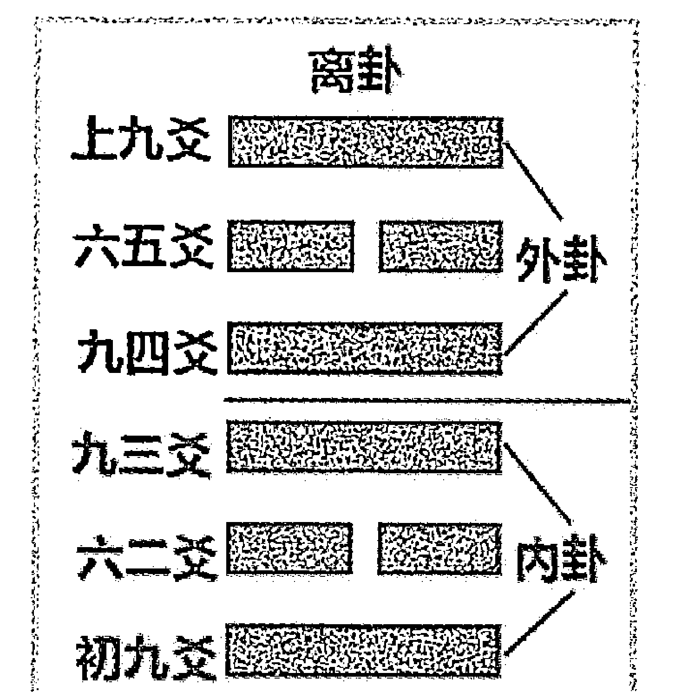

##### 1、六爻的位置与社会地位

> 《周易·乾卦䷀》彖辞说：“大明终始，六位时成。时乘六龙以御天。”

《周易》六爻卦就是所谓的“六位时成”。所以，六爻卦与社会地位有很大的关系，它大可以代表一个国家机构，也可以表示一个集体单位。如果表示国家，初爻代表最下层的普通老百姓。二爻代表古时候的方士、小吏。三爻代表大夫、将军，四爻代表王侯公卿。五爻代表国君帝王。上爻代表退居二线的君主或者高而无位的尊者。

如果用六爻卦表示一个公司或企业，初爻为一般职员或工人。二爻为技术员、组长。三爻为科长、部长。四爻为（副总）高级管理者。五爻为总经理、董事长。上爻为董事会或者顾问以及顾问委员会等。

##### 2、何谓六爻之位的正与不正

根据《周易》奇数为阳、偶数为阴的规定，六爻之位有阴阳之分和上下之别。即初爻、三爻、五爻为阳位，二爻、四爻、上爻为阴位。如阳位得阳爻，阴位得阴爻，即称为“正”。“正”就是阴阳各就其位，也叫物归其位，是符合宇宙自然规律的一种常态。相反，阳位得阴爻、阴位得阳爻，即表示为“不正”，说明阴阳不得其位，没有达到物归其位，是不符合自然规律的一种非常态。

宇宙间的万事万物往往就是这样，常态的时候少，非常态的时候多。明白了这个道理，就懂得了老子所说的：“知和曰常，知常曰明”。日月指的是阴阳之道，理解了这些常识就知道了人生处于非常态的时候多，处于常态的时候少。所以，遇到再大的烦心事，我们也没有必要整天唉声叹气、怨天尤人。唐代诗人白居易说：“人生不如意事常十有八、九，可与人言者却只有一、二。”因此，唯自乐而乐天是正确选择。宋儒张载说：“存，吾顺事；殁，吾宁矣。”所以，作为一个平常普通的人，为什么要与天、与命运硬拗呢？乐天知命是谓常态。

##### 3、六爻中应与比的关系

在六爻卦中，初爻与四爻、二爻与五爻、三爻与上爻之间有一个对应关系。也就是在上卦与下卦之间，它们的下位与下位、中位与中位、上位与上位是相互对应的。如初爻与四爻、二爻与五爻、三爻与上爻是一一对应关系，人们把它叫做应（见右上图）。初爻为阳，四爻为阴，这样的阴阳相应叫正应，如初爻为阴，四爻也为阴，阴与阴相应就不能叫正应，这时就要看“比”。什么是比呢？通常是把邻挨的爻叫“比”。如初爻与二爻、二爻与三爻、三爻与四爻、四爻与五爻、五爻与上爻，叫做比（见右图）。比是一个附加条件，卦爻的阴阳相应叫正应，卦爻有正应时就舍去比不用，无正应时才看比，因为正应的关系比“比”的关系要更好一些。这些都是《周易》六爻卦预测的基础性知识，学习研究《周易》预测一定要详细了解其内在的知识，理解其中象数与易理的变化规律。

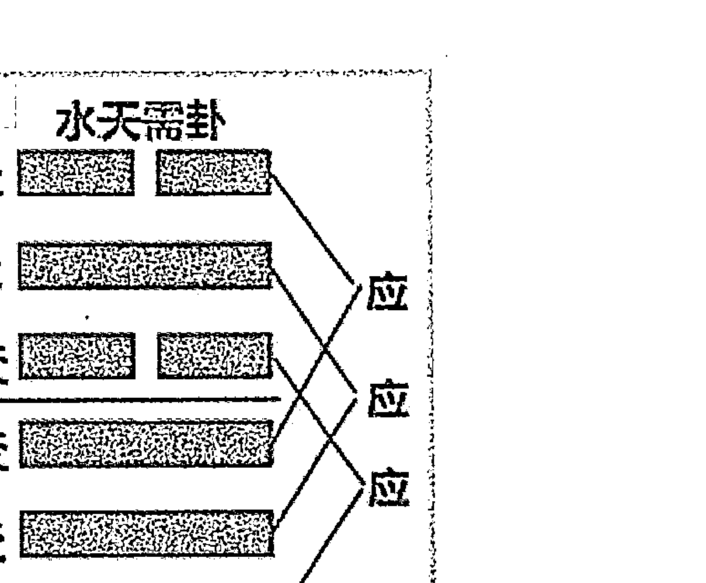

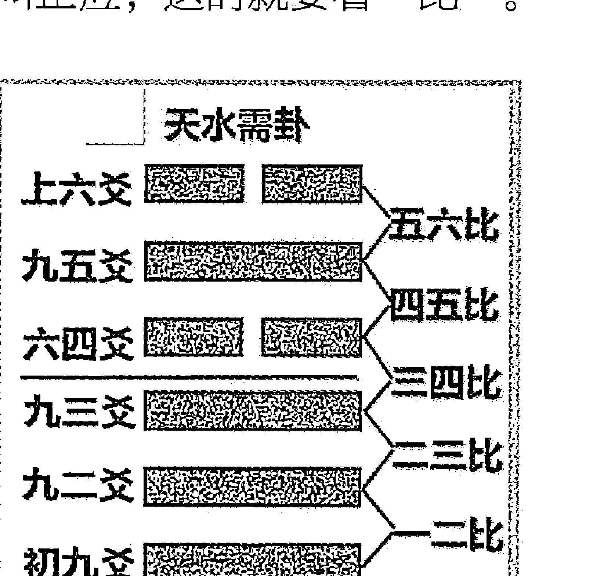

##### 4、 “天、地、人” 三才

古人把宇宙世界分为三层：上层为天，中层为人，下层为地。即“天、地、人”三才（见右图）。《周易·六十四卦》的六爻卦，也有“天、地、人”三才之分，具体是上爻和五爻代表天，四爻与三爻代表人，二爻与初爻代表地。“天、地、人”三才中的两个爻，也各有阴阳之分，代表天的五爻为阳，六爻为阴。代表人的三爻为阳，四爻为阴。代表地的初爻为阳，二爻为阴。这是研究《周易》卦象数术常用的一个重要知识。“天、地、人”三才与前面讲到的“气、流、固”三界联系起来看，就会发现非常的有意思，值得读者进一步去仔细参悟。

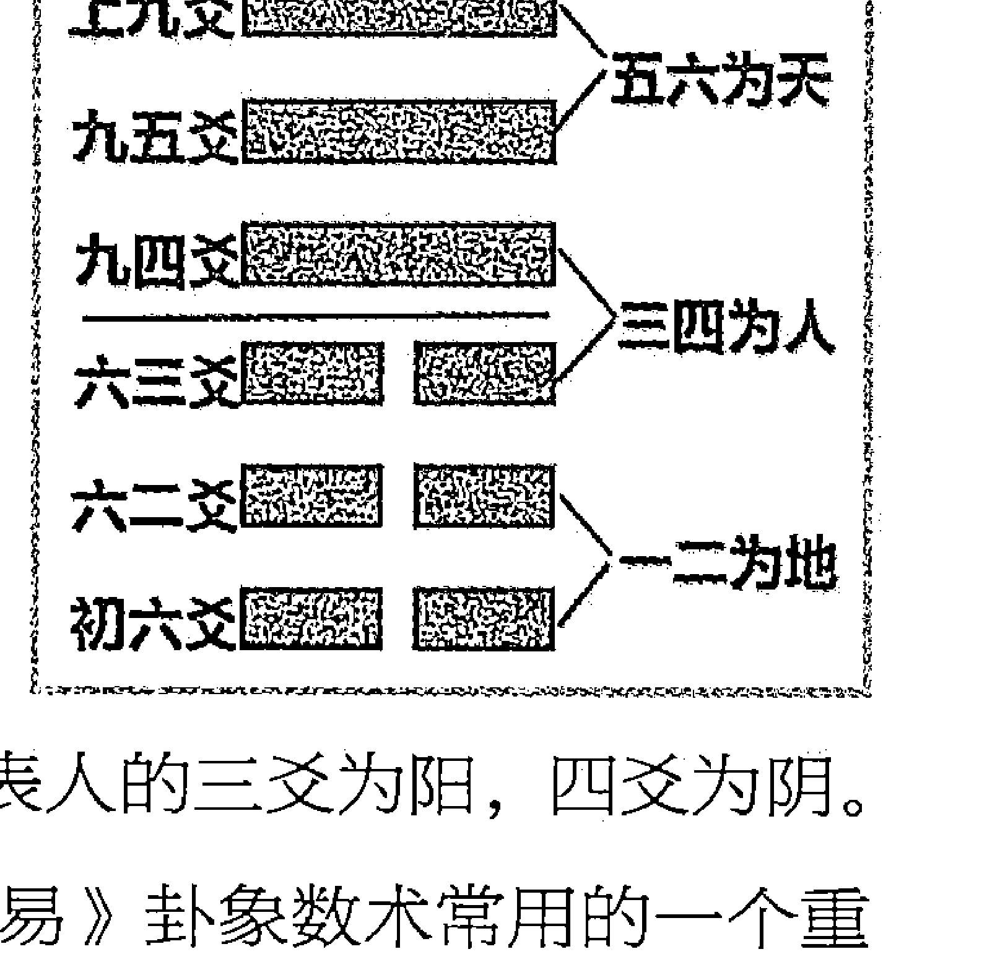

### 第五节 八卦取象

> 孔子在《系辞·下传》中说：“古者包羲氏之王天下也，仰则观象于天，俯则观法于地，观鸟兽之文与地之宜，近取诸身，远取诸物，于是始作八卦，以通神明之德，以类万物之情。”

事万物建立起一个个的形象概念，即八卦代表八大类事物：乾为天、坤为地、震为雷、巽为风、坎为水、离为火、艮为山、兑为泽。这个在《梅花易数》中叫取象。这里的象就是把宇宙间的万事万物划分为八个大类，各类下边有男女老少、山川水泊、宫殿房舍、用具器物、植物花草、动物家禽等等，必须要把它们一一作出规整、定义和分类，让操作者一看见卦象就能联想到人与人、人与物、人与事等生动的形象。

《梅花易数》预测就是给万事万物分类画像，要弄懂这个问题，首先必须学习孔子的《易传·说卦》。史传《系辞·上传》、《文言》、《说卦》、《序卦》、《杂卦》这六篇大作是孔子研究《周易》的心得体会。孔子虽然说过：“不占而已矣”。但是，他老人家确实是一个地地道道的占卜高手，读完《说卦》你就会明白一切。

#### 一、何谓《说卦》？

著者认为《说卦》是预测的理论基石，它是孔子结果累积的研易心得，面对复杂纷呈的万事万物，变化莫测的自然环境。如何理清这些乱象呢？“物以类聚，人以群分”，智慧的孔子想出了一个很好的方法，建立概念，归类立象，集为《说卦》。所以，预测学命定的就以《说卦》为基石，读者不可不参。

《说卦》一共分为十一章内容，具体如下：

- 第一章：昔者圣人之作《易》也，幽赞于神明而生著，叁天两地而倚数，观变于阴阳而立卦，发挥于刚柔而生爻，和顺于道德而理于义，穷理尽性以至于命。
- 第二章 昔者圣人之作《易》也，将以顺性命之理。是以立天之道曰：阴与阳；立地之道曰：柔与刚；立人之道曰：仁与义。兼三才而两之，故《易》六画而成卦。分阴分阳，选用柔刚，故《易》六位而成章。
- 第三章 天地定位，山泽通气，雷风相薄，水火不相射，八卦相错。数往者顺，知来者逆，是故《易》逆数也。
- 第四章 雷以动之，风以散之，雨以润之，日以烜之，艮以止之，兑以说之，乾以君之，坤以藏之。


##### 第五章 帝出乎震，齐乎巽，相见乎离，致役乎坤，说言乎兑，战乎乾，劳乎坎，成言乎艮。

万物出乎震，震东方也。齐乎巽，巽东南也；齐也者，言万物之絜齐也。离也者，明也，万物皆相见，南方之卦也。圣人南面而听天下，向明而治，盖取诸此也。坤也者，地也，万物皆致养焉，故曰：致役乎坤。兑，正秋也，万物之所说也，故曰：说言乎兑。战乎乾，乾西北之卦也，言阴阳相薄也。坎者水也，正北方之卦也，劳卦也，万物之所归也，故曰：劳乎坎。艮，东北之卦也。万物之所成终而所成始也，故曰：成言乎艮。

##### 第六章 神也者，妙万物而为言者也。

动万物者，莫疾乎雷；桡万物者，莫疾乎风；燥万物者，莫熯乎火；说万物者，莫说乎泽；润万物者，莫润乎水；终万物始万物者，莫盛乎艮。故水火相逮，雷风不相悖，山泽通气，然后能变化，既成万物也。

##### 第七章 （八卦之性情）

- 乾，健也。
- 坤，顺也。
- 震，动也。
- 巽，入也。
- 坎，陷也。
- 离，丽也。
- 艮，止也。
- 兑，说也。

##### 第八章 （远取诸物如此）

- 乾为马，
- 坤为牛，
- 震为龙，
- 巽为鸡，
- 坎为豕，
- 离为雉，
- 艮为狗，
- 兑为羊。

##### 第九章 （近取诸身如此）

- 乾为首，
- 坤为腹，
- 震为足，
- 巽为股，
- 坎为耳，
- 离为目，
- 艮为手，
- 兑为口。

##### 第十章

乾，天也，故称乎父。坤，地也，故称乎母。震一索而得男，故谓之长男。巽一索而得女，故谓之长女。坎再索而得男，故谓之中男。离再索而得女，故谓之中女。艮三索而得男，故谓之少男。兑三索而得女，故谓之少女。

##### 第十一章

乾为天，为圆，为君，为父，为玉，为金，为寒，为冰，为大赤，为良马，为老马，为瘠马，为驳马，为木果。（为龙、为直、为衣、为言）。

坤为地，为母，为布，为釜，为吝啬，为均，为子母牛，为大舆，为文，为众，为柄，其于地也为黑。（为牝（pin）、为迷、为方、为囊、为裳、为黄、为帛、为浆）。

震为雷，为龙，为玄黄，为专，为大途，为长子，为决躁，为苍筤竹，为萑苇。其于马也，为善鸣，为馵足，为作足，为的颡。其于稼也，为反生。其究为健，为蕃鲜，（为五、为鹄）。

巽为木，为风，为长女，为绳直，为工，为白，为长，为高，为进退，为不果，为臭。其于人也，为寡发，为广颡，为多白眼（为杨、为鹤），为近利市三倍，其究为躁卦。

坎为水，为沟渎，为隐伏，为矫輮，为弓轮。其于人也，为加忧，为心病，为耳痛，为血卦，为赤，为黑皮肤、为瘦小、为智慧。其于马也，为美脊，为亟心，为下首，为薄蹄，为曳。其于舆也，为多眚，为通，为月，为盗。其于木也，为坚多心。（为宫、为律、为可、为栋、为丛棘、为狐、为蒺藜、为桎梏）。

离为火，为日，为电，为中女，为甲胄，为戈兵。其于人也，为大腹。为乾卦，为鳖，为蟹，为蠃，为蚌，为龟。其于木也，为科上槁，（为牝牛）。

艮为山，为径路，为小石，为门阙，为果蓏，为阍寺，为指，为狗，为鼠，为黔喙之属。其于木也，为坚多节。（为鼻、为虎、为狐）。

兑为泽，为少女，为巫，为口舌，为毁折，为附决。其于地也，为刚卤。为妾，为羊，（为常、为辅颊）。

从《易传·说卦》中不难看出，宋代易学大师邵雍就是根据孔子的《易传·说卦》创立有自己特色的预测系统——《梅花易数》。如离为中女、为中午、为马，兑为少女、为金器、为毁折。所以，邵氏在《梅花易数》案例中：就用这些简单的卦象所代表的人和事物，也就是根据象、数、理，预测到有两个女子明日晚上前来折花，其中一少女跌倒摔伤的神奇预测，至今传为佳话。

#### 二、邵雍的八卦万物类象

前边介绍了孔子的研易心得《说卦》，著者认为邵雍的“八卦万物类象”很可能是在《说卦》基础之上，总结自己的实践经验得出的一套八经卦的物象分类方法。在这里介绍大家。

- 1、乾（☰）卦五行属金，卦数一，代表的物象为如下方面。
  - 天时：天、冰、雹、霰。
  - 地理：西北方位、京都、大郡、形胜之地、高亢之所。
  - 人物：君父、大人、老人、长者、宦官、名人、公门人。
  - 人事：刚健勇武、果决，多动少静、高上下屈。
  - 身体：首、骨、肺。
  - 时序：秋、九月、十月之交，戌亥年、月、日、时，五金年月日时。
  - 动物：马、天鹅、狮、象。
  - 静物：金玉、宝珠、圆物、木果、刚物、冠、镜。
  - 屋舍：公府、楼台、高堂、大厦、驿舍、西北向之居。
  - 家宅：秋占宅兴隆，夏占宅有祸，冬占宅冷落，春占宅吉利。
  - 婚姻：贵官之眷，有声名之家，冬占宜成，夏占不利。
  - 饮食：马肉、珍味、多骨、肝肺、干肉、干果、诸物之首、圆物、辛辣之物。
  - 生产：易生，秋占生贵子，夏占有损，坐宜向西北。
  - 求名：有名、宜随朝内任，刑官、武官、武职、掌权，宜向西北之任、天使、驿官。
  - 谋望：有成、利公门，宜动中有财，夏占不成，冬占多谋少成。
  - 交易：宜金玉、宝珠、贵货、易成，夏占不利。
  - 求利：有财、金玉之利，公门中得财，秋占大利，夏占损财，冬占无财。
  - 出行：利于出行，宜入京师，利西北之行，夏占不利。
  - 谒见：利见大人，有德行之人，宜见官贵、可见。
  - 疾病：头面之疾、肺疾、筋骨疾、上焦病、夏占不安。
  - 官讼：健讼、有贵人助，秋占得胜，夏占失理。
  - 坟墓：宜向西北，宜乾山气脉，宜天穴，宜高，秋占出贵，夏占大凶。
  - 方道：西北。
  - 五色：大赤色，玄色。
  - 姓名：带金傍者，商音，行位一、四、九。
  - 数目：一、四、九。

#### 三、《周易要义》的八卦配象

清代易学大家宋书升，光绪十八年(1892年)中进士，钦点翰林院庶吉士。他博学强记，遍读经史。其所著《周易要义》一书，上溯河洛，中萃汉宋，下采毛惠、张焦诸家之说，取精扬粕，形成独具风格的一家之言。他认为研究《周易》必须从天文、算术入手，成此书时年近七旬，刻版尚未竣工故去。一生著作丰富，多在死前焚毁，仅存有《周易要义》。庆幸的是该书于1988年由齐鲁书社出版。《周易要义》（卷十）有八卦配象，值得象数研究者借鉴，现与大家共同分享：

- 乾为直，为衣，为玄，为武人，为王，为德，为祥，为闲，为系，为包，为大车，为水，为塞，为輦，为就，为疾，为鸠，为梱，为辐，为韅，为云。
- 坤为迷，为方，为囊，为裳，为黄，为帛，为大君，为主，为宗，为天子，为臣妾，为章，为载，为承，为德，为事，为随，为朋，为众，为林，为肉，为肤，为否，为蔑，为荒，为羞，为霜。
- 震为鼓，为道，为享，为遂，为躬，为趾，为克，为侯，为笑，为伐，为莽，为茹，为敦，为纳，为容，为安，为埴，为簋，为樽，为爵，为斗，为彝，为牖，为阶，为屋，为筐，为触，为锡，为生，为交，为振，为驱，为鬽，为盘桓，为建，为行，为飞鸟，为鹤，为奔，为遯，为所，为至，为坦坦，为门庭，为鹿，为苋，为舍，为盱。
- 巽为杨，为淩，为鱼，为命，为允，为牵，为茅，为死，为即，为鸿，为誉，为葭，为旆，为弋，为系，为须，为泣，为蹢躅，为杞，为舆，为恝恝。
- 坎为宫，为律，为栋，为业棘，为狐，为蒺藜，为桎梏，为束，为约，为休，为习，为素，为忧，为恤，为光，为宠，为跛，为禽，为车，为河，为泉，为桑，为行师，为征，为疑，为须，为寇，为矢，为收，为硕果，为祇，为侧，为不快，为酒，为食，为泥，为涂，为涕，为基斧，为轮，为怀，为不宁，为魃魉，为谷，为窑，为匕鬯，为孕，为汗，为刑，为杀，为鼠，为膏，为幕，为弧，为引，为闻，为不觌，为限，为大首。
- 离为墉，为园，为福，为祉，为裯，为彭，为狱，为惕，为敬，为缶，为罔，为巷，为薰，为戎，为好，为饮，为食，为舆，为祭祀，为瓮，为袥，为葈，为繻，为赏，为面，为穴，为晦，为药，为视，为眇，为牛革，为鼎铉，为壶，为光。
- 艮为鼻，为处，为拔，为威，为颐，为戎，为祐，为居，为陵，为丘，为庐，为侵，为错，为不食，为执，为藩，为揪，为拘，为狩，为登，为跻，为升，为拇，为户庭，为圭，为愠，为瓜，为豹，为贝，为资，为背，为羽，为飞，为休，为机，为求，为挈，为马，为号咷，为不出，为失，为掔，为拯。
- 兑为辅颊，为言，为和，为喜，为咲，为获，为得，为突，为致，为嗟，为歌，为瓶，为取，为号，为鸣，为发，为徲，为告，为虎，为葛藟，为隼，为叶，为耕，为蓄，为衍衍，为说，为大号。

以上是对儒家圣人孔子的《说卦》，宋代易学家邵雍的《八卦万物类象》和清代学者宋书升的《八卦配象》分享，这对于梅花易研究者来说都是预测中必须应用的基础性学习资料。

#### 四、象、数、理的解读

老子《道德经》云：“道之为物，惟恍惟惚。惚兮恍兮，其中有象；恍兮惚兮，其中有物。窈兮冥兮，其中有精，其精甚真，其中有信。”可见有物必有象数，有象必有信息。《周易》预测入门首先要涉及三个抽象的问题：象、数、理。宋人邵雍在《梅花易数》中说：“君子于《易》，玩象、玩数、玩辞、玩意（理）。象起于形，数起于质，名起于言，意起于用。有意必有言，有言必有象，有象必有数。数立则象生，象生则言彰，言彰则意显。”这是古代易学大师对象、数、理的精辟阐述。

##### 1、何谓象？

象是万事万物表现出来的形状各异的外在形象。是《周易》理论特有的一种表现形式。天有天象，地有地象，人有人象，物有物象，卦有卦象，不同事物有其不同的形象和模样，这是形式上的象。
象不需要文字解释，也不要语言表述，一看就明白是什么样子。就像欣赏一幅画，一看那个精巧的构图，柔和的色调、均匀的线条、鲜艳的色彩、协调的神韵，画中的寓思想就表示得明明白白，不管是男人女人、是中国人还是外国人，心灵感受的喜怒哀乐，真善美丑是相同的，这就是象的绝妙之处。北宋易学家刘牧在《易数构隐图序》中说：“卦者，圣人设之，观于象也。象者，形上之应，原其本，则形由象生，象由数设。”这就是所谓的有象就有数。

##### 2、何谓数？

数是一个很朴素的概念。老子说：“道生一，一生二，二生三，三生万物。”此所谓道有其数。现代科学认为，宇宙间万事万物都离不开数，任何存在的物质，都可以用数字来表示。《周易》理论认为奇数为阳，偶数为阴，乾一、兑二、离三、震四、巽五、坎六、艮七、坤八，所有的卦象都有其数。《周易·系辞》曰：“天一、地二、天三、地四、天五、地六、天七、地八、天九、地十。天数二十有五，地数三十。凡天地之数五十有五。”古人认为，天地之间万事万物都有其定数。
邵雍的儿子邵伯温说：“数者何也？道之运也，理之会也，阴阳之度也，万物之纪也。”想想看，某个人出生于1970年10月8日，年龄40岁，身高1.78米，体重80公斤，胸围105cm，腰围76cm，脚穿42码的鞋，可以跳2米高等等，这就是这个人身上存在的数。根据这些数字，就可以判断此人可能是运动员，或者是体育爱好者。现代数学中，任何东西都可以用数字把它表示出来。

##### 3、何谓理？

理是合乎自然规律的客观存在，是一种约定成俗的公认道理和科学推理，也是一个哲学概念。理是人们从长期生活实践中总结出来的，经过反复验证有效，而被公众普遍认同的一种符合自然逻辑思维的规律，或者标准。如：从一个人的行为语言和为人处事的细节，可以断定他（她）是有修养的人，或者没修养的人；这个人生活经历丰富、聪明睿智，或者是阅历浅薄、笨拙愚钝；以及他是个很有思想，或者没有思想的人等等。
另外，理还可以从一件事情的起因形成、时间过程、发展趋势，用生活中自然科学的规律，来推断其未来发展的吉凶结果。
总而言之，象、数、理是《梅花易数》预测的关键三要素，有人说还有一个占。著者认为占只是指起卦的形式，也就是预测的前提。同样的卦，用“六爻”预测和“梅花易”预测的分析途径有所不同，如果用“小成图”、“六壬”预测，与前者的两种方法更是大相径庭。读者必须详细比较，仔细体悟其中的奥秘。

## 第三章 起卦与体用的确定

### 第一节 如何起卦

《周易·六十四卦》由六爻卦组成，它的成卦方式很多。这里介绍常用的十种起卦方法。

**第一种：卜筮起卦法。** 这是最原始、最古老的、原汁原味的占卜方法，就是用50根蓍草棒来卜卦，按一步步所得的数构成卦象，卜三次成一爻，卜十八次才能成六个爻，六个爻组成一个具体的卦，再结合本卦、变卦卦象和卦爻判断吉凶祸福，这是《周易》预测最为正宗的一种古老方法。宋儒朱熹在《周易本义》一书中有详细介绍，因为其操作复杂，工具笨重不便携带，所以，现在人很少使用此法，详情不再叙述。

**第二种：铜钱摇卦法。** 据说此法始于汉代京房派，起卦方法是用三枚内方外圆的铜钱，放于手心，双手合掌抱成一个空间，摇一摇铜钱，再将铜钱抛于案上，以背为阳、数字为3，字为阴、数字为2。即三个背面为老阳9，两背一字为少阴8，一背两字为少阳7，三个字面为老阴6。摇一次得一爻，依次从初爻向上排列，摇六次得一卦。然后根据老阴、老阳的变化，确定变爻与变卦。六爻预测时根据所得卦象，再给每一爻配上天干地支，六亲和六神，并确定世爻和应爻，依此分析预测未来的吉凶祸福。如果是梅花易数预测，成卦之后，只需要找出体卦和用卦就可以分析推测。

**第三种：生日起卦法。** 根据一个人出生的（农历）生年、生月、生日、生时所占地支的数字起卦，也叫四柱起卦法。取某人的生年、生月、生日地支的排列的数，将三个数字相加之和用8去除，以余数得出上卦，再将前三个数之和加上时辰数之和用8去除，以余数得出下卦，再将四柱相加的总数除以6，以余数确定应爻，也就是变卦的那个爻位。这种方法起卦与第二种铜钱摇卦法不同的是先得出上卦、然后得到下卦。
例如：乙丑年、庚午月、甲申日、丁卯时出生的人，年丑为2、午月为5、甲申日为16、丁卯时为4。数字：2、5、16、4。
即：2+5+16=23，23÷8=2余7，7为艮象，得外卦（即上卦）为艮（☶）象；23+4=27，27÷8=3余3，3为离（☲）象，得内卦（即下卦）为离（☲）象，得本卦山火《贲卦䷕》；在将总数27除以6确定变爻，即：27÷6=4余3，九三爻变动，离（☲）象变为震（☳）象，得变卦山雷《颐卦䷚》，然后根据本卦《贲卦》与变卦《颐卦》判断预测事情的吉凶结果（见右图）。

**第四种：文字起卦法。**

写几个字，以所写字的笔划数起卦。如：三个字，以前面两个字的笔划数之和除以8所得余数取上卦，再将三个字的总笔划数之和除以8所得余数取下卦，总数除以6，确定动爻，其起卦计算方法与第三种相同，不再赘述。

**第五种：时间起卦法。**

根据问卦人到场时间，以问卦人打来电话的时间，或者所预测事件发生的年、月、日、时的数字起卦。这个也叫即时起卦法。成卦方法与第三种方法相同。

**第六种：报数起卦法。**

此法是让求测者报两个、或者三个数字；也可以是两组、或者三组数字。

- 如报两个数：7、8。7为艮，8为坤，艮上坤下，得本卦山地《剥卦䷖》。总数：7+8=15，15÷6=2余3，六三爻动，变卦为八纯卦《艮卦䷳》。
- 然后按卦象去分析吉凶祸福。

**第七种：手机号码起卦法。**

现在通讯工具手机的广泛使用，有人探索用手机号码起卦方法，以此法预测持手机主人的运气好坏。现举两种方法：

-   前 5 位、后六位起卦。手机号码共 11 位。如：13995112566，前 5 位之和为：27÷8=3 余 3，为离（☲）象做上卦，后 6 位之和为：21÷8=2 余 5，为巽（☴）象做下卦，得本卦火风《鼎卦䷱》。总数：27+21=48÷6=8。上六爻动，得变卦雷风《恒卦䷟》，然后按梅花易解卦。
-   后四位起卦法。前两位为上卦，后两位为下卦。如上例：25、66。2+5=7，为艮（☶）象，取上卦，6+6=12÷8=1 余 4，为震（☳）象，取下卦，得本卦山雷《颐卦䷚》。总数：7+12=19÷6=3 余 1，初六爻动，得变卦山地《剥卦䷖》，再按传统的方法推断分析。

以上介绍的九种起卦方法，是古人总结的、最实用，而且较为普遍的《周易·六十四卦》成卦方法，学习者可以认真体悟，灵活使用。

#### 第八种：外应起卦法。

根据突然听到的一种声音，或者发现一种现象等，都可以起卦。《梅花易数》起卦的方法是灵活多样的，也符合变易的基本思想。外应起卦法是一种快捷的预测方法，它抓取的时间、空间信息往往是比较准确的，现在很时尚的叫它“梅花心易”。这些知识宋人邵雍在《梅花易数》中有详细介绍，此处不再赘述。

#### 第九种：抽签起卦法。

此法一般用于寺庙求签预测，将《六十四卦》做成六十四根签，求测者任意抽出那一根就是那一卦，卦辞不是《六十四卦》经文中卦辞，而是用一段故事性的诗句，说明一个意向的导语，由解签的人为求测者指点迷津。此方法一般专业预测者不用。

#### 第十种：扑克牌起卦法。

扑克牌起卦法是著者多年来琢磨创立的一种全新的起卦方法。就是把扑克牌中红桃、黑桃、方片、梅花4种牌的6、7、8、9，共 16 张牌取出来，用它们来起卦。操作方法在本书第十九节“扑克牌预测”简介，详细理论著者将在《扑克牌与梅花易》一书中再做明细介绍，此处不再赘述。

### 第二节 应爻、体卦、用卦的确定

按照《梅花易数》传统之法，如果卦象一个爻动时，就以爻动作为应爻，以应爻所在的卦象作为用卦。这个标准只有用数字起卦时才能正确使用。如果采用铜钱摇卦方法，出现的结果肯定不是唯一的，一般情况下有可能出现七种不确定因素。

-   一是所得的卦六个爻无动爻，得到一个静卦，将总数除以6，按余数定动爻。
-   二是可能所得的卦只有一个动爻，动爻可能在内卦，也可能在外卦。
-   三是所得的卦有两个动爻，可能两个动爻全在内卦，或者动爻全在外卦，也许内卦、外卦各有一个动爻。
-   四是所得的卦有三个动爻，可能三个爻全动在内卦，或者全动在外卦；也许内卦两个爻动、外卦一个爻动；也可能内卦一个动爻，外卦两个动爻。
-   五是所得的卦有四个动爻，可能内卦三个动爻、外卦一个动爻；也许内卦两个动爻、外卦两个动爻；或者是内卦一个动爻、外卦三个动爻；
-   六是所得的卦有五个动爻，可能内卦三个动爻、外卦两个动爻；或者内卦两个动爻、外卦三个动爻。
-   七是所得的卦是六个爻全动，出现由《乾卦☰》变《坤卦☷》，或者由《坤卦☷》变《乾卦☰》。就是所谓否极泰来的突然变化。

在这多变的情况下，就遇到如何确定“应爻”、“体卦”和“用卦”的问题。著者下面大致分五种情况作以详细说明。

-   第一种情况：如果是一个、两个、或者三个动爻，动爻全在内卦，外卦无动爻，这时就以内卦为用卦，以外卦为体卦。
-   第二种情况：如果是一个、两个、或者三个动爻，动爻全在外卦，内卦无动爻，那么就以外卦为用卦，以内卦为体卦。
-   第三种情况：如果内卦和外卦都有动爻，也可以选动爻多的卦为用卦。如内卦一个爻动，外卦两个、或者三个爻全动，那就以外卦作为用卦，以内卦作为体卦；如果外卦一个爻动，内卦两个、或者三个爻全动，那就以内卦作为用卦，以外卦作为体卦。

#### 第四种情况：

用这种传统方法，即六个爻总数除 6 确定应爻。著者发现其中忽略了一个至关重要问题，那就是商数是奇数、还是偶数。根据多年来的实践经验，如果六爻数字加起来除以 6，商数为奇数，就从上爻向下数余数，确定应爻；如果六爻数字加起来除以 6，商数为偶数，就从初爻向上数余数，确定应爻。（大多数情况下忽略这个，直接从初爻数余数）这个问题非常重要，学习者要仔细体悟其中的道理，如其不然，失之毫厘，差之千里。

例：本卦天地《否卦䷀》；变卦风雷《益卦䷩》，内卦和外卦各有一个爻动。用总数除以 6 确定用卦和用爻。即六个爻的总数：6+8+8+9+7+7=45 ÷ 6=7…余 3，商数 7 为奇数，那就从上爻向下数 3 个数，九四爻 9 为用爻，外卦乾象为用卦，内卦坤象为体卦。假如这个商数为 6，是偶数，余数是 3，那就从初爻向上数 3 个数，六三爻就是用爻，内卦坤象为用卦，外卦乾象为体卦。然后，按照《梅花易数》分析预测结果。这个问题有点绕，请读者仔细琢磨，方能领悟其中实质性的东西。

#### 第五种情况：

如果6个爻都是少阴少阳,得到静卦时,应爻如何确定呢？还是用 6 个爻的数字相加之和，除以 6，如果商数为偶数，余数从初爻向上数确定应爻和用卦；如果商数为奇数，余数从上爻向下数确定应爻和用卦，这时候无动爻的卦就是体卦。

### 第三节 体卦与用卦的关系

在《梅花易数》预测中，正确判定“体卦”、“用卦”是预测关键的一步。体卦简称体，用卦简称用。如何准确、灵活的掌握和应用“体”与“用”之间的连带关系，就必须要搞清楚什么是“体”？什么是“用”？

#### 一、何谓体？

从哲学的角度看，体是矛盾者双方的内因，是主动的因素，代表事物本身。在《梅花易数》预测中，体指的是问卦者本人，一般指的是六爻卦中的内卦。如果是间接的代别人求卦，体所指的是代替问卦的人。

体是指事物的本身，因为人生活在纷繁的矛盾和复杂的人际关系之中，我们经常讲人在任何情况下都要摆正自己的位置，也就是将自己摆在自身该处的位子上去。摆对了位置，就叫得体得位。如果摆错了位置，叫做错位，或者叫不得位。这就需要调换位置，或者说叫换位思考，著者把这个叫做体不得位。

#### 二、何谓用？

从哲学的角度讲，用是矛盾者双方的外因，是被动的因素，代表事物周边或者外围环境。在《梅花易数》预测中，用指的是问卦者想知道的事情，一般指的是六爻卦中的外卦。它可以是某一个人、亲戚、领导、长辈，也可以代表水灾、地震、战争、功名、天雨、地位、钱财、官司、住房、家具、饮食、衣服、信件、消息、动物、家禽等等。在间接代人求卦的情况下，用往往指的是被代之人所需要、请求事件的未来趋势、方位、地点和重要变化的时间窗口。

数字起卦时，“体”和“用”往往很难保证各得其位，由于动爻为应、为“用”。如果动爻在外卦，“用”就在外卦，“体”就在内卦，此为“体、用”得位；如果动爻在内卦，“用”就在内卦，而“体”就在外卦，这叫“体、用”不得位。就好比原告和被告坐错了席位，这个就必须调整座次，如是而已。

如果用铜钱摇卦，往往有六爻全动。或者一个爻、两个爻、三个爻、四个爻、五个爻动的时候。也有六爻不动的情形。所以，体与用的确定就要另当别论（上一节讲过，不再赘述）。

#### 三、何谓体生用？

在《梅花易数》中，一旦数字成象，卦象确定，下一步就是按照阴阳五行相生相克、一年四季月令旺衰的原理，判断体和用之间的关系。如内卦“体”为乾（☰）象，乾为金；外卦“用”为坎（☵）象，坎为水，乾金能生坎水，就是体生用。体生用是指自身生别人，一般指主人有付出，有损失肯定不好，其它各卦如离火生坤土、艮土；震木、巽木生离火；坎水生震木、巽木等，以此类推。所以，体生用被视作自己生对方，一般按取舍和损失而论。

#### 四、何谓用生体？

同理，预测卦成之后，要按照阴阳五行相生相克、月令旺衰的原理，判断体用之间的关系。如外卦“用”为坤（䷁）象，坤为土；内卦“体”为兑（䷹）象，兑为金，坤土能生兑金，这就是用生体。即别人生自己，有收入，能得到好处，肯定是好事啊！其它各卦依此类推。一般情况下，用生体被视作好事可期，得利纳财，顺风顺水，吉祥如意。

#### 五、何谓体用比和？

通俗地讲，比和就是指外卦和内卦的五行属性为同类。如内卦“体”卦为震（䷲）象，震为木、为长男，外卦“用”卦为巽（䷸）象，巽为木、为长女，震木见巽木，属于同类。长男与长女夫妻正配，处于和谐状态，此所谓的体用比和。再如：外卦“体”为兑（䷹）象，兑为金，内卦“用”为乾（䷀）象，乾为金，兑金与乾金相遇，也属同类，这个也叫比和。如坎（䷜）水见坎（䷜）水，离（䷝）火见离（䷝）火，震（䷲）木见震（䷲）木，其它依此类推。一般情况下，体用比和被视作握手言和，平等和谐，气息相通，和平相处，事随人愿。

#### 六、何谓体用相克？

顾名思义，克就是制约、克制。比如内卦“体”卦为震（䷲）象，震为木、为长男，外卦“用”卦为兑（䷹）象，兑为金、为少女，兑金能克震木，少女克长男之象，这叫用克体。如同事情克制本人，用克体一般看作遇到麻烦，大事受阻，没有外援，视为不吉。一般情况下，用克体指事与愿违、乃大凶之象。

再比如内卦“体”卦为震（䷲）象，震为木、为长男，外卦“用”卦为坤（䷁）象，坤为土、为母亲，震木能克坤土，长男克母亲之象，此为体克用。这就如同自己制服了对手，视作胜利者。一般情况下体克用，预示好事来临要延迟一些时日，为获利受益之象，其它各卦依此类推。

#### 七、何谓难克、难生？

八卦化为五行，五行有旺衰之分，主要以月令是否当令、当旺来确定五行属性的旺衰。如一年当中，春季木旺、火相、水泄、金囚、土绝；夏季火旺、土相、木泄、水囚、金绝；秋季金旺、水相、土泄、火囚、木绝；冬季水旺、木相、金泄、土囚、火绝。

例如“体”卦为震（☰）象，震为木，“用”卦为兑（☱）象，兑为金，“体”和“用”之间形成兑金克震木的“用”克“体”关系。如果在春季，震木当旺，兑金处于绝地，这时候兑金是无法克震木的，衰金反而会被旺木所侮，这就是所谓的反克。

再比如春季木旺，得“体”卦为坎（☵）象，坎为水，“用”卦得乾（☰）象，乾为金，“体”和“用”之间形成金生水的“用”生“体”关系，可是春季木旺，金处绝地，无法生水，所以春季木旺、坎水泄气。“体”卦坎水就无法得到“用”卦乾金来生的能量，只能等到下半年金处于旺地的月份，才能得到“金生水”的能量。

以上是所谓的难克、难生。这个是《梅花易数》预测的关键所在，各位读者在学习时要仔细琢磨，用心感悟。鉴于五行生克在前一章已经讲述，此处不再赘述。

### 第四节 吉凶的分析推断

在《梅花易数》预测中，排好卦之后的第一件事就是推断预测吉凶。有八个关键步骤，必须要掌握好。一要看本卦；二要看变卦；三要看体和用是否得位；四要看互卦；五要看覆卦（也叫错卦）；六要看复原卦（也叫综卦）；七要看本卦与什么卦互通；八要看卦象五行的月令旺衰。

#### 一、何谓本卦？

本卦就是用传统方法起好的这个卦是个什么卦象。不管是根据年、月、日、时辰，报数字，报生日，或者是用铜钱摇的卦象，首先要看它是属于《周易·六十四卦》中的哪一个卦。

例如：壬辰年二月十八日午时，博友说：何老师您好，请帮我看看卦，我开了家翡翠店，2月和3月，阴雨潮湿天，生意都不太好。请问这个店以后生意如何？得数字：5、2、18、7。

数字起卦: 5+2+18 = 25 ÷ 8 = 3…余1，1为乾（☰）象，外卦取乾（☰）象，25+7 = 32÷8 = 4…余0，0为坤（☷）象，得本卦天地《否卦▅▅▅▅▅▅▅▅》；32÷6 = 5…余2，2为兑（☱）象，六二爻动，得变卦天水《讼卦▅▅▅▅▅▅▅▅》，体用互不得位，互卦不用，本卦的覆卦为地天《泰卦▅▅▅▅▅▅▅▅》，《否卦▅▅▅▅▅▅▅▅》与《泰卦▅▅▅▅▅▅▅▅》相通，变卦《讼卦▅▅▅▅▅▅▅▅》的复原卦为《需卦▅▅▅▅▅▅▅▅》。

#### 二、何谓变卦？

周原岐山地区民间有句俗话：“这人又变卦了！”所以，在六十四卦六爻卦中，变卦是一种很常见的情况。用年、月、日、时辰，报数字，报生日起的卦，一般变爻只有一个。以上卦为例：外卦为乾（☰）象，内卦为坤（☷）象，得本卦天地《否卦▅▅▅▅▅▅▅▅》；总数32÷6 = 5…余2，2为兑（☱）象，六二爻变动，本卦《否卦▅▅▅▅▅▅▅▅》变卦为天水《讼卦▅▅▅▅▅▅▅▅》。

用卜筮起卦法和铜钱摇卦法起卦时，情况就复杂了。很可能六个爻得到的全是少阴（八）、少阳（七），那这个卦就没有变（爻）卦；也可能得到的全是老阴（六）、老阳（九），那这个卦六个爻都得由阴变阳、由阳变阴。所以，变卦很不确定，有时候有一个爻变，有时候两个爻变，或者是三个爻、四个爻、五个爻变，六个爻全变的情形，特殊情况下也会出现六个爻没有变爻的时候。

因为《周易》六十四卦讲的就是事物辩证法。所以，任何一卦，随时都存在“变卦”，由于“变卦”产生变化。有了变化说明事态是发展运动的，不是静止不动，这就符合“变易”的哲学思想。因为《周易》存在很多的变数，所以后来人们把《周易》（易经）叫做《变经》。在日常生活中人们经常说：“这件事变卦了”、“你又变卦了”等等。“变卦”二字也就成为民间的一个口头禅流传至今。

#### 三、何谓体用得位与不得位

古人云：阴有阴位，阳有阳位。
《周易》阴阳二元论讲究就是物归其位。一般情况下，用卦在外，体卦在内，视为体用得位，这个是古人规定的，后世一直沿用这个规矩。那么究竟什么是体用是否得位呢？如果外卦的九四爻、九五爻、上九爻其中任何一个爻变动，内卦三个爻安静不动，这个就叫做体用得位。

还是以上卦为例：外卦为乾(☰)象，内卦为坤(☷)象，得本卦天地《否卦䷋》；六二爻变动，变卦为天水《讼卦䷅》。变爻在内卦，用就在内卦，体只好在外卦，这个就叫做体用不得位。

如果内卦的初九爻、九二爻、九三爻其中任何一个爻变动，外卦三个爻安静不动，这个就叫做体用不得位。

总而言之，确定用爻一般是看动爻在内卦还是在外卦，如果外卦爻动，内卦爻静，视为体用得位；外卦爻静，内卦爻动，视作体用不得位。所谓的“得位”指的是各自处在自己应该处的位置；“不得位”指的是自己站在了别人的位置上，别人错站在了你的位置，这个肯定不合适，就需要相互调整。此为《梅花易研究精要》预测的关键环节，大家一定要搞清楚。否则，失之毫厘，差之千里。

#### 四、何谓互卦？

互卦的概念是邵雍先生在《梅花易数》原著中定义的概念。还是以上例来说：本卦天地《否卦䷋》变卦为天水《讼卦䷅》。本卦的二爻、三爻、四爻为艮(☶)象，三爻、四爻、五爻为巽（☴）象，所以，互卦为风山《渐卦䷴》；变卦天水《讼卦䷅》的二爻、三爻、四爻为离（☲）象，三爻、四爻、五爻为巽（☴）象，变卦的互卦为风火《家人卦䷤》。互卦主要是用来分析内卦与外卦之间相互联系的因素和条件。体用得位时一定要看互卦；体用不得位时，位置站错了，这个互卦也就错了，既然是错误的，互卦就省去不用。这时候主要看本卦的覆卦和变卦的复原卦。覆卦是指站在对方的位置看卦象、想问题。

特殊时候，互卦也可用来直读数字，如天地否卦，初爻、二爻、三爻为坤（☷）卦，数字为8。二爻、三爻、四爻为艮（☶）卦，数字为7。三爻、四爻、五爻为巽（☴）卦，数字为5。四爻、五爻、上爻为乾（☰）卦，数字为1。由下往上直读数字为8751，由上往下直读数字为1578。这个在预测经济数字，或者预测股市涨与跌时是很管用方法。

#### 五、何谓覆卦？

覆者，反向也，倒过来看的意思。覆卦是指将一个卦整个翻过来所形成的卦。覆卦也叫做综卦。如《泰卦䷊》变《否卦䷋》，再如《鼎卦䷱》变《革卦䷰》。通俗的讲，覆卦就是站在对方角度看卦象、看问题。以上卦为例：本卦天地《否卦䷋》，覆过去站在外面向里看就是地天《泰卦䷊》。再如火风《鼎卦䷱》，烹饪之象，覆过去站在别人那边看，就是泽火《革卦䷰》，就有改革之意。

为什么要看覆卦？道理很简单，当事者双方在某些问题，争执不下的时候，中间人就会让双方相互站在对方立场去思考问题。同样一件事情，站在甲方的立场看是好事，那么，站在乙方的立场看可能就是坏事。这个叫做以己推彼，以彼度人，阴阳互变，知往察来的换位思考。特别强调，如果体卦与用卦不得位时，看互卦就出现差池，必须把卦象覆过来，调整好位置，再做卦象分析。下面举一例与一位“不速之客”易友的切磋卦例。

2017年农历腊月初八上午9时46分，腊八小年，雨雪纷纷。突然接到一个陌生人电话。对方自称姓王，研究数术多年，现人在你们单位办公楼上，问你们周易文化研究所在那里办公？出于习惯，著者马上即时起卦。得数字：10、12、8、6。

### 数字起卦：

10+12+8=30 ÷ 8=3…余 6，6 为坎（☵）象，外卦取坎（☵）象，30+6=36 ÷ 8=4…余 4，4 为震（☳）象，内卦取震（☳）象，得本卦水雷《屯卦䷂》。总数：36 ÷ 6=6，6 为坎象，上六爻动，得变卦风雷《益卦䷩》。

推测分析：以体为自己，以用为来人。

-   1. 本卦水雷《屯卦䷂》，坎上震下，水生木，用生体之象，预示来人对我有生，见面应该是好事情。
-   2. 变卦风雷《益卦䷩》，巽上震下，巽木见震木，比和之象，预示两个人见面的气氛是很愉快的。
-   3. 看本卦与变卦的覆卦。本卦《屯卦䷂》的覆卦为山水《蒙卦䷃》，卦辞：“匪我求童蒙，童蒙求我。”说明这人见我心情十分迫切；变卦《益卦䷩》的覆卦为山泽《损卦䷨》，卦辞：“损上益下。”说明我有损失。

于是，我给对方说让他在我们办公的二楼等，我赶紧开车赶过去。见面很愉快，相互交流了研易心得，我给来者赠送个人专著《周易卷》一本，还有《周易与生活》《中国宝鸡周易》两本期刊（这也算我有损失）。

对方说自己研究易学与数字20多年，对数理研究有自己的一套办法。

我就让他用我的手机号码(13092916001)起一卦看看。对方说本卦山天《大畜卦䷙》，九二爻动，变卦山火《贲卦䷕》。他说：从本卦大畜卦看，你后边事业越来越好、宏图大展。从变卦山火《贲卦䷕》看，老师你后面的名声会越来越大。

听完易友简单的分析，我笑着对他说：你这个卦体用不得位，我认为是要看覆卦的。山天《大畜卦䷙》的覆卦为天雷《无妄卦䷘》，乾金克震木，用克体之象，事业克本人，预示我要成功本来是无希望的事情；变卦山火《贲卦䷕》的覆卦为火雷《噬嗑卦䷔》，震木生离火，体生用之象，说明要成功必须要做出很大的付出和努力。好在目前农历腊月水旺当令，用卦乾金泄气，体卦震木逢生气，来日小有名气还是可以期待的。

说完我顺便把接他电话后起的卦陈述了一番。他说：老师断卦灵活，注重覆卦和复原卦，使我耳目一新，今天拜访不虚此行啊！

#### 六、何谓复原卦？

老子曰：“道可道，非常道；名可名，非常名。”当得来的卦象是体用得位时就是“常道”，每当得来的卦呈现体用不得位时，就是“非常道”。因此，就不能以所得卦来解读所要预测的事情。一旦照本宣科，必将差之千里。这是一个非常关键的概念，初学预测者一定要理解其中的道理和奥秘。否则，将事与愿违，必然得出错误答案。著者所说的复原卦，有人把它叫错卦。因为六十四卦的变化是错综复杂的。

复原卦是把变卦的内卦和外卦互换位置，也就是纠错之后的卦象，这个是著者悟出来的，在实际应用中应验很高，故作出定义性的规定。

以上卦为例，本卦天地《否卦䷋》，六二爻变，变卦为天水《讼卦䷅》，变卦在内卦，用在内卦，体在外卦，这就遇到了体用不得位。体用不得位时，一定要看变卦的复原卦。复原卦就是把变卦的外卦调下来，把内卦翻上去看。即以上卦为例：调整后变卦天水《讼卦䷅》的复原卦就要按水天《需卦䷄》来判断。只有调整好位置，才能达到体用各得其位，才能做出比较准确的预测决断。

#### 七、何谓互通？

通俗地讲错卦就是互通。《说卦》中说：“天地定位，山泽通气，雷风相薄，水火不相射，八卦相错。数往者顺，知来者逆，是故《易》逆数也。”什么意思呢？说的是八纯卦《乾䷀》与《坤䷁》，《艮䷳》与《兑䷹》，《震䷲》与《巽䷸》，《坎䷵》与《离䷷》，相互之间存在阴变阳、阳变阴，阴阳相互转化的变数。

简言之，就是说本卦与变卦之间存在一种相互变化转换的关系。如本卦为天地《否卦䷋》，通过六爻全变，就变成地天《泰卦䷊》。具体一点讲，就是当下为《否卦䷋》，现状不看好，通过时间推移，坏事逐渐会变成好事，就是三阳开泰的《泰卦䷊》。弄懂了这些道理，就掌握了“知常达变”。这个问题在后边讲《乾卦䷀》与《坤卦䷁》互变时我们再细述其中的道理。

#### 八、何谓五行月令旺相

一年四季里，春季（寅、卯、辰月）木旺，夏季（巳、午、未月）火旺，秋季（申、酉、戌月）金旺，冬季（亥、子、丑月）水旺。每一个季度的最后（辰、未、戌、丑月）18天为土旺。旺与衰是针对月令来判定的。十二个月就像一个大单位有十二个领导轮流值班一样。该谁值班，谁的权力就大，不该值班时权力相对就小一些，这就形成了五行在四季各月份中有旺衰，这个在断卦分析中是至关重要因素。如果春季得《大壮卦䷡》，六五爻动，震为用卦，乾为体卦，体金克用木之象。但是，春季木旺金死，乾金失令，它克不了震木，反而会让震木来侮，就是反克。只有等到春季三月土旺，或者等月令到了七月、八月，乾金逢生气或者当令，方能制服震木，如此而已。

著者一直认为：万物皆有缘，诸事起有因；事理全在悟，大道不远人。以上所讲的这八个问题，在《梅花易数》预测判断吉凶中至关重要，是提高个人预测技能的关键步骤。读者必须反复推敲琢磨，深刻领会其中要领，千万不可忽视这个细节。

### 第五节 地支“冲、合”断吉凶

《周易·系辞》曰：“易有圣人之道四焉，以言者尚其辞，以动者尚其变，以制器者尚其象，以卜筮者尚其占”。孔子告诉我们预测是《周易》四大功能之一。从周代迄今，关于《周易》预测的书籍可谓汗牛充栋，且方法之多杂，引历朝历代隐士大儒为之探求真谛。现代科学认为，人类对宇宙自然的认知充其量不过百分之十。世人认为，揭示宇宙密码的金钥匙就是中国经典文化——《周易》。这里主要想告知研究预测学的朋友，人类预知未来的学问，有《周易》文化奠定的基础，通过不断地探求，在不远的将来一定会创研出一个程序化的理论体系来预知明天。

中国农历纪年中的地支：子、丑、寅、卯、辰、巳、午、未、申、酉、戌、亥十二相之间有六冲、六合。大多数人认为逢冲是凶，逢合为吉，其实这是一个静止的、片面的缺乏辩证思想的认识。六冲、六合在《周易》六爻预测、《梅花易数》、《奇门遁甲》、六壬数术、四柱命理学中都有非常重要的用途。冲与合究竟是吉是凶，根据著者近三十年的经验，必须辩证对待，特殊情况下巧妙运用冲与合可以不卜而断吉凶祸福。

#### 一、逢冲有四吉四不吉之分

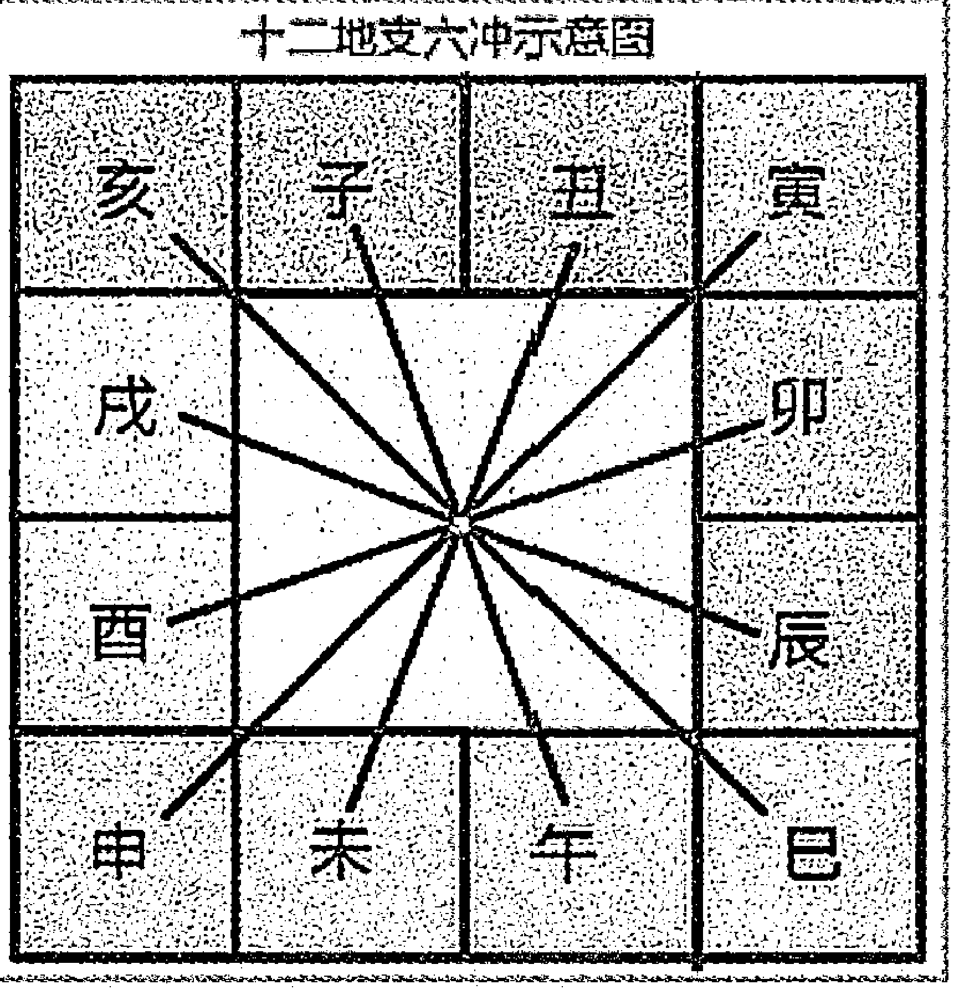

农历十二相（地支）之间有：子与午、丑与未、寅与申、卯与酉、辰与戌、巳与亥，称作六冲，也就是说在一个太极圆上180度时两个属相就形成对冲（见六冲图）。例如2011年是兔（卯）年，属鸡（酉）的人，逢之卯酉相冲犯太岁，所以说属鸡的人该年份流年不利；反过去，太岁在鸡（酉）年时，酉卯相冲，属兔（卯）的人就犯太岁。其实，在日常实际应用中，六冲有四吉、四不吉之分，必须仔细详察。

##### （一）逢冲有四吉

- 一吉工作调动顺利 如属鸡之人兔年办理工作调动，卯酉相冲，逢冲必动。当年的二（卯）月或者八（酉）月份大多就能事随人愿，轻松调动，此其一也。
- 二吉官司离婚立决 打官司、闹离婚一定要逢冲，逢冲时双方都有及时了却麻烦的意愿。如属马（午）的人遇到官司和离婚的纠纷，一般在鼠（子）年或十一（子）月就可以顺利协商结案或者协议分手。2010年腊月初，咸阳市有个党老板来宝鸡咨询我讨债打官司一事。此人1957年生属鸡（酉），我当时对他说：“不用推算了，对方现在没钱，等明年农历二（卯）月初二之后，你去讨债，不用打官司你就会讨回债务的。”后来他依我所言，回去照此办理。2011年4月份党老板专程从咸阳来宝鸡，高兴地对我说：“何老师，今天专门来宝鸡看你，570万元债务啊！今年二月初六一次讨回了500万元，跟您说的完全一样，余下的70万啥时间给都行，我的一桩大心事就算了结了。”

**三吉小病不药而愈** 一个平时非常健康的人如果得了小病，逢冲必愈。如属虎（寅）的人，农历四月得了病，一般不能很快痊愈，到了七（申）月，寅申相冲，即可冲去疾病、不药而痊愈。其它属相同样是小病逢冲必愈，此其三也。

**四吉测事准时起动** 如想知道要办的事情进展如何，逢冲必然启动；如属龙（辰）的人八月预测事情进展，一定要等到九（戌）月，辰戌相冲，事情必然启动。再如出差旅行，逢冲之日，必然准时出发上路，此其四也。

##### （二）逢冲四不吉

**一不吉婚姻不幸福** 在男女婚事上，我遇到过好多属相相冲的婚姻，如虎男猴女，兔男鸡女，猪男蛇女，鼠男马女等等，大多数人都是生活中小吵不断的过了大半生，有些闹到要离婚的地步，但最终却没有离得了。因为男为阳、女为阴，阴阳对冲，才能溅起爱情的火花。但是，可以肯定，最起码他们前半辈子很难有和谐可言。因为，逢冲不是金木相克，就是水火相悖，所以，就不会有平安的日子，此其一也。

**二不吉出门要谨慎** 出门远行一定要看出行方位与太岁、月建是否有冲。如，属狗（戌）人在龙（辰）年或三（辰）月要去东南方向，特别在路途一定得多加小心，要预防不测之殃、飞来之祸的发生，以免伤及自身，此其二也。

##### 三不吉久病难活命

古语：近病小病逢冲必愈，久病大病逢冲必死。

例如 2010 年农历九月二十九日是个星期五，我刚下班进了家门，有朋友打来电话说：“他父亲年事已高、久病住院，问近日吉凶如何？”他父属蛇（巳），当年九月小，第二天就是十（亥）月初一，正好逢月建“亥”与其父属相“巳”形成对冲。我立即告诉朋友：不用预测了，就这一两天的事，该准备什么就准备吧！结果第二天（星期六）上午 9 点 40 分其父就去世了。此其三也。

##### 四不吉游子不回家

如预测长期外出、久不归家之人几时回家。若逢八宫游魂卦，加之在外之人的属相与问卦之人或问卦之年、月相冲，那说明此人游兴未尽，根本没有任何要回家的念头，即使家人再急、再心切，那也是没有办法的事情，此其四也。

#### 二、逢合也有四吉四不吉之别

地支十二相之间有：子与丑、寅与亥、卯与戌、辰与酉、巳与申、午与未，称作六合，也就是顺地球旋转的方向两种物质相互作用，产生了同向的引力，它们是很容易走到一起的（见六合图）。如：太岁在牛（丑）年，属鼠（子）的人，丑与子相合，也叫太岁逢六合；反过去，太岁在鼠（子）年，属牛（丑）之人，是子丑相合。所以，大多数人认为逢合是吉利的事情，其实，逢合也有四吉、四不吉之别，千万不能忽视，不可不细察。

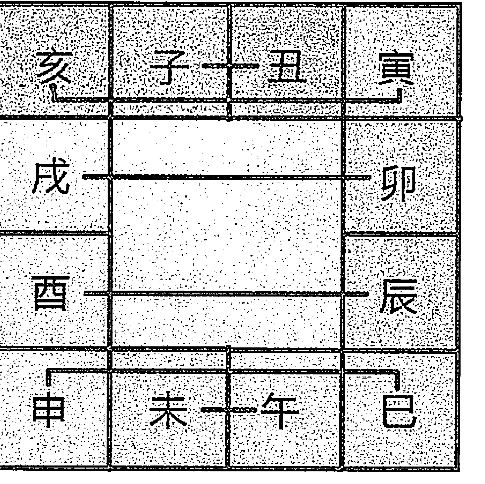

##### （一）逢合有四吉

一吉婚姻易成美满 按老祖宗留下的规矩，一般情况下男女合婚一定要属相逢六合或者三合局，逢合男女志向相同，感情笃深，爱情天长地久，家庭幸福美满；我有个本家侄子，他儿子是属牛的，找了一个比他大一岁属鼠的女朋友，双方家长都不愿意这门亲事。侄子来问我咋办？我对他说：子与丑相合，没有什么不好。你们就别太认真了，回去准备办喜事吧！后来两个孩子果然结婚，第一胎还生了一个大胖小子，双方家长都皆大欢喜。

二吉求财如愿以偿 预测做生意求财之事，一定要与对方相合。如六爻卦财来合世，逢合财来找我，生意送上家门，投资决策一拍即合，成功的几率很大，失败的几率很小，此其二也。

三吉官运仕途亨通 凡是涉及个人提拔升迁之事，本人的属相要与所谋事情、太岁、月建相合为吉。逢合容易得到领导赏识，好事专来找人，事业顺利畅通。2005年10月，有个（甲辰）年出生的朋友打来电话，问工作变动？我对他说：“你就安心等待吧！年内没门，明年农历三（辰）月，才能运作到位。”那朋友说：“你说其它的我都相信，这件事不可能。”结果，2006年3月25日我去西安开会碰见他，他说：“让你给说准了，估计新任职务4月初才能发文。”2006（戌）年冲他（辰）本人，辰戌一冲，必然能动。

四吉灾难巧逢救星 人逢困难或遇到灾祸的时候，往往要预测吉凶祸福。如所测之事与当事人相合，而且有生气，这说明遇事尽有贵人相助，山重水复之际，时来运转，定当柳暗花明，逢凶化吉的时刻即将就要到来，此其四也。

##### （二）逢合四不吉

- 一不吉官司难解难分 打官司、闹离婚，若每逢与太岁、月建相合，必定不是好事。逢合双方当事人主意未决，没有了结官司的打算，即是有理之事也难说得清楚，呈现难解难分的迷茫之势。所以，著者为人代笔写好诉状后，总是叮咛他逢冲之日到法院递交状子，就是怕官司打得难解难分伤神费心，此其一也。
- 二不吉疾病难以治愈 如果有人预测疾病，久病逢合，病情必然加重，或者旧病之外另添新疾，一时半月很难治愈，必须作持久与疾病作斗争的打算。如果是久病年事已高之人，那就该提早准备后事了啊。此其二也！

##### 三不吉出行尽有羁绊

好多人出远门办事前要预测。如果月、日、时与本人属相逢合，必定有事情绊缠，不能如期成行。如果是去他邦异域远行旅游，手续不能按时办理，美事暂时不能如愿。此其三也。

##### 四不吉男女暧昧滋生

如预测男女苟且暧昧之事，逢合必定暧昧滋生，私下以身相许，感情难分难舍，或者其中必有第三者从中插足，一定要妥善处理。否则小事闹大，大事成凶，人财两空，此其四也。

地支十二相的六冲与六合是中国古老的文化概念，它是两组相对而言的属相在四维时空相遇、相离的科学理论。逢冲是面对面直接而来的运动冲撞力，只会产生背离，相逢的机率很少；逢合是地球自然运转中越走越近的顺便不期而遇，没有相悖的条件，水到渠成，很容易就走到一起。这是一种普通的物理现象，并不是有什么神鬼从中作崇，读者要用科学的思维去理解。

> 荀子说：“善为易者不卜”

是在强调要注重阴阳之道的规律。由于孔子熟悉阴阳之道，所以他说：“不占而已。”学习灵活掌握冲与合的自然规律，学会辩证看待同一事情的两个层面，这样我们就可巧妙运用这些规律“不卜”而判断未来的吉凶祸福。

## 第四章 应期的判定

自从人类诞生以来，预测未来一直是人类梦寐以求的原始命题。在这个世界上，所有的预测方法中最主要、最精华的就是如何准确判定应期。不管是神秘莫测的《奇门遁甲》、细腻有致的《六爻纳甲》、玄机遁藏的《六壬术数》、简明扼要的《梅花易数》，还是未卜先知的《四柱命理》、《紫微斗数》、《邵子神数》，最困难、最重要、最精华的东西，一句话还是预测的应期问题。

从古到今，预测著作，汗牛充栋，蔚为大观，陈词宏论，实难把控，大多数都是隔靴搔痒，以讹传讹，一涉及到预测应期的精华部分就含混其词，玄而至玄，谁也不愿准确的和盘托出确定预测应期的真谛。虽说周文王、姜子牙、孔子、孙膑、诸葛亮、李淳风、袁天罡、邵雍、刘伯温等创立和发扬了预测文化，但迄今为止，“应期”仍然是预测研究者人人渴望知道的“谜底”。如果谁能准确掌握预测应期，谁就可能得到宇宙人生的破译密码，谁就是世人敬仰的预测大师。

如何破译和掌握这个神秘莫测的秘诀呢？本书著者经过三十多年的潜心研究，悟出了一套规律性东西，下面就给大家详细介绍这个破解千古至难命题的方法，这也是《梅花易研究精要》的精华章节，请读者仔细阅读体悟。

### 第一节 何谓应期

#### 一、什么是应期

按照预测学的一般常理，应期是指在某一个时间结点预测某一桩事情，所测之事的最终结果会在某年、某月、某日这个时间段成功兑现。比如说有人要预测工作调动，想知道这件事情那一个月的某一日或者在某日至某日之间办成事情；再比如，有一个孩子突然走失，家人十分着急，想通过预测知道这个孩子在外平安与否？什么时间能回来？或者在什么地方，并且能尽快找到他。举宋代易学大师邵雍的两个卦例，说说应期的判定：

例一、邵雍《梅花易数：观梅占》记载：“康节先生偶观梅，见二雀争枝坠地，先生曰：‘不动不占，不因事不占。今二雀争枝坠地，怪也。’”因占之，辰年数五，十二月十二数，十七日十七数，共三十四数，四八除三十二，得二属兑（☱）为上卦，加申时九数，总得四十三数，五八除四十，零得三数为离（☲），作下卦，又上下总四十三数。以六除，六七除四十二，得一为动爻，是为泽火革卦（䷞），初九爻变咸卦（䷞），互见乾巽姤卦（䷠）。断之曰：明晚当有女子折花，园丁不知而逐之。女子失惊坠地，伤其股。又兑金为体，离火克之；互中巽木，又逢乾金兑金克之，则巽木被伤。而巽为股，故有伤股之应，幸变为艮土，兑金得生，知女子有伤而不至凶危也。”

例二、邵雍《梅花易数：牡丹占》记载：“巳年三月十六日卯时。先生与客往司马公家共观牡丹。时值花开甚盛。客曰：“花盛如此，亦有数乎？”先生曰：“莫不有数，且因问而占可矣。”遂占之，以巳年六数，三月三数，十六日十六数，总得二十五数，三八除二十四，零数为乾（☰），为上卦；加卯时四数，共得二十九数，又三八除二十四，得零五为巽（☴）卦，作下卦，得天风姤卦（䷫）。又以总数二十九数，以六除之。四六除二十四，得零五爻动。变鼎卦（䷱），互见重乾卦（䷀）。遂谓客曰：“怪哉，此明日午时，当为马所践毁。”众客愕然不信。次日午时，果有贵官观牡丹。二马相啮，群至花间驰骤，花尽为之践毁。”

以上两个古卦例中，邵雍先生所预测的“明晚当有女子折花”和“次日午时，果有贵官观牡丹”，这就是梅花易预测中所谓的应期。在预测学中，应期是最难把握的环节。它决定预测的准确性，是代表预测水平高低的关键体现。学习者当认真参悟古人的经典卦例，寻找准确的分析途径，更好地掌握提高自己的预测技能。

#### 二、邵雍对应期“速”与“迟”的判定

邵雍的《梅花易数》卷二，序中说：夫先天者，已露之机；后天者，未成之兆也。先天则有事，始占一事之吉凶；后天则有所未知，而出仓猝之顷，而休咎验焉。故先天为易测，后天为难测也。先天则有执着而成卦，后天触物即有卦。此全在人心神之所用也。其能推测之精，所用之活，则一事一物莫逃之数矣。我居者为中，现于前者为离（☲），现于后者为坎（☵），出于左者为震（☳），出于右者为兑（☱）；在我左角者为艮（☶），在我右角者为乾（☰），左前角者为巽（☴），右前角者为坤（☷），此八卦位也。
八方而定吉凶，立八卦而定克应；取时日而定吉凶，观变爻而定体用。故我坐，则其祸福应二卦成数之间；我立，则其祸福应于中分二卦之间。大抵坐则静，行则动，立则半动半静。静则应迟动则应速。凡有触于我而有意，以为我；二吉凶，则吉凶在我，应验在人意者。何如？盖八卦之画既定，六爻之断既明，仍余以生克之理，究以刑；中之蕴，万无一失矣。近取诸身，远取诸物，仍当以心求，不可以迹求，不可拘泥于物圆为天卦，物方为地卦，是为序。

以上是宋代易学大师邵雍《梅花易数》断卦的真知灼见，在此介绍给大家。由于篇幅原因，此处不做过细节解读，留于读者朋友仔细阅读，在实践应用中体悟其中之奥秘。

### 第二节 月令、节气与应期的划定

#### 一、阴历干支与十二消息卦

在农历（即阴历）天干地支纪年中，每一年、每一月、每一日、每一个时辰的名字都是由一个天干和一个地支组合而成的。十天干：甲、乙、丙、丁、戊、己、庚、辛、壬、癸。十二（生肖）地支是：子、丑、寅、卯、辰、巳、午、未、申、酉、戌、亥的两两组合。从甲子、乙丑开始，到壬戌、癸亥，十个天干转六圈，十二个地支转五圈，纪年就完成了一个六十年甲子大循环。下一个新的甲子又重新开始，循环往复，古人把这六十年叫做一个花甲子，即一个大的纪年单元（见六十年花甲干支表）。

> “天地之气运，北而南则治，南而北则乱，乱久则复北而南矣。天道人事皆然，推之历代可见，消长之理也。”

宋代易学家邵雍在《梅花易数·观物外篇》中说：

| 甲子 | 乙丑 | 丙寅 | 丁卯 | 戊辰 | 己巳 | 庚午 | 辛未 | 壬申 | 癸酉 |
| :--- | :--- | :--- | :--- | :--- | :--- | :--- | :--- | :--- | :--- |
| 甲戌 | 乙亥 | 丙子 | 丁丑 | 戊寅 | 己卯 | 庚辰 | 辛巳 | 壬午 | 癸未 |
| 甲申 | 乙酉 | 丙戌 | 丁亥 | 戊子 | 己丑 | 庚寅 | 辛卯 | 壬辰 | 癸巳 |
| 甲午 | 乙未 | 丙申 | 丁酉 | 戊戌 | 己亥 | 庚子 | 辛丑 | 壬寅 | 癸卯 |
| 甲辰 | 乙巳 | 丙午 | 丁未 | 戊申 | 己酉 | 庚戌 | 辛亥 | 壬子 | 癸丑 |
| 甲寅 | 乙卯 | 丙辰 | 丁巳 | 戊午 | 己未 | 庚申 | 辛酉 | 壬戌 | 癸亥 |

古人认为，春夏为阳，天下则治，秋冬为阴，天下则生乱，这显然是没有科学依据的。但四季节气的循环往复是中国古人总结出来的一种宇宙天文的自然规律，寒来暑往，春秋交替，这个被科学认知的现象是恒久不变的。

#### 二、《周易》十二消息卦

《周易》十二消息卦是由乾宫：

- 乾卦（䷀）、姤卦（䷫）、遁卦（䷠）、否卦（䷋）、观卦（䷓）、剥卦（䷖）六卦
- 坤宫：坤卦（䷁）、复卦（䷗）、临卦（䷒）、泰卦（䷊）、大壮卦（䷡）、夬卦（䷪）六卦组成的。

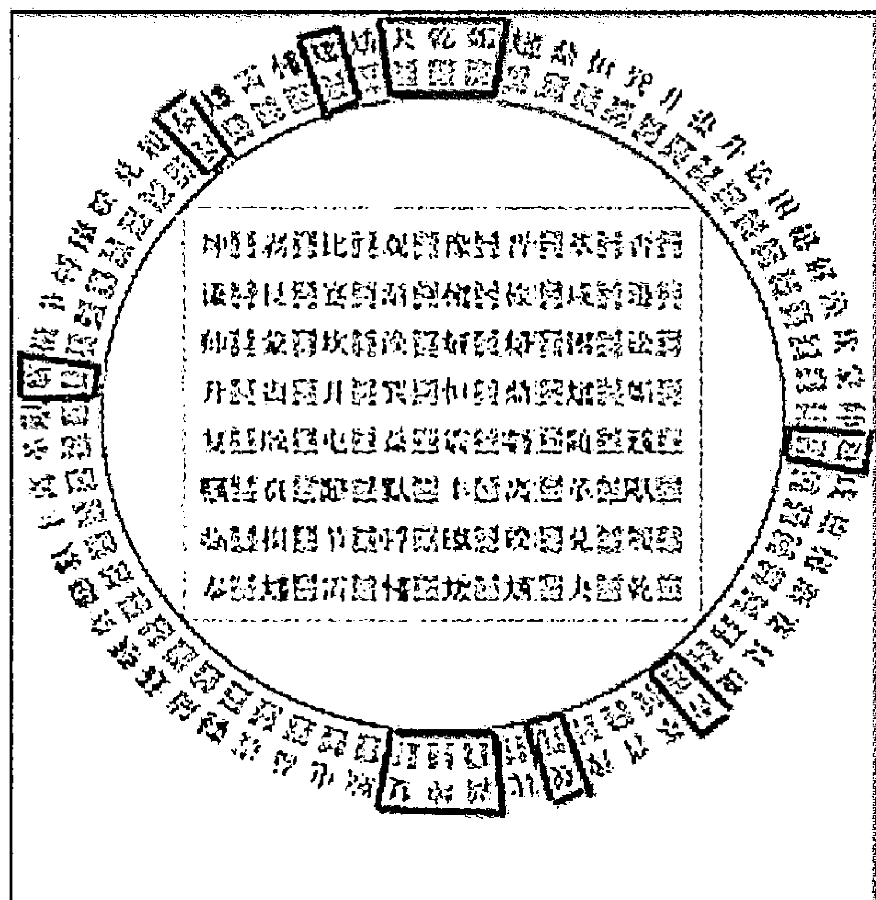

它主要表示一年春、夏、秋、冬中十二个月的时令变化。《周易》十二消息卦首先从农历子（十一、冬）月复卦起始，依次为临卦、泰卦、大壮卦、夬卦、乾卦、姤卦、遁卦、否卦、观卦、剥卦，依次顺时针旋转到十月坤卦为止。循环一周，正好是一年时间，即为十二个月（见上图）。而且每一卦对应二十四节气中的两个节气（见下图）。

| 正月<br>JAN | 二月<br>FEB | 三月<br>MAR | 四月<br>APR | 五月<br>MAY | 六月<br>JUN | 七月<br>JUL | 八月<br>AUG | 九月<br>SEP | 十月<br>OCT | 冬月<br>NOV | 腊月<br>DEC |
| :--- | :--- | :--- | :--- | :--- | :--- | :--- | :--- | :--- | :--- | :--- | :--- |
| 立春<br>雨水 | 惊蛰<br>春分 | 清明<br>谷雨 | 立夏<br>小满 | 芒种<br>夏至 | 小暑<br>大暑 | 立秋<br>处暑 | 白露<br>秋分 | 寒露<br>霜降 | 立冬<br>小雪 | 大雪<br>冬至 | 小寒<br>大寒 |

《周易·复卦》代表农历十一（子）月，也叫冬月。常言道：一九一阳生。冬至以前阴气至极，冬至一到，阳气产生。所以，冬月复卦卦象是一阳在五阴之下，象征一阳的种子已经入土，正在徐徐生发。邵雍认为：“五阴一阳之剥，代之以一阳五阴之复，表示以治代乱。治生于乱，乱萌于治，符合物极则反的法则。” 对应的节气为大雪、冬至。

《周易·临卦》代表农历十二（丑）月，也叫腊月。临卦两阳在四阴之下，六爻卦下面的两爻代表地，象征春天像幼苗一样将要破土而出了，它将给大地带来勃勃生机。对应的节气为小寒、大寒。

《周易·泰卦》代表农历正（寅）月，当北斗七星的斗柄指向东北寅位，时令就回到了农历的正月。所以，人们习惯用斗柄回寅指代正月。泰卦三阳在下、三阴在上，阴阳平衡，阴乘阳之气，阳得阴之生。人们常说的三阳开泰，就是指正月开始交上新春勃勃生机的好运气。对应的节气为立春、雨水。

《周易·大壮卦》代表农历二（卯）月，有一副古对联云：“火伞初离东海潮，玉兔涌出扶桑国”。火伞指的太阳，玉兔代表月亮，人们都知道太阳每天从东海面上出来，也是从东方卯位上升起。对应的节气为惊蛰、春分。

《周易·夬卦》代表农历三（辰）月。从卦象看六爻卦形成了五阳决一阴的卦象。夬卦告诉人们阳气已经升到了相当高的位置，时令不久将进入阳亢至极的状态。对应的节气为清明、谷雨。

《周易·乾卦》代表农历四（巳）月。乾卦六爻全是阳爻，象征阳气生发壮大到了顶峰状态。古人云：“日中则昃，月盈则亏”。阴极变阳，阳极生阴，乾卦卦象告诉我们阳气到头了，阴气即将产生。对应的节气为立夏、小满。

《周易·姤卦》代表农历五（午）月。姤卦五阳在上一阴在下，表示阴气已经滋生，处于萌芽状态。邵雍认为：“一阴五阳之姤，取代五阳一阴之夬，表示由治趋乱。”它告诉人们勃勃生机、热量至极的夏日将要过去，金秋凉爽的时日将逐渐来临。对应的节气为芒种、夏至。

《周易·遁卦》代表农历六（未）月。遁卦四阳在上两阴在下，告诉人们阴气已经进入加速来临的时期，炎热即将成为过去，秋天的凉爽将要扮演时令的主角。对应的节气为小暑、大暑。
《周易·否卦☰☷》代表农历七（申）月。否卦天在上、地在下，乾坤之象。三阳在上、三阴在下，表示阴阳达到相对平衡的状态，阴气以不断加速发展的趋势上升。对应的节气为立秋、处暑。
《周易·观卦☴☷》代表农历八（酉）月。观卦两阳在上、四阴在下，风行地上之象，告诉我们阴气已经呈现出明显的优势，秋天的凄凉加剧，寒气将继续加重。对应的节气为白露、秋分。
《周易·剥卦☶☷》代表农历九（戌）月。剥卦一阳在上、五阴在下，阴气旺盛已经达到绝对优势，一阳马上要被五阴所剥落。剥卦告诉人们阳气已经收藏，阴气成为冬天的主宰。对应的节气为寒露、霜降。
《周易·坤卦☷☷》代表农历十（亥）月。六爻全阴，坤卦表示阴气达到了至阴至极的限度，冬寒将慢慢过去，否极泰来，阳气马上就要诞生了。春天的种子已经到了入土的时令。对应的节气为立冬、小雪。
如此这般，十月《坤卦☷☷》下去再接十一月《复卦☳☷》，形成一年中的新一个循环往复。以上是《周易》十二消息卦与农（阴）历月令的对应联系，也是《周易》预测必不可少的时令判断条件。十二消息卦亦称“十二辟卦”、“十二君卦”、“十二月卦”、“十二主卦”等，汉代经学大师郑玄在《易纬》一书中说：“辟卦为君，杂卦为臣，四正为方伯。”郑玄认为“十二消息卦”像君主一样统领其他各卦。古人说：“阴阳消息。”所谓消息，消，指的是消弱；息，指的是生息。也就是说“十二消息卦”随着二十四节气，遵守一年四季中寒暑交替，阴阳消长生息的自然变化规律。
这里特别强调一点，每逢农历闰年闰月预测，在推断应期的时候，不妨参考一下二十四节气对应的月令，你将会收到意想不到的惊喜，请大家仔细琢磨领会其精华所在。

### 第三节 时间窗口

看过著者“梅花易数”预测卦例的朋友，肯定见到著者经常提及的一个时间窗口问题。什么是“时间窗口？”著者一直保留这个信息，没有详细告诉读者，因为，它是《梅花易研究精要》的精华。既然是精华，理当拿出来与大家分享，千万不能藏着掖着。但是，当今社会，物欲横流，人心悱恻，著者生怕有道德浅薄之人得之而捷足先登，而错传信息，误导世人。所以，在此书付梓之前著者一直心存疑虑未敢轻易示人。

原因是这样的，几年前著者在宝鸡举办《周易》文化公益讲座，有一次讲到“宇宙人生”一章的“人生一知三不知”概念，大家觉得著者对人生的这个认识非常切合实际。讲座结束，有一位年近八旬的长者听众对我说：“何老师，你总结的“人生一知三不知”非常精辟，我没有完全记住，你能不能把你的讲稿给我拿回去学习学习。”我当时觉得这位老人要学习研讨我讲授的问题，感到十分高兴，就顺手将两页纸质版的讲稿撕下来送给了这位老先生。

事过两年之后，我收到老先生送我的一本书。翻了几页，发现眼前的文字咋就这么熟悉呢？啊呀，这不是我“人生一知三不知”的讲稿吗！整整两页是我的东西啊！老先生竟然一字不落的成为自己著作的内容，关键是没有的注解标记。如此情景之下，使著者一时感到晕头转向，大惑不解，真不知说什么是好。这个世道真精彩，难道作为一个有知识素养的文化人，就这么堂而皇之、大大方方的抄袭别人的学术观点据为己有，而且印在了自己的著作中，没有任何引用脚注。更为令人不解的是他竟然还亲自将书交到了原创作者的手上，使我无言以对啊！我还能说些什么呢？古人云：吃一堑，长一智。因是之故，这个“时间窗口”概念就这样守口如瓶，秘而不宣的保留到今天，在著者自己的预测专著中首次展示给世人，由此引出了以上题外话。

#### 一、何谓时间窗口？

《周易·系辞》曰：“易有圣人之道四焉，以言者尚其辞，以动者尚其变，以制器尚其象，以卜筮者尚其占。”什么意思呢？简单的理解就是：圣人认为《周易》有四大功能，研究文学历史者就去学习其卦辞，研究哲学规律者就直接关注其变化，研究制造工艺者就去琢磨其形象，研究易学预测者就要推敲其卦爻象。诚哉斯言啊！说明《周易》具有预测功能。而且是圣人孔子所言，并非后学者名师所授，亦非著者杜撰，也算是为《周易》预测研究者找到了一点由头，或者说是辩解吧！

万物皆有缘，诸事起有因。大千世界，任何事物的发展变化，有其前因，必有后果。不管是良缘也罢，纵还是恶果也好，都是从“量”的积累，而达到“质”的飞跃，最终形成“质量”互变的结果。无论是由好到坏，还是由坏到好，总会有一个运行的线路和变化的过程，也就是人们常说的发展运行轨迹。

科学家发现西半球亚马逊雨林中一只蝴蝶的翅膀扇动了几下，几天之后，东半球这边可能就会发生毁灭性的地震灾害。发现堤坝上有小蚂蚁急匆匆的搬家，没准几个小时之后大雨倾盆，就会发生特大水灾。当然，我们要讲的是时间窗口，这就如同一架飞机今天上午10点钟从上海虹桥机场起飞，往西安方向而去，中午12点30分左右到达西安咸阳国际机场降落。有了飞机起飞的时间始点，就可以根据正常情况下飞机每小时内飞行的速度，推算出2个半小时后在西安咸阳国际机场着陆的具体时间。计算出来的这个飞行终点时间，就是这架飞机到达目的地西安的准确时间窗口。

如果天气发生异常变化，飞机就不一定是原来推算的时间窗口到达。前些年著者去青岛出差返回西安时，是下午16点在青岛机场准时登机，飞机准点从青岛机场起飞，两个小时飞到西安咸阳国际机场。可是那天天不作美，咸阳机场突降特大暴雨，云层太厚，加之大雨倾盆，飞机根本无法降落，在万米高空转了两个回旋后，向东飞行降落在河南郑州机场。在那里一直等了一个多小时，才得到咸阳机场那边雨过天晴的消息，飞机再次从郑州起飞，一个小时后到达咸阳机场。原来的时间窗口向后推移了3个多小时，这就存在一个时间窗口向后推移，或者向前移动的可能性。
著者这里要介绍的是易学预测的时间窗口。比如说，某一个人要办理工作调动，从某一时间点开始谋划，托人联系单位，寻找人际关系，按照组织程序办理相关手续，大约在某个月的中旬或者下旬可以办理妥当，这个时间就是这个人办理工作调动的时间窗口。当然，著者所讲的时间窗口也是总结自己30多年来研究易学的心得体会。根据一年四季春、夏、秋、冬的节气交替变化，以及时间与空间变化的自然规律，编制的一个时空运行程序，依此来判断和预知未来的时间区间和吉凶祸福。毛泽东同志有一句诗：“坐地日行八万里，巡天遥看一天河。”这里的八万里是地球赤道上的周长，也是地球运行一周的时间窗口。著者提出的这个“时间窗口”听起来似乎有点玄乎，但是很实用、也很准确，我们下面就具体讨论如何确定时间窗口。

#### 二、如何确定时间窗口？

> 孔子在《周易·系辞》中曰：“夫《易》何为者也？夫《易》开物成务，冒天下之道，如斯而已者也。是故圣人以通天下之志，以定天下之业，以断天下之疑。是故著之德圆而神，卦之德方以知，六爻之易以贡，圣人以此洗心，退藏於密，吉凶与民同患。神以知来，知以藏往，其孰能与於此哉？古之聪明睿知神武而不杀者夫。是以明於天之道，而察於民之故，是兴神物以为民用。圣人以此斋戒，以神明其德夫。是故阖户谓之坤，辟户谓之乾，一阖一辟谓之变，往来不穷谓之通。见乃谓之象。形乃谓之器，制而用之谓之法，利用出入、民咸用之谓之神。是故《易》有太极，是生两仪，两仪生四象，四象生八卦，八卦定吉凶，吉凶生大业，是故法象莫大乎天地；变通莫大乎四时；悬象著明莫大乎日月；崇高莫大乎富贵；备物致用，立功成器以为天下利，莫大乎圣人；探赜索隐，钩深致远，以定天下之吉凶，成天下之亹亹(wei)者，莫大乎蓍龟。是故天生神物，圣人则之。天地变化，圣人效之。天垂象，见吉凶，圣人象之，河出图，洛出书，圣人则之。《易》有四象，所以示也。系辞焉，所以告也。定之以吉凶，所以断也。”此为孔夫子对作《易》圣人上观日月天象，下知四时地理，中示人事富贵，精细至薇的精辟阐述。2500多年来，世人勤而时习之，细读而悟之，从中得到定吉凶，生大业之智慧与思维。

究竟如何确定“时间窗口”呢？易云：“一阴一阳谓之道。”老子曰：“阳极生阴，阴极生阳；盈极必损，盛极必衰；月盈则亏，日中则昃”。这个问题我们得回过头去，从乾坤两卦的相互变化说起。

##### （一）、阴极阳生。

古人云：穷则变，变则通；通则达，达则久。这个问题我们先从《周易·坤卦䷁》说起。

*   《坤卦䷁》的初六爻变动，一阳生成，就变成了《复卦䷗》；
*   《复卦䷗》的六二爻再变，两阳生成，就变成了《临卦䷒》；
*   《临卦䷒》的六三爻再变，三阳三阴对等，就变成了《泰卦䷊》；
*   《泰卦䷊》的六四爻再变，四阳生成，就变成了《大壮卦䷡》；
*   《大壮卦䷡》的六五爻再变，五阳生成，就变成了《夬卦䷪》；
*   《夬卦䷪》的上六爻再变，六阳代替六阴，就变成了《乾卦䷀》。

就这样通过六个爻位六次的逐步变化，使六爻全阴的《坤卦䷁》变成了一个阳刚十足的《乾卦䷀》（见下图）。此为“厚德载物”的阴柔向“自强不息”的阳刚转化的渐变过程。我们通过《坤卦䷁》的爻变产生《乾卦䷀》逐步变化，把它反过去看，就是《乾卦䷀》的爻变演化《坤卦䷁》的逐渐生成转化过程。

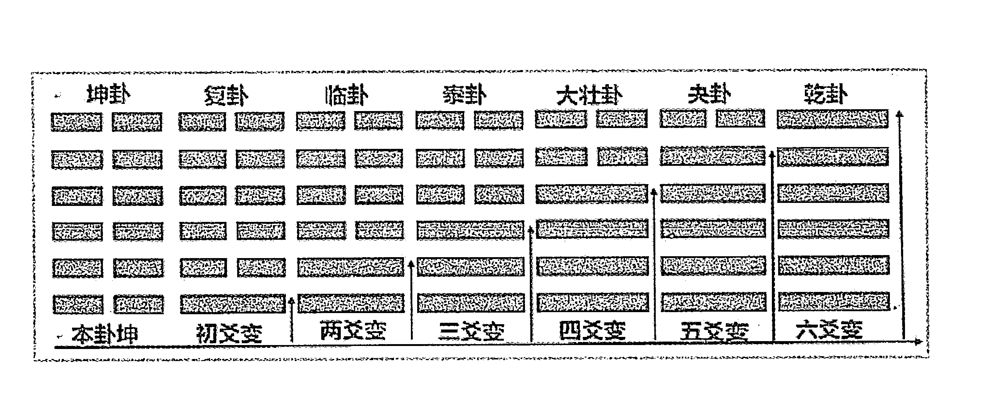

##### （二）、阳极生阴。我们再来一个逆向思维，从《周易·乾卦≡》阳极生阴说回去。

*   《乾卦≡》的初九爻变，一阴生成，就变成了《姤卦≡》；
*   《姤卦≡》的九二爻再变，二阴成双，就变成了《遯卦≡》；
*   《遯卦≡》的九三爻再变，三阴三阳平衡，就变成了《否卦≡》；
*   《否卦≡》的九四爻再变，四阴生成，就变成了《观卦≡》；
*   《观卦≡》的九五爻再变，五阴成象，就变成了《剥卦≡》；
*   《剥卦≡》的上九爻再变，六爻全变阴爻，就变成了《坤卦≡》。

非常的有趣，变卦就是这样通过六个爻位的逐步变化，使一个六爻阳刚十足的《乾卦≡》变成了六爻阴柔俱全的《坤卦≡》（见下图），又一次完成了“自强不息”的阳刚向“厚德载物”的阴柔转化的渐变过程。

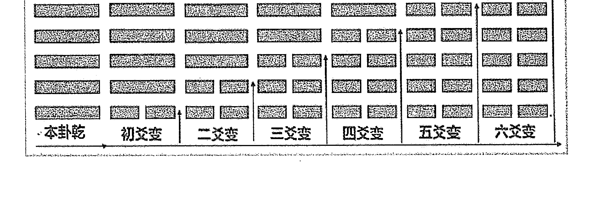

通过以上步骤由《坤卦☷☷》爻变转化为《乾卦☰☰》，再通过《乾卦☰☰》爻变转化成《坤卦☷☷》的变化过程，我们可以得出一个结论，把它叫做叫阴阳互变规律，或者叫质量互变规律。再引申一点也可以叫阴阳互通，即阴卦通阳，阳卦通阴是也，这是一个符合唯物辩证法的“能量守恒定律”。总结归纳出了规律，然后我们再联系“十二消息卦”所代表的月令，就可以从《乾卦☰☰》和《坤卦☷☷》的变化中找到“十二消息卦”与阴历的每一个月令之间形成的一一对应关系（见上图）。

| 乾卦 | 坤卦 |
|------|------|
| 四月 | 十月 |
| 三月 | 九月 |
| 二月 | 八月 |
| 正月 | 七月 |
| 十二月 | 六月 |
| 十一月 | 五月 |

冬至过后阳气逐渐生成，所以从《坤卦☷☷》十月始，《复卦☷☳》一阳生，就把《乾卦☰☰》的初九爻定为十一月；《临卦☷☱》两阳生，再把《乾卦☰☰》的九二爻定为十二月；《泰卦☷☴》三阳生，继续把《乾卦☰☰》的九三爻定为正月；《大壮卦☳☳》四阳生，再把《乾卦☰☰》的九四爻定为二月；《夬卦☱☳》五阳生，再将《乾卦☰☰》的九五爻定为三月；《乾卦☰☰》六阳生，最后把《乾卦☰☰》的上六爻定为四月（见下坤卦变乾卦示意图）。

| 坤卦 | 复卦 | 临卦 | 泰卦 | 大壮卦 | 夬卦 | 乾卦 |
|------|------|------|------|--------|------|------|
| 本卦坤 | 初六变 | 六二变 | 六三变 | 六四变 | 六五变 | 上六变 |
| 坤卦十月 | 十一月 | 十二月 | 正月 | 二月 | 三月 | 四月乾卦 |

夏至过后阴气逐渐生成，所以从《乾卦☰☰》四月始，《姤卦☰☴》一阴生，把《坤卦䷁》的初六爻定为五月；《遁卦䷠》二阴生，再把《坤卦䷁》的六二爻定为六月；《否卦䷋》三阴生，再把《坤卦䷁》的六三爻定为七月；《观卦䷓》四阴生，再把《坤卦䷁》的六四爻定为八月；《剥卦䷖》五阴生，再把《坤卦䷁》的六五爻定为九月；《坤卦䷁》六阴生成，所以，最后就把《坤卦䷁》的上六爻定为十月。这个推理结果证明，阴历一年的十二个月与乾坤二卦有着一一对应的内在联系（见下乾卦变坤卦示意图）。

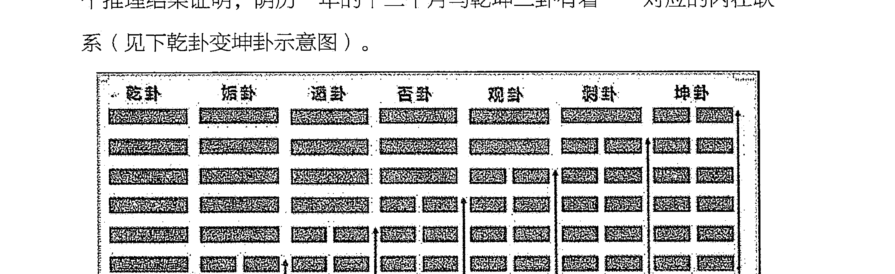

#### 二、月令的时间窗口

接下来著者根据六爻卦的初爻与四爻、二爻与五爻、三爻与六爻这三组卦爻阴阳对应关系，总结出了三组一年十二个月的循环与六爻卦爻位之间的对应关系，并推演出了《梅花易数》预测中解决月令对应卦爻的时间窗口问题。

月龄时间窗口对照表

| 对应组合 | 时间窗口（月） | 对应关系 |
|----------|----------------|----------|
| 第一组   | 十一、二、五、八 | 初爻与四爻 |
| 第二组   | 十二、三、六、九 | 二爻与五爻 |
| 第三组   | 一、四、七、十   | 三爻与六爻 |

*   第一组: 乾卦十一月与二月、坤卦五月与八月，对应初爻与四爻的关系；
*   第二组: 乾卦十二月与三月、坤卦六月与九月，对应二爻与五爻的关系；
*   第三组: 乾卦正月与四月、坤卦七月与十月，对应三爻与六爻的关系（见上图）。

以上推理总结出来的这三组数字，依此来预示时间变化有着奇妙的效果。这就如同我们给这台预测计算机编制了一个新的操作程序，即对卦爻做出定义性的规定。此为著者所要告诉大家的“月令时间窗口”。那么，创立了月令时间窗口，在实际预测中，究竟如何去应用时间窗口呢？下面举两个卦例演示给大家。

##### 例一、即时起卦（时间区间农历十一月至来年四月）：得本卦天水《讼卦☰》，九四爻动，震（☳）象，外卦为用（用指的是要问的事或人）、内卦为体（体指的是问卦人），用在外卦，体在内卦，著者把它称作体用得位；

《讼卦☰》的九四爻动，得变卦风水《涣卦☴》。本卦九四爻动爻对应农历二月，应爻对应农历十一月，变卦六四爻对应农历八月，应爻对应农历五月。那么，本卦与变卦的时间窗口合起来就是：农历的十一月、二月、五月、八月。著者预测时一般按本卦的动爻说事情，动爻应在农历二月，预示着这件事情应在二月这个时间窗口兑现，由于九四爻与初六爻为应，那么，此事应该在去年的农历十一月就开始酝酿了，今年农历二月很可能解决。要不然就会往后顺延，快则农历五月，慢则农历八月才会有确定的结果。如果这是预测一桩面临分手的问题婚姻，本卦用生体，乾金生坎水之象，看似主人能得到收获；变卦体生用，坎水生巽木之象，实际主人反倒要损失。应该是一个得理不让人的人，先起诉、后离婚，钱财未得，反而损失，劳燕分飞的悲惨结局（见右上“讼卦与涣卦”图）。

讼卦    --变--    涣卦
四月                十月
三月                九月
二月    动爻    八月    变爻
正月                七月
十二月              六月
十一月  应爻    五月    应爻

##### 例二、即时起卦（时间区间农历十一月至来年四月）：得本卦天泽《履卦☰》，六三爻动，三为离（☲）象，内卦为用，用指的是要问的事或人；外卦为体，体指的是问卦人。动爻在内卦，此卦视作体用不得其位。变卦为八纯卦《乾卦☰》。本卦六三爻对应农历正月，应爻上九爻对应农历四月，变卦九三爻对应农历七月，应爻上九爻对应农历十月。本卦与变卦的时间窗口合起来就是：农历的正月、四月、七月、十月。《梅花易数》预测时一般按本卦的动爻说事情，动爻应在农历正月，就是说要问的这件事情农历正月有消息，快则到了农历四月就有结果。要不然就会有一个调整期，要等到农历七月才有眉目，弄不好还要等到农历十月才会有确定的最终结果。就这个卦例来说，因为本卦与变卦皆为比和，应该是一件先凶后吉、皆大欢喜的好事情。

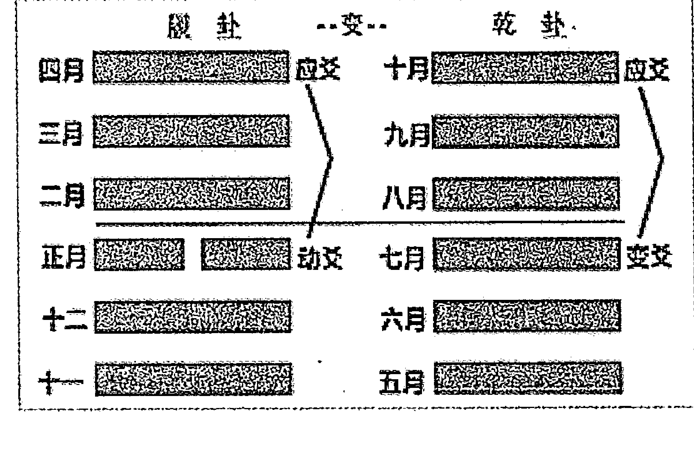

> 开始“履虎尾，不咥人”，先历凶险，尔后“乾元亨利贞”，出现趋吉避凶之象也。这在预测中视为吉兆（见右上“履卦与乾卦”图）。

### 第四节 节气与时间窗口关系

宇宙起始形成，太阳从核裂变的哪一瞬间开始，就一直源源不断的向宇宙输送光能和热能，地球和地球上的人类是最大的受益者。由于地球的公转和自转原因，使得地球上的参照系变化，生活在地球上的人类，发现太阳每天从东方升起，从西方落下，人们就把太阳一升一落出现的白天和黑夜定为1天。月亮从月初的晦——月中的盈——月末的亏，这样圆缺变化一次约为30天，后来人们就把这个时间段叫做一个月。一天的时长古人将它划为十二个时辰，有了钟表计时之后一个时辰是2小时，一天为24小时，一个月的时长为30天，可以划为上、中、下三旬。一旬为10天，一候为5天，一旬为2候。一个月可分为6候。一年的时长是12个月，分为春夏秋冬四季，这些都是地球上的人类在生活中，人为刻意的为本来就没有时长的太阳，划上了一个“间”，很多个人为因素的“间”，加起来就称作“时间”。

茫茫宇宙，朗朗乾坤。农历天干地支纪年把一年分为12个月，即农历正（寅）月、二（卯）月、三（辰）月、四（巳）月、五（午）月、六（未）月、七（申）月、八（酉）月、九（戌）月、十（亥）月、十一（子）月，十二（丑）月。前边说过，每个月都由十二消息卦中的一个固定卦来代表。其实，这个时间概念，也是一个物理学问题。一年有春、夏、秋、冬四季，每一季为3个月。每个月有30天，30天正好是农历二十四节气中的两个节气；一个月的30天也可分为上、中、下三旬。每一旬又可分为2个候，每一候为5天，一个月分为6个候，一年360天可划分为72个候。

#### 一、月相划分的理论依据

任何一门学问，必须有其科学的理论依据。偶然的机会，在网上见到了郑悍马教授《生霸死霸再考及月相正名》的文章，使著者眼前为之一亮，茅塞顿开。真实验证了古人的一句话：“踏破铁鞋无觅处，得来全不费工夫”。原来在3000多年前的周代时，人们就将一个月分为初吉、既望、既生霸、既死霸、旁生霸、旁死霸六个名称，也就是六个时间段。

郑教授研究了大量的青铜器铭文，通过农历换算，找到了初吉代表每月农历的二十九、三十、初一、初二（4天）月相的依据；既生霸代表每月农历的初六、初七、初八、初九、初十（5天）月相的依据；既望代表每月农历的十五、十六、十七、十八（4天）月相的依据；既死霸代表每月农历的二十三、二十四（2天）月相的依据。这些都是郑教授通过查证、核实换算的周人用天干地支纪日的具体日期，为每月中的15天找到了农历月相名词。郑教授没有发现“旁生霸”和“旁死霸”代表什么月相，从上述资料中发现每月还有初三、初四、初五、十一、十二、十三、十四，十九、二十、二十一、二十二、二十五、二十六、二十七、二十八，这15天没有月相可依。不过这个在著者来看已经不要紧了，只要我们找到了第一步确切史料，那我们就可以推演出剩余部分的月相对应关系。

受此启发，著者将这6个时段定义到了卦象之上，算是给自己创立的三爻月相法找到了一个历史的依据，这个发现令人着实的振奋啊！遗憾的是无缘当面向郑悍马教授致谢。

#### 二、干支纪月的“六分法”

基于上述历史资料和著者长期推测验证和琢磨思考。因为古时候对月的划分有四分法之说，著者想这可能是与四象：少阳、老阳、少阴、老阴有关，但四分法在预测实际应用方面有一定的难度，在预测实战当中不好操作。每个月分为六个时段，就与一个节气分三侯有了联系。就是前面告诉大家一侯(段)为5天，一个月为6侯(段)，全月30天(小月在月底自行微调)。这就很容易对应上了6个三爻卦象：震（☳）、兑（☱）、乾（☰）、巽（☴）、艮（☶）、坤（☷）。这个划分就像现在人给计算机编制程序，解决了预测中的千古难题。著者认为我们大家应该为之鼓之舞之，共同庆贺这一飞跃性的历史创新成就。

#### 三、月相决定时间窗口

月令通常也叫月建，是人们实际预测中判断分析卦气旺衰的关键。那么，节气与侯，与《梅花易研究精要》又有那些内在联系呢？

在《梅花易研究精要》中，为了研究预测判断应期的准确性，著者通过翻阅大量历史资料，查阅求证上古时期对月的六分法，即“初吉，既生霸，既望，既死霸，旁生霸、旁死霸”，将它们与月象对照研究发现。把每月30天分为6个侯，然后按照月亮的朔望，为每一侯在三爻八经卦中各取了一个月象。即《震》（☳）、《兑》（☱）、《乾》（☰）、《巽》（☴）、《艮》（☶）、《坤》（☷）六个卦象，对应每月的某一个时著者将其归纳成三爻卦与月象时间对照表。

注：下表由于表格小，汉字放不下，表中时间一栏数字代表农历时间段。

| 分类 | 第一象 | 第二象 | 第三象 | 第四象 | 第五象 | 第六象 |
|---|---|---|---|---|---|---|
| 卦象 | 震象 | 兑象 | 乾象 | 巽象 | 艮象 | 坤象 |
| 符号 | ☳ | ☱ | ☰ | ☴ | ☶ | ☷ |
| 时间 | 3至7 | 8至12 | 13至17 | 18至22 | 23至27 | 28至2 |
| 旺朔 | 初生 | 上弦 | 望月 | 既望 | 下弦 | 晦朔 |

《后汉书·律历志下》日：“晦朔合离，斗建移辰，谓之月。”我们习惯把《周易》八经卦叫三爻卦，八经卦中与月象有关的三爻卦是：《震》（☳）、《兑》（☱）、《乾》（☰）、《巽》（☴）、《艮》（☶）、《坤》（☷）。它们分别代表每个月月亮的初生、上弦、望月、既望、下弦、晦朔六种变化状态。每一种形状对应一个卦象，每一个卦象代表5天，著者把它叫做一个候。这就是《梅花易研究精要》的精华发现，所谓的定应期的秘籍——时间窗口。具体排在卦象上是指：

震（☳）卦一阳生于两阴之下，代表每月初三——初七日为初生的月象；

兑（☱）卦二阳生于一阴下，代表每月初八——十二日为上弦的月象；

乾（☰）卦三阳生为月满，代表十三日——十七日为月亮最圆时的望月象。

巽（☴）卦一阴生于两阳之下，代表每月十八——二十二日为既望的月象；

艮（☶）卦两阴生于一阳之下，代表每月二十三——二十七日为下弦的月象；

坤（☷）卦三阴生为晦朔，代表每月二十八——下月初二日朔，无月亮的象。

以上（上图中）的六个卦象代表月亮在不同时间的不同形状，每月如此循环往复，如遇小月可以在月末进行调整。但是还要考虑一个农历闰月的问题，农历三年一闰，五年两闰，闰月如何分配调整当月的这个候，是一个比较困难的事情，只能靠我们自己去琢磨，做到灵活处理。遇到这种情况，著者认为要借鉴《四柱命理学》中的原理来处置。就是看当月的农历二十四节气与月令的时间差，将应期作以适当调整，这个棘手的问题就会迎刃而解。

根据著者多年来研究《梅花易数》预测的经验和体会，以上这六个三爻卦代表的月象，在《梅花易研究精要》中，对于判断应期有着非常重要的作用，可以大大提高预测“应期时间”的准确率，而且精准度也是神奇的准。

#### 四、应期的提前和推后

世界上任何事情都没有一成不变的，《梅花易数》预测本来就是一个动态的学说。天气突变，重大事件，以及不可抗力的自然灾害等都会引发变卦的事情发生。所以，有变化就有变卦，变卦了应期焉能不变。这里应期的因故提前或者推迟，都属于客观因素的存在。

例如：用卦为兑（☱）象时，卦象中反映的具体时间就在当月初八——十二这5日之间。如果兑（☱）象变为震（☳）象时，说明时间变化提前到初三——初七这5日之间；如果兑（☱）象变为乾（☰）象时，说明时间变化推迟到十三——十七这5日之间。

再比如用卦为坤（☷）象时，卦象中反映的具体时间就在当月二十八——下月的初二这5日之间。如果使用铜钱摇卦时，坤（☷）象可能变为兑（☱）象，也可能变为乾（☰）象。变为兑（☱）象时，说明时间变化会推迟到下个月的初八——十二这5日之间；若变为乾（☰）象时，说明时间变化可能推迟到下个月的十三——十七这5日之间。如果坤（☷）象变为艮（☶）象时，说明时间变化可能提前到了当月二十三——二十七日这5日之间。其它卦象依此类推。

此为著者经过长期观察、琢磨总结出来的经验之谈，在此毫不吝啬的把它竹筒倒豆子般的公开告诉给读者，请大家在后面《梅花易数》预测实战卦例中进一步验证。

## 梅花易研究精要

## 第五章 预测卦例分类介绍

## 第一节 预测不准

预测未来吉凶是一件非常不好把握的事情。马失前蹄很常见，科学试验有失败，预测理所当然也有失败。如果预测分析过程中稍有一点点把握不到位，会直接导致失之毫厘、差之千里的预测结果，往往使预测者感到十分难堪。

话说一代大师李淳风与袁天罡当年初入江湖，有一日两人坐在岐山脚下大路边上的一个酒店喝酒。突然门外大路上走来了一位鹤发童颜、道风仙骨、气宇轩昂的老者。说来也巧，这条路中间长着一棵双叉的大槐树。李纯风说：仁兄，你猜这位老者是从树的右边走过来呢？还是从树的左边走过来？于是袁、李两人一个猜右，一个猜左。谁知那位老者走到大树面前却打住了脚步，左看看、右看看、上看看、下看看，突然身子一跃，轻身如燕，竟然从大树叉中间飞了过来。老者的这一举动，使对酌之中的李淳风与袁天罡大惊失色，差点没有酒杯扔在地上。原来老者是隐居在岐山箭括岭中的一位世外高人。老者健步如飞来至酒店门前，李、袁二人急忙上前双膝跪地，顿首拜曰：“老神仙在上，在下有眼不识泰山，刚才多有得罪。”老者捋须笑答：“你我素不相识，何言得罪二字啊！”据说后来李淳风与袁天罡拜这位老者为师，潜心研道修行，终成一代高人。

在此讲这个历史故事的目的是说，天外有天，人上有人。即使技高一筹的人，在预测中难免有失误的时候。为何会出现预测失误呢？著者回顾总结其原因无外乎五个方面：

### 第一、月令的四季旺衰。

正确把握“月龄”旺衰，五行休囚，是预测的一个关键。如果农历二月预测，遇到金克木之象，因为二月木旺当令，金处死地根本无法克木，反而被木所侮（也就反克）；再如五月预测遇到水克火之象，五月火旺当令，水处绝地，这个水就灭不了火，反遭火来侮辱（也是反克）。预测者一定要搞清楚一年四季的五行旺、相、囚、死，否则预测结果大相径庭，必然导致失误。

### 第二、卦象体用不得位。

分析推测前必须搞清楚本卦的体用是否得位。如果变爻（用卦）在外卦者，一般视为体用得位，这时候就要参考互卦。凡变爻（用卦）在内卦者，视为体用不得位，这时候的互卦就不能用，必须要看本卦的覆卦和变卦的复原卦（第三章第四节已介绍过）。否则，预测结果南辕北辙，相去甚远。

### 第三、预测者状态要好。

预测者一定要在正常的状态中进行起卦、分析推理，预测吉凶。如果因为遇到重大的烦心事，或者因身体严重不适、神情恍惚不在状态中。例如：饮酒过度、思维混乱的情况等等，预测中的分析推理思维就很难正常发挥，必定受到这些客观和主管因素的限制，势必导致推理失误而影响预测结果的准确性。因此，著者认为在状态中和不在状态中的预测效果是天上人间、差异是很大的。

### 第四、搞清楚起卦方法。

有时候在微信群里，别人起的卦，你不知道是摇的卦、还是时间起的卦，或者是报数字等起的卦。因为手机上下载的排盘软件是不一样的。例如，同一时间用“六爻排盘宝”起的卦就与“梅花易数”排盘软件起的卦根本不一样。如果你事先没有搞清楚这些因素，稀里糊涂的就去解卦分析，势必得出大相径庭的预测结果。著者也是在微信群里才悟出这些经验的，一并在此告诉大家。

### 第五、人际关系太熟悉。

古人占卦有一个“三不占”原则：一是不诚不占。即不诚则自身感应力不强，所以占卦首重诚心诚意。二是不义不占。即不合乎正当性及合理性的问题不必占问。三是不疑不占。即必须是生活中理性难以测度之事才能起卦预测。现实生活中，熟人往往近水楼台，芝麻大的一点点小事，就要你起卦预测，这碍于人情面子的事情，往往应验率不高。原因是不符合这个“三不占”原则。

这是著者多年来琢磨探索预测失败事例，总结出来的实践经验所在，读者一定要仔细参悟，方能大幅提升《梅花易数》预测的准确率。下面通过几个卦例来一起讨论这个问题。

### **例一、春季《大壮卦》，得理反损失**

预测最致命、最常见的缺陷就是测不准，而测不准有时候并不是预测的技术问题，往往与每年的月令和四季旺衰关系很大。15年前，著者先后遇到过两件经济纠纷，预测时都是春季农历二月得：雷天《大壮卦䷡》，本卦乾（☰）象为体、为金，震（☳）象为用、为木，乾金克震木，体克用之象。六五爻动，变卦泽天《夬卦䷪》。变卦乾（☰）象为体，兑（☱）象为用，乾金见兑金，体用比和之象。

本卦体克用、变卦比和，按理说是主家（体方）占理，对方欠债者（用方）理亏。但实际是因为欠债方（用方）胡搅蛮缠，借用权势威胁，致使主家（体方）反倒受了损失和侮辱，本来已经煮熟的鸭子，竟然掀开锅盖飞掉了，导致最终预测结果出现较大差池。

后来著者仔细琢磨分析，发现这两卦预测失败的原因全在于二月木旺当令，金处死绝之地所致。卦中虽然三金一木，金与木比例失衡，金看上去占有绝对优势，其实，农历二月木旺当令，而且得势得地，金虽多处于绝地，焉能不受金侮？所以，导致预测结果不理想（篇幅有限，卦例分析简略）。
事实的真相是体方认为欠债有借据，既成事实，而且在讨要过程中行为咄咄逼人，有些得理不饶人举措，导致外卦（六五爻动爻）借用外来的官方势力介入，使体方反倒陷入被动，有理有据的事情，没有如期讨回债务也就罢了，却受到对方盛气凌人的侮辱。

如果当时体方得理让人、避其锋芒行事，结果或许另当别论。所以，著者处于负责的态度，很客观的在大篇幅论述预测技巧之前，将容易导致预测失败的教训罗列在第一节，专门设立一个“预测不准”，旨在提醒大家，预测万万不可忽略月令变化和四季五行旺衰，它会直接导致预测结果的正确与否。

### 例二、明年三月高级职称的事明朗

2013 年元月 10 日（农历十一月二十九日星期四）早上 8 点，有人电话求测职称评审是否能通过？事急。以 2012 年农历十一月二十九日辰时预测。得数字：5、11、29、5。

数字起卦：5+11+29 = 45 ÷ 8 = 5…余 5，5 为巽（☴）象，外卦取巽（☴）象，45+5 = 50 ÷ 8 = 6…余 2，2 为兑（☱）象，内卦取兑（☱）象，得本卦风泽《中孚卦䷼》；总数 50 ÷ 6 = 8…余 2，2 为兑（☱）象，九二爻变动，得变卦风雷《益卦䷩》；互卦为山雷《颐卦䷚》。

推测分析：以体为主人，以用为职称。

- 1. 本卦风泽《中孚卦 ☴ ☱》，巽上兑下，兑金克巽木，用克体之象，农历十一月水旺木逢生气，兑金泄气，反而化水生木，所以兑金难克巽木，看似为凶，实则有利。
- 2. 变卦风雷《益卦 ☴ ☳》，巽上震下，震木见巽木，卦象比和，震为雷、巽为风，二者相遇相得益彰，皆属于“气界”，预示职称的事肯定有好的消息。
- 3. 九二爻变动，兑（☱）象。时间窗口：十二月、三月、六月、九月。农历腊月初三至初七五日内是关键时间段。
- 4. 用卦兑（☱）象变震（☳）象，兑为少女、为口舌，为正西方位。震为长男、为雷电，为正东方位。这件事情是由西向东走。2013年农历三月初三至初七就应该有好信息，高级职称有望搞定。
- 5. 卦象体用互不得位，调整期限为三个月。互卦为山雷《颐卦 ☶ ☳》，震木克艮土，卦象用克体，申报审批过程不是很顺当。

分析完卦象，我给对方回复：今天是农历十一月二十九日，此事应该在腊月初三至初七五日内日能办成功，要等到明年三月初三至初七就能正式批下来。

对方回答：你说得很准。元月14至18日相关资料要递交到省职改办，时间正好是农历腊月初三至初七时段之内，也就是下周一至周五。谢谢何老师。

### ### 事后应验：

后来这个高级职称没有按预测的时间批下来。问题出在什么地方呢？

- 一是本卦《中孚卦 ☴ ☱》通《小过卦 ☴ ☶》，小过者，小小的过失也。九二爻动，本卦体用不得位，互卦《颐卦 ☶ ☳》是没有用的，不能以它断事情；
- 二是颐卦是一个大离（☲）象，上为艮不动，下为震要动，呈现下动上不动现象，说明职称之事当事者急，审批方面不着急；
- 三是本卦和覆卦都是风泽《中孚卦 ☴ ☱》，当事者双方处于对峙均衡状态，可能因为资料不足或者条件不够，悬在那里下不来；
- 四是变卦的复原卦为雷风《恒卦 ☳ ☴》，

### 例三、朋友调动的事情

2012 年元月 18 日（农历腊月初七）16 时 35 分，博友在 qq 上说：公司的事情最近使人很郁闷，要求预测能不能很快动一动。按 2012 年农历腊月初七申时的时间起卦，得数字：5、12、7、9

数字起卦：5+12+7 = 24÷8 = 2…余8，8为坤（☷）象，外卦取坤（☷）象，24+9 = 33÷8 = 4…余1，1为乾（☰）象，内卦取乾（☰）象，得本卦地天《泰卦䷊》；总数 33÷6 = 5…余3，3为离（☲）象，九三爻变动，得变卦地泽《临卦䷒》；互卦雷泽《归妹卦䷵》。

| 本卦泰卦 | 互卦归妹卦 | 变卦临卦 |
| :--- | :--- | :--- |
| 四月 ⚊⚋ | 十月 ⚊⚋ | 十月 ⚊⚋ |
| 三月 ⚊⚋ 体卦 | 九月 ⚊⚋ 体卦 | 九月 ⚊⚋ 体卦 |
| 二月 ⚊⚊ | 八月 ⚊⚊ | 八月 ⚊⚊ |
| 正月 ⚊⚊ 九三爻动 | 七月 ⚊⚊ 用卦 | 七月 ⚊⚊ 用卦 |
| 腊月 ⚋⚊ | 六月 ⚋⚊ | 六月 ⚋⚊ |
| 冬月 ⚋⚊ | 五月 ⚋⚊ | 五月 ⚋⚊ |

推测分析：以体为主人，以用为工作。

- 1. 本卦地天《泰卦䷊》，坤上乾下，坤土生乾金，体生用之象，预示乾金埋于坤土之下不得而出，因为我要生别人，所以，自己感到很郁闷。
- 2. 变卦地泽《临卦䷒》，坤上兑下，坤土生兑金，体生用之象，这与本卦一样，仍然有付出之征兆。用卦兑象为口、为辩解、为金、为白虎，要谨防口舌之争和武断处事，但还需要找机会向主要领导说明情况。
- 3. 互卦雷泽《归妹卦䷵》，震上兑下、长男与少女，为嫁女之象，兑金克震木，自己最关心的调动之事，正在调整之中，尚需等待一些时日。
- 4、本卦地天《泰卦䷊》主正月令与变卦地泽《临卦䷒》主腊月令，两卦都属十二消息卦。九三爻动，离（☲）象，时间窗口：正月、四月、七月、十月。关心的事情最快年后正月初八至十二日内有（电话或其它）消息。
- 5、九三爻变，离（☲）象，离为火，为中女、为马，火可以克金生土，成用生体，帮助自己。离为中女，有一位个头不高、待人热情、气色很好，属马的中年女士，可以从中帮忙。

综上分析，当下主要是等待时间调整，保持淡定心态，三阳开泰之时，利于工作调动。

### ##事后应验：

求测者关心的问题没有得到理想的答案。问题出在什么地方呢？一是本卦动爻在九三爻，本卦为体用不得位，互卦雷泽《归妹卦䷵》是没有用的，不能以它作为主要因素来断事情。二是本卦地天《泰卦䷊》与天地《否卦䷋》互通，而且覆卦正好为天地《否卦䷋》主七月令，泰卦三阳开泰、繁华似景，通否卦物极必反，静止不动。三是变卦地泽《临卦䷒》对应腊月令，它的复原卦为泽地《萃卦䷬》，内卦的兑（☱）象翻上去了，它对应的每月初八至十二这五日的时间段，本应该是明年正月的好事，要延迟到农历四月初八至十二日左右了。因此，这个预测结果没有如期兑现。

在中国所有历史预测典籍，从来没有一人谈及预测不准的问题。著者在本章中专门设置一节内容来讲这个问题，但愿能引起读者的高度关注。学习预测要坚持不断的虚心学习，努力提高自己预测分析能力，更好的为广大人民群众排忧解难，使中华预测优秀传统文化得到很好的弘扬和发展。

## 第二节 寻人预测

现实生活中，孩子丢失、老人出走，寻人已经不是什么新鲜事。寻人虽说是小事，对于亲人突然走失的一个家庭来说，那无疑是天塌地陷的大事情。因为人身上长了两条腿，不停地在走。不断运动之中的人，往往去无定向，居无定所。所以，借助预测来判断一个人在外是否平安，以及现在处在什么方位？能不能自己回来？甚至有没有性命之忧等等，都是寻人者很想知道的。本节主要与大家讨论寻人预测。

### 例一、儿子出走14年下落不明

2009年春节前夕，著者去外地走亲访友。进门不久，就来了一位头发花白的老妇人，说：“我听说我 && 回来了，让他看看我儿子是不是还在人世间。”原来她是亲戚的一个本家人。她说：“儿子出走14年了，一直音信全无，我到处求神问卦。有的说人已经死了，有的说人还活着，可是至今活不见人，死不见尸。儿子出走五年后媳妇带儿子另嫁他乡，生活所迫将小孙女送人了，留下大孙女由我老俩口抚养。他爸身患重病，你给我好好看看阳世间究竟还有没有他这个人啊！”听了这个情况，我非常的同情她。

即时起卦：得本卦天泽《履卦☰》，六三爻动，离（☲）象，变卦八纯卦《乾卦☰》，主四月令。

当场推断：
1. 本卦天泽《履卦☰》，外卦乾金，内卦兑金，体用比和之象；变卦八纯卦《乾卦☰》，乾金见乾金，也是体用比和。卦气逢比和，预示行人在外平安。所以，此人在外应该是心情舒畅，生命无忧，平安无事。
2. 用卦为兑（☱）象，为金、为正西方位，体卦为乾（☰）象，为金、为西北方位，人应该在西偏西北方向。
3. 用卦兑（☱）象为口舌之争；变为乾（☰）象，内卦、外卦、变卦全为金象，看样子此人有金钱引发的纠纷征兆。
4. 六三爻变，数为三，三为离（☲）象，为中女、为正南、为牢狱之象，离象像一个四面独壁的房子、主牢狱，此人目前可能被拘留或者坐牢。
5、时间窗口：正月、四月、七月、十月。乾（☰）象代表每个月的十三至十七日，预示在这四个月中旬的十三至十七日之内有具体消息。
6、六爻卦中初爻与二爻代表地，三爻与四爻代表人，五爻与上爻代表天。本卦六三爻动，说明人在“天、地、人”的人位，加之本卦和变卦的卦象皆呈现比和之象，人在外绝对没有性命之忧。

基于这些推测，我很肯定的对她说：你放心吧，我可以肯定的给你说，你儿子活得好好的，绝对没有性命之忧；人在西北方的甘肃兰州一带；他可能犯了经济官司，目前不是拘留，就是在押，人身不自由。不过你别担心，有一个女的会想法救他。我给你说个师傅传授的土办法，你每天晚上叫他，如果他人身自由，明年四月份必然回家看你。

### 事后应验：

2010年农历四月这个出走的儿子没有回来。一直到2010年年底，这个儿子自己回家了。据本人说：他一直在甘肃兰州一带游荡做生意，2009年底确实犯了经济官司，后来（在兰州找的）女友家出钱，托关系帮他赔偿经济损失，事情才得以了结。出走14年没有音信的人回家了，人们感到我的预测不可思议！这次神奇的预测结果，确实给亲戚家人涨了脸。其实，这都是《梅花易数》告诉的答案。

### 例二、洪水冲走汽车 车主生死何在？

2011年9月17日（星期六）中午11点40分，同学某先生打来电话说：“老何，9月11日中午12点左右，我家邻居的儿子与媳妇发生了口角。有人见他一个人开桑塔纳轿车从岐山五丈原镇出发向东，去了眉县方向。后来有人发现那辆车在眉县斜峪关河道停放。当天下午5点左右，斜峪关水库泄洪放水，轿车被洪水冲向下游几百米，搁浅在河道中，车主生不见人，死不见尸。事情发生后，有人向当地公安派出所报案，公安人员根据车号，与（车主）家里人取得了联系。今天已经是第7天了，我们都急得团团转，麻烦您给测测，看人是否安全？”根据这个电话，我即时起卦。2011年9月17（农历八月二十）日（星期六）中午11点40分，得数字：4、8、20、7。

数字起卦：4+8+20 = 32÷8 = 4…余0，0为坤(☷)象，外卦取坤(☷)象，32+7 = 39÷8 = 4…余7，7为艮(☶)象，内卦取艮(☶)象，得本卦地山《谦卦䷎》；39÷6 = 6…余3，3为离(☲)象，九三爻变动，得变卦为八纯卦《坤卦䷁》。

### 推测分析：

- 1、本卦地山《谦卦䷎》，坤土见艮土，体用比和；变卦八纯卦《坤卦 ䷁》，坤土见坤土，也是比和之象，卦象意味着此人在外绝对没有性命之忧。

- 2、九三爻变，数字三为离（☲）象，说明人在“天、地、人”的人位；离为中女，有一个属马的热心女人可以提供信息。离为电，如果有消息很可能是通过电话、短信等方式获得。

- 3、卦象艮（☶）象为7，坤（☷）象为8。由于这件事很急，预测者是用电话与我联系的，两卦数字相加折半（7+8=7.5）就是应期。应该不出第8天就有确切消息。

- 4、为了保险期间，我还以该人出走的时间另外起了一卦，用六爻预测法分析了一下，卦象显示人在“辰位”，即东偏东南方向。

根据以上几点预测，我立即电话告诉他说：

- 让他们家里人放心，人在外绝对安全，没有性命之忧；
- 有一个属马的年轻女人可以帮忙；
- 第8天就有确切消息；
- 这小伙子从案发地去了东偏东南方向。

### 事后应验：（见 QQ 截图）

此事过了一周时间没有回音。2011年9月24日晚9时40分，在QQ上碰见某先生。

我问他：你说的那个小伙子找到了没有？

某先生说：“准备给你打电话呢？找到了，是星期日，第八天，在杨凌（东南方位给家里）打电话了，感谢你的预测。”

我说：那你不早告诉我。人没问题就好，我还以为预测错了。

他说：基本正确，本来星期一就要告诉你，但有几个事忘记了。

### 例三、宝鸡“2.13”抢劫杀人案

2010年正月初五去宝鸡市周易研究会，某先生说起了发生在年前的市区杀人抢劫案。他说：2009年农历腊月三十日中午12点多，宝鸡某厂一女职工开车去宝鸡开元商城置办年货，出商场上车后被歹徒劫持，至今下落不明，几天过去了，案子还没有告破。这就是宝鸡“2.13”抢劫杀人案。

事先著者还真不知道此事。按他们告诉的案发时间起卦预测：己丑年为12，腊月为12、三十日为30，中午12点多为7。得数字：12、12、30、7

数字起卦：12+12+30 = 54÷8 = 6…余6，6为坎（☵）象，外卦取坎（☵）象；54+7 = 61÷8 = 7…余5，内卦取巽（☴）象；得本卦水风《井卦》，总数61 ÷ 6 = 10…余1，初六爻变动，为乾（☰）象，得变卦水天《需卦》，本卦体用不得位，互卦不用，本卦的覆卦为泽水《困卦》，变卦的复原卦为天水《讼卦》。

推测分析：以体为女职工，以用为作案人。

- 1. 本卦水风《井卦》，坎上巽下，坎水生巽木，体生用之象，预示主人有损失付出。卦数5、6，和为11。
- 2. 变卦水天《需卦》，坎上乾下，乾金生坎水，用生体之象，卦数6、1，和为7。本卦体用不得位，此案为突发性案件，破案为先难后易，大约7——11天内可能破案。
- 3. 本卦与变卦显示有坎（☵）象、乾（☰）象、巽（☴）象。坎为中男，乾为老男，卦象预示两个男人作案的可能极大；巽为长女，被抢劫的是一位身材苗条、皮肤白、黄头发、很性感时髦的年轻女士。
- 4. 坎（☵）象为轮、为车、为北方，为小个头、为皮肤黑的男子，小个子开车；个头高的男子劫持人质。
- 5. 用卦巽（☴）象变乾（☰）象，巽为东南，乾为西北，作案路线，从东南方开始，向西北方向而去。
- 6. 本卦数字为6、5，变卦数字为6、1，复原卦动爻在第4爻，涉案金额在四位数，现金在6500——6100元之间，最多数额12600元之内。
- 7. 巽（☴）女变乾（☰）男，巽木变乾金回头克，男克女、金克木，有钝器伤人之象。初六爻动，当事人在“天、地、人”中地的最低层。卦象显示被劫持的女士可能有性命之忧。

### 宝鸡“2·13”抢劫杀人案告破

2010-02-25 07:44:00 来源: 三秦都市报(西安)

本报宝鸡讯（记者袁超）2月13日（大年三十）下午5时许，宝鸡市卷烟厂财务人员庞某自当天9时外出一直未归。宝鸡警方接报后调查发现，当日上午，庞某在市区经二路某银行门前上车后，有两名男子尾随进入车内，车辆驶离后不知所踪。

案件上报后，宝鸡市公安局迅速成立“2·13”专案组，全力开展侦破工作。对犯罪嫌疑人可能逃窜的宝鸡、西安、咸阳、渭南及周边的甘肃、四川等地进行排查，对可能藏匿的宝鸡附近山区进行摸排，最终确定陇县东南镇的闫旭龙有重大嫌疑，在20日将其成功抓获。另一犯罪嫌疑人依小峰闻风后潜逃，23日专案组赶赴绵阳将其抓获。

经查，犯罪嫌疑依小峰（26岁，金台区人）、闫旭龙（22岁）不务正业，贪图享受，在租住房时认识，此前曾多次预谋抢劫他人。2月13日上午，依小峰、闫旭龙携带匕首、钳子等作案工具在宝鸡市区寻找抢劫目标，当看到庞某从经二路一商场购物打开车门上车后，两人强行拉开车门上车，控制受害人。随后将车开到宝鸡市陈仓区坪头镇，搜身抢去庞某现金4700元，逼问银行卡密码后，从坪头信用社的ATM取款机上取走6100元。下午4时，依小峰、闫旭龙将庞某残忍杀害并抛尸荒野。

> （本文来源：三秦都市报）

### 破案情况证实：

在宝鸡市开元商场门口，女士开车门放东西时，两名男子乘机上车，劫持女士，开车从宝鸡市区东南位，向西北方向而去。银行摄像记录显示，1.65米高的男子，在陈仓区西山坪头镇（宝鸡市区西北方向）信用社自动取款机上取走现金6100元。被劫持的女士遇难，抛尸山林之中。这个女士驾驶一辆本田越野车，确实很有钱、很时尚。此案2月13日发案，2月20日（第8天）抓获第一个犯罪嫌疑人，2月23日（第11天）抓获第二个罪犯，公安机关宣布“2.13”抢劫杀人案破获。

### 思考：

这个卦例的特别之处在于案发时间是准确的第一时间，只要告诉梅花易预测者这个发案时间，大多数人都可以预测出与最终结案基本相同的结果。一切突然发生的事情都有其时空定数，值得预测研究者去深思。

### 例四、孩子三月底四月初回家

2013年4月6日，市周易研究会举办学习活动。陈老师进门刚一坐下就说：甘肃平凉有一个男孩出走。他父亲说，孩子出走时身上只带100元，不知去什么地方？何时能回家？请你们测测（孩子是1999（己卯）年三月初八下午15时40分出生）。按陈老师进门说话的时间起卦。2013（癸巳）年二月二十六日8点40分（辰时），得数字：6、2、26、5。

数字起卦：6+2+26 = 34÷8 = 4…余2，2为兑（☱）象，外卦取兑（☱）象，34+5 = 39÷8 = 4…余7，7为艮（☶）象，内卦取艮（☶）象，得本卦泽山《咸卦䷞》；39÷6 = 6…余3，3为离（☲）象，九三爻变动，得变卦泽地《萃卦䷬》；本卦体用不得位，互卦不用；本卦的覆卦为雷风《恒卦䷟》；变卦的复原卦为地泽《临卦䷒》。

推测分析：以体为父亲，以用为孩子。

- 1、本卦泽山《咸卦䷞》，兑上艮下，用在内卦、体在外卦，视为体用不得位。艮土生兑金，用生体之象，预示这孩子应该不会走得太远，有回家的心思。
- 2、变卦泽地《萃卦䷬》，兑上坤下，用生体，坤土生兑金之象，生气一片，农历二月木旺当令，艮土受克，金缺原神，无法生出。孩子在外虽然心情郁闷，但平安无事，暂不思归。
- 3、九三爻动，为离（☲）象、为南方、为中女，时间窗口：农历正月、四月、七月、十月。这孩子今年正月就有出走的迹象。从泽山《咸卦䷞》的初爻逐步向上看，孩子离家后先向东北艮（☶）方走，再调头向东南方位走，后去西北方位。距离他们家近则27里以外，远则270里之内。
- 4、本卦泽山《咸卦䷞》讲的是少男和少女相亲相爱的事情；覆卦为雷风《恒卦䷟》，讲的是长男与长女的爱情故事。这孩子可能早恋，私下去见他的女朋友了，暂时不想回家，有一个属马或者属羊的女孩子与他有关系。
- 5、其父亲说：孩子出走时身上只带100元出门。从复原卦地泽《临卦䷒》的卦象看，身上出门时带270——280元；男孩子目前在外衣食无忧。
- 6、现在是农历二（乙卯）月，木旺当令，用土受克，难生体金，等二月二十四日清明节过了，交上三月令，木气泄耗，土当月令，才能生出兑金。那时候孩子自然就回家（因为当时陈秘书长是坐下后说话的，应期可能推后）。应期：快则农历二月二十八至三月初二回家；远则：三月二十三至二十七回家。

### 事后应验：

2013年5月13日，市周易研究会组织会员去周至财神庙参观，陈老师在车上说：那个平凉的男孩子于5月3日回家了，人去了泾源县。我顺手在手机上查了一下日历，5月3日是农历三月二十四（己巳）日，与著者预测的“远则：三月二十三至二十七回家”基本吻合。

### 例五、四川铜梁女孩凶多吉少

2014年8月17（农历七月二十二）日1：27分，网上信息称：据《重庆晚报》消息，20岁的重庆女大学生高渝，错上陌生人的车，已经失踪多日。

即时起卦预测：2014年农历七月二十二日，丑时，得数字：7、7、22、2

数字起卦：7+7+22 = 34÷8 = 4…余2，2为兑（☱）象，外卦取兑（☱）象，34+2 = 36÷8 = 4…余4，4为震（☳）象，内卦取震（☳）象，得本卦泽雷《随卦䷐》，36÷6 = 6，上六爻变动，6为坎（☵）象，得变卦天雷《无妄卦䷘》；本卦体用得位，互卦为风山《渐卦䷴》，覆卦和复原卦不用。

### 推测分析：以体卦为女孩，以用卦为吉凶。

- 1. 本卦为泽雷《随卦䷐》，兑上震下，兑为少女，震为长男，预示少女随长男而去。兑金克震木，用克体之象，七月十二日立秋，月令申金当旺，兑金处旺地，震木处于死地，强金来克弱木，女孩恐怕凶多吉少。
- 2. 变卦为天雷《无妄卦䷘》，乾上震下，乾金克震木，卦象用克体，本卦的用卦为兑（少）金化乾（老）金，七月震木处于死地，预示女孩遭遇金属刃器伤害，生还的可能性不大。
- 3. 上六爻动，为坎象，坎为轮、为车，为黑色。女孩可能乘坐了一辆黑色小轿车。本卦泽雷《随卦䷐》从初爻向上数，初爻到三爻为震4，二爻到四爻为艮7，三爻到五爻为巽5，四爻到上爻为兑2，预示乘汽车的车牌号码内肯定有：4、7、5、2数字。
- 4. 从本卦泽雷《随卦 ䷐》的初爻向上推测，车辆行驶的路线方向，先向东走→向东北→东南→然后转向正西方向而去。
- 5. 互卦为风山《渐卦 ䷴》，巽上艮下，风行山上之象，他们走的肯定多数是山路。
- 6. 时间窗口：农历四月、七月、十月、正月。2015年8月9（七月十四）日发生的失踪事件，快则七月十七日就有消息，慢则七月十八至二十二日之内此案必有消息。

### 事后应验：

2014年8月19日（农历七月二十四日），本案取得重大突破。根据铜梁公安局通报，8月14日下午16时许，高渝乘坐渝CN3275小车离开铜梁后失踪，与司机蒲正福在途中发生争执，蒲正福将其杀害后潜逃云南德宏州，罪犯已被公安机关抓获，此案在进一步审理中。破案时间与著者预测的七月十七至二十二日之内，推测数字2、7、5三个数与车号数字相符。

注：此预测事例，过后著者发现起卦时数字加错了。但是，不会影响预测结果的正确性。

### 8·9女大学生高渝失联事件

20岁的重庆女大学生高渝，2014年8月9日错上陌生人的车后，失踪多日，其下落牵动网友的心。通过重庆多地警方的联合侦办，2014年8月19日，该案取得了突破性进展。

据铜梁区公安局通报，2014年8月14日下午16时许，铜梁区公安局接警称，高渝于2014年8月9日18时后失去联系。警方迅速组织力量开展查找。经工作，查明高渝当日乘坐渝CN3275轿车离开铜梁后失踪。该车车主蒲正福（男，41岁，璧山区人）有重大嫌疑。民警于2014年8月19日上午11时许在云南省德宏州将其查获。据蒲交代，其当日驾车搭载高渝，途中发生争执将高渝杀害后潜逃。蒲已被刑事拘留，案件正在进一步审理中。

### 例六、公司技术总监能回来不？

2015年10月1日（农历八月十九日）晚上22时24分，山东的博友微信留言：“我公司的技术总监回老家休假。他先前提出辞职，我挽留了，他答应节后回公司，我有些担心。您预测一下，他能不能回来。”以2015年农历八月十九日亥时预测，得数字：8、8、19、12

数字起卦：8+8+19 = 35 ÷ 8 = 4…余 3，3 为离（☲）象，外卦取离（☲）象，35+12 = 47 ÷ 8 = 5…余 7，7 为艮（☶）象，内卦取艮（☶）象，得本卦火山《旅卦䷷》；47 ÷ 6 = 7…余 5，5 为巽（☴）象，六五爻变动，得变卦天山《遯卦䷠》，本卦体用得位，互卦泽风《大过卦䷛》；本卦覆卦和变卦复原卦不用。

### 推测分析：以体为博友，以用为技术总监。

- 1、本卦火山《旅卦䷷》，离上艮下，离火生艮土，卦象用生体之象，对方生博友，预示此事不用质疑，人肯定能回来。
- 2、互卦泽风《大过卦䷛》，兑上巽下，大过卦预示二人之间或多或少存在一些不愉快，目前两人互看对方的心理状态是基本一样的。
- 3、变卦天山《遯卦䷠》，乾上艮下，艮土生乾金，体生用之象，预示主人有付出，需要答应对方提出的一些条件要求，人肯定能回来。
- 4、六五爻动，当下的事情，时间窗口不用看。五为巽（☴）象，代表每月十八至二十二日之间的事情。农历八月十八至二十二日，这位技术总监将回公司上班。一旦超过这个时间窗口，人就回不来了。

### 事后应验：

2015年10月7日著者微信催问对方预测应验结果。博友回复：2015年10月5日（农历八月二十三日）该技术总监回公司。原定是二十二日返回公司，因路途时间关系没有赶上合适车次，所以晚一天回来了（见微信截图）。但当天这位技术总监有短信向公司报告情况，并请假了。预测结果与实际完全相符。

## 第三节 寻物预测

生活中东西突然找不着是常见的琐事。物有静物和动物之分，也有价值上的大小贵贱之分，本节主要讲静物预测。静物只要预测出当前的方位、距离、上下位置、在室外还是室内，或者从颜色上、象形上，以及时间窗口去分析究竟能否找到，可以为失主提供一定的参考。下面就举几个案例讨论这个问题。

### 例一、马来西亚民航失事

网上消息：2014年3月8日由马来西亚飞往北京的民航MH370突然失去联系，飞机上共有239人，其中中国乘客154名。此消息一发布，引起各国政要和媒体的高度关注，中央领导就营救工作也作出重要批示。
著者于2014年3月8日晚18点36分，以2014年（农历二月初八）8时26分（辰时）预测。得数字：7、2、8、5。

### 数字起卦：

7+2+8 = 17 ÷ 8 = 2…余 1，1 为乾（☰）象，外卦取乾（☰）象，17+5 = 22 ÷ 8 = 2…余 6，6 为坎（☵）象，内卦取坎（☵）象，得本卦天水《讼卦》。22 ÷ 6 = 3…余 4，4 为震（☳）象，九四爻变动，得变卦风水《涣卦》；本卦体用得位，互卦为风火《家人卦》，覆卦和复原卦不用。

| 项目 | 卦象 | 卦象符号 | 月份对应 | 备注 |
| :--- | :--- | :--- | :--- | :--- |
| **本卦** | 讼卦 | ☰☵ | | 乾上坎下 |
| **互卦** | 家人卦 | ☴☲ | | 巽上离下 |
| **变卦** | 涣卦 | ☴☵ | | 巽上坎下 |
| **动爻** | 九四爻动 | | | |

### 推测分析：

- 1. 本卦天水《讼卦》，乾上坎下，乾金生坎水，用生体之象，当下是农历二月，木处旺地，需水量大，金处绝地，无力生水。天体向西转，水往东方流，此乃事与愿违之象，也就是说事情的发展有违人们的美好期望。
- 2. 变卦风水《涣卦》，巽上坎下，坎水生巽木（风），体生用之象，涣者，散也。风行水上，成涣散之象，看来这个MH370航班是要付出代价的。
- 3. 九四爻动，四为震（☳）象，震为木、为雷电，震（☳）象很像飞机的翅膀，巽为异常之风，飞机机翼可能受到损伤而坠落。最终失事飞机的残骸可能在失事坐标地的东南方位的600公里之外6000公里之内发现。
- 4、九四爻动，时间窗口：二月、五月、八月、十一月。二月木旺当令，衰水生木，损失惨重之象，2014年农历二月十八——二十二日是发现飞机的第一个时间窗口，如果这五日之内没有消息，那就很难说了。此次航班上的机组人员和乘客恐怕就没有生还的希望了。
- 5、2014年太岁在南方（午），事发地正处太岁方位。本卦与变卦之间无相克之象，说明此次事件与恐怖（组织）分子无关。最终至少有11个国家与地区参与本次空难事件的救援。

随后将以上预测结果发表在我的网易博客中，著者是这样写结题语的：此次预测本不敢公布，生怕引来大家拍砖。还是让我们为马来西亚民航MH370航班239名乘客和机组人员祈祷吧，但愿奇迹能够出现，期盼航班上的所有人员早日平安归来！

### 事后应验：

此博文于2014年3月9日19时18分公布在我的网易博客。从2014年3月8日马航MH370航班失踪，时至今日（2017年12月底）所有任何的搜寻和发现都没有任何令人满意的结果。

### 例二、卡在最下面、最底层找

2014年7月16（农历六月二十）日17：09分，山东的博友“ybqc”在QQ上留言：居士大哥，我两张购物卡急用忘记放哪了，平时在学校宿舍和家两头住，都找过，5天没找到，能否麻烦你在百忙之中帮忙指点迷津？谢谢！

即时起卦：2014年农历六月二十日酉时，得数字：7、6、20、10。

数字起卦：7+6+20 = 33÷8 = 4…余1，1为乾（☰）象，外卦取乾（☰）象，33+10 = 43÷8 = 5…余3，3为离（☲）象，内卦取离（☲）象，得本卦天火《同人卦䷌》，43÷6 = 7…1，1为乾（☰）象，初九爻变动，得变卦天山《遯卦䷠》；本卦体用不得位，互卦不看。本卦的覆卦火天《大有卦 ䷍》，变卦的复原卦为山天《大畜卦 ䷊》。

推测分析：以体卦为主人，以用卦为购物卡。

- 1. 本卦天火《同人卦䷌》，乾上离下。覆卦火天《大有卦䷍》，离上乾下，两卦皆为离火克乾金，用克体之象，从卦象看，东西应该是找不着了。但农历六月火生土旺，乾金反而能获得生气，得气者尚有一丝希望。
- 2. 变卦天山《遯卦䷠》，乾上艮下，艮土生乾金，用生体之象，从变卦看，卡生主人，信用卡应该是可以找见的。
- 3. 初九爻动，为乾（☰）象，时间窗口：五月、八月、十一月、正月。预示卡的主人从五月二十三至二十七日开始就找卡了，就是没有找见。
- 4. 用卦为离，离为正南方位，颜色为红色，形象像一个箱子或者盒子，初爻在最下面、最底层。
- 5. 二爻为六月、三爻为七月、四爻为八月，正好组成一个巽象，代表每月的十八至二十二日之间。即农历六月十八至二十二日五日内可以找见信用卡。

预测回复：2014年7月16日21:50分:24秒，我当即QQ回复ybqc：在你们家正南方位的房子，一个红色盒子或者箱子里找，最下面、最底层。

### 事后验证：

第二天，即2014年7月17日（农历六月二十一日，正好在六月十八至二十二日五日内）22:44分：00秒，ybqc在QQ留言回复：大哥您好！按照您的指点，两张卡果然找到了，在南面卧室床箱子里的户口本中夹着。之前找得我好辛苦，谢谢您！晚安，好梦！

### 例三、U盘能否找到？

2014年11月21日（农历闰九月二十九日）晚20:15分，心理咨询师某老师来电话说：何老师，我的U盘找不着了，上边有好多资料，我很着急，请您帮忙测一下。

时间：2014年农历闰九月二十九日20时15分。得数字：7、9、29、11。

数字起卦：7+9+29 = 45÷8 = 5…余5，5为巽（☰）象，外卦取巽（☰）象，45+11 = 56÷8 = 7…0，0为坤（☷）象，内卦取坤（☷）象，得本卦风地《观卦䷓》。56÷6 = 9…余2，2为兑（☱）象，六二爻变动，得变卦风水《涣卦䷺》；本卦体用不得位，互卦不用。本卦的覆卦为地泽《临卦䷒》，变卦的复原卦为水风《井卦䷄》。

推测分析：以体为主人，以用为U盘。

1. 本卦风地《观卦䷓》，巽上坤下，巽木克坤土，体克用之象，农历九月土金两旺，巽木难克坤土，预示主人找到 U 盘的时间要推后一些时间。
2. 覆卦地泽《临卦》，坤上兑下，坤土生兑金，卦变用生体之象，预示 U 盘来找人。本卦风地《观卦》，巽上坤下，象一栋楼房，临卦的卦象很像一个过道，丢失的 U 盘可能在楼道的地面以上找到。
3. 变卦风水《涣卦》，巽上坎下，本卦体用不得位，要看变卦的复原卦水风《井卦》，坎上巽下，坎水生巽木，用生体之象，失物来找人之象，说明 U 盘完全能找到。
4. 六二爻动，兑（☱）象，兑为少女，为西方，为金属，与一个年轻女士有关系。方位在家中或者办公室西南或正西方位的过道地面之上。
5. 时间窗口：六月、九月、十一月、三月。正好是月建在农历九月，卦象显示 U 盘是当下丢失的。
6. 今天是九月二十九日，戌月土旺，坤土见戌土为相扶，巽木难克戌土，两日之内不要找，找也是找不到 U 盘的。到后天，进入农历十（亥）月，卦象变水风《井卦》，坎水当旺，巽木逢生，U 盘自然就会找到的。

> 预测完后，我马上告诉解释老师：别着急，U 盘肯定能找到，今明两天不要找，时间没到，找也找不着；两天之后有一个年轻女性可以帮助你。

### 事后应验：

> 三天之后的2014年11月24日（十月初三）中午12点10分，某老师手机短信回复：“何老师，U盘找到了。是一位年轻女士在楼道拣到的，她后来根据U盘上的信息，今天找到了我。《周易》预测真是太神奇了，改天请您吃饭。”

### 例四、钱袋子丢不了

2014年11月23日下午15时42分，朋友来电话说：“家里装修房子，把一个装钱的袋子放在那里了，我现在死活找不到！”要我帮她预测一下。

以 2014 年 11 月 23 日（农历十月初二），15 时 42 分（申时）起卦。得数字：7、10、2、9。

数字起卦：7+10+2 = 19÷8 = 2…余 3，3 为离（☲）象，外卦取离（☲）象，19+9 = 28÷8 = 3…余 4，4 为震（☳）象，内卦取震（☳）象，得本卦火雷《噬嗑卦䷔》，28÷6 = 4…余 4，4 为震（☳）象，九四爻变动，得变卦山雷《颐卦䷚》；本卦体用得位，互卦为水山《蹇卦䷦》，覆卦和复原卦不看。

推测分析：以体为主人，以用为钱袋子。

1. 本卦火雷《噬嗑卦䷔》，离上震下，震木生离火，体生用、我有损失之象。十月水当令、且处旺地、火处绝地。预示本来是有损失的，但月建水旺当令能生震木（体），故而不会有损失。
2. 变卦山雷《颐卦䷚》，艮上震下，内外卦组成一个大离之象。震木克艮土，卦象体克用，预示好事向后推迟。钱袋子找到的时间要推迟一些时日，震象数字为 4，预示着 4 天之内必然找到。
3. 九四爻动，震（☳）象，震为长男、为东方、为木。时间窗口：农历二月、五月、八月、十一月，应该是在农历八月下旬开始装修房子的。
4. 此卦体用得位，看似有损，实则得月建生之，不会有损失。外卦艮（☶）象，好象有一个柜子；艮（☶）象变离（☲）象，离象好似一个红色的盒子或者袋子；动在四爻为震（☳）象，震为东方，数字为四。

据此推断：钱袋子应该在东边房子，木柜子的第4层架板上，一个红色颜色的袋子或者盒子里。

预测完毕立即回复：你别着急，在东边房子的柜子里的第4层架板上的一个红色袋子、或者红盒子里寻找。

> > 当天（7个小时后）晚上21时02分，亲戚发短信回复：“我找到了，在家里柜子里一个装一件衣服的一个红颜色塑料袋子里，真实吓了我一大跳啊！”

### 例五、身份证在外边

2017年4月19日（农历三月二十三）晚上21时50分，宝鸡一位朋友手机短信说：“这几天太忙，怎么也找不见身份证了，麻烦你测一下看能找到不？”即时预测，以2017（丁酉）年三月二十三日亥时起卦，得数字：10、3、23、12。

数字起卦：10+3+23 = 36÷8 = 4…余4，4为震（☳）象，外卦取震（☳）象，36+12 = 48÷8 = 6…余0，0为坤（☷）象，内卦取坤（☷）象，得本卦雷地《豫卦䷏》；总数48÷6 = 7…余6，6为坎（☵）象，上六爻动，得变卦火地《晋卦䷢》，本卦体用得位，互卦为水山《蹇卦䷦》；本卦的覆卦和复原卦不用。

推测分析：以体为问卦人，以用为身份证。

1. 本卦雷地《豫卦䷏》，震上坤下，震木克坤土，用克体之象，农历三月木旺当令，坤土处绝地，好在三月辰土与坤土比和。身份证应该没有丢失，只是暂时找不到而已。
2. 互卦为水山《蹇卦䷦》，坎上艮下，艮土克坎水，体克用之象，农历三(辰)月坎水入库，证件在一个比较隐秘的地方，推迟几天就找到了。
3. 变卦火地《晋卦䷢》，离上坤下，离火生坤土，用生体之象，预示证件生主人，最后很容易就找到了。
4. 时间窗口：农历正月、四月、七月、十月。外卦上六爻动，证件不在家里在外边。震（☳）象变离（☲）象，离（☲）为南方，为红色，四月初二之前，在正南方位的一个红色的木盒子或者木箱子上边找到身份证。
5. 上六爻动，坎（☵）象，坎为黑色、小个子、中年男子，有一位皮肤黑、个子小的中年男子可以提供信息。

预测之后，当即答回对方：1、现在不要找了，找也找不到的；2、东西丢在外边，家里找不着；3、有一个皮肤黑、个子小的中年男子可以提供信息；4、四月初二（4月27日）之前在你家南方一个红色的木柜子或者木箱子上边找。

### 事后应验：

三天之后的4月22日晚上22时，朋友短信回复：“你算的太神了，身份证找见了，按你说方位找到的。”事情是这样的，这位朋友前一段时间去（他家南方）政府相关部门办理与《独生子女证》有关的业务，将身份证和资料放在办事机关，事情办好之后，办事的熟人将资料放在办公室一个红色的木柜子上面。他取资料时，顺手拿下资料袋子给他，不小心把身份证落在木柜子上，没有发现。后来按预测提示，去那里找，身份证果然在那个红色的柜子上边放着。

### 例六、身份证在自己家里

2017年6月13日（农历五月十九）晚上18:45分，宝鸡的一位朋友在微信留言：“我女儿将身份找不到，你方便的话帮给看一下。谢谢您！”看到此消息后，按朋友留言的时间，立即用手机中“梅花易”软件起卦。得本卦泽雷《随卦䷐》，六二爻动，变卦八纯卦《兑卦䷹》，互卦为风山《渐卦䷴》（见上面卦象截图）。

成卦之后，著者按照自己的“梅花易”分析法推测。时间窗口：六月、九月、腊月、三月。应该在农历六月初八到十二日之间可以找到。并于当晚23点36分给对方出五点预测留言。

1. 本卦泽雷《随卦䷐》，体克用（失物复得时间迟），身份证找到的时间会迟几天。
2. 六二爻动，变卦八纯卦《兑卦䷹》，体用比和（物不失），身份证能找到。
3. 内卦动，身份证在自己家里，不在外边。
4. 兑（☱）象为西边，在你家西边的过道有个木框子或者白色的铁盒子里。
5. 兑为少女，下周末，你家孩子能自己找到。

> 根据你留言的时间起卦。
> 1.本卦泽雷随卦，体克用，身份证找到的时间会迟几天。
> 2.六二爻动，变卦兑象，体用比和，身份证能找到。
> 3.内卦动，身份证在自己家里，不在外边。
> 4.兑为西边，你家西边的过道有个木框子或者白色的铁盒子里。
> 5.兑为少女，下周末，你家孩子能自己找到。

何老师您好，我女儿将身份证找不到，您方便的话帮给看一下。谢谢您！
让您费心了，十分感谢！
客气了，东西找到了，告知一哈！
好的，感谢您了！
何老师您好，孩子的身份证刚找到了，谢谢您！
不客气

6月14日早上8时47分：微信叮咛他：“东西找到了，告知一下！”

（见微信截图）

### 事后应验：

2017年7月8日（农历六月十五日）星期六，早上8时08分，朋友微信回复：“何老师您好，孩子的身份证刚找到了，谢谢您！”

### 总结归纳：

-   一是卦象的动爻在内卦不在外卦，著者叫它体用不得位，就是体用站错了位置。所以推断身份证在自己家里。
-   二是本卦随卦，兑上震下，兑金克震木，卦象体克用（物不失，复得迟），所以，推断身份证找到的时间推迟几天。
-   三是变卦兑卦，兑上兑下，卦象为体用比和之象，推断身份证不会丢失。
-   四是本卦（内卦）六二爻动，二为兑象，用卦由震象变兑象，兑为少女，在内为家里人。他家只有爸爸、妈妈和女儿三个人。故断女孩子自己能找到身份证。

### 例七、三轮车被扣能要回来不？

2017年11月22日9点39分，广东的博友发我一个用“六爻排盘”起卦，预测三轮车被扣能不能要回来？

本卦天山遁卦，初六爻动，变卦天火同人卦。

### 分析推测：

1. 本卦天山《遁卦 ䷠ 》，乾上艮下，艮土生乾金，卦象用生体，预示被扣的三轮车能要回来。
2. 变卦天火《同人卦䷌》，离火克乾金，卦象用克体，十月水旺当令，离火不克乾金。为三轮车找人之象。
3. 初六爻动，一为乾象，乾为西北，为长辈，为公干人员。三轮车需要一位长辈、干公家事的人帮忙才能要回来。
4. 初六爻动，艮（☶）象变离（☲）象。艮（☶）象代表每月23-27日，初爻也代表十一月份。因为今年有闰月，梅花易预测完全凭个人的感觉。

预测完毕，于23日中午10点28分发出预测结论：“11月23-27日是三轮车要回来的时段，需要一个长辈干公家事的人帮忙。”

### 事后应验：

11月23日下午14点22分，朋友微信反馈信息：12点把三轮车要回来的，花了一千块钱整（初爻为1，对应九四爻，罚款应该是四位数）。这是按发在微信群里的卦象预测的。

注：（反馈图二）是（反馈图一）中手机截图的放大图。

> 11月23~27日是三轮车要回来的时段，需要一个长辈干公家事的人帮忙。

### 例八、丢失的东西不好找了

第一次预测：朋友昨天下班丢失钱包，里边装有身份证、银行卡等。2017 年 12 月 29 日（农历十一月十二日）下午 14 时 58 分在微信发来一张摇好的卦象图。说：“我今天占了一卦你看看。”本卦水火《既济卦䷾》，九五爻、上六爻动。变卦山火《贲卦䷕》，外卦为用卦。

**本卦既济卦** | **变卦贲卦**
--- | ---
(6) ⚊⚋⚊⚋⚊⚋ | 上六爻动
(9) ⚋⚋⚋⚋⚊⚊ | 九五爻动
(8) ⚋⚊⚋⚋⚊⚊ |
(7) ⚊⚊⚋⚊⚋⚋ | 体卦
(8) ⚊⚋⚊⚋⚋⚋ |
(7) ⚊⚊⚋⚊⚊⚊ |

推测分析：以体卦为主人，以用卦为钱包。

1. 本卦水火《既济卦䷾》，坎水克离火，用克体之象，农历十一月水旺当令，离火处于绝地，预示丢失的东西找不回来了。坎为北方、为水、为轮、为车，东西丢失在车上。
2. 变卦山火《贲卦䷕》，艮上离下，离火生艮土。离火处绝地，无法生艮土，体生用之象，主人有付出、有损失。
3. 互卦火水《未济卦䷿》，离上坎下，体克用之象。有希望通过中间环节解决问题。
4. 九五爻动，五为巽（☴）象，为长女，为黄头发；上六爻动，六为坎（☵）象，为黑色、为中男、为瘦小个子；用卦坎（☵）象变艮（☶）象，中男变少男，此事涉及一女、一中男、一少男共三个人。

> 从你的卦分析：
> 1.本卦水火既济卦，坎水克离火，用克体之象，东西好像找不回来了。坎为车，为轮子，东西丢在车上。
> 2.变卦山火贲卦，离火生艮土，体生用之象，主人有付出之象。
> 3.互卦火水未济卦，体克用，有希望通过中间环节解决问题。
> 4.九五爻动巽象，为长女，为黄头发。上六爻动坎象，为中男，为瘦小个子。坎象变艮象，中男变少男。涉及三个人。

### 事后应验：

预测结果发过去之后，对方回复：“太对了，有这样三个人在车上。”原来她通过熟人查看了该公交车的行车摄像记录。发现有这么三个人在车上来回的蹭，大人遮挡着小孩，看不清做手脚的录像细节，钱包确实是在公交车上丢失的。

太对了有这样三个人在车上

> 你丢钱包的事情下一步咋办？

补卡

第二次预测：时隔两天之后的2017年12月31日（农历十一月十四日）下午16时25分，对方微信说：“我下午用扑克牌卜了一卦发你”。六张扑克牌依次为：1梅花8、2黑桃7、3红桃9、4红桃8、5红桃9、6梅花7。得本卦八纯卦《巽卦䷸》，九三爻、九五爻动，得变卦山水《蒙卦䷃》。总数：48 ÷ 6 = 8 余数为0，外卦为用卦，内卦为体卦。

> > 下午好，我下午用扑克扑一卦发你

推测分析：以体卦为主人，以用卦为提包。（见卦象图）

1. 本卦八纯卦《巽卦䷸》，巽木见巽木，卦象比和之象，预示东西本不应该丢失。
2. 互卦火泽《睽卦䷥》，离火克兑金，用克体之象。长女见中女，正如卦辞所云：“两女同居，其志不同”，无法沟通，预示东西不好找了。
3. 九三爻、九五爻动，变卦山水《蒙卦䷃》，卦象用克体之象，我求“童蒙”，预示东西很难找到了。
4. 总数：48 ÷ 6 = 8 余数为0，上六爻动，坎（☵）象，为中男，外卦为用卦，巽（☴）象变艮（☶）象，长女变少男。卦象与第一次预测的很相似，丢失东西与这三个人有关系。

> > 心里想东西能不能找到

> > 你的卦没有起对啊！

> > 为何

> > 看来还不行是吗？

> > 扑克牌1梅8,2黑7,3红9,4红8,5红9,6梅7。
> 1.本卦八纯卦巽卦，体用比和，本卦若东西不应该丢。
> 2.互卦火泽睽卦，离火克兑金，用克体，两女无法沟通，东西不好找了。
> 3.九三爻，九五爻动。变卦艮上坎下，山水蒙卦，用克体。我求童蒙，东西不好找了。
> 4.总数48÷6=0。外卦为用卦。

> > 看来没希望了

> > 新年快乐，吉祥如意！

### 事后应验：

预测结果发给对方，朋友说：“看来没希望了。”虽然从行车录像中看到有这么三个人可疑，但是没有真凭实据，也没办法报案。

时至今日 2018 年春节，丢失的东西没有找到。

## 第四节 求财预测

在社会主义市场经济条件下，发财致富、建设小康家庭是国家大力提倡的。做生意、办企业的人，往往在决策之前要找人预测生意能否做成？是否有利可图？求财预测的关键是要有把握赚到钱，千万不能使人赚不到钱反而赔了钱。求财预测中关键要把握好月令的旺衰，用体相生、比和、相克，时间应期，卦爻安静与否等相关条件之间的关系来加以判断分析，给出一个明确的答案。

### 例一、后续资金能否到位

2011 年 5 月 28 日（农历四月二十六日）下午 16 点半，两年前认识的一位朋友请我吃饭。他很激动的说：“何老师，两年前您在我人生最落魄、最困难时预测的事情如期兑现了。今天请您来坐坐，一是表示谢意，二是顺便还想让您看看，我这个投资伙伴后续资金能否按时到位？”

以 2011 年四月二十六日申时起卦。得数字：4、4、26、9。

数字起卦：4+4+26=34÷8 = 4 余 2，2 兑（☱）象，外卦取兑（☱）象；34+9 = 43÷8 = 5 余 3，3 为离（☲）象，内卦取离（☲）象，得本卦泽火《革卦䷰》；43÷6 = 7 余 1，初九爻动，乾（☰）象，得变卦泽山《咸卦䷞》。本卦体用不得位，互卦不看，本卦的覆卦为火风《鼎卦䷱》，变卦的复原卦为山泽《损卦䷨》。

推测分析：以体为朋友，以用为投资者。

1. 本卦泽火《革卦䷰》，兑上离下，离火克兑金，用克体之象，农历四月火旺当令，泽火《革卦》有“革故鼎新”之意，可见这位兑金（体、朋友）以开始的日子是很难熬的啊！
2. 变卦泽山《咸卦䷞》，兑上艮下，艮土生兑金，用生体之象，卦象山气腾升，泽水下润，预示双方的合作项目将达成很融洽的意向，过程呈现先难后易之象，只是时间周期较长。
3. 本卦用卦为离（☲）象，变卦的用卦为艮（☶）象，变卦泽山《咸卦》。具体的投资地点方位应该在南面的山中，与高山、湖泊、水库有关系。变爻在内卦，说明投资项目在本地，工程的前期准备工作还没有完全运作到位。
4. 初九爻动，乾（☰）象，时间窗口：五月、八月、十一月、二月。今年农历二月份第一笔资金到位；但是，目前投资方遇到了一些麻烦，等他处理好手头事情之后，第二笔资金农历五月下旬可以到位。
5. 如无重大的自然环境变化，2011年农历八月还有后续资金投入，到十一月此项目的一切工作将准备就绪。

### 事后应验：

听完这五点预测分析，朋友说：“今年农历二月第一笔投资定金已经到账90万元，这是在秦岭山中建设的一个蓄水附带水电项目工程，听您这么一说我就放心了。”

7月（农历六月）初，朋友打来电话，高兴的说：何老师，第二笔资金到位了，我最近忙得很，有空请您喝酒啊！

### 例二、数字搞错了信息很准确

2011年11月4日（农历十月初九）13点34分，山东某公司董事长&&&在QQ上说：你好，何老师，不好意思。我有此疑虑：公司有业务与印尼方面联系比较密切，不知前景如何？总觉得我的合作伙伴缺乏诚意？请预测一下。

根据农历 2011 辛卯年十月初八未时起卦， 得数字：4、10、8、8。
数字起卦: 4+10+8 = 22 ÷ 8 = 2…余6, 六为坎, 外卦取坎(☵)象;
22+8 = 30 ÷ 8 = 3…余6, 六为坎, 内卦取坎(☵)象, 得本卦八纯卦《坎卦☵》；30 ÷ 6 = 4…余6，上六爻动，6为坎(☵)象，得变卦风水《涣卦☴》。本卦体用得位，互卦为山雷《颐卦☳》，覆卦与复原卦不用。

|    | 本卦坎卦 |    | 互卦颐卦 |    | 变卦涣卦 |
| :--- | :---: | :---: | :---: | :---: | :---: |
| 十月 | ☷ | 上六爻动 | ☶ |    | ☴ |
| 九月 | ☷ | 用卦 | ☶ | 用卦 | ☴ |
| 八月 | ☷ |    | ☶ |    | ☴ |
|    | **—————** | **—————** | **—————** |
| 七月 | ☵ |    | ☵ |    | ☵ |
| 六月 | ☵ | 体卦 | ☵ | 体卦 | ☵ |
| 五月 | ☵ |    | ☵ |    | ☵ |
|    |    |    |    | 四月 | ☵ |
|    |    |    |    | 三月 | ☵ |
|    |    |    |    | 二月 | ☵ |
|    |    |    |    | 正月 | ☵ |
|    |    |    |    | 腊月 | ☵ |
|    |    |    |    | 冬月 | ☵ |

推测分析: 以问卦者为体，事业前景为用。

- 1、本卦八纯卦《坎卦☵》，坎上坎下，水见水，体用比和之象，卦象预示此事起初合作比较融洽。
- 2、互卦山雷《颐卦☳》，艮上震下，从发展角度看，预示着势均力敌，各怀心思，双方想法和疑虑是一样的。
- 3、变卦风水《涣卦☴》，巽上坎下，坎水生巽木，体生用之象。本卦重坎为险，一片水乡，涣为风行水上，水太大就形成涣散之征兆。预示此事先易后难，弄不好有损失。
- 4、时间窗口: 十月、正月、四月、七月。应期: 用卦为坎(☵)象变巽(☴)象。巽(☴)象代表每月十八至二十二日时间段。这个项目好歹要等到农历十月十八——二十二日才能有具体消息。
- 5、上六爻动，为坎(☵)象。中间有一个年龄在40—50岁之间，个子不高、皮肤黑、人较瘦、且非常精明狡诈的男人作为中介人。
- 6、在“气、流、固”三界中，水为流界，巽为气界，二者不同气。目前合作者之间人心比较涣散，没有拧成一股劲。

基于以上预测，乾坤居士立即回答 &&& 先生：这桩事情开始顺利，后边不顺，十月十八至二十二日内的下午 14 点——18 点你会知道最终消息的。

&&& 先生回复：多谢，非常感谢！你说的是农历的时间吧？一有明确消息，我立即向你报告！

乾坤居士 13:59:39 回复：是农历。

&&& 先生 14:21:01 回复：何老师，我真的忧心如焚。我刚才请教的从印尼进口矿石，由山东枣庄的一家公司开信用证，我朋友曾在印尼工作过，但我对他的行为方式很担忧啊。现在我们三个合作伙伴在青岛的公司即将成立，不知前景？农历十月十八到二十二日，正是我从宁波到枣庄确定合作的工作时间。

乾坤居士 14:27:35 回复：到时候你就会知道消息的。

### 事后应验：

时过 12 天之后的 2011 年 11 月 15 日（农历十月二十）下午 15 点钟， &&& 先生电话回复：何老师，你好，我们刚从山东枣庄这家公司出来，正如您上次所示：开头顺利，后来不顺。此次会谈不是如期所愿。谢谢您的指点。

**特此说明：**这一卦预测结果出奇的准确。此卦在起卦时，搞错了日期，本该是农历十月初九，结果按十月初八起卦。但是，预测的结果是准确的。这就是《梅花易数》来自内心的灵感，在特殊情况下，错即为对、对即为错。特此告知梅花易爱好者用心去体验这种推测效果。

### 例三、官方项目慎重行事

2011 年 11 月 9 日（农历十月十四）15：31 分，山东某公司董事长 &&& 发来手机短信。何老师：“您好！某某省某县邀请我搞一个生物能源项目。此事是否可为？十分盼望您的赐教！” 得数字：4、10、14、9。

**即时起卦：** 4+10+14 = 28÷8 = 3…余 4，4 为震（☳）象，外卦取震（☳）象；28+9 = 37 ÷ 8 = 4…余5，5为巽（☴）象，内卦取巽（☴）象，得本卦雷风《恒卦䷟》，37 ÷ 6 = 6…余1，初六爻动，乾（☰）象，得变卦雷天《大壮卦䷡》。本卦体用不得其位，互卦不看。本卦的覆卦为泽山《咸卦䷞》，变卦的复原卦为雷天《无妄卦䷘》。

推测分析：以问卦者为体，以合作者为用。

- 1. 本卦雷风《恒卦䷟》，震上巽下，震为体，巽为用，体用同属木，视为比和之象。覆卦泽山《咸卦䷞》，兑上艮下，山气腾升，泽水下润，相互呼应。此事是“用方”主动提出，“体方”积极接应，此项目表面看上去可以合作。
- 2. 变卦雷天《大壮卦䷡》，震上乾下，变卦的复原卦为天雷《无妄卦䷘》，乾上震下，皆为乾金克震木，用克体之象，先吉后凶，后边不顺。冬季大壮卦视为失令，无妄卦隐藏无希望之意。
- 3. 卦象变在初六爻。时间窗口：十一月、二月、五月、八月。由于卦象体方和用方各不得位，此事当事者双方各自还没有准备到位，预示谈判桌下面的条件还没有拿出来。实施操作要到农历十一月中旬才有实质性进展。
- 4. 初六爻动，巽（☴）象变乾（☰）象，巽为信息、乾为官方，此事背后可能有官方介入，如果有的话，是一个十分不利的因素。
- 5. 变卦为雷天《大壮卦䷡》，用克体、乾金克震木之象，十月水旺木逢生气，金逢月令水而泄气，故乾金暂时无克震木之力。只是此项目后期发展潜力不是很乐观。

事后应验：

我将预测结果通知对方之后，&&&先生当即回复：“谢谢您的分析。真的很准确，本来就是官方的项目，那我还是郑重其事，以免后步不测。”后来反馈，合同后面的条件太苛刻，此合作项目没有成交。

### 例四、石油项目前景如何？

2011年11月16日（农历十月二十一日）中午11点14分，青岛某公司经理&&&发来三组数字：526、410、183。你好，何老师，预测有关石油行业有关的项目，前景如何？

数字起卦: 526+410 = 936÷8 = 116…余8，8为坤，外卦取坤（☷）象；936+183 = 1119÷8 = 139…余7，7为艮，内卦取艮（☶）象，得本卦地山《谦卦䷎》。1119÷6 = 186…余3，九三爻动，为离（☲）象，变卦为八纯卦《坤卦䷁》。本卦体用不得位，互卦不看，本卦的覆卦为雷地《豫卦䷏》，变卦的复原卦也为八纯卦《坤卦䷁》。

推测分析: 以问卦者为体，以投资项目为用。

- 1、本卦地山《谦卦䷎》，坤上艮下，体卦坤土、用卦艮土，坤土见艮土，体用比和之象；变卦为八纯卦《坤卦䷁》，坤土见坤土，也是体用比和。此项目可以做成；只是体方和用方还没有各得其位，说明目前相关工作还没有运作到位，需要一段时间的充分准备。
- 2. 九三爻动，时间窗口：七月、十月、一月、四月。2011年七月得到了合作信息；农历十月二十三——二十七日之间才有实质进展，农历十月二十八——十一月初二日之间有具体合作意向。
- 3. 用卦艮变坤，九三爻动，三为离（☰）象，为中女，为马，为火。在东北方位，有一个性格热情、善于交际、35—45岁属马的女士，可以从中帮助你们促成这个项目。
- 4. 项目运作时间段：农历2011年七月得到信息，十月这件事有实质性的进展，2012年正月全部贯通各种关系，2012年四月份此项目可以成交。此项目前景看好、利润可观。

以上是根据你的三组数字预测的石油项目结果。仅供参考，祝你好运！

### 事后反馈：

> 2012年2月16日18.36分，&&&回复：“多谢何老师，诚如你所示，我这个石油项目在正月里关系已基本理顺，关键人即一位女士也接上头，这几天可能还得去面洽。谢谢你的指点。一有好消息，我会立马向你报告。”
2012年2月29日上午，&&&回复：“谢谢老师关心。此项目如你所测的时间段如期进行，也找到一位能帮忙、且能量很大的女士，正月里与她基本谈妥，我们正在做前期工作，下周可能赴京办理相关的准备手续。一旦成约，会立即向你报告，并十分盼望能得到你一如既往的指导。（见网页截图）”

2012年5月5日下午，在网上碰到&&&。我问：“你的生意该成功了吧？”&&&回复：“还在努力中，今天在华北油田，又碰到一个很帮忙的人明天赴京，前期工作基本办完了，就等哪位女士从美国回来。谢谢你，我与伙伴一起，从昨天今天碰到的人，他的信心大增，这月底或下个月即闰四月应该有了成果。所以十分希望能得到你的指点。业务落实后，我一定到宝鸡拜访你。”

2012年6月12日晚上，在网上碰到&&&，我问：“你的事情应该差不多了吧！”&&&回复：“谢谢何老师的关心，这段时间一是儿子中考，二是在筹措项目的前期费用。项目的前期工作已经基本完成，那位女士也从美国回来了，拟月底正式开展工作。十分盼望在工作上能够得到你的指点。”

### 例五、店铺生意如何？

2012年3月13日（农历二月二十一日）早上，一名叫LYDLA的会员在中华易经网发帖：何老师，我报数，问我的店铺生意如何？56, 90, 84。

数字起卦：56+90 = 146÷8 = 18…余2，2为兑（☱）象，外卦取兑（☱）象，146+84 = 230÷8 = 28…余6，6为坎（☵）象，内卦取坎（☵）象，得本卦泽水《困卦䷮》；230÷6 = 38…余2，2为兑（☱）象，九二爻变动，得变卦泽地《萃卦䷬》，本卦体用互不得位，互卦不看。本卦的覆卦为水风《井卦䷾》，变卦的原卦为地泽《临卦䷒》。

### 推测分析：以体为问卦人，以用为生意。

- 1、本卦泽水《困卦䷮》，兑上坎下，泽中无水。兑金生坎水，体生用之象，说明店铺开张经营以来生意有亏损。
- 2、变卦泽地《萃卦䷬》，兑上坤下，坤土生兑金，用生体之象，月建（农历）二月木旺当令，土受克制，无法生金，随月令变化而逢生气，到三月份之后店铺经营逐渐会有利可图。
- 3、变卦的复原卦为地泽《临卦䷒》，坤上兑下，临卦是“十二消息卦”，代表农历十二月，说明这个生意是去年十二月开始的；本卦的覆卦为水风《井卦䷭》，坎上巽下，用生体，坎水生巽木之象，尚需要一段时间调整，预示着通过开源节流，生意以后渐渐会好转的。
- 4、时间窗口：十二月、三月、六月、九月。今年的农历三月中旬以后，生意才会开始好起来。
- 5、九二爻变动，二为兑（☱）象，为泽、为池塘、为走廊、为通道、为正西方位，从卦象看，店铺的西边有一个蓄水池或者走廊通道，有风口，有污水，需要做一些风水方面的化解。
- 6、兑（☱）象，兑少女、为口舌、为年轻时尚，后面将有一位能说会道、时尚漂亮的年轻女士，可以帮助你做大生意。

基于以上推断。2012年3月12日10:28分，我回贴这位求测者：这是根据你提供数字预测的：1、你的店铺生意先难后易，先亏后赚。2、到3月中旬以后生意才会好起来的。3、有一位时尚漂亮的年轻女士能帮你做大生意。4、西南方位的风水需要化解。

### 事后应验：

2012年3月12日23:15分，LYDLA回复：“关于西边的风水问题，感觉很惊奇啊，您这个卦和殷老师测算的差不多，西南边的风水，殷（浩然）老师过年前叫我放一个红色的马，还有放绿色的植物3个枝的，都已经做了。老师，这个铺我觉得做得比以前轻松多了，没有什么压力，感觉还好。再次感谢何老师了！”

2012 年 3 月 13 日 8:16 分，我回复：“和殷老师测算的差不多，这叫君子所见略同。祝你好运！”

2012 年 3 月 14 日 18:40 分，LYDLA 回复：“谢谢何老师，你很厉害的准！今天的确有个年轻漂亮女孩，现在人在北京，黑龙江的，她可以给我提供很多项目资源。还有一个年长的朋友，她表示很有兴趣投资我找的项目。”

### 例六、十月初有确切消息

2013 年 10 月 5 日（农历九月初一）19：17 分，山东的博友某先生 QQ 留言：何老师，节日好！当地有一个水库上游清淤项目，可将砂石出售获利颇丰，技术上可行。但是，水利局领导担心有污染不肯表态。现请一个与政府关系很好的“富商”去做政府领导的工作，此事能成功吗？如果我不能说动“富商”，也想请“富商”的同学来说动“富商”，不知可否？

时间：2013年九月初一戌时，得数字：6、9、1、11。

数字起卦：6+9+1 = 16÷8 = 2…余0，0为坤（☷）象，外卦取坤（☷）象，16+11 = 27÷8 = 3…余3，3为离（☲）象，内卦取离（☲）象，得本卦地火《明夷卦䷣》，27÷6 = 4…3，3为离（☲）象，九三爻变动，得变卦地雷《复卦䷗》；本卦体用互不得位，互卦不用。本卦的覆卦为火地《晋卦䷢》，变卦的复原卦为雷地《豫卦䷏》。

推测分析：以体为问卦人，以用为生意。

- 1、本卦地火《明夷卦䷣》，坤上离下，离火生坤土，日落而息之象。覆卦火地《晋卦䷢》，离上坤下，看似日落地下，实为日出地面之象。离火生坤土，用生体之象，此事仔细分析还真是有利可图。
- 2、变卦地雷《复卦䷗》，坤上震下，震木克坤土，用克体之象，预示在农历七月就产生这个意向，目前九月土旺木衰，震木无法克坤土；进入冬季水旺木逢生气，就对坤土（体）构成了克伤，从发展看，此项目先易后难，成功的几率不大。
- 3、九三爻变，三为离（☲）象，时间窗口：七月、十月、一月、四月。到下一个月，即十月初二前后此项目才能有确切消息。
- 4、离（☲）象为中女，为正南方位，为马、为热情，预示正南方位有一位很热情的（属马）中年女士，可以从中协调此事。
- 5、卦象大数为8，小数为4，此项目谋利八分，最多得利四成。

事后应验：
2013年10月7日（农历九月初三），博友某先生回复：“谢谢何老师指点，确实有一个属马的女士跟政府那边很熟，正在联系此事。”再后来反馈，此项目利润太薄，没有做成。

### 例七、此事无利可图

2016年6月12日（农历五月初八）16时34分，海南的博友“上善若水”通过网易博客让我根据他的属相预测一笔投资，按他留言的时间起卦预测。

得本卦水山《蹇卦䷦》，六二爻动，得变卦水风《井卦䷯》，卦象的体卦和用卦各不得位。

推测分析：以求测者为体，以对方为用。

- 1、本卦水山《蹇卦䷦》，坎上艮下，艮土克坎水，卦象用克体。农历五月火旺当令，艮土逢生气，坎水处绝地，预示投资方对主人有制约、有克伤。
- 2、变卦水风《井卦䷯》，坎上巽下，坎水生巽木，卦象体生用。坎水绝地，无法生出巽木，五月火旺巽木泄气过重。目前双方还没有准备充分，对方巴望着主人有大的资金投入。预示主人有损失之象，此事没有多少利可图。
- 3、六二爻动，二为兑（☱）象。时间窗口：农历三月、六月、九月。用卦为巽（☴）象，代表每月的十八至二十二日之间。此事大体为上个月十八至二十二日之间发起的事情，后面还存在变数，本月这个时间还有重大变化。随后我将简要的预测结果给对方发出。

### 当时应验：

2016年6月13日（第二天）18时38分，博友回复：“神了，老师。朋友第一次跟我说起此事，差不多是上个月的二十号左右，当时没在意。节后，我在电话里较为详细的聊一下，两栋楼70多间房，年租金53万，每三年递减10%，我估算了一下，觉得还可以接，就是答应他本月底过去看看。若月底生变，我都不需要做无用功。谢谢老师，欢迎来广州玩一玩。（见回复截图）”

> 说心里话，很想去拜访大师！ 2016-06-13 18:59
我 谢谢，仅供参考。有时间肯定要去那边，欢迎来宝鸡一游啊！ 2016-06-13 18:55
神了，大师。朋友第一次跟我说起此事，差不多是上个月的二十号左右，当时没很在意。节后，我在电话里较为详细的聊一下，两栋楼有70多间房，年租金53万，每三年递增10%，我估算了一下，觉得还可以接，就答应他本月底过去看看。若月底生变，我都不需要做无用功。谢谢大师！欢迎来广州玩一玩。 2016-06-13 18:38
我 这事与属相没有多大关系。以刚才看到你信息的时间起卦，本卦水山蹇卦，变卦水风井卦，六二爻动，体用不得位，大体上个月十八至二十二之间发起的事情，后面还有变数，本月这个时间还有重大变化的。目前双方似乎准备不很充分，此事没有多少利可图的。 2016-06-12 19:09
大师，下午好！有一事相求，烦请您方便之时，帮忙看一看这事能合作否。不胜感谢！有一云南的朋友【73年】，他在瑞丽租了两栋楼，想用来做经济型的商务酒店。邀我【70年正月初一卯时】合伙一起做。 2016-06-12 14:42

## 例八、合同七月生效

2016年7月24日（农历六月二十一日），与西安一位朋友约好来宝鸡见面。下午15时54分，我正在市周易研究会研讨会上发言，手机突然响了，我一看是西安朋友的电话，发言立即做了结尾。随后我们一起去了一所茶秀谈事。这位朋友让我预测一笔合同能否签约。以什么信息起卦呢？我想起刚才他打电话的时间，以2016年农历六月二十一日（15时54分）申时起卦预测。得数字：9、6、21、9。

数字起卦：9+6+21 = 36 ÷ 8 = 4…余 4，4为震（☳）象，外卦取震（☳）象，36+9 = 45 ÷ 8 = 5…余 5，5为巽（☴）象，内卦取巽（☴）象，得本卦雷风《恒卦䷟》；45 ÷ 6 = 7…余 3，3为离（☲）象，九三爻变动，得变卦雷水《解卦䷧》，本卦体用不得位，互卦不用。本卦的覆卦为泽山《咸卦䷞》、变卦的复原卦为水雷《屯卦䷂》。

| 本卦恒卦 | 变卦解卦 | 覆卦咸卦 | 复原卦屯卦 |
| :--- | :--- | :--- | :--- |
| 十月 | 十月 | 四月 | 四月 |
| 九月 | 九月 | 三月 | 三月 |
| 八月 | 八月 | 二月 | 二月 |
| 七月（九三爻动） | 七月 | 正月 | 正月 |
| 六月（用卦） | 六月 | 腊月 | 腊月 |
| 五月（体卦） | 五月 | 冬月 | 冬月 |

- 1、本卦雷风《恒卦䷟》，震上巽下，震木与巽木，体用比和之象，在“气、流、固”三界中，震巽属于气界，说明合作者双方意见十分一致，生意容易成交。
- 2、变卦雷水《解卦䷧》，震上坎下，坎水生震木，用生体之象，虽然六月火土两旺，看来项目还是有利可图的。
- 3、本卦的覆卦泽山《咸卦䷞》，兑上艮下，山泽通气，项目双方合作愉快之兆；变卦的复原卦为水雷《屯卦䷂》，坎上震下，雷雨生成，看来这是个一拍即合的经济合作意向。
- 4、九三爻动，为离（☲）象，时间窗口：七月、十月、正月、四月。7月18日至22日5日之内生成的事情。七月令属金，构成金生用水、用The request was rejected because it was considered high risk

### 例三、奥朗德当选 萨科齐败北

2012 年 4 月 23 日（农历四月初三）15：44 分，在网上看到法国总统大选的消息，即生“萨科齐能否连任法国总统”的念头，以法国二字的笔划加上时间 2012 年四月初三申时起卦预测。得数字：16、5、4、3、9。

数字起卦：16+5+4+3 = 28÷8 = 3…余 4，4 为震（☳）象，外卦取震（☳）象，28+9 = 37÷8 = 4…余 5，5 为巽（☴）象，内卦取巽（☴）象，得本卦雷风《恒卦䷟》；总数 37÷6 = 6…余 1，1 为乾（☰）象，初六爻变动，得变卦雷天《大壮卦䷡》；本卦体用不得位，互卦不用；本卦的覆卦为泽山《咸卦䷞》，变卦的复原卦为天雷《无妄卦䷘》。

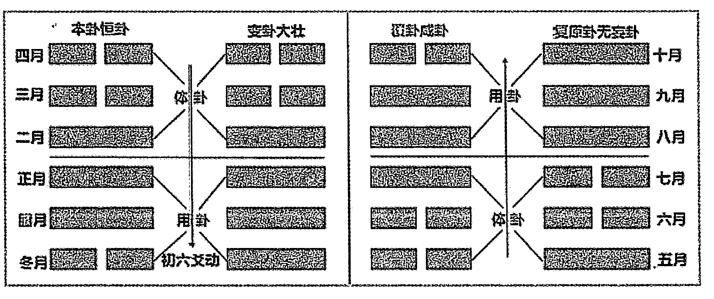

推测分析：以萨科齐为体，以奥朗德为用。

+   1、本卦雷风《恒卦 ䷟》，震上巽下，震木见巽木（风），卦象体用比和；震（☳）体在上，巽（☴）用在下，大选开始前任总统萨科齐还是比较看好的。

+   2、变卦雷天《大壮卦 ䷡》，震上震下，乾金克震木，用克体之象，大选刚开始萨科齐与奥朗德旗鼓相当，预示大选后期奥朗德必然强于萨科齐。

+   3、本卦的覆卦为泽山《咸卦 ䷞》，兑上艮下，艮土生兑金，体生用之象，预示萨科齐泄气，失去民心。本卦体用不得其位，变卦的复原卦天雷《无妄卦 ䷘》；乾金在上，震木在下，用金克体木，无妄卦有无望之意，预示（体卦，萨科齐）无希望之象。

+   4、初六爻变动，时间窗口：十一月、二月、五月、八月。2012年农历二月份法国总统大选相关事宜就已经启动，农历四月初三——初七之间有关于大选的重大信息公布。

+   5、用卦由巽（☴）象变乾（☰）象，预示时间提前了5天，乾（☰）象代表每月十三至十七之间。故此推断，农历四月十三——十七日这五日之内，法国总统大选将有最终结果宣布——奥朗德当选，萨科齐败北。

+   6、总统当选者得票不是很高，萨科齐得票率为：41％——45％，折中得票率为43％。奥氏的得票率为59％——55％。

2012年4月23日（农历四月初三）20时19分，我在网易博客发布预测博文：“奥朗德当选，萨科齐败北”。大国总统大选，世界人民关注。最终结果如何，我们拭目以待！

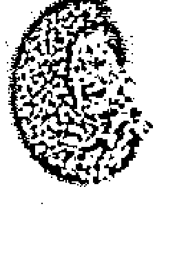

刚刚看到香港凤凰网报道：奥朗德当选已无悬念！何老师神算啊！
回复 | 删除


谢谢海洋，我这边今天网易打不开，博客现在才能登上，就等着这个选举结果了！ 🤔
回复 | 删除

### 事后应验：

2012年5月7日（农历四月十七日）法国总统大选第二轮结果显示弗朗索瓦·奥朗德以51.9%的支持率当选法国总统。正好在著者预测的十三一一十七日的最后一天发布消息，此预测提前15天发布预知大选结果。【见博友点评截图】

### 例四、奥巴马将连任美国总统

2012年5月6日（农历四月十六日）18：04分，在宝鸡一个朋友办公室，从网上看到美国总统奥巴马启动连任总统竞选活动，大家让我预测“奥巴马能否连任美国总统”，以美国二字的笔划加上时间2012年四月十六日酉时起卦预测。

得数字：17、5、4、16、10。

数字起卦：17+5+4+16 = 42÷8 = 5…余2，2为兑（☱）象，外卦取兑（☱）象，42+10 = 52÷8 = 6…余4，4为震（☳）象，内卦取震（☳）象，得本卦泽雷《随卦 ☱☳》；总数52÷6 = 8…余4，4为震（☳）象，九四爻变动，得变卦水雷《屯卦 ☵☳》；本卦体用得位，互卦为风山《渐卦 ☴☶》，覆卦和复原卦不看。

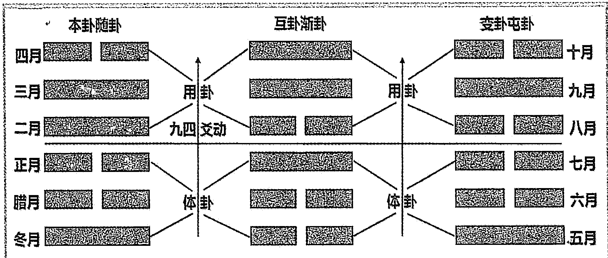

推测分析：以体为奥巴马，以用为竞选对手。

+   1. 本卦泽雷《随卦 ☱☳》，兑上震下，兑金克震木，用克体之象，四月火旺，震木泄气，兑金受克，预示大选时间要推迟一些时日，开始的美国总统大选形势很不利于现任总统奥巴马。

+   2、变卦水雷《屯卦》，坎上震下，坎水生震木，用生体之象，预示奥巴马在此次大选中先难后易，最终将以绝对优势当选连任美国总统。

+   3、九四爻动，四为震（☳）象，时间窗口：二月、五月、八月、十一月；六三爻、九四爻、九五爻构成巽（☴）象，九四爻变，为艮（☶）象，具体时间八月至九月，在月亮成在下弦月的时候，就是从农历九月从十八——二十二日推移到二十三——二十七日有大选消息公布。

+   4、九四爻变，四为震（☳）象，震为长男，代表一个瘦高个子、在家排行老大、说话声音大的男人，这个人可能就是奥巴马自己。

+   5、大整数为2，零数为4、6。选票数字246——264票，奥巴马当选美国下届总统的可能很大。

### 事后应验：

2012年5月19日22时52分，著者将5月6日预测的结果发表在我的网易博客，题目是：“奥巴马将连任美国总统”。2012年当地时间11月7日美国大选结果于凌晨出炉，奥巴马（以274票）成功连任美国总统。时隔半年之后的11月7日（农历九月二十三日），此消息与本人预测的时间和结果完全吻合。

2012-11-7.12：38分，手机186&&&&995的西安朋友发来短信：何老师，您太神了，奥巴马胜选了，开始有许多不利消息，我也很迷茫，但结果说明了一切。祝您意澈神安，福慧双至！

2012-11-7 13:58分博友：R，留言：何老师真乃神人也，预测普京上位和奥巴马连任都成功了 。恭喜您，何老师！

2012-11-7 14:37分，博友烟斗 留言：预测又一次对了，科学与智慧的神奇。祝贺你老兄！（还有博友枫叶和de2009shan都表示赞赏，见网页截图）

> 您这次测得准确吗？是不是手摇，这都是易经的科学之处，看到任何事物都会从易经上看到，这在现实之中必有的

谢谢！谢谢！

谢谢！谢谢！

> A是美国国...

谢谢！谢谢！

> 大师又一次预测对了，可见大师预测神准，祝您大师身体健康，一切顺利！

谢谢！谢谢！

> A是美国国...

谢谢！谢谢！

### 例五、美国国务卿不排除易人的可能

综合国外媒体12月31日报道，美国国务卿希拉里·克林顿30日在医院复查时因体内发现有血栓被安排住院治疗。医生表示，希拉里需要在医院接受48小时的治疗观察。

美国国务院发言人莱茵斯表示，希拉里本月初因昏倒造成脑震荡，30日在复诊检查时医生发现她体内有血栓。目前她在纽约一家医院接受抗凝剂疗法，医生需要在未来48小时观察其药物治疗效果。“她的医生会继续评估其健康状况，包括其它与脑震荡有关联的问题，然后决定是否要采取进一步的措施，”莱茵斯说。不过，这位发言人没有透露血块出现的具体部位及其严重程度。

以希拉里名字笔划，加上2012年农历十一月十九日亥时起卦，预测美国国务卿是否易人。得数字：22、5、11、19、12。

数字起卦：22+5+11+19=57÷8 = 7…余1，1为乾（☰）象，外卦取乾（☰）象，57+12=69÷8 = 8…余5，5为巽（☴）象，内卦取巽（☴）象。得本卦天风《姤卦䷫》；总数69÷6 = 11…余3，九三爻变动，得变卦天水《讼卦䷅》，互卦八纯卦《乾卦䷀》。（当时未参考覆卦和复原卦）

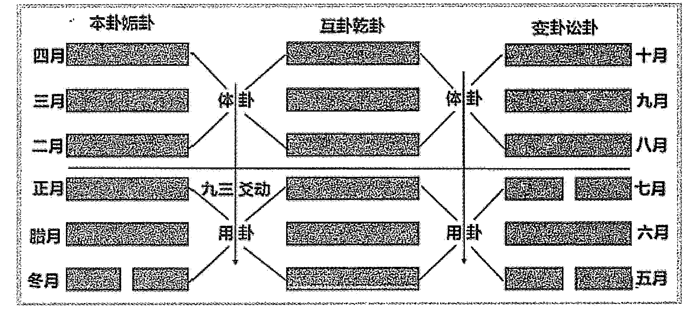

### 预测分析：以体为国务院卿，以用为是否易人。

1、本卦天风《姤卦䷫》，乾上巽下，乾金克巽木，体克用之象，农历十一月水旺，乾金泄气，巽木逢生气，预示希拉里的病情观察治疗时间会拉长些时日，暂时不会有性命之忧。

2、变卦天水《讼卦䷅》，乾上坎下，体生用，乾金生坎水之象，月建农历十一月水旺，乾金泄气过多，形成水旺金衰之象，预示希拉里的大脑健康衰退还是比较严重的。

3、九三爻变动，离（☲）象，时间窗口：农历十月、正月、四月、七月，希拉里在 2012 年农历十月十八至二十二日前后健康就已经出现了问题。2013 年（农历）正月初五日之前美国国务卿可能要易人。

4、卦象体用不得其位，变卦的复原卦为水天《需卦䷄》，希拉里病情反复调理和治疗时间应该需要 3 个月左右的时间。

5、在此期间，希拉里女士的胆囊、心脏、肾脏都会不同程度的出现问题，真正的危险将发生在 2013 年（农历）正月十五日左右，或者 2013 年四月份，她的身体健康有可能引发综合性症状。

综上预测分析：因希拉里女士的健康问题，美国国务卿之职最远在 2013 年正月初五日之前不排除易人的可能。希老太太这只秋日的蚂蚱，在美国政坛上也蹦不了几下了！

事后应验：

2013年元月2日9时38分我在网易博客发表此预测结果。时隔一个月之后，新华网北京（2013年）2月2日电，国际新闻早报：——希拉里·克林顿正式卸任美国国务卿。希拉里·克林顿2月1日（农历腊月二十一日）正式卸任美国第67任国务卿，结束了她作为美国最高外交官的4年任期。希拉里·克林顿当天在美国国务院发表告别讲话。讲话完毕后，希拉里·克林顿走出美国国务院大楼，乘车离开。

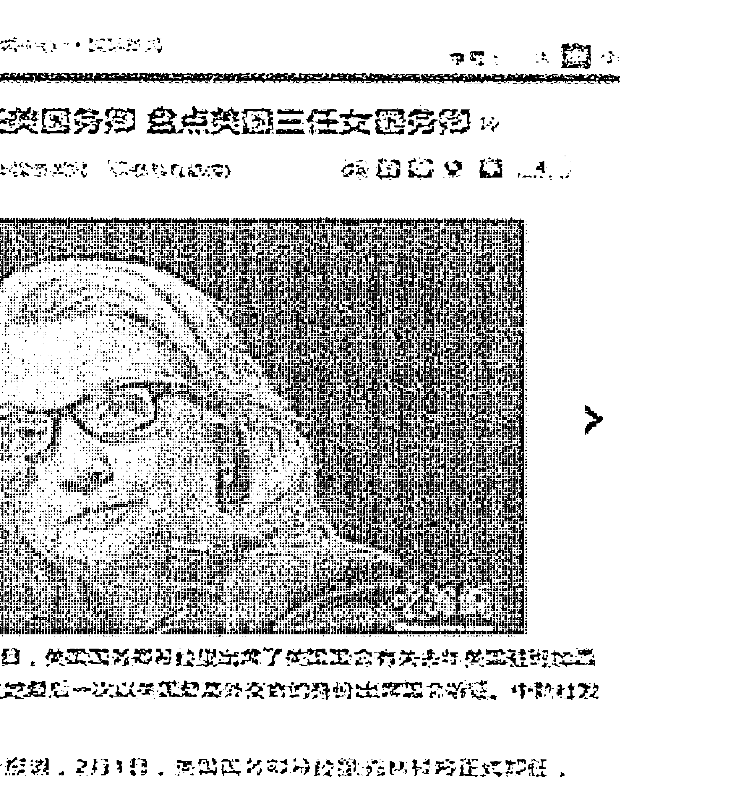

著者于2012年农历十一月十九日亥时起卦预测美国国务卿是否易人。之后希拉里很快出院上班。但是，这个不能说明她不卸任国务卿。而实际发生的也没有超出预测期限，而且比著者预测的还提前了十几天。

### 例六、希拉里能否成为美国下届总统候选人？

2015（乙未）年2月4日（农历2014年腊月十六、立春）12时15分。上网发现凤凰视频消息，阮次山：“希拉里成为总统候选人概率超9成。”即时预测此事能否成为现实。以“希拉里”的笔划加上2014甲午年农历腊月十六日12时15分即时起卦。得数字：22、7、12、16、7

数字起卦：22+35 = 57÷8 = 7…余1，1为乾（☰）象，外卦取乾（☰）象，57+7 = 64÷8 = 8…余0，0为坤（☷）象，内卦取坤（☷）象，得本卦天地《否卦䷋》；总数64÷6 = 10…余4，4为震（☳）象，九四爻变动，得变卦风地《观卦䷓》，本卦体用得位，互卦风山《渐卦䷴》；覆卦和复原卦不用。

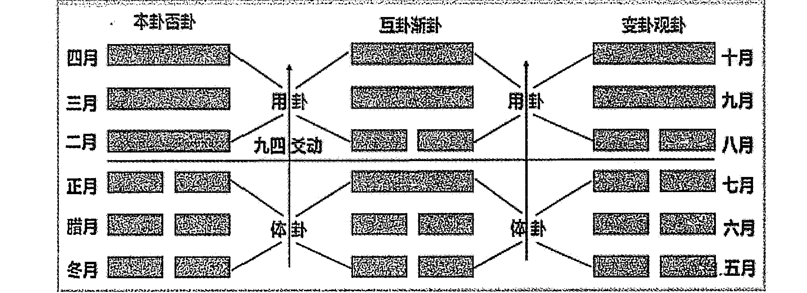

### 推测分析：

1、本卦天地《否卦䷋》；乾上坤下，此卦为“十二消息卦”代表农历七月，坤土生乾金，体生用之象，说明希拉里已经为此事作出很大的牺牲和努力的准备，但是，目前还不能完全确定。

2、变卦风地《观卦䷓》，巽上坤下，巽木克坤土，用克体之象，此卦为“十二消息卦”代表农历八月，即2015（乙未）年酉月，金旺木死，巽木只能视作消息。预示到了这个时候，“希拉里”很可能成为下届美国总统候选人。

3、互卦风山《渐卦䷴》，巽上艮下，鸿鸟逐渐向上高飞，预示希拉里将逐渐走上总统大选的神坛，强势竞选2016年美国总统。

4、九四爻变动，4为震（☳）象，时间窗口：二月、五月、八月、十一月。震（☳）象代表每月初二至初七时间段，2015农历二月初三至初七有消息，八月初二至初七才能最终确定。

### 事后应验：

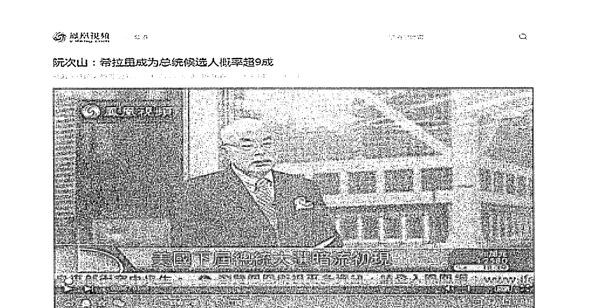

2015 年 8 月 11 日，“2016 年美国总统大选候选人一览表”出炉，强势的希拉里女士排在总统候选人的第三位。阮次山的分析是完全对的，也让著者给逮了个准。

### 例七、2016年美国总统是个男人

2015 乙未年 4 月 13 日（农历二月二十五）17 时 21 分。上网关于希拉里竞选美国总统成功之后，对华政策如何强硬等等传言见诸各大网站。著者撰写了一篇博文“希拉里真能当上美国总统吗？”发在我的网易博客，引起朋友们的极大关注。随之以“美国”二字的笔划，加上 2015 乙未年农历二月二十五日 17 时 21 分即时起卦预测美国大选结果：得数字：17、8、2、25、10。

数字起卦：17+35 = 52 ÷ 8 = 6…余 4，4 为震（☳）象，外卦取震（☳）象，52+10 = 62 ÷ 8 = 7…余 6，6 为坎（☵）象，内卦取坎（☵）象，得本卦雷水《解卦䷧》；总数 62 ÷ 6 = 10…余 2，2 为兑（☱）象，九二爻变动，得变卦雷地《豫卦䷏》，本卦体用不得位，互卦不用；本卦的覆卦水山《蹇卦䷦》、变卦的复原卦为地雷《复卦䷗》。

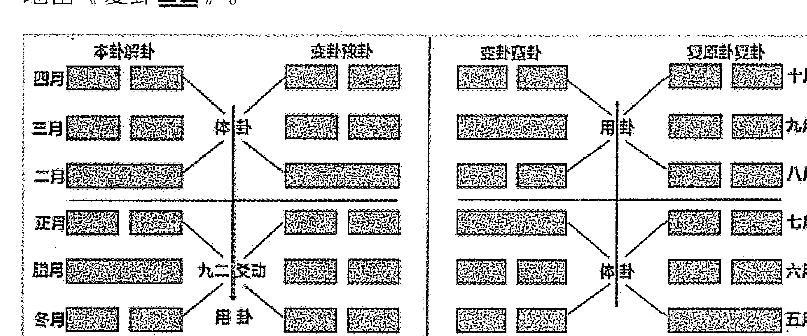

### 推测分析：以体为希拉里，能否当选为用。

+   1、本卦雷水《解卦䷧》，震上坎下，坎水生震木，用生体之象，农历二月木旺当令，逢坎水生之，预示希拉里女士不但能成为总统候选人，而且在大选初期还有顺风顺水的迹象。

+   2、从本卦的覆卦水山《蹇卦䷦》看，坎上艮下，山上有水，坎坷重重，说明希拉里在2016年美国总统大选的后期存在很大、很多的难度和艰险。

+   3、变卦雷地《豫卦䷏》，震上坤下，震木克坤土，体克用之象，预示好事要往后推迟一些时日；变卦的复原卦为地雷《复卦䷗》，坤上震下，为“十一消息卦”，代表农历十一月、五月，“七日来复”，预示在这两个月的上旬（初三至初七时间段）有消息。

+   4、根据“阴卦阳多，阳卦阴多”的原则。体卦震（☳）象，为长男，美国总统大选的最终结果是一个男人，这个人个头高、说话声音大、在家排行老大。

+   5、九二爻变动，二为兑（☱）象，时间窗口：十二月、三月、六月、九月。兑（☱）象对应每月上旬的初八至十二日时间段，预示在这个时间段有最终消息。

综上分析：2016年11月上旬（农历九月初八至十二日）美国总统大选结果将揭晓，新任总统是一个男人，强势的希拉里最终落选。

### 事后应验：

预测一年之后的2016年4月10日14时25分，著者将预测博文“2016年美国总统是个男人”发表在我的网易博客，此事引起博客粉丝们广泛关注。到了2016年9月下旬，好多粉丝发信息、打电话、博客留言，担心我的预测结果失败。

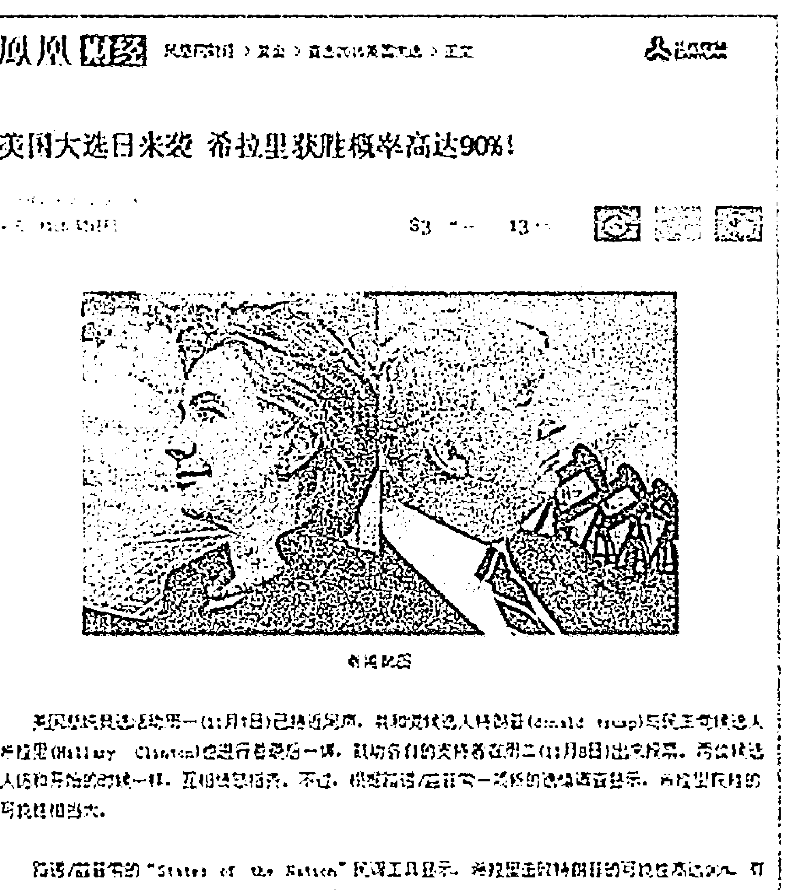

为了慎重对待，著者于2016年9月27日上午7点55分再次预测：“美国大选，特朗普能胜不？”结果是“特氏辩论初战不利，希氏占上风；10月份打成平手；两人差距逐渐缩小；最终希氏有损，特氏得益，获胜的几率很大。（见预测手稿）”

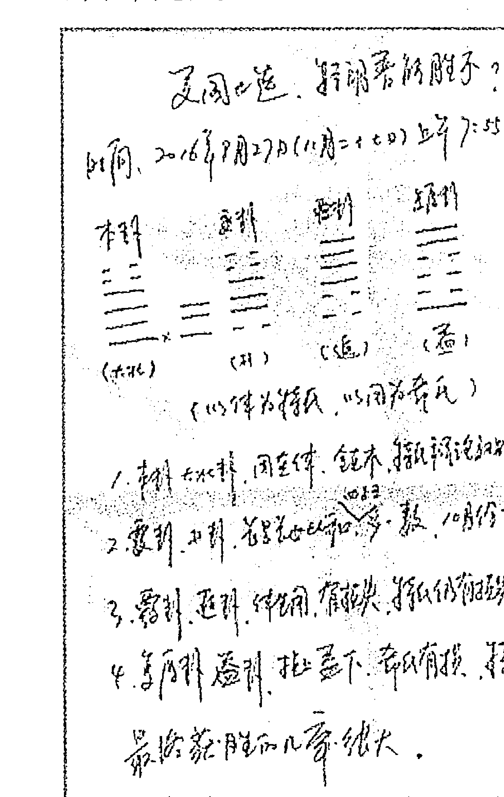

2016年9月26日下午2点。美国2016年总统大选第一场辩论正式开战。美国相关安全部门已经在长岛的霍夫斯特拉大学部署就绪。总统大选辩论共有三场，26号为首场辩论。辩论举办地在美国长岛的霍夫斯特拉大学。

2016年9月27日（农历八月二十七日）上午7点55分，时间起卦预测，美国大选——特朗普能否当选？

2016年10月31日19时43分发表“美国大选——特朗普能当选吗？”的博文。著者是这样写后记的。

**后记：** 美国总统大选，本来与我们没有多大关系。但世界格局的现代化加剧了大国在国际舞台上的地位，所以，号称世界警察的美国——总统大选，也关乎世界和平发展大局。我们不得不关注啊！

预测能否应验，我们拭目以待。如果测准了，那可能是巧合；如果测不准，说明乾坤居士习易水平有待努力提高，大家就当娱乐娱乐哈！

### 最终应验：

2016年11月9日，北京时间下午16时，美国大选尘埃落定，特朗普以279票当选第45任美国总统。一路强势的民主党候选人希拉里在69岁生日时为自己许下的“未来美国总统”梦随之破灭。此预测2015年4月13日生成，2016年4月10日公开发表，从发表之日起经历7个月时间的考验，于2016年11月9日得到验证。因为媒体一路看好说您将再一次跳进预设国际大事，您将观流逝，根本不灵洁的，绝写会讲，例假。如果您还愿意调放我这个不成器的学生，想天就外行并归避正式拜您为师。

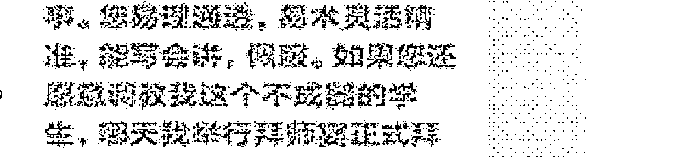

中国的句古话，爱兵必胜。希拉里曾经是第一夫人，当任过美国国务卿，没到任何就下了。老天不可能让她一个萝卜八头切。人生得赢十一二，不如就十之八九。自命不凡的老太太竟然自称自己是未来的美国总统。得，这下屁都不提，只提克林顿的老姿，既好一夫人，即势的了哈！何老师，让人敬仰的学带源源口失分份调。=○=○

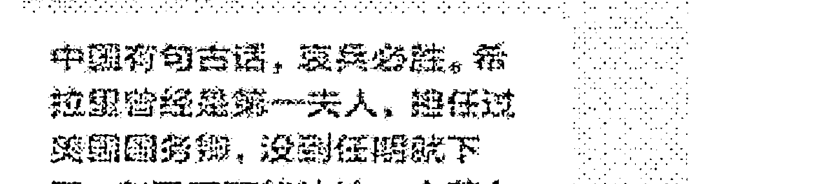

老师说的，何老师比较忙，我也不知道你什么时候方便答谢你。你方便时联系我吧。何老师，这样说希拉里没有错，不过说话有些过于犀利了。她考虑女性的心理感受就好了。

希拉里，导致粉丝们为我担心，担心我预测失败而威风扫地、丢人现眼啊！非常感谢特朗普先生，因为他没有让我失望，没有让我的粉丝们伤心，这个结果对一贯做事张扬的希拉里女士来说有些不公啊！2016年11月14日18时16分，一位多年的铁粉易友王军锋先生在网易信箱发来一篇“大师乃神算也”评论，看了真是让人很受鼓舞，现分享给大家（见下页信箱截图）。

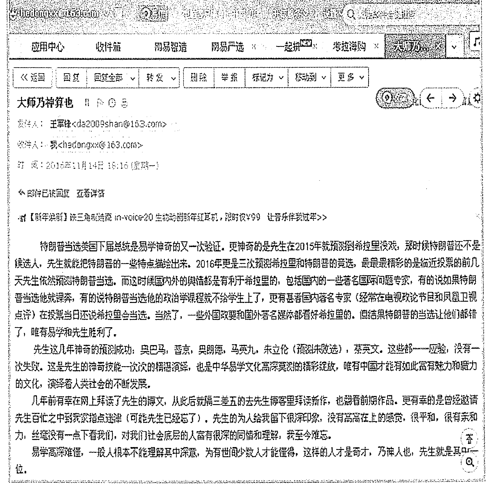

特朗普当选美国下届总统是易学神奇的又一次验证。更神奇的是先生在2015年就预测到希拉里没戏，那时候特朗普还不是候选人，先生就能把特朗普的一些特点描绘出来。2016年更是三次预测希拉里和特朗普的竞选。最最最精彩的是临近投票的前几天先生依然预测特朗普当选。而这时候国内外的舆论都是有利于希拉里的，包括国内的一些著名国际问题专家，有的说如果特朗普当选他就裸奔，有的说特朗普当选他的政治学课程就不给学生上了，更有甚至国内著名专家（经常在电视政论节目和凤凰卫视点评）在投票当日还说希拉里会当选。当然了，一些外国政要和国外著名媒体都看好希拉里的。但结果特朗普的当选让他们都错了，唯有易学和先生胜利了。

先生这几年神奇的预测成功：奥巴马，普京，奥朗德，马英九，朱立伦（预测未败选），蔡英文。这些都一一应验，没有一次失败。这是先生的神奇技能一次次的精湛演绎，也是中华易学文化高深莫测的精彩绽放，唯有中国才能有如此富有魅力和潜力的文化，演绎着人类社会的不断发展。

几年前有幸在网上拜读了先生的博文，从此后就隔三差五的去先生博客里拜读新作，也翻看前期作品。更有幸的是曾经邀请先生百忙之中到我家指点迷津（可能先生已经忘了）。先生的为人给我留下很深印象，没有高高在上的感觉，很平和，很有亲和力，丝毫没有一点下看我们，对我们社会底层的人富有很深的同情和理解，我至今难忘。

易学高深难懂，一般人根本不能理解其中深意，唯有世间少数人才能懂得，这样的人才是奇才，乃神人也，先生就是其中一位。

郑鼎文

11-10 11:44

### 乾坤预测藏头诗
--赠博友乾坤居士

博友乾坤居士何东兴先生精通周易原理，预测世间大事屡屡应验，他从去春就预测美国总统选举大事，料定未来的美国总统是个男人，料定希拉里难以如愿。在选举变数增加，希拉里长期领先的情况下，他近期又一次作了预测，还是认为希氏无望，特朗普有可能当选。结果不出所料，令人叹为观止。—— 题记

#### 题记
作者：郑鼎文

- “乾”道刚健壮精神
- “坤”势宽厚容古今
- “预”算世间万千事
- “测”出结果来得真

我：

十分感谢会长鼓励，我会不断努力，弘扬中国周易文化。

#### 《答郑会长》

- 谢过会长来勉励
- 郑正其事搞预测
- 会聚岐山灵气在
- 长樱放飞凤凰归

关心国家大事，弘扬博大精深的周易文化精神！！

### 例八、新选美国总统能不能躲过这一劫

特朗普当选之后，美国部分州重启清查选票的呼声非常强烈。2016年11月29日（农历十一月初一）下午15时34分，兰州的一位朋友在微信上留言：“我把你对美国总统选举预测发到了朋友圈，引起大家关注和高看，今天有朋友问，让我问问您，看川普能不能躲过这次劫难？”

著者当即以朋友留言的时间：2016年11月29日（农历十一月初一）15点34分起卦预测。得数字：9、11、1、9。

数字起卦：9+11+1 = 21÷8 = 2…余5，5为巽（☴）象，外卦取巽（☴）象，21+9 = 30÷8 = 3…余6，6为坎（☵）象，内卦为坎（☵）象，得本卦风水《涣卦䷺》；30÷6 = 4…余6，6为坎（☵）象，上九爻动，得变卦八纯卦《坎卦䷜》，本卦体用得位，互卦山雷《颐卦䷚》；本卦的覆卦和变卦的复原卦不用。

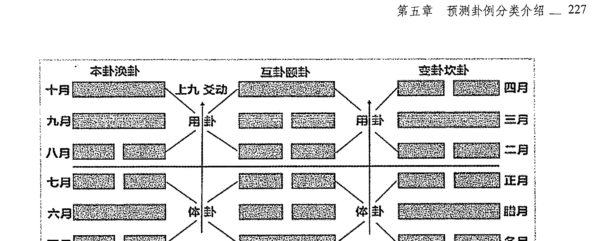

推测分析：以体为特朗普，以用为劫难。

1.  本卦风水《涣卦 ䷺》，巽上坎下，风行水上，坎水生巽木，体生用之象，预示特朗普虽有损失，但是农历十一月水旺当令，小损失，不碍事。
2.  变卦八纯卦《坎卦 ䷜》，坎上坎下，体用比和之象。冬月水旺当令，预示农历十一月上旬特朗普方可化险为夷。
3.  互卦山雷《颐卦 ䷚》艮上震下，震木克艮土，体克用之象，内卦震木逢生气，月令水旺，说明特朗普完全有能力化解此次劫难。
4.  上九爻动，时间窗口：十月、正月、四月、七月。但是到了2017年的农历八月下旬，美国总统特朗普先生可能遇到意外不测之事，不是人身安全出问题，就是要面临弹劾的危机。

此次预测结论：现在的希拉里再怎么强势也早就没戏了，她要想从重新清点选票中得到点什么，恐怕是一种自不量力的行为啊！特朗普没有什么危险，不存在躲过躲不过劫难的事情。

### 事后应验：

2016年12月13日（农历十一月十五），根据美国总统大选当日的选票统计结果来看，在威斯康星州选区中，特朗普总的选票数量比希拉里多出约2万3千张，占威斯康星州总投票数量的1%左右。重新计票的结果显示，特朗普在威斯康辛州仍领先希拉里22000票，依然是2016总统大选中该州的赢家。在对300万张选票进行重新计票后，最终的结果只改变了不到 1800 张选票。

正如预测结果：“特朗普没有什么危险，不存在躲过躲不过劫的事情。”

关于“2017 年农历八月下旬美国总统特朗普先生将遇到意外不测之事，不是人身安全出问题”的预测将等待时间的验证。

> 大哥，下午好！那天我把我对美国总统选举预测发到了朋友圈，引起大家关注和高涨！今天有朋友问，让我问问您，川普能躲过这次的劫难吗？

> 特朗普现在到明年七月之前没有问题，希拉里现在还有戏吗？明年八月，老师特朗普凶多吉少啊！

> 原来这样啊！

> 大变局

> 大什么变局啊！

### 例九、朴槿惠总统会不会下台？

> 前几天有人撰文说美国总统背后都有大财团和宗教组织，特朗普不属于这个集团，他有任期内被暗杀的可能性。

2016 年 11 月 6 日（农历十月初七）上午 8 时 34 分，上网看见韩国朴槿惠总统“闺蜜干政”丑闻发酵。朴槿惠向韩国民众表示歉意。预测朴槿惠总统会不会因此下台？韩国政局是否稳定？ 2016 年十月初七辰时，得数字：9、10、7、5。

> 十九大正好在明年后半年，和英国呼应，说不上世界局势有新动向

> 也许吧

数字起卦：9+10+7 = 26 ÷ 8 = 3…余 2，2 为兑（☱）象，外卦取兑（☱）象，26+5 = 31 ÷ 8 = 3…余 7，7 为艮（☶）象，内卦为艮（☶）象，得本卦泽山《咸卦 ☴☶ 》；总数 31 ÷ 6 = 5…余 1，1 为乾（☰）象，初六爻动，得变卦泽火《革卦 ☴☲ 》，本卦体用不得位，互卦不用；本卦的覆卦为雷风《恒卦 ☳☴ 》，变卦的复原卦为火泽《睽卦 ☲☱ 》。

> 但愿世界多安宁

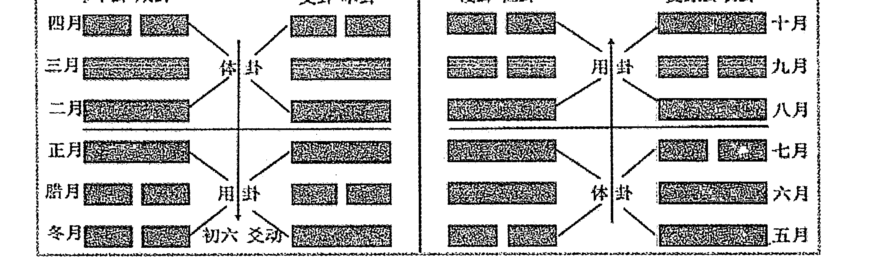

### 推测分析：以体为朴槿惠，以用为是否下台？

1.  本卦泽山《咸卦》，兑上艮下，艮土生兑金，用生体之象，农历十月水旺当令，兑金泄气，艮土衰无法生金，预示朴槿惠暂时不会有什么问题。
2.  本卦的覆卦雷风《恒卦》，震上巽下，震木见巽木，体用比和之象，说明目前朴槿惠暂时还能稳住韩国政府的阵脚。
3.  变卦泽火《革卦》，兑上离下，火克金，有革故鼎新的意思；变卦的复原卦为火泽《睽卦》，离上兑下，卦辞曰：“俩女同居一室，其志不同”，卦象预示韩国闺蜜干预国家大事。两个卦皆为离火克兑金，用克体之象，农历十月水旺，离火处于绝地，无法克制兑金，但兑金遇月令水来泄气，看来农历十月的韩国政局从此面临革新的重大变数。
4.  初六爻动，艮（☰）象变离（☲）象，时间窗口：十一月、二月、五月、八月为应验月份。艮象对应每月的二十三至二十七时间段，离（☲）象为日在中天，时间可能提前几天；农历十一月二十三至二十七日之前存在重大变故。
5.  从时间窗口看，韩国政局的隐患从农历 2016 年五月就已经生成隐患；农历八月开始发酵，农历十一月调整缓和；明春农历二月下旬，韩国政局将处于动荡格局，朴槿惠总统面临下台危机。
6.  从中国传统文化的角度看，2017 丁酉年，巳、酉、丑三煞在东方寅、卯、辰位，明年春季，东亚局势动荡不安是其一；韩国总统易人是其二。 究竟如何，我们拭目以待！

### 事后应验：

2017年3月10日上午，韩国宪法法院通过了对总统朴槿惠的弹劾案。朴槿惠将立即被免去总统职务，成为韩国历史上第一位被成功弹劾下台的总统。2017年3月10日是农历二月十三日，比著者预测的应期（二十三至二十七日）提前了10天时间。“明年春季，东亚局势动荡（显示，朝鲜发射导弹和核武器试验；韩国布置萨德系统等，得到验证）不安是其一；韩国总统易人是其二”的预测在4个月之后全部兑现。

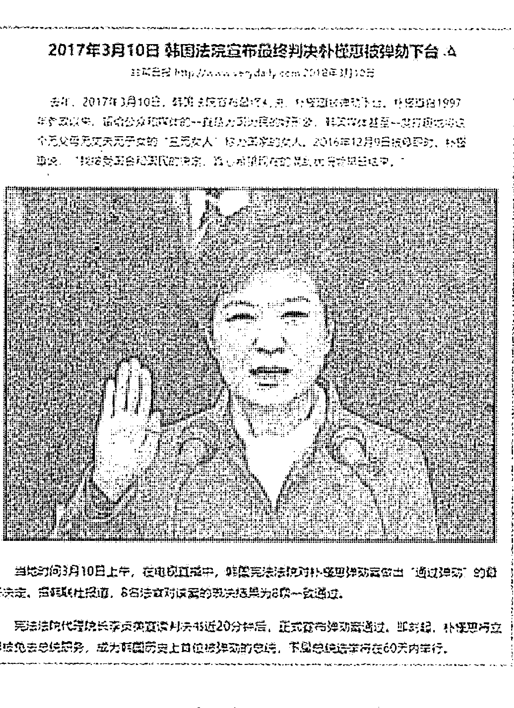

### 例十、二月下旬有确切消息

2014年3月24日10：37分，岐山的乡党某先生手机短信：何老师，我们村上领导因群众上访被停职，问结果？时间：2014年农历二月二十四日，巳时，得数字：7、2、24、6。

数字起卦：7+2+24 = 33÷8 = 4…余1，1为乾（☰）象，外卦取乾（☰）象，33+6 = 39÷8 = 4…余7，7为艮（☶）象，内卦取艮（☶）象，得本卦天山《遁卦☰☶》，总数39÷6 = 6…3，3为离（☲）象，九三爻变动，得变卦天地《否卦☰☷》；本卦体用不得位，互卦不用，本卦的覆卦雷天《大壮卦☳☰》，变卦的复原卦为地天《泰卦☷☰》。

## 第五章 预测卦例分类介绍

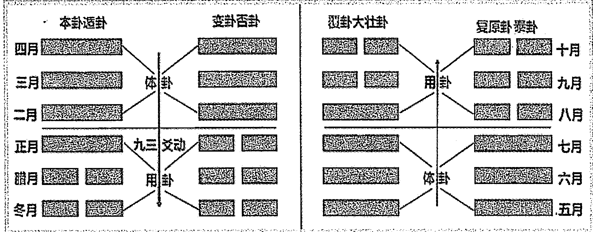

### 推测分析：以体为问卦人，以用为事情。

1.  本卦天山《遁卦》，乾上艮下，艮土生乾金，用生体之象；覆卦雷天《大壮卦》，震上乾下，春季木旺，金处绝地，预示着得理一定要让人，凡事不可太过；遁卦为天下有山、金下有手之象，这个人可能暗地里拿了别人的好处太多，最好的办法是自己把东西给人家再暗中“遁”回去。
2.  变卦天地《否卦》，乾上坤下，坤土生乾金，用生体之象，用卦艮（☶）象（东北）变坤（☷）象（西南），预示农历正月二十三至二月初二日10日之内，不利的事情发生在西南方向。
3.  变卦的复原卦为地天《泰卦》，坤上乾下，坤土生乾金，用生体之象。正月木旺当令，坤土处于死地，难生乾金，预示目前没有人能帮助这个人。
4.  九三爻动，为离（☲）象，为南方。时间窗口：一月、四月、七月、十月。事情最远农历二月下旬就有最终处理结果。
5.  今年是甲午年，当事人属羊，正好与太岁相合，领导好像有挽留他的意向。但是，六合之年若遇上官司（上访）之类的事，一时半会很难有好的结局啊！

### 事后应验：

十天之后的2014年4月3日（三月初四）7时50分，某先生回复：“何老师你好，昨天（三月初三）中午镇党委书记给他谈话，劝其辞职，当场与领导冲撞，下午镇上已发文免职，谢谢何老师，预测应验。”结果与著者预测的“二月下旬有最终处理结果”基本吻合。

## 例十一、任职一事何时批下？

2014年8月21日（农历七月二十六日）,11:38分，外地有一位朋友打电话：要我预测一下自己任职一事何时批下来？以2014（甲午）年8月21日是农历七月二十六日午时起卦预测，得数字：7、7、26、7。

数字起卦：7+7+26 = 40 ÷ 8 = 5…余0，0为坤（☷）象，外卦为坤（☷）象，40+7 = 47 ÷ 8 = 5…余7，7为艮（☶）象，内卦取艮（☶）象，得本卦地山《谦卦䷎》，总数47 ÷ 6 = 7…余5，5为巽（☴）象，六五爻变动，得变卦水山《蹇卦䷦》；本卦体用得位，互卦为雷水《解卦䷧》，覆卦和复原卦不用。

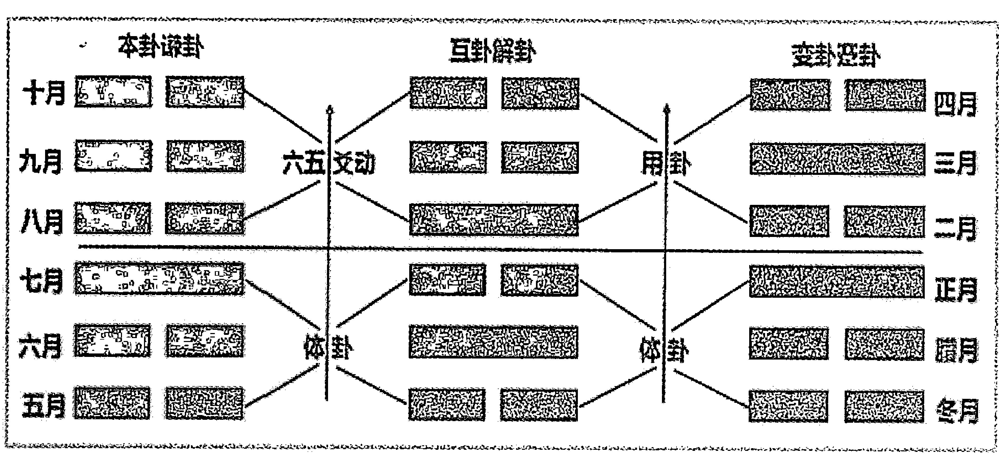

推测分析：以体卦为朋友，以用卦为职务。

1.  本卦地山《谦卦䷎》，坤上艮下，体为艮土、用为坤土，体用比和之象，山在地下，表示人才埋没之象，看来此次选拔开始处于很顺利的状态。
2.  变卦水山《蹇卦䷦》，坎上艮下，艮土克坎水，体克用之象，农历七月金旺生水，体（艮）土泄气，难以克制用水，事情存在一定变数。

## 例十二、单位这几天“地震”

2011 年（八月）中秋节前，一位朋友请乡党吃饭，邀我一起作陪。到饭店时，邀请的客人已经坐西北面东南坐在了席位上，东南位置有个年龄偏大的女服务员摆动餐具，正好组成天风《姤卦☰☴》。我们一落座，客人就说：“我们单位这几天“地震”。”我与这位客人不熟，他们显然是说“哑语”。听了几句，我明白了，原来他是说单位人事正在变动。

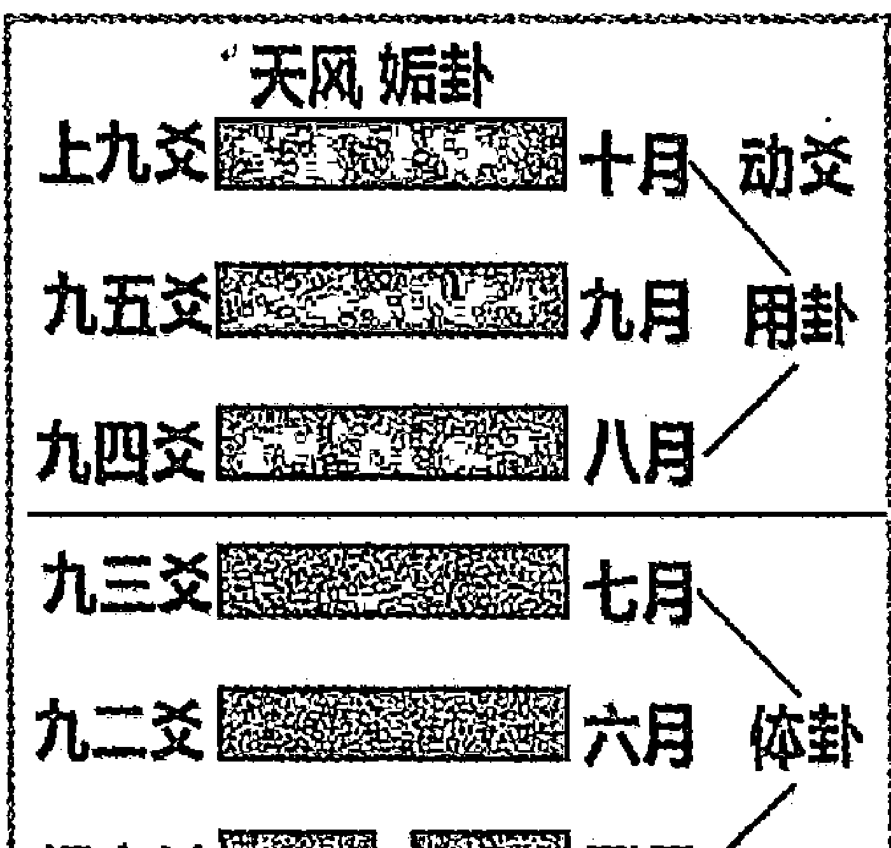

客人说：我没有摇卦呀，也没见你起卦，你怎么测的？
我说：今年是2011（辛卯）年，您属鸡，今年太岁冲你；卯酉相冲，工作必然要动。现在是农历八（酉）月，两酉冲一卯，我刚才进门看见你起了一个天风《姤卦》，乾（☰）象为首长，巽（☴）象为舆论信息，您要动了，而且是提升职务的事。
客人说：神了，还真让你给说准了。我本没有这想法，领导上门谈话，单位的人事关系很复杂，事情不好弄啊！
我说：目前的情况恐怕由不了您的。不过您也别太认真，如果农历八月之内能发文件，你定当提升职务。过了农历八月，可能就没戏了！

### 事后应验：

真实情况是农历八月中旬，据说提升职务的事情已经上报待批了。进入九月后反而没了消息，后来不了了之。
著者感想：人生在世，有时候往往会让你空喜一场的好事，开始势头很好，但是，结果却不尽人意。这就像农民种庄稼一样，开始长势良好，中间花开美景，天气突变，一场冰雹，是不是丰收就很难说了啊！

## 例十三、明年初五好事可期

2017年元月4日(农历腊月初七)上午10时21分，朋友某先生电话说：有一件事咨询。我立即根据时间即时起卦，得数字：9、12、7、6。
数字起卦：9+12+7 = 28 ÷ 8 = 3…余4，4为震（☳）象，外卦取震（☳）象，28+6 = 34 ÷ 8 = 4…余2，2为兑（☱）象，内卦取兑（☱）象，得本卦雷泽《归妹卦》；总数34 ÷ 6 = 5…余4，4为震（☳）象，九四爻动，得变卦地泽《临卦》。本卦体用得位，互卦为水火《既济卦》；覆卦与复原卦不用。

本卦归妹卦 | 互卦既济卦 | 变卦临卦
--- | --- | ---
四月[爻象] | [爻象] | 十月[爻象]
三月[爻象] 用卦 | [爻象] 用卦 | 九月[爻象]
二月[爻象] 九四爻动 | [爻象] | 八月[爻象]
正月[爻象] | [爻象] | 七月[爻象]
腊月[爻象] 体卦 | [爻象] 体卦 | 六月[爻象]
冬月[爻象] | [爻象] | 五月[爻象]

推测分析：以体为某先生，以用为要问的事。

1.  本卦雷泽《归妹卦䷵》，震上兑下，外卦用为震木，内卦体为兑金，兑金克震木，卦象体克用，预示有好事期待，但好事的来临要推后一段时间。
2.  互卦水火《既济卦䷾》，坎上离下，卦爻阴阳得位，水上火下，烹饪之象，说明事情已经在运作积极之中。
3.  变卦地泽《临卦䷒》，坤上兑下，外卦变坤象为土，内卦为兑金，坤土生兑金，用生体之象，预示卦象呈现有好事找人的迹象。
4.  九四爻动：为震（☳）象变坤（☷）象，震为长男、为东方、为高个子说话声音大、在家排行老大的男人；坤为有身份女人。预示有一位有职权的男人、也有一位有身份地位的女人可以从中帮忙。
5.  时间窗口。二月、五月、八月、十一月。农历十一月上旬有兆头或者好消息。快则到二月初二、初三前后兑现，远在五月好事可期。

### 事后应验：

当天（2017年元月4日）下午16时与某先生见面。我对他说：你想办的事情是十一月初发起的念想，此事能办成，有一个高个子说话声音大、在家排行老大的男人，还有一位有身份的女人可以帮助你，明年二月初可以见效。他听了我的分析后信心倍增，抓紧时间运作办理。

2017年2月14日上午9时见到某先生，他高兴地说：“何老师，你太神了，年前说的事情，正如你所示，一男一女那两个人都主动帮我，目前事情正在运作之中。谢谢！”
2017年4月11日遇见某先生，他说：事情正在积极运作之中，估计很快就有结果。

## 第六节 问题婚姻预测

《周易·系辞》曰：“一阴一阳之谓道”。男为阳、女为阴，男主外、女主内，婚姻是由男女双方组成的。男人和女人在家庭生活中总会出现一些打打闹闹、争争吵吵、磕磕碰碰的闹剧，这也许就是生活所谓的五味杂陈。21世纪信息社会，网络世界，有时候感情上免不了出现一点小插曲，灵魂上会有一些出轨，在物欲横流的大千世界里本来很正常，可是对于婚姻家庭来说是极大的伤害。
古人云：“宁拆十座庙，不毁一桩婚。”遇到问题婚姻家庭，只要我们耐心的、负责的去帮助“迷茫者”，给予正确适当的劝导，握手言和的几率还是蛮大的，这也算是积阴德、做善事，为构建和谐社会做一些贡献。下面举几个问题婚姻的卦例，与大家一起探讨。

### 例一、再往前走会造成家庭破裂

2011年11月11日(农历十月十六日)，外地博友 && 居士留言：“老师，我也给你报三个数字，能否帮我测测婚姻感情的问题？4、6、8，是随便想出来的数字，不是刻意的才准吧？麻烦你给我测测？谢谢！”
对方报数：4、6、8。
数字起卦：4+6=10÷8 = 1…余2，2为兑（☱）象，外卦取兑（☱）象，10+8 = 18÷8 = 2…余2，2为兑（☱）象，内卦取兑（☱）象，得本卦八纯卦《兑卦☱☱》，总数18÷6 = 3…余0，上六爻动，坎（☵）象，得变卦天泽《履卦☴☱》，本卦体用得位，互卦为风火《家人卦☴☲》。覆卦和复原卦不用。

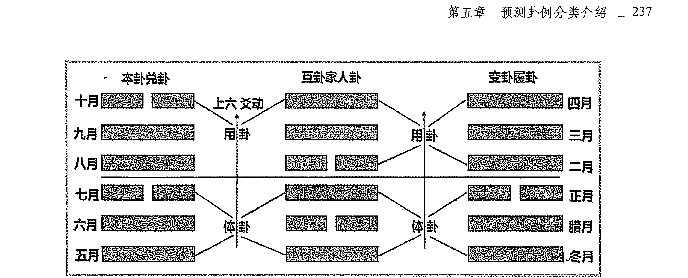

推断预测：以体为问卦人，以用为婚姻感情。

1.  本卦为八纯卦《兑卦☰》，兑金见兑金，卦象比和；兑卦有口舌之争，这个婚姻感情开始是比较和谐的。
2.  变卦为天泽《履卦☰》，乾上兑下，乾金见兑金，卦象也是比和。本卦与变卦都是体用比和之象。履卦辞曰：“履虎尾，不咥人。”在感情上目前已经踩到了老虎的尾巴，如果立即止步，不会伤害自己；如果一意孤行，势必伤及自身和家庭。互卦为风火《家人卦☰》，应该是家庭内部发生矛盾。
3.  时间窗口：七月、十月、正月、四月。农历七月初，个人的感情就出轨了，到了农历十月初，家庭婚姻已经面临矛盾危机。
4.  上六爻动，变卦为坎（☵）象；坎为中男、为车、为水、为感情。有一个聪明精干的中年男子，让一个多情的少年女子着迷了。
5.  卦中人物。一个少年女子，面对两个男人。一个是大男子主义，很强势，很男人，让她太压抑；一个是很聪明的人，会察言观色，柔顺体贴，机智灵活，不时的开车出去让她浪漫。一个女人爱上了一个本不该爱的男人。

温馨提示：你必须想好了，目前婚姻已经走到危险境地，再往前走就会伤害自己，甚至造成家庭破裂。

### 事后应验：

随后博友 &&&& 回复：谢谢老师，这个分析是比喻性质的吧？总之就是爱了一个不该爱的人，是吧？再次谢谢老师详细的分析和温馨的提示。

### 例二、这个女孩子有婚外恋

2012年2月24日(农历二月初三)晚22时48分，有位朋友在QQ上说：“何老兄，你好，看了你的“梅花易”很佩服。我一亲戚，女，1990年农历二月十五生人，属马，婚姻不顺，已有一次失败婚姻，目前的二次婚姻又有变故苗头，您给起卦看看。好像每年春节关系就紧张很。自幼好像不太听自家老人言，对别人都不错，什么事好像都亏自家。”

按2012年农历二月初三亥时的时间起卦，得数字：5、2、3、12。
数字起卦：5+2+3 = 10÷8 = 1…余2，2为兑（☱）象，外卦取兑（☱）象，10+12 = 22÷8 = 2…余6，6为坎（☵）象，内卦取坎（☵）象，得本卦泽水《困卦䷮》；总数22÷6 = 3…余4，4为震（☳）象，九四爻变动，得变卦八纯卦《坎卦䷜》，本卦体用得位，互卦风火《家人卦䷤》，本卦的覆卦和变卦的复原卦不用。

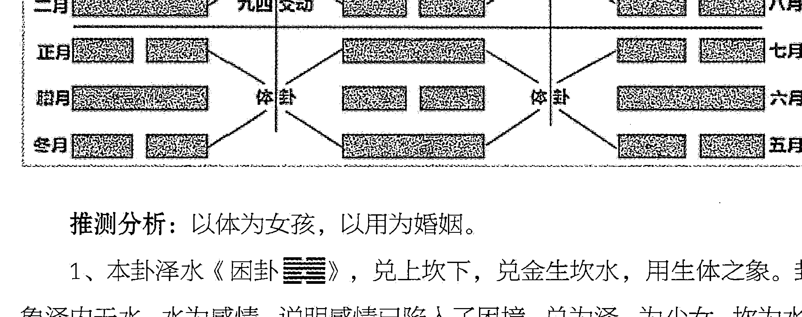

推测分析：以体为女孩，以用为婚姻。

1.  本卦泽水《困卦䷮》，兑上坎下，兑金生坎水，用生体之象。卦象泽内无水，水为感情，说明感情已陷入了困境。兑为泽、为少女，坎为水、为中男，少女变中男之象，困卦预示着有婚外恋的迹象。
2.  变卦八纯卦《坎卦 》，坎上坎下，水见水，体用比和之象，预示这个女子开始对婚姻还算满意、后来反悔了，好在农历二月木旺当令，坎水泄气，只是感情出轨，但还不至于泛滥成灾。
3.  互卦风火《家人卦 》，外卦巽（）象，巽为长女、为风、为舆论，内卦离（）象，离为中女、为火，离为火。家人卦：“内火外风，风自火出，使家事自内影响至外，谓之家人”。此婚姻矛盾从女孩自身而生。
4.  九四爻变动，震（）象。时间窗口：二月、六月、九月、腊月。震（）象对应每月初三到初七。农历二月卯木当令，水生木旺，女孩属马，午见卯为桃花泛滥，预示最近此女子正在闹婚变。
5.  震（）象，震为长男、高个子、声音大，为东方。在她家的东边有一个高个头、身材瘦、说话声音大的男子。此女子心中一直惦记这个男的。
6.  此女90年属马，生在二月，月柱带桃花，农历二月逢月建卯为桃花月，预示她的婚外恋旧情复发了。弄不好今年农历三、四月份离婚的可能性很大。

### 事后应验：

随机预测完毕，顺便回复对方。朋友回复说：今年春节关系就紧张很。很准，好像（女孩）一直喜欢一个男的，上次为那男孩离婚，这次好像又有关联（见 QQ 对话截图）。

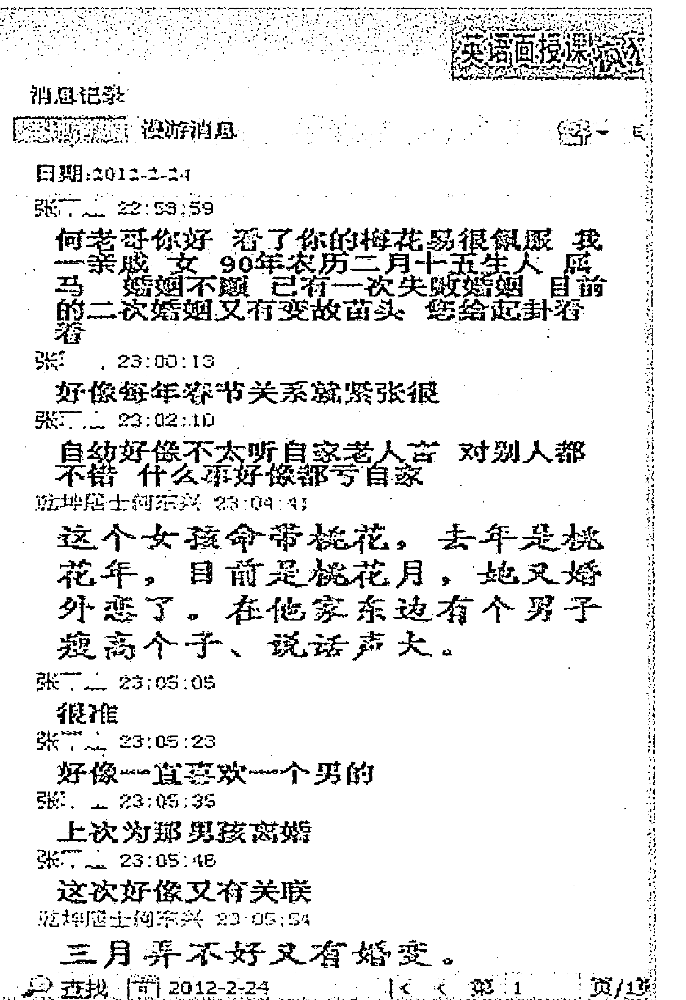

### 例三、今年感觉感情一直不顺

这是一个小女人与一个大男人的感情纠葛问题。2012年农历四月初一下午17点32分，外地一位博友“ybqc”在QQ上留言说：“你好！今年感觉感情一直不顺，应该怎么办才好，能否麻烦指点一下？”

乾坤居士问：哪方面的感情？

ybqc 说：怎么具体说清楚呢？

根据2012年农历四月初一酉时起卦，得数字：5、4、1、10。

数字起卦：5+4+1 = 10÷8 = 1…余2，2为兑（☱）象，外卦取兑（☱）象，10+10 = 20÷8 = 2…余4，4为震（☳）象，内卦取震（☳）象，得本卦泽雷《随卦䷐》；总数20÷6 = 3…余2，2为兑（☱）象，六二爻变动，得变卦八纯卦《兑卦䷵》；卦象体用不得位，互卦不用；本卦的覆卦为山风《蛊卦䷑》，变卦的复原卦为八纯卦《兑卦䷵》。

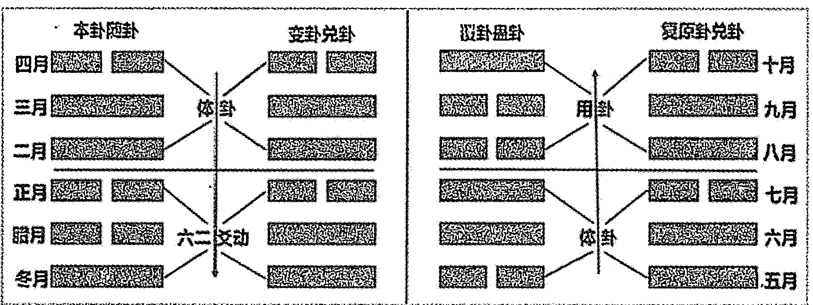

推测分析：以体为问卦人，以用为感情纠结。

-   1、本卦泽雷《随卦䷐》，兑上震下，兑金克震木，体克用之象，泽为少女，震为长男，少女跟随着长男而去之象。卦象预示着一个小女人与一个有家的大男人之间的感情纠葛。
-   2、变卦八纯卦《兑卦䷵》，兑上兑下，变卦的复原卦也是八纯卦《兑卦䷵》。卦☰》，都是兑金见兑金，体用比和之象。兑为口舌之争，虽有口舌之争，但是这事能和解，只是两人和解的时间要推迟一些时日罢了。
-   3、覆卦为山风《蛊卦䷑》，艮上巽下，山下有风之象，事情目前已经舆论纷纷，预示着一桩事情结束，另一个事情刚刚开始，需要一段时间等待观察。
-   4、六二爻变动，兑（☱）象，兑为少女、为口舌、为金，为西方。时间窗口：十二月、三月、六月、九月。看来2011年腊月初八至十二之间婚姻就出问题了，2012年三月预示也有男女之间的口舌之争。
-   5、现在是四月初，目前男方看似得势，但是内耗太重；女方受到外围环境等制约，因此感到非常的困扰和郁闷。男女感情正处在茫然的调整阶段，双方在感觉上有较为相同的地方。
-   6、女方想着能否重归于好。男方是一木受到四个兑金之克制。但是，四月火当令，木虽泄气，金受火克，所以，金克木的力量并不是很大，只是到处受到指责罢了，舆论压力很大。到农历六月金逢生气发力，纠葛才能平息好转。

预测完毕，立即将结果发给了对方。

### 事后应验：

2012年6月18日16:07分，ybqc回复：乾坤先生您好！之所以尊称您先生，是因为您在某些方面做到足以让我尊敬。我的情况现在已经明确，特向您汇报如下：

-   1. 三月份我们闹翻脸；
    2. 四月份我们僵持；
    3. 五月份加强联系；
    4. 截止目前已明确言归于好。

事态的发展完全符合您的预测。乾坤先生，您的预测让我折服。但是，在您面前我很憾颜，您没有指责和怒斥，而是温和耐心地帮助我，让我很受感动。

乾坤居士 16:09:45 好事多磨，这是一个必然。祝你们幸福美满。

ybqc 16:21:56 虽然事态好转，但经过这一劫，感觉自己成熟了许多，以后会平静正确对待。再次感谢您尊敬的乾坤先生！

乾坤居士 16:23:04 不客气，人生不如意之八九，如意之一二。祝你好运！

ybqc 16:33:20 您总结的这一句话简直就是真理！谢谢，您忙吧，不多打扰了。

### 附 QQ 记录：

-   ybqc: 17:37:22 怎么具体说清楚？现都快“五一”了，也没好转。
-   乾坤居士 :17:38:43 三月好像有男女之间的口舌之争，是一个小女人与大男人之间感情纠葛。
-   ybqc: 17:40:31 是。为什么能说说吗
-   乾坤居士 :17:40:51 到六月份才能平息。目前男方看似得势，但是内耗太重；女方受到外围环境等制约，因此感到非常的困扰。目下处在调整阶段，双方的感觉有较为相同的地方。
-   ybqc: 17:44:25 太对了！
-   乾坤居士 :17:45:34 你还没有问我根据什么看的呢，就稀里糊涂的说对。

### 例四、八月初有结果

2012（壬辰）年农历六月初八晚21时17分，朋友在QQ上说妻子娘家发话说：“让必须卖房买车，要不然就散伙，你看结果如何？”

根据时间得数字：5、6、8、12。

数字起卦：5+6+8 = 19 ÷ 8 = 2…余 3，3 为离（☰）象，外卦取离（☰）象，19+12 = 31 ÷ 8 = 3…余 7，7 为艮（☶）象，内卦取艮（☰）象，得本卦火山《旅卦☲》；总数31÷6=5…余1，1为乾（☰）象，初九爻变动，得变卦八纯卦《离卦☲》；本卦体用不得位，互卦泽风《大过卦☴》；本卦的覆卦为雷火《丰卦☳》，变卦的复原卦也是八纯卦《离卦☲》。

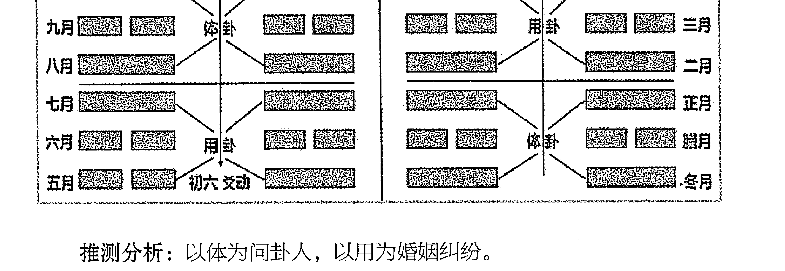

推测分析：以体为问卦人，以用为婚姻纠纷。

-   1. 本卦火山《旅卦☲》，离上艮下，离火生艮土，体生用之象，预示经济上有一些付出；互卦泽风《大过卦☴》，说明两个人之间已经有很大的过节。
-   2. 变卦八纯卦《离卦☲》，离上离下，变卦的复原卦也是八纯卦《离卦☲》，都是离火见离火，卦象比和之象。说明二人之间相互通气交流正在进行中，预示此事后面能够讲和。
-   3. 初六爻变，为乾（☰）象。时间窗口：十一月、二月、五月、八月。到农历五月二十三至二十七日之间，对方可能就此事达成具体和解方案。
-   4. 乾（☰）象为西北方位，指有身份的公职人员，为长辈男人。预示西北方位有一位有身份地位的男性长者，可以从中帮助你们解决问题。
-   5. 本卦火山《旅卦☲》的覆卦为雷火《丰卦☳》，震上离下，木火通明，震男与离女，能说得清楚，此事不用着急，农历八月初才能有理想的结果，到时候你备一份丰厚的礼品，把媳妇接回来就行了。

事后应验：

2012年农历五月下旬，中间有人给双方和解通气；其中有一个退休的（女方的姑父）老干部从中帮助调解，农历八月初妻子接回家了。朋友打电话来说：给你汇报一哈，预测结果应验，人回来了，这回她（妻子）贼哈了！（与预测结果完全吻合）

### 例五、九月中旬雨过天晴

2014年8月23（农历七月二十八）日19：44分，网友hydg在QQ留言：“何老师，打扰了，堂兄与嫂子发生比较严重的冲突，有离婚之危，我想劝和他们，不知前景如何，请老师示下”。我说：“当居委会主任啦！那你得告诉我他们的出生年月呀！”hydg说：“哈哈，因为我和堂兄嫂关系很好，所以想劝和，不过问生辰不方便”。

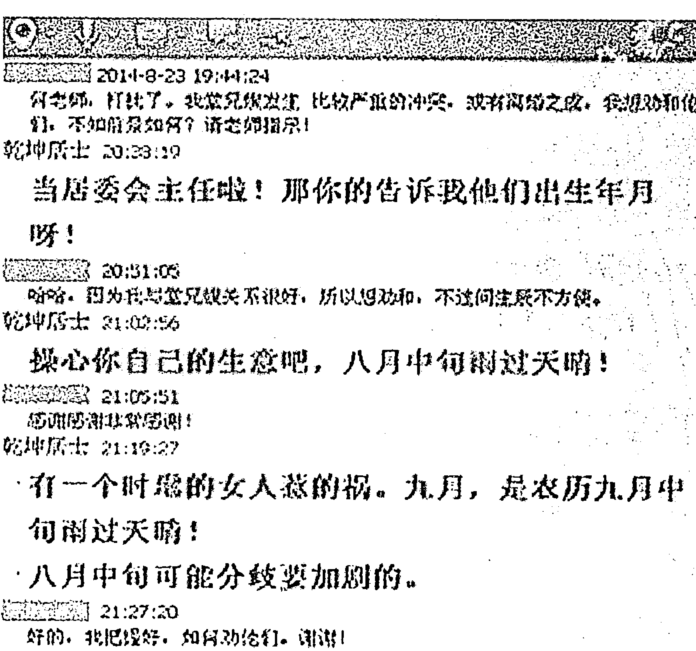

根据2014年农历七月二十八日，19：44分时起卦，得数字：7、7、28、11。

数字起卦：7+7+28 = 42 ÷ 8 = 5…余2，2为兑（☱）象，外卦取兑（☱）象， 42+11 = 53 ÷ 8 = 6…余5，5为（☴）象，内卦取巽（☴）象，得本卦泽风《大过卦䷛》，总数53 ÷ 6 = 5，5为巽（☴）象，九五爻变动，得变卦雷风《恒卦䷟》；本卦体用得位，互卦为八纯卦《乾卦䷀》，覆卦和复原卦不用。

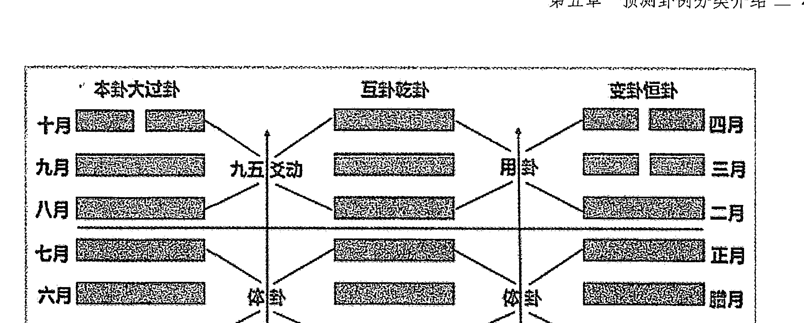

推测分析：以体为当事人，以用为要问之事。

-   1. 本卦为泽风《大过卦 ⚊ 》，兑上巽下，兑金克巽木（风），用克体之象。大过者，实乃大大的过节也！农历七月金旺木衰，婚姻确实是遇到了麻烦，看来这两人是要闹离婚的。
-   2. 互卦为八纯卦《乾卦 ⚊ 》，乾上乾下，金见金，比和之象，两个人中间好像没有什么大不了的原则性问题。
-   3. 变卦为雷风《恒卦 ⚊ 》，震木见巽木，体用比和之象，长男配长女。恒为天长地久，预示婚姻恒久美满，看来这两个人是先闹矛盾离婚，随后又握手言和，重归于好。
-   4. 九五爻动，五为巽（☴）象，为长女、为风、为信息，大过卦九五爻辞曰：“枯杨生华，老妇得士夫，无咎无誉。”这件事是因为中间有一个很时髦、性感、头发黄的风流女人招惹的祸。
-   5. 时间窗口：六月、九月、十二月、三月。农历六月中旬就开始闹矛盾，目前男的要离，女的不想离，大有对簿公堂之势。农历七月、八月金旺，双方僵持；到九月中旬之前雨过天晴，自然重归于好。

事后应验：

后来在网上见到这位朋友，我说：我看见8月23日给你预测的卦：“男的要离，女的不离，大有对簿公堂之势，九月中旬雨过天晴。”你嫂子和你哥的婚离得咋样了？
hydg 回复：“没离了，八月下旬我伯父他们做工作，好像九月初又和好了！”
著者说：“是啊，家庭保卫战吗，女的肯定不会答应的。”
hydg 回复：“哈哈，对的对的，我堂兄与这位嫂子是二婚，他想与原来的复婚，当然现在的嫂子不肯了”（见博客留言截图）。

### 例六、我想离婚

2017年4月27日19点39分，某女士在微信留言：“何老师您在吗？有点事想听听您的意见。我想离婚，不知道这样对不对？”

按2017年四月初二戌时时间起卦。得数字：10、4、2、11。

数字起卦：10+4+2 = 16÷8 = 2…余0，0为坤（☷）象，外卦取坤（☷）象，16+11 = 27÷8 = 3…余3，3为离（☲）象，内卦取离（☲）象，得本卦地火明《明夷卦䷣》；总数27÷6 = 4…余3，3为离（☲）象，九三爻动，得变卦地雷《复卦䷗》，本卦体用不得位，互卦不用；本卦的覆卦为火地《晋卦䷢》，变卦的复原卦为雷地《豫卦䷏》。

| 本卦明夷卦 | 变卦复卦 | 覆卦晋卦 | 复原卦豫卦 |
|------------|----------|----------|------------|
| 四月       |          |          | 十月       |
| 三月       | 体卦     | 用卦     | 九月       |
| 二月       |          |          | 八月       |
| 正月       | 九三爻动 |          | 七月       |
| 腊月       | 用卦     | 体卦     | 六月       |
| 冬月       |          |          | 五月       |

推测分析：以体为问卦女人，以用为所问婚姻。

-   1. 本卦地火《明夷卦䷣》，坤上离下，覆卦为火地《晋卦䷢》，离上坤下，都是离火生坤土，用生体之象，目前看离婚对女主人有利。
-   2. 变卦地雷《复卦䷗》，坤上震下，复原卦为雷地《豫卦䷏》震上坤下，震木克坤土，用克体之象，预示最终结果离婚对女主人不利。
-   3. 九三爻动，离（☲）象，离为南方、为中女，时间窗口：正月、四月、七月、十月。看来今年正月女主人就有离婚的打算了。四月初倒是一个好机会，要离很快就能分手。
-   4. 如果四月离不了，拖到七月离婚的事情就变得很麻烦。

我当日的预测回复：“以刚才你留言的时间起卦，本卦地火《明夷卦》，九三爻动，变卦地雷《复卦》。1、本卦看用生体，离婚对你有利；2、变卦看用克体，结果对你不利；3、时间窗口：正月、四月、七月、十月，说明今年正月你就有离婚的打算，四月初倒是一个好机会，要离很快就能分手。4、如果四月离不了，拖到七月事情将很麻烦。”

> 以刚才你流言的看，本卦地火明夷卦，三爻动，变卦地雷复卦。1、本卦看用生体，离婚对你有利；2、变卦看用克体，结果对你不利；3、时间窗口：正月，四月，七月，十月。说明今年正月你就有离婚的打算。四月初到时一个机会，要离很快就能分手。4、如果四月离不了，拖到七月就很麻烦。

拖到7月就不好？
我现在离婚结果不是很好？
老师，您昨天算那一卦非常准，我确实正月动了离婚的念头，现在可犹豫离不离婚，脑子可乱，

5、如果四月离不了，拖到七月事情将很麻烦。”

事后应验：（见微信截图）

第二天，2017年4月28日上午9点多，对方回复：“老师，您昨天算的那一卦非常准，我确实正月动了离婚的念头，现在可犹豫离不离婚，脑子可乱。”

古人云：“宁拆十座庙，不毁一桩婚。”遇到问题婚姻劝和是老祖宗的遗训，但愿这个婚姻能够和谐的走下去。

### 例七、男的想离，女的不离

2017年10月2日，广东易友“htdy”在微信圈子里发出一个卦例：一男子求预测婚姻。这个卦是按六爻预测方式起（可能是铜钱摇）的卦。本卦风泽《中孚卦䷼》，初九爻和九二爻同时发动，变卦风地《观卦䷓》。按梅花易分析，卦象为体卦和用卦各不得位。

推测分析：以男为体，以女为用。

-   1、本卦风泽《中孚卦䷼》，巽上兑下，兑金克震木，卦象用克体。八月金旺，用卦得势。预示是女子强势对男子构成了伤害。
-   2、变卦风地《观卦䷓》，巽上坤下，巽木克坤土，卦象体克用。八月金旺，用卦坤土泄气，卦象显示男子反克女子，可能对女子采取制约措施。
-   3、卦象初九爻和九二爻同动，时间窗口：农历六月、九月、十一月、二月。小两口子应在农历的五月上旬和六月下旬。应该农历五月两人有矛盾，六月两人开始犯口舌争吵。到农历九月才会有转机，目前以等待观望为主。卦象体用不得位，目前还不能排除两人日后握手言和的可能。

简单分析之后，我立即在微信回复。

著者说：“这个卦，农历五月有矛盾，六月犯口舌之争。到农历九月才会有转机，目前以等待观望为主。能知道两个人属相不？八月底九月初才有明确结果。”

对方说：“这么说会离婚？男龙女马。”

著者说：“女的今年有桃花，可能红杏出墙。男的今年身体欠佳。男的想离，女的不离。去留农历九月上旬见分晓。”

对方说：“男方上个月已提起离婚诉讼，这个月底开庭，这个卦看，必离婚？？”

著者说：“是不是，到时再看分晓，到时候回复一下！”

大家看看这个卦，
女方父母不满意女婿工作
都结婚了，
@火天大有 老师解一下这个卦？

男龙女马，龙马精神、各有神通、先分居，再来个移花接木女的今年有桃花，可能红杏出墙，男的今年身体欠佳。男的想离，女的不离。去留农历九月上旬见分晓。

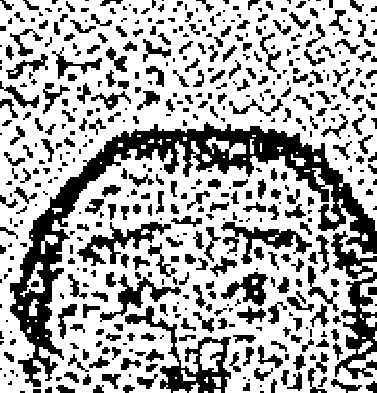

> @乾坤居士
男方已上个月提起离婚诉讼
这个月底会开庭
这个卦看，必离婚？？

> 是不是，到时再看分晓吧！

> 到时回复一下！

> @乾坤居士
确实是男方想离，女方不想离。。。

> 做丑了，仅做参考哈哈

> @乾坤居士
谢谢了，，，

> 对方说：“确实是男方想离，女方不想离。”（见微信截图）

### 事后应验：

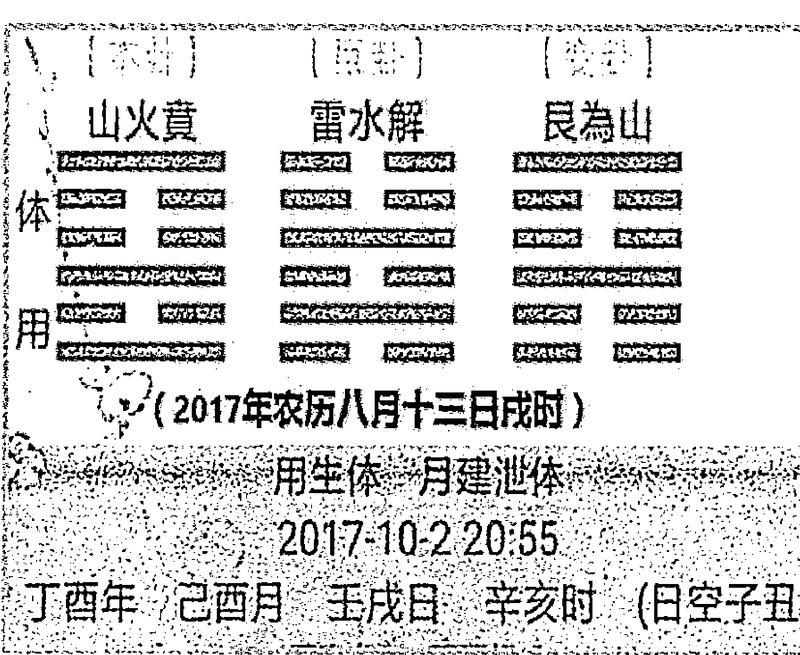

著者分析过后仔细琢磨卦象发现，按这个求卦者起卦的时间用“梅花易排盘”起卦，应该是山火贲卦，初九爻动，变卦八纯卦艮卦（见左图）。卦象也是体用不得位，所谓的不得位就是两人各自没有站对自己的位置，

这种情况一般需要3个月甚至6个月的调整期。为了搞清问题真相，著者在小窗口与对方通话。据说10月底法庭没有判离婚，目前男孩子的父亲正在积极做工作，尽量从中调和矛盾，催促他们握手言和。

### 例八、性感的女人很强势

2017年7月31日（农历闰六月初九）早上6点11分，朋友在微信留言，代人预测婚姻。时间起卦，本卦天风《姤卦䷫》，互卦为八纯卦《乾卦䷀》，变卦火风鼎《鼎卦䷱》（见右图）。分析之前，特意问对方说是代表男方，两人都是二次婚姻。

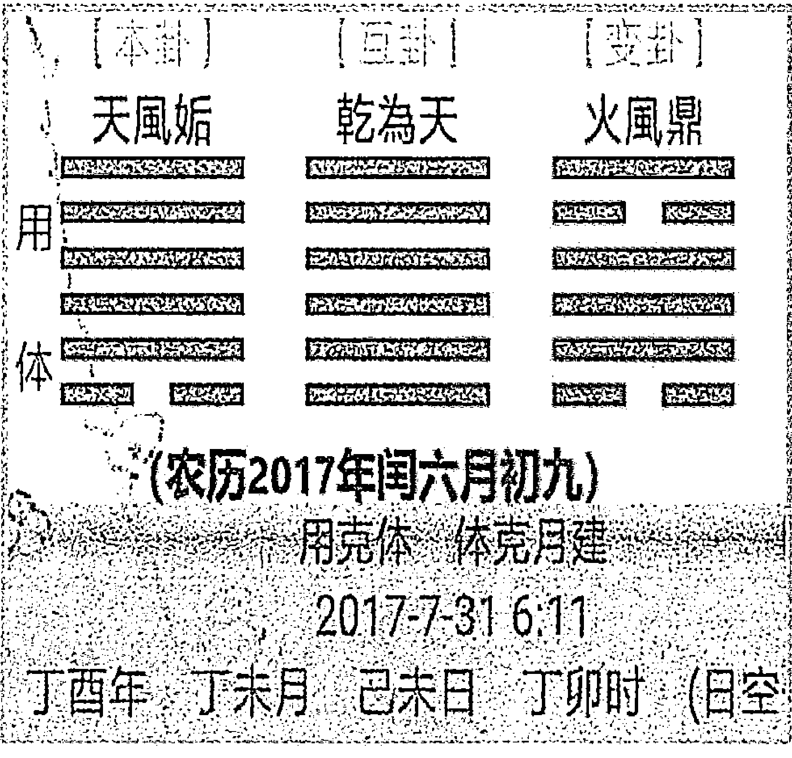

分析推测：以男方为体，以女方为用。

-   1、本卦天风《姤卦䷫》，乾上巽下，乾金克巽木，卦象用克体，女方一开始就很强势。姤卦辞曰：“勿用娶女”。预示这桩婚姻本来就不该成的。
-   2、互卦八纯卦《乾卦䷀》，乾金见乾金，卦象比和，看样子两个人结婚之后的生活基本还过得去，这个女人就是缺少女人应有的温柔。
-   3、变卦火风《鼎卦》，离上巽下，巽木生离火，卦象体生用，男方感情过于透支，目前损失应该较大。
-   4、九五爻动，五为巽象，时间窗口：三月、六月、九月、腊月。预示从今年农历三月两人就有矛盾，六月中旬家庭矛盾激化。
-   5、今年是丁酉年，女主人本命年，这个性感时髦的女主人坐太岁强势，与男方很不利，一旦感情破裂，破大财是肯定的。

### 事后应验：

5天之后的2017年8月5日下午16时2分，对方回复：“何老师，您算的真神，我的老师们都佩服你。还有一个老师想问一卦关于事业。”

### 例九、十月离不了就不可能再离了

2017年11月17日，外地易友网上让我预测一下，
男问：婚姻如何？离否？

按照对方用“六爻排盘宝”起的卦预测：本卦水风《井卦》，初六爻、六四爻、上六爻动。变卦八纯卦《乾卦》。按梅花易推测分析：六爻相加的总数为39÷6=6余3，九三爻为用爻，内卦巽（）象为用卦，外卦坎（）象为体卦。

```
返回 六爻排盘

占问：男，问婚姻如何？离否？
神煞：驿马-寅 桃花-酉 干禄-巳 贵人-丑未
文昌-申 劫煞-巳 华盖-戌 将星-子
时间：阳历2017年11月17日12时14分
农历2017年九月廿九，戊午时
月日：(丁酉年) 辛亥月 戊申日 (日空 寅卯)

震：水风井	乾为天：乾
雀 父子水	-	-	X- ->	财戌土
龙 财戌土	-	-	世	官申金
玄 官申金	-	-	X- ->	孙午火
伏：孙午火
虎 官酉金	-	-		财辰土
蛇 父亥水	-	-	应	兄寅木
伏：兄寅木
勾 财丑土	-	-	X- ->	父子水

六冲卦
卦象化回头克：主凶！
六冲卦：主散，不利于合作、情感，也主脱离。
妻财持世：利于求财婚恋，但不利置宅物与长辈感情。
```

何老师您好，从您处问婚姻。

### 例九：

> 您本人出生于何时？

男公历1967年8月28日晚上7:30分 女公历1981年1月21日晚上20:30

> 这不是初恋吧？

> 都是二婚

> 你这么大年纪，还是以女方为主？

> 对卦的总结：1、变卦火风鼎卦，离上巽下，巽木生离火，体生用，必有损失；2、变卦为火，用生体，男方付出很多；3、变卦为离，用生体，但男方感情过于透支，目前损失较大；4、九五爻动，五为巽象，时间窗口：三月、六月、九月、腊月。预示从今年农历三月两人就有矛盾，六月中旬家庭矛盾激化；5、今年是丁酉年，女主人本命年，这个性感时髦的女主人坐太岁强势，与男方很不利，一旦感情破裂，破大财是肯定的。以上仅供参考，仅供参考。

> 何老师您好...八字是相合还是相冲？

> 何老师，您算的真神。我的老师们都佩服你。还有一个老师想问一卦关于事业。

-   1.  本卦水风《井卦》，坎上巽下，坎水生巽木，卦象体生用。预示如果离婚，男方有很大付出。
-   2.  变卦八纯卦《乾卦》，卦象比和，因为本卦三个爻同动，经过三次变化，说明男女双方最终有和解的意向。
-   3.  时间窗口：七月、十月、正月、四月。具体情况是今年农历七月两人开始闹矛盾，十月份矛盾激化闹离婚。
-   4.  农历十月水旺当令，体卦坎水得月建比扶，付出看上去无所谓。
-   5.  九三爻为用爻，3为离（）象，离为中女，离火能生土，预示有一位热心的中年女性可以拯救这两个人的婚姻。农历十月份如果离不了婚，就不可能再闹腾了。

> 事后应验：
2017年11月17日对方两次反馈：“事实是夫妻双方和解，已决定月底去撤诉。实际情况是女方要求和好。（见截图）实际情况是女方主动要。## 例十、快则农历十一月握手言和

2017年10月13日（农历八月二十四）晚上23时53分，外地一名曾经咨询过婚姻的女士在微信留言：“师傅，能不能帮我预测下，我们俩个什么时候复婚？3月打架一直闹，5月两家持平，8月离婚。”（见微信截图）

看到留言，立即（用手机软件）起卦。得本卦泽火《革卦䷰》，互卦天风《姤䷫》，初九爻动，变卦泽山《咸䷞》。

| 本卦 | 互卦 | 变卦 |
| :--- | :--- | :--- |
| 澤火革 | 天風姤 | 澤山咸 |
| (卦象图形，略) | (卦象图形，略) | (卦象图形，略) |
| (2017年农历八月二十四日子时) | | |
| 用克体，月建生体 | | |
| 2017-10-13 23:53 | | |
| 丁酉年 庚戌月 甲戌日 甲子时 (日空申酉) | | |

推测分析：以体为女方，以用为男方。（卦象体用不得位，此事存在变数）

+   1. 本卦泽火革卦，兑上离下，离火克兑金，用克体之象，五月火旺当令，兑金受到克制，预示五月发生了与主人婚姻很不利的事情。
+   2. 互卦天风姤卦，卦象勿用娶女。但是，动爻在初九爻，互卦可以当风天小畜卦看，是体克用之象，事情发展反而与主人有利。

老师，会握手言和吗？您是在安慰我吗？
不过现在的情况是彼此沟通渠道敞开，还有一岁女儿。只是离婚本来就是他家人撑着要他离婚，如果复婚，应该是有阻力的。

小畜卦看，卦象体克用，事情的未来发展反而与主人有利。

> 台湾作家柏杨著作《丑陋的中国人》中有一个恒娘的故事。希望你能看看，做好自己，欲擒故纵，就会赢得未来。

+   3. 变卦泽山咸卦，兑上艮下，艮土生兑金，用生体之象，预示事情最终有向好的发展势头，与主人很有利。
+   4. 初九爻动，时间窗口：农历五月，八月，十一月，二月。最快到农历十一月初有望握手言和。对方说：“生日，我1988年农历十月十八，他1984年农历九月十六。”

我老公的奶奶去世了，我女儿在我这里，我要不要带着我女儿去给老人家烧个纸？

> 这个你灵活掌握吧！

他想让我和女儿去
我准备去

著者回答：“今年这个1984年的丈夫遇到桃花年。1988年六合年，身体不好，烦心事多。快则十一月，慢则明年二月握手言和。”

> 那就去吧！👍👍👍

对方说：“老师，会握手言和吗？您是在安慰我吧？不过现在的情况是彼此沟通渠道敞开，还有一岁女儿。只是离婚本来就是他家人撑着要他离婚，如果复婚，应该是有阻力的。”

老师您好，您说我们可能会复合在二月份。当我完全不去理会这件事情，要站起来重新开始的时候，他反而让我和他一起去西安给孩子拍照片，每天都还蛮照顾我们，而且回到家后，让我去他们家看孩子，让我一起把孩子送回老家。总之...态度很缓和。但是现在我们不谈感情，只聊孩子。

### 事后应验：（见微信截图）

事情过后之间有利的因素不断产生，时隔102天之后的2018年元月25日（农历腊月初九）中午11时14分，对方微信留言：“老师您好，您说我们可能会复合在二月份。当时我完全不去理会这件事情，要站起来重新开始的时候，他反而让我和他一起去西安给孩子拍照片，每天都还蛮照顾我们。而且回到家后，让我去他家看孩子，让我一起把孩子送回老家。总之——态度很缓和。但是现在我们不谈感情，只聊孩子。”

> 分手是命，言和是运。二月和好，吉祥如意！🐉🐉🐉🐉

不知道会不会复合，只是运气吗？

> 精诚所至，金石为开！

我想还是顺其自然吧。修来的是福，抢来的是祸

> 有这样的境界，爱出者爱返，福往者福来。祝你好运！🔥🔥🔥

谢谢您，总是指点迷津

# 256—梅花易研究精要

> 著者说：“分手是命，言和是运。二月和好，吉祥如意。精诚所至，金石为开。”

> 对方回答：“不知道会不会复合，只是运气吗？我想还是顺其自然吧。修来的是福，抢来的是祸。”

> 著者说：“有这样的境界，爱出者爱返，福往者福来。祝你好运！”

> 对方回复：“谢谢您，总是指点迷津。”

# 时间再过去一个月的2018年2月24日上午10点08分。

> 对方微信回复：“老师，早上好，新年快乐。我给您反应一下最近的状况，如您所说2月复合，确实最近前夫因为孩子和他家闹翻，而且给我们一家人制造各种在一起的机会，预约西安给孩子拍照，预约家庭育儿活动，让我照顾女儿，等等很有后悔和复合的意思。可是离婚这件事情，闹得太厉害，已经伤及感情了。我爸爸说如果我复婚，社会的人会瞧不起我，也会瞧不起我们家人，他们会和我断绝关系。也断言，我如果复婚，根本不会幸福。老师，按照我们命理，我们两个人在一起会幸福吗？他值得我再回头吗？我不知道该怎么办？”

### 四、感情篇（案例解读：）

> 老师，早上好，最近遇到点感情问题，想请您帮我看看，我和男朋友交往几年，最近闹矛盾，他说我太情绪化，总是冷战，我不知道该怎么办，我们之间还有缘分吗？请老师指点迷津，帮我分析一下，谢谢您！

> 你先说说你们的生辰信息，还有具体的矛盾情况，我帮你分析，感情的事不能急，先理清楚问题所在。另外，你的情绪问题也需要正视，冷战解决不了问题，沟通才是关键。先把你和他的基本信息告诉我，比如出生年月日，还有最近的矛盾事件。

> 老师，那我现在该怎么办？

> 首先，你要学会控制自己的情绪，不要用冷战来处理问题，主动和对方沟通，表达自己的感受，也听听他的想法。另外，看看你们的生辰，有没有冲克，或者感情运势的走向，先把这些信息给我，我才能给你更准确的建议。

> 老师，这样吧。我想还是想听听您对婚姻的建议，我们三个今天坐在一起。

> 婚姻是两个人的事，需要互相理解、包容和沟通。如果你觉得这段感情还有挽回的余地，可以试着和对方好好谈谈，说出你的顾虑和需求，也听听他的想法。如果觉得已经无法挽回，也不要勉强自己，及时止损，给自己和对方重新开始的机会。婚姻需要经营，不能只靠一方的付出，要双方共同努力。另外，也可以从命理的角度分析一下你们的婚姻运势，看看未来的走向，再做决定。

> 老师，我从昨天到现在，想您在各种中寻找，然后想问一下，如果我复婚的话，会不会像我爸爸说的那样，社会的人瞧不起我？另外，我和他之间的感情，还能回到从前吗？

> 首先，不要在意别人的眼光，你的婚姻是你自己的事，幸福与否只有你自己知道。如果复婚能让你幸福，就不要被别人的话左右。关于感情能不能回到从前，这需要你们双方的努力，只要你们都有意愿，互相理解，是可以慢慢修复的。不过也要看你们的命理，有没有复婚的缘分，以及复婚后的运势，这些都需要具体的生辰信息来分析。

> 我的家人担心我，我也是不知道该怎么办。但是您这样说，我觉得很有道理。

> 家人的担心是出于对你的爱，你可以和家人好好沟通，告诉他们你的想法和需求，让他们理解你的决定。另外，关于复婚的决定，不要急于下结论，先观察一下对方的变化，也给自己时间思考，看看自己真正想要的是什么。如果你觉得对方真的改变了，而且你们之间还有感情，复婚也是一个选择。不过，婚姻需要经营，复婚之后更要珍惜彼此，互相包容，这样才能长久幸福。

> 老师，您说我二月真的能和他在一起吗？如果真的能复合，我们真的可以回到以前吗？

> 从目前的信息来看，你二月复合的可能性是有的，不过具体还要看你们的生辰信息和运势走向。复合之后能不能回到以前，这需要你们双方的努力，只要你们互相理解，互相包容，是可以慢慢回到以前的状态的。不过，感情是需要经营的，不能只靠缘分，还要靠你们的努力。

> 老师，我应该怎么做才能让他回头？另外，我们真的还有缘分吗？如果真的复合，我们会幸福吗？

> 首先，你要改变自己的情绪化，不要用冷战来处理问题，主动和对方沟通，表达自己的感受，也听听他的想法。另外，要让对方看到你的改变，让他觉得你是值得托付的人。关于缘分，从你之前的信息来看，你们之间还是有缘分的，不过具体还要看生辰信息和运势。复合之后会不会幸福，这需要你们双方的努力，只要你们互相理解，互相包容，是可以幸福的。另外，也可以从命理的角度分析一下你们的婚姻运势，看看未来的走向，再做决定。

> 好的，谢谢您。我会按照您说的去做，先改变自己，然后和对方沟通，看看能不能挽回这段感情。

著者回复：“爱出者爱返，福往者福来。可能是天意，这样可以化解你们两个人命中的再婚因素。缘分没有了，转回来了，那就随缘吧！”（见微信通话截图）当天下午对方回复：“乾坤大师，你说过二月会和好，过年后，也希望我们真的可以白头到老吧。”这是已经离了婚半年时间的问题婚姻。通过时间推移和著者的耐心劝导，而且正如本人预测的那样“八月离婚，快则十一月，慢则明年二月和好。”让人感到非常神奇。

### 例十一、腊月之后事情更麻烦

2017年11月21日上午，有朋友微信留言：“尊敬的何老师，同样的婚姻困惑你也帮我算一卦吧！”

以2017年农历十月初四巳时（手机软件）起卦。得本卦地水《师卦☰》，互卦地雷《复卦☳》，上六爻动，变卦山水《蒙卦☶》。（见下面手机梅花易卦象截图）

推测分析：以体为问卦者，以用为女方。（此卦体用得位，问题比较直接，没有多少变数）

+   1. 本卦地水《师卦☰》，坤上坎下，坤土克坎水，用克体之象，预示主人目前受到克制和伤害，情况不好。好在十月水旺，土克不了水，没有什么要紧的事情发生。
+   2. 互卦地雷《复卦☳》，坤上震下，震木克坤土，体克用之象，预示男女两人之间应该发生过肢体冲突，女方失败。
+   3. 变卦山水《蒙卦☶》，艮上坎下，艮土克坎水，与本卦一样，皆为用克体之象，预示主人目前的压力很大，女的可能坚决要离婚。
+   4. 上六爻动，时间窗口：农历七月、十月、正月、四月。农历七月底闹矛盾，快则农历十月二十三到二十七日就有（言归于好或者分手离婚）结果。
+   5. 上六爻变，六为坎（☵）象，为正北方位、为鼠、为智慧、为中男、为小个子、为黑色。预示北方有一位个头小、皮肤黑、很智慧、属鼠的男人可以从中帮忙化解矛盾。腊月之后事情会更麻烦。

### 事后应验：（见微信对话截图）

后来有一个符合特征朋友从中劝解说和无果。2018年元月28日（农历腊月十二）上午9点多，我在微信给对方留言：“最近你们的关系缓解了没有？”

对方回复：“按上次算的说到‘腊月更麻烦’，我已一个月没与她有任何联系了，据一月前她的律师说她已起诉立案，预计开庭正好是腊月十五号左右，请您打一卦我该如何在法庭应对？我只有等传票了。”

### 例十二、离与不离，明年二月下旬再说

2018年2月11日（农历腊月二十六日）下午有事去一位朋友那里。我们刚说了几句话，突然来了一位陌生的长年男人。对朋友说：“我儿子和媳妇闹离婚，这婚恐怕是离定了。”原来此人是朋友的师傅。出于习惯，我问了两个人的属相。男1981年人属鸡，女1985年人属牛，属相没问题，而且两个人都是初婚。我即时用手机软件起卦：得本卦天泽《履卦 ䷀》，互卦风火《家人卦 ䷤》，九四爻动，变卦风泽《中孚卦 ䷼》（见手机卦象截图）。

推测分析：以男方为体，以女方为用。

+   1. 本卦天泽《履卦 ䷀》，乾上兑下，卦象比和。履卦辞曰：“履虎尾，不咥人。”预示小两口子确实是闹了矛盾，但不至于到离婚的程度。
+   2. 互卦风火《家人卦 ䷤》，巽上离下，用生体之象，说的是一家人的家事，女方对男方有生，说明这个女子是个很有能耐的人。
+   3. 变卦风泽《中孚卦 ䷼》，巽上兑下，体克用之象，这个卦本卦和覆卦看上去是一样的，预示着男女双方各自都存在一定问题。
+   4. 九四爻动，震（☳）象，为东方，为长男，为高个子，排行老大。预示在东边有一位高个子、说话声音大、有一定身份的公职人员能从中帮忙解决问题。
+   5. 时间窗口：农历十一月、二月、五月、八月。用卦乾（☰）象变巽（☴）象。农历十一月上旬小两口矛盾激化；目前处于僵持阶段，这个婚离与不离，明春农历二月十八日至二十二日才能见分晓。

我简单分析之后对那位先生说：“我看这小两口的婚不一定能离了，问题不单单是儿媳的问题，你儿子也有不少问题。也就是问题各占一半吧。这婚离与不离，只有等明春农历二月中旬再看吧！”

朋友对来人说：“这是市周易研究会的何老师，他的梅花易预测是很神奇的，你可要相信哦！”

### 事后应验：

当场那位先生说：“说实在话，我儿子是有问题，这媳妇人也确实有点能耐，她老是在话语上刺激我儿子。所以，两人的矛盾无法缓和。目前女方确实有一位干公家事的叔叔，高个子，说话声音洪亮，他正在从中周璇调解矛盾。作为家长我们真不知道该咋办？”

### 后来反馈：

2018年2月两个人离婚了。

### 例十三、三月很可能闹离婚

2018年3月4日农历正月初八上午10点40分，在易经学习微信群中一位朋友发了一个卦例消息，关于婚姻问题，那位老师高人给与解读。消息一发，跟着就有人说：“何老师你给断一下”。

本卦风火《家人卦䷤》，互卦火水《未济卦䷿》，九五爻动，变卦山火《贲卦䷕》（见卦例截图，此人是代男方问卦的）。

此卦是关于婚姻问题，那位老师高人给以解读！

@周易问事 13991748052 徐老兄断卦。

@乾坤居士 何老师你给断下[微笑]

1. 本卦风火家人卦，巽木生离火，用生体之象，这桩婚姻对男方有利。
2. 互卦火水未济卦，坎水克离火，体克用之象，男女之间，感情水火不容，意见是比较大的。
3. 变卦山火贲卦，离火生艮土，最终男方有付出。
4. 九五爻动，时间窗口，腊月，三月，六月，九月。九月结婚，腊月18-22之间闹矛盾，三月23-27之间很可能要离婚。
5. 变象为巽象，为长女，为东南，为时尚，有一个高个子，黄头发，皮肤白的女子。也许就是女主人，或许是一个有身份的女人[偷笑]，可以帮忙解决问题。

这个是本人分析预测结果，不知准确与否，献丑了！请求侧者证实一哈！

发生了的很准，后等待验证。

谢谢反馈！[抱拳][抱拳][抱拳]

推测分析：以男方为体，以女方为用。

+   1. 本卦风火《家人卦》，巽木生离火，用生体之象，预示这桩婚姻对男方有利。
+   2. 互卦火水《未济卦》，坎水克离火，体克用之象，男女之间，感情上出现水火不容，目前意见比较大的。
+   3. 变卦山火《贲卦》，离火生艮土，如果这样下去，最终男方有付出。
+   4. 九五爻动，时间窗口，农历腊月，三月，六月，九月。两人2017年九月结婚；腊月十八至二十二日之间闹矛盾；2018年三月二十三至二十七日之间很可能要闹离婚。
+   5. 外卦巽（☰）象变艮（☶）象。巽（☰）象为长女、为东南、为时尚，有一个高个子、黄头发、皮肤白的女人。也许就是女主人，或许是一位有身份的女人，可以帮助解决问题。

### 事后应验：

著者在微信群发出预测结果后。问卦者非常赞同，回复说：“发生了的很准，后等待验证。”这又是一例问题婚姻。说实在话，我不盼望自己的卦例精准应验，只求天下有情人终成眷属，生活和和睦睦。

## 第七节 新婚姻预测

俗话说：男大当婚，女大当嫁。促成一桩婚姻，功德爱心无量；成就一桩婚姻，双方父母开心。新婚姻预测，涉及男女感情、心理状态、时间窗口、以及能不能佳偶天成，幸福美满，这是一件人生皆大欢喜的好事情。下边介绍几个卦例，与大家共同探讨。

### 例一、明年二月可以结婚

2012年农历十月十五日晚上19：12分，一位老同学从西安打来电话，寻问女儿的婚姻：女孩生于1988（戊辰）年五月二十七日；男孩，1985（乙丑）年五月十四日生，看两个人的婚事能不能成？

2012年农历十月十五日晚上19：12分（戌时）起卦预测，得数字：5、10、15、11。

数字起卦：5+10+15 = 30÷8 = 3…余6，6为坎（☰）象，外卦取坎（☵）象，30+11 = 41÷8 = 5…余1，1为乾（☰）象，内卦取乾（☰）象，得本卦水天《需卦䷄》，总数41÷6 = 6…5，5为巽（☴）象，九五爻变动，得变卦地天《泰卦䷊》；本卦体用得位，互卦为火泽《睽卦䷥》，覆卦和复原卦不用。

推测分析：以体为女孩，以用为婚姻。

+   1. 本卦水天《需卦䷄》，坎上乾下，乾金生坎水，卦象体生用。预示云在天上之象，要想下雨，得耐心等待啊！
+   2. 互卦火泽《睽卦䷥》，离上兑下，离为中女，兑为少女，“两女同居一室，其志不同也。”开始女孩子对男孩子不满意，男孩子很纠结也不主动。
+   3. 变卦地天《泰卦䷊》，坤上乾下，坤土生乾金，卦象用生体。《泰卦䷊》为十二消息卦，主农历正月令，年后这个男孩子的态度会变得很积极，要诚心诚意结成姻缘。
+   4. 九五爻变动，五为巽（☴）象，时间窗口：应在九月、十二月、三月、六月。九月底十月初这一桩姻缘开始热乎起来的。应期：九五爻对应农历九月，用卦坎（䷜）象变为坤（䷁）象，对应的时间为腊月的二十八至下个月的初二五日之间。
+   5. 快则2012年腊月初会有好消息，到2013年农历三月初就可以结婚了。

预测完毕，电话回复老同学预测结果，他说：

> “你预测的很符合实际情况，就看这事后面能不能如愿。”

### 事后应验：

事过两个半月后的2013年农历正月初二，这位同学从西安来电话说

> “老同学，女儿的婚事成了，要办喜事啦！请你给孩子在农历三月份选择一个好日子办喜事，特别邀请你到时候过来喝喜酒。”

### 例二、十月份佳偶天成

2012年5月3日20：45分，登入易友的中华易经网，发现有一个叫林夕的年轻人留言：

> 请 &&& 老师看一下我能够结婚的姻缘何时出现？老师好，我性别男，阴历86年生，河南巩义人，目前单身。今年过了春节后这几个月，家里陆陆续续介绍了几个女孩相亲，都是见一面之后相互没感觉而不了了之。父母在每次相亲不成后都劝我别着急，说我还小着呢慢慢找，但我知道最着急的其实是父母。今年家里父母开始把老家的房子整修为我结婚用，我真的想知道我婚姻何时才能来到，请何老师指点迷津。

我报数6869（著者没有用这四个数字，而是以当时的日期起的卦）。看到这个消息，著者根据当时留言的日期，以2012年农历四月十三日戌时起卦，得数字：5、4、13、11。

数字起卦：5+4+13 = 22÷8 = 2⋯余6，6为坎(䷜)象，外卦取坎(䷜)象，22+11 = 33÷8 = 4⋯余1，1为乾（䷀）象，内卦取乾（䷀）象，得本卦水天《需卦䷄》；总数33÷6 = 5⋯余3，3为离（䷝）象，九三爻变动，得变卦水泽《节卦䷻》；本卦体用不得位，互卦不用；本卦的覆卦为天水《讼卦䷅》，变卦的复原卦为泽水《困卦䷮》。

推测分析：以体为男孩，用卦为婚姻。

- 本卦水天《需卦☰》，坎上乾下，乾金生坎水，卦象用生体，乾为一家之主、为父亲。看来这孩子的父亲确实很着急，盼望儿子婚姻早成，但此事尚需等待一段时日。
- 变卦水泽《节卦☱》，坎上兑下，兑金生坎水，卦象用生体，少女配中男之象，预示婚姻吉利；水为感情，只是需要把握好这个度，不要让个人感情泛滥而已。
- 九三爻变动，三为离（☲）象，时间窗口：农历正月、四月、七月、十月。用卦乾（☰）象变为兑（☱）象，兑（☱）象对应的是每月的初八至十二日之间，就是说每逢这四个月中的初八——十二日时间段会有好事来临。
- 目前在西北方、正西方就有人选，农历七月份可能遇到合适人选，顺利的话，农历十月份就可以举行结婚庆典。
- 本卦体用不得位，互卦为火泽《睽卦☲☱》，预示着有两个女孩，需要男孩作出选择；说明暂时感情出现迷茫，需要时间来调整。覆卦为天水《讼卦☰☵》，水向东流，天体向西，主人在婚姻上有一个事与愿违的错觉。

预测完毕，立即在网页回复：&&& 老师太忙，我来回答你的问题。今年正月婚姻正式启动，目前西北方、正西方就有人选，只要把握好这个机会。农历七月份有机会订婚，农历十月期待佳偶天成。你目前不要胡思乱想，要增强信心。祝你心想事成！

### 事后应验：

后来“林夕”回复：谢谢何老师，最近西北方介绍的女孩已经见面了，西方的那个还没有安排见面呢。那上半年遇到的女孩都不会成吧，看来只有等到七月份了。

### 例三、弟弟的婚事能否成功

2013 癸巳年 2 月 13 日（农历正月初四）19 时 35 分。春节期间，同事某先生发短信说有要事来我家中。我回复：有事电话上直接说就行，不用跑路。他说：“何老师想来你家问一下我弟弟的婚事，不知方便不？”

以 2013 年正月初四戌时，我立即按这个时间起卦，得数字：6、1、4、11。

数字起卦：6+1+4 = 11÷8 = 1…余 3，3 为离（☲）象，外卦取离（☲）象，11+11 = 22÷8 = 2…余 6，6 为坎（☵）象，内卦取坎（☵）象，得本卦火水《未济卦䷿》；总数 22÷6 = 3…余 4，4 为震（☳）象，九四爻变动，得变卦山水《蒙卦䷃》，本卦体用得位，互卦为水火《既济卦䷾》；覆卦和复原卦不用。

推测分析：以体为其弟，以用为婚姻。

- 本卦火水《未济卦䷿》，离上坎下，坎水克离火，体克用之象，未济卦与既济卦卦象互通，看上去虽有好事，但是时间要推迟，说明这桩婚事还没有进入成功的通道。
- 互卦水火《既济卦䷾》，坎上离下，水上火下，构成烹饪之象，上下感应，气息与本卦火水《未济卦䷿》互通，形成阴阳卦爻互换，预示着好事可期。
- 变卦山水《蒙卦䷃》，艮上坎下，艮土克坎水，用克体之象，目前正月木旺当令，逢坎水得生气，艮土克不了坎水。山水《蒙卦䷃》云：“非我求同蒙，童蒙求我。”预示到了这时候女方的态度从不积极、转变为积极主动。
- 九四爻动，时间窗口：农历二月、五月、八月、十一月。正月初三至初七这五日内，此事只是说说而已，农历二月初可以订婚，快则农历五月，慢则农历八月就能登记结婚。
- 九四爻动，四震（☳）象，震为长男、高个子、排行老大、正东方位。预示在正东方位有一个高个子、说话声音大、在家排行老大的男人，能从中帮忙促成这桩婚事。

### 事后应验：

预测完之后，著者电话告知对方结果。后来某先生反馈：“我弟弟的婚事成了。此事经过在西安工作的大哥从中拉扯，女方的态度后来转变得比较快，于2013年农历二月初订婚，当年八月两个人在西安结婚，现在房子也买了，情况很不错。”此次预测又是成就了一桩婚姻，他的这个大哥正符合预测的特征：高个子、说话声音大、在家排行老大。

### 例四、闹不出大事情

2014年9月10（农历八月十七）日晚上，21：05分，婚介所的一位朋友来电话说：你好，1986年男孩，1988年女孩，两人原定9月21日结婚，现在突然闹矛盾，不结婚了。问后果如何？

即时以2014（甲午）年八月十七日亥时起卦，得数字：7、8、17、12。

数字起卦：7+8+17 = 32÷8 = 4…余0，0为坤（☷）象，外卦取坤（☷）象，32+12 = 44÷8 = 5…余4，4为震（☳）象，内卦取震（☳）象，得本卦地雷《复卦䷗》，总数44÷6 = 7…余2，2为兑（☱）象，六二爻变动，得变卦地泽《临卦䷒》；本卦体用不得位，互卦不用；本卦的覆卦为山地《剥卦䷖》，变卦的复原卦为泽地《萃卦䷬》。

预测分析：以体为女方，以用为男方。

- 本卦地雷《复卦䷗》，坤上震下，震木克坤土，用克体之象，震为长男，坤为母亲，有可能是男孩子对女方的母亲不满意闹的矛盾。目前八月金旺，震木处于死地，木克不了土，预示事情肯定闹不大。
- 变卦地泽《临卦䷒》，坤上兑下，坤土生兑金，体生用之象，此事看似与女方很不利。但是，兑金为女孩，逢坤土得生气，说明她母亲护着女儿，最终可以逢凶化吉。
- 六二爻变，为兑（☱）象，兑为少女、为口舌之争，看来闹矛盾的起因是由女孩子而引起，男孩才借此闹事不结婚的。
- 六二爻动，时间窗口：六月、九月、十二月、三月份。农历六月初就有矛盾，农历九月初有大的转变。本卦地雷《复卦䷗》主农历十一月令，变卦地泽《临卦䷒》主农历十二月令，覆卦山地《剥卦䷖》主农历九月令，这三个卦都属于“十二消息卦”。复卦爻辞曰：“七日来复”，预示两人很快会重归于好的，如期结婚应该没有什么问题。

预测完毕，于2014年9月10日21时40分短信回复朋友：农历六月初就闹了一点小矛盾，现在又闹矛盾。卦象看闹不出什么大事，不会影响结婚的。如果有变，农历九月初就可以和解。

### 事后应验：

2014年9月12日（预测之后的第三天）上午10时43分，这位朋友来电话说：“何老师好，双方和解了，如期结婚，并送来了一笔婚介酬金。谢谢您，啥时请你吃饭。”

## 第八节 生儿育女预测

《易经》云：“天地之大德曰生”。女人生孩子本来是瓜熟蒂落、顺其自然的事情。自古以来生孩子是很危险的事情，至于生男生女，只能听天由命，孩子一出生呱呱落地，就会知道性别。但是，通过预测也可以知道孕妇肚子里的小宝宝的性别。当然，这个方法只能当作一个游戏，千万不可当真，不然就会违背自然规律。

有时候不用起卦也能知道生男生女的结果。著者有一次去我们单位某部门办事，同事小w说：“何老师，你给我算算，生男孩？还是生女孩？”说来也巧，正好这时有一个小蜘蛛顺着桌子上墨水瓶子里插的笔杆子往上爬。真是想什么来什么。我说：“这个还用算吗？肯定生男孩子！”小w说：“你别忽悠我啊！没算怎么知道的？”我说：“你往这看。这蜘蛛可是个喜虫啊！向上爬行，上为阳，肯定生男孩了啊！”这时候，其他几个同事说，人家小w有一个男孩，这次想要个女孩子呢。我说：这没有办法呀！后来小w果然生了一个大胖小子。

墨水瓶子里插一支笔，它不就是男孩子的生理象征吗！这就是梅花易外应卦象的灵活妙用。这是一个“梅花心易”预测案例，顺便介绍给大家。下面再介绍几个卦例与大家探讨。

### 例一、你女儿生千金

2012年2月28日（农历二月初七）18时30分。朋友的女儿生孩子，预产期临近，他们非常担心，食不甘味，寝不安席。我让他用三枚一角钱的硬币摇卦预测。

按传统方法摇卦，得：少阳7、少阳7、少阳7、老阳9、少阳7、少阳7，得本卦八纯卦《乾卦䷀》；九四爻变动，四为震（☳）象，得变卦风天《小畜卦䷈》。本卦体用得位，互卦为八纯卦《乾卦䷀》，覆卦和复原卦不用。

推测分析：以体为母亲，以用为孩子。

- 本卦八纯卦《乾卦䷀》，互卦亦为八纯卦《乾卦䷀》，乾上乾下，乾金见乾金，卦象体用比和，平和顺畅之象，只是卦中阳气过足，说明大家都期望能生个男孩。
- 变卦风天《小畜卦䷈》，巽上乾下，乾金克巽木，体克用之象，生产期大致要推后5天左右。农历二月木旺当令，乾金受侮，母克子的力量不大，只是与胎儿小有不利罢了。
- 九四爻变动，时间窗口：二月、五月、八月、十一月，外卦乾（☰）象代表每月十三至十七之间，变卦巽（☴）象代表每月十八至二十二之间，预示生产日期要推后大约五天时间。
- 九四爻动，四为震（☳）象，为正东方向，事情发生在东边（西安市在宝鸡的东边，方位也合适）。根据乾（☰）象变巽（☴）象看，生女孩的可能大，生产可能要超过预产期，推迟到二月十三——十七日之间的下午 14点——18点孩子出生，那时候与小孩子有点不利。
- 外卦乾（☰）象变巽（☴）象，乾为男，巽为长女。第一胎生育，本人（女儿）想生个男孩，实际只能生个女孩子。
- 变卦乾（☰）金克巽（☴）木，互卦有兑（☱）象、离（☲）象、巽（☴）象。古人云：阴卦阳多，阳卦阴多。卦气都是属于阴，生女孩、剖腹产的可能极大，但母子绝对平安。

预测完了，我对他说：“你就放心等待吧，可能生一个千金，母子绝对平安。”

### 事后应验：

7天之后，2012年3月6日（农历二月十四）下午18点35分，对方说女婿来电话了，说：（女儿）剖腹生产，母女平安。朋友高兴的说：你太神了！（7天之前的预测，在实际预计的时间之内）

### 例二、亲戚家儿媳生男生女？

2012年3月24（农历三月初三）日，那天一大早起来，与妻子说起了家中琐事。说到亲戚家的儿媳怀孕的事，不知生男生女？让我预测一下：以当时的时间农历三月初三辰时起卦，得数字：5、3、3、5。

数字起卦：5+3+3 = 11 ÷ 8 = 1…余 3，3 为离（☲）象，外卦取离（☲）象，11+5 = 16 ÷ 8 = 2…余 0，0 为坤（☷）象，内卦取坤（☷）象，得本卦火地《晋卦䷢》；总数 16 ÷ 6 = 2…余 4，4 为震（☳）象，九四爻变动，得变卦山地《剥卦䷖》；本卦体用得位，互卦为水山《蹇卦䷦》，覆卦和复原卦不用。

推测分析：以体为母，以用为子。

- 本卦火地《晋卦》，离上坤下，离火生坤土，用生体之象，农历三月木旺当令，水入墓库，离火逢生气，母子和顺之象；
- 变卦山地《剥卦》，艮上坤下，艮土见坤土，体用比和之象。卦象体用得位，生产顺利，母子平安。
- 九四爻变动，时间窗口：二月、五月、八月、十一月，2012年有闰四月。预产期推算为：2012年农历七月二十八至八月初二日这五日之内，具体时间是18点——22点之内孩子出生，本卦8、3，变卦8、7，预示孩子的体重约8.3–8.7斤之间。
- 用卦离（≡）象变艮（☶）象，离为中女、艮为少男，卦象中女变少男之象；互卦水山《蹇卦》，坎上艮下，坎（☵）象和艮（☶）象，皆为阳卦。他们自己估计要生女孩，实际是生男孩子。
- 九四爻动为震(☳)象，为东方木位，为长男。那个侄子还没有孩子，第一胎百分之九十九生的是男孩子。

事后应验：

时间相隔了将近半年。2012年9月21日（农历八月初五）亲戚来电话，八月初三侄子媳妇在当地县医院生了个男孩，体重足足8斤。出生时间与半年前预测的只差了1天。

### 例三、恭喜，你家要添男丁

2012年5月15日（农历四月二十五日）中午10时许，某先生登门请我为小外孙子选一个剖腹产的日子，预产期是5月27日左右。剖腹产的日子我不主张人为选择。他想知道生个男孩、还是生女孩？于是著者当即以2012年农历四月二十五日10点20分（巳时）起卦预测。得数字：5、4、25、6。

数字起卦：5+4+25 = 34 ÷ 8 = 3…余2，2为兑（☱）象，外卦取兑（☱）象，34+6 = 40 ÷ 8 = 4…余8，8为坤（☷）象，内卦取坤（☷）象，得本卦泽地《萃卦䷬》；40 ÷ 6 = 6…余4，4为震（☳）象，九四爻变动，得变卦水地《比卦䷇》；本卦体用得位，互卦为风山《渐卦䷴》，本卦的覆卦和变卦的复原卦不用。

推测分析：以体为母，以用为子。

- 本卦泽地《萃卦䷬》，兑上坤下，坤土生兑金，体生用之象，坤为母、为大肚子，卦象显示，母体能耗较大。本卦体用得位，预示目前母子一切情况顺当平安。
- 变卦水地《比卦䷇》，坎上坤下，坤土克坎水，体克用之象，母为体、子为用，体克用，预示顺产的可能性不大。用卦为兑象，兑为金、为刃器，肯定要剖腹生产，生产期要比预算的时间推后几天。
- 内卦代表母亲，外卦代表孩子。外卦兑（☱）象变坎（☵）象，兑为少女、坎为中男，少女变中男之象。四爻动为震（☳）象，震为长男，肯定是生男孩的可能很大。
- 九四爻动，四为震（☳）象，震为东方，生产地在正东方向的西安市，生产日期应该在（农历）闰四月十二——十六日这五日之内孩子出生。

推测分析后，我当即对某先生说：恭喜您，贵府要添男丁了，时间大约在农历四月十二到十六之间，一切平安！

事后应验：

2012年6月11日那天，老朋友笑嘻嘻来找我给外孙子起名字。他的笑容告诉我预测的结果（生男孩）是准确的。孩子是6月6日（闰四月十七）午时出生的，与预测的出生时间只推后了1天。

### 例四、家中人丁兴旺

2016年元5月17日（农历四月十一日）上午9时10分，某先生来求测一下外地的儿媳妇生孩的事情。立即根据当时时间起卦，得数字：9、4、11、6。

数字起卦：9+4+11 = 24÷8 = 3…余0，0为坤（☷）象，外卦取坤（☷）象，24+6 = 30÷8 = 3…余6，6为坎（☵）象，内卦取坎（☵）象，得本卦地水《师卦䷆》；30÷6 = 4…余6，6为坎（☵）象，上六爻动，得变卦山水《蒙卦䷃》。本卦体用得位，互卦为地雷《复卦䷗》；本卦的覆卦与变卦的复原卦不用。

推测分析：以体为母亲，以用为孩子。

- 本卦地水《师卦䷆》，坤上坎下，外卦为坤土、内卦为坎水，农历四月火旺当令，坤土逢生气，用（坤）土克体（坎）水之象，预示怀孕初期问题比较多，与母体有些不利。
- 互卦地雷《复卦䷗》，震木在下，坤土在上，体木克用土之象，农历四月火旺木泄气，母不克子，平安生产。
- 变卦山水《蒙卦䷃》，艮上坎下，艮土克坎水，用克体之象，外卦坤象变艮象，艮为少男，从整个卦象看阳少阴多。古人云：“阴卦阳多，阳卦阴多”，生男孩子的可能大。
- 时间窗口：农历正月、四月、七月、十月。本卦外卦为坤象，代表四月二十八至五月初二这个时间段，变卦的用卦由坤(䷁)象变为艮(䷳)象，说明生产的时间提前到四月二十三至二十七日这个时间段。

### 事后应验：

2016年农历四月二十四日，某先生的儿媳在外地顺利诞下一个男孩，母子平安。出生时间正好在预测的“四月二十三至二十七日这个时间段”之内。

## 第九节 就业预测

我国人口众多，在社会主义市场经济的新形势下，就业困难是一个很常见的社会现象，也是下岗职工和大学生们生活中一件非常揪心的大事情。为下岗职工再就业提供咨询，等于帮扶了一个家庭；能为年轻的大学生就业提供咨询指导，是一种社会责任。著者觉得这是充分发挥《周易》文化应用功能的一件很有意义的善事，值得我们研习易学文化的人去日行一善、服务桑梓。现将几个就业案例介绍给朋友们，以资共同探讨。

### 例一、工作最近有没有着落

2011（辛卯）年11月16日（农历十月二十一日）上午8点57分，博友yzh在QQ说：“老乡您好，我想请您帮我预测一下，我的工作最近有没有着落。谢谢，不知您方便否？”

乾坤居士（8时57分35）说：“你报三组数字，我给你测测。”

云中鹤（8时58分09）说：“11、16、24。”

数字起卦：11+16 = 27÷8 = 3…余3，3为离，外卦取离（☰）象；27+24 = 51÷8 = 6…余3，4为离，内卦取离（☰）象，本卦八纯卦《离卦☲》。总数51÷6 = 8…余3，九三爻动，为离（☰）象，变卦火雷《噬嗑卦☳》。

推测分析：以体为本人，以用为工作。

- 本卦八纯卦《离卦☲》，离上离下，火见火，体用比和之象。在“气、流、固”三界中，离火属于流界，预示工作的事情内外正在互动沟通之中。
- 变卦火雷《噬嗑卦☳》，离上震下，震木生离火，用生体之象，有工作找人的迹象，预示工作的事情进展比较顺利，只是当下还没有运作到位。
- 时间窗口：农历十月、正月、四月、七月。农历七月工作的事情已经启动，十月初三至初七有确切消息；最迟2012年农历正月上旬可以明确去向和岗位；最晚四月初一切到位。
- 九三爻动，3为离（☰）为中女、为马、为正南，预示在正南方位有一位热心的、属马的中年女士可以帮你，具体工作单位在东方，与电力、通讯有关的行业。

总体过程：农历十月份工作之事启动，明年正月以前有眉目，四月上旬一切手续将运作到位，请随后告诉我具体应验的情况。

### 事后应验：

2012年4月25日（农历四月初五），yzh回复：老乡您好，我今天已经把工作签了，如你所测，签得较顺利。但是，面试我的是男性。

（注：变卦火雷《噬嗑卦》，复原卦是雷火《丰卦》。本卦比和，变卦用生体，事情顺风顺水，水到渠成之象，卦象图制作简略。）

### 例二、老公工作调动

2011（辛卯）年12月14日（农历十一月二十日）上午9时17分，博友qh1+1在QQ上说：何先生您好！又来叨扰了，我想帮助老公调工作，调到离我家较近的单位里来，挺难，您能否帮我们测算一下？是否可行？因为我现在当班主任，没人照看孩子。

即时起卦：2011年农历十一月二十日上午巳时。4+11+20 = 35÷8 = 4…余3，3为离象，外卦取离（☰）象，35+6 = 41÷8 = 5…余1，1为乾（☰）象，得本卦火天《大有卦》；41÷6 = 6…余5，九五爻动，5为巽（☴）象，得变卦八纯卦《乾卦》，卦象体用得位，互卦为泽天《夬卦》。本卦的覆卦和变卦的复原卦不用。

推测分析：以体为问卦人，以用为工作。

- 本卦火天大有卦《大有卦》，离火克乾金，用克体之象，冬季水旺，离火处绝地，无法克乾金，卦象预示此事难度较大，但尚有一丝希望。

2、变卦为八纯卦《乾卦☰》，互卦泽天《夬卦☱☰》，卦象金见金，体用比和之象，而且卦象体用得位，办事很顺当。预示此事看上去困难很大，实际是可以办成的。

3、六五爻动，时间窗口：九月、十二月、三月、六月。卦象离（☲）象变乾（☰）象，农历九月中旬说起此事，年前腊月十三——十七日内有好消息，六五爻为应爻，此事必须找一把手领导办事。明年农历三月中旬可能见成效。

4、调动方位：好像是南方到西北方之间的调动。六五爻变，五为巽象、为长女、为文书印信，此事最快明年农历三月中旬有结果。

5、有一位很时髦、社交能力强的女士，可以做一把手领导的工作，帮你办成这件事情。祝你心想事成，到时候别忘了告诉一声结果。

### 事后应验：

> 博友 qhl+1 回复：多谢先生！想不到先生回复这么快，万分感激！若果成功，真不知该如何感激您！先送上我诚挚的祝福！的确困难重重！先生说的是十二、三、六、九是月份吗？以我家为定位看，是从西北向南方运动哦！我至今还未遇到这位女士。前些日子，我自己找过那个一把手，他表示难办。我原本近期想再次找找他的。详细情况是：老公在矿上的一个小医院里，现在想调到离我学校较近的局级中心医院，这里不仅离家近，福利也比原单位高，很难进人。还请先生指点一二。叩谢！

> 乾坤居士回复：那这个人可能就是你自己，继续去找一把手领导，有希望。

（此次随机预测，调动的方位、事情的难度、要找的单位领导、以及启动的时间都是很准确的。）

### 例三、求测孩子就业之事

2011 年（农历）腊月二十八日傍晚 18：10 分，朋友某先生从岐山老家打来电话，求测女儿就业的事情，以 2011 辛卯年腊月二十八日酉时起卦。

得数字：4、12、28、10。

**数字起卦:** 4+12+28 = 46÷8 = 5…余6，6为坎象，外卦取坎(☵)象，46+10 = 56÷8 = 7…余8，8为坤 (☷) 象，内卦取坤 (☷) 象，得本卦水地《比卦䷇》；总数56÷6 = 9…余2，六二爻动，2为兑 (☱) 象，得变卦八纯卦《坎卦䷜》。本卦体用不得位，互卦不用。本卦的覆卦为地水《师卦䷆》，变卦的复原卦为八纯卦《坎卦䷜》。

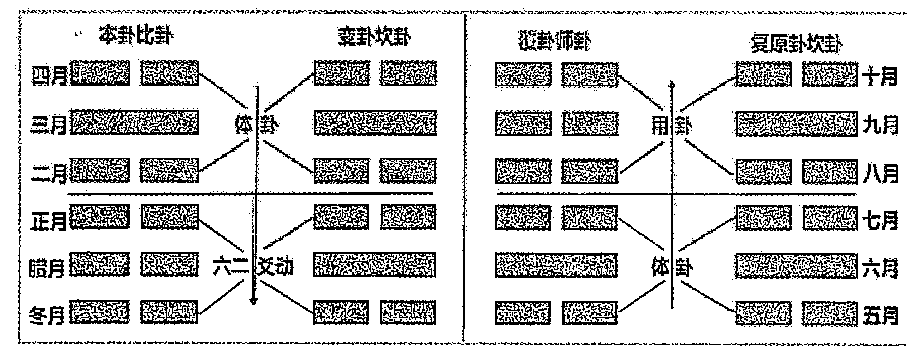

推测分析：以体为孩子，以用为工作。

- 1. 本卦水地《比卦䷇》，坎上坤下，坤土克坎水，用克体之象，预示孩子工作的事情一开始就像水在地上流一样的茫然，没有什么希望可言。
- 2. 变卦八纯卦《坎卦䷜》，坎上坎下，水见水，体用比和之象，卦象六二爻动，应期在农历腊月。坎象属于“流界”，说明此事已经动起来了。工作的事情从此有转机，等待机会到来，此事可以办成。
- 3. 六二爻变动，二为兑 (☱) 象，时间窗口：十二月、三月、六月、九月。目下是2011年农历十二月二十八日。到2012年农历三月、六月、九月都会有大的转机，特别是到2012年农历三月孩子工作的事情有重大进展。
- 4. 卦象体用不得其位，此事尚需等待时间调整，好在变卦的复原卦为八纯卦《坎卦䷜》，与变卦相同，卦象呈现比和状态。春节过后，农历三月份工作可以运作到位，农历六月就能办成到岗上班。

5、六二爻变动，兑（☱）象，为少女，有一个能言利齿、办事干练的年轻女士从中可帮助办成此事。

（注：预测完毕，当即将预测结果回复朋友。事后发现起卦时加的数字不对。但是，在这种情况下，错的数字往往能得来正确的结果。只好等待预测的最终结果来检验了。）

### 事后应验：

过了将近半年时间，到2012年8月1日（农历六月十四）上午10:50分，朋友某先生打来电话高兴的说：“老何，谢谢你的预测，刚好按你说的三月有重大进展，六月办成了。孩子安排在省人民医院上班，先给你说一下情况，最近我抽空来宝鸡当面感谢你。”

### 例四、你遇到了贵人

2011年11月15日（农历十月二十日）8:40分，外地博友 && 网上留言说：“大师，能否给测测近期事业情况。谢谢！”

乾坤居士说：“随机报几组数字，给你用梅花易测测。测官运？”

博友 && 说：“不想当官，就看看事业有无新的动向，明年3月份前。报数字：74、716、124。谢谢！”

```
数字起卦：74+716 = 780 ÷ 8 = 97…余4，4为震象，外卦取震（☳）象； 780+124 = 904 ÷ 8 = 113…余0，0为坤象，内卦取坤（☷）象，得本卦雷地《豫卦䷏》；总数904 ÷ 6 = 150…余4，九四爻动，4为震（☳）象，得变卦八纯卦《坤卦䷁》，本卦体用得位，互卦水山《蹇卦䷦》，覆卦和复原卦不用。
```

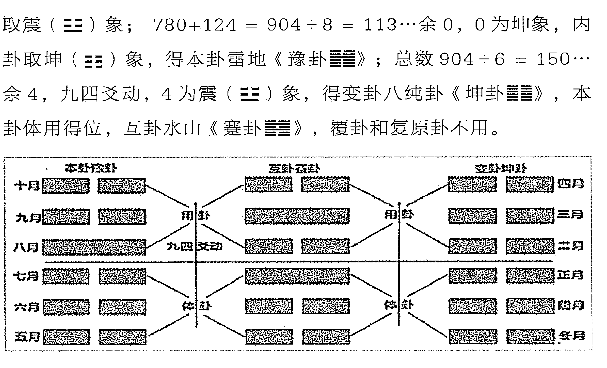

### 推测分析：以体为博友，以用为事业。

- 1. 本卦雷地《豫卦》，震上坤下，震木克坤土，用克体之象，农历十月水旺当令，这个（用）木逢生气，与坤土（体）不利。坤为众多，预示事业上开始遇到了很多的制约，诸事不顺。
- 2. 变卦八纯卦《坤卦》，坤土见坤土，体用比和之象；预示主人要办的事情呈现先难后易的状态。坤卦云：“地势坤，君子以厚德载物。”通过多方努力最后事业上终能如愿。
- 3. 九四爻动，四震（☳）象、为“气界”。时间窗口：八月、十一月、二月、五月。主人想调动工作的事情，农历八月已经开始运作通气。今年腊月基本可以定下来。明年农历二月初就有理想结果。
- 4. 九四爻动，4为震（☳）象，震为长男、为高个子、为东方。有一位高个子、说话嗓音大、在家排行老大、有身份的长年男子从中可以帮助你。
- 5. 互卦水山《蹇卦》，坎上艮下，山上重重水象，要去的方位在东北方向，整个办事过程为先难后易。

> 龙：
谢谢卦理，你遇到贵人了，就是这个人。另外，这个卦对应该男做什么生意？
2318：
谢谢大弟。很准。有个贵人说，明年2月份能帮我办理好工作，个子173左右，说话粗，42岁，工作地在我目前的东北方向。他说我的帮助很大。
龙：
我再分析：
1. 帮助你的是你的领导或长辈。朋友或同事难.
2. 时间窗口：2、5、8、11。你说的事情，农历八月开始动作，今年腊月基本可以定下来，明年二月初就有结果。
3. 求中有一个高个子、说话嗓音大的长年男子可以帮助你。
4. 方向：从东北，向西南，事情过程是先难后易。
2318：
不想当官，就看看事业有无新的动向。明年3月份后。谢谢
龙：
有伯乐？
2318：
谢谢！7+7=6；2+2
龙：
随缘吧。几时有好字，给你用梅花占测。
2318：
大弟，先看看我最近事业情况。谢谢！

### 事后应验：（见博客回复截图）

著者将预测结果发出后，博友 && 当即回复说：“谢谢大师！很准。有个贵人说，明年 2 月份帮我办理新工作，个子 173 左右，嗓音粗，43 岁。工作地在我目前的东北方向。但我没期望很大。”

著者说：谢谢回复，你遇到了贵人，就是你说的这个人，赶紧去找他。祝你好运！

### 例五、能否被单位返聘

2012 年 3 月 7 日（农历二月十五）17 时 42 分，云南的博友白先生博客留言：“现在退休离岗，身体很好，尚能继续工作，能否被单位返聘。”以他留言的时间起卦。得数字：5、2、15、10。

```
数字起卦：5+2+15 = 22÷8 = 2…余 6，6 为坎（☵）象，外卦取坎（☵）象，22+10 = 32÷8 = 3…余 8，8 为坤（☷）象，内卦取坤（☷）象，得本卦水地《比卦䷇》；总数 32÷6 = 5…余 2，2 为兑（☱）象，六二爻变动，得变卦八纯卦《坎卦䷜》，本卦体用不得位，互卦不用；本卦的覆卦为地水《师卦䷆》，变卦的复原卦为八纯卦《坎卦䷜》。（读者注意，此卦与例一的卦象相同）
```

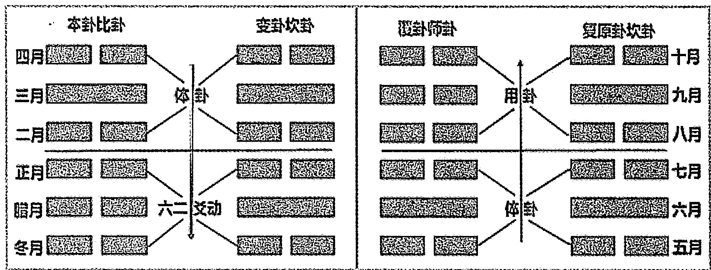

推测分析：以本人为体，以返聘为用。

- 1、本卦水地《比卦䷇》，坎上坤下，坤土克坎水，用克体之象，预示开始单位返聘的事是没有希望的。
- 2、变卦八纯卦《坎卦䷜》，变卦的复原卦也是八纯卦《坎卦䷜》，坎上坎下，卦象都是坎水见坎水，体用比和之象，水主变化，说明此事后面还有变化，很有可能被单位返聘任用。
- 3、卦象体用不得其位，覆卦为地水《师卦䷆》，坤上坎下，师卦主要讲：远方行军打仗的事情。预示着单位有“远行打仗”的安排，也就是去外地长期出差，或者驻守什么的差事。此事尚需三个月左右的时间等待调整。
- 4、六二爻变动，二为兑（☱）象，兑为西方、为少女、为口舌。时间窗口：农历十二月、三月、六月、九月有进展，也就是说去年冬季此事有人已经提上领导的议事日程。在你家的西边，有一个能言利齿的年轻女士可以从中帮你。
- 5、内卦动，说明单位内部有变动。预示这件事不是主要领导的问题，而是下边的人七嘴八舌有不同意见，领导也不好决策。

根据以上卦象显示，目前你只有等待时间空间的变化调整。

### 事后应验：

白先生回复：“何老师您好！刚刚看到您的回复，非常感激您！很准确吻合的。很感激您的热情帮助和提醒，我们这样不太老也不年轻的年龄，工作遇到这样的境况，只有年龄相仿的人才会理解和有同感。请问老师有无良策，该怎样调整才有利？”

乾坤居士说：“卦象分析，好像不需要花钱，你就等待吧！”

白先生回复：“何老师您好！您是说不用刻意去主动努力和争取吗？这个能说会道的女性，我还想不出来，距离远近可以大致看出吗？”

乾坤居士说：“到时候你就会遇到她。”

白先生回复：“好的，我记住您的提示指点，多留意。”

后来白先生留言告诉我：“单位有一个下乡蹲点的名额，单位内现在岗的人都不愿意去，领导做了个顺水人情，就返聘我去了，谢谢你！”

### 例六、考试总成绩82—84分

2012年5月13日22:51分，网上认识外地的学生小张（网名zhcz）QQ留言：尊敬的何老师您好？我自考试之后，最近一段时间真的很忙，一个是不知道公务员考试的成绩怎样？请您能否给预测一下。以2012（壬辰）年四月二十三日亥时起卦。得数字：5、4、23、12。

数字起卦：5+4+23 = 32 ÷ 8 = 3…余8，8为坤（☷）象，外卦取坤（☷）象，32+12 = 44 ÷ 8 = 5…余4，4为震（☳）象，内卦取震（☳）象，得本卦地雷《复卦䷗》；总数44 ÷ 6 = 7…余2，2为兑（☱）象，六二爻变动，得变卦地泽《临卦䷒》；本卦体用不得位，互卦不看。本卦的覆卦为山地《剥卦䷖》变卦的复原卦为泽地《萃卦䷬》。

| 本卦复卦 | 变卦临卦 | 覆卦剥卦 | 复原卦萃卦 |
|----------|----------|----------|------------|
| 四月：䷗ | 四月：䷒ | 十月：䷖ | 十月：䷬ |
| 三月：䷗ | 三月：䷒ | 九月：䷖ | 九月：䷬ |
| 二月：䷗ | 二月：䷒ | 八月：䷖ | 八月：䷬ |
| 正月：䷗ | 正月：䷒ | 七月：䷖ | 七月：䷬ |
| 腊月：䷗ | 腊月：䷒ | 六月：䷖ | 六月：䷬ |
| 冬月：䷗ | 冬月：䷒ | 五月：䷖ | 五月：䷬ |

推测分析：以本人为体，以考分为用。

- 1. 本卦地雷《复卦䷗》，坤上震下，震木为用、坤土为体，震木克坤土，卦象用克体之象，好在农历四月火旺当令，震（用）木泄气，坤（体）土逢生，预示考试发挥的不是很好。
- 2. 变卦地泽《临卦䷒》，坤上兑下，坤土为体、兑金为用，坤土生兑金，体生用之象，变卦不是很好，预示考试的成绩当然也不是很理想。
- 3. 六二爻变动，二为兑（☱）象。时间窗口：十二月、三月、六月、九月。因为原卦的用卦为震（☳）象，变卦的用卦为兑（☱）象，震（☳）象代表每月的初三至初七，兑（☱）象代表每月初八之十二之间。原计划农历六月初二——初七录取分配，而实际时间要推后到六月初八——十二日左右。实际考分离分数线可能差2分左右。
- 4. 问考试分数，要看卦象的数字。卦中大数是8不变，小数变动是4和2。六二爻变，预示分数是两位数。总分数应该在84——82分之间。
- 5. 六二爻变动，兑（☱）象，为西方、为少女。西边兑位，有一个能说会道的少女可以帮忙，今年九月才有最终结果。
- 6. 变卦的复原卦为泽地《萃卦䷬》，兑上坤下，有朋友聚集之象，坤土为体，兑金为用，体生用主人有付出。覆卦为山地《剥卦䷖》，艮上坤下，艮土见坤土，卦象比和，此事花不了多少钱，也不是花钱能解决的事情。

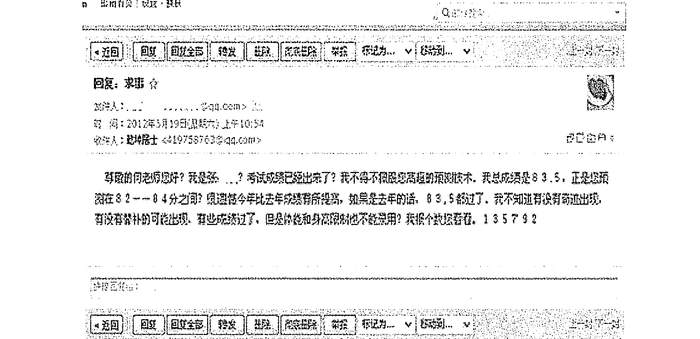

事后应验：（见QQ信箱回复截图）

6天之后的2012年5月19日（农历四月二十九，星期六）上午10:54分小张在QQ回复：尊敬的何老师您好？我是张&&？考试成绩已经出来了？我不得不佩服您高超的预测技术。我总成绩是83.5，正是您预测在82——84分之间？很遗憾，今年比去年成绩有所提高，如果是去年的话83.5都过了。我不知道有没有奇迹出现，有没有替补的可能出现。

### 例七、三次预测工作结果惊人相同

《梅花易数》预测有时候确实是很神奇的。2011年9月有个河北某地的博友，先后三次请求预测工作一事，卦象显示的时间窗口竟然完全一致。最后，预测结果如期应验。现将三次数字起卦预测的卦例介绍给朋友们，共同见证《梅花易数》的神奇。

### 第一次预测：兑卦变履卦

河北廊坊的博友发了三组数字：9、25、32，求测工作的事情。
数字起卦：9+25 = 34 ÷ 8 = 4…余2，2为兑（☰）象，外卦取兑（☰）象；34+32 = 66 ÷ 8 = 8…余2，2为兑（☰）象，内卦取兑（☰）象，得本卦八纯卦《兑卦䷹》；总数66 ÷ 6 = 11，变数为6，6为坎（☵）象，上六爻变动，变卦天泽《履卦䷉》，本卦体用得位，互卦为风火《家人卦䷤》，覆卦和复原卦不用。

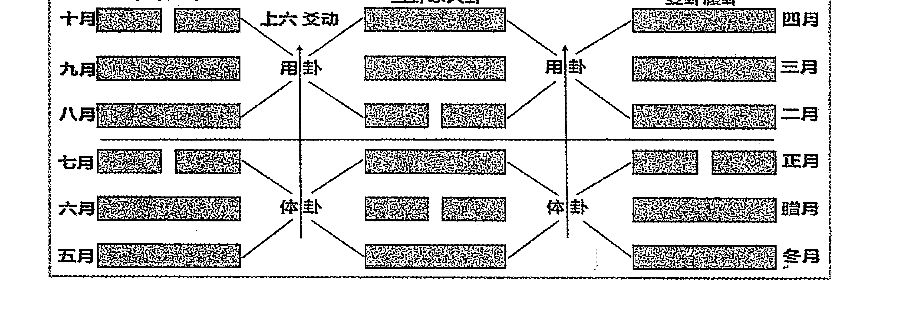

推断分析：以体为本人，以用为工作。

- 1. 本卦八纯卦《兑卦䷹》、兑上兑下，变卦天泽《履卦䷉》，乾上兑下，卦象一片金象，两卦均为比和之象，预示博友的工作没什么大的困难，从事的行当离不开与金属有关的行业。
- 2、兑（☱）象为口舌之争。履卦辞曰：“履虎尾，不咥人”。预示目前只是踩到了老虎尾巴上的毛，老虎不致于伤害自己。看来是主人你得罪了单位的领导，目前还不至于造成大的伤害。
- 3、上六爻变，坎（☵）象，时间窗口：农历正月、四月、七月、十月，时间正好应在十月份。农历七月初，主人的工作出了问题，到了农历十月份，一切问题将迎刃而解。
- 4、互卦风火《家人卦䷤》，巽上离下，也是因为家庭问题致使工作出现困惑。上六爻动，坎（☵）象，坎为中男、为瘦小精干。应该有一位瘦小个子、皮肤黑、很精干的中年男子能从中帮你解决问题。

著者将以上预测结果告诉了河北廊坊博友。

### 第二次预测：履卦变兑卦

隔了几天，那位朋友心里不踏实，又说她的妻子报了三组数字：3、6、9。让我用这三组数字再给他测测工作。一个养家糊口的男人，突然没了工作，心情是可以理解的。

### 数字起卦：

3+6 = 9÷8 = 1…余1，1为乾（☰）象，外卦取乾（☰）象；9+9 = 18÷8 = 2…余2，2为兑（☱）象，内卦取兑（☱）象，得本卦天泽《履卦䷉》；总数18÷6 = 2…余6，上六爻变动，为坎（☵）象，变卦为八纯卦《兑卦䷹》，本卦体用得位，互卦为风火《家人卦䷤》，履卦和复原卦不用。

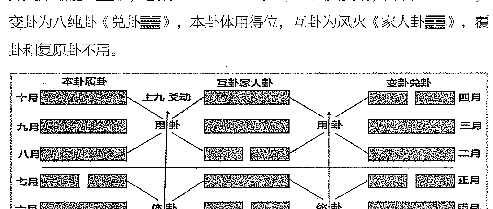

### 推断分析：以体为本人，以用为工作。

- 1、本卦天泽《履卦䷉》、变卦八纯卦《兑卦䷹》，这不正好将上次的卦象打了一个对调吗？分析如前卦，略。
- 2、上六爻变，坎（☵）象，时间窗口还是：农历正月、四月、七月、十月。到农历十月份工作问题就可轻松解决。坎（☵）象，为中男，中间有一个高头小、皮肤黑、很精干的中年男子可以帮忙（与前边预测将要遇到的人也一样）。
- 3、八纯卦《兑卦䷹》，兑上兑下，卦象比和，兑为口，两个口走在一起，为吃喝之象。上六爻动坎（☵）象，坎为水、为酒，看来需要设一些饭局酒水来通融加深一下朋友之间的感情。

> 看了预测，将结果发给博友。乾坤居士回复博友：你放心吧，与上次预测结果一样，需要请人吃饭，加深感情，耐心等待十月初机会的到来。

### 第三次预测：比卦变观卦

又过了几天，这位博友由于心急如焚，再一次发来第三组数字：7、23、42。让我第三次为他预测工作。

数字起卦：7+23 = 30÷8 = 3…余6，6为坎（☵）象，外卦取坎（☵）象；30+42 = 72÷8 = 9…余0，0为坤（☷）象，内卦取坤（☷）象，得本卦水地《比卦䷇》；总数72÷6 = 11…余6，上六爻变动，为坎（☵）象，变卦为风地《观卦䷓》，本卦体用得位，互卦为山地《剥卦䷖》，覆卦和复原卦不用。

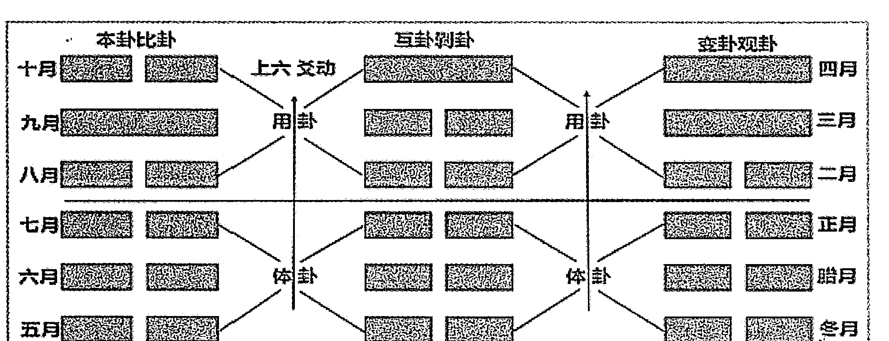

### 推断分析：以体为本人，以用为工作。

- 1、本卦水地《比卦䷇》，坎上坤下，坤土克坎水，体克用之象。预示主人已经掌握了主动，好事要推迟一些时日，仍然需要耐心等待。
- 2、变卦风地《观卦䷓》，巽上坤下，巽木克坤土，用克体之象。巽为木、为风、为消息、为文书信息；再者，农历九月土当令，巽（用）木处于绝地，克制不了坤（体）土，还是耐心观望，以待好事的到来。
- 3、上六爻变，坎（☵）象，时间窗口依然是：农历正月、四月、七月、十月，与前两次预测没有多大变动，到农历十月初工作问题才能解决。
- 4、坎（☵）象为中男，还是有一位很精干的中年男子能给予帮忙。

基于这些推测结果，乾坤居士于2011年10月10日回复河北某地博友：
朋友！等待不一定是倒退，等待并不代表无助，等待是为了更好的把握下次机会。你这人心思太重，根据你第三次给的三组数字，起卦为水地比卦，上六爻有变，变卦风地观卦，就是说：1、这个小个子、皮肤黑的中年男子一定会遇到，而且必须遇到。2、比卦，有礼帛相赠之意，看来人情必不可少。3、观卦，本身说的是需要观望等待，农历十月初工作问题定会解决。

> 博友河北某地博友回复：“是啊，我的心思的确太重，老是心事重重，把别人想的太阴险，老感觉别人在捉弄我！”

四天之后的2011年10月14日 12:16分 河北某地博友说：“老师，在家等待的日子很难过啊！很烦闷！”

12:17:57秒，乾坤居士回复：我昨天发的卦例你看了吗？

12:18:18秒，河北某地博友回复：看了！

12:19:08秒乾坤居士回复：三次的预测结果基本一样，特别是前两次，连卦象都一模一样。

12:20:05秒，河北某地博友回复：“是啊，神妙！这是天意难为！”

### 事后应验：

2011年10月28日（农历十月初二）9:55分，河北某地博友发来信息：
老师，您好！确实遇到了你说的人，我下周要去新公司入职了。

2011年11月8日（农历十月十三）13:13分，河北某地博友发来信息：
老师，您好！近来好吧？我11月3日（农历十月初八）上班了，先在这干着！

最终结果：博友找到了新的工作，于农历十月初八开始正式上班了。他担心的工作问题终于得到解决。三次预测的结果显示，时间窗口就在十月初，必须遇到那个小个子、皮肤黑的男人，而且确实在十月初预测结果全部应验了。

### 例八、应聘之事能否如愿？

2015乙未年3月27日（农历二月初八）下午17时36分，朋友孩子在西安参加某建设装备总公司的招聘，能否如愿，一家人有些担心。求测。

以2015年二月初八（酉时）起卦预测，得数字：8、2、8、10。

```
数字起卦：8+2+8 = 18 ÷ 8 = 2…余2，2为兑（☱）象，外卦取兑（☱）象，18+10 = 28 ÷ 8 = 3…余4，4为震（☳）象，内卦取震（☳）象，得本卦泽雷《随卦䷐》；总数28÷6 = 4…余4，4为震（☳）象，九四爻动，得变卦水雷《屯卦䷂》，本卦体用得位，互卦为风山《渐卦䷴》；覆卦和复原卦不用。
```

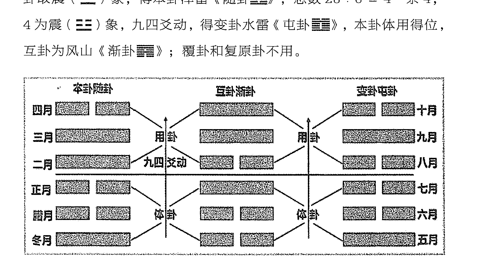## 推测分析：以体为孩子，以用为工作。

1.  本卦泽雷《随卦☰》，兑上震下，兑金克震木，用克体之象。好在农历二月木（体）旺当令，兑（用）金处于死地，反被木来侮，也就是反克的意思。此事表面看确实有一定困难，但实际上是有救神的。
2.  变卦水雷《屯卦☵》，坎上震下，坎水生震木，用生体之象。变卦主（体）逢生气，事（用）生本人，应聘之事水到渠成，大有希望。
3.  互卦风山《渐卦☶》，巽上艮下，卦象山上有木。看来此事循序渐进，过程平稳，后势看好。
4.  九四爻变动，4为震（☳）象，震为长男、为东方。预示能得到一位说话声音大、高个子男人的关照和帮助。
5.  时间窗口：农历二月、五月、八月、十一月。外卦为兑（☱）象，农历二月初八至十二日这五日内必有消息。

综合分析：此事先凶后吉，主逢生气，事随人愿。

### 事后应验：

预测2天之后的2016年3月29日（农历二月初十）周末，西安那边来消息，孩子成功被某能源建设装备总公司人力资源部聘用，应验了此事先凶后吉，主逢生气，事随人愿。

### 例九、转业工作安置

2011年09月份，有一位朋友给《中国宝鸡周易》投稿被采用，网上认识的缘故，知道他是一位等待安置工作的军转干部。由于是乡党的原因，所以一聊如故，处于个人爱好。在对方没有要求预测的情况下为他起卦预测工作安置。2011年9月26日（农历八月二十九）辰时起卦，得数字：4、8、29、5。

第一次预测，数字起卦：本卦天水《讼卦☰》，互卦风火《家人卦☲》，九四爻动，变卦风水《涣卦☴》。（起卦步骤略）

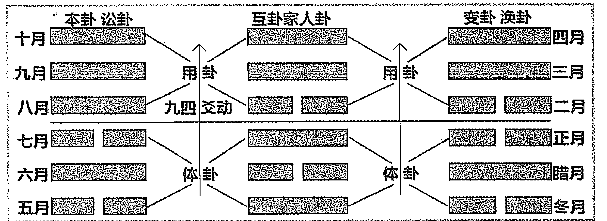

推测分析：以体为朋友，以用为工作。

1.  本卦天水《讼卦》，乾上坎下，乾金生坎水，卦象用生体，事情顺利。军转干部是政策安置，工作肯定是有的，主要看安置时间和工作是否理想。
2.  互卦风火《家人卦》，巽上离下，巽木生离火，预示事情的中间环节已经打通，运作较为顺利。
3.  变卦风水《涣卦》，巽上坎下，坎水生巽木，卦象体生用。安置工作的事情由顺利变为主人有付出之象。与本卦和互卦结合看，预示此事呈现先易后难的趋势。
4.  时间窗口：八月、十一月、二月、五月。2011年农历八月只能是有安置信息；农历十一月需要个人运作运作；2012（壬辰）年农历二...

信息：单位情况不明，工作性质不定，但应与文教有关，近期内可能有消息，过一段时间，还要，可以试。这个结果，先不算好，结果应该还行，时间可能比较晚。

总论：在你心里对做文教的观念还是不能确定，在思想深处还有一些疑虑，怕去那里不好，所以你犹豫不决，比较难以决断。现在分析如下：

1.  本卦天水讼，用生体，说明基本可行，但要用，安置的事情先拖后拖。
2.  时间窗口：5、11、2、5。2011年农历八月只能有消息；十一月还要继续活动；2012（壬辰）年二月应该是去报到的时候。
3.  工作性质：在政府机关的文教单位，偏文教部门。
4.  九四爻动，动爻（ ）位，有一个说话声、说话声音大、40-50岁男人，带兵从武艺出身。
5.  工作性质：在政府机关，偏文教，6000——8000元之间。否则，事不尽意，工作不太理想。
6.  你最好找找关系，说说好话，要不还要晚。

落，地北

分析结论：1. 安置是可以的，但花费要在5000元左右；2. 今年农历八月可有消息，去不去到明年2月才知道；3. 单位应该是政府下属的文电文化部门；4. 有个说话声音大带兵从武艺出身的男人，对你有帮助。

月份安置工作的事情基本运作到位。

5.  九四爻动，四为震（≡）象。卦象显示有一个瘦高个、说话声音大、五十岁左右的男人可以从中帮忙。变卦体生用，需要花一些钱，四位数，6100——6500元。否则，事不如愿，工作不太理想。

预测完毕，我于2011年9月26日9时8分发出简单的留言：“恕我直言。1、你安置的事请先易后难，要花些钱6500元；2、今年八月没有眉目，弄不好要到明年二月份才能到位；3、单位是政府下属的文化广电部门；4、有一个瘦高个、说话声音大的男人可以帮你。”后于11月19日将预测的全部分析发给了对方（见博客截图）。

> 事后应验：2012年2月1日，对方主动留言：“何老师：早上10时17分接到组织部不要远走，近期选单位的预告，如果方便您按这个时间再看一看，近期可分晓？这个结果，先不要发我，等单位选完，再告知您验证。”

### 第二次预测：

1.  本卦地水《师卦》，坤上坎下，坤土克坎水，卦象用克体，工作来找本人；
2.  变卦雷水《解卦》，震上坎下，坎水生震木，卦象体生用，主人有付出，工作不是很理想。
3.  本卦地水《师卦》与变卦雷水《解卦》皆为体用得位，说明工作的事情已经运作到位，可能已内定了。
4.  九四爻动，时间窗口：二月、五月、八月、十一月。自己想到水利农林部门或者基层单位，方位在东边。最快农历二月初三——初七可以到新单位报到。
5.  九四爻变，震（≡）象，震为东方、为长男。卦象显示有一个瘦高个、说话声音大、50岁左右的男人可以从中帮你。

> 事后应验：
2012年2月9日对方回复：“昨天下午选定单位：财政局下属的

××小组副主任。
2012年2月16日
对方回复：“下午到转业办报到”。
2012年3月27日
对方回复：“上周五组织部开过会了。估计这周文件可到单位，上班快了，谢谢一直的关心。
我是想选一个文化部门，可给出的单位没有。团职干部转业主要靠打分排名，找人用处不大，但为了得到一些信息，还是找了人，提前问一些情况。”（见博客截图）”

注：（这个人开始是不相信预测的）2012年3月27日是农历二月初六。时间正好在著者预测的“农历二月初三——初七”之间。从2011年9月日——2012年3月27日，时隔整整半年时间的安置预测终于落地兑现了。

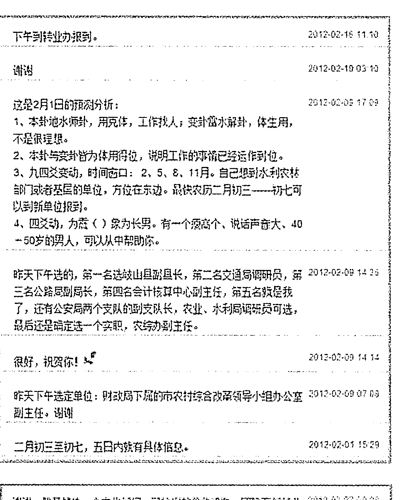

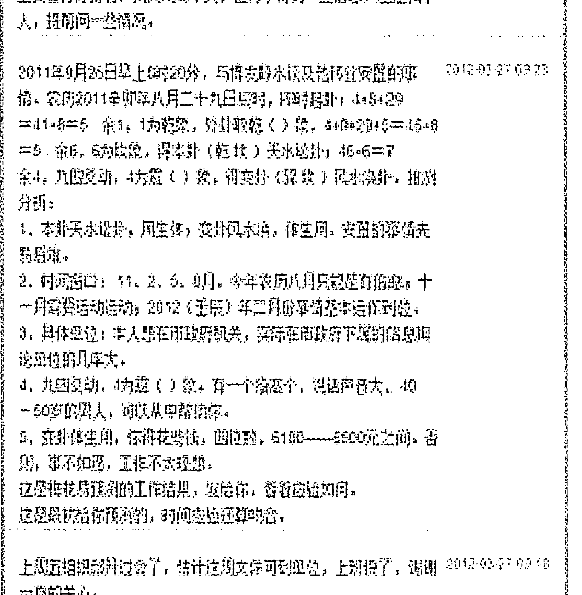

### 例十、出任一个新职位

2017年7月14日（农历六月二十一）11点30分，博友微信留言：“何老师，有朋友来电，16日有老板约我见面，出任一个新职位，此事能成吗？”

看到这个微信留言信息，著者立即用手机“梅花易”软件起卦，得本卦风雷《益卦䷩》，互卦山地《剥卦䷖》，六二爻动，变卦风泽《中孚卦䷼》。卦象的体卦和用卦都不得其位。（见手机卦象截图）

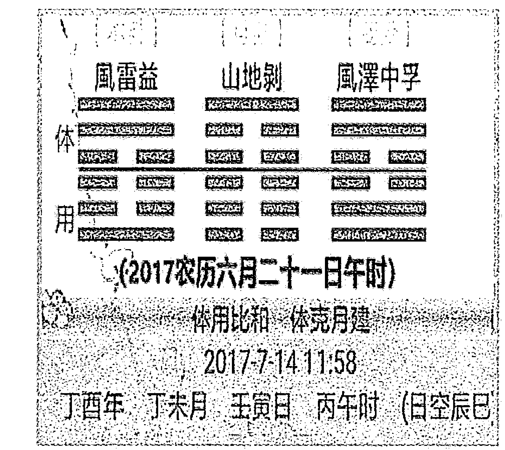

推测分析：以体为求测者，以用为新职位。

1.  本卦风雷《益卦䷩》，巽上震下，巽木见震木，卦象体用比和。预示与公司初期合作沟通愉快。
2.  互卦山地《剥卦䷖》，艮上坤下，用卦坤土克体卦巽木，预示后期可能遇到制约性的困难。
3.  六二爻动，变卦风泽《中孚卦䷼》，兑上巽下，用卦兑金克体卦巽木，事情进展不顺。
4.  时间窗口：六月，九月，六月初八至十二日之间约定的事情。
5.  卦象体用不得位，事情要到九月上旬才能有实质性的进展。


> 何老师，有朋友来电，16日有老板约我见面，出任一个新职位，此事能成吗？

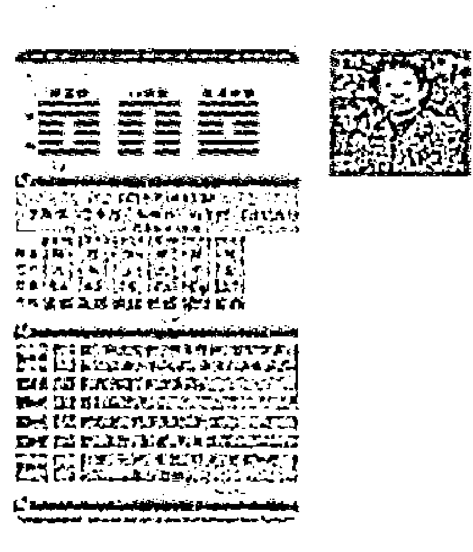


> 根据你留言的时间起卦。1.本卦益卦，卦象比和，合作初期沟通愉快。2.变卦中孚卦，后期可能遇到制约性的困难。3.六二爻动，时间窗口，六月，九月，六月初八至十二日之间约定的事情。4.卦象体用不得位，事情要到九月上旬才能有实质性的进展。5.有一个伶牙俐齿的年轻女士可以帮助你的，如此而已，到时再看缘分吧！


> 约定时间就是这个时间段


> 何老师，七月上旬请教的有个新职位能否成功，您的预测是九月上旬。前几天那个新职位的老板给我回电，如无没有特殊原因，约我那个时间段上岗，这个岗位不错月薪在万元以上，谢谢您的指示。只是这近三个月无聊至极，不知有否新的赚钱机会出现？真的有点焦急。


> 谢谢回复。如果以你炒股，最近可逢低买进一些股票，在10月初抛售，应该有不菲的收入。仅供参考。


> 谢谢

2.  变卦风泽《中孚卦䷼》，巽上兑下，兑金克巽木，卦象用克体。预示后期双方合作上可能遇到制约性困难。
3.  互卦山地《剥卦䷖》，艮山坤下，艮土见坤土，卦象体用比和。预示合作过程比较愉快，不过卦象体用不得位，互卦的作用就不是很大。
4.  六二爻动，时间窗口：农历六月，九月。卦象坎应该是农历六月初八至十二日之间双方约定的事情。
5.  卦象体卦和用卦不得其位，这件事情一定要等到农历九月上旬，双方的合作才能有实质性的进展。
6.  六二爻变，二为兑（☱）象，为少女、为口齿伶俐。求测者到时候可以得到一个伶牙俐齿的年轻女士的帮助，就看缘分如何了。

预测完毕，于2017年7月14日下午17时41分。著者将简要的预测结果微信回复博友。

### 事后应验：（见对话微信截图）

2017年7月14日下午17时47分，对方回复：“约定的时间就是这个时间段。”

2017年8月2日14时32分，对方再次回复：“何老师，七月上旬请教的有一个新职位能否成功，您的预测是九月上旬。前几天那个新职位的老板给我回电，如无特殊原因，约我那个时段上岗。这个岗位不错月薪在万元以上，谢谢您的指示。”

### 例十一、孩子的事落地生根了

2017年6月5日17时31分，山东的一位博友QQ留言：“乾坤老师好！好久没联系了。今有一事相求，我女儿今年大学毕业，报考本地一所重点中学教师编制”

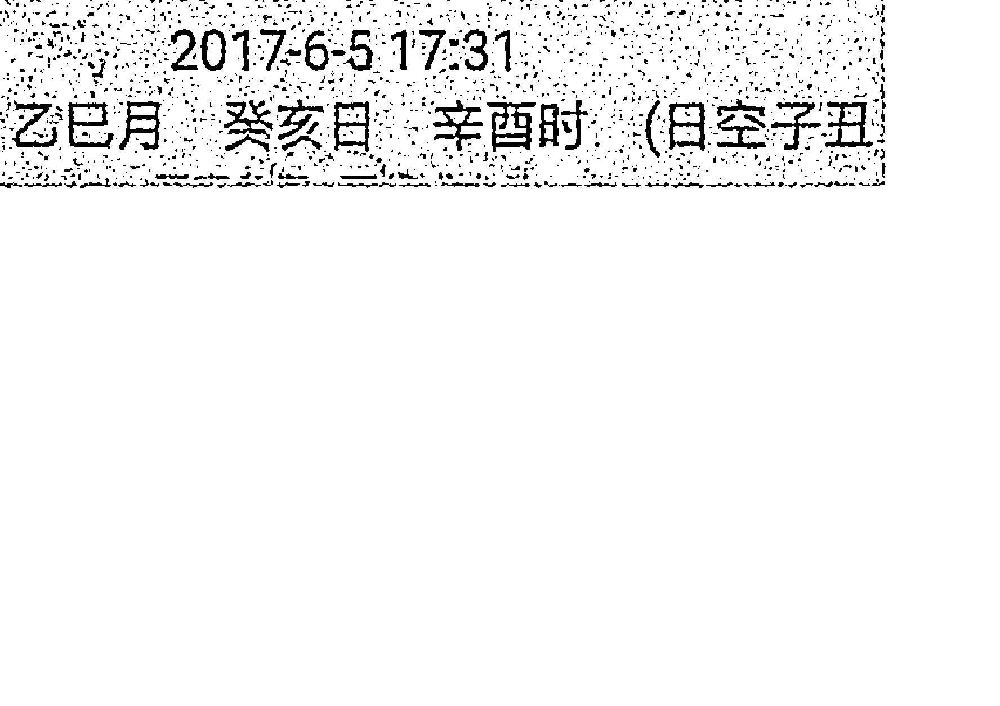

笔试已通过，27名进入面试，学校录取9名，女儿考了第11名。想请乾坤老师分析一下我女儿能否顺利过面试关？也请老师帮助指点一下困难。给你添乱了，谢谢！”

著者根据这个信息即时用手机软件起卦预测。得本卦泽雷《随卦》，变卦天雷《无妄卦》，互卦风山《渐卦》，上六爻动，时间窗口：四月、七月、十月、正月。预测分析见后面QQ截图。

事后应验：（见微信截图）

这个卦例预测的事情，从2017年6月5日起始，到2017年8月10日，经过两个多月的运作，远在山东的一名大学生就业一事终于落地生根了，著者倍感欣慰啊！神奇的是卦中推测的贵人也如期出现，并且一直给予关照。家长非常的高兴，微信上还主动给著者一个红

> 乾坤老师，我是...

> 你好

> 千里鹅毛，不成敬意，买包烟，祝工作生活一切顺心，顺意

> 你客气的，见面就红包啊！

> 真好

> 孩子的梦终于落地生根了

> 是的，终于放心了

> 你有缘，果然碰那个人贵人。

> 是孩子人生大事

> 祝贺你们全家。

> 对，与你卦中推测的完全相符

> 谢谢老师祝福，也感谢你的指点

> 七月份正好全部搞定。周易文化的确有更神奇哟！

> 我们全家对老师卦中推测的时间，过程变化以及具体人物特征都像在眼前看见一样，感到神奇。太神奇了

> 好的，祝老师游学开心，吉祥，六六大顺！

> 谢谢！祝你好运连连！

> 何老师神笔👍🙏

包。

对方在微信中说：“真好，终于放心了，是孩子人生大事。对，与你卦中推算的完全相符，感谢你的指点。我们全家对老师卦中推算的时间，过程变化以及具体人物特征都像在跟前看见一样，感到神奇。太神奇了！”

### 后记：

中国周易预测文化确实神奇。著者几十年在学习、探索的心路上付出的艰辛是无法用数字来表述的，凡是预测过的事情，屡屡得到应验证实。著者深有感触，只要预测文化能为社会上的就业者提供有益帮助，解困济人，服务桑梓，实为真正弘扬了中华优秀传统文化——《周易》的正能量。

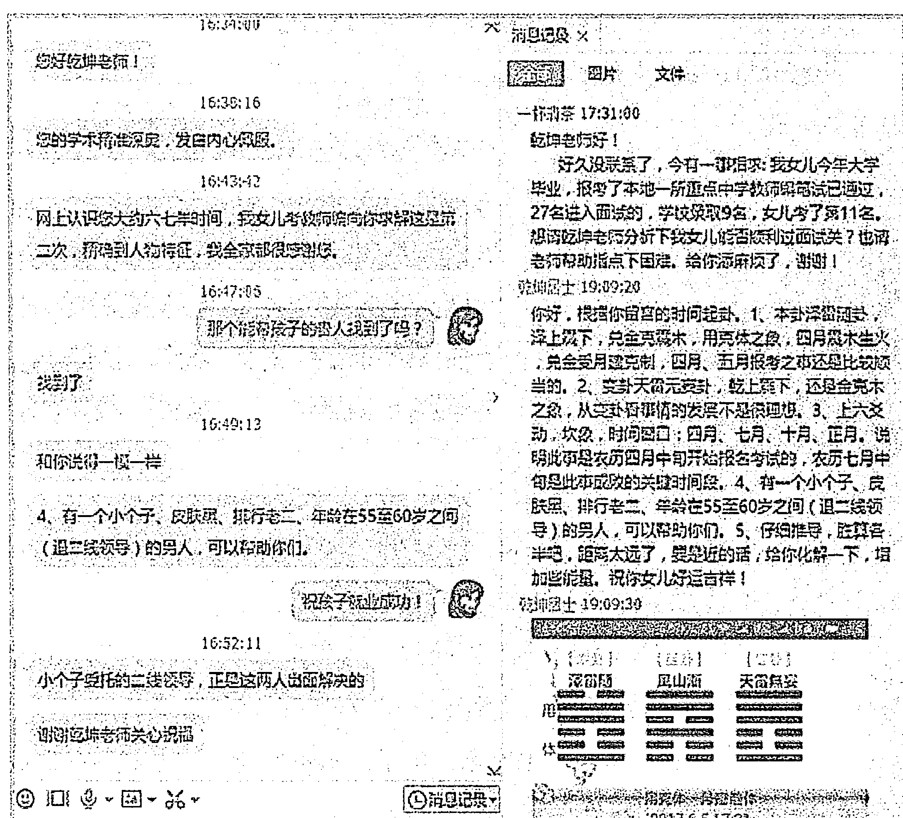

### 例十二、老婆工作调动能成不？

2017年11月28日（农历十月十一）下午16时16分，陕北一位网友在微信留言：“想问您给断个事，老婆调动工作，看能成不？谢谢！1988年农历正月十二日（出生）。这几天有个机会，还不知道能成不，具体会在那个方位呢？”

我问他：“你爱人是那一年的？好像今年九月努力了，是不是没有办成？你随便报两组数，测一哈。”

对方当时报数字：7、8。

数字起卦：7为艮（䷳）象，外卦取艮（䷳）象，8为坤（䷁）象，内卦取坤（䷁）象，得本卦为山地《剥卦䷖》，总数：15 ÷ 6 = 2…余3，3为离（䷝）象，六三爻动，得变卦八纯卦《艮卦䷶》。

推测分析：以体为他爱人，以用为工作。

1.  本卦山地《剥卦䷖》，上艮下坤，艮土见坤土，卦象比和之象；变卦八纯卦《艮卦䷶》，也是艮土见艮土，满盘皆为土，卦象比和之象。农历十月水旺当令，我克者为财，财旺不怕克。卦象皆为比和之象，预示工作调动能办成。
2.  时间窗口：农历七月、十月、正月、四月。抓紧点此事农历十月二十三至二十七日这个时间段此事会有好消息。
3.  六三爻动，离（䷝）象，为南方、为中女、为红色、为马，卦象预示在正南方位有一位属马的、热情大方的女性可以从中帮忙。
4.  本卦和变卦都呈现卦象比和。预示此事不用花钱，办成只是时间问题，最快到立春就能办好。

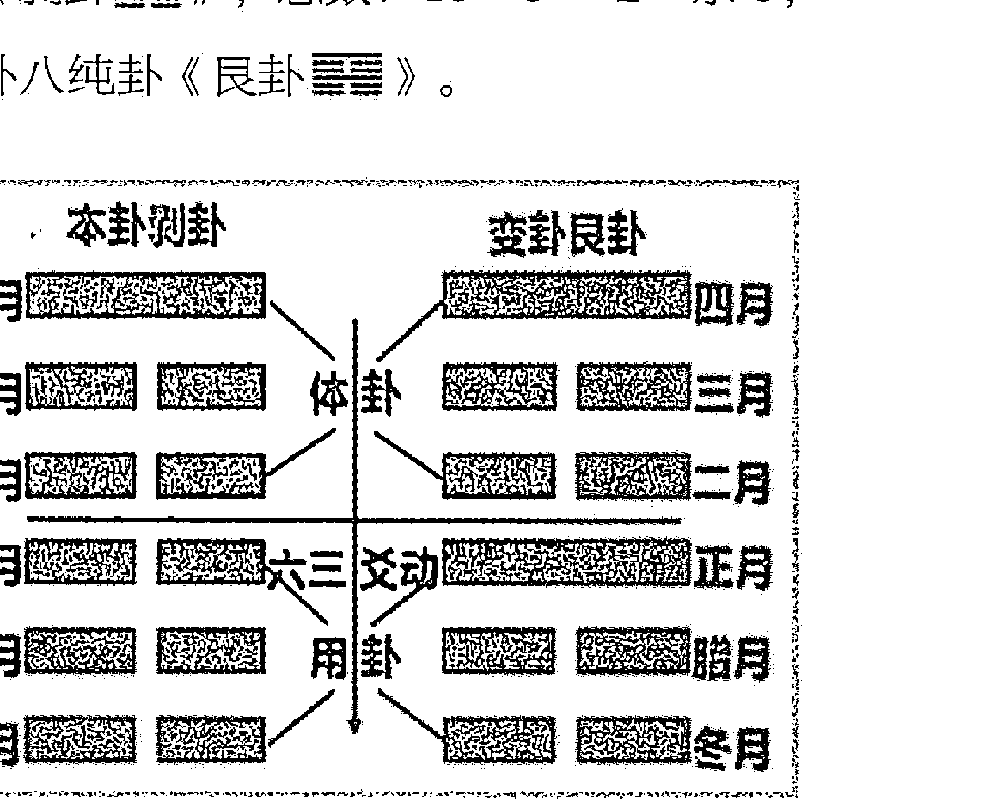

事后应验：（见微信对话截图）

到2018年16日（农历十一月三十）中午10点9分，对方微信

留言：“何老师，我老婆调动这事好了，你算的真V，今天弄好的，何老师能厉害。非常感谢，来&&打电话，小兄弟请您吃饭。”

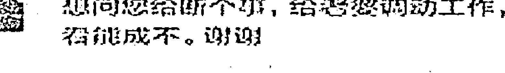


此事2017年11月28日预测，到办成事情共33天时间。比著者预测的立春期限提前十几天办成了。而且这个卦与前面第四节、例九一样，求测者报的数字都是：7、8，起的卦也一样，本卦山地《剥卦䷖》变八纯卦《艮卦䷳》，只是月令有差别。分析推算的结果也特别的准。需要说明的是月令的旺相与否，对预测推断有很大的联系，初学预测朋友要仔细体悟。


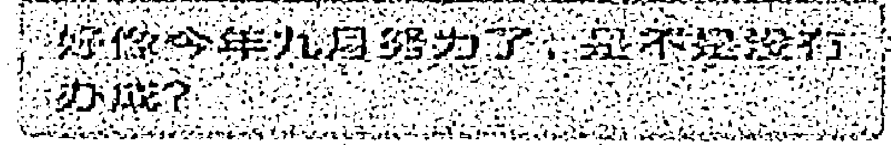


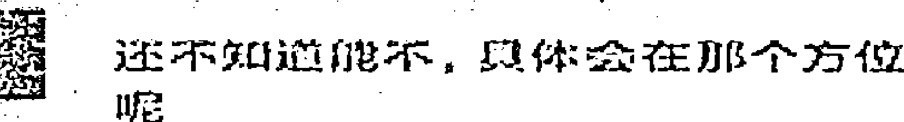


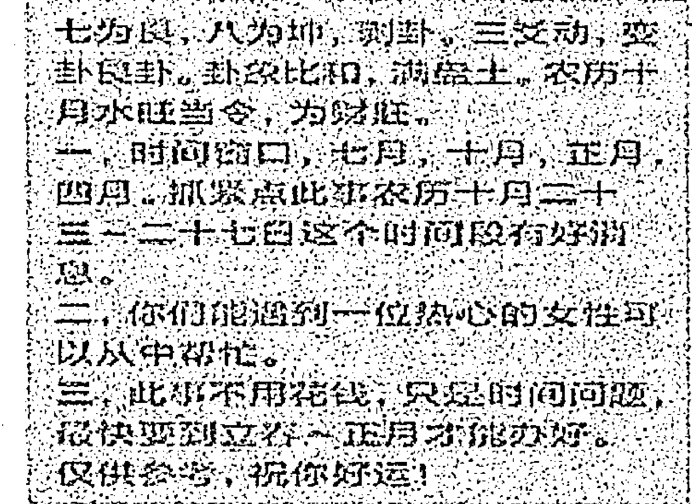

### 例十三、相同的7与8，结果不尽相同


2018年元月30日（农历腊月十四日）下午，与几个朋友聚在一起，介绍认识了一位英俊潇洒的年轻博士先生。话题扯到了工作和前途。

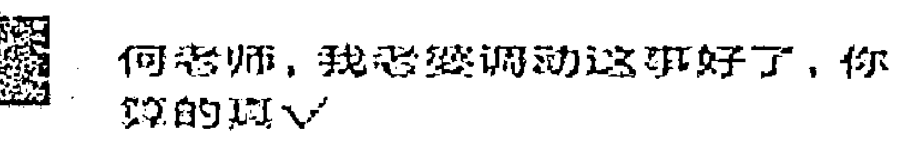


以“应征”二字起卦预测。“应”字7划，7为艮（☶）象为外卦；“征”字8划，8为坤（☷）象为内卦，得本卦山地《剥卦䷖》。


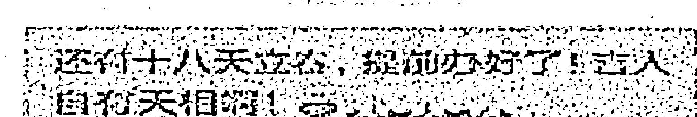

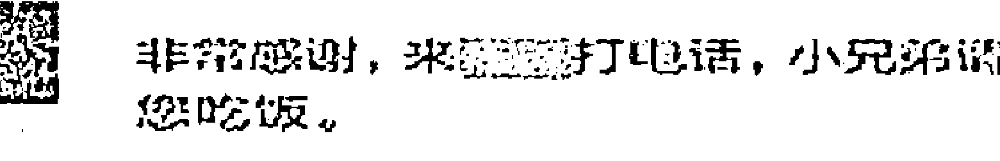

总数：7+8=15÷6 = 2…余3，3为离（☰）象，六三爻动，得变卦八纯卦《艮卦䷳》，美中不足的是卦象体用不得位。

### 推测分析：

以体为本人，以用为工作。

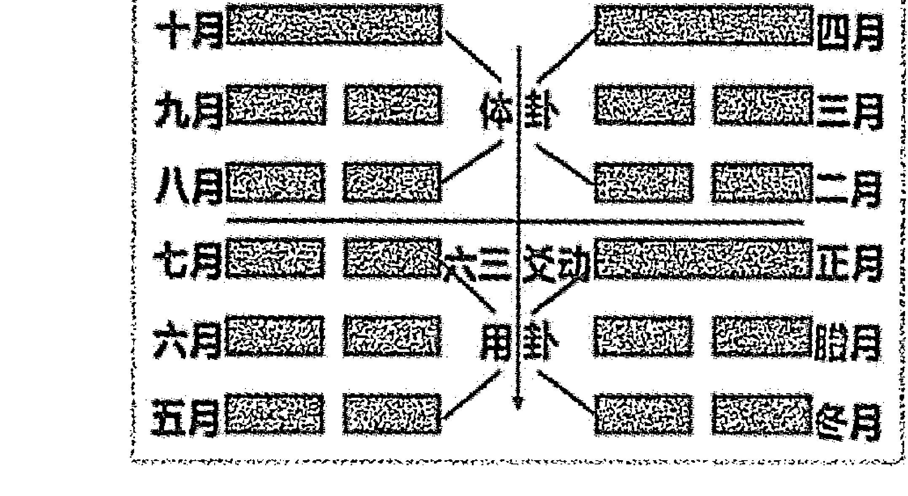

1.  本卦山地《剥卦䷖》，上艮下坤，艮土见坤土；变卦八纯卦《艮卦䷳》，是艮土见艮土，满盘皆为土，卦象呈现比和之象。农历十月水旺当令，我克者为财，财旺不怕克，工作方面肯定有好事。
2.  从这两个字面看，“应征”二字有应聘、应邀、应招的意思。时间窗口：农历七月、十月、正月、四月。2017年农历七月工作的事情有消息；农历十月二十三至二十七日这个时间段工作有好消息；2018年正月下旬工作尽有佳音。
3.  此人1987（丁卯）年生，2018（戊戌）年属相与太岁六合，向西北方向走有好事等待。腊月正处冬季的土旺中，癸水为财，我为土克癸水。说明婚姻也面临抉择，戊戌年有佳偶天成之象。

### 当场应验：

著者当时对这位博士朋友讲了以上预测信息，今年轻博士先生感到非常震惊。原来他就是为应聘岗位从北京来西北地区的。这是本书中第三例用7、8两个数字起卦的案例，与大家分享交流。

### 例十四、你女儿工作有希望

2018年元月23日下午17时42分，一位朋友微信留言：“何老师，女儿的工作托人办了很长时间了，你看有希望没？”

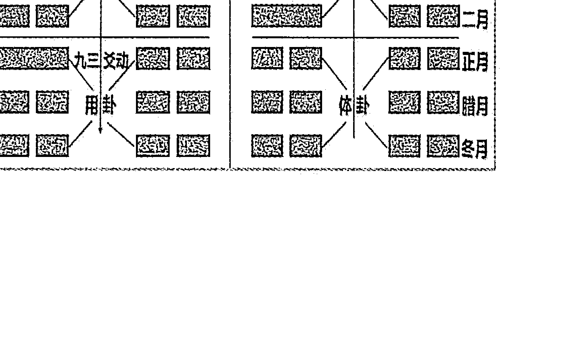

我让她报两组数字。对方报数：4416，0903。

数字起卦：4416 ÷8 =552…0，0为坤（☷）象，外卦取坤（☷）象，0903 ÷8 =112…7，7为艮（☶）象，内卦取艮（☶）象，得本卦地山《谦卦☷☶》。总数：4416+0903=5319÷6 =886…3，三为离（☲）象，九三爻动，得变卦八纯卦《坤卦☷☷》。

推测分析：以体为女孩，以用为工作。

1.  本卦地山《谦卦☷☶》，坤上艮下，坤土见艮土，卦象体用比和之象，预示工作的事情能办成。
2.  变卦八纯卦《坤卦☷☷》，坤土见坤土，卦象体用比和之象，预示孩子工作的事情已经启动。
3.  九三爻动，时间窗口：农历七月，十月，明年正月，四月。2017年农历七月下旬找人运作；十月下旬此事正式启动。2018年正月下旬有希望办成，最晚在四月下旬。
4.  九三爻变，3为离（☲）象，离为南方，为中女，为马，为热情。预示有一位属马的、待人热情的中年女性可以帮助你们。
5.  在东北方位找办事的人，工作单位可能在西南方位。此事不需要花多少钱。

事后应验：（见微信对话截图）2018年元月23日晚上19时57分，对

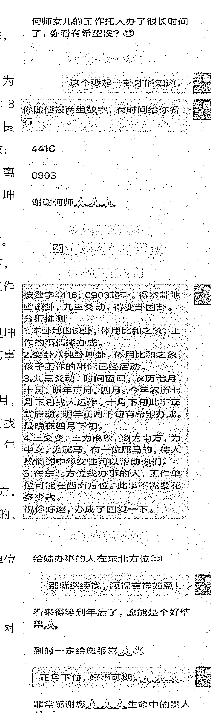## 第十节 疾病预测

俗话说：人吃五谷生百病。病魔一直对人类健康构成很大的危害。中医讲究阴阳五行，阴阳互动平衡，五行生克制化决定一个人的身体健康。近年来，科学正在揭示“大地物理磁场”对人类健康构成的影响。著者发现，一年四季、春夏秋冬交替，十二个月的月令旺衰，对人体健康也会造成一定的影响。疾病预测的关键要掌握几个原则：一是突然得了小病，如年轻人新得的小病，一般逢（月、日）相冲即愈；二是重病久病，或者老年人旧疾突发，一般逢（月、日）相冲则危险。什么是逢冲呢？比如说：属兔子的（卯）人得病，逢八（酉）月叫月建冲、或者酉日叫日支冲，这就是逢冲。当然还要参考卦的体用生克、比和、卦气旺衰等因素。下边介绍几个卦例，与大家共同研讨。

### 例一、我公公犯心脏病

2011(辛卯)年11月份，辽宁锦州的博友&&发来信息：“何老师你好！今日有事冒昧问一下，我公公犯心脏病，昨天早上很重，送进了医院。我想请老师给看看，公公的健康状况。公公很小就失去了父亲，连自己真正的生日都不清楚。看到你的《梅花易数》预测，所以也想请老师帮忙，这是我随手打出的数字：12、45、21，不知是否可以？感恩老师！今日我带孩子去医院看望公公，让孩子学会孝顺老人，学会感恩，因为公公对孩子是无比的溺爱。”

按对方报的数字起卦预测：12、45、21。
数字起卦：12+45 = 57÷8 = 7…余 1，1为乾象，外卦取乾（☰）象，57+21 = 78÷8 = 9…余6，6为坎（☵）象，内卦取坎（☵）象，得本卦天水《讼卦☰》；总数78÷6=12…余6，上九爻动，6为坎（☵）象，得变卦泽水《困卦☱》，本卦体用得位，互卦为风火《家人卦☴》，覆卦和复原卦不用。

| 本卦讼卦 | 互卦家人卦 | 变卦困卦 |
|----------|------------|----------|
| 十月     |            | 四月     |
| 九月     | 上九爻动   | 三月     |
| 八月     |            | 二月     |
| 七月     | 体卦       | 正月     |
| 六月     |            | 腊月     |
| 五月     |            | 冬月     |

推测分析：以体为病人，以用为疾病。
- 1. 本卦天水《讼卦☰》，乾上坎下，乾金生坎水，用生体之象。预测病情，乾（☰）象为父、为老人、为首（脑），坎（☵）象为水、为血液，预示病人好像有点脑出血。看来老人病情不单是心脏的问题，脑子里可能也有问题。
- 2. 变卦泽水《困卦☱》，兑上坎下，兑金生坎水，用生体之象，现在是农历十一（子）月，水旺当令，坎水又逢生气，有水泛滥无制之象。病人很可能是血管出问题了，病情主要在血脉方面。
- 3. 上九爻动，六为坎（☵）象，此人体型瘦小，时间窗口：农历十月、正月、四月、七月。乾（☰）象对应每月的十三日至十七日时间段。农历十月十三日至十七日之间应该就有发病的征兆。
- 4. 互卦为风火《家人卦☴》，说的是家中之人。此人农历十一月初一发病，这个时间窗口不好，如果老人能熬过十一月初八，病情就安然无恙了。

基于以上推测，著者回复博友 &&：你是个孝顺的媳妇。说几点仅供参考：
- 1、农历十月十七日左右应该就有发病征兆；
- 2、目前病情不单单是心脏的问题，脑子里可能也有些问题；
- 3、十一月初一得病，一片水象，本月（子）水当旺金泄气。如能扛过十一月初八，你公公病情就安然无恙了。

孝感动天，礼佛力挽狂澜，祝您及您的公公平安健康，祝好心人好人好报！
回复 | 删除

感应天动地理终是感天和大地为之感动，那容我空谈人云云。不知对否？
回复 | 删除

老师真行，谢谢。
回复 | 删除

谢谢朋友！祝新年快乐！心想事成！
回复 | 删除

### 事后应验：

博友 && 回复：感恩何老师！我公公是老冠心病，今年发病比较频繁。我公公在公历10月末犯病去医院住了一个月，似乎没有见效。回家休养，可是昨日早晨突然严重，大家都吓坏了，送到医院，缓过气来。今日早晨又犯了一次。老人家很固执，不愿意给孩子添麻烦，我们都很担心。情急之下，向老师求助，感恩老师的回复。我想给公公做些善事，看能不能帮公公躲过一劫。公公是个彻底的唯物者，所以不能让他知道。我准备给老人家放放生，有缘印些经书，来化解公公的一些冤亲债主。啰嗦了许多，再次感恩老师！

2011年12月30日(农历十二月初六)19:10:35博友 && 从QQ再次回复：
何老师，很感谢，您帮我公公算的。公公现在做了心脏手术支架。如果不做，危险就很大了，现在应该算平稳了！（此病例预测发在我的网易博客，得到博友的好评和点评，见截图）

### 例二、你母亲的病是良性

2012（壬辰）年4月4日（农历三月十四日）20:30分，内蒙古呼伦贝尔的博客粉丝yywx，在我的新浪博客留言说：“何老师，我想问问我妈妈（甲辰年人）的健康，她身体一直不太好，最近得了甲状腺结节，不知道是良性恶性，医院也没办法下结论，我常常不在她身边，很担心，谢谢您。”我一看到留言，感觉这个孩子心系母亲，是一个孝顺孩子，立即起卦为他预测。以2012年农历三月十四日戌时起卦，得数字：5、3、14、11。

数字起卦： 5+3+14 = 22 ÷ 8 = 2…余 6，6为坎（☵）象，外卦取坎（☵）象，22+11 = 33 ÷ 8 = 4…余 1，1为乾（☰）象，内卦为乾（☰）象，得本卦水天《需卦 ☵☰；总数33 ÷ 6 = 5…余 3，3为离（☲）象，九三爻变动，得变卦水泽《节卦☵☱》；本卦体用不得位，互卦不用。本卦的覆卦为天水《讼卦☰☵》，变卦的复原卦为泽水《困卦☱☵》。

推测分析：以体为其母，以用为疾病。

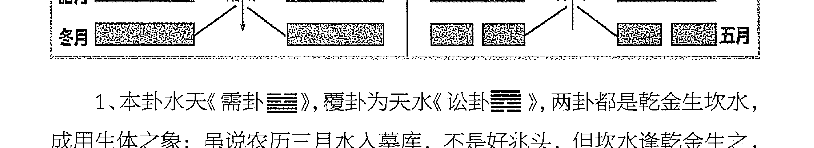

- 1. 本卦水天《需卦☰☵》，覆卦为天水《讼卦☵☰》，两卦都是乾金生坎水，成用生体之象；虽说农历三月水入墓库，不是好兆头，但坎水逢乾金生之，说明其母的病情是有救神的。
- 2、变卦水泽《节卦》，变卦的复原卦为泽水《困卦》，两卦也都是兑金生坎水，为用生体之象，卦有生气，这位母亲的病情应该是良性的症状。
- 3、卦象体用不得位，变卦的复原卦为泽水《困卦》，兑上坎下，泽水枯竭之象，病人甲辰年生，2012年适逢本命年，需要一段时间休养生息，用心调整自己的身体。
- 4、九三爻动，离（☲）象，时间窗口：正月、四月、七月、十月。这位母亲应该是2012年正月在西北方位就得了病，二（卯）月逢月建卯与辰（属相）构成六害，病情有些加重。救神在南方离（☲）位，卦象显示病人现在肺脏或者呼吸道也有些疾病。
- 5、甲状腺结节疾病，属于气血阻滞所致，需要增加水的能量，建议买一个黑颜色工艺品——老鼠，放在病人卧室北方位置，增加生命能量和自身磁场，能起到逢凶化吉之妙用。
- 6、病人今年逢本命之年，自坐太岁，农历三月辰土重重，土能克水，熬过三月，阳光一片灿烂。本来是四月初八至十二日前后，时间会提前到了四月初三——初七左右，节气变化，时来运转，病人会不药而愈的。

预测完毕，我立即回复：你好！八字就不用看了。我根据你留言的时间起了一卦，现将结果告诉于你。
- 1、你母亲今年正月在西北方位就得了病，农历二月病情加重。
- 2、给你妈买一个黑颜色老鼠工艺品，放在你家北方位置，增加生命能量和磁场。
- 3、救神在南方，你妈现在肺脏或者呼吸道也有些疾病。
- 4、你妈今年时逢本命年，熬过农历三月，阳光一片灿烂。农历四月初三——初七，你妈妈不药而愈。

祝你的妈妈早日康复！有好消息别忘了告诉我一声。

何老师，谢谢您，我按照您说的办了，前两天我妈妈又去医院检查一下，肺纹理有点点异常，甲状腺结节也没怎么长大，但是都不要紧是什么大毛病，多谢您帮了大忙了，我和妈妈都放心了，祝您也身体健康，万事如意。

太感谢了，她之前说呼吸不顺，我一定按您说的去做

> 你好！八字不用管了。我根据你留言的时间起了一卦。1、你母亲今年正月可能在西北方位就得病，二月病情加重。2、给你妈买一个黑颜色老板工艺品，放在你家西北方位，增加生命能量。3、我神在南方，你妈现在肺或者呼吸也有些疾病。4、你妈今年逢本命年，熬过三周阳光灿烂。四月初三——初七，你妈妈不药而愈。祝你妈早日康复！有好消息别忘了告诉我一声。

何老师，我想问问我妈妈的身体，她身体一直不太好，最近得了甲状腺结节，不知道是良性恶性，医院也没有办法下结论，我常常不在她身边，很担心，谢谢您

```
坤造：甲辰 辛未 丁卯 丙午（戌亥空）
大运：庚午 己巳 戊辰 丁卯 丙寅 乙丑 甲子 癸亥
```

### 事后应验：

2012-04-05（农历三月十五日）09:12 分，yywx 回复：“太感谢了，我妈之前说呼吸不顺，我一定按您说的去做。”

时间过了 34 天之后。2012-05-09（农历四月十九日）22:23 分，yywx 留言回复：“何老师，谢谢您！我按照您说的办了，前两天我妈妈又去医院检查一下，肺纹理有一点异常，甲状腺结节也没怎么长大。但是，医生说都不要紧是什么大毛病，多谢您帮了大忙，我和妈妈都放心了。祝您也身体健康，万事如意。”

著者预测：“熬过农历三月，阳光一片灿烂。农历四月初三——初七，你妈妈不药而愈。” 此次预测完全如期兑现，算是做了一件善事。（见新浪博客对话截图。顺便说明一下，著者在新浪的网名叫：乾坤真人）

### 例三、身体没有什么大碍

2012(壬辰)年元月14日,我们单位放了寒假,妻子一向身体小有不适,我带她去宝鸡某大医院做了一个体检。妻子原来一直血压高，可这次生物化验显示，谷丙转氨酶高达：238，使人不敢相信这个化验结果。医生让住院观察治疗，CT、磁核共振仪器全上了，未查清病因，一家人顿时慌了手脚，非常的担心。急情之下，以2012年2月1日（农历腊月二十一日）上午10：10分起卦预测，得数字：4、12、21、6。

```
数字起卦：4+12+21 = 37 ÷ 8 = 4…余5，5为巽（≡）象，外卦取巽（≡）象，37+6 = 43 ÷ 8 = 5…余3，3为离（≡）象，内卦为离（≡）象，得本卦风火《家人卦≡》；总数43 ÷ 6 = 7…余1，1为乾（≡）象，初九爻动，得变卦风山《渐卦≡》，本卦体用互不得位，互卦不用；本卦的覆卦为火泽《睽卦≡》，变卦的复原为山风《蛊卦≡》。
```

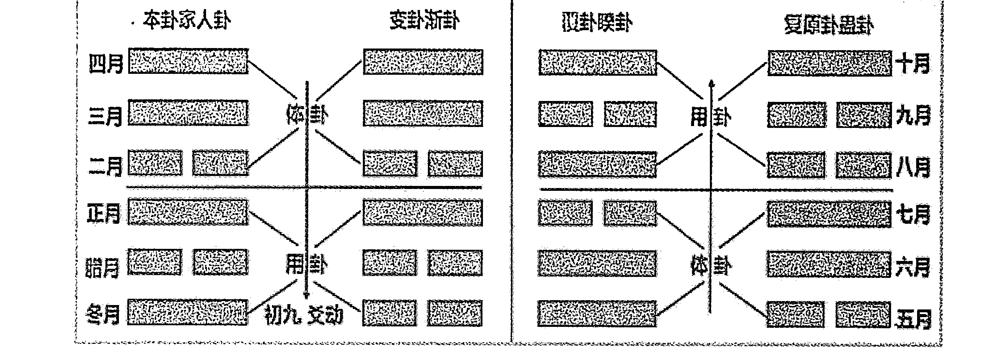

推测分析：以体为病人，以用为病情。
- 1. 本卦为风火《家人卦≡》，巽上离下，巽木生离火，体生用之象；农历腊月水旺当令，离(用)火处绝地，巽(体)木逢生气。巽在人体为胆囊，病灶可能在胆囊，问题应该不是很大。
- 2. 变卦风山《渐卦≡》，巽上艮下，巽木克艮土，体克用之象，腊月水旺生木，巽（体）木尚能克制艮（用）土。体卦为巽（≡）象、为长女、为胆囊，用卦为艮、为脾脏，可能主要是肝脾不和所致，吃些中药调理就会好的，应该是舍小财、无大碍。
- 3、初九爻变动，乾（☰）象，为男人、为有身份的人、属相为狗。预示有一个属狗的、有地位的公职人员能帮忙。时间窗口：十一月、二月、五月、八月。现在是农历十二（腊）月，本人十一月间身体就有一些问题。
- 4、变卦的复原卦为山风《蛊卦䷑》，山下有风之象，“风遇水而起，遇林而弱，遇山而止”。预示一桩坏事了结、一桩好事开始。
- 5、复原卦山风《蛊卦䷑》看，用爻从初九爻移至六四爻，对应月建为农历二月。等到2013年二月初，身体才能恢复正常。
- 6、本卦的覆卦为火泽《睽卦䷥》，离上兑下。卦辞：“两女同居一室，其志不同也。”预示有不大顺心的事情，病人需要调整好心态。

### 事后应验：

当时我们没有选择立即住院。有个（属狗）亲戚在宝鸡另外一个大医院工作。我们通过他找了一位肝胆科专家做了全面咨询，隔了一天在他们医院再次作了生物指数化验检查，结果显示，谷丙转氨酶：40多一点。最后做了丙肝、甲肝检查，确诊身体没有什么大问题。医生要求注意饮食，加强锻炼。于是一家人才安稳的过了春节，到现在妻子身体没有什么大的疾病发生。

### 例四、两次测病情应期一样

2012（壬辰）年2月22日晚上，外地朋友& &发来短信说：“母亲于农历二月初一晚上八点（戌时），肾病严重住院治疗，看看吉凶如何？”（老人1936年十月生，属鼠）

### 第一次预测、得数字：5、2、1、11。（甲辰旬中寅卯空）

数字起卦：5+2+1 = 8÷8 = 0…余0，0为坤（☷）象，外卦取坤（☷）象，8+11 = 19÷8 = 2…余3，3为离（☲）象，内卦取离（☲）象，得本卦地火《明夷卦䷣》；总数19÷6 = 3…余1，1为乾（☰）象，初九爻动，得变卦地山《谦卦䷎》；本卦体用不得位，互卦不用，本卦的覆卦为火地《晋卦䷢》，变卦的复原为山地《剥卦䷖》。

| 本卦明夷卦 | 变卦谦卦 | 覆卦晋卦 | 复原卦剥卦 |
| :--- | :--- | :--- | :--- |
| 四月 | | 十月 | |
| 三月 | 体卦 | 用卦 | 九月 |
| 二月 | | | 八月 |
| 正月 | | | 七月 |
| 腊月 | 用卦 | 体卦 | 六月 |
| 冬月 | 初九爻动 | | 五月 |

### 推测分析：以体为其母，以用为疾病。
- 1. 本卦地火《明夷卦䷣》，坤上离下，离火生坤土，用生体之象，农历二月木旺当令、离火逢生气、坤土有救，老人暂时没有性命之忧。
- 2. 变卦地山《谦卦䷎》，坤上艮下，坤土见艮土，体用比和之象，病人暂时无大碍。但病人是肾脏有病，卦中火生土旺，土来克水，病情存在隐患，十分不利，看来终究危险难以解除。
- 3. 卦象体用不得位，覆卦为火地《晋卦䷢》，离上坤下，离火普照大地，太阳尚未落下之象，夕阳高照，生机尚存。变卦的复原卦为山地《剥卦䷖》，艮上坤下，艮土与坤土比和，看来目前尚能稳定维持一段时间。
- 4. 初九爻动，乾（☰）象，时间窗口：十一月、二月、五月、八月为应验的月份；老人2011年十一月得的病，时间进入2012年农历二月，月令卯木当令，体卦坤土受克，老人的病情会逐渐加重。
- 5. 甲辰旬中寅卯空，寅、卯木旬空，用卦离（☲）象变艮（☶）象，离为牢狱，艮为山，象征牢狱之门向下打开，2012年农历二月二十三——二十七日五日内老人病情恶化将进入危险期。

### 事后应验：

### 第一次预测回复：2012年3月17（二月二十五）日晚上，朋友短信说：
老人病情恶化，不能排尿，医生不给用药，今天上午已出院回老家了。正好在著者预测的（农历二月二十三——二十七日五日）之内。

**第二次预测：**2012（壬辰）年3月18日（二月二十六日）13：02分，外地朋友&&再次发来短信说：报三组数字，36、29、899，请你仔细测一下老人有无危险。得数字：36、29、899。

```
数字起卦：36+29 = 65÷8 = 8…余1，1为乾（☰）象，外卦取乾（☰）象，65+899 = 964÷8 = 120…余4，4为震（☳）象，内卦取震（☳）象，得本卦天雷《无妄卦䷘》；总数964÷6 = 160…余4，4为震（☳）象，九四爻动，得变卦风雷《益卦䷩》；本卦体用得位，互卦为风山《渐卦䷴》，覆卦和复原卦不用。
```

**推测分析：**以体为其母，以用为疾病。
- 1. 本卦天雷《无妄卦䷘》，乾上震下，乾金克震木，用克体之象，病情已经完全克制病人，无妄卦预示着病情好转无希望之意。好在二月木旺当令，乾金难克震木，病人暂时还是没有太大的危险。
- 2. 变卦风雷《益卦䷩》，巽上震下，巽（☴）木见震（☳）木，木气一片，体用虽然比和，必须要水来通根，老人肾脏有病，本来水就很弱，又逢震木、巽木来泄气，与病人十分不利，不是好的兆头。
- 3. 九四爻动，时间窗口：二月、五月、八月、十一月为应验的月份。农历二月十八——二十二日之内，老人病情本该有变，但时间推后到二月二十三——二十七日（于前卦应期相同）。四为震（☳）象，震东方、为长男，可能因为与大儿子有关的闹心事、或者因不利的消息有关，导致老人病情危急。
- 4. 本卦的用卦由乾（☰）金变为巽（☴）木，与体卦震（☳）木构成比和之象，如果老人能熬过二月二十三至二十七这五天，病情也许还能减轻。

### 事后应验：

第二次预测回复：2012 年 3 月 22 日（三月初一）朋友来电话说：老人这几天能自己排尿了，还能吃一些东西，就是再没用药，你看清明节前有无危险？俗话说：男怕节前，女怕节后。我立即答复：清明节前应该没有问题，节后一定要格外注意。

第三次回复：2012 年 4 月 4 日清明节。4 月 7 日（农历三月十七，清明节后第三天）下午朋友短信通知：“老人于今天中午 11 点 35 分去世了。”这正好应证了 “男怕节前，女怕节后” 的那句老话。

### 例五、九月初有危险

2012 年 10 月 10 日（农历八月二十六日）中午，刚碰见一位易友，他就说有一位老人住院了，让预测一下吉凶。以当时的时间即时起卦，老人（女），1934（甲戌）年人，78 岁。

以 2012(壬辰)年八月二十六日 10: 57 分起卦，得数字：5、8、26、6。数字起卦：5+8+26 = 39÷8 = 4…余7，7 为艮（☶）象，外卦取艮（☶）象，39+6 = 44÷8 = 5…余4，4 为震（☳）象，内卦取震（☳）象，得本卦山雷《颐卦䷚》；总数 44÷6 = 7…余2，2 为兑（☱）象，六二爻变动，得变卦山泽《损卦䷨》；本卦体用不得位，互卦不用，本卦的覆卦为山雷《颐卦䷚》，变卦得复原卦为泽山《咸卦䷞》。（这个卦后来发现数字加错了，但预测结果正确）

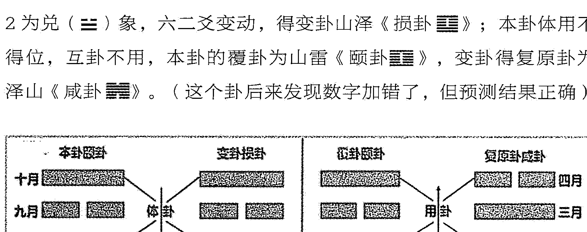

推测分析：以体为病人，以用为病情。
- 1、本卦山雷《颐卦䷚》，覆卦也是山雷《颐卦䷚》，两卦都是艮上震下，震木克艮土，用克体之象。震为肝、艮为脾，木（用）与土（体）相克，肝脾不和，好在农历八月金旺木死，病情无力克制病人，有惊无险的征兆，再者，颐卦有颐养天年之意。
- 2、变卦山泽《损卦䷨》，艮上兑下，艮土生兑金，体生用之象，农历八月金旺当令，老人的肺部或者呼吸道还有可能另添新病。
- 3、变卦的复原卦为泽山《咸卦䷞》，兑上艮下，此卦象为山气腾升，泽水下润，上下通气之象，说明老人内在器官运转协调，后期病情尽会好转。
- 4、六二爻动，兑（☱）象。时间窗口：六月、九月、十二月、三月为应验的月份。农历六月老人的身体可能就出问题了；今天是八月二十六日，至九月初三前后有危险，过了这个时间窗口，病人方可化险为夷。
- 5、病人（甲戌）岁出生，2012（壬辰）年冲犯太岁，现在八（己酉）月，戌人见酉，月建害身，八月不利。到九（庚戌）月，庚戌月与壬辰年相冲，岁冲月破，新近得病，逢冲会转危为安（如果是久病逢冲，恐怕凶多吉少）。一旦熬过农历九月初七，老人便会安然无恙。

### 事后应验：

后来情况反馈，这位老人的病情慢慢好转，康复出院。这是一例新近得病，年命犯太岁，八（酉）月与辰年六合，病情加重住院，九（戌）月与辰年太岁相冲，减弱太岁力量，冲去晦气，病情痊愈的预测卦例。

### 例六、最近老人有危险

2012（壬辰）年农历九月初八13点40分，偶然见到朋友，问及他老父亲的身体。他说：“身体一直不好，最近又住院了。”这位老先生是1928（戊辰）年人，今年正好本命年，农历九（庚戌）月，此为月冲岁破。著者问：“是不是九月初一或者初二住院的？”对方回答：“是的。”我说：“最近老人有危险，你要特别注意，最好不要远离，过了九月方能脱离危险。”并且让他给老先生捎话：就说是我说的，他身体没有问题，有时间我就去看他。过后立即2012（壬辰）年农历九月初八未时起卦预测，得数字：5、9、8、8。

- 数字起卦：5+9+8 = 22 ÷ 8 = 2…余 6，6为坎（☵）象，外卦取坎（☵）象，22+8 = 30 ÷ 8 = 3…余 6，6为坎（☵）象，内卦取坎（☵）象，得本卦八纯卦《坎卦䷜》；总数 30 ÷ 6 = 4…余 6，6为坎（☵）象，上六爻变动，得变卦风水《涣卦䷺》；本卦体用得位，互卦为山雷《颐卦䷚》，覆卦和复原卦不用。

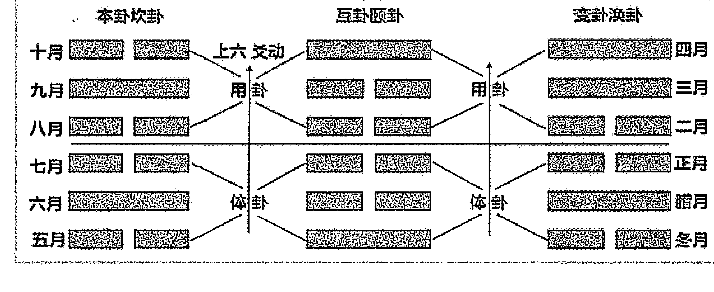

推测分析：以体为老人，以用为病情。

- 1、本卦为八纯卦《坎卦䷜》，坎上坎下，水见水，体用比和之象；九月土旺，月龄克水，坎数为六，六日之内老人绝对没有危险。
- 2、互卦山雷《颐卦䷚》，艮上震下，卦象顺看与覆过去看，卦象形成一个封闭的大离（☲）象，说明目前病人与疾病互为势均力敌状态。
- 3、变卦风水《涣卦䷺》，巽上坎下，坎水生巽木，体生用之象，太岁辰土与月建成土旺相，体卦坎水受克，加之坎（用）水又要生巽（体）木，导致自身泄气而体力不支，六日之内安然无恙，六日之外必有危险。
- 4、上六爻动，坎（☵）象，坎为水，代表血液和肾脏；病灶的主要位置应该在头部。
- 5、时间窗口：七月、十月、正月、四月为应验的月份。2012年太岁壬辰，七月和八月老人应该就一直有病，九月（庚戌），太岁在辰，正好岁冲月破，外卦坎（☵）象变巽（☴）象，巽为长女、为东南、为消息，巽（☴）象对应每月的十八——二十二日时间段，农历九月十八——二十二日之内老人必有危险，主要是十八丙寅日与月建为三合局、十九丁卯日与月建为六合、二十戊辰日为六冲，逢合添新病，逢冲有危险。巽为东南方位，特别要注意让病人避开这个方位。

### 事后应验：

2012年11月1日（农历九月十八丙寅日）上午11点55分，老人家在某市某医院病逝，享85岁高寿。11月3日上午专程去某殡仪馆参加老先生的遗体告别仪式，见了朋友我赶忙道歉：“我这臭嘴没说好，你别在意。”对方表示理解，这又是一例老人久病逢冲的案例。

### 例七、四月病情恶化

2010（庚寅）年4月27日（农历二月二十三日）21点08分，好久没有互通信息的学生某先生来电话说：“他的老领导一直有病，最近在西安住院，此人1950（庚寅）年七月生，你看有没有危险。”以2012年二月二十三日亥时起卦预测，得数字：3、2、23、12。

数字起卦：3+2+23 = 28÷8 = 3…余4，4为震（☳）象，外卦取震（☳）象，28+12 = 40÷8 = 5…余0，0为坤（☷）象，内卦取坤（☷）象，得本卦雷地《豫卦䷏》；总数40÷6 = 6…余4，4为震（☳）象，九四爻变动，得变卦八纯卦《坤卦䷁》，本卦体用得位，互卦为水山《蹇卦䷦》；覆卦和复原卦不用。

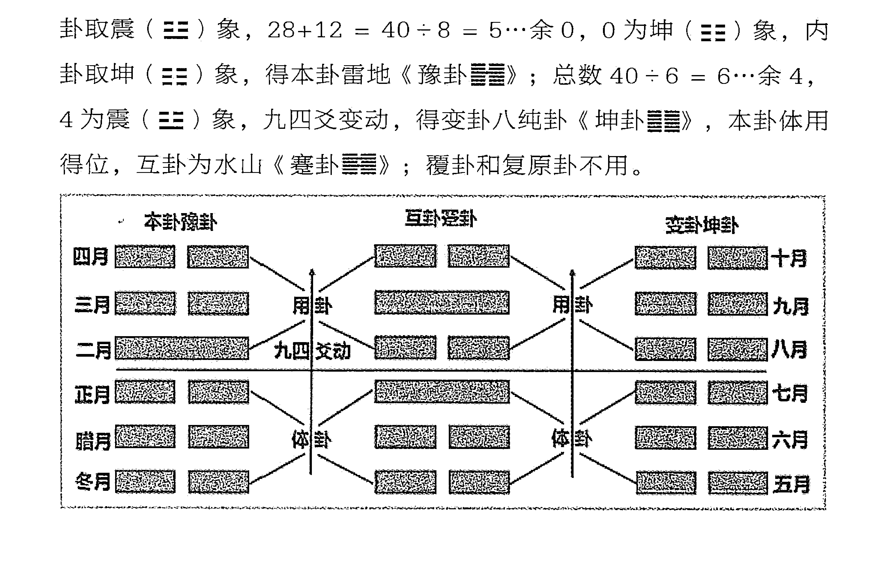

### 推测分析：以体为病人，以用为病情。

- 1、本卦雷地《豫卦䷏》，震上坤下，震木克坤土，用克体之象；震（用）木属肝，坤（体）土属脾，农历二月木旺当令，木旺至极，土处死地。预示病人的病应该是肝脾不和，导致肝癌的可能较大。
- 2、互卦水山《蹇卦䷦》，坎上艮下，外卦震象变坎象，坎水回头生震木之象，暂时应该没有危险。不过农历二月木(用)旺克土，内卦的坤(体)土处于岌岌可危之地，预示病情发展已经完全控制了病人，要康复已经很难了。
- 3、变卦八纯卦《坤卦䷁》，坤土见坤土，体用比和之象，预示当下还没有什么致命的危险。
- 4、九四爻动，四为震（☳）象，时间窗口：农历二月、五月、八月、十一月为应验的月份。在这四个月的月初病情会出现反复，导致病情进一步加重。
- 5、1950（庚寅）年出生的人，正逢甲子本命年。震（☳）象为长男，此人高个子、瘦身材、说话声音高、脾气也大、兄弟当中排行老大。农历四（巳）月逢六害月，病情恶化；农历七（申）月逢月建与太岁相冲，病人恐怕凶多吉少。

### 事后应验：

2012年七月初，这位领导在西安医院病世。学生某先生去西安参加了遗体告别之后，在乘车返回宝鸡的路上，打电话向我反馈了实际情况。又是一例久病逢冲的案例。

### 例八、土旺克水、生命垂危

2013年7月29日（农历六月二十二日）中午10时46分，陕西某集团公司的朋友某先生电话说：“朋友（男）突然得了脑溢血住院抢救，求测看有没有危险？”以2013(癸巳)年六月二十二日巳时起卦预测，得数字：6、6、22、6。

数字起卦：6+6+22 = 34÷8 = 4…余2，2为兑（☱）象，外卦取兑（☱）象，34+6 = 40÷8 = 5…余0，0为坤（☷）象，内卦为坤（☷）象，得本卦泽地《萃卦䷬》；总数40÷6 = 6…余4，4为震（☳）象，九四爻动，得变卦水地《比卦䷇》，本卦体用得位，互卦为风山《渐卦䷴》；覆卦和复原卦不用。

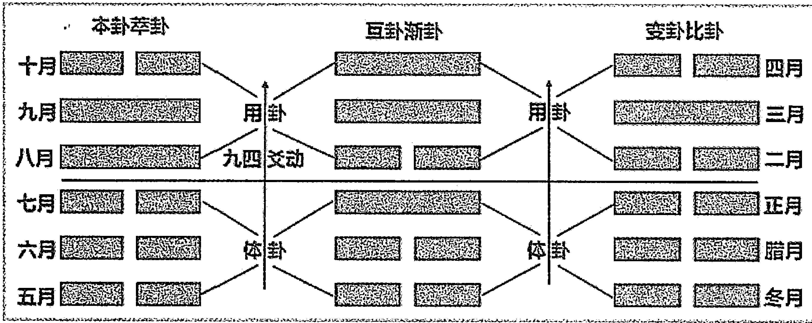

推测分析：以体为病人，以用为病情。

- 1. 本卦泽地《萃卦䷬》，兑上坤下，坤土生兑金，体生用之象，卦象显示此人的病因应该是发于自身所致。
- 2. 互卦风山《渐卦䷴》，巽上艮下，巽木克坤土，用克体之象，病克人，农历二月此人身体就出现了问题。农历六月火生土旺，属于自身没有在意所生的疾病，本卦看当下应该没有致命危险。
- 3. 变卦水地《比卦䷇》，坎上坤下，坤土克坎水，体克用之象，目前六月令，土处旺地，水逢绝地。脑溢血为水象，水为病，水受土克无生机，从变卦分析，此人病情严重，已经处于生命垂危状态。
- 4. 九四爻动，四为震（☳）象，时间窗口：二月、五月、八月、十一月为应验的月份。变卦的六三爻、六四爻、九五爻形成艮（☶）象，对应每月的二十三日至二十七五日时间段，六月二十七至三十日（立秋）之前是最危险时段。今天是农历六月二十二日，立秋前的第九天，正在土旺之中，从明天（二十三日）起今后8日之内为危险期。如能渡过这个危险期，或许还能逢凶化吉。

### 事后应验：

预测之后的第 9 天，即 2013 年 8 月 6 日（农历六月三十日），也就是立秋的前一天（四绝之日），朋友某先生短信回复：“何老师，病人今天中午在医院去世。”正好又应证了“男怕节前、女怕节后”的民间俗语。

### 例九、伤势虽大，可以转危为安

2013 年 9 月 19（农历八月十五）日，亲戚打来电话说：“他的弟弟在宝鸡某医院住院，是在某县建筑工地干活时摔伤的，伤势很严重，已经做了两次颅内手术，目前人处于昏迷状态，还在重病监护室，不让家属探视。医生说：还要进行第三次手术，我非常害怕”。接完电话，不用再说什么，对方肯定是想知道后边的吉凶。情况紧急，以 2013（癸巳）年农历八月十五）日 14：20 分（未时）起卦预测，得数字：6、8、15、8。

数字起卦：6+8+15 = 29 ÷ 8 = 3…余 5，5 为巽（☴）象，外卦取巽（☴）象，29+8 = 37 ÷ 8 = 4…余 5，5 为巽（☴）象，内卦取巽（☴）象，得本卦八纯卦《巽卦䷸》，总数 37 ÷ 6 = 6…1，1 为乾（☰）象，初六爻变动，得变卦风天《小畜卦䷈》；本卦体用不得位，互卦不用，本卦的覆卦为八纯卦《兑卦䷹》，变卦的复原卦为天风《姤卦䷫》。

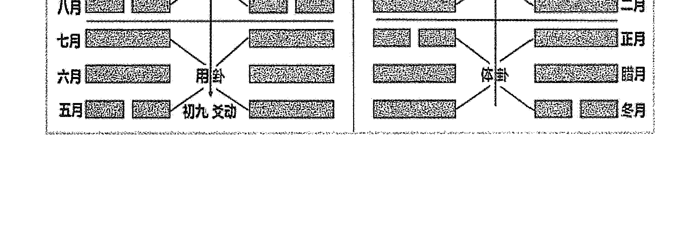

推测分析：以体为病人，以用为伤势。

- 1、本卦为八纯卦《巽卦䷸》，巽木见巽木、风见风，体用比和之象。覆卦为八纯卦《兑卦䷹》，兑金见兑金、泽见泽，体用比和之象，两卦皆为比和，预示病人肯定没有生命之忧。
- 2、变卦为风天《小畜卦䷈》，巽上乾下，乾金克巽木，用克体之象，变卦乾象回头克本卦巽象，加之农历八月金旺，乾金得令强势，预示巽木（病人）受伤一定很严重。
- 3、病人是摔伤的，在变卦风天《小畜卦䷈》中有提示，乾（☰）象在下，巽（☴）象在上，乾为头首，巽为臀部，摔下来时肯定是头先着地摔伤的。伤势部位主要在头部，腰部、臀部也有轻伤。
- 4、初六爻动，时间窗口：应在五月、八月、十一月、二月为应验的月份。巽（☴）象变乾（☰）象，乾象代表每月的“十三日至十七日”五日的时间段。五月本来就要出事的，预示八月十三至十七日必出大事。
- 5、巽（☴）象对应每月的“十八日至二十二日”时间段，预示农历八月十八至二十二日病人才会将逐渐转危为安。

事后应验：

2013 年农历八月二十三日病人从重病监护室转到了住院部普通病房。（9月28日）二十四日（周六）下午我专门去医院探视，病人已经脱离危险。睡在病床上能与人简单交流，就是说话前言不搭后语，思维明显有些紊乱。出院后病人恢复较快，第二年就能干较强的体力劳动。时至 2017 年底，此人身体状况良好。

### 例十、预测父亲的病情

2016（丙申）年 9 月 2 日（农历八月初二）7：14 分，兰州的朋友微信留言：“何老师，我父亲 8 月 22 日凌晨突发心肌梗塞，住院已十多天，这几天稍微平稳了，但我感觉很担心。父亲属猴的，今年已 85 岁。前天把墓地选了选，准备与母亲合葬在一起，不知父亲能不能抗得过去这次磨难？”

以2016年八月初二辰时起卦预测，得数字：9、8、2、5。

数字起卦：9+8+2 = 19 ÷ 8 = 2…余3，3为离（☲）象，外卦取离（☲）象，19+5 = 24 ÷ 8 = 3…余0，0为坤（☷）象，内卦取坤（☷）象，得本卦火地《晋卦䷢》，总数24 ÷ 6 = 4…余0，上九爻动，为坎（☵）象，得变卦雷地《豫卦䷏》；本卦体用得位，互卦为水山《蹇卦䷦》，覆卦和复原卦不用。

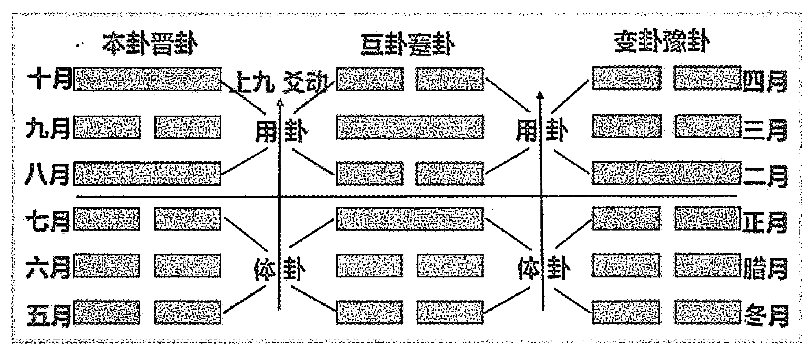

推测分析：以体卦代表病人，以用卦代表病情。

- 1、本卦火地《晋卦䷢》，离上坤下，离火生坤土，用生体之象。卦象看没有任何征兆的，虽然农历七月金旺火衰，离为心脏，病人突发心梗，但坤土（体卦）逢离火来生，预示尚有救神。
- 2、变卦雷地《豫卦䷏》，震上坤下，震木克坤土，用克体之象，农历八月金旺当令，木处死地，震木克制不了坤土，看样子病情只是暂时拿住了病人，调养一段时日会逐渐好转。
- 3、互卦为水山《蹇卦䷦》坎上艮下，艮土克坎水，体克用之象，预示病情转好要推迟，得医治调养一段时间才能康复。
- 4、时间窗口：七月、十月、正月、四月为应验的月份。农历七月二十三至二十七日是老人得病的时间区间。上六爻动，坎（☵）象，坎为水，为北方，为肾脏，为中男、小个子、黑皮肤。预示老人应该属于身体瘦弱型，他的肾脏应该也有病灶。
- 5、老人属猴，今年（丙申）是本命年、月建在农历丙申月，自身当旺，暂时不会有危险。到农历十月初病情可能会出现一些反复。

> 大哥，我父亲8月22日凌晨突发心肌梗塞，住院已十多天，这几天基本平稳，但我感觉很担心。父亲是属猴的，今年已85岁。前天把墓地选了选，准备把母亲坟一并起了，安葬在我们祁连山脚下的退耕还林的旱地里。不知父亲能否抗得过去这次磨难？

当即回复对方：按你发信息的时间起卦，本卦火山旅卦，上九爻动，变卦雷地豫卦，时间窗口：七月、十月。农历七月二十三至二十七之间得病，扛过这个大坎，我看暂时不会有什么危险。老人肾脏可能还有一些问题，农历十月初有一个危险期。

> 请大哥指点！

> 按你发信息的时间起卦，本卦火山旅卦，上九爻动，变卦雷地豫卦，时间窗口七月，十月。农历七月二十三至二十七之间得的病，扛过了这个大坎，我看暂时不会有什么危险。老人肾脏可能还有一些问题，农历十月初是一个危险期。

2016年9月2日上午10点朋友回复：“谢谢大哥，尿路不畅，肾脏好像有个小瘤，昨天今天很是担心，今早老人活动了一会，感觉还行。”

> 谢谢大哥 尿路不畅，肾脏好像有个小瘤，昨天今天很是担心。今早老人活动了会，感觉还行。昨天没能去送女儿去上大学，只为多陪护老人。

2016年9月5日晚上，朋友回复：“老人好多了，准备明天或者后天出院”。

> 老父亲好点了吗？

> 好多了 准备明天或后天出院

> 左右为难 准备接到兰州，又担心有危险

事后应验：（见微信对话截图）

> 暂时缓解平静，十月之前无大碍。

2016年10月7日（农历九月初九）

> 好的

晚上，在微信与朋友见面。他说：“昨天和媳妇回了老家，老父亲最近半个月身体状态不错，再没犯病，看起来精神还不错！”时至2017年12月底，老人身体健康状况一直很稳定。

## 第十一节 寿命预测

著者认为：人生本是一场有去无返的单程路演，生活中的每时每刻，都是现场直播，只要我们珍惜生命，每天开开心心地去做好当下每一件事，每个人都会有一个比较圆满的人生。但是，生命的未来又是不可知的。不管是什么人，都知道自己将来要死，就是不知道什么时间？什么地方？什么方式死去？著者把它叫做“人生一知三不知”。

古人云：“生死由命，富贵在天。”一般而言，我们不可以轻易预测一个生命的终结，因为这是非常不道德的事情，多数时候的预测结果说的都比较委婉，这样或许更近乎人情一些。中国人讲究生命要完美的终结，即寿终正寝。“油干灯灭”，顺其自然，每个人都逃不过这一劫难。但是，对于年事已高的老人，人们往往把寿终正寝视为人生的喜事。这就不免有人要为老人身后之事做准备。研究预测的人，平时很难避免这个问题。介绍几个预测事例，共同研讨。

### 例一、久病逢冲有危险

2010（庚寅）年农历九月二十九日下午六点，下班刚进了家门，宝鸡某县的朋友打来电话说：“老父亲久病住院，最近情况不妙，你看有危险没有？老父亲是1929年出生，属蛇的，急用。”我一听事急，明天是农历十月初一，心中即时起了一卦。当时在电话上告诉了他结果。因为是熟人，放下电话，排出卦象仔细分析。得数字：3、9、29、10。

数字起卦：3+9+29 = 41÷8 = 5…余1，1为乾象，外卦取乾（☰）象，41+10 = 51÷8 = 6…余3，3为离（☲）象，内卦取离（☲）象，得本卦天火《同人卦䷌》；总数51÷6 = 8…余3，九三爻动，3为离（☲）象，得变卦天雷《无妄卦䷘》，本卦体用不得位，互卦不用；本卦的覆卦为火天《大有卦䷍》，变卦的复原卦为雷天《大壮卦䷡》。

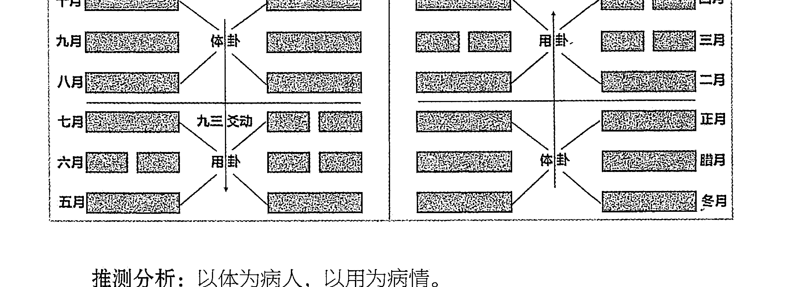

### 推测分析：以体为病人，以用为病情。

- 1. 本卦天火《同人卦䷌》，离上乾下，覆卦火天《大有卦䷍》，乾上离下，都是离火克乾金，用克体之象，就是病克人。农历九月金旺，虽然火入墓库，但是卦象双重受克，说明病情已经完全克制病人。
- 2. 变卦天雷《无妄卦䷘》，乾上震下，体克用之象，用卦变震木回头生离火，离火逢生气再回头来克乾金，视为不祥之兆，《无妄卦》也有无希望之意。
- 3. 九三爻动，三为离（☲）象。时间窗口：七月、十月、正月、四月为应验的月份。预示农历七月开始老人身体就一直不好，九月十八日至二十二日就有危险，九月二十八日——十月初二日时间段，老人恐怕凶多吉少。
- 4. 老人1929年生，属蛇，今天是农历九月二十九，明天是农历十（亥）月初一，月建（亥水）与主人（巳火）相冲。老弱病患者久病逢冲比凶，十月初一、初二绝对有危险。

> （以上推测，与我当即回复朋友的结果基本相同，马上需要做最坏的准备，就是这一两天的事情。）

### 事后应验：

第二天十月初一日下午，朋友发来短信回复说：“上午9点40分，老人去世了。”周一上班后，我前往某县朋友家中吊唁。见了朋友，赶紧道歉：“老兄，我前天的话，说得有些太直接了，还望谅解，节哀顺变！”朋友没有丝毫怪罪我的意思。他说：“没有什么，这是科学。我就是很相信你才打电话问你的，老人年事已高，我也好做准备啊！”

这是一个典型的老人久病逢冲必凶的卦例。

### 例二、她奶奶能否过了春节？

2011（辛卯）年农历腊月二十日13时26分，宝鸡某县的某先生发来短信：“何老师您好，打扰啦！刚才女儿打来电话告诉我，她奶奶已病月余，医生已不给用药，高龄九十，您看能否延续春节过后。我们好有个思想准备，烦您给测一下，急用。”以2011年腊月二十日未时起卦，病人属相为戌。

得数字：4、12、20、8。

数字起卦：4+12+20 = 36 ÷ 8 = 4…余4，4为震（☳）象，外卦取震（☳）象，36+8 = 44 ÷ 8 = 5…余4，4为震（☳）象，内卦取震（☳）象，得本卦八经卦《震卦䷲》；总数44 ÷ 6 = 7…余2，六二爻动，2为兑（☱）象，得变卦雷泽《归妹卦䷵》。本卦体用不得位，互卦不用，本卦的覆卦为八经卦《艮卦䷳》，变卦的复原卦为泽雷《随卦䷐》。

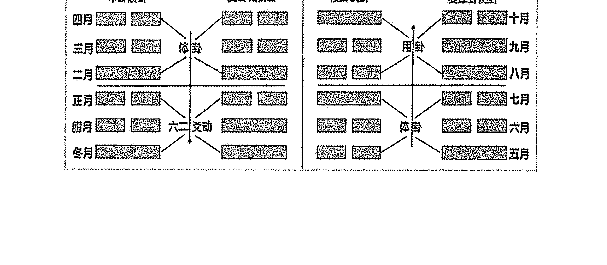

### 推测分析

- 1、本卦为八纯卦《震卦䷲》，震木见震木，卦象比和，覆卦为八纯卦《艮卦䷳》，艮土见艮土，也是比和之象，腊月水旺，震木逢生气，预示老人病情还是比较稳定的，近期不会有什么危险。
- 2、变卦为雷泽《归妹卦䷵》，震上兑下，兑金克震木，用克体之象，腊月水旺，兑金泄气，金入墓库，病情虽然危险，但是还不至于危及病人的生命。
- 3、六二爻变动，兑（☱）象。时间窗口：农历十二月、三月、六月、九月为应验的月份。预示从2011年腊月初八——十二日这个时间段，老人的病情就开始相继加重。
- 4、复原卦为泽雷《随卦䷐》，用卦震（☳）象变兑（☱）象，老人的病应该在肺脏。冬季金衰水旺，体卦为震木，得水逢长生。目前身体应该没有危险。只是体用互不得位，需要一定的时间来调治休养。
- 5、老人为1922(壬戌)年人，过年后正月寅木临月建，病情基本稳定；农历二月卯木当旺，与戌（老人属相）六合，这时候老人必添新病；农历三（辰）月与本人属相（戌）形成六冲，病情恶化，凶多吉少。

根据以上预测，吉凶定夺。一是老人春节前身体不会有问题；二是春节后是有惊无险；三是农历二月另添新病；四是农历三月初二左右有一个大坎，老人恐怕凶多吉少啊！预测完毕，当时著者就将以上吉凶定夺短信发给了张先生参考。

### 事后应验

第一次回复：2012(壬辰)年正月十七日下午15: 40分，某先生短信回复

> 何老师您好！老人身体安好，谢谢您的关照。

第二次回复：2012 (壬辰) 年3月25 (农历三月初四) 日，某先生来宝鸡参加周易文化研讨会，见面后他告诉我：何老师你预测的太准确了，女子她奶奶农历二月二十九日晚23点55分去世。

注：2012 (壬辰) 年农历二 (癸卯) 月是小月，二十八日是春分节气。二月二十九日晚上23点55分，准确时间应该是三 (甲辰) 月初一子时。

这与当时预测的“三月初二左右有一个大坎，老人恐怕凶多吉少”十分吻合。春分节气之后，进入三月令，老人属相为戌，三（辰）月初一，辰月冲戌相，久病逢冲必凶。又是一例逢冲必凶的卦例。

### 例三、吴英最终罪不至死

2012（壬辰）年2月16日著者看到网上对浙江籍商人吴英判死刑的议论，北京最高法院最终对本案将做出怎样的判决，纠结着大家的心情，网上猜测一片哗然。著者突发预测念头。（以吴英的名字，加农历2012（壬辰）年正月二十五日辰时起卦），得数字：15、5、1、25、5。

数字起卦：15+5+1+25 = 46÷8 = 5…余6，6为坎（☵）象，外卦取坎（☵）象，46+5 = 51÷8 = 6…余3，3为离（☲）象，内卦取离（☲）象，得本卦水火《既济卦䷾》；总数51÷6 = 8…余3，3为离（☲）象，九三爻动，得变卦水雷《屯卦䷂》；本卦体用不得位，互卦不用，本卦的覆卦为火水《未济卦䷿》，变卦的复原卦为雷水《解卦䷧》。

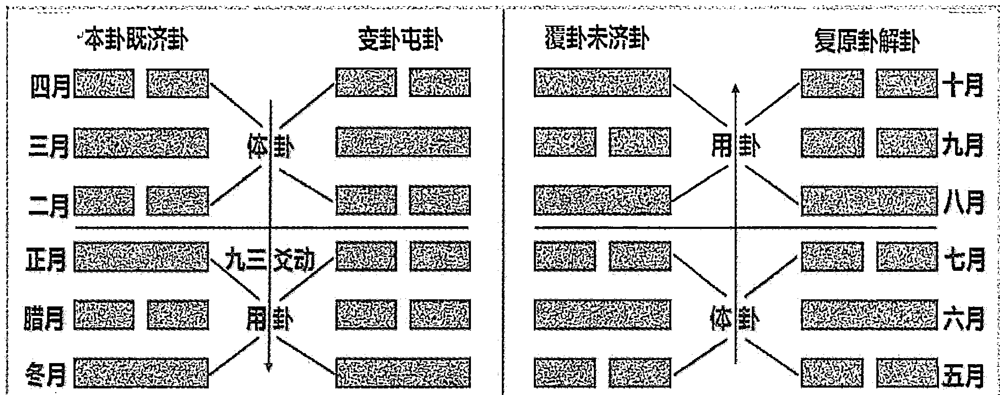

### 推测分析：以体为吴英，以用为生死。

1.  本卦为水火《既济卦䷾》，坎上离下，坎水克离火，体克用之象。覆卦为火水《未济卦䷿》，离上坎下，坎水克离火，也是体克用之象，而且这两个卦象也互通。农历正月木旺、坎水泄气、火逢木生，火虽受克，但不至于绝，说明案情错综复杂，连环重重，生气透出，说明当事人仍有一丝生还的转机。
2.  变卦为水雷《屯卦䷂》，坎上震下，坎水生震木，体生用之象，卦象显示当事人只是在经济上和体力上有很大的损耗和付出，此人绝无性命之忧。
3.  九三爻变动，离（☲）象变震（☳）象。时间窗口：农历正月、四月、七月、十月为应验的月份。本卦坎水属于流界，变卦的用卦震木为气界，预示此案的变化将加速。震（☳）象为上弦月相，对应每月的初三至初七时间段，在这四个月中，每逢初三至初七，这五日之间，此案存在起死回生的变数。
4.  九三爻动，离（☲）象，离为中女、为牢狱，从“天、地、人”三才看，当事人现在处于人间的下一层，还没有完全下到地狱。本卦的用卦从离（☲）象变为震（☳）象，预示到2012（壬辰）年农历四月初，紧闭的牢狱之门到时候会从上方打开，当事人有救。
5.  本卦体用不得其位，此案尚需时间调整。变卦的复原卦为雷水《解卦䷧》，震上坎下，卦象水生木之象。说明到那个时候悬而未决的吴英一案，将得到最终裁决。2012（壬辰）年四月初三至初七日时间段，此案最高法院会有终审判决，吴英罪不至死。
6.  吴英生于1981（辛酉）年，2011（辛卯）年当事人命犯太岁，卯酉相冲，旺木侮金，命主流年不利。2012（壬辰）年，太岁合主人年命（辛酉），岁逢六合，太岁救主，吴英尚有一线生存的希望。

综上分析，吴英最终罪不至死。

预测完毕，著者将预测结果发表在网易博客。此预测消息引起山东一位浙江籍商人的高度关注，他后来提示我的预测非常准确。

### 事后应验：

中新网4月20日（农历三月三十日）电：据最高人民法院官方网站消息，最高人民法院受理被告人吴英集资诈骗死刑复核案后，依法组成合议庭，审查了全部卷宗材料，提讯了被告人，现已复核完毕。4月20日，最高人民法院依法裁定不核准吴英死刑，将案件发回浙江省高级人民法院重新审判。

5月21日（农历闰四月初一），浙江高院改判吴英死刑，缓期二年执行。轰动全国的浙江东阳——吴英一案，经过扑朔迷离的变化之后，最终落下了法槌。

以上消息与著者预测的“每逢初三至初七，五日之内此案存在变数，2012（壬辰）年四月初，牢狱之门到时候从上方打开”非常相符。再次用事实证明了《周易》预测的神奇。（见博客博友的验证点评）

> > 中新社4月20日电 最高人民法院20日公布，浙江省高级人民法院经重新审理后，对被告人吴英死刑缓期二年执行，剥夺政治权利终身，并处没收个人全部财产的判决，已报请最高人民法院核准。4月20日，最高人民法院经复核后认为，原审判决认定被告人吴英犯集资诈骗罪的事实清楚，证据确实、充分，审判程序合法。吴英归案后，如实供述自己的罪行，并主动交代了赃款的去向，且综合考虑其犯罪的事实、性质、情节和社会危害程度，对其判处死刑，可不立即执行。
> 海纳百川 先生： 回复 已阅，谢谢博主分享，关注您的每篇大作，祝您健康快乐幸福！[抱拳]
> 回复：海纳百川 先生： 同感！我也关注这个案子，一为吴英案鸣不平；二为社会的悲哀。这些所有的司法程序都是从浙江高院网站上看到的，谢谢您关注。
> 海纳百川 先生： 回复 感谢你的关注，浙江法院要足够地让人佩服一下，不至于这样让人看不懂！想想做大坏事，反被升官进爵！你的生日也该有此日了呢！祝你成功！
> 回复：海纳百川 先生： [微笑]
> 海纳百川 先生： 回复 博主先生，吴英死缓的法槌落下了，再次证明周易预测的神奇性！！
> 回复：海纳百川 先生： 我已知道这个消息，周易是神奇的，何老师以周易救过这神人，如此人份，功德无量啊！
> 易经爱好者： 分析的有道理！支持！
> 海纳百川 先生： 回复 谢谢各位朋友点评。

### 例四、陕西3名科考队员可可西里失踪

2012（壬辰）年3月2日中午，易友让我以昨天，农历二月初九酉时，预测“陕西三名科考队员在可可西里失踪一事”的吉凶。得数字：5、2、9、10。

数字起卦：5+2+9 = 16÷8 = 2…余0，0为坤（☷）象，外卦取坤（☷）象，16+10 = 26÷8 = 3…余2，2为兑（☱）象，内卦取兑（☱）象，得本卦地泽《临卦☷☰》；总数26÷6 = 4…余2，2为兑（☱）象，九二爻动，得变卦地雷《复卦☷☳》。本卦体用不得位，互卦不用，本卦的覆卦为风地《观卦☴☷》，变卦复原卦为雷地《豫卦☳☷》。

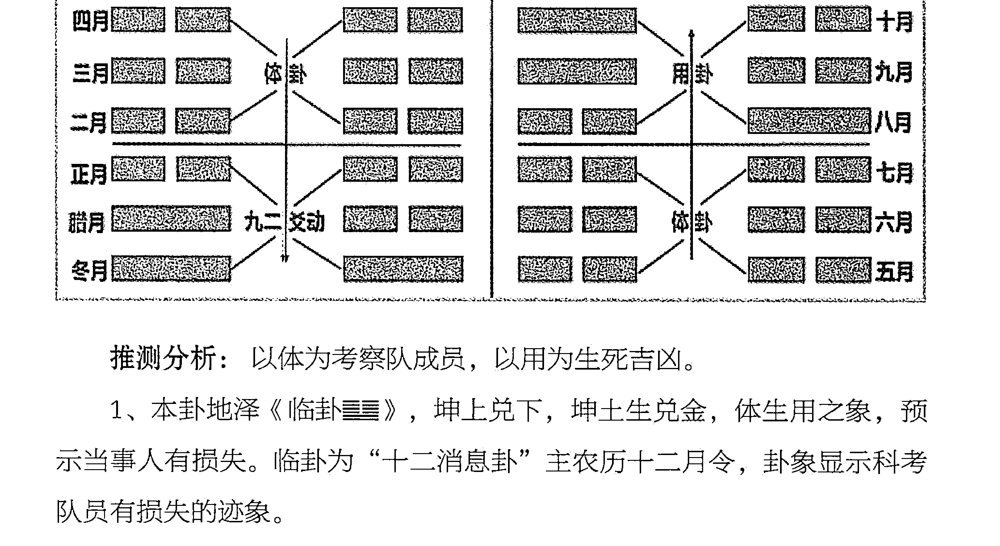

推测分析：以体为考察队成员，以用为生死吉凶。

1.  本卦地泽《临卦☷☰》，坤上兑下，坤土生兑金，体生用之象，预示当事人有损失。临卦为“十二消息卦”主农历十二月令，卦象显示科考队员有损失的迹象。
2.  变卦地雷《复卦☷☳》，坤上震下，震木克坤土，用克体之象，农历二月木旺当令，坤土处于绝地，预示震（用）木克坤（体）土的克伤力是很大的，这与科考队员非常不利。复卦也是“十二消息卦”主农历十一月令。
3.  从变卦地雷《复卦☷☳》和本卦地泽《临卦☷☰》的信息看，此次可可西里考察计划的时间实际安排于2011年11月就已形成，12月份具体确定实施科学考察。计划2012（壬辰）年3月结束科学考察活动。
4.  九二爻动，二为兑（☱）象，用卦兑（☱）象变为震（☳）象，时间向前推移至少五天时间。时间窗口：农历十二月、三月、六月、九月为应验的月份。震（☳）象对应每月的初三至初七日时间段。寻找的有效时间为2012年（农历）二月初三至初七之间，这五天之内若无消息，科考队员凶多吉少。
5.  本卦的用卦为兑（☱）象，为正西方向，为湖泊、沼泽之地；变卦复原卦为雷地《豫卦䷏》。用卦兑（☱）象变为震（☳）象、为正东、为左，预示科考队员在可可西里正西方位的湖泊、沼泽地之左（东）边地带考察时出了问题。
6.  吉凶分析。本卦临卦，体生用，体用互不得位，有辛劳和代价付出；变卦复卦，震木回头克坤土，坤土失令，农历二月卯木旺，月建卯木当令，坤土凶多吉少。
7.  本卦的覆卦为风地《观卦䷓》，巽上坤下，巽木克坤土之象；变卦的复原卦为雷地《豫卦䷏》，也是震木克坤土之象，二月木旺，呈现大凶迹象。九二爻动为“天、人、地”中地狱的地表之上，预示人已死，未入土之象也。

### 事后应验：（见博客点评截图）

从感情上讲，著者真不希望有这样预测结果。2012（壬辰）年3月2日中午起卦预测，3月3日晚将预测结果发表在网易博客。尽管也有人说：没那么悲观，吉凶参半。但是，时至2017（丁酉）年底著者的书截稿，一直没有发现科考队员生还或者遇难的任何消息。

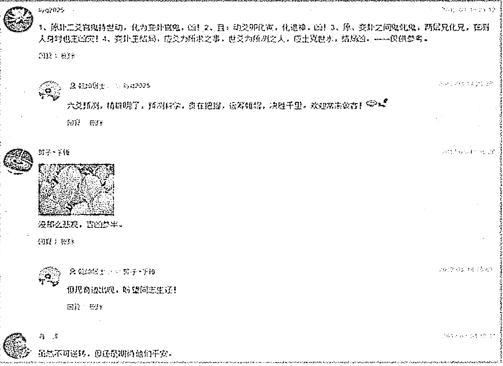

### 例五、腊月初七前后是一个大坎

2018年元月26日（2017年农历腊月初十）上午10时14分，浙江的朋友在微信留言：“何老师，我父亲病重病危中，为做善后，能否给予凶讯指示？”当日上午10时49分著者才看见这个信息，立即用手机、按2017年农历腊月初十巳时起卦。

得本卦地水《师卦䷆》，九二爻动，兑（☱）象，变卦八纯卦《坤卦䷁》，互卦地雷《复卦䷗》。（见手机卦象截图）

| 项目 | 本卦 | 互卦 | 变卦 |
| :--- | :--- | :--- | :--- |
| 卦名 | 地水師 | 地雷復 | 坤為地 |
| 卦象 | (卦象图示) | (卦象图示) | (卦象图示) |
| 体卦 | (卦象图示) | | |
| 用卦 | (卦象图示) | (卦象图示) | (卦象图示) |
| 起卦时间 | (2017年农历腊月初十巳时) | | |
| 体用关系 | 体克用 月建比和体卦 | | |
| 对应公历 | 2018-1-26 10:47 | | |
| 干支历 | 丁酉年 癸丑月 戊午日 丁巳时 (日空子丑) | | |

推测分析：以病人为体，以病情为用。

1.  本卦地水《师卦䷆》，坤上坎下，坤土克坎水，体克用、人克病之象。目前农历腊月水旺当令，弱土克不住旺水，病人反比病来悔。坎为水，在人身体主肾脏，病灶应该在肾脏。
2.  互卦地雷《复卦☳》，震木克坤土，肝脾不和，用克体、病克人之象。复卦主农历十一月令，预示农历十一月底病情不好，腊月初七前后是一个大坎。
3.  变卦八纯卦《坤卦☷》，坤土见坤土，卦象比和。预示若能过了腊月十二日，老人的病情慢慢地会转危为安。
4.  九二爻动，兑（☱）象，时间窗口：腊月、三月、六月、九月。本卦体用不得位，腊月初二至初七的大坎度过，下一个危险期是戊戌年三月初二至初七。

### **事后应验：**

2018年2月14日在网上遇见对方，回复：元月26日（农历腊月初十）下午4点多老人去世了。看来农历腊月初七前后的这个坎太大了，老人没有迈过去。

为什么推断农历腊月初七有一个大坎？其理由有三：一是时间窗口的第一个窗口应在腊月初七前后；二是兑（☱）象预示农历每个月上旬的初八至十二这五天的时间段；三是老人1936年人，属相（子）鼠，农历腊月月建为丑，属相与月建组成子丑六合，久病大病之人逢合是要添新病、或者病情要加重的。所以，断腊月初七前后是一个大坎。

## 第十二节 地震预测

21世纪科学技术进入飞跃性发展的高度发达状态。但是，地震灾害仍然是威胁人类安全一直不能回避、无法准确预知的一种毁灭性自然灾难。山东大学教授刘大均先生认为：“根据大地震前牛不进棚，马不进厩，老鼠搬家的情况看，在远古时代，人身上恐怕也有这种预知自然大变异的本领，后来，这种本能遗失在由森林走向社会的路途上了。人们为了追回这种丢失的本能，几千年来，他们浮着自己那点小小智力的筏子，走过了多少曲折而漫长的路。”

是啊，“洪前鼠迁”、“震前蛤躁”是低级动物预感自然灾害的高级本领，遗憾的是具有高级智商的人类却丢失了这些应有功能而无法预知。只要我们能提前预知是否有地震？什么时间发生地震？震级有多大？那将是人类摆脱地震灾害困扰的最大福祉。

根据著者的预测经验，地震预测可以通过看“气、流、固”三界、动爻卦象、时间窗口和三煞方位来作出预测，当然，这只是一个尝试。比如2008年三煞在南方：巳、午、未方位，当年在西南方——四川汶川就发生了8级地震。下面介绍几个预测地震卦例，与大家共同研究探讨。

### 例一、云南会不会发生地震

2012年2月3日晚网上，看到网上有关云南地震的议论。云南究竟会不会发生地震？笔者即生预测念头。以2012（壬辰）年正月十二日晚上22点起卦。得数字：5、1、12、12。

数字起卦：5+1+12 = 18÷8 = 2…余2，2为兑（☱）象，外卦取兑（☱）象，18+12 = 30÷8 = 3…余6，6为坎（☵）象，得本卦泽水《困卦䷮》；总数30÷6 = 4…余6，6为坎（☵）象，上六爻动，得变卦天水《讼卦䷅》。本卦体用得位，互卦为风火《家人卦䷤》，本卦的覆卦和变卦的复原卦不用。

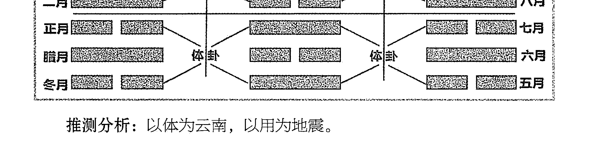

推测分析：以体为云南，以用为地震。

1.  本卦泽水《困卦䷮》，兑上坎下，卦数：6、2，兑金生坎水，兑金为用、坎水为体，金生水，用生体之象，预示今年的雨水应该较多。
2.  互卦风火《家人卦》，预测地震就是为了大家庭中每一个成员的人身和财产安全。巽为风、为舆论、为东南方，离为火、为南方，风助火旺。预示目前地震传言确实有点风风火火，此消息来自东南方位。
3.  变卦天水《讼卦》，卦数：6、1，乾上坎下，乾金生坎水，也是用生体之象。乾在西北、坎在正北方位，可以肯定的说云南地区不会发生地震灾害。
4.  上六爻变动，坎（☵）象，本卦外卦兑（☱）象变乾（☰）象，方位在西偏西北方向，对应的是东南方位。以宝鸡为原点，如果要预防地震，也应该在我国西北或者东南地区的那些方位倒是要预防地震发生，而不是在南偏西南方位的云南地区。
5.  用卦兑（☱）象变乾（☰）象，时间窗口：七月、十月、正月、四月，2012年农历四月（乾（☰）象代表）十三日至十七日这五日为应期，即使发生地震，震级应该在6.2级一下，不会造成任何伤害。
6.  本卦与变卦，变爻的卦象为三个（坎）水、二个（乾、兑）金，呈现金生水之象。著者认为，2012（壬辰）年为龙年，龙主水，云南地区倒应该积极加强预防水灾发生的准备工作。

事后应验：
2012年2月8日14时18分，著者的预测博文在网易博客发出，提醒大家，云南没有地震，今年要预防水灾发生。时隔12天之后的2012年2月20日（农历正月二十九），博友横眉冷对回复说：先生预测还是准的，东南的广东这几天不是已经震过了吗，6级以下，没有损失，也是对的。再后来4月份，新疆和田地区也发生了小地震。2012年6月14日至7月17日云南地区连续发生了8次水灾。（中新网——云南频道：有近两个月水灾一览。见网络截图）

### 云南近两月水灾一览

编辑：李昕芳 发布时间：2012-09-06 09:20:31

6月14日晚上7点至9点，丽江市玉龙纳西族自治县鸣音乡东联村境内突降单点暴雨引发特大山洪，造成1人受轻伤，7人失踪。

6月20日11时40分，大理市凤仪镇三哨村委会小邑自然村公山后发生山洪泥石流，致使一处水库的防洪坝被冲毁，2人被埋。

6月23日，受持续强降雨影响，德宏傣族景颇族自治州盈江县新城乡繁勐村发生泥石流、山体滑坡，部分村民房屋和农田不同程度受损，无人员伤亡。据统计，灾害造成直接经济损失达1080万元。

7月1日下午17时许，临沧市云县幸福镇掌扇村发生泥石流，导致掌扇村3户房屋被冲毁，12户房屋受损，3人失踪。

7月1日至2日，在红河州弥勒县东山一带，出现强度较大的单点暴雨，导致弥勒至东山二级公路和省道S214线弥勒县境内多处发生严重水毁，公路一度中断，造成1人死亡1人失踪2人受伤。

7月12日至7月13日，楚雄境内多个乡镇遭遇强降雨，造成房屋和农田损毁，农作物被淹，公路路段毁坏，水利、电力设施毁坏，部分乡镇出现山洪，山体滑坡等较为严重的地质灾害点6处。

7月15日晚上 昭阳区域内遭遇暴雨袭击，苏甲乡小松树村水潦村民小组降雨量高达180毫米，截至17日中午12时，昭阳区共有78917人受灾，因灾死亡两人，受伤3人。

7月17日凌晨5时许，弥渡县新街镇西庄村委员会石丫村小组坝地发生山体滑坡，约60万立方米泥土流入弥渡河石丫村小组河段，形成一个高约20米、长约300米、宽约100米的山丘，阻断河流形成一个堰塞湖，幸无人员伤亡。

### 例二、山东菏泽不会发生地震

2012年8月5日下午13：05分，看到山东博友cjx转发的一篇博文，《山东菏泽未来两周内可能发生7级以上地震》，发现其中有蛤蟆列队迁徙之类的词语，有点地震前兆。即动预测念头，以菏泽二字笔划加上2012年六月十八日 13:05 分（未时）起卦预测。得数字：19、5、6、18、8。

**数字起卦：** 19+5+6+18 = 48 ÷ 8 = 6…余0，0为坤（☷）象，外卦取坤（☷）象，48+8 = 56 ÷ 8 = 7…余0，0内卦为坤（☷）象，得本卦八纯卦《坤卦䷁》；总数56 ÷ 6 = 9…余2，2为兑（☱）象，六二爻动，得变卦地水《师卦䷆》；本卦体用不得位，互卦为八纯卦《坤卦䷁》不用；本卦的覆卦八纯卦《坤卦䷁》，变卦的复原卦为水地《比卦䷇》。

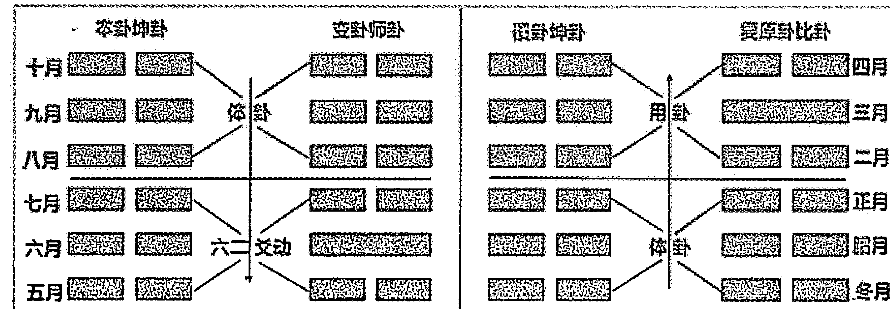

### 推测分析：以体为荷泽，以用为地震。

1.  本卦是八纯卦《坤卦䷁》，覆卦也是八纯卦《坤卦䷁》，坤上坤下，土见土，卦象比和，预示大地平和之象，没有显示发生地震的任何迹象。
2.  变卦地水《师卦䷆》，坤上坎下，坤土克坎水，体克用之象。体（坤土）为荷泽，用（坎水）为地震，土能制水，预示荷泽不会发生地震。
3.  六二爻变动，时间窗口：农历六月、九月、十二月、三月。内卦为用，坤（☷）象变坎（☵）象，就山东而言，坤为西南，坎为雨水，时间为农历六月之后，预示我国云南一带今年主要是预防水灾引起的泥石流等自然灾害的发生。
4.  坤（☷）象对应每月二十八至下月初二时间段，汛期时间：农历六月二十八——七月初二之间，农历九月份也会有水灾发生。
5.  卦爻变在六二爻，二为兑（☱）象，兑为湖泊、沼泽、水库，从卦象分析，我们倒是要加强水库的防汛安全工作。
6.  本卦八纯卦《坤卦䷁》，覆卦八纯卦《坤卦䷁》；变卦为地水《师卦䷆》。

卦☰》，体用不得位。变卦的复原卦为水地《比卦☷》，四组六爻卦，卦象呈现六（坤）土、二（坎）水，厚土能治弱水，看来即使发生了水灾，也不是很大。从八卦的“气、流、固”三界分析，坤象大地，坎象只属于流界，稳定的因素大于动荡的因素。

著者随后将预测结果发表在网易博客，告诉大家，山东菏泽地区没有地震，要预防水灾发生，顺祝山东菏泽人民平安如意！

事后应验：

时至今日（2017年12月底）山东菏泽地区没有发生任何地震。但是，2012年云南地区连续发生了8次水灾（见前一卦的截图），博友也有点评（见下图）。

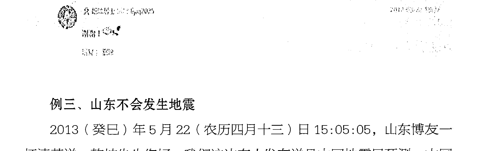

例三、山东不会发生地震

2013（癸巳）年5月22（农历四月十三）日15:05:05，山东博友一杯清茶说：乾坤先生您好：我们这边有人发布说是中国地震局预测，中国未来两周内（6月5日芒种前后）有可能会发生7级地震，地点在山东，您对这种消息怎么看？以2013年四月十三）日15:05:05分（辰时）即时起卦，得数字：6、4、13、9。

数字起卦：6+4+13 = 23÷8 = 2…余7，7为艮（☶）象，外卦取兑（☱）象，23+9 = 32÷8 = 4…余0，0为坤（☷）象，内卦取坤（☷）象，得本卦山地《剥卦☷☶》；总数32÷6 = 5…余2，2为兑（☱）象，六二爻动，得变卦山水《蒙卦☶☵》；本卦体用不得位，

互卦不看；本卦的覆卦为地雷《复卦䷗》，变卦的复原卦为水山《蹇卦䷦》。

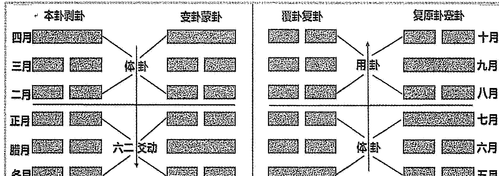

推测分析：以体为山东，以用为地震。

1. 本卦山地《剥卦䷖》，艮上坤下，艮土见坤土，体用比和之象，卦象呈现大山屹立于大地之上，预示山东肯定不会有地震发生。
2. 变卦山水《蒙卦䷃》，艮上坎下，山下有水，体克用、艮土克坎水，有水土流失之象。艮为东北、坎为正北方位，今年山东和北方内蒙古一带可能有大暴雨造成的水灾发生。
3. 六二爻动，兑（☱）象，时间窗口：六月、九月、十二月、三月。2013年农历六月初七到十二日（芒种）前后，山东没有地震。北方的内蒙古和东北的山东要积极防止水灾发生。
4. 如果发生地震，也应该在我国的西南、正西、正北这三个方位。
5. 从八卦的“气、流、固”三界分析，艮（☶）象属于固界，坎（☵）象属于流界，卦象稳定的因素大于动荡的因素。因是之故，山东不会发生地震。

综合分析：预测之后著者立即在网易博客发表结果，告诉大家山东不会发生地震，而且未来两周我国内陆不会有大的地震。但是，不排除水灾山洪引起的泥石流等自然灾害发生。

事后应验：

时隔40天之后。2013年7月5日（农历五月二十八）20:26分，新华网：《山东多地7月份发生强降雨，局地农田水利设施受损》消息称：新华社济南7月5日电（记者魏圣曜）记者5日从山东省水利厅获悉，从7月1日至5日，山东多地发生强降雨，多市平均降雨量超过100毫米，降雨呈现局地强度大、雨区叠加等特点，局地农田水利设施受损。据山东省水文局统计，1日至5日，山东连续发生两次降雨过程，17市均有降雨分布，其中枣庄、日照、临沂、济宁、菏泽超过100毫米，泰安、莱芜在50毫米至100毫米之间，其余市小于50毫米。据山东省水利厅分析，两次降雨过程表现出三个特点。一是局地降雨强度大。济宁泗水县、枣庄薛城区、峄城区、临沂临沭县、郯城县等5个县（区）日降雨量均超过100毫米，最大点降雨量在泗水县贺庄水库，达223毫米；二是主要雨区叠加。两次降雨中，枣庄、临沂、日照、济宁、菏泽等地均属于主要降雨区；三是由于山东前期降雨总体偏少，降雨未形成较大洪水，汛情平稳，无人员伤亡。

2013年7月27日（农历六月二十日）内蒙古牙克石市伊图里河镇一带发生百年不遇的水灾。与著者预测的：2013年农历六月初七到十二日（芒种）前后，山东没有地震。北方的内蒙古和东北的山东要积极防止水灾发生。（见网络截图）

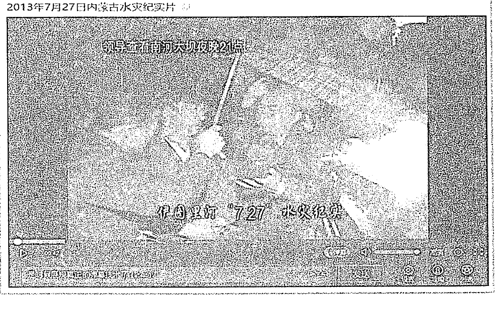

例四、宝鸡今年不会发生地震

2014年3月29（农历二月二十九）日13:21分，与朋友一起在宝鸡高新区餐馆吃饭，对方悄悄地对我说：“最近官方有消息，说宝鸡有特大地震，目前政府内紧外松，不让议论，你看会不会发生地震？”我听了之后很惊诧，赶紧以2014（甲午）年农历二月二十九日13时21分（未时）即时起卦，预测宝鸡近期是否有地震？得数字：7、2、29、8。

数字起卦：7+2+29 = 38 ÷ 8 = 4…余6，6为坎（☵）象，外卦取坎（☵）象，38+8 = 46 ÷ 8 = 5…余6，6为坎（☵）象，内卦取坎（☵）象，得本卦八纯卦《坎卦☵》。总数46 ÷ 6 = 7…余4，4为震（☳）象，六四爻变动，得变卦泽水《困卦☱☵》；本卦体用得位，互卦为山雷《颐卦☶☳》，覆卦和复原卦不用。

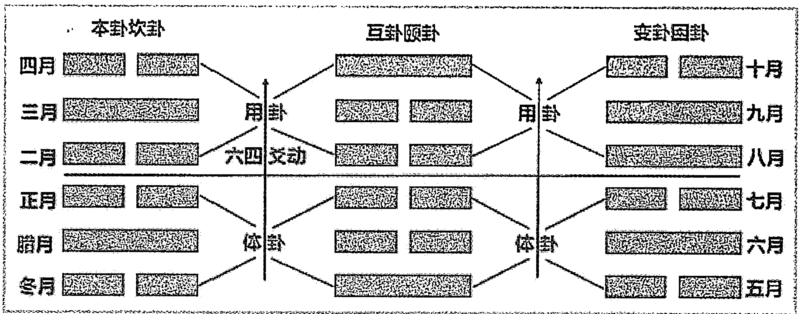

推测分析：以体为宝鸡，以用为地震。

1. 本卦八纯卦《坎卦☵》，坎上坎下，卦数：6、6。坎水见坎水，体用比和之象，从本卦初步推断宝鸡不会发生地震。
2. 互卦为山雷《颐卦☶☳》，艮上震下，雷在山之下，卦象为大离（☲）之象，可以断定宝鸡地区绝对不会发生地震。离（☲）为正南方位，预示南方云南一带可能会有地震发生。
3. 变卦泽水《困卦☱☵》，兑上坎下，卦数：6、2。兑金生坎水，用生体之象，目前是农历二月木旺当令，金处绝地，故兑金生不了太多的水，预示到了下半年农历八月份金旺之时，宝鸡地区很可能发生水灾。
4. 六四爻变，时间窗口：二月、五月、八月、十一月。本卦的用卦为坎（☵）象变为兑（☱）象，对应每月初八——十二日时间段，2014年农历八月初八——十二日之间，预示着宝鸡地区要预防水灾发生。
5. 六四爻动，四为震（☳）象，震为木、为东方、为电、为雷，震（☳）象变兑（☱）象，震为东方，兑为西方，由东向西，卦象显示宝鸡发生地震的传言是从东边传过来的。
6. 即使有地震，应该在宝鸡之外的南方地区，确切地说应该在云南地区，时间在农历二月、五月、八月和十一月份的二十三至二十八日之间，震级最多在6.2至6.6级之间，不会造成重大灾难发生。

综合分析：

舆论归舆论，预测归预测。著者当天晚上立即发表博文公布预测结果，希望大家不要听信传言，安心搞好自己的工作，宝鸡今年不会发生地震。

事后应验：

“宝鸡不会发生地震”的博文于2014年3月30日发表在我的网易博客，有7200多人阅读，对稳定宝鸡民心起到一定的作用。截至2014年12月底宝鸡没发生地震。但是，宝鸡当年确实下了大暴雨，发生了罕见水灾（见右图：宝鸡新建路综合市场发大水）。

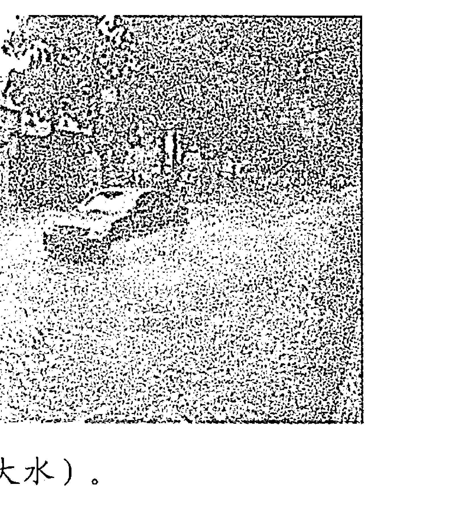

根据“中新网”消息，宝鸡之外的云南、四川、台湾地区先后发生6.1—6.6级地震6次（见网上截图），其中云南发生了3次地震，震级在6.1—6.6之间。这与著者预测的方位和震级非常的吻合。

| 序号 | 发生时刻                | 纬度 | 经度 | 深度 | 震级 | 参考地名                     |
|------|-------------------------|------|------|------|------|------------------------------|
| 1    | 2014/02/12 17:19:50     | 36.1 | 82.5 | 12   | 7.3  | 新疆维吾尔自治区和田地区于田县 |
| 2    | 2014/10/07 21:49:39     | 23.4 | 100.5| 5    | 6.6  | 云南省普洱市景谷傣族彝族自治县 |
| 3    | 2014/08/03 16:30:10     | 27.1 | 103.3| 12   | 6.5  | 云南省昭通市鲁甸县           |
| 4    | 2014/11/22 16:55:25     | 30.3 | 101.7| 18   | 6.3  | 四川省甘孜藏族自治州康定县     |
| 5    | 2014/12/11 05:03:44     | 25.6 | 122.4| 260  | 6.2  | 台湾新北市附近海域           |
| 6    | 2014/05/30 09:20:12     | 25.0 | 97.8 | 12   | 6.1  | 云南省德宏傣族景颇族自治州盈江县 |

*注：第6行‘参考地名’字段后有手写签名，但内容难以辨认*

例五、甘肃不会发生大地震

2015年4月12日（农历二月二十四日）18时25分，著者刚打开微信，看见一位朋友转发一则“中国地震局消息：未来两周甘肃西部可能发生7级以上地震。”地震事关人民群众生命财产安全，赶紧按农历二月二十四日酉时即时起卦预测，得数字：8、2、24、10。

数字起卦：8+2+24 = 34÷8 = 4…2，2为兑（☱）象，外卦取兑（☱）象，34+10 = 44÷8 = 5…4，4为震（☳）象，内卦取震（☳）象，得本卦泽雷《随卦䷐》；总数44÷6 = 7…2，2为兑（☱）象，六二爻动，得变卦八纯卦《兑卦䷹》。本卦体用不得位，互卦不看，本卦的覆卦山风《蛊卦䷑》，变卦的复原卦为八纯卦《兑卦䷹》。

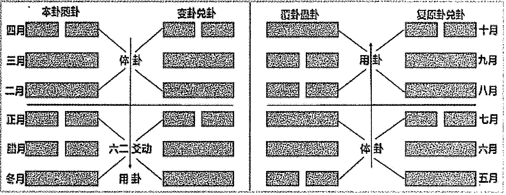

推测分析：以体为甘肃，以用为地震。

1. 本卦泽雷《随卦䷐》，兑上震下，卦数：4、2。兑金克震木，卦象体克用，农历二月木旺当令，金处绝地，弱金克不了旺木，金反被木来侮。卦象预示雷在泽（地）下之象，内卦数字为4、外卦数字为2。震为雷、为青龙，为地震，甘肃地区有可能发生小地震，震级应该在4.2级左右。
2. 变卦八纯卦《兑卦䷹》和复原卦八纯卦《兑卦䷹》，兑金见兑金，卦象成比和之象，兑为西方，甘肃在宝鸡之西，但是甘肃地区绝对不可能发生7级以上的大地震。
3. 六二爻动，兑（☱）象。时间窗口：腊月、三月、六月、九月。如果有地震发生，三月初二至初七这五日内是发生地震的第一时间段；三月初八至十二日这五日内发生地震的概率就大大降低了（具体一点指：公历4月20至30日这10天之内）。过了这个时间段，甘肃就不会发生地震。
4. 本卦的覆卦山风《蛊卦䷑》，山下有风之象，甘肃发生地震的消息是从东南方向传来的假消息。舆论为风，风遇水而起、遇林而弱、遇山而止。甘肃发生地震的传言很快就会恢复平静。

后记：地震是地球上最常见的自然灾害，每天都会发生。但是，地震也是人类迄今最无法预防的灾害。著者将预测结果公布的原因是为了让大家做好思想准备，不要恐慌，保持冷静，理智应对，不要听信谣言。

事后应验：

于2015年04月12日21:05:26分，著者将《甘肃不会发生大地震》的博文发在网易博客。时隔3天之后的2015年4月15日（农历二月二十七日）甘肃省定西市临洮县发生4.5级地震，深度达9千米。距震中20公里的临洮县八里镇窑沟村一土窑在地震中塌陷，造成一人死亡（见下图）。这次地震与著者预测的4.2级地震，只差了0.3级。但时至2017年底甘肃地区没有发生7级以上的地震。

2015年4月15日甘肃地震最新消息

来源： 时间：2015-04-16 16:23:40

2015年4月15日15时08分36秒，甘肃省定西市临洮县发生4.5级地震（北纬35.4°、东经104.0°），深度达9千米，周边百公里左右的城市临夏、兰州等感强烈。据当地群众介绍，地震发生时感觉晃动的非常厉害，紧接着就能听到巨大的响声，如同炸山放炮，有局部地方出现滑坡。

距离震中20公里的临洮县八里铺镇窑沟村一土窑在地震中垮塌，造成1人死亡。据定西市地震局报告，此次地震已造成定西市龙门镇石家铺村1人死亡，1人受伤。死亡人员震时到窑洞收东西被砸死，受伤人员为腿部骨折。

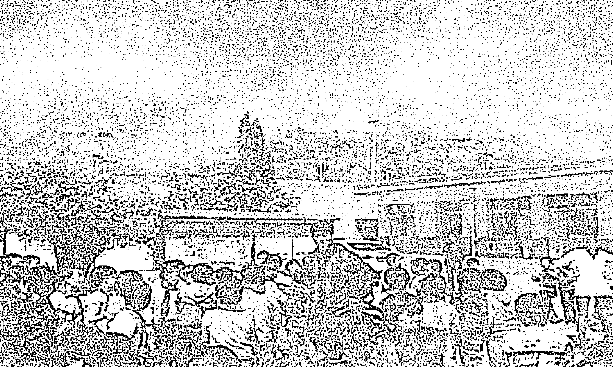

该地震位于定西市西南60公里，距离临洮县13公里，距离兰州市88公里。定西市内全境有感，临夏州临夏市、康乐县、和政县、兰州市城关区、七里河区等多地有震感。

甘肃省临洮县官方16日通报，截至当日早晨，地震共造成1人遇难7人受伤，累计179户526间农村居民房屋倒塌，41978间房屋受损。地震还造成临洮县157所学校校舍受损。

例六、世界末日会来临吗？

2012年10月份左右，社会上流传的“玛雅预言”所谓：2012年12月21日世界毁灭、大灾难将要降临人间，人类面临灭顶之灾。一时间人心惶惶，好像世界末日真的要来临似的。根据江苏一位大学（女）教授在我的博客留言：“乾坤先生，今年12月21日世界末日，人类会不会毁灭？”

根据某大学教授留言的时间（农历十月二十一日），加上她名字笔划起卦预测，得数字：23、5、10、21、5。

数字起卦：23+5+10+21 = 59 ÷ 8 = 7…余 3，3 为离（☲）象，外卦取离（☲）象，59+5 = 64 ÷ 8 = 8…余 0，0 为坤（☷）象，内卦取坤（☷）象，得本卦火地《晋卦䷢》；总数 64 ÷ 6 = 10…余 4，4为震（☳）象，九四爻动，得变卦山地《剥卦䷖》；本卦体用得位，互卦水山《蹇卦䷦》，覆卦和复原卦不用。

| 本卦晋卦 | 互卦蹇卦 | 变卦剥卦 |
| :--- | :--- | :--- |
| 十月 ████████ | ████████ | 四月 ████████ |
| 九月 ██ ██ | 用卦 ████████ | 用卦 ██ ██ 三月 |
| 八月 ████████ | 九四爻动 ██ ██ | ██ ██ 二月 |
| 七月 ██ ██ | ████████ | ██ ██ 正月 |
| 六月 ██ ██ | 体卦 ██ ██ | 体卦 ██ ██ 腊月 |
| 五月 ██ ██ | ██ ██ | ██ ██ 冬月 |

推测分析：以体卦为地球，以用卦为灾难。

1. 本卦火地《晋卦䷢》，离上坤下，离火生坤土，卦象用生体，太阳照耀大地之象，卦象预示太阳依旧普照大地，人类依然能得到来自宇宙的生存能量。2012年12月21日这一天，天气可能特别的暖和晴朗。
2. 变卦山地《剥卦䷖》，艮上坤下，艮土见坤土、体用比和之象。艮为山峰、坤为大地，山峰立于大地之上，为岿然不动之象，能有什么灾害发生呢？
3. 互卦水山《蹇卦䷦》，坎上艮下，山上有水之象，飞流直下，瀑布挂川，没有任何山崩地陷、灰飞烟灭之迹象。
4. 时间窗口：农历的二月、五月、八月、十一月为应验的月份。现在是农历十月，时间到了农历十一月，这个流传已久的“玛雅预言”将不攻自破。
5. 九四爻动，四为震（☳）象，震为东方，为雷、为青龙、为地震。2013年农历二月份、五月份我国以东区域有震荡迹象，不排除我国东海以外的日本等国家地区发生地震等自然灾害。

根据预测结果，著者这样回复博友：你好，2012年12月21日世界毁灭的所谓“玛雅预言”不足为信。这么对你说吧：世界末日的来临还早

得很，最起码我们和我们的下一代是看不到的。《周易·六十四卦》中有一个蛊卦。蛊者，山下之风也。所谓风遇水而生，遇林而弱，遇山而止。对待神乎其神的空穴来风，我们就用蛊卦的易理来对待它。朋友，调整好自己心态，打起精神，迎接新的更加美好的生活吧！

事后应验：

2012年12月21日晴天，太阳格外的亲切，世界的末日并没有到来。还是著者预测所言：世界末日的来临还早得很，最起码我们和我们的下一代是看不到的。当然，这个命题本身就是十分荒诞的。试想想看，我们有时候在野外燃起一堆篝火，大火之后的炭灰要等好长时间才能完全熄灭，何况那么大的一个太阳，说熄灭就会瞬间熄灭吗？其实，这个“玛雅预言”不用预测我们也会知道它是不可能发生的事情。这个预测结果是提前两个月发布的，起到了一个安抚人心的作用。（下面是截取的博客对话图片）

关于（预测农历二月我国以东地区地震）2013年日本地震网上搜寻：

1. 2013年4月17日当地时间（UTC+9）17时57分32秒的地震，震中位在日本东京都的三宅岛的西方近海处，震源深度推测约20公里，规模6.2级。当天从当地时间10时15分的一起规模4.4级地震开始，陆续发生地震，而至17时57分的地震规模最大。
2. 中国地震网消息，今天日本地震了，2013年5月18日，在日本本州东海岸发生5.9级地震，这次日本地震发生在日本东部海域，是一次海域地震没有引发海啸。
3. 2013年10月26日“中央社”报道，日本福岛县外海于日本时间凌晨2时10分左右，观测到规模7.1级强震。日本气象厅对日本东北及关东地区太平洋沿岸多处发出海啸注意警报。日本气象厅原本估计这起强震的规模为6.8级，后来上修为规模7.1级，震中在福岛县外海，地震深度10公里。

预测又将证实

等待再接再厉

易经国学院 zhdx

谢谢！！！

东海

谢谢东兴老弟。盼望将你预言都证实。你分析的很有道理。

易经国学院 东海

谢谢到来，祝愿我们人类好运！

易经国学院 东海

东海好！今天我们这里天气的特别好！

东海 易经国学院

谢谢你，东兴老弟，真的像你所说的，平安无事，一切安好。我们还可以继续享受生活，真的真的很好。谢谢。

易经国学院 东海

阳光是温暖的，生活是多彩的，享受生活的美好吧！

以上这些消息与著者的预测：“2013年农历二月份、五月份东方有震荡迹象，不排除我国东海以外的国家地区发生地震等自然灾害”。后来发生的与著者2012年10月的跨年度预测结果非常的吻合。

例七、内蒙古暂时不会发生地震

2017年11月30日晚上23时32分，朋友在微信发了一个内蒙古地区锡盟东乌旗地壳推移的视频，问：“是否可能是地震前兆，能否有高人起一卦预测分析一下。祈求天下太平。”

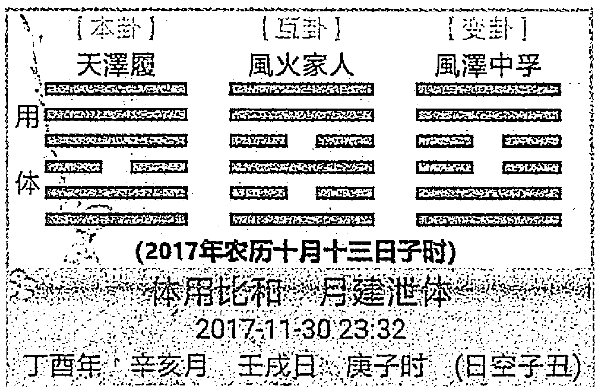

著者于2017年11月30日（农历十月十三日）23时32分用手机梅花易起卦（见手机卦象截图）。得本卦天泽《履卦》，互卦风火《家人卦》，九四爻动，变卦风泽《中孚卦》。

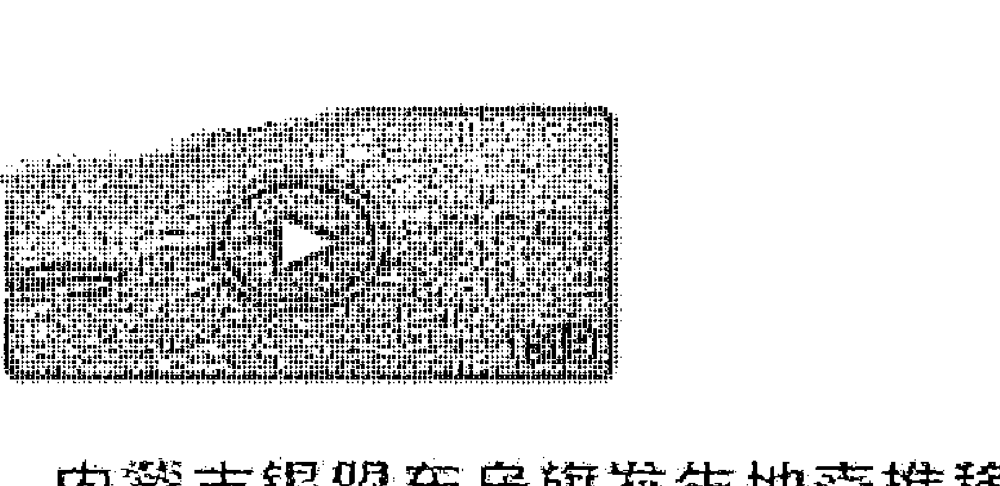

推测分析：以体为内蒙古，以用为地震。

1. 本卦天泽《履卦》，乾上兑下，乾金见兑金，卦象比和之象，预示内蒙古地区近期不会有地震发生。卦象数字：1、2。
2. 互卦风火《家人卦》，巽木见离火，用生体之象，巽位信息，离为火，卦象预示有关地震的消息风风火火的不断传来。卦象数字：5、3。
3. 变卦风泽《中孚卦》，巽上兑下，兑金克巽木，体克用之象，农历十月水旺当令，兑金泄气，无法克木，目前内卦和外卦势均力敌，处于对峙状态。卦象数字：5、2。
4. 九四爻动，时间窗口：农历十一月，二月，五月，八月。农历十一月中旬有地震的种种迹象。2018年农历二月中旬、五月中旬、十一月中旬内蒙古地区可能发生地震。
5. 九四爻变，为震（）象，为雷，为青龙，主地震。从卦象数字分析，即使内蒙古发生地震，震级也在3.5——5.2级之间。


内蒙古锡盟东乌旗发生地壳推移。这是人类第一次用视频记录看到地壳运动！大自然真是不可抗衡啊！

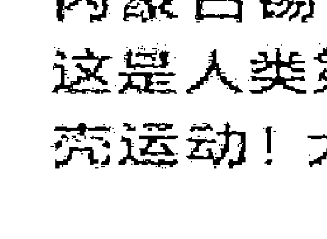

是否可能是地震前兆，能否有高人起一卦预测分析一下。🙏🙏🙏析求天下太平

> 关于内蒙古地区有无地震的预测：
1. 本卦天泽履卦，体用比和，应该说暂时内蒙古地区没有地震发生。
2. 互卦风火家人卦，巽木生离火，用生体之象，有关于地震的消息不断传来。
3. 变卦风泽中孚卦，兑金克巽木，体克用之象，十月水旺金泄，无法克木。目前处于对峙状态。
4. 九四爻动，时间窗口：农历十一月，二月，五月，八月。农历十一月中旬有地震的种种迹象。2018年农历二月中旬，或者十一月中旬，内蒙古地区可能有地震发生。
5. 四爻动为震象，震为雷，为青龙，主地震。发生地震的级别在3.5-5.2级之间。
6. 另外，明年戊戌年，三煞在北方亥子丑，就是说农历正月，五月，九月也是发生地震的主要月份。
阿弥陀佛，🙏🙏🙏，但愿一切平安！

十分感谢何老师 🙏🙏🙏

### 5.2级之间，绝对不会造成灾难。

6、2018年戊戌，三煞在北方亥子丑，就是说农历正月、五月、九月，可能是内蒙古地区发生地震的重要月份。

事后应验：

从2017年11月30日预测截止2018年2月2日之前的63天内内蒙古地区没有发生地震。

2018年2月4日立春，2月2日13时41分内蒙古阿拉善盟阿拉善右旗发生3.5级地震，也算是应验了2018年农历正月有地震发生的预测。

至于2018年农历五月、九月会不会发生地震，只有等待时间的检验。不过大家不要惊慌，即使内蒙古发生地震，也不会超过5.2级，绝对不会造成大的灾害。

关于地震预测，本人也只是在此做了一点尝试性的探索，希望有兴趣的朋友进一步研究这个问题，如果有一天我们能提前预知地震，那将是一件福泽人类的善事。

## 第十三节 天气预测

说到天气预测，有人会说：现在科学技术这么发达，卫星云图方便快捷，这个还用得着预测吗？是的，确实如此。一般情况下确实用不着预测。比如今天风和日丽，天气很好，只有蓝天与太阳，你问今天会下雨吗？这个问题连傻子都能正确回答，当然用不着预测。如果有人要问你：三天、五天之后天会下雨吗？或者连续下阴雨，天什么时间会晴呢？这个恐怕还真不好回答。尽管卫星预报天气的技术非常成熟，但是，预测的天气也是一个天气预报。古人云：天有不测风云，人有旦夕祸福。风雨雷电的瞬息万变，所谓预报，就是天气不同于其他东西，确实存在很多不确定的因素和变数。下边举几个卦例，与大家一起讨论。

### 例一、兰州水灾预测

2017年6月21日21时17分，在“&&国学微信群”里，某先生说：“有人说今天夏至下暴雨冰雹，预示今年雨水多，有洪灾。请何大师预测一下”。

正好著者当时在线，看见这个留言，赶紧用手机“梅花易”软件即时起卦。得本卦泽水《困卦䷮》；互卦风火《家人卦䷤》；上六爻动，变卦天水《讼卦䷅》，卦象的体用得位，我2分钟时间就在群里发出手机卦象截图。

某先生说：“看不懂”。

推测分析：以体为雨水，以用为洪灾。（见下面微信截图）

1.  本卦泽水《困卦䷮》，兑金生坎水，卦象用生体，雨水逢生气，主雨多之象。兑（☱）象为西方。预示洪灾应该发生在外地、具体在正西方位。
2.  变卦天水《讼卦䷅》，乾金生坎水，卦象也是用生体，坎水通根，也是主雨多之象。乾（☰）象为西北方。显示洪灾发生在外地、具体在西北方位。
3.  本卦的上六爻动，卦象的体卦和用卦各得其位。数字六代表坎（☵）象，坎为水、为黑色，主雨水。

根据以上三点分析。我回复说：“宝鸡没有洪灾，西北甘肃兰州一带可能有水灾发生。”

对方回答：“是吗？”跟着他就发了一段“水淹大兰州”的视频。并说：“我战友从兰州刚发过来的。”这时候书法家赵亚明先生也说：“我下午三点已看到了，也是战友发来的。”

当场应验：

真是说曹操，曹操就到。这个突如其来的预测答案，让我一时缓不过神来。我问对方：“这是你制作的，说兰州，兰州就来了，现场应验哈！”

对方说：“我转发的，真不是配合你。证明老兄不是胡吹冒搭的。”

另外一位熟人说：“我下午三点已看到了，也是战友发来的”（见手机对话截图）

第二天，“国学微信群”另一朋友说：兰州昨天下特大暴雨，当晚中央台CCTV13新闻联播也播放了（见新闻截图）。并且鼓励我好好研究这方面的学问，将来更好的造福于民众。这是微信群聊天中一个热蒸现卖的即时预测，没想到还真的现场应验了，而且水灾发生的方位是出奇的准确。

### 例二、小雨无碍大事

2017年8月19日，著者去西安出差，当时天正下着连阴雨，刚下高铁出了西安北站。&&市某协会某先生来电话说：“晚上公司有一个大型纳凉晚会，问会不会下雨？”

著者立即按这个电话的时间（2014年农历六月二十六日10点22分）即时起卦。得本卦雷泽《归妹卦☰☱》。互卦水火既《既济卦☵☲》。九二爻动，变卦八纯卦《震卦☳》，卦象的体卦和用卦不得其位（见卦象图）。当时的实际情况也是天气近期以来一直是连阴雨不断。

推测分析：以问卦人为体，以天气为用。

1.  本卦雷泽《归妹卦☰☱》，震上兑下，兑金克震木，卦象用克体。预示天气对活动举行存在一定的制约和影响。
2.  变卦八纯卦《震卦☳》，震上震下，震为雷，震木用卦动变体卦。预示天气可能有反复，但总体无碍。
3.  互卦水火《既济卦☵☲》，坎上离下，坎水克离火，也为用克体。预示过程不顺。
4.  预测结果：小雨无碍。

上震下，木见木，卦象比和，木泄水气。预示晚上的活动能顺利进行。

3、本卦的互卦为水火《既济卦䷾》，坎上离下，火上有水，上边雨，下边晴。变卦的互卦为水山《蹇卦䷦》，上坎下艮，山上有雨之象，不过土能克水，可能有点小雨而已，无碍大事。

事后应验：

简要的预测之后，我在微信给罗秘书长回复：“半天雨，半天晴。互卦上卦为坎为雨，下卦为离为火。”

对方回答：“哈哈，那就防着点，变卦，应该晴，虚惊一场，对吗？”

我再回复：“变卦震卦，互为艮、坎象。小雨，无碍大事。”

第二天（8月20日）晚上21时在微信，我问对方：“今天太忙，昨晚下雨没？”

对方回答：“真下雨了。不大不小，看来您又说准了。八点才下，本以为您失算了，哈哈！”

还真的是：“无碍大事！西安没有下雨。”这个预测卦例也是热蒸现卖的一个临场发挥，预测的结果却非常准确。在这里作为一个现场断卦的方法技巧，提供给大家在实战中作以参考。

### 例三、预测天气，测出男女要吵架

2017年8月21日（星期一）上午9点28分，宝鸡市的一位朋友微信留言：“老何，我老D，某农机局的，麻烦您算算本周三下雨不？我们在太白（县）有个现场会！”（说明一点，朋友之所以要预测的前提是最近一直是连阴雨天气）。

根据留言时间：2017年农历闰六月三十日巳时起卦。得本卦水雷《屯卦䷂》，六四爻动，卦象的体卦和用卦各得其位；互卦为山地《剥卦䷖》，变卦泽雷《随卦䷐》。（见卦象图）

推测分析：以问卦人为体，以天气为用。

1.  本卦水雷《屯卦☰》，坎上震下，坎水生震木，坎为水、震为雷，水在雷上之象，卦象用生体。预示天上有雨，太白县那边当天可能要下小雨，还能听到有几声雷，但不下雷阵雨。
2.  互卦山地《剥卦☷》，艮上坤下，卦象比和，六月土旺，艮土、坤土得月令的生气，土能制水，卦象预示为无雨之象。
3.  变卦泽雷《随卦☱》，兑上震下，兑金克震木，卦象用克体，互卦为艮（☶）象、巽（☴）象，中间没有水的气息，应该是无雨之象。
4.  以上分析综合起来看，本周星期三太白地区没有大雨，可能有一点零星小雨，没准偶尔能听到一些打雷的声音。
5.  变卦泽雷《随卦☱》，兑上震下，兑金克震木。兑（☱）象为金、为少女，为口舌之争；震（☳）象为木、为长男、为高个子、为说话声音大、为好动。因为六月火生土旺，兑金得生气而强势，震木入墓库。要预防你们有一个头高、说话声音大的男工作人员，可能与外地的一个伶牙俐齿、比较张扬的年轻女性发生口舌之争。

事后应验：（见微信截图）

2017年8月24日，下午13时44分我在微信给老D留言：“有人争论没有？你就实话实说，我是想总结自己预测的经验得失。”
当天下午17时03分，老D回复：“真准，我们在某县嘴头塘口村甘蓝地搞机械化收获，我们的某某大个头与地的主人，女性，外地人发生了争执。我的神！”
我说：“是不是，你不是让我高兴吧！”
老D回复：“老兄，真的。我就想知道咋那么准！”

后记：此卦为提前3天临时发挥的一个预测案例。该单位的机械化活动没有因为天气的影响而如期顺利举行。但是，附带预测出来的男女争吵，也在现场实际应验了。使人再次感受到周易预测文化的神奇。

### 例四、大赛活动顺利进行

2017年10月12日19时25分，某县文化馆某先生微信留言：“何老师，预测一下明天下雨否？”并发了一个活动广告和公告图案于后。

因为近期连阴雨不断，原来是明天下午某某县文化局要举办“某某县‘天缘杯’广场舞大赛”的比赛公告已经发出，主管的同志担心天雨影响比赛活动，所以让我预测天气。

我见到留言，立即按照朋友留言的时间：农历八月二十三日戌时，用手机“梅花易”软件起卦。得本卦天雷《无妄卦☰》，互卦风山《渐卦☶》，变卦风雷《益卦☴》。九四爻动，卦象的体卦和用卦各得其位。（见卦象截图）

推测分析：

1.  本卦天雷《无妄卦☰》，乾上震下，乾金克震木，卦象用克体。农历八月乾金旺，震木处于死地，加之近期阴雨不断，说明大家都非常担心天下雨会影响大赛顺利举行。
2.  互卦风山《渐卦》，巽上艮下，巽象为木、为风，艮象为山、为土。渐卦互为坎（）象和离（）象，卦象预示有下雨的信息。只不过互卦显示的不是主要信息，可能会有点零星小雨。
3.  变卦风雷《益卦》，巽上震下，巽（）象为木、为风，震（）象为木、为雷，卦象为比和，变卦预示无下雨的征兆。大赛活动顺利进行。

按预测结果，我给对方发出三条信息（见微信截图）。

事后应验：

2017年10月13日（当天下午）17时56分，对方主动在微信留言：“一切顺利，老兄高人呀！谢谢！”

我说：“祝贺你们的大赛活动顺利进行，早上零星小雨，下午没有下雨吧！”

对方回复：“下了几滴零星雨。”（以上对话见手机微信截图）

后记：说明一点这绝对不是干部求神问卦问个人前途。这是一个即时预测天气的卦例，而且把握的比较准确，让起源于岐下周原的《周易》文化为当地的民众服务了一次，也增加了本人对天气预测的信心和决心。

### 例五、预测台风“天鸽”

2017年8月22日（农历七月初一，周二）晚上20时，广东易友“火天大有”在微信求测台风“天鸽”，留言：“起离卦。六爻动，变雷火丰。问台风天鸽雨大不大？风势如何？”根据易友起的卦推测分析：

1.  本卦八纯卦《离卦》，离上离下，卦象比和。离卦数字个为三，合计为六。预示应该没有多大的雨。
2.  变卦雷火《丰卦》，震上离下，卦象用生体。震（☳）象为雷、数字为四，离（☲）象为火、为电、数字为三，预示台风到处电闪雷鸣。
3.  互卦泽风《大过卦》,兑上巽下,兑(三)象为金、数字为二;巽(三)象为木、为风,数字为五。参考本卦和变卦数字,预计台风登陆的风力5级到7级之间。
4.  上九爻动,时间窗口:四月、七月、十月。大约在农历七月初三至初七五日内发生。风力与四月的那一场台风基本相似。
5.  主要预防风力造成的灾害,雨好像不是很大,绝对没有特大暴雨发生。

事后应验：

2017年8月22日晚上23时,易友“火天大有”(表示赞同我的预测),微信回复:

> 刚刚下了些雨,起了下风,已经停了。

当即回复易友:

> 刚在网上查了一下,沿海的高地风力6级左右。

对方对我的预测给出赞许手势。

由于台风距离内地太远,著者还真没有关注这些事情。赶紧上网搜寻,发现一条深圳市发布的台风天鸽最新消息。

> 我市23日早晨至夜间将有暴雨,沿海和高地平均风力6级左右。

(见截图)

后记：对于地震、台风、暴雨等自然灾害的预测,自古至今的先贤们一直在探讨预测途径,并且为之做出了很大努力。但是,人类预知宇宙太空自然的知识实在是太少了。

比如：关于宇宙是否有边界这个问题。天才科学家爱因斯坦曾提出“四维扁虫”理论。他认为宇宙是没有起点的,人类能够看到的只是宇宙的表面,其实宇宙的形状是立体的,是有界无边的。近段时间,伟大的科学家霍金先生认为宇宙是有边界的,尽管宇宙是有限制的,但是空间是无限的。由于人类先天的缺陷,导致对这个浩瀚无边的宇宙的认识未免有所欠缺。

所以，截止目前还没有人敢确认自己的答案是否正确。
无法说清，试图说清，这是人类求知的本性使然。因此，人类要预知未来，对大自然的预测探索可能永远在路上，需要我们一代一代人不断地去探索。著者也是在做一些尝试性的预测，不妥之处，请大家批评指正。

## 第十四节 战争预测

战争一直是悬在人类头顶上的达摩克利斯之剑，它给世界人民和中国人民心中留下了强烈的阴影和创伤。世界局势目前大致处于和平状态，但有个别军事强国，整天以国际警察自居，到处生事捣乱，唯恐天下不乱，战争任然是危及人民生命财产安全的重大隐患。著者在网易博客事先预测了与国际战争有关的几件大事，一一应验后，博友们无不惊叹中国《周易》文化的神奇。现介绍几个卦例，与大家交流。

### 例一、金正日去世后的朝鲜政局

网上消息：朝鲜最高领导人金正日于2011（辛卯）年12月17（农历十一月二十三）日上午8：30分逝世，朝鲜政局的稳定一时间成为人们茶余饭罢的热门话题。以2011年农历十一月二十三日壬辰时起卦，预测朝鲜政局稳定。得数字：4、11、23、5。

数字起卦：4+11+23 = 38÷8 = 4…余6，6为坎（≡）象，外卦取坎（≡）象，38+5 = 43÷8 = 5…余3，3为离（≡）象，内卦取离（≡）象，得本卦水火《既济卦≡》；总数43÷6 = 7…余1，1为乾（≡）象，初九爻变动，得变卦水山《蹇卦≡》。本卦体用不得位，互卦不用，本卦的覆卦为火水《未济卦≡》，变卦的复原为山水《蒙卦≡》。

| 本卦既济卦 | 变卦蹇卦 | 覆卦未济卦 | 复原卦蒙卦 |
| :---: | :---: | :---: | :---: |
| 四月 ▅▅ ▅▅ | ▅▅▅▅ | ▅▅▅▅ | 十月 |
| 三月 ▅▅▅▅ | ▅▅ ▅▅ | ▅▅ ▅▅ | 九月 |
| 二月 ▅▅ ▅▅ | ▅▅ ▅▅ | ▅▅ ▅▅ | 八月 |
| 正月 ▅▅▅▅ | ▅▅▅▅ | ▅▅ ▅▅ | 七月 |
| 腊月 ▅▅ ▅▅ | ▅▅ ▅▅ | ▅▅▅▅ | 六月 |
| 冬月 ▅▅▅▅ | ▅▅ ▅▅ | ▅▅▅▅ | 五月 |

推测分析：以体为朝鲜政局，以用为外部环境。

1.  本卦水火《既济卦䷾》，坎上离下，烹饪之象。坎水克离火，体克用之象。覆卦为火水《未济卦䷿》，离上坎下，也是坎水克离火，体克用之象，这两个卦互通。目前是农历十一（子）月，水旺当令，水为智慧。预示以金正恩为首的朝鲜中央高层，有智慧、有能力，平稳驾驭国家政权。
2.  变卦水山《蹇卦䷦》，坎上艮下，用克体，艮土克坎水之象。朝鲜政局内部稳定，外部环境有动荡；新领导人金正恩完全有能力控制朝鲜政局稳定，朝鲜社会主义红旗高扬，国家性质不会改变。
3.  初九爻动，乾（☰）象，时间窗口：农历十一月、二月、五月、八月为应验的月份。乾（☰）象对应每月十三至十七时间段，卦象显示2011年农历十一月十三——十七日之间，金正日身体健康就有反常现象，用卦离（☲）象变艮（☶）象，对应每月二十三——二十七日时间段，时间向后推迟了10天。到十一月二十三——二十七日，5日内必然要出问题。因是之故，十一月二十三日辰时金正日突然去世，看是突发事件，实则天意如此。
4.  本卦的体卦坎水克用卦离火，变卦的用卦离火生艮土，变卦的复原卦为山水《蒙卦䷃》卦辞曰：“匪我求童蒙，童蒙求我。”艮上坎下，山下之水，起不了大的风浪。因此，朝鲜半岛不会发生察枪走火，更不会爆发战争，东亚局势以和平稳定为主旋律。

2012年1月9日20：14分，著者在网易博客发表了预测分析结果：本卦水火既济，体克用之象；变卦水山蹇，用克体之象。朝鲜政局内部稳定、外部动荡；新领导人金正恩完全有能力领导国家、控制政局稳定，朝鲜国家性质不会改变。卦象显示2011年农历十一月十三——十七日金正日身体就有反常，卦象乾象变艮象，推迟到十一月二十三——二十七日，5日内必然出大问题，二十三日辰时金正日突然去世；从卦象推断朝鲜半岛不会出现察枪走火，更不会有发生战争，东亚局势以和平稳定为主。

事后应验：

从2012年元月至今，朝鲜政局内部高层领导人虽说上上下下，调整频繁，但是国家政局稳定。虽说时不时的与韩国日本发生小的摩擦，但没有发生战争。时至2017年底，东亚局势虽有动荡，但基本能保持稳定。只是从2017年以来朝核问题和发射导弹，再次受到以美国为首的西方各国的广泛关注。

### 例二、美伊两国会不会开战？

2012（壬辰）年正月初五上午10时35分，著者上网看到美国与伊朗军事局势十分紧张，战争大有一触即发之势。此时正逢窗外院子里有人燃放鞭炮，即起预测“美伊之间会不会开战”的念头。以美国、伊朗两国的笔划加上、初五、巳时起卦。得数字：17+17、5+6（这个数字没有加年、月数）。

数字起卦： 17+17 = 34÷8 = 4…余2，2为兑（☱）象，外卦取兑（☱）象，34+11 = 45÷8 = 5…余5，5为巽（☴）象，内卦取巽（☴）象，得本卦泽风《大过卦䷛》；总数45÷6 = 7…余3，九三爻动，3为离（☲）象，得变卦泽水《困卦䷮》。本卦体用不得位，互卦不用，本卦的覆卦为泽风《大过卦䷛》，变卦的复原为水泽《节卦䷻》。

### 推测分析：以美国为体，以伊朗为用。

-   1、本卦泽风《大过卦䷛》，覆卦也是泽风《大过卦䷛》，都是兑上巽下，兑金克巽木（风），体克用之象。虽说金能克木，但是巽为木、为风，预示伊朗就像一个恍惚不静的靶子，美国虽然有打伊朗的打算，就是一时难于瞄准靶子的重心，也就是找不到理由和突破口。

-   2、变卦泽水《困卦䷮》，兑上坎下，兑金生坎水，体生用之象，预示如果要打伊朗，美国损失是很大的。所以，美国与伊朗局势总体先呈现剑拔弩张，极度火药味，但随后将趋于缓和的发展态势。

-   3、本卦体用不得其位，说明双方都没有做好足够的战争准备；变卦的复原为水泽《节卦䷻》，节卦主要讲：节制和预防水满为患。体方美国，用方伊朗，双方只是口舌之争，目前美国也只是外在现象上的舆论攻势。换句话说，就是美伊双方立即开战的条件尚不具备，还需一段时日的调整准备。

-   4、九三爻动，三为离（☲）象。时间窗口：2012年农历正月、四月、七月、十月为应验的月份。就是说，2012年在以上四个月份内，美国与伊朗之间战与不战，都存在重大变数。当下正月十八——二十二日，这五日之内是为重要的敏感时间窗口。渡过了上边这五日的敏感时间窗口应验期，美伊双方可能平静一些时日。

-   5、到2012年四（乙巳）月的十八——二十二日，美国与伊朗双方之间可能出现新的重大转变。即使双方擦枪走火，那时的伊朗，也有足够的能力应对美国的军事打击。

-   6、到了2012年七（戊申）月，美国与伊朗之间的紧张局势将趋于平静缓和。

著者之后将这几点预测分析发布在我的网易博客，请朋友们点评指导，同时等待日后时间的验证。

### 事后应验：（见网页截图）

2012年4月17日伊朗在德黑兰举行大型的阅兵式庆祝建军节。时至目前（2017年12月），美国与伊朗之间，一直纠缠在核问题上，虽说经济制裁措施不断，但至今没有发生任何的军事摩擦，而且战争舆论也趋于平和。

### 例三、中菲会不会发生战争？

2012（壬辰）年3月5日（农历二月十三日）20点17分，从网上看到解放军罗媛少将“中菲必有一战”的博文，即起预测中国与菲律宾南海会否开战？以：中、菲二字的笔划数加上时间起卦，得数字：15、5、2、13、10。

数字起卦：15+5+2+13 = 35 ÷ 8 = 4…余3，3为离（☲）象，外卦取离（☲）象，35+10 = 45 ÷ 8 = 5…余5，5为巽（☴）象，内卦取巽（☴）象，得本卦火风《鼎卦䷱》；总数45 ÷ 6 = 7…余3，3为离（☲）象，九三爻变动，得变卦火水《未济卦䷿》，本卦体用互不得位，互卦不用。本卦的覆卦为泽火《革卦䷰》，变卦的复原卦为水火《既济卦䷾》。

推测分析：以体为中国，以用为菲律宾。

-   1、本卦火风《鼎卦䷱》，离上巽下，火光冲天，火乘风势。巽木生离火，用生体之象。预示菲律宾对我有生，从目前局势看，虽说战火味很浓，但是双方不会立即发生战争。

-   2、变卦火水《未济卦䷿》，离上坎下，变卦的复原卦为水火《既济卦䷾》，坎上离下，都是坎水克离火，用克体之象，而且两卦互通。从事态发展看，菲律宾对我方虽有一定的克制，但开不开战的主动权完全在中国。

-   3、九三爻变动，三为离（☲）象，离为火、为正南方位。变卦火水《未济卦䷿》提示事态最终不会发生。变卦的复原卦为水火《既济卦䷾》，坎上离下，水火《既济卦☰☱》，水上有火之象，卦象显示有点火药味。但是，这个卦要按复原卦为水火《既济卦☵☲》，坎上离下，卦象变成火上有水之象，说明坎水下润能制火，因此，战火就烧不起来。

-   4、覆卦为泽火《革卦☰☱》，站在菲方的角度看，泽水在上，离火在下，离火克兑金，体克用之象，菲方本意也不想开战的。时间窗口：农历正月、四月、七月、十月为应验的月份。预示农历正月和四月，中国与菲律宾在南海存在重大的军事变数。

-   5、本卦体用互不得位，四月十八——二十二之间之内，中菲双方在南海可能有过激行为发生。从变卦火水《未济卦☲☵》到变卦的复原卦为水火《既济卦☵☲》看，战火是很难烧起来的。

-   6、2012（壬辰）年，每逢申子辰年，三煞在南方巳、午、未方位，四月为灾煞，五月为祸煞，六月为岁煞，此三个月中，南方不安静应该是预料之中的事情，但也用不着大惊小怪。

综上分析，积极关注农历四月十八——二十二日之间是敏感时间窗口，有无战事就在这五日之内，如果度过这个时间窗口，就不会有战事发生，让我们拭目以待。

-   2012年4月15日：中国外交部就黄岩岛紧张局势提出交涉。中国渔政44061船从湛江港出发，前往南沙海域开展为期50天的维权护渔巡航任务。

-   2012年4月16日：美菲举行军演；同时，众多民众到中国驻菲律宾马尼拉使馆前抗议中国政府。中方表态：菲应该回到承认和尊重中国对黄岩岛领土主权的原来立场上来。菲方表态：不会因对峙事件而同中国交战。

-   2012年4月17日：菲律宾外交部长称“要和中国一同到国际法院寻求解决途径”。菲律宾护卫舰“埃德赛”号进入黄岩岛海域。

-   2012年4月18日：4月18日上午10点30分，南海渔政310船从广州出发，前往南海执行维权护渔任务。此次派出执法船为国内最先进执法船。中国外交部副部长傅莹第二次约谈菲代办。菲方表态：4月18日，在黄岩岛海域与中方船只对峙的菲律宾考古船已离开这一海域。

-   2012年4月19日：两艘中国海监船和一艘菲律宾警卫搜救船仍在对峙；曾被菲律宾军舰在黄岩岛泻湖内袭扰的中国12艘渔船之一的船只再赴黄岩岛从事渔业生产活动。

-   2012年4月20日：菲律宾驻华大使李永年请辞；中国渔政310船中午抵达黄岩岛海域。[1]

-   2012年4月22日：中国渔政310船和中国海监84船离开黄岩岛海域，只留一艘中国海监船在黄岩岛海域执行任务。菲律宾外交部长发表声明，呼吁其他国家在这场对峙中表明立场，称如果其他国家未能坦率表明立场，将会受到中国对南海主权声索的“负面影响”。

-   2012年4月23日：菲海军另外两艘战舰和一架反潜机赶往黄岩岛海域。菲外长称中国的南海主权毫无根据，呼吁周边国家对抗中国。

-   2012年4月24日：中国渔政310船和中国海监84船撤离黄岩岛海域；菲律宾派出两艘船只前往对峙海域，替换回之前的海岸警卫队船只“埃德萨”号，菲2艘船对峙中国1艘船。菲律宾军方称有5艘中国渔船返回黄岩岛海域展开作业，中国海监71船在旁护渔[1]；菲律宾否认向黄岩岛增派舰船飞机。

特别后记：去年为辛卯年，亥卯未三合木局，太岁在东方，三煞在西，农历七月、八月、九月，欧洲金融危机横扫全球，人们心头的乌云至今未散。今年壬辰年，太岁在东南方，申子辰三煞在正南方位，农历四月为灾煞、五月为祸煞、六月为岁煞，到时候南海是否发生武力争端，只有等时间检验。预测这么大的国是，难免出现偏颇，如果南海平静如水，祖国领土主权不受侵犯，那说明著者预测技术太臭；如果为了捍卫祖国南海领土主权，发生武力争端，那也许就是本该发生的必然事件。“实践是检验真理的唯一标准。”时间也是检验预测结果的唯一方法，只有等待时间的答复。

### 事后应验：（见网路截图）

2012年4月10日菲律宾海军企图在南海黄岩岛附近抓扣中国渔民，被中国海监船制止，双方随后发生对峙。截至2012年5月10日，中菲黄岩岛对峙已满一个月（正好是农历三月二十日至四月二十日）。中国渔政船与菲律宾海军护卫舰在黄岩岛上对峙了一个月时间。南海局势有随时擦枪走火事件发生。但是，双方管控有度，过后又慢慢地恢复了平静。时至2017年12月中国与菲律宾之间虽说发生了不少的问题，但未发生战争。

### 例四、中日钓鱼岛局势

2012（壬辰）年11月3日（农历九月二十日）18：16分，网上就中日钓鱼岛是否发生冲突议论纷纷。著者就钓鱼岛中日会否有冲突发生？以（繁体字，钓11鱼11岛8三个字笔划）加上时间2012（壬辰）年农历九月二十日酉时起卦预测，得数字：30、5、9、20、10。

数字起卦：30+5+9+20 = 64÷8 = 7…余8，8为坤（☷）象，外卦取坤（☷）象，64+10 = 74÷8 = 9…余2，2为兑（☱）象，内卦取兑（☱）象，得本卦地泽《临卦䷒》；总数74÷6 = 12…余2，2为兑（☱）象，九二爻动，得变卦地雷《复卦䷗》；本卦体用不得位，互卦不用；本卦的覆卦为风地《观卦䷓》，变卦的复原卦为雷地《豫卦䷏》。

推测分析：以体为中国，以用为日本。

-   1、本卦地泽《临卦䷒》，坤上兑下，坤土生兑金，卦象体生用，中方生日方之象，预示中方有付出。覆卦为风地《观卦䷓》，巽上坤下，巽木克坤土，卦象用克体，日方克中方之象，日方近期有挑衅的迹象，此事开始与中方很不利。《临卦䷒》为“十二消息卦”，代表农历十二（腊）月，《观卦䷓》也是“十二消息卦”，代表农历八（酉）月，看来已经过去的农历八月和还未到来的十二月是很关键的月份。

-   2、变卦地雷《复卦䷗》，坤上震下，震木克坤土，用克体之象，复卦为“十二消息卦”，代表农历十一（冬）月。从事态发展看，日方还会有新的挑衅事件发生。

-   3、九二爻动，为兑（☱）象，兑为口舌、为争端、为利器。时间窗口：农历十二月、三月、六月、九月为应验的月份。2012年农历十二月初三至初七，钓鱼岛局势从舆论上紧张升级，不排除此五日内有冲突事件发生。但是，卦象显示双方都能够保持克制，不会有战争发生。

-   4、本卦体用不得其位，地泽《临卦䷒》变地雷《复卦䷗》，从“天、地、人”三才分析，双方都在下面有动作准备，表面上观望事态发展；本卦的覆卦为风地《观卦䷓》，巽上坤下，风行地上，有观望等待之意；变卦的复原为雷地《豫卦䷏》，震上坤下，只是有些小的动作。综合分析，大的军事动作不可能在2012（壬辰）年内发生，原因是双方在战争方面都没有足够的准备。

-   5、到明年2013（癸巳）年农历三月初三至初七五日时间段，通过三个月的调整准备，中日双方在军事上的冲突要寻求解决途径，战与不战，尽在此时。

-   6、从本卦的覆卦风地《观卦䷓》和变卦的复原卦雷地《豫卦䷏》看，前者为风行地上，后者为雷鸣地上，没有多少火药味，只有肢体动作，不会有炮火战争发生。

-   7、从变卦地雷《复卦䷗》和复原卦雷地《豫卦䷏》分析，2013年农历三月初三至初七这五日的时间段，日本西部海域很可能有地震等自然灾害发生，我们拭目以待。

事后应验：

60多天后的2013（癸巳）年1月5日（农历十一月二十四）中华军事网消息：《2013年4月份前后 中日钓鱼岛将发生擦枪走火》的文字报道。2013年4月23日（农历三月十四日）日本首相安倍晋三抛出一个修宪的法案，使钓鱼岛局势非常的紧张。但时至今日2017年底，中日在钓鱼岛未发生军事冲突。

另外，网上消息：2013（癸巳）年4月17日（农历三月初八），当地时间（UTC+9）17时57分32秒发生的地震，震中位在日本东京都的三宅岛的西方近海处，震源深度推测约20公里，地震规模6.2级。当天从当地时间10时15分还发生一起规模4.4的地震。这与著者半年前预测的“2013年农历三月初三至初七这五日的时间段，日本西部海域很可能有地震等自然灾害发生”时间和地震完全吻合。（见下图）

### 4·17日本地震

4·17日本地震是发生于2013年4月17日当地时间（UTC+9）17时57分32秒的地震，震中位在日本东京都的三宅岛的西方近海处，震源深度推测约20公里，规模6.2。当天从当地时间10时15分的一起规模4.4的地震开始，陆续发生地震，而至17时57分的地震规模最大。

| 名称 | 4·17日本地震 |
| :--- | :--- |
| 地理位置 | 日本东京都的三宅岛 |
| 时间 | 2013年4月17日 |
| 震源深度 | 约20公里 |

### 例五、美国会不会打击叙利亚

2013（癸巳）年8月28（农历七月二十二）日晚10:20分，晚间新闻联播：美国称要用导弹攻击叙利亚。笔者产生起卦预测的念头，此消息会不会实施？

以“叙利亚”三字的笔划加上时间2013（癸巳）年七月二十二）日亥时起卦预测，得数字：22、6、7、22、12。

数字起卦：22+6+7+22 = 57 ÷ 8 = 7…余1，1为乾（☰）象，外卦取乾（☰）象，57+12 = 69 ÷ 8 = 8…余5，5为巽（☴）象，内卦取巽（☴）象，得本卦天风《姤卦䷫》，总数69 ÷ 6 = 11…余3，3为离（☲）象，九三爻动，得变卦天水《讼卦䷅》；本卦体用不得位，互卦不用；本卦的覆卦为泽天《夬卦䷪》，变卦的复原卦为水天《需卦䷄》。

推测分析：以体为美国，以用为叙利亚。

-   1、本卦天风《姤卦䷫》，乾上巽下，乾为金、巽为木（风），乾金克巽木，体克用之象，乾为阳刚，巽为舆论。农历七月乾金当令处于旺地，预示美国打击叙利亚的声势舆论非常之大，而且也很强势。
-   2、变卦天水《讼卦䷅》，乾上坎下，体生用，有付出，乾金生坎水之象，随后美国军事打击叙利亚的勇气有所减弱，有可能只是为叙利亚反对派提供一定的武器援助，并非在叙利亚付出真正的战争代价。
-   3、覆卦为泽天《夬卦䷪》，兑金见乾金，体用比和之象，农历七八月之后，战争打击的锐气渐挫，说明美国在强势之后必然趋于平和。
-   4、九三爻变动，三为离（☲）象，为火、为南方。时间窗口：农历正月、四月、七月、十月为应验的月份。具体时间窗口在2013年农历七月十八至二十二日这五日的时间段。
-   5、根据变卦的复原卦水天《需卦䷄》来看，美国尚需等待时机。因此，具体实施军事打击的时间有可能推迟到2013年8月31日（农历七月二十五日）左右。
-   6、今天是2013年8月29，至31日（农历七月二十三日至二十五日）还有三天时间，此期间动武的可能极大。这三天过后，美国可能暂时取消打击叙利亚的军事行动。2013年农历十月将成为下一个时间窗口。

### 事后应验：

2013年8月30日（农历七月二十四日）英国《金融时报》消息称：《美国准备单独对叙利亚动武》：美国政府高官8月29日（农历七月二十三日）晚通过电话向国会领导层通报军事打击叙利亚相关情况。在历时90分钟的通报中，15名议员提出包括军事打击经费来源等一系列问题，但政府官员没有回答，也没有明确军事行动的时间表。奥巴马政府官员透露，奥巴马决定对叙利亚进行军事打击。有迹象显示，美国可能最快于31日（农历七月二十四日），即联合国调查小组撤出后开始军事打击叙利亚。美国有线电视新闻网援引一名匿名政府官员的报道说，现在美方单方面采取行动成为一种“可能”。

2013年农历七月二十三至二十五日是公历8月29至31日，美国没有对叙利亚采取军事行动。这与笔者预测的：“农历七月二十三至二十五日，三天之内动武的可能极大；三天之后，美国可能暂时取消打击叙利亚的军事行动”非常的吻合。

事过一个月之后的2013年9月28日（农历八月二十四），新华网快讯：联合国安理会于纽约当地时间27日晚，以15票赞成一致通过一项有关叙利亚化学武器问题的决议，叙利亚紧张局势趋于缓和。

时至4年后的2017年4月6日，新任美国总统特朗普，突然下令美军向叙利亚发射了50枚战斧式巡航导弹。

奥巴马宣布对叙利亚化学武器问题的评估结论。但同时称已做好军事行动准备，但不会对叙利亚发动地面进攻。
奥巴马称，对叙利亚发动军事打击将取得成功，但军事行动不会是无限期的，也不会演变为一场旷日持久的冲突。打击目标是经过严格筛选的，不会是化武存放设施，也不会使美国卷入叙利亚冲突。打击行动可以削弱阿萨德政权的能力，今后对化武的监管会交由国际社会手中并用来对付他们。他承认，自己向联合国秘书长潘基文也表达了上述意思，但正在执行行动，不确定能否得到联合国支持。从这个角度看，联合国投票将至关重要。
来源：网易

-   09:14
这次，美国只是在试探。
-   18:51
美国可能虚张声势，但是，一旦真的动手，美俄关系肯定破裂，由我说得不准了。
-   19:53
美国打，但时机可能还不到。从卦象看，美国想打，但又不敢打，没准备好。这一次如果没有欧盟的强力支持，美国估计是打不了的。从卦象看，美国打，但雷声大雨点小，打几下就算了。就算想介入，也无从下手。估计也就不了了之了。
-   22:41
美国对叙利亚的军事打击已经定在农历七月二十三至二十五日，即：公历的8月28日至30日，这三天没有发生军事行动，美国就会停止对叙利亚的军事打击。从现在网上看到奥巴马表态，似乎在为如果交出化武，美国可能暂时停止军事打击。奥巴马的表态，又一次证明我的预测准确无误！

### 例六、乌克兰将何去何从？

2014年3月7日（二月初七）晚上22时20分，著者在网上看见关于“乌克兰局势”的新闻报道。顿生预测念头。以“乌克兰和2014（甲午）年农历二月初七亥时”起卦预测（起卦步骤略）。

得本卦雷地《豫卦》，上六爻动，六为坎象，得变卦火地《晋卦》，本卦体用得位，互卦为水山《蹇卦》，覆卦和复原卦不用。

推测分析：以乌克兰为体，以俄罗斯为用。

-   1、本卦雷地《豫卦䷏》，震上坤下，震木克坤土，用克体之象，春季震木旺，坤土处于死地。俄罗斯有可能在2014年农历二月初三至初七这个时间段，强势军事干预乌克兰局势。
-   2、变卦火地《晋卦䷢》，离上坤下，离火生坤土，用生体之象。到今年农历四月初，用卦震木化为离火，乌克兰上空的战火烟云才能渐渐淡去，军事紧张局势将逐渐减弱。
-   3、上六爻动，坎（☵）象，时间窗口：农历四月、七月、十月、正月为应验的月份，这四个月是重要的时间窗口。从卦象看，2014年农历正月下旬军事动荡升级，二月初有重大军事行动。
-   4、坎（☵）象数为六、坎为水、为北方、为车、为轮；本卦的用卦为震（☳）象，震为雷；变卦的用卦为离（☲）象，离为火。“气、流、固”三界，气与流的因素占多数，动荡冲突继续升级，有装甲战车，重兵出动的迹象。但是，俄罗斯最终不会给乌克兰造成致命的危害，乌克兰国家绝对不会易帜。

### 事后应验：

世界动荡本是自然规律，美国是祸根的始作俑者，这一点众所周知。2014年5月24日（农历四月二十六日）消息称《俄军撤离乌克兰边境》（见下面截图）。

时至2014年8月份，乌克兰局势时而战火纷争，时而稍有缓和。但是，至今（2017年10月）乌克兰并没有土崩瓦解，也绝对不会轻易归属于俄罗斯。

### 俄军撤离乌克兰边境

2014年05月24日 07:00:36 来源：新华网 分享到：微博 微信 新浪 网易 QQ空间 QQ 0

俄罗斯国防部22日说，一些俄罗斯军队21日搭乘火车和运输机从邻近乌克兰边境的地区撤离。同一天，北大西洋公约组织称，俄军21日在邻近乌克兰边境地区的行动“可能表明”正在准备撤军。

### 【疑撤军】

俄罗斯国防部22日发表声明说，4列火车和15架伊尔—76型运输机21日分别运载武器和士兵离开罗斯托夫州、别尔哥罗德州和布良斯克州等邻近乌克兰边境的地区。

对此，北约秘书长安诺斯·福格·拉斯穆森22日表示，“我们在21日晚看到俄军在邻近乌克兰边境地区的活动，这可能表明其中一些部队正在准备撤军”，但目前还不能确定。

他说：“先前部署在邻近乌克兰边境地区的大多数俄军部队眼下仍在这一地区。我们得到俄军持续训练……如果看到任何有意义、全面和切实的撤军，我将第一个欢迎。”

北约最高军事长官、美国空军四星上将菲利普·布里德洛夫22日说，尽管俄军有所行动，但是部署在邻近乌克兰边境地区的俄军规模依然很大。

布里德洛夫说：“我们看到一些行动。目前还不知道他们行动的人数和目的地，但是我们知道在边境地区的俄军仍然规模很大、具有很强的行动能力，并保持高压的姿态。”

俄罗斯总统弗拉基米尔·普京19日命令俄军从邻近乌克兰边境的地区撤离，并在6月1日前回到常驻基地。但北约和华盛顿官员此前均表示没有看到任何撤军迹象。

普京21日告诉俄新社记者，已经宣布撤军，从而为乌克兰25日举行的总统选举创造良好环境。普京说：“如果有人看不到（撤军），他们应该查得更加仔细。”

### 例七、俄乌之间是否再次发生战争？

2016（丙申）年8月13日上网，看见凤凰视频有“俄乌军事对峙升级，超4万名俄军驻扎乌边境”的报道。以网上报道的时间（2016年8月12日22点01分）农历七月初十亥时起卦，预测俄乌之间是否发生战争？

得数字：9、7、10、11。

数字起卦：9+7+10 = 26÷8 = 3…余2, 2为兑（☱）象, 外卦取兑（☱）象，26+11 = 37÷8 = 4…余5, 5为巽（☴）象，内卦取巽（☴）象，得本卦泽风《大过卦䷛》；总数37÷6＝6…余1，1为乾（☰）象，初六爻动，得变卦泽天《夬卦䷪》，本卦体用不得位，互卦不看；本卦的覆卦为泽风《大过卦䷛》，变卦的复原卦为天泽《履卦䷉》。

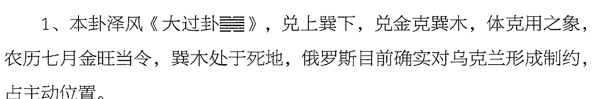

- 1、本卦泽风《大过卦䷛》，兑上巽下，兑金克巽木，体克用之象，农历七月金旺当令，巽木处于死地，俄罗斯目前确实对乌克兰形成制约，占主动位置。
- 2、变卦泽天《夬卦䷪》，兑上乾下，兑金与乾金，卦象体用比和，预示未来俄罗斯与乌克兰之间紧张局势不会升级，而将趋于逐渐缓和。看来普京指挥的4万俄罗斯大军也只是秀秀肌肉罢了。
- 3、覆卦也是泽风《大过卦䷛》，俄乌双方目前虽然处于军事对峙状态，但各自内心的打算是一样的，谁也不想先动手。本卦与覆卦互见兑（☱）象和巽（☴）象，兑为口舌，巽为舆论，双方也只是打打舆论上口水战而已。
- 4、变卦的复原卦为天泽《履卦䷉》，乾上兑下，乾金见兑金，体用比和之象，履卦辞云：“履虎尾，不咥人。”表面看箭在弦上，但双方能保持克制，最终不会发生战争。
- 5、初六爻动，乾（☰）象，时间窗口：农历五月、八月、十一月、二月为应验的月份。只要2016年8月中旬这个敏感时期度过去了，乌克兰边境的战事将趋于平静。

事后应验：

此事正如笔者预测，2016年8月中旬度过去之后，乌克兰边境战事将趋于平静。俄罗斯也只是秀了秀肌肉，截至2017年12月俄乌双方没有发生直接的军事冲突。

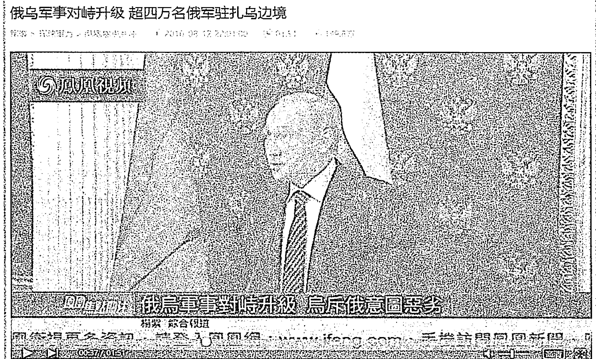

### 例八、美方巡航美济礁有无战事

2016（丙申）年4月8日（农历三月初三）19时02分，上网看见“凤凰视频: 美方推动南海军事化,不断加大南海军事部署,4月或巡航美济礁。”预测有无战事发生。以2015年农历三月初三戌时即时起卦预测。

得数字：9、3、3、11

数字起卦：9+3+3 = 15÷8 = 1…余7，7为艮（☶）象，外卦取艮（☶）象，15+11 = 26÷8 = 3…余2，2为兑（☱）象，内卦为兑（☱）象，得本卦山泽《损卦䷨》；26÷6 = 4…余2，2为兑（☱）象，九二爻变动，得变卦山雷《颐卦䷚》，本卦体用得位，互卦不用。本卦的覆卦风雷《益卦䷩》，变卦的复原卦雷山《小过卦䷽》。

| 本卦损卦 | 变卦颐卦 | 覆卦益卦 | 复原卦小过卦 |
| :--- | :--- | :--- | :--- |
| 四月 |  |  | 十月 |
| 三月 | 体卦 | 用卦 | 九月 |
| 二月 |  |  | 八月 |
| 正月 |  |  | 七月 |
| 腊月 | 九二爻动 |  | 六月 |
| 冬月 | 用卦 | 体卦 | 五月 |

### 推测分析：以体为我方，以用为美方。

- 1、本卦山泽《损卦》，艮上兑下，艮土生兑金，卦象体生用，损上益下之象，预示山被泽水包围，我有损失之象。
- 2、变卦山雷《颐卦》，艮上震下，震木克艮土，用克体之象，农历三月木旺，颐卦卦象象一个很大的圈子，美国企图包围、克制我方，意在彰显他们在南海的军事存在。
- 3、本卦的覆卦风雷《益卦》，巽上震下，巽木见震木，卦象体用比和。本卦看似有损失，而实际则对我方有益。美国军舰再嚣张也只是在岛礁的12海里以外巡航，说明他们还是尊重我们的领土主权的，只是进入我们领海航行自由罢了。
- 4、变卦的复原卦雷山《小过卦》，从变卦和复原卦看，中美双方势均力敌，内心所想是一样的，不至于发生擦枪走火的事情。
- 5、九二爻动，为兑（☱）象，兑为口舌之争。时间窗口：三月、六月、九月、十二月。农历三月十八至二十二日，美国有巡航南海的行动发生。中美双方只是打一打舆论上的口水战而已，海南局势不会升级为战火纷争。
- 6、今年申子辰，三煞在南方巳、午、未，南海不平静也是自然趋势。农历三月为三煞会，四月、五月、六月为三煞月，大陆与台湾之间很可能会有一定的摩擦发生，祖国统一将从此迈出新的一步，让我们拭目以待。

### 事后应验：

2017年4月份，美国确实有在南海增加军事部署和巡航的舆论，但是，也只是嘴上强硬了一阵子罢了。之后南海紧张的军事局势，因为东海朝鲜半岛的核问题而淡化，至今没有发生任何的军事冲突。

### 美国不断加大南海军事部署 4月或巡航美济礁

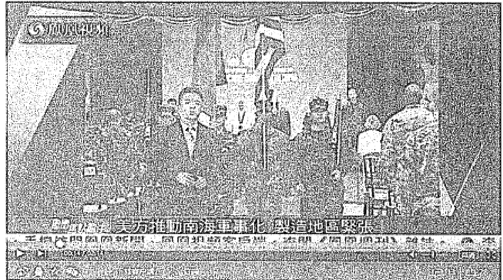

### 例九、美朝近期是否必有一战？

2017年4月12日晚上22时，网上看见“美国“卡尔·文森”号航母打击群已经穿越了菲律宾海域，有可能对朝鲜采取单独行动”。即生预测“美朝近期是否必有一战”的念头。以2017年三月十六日亥时时间起卦。得数字：10、3、16、12。数字起卦：10+3+16 = 29 ÷ 8 = 3…余5，5为巽（☴）象，外卦取巽（☴）象， 29+12 = 41 ÷ 8 = 5…余1，1为乾（☰）象，内卦取乾（☰）象，得本卦风天《小畜卦䷈》；41 ÷ 6 = 6…余5，5为巽（☴）象，九五爻变动，得变卦山天《大畜卦䷙》，本卦体用得位，互卦为火泽《睽卦䷥》；覆卦和复原卦不用。

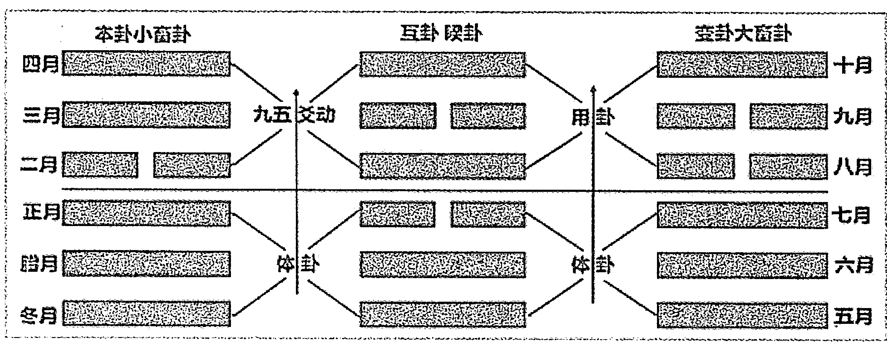

### 推测分析：以体为朝鲜，以用为美国。

- 1、本卦风天《小畜卦☰》，巽上乾下，乾金克巽木，体克用之象，农历三月木旺当令，乾金处于死地，无力克木。事情确实是朝鲜连续发射导弹、要搞第六次核试验，公开要与美、日、韩为敌。但是，以朝鲜的军事实力，根本无法与美、日、韩抗衡。
- 2、互卦火泽《睽卦☱》，离上兑下，离火克兑金，用克体之象。睽卦卦辞曰：“两女同居一室，其志不同。”卦象也显示有非常浓厚的火药味。美国的卡尔·文森号航空母舰将驶向半岛地区，看来这次不单单是对朝鲜施压，而且确实有收拾朝鲜的军事打算。
- 3、变卦山天《大畜卦☰》，艮上乾下，艮土生乾金，用生体之象，变卦的卦象显示，美国最终不会对朝鲜采取“先发制人”的军事打击。
- 4、九五爻动，巽（☴）象，巽为风、为舆论、为信息、为东南方位，说明美国打击朝鲜的舆论来自东南方位。
- 5、九五爻变，时间窗口：三月、六月、九月、十二月。巽（☴）象代表每月的农历十八至二十二日时间段。今天是三月十六日，从后天4月14日开始18日这五天内，将是美国与朝鲜发生军事冲突的敏感时期。度过这个敏感时间段，半岛军事紧张局势将逐渐趋于缓和。

总体分析：
美国开始是打算军事打击朝鲜的。关键要看农历三月十八至二十二日这五天的敏感时间段，从卦象变化看，我认为最起码美国这一次不可能对朝鲜动用武力。但愿美朝之间不要发生军事冲突，但愿半岛局势和平稳定。乾坤居士的预测究竟正确与否，只有等待时间来检验。（于当日将预测结果发在网易博客，让时间来验证）

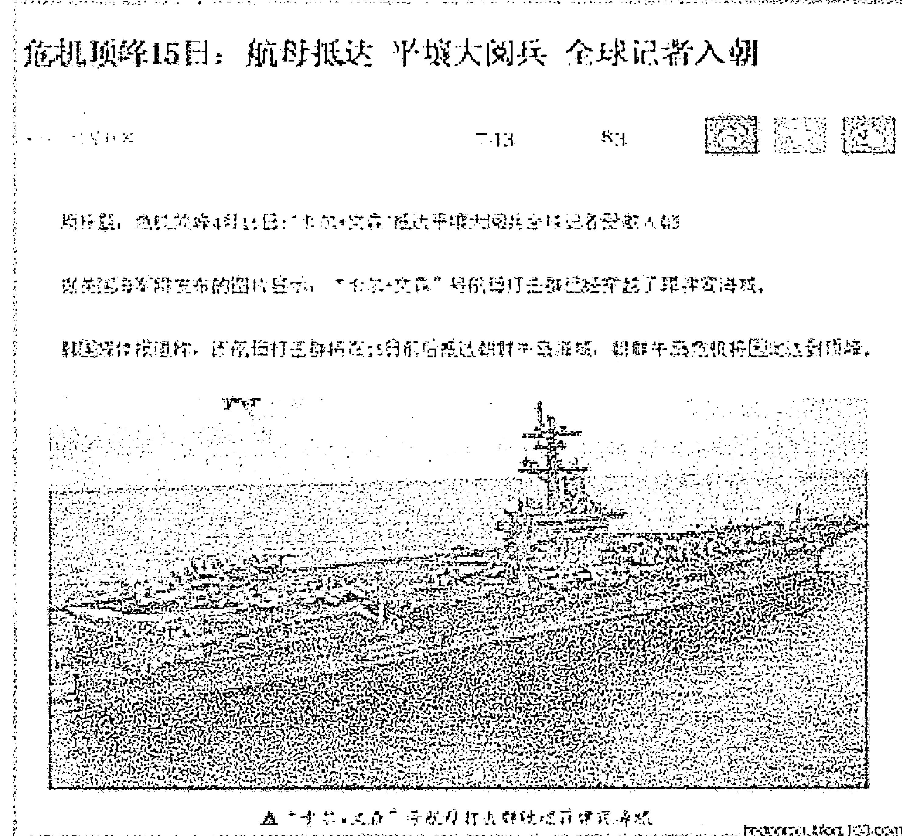

### 事后应验：

2017年4月15日朝鲜举行纪念金日成诞辰105周年大规模的阅兵，并于当日发射导弹失败。美国虽然有3个航空母舰集结在朝鲜海域执行军事任务，但并没有过激行为发生突发性的军事行动。

后来美国总统特朗普表示，他愿意和金正恩就朝鲜核问题进行会谈，朝鲜也没有进行第二次核试验。显而易见，美朝之间的军事冲突有所缓和。截至2017年12月底没有发生战争。

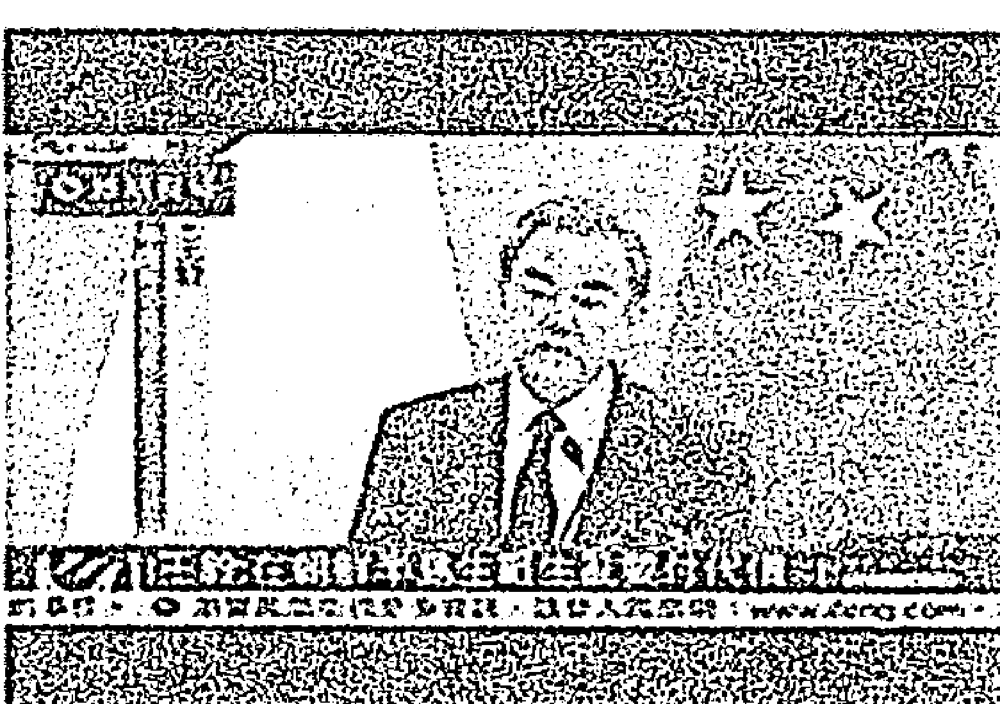

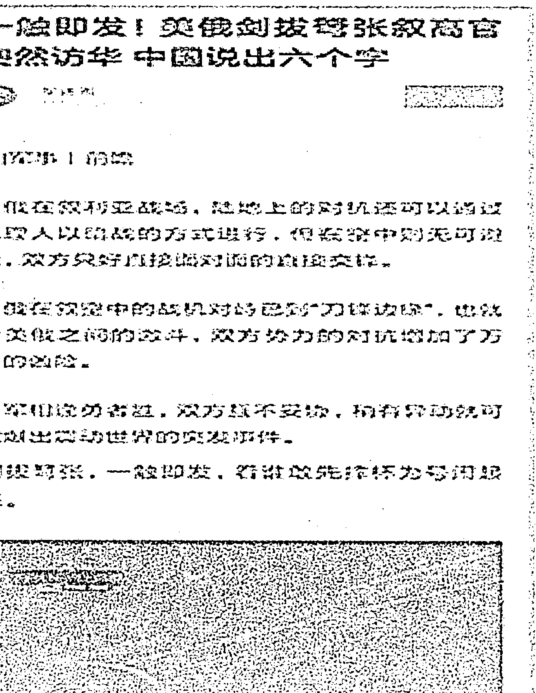

### 例十、美俄不可能有战事

2017年11月27日晚上，在网上看到一则题为：“一触即发！美俄剑拔弩张，叙高官突然访华，中国说出六个字”的消息。即生预测美俄之间是否有战事。

11月22日，俄总统普京在与俄、伊、土三国叙利亚问题索契峰会后表示，俄罗斯、伊朗、土耳其决定扩大反恐合作，包括向“伊斯兰国”（IS）进行斗争。

手机排盘起卦。得本卦水天《需卦☰》，互卦火泽《睽卦☰》，九五爻动，变卦地天《泰卦☰》。

### 推测分析：以美国为体、以俄罗斯为用。（见2017年11月22日微信截图）

- 1. 本卦水天《需卦☰》，坎上乾下，乾金生坎水，卦象体生用之象。如果目下两个超级大国开战，农历十月水旺当令，俄罗斯有点气势汹汹。体卦乾金泄气，美国必将损失惨重，所以，美国会做出一定的让步。
- 2. 互卦火泽《睽卦☰》，卦辞云：“两女同居一室，其志不同”必然闹别扭。巽为风属于气界，兑为泽属于固界，二者不会发生直接短兵相见。
- 3. 变卦地天《泰卦☰》，坤上乾下，卦象用生体之象。最终俄罗斯会在这次博弈中失去相应的机会，美国会从中捞到一点好处。
- 4. 时间窗口：今年的农历九月，腊月，2018年三月、六月。此次摩擦是源于农历九月的问题引起，俄罗斯开始只是强硬一时，最终还得让步。五日内将有新的焦点冲淡这个带有火药味的话题。

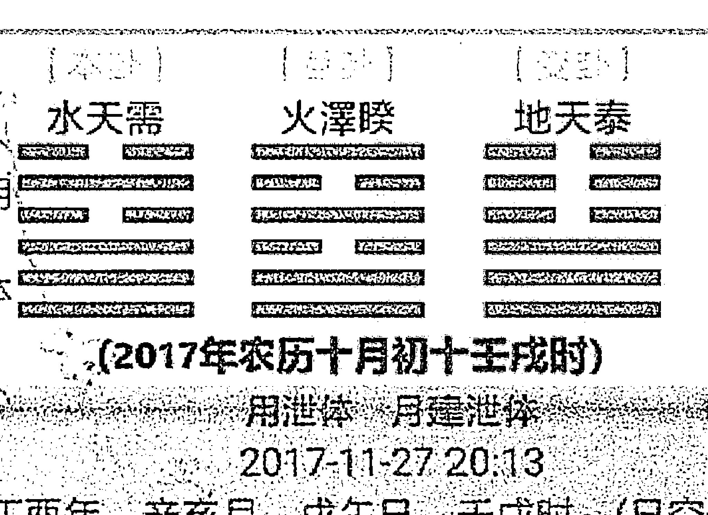

事后应验：（见微信截图）

美国与俄罗斯在叙利亚上空的战机对峙虽说已到“刀锋边沿”，也就为美俄的激斗，双方势力的对抗增加了万分的凶险。美国与俄罗斯之间只是打口水仗，喊的很紧，实际上并没有在叙利亚上空搞出所谓的空中战事。时至 2018 年 1 月 30 日，美国一架侦察机在黑海上空飞行时，遭到一架俄罗斯战机的拦截。一名美方官员透露，当时，双方最近的距离一度只有 1.5 米，双方持续僵持 2 小时 40 分钟，这样的拦截迫使侦察机不得不提前结束任务。

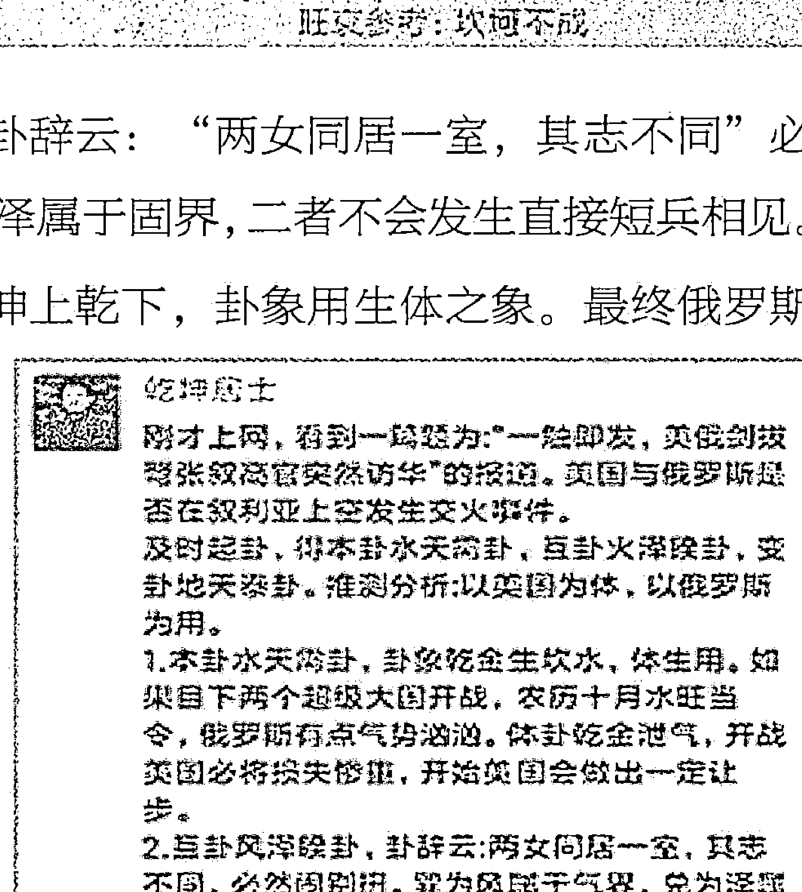

### 战斗民族！俄罗斯战机贴近拦截美军侦察机最近距离1米多

据航空讯：一架美军EP-3E“白羊座Ⅱ”侦察机在当地时间1月29日行经黑海上空，不料就在飞行到一半，遇到一架俄罗斯Su-27战机拦截。一名美方官员透露，当时，双方最近的距离一度只有1.5米，双方持续僵持2小时40分钟，这样的拦截迫使侦察机不得不提前结束任务。

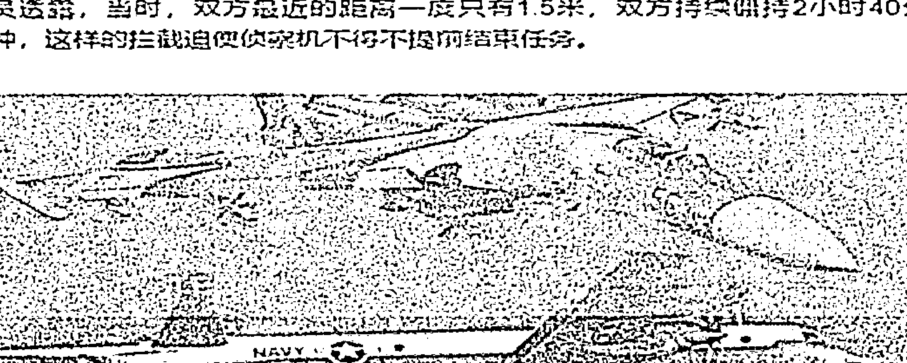

合成图

据CNN报道，美国海军驻欧洲部队发言人Pamela Kunze表示，美军飞机是在符合国际法的情况下执行任务的，并未对俄军进行挑衅。Kunze强调，由于这架Su-27直接穿越EP-3E的飞行路线，甚至一度进到只有1.5米的距离，这被认为是一个不安全的拦截，“这样危险的行为可以说是提高了计算错误与空中碰撞的风险。”

美国海军驻欧洲部队发言人 Pamela Kunze 表示：“这样危险的行为可以说是提高了计算错误与空中碰撞的风险。”

看来世界大国之间的政治和军事博弈中都能保持高度克制，截至目前两国之间并没有发生擦枪走火事件。

## 第十五节 重大事件预测

有人对著者说：国家重大事件的预测，很可能涉及政治敏感问题。著者认为除过与政治有关的事件之外，还有很多领域是可以预测的。下面将几次预测卫星发射方面的卦例介绍给大家，以资共同研究。

### 例一、澳星发射失败

这是 20 多年前，著者在陕西省凤翔师范学校工作时，有很多人证实的一件往事了。1992 年 3 月 22 日是个星期天，因离家太远回不去，吃过早饭，没事干，就去好友某老师处闲转。学校广播通知：“全体同学请注意，8点40分，学校大会议室电视转播中央电视台在西昌卫星发射基地现场直播的“澳星发射”实况，请同学们准时观看。”由于事先不知道这个消息，听到广播，立即心生预测念头。根据时间（农历1992（壬申）年二月十九日早上8点钟）很快在王老师的桌子上起了一卦。

得数字：9、2、19、5。

数字起卦：9+2+19 = 30÷8 = 3…余6，6为坎（☵）象，外卦取坎（☵）象，30+5 = 35÷8 = 4…余3，3为离（☲）象，内卦取离（☲）象，得本卦水火《既济卦䷾》，总数35÷6 = 5…5，5为巽（☴）象，九五爻变动，得变卦地火《明夷卦䷣》，本卦体用得位，互卦为火水《未济䷿》，覆卦和复原卦不用。

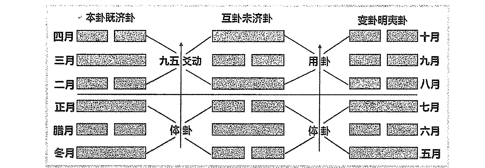

推断预测：以体卦为发射方，以用卦为澳星。

- 1、本卦水火《既济卦䷾》，坎上离下，互卦火水《未济䷿》离上坎下，互卦与本卦互为覆卦，两个卦也互通。坎水克离火，卦象用克体，水火相悖之象，预示好事难成。好在二月木旺当令，月令卯木泄坎水之气，使离火逢生气，水对火构成些不利，但有月令通关，不会造成灭顶之灾。
- 2、变卦地火《明夷卦䷣》，坤上离下，火入地下。离火生坤土，体生用之象，外卦坎水变坤土回头克，离火入大地之中，主有损失。此卦寓意太阳落山的休眠之象，预示澳星不能准时发射或者发射失败。
- 3、九五爻动，时间窗口：农历三月、六月、九月、十二月为应验的月份。卫星发射本应该在三月份进行，现在是二月十九日，时间窗口还没有到，有提前发射的征兆。
- 4、本卦的用卦九五爻变，五为巽（☰）象，巽为木、为风、为燃料、为舆论、为信息系统。火箭的燃料或者信息系统很可能要出问题。
- 5、变卦地火《明夷卦☷☲》，离（☲）为火、为电，坤为土、为大地，火箭进入地下之象，这是很不吉利的预兆。

分析了半晌卦象，还真不敢下结论。这时王老师在一旁问：“咋啦，难道还有什么问题？”

我说：“从卦象看还真有问题，卫星不能准时发射，可能是火箭的燃料或者信息系统出了问题。”

某老师说：“不可能的事。”

我说：“倒也是，这么大的事情，怎么能取消发射或者失败呢！”

某老师说：“好！你就按你的卦解，一会电视转播就兑现了，看你测得准不准。如果你测得准，今天中午我请客，如果你测不准，那你得请我。”

某老师是班主任，人缘很好，一会宿舍还来了他们班上的五六个学生，和我们一起看澳星发射实况转播。

中央电视台开始实况转播了。节目主持人：“电视机前各位观众，我们现在在西昌卫星发射基地为您现场转播‘澳星发射’实况，再过几分钟，我身后这颗卫星就要发射升空，……。”好不容易等到倒计时读秒：“10、9……3、2、1，点火！”卫星发射准时点火。

结果几秒钟过去了，那个庞然大物还是纹丝不动的立在那里，发射现场人声嘈杂、一片混乱，澳星发射失败了。

当时的我，高兴地从沙发上跳了起来。在场的学生对我异常的举动感到非常诧异。某老师连忙给学生解说：“何老师刚才预测，说卫星不能准时发射，他测准了！”学生们这才感到《周易》预测是一件十分好奇的事情。于是，这个消息就在校园传开了，老师们这才知道我懂得《周易》预测。

### 事后应验：

虽说澳星发射失败对国家航天工业来说是一个重大损失。但是，又一次实证了《梅花易数》预测的准确性，此事反倒成了著者的成名之作。

此次预测纯属即时发挥、热蒸现卖，而且当场应验。多少年之后，国家有关方面透露澳星失败原因是：“配电器上多了一块0.15毫米的铝物质，正是这一点点铝物质导致澳星发射的重大失败。”正所谓：细小成就伟大啊！

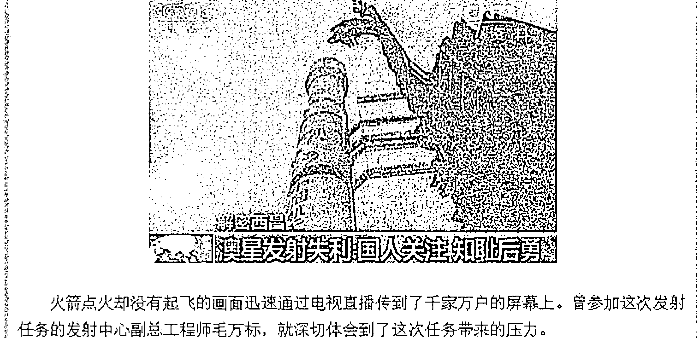

### 例二、朝鲜发射卫星能否成功？

2012年4月9日晚上，博友“火神易人”在QQ上留言，让我预测朝鲜发射卫星能否成功。我按他发信息的时间：2012（壬辰）年三（甲辰）月十九（庚子）日18:27分起卦。得数字：5、3、19、10。

数字起卦：5+3+19 = 27÷8 = 3…余3，3为离（☲）象，外卦取离（☲）象，27+10 = 37÷8 = 4…余5，5内卦为巽（☴）象，内卦取巽（☴）象，得本卦火风《鼎卦䷱》；总数37÷6 = 6…余1，1为乾（☰）象，初六爻动，得变卦火天《大有卦䷍》；本卦体用不得位，互卦不看；本卦的覆卦为泽火《革卦䷰》，变卦的复原卦为天火《同人卦䷌》。

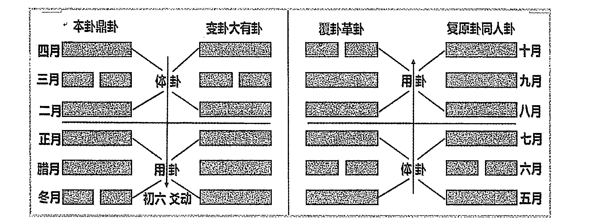

推测分析：以体为朝鲜，以用为卫星。

- 1. 本卦火风《鼎卦䷱》，离上巽下，巽木生离火，用生体之象，卦象逢生气，有动力，看来朝鲜的卫星是肯定要发射的。
- 2. 变卦火天《大有卦䷍》，离上乾下，离火克乾金，体克用之象，说明好事要推迟，朝鲜卫星发射的时间很可能要调整或者推后一些时日。
- 3. 卦象体用不得其位，本卦的覆卦为泽火《革卦䷰》，革有改造革新之意，预示朝鲜卫星发射的技术有待革新提高。变卦卦象五阳一阴，朝鲜发射卫星的态度非常坚决，决不会因为国际社会舆论的强烈反对而放弃这一计划。
- 4. 本卦初六爻动，乾（☰）象。时间窗口：五月、八月、十一月、二月。2012年农历二月朝鲜就已经启动了卫星发射计划。乾（☰）象代表每月的十三至十七日，预计今年4月13——17日五日之内发射卫星。
- 5. 变卦火天《大有卦䷍》，体克用，变卦的复原卦为天火《同人卦䷌》，均为离火克乾金之象。前者显示离上乾下，火箭在天上；后者是乾上离下，火箭在天下。一上一下，预示不排除其它客观原因使卫星发射受到阻碍或者导致发射失败。
- 6. 2012（壬辰）年三（甲辰）月土旺，体卦离火泄气太重，用卦乾金得太岁（壬辰）和月建（甲辰）来生。此事另一种可能是燃料不过关、推动力不足而影响卫星成功发射。

### 事后应验:

预测之后，于2012年4月10日将结果发布在我的网易博客。2012年4月13日凌晨朝鲜发射卫星。之后的报道称：朝鲜发射卫星再度失败，小国玩不转航天卫星。发射时间正如本次预测（4月13-17日五日内发射卫星）。

（见以上博客截图）

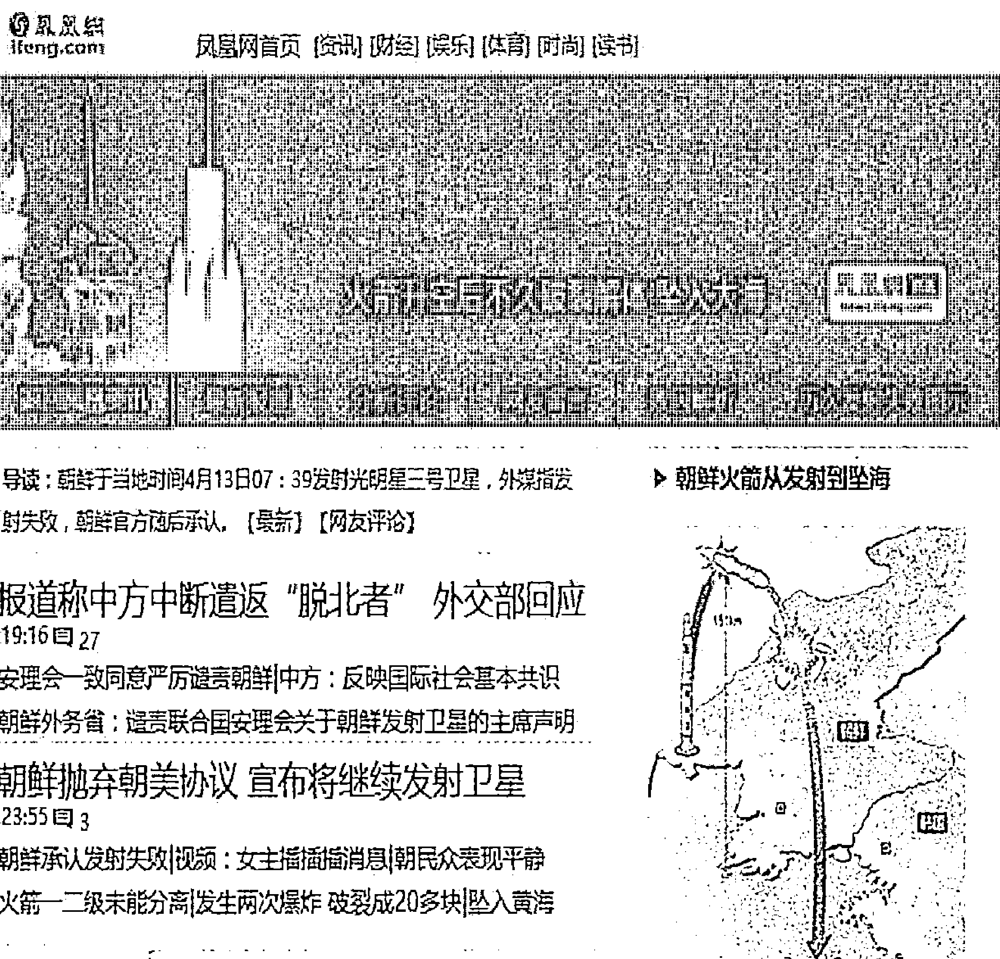

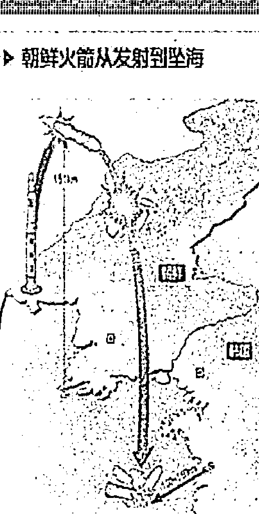

**海洋**
根据媒体分析，我以为昨日就要发射，想不到还是在老师的预测范围内。😊
回复 | 删除
2012-04-15

**悠悠我心**
先生，您真料事如神
回复 | 删除
2012-04-20

**慧眼居士**
刚在广播里听到了朝鲜功勋播音员李春姬沉痛而愤怒的声音，他们已经承认发射失败了。
回复 | 删除
2012-04-13

**名乾坤居士 回复 慧眼居士**
谢谢慧眼居士到访！😘👇
2012-04-13

### 例三、朝鲜再发卫星能否成功

朝鲜宇宙空间技术委员会发言人（2012年）12月1日宣布，“朝鲜将遵循金正日总书记的遗训，于12月10日至22日之间发射凭借自身力量和技术研制的“实用卫星”。朝鲜科技工作者深入分析了今年4月发射失败的原因，并且改进了卫星和运载火箭的安全性和精确度，完成了发射卫星的准备。

发言人称：“朝鲜即将发射的第二颗“光明星3号”卫星是和上次的卫星一样，按照极地轨道运行的地球观测卫星，将于12月10日至22日之间使用“银河3号”运载火箭从平安北道铁山郡的西海卫星发射场向南发射。朝鲜已经设定了安全飞行轨道，以免卫星发射时产生的运载火箭残骸对周边国家造成影响。”

2012（壬辰）年12月2日上午9点10分，著者上网看到朝鲜宣布于12月10日至20日再次发射“光明星3号”卫星。即起预测念头，以“朝鲜”二字加上农历十月十九日巳时起卦，得数字：12+17、5、10、19、6。

数字起卦：12+17+5+10+19 = 63÷8 = 7…余7，7为艮（䷳）象，外卦取艮（䷳）象，63+6 = 69÷8 = 8…余5，5为巽（䷸）象，内卦取巽（䷸）象，得本卦山风《蛊卦䷑》；总数69÷6 = 11…余3，九三爻动，3为离（䷝）象，得变卦山水《蒙卦䷃》；本卦体用不得位，互卦不用；本卦的覆卦为泽雷《随卦䷐》，变卦的复原卦为水山《蹇卦䷦》。

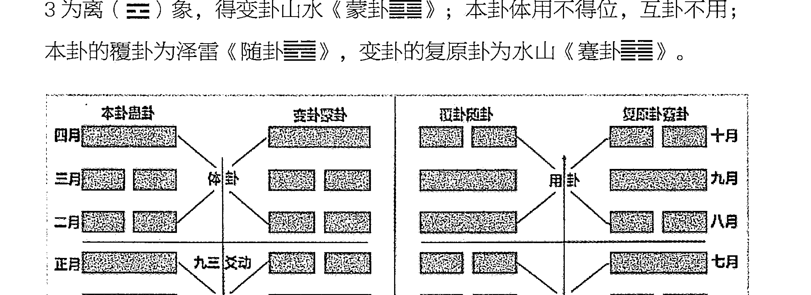

推测分析：以体为朝鲜，以用为卫星。

-   1、本卦山风《蛊卦䷑》，艮上巽下，巽木克艮土，用克体之象，艮为山、巽为风，山下有风，体用不得其位。本卦的覆卦为泽雷《随卦䷐》，兑上震下，兑金克震木，用克体之象，兑为泽、震为雷，泽下有雷，兑（用）金克震（体）木之象，本卦和覆卦预示朝鲜“光明星3号”卫星发射不会成功。

### 2、变卦山水《蒙卦》

艮上坎下，复原卦为水山《蹇卦》，坎上艮下，艮为山、坎为水，都是艮土克坎水，卦象体克用。农历十月坎水当旺艮土失令，朝鲜“光明星3号”卫星不是操控系统有些问题，就是要推迟发射时间。

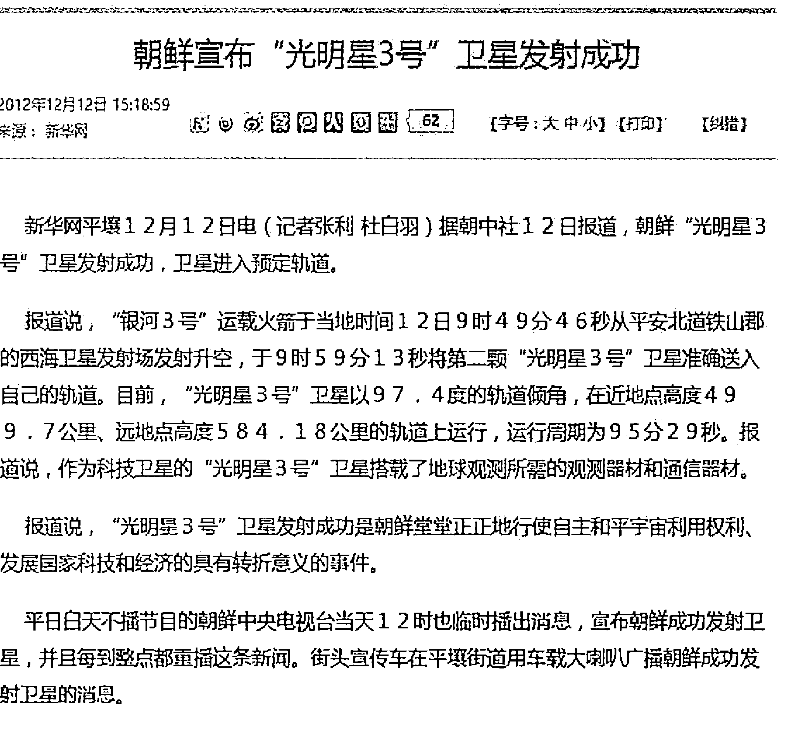

### 3、时间窗口：

农历七月、十月、正月、四月为应验的月份。用卦为巽象，巽（☴）象代表每月的十八至二十二日，但是九三爻动，可能推后到九月的二十三至二十七这五日内，因为九月是小月，没有三十日。因此，朝鲜“光明星3号”卫星发射日期为：公历12月11日至14日这四日之内。

### 4、九三爻动，三为离（☲）象，离为火，对应农历七月，预示朝鲜从农历七月就积极准备发射卫星了。本卦的用卦巽（☴）象对应每月十八至二十二日时间段，所以，2012年农历十月十八——二十二日（公历12月1日至5日）发布卫星发射消息也在情理中。

综上分析：“光明星3号”卫星发射日期虽然已定，不能说不按时发射。但是成功的可能性不大。

著者在网易博客预测博文的后记中这样说：这次朝鲜用“银河3号”运载火箭继续发射“光明星3号”卫星，决心很大，但是成功的几率确实让著者担心啊！本次预测只是为了再次验证《梅易预测》的准确性，不包含任何政治因素，如果“光明星3号”发射成功了，说明本人的预测技术还很臭；如果没有发射成功，也是很自然的事情。

### 沉默的朝鲜卫星翻跟头

2012年12月20日10:10 来源： 扬州新闻网-扬州晚报

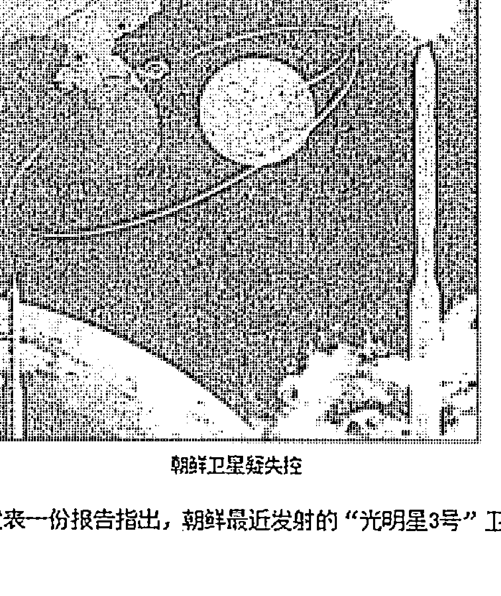

朝鲜卫星失控

美国天文学家日前发表一份报告指出，朝鲜最近发射的“光明星3号”卫星可能已经失败，变成“死星”。

记者昨连线该报告作者、高能天体物理中心的天体物理学家乔纳森·麦克道尔，他提供了报告原文并表示，目前这颗卫星有70%的可能性已经失败，但也有可能是科学家们未能正确地理理解“光明星3号”的运转方式。

朝鲜驻华大使馆则表示，此报告不实，完全是胡说。

-   1. 失控的卫星在翻跟头

麦克道尔提供的报告显示，上周发射进入太空的朝鲜卫星看起来在轨道上正在“翻跟头”，很有可能成了一颗“死星”。

自发射以来，世界各地的天文学家把望远镜对准天空，但一无所获。

麦克道尔解释称，“通俗地说，太阳照在卫星上，而我们能够观测到卫星的反射光，这光束时强时弱，这就说明它仍然在运转，或者说在翻滚。”他补充道，“但是反射光不能证明它运转正常，我有70%的把握认为它已经死了。”

### 事后应验：

2012年12月2日朝鲜发布“光明星3号”卫星发射消息。于2012年12月12日（农历十月二十九日）卫星发射，发射时间基本准确。后来经美国天文学家证实“光明星3号”卫星虽然进入轨道，但是，“翻跟头没有信号，朝鲜卫星已‘死’”。这个结果与著者的预测很吻合。

### 例四、神舟九号飞船发射

2012年6月9日，在网上看到：我国首次载人交会对接的神舟九号飞船、长征二F遥九火箭组合体已从酒泉卫星发射中心载人航天发射场技术区垂直转运至发射区。神九飞船能否发射成功？在太空飞行几天返回？搭载几人？一切在当时都是一个谜。因此，即生预测念头：以农历2012（壬辰）年闰四月二十日20：57分起卦，得数字：5、4、20、11。

数字起卦：5+4+20 = 29 ÷ 8 = 3…余5，5为巽（☴）象，外卦取巽（☴）象，29+11 = 40 ÷ 8 = 4…余0，0为坤（☷）象，内卦取坤（☷）象，得本卦风地《观卦䷓》；总数40 ÷ 6 = 6…余4，4为震（☳）象，六四爻动，得变卦天地《否卦䷋》；本卦体用得位，互卦为山地《剥卦䷖》，覆卦和复原卦不用。

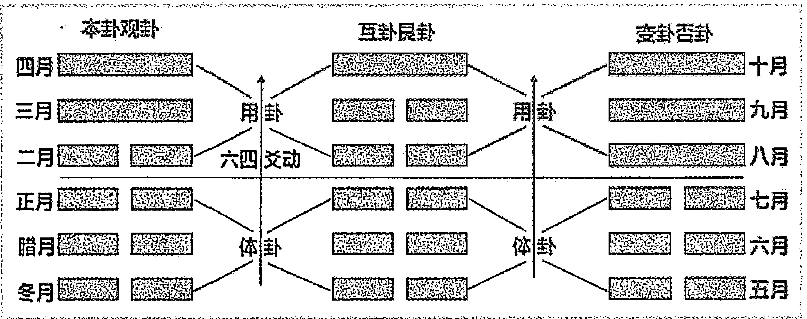

### 推测分析：以体为我方，以用为神九飞船。

-   1. 本卦风地《观卦䷓》，巽上坤下，巽木克坤土，用克体之象，农历四月火旺，月令通关，巽木生火，火生坤土，这时候巽（用）木不克坤（体）土，反而能增加一定的成功能量。
-   2. 变卦天地《否卦䷋》，乾上坤下，坤土生乾金，卦象体生用，有付出之象，此次神九飞船发射可能有原来没有预计到的额外经济费用开支。
-   3. 互卦为山地《剥卦䷖》，艮上坤下，艮土见坤土，卦象体用比和，预示神九飞船发射准备情况比较顺利，没有任何问题。六四爻变动，四为震（☳）象，此次神九飞船最多搭乘4名宇航员。
-   4. 时间窗口：农历三月、六月、九月、十二月为应验的月份。农历二月就开始了发射准备工作，本卦的用卦巽（☴）象显示神舟九号飞船在2012年6月13日至17日这五日之内发射。
-   5. 从本卦卦象数字看：为5、8，合计为13，预计飞船在太空滞留的时间为8到13天，完成对接等拟定任务后将成功返回地面。预祝神舟九号飞船发射升空、圆满完成任务、凯旋归来！

### 事后应验：

2012年6月16日18时37分神舟九号飞船发射升空，搭乘了3名宇航员。总指挥部研究决定，神舟九号飞船将于29日10点左右返回地面，在太空飞翔了13天时间。

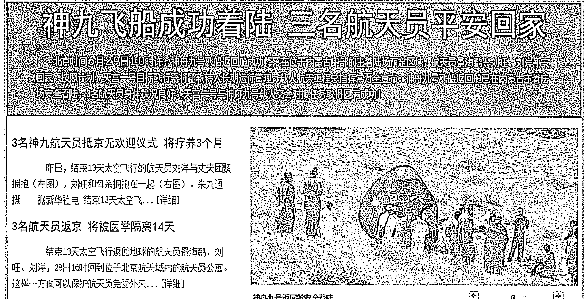

神舟九号飞船返回舱于6月29日10时03分在内蒙古四子王旗着陆场顺利着陆，3名宇航员结束了太空13天的飞翔生活。神舟九号发射时间在著者预测的（6月13-17日）时段之内。

2016年6月16日10时21分，博友 xnxd 留言：“厉害！神舟九号载人飞船定于北京时间6月16日18时37分发射。（见博客点评截图）”

> 厉害！ http://news.sohu.com/20120616/n345760263.shtml 中国载人航天工程新闻发言人15日在酒泉卫星发射中心宣布，经天宫一号与神舟九号载人交会对接任务总指挥部研究决定，神舟九号载人飞船定于北京时间6月16日18时37分发射。
回复 引用

> 花莲居士 wow wow!
游动nxnd到访点评！[表情符号]
回复 引用

### 例五、香港占中即将结束

2014年11月8日11时40分，宝鸡市周易研究会举办“梅花易数”研讨活动即将结束，著者正要总结会议，一向关心国家大事的研究会理事徐先生提问：请求你预测一下“香港占中”何时结束？

我说：“香港占中，不得人心，严重扰乱了香港人民生活秩序，香港的明天会更加美好！”他们说非要预测演示一下，让大家共同研究探讨。当场即时预测“香港占中”何时结束，以2014（甲午）年（农历闰九月十六日）11时40分起卦。得数字：7、9、16、7。

数字起卦: 7+9+16 = 32÷8 = 0, 0为坤(☷)象，外卦取坤(☷)象，32+7 = 39÷8 = 4…余7，7为艮（☶）象，内卦取艮（☶）象，得本卦地山《谦卦䷎》，总数39÷6 = 6…余3，3为离（☲）象，九三爻动，得变卦八纯卦《坤卦䷁》；本卦体用不得位，互卦不用，本卦覆卦为雷地《豫卦䷏》，变卦的复原卦为八纯卦《坤卦䷁》。

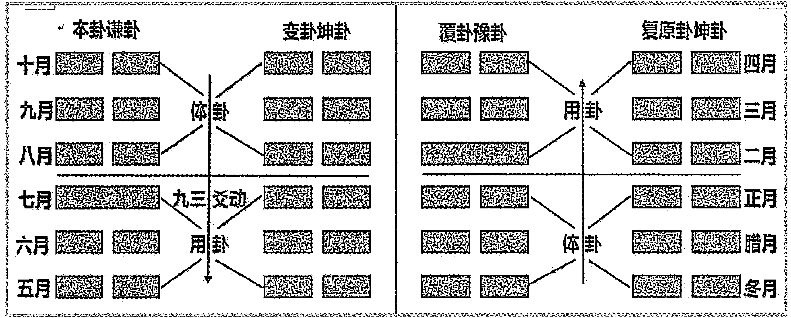

推测分析：以体为香港政府，以用为占中者。

-   1、本卦地山《谦卦》，坤上艮下，坤土见艮土，卦象体用比和。山藏于地下，艮为山、艮为阻塞不通，坤为众、为大地。预示众多占中者背后有支持者，他们不敢公开露面，而是在地下操纵，幕后指挥。
-   2、覆卦为雷地《豫卦》，震上坤下，震木克坤土，用克体之象，农历九月金旺，木处绝地，震木克不了坤土，看来需要一定时间来化解这场“占中”矛盾。
-   3、变卦八纯卦《坤卦》，变卦的复原卦八纯卦《坤卦》，都是坤土见坤土，体用比和之象，预示香港特区政府与占中者将达成和解，占中行动最终会顺利解除。
-   4、九三爻动，离（☲）象，离为火、为南方。时间窗口：七月、十月为应验的月份。今年七月份占中者就有预谋活动的迹象。到农历闰九月二十八——十月初二左右“香港占中”活动逐渐减弱消除。
-   5、根据本卦（7+8）和变卦（8+8）卦象看，15天之后“占中活动”降温，32—48天之内“占中活动”结束。从变卦的复原卦八纯卦《坤卦》看，坤（☷）象代表每月的二十八日至下个月的初二时间段，就是说最远在2014年12月19日至23日（农历十月二十八至十一月初二）“占中活动”彻底结束，香港明天将更加繁荣稳定。随后将预测结果发在了网易博客。

### 事后应验：

（见网络截图）

中新网10月24日（农历闰九月初一）电，综合香港媒体报道，全国政协副主席

> **来源：** 新华网
**标题：** 香港警方今日在铜锣湾进行最后一次“占中”清场
**日期：** 2014年12月15日 06:27:15
**正文：** （图片内容描述）图为：2014年12月15日，在香港铜锣湾，警方进行最后一次“占中”清场。持续75天的香港“占中”非法集会，经过香港警方的清场行动，已经基本结束。

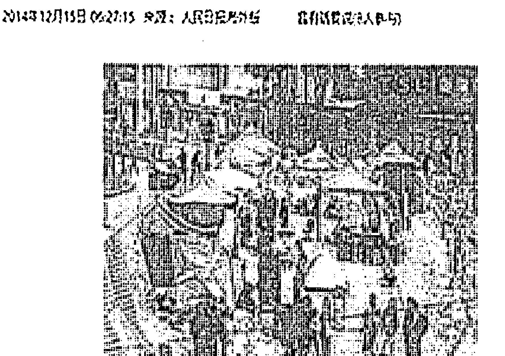

图为：2014年12月15日，在香港铜锣湾，警方进行最后一次“占中”清场。持续75天的香港“占中”非法集会，经过香港警方的清场行动，已经基本结束。“占中”之始，社会各界怎么想，社会又该如何应对？

席、前香港特首董建华，在“占领中环”行动之后，24日首次举行记者会。董建华称，“占中”严重撕裂香港社会，影响经济民生，呼吁学生结束“占领行动”。12月15日（农历十月二十四日），警方再花费近三个小时，完成铜锣湾清场及拘捕行动，宣告为期79日的占中运动正式结束。比事先预测的结束时间提前5天解除“占中”。

### 例六、英国公投结果是脱离欧盟

2016（丙申）年6月23日（农历五月十九日）晚上21点58分在凤凰网上看见英国脱欧公投的消息，“各持立场，脱欧留欧激烈交锋。”这是当时世界上一个重大事件，可能决定欧盟与英国的兴衰，甚至影响世界经济发展。但网上多数人认为英国公投结果是脱不了欧盟。即起预测的念头。以2016年农历五月十九日亥时起卦。得数字：9、5、19、12。数字起卦: 9+5+19 = 33÷8 = 4, 1为乾（☰）象, 外卦取乾（☰）象, 33+12 = 45÷8 = 5…余5, 5为巽（☴）象, 内卦取巽（☴）象, 得本卦天风《姤卦䷫》，总数45÷6 = 7…余3, 3为离（☲）象, 九三爻动, 得变卦天水《讼卦䷅》; 本卦体用不得位, 互卦不用, 本卦的覆卦为泽天《夬卦䷪》，变卦的复原为水天《需卦䷄》。

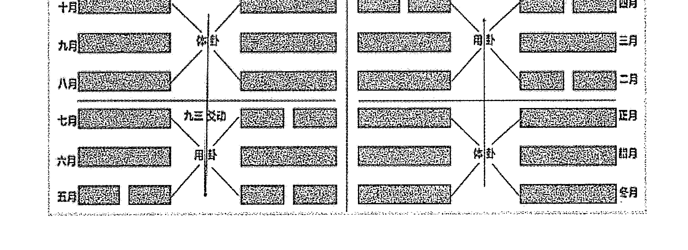

### 预测分析：以体为英国政府，以用为民众意愿。

-   1、本卦天风《姤卦䷫》，乾上巽下，乾金克巽木，体克用之象，农历五月火旺当令，乾金无法克巽木，预示英国公投大势所趋，只是抉择的善后工作可能要推后一段时间。
-   2、变卦天水《讼卦䷅》，乾上坎下，乾金生坎水，体生用之象，预示英国有付出损失之征兆。讼卦卦象为：乾天向西而去，坎水向东而流，天地背道而驰之象。说明英国民众强烈的脱欧意愿与英国政府的想法显然是南辕北辙的。
-   3、九三爻变动，时间窗口：农历正月、四月、七月、十月。本月农历十八至二十二日（公历6月22日至26日）这个时间段就有英国公投的结果公布时段。
-   4、本卦体用不得位，互卦不用，本卦的覆卦为泽天《夬卦䷪》，兑金见乾金,体用比和之象,五阳决一阴,英国民众公投脱欧的意愿比较强烈，任何人、任何力量都无法阻止英国脱欧。
-   5、变卦的复原卦为水天《需卦䷄》，此事虽然进入公投，结果是脱欧，实际脱离，尚需一定时间。到2016年农历的十月、2017年正月才能有实质性脱离措施。

### 预测结论：英国公投的最终结果是脱离欧盟。

### 事后应验：

2016-06-23 22:43 分57秒,著者将预测结果:“英国公投的最终结果是脱离欧盟！”发表在网易博客。

2016年6月24日，著者参加单位组织的集体去“铜川照金”革命根据地参观学习。当日下午15点多，

英国脱欧公投结果出炉 52%选民决定脱欧

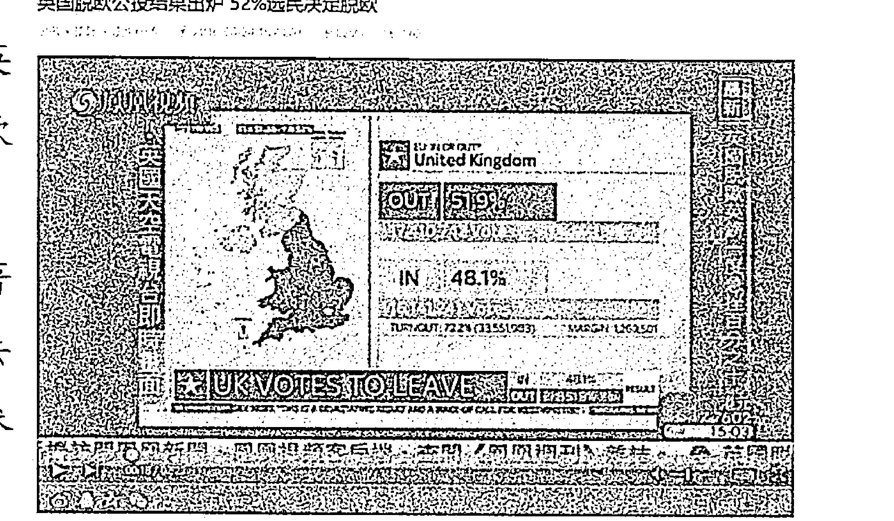

有同事手机上网，英国脱欧公投消息出炉，52%选民决定脱欧。而有关媒体在公投之前的民调显示：参加公投民调的公民表示不会选择脱欧。看来老祖宗留下的《梅花易数》预测，要比“英国媒体的民调”准确得多啊！

### 例七、南海仲裁虽不利，我国不会退出海洋法公约

2016年6月26日晚上19点55分，在网上看到关于菲律宾单方提出南海仲裁案，引发舆论说“我国将退出海洋法公约”的讨论，即生预测“此次仲裁结果和我国是否退出海洋法公约”的念头，以2016（丙申）年农历五月二十二日戌时起卦。得数字：9、5、22、11。

数字起卦：9+5+22 = 36 ÷ 8 = 4, 4为震（☳）象，外卦取震（☳）象，36+11 = 47 ÷ 8 = 5…余7，7为艮（☶）象，内卦取艮（☶）象，得本卦雷山《小过卦䷽》，总数47 ÷ 6 = 7…余5，5为巽（☴）象，六五爻动，得变卦泽山《咸卦䷞》；本卦体用得位，互卦为泽风《大过卦䷛》，覆卦和复原卦不用。

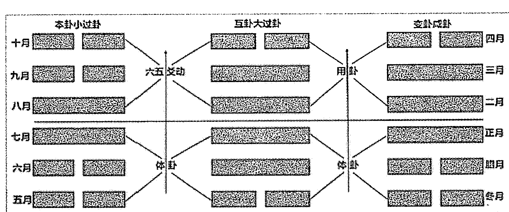

预测分析：以体为我方，以用为菲方。

-   1. 本卦雷山《小过卦䷽》，震上艮下，震木克艮土，用克体之象，预示菲方克我方，事实也是菲方单方面提交南海仲裁，菲方对我方构成克伤。但，农历五月火处旺地，震木泄气严重，艮土反得月令午火之生气，菲方对我方构不成实质性的伤害。小过卦预示小小过错而已，无妨大事。
-   2、互卦泽风《大过卦》，兑上巽下，兑金克巽木，用克体之象，此事不但对我方不利，对菲方也不是什么好事。大过也者，大大的过失也！看来南海仲裁对中菲双方都没有什么好处。
-   3、变卦泽山《咸卦》，兑上艮下，艮土生兑金，体生用之象，预示我方有损失之征兆。本来五月火旺当令，兑金受月令之克，我方艮土得五月月令之生气，仲裁结果也只是动动口舌而已，对我方构不成大的伤害。另，泽山《咸卦》山气腾升，泽水下润，通气交融充分，大家可以放心，我国绝对不会因此而退出国际海洋法公约。
-   4、六五爻动，时间窗口：三月、六月、九月、十二月。今年三月初菲律宾单方面闹腾这件事，六月初之前，即农历五月二十三日之二十七日（6月27日至7月1日）南海仲裁案在这五日内会有确切的消息发布。

### 预测结论：

-   1. 根据本卦用克体、互卦用克体、变卦得出体生用的综合分析，南海仲裁案结果我方虽有损失，只是对我方造成小的不利，但无碍利益大局。
-   2. 五千年华夏文明古国，世界大国风范，我国绝对不会因为菲律宾单方面错误的提出仲裁而退出国际海洋法公约。

随后将预测结果发在网易博客，并写了后记：有理走遍天下，支持中国在南海立场的国家正在增加，不管南海仲裁结果如何，我们绝对不会退出国际海洋法公约。

### 事后应验：

2016年7月12日菲律宾所谓的海牙仲裁结果公布，至今（2017年12月底）已经一年多时间过去，我国并没有退出国际海洋法公约。只不过是少数用心不良的国家在背后挑唆作梗，我国海南领土主权并没有什么改变和损失。

## 第十六节 随机事件的预测

生活中人们常常会遇到随机发生的事件。比如说：车次晚点呀！临时找人啊！再例如：几个人聚在一起，突然有人问：你看我什么时间有难？等等突发事件，都需要即时预测一下结果。这就需要借助临机一动的意念和当时情景下出现的外应来推测预知结果。

2016年农历正月，侨居加拿大的常先生回国，邀请宝鸡市周易研究会几位副会长聚在一起。酒过三巡，菜过五味。常先生突然起身发话：

诸位老师，今天在座的都是宝鸡周易研究界的大师高手。我们经常会听到预测很神奇的案例，但预测未来的事情暂时无法应验。请大家预测一下我过去在宝鸡历险遇难的一件事情发生在那一年？如果测得准，我就真正佩服宝鸡周易研究会的水平。

提供的唯一信息就是常先生（男），1964（甲辰）年某月某日生于宝鸡。于是大家各自用《四柱八字》《大六壬》《奇门遁甲》《六爻》《梅花易数》等方法进行预测。著者当时用了自己的“梅花心易”和“流年吉凶”推断法直接给他预测。根据著者多年的经验，人生突发事件大多数与“本命年”和“六害年”有关。今年是2016年，倒推5年是2012（壬辰）年，常先生的本命年，但是，此人那时候已侨居加拿大，与宝鸡没有直接联系。再倒推一轮12年是2000（庚辰）年，也是此人的本命，1999（己卯）年是六害年。遇难事件肯定是1999年农历九（戌）月到十（亥）月发生的。我当时直接对常先生说：遇难的事情发生在1999年农历九（戌）月底十（亥）月初，在宝鸡的西北方向。

2分钟时间内推算的这个答案，令常先生拍案叫绝啊！他说：我想只要能说年份就很不容易，没想到何老师推算到月份和方位，佩服！佩服！他说那一年他自己驾车与夫人去宝鸡西北的甘肃平凉市谈一桩生意，从平凉返回宝鸡途中，车正好走在陇县境内的峰山梁上，对面突然冲过来一辆拉煤的大卡车，路面太窄，急情之下打了一把方向，车就从山坡上翻滚下去。翻了几个跟头后，车子底盘突然撞在一棵大树上，车身卡在了半山腰。幸好他们两人只是擦破了一点外皮，没有重伤，相互帮着从车窗爬出来，艰难地爬上公路边，挡了一辆车把他们拉到陇县县城。第二天雇佣了一辆吊车，才把车子从半坡吊了上来。

这是发生在17年前的一件突发事件。为什么著者会推算得那么准，难道有特异功能？其实复杂的问题答案往往很简单。当时我用“梅花心易”观察，常先生正好坐在饭桌东南（辰）位，他面向西北（戌）方站立说这个话题，正好形成辰戌相冲。1999（己卯）年九（戌）月与太岁戌卯六合，十（亥月）月与太岁亥卯三合，九（戌）月月建冲本人属相（辰）引动有惊无险的事件发生。这是随机事件预测当场应验的一个事例，顺便与大家分享。下面举几个卦例与大家进一步交流。

### 例一、成功的希望很大

2014年9月28（农历九月初五）日，下午16：05分，著者参加我们学院省级示范建设动员大会，今天距离省上专家来院验收还有11天时间，全院的教职员工都为“创建省级示范院校”付出了很大努力，能不能通过验收确实还在两可之中，领导非常担心。即时预测学院创建示范能否通过？

以2014年农历九月初五日16:05分申时起卦，数字：7、9、5、9。

数字起卦：7+9+5 = 21÷8 = 2…余5，5为巽（☴）象，外卦取巽（☴）象， 21+9 = 30÷8 = 3…余6，6为坎（☵）象，内卦取坎（☵）象，得本卦风水《涣卦䷺》，30÷6 = 5，6为坎（☵）象，上六爻变动，得变卦八纯卦《坎卦䷜》；本卦体用得位，互卦为山雷《颐卦䷚》，覆卦和复原卦不用。

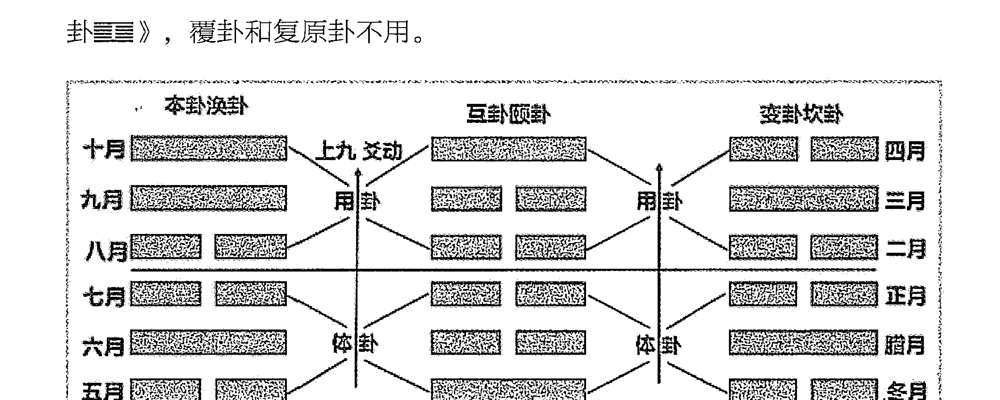

### 推测分析：以体为宝职院，以用为示范能否通过。

- 1. 本卦风水《涣卦䷺》，巽上坎下，体为水、用为木，坎水生巽木（风），体生用有付出之象。九月金旺木处绝地，虽然木行水上，但也没有那么顺风顺水，还是要做一定的付出，必须做出努力才有望通过。
- 2. 互卦山雷《颐卦䷚》，艮上震下，为一个相互对冲的大离（☲）象，说明申请方与考核方对此次验收的看法基本一致。
- 3. 变卦八纯卦《坎卦䷜》，坎上坎下，水见水，体用比和之象，目前是农历九月金旺生水之象，通过各方的努力，一定能成功通过。
- 4. 上九爻动，坎（☵）象，坎为水、为北方、为中男、为黑色。有一位小个子、皮肤较黑、精明能干的男人可以从中帮大忙。
- 5. 时间窗口：农历十月、正月。外卦巽（☴）象代表每月十八至二十二之间，目前是农历前九月，到了闰九月或者十月十八至二十二日才能得到确切消息（当年闰九月，如果出现闰月，推断的应期往往会出现一定的误差）。

### 事后应验：

2014年12月4日（农历十月十三日）下午，在学院处级干部大会上，院领导通报了一个好消息，陕西省教育厅示范建设领导小组通过了我们学院为省级示范性高职院校。两个月前的现场即时预测终于兑现了，当然，这个结果是学院师生员工在院党委和行政的正确领导下，上下一心，通过不懈努力取得。

### 例二、出版《寸心天地》有没有闪失？

2015年3月12日（农历二月十二）18时30分，自己通过网上联系在北京出版杂文集《寸心天地》一书，当时已经交了一笔2750元的出版费用，但与出版有关的消息却进入了中空阶段，什么信息也没有了，我心里有一种担忧会上当受骗的感觉。以2015年农历二月十二日酉时起卦预测。得数字：8、2、12、10。

数字起卦：8+2+12 = 22÷8 = 2…余6，6为坎（☵）象，外卦取坎（☵）象，22+10 = 32÷8 = 4…余0，0为坤（☷）象，内卦取坤（☷）象，得本卦水地《比卦䷇》；32÷6 = 5…余2，2为兑（☱）象，六二爻变动，得变卦八纯卦《坎卦䷜》，本卦体用不得位，互卦不用。本卦的覆卦为地水《师卦䷆》、变卦的复原卦为八纯卦《坎卦䷜》。

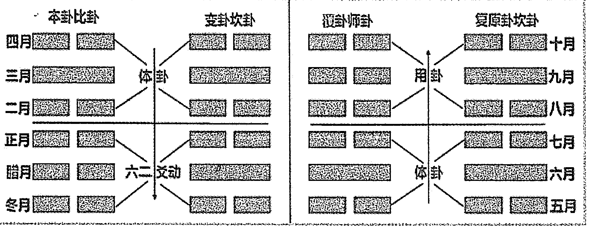

### 推测分析：以体为我，以用为书。

- 1. 本卦水地《比卦》，坎上坤下，卦象数字：8、6。体卦和用卦不得位；覆卦地水师《师卦》，坤上坎下，卦象数字：6、8。两卦皆为坤土克坎水，用卦克体卦之象，好在二月木旺当令，坤（用）土死绝，坎（体）水尚未入库，坤土克制不了坎水，预示此事应该没有什么闪失。
- 2. 变卦八纯卦《坎卦》，变卦的复原八纯卦《坎卦》，两卦皆为坎水见坎水，卦象数字：6、6。体卦和用卦比和之象，预示此事最终应该是双方皆大欢喜的事情。
- 3. 六二爻变动，为兑（☱）象，时间窗口：十二月、三月、六月、九月。兑（☱）象代表每月初八至十二日之间，此事要等到农历三月初八至十二日时段，方可确定具体时间表，最迟六月初八至十二日新书可以拿到手中。
- 4. 预计经费：本卦数字8、6；8、6。变卦数字6、6。第一次8600元、第二次6600元，另外有2750元书号费用。总体费用不超过：17950元。

### 事后应验：

2015年4月1日（农历二月十三）中国文化出版社从电子信箱发来价目表；36天之后的5月7日（农历三月十九日）出版社发来出版合同，双方签订协议；6月2日（四月十六）出版社发来第一版清样；6月9日出版社发来第二版清样；6月17日（五月初四）出版社发来第三稿清样与封面；7月17日（农历六月初二）开始印刷。实际费用：第一次费用8600元。第二次费用6800，审稿费2250元，合计17650元。此事正如预测，还真没有什么闪失，如期收到了设计精美、质量不错的新书。

### 例三、发票啥时间能开好？

2015乙未年10月25日（农历九月十三）晚22时29分，与易友参加陕西省周易研究会举办的“第三届世界周易高峰论坛”。当晚会议结束得晚，但住宿费发票还没有开好，加之今天是周末，主管会议的经理不上班，这事影响第二天早上返回乘车的时间。即时预测发票明天几点开好。

以2015年九月十三（酉时、说好开票的时间）起卦预测，得数字：8、9、13、10。

数字起卦：8+9+13 = 30÷8 = 3…余6，6为坎（☵）象，外卦取坎（☵）象，30+10 = 40÷8 = 5…余0，0为坤（☷）象，内卦取坤（☷）象，得本卦水地《比卦䷇》；40÷6 = 6…余4，4为震（☳）象，九四爻变动，得变卦泽地《萃卦䷬》，本卦体用得位，互卦为山地《剥卦䷖》；覆卦和复原卦不用。

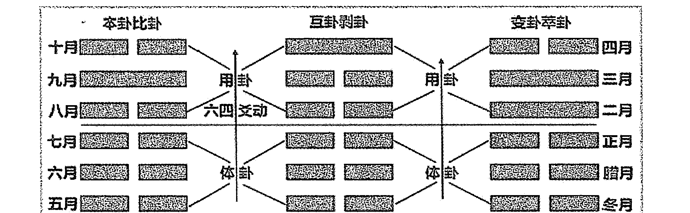

### 推测分析：以体为自身、以用为发票。

- 1. 本卦水地《比卦䷇》，坎上坤下，坤土克坎水，体卦克用卦之象，九月土旺生金，坤土见金泄气，水见金反逢生气，此事要推迟一些时间。
- 2. 变卦泽地《萃卦䷬》，兑上坤下，坤土生兑金，体卦生用卦之象，主人有付出，此事不大顺利。
- 3. 从互卦山地《剥卦䷖》看，艮上坤下，艮土与坤土，体卦和用卦成比和之象，此事中间没有阻碍，时间一到，即可办成。
- 4. 九四爻变动，4为震（☳）象，有一个说话声音大、个头高、在家排行老大的男人能帮忙，明天早上8点之前没有希望，可能要等到8点以后才能办成。

### 事后应验：

第二天一大早（7点）去吧台开票，服务员说：要找主管会务组的经理审批。找到经理办公室，说这个经理还没上班。一直等到8点40分左右，在另外一名高个子男经理的催促下，管发票的人才给我们开好了票。

### 例四、火车晚点时间未定

2016年8月3日（农历七月初一）上午，出公差在江西吉安市火车站换乘9时58分北京西——井冈山Z133次列车去井冈山。车票买好，正在候车室等车，广播通知北京西——井冈山Z133次晚点到10点25分。等到10点24分，车站广播突然通知：Z133次列车晚点（所有南下列车）时间未定，旅客可以根据自己的情况到售票窗口免费办理退票。我们同行4人，是退票去汽车站换乘汽车呢？还是继续等待火车？需要立即作出决策。此事急，以2016（丙申）年七月初一巳时起卦预测。得数字：9、7、3、6。

数字起卦：9+7+3 = 19÷8 = 2…余3，3为离（☲）象，外卦取离（☲）象，19+6 = 25÷8 = 3…余1，1为乾（☰）象，内卦取乾（☰）象，得本卦火天《大有卦䷍》；总数25÷6 = 4…余1，1为乾（☰）象，九四爻动，得变卦山天《大畜卦䷙》，本卦体用得位，互卦为泽天《夬卦䷪》；覆卦和复原卦不用。 （注：原文数字起卦计算过程描述与得卦结果似乎有矛盾，此处按原文得卦结果“天山遁”修正起卦数字描述，以符合“本卦天山《遁卦䷠》”的结论。起卦数字应为：9、7、1、6。）

数字起卦：9+7+1 = 17÷8 = 2…余1，1为乾（☰）象，外卦取乾（☰）象，17+6 = 23÷8 = 2…余7，7为艮（☶）象，内卦取艮（☶）象，得本卦天山《遁卦䷠》；总数23÷6 = 3…余5，5为巽（☴）象，九五爻动，得变卦火山《旅卦䷷》，本卦体用得位，互卦为天风《姤卦䷫》；覆卦和复原卦不用。

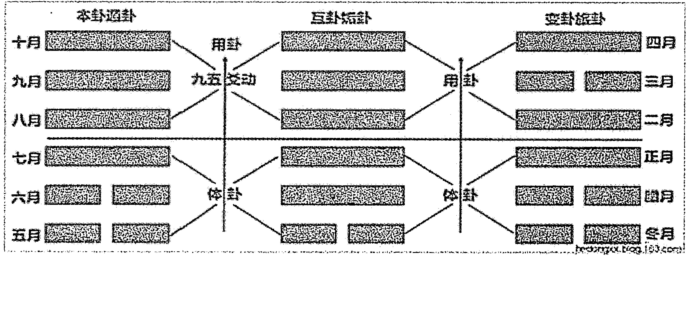

### 推测分析：以体为旅客，以用为火车。

- 1. 本卦天山《遁卦䷠》，乾上艮下，艮土生乾金，体生用之象，艮为止，遁卦为遁藏滞留，很明显在时间上有付出之象，而实际也遇到了暂时的滞留。
- 2. 互卦天风《姤卦䷫》，乾上巽下，天下有风，乾为官方，巽为风、为通达、为信息，说明关于列车的信息是很及时畅通的。
- 3. 九五爻动，得变卦火山《旅卦䷷》，离上艮下，离火生艮土，用生体之象，估计晚点时间不会太长。《旅卦》本来讲的就是旅行之事，预示继续旅行不会有长时间影响。
- 4. 九五爻变，五为巽（☴）象，数字为5。火车晚点的时间与5有关，5分钟，对火车来说不算晚点。当下也没有什么突发的、不可抗力的重大事件发生，国家的铁路大动脉不可能停运5天、也不可能停5小时啊！当场推断火车二次晚点50分钟时间应该是完全有可能的。

### 当时验证：

预测火车晚点50分钟，我们就没有去退票，一直坐在候车室等待。当时在手机微信上发出预测的卦象，让微信群里的易友们展开了讨论。吉安火车站没有安装中央空调，大热天的只靠几台柜式空调和几个风扇为候车大厅降温，确实把人热的够呛！ 10点13分广播通知Z133次列车到站，随即检票进站上车，10点16分列车开往井冈山。

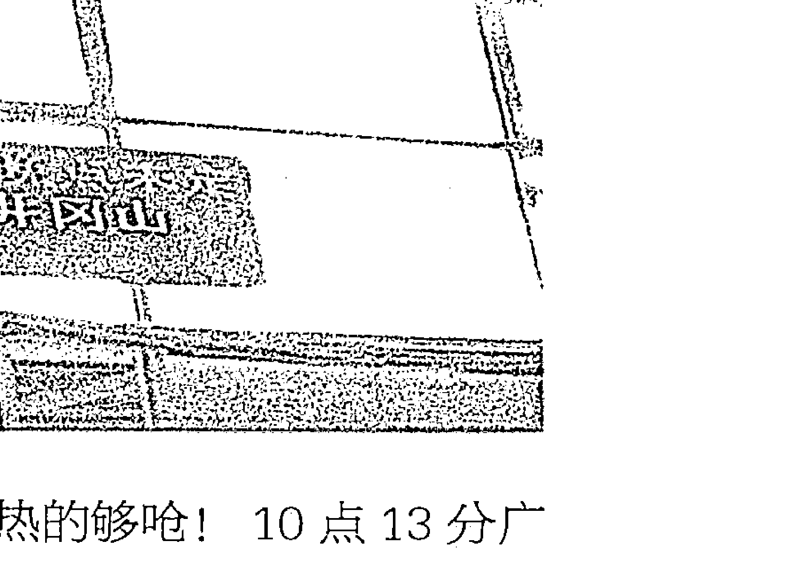

北京西—井冈山 Z133次列车第二次实际晚点时间为51分钟。

### 例五、参会女代表5到6人

2017年6月16日（五月二十二）下午20时49分，参加“中国宝鸡·大散关与老子文化学术研讨会”的各省、市大部分代表在宝鸡“泸州川菜饭店”共进晚餐，著者在现场突生预测明天与会人数的念想。

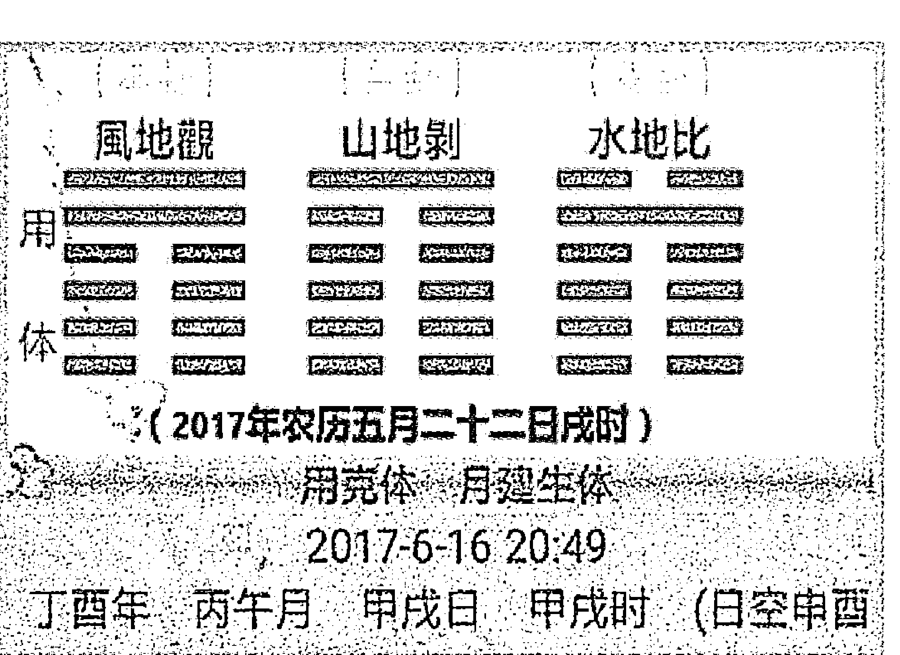

以2017年农历五月二十二日戌时，取数字：10、5、22、11，（用手机“梅花易”软件）起卦。得本卦风地《观卦䷓》，互卦山地《剥卦䷖》，上九爻动，变卦地水《比卦䷇》。

### 推测分析：

在人数与金额的预测，主要看卦象的数字。

- 1、本卦风地《观卦䷓》，巽上坤下，卦数：巽5、坤8，合计：13。
- 2、互卦山地《剥卦䷖》，艮上坤下，卦数：艮7、坤8，合计：15。
- 3、变卦地水《比卦䷇》，坎上坤下，卦数：坎6、坤8，合计：14。
- 4、本卦体用得位，没有其他变故，小型会议，人数在两位数之间。

本卦13，互卦15，变卦14，合计总人数：13+15+14=42（人）。

### 综合分析：

所有卦的内卦都是坤象，坤为大众，表示人多，数字为8，三个8×3=24，最少（或本地）参会人数24人。本卦的外卦巽为5，变卦的外卦为6。预计会场总人数：42人，其中女代表5到6人。

2017年6月17日早上8时52分，著者将预测发在参会的侯先生微信：“今天预计参会人员约42人，其中女代表5到6人。”

实际应验：（见微信截图）2017年6月17日上午10时42分，学术研讨会在宝鸡大散关二楼会议举行开幕式，我们清点会场（含该单位服务人员一名），一共42人，其中女代表5名，让人感到非常神奇啊！

### 例六、大讲堂会场人数

2017年7月7日（农历六月十四日）下午18时11分，宝鸡某单位某老师微信留言：“宝鸡第五届公民道德公益大讲堂”正在紧张地筹备会场的布置和座位安置，麻烦你预测一下参会人数（因为大讲堂要举办几天时间，来自外省、市和本地各个阶层的听众参加，不可能预测出一个固定的数字）。

著者以2017年农历六月十四日酉时（用手机软件）起卦。得数字：10、6、14、10。

本卦水地《比卦䷇》，互卦山地《剥卦䷖》，六四爻动，变卦泽地《萃卦䷬》。

### 推测分析：

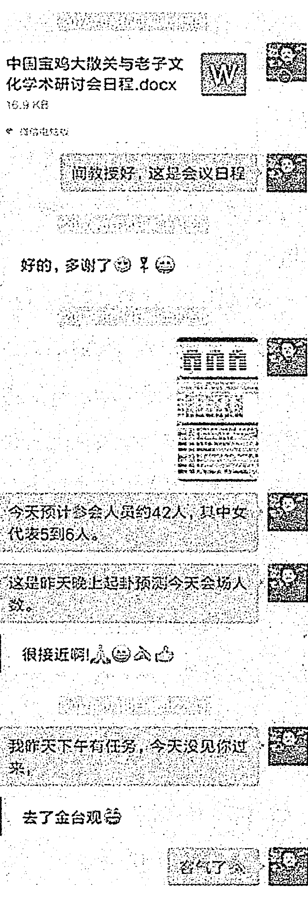

- 1. 本卦水地《比卦》，坎上坤下，卦象数字：坎为6、坤为8，合计：14。
- 2. 互卦山地《剥卦》，艮上坤下，卦象数字：艮为7、坤为8，合计：15。
- 3. 变卦泽地《萃卦》，兑上坤下，卦象数字：兑为2、坤为8，合计：10。
- 4. 本卦六四爻动，震（☳）象，数字为4。这样大型的活动人数都会有上千人参加，人数应该在四位数，即千位数以上、万位数之内。

综合推算：本卦数字14，互卦数字15，变卦数字10，合计为39。所有卦的内卦都是坤（☷）象，坤为大众，表示人众多。数字为8，三个坤象，即8×3=24。固定人数为2400人；最多人数为3900人。每天参加会议人数的区间为2400—3900人。

预测后反馈：我将此结果发给某老师：“最多4000人，最少2400人。”某老师他们自己也估计：在3100-3300。鉴于有此预测作为参考，他们心中有了底数，所以，大讲堂现场就没有预备数字之外的座位，此次传统文化活动举办得很成功。

（以下为穿插的微信对话片段，按语义整理）
某老师：“明天我们在市政府开大讲堂协调会。最多4000人，最少2400人。”
武书记：“很好！”
某老师：“我心里当时闪念3100—3300。”
（另一人）：“6400÷2，正好3200。”
武书记：“哈哈，武书记当时让我测，我说您测自己用时展，意念感觉3100—3300，小杨也在现场。”
罗老师：“罗老师好！测到今年预测宝鸡传统文化活动现场人数卦例，不知道后来的人数在什么数字之间。”
某老师：“在2400—3000。”
罗老师：“谢谢！总结一下经验。”

大讲堂活动成功举办，在宝鸡造成非常好的影响。

事后验证：2017年11月7日，著者在微信上翻到了当时预测传统文化大讲堂人数预测的卦象，留言给某老师问后来的实际参会的人数。某老师回复：“在2400-3000”。著者回答：“谢谢！总结一下经验”。（见微信对话截图）

说明一下，这是为了把准备工作做得更细采取的一种特殊措施，绝非我们有意去做这个游戏。

### 例七、人数上不了百人

2017年6月17日（周六）下午3点，著者与宝鸡某学会预约了一个“易经文化”讲座，对方说可能有上百人参加此次讲座。

以2017年农历五月二十三日午时用手机（梅花易）软件起卦（见卦象图）预测人数。

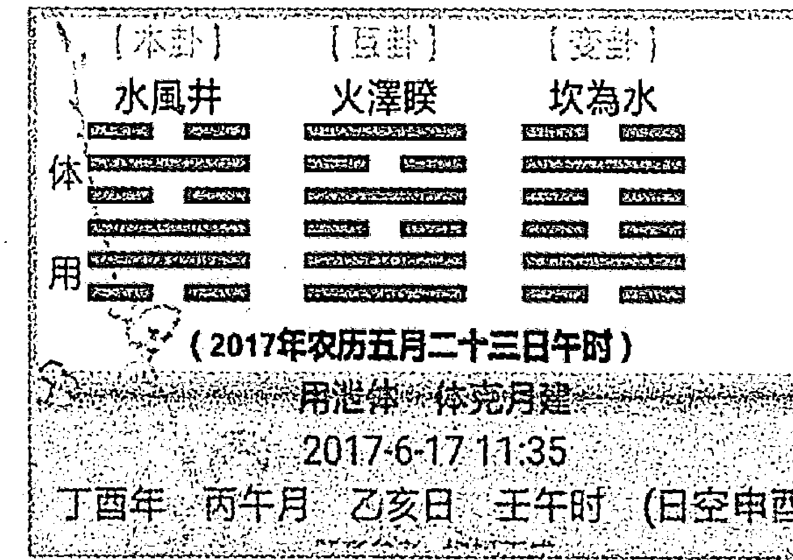

### 推测分析：

- 1、本卦水风《井卦䷾》，坎上巽下，卦象数字：5、6。
- 2、变卦八纯卦《坎卦䷜》，坎上坎下，卦象数字：6、6。
- 3、九三爻动，离（☲）象，离3，也预示内部情况稍有变化，人数上不了3位数。
- 4、本卦水风《井卦䷾》变卦八纯卦《坎卦䷜》，卦象的体卦和用卦各不得位，人数存在变数。体卦数字皆为 6；用卦巽（☴）象变坎（☵）象，数字为 5 变 6。参加讲座的总人数为 65 至 66 人。

### 现场验证：

2017年6月17日下午3点讲座在宝鸡某学会六楼会议举行。因为讲座现场要选5名幸运听众由著者赠送个人专著《周易卷》，另外选3名幸运听众获得著者当场的易学咨询服务。所以，进会场听讲座的人进行实名编号登记，实际到会人数与著者预测的很相符。此次讲座人数低于讲座组织者的预期。实际原因是因为上午在这里举办了一个传统文化讲座，中午12点多才结束，加之当天是一个周六，下午连续讲有些人有事参加不了。

在此说明一点。用《梅花易数》即时预测大、小型集会活动人数，著者也只是在尝试之中。主要是参考卦象的数字，这个与月令没有多少关系，再结合本卦的体卦和用卦得位、还是不得位，以及感觉上活动的规模大小。有时候用不着过细推敲，直接取卦数即可。有兴趣的读者可以当一种游戏去把玩。

## 第十七节 官司纠纷预测

在社会主义市场经济条件下，实行依法治国，人人学法用法，公民个人已经习惯于拿起法律武器来维护自己的社会地位和合法权益。所以，打官司已经是见怪不怪的事情。如经济合同、婚姻纠纷、劳务官司等等都要通过法律途径来解决。但是，真正遇到了官司该怎么打？能不能打赢官司？或者说会不会败诉？预测往往能为迷茫之中的官司人，指出一条“柳暗花明又一村”的路子。现举几例共同研讨。

### 例一、经济损失四位数

2011年11月12日（农历十月十七日）10:26:56秒，福建粉丝博友 &&&& 从 QQ 上发来消息：老师你好，最近心情郁闷，可以给我算算吗？算算我这月怎么了，可以吗？

乾坤居士说：能不能具体点。比如说财气、爱情等。

&&&& 说：算算我这个月的事业、财运、感情好不好，可以吗？

以农历2011（辛卯）年十月十七日巳时起卦，得数字：4、10、17、6。

数字起卦：4+10+17 = 31÷8 = 3…余7，7为艮（☶）象，外卦取艮（☶）象；31+6 = 37÷8 = 4…余5，5为巽（☴）象，内卦取巽（☴）象，得本卦山风《蛊卦䷑》；总数37÷6 = 6…余1，初六爻动，为乾（☰）象，得变卦山天《大畜卦䷙》，本卦体用不得位，互卦不用，本卦的覆卦为泽雷《随卦䷐》，变卦的复原卦为天山《遯卦䷠》。

| 本卦蛊卦 | 变卦大畜卦 | 覆卦随卦 | 复原卦遯卦 |
|---|---|---|---|
| 十月 | ☶ (体卦) | ☶ | ☱ | ☰ |
| 九月 | ☶ | ☶ | ☱ | ☰ |
| 八月 | ☶ | ☶ | ☱ | ☰ |
| 七月 | ☴ (用卦) | ☰ | ☳ | ☶ |
| 六月 | ☴ | ☰ | ☳ | ☶ |
| 五月 | ☴ (初六爻动) | ☰ | ☳ | ☶ |

### 推测分析：以体为博友，以用为事情。

- 1、本卦山风《蛊卦䷑》，艮上巽下，巽木克艮土，用克体之象，农历十月水旺，巽木（用）逢生气，艮土（体）受克，看来目前这个人真的遇到了有伤害的麻烦事。
- 2、变卦山天《大畜卦䷙》，艮上乾下，艮土生乾金，体生用之象，巽为文书，乾为官方，外（用）卦巽（☴）象变乾（☰）象，不但经济上有损失，也预示着有官方介入的迹象。
- 3、初六爻动，乾（☰）象，乾为金、为西北、为有身份的男人。时间窗口：十一月、二月、五月、八月为应验的月份。应该是农历八月份二十三——二十七日遇到一桩不开心的事情，到农历十一月十三——十七日之间才能了结。
- 4、卦象数字：本卦75、变卦71。此事涉及经济损失是四位数，总金额7500 - 7100元左右。

+ 5、变卦的复原卦为天山遁卦䷠，乾上艮下，遁有躲藏、回避之意，凡事避其锋芒，得理让人，如其不然，拖到2012年农历二月必有更大的麻烦事情发生。
+ 6、本卦山风蛊卦䷑的本意是说有一桩坏事要结束，另一桩好事刚开始。当下的事情处理好了，最快明年二月好事会兑现。

按照以上分析回复博友：以上是按你求测的时间，用《梅花易数》预测结果，仅供参考。

### 事后应验：

11:16:30 问卦者当即回复：对的，上边你说的很对，经济损失是7千多元。下月中旬是指12月中旬吗？
11:20:21 乾坤居士说：你的损失在7100至7500元之间。
11:20:53 问卦者回复：差不多就这样吧，还没确定呢，看看再说。
11:21:40 乾坤居士说：到时候你再回答我，现在你肯定还不能确定。
11:21:54 问卦者回复：哦，好的，到12月中旬会结束吗？
11:22:47 乾坤居士说：会的，农历十一月中旬就是公历的12月上旬。

### 例二、朋友被公安带走了

2012（壬辰）年4月11日下午17：48分，一位熟人来电话说：有个朋友被公安局叫走了，家里人担心，不知现在事情发展如何？具体是2012年2月22日（二月初一）下午16点钟（申时）被公安带走的。按对方说的时间起卦预测。得数字：5、2、1、9。

数字起卦：5+2+1 = 8÷8 = 0…余8，8为坤（☷）象，外卦取坤（☷）象，8+9 = 17÷8 = 2…余1，1内卦为乾（☰）象，内卦取乾（☰）象，得本卦地天《泰卦䷊》；总数17÷6 = 2…余5，5为巽（☴）象，六五爻变动，得变卦水天《需卦䷄》；本卦体用得位，互卦为雷泽《归妹卦䷵》，覆卦和复原卦不用。

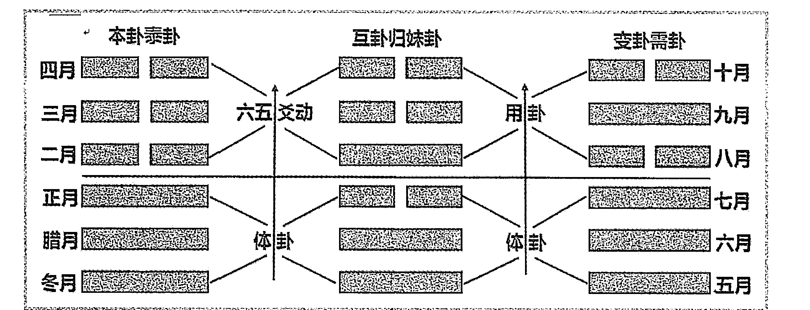

推测分析：以体为问卦之人，以用为所问的人与事。

+ 1、本卦地天《泰卦☰》，坤上乾下，坤土生乾金，用生体之象，农历二月木旺当令，坤土处绝地，故坤土难生乾金，预示指望不上别人的支持和援助。
+ 2、变卦水天《需卦☰》，坎上乾下，乾金生坎水，体生用之象，可能是在经济上要付出。本卦地天《泰卦☰》变水天《需卦☰》，本卦看似坤土生乾金，变卦实则乾金化生坎水，预示先得后失之象。乾为官方、公家、为大财，应该是经济上有大得大失之事。
+ 3、六五爻变动，五为巽（☴）象，巽为木、为风，为长女、为信息，时间窗口：农历十二月、三月、六月、九月。这个人在2011年农历腊月好像就作了不该做的事情。2012年农历二月二十三——二十七日这五日之内，前边的事情发酵，导致目前的情况发生。
+ 4、用卦坤（☷）象变坎（☵）象，坎为黑色、为中男、为北方、为车。坤为西南方位，此人在西南方向犯了事，人现在北方坎位。犯事的人是一个人皮肤黑、个头瘦小，会开车的中年男子。
+ 5、此事涉及资金在五位数，人民币1.6——1.8万元之间。
+ 6、六五爻动，五为巽（☴）象，巽为东南方位、为（风）木、为集市、为长女、为时尚、为黄头发、为股部丰满性感。卦象显示有一个很时髦、性感、黄头发的女人可以从中帮忙，或者提供一些确切的消息。

### 事后应验：

预测完毕，马上通知朋友。他说：“这人是与抢劫案子有关的事情，好像说有万把块钱吧。谢谢您，我心里有底了。”

虽然说老祖宗规定不能给违法乱纪者预测。但是，人情面子有时候还是要给的。

### 例三、事情不麻烦

2012年10月24日（农历九月初十）中午13点19分，宁波的某女士手机发来短信：“何老师，下午有件事很麻烦，能否帮忙测一下。能解决否？我现在脑子一片空白，拜托，多谢！”

按照2012（壬辰）年农历九月初十未时起卦，得数字：5、9、10、8。数字起卦：5+9+10 = 24÷8 = 3…余0，0为坤（☷）象，外卦取坤（☷）象，24+8 = 32÷8 = 4…余0，0内卦为坤（☷）象，内卦取坤（☷）象，得本卦八纯卦《坤卦☷☷》；总数32÷6 = 5…余2，2为兑（☱）象，（商数为5、为奇数，从上爻往下定应爻）六五爻动，得变卦水地《比卦☵☷》；本卦体用得位，互卦为八纯卦《坤卦☷☷》，本卦的覆卦和变卦的复原卦不用。

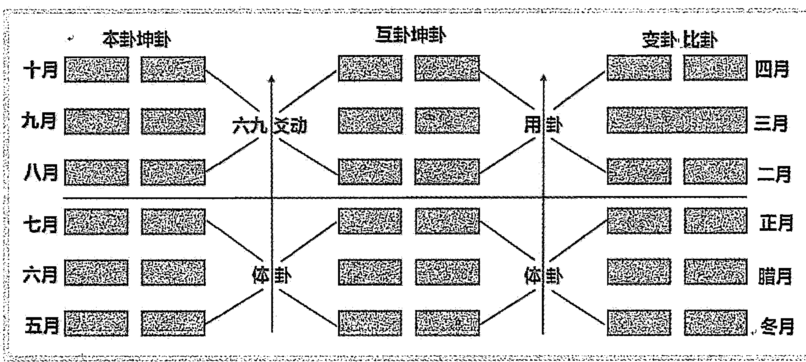

推测分析：以体为问卦人，以用为生意。

+ 1、本卦八纯卦《坤卦☷》，互卦也为八纯卦《坤卦☷》，两个卦都是坤土见坤土，卦象体用比和之象。问卦人说：“有件事很麻烦”，卦象显示双方是完全可以达成和解。
+ 2、变卦水地《比卦䷇》，坎上坤下，坤土克坎水，体克用之象。此事双方达成和解的时间和结果要推迟一些时日。因为坤卦上下各为8，总数16，故推断少则8天、多则16天。
+ 3、六五爻动，五为巽（☴）象，巽为长女、为时尚、为东南、为信息。时间窗口：农历六月、九月、十二月、三月。巽（☴）象代表每月的十八至二十二日五日之内。此事九月十八至二十二日必有结果，经济损失5至7万元之间。
+ 4、坤（☷）象是有身份的女人、在西南方位。巽（☴）象为很时尚的长女、方位在东南，看样子是两个女人之间的事情。只是当下对方当事人还没有了结问题的具体计划。

10月24日（13点48分）著者将以上预测结果发给陈女士：“事情不麻烦，可以顺利和解，结果要推后一些时日。祝你好运！”

当天下午17点4分陈女士短信回复：“何老师，你准的！谢谢。”

17点14分我回复：“不客气，这就是《周易》的神奇！”

18点11分陈女士：“何老师，事情已推后了，这件事彻底结果大概会在那一天？”

19点17分我短信回复：“农历九月十八至二十二日五日之内必有结果。”

### 事后应验：

一直到2012年11月2日（九月十九日）中午11点4分某女士短信回复：“老师，上次帮我测出破财的纠结事，昨天结束，损失5万多元，在你测的5至7万元之间，时间迟了8天，你准的，等我发财有钱时，请您来宁波海酬。谢谢您！”

### 例四、先难后易、握手言和

2014（甲午）年9月3（农历八月初十）日12：05分，外地的粉丝博友手机短信问事：老师，凌晨5点多，我梦见是美国白宫的坟墓，编号25。是什么征兆？

用当事人提供的数字起卦：2、5。
数字起卦：2为兑（☱）象，外卦取兑（☱）象，5为巽（☴）象，内卦取巽（☴）象，得本卦泽风《大过卦䷛》；总数7÷6＝1…1，1为乾（☰）象，初六爻动，得变卦泽天《夬卦䷪》；本卦体用不得位，互卦不看；本卦的覆卦也是泽风《大过卦䷛》，变卦的复原卦为天泽《履卦䷉》。

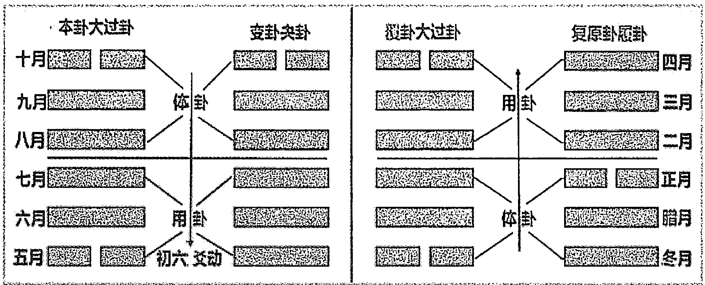

推测分析：以体为当事人，以用为要问之事。

+ 1. 本卦泽风《大过卦䷛》，兑上巽下，覆卦也是泽风《大过卦䷛》，两个卦都是体克用，兑金克巽木之象。农历八月金旺木死，看来了结事情的时间要推迟一些。大过者，实为一个很大的过错，事情的处理宜迟不宜早。从外向里、从里向外看都是大过卦，预示目前当事者双方的心态和想法基本一样。
+ 2. 变卦泽天《夬卦䷪》，兑上乾下，兑金见乾金，体用比和之象，一片金象，肯定是与金钱有关的事情，先难后易，最终双方握手言和。
+ 3. 变卦的复原为天泽《履卦䷉》，乾上兑下，乾金见兑金，肯定是与金钱有关事情，卦象体用比和。卦辞曰：“履虎尾，不咥人”。预示虽然招惹了纠纷，但是不至于伤及自己。
+ 4、初六爻动，乾（☰）象，为西北方、为老男、为公家单位。时间窗口：农历五月、八月、十一月、二月为应验月份。应该是农历五月十三至十五日左右形成的一桩经济纠纷，了结的时间应在农历八月初才能解决问题。
+ 5、具体金额，卦爻动在初六爻，对应复原卦的九四爻，数字为4，经济损失在四位数。大数字是2，小数字5。（2+5=7÷2=3.5）那就是3.5到5千元之间的经济赔偿吧。

预测完之后，及时告知对方结果。

### 事后应验：

两天之后的2014年9月5日（农历八月十二日）19时30分，博友在QQ回复：对方当事人，因2日晚上撞车住院，委托家人来。我刚回家，这件事下午处理了，双方都满意。

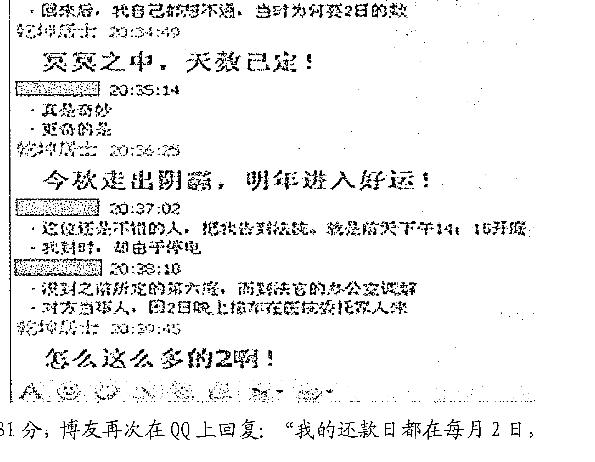

2014年9月5日晚上20:31分，博友再次在QQ上回复：“我的还款日都在每月2日，这是不是你和您的“大数字”，可算神算。”（见QQ截图）

### 例五、此事先凶后吉

2017年元月5日（农历腊月初八）上午12时22分，与朋友某先生见面，他说：正好有一要事需要咨询一下。他叙述事情的时候，我立即根据时间用手机即时起卦，得数字：9、12、8、7。

数字起卦：9+12+8 = 29÷8 = 3…余5，5为巽（☴）象，外卦取巽（☴）象，29+7 = 36÷8 = 4…余4，4为震（☳）象，内卦取震（☳）象，得本卦风雷《益卦☴ ☳》；总数36÷6 = 5…余6，6为坎（☵）象，上九爻动，得变卦水雷《屯卦☵ ☳》。本卦体用得位，互卦山地《剥卦☶ ☷》；覆卦与复原卦不用。

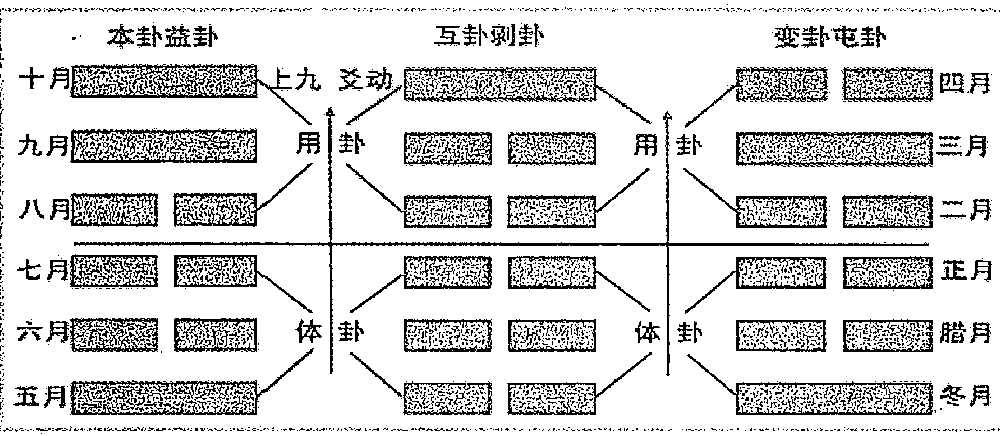

推测分析：以体为某先生，以用为要问的事。

+ 1、本卦风雷《益卦☴ ☳》，巽上震下，外卦用为巽木，内卦体为震木，卦象体用比和，巽为木、为风、为舆论，风与林而弱，没有什么大事，只是一些负面的话语和消息。
+ 2、互卦山地《剥卦☶ ☷》，艮山在上，坤地在下，互为比和之象，说明中间环节上没有什么不顺当或者节外生枝的意外发生。
+ 3、变卦水雷《屯卦☵ ☳》，坎上震下，外卦巽象变坎象，内卦震象，坎水生震木，用生体之象，预示坏事变好事的兆头，此事由紧变松，趋势向好。
+ 4、时间窗口：十月、正月、四月、七月。应该是农历十月中旬发生的事情。
+ 5、上九爻动，巽（☴）象变为坎（☵）象、为中男、为皮肤黑、个头小的男人，巽为风，为长女，为时尚。预示可以通过一位时尚的知识女性，见到一位皮肤黑、个头小、非常精明的中年男人提供帮助。

### 事后应验：

4 天之后的 2017 年元月 9 日上午，某先生电话回复："此事也正如你所说的那样，就是话语上的负面消息。你说的一女一男那两个人也已经见到了，很神奇的，与你当时描述的完全一样。看来你对《易经》的研究已经到了很高的境界啊！"

### 例六、勿与年轻女士合作做事。

2017 年 12 月 2 日（农历十月十五）下午：有一位女士微信留言："何师傅好，听说您很神的，能不能给我看一下？"

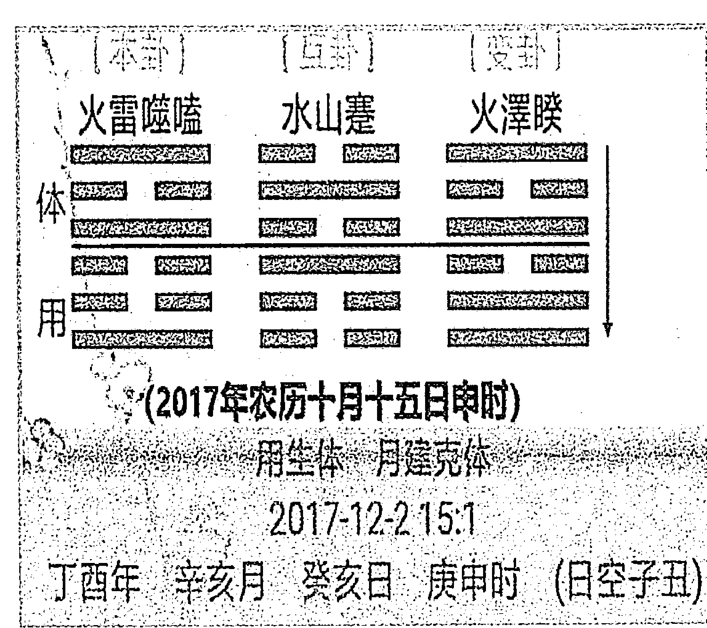

我说："神不敢说，你看什么？"

对方说："看一下事运，最近好难。"

我立即以 2017 年十月十五日 15 时 1 分的时间用手机软件起卦预测（见卦象截图）。

推测分析：以体为问事者，以用为所问事。（卦象体用不得位）

+ 1、本卦火雷《噬嗑卦䷔》，离上震下，震木生离火，用生体之象。预示主人开始可能得到一些的好处。
+ 2、互卦水山《蹇卦䷦》，坎上艮下，艮土克坎水，用克体之象，预示目前事情对主人有克制，视为不利。好在十月水旺，艮土克不住坎水。
+ 3、变卦火泽《睽卦䷥》，离上兑下，离火克兑金，体克用之象。《睽卦䷥》彖辞曰：“二女同居，其志不同行。”十月水旺当令，逢兑金生之，离火失令处于绝地，反被金所侮。卦象体用不得位。必须注意，不能与年轻女性合作做事。
+ 4、时间窗口：农历六月、九月、腊月，二月。2017年六月，九月主人有损失，到了腊月初才能有好的转机。

事后应验：（见微对话截图）

2017年12月6日晚上在网上遇见对方。她说：“我最近遇到坎了好难啊，现在好无助，并且担心会有牢狱之灾。原因是去年给一个比自己小十多岁的女人担保出问题，她自己反倒成了失信人员，还上了法庭。”

这个本卦噬嗑卦应该是吃吃喝喝认识的朋友。变卦火泽睽卦，卦辞云：“两女同居一室，其志不相同。”所以要发生不愉快，这事还真给预测准了，对方感到很灵验的。

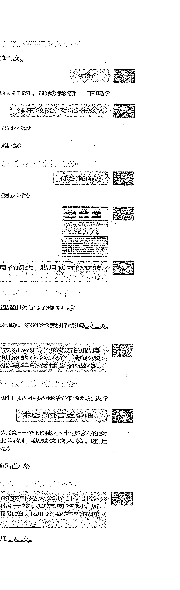

## 第十八节 一卦多断预测

关于一卦多断的卦例，从古至今不乏其例。宋代易学大师邵雍就有好多一卦多断的经典案例。据传说有一年春季的一天，邵雍到洛河桥头摆卦摊。临近中午，一位老农来问卦。邵雍让他抽个字，老农弯腰拿出一个“筷”字。他对老农说：“恭喜恭喜，您今日中午必有口福，快快回家吧！”老农回到家中，他外甥对他说：“我已等您两个时辰了，今日是我爹六十大寿，请您去喝酒。”老农换了件干净衣服，高兴地赴宴去了。

午时过后，邵雍正要收拾卦摊回家休息，南边车上跳下一个人说：“请先生留步，早听说您神机妙算，请看看我的命运如何。”邵雍让其抽个纸卷，此人也抽的是“筷”字。邵雍对他说：“从这个“筷”字来看，是不吉之兆，你今日必遭水淋。”此人见天气晴朗，万里无云，不以为然。一路上快马如飞，跑到家门口被一盆脏水浇了个正着。原来是他老婆将一盆涮锅水随意泼出，让匆忙赶回来的他浑身湿透。

当天下午，又来一人，此人想知道当天的运气。那人抽出的还是一个“筷”字。邵雍对他说：“你今天必有牢狱之灾。”那人心想，我呆在家里不出门，哪能招灾惹祸？他回到家中蒙上被子就睡。不料，睡梦中却被一妇女骂醒，原来是他家的猪糟踏了妇女家的菜园子。那妇人火冒三丈，恶语相加，那人出手就是一拳，不料那妇女本来有病，一拳下去人就倒地而死。不到一个时辰，几个衙役纷拥而上把他抓进了大牢。

以上是易学大师邵雍一卦多断的事例，故事真实与否，我们不去考究。就《梅花易数》预测而言，预测者主要是根据内应和外应、以及时辰变化来判断吉凶。下面著者举两个卦例，与大家交流。

### 例 外地人看婚姻和感情

2012年6月25日（农历五月初七）中午11:20分，博友 dkyg 说：看婚姻和感情。以2012（壬辰）年五月初七午时起卦，得数字：5、5、7、7。

数字起卦：5+5+7 = 17 ÷ 8 = 2…余 1，1 为乾（☰）象，外卦取乾（☰）象， 17+7 = 24 ÷ 8 = 3…余 8，8 内卦为坤（☷）象，内卦取坤（☷）象，得本卦天地《否卦☰☷》；总数 24 ÷ 6 = 4…余 6，6 为坎（☵）象，上九爻动，得变卦泽地《萃卦☱☷》；本卦体用得位，互卦为风山《渐卦☴☶》，覆卦和复原卦不用。

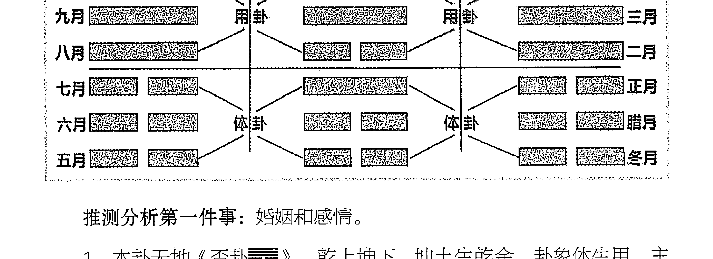

推测分析第一件事：婚姻和感情。

+ 1. 本卦天地《否卦☰☷》，乾上坤下，坤土生乾金，卦象体生用，主人有付出之象，预示这个人在感情问题上有挫折。
+ 2. 变卦泽地《萃卦☱☷》，兑上坤下，坤土生兑金，体生用之象，还是感情上有付出损失的迹象，说明问卦之人在婚姻感情方面只有付出，很少回报，已经被情感所伤害。
+ 3. 时间窗口：农历四月、七月、十月、正月为应验的月份。用卦乾（☰）象变兑（☱）象，兑（☱）象对应每月的初八至十二日时间段，农历四月初八至十二日这五日之内此人感情上出现新的变化。
+ 4. 上九爻动，为坎（☵）象，坎为北方、为水、为黑色、为瘦小、为中男，北方有一个瘦小个子、皮肤黑的男人，能说会道，目前正在接触之中。
+ 5、互卦为风山《渐卦》，巽上艮下，渐卦有循序渐进、努力向上的意思。到了农历七月初八至十二日，婚姻问题才能有实质性的进展。

### 当场应验：

当即将预测结果发于对方。dkyg 回复：测得很准，目前在北方确实正在与一个瘦小的中年男子接触。

（一卦多断案例介绍，上下两例用一个卦分析结果）

上面的卦正在推断中，西安某餐饮公司 y 总经理打来电话，问：我有一笔业务定金，你看什么时间能要回来？

### 推测分析第二件事：定金能否要回来？

+ 1、本卦天地《否卦》，乾上坤下，乾为金、坤为土。变卦泽地《萃卦》，兑上坤下，兑为金、坤为土，本卦和变卦都是体土生用金，用卦卦象乾象变兑象，说明已经有口舌之争。预示主人经济上有损失，而且已经既成事实。
+ 2、上九爻动，为坎（）象，坎为北方、为中男，对方是一个男的、此人个头瘦小、皮肤较黑、很精明的生意人。
+ 3、外卦乾（）象变兑（）象，兑为口舌、为饮食。时间窗口：农历四月、七月、十月、正月为应验的月份。农历四月初八至十二日这五日之内，好像在北方发生了与饮食有关的口舌之争。
+ 4、本卦数 8、1，两数和的平均值为（8+1=9÷2）4.5，变卦数 8、2，两数和的平均值为（8+2=10÷2）5。变卦数为 10÷2 = 5。上九爻变，数字为 6，此经济业务总价款在 6 位数字，预示此项目的总投资在 81 至 82 万左右，定金数字在 4.5 万——6 万元之间。
+ 5、目前要钱不太顺利，只能等到农历七月上旬，经济问题方能得到较为满意的解决。

当场应验：

当即在电话上直接告诉预测结果。y总经理回复说：“准确。我准备在西安北门外开个饮食连锁店，事情因故未办成，当时交房东订金5万元没有要回来，老板正如你说的，是个皮肤黑、个头小、很精明的中年男子。”

## 第十九节 扑克牌起卦预测

扑克牌起卦预测是著者经过长时间探索、琢磨出来的一种新的起卦预测方法（第一部分第三章讲到这个问题），可以说是为易学预测创新的一个方法。近年来用它给好多外地的朋友通过网络免费预测，准确率之高，效果之神奇，得到了朋友们的高度赞赏，此法适合《六爻》和《梅花易数》预测。这种方法的特点是可以为《六十四卦》的六爻卦的每一个爻位增加四种信息。2015年10月“第三届世界周易高峰论坛”在西安隆重举行，著者有幸在大会上向中外专家、教授学者介绍了《巧用扑克演‘梅花’》的方法，得到与会专家学者的高度赞同。

现将扑克牌起卦方法介绍给大家，以资同道与预测文化爱好者共同研究探讨。事先将扑克牌中红桃、方片、梅花、黑桃四种牌的6、7、8、9，一共16张牌取出来。按照传统方法：6代表老阴，7代表少阳，8代表少阴，9代表老阳。

求测者集中意念，想着自己要预测的事情，将16张牌反复洗一洗，从中任意抽出第一张；然后再将抽出的牌放回去，再次洗牌，任意抽出第二张；一共参洗6次牌，任意抽出6张牌，并按顺序依次登记，排列取象。这里只介绍用扑克牌起卦，详细的分析预测体系和独特的理论依据，著者

### 例一、求测事业、感情

2012（壬辰）年7月18日（农历五月三十日），外地一博友通过网易博客求测。由于人在外地，所以，就让他抽扑克牌起卦。第一张红桃7；第二张方块7；第三张黑桃6；第四张黑桃8；第五张梅花6；第六张方块6。

扑克牌起卦: 红桃7; 方片7; 黑桃6; 为兑（☱）象, 内卦取兑（☱）象; 黑桃8、梅花6、方片6, 为坤（☷）象, 外卦取坤（☷）象, 得本卦地泽《临卦☷☱》; 掐头去尾, 得互卦地雷《复卦☷☳》。六三爻、六五爻、上六爻动, 得变卦风天《小畜卦☴☰》; 总数: 7+7+6+8+6+6 = 40 ÷ 6 = 6余数4, (商数6为偶数, 从初爻向上数4个数定用爻)得用爻为六四爻, 取外卦为用卦。

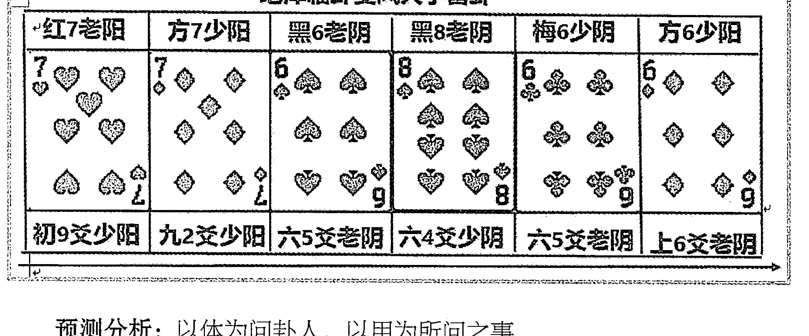

预测分析: 以体为问卦人, 以用为所问之事。

+ 1、此卦初九爻红桃7、九二爻方片7、上九爻方片6, 两端飘红为阳, 中间黑桃、梅花, 阴气很重, 预示此人一生总体运势是中间苦, 两头甜。
+ 2、初九爻（红桃）和九二爻（方片）阳气充足, 说明事业上开始比较看好。六三爻（黑桃）对应正月、六四爻（黑桃）对应二月、六五爻（梅花）对应三月, 三个爻全是阴, 预示今年（正月至三月）春季遇到了麻烦。互卦地雷《复卦☷☳》, 六四爻动, 为震（☳）象, 震为长男、为高个子、当即验证：

以上预测结果发给博友40分钟后，回复：

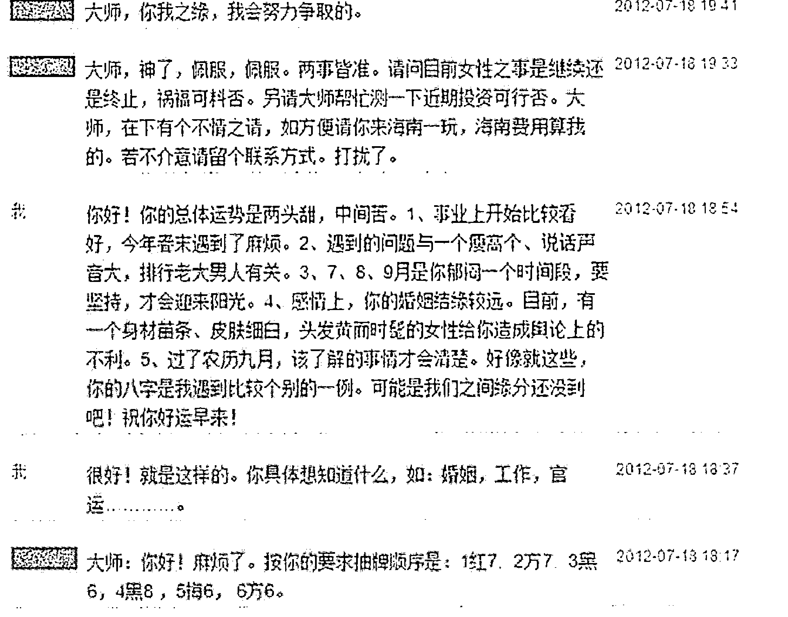

### 例二、求测事业

2012年8月4日，外地博友qh1+1有事求测，问我：“是我洗牌吗？不需要我的生辰八字吗？还请示下！”

著者回答：“肯定是你自己操作啊，生辰八字附上，信息会多一些。”

博友 qh1+1 说：“我今年打算去某地工作，不知是否成功？时间：&&年十一月十七日，是阴历，傍晚五六点钟出生。抽牌顺序是：梅花7、红桃7、红桃8、红桃7、红桃7、黑桃8。还请大师指点一二，多谢！”

扑克牌起卦：梅花7、红桃7、红桃8；为兑（☱）象，内卦取兑（☱）象；红桃7、红桃7、黑桃8，为兑（☱）象，外卦取兑（☱）象，得本卦八纯卦《兑卦☱》；本卦六爻安静无变爻，总数44÷6 = 7余2，（商数7为奇数）从上六爻向下数二，九五爻为用爻，外卦为用卦。九五爻动，兑（☱）象变震（☳）象，得变卦雷泽《归妹卦☳☱》。（这一卦4个少阳、2个少阴，为静卦）

| 梅7少阴 | 红7老阳 | 红8老阳 | 红7老阳 | 红7老阳 | 黑8老阴 |
| :---: | :---: | :---: | :---: | :---: | :---: |
| 7♣️ (图) | 7❤️ (图) | 8❤️ (图) | 7❤️ (图) | 7❤️ (图) | 8♠️ (图) |
| 初9爻少阴 | 九2爻少阳 | 六3爻少阴 | 九4爻少阳 | 九5爻少阳 | 上6爻少阴 |

预测分析：以体为本人，以用为工作。

- 1、本卦为八纯卦《兑卦☱》，九二爻红桃7，六三爻红桃8，九四爻红桃7，九五爻红桃7，少阳少阴和谐，全是红桃老阳，可谓中年鸿运当头。九五爻的应爻为九二爻，九二爻对应六月，内卦兑（☱）象对应每月的初八至十二时间段。说明工作调动的事情，今年六月初八至十二日之内就已经启动。
- 2、九五爻确定为用爻，时间窗口：九月、腊月、三月、六月是应验的月份。农历九月好事才能兑现；看来目前帮助你的人很多，特别是目前遇到的人，赤诚帮助，全力以赴。
- 3、九二爻至九五爻全是红桃方块，说明阳气充足；工作的事情不存在变数，你就等候着给我报喜讯吧！
- 4、本卦八纯卦《兑卦 ☱ 》变雷泽《归妹卦 ☳ 》。兑（ ☱ ）象为少女、为金，震（ ☳ ）象为长男、为木，《归妹卦 ☳ 》说的是嫁女之事，呈现长男领少女佳偶天成之象；你要把握好朋友和家人的关系，提防给家人带来不悦！

预测完了，将结果发给了对方。

### 事后应验：

后来博友 qh1+1 回 复：

> “多谢大师！
如果如愿，我
很想去拜会你，
向您学习！关
于提醒我不要
给家人带来不
悦，您真是神
人啊！目前就
是有件事要我
帮家人做决定，
正在纠结中，老师一句提醒，为了不让家人不悦，我就答应下来。 能否告知我您的通讯地址，送件礼物以表谢意。”

| 用户内容 | 发送者 | 日期 |
| :--- | :--- | :--- |
| 多谢大师！如果如愿，我很想去拜会大师，向您学习！关于提醒我不要给家人带来不悦，您真是神人啊！目前有件事就是要我帮家人做决定，正在纠结中，一句大师提醒，为了不让家人不悦，我就答应下来。能否告知我您的通讯地址，送件礼物以表谢意。 | [头像] | 2012-08-05 |
| 祝贺你啊！1、你问的事情六月初三至初七日之内已经启动；2、就要好事才能兑现；3、帮你的人很多，都是一颗赤诚之心；4、你走红运了，事情无变数，你就等候在北京给我报信吧！5、要把握好朋友和家人的关系，提防给家人带来不悦！祝你好运！ | 我 | 2012-08-04 |
| 我的出生年月：1972年11月17日，是阴历。阳历是12月22日。晚上五六点钟。 | [头像] | 2012-08-04 |
| 真是麻烦大师了！我今年打算去北京工作，不知是否成功？我的洗牌结果如下：梅花7、红桃7、红桃8、红桃7、红桃7、黑桃8。还请大师指点一二。多谢！ | [头像] | 2012-08-04 |
| 肯定是你自己操作了，生辰八字也附上，信息会多一些。 | 我 | 2012-08-04 |
| 请问何老师：是我洗牌吗？不需要我的生辰八字吗？还请大师示下！ | [头像] | 2012-08-04 |

### 例三、预测校园停电故障

2013（癸巳）年3月25日晚8时许，单位高压供电突然故障停电。

3月26日学院电工和供电局工作人员全天排查地下高压电缆，一直到3月27日上午还没有查出事故的原因，停电已40多个小时，给学校16000名师生生活造成严重困难。著者负责后勤工作，职责的缘故，心中非常着急啊！中午12时40分午休时，用扑克牌起卦预测，抽了六张牌，依次为：红桃8、黑桃8、红桃7、黑桃9、红桃8、黑桃9。

扑克牌起卦：红桃8、黑桃8、红桃7、为艮（☶）象，内卦取艮（☶）象；黑桃9、红桃8、黑桃9为离（☲）象，外卦取离（☲）象，得本卦火山《旅卦☶☲》；互卦风泽《大过卦☴☱》。九四爻（黑桃）9老阳、上九爻（黑桃）9老阳同动，得变卦地山《谦卦☷☶》；两个动爻全在外卦，内卦安静，故取外卦为用卦。

**火山旅卦变地山谦卦**

| 红8老阳 | 黑8老阴 | 红7老阳 | 黑9老阴 | 红8老阳 | 黑9老阴 |
|---------|---------|---------|---------|---------|---------|
| 8♥      | 8♠      | 7♥      | 9♠      | 8♥      | 9♠      |
| 初六爻少阴 | 六二爻少阴 | 九三爻少阳 | 九四爻老阳 | 六五爻少阳 | 上九爻老阳 |

推测分析：以体为单位，以用为故障。

- 1. 本卦火山《旅卦☶☲》，内卦三爻安静不动，卦象体用得位，说明校园内的（地下高压电缆）线路完好无损，没有故障。卦象数字：7、3。
- 2. 外卦的九四爻黑桃9老阳和上九爻黑桃9老阳，两个阳爻同动变阴，说明线路故障发生在校园之外。两个爻动，很可能是两处故障。
- 3. 九四爻动，从互卦泽风《大过卦☱☴》，兑上巽下，卦象数字：2、5。外卦为兑（☱）象，兑为泽、为池塘沼泽，九四爻黑桃9动，为第一处故障，预示在校园外不远处的一个池塘边上；上九爻黑桃9动，为第二处故障，应该在供电专线的终端部位。
- 4、本卦火山《旅卦旅卦》，离上艮下，用生体，离火生土之象；变卦地山《谦卦谦卦》，坤上艮下，卦象数字：7、8。土见土，体用比和之象。外卦离（三）象变坤（三三）象，因外部起火导致校园内停电，变卦用土与体土比和，是小问题，不是大故障。
- 5、卦象数字显示：本卦7、3，互卦5、2，变卦7、8，或者8、7。应该在52号至87号高压杆之间的杆上出了问题。

### 事后验证：

最后经仔细检查发现校外两处故障：第一处是在离学校不远处的军管区低凹地段，地下电缆头漏电击穿；第二处是第86号高压杆上有一个鸟窝，因下连阴雨，高压瓷瓶被击穿，线路接地。及时排除故障后，于3月27日下午15时全部供电。常言道：细节成就大事。一个鸟窝，竟然造成如此大的停电事故啊！

### 例四、我想知道工作调动的事情

2012（壬辰）年8月4日19：58分，博友 ymj 说：“大师，你好，我想就一些事占卜，请问该给你提供什么样的信息啊？谢谢！”

乾坤居士说：洗净手，取一撮扑克牌，取出四种6、7、8、9。再将16张牌洗一次随意抽一张，再洗16张牌任意抽一张，共做六次，依次记录：如方6、红8……。连同想知道什么事情，一起发给我。

ymj 说：梅花7、梅花6、方片7、梅花8、梅花6、方片8。我想知道工作调动的事情，谢谢！

### 扑克牌起卦：

梅花7、梅花6、方片7、为离（三）象，内卦取离（三）象；梅花8、梅花6、方片8，为坤（三三）象，外卦取坤（三三）象，得本卦地火《明夷卦明夷卦》；六二爻梅花6老阴、六五爻梅花6老阴，两个阴爻同动，得变卦水天《需卦需卦》；按总数定用爻：

7+6+7+8+6+8=42÷6 = 7…余0，商数7为奇数，余数为0，从上往下定用爻，取外卦为用卦，上六爻为用爻。

| 梅7少阴 | 梅6少阴 | 方7少阳 | 梅8少阴 | 梅6少阴 | 方8少阴 |
|---|---|---|---|---|---|
| (7)♣♣♣♣♣♣♣♣ | (6)♣♣♣♣♣♣ | (7)♦♦♦♦♦♦♦ | (8)♣♣♣♣♣♣♣♣♣ | (6)♣♣♣♣♣♣ | (8)♦♦♦♦♦♦♦♦ |
| 初九爻少阳 | 六二爻老阴 | 九三爻少阳 | 六四爻少阴 | 六五爻老阴 | 上六爻少阴 |

推测分析：以体为问卦人，以用为工作调动。

- 1、本卦地火《明夷卦☷☲》，震上坤下，体生用；离火生坤土之象，主人有付出之象，卦中六二爻与六五爻同动呼应，说明工作之事有门路、有变数，已经从礼节上可能有所表示了，感情沟通交流上要继续加强。
- 2、变卦水天《需卦☵☰》，坎上乾下，体生用，乾金生坎水之象，还是主有付出，要向上生，就是六二爻的人，得向六五爻的贵人送礼沟通感情，工作调动的事情要得花钱才能办成。
- 3、六二爻梅花6老阴、六五爻梅花6老阴，两个老阴爻同动，互为应爻，办事的双方正在互动中。六二爻对应六月，六五爻对应九月。时间窗口：农历六月、九月为应验的月份。看来三月份没有变化；六月初主人自己才动了调动的念头；九月上旬此事有决定性转机。
- 4、中间有两个女人。一个能说会道的少年女子，不同意主人调动；一个很时髦漂亮的成年女人支持主人办成此事。卦气2老阴、2少阴、2少阳，天气正红，上边算是找对了人；人地二气不足，本卦动克变卦，可能是去了新的单位后又有一点小不如意。
- 5、大数字1、3，小数字6、8，此事需要花费1.6 – 3.8万元经费，九月中旬有实质进展，有望办成。

著者向求测者告知预测结果：你抽的卦为地火明夷卦变水天需卦：

- 1、首先告诉你，你的工作调动是要花钱的，花费1.6 – 3.8万元；
- 2、好像是一个长辈女士委托一位中年男人办事，此事最少要涉及五个人；
- 3、六二爻和六五爻同动，今年农历三月此事启动、六月中旬有互动信息；九月中旬有决定性转机，有希望办成此事。
- 4、从“天、地、人三才”看，地气太阴，人气不佳，好在头上天气为阳，你个人的运气不是很佳，幸好是有贵人相助。
- 5、你和办事的人心里都处在最后下决心的状态。就此而已，仅供参考。

因我母亲新逝，最近状态不好。祝你好运！

### 事后应验：（见博客回复截图）

时 过82 天之后的2012 年10月26日 晚上23时50分，我在网上见了“yrnj”， 问他：“你的 工作问题怎么样了？”

也就是前几天，这个星期一。

能说一下具体办好的时间吗？我想总结一下。

弄好了，十一之前开始办，前几天刚办好。

你的工作问题怎么样了！

请问你说的月份是农历吗？

你的信息还在。你抽的卦为地火明夷卦变水天需卦：1、你的工作调动是更花线的；2、好像是一个长辈女性委托一位中年男人从中办事，当然此事最少要涉及五个人；3、二爻和四爻同动，三月此事启动、六月中旬有互动；九月中旬有决定性转机。4、从天地人三才看，你个人的运气不佳，地气也太阴，好在头上天气为阳；5、你和办事的对方心里都处在难以下最后决心的状态。就此而已，仅供参考。因我母亲新逝，最近状态不好。祝你好运！

请问一下朋友，我以前按你说的方法把抽的扑克牌发给你了，你没有回复，请问我现在还需要重新抽吗？

1982年农历12月13日凌晨4点13分 谢谢

花7、花6、方7、花8、花6、方8我想知道工作调动的事情。谢谢。

谢谢老师，弄好了，10月1日之前开始办，前几天刚办好，也就是这个星期一。

查了一下，星期一正好是2012年10月22日（农历九月初八日）。与著者预测的：“九月中旬有决定性转机，有望办成此事”非常吻合。

### 例五、中日之间会不会开战？

2012（壬辰）年12月29日（农历十一月十七甲子日）22点34分，中国与日本因为钓鱼岛的矛盾日趋激烈。用扑克牌起卦预测“中日会不会开战？”依次抽牌：黑桃7、黑桃9、黑桃8、方片7、梅花8、方片9。

扑克牌起卦：黑桃7、黑桃9、黑桃8为兑（☰）象，内卦为兑（☰）象；方片7、梅花8、方片9为离（☲）象，得本卦火泽《睽卦》。内卦九二爻动、外卦上九爻动，得变卦八纯卦《震卦》。内卦与外卦各一个爻动，按总数字定用爻，48÷6=8…余0，商数8为偶数，初爻为用爻，内卦为用卦。

### 火泽睽卦变八经卦震卦
| 黑7老阴 | 黑9老阴 | 黑8老阴 | 方7少阳 | 梅8少阴 | 方9少阳 |
|---------|---------|---------|---------|---------|---------|
| 黑桃7   | 黑桃9   | 黑桃8   | 方片7   | 梅花8   | 方片9   |
| 初九爻少阳 | 九二爻老阳 | 六三爻少阴 | 九四爻少阳 | 六五爻少阴 | 上九爻老阳 |

推测分析：以体为我方，以用为日方。

- 1. 本卦火泽《睽卦》，离上兑下，我方为离火，日方为兑金。体克用，离火虽能克制兑金，但十一月水旺当令、金泄气，火受克。我方暂时很难克制日方的行为。
- 2. 变卦八经卦《震卦》，震上震下，木见木，体用比和之象。说明后边钓鱼岛冲突向趋于平和的方向发展。
- 3. 时间窗口：内卦为兑（☰）象，代表时间区间是每月初八至十二日。震（☳）象代表时间区间是每月初三至初七日。初九爻为用爻，农历十一月初八至十二日之间双方发生摩擦；九二爻发动，内卦变震（☳）象，到十二月初三至初七日之间，日方的态度将趋于减弱状态；2013（癸巳）年四月初三至初七日之间，双方对峙的状态趋于平衡状态。
- 4、内卦为用、为日方，三张牌全是黑桃老阴，视为阴气太重，日方的底气明显不足；外卦为体、为中方，两张方片少阳、老阳，一张梅花少阴，阳气较为充足，阴阳和谐，中方的实力明显强于日方。

综合分析：中国与日本在钓鱼岛发生战争的可能不大，双方都没有做战争的具体准备。

### 事后应验：

2013 年 1 月 5 日（农历十一月二十四）中华军事网消息中有：《2013 年 4 月份前后中日钓鱼岛将发生擦枪走火》的文字报道。2013 年 4 月 23 日（农历三月十四日）

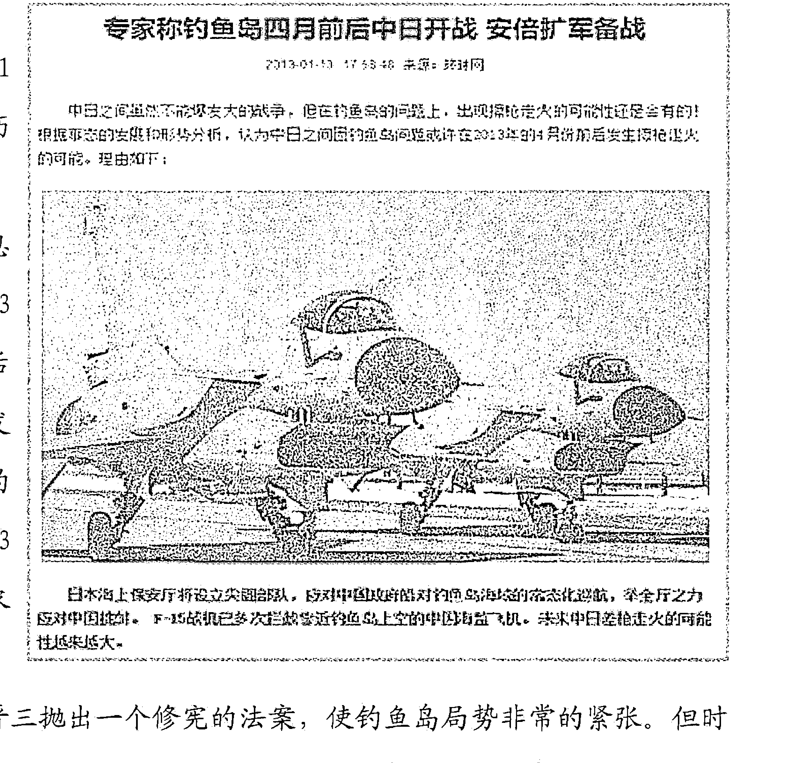

日本首相安倍晋三抛出一个修宪的法案，使钓鱼岛局势非常的紧张。但时至今日（2017 年 12 月），中国与日本在钓鱼岛虽有舆论争端，但没有发生擦枪走火的军事冲突。

### 例六、朝美韩三方会不会发生战争

2013（癸巳）年 4 月 5 日（农历二月二十五日）12 时 30 分，上网看见美国战舰携带战斧式导弹，停靠在韩国海岸，朝鲜半岛局势剑拔弩张。

朝军称：战争不是“立刻打”就是“明天打”。朝、美、韩三方究竟有无战事，即起预测念头。抽扑克牌依次为：黑桃7、黑桃9、黑桃9、梅花7、红桃9、方片8。

扑克牌起卦：黑桃7、黑桃9、黑桃9为乾（☰）象，内卦取乾（☰）象；梅花7、红桃9、方片8为兑（☱）象，外卦取兑（☱）象，得本卦泽天《夬卦䷪》；内卦九二爻和九三爻都是黑桃9老阳，外卦九五爻红桃9老阳，三个爻全为老阳发动，得变卦八纯卦《震卦䷲》。按总数定用爻，25+24=49÷6 = 8…余1，商数8为偶数，从初爻向上数1，初九爻为用爻，内卦为用卦。

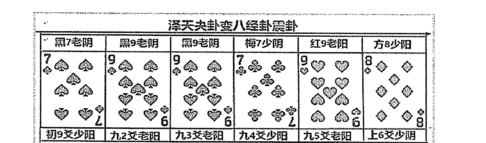

推测分析：以体为朝鲜，以用为韩国、美国。

- 1、本卦泽天《夬卦䷪》，兑上乾下，兑金见乾金，体用比和之象，卦象五阳一阴，阳刚之气突显外露，从外表看，有发生战争的可能。但是，内卦两个黑桃九、一个黑桃七，老阳与少阳都带有严重的阴气，这说明美韩两国的阴谋较深，但底气不足；朝鲜方面红桃九，九五爻老阳正处阳刚气盛，慷慨激昂，金正恩当局有迎接战争的准备。
- 2、九二爻对应腊月，九三爻对应正月，九五爻对应三月，内卦与外卦的变卦皆为震（☳）象，对应每月的初三至初七之间。时间窗口：应该在2013年农历三月初三至初七这五日（公历4月12日至16日）之内，朝鲜半岛擦枪走火的具体时间就在此五日之内爆发，过了这个时间窗口就安然没事了。
- 3、变卦为八纯卦《震卦》，震木见震木，体用比和之象，卦中没有离火之象，互卦有坎（）象，坎为水、水能灭火。也就是说我们可能看不到战火气息。震卦辞曰：震来虩虩。朝、美、韩三方也就是相互秀秀肌肉、虚张虚张声势而已。
- 4、另外卦象三个爻有变数。朝、美、韩三方在开战的态度上，最终都有自己的应变策略。所以，著者推断朝鲜半岛不会发生实质性战争。
- 5、2013是癸巳年，巳酉丑年三煞在寅卯辰位，癸巳年农历正月、二月、三月为三煞月，四(丁巳)月构成月三煞，此古人所谓的“三煞会”。所以，农历四月底之前，我国东海海域以及朝鲜半岛局势动荡也是必然之中事情。

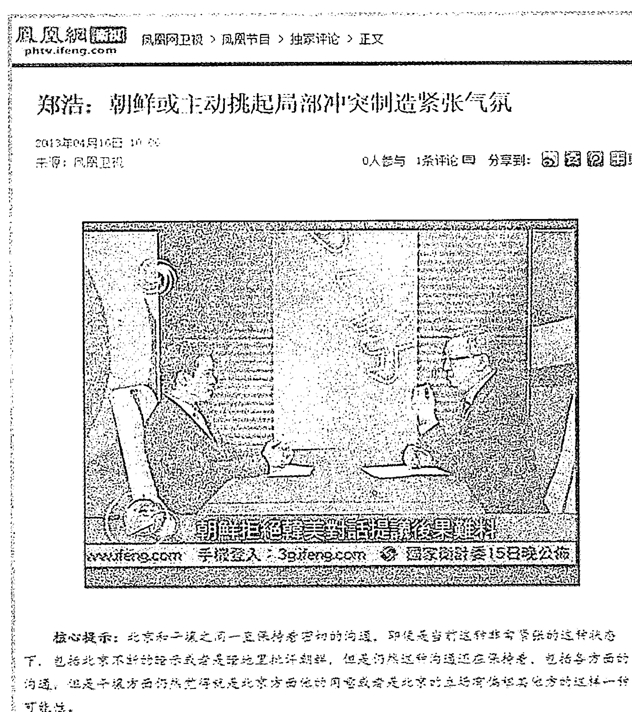

事后应验：（见网上截图）

事过11天之后的2013年04月16日（农历三月初七）凤凰网卫视《郑浩：朝鲜或主动挑起局部冲突制造紧张气氛》评论。另外，4月15日美国波士顿马拉松赛终点发生爆炸事件，朝鲜半岛没有发生战火。

也许是美国人后院起火，导致决策者心神不宁，没有开战的心思。这与著者预测的“时间窗口：应该在2013年农历三月初三至初七五日”非常吻合。

时至2017年12月底，著者的书截稿，朝、美、韩三方只是不断的大打口水战，并没有发生军事冲突。

### 例七、朝鲜核试验能否成功

2013（癸巳）年元月27日（2012年农历腊月十六日）22时30分，著者在网上看到朝鲜第三次核试验的消息。即起预测念头。

抽牌依次为：黑桃8、梅花7、黑桃9、红桃7、方片7、红桃9。

扑克牌起卦: 黑桃8、梅花7、黑桃9, 为巽（☰）象, 内卦取巽（☰）象; 红桃7、方片7、红桃9, 为乾（☰）象, 外卦取乾（☰）象, 得本卦天风《姤卦☰》; 九三爻黑桃9老阳、上九爻红桃9老阳，两个老阳爻同动，按六爻总数确定用爻，即47÷6=7余5，商数7为奇数，从上爻向下数五，九二爻为用爻，内卦为用卦，外卦为体卦。外卦乾（☰）象变兑（☱）象，内卦巽（☰）象变坎（☵）象，得变卦泽水《困卦☵》; 用爻在内卦九二爻，本卦体用不得位，互卦不用。本卦的覆卦为泽天《夬卦☱》，变卦的复原卦水泽《节卦☵》。

天风姤卦变泽水困卦

| 黑8老阴 | 黑7少阴 | 黑9老阴 | 红7老阳 | 方7少阳 | 红9老阳 |
|---------|---------|---------|---------|---------|---------|
| 黑桃8 | 梅花7 | 黑桃9 | 红桃7 | 方片7 | 红桃9 |
| 初6爻少阴 | 九2爻少阳 | 九3爻老阳 | 九4爻少阳 | 九5爻少阳 | 上9爻老阳 |## 推测分析：以体为朝鲜，以用为核试验。

- 1. 本卦天风《姤卦☰》，乾上巽下，体克用，乾金克巽木之象，腊月水旺当令，乾金泄气，巽木逢月建来生，体金难克用木。朝鲜第三次核试验肯定要搞，只是时间好像要推后一些时日进行。
- 2. 变卦泽水《困卦☱》，兑上坎下，体生用，兑金生坎水之象。朝鲜在第三次核试验方面有损失，可能导致不利后果。
- 3. 九三爻对应正月、上九爻对应四月，两个老阳爻同动，九二爻为用爻对应腊月。时间窗口：应该在2012年腊月底到2013年正月初三至初七日五日之内、或者2013年三月初八至十五日八日之内进行核试验。
- 4. 从卦象看，用卦代表核试验，爻象全为黑桃老阴，晦气煞气太浓，说明朝鲜在核试验方面技术还不很成熟。体卦代表朝鲜政府，卦爻为红桃、方片，三爻全阳说明其科研人员信心很大，也预示朝鲜当局者第三次核试验的决心十足，不会因国际舆论而停止。
- 5. 总数47除以6，商数7为奇数从上往下数5，九二爻为用爻。九二爻对应“天、地、人”中的地表，核试验可能在地面进行。

综上分析：朝鲜当局者第三次核试验的决心很大，虽然世界舆论强烈指责，纷纷出台制裁措施。但是，不会改变朝鲜的计划。核试验的具体时间：如果在2013年正月初三至初七日五日之内试验，成功的几率不是很大。如果在2013年三月初八至十二日这五日之内试验，朝鲜核试验很可能成功。

### 事后应验：

> 【凤凰军事 – 防务短评】2013年2月12日据中国地震网公布，2月12日（正月初三）10时57分在朝鲜发生4.9级地震，震源深度0公里。地震位置在北纬41.3度，东经129.0度，正是国际社会一直高度关注的

### 朝鲜三次核试验地点

朝鲜核试验场——咸镜北道吉州郡丰溪里。丰溪里核试验场距离中国边境线仅有100多公里，位于朝鲜东北部的多山地区。由于朝鲜采用的是地下核试验，因此能避免大部分辐射物质泄露到大气层。此事应验日期与预测时间基本吻合。

原标题：朝中社公报：朝鲜成功举行第三次地下核试验

中新网2月12日电 朝鲜12日在北部地下核试验场实施了第三次核试验，朝中社当天发表新闻公报，对此进行确认，公报全文如下：

朝鲜国防科学部门于主体102(2013)年2月12日在北部地下核试验场成功举行了第三次地下核试验。

朝鲜这次的地下核试验是基本成功的。截至 2017 年 12 月底，朝鲜发展核武器的问题，引起东亚局势动荡，世界各国对朝鲜的制裁声音也越来越强烈。

### 例八、日本大选野田佳彦能否连任？

2012（壬辰）年11月20（农历十月十九）日晚亥时，网上看到日本首相大选，就野田佳彦能否连任，用扑克牌预测。抽牌：红桃7、黑桃8、红桃7、梅花9、方片6、方片8。

扑克牌起卦：红桃7、黑桃8、红桃7为离（☰）象，内卦取离（☰）象；梅花9、方片6、方片8为震（☳）象，外卦取震（☳）象，得本卦雷火《丰卦䷶》；九四爻梅花9老阳、六五爻方片6老阴，两爻同动，得变卦水火《既济卦䷾》；两个变爻全在外卦，用卦选外卦，视为体用得位，互卦《大过卦䷛》。

雷火丰卦变水火既济卦
| 红7老阳 | 黑8老阴 | 红7老阳 | 黑9老阴 | 方6少阳 | 方8少阳 |
|---------|---------|---------|---------|---------|---------|
| 初九爻少阳 | 六二爻少阴 | 九三爻少阳 | 九四爻老阳 | 六五爻老阴 | 上六爻少阴 |

### 推测分析：以体为野田佳彦，以用为能否当选。

- 1、本卦雷火《丰卦䷶》，震上离下，用生体，震木生离火之象，内卦无动爻，体卦逢生气，预示大选开始野田佳彦比较顺利。
- 2、变卦水火《既济卦䷾》，坎上离下，用克体，坎水克离火之象，目下是农历十月水旺，火处绝地，好景不长，野田佳彦连任日本首相看来没什么希望。
- 3、九四爻对应二月、八月；六五爻对应三月、九月。时间窗口：应在二月、五月、八月、十一月。看来日本首相大选中有两次大的变化，八月份有一次重大的变化。到2012年农历十一月二十八至十二月初二（五日）之内就可能有具体选举结果公布。
- 4、体卦变离火，农历十一月水旺当令，火处绝地。野田佳彦连任首相很危险，他十有八九是给别人上台做铺垫，另有新人当选首相将成定局。

事后应验：（见网上截图）

一个月之后的2012年12月26（农历十一月二十四）日，野田佳彦落选，安倍晋三当选日本首相。此事与著者提前35天预测的结果一样，“十一月二十八至十二月初二有结果，”时间上只相差了4天。

### 例九、马王纷争，胜败如何？

2013（癸巳）年10月1（农历八月二十九）日晚20点整，在网上看到台湾地区领导人马英九与王金平纷争激烈，顿生预测后果之念。用扑克牌预测：梅花7、方片7、黑桃9、黑桃9、梅花8、红桃6。

扑克牌起卦：梅花7、方片7、黑桃9为乾（☰）象，内卦取乾（☰）象；黑桃9、梅花8、红桃6为震（☳）象，外卦取震（☳）象，得本卦雷天《大壮卦䷡》；九三爻黑桃9老阳、九四爻黑桃9老阳、上六爻红桃6老阴，三爻同动，得变卦山泽《损卦䷨》，内卦一个动爻，外卦两个动爻，动爻多者为用，取外卦为用卦，视为体用得位，互卦为《夬卦䷪》。

| 雷天大壮卦变山泽损卦 | | | | | |
|---|---|---|---|---|---|
| 梅7少阴 | 方7少阳 | 黑9老阴 | 黑9老阴 | 梅8少阴 | 红6老阳 |
| 7♣️♣️♣️ | 7♦️♦️♦️ | 9♠️♠️♠️ | 9♠️♠️♠️ | 8♣️♣️♣️ | 6❤️❤️❤️ |
| 初九爻少阳 | 九二爻少阳 | 九三爻老阳 | 九四爻老阳 | 六五爻少阴 | 上六爻老阴 |

推测分析：内体为马英九、以用为王金平。

- 1、本卦雷天《大壮卦䷡》，震上乾下，体克用，乾金克震木之象，农历八月乾金当旺，震木发动，处于绝地，预示王金平虽然气势汹汹，但对马英九不会造成什么大的伤害性影响。
- 2、变卦山泽《损卦䷨》，艮上兑下，用生体，艮土生兑金之象，山在水中之象，水气腾升，山体受损，损上益下，外卦王金平受损迹象，内卦马英九从中得益。
- 3、卦中两个黑桃、两个梅花、一个方块、一个红桃，黑多红少，说明卦中阳气不足，阴气太重，视为小人犯上、君子不宁之象。
- 4、体为内卦，用为外卦，体用各得其位，主次位置不会紊乱。互卦为《夬卦䷪》，兑金见乾金比和之象，预示马英九和王金平两人最终完全可以和解。
- 5、时间窗口：九三爻对应农历七月，九四爻对应农历八月，矛盾在这个时间段内形成并且加剧激化；上六爻对应农历十月。到了农历九月底、十月初，将是马英九和王金平两个人握手言和的有利时机。

### 事后应验：

中新网 2013年10月10日（农历九月初六）电：台湾当局举行活动，马英九与王金平首度握手长达数秒钟，两人脸上都挂满笑容，气氛融洽愉悦。著者预测的“上六爻指十月，九月底十月初，是两个人握手言和的有利时机。”的结果相符，只是时间提前了 10 多天。

注：扑克牌起卦预测是著者经过长期探索，反复琢磨出来的一种全新的预测方法。这里只介绍几个预测案例，至于如何用扑克牌起卦、用卦与体卦、应期的确定、吉凶的判定等细节规定，著者将有专门论著作出详尽介绍，再次感谢大家关注支持。

### 中国新闻图 2013年10月11日 11:50 中国新闻网

### 马英九与王金平碰面：首度握手数秒 脸上有笑容(图)

来源：中国新闻网 2013年10月11日 11:50

中新网10月10日电 据台湾“中央社”报道，台湾地区领导人马英九今天上午出席的场合，与台立法机构负责人王金平碰面，两人握手寒暄，互动热络，马英九还主动与王金平握手。

马英九在致词时，也称呼王金平为“大领导”“立法院长”王金平”。众人鼓掌后，王金平也回称马英九为“领导人”，并与马英九握手致意。

另据台湾今日新闻网报道，王金平与马英九今日同台，有媒体注意到，王金平在致词时称呼马英九为“领导人”，马英九也回称王金平，双方互动热络。

### 非常案例：丢失的人运动回来了

2018年9月26日下午2点20分，笔者发现有人在“宝鸡市周易研究会微信群”发了一则寻人消息。“刘某，女，身高168厘米，56岁，体型高略胖，患有记忆力衰退。于2018年9月25日9时从（宝鸡市）大庆路万祥尚小区离开至今未归。家人多方寻找未见，有好心人看见请与家属联系（留有家属的电话号码）。”

> 【寻人！！！】刘，女，身高168厘米，56岁，体型高略胖，患有记忆力衰退。于2018年9月25日9时从大庆路万祥尚小区离开至今未归。走时上身穿黑色短袖，下身穿黑白条纹中裤，家人多方寻找未见，如有好心人看见请与家属联系，万分感谢🙏联系人吴

天冷了 希望得到大家的帮助 转发起来 🙏🙏🙏🙏🙏

笔者以当时走失的时间（2018年9月25日9时）起卦预测：得本卦火山旅卦，互卦风泽大过卦，九五爻动，变卦天山遁卦（见微信截图）。

老徐发现这个寻人，跟峦起了一卦。今17日能找到就罢啦，今找不到，三下两下不好找，到20这天奋有信否。总的找峦不顺利。麻麻达达。这是老徐在辰时起的卦，看其他易友有何见解。

### 预测分析：

- 1. 本卦火山旅卦，离火生艮土，用生体之象，预示走失的人应该很快能找到。
- 2. 互卦泽风大过卦，兑金克巽木，用克体之象，回来时问路的信息出了问题，走失的人迷失了方向。
- 3. 变卦天山遁卦，艮土生乾金，体生用之象，预示主人有些付出。
- 4. 九五爻变，离象变乾象，卦象预示人从南方出走，向西北方向而去，距离家中约七华里左右。
- 5. 九五爻动，数字为五，五为巽，为东南方，为长女，巽为时尚、为信息。巽象为当日午时之后。

根据分析推测，笔者发出预测留言：“这个人从南边向西北方位去了。快则今天中午饭后可以找到，有一个高个子时尚性感的女士可以提供信息。”

无巧不成书。这事惊动了远在深圳的著名易学家，推背图研究专家苗元一先生。2018年9月26日下午4点26分，苗先生发来了同样的信息，让我预测此人的去向（见微信截图）。

苗老师，有事麻烦你，家里亲戚昨天上午从小区走失，至今不知道下落，患有短期失忆症，家里人都急坏了，也报了警，但是没消息周边二三公里内已找过没人，走失时身上什么都没带，现在寻找方向也不知道，能不能算一下往哪个方向找人🙏🙏🙏

刘，女，身高168厘米，56岁，体型高略胖，患有记忆力衰退。于2018年9月25日9时从大庆路万祥尚锦小区离开至今未归。走时上身穿黑色T恤，下身穿黑白条纹裤，脚穿黑色皮鞋，家人多方寻找未见，如有好心人看见请与家属联系，万分感谢🙏联系人吴：

10"

苗老师，这事我上午看到。

好的，不客气。

苗老师好，这是中午我们周易研究会群老徐和我预测的。

原来是宝鸡的家属把人出走的信息发给深圳的亲戚，那位亲戚又求助苗元一老师。“苗老师，有事麻烦你，家里亲戚昨天上午从小区走失，至今不知下落，患有短时失忆症，家里人都急坏了，也报了警，但是没消息周边二三公里内找过没人，走失时身上什么都没带，现在寻找方向也不知道，能不能算一下往那个方向找人。”

> 苗老师好，这是中午我们周易研究会群老徐和我预测的。

下午16时58分笔者看见苗元一老师微信发来的信息，给他发了我在周易研究会群里发的预测。

> 苗老师，按你刚发信息时间看。
1.本卦雷风恒卦，卦象比和，人在外人身安全。
2.互卦夬卦，体用比和，中间也没有危险。
3.变卦雷水解卦，水生木，用生体，天黑前，有一个热心的女人会提供信息。

同时立即用手机即时起卦预测（见起卦卦象截图）。

> 您客气，帮人排忧解难，习易之人应该作的。🙏🙏🙏

得本卦雷风恒卦，互卦夬卦，九三爻动，变卦雷水解卦。

简单分析之后，笔者于17时05分回复：“苗老师，按你刚发

> 上午动爻在外卦，下午动爻在内卦，没准人往回运动呢。

> 👍👍👍人运动回来了

> 人是不是回来了？🤔

> 好的，苗老师，谢谢您的支持！

- 1. 本卦雷风恒卦，卦象比和，人在外人身安全。
- 2. 互卦夬卦，体用比和，中间也没有危险。
- 3. 变卦雷水解卦，水生木，用生体，天黑前，有一个热心的女人会提供信息。
- 4. 上午动爻在外卦，下午动爻在内卦，没准人往回运动呢。 ”

两个小时后的晚上 19 点 25 分，苗老师回复： “人运动回来了。” 并且语音留言： “乾坤居士，人已经回来啦，这是一个非常重要的案例啊，祝贺祝贺！你的新书可以把这个案例收进去，我是见证人啊！”

后记： 中华优秀经典文化《周易》博大精深，帮人排忧解难是习易之人应做的职业本分。有著名易学家苗元一先生的提议和鼓励，在新书《梅花易研究精要》第三稿校对之际，就将这个即时应验的重要案例收编于后，作为此书案例介绍的收官之作，以飨读者。

再次感谢我的乡党——苗元一老师在百忙中为《梅花易研究精要》题写书名。

## 参考文献：

- 1. 宋·朱熹: 《周易本义》【M】，中国书店出版，1987。
- 2. 沈伯春: 《梅花易数》【M】，海南出版社，2008。
- 3. 李申: 《周易之河说解》【M】，知识出版社，1992。
- 4. 王赣、牛力达、刘兆玖: 《古易新编》【M】，黄河出版社，1991。
- 5. 孙德厚: 《易经新解》【M】，学苑出版社出版，1990。
- 6. 刘大钧: 《周易概论》【M】，齐鲁书社出版社，1988。
- 7. 清·江慎修: 《河洛精蕴》【M】，学苑出版社，1989。
- 8. 邵伟华: 《周易与预测学》【M】，花山文艺出版社出版，1990。
- 9. 曾仕强: 《易经的奥秘》【M】，陕西师范大学出版社，2009。
- 10. 何东兴: 《寸心天地》【M】，中国文化出版社，2015。
- 11. 何东兴: 《周文化丛书一周易卷》【M】，中国文史出版社，2015。
- 12. 老子: 《楼观石本道德经》【M】，楼观台文物管理所，1984。
- 13. 姜庆和、孙守方: 《未知的世界》【M】，京华出版社，2006。
- 14. 刘雁翔: 《伏羲庙志》【M】，甘肃文化出版社，2003。
- 15. 张卫波: 《和解活用反经》【M】，中国致公出版社，2006。
- 16. 明·刘伯温: 《奇门遁甲》【M】，中国戏剧出版社，2006。
- 17. 南怀瑾、徐芹庭：《周易今注今译》【M】，天津古籍出版社，1989。
- 18. 郭御青：《六壬全书》【M】，延边人民出版社，2009。
- 19. 冯仑：《野蛮生长》【M】，中信出版社，2007。
- 20. [美]索甲仁波切：《西藏生死之书》【M】，中国社会科学出版社，1999。
- 21. 潘鹤年：《周易与股市预测》【M】，花山文艺出版社，1999。
- 22. 华夏国学经典丛书《四书五经》【M】，内蒙古人民出版社，2009。
- 23. 郑憞马：《生霸死霸再考及月相正名》（网上论文）。
- 24. 《爱因斯坦文集》第一卷【M】，商务印书馆，1978。
- 25. 东汉·徐岳：《数术记遗》【M】。
- 26. 于少特：《周公姬旦》【M】，岐山周文化系列丛书编辑委员会，2000。
- 27. 贺世民：《早周史话》【M】，岐山周文化系列丛书编辑委员会，2000。
- 28. 《中国宝鸡周易》【j】，宝鸡市周易研究会，2014、2016、2017。
- 29. 《易苑》【j】，天水市周易学会，2008。
- 30. 春秋·尹喜：《关尹子》【M】，（网络）

## 后记

今天是 2018 戊戌年甲寅月丁卯日——立春，对于著者来说，这是一个贞下起元的始点，更是一个令人非常兴奋的日子。坚持 30 多年习易不辍的心得感悟《梅花易研究精要》全部完成撰稿，稿件即将发送出版社审核排版、印刷发行。此时此刻有一种如释重负的感觉，突然想起现代企业家、万通地产公司董事长冯仑先生《野蛮生长》书中的一句话：“伟大是熬出来的，只要你在自己认定的行业坚持20年，你就有话语权，就是这个行业的龙头老大。”说实在话，什么话语权、什么龙头老大这些都不重要，唯独重要的感受是自己给旷日持久的初心有了一个比较圆满的交代。同时深信长久坚持，对实现人生目标是何等的重要。在这里想向各位尊贵的读者说三句话：

> > “伟大是熬出来的，只要你在自己认定的行业坚持20年，你就有话语权，就是这个行业的龙头老大。”

第一句话：风水轮流转。俗话说：风水轮流转，三十年河东，三十年河西。著者生于周原沃土，长在岐山脚下，是望着岐山箭括岭峰头长大的。小时候常常想着一个幼稚的问题：为什么岐山箭括岭那么的高大？13岁（六年级）辍学归耕故里，在箭括岭上当放牛娃、挖药材、拔韭菜、打柴火、捡牛粪、垦荒地、种庄稼，把箭括岭峰头踩在了脚下，才恍然悟出一个道理：山再高也高不过攀登者的脚面。一方水土养一方人。家乡的地域文化培养了我的乡土情结，岐下周原神奇的沃土使我受到《周易》文化熏陶，周原圣地给了我学习《周易》灵感思维。从80年代初期接触《周易》文化，三十载春秋冬夏，心无旁骛，卷不释手，从中悟出不少人生道理和安身立命的处世哲学。坚持科学，反对迷信，不断探索发现，注重细节总结。从社会人文和数理自然科学角度入手研究思考，从传统命理学、风水学、预测学等方面多角度深入探讨，运用唯物辩证法的哲学观点对这门古老的边沿科学进行审视观察和探究钻研。撰写了 27 万字的杂文集《寸心天地》由中国文化出版社出版，深受广大读者欢迎。有幸承担了岐山县政协文史委《周文化丛书·周易卷》（15 万字）的撰写，该丛书由中国文史出版社出版发行，此为天赐良机，三生荣幸。愚一直致力于《周易》与社会人文和自然科学的研究。草根学者，拳拳之心。倾注 30 年心血打造的第三部专著《梅花易研究精要》即将付梓出版，正如《后汉书》所云：“失之东隅，收之桑榆。”感恩天地，赐于灵感，终于体悟出自己微不足道的一家之言。

第二句话：学问贵在悟。《周易》是中国古老的一部朴素哲学经典。易云：乾为天，坤为地。乾坤者，天地之门户，众卦之纲领。《周易》创立了中国式的宇宙论和朴素辩证法，主张“穷则思变，否极泰来”，用变化的眼光和思维去洞察这个庞大的宇宙世界。

> “物质的，可以感觉到的世界即我们自己所属的世界，是唯一真实的世界，我们的意识和思维，不管它怎样好像是超越感觉的东西，总是物质实体器官的产物，即人脑的产物。物质不是精神的产物，而精神本身倒是物质的最高产物。”
（《马克思恩格斯文选》第二卷，人民出版社 1958 版第 370 页）

研究《周易》文化必须带着哲学的思维去考虑问题。俗话说：他山之石，可以攻玉。学习《周易》理论要博采众家之长，弥补自己之短。著者深知自己笨拙，在浏览了易学宝库中《奇门遁甲》《紫微斗数》《大六壬》等诸家经典之后，选择了简易明了的《梅花易数》作为专攻。面对无法预知的大千世界，人要是能预先看清一丝风向，提前预知一步趋势，就离成功走近了一大半。大家都知道配置高档的汽车和电脑，有多一半功能确实不经常使用。就预测一件事情而言，我们只需知道在什么时间？遇到什么人？事情的变化结果是成功、还是失败？这就 OK 了！因此《梅花易研究精要》抓住了重点，创新了系统，介绍了著者 30 多年辛苦探索总结出来的解卦技巧和断卦方法，积累收集了在日常生活中的实战案例，为学习研究《梅花易数》的朋友们提供了一个快捷真实的实战学习平台，欢迎有兴趣的读者在此基础上，为《梅花易数》的不断完善作出努力。

第三句话：玩索而有得。《荀子·大略》云：“善为《诗》者不说，善为《易》者不占，善为《礼》者不相，其心同也。”从这几句话看，春秋战国时期的先哲大儒们显然是吃透了《周易》思想，深解其谜，掌握精要，所以他们知性明理，不会热衷于占卜命运。真正掌握了《周易》的人，自然就明了人生命运，内心不犯糊涂，处事不出差错。孔子曰：“吾十有五而志于学，三十而立，四十而不惑，五十而知天命，六十而耳顺，七十而从心所欲，不逾矩”。孔子在结束周游列国之后，可能才开始精研《周易》，并且沉迷书中而一发而不可收。为此他感叹地说：“加我数年，五十以学《易》，可以无大过矣。”五十岁时孔子在鲁国雄心勃勃，想大有作为，尔后命运多舛，不得不离开鲁国去周游列国寻找机会。如果说那时候他就精研《周易》，无论是在鲁国，还是周游列国，也许会成就不菲。由此可见《周易》蕴藏处世为人之道的精辟与深沉。

> 《荀子·大略》云：“善为《诗》者不说，善为《易》者不占，善为《礼》者不相，其心同也。”

> 孔子曰：“吾十有五而志于学，三十而立，四十而不惑，五十而知天命，六十而耳顺，七十而从心所欲，不逾矩”。

> 为此他感叹地说：“加我数年，五十以学《易》，可以无大过矣。”

《论语·子路》云：“不恒其德，或承之羞。”此语出于《周易·恒卦》九三爻辞：“不恒其德，或承之羞。”意思是说：没有坚定品德的人，很有可能会承受羞辱之灾祸。对于这样的人孔子曰：“不占而已矣。”就是（我）不用占卜就可以知道结果。尽管说孔子学习《周易》为时已晚，正是因为他老人家深研精通《周易》人生之道，所以才达到随心所欲而不会犯错的境地。

> 《论语·子路》云：“不恒其德，或承之羞。”

> 此语出于《周易·恒卦》九三爻辞：“不恒其德，或承之羞。”

> 对于这样的人孔子曰：“不占而已矣。”

朱熹说：“善读者玩索而有得焉，则终身用之，有不能尽者矣。”清代《四库全书总目提要》中说：“易之广大，无所不包，旁及天文、地理、乐律、兵法、韵学、算术，以逮方外之炉火，皆可援以为说。”无论是荀子的“善为《易》者不占”，还是孔子的“不占而已矣”，强调研究《周易》要精修品德，博览旁通，取其精华，为我所用，只要遵循易理大道处事为人，根本无需占卜，自然“从心所欲，不逾矩”。这正是著者学习《周易》强大自身的出发点和落脚点。著者认为最主要一点就学习易学文化要根据自己的爱好选择方向和研究专业。就像学习中国武术一样，十八般兵器都是好武器，自己要选一种最喜欢的兵器，把它练到炉火纯青的境地，自然就会练就自己一套过人的本领，此为心领神会。

以易学结缘，难得独立学者、著名易学家、书法家、推背学开创者、国际推背学学会会长苗元一先生拨冗专门为此书题写书名。幸得西北大学哲学教授、西安周易研究会原理事长高立勋先生，陕西省周易研究会会长李耀堂先生在百忙之中为此书撰写序言，并给予很高的评价，使之增添了神来之色彩。在此，著者向他们表示深深地敬意和感谢！此书出版过程中中国文化出版社的工作人员给予指导与帮助，在此一并表示感谢！

风水轮流转，学问贵在悟；玩索而有得，大道不远人。鲁迅先生说过：

> “看人生因作者不同，看作品因读者不同”

此书自称为研究精要，实则草根学者普通平凡之感悟，但著者精心总结的、真实的经验之谈问心无愧，值得研究《梅花易数》者参考借鉴。

知我者春秋，罪我者春秋。在此引用原宝鸡职业技术学院院长罗新远博士当年给著者的赠言：

> “善易者不卜，玩索而有得”

作为结束语，与广大读者朋友共勉！

何东兴

戊戌吉历三月于宝鸡陈仓居室