## 梅花易象高層之路

## 前言

本書主要以梅花易數譜的思维方法為主題，通過預測梅花易數，如何解構梅花易數，使梅花易數變化更簡單，通過學習梅花易數，尋找屬於自己的梅花易數解法，更深入地步入通往梅花易數更高层次之路。

本人馮紹均，生於一九七三年，廣西欒西人，現居柳州市融安縣。一九九四年在易學導師莫長老的影响下開始學習周易預測，歷經二十餘載，現今將潛心研究的焦氏梅花易數的點滴心得撰寫成文，供梅花易數愛好者交流學習，不恰之處敬請各位老師斧正。

恩撰寫的本書主要受到了漢代易學家焦延夔之著作《焦氏易林》、尚秉初之著作《焦氏易象》、張延生之著作《易學入門》、《易學應用》的影响，進而恩不斷地學習研究中，逐漸形成了一套恩解梅花易訣的方法。本書主要是論述象形之象的含義為主為法，論述預測為輔。本書通過口語化的、細緻的論述如何解構梅花易象，進而以解決梅花易斷中丟失象的問題。通過細緻、繁瑣的講解，使得更多梅花易愛好者更快、更簡潔地找到屬於自己的一套解梅花易訣的方法，使得更多梅花易愛好者少走彎路，更快地步入通往梅花易的更高层次之路。

我研究周易預測自一九九四年起至今已有二十個年頭，在這段時間裏，經過不斷的學習和研究中得到了很大的啟發和進步，尤其是在最近兩年時間裏，在研究梅花易數預測的過程中收益良多。其間獲得了幾位朋友真誠的交流幫助。對此雖向這些朋友表示深深的謝意。

諸多的易友都覺得《梅花易數》中的經典卦例是非常神奇，尤其是對於廖節先生的預測技巧深感佩服，於是平頭苦讀《梅花易數》中的卦例，希望能有一日能有廖節先生的神斷技巧，然很多學愛好者經過大量的研究後還是偶然停止，梅花易數斷也一度處於滯澗不停的狀態，雖滿懷希望希望能有一日破解廖節先生神斷的秘密，希望他能成為一代宗師，但冥思苦想了良久，仍是迷途錯迷，甚至是易友經歷一番學習之後出現了易斷技術倒退的情況，不是垂頭喪氣，就是廢止學藝，嘆言：梅花易數如何進行學習，自己何時才能開悟？

我也愛好周易預測，對精湛的周易預測術頗為敬佩，也可以說心裡那種憋屈久不能釋懷，說實在的，我也不是什麼周易大師，更不是世人所往的那種周易大師，我學習梅花易數的時間也不長，也僅僅是那麼短短的兩三年，但是對梅花易斷的理解卻無法用寥寥幾文字來表述。起初，我為了和更多的梅易學愛好者交流用心撰寫了《六爻真鑒》，書中已經透露出運用梅花易斷的影子。這次也一樣，在經歷過多次的思索後，下定決心將自己學習到的一點點心得撰寫成書與大家一起研討。由於自己學習梅花易數的時間很短，預測的心得不多，但依然想將自己學到的那點點心得用文字的方式呈現出來，希望能在茫茫的易學海洋中找到開悟的知音，此書也將作為我研究學習梅花易數的一個階段的總結，希望書中不妥之處能得到各位賢能之士的斧正。

特別提示：本書和《六爻真鑒》一書一樣，本書的著重點是以研究梅花圖像之象的具體運用為主，不再對一些基礎的預測知識做詳盡的詮釋。出書的目的僅作為學習梅花易數一段時間的總結，也為了在我的學習過程中不斷精進自己的技法，再就是為了能在易學的海洋裏能夠找到知音，希望早日尋到開悟的良師。

書中本人親斷的卦例運用的技法完全是受到了漢代焦延壽先生的大作《焦氏易林》、尚秉恆先生的《焦氏易象》、張廷生先生的著作《周易入門》和《周易應用》的影响，我深感有幸能拜讀他們的大作，才能使自己對梅花易有所新的融匯，在此也深深地謝意。

在現代的社會，依然還存在很多人都對於周易預測的偏見，認為周易預測就是一種封建迷信，或就是一種玄之又玄的巫術。這不包括一些對周易預測一知半解，同時又在運用周易預測的人士，他們由於自己的知識面缺陷和經濟利益的驅動，進而使得原本就很深奧的預測被裹上了神秘的外衣，因而也使得更多想學習周易預測的愛好者望而生畏，甚至得有志學習者也避而遠之。亦有甚者為了達到一些不可告人的目的，採取的是惡言攻擊之。我經過多年對周易預測的研究，逐漸發現周易預測並不是什麼所謂的巫術，更不是現代人眼中所憎恨的封建迷信，尤其是在最近兩三年裏，接觸了梅花易數後，我深深地感覺到梅花易數預測其實就是一門能預知未來的，融匯了更多知識面的，一門很前沿的語言，就像是我們這個世界上，存在著不同民族，不同種族，而這些不同的民族和種族都有著自己的語言，方言等等。但是不同民族和種族之間，人與人之間為了更好的相互瞭解，更好的溝通，那麼，就應該用語言作為相互之間溝通的一種語言，也創造了世界語言作為相互瞭解的語言橋樑。現在我們要學習的周易八卦，這種貌似很神秘的圖案就是溝通不同世界與世界之間，跨越不同知識層面的，一種最簡單，然而最為適用，也是最為實用的基礎語言。周易八卦雖然僅能僅只是八個很簡單的圖案，但是它卻蘊含了大量的豐富的語言知識和科技知識。通過不同的卦與卦的相互組合，通過與時空卦和空間點之間的組合，那麼這門通過各個世界的語言在不斷的展現它自己的重要性。越來越多的認識到它的確確是一門深奧的語言，它能搭建不同世界，不同空間中的人與人之間的語言通橋樑，同時它潛藏的豐富的知識也在搭建著科技的橋樑。也許是之前古人的知識面有所局限性，進而導致了對一些人周易預測產生恐慌和誤解，或許對周易預測而生畏的原因也在此，被視為巫術的原因也在此。儘管科技日新月異，火箭飛船上天，現今的人知識面依然很遼闊，現今的一些人依然害怕嘗試新事物，嘗試去瞭解未知的事物，尤其周易預測這種需要大量知識作為鋪墊的，需要非常前沿的學問做為基礎的學科使得更多的人不願意嘗試去瞭解，更加不願意踏足。現在依然有那麼多人願意嘗試知識站在井底看世界，去瞭解世界。

八卦梅花預測不僅是一門精深的，能通向未來的語言，同時也是一門能融匯所有知識的結晶體，這需要我們不斷用新的知識充實自己，不斷地開拓自己思維空間，這樣才能更好的去學習，掌握這門能展示過去、開拓未來的新語言。循序漸進。

## 自序

愚學習梅花易數卦已有三年有餘，在不斷的學習中，愚對於梅花易斷的理解也是一天天的加深。愚很想找個熟知梅易的知音，將自己三年多的所學一一地與其分享，但是一直以來都未能如願。愚是個學識很淺薄的人，對於梅花易斷的知識依然非常的欠缺，愚同時又求知的若渴，恨不得頓時大悟，由於自身很多的限制，因而之前學習六爻預測的時候，選擇在網絡上找人交流，然，每次交流基本是乘興而去、取興而歸，兩手空空。於是也只能選擇閉門自修。這並不是愚自視清高，只是很多的時候愚的見解都未能得到認同，愚有時還覺得自己的境遇有些孤獨。一些梅花易數愛好者對尚君老師先生所著的《焦氏易林》受到冷遇，恐怕也是因為得不到正確的評判。

梅花易斷卦是非常精深的一種斷卦方法，它的博大之處就在於先覺能通過觀察世間萬物之共性，繼而歸納於八個簡單的卦象之中，愚甚是感激在現世我們仍然能夠運用如此精妙的預測技術來造福世人，這冀乃一種幸事。

到周易預測，這裏不得不感嘆我們的學界導師馮偉華先生。倘若像邵偉華先生做出的卓越貢獻，周易預測這個璀璨的明珠恐怕位於台門的暗影之中，而梅花易斷卦這門絕學也恐會永久的塵封，不能伫立枝頭。

梅花易數似乎是一組簡單的長短短的線條，但是的時間和空間的作用卻能詮釋世間的萬事萬物，合理的運用這些長短短的線條卻也能演繹出世間的萬事萬物，然儘管梅花易斷是那麼的神奇，從古至今都會有很多人對梅花易預測抱有好奇的眼光，認為梅花易數等預測就是怪力亂神之說，就是玄乎其說的邪說，冠以封建迷信信息的帽子。現世一些好事者沒有梅花易數、沒有周易預測做很深人的研究就大肆筆譏，興論攻之......

愚經過了三年對梅花易數的研究學習，愚越來越堅信，周易梅花易數就是一門未知的，卻又能解開過去又能揭示將來的語言。梅花易預測其實就是一門語言，但是它並不像我們這個世界上學習過的任何一門語言，諸如這個世界上有漢語，有英語，有韓語，法語，德語，西班牙語等等，以及每個國家都有各自的方言，就好比中國的各地都還有自己的方言語等等，但是這些語言、方言都還不能和周易梅花易數這語言所相提並論，周易梅花易數這語言卻遠高於這些語言，因為它是世間所知的識的結晶體，承載了大量我們未知知識，而我們作為解讀這門語言的預測師要依賴大量的知識才能很好的去運用它，然卻一時無法駕馭它。周易梅花易數這門精深的語言，雖然通過學習就能夠解讀它，但是它卻沒有像這個世間上諸多的語言那樣，可以找到合理的條條框框去解讀它，去規範它，諸如它不像我們中國人運用的漢語言，它是既有主語，又沒有賓語，既沒有地得這樣的銜接語，更沒有漢語言中的美麗的形容詞。梅花易數它只需要你用心去感受，用心去讀，就能感覺到周易梅花易數中的每一個卦，每一個象，每一個意象都是主語，又是賓語，也是將眾多事情銜接起來的地方，也是定語和狀語，也是補語，更是我們漢語言中的美麗的形容詞。當你用心去解讀熟的掌握了如何去運用周易梅花易數時，每一個過去和未來的故事就像電影片一樣呈現在你的面前。

很多人都想學習好梅花易數，但是都被諸多的這樣或者那種瑣碎的事情所影響。第一個該怎麼學習梅花易數，從哪裏開始學習梅花易數，第二是要拜什麼樣的師傅等。你也會用萬事開頭難以解釋自己努力學習好梅花易數，很如在沒有想好大量的精力和金錢，更有甚者是你跟隨的師傅是一個比一個多的時候，你會發現耗費的金錢也是與日俱增。儘管有的時候你也會覺得小有所成，但此時也才會因此顯得精疲力竭。

愚也不一度經歷過這樣的事情，都倍感到梅花易愛好者的苦澀；學習和學習世間的任何一門技術一樣，需要大量的金錢作為基礎，還是那句老話，沒錢是寸步難行，就像我一律，沒有錢就不能跟師傅系統的去學習中醫，沒能很好的找個師傅系統的學習梅花易。步驟艱辛，只能慢慢的，不斷的在摸索中前進。

愚經過三年的梅花易學習，愚深刻的感受到，真正的師傅就是一本好書，諸如張延生先生的《易學入門》、尚秉衡先生的《焦氏易象》、邵康節的《梅花易數》、焦氏易林等這些都是梅花易頂頂的好書。書讀的不少，但是在於你讀了沒有，書讀三遍和讀一遍的感受是截然不同的，用自己的心一遍一遍的去悟。如果你能做到讀而忘形，你就是個非常有學識的易者。愚學習周易預測已有二十餘載，但是學習梅花易數也就區區的三年，剛開始愚也只是學習六爻八卦，當時愚覺得梅花易是一門精深而抽象的預測術，是非常的枯燥乏味的。然，愚在靜下心來潛心研究六象象意以後，才逐漸對梅花易數產生了濃厚的興趣，於是重新將二十年前在臺上偶然買到的《梅花易數》重新的擺到臺面上來認真研究。通過三年多的研究和學習，發現了自己和諸多梅花易愛好者的共同感受，並不是自己天生不夠聰明，也並不是自己生性懶惰，真正的原因是走了很多的彎路，沒有一個好的師傅，沒有真正用心去學習，去悟。

### 梅花易卦高層之旅

首先學習梅花易斷要有個正確的學習方向，愛好者們不必像其他一些人那樣要參加學習班，網授班，然後就此記憶硬背一些卦類，硬性地理解陰陽五行八卦，刻板的硬套老師教授的卦例，要知道師傅傳道受業，修行在個人，師傅所教授的卦例都是經歷過深思熟慮分析才得到的結果，並不是所有的卦例都能生硬套用，這個和學習中醫一樣的道理，雖然記憶硬背古方藥也能夠成為一個好中醫，但是你永遠不會成為一個好的太醫。學習梅

花易卦就必須很好的理解和掌握陰陽五行八卦的基础知識，梅花易卦愛好者可以做的就是多學，多想，多練。邵康節的《梅花易數》就是一本很好的基礎工具書，但是學習到一定程度的時候，這部書也會是通往梅花易斷高層次的階梯，它會帶著你一步步的深入梅花易斷的深處。《梅花易數》看起來是非常基礎的梅花易書籍，但是字裏面隱隱透露出的明光正在指引著你，告訴你要多想，要多問。在書裏，梅花易數的基础就是熟記一些基礎的陰陽，五行，卦象，體用，生剋化用，儘管這些這些都是非常簡單的，但是這些卻是你今後能否做到神斷的基石。書中雖然只是泛泛的記載了邵康節先生經典的卦例，你也要不改其初心的一次研讀它，假以時日你就能大悟神髓。

## 自序

《梅花易數》很多遍了，已經能隨心所欲的起卦，斷卦了，很好的區分體用了，能熟練的掌握到生剋化用，甚至你能將手拈來的卦象一讀其中的故事，但是請你也不要妄自菲薄，殊不知，易道大廣。梅花易斷就沒有生克制化，就沒有陰陽五行，就沒有體用，又似乎都不對，假如你一直都在梅花易斷的五行生克，體用，陰陽中轉變，脫離不了陰陽的束縛，你依舊是個不能開悟的榆木疙瘩。我在網絡裏見過一位學習梅花易斷的愛好者，經常在網絡裏交流自己的心得，其見到的梅花易斷方法，其就大發奇言；你的技法錯了，你要注意天地定位，因為自己老師是那麼教的，天就是天，地就是地，不能混為一談，當他說道易可大亦可小的時候，其又站出來喊說：亦可小亦是不用在一卦中另斷嗎，其又錯了，當他說道：我是我，非我非你，你是你，非你是你，有我，無我的時候，是的，其又錯了。這些是不能用到梅花易斷上的。斷梅花易這也不行，那又不符合規矩，難道梅花易斷真有那麼多不可以嗎？再就是梅花易界中有很多的大家言辭謬解的道：《梅花易典》中有雲：有動的即為用，無動的即為體，你這罷没有體，又沒有梅花怎能行，於是其又錯了。在現今的梅花易界中，有的大家喜以動的為用，有的喜以無動的為用，當然也有叫唯變通用的大家。我还是那句話，不能死讀書，要讀無字書。邵雍先生在《梅花易典》中記載了，有動爻的為用，無動爻的為體，這沒有錯，初學梅易這就比較一個剛剛出生的小孩，他一出生，你就叫他站起來跑，他跑得了嗎？剛出生的小孩連跑都不會，更何況要馬上站起來跑呢。因而學習基礎梅花的時候要多想，勤練才能做到開悟。

俗語說得好，一口一沫一口吃，飯是一點一點的吃，人也是一點點長起來的，知識也是需要慢慢的積累的。學習梅花的時候就是一個慢慢的積累各種知識的過程，梅花易斷大多要經歷學習數理這三個過程。數理，像是斷卦的基础，子曰：「書不盡言，言不盡意，然則聖人立象以盡意，設卦以盡情，變而通之以盡利，鼓之舞之以盡神。」《周易易述》中有書：謂易之義蘊不出數象占。顧象可觀、理可歸，故便之於象，象則理數在其中、而占可即象而現，故解釋以象為主因。而熟練的運用，解像是一個非常不容易的過程。在學習梅花易卦的時候一定要結合現實生活，而不能脫離生活，倘若脫離了現實生活而去死記硬背八卦類象也就是枉費水車薪，有的時候還會走彎路，且會越走越遠，耗費的精力就會越來越多。參考過去諸多現世諸多的梅花易斷書籍，資料，大多數的書籍，資料都是神一般的相似，起的書名也神奇，大多數的書開篇都是基礎知識，如

何為陰陽，再就是何為五行生克，最後就是一些簡單的起卦，斷卦的方法，八卦類象，過後就是一些作者，預測師所斷過的，整理過的卦例，而那些作者所斷過的卦例分析也是隻言片語。函數授就不用，面授也不外乎沿著這樣的思路走下去，告知學習梅花易斷一些常用的梅花卦的卦意，一些斷卦的基础知識，再就是講解一些自己親身斷過的卦例。經歷過一番學習後，時間是一點點耗費掉了，說，自己也不知道自己學了多少有的東西。沒學好的，再參加中級班，在的話更高級，班子班，實在不行再重新拜師傅。還是回到之前說的，學習並不是師傅的錯，修行在個人嘛。

### 016 梅花易象高層之路

火風鼎，上卦為離，下卦為巽，在張延生的《易學入門》中有雲：火風鼎從卦的下部往上來分析看看，鼎卦最下面初九至九三爻是經卦鼎卦。巽下斷。這正好於鼎的最下面面的支撐腳和那條小邊下面相對。再往上，鼎就是一個圓圓的大肚子（乾為金，為圓）。這正好與二至四爻所形成的經卦鼎卦的卦意相合。鼎的大肚子上面就是鼎口。這正好又與三至五爻的經卦鼎卦（兌為金）相合。鼎再往上就是兩個蹄足。這正好與四至上爻的經卦鼎卦（離中虛，空中）的卦意相合。

鼎卦的結構，是根據鼎的結構來確定的。其六畫卦的確立，也就是由鼎的結構象形所決定的。解讀了象形之象之後，就可以從其所描述的具體的事物的形象，來聯繫並描繪出這個具體的事物的形象。這不過也需要熟練的掌握了易學中卦，交“象”的各種規律，狀態後，才能做到。

在張延生先生的象形之象的這個章節中，舉例說明了火雷噬嗑這個別卦有噬東西被嘴咬嚼的像，對梅花易中象形之象感興趣的愛好者，不妨認真地研讀一下《象形之象》這個章節，看看此種獨特的觀物取像方法，看對應具體物的技法。在漢代焦延壽的《焦氏易林》中，諸多的林藪中所隱藏的象形之象的運用就比比皆是，還有近代著名的易學家尚秉和所著的《焦氏易象》、《周易尚氏學》中對於象形之象的運用也是比比皆是，有興趣者不妨一讀。如在《焦氏易林》中：

**山水損**，上卦為聚，下卦艮，變卦為變，互為顛倒，震亦為兔，亦為東，主卦初爻至五爻為大艮包攻，反震，二爻至四爻為坎，二爻至五爻為反震。東郭者濟南郡，相當於現在山東省臨淄一帶地區，因而兔聚東郭眾犬俱獵，坤卦本為先天同氣，因而，仍亦坤之眾意。艮為犬，艮土內克坎水，為之運動之象，坎水即為艮土之物。

| [主卦] | [互卦] | [變卦] | [錯卦] | [綜卦] |
| :---: | :---: | :---: | :---: | :---: |
| 山 | 水 |
| 山 | 林 | 藪 | 坤 | 地 |
| 兔 | 聚 | 東 | 郊 |
| 眾犬俱獵 | | | | |

財，坎水藏於初爻至五爻大艮之中，顯於四爻之六爻之外。坎為運動之象，因而有犬追逐目標之象。圍缺不成，無所能獲，主卦艮為關、圍捕，艮為攔截、堵截之象；主卦三爻五爻俱動，變卦為坤，坤為缺口、自由，無法圍堵，無法關住，坤亦為虛無，因而是無所能獲。

再如：乾之隨卦。林辭有云：“乘龍上天，兩蛇為輔。踴躍雲中，游觀滄海，民樂安處。”

主卦上卦為乾為龍，下卦乾為天，為之龍乘天上；變卦澤雷隨中四爻至五爻為主卦乾金之縮影，又縮影乾金實則在大震之中，澤雷隨實為大震包乾金縮影；又二爻至四爻為艮，五爻至六爻亦為震之半像，因而變卦澤雷隨有龍在雲中踴躍、若影若現之象，神龍時而見首不見尾，時而見尾不見首。游覽滄海，亦為變卦二爻至六爻亦為大坎之象，大坎在初爻一陽之上，一陽亦為乾卦之縮影、乾卦之半像，故曰：“前言游觀滄海”。變卦澤雷隨，上兌為喜悅，下震為動；震亦為說，兌為笑，震亦為說，故是有說有笑。

澤雷隨中藏二交至四交之良卦，震又在內卦，外卦兌金克震為行動、不安定，而兌金克而不動；下卦為艮，因而民樂安穩。

又如：天地否之震卦。林幹有靈：“逐兔山西，利入端門。賴仁德，獲我福。”

| 否卦 | 漸卦 | 震卦 | 泰卦 | 泰卦 |
| :---: | :---: | :---: | :---: | :---: |
| **〔本卦〕** | **〔互卦〕** | **〔變卦〕** | **〔錯卦〕** | **〔綜卦〕** |

主卦天地否，上卦為乾，下卦為坤，實為初交至四交為大艮，為山西；乾金為西北，初交至四交為大震，二交至四交亦為震卦，故有大震包小震之象。大震為動、為追逐，小震為艮，因而是逐下艮之卦；二交至四交為艮，三交至五交為巽，艮上巽下，艮之卦，二交至四交為艮，三交至五交為巽。實為門進出之動象。內卦坤厚震，內卦生外卦乾金而有得圓滿，因而賴仁德而獲我福；坤為順、安穩，內卦亦為家庭平順。

在《焦氏易林》中還有很多這樣的林辭，這書中的每一個卦，每一組卦的取象都非常的靈活，但仔細思考後也不難發現：這些卦只是單純的針對主卦或者互卦，或者變卦進行卦意的截取，僅是對某一個卦單純的進行卦的錯綜、先後天的反復運用；書中依然並沒有提及和涉獵錯略卦象的延展和拓展，更沒有針對整個梅花卦的像形之象的延展和拓展性進行闡述。興許真正斷卦思路僅存在於兩位大師的腦海裏。

在這邊我們要繼續探討學習焦氏和尚兩位大師斷易取象的方法，更要探討兩位大師毫不盡地的地方，探討和學習卦象的多重延展和拓展：卦、卦之象、之像、之象之延展。在此譬明一下，恩所學的梅花易卦不屬任何哪門派，至今也從未跟隨過任何一位大師真正學習過梅花易；恩所學的梅花易卦均是研讀了焦氏梅花和尚氏的梅花基礎上研歸到的，恩很興奮這裏提及卦象之像形之象的拓展和延展。

在張延生先生的《易學入門》、《易學運用》，像形之象也是簡單的介紹了什麼是像形之象，但並沒有深入的介紹像形之象的具體運用，譬如單純卦、單別卦、組合卦的像形之象的運用，以及梅花卦中整個梅花卦中（在主卦、互卦、變卦、綜卦）是如何進行像形之象的拆分和組合卦之象的，是如何運用的。一組梅花卦潛藏著數以萬計的卦象，並不是僅僅運用轉換太廣就能做到的，它需要依靠多種不同的提取方法才能完成。

# 自序 021

在斷卦的過程中，梅花易斷中舉例三個層次：
*   首先，象這個環節拆解合不合理是非常重要的；
*   所謂的讀象並非我們常常用到的以卦得結果；
*   此種斷卦的技法是非常笨拙的、不成熟的，有礙於預測思維飛躍的；
*   以八卦象意找對應事物的結果往往是不能開悟的、不可取的，更是學不好梅花易的。

這樣的斷卦學習方式就如同於一個中醫照著前人的方子抓藥。倘若斷卦不能斷，即便是學習套用規則雖然全然不能斷卦，但是其思維模式還是受到了一定的局限。一個學習梅花易者的亮點者是照搬師傅的條條框框；儘管有的时候是得心應手，但始終會跳不出師傅自己畫的小圈圈。無論你是如何善用轉卦，還是將整個梅花卦往前轉、轉到後面，還是從後面轉到前面，再則從左邊轉到右邊，卦象依舊還是死的，卦卦也依舊是玩對應的牆上貼牆紙的遊戲；你依然斷不好梅花，因為你的預測思維是死的。

兩年前，愚曾一度在網絡裏和梅花易愛好者探討卦之像，但是憑的一些想法每得不同認同，其原因就是一樣：梅花講百人樣，不同的人的思想模式不一樣，所以就於理解梅花易像也有所不同。愚一直認為梅花易八卦來源於自然、來源於現實生活、來源於世間的萬事萬物，那麼這一切的所有都具有梅花易八個特徵。因而愚認為我們熟識的八個卦都可以視為是同一事物，在同一事物中也能找到八個卦的特徵。

## 0.2.2 梅花易象高層之路

比如說，在基礎的梅花易當中有雲：“離為火”，就說離卦為火一說；愚就在想：艮卦為何就不能有火的象意？雖然在基礎梅花易中艱（艮）有為山的象意，但是沒提到艮為火。當我們的視角發生改變的時候，當我們觀察蠟燭燃起的火苗時，將視角放在火苗的中上部的时候，是不是艮卦的一陽就是火苗的最上端，而艮卦的兩陰則就是火苗的中部？艮卦其實也就是離火的一個半像。那麼同理，震卦也可以言火；當我們的視角再次發生改變的時候，將視角放在從火苗的中部到下部，那麼一陽不就是火苗到蠟燭的底部分，而一陽之上的兩陰則就是火苗的中部？這也是離卦的半像。同理兌卦也可以是火；當我們的視角再一次發生改變的時候，我們將視角放在火苗底部三分之一甚至更少時候，是不是看到的幾乎就是蠟燭，蠟燭就好比是兌卦的最下面的兩個陽交，而最上面的一個陰爻則是火苗很小的那個部分？在潛心研讀了《焦氏易林》以後更加確定愚的想法是對的，艮在易林中確有艮為火一說，愚也就堅信八個卦亦可為火。

在《梅花易數》裏有雲：“兌為吃、為言、為說”；同理，按照卦之像形之象的取象方法，震亦為說，離亦為說。這一取象的方法實際就是運用了卦像的視角差：你就當你看到的就是一幅靜止的圖畫一樣，一幅畫你可以從各個角度的觀察事物而得到不同的卦之像意；當你站在不同的角度拆分卦象的時候，得到的卦也就不同。一個、一組卦象的主、互、變、錯、綜只不過是單純的從平面化的觀察得到的結果，也都是平面化的像形之象；要想提取更多的像形之象就要有機的拆分和組合單經卦、別卦、主卦、變卦、錯卦、綜卦，整組卦等等。

學習梅花卦要知其然更要知其所以然，不能單純的學習梅花易斷而只知道生搬硬套卦意而斷卦；何謂乾卦？何謂坤卦？何謂兌卦？要瞭解這些卦為何有這樣的象意。譬如乾卦，在學習梅花易的時候，師傅都會告訴你：“三畫開天為乾，六畫為地”，因而乾為天，坤為地；“三橫陽爻為天，六橫短線就是地”。難道真的乾卦就是三根長長的線，六根短線就是地？世間的萬事萬物就好比是一個點，這都是視角差在作怪：你認為它是一個點，當你無限的放大或者縮小、站在不同的角度看問題的時候，它也許就不是一個點，也可以是一條線。站在不同的視角去觀察就會有不同的發現。當你站在山腳下的時候，大山就擋在你的眼前，山高大無比，你覺得它是座山；當你站在很遠很高很高的地方看它的時候，它也許就小雞蛋那麼大；站得更遠的時候，它也許就是灰塵那麼丁點。

在梅花易斷當中，雖然僅有的八個卦，但是經過不斷的重組，它延伸開來的卦象也就是數不勝數，我們現在斷卦中運用的也僅只是兩經卦重疊而得的卦象、而得的卦形象意；而只是這些就足夠讓我們要花費一生的精力去學習。

前面說了像形之象對應的就是具體的事物，一個卦就能詮釋一個物體的裏裏外外的具體的結構，那麼換句話說，一個卦像就是生活中的林林種種。譬如說乾卦，乾為頭，因為人的頭近似於圓的；所以乾為頭；坤為肉，因為人的肉是柔軟的；所以坤為肉。艮為手？這個可能不是很好理解，注意觀察身邊事物的愛好者不妨觀察一下自己的手：手心和手背的區別在哪裏？手心是肉厚，而手背是肉薄、骨顯。注意看看單經卦——艮卦：一陽居於兩陰之上，兩陰是坤卦的半象，所以艮卦的下兩陰則就像是人的手掌心，而一陽則就是人的手背；艮卦就像是一個手掌朝下的手掌，當我們的手掌轉動的時候，手心朝上了，這個艮卦不就是成了震卦了？震卦兩陰就是手心，一陽居於兩陰之下就成了手背了。

因而在梅花易斷中卦形象意都不是絕對的；在八卦象意中，艮為倒扣的碗，那麼意思就是說震卦則就是一個正著放的碗了；這都是單經卦的像形之象。我們知道在梅花易斷過程中，取像都不可能是靜態的，往往取像都是動態的：震卦並非就代表的就只是一個碗那麼簡單的靜態的卦象。我們知道坤為穀物、為米飯；震卦的兩陰是坤卦的半像，震卦為一陽，豈不是可以看成碗的碗底，而震卦的半像可以看成是碗中的食物（米飯）？碗中還盛有雞鴨魚肉，當然你也可以看碗中是空無一物。這都是單經卦的像形之象；但是我們在實際的梅花易斷中不僅僅有別卦，還有整組的梅花卦，經過不斷的變幻還呈現出許許多多的卦象：諸如將我們常用的年月日時進行卦的拆分組合又會得到更多的象，那麼衍生出來的像形象意就會源源不斷的涌現。

萬眾彙聚而成山，我們都知道坤為地；但是當大地突起一點的時候、當大地高於地平線的時候，那麼那就是一座小山形成了。在風水行話裏面就有那麼一句話：“高一寸的山，低一寸的就是水”；男人就好比是一座山，女人就好比是水；一山一水相互激蕩而繁衍。乾道成男，坤道為女；乾坤交媾而生育子孫後代：坤得乾卦初陽為長男，得乾卦真陽為中男，得乾卦末陽為少男；乾卦得坤卦初陰為長女，得坤卦真陰為中女，得坤卦末陰為少女；六子陽者陰多陽少，陰者陽多陰少，這正所謂“陽中有陰，陰中有陽”。梅花易斷中卦之像形之象也就在陰陰陽陽之中不斷的變換。一個別卦的像形之象也就是在單經卦的基礎上不斷的拆分組合、陰陰陽陽的不斷變換而得。

如雷山小過卦：上卦是個震卦，下卦實則也就是一個艮卦。震為雷，艮為山；這樣的象意只不過是單純的一個卦意的解釋。在注解何謂震為雷的時候有言：“雷動於地下”；看看這個震卦：之所以震為雷，是因為震動是在大地下；我們平時注意觀察事物的時候不難發現，當發生打雷的時候，我們感覺到的時候，打雷的震動感是從大地的內部很深遠的地方傳上來的。我們看看震卦，震卦是兩陰居於一陽之上，兩陰則就是坤的半象，坤為大地，坤卦最上面一陰就是地表，而兩陰之下的陽就是地表發生震動的源頭；陰靜而陽動，一陽不斷的向上發展，因而震為雷也就是模擬了自然界中打雷時候人之感覺到的。艮為山：當大地經過不斷的變遷，大地開始隆起一個小包、高處地平線的時候，這就形成了一個山。我們平時爬山的時候觀察到，山的形狀是什麼樣的？每個山都有一個最高的點；因而我們在解讀卦象的時候，艮卦的一陽並不是一條水平線，而可以看成是事物的一個點。坤卦則就是六個點，六為眾；在視角的作用下，不斷的放大或者縮小：一點就好比就是自然界的粉塵一樣，許許多多的粉塵聚在一起就形成了大地，而許許多多的粉塵達到一定的數量，經過不斷的組合也就有了山、有了人。

震卦的一陽就好比是人的脊梁骨；我們注意觀察人的身體結構，是不是人的後背相對的單薄，而人的前胸就相對的有肉？當人體轉動的時候，震卦就變成了艮卦：前胸後背也就換了個方向，這個和轉動手掌是同樣的道理。當震卦和艮卦放到一起的時候：一個雷山小過卦就好像是兩個人背靠背的站在一起；如果是雷山小過轉動變成了山雷頤的時候則可以看成兩個人手拉手、胸貼胸的站到了一起；而雷山小過更像是兩個女人抱在一起。

有句話叫做“翻手為雲覆手為雨”：我們不妨看看雷山小過這個別卦的卦之像形：震卦兩陰在一陽之上，兩陰輕而居於一陽之上為雲；而雷山小過之下卦艮卦，兩陰居於一陽之下，兩陰就好比是雲之將下雨滴，但是此時亦可看做雲。這都是靜態的卦之像形之象；當我們的視角著重放在整個別卦的時候，雷山小過卦就是一個大坎卦，三爻四爻俱是陽，陰輕陽沉，從二爻至五爻又是兩個顛倒的兌卦。

兌為澤、為濕潤；雷山小過亦為重陰包裹著上下濕潤的雲團；當雷山小過之中的陽極一定程度的時候，雷山小過的下卦兩陰即為雨滴之象。因而在現實生活中，卦像即為物象。“翻手為雲覆手為雨”也和卦像絲絲入扣。

雷山小過只不過是最為簡單的卦像的像形之象的解讀，也是單卦中頗為簡單的卦的像形之象的運用；在實際的梅花易斷中，往往會運用到多個單經卦和別卦，或者整組梅花卦的像形之象的相互運用；這裏就不再闡述了。更多的像形之象的運用，以及焦氏易林中所運用到先後天互換、錯綜變換的方法將在書中和大家一起研討、交流；不及之處請斧正。

# 目錄

*   ### 前言 —— 003
*   ### 自序 —— 007
*   ### 第一章 簡簡單單學陰陽 —— 032
*   ### 第二章 梅花斷卦配法圖解 —— 037
*   ### 第三章 八經卦象意淺解 —— 038
*   ### 第四章 像形之象 —— 052
*   ### 第五章 梅花卦斷個性 —— 079
*   ### 第六章 簡述反對卦 —— 087
*   ### 第七章 綜卦卦像的實際運用 —— 094
*   ### 第八章 爻之陰陽象 —— 099
*   ### 第九章 梅花易斷實例技法講解 —— 106
    *   快件是什麼 ———— 106
    *   死裡逃生 ———— 109
    *   卦斷預測師 ———— 113
    *   一段文字看婚姻 ———— 125
    *   一塊石頭顯神奇 ———— 140
    *   停車場風水 ———— 146
    *   中五元 ———— 166
    *   三年內有車禍 ———— 178
*   ### 隨意斷 —— 186
*   ### 夢裡夢外說梅花 —— 190
*   ### 還原車禍 —— 197
*   ### 一個簡單的調動卦 —— 200
*   ### 事事皆有因，源在卦中尋 ———— 204
*   ### 長途汽車站等人悟到的：萬物皆有一乾坤 ———— 206
*   ### 裝修鑰匙肯定能找到 ———— 208
*   ### 預測能將人算沒了 ———— 210
*   ### 第十章 梅花易數的多樣性 —— 217
    *   照片透天機 ———— 217
    *   吃烤魚記 ———— 221
    *   命中註定你就要坐在哪 ———— 225
    *   工號牌裡面蘊含的信息 ———— 228
*   ### 第十一章 古今經典卦例詳解三則 —— 232
    *   一、觀梅占 ———— 232
    *   二、老人憂色占 ———— 250
    *   三、老丁斷易 ———— 260
*   ### 第十二章 一卦多斷 —— 277
    *   一卦斷幾家 ———— 279
    *   梅花處處有太極 ———— 283
*   ### 第十三章 梅花易數與中醫 —— 303
    *   易測病症之處 ———— 303
    *   牙疼不是病 ———— 308
    *   中醫小方（一）小柴胡湯 ———— 311
    *   中醫小方（二）人蔘白虎湯 ———— 318
    *   梅花中醫治療咳嗽記實 ———— 323
    *   梅花易數治療癌症可行性研究 ———— 327
    *   周易梅花易象之疾病與健康 ———— 353
*   ### 第十四章 梅花易數與自然環境 —— 380
    *   周易預測地震的可行性研究 ———— 380
    *   易經解讀如何能高品質的睡眠 ———— 386
*   ### 結尾語 ———— 400

第一章 簡簡單單學陰陽

剛開始學習梅花易數的時候，不少人覺它是門非常深奧、非常神秘的學問；尤其被一些人刻意的包裝之後，梅花易數就愈加顯得玄而又玄，進而望而生畏，因而瞭解甚少的人則冠以玄學、巫術的帽子；現今依然被一些人冠以封建迷信的帽子。然，一些知識面廣博的人則看到了它潛在能量的光芒，慢慢的開始接觸梅花易數，開始學習梅花預測，運用梅花預測。

然，萬事開頭難，更不要說是學習這門千百年來都看起來玄之又玄的學科。有些人一拿起書本就覺得頭疼，更不要說去研究什麼是梅花易數，學習什麼是天干地支、什麼是陰陽五行、什麼是陰陽八卦、什麼是先天八卦、什麼是後天八卦了；更不願意去記、去背什麼是六十四卦，更不想去埋頭苦背梅花象意。但當你學到一定程度的時候，你再回過頭來看，其實學習梅花易數卻是那麼簡單，感覺它那麼貼近自己的生活，感覺梅花易數就是自己的生活，感覺它一門特殊的語言；它著實是一門可以瞭解過去、又可以預知未來的語言。

究竟要怎麼才能輕輕鬆鬆的學好這門未知的語言呢？這是個很關鍵的問題；這裡我們需要對梅花易數做個簡……單的瞭解。在遙遠的古代是沒有我們現今那麼如此發達，如此豐富的語言的，人們不能隨心所欲的進行語言上的交流，更不要說是在文字上的有所溝通交流了，因為遙遠的古代也根本沒有真正的文字，沒有真正意義上的數字。當時的人們為了記事只能用石塊在岩壁上做個簡單的符號，你是狩獵的，你是打漁的，你是種養的，今天你打了多少魚，你打了多少隻野物，都在石壁上畫上最簡單的符號，打了一隻兔子，那麼在石壁上畫一條短線，打了兩隻兔子，那麼就在石壁上畫兩條短線，不象現今的社會用阿拉伯數字來記錄物品的數量。但是時間一長了，需要記錄的項目也越來越多，那麼也就不可能用畫線的方法來記事了。比如說記錄誰誰家生了男孩，誰誰家生了個女孩，這都需要區別對待，不可能都是在石壁上畫同樣一條短線了。那麼當時的古人特別注意觀察到了男人和女人的區別，於是誰家生了男孩就依然在石壁上畫上一條短線，如果誰家生了一個女孩，那麼就在石壁上畫上一條斷開的短線加以區別，這就告訴人們，一條不間斷的短線是代表男人，一條中間斷開的短線則就是代表女人。隨著時間的不斷前進，當時的人們逐漸意識到這就是陰陽，男人就是陽，女人就是陰，白天就是陽，黑夜就是陰。太陽慢慢升起，這是新的一天已經開始，傍晚太陽徐徐落下，這預示著一天即將過去。人們依然在石壁上畫上最簡單的一橫，再一橫，一年年的過去，石壁上布滿了記事的一橫又一橫。再後來也就出現了文王畫卦的動人故事，於是就產生了八卦。這些易經由來的故事現今都可以從各個方面瞭解到，說句最簡單的，陰陽八卦就是現在的阿拉伯數字，都是用來記事的，所不同的是陰陽八卦卻能用來揭示過去，預知未來。在我們學習梅花易數的時候，你大可不必為了學習什麼是五行八卦，什麼是陰陽八卦而努力傷神。你剛開始學習的時候，就當梅花易數就是一門語言，一門數字語言去學習它，去研究它，就當它是最簡單的阿拉伯數字去讀就可以了。在學校讀書的時候，老師就告訴我們 1 2 3 4 5 6 7 8 9 0 是最簡單的阿拉伯數字，過了一段時間，老師再告訴我們 1 3 5 7 9 是奇數，也就是單數，2 4 6 8 10 是偶數，也就是雙數。學習梅花易數也可以象學習數學一樣，從最簡單的陰陽開始學習，首先我們先學習什麼是陽，也就是這根直直的線——，我們叫它做陽爻，因為 — 是一根連續不斷的線，所以它是陽的。我們再看一下什麼是陰，也就是這根中間有間斷的線—，我們叫它做陰爻，因為 — 是一根中間間斷的線，其實你可以將它看做是一根被看做兩節的線。這個陽爻就好比是數字的 1，而陰爻就好比是數字裏面的 2，數字的 1 是奇數，2 是偶數，那麼同樣在學習陰陽的時候我們就把一根線的看做是陽，兩根線在一起的就是陰。同樣我們可以用這種方法來區分八個卦的陰和陽，如圖所示：

| 乾 | 3 ███ | 1 | 3+3+3=9 |
|---|---|---|---|
| 坤 | 2 ██ | ██ | 2+2+2=6 |
| 震 | 2 ▬▬▬ | 2 | 2+2+3=7 |
| 巽 | 3 ███ | 1 | 3+3+2=8 |
| 坎 | 2 ▬▬ | 2 | 2+3+2=7 |
| 離 | 3 ███ | 1 | 3+2+3=8 |
| 艮 | 3 ███ | 1 | 3+2+2=7 |
| 兌 | 2 ██ | ██ | 3+3+3=8 |

仔細看完上圖不難發現，在八個經卦中，凡是陽卦爻之數相加均為奇數，凡是陰卦爻之數相加均為偶數，這一特點明顯就是和阿拉伯數字奇偶數的道理是一樣的，因此在學習梅花易數的時候就能很輕鬆的瞭解什麼卦是陽卦，什麼卦是陰卦了。在初學梅花易數的時可以用這種笨拙的方法來區分什麼是陰卦，什麼是陽卦，但是如果你是個很細心觀察事物的人，你就不難發現陰卦和陽卦的區別，除了乾坤兩個卦以外，其他的卦均是陽卦的陰爻多，而陰卦的陽爻多，這也八卦中陽中有陰。陰中有陽的道理。

前面說了，梅花易數其實就是一門未知的語言，只要熟練的掌握瞭解讀的方法，就很快能融會貫通，希望通過梅花易數的學習儘快的形成自己特有的思維方式。

### 第二章 梅花斷卦配法圖解

| 泰卦用體 | 泰卦 | 歸妹卦用體 | 歸妹卦 | 需卦用體 | 需卦 | 否卦用體 | 否卦 | 否卦用體 | 否卦 |
|:---|:---|:---|:---|:---|:---|:---|:---|:---|:---|
| (本卦) | (互卦) | (變卦) | (錯卦) | (綜卦) | | | | | |
| 家外 | 往遠長前上大高彼天 | 天 | 上爻 | 頭部 | 遠處 | 公婆 | 家裏 | 來近幼後下小低我地 | 人 |
| | 天 | 天 | 五爻 | 頸部 | 道路 | 父母 | | 三爻 | 腹部 | 門 | 兄弟 |
| | | | 四爻 | 胸部 | 大門 | | | 二初 | 膝 | 宅 | 夫妻 |
| | | | 初爻 | 趾 | 房基 | 小輩 | | | | | |

### 第三章 八經卦象意淺解

#### 乾

在基礎的梅花易數的書中有雲乾三連。學習過周易預測的人都知道乾三連的字面含義，就是三條連續不斷的線疊加在一起，從陰陽的角度上看就是三個陽交疊加在一起的單卦謂之乾。但是很多學習梅花易數的愛好者往往思維都是平面化的，而不是思維呈立體化、整體化的的去理解乾卦，也不會用立體的思維，整體的思維去理解每一個單卦，經卦，重卦，或者整組的梅花卦。預測思維上缺少了點線面之間的相互有機交錯，因而斷出的卦往往就是很粗淺的。拿這個乾卦來說，在之前我們學習過梅花易數基礎性的知識，知道乾卦有很多的象意，諸如乾為父，乾為公門人，乾為一把手，乾為君王，乾為圓等等，很多的梅花易數預測愛好者只知道死記硬背乾卦的種種象意，然並不都理解乾卦為何會有如此多的象意，也不會去深究為何單單一卦就會有如此多的象意，進而在實際的斷卦中就很難做到正確的取捨，這是個很實際的問題。因此我們必須要瞭解八個經卦因何會有如此象意。因此非常有必要對卦象做立體化和整體化等等的理解。我們的思維必須是全面化的，而非只是停留在平面化的基礎上。對於這個乾三連的理解也需要整體化和立體化的理解。我們知道了乾卦是由三個陽爻所組成的，而陽爻的性質我們是知道的，就是陽的，剛性的，完整的。那麼這個乾三連我們就很好理解了，在這裏不妨將思維整體化一下，運用一含三的道理去深層次的理解和瞭解一下乾卦，將整個乾卦視為三個不同層面的基點，或者將乾卦看成不同層面的三個等份，或者看成事物的三個不同的層面或者層次。乾卦的上下兩個陽爻看成是事物的外部，而中間的陽爻看成是事物的內部，按照陽爻是完整的，而陰爻是殘缺的這種象意，我們就理解到與乾卦相對應的事物，其事物無論是從內部到外部，還是從外部到內都是完整的，連成一體的，完美無缺的。假如我們的思維不是平面化的，而是立體化的，那麼這個乾卦我們是不是就可以理解為這個乾卦就象個球體，球體的無論是從內部到外部，還是外部到內部都是實芯，從內到外，從外到內也都是完整無缺的，那麼這樣一理解，我們可以理解為乾卦的三條線並不是單純的三條直線，而是這三條直線沒有首尾之分的，但是三條線都各自銜接在一起，都是立體化和整體化的每一個基點。當然這三條直線並非就真的只是平面基礎上的三條直線，也可以是三個點。那麼照著這樣的思維去理解別的卦象不就更容易一些了呢？再如這個乾卦有君王這樣一個象意就更好理解，看過電影電視劇，經過歷史的朋友們都知道君王是什麼樣的，普天之下，普天之下莫非王土，君王都是高高在上，君王說出的每一句話就都是聖旨，並且是一言九鼎。注意看乾三連這個卦，無論從上到下都是陽的，是不是都藏著九個鼎，是不是君王說的話都貫穿著他所統治下的各個階層，且都至始至終都是要聽從他的號令。在一個國家裏面，乾卦那麼就是有了一國之君的象意，在一個家庭裏，這個乾卦就象徵著父親，父親就是這個家庭的老大，他就是一個家的頭，在一個公司裏，他就是一個公司的頭頭，在公司裏他說的話就是聖旨，所以這個乾卦那麼也就有了頭，一把手這樣的象意。但是為什麼說乾卦還有圓的象意呢，這樣也很好理解，前面我們說了，乾是三連的三個陽爻可以理解為上面，中間，下面；左邊，中間，右邊……那麼也就是說無論是從上到下，從左到右，無論是一國之君好，還是一個家庭的家長，還是公司的一把手，他說的話，無論是往左說，還是往右說，還是往中間了說，他說的話都是有道理的。如果是個物體，那麼它無論從各個方面看都是非常光滑的，因而乾卦就有了君，父親，一把手，公門人，正職等等象意。因而凡是符合這種條件的無論是人或者事，或者物都为乾卦。乾為高速公路，高速鐵路，這種意象是採取俯視乾卦而得到的象意，乾為三個陽爻組合在一起，陽爻本身主快，三個陽爻組合在一起就是非常快速的意思。

#### 坤


在基礎的梅花易數的書中有雲坤六断。從字面上理解由三條斷開的線所組成的，從陰陽的角度上理解就是由三個陰爻疊加而成的卦即為坤卦。但是這樣理解還是非常的抽象化，何謂坤卦依然很模糊不清。我們不妨形象化一下，將坤卦的六條短線都看做是六個點，每一個點都做一個個很細小很細小的沙粒，那麼许许多多的沙粒都彙集在一起就是我們脚下的大地。實際上六個點是由三個陰爻組合而成，一而少，三而眾，因而坤為眾為地的象意。反觀在預測的時候，也可以理解為物品的支離破碎。坤為水，坤不是為土嘛，何以又為水，這裡是將坤卦旋轉取其像形，故坤也為水，但是這個水是指很大很大的水。坤還有大輿之象，大輿在古代指的是大車，裝滿物品的大車，在現代社會裡面，坤也可以泛指那些大型的貨車，這個意象也是根據了坤卦部分全息形象取象的，坤卦的六個點為多，看似很多繁雜的東西全聚在一起，也可以將坤卦的六個點微觀化，看做是砂粒，因而在看到坤卦的時候，可以視為裝載貨物或者裝滿砂粒的貨車。在易經中就有上善若水，厚德載物，這個厚德就是說的坤卦，說人的心就要象大地一樣，無所不包。在實際的象意裏面，我們可以理解到，坤卦實際上是由六個點組成，那麼實際情況大地是由很多細小的沙粒組成的，因而得坤為地這樣一個象。在我們腦海裏，我們知道大地是平坦的，沒有起伏的，有起伏的就是山了。

#### 兌

```markdown
┌───┐
│   │
└─┬─┘
  │
```

（注：原文表格轉化為簡易文本示意圖）

在基礎的梅花易數的書中有雲兌上缺，這個兌上缺從字面上理解也很好理解，單從字面上理解為事物的上端有缺口的，事物的表面呈現出的是不完整的，那麼就是兌卦。從兌卦的陰陽的層面上來理解就是一陰居於兩陽之上，兩陽居於一陰之下。前面我們已經理解了何謂乾卦，乾就是從內到外，從外到內，從上到下，從下都上，無論從那個方面看都是完整無缺，完美至極的。但是這個兌卦則不然，當我們預測某件物品的時候，我們不妨用立體的視覺去看一下這個兌卦，兌卦的下面兩個爻是陽爻，陽爻是完整的，完美的，光滑的，那麼說明這個物品三分之二的下部是完整，光滑的，是一個完整的整體，也可以理解為是個圓柱形，但是這個兌卦的最上部是個陰爻，說明這個物品的最上端是有殘缺或者有口，有孔。我們如果將視覺由上至下的俯視，那麼在思維和視覺的作用下，可以理解為，這個物品是個整體，物品的最上端有孔，內部是空的，這就像用到的瓶子，杯子。如果在預測人的時候，我們也可以理解為人的腦袋受傷了傷害。這都是從整體到局部的理解。兌為嘴取其嘴象形，平面之下，兩陽為人之下嘴唇，一陰為牙齒；兌為說話，也是取其兌為嘴巴之延伸之意，在這裏這個兌卦泛指說真話，古意兌為正嘴巴，何謂正嘴，就是嘴巴的口是朝外，朝上的，在易經中，上為左，為正，下為右，為反，這個很好理解，就像現代數學裏面，畫好一根十字線，0 以上的是正數，0 以下的是負數，那麼易經中這個兌的口是朝上，朝外的，自然是說真話的嘴巴，簡而言之，同理，巽卦的口是朝內，朝下的，自然巽卦在象意中有謊話，假話的意象在裏面，因此在梅花預測中，當看到巽卦的時候，可以理解到此人搖擺不定，所說的話有謊話，假話的嫌疑在裏面，當然這個也要結合實際情況而定。

#### 離


在基礎的梅花易數的書中有雲離中虛，這個離中虛從字面上理解也很好理解，單從字面上理解為事物的中間是虛的，是空的。從陰陽的角度來說就是離卦得了坤的真陰，一陰陷入兩陽之中。這樣從字面上去理解離這個卦象不是很好理解，但是我們只要在學習梅花卦的時候牢記，陽爻是實的，陰爻是虛的，那麼在運用的梅花卦的時候就好理解了，凡是看見了類似於這樣卦象的物品，物體，事物都可以理解為離卦。離為中女取其離卦得坤之中陰之意，因而在實際的斷卦過程中，離也可以代表的是中年女性；在我們生活的周圍象這樣卦象的東西很多，比如說我 们家裏的抽屜，抽屜的中間就是空的；我們用的杯子，杯子的中間也是空的；我們用來裝東西的紙盒，紙盒的中間也是空的；我們日常裏用到的火，火的中間也是虛的；還有我們家裏的窗戶，窗戶的中間也是虛的等等，這都是從視覺的角度去分析理解卦象。假如我們將視覺無限的放大或者延伸，當我們俯视這個離卦的時候，我們可以感覺到這個離卦就是一堵圍墙，一個院子；也可以將這個離卦理解為沒有人的小汽車。這都是從視覺和邏輯結合的象意。

#### 震


在基礎的梅花易數的書中有雲震仰盞（yú），這個震仰盞從字面上理解也很好理解，單從字面上理解為事物的下部在運動，物品的下部是實的。盞者，古代用祭祀，盛液體的一種器皿，其形狀象現代人用的碗。從視覺和思維的角度上看這個震卦，上半部三分之二的是凹陷的，底部是實的，有底。如果從俯視的角度上看，這個震卦的陽爻就好比是碗，三分之二的部分是凹陷的部分；當然這個震卦從視覺和思維下，震卦兩陰為坤卦的半象，因而坤為食物，為五穀雜糧，震下一陽為實，一陽可以視為盛食物的碗碟；震卦的上部是兩個陰爻，而一陽潛入兩陰之下，陰為靜，陽為動，兩陰為坤卦的半象，亦為坤卦，一陽在坤土之下動，這個力是向上，向外的，陽實即象種子生髮，一點一點的將土頂起來，故震木也為春天。震亦為足，何以震為足？注意觀察我們走路的樣子，震卦的一爻就好似我們的腳底踩著地平線，兩陰就好似我們腳上的肌肉，一陽就好似我們人的腳底板，力在腳的底部，腳的底部接觸面大，因而人才站得穩，陽爻向上，兩陰向下，肌肉的收縮舒張，一來一往，就像人腳抬起來落下去，因而震即為足。震為舟取其船頭之橫斷面，震下一陽為船底，上兩陰要為船之身之左右。震可以理解為開門，這個震卦開門的象意和艮卦剛好是截然相反的一組，艮為關門，在卦的形象上，艮卦的一陽就好像是門頭，下兩陰爻就好像是門左右兩邊的磚石，這個是從平面的角度去理解的，然你同時將視覺的角度放在俯視平視下去理解的話，艮卦的一陽在最外面，內卦兩陰爻組合成坤卦，坤為家宅，一陽在家的外面擋住了，因而可以理解為關門，家中的大門是關著的，因而艮卦在理解上也為止步，家中的大門關了，誰也進不來，止步，然而這個震卦恰恰與艮卦相反，一陽是在最下面，最後面，兩陰組合成坤，也意味著整個家暴露出來了，大門是開著的，隨時可以進入，震卦的一陽好比是毗鄰的圍牆，就好比你在家裏怎麼走都可以，但是不能越墙，越墙就到別人家了，因而這個震卦為開門。震亦為手，為衣服。

#### 巽


在基礎的梅花易數的書中有雲巽下斷，這個巽下斷從字面上理解也很好理解，單從字面上理解為事物的下部是靜止的，下部是有殘缺的，不完美的，有孔的，空的。乾坤生六子，分别為震，巽，離，坎，艮，兌，而這個巽正好是有長女之意，巽卦之所以為長女取巽卦得坤卦初陰之意。巽為股，何謂股，股為胯骨至膝蓋的部分，我們注意看這個巽卦，從平面的觀察這個巽卦，上面兩個陰爻是不是很象胯骨的部分，你将整個巽卦陰陽顛倒過去，陽變陰，是不是可以理解巽為人體胯骨的前面，而後面則是臀部，臀部的肉是比前面多，是不是這個樣子，而巽卦下面的陰爻和陽爻相互連接的地方正是像兩條腿分支的地方，兩個陰爻就像是大腿骨；前面說到兌卦象意的時候理解到，兌卦為說真話，巽卦為說假話，巽卦的口是朝內的，說明說話的時候是有所隱藏的，朝內，朝下為陰，朝外，朝上為陽，那麼一陰一陽，一上一下，那麼說話的性質就有所不同；巽為細長，這個可能很多學習梅花易數的朋友就不是很好理解為何巽為細長之物，而兌卦為短柄之物，這就像邵雍在梅花易數一書裏面〈鄰夜扣門借物占〉裏面說到的，為何邵雍先生說是金短木長，為何不能說金長木短，這個正好和巽卦開口的方向是有關係的，兌卦的陰爻是朝外，朝上的，陽爻占據了整個卦的三分之二，陽是不斷向上發展的，那麼也就是說這個陰的部分是可以看得見的，可以估量得到的，但是巽卦則不一樣，陰爻是在兩陽之下，是在內部的，不可見的，在內部是不可以預料，或著不可以估計的，這個就好比前面說的正數和負數一樣，兌卦是越走越接近圓滿，而巽卦是越走越不圓滿，因此兌卦為短，而巽卦為細長；巽為臭，這個就很好理解，巽的一陰在內部，內部是靜止的，兩個陽爻重重將陰爻包圍在內部，這就好比是一塘水，對，這個陰爻就好比是一塘的水，兩個陽爻就如同是磚石，圍墙包裹得嚴嚴實實的，不流動的水，久而久之就會有味道了，在堪輿中發現某個地段氣不流動，發散不出去的地方往往就是花街柳巷。

#### 坎


（注：原文圖表部分僅存文字描述）

在基礎的梅花易數的書中有雲坎為水，這個坎為水從字面上理解不是很好理解，這裏要借助一下風水裏面說的一句話，低一寸的即為水，看到坎這個卦的時候，不知你是否覺得這句話是不是很有道理，我們的拇指大致是 3、33釐米的高度，也就是說低於你拇指 3、33釐米的即為水，看卦象，一陽居於兩陰之中，低於上一陰之下，這個一陽就好像是一個標尺，告訴你大概的高度是低於地平線 3、33釐米的位置，坎水兩陰為坤土半象，一陽正好處於上陰這個半象的半象之下，上陰為地表，一陽正好是處於地表之下，當轉換個視覺角度俯視坎卦的時，兩陰即為高## 於一陽之上，一陽即為凹陷的底部點，這就好比是地面上的凹槽，水溝，暗溝，正好符合水往低處流之勢。因而坎亦為陷，坎為險。坎為車取其俯視觀察坎卦的形象，一陽為車身，左右兩陰為車輪，因而坎亦有弓輪之象。坎亦為性，為交媾，這個就很好理解了，一陽進入陰中；坎為帶核之物，這個也很好理解，兩陰在物體的外部，說明物體的外部本身是柔軟的，而坎卦的內部是陽的，說明內部是堅硬的，比如常吃的水果，如桃子，李子，蘋果等等；坎為耳朵，這個也不是很難理解，也是取了耳朵的形象。

#### 艮

在基礎的梅花易數的書中有云：「艮覆碗」，這個「艮覆碗」從字面上理解也很好理解，單從字面上理解為艮卦就是象個倒扣的碗。艮何謂之山？前面有云：坤為眾多沙粒堆積，彙聚在一起，當很多很多的沙石堆積起來，有個頂點的時侯，即以為山。在風水裏面有云：高一寸的即為山，看到這個艮卦的時不知你是否覺得這句話非常有道理，一陽居於兩陰之上，兩陰即為坤之半象，一陽為高，一陰為低，

## # 梅花易象高層之路

### 050

艮卦一陽可看做坤土之上一個頂點，大地之上冒出一點即為山。坤卦三陰可以為 6+6+6=18，而艮卦是 6+6+9=21，而一寸即為 3.33 厘米，大致是人之拇指第一關節的高度，也就是說如果地平線高出了拇指第一關節的高度就是山了，易經真的很博大精深，一陽含三陰，若是將 1 除以 3，正好是等於 3.33，因此可以說高出手指 3.33 厘米的就可以視為山；前面在說震卦的時候有震卦為開門之象，而艮卦為關門之意，艮為門即是取其目光平視艮卦所得到的象形，艮卦中下兩陰為門之左右的磚石門柱，門之邊框，上一陽為門梁；艮為穴，取其平面艮卦的形象，一陽為洞頂，兩陰為虛陷；艮為手取其手之形象，一陽居於兩陰之上，兩陰處於一陽之下，一陽堅為手背，兩陰為坤為肉，為手心；艮為墙，取其物之形象，一陽为墙之頂，兩陰为磚石，在屋內一陽為天花板，兩陰即為屋內墙面，倘若是 在實際的斷卦過程中看到重卦中有艮卦純在，那麼艮卦一陽即視為墙之角線，兩陰為墙之磚石。艮為兩腿，這個艮為兩條腿也是從卦的象形上理解得到的，艮的一陽就好比是人體的腰，而一陽之下的兩陰就好比是兩條腿，因而在理解艮卦的時候，也可以將艮卦看做是褲子。在我們學習梅花易像的時候，我們不妨將兩個相對的卦放到一起細緻的觀察，就好比這個艮卦和震卦，我們不難發現，艮

## ### 第三章 八經卦象意淺解 051

卦和震卦只不過陽爻的位置不一樣而已，那麼也就是說基點有所不一樣，比如說我們在現世的生活中，炒過股票的就很理解了，雖然說震卦有漲的象意在裏面，但是我們不能想當然的理解，看到震卦就預測股票要漲，看見艮卦就預測股票要跌，因為震卦的一陽是在兩陰之下，只能說明股票會有會漲的時候，目前正處於低谷的時候，而艮卦的一陽是處於兩陰之上，說明股票正處於高漲的時候，已經到了頂點，遲早要跌。因而在實際的運用過程中要辯證的理解。艮亦有高之象意，因而在實際的運用中亦有跌落，墜落之象意，正是因為艮卦一陽居於地表之上。

052 梅花易象高層之路

### 第四章 像形之象

所謂的「像形之象」，在書中開篇的自序中已經簡單的介紹了何謂像形之象，這裏再重新學習一下，單從字面上來理解就是一個單經卦或者一個別卦，一個三畫卦，或者一個六畫卦本身整體的形象，而這個整體卦的像形正好可以反應出對應事物的外觀形狀結構等。像形之象這種斷卦技法在實際的梅花易斷中是非常常見的一種技法，但是此種技法卻往往一下很難被一些梅易愛好者接受，因為此種技法需要解讀者擁有獨特的整體思維觀和立體思維觀等，且能夠要將多層次的思維融於卦之一身才能得以體現，才能夠在斷卦時做到隨心所欲，才能夠將像形之象此種解讀卦象的方法運用得淋漓盡致，那麼就需要解愛好者擁有深厚的梅花易預測知識，還需要有豐富的想像力和聯想力。

像形之象此種預測技法已經不是什麼新鮮的技法，在邵雍先生的《梅花易數》記載的卦例中就顯而易見的點到了卦之像形之象的運用，在焦延壽所著的《焦氏易林》的林辭中就看出作者運用了像形之象。

例如我們熟知的山雷頤卦，山雷頤卦上艮下震，這山雷頤卦是不是很像一張很大很大的嘴，嘴巴裏面堆滿了食物，經過咀嚼後不斷的輸送食物到肚子裏面，急於填滿已經饑腸轆轆的肚皮呢？

#### 山雷頤

我們不妨想著注意想著這個山雷頤卦，同時拿起鏡子看一下自己的嘴巴。看看你眼前的這個山雷頤卦，看看這個卦的初爻和六爻，它們都是陽爻，是不是很象自己的上下嘴唇，而中間的二爻至三爻，四爻至五爻是不是很象上下兩排整齊的牙齒。當我們張開閉合嘴巴的時候，上面部分是固定不動的，而下面的嘴唇部分才是運動部分，山雷頤卦正像是咀嚼食物的樣子。注意看，四爻至六爻是個艮卦，艮為靜止的，說明嘴巴的上半部是不動的，而下半部的是運動著的，下半部運動的原因是因為初爻至三爻是個震卦，震為動象，這樣往復的運動，開閉，那麼就達到咀嚼食物的目的。咀嚼完食物的時候，嘴巴裏面呈現出來的是一個什麼情況呢。我們這時候就需要將這個山雷頤卦立體的，整體化，又局部化的看一下二爻至五爻的情況，二

> 交至五爻組合起來就是一個大大的坤卦，坤是什麼，是不

### ### 梅花易象高層之路

是食物，同時坤又是什么呢，是不是虚空的，是不是嘴巴吃完了食物，嘴巴裏面又空了。如果我們將斷卦的著眼點放在人的身體的部分，那末山雷颐是什么呢？二交至五交的部分都是坤卦，那末是不是這個坤卦就對應的是人的肚子呢？是不是說明肚子裏面是不是空空如也，餓腸軆軆了呢，是不是正等著食物下肚呢？山雷頤的震卦，震为快速，為急，是不是說由於肚子餓了，在不斷的咀嚼嘴巴裹面的食物，不斷的上下艮，艮為漲，填滿肚子。

#### 火雷噬嗑

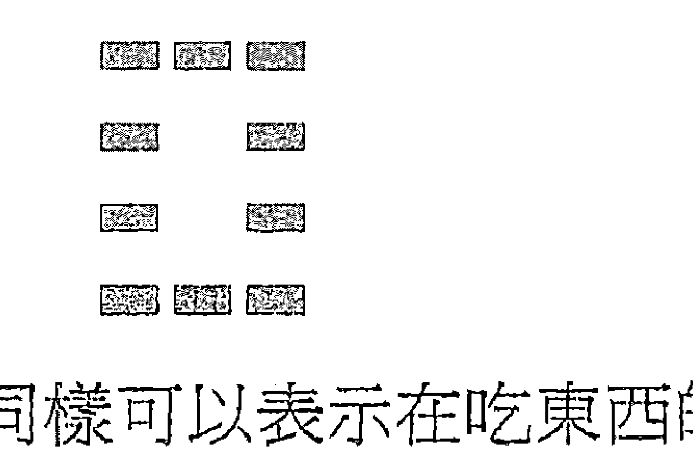

火雷噬嗑這個卦同樣可以表示在吃東西的卦，我們仔細觀察就不難發現，同样這個卦的初爻和六爻就像是我的上嘴唇和下嘴唇，而二爻至五爻就不再是上下雨排雪白的牙齒了，而更像是嘴巴裏面正在咀嚼著的食物。我們不妨用互卦和連互的手段將這組卦象有機的拆分，那麼得到的卦象有離卦，艮卦，坎卦，震卦，根據離卦的卦象象意，我們是不是推斷所吃的食物是帶有硬殼的東西，比如螃蟹，貝殼，蝦，蚌，龜，雞蛋等，根據震卦，我則可

### ### 第四章 像形之象

055

以推斷所吃的食物是植物一類的的食物，相對來說還比較柔軟的，比如說，蔬菜，野菜，野味，竹笋，蹄子等等、

根據卦象艮，我們則可以推斷所吃的食物有外表比較堅硬而內部比較柔軟的食物，如：瓜果，動物的肘子，帶有硬齒的動物等。根據坎的卦象我們則可以推斷所吃的食物是外表比較柔軟，而內部比較堅硬，比如說帶有硬核的食物，比如說桃子，魚類，鼠，以及四肢類動物。這裹說到四肢類動物的時候，我們不妨將坎卦立體化看一下，看看是不是這個看卦的上下兩個陰爻很像是動物的四肢，而中間的陽爻很像是動物的脊樑，身體部分。前面所拆分出來的四個卦的卦象均是單個的卦象，而非是火雷噬嗑這個整卦象的形象象意。如果要整體的瞭解火雷噬嗑這個卦的形象，就必須將先前拆解出來的四個卦象有機的結合在一起。首先全面的看火雷噬嗑這個卦，可以選擇中間二爻至五爻看成一個大坎卦，而且和六爻則看是人的上下嘴唇，是不是可以理解為人在吃食物的時候會存在一定的危險，因為人是雜食性動物，什麼都吃，帶硬殼的，有脊椎，有柔軟的，有蔬菜，一塊往嘴巴裏面送。當然往嘴巴裏面送豆腐是不存在太大的危險，因為豆腐是坤卦，比較柔軟的東西，豆腐送進嘴巴裏面就滑到肚子裏面了。但是雞鴨，魚都是多骨的，中間骨頭的，有刺的，他們是坎

### # 056 梅花易象高層之路

卦，離卦，特別是坎卦，坎卦本身就有險的象意，看看火雷噬嗑卦中間的大坎卦已經橫在嘴巴裏面，初爻至三爻是個震卦，震不僅僅是有蔬菜的象意，也有節奏快的意思，四爻至六爻是個離卦，離卦不僅僅代表的是食物，也是代表人吃食物的一種狀態，就是心性不能太燥，火雷噬嗑這個卦就是告訴我們吃东西的時候不能太急，不能火急火燎的，也同時告訴我們在吃飯的時候不能動氣，不能發火，要心平氣和的，要不急不躁的慢慢吃。如果吃得太快，火急火燎的，吃飯的時候又來點火氣，一不小心骨頭，魚刺就會卡在中間。

再如火澤睽這個卦：

> 火澤睽
>
> ⏹⚙🔥⚓️⏸⏯

火澤睽這個卦也同樣可以用來表示吃东西的卦，我們仔細的觀察一下這個卦的整體像形，是不是感覺和火雷噬嗑這個卦很象，唯一不同的是火雷噬嗑這個卦的二爻是陰爻，而火澤睽這個卦的二爻卻是陽爻，一陰一陽的不同，兩個卦象呈現出來的像形也就截然不一樣了。我們不妨將兩個不同的卦放在一起對比一下。

| 火雷噬嗑 | 火澤睽 |
| :--- | :--- |
| ▬▬▬ | ▬▬▬ |
| ▬    ▬   | ▬    ▬  |
| ▬▬▬ | ▬▬▬ |
| ▬    ▬  | ▬    ▬  |
| ▬▬▬ | ▬▬▬ |

對比以後是不是發現兩個卦雖然都是象一張開著的嘴巴，但是相比之下，火澤睽這張開著的嘴巴相對要小一些。但是火澤睽這張嘴巴卻更加形象一些了，火澤睽的六爻的陽爻是不是很像是人的上嘴唇，而火澤睽的初交和二交就更像是下嘴唇，不妨拿起手中的鏡子看看是不是我們人類的下嘴唇要相對厚實一些。火澤睽的三交至五交是不是就是一個坎卦，坎卦有坑，坎，陷的象意在裏面，這裏我們不妨將八卦的象意思維拋開，展開你的想像力，看看這個坎卦象什麼？假如我們把坎卦上下兩個陰爻各自首尾銜接起來，再無限的延伸開來，是不是這個坎卦的兩個陰爻就是坤卦，坤卦是肉是墻壁，而中間那個陽爻看成是一個很小很小的點，那麼這個坎卦在思維下是不是就象我們的喉嚨，坎卦上下兩個陰爻就是喉管，而中間的陽爻則是深不見底的點，深不見底就是坎了，黑了，深了。

再如火风鼎这个卦例：

### 鼎 		卦

⏺ ⏺ ⏺
⚍ 	 	 ⏺
⏺ ⏺ ⏺
⏺ ⏺ ⏺
⏺ 	 	 ⏺

> > 鼎是古代的一种重要器具，尤其在古代鼎被视为立国的重器，是政权的象徵。鼎有很多种，在古代用来烹煮食物，祭祀等等，有青铜的，铜的，一般是三足两耳的。现今一般在寺庙里面都可以看到鼎的样子。
>
> 那么这个由离卦和巽卦组成的卦为什么叫做鼎卦呢？我们依旧是看卦的像形。我们将卦对应到某一个事物上的时候，那么对应的这个卦就应该是事物的整个部分，那么这个鼎卦也不例外。我们首先看一下这个鼎卦的初爻，是个阴爻，这个阴爻就像是鼎的两个脚。二爻至四爻全是阳爻，组成的是一个乾卦，而二爻至四爻的这部分位置正好是鼎的身体部分，如果火风鼎这个卦对应的是人的话，那么二爻至四爻的这部分位置也正像是人的身体的部位。既然二爻至四爻的位置敲好组成的是个乾卦，乾为金属，圆的，那么说明这个鼎的身体部分是用金属做成的，而且有圆圆的肚子。火风鼎的四爻至六爻是个离卦，这里我们就

應該發揮一下我們立體思維去想像一下, 並且從上往下俯視一下，是不是這個離卦就像一個大圓圈，中間是空的，結合整個鼎卦看，離卦的上下兩個陽爻首尾銜接在一起成圓，是不是離卦的上下兩個陽爻就是鼎的鐵制的邊緣，那麼從上往下俯視這個鼎卦的時候，這個鼎的底部正好是這個卦的二爻的位置上。我們繼續用俯視立體的手段，將離卦的兩個陰爻豎起來，是不是這個離卦的陰爻就像是鼎的把手 (鼎耳)，我們再采用連互的手段，三爻至五爻正好是個兌卦，兌為二，是不是說明這個鼎有兩個耳。
前面說了焦氏梅花易常用的手法是在先後天之間不斷變換，在陰陽之間錯綜反對的變換，然，梅花易博大精深，是不僅僅就侷限於先後天，錯綜反對之間的變換。在進行梅花易斷的時候，像形之象的預測技法只不過常用的一種技法。但即便是常用的技法，在運用的時候也可以全方位的進行卦的像形截取，簡而言之像形之象並不侷限於整體別卦的從上到下對卦的像形理解，亦可從下到上，從內到外，從整體梅花卦的左到右，從右到左的進行像形的理解。

**060 梅花易象高層之路**

### 再例：雷山小過


雷山小過這個卦，上震下艮，從像形上看就像一個長男躺在一張架子床上。艮卦的三爻就像是床的床板，初爻和二爻就像是床的四條腿，如果你是從床的正面直視過去，那麼看見的只是床的兩條腿。雷山小過卦的四爻的陽爻就是男人的脊梁骨，三爻和四爻都是陽爻，那麼就是身板對床板，背靠背。五爻和六爻就是肌肉，就是鼻子。如果這個雷山小過卦不是測人的，而是測家居環境的，那麼下面的這個艮卦就是家裏的牆面，初爻和二爻就是家裏的牆面部分，五爻和六爻也是牆面部分，或者天花板部分，中間三爻和四爻則是墙與墙，墙與天花板轉角的部。
再如地山謙這個卦就更加明顯

### ### 地山謙


地山謙這個卦上坤下艮，三爻的這個陽爻就是家裏面牆面轉角的地方，而四爻至六爻的這個部分則是天花板的**部分。地山謙卦也可以看做是一個沒有穿上衣人，當然有些人從卦意上理解坤為衣服，自然地山謙為穿著上衣，但，殊不知坤亦為肉，這個坤肉都露出來了，豈不是沒穿衣服，當然你也可以理解為穿著衣服的，因為乾為骨頭，坤陰為遮罩，故為穿衣，幹為身體，坤為衣；坤幹遮身體；坤為肉，坤為衣，乾坤遮身體；坤乾，坤為肉，陽為實，陽遮陰，擋肉。這個就是像形之象在梅花易中常用的技法之一。關鍵是看解讀者如何理解。

下面隨機寫一些可以用想到的象意，希望在有助於梅花易思維開悟。

## 六十四卦卦像意：

> 乾為天一——根腸子、直來直去、天外有天、人外有人、太上老君、九九重陽、北京、九重天、京津鐵路、京九鐵路。
>
> 坤為地—一無四處、屍骨無存、六六大順、死氣沉沉、一瞬到底、體無完膚、湖州。
>
> 水雷屯——房事、沉船、工於心計、大水沖了龍王廟、射箭、水蓮、做愛、洗衣機、廣水。
>
> 山水蒙——撒尿、房子進水、泥水工、泥水匠、水窑、小**便**、肝腹水、內江、手濕。
>
> 水天需——金沉水落、一頭霧水、北京。
>
> 天水訟——下雨、口舌是非、珠江、天水、天津。
>
> 地水師——地下水、陷阱、一肚子壞水、肝腹水、地陷、心懷鬼胎、戀子情節。
>
> 水地比——虎落平陽被犬欺、魚米之鄉、戀母情節。
>
> 風天小畜——腦中風、奉天。
>
> 天澤履——缺乏主見、天津。
>
> 地天泰——寶藏、外小人真君子、君子之道、萬萬人之下。
>
> 天地否——家財外露、外君子真小人、小人之道、一人之下**萬人之上、株洲**。
>
> 天火同人——工作同事、隱退、離職、離崗。
>
> 火天大有——腦膜炎、腸炎、頭頂上開窗戶六親不認、心比天高、日本。
>
> 地山謙——光屁股、赤身露體、黃山。
>
> 雷地豫——農耕、種地、做衣服、一刀切、一條河分兩**地**、河界、國界、分家、廣州。
>
> 澤雷隨——動粗、廣西、動嘴。
>
> 山風蠱——手到擒（禽）來、撲風做影、家裏鬧鬼、陰魂不散、腸胃炎、放屁。

### # 第四章 像形之象
**063**

**地澤臨**——小氣、西雅圖、思茅、小人、地面塌陷、地下水。

**風地觀**——坐地生風，饑腸轆轆、氣喘吁吁，小蔥拌豆腐、印尼、柳州、吹牛、長舌婦。

**火雷噬嗑**——忐忑不安、吵鬧、動心、三人俱行、肝炎、電閃雷鳴、美國、心裏有結懸在空中、肝火旺。

**山火賁**——胸悶、家中紅火、捫心自問、燒磚、磚瓦廠、琉璃廠、胸裏有火。

**山地剝**——一根筋，要完蛋了，脫光了衣服，家徒四壁，身無裹服，手腳發軟，饑腸轆轆、水要滿過頭、安徽、貴州。

**地雷複**——大地驚雷、地雷、地震。

**天雷無妄**——馬到功成、花錢買罪受。

**山天大畜**——只手遮天、戴帽子。

**山雷頤**——踹門、牢房、農場、養雞場、胸無點墨、同性戀。

**澤風大過**——破釜沉舟、缺文書、卻感情、二婚、過氣、說假話、話不投機半句多。

**坎為水**——一條道走到黑，破罐子破摔，昏天黑地、兩頭不撈好、昏天黑地、四面楚歌、大智慧、四面環水、黑龍江。

**離為火**——心眼多、左右逢源、心心相印。

梅花易象高层之路

澤山咸——西山、吃館子、沒房、二手房子、西王廟、西安。
雷風恒——動氣、腳氣。
天山遁——逃跑、要求高、高檔房子、十萬大山、太廟、都安。
雷天大壯——動車、開車、震天動地。
火地晉——太陽剛剛升起，胃炎。
地火明夷——日落西山、心情鬱悶、心灰意冷、地磚壞**了**、傷心，胸悶。
風火家人——膽囊炎、鳳陽、家中紅火。

火澤睽——大眼瞪小眼、缺心眼、二婚、婦科炎症。
水山蹇——水落屋檐、、洗頭、洗背、洗手、水過鴨（壓）背、尿在手上，尿褲子、高山流水、算計到家、水鄉。
雷水解——房事、心有所屬、家中失火、下午、肝腹水、開黑車、鎮江。
山澤損——無家可歸、山西、分家、陝西。
風雷益——草船借箭、煽風点火。
澤天央——殺一儆百、西京、半月。
天風娠——偶遇、官印、天氣、意外之財。

澤地萃——殺雞駭猴、小肚雞腸、西藏、西沙群島、小氣、吝嗇、西域。
地風升——草包、肚子裏有氣。

# 澤水困——嘔吐，子宮肌瘤，屠夫，殺猪宰羊、上氣不接下氣、西江月。

# 水風井——沉船、朽木不可雕、風濕、水草。

# 澤火革——缺心眼，心臟手術，子宮炎、欠缺考慮、心理缺陷、改革、煉金術、心肌缺血。

# 火風鼎——火燒連環船、燒草、夏枯草、身材超好的女人、玉面狐狸。

# 震為雷——裏外不安、大動作、廣東、巨震、雷震動天、崇洋媚外、東龍、東都。

# 艮為山——胃，石家莊、壓力大、石敢當、臺灣、狗不理包子、五指山、山外山。

# 風山漸——雞飛狗走、財神廟、香港。

# 雷澤歸妹——說大話、缺乏行動、西域、廣西、刀兵相見。

# 雷火豐——大發脾氣，動肝火，肝炎、雷電交加、燒火、電閃雷鳴。

# 火山旅——房頂上開窗戶、高血壓、電視櫃、火葬場、文廟、重慶、中國、如日中天、重慶。

# 巽為風——搖擺不定、舉棋不定、帆船、。

# 兌為澤——落湯雞、殺羊、婦科手術、西寧。

# 風水渙——撒尿、拉肚子、漣漪、水汽、長江。

### # 梅花易象高層之路

水澤節——嘔吐、水漫金山、潔身自好、無房事、西江月。
豐澤中孚——小氣、親嘴、商量、一刀兩斷、攔腰斬、小道消息、枕邊風、吹風、二婚、缺錢，缺文書、離婚、風濕、膽結石、風月場、巧舌如簧、說風涼話、假話、攔腰斬、同性戀。
雷山小過——敲山震虎、東都、東山再起、怒髮衝冠、背靠背。
水火既濟——水乳交融、血液病、水火不容。
火水未濟——心肌梗塞、面紅耳赤、三江、南洋、印度、心結。

接下來我們來說整組梅花卦的像形之象，整組梅花卦的讀象的方法和單個的別卦的讀象方法有所不同，單個的別卦只是將上下卦的卦意讀出來就可以了，但是整組梅花卦往往要考慮整組卦象之間的相互組合，譬如說風山漸之天山遁這麼一組梅花卦，

#### 風山漸
**【主卦】**
火水未濟
**【互卦】**
天山遁
**【變卦】**

那麼現在就開始發揮我們的想像力，首先看一下主

### # 第四章 像形之象 067

**卦**，主卦的下卦初爻至二爻的位置是陰爻，陰爻和陰爻在一起就是坤卦一半的象，坤是不是有土壤的象意在裏面，在艮卦三爻的位置是個陽爻，這個陽爻居於兩個陰爻之上，這個陽爻是不是像大地上的地平線，我們學過地理，地球的外殼是不是很堅硬，對吧，那麼主卦的下卦艮卦是不是就象大地一樣，我們在看一下主卦的上卦是什麼，上卦是個巽卦，巽是什麼，巽是不是就是花花草草，對吧。那麼主卦組合起來是不是有花花草草站在地平線上，對吧。我們在深入一點分析一下風山漸這個主卦，我們看看主卦的二爻至四爻，是不是一個坎卦，坎卦是什麼，不就是水分嘛，是吧。再看看三爻至五爻的組合，是不是個離卦，離是什麼，是不是陽光，那麼這個離卦和坎卦都是在風山漸這主卦裏面的，是不是告訴我們有那麼一個象，花草在不斷的吸收養分，身體裏面的水分在不斷的做光合運動，是吧，你看看這個卦，有巽，巽是什麼，不就是氧氣嘛，還有離，我們說的陽光，還有坎，我們說的水分，還有艮卦，這個艮卦是三分之二的土。全都有了。好了，我們看完了主卦了，我們再來看看變卦，變卦的下卦是個艮卦，和主卦的下卦是一樣的，這裏我們看一下是不是三爻以上的位置才是陽爻，初爻至二爻是不是象人的兩條腿呀，而三爻才是陽爻，三爻是不是就像是人的股部這個位

置，是吧。我們注意看變卦的上卦是個乾卦，乾不是老頭、乾瘦的人，是吧，坤才是肉，地山謙才是胖乎乎的、有肉的人，對不對。我們注意看一下天山遯的二爻至四爻這個位置，是不是一個巽卦？巽是什麼？不就是風嘛，風有快、無孔不入的意思。但是現在下卦是個艮卦，組合在一起就是風山漸，這個風被艮止住了。變卦這個乾瘦的人不能像風一樣的跑動，艮也是穴，是墳地吧，乾立於艮這個墳地之上，是不是整個變卦就像是一個僵屍，對吧？有那麼一個象吧。那麼現在將你的視野放在整組梅花卦上的時候，主卦是立於土地上的花花草草，變卦是僵屍，他們幹嘛呢？我們看一下主卦和變卦的上卦：主卦的上卦是巽，變卦的上卦是乾，在後天八卦中的巽卦和乾卦是一組對沖的卦，沖主爭鬥、相沖、搏擊，乾金克巽木，巽木沖乾金。整組梅花卦是不是象很多朋友玩過的一個很經典的遊戲《植物大戰僵屍》，是不是？再看看互卦：火水未濟。火水未濟上卦是離火，下卦為坎水，這個互卦無論再怎麼互都是在火水未濟和水火既濟中變化，我們知道坎水和離火無論是在先天還是後天都是一組相對、相沖的那麼一組卦，那麼這個互卦是什麼？是不是水火不相容？是不是你來我往。這組梅花卦是不是有這麼一組形象在裏面。這組梅花卦是在思維的作用下解讀出來的結果，假如有人要問你：「今天我玩了一個很好玩的遊戲，你猜猜？」你可以根據卦的形象說是《植物大戰殭屍》。當然這也不一定對，這個要結合具體的情況具體的分析。當然你也可以根據卦象說玩的是過山車的遊戲，這也對，就看你分析卦當時的具體情況而定。風山漸之天山遁是不是有過山車的象在裏面？主卦和變卦的下卦艮卦，是不是象鐵路的高架橋？初爻至二爻的位置就像是鐵路橋的橋墩吧，三爻就像是橋墩上的道床，是你視覺作用鐵路線，是不是。主卦的上卦是個巽卦，巽是什麼？巽是風吧，這裏我們也可以將巽卦看做是快速列車，你發揮一下自己的想像力，看看是不是。巽卦的五爻至六爻是乾卦的半象，乾卦本身就是有車、火車的象意，巽卦的下面這個陰交是不是就是象火車的輪子？這個高速列車在高架橋上象風一樣疾馳，剛剛開始跑的時候你還能看的見火車的輪子，一旦列車跑得飛快的時候，你再看看變卦陰爻變成了陽爻了，看不見了你感覺兩個輪子就是一個了，嗖的一下，告訴列車在一秒鐘裏就從你眼前飛馳而過。這些卦象組合在一起，是不是有那麼一個影像在你眼前閃過。對於這個卦你可以那麼簡單的理解到那麼多的影像片段，假如你把互卦的象也穿插在裏面，你就可以更加形象的將高速列車是如何飛馳的細節給讀出來。我們這裡可以不厭其煩的讀一下互卦的信息象：

互卦是火水未濟，互卦的上卦是是個離卦，下卦是坎卦。離是什麼？這裏我們就不必硬性的去記離卦的象意，而要 靠自己的形象思維去理解卦的形象。這個互卦的上卦，是不是就像一個隧道，對不對？離的上下爻是陽的，陽的就是堅硬的，離的中間是陰的，那麼我們想想，隧道是不是也是這麼一個情況？如果隧道都是實心的，那就是一堵墻了，火車肯定過不去，肯定會撞山的，是不是。這個互卦就是那麼一個象，離卦就是一個洞。假設主卦是前面、變卦是後面的話，這組梅花卦的上部是不是告訴我們一列疾馳的火車從隧道的前面穿過，從隧道的後面穿出呢？是不是有這個影像片段在裏面。這一組卦可以有一組這樣的影像片段，也可以有兩組那樣的片段，就看你是如何對應讀取。

下面我們再看看山風蠱之地風升這麼一組卦象，卦例如下：

| 巽 | 卦 | 歸妹卦 | 升 | 卦 | 否 | 卦 | 隨 | 卦 |
|---|---|---|---|---|---|---|---|---|
| [本卦] | ○ |  [互卦] |   | [變卦] |   | [錯卦] |   | [綜卦] |

首先我們看一下主卦和變卦的下卦，下卦是個巽卦，巽是什麼？巽是不是有橋的意思，是不是。那麼好，這裏我們首先看一下主卦的，我們按照前面分析卦的模式將主卦依次的互出來：初爻至三爻是個巽卦，二爻至四爻是個兌卦，三爻至五爻是個震卦，四爻至六爻是個艮卦。那麼這裏我們有機的將四個互出來的卦均分一下：初爻至三爻的巽卦和二爻至四爻的兌卦組合成為一個澤風大過卦，三爻至五爻的震卦和四爻至六爻的跟卦組合成為一個山雷頤卦。然後我們將兩個別卦放在一起，上卦山雷頤，下卦澤風大過。

上卦山雷頤：艮為少男，艮為坐，震為車，是不是山雷頤就是一個男子坐在車上的象形。那麼我們再來看看澤風大過這個卦：澤風大過是不是像個大大的坎卦？坎是什麼？也許你會說坎在象意上就是水、陷阱，當然這些象意都對，但是你如果你從空中俯視觀察過橋的樣子，在去看看這個大過卦，是不是橋的樣子就象俯視的大過卦一樣？大過卦的初爻至五爻是連續不斷的陽爻，就像橋樑的橋身，而初爻和六爻的兩個陰爻就像是上橋和下橋的臺階，是不是這樣。那末當兩個別卦放在一起的時候，我們此時發現，象的組合透露出來的信息會愈加的豐富起來。你可以拿山雷頤的震卦和澤風大過卦兌卦組合起來：你可以說男子開的車是舊車、二手車，為什麼？兌為二嘛。假如是酉金旺的時候，你還可以斷言男子開的就是一個破車，是吧？你還可以根據澤風大過這個卦說，男子開的車還沒有行駛證，是不是這麼一回事。

好，那末我們再回到主卦山風蠱這個卦的象形上面來：山風蠱就是一個男子坐著車子行駛在橋上，他要到橋的另外一頭去，他要下橋，是不是？這個時候我們要結合變卦地風升來看一看，是不是要下橋。主卦上卦是個艮卦，艮是有高的象意，而變卦的上卦是個坤卦，坤為低矮。主卦的上卦由艮變坤，由高走向低矮，是不是下橋的一個動作過程？結果呢，艮坤本身在後天八卦中是一組相對、相沖的卦，前面我們說了，相沖就是有撞擊的意象在裏面，是不是。

我們再看看互卦：雷澤歸妹。震是不是快速的意思？是不是說這個男子開得挺快的，他準備下橋了，雷澤歸妹的兌卦克制著震木，是不是他想減慢一點速度？但是這個兌金偏偏旬空了，兌金無法克制震木，好嘛，車子的制動出現了問題，結果還是如前所說，速度太快，嘣的一下撞了上去。這組梅花卦山風蠱之地風升就有出現了一個全新的影像片段：一個無行駛證的男子騎著個破舊的機動車，從橋上下來的時候由於車子的制動出現了問題，車速過快，結果還是把人給撞了。當然在斷梅花卦的過程中，只要熟練掌握斷卦的各種技法和理解熟練掌握各種讀象的方法，你就可以在讀象上隨心所欲的提取各種相關的信息。

再如，一個漂亮的女士來問自己的感情，得雷水解之雷地豫卦。

| 蠱 卦 | 既濟卦 | 預 卦 | 家人卦 | 蹇 卦 |
| --- | --- | --- | --- | --- |
|[](0.12,0.53,0.27,0.74)|[][](0.49,0.69,0.64,0.74)|[][](0.53,0.69,0.64,0.74)|[][](0.74,0.69,0.86,0.74)|[][](0.96,0.69,0.99,0.74)|

在傳統的梅花易裏面都是以不動的為體，為自己；以有動的為用，為對方。在這個女士問婚姻的卦裏面，上卦是女方，下卦自然就是男方，下卦也是女士所問的事、所要問的人。現在女士非常關心自己的感情，關心此次戀愛的成敗，關心對方究竟是一個什麼樣的人。那麼我們作為預測師只要根據卦意解讀就好了：按照傳統的梅花易斷的方法，只需對用卦進行卦意解讀就可以了。用卦是個坎卦，可以瞭解到對方應該是一個中年的男人，坎也是為陷，說明此男人過去的經歷也不好，經過了許多的坎坷，跌跌撞撞的走到了今天。我解讀這個的時候也是結合了坎這個卦象來進行解讀的：坎就是陷阱，說陷阱不太好理解，好像這個中年男人掉進了陷阱裏面，難爬出來，在掙扎一樣。在解讀卦的時候如果用通俗的語言來表達就能更好理解，如果是死記一些卦意就很難得到思維上的飛躍。看到卦的時候要用很通俗易懂、用平時說話時的語言解讀出來就可以，而不要用象寫書那樣的文字語言去表達，這樣自己也不好理解，別人看了也不好懂。書面語言表達是很生硬的，因而我們看到卦的時候你就感覺自己就是在說話，用口頭語表達就好。一個坎卦，坎卦就是坑坑窪窪的，在這裏我们用通俗的語言說的時候直接告訴女士：這個中年的男人經歷了很多的磨難，所走的路很不平坦，一直都很不順，一路都是跌跌撞撞。這個男人想脫離自己不順，跳出路上的每一個陷阱，往好的方向上發展，因此他採取了積極主動的態度去面對。坎卦在二交上發動了：

坎水生外卦的震木。（在這裏我們理解卦象的時候切不可將梅花易斷中的吉凶帶進解讀卦象中來。解讀卦象不純在吉凶）說明這個中年男人為了更好的生活到外面去闖蕩，耗費了很多的精力。坎卦是二爻動，坎的二爻是個陽爻，陽爻居陰位，是不得位；發動由不得位變成了得位，說明這個中年男人的努力沒有白費。坎卦變成了坤卦，坎坷變成平順。主卦為之前，變卦為現在：坎為咸，坤為甜，說明這個男人現在的生活由變好了，生活滋潤了，人生的坎坎坷坷都成為了過去。

那麼分析到這裏是不是就分析完了呢？他現在生活好了呀，但是作為預測師，你是要通過卦象看出事物的本質，看出細節性的東西，而不是三言兩語就打發了。假如女士是個愛刨根問底的人呢？她非常關心自己的感情，她很想知道對方細節性的東西，因為對方的一些細節性的點點滴滴都會影響到自己的將來。因此單單靠解讀單經卦的卦意是不夠的，即便是通過解讀主變卦的組合卦意也是遠遠不夠的。傳統的梅花易斷也只是告訴你一個斷梅花易的思路，但是很多的方式方法都要靠自己不停的去摸索，前人的梅花易書裏面不會明明白白的告訴你怎麼去運用梅花易，怎麼去解讀卦像的。梅花易中很多解讀的方法都是要靠我們後人在運用的時候不斷的悟出來的。

這裡我們主要研究的是卦的像形之象，那麼我們就要對整個卦象做全方位的解讀，要知道《梅花易數》中沒有告訴你，你不能這麼讀，也不能那麼去讀；聖人也更加不會告訴你梅花易的解讀是有條條框框來規範的，聖人也不會告訴你個公式，告訴你怎麼開始讀第一步、怎麼去讀第二步，是不是。一切都靠自己用心去悟，用心去讀：你看它象什麼它就是什麼，有時候看它，它什麼也都不是。在雷水解之雷地豫這個卦裏面，通過這個卦我們要瞭解更多男方的細節，女士要刨根問底，作為預測師你不能用搪塞的語氣告訴她，不要計較對方的過去，能不能通過解讀卦像和告不告訴又是另外一回事。在這裏我們就是要通過研究卦之像形之象瞭解一些細微的東西。

理的想像，一切都會盡收眼底。前面我們在解讀主卦雷水解的時候說了，主卦的下卦中坎水就是和女士談感情的中年男人，但是我們要看這個男人之前生活的林林種種的時候，光靠解讀坎這個單經卦就遠遠不夠了，這裏我們就用到了卦的像形之象。當我們按照傳統的梅花易數只是單純的將解讀單經卦，單純的只是解讀上下卦的卦形卦意，那麼即便是你很靈活的轉太極，那麼你的思維空間依舊是非常狹隘的，你理解到的卦的像也是非常有限的，因而得到的象意也是少之甚少。為了得到更多的象形象意，那麼我們就要將上下卦和整個卦做有機的融合和拆分，那麼得到的像形之象就會隨著視野的轉換點的變換會層出不窮，象意也就會源源不斷的從我們腦海中展現出來，通過我們預測師的嘴巴才會透露出更多的信息。當我們的視野將雷水解這個卦有機的融合的時候，雷水解這個卦則不再是上卦是震卦、也不再是下卦是坎卦，這裏就沒有區分上卦和下卦，我們的視野將整個雷水解融合的時候，我們將二爻至五爻拿出來，那麼實際上雷水解就是上下兩個陰交包著一個坎卦和一個離卦。我們發揮我們的想像力：上下兩個陰交是什麼？是不是坤卦的半象？坤是不是房子、是不是有磚塊的象意？那麼雷水解這個卦是不是就像一個房子裏面關著一個男人、關著一個女人？坤也是家吧，如果說一個磚塊裏面關著一男一女是非常不貼切的，倒不如說男女共處一室比較合適。當然這個雷水解的大象是這樣：這是說未來戀愛的雙方會照著有這個發展的趨勢，而眼前我們要通过像形之象研究的是男方的細節，那麼我們的視野就不能定位為整個雷水解上，而還是要放在初爻至三交這個位置上。也許你會說這不還是坎卦嘛？也還不是分了上下卦嘛。還是那句話，一樣米養百樣人，不同的思維理解有所不同得到的結果，因而為什麼說看山不是山、看水不是水，看山又是山、看水又是水的緣故。

# 第五章 梅花卦断个性

在運用梅花易預測的時候，往往是采取循序漸進、由淺入深、由易到難的順序進行，因而在預測個人運氣的時候，一般都是從個人的個性開始預測，預測個性也成为每次預測的开篇。但有人不喜歡這樣的預測，有的也不喜歡這樣給人預測，覺得預測性格就是小儿科，达不到一针見血的效果，更有人覺得預測人之個性就是浪費時間，有人甚至認為預測個性其實就是蜻蜓點水，無論預測師說什麼都會沾上一点边，是預測師在打擦邊球。殊不知斷性格對於一個預測師來說也是一個調整預測思維、營造良好的預測氛圍的過程，是否能精准定位預測對象的一個起點。斷人个性貌似非常简单，极其容易，尽管有些基础的预测師只要简单的直读卦象，简单的解读卦之五行生克制化就可以做到，然，如果要想做到细腻的分析一个人的个性却是非常不容易的，也是光靠直读卦象和解读卦之五行生克是没办法完全做到的。如果想细腻的断出一个人的个性，不仅仅需要有博大的知識面，而且还要对解读卦象有深层次的理解。在这里我们根据焦氏和尚氏的取象技巧的基础上，探讨是如何对卦像的解读进行拓展和延展。

當我們將整個主卦看做是一個人：的時候，那麼三至五爻就是人的胸部，三爻至五爻實際上個坤卦，也可以指人的心胸，這個坤卦被山澤損這個卦包在裏面的。坤乃包容豁达，寬廣之意，是不是說這個人的心胸很寬廣？坤亦為水，為川，為氣。是不是也說明這個人是海納百川、宰相肚子能撐船的氣量。看到這個卦的時你可以根據卦像說這個人的待人處事很厚實、有博大的胸襟，有容人之量。但是這個主卦的四爻發動，一發動就不好了。為什麼不好呢？四爻本屬陰位，陰爻居陰位本是得位，但是陰變陽由得位變成了不得位。山澤損中：間的坤卦變成了坎卦，坤為靜，坎為水，為動，說明這個人本來心如止水的、心胸很豁达的，由於一些原因變得不豁达了。坎為聚焦、為節點，這個坎是在胸間，是不是告訴我們這個人有心結了，氣量由大變小了。用一句很普通的話說，是不是說這個人會因為瑣碎的事情耿耿於懷。會因為什麼事情耿於懷呢，這裏我們要細緻的重讀卦象才能挖掘到卦中潛藏的信息：

她是個愛家的人，是個宅女，離開了家，因為家庭、因為感情的事情她會變得耿耿於懷，是不是這樣？我們不妨利用卦的可重塑性，將整個卦重新再讀一次，看看是不、是這樣。主卦山澤損，兌金為她自己本人，兌金在內卦，內為家，外卦為家外。外卦為艮土，艮為停止、艮為阻止、艮為門、艮為家。山澤損，一個家門關住了一個少女，是不是說明她是個宅女？一個少女被停止在家的裏面。外卦為大，內卦為小，內為家，山澤損是不是也可以用大家閨秀來表述一個人。我們在運用一下連互的方法解讀一下山澤損，我們看看內四交四連互，是個雷澤歸妹卦，震為足，兌為缺少，這個雷澤歸妹是被包裹在山澤損卦中，是不是告訴我們她不但是個宅女，而且還不太好動，而且是明明白白的告訴我們她不願意到外面去。

我們再運用一下觀看視覺角度的來取像，我們注意觀察一下這個山澤損卦，實際上山澤損是個大大的離卦關著一個大大的震卦。我們知道離卦不單單是有心，還有家象意在裏面。我們在學習陰陽的時候知道陽遇陽、陰遇陰則斥，陽遇陰則相吸，這個山澤損的初爻和六爻就像一堵圍牆，二爻也陽爻，從三爻到五爻是陰爻，二爻這個陽爻也只能從三爻這個位置走到五爻這個位置，到了五爻這個位置又返回到二爻的位置，就是那麼的周而復始，那麼這樣一個像就說明她的心和她活動的範圍、交際的範圍是有局限性的，也說明她在熟悉的環境中，在她活動的圈子內她卻是個很愛動的、也是比较規矩的一個人。在這組梅花卦裏面所能體現、所能解讀的遠不止這些，這只是某一個像的合理研釋。在這裏如此繁瑣不過是為了更好的體會到：如何拆解卦像，解讀卦像和理解卦像。倘若熟悉如何解讀卦象的，預測結果也只不過是三言兩語的事情，三言兩語的道出結果卻是很難理解的透徹。通過再一次的重塑卦像，解讀卦像，我們就知道她不單單是個活動圈子很小、交際範圍很小的宅女，而且她還是個不善言談的、不會說漂亮話的女人，是個毛手毛腳，粗枝大葉，缺心眼的女人。為什麼要那麼說呢？也還是卦像的緣故，我們知道山澤損不單單是可以解讀這樣，如果和其他的卦組合起來，和日月組合起來，拆開來，單獨的拿出一個卦出來，再與别的卦組合起來就能讀出千百萬個像出來。

山澤損的上卦是艮、下卦為兌：艮為手，兌為毛糙，連互中出現一個雷澤歸妹震為足，兌為毛糙，這兩個單經卦組合在一起就是毛手毛腳的。艮為樹葉，巽為細，兌為粗，所以這個女人難免有粗心大意的时候。變卦是火澤睽，這儿就可以直讀卦象了：兌為缺少，離為心眼，缺心眼。這都是很容易解讀的地方，其實有的時候解讀卦像是很容易的事情，關鍵二是要根據卦像合理的銜接起來。就像前面說了，她是個很宅的女人，只願意在圈子裏面走動，真正導致宅的原因，是因為她缺心眼、不會說漂亮話，而且經常是做錯事、說錯話，她怕受到傷害。

看看是不是這個像？主卦山澤損，兌為口、為言語表達，艮為止。雖然說兌為愛說愛笑、能說會道，但是這個兌，這個表達也和宅一樣，因為這個兌是在內卦的，她止住了，因而她的能說會道也只是在圈子裏面說說而已。之前說了山澤損其實就是一個大坤卦被包裹在其中，坤住靜，說明她安靜的時候、不說話的時候，她能表現得非常的豁達和有包容心，但是一旦她行動了、說話了，她就容易犯錯誤。看看，是山澤損中間的坤卦中間的陰爻動了，陰主沒有考慮後果的、無心的行動、做事，結果一動坤就變成了坎，所以主卦澤山咸也就...## 084 梅花易象高層之路

變成了火澤睽，主卦由艮土生兌金變成了離火克制兌金，也就是說做錯事，說錯話導致的後果。艮為包，兌為言辭，兌為喜悅，兌為漂亮，漂亮話被屏蔽了，因而她變得不愛說話，直接理解為嘴巴笨。由於這些使得她變得宅。在平時我們解讀梅花卦的時候一般用到的都是正卦，而很少用到反過來的卦，也就是綜卦。在解讀梅花易數的時候，我們不單單是要靈活的運用正卦，也要靈活的運用綜卦或者錯卦，就好比山澤損這個卦，當我們將定位點變換的時候，我們就可以靈活的運用綜卦或者錯卦了。還是繼續說前面這個女人，她結婚了，她卻是個有老公愛、自己也願意宅在家、愛家的女人，她不願意屬於自己的感情、屬於自己的家付諸東流。為什麼那麼一說，這也還是通過卦象解讀出來的。山澤損，艮在外卦、在上卦，雖然艮為少男，但是艮亦為祖、為老男，在上卦為丈夫，艮為山，艮為穩定，艮為工作，艮為包裹，艮土生兌金，艮為養，兌金在內為家。這個山澤損就好似在告訴我們，她的丈夫在外面有份穩定的工作，養著自己和孩子，也愛著自己和孩子。我們知道兌卦和巽卦實際上是一對顛倒的卦像，兌也是巽，巽也是兌，開口不一樣，氣流的方向也就不一樣。在運用綜卦的時候採取特殊的解讀方法，就好比這個解讀到家庭的時候，兌為這個女人，但是這個兌也是感情，但是这个感情卻是口朝著外面的。兌為漂亮，為少女，說明這個女人不單是年紀小，而且也漂亮。所以山澤損這個艮，她的丈夫艮要壓著，生者呵護著這個兌金。艮也是牆，兌金在內，牆內的桃花，換句話說就是丈夫希望她這個美麗，她這個漂亮只是在家裏綻放，而不是把桃花開到外面去。斷到這裏就沒有了嘛，我們再看看這組梅花卦，主卦澤山咸，變卦火澤睽。前面我們說了這個女人不喜歡到外面去應酬、去交際，性格比較內斂，這都屬於社交方面的；還有自身的都沒有還分析到。當我們把定位點切換到個人對飲食的要求上來分析的時候，整組梅花卦就要圍繞這個定位點、這個主體來分析。

主卦山澤損，兌為吃，兌為金，艮為胃，艮為土生金，說明這個女人的胃口很好，是不是？艮這個胃都在卦的外面去了，是不是說明這個女的喜歡到外面吃東西？當我們將主卦山澤損倒過去的時候就是風雷益卦。巽為香臭，但是我們不能說這個女的喜歡吃發臭的東西，定位為吃香的比較合適。風雷益這個卦也明明白白的告訴我們這個女人是喜歡吃香的，是不是？上卦巽為香，而下卦震是兌卦的延展拓變，其實也是個兌卦，大大的兌卦，嘴巴長得很大，說明這個女人對香的東西胃口不是一般的好。我們再看看火澤睽，下卦兌依舊解讀為吃，上卦則直接取其辣，火最為貼切。那麼這樣一解讀就能清清楚楚的看到，這個女人對香臭的食物是不忌口的，只要外面有好吃好喝的，總是忍不住。吃什麼呢，這個卦裏面都有，只要不斷的變換定位點，卦裏的信息就可以一一的解讀出來。

# 第五章 梅花卦斷個性 085

### 第六章 簡述反對卦

在做梅花易斷的時候，我們在排梅花卦盤的時候經常會看到這樣的字眼：主卦、互卦、變卦、錯卦和綜卦。但凡學習過基礎的梅花易斷的就都能明白主卦、互卦和變卦是怎麼一回事：主卦為起出的原卦像，互卦則是主卦去頭去尾中間四爻互而產生的新卦，而變卦則是經過主卦交變而產生的新卦；錯卦則是主卦陰陽顛倒所產生的新卦，也就是陰陽相對的卦。至於綜嘛，可能瞭解的就比較甚少。綜卦也叫反卦，也就是將一個卦做 180 度的倒轉而得到的卦。在八經卦中，乾坤無反卦，坎離無反卦，震艮巽兌則有反卦；震艮是一對反卦，巽兌是一對反卦。這裏我們將成對的反卦叫做反對卦。

我們解讀梅花易卦實際上是個看卦取像的過程，而這個取像實則就是在主卦、互卦、變卦、錯卦、綜卦中進行，說白了梅花卦就好比是一副畫，你要從畫的各個角度去看，看這個卦象什麼、似什麼、是什麼。這裏需要注意的一個問題，我們說的看卦取像而不是看卦取象，而是看卦像象什麼。這個“像”就好似是一幅畫，一個電影片段，一個場景。梅花易卦就好比是名詞，亦就好比是形容詞，有比擬性。比如說你說某個人長得像某某人，這個是從畫的角度來看。在梅花易數斷卦看像也就是這樣，看卦像而還原事物的本質：看這個卦像象什麼樣的東西、象什麼事物；而起出的梅花卦實際上就運用了這麼一個觀卦還原像而取象的過程。

主卦就好比是在正著這個角度去觀察事物，互卦則是從事物的內部去觀察，而變卦則是從事物變化的角度去觀察，錯卦則是從事物屬性相對的角度去觀察，而這個反卦則是從相反的方向去觀察事物。這都是從大體的角度分析，但是每一個互卦、錯卦、綜卦都會產生新的卦，也都有互、錯綜卦。梅花卦就好比是一個參天大樹，主卦就好比是大樹的樹幹，而互卦、錯卦、綜卦就如同是不同的分支枝葉，這就好比佛經裏有雲：“一花一世界，一葉一菩提”。這裏也用易經裏說的：“一物一太極；道生一，一生二，二生三，三生萬物。”

無論是互卦，還是錯卦，還是綜卦都是經常用到的。但是也有人說即便是不用錯卦和綜卦也能將卦斷得淋漓盡致，這個倒是不可否認，但是如果能將錯卦、綜卦都運用得非常熟練自然、得心應手，做到能收放自如的話，那麼解讀梅花易數也就是小菜一碟，截取卦像也就是信手拈來的事情。主卦、互卦、變卦我們是經常用到，但是錯卦、綜卦卻很少用到，在這裏我們研討一下綜卦在梅花易斷中的運用。

我們常在生活中聽到這樣或者那樣的成語或詞語，但是諸多都不瞭解，也不會去考究這些成語或者詞語的來由，在這裏我們就借用一些成語或者詞語對反對卦進行卦像的分析。

在日常生活中有個聽過一句話叫做：“翻手為雲，覆手為雨”。究其這個詞語的出處，百度一下就知道了，來至於杜甫的《貧交行》：“翻手作雲覆手雨，紛紛輕薄何須數”。這裏我們用六十四卦中的雷山小過這個卦像來擬作“翻手為雲，覆手為雨”這個詞目。

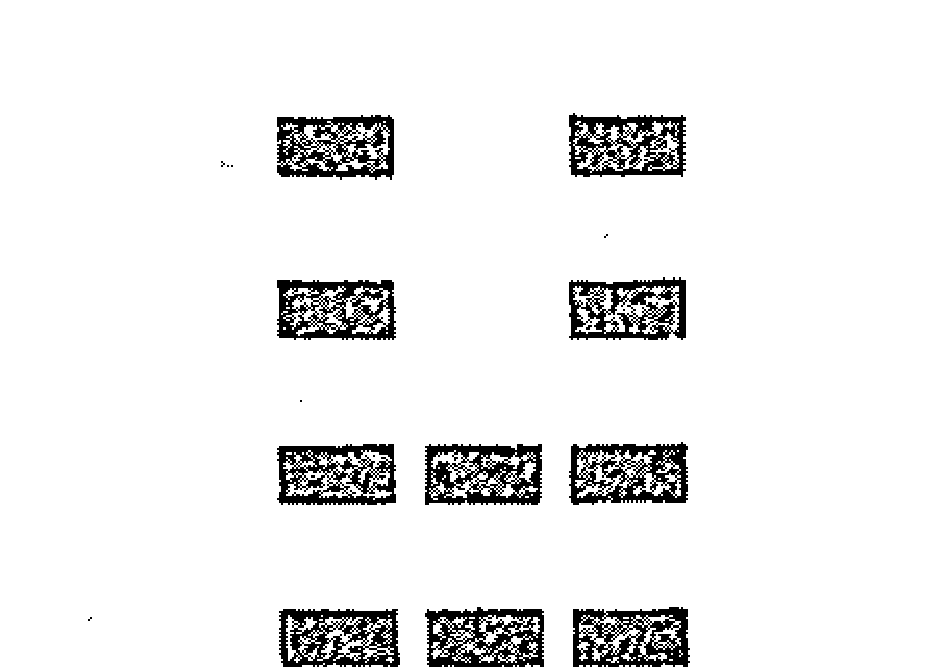

**雷山小過**：上卦震，下卦艮。震卦一陽在下，兩陰在上；而艮卦是一陽在上兩陰在下。陽為動，陰為靜。震卦一陽在坤土半像之下，而艮卦一陽則在坤土半像之上。震為雷謂之陽動而在地下，所以當遇到打雷的時候你感覺整個大地都在動，感覺是這個動是由大地下至上的；而艮這個動是在地表的，說明雷動了到了地表就小了、就停止了。這是兩個卦的像意。現在震艮放在一起，我們就要從卦的形象上看，這“雷山小過”就好比是一隻平放的手掌。

第六章 簡述反對卦 089

對，震艮都是手掌。震的手掌朝上：震卦的一陽就是手背，震卦兩陰就是手心。我們注意觀察自己的手掌，是不是手掌的手心的肉比較厚實，而手背的肉就沒有那麼厚實？艮卦也一樣：當我們將手心朝下的時候，艮卦的一陽就是手背，而艮卦的兩陰就是手心。我們手陽動而陰靜，注意看這個雷山小過卦，不就是陽爻在三爻和四爻的位置嘛！手掌翻過來覆過去，不正是這個樣子嘛。

當我們對卦像不斷延伸的時候，我們知道震艮就會有很多的象意：比如說震為雷、震為長男、震為發脾氣、震為碗；而艮為山、艮為倒扣的碗、艮為穴、艮為少男等等。但是這些都是從單經卦的角度去取其象意，而我們說的形像就是從卦的象形上挖掘的。“雷山小過”：初爻至三爻為艮卦，下艮兩陰就好比是下落的雨滴；二爻至三爻為巽卦，巽為風；三爻至五爻兌卦，兌為澤；四爻至六爻就是雲。當我們從雷山小過這個卦從上往下依次的理解的時候，是不是就得到雨是如何形成的過程？

知道了雲雨形成的過程，結合雷山小過這個卦我們就不難理解“翻手為雲，覆手為雨”這句話了。翻手與覆手之間都是始於動，一陽一陰，一顛一倒即是不同的兩個像。一顛一倒既是兩個相反的動作，因而是可以把雷山小過比作“翻手為雲，覆手為雨”再合適不過。

再就是很多人都知曉“化干戈為玉帛”這麼一句話，也時不時會用到這麼一句話，但是也從來就沒有考究這句話的由來。一日在讀《焦氏易林探秘》，偶然看到書中末頁中關於兌卦的象意：兌為說、兌為吃、兌為言、兌為笑、兌為小、兌為月、兌為號、兌為斧、兌為耳、兌為急等等。粗略的看了一下，光是兌卦的象意就達上百個之多。當看到“兌為干戈”的時候，突然心有所想：儘管兌這個卦象在實際的運用中已不計其數（兌為殺伐、兌為刀劍），但是當日卻對兌卦的象意尤為上心。可能是源於當日在撰寫邵雍先生的《觀梅占》的詳解略有所感而發吧。當時看到書中有雲“兌卦為干戈”時，驟然想到“化干戈為玉帛”這句話。於是就想究竟何為干戈玉帛。

> **典故**
> “化干戈為玉帛”最早出自《論語·季氏》：“邦分崩離析而不能守也，而謀動干戈於邦內。”
> 典故出處：《淮南子·原道訓》：“昔者夏鯀作三仞之城，諸侯背之，海外有狡心。禹知天下之叛也，乃壞城平池，散財物，焚甲兵，施之以德，海外賓伏，四夷納職，合諸侯於塗山，執玉帛者萬國。”

這都是有迹可循、有迹可查的。現在科技發達也不需要枉費太多的力氣。
*   **玉帛**：很好理解，玉即為玉石，帛即為絲錦。
*   **干戈**：就不太好理解了。“幹”實為盾牌，而“戈”實為一種兵刃、兵器。
*   **寓意**：“化干戈為玉帛”在現今比作不計前嫌、重修舊好之意。簡單的說就是放下兵戎相見，而用珠寶和絲錦作為重修舊好、禮尚往來的禮物。

我們經常會用到兌卦，一看到兌卦，兌卦的卦像是信手拈來，張口就說：兌為說、兌為喜悅、兌為殺伐、有動刀之象。有句話是那麼說的：“要知其然更要知其所以然”。究其兌卦何以有刀劍之象？這得從乾卦說起。
*   **乾卦**：即三陽成乾，乾為圓滿，為飽滿，乾為圓。從這樣的卦象我們可以了解到乾卦無論是從何方面觀察都是圓的、完美無缺的，就像個圓形飽滿的球體。你可以可想而知球體是何種樣子。
*   **兌卦**：即為一陰覆於兩陽之上，好比說是一個圓形的球體表面上破損了；兩陰好比是圓圓的腦袋上長了角，不再有圓滑的表面，而是表面上有尖角、勾、刺，器物有刃。用我們常說的話，刺手。看到兌卦，我們再看看戈這樣的古代兵器，不就是長著尖角一樣嘛！有了刃，會傷人。

就出來勸架，息事寧人：“何必大動干戈”，有什麼事情可以大事化小、小事化了”。現今的“大動干戈”在生活中時常見到，尤其是吐沫星子一潑就動起肝火來了，這就是兌，不是有句話叫做“出口傷人”嘛。這個兌卦就是有傷人這個意思：兌為傷害、兌為口水。一開口就是吐沫星子，嘴巴霹靂啪啦的就往外倒水，是不是？因為兌卦的嘴巴是朝外面去的，所以罵人的時候自然是口水朝外面去了。兌很厲害，要不怎麼說是口水都可以淹死人呢。這個兌卦很厲害，兌卦的刀口朝著外面。

但凡是都有個了結的時候，要不也不會有“化干戈為玉帛”這麼一說了。受到《焦氏易林》影響，我就在想：這個玉帛是什麼？既然兌為干戈，那麼巽是不是就應該為玉帛了？果不其然，在百度以後發覺自己的想法是正確的。玉帛本身就為珠寶、絲錦，為財寶；而巽本身卦意就有“利市三倍”、錢財的象意。但是當時我真正想到的不是兌巽是正反卦的緣故，而真正看到的是：巽為倒過來的兌卦。
*   兌為殺伐、兌為兵刃，兌卦的矛頭是朝著外面的，有殺戮之象。
*   但是巽卦實際為把矛頭放倒之象，所以覺得巽應該就是玉帛。

**第七章：綜卦卦像的實際運用**

這是一個我在易玄天下的 QQ 群裏面預測過的卦例。一位年輕的女士最近工作不太順利，想通過預測找到影響工作的真正的原因，於是求測。這看似乎是一個很簡單的預測工作的卦例，但是要從中找到真正的原因並不是一件很容易的事情。當時參與的有很多的朋友，很多的朋友斷得都非常的不錯，尤其是群主飛花對象的理解最好，一看見主卦就能理解到主卦實際上很象個鞋櫃。在風水環境中，高一寸的就是山，低一寸的就是水。要知道萬物皆有靈，萬物皆有性，無論什麼東西都會對人體的健康產生重要深遠的影響。那麼究竟是什麼樣的東西影響了卦主的工作、影響到了卦主的運氣？那麼我們就要綜觀群卦，結合實際的家居環境來找出對卦主運氣不好的物品及擺設等等。我認為正是卦主所居住的不良環境給其帶來了工作上的障礙。

要如何找出不利於卦主所居住環境中的東西呢？那麼首先就一定要結合卦象，忠實於卦象，不能脫離卦象。那麼第一步我們依舊是按照體用的原則來斷卦、分析卦。
*   **本卦**：雷山小過（上卦為震，下卦為艮）。在傳統的斷卦中我們都知道了有動爻的就是用卦，沒有動爻的就是體卦。那麼雷山小過這個卦就是用克體，那麼也就是說震克體不吉。

農曆：癸巳年 4 月 2 日 7 時
干支：癸巳年 丁巳月 丁丑日 甲辰時
日空：申酉（由戌旨）
時空：寅卯（甲辰旬）

```markdown
+   - [本卦] 小過卦 (用)
-   + [互卦] 大過卦
-   - [變卦] 咸卦
-   . [中孚卦]
-   . [小過卦] (體)
```
*(註：OCR 文本中的表格結構較為混亂，這裡根據上下文邏輯整理為列表形式展示體用關係)*

我們在斷卦的時候是非常非常靈活的。震可以代表的是東邊、也可以代表木性的東西、會動的東西、衝擊力很大的等等。但是我們在實際的讀象的時候往往會綜合整個上下卦來讀象，而非初學梅花易數的時候僅僅局限於對單個的卦的象進行解讀。我們知道艮為櫃子，震在這個卦當中為無氣的木頭，而非樹木和花草。震又有“足”的含義在裏面。那麼雷山小過那麼就可以解讀為鞋櫃了。

**讀象分析過程：**
1.  **分離卦象**：艮為體卦，那麼我們站在艮卦的角度上，將雷山小過分離出去，為了更好的看清楚卦中的讀象的玄機。我們將艮的體卦原地不動，將雷山小過整個卦分離出來了。是不是得到一個“震一艮”卦（即雷山小過加艮卦）？
2.  **空間定位**：我們站在最下面這個體卦艮卦的角度上看。如果將下卦的艮定位為床的話，那麼雷山小過是不是就是床附近有個鞋櫃呢？是不是就只是這個鞋櫃影響了卦主的運氣呢？我們要結合所居住的環境去找。但是在網絡上做預測，也只能根據卦象進行分析，看看是否有沒有符合卦象的物品。
3.  **靈感轉向**：但是斷到“鞋櫃”的時候，我的靈感來了。看到這個雷山小過卦的時候，我就想起了曾今看過的常秉義先生點校的尚秉和老先生所著的《焦氏易話》此書中的取象。讀象都是非常非常靈活的。我就在想，為什麼只能站在艮卦這個角度上、從內部往外部去讀呢？站在艮卦的角度上看，艮體卦是櫃子，震卦是解釋這個艮卦究竟是怎麼樣一個性質的櫃子的補充說明（足）。
4.  **綜卦思維**：那麼殊不知，上卦的震卦也可以是看做倒過來的櫃子，是不是？這裡我們讀卦的思維往往局限在平行的角度上讀象、看待事物、分析事物。但是我的靈感來的時候，我覺得雷山小過這個卦的上卦（震）實際上就是一個艮卦（運用到了梅花易數斷卦中的綜卦，所謂的綜卦就是將卦象顛倒過來）。
    *   震和艮實際上是兩個顛倒的卦。
    *   兌卦和巽卦也是一對顛倒的卦象。
    *   那麼站在艮體卦的角度上看，你就可以看做是個艮卦（倒吊的櫃子）。

好，靈感來的時候，我們重新定位一下：我們將雷山小過的下卦、艮卦定位為傢具的時候，艮就為床鋪，那麼上卦則是高於床鋪以上的部分。這裡我們將空間定位在天花板以上的部分，那麼上卦震就是天花板上的情況。
*   我們知道震卦有動之象，但是在實際情況下我們不能想當然的說天花板會動，也不能不切實際的說天花板上有條腿在上面走，是不是？
*   這個時候我的腦海裏就想到了震卦的綜卦——就是艮卦。其實在我的腦海裏面，艮（床）的上方有個倒吊著的櫃子一樣的東、西；倒吊過來的石頭在天花板上。對！在天花板上是橫梁。

大家在學習梅花易數的時候，注意觀察一下這個艮卦的形象：嘗試一下將艮卦的最上面的陽爻無限制的向兩端延伸，而艮卦下面的兩個陰爻同時也無限制的向兩端延伸。組合在一起，我們知道陽爻是堅實的東西，而陰爻則是虛的東西。下麵的兩個陰爻是不是坤卦延伸過來的？陰爻就是坤卦（土堆）。那麼實際上艮卦就好像一根堅實的棍子架在了土堆上；再延伸一下我們的思維：艮卦下面的兩個陰爻其實就是兩根很短的、堅實的東西累在了一起，艮卦下面的陰爻在思維的飛越下，實際就像是牆體、就是橋墩，是不是那樣？

但是在這個雷山小過這個卦裏面，現在的實際情況則是一個震卦在上面。震卦的陽爻是在最下面（三爻），而不是象艮卦那樣陽爻是在兩個陰爻上面的。因此在梅花易數斷卦中我們用到的就是綜卦——就是從相反的角度去觀察一個事物的本質、實質性的東西。所以當我們單純的站在從上至下的角度去觀察的時候，震卦始終是個震卦；就好比我們在欣賞美景的時候，我們單純的從一個角度看過去的時候，景色則始終是那樣；但是當我們將景色倒過來的時候，景致則全然是不一樣的。這個雷山小過卦，當我們將震卦倒過來的時候、從下至上的觀察的時候，震卦就是一個艮卦（一個倒吊在艮卦（床）以上空間的一個東西）。因此我們在斷卦的時候一定要切合實際的分析卦裏隱藏的卦象，但是不能和卦象脫節，甚至背離卦象。這樣才能很好的分析好卦象、斷好卦。

### 第八章 爻之陰陽象

> **起卦案例**
> *   **農曆**：辛卯年 八月 初四日 申時
> *   **干支**：辛卯年 丙申月 己未日（子丑）
> *   **本卦**：坎為水
> *   **互卦**：震為雷
> *   **變卦**：兌為澤
> *   **錯卦**：離為火
> *   **綜卦**：巽為風

「這是一女士父親健康的卦，預測這個卦的時候，我剛剛學習梅花易數沒有太久，只會生搬硬套、死記硬背梅花象意。雖然只是僥倖預測正確了，但是當時的我斷梅花卦的時候，根據的是六爻的爻象斷的。當時我拿到這個卦的時候，起的是六爻卦，當時看到的爻像是：三爻兄弟辰土動化兄弟醜土，而兄弟醜土是化空的。因而只是簡單的根據爻象分析，根據爻象斷卦主的父親是腿受傷了；實際上是卦主的父親是從樓上跌下來，摔傷了腿。雖然這只是只有一句話的易斷，在斷完了這個卦卻給予了我很多的啟悟。」

> 「儘管這個卦沒有過多的反饋，但是就是這麼一個卦卻讓我想到很多很多……」

100 梅花易象高層之路
讓我覺得六爻斷卦可以做到一卦多斷，為什麼一個梅花卦就不能做到一卦多斷？六爻是根據交與交、交與日月、交與卦、交的陰陽等等之間相互的組合來解讀六爻中潛藏的信息；而這個梅花卦能不能運用卦與卦、卦與交、卦與日月、交的陰陽等等象說話一樣，簡簡單單的解讀出隱藏的信息呢？就好比這個卦，如果不依賴六爻預測的方式該如何分析。最初的時候，我按照傳統的梅花易數斷卦的方法來預測：
1.  **步驟一**：將整個梅花卦區分出體用關係。
2.  **步驟二**：根據體用關係來分析所斷的事情（乾卦為用卦，理所當然，乾卦為所斷的事、所斷的物）。

但是對應乾卦的意象卻是萬千。假如卦主沒有告知所斷何事，要怎麼才能斷出其中潛藏的信息呢？於是我在想：既然卦已出，那麼只要根據卦理、根據易理，符合陰陽之理，符合自然規律就一定能找出符合其中的潛藏的信息。在日後不斷的研究學習梅花易數的過程中逐漸證明了自己的想法是正確的。

剛開始分析這個的時候，按照傳統的梅花易數斷卦的方法，刻板的將用卦乾金定位為父親：乾金三爻陽變陰，乾金為父親，兌金為毀折，所以斷卦主的父親有傷；然這只是知其然不知其所以然的牽強說法。當然你也可以說乾金為骨頭，乾金變兌金，所以骨頭有受傷之意。然，還是那句話：如果卦主不告知是父親是因為上樓梯不小心摔傷了腿骨，那也只能一知半解的斷是受了傷，這都是極不細緻的說法。

於是乎我想到了：既然梅花卦可以斷事、分析事，為何就不能將事情的來龍去脈、將所要斷的事物的各種細節都斷得淋漓盡致呢？難道真的梅花易斷真不如六爻斷卦斷的那麼細緻嘛？顯然有如此想法是錯誤的。在日後學習梅花易斷的實踐中也印證了這一點。無論一個六爻卦，還是梅花卦都有想通的地方：既然當初在學習六爻斷卦的時候，可以將整組卦看做一個要預測的事物、一個預測的人，為何一個梅花卦就不能運用此種方法呢？既然一個六爻卦採取的是三點成一線、多點的定位的得出一個結果，為何一個梅花卦不能採取此種方法預測？正如這個卦，也可以不斷的變換預測對象、不斷的變換定位點，既可以用來分析自己，也可以用來分析家人。

既然可以將整組梅花卦定位一個人，那麼不妨將整組梅花卦定位為卦主本人：
*   **本卦**：澤天央（上卦為兌金，下卦為乾金）。
*   **互卦**：乾金。
*   **變卦**：兌為澤（變卦上卦為兌、下卦也為兌）。
*   **整組梅花卦屬性**：為金，別無它卦。

**分析結論**：
*   **性格判斷**：金遇金則剛，說明卦主本人是個個性非常要強的女性。
*   **象意解讀**：主卦的外卦為兌金（兌為說、為吃），內卦為乾金（乾為滿、為陽剛）。那麼不僅僅說明卦主是個能說會道的；

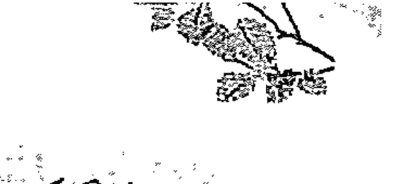
*(註：OCR 文本在此處截斷，圖表內容為對卦象的進一步說明)*

### 第九章 梅花易斷實例技法講解

106 梅花易象高層之路

## 快速件是什麼

中午接到當地的一家快遞公司的電話說有快件到貨，我和愛人思前想後也猜不出來是什麼東西，因為最近也沒有在網絡裏買過任何商品，猜想是否是快遞公司弄錯，難道快件是返廠修的酸奶鍋？這似乎也不太可能，因為才發回去四天多，就算是返廠修復，打個來回加上修理至少也要六七天。現在才剛剛四天。在領快件的路上一邊走一邊起梅花卦預測快件是何物。卦一起出，我就想到了快件一定是返廠家修好的酸奶鍋。

**公元：2014年6月二十日**
**農曆：甲午年六月二十日**
**干支：甲午年 庚午月 甲申日（戌亥）**

**噬嗑卦 蹇卦 晉卦 井卦 賁卦**
**體 ☰☱☰☱☶☷☶☱☴☴☳☵☵☷☱☵☷☱☷☵☱☵☳☵☱☱☰☰**
**用 ☶☶☶☶☴☲☵☷☶☶☶☶☴☶☶☶☱☱☱☱☱☱☱☱☱☱☱☱**
**（本卦）（互卦）（變卦）（錯卦）（綜卦）**

> 當時起出這個卦的時候，我的整個思維已經不在這個卦上面，就感覺看到這個卦以後。特別是這個火雷噬嗑的
> 主卦，就感覺這是一個充滿火氣的卦，似乎感覺有一團火掉進了一個圓形的碗裡面。因為當時看到這個卦的時候，火雷噬嗑這個卦的下卦震不在是木，而是感覺震卦就像一個～一個圓形的碗，初爻就是這個碗的碗底，而二爻和三爻感覺就是這個碗的邊，因為震卦的二爻和三爻是陰交，也就是虛的，因而感覺震木之上有一個有邊，環形的，而且能有火的東西直接就落到了碗裡面。我知道快遞公司是不可能郵寄一個著火的物件的。因而看了主卦以後第一感覺這是一個电器，一動就會有火氣，火雷噬嗑這個卦在讀卦象的時候可以理解震為行為動詞，有插動的意思，組合在一起就是插電。

> 我的眼前就好像在過幻灯片一樣，因為這一剎那，我的整個視覺已經將火雷噬嗑這個卦立體化了，感覺自己正在從上往下的俯视整個碗裡面的東西，視覺中不覺中就將火雷噬嗑卦的初爻和六爻的首尾衔接在一塊，感覺自己目光正透過初爻和六交形成的碗邊緣，覺得也就是這個有邊緣的東西裝了東西在哪裡，繼續俯视以後，尤其是俯视看見二爻至五爻實際上就是一個大大的坎卦的時候，就於是感覺這個碗裡面是裝了不少的水，不少的液體的東西。

> 108 梅花易象高層之路
> 互卦水山蹇，上坎下艮，坎水被一動不動的放置在那，繼續上面說的……慢慢的加熱中。
>
> > 其實這個卦看的地方時候，我也感到了快遞公司讓簽收的快件十有八九就是酸奶鍋了，尤其是看見變卦中有個坤土的時候，坤主牛。
>
> > 拿到快件後發覺真如所測。

## 死裡逃生

這則卦例來源於我在網絡上與易友的卦技交流。某日我在網絡裏和一些易友在QQ群裏面交流，為了讓易友練手，於是起卦讓易友熟悉梅花斷卦的技法，於是我隨機起卦得澤雷隨之兌為澤卦，易友斷出的結果還是很不錯，但依然有一些要點還是沒有斷出來，易友斷我的父親曾經當過兵，受過傷，當時我記得其所用的卦是震卦，易友之所以以震卦為父親的原因是按照傳統斷卦的原則，以體卦為己，彼卦的陽卦即為父，彼卦的陰卦為母的原則。但是我覺得這個取象的方法雖然能斷出父親有傷災，但是從技法上來說，正確的取象比類還不是很貼切，因而在依照卦理講解父親具體傷情的時候也只能根據原卦象說出寥寥數語，我覺得其如果會運用漢代焦氏的梅花變易易斷的方法，對卦象的多次拆解分析，那麼如此斷出的結果會更加精彩。這裏講解一下如何利用焦氏易和日時旬空的技法是如何斷好這個卦。

**起卦公曆：2014年12月11日**
**起卦農曆：甲午年十月二十日**
**干支：甲午年 丙子月 丙辰日（子丑）**

**隨卦 漸卦 兌卦 蠱卦 蠱卦**
**體 用**
**{本卦} {互卦} {變卦} {錯卦} {綜卦}**

> 焦氏的梅花易斷精妙之處就在於不斷的對原有卦象進行先後天，錯綜反對卦的變換，以達到以象換象，以象找意的最大目的，但是仔細研究過焦氏梅花易的易友不難看出，焦氏易不僅僅局限於對原有卦象的先後天之間的變換，也不僅僅局限於對原卦的錯綜反對之間的變幻，更多的是時候，焦氏易會對原有卦象之間進行卦與卦之間的有機拆解，以達到獲取更多易象的目的，這正如易學大家張延生先生在《易學應用》中多次談到的連互卦的運用。在這個死裡逃生的卦例裏同樣可以將卦中有機部分進行適當的拆解組合，從而達到有效易斷效果。我在不斷的對焦氏梅花的研究學習發現，焦氏梅花易斷不僅僅只局限於對原有卦象之間的拆解組合，焦氏隱約的告知易者，梅花易的太極不僅僅只是局限於卦與卦之間的先後天，錯綜反對的變換，有的時候焦氏梅花易在對整組卦與整組卦之間在不斷地進行了先後天，錯綜反對的變換，從而達到象在思維裏的飞跃的效果，這就像话语之下見場景。

> 在拆解這個死裡逃生的卦例裡，很多對梅花易斷涉獵不深的愛好者往往秉承了以體卦為己，用卦為彼，用卦的陽卦為父，用卦的陰卦為母的原則，雖然有的时候預測可以达到一定的效果，但是這種斷卦的基点往往就會有失偏頗，這個澤雷隨的主卦，體卦為己，也就是我，那麼就應該按照六親轉換的原則來選用是最為貼切的，雖然這個卦剛好震卦為父，然如果是澤水困卦，或者澤天夬卦，同樣以兑卦為體卦為己，那麼是不是用卦的坎卦和乾卦是不是都可以為父呢？……還是那句话，善用者用。我是比較隨心的，覺得哪樣好用用哪樣。在這個死裡逃生的卦例裡面，易友斷了父親是有手腳傷的，這個倒是很準確的定論。因為在這個卦裡面，震卦不僅僅代表的是父親，震卦同樣有腳的象意在裡面，同樣有武夫的象意在裡面，且澤雷隨這個卦的組合是兑金和震木相遇，兑金為毀折，為殺伐，震木主爭鬥，發動，因而有動武傷身之象，因而斷父親是個軍人。震木因為有足之象意，因而也可以斷父親的腳有受傷過的迹象，這同樣是正確。**這樣的斷卦僅僅是局限在上下卦之間的相互組合拆解，但是卻不能達到焦氏易斷的效果。這裡要达到焦氏易斷的效果就必須將卦象在有機的拆分組合，也就是張延生先生在《易學應用》中提**

> **及的**連**互**。

> **隨卦**
>
> **這裡我們對澤雷隨卦的初爻至四爻進行四連互，那麼就得到一個山雷頤卦，實際組合的結果就是上艮下震之山雷頤卦。這裡我們依然將震卦做為父親卦來做為太極點，但我選擇震卦為父親這個太極點的原因並不是因為震為彼卦，而且為陽卦才作為父親這一太極點，而是通過六親的轉換以後才確定了震木為父親這以太極點的，這裡需要說明一下。初爻至四爻四連互的山雷頤卦其實一組相對的卦，如果將震卦倒過去就是艮卦，雖然是一組相對的卦，但是因為卦的形象不一樣，那麼得到的象意也不一樣，艮為山，艮為壓制，艮為墳墓，但是震木旺相，雖然整個澤雷隨卦有殺伐之象，但是兑金和艮土都處於死地，艮土之中藏醜寅，然艮土恰好處於旬空，艮土墓空因而不能壓制住震木，因此震木在殺伐之中死裡逃生。震木為父親，為長男，那麼上兌山雷頤這組卦呈現出來這樣一個影像片段。一個男人，一個士兵，在戰爭中死裡逃生，從死人堆**
>
> **裏爬出來的畫面。**
>
> > **這個死裡逃生的斷語貌似可以在斷卦的時候下得很**輕鬆**，但是如果運用了連互的方法去觀察斷卦的整個過程，這也不失為一種享受。**

## 卦斷預測師

平時我閒得無事喜歡到街面上看預測師們給別人斷卦，算命。今日我又到街面上看一位年長的老預測師給別人算命，正好預測師正專心致志的給一位老婦人斷八字，為了不打擾他，於是我過河到書商那看書。回來的時候，天上已經下起了濛濛細雨，預測師正坐在化妝品店面前的玻璃櫥窗下躲雨，於是我就上前去和其閒聊起來。預測師忽然問起，自己的視力有些模糊了，不知道自己眼睛出了什麼毛病，於是讓其自己報個數字起個卦看看，或者去醫院檢查一下。其沒有學過梅花易數，只是對八字和八卦，風水有些簡單的瞭解。說了半天其都沒有報出數字，於是我看了看他坐的姿勢和環境說。你眼睛是得了白內障。其問我為什麼說他眼睛是白內障呢？於是我給他說了為什麼是白內障的原因。

> 其當時正背倚著化妝品店的櫥窗邊上，腦袋的位置正靠著玻璃的櫥窗，但是他腦袋後的那片玻璃櫥窗裏的位置上連一個化妝品都沒有，而是在腦袋左右的兩側才有化妝品。於是得卦：火地晉之火水未濟。我根據卦象給其解釋了為什麼他眼睛是白內障的原因。**其覺得很是驚奇，不斷的發出贊嘆，也抱怨自己年長無法再進行梅花易數的學習。**
>
> **閑聊的時候，其又說起剛才自己給那位婦女預測八字的事情，其說那個中年婦女的丈夫運氣很不好，就在這個時候，我的心裏突然想到：那個中年婦女的丈夫是不是過世了。剛想到這兒，老預測師這個時候嘴巴就蹦出來一句，我都不太敢說那個婦女的老公過世。呵，真是沒有想到，自己心裏想的確實是預測師所測的，也真實的反應了那個婦女的實際情況。於是把自己的想法和那個老預測師說了。預測師很高興，也表示有些疑惑。於是自己看了看剛剛起好的梅花卦，也就是預測老預測師眼睛的卦，決定來個一卦多斷。**
>
> **我看了看手中的卦，對其說，我不僅能通過這個卦看出你的情況，也能通過這個卦看出剛才你預測的那個婦女的情況。那位老預測師這個時候探過身體來望著我，望著我手中的卦。我仔細再次看了看手中的卦，對其說：**
>
> **預測師乾造 屬豬 老年婦女 屬蛇**
> **公元：2014年12月2日18時**
>
> **干支：甲午年 丙子月 丁未日 戊申時**
>
> **日空：寅卯（甲申旬） 時空：寅卯（甲申旬）**
>
> **晉卦 蹇卦 未濟卦 需卦 明夷卦**
>
> **體 用**
> **〔本卦〕 〔互卦〕 〔變卦〕 〔錯卦〕 〔綜卦〕**

> **你腳上的傷是2011年被車撞的，當時汽車不是在上坡就是轉彎的時候撞到了你。預測師反饋說，確實是2011年7月份的一個早上8點多鐘，一架面包車的司機邊開車邊打電話，本來那個面包車的司機準備到政務辦公樓去辦事，結果那個司機為了打電話，不想停車，就在廣場附近轉圈，面包車在轉彎的時候突然失控沖到了人行道上，把自己的大腿骨給撞斷了。**
>
> **在這個卦例裏面，我發現整組梅花卦中隱藏有車禍的信息，因此結合卦與日時的關係斷言其是在2011年的時候出的車禍。在這組梅花卦中，按照傳統的梅花易斷的體用原則，選用離火為預測師，火地晉中的坤土有田野，荒野，道路的信息在裏面，那麼這裏我理解為預測師是在路上行走，在寬廣的田野裏散步，但是要想一下，正常情況下汽車不可能是在田野，荒野裏行駛，所以沒有發生車禍。**
>
> **前**，預測師應該是走在道路上，實際上是在廣場的邊的人行道上，這里不妨在解釋得更加愜意一些，坤為順暢，愉快，說明預測師當時的心情很好，很悠閒，自由自在的。也許你注意到了，斷卦的時候，往往一個卦，一個交都會被反復的讀出，就像之前我們說的漢語裏面的詞彙一樣，一篇文章中同樣的詞彙或者語句要經過反復的合理的組合才能表達一個完整的話，才能表達一個完整的意思，描述一篇完整的故事，我們也不妨將這個火地晉卦再反復的讀一次，離為太陽，坤為大地，陽光普照大地，說明預測師出門的時候應該是白天，而不是晚上，因為太陽正高高的掛在天上，照耀著大地呢。如果你能發揮自己的想像力，切合實際的發揮火地晉這個卦，說不定你能挖掘出更多的信息。如還是這個火地晉卦，假如你是將火地晉這個卦看做是預測師本人的話，那麼離火就為預測師身體的上半部分，坤土就為預測師的下半部分，離火為體卦，坤土為用卦，離火生坤土，離火被泄氣，坤土也為肚子，坤土在下卦，說明一個什麼問題呢，是不是說明預測師本人年紀大了，身體有些偏胖了，走起路來比較遲緩，坤主靜，虛，是不是有些慢呢？好，我們先撇開火地晉這個卦，暫時不去深究還能讀出什麼樣的信息，我們不妨把目光放到互卦上去，看看預測師是怎麼出的車禍，互卦水山蹇，上卦為坎水，下卦為艮土，坎的信息類象很多，但是這裡我們定位為車輛，艮的信息類象也很多，但是這裡我們將艮土定位為停止。結合水山蹇這組互卦，我們是不是覺得本身車子是要停止下來的，是不是，車輛被止住了，止住了何來的車禍，難不成預測師自己眯著眼睛往車上撞不成，這裡我們就要一面結合卦象，一面也要結合日時的刑沖克害對卦的影響，因為日時才是導致卦象變化吉凶的導火索，離開了日時的刑沖克害，卦象就象一幅靜態的圖畫。在這個卦裏面我們注意看一下當時起卦的日時的作用，月建是子水，時建是未土，互卦艮土裏面藏著醜土，月建子水合之，日建未土沖之，一日之事日建說得算，合為靜止，沖為運動，水山蹇卦結合日月的沖合說明一個什麼問題，說明了本身出車禍的汽車本身該停下來的，它沒有停下來，日建沖了，艮為停止的也不停止了，本身停止的也在不斷的運動著了，我們繼續看看這個車運行的路線是什麼，這裡我們在反復的讀一下水山蹇卦，艮為山，艮為坡道，艮為轉彎，當然了，你不可能把這裡理解為把車往山上開了，只能說明這個運動的車是在不停的轉彎或者上坡，這裡我們不妨將這組梅花卦的主卦和互卦結合在一起看他們組合象。先再讀一次主卦火地晉，離為熱鬧，坤為眾，火地晉可以理解為廣場，熱鬧的地方，人口聚集的地方，水山蹇，坎為車輛，離火為道路，坎水離火為契合，主卦的離火在上為左邊，坎水克著離火，這裏主卦的離火和互卦坎水的相遇理解為交集，不能單純的看做水克制火，這里有一種氣流，說明車輛是不斷的往左打方向盤，沿著廣場的左邊拐彎行駛，沒停下來。前面我們說了卦與卦的組合只是一種純在的象，當時間這個作用力作用在兩個卦的時候，那麼就會導致事物運行的結果。我們這裏再注意觀察一下互卦在日月的作用下會如何，互卦的坎為車輛，也為司機，大家看互卦是不是很像一個中年男子坐在汽車上面。對，坎為中年男子，艮為坐，很形象。**這就是**經過再一次的讀出互卦得到的結果，當日月引入到了卦裏面的時候，就驅使卦中會產生成敗和吉凶的一個作用力，注意看日建是未土，未土害互卦中潛藏的子水，同時又合住了互卦中的離火，互卦的上卦我看做是人的頭，互卦中的離火看做是人的心，頭腦裏被一些瑣碎的事情給左右，心都給合住了，屏蔽掉了，那麼就說明此時開車中的司機是糊裏糊塗的，完全就蒙了，坎水中的子水臨月建，也就是說得到了月建巨大的力量，坎水克離火，坎為車，離為預測師，車子猛的一下撞到了預測師身上，看看怎麼撞上，去的，還是看互卦，水山蹇，車子開到了人行道上了，上坡了，上道了，結果呢，我們再轉回來看一下主卦火地晉。## 第九章 梅花易断实例技法讲解

> 卦，月建子水破离火中的午火，破是什么，就撞破了，离
> 在上卦为头，撞破了脑袋，日建又合住了离火中的午火，
> 人一下子蒙了，这里再重新再读一次主卦，离为血，坤为
> 地，预测师流了一地的血，看看还撞到了哪了，火地晋
> 卦，二爻至四爻就是一个艮卦，这个艮卦刚好处在整个火
> 地晋卦的中下部，如果当火地晋是个人的话，那么刚好是
> 人的大腿到小腿的位置，艮卦中藏着丑土，被日建那么猛
> 的一击，预测师的大腿骨受伤了。实际上那个预测师脑袋
> 受了轻伤，大腿骨被撞断了。

你家现在所住的地方，包括你家的房子和田地今年和
明年都要面临要变化的情况，而且会有较大的口舌是非，
就这个卦看都和徵地有关系。预测师反馈说，确实现在自
己所住的房子和田地已经面临徵地的原因，正在和相关部
门协调。

为什么会因为房子和田宅有口舌是非呢，这里也是非
  常好理解的，同样是在原卦的基础上做重复的读取主互变
  的卦象信息，就像现在在写这篇文章一样，不断的重複每
  一个出现过的字或者词彙。此时要做一卦多断就没有具体
  的体用之分，整组梅花卦都是体，也都是用，看主卦火地
  晋，坤在内卦，内卦为家，坤也为家，太岁午火合住了内
  卦坤土中潜藏的未土，太岁是什么，是官方吧，说明官方

## 120 梅花易象高层之路

看重了预测师家这块地，对，坤也为农田，要搞开发了，但是日建临未土，坤土得旺，坤土中的未土又克制月建的子水，对于坤土来说子水就是自己的财，说明预测师家里在因为徵地的问题上正在谈钱的问题，当然了，主卦中的坤土中藏的未土是克不动月建的，这里我们只能说谈条件，谈什么条件呢，主卦的内卦既是家，也可以解读成一些变化的过程，坤理解为虚了，此时我们注意看主卦的内卦坤土因为二爻的变化成了坎水，主卦一下由火地晋变成了火水未济，变卦中的坎水是主卦中的坤土变化而来的，坎水对于坤土来说就是自己的财，自己的房子，田地没有了，也没带来钱财，在谈补偿款呢，谈拢了嘛，没有，变卦是火水未济，火水未济是不完美，未完成的意思，对于主卦中的离火来说，这个坎水也是官，那么就说明此时正在为房子田地的补偿款的问题产生了分歧。

徵地的用途是建设一条环城的大路。预测师反馈说，确实是要将所徵得的土地作为商业住宅和环城道路的建设。

你家有六个孩子，就这个卦看，你家最小的孩子明年要面临外出的可能。坐在旁边的老预测师的爱人连忙反馈说，自己是有三个孩子。

断预测师的房子改造和孩子的问题也是很轻而易举

## 第九章 梅花易断实例技法讲解

的，这里同样可以运用到各种简单的解读卦象的方法就可以做到，这里就不在做详尽的分析。下面我们着重看一下如何在同一个卦上如何断不同的人的其他信息的解读技法。

我看着老预测师说，现在我根据这个卦断了一下刚才你预测的那个妇女的情况：

那个妇女在兄弟姐妹中不是老大，上面应该还有姐姐。预测师反馈说，确实那个妇女上面还有姐姐和哥哥。

既然是同样一个卦，为什么可以用来断与之不相关的人的信息呢，这个的确是一个值得深入研究的问题，这里我们就不再做深究，然运用这样的卦进行分析别的事情，往往是每每都得以应验，还是那句话，善用着用。这里也不做详细的分析。我们继续往下研究。再下面我们主要是研究一下为什么能通过这个卦来读出求测妇女的老公过世的信息的。

那个妇女的老公应该确实是死了，而且是病死的。老预测师这会时瞪大着眼睛反馈说，这个卦怎么连那个妇女老公怎么死的也看得出来呀，的确她老公是四十八岁的时候就病死了。本来我还想进一步说明那妇女的老公是因为什么病去世的，可惜老预测师了解得甚少。

在断人生死是一个非常谨慎的问题，这个需要预测师
有深厚的梅花易断的知识经验，这个和断重大的事情是一样的，不能信口开河的胡诌，简单的说就是没有那个精钢钻别揽那个瓷器活。在这个断妇女爱人生死的卦里面，我是当时看着卦中的各种组合得来的灵感和顿悟，在这组卦里面，我主要是看到了主卦火地晋中潜藏的信息，所以才得以断言，下来就分析一下为何这个火地晋卦中会潜藏着这样的信息。当初这个卦是用来断那么老预测师的，但是做一卦多断的时候，那么火地晋卦中的坤土自然而然的就代表了那个妇女，坤为土，坤为地，坤为妇女，那么在火地晋中这个坤卦就为体卦，那么整组梅花卦中其他的卦和日月建都要围着这个中心点转，那么好，现在是要预测那个妇女的丈夫的情况，那么在当时的情况下，没有办法问及到那个妇女的丈夫的年龄，生肖属相，这可怎么办，我们只有采取在卦中转换太极的方法来找那个坤卦的丈夫，坤为土，那么按照六亲生克的关系，克我者为官的原则，那么这个坤土的丈夫就应该是震木或者巽木，在取舍上来说震木更为贴切，因为震木为阳，克制坤土更为适宜，但是整组梅花卦中既没有震木，也没有巽木，这下就麻烦了，真的就没有办法了嘛，有，在这里就运用到焦氏易翻卦的技法，震艮本身就是一对方向截然相反的卦，震倒过去就是艮，艮倒过去就是震，在火地晋这个主卦当中

## 第九章：梅花易断实例技法讲解 123
中，二爻至四爻就是一个翻过来的震卦，因此当时我看到这个倒过来的震卦的时候，就感觉不妙了，为什么不妙呢，一个是震木被月建子水刑，又入日建之库，而且还无缘无故的临日時都处于旬空的的地境地，人旬空就是不在家或者过世了，再震木旺于春，死于秋，但是这个时令都已经是子月了，因而对于震木来说都已经是过去式了，最重要的是震木已经倒下了，变成了艮土了，而且这个艮土还是在火地晋的中间的位置，被坤土包裹着，日建也为坤土，因而我在那一霎间有了灵感。老预测师当时问我为什么那么断，当时我考虑到其也没学过梅花易数，说多了也不太明白其中的道理，简而言之是最有效的方法，于是告诉老预测师，你看这个震卦都翻过去了，就像我们平时说别人过世了，粗俗一点的说法就是翻肚了，你想想，这个人都翻肚了，岂不是死了嘛，老预测师听着我那么说，连连点头称是。

在这组梅花卦当中，运用了焦氏常用的翻卦的手法，也是焦氏易林中透露出来的一种相当精妙的断卦技法之一，愚不才，才学到了焦氏的皮毛，在焦氏的梅花易断中不断的摸索前进，尤其是焦氏梅花易断的先后天互用，互换的手法的具体运用还在不断的摸索和探索中。先后天的互用，互换的手法尤其是被运用到重大事件的预测，比如自然灾害，人员走失的预测中，先后天的互换，互用的手法尤其显得格外重要，特别是在运用一个梅花卦预测整年的时运的时候，如何界定何时，何地有何种的自然灾害，天下之大，你不可能每一个地方都要起一个卦预测是否有何种的灾害。只有不断精进才是硬道理。

老妇女的老公财运一直不好，一直赚不到什么钱。反馈说确实如此。

老妇女的家应该是在农村，附近应该有小河，还有砖瓦厂。老预测师反馈说确实住在县城附近的乡下。

老妇女的财运不好，大钱没有，小钱不断。反馈说确实如此。

我根据这个卦象不断的在预测师和老妇女之间来回的穿梭预测，结果那个预测师笑呵呵的瞪大眼睛，竖起大拇指说：你真是太厉害了，可惜我年纪大了，记忆力不好了，不能再跟你学了，要不年轻一点就好了，那样我也不用那么累，每天就起一个卦就能解决很多问题，也不用每天反反复复的起那么多卦，那么多八字，估计小李（和老预测师一起搭档的一位年轻的预测师）也没那本事，本地我也没有见一个象你这样算卦的。我听着预测师嘴里的话又是骄傲，又是惭愧。骄傲的是自己的预测技术能得到同行的认可，惭愧的是自己还有很多没有弄明白的地方。

## 一段文字看婚姻

曾得多年以前发生过的一件事情，现在想起来依然记忆犹新，事情是这样的，单位的一位女性同事知道我业余喜欢研究周易预测，很是费解，质疑反对周易预测能预测过去和未来的说法。尤其是对不用起卦就能断准事情的说法更表示是匪夷所思，甚至持反感的态度。女同事甚是激动的质疑周易预测，质疑周易预测是一门学术，是一门科学，觉得周易预测就如同牛鬼蛇神。我研究周易预测至今，心才有些坦然，一笑当年与同事之间的唇枪舌战。

时至今日不敢说我对预测术数如何有造诣，但是自己至少明白了许多，明白了我们每时每刻都活在五行八卦之中，我们的举手投足之间都有卦，也都无不在起卦和解卦之间，只不过我们大多数人并不知道。这就是：仁者见之谓之仁，智者见之谓之智，百姓日用而不知。

几日前我就遇到一件事情，我闲来无事在网络和一位友人在闲聊，其偶然聊及事业和婚姻的问题的时候，我当时看着屏幕上QQ显现的文字，刚想说友人已经和女友分手。结果友人便告知已经和女友分手，目前最想的就是找个女友。我有些自诩的告诉友人，即便汝没告知已经和女友分手，吾也能通过聊天的文字知晓。友人很是诧异，追问其究竟。于是我在电脑上简单做了说明。其甚是怀疑，

## 126·梅花易象高层之路
于是就告知为何知晓其与女友分手的真正原因：是其打在屏幕上的文字就是一组梅花卦。当我根据起出来的卦象断出来更多的事情的时候，友人信服了。这也让吾进一步加深了对梅花易断预测的学习。

乾造1988生人 坤造1990年生人

公元：2014年11月11日22时 农历：甲午时间9月19日22时
干支：甲午年乙亥月丙戌日己亥时 (午未空)

+   - 解卦
- 既济卦
- 师卦
- 家人卦
- 蹇卦
用体本卦 [互卦] [变卦] [错卦] [综卦]

在分析这个卦之前先说明一下，说明为何看到友人的文字会得到这样一组梅花卦。因为在网络里面通过QQ闲聊的时候，友人在屏幕上连续打了两段话。第一段话四个字。而第二段话是六个字。通过梅花易数预测的学习，知晓万事万物离不开五行八卦，即便是区区的两段话也是离不开阴阳五行八卦，蕴含着这个时空点的各种各样的信息的，那么友人连续的打出两段话就蕴含了友人大量的信息在里面，如果通过阴阳五行八卦的各种的组合，深挖象意

## 第九章：梅花易断实例技法讲解 127
就能将卦中的各种信息解读出来。刚好友人打出这两段话的时间是亥时，于是根据梅花易数起卦的原则，就得到了上面的这么一组卦象。我也就是根据对这组卦象的解读让友人信服的，让友人知道梅花易断预测是可信的。

首先根据这组梅花卦分析一下友人恋爱分道扬镳的原因。我们首先看一下这组卦的主卦，主卦是雷水解卦，雷水解上卦为震卦，下卦为坎卦。从主卦雷水解这个卦名上看，友人的恋爱就是纯在一定的危险，字面上可以理解到，“解”有分解，解决，解散的意思。从传统的八卦卦象中我们知晓，震为雷，为动象，而坎为陷，为险，有不安全，为险之象，而这断恋爱的危险是来源于震卦，震是谁，按传统梅花易断的取用原则，自然这个震卦代表的就是友人的女朋友，她震了，震为思想，震为行动，说明她思想上和行动上都发生了改变，她要改变自己的命运，因为是四爻动，震变成了坤，坤代表的是静止了，安静了，没有了，说明友人的女友想结束这段恋情。而这个坎卦又是谁，按照传统的梅花易断取用原则，这个坎卦就是友人本人，仔细看雷水解这个卦，震卦在外，在上，坎在内，在下。现在是震卦在外面动了，变化了，友人也跟着变化了，变成什么样了呢，坎为黑色，为灰暗，郁闷，不开心，是不是这样一个象，坎水向上生震木，友人不想分

**128** 梅花易象高层之路
手。我们再从主卦雷水解发动的爻位上分析，主卦雷水解是九四爻发动，《易传》“系辞”有云：一爻难知，二爻多誉，三爻多凶，四爻多惧，五爻多功，六爻命定。那么雷水解的九四爻是阳爻，且在震卦中发动，也就是说九四爻的发动给彼此的爱情造成了危害。为何九四爻动就会有危害呢？我们知道在六爻卦中，四爻位本为阴位，就应该阴爻居于阴位，那么就是得位，但是在雷水解这个卦中，本应阴爻居于阴位的，四爻位却被震卦的阳爻占据了，那么也就是说不得位。而且阳爻还发动了，四爻的阳爻变化了，想通过变化以后得位。貌似乎从个人感情角度上来说这个震卦九四爻发动是导致彼此恋爱的失败的原因，换句话说就是友人女友的变化导致恋爱的失败，但实际上从另外一个角度上看其实是回归本位，对恋爱的双方来说都是有益的。为何？看雷水解这个卦，上卦为震，为长男，下卦为坎，为中男。我们知道男女恋爱婚姻就是要一阴一阳，一刚一柔，一男一女。而在雷水解这个卦中，上下卦都为阳，是两个男人，试问，两个男人在一起怎么能交媾，如何孕育生命？如何繁衍后代？要知道一阴一阳谓之道。由此可以断言出这段恋爱是存在问题的。存在什么问题呢？那么我们就要根据卦象等各种组合来深挖象意。

这里我们先将雷水解进行详细的拆解一下。雷水解上
震，下坎，我们不妨将雷水解这个卦的二交至四交的部分
抽出来，是不是雷水解卦实际上就是一个大坤卦包着一个
离卦？坤是什么？坤有众多，众人的意思。友人的女朋友
是1990年生的，属马（午），那么这个雷水解中的大坤卦
所包藏的离卦中就藏有午，这里说明什么问题呢，是
不是说明这个女孩子的身边有很多人在围着她转，关注着
她？离为漂亮，是不是因为她的美丽呢？对，离为美丽的
意思。在外面很多人都可能会围着她转，坤也为家，是不是也
可以理解为在家也有人围着她转，爱护她？坤也为母亲，
在家里，她的母亲也爱护她，将她呵护在自己的心中，是
不是心中？一个大坤卦包着着一个离卦，是不是有母亲心
中的明珠这样一种意象在里面？

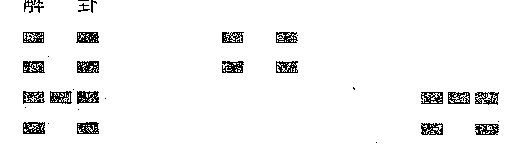

上的手掌嘛？震卦的阳爻就是一张坚硬的皮。而震卦的两个
阴爻其实就是坤卦，坤不就是手心那柔软的肉嘛？

> 肉
> 肉
> 皮

我们平视这个雷水解这个卦，看看这个卦里面还能拆解出来什么卦。雷水解里面是不是还藏着一个离卦，注意看雷水解的二爻至四爻。不就是一个离卦嘛，对！就是一个离卦，离为心，为美丽，为光明，为漂亮。前面我们已经将震卦的象意读出来了，震为手掌，这里又将离卦的象意读出来了。那么现在我们就接着前面读出来的，连起来一起读，是不是可以读，手掌里有个漂亮的，美丽的东西呢？是不是可以这样读？手里这个漂亮的东西是什么呢？我们就必须把雷水解这个卦里面该有的卦一起挖掘出来，一起读出来。

> 肉
> 皮

我们再把视野放在雷水解这个卦的初爻至三爻。是不是一个坎卦？坎是什么？我们知道看有很多的意象，如果要说说可以说出一大堆，坎为陷进，为坑，为车，坎也为弓轮为圆，为黑色。有的人会问为什么坎为圆形的，乾的

### 第九章 梅花易断实例技法讲解
象意里面也有为圆形，圆满的，但是坎为圆形实属难以
理解，我们不乏注意观察一下身边的事物，再对比一下坤
和坎卦。我们知道如果说绝对的圆是不可能的，圆的表面
总还是会有坑坑洼洼的，粗糙的地方，这个坎卦就很能说
明这个问题。坎实际是坤卦得了乾卦的真阳，所以由坤变
坎，坎为中满，凡是中间满的，都可以视为坎。坎卦中的
阳爻，你可以在视觉上看做是中间凸起来或者凹陷下
去的点，我们知道阳爻是完美的光滑的。那么这个阳爻不
就是可以看做事物最光滑的点嘛？我们注意观察一下球体
表面，是不是从视觉上我们看到的都是一个平面的，就象
坤卦一样，但是实际上球面还是有那个凸起来的弧线的。所
以我们坎卦在意象上就有抛物线，球形这样一个象。那么
三个卦象的象意我们都一一的挖掘出来了，那么就可以将
这三个象意连起来一起读。是不是就可以读成手里捧着个
掌上明珠呢？


是谁把她当成掌上明珠？不就是我们前面说的大坤卦
嘛。雷水解一个大大的坤卦包含了整个手上的信息在内
面，在家里是母亲，在外面是身边的人，是不是身边的
人？一个离卦外面是坤，坤卦那些短线是不一个个的阳

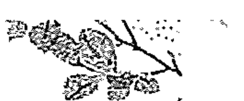

## 132 梅花易象高层之路
爻？阳爻是什么，不就是一个个的人嘛。

当她是掌上明珠，在外面害怕她不能穿暖，担心她受
委屈？这个雷水解的卦象里面其实都能找到这样的象意。

### 解   卦    四爻互    五爻互

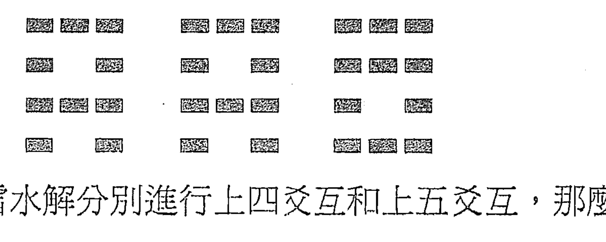

我们将雷水解分别进行上四爻互和上五爻互，那么就得
雷水解卦和雷火丰卦，得出两个卦象以后我们就重新
给这两个卦重新做一下定位，对，天地定位。两个卦的上
卦，震卦都定位为心理动词，定义为担心，担忧，而两个
卦的下卦（内卦）分别定义为说明担心这个心理动词的
补充说明，定义为身体感知，感觉到的状况。也就是内卦
看成身体对冷热寒凉，饱暖的感知，感觉。我们读卦的时
候不能简单的仅仅读一次，而是要不断的重复读同一个
卦。前面我们第一次读震卦的时候，读出来的是担心这个
心理动词，那么是不是就每个卦就读一次就读完了呢？非
也。读卦要根据实际的需要，要重读的读第二次，甚至第
三次，第四次，第五次······同一个卦，我们要根据实际
断卦需要无限制的重复的读每一个卦，这就像我们在说

**第九章 梅花易断实例技法讲解**   133
话，写文章过程中一样，虽然是同一个字，我们都会不断的重读，重写，这样才会有许多许多要表达的意思，也只能表达清楚所要表达的意思。不单单只是雷水解这个卦，其他任何一个卦都是一样的。都需要多每个卦，每个爻进行重复的读取卦意和象意。

那么接着前面的象意。我们再重新读一次雷水解这个卦，这次我们将上卦定义为行为动作，定义为吃。看看震卦是不是就是一个大大的兑卦？震为大凶为吃。

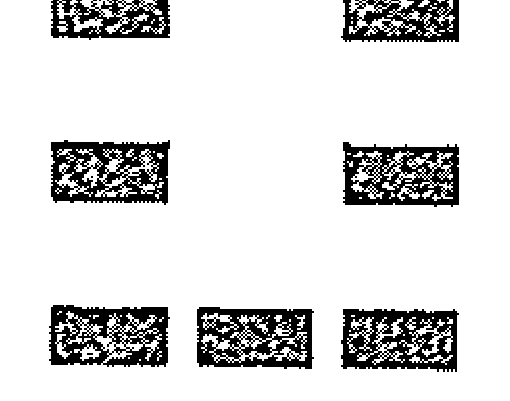

而雷水解的下卦，我们这里定义为人肚子，而内卦的卦象直接表现为上卦这个吃卦呈现出来的状况。坎卦。坎是坤卦得了乾卦的真阳，坎中满，坤为肚子，肚子吃满了，内卦坤变坎，坤满了，吃饱了就满了，就是坎，当然你也可以将坎看做挨饿了，为什么呢？因为坎有凸起和凹陷两面性，画弧线的时候我们就知道了。读完了雷水解这个卦以后，我们同样再读一下雷火丰卦这个卦，为担心没有吃饱，因为离卦是乾卦得了坤卦的真阴。乾卦本来就是圆满的，完美无缺的，现在得到了坤卦的真阴，就像一个本身完美的东西，突然中间全部被挖空了，所以离卦中间

134 梅花易象高层之路
虚了，肚子里面是空的，担心没有吃饱，挨饿了。

担心受凉和有没有穿暖也是分别对两组卦的卦象进行了第三次的重读。雷水解为担心受凉，因为坎在卦意上就
有冷的象意。坎为冷，离为热。那么运用上面对卦的重读
方法，那么雷水解就可以读成担心是否受凉，而雷火丰卦
就可以读成担心是否穿暖。

这样一个幸福的女人她想要的是什么样的爱情和婚姻
呢？这个是在卦理中需要研究的一个很实际的问题，
这个问题也是成为影响着友人恋爱成败的关键问题。那么
为了更好，更准确，获取更多的信息象，我们就得如前面
所说的那样，必须做到将卦中的各种卦象，爻象等等不断
的，反复的读取。这里我们将整组梅花卦再次重新定位一
下。首先我们分析的依旧是主卦雷水解。按照传统的梅花
易数断卦，依然是先区分好体用关系，在这个卦里面，上
震卦为友人的女朋友，而内坎卦为友人本人。这里首先看
看友人的女朋友。按照天地定位的原则，上卦为高位，下
卦为低位。现在主卦的震卦在上卦，处于高位，而且处于
发动的状态，这里说明什么问题呢？震为动，是不是
说明友人的女朋友性格像个男人一样好动，震卦旺相是不是
就是说个性比较还要强呢？！！！震又在上卦，外卦，是
不是说明友人的女朋友性格外向？!!这两个都很好理

# 第九章 梅花易断实例技法讲解

解。然，雷水解的九四爻发动，震卦一下就变成了坤卦，我们把变卦的坤卦拿到主卦震卦的下面，组合起来是不是就成为了一个新的卦？对！雷地豫卦。那么这个雷地豫卦又能说明友人的女朋友什么样问题呢？


震卦本身就有动的意象，现在震卦又发动了，是不是就是说友人的女朋友主动意识比较强，是吧？会主动的去做事，做事情。变卦上卦为坤卦，坤为众，且雷地豫是个六合卦，六合卦就是一团和气的意思，是不是说友人的女朋友会主动出击去结交朋友，会主动的搞好人际关系，会笼络身边的人？是这样吧。那么根据综合的卦象来看，友人的女朋友看就像一个女强人，做事干练，身边有很多的朋友，也会利用身边的朋友。对于她来说实际上她身边的朋友就是她的生财之道。为什么那么说呢？这里我们需要象六爻断卦一样，进行一个太极点的转换。注意看变卦地水师中的坤卦，坤是不是震卦的财，且是震卦主动变化而来的财，我克者为财，是不是说明友人的女朋友能发挥自己的能力，找到好的财运？她有那个能力。坤为母亲，这个坤卦是外卦的坤卦，那么这个坤不就是友人女朋友的母亲嘛。震木克合着坤土，一棵大树牢牢的生长在大地上，是不是也牵制了坤土，是不是也说明友人的女朋友的母亲也要听她的呢？

我们将主卦的震卦和离卦放在一起对比一下，是不是震卦就像半个离卦？对，震就是半离。所以我们有时候可以将震卦看做离卦来解读，那么雷水解卦在断恋爱上，是不是就可以解读为友人的女朋友的事业心比较强，她的心早已高高的挂在外面了呢？是吧？她想有大的发展，是不是这样？主卦的震卦中藏着的卯木与日建的戌土也合着，戌土是什么，是不是乾金，：乾是领导吧，是当官的吧？是不是说明她和领导关系也很好，对于她来说，领导也是她的生财之道。她不想和自己的男朋友谈恋爱，结婚。是这样吧？她觉得自己的男朋友没钱，在事业上拖自已的後腿。身高也矮了，没面子。

为什么那么说呢？这其实卦里面也都有。这里我们需要将雷水解卦重新排列一下，雷水解卦重新排列后得雷火丰加坎卦。


前面我们说了震卦为友人的女朋友，而雷水解的下卦，坎水为友人，对于坎水来说离火就是坎水的财，而离火处于旬空的，且入日建戌土之库，戌土是火库，戌土又藏在是乾金之中，乾为公门，这里说明一个什么现象呢？是不是只有等坎水中的子水冲实午火的才有钱，离火中的午火才不空呢？坎是什么，是不是月亮，是不是每个月？那么这不用说友人拿的是公家的死工资，雷火丰本来可以直读为动心，但是离火都旬空了，是不是就是说动不起心来呢？或者说动心的只是每个月那么一次呢？就发工资的时候动心那么一下呢？财为养命之源，但是对于震木来说，是动不起心的，反倒成了拖后腿的一个象。再就是坎水本身的特性，我们知道自然环境中，水是湿下的，在这个雷水解中，友人的坎卦处于内下卦，是不是说明友人的身材还不怎么高呢？但是对于震木来说，周围不但有旺的戌土，还有坤土，还有互卦中的坎水生。那么综合以上是不是说明自己的男朋友不能给予自己太多财力和物力，以及心里上的东西呢？因此只能通过自己的努力向周围不断的争取自己所需呢？雷水解卦中的震卦发动了，四爻一变变成了坤卦，坤卦中藏有未土和申金，未土是震木的财库，申金是马星，变成雷地豫六合卦，友人的女朋友想改变自己的情况，她想过安逸的生活（六合卦主稳定），想有充裕的财力和物力，所以她选择了离开。震卦中藏着卯木，卯木为桃花，不但和日建合，且和变卦坤卦组成六合卦，这个也说明友人的女朋友不乏有别的异性朋友的追求，她想找更好的男朋友。

说到这里，我们也不妨看看女方家长对友人的态度。这里我们只要研究一下变卦就不难看出女方家的态度了。


前面我们说了，变卦地水师中的坤卦为女方的母亲，内卦的坎水为友人，上坤土旺克坎水，地水师实际上坤土中藏着震木，自然之理，一棵大树被埋在了土里面，这棵大树也无法生存，再外卦为往，内卦为来，坎为路，坤土克制，来路不通。地水师中的震木被埋在了土里面，坤为家，为母亲，震也为路，为友人的女友，震木被埋在土中，动弹不了。那么也就是说女方的母亲不喜欢友人，不希望的女儿和友人往来，友人的母亲把自己女儿关在家里，阻断他们之间的联系。地水师的反卦是水地比卦，水地比是有朋友之意，那么现在地水师卦是水地比的反卦，也就是连朋友都倒过来了，也就是说朋友的母亲希望他们最好连朋友也不要做。断绝往来。地水师有与尸之意，也就是说最好死了这条心。

最后我们再回头来看看这个主卦雷水解卦，前面我们看到了，雷水解其实就是一个大大的坤卦包着一个离卦在中间，前面我们将坤土定位为母亲，而离卦定位为友人的女朋友，那么此时我们换一个思维的角度去理解一下这个雷水解卦。这个雷水解的卦如果将中间的离火压缩了，是不是这个雷水解很像一个大坎卦，是这样吧，坎是什么，坎是不是凝聚，交汇呀，雷水解是不是象一座断开桥梁一样呀，换句话说如果三爻是个阳爻，也就是说，如果是雷风恒卦，它们两个卦表达出来的象意是截然不同。


注意看这两个卦，如果是雷风恒的话，是不是说明彼此双方有所沟通呢，虽然说雷水解也有沟通之意，但是雷水解中间的是离火，而不是乾金，当然你可以说友人和女友之间彼此用电脑，网络经常联系，这个也说得到通，因为毕竟离卦就有网络的意象在里面，但是我们不能忽视日月建对卦中各卦产生的作用力，日建为午未空，离火之中藏午火，好，雷水解之中藏着的午火空了，离火有热情，网络，奔放，信息，交流的意象，空了，说明友人和恋人之间的联络就少了，中断了，我们知道梅花易断中，主卦为开始，互卦为过程，变卦为结果，是不是说明一开始的时候就不太热情，而且彼此之间的联络会越来越少呢？

##### 一块石头显神奇

我也不知道是不是该叫做神奇之旅，只是觉得此次经历的事情很神奇，一直以来都认为周易预测是门博大精深的学问，一直受到周易预测博大玄奥的感召，很想更快的掌握所需的丰厚知识，更早一步真正踏入那神秘的殿堂，知识就是力量，只有知识才能成就未来。


今早辰时的时候到车站去买面条，去的时候很是担心车站那个唯一的小商店不开门，很是犹豫，百无聊赖的走在前去的路上的时候，前面是一堆正在修路基的民工，自己无聊的眼睛晃来晃去的，突然眼前一亮看见了一地上一块非常白的石头，于是乎心里想是不是我就用这个石头起个梅花卦，看看这次短暂的出行会如何呢？于是得：

农历：甲午年7月2日8时

干支：甲午年 辛未月 庚子日 庚辰时（辰巳空）（申酉空）


当看这个卦就觉得车站那个唯一的商店应该是没有开门，但是为了证明这个卦是否分析正确，还是毅然决然的朝车站的方向走去，到了商店门口，果不其然，商店果真没有开门，虽然商店门板上写了店主的手機号码，但是我没有拨打，而是转身往回走。

在这个卦里，兑不仅为我也为吃这个动作，艮不仅为也為車站，為商店，艮在方向上為東北，坤在方向上為西南，实际上我是从东北往西南方向去，而商店正好在西南方向。

兑为吃，艮为门，为停止，为关闭，止于吃，说明我没有吃的了，艮土生兑金，是我到车站买吃的东西之象，买什么呢。这个卦里面其实都有，在互卦里面找，巽为细长，巽木对于兑金来说就是财，财为食物，为吃的东西，前面说了，面条，但是没买到，为什么没买到，商店关门了，巽木也临日建旬空，说明商店关门，自然想买的面条也是买不到了，换个角度来分析，同样可以找到同样的信息，泽山咸这个主卦为山泽通气，有通达，圆满之象，艮为土，为商店，兑为吃，为我，土生金，仅从卦象上看，也是可以從商店买到東西的，但是艮九三爻变化了，本来三爻得位的，但是一变化，三爻就由得位变成不得位了，主卦泽山咸变成了泽地萃，虽然变卦坤土可以生兑金，按照传统的梅花易数，看视乎土生金有田土之喜，但是殊不知坤也为虚无，辰时为万物之库，坤土中藏着未申，而庚辰时是申酉空，坤土在庚辰时是旬空的，坤土无法生兑金，可以理解坤为肚子，肚子里面无货，说明我到了车站本来是可以买到吃的，但是由于自己的缘故却没有买到吃，手里是空手而归。


在换个角度上来看，艮土中藏着丑土，被日建子水给合住了，合为关闭，艮土本合住了，同样也是没有办法生兑金的，这个主卦无论从那个角度上分析，都显示我到商店买东西都是会空手而回。

我走在回来的路上，这是铁路边的一条很窄的羊肠小道，路基边的小路。我又在想，这个卦还蕴含着什么样信息呢？一边在琢磨这个卦往回走的路上，我一边走，一边想，到底还能看到遇到什么呢，走著走著，当走在回路的三分之一时候，看见一只硕大的死老鼠直挺挺的躺在路边，老鼠的身体都有些腐烂了，身体上有不少溢出的水。我不解，卦里面怎么也找不到有死老鼠的影子？想了一会才明白。原来死老鼠藏在组合的卦象中。

当时我也没有想明白为什么会有死老鼠会，后来想明白了，原来是自己对于梅花的象意没有完全掌握好，只是生搬硬套的去理解卦象，脑子里一直刻板的认为老鼠对应的卦象只是坎水，因为坎为黑，为盗，为黑夜出来偷吃米（坎卦就像个米字）的东西，所以当这个卦对应的事物出现以后就象个无头的苍蝇一样往卦里面套，在静下心来重新学习焦氏梅花易的时候，发现现实生活中事物的像是可以穿插出现在每个经卦当中的，就好比这个出行的卦，坎卦可以代表的是老鼠，艮卦同样也是可以代表老鼠，虽然是两个不同的卦，但却同样可以代表了老鼠这个物象，在焦氏的梅花易里面，坎为月，但是兑同样可以为月；坎为水，但是同样的坤也为水；离为东，但是同样的震也可以为东；坤为老妇，但是兑同样也可以为老妇，离为日，但是同样的乾也可以为日；离为火，但是艮同样也可以为火；坤为土，但是同样的坎也可以为土……这究竟是因为什么呢？这在前面的卦例里面已经说过，不过是取象的部位不一样，看事情的角度不一样而已，就好比坎卦和艮卦一样，两个卦都可以代表老鼠这个动物的物象，但是两个卦在取象的时候取象的部位和角度是不一样的，老鼠之所以可以以艮卦卦象出现，可以因为取其有齿这一特点，也可以取老鼠是生活在洞穴里这一特点，而老鼠可以取坎卦卦象出现，可以取其身体黑色这一特点，也可以取起生活习性，喜欢夜晚出来偷米这一特点，当然也可以取其有四足这个特点。因而虽然卦象可以不同，但是却可以代表同样一个物象；同样一个物象也可以同时有八个经卦的卦象，可以有各种各样的取象方法和取象角度，只要你想得到。

我不停的在回来的路上走着，“这租卦里面还隐藏了什麼信息呢？”看见黄色的衣服？看见黄色的鞋子？呵，还真是这样。我快要走到上班的地方的时候，远远看见一个穿着黄色警示服的巡道工在铁路上走着，我很纳闷，来的路上就看见哪个巡道工已经朝东北方向走了，怎么走了那么久都还没有消失在我的视野，我都打了个来回的，呵，是不是知道我在起卦预测了，在这等着我呀。哈哈。

再走了20米这样，啊呀，真的有一双被旅客丢弃在路基上一双白色的，已经发黄的旅客用的简易拖鞋。呵，真的是过于巧合了吧？

最让我不可思议的，也是我想了都无法想想的，可能是我没有吃透卦中的各种玄机吧？快要到上班的地方了，这时看见路边的水沟里有一堆黑乎乎的东西在动，喲，是四只黑色的蝴蝶，呵，这四只蝴蝶好是奇怪呀，怎么全围在一块呢，而且是那么整齐，东南西北一个方向刚好一只，真是太奇怪了，为什么是四只，我这么想着，边朝上班的地方走，忽然脑袋灵光一闪，不对，不是四只蝴蝶，应该是五只才对。果不其然，我再次会过头去，啊呀，真的是五只蝴蝶，四只蝴蝶紧紧的围在了一隻蝴蝶，因为走动的原因，蝴蝶就飞起来了，中间那只蝴蝶飞到了离我不远的地方。呵。真是太神奇了，怎么飞到我不远的蝴蝶和其他的蝴蝶都不一样呢，其他的蝴蝶的翅膀全部都是黑色的，而这只蝴蝶的翅膀却是各自在翅膀上有白色的圆点？太奇怪了。

回到上班的地方发现手机没有话费了，于是让同事给充话费，结果没有想到，这组卦里面也同样也有信息，同事用支付宝划的钱迟迟没有划到我手机上。呵。真是太神奇了。

##### 停车场风水

一个朋友的亲戚开了个停车场，但是生意很冷清，于是我给看看停车场风水，在没有正式实地勘查停车场风水前令其亲戚报数得：泽山咸之泽地萃卦。当我看到这组梅花卦的时候心里有底了。

| 体用 | 咸卦 | 姤卦 | 萃卦 | 损卦 | 恒卦 |
| :---: | :---: | :---: | :---: | :---: | :---: |
 | | 本卦 | | | |
 | | 互卦 | | | |
 | | 变卦 | | | |
 | | 错卦 | | | |
 | | 综卦 | | | |

在梅花象数风水里面，主要是根据梅花卦的卦象来考究要预测的对象所存在的各种问题，这个预测停车场风水的卦已经起出来了，那么我们就要通过不断的拆组合整个梅花卦，以考察卦中卦与卦之间的各种组合关系从而判断停车场的吉凶情况。看这组梅花卦貌似没有什么大问题，因为按照传统的梅花易数断卦中有那么一说，就是用生体，有进益之喜。这组泽山咸之泽地萃卦，整个梅花卦的体卦为兑卦，用卦为坤，艮卦，兑为金，坤，艮为土，土生金有益于兑金，按照传统的梅花易数断卦来说，这个停车场的生意还是不错的。但是通过卦与卦的组合分析，以及结合四时来分析，这个停车场突出问题就显现出来了。

首先撇开卦象来说常理，如果停车场生意好的话，卦主也不会愁眉不展的来求测，来要求调理风水了。那么这个卦起出来了就要从卦中结合实际的环境找出不协调的地方，进行调理。好，那么我们下面就根据这组卦象进行详细的预测思维剖析。

拿到这组卦的时候，我的第一眼就发现了这个停车场有个较大的问题，就是有门门相穿的现象，这是一种极为不好的现象。为什么看到泽山咸之泽地萃这组梅花卦会得出这样的结果呢？是不是得到这样的卦就会有这样的现象呢？这都是在象数风水预测学中很关键很重要的问题。

我们知道兑卦在梅花象意里面有口，有嘴巴，缺口等等的象意，兑卦和巽卦是两个缺口截然相反的卦象。巽有出入之意，兑又何尝没有出入之意。只不过在常人的理解里面兑卦为出，巽为入，这只不过是站在不同的角度看待问题而已。一根水管两边有开口，你说哪边才是出，哪边才是入呢？那么在理解这个卦象的时候，我们首先撇开其他组的卦，单单把主卦和变卦拿出来做参考：

#### 咸卦

**体**
**用**：[本卦]

#### 萃卦

**变**：[变卦]

这里要注意观察的是这两组不同却又相似的卦。主卦泽山咸，上兑下艮，变卦泽地萃，上兑下坤。这两组卦体卦都是兑卦，用卦却不相同，但是我们将变卦的初爻至四爻截取出来就得到了一个大大艮卦，那么这样是不是也和主卦的用卦一样了？主卦是兑卦和艮卦的结合，实际上变卦也是一个兑卦和一个大艮卦的结合体。艮卦在八卦象意中有门之意思，那么以上的两个主卦和变卦是不是都有进出门的意思，兑为出入，艮为门，为家，为院子，是不是可以理解有车进出出？这里我们再仔细的观察到两组合不同卦名的卦，主卦泽山咸和变卦泽地萃，实际上我们可以看作两个大坎卦，都是阴包阳的卦。主卦泽山咸，中间三爻至五爻是三个连在一起的阳爻，三阳在一起是乾卦，也就是说泽山咸是阴包乾卦。变卦泽地萃则是四爻和五爻是连在一起的一个阳爻，我们也可以将两个阳爻看成乾卦，但是这个乾卦明显要比主卦泽山咸里面的乾卦要小。

主卦泽山咸因为四阳爻动变阴爻的缘故，变为变卦泽地萃。我们知道阳爻在爻的象意里有不断向上，不断增多，在数量上有不断增加，正数的含义，而阴爻则恰恰相反。

我们注意看泽山咸变泽地萃这组卦象，是不是在你的脑海里面呈现出来这样一组画面，就是砖砌的大大的院子里面（阴包阳，外阴组合就是坤卦，坤就是砖，围墙）里面停放着很多的车辆（主卦和变卦里面都有乾卦，乾卦就有车辆的意思）但是主卦和变卦组合在一起就不妙了，主卦为开始，变卦为结果，也就是说开始的时候停的车还不少，但是到后面就来的车就少了。主卦泽山咸的下卦，艮卦，初爻和二爻都是阴的，三爻是阳的，阴的就是虚，但是主卦三爻一变，主卦的艮卦就变成了坤卦了，变卦的内卦坤了，艮为满，坤为少，冷清，所以两组卦组合在一起理解就是说这个停车场生意冷清呢？我们知道停车场的生意要好就要进出的车多，停的车多才赚钱，变卦都坤了，自然生意不好。这里我们再从另一个角度去理解一下。我们从经济的角度去分析一下，兑为金银，为钱，为小钱，乾为大钱，兑卦在外面，艮坤都生兑金，虽然说兑


[PAGE 150] (Content continued from image context, inferred from text flow)

#### 咸卦
体：
用：[本卦]

#### 萃卦
变：[变卦]

前面我们说了艮为门，主卦的内卦是一个门，而变卦的初爻至四爻也可以看作一个门，主卦和变卦的兑卦为出入口，那么现在我们换一个角度来看一下。我们知道震卦为庭，我们说的庭院，实际艮才是院子，因为本身艮在象意上为房子，那么好我们将两个卦放倒，将两组的初爻都连接起来：


主卦和变卦上面的兑卦为出入口，而中间所有的阴爻都是空的场地？艮为东北，坤为西南，本身两个卦是对冲的，对冲在实际生活中那么可以理解为同站在一个直线上，在象数风水学上可以理解这两组卦象为门门相穿。实际上这个停车场的正门的一半对着后门，而后门则是没有租赁权的别人的场地，那个后面也时常有汽车进进出出的。门门相穿显然是财运不济的一个重要原因。

我们在把卦正过来，观察这组卦象，艮为东北，坤为西南，实际上这个停车场的方向也是东北西南象。在梅花卦里面，主卦可以理解为前，变卦可以理解为后面，那么好我们注意看一下泽山咸之泽地萃卦，主卦的下卦为艮，变卦的下卦为坤，艮卦我们这里理解为高大，而变卦的坤，我们理解为低矮。结合主卦和变卦，我们就可以断言，此停车场前门比较高，而停车场的后面就比较低矮。

实际上正是如此，因为前门是个较高的坡，所以进门的车...容易刮到底盤，進停車場比較吃力。

這個停車場生意不好，難道僅僅只是門的原因？假如不把影響停車場生意差的原因都找出來的話，那麼停車場的生意就不會真正好起來。更改停車場環境只是調理風水使財運運轉起來的一種手段，但是此種單純的調理行為並不算完美，另一方面要從管理手段和宣傳手段著手，那樣才能達到好的效果。下面我們再根據主互變三個卦來看看如何採取宣傳手段來擴大停車場的知名度。

#### 咸卦
#### 萃卦

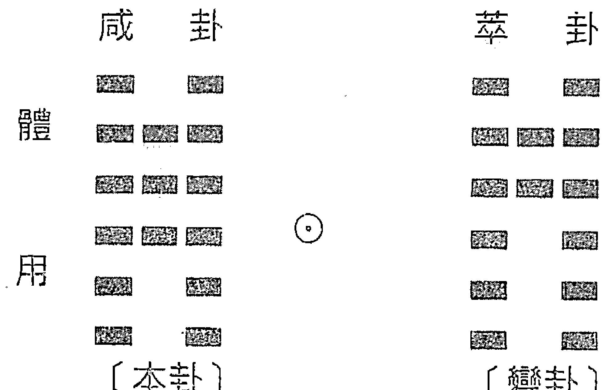

我們注意看下澤山咸、天風姤、澤地萃這組梅花卦，看看為什麼要從宣傳手段出發。首先我們注意看一下互卦，互卦為天風姤卦，天風姤，上卦為乾，下卦為巽，巽為信息、消息，整個互卦實際上也可以看成是一個巽，大大的巽卦，那麼我們讀卦的時候，就從主卦的上卦開始讀。

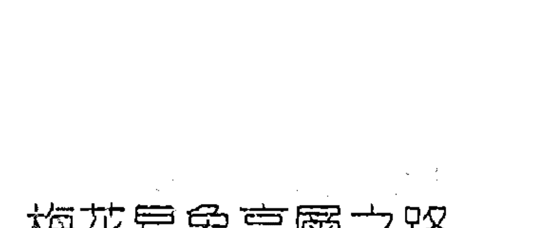

#### 咸卦
#### 姤卦
#### 萃卦
體 
→    
      ↷
        
          ↷
            
              ↷
                
                  ↷
                    
                      ↷
                        
                          

從兑開始：兑—乾、巽。主卦的兑在卦的象意上有不完美、缺乏之意，這裡我們理解為缺乏、缺少；乾是完美的、全面的；互卦的巽我们从卦的象意裡面理解為消息、信息。那麼我們連起來就可以理解為，此停車場沒有缺乏全面的宣傳手段，實際上停車場就沒有做好的宣傳手段。我們不妨可以直接地將主卦的兑卦和互卦的巽卦結合起來，這樣看就不難明白了，組合起來就是澤風大過卦，兑為金，巽為小草，巽木為宣傳，兑為說、為宣傳，說明在宣傳方面是大大的缺失的、信息不暢通的。

以巽卦為中心，巽的上面是乾卦，巽木被乾金克制，被主卦的兑金克制；然後看下巽卦左邊的艮卦，艮為停止。將互卦的巽卦拿到主卦的艮卦下面，得山風蠱卦，信息被止住了。如何止住了？怎麼信息不暢通？為什麼這裡有個那麼大的停車場，司機卻沒有到這裡停車呢？我們注意看一下澤山咸這個主卦，澤山咸的內卦為艮，艮為停車場；澤山咸的三爻至五爻為乾卦，乾為道，這裡我們可以理解為道路。

六交為陰的，這裡我們可以理解和想像為兑卦和乾卦的組合體，為路口，那麼澤山咸這個卦，從兌卦的缺口，也就是路過，要經過乾卦這個長長的 roads 才能到達停車場，那麼說明此停車場離路口還有一段距離，比較深。主卦的兑金和互卦的乾金都克制著巽木，巽為信息、為標識，說明停車場在路口沒有設置停車場的宣傳標識，所以過往的司機不知道巷子裏面有停車場。再看一下主互變三個卦的體卦，兑→乾→兌，兑為說、為溝通，兑也可以理解為司機；中間一個乾卦連著兩個兑卦，說明此停車場只是靠司機間相互的交流才知道的，而且還是少數的司機。

我們再看看這個停車場採取的管理模式，澤山咸這個卦可以用守株待兔來形容。主卦澤山咸的內卦艮為停車場，艮也是守車場的管理人員，艮為停止。雖然艮土往外生兌金，但是艮卦的特性正好和震卦截然相反：震為動態，艮為靜態。再因為澤山咸的九三爻陽爻動變陰爻，艮土變坤土，這個說明一個什麼樣性質的問題？坤在象意裏面有軟、不積極的一種象，說明停車場的員工也不積極管理和宣傳停車場，存在消極的態度。而身為經營者的老闆也存在管理上的缺失。改善的方法不僅僅是從停車場的環境進行調理，而要從管理模式和經營模式上更改，不能採取守株待兔的模式去經營一個停車場，應該變被動為主動。

澤山咸實為不通達，要變澤山咸為山澤通气，這樣才能將自己的停車場推廣出去。

| 咸卦 | 姤卦 | 萃卦 | 損卦 | 恒卦 |
| :--- | :--- | :--- | :--- | :--- |
| 體 | 用 [本卦] | [互卦] | [變卦] | [錯卦] |

是不是調理好停車場的風水，那麼這個停車場的生意就會好起來了呢？非也。記得以前有聽人說過那麼一句話：命好不如運好，運好不如家宅好，家宅好不如陰宅風水好。是不是真是說的那樣呢？這裡我們不做深層的考究，但這裡很明白地告訴我們三者之間是緊密相關的。所以聯想到這一點，我就想遇到了有這樣不良財運的停車場，那麼也一定會有不良的家居環境；結果看完停車場風水後立即前往其居住地進行實地勘查，果不其然，其家居裏裏外外的環境真如卦裏顯現的一模一樣，與其租用的停車場風水有共同之處。

儘管是同樣一組梅花卦，卻也能反映出兩個截然不同地點的環境信息。

156 梅花易象高层之路

#### 咸卦

首先我們將整組梅花卦做個細緻的環境區分，在以往的梅花預測中我們知道梅花斷卦：主卦是開始、互卦是過程、變卦是結果；但是這裡整組梅花卦變成了預測家居里裏外外的環境場，那麼這組梅花卦的主卦就是房前、互卦是房的中部、變卦則是房後；當然這要根据實際的預測環境採取不斷變換的方法。這裡我們將澤山咸看做是房前。

那麼好，現在我們看一下這個澤山咸這個卦，當我們將思維立體化、整體化的時候，看看這個澤山咸卦像什麼？澤山咸的下卦為艮，艮卦者兩陰居於一陽之下，兩陰為坤卦的三分之二的象，坤為方，相對於一陽來說為大，因而艮為台。澤山咸的上卦為兑卦，兩陽居於一陰之下，實際上兩陽為三分之二的乾卦。我們不妨將整個澤山咸卦連起來看，暫時不要分艮、兑兩個卦，看看是什麼樣一個情況：澤山咸的艮卦一陽和兑卦的兩陽緊緊地連在一起，如果將澤山咸看做是一個具體的物體的話，是不是說明這個物體的下方三分之一的地方都是很大的，像個台子一樣穩固？

艮為山嘛，山不就是屹立不倒的意思，堅如磐石。這個物體從下到上都是一個完整的連續體，因為從三爻到五爻都是陽爻，是個乾卦，乾卦的意思不就是完整的、連續的意思嘛；到澤山咸的六爻的時候才是陰爻，陰爻為不完整、開口的。六爻是一個物體的頂部，是不是說明這個物體的頂部是有口的？本身兑卦就為口、出口；那麼整個澤山咸的下卦兩陰就為入口，整組卦象上看這個物體是下面入口大，上面出口小。你或許會想到這是個電線杆，但實際上在卦主居住的地方的前面五十米處屹立著一個巨大的煙筒，那個煙筒不停散發著煙霧。當我們將這個澤山咸深度挖掘象的時候，我們還可以運用到平時學習過的半象和卦的反象等手段；當然在實際的斷卦過程中則不能像今天我們學習卦象這樣，慢條斯理的一個卦象一個卦象地拆解，這裡我們的首先掌握斷卦的個讀卦的方法。我們深入地挖掘這個澤山咸卦：艮卦一陽一陰為離火的半象，然我們在學習焦氏梅花易的時候可以瞭解到艮實際上也為離卦的半象，也是火；不妨說艮卦就是火（前面我們已經說過了艮卦為何為火的原因）。看看這個澤山咸卦，下面初爻到三爻是不是像離卦的中上部？而且比卦還要大。我們知道火的性質是離中虛，艮卦兩陰，而離卦則是一陰，艮卦陰的部分占據了整個卦的三分之二；艮卦一陽為離卦的最上部，艮卦一陽是不是就像火的頂部？那麼整個澤山咸卦來看是不是說明這個煙筒的下部燃起很大的火呢？在你預測的腦海裏是不是有這樣一個畫面？

我們在看看澤山咸卦的兑卦，前面在學習梅花卦象的時候我們說過，兑卦也是巽卦，巽卦也是兑卦，只不過兩者開口的方向截然不一而已；實際上兑卦和巽卦是先後天的關係。當我們將澤山咸的兑卦看做是先天的時候，那麼它就是一個巽卦，巽為風、為煙霧。那麼將這個分析的過程來看看，是不是說這個煙筒下面燒起大火，那麼煙筒的出口兑卦裏就飄出來很多（巽）烟呢？是不是通過澤山咸這個卦分析會在你腦海裏有這樣一種場景？


| 本卦 | [互卦] | [變卦] | [錯卦] | [綜卦] |

那麼好，我們大致看完了居住的外部環境以後，我們在看看房子的內部環境，這裡巧合的是，這整組卦象準確地反映出了卦主居住房屋的特點。我們注意看一下這整組的梅花卦，這裡我們再進行一下思維上的調整，我們將整組梅花卦看成是卦主居住的那棟房子：主卦澤山咸看成是房子的左邊、互卦天風姤看做是房子的中間、而變卦則看作是房子的右邊。那麼好，我們仔細看一下整組梅花卦：互卦天風姤，上卦為乾，下卦為巽，巽為入，是不是說明這棟房子的入口是在房子的中間？實際上這棟房子也是從中間上的，你或許會問這個卦象為什麼不能說從左邊上或者從右邊上？這裡我們進行一下詳細的分析：左邊澤山咸卦初爻、二爻都是陰爻，三爻才是陽爻，陰為虛，陽為實；實的為樓梯，單經卦的三爻為齊頭的位置；澤山咸這個卦齊頭位置才是實的，那麼說明房子的左邊在齊頭的位置才有下腳的地方；而且澤山咸的下卦為艮卦，艮卦的初爻、二爻為連續的陰爻，為坤卦的三分之二，坤、艮為磚石、為牆體、為堵、為停止；那麼就足以說明房子的左邊是沒有路臺階可以上樓的。右邊澤地萃從初爻至四爻也就像一個大大的艮卦，那麼說明從右邊同樣也是上不了樓的。

但為什麼通過這組卦象就明確地告訴我們這棟樓是從中間開始上樓的呢？這裡我們就得好好的分析一下中間這個天風姤卦。我們注意看這個天風姤卦：姤卦是一陰統五陽，五陽據一陰，一陰處於五陽之下；從九二至九六都為陽爻，五陽連續。我们知道上樓的時候最下面開始的地方是地表，第二階才是真正意義的上樓；大家看這個天風姤卦：初爻為陰，陽為天、為實，陰為地、為虛。好，這個天風姤的下卦是巽，巽為入口，這個天風姤就好像一級級的樓梯臺階，陽爻又像是一層層的房間；你上樓的時候從陰爻開始，從陰爻地平線這個位置上去，上到二爻的時候就開始真正的上樓了，三爻再上一層，四爻再往上一層，五爻再上一層，直到六爻最上面一層。是這樣吧？這組梅花卦是不是很形象地告訴我們卦主的家是要從樓的中間位置開始上樓的。

好嘛，現在已經上樓了。我們注意看這組梅花個卦，我們依然接著前面上樓的思維，依舊沿著天風姤這條線繼續走，這就好比一個行進的路線；上樓上到三爻這個位置的時候開始發生變化了，因為主卦澤山咸的下卦（艮卦陽爻動），陽變陰，澤山咸變成了澤地萃卦；那麼我們的視覺也要將這個思維放在三爻這個位置上。我們首先看：天風姤到了三爻以後，天風姤的三爻是陽爻；而與之相對應的右邊是陰爻；而天風姤陽爻的左邊是陽爻。這裡值得注意的是，有的人會說卦主的家是不是在右邊？天風姤的陽爻和陰爻是陰陽相吸，正好是一對，所以卦主的家應該是在右邊。實際不然，卦主的家是在左邊。為什麼在左邊？這裡值得注意的是：首先卦主是個男性，那麼男性為陽；右邊為陰爻，陰陽是一對，兩者截然不同；左邊是陽，是自己家。

### 第九章 · 梅花易斷實例技法講解

159

互卦天風姤的三爻是陽爻，而與之相對應的右邊澤地萃的三爻是陰爻（陰爻為無、沒路了）；左邊澤山咸，艮為轉彎，艮的三爻為陽爻與互卦天風姤的三爻是連續不斷的，所以左邊是卦主的家。實際情況樓主的家也是在三樓的左邊。也許你會問還可以上一層樓嘛？上不了了，實際情況是這棟樓也只有三層，上到三樓就停止了。這裡特別有意思的地方：就是假如想要上到天臺上面去的話就必須通過他家；對門還真上不了。我們注意看是不是，主卦澤山咸，四爻依然是陽爻，五爻還是陽爻，六爻才是陰爻，說明在卦主家還是有路的；對門澤地萃四爻是虛的，上不去了。這個卦是不是很有意思？

這個卦還有非常有意思的地方，只要我們熟悉解卦的方式，熟練地掌握讀卦的技巧，那麼我們就能從卦中找出更多的信息點來。當我看到这个卦的時候，我的第一感就是卦主肯定買的是個二手房，為什麼那麼說呢？其實一是靈感思維，在看到澤山咸這個卦的卦形、領悟到卦易的時候，第一感覺到的信息：澤山咸，兑為二（舊）、艮為手、也為房子，因而直讀二手房；實際情況也确实如此，房子的确是二手房的舊房子。

當時我看这个房子，又结合这个泽山咸这个卦象，我断言居住在这个房子的原来的房主肯定是婚姻不好。卦主反馈到：原来的房主夫妻都是二婚的，最后因为嫌这个房子不好，所以买了新房子，所以便宜将这个房子给卖了卦主。為什麼說明來的那個是二婚的、婚姻不好呢？第一也还是看到了泽山咸之泽地萃这个卦后產生的預測的靈感思維，再就是实地看了房子的里裏外外的環境後確定的。这组梅花卦的主卦泽山咸：内卦艮为原来的房主，上卦兑为二（旧）；下卦艮土三爻阳交动，艮土因有三爻一阳为家，现在三爻一阳动变坤，坤为虚、为无、为败。艮土有阳为房、为家，一阳好比是一个家的屋顶，现在一阳变化，屋顶被拆了，兑为拆；那么家也有不在了。直读泽山咸之意就是分家。当实地看到房子的实际环境后，更加确定了这个房子原来的房主婚姻不好。

前面我们就说了房子的前面有个很大的烟筒，这是个很不好的风水梅花象。如果你的预测技术精湛的话，同样在没有实地勘测这个房子的环境也同样可以预测出这个结果。

## 第九章·梅花易断实例技法讲解
163

在这个卦里面很多信息都可以找得到的，就拿这个烟筒的问题来说吧，为什么房子的前面有烟筒会不好呢？从比较科学角度来说，烟筒每天排放出来有毒的烟尘会影响人的身心健康；从风水的角度来说，房前有高大的烟筒就是一种煞气。那麼從梅花易断是不是也會有不良的信息在里面呢？那麼好，带着这个疑问我们再细致的分析一下：前面分析的时候我们已经知道了泽山咸这个卦就好比是个烟筒；那么卦主的家在哪里呢？这里必须首先将整组的梅花卦重新定位一下：我们将主卦定位为房前、变卦为屋后、互卦定位为房主的房子。前面已经知道了泽山咸是烟筒的象，那么是不是说烟筒在房子的前面呢？实际情况也就是这个样子。

那么我们再看看房子的后面是个什么样子？刚才我们说了泽地萃就是房子的后面；主卦泽山咸的三爻阳交发动变坤而成泽地萃，艮为高台，坤为平、为地、为低。艮一阳动变为坤，这里我们在思维上理解为艮变坤的过程为下台阶、下一级（前面我们在理解上下楼梯的时候，阴阳是一上一下：阳向上为上一层，阴变阳为下一层）；那么实际的情况是卦主所居住的房子比后面的房子要高出一层，那就是两排房子形成前高后低的局面。现在我们回过头来看看主卦泽山咸变泽地萃的结果是什么？

前面說了，卦主的家是在三樓，也就是最高的一層，那麼要看卦主家裏家外的環境了，要怎麼一個看法呢？卦還是那麼一組卦，不可能再重新起一個卦來進行分析。只要我們明白其大無外，其小無內這個道理，即便是同樣一個卦也可以分出你我他。那麼我們依舊將這組梅花卦看成是三樓卦主家裏家外的環境卦：互卦為卦主的家；澤山咸是烟筒，變卦是澤地萃是屋後。在學習後天八卦方位的時候，我們知道艮卦和坤卦是一組對沖的卦，艮為房，坤也為房，說明兩個房間是前後對沖、對穿過去；從哪裏穿過去？這裡我們要看互卦的巽卦；前面我們說了互卦是卦主的家，而互卦的下卦為巽，巽不但指的是入口，而且也有窗戶的象意在裏面。那麼結合澤山咸與澤地萃、艮坤的這些卦象，是不是說明外面的烟筒通過窗戶形成一個對沖的環境呢？衝到哪裏去了呢？卦裏面其實全都有，我們還是要進一步的深挖卦中的各種信息象：互卦天風姤，這裡已經很明確地告訴我們，外面的烟筒穿過窗戶直衝到主臥房裏面來了。為什麼是主臥房？天風姤嘛，乾為君、為主，是不是主臥房。實際情況也正是如此，站在主臥房的門口就可以穿過客廳的窗戶看見外面巨大的煙筒；同時站在主臥房的房門又可以看見主臥房的窗戶外麵。這樣的居住環境是非常不利於房主財運和婚姻運。

### 第九章：梅花易断实例技法讲解
165

| 咸卦 | 姤卦 | 萃卦 | 損卦 | 恒卦 |
| :--- | :--- | :--- | :--- | :--- |
| [本卦] | [互卦] | [變卦] | [錯卦] | [綜卦] |

通过这个卦我们还能拆解出很多很多想要知道的信息，因而我们在学习梅花易数的时候就要熟练地掌握各种的读象的技法，而不能拘泥平面化、刻板地读取表面的卦象和卦意，更不能采取死记硬背的方法。只有你想不到的，没有做不到。这组易断停车场风水的卦不单单是只断了停车场的风水，而且还断了卦主所居住的环境；更有甚的是断了卦主房屋原房主的婚姻信息。

通过这个卦还能瞭解卦主自身的信息，比如说通过这个卦我们可以知道卦主膝下是个男孩；实际情况是卦主有一男孩正在读小学。为什么说说是男孩呢？其实这个卦里面都有：虽然都是同一个卦，但是你的定位点变化了，那么你预测的方向也要随著变化。我们看到个卦，主卦泽山咸，艮土在下卦，兑卦在上卦；艮是什么？你不要刻板地告诉我们，艮只是山、只是少男；艮为什么就不能是小男孩？艮卦在兑的下卦，可以不可以说兑生了个小男孩？这个兑并不是我们说的少女（兌雖然有少女的意象，但是也有二的意象，也有老婦的意象在裏面，千萬不要犯少女不能生小孩的讀象錯誤思維，刻板的認為兌卦就是未成年少女）。澤山咸，兌金下生艮土，也可以讀作卦主膝下有一小男孩，你也可以再換一種說話，說卦主的老婆生的是一男孩。只要你秉承卦易、不違背卦意、熟練掌握讀卦的方法，你想怎麼讀就怎麼讀，一讀一個准，大可不必大費周章的在卦中不停轉太極，轉太極只不過是梅花易斷最基礎的方法。

再如澤山咸這個卦，我們運用外四連互的方法得澤天央卦，我們可以說卦主的廚房是在房子的西北；運用澤山咸外五連互的方法得澤風大過卦，我們可以說卦主不經常在家做飯。運用陰陽反錯的方法我們還可以斷卦主的房子西邊漏水等等。卦是活的，只要你靈活的運用，卦象在你手中就是信手拈來的小事。

##### 中五元

買彩一夜暴富是很多彩民的夢想；我就認識一位老彩民，其也是一位周易預測愛好者，因為年紀大的緣故，也因为迷上了彩票，因而放棄了對周易預測的學習。其曾經在多年以前中過七樂彩的五千元的大獎，於是乎迷戀上福彩，和其他彩民一樣，希望自己有朝一日大獎臨門。一日我在福彩投注站偶遇其，其正痴痴地望著七乐彩的走势圖，见我到来便是畅怀一番攀谈，我于心不忍其把时间浪費在研究走势图上，于是劝其把时间放在好好研究六爻预测，因为一切号码尽在六爻之中；其不信，一脸狐疑的表情；正好晚上开奖2014028期的七乐彩，于是了一卦，告知：晚上开奖的2014028期的七乐彩一定会开出14这个数字。其更是狐疑，旁边的一些投注站的工作人员和彩民更是一脸的讥笑：“呵，如果真是那么准，你早就中五百万元了。”

结果晚上开奖的结果为 08-12-14-18-20-22-29=19，就真有 14。过了许久，其都没有联系我，我也差不多都忘记了这件事；一晚，一个陌生的电话打来，直到说起那日在投注站预测彩票的事情才知道是其；其很是高兴地说：“你预测的真准，看來真的要好好重新學習一下六爻了。”

俗话说无利不起早、无事不登门；說了一番以后便说要测测当晚的买彩财运情况；于是其将已经起好的卦报了過來。我看了下卦很是肯定地説：你这个卦不仅能看出你买的彩票今晚能不能中奖，而且还能看出和你有关的一些情况。其很好奇的在电话等待着我给講这个卦。我再次認真地看了看起好的卦，說：“你起的卦好是好，虽然有财，但是目前你的财运差了点，财运还未到。因而这个卦显示的是今晚中奖也就是五元。”（晚上开奖果驗，其买的双色球也就……）中了籃球）。說完了彩票，我就這個卦說了說她的愛人的情況：“最近這幾個月你的愛人身體健康比較差，主要表現為飲食比較少，脾胃比較虛弱，手腳無力。其告訴我前段時間自己愛人身體一直很差，的確是飲食少，手腳無力，目前身體正在恢復中。

一個卦測兩件事情，貌似兩件八竿子打不到一起的事情，因而有的學習周易預測，尤其是一些愛好六爻預測的朋友強烈反對這樣的做法，強烈地反對一卦進行多斷。殊不知無論是在六爻預測還是梅花預測中，只要不斷的變換定位點，只要是技術好，就能進行一卦多斷。這一點我早已經在《六爻真鑒》一書裏面做了介紹，這裏就不再重複。下面我們主要還是研究山地剝之山水蒙這個卦是如何定位取象的。

公元：2014年5月20日18時

天支：甲午時 己巳月 辛卯日 己亥時

日空：午未（甲申旬） 時空：辰巳（甲午旬）

剝卦   坤卦    蒙卦   夬卦     復卦

體

用

(本卦)   (互卦)     (變卦)    (錯卦）    （綜卦)

## 第九章 ·梅花易斷實例技法講解

首先我們來研究一下這個卦為何斷言其買彩票會中獎，而且斷言其中的只是五元的末等獎。

拿到這個卦以後，我們第一步依然象傳統斷梅花卦一樣，先要區分好卦的體用關係。這個山地剝的卦，體卦為艮土，用卦為坤土，按照傳統的梅花斷卦中，體用比和吉利的，那麼是不是看似吉利的卦象就視為有財可得呢？非也，我們看卦的時候應該符合邏輯，合乎道理，不能片面分析和看待問題。這個山地剝卦我們在分析的時候不妨將整個卦立體的整合的分析一下。山地剝卦，上卦為艮，這裏我們不妨將艮卦看成人的手，那麼下卦就為艮卦的對應點，看成艮這個手裏的東西，我們看下卦為坤卦，我們知道坤在卦的意象中有虛，空之意，那麼山地剝這個卦是不是整體的可以理解為艮的手上是空空如也，什麼都沒有呢？當然你也可以將整個山地剝整體的做分析，將艮卦看成口袋，而坤卦對應的看成口袋裏面的東西，也可以理解為口袋裏面是一無所有的，當然，你也可以用家徒四壁來比如這個卦象，艮為家，坤為家裏的情況，整個卦就是一個大大的艮卦，艮為墻壁，所以用家徒四壁來形容山地剝這個卦也是很貼切的。在我當時拿到卦的時候，我第一眼看到這個卦的時候就覺得其手裏是一無所有。但是這個山地剝六二爻發動以後那麼情況就不一樣了。主卦山地剝

170 梅花易象高層之路

六二爻陰變陽，陰為虛，陽為實，坤為虛空，而坎為兩頭虛，中間實。那麼變卦就成了山水蒙卦，艮為山，這里我們理解為手，而坎這里我們理解為財，艮的財，我們按照轉換太極的方法，就是以艮為太極點，然後生我者父母，我生者為子孫，比和者為兄弟，克我者官鬼，我克者為妻財，那麼這個坎水自然就是艮土的財，那麼山水蒙這個卦就是手裏有財。

我們注意看上面從坤到坎這個過程，實際上就是錢財從無到有的一個過程。

這里我們要注意一個問題，不是艮坎組合都是有財，到手有財，山水蒙這個卦，坎水在內，內為家，艮在外卦，艮為手，為錢包，口袋，那麼山水蒙就是艮土到手有財，財跑不了。而水山蹇則不一樣，水山蹇是坎在外，艮為手，那麼水山蹇可以理解為必須要抬手才能拿到外面的財，才能管住財，不至於錢財外流，但是山水蒙則是錢財被牢牢的掌握在手中，把好了錢財關。兩個像是截然不

同的，這個卦起卦的時候坎水不旺，而艮坤體之黨羽不但旺，而且多，那麼也就是說搶這個財的人也很多，坤多，多如牛毛。主卦的體卦艮旺，可以擔財，綜合來說其卦主買的彩票還是可以中獎的，但是得的財會很少很少。至於得多少，卦裏面已經告訴我們了。

| |剝卦|坤卦|蒙卦|夬卦|復卦|
|---|---|---|---|---|---|
|體||||||
|用||||||
|[本卦]| [互卦]| [變卦]| [錯卦]| [綜卦]

得多少財呢，這裏我們注意看一下變卦，我們在斷梅花卦的時候就知道了，主卦為開始，互卦為過程，變卦則是結果。變卦山水蒙，上卦為艮，艮為止，為樓梯，為臺階，為等級，這裏我們把艮卦理解為等級。坎卦為陷，為坑，在這裏我們理解為數字六。讀卦的時候我們可以從下往上讀，六止，止於六，六被止主了，結合艮卦的等級象意，山水蒙為六等獎。六等獎到手。實際情況是當晚開獎卦主買的雙色球只中了五元。

人的身體健康並無關係。然，易經有雲：吉凶悔吝生乎動者也，雖然是預測購彩財運的卦，但是卦主在起卦由心感而發，心動了，那麼起出的卦自然就蘊含了各種各樣的信息在裏面，我們解卦者只不過從不同的角度，運用適當的手段把未來將要發生的某一片段給事先解讀出來而已。在這裏，首先我們得將主卦的下卦坤卦定位為卦主的愛人，主卦山地剝可以定位為卦主愛人的胃，也將整組卦定位為卦主愛人的胃部機能運動變化的過程。那麼現在就我們就對卦裏的各種組合一一的拆解。

| 剝卦 | 坤卦 | 蒙卦 | 夬卦 | 復卦 |
|---|---|---|---|---|
| 體 | 
| 用 | 

[本卦] [互卦] [變卦] [錯卦] [綜卦]

前面我們說了山地剝定位為卦主的愛人胃部，我們通過卦裏的組合看看其愛人的真個身體狀況，首先我們看從大象上看一下這個山地剝卦，是不是山地剝卦是個很大很大的艮卦，是吧？那麼我們就從視覺上給這個山地剝卦做一個小小的拆分，定位。就像我們學漢語的時候一樣，來個主謂賓，這裏我們先將上卦的艮卦定位為胃。

我們注意觀察一下這三個爻的艮卦，我們將上陽爻看做胃壁，兩個陰爻為胃部虛空的部分，如果發揮我們的想像力，是不是還可以立體化一點看待這個艮卦，這裏


我們再將整個三爻卦再進行一次拆分，單獨的將艮卦的上

陽爻和中間的陰爻拿出來觀察。

上陽下陰，也就是單獨的看看少陽卦，這個少陽卦是什麼的半象呢？假如我們將上陽爻無限的延長，是不是就是巽卦的半象，當然也可以看成離卦或者坎卦的半象。上

陽下陰，陽為實，陰為虛，虛為缺口，我們就可以將少陽

卦看成是胃部的入口。我們從解剖學的圖片上可以看出胃部

的形狀的。

這裡我們再將三個爻的艮卦下面兩個陰爻再單獨的抽出來

這個是不是就是老陰卦，老陰卦是不是很像一個坤

卦，這裡我們不要將視覺和思維的角度將這個小坤卦看成

是虛的，定義為虛的，小的，而要定義為收納，定義為容
積，空間，大的，這裏我們要針對三爻的艮卦而言。

**174 梅花易象高層之路**

艮卦是不是和實際胃的形狀一樣呢？艮卦是下面很大，上面很小，胃部的樣子不也是上小下大嘛？

我們再回過頭來看看整個山地剝卦的形象，前面我們
說將整個主卦來個主謂賓。

**上卦**<br>
**下卦**

前面我們將上卦做了個定為胃，那麼假如上卦為漢語
裏面的主語，那麼好，下卦就定位為對這個主語（胃）的
各種形狀，特徵的一個補充說明，山地剝，胃是空的。

我們再看看再重新觀察一下主卦的大象，山地剝從初
爻至五爻都是陰爻，唯獨六爻是陽爻，為五陰剝陽之卦，
群陰剝獨陽之勢。六爻為頭，初爻至五爻為身體的各個部
位，山地剝這個卦在日建上受克制，整個卦陰多陽少，陰
氣都快到頭了。我們不妨對整個主卦再次的重新定位一

下，上卦為身體的上半部，下卦為身體的下半部，此山地剝上實下虛，那麼是不是說明卦主的愛人因為飲食少，病了，所以身體不但很虛，而且是手腳發軟呢？對，上卦的艮卦也有手之意，而下卦坤卦則可以看成是腳。那麼是不是一直都會這樣呢？人生病了就要接受治療，才能慢慢的痊癒。下面我們注意觀察一下主互變是如何變化的。

拆解到這裏我們就要回到最初的時候，將主卦的下卦坤卦定位為卦主的愛人，而不是將整個卦定位為卦主的愛人。主卦山地剝，上艮下坤，艮為東北，坤為西南，實際上這個山地剝卦就是兩個對沖的卦組合在一起，艮在上，坤在下，坤為老婦，這裏主卦的坤為卦主的愛人，艮為山，為醫院，艮也為關，為壓制，說明卦主的愛人病了，進了醫院。

但是坤土六二爻動化坎水，為化克出，為化泄氣，坎水對於坤土來說就是財，財就是食物。這裏我們需要注意

## 176 梅花易象高層之路

觀察看一下坤坎之間的區別。

坤卦乃三陰卦，而坎卦為兩陰夾一陽，坤為六斷，坎
為中滿，原來的坤是虛的，突然多了一點陽爻，我們結合
上面的分析，是不是有種動態的畫面呈現在我們眼前，原
來胃裏面空空如也的，但是因為有了坎水的出現，是不是
慢慢進了少許的食物呢？所以坎也可以看成食物，還要看
成是少許的食物。當然坎也是藥，也是病，這裏我們看成為
藥，因為有了接受了藥物的治療，身體有所好轉，胃部裹
面才慢慢的有了食物。

| 剝 | 卦 | 坤 | 卦 | 蒙 | 卦 | 大 | 卦 | 復 | 卦 |
| :---: | :---: | :---: | :---: | :---: | :---: | :---: | :---: | :---: | :---: |
| 體 |||| |||||||
|| |||| ||||
|| |||| ||||
|用 | || || || || || |
|| |||| ||||
|| || || || || || || |
|（本卦）（互卦）（變卦） （錯卦）（綜卦）

我們說了很多關於如何拆象和組合象的方法，然，對
於這個卦更感興趣的是如何知曉卦主的愛人是因何得病。
其實事事皆有因，這個卦裹面都有，解不出來只能說我們

的预测水平，对于卦象理解得还不透，对于读卦的方法还没有很好的掌握。

当时我仔细看了这个卦以后，就让其多多关心他爱人的健康，不能去西北边和北边，在家注意休息，特告知其今年七八月份爱人会生病。

时至2014年11月30日晚，我在投注站又遇到此老者，其很是惊奇的告知：‘小冯，你算得实在是太准了，我爱人真的象你说的，今年农历七月初六的时候，就遇到怪事，然后就一病不起了，当时正值准备吃晚饭的时候，爱人说想睡一会，结果睡醒的时候说是梦到了家婆，以前爱人和自己母亲的关系不好，说是梦到母亲要自已倒水饭。我让爱人不要胡思乱想，说是瞎说的。爱人听完了是要再睡会，谁知准备吃饭的时候就起不床了，也不会说话了。’结果老者帶著愛人到醫院檢查，發現其的愛人得了腦萎縮，於是只有住院就醫，吃了很多藥，現在才慢慢的好起來。

下面就說說卦主愛人為什麼會因夢得病，也許有的人難以理解，尤其是剛剛學習梅花易數預測的愛好者，因為很多的初學梅花易數的人往往停留在對易象的一次性分析，一次性組合上，而不會把卦象象我們學習中文的時候反復的組合卦象，分析卦象和解讀卦象，因而就造成了學

習梅花易數斷卦也只能處於幼兒咿呀學語的狀態。在這個卦裏已經很明瞭的告訴預測者卦主的愛人會因何得病了，只要你掌握瞭解讀梅花易卦的方法，就能輕輕鬆松的將整個過程提前的解讀出來，當然在解讀未來信息的時候要掌握一定的方式方法。


## 三年內有車禍

一家子公司老總想選日子開業，因為時間比較緊，老總趕著開業，所以事先就挑定了兩天為開業日子，說是任選其中一天開業。我告知早已經確定的兩個日子都不可
用，老總說是上面已經確定的，不好更改，無奈，我令其報一組數字看看選此兩日開業今後公司會如何。結果那老
總拿起筆紙，寫了一串的阿拉伯數字，原本想寫的數字是123456789，但是當時寫到數字4的時候，覺得4這個數字不吉利，所以沒有寫4，寫到最後的時候，將9這個數字寫得特別的大，於是我根據這個現象起了兩個卦，一個是將
12356789拿來起卦，一個是將4和9拿出來起的卦，雖然卦有所不同，但是顯示的結果卻完全相同，但是用12356789
數字起出的卦，信息就更加明顯。為了更好的理解和學習
卦例，我們將用12356789這組數字起的卦來講解。

起卦農曆：辛卯年 十一月 廿三日
干支：辛卯年 庚子月 丙午日

未濟卦      既濟卦    訟卦      既濟卦   既濟卦
（本卦）    （互卦）     （變卦）   （錯卦） （綜卦）

看著老總當時在寫數字的情形，我就覺得有種不太好的預感，尤其是在看到起出來的卦象的以後，倍感焦慮，但還是按耐住焦慮的心情，很慎重，嚴肅的告知老總要加強員工的安全意識教育，尤其是要注意外出行車安全，尤其要注意的年份2013，2014年這兩年。到了2014年，我偶到此公司去辦事，又遇到此公司的老總，想起2011年起 的卦梅花卦，便再次叮囑其要特別特別注意外出車輛的行車安全。可還是不盡人意，在2014年的農曆三月，公司一輛外出施工的工程車在返回本地的路上，連人帶車翻到了河裡，雖然沒有出現人員死亡的事件，但也造成了兩人輕傷，七人重傷。

有句話叫做神兆動於先，雖然看似一些無關預測的細節，但是往往很多潛在的信息已經就囊括其中，就好比這個卦裏，在起卦的時候，雖然是隨意寫下的一組數字，

**但是在寫數字這個時空裏就包含了大量的當時時空點的信息，那麼根據時間的不斷推移，那麼根據卦象我們就可以找到未來將要發生的許許多多的信息在裏面。**
這組梅花卦的主卦火水未濟，貌似乎是比較盡美的卦，因為按照傳統的梅花易數斷卦，體克用，辛苦有財，有財喜，求出行，出行平安，此組卦的變卦又為用生體，有進益之喜，況且變卦為乾金生坎水，乾金為公門，易有官喜。在一些梅花易數斷卦的學習中，亦有人提出火水未濟與水火既濟都為圓滿之意，因而在看見此兩卦的時候都斷事主有圓滿的事情發生。然不知此兩卦在實際先後天卦位上均處於相對的狀態，亦有反復，衝撞的信息在裏面，因而在實際的斷卦中不能看見此兩卦都一口言吉或者言凶，均應秉承綜合審時度勢的態度去研判。

**此卦在起出卦的時空點是在子月的午日，子午正好是先後天相對的一個狀態，如果時空點相對處於平衡，力量大小相對平和的時候，那麼就不會發生異常的情況，這就好比我們中醫裏面說的心腎相交，那麼人的身體健康就會處於一個很穩定的狀態，不宜出現這樣或者那樣的疾病，那麼一旦出現了心腎不交，兩組力量相差懸殊的時候，那麼人就會出現這樣或者那樣的疾病，一旦出現了陰陽離決的時候，那麼人就很危險了。人的命運也一樣，事物發展**

的規律也一樣。這組卦正好是處在那麼一個相對的時空點上。當時的時空點正好處於子午兩個相對的力量上，那麼按照時空的推移，時運的變換，一旦一方的力量出現過於的強勁，那麼另外處於弱勢的一方則會因此頻臨危機。當時就是考慮到2013，2014年，離火的力量不斷的加強的時候，勢必造成此卦中坎水和乾卦不同程度的受克制，因而就會造成對應此兩卦卦象的人或者事會因此受到影響。

起卦農曆：辛卯年 十一月 廿三日
干支：辛卯年 庚子月 丙午日

用

體

未濟卦       既濟卦    訟   卦     既濟卦      既濟卦

[本卦][互卦][變卦][錯卦][綜卦]

此組卦的主卦火水未濟，時運至2014年的時候主卦離火力量增大，坎水不及離火之力，那麼坎水被離火反侮，坎水在卦象中為弓輪，為車，離火也為車，但是在火水未濟這個卦象裏面，我們把坎水看成一個實體的車的象，而離火則表示坎水這個車的的一個附加信息，一上一下，離這個卦象表示空車這麼一個信息，兩個卦組合起來是表示離火坐在坎水車上這麼一個信息，但是離火中間的陰交變

陽爻，離火變成了乾金，本來的空車坐滿了人了。那麼在午年的時候，離火的力量加大的時候，離火一方面衝動了坎水裏面的子水，另一方面克制了乾金。火水未濟卦中的坎水處於卦位裏面的下卦，按照常理，人在車上，車在人下，坎為弓輪，這裏我們轉換一個思維，日建上的午火因為太歲加力的緣故沖了下卦的坎水，坎水在下卦為車輪，如果假設上卦離火為人的話，受沖的，是不是有種加速的含義，一沖車的速度快了，為什麼加快呀，我們不妨看一下這組梅花卦的上卦，上卦在此的定位點為人，為坐在車上的人，但是換一個角度來思考的時候，離火在上，坎水在下，坎是不是地平線，水平線，而離火是不是在地平線之上，水平線之上，離火變乾金，離是什麼，離是不是午時的時候，而乾金是傍晚的戌亥時候，是不是已經到了日落西山了，離火一下變成了乾金，是不是亮的地方沒了，太陽要下山了，再換一個角度來看，從整組卦來看，離火在前，乾金在後，坐在前面車頭的離火是不是司機，因為太陽要下山了，司機坐在前面，受到離火的影響，我們知道離火也為家的一個象，是不是說司機有些著急了，正加快車速往家趕。離火在前面，是司機，司機心裏着急的往家趕，離不單單是司機，換個角度來說，也是司機的心智，在上卦也是眼睛，離火陰變陽，也說明了一個現象，

**第九章 梅花易斷實例技法講解**

司機的眼睛蒙了，心智蒙了。再離火這一沖，車的不單是速度加快了，也被離火一沖，坎這個處於下卦的車輪被沖就歪了。好了這組梅花卦的主卦火水未濟變成了天水訟，前面說了，離是空車，坎是弓輪，也是車，殊不知，乾金也是車，變卦，天水訟，金入水中，自然條件下，金入水鄉，金沉於水，天水訟就有車入水中之象。實際情況是車開得太快，翻到了河裏，幸好河裏的水不是很深，整個車半泡在河中。對梅花易斷有深入研究的還可以根據整組梅花卦進行細緻的分析，比如說傷者傷的具體位置，以及傷者的具體的位置等等。

當老總報數起這個卦的時候，因為當時起卦的時候，因為老總覺得4這個阿拉伯數字不是很吉利，因此沒在紙上寫出4這個數，而是空了一個位置，繼續寫4以後的數字，但寫到9這個數字的時候，老總卻把9這個數字寫得比其它的數字都要大出一倍，於是就在那一霎那，感覺到了一種將來會發生不吉利的氣場，第一感覺就是要出現車禍，但當時一下不能確定是其自身的問題，還是公司的問題，直到整組梅花卦起出來的時候，看到這組梅花卦後才確定了其公司的員工會出現車禍的信息，因而在起出卦後的兩三年年中不時的提醒其抓好安全信息，但還是事與願違。

184 梅花易象高层之路

在这组车祸的梅花易卦里面，还有很多的值得去不断的研究的，尤其是这个卦象中起卦的地点离车祸地点的距离，车祸地点的地名，车祸的人数等等。实际这个卦出车祸的地点是在三江县，人数是九人，有伤到脖子的，也有伤到手脚的，这个卦中其实都有。

车祸发生以后，老总也没来找我，毕竟也不是什么好事，事后因为琐碎的事情到公司去办事，遇到老总便问及车祸的事情，问为何没有注意此事，其说因为身边太多繁杂的压身，因而忽略了当初预测的事情。临走的时候，在走过老总身边的那一刻，觉得有种信息在自己的脑海里闪过，让我又想起了火水未济之水天讼卦这组卦，此时正值 2014 年。当我转身的时候，眼睛突然黑了一下，心里咯噔一下：难道这个卦显示老总的老家老父亲会有什么不好了。当时我也没在意，一闪就过了，结果没过多久，就传来其外家的老父亲过世的消息。

很多人都在疑惑为什么好事不灵坏事灵，为什么预测的时候总觉得是坏事要多过好事。其实这个从易经八卦中乾卦和坤卦很好解释，从阴阳这个角度就更加好理解。单从阴爻这两个符号来说，阳爻就是一根直线，而阴爻则是由两条直线构成的，也就是一阳含三阴，阳的主圆满的，而阴的则主缺陷的，不完满的。一个乾卦就是三条直线组成的，而坤卦则是由六条短线组成的。那么这就很好理解为什么会坏事会多于好事。因此在动念头的，动想法的那一瞬间，吉凶就时时刻刻的伴随而来，因而也是告知我们要折吉而动，要么就不要妄动。

起卦农历：辛卯年 十一月 廿三日
干支：辛卯年 庚子月 丙午日

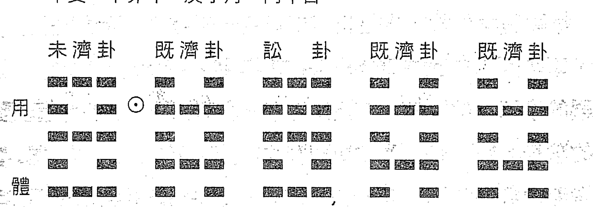

虽然这组梅花卦是 2011 年起卦预测公司安全的，但是卦主在起卦的时候无形中就潜藏了诸多的信息在卦里面，随着时间的推演，一些潜藏的信息就会随着时间前进的步伐一一的显现出来，预测师只不过运用解读易经易理的手法，提前将一些信息解读出来而已，这正是一些不理解易经，不知晓易理的人觉得易经用于预测是歪理玄术，是巫术。虽然这个卦已时隔了两年，依然可以就这个卦解读出卦主外家老人年内会有不吉的信息。2014 年，午火就是此年的时间线，卦中离火当令，变克乾金，乾金在外卦，在坎卦的上卦，那么就是告诉我们，坎这个中年男子的头上的长辈，午年的时候会受克制，乾金在上卦，上卦为人体的上部，乾又为头部，又乾金在外卦，为外家。说明外家的长辈午年的时候，会出现人体上部，特别是头部这个部位的毛病。具体是什么毛病呢。我们注意看一下整组梅花卦，主卦是火水未济，变卦是天水讼，主卦的上卦为离火，离为心血，为血管，离火克制乾金，乾金为脑袋，变卦的下卦为坎水，坎水为血液，因为时值午年，坎水破，天水讼可以直读脑出血，因而综合整组梅花卦可以解读为卦主的外家老人会出现脑体出血的症状。

此卦解读到此，这里值得注意的是在解读梅花卦的时候都要秉承严谨的态度去研究，去学习，切不可妄下结论。对于预测安全的事情都要秉承安全第一，预防为主的态度去对待。

# **随意断**

平时喜欢到街上看别人看八字断卦，不巧当日摆摊的人不在，于是走到河西闲聊起来，一个小商贩之前曾找我预测过，知道我有些功底，今日见到我来了，又缠着我给其预测，哪知道预测完以后，旁边一位上了年纪的长者也缠着给其预测，我奈何不过，于是让其随机写了两个数字，其看了看我，在白纸上写了两个数字：55，得巽为风之姤卦。

公元：2013 年 3 月 27 日 18 时
农历：癸巳年 2 月 16 日 18 时
干支：癸巳年 乙卯月 壬辰日 己酉时

日空：午未（甲申旬）时空：寅卯（甲辰旬）

| | 巽卦 | 睽卦 | 姤卦 | 震卦 | 兑卦 |
|---|---|---|---|---|---|
| 用 | 体 | 艮 -（本卦）| 睽（互卦）| 姤（变卦）| 震（错卦）兑（综卦）|

1. 你的头胎是个女儿，曾经有过流产或者养不活的迹象。分析：略
2. 你家居住的地方应该是有不少的树木，但是砍了不少，高大的树木也没有多少了。分析：略
3. 你是个生意人，对于你来说是不适合当官的，当官只能是一种负担，容易出是非。分析：略
4. 你夫妻感情不是很好，曾经有一次大的波折，几乎要离婚，原因是爱人非常喜欢喝酒，经常是喝到深更半夜才回家，因而闹离婚。
5. 爱人脾气不是很好，性格直，在家就是一家之主，说什么你都得听她的。
   主卦为纯巽卦，按照有梅花易数的基础体用原则，为有动爻的一个卦为体卦，无动爻的卦为用卦，那么上卦就为用卦，也就是卦主的妻子，从这个主卦上看妻子说的话就是命令，为什么呢？注意看，这个巽卦反过来其实就是兑卦，只不过这个兑卦的口，领导的嘴巴是向下张着的，而不是朝上的，所以说妻子说出的话就是命令，出的话就是圣旨，而丈夫说出来的话，只会当作屁股里面放出来的臭屁，不予理睬。看看卦中是不是很形象，上卦的巽，缺口在第四爻，从四爻互上去就是风火家人卦，说明妻子在家里说的话是有分量的，妻子这个巽卦可是在上卦，你做丈夫的在下面就要听得进去，要入心。不听是不行的，不听就是要争吵的，二交互就是风泽中孚卦，看是不是两张嘴巴在争吵，我们在仔细看一下妻子这个巽卦，它是不是反过来的兑卦呀，在易象里，兑卦是不是说的是正确的话，而巽是反过来的兑，那么是不是说错误的话，或者说反过来的话。那么这个也就是说，妻子在家里说的话不管是错还是对，你都得听，是不是这样，在卦象里，为什么说丈夫说的话是臭屁呢？看看主卦不就是知道了嘛，下卦的巽的缺口是在最下面的初爻，我们学习梅花易数都知道，巽为股部，巽为大腿，大腿与大腿之间有个缺口就是屁眼，巽也为气，也为口，只不过巽这个口是反过来的，不是兑，所以丈夫嘴巴说了，可是等于没有说，丈夫的巽卦的缺口下面对着的没有人，只能当作个臭屁给放出来了，所以说，丈夫说了也等于没有说，没有一点点分量。按理说主卦的上卦是丈夫，内卦是妻子位置，但是动爻在外，那么外卦就是妻子，妻子由巽卦四爻一变，变成了乾卦，乾在上为尊长，就是皇帝，高高在上，冲克制着内卦的巽，这不就是说妻子想当一家之主是什么，直读，乾为一，内卦巽为家，女人当家，一家之言，一家之长，你不听她的，那是不行的，不听她的，她就克你一下，给你点颜色瞧瞧。

###### 5. 卦主异性缘分好。
分析：略
###### 6. 卦主是个信神鬼的人。
分析：略

## **梦里梦外说梅花**

我们知道很多时候梦和现实生活中的很多事情都息息相关，正好比古语有云，日有所思夜有所梦，你白天想到了，接触到了的事情，或者比较纠结的事情，晚上睡觉的时候就会浮现在梦中。是不是真的是那么回事呢。我觉得是，但也不完全是那么回事。我们知道万事万物都是风水，都和风水息息相关。风水低一寸就是水，高一寸就是砂，这些高一寸，低一寸的事物都具有一定的力场，无时无刻都在影响着我的生活，什么样的环境就会有什么样的事情发生，也就会展现出有什么样的梦。下面这组卦正是我亲身经历的事情，我在梦中想到了白天起的这个卦，知道自己正在做梦。梦醒之后细细看了这个卦，原来都是孩子小，在家里玩过家家，在家的东北方搭了红色的帐篷，也就是帐篷惹的祸。这个卦作为梅花卦很具有代表性，因此选在书中，希望大家能一起探讨。

还是和以往断梅花卦一样，拿到卦的时候先不要着急先断，应该从最容易看，最简单的入口开始，如果你是个梅花卦的高手，那么随心所欲即可。那么好，下面就这组卦说说我的这个梦和看到这个卦的思路。

这组梅花卦其实是我白天买彩票随机起的一个卦，刚起出来这个卦的时候，我的心理就咯噔的响了一下，好像是照相机一样，眼前一闪。心理记住了这个卦了。晚上，在梦里梦见小时候曾经住过的一所长长的房子，曾经睡觉过的地方，梦里我很害怕，就想开灯，但是我怎么拉灯的开关，灯始终没有亮，我有些害怕，不知道怎么办，这个时候梦里我突然想到了白天起的这个卦，才知道自己在梦中，于是大声的在梦里喊爱人的名字，爱人听见了才把我从梦中拉了回来。

为什么我知道自己是在做梦呢？其实就是我在梦中看到了山火贲这个卦，在梦中我很快解读了这个卦的含义，知道自己是身在梦中。下面就将解读的过程通过文字的方式做详细的剖析。

当我们看到山火贲的时候，很多人都想到的是日落西山，对，是没错，这个山火贲卦，离火为太阳，艮为大山，太阳已经到了山的后面，按照自然规律考虑，那么肯定是晚上了。但是换个角度再给山火贲这个卦来做个定位，上卦的艮可以看作是房子，离火为光明，对应到家里面，应该是灯，现在离火被艮压住了，艮也有遮罩的意思，那么这么组合是不是说明房间里面的灯没有亮？我们再换一个角度，运用一下焦延寿，尚秉和的易学思维模式来看看这个山火贲卦，山火贲卦，初爻是个阳爻，六爻也是个阳爻，而二爻至五爻其实就是一个大大的坎卦，我们知道阳爻是坚实的，而阴爻是柔弱的，断裂的，那么这个山火贲卦，上下两个阳爻可以看作房子的墙体，而上下两个阳爻之间的则可以看成房间里面的情况，那么这样定位一出来以后就知道什么情况了，房间里面一个大大的坎卦，也就是说房间里面是黑漆漆的，因此在梦中就会出现拉灯怎么也不会亮的情况了。

虽然在做梦，但是我的脑袋里面还是很清醒的在分析这个卦，脑子里面在重复这个卦，一定是自己把双手放在了胸口上了，心脏有了压迫感，不适应了。所以在梦中会害怕。我在梦中醒来时时候，的确发现自己的双手握着拳头放在了自己的胸口上。那么现在我就这个卦在进行一下详细的分析。我们知道梅花卦和六爻梅花卦的每一个信息点，卦象都具有可重塑性，可以在一个同样的卦或者爻等等预测元素上反复的使用和定位。这组梅花卦的主卦，变卦同样可以。山火贲卦，上卦为艮，艮为石头，为山，这个时候我们就不能把艮定位为山，定位为房间了，因为此时我们在给整个卦重新定位的时候，山火贲、雷水解、艮、泽水困、火雷噬嗑这一组梅花卦就是整个人体，表现出来是情况就是整个身体不同睡眠时期的不同的变化。主卦山火贲的上艮卦在可以看作人的手，艮在梅花象意里面就是手，艮也是石头，艮也是胸，为了更好的理解焦氏梅花的精神，我们需要把主卦山火贲给拆开来看一下。

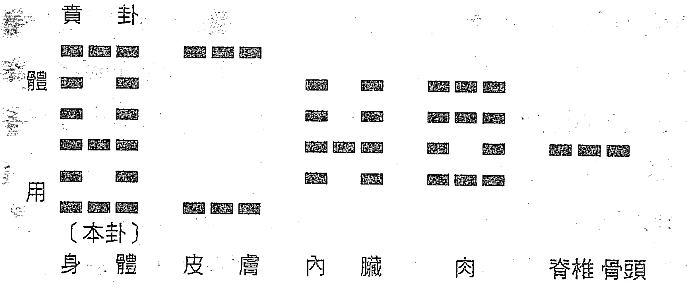

我们首先把山火贲卦看作一个躺在床上的人，那么整个山火贲卦则就是人的一个横截面，初爻和六爻的阳爻我们可以看作是人的皮肤，想象力要丰富一点，不要看到上下两个阳爻就认为人的皮肤上下是实的，左右没有，就没有皮肤，在断卦的时候，既然已经定位为人的身体了，那么上下是包着的，那么就可以想象一下上下左右都是包裹着，是一个整体，像一个圆圈一样。山火贲的二交至五爻也看作一个整体，一个大坎卦，想象一下，大坎卦是不是人体的内部器官组织？大量的水分？人体的三分之二都是水分？很形象把？整个山火贲卦，大坎的确占据了整个卦的三分之二。再接下来我们在把坎卦中间的唯一一根阳爻给抽出来，那么剩下的是不是一个大坤卦，坤卦是什么，是不是肉，肌肉，那个阳爻是什么，不就是人体的骨骼，脊髓？在断其他卦的时候，我们同样可以采取这样的思维模式将卦不断的分拆组合后得更多的信息。
我们接着前面说的，山火贲说明我睡眠的时候手是攥着拳头的，艮也有压迫的意思，上卦为身体的体外特征，而下卦为身体的内部特征或者器官。那么山火贲卦的主卦的下卦离火就为心脏。那么山火贲这么一组合起来是不是手攥着拳头压在了胸口上了？但是山火贲的初爻发动了，一爻一变变成了变卦，上卦是艮，下卦也是艮，上卦为左，下卦为右，那么我们的想象力丰富一下，是不是可以看到两只手都攥着拳头一起放到了胸口上？整组梅花卦的主卦，互卦，变卦就有三个艮卦，三个大山压着。会怎么样呢？那么跟着我的思维往下走，首先将眼光放在山火贲卦的离卦上，这个时候我们需要重新定位一下，离是不是血液，可不可以看成是血管？按照焦氏和尚秉和的易学思维，离火和坎卦是可以对立互换的，就像镜子一样，这里我们不采用这样的思维模式，为了更好的理解，我们将离火看成血管，离火本身的象意就是离中虚，凡是中间空的、虚的，都可以看成离卦，既然离火可以是血液（离火和坎水对立互换），那么就可以看作血管。那么我们注意看离火的右边，假设离火是外卦，外部的，那么对于坎水来说，是不是内卦，内部的呢？这两个卦组合在一起，是不是说明心脏，血管里面有血液呢？血液在干什么呢？我们看一下互卦，互卦的上卦是一个震卦，震为动，那么离雷水解是不是看也看成血液在血管里面在不停的流动？对不对？但是血液到了互卦的上卦的时候，也就是震卦的时候，震卦的左边是主卦的艮卦，右边也是个震卦，互卦的坎卦的右边也是个艮卦，艮是什么？是停止，这里我们应该理解为阻碍，我们把变卦的下卦的艮卦拿到互卦坎卦的下面，就得到一个水山蹇卦，水山蹇是什么？水山蹇有跛足之意。这里我们岔开一下，来说说水山蹇为什么有跛足的意思？估计很多初学梅花的朋友都想知道水山蹇此卦为何有跛足之意。

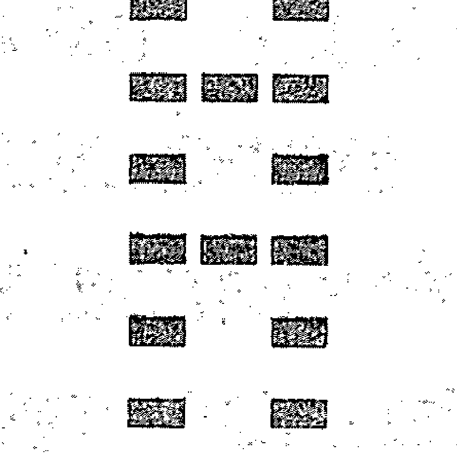

我们注意看一下水山蹇这个卦，上卦为坎卦，上卦坎为车，为水，下卦艮为山，为艰险，为高，那么水山蹇之意就是山高水险，前进不便。艮又为东北，坎又为路，因此又不利东北一说，而利西南，西南为坤，为平地，所以水山蹇就有利西南，不利东北一说。跛足也不是因为这个缘故，真正的缘故，我们还是运用到焦氏的易学思想，水山蹇，上卦坎为行走，为路，下卦艮为手，艮的综卦，也就是将艮卦颠倒过来就是震卦，也就是我常和学习梅花的朋友们说的，艮就是震，震就是艮，只不过看卦的着眼点不在一个基点上而已。手足，手足就是艮，就是震，知道艮就是足这个象意了，我们在看看艮的错卦是什么。对，艮兑互为错卦，兑有缺损之意，组合一下就是山泽损，那么是不是有跛足之意？

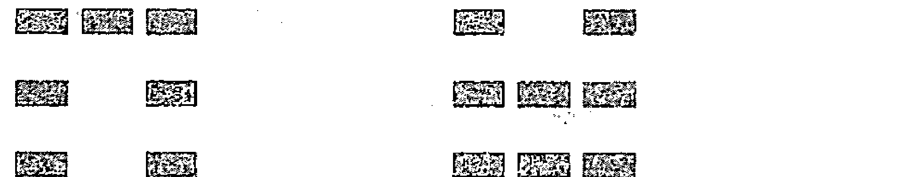

我们接着前面的继续往下说，互卦坎水的右边是个艮卦，得了水山蹇卦，跛足，说明血液流动得不是很顺畅，有阻碍。互卦的上卦是个震卦，左右两边都是个艮卦，把震卦分别拿到主卦和变卦的艮卦下面，就得到了一个山雷颐卦，我们注意看一下山雷颐卦的卦象。

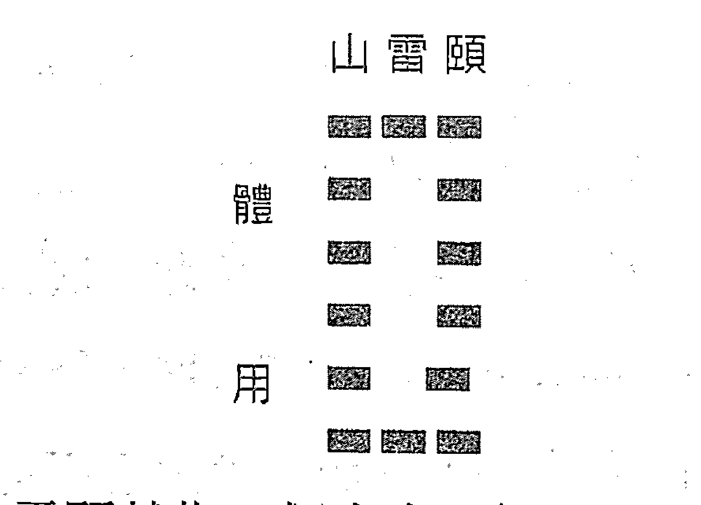

是不是山雷颐就像一个大山压住了一个长男，震是长男，好嘛，你是个长男，这个卦象就管著你了，震下卦，震也是足吧，艮为停止，说明你走不了，是不是这么一个像，但是一个卦有很多的象意，从这个角度可以解释，也可以从另外一个角度也可以解释得通，只要你对应的是合理的定位点，围绕定位点做合理的解释。

假如得到这个卦的时候，你说自己不是长男，那么就不会做这样的梦，但是你属虎了，那么这个卦就会管著你，其实不是卦管著你，是你的家居对应的地方有了这样的场景，那么就会管著你，你居住的环境就像是你的身体，倘若你的家居环境某个位置出现了不协调的地方，那么你的家就会给你带来与之相应的运气，也就会展现出相应的梦。

## **还原车祸**

朋友们邀约晚上一起出去小坐，走在路面上的时候，一位朋友说自己妹妹骑电动车回县城上班时出了车祸，现在人还躺在医院，朋友询问是如何发生的车祸，但是其妹妹说自己也不知道是如何发生的车祸。我想了解一下其妹妹是如何出的车祸，于是便走路边起卦，得丰泽中孚之山泽损卦：

公元：2015 年 3 月 1 日 20 时
农历：乙未年 1 月 11 日 20 时
干支：乙未年 戊寅月 丙子日 戊戌时
日空：申酉（甲戌旬）时空：辰巳（甲午旬）

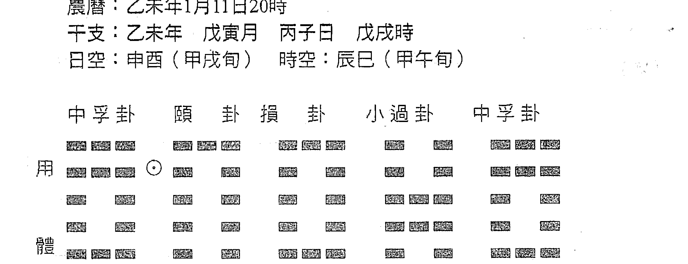

心裏看到此卦的时候，我很坦然的道：“你妹妹出车祸的时候是在一个拐弯的坡上。当时开车的时候速度有点快”其有些惊讶地望着我，连声高声说到：“是的，当时的确是在一个高高的坡上，正好是一个很大很大的拐弯的地方，她平时也是那么开的”“你妹妹当时糊里糊涂的”我又说到。“她连她自己怎么摔倒的都不知道，只是爬起来的时候说好像是没踩到制动”朋友道。我看了看卦中的组合，说：“的确你妹妹是没有踩到制动，但是就卦上看你妹妹是心不在焉的”朋友在一旁说着自己妹妹的情形。
不一会就到了烤鱼店，我继续根据卦象说：“你妹妹因为受伤被缝了很多针”她望瞭望我，又望瞭望我身边爱人说：“是不是你告诉你老公的”我爱人急忙说自己只是告知其妹妹受伤，而并未告知是如何受伤以及受伤的情形。
其实卦里面都有，于是又道：“你妹妹的腿上也有受伤了，脸上也有受伤了”她似乎觉得我说得不对，急忙道：“不对，我妹妹的腿上没有受伤，是脸上受伤了，都破相了”我以为是断错了，心里正有些对自己的预测有些失望，还没等我失望，结果朋友又冒出来一句：“她脚上是一些擦伤，是一些小伤”呵，此时我都不知道说什么好，可能是自己表达语言的不够精准吧，一下没区分好腿和脚的关系。我望瞭望卦，继续道：“你家的后面有小水沟，周围还种有蔬菜和花草，还有树，房子的右前方有高坡，附近还有坟地”朋友又急了：“你看哪个农村的房子背后没有水沟的呀，附近肯定也会种有东西和树的呀，附近也肯定有坟地的嘛，但是也不是专门的坟场的”是真的嘛？

我不知道是不是所有的农村的房子屋后是否一定有水沟，一定会种有蔬菜和大树的。断到后面我随口说了说「你妹妹的胃很不好，老反酸」。朋友望著我：「你不是知道我妹妹胃不好嘛？她经常带着胃药在身上的」晕，我居然忘记了朋友告诉过我她妹妹有胃病。有些自己想证实的已经得到了验证，我也没有兴趣再往下预测了。

### **一个简单的调动卦**

一位年轻女士因调动的问题颇为烦恼，说是一位女领导主动将其调动到机关任职，其有些困惑，知道我略知预测，于是求问是调动好，还是留在原地好，领导为什么会主动帮助自己，于是报数求测。我在想，这个卦是预测调动工作的，势必就应该涵盖了与其调动有关的人或者事的种种信息，既然这个调动的卦和这个女领导有关，我就尝试想是否能通过这个卦断出与女领导一些细节，作为练手卦。于是起卦得：

| | 渎卦 | 颐卦 | 蒙卦 | 丰卦 | 节卦 |
|---|:---:|:---:|:---:|:---:|:---:|
| ☵ | ✓✓✓ | ✓✓✓ | ✓✓✓ | ✓ | ✓ |
| 用 | ✓✓✓☵ | ✓✓ | ✓✓ | ✓✓ | ✓✓✓ |
| --- | ✓✓ | ✓✓ | ✓✓ | ✓✓ | ✓ |
| --- | ✓✓ | ✓✓ | ✓✓ | ✓✓✓ | ✓ |
| --- | ✓✓ | ✓✓ | ✓✓ | ✓ | ✓ |
| --- | ✓✓ | ✓ | ✓✓ | ✓ | ✓✓ |
| 体 | ✓✓ | ✓✓ | ✓✓ | ✓✓ | ✓✓ |
| --- | ✓✓ | ✓✓ | ✓✓ | ✓✓ | ✓ |
| (本卦) | (互卦) | (变卦) | (错卦) | (综卦) |

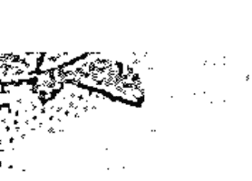

### 第九章 梅花易斷實例技法講解

斷：

1. 此女領導已婚，應該有一個男孩（正確）。

我們在斷是否已婚，是否有孩子這樣一個問題的時候，運用了陰陽最最基本的原理，我們知道有陰必有陽，陰陽相配才算是夫妻之道，在這個卦裏面，主卦風水渙，上卦為巽，為長女，下卦為坎，為中男，長女配中男，為陰陽配，雖然不是正配，但也算是陰陽協調，也可為夫妻之道。上卦為外，下卦為內，內為家，外為家以外的，那麼此刻我們要撇開傳統梅花斷卦時運用體用的斷卦的套路來分析，我們將看以將內卦看成家裏面還有個成年的男子，不是嘛，巽為證書，為結婚證書，巽五爻一動就變成了艮，艮是家，是關住，變卦山水蒙，是不是可以結合主卦的巽卦連讀變卦，一本結婚證書把一個中年的男子關住了呢？巽還是虛無縹緲的，飄忽不定的，自由的，但是巽一變艮，艮為石頭，為家，小男，為男子，為穩定的，巽變艮，變穩定了，是不是也可以理解成，一個自由自在的女人因為一個男人，因為有了一個穩定的家，失去了自由？自由被終結了。巽也為感情，巽在外卦，示為自由的奔放的感情，這個巽因為五爻的變化一下變成了艮了，艮有墳墓的意象，有句話說婚姻是愛情的墳墓，看看是不是，自由的的感情止住了，有了家的觀念了。

那麼結婚以後會如何呢？這個時候我們再必須順著這條思路，反回來結合主卦重新讀一下。將巽卦重新定一下位，這個時候我們就不能將主卦的上卦巽定位為結婚證書了，此時我們得將主卦的上卦定位為已經結婚的女領導，準確一些就是將上卦定位為已經結婚了的母親才對，我們知道在傳統的思維理念裏面，上卦為大，為尊長，下卦為小，為幼，下卦的坎為巽卦所生的孩子。思路走到這裏，有必要提醒一下剛剛初學梅花易數斷卦的朋友，在第一次定位的時候變卦的下卦坎卦是女領導的老公，但是在第二次定位的時候主卦的下卦坎卦是女領導的孩子。主要不要混淆兩個坎卦的象意，在整個主互變當中，下卦的坎卦都是沒有變動的，但是代表的實際的意思是不一樣的。這裏我們運用的是撇開傳統的體用關係進行分析的，當然我们也可以運用傳統的體用關係進行分析。在傳統的梅花易數斷卦的時候，依然將坎卦看成母親，上卦巽定位為女領導的老公，定位為一個行為動作的過程，也可以定位為生產，而變卦的上卦，也就是用變則是巽這個行為動作產生的一個結果，傳統的意义断卦中用卦是老公，用變是孩子。那麼我們是不是可以將上用變拿到巽卦的下面，是不是說女領導的老公有一個男孩（不能定位為女領導的老公生了一個孩子，這樣的定位不嚴謹，那樣會鬧笑話的）。

2. 是個管人事的副職（實際上是個人事副科級）。

3. 額頭比較寬，頭髮比較稀少（反饋是經常的掉頭髮）。

4. 家庭生活不美滿，婚姻不大好（鬧離婚，現在還沒有結果）。

5. 此女領導做事雷厲風行，做事幹練，比較幸苦（確實，就是因為照顧不到家裏，所以婚姻感情不好）。

6. 因為經常喝酒脾胃也不大好（確實）。

風水渙卦，上卦為巽，下卦為坎。巽中藏辰巳，巽在上，故巽為早上，下卦為坎，坎中藏子，故坎在下卦為晚上子時。外卦為家外，內卦為家，因而是朝出晚歸。風水渙卦，下卦坎水生巽木，巽木為吸入，又為反兌，故有吃喝之意，坎為酒水，故而有喝酒之象。巽在外卦，故而為人在家外吃喝，巽又為飄蕩，玩耍。巽在外，三爻至六爻互為艮山漸，初爻至五爻又為山水蒙，故而兩卦顯示為人在外應酬是騎虎難下。二爻至五爻為山雷頤為左右為難，故而是因應酬難以回家。

##### 事事皆有因，源在卦中尋

愛人今天打電話來說，女兒今天發燒了，讓我給測測是什麼毛病，我看了卦讓愛人檢查一下女兒的喉嚨和嘴巴，看看是不是喉嚨發炎了，應該是傷風感冒引起的。

在卦中，水風井卦，上卦為坎水，下卦為巽，雖然巽為用卦，但是巽也為女兒，直讀女兒病了，坎水為寒氣，巽為氣管，又，互卦兌金克制巽，故為傷風引起的，互卦兌為嘴巴，上卦離火為炎症，離火克制兌金，所以就卦上看，應該是嘴巴或者喉嚨出現了問題。故才讓愛人檢查女兒的嘴巴和喉嚨。

### 第九章 梅花易斷實例技法講解

農曆：壬辰年4月3日8時
干支：壬辰年 甲辰月 甲寅日 戊辰時
日空：子丑（甲寅旬） 時空：戌亥（甲子旬)

井 艮 睽 坎 巽 噬嗑 蹇
體
井 睽 睽 井 噬嗑 蹇
睽 井 睽 睽 噬嗑 蹇
用

| | 本卦 | 互卦 | 變卦 | 錯卦 | 綜卦 |
|---|---|---|---|---|---|
| | 井 | 睽 | 睽 | 井 | 噬嗑 | 蹇 |
| 體 | 井 | 睽 | 睽 | 井 | 噬嗑 | 蹇 |

愛人突然就這個卦問了句，那麼你可以通過這個卦可以可以看出來昨天我們去廣場遇到什麼事情嘛？由於我才疏學淺，无法将卦中环节一一吃透，所以未能断出卦中隐寓的信息，爱人说：昨天在广场柳树下躲荫，遇到一对夫妻带著一个小女孩到广场玩，小女孩和女儿一起玩，自己和夫妻俩攀谈，再就是遇到一个打扮入时的女人让帮忙给照相，再就是折了柳枝给女儿玩耍，做成帽子和戒指戴上。

我看了很是惭愧，同时倍感梅花易数之神奇之处，这个卦真是太形象了。

卦中，水风井，坎为月亮，也为阴，为黑，巽为树，为柳树，柳树下乘凉之象。巽为柳树，内互兑为折，也就是摘了柳条，巽也为细长……

我在想，如果没有去广场，也就不曾遇到那些事情，那么也没有折断柳枝的事情，那么这样女儿是不是也也就不会发烧了？

探索中……

###### 万物皆有一乾坤

慢慢的明白了什么是太极，什么是卦，万事万物都是卦，都是太极，也都有极，自己的心在那裡，太极就在那裡，那裏太极，那裏就有五行八卦。以前自己预测事物都要自己在心里暗暗的报一组数字，然后再根据报数加减乘除得一个主互变。那么不仅繁琐，而且浪费了很多时间。试看是不是可以在万事万物中信手拈来就是一个卦？以前也听过很多大师说可以根据各种各样的方式來起卦，颜色，形状，大小，声音等等來起卦。没试过。但是很想试试。

昨天妹妹从市里面乘快巴回来，临到县城的时候打了个电话說可能还要半个小时就到站了，于是自己提前一点去了长途汽车站等。结果等了很久都没见到站，于是想练练梅花，看看快巴多少点才能到站，报數吧，太麻烦，加减乘除很是不便，这时想起有位股票大师曾今做过的事情，根据潮起潮落来判断股票什么时侯涨，什么时候跌。潮起潮落是一种很自然的現象，股票虽然也是自然界的一種現象……於是乎我在想難道公路上川流不息的車況不也象潮起潮落一樣嗎？是不是觀察車流的某種排序情況，是不是也能知道快巴什麼時候到呢？於是乎自己精心的觀察了車流的某種排序，然後得了一個卦。

卦起出來了，看著這個卦，我心裏在想會不會快巴還有三四分鐘就到了？心裏想著這個卦，看了看手中的手機，14：23分，已經起好卦三分鐘了，這時腳步不由自主的下了汽車站的臺階，這時一輛藍色的大巴超汽車站開進去，呵～～自己心裏有些狐疑的走進汽車站，真的是妹妹乘坐的那輛快巴，抬眼望去，妹妹正拿著三個袋子，肩上還挎著一個包下了快巴。於是自己看看手機，顯示正好14：24分。呵。

起卦公曆：2012年12月17日14時10分（北京時間）
起卦農曆：壬辰年 十一月 初五日 未時
干支：壬辰年 壬子月 壬子日 丁未時 （卦身：酉）

[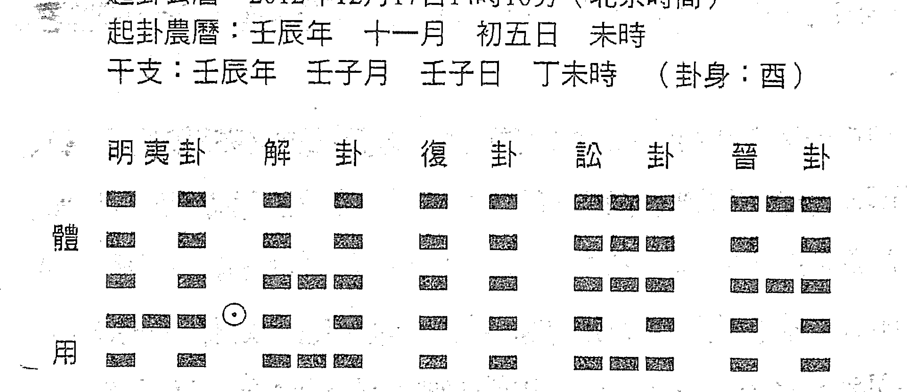](img/531d7b5bb3d023b37bab7216c246c6fb_207_0.png)

可是出了汽車站的門就壞事了，一個別瘦的中年男子緊挨妹妹的背後，我不由的晃了幾眼那個人，心裏咯噔一下，難道是要搶包，於是觀察了兩三分鐘，看見那個男子見我望著他就稍微遠離了一些我們，但是時不時的窺視我們，見我們要等車就走開了，以為緊張的氣氛過去了，哪裏知道背後又閃過一個人。看那個人的裝飾和模樣……玄

## 裝修鑰匙肯定能找到

一日，愚正在火車站候車，這個時候刮膩子的裝修師傅打來電話，稱裝修的鑰匙弄丟了，找不到，不知道怎麼辦了，新房也進不去，問我是否還有鑰匙。愚覺得裝修鑰匙弄丟需要到廠家配，覺得有些麻煩，於是告知其儘量找。到了下午18點，我到了家，裝修師傅依然沒有找到鑰匙，那刻我心裏就在想，自己不是接觸了周易預測嘛，特別是學了梅花易數嘛，何不用梅花卦試試分析一下呢？於是自己心裏報數得：

干支：壬辰年   庚戌月   辛未日   己亥时
日空：戌亥（甲子旬）时空：辰巳（甲午旬）

| | 损卦 | 复卦 | 蒙卦 | 咸卦 | 益卦 |
|---|---|---|---|---|---|
| | |||| |
| | |||| |
| | |||| |
| 用||||||
| |-|【本卦】 |||【互卦】||【变卦】|||【错卦】||【综卦】|

根据这个卦象和爻象，我很肯定的告诉刮腻子的师傅，装修的钥匙没有弄丢，肯定可以找得到，应该就在家里面，裤子口袋里面或者摩托车尾箱里面。我为什么那么肯定装修钥匙没有丢呢？确切的說當起完卦的時候，也就是在看到卦的那一瞬間，我眼前一黑，感觉眼前像過電影一样，看见一隻手将鑰匙丢进了牛仔裤子口袋里，裤袋里面黑乎乎的，当我看到變卦山水蒙的时候，心里咯噔了一下，眼前又似乎看见另外一个电影片段，似乎看见一个装有水的洗衣机在不断的转动着，难道装修钥匙被装在了牛仔裤后又丢到了洗衣机里，脑子里面一闪，又想到了母亲，于是自己在想，是不是和他母亲有关系。当时我学习梅花易数才有些时日，不是很确信自己的第六感，于是抱着半自信的心，我告诉装修师傅：你看看是不是洗衣服弄掉在洗衣机里面了。回去问问看看自己的母亲。其說，自已經现在外邊，不方便，不知道自己是不是把裝修鑰匙放在另外一條褲子口袋裏了，要回去找找才知道。我心裏學習梅花時間不是很長，雖然那麼說了，但是還是有些忐忐忑忑。於是在返回的路上，邊走邊用手機看著梅花卦象，心想裝修師傅晚上亥時會打電話過來說鑰匙找到了。果不其然，到了晚上21點44分的時候，我正陪著女兒說笑，手機響了，來電顯示正是裝修的師傅，真的，沒錯，其說，裝修的鑰匙找到了，他把鑰匙放到了褲子口袋裏面，忘記拿出來，母親把褲子丟到洗衣機裏面一塊洗了，晚上其回家找的時候發現褲子已經洗乾淨了，結果跑到洗衣機裏面一摸，真的，鑰匙就在洗衣機裏面。呵。周易預測還真是神奇。今天我又給自己上了一課。

**好好學習梅花易數。**

## 預測能將人算沒了

下面這個卦是我給一個要好的女性朋友預測的實例，女卦主結婚很多年了，但是一直沒有一男半女，去了很多的大醫院都看過了，但都沒有效果，也去了很多的寺院求子。其在一個偶然的情況下得知我一直在研究易理運用，於是要預測，看看為何沒有子嗣，也順帶看看自己丈夫的仕途。我看過梅花卦的時候，發現卦裏顯示卦主丈夫家裏本年會對老人不利。果不其然，其丈夫家裏當年六月下旬的時候有一男性老人過世了。不巧預測的事情讓卦主家婆知道了，埋怨是我的預測造成了家裏老人過世。我百口莫辯，委屈至極，嘆我的能量還如此之大，預測也能將人測算沒了？？……我將此卦例也寫到總結裏，並非顯擺我的預測水平如何了得，而是想讓易友們更好的學習梅花易數，更好的發揮自己的預測想像力，在預測中不斷的拓展自己象數思維。在學習這個卦例的時候，特別要注意合理組合單卦與其他經卦之間是如何聯繫的，本卦與互卦，變卦之間又是如何聯繫的。

起卦公曆：2012年1月1日10時35分
起卦農曆：辛卯年   十二月   初八日   巳時
干支：辛卯年  庚子月   辛酉日   癸巳時

| | 晉卦 | 蹇卦 | 旅卦 | 需卦 | 明夷卦 |
|---|---|---|---|---|---|
| 體 | | | | | |
| 體 | | | | | |
| 體 | | | | | |
| <body> | ○ | | | | |
| <body> | ○ | | | | |
| | | | | | |
| [本卦] | [互卦] | [變卦] | [錯卦] | [綜卦] |

其實這個梅花卦我在網絡上說過不止一次，當時很少人能理解我讀象的模式，也不是很能理解此種看卦理解像的方法。傳統的讀象方法基本上都是按照梅花卦的體用進行讀象，上下卦的配合，左右卦之間的配合，完全沒有將整組卦進行形象上的像的配合解讀。殊不知，此種讀像的方法其實是像形之象的解讀法的延伸和拓展，而此種解讀法在思維的空間裏面更能做到思維的飛躍。

當時我在YY語音頻道以及QQ的易學交流群裏說過，就此組這組梅花卦而言，雖然我斷出來了卦主家中有不好的事情，但是這都不是值得我高興的，我高興的是自己學會了如何將整組梅花卦進行全息像的解讀。我就是通過這個卦，慢慢的開始開悟了，通過這個卦我解讀到了卦主曾今遇到過車禍，當時車禍的情形如何。

當時我看到此組梅花卦的時候，我就覺得整組梅花卦儼然就是一架摩托車，我們不妨看看現實生活中的摩托車，是不是和這組梅花卦神一般的相似。看看是不是現實生活中的摩托車的車頭比較高，而摩托車的車尾，相對來說就比较矮。而這組梅花卦的車頭就是主卦火地晉，主卦的初爻至四爻是個大大的艮卦，艮為高，是不是告訴我們車頭很高。互卦則儼然象摩托車的車身，互卦的下卦是個艮卦，艮為坐，是不是告訴我們中間是可以坐的，互卦的上卦是個坎卦，坎為人，是不是告訴我們可以坐人的。而變卦是個火山旅卦，火山旅的下卦是個三爻的艮卦，這個三爻的艮卦和主卦的四爻艮，是不是相對來說就比较矮一些。當我們這麼一理解這組梅花卦的時候，是不是和前面說的整組卦就是摩托車的全息象呢。

那麼為了更好了瞭解這個卦，運用全息像形之象之法去學習梅花易象，我們下面就將整組梅花卦一一的進行象的拆分組合。

主卦火地晉就是摩托車的車頭，而初爻至四爻就是摩托車的輪子，也就是輪子最底部到前輪上部看不到輪子的部位，初爻至四爻又像是摩托車前輪的減震器，看看是不是那麼一個象，初爻至四爻實際上是個艮卦，艮的反卦即是震卦，艮為止，震為動，四爻這個艮卦是不是很大一個艮，初爻至三爻就是一個坤卦，坤乃靜止，不動之意，是不是告訴我們，這個向下的力，到了最下面就會也小，也會越平穩，越順，象走平地一樣，這個力到了四爻就會被止住了，初爻至三爻是個坤卦，坤為虛無，亦為地，那麼也就是告訴我們，當這個輪子離開地面，處於虛空的時候，這個四爻的大艮卦，也會被伸展開來，這個力也就是在初爻和四爻之間運動，這就是減震器的運動行程。初爻至四爻之間有個坤卦，坤亦有水象意，而艮亦為反震，是不是告知我們，這個減震器可以是液壓的，也可以油壓的。我們注意看現實生活中的摩托車再看看火地晉這個梅花卦，火地晉的初爻至四爻是個大大的艮卦，而這個艮卦從初交至四爻都是陰爻，那麼是不是告訴我們這個大大的艮卦就像是摩托車左右兩邊的減震器。

主卦火地晉，上卦為離，下卦為坤，在三爻至五爻則就是一個坎卦，這個坎卦和二爻至四爻的艮卦，形成水山蹇卦，和上卦的離卦又為火水未濟卦，坎水實際是在六爻上陽之下，而在二爻一陰之上，又與艮卦交錯，坎為水，艮為箱，離為電，離為箱，是不是告訴我們這個摩托車的前面有個油箱。主卦火地晉，艮亦為反震，震亦為頭，反震，艮亦為反頭，艮亦為梁，艮亦為彎曲，為手，那麼摩托車的車頭，手把有些彎曲，離火，為電燈，居於反震之上，那麼這個離火就像是車頭的車燈。

那麼看完了車頭，我們不妨再來看看車身，也就是這組梅花卦的互卦，在這裏互卦水山蹇就好比是摩托車的車身，互卦水山蹇，上卦為坎，下卦為艮，坎者陷也，坎者水也，弓輪也，艮為之坐，是不是在告訴我們這個坐的位置有凹陷，有流線，有弧度的。上卦坎亦為人，下卦為艮，艮亦為座位，是不是在告訴我們，座位在摩托車的車身上也有一定的弧度的，而正好在可以坐人的這個位置上也是有一定的弧度的。當我們的視角點再一次發生改變，再重新解讀這組互卦的時候，互卦水山蹇那麼則就是可以看成是摩托車的核心部位。我們知道摩托車的發動機也正是在車身的位置上。坎為弓輪，下艮為反震，震亦為動象，二爻至四爻為坎卦，三爻至五爻則是離卦，為火水未濟，又，三爻至四爻為離卦，四爻至六爻為坎卦，為水火既濟，那麼互卦實則為動水（油）生火也。又，互卦實為離火藏於坤卦之中，坤亦為腹，亦為箱，火在箱中上下運動。此時我們將整組梅花卦全視，做整體全息連貫組合卦象。主卦四爻至五爻為坎水，互卦三爻至五爻為離火，到變卦二爻至五爻為大過卦，大過又在一陽之下，又在艮卦之中，大過實為上下巽，巽為氣也，變卦中大過中兩陽就像是活塞，上下運動。那麼組合起來就是一個油變化力的一個過程。而此組梅花卦中的互卦火水未濟，水火既濟就好比弓輪與弓輪，齒輪與齒輪之間的咬合轉動的一個象。

最後再看下變卦，前面我們已經說了變卦就好比是摩托車的車尾，變卦火山旅，下卦艮為車尾，初爻至二爻則就像是車輪，艮亦為坐，上卦離火亦為車之後備箱。當我們重讀變卦的時候，當我們的視角發生俯視改變的時候，艮卦亦為扶手。

這個是部分的整體的像形之象的像思維，而非單一的別卦或者經卦所能解讀到的像。當我們深入的思維的時候，當我們的思維對應點發生改變的時候，我們可以將主卦和變卦上的兩個艮卦看作為坐包，坐包上分別是一前一後的兩個離火，離火為女性，離為漂亮，是不是可以理解為摩托車一前一後坐著兩個漂亮的女性呢？

### 第十章 梅花易數的多樣性

#### 照片透天機

愛美之心人皆有之，特別是在這五彩斑斕的世界裏，很多人都希望將自己最美麗的一刻永遠的留住，於是乎大勢的利用現今泛濫的科技，手機，平板電腦，錄像機，以及自認為現今最為先進的等等數位影像技術，將自以為是最美麗的那一刻留在了照片裏，膠捲裏，然不知，留住的只是自己的過去，真正最沒美麗的那一刻已成爲回憶永遠的留在了心裏。有的時候回憶回憶過去也未嘗不是一件很好的事情，就像是喝了一杯上好的美酒，懷舊之心久久不願褪去，興許很多人都自以為是的認為照片裏的故事只有天知，地知，己知，別人不知，照片裏的故事都是屬於自己的小秘密。但是很多人都忽略了梅花易數預測師的讀圖能力，預測師能夠通過存留的影像解讀出一個個故事，並且能通過時間的不斷的推演預測出未來的一些信息。

俗話說條條大路通羅馬，只要你熟練的掌握瞭解讀卦象的方法，那麼讀圖實際上和解讀梅花卦是一樣的，一張照片同樣有陰有陽，同樣有五行生克，同樣有太極八卦的輪轉。那麼明白了這個道理就能很好的將圖畫裏面的信息通過演卦的方法，一一將照片裏面的像給解讀出來。## 218 梅花易象高层之路

某日，我应外省的一个朋友的邀请，到其家中调理风水，朋友正值新婚，家里挂了许多秀夫妻恩爱的结婚照（因为涉及个人隐私，照片略），当走到客厅的时候，就见客厅的右手边临近餐厅的一墙上挂着夫妻俩的结婚照，结婚照的中间是夫妻俩，夫妻俩身后是一条非常整洁的柏油马路，再远处和左右两边是一些西式的别墅群，夫妻俩站在照片偏左的位置，男士在照片的左边，男士身后的柏油路左边几乎给身体挡完了，只剩下左下角的部分路一直延伸到身体的肩膀的位置，女士在照片的右边，右边的大路露出的比较多，有三分之一这样，再往女士的右边是个西式建筑的大门，因为是大门的出口，所以大门的出口将道路两边的花坛给分开了，但是地上的一条白色的线一直沿着花坛边向远处延伸，男士左边的花坛边上也有条白色的线紧挨着花坛延伸到男士的肩膀下方。当时我第一眼看到这张照片的时候就觉得有些诧异，心想为什么别墅群会这样装饰一条马路，而夫妻俩为何偏偏就选这么个位置留了影，在照片最上方是一排西式的建筑群，夫妻俩就这么站着，显得非常的甜美。因为此次风水调理是应了女士多次的盛情邀请，不得已才舟车劳顿的外省去帮其勘测丈夫家新买的商品房，也是夫妻俩的婚房。由于是初次和女士夫家人打交道，似乎其夫家人有些不信任感，心想可能是我外表显得过于稚嫩，在外地也没有什么名气，为了打消疑虑，于是运用学到的知识对夫妻俩的结婚照进行了读图。

当时正值农历的二零一五年的五月份，男士的母亲听说我到了就风风火火的从外地赶回来，就是想听听我这个不起眼的预测师说点什么。为了慎重起见，我再次仔细的看了看墙上挂的小夫妻俩的结婚照，征得男士母亲的容许，我开始读图，其实真正也就是两句话，主要是针对男士的母亲说的，第一句就是你的丈夫是个副职，本来是很有希望往上走的，但是由于一件非常大的意外事故，因而导致至今没能升职。第二句就是你本应该有两个孩子的，但是因为琐碎的原因没能养活。也真正起作用的就那么两句话，就将其的疑虑给打消了。显得非常的高兴，希望我能认真的给其买的房子好好的看看。当时天色已经有些晚了，粗略的看了一下继续道：你这个房子还不错，唯一不好的就是容易造成火灾，如果你没有找风水师看过我的话，我相信你原来住的旧房子也一定发生过火灾。结果话音刚落，就得到了准确的反馈。原来住在旧房子的时候，就是因为家人冬天取暖，在人离去之后忘了关电暖气，结果燃起大火将家里的东西烧个精光。

时间已经将近傍晚吃饭的时候，由于比较匆忙，所以就决定到外面饭馆里一起吃饭，酒菜还没有上桌，大家就坐着一起闲聊，男士的母亲就很高声的问：师傅，你看看我今年的财运怎么样。我当时坐在其对面，看了看她周围的环境，她当时面对着我，背后就是一堵木纹的墙壁，貌似用木板做成的墙，一块一块的，当时在她脑袋的右上角挂着一个开瓶器，当她站起来的时候还摸不到右上方高高悬挂的空调，当时因为天气有些凉，所以空调也没有开，当时我看完了周边的环境布局后断道：你今年财运不及去年，今年财运时好时坏，身体欠佳，今年你要花费不少钱，你要注意妇科方面的健康。她一直在笑着打趣，可能就没往心里去。果不其然，到了一五年将近年底的时候，其家人又打电话来说，是因为准备买车做体检的时候，从其的尿样中发现有不好的现象，又由于当时医院来了实习的护士，将别人的尿检结果看成她的，于是护士告知其有子宫癌，其家人慌了，接连两三个晚上不得安眠，一直惶惶不安等着再次身体复检，复检结果未出来之前，按耐不住，于是再次让我预测其身体健康，我看了看当时的时间卦象，断道，就是子宫附件炎症，子宫肌瘤，小事情，结果等了几天，结果出来了，果如所测，花了点小钱做了个小手术解决问题。

## 220 梅花易象高层之路

爱人的一位很是要好的女性朋友要闪婚，其为了把自己心爱的人介绍给朋友们认识，于是想当晚邀请大家晚上出来坐坐，吃烤鱼。但是一直到了晚上十九点十五分，朋友还是没有打电话来，也没有告知另外一位朋友聚会的时间和地点。爱人有些疑惑，于是就问我：朋友是否因为琐碎的事情推迟聚会的时间。我笑了笑的对爱人说，如果你想知道今晚还会不会聚会，你可以报一组数字，预测一下就知道了。爱人于是快速的报了一组数字。得：

公元：2014年8月1日19时
农历：甲午年7月6日19时
干支：甲午年 辛未月  甲辰日  甲戌时
日空：寅卯（甲辰旬）  时空：申酉（甲戌旬）

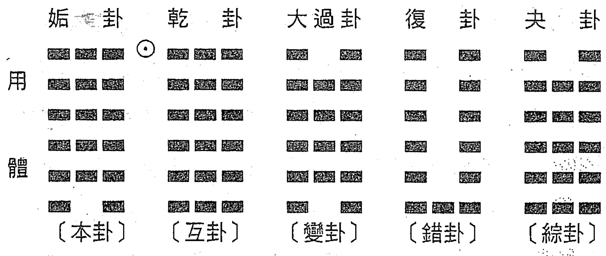

因为自己学习梅花易数不久，又是第一次尝试预测准确时间，我看了将近两分钟才告知爱人说：“你不用担心的，肯定还是要出去吃烤鱼的，你就赶快梳妆一下吧，免得让他们等”，爱人道：“真的出去呀，那干什么现在还不打电话来呢？如果真的去等她打电话来也不迟呀”我看了看时间说“现在已经是 19:20 分了，你还是快点换衣服吧，如果我断得没错的话，你朋友会在 19:50 分左右这样会给你打电话来的”爱人有点兴奋，也有点疑惑。说实话，我也有点不自信，因为这还是第一次预测具体时间。我一边看卦，一边在解释为什么会断 19:50 分会有电话来的原因：“天风姤为不期而遇，有相聚的意思，且是戌时这个时候，所以一定会相聚的，因为 19:50 也是因为主卦和变卦的缘故”。

19:42分的时候，爱人的电话响起来了，我在餐厅就大声的喊起来（爱人当时在房间里面梳妆）：“老婆，你朋友来电话了，让你出去吃烤鱼了”爱人跑出来跑出来一看，果然是自己那个要好的朋友。打完电话，爱人一把抱住站在身边的我说：“老公，你的预测真是太厉害了，连时间都算的那么准”我笑笑说：“哪里厉害，这不还不到 19:50嘛”。

家里住在郊区，出门不是很容易找得到车，于是就随便拦了一辆三轮车，谁知道这车一上，主卦中的不期而遇就出现了，车子还刚开出 200 多米，就听见路边有人要搭车，结果一打照面才发现，居然要搭车的人正是那个请我们吃烤鱼的朋友。呵，我和爱人都在笑这个卦的神奇“不期而遇”。

还没有到目的地，女儿突然说自己肚子疼，爱人有些着急了，很疑惑为什么孩子会突然不舒服，于是报数字问我，当时我也没有想到就用天风姤这个卦来测孩子不舒服的原因，而是用了水山蹇之水火既济这个卦。

公元：2014年8月2日8时
农历：甲午年7月7日8时
干支：甲午年 辛未月 乙巳日 庚辰时
日空：寅卯（甲辰旬）   时空：申酉（甲戌旬）

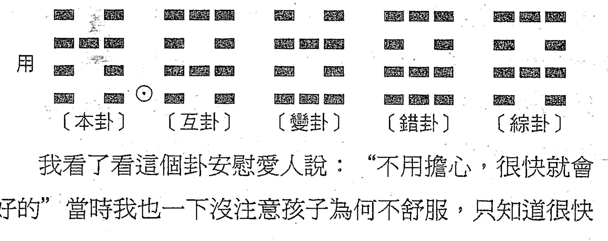

[本卦] [互卦] [变卦] [错卦] [综卦]

我看了看这个卦安慰爱人说："不用担心，很快就会好的"当时我也一下没注意孩子为何不舒服，只知道很快就会好的。后来到了目的地，我又想起来的时候那个测时间的，于是对爱人说："孩子因为是晚上吃多了西瓜做的酸了，引起的消化不良，一会就会好的" 到了晚上子时的时候，女儿就有生龙活虎的和别的孩子嬉戏了。

聚会上，朋友们都在拿我穷开心，因为朋友都知道我业余是学预测的，而且有的人就抱着预测就是骗人的把戏，玩玩而已，即便有些人找我预测过，准确过，但是有的也不愿意承认。因为是朋友，又是朋友要结婚的聚会上，我也随着他们，也不往心里去，为了训练自己，于是自己也玩起了看相。对面一个男士听说我业余是研究易经的，很是好奇，征得他的同意我也不客气起来，我看了看对面的环境，笑着对对面一个男士说：“你是不是谈了两次恋爱了”，那个男士连忙拱手道：“兄弟，你太厉害了”坐在我对面左边一个较胖的男士连忙说，那你看看我有几个孩子，旁边的朋友连忙说，你前面已经告诉大家了，自己有几个孩子了，我笑了笑，因为正好那男士正靠墙边的坐着，旁边的墙上全是黑红的花纹。面对我的左边的脑袋上刚好挂着一个开瓶器，呵，难道这个就是梅花神奇之处？冥冥中告诉我他就是两个女孩。其实就算对方不说，实际上对方已经告诉我们他的情况了。呵，当时我也是笨，居然主动去问别人是干什么行业的。实际上那男士是做饮食行业的，卖米粉的。我真是笨，还没有真正学会怎么去捕捉现实生活的像意。

# 第十章 梅花易数的多样性 223

命中注定你就要坐在哪

学习梅花易数已经有一年多了，虽然说不上如火纯清，但是简单的读相的技巧还是掌握了一些，特别是观物取像的手法也渐渐运用在现实生活中。某日晚，我去朋友家做客，正好朋友的姐姐也来做客，闲聊时，我说到自己业余爱好是周易预测的时候，朋友的姐姐是信非信，又有些好奇的问，那你看我今年运气如何？我看了看她说：

“今年你运气不是很好。” “是吗？”她淡淡的说；“那么你看看我的婚姻怎么样？”她显然有些不怎么相信我，不相信我的预测。我看着她说道：“如果我是没见过你这个人的话，我肯定会知道你视力不好”因为她此时正戴着一副近视眼镜。我准备接着往下说，但是又有些忧郁，我并不是担心自己的预测技术会很差，而是考虑到坐在客厅里面还有很多小朋友，想了很久接着说：“我什么都可以说嘛？”她抬头看了看我说：“说吧”听到这话，我再次仔细的看了看她，看了看她身后极其周边的环境说道：

“说你视力有问题是不争的事实，也没什么意义，你就坐在我面前，我要说的是，你不但是视力不太好，而且心脏也有些不好，血液或者血压有问题，她再次抬头看了看我，简单的：“哦”，我也没在意，继续道：“你去年肯定是口舌是非比较多，婚姻出了麻烦”。因为朋友在、有些不好说，因为根据当时的环境，我很想说：你的爱人在外面找了一个年纪比你小的女人，而且比你漂亮，皮肤还很白，还比较温柔，但是出于对方和当时的情況考虑，所以没有说出来。当时她只是觉得有些好奇，看似乎不是很在意，但是她的女儿就坐在我的身边，听着我说，显得非常的好奇，不停的追问我为什么说。因为在说出那些话的时候我并没有起卦，什么也没有做，在他们的眼里，我只是坐在那随口说说而已。“其实你坐在那的环境已经告诉我了” 我有些激动的说。她听我这么一说就上了心了。坐在一旁的朋友的夫人更是好奇瞪大了眼睛，抱着孩子在一旁一直在看着我。“其实也没有什么，我只不过根据你坐的环境推理而已” 我望着她继续说道“你的身后有一个饮水机，饮水机的左边有个冰箱，饮水机的右边是电视柜，电视柜上有台电视在开着，而这些都近近的靠近着你，你身后的墙上还有个石英钟在不停的走着” “这些就能推断出来？”朋友的夫人在一旁吃惊的问着：“太不可思议了”。她也好奇的问：“那别的人也坐在那也会有那样的事嘛？”我道：“那也不是，关键是今天的这个时候你问了我不该问的问题，还有就是是你看看你穿的衣服，还有你现在坐的这个位置”她一脸莫名的看着我，旁边所有的人都停下来静静的看着我，听我说。我很直接的告诉她为什么会得出那样的结果。她继续道：「那改天我换一身比的衣服坐在别的位置上呢」她边说边站起来走到我身边坐下来：「比如说我现在坐在这里了，还能得出这样的结果嘛？」我笑道：「命中注定你要坐在那，但是不管你怎么坐，怎么换衣服，也改变不了有些事实？」，就比如你现在坐在沙发这了，但是你看见了嘛？你身边除了我全是女性，而且你单单坐在一个单沙发椅上，旁边还有一个微波炉，这也都告诉了我，你的感情不好」。她笑了。

邀请我有机会到她家帮她看看家里的风水。殊不知观物断事只不过是梅花易数的一部分，但是梅花观物断像并非就是等同于风水，观物断像貌似乎可以称之为看风水，并非懂得了观物读像就是等于学会了风水，观物读像也是风水学中不可缺少的一个部分，万不可单纯的将梅花易数剥离出来称作象数风水就扣上风水的帽子，要知道真正的风水是讲究辩证法的，并非符合卦象的东西都能摆到一起，艮有柜子的卦象你就放个柜子子东北，厨房属火你就整个厨房在北方，说是水火既济，你命里本身就火旺烧身，你偏偏将自己的房间弄到了火旺之地，说是同气相求，亦非西北边放个饮水机就会败财丢官……风水博大精深，好好学习是为上。

今日到柳州一医院就诊，两个护士知道我会预测，让我给她们预测一下，我耐不过只能简单的看了下，其中一个护士说，要不要告诉自己的八字，我看了看她们胸前的工号牌，说：其实你们的工号牌就蕴含着各种信息，工号牌已经告诉我你的信息了。另外一个护士说，这怎么可能呢？如果我不用这个工号牌呢，我可是还有别的工号牌呢。我笑道，其实命中注定你就要用和你命运息息相关的号牌。我根据号牌得以下两个卦：

第一个：

公元：2012年5月14日21时
农历：壬辰年4月24日21时
干支：壬辰年乙巳月甲戌日乙亥时
日空：申酉（甲戌旬） 时空：申酉（甲戌旬）

> 豫卦 | 蹇卦 | 晋卦 | 小畜卦 | 谦卦 |
> ---|---|---|---|---|
> 用体|[本卦] | [互卦] | [变卦] | [错卦] | [综卦] |

第一个卦是一个85年的护士的卦，当时其知道我懂得预测，想问知道自己的姻缘，很想预测一下，我说你的姻缘已经写在你的工号牌上了，上面不是已经告诉你，你的异性缘不错的嘛，关键是你自己喜欢不喜欢。其说，那种姻缘有没有都无所谓，我看了其胸前的工号牌号码0444得卦，根据这个卦，我说，你的姻缘从98, 99至今都没有断过，其马上接着一句话： “我就是从98年离婚以后，这种异性缘都没有断过，但是我想有个稳定的家。我安慰其说，你的姻缘很快就会到的，不要烦恼。我随便给其说了几个，个性和学历，第二天再次到医院的时候，我对其说，从你的工号牌上看，你不是独生子女，应该还有兄弟姐妹，她说，是的，我们家我是老三，家里兄弟姐妹四个。我看她那么激动，没等我说完就接上话，于是我马上否定她的话，不对，你家不是兄弟姐妹四个，而是兄弟姐妹一起六个才对。她一听，立马瞪大着眼睛说，你怎么知道的？真是太神奇了。我看着她，坚定告诉自己预测是准确的，耐着带来的喜悦。说：你的工号牌已经清清楚楚的写明了，肯定是兄弟六个的，不可能是四个，她笑了，好神奇喲，这种也能看得出来，是的，我家最前面应该本来还有两个双胞胎哥哥的，可惜了。没养活。就卦上看，她小的时候家境不是很好，要到自己30岁以后，自己才能过得好，母亲肠胃不怎么好，父母感情也不是很理想，她是个外表看起来很外向，很有闯劲的知识女性，但是实际上做什么事情都是虎头蛇尾，心性比较惰性的女人，但是确是一个很温柔的女性。

## 230 梅花易象高层之路

#### 第二个护士
总数：22，上卦数：5，下卦数：17
起卦公历：2012年5月14日18时21分（北京时间）
起卦农历：壬辰年 四月 廿四日 酉时
干支：壬辰年 乙巳月 乙亥日 乙酉时

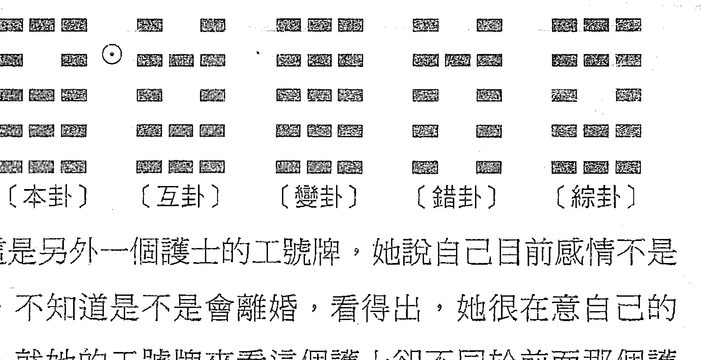

这是另外一个护士的工号牌，她说自己目前感情不是很好，不知道是不是会离婚，看得出，她很在意自己的婚姻。就她的工号牌来看这个护士却不同于前面那个护士，这个护士是个内心不断追求完美的女性，做事很有闯劲，个性很像个男性，但是外表却是让人觉得是个心思很细腻，考虑问题往往让人琢磨不定，对于神鬼都表示很热情的一个人。她担心自己的婚姻，因为从结婚到至今刚刚七年，有些人说这个是七年之痒。我看了卦，可以肯定的是她爱人家是个很殷实的家庭，比她娘家里面要过得好，但是这个卦老男配长女，且自己的性格和丈夫的性格比起来却不是一个好事情，丈夫是个内秀的男人，疑心比较重的。而自己的个性过于强势，这样就造成了一种个性上的不和谐。32岁会出现婚姻上的一坎。

这个卦看其父母有脑神经，脑血管方面的疾病。母亲也有脑神经，肩周炎此类的毛病。需多加注意。

二零一二年五月十七日晚应此护士的邀请给家人预测，其他都预测了，但是没有预测出其中学时候为何学习成绩会下降，当时我看见互卦，缺爱了，当时我以为是想恋爱了，因而影响了学习成绩，当其道明原因的时候，才知道其缺的不是男女的感情，而是缺的是父母之间的感情，父亲被汽车撞了，缺了父爱了，父亲受伤了，撞在脑袋上，2012年的时候，我接触梅花易数预测没多久，对于卦象以及象意的理解还很混沌，更不要说能对一组梅花很好的拆分了，有的时候完全就是机械的区分体用，死记硬背八卦类项，硬性的套象预测，多年以后，当翻出此卦来详细揣摩，发现此卦透露出来的信息与当事人神一般的同步，只不过我不知如何去挖掘卦中各种潜在的卦象，不懂得如何解读罢了。

##### 第十一章 古今经典卦例详解三则

《梅花易数》是宋代邵雍先生的一本绝世之作，里面不但记载了各种梅花易占的简单方法，还收藏了让诸多后学百思不得其解的经典卦例，其中以观梅占，老人忧色占最为经典。为了更好的理解卦象，学习卦象，拆解卦象，运用卦象。这里将这两组卦象分别进行详细的拆解。

###### 一、观梅占

原文：辰年十二月十七日申时，康节先生偶观梅，见二雀争枝坠地。先生曰："不动不占，不因事不占。"
今二雀争枝坠地，怪也。" 因占之，辰年五数，十二月十二数，十七日十七数，共三十四数，除四八三十二，余二，属兑，为上卦，加申时九数，总得四十三数，五八除四十，余得三数，为离，作下卦。又上下总四十三数，以六除，六七四十二，余一为动爻，是为泽火革。初爻变咸，互见乾巽。

> 断之曰：「详此卦，明晚当有女子折花，园丁不知而逐之，女子失惊坠地，逐伤其股。右兑金为体，离火克之。互中巽木，复三起离火，则克体之卦气盛。兑为少女，因知女子之被伤，而互中巽木，又逢乾金兑金克之，则巽木被伤，而巽为股，故有伤股之应。幸变为艮土，兑金得生，知女子但被伤，而不至凶危也。」

白话释义：

九数，总数为四十三数，四十三除以八，余数为三，三对应为八卦中的离卦，则以离卦为下卦。最后用上下卦的总数四十三除以六，余数为一，则以一数为动爻数，那么就是的泽火革，初爻动，互卦乾卦和巽卦，变卦为泽山咸。

康节先生看到起出的卦断言道：“详细的看了这个卦，明天晚上会有女子来这里摘花。看花的园丁不知道情况而追撞女子，女子惊慌失措中而摔倒在在地上，伤到了大腿，为什么那么断言呢，此卦当中，右边的上卦的兑卦为体卦，下卦的用离火来克制兑金，互卦的下卦巽木，三生离，离火用卦火旺而克制体卦兑金，兑金为少女，故而少女受伤。在互卦中巽木被乾兑金克制，又受离火泄耗，巽为人体的大腿，因而有大腿受伤的信息。幸运的是泽火革的初爻动，离火变艮土，兑金得生，故。虽然少女受伤，但是也不至于有性命之忧。”

剖析：

这组观梅占卦邵先生断得甚是精彩，也可想而知。时日至今依然有后学者对此组梅花卦做详尽猜解，且一直未间断过，然拆解得合符理义者恐也寥寥无几。邵雍先生在书中也没有言明之处，只是寥寥数语解之。此观梅占中有许多不解之处需要研究的。

第一：为什么不是当晚，而是明晚。

# 第十一章 古今經典卦例詳解三則

####### 第二：為什麼是少女
####### 第三：為什麼判斷少女是折花
####### 第四：為什麼是園丁不知逕之，卦中的園丁在何處
####### 第五：為什麼邵先生卦里說少女是墜地等等

那麼帶著諸多的疑問，我們現在就對這組卦進行詳細的拆解。

很多學習梅花易數斷卦的愛好者，由於在學習傳統的而刻板的認為梅花易數斷卦中的體用是格格不入的，體就是體，用就是用，完全不能拋開體用的局限，不能拋開五行生克制化的限制，死板的認為天地定上卦一定是天，下卦一定是地，拘泥而不化，主卦永遠是開始，互卦就是過程，變卦就是結果；測一個卦用卦永遠就是對方，體卦永遠就是自己，殊不知一組梅花卦卦起來，起出來的整組梅花卦體用卦就是彼，也非彼，這就好比那句很經典的話，我是我，我非我，無我是我／有我非我，一個卦，即是彼，也非彼，就看你怎麼用，而善用者用這句話不無道理。前面在梅花卦的時候，我們已經講過，一組梅花卦卦要預測某個人，或者某件事，那麼整組梅花卦即是預測的某個人或者某件事，這就好比外出看風景的時候，當視覺的轉換點變化了，那麼整組梅花卦卦的對應點也隨之發生相應

### 2.36 梅花易象高層之路
的改变，当将整组的梅花卦中某个单一的经卦做为对应点的时候，那么其他的梅花卦也应随著这个对应点发生相应的变换。就好比这个观梅占，整组梅花卦就是要预测的太极点，是个大大的太极点，它即是整个事件的线索，又是所有小事件的太极点。当视觉将整组梅花卦当作大太极点时，这组梅花卦就像是一场完整的、立体的、多线索的影响，梅花卦中的林林种种就包含在整个太极点中，当我们需要关注影片中的比较细小的情节时，比如说某个人物的特定的环境时，那么整组梅花卦就根据此人物重新定好太极点，其他的卦象就好比是一个个与之相关的场景随之而动。

这组梅花卦起出来以后，邵雍先生断这个事情是发生在第二日晚，为什么邵雍先生不断是当晚会发生呢，这个是非常重要的一一个问题，也是让很多梅易爱好者值得深思的问题，这个卦是邵雍先生申时起出的卦，那么距离第二天还有几个时辰，邵雍先生为什么不断是当日的酉时，当天的戌时或者是当日的亥时呢。前面我们在学习梅花读卦像的时候就已经熟知了，梅花卦就是一种未知的，很前沿的语言，它就像是我们汉语言中的的地得，也像是汉语言中的主谓宾，更是事件中的你我他，往往一件事情、一个特定的场景，一个特定的事件都要不断的重复的读取。这组梅花卦正是如此。主卦渥火革，当我们第一次读渥革的时候，我们根据渥革这个卦象定位为一个具体的时间场景，兑为缺，缺少，没有，离为日，为太阳，为光亮，渥火革解读为缺少太阳的时间，即为晚上，这里我们需要自然规律，然后把视野放在渥火革这个卦上，运用一即为晚上，上卦和下卦之间的是地平线，上卦为天，现在上卦为兑，为缺少。第一次渥火革的时候，我们可以瞭解到这是一个缺少阳光的场景。通过天地定位以后，我们看渥火革这个离卦已经在地平线下了，再读一次主卦，兑为西，在焦氏易里面兑的错卦即为艮，艮为山，山下有日、可以瞭解到日落西山这样一个没有太阳光的场景。同样是我们需要将渥火革这个卦重复再读一次，将渥火革定位为时间节点，这个时候渥火革这个兑卦不再理解为缺少，也没有这样类似的含义，我们将上卦兑的直接读为具体的数字二，而下卦我们依然将离卦保持不变读成日，那么渥火革就读直读为二日，因为第一场景我们已经知道了是个没有阳光的时候，当然主卦也可以理解为当日晚上，没有阳光的晚上是可以理解为起卦的当日晚上，但是我们只要认真分析一下全卦，不难得出，当日晚上是很不符合梅花卦解读的可重塑性，如果定位为当日的晚上，那么当你重复再读一次这组梅花卦象的时候就会出现矛盾的情况，那么也导致了卦象出现了不可重复的状态，一个前场景和后场景不和諧的狀態，當我們將卦象按照連互的手法拆開卦象的時候，不難發現有澤天央，澤風大過卦，都告訴我們是沒有戌亥，沒有辰巳的，也就是沒有晚上的晚上的戌時，亥時，沒有早上的辰時，已時，主卦澤火革也告訴我們，酉時也出空了，最重要的是當我們綜觀整卦的時候，變卦已經明明白白的告知是第二日了。變卦澤山咸，艮為止，止於兌，兌為缺少，止於主卦澤火革，止於缺少陽光的晚上這樣一個場景，如果是當日的話，那麼主卦第一場景中這個沒有陽光的晚上的場景則不能成立，在這個主卦裏面，兌不僅僅有缺少，不純在，不是，非，也還具有另外這樣一層意思，對，變卦澤山咸就像我們學的或與非一樣，澤山咸就有止於非這樣的意思在裏面。

主卦澤火革第二次讀的時候是二日，都是同出自一個卦而表述出來的是兩個截然不同的意思。第一個意思是沒有陽光的日子，一個日落西山的晚上，結合變卦再讀一次的時候就成了沒有這個沒有陽光的晚上，主卦所表達的這個沒有的意思被停止了，主卦的兌這個缺被停止了，那麼換個思維想，這個缺被停止了，被修補了，那麼就是新的開始，再我們再結合一下主卦的澤火革卦，澤火革一陽在初爻發生變化，我們知道陽爻的特性就是不斷的向六爻發展的，澤火革的一陽爻向上發展的時候，到了互卦的的時候，我們看是一個天風姤卦，這裏我們采用一種交與卦的聯想，澤火革的一陽是不是象個太陽一樣徐徐的升起，到了互卦的上卦的時候，是不是又是一個白天呀，互卦的乾卦在上卦是不是就是白天，乾卦代表的就是太陽吧，圓圓的，你也許會說離才是太陽的象，而非乾卦，要知道乾離本為先後天的關係，再太陽為圓形的，取圓為太陽也未嘗不可。互卦太陽高高的掛在天平線上，當太陽到了最高點的時候又徐徐下降，陽氣漸漸的消逝，陰氣漸漸的出生，那麼陰氣一點點來臨的時候，也就告訴我們一個新的晚上又要來臨，天風姤就是一個告知我們白天與黑夜，陽氣和陰氣交媾的一個過程。我們不妨看一下互卦的錯卦，地雷複，不就是陽氣一點點上升的樣子嘛。當我們將視野拉到變卦，我們得繼續按照思維的變換模式，將這個變卦定位為一個嶄新的時間節點，此時的澤山咸直讀為止於酉時，這個酉時已不再是當日的酉時，而是第二日的下午的西時這樣一個場景。因而通過主互變三個卦不斷的组合推理，這樣一個具體的時間過程就那麼給確定下來了。

那麼最後就簡單的給整組卦重塑一次：第一次解讀主卦澤火革為沒有陽光的晚上，第二次再讀的時候就要結合變卦澤山咸再讀一次，止於主卦這樣一個沒有陽光的晚上這種情況。變卦把主卦給止住了，因而確定是第二日。第三次讀變卦澤山咸定位為第二日的酉時。

在這個觀梅占卦裏面，邵雍先生斷道：“詳此卦，明晚當有女子折花，園丁不知而逐之，女子失驚墜地，逐傷其股。右兌金為體，離火克之。互中巽木，複起離火，則克體之卦氣盛。兌為少女，因知女子之被傷，”可見邵雍先生將事件的主角定位為少女，為何事件的主角是少女而不是其他，兌卦不僅僅指少女，在焦氏易林裏，兌亦可為老婦，兌亦可為羊等等與兌象意相關的物象。究其為何斷為少女興許這個問題也讓許許許多多梅易愛好者也百思不得其解。

我們知道斷梅花卦要做到的就是綜觀群卦，要綜合分析卦裏面的每一個單經卦，按照事情發展的線條逐一的進行分析。在學習梅花卦的時候我們就知道了主卦是事件的發生，互卦是變化的過程，變卦是事件的结果。在這個觀梅占中，事件的發生就是澤火革，事件的過程則是互卦天風垢，事件的结果是變卦澤山咸。在觀梅占整組梅花卦中，互卦天風姤之巽木，錯卦地雷複之震木，生離火克兌金。整組梅花卦中兌金受克重，應事應在兌金之上。然，前面說了，兌金所對應的卦象很多，兌金不單單指的是少女，亦可為老婦或者羊，教師，巫師等等。究竟是何人的確是非常值得探討的問題，然邵雍先生之所以斷事件的主角為少女固然會有他的道理，我們只是從卦理中探尋其中合理的解釋。單從邵雍先生語出的文字來考量，斷事件的主角為少女的話也不無道理，首先邵雍先生是個飽學之士，對於文字的運用應該是非常嚴謹的，不會象現今的一些文人濫用詞句，濫造詞彙。在邵雍先生的觀梅占中，之所以斷言是少女應該考量了諸多的問題，要不也不會在觀梅占中用到了“墜地”這樣一說。墜乃從高處向下落，事物在有一定的高度才會用到墜這樣的詞。就好比現今的日常生活中，女士用到的耳墜，掛在耳朵上的飾品之所以用墜一詞，也源於飾品距地表有一定的距離才有墜得起，如果墜都是平著地面也不叫墜了，也墜不起了，那麼這就說明邵雍先生的花園的圍牆勢必是有一定的高度，當人體站到牆頭不穩的時候才會發生墜這樣的事情，如果是沒有圍墻，只不過是平地，邵雍先生也不會用到墜這樣的字眼。既然已經知道了邵雍先生的花園是有一定的高度才會發生墜落這樣的事情，那麼我們可想而知攀爬院牆的人應該是有一定的行為能力的，自然是人才有一定的行為能力，當然也不乏與兇有相關象意的動物，斷為少女當然是很符合邏輯，羊不可能攀爬牆頭，也沒有那個行為能力，老婦然也沒有那個體力，兌為少女則是非常符合自然的，俗話說愛美之心人皆有之，更何況是青春年少的女孩，主卦澤火革中，兌卦是這個事件的源頭，兌解讀為少女更為恰當，美少女看見院牆內的漂亮的花朵，自然會有涌現出愛戀之心，也就有了萌發采摘花朵之心。

我們再看看為什麼會判斷少女折花，其實也源於對整組梅花卦的重複解讀，一個卦可以根據特定的不同的場景而反復的解讀出來，整組卦也可以相互配合來解讀符合的卦意的意境來。在少女折花這麼一個細小的片段裏面就運用了卦與卦之間的相互配合。首先我們依然重讀一下主卦澤火革，兌為毀折，這裏解讀的時候可以將兌卦看成一個行為動作，一個手起摘花的動作，本身兌卦的錯卦就是艮卦，而澤火革的下卦為離卦，離為美麗，為花朵。澤火革兌在上，離在下，兌為摘，離為花，這裏我們可以看到一隻手從高處往下摘花的場景。因為澤火革這個卦是初陽在動變澤山咸，前面我們在斷時間的時候已經解讀到了，澤山咸有停止前面澤火革這麼一層意思，在這裏，澤山咸就是停止了摘花這麼一個行為動作。變卦澤山咸也可以解讀為毀折於手，花毀於手，那麼主卦和變卦的相互配合也足以說明這是一個摘花的過程，而互卦則是一個摘花的具體的細節，互卦天風姤卦，天風姤卦就像是花朵的枝幹，主卦澤火革的兌金和互卦的乾金配合為澤天夬，這裏又有一個行為動作上的具體細節場景，手要將花的枝幹給掐斷了，爻，分離枝幹，一個恰斷花的枝幹從而拿到花那麼個片段。

**邵雍先生斷言少女來摘花，園丁發現少女摘花阻止而引發了少女墜地。在這組梅花卦中園丁又是哪一個卦象，少女又是如何墜地的呢。**

在這組梅花卦中園丁又是哪一個卦象，少女又是如何墜地的呢。在這組梅花卦中園丁又是哪一個卦象，少女又是如何墜地的呢。

在這組梅花卦中園丁又是哪一個卦象，少女又是如何墜地的呢。首先我們在解讀梅花卦的時候依然是運用卦象的重塑性，反覆的解讀以前解讀過的每一個單經卦，解讀過的每一個卦象組合。在這個卦象中牽涉到一系列的細節性的問題，首先是邵雍先生說的園丁，再就是園丁不知情，再就是園丁追逐少女，再就是少女墜地。

**這裏我們斷梅花的時候就不能按照傳統的一條線下去的方法去解讀梅花卦了，這樣環環相扣的場景，我們就得在解讀的時候就不能違背卦意而有失卦意的連續性。首先我們在斷園丁的時候就得把著眼點要放到了互卦天風姤卦的上卦，乾卦上，將這個乾卦作為一個太極點，那麼其他的卦和定位點都要圍繞著這個太極點做相應的變換。乾卦在卦象意裏面有一家之長，一園之長，宮門人，管理員這麼一個象意。在天風姤這個卦中，巽在內，內為家，巽為花草，而乾在外，在讀像的時候我們的腦子裏不能將生克制化的吉凶問題拿到讀像這麼一個層面上來，讀像和卦與卦之間的生科制化的吉凶問題是不同的兩個環節，不能混為一談，但是生克制化產生的象也是讀像中不可缺的部分，它們之間是有機的結合。在這個天風姤卦裏，雖然是外卦乾金沖克著內巽，但是這種克我們不能單純的看做是乾金對巽木造成的一種傷害，就好比學生在學校裏面一樣，老師雖然是克制著學生，但是這種克制是有一種關愛，看管，監護，看管這麼一種意思在裏面，因而克不僅僅是有傷害，加害的象意，也有關愛和愛護的象意，這裏也一样，巽木在內卦為花草，乾金在外卦為園丁，外克內，說明園丁是在看護這園子裏面的花草不受到外界的傷害。象本身就是雙向的，這個和生是一樣的道理，雖然生在意象中是有進益之喜，但是同樣對於學生和孩子來說，過分的生就是溺愛，同樣也是一種傷害，也是一種逆向的克。因而在學習梅花卦的時候，讀像的人往往要站在中點上，焦點上看待象意和解讀卦象。天風姤在這個卦象中就是園丁看著花草那麼一個像，當我們將互卦看做一個焦點的時候，那麼這個焦點的左右兩邊的卦象和定位點就是這個焦點延伸開來的電影片段，都要圍繞這個焦點去解讀。前面我們說了主卦的兌和天風姤組合就是掐斷花枝的一個像。這是我們思維上理解到的一個影像，但是當我們將主卦的兌和天風姤這個卦捨棄的時候，就剩下了。一個單經卦，和兌之天風姤卦聯繫在一起就是掐枝得花這麼一個行為動作的過程。同樣我們將太極點天風姤和右邊的澤山咸放在一起解讀的時候，我們又得到了一個新的理解卦象的過程。這是一個園丁保護院內花草的那麼一個過程。**

前面說了互卦天風姤就是園丁保護園內的花草那麼一個像，當我們聯繫右邊的澤山咸的的時候，變卦的下卦艮為止，外卦兌為毀折，內卦艮為手，兌的錯卦為艮，艮為止，兌為缺少，內卦為園內，不就是告訴我們阻止手段毀壞園內花草，停手這麼一個意思嘛。

這個卦，邵雍先生斷言，園丁不知而逐之。既然邵雍先生已經先知會發生園丁不知而逐之的事情，為何還會發生此事，這就不得不而知了。但在这中卻也能體現園丁不知情。

在互卦天風姤中，上卦乾即為園丁，但是乾在上卦亦為腦袋，為思想，當我們將整組梅花卦從上至右横讀，兌乾為澤天央，這裏我們就不能讀缺之想法，缺乏圓丁，缺腦袋，我們知道兌卦有欠缺，不，非，不完整等等意象，我們說的知之為知之，不知為不知，知者為圓滿之意，不知為缺圓滿，這裏正好是缺圓滿，說明園丁為不知情。說明當時園丁是不知情的。所以園丁發現有少女進遠的時候，園丁就要採取行動將少女趕，止於園外，所以園丁追逐少女。天風姤卦，上卦為乾，下卦為巽，乾巽在後天八卦中本是一對相冲的卦，外卦為前，內卦為後，沖著為追趕，追逐，對壘，通過卦象的解讀這裏就呈現出園丁追逐少女這麼一段場景。

通過邵雍先生斷言可知，少女是失驚墜地，在這組梅花卦裏面，到底是哪裏體現了墜地呢。這個墜地一說是觀梅占中一個非常值得研究的問題，有不少梅花愛好者會疑惑，在整組梅花卦中也沒有哪個字是明明白白的告知有墜地迹象的。在之前學習梅花意象的時候，我們知道每個經卦都有綜卦，在這個墜地的推斷裏，我們就運用到單經卦的綜卦，很多梅花的愛好者都不知道什麼是綜卦，綜卦是如何運用的。大凡諸多的梅易愛好者在運用綜卦的時候只是直接對卦象進行生克制化，巽木生離火，火毀木，要不就直接照搬一些象意書裏面的象意，殊不知綜卦裏面卻隱藏了龐大的信息在裏面，就好比這個觀梅占中，澤火革解读为日落西山，沒有陽光的日子，缺少陽光的，當我們將這個進行綜卦變換的時候我們就不難知道，雖然有日落西山，但是終歸有太陽初升的時候，綜卦火風鼎，離火為太陽，巽木為早上辰時，巳時的時候，直接解讀的時候我們要順著，連著主卦的意思反過來解讀，火風鼎就可以解讀為新的一天的開始，巽木為樹木，太陽已經到了樹梢上了，用句很傳統的俗語來形容就是日上三竿，注意看這個綜卦，從初爻至四爻是個大大的巽木，是不是有樹幹很高很高的像，離火為太陽，巽木為樹幹，離火在一個很高很高的樹頂上那麼一個像，巽為推動，巽為升，火風鼎是不是說太陽已經升得很高很高了，離為三，日上三竿。這種綜卦的運用只是對整組主卦的象意反向解讀，但是這種用法依然不夠靈活。在這組觀梅占卦中少女墜地的像就是很巧妙的運用了綜卦這一手法。前面我們說了主卦澤火革的上卦兑金就是少女，少女兑金在上卦，上卦与下卦对比起来是位置相对高的地方，主卦是要摘花，从上往下的一个过程，再看主卦的初爻发生变化以后，离火变化而成艮，变为泽山咸，那么撇开互卦单单的看主卦和变卦，是不是说明少女要摘园子里面的花而不顾危险爬上墙头呢，注意看一下变卦，变卦的上卦依然没有发生变化，依然是艮上卦，但是变卦的下卦是艮卦，艮卦在八卦象意里面有院墙的意思像，艮土初爻，二爻是一半的坤卦，而艮的三爻就是院墙的顶点吧，所以泽山咸不就是象一个少女站在墙头上嘛。少女要摘花就要攀爬院墙，但是前面已经说了，园丁是要为了保护花草不受毁坏，因而在不知情的情况下看见少女就大喊，因而少女惊慌坠地了，这个墬地那么就互卦，因为互卦是过程，少女在哪里呢？兑卦的综卦是巽卦，是吧，综卦就是倒过来的卦。原來兌卦的缺口是朝上的，現在變卦的巽的開口朝下了。是不是兌卦倒過來了，是不是說少女倒下來了，原來主卦在高位，在高處，現在一下跑到了互卦的下卦，且倒下來了，不就是邵雍先生斷言的墬地嘛。互卦是過程，變卦是結果，少女墜地就是少女被趕出了院牆外。

<!-- Image (0, 0, 999, 137) -->

邵雍先生道：逐傷其股。至於這個傷其股的斷言恐怕也要著神費力的去想為什麼了，邵雍先生已經在書裏面說得很直白了，“兌為少女，因知女子之被傷，而互中巽木，又逢兌金兌金克之，則巽木被傷，而巽為股，故有傷股之應。”文字裏已經很直白的告訴我們的巽就為**股**部，因而我們不再花費過多的時間去考慮為何傷其股的原因。但是這裏也告知我們看書不要一掠而過，看一遍就算了，看書要不厭其煩的多看，要多想，推敲，聖賢書裏的每一個文字都是經過嚴格的考量的，往往一些字裏行間就隱藏了大量的精髓在裏面，但是很多的梅花愛好者卻忽視了，走馬觀花的看書，也不會深究字裏行間潛藏的東西，學梅易只是一味的追求心法，秘法，期盼著大師的親傳口授。在這個經典的觀梅占中，邵雍先生已經隱約的告知了斷梅易不能刻板的運用體用，而非體用就只是局限在於主卦，觀梅占中邵雍先生有道：巽木被傷，而巽為

|  | | | | | | | | 
|---|---|---|---|---|---|---|---| 
| [本卦] | [錯卦] | [變卦] | [綜卦] | [互卦] | [錯卦] | [變卦] | [綜卦] | 
| 體 | 用 |  |  |  |  |  |  | 

<!-- -->

## 梅花易象高層之路

那麼已經就很隱晦的告知當具體斷到某一個人的時候，整個組梅花卦就是其人，如觀梅花占卜要具體斷少女受傷部位的的時候，整組梅花卦就如同是少女一般，受克害刑沖的卦就是少女身體的具體的某一個部位。所以斷梅花的時候整組梅花卦是彼亦非彼。

止於邵雍先生說：右兌金為體，離火克之，互中巽木，復三起離火，則克體之卦氣盛………………幸變為艮土，兌金得生，知女子但被傷，而不至凶危。這些都是八卦的五行生克的問題，精於生克制化之理很容易就能斷得到的，這裹就不再探討了。

###### 二、老人憂色占

已醜日卯時，偶在途行，有老人往巽方，有憂色。問其何以有憂，曰：“無”。怪而占之，以老人屬乾為上卦。巽方為下卦，是天風姤。又以乾一、巽五之數，加卯時四數，總十數，除六，得四為動爻，是為天風姤之九四。《易》曰: “包無魚，凶。”是《易》辭不吉矣。

以卦論之，巽木為體，乾金克之，互卦又見重乾，俱是克體，並無生氣，且時在途行，其應速。遂以成卦之數中而取其半，謂老人曰：“汝於五日內，謹慎出入，恐有重禍。”果於五日內，此老赴吉席，因魚骨鯁而終。

####### 右凡占卜克應之期

看自己之動靜，以決事之遲速。故行則應速，遂成卦之數，中分而取其半也。坐則事應於遲，當倍其成卦之數而定之也。立則半遲半速，止以成卦之數定之可也。雖然如是，又在變通。如占牡丹及觀梅之類，則二花皆朝夕之故，豈特成數之久也。

| 卦名 | 體 | 用 |
|---|---|---|
| 姤 | ☰☱ | ☳☴ |
| 乾 | ☰☷ | ☶☴ |
| [本卦] | ☰🅿️ | 🅿️☳ |
| [互卦] | ☰ | 🅿️ |

**白話釋意：**己醜日這天的卯時，卯時為今日的五點至七點，康節先生在路上，偶然看見一個老人從東南方走來，面帶憂愁，於是上前問其有什麼憂愁的事情，老人回答：“沒有什麼憂愁的事”。康節先生覺得有些蹊蹺，於是起卦預測。老人在八卦卦象中為乾卦，則以乾卦為上卦，以老人來的東南方巽為下卦，於是得卦天風姤，然後以乾為一，巽為五，加上卯時的序數四，總數得十，然後以十除以六，得餘數四為動爻，最後得天風姤之九四爻動，《易經》有雲：‘包無魚，凶’，這個爻辭不吉利，所以用卦象來仔細來論斷，這個卦巽為體卦，乾金克之，互卦中又重複出現乾金，重重乾金克制體卦，整個卦中又沒有生異之卦，正好起卦的時候正值行徑當中，所以應期會很快，所以應期應該按照卦中成卦的半數為應期，看過此卦後康節先生告訴老人道：“你至今天五天之內做事一定要小心，恐怕有重大的災禍。”果然在五日內，此老人在赴喜宴的時候，因為魚骨卡住了喉嚨不能呼吸而死。

凡是占卜預測斷應期的時候，要看自己的動靜來決定所段的事情的應期的快慢。在行走的當中則應期就來得快，因而用起出的卦的生成數除以二，以半數作為應期，如果是坐著、很安靜的問卦，那麼所斷的事情的應期就很慢，那麼就以起出的卦的倍數來決定事情的應期，如果是站著問卦，那麼所問的事情的應期就不快不慢，那麼就可以以起出的卦的生成數作為事情的應期。儘管是這樣，但在斷卦的時候也要靈活變通。諸如牡丹占，觀梅占中只是在朝夕之間就可能凋謝的，怎麼可能用生成數那麼長的時間作為應期呢。

**剖析：**在這個經典的梅花卦例裏面，斷老人有禍事似乎是依據了天風姤的九四爻的爻辭為基準來判斷的，而在以體用上來說也以了巽為體卦，乾卦為用卦來考慮，卦中見乾卦過多，過重，因此對巽卦有重創，因為判斷老人有災禍。且是因為吃酒宴的時候被魚骨卡住了喉嚨窒息死亡，但是我們不妨將天風姤這個卦排出來看看：

| | 乾 | 巽 | 復 | 央 | 卦 |
|---|---|---|---|---|---|
| [體] | | | | | |
| [用] | | | | | |
| [本卦] | | | | | 姤 |
| (錯卦) | | | | | |
| [變卦] | | | | | |
| [綜卦] | | | | | |

卦出來以後，似乎是找不到老人因為吃吉宴，魚骨卡住喉嚨窒息死亡的梅花卦片段，魚骨這個細節只能是通過姤卦的爻辭反映出來，也就是天風姤卦的九四爻：“包無魚，凶”這一點來說明問題，但是我們不妨用辯證去想想問問，既然梅花預測就是運用八卦類象來模擬我們生活在這個時間和空間的關係，那麼我們作為預測師在還原事物的時候也就應該遵循自然這個法則。既然事物都有兩面性，多面性，為什麼這個老人有色占這個卦起出來的就是天風姤之巽卦，而不是其他的一些卦呢？在我的《六交真靈》一書中，我就始終認為觀察事物要從多個角度去觀察，切合實際，符合自然規律的去觀察問題和研究問題。不難理解在我們生活的這個時間和空間裏面，是先有的天，地，後有的我們人類，先天的方位是早已經注定了。那麼我們在預測和還原事物的本質的時候，為什麼就不能遵循這個規律呢？在這個老人憂色占這個卦裏面，顯然邵康節老先生是秉承了體用動與不動的原則來取用，不難看出邵老先生對易經的爻辭的理解也達到了如火純清的地步。能僅僅通過天風姤的九四爻的爻辭“包無魚，凶”，卦中乾金重克，無生等因此斷定老人五日之內有重禍。但是如果按照順應自然規律的法則來起卦，可能將會獲得更多的信息量。

原來起出來的主卦是天風姤卦，上卦為乾金，下卦為巽木，那麼我們不妨順應一下自然，按照先有的方向，後有的人的原則，站在東南這個方向來看這個老人這個基點來起卦，那麼得出來的卦就不再是天風姤卦了，而是風天小畜也還是四爻動，那麼就是風天小畜之乾卦，貼卦如下：

**小畜卦**  
**乾卦**  
**睽卦**  
**體**  
**用**  
【互卦】  
【變卦】  
【錯卦】  
【綜卦】  
**履卦**  
**豫卦**

這樣卦起出來以後不知道是不是喜歡梅花易數預測的，你會眼前頓時一亮，所有的信息都在裏面了呢？是不是因為吃吉宴，因為魚骨卡在了喉嚨而窒息的呢？那麼下面就這個重新起來出的老人憂色占這個卦來進行一下重新的拆解，運用的不再只是易經的爻辭，而是卦裏裏外外的像的組合和分解。

我們依然按照體用起卦的原則來區分體卦和用卦，有動爻的為用卦，為所問的事情，無動爻的為體卦，在這個風天小畜的這個卦裏面，那麼下卦的乾金就是為老者，體卦乾金克制東南巽木，按照梅花易數的吉凶判斷上是無不利的，乾金旺的時候，體卦的乾金克制巽木，在現代社會生活中來形容當官，那就是得心應手，因為當官而獲得很多的好處，內卦是自己的家，自己的家是圓滿的，豈能有不好之理？但是在這個老人憂色占這個卦裏面，因為四爻動的緣故（邵康節老先生在斷這個卦的時候也可能考慮了當時預測時候的時令和環境等等因素）一切就都發生了變化，老人就變得不再安全了。為什麼呢？時間和空間都在變化，因為四爻動，那麼風天小畜就發生了變化，變成了乾卦，按照梅花易數體用變化的原則，按理說體用比和是無不利的，但是這個無不利是需要是過程的。主卦是開始，互卦是經過，經歷，變卦才是結果，不能一看見比和就是無不利。注意綜觀群卦。這個風天小畜的過程就是互卦火澤睽卦，互體為兌金，互用為離火。兌為嘴巴，為吃，離卦為喜慶，可以在這裏直讀，因為喜慶而有飲食之事，兌金是離火的財，財就是食物，吃的是喜慶。但是注意看這個兌卦，兌卦是互體之卦，也代表的是乾金這個主體卦的部分信息，也就是說因為乾金這個老頭因為喜宴得到食物，但同時也受到損失和損傷，使自己變得不圓滿了，主卦的乾金本來就是圓滿的，我們不妨橫著看過去，乾金的體卦經過互卦的時候就變成兌金了，兌就是殘缺不全，不完美的意思，這個不完美直接的原因就是用造成的，我們把眼光放到互用之上，離火下克制兌金的同時，因為離火距離乾金也很近，離火可以直接的克制到乾金上，乾金一受克制，就直接發生了變化，就是變兌，變缺損了，也就是說乾金之所以變得不滿為完全是離火這個喜慶的吃食造成的。主卦的用卦巽為木，對於乾金來說也是乾金的財，也是食物，在這裏巽木可以理解為蔬菜瓜果也不為過，但是它巽木是不會對乾金造成不良的影響，因為乾金是可以克制巽木的，具體是什麼呢，在這裏我們暫時擱開四時對卦中乾金的影响。我們不妨綜觀群卦，前面我們說了互卦是過程，那麼發生什麼樣的事情，我們就應該從這裏著手。那麼好，我們就不妨將互卦提取出來，將其有機的拆開再組合，就像曾在研究六爻交卦那樣，將部分的象先有機的抽出來，再將部分的像合理的放回去。

**火澤睽卦（互卦）**

我們注意看這個火澤睽卦，上卦為離火，下卦為兌金，但是我們此時的眼光不能將上下兩個卦一分為二的區分開來，上卦就是上卦，下卦就是下卦。這樣這個火澤睽卦就沒有什麼意義了。前面我們知道老者是去喜宴的，當然這個火澤睽的互卦也要緊緊的圍繞著這個吃來做文章。我們都知道吃東西都是要靠嘴巴來的，那麼這個互卦火澤睽自然就是老者的嘴巴了。並非我們在學習基礎梅花易數中所的那樣，只有兌卦才是嘴巴，其他的乾金，離火，艮土什麼的就不是嘴巴了，在整個互卦的綜合卦象中，這個火澤睽卦非常形象的就是嘴巴。而且是嘴巴裡面塞著一條魚的嘴巴。對，沒錯，也許你已經開始運用你合理的想像力了。火澤睽的初爻和二爻就是人的下嘴唇一般都是厚厚的，而上嘴唇就比较薄，自然，最上面的六爻就是人的上嘴唇了，很形象吧。从三爻至五爻是个坎卦，坎是什么？坎不就是魚嘛？魚是什么样子的，这我们都应该很熟悉了。我们再继续的往里面一点的抽丝剥茧，进一步的理解一下这个卦。首先我们注意观察一下以下两个卦，一个是坎卦，一个是坤卦：

**坎卦**  
**坤卦**

- 首先注意观察一下坤卦，我们知道坤为六断，坤是指很柔软的东西，也是指的是肌肉，是不是，坤卦就是由阴爻组成的，由阴交组成的都是柔软的。但是再注意观察一下前面那个坎卦，坎卦是不是由坤卦演变过来的，坤卦中间的阴柔已经变成了阳交了，阳爻就是有坚硬的意思。煮熟的鱼也是这样，周边是绵软的鱼肉，中间却隐藏著坚硬的骨头在里面。综合整个互卦来看看，是不是觉得很形象的，就像一张嘴巴里面藏著带有鱼骨的鱼肉呢？有人说，吃鱼肉也不至於卡死人吧。这里我们还需要将整个主变三个卦放到一起来仔细观察一下。

**第十一章：古今經典卦例詳解三則**

綜觀主互變三個卦的時候，我們不難發現。首先是看小畜卦和乾卦的圖象，風天小畜的陰爻是在四爊位置上。

# 第十一章 古今經典卦例詳解三則 259

### 1. 風天小畜（本卦）
我們此時將眼光放大，是不是很象一張剛剛張開的嘴巴，用身體來比擬這個卦象。

**風天小畜**

剛剛張開嘴巴的時候是不是口會很小，到互卦的時候，嘴巴就慢慢的張開來了，我們暫時將互卦火澤睽卦中的坎卦從卦中拿掉，是不是就像一張張得很大的嘴巴了？主卦實際就是一個小離卦，嘴巴裏本來是沒有東西的。

**互卦：火澤睽**
到了變卦從卦中拿掉，是不是就像一張張得很大的嘴巴了？主卦實際就是一個小離卦，嘴巴裏本來是沒有東西的，到了互卦，嘴巴慢慢的張大了，什麼都系都往裏面塞，此時一條魚進入了老者的嘴巴，火澤睽這個卦就形成了，他要吞下去，但是吞得下去嘛？我們知道主卦是開始，互卦是過程，變卦是結果，那麼我們假如將整個主互變三個卦看成一個人吃東西的行為動作過程，就不難看出，吃魚的時候就發生了問題了。一條魚進去的時候，就卡在了喉嚨，變卦是個純乾卦，我們知道純乾卦都是陽爻的，純乾卦是沒有開口地方來的，那麼中間這個互卦中的魚骨卡在喉嚨。

###### 三、老丁斷易

> > 易學名家劉汶德先生的易學隨筆《老丁斷易》在易界是家喻戶曉，尤其是在網絡上，這篇千字文被易學愛好者眾入座，與老丁先生寒喧畢，方啜茶數口，忽有一婦進門，家住70裏外某鄉，來找老丁求占其夫病，自雲其夫已住院多時，醫療費已花幾千，了無起色，不知何故？老丁乃為之占，得謙之泰。吾等衆人便正好從旁觀之。

**干支：**庚三婦 己卯月 辛卯日 戊戌時  
**日空：**午未（甲申旬）時空：辰巳（甲午旬）

| | 體 | 用 | [本卦] 謙 | [互卦] | [變卦] 泰 |
|---|---|---|---|---|---|
| **解** | | | **履** | **豫** | **錯卦** | **綜卦** |

*(注：原文表格結構較為混亂，此處根據語義重組為Markdown表格)*

| 項目 | 內容 |
| :--- | :--- |
| [本卦] | 謙 |
| [變卦] | 泰 |
| [錯卦] | (未詳) |
| [綜卦] | (未詳) |
| **干支** | 庚寅年 (推测“三”为误), 己卯月，辛卯日，戊戌時 |
| **空亡** | 午未（甲申旬），辰巳（甲午旬） |

**甲曰：**以官鬼為用，其忌神為亥水，在坤卦，在五交，當是路上感染而來。  
**乙曰：**我看應該是房子風水不好，卜筮正宗說：“鬼在宅中居住不穩，官臨應上朝向不通”，此為致病之由也。  
**丙曰：**以動爻為神機發現，故為原因。動爻都在內卦，此病之源當為室內之物引起。易林補還有語雲“欲知何處起災星，須把爻重定向真”，故知此為室中東、南兩方有風水不吉物引起。

**丁曰：**官鬼沐浴於日又臨玄武，值午火桃花，此疾皆因其色欲過度引起。如易隱曰“鬼加武動，因色欲過度”，又曰“鬼加沐浴咸池殺者，奸淫娼妓也”，又冒曰：“鬼伏何神，緣何事而萌病”，現鬼下伏卯財，卯為妻財、桃花也，又臨玄武，在艮卦床位，在二爻宅中，且此卯臨日月建旺極而生助鬼祟，此病之由也！

**戊曰：**諸同仁皆有理，我看此卦以應爻官為其丈夫用神，則其夫之病在看忌神為何爻。所謂忌神並不是克用神的爻，而是用神所忌的所害怕的爻，那麼該爻就是病了。現在這個午火的丈夫爻，雖空卻動，故不算空，而且火空更旺，火爻根本不怕空，加之有日月生之，當屬旺相，故不怕亥水來克，亥在卯月泄氣，其力已微，杯水車薪，且亥水靜而午火動，其奈我午火何？故亥水可以不正眼視之。真正所怕者，辰土也。土雖不明攻卻陰晦其火一也，辰為濕土二也，辰臨太歲其力之背景甚大且發動且挾了個白虎來動，此三四五也。已知此卦中辰臨父母，在初爻，臨白虎，又在艮卦，又死於日、月，故必是已故長輩之墳墓風水改動而造成的病。

其言之振振，幾無可駁之者。只聽老丁在一旁連說：“妙極妙極！”

眾皆作謙虛語，便聽其如何說。

老丁對來客的判語令我們大掃其興：  
“你去把你家床邊一塊大石頭搬到外面去，房裏東邊有部縫紉機，移移開就行。”

我們問此婦有無此二物，此婦連聲稱有，且如領錦囊般作謝而辭。眾易友面面相覷，納了老半天的悶，亦不知其所據何典？問其所以，只曰：彌於天地者，易理也。

在之前我們研究的梅花卦全卦僅一個動爻，而這樣全卦僅是一個動爻的也就合理合法的被區分為體用，然，在焦氏梅花易中多個動爻的卦之組合比比皆是，在實際的斷卦過程中遇到的，在古籍中記載的多個動爻的卦也是數不勝數，又神兆動於先，但是古籍中卻沒有明瞭的告知我們這個神兆僅限於一個動爻，難不成多個動爻的卦就不是梅花卦了？就無法突顯神兆？在上面這個梅花卦裏面，雖然是兩個動爻的，但是卻也很好的區分體用，因為兩個動爻都是在內卦，因而內卦艮也似乎是合情合理的被定位為用卦，上卦的坤也合情合理的定位為體卦。然，實際的斷過中也會遇到幾個動爻不在同一個經卦之中的情況，那麼要很好的解讀的就必須熟練的掌握解讀這門語言的技巧，而像形之象則是非常適用的解讀方法之一，也是比較難以掌握的解讀方法。

第十一章 古今經典卦例詳解三則
在這個卦之中，汶德先生筆下有云：老丁乃為之占。
地山謙者上卦為坤，下卦為艮，坤為老婦，艮為少男，很多的斷卦者開始斷卦的時候都很機械的照套卦意，貌似乎看見坤卦就一定是女性，一定就是老婦，殊不知坤之卦意萬千，可取其一，亦可是取其二，亦可取其知乾坤之卦意萬千，倘若是遇到純陰的卦又該如何刻意三，甚是可以取其萬千，世間無絕對的陽，亦無意的去尋找卦中陰卦去代表男子。

266 梅花易象高层之路
正所謂陽中有陰，陰中有陽。此卦中的上卦坤即為老婦之夫，取其坤之老，坤之虛弱之意。地山謙者，當我們的視覺從床兩腿直線平視過去時候，視覺處於平面化的時候，我們的視線限制下也就是只能看到床的前面的兩條腿，這艮卦的初爻和二爻的兩陰就好比是床的兩條腿，而艮卦的一陽則就像是床的鋪板，我們注意觀察一下是不是這樣，在實際平視觀察床的時候，因視覺局限，床的鋪板也就是象一條直線一樣。因而艮就非常象極了床的剖面圖。傳統的梅花都是有機的區分卦之體用。然後分別的解讀體用之卦意，然後對體用的旺衰生克加以評判而得一吉凶。現今，一些學習梅花易者很少注重對卦之像形加以研讀，這不乏時下有名的預測師，很少深層次的對梅花卦的像形象意進行挖掘，因而一個卦在經過解讀過後依然顯得沒有章節，依然就像是一個個機車散落的零部件，儼然是一幅凌亂不堪之景。前面說了，地山謙卦的上卦坤即是老婦之夫，無論此卦是老丁代起的，還是老婦自起的卦，儼然這組梅花卦已經囊括了老婦之夫許多多的信，說得透徹一點，整組梅花卦就是老婦之夫，上卦既是老夫亦不是老夫，亦是老婦亦不是老婦。下卦亦是如此。隨心而讀。當我們撤開機械的區分體用的時候，當我們的視覺發生改變的時候，我們注意到，地山謙卦從三爻至六交就是一個大大的震卦，我們知道正常的震卦是三交卦，一陽是潛入二陰之下。當我們困意，倦意的時候，需要休息的時候，不舒服的時候，躺在了床上，震卦一陽就好比是我們的身體的脊柱骨的部分，我們注意觀察自己是不是這樣，我們人體的身體的前半部肉比較厚實，而後背則是脊柱骨，這個震卦很形象的就告訴了我們人平躺下來的樣子，然，在這個地山謙卦裏面，上卦的艮則並不是一個正常的三交震卦，而是個坤卦，在視覺角度的作用下，我們看到的是從三交至六交的位置才是一個震卦，那麼原來的一陽本來潛於兩陰之下變成了一陽沒於三陰之下，就前面說的坤為虛弱，連著坤這個卦的卦意，是不是可以看到一個陽氣很虛弱的老人，他的陽氣已經很虛弱了，陽氣已經深深的陷了下去，他病了。

第十一章 古今經典卦例詳解三則 267
再換另外一個視覺角度，我們知道陽為男，女為陰，我們注意看一下這個地山謙卦，是不是群陰將三交一陽緊緊的包裹著，當我們的視覺有機的拆分的時候，我們注意看一下這個地山謙卦，是不是一個坤卦包著一個坎卦，坎為病人吧，坤為家，這是不是在告訴我們這個老婦的家裏面有病人這個像，當我們不知道這個病人是誰，我們同樣可以采用視覺差的方法，將地山謙這個卦有機的拆分出來，再有機的组合在一起，當我們的視覺停留在三交至五位時，是不是告訴我們這個『地山謙卦』之中還藏著一個『震』？這都是採用人之視覺差而得到的『像』形象意。當我們再換一種思維模式和視覺模式去看這個『地山謙卦』，我們知道『八經卦』中『艮』『震』互為反對卦，而在我的眼裏，實際上『震』也是『艮』，『艮』也是『震』，這只不過是從不同的角度看卦形，理解象意而已，這樣我們就不必大費周章的去看一個卦象『什麼是什麼』，只要我們的視覺入眼點看它是什麼、像什麼的時候，我們只要合理的去解讀就可以了。在這個『地山謙卦』中，假如『坤』為老婦的時候，那麼這就需要按照轉太極的方法去取像了；克制『坤』土者即為坤之夫，然這個地山謙卦中下卦為艮，與坤卦比和，不為克，不為夫；然，艮卦與震卦實質只是兩個開口朝向不一樣而已。『艮覆碗』，意思是說艮卦就像一個倒扣著的碗，那麼意思就是說震卦實際上就像是一隻正著放的碗，兩者只不過碗口朝向不一樣。同樣，理倒不如將艮卦看成一個倒下的震卦（倒下來的長男），即倒下來後的『坤』之夫。

『地山謙卦』，上卦坤為家；下卦『一個倒』是『先後天』關係，倒不如說我們觀察事物的角度不一樣。假若站在坤卦的那個方向（家）看過去的時候，艮卦實際上看就是一個正正的震卦。好吧，老婦之夫病倒了，震倒了過去，他變成『艮』了，他走不動了，加上之（前我們說的），他『坤』了，非常的虛弱，他躺到了『良』這個床上，躺在哪了呢？是不是躺在了醫院裏？這裏我們同樣採用不同的觀察角度去觀察這個地山謙卦。前面我們說了，地山謙卦這個下卦艮是個倒過去的震卦；當我們再採用『視覺差』的手法，將地山謙卦有機的拆開的時候，我們看一下，地山謙卦由三交至六爻是不是一個大大的震卦？而站在良卦這個角度往上看的時侯，實際這個大大的震卦卻是一個大大的艮卦；這個大大的良卦是不是重重的壓在了下面這個倒過去的震卦上呢？艮實際上也有背的意思，是不是壓在了這個倒震的背上？對，『地山謙』的一陽看過去又像『震』卦的脊梁骨，他的背；一座大山壓在了背上了，這個背上的大良有醫院的象意吧？老婦之夫被壓在了醫院，老婦之夫住院了。老婦之夫為何住院，這才是最為關鍵的，《老丁斷易》中易友是眾說紛紜，各有各理，而現在我們是探討的是通過梅花像來找出老夫得病的真正原因。還是那句话，沒有人就沒有風水，人居住環境周圍的一草一木都是風水，家裏的裏裏外外的環境都會影響人的身體健康；只要找到了其中的原因，適當的加以改善就都能達到趨利避害的效果。汶德先生文中的老丁應該是深知易理，用最簡單的方法去理解問題，解決問題，此才是真正的知易，用易。易在簡首知易。

# # 第十一章 古今經典卦例詳解三則

還是在這組梅花卦，當我們要深挖像形象意的時候，我們視覺著眼點就不能單單局限於某一單個經卦或者單個『整的']梅花卦上，就應該將整個視覺放在整組梅花卦上。那麼我們在解讀整組梅花卦『不同的意象』。

我們說一個卦最怕的【克】和泄：【克】就是受制，這就好比是一個人受了點皮外傷，過個三五天就好了；而【泄】就最可怕了，【泄】就是不斷的向外虛耗真氣。這就好比是人拉肚子，一個人要是拉肚子一兩天沒什麼問題，拉個三五天就完全虛脫了，腳都軟了，那可是要命的。而這組『地山謙』卦正是這個樣子。前面我們說了，『地山謙』的上卦坤是老婦（之夫），在這整組梅花卦裏面坤土是又受克又受泄，因而老友才會生病。之前我們說了，人就是風水，家裏的物件都是影響人身體健康的源頭；如果這些物件擺放得不得體，那麼就會造成不良的氣場，久而久之，這些不良的氣場就會損害身體健康。特別是人休息的場所，因為人大部分時間都是在床上度過的，良好的睡眠環境能給人帶來健康的（身體），倘若是一個極差的休息環境，那麼人的身體也會變得每況愈下。尤其是人休息的臥室，一些不懂風水的【人】，尤其是現代的一些年輕人，為了營造一些浪漫的氣氛，將一些不和諧的物件隨意的搬到了臥室，比如說天花板上安個奇形怪狀的吊燈，為了看電視方便，直接將電視機置於床尾，為了梳妝方便，直接買個裝有大鏡子的衣櫃放到了床邊，等等。殊不知這些不和諧的物件都是造成不良睡眠的罪魁禍首。

我們注意看，在這組梅花卦裏面克制坤卦的是互卦中的上卦（震卦）。這個震卦究竟是什麼東西？『地山謙』這個卦，坤在上卦三爻，艮在下卦三爻；地山謙卦從四交到六爻是陰的，陰的是什麼？是不是『肉』？陽的是骨頭吧。在我們視覺作用下，地山謙卦是不是告訴我們卦實質是上身是什麼都沒有穿，光著身子，漏著肉呢？而（下卦）艮卦告訴我們他什麼也沒有穿，就穿著一個小短褲頭。當然，我們這樣理解是有些不是很恰當，要知道卦形象意萬千，倒像是一個人穿著個病號服，我們知道之前的病號服都是條紋狀的。

我們再回過來看看這個互卦中的震卦究竟是什麼。前面我們將地山謙卦可以看成一個隻穿這短褲頭的人，互卦『雷水解』，上互震（震為動），下坎為弓輪（輪）。我們注意看一下我們家裏有縫紉機的，是不是縫紉機下面的輪子轉了，上面的縫紉機的機頭就跟著轉；震為頭吧。互卦的震卦為動，它克制坤土這個光著膀子的行為，坤也主布；那麼聯合起來看，是不是告訴我們這個互卦『雷水解』與主卦坤，就有制衣這個連續的解讀動意？那麼這個震可以理解是個縫紉機，當然這個也要結合常理。

那麼找到了縫紉機這個東西對身體不利，那麼我們只要簡單的搬開就可以了。那麼除了縫紉機就沒有別的什麼妨礙身體健康了嗎？這裏我們就要看卦中有沒有「泄坤土」的卦象。我們知道，坤也有虛的意思，老頭虛了，他艮（躺），他躺在了床上，艮也是醫院，他躺在了醫院的病床上。當我們要找到老頭為什麼生病的原因時，我們就要接著著重讀我們之前讀過的卦：艮為床，艮卦下麵兩交發動變成了乾卦，乾為珠玉、為珠寶；但是這個乾卦臨日月都是無氣的。我們知道無氣者為石，故我們連著讀卦的時候，可以直讀老頭家裏的床邊有塊石頭。變卦『地天泰』，坤土下生乾金，乾金泄坤土之氣，坤土又受日月之克，說明老頭的情況非常不好，故斷到此可以斷言：老頭床邊有泄氣的石頭。那麼既然知道了有對身體不利的東西，搬開就好了。

又，在此組梅花卦中，內卦艮與之卦乾互為先後天關係，艮為先天之精，而乾為後天之子。乾石置於艮床之旁，為乾子盜泄艮母之精，因而久而久之人必會衰弱致病。因而在日常生活中往往很多人會忽視一些家居小節，表面上看似乎將一些不起眼的物件置於床邊或者身邊，日久天長就會導致疾病的發生。有些疾病非醫療器械都能檢查出來的，因而合理的居家生活也是成為健康居家的重要原因之一。其實風水就是那麼簡單，只要根據卦理找到不適合的東西能移開的移開，就能化腐朽為神奇，並不是一定要滿世界的花錢。

| 體 |
|---|
| 干支：庚辰年 己卯月 辛卯日 戊戌時 |
| 日空：午未（甲申旬） 時空：辰巳（甲午旬） |
| 用 || 謙卦 | 解卦 | 泰卦 | 履卦 | 豫卦 |
| --- |
| [本卦] (變卦) | [互卦] | [錯卦] | [綜卦] |
| ⚡‼ | ⁛ | | | ⁙ |

第三日是癸巳日，諸易友又去造訪，談笑間，前日之婦又領一叟至。此婦先說前日之卦極驗，皆如卦說，並如法作業，其夫之疾已在醫院被治好，今日出院。同村大伯冷老漢得知此事，甚奇之，便請此婦帶他來，問其老妻熊氏的病。熊氏今年 63 歲，今年正月在家劈柴，柴屑四迸，（也是非常非常的簡單），但這老丁先生斷得非常的獨到，這不得不讓我們想到的是“大道至簡”這句話。並不是拿個羅盤在家裏家外就可以看好命，買個化煞用品就可以調理好運是一樣，還是那句話，身邊的每一物都是風水，都是影響我們身體健康的罪魁禍首；身邊的每一物都是一種看不見的能量，都會時時刻刻影響到各種運勢，所以並不是什麼東西都能往家裏帶的。在這個例子中，老漢只不過是在山上撿了一把柴刀帶回家中，結果就是其妻劈柴不小心傷到眼睛，其實這都是五行各種能量的流轉，避之不及，不好的能量就會傷身。既然這個卦能推出來是由拾得柴刀所致，那麼也就是說很多事情都是可以事後反推出來的，是有一定道理的。

在這組梅花卦中，坤土即為老漢之妻，那麼我們就看看老漢之妻為什麼會受傷而不能愈。前面我們說過，凡是卦中克體的、泄體的都是對卦主不利的，還有沖體的亦是造成卦主各種運勢不利的潛在因素。在這組卦中，坤土不但被巽木克制，亦受互卦中的震木克制；又變卦之中，坤土之體因為巽木一爻變乾泄之，故整組梅花卦中是又克又泄。按照前面我們說的「卦之讀像」方法，坤即為老婦，亦為穀物、米飯，『兌』金為利刃、刀斧。互卦中之『兌』金克制互卦中之震木，又克制主卦中之巽木；當我們解讀卦象的時侯，不能用「克制」來說，這就好比我們在寫文章的時候，用到的就是書語，而平常說話的則就不能用書面語來表達是一個意思。當我們看到『兌』金，『兌』金克制震、巽木的時候，我們可以解讀為『劈柴的刀、小刀』、『水果刀』；『兌』金看做是一種行為動作，一個動作的象，實際上傷人的不是柴屑，而是刀具，把撿到的柴刀還回去就會好的。『泄』體的純在，那麼泄體的『能量』也就自然而然的消失了，身體也自然就會恢復健康。

# # 第十二章 一卦多斷

我有一位從未在現實生活中見過面的女性朋友，其婚後多年一直未能生育，四處尋醫問藥，希望早日能平安安的生個小寶寶，然心願一直未能達成。其自己也曾接觸過風水，於是在當地找了位知名的風水先生進行調理，然而也一直未能如願。其知道我一直從事易學預測研究，對風水也有所涉獵，於是找到我，想通過網絡預測一下，看看其找的風水師調理後是否有效，一直未能如願的原因何在處。於是我令其在 QQ 上報數字進行了一些簡單的預測和分析。因為一些涉及卦主的隱私，故有些預測部分從文中略去。現記錄如下：

起卦方式：數字起卦
起卦公曆：2014 年 11 月 29 日
起卦農曆：甲午年 十月 初八日
干支：甲午年 乙亥月 甲辰日（寅卯）

本卦：【巽】（用） 【兌】（體）
互卦：【震】（用） 【離】（體）
變卦：【巽】（用） 【乾】（體）
錯卦：【坎】（用） 【艮】（體）

1. **卦主應該是有兄弟姐妹五人**，其中一個送人了，現在是兄弟姐妹四人。
2. **現在住的地方附近有路**，來來往往車輛多，而且附近比較吵雜，附近種有不少花草。
3. **擺地攤賣的襪子是女性的襪子**，特別是做中年婦女的生命比較好，明年有財運，但是明年卦主也做事容易稀裏糊塗的破財。
4. **現在住的在老公家的房子裏**，此房子對老公家的老大、老二都不錯（反饋老大、老二都結婚了）；老公家的老三準備結婚了，年紀應該比自己小，結婚時間應該為明年八月。
5. **自己 2013、2012 年運氣都不好**，花錢多，毛病多。
6. **現在家裏的房子應該是細長的**，這個房子不利文書，利財，容易出女子。
7. **當地的風水師說此房要利男丁**，必須在家宅門前放水晶球，斷放的是白色的水晶球，但是不利自己生育。
8. **卦主比之前瘦**，苗條了。
9. **這個卦，這幾天有點風**，但是天氣還可以，再過一天半這樣可能就要轉涼了，應該是下午以後就開始轉涼了，卦主容易感冒。

10. **你家房子所蓋的地方是沒有產權證的**，是在自己自留地上建的。
11. **最近附近有老人過世了**，得了心腦血管疾病，患絕症。

# 一卦斷幾家

一遠在女性朋友說身體不是很舒服，想預測一下，正好我準備午休，於是朋友在 QQ 上留言，我起來後根據其報了一組數字。想看看兩組截然不同的卦象所反映出的信息是否一致。結果我就根據其報的數字進行了分析，結果斷完了發現，雖然兩個卦不同，但是所蘊藏的信息還是一致的。於是根據卦象斷我所能斷出的事情。

| [本卦] | [變卦] | [互卦] | [錯卦] | [綜卦] |
| :--- | :--- | :--- | :--- | :--- |
| **大壯卦** | | | | |

**起卦公曆**: 2014 年 12 月 12 日 15 時 4 分（北京時間）
**起卦農曆**: 甲午年十一月廿一日申時
**干支**：甲午年丙子月丁巳日戌申時（空亡：子，丑）

1.  **你性格比較大大咧咧的**，嗓門大，不夠穩重，象個男孩子一樣。（這個不用斷，看就知道，不過卦上也有）
2.  **你目前身體不好的問題出現在腦子和鼻子**，鼻子不暢（感覺記憶力差了，鼻子嗅覺不好）。
3.  **這個時候朋友出去了十分鐘**，所以就沒有繼續斷下去，我也感覺自己剛剛睡醒，悟性有些不好，不靈光。所以斷卦的時候有些吃力。十分鐘後，朋友回來了，又接著分析下去。
4.  **你家的房子不通風**，牆面漆不好，房子有刺激的味，所以影響了身體的健康（卦主沒辦法確認，只是感覺鼻子不舒服，新裝修的房子做過一次環保）。因為在家裝的問題上說了許久，對方一下難以理解，所以沒有繼續往下分析。
5.  **卦主的家公家婆急著要其生孩子**（正確）。
6.  **卦主因為身體子宮的問題**，會選擇自己居住的地方的西北邊的就醫（是）；靈感不好，加上溝通有些吃力，所以只能約好晚上繼續分析。
7.  **所住的房子前面有公路**，前面還種有有一些樹木，砍了不少（反饋是有公路，樹不是很多，實際上一個月後到了其所地方實地勘察，其所住的房子前面和左邊都有公路）。
8.  **家住在四樓或者五樓**（電梯房，一共 18 層，實際上是住在 10 樓）。
9.  **房子前面有運動的場所**，有人在那跳舞唱歌（前面有個羽毛球館，背過來是左手邊有跳舞的）。
10. **小區裏面有個水池**，但是水池的水不多（小區中間是有個小水池，裏面的水的確不多，實地勘察後發現其所住的地方進樓道前方是有水池，陽臺前不遠地方是玻璃廠，再遠的地方有條河，河上有個小型水電站）。
11. **你所住的房子那棟樓比較長**，不是很直，小區是中間高，兩邊低（長，但是不能確定是否歪了，實地勘察後發現此棟樓房在小區的最後面，起好後的確有些與圍牆不成一條直線，其住的那棟樓單元門前有小路，小路的左邊有個小坡，坡下是條路直通小區前面，因此是其住的單元門中間高，兩邊比較低矮）。
12. **你家房子的樓下有地下停車場**（車庫，地下停車場都有，實地勘察是此棟單元樓後就是停車場）。
13. **你的單位領導對於你的工作不是很放心**，對你比較嚴格（是，因為自身業務水平欠佳，所以單位領導對其要求比較嚴格）。
14. **家婆的腿腳不太好**，有風濕（確實如此）。
15. **家婆被騙的時間**是去年的春天三月份或者秋天（是年初）。
16. **你家裏準備買的小車**應該是國產小汽車（準備買國產的）。
17. **你家公是個領導**，但是上面有人壓著他，上面的那個領導比你家公要年輕（家公是副主任，上面的領導的確年輕，那個主任的孩子才上小學）。
18. **家公上面的那個領導做事大膽**，能說會道，但是不是很穩重，做事欠考慮，但是家公做事比較圓滑，穩重（確實家公上面的那個領導很能說，孩子也能說，家公不是很愛說話）。
19. **家公的工作 2013 年有些變化**或者出了遠門（休息了一段時間）。
20. **你母親的手腳也不舒服**，酸麻，有風溼（腳是左腳，手是右手）。
21. **你的弟弟已經工作了**，時間應該是 2013 年（是的，體育老師，2012 年工作的）。
22. **你弟弟的異性緣比較好**。（身邊經常有女孩子）。
23. **你弟弟有女朋友了**（是），長得很漂亮（對），你弟弟比他女朋友大（大一個月），女朋友很能說，和你父母關係都不錯，很有親和力，你父母喜歡她（非常正確），已經到過你家了（對），但是免不了兩個個人吵鬧鬧的（對）。
24. **你弟弟會花錢**，不太會管錢，但是你弟弟的女朋友會管錢，會體諒人。（對）。
25. **你弟弟的女朋友不是獨生子女**，應該還有兄弟姐妹。（上面有個姐姐）。
26. **你弟弟的女朋友家裏條件一般**，但是不缺錢，家在農村（對，在农村，经济收入中等）。
27. **2013 年家裏有個親戚的長輩因為不好的病過世了**（有個堂姐因為子宮癌，鼻癌過世），過世的時候 40 歲左右（正確）。
28. **你堂姐家境不錯**，（老公是開船的）是挖沙賺錢的。（是）。

# # 梅花處處有太極

這是一個預測女性生育問題的梅花卦，卦主是愚遠方的一個女性朋友。得知愚正在學習周易預測，於是想讓愚給其預測一下，找出其結婚多年未能有孩子的原因，於是其報數得水澤節之豐澤中孚卦。

**起卦公曆**：2013 年 5 月 8 日 20 時 2 分（北京時間）
**起卦農曆**：癸巳年三月廿九日戌時
**干支**：癸巳年丁巳月甲戌日甲戌時（申酉）

| 卦名 | 節 | 頤 | 卦 | 中孚卦 | 旅 | 卦 | 洊 | 卦 |
|---|---|---|---|---|---|---|---|---|
| **本卦** | (錯卦) | (變卦) | (綜卦) |

在梅花易數斷卦中經常會遇到求測生育的問題，但是很多的現代人往往將不能懷孕的焦點放在了自身的健康上，往往忽略了很多与之相關的問题，諸如個人的飲食狀況，個人的居住環境等等。

當預測完這個生育的卦的時候，愚不由的通過卦象，在眼前浮現了很多與卦象相關的中藥名；根據卦象一個個與生育有關的中藥名不約而同的浮現在眼前，起初愚還認為這些中藥名和生育健康沒有任何的關係，但是經過一份查閱以後，才現在（恍然大悟），眼前浮現的這些姚明全是對生育非常有益的。諸如眼前浮現的中藥名：**淫羊藺**、**鑽地風**、**雞血藤**。

就拿**淫羊藺**來說，性味辛，溫，歸經於肝、腎經，具有補肝腎之功，強筋骨，助陽益精祛風濕，在臨床上常常被用於治療女性不孕不育之症。愚為什麼會看到此組梅花卦會在眼前浮現出**淫羊藿**這個中藥名呢？這和主卦『水澤節』是非常有關係的；在周易梅花預測中講究的就是同頻共振的取象原則。正因為愚看到『水澤節』此卦的時候，愚覺得在梅花易數像中，按照像形之象的取像，愚覺得『水澤節』卦中的下卦，兌卦，即為女性之女陰；而上卦的坎卦，即為男性之陽根；『水澤節』即為女下男上，男女交媾之象，男陽在上又為水之精，下卦兌為女陰之宮體，男授精之陽於女陰，而孕育生命，繁殖之象。換個角度來說，『兌』金生坎水，坎水亦為『兌』金之子。男女之惑，又坎亦為水；『兌』卦在梅花意象中又為羊，『水澤節』中互體為山雷頤，山雷頤在意象中有自求口實、有吃之象，然不乏在此將山雷頤看做是肚子（子包），為女子懷孕，大腹翩翩，女子躺下來，艮為隆起之意。故而愚眼前浮現『水澤節』為中藥**淫羊藿**。

又，在此組梅花卦之變卦中，**豐澤中孚卦**，上卦巽為風，巽為藤蔓、細長之植物；而下卦兌即為雞；『豐澤中孚』中藏離火之大卦，即三爻至五交實為大離卦，離為心，為血，故而看到此卦得中藥名**雞血藤**；**雞血藤**者，味苦微甘，性溫，歸經於肝、心、腎經，具有活血舒筋，養血調經之功，特別是對於女性的月經不調，經行不暢，痛經，經閉，手腳麻木，白細胞減少症非常有效。

女性卦主是想要孩子，我們就通過卦象看看女卦主的（情況如何）……（後續內容截斷）

##### 第十二章：一卦多断

> > 236 梅花易象高层之路
> 
> 身体情况，首先我们看到主卦的时候，我们就可以断言卦主是有过宫外孕、动过手术。我们知道在传统的梅花易数断卦的时候就分得很清楚的，主卦为体，变卦为用，内卦为内，外卦为外，上卦为上，下卦为下，这都可以对应到实际的方位、人物，外卦可以为外人，内卦为自己，这都是可以按照这种思路定位的，并不是天地定位就一定是泛指乾坤二卦，因而在断卦主有过宫外孕也是按照这种思路去分析的，我们不妨将主卦水泽节拆分来做下细致的分析。内卦兑卦为兑金，兑金向外生坎水，而坎水对于兑金来说就是子，而兑金则是坎水之母，一个卦进行多层次地定位后，兑金既是母，又是子宫，这并不矛盾，前面我们已经学习过如何解读卦象了，还是那句话，卦中的各个预测元素都是可以反复地运用、反复地定位的。这就好比一句话、一本书一样，一个“的”字可以衔接不同的词汇，然后组成不同意思的句子或者文章，这个水泽节也是一样，其他的卦也一样，不同的是如何进行如何进行像形之象的解读。我们注意看这个水泽节卦，实际上里面是含有山雷颐这个卦的。四爻至六爻是坎卦，而三交至五交则是一个艮卦，艮为包，为宫，结合水泽节就是坎水生於外宫体之外，因为有水山寨，内卦又有山雷颐。山雷颐为宫体之内虚空之意，因而这个水泽节就有宫外孕的像。

第十二章 一卦多断

既然这个卦是预测要孩子的，我们就得看看究竟是为什么是不能生孩子。

按照体用原则，在卦里面坎水就是卦主的老公。那么分析卦主老公的时候，我们就应该以坎水为太极点，进行象数的转换和读取象意。首先我们看到主卦，水泽节，上坎，下兑，坎为肾，兑为缺损，为亏。

坎水本身得兑金，按理说是肾功能不错的一个表现，但是坎水一变变成了巽，严重的盗泄了肾的元气，所以肾就变成虚的了；另，坎水也为性，变巽，变风泽中孚卦，为缺长，因此结合肾虚这一点可以判断，所以老公肾虚，体质差；坎也為生殖器、为性生活，变巽，巽就是风，性生活象风一样无孔不入，巽也有快的意思，那么是不是夫妻房事生活不是很美满，三两下就瘫软了。主卦水泽节，兑在内卦为女阴，上卦坎为水，坎也为病，说明卦主妇科上有问题；坎也為生殖器、也为烂，兑也为损失、损坏，变卦巽也为宫颈，变卦兑金克制巽木，那么既有可能有宫颈溃烂的毛病。看一变变成巽，也是输尿管，所以输尿管或者输精管存在問題。互卦山雷颐，互卦亦為内部的情况，说明卦主曾经有过子宫肌瘤。又，二爻至五爻为变异之山雷颐卦，山雷颐为大离卦，离为火，火为暖、为热；然而日建戌为火库；又，山雷颐为子宫，故宫内无热感。又二爻至四爻为震，震为动，三爻至五爻为艮，艮压震，日建成合震，故子宫弹性不足。又，三爻至四爻为坤之半象，坤為空间、容积、占有率；然而此為二爻半象坤，故体过于狭小或是不全。

还有什么原因不能怀孕呢？我们继续分析，从卦主的口中得知，西医得到的结果是宫寒，卵细胞壁过厚，所以不能怀孕。然而根据卦像看，申酉金旬空，兑卦之中藏酉金，现在旬空，就是子宫排卵不正常，排了卵细胞也不着床；因为兑金是旬空的，无法着床。从卦的初爻到五爻是山泽损，卵细胞跑到艮宫里面去了，艮土藏有丑土，丑为酉金的库。艮又是在外卦中，从四爻到六爻都属于外卦，因而初爻至五爻组成的五连互中，艮就在外卦，那么卦主怀孕也只能是宫外孕；兑又为不完美、完整，所以卵细胞排出来也是不完整的。兑卦在内卦，内卦为阴，坎在外卦，坎在外为阳，直读肾阴虚？应该读肾阳虚。实际上卦主本身体质就非常的虚弱，身体存在过生理上的缺陷，曾经对子宫做过手术，就卦象看是切除过部分子宫而导致子宫感染。在中国人的传统观念里，是讲究天人合一的，讲究的是人与自然的和谐；假如一个人常年的处在补和谐的居住环境里，同样是不能怀孕、不能生育的；如果没有看到这一点的话，怀孕生育这个问题是不可能得到很好的解决。

---

> > 1. 西南，东边有泄体克体的东西，应该是二手的、旧的、会转动的、或者水性的东西。结果西边有个收购回来的不锈钢的茶几，茶几上面是一块玻璃，玻璃上面就放着一个饮水机还有一个电风扇；东边是台电脑。还有一个不锈钢的、二手的衣架。
> 
> 2. 父亲好博弈或者打牌赌钱。首先将定位点放在坎卦上面。根据定位规则，用卦的阳卦为父亲，阴卦为母亲；那么这里主卦的用卦为坎水，那么我们就将坎水定位为卦主的父亲；定位坎水为父亲以后，然后将整个群卦主互变立体化拉伸起来，那么整个群卦就是和父亲息息相关的一些信息场。那么好，我们首先将主卦的坎水拉到互卦上来，那么就像一个坎水坐在山雷颐之上，那么我们得到的就是一个全新的梅花卦。坎為水，山雷颐实际上是一个大离卦，这个大离卦对于坎水来说就是坎水的财；而山雷颐卦就好比是什么呢？我们注意看一下，山雷颐实际上是上震和下震、上艮和下艮组成的。前面我们说过，震也是艮，艮也是震，艮实际就是围墙；山雷颐的初爻和六交实际上就像两道围墙；山雷颐其实也是房子、院子的意思；山雷颐的中间一个大坤卦，坤就是众，就好像一个房子里面关着很多人，干什么呢？此时我们的视野在缩小一下，将整个卦定位在很多人的房间以内，艮也為桌子。山雷颐，上艮下震，艮为手，震为动，艮也为围；山雷颐就好像两只手围在一起；那么综合以上的分析是大家坐在一起，艮也为牌、也为长城；是不是山雷颐有打牌、砌长城的象在里面？那么我们再回到坎水山雷颐这个全新的卦象上看，坎水和上艮就是一个水山蹇（jian）卦；水山蹇就是高山上有老虎？而水山蹇就像是老虎的嘴巴，里面的阴爻全是一排排的牙齿。联系在一起的话，坎加山雷颐是不是象很多？而山雷颐的象，就是人与人之间在一起，一坐、一排、一排在一起；一排排的，在打牌赌钱；是不是在老虎口里面夺食？但是这条路实际上是行不通的，是不是？十赌九骗嘛。变卦的用卦已经告诉我们了，巽就是骗，用互和变互一个山风蛊，合起来骗你没商量。主卦的坎水因为自己动，前面我们说了坎水就是父亲，现在父亲临坎水动了，变成巽卦；巽盗泄了坎水的元气。是不是卦主的父亲在赌桌上花费了很多的钱呢？是不是这样？主卦水泽节，兑卦是坎卦的父母爻，也是坎卦的钱财吧？乾卦为大钱，兑卦是小钱；内卦又为家，兑也为口袋；是不是卦主的父亲有点小钱就拿去赌？我们知道变卦就是结果，前面我们将主卦的用卦坎卦定位为父亲的卦，那么与其相对应的最终的变卦的兑卦是不是就应该定位为卦主的母亲呢？综合前面分析是因卦主父亲自身的原因，导致了最终变卦的结果。变卦一个风泽中孚，风泽中孚实际上就是嘴巴对着嘴巴，干什么呢？是不是一赌输钱了就回家大吵特吵？是不是和老婆子女吵架了？你说他，他巽，听不进去；一个家就中孚、大离卦，全家开战。这个卦的卦象断出父亲打牌赌钱就没别的象了吗？我们再重新定位一下，看看还有没有别的一些信息象。

主卦的坎卦为卦主的父亲，水泽节中的体卦为兑卦，兑就是桃花；是不是父亲坐在桃花位上？这个坎水因为自己发动了，一变，变成了巽卦；巽是什么？巽不单单花草吧，也是年轻的女人；兑金生著坎水，坎水又泄气到巽木身上，是不是隐约有钱财流到巽木身上呢？我们知道内卦为家，外卦为家以外的女人；既然主卦的用卦为卦主的父亲了，那么与之对应的主卦的体卦就应该是家、是自己的原配老婆。那么虚是坎水变出来的，而且是在外卦的巽；坎也有流动之象，也为歪的、不正当的；是不是卦主的父亲整天在外面游荡，闲来无事拈花惹草呢？是不是在外面找别的女人，在女人身上花钱呀？结果还是不一样的，惹得家里面争吵一片呢？

不是就是母亲。也许研究这个梅花卦到这里，你就会问，前面不是说了主卦的体卦可以为母亲，那么这里为什么巽卦也成了母亲了？这里牵涉到一个定象取用和太极点定位的问题，这里就不再详细说明，有缘的朋友一看就会明白。巽为母亲、和互卦放在一起是不是组成巽加山雷颐卦；互卦的艮是不是有家的意思？巽木克制著艮土，也克制著整个山雷颐这个卦；是不是卦主的母亲操作著整个家呢？

注意看山雷颐卦，上卦是不是一个艮，少男；下卦为震卦，中间一个坤卦；是不是管著整个家的老老少少？是不是很勤快？而变卦的体卦是个兑卦，是不是辛苦还不落好，家里的兑金就是自己的丈夫；是不是家里还有个老公和自己吵架呢？巽為母亲，也为股部，也为神经；风泽中孚，兑金克制著巽卦，巽在上卦，为股部也為脑神经。

> > 1. 腹胀，胃不舒服呢？还有就是巽翻过去看巽变为坎卦，坎为黑色；巽也是人的脸蛋，也是头发；是不是卦主的母亲长得很普通，不是很好看，皮肤比较黑呢？

那么断完了卦主的父母，我们在接着看看卦主的兄弟姐妹的情况。卦主应该是六个兄弟姐妹，实际上在一起的只有四个。主卦水泽节缺老二，变卦卦缺老大，一下少了两个。互卦山雷颐，最后剩下了四个。主卦水泽节，兑为女，也为缺少；兑金生坎水，兑金在内卦，内卦为家，外卦为家外面的人；坎水也为流动，说明中间可能有个女孩送给别人了，既有可能送给别人当媳妇了，因为坎水一变变成了巽，巽对于兑金来说就是兑金的财；财既是钱财也是女人。按照体用内卦的原则，也可以说送给别人家当儿媳婦了。风泽中孚，巽为细（媳），兑为妇；再看看变卦，巽在外，兑金克制了巽木；巽木下面一个兌金，巽為風，为流，兌金為缺少；那么还有一个孩子流掉了。

卦主应该是夫妻感情不怎么好，容易吵架。卦主应该是老大。卦主是不是想往外跑。但是老公非常的反对老婆出去，为什么呢？首先看看主卦的水泽节，水泽节上卦為坎水，是性；下卦的兑卦是不是感受的意思？是不是有感性的意思？再看看互卦的山雷颐卦，实际上大离卦是两个艮卦合在一起；从俯视的角度从上头顶的角度望向脚底，这个横切面望下去；下卦的震是背，就是臀部；上艮是不是乳房？艮震都是人体高出来的部分，因此卦主就属于那种前凸后翘的女性。我们再回到互卦和变卦的组合上来看一看，用互是艮卦，和体卦组合恰来就是山泽损卦，山泽损为损上益下；用互艮在外，艮为少男，下生主卦兌金，上下交感；是不是卦主的外在的很多东西都会吸引年轻的男性来对卦主示好？相比之下，主卦水山蹇，体卦的兌金去生著坎水，是卦主在源源不断的耗泄自己的元气，给自己很多的丈夫付出；但是坎水在卦中却显得很弱；那么也就是说丈夫的能力有限，事业正处于青黄不接的时候。

对于兑金卦主来说其实就是为了养育后代的一种责任而已。因此丈夫这个坎水的性质也体现出来了，很担心爱人外出工作，因此才会有互卦的山雷颐；卦主象出去工作，但是丈夫是压制、不支持爱人的决定的。

二妹在物质生活上不错；丈夫应该有点小钱，应该是做土地建设或者房产建设，移动通信有关的职业，实际上是在移动通信做事情。二妹的老公应该做酒水一类的行业比较有前途，实际上是做名烟酒生意的；为什么说二妹的丈夫是做移动通信行业的呢？因此在定二妹这个用神的时候，选用的依旧是异卦；那么与之对应的卦按理说就应该选用变体为用神；但是由于变体中兑金为用神显然也不太合适；当我定位巽为二妹的时候，我的眼光就已经放在了互体上了；也就是说我选取了震为二妹的丈夫。震为动象，也为工作；但是互用为艮土，艮为停止和牵制；也就是说二妹丈夫的工作有走到哪里就在哪里收到牵制，艮也是广阔，走到哪里哪里就有一片广阔的天地。山雷颐也有拖拽的象意在里面，拖拽就是移动、挪动之意。山雷颐也是大离，离本身就是有信息、内容的象意；山雷颐中包容著坤，也就是说这样移动给予的是给众人的。再就是变用是巽；但是二妹的感情生活也不怎么好，老公异性缘分比较好，有桃花运。注意看，震木在互卦的左右都是兑卦，且上卦艮也是震卦之财。因此震卦是左右逢缘。震也為異的的丈夫，为什么是丈夫？首先巽是长女，而互体之卦正是丈夫的对应点，因此选择震卦为二妹的丈夫也是可以的；就看你从什么角度看待问题，发现问题。三妹也不错，相对来说最好的应该是坎卦，是所有姐姐们的弟弟，这就不再解释了。

然后我们接着再看看夫妻的感情如何，依旧在群卦中相互的取象，找出与感情相关的一些信息点。卦主谈恋爱比较早，因为是主卦是水泽节，男女正配，阴阳正配，主卦为少年时期，坎为性。卦主较早知道男女之间的事宜。用卦为丈夫，坎水在上变成巽卦；坎主智慧变巽為敏感；说明丈夫对感情的问题和小节的东西比较注意，在家庭问题上是主持大局的；但是为人比较敏感，因此就造成了变卦的中孚，容易吵架；但是吵架归吵架，还是有可亲的时候。兑金生坎水，说明自己对丈夫付出很多，对丈夫的工作很配合；自己家对丈夫家帮助力也比较大；但是丈夫变化比较大，坎水的性质就是有随意性和波动性大；因此丈夫在自己的生意上做得不够好。

这里首先看看一下卦主老公是个什么样的人，按照体用原则，那么水泽节这个卦，坎水应该就是自己的丈夫；从这个卦看，卦主的丈夫也应该会打牌赌钱。这里就不再解释为什么卦主丈夫会打牌赌钱了。主卦水泽节，坎水为丈夫，喜欢兌金，乾金生扶；又坎水变成了巽木，巽為小草、為茶叶；说明丈夫喜欢喝酒和喝茶；互卦山雷颐，喜欢朋友们坐在一起闲聊、喝酒、喝茶。

兑金生坎水，坎水在外，兌金為卦主，说明卦主还是比较尊敬公公的；但是家婆对卦主倒是有些成见，主要还是在孩子的问题上对卦主有些成见；坎水为主卦所生的，坎水是兌金所生的子孙，坎水又成巽木；但是互卦山雷颐，艮土止住了坎水，壓著震木；说明家婆对卦主的成见主要表现在没有给丈夫家生一男半女，因此对卦主有所成见。所以站在卦主的立场上看，山雷颐无意是一块大石头压在了自己的头上。坎水为黑，兑为高兴，兑也为卦主；说明卦主现在是开心不起来，很忧郁。互卦山雷颐，上卦的艮土在外卦，与主卦兌金相互交感，外卦为远处，说明远处有男子对卦主有好感，一直想着她；但是卦主因为已经结婚了，主卦水泽节，因为结婚困住了，所以就失去了联系；山雷颐，震為卦主的内心，虽然有的时候也有心动的时候；但是因为家庭的关系，所以停止了自己的想法。

> > 正卦为左，出门口是路，路中间是楼梯，西边有个入口，往楼下东南边是个出口；然后走到往左边上楼梯，右边上楼梯上楼梯；花钱租借的房子在；兌金為小钱、为钱；兑金生坎水，那么坎水就为兑金的子孙；坎水是艮土的财；艮也为房子；震木那么就是房东；艮也是震木的财；那么水山蹇，艮止于坎水，坎为六；坎水又生著震木，水雷屯，说明房东震木得到了兑金付出的六百块钱~六百五。三楼，房子大概有四楼。
> 
> 艮巽为梁柱，艮为梁，巽为柱子

**起卦公历**：2013年5月8日20时2分（北京时间）
**起卦农历**：癸巳年 三月 廿九日 戌时
**干支**：癸巳年 丁巳月 甲戌日 甲戌时（申酉）

| 本卦 | 雷山小过 | 互卦 | 天风垢 |
| :--- | :---: | :--- | :--- |
| **变卦** | 中孚 | **错卦** | 火地晋 | **综卦** | 风天小畜 |
| **用神** | 用神为妻财戌土，持世；应爻为兄弟酉金，动化官鬼巳火。 |
| **体卦** | 主卦为雷山小过，互卦为天风垢，变卦为中孚。 |

这里我们仔细观察一下主卦水泽节形象，首先是注意察一下主卦的二爻至五爻；二至五爻实际上是一个正反交错震艮卦。在就是门面面对面应该是马路，门面应该在地段比较繁华的地方。对面应该有医院或者停车场。门面虽然有财，但是也容易被人骗。主卦水泽节，兑金也為门面；兑金将坎水吸入，坎水一变变成兌金的财；也就是说门面还是有财运的，但是辛苦得到的钱。坎可以理解為垃圾、污浊的，破烂的东西；兑也为二手的、陈旧的东西；实际上卦主是收废旧的。

---

第十四章 一卦多断

> > 294 梅花易象高层之路
> 
> （此处图片：img/531d7b5bb3d023b37bab7216c246c6fb_289_0.png）

**梅花易象高层之路** 295

为什么说房东的母亲会发生意外呢？那么我们现在就详细地分析一下这个卦。看看这组梅花卦是不是有着房东母亲被车压的信息在里面。这个也许不是很好理解，首先将整个卦的定位点定为整个卦就是租赁的房子的方方面面的信息。首先看一下主卦，水泽节卦，是不是一个少女向上生一个中男呀？我们在这里需要一点逻辑思维来想想；我们知道，少女是不会生孩子，兑本身就是幼女、少女。

我们就在这里就必须结合一下四时的旺衰来衡量一下这个兑金。兑金生于巳火月，被巳火克制，那么这个兑金是不是不旺呢？再结合一下前面说的，能生孩子的女人是不是成熟的女性，那么这个兑金是不是一个妇人。这个妇人的上面是不是有个儿子，是不是这个妇人把自己的孩子当成掌上明珠，高高的顶在自己的头上。但是我们这里也要转换一下思维看一下这个水泽节卦。坎在上，坎在象意上是不是车？当我们俯视看这个坎卦的时候，是不是坎的阴爻就是车的轮子？前面说了兑金在这里就是老妇人；那么水泽节是不是有一个车轮在下面躺著一个老妇人。思维走到这一步的时候，我们结合一下用卦的变化，坎变巽，巽为快、为风；是不是可以理解为车子开得像风一样快？坎压倒老妇这个兌金以后，兑為缺损；兑金是乾金的隐身象；我们知道乾金就是人的脑袋的象意；乾金到兌金的變化……

**第十二章 一卦多断 301**

> > 296 梅花易象高层之路
> 
> （此处段落延续上一页分析）
> 
> ……乾金到兑金的变化，说明脑瓜子受损。

**起卦公历**：2013年5月8日20时2分（北京时间）
**起卦农历**：癸巳年 三月 廿九日 戌时
**干支**：癸巳年 丁巳月 甲戌日 甲戌时（申酉）

| [本卦] | [互卦] | [变卦] | [错卦] | [综卦] |
| :---: | :---: | :---: | :---: | :---: |
| **節卦** | **頤卦** | **中孚卦** | **旅卦** | **渙卦** |

> > 296 梅花易象高层之路
> 
> （此处为上一节分析内容的结尾部分，关于乾金变兑金象意的阐述）

这里我们仔细观察一下主卦水泽节形象，首先是注意察一下主卦的二爻至五爻；二至五爻实际上是一个正反交错震艮卦。在就是门面面对面应该是马路，门面应该在地段比较繁华的地方。对面应该有医院或者停车场。门面虽然有财，但是也容易被人骗。主卦水泽节，兑金也為门面；兑金将坎水吸入，坎水一变变成兌金的财；也就是说门面还是有财运的，但是辛苦得到的钱。坎可以理解為垃圾、污浊的，破烂的东西；兑也为二手的、陈旧的东西；实际上卦主是收废旧的。

---

第十四章 一卦多断 299 

这是补充写一点东西，是我没有断出来的，现在想想都觉得自己还有待不断学习。在不断地和易友交流，在研究中不断地精进自己的预测技术。是这样的。在研究给卦主预测时，因为知道卦主居住的房子是租的。就在此时，我突然脑袋停顿了，在我的脑袋里面闪现了一断画面，看到了我的一個朋友以前开店租房子的事情，看见那个租来开店的房子曾经死过人；看见了一个长长的路穿过门，隔着一条马路直直的冲进朋友租借的店面。

等这段画面闪过以后，我在心里有个念头，难道卦主租借的房子也曾经死过人。但是因为忙于别的预测，这个念头就被抛在了脑后；直到几日后再补充预测的时候，卦主道出了一个惊人的事情：房东的母亲在五年前，被火车压成了两段，意外死亡了。此时我的脑袋再一次被激活了，想起了预测当天那瞬间在脑海里、心里闪过、想过的事情。原来脑海里面那短暂的停顿居然每次都显得那么真，只是愚不才，每次都轻易地放弃了。现在重新拿起这个水泽节之风泽中孚卦看的时候，原来这个事情，卦里面已经明明白白地告诉了我，只不过自己的预测技术太过于肤浅，没能真正想明白。现在更好地理解这个卦，学习这个卦，现水泽节之中孚这个卦再进行拆解一下，深度地解一下卦象。

第十二章 一卦多断 301
为什么说房东的母亲会发生意外呢？那么我们现在就详细地分析一下这个卦。看看这组梅花卦是不是有着房东母亲被车压的信息在里面。这个也许不是很好理解，首先将整个卦的定位点定为整个卦就是租赁的房子的方方面面的信息。首先看一下主卦，水泽节卦，是不是一个少女向上生一个中男呀？我们在这里需要一点逻辑思维来想想；我们知道，少女是不会生孩子，兑本身就是幼女、少女。

我们就在这里就必须结合一下四时的旺衰来衡量一下这个兑金。兑金生于巳火月，被巳火克制，那么这个兑金是不是不旺呢？再结合一下前面说的，能生孩子的女人是不是成熟的女性，那么这个兑金是不是一个妇人。这个妇人的上面是不是有个儿子，是不是这个妇人把自己的孩子当成掌上明珠，高高地顶在自己的头上。但是我们这里也要转换一下思维看一下这个水泽节卦。坎在上，坎在象意上是不是车？当我们俯视看这个坎卦的时候，是不是坎的阴爻就是车的轮子？前面说了兑金在这里就是老妇人；那么水泽节是不是有一个车轮在下面躺著一个老妇人。思维走到这一步的时候，我们结合一下用卦的变化，坎变巽，巽为快、为风；是不是可以理解为车子开得像风一样快？坎压倒老妇这个兌金以后，兑為缺损；兑金是乾金的隐身象；我们知道乾金就是人的脑袋的象意；乾金到兌金的變化……

302 梅花易象高層之路

是不是可以理解為腦袋受到了傷害，腦袋一下變成了腦袋上有個坑了？對，沒錯，兌金也有坑洞的意思在裏面，這裏可以諒解為老婦人因為車速過快，腦袋被車子碰出一個坑，受到了車子的傷害呢？碰到了以後怎麼樣呢？這裏就得細細的綜合一下整個主互變三個卦，山雷頤，艮是壓，震是不是有一個人身體，是不是想一個人躺在了地上，因為震就是艮，艮有背部的象意在裏面，這裏是不是可以理解為一個人躺在了地上，她的背後是沖著地的。對，震的陽爻就是背後。然後怎麼了呢？我們再結合一下變卦，風澤中孚，其實就是兩個兌卦連接著，我們注意看風澤中孚，是不是象一個大大的乾卦，從中間給切開了，對，風澤中孚卦中間的陰爻就是坤卦，沒有的部分，結合上面就是被車子壓成了兩段了。風澤中孚，下面的兌卦是老婦，上面頂著一個巽卦，巽是不是仙，是不是風，是不是說明老人成仙了，上天了呢？結合一下流年。是不是特別是在 2007，2008年這兩年，坎水盜泄兌金的元氣非常嚴重。無生。因此房東的母親必定是大難臨頭。房東母親出意外這一點雖然當時沒有斷出來，但是時候總結一下，對,我學習梅花易數也有著極大意義。

### 第十三章 梅花易數與中醫

#### 易測病症之處

女兒一直覺得肚子不舒服，去了幾次醫院做了兩次醫學影像檢查，但都未能檢查出是什麼原因，愛人很是擔心，孩子太小了，只有三歲多。疼痛對於孩子來說是一種折磨。聽著電話那頭愛人的聲音著實讓我觉得有些不安，於是心裏報了一組數字，看看女兒究竟是因為什麼原因引起的肚子疼痛，得風水渙卦，我看了這個卦以後建議愛人去買一些腸淋巴結炎的中藥或者西藥給孩子服用，可是遭到了愛人的堅決反對，說自己父親也是學醫的，也知道有腸炎那麼個病症，病患得了腸炎，醫生都是開的腸炎的藥，從來沒有聽說過有治腸淋巴結炎的藥。愛人非常堅決的反對，反對我的想法和做法。我因為工作的原因，遠在千里之外，也沒有辦法。於是連哄帶騙讓愛人帶孩子再去醫院重新做一次腹部的 B 超，並一再叮囑醫生檢查孩子腹部的具體位置。到了下午，愛人看著女兒疼痛的樣子實在是忍受不下了，只好帶著女兒去了醫院重新按我的要求做了檢查，結果正如我所預測的那樣，檢查完，愛人在電話裏顯得異常高興，並告知我的預測是正確的，孩子確實患了腸淋巴結炎，腹部 B 超顯示確是一個不小的淋巴球。

愛人去的時候恰好遇到對兒科頗有見地的兒科主任，其根據檢查出來的結果開了幾副中藥，結果一副藥下去，女兒肚子疼痛的症狀就很快消失了。我也感到欣慰，覺得易經用於預測是非常可行的。我已經深深愛上了周易預測，同時對中國的中醫也產生了濃厚的興趣。

## 梅花象徵高層之路

#### 渾卦

##### 傾卦

| | 用體 |
|:---:|:---:|
| **json** | { "body": {}, "content": { "text": "為什麼看到風水渙就說是腸道淋巴結炎呢？也許有些易友會想不明白，雖然說坎有病這個象意，巽卦對應到疾病上也有神經系統，淋巴系統，左肩疼痛，神經炎，哮喘，憂鬱症，病情不穩定等等諸多象意。但是為什麼根據風水渙這個卦就能斷言有腸道淋巴結炎這個毛病呢？而不是他的一些疾病呢？這風水渙卦一點腸道的信息都沒有嘛，乾卦才是腸道，難道巽卦也是腸道嘛？" }, "bbox": { "xmin": 520, "ymin": 18617, "xmax": 1071, "ymax": 41318 } } |

| **json** | { "body": {}, "content": { "text": "我們在學習梅花易數的時候，常常聽到一些前輩說的，易有簡易，變易，不易，易貴在變，不要一成不變，也不要總是變。應該在適當的的時候變化·變通。我們在學習梅花易斷的時候就應該做到變通，假如光是死記硬背" }, "bbox": { "xmin": 803, "ymin": 18617, "xmax": 1071, "ymax": 46579 } } |

八卦的象意，而不是很好的去理解為什麼這個卦會有這樣
的象，那麼學了一輩子也只能倒在起步的臺階上。為什麼
古聖賢邵康節，焦延壽等是運用梅花易數的大家？不要一
味認為古聖賢就是絕頂的聰明，自己有多麼的愚鈍，關鍵
在什麼，有緣的朋友一定會想明白。

為了更好的理解梅花易數預測中像是如何做變易的，
那麼我們把卦羅列出來一一的進行拆解：

這裡我們先注意觀察一下乾卦，我們知道乾卦有腸道
的象意，我們都知道腸子樣子，當我們看到這個乾卦的樣
子的時候，如果平面化的時候，是不是腸子就像一個玉帶
一樣，也象一根棍子一樣，乾卦的三個陽爻交的就是我們
書面上畫的那麼點點長嘛？並不是這樣的吧，它的左右兩
邊是不是可以無限的延長或者縮短呢？我們要牢牢记住易
可大可小這樣一句話。在思維上要做到其大無外，其小無

一本易學的書裏面都不會明明白白告訴你：乾三連這個卦
內這樣一個意識理念上。乾卦為乾三連，但是無論在任何
象也就只有拇指那麼點點大吧？屬於乾這個物象的東西是
可以無限制的縮小，無限制的放大吧，即便是乾卦這個三
連的直線，是不是在我們的視覺作用小，乾這個三連是不

是可以看作只是一個點，而不是三條線呢？是不是這樣一

個道理。無論陰還是陽，在視覺的作用下，表面的東西都
會改變。這就是簡單的變易。不變的是其的實質的東西。


那麼看完了乾卦了，我們在注意觀察一下這個離卦。

離卦的特點就是離中虛，凡是中間虛的、空的，我們都可
以理解為是離卦，我們知道陰爻和陽爻的特點，陽實，陰

虛，離卦就是兩陽夾著中間一陰。前面我們說的腸道的問
題，當我們平面化的時候，看到的腸子可能象一條長長的
玉帶一樣，因此我們看到腸道的外觀的時候主觀意識下，

它就是象一條直線，於是說乾卦就有了腸道這麼一個象
意，但是我們知道腸子中間是有孔，有洞的，就像離卦一

樣，我們換了一個角度以後，看腸道的截面的時候，看到
的景象就不再是一條長長的玉帶了，而是一個有孔，有洞
的管道了，是不是這個樣子，在思維飛躍的作用下，我們
看到的這個離卦的兩陽一陰是不是也可以前後無限制的延

長或者縮短呢？如果我們對這個離卦做截面俯視的話，是
不是把離卦看成一個深不見底的無底洞呢？好了，這是從
另外一個角度看到的景象，那麼接下來我們再換一個角度
來看。

我們知道腸道的周圍應該是完整無缺的，就像長長的

玉帶一樣，沒有破損的，外觀上是乾卦，當然你不能在主觀意識下的認為腸道就像實心的 麵杖一樣，實際上腸道中間是空的，能容納東西的，如果是實的，我們就知道會發生什麼樣的變化了。腸道不僅僅還有這兩個特性，腸道是不是很長很長呢，是不是相對來說很細長的，是不是腸道的兩端都有出入口呀？對吧？沒有出入口那能叫做腸道嘛，豈不是真成了鐵棍，木棍了，真成了 麵杖了。所以

腸道也是異卦，也可以是兌卦。我們注意看一下巽卦和兌卦的形象，兌卦是不是乾卦的一個隱身象，當我們把乾卦最上面的陽爻抽出來的時候，是不是變成了陰交，也就是說兌卦是最上面有了缺口，有個出入口的，那個出口是朝著外面的，對吧？那麼我們再反過來看一下巽卦，巽是有出入的象意，是不是出口？同樣這個巽卦也是有著乾卦的隱身象，當我們將乾卦最下面的陽爻從中抽出來的時候，是不是乾卦就變成了巽卦，有缺口，出入口的，但是這個

巽卦和兌卦唯一不一樣的是：兌卦的出入口是朝著外面的，但是巽卦的出入口是不是朝在裏面的，也可以說兌卦的出入口是朝陽的，而巽卦的出入口是向陰的，因此巽卦

# 第十三章 梅花易數與中醫 309

梅花易象高層之路也有伏藏的意思在裏面。

我們看一下風水渙的內卦，內卦是個坎卦，坎在八卦象意裏面有疾病的意思，當然如果是對卦象吃得非常透的時候，你可以直接的根據風水渙這個卦讀是淋巴結，對，這個坎卦不僅僅是有疾病這麼一個象意，當我們把坎卦中間的陽爻看成是一個點的時候，那麼這個坎卦就好象是一個十字交叉路口，一個焦點，核心那麼一層意思。當這個風水渙要測疾病的時候，尤其是這個測腹部的疾病，我們不斷的重複的讀取風水渙卦中某一個單個經卦不同的象意，或者同時讀取兩個經卦共有的象意，經過我們合理的有機的組合諸多的象意，那麼就可以讀出所要預測的具體情況了，這就好比我們在學習漢語的時候，即便是同一個字或者詞都有多種的含義和解釋。

這個讀象的關鍵點就是在於要根據實際的情況做合理的定位

#### 牙疼不是病

牙疼不是病，疼起來卻要命，這句話說得一點沒錯，小小的一個牙疼令你吃不好，睡不好，做什麼事都沒心情，整日捂著個臉蛋過活。某日，我上班的時候正好遇上

第十三章 梅花易數與中醫 309

牙疼。上班的地方沒有醫院，只有急救藥箱裏面一些止疼
的藥，連著五六天的疼，疼起來的時候左半邊的腦袋象要
炸開了一樣，太陽穴的筋都鼓起來了。難受。頭疼散，散
列通用上了，硬是不止疼。「這下可怎麼了得呀，上班
個六七天，不可能天天睜眼睛等著天亮吧？」，該怎

麼辦？於是起個卦看看怎麼治這可惡的牙疼。

起卦公曆：2013 年 4 月 9 日 8 時 41 分（北京時間）
起卦農曆：乙未年 二月 廿一日 巳時
干支：乙未年庚辰月乙卯日辛巳時

主變卦雷為雷（震宮)之雷澤歸妹（兌宫）（空亡：子、丑）

用體震卦塞卦歸妹卦巽卦良卦卦
（本卦）〔卦卦〕（變卦）〔錯卦）〔綜卦〕

真是可惡呀，這裏山高皇帝遠的，既沒有醫生也沒有
藥店，藥箱裏面的藥也不頂個事。我該怎麼辦呢？對了，
前一段時間正好看黃源豫寫的醫書，不如看看醫書裏面
有什麼說法吧？於是翻了幾本書，裏面果然有提及藥方和
牙疼引起的原因。可是這些藥要去那弄呀？藥店沒藥店
的。呵呵，真是運氣好，牙疼方裏面居然有水溝邊就能找

到的一味中藥，一百度，骨碎補辛溫，入肝腎

經，無毒，行足陰經，就是它了，組方，按照卦裏取數。

可是卦象上顯示的還有一味藥，應該是什麼呢？梅花卦上

震木值日建旺，居於內卦動，肝氣被調動起來，整個卦中

肝木旺動，而無水來滋養，離火必燃燒肝火，因而所以牙

疼，現在已經選好了一味藥了，骨碎補也很符合卦形，但

是另外一味藥，要從卦形上找卻不是很容易的事情，又要

選擇眼前可以找到的，又要符合卦形的的確有些犯難，思

前想後，還真找到了一味。於是到上班的院子裏面拔了幾

根非常不起眼的草，骨碎補，然後再找了另外一味藥，甘

草去芯。開煲。結果上午 10 點開始把煲好的藥當涼茶一樣

喝，到了旁晩的時候，牙齒就沒有那麼疼了，感覺火氣一

下全降了下去，連身體也覺得輕鬆了很多。第二天下班回

去的路上又找了一些，回到家再煲了一次，結果倍感驚

喜，居然連牙齒本來鬆動，噓著牙都疼的感覺都完全消失

了。呵，真是好了瘡疤忘了疼，連吃了幾天花生也不覺得

疼了。

越發的喜歡中醫，小小的藥卻能解決大問題。回想以

前自己有個病有個疼就去迷信一些名醫，教授級的中醫，

結果那些所謂的一些中醫卻也是混飯吃的，藥吃了都不見

好。一些醫生抱著反正中藥也吃不死人的態度去診治病

患，病怎么能好呢？用當地中医院的一位颇有名望的中医师讲的话：成为一个好中医是一件非常简单的事情，只要 你照着前人的方子抓药，无论怎么样，你都会治愈一两个病人，也很容易成为一个好医生，但是如果你想成为一个真正的太医就必须精通易理和医理。还是那句话，不知易不足以言太医。我非常想学习中医，也想找师承。

   呵，就我这样子，谁肯收呢，无钱，只能向中医前辈们好

   好学吧。

##### 中医小方（一）小柴胡汤

昨日网友在自己的 QQ 空间里说自己儿子又发烧了，其很是担心，此网友曾和愚一起在中医群里探讨学习过医理，再加上愚本有怜惜之心，看见孩子不舒服就会同感担忧，于是乎不自主的会想到如何治愈疾病。

   孩子已经发烧四天了，已是反复，因而母亲担忧，不

   得不带自己儿子到了医院进行中医治疗。愚昨日恰巧在下

   班回家的途中，看见好友在 QQ 空间的写了两段文字（又

   烧起来了，反复了），忽然在脑海里面闪几个字“小柴胡汤”。本想告知好友自己的想法，但是转念一想，毕竟自己不是医生，对于治病是要慎之又慎，于是只能将字化卦以分析病理。

公元：2017 年 4 月 4 日 13 時
農曆：丁酉年癸卯月辛酉日乙未時
干支：丁酉年癸卯月 辛酉日 乙未時
日空：子丑（甲寅旬） 時空：辰巳（甲午旬）

家人卦 未濟卦 小畜卦 解 卦 睽 卦
體 用
【本卦】【變卦】【錯卦】【綜卦】

> 為了確認自己看到文字那一霎那的感覺是正確的，於是乎翻閱了書籍，搜索了度娘，確認了愚的想法。逐詢問網友其兒子的症狀以及醫生開的處方。網友道曰：孩子為高燒不退，反覆，時冷時熱。但是其說到了醫生開的處方
時，愚起初有些懷疑自己的想法是否錯誤，但是認真的細想之後覺得自己想到的方劑是正確的。在與醫友探討的過程中，醫友亦是贊同愚的看法，覺得選用小柴胡湯比較適宜。
網友說醫生診斷其孩子因患流行性感冒，故而先後開兩方，先是大青龍湯，後又開了桂枝湯。先看此兩方藥之組合，大青龍湯方為：麻黃、桂枝、杏仁、甘草、生石膏、生薑。而桂枝湯方子則是：桂枝、芍藥、甘草、大

棗，生薑。兩個方子雖然雖有不同，但都是桂枝，甘草，

生薑作為加減，兩個方子開出均治流行性感冒。

首看大青龍湯，大青龍湯具有辛溫解表之功效，主治

流行性感冒，兼有裏熱，惡寒發熱，身疼痛，無汗煩躁，

臨床被運用為流感，暑熱，小兒夏季外感風熱。

再就是桂枝湯，亦具有辛溫解表，解肌發表，調節營

衛之功效，主治頭疼發熱，汗出惡風，鼻鳴幹嘔，臨床

運用於治療感冒，流行性感冒，原因不明的低熱，妊娠嘔

吐，凍瘡和蕁麻疹的治療。

最後再來看看愚看到文字想到的小柴胡湯，小柴胡湯

為和解劑。具有和解少陽之功效，主治傷寒少陽病症，邪

在半表半裏，症見往來寒熱。

中醫要講究陰陽易理，講究辯證施治，黃帝內經講的

是五運六氣，凡病均應據陰陽五行來進行診治，因而易

理醫理是相通的。因而就此卦看，愚的第一感覺還是正確

的，不過愚不是醫生，要如何施治要看醫生如何施治，愚

只能在此就易論醫而已。

就此組梅花卦，此卦為風火家人之風天小畜，主卦風

火家人，實為外感風熱，屬於少陽病。巽在外卦，巽為

少陽，巽為風邪，為感也，內卦為身體內部為離卦，離為

熱，二爻陰變陽變乾，乾為寒，因而此病實為風熱、又，

374 梅花易象高層之路

風火家人內卦為離，離為虛，為內陰虛，有火，二爻為乾，乾為實，因而為風熱實證、又，主卦風火家人，初爻至四爻為水火既濟，火為熱，水為冷，又主卦風火家人。變卦風天小畜，巽為進退，主卦內卦離為熱，變卦內卦為乾，乾為寒，外為大，內為小，外為往，內為來，因而小孩病症表現為寒熱交替，小往大來，大來小往之象，忽冷忽熱雨。

又，此主卦風火家人，二爻為離火之真陰，為血脉也，二爻動變，虛實便見，二爻又為二爻至四爻之坎水之真陰，為元精也，今二爻動變，又，予水空，互卦為火水未濟，未濟者心腎不交也，互卦之上卦離火為頭，離為火，為熱，故而腎之元精受損，血脉不通而虛火上炎。

又，此梅花卦之主卦風火家人，初爻，五爻，六爻為乾卦，二爻至四爻為坎水，坎水為體內之陰液也，亦為體內之元氣，元精之所在，今虛空，必要補足元氣，元精是也，此風火家人中二爻之三爻坎水之中爻為離火之上爻，為心陽也，亦為坎水之命門之火，必也當補之。

又，此病症病在二爻，二爻為身體內中之內，為裏也，又內卦本又為內，外卦巽亦為邪風，又，初爻至五爻實為二離，初爻至三爻為一離，三爻至五爻亦為一離，三

交至五爻離者為半裏半外，為半表也，內卦離亦為半裏。

因此症又為半表半裏。

又，風火家人卦實為坎水陷於乾卦之中（二爻至四爻乃坎水，初爻五爻六爻實為乾卦），乾乃身之外表之症狀，乾為寒，為實，而內卦坎水旬空，無法與卦中兩火形成既濟，無法達到平衡之狀態，因而少陽病實為外寒裏熱。

又，此組梅花卦，主卦風火家人因二變風天小畜，內卦離火與乾金本為先後天關係，乾金為先天之母，而離火為後天之子，選方宜補母泄子，滋陰潤燥為上，亦要疏散風邪，疏肝利膽方可見效。

綜合前述，此症狀正符合愚想到的小柴胡湯。此方為：柴胡、半夏、人蔘、甘草、黃芩、生薑、大棗。此方雖和上述大青龍湯和桂枝湯雖有相同，但是亦有不同之處。此方中用了人蔘，在卦中，巽為氣邪，受乾金克制，受離火泄氣，可謂是正氣不足，邪氣乃生，又，後天離火克制先天之母乾金，因而先天元氣受損，故而選用人蔘和甘草來補足正氣和元氣，以消邪氣之長。又此卦卯月起卦，肺氣不足，又二爻至五爻為火水未濟，故而不能生津，上下不能通達，因而內中津液不得下火氣乃生，火燥而水竭，風邪越重，火氣更甚，火氣更甚，津液虧損得更

厲害，因而體內煩熱。故，變卦風天小畜，乃邪風火氣上
頭之象。故而用此方中選用黃芩降邪風之火。
主卦風火家人，二爻至四爻為坎水，坎水亦為人，坎一
水一陽爲人之真元，而兩陰亦爲人之護體之精，護體之精
亦爲人之形，爲坤，爲肉。現，二交爲陰動變，二交爲坤
之真陰，陰者甘味也，離火者，味苦也，人參恰味甘，微
苦，歸脾，肺，腎，心經，可養血，補元氣和元精，亦可
生津止渴，又可調理虛實，故而小柴胡湯中之人參爲上述
兩方中不及之處。小柴胡湯中的人參亦正好針對上述症
狀。
再就是的此方選用了柴胡，柴胡味辛，苦，微寒，有
和解表裏，疏肝升陽之功，入肝、膽、肺經，可治肝膽邪
氣之風，適用於感冒發熱，寒熱往來。
主卦風火家人中，二交至四交爲坎水，初交至三爻爲
離火，三交至五交亦為離火。今二交動變，二爻至三交爲
離火之半象，離爲夏也，離之半象爲半夏也。今，離火二
交動變乾金，爲不通也，而半夏與黃芩同用可起到收辛開
苦降，散結除痞之功。
再回頭來看看醫生開的兩個方子：大青龍湯和桂枝
湯這兩個方子雖然都是好方子，都是針對流行性感冒的，
但是在此卻不對症，首看大青龍湯，大青龍湯爲解表劑。

具有辛溫解表之功，主治外感風寒，具有散寒清熱之效。
大青龍湯中的麻黃具有發汗散寒的功效。但是在此卻選用得不適宜，病患本身就津液虧損得厲害，用了大青龍湯，麻黃的發汗功效就會加劇陰液的流失。在方中有桂枝和生薑，本身桂枝具有擴張血管，促進發汗的作用，桂枝就像加速劑一樣，那麼麻黃的效果越顯得強勁，因而使得津液虧損的身體更加虛弱，雖方中杏仁有滋陰潤燥之功，但是卻不能從根本除病患燥火的原因。因而選用大青龍湯只會越用，身體越是燥熱。

再來看看桂枝湯，桂枝湯亦是一劑解表劑，亦是主治風寒發熱，亦是具有辛溫解表之功，調節營衛之功。此方中雖然選用了芍藥作為斂陰，此方雖然能生津，但是和大青龍湯一樣，不能從根本上解決病患的問題。
就此病症而言，就卦理而言選用小柴胡湯最為適宜，愚曾想：假如孩子剛開始發高燒，就堅持辯證使用小柴胡湯，也不至於病了八天才痊癒，孩子辛苦，大人也累。俗話說醫易同源，只要能治癒病痛，何必一定要硬性的區分是易還是醫呢？

此文只做學術研討，僅供參考。

**第十三章 梅花易數與中醫**

##### 中醫小方（二）人參白虎湯

這個卦例已經有些時日了，當初這個卦例只是給一位女性友人預測疾病的，沒想到今天為了學習中醫因而將此卦例搬到了書裏面。

起初愚的友人得了腎炎，而且越發加重，而已不知所措，乃至醫院曾開出了病危通知書，未嫁之時身體尚好，然，當婚嫁以後，住進了夫家所買的房子則禍事不斷，住進以後不是車禍就是爭吵不斷，最基礎是其得了腎炎。因而其懷疑夫家此宅不利於自己身體健康，故而讓愚到其宅勘測風水。果不其然，此宅院牆後乃自來水廠，其住宅正後方緊靠著自來水廠的抽水房，抽水房日夜不斷的抽水，且抽水房破敗不堪。相宅發現此宅為八運之巽山乾向，宅主臥室在西方，方宅盤為五七一，五黃煞氣到山盤，向星七又為退氣之星，此臥房背後亦正是抽水房之處，故而住在此房者花錢之禍事多多。又，此地運為一白水星，此女友人恰是鼠年生人，故而應災於身，住此房陰晦之事時有，故而讓友人搬離此宅，避而遠之為上。

當初愚未曾學習中醫，又，自身學識淺薄，不敢斗膽建議其用何藥物，只是在風水上稍作調理。今翻出此卦例亦是供已學習中醫醫理。經過一番學習之後，再看到此卦時，愚腦海裏頓時又是一劑人參白虎湯。就此組卦象而選用人參白虎湯來調理腎炎，愚覺得不無道理。無奈像愚這樣學習中醫的，身邊無有可以探討之人，故而只能將卦理寫在書中以示探討。

人參白虎湯方為：人參、生石膏、知母、黨參、粳米。此方為清熱瀉火，益氣生津。傷寒裏熱盛而氣陰不足，發熱，煩渴，口舌乾燥，汗多，脈大無力。

起卦公曆：2013年6月23日22時12分（北京時間）
起卦農曆：癸巳年 五月 十六日 亥時
干支：癸巳年 戊午月 庚申日 丁亥時
主變卦 火地晉（乾宮 - 遊魂）之 火雷噬嗑（巽宮）
（空亡：子、丑）

##### 噬嗑卦分析

| 類別 | 名稱 |
| :--- | :--- |
| 本卦 | 火地晉 |
| 互卦 | - |
| 變卦 | 火雷噬嗑 |
| 錯卦 | - |
| 綜卦 | - |
| 空亡 | 子、丑 |

就此卦而言，也許一些學過梅花易數的朋友會認為：離火旺於太歲月建，應該身體強健才是，根本不會有疾病。但是愚認為無論是預測何種的事情都要綜觀群卦，和醫生治病一樣，都要辨證施治，那樣才能拿捏準確。此卦雖離為火，貌似是體旺，但是愚認為我們預測每一個卦，都要將整組梅花卦看成當事的人或者事，而不能太刻板地區分哪裏是人或者哪裏是事，哪裏是體，哪裏又是用。整組梅花卦都是事主本人，卦中的裏裏外外也全是事主的林林種種，這就是我們要說的集萬象於一身。

此主卦火雷噬嗑卦，上卦為離，下卦為震，離為火，震為木，離火旺於午月，震木於下為助火更旺。又，火雷噬嗑卦雖為兩陽包一坎，然，火雷噬嗑實為三離是也。又，此卦中三爻至五爻之坎水。坎為腎，亦為水，坎水居於噬嗑卦中，然，今次水旬空，月破，卦中火熾熱，而無水，旺火攻虛空之腎，腎之元陽必然受損，此卦實為火多水少，陽而化熱。肝不得水滋，因而肝也亦受損。又主卦火雷噬嗑卦之四爻至六爻為火水未濟，未濟者病也，又此主卦中坎之子水空破，即便是未濟亦不可成，腎陽之命門之火實為空殼，即便是日建申金來生，亦是徒勞無功。又，日建申金，乃外部之力，有輸液吊瓶之象，但那也是杯水車薪，只能緩解一時而已，不能從根本上完全根治此病。

互卦為水山蹇，雖二爻至六爻亦為水火既濟，但是無奈子水空破，水火既濟亦是虛像，實則為病象。互卦水山蹇，上卦為坎，下卦為艮，三爻至五爻為離火，子水空破，而離火旺，故而火炎上。又，初爻至五爻亦為艮卦，三爻至五爻亦為離，故而胃肺熱熾。

坤藏離，坤本為太陰之象，現卦中子水空破，因而脾中必有濕熱。

主卦火雷噬嗑卦，上卦為離，下卦為震，從初爻至四爻為山雷頤，初爻至三爻為震，震為動，二爻至四爻為艮，艮為止，二爻至三爻為陰，為血。又，震木受日建克，故而震雖為動，但是動而無力也；又艮土至於四爻之間，故而亦為張力有限；又艮土虛空，故而至又有疏漏，故而脉動於上五爻之上，六爻之下。但是脉跳為上而止，止而不往上，但都是無力。

整組梅花卦實為虛火旺盛，津液虧損得厲害，當務之急需補助腎火之元陽，需滋肺陰，健脾胃，養陰為主。就此組梅花卦之卦象而言，坎水居於火雷噬嗑卦之中，津液虧損，腎之元陽空破，故而首選人參來補坎水之腎陽。人參味甘，微苦，性微溫，歸脾、肺、心、腎經，具有補氣固脫，健脾胃肺，養血生津之功。

變卦為火地晉卦，上卦離為火，下卦坤為土，坤亦為脾胃，在此病當中，火燥而需泄也，然，糲米最為適宜，坤亦為穀物是也。變卦離火在上，下生坤土，又，變卦者四爻至六爻為火水未濟，未濟者病也；卦中三爻至五爻為坎水，四爻又為坤土之上交，為坎水之下交，五爻之初爻又為水地比，比者，親也。坤乃穀物，初爻至四爻為大艮，大艮者一陽居於三陰之上，艮為東北之穀物也。糲米也，此方選用糲米乃同氣相求之原理。糲米，性味甘平，能益脾胃之陰，口乾渴，因而選用糲米來作為處方再合適不過。

又，主卦火雷噬嗑卦。上卦為離，為心；下卦為震為動，心陽上亢，必心煩燥，易怒。又，此卦本為先後天關係，離火為先天之母，震卦為後天之子，今子動而生先天之母，故而選知母以泄離火炎上之功。知母者，味苦，寒，性平，入肺、胃、腎經，可滋陰降火，可治命門相火有餘。治此病者當與生石膏為伍。

又，生石膏者按互卦水火山蹇，變卦火地晉選之。互卦之下卦為艮；變卦火地晉，初爻至四爻為坤。艮土、坤土可瀉火是也。今互卦之下卦艮土旬空，艮亦為石頭；變卦坤亦為坤，坤主柔，艮土旬空亦為柔。又，主卦初爻至四爻為山雷頤卦。山雷頤之上卦艮，艮土泄上卦之離火之功。又，艮之錯卦為兌，兌為白，為生、為肺；艮為石，故而選生石膏。生石膏者乃有清熱瀉火，平抑肝陽，潤肺之功。

餘不解，有興趣研究卦象者慢慢參悟。

人參白虎湯雖那麼簡簡單的幾味藥，但是辯證得法，通過有效的加減，必可以起到神奇之效。

## 梅花中醫治療咳嗽記

女兒咳嗽多日，且連發了兩天的高燒，一直未見好轉。不得已前幾日去了中醫院找中醫院的院長診治，本來是想讓兒科的主任瞧病的，因為之前也沒有接觸過院長，而兒科的主任雖然年輕，但是醫術也非常不錯，前幾年女兒得了腸淋巴結炎，系主任一中藥下去女兒的腸病就好了。

可是不湊巧，兒科的主任出差去了。這時正在門診遇到了女兒的同學母親，通過交談，知道醫院的中醫醫術非常不錯，於是掛了院長的就診號。一檢查發現女兒的確如己所測的那樣，咽喉發炎，有些膿點，於是院長建議採取中西醫結合，打點滴和中藥治療的方法。下樓來的時候遇到了我的朋友，朋友們都誇贊院長的醫術之了得。我有些心動了，第二天也掛了院長的就診號。結果女兒很快高燒就退下去了。第二天我到了院長的門診，也給自己的毛病開了一些藥，雖然七副中藥有些貴，但是自己頭疼的毛病倒是減輕了許多。我仔細的查看了院長開給我的藥方和開給女兒的藥方，其實兩個藥方基本上是一樣的。都是桂枝湯加減而成的，真是應了醫界有句話，只要你弄懂一個藥方，你就學成了。

我很是感激，也很慶幸，覺得能遇到好的中醫是一種值得高興的事。這也讓我一度萌發了要學習中醫的想法，可惜沒有實踐的機會。只能閒暇的時候看點醫類的書籍。那天我找院長就診的時候，和院長短暫的聊了一下醫和易之間的淵源。我很感慨現在的醫界和現實生活中的一些令人傷感的事。居然一些中醫連中醫的基本知識的都不會，有的學習中醫的居然也反對學習易理，反對學習陰陽五行，生克制化。更有甚的是有些人居然不懂裝懂的反對中醫，給中醫扣個不著邊際的大帽子。

我雖然從心裏很感激和贊譽那些有學識的中醫生，很讚他們的醫術，但是我覺得中醫要學好更是不容易。這讓我想到韓國的一部長篇電視劇《醫道》。裏面的一些許淪為百姓，為窮困人著想的情節也深深的打動著我。許淪身為百姓，卻是一位能體恤百姓疾苦的醫生，在給百姓治療身體疾病的時候，也治癒了他們心靈上的痛苦。採取不收錢，少收錢，以精簡的藥方就能治癒病人的痛苦，讓百姓少花錢，或者不花錢。我不知道現實生活中有沒有那樣的中醫生，治療一個面癱只要區區的三天時間。我很憧憬那樣的神醫。所以我最近每每在想，如果每個中醫生都能那樣體恤疾患之苦，以精簡的藥物，短暫的時間就能治癒病患，對於那些飽受疾病折磨的病患那是多麼幸福的一件事情。

女兒感冒咳嗽了。不知道是否是因為吃了太多過熱的食物，还是著凉了，喝水少了，女儿原来久不久就咳嗽。总觉得有痰咳不出来。爱人也好几日没睡个安稳觉。儿女基本上都是将近天亮的时候咳，但是时间都不是很长。女儿喉咙里面一堆的痰，还是咳不出来，鼻子里面也不停的有浓重的鼻涕，鼻子不通气，看着女儿被感冒折磨的样子，我在心里也觉得难受。前几日，爱人很担心。我和爱人看不过，于是又到了医院开了一些药，结果还是止不住，喉咙里面的痰也就是咳不出来。鼻子还是不通气，在鼻子上擦了通气的药物还是不管用，一直被折磨到天亮。

于是这又勾起了我给我女儿开几个药方的欲望。我心里想，上次我跌伤双脚的时候也是根据自己所学，所领悟的东西，给自己开了一个治疗跌打的药方，结果自己的双脚在一天之内就褪黑了，七天就基本上好了。这次为什么就不能根据自己的所学去开几个药方呢。如果好了，女儿也少招些罪？但是我也有些担心自己开不好方子，延误女儿的病情。因为自己不是医生，没有经过专业的培训，爱人也是很相信。因为去医院开了几幅药，女儿的感冒的症状没有很大的缓解，于是爱人有些焦虑了，没办法，只有开始使用我开的中药方。为了慎重起见，于是起卦得之。

**2015年1月7日案例分析**

- **公元**：2015年1月7日11時
- **農曆**：甲午年11月17日11時
- **干支**：甲午年 丁丑月 癸未日 戊午時
- **日空**：申酉（甲戌旬）

###### 【本卦】用鼎卦，體恒卦
###### 【變卦】恒卦
###### 【錯卦】屯卦
###### 【綜卦】革卦

於是，我根據自己所學，根據自己所學進行對卦象的先天後天轉換，採取平衡陰陽的機理，開了幾味中藥組成藥方。考慮到女兒病情的狀況，進行藥方的調整，和藥量的調整。

第一天，睡得還不錯。我睡到快到天亮的時候，一直沒聽到女兒的咳嗽聲。我躺在床鋪上就在想，是不是好了？自己開的藥方真的有效嘛？呵，不會吧。腦子裏的想法還沒有落下，就聽見女兒開始咳嗽，不過都是很短暫的。快起床的時候，女兒開始咳嗽了，咳出來都是濃濃的痰，鼻子裏面出來的也是濃濃的鼻涕。愛人看到女兒那個樣子，覺得有些心疼，有些埋怨我，是不是開錯藥給女兒吃了。我耐心的告訴愛人，這是正常現象。首先女兒的鼻子已經開始通氣了，不塞了，也睡得安穩了，咳嗽的時間也少了，這不就是好的症狀嘛？愛人還是有些不放心。女兒從幼兒園回來說自己咳嗽的時候想吐，但是吐不出來。我詳細的問了問女兒，覺得咳嗽的時候，有時候大人咳痰也會那樣的，況且女兒喉嚨裏面那麼多痰咳不出來，於是安慰女兒說咳出來就好了。

**第二天**：愛人電話裏面告知，女兒睡得很好，鼻子也不塞了，到天亮的時候只是少許的咳了幾聲，痰也少了。

**今天是第三天**了，藥也就剩下了一副，但願如我所測，這僅花了十幾塊錢的三副藥能治好女兒的感冒咳嗽，根據對卦象和女兒身體狀況的觀察，至少還需要一副藥才能完全好。我很想跟個好中醫生好好學習一下中醫，學習治療各種疾病，感冒咳嗽，胃病，不孕不育……可惜呀，沒有機會，也沒有財力跟好的師傅學習，只能自己慢慢學習了。

##### 梅花易數治療癌症可行性研究

不知道該如何寫這篇關於癌症的文章，因為首先自己不是個醫生，也不是什麼醫學的博士，更不是什么專門從事病理學研究的專家，但是現在很想單純從梅花易卦的象和數的角度去探討一下癌症。一說到癌症，很多人就猶如談虎色變一般避而遠之，生怕有一天會與之相會。我也是個普通人，和很多普通人一樣，看到癌症這兩個字就很不舒服；得趕快翻篇，連看都不願意看這兩個字。然而，近幾年癌症這兩個時常在我耳邊掠過，身邊熟知照面的一些人因為這樣或者那樣的癌症相繼離世，儘管如此，自己依然覺得癌症這種事會離我很遠很遠。然而最近當我鼓起勇氣正视它的时候，发现身边最亲的人也和癌症挂上了。百感疲惫。

现在科技尽管非常的发达，但是对于癌症这种病来说西医一般采取的就只有手术、放射治疗或者化疗，尤其是晚期的癌症患者，西医简直就是无计可施，患者只能无奈的走出医院大门，静等奇迹的发生。然而奇迹往往是很少降临癌症患者的身边，很多都是被癌症折磨得支离破碎，最后还是痛苦的离开人世。癌症真的是不可治愈的吗？尽管一些小道新闻、报章、互联网上偶见治愈的消息，但也是少之甚少。今身边的亲人与癌症相遇，不得不就癌症这一疑难杂症写下寥寥数语。在一番研究之后，我觉得只要做到辨证施治，运用中医的治疗手段、风水的环境调理，应该可以达到延长患者寿命，甚至可以治愈癌症的。

要根治癌症首先就要瞭解癌症。知道癌症是怎麼一回事。百度百科對癌症有非常明確的解釋，在醫學上，癌是起源於上皮組織的惡性腫瘤，是惡性腫瘤最常見的一類。相對應的，起源於間葉組織的惡性腫瘤統稱為肉瘤。有少數惡性腫瘤都不按上述源則命名，如腎母細胞瘤、惡性胎瘤等。一般人們所說的癌症習慣上泛指惡性腫瘤。

看到這不由的聯想到了在梅花易數中學習過的象意。在梅花卦象意中，艮卦和乾卦都有癌症的卦意，在梅花象意中，艮卦有腫瘤之意，而乾卦則有硬化病之意。首先我們看一下艮卦。

艮卦者上一陽，下兩陰，實為一陽居於坤土之上，坤為肉、為脂肪、為虛；乾為陽、為硬，因而艮卦亦有皮膚、表皮之意。因而前述所說的癌症起源於上皮組織是非常符合艮卦的卦意的。而乾卦就更加符合，乾者，內外都居陽，內都硬了。因而在實際的斷梅花卦過程中，往往出現艮、乾都會容易和腫瘤或者硬化病聯繫在一起。而在實際的生活中，符合艮卦和乾卦的象意的事是無處不在，正是符合此兩卦象意的事往往就是導致各種疾病的誘因。換句話說，正是此兩卦一些負面的、陰性的、不合理的事導到了癌症、腫瘤疾病的發生。

比如说艮卦吧，艮卦不僅僅有腫瘤的象意，同時也有房子的信息在裏面，那麼也就是說腫瘤的發生也和居住的房子、居住的環境是息息相關的。我們都知道人的三分之二的時間都是在床上度過的。一個良好的居住的環境，那麼人就像一座大山一樣，屹立不倒；但是一個居住環境非常惡劣的，那麼則是導致人體導致惡性腫瘤發生的罪魁禍首。因而人要與自然相和諧的自然環境下才得以長久的生存，這就是我們常講的人安居就要講環境風水。講得細一點，人也好比是空間中每一個細小的粒子，房子是比人更大一些的粒子，人居住在好的房子，符合自然和諧、符合風水易理的房子那麼就能合面的才能居得安然，胚胎才能在子宮裏呆得安安稳穩。相反一個不符合易理風水的房子，不斷的受到外界惡劣的粒子的衝擊，房子本身又不能合理的抵消外界的衝擊，久而久之，居住在房子裏面的人自然得不到庇佑，那麼也就容易生病。艮為房子，而衝擊房子的正是坤卦。

#### 環境風水與疾病關係

坤卦在梅花象意中有眾、亂、髒之意。因而在實際的居住環境中尤其要避免居住的室內外髒亂差的情況，亦不可居住或者長期的在不良的環境場做事。坤卦在風水中亦有二黑之意，在風水中五黃二黑之地是最容易導致各種疾病的發生。但是在現實生活中往往很多人是不相信風水會影響人之健康，依然認為風水就是徹頭徹尾的封建迷信，甚至在自身遇到了疾病的時候，醫生已無束手之策的時候，病患依舊沒有意識到是房子的居住環境出了問題，依然不肯在居住環境上有所改變。

我們熟知易經易理的不妨將艮卦和坤卦放在一起觀察。
| 艮卦數目 | 5 |
| :--- | :--- |
| **坤卦數目** | 7 |
| **研究者不妨細想一下艮坤兩者相擊之後所造成的結果是什麼。為什麼會導致不協調的狀況發生。** |

再就是導致癌症的發生和人本身的生活習慣也是息息相關，我們知道艮卦在八卦象意中有靜止、不動之意，但是如果一個人長時間的靜止、不運動，那麼身體各個器官就不會得到很好的運動，器官本身的功能就會慢慢的退化，抵抗病菌的能力也會變弱。那麼一旦病菌侵入到身體內部，那麼身體就會發生病變。因而在日常的生活中，人要合理的工作的同時也要合理的休息，合理的運動，不能長時間的坐著不動。看看艮卦就知道為什麼會和癌症相遇了，艮不僅僅有房子的象意，也有靜止不動、坐的意思。我們注意看看艮卦，一陽、兩陰，那麼也就明明白白的告訴我們，假如我們工作的時間超過三分之二是不動的、坐著的，那麼就很容易與癌症、與硬化病相遇。為了我們的身體健康，我們就應該反其道而行之，將艮卦翻過來，適量的運動，而不是長期、常年的保持僵直、不運動的狀態。震為運動，震的先天卦是離卦，那麼也就是說，運動能增加一定量的陽氣，保持陽氣旺盛，這樣才能擁有健康的的身體。而艮卦是一陰兩陽，陰盛陽衰，陰陽失衡了那麼就會導致疾病的發生。

既然說除了要適量的運動，那麼也要合理的休息。一說到休息，我們就想到了睡覺。人是睡大的，這句話雖然不是很貼切，但是的確是有非常道理的，特別是看看小孩子就知道了，並不是拼命的給小孩子加強營養、猛吃猛喝小孩子就能長得胖嘟嘟的，孩子睡得時間長、睡得越香，孩子就長得越好，這個是很多當媽媽的都能切身體會到的，有的孩子在小的時候，睡得好、長得胖，往往會睡十幾個小時以上。成人也一樣，往往思想沒有什麼負擔的，睡得好的，精神狀態都會很好；反而那些長時間睡覺睡得不好的人...

### 第十三章 梅花易數與中醫

好，經常加夜班，熬夜，長期失眠的人一般都不會胖，身體健康也會或多或少出現這樣或者那樣的毛病，長此以往，疾病就會慢慢的找上身來。大家不妨看看這個艮卦，看看是不是和睡眠有關係，艮卦是上一陽，下兩陰，一陽在上，二陰在下，一陽遮兩陰，陽在外，陰在內，陽為動，為白天，陰為靜，為黑夜，一個艮卦為一日，那麼是不是告訴我們，人的三分之二都是要靜止的，晚上是要休息的，而三分之一的时间是拿來工作，去運動的。

說完了居住的環境，我們再來說說飲食。同樣是這個卦，艮卦，艮卦不單單是有房子的象意，也有胃的象意，而这个艮卦恰恰告訴我們是如何去飲食的。前面我們說了，這個艮卦是一陽在上，兩陰在下，兩陰是坤卦的半象，坤乃眾，乃穀物，因而可知艮乃收藏食物之所，我們不妨看一下胃的解剖圖，胃部的形狀是怎麼樣的，胃就好比一個 U 型水袋，下部寬大，上部細小連著食道。在八卦象意裏，艮為靜止，但是從像形之象上看，艮卦實際上是個倒著的震卦，也就是說胃部實際不是靜止的，也是在運動著的，胃部釋放出胃酸，不斷的運動擠壓食物，消化食物，然後把經過擠壓和胃酸作用過的食物輸送出去。但是我们注意到了，胃部實際上和休息，和房子都有想通的地方，根據艮卦這個卦象上看，人需要休息三分之二的时间

## 334 梅花易象高層之路

才能擁有充沛的精力，而房子也不能將人或者物裝得滿滿的，裝得太滿的房子，不利於財運，也不利於人體的健康，而胃部呢，也是一樣，不能吃得太飽，人吃食物的時候吃個七分飽就可以了。晚上也不能吃過多的食物，要給胃部充分的時間去休息，這樣胃部才會更好的工作。這都是很簡單的，根據艮這個卦象得到的道理。再就是不能吃太燙的食物和水，如果吃了太燙或者太熱的水，那麼對胃部同樣是一種傷害。我們知道卦像是如何組合的就知道了。

吃得太燙或者太熱，對胃部的造成一定的刺激，傷害到胃部，但是如果是吃太過於冰涼的食物或者水，同樣會傷到胃。

同樣吃過硬、過軟的食物都是對胃部的一種傷害。

---

### 第十四章 梅花易数与人与健康

#### 3.4.1 健康与阴阳

公元：2016 年 6 月 8 日 10 時
農曆：丙申年 5 月 4 日 10 時
干支：丙申年甲午月辛酉日癸巳時
日空：子丑（甲寅旬）時空：午未（甲申旬）

要治愈疾病，首先就要先瞭解患者的病情，以及患者发病的原因，再就是根据卦象和风水布局做出相应的调整，以达到居住环境有利于患者的身心健康。这是风水师首先要做的，而后才是合理的运用中医进行辩证施治。之前已经说了西医治疗癌症的手段无外乎是吃西药，打针，手术，放射治疗以及化疗。但是这些对于癌症晚期的患者来说是无济于事，也是无计可施的。貌似对癌症晚期患者来说也只能是坐以待毙。然而，我个人认为只要合理的辩证施治就能很好的治愈癌症，或者是更大限度的延长癌症患者的寿命。

我的亲人被确诊为胃癌晚期，肝部有肿块，胃部有溃疡，自始自终都未能找到发病点，身体已经出现了腹水，在医院住院治疗了较长一段时间，最终医院也拿不出更好的辦法去施治，只能讓出院回家靜養。家裏人也拿不出更好的辦法，只能求助於奇跡的出現。家人四处寻访名医，好不容易在本省某地寻访到了一位名医，说是名医运用的是祖传的方子，给很多患有绝症的病患进行了施治，效果不错，于是乎家人不远千里拿到药，但是经过将近十天的服药治疗，效果依然甚微，腹水一直未见消退，大小便也无明显的改善。我就开始怀疑此药虽好，但是并不对症，愚觉得要很好的根治此病，就必须根据卦象，根据病患的实际情况进行合理的用药和施治。

出院前，愚根据卦象告知亲人，此次再进医院就难得痊愈了，但是亲人不信，依然和现时一些许多老年人一样，抱着不进医院就不踏实的心态住进医院，依然我行我素。愚当时很是焦虑，甚至有些烦躁，对于亲人三番五次的无端折腾倍感无计可施。在住院之前看了卦象之后就觉得非常不好，整个卦一片木气，又震卦生于午月，一派的火炎土燥，典型的肝怒犯胃，气郁化火，临床表现，是胃痛，呕吐，肋痛，以及现代医学所说的就是胃溃疡，十二指肠溃疡，肝硬化等等。病人的发病前容易发脾气，情志抑郁。久而久之对肝脏和脾胃造成了伤害。在此卦中就应该针对此病症特点，首先用中药进行疏肝理气的治疗。

第六次治疗时，病人有较多腹水，病人自觉腹胀气闷，病人对此次治疗充满信心。
第七次，病人的腹水已退，自觉轻快，病人对此次治疗的满意度很高，病人对此次治疗效果十分满意，病人对此充满了信心。
第八次，病人自觉腹胀气闷，病情有好转，对此次治疗的满意度很高，病人对此次治疗的效果十分满意，病人对此次治疗的效果十分满意。
第九次，病人的腹水已退，自觉轻快，病人对此次治疗的满意度很高，病人对此次治疗的效果十分满意，病人对此次治疗的效果十分满意。
第十次，病人的腹水已退，自觉轻快，病人对此次治疗的满意度很高，病人对此次治疗的效果十分满意，病人对此次治疗的效果十分满意。
第十一诊，病人的腹水已退，自觉轻快，病人对此次治疗的满意度很高，病人对此次治疗的效果十分满意，病人对此次治疗的效果十分满意。
第十二、十三诊，病人的腹水已退，自觉轻快，病人对此次治疗的满意度很高，病人对此次治疗的效果十分满意，病人对此次治疗的效果十分满意。
第十四次，病人的腹水已退，自觉轻快，病人对此次治疗的满意度很高，病人对此次治疗的效果十分满意，病人对此次治疗的效果十分满意。
第十五次，病人的腹水已退，自觉轻快，病人对此次治疗的满意度很高，病人对此次治疗的效果十分满意，病人对此次治疗的效果十分满意。
第十六次，病人的腹水已退，自觉轻快，病人对此次治疗的满意度很高，病人对此次治疗的效果十分满意，病人对此次治疗的效果十分满意。
第十七次，病人的腹水已退，自觉轻快，病人对此次治疗的满意度很高，病人对此次治疗的效果十分满意，病人对此次治疗的效果十分满意。
第十八次，病人的腹水已退，自觉轻快，病人对此次治疗的满意度很高，病人对此次治疗的效果十分满意，病人对此次治疗的效果十分满意。

## 3.38 梅花易象高阶之路

又主卦雷火丰，三爻本为阳居阳位，本身就是阳交得位。但是在此卦中，三交阳交发动而化阴，又日建辛金冲震木，综合可知此乃五行升降出现了问题，木之阳气不升，而无法化火，故肝脏受损，而心脏跳动也出现异常。
实际情况是肝区有肿块，心脏时而也有疼痛的症状。
在整个组梅花卦中，主卦雷火丰，震卦在外，离火在内，震卦实为倒过去的艮卦，可以直接解读为反胃，又震木和离火亦为先后天关系，先后天卦重叠，乃毁亡之象，亦卦象实为肝气不舒，火炎伤胃，又震为肝脏，震木离火处于同一卦，震木又受日建冲之，亦为肝气不升；又兑金克制震木，日建冲之，为胃部有溃疡；互卦泽风大过，兑卦和巽卦本为先后天关系，现在兑卦和巽卦都处在一起，为之气聚；又互卦泽风大过，中互为乾金，兑、巽实为肠道出入口，乾为肠道，现在兑金和巽卦在一起，先后天在一起，实为肠道粘连，医院确诊亦为肠道有粘连，现在实吐症状，目前当下需要解决的问题首先就是疏肝理气，消瘴散结，止痛，消水，止呕，通二便。

按《四圣心源》：“己土不升，则木陷血积，戊土不降，则金逆而气聚。中气健则金木旋转，积聚不生”，症瘕弗病也。记得在《圆运动的中医学》中有描述五行升降分属木气、火气、金气、水气，土居中，五行相互制衡才能正常轮转。《圆运动古中医》中有云：五行运行，合成一气，木升金降，木不病风，金不病燥，水升火降，火不病热，不病暑，水不病寒。土运於中，土不病湿。运动不圆，升降不交，各现各气，则病风、热、暑、湿、燥、寒，病者。人身肝木之气，疏泄不及，则现无汗，尿少，粪难，腹痛，肋痛，月经常来迟等病，疏泄太过，则现汗自汗，尿多，遗精，发热，耳鸣，妇白带，月经来早等病，疏泄不及者，水中火气不足，人白带，月经来早等病，疏泄不及者，水中火气不足。

此其实质就是河图五行升降是一个道理。河图五十居中，二七上属火，三八东方木，西方四九金，一六下属水，中间五十平和，上下左右相互制约，升降有序，这样才能百病不生，这就好比河里的气车、水车的中轴好比就是五十的脾肾，假如中轴都坏了，那么整个水车就再也起不到轮转的作用，那么与之的肝心肺肾都不能正常的运动，那么在中间五十土的脾胃，那么就要采取的就是疏理气、宽

很好解决。

首先根据整组的梅花卦的卦象，数理进行组方，考虑到病患心具疲，在组方的时候尽可能的不选味道过重中药作为治疗之用，以免导致病人久虚闻到过于刺激的泛呕，不想用药，再就是尽可能选取无毒的中药，以免发生药物对身体的反噬。再根据卦象的先后天平衡机理，合理的对药物进行定量。

根据卦象选一些药物，再根据实际的运用可选取了合适的药物进行组合为方，根据卦象得如下的中药名为：八月札、娑罗子、五爪龙、泽泻、车前子、白芍、太子参、炒白术、茯苓、生麦芽、大戟、生蒲黄、木香、砂仁、白蔻仁、杏仁、厚朴、半枝莲、半夏、急性子、贝母、竹茹、旋覆花、枇杷叶、代赭石、露蜂房、焦山楂，吴茱萸，猪苓，红蘗，穿山甲，附子等，具体要选用何种药物进行组方要根据病患实际情况。

##### 十三章节选：中药配伍解析

**泽风大过卦**
木短金长，兑为刀，巽为长，金克木短，朴者为短柄的刀，因而根据卦象取中药厚朴；厚朴者性味，苦，辛，性温。归经：脾经，胃经，大肠经；有行气消积，燥湿除满，降逆平喘之功。

**主卦雷火丰**
震为三八木，主卦之中藏兑金，兑为月，下卦为离火，离为文书，为竹筒，故取中药八月札。八月札者性味甘，寒，归肝、脾、肾经，具有舒肝理气，活血，散瘀止痛，除烦利尿，主治肝胃气痛，《本草拾遗》中有利大小便之功效。

主卦雷火丰，上卦为震，下卦为离，离为先天之母，震为后天之子，震在上亦为高，为母，离在下亦为低，泄，大过中乾为身体，管路，兑临日而旺，因而是食多、少泄，大过亦为大坎，变卦大震之中子水又空，故而是大便不通。大过者实为身体上下皆水也，巽亦为结，上下为结，大砍亦为结，大坎亦为结，大乾亦为实，巽亦为聚建酉金合之，因而气聚，又大过亦为大坎，坎者亦为聚也，巽亦为臭，上兑为口，亦为气，大过中乾为肠道，故而身体肠道不通，气闭而臭，气逆而至口出，口臭也，故而势必当注意饮食，以散结，通二便为要。

根据上述而言选大戟，大戟者，味苦，性寒，因为根入药，有逐水通便，消肿散结，主治水肿涨满，二便不通，《现代实用中药》中有云：用于壮实体质之腹水，全身水肿，胸肋积水等。

又，互卦泽风大过，前述中大过卦象亦为腹部涨满，乾为寒，为实，故而选药又以除寒实为上。根据此大过卦象，上卦兑为辣，下卦倒兑亦为辣，兑亦为幼，上兑亦为地上，下巽于下为地，兑亦为口，为肺部，下翼亦为气管，大过之错卦为山之雷颐，大过大离相遇亦为阴阳平和，山雷颐又为山下艮，上下胃，山雷颐又为两阳藏坤，坤亦为脾也，亦为虚也，离者热也，故而大过之错卦为离火暖脾之象，故而据卦象选姜是也。生姜性温，归肺、胃、脾，可暖胃，生津止呕。

开胃是也。又大过上兑为口，错卦艮亦为止，下卦巽为泄，错卦为动，故而是山泽通气，风雷相搏是也，就此卦此病选薤为上选。又兑为嫩，乾为老，初爻至五爻为天风姤，乾亦为干，故而为干姜，初爻至上爻为大过，兑为生，故而为生姜是也。生姜亦可止气逆呕吐是也。

**主卦雷火丰**
上卦震为雷，为动，为行动快捷，主卦中互巽为信息，下卦离火为文书，雷火丰为火急火燎，故取中药急性子。雷火丰、泽风大过均为先后天同卦，因而选择急性子解决肠道粘连。急性子者性味微苦、辛，温，有小毒，归脾、胃、肝经，具有软坚散结，破血消积之功。

主卦雷火丰，上震为高，为向上延展，挺拔，为高，绿色，内卦离火为虚空，震卦为反艮，为胃部翻腾，内卦离火为空，雷火丰主呕吐，因而根据卦象取药名竹茹。竹茹者，性味微寒，味甘，入胃、胆经，主治胃热、呕吐。《本草蒙荃》中有云：主胃熟呃逆。疗噎隔呕噦主卦雷火丰丰，震木为开，艮土为闭合，离火为心，故选择药名开心果，开心果又名娑罗子，震木为轻扬，离火为网络，震木在上为母，离火在下为子。故取娑罗子。娑罗子性味甘、温，归肝、胃经，具有理气宽中，和胃止痛，用于胸腹胀闷，脘胃痛疼。

主卦雷火丰，震在上，为龙，内互巽卦为风云，为数，故取药名五爪龙。五爪龙性味甘，寒，无毒，归经为肝、肺、肾、膀胱四经。具有清热，丽水（利水），解毒，小便不利，《泉州本草》中有云：清热解毒，通淋利小便，治淋症，水肿。

**互卦泽风大过**
上卦兑为泽，下卦巽为风，为流，上卦为体部，下卦为体克之财，财在下为下水，排便，故取气平（泽泻），味甘，归肾与膀胱经，泽泻具有利水，渗湿，泄热，治小便不利，水肿涨满，呕吐。

**主卦雷火丰**
震卦在上为车，离火在下为震卦之子，故取药名车前子。车前子性味甘，寒，入膀胱、肾经，具有利水，清热，明目，治小便不利，《本草新编》有云：车前子，味甘，咸，气微寒，无毒，入膀胱、脾、肾经，功专利水，通尿管最神。

**互卦泽风大过**
上卦兑为白，下卦巽为风，巽为进出，为气，为草，兑为上缺，巽为下缺，缺可盛，下巽又为细长，兑又为吃，故有汤匙之像，因此取药名白芍。白芍者性味苦，酸，微寒，归肝、脾经，具有敛阴平肝，缓急止痛，肋痛之功，《别录》中有云：通顺血脉，缓中，散恶血，逐贼血，去水气，利膀胱，大小肠，消痈肿。

**下卦离**
为太子，离卦在下，古同三，故取药名太子参。太子参者性味平和，入脾、肺经，具有补气养血，生津止渴，调节营卫之功，《本草再新》有云：治气虚肺燥，补脾土，消水肿之功。

**互卦泽风大过**
上卦兑为白，下卦巽为直，为竖，故取药名为白术。考虑到病人的情况，故将白术炒熟，加强白术的功效。炒白术者具有健脾益气，止汗，用于脾虚食少，腹胀泄泻，《医学启源》有云：除湿益燥，和中益气，温中，去脾胃中湿，除胃热，强脾胃，进饮食，具有调整肠胃运动功能，还有抗肿瘤的作用。

**主卦、互卦皆为先后天同卦**
故取药名茯苓，取伏苓谐音，茯苓乃松树长的一种真菌，而主卦、互卦先后天同位，实为伏苓。茯苓者，味甘，淡，性平，归心、胃、脾、肾经，具有利水渗湿，健脾，宁心，主治水肿尿少，脾虚食少，心神不安，惊悸失眠，《本草行义》有云：茯苓，茯神，行水之功多，益心脾不可阙也。

**互卦泽风大过**
乾为老，兑为小，为嫩，巽为细长，为小草，为麦子，故取药名生麦芽。生麦芽性甘，平，归脾肾经，具有行气消食，健脾开胃，主治积食不消，腕腹胀痛，《金匮要略》有云：肝气郁结势必影响脾胃运化功能，脾失健运而缺乳。生麦芽是脾胃功能恢复正常，肝气条达，气血充盈，乳汁自生，由此可见生麦芽可以起到是脾胃恢复正常功能之功效，又能起到疏肝的解郁之功。

**此卦雷丰之震为雷**
变卦震之三爻至五爻为坎水，坎中藏子水，今子水旬空，月破，坎者为两阴包一阳，一阳居于两阴之中，两阴为阴精，一阳为元阳，为命门之火，变卦又为变之终结，现坎中子水空破，乃阳气溃散，有脱阳性命之忧。又，上震亦为艮亦为手，下震亦为足，重震之中无坎水，又，震木之中藏卯木，日冲而日破，故而最终会手足厥冷，故而此变卦实为人元阳，元精离决而亡，因而要大补元阳，元精，因而当以补火助阳为首要。坎者亦为肾，坎居于变卦三爻至五爻大震卦之中，坎为黑，坎亦在变卦五爻坤之中，坎乃先天坤之子，乃子在母中，故而助火还阳之药乃选黑附子上选。

又变卦震为雷，实则震为坤中藏坎水，坎水之中藏子水是也，前述中所言，坎中一阳为元阳，为命门之火是也，今坎水之中子水空破，又震木受破。故而元阳、元精离决之象，故而当滋补元阳元精，除上述中以黑附子暖宫助阳之外，还应当以缓之助阳。大震之错卦为巽，巽中藏离火，离为心也，又，坤坎为先后天关系，坎在坤腹，又，大震之中中之坎，二爻至四爻为艮，艮亦为胃，三爻至四爻为坎之半象亦为艮之半象，四爻至五爻为坎之半象，亦为倒艮之半象，为元精、元阳之半象。坤为甘，巽亦为草，故而选甘草是也。甘草性味甘平，归心、肺、脾胃经，大震亦为厥阴之象，震亦为吐，震中无水，干呕也，故而选甘草亦在于此。甘草当与姜配合用之。

根据整组梅花卦卦象还选择了生蒲黄、木香、砂仁、白蔻仁、杏仁、半枝莲、旋覆花、枇杷叶。

**中医治疗：用药与针灸结合**
中医治疗，用药是一个方面，还可以用针灸的方式来治疗，亦可以用拔罐、刮痧、火疗等等手法达到治疗的目的，但是考虑到病人的体质，且根据卦象，选用火灸较为妥当，移除寒实，那么只能根据卦象和前所述选用合适的穴位进行艾灸，根据卦象得穴位。

**主卦雷火丰**
震在上为足，离火为三，因而得穴名：足三里。

**主卦雷火丰之互卦**
震木在上，离火在下，在内，足下部，离火为三，互卦巽在内，巽在互卦为三阴交汇，故取零下三阴交穴。

**变卦震为雷**
实为大震之中藏坎水是也。初爻的阳爻与五爻、六爻两个阴爻为震卦。卦中二爻至五爻为坎卦，坎为水。又，震为雷此别卦，运用全息之像形之象之法取其象时，别卦震最下阳爻为人的腹股沟线中点的曲骨穴。初爻至四爻为人的腹股沟中点耻骨穴到肚脐的位置，而四交至上爻则是肚脐以上的部分，而区分此两个部分的正式震这个别卦中的坎卦。坎为凹陷，为焦点，坎卦又在二交至六交的坤卦之中，坤又为腹部。善于想象的梅易爱好者不妨发挥自己的想象力，看看这个震别卦，然后再观察一下自己的身体，是不是人躺下来的时候，震卦的初爻就像是我们的脊柱骨，而从二交至六爻的部分则像是人的身体隆起的肚皮，在人躺下来的时候，在人身体肚皮的上面凹陷的地方，是不是肚脐这个位置。因而在治疗的时候选用肚脐来施治是再好不过呢？坎为水，亦为药，坎为肚脐，肚脐乃连接母体，吸取母体精华之所在，因而选用肚脐施治不乏为上选。但施治的时候切不可用针刺，从卦象上来讲，针刺为兑卦，兑为伤，为缺，组合为水泽节或是泽水困卦，不利于针刺，尤其在肚脐中间针刺是万万不可的。

故选用艾灸来灸肚脐。从震别卦来说用艾灸是非常可行的，也是正确的。三爻至五交为坎水，而艾灸有向下的特性，因而用艾灸的时候，火性会将热带到底部，因而虽然艾灸在腹部上灸，实际上会形成火水未济到水火既济的一个转换。别卦震的初交至三交为单经震卦，震亦为通，震卦一阳为底点，如果艾灸灸到痛的底点，那么到不痛的时候就说明到位了，震也就变成坤了，由痛到不痛，由不痛灸到痛都是好转的迹象。当时我选用了隔姜灸肚脐。

## 350 梅花易象高層之路

肚臍稍上的位置，選擇肚臍稍上的位置艾灸只是看到了卦象，感應應該是要灸的，可是後來系統的學習了中醫才知道自已的感覺是正確的。

震別卦的四交看作一個焦點，好比是肚臍，但是從腹股溝的恥骨穴到肚臍在卦象上是占了四個爻的位置，而四交至六爻的位置只是占了身體很小的部分，四交至五爻是坎卦的半象，是将水分割一半的象，在人體上，在肚臍上一寸的地方有個穴位叫做水分。當時，我第一感覺艾灸這個位置是正確的，但是也一時说不出來爲什麼，也許是誤撞吧。水分這個穴位在中醫臨牀上可用於對腹水，腫脹，反胃的治療，對這個穴位進行施針或者艾灸有利水化痰的作用。現別卦震卦中藏卯木被日建衝破，肝氣衰敗，又，別卦中藏的坎水中的子水又空破，因而坎精氣散於坤腹內，故而艾灸肚臍（神闕穴）和水分作爲施治也是不可缺的部分。

按照翻卦原則以及卦象的先後天翻卦，分別取背後的腎俞穴、脾俞穴和胃俞穴。

親人的病已經到了岌岌可危的地步，腹水一天天的大起來，醫院本已無更好的治療方法，倘若再不採取有效的治療措施，親人也只有死路一條，再加之又不知身邊還有哪位更好的名中醫，百般無奈，自己只能硬著頭皮廢寢忘食的翻閱古籍醫書，想到先前自己就運用後天返先天治好的方法很快愈了自己雙腳的跌傷，堅信自己現在也能根據卦象和數理也能很快的讓親人腹水得以改善，慢慢的改善身體的狀況，亦希望能夠治癒癌症。經過一番認真思量，最終敲定了方子後立即給親人煎湯服藥。

經過兩天的服藥之後，奇迹似乎找到了親人的身邊，服藥後的第二天親人口述說早上接連放了三四個很大的響屁，親人說，自從發病前兩個月起就再也沒有放屁，愚聽道這個消息分外高興，覺得這是個非常好的徵兆，說明親人的腸道蠕動在加速，腸道通了，愚在用藥之前就自起了一卦，確認用藥的效用，深信愚開具的藥方是有效的。到了晚上18:00左右的時候，親人開始大便了，都有拳頭般大小，第三天上，愚早早又來詢問親人的情況，結果親人說早上大便有一次，小便也有三次。真的有效了？愚有些不敢相信自己，又有些喜出望外。又有些擔心，擔心親人腹下水只是個假像，看著親人一天天漲滿的腹部不由得的揪心，兩腳背上的水已經漲破了，不停的在往外溢。在第十三章 梅花易數與中醫 357

## 352 梅花易象高層之路

後面的那些天裏唯一可以做的只有默默的觀察病情，經過將近十天的觀察發現，親人的身體情況的確有了明顯的改善，腹水已經慢慢的開始停漲，雙腳的水腫也慢慢的消失，經過了十幾天的慢慢的恢復治療，親人雙腳的水腫已經慢慢的凹陷了，希望愚的治疗能真正的繼續下去，希望親人能早日恢復健康。

不過，這個世界有的時候往往很多事情都是事與願違的，存在很多的誘惑，存在很多波羅蜜多心經中說的色，而這些所謂的色卻往往讓普通人是很難分別的和割捨，一個人在出現絕望的時候往往極其容易迷失自己，變得盲目，盲從，迷信自己，迷信別人，我的親人就是這樣，那怕是在自己命懸一線的時候，依然迷信所謂的名人，名醫，名藥，認為別人口中傳說治癒了某些人就一味的沉迷，那怕吃下去的藥一點效果都沒有，都堅持不屑的按時服用，那怕吃下去的要疼得自己都整晚在床上打滾，也要堅持的忍耐下去，堅持吃下去，這也許就是名人效應在很多現今人心裏起到的作用。愚的親人就是這樣，即便吃了愚癈寝忘食組好的方子，運用有了療效的藥，我的親人也要將這份心歸功於他人，也要毫不留情的捨棄，吃了幾天就不吃了。聽信讒言，認為自己兒子不是醫生，認為自己害，我有这个能力，但是没有完美的包装自己，没有名气。我也是垃圾，就算是再差的，但是经过了完美的包装，也是参考，书裏看来的方子是完全不可信的，宁愿将自己的命运交给不能救自己命的外人，不愿将自己的命运交还给拉着生死线的亲儿子。一些神婆知道愚哥研周易，都前来咨询，反倒自己的亲人却不信自己儿子，宁愿信神婆，也完全不信任只有儿子才能救自己的命。可悲。就算我是属拉回生死线的亲儿子。

## ### 周易梅花象之疾病與健康

一說到健康，很多人都會聯想到不同的層面，嘴裏也能找出一些，好像「能活九九，魚生火，肉生痰」，青菜蘿蔔保平安等。這些似乎都是一些民間的諺語，但是這些確實蘊含著深刻的道理，而這些道理都是可以從易經八卦的卦象中找得到的。

在此也告誡一些年紀稍大的老人，切記不可為了健康而盲目地跟風，扎堆。胡亂的用藥打針。切不可輕信旁人無根據的話就胡亂的用藥，吃藥。胡亂的聽信偏方，胡亂的進行膳食。在現代很多長壽之鄉都有這樣或者那樣的長壽秘訣：譬如：多吃青菜少吃肉，粗茶淡飯保長壽，夜飯少一口，能活九九，魚生火，肉生痰，青菜蘿蔔保平安等。这些似乎都是一些民间的谚语，但是这些确实蕴含著深刻的道理，而这些道理都是可以

从易经八卦的卦象中

可以找得到的。

成了个大师，名嘴。唉，都是名人效应惹的祸。

害，我有这个能力，但是没有完美的包装自己，没有名气。我也是垃圾，就算是再差的，但是经过了完美的包装，也是参考，书裏看来的方子是完全不可信的，宁愿将自己的命运交给不能救自己命的外人，不愿将自己的命运交还给拉着生死线的亲儿子。一些神婆知道愚哥研周易，都前来咨询，反倒自己的亲人却不信自己儿子，宁愿信神婆，也完全不信任只有儿子才能救自己的命。可悲。就算我是属

### 图4-8

## ### 第十三章 梅花易數與中醫

現時的社會科技越是發達，人們就越是發覺健康之重要，

但是現世的社會一些人認為為科技越是發達，身體就越健

康，於是現世的社會一些人濫用科技，大勢的濫造一些所

謂的高科技養生保健產品，實不知此番濫用科技人離健康

越是遙遠。時下一些人盲目的迷信一些所謂的高科技養生

產品，大勢的販售，盲目的購買所謂的高科技養生產品，

殊不知，健康真正的是來源是最最樸實的，最最遠古的自

然，健康來源於最為古樸的青菜蘿蔔，健康的根源實為中

國最為淳樸的易經。得易經之理得健康人生。

易經之理之博大精深，並非三言兩語就能說透，亦非

一朝一夕就能學得明瞭。但易經亦非離我們遙而更遙，易

經其實就在我們身邊，正所謂易經之理百姓日用而不知。

我們其實每天都在用易，無時無刻都在和易經打交道，但

是我們卻沒有深得易經之理，每天就那麼忙忙碌碌的在易

經之中穿梭，滑肩而過。我們每天都在忙忙碌碌的為著生

計苟活，大多時候都未能停滯一分鐘去想，去琢磨，我們

的健康究竟和易經有什麼樣的關係，究竟我們要如何才能

真正獲得健康。正如前文所說的，最為淳樸的東西，健康

就是青菜蘿蔔，這就是易經之理，這就是健康的妙絕，真

的是這樣嘛？難道易經就是那麼簡單，健康只是只要青菜

蘿蔔嘛？其實不然，健康就是青菜蘿蔔是告知我們人類，健康就是返璞歸真，用最簡單，最為古樸的生活方式才是真正獲得健康的方式，健康就是遠離整日的山珍海味、大魚大肉，遠離高科技帶來的城市污染，健康就是返璞到自然界最為淳樸的東西，呼吸著自然的空氣，吃著最為養人的小米，這才是易經健康之道。

所谓的易经养生之道亦並非將易经的条文爛熟於心，亦非将易经的六十四卦倒背如流，即便是將易经全文都爛熟於心，倒背如流，豈不知，没有真正弄懂弄通易经之理，健康依舊離我们遙之又遙。易经究竟是什麼，說白了就是生活，很自然，很淳樸的生活，易经就是最為簡單而複雜的象數理。知易经者必要先明其象，明其數，知其理。倘若連簡單的象都搞不清楚，何談易经之數理，何谈人生之健康。一个習易经之人倘若只知道六十四卦，只知道算命占卜，亦不過只为算命術士而已，倘若一个醫生連易经之理都不識得，只知道以病開方亦不過為庸醫而

## **第十三章 梅花易數與中醫**

**梅花易數與中醫**

下忙碌碌的生活幾分鐘去想，我們的健康是究竟怎麼得
到的，明白了健康的真諦，相信我們離健康就不再遙遠。

然，現世的社會很多人習慣了高樓大廈，習慣了一日三餐
的生猛海鮮，沉迷了高科技產品帶來的形形色色。又有多
少人甘願停下來一分鐘去想想健康的重要性，那麼直到生
命的最後一刻，依然有很多人沉醉於紙醉金迷，但是現今
亦有一些人開始對健康，對長壽發生了一些改變，他們試
圖返璞歸真，隱居山間，修身養性，亦有一些人開始意識
到健康的重要性，隱居於城市之間，開始修身修仙，但大
多只為得道成仙之理而修身養性，大徹大悟的又有幾人。
其實易經無時刻就在我們身邊，無論是隱居山間，還是
隱身於市井，無不是得易經之道之所。

**梅花易數與中醫**

易經八卦乃觀天下而得，因而六十四卦無不是世間
萬事萬物之縮影，人生行走坐臥，生老病死無不在易經
六十四卦之中，因而學習易經，運用易經實為人生健康長
壽之祕訣根本，然，識得易經之道非一日寒暑，亦非簡單
的運用易經之理占卜算卦爾爾，要明其道理恐要花上畢生
的精力去研習，亦必從最易經最简单的觀象開始學習，不
明易經之象，何以談易經之道，占卜算卦，不明其象，何
談有理服人。

## 358 梅花易象高層之路

無不是數字之百變，因而世間萬事萬物無不前者數與數的關係，數與象的關係，而其中又無不在理之間。就拿我們的一日三餐來講，無不是易經卦象，而這些卦象又何嘗不是數字之百變，又何嘗不是存在著易經之理。

古語說得好，民以食為天，天下之芸芸眾生無不要以食當先，人一旦脫離了食物，那麼人連存活的機會都沒有了，何以談行走坐臥，何談發展，一個人假如失去了食物的權利，那麼就意味著失去了生存的權利，因而食是作為人，乃至生靈萬物賴以生存之根本。在周易先天八卦中，上為天，下為地，而這個地就告訴了我們作為人之根本是什麼。這個先天相對平衡的八卦圖告訴我們，萬事萬物之初都是相對的平衡的，當這個平衡打破以後，那麼就會產生一系列的變化，作為打破這個平衡之後的產物，也就是是人最初的開始，也就是產生人，變化為人的開始就是這個地，這個地滋生我們作為人賴以生存的營養，萬物生靈需要的養分，假如我們賴以生存的土地提供不了我們生存的養分，不光是我們人類，乃至世間的生靈萬物都無法存活，因而在先天八卦中這個地在下就是告知我們，地上的萬物生靈都必須依賴這個地獲得生存的本源。因而地為人

## 梅花易數與中醫 359

的地與後天八卦的水為先後天關係，先天八卦的地在易經中為坤卦，而後天八卦中的水在易經中為坎卦，先天八卦坤為土，後天八卦坎為水，坎亦為人之象形，現在學術界皆在探討究竟人從何處來，有的皆言人是猿猴中演變而來，有的皆言人乃外星產物，究其人從何處來，其實易經先後天八卦已經很明瞭的告訴我們，人從土中來，又從水中長。

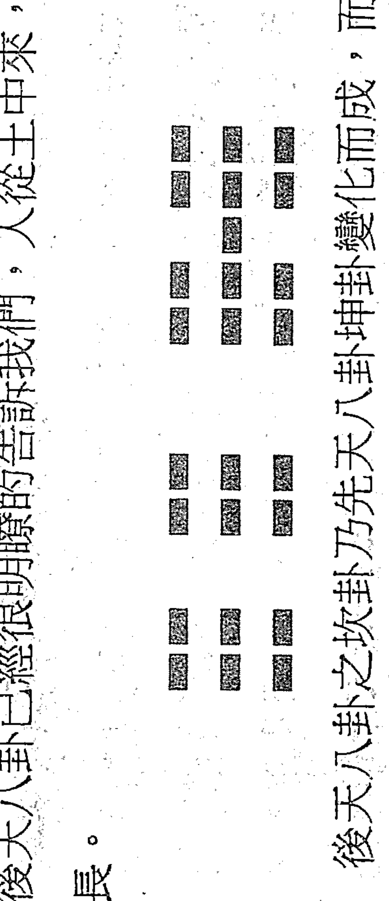

後天八卦之坎卦乃先天八卦坤卦變化而成，而後天八卦之坎卦為水，我們知道易經八卦乃觀象而得，因而八卦乃世間萬物之縮影，凡是符合八卦之類象之物皆屬於該八卦，而萬事萬物中之中之每一物無不體現出八個卦之縮影。在後天八卦中的坎卦正是人之縮影，當我們看到的八卦中的坎卦是兩陰夾一陽，一陽潛於兩陰之中，陰為柔，陽為剛，當我們將坎卦變換一個角度觀察的時候不難發現，其實這個坎卦著實是人的縮影，兩陰是人外在的肌肉組織，而一陽則為人之脊柱，兩陰為我們人之表面之形體，而人之實質乃坎卦中一真陽，坎卦之真陽就好比人之陽氣，一旦人之陽氣破體而出，那麼人的壽命也將至此而終，魂飛魄散，壽終正寢。坎為凝聚之意，兩陰為坤卦之象，陽氣

## 360 梅花易象高層之路
緊緊的吸附兩陰，兩陰緊緊包裹著陽氣而生，坤卦亦為大地之精華而成為人，賴以大地之養分而生存，當人之魂飛魄散之後，兩陰不再緊緊包裹陽氣，陽氣一旦破體而出，那麼又將從回大地。從先後天八卦亦可以看出，萬事萬物之初，首先有的就是無脊椎的生命靈體，因為坤乃無陽之物，無陽乃軟體，而坎為有陽之物，因為大地乃先生軟體之物後有脊椎之物，坎乃水生之物，坎亦為水，亦為魚，因是人亦從水中來，亦從魚演變而來。

我們人是需要營養滋養的靈體，需要一日三餐持續的供應才能得以生存的，離開了一日三餐我們是無法得以生存。易經的八卦易經告訴了我們這個簡單的道理。但是單純的運用先後天八卦的關係並不能很好的解答健康的生存，我們只有將易經八卦一層一層的深挖象數理，這樣我们才能很好的理解易經和健康之間的莫大關係。

中國的漢字可謂是寓意精深，無不透露出易經的光芒，我們知道世間的萬事萬物無不是數字的各種變化的形式，世間的萬事萬物無不存在於數字之間，即便是一個簡單的漢字就足以描繪整個世間的萬事萬物，因為漢字即是數字，數字即是漢字，數字皆是八卦，無不是六十四卦，六十四卦之中無不有萬事萬物。在易經中講究的就是同聲相應同氣相求，這個世間的萬事萬物只要是存在著相同的

## **第十三章 梅花易數與中醫**

卦象屬性的無不會產生共鳴，也就是我們說的共振，有相同的屬性的人會產生共鳴，這就好比我們現實生活中說的
心意相通，有的人為什麼會走到一起的時候會感覺到對方的心跳，為什麼有的會產生同樣的行為動作，這就是易經中說的同聲相應同氣相求的現象，這都不是玄而又玄的假
說，亦不是所謂的怪力亂神之說，這就好比是現代所說的
量子物理學中的共振效應。因而在古代的社會中，往往很多數術將中國的漢字運用到占卜中來是有一定的道理的，漢字用於占卜亦是數字演化為八卦，八卦變化為數字的一個相互轉換的過程，而易經這門前沿的語言無不成為透析整個世間萬事萬物的工具，為了更好的解讀易經與健康之間的關係。下面我們就用中國的漢字組合成卦來解讀一下健康。

俗話說得好，三分吃，七分養，吃固然是重要的，畢竟是民以食為天，脫離了吃是不行的，但是吃也是有講究的，並不是說吃就是胡吃亂吃，只要吃飽了就行，隨便吃什么都可以。隨著社會水平日益的增高，吃好喝好成為人們嘴邊的口頭禪，一些老百姓手上有了多餘的錢，那麼有些人的思想觀念就發生了改變了，除了穿好，有些人眼中的吃變成了吃好，於是乎從從前的粗茶淡飯變成了每日的雞鴨魚肉，山珍海味換著法的改變，在一些老百姓的餐桌

## 

上再也找不到粗茶淡飯的影子，青菜蘿蔔也是很少見了。
每日必吃得腰肥滾圓才肯下餐桌，殊不知，那些不起眼的
粗茶淡飯，青菜蘿蔔才是最最養人的，最能體現健康的。
就拿我們現今最不不起眼的大米，小米來說吧，其實大
米，小米才是最為養人的食物，也是食物中的人蔘果。為
什麼那麼說呢，我們還是以漢字化數字，數数字化卦的形式
來解讀。

> 坤卦。

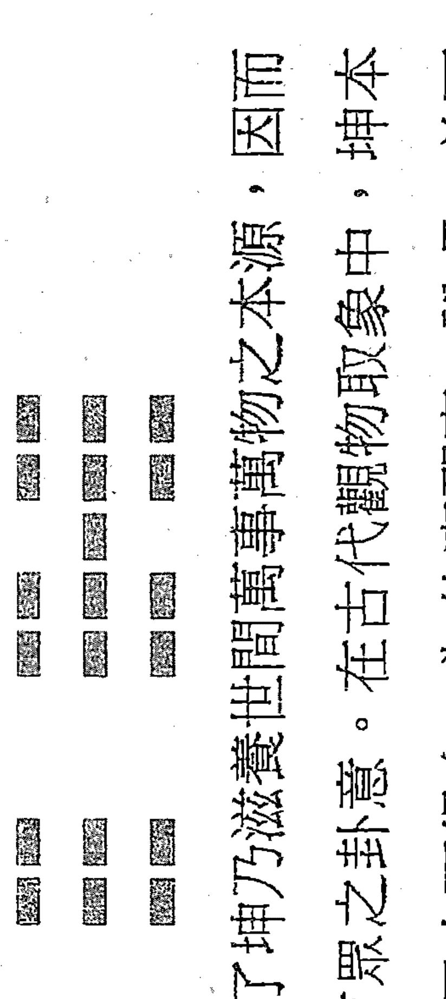

前面我們知道了坤乃滋養世間萬事萬物之本源，因而
坤有大地之母，有眾之卦意。在古代觀物取象中，坤本
意亦為穀物，為養衆人而得名，為什麼那麼一說呢，前面
我們在說坤和坎互為先後天八卦的時候已經初略的介紹
了，坎在後天八卦中為人象，為兩陰之中潛藏一真陽，一
陽賴兩陰而生，一陽被兩陰包裹於其中，一陽在其中謂之
人之真氣，人有真陽而有靈，人乃先天八卦天地交媾孕育
而成，坎一真陽得天之真陽之所在，因而得地之靈氣而成
形，故為之人，因而成人以後無時無刻不賴以地氣而生
存，因而也要每日從地上攝取一定量的能量作為人持續生

## 第十三章、梅花易數與中醫 363
存的保證。因而地上長的，水裏游的無不成為人口中的食物。但是人們的食物最為養人的也還是穀物，也就是現在我們說的大米。小米，也正是這些最為養人，最為養人的並不是現代科技下的所謂的精細米。因為現代科技之下的精細米無外乎是去掉了淘米洗米的環節，那些所謂的精細米再也沒有自然生長下的大米那層濃濃的米漿水，也正是那些濃濃的米漿水最為養人，是穀物中的人參果。我們看

一下坤卦就知道了，坤乃三陰組合而成，陰乃坎水之本源，坤不及而不生坎水，坤及者乃孕育子水，因而穀物糙而養人。不及者傷人也。人從穀物中攝取的乃是穀物中的精華之所在，穀物如果是精細米，精細的食物，那麼谷之精華就越少，那麼自然達不到養人，育人的效果。尤其是當人生病的時候最能體現穀物之重要性。特別是糜患胃病的人就知道了，吃什麼藥都久久不見效，良心的醫生就會告訴你，如果你堅持得了，你只要吃幾個月的糙米稀飯，胃病是不藥而愈，為什麼那麼一說，前面我們說過了，易經講究的就是同聲相應同氣相求，人的胃就是坤卦，人之胃乃消化水穀之精所在，倘若人的胃壞了，那麼百病乃生，人的胃就好比是河裏的水輪的中軸，水輪的中軸壞了，那麼就不能正常的運轉，那麼河水也就自然不能帶上來，水輪的周邊就好比是人的心肝肺腎，胃部壞了，則是

## 梅花易象高層之路

牽一發動全身，胃部壞了，那麼人的心肝肺腎自然攝取不到適量的營養，那麼自然身體就會慢慢的垮掉。而當患了胃病的`人，吃點糙米稀飯，這就是天然的胃藥，胃部慢慢的從糙米中吸取精華，慢慢的修復受傷的胃壁，久而久之，人的胃病就會慢慢的痊癒。

說道這我們再順帶說說牛肉，我們日常生活中攝取的食物能量，牛肉是不可缺的，也是我們攝取食物的主要對象。從易經的角度來說牛肉也是最為養人的食物之一。因為在易經中，坤亦為牛肉。我們不妨將牛肉兩個字組成卦來看看。

雷水解  水火既濟  地水師
【主卦】 【互卦】 【變卦】

我們知道牛肉是具有大量的蛋白質的好食物，對於那些需要增補蛋白質的虛弱的人群是再合適不過的，但是很多人可能都沒有想到牛肉還是具有補血的功效，對於那些手術後，大量失血，而非常需要補血的人群來說也是再合適不過的補血佳品。通過這組梅花卦我們不難看到，牛肉

> > 這卦我們再熟悉不過了，坤卦無外乎是三陰，這個就是從易經中悟出來的道理。首先我們看看坤卦，而不是憑空想像出的老話並不是這樣說得好，一日三餐不必頓飽，只一日不好吃的不可不吃，吃什麼東西有個限度。切不暴飲暴食，這在易吃，吃什麼東西都有個限度，切不暴飲暴食，這在易經上都是可以找到理據的，在易經中我們不難找到合理膳食組合，對於健康的重要性。我們依然看下坤卦與各種卦的結合，在易經中我們知道坤乃人之胃，胃乃水穀之精之所，因而我們要健康就必須善待我們的胃，切不可給胃造成補必要的負擔，好吃的切不可多吃，不好吃的亦不可不吃，一日三餐都要有個度。老話說得好，這個七分飽即可，要吃到七分飽即可，這個七分飽的

- 氣，坎又為血水，為之人向外泄耗精元，震亦為刀劍，為作用。主卦雷水解，震為動，在外卦動，泄體卦坎水之
- 反手亦為傷，又互卦之中連續坎離，視為連續之象，又雷水解之四爻陽居陰位，四爻又為動，四交處於
- 坎水陽爻，故此為出持續血之造，四交陽變陰為得位，壞事變好事，雷水解變地水師，坤坎實為先後天關係，震變
- 坤，坤乃水之母，需補益，坤在上，坎在下，在内，上生下，上為母，下為子，母補生子，實則為母補益子。因而雷水解變地水師則為牛肉具有補母，補血之功。同樣牛肉
- 對糖尿病者是非常有好處的。

好东西谁都忍不住要吃点，但凡好东两亦不益多# 第十三章 梅花易數與中醫
## 367 胃部，雖然說胃是無所不包的。就像大地一樣，無論什麼都能承載，都可以包容，胃部也一样，無論什麼樣的食物都可以装，但是它和大地一样，都不可能是無止盡的承載和包容的，食物吃多了，吃少了，都會導致胃部的負面的影響，我們先看下艮卦，艮卦是一陽居於兩陰之上，兩陰在一陽之下。艮卦亦為停止，亦是人吃飽時候胃部的樣子，它告訴我們人吃食物不能多吃，亦不能少吃，最多吃得七分飽，亦是三分之二的胃部這個樣子，為什麼那麼說呢？因為這個艮卦已經很明瞭的告訴我們，一陽居於艮卦的最上面一爻，也就是說胃部的上限只能是三分之二，如果超過了三分之二，那麼人就是吃得過飽了，吃得過飽了，那麼坤卦也就變成了乾卦了，乾卦就是滿的意思，太滿了，胃部就受不了，因為艮卦實際是倒過去的震卦，這個倒震是向下運動的，那麼也就是說吃得過飽了，胃部也就震不動了，也就運動不了，那麼胃部長此以往下去，胃部就會失去動力，那麼吃得過飽了人就會患病了，就容易消化不良，或者是消化系統出現各種各樣的病變，嘴巴有口氣了也就是吃得過多的一個最明顯的表現之一。

我們再看看吃的過少或者不吃會造成一個什麼樣的後果，這個也能從經經八卦中得以體現，我們看，本來胃部是留有很充裕的空間來容納食物的，但是是一些人為了各種各樣的原因絕食，節食，造成了長此以往呢，也會給胃部帶來傷害。我們通過坤卦和艮卦的對比可以得知，一個正常人的胃部裝滿食物大概是1500毫升這樣，也就是大概是三斤重的食物，但是人在吃食物的時候最多是裝到1000毫升就差不多了，這是七分飽 Concept，但是如果一個正常需要食物的人長此以往都是食得過少或者不食，那麼就是一種傷害，也會導致胃部不適，因為人在吃完食物以後會慢慢的消化掉，而消化這些食物是靠的胃中的胃酸來達到的，假如攝入的食物過少了，胃部釋放大量的胃酸就會損壞胃部的健康，我們從卦象中就可以瞭解到這一現象，假如攝入的食物過少，那麼也就是說胃部攝入食物的上限過低，那麼就會造成巽卦，因為陰的部分就代表了食物的多少，上限降低了，那麼就是成了異卦了，巽代表的就是酸性的東西，那麼也就是說胃酸多了，本身胃部屬土，而酸屬木，那麼必定導致胃部收到了傷害，因而在飲食的過程中，一定要適量，不宜少食，亦不益多食，七分剛剛合適。

現代有些人上為了修行，因而變得有些盲目。張口閉口就是辟谷、其實些所謂的辟穀的真正目的就是了所谓的得道修仙。實不知真正的道在何處，就連最基本的道理都沒有想通，即便是辟谷一萬年依然是肉眼凡胎。易經之博大，不是知曉簡單的算命占卜就可以成仙得道的，更不是盲目的辟谷就能修道成佛。假如有朝一日能真正參透易經之理那才是大成，才會真正明白大道之所在。

易經與健康是息息相關的，我們每日的行走坐臥無不與之相關，小到一杯茶都蘊含著易經之理。為什麼那麼說呢，一杯茶都能蘊含易經之理，恐怕很少有人會關注飲茶的道理，同樣在這裏我們依舊通過中國文字以字化數字，數字化卦的形式來說說茶。什麼時候該喝什麼茶，什麼樣的人該喝什麼樣的茶都是非常有講究的，並不是什麼人都適合喝茶。就好比綠茶吧，胃酸多的人不宜喝綠茶，胃熱的人可以適量的喝，而胃寒的人則不宜喝綠茶，應該適量地喝紅茶。這個我們依舊將紅茶綠茶兩個字分別組成卦來細細分析。首先透過易經八卦我們來看看綠茶有什麼樣的功效

# 【主卦】 雷 水 屯 山 地 剝 水 澤 節【變卦】
經過文字化數字，數字化卦以後，我們不難看出綠茶的許多我們意想不到的效果。下面我們就解讀一下這組文字卦。前文我們在說明先天八卦的時候已經知了，坎水為後天八卦之人，現坎水居於外卦之上，上卦為陽，為人，下卦為陰為人，上卦為成年，下卦為孩童，坎水居於上卦謂之成年人，下卦震主動象，那麼此水雷屯亦為中年，那麼就逐漸的開始走向衰老，這個也是自然的規律，互卦之中從二爻至五爻為大艮卦，也就是說從童到中年這段時間裏發展是非常快的，因為初爻至四爻是大人震卦，所以發展的很快，成長的也很快，但是一旦到了四十歲的時候，身體的機能就開始慢慢的生長了到了五交的時候就是一個大艮卦，艮就是停止的意思，生命開始慢慢的回歸本源，慢慢的開始衰老下去，身體的各個機能也開始漸漸的消退。很少有人能衝破五交這個界限。因為現

## 370 梅花易象高層之路
今的人慾望都很多，看看主卦水雷屯就知道了，水雷屯就是動性，動慾望，欲望太多了，那麼作為人身體自然在運動中一點點的消退，水雷屯就是告訴我們這一點，動欲望就會泄坎水，坎水就是我們的真元。除非我們修身養性，一步一步的護住我們的真元，減掉世間的各種形色慾望，但是往往現世社會中很少有人做到這一點，於是乎還是順應時間的推移，一天天的衰老下去。但是綠茶缺能起到滋益真元的作用，延緩衰老，我們注意看，變卦水澤節的兌卦是由震卦二變而來，本來主卦是震木泄體，變成了兌卦生體，兌卦為潤澤，為坎水之補益，坎兌相遇，本坎水兌金為先後天關係，坎水為先天之精，兌金為後天之母。那麼也就是說兌為後天補益，兌亦為吃，水澤節亦為節制，那麼也就是告訴我們後天生活的人們無論做什麼都要做到有節制，補可以悃然，更不可以大勢的泄放自己的欲望。吃東西也有一定的規矩，這樣才能做到延緩衰老的作用。而恰恰綠茶就起到了延緩衰老，補益真元的作用。坎水亦為泌尿系統，震卦亦為反艮，艮著亦為砂體流石，那麼也就是告訴我們綠茶也有利尿排石的作用，適當的喝綠茶是起到保健作用的。水雷屯之下卦亦為反艮，艮著為癌症，反艮亦為健康，主卦水雷屯，坎水泄震木，震木得坎水生，艮土受制，因而適量的喝綠茶也可以預防癌症的發生。好處多多。但是因為震木得水之生，因而綠茶容易產生胃酸，因而胃酸多的不宜喝綠茶。還有就是最為想不到的綠茶還具有健齒的作用。
解讀完了綠茶的功效，我們再透過易經八卦來看看紅茶有什麼樣的功效。

無雷 无妄 風山漸 天火同人【變卦】
【主卦】
紅茶好喝，但是和綠茶一樣，並不是什麼人都適合喝的，看看此組梅花卦就知道了。主卦天雷無妄因三爻動變天火同人卦，乾卦主寒，主卦下震主動象，動而離火，因而變卦同人為火暖乾，乾卦為人之身體，因而主暖身之意。因而胃部有寒的最適合喝紅茶，可能很多人都不會想到紅茶還有很多意想不到的作用，諸如紅茶可以起到健腦的作用，尤其是對預防心腦血管疾病就起到很好的作用。

為什麼那麼一說呢，還是看看卦象最為明瞭，主卦為天雷無妄，上卦乾卦為腦，下卦為震為動，謂之健腦，三爻本

## 第十三章 梅花易數與中醫 371
是阳爻位，但是阴爻占据，三爻主离火，为血，三爻动而化离火为血。乾卦本为寒，有火而运动健，犹如电脑一般，有电则运动。主卦之互卦之中为风山渐，渐者谓之骑虎难下，风生火起而生倒震，谓之健脑而止风，因而喝红茶不但可以健脑，还以预防脑中风的发生。再则就是可以强健骨骼，止渴生津的功效，这些都是可以通过卦理分析得道的。
说完了两种茶，我们再来说药，这里我们值得注意的是，我们今天讲的并非我们常用的中药或者西药，而是常人嘴里提到的毒药。一听到毒药可能会有很多人觉得有些毛骨悚然，不寒而栗，特别是在一些电影电视剧里，那些运用毒害人的情节让人想起来就觉得毒药是多麽的恐怖。但，殊不知，在一个真正医生的眼中就没有毒和药之分。毒药用好了就是药，就能做到起死回生，救人一命的效果，然，即便是没有毒的药，如果用得不好，到了庸医的手中，那麽也会变成毒药，害人不浅。因而用药就必须慎重，用药就必须拥有良好的医疗方能救人於水火。
从古至今，运用有毒的药作为治病救人的案例是比比皆是，就现今来说，合理的运用有毒的药来治病救人亦为屡见不鲜，就拿我们常用的药来说，随处可见有毒的影子，如現今的一些西药当中最为常见，含有麻黄碱，可卡

## 372 梅花易象高层之路
### 第十三章
## 梅花易數與中醫
373
因，咖啡因的藥品數不勝數，但是這些所謂的有毒的藥品被合理的利用以後就可以治癒這樣或者那樣的疾病，當然不乏一些中藥方裏面有的時也會用到有毒的藥作為治療病患。諸如現代一些有名望的中醫生，在治療現今一些不治之症的時候，就會用到一些常人難以想象的“毒”藥，諸如我們在電影裏看到的所謂的劇毒毒藥砒霜，在電影電視劇裏面，砒霜成為殺人的利器，而現今砒霜卻就被運用到治療白血病，和其他一些疑難雜症。那麼下面我們依然是以中國漢字化數字，數變化卦的形式來說說砒霜和附子兩種毒藥在醫學上的運用。
首先我們來說說砒霜，所謂的砒霜其實學名是三氧化二砷，其實砷這種元素純在很廣泛，無論是在海裏還是在陸地上都可以找到砷的影子，在海裏，特別是一些海鮮裏面就有砷的影子，在人體裏同樣有砷元素的純在，但是這些都不是含有劇毒的，只有砷的化合物三氧化二砷是含有劇毒的成分的。但是這些並不是毒的全部，並不是毒就是一無是處，無用武之地的，在科技發達的今天，砒霜這種毒藥被合理的運用來治療諸多的疑難雜症，諸如白血病，還有一些腫瘤疾病同樣被運用到砒霜，但是砒霜在臨床上是很合理的運用的，並不是電影電視劇裏面看到的那樣。
砒霜還有意想不到的效果，當時看到此卦的時候，就想到

## 374 梅花易象高層之路
了，因為卦已經很明瞭的告知我們，只不過我們不懂卦理的人是很難想像得到的，就是砒霜如果可以合理的利用就可以治療腺體瘤和前列腺瘤，還能治療哮喘。結果當百度以後發現卦象所顯現出來的信息和百度搜索到的結果完全一致。下面我們就卦象說說砒霜。
通過卦象我們不難看出砒霜的作用，風地觀變山地剝卦，巽為信，坤為土中之物，實際上砒霜又名信石，當砒霜進入體內之後，會導致腸胃紊亂，血壓降低，胃部潰爛，直到生命停止，這都是可以從卦上可以瞭解得到的，
坤為胃，上卦巽為風，為進出，巽木又為木，坤土又為木之庫，巽木與坤土本為先後天關係，巽卦為先天之木，而下卦坤土為後天之母土，先天克制後天土木，謂之絕嗣，
風地觀寓意为膝下無嗣，巽亦為石，因而風地觀亦為毒草、毒石。坤土亦為胃，巽木克之，乾為乾屍，坤為腐爛，因而誤食砒霜必導致胃部腐爛，巽亦為氣，五爻陽爻占據陽位，本事得位，本不應該變化，然陽變陰，一陽
之氣從有到無，巽氣被停止，因而誤食砒霜還導致呼吸困難。甚至導致死亡。誤食砒霜還會導致劇烈的腸胃蠕動，
看看卦象是不是這樣，巽為風，為迅速，從初爻到五爻就是一個大大的倒震，從初爻到四爻又是個大大的坤卦，是
不是象身體內部在劇烈的運動，向下運動，最後導致上吐

| | |
|---|---|
| ||| |
|---|---|
| |||[變卦]


## 第三章 梅花易數與中醫 375
下瀉，全是糊糊狀的東西。坤為糊糊。是不是這樣。風地觀亦為大大的巽卦，內坤亦為血，在內卦亦為低，因而誤食砒霜必導致血壓降低。風地觀之山地剝之下卦均為下肢部位，坤為虛弱，又上卦巽變艮，艮為倒震，震為站立，而艮為倒下，因而誤食砒霜最終的結果必導致虛脫，站立不穩而倒下。但是誤食了砒霜也不用慌，卦象裏面也告知瞭我們解決的辦法。就是中藥防風加石膏，巽為風，內卦三爻至五爻為艮卦，艮為停止，謂之風山漸，停止風也，因而謂之防風，巽亦為石頭，下卦坤亦為膏狀，謂之糊糊，組合謂之石膏。因而解毒砒霜可以用到防風和石膏。
再有一方就是很容易取到的甘草，巽為草，坤為甘甜，巽木克制坤土，因為甘草也具有解毒的效果，再就是家裏常用的綠豆了，但是從卦象而言，防風和石膏的效果是最好的。
雖然砒霜的毒性巨大，但是卻是有治療疑難雜症的好藥，當砒霜運用得當的時候，一些疑難雜症患者往往可以恢復以往的健康之軀。首先一定量的砒霜是治癒哮喘的良藥，為什麼那麼說呢，還是卦象所顯現出來的，主卦風地觀之山地剝，巽卦為氣，在上卦，下卦為坤為濕，風地觀實為倒大兌卦，兌為澤，為濕，內卦至四爻皆為陰爻，陰極必陽，坤極乃乾，說明體內濕氣過重，巽為呼吸，為
雖然砒霜的毒性巨大，但是卻是有治療疑難雜症的好藥，當砒霜運用得當的時候，一些疑難雜症患者往往可以恢復以往的健康之軀。首先一定量的砒霜是治癒哮喘的良藥，為什麼那麼說呢，還是卦象所顯現出來的，主卦風地觀之山地剝，巽卦為氣，在上卦，下卦為坤為濕，風地觀實為倒大兌卦，兌為澤，為濕，內卦至四爻皆為陰爻，陰極必陽，坤極乃乾，說明體內濕氣過重，巽為呼吸，為

## 376 梅花易象高層之路
急，五爻為喉頸，陽變陰，巽變艮，艮亦為倒震，倒震而氣運動向下，那麼氣一上一下急促運動，那麼通過卦象而知說明體內濕寒過重導致呼吸氣急而喘，那麼砒霜剛好可以起到這個作用，這個就運用到了易經中的同氣相求之原理。砒霜的合理運用還能作為治療高血壓、腺體瘤，前列腺癌等疾病之良藥，這些也是根據了卦象的同氣相求的原理。有興趣的朋友不妨將卦細緻的拆解一下。

風地觀 山剝
【主卦】

最後我們再來說說附子這種中藥在實際中的運用，在本編前篇《梅花易數治療癌症可行性研究》這易章節中我們已經介紹了附子的作用，這裏為了更好的瞭解中藥黑附子，我們不妨在着重細緻的說一下黑附子的神奇效用。附子又名烏頭，也是有毒的一種藥，然，在現今依然被廣泛運用在治疗治病上，尤其是現在一些中醫，將附子運用到治療一些疑難雜症上。百度不難知道附子有何種的功效。但是我們是學習易經的，我們依然可以從梅花易卦中不難

## 第十三章 梅花易数与中医：379
# # 第十三章 梅花易數與中醫
## 找到附子的效用，就普通附子而言，主要的功效就是治胃病，但是就黑附子而言，它的功效卻是神奇，特別是對於那種手足厥冷，亡陽虛脫者，瀕臨絕命者卻是有者起死回生的效果，當然這要醫者有深厚的易學和醫學知識才行。下面我們就卦象來細細看下黑附子的卦象。
主卦雷火風，變卦澤火革，震為雷，離為火，為急，離為火，為心，謂之急火攻心，震木助離火，火立效，因而黑附子乃為大熱大燥之物，且不宜虛火旺盛者服用，反觀離火為坎水，離火先天為乾金，坎水冷，而乾金寒，震卦亦為坎水，離火先天為乾金，坎水冷，而乾金寒，震卦亦為坎水，離火先天為乾金，坎水冷，而乾金寒，震卦亦為足，震卦五交變兌金為東西不就，震兌先天亦為離坎，謂之朝暮，因而震變兌謂之絕（厥），卦象看亦為足之厥冷，又震亦為反手，故為手足厥冷，因而黑附子只能是在手足厥冷之時方可用之，又雷火風之錯卦為風水渙，渙著，散也，巽為氣，而坎為黑，為死，坎在先天居於西方，而離火在先天居於東方，謂之朝起西落，陽氣之升降爾，因而坎水為死氣，因而風水渙為氣絕渙散，正如風水中同，氣乘風則散，界水則止，風水渙，氣乘水而行謂之散。因此黑附子在人將亡陽氣絕之時具有大補元氣，助火回陽之功，別的藥物不可替代。又雷火風之澤火革，主卦震為雷，謂之反艮也，艮者謂之陽症之意，故現在很多的中醫將黑附子作為治療癌症的首選藥物，艮亦為橋之象，

現雷火風，上卦震為倒艮，謂之橋塌，因而雷火風之震為搭橋還陽，倒震實為倒艮，離火乃有炎上之功，因而黑附子又有養胃之效。黑附子藥用到位。又見互卦為澤風大過，大過者亦為橋象，初交為陽，六爻為陰，陰陽相應，陰陽交通，可謂搭橋，陽從內生，六爻陰從外而降，因而雷水豐

黑附子的作用是有升有降，用得好是起死回生，變卦澤火革，二次重生，黑附子最大的作用依然是補火助陽，起死回生。

## 【主卦】
# **第十三章 梅花易數與中醫**

雷

## 大過

## [互卦]


## 【變卦】

易之梅花易象與健康息息相關，但往往不為人所識得，還是那句話，百姓日用而不知，即便是現時諸多的一一一些易學大家也亦然，現時他們往往將視野僅僅局限在易蔔算命之上，對於易經之理往往是處在門檻之內外之間，對於梅花易象更是略知甚少，運用亦是不得其法，甚至有的單純的認為易象也不過爾爾，能斷準事物即可，殊不知。象不理不清，理不辯則不明，倘若只是單方面觀象則好比

380 梅花易象高層之路

##### 第十四章 梅花易數與自然環境
# **周易預測地震的可行性研究**
很多人都在關注地球的變化，尤其是近些年來比較頻繁的地質變化引起的地震，海嘯，火山等自然災害，與其說是自然災害，倒不如是說很多時候都是人為的因素造成的，全球氣候的變暖，這都和日益的經濟發展離開不開。針對近些年來出現的比較頻繁的地震，科學家們都在做著努力，還有很多熱心，關心地球生存環境的人們都在做著積極的努力。由於地震預測是門比較新的學科，因而在地震預測方面仍然處於不斷摸索的階段。在現今，很多時候預測地震都是借助現代的一些科學儀器來預測，預報地震預測地震都是借助現代的一些科學儀器來預測，預報地震的。如果說地震預測是門很新的學科似乎顯得不夠嚴謹，因為早在古代的文獻裏面就有了預測地震的記載，不乏一些周易預測的古籍裏記載有關於預測地震的知識，諸如在六交預測裏面有蛇虎同動主有地震一說，然，周易預測古籍中專門講解預測地震預測知識的不過寥寥數語。說到周易預測地震，在現今，有的現代人會站出來：現在都已經是科技騰飛的年代，預測地震都可以靠先進的科學儀器就可以做到，犯不著用那麼古老的方法來預測地震，周易預測地震簡直就是無稽之談。天下之大謬。愚不想多說，只
[/content]

##### 第十四章 梅花易數與自然環境

覺得現代的科技並不等於科學，現代科技只是科學之下的一些產物，而周易預測則是一門未知的學科，遠遠高於科學，時間可以證明一切。

下面愚想說的是周易預測運用預測地震是完全可行的，被運用於預測其他的一些自然災害也是完全可行的。預測自然災害也並不一定僅限於用六爻預測，運用其他的一些術數同樣可以做到。比如說運用梅花易斷的方法，通過卦象數理的分析，不僅能將地震的地點、距離、狀態、等級等等都可以相當準確的預測出來，然，梅花易斷和其他一些預測術一樣，需要預測師有相當精深的預測技藝和廣博的知識。愚覺得運用梅花易斷的方法來預測自然災害最關鍵的地方就在於讀象，如何能夠合理的解讀出卦象是最關鍵的，離開了正確的卦象解讀的方式和方法，一切皆是無從談起，且解讀卦象的重中之重卻在於卦象象意的理解和積累，如果真的理解了卦像是如何解讀，掌握了大量的萬物類象，那麼假如有一台量子計算機，將所有的事物的萬物類象等相關信息全都輸入到計算機裏面，那麼計算機如果能根據梅花易斷的解讀的方式方法，那麼肯定可以準確的預報和預測自然災害的發生，並且完全有可能提前更早的時間做好防震減災工作，更小化的避免人員傷亡和產生損失。

####### 第十四章 梅花易象高層之路

下面是兩個自己曾今預測過的卦例，雖然很多地方都不是自己預測的，大部分都是馬後炮，但是愚近些時日分析最近發生的自然災害的具體過程、時間、地點之後，愚覺得所發生的自然災害都是必然，也都是符合卦象的，也都是根據卦象裏面顯示的出來的信息發展的。在這兩個卦當中，愚通過卦象分析，認為我國今年年初寅卯月必有地震時，方位在我國的雲南思茅地區，當時在和一位要好的易經愛好者說了這個嚴重性，根據卦象並結合 2015 年的時機，愚覺得會有較大地震的跡象，於是很想告知相關的部分注意警戒，尤其是愚通過卦象預知今年雲南以西還會有更大震感時，愚有些茫然，因為自己在預測地震方面還是個新手，特別是運用梅花易斷的方式預測地震，沒有太多的經驗，再就是預測地震、預報地震也是一件很嚴謹的事情，預測出來了要向誰說，跟誰說等等都是很嚴肅的問題。迫於很多的無奈，於是這個預測被擱置下來了。現在把梅花易斷預測自然災害的解讀方法和可行性撰寫成文，希望對預報、預測地震的愛好者有所幫助。僅供參考。

##### 第十四章 梅花易數與自然環境

## 卦象如下：

起卦公曆：2014 年 7 月 13 日 18 時 6 分（北京時間）
起卦農曆：甲午年六月十七日酉時

| 用神 | 遁卦 | 卦 |
| :--- | :---: | ---: |
| 體 | 漸 | 臨 |
| [本卦] | [變卦] | |
|| || |
|[綜卦]| [錯卦]

|起卦公曆：2015 年 1 月 9 日 20 時 28 分（北京時間）
起卦農曆：甲午年十一月十九日戊時
干支：甲午年丁丑月乙酉日丙戌時

|復卦|坤卦|臨卦|婚卦|剝卦|[綜卦]
體||||||
用|||||[變卦][錯卦]

雖然這是兩個截然不同的卦，但是可以得到同樣的結果，前面說了，關鍵是解讀卦象的方式和方法以及對卦的象意的掌握和積累。在上面這兩個卦當中，愚主要是運用了第二組卦象來進行預測地震的，首先愚覺得已經是 2015 年了，運用當年的起的卦就更能反應当年的事情。

當時愚預測到今年寅卯月會有地震是因為，地雷複這個卦象，因為坤為地，為大地，震為雷，為震動，坤在上為地表，震在下為地表以下，因此斷言有地震的可能性，具體斷 2015 年有地震，而且有較大地震的原因是在於坤土和震卦，因為 2015 年是羊年，坤土中藏著未土，羊年正好是未土，易經預測中說的太歲當令，地雷複直接讀梅花就是動太歲，且震卦是艮卦的反卦。艮土裏面藏著丑土。艮為家，艮為房子。太歲未土沖艮土，因此艮倒下來了，反過來了，實際上震就是倒下來的家，地雷複實際就是艮坤相沖的一組反卦，因此斷此年會有大的震感沖掉家園。時間是寅卯月也是因为震卦和反艮的原因。震藏卯木，艮藏寅，因此農曆的寅卯月會發生地震的可能性比較大。當時愚是預測到了雲南思茅地區以西會有大的震感，理由也是因為地雷複的原因，還是結合地雷複這個卦象做重讀，坤解讀為西南，震為動，坤為雲，所以斷言雲南、西南動了。至於為什麼斷言思茅地區有地震的原因也是因為地雷複這個卦，在梅花卦的象意裏面。坤土為細小，震木為毛髮，為頭，坤在上卦為大，震在下卦為小，震也為思想，觀念，想法，組合在一起讀象就是細小的毛髮，絲毛，思茅。

為何愚當時斷言 2015 年春天的時候雲南以西會有地震的理由也是因為地雷複這個卦。前面說了地雷複實際上就是指的雲南地區，但是地雷複這個卦因為六二爻發生了變化，那麼震就變成了兌，如果將主卦看成是雲南的化，那麼將主卦作為一個坐標尺，那麼兌就是雲南以西的地方，當時愚只知道是雲南以西的地方，但是沒有解讀出來是尼泊爾發生了很大的地震，事後，也就是最近一段時日，愚才從卦裏中悟倒如果自己的梅花易斷很精深的話，能夠自如的運用先後天的關係就能準確的將地震的地點、震級等等都能一一通過同一組卦解讀出來。

愚看了這組卦想了許久，覺得地震比較頻發的原因是在於地殼的變化引起的，真正的原因倒不如說是人為的造成的自然災害。看這組梅花卦，震為樹木，坤為平地，按照自然規律，樹木應該是長在大地之上，從卦象上理解應該是指雷地豫之象更為合理，但是現在這個樹木倒下了，木头都倒到了地下，震木在坤土之下，樹木都到了地平線之下，被掩藏起來，坤為平原，為荒野，地上全是光禿禿的平原，震木變兌金，兌金克震木，兌為砍伐，樹木都被砍光了，過度的砍伐。坤為水土，兌為缺失，過度的砍伐造成水土流失。為什麼砍伐樹木，主卦是地雷複，坤為家，坤為眾，說明是在大勢的開發建設，因而導致了樹木的變少，坤亦為沙土，為荒漠，如果在繼續過度開發，那麼有一天土地就會沙化。整組卦亦為地球的變化的過程，震在內卦，變兌，震兌相沖為劇烈變化，坤土在上卦，上卦為表面，下卦為內部，所以是內部發生了劇烈變化，兌為西，震為東，有可能地殼內部一個是塌陷，一個是向西偏移，受到西部力量的擠壓。說明整個地殼板塊在不斷的由東向西的變化和擠壓，從而容易引起地殼的劇烈變化。同樣其他的一些信息也能通過卦理給反復的解讀出來，如：

2015 年 4 月 25 日 14 時 11 分，尼泊爾發生 8.1 級地震，尼泊爾地震正中至我起卦地方 2400 公里，坤為泥巴，兌為月，先天為坎水，變卦為終結。為比較遠的，地澤臨中藏震卦，震為動，故為尼泊爾客船突遇龍捲風，在長江湖北段傾覆。至我起卦的地方 523 公里，距離南京 120 公里，解釋：震為東方，也為船，坤為星星，震木為艮土的反卦，本年為羊年，羊年未土沖艮土，為反轉，所以翻船。

#### 易經解讀如何能高品質的睡眠

說：哪個不會睡覺，是人生來天生就會睡覺。人累了、困了、乏了、倦了倒頭便睡。也许你觉得睡觉不是件难事，也不是件新奇的事情，但是殊不知要做到每日都能高质量的睡眠，确实是一件非常不容易的事情。我身边不乏很多朋友都学习过易经易理，知晓如何运用易经易理从阴阳五行的角度，通过生克制化的手段来分析卦理，解读出事情的好坏吉凶。但是很少运用易经从象数的角度去分析人的睡眠，更不要谈是如何去根据象理去好好的休息。所以常常见到有些人大清早打著哈欠的说，昨晚休息不好，于是把睡眠不好归罪於工作太辛苦、晚上睡眠梦魔过多、房事操劳云云。殊不知人的三分之二的休息时间你都没有把握好，你连休息这个最基本的生理需要都没有搞好，如何谈更好的去开始一天新的工作。

那么下面我们就运用周易八卦，从易经象数的角度来解读一下如何能做到高质量的睡眠。

##### 第十四章

梅花易數與自然環境

為天爻，最下面一爻為地爻，中間的是人爻，故人為陽，鬼為陰，故取坎中一真陽為人。那麼坎卦就有天地孕育生人之意。我們在橫著看坎卦的時候，坎卦是上下兩個陰爻包著一個陽爻，陰為虛，陽為實，陰為柔，陽為堅。坎卦由於是坤卦得了乾卦的真陽而變化而成，因此，坎卦上下兩個陰爻我們可以看成是坤，坤主肌肉、皮囊。而坎卦中間的真陽那麼則可以看成員肉裏面包裹著的骨胳、靈魂。

變形後的坎卦豎起來的坎卦這裡我們將坎卦豎起來觀察一下，看看是不是坎卦很像一個站立的人。為了更貼切的觀察好這個坎卦，我們不妨將這個坎卦變形一下。看看變形後的坎卦是不是象個人的樣子，上下、左右的是手腳，中間的是人的身體。這個坎卦其實就像是一個站立著的人，也只有人是站立著行走的。

再就是人是有三魂七魄的，其實在坎卦裏面也可以找到這樣的信息，我們注意看一下坎卦，坎卦的上下是陰爻，中間是一個陽爻，其實在畫卦的時候，我們就注意到了，在畫陰交的時候，先畫的是上面兩個很短的短線，接著畫的是中間一條很長的線，最後畫的是下面兩個很短的短線，那麼上下兩個短線加起來就是四根短線了，而中間的陽交雖然只是一根很長的線，其實它已經包含了三根很短的短線在裏面，也就是我們學習易理的時候講到的一含三的道理。所以這裏坎卦就有七魄的意思在裏面，而在坎卦中的陽交可以看成三魂。魂在內屬陰，魄在外屬陽，正所謂陰中有陽，陽中有陰。因為坎卦就最能代表人，其他的七個卦都不能真正意義代表人，具有人的含義。上面是三畫卦，在下面六畫卦裏面我們就很容易看出來了，人在天地之間，正因爲天地之間夾有陰陽，所以人就有了旦夕禍福、悲歡離合，人也就有了好歹。因而在現實生活中就會有欲望，也就會有生老病死。對於睡眠這樣看似小小一件事來說也就有休息不好、休息得好一說。看似乎休息好與不好與否是很自然的一件事情，但是我們也應該順應自然，盡可能讓我們休息的更好，更好的迎接每一個初升的太陽。

##### 第十四章 梅花易數與自然環境

人因為有陰有陽，有好有壞，有悲，有喜。所以在實際生活中很多時候受到這樣或者那樣的因素的影響而變得焦慮，無法充分的睡眠，也正因为人是个坎卦。坎在八卦的意象裏面有不順、陷、憂鬱、過錯迷茫的意思。這正符合了作為人的一個特點。那麼撇開這些特點講人應該怎麼睡眠才會更好呢？在網絡裏，報刊上看到了很多關於睡眠的問題，看到很多的人咨詢關於睡眠的種種問題，有的人認為這樣睡眠比較好，那樣睡眠很不好，這樣睡眠不助於身心健康，那樣會更符合睡眠。但這所有的問題都沒有從根本上說明人為什麼要那麼睡眠，而為什麼不能那麼睡眠，很多所謂的睡眠指導都是想當然的，根據現有的知識和理解去指導人如何更好的睡眠。但是我覺得既然易經能指導人如何正確的順應自然，理所當然也能很好的指導人如何更好的、更符合自然的去睡眠。

前面說了，人為坎卦，我們知道人睡眠的姿勢有很多中，但是主要的也就是平躺、側臥和俯臥。上面這個豎起來的坎卦是不是很像一個平躺著的人，平躺著的人其實就非常像是個坎卦。

看看平躺著睡覺有什麼好處和不好之處。平躺著睡覺首先能自由的伸展手腳，對於勞累了一天的人來說，手腳得以在休息中自由的放鬆和舒展。身體內部的各個器官也容易得到放鬆，這是很好的一種睡眠方式，但是平躺著睡眼也有不利的地方，就是平躺的時候全身不容易得到充分的放鬆，尤其是在平躺著睡眠的時候，腹腔內的壓力過高的時候容易讓人產生胸悶的情況。用易理八卦的角度去解讀這個坎卦就不難看出這個現象。坎卦，前面說了有陷之意，中間為陽，陰為突起，陰為凹陷，如果平躺著睡，這就好比我們的骨骼、骨架始終平躺著，那麼我們在睡眠的時候，雖然只是輕微的呼吸也會對腹腔造成一定的壓力。那麼對麼腹腔受壓人就會產生憋慌的情況，在睡眠中的人也就容易產生噩夢。我們注意觀察一下坎卦和坎卦的錯卦，坎是原本的象，離卦是坎卦相反的卦。注意看這組卦象就不難看出平躺著的不利的地方。我們首先看看坎卦，坎為坎中滿，為吸氣的状态，中間的陽爻可以看成一个點。人吸氣的時候肚皮頂得慢慢的，身體當然沒有任何的壓力，這裏坎卦的中間一個陽爻可以看成为一條直線，所以壓力沒有，但是當呼氣的時候就不一樣了，肚子裏面的氣呼吸出來就就成了離卦了，離為離中虛，離卦的上下兩個爻（下面這個變形的離卦為左右兩個陽爻），可以看成为身體兩邊的肌肉、肋骨，而中間的陰爻你自然可以想到就是身體心臟尖骨至胯骨中間的位置，所以當呼氣的時候就容易對胸腔造成一定的壓力。這樣顯而易見是對身體不是很有利的。

我們再看看俯臥的好處和壞處，俯臥的時候，實際上還是坎卦，只不過仰臥和俯臥的不同是，仰臥的時候人的心臟是在身體的上面，而俯臥的時候心臟就被牢牢的壓在了身體的下面。那麼俯臥除了四肢得以舒展的一點點好處外，實際上是弊大於利，長久的俯臥會導致胸腔的心臟被擠壓，容易產生心臟疾病。所以俯臥的睡眠方式也是不可取的。那麼最可取的應該就是側臥了。在古代的《千金要方・道林養性》中指出：「屈膝側臥，益人氣力，勝正偃臥。按孔子不屍臥，故曰睡不厭臥，覺不厭舒」。那麼《千金要方・道林養性》都說了側臥是有益於健康的，那麼是不是無論左側還是右側都是很有益於睡眠的呢？下面我們依然從八卦象數的角度來分析左側臥和右側臥的利弊。

有句話是這麼說人的，人要站如松、坐如鐘、睡如弓。所謂的站如松就是告訴人們站立的時候要象一個松樹一様。這個也和坎卦有關係。我們注意觀察一下這個坎卦，其實坎卦的還有個意象就是水，說的就是人的身體大部分都是水。應該不確切的說人的身體三分之二都是由水構成的，這個和地球由三分之二的水構成的是一樣的道理。這裏我們看看這個坎卦的中間那個陽爻，是不是筆直筆直的。是不是象松樹的樹幹一樣，總見影視劇裏面有這樣的臺詞：要就站著生，不能躺著死。站要站得象棵不老松一樣，站著才是一個爺們、漢子，這個就是坎，坎也有陽性，也主雄壯的意思。說的就是站如松，而不是躺著，彎腰駝背，像個蝦公一樣。易經博大就博大在這裏，雖然同樣一個卦象卻有不同的寓意，站如松取的坎卦中陽的象，坎卦中陽比作人的脊梁骨，取意人的脊梁骨就要象乾金一樣筆直，而駝背則取的是坎卦的卦象。

現在我們再看看人為什麼要睡如弓，所謂的睡如弓，簡而言之，坎卦的卦象已經告訴人們睡眠的時候要象弓輪一樣，人睡覺要怎麼才能做到象弓輪一樣呢？對，只有側臥，蜷起身來才能象弓一樣。前面說了側臥是有左側和右側之分的。我們線看看左側臥睡的結果。

##### 第十四章 梅花易数与自然环境

我們知道，人的心是左心房右心室，人的心臟是長在左邊的，這個和先天八卦剛好是不謀而合的，我們注意看一下先天的八卦。

人的心臟剛好在先天八卦圖的左邊。如果是左側睡，有的人就擔心會壓著心臟，這樣對心臟不好，也容易產生噩夢，有些不明白的人就會想當然的認為左側睡是很不好的。其實真的是這樣嘛，你用自己的腦子想想，如果你身體就是一灘肉泥的話，完全没有骨架的保護，就身體那點體重，心臟早壓成肉餅了。再左側睡並不是說要壓著心臟睡覺，這個左側睡也是有講究的。我們先結合後天八卦圖再說說。

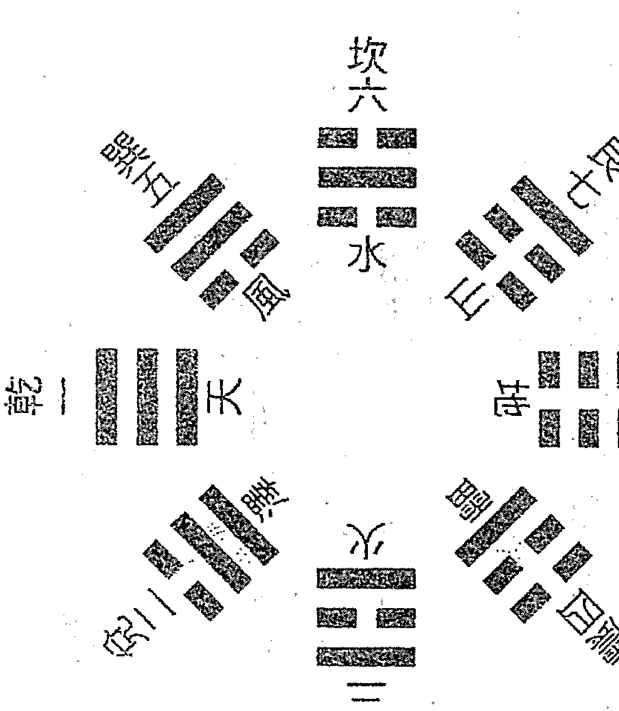

我們先根據左側睡眠的意象取成卦象來分析一下，人為坎卦，左邊為震卦，得水雷屯卦。水雷屯，上坎下震。

水雷屯，上坎下震，坎為耳朵，震為響聲，實際上初爻至五爻就是個大離卦，睡眠的時候耳朵聽到自己的心跳聲。然後自然的均勻的呼吸，這裏說明一下呼吸不是簡單的用鼻子呼吸，而是要用自己的肺去呼吸，讓自己的身體裏面充滿氧份。大家注意看看這個水雷屯卦的效果，是不是从二爻到四爻就是个坤卦，把自己的身体都身体都均匀的充满氧份，把不要的废气也一并的排除。六爻是腦袋，是不是脑袋里面也全是氧份呢？然後看我们的呼吸。呼吸是什么，是不是山泽通气？对，就是山泽损卦。

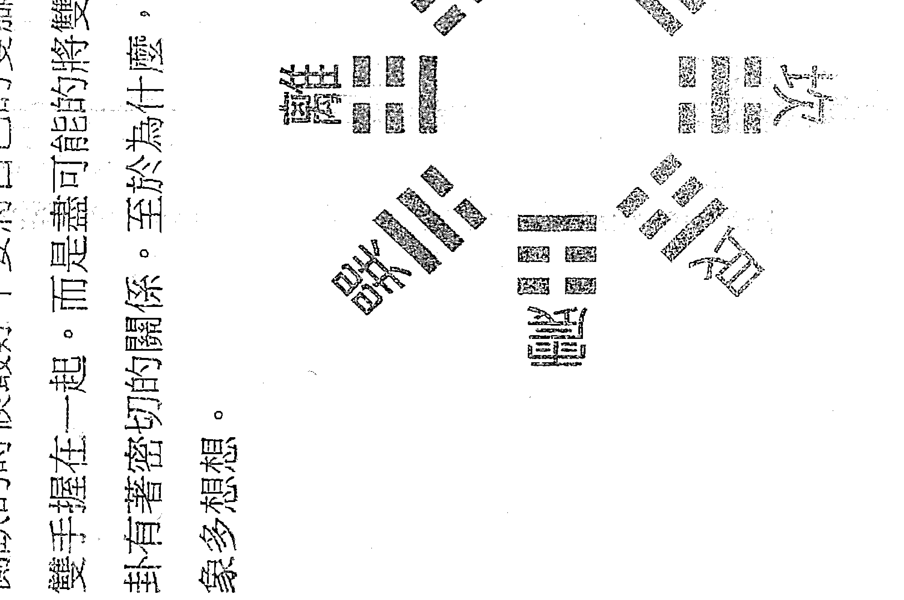

水雷屯的互卦是个大艮卦，心跳变得慢慢安静下来 (并非心脏完全停止跳动)。当身体随着充溢身体的氧份占据整个身体的时候，脑子就会自然而然的睡去。我们再注意观察一下水雷屯这组卦和山泽损这组卦。其实整个卦都有相同的地方，就是将身体的整个部分要全部充满氧气。”那么第二日清早起来，我翻身起床的时候，由水雷屯这个互出来的大大的艮卦，是不是一翻过来是不是就是——个大大的震卦呢？震卦是什么？是不是精神百倍？那么是不是这样就可以安安静静睡了昵？非也。实际上在我们侧卧的时候最好不要将自己的双脚交叉，也不要将自己的双手握在一起。而是尽可能的将双脚分开，这也和后天八卦有著密切的关系。至于为什么，不如爱好者们也很想象多想想。”

最後我們看看右側臥睡眠有什麼好處。身體依然是坎卦，下卦是兌卦，上坎下兌為水澤節卦。

這是根據卦象解釋一下如何睡眠比較順應自然，合乎自然規律，能更好的休息，更好的工作。當然如果喜歡怎麼去休息自然有你的道理，這裏只是依照易理剖析，只做學術參考。

**節卦**
下卦是兌卦，上坎下兌為水澤節卦。

**右側臥卦**

####### 相卜叢書 2071

## **梅花易象高層之路**

作者/馮紹均  
出版者/進源文化事業有限公司  
發行人/林俊廷  
法律顧問/江皇樺律師  
社址/台北市華西街61-1號  
電話/(02) 2304-2670、2304-0856、2336-5280  
傳真/(02) 2302-9249  
http://www.chinyuan.com.tw  
WeChat ID: chinyuanbooks  
Line ID: @fhhq0021u  
E-mail: juh8344@ms46.hinet.net  
郵政劃撥/台北50075331 進源書局帳戶  
電腦排版/旭豐（股）公司  
印刷/原振企業社（國利）  
出版日期/二○一七年十月（一刷）  
定價/平裝新台幣350元

◎本館如有缺頁破損或裝訂錯誤，請寄回本書局調換  
著作權所有。翻印必究  

國家圖書館出版品預行編目資料  
梅花易象高層之路／馮紹均著--初版.--臺北市：進源文化，2017.10 頁；公分.--（相卜叢書: 2071）ISBN 978-986-95430-0-2（平裝）1.易占292.1106015869  

[PAGE 400]

### 結束語

本書僅供梅花易數愛好者交流之用。因本書面向的是眾多易學愛好者，愛好者的梅花易數基礎良莠不齊，又，全書主要講的是梅花易數之像形之象的全息思維方法，考慮到初學梅花易數的朋友，故選口語化來進行撰寫。

由於本人才疏學淺，因而在最後給書取名的時候，一直在猶豫不決，取名太過於古板，又顯得思想老舊，取名太過於張揚而又不能體現出書中要表達的意思，經過一番思量後才決定用《梅花易象高層之路》作為書名，以此來表達本書的中心思想。此書名之所以取此名並非此書有多高的層次，而是想表達此書有兩個層的意思。第一層意思是學習梅花易數就必須要學好象。夫子有雲：書不盡思，是學習梅花易數就必須要學好象。言，言不盡意，聖人立象以盡意，設卦以盡情偽，系辭焉以盡其言，變而通之以盡利，鼓之舞之以盡神。因而玩占必重視象，無象即無占，占即在象中。因而初學易者必須將象學習好，並做到融會貫通，而不是一味的窮講易卦之理。第二層意思是，學習梅花易數必須要學好漢象易。知道曉漢易變通之理，這才是通往梅花易象更高層次的路。要知道學習任何一門數術都沒有捷徑，不可能做到一步登天的掌握各種數術技法。學習梅花易數就要做到循序漸進。

[PAGE 401]

在不斷的摸索中前進。學習任何一門知識都並非一日之寒暑，即便是小有所成亦不可妄自菲薄。向梅花易斷的更高層次進階也是為了更好的開悟自己。故而書取此名亦是希望能與更多的梅易愛好者結緣，能相互交流，相互共勉。

本人雖然研讀《焦氏易林》、《焦氏易話》、《易學應用》等諸多名家的著作已多時，愚解讀梅花易卦的技法雖也得到不少易友的認可，認為愚解卦之法是焦氏易，但是愚覺得自己所學和焦氏易仍然相差甚遠，還有很多值得向易学前輩學習之處，故而此書在撰寫的時候難免有錯漏之處，囉嗦之處，敬請見諒。希望各位大德不嫌愚學識淺薄，能指點一二。謝謝。

微信：18276778563  
QQ: 2514918961  
電子郵件：chllin@126.com  

全書完稿于廣西柳州融安縣  
二零一七年四月二十四日  

[PAGE 402]

####### 相卜叢書 2071

## **梅花易象高層之路**

作者/馮紹均  
出版者/進源文化事業有限公司  
發行人/林俊廷  
法律顧問/江皇樺律師  
社址/台北市華西街61-1號  
電話/(02) 2304-2670、2304-0856、2336-5280  
傳真/(02) 2302-9249  
http://www.chinyuan.com.tw  
WeChat ID: chinyuanbooks  
Line ID: @fhhq0021u  
E-mail: juh8344@ms46.hinet.net  
郵政劃撥/台北50075331 進源書局帳戶  
電腦排版/旭豐（股）公司  
印刷/原振企業社（國利）  
出版日期/二○一七年十月（一刷）  
定價/平裝新台幣350元

◎本館如有缺頁破損或裝訂錯誤，請寄回本書局調換  
著作權所有。翻印必究  

國家圖書館出版品預行編目資料  
梅花易象高層之路／馮紹均著--初版.--臺北市：進源文化，2017.10 頁；公分.--（相卜叢書: 2071）ISBN 978-986-95430-0-2（平裝）1.易占292.1106015869