## 梅花讲记

## 《梅花讲记》阅读顺序

本书共分为两部分，前面“基础拾零”部分为《金口透易·梅花占》的基础知识，阅读起来会比较枯燥晦涩，后半部分“梅花讲记”为针对基础知识进行的深入讲解，建议初学者阅读本书时先从“梅花讲记”部分开始，参考前面的基础知识内容综合阅读。

## 自 序

这本书的名字叫《梅花讲记》,是以我 2011 年讲授“金口透易 · 梅花占”的课程记录为基础编辑而成的一本讲义,我公开对外传授“天心混元宗”秘传数术,是始于 2009 年,起初是讲“金口诀”,共开了三期班,每期班面授七天,“金口诀”的课程讲的内容比较多,包括“金口诀”内传的“正、转、进、退”四课法、“三传法”中的一个“传法”以及天心派金口诀“宗门八法”中的“杂法门”中的“天地贵神”与“金口透易 · 梅花占”,其中“金口透易 · 梅花占”是在课程的最后一天,用两个课时,给大家简单介绍了一下基础,内容只涉及到梅花占中的“八动占法”的应用。

“金口诀”的面授,因为内容比较多也比较杂,七天的时间,基本安排得满满当当,采取的是满堂灌的方式,后来发现,这种方式有一定的问题,其一是知识点比较多,接受的人,层次不同,学识不同,接受程度也不同。二是天心派的数术,与外界差别太大,这些差别,不是知识层面的,而是认识层面的,这样就形成了一个状况,那就是学习外界的数术时间短的学员,因为课程对基础知识要求高,所以听起来费劲,而接触外界的数术时间长的学员,因为课程中的基础知识和外界的数术在认识及层面上的分歧,所以听起来也费劲。此外天心派秘传“金口诀”要求起课时要严格按照“端法”来起课,这个要求,也不太适应现代互联网的预测环境,同时也不利于对学员的学习情况的考核,我们教学的目的,是继承与传承中国传统的优秀数术文化,如果学习者听不懂,那么文化的传播与继承都不好保证,既浪费了学者的钱,也浪费了教者的精力与时间,总体算下来,对教的与学的都没有好处,因此,在结束了第三期的“金口诀”的面授班后,虽然外界很多数术的爱好者询问再次开课的时间,但我还是把“金口诀”的面授停了下来,以便有时间能够思考一下如何能够从教与学的角度做到更有效的对数术文化的继承与传播,这一停便停了一年多的时间。

2011年的中旬,金口诀面授班三期班的弟子李俊提出一个思路,那就是能不能把“金口透易·梅花占”单独拿出来,做为最基础的内容来进行教学,今后在“金口透易·梅花占”的学员中,再选择学得好的同时愿意深入学习的学员进行深一层次的教学,这个分两步走的思路,我考虑了一下,觉得可行。

“金口透易·梅花占”是属于“天心混元派”数术传承中的“宗门八法”中的“杂法门”中的内容,天心派的数术中的“杂法门”中的内容,大部分是传统数术秘传体系中除金口诀以外的打开各门数术的钥匙法门,如“天地贵”是大六壬的钥匙口诀,“大小翻”是奇门遁甲的钥匙口诀,“金口透易”是“梅花易数”与“六爻纳甲”占法的钥匙口诀,这些法门,内容上与天心派的金口诀,既有联系,也有区别,其在架构上各自独成体系,但在内核上又协调统一,这些钥匙,实际上就是中国古语中常常讲到的“真传一句话,假传万卷书”中“一句话”的内容,中国数术传承中的“一句话”,往往是引领学习者走上真实道路的明确指引与捷径指南,古人常常讲到的“纵是千金莫传与”的,往往就是这一类内容。“金口透易”自古分为“梅花占”与“纳甲占”,其中“梅花占”又称为“观枚占”,是以“八动占”、“四象占”、“变占”为基础的古易象学传承。其内容,较之其它数术有着较多的优势:其一是入门简单,凡是对周易、五行、八卦有一定了解的学习者,只需通过短期的学习,通常在三个月左右,就可以达到熟练运用,现实操作的水平。二是准确率高,以我们教学的检验,通过三个月左右的学习,学员的实际预测基本上都能达到 80%左右的准确率。三是稳定性好,以“金口透易·梅花占”预测,只要依照严格方法起卦,按程序断卦,基本上可以保证每卦皆准,彻底摆脱用世传数术预测时准时不准的稳定性问题。同时,“金口透易·梅花占”自身结构清晰完整,占断有理有据,不重灵感,很适合于现代人的思维与逻辑,因此,自 2011 年举办“金口透易·梅花占”的一期班到 2014 年四期班,我们前后招收了一百多个学员,建立起了初步的传承效应。

但是在这四期班的讲授中,我也发现真正阻碍数术的真实传承的原因,很多时候不是技术层面的,而是理念层面的,针对于一门需要现实应用的技术,理念层面的误解往往较之技术层面的误解更易误导研究者,这些理念层面的内容,包括对预测方法的定位、预测结果的认知,以及对数术的本质的理解。而对这些问题的理解,最终甚至会影响到一个个人对世界观的认知。“天心派”的数术传统实际上是一个由术入道的阶梯。就是说一开始大家学的是技术层面的东西,但这门技术本身就是帮助大家认识社会与自然规律的工具,通过对规律的认识与应用可以指导行为与决策,从而把所学的技术变成一种可以真实驾驭人生的工具。我们每个人在这个世界上,都同时受到时空、能量等诸多方面的推动与制约,而“金口透易·梅花占”是以高度概括的易学语言,为我们搭建起来的一个涵盖着“时、空的缠绕与干扰、能量的相互作用与总量守衡以及各种力量之间作用关系”的一个完整的“时空模型”,当学会了“金口透易·梅花占”,并了解了其中所蕴含的模型的人的本质的时候,大家会发现自己眼中的世界已经与原来看到的世界完全不同了,这就是真实的传承与外面数术的本质的区别。

欲学术,先明理。因此有必要用一定的篇幅就“金口透易·梅花占”中所包含的“理念”层面的内容做一些讨论。

### 数术预测的目标究竟是什么？

按照普遍的观点,预测的目标是准确预言未来将要发生的事件,但如果预测的结果足够准确,那么这个预测的结果是否是唯一且必然会发生并不可避免呢？在很多的预测故事中,这个结果显然是唯一且不可避免的,例如下面这个例子:“有富室子,遇相者曰:‘某日应为牛角触毙’,疑其诞,而恐或验,乃深居院庭,足不窥户,届期复楼居,防范周密,停午,倚窗凭眺,谓过此以往相士之言不应矣,俄耳内痒甚,取簪搔,忽风来,窗阖触簪贯耳,遂死,盖簪系牛角制也”在这个故事中,预测的对象“富家子”不可谓不信预言,同时也采取了相应的措施,但最终还是阴差阳错地应验了预言的结果,这种故事中所蕴含的对预测的认识显然是定命论的,即预测的结果是唯一的,而且结果不可改变,无论采取何种措施,都无法改变对最终结果的预言。但如果仔细思考一下,我们会发现,在这个看似有理的观点中,实际上包含着一个悖论,即如果无论如何调整与趋避,预测的最终结果终会发生,那么,预测术本身就失去了存在的意义,若预测的结果有办法调整而最终改变,则最初的预言就无所谓唯一的准确性。如何解决这个悖论呢？实际上真实的答案是,预测术本身并非对未来唯一方向的单一预言,而是针对时空事件点按照一定的方法建立起来的时空模型,在这个模型中,包含着未来的诸多可能,对时空模型进行科学地分析,并对未来的诸多可能进行评估,从中找出一个最佳的选择,才是预测术本身要达到的目标,这个目标,就是古人常常讲到的“趋吉避凶”。找到预言中诸多可能中“吉”的方向,努力向这个方向靠近,同时避免预言中“凶”的可能,只有在这种情况下,预测术才具有真实的意义。

现实中,外界的大多数预测术指向的都是唯一解,从而也在核心层面上限制了学习者的思维,而“金口透易·梅花占”对预言的指向是多向的,如“金口透易·梅花占”中的“变占”法门,所显示的是事件中各个方向与层面上需要把握和调整的机会,而对未来的把握就蕴含在人本身利用自身的主观能动性对事件各个方向的可能进行选择与控制之中。数术提供模型,将未来的诸多可能展示在时空模型之中。而人需要做的就是在诸多可能中找到最好的路径,以便通过选择达到最好的结果。这种选择就是对“趋吉避凶”的真实表述。

天心派的数术对于“趋吉避凶”有着很高的认知与关注。之所以如此是因为天心派数术的起源并非是来自于传统意义上的“阴阳家”,而是来自于中国古代的“兵占”之学,《汉书·艺文志》中讲“兵书四门”。兵权谋、兵形势、兵技巧、兵阴阳。其中的“兵权谋”研究的是对战争全局的把握,即所谓:“以正守国,以奇用兵,先计而后战。兼形势,包阴阳,用技巧者也”,“兵权谋”类的书是兵书中总纲式的书籍,现在流传下来的有《孙子兵法》。“兵技巧”研究的是战争中军事技能的训练及对兵器的熟悉与器械的配置,现代流传下来的“兵技巧”类的书,有《墨子》里面的“城守”各篇。“兵形势”是研究兵力的配备与训练以及根据战场形势对兵力进行调动与再分配的兵书,现在流传下来的这类书籍有《司马法》,兵书除了以上三类型,还有一类就是“兵阴阳”,《汉书·艺文志》中所载的“兵阴阳”类的书籍,一本都没流传下来。这与“兵阴阳”的自身性质有关。“兵阴阳”是讲如何在战争中通过预测对战争的形势进行有效的评估,找到战争中对于我方最有利的策略,综合军事气象学、军事地理学及数术、祈禳等术,在战争中随时把握有利局势,以取得最后的胜利的方法,在古代属于“天人之学”,是属于“秘传”中的“秘传”,兵阴阳家在军队里是军师的角色。相当于现代军队中的总参谋部。兵阴阳家不仅要了解战场的形势,同时要了解天道,只要合理预测出战场的形势,并利用诸多方法对战场中的有利因素进行利用,就有办法让战场形势尽可能地向有利于我方的方向发展,这就是“兵阴阳”真实的应用。

如果按外界流行的说法,预测的结果是无法改变的,那么预测本身也就失去了存在的意义,试想两国相争,如果战争双方的军师预测都足够准确,同时预测结果不可改变,那么战争双方就不必再进行实际战争,只需双方各派一个军师,大家坐下来算一卦。如果双方预测准确,则结果必然是一方胜一方败,或者战和,那么接下来的事情只需要谈判就可以了。算出来败的一方认输投降,算出来胜的一方凯歌还朝。这种方式我们见过吗？所以真实的“兵阴阳”所关注的并不只是最终结果,因为结果是可以变化的。在战争过程中不断找出最合适的同时是最好的方式,就可以逐渐的把战争形势扭转到对自身有利的方向上来。这就是“趋吉避凶”,运用数术找到敌人的弱点,找到己方的优势,采取相应的办法对兵力、形势、部署进行有效的配置,把握合适的时机,采取对我方最为有利的行动,让战争向对我方有利的方向前进。所以讲“兵阴阳”是一种非常积极的方式。

数术真正的目标是趋吉避凶,真实的数术方法,是通过模拟的方式对时空中的事件所可能发生的未来进行多种方向的模拟,从而帮助预测者从中得到对未来的充分把握进而对未来各种趋势中好的方向和坏的方向进行选择,以期达到趋吉避凶的目的。这才是研究数术所要达到的真实的目标。

### 第二点讲一下数术与修炼。

现代研习数术的爱好者中常常流行这样一种说法:

“学习数术是要配合修炼的,修炼的目的是要修神通。神通成就后预测水平才能达到更高的境界”。所以现代很多研究者只要一谈数术就开始谈修炼的问题。而且这个说法并非起源于现代,而是至少从宋代开始就在讲。这实际上与数术的江湖化与神化有关。数术的江湖化造成了对神化的需求,而数术的神化反过来又推动了江湖化的数术的发展,这种趋势适应了江湖化的数术的生存规则以及世俗对于神秘文化的需求,在现实中如果单纯的讲一门技术,估计没有多少人愿意听,但是讲神话故事的话就会变得很吸引人,拿一本《考古学》,估计没多少人看,如果是一本小说,名叫《盗墓笔记》,估计很快读者就过亿了,人们总是对未知而神秘的世界充满憧憬,而对数术的神化,就迎合了世人的这种心理。

对数术神化的趋势,在现代流传的梅花易数中尤为严重。并且在这种方向上衍生出了很多梅花易数的派别,从而让梅花易数的学习圈子变成了一个外应和神鬼的天下。通行本的《梅花易数》中的“三要灵应篇”前面有个序,这个序中讲到,若要应用好外应占法,需要达到“方寸湛然,灵台皎洁,无一毫之干,无一尘之累”,内心要清净得没有一丝涟漪。思虑要真实到直指内心的本原,精神皎洁得要像月光一样,外界的一切都不会干扰到内心的安宁,对于尘世没有一丝的挂碍,要达到这种程度才能学习三要灵应,也就是《梅花易数》里面的“外应”。要知道,前面提到的这种境界,已经接近于佛教中所讲的“四禅定”了,依中阿含卷二十四所言,修行者达到四禅定后,于现身中自觉自证,以达心解脱,慧解脱,就可以获得六神通,成就阿罗汉果。试问古今成就阿罗汉果位的能有几人？若成就解脱,获得六神通,还需要用“外应”来进行预测吗？

这种将数术巫术化的趋势,直至现代社会也并没有停止过,足见其生命力的强大,要知道在中国古代巫、卜是完全不同的两套传统。巫术是通过自身感应达到与天地沟通的目的,卜则是借助于外物来达到与天地沟通的目的。宋代沈括的《梦溪笔谈》中讲到:“今之卜筮,皆用古书,工拙系乎用之者。唯其寂然不动,乃能通天下之故。人未能至乎无心也,则凭物之无心者而言之。如灼龟、揲瓦,皆取其无心,则不随彼理而震,此近乎无心也”。由此可知,数术中所依据的“无心”是其所用占卜之物自身的“无心”,而在整个的预测过程,“无心”则是需要预测师以一个旁观者的身份,见证“无心”之物所显的“兆”中所体现的“时空”轨迹,并依据一定的方法对其“时空”轨迹进行解读的过程。而这整个的过程,都是预测师以自身的知识与对时空的认识,通过对兆的解读来进行推演的过程,这一切应当与修炼及神通无关。

将数术神秘化并将之与修炼挂钩,其中还蕴含着一个江湖术的目的,就是当依法学习者学不成或者无法达到合理的准确率的时候,使其不去疑心于数术体系本身。

> “你断不准的原因是因为你修炼不够。等你修炼到‘灵台皎洁、心思湛然’的时候就可以断准了”

因为那个境界并非轻易可以达到。这就同时给教授者与学习者一个托词,从而增加了这种方法的欺骗性,这也是梅花易数这么多年没有人去怀疑的原因,这实际上这是自古江湖常常使用的方法。古代江湖分为八门,惊、疲、飘、册、风、火、爵、要。江湖八门中变戏法的有一个魔术叫水中生莲,是拿一颗莲子扔到水碗里然后升起一朵莲花来,看得人就觉得很神奇,有人如果想学,变戏法的就会告诉他

> “这莲子可不是随随便便就能得到了。需要每年的五月端午,到荷塘里采刚熟的莲子,然后选端午节正午时生的鸡蛋,把蛋敲个口,把莲子填进去,用绵纸糊好,这个过程中不能让任何女子、污秽之物所见。然后把鸡蛋放在家里屋檐正檐上,放七七四十九天,不可让任何动物惊扰,不可让外人看见,七七四十九天后把鸡蛋取下来,把里面的莲子拿出来扔到水里就能生出莲花来。”

把这里面整个的过程理一下就知道其中究竟有多少陷阱,莲子好取,端午节正午时母鸡生的蛋就不好找,找到了这个鸡蛋把莲子放进去放到屋檐上,四十九天后再找这个莲子,百分之九十九是没了。要知道夏天正是各种小动物觅食的时候,古代中国房子以土木结构为主,各种小动物也很多,鸡蛋敲碎了打个口搁到屋檐上,有两天就让老鼠吃了,有一百个鸡蛋一百个找不着。古代江湖把这种托辞的方法叫“门子”,是忽悠外行用的。数术中的修炼就是“门子”,也是忽悠外行的。实际上数术本身只是一门技术,只要按照规则、按照技术方法来实施,就能达到稳定的效果。假如达不到,说明技术规范有问题,应该考察的是技术的来源和准确性,而不是修炼。过去讲"子不语怪力乱神",实际上我们真正的数术传统也不讲神神鬼鬼的东西。真正的数术就是一门技术,你按照数术的规则学习、练习就能达到相应的水平。当然再往后可能需要一点悟性,这和每个人的学习方法和思维方式有关。

### 第三个问题是数术与道德。

外面流行这样一种说法:“数术不是随随便便就能学到的。因为数术是‘天人之学’,想学数术必须要修德。道德水平不高学不会数术”。这种说法比修炼的说法还要坑人。为什么这么讲呢？讲修炼不行不能学数术的,最多是学的人没学会,他觉得自己是因为修炼不得法或不用功。而后面这种说法就变味道了,他讲如果你没有学会是因为“无德”,是道德水平不够。这顶帽子比前面修炼的帽子要更具有杀伤力,很多人学学会就不能说自己没有学会,因为学不会是无德啊,这就变成了皇帝的新装了。人人都知道自己没有穿衣服,同时也都知道在自己眼里里面别人都没有穿衣服,但是谁也不敢说,因为说了就变成一个没有道德的人。所以后面的说法比前面的说法还要缺德,这也是江湖中的一个“门子”。

那么数术与道德有没有关系呢？这里要先看一下“道德”的定义,“道德”是人们共同生活及其行为的准则和规范。不同的时代、不同的阶级有不同的道德观念,没有任何一种道德是永恒不变的。因此道德本身是人类社会性的产物,而数术是站在社会层面以外看社会。其本质是超脱于道德之外的,因此,可以讲,数术本身是没有道德性的。数术对于道德的看法是来源于数术的本性,《易经·系传》里有句话说:“易无思也,无为也,寂然不动,感而遂通天下之故”。学易要做到无为,达到内心的寂然不动,这样才能知道世间的所有道理和趋势。那么讲到这里可能又有人问,寂然不动、感而遂通不是又与前面的修炼一样了吗？实际上是两个意思。易经中的话告诉我们的意思是什么呢,你要想学数术,要运用数术,你需要把自己放在一个旁观者的位置,不要掺杂任何你自己的想法和标准,而是把卦或者《易经》里面真实的含义解读出来,这叫寂然不动,一个好的预测师就是一个翻译者、一个解读密码的解码员,预测的过程就是按照既定的程序把密码翻译出来,把事情解答出来的过程。这就是“易无思、易无为”。数术的预测中不需要掺杂任何预测师自身对道德的评判,预测本身所反映的就是事情的本来面目,而预测师只是一个旁观者,负责把事件解读出来,因此数术真正需要的境界是有“道”无“德”。“道德”这个词本身就是来自于道家的经典《道德经》。道者行也。行是一个人站在中间的路口上。把十字路口凑在一起,就是一个行走的行字。那么道就是你要走的路。道是天地的路,天地的路是规矩,是天地的准则,是宇宙的准则,所以《道德经》里讲道是最高的。“道可道,非常道。名可名,非常名”。没有办法命名,所以叫道。在道家眼里,道是最高的规矩和准则。所以道在前。德字的右边上面是眼睛,下面是心,德是我们眼睛看到的心里想到的,我们能够判断和实施的,左边是行。我们看到的标准,我们思虑的准则然后把它执行出来才叫德。德是一种人为的东西。所以“德”是有阶级性的,而且“德”是有时代性的。比如说在现代的中国一个男人同时娶两个女人,他就无德,是不为社会规则所允许的。但是在一百年前,按照妻妾制度,一个男人同时娶两个女人就是合乎规则的,这就是“德”。“德”是有社会性、时代性和强制性的。当强制形成一个约定俗成规范的时候,道德就产生了力量。但是数术是不应当有道德性的。数术只展示这个事情是什么样的,它不掺杂任何道德的判断,一个预测师在算卦的时候你就是一个解读者,而不是评判者,当然解完了你可以以一个社会人的身份帮助别人进行判断,但是在算的时候是不行的。这一点在金口诀里表现的最为明显,因为“金口诀”是在方法设定上就把预测者放到无为的位置,在“金口诀”中最基本的起课法称为“端法”（金口透易中也有“端法”），“端法”是以预测师为中心向周围划一个圈，然后在圈上标定地支或卦（以实际方位），这个卦就是地元卦，就是地分。那么现在提一个问题，当预测师预测的时候，预测师的地元在哪里呢？这时候预测师是处于中心的，而中心就是太极点。这个点是无为的。所以算卦才是最无私的学问。所以数术就是这样，当我们真实的去看数术的时候，你会发现它是一门实际的技术，它会要求你站在一个相应的高度和范围内，站在一个相当明确的角度内去观察整个事件的发生、发展和变化，尽量的梳理出事件里面的矛盾和矛盾的解决方法，帮助求测者找到一个最好的道路，以便能够让他得到一个最有利的选择，从而达到趋吉避凶的目的。所以一个真实的数术的学习，实际上你只要掌握规范、规则的方法与方式，同时进行充分的练习就可以了。这里面没有任何神神鬼鬼、需要修炼、需要道德水平的东西，它就是一门技术。而这个技术是每个人都应该能学会和掌握的。

数术发展到今天，当科学的精神逐渐占据了人类的大脑，当理智与对真理本质的追求成为一个社会的主流，数术同样到了需要正本清源的时候，因为整个数术的传承，已经变得不被人认识，我们现在看到的是一个被异化的数术圈，而我们能做的只是尽量努力让数术回到它的本源上去。让数术能够成为一门真正可学可用可以现实操作的技术，“欲学术，先明理”。面对混乱而扑朔的数术界的现实，我们每个人都需要一双慧眼以及一点科学思考的精神。


## 论中国数术体系流变关系

### ——兼论金口透易与梅花易数的演变

中国数术文化，源远流长，门类众多，汉以前在文化传承中是大宗之学，西汉刘歆著《七略》，《诸子略》中的阴阳，《兵书略》中的兵阴阳，《数术略》中的天文、历谱、五行、蓍龟、杂占、刑法，《方技略》中的医经、经方、房中、神仙皆属数术范畴，《汉书·艺文志》存《七略》书目，所录计：

-   阴阳家二十一家，三百六十九篇。
-   兵阴阳十六家，二百四十九篇，图十卷。
-   天文二十一家，四百四十五卷。
-   历谱十八家，六百六卷。
-   五行三十一家，六百五十二卷。
-   蓍龟十五家，四百一卷。
-   杂占十八家，三百一十三卷。
-   医经七家，二百一十六卷。
-   经方十一家，二百七十四卷。
-   房中八家，百八十六卷。
-   神仙十家，二百五卷。

总计二百六十三家，三千三百五十一篇附图十卷。在西汉藏书中也属洋洋大观。数术之学涉及天文、历术、算术、地理、物候、兵法、医药、养生、房中诸学，从大的方面讲基本涵盖了中国上古自然科学的所有学科。可以讲，传统文化中对宇宙的认识，对技术的把握，对规律的探索，大部分都保存在古数术之学中。

从小的范围看，《汉书·艺文志·数术略》中所列的天文、历谱、五行、蓍龟、杂占、形法六类，基本上涵盖了今天我们日常所见的数术门类，对其对应关系，现列表如下：

附件:《汉书·艺文志·数术略》与现代数术学比较表

### 《汉书·艺文志·数术略》与现代数术学比较表

| 分类 | 《汉书·艺文志》数术门类 | 流传到现在与相关数术门类 |
| :--- | :--- | :--- |
| 天文 | 天文、占星、云气占 | 星占、天文气象杂占 |
| 历谱 | 制在国方法与算法、年谱、世谱、算术书 | 历经、算术 |
| 五行 | 阴阳五行时令、堪舆、灾异、钟律、丛辰、天一、太一、刑德、遁甲、孤虚、六壬、羡门式、五音 | 择日、遁甲、太乙、六壬 |
| 蓍龟 | 龟卜、筮法 | 筮法、火珠林法、梅花易数 |
| 杂占 | 占梦、厌劾妖祥、占嚏、占耳鸣、祷祠祈禳 | 占梦、厌劾妖祥、占嚏、占耳鸣、祷祠祈禳 |
| 形法 | 相人、相地形、相宅墓、相刀剑、相六畜 | 相人、风水、相六畜法 |
| 后世晚出的数术门类 | 紫薇斗数（与星占有关）、命理四柱（与六壬有关） | |

比较汉代数术门类与现代数术门类的关系，我们可以大致看到其中融合与演化的脉络，现代流行的星命、紫薇、四柱之术，《艺文志》无载，为晚出之学，其中星命、紫薇与星占之学有关，四柱的产生与六壬术有关，汉代数术之学中占重要地位的星命、龟卜之术，至现代或近于失传，或流于变异，反而今不如古。

实际上汉代以前以至于三代，数术之学的变异与融合也一直在发生。所谓“三王不同龟，四夷各异卜，然各以决吉凶。略窥其要”，数术是通天人之学，各国有各国的学问，国与国之间则是信息封锁，周欲以代商，先要在丰邑立灵台，证明自己有通天之德，周代商后，国家主体文化中的通天之学则倾向于周官方的筮法，但由传承的史料来看，商代的官方卜法，准确率更高，武王问道于箕子，作《洪范》一文，其《稽疑》一文有言：“择建立卜筮人，乃命十筮。曰雨，曰霁，曰蒙，曰驿，曰克，曰贞，曰悔，凡七。卜五，占用二，衍忒。立时人作卜筮，三人占，则从二人之言。汝则有大疑，谋及乃心，谋及卿士，谋及庶人，谋及卜筮。汝则从，龟从，筮从，卿士从，庶民从，是之谓大同。身其康强，子孙其逢，汝则从，龟从，筮从，卿士逆，庶民逆吉。卿士从，龟从，筮从，汝则逆，庶民逆，吉。庶民从，龟从，筮从，汝则逆，卿士逆，吉。汝则从，龟从，筮逆，卿士逆，庶民逆，作内吉，作外凶。龟筮共违于人，用静吉，用作凶。”是讲预测时是龟卜同用，龟从筮逆则从龟，可见龟卜之法较之筮法准确率更高，《左传·僖公四年》中载：“初，晋献公欲以骊姬为夫人，卜之不吉，筮之吉，公曰从筮。卜人曰：‘筮短龟长，不如从长。’”可知直至春秋，从意识形态的认识上，龟卜之法仍优于筮法，但筮法为周的官方之学，文王演《易》，周公作辞，筮不如卜，官方不能这样讲，但卜筮之学是类似于技术的学问，讲究的还是有效性，因此，后期的筮法预测体系中，就掺杂进很多卜法的东西，这个融合的过程，就形成了后期的式法，在流传至今的式法种类中，奇门与太乙的式盘基础是九宫占，但预测体系是筮法与五行干支的融合，在现在大家的普遍认识中，认为六壬术是地支之学，是地支十二宫，但实际上现在流传的大六壬术，同样也是十干十二支与八宫文化融合的产物。数术体系中的相互交错与融合，不只是体现在式法上面，实际上，自春秋以降，这种交错与融合，一直未曾停止过，这种情况的发生，有点象进化论或混沌学原理中基于自相似原则和迭代生成原则而形成的“分形”，这个过程中，即有基于一个起决定性作用的传统的不断演化，也有两个起决定性作用的传统的不断交错，这两个起决定性作用的数术传统，就是以卜法为代表的“在方”的预测体系与以筮法为代表的“在时”的预测体系，这两个体系中，“在方”的体系是以空间为基准点的方法，“在时”的体系是以时间为基准点的方法，在汉代以后的数术传承中，以周文化传统为基础的“在时”的数术体系一直处于显学的位置，而“在方”的学术则一直处于“隐”的位置，但在很多“在时”的法门中，我们能够看到借用“在方”的数术的痕迹，这种情况有点类似于儒家与道家的关系，中华文化的传统，几千年来，一直是以儒家为显，以道家为隐，但隐的一方，形成了中华文化传统中不可或缺的基础，在现存的数术门类中，由京氏易演变而来的六爻卦与由汉易象学术递演而成的梅花易数，由传统上溯，皆当为筮法系统的“在时”之学，但六爻卦的以金钱代筮与梅花易数的端法占卦，实际上已经将其体系由重时重数的方法转变为重方重兆的法门，而重方重兆的法门正是“在方”学术体系的重要特征。

对于中国古代数术的传承与递演，确实有其不同于其它学术的特点，综合起来，可以从以下几个方面分析：

#### 一、真诀的隐传与伪术的流行

数术之学的传承，在古代是高端的学问，研究数术之学要“上知天文，下知地理”，对学习者知识的深度与宽度要求很高，而且历代数术高师，皆于择人授受持之甚严，所谓“神仙亦有两般话，道不须传只在人”，一般的学习者，于数术之学的深层体系未必深入，对于真诀也未必得闻，而部分秘密传承，则一直在数术传承的深层绵延不绝，真口诀不能外传的结果，就是伪术的流行，人类的探索精神了无止境，但一旦在起始的位置上发生的错误，其结果就是探索越深入，离其本质就会越远，由“自相似原则”和“迭代生成原则”推导可知，体系内的每一分枝可以看成为其在一定范围内对原始体系的复制，这种复制的结果是使数术中的体系趋向于更精更细，而体系系统中的分形交错，又形成了一定程度的变异，这种变异显示的则是在数术种类上的增多，但无论其精细与种类的变化如何，如果其学术体系在原始基础上是错误的，则其分形结构只是在错误的结论上增加新的错误结论，从而造成体系的整体错误。“在一个错误的根上，肯定结不出正确的果子来”。

#### 二、数术方法的演变与增删、汇集，造成数术的预测体系变化

前文我们讲到，在一个体系系统中的分形交错，最终形成一个新的系统的问题，如果一个体系中，原有的判断思路被人为隐藏，则造成这一方法的不可操作，或操作准确率不足，而在这种情况下，按照解决问题的一般思路，解决问题的办法会有两种，一种是求内援，一种是找外援，内援不好找，外援就容易掺和进来，过去的数术学的书籍，大部分是实用型的手册，类似于今天授课的课本，这种材料是实用性强，但不易保存，这就是现在我们很少能看到汉代以前数术传承的原因，书籍没有传下来，并不代表方法没有传下来，但其方法在演变的过程中产生不断的变异，变异的结果是其原意尽失，我们现在看唐宋以前的数术资料与看唐宋以后的数术资料，感觉其中差异很大，体系的变化也很大，原因就是这种交错与变异造成的体系差异。这种变异的结果，就是最终形成新的方法与派系。而不同派系的相互借鉴与资料的汇集，则将这种变异趋向于新的融合，从而使其深层的基础更趋于隐秘，非得真传授者更难窥其门径。

#### 三、单篇并行与汇聚成篇的问题要分清

过去的古书，汉代以前的，重家法不重撰人，凡著书未自立门户，卓然成一家之言的，则言必称师，书籍的传承也是以宗门为依归，只言家法，不著作者，其传抄常以单篇为主，后期整理，将一个宗门的著作汇集在一起，就是我们现在看到的大部头图书，现在流传下来的诸子之书，大部分是这种情况下汇集在一起的著作，其写作年代与作者都可能不是一个人，因此，其反映的思想与时代特征都可能有差异，这种情况，在后期数术学术的传承中，仍然存在，而且后期数术之学的汇集，常常将一些不是一类的数术放在一起，这样作的原因有两种，一种是放在一起的数术种类有互补性，可以参照应用。还有一种是资料汇集的过程中，几种数术在变异中产生联系，从而在某一方面可以联合运用。这两种情况，在现今流传的数术传本中皆可见到，比如现今流传的梅花易数，其最普遍的传本全名为《新订邵康节先生观梅拆字数全书》，这本书，实际上是由历史上流传的三种单独并行的数术组合而成的，其一是以汉易象学为基础的“观梅占”，其二是数术传承中的“逢占”，即《三要灵应篇》等所代表的外应占法，其三是数术门类中的“测字术”。这三种数术的组合中，观梅占与逢占的组合是前论情况的第一种，即“梅花占”因缺少关键的钥匙口诀而致使准确率不足，从而以逢占补梅花之不足，从而形成了梅花易数中的三要灵应体系，而观梅占与测字术的组合则属于前论情况的第二种，即两种数术在变异过程中产生的共同之处可以使两种方法联合运用。

#### 四、“依托撰人”问题

古代的数术书籍，常用“依托撰人”，这与中国古代的传统有关，中国古代的实用型书籍，大多追溯其发明与传统，而依托于某氏，如木匠的实用书籍叫《鲁班经》，式法常托名于黄帝与玄女，字书则名之为《仓颉》。这种传统，古人约定俗成，传的人心里清楚，学的人心里也清楚，实用类书籍的依托，后世的情况复杂一些，但大体不出其依归，所依托的人，必是与其技术有所关联或传承的，比如梅花易数托名于邵子，我们知道，邵子之学受之于李之才，之才之《易》受之于穆修。修受《易》于种放，放受之于陈抟，其学术本质是道家的传承，其脉络大致可寻，其学术的传承与道家的秘传数术关联很大，易学学术，自东汉以后，易象之学尽失，郑康成初习京氏易，后弃去，改学费氏易，是因易象之学无师承则难通而费氏易以儒理言易，无师可通也，至于东汉王弼扫象，而易理之说盛行，亦在于易象师法之不行。但中国文化的传承，自古有隐显两个途径，学术的体系，千年间延续不绝，自有其家法脉络，易学的隐传体系即在于道家，邵子受学于之才，受道家易学传承，其学术体系是传承有自，并非空穴来风。及至于元代以后出现的《观梅数》术法，亦是此秘密传承的余绪。后人追述师法，以邵子名于《梅花易数》亦当有其渊源。

### 金口透易与梅花易数

梅花易数的传承，在元代以前，未有专书行之于世，民间记载亦无流传之支言片语，及至于明，始有抄本流传，后明大内馆藏数术书籍中，始列《先天观梅数》一册，《观梅数》一册，以是知《梅花易数》之始行于世，当自于元末明初。明季本所著《周易四同别录》所录《梅花数》邵康节占验，与今本所传全同，其于编末评议：“今按《梅花数》本非邵子所作，故宋末儒者皆不及，虽非出于邵子，然亦京管之遗”，所论亦为中肯。然《梅花易数》既为“京管之遗”，为何在近千年的时间内，史无记载呢？其传承中，由汉易象学转变而为梅花易数，其中间的演变过程又是哪种术法呢？ 如果要研究《梅花易数》数法的源流，就要找到这个中间缺失的过程。

天心混元宗内传金口秘术中“宗门八法”中“杂法”一门内的“金口透易”为历代道家宗门隐传法门，其中的“易象占”体系，上承西汉易学，下及梅花易占，而其中常多外界传承中未公开的秘诀与法窍，其中隐藏着“汉易象学”演变至于《梅花易数》所隐藏与流变的过程，从传承脉络上讲，正是解开《梅花易数》术法之迷的钥匙。

#### 金口透易与梅花易数的差别

《金口透易》与《梅花易数》相比，体系更接近于汉代易象之学，我们今天可以见到的汉易象的书籍，西汉焦延寿所著之《焦氏易林》是集大成之作，焦氏所著尚有《易林变占》十六卷，惜乎不传，故易林变占之法缺失，近代行唐尚秉和先生治《易林》，于其中考证东汉以后失传易象，考定失传象数数百种，从而独成一家，重兴汉代易象之学，但尚氏为治学出身，其解《易林》纯出于穷经与自悟，对变占之法有所不明，因此《焦氏易林注》全文是以象解象，不知以占法解象，实际上《焦氏易林》有变占之法，其中很多象意是由变占而来，尚氏不明此理，殊为遗憾。这种情况，有点象沈氏破解《玄空》风水之术，是以一本《阴阳二宅录验》入手，苦思经年，自悟而得，其所著《沈氏玄空学》，后代沿习，常徘徊在“验与不验”之间，也是不明用法。

西汉易学象数之学中的变占之法，实际就隐藏在《金口透易》的易象占之中，因此，以《金口透易》解《焦氏易林》殊为通透。《金口透易》中的象占之学，其演变的后期即为《梅花易数》，但《梅花易数》中的钥匙被人为的隐藏，最终造成整体的占断思路松散，没有整体的过程，因此，我们现在看到的《梅花易数》的占法是瘫着的一团，没有主心骨儿，《梅花易数》中有“八卦心易体用诀”一节，其内容曰：“心易之数，得之者众。体用之决，有之者罕。余幼读《易》书，长参数学，始得心易卦数，初见起例，仅知占其吉凶。如以蠡测海，茫然无涯。后得智人见授体用心得之决，而后占事之决，疑此有定。据验则验，如繇基射的，百发百中。其要在于分体用之卦，察其五行生克，比和之理，而明乎吉凶悔吝之机也。于是《易》数之妙始见，而《易》道之卦义备矣，乃世有真实，人罕遇之耳。得此者，幸甚秘之”，心易体用诀，《梅花易数》的编辑者说得很重要，但这个诀实际上是个伪诀，正是这个口诀，将《梅花易数》的占断引入到了僵化、狭窄的预测思路之上，从而从根本上将《梅花易数》引导到了错误的路径之上，其后的一系列占断，皆以此体用总诀为宗，致使《梅花易数》的预测准确率大大降低，使后期的学习者，不得不以逢占来补易象占的不足，形成了现在我们看到的《梅花易数》以“三要十应”为主的奇怪现象。

考察《金口透易》与《梅花易数》的不同点，可以从以下几个方面评述：

##### 一、起卦法不同

《梅花易数》的起卦法，综合起来，可以概括为以下几种

1.  以数起卦，其起卦法包括物数占，声音占，字占，尺寸占、报数起卦等方法，
2.  以年月日时起卦，其起卦法是以年月日数之和除以 8，余数为上卦；以年月日时数之和除以 8，余数为下卦；以年月日时数之和除以 6，余数取动爻。其中年以当年地支数计（子 1 丑 2……亥 12）。月数直接以农历之月数计（如一月为 1，三月为 3），日数直接以农历日数计（如初一为 1，初二为 2，直到 30 数）。时数按时辰地支数计（子 1 丑 2……亥 12）。（年、时辰地支数按子 1 丑 2 寅 3 卯 4 辰 5 巳 6 午 7 未 8 申 9 酉 10 戌 11 亥 12）。
3.  端法起卦，以物或人所取之象为上卦（八卦万物所属卦象为上卦），以其所在后天八卦方位之卦为下卦，以上、下卦数加时数除以 6 余数为动爻。（现在传承的术数种类，只有天心混元宗金口秘术中的“宗门八法”中，有端法一门，《梅花易数》的端法起卦，与天心混元宗金口秘术的关系，留待以后解说）

以上几种起卦法，与《金口透易》相互比较，皆与《金口透易》起法不同，相较而言，《金口透易》的起卦法更多保留了象易学演变过程中的中间环节，而《梅花易数》的起卦法，则是在宋以后综合与变异后的结果。《金口透易》的起卦法，包括“揲筮法、积算起卦、金钱卦法、端法”等，其中，揲筮法为延承古例，积算法与金钱卦法为与《金口透易·卦气纳甲占》共用之法，端法中包含着年月日时占与数占的法门，因此，后期的《梅花易数》起卦法，很可能是由《金口透易》的端法一门蔓衍演化而成，关于《金口透易》的起卦法，留待后文详细解说。

##### 二、确定“体用”不同

《梅花易数》中讲，占测要分清体用，“体用云者，如易卦具卜筮之道，则易卦为体，以卜筮用之，此所谓体用者，借体用二字以寓动静之卦，以分主客之兆，以为占例之准则也。”在这一段中，《梅花易数》的著者讲，以易卦为体，以卜筮为用，而分主客之兆，这一观点是正确的，此外《梅花易数·占卜总诀》中讲到“次看卦之体用，以论五行生克，体用即动静之说。体为主，用为事。应用生体和比和，则吉，体生用或克体，则不吉。”其以动为用，以静为体的观点在字面上讲也是正确的（但动的定义不同），但其后《梅花易数》的著者在书中所论“以动爻静爻分体用之旨，以动为用，以静为体”的说法，则殊失象易本旨，《梅花易数》的著者应当也知道这种分法的准确率是有问题的，因此其有《梅花易数·断卦遗论》中提到：“凡占卜决断，固以体用为主，然有不拘体用者。如起例中西林寺额得山地剥，体用互变，俱比和，则为吉，而乃不吉，何也？盖寺者，纯阳人居之地，而纯阴爻象，则群阴剥阳之义显然也。此理甚明，不必拘体用也。又若有人问：“今日动静如何？”得地风升，初爻动，用克体卦，俱无饮食矣，而亦有人相请，虽饮食不丰而终有请，何也？此人当时必有当日之应，又有“如何”二字带口，为重兑之义。又有用不生体，互变生之而吉者，若少年有喜色，占得山火贲是也。又有用不生体，互变俱克之而凶者，如牛哀鸣占得地水师是也。盖少年有喜色，占则略知其有喜，而《易辞》又有“束帛戋戋”之吉，是二者俱吉，互变俱生，愈见其吉矣。虽用不生体不吉，不为其害也。牛鸣之哀，则略知其有凶，而易爻复有“舆尸”之凶，互变俱克，愈见其凶。虽用爻不克，不能掩其凶也。盖用《易》断卦，当用理胜处验之，不可拘执于一也。”又是以“理”、“外应”掺入其中，将《梅花易数》的占断引入到了不可知的境地之中。

《金口透易》的占断体用，是以事为体，以卦体生克动变为用，此为以动为用的本义（详细解说参阅后文）

##### 三、对外应的应用不同

现在流传的《梅花易数》中对外应的应用很多，但于中也可分辨出一些不同，《梅花易数》卷一《占卜总诀》中讲到，占测先要以卦爻辞决断吉凶，次看体用动静，其次再看克应，其中所言之：“数者既备，要尽占卜之道，必须以易卦为主，克应次之，俱吉则大吉，俱凶则大凶，有凶有吉，则详审卦辞，及克用体应之类，以断吉凶也，要在圆机，不可执也”，是以卦象体用为主，以外应占法为次，言明克应是补充之道，不可为主。但从卷二开始，以三要十应开头，通篇都是外应的占法，其卷二之《三要灵应篇序》中所言：“夫《易》者，性理之学也。性理，具于人心者也。当其方寸湛然，灵台皎洁，无一毫之干，无一尘之累，斯时也，性理具在而《易》存吾心，浑然是《易》也，其先天之《易》也。乃夫虑端一起，事根忽萌，物之着心，如云之蔽室，如尘之蒙镜，斯时也，汨没茫昧，而向之《易》存吾心者，泯焉尔。故三要之妙，在于运耳、目、心三者之虚灵，俾应于事物也，耳之聪，目之明，吾心实总乎聪明。盖事根于心，心该乎事，然事之未萌也，虽鬼神莫测其端，而吉凶祸福，无门可入。故先师曰：『思虑未动，鬼神不知；不由乎我，更由乎谁？』故事萌于心，鬼神知之矣。吉凶悔吝有其数，然吾预知之，何道欤？必曰：『求诸吾心易之妙而已矣。』于是寂然不动，静虑诚存，观变玩占，运乎三要，必使视之不见，吾见之；听之不闻者，吾闻之；如形之见视，如音之见告，吾之了然鉴之。则《易》之为卜筮之道，而《易》在吾心矣。三要不虚，而灵应之妙斯得也。是道也，寓至精至神之理，百姓日用而不知，安得圆通三昧者，与之论欤！”《三要灵应篇》中篇所云：“三要者，运耳、目、心三者之要也。灵应者，灵妙而应验也。夫耳之于听，目之于视，心之于思，三者为人一身之要，而万物之理不出于视听之外。占决之际，寂闻澄虑，静观万物，而听其音，知吉凶，见其形之善恶，察其理之祸福，皆可为占卜之验。如谷之应声，如影之随形，灼然可见也。”以及《体用论》中所言：“心易寓物之用，以体为主。然人如一体一用之常，不知一体百用之变。并体之变，全卦为内，卦内亦不知一用，而互变皆用也。三要十应之卦，外卦也，外亦不一，无非用也。学寓物者，得体用以为至术，十应则罕有之，后则三要以为全术。且谓体用自体用，三要自三要，遂以体用决吉凶，以三要为吉凶之兆。孰知三要、十应、体用之致？呜呼！体用不可无三要，十应不可无体用。体用、三要、十应，理无间然也。如此者，可谓心易之全术，而可以尽占卜之道也。”

已将三要十应所代表的外应占法上升到了“决策吉凶而为体用之致”的位置上，这种说法，本身就与卷一有冲突之处，之所以会出现这种情况，是因为现在看到的《新订邵康节先生观梅拆字数全书》，实际上就是三种数术的结合，而卷二中的《三要灵应篇》体系，实际上是古代流传的逢占之术，成书于公元437年左右的刘昞《敦煌实录》中有一则故事：“侯瑾字子瑜，解鸟语，尝出门见白雀与众雀同行，慨然叹曰：‘今天下大乱，君子小人相与焉。’”其中侯瑾所用即为逢占之术，在这个故事中，侯瑾的预测方法是以白雀代表君子，以众雀代表小人，实与三要十应论所称的“远取诸物，近取诸身的”以物比类的原则等同，逢占的发展后期与诸多数术相互接轨，相互融合，宋代的数术易占风水书籍《通玄鬼灵经》，通篇即是以“逢占”外应之术观坟望宅的论断，其中：“入山观坟，忽闻松涛之音，暗藏杀伐之象，又闻猿啼虎啸之声，似有哀鸣之状，俱非吉兆，应断官灾、是非、离别、疾厄之患，当临期参断，靡不应验。……凡登山观地，见高贵珍重，文书坚固，彼喜庆之类，则以吉断。见破碎微贱之物，则以凶断。或瓦石草木，金银刀剑之类，人物鸟兽，山林花卉，纸扎竹砖之类，皆可参详，再将五行生旺，决之必准。”实际已与《三要十应论》的理论无甚分别。

《梅花易数》的作者显然是知道以《梅花易数》中的体用诀来占断误差率是很高的，因此不得不借用“逢占”的体系来自圆其说，“逢占”体系的运用，实际上是单独的法门，其自由度很高，与《梅花易数》的象占之学本身关联并不是很大，完全可以单独运用，实际上《三要灵应篇》在过去本来也是单篇并行的，我们知道，一本书的序，应当是列于篇首，但《三要灵应篇》的序是列于《梅花易数》卷二的，这与一般的著作体例不符，究其原因，就是因为《三要灵应篇》本来就是单行的，我们查阅明初由杨士奇编定的《文渊阁书目》中，于阴阳之属《先天观梅数》一部一册后单列《三要灵经》一部一册，此《三要灵经》应当就是我们今天看到的《三要灵应篇》，《三要灵应篇》所代表的“逢占”体系，实际上将易象占引入到了一个完全无所依归的境地之中，而且并不符合占断原则，占卜的要求是占测者完全依占卜显象来决断，不能掺杂个人的好恶，因此《易经》中讲：“易，无思也，无为也，寂然不动，感而遂通天下之故。”宋沈括于其所著《梦溪笔谈》中所述之“今之卜筮，皆用古书，工拙系乎用之者，唯其寂然不动，乃能通天下之故！人不能至乎无心也。则凭物之无心者而言之，如灼龟甲，皆取无心，则不随理而震，此近乎无心也！”也是申明易占术者要“无思无为”的道理，然《三要灵应篇》所标榜的“外应占”法，则是纯粹以占筮者个人的所见所闻来比附占测，发展的结果，必然是陷入到文化的虚无主义之中，将预测演变成预测者的察言观色，从而演化为江湖中不学无术者的谋食之具，在《梅花易数》中，实际上这一趋势已非常明显，在其所附的《观物动玄歌》中“入门茶果应声来，中馈主家财。三餐时候炊烟早，勤俭渐基好。”已是典型的江湖术士的察言观色了。

《金口透易》的占法，纯以易象入占，不重外应（详情查看后文），卦象一出，事情自然清楚，再运用变占之法，预测的整体情况便了然于心了。

综上所述，《金口透易·易象占》作为天心混元宗金口秘术中的一小部分，虽然在秘术的传承中位置并不突出，但其体例完整、清楚，其中隐藏着很多现代易学占卜方法中的钥匙口诀，将《金口透易·易象占》作为一个单独的门类，进行整理与公开，对于易学的学习者来讲，还是有一定意义的，因此，此次将《金口透易·易象占》单独作一整理，更名为《金口透易·梅花占》，公之于世，以资同好学习交流。

## 第一章 基础拾零

### 太极图

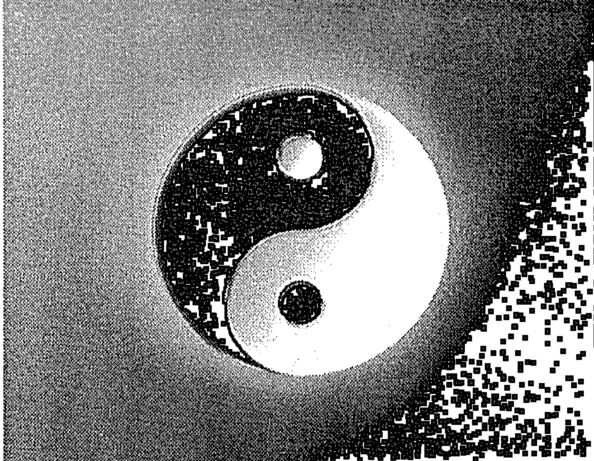

太极生两仪图

### 太极生两仪

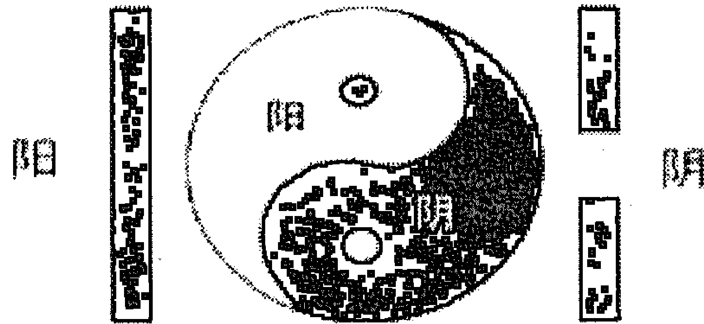

### 两仪生四象图

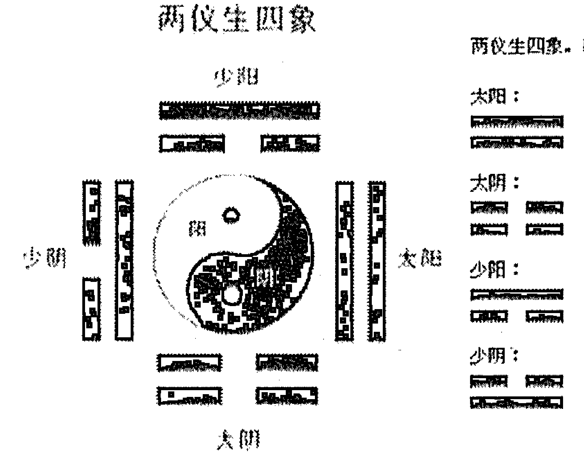

### 五行

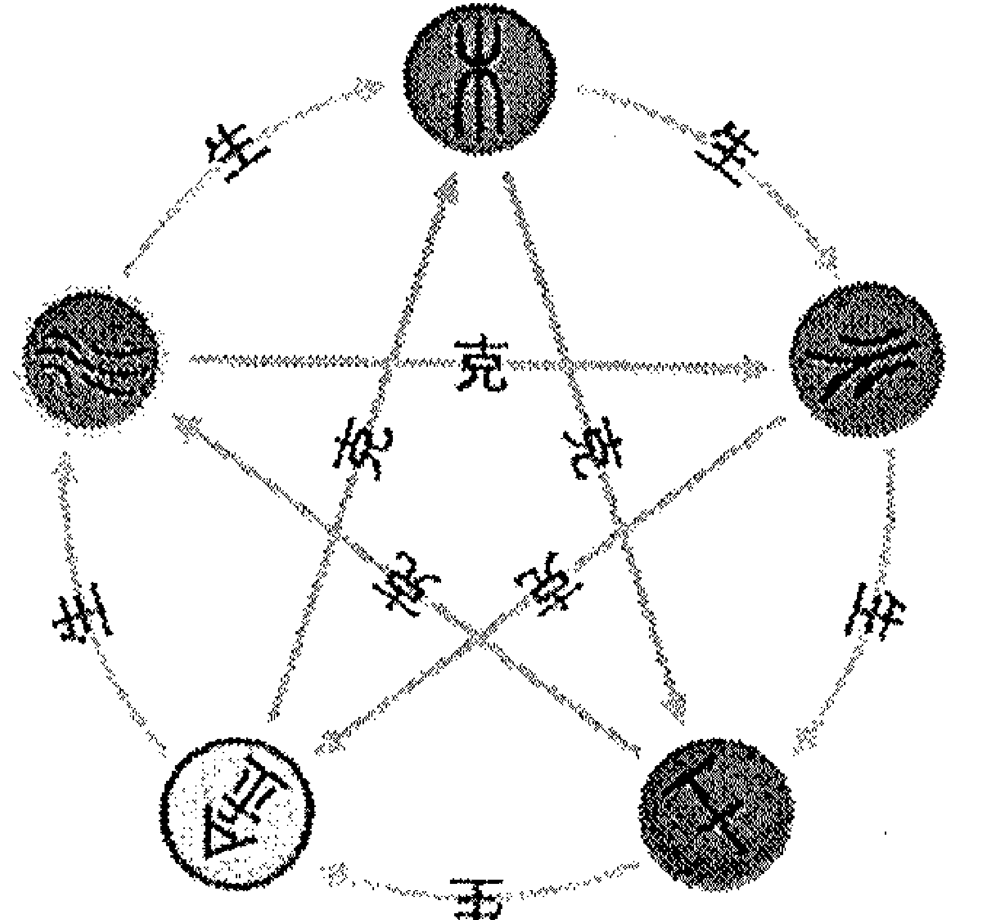

五行为：金、木、水、火、土。

木居东方、火居南方、金居西方、水居北方、土居中央。

### 五行生克

金生水，水生木，木生火，火生土，土生金；
金克木，木克土，土克水，水克火，火克金。

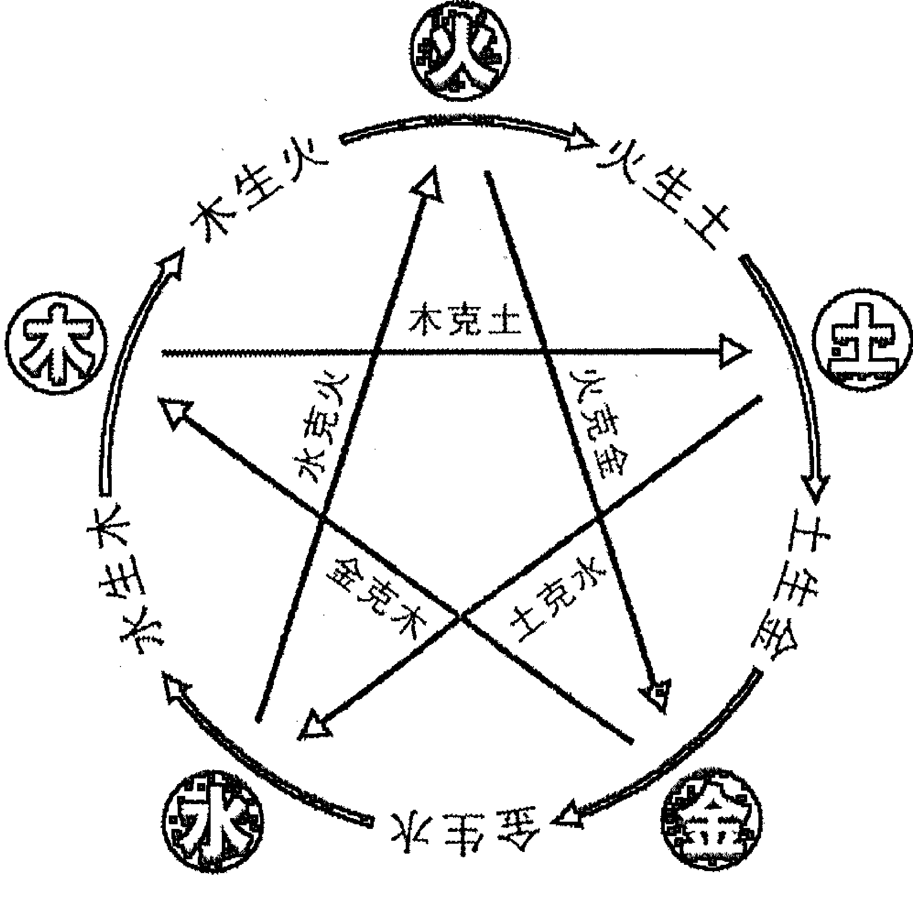

### 八卦

乾、坎、艮、震、巽、离、坤、兑

### 八卦取象歌

乾三连，坤六断，震仰盂，艮覆碗，离中虚，坎中满，兑上缺，巽下断。

乾：乾三连    坤：坤六断    震：震仰盂    艮：艮覆碗

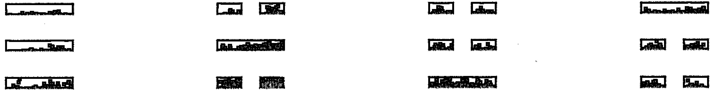

离：离中虚    坎：坎中满    兑：兑上缺    巽：巽下断

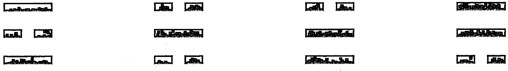

### 先天八卦序

乾一、兑二、离三、震四、巽五、坎六、艮七、坤八。

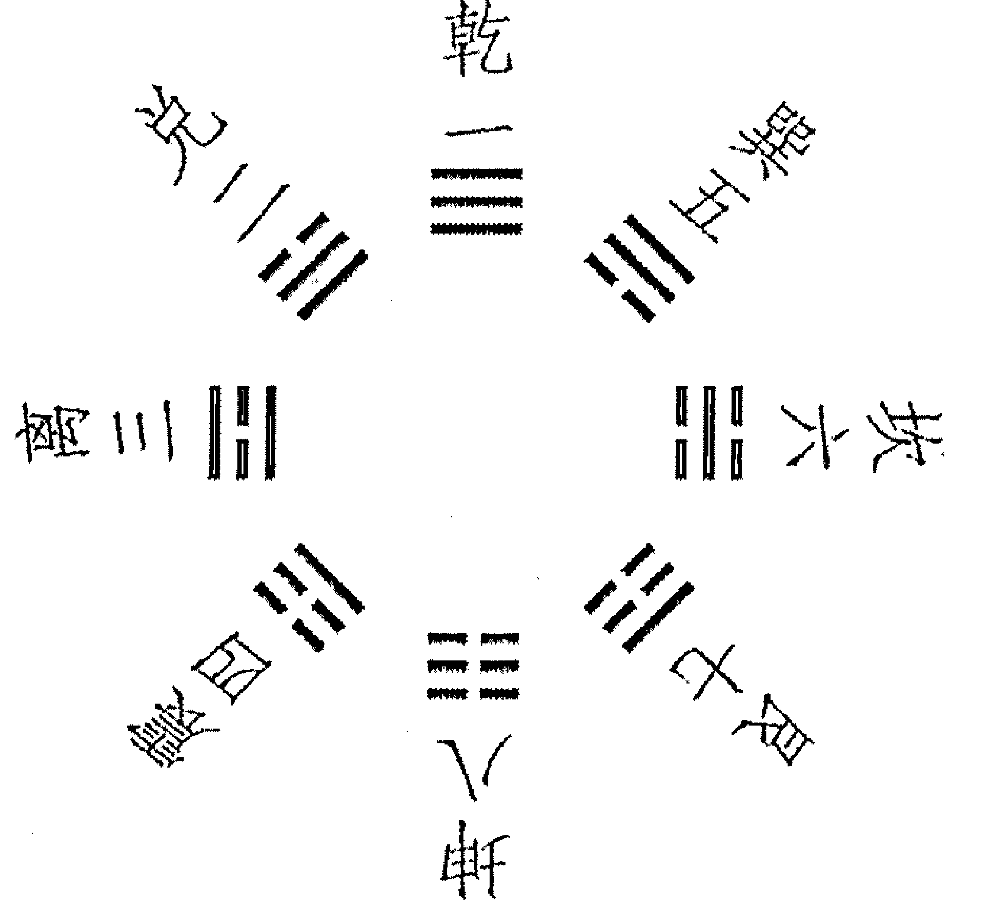

### 后天八卦序

坎一、坤二、震三、巽四、乾六、兑七、艮八、离九。

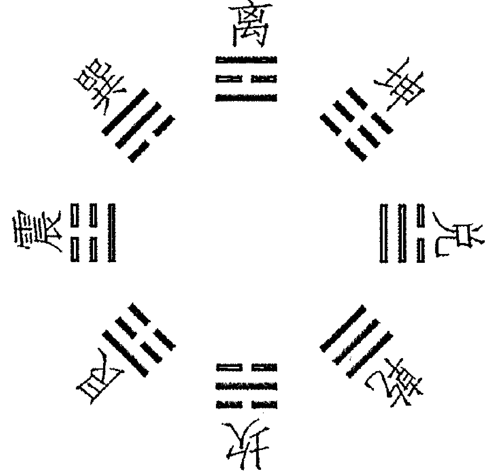

### 八卦所属五行

| | | |
|---|---|---|
| 乾、兑（金） | 坤、艮（土） | 震、巽（木） |
| 坎（水） | 离（火） | |

### 六十四卦

### 六十四卦名速见表

| 上卦/下卦 | 乾 7 天 | 兑 6 泽 | 离 5 火 | 震 4 雷 | 巽 3 风 | 坎 2 水 | 艮 1 山 | 坤 0 地 |
| :--- | :--- | :--- | :--- | :--- | :--- | :--- | :--- | :--- |
| **乾 7 天** | 63 乾为天 | 62 泽天夬 | 61 火天大有 | 60 雷天大壮 | 59 风天小畜 | 58 水天需 | 57 山天大畜 | 56 地天泰 |
| **兑 6 泽** | 55 天泽履 | 54 兑为泽 | 53 火泽睽 | 52 雷泽归妹 | 51 风泽中孚 | 50 水泽节 | 49 山泽损 | 48 地泽临 |
| **离 5 火** | 47 天火同人 | 46 泽火革 | 45 离为火 | 44 雷火丰 | 43 风火家人 | 42 水火既济 | 41 山火贲 | 40 地火明夷 |
| **震 4 雷** | 39 天雷无妄 | 38 泽雷随 | 37 火雷噬嗑 | 36 震为雷 | 35 风雷益 | 34 水雷屯 | 33 山雷颐 | 32 地雷复 |
| **巽 3 风** | 31 天风姤 | 30 泽风大过 | 29 火风鼎 | 28 雷风恒 | 27 巽为风 | 26 水风井 | 25 山风蛊 | 24 地风升 |
| **坎 2 水** | 23 天水讼 | 22 泽水困 | 21 火水未济 | 20 雷水解 | 19 风水涣 | 18 坎为水 | 17 山水蒙 | 16 地水师 |
| **艮 1 山** | 15 天山遁 | 14 泽山咸 | 13 火山旅 | 12 雷山小过 | 11 风山渐 | 10 水山蹇 | 9 艮为山 | 8 地山谦 |
| **坤 0 地** | 7 天地否 | 6 泽地萃 | 5 火地晋 | 4 雷地豫 | 3 风地观 | 2 水地比 | 1 山地剥 | 0 坤为地 |

### 六十四卦卦序歌

乾坤屯蒙需讼师，比小畜兮履泰否，
同人大有谦豫随，蛊临观兮噬嗑贲，
剥复无妄大畜颐，大过坎离三十备。
咸恒遁兮及大壮，晋与明夷家人睽，
蹇解损益夬姤萃，升困井革鼎震继，
艮渐归妹丰旅巽，兑涣节兮中孚至，
小过既济兼未济，是为下经三十四。

### 京房八宫卦图

| | 本卦 | 一世 | 二世 | 三世 | 四世 | 五世 | 游魂 | 归魂 |
|---|---|---|---|---|---|---|---|---|
| 震宫 | 震为雷 | 雷地豫 | 雷水解 | 雷风恒 | 地风升 | 水风井 | 泽风大过 | 泽雷随 |
| 坎宫 | 坎为水 | 水泽节 | 水雷屯 | 水火既济 | 泽火革 | 雷火丰 | 地火明夷 | 地水师 |
| 艮宫 | 艮为山 | 山火贲 | 山天大畜 | 山泽损 | 火泽睽 | 天泽履 | 风泽中孚 | 风山渐 |
| 坤宫 | 坤为地 | 地雷复 | 地泽临 | 地天泰 | 雷天大壮 | 泽天夬 | 水天需 | 水地比 |
| 巽宫 | 巽为风 | 风天小畜 | 风火家人 | 风雷益 | 天雷无妄 | 火雷噬嗑 | 山雷颐 | 山风蛊 |
| 离宫 | 离为火 | 火山旅 | 火风鼎 | 火水未济 | 山水蒙 | 风水涣 | 天水讼 | 天火同人 |
| 兑宫 | 兑为泽 | 泽水困 | 泽地萃 | 泽山咸 | 水山蹇 | 地山谦 | 雷山小过 | 雷泽归妹 |
| 世爻 | 上爻 | 初爻 | 二爻 | 三爻 | 四爻 | 五爻 | 四爻 | 三爻 |
| 应爻 | 三爻 | 四爻 | 五爻 | 上爻 | 初爻 | 二爻 | 初爻 | 上爻 |

### 天干

甲乙丙丁戊己庚辛壬癸

### 地支

### 地支六合

子丑合，寅亥合，卯戌合，辰酉合，巳申合，午未合。

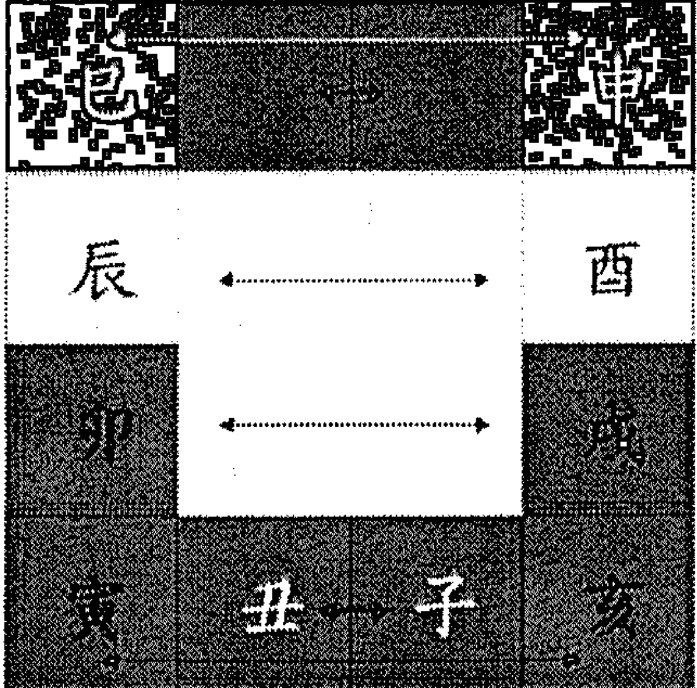

### 地支六冲

子午冲，丑未冲，寅申冲，卯酉冲，辰戌冲，巳亥冲。

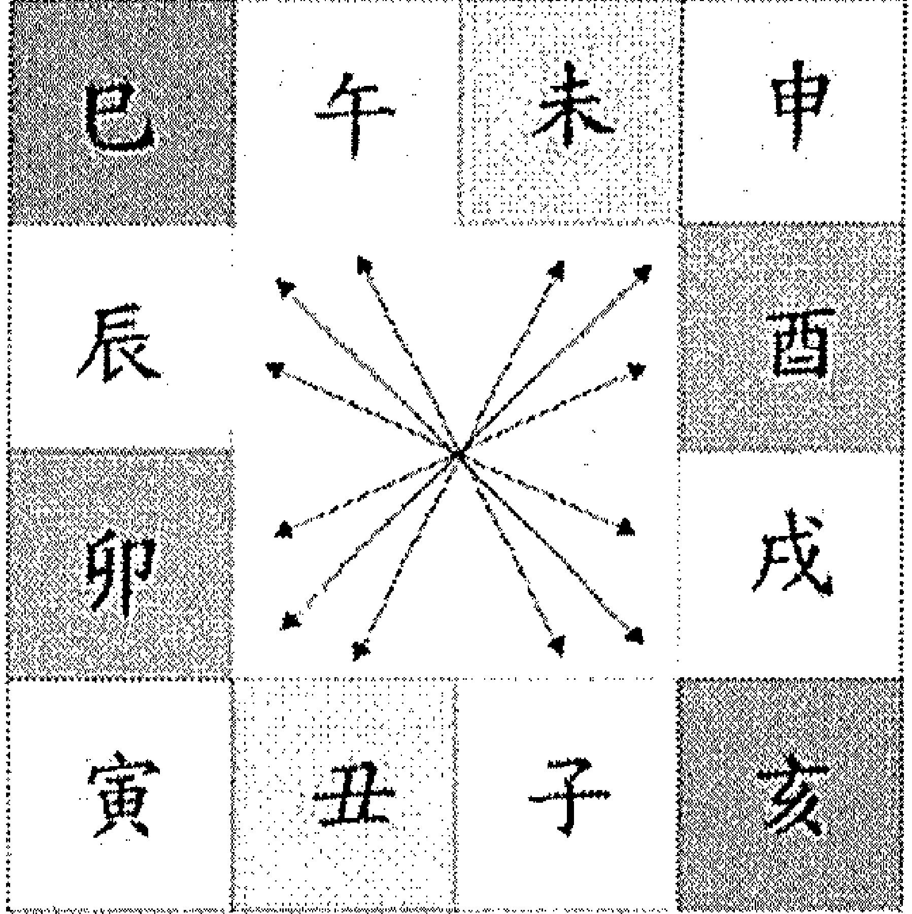

### 地支三合

申子辰合水，寅午戌合火，亥卯未合木，巳酉丑合金。

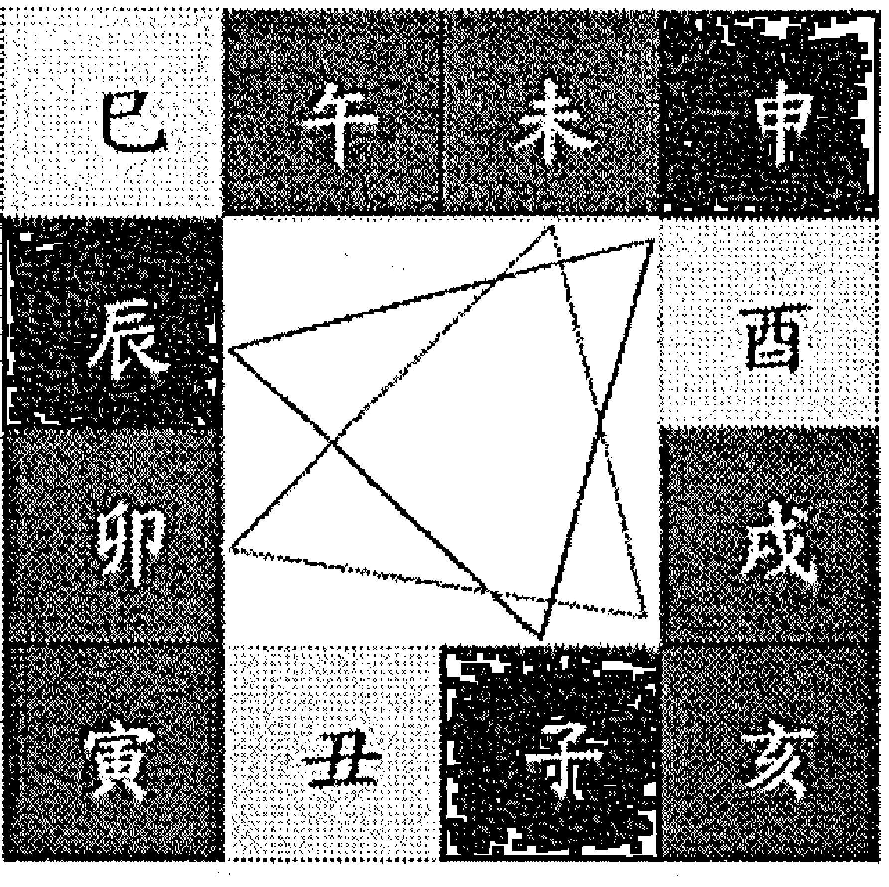

### 地支三会

亥子丑会水，寅卯辰会木，巳午未会火，申酉戌会金。

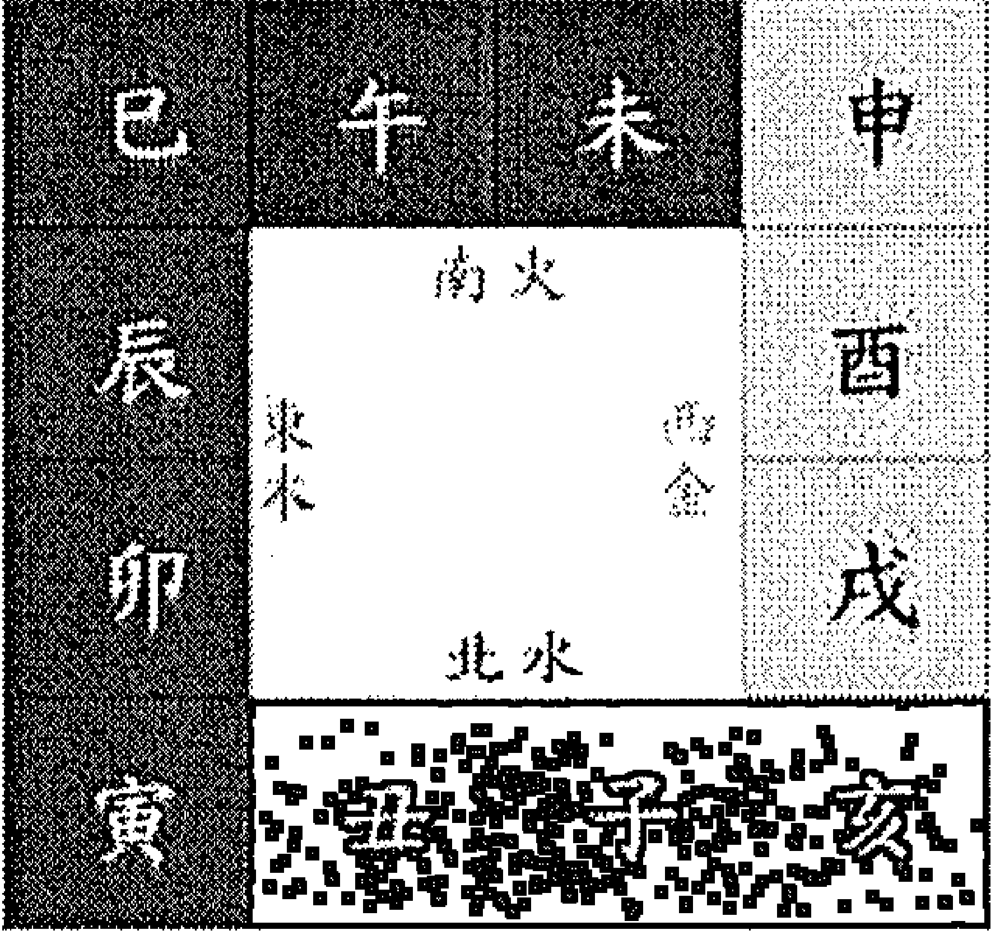

### 地支三刑

寅巳申恃势之刑，丑未戌无恩之刑，子卯无礼之刑，辰午酉亥自刑。

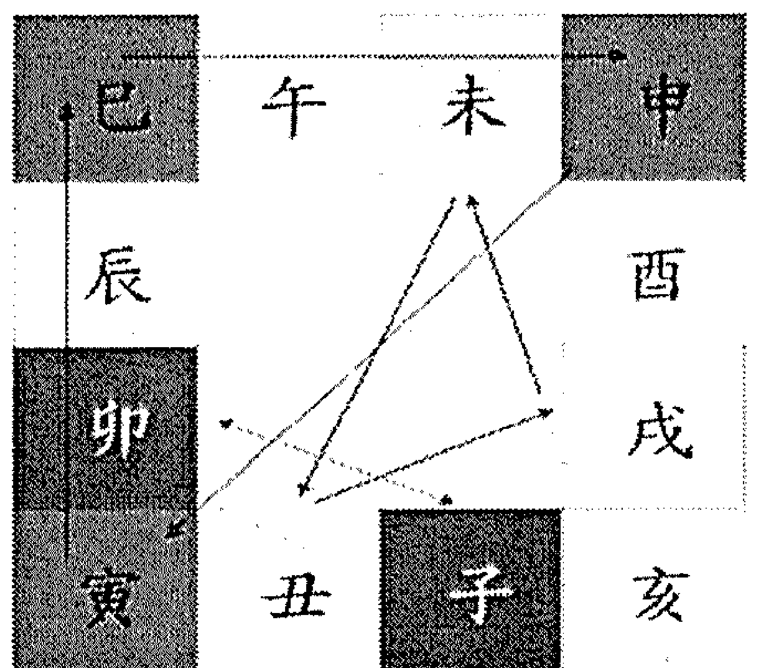

### 地支六害

子未相害，丑午相害，寅巳相害，卯辰相害，申亥相害，酉戌相害。

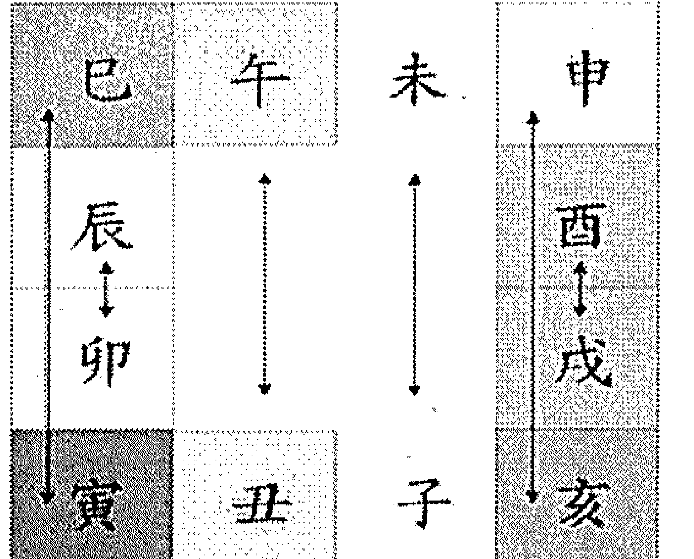

## 金口透易起卦法

《金口透易·易象占》的起卦方法，共分为四种，即：“揲筮法起卦、积算起卦、金钱卦、端法起卦”在这四种起卦法门之中，前两种起卦法是“在时”的，后两种起卦法是“在方”的，“在时”的方术“重数重理”，“在方”的方术“重象重兆”，《金口透易·易象占》涵盖了“在时”与“在方”的两种起卦法门，实际上显示出的是这两种法门相互融合的趋势，《周易·系辞传》中所述的“大衍筮法”是典型的以数起卦的法则，其中实包含着天文与历算的诸多知识，而汉代传承的积算法起卦，则是这一系统的发展与完善。

金钱卦与端法起卦，是以方、兆为原则的起卦方法，其实际已经脱离开了“大衍筮法”与“积算法”以数起卦的原则，是属于“在方”的法门，在“端法”与“金钱卦卜”这两种方式中，“端法”起卦还保留着一部分占数的原则，而“金钱卦”则完全用兆，因此，从发展的角度来衡量这四种方式，按其起源与时间的先后，可以排列为“大衍筮法——积算法——端法——金钱卦”

《金口透易》的四种起卦法中，“大衍筮法”与“积算法”要用到很多历法与天文的知识，而且日常的运用并不多，鉴于篇幅，此部分内容，留待今后进阶阶段，再行讲述。

### 金钱卦法

金口透易・梅花占中所用的金钱卦法，其起源是来自于上古的“枚卜法”，上古枚卜之法，是以三枚竹片，摇落于地，以竹青为阳，以竹黄为阴，以定阴阳老少的方法，后期改用铜钱，是以铜钱日常易得故也。其起卦法为：“以钱三枚，由摇卦者自定阴阳，按阴阳多少，以定卦爻，凡两阳一阴，为少阳，两阴一阳为少阴，三阳为老阳，化而为阴，三阴为老阴，化而为阳”，例如同样以三枚铜钱摇卦，依次得

-   第一次：两阴一阳
-   第二次：两阳一阴
-   第三次：三阳
-   第四次：三阴
-   第五次：两阴一阳
-   第六次：三阳

按金口透易・梅花占起卦法，起卦为

### 山风蛊化雷水解

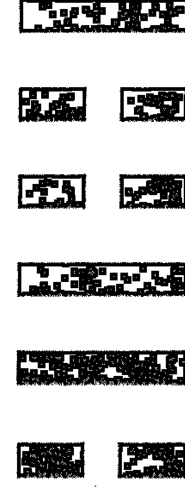

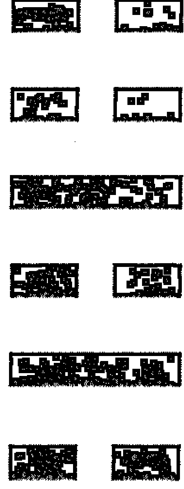

其中，山风蛊称为贞卦，雷水解称为悔卦

### 端法

“端法”是《金口透易》独特的起卦法，外界未有使用者，下面，重点介绍一下《金口透易》的“端法”起卦

-   1.卦引太玄本数
    甲巳子午九， 乙庚丑未八，
    丙辛寅申七， 丁壬卯酉六，
    戊癸辰戌五， 巳亥无干四。

-   2.先天八卦序数：
    乾一、兑二、离三、震四、巽五、坎六、艮七、坤八。

-   3.后天八卦序数：
    坎一、坤二、震三、巽四、中五、乾六、兑七、艮八、离九。

### 占则

不动不占，不因事不占，无人问不占，其法或闻人言，或见于异，则以年月日时，合太玄之数，数以八除，取先天卦数以为上卦，复以占者所居之方，取后天卦位，以为下卦，复以后天卦位返先天之数，与策数相合，除六取余数而为变爻

#### 例一：

2010年2月16日午时正北方有人卜问
四柱：庚寅 戊寅 丁酉 丙午
8 7 5 7 6 6 7 9
上卦配数 55，数以八除，余七，配先天卦数，为艮

其人在正北方求问，正北后天卦位为坎，为下卦 先天配后天合卦为山水蒙 以下卦后天卦返先天数为坤数八 8+55=63/6=10……3 为三爻动，为山水蒙变山风蛊

列卦如下：

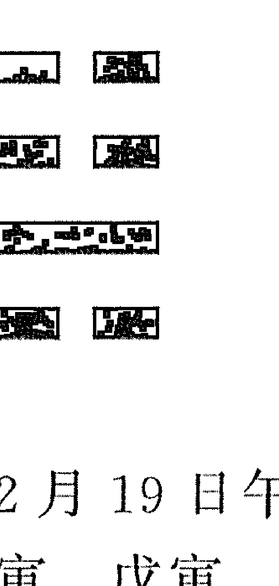

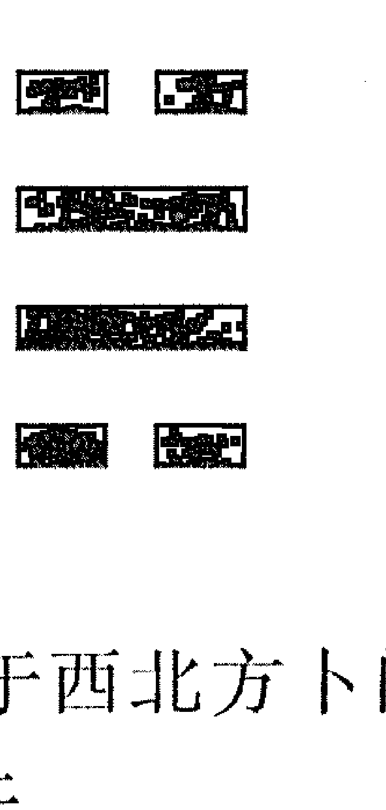

#### 例二：

2010年2月19日午时有人立于西北方卜问 四柱：庚寅 戊寅 庚子 壬午 87 57 89 69 上卦配数59，数以八除，余3，配先天卦数，为离 其人在西北方求问，西北后天卦位为乾，为下卦， 先天配后天，合卦为火天大有 以下卦后天卦返先天数为艮数七 59+7=66/6=11，无余数为六爻动，为火天大有变雷天大壮 列卦如下【本 卦】
火天大有

【变 卦】
雷天大壮

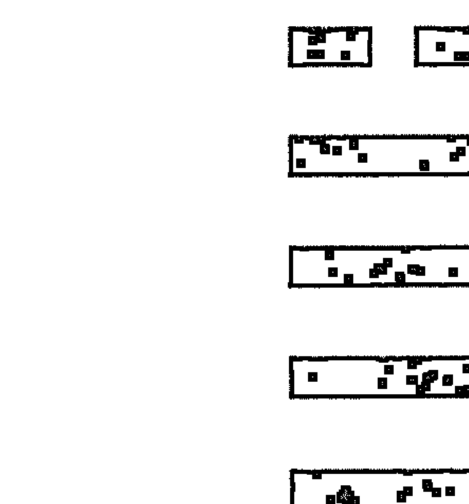

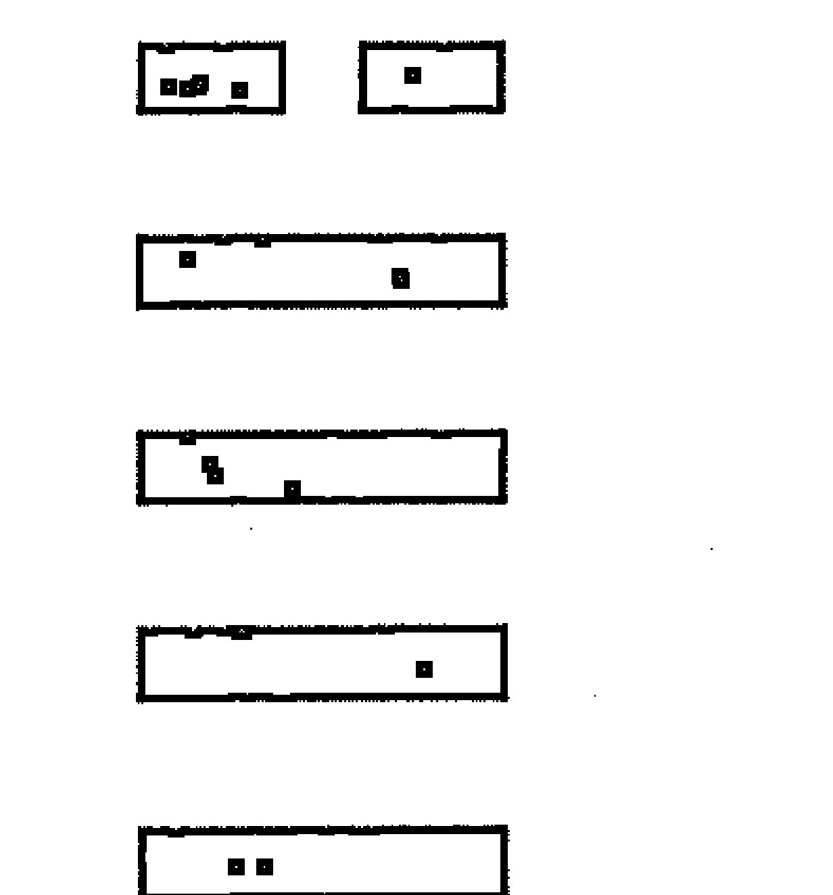

金口透易·梅花占起卦法，一般最为常用的是金钱卦，端法为权宜之法，一般遇急事或起金钱卦不方便时，方以端法起卦，学者日常应尽量以金钱卦为主。

## 《金口透易·易象占》占断指南

《金口透易·梅花占》的预测思路与现在流行的《梅花易数》完全不同，其预测是以主卦为事之初起，以变卦为事之发展变化，以动变看其事体，以变占看其外围情况，预测的宽度与广度更深入、直观。下面，先讲一下《金口透易·梅花占》断课的基础知识。

### 《金口透易·梅花占》卦体四象所主

《周易·系辞》中讲“列贵贱者存乎位”，这个位，是指一卦的“六爻与卦体”中的卦位与爻位，分而言之，以爻位而言称之为“六爻爻位”，以卦位而言则称之为“四象卦位”。八卦的六爻爻位的主从关系，既有严格的贵贱等级之分又有相互之间的紧密配合。细言之，一卦之中以”初爻为元士，二爻为大夫，三爻为三公，四爻为诸侯，五爻为天子，上爻为宗庙”，试列图如下：

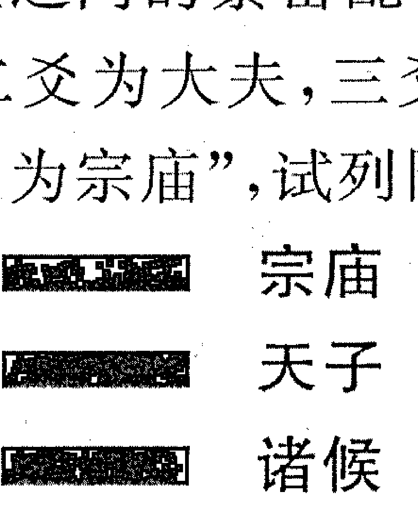

> > 《易纬·乾凿度》指出：“凡此六者，阴阳所以进退君臣所以升降，万人所以为象则也。”

在六爻的爻位中，“元士、大夫、三公”三爻起于下卦元士之初爻，止于下卦之三爻，爻位居下，以之成卦，为地元卦。“大夫、三公、诸侯”三爻，起于下卦之中爻，止于上卦初爻，以之成卦，为将神卦。“三公、诸侯、天子”三爻，起于下卦之上爻，止于上卦之中爻，以之成卦，为贵神卦。“诸侯、天子、宗庙”三爻，起于上卦之初爻，止于上卦之上爻，以之成卦，为天元卦。综合到一个卦里，则是卦体的上卦为天元卦，卦体的下卦为地元卦，卦体互卦的上卦为贵神卦，卦体互卦的下卦为将神卦。

#### 以泽山咸卦为例：

泽山咸
| 爻位 | 对应 |
| :--- | :--- |
| ⚋⚋ | 宗庙 |
| ⚊⚊⚊ | 天子 |
| ⚊⚋⚊ | 诸侯 |
| ⚋⚊⚊ | 三公 |
| ⚊⚋ | 大夫 |
| ⚋⚊⚊ | 元士 |

##### 泽山咸地元卦为：（离为火）

离（地元卦）
| 爻位 | 对应 |
| :--- | :--- |
| ⚋⚊⚊ | 三公 |
| ⚋⚋ | 大夫 |
| ⚋⚊⚊ | 元士 |

##### 泽山咸将神卦为：（巽为风）

巽（将神卦）
| 爻位 | 对应 |
| :--- | :--- |
| ⚊⚋⚊ | 诸侯 |
| ⚋⚊⚊ | 三公 |
| ⚋⚋ | 大夫 |

### 泽山咸贵神卦为：(乾为天)

- 天子
- 诸侯
- 三公

### 泽山咸天元卦为：(兑为泽)

- 宗庙
- 天子
- 诸侯

#### 四象卦位所属图

| 天元卦 | 君 | 祖 | 夫 | 主 | 尊长 | 财路 | 头 | 高处 | 天 |
| 贵神卦 | 宰辅 | 父 | 尊 | 家主 | 臣 | 外财 | 胸 | 上中 | 神 |
| 将神卦 | 吏 | 兄弟 | 妻 | 亲戚 | 身 | 内财 | 腹 | 中下 | 人 |
| 地元卦 | 田宅 | 子孙 | 妾 | 奴仆 | 六畜 | 积蓄 | 足 | 下 | 地 |

## 《金口透易·梅花占》体用断

《金口透易·梅花占》的体用，是以事为体，以动为用，《梅花易数》的体用，是以无动爻的卦为体，以有动爻的卦为用，这是《金口透易·梅花占》与《梅花易数》的本质区别，《金口透易·梅花占》的动用，是以卦体四象分配四位，以八动占为基础，直接反应事体吉凶，具体运用法则如下：

## 天元卦克地元卦(问招卦)

问招卦相当于金口诀中的妻妾动，其口诀为

- 干克方为妻妾动
- 财官损折下卑疲
- 外边取索多谋害
- 人在家中访不宜

#### 例：

- 生年:1984
- 性别:女
- 占事:能不能与他去上海工作
- 公历:2007 年 9 月 23 日 1 时 18 分
- 年建:丁亥
- 月建:己酉
- 日建:庚申
- 时建:丁丑 (旬空:子丑)

本卦

变卦

风山渐

艮为山

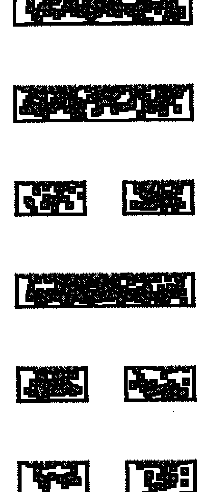

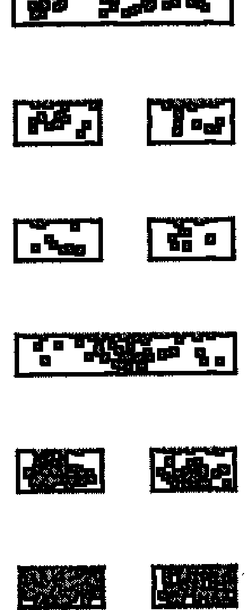

> 渐:女归吉,利贞。

## 第一章 基础拾零

- 初六:鸿渐于干,小子厉,有言,无咎。
- 六二:鸿渐于磐,饮食,吉。
- 九三:鸿渐于陆,夫征不 ,妇孕不育,凶;利御寇。
- 六四:鸿渐于木,或得其桷,无咎。
- 九五:鸿渐于陵,妇三岁不孕,终莫之胜,吉。
- 上九:鸿渐于逵,其羽可用为仪,吉。

解断:

- 一、本卦风山渐,取“女归吉,利贞”,所谋有利之象, 九五“鸿渐于陵,妇三岁不孕,终莫之胜,吉。”外出无妨
- 二、以主卦为事体,卦内上卦为巽,地元卦为艮,巽 为木,艮属土,外来克内,对外出的事情拿不定主意,有 所犹疑,艮为止,想去而犹豫
- 三、互见离坎,为财动,有钱财上的考虑,离中见午, 坎中见子,为测主本命太岁,有自身发用求财之象,是自 己想去
- 四、以干为外事,乙木寄宫为巽,甲木寄宫在艮,戊 土正宫在巽,巳土正宫在艮,甲乙为五行伏吟,所谓“二 木为爻求难得”求之不得之象,乙为曲折,甲为外出,外 出曲折之角,戊巳亦为五行伏吟,求事迟滞不行
- 五、巽宫本位辰巳,艮宫本位寅丑,以寅克于辰,为 鬼动渊越之卦,主人有出外之心,巽宫巳生艮,外来生 内,有人相约之象
- 六、子为太岁桃花,午为月令桃花,寅为日支驿马, 外出有桃花之事,须要当心
- 七、动而变艮,为止,有停止不前之想,
- 八、艮宫本位寅丑，内寅克外丑为鬼动，出外，外寅克内丑，为妻妄动，出行有阻，想走走不成，重重伏吟，迟滞之象。互卦震木发动，这官动，人出于外，出外有一定的职务的考虑，震卦本位卯木，为太岁合神，当年之事，卦内驿马重重，想动的想法还是占上风。
- 九、以玄变看结果，阻力重重，外来克内，变玄伏吟，去而复返
- 十、综合论述，这个工作的事情是个好事儿，有人相约与她一同前往，去了有一定的职务，而且薪酬也不低，实际上本人也是很动心的，但其中好象有桃花的事情，去了的话，怕感情上吃亏，心里不踏实了，最终还是决定去看一看，但去而复返，其后于次一年的春天返回

## 地元卦克天元卦(悔折卦)

悔折卦相当于金口诀五动中的鬼动

其口诀为

- 方克干兮鬼动名
- 官亨谋动人宣争
- 乖佞损害病伴合
- 暗昧空诈亦非轻

> > （求官争竞而得，求官主出外，病虽好亦不痊，有空陷不明之事）

### 例:古例(观梅占)

辰年十二月十七日申时，康节先生偶观梅，见二雀争枝坠地。先生曰：“不动不占，不因事不占。今二雀争枝坠地,怪也。”因占之,主卦泽火革。初爻变咸,互见巽。断之曰:“详此卦,明晚当有女子折花,园丁不知而逐之,女子失惊坠地,逐伤其股。又兑金为体,离火克之。互中巽木,复生起离火,则克体之卦气盛。兑为少女,因知女子之被伤,而互中巽木,又逢乾金兑金克之,则巽木被伤,而巽为股,故有伤股之应。幸变为艮土,兑金得生,知女子但被伤,而不至凶危也。”

卦例如下：

#### 本卦

泽火革

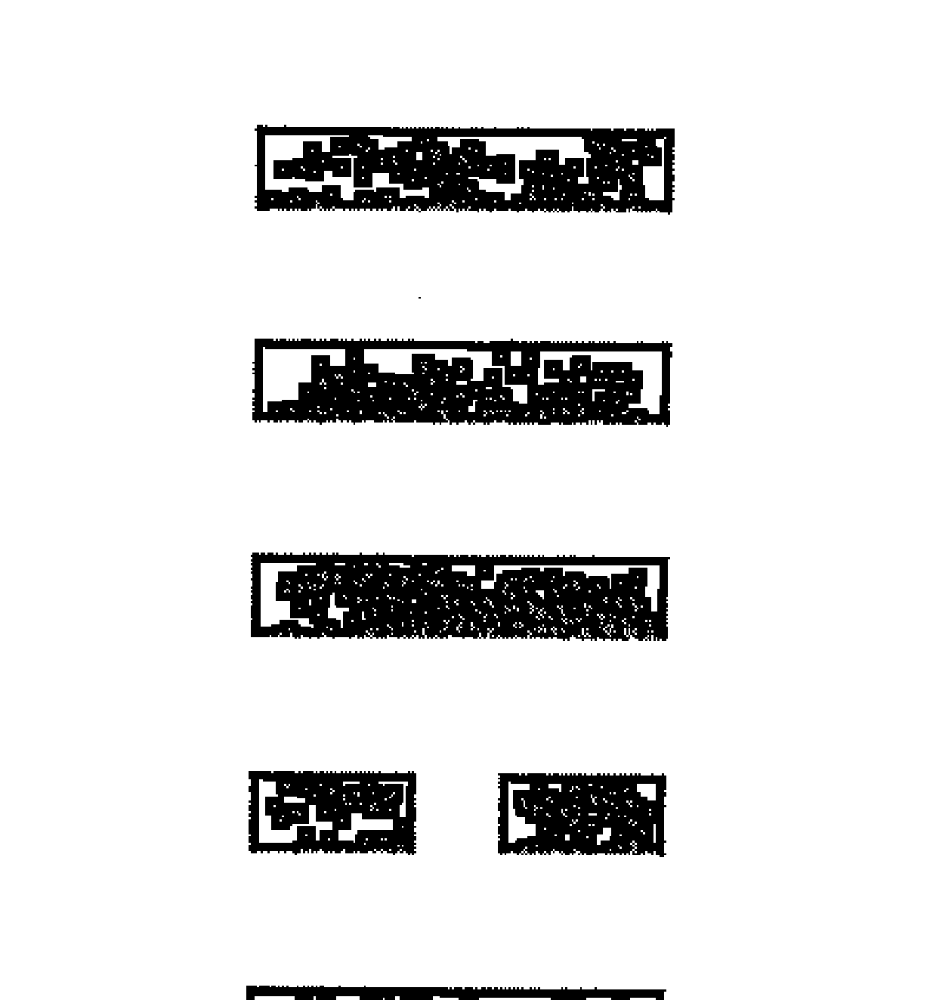

#### 变卦

泽山咸

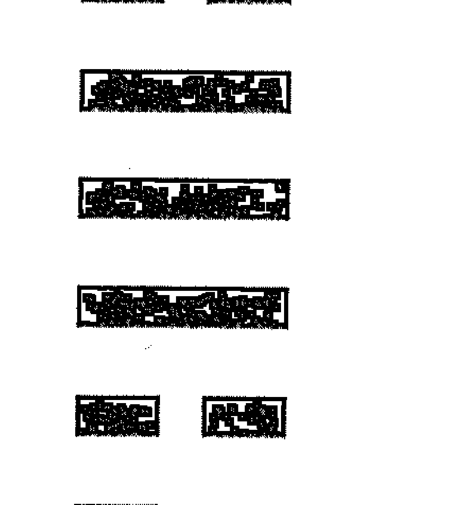

- 革:已日乃孚,元亨利贞,悔亡。
- 初九:巩用黄牛之革。
- 六二:己日乃革之,征吉,无咎。
- 九三:征凶,贞厉,革言三就,有孚。
- 九四:悔亡,有孚改命,吉。
- 九五:大人虎变,未占有孚。
- 上六:君子豹变,小人革面,征凶,居贞吉。

解断：

- 一、主卦为泽火革,天元卦兑为泽,为金,地元卦离为火,为火,下克上,为鬼动悔折卦,主喧争不宁之事,
- 二、互见天风姤,为贼动(内贼卦),主因盗生事,天元卦为兑为少女,受克为少女有损。
- 三、外三才重重克内,乾兑克制巽木,巽为木,为长女,为关节,乾为盗,克巽为摘花之应,巽位临于下为股,外来克内为跌,受克为伤股之象
- 四、离中藏支为午为口舌是非争吵之事,兑中藏支为酉为少女为小家碧玉,午火克害酉金,亦为女子争逐有损
- 五、变卦是看事情的变化方向,变卦为泽山咸,外三才重重克内,贼动克巽,事情会发生,内三才亦重重克内,乾克巽,巽克艮,艮亦为腿足,亦主腿足之伤,但地元卦变为艮,为土生金,艮宫藏支为丑寅,兑宫藏支为酉,酉金克制寅木,主腿足损伤,但卦中丑土合生酉金,故不至于凶危。

## 天元卦生地元卦(恩庆卦)

恩庆卦相当于金口诀中的子孙动

口诀为

- 干生方为子孙动
- 荫子添孙奴婢财
- 占产始知多易育
- 无边宠遇自天来

> (主求谋有得,外来生助,又主长辈助力,生育得子,印信擢拔之事)


### 例:测近两年工作上有没有提升

干支:己丑年 丙子月 壬子日 丙午时(寅卯)

【本卦】 火山旅

【变卦】 火地晋

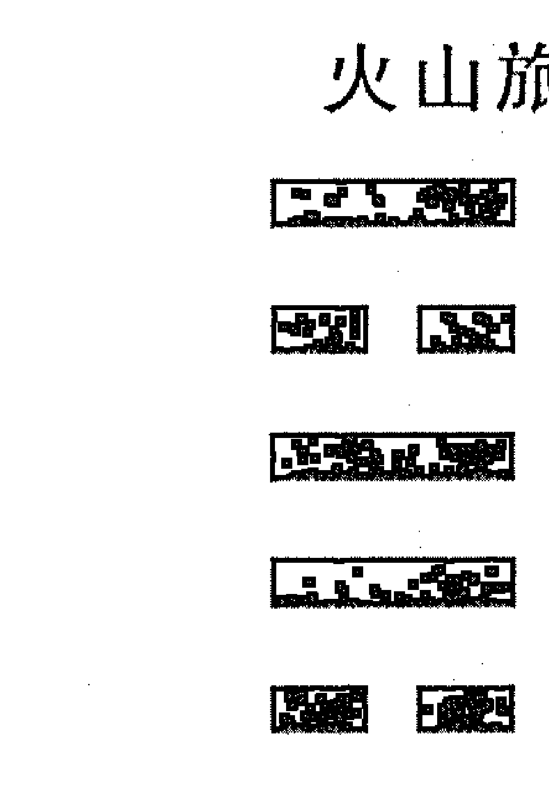

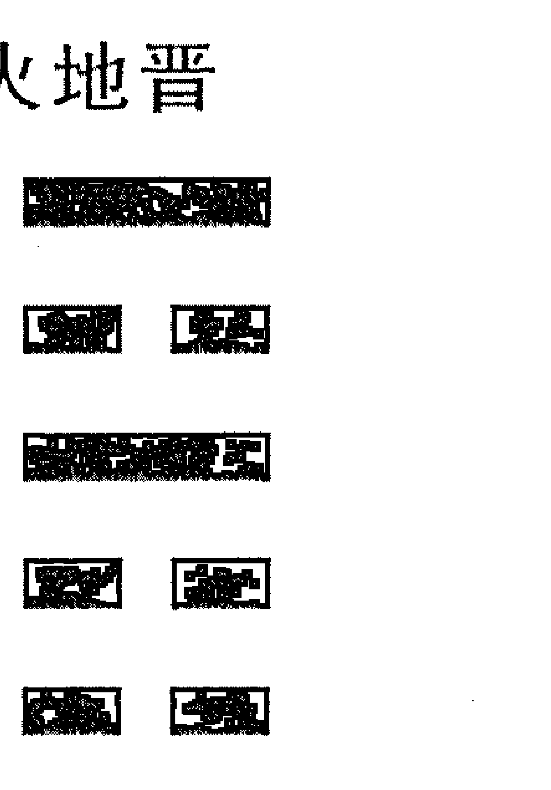

### 爻辞:

- 旅:小亭,旅贞吉。
- 初六:旅琐琐,斯其所取灾。
- 六二:旅即次,怀其资,得童仆贞。
- 九三:旅焚其次,丧其童仆,贞厉。
- 九四:旅于处,得其资斧,我心不快。
- 六五:射雉一矢亡,终以誉命。
- 上九:鸟焚其巢,旅人先笑后号咷。丧牛于易,凶。

### 解断:

- 1. 本卦为火山旅,天元卦为离为火为文书,地元卦为艮为山为官职,艮为太岁丑本宫,亦为次年寅木之本宫,主近两年之内,有领导关照,文书印信之事
- 2. 互卦见泽风大过,兑为金,在贵神卦位,为直属领导,巽为木,为文书职务,直属领导有压力,有所压制,内三才形成巳酉丑三合局,合入太岁,与领导应当有所牵
- 3. 主卦重重克下，为寇攘卦，主求谋有阻，压力重重之象
- 4. 卦内木火旺相，主文书印信职务之事可成，兑官处死地，门户争竞口舌之事，又主事体阻隔，待时方成
- 5. 地元卦艮宫逢空，待时而动，须借外力方可
- 6. 地元卦藏支为寅丑，天元卦藏支为午火，寅为官贵，内生外有所求谋，寅木空亡，须待时机
- 7. 天元卦午火与太岁相害，与月建相破，领导的关照达不到下面，有人阻隔，外界形势不允许，要等待
- 8. 变卦为火地晋，天元卦为离，地元卦为坤，待第二年的夏天的五月与六月，离火得太岁寅为长生，外来生内，其事可成
- 9. 变卦财官两动，印星又动，这个机会很好，要把握，对收入与职务都有好处。

### 地元卦生天元卦（宝成卦）

宝成卦相当于金口诀中的父母动
口诀为

> 方生干兮父母兴
父母君亲皆喜忻
印信擢拔多进益
须知祭祀祥福祯

（占产多育，占印有喜，有擢拔进益之事，须有所求谋方成）

## 第一章 基础拾零

#### 例

### 观梅古例(少年有喜色占)

壬申日午时，有少年从离方来，喜形于色，问有何喜，曰无。逐占之，以少年属艮为天元卦，离为地元卦，得山火贲。以艮七离三加午时七，总十七数，除十二，余五为动爻，贲之六五爻曰：「贲于丘园，束帛戋戋，吝，终吉。」易辞已吉矣。卦则贲之家人，互见震、坎，离为体，互变俱生之。

断曰：子于十七日内必有聘币之喜。至期，果然定亲。

###### 【本 卦】

###### 【变 卦】

###### 山火贲

###### 风火家人

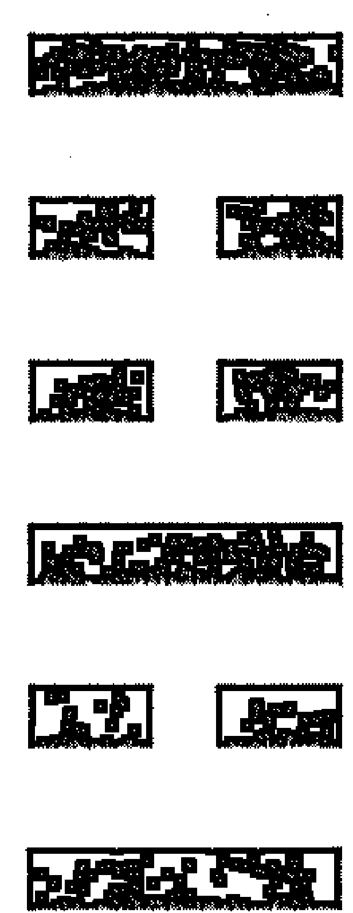

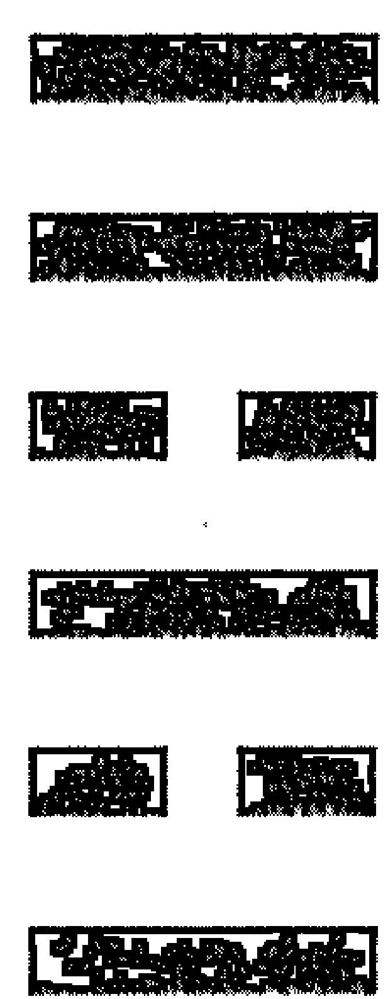

##### 爻辞：

- 贲：亨。小利有所往。
- 初九：贲其趾，舍车而徒。
- 六二：贲其须。
- 九三：贲如濡如，永贞吉。
- 六四：贲如皤如，白马翰如，匪寇婚媾。
- 六五：贲于丘园，束帛戋戋，吝，终吉。
- 上九:白贲,无咎。

> 《林辞》

东山西山,各自言安。虽相登望,竟未同堂。

### 分析:

- 1、本卦山火贲,天元卦为艮为山为少男,地元卦为离为中女,内来生外,女求男之象
- 2、艮六五变为巽,艮为山为田园,互中震为林木,巽为花草,离为饰,故言贲于丘园,巽藏辰其数五,离为帛,互坎克离,故言束帛戋戋,内来生外,互见震为日支驿马,有跑动之象。
- 3、艮内藏寅支,离中藏午支,寅午化合,会合文书离火之局,为文书婚姻之喜
- 4、变卦为风火家人,外来生内,巽为长女,为媒妁,离为中女,互见离坎,为财动(盈益卦)主求财必得,婚姻有成
- 5、外来生内,亦为合和之事,伏玄鬼动争竞,有喜有忧,又主官事

## 天元卦与地元卦比和(稽滞卦)

稽滞卦相当于金口诀中的兄弟动

口诀为

> 干方比为兄弟动
事体牵延比肩行
勾联斗讼亲朋涉
内有争竟有小凶

（占事内有争竞，事牵亲朋，凡事不利谋为，拖延迟滞）

#### 例：

### 古例(西林寺牌额占)

先生偶见西林寺之额，“林”无两钩，因占之。以“西”字七画为艮，作天元卦；以“林”字八画为坤，作地元卦；以上七画下八画总十五画，除二六一十二，零数得三，是山地剥卦；第三爻动，变艮；互见重坤

断曰:寺者，纯阳之所居。今卦得重阴之爻，而又有群阴剥阳之兆。详此则寺中当有。询之阴人之祸，果然。遂谓寺僧曰：“何添‘林’字钩？则自然无阴人之祸矣”。僧信然，即添‘林’字两钩，寺果无事。

###### 【本卦】

###### 【变卦】

山地剥

艮为山

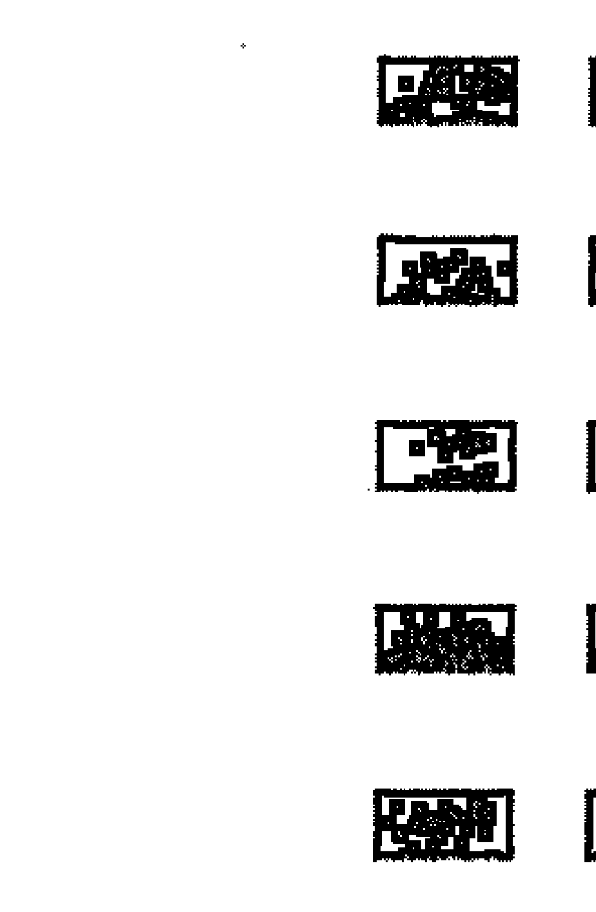

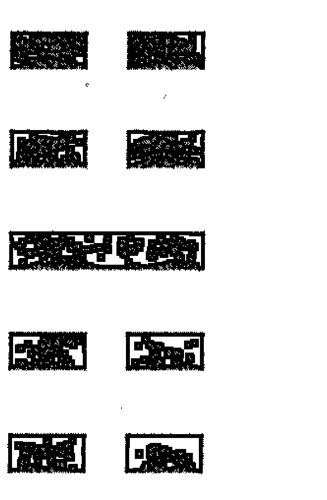

##### 爻辞：

- 剥:不利有攸往。
- 初六:剥床以足，蔑贞凶。
- 六二:剥床以辨，蔑贞凶。
- 六三:剥之，无咎。
- 六四:剥牀以肤,凶。
- 六五:贯鱼,以宫人宠,无不利。
- 上九:硕果不食,君子得舆,小人剥庐。

> 《林辞》

巨蛇大鳅,戰於國邦。上下隔塞,主君走逃

#### 解断

- 1、主卦天元卦为艮,地元卦为坤,互卦亦为坤,卦象为四土比合,兄弟动稽滞之卦,又为卦象伏吟之坏户合元卦,主事体牵延不宁,内有争竞迟滞斗讼之事,内有重叠,党比相争。
- 2、主卦卦体反吟,且反吟重重克上,艮为财,为少男,为僧,坤为老女,坤中藏未为少妇,主女人生灾,事牵官事
- 3、艮中藏支丑寅,坤中藏支为申未,丑未相冲与艮坤反吟并,主牵连斗论,争竞不宁,申冲寅,为鬼动悔折卦与官动明德卦,内部争竞,事牵动官之事,艮中藏寅克坤中未土,又为妻妾动问招卦,外来取索,官事不休,又主财帛耗散
- 4、变卦为艮为山,伏吟卦,二土伏吟稽滞未解,艮中藏寅克本宫丑土,外来克内,鬼动与妻妾动相并,主事不喜,解之不得,官动亦主经官动府之事。
- 5、综合看来,此卦内外相争,事体伏吟反吟重现,故主寺内有阴人祸患之事,斗讼不息,恐亦有经官动府之事。
- 6、添笔改为山泽损,则外来生内为恩庆卦,内财动为盈益卦,外官动为明德卦,反伏吟全消,内外相生,讼事可息。

## 贵神卦克天元卦(明德卦)

明德卦相当于金口诀中的官禄动

口诀为

- 神克干为官禄动
- 仕应禄位望财难
- 常人官事得官物
- 财来暗损病喉咽

(求官有得,求财先损后得,求谋有官事,病主咽喉)

#### 例

(测工作有无升迁的机会)

庚寅年 庚辰月 己酉日 戊辰时(日空:寅卯)

###### 【本 卦】

山风蛊

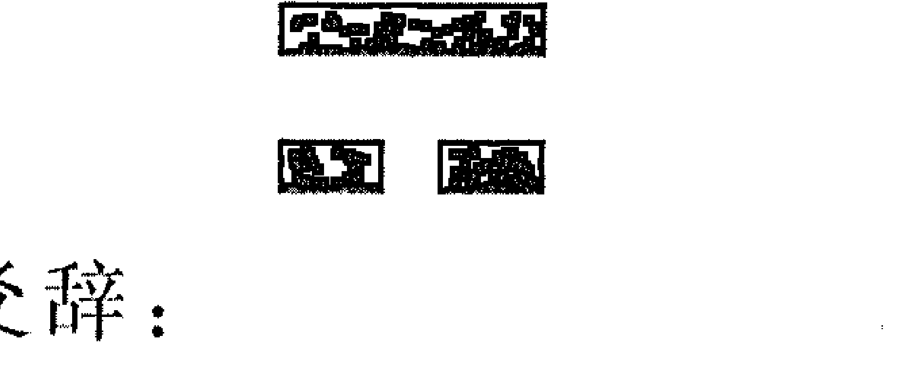

###### 【变 卦】

山水蒙

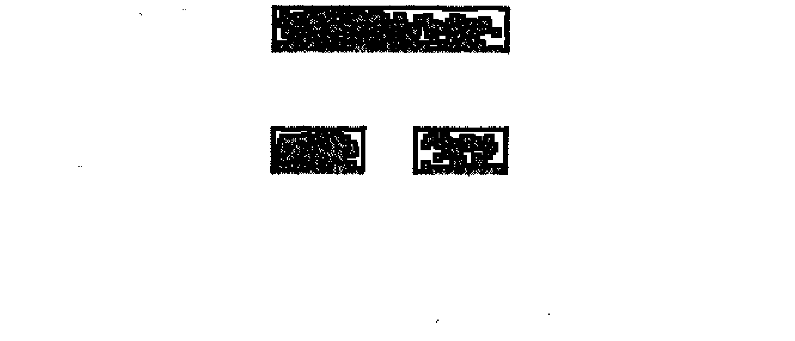

##### 爻辞：

- 蛊:元亨,利涉大川。先甲三日,后甲三日。
- 初六:干父之蛊,有子,考无咎,厉终吉。
- 九二:干母之蛊，不可贞。
- 九三:干父小有晦，无大咎。
- 六四:裕父之蛊，往见吝。
- 六五:干父之蛊，用誉。
- 上九:不事王侯，高尚其事。

> 《林辞》

> 家在海隅，绕旋深流；王孙单行，无妄以趋。

- 1. 主卦为山风蛊，天元卦为艮为山，地元卦为巽为风，内来克外，为鬼动（悔折卦），测官主出外，主内部争竞，心态不定。
- 2. 互卦震卦克艮卦，为官动（明德卦），有求谋升职之机，但艮震皆落空亡，所求不得之象
- 3. 互卦财动（盈益卦）主事体牵扯收入，但财动不利求官，官空又主不得
- 4. 巽卦正寄天干乙木，艮卦正寄天干己土，亦为鬼动，争竞不宁之事，鬼动逢空，亦为未备
- 5. 艮宫为月令驿马，有跑动外出之事，驿马逢空，行而不得
- 6. 变卦山水蒙，外来克内，为妻妾动（问招卦）亦为所谋不得
- 7. 变卦天元卦伏吟，事多反复，财动不利求官，震艮空亡，不得之象

### 贵神卦克将神卦（内贼卦）

内贼卦相当于金口诀中的贼动

> 口诀为
神克将为内贼生
勾联偷攘染私情
谋空财损卑幼病
暗昧空诈亦非轻
（求谋不利，求官不得，求财有损，妻子病困，有暗昧之事，测婚主私情）

### 例:古例(鸡悲鸣占)

甲申日丁卯时，有鸡鸣于乾方，声极悲怆，因占之。鸡属巽，为天元卦，乾为地元卦，得风天小畜。以巽五乾一共六数，加卯时四数，总十数，除六，得四爻动，变乾，是为小畜之六四。《易》曰：“有孚，血去惕出。无咎。”以血推之，割鸡之义。卦则小畜之乾，互见离、兑。乾金为体，离火克之。卦中巽木离火，有烹饪之象。

断曰：此鸡十日当烹。果十日客至，有烹鸡之验。

卦例如下：

甲申日　丁卯时

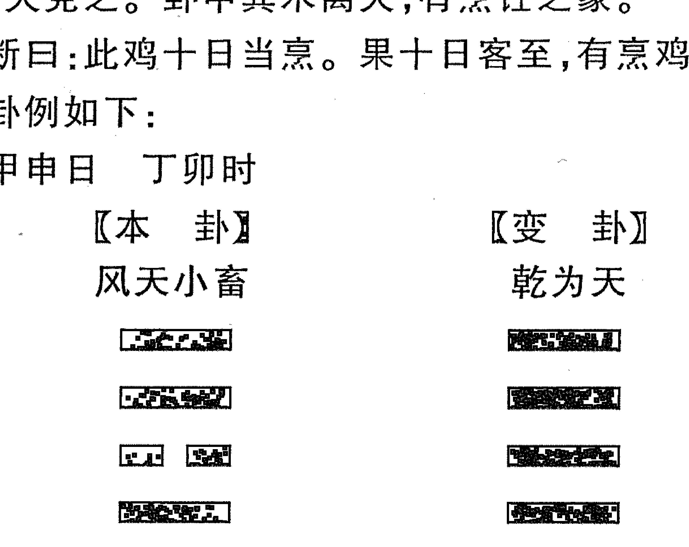

### 爻辞:

- 小畜:亨。密云不雨,自我西郊。
- 初九:复自道,何其咎,吉。
- 九二:牵复,吉。
- 九三:舆说辐,夫妻反目。
- 六四:有孚,血去惕出,无咎。
- 九五:有孚挛如,富以其邻。
- 上九:既雨既处,尚德载,妇贞厉。月几望,君子征凶。

> 《林辞》

東遇虎蛇,牛馬驚奔。道絶不通,商困無功。（此用伏玄二变）

- 1. 主卦为风天小畜,天元卦为巽为鸡为颈,地元卦为乾为庚为刀,巽居为上位为头,故有鸡断头之象
- 2. 互见火泽睽,为贼动(内贼卦),离为火为血,泽为辛为刀,兑卦藏支为酉,亦为鸡,亦是鸡被刀割出血之象
- 3. 伏玄见未为宴乐,见子午为酒食,故主宴乐酒食之事,而见杀鸡之应
- 4. 变卦为重乾之卦,为丛刃合元卦,亦主刀兵之事
- 5. 申子辰日,见巽为劫煞,为墓地,见乾为地煞,为巽之死地,逢辰巳日,为巽卦当令,故主十日后辰巳之日应

## 将神卦克贵神卦(盈益卦)

盈益卦相当于金口诀中的财动其口诀为

+   将克神兮财内动
    求财必得妻妾病
    损官谋动人出外
    心疾物损职难静

> (求官有损,求财易得,出外之象,病主胸腹)

## 例：(测开店吉凶)

庚寅年 己卯月 甲戌日 己巳时(日空:申酉)

【本卦】 | 【互卦】 | 【变卦】
--- | --- | ---
风火家人 | 火水未济 | 山火贲

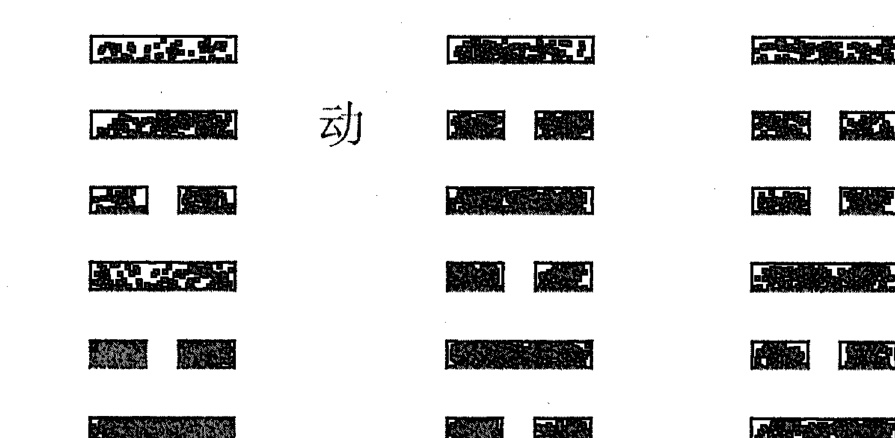

##### 爻辞：

+   家人：利女贞。
    初九：闲有家，悔亡。
    六二：无攸遂，在中馈，贞吉。
    九三：家人嗃嗃，悔厉吉；妇子嘻嘻，终吝。
    六四：富家，大吉。
    九五：王假有家，勿恤吉。
    上九：有孚威如，终吉。

> 《林辞》

画龙头颈，文章不成。甘言美语，诡辞无名。

解

+   1、主卦风火家人，外来生内，有人相约之象，天元卦为巽为柔软衣物，离为修饰，主店铺经营与衣物饰品有关
    2、互卦火水未济，为财动（盈益卦）为求财必得，
    3、变卦为山火贲，内外相生，但分局相克，主事体有所中断，艮为财，为店铺，寻店铺有阻之象
    4、变卦外化官动，所求店铺或与政府或单位有关
    5、变卦外化官动（明德卦），玄变又化官动（明德卦），内外相克，求财投入会超预期，有暗损之象
    6、总体看，这个生意应当盈利，但前期先店铺会困难一些，后期的消耗较大，要提起注意。

### 天元本气寄宫

+   甲震乙巽丙丁离
    庚乾辛兑两宫移
    戊居艮位己坤是
    壬癸在坎定其居

### 天元正宫寄宫

+   甲木正宫在艮寄宫在震
    乙木正宫在震寄宫在巽
    丙火正宫在巽寄宫在离
    丁火正宫在离寄宫在巽
    - 戊土正宫在辰寄宫在戌
    - 己土正宫在丑寄宫在未
    - 庚金正宫在坤寄宫在乾
    - 辛金正宫在兑寄宫在坤
    - 壬水正宫在乾寄宫在坎
    - 癸水正宫在坎寄宫在乾

### 八宫地支寄宫

+   - 乾宫藏支戌亥轮
    - 坎水本位子来存
    - 艮宫丑寅寄其位
    - 震卯离午是其身
    - 巽纳辰巳位上坐
    - 坤宫未申自来临
    - 酉金原来居兑位
    - 八宫地支本位寻

### 金口透易占断次第

+   1、主卦八宫四象占看事体(以八卦五行属性为主)
+   2、主卦内外三才占看事体内外情况
+   3、主卦天干断伏隐外事
+   4、主卦地支断伏隐内事
+   5、变卦八宫四象占看变化(以八卦五行属性为主)
+   6、变卦内外三才占看变化内外情况
+   7、变卦天干断伏隐外事
+   8、变卦地支断伏隐内事
+   9、以神煞验其吉凶
+   10、主卦变占看事体内因、发展与外围情况及综合因素
+   11、变卦变占看事体变化的内因、发展与外围情况及综合因素

## 《金口透易·梅花占》万类聚象

《金口透易·梅花占》是金口诀与汉易易象占相互融合的产物,其中既要用到易象,同时也要用到天干地支的万类聚象,在实际占断中,按照占断的层次,分析卦体的四象格局、天干占局与地支占局,以大象断其事体,以干支神煞定其吉凶,以岁破月破刑冲化合,定其成败,配合“易林变占”,形成一个立体的分层次的占断过程,在《金口透易·梅花占》的预测过程中,用到类象的地方很多,可以讲,类象体系是易象占的基础体系,基于此,现将八卦、干支聚象,及金口诀中的格局分类附录于后,以供习者学习参考。

### 八卦万物类象

“万物类象”是易学象数学中的重要部分,是信息预测中必不可少的。

#### 乾卦：

+   - 「天时」: 天、冰、雹、霰
    - 「地理」: 西北方、京都、大郡、形胜之地、高亢之所
    - 「人物」: 君、父、大人、老人、老人、长者、宦官、名人、公门人
    - 「人事」: 刚健勇武、果决、多动少静
    - 「身体」: 首、骨、肺
    - 「时序」: 秋、九十月之交、戌亥年月之时，五金年月日时
    - 「动物」: 马、天鹅、狮子、象
    - 「静物」: 金玉、宝珠、圆物、木果、刚物、冠、镜
    - 「屋宿」: 公厕、楼台、高堂、大厦、驿宿、西北向之居
    - 「家宅」: 秋占宅兴隆、夏占有祸、冬占冷落、春占吉利
    - 「婚姻」: 贵官之眷、有声名之家、秋占宜成、冬夏不利
    - 「饮食」: 马肉珍味、多骨、肝肺、干肉、木果、诸物之首、圆物、辛辣之物
    - 「求名」: 有名、宜随内任、刑官、武职、掌权、天使、驿官
    - 「交易」: 宜金、玉珍宝珠贵货，易成，夏占不利
    - 「求利」: 有财，金、玉之利，公门中得财
    - 「出行」: 利于出行，宜入京师
    - 「谒见」: 利见大人，有德行之人，宜见贵官，可见
    - 「疾病」: 头面之疾，肺疾、筋骨疾、上焦疾、夏占不安
    - 「官讼」: 健讼，有贵人助，秋占得胜，夏占失理
    - 「坟墓」: 宜向西北，宜乾山气脉，宜天穴，宜高
    - 「方道」: 西北
    - 「五色」: 大赤色、玄色
    - 「姓字」: 带金旁者，行位一四九
    - 「数目」: 一四九
    - 「五味」: 辛、辣

#### 坤卦：

+   - 「天时」: 阴云、雾气、冰霜
    - 「地理」: 田野、乡晨、平地、西南方
    - 「人物」: 老母、后母、少妇、产妇、农夫、乡人、众人、老妇人、大腹人
    - 「人事」: 吝啬、柔顺、懦弱、众多、小人
    - 「身体」: 腹脾、肉、胃
    - 「时序」: 辰戌丑未月、未申年月日时，八五十月日
    - 「静物」: 方物、柔物、布帛、丝绵、五谷、舆斧、瓦器
    - 「动物」: 牛、羊、猴
    - 「屋宿」: 西南方、村店、男舍、矮屋、土阶、仓库
    - 「家宅」: 安稳、多阴气、春占宅舍不安
    - 「饮食」: 牛肉、土中之物、甘味、野味、五谷之味、芋笋之物、腹脏之物
    - 「婚姻」: 利于婚姻，宜税产之家、乡村之家，或寡妇之家，春占不利
    - 「生产」: 易产，春占难产，有损或不利于母，坐宜西南方
    - 「求名」: 有名、宜西南方或教官、农官守土之职、春占虚
    - 「交易」: 宜利交易、宜田土交易、宜五谷利、贱货、重物、布帛、静中有财、春占不利
    - 「求利」: 有利，宜土中之利，贱货重物之利、静中得财，春占无财，多中取利
    - 「谋旺」: 静中求谋，春占少遂，或谋于妇人
    - 「出行」: 可行、宜西南行、宜往乡里行、宜陆行，春不宜
    - 「谒见」: 可见，利见乡人，宜见亲朋或阴人，春不宜见
    - 「疾病」: 腹疾、脾胃之疾、饮食停滞，从而食不化
    - 「官讼」: 理顺、得众情、讼当解散
    - 「坟墓」: 宜向西南之穴、平阳之地、近田野、宜低葬，春不可葬
    - 「姓字」: 带土姓人、行位八五十
    - 「数目」: 八五十
    - 「方道」: 西南
    - 「五味」: 甘
    - 「五色」: 黄、黑

### 震卦:

+   - 「天时」: 雷
    - 「地理」: 东方、树木、闹市、大途、竹林、草木茂盛之所
    - 「身体」: 足、肝、发、声音
    - 「人物」: 长男
    - 「人事」: 起动、怒、虚惊、鼓动噪、多动少静
    - 「时序」: 春二月、卯年月日时、四三八月日
    - 「静物」: 木竹、苇、乐器(竹木)、花草繁鲜之物、核
    - 「动物」: 龙、蛇、百虫、马鸣
    - 「屋舍」: 东向之居、山林之处、楼阁
    - 「家宅」: 宅中不时有虚惊，春冬吉，秋占不利
    - 「饮食」: 啼、肉、山林野味、鲜肉、果酸味、菜蔬、鲤鱼
    - 「婚姻」: 可、有成、声名之家、得长男之婚，秋占不利
    - 「求利」: 山林竹木之财、动处求财，或山林、竹木茶货之利
    - 「求名」: 有名、宜东方之任、施号发令之职、掌刑狱之官、竹茶木税课之任、或闹市市货之职
    - 「生产」: 虚惊、胎动不安、头胎必生男，坐宜向东，秋不吉
    - 「疾病」: 足疾、肝经之疾、惊恐不安
    - 「谋旺」: 可旺、可求，宜动中谋，秋占不遂
    - 「交易」: 利于成交，秋占难成，动而可成，山林、木竹茶货之利
    - 「官讼」: 健讼、有虚惊、行移取甚反复
    - 「谒见」: 可见、在宜山林之人，利见宜有声名之人
    - 「出行」: 宜行，利东方、利山林之人，秋占不宜行、但恐虚惊
    - 「坟墓」: 利于东向、山林中穴，秋不利
    - 「姓字」: 带木姓人、行位四八三
    - 「数目」: 四八三
    - 「方道」: 东
    - 「五味」: 甘、酸味
    - 「五色」: 黑青、绿碧

### 巽卦:

+   - 「天时」: 风
    - 「地理」: 东南方之地、草木茂秀之所、花果菜园
    - 「人物」: 长女、秀士、寡妇之人、山林仙道之人、僧道
    - 「人事」: 柔和、不定、鼓舞、利市三倍、进退不果
    - 「身体」: 肱、股、气、风疾
    - 「时序」: 春夏之交、二五八之时月日、三月、辰巳月日时、四月
    - 「静物」: 木香、绳、直物、长物、竹木、工巧之器、臭、鸡毛、帆、扇、臼
    - 「动物」: 鸡、百禽、山林中之禽、虫、蛇
    - 「屋舍」: 东南向之居、寺观楼台、山林之居
    - 「家宅」: 安稳利市，春占吉，秋占不安
    - 「饮食」: 鸡肉、山林之味、蔬果酸味
    - 「婚姻」: 可成、宜长女之婚，秋占不利
    - 「生产」: 易生、头胎产女、秋占损胎、宜向东南坐
    - 「求名」: 有名、宜文职有风宪之力、宜为风宪、宜茶果竹木税货之职、宜东南之任
    - 「求利」: 有利三倍、宜山之利、竹货木货之利，秋不利
    - 「交易」: 可成、进退不一、交易之利、山林交易、山林木茶之利
    - 「谋旺」: 可谋旺、有财可成，秋占多谋少遂
    - 「出行」: 可行，有出入之利，宜向东南行，秋占不利
    - 「谒见」: 可见，利见山林之人，利见文人秀士
    - 「疾病」: 股肱之疾、风疾、肠疾、中风、寒邪气疾
    - 「姓字」: 草木旁姓氏、行位五三八
    - 「官讼」: 宜和、恐遭风宪之责
    - 「坟墓」: 宜东方向、山林之穴、多树木、秋占不利
    - 「数目」: 五三八
    - 「方道」: 东南
    - 「五味」: 酸味
    - 「五色」: 青绿、碧洁白

#### 坎卦：

+   - 「天时」: 月、雨、雪、露、霜、水
    - 「地理」: 北方、江湖、溪涧、泉井、卑湿之地、沟渎、池沼、有水之处
    - 「人物」: 中男、江湖之人、舟人、资贼、匪
    - 「人事」: 险陷卑下，外示以柔，内序以利，漂泊不成，随波逐流
    - 「身体」: 耳、血、肾
    - 「时序」: 冬十一月、子年月日、一、六月日
    - 「静物」: 水带子、带核之物，弓轮、矮柔之物，酒器、水具、工栋、丛棘、藜、桎梏、盐、酒
    - 「动物」: 猪、鱼、水中之物、狐、水族
    - 「屋舍」: 向北之居、近水、水阁、江楼、花酒长器、宅中湿地之处
    - 「饮食」: 猪肉、酒、冷味、海味、汤、酸味、宿食、鱼、带血、掩藏、有带核之物、水中之物、多骨之物
    - 「家宅」: 不安、暗味、防盗，匪
    - 「婚姻」: 利中男之婚，宜北方之婚，不利成婚，不可在辰戌丑未月婚
    - 「生产」: 难产有险，宜次胎，男，中男，辰戌丑未月有损，宜北向
    - 「求名」: 艰难，恐有灾险，宜北方之任，鱼盐河泊之职，酒兼醋
    - 「求利」: 有财防失，宜水边财，恐有失险，宜鱼盐酒货之利，防遗失，防盗
    - 「交易」: 不利成交，恐防失陷，宜水边交易，宜鱼盐货，酒之交易，或点水人之交易
    - 「谋旺」: 不宜谋旺，不能成就、秋冬占可谋
    - 「出行」: 不宜远行，宜涉舟，宜北方之行，防盗匪；恐遇险阻溺之事
    - 「谒见」: 难见，宜见江湖之人，或有水旁姓氏之人
    - 「疾病」: 耳痛、心疾、感染、肾疾、胃冷、水泻、涸冷之疾、血病
    - 「官讼」: 有阴险，有失因讼，失陷
    - 「坟墓」: 宜北向之穴、近水傍之墓、不利葬
    - 「姓字」: 点水旁之姓氏
    - 「数目」: 一、六
    - 「方道」: 北方
    - 「五味」: 咸、酸
    - 「五色」: 黑

#### 离卦：

+   - 「天时」: 日、电、虹、霓、霞
    - 「地理」: 南方、干亢之地，窑、炉冶之所，刚燥厥地，其地面阳
    - 「人物」: 中女、文人、大腹、目疾人、甲胄之士
    - 「人事」: 文化之所，聪明才学，相见虚心，书事，美丽
    - 「身体」: 目、心、上焦
    - 「时序」: 夏五月，午火年月日时，三二七日
    - 「静物」: 火、书、文、甲骨、干戈、稿衣、干燥之物
    - 「动物」: 雉、龟、鳖、蚌、蟹
    - 「屋舍」: 南舍之居，阳明之宅、明窗、虚室
    - 「家宅」: 安稳、平善、冬占不安，克体主火灾
    - 「饮食」: 雉肉、煎炒、烧炙之物、干脯之体、熟肉
    - 「婚姻」: 不成、利中女之婚，夏占可成，冬占不利
    - 「生产」: 易生，产中女，冬占有损，坐宜向南
    - 「求名」: 有名，宜南方之职，文官之任，宜炉冶亢场之职
    - 「求利」: 有财宜南方求，有文书之财，冬占有失
    - 「交易」: 可成，宜有文书之交易
    - 「出行」: 可行，宜动向南方，就文书之行，冬占不宜行，不宜行舟
    - 「谒见」: 可见南方人，冬占不顺，秋见文书考案才士
    - 「官讼」: 易散，文书动，词讼明辨
    - 「疾病」: 目疾、心疾、上焦病，夏占伏暑，时疫
    - 「坟墓」: 南向之幕，无树林之年，阳穴。夏占出文人，冬不利
    - 「姓字」: 带次或立人旁士姓氏，行位三二七
    - 「数目」: 三二七
    - 「方道」: 南
    - 「五色」: 赤、紫、红
    - 「五味」: 苦

#### 艮卦：

+   - 「天时」: 云、雾、山岚
    - 「地理」: 山径路近山城，丘陵、坟墓，东北方，门阙
    - 「人物」: 少男、闲人、山中人、童子
    - 「人事」: 阻隔、守静，进退不决，反背，止住，不见
    - 「身体」: 手指、骨、鼻、背
    - 「时序」: 冬春之月、十三月丑寅年月日时，七五十月日、土年月日时
    - 「静物」: 土石、瓜果、黄物、土中之物、闾寺、木生之物、藤生之瓜
    - 「动物」: 虎、狗、鼠、百兽、黔喙之物、狐
    - 「家宅」: 安稳，诸事有阻，家人不睦，春占不安
    - 「屋舍」: 东北方之居，山居近石，近路之宅
    - 「饮食」: 土中物味，诸兽之肉，墓畔竹笋之属；野味
    - 「婚姻」: 阻隔难成，成亦迟，利少男之婚，宜对乡里婚，春占不利
    - 「求名」: 阻隔无名，宜东北方之任，宜土官山城之职。
    - 「生产」: 难生，有险阻之厄，宜向东北，春占有损
    - 「交易」: 难成，有山林田土之交易，春占有失
    - 「出行」: 不宜远行，有阻，宜近陆行
    - 「谒见」: 不可见，有阻，宜见山林之人
    - 「疾病」: 手指之疾，胃脾之疾
    - 「官讼」: 贵人阻滞，官讼未解，牵联不决
    - 「坟墓」: 东北之穴，山中之穴，近路旁有石，春占不利
    - 「数目」: 五七十
    - 「方道」: 东北方
    - 「五色」: 黄
    - 「五味」: 甘

#### 兑卦：

+   - 「天时」: 雨泽、新月、星
    - 「地理」: 泽、水际、缺池、废井，山崩破裂之地，其地为刚卤
    - 「人物」: 少女、妾、歌妓、伶人、译人、巫师、奴仆婢
    - 「人事」: 喜悦、口舌谗毁、谤说、饮食
    - 「身体」: 舌、口喉、肺、痰、涎
    - 「时序」: 秋八月，酉年月日时，金年月日，二四九月日
    - 「静物」: 金刀、金类、乐器、废物、缺器之物，带口之物，毁折之物
    - 「动物」: 羊、泽中之物
    - 「屋舍」: 西向之居，近泽之居，败墙壁宅，户有损
    - 「家宅」: 不安，防口舌，秋占喜悦，夏占家宅有祸
    - 「饮食」: 羊肉、泽中之物、宿味、辛辣之物味
    - 「婚姻」: 不成，秋占可成，有喜，主成婚之吉，利婚少女，夏占不利
    - 「生产」: 不利，恐有损胎或则生女，夏占不利，宜坐向西
    - 「求名」: 难成，因名有损，利西之任，宜刑官，武职，伶官，译官
    - 「求利」: 无利有损，财利主口舌，秋占有财喜，夏占不利
    - 「出行」: 不宜远行，防口舌，或损失，宜西行，秋占有利宜行
    - 「交易」: 难有利，防口舌，有竞争，秋占有交易之财，夏占不利
    - 「谒见」: 利行西方，见有咒诅
    - 「疾病」: 口舌、咽喉之疾，气逆喘疾，饮食不餐
    - 「坟墓」: 宜西向，防穴中有水，近泽之墓，或葬废穴，夏占不宜
    - 「官讼」: 争讼不已，曲直未决，因讼有损，防刑，秋占为体得理胜讼
    - 「姓字」: 带口带金字旁姓氏，行位四二九
    - 「数目」: 四二九
    - 「方道」: 西方
    - 「五色」: 白
    - 「五味」: 辛辣

## 神将所属图 (释意)

#### 戊土

性质: 阳土
对应地支: 辰、戌

戊土类神: 其质也烈，其性也耿介，其为味也甘辛，其为声也刚雄（大而厚重粗壮），其为体也涩滞（四方脸、皮肤黄白，多肉，受刑为驼），为用也卤而粗，得时则为豪雄果敢，失令则柔懦痴愚（四土比合，而不得时，主痴呆），其性执拗，不可强制。

##### 戊勾陈、天罡辰土：

五音姓: 属商音姓，
地理: 为麦地、岗岭、土堆、坟墓、田园、故基，寺观、

##### 戊天空、河魁戊土：

五音姓: 属商音姓
地理: 虚堂、牢狱、坟墓、寺观、岗岭、厕溷。

+   器物: 斧钺、磁盆、砖瓦、锁钥、数珠、鞋履、枷柩、瓦器、朝服、葫芦、五谷、骨骸
+   植物: 马齿苋，葫芦瓜，
+   人物: 僧道、善人、狱吏、屠儿、农家、长者、男人、信佛道之人
+   身体: 命门、右腿、膝、头、面、心、腹腔
+   事体: 下贱、诈伪、欺凌、不实、孤寒、牢狱之灾
+   动物: 驴犬
+   分野: 鲁地、徐州、星奎娄。

#### 己土

性质：阴土
对应地支：丑未

己土类神：为质也敦厚，其为性也坦直，其为味也甘辛，其为声也婉切（声音婉转，含糊、重浊）其为人也沉静（温顺沉静、体质单薄。瘦弱丑陋、忧愁、多静少动，）其为用也顺而柔，其性宽弘，不凝滞于物。

##### 己贵神、大吉丑土：

+   - **五音姓**：属徵音姓
+   - **地理**：桑园、桥梁、宫殿、坟墓、礼堂、仓库
+   - **器物**：斛斗、鞋履、首饰、车轮、箱柜、珍宝、饰物、锁钥、珍珠、佛像、杓、纽扣
+   - **植物**：野菜、土中之物、甘味笋竽之属
+   - **人物**：人君、贵人、尊长、风伯、雨师、神佛、后母、大腹之人、秃头。
+   - **身体**：结肠、脾脏、子宫、阴茎、嘴唇、左脚、皮肤、足胫
+   - **事体**：喜庆、冤仇、扭
+   - **动物**：牛驴、鳖、龟、蟹
+   - **分野**：吴地、杨州、星斗牛。

##### 己太常、小吉未土：

+   - **五音姓**：属微音姓，
+   - **地理**：宴会、庭院、墙垣、酒舍、茶房、厨房、井、坟墓、田野、砖厂
+   - **器物**：笙、醮器、女人衣、酒食、印信、药饵、幡子、笛帘、树枝
+   - **植物**：茴蒿
+   - **人物**：父母、道人、寡妇、师巫、放羊人、老妇人
+   - **身体**：脊椎、右肩、腹腔、手、口、舌
+   - **事体**：甘味、黄色、歌乐、丧亡、官灾、病症、家畜作怪
+   - **动物**：羊、鹰、白头翁
+   - **分野**：秦地、雍州、星井鬼。

#### 庚金

**性质:** 阳金
**对应地支:** 申金

其为质也刚劲（性刚质硬），其为性也急锐，其为味也辛辣，其为声也雄尖（威严有力、高亮），其为体也硬直（形体瘦长，骨骼健壮，长脸肤白，筋强骨健），其为用也暴戾，得时逞其专制，失令失其威雄，可柔以化之，不可责以制，其性坚执，能屈人而不能屈于人（性情刚健敏锐，有威严，坚忍不拔）

##### 庚白虎、传送申金：

**五音姓:** 属徽音姓
**地理:** 仙堂、神堂、祠庙、道路（常在右）、湖池、城宇、河源、麦地
**器物:** 经文、羽毛、纸、布、绢、帛、金银、铁、碓子、刀剑、兵器、石头、车、死尸、匣像、锣、铃
**植物:** 姜、蒜、大麦、
**人物:** 公人、贵客、行人、军徒、凶人、
**身体:** 大肠、右胸、右臂、骨、肺、背

#### 辛金

性质: 阴金
对应地支: 酉金

其为质也锉锐，其为性也柔刚，其为味也苦辣，其为声也铿锵（清亮、有节奏），其为体也沉静（性软洁静、性情忠诚爽柔、湿润透气、自尊虚荣）其为用也坚耐。得时则为黄钟，失时则为瓦缶。

### 辛太阴、从魁酉金:

+   - **五音姓**: 属羽音姓
    - **地理**: 街巷、小路，银楼，绣楼，户牖、秦楼楚馆、白塔
    - **器物**: 金石、珍珠、钗钏、铜器、镜子、玻璃、碑碣、皮毛、纸钱、石仙、石柱、石头、碓磨、门锁、刀剑、刀鞘、烈酒
    - **植物**: 小麦、葱、韭、萝卜、果食
    - **人物**: 外亲、婢妾、妇女、阴贵人、卖酒人
    - **身体**: 右肋、手臂、唇、肺、颧骨、口窍、面目、耳门、爪骨、
    - **事体**: 清谈、合会、劳瘵、疾患、离别、失财、阴私
    - **动物**: 鸽、雉
    - **分野**: 赵地、翌州、星嘴昴毕。

#### 壬水

性质:阳水

对应地支:子水

其为质也润,其为性也淫,其为味也咸,其为声也洪(声大而有气势),其为体也圆,其为用也流通,其为进则济物利人,失时则妨贤病国,其性柔险,与共忧不可共乐。

壬玄武、神后子水：

五音姓:属宫音姓

地理:河泉、水湘、地井、沟渠、池塘

器物:珠玉、文墨、图书、布帛、衣服、石灰、木匙、梯具、索子、水中物

植物:大豆、地瓜、小萝卜、浮萍

人物:盗贼、后宫、妇人、乳妇、小男孩

身体:膀胱、尿道、生殖器、阴部、精液、左足

事体:淫佚、聪明、胎产、泻痢

动物:鼠、燕、蝠

分野:齐地、青州、星女虚危

其为质也重，其为性也阴，其为味也浊（杂味、变味之物），其为声也亮（声调不高、吐字清楚，婉转有韵），其为体也沉厚（体厚重、圆脸、瘦肩）有沉溺由已之情，其为用也浅露，无包容涵蓄之量，得时则泛龙变化，失令则摇尾乞怜（阴柔怕事、多伤感、不能自主），其性憨直，知排难解纷，不知察奸烛弊。

癸天后、登明亥水：

五音姓:属角音姓

地理:江河湖海、楼台、观院、仓房、庭廨、帐幕、厕坑、牢狱

器物:鬼神、图画、管钥、笔墨、毛发、麻布、绣绢、幞头、伞、笠、酢酱、梭

植物:梅花、白芥、菠菱

人物:盗贼、小儿、乞丐、赶猪人、醉人

身体:肾、精液、分泌物、肛门、右脚

事体:婚姻、产厄、亡失、哭泣

动物:猪、鱼、虾

分野:卫地、并州、星室壁

#### 甲木

性质:阳木

对应地支:寅

其为质也劲，其为性也直，其为色也青，其为味也酸，其为声也润，其为体也方与长（体形长方、皮肤青白、筋骨强健、国字脸形、浓眉秀发），其为用也萌与动，得时则为栋梁，失时则为废材，克战太过则为朽腐无用，生旺太过则漂泊无依，其性过于自负（性情自负、心高清洁、性质坚忍），不能娴于事故。

甲青龙、功曹寅木：

五音姓：属徵音姓

地理：山林、花木、桥梁、神树、衙院、老树

器物：神像、香炉、财物、宝刀、剑器、文书、火炬、火炉、长大、细美、坟土、木器、四角之物、信息、织机、棺棉

植物：大树、茗菜、蓬菜

人物：神、丞相、夫婿、道士、贵人、宾客、公吏、家长、老叟、胡人

身体：胆、毛发、手掌、指甲、左腿

事体：喜庆、酒食、口愿、信息，官非、病患、失财、为引

动物：虎、豹、猫儿

分野：燕地、幽州、星尾箕

#### 乙木

性质：阴木

对应地支：卯木

其为质也润，其为性也曲，其为色也碧，其为味也酸，其为声也婉转，其为体也柔嫩（身材苗条，腰细身弯、皮肤白嫩、骨肉松弛、瘦长脸形），其为用也参差（为人性情柔顺、重情仁慈、爱打扮），得时则繁其华，失令则枯朽其性，矫揉造作，依附世情。

##### 乙六合、太冲卯木

五音姓:属羽音姓

地理:门窗、街上、舟车、小桥

器物:幡竿、香盒、盘盒、竹床、木勺、木梳、手作

植物:草、木、竹、苇、园蔬、蔓菁

人物:为妇、姑娘、兄弟、姑母、家母、盗

身体:肝、神经、体毛、十指、目、大肠、肘部

事体:雷、舟车平安、凶则官司口舌、车船遇险、树神作祟、盗贼临门、口舌分张

动物:兔子、蛐蛐

分野:宋地、豫州、星氏房心

#### 丙火

性质:阳火

对应地支:午火

其为质也虚，其为性也烈，其为色也紫赤，其味也苦辣，其为声也苍雄(声暗哑而高厚)，其为体也裹与覆，其用也抑与扬(性格威严，果敢欺霸，体态丰满，圆脸、额头不宽，少胡须、多短发、皮肤透红、不怒自威)，得时为辉煌，失令则灰槁，可大之材而不能有恒，有转变之巧而不可干犯，其性刚愎自用，唯好趋承。

##### 丙朱雀、胜光午火

五音姓:属宫音姓

地理:宫室、城门、道路、窑灶，山岭

器物:衣架、书画、文书、火烛、旌旗、杵、束丝

植物:果食

人物:骑马人、妇女、宫女、使者、亭长、蠢妇、僧人

身体:眼睛、额头、舌、肚脐

事体:文章、信息、词讼、口舌、血光、闷雷、苦味

动物:马、鸦雀、飞鸟、鸦鹊

分野:周地、雍州、星张柳

#### 丁火

性质:阴火

对应地支:巳火

其为质也媚，其为性也顺，其为色也淡红，其为味也爽快，其为声也清亮，其为体也秀而扬，其为用也便而捷，得时则能销镕暴戾，洞察奸邪，失令则为穷愁呻吟，幽人嫠妇，投其机则似可狎，当其锐则不可掠，其性柔佞，不可测识。

##### 丁螣蛇、太乙巳火：

五音姓:属角音姓

地理:炉治、书院、乐户、化工厂

器物:砖、瓦、磁器、画、文字、盒、文件、票证、星星、斑点

植物:花果、莴苣

人物：妇人、乞丐、少女、情人

身体：心、面、口腔、咽喉、齿、唇、左肩、小肠

事体：惊怪、取索、毁骂、釜鸣、轻狂、吉神为文书、凶主梦寐疾病

动物：蛇、蛇蚓、蝉、飞虫、飞禽、萤

分野：楚地、荆州、星翼轸

## 第一章 基础拾零

### 天干聚象

# 一、甲：(天福)

甲木在震位，属于阳木，属于雷木，喜欢生在春天，在天上是雷震龙舞，在地上是栋梁之才。凡日干为甲木，喜欢生在春天。不喜西方庚金克(并非绝对如此)，有韧劲，为味道为酸，为声音为混浊，为体为方长，代表生长萌动，得时为栋梁，失令为废才，性格过于自负。大多对应为贵人，为高档次，为名贵，为首脑、头领、大人物。为大梁、大树，领导，带甲的东西、马甲，办事能力。领导能力，西瓜，苹果，主管，经理，高大的家俱，为柱子、横梁，为乔木，为头部，为肝胆，性质为直，为硬。有高贵的，有管理能力的，有名望的意思，指甲，名医、名院、名药。富贵病，名贵的品牌。

天文：火星，雷，旭日和风、新星、温暖

地理：森林、大路、桥梁、风水的左(龙)砂。楼梯、闹市，大厦楼梯、电线杆、烟囱、乔木、柱子、横梁、高大的家具、粗壮直立之物等等

人物: 元首、领导、家长、主角、楷模、兄长、董事长、医生、法官、君子、劳工

性情: 刚健、正直、积极、木讷、自负、天真、不拘小节、好大喜工

身体: 胆囊、头面、脚部、胡须、脑神经元、痉挛、抽搐、麻痹、呕吐、毛发、指甲

事物: 创始、政治、总务、农林、木材厂、建筑业、监督、启动、虚惊、鼓噪

植物: 松树、柏树、槟榔、椰子、荔枝、山楂、竹子、牧草

动物: 布谷鸟、鹤、黄莺、云雀、金丝雀、画眉鸟、狮、虎、豹、鹿、蟒蛇、壁虎、蜥蜴

器物: 萧、鼓、笛、音乐器材、按摩棒、手杖、棍棒、农具、织机、交通工具、吉他、琵琶

其他: 青绿色、三数、为“青龙”、“直符”、琥珀、种子、太岁名“阏逢”，月名“毕”，星座名“阴玑”

#### 二、乙：（日奇、天德）

乙木在巽位，属风，所以为风木，是有一种山林活木，在地上为树木，称为阴木，日干是乙木的，生在秋天大吉，秋令金旺，乙木能化能从。生平最怕逢上初冬亥月，因为这是叶落归根。有润性，有曲性，为味道也为酸，为声音婉转，为体柔嫩，得时为繁华，失令为枯朽。性格矫揉造作，依附世情。对应人象是在爬，为妻，头发，眉毛，耳朵，舌头，大脑的神经，血管，肠子，肩膀，胳膊，肠子，腿，手，弯曲的东西、腰身。柔软的身材、桌子，椅子，草地，护士，月亮，身材，脖子，肩、腿、艺术品、男性生殖器，小孩，蚯蚓，胡子，脚，手指，画、艺术品的东西，神经，木制的桥，肝脏，树木，弯曲的河流，蔬菜，柳树，领带，木制的门窗，输卵管，中药，中医，办公室的桌、椅、板凳。美丽的妻子。草地、绿地、花草。木制品。手绘。神经。蝴蝶。蔬菜类的食品。肠子。床柜。多足的动物。耳朵。长大的希望。歌女。水果。领带。木制的门窗。茶叶。

天文:月的远地点、和风丽日、山岚、冥王星

地理:公园、草地、山谷、花店、观光果园、风水的左(龙)砂、门窗、出入口、山林、青木、引申为桃李园、果园、花园、公园、绿地、草坪、花店、门窗、出入口、栏杆、围栏、篱笆等

人物:高士、贤士、文人、僧道九流、家母、姐妹、妻、媒妁、副将、乐师

性情:柔而韧、婉转、能伸能屈、矫揉造作、依附世情、平和

身体:肝、泪腺、毛发、手指、股部、四肢、指甲、嗅觉、魂、颈部、神经系统、过敏、瘙痒、脑神经

事物:园艺、手工业、中介业、婚姻、交易、感化教育、印刷出版物、和解、说和、旅游

植物:灵芝、茶、杨柳、蔓藤、白茆、蒲公英、浮萍、寄生植物、有香气的植物

动物:鸳鸯、斑鸠、青鸡、鹤、蝴蝶、蜻蜓、飞蛾、毛毛虫、穿山甲、蛇、长颈鹿

器物:手工艺品、扇子、盒子、床席、假发、藤制品、香水、缎带、丝绸

其他:碧绿色、黄绿色、八数、为“六合”，太岁名“楠蒙”，月名“橘”，星座名“天宫”

# 三、丙：(月奇、天威)

丙代表火，天上的闪电、地上炉火（冶炼之火）、为阳火有文明之象，大凡六丙日的人，出生在冬夏不如春秋好，因为春阳有暖万物之功，秋阳有烘燥万物的作用，冬阳阴晦，夏阳炎热之故。性多为烈，为味道苦辣，为声音苍雄。为体可为果腹，得时为辉煌，失令为灰稿，性格刚愎自用，惟好奉承。多代表太阳，饼，圆形的，红色的，悖、红色的花朵，血液，发烧，红嘴唇，心脏血液，脚，男人，也代表女人，发烧友，发炎，窗，男性第三者，高处，肿，流血，乱子，炮火，圆脸，丁是瓜子脸，炉火，烧烤，烧伤，少男，强烈的希望，性感，脾气大急躁。见光的地方，窗。发热的东西。太阳。圆形的花。熊猫眼（眼肿的意思）、手肿、牙龈肿、火焰、流鼻血、超短群、男人、太阳能、男性同性恋、小肠、红绿灯、信号灯、炎症、眼镜（因为是圆的）、欲望。

天文:木星、阳光、电光、新月至满月、热、太阳

地理:城门、香火祠堂、宫室、风水的朝案、剧场、旱地、冶炼场所、引申为城门、宫室、窑灶、风景区、游乐场、旱地、剧场等

人物: 诗人、黑客、传教士、先锋、检查官、原告、铁定师、化验师、骑马人、美容师、外甥、眼科医生、男性的第三者

性情: 外刚内柔、公正廉洁、猛烈、虚荣、喜怒无常、好奉承、刚愎自用、宽容

身体: 小肠、眼睛、肩膀、斑点、血压、发炎、出血、烫烧伤、晒伤、不孕、流产

事物: 文书考试、讯息、口舌是非、礼品业、娱乐业、航空业、服务业

植物: 当归、牡丹花、鸡冠花、辣椒、莲花、枫、雁来红

动物: 孔雀、喜鹊、麻雀、红鹦鹉、蟹、螺、蚌、龟、蜗牛、贝、蛤蜊、斑马

器物: 锦旗、礼服、灯烛、光学仪器、化妆品、传真机、影印机、电视、电脑、容器

其他: 红色、紫色、七数、为“朱雀”,太岁名“柔兆”,月名“修”星座名“太微”

## 四、丁：(星奇、玉女)

丁代表火，是万物的精气，文明的气象，天上是群星、地下是灯火，属于阴火，凡是日干是丁火的人，喜欢生在秋天和夜里，这是因为秋天和夜里是月光当令的时候。多妩媚，多顺利，为味道多为爽快，为声音清亮，为身体多秀美张扬，其性为便捷，得时能销熔暴戾，洞察奸邪，失令为穷愁呻吟，幽人怨妇。投其机则似可狎，当其锐则不可撄，其性柔佞，不可测识。代表红色，花、耳丁、火、烟、灯光、吸烟、女孩、打电话、小颗粒的东西、刀剑、丁有丙的含义，男丁、男孩的信息量大，眼睛，红嘴唇，血管，丁是希望、人长寿的秘诀是好色，看美女就长寿，直，马上达成，乙是曲折实现，丙是出乱子实现，花，烟，高根鞋，画、樱桃、葡萄，女性的第三者，肉丁、宫爆鸡丁，牙医，针灸，火山喷发。手术刀、香火、烧香、路口、有文化、脐、牙齿、电子产品、幼儿、小孩、小颗粒、叮咬、盯人。丁字裤的含义、路口、一种动作(看得目不转睛)、高处、瓜子脸、演员、画。辣交、葡萄。手术刀具、抽烟、希望(很直白的希望)、香火、烧香的含义、子弹、小孩、小姐、胸罩、血、血管、牙齿、牙医、烟的信息。针灸、扎针。

天文: 金星、老人星、祥云、月光、闷热、星光

地理: 厨灶、后门、小门、风水的朝案、边界、马房、灶

人物: 女性亲友、媒妁、画家、演艺人员、考生、成熟的妇人、寡妇、历史

性情: 忠心、柔顺、内热为冷、不服输、不易捉摸、叛逆、孤立、执拗

身体: 心脏、乳房、眼球、阑尾、血球、意识、脉搏、唇、疮

事物: 花道、烹饪、美容化装、陶瓷业、火锅店、烧烤店、快餐、对立抗索、灯光、蜡烛

植物: 麻、芍药、玫瑰、蔷薇、肉桂、含羞草、除虫菊、红豆、状元红

动物: 萤火虫、蝉、蚯蚓、瓢虫、虎头蜂、蝎子、蚊子、跳蚤、蚂蚱、毒蛇、蟑螂

器物: 微波炉、电磁炉、烤箱、燃料、能源、灯饰、玩偶、盒子、打火机、钉子、炊具

其他: 淡红色、二数、为“滕蛇”、鬼火、核动力、太岁名“疆圉”，月名“圉”，星座名“南极”

# 五、戊(天武)

戊土，在世界的中央，但已经分散到东西南北。在天上是雾，在地上上山峦，因此称之为阳土，属于霞土，根据丙火为日的道理，霞是太阳的余辉，太阳沉没，晚霞消失，土就没有生意了。其性也烈，多耿介，为味道甘辛，为声音也刚雄，为体为停止和深，代表粗鲁，得时为豪雄果敢，失令为柔懦疑愚，其性执拗，不可强制。对应人哪里肉多就是，脸，鼻子，胸，肠胃，脾，屁股，笨，大地，雾，矿石，矿产，瓷器，横梁，屋梁，地质学家，胖子，多肉的动物，戊加戊神经病，憨厚老实，会计，肌肤，肌肉，建筑工人，建筑商，金融，黄金，金融机构，农场，城墙，墙角叫庚，墙面，桥，肉，讲信用，有礼貌，粗鲁不聪明，有财源，经济好，瓦罐，水泥，大石头，胃，高档玉器，云，钱，增生，资本。

天文：土星、霞、雾、霜、瘴气、季节与气候的转折点

地理：山岭、堤防、风水的结穴、麦田、秋之田野、寺观、仓库、停车场

人物：长官、贵人、狱吏、买主、屠宰人、胖子、和事老、丑妇

性情：耿直、固执、坚定、保守、孤立

身体：胃、消化系统、眼下、鼻子、牙齿、背、关节、胆固醇、皮肤

事物：保险、信托、国防、营造、警卫、不动产买卖

植物：南瓜、冬瓜、草果、无核的果子、生在地面的果子、黄瓜、芋头、玉米

动物：骆驼、狗、土狼、黄鼠狼、黄蚁、田鼠、鸟

器物：手体物、包装物、雨具、零件、附件、陶器、皮衣、资本、毛衣、干粮

其他：黄色，五数为“勾陈”，“天空”，太岁名“著X”，月名“厉”

#### 六、己（名堂、地户）

己土，也在中央，是天的元气，地上真土，清气上升，冲合天地之气，浊气下降，生育万物，所以为阴土。己土属于天上的云，位置在酉，在兑，兑的像意是泽，天上适时降雨，山泽蒸气为云，所以己土为云。不喜欢乙木，因为乙木为风，风吹云散。多为博厚，坦真，味道也为甘辛，为声音也婉切，为体沉而静，顺利且温柔，得时为陶熔品精，失令亦抱质坚贞，其性宽宏，不凝滞与物体。对应人小肉，有戊的性质，嘴，耳坠，脑子，忠厚老实，朋友多，测划，欲望，花花肠子，消化系统，乳头，身体，肚子，院落，阳台，肚脐附近，地井下水道，小个子，大便，菜园，低洼，盆地，饭，策划，打结，食物，蛋糕，坑道，地下室，痘，肚脐眼，餐具，马桶，坟地，肛门，疤痕，弯曲的河流，幻想，杂乱，垃圾，脾，面包，水果，丸药，肮脏。

天文:月、低气压、湿气

地理:田园、墓地、风水的结穴、平坡、卧室、产房、天井、平原

人物:主妇、妻、产妇、农人、土工、打字员、秘书、服务员

性情:宽宏、厚道、坦白、看得开、含蓄、柔顺、贪心、吝啬

身体:脾脏、胰脏、肌肉、食道、腹部、眼、结石、自闭、营养不良

事物:辎重、都市计划、地政、幼教、护理、妇产科、发酵工业

植物:棉花、芝麻、地黄、白术、黄精、龙眼、土豆、秋天的农作物

动物:牛、熊猫、树带熊、骡、蜜蜂、蜘蛛、母马、乌鸦、鸭子

器物:文房四宝、内衣裤、卫生棉、卫生纸、鞋子、带子、调味品

其他:土黄色、十数、为“天乙”、“太常”,太岁名“屠维”,月名“则”

# 七、庚(天狱)

庚金，是掌握天地间肃杀大权，决定人间的兵革战争。在天上是冷酷的冰霜，在地上是寒气逼人的金铁，因此为阳金。庚金在申位，属于天上的月亮。虽然它不待秋天而生，然而必到秋天才旺，因为秋天的月亮最亮，既金白月明，金能生水，潮能应月，无论是色是气，都有相通的地方。能碰上乙巳，就是月白风清。其也刚劲，多急锐，为味道也辛辣，声音为雄尖，为体也硬直，多暴戾，得时逞其专制，失令失其雄威，可柔以化之，不可刚以制之，其性坚执，能屈人而不能屈于人。对应人皮毛，大肠，骨骼，肺，大腿髂，道路，阻隔，技术，虎，军人，背，阻挡，打斗，刀，武器，佛，高个子体态长方，钢键锐力，威严，盆腔，收费站，脊骨，关口，黑社会，车祸，警察，军队，大路，石块，技术过硬，漂亮，汽车，石制品，锁，凶猛，战机，肿块，阻碍。带角的墙。

天文：水星、月之引力、秋冬严霜、春夏暴雨、黄昏的金星、黎明时的水星

地理：潮汐、走廊、通道、高速铁路、风水的右（虎）砂。祠庙、湖池、城宇、神堂

人物：军人、祖父、劲敌、检察官、外科医生、雕刻家、导演、武术家、屠夫、被告

性情：刚强、勇敢好杀、能屈人而不能屈于别人、粗狂

身体：大肠、肚脐、骨骼、月经、甲状腺肿大、更年期、骨折、脱臼

事物：稽查、改变、疾病死伤、交通事故、军事、汽车业、矿业、伐木业、逃亡

植物：葱、蒜、韭菜、洋葱、木果、菊花、咖喱、萝卜、芹菜

动物: 虎、豹、狮子、鲨鱼、白蚁、蚱蜢、甲虫、猿猴、猩猩、蟋蟀等、啄木鸟

器物: 刀剑、钟、锣鼓、斧头、箭、锯子、羽毛制品、汽车、运动器材

其他: 白色、九数、为“白虎”、“武爵”，太岁名“上章”，月名“室”，星座名“天汉”

# 八、辛(天庭)

辛金，五金之首，八石的第一位。在天上是太阳、月亮的精气，在地上是金，此金是隐藏在山石深处，因此称它为刚金，也称为柔金。属于秋天的霜。八月为酉月是辛金旺盛之地，这时白露为霜，天气清肃，草木枯黄，五行阴木到此败萎，所以辛金有肃杀之性。其鈓锐，也是柔刚，为味道也是苦辣，为声音则铿锵，为物体时多沉静，得时则黄钟，失令时则瓦缶。代表为花蕊，粮食，颗粒状的东西，错误，革命，变革，铁匠，工匠，白色，小石块，手表，斑点，刀具，电子产品，计算器，罪犯，肺，呼吸系统，看守所的狱警，金融界，五金制品，首饰，粮食，门窗，骨头，枪，武术，小路，腰，珠宝，手饰店，刑具，诱惑。

天文: 紫炁、秋霜、冰雹

地理: 银楼、锁店、神坛、风水的右（虎）砂，磨坊、妓院、半岛

人物: 议员、法官、律师、女警、少女、灵媒、媚妓、变性人、丑角、外亲

性情: 冷酷、决断、外柔内刚、温润而清

身体: 肺脏、牙齿、咽喉、股骨、胸腔、新陈代谢系统、刀伤创痛、畸形

事物: 革新、开发、命相业、中介业、女人之事、针灸、开刀手术

植物: 贝母、天麻、小麦、辛夷、葱、蒜、韭、银杏

动物: 鹰、猎犬、蜈蚣、蛤蚧、羚羊、犀牛、白虎、杜鹃

器物: 珠宝、环、铃铛、钥匙、五金器具、针、药杵、象牙商品、石膏、皮制品

其他: 白色、四数为“太阴”，太岁名“重光”，月名“塞”星座名“天乙”

# 九、壬：(天牢)

壬水，壬水喜欢阳土作堤岸，害怕阴木盗走水气。它在天上是云气，在地上是水泽，称为阳水，属于秋露，肃杀万物，壬水长生与申，水本能生木，但木碰上申后，就会枯萎，所以壬水为秋露。如果碰到丁火就能一洗炎蒸，天象昭然了，丁火为星河之火。其多润，为性的话，多淫荡，为味道为咸，为声音也洪亮，为体多圆活，得时则济物利人，失令则妨贤病国。壬水代表流动的东西，装在什么里就是什么东西，什么事情往回一想就是好事，变，大水，糊涂，迷糊，智慧，柔性，血液，头发代表颜色，乙的头发代表形状，迷茫，动脉，小孩，血管，流动的车，膀胱，风流，船，鞋子，动的含义，飘动，水管子，海边，码头，海港，海滩，海军，黑色的头发，怀孕，娱乐的地方。

## 十、癸(天藏)

癸水是天干始终交接之地，所以它清浊分明，流向四方，有润土滋生的功德。在天上是雨露，在地上是泉水，为阴水，是活水，是柔水，喜阴金生。是春露，生于卯月，叫做春霖，就是阴木得雨，蓬勃而生了。为质多重，维味道也浊，其声音也洪亮，得时则从龙变化，失令则摇尾乞怜，只知道排难解纷，不知道察奸烛弊。代表困难，足，静脉，血液，饮料，咖啡、可乐、眼泪，哭泣，小水，淋浴，奶，脑子，尿尿，尿裤子，私处，厕所，色情，肾，神经系统、癸加辛水珠，汤粥，污水，眼睛(水汪汪的大眼睛)，湿度大的雾气，洗浴用品，鞋子，头发，油类，小的水，鱼缸，下雨，子宫，足，女性用品，便池、鼻涕，蛋，黑色的发、黑色的眼睛，化妆品，淋浴，小孩子、静脉、酒、精液。

##### 天文
罗睺(月之升交点)、黑洞、日蚀、春雨、春露、海王星

##### 地理
海洋、海岛、风水的来龙(脉),聚水处、井、浴室、厕所、地下室、仓库、牢狱、后门、后路

##### 人物
博士、隐士、心理学家、测量人员、潜水人员、侦探、间谍、醉人、小儿、乞丐

##### 性情
憨直、多情、念旧、沉默、至弱、但潜力强

##### 身体
肾脏、生殖系统、内分泌系统、耳朵、大脑、骨髓、足、平衡系统、记忆力、唾液

##### 事物
参谋、调度、设计、策划、测量、阴谋、逃亡、婚期、遗失、收藏

##### 植物
梅花、水仙、茶花、雪莲、玄参、天门冬、麦门冬、藻类

##### 动物
企鹅、水獭、北极熊、貂、猪、牡蛎、暴雨、海鸥、蝌蚪

##### 器物
水平仪、滤水机、斗笠、笔墨、冥纸、清洁剂

##### 其他
淡色、六数、为“玄武”，鬼神、冥府、密码、暗号、太岁名“昭阳”月名“极”，星座名“阴光”

## 第二章 《金口透易·梅花占》通象指南

《金口透易·梅花占》是“天心混元宗秘传金口数术”中的“杂法”中的一法，其数术的体系，与金口诀预测体系，在底层实际上是相通的，在通行本《大六壬神课金口诀》中，起首一篇《消息妙论》开宗明义，讲明金口数术重象的特点，其原文如下：“凡占课，入式歌言其大象，五动爻观其大意，以格局看其事体，凭驿马神煞定其吉凶，以空亡，月破，支干，三合，六合验其成败，潜心推测，无不神妙”，《消息妙论》中所讲的大象、大意、格局、神煞，皆是《金口透易·梅花占》中所要应用的法门，而《金口透易·梅花占》所应用的变占体系，则直接承接于汉代易象占系统，因此，把《金口透易·梅花占》作为打开金口诀与汉代象数易学相互融合、相互借鉴的过渡阶段的过程的钥匙，是有其理论依据的。

在通行本的《大六壬神课金口诀》中，从四象角度讲预测中的“大象”、“大意”与格局的，以《六十四课铃》最系统，下文将通行本《大六壬神课金口诀》中《六十四课铃》中涉及“格局象占”的部分予以梳理，并将部分课象附以卦象，稍述其端绪，以供借鉴。

### 六十四课铃易象选解

#### 鬼合身课 阴害卦

三合全，本位克身是也。

假令十二月甲辰日申时午位，庚金、青龙木、河魁土、午火。

此课鬼动，主灾病忧疑，伤身破财。

| 庚 |
| :--- |
| 丙寅 |
| 甲戌 |
| 午 |

与阴害卦类似的还有一种情况是六合中的“鬼合”，其为方与干合而鬼动，主求官得禄，仕人升迁，亲俗不和，占病不宜。

《金口透易·梅花占》卦例：

##### 地风升

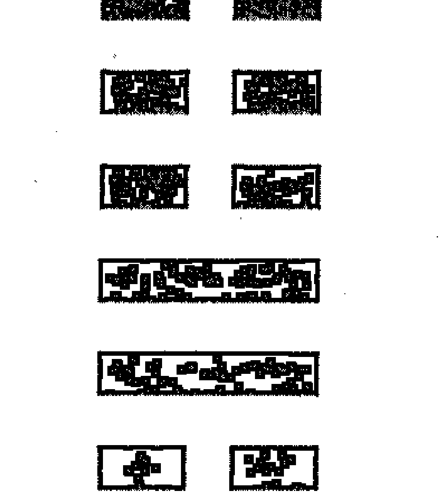

地风升，巽木克坤土，为鬼动，但巽中纳支辰巳，坤中纳支未申，其中巳与申合为鬼合，仕人升迁，有所干求，内里不宁，占病缠绵。卦中现官动，有官事之应。

#### 官禄全身课 进达卦

三合全，贵神克人元是也。

假令十二月，乙巳日，辰时，午位

壬水、天空土、功曹木、午火。

此课官动，求官得禄，常人进财，以财动故也。然亦有官事。

| 壬 |
| :--- |
| 丙戌 |
| 戊寅 |
| 午 |

##### 《金口透易·梅花占》卦例：

###### 雷山小过

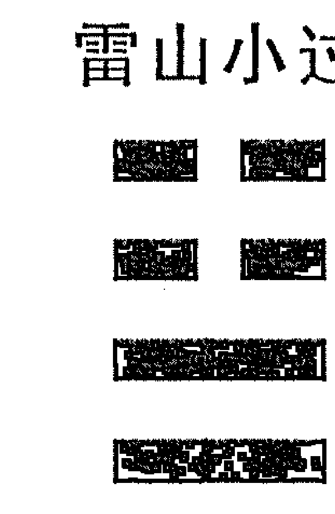

分析：雷山小过，贵神卦为兑，藏支为酉，将神卦为巽，藏支为辰、巳，地元卦为艮，藏支丑、寅，内三才巳酉丑会合金局，贵神兑克天元卦震，是为进达卦，卦中现妻妾动（问招卦），官动（明德卦），贼动（内贼卦）主有官事，内合动求官事，须防小人为患。

#### 全身课 从顺卦

三合全，无官鬼，无劫煞，只财爻动是也。

假令五月，甲子日，亥时，申位，壬水、天后水、天罡土、申金。主财，其为事吉。

| 壬 |
| :--- |
| 乙亥 |
| 戊辰 |
| 申 |

##### 《金口透易·梅花占》卦例：

地天泰

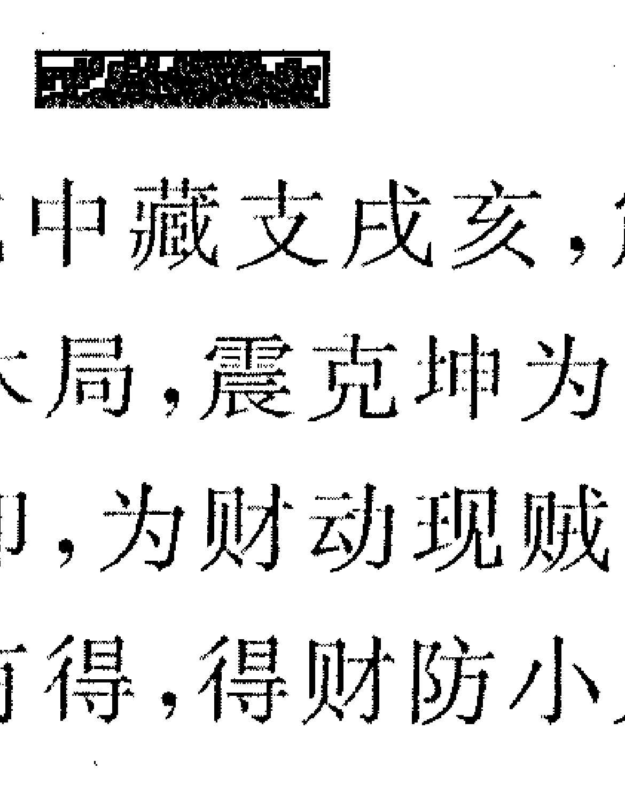

分析：地天泰卦，乾中藏支戌亥，震中藏支卯，坤中藏支未申，亥卯未合成木局，震克坤为财动，震中卯克坤中未，坤中申复克震中卯，为财动现贼神，主合作求财内有小人牵扯之象，求财有得，得财防小人。

#### 奇全课 利进卦

神干、将干、人元兼三奇全是也。

假令十二月，壬午日，寅时，巳位，

乙木、朱雀火、小吉土、巳火。
利求官禄，常人得财，乃大吉之课。

| 乙 |
| :--- |
| 丙午 |
| 丁未 |
| 巳 |

##### 《金口透易·梅花占》卦例：

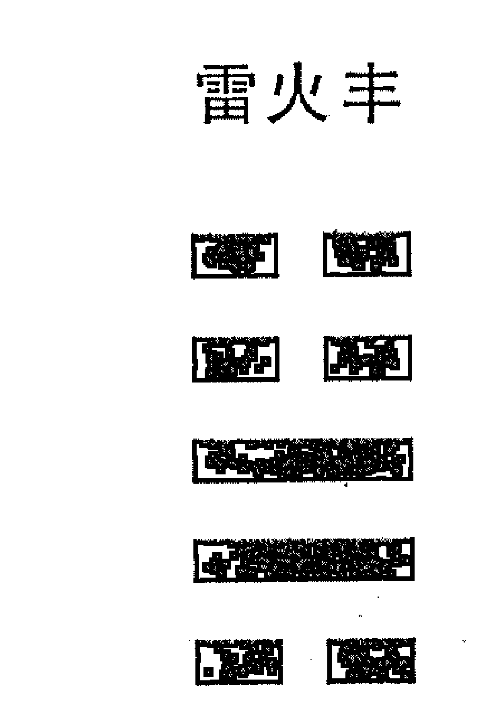

分析：本卦天元卦为震，为乙木正宫，将神卦为巽，为丁火正宫，地元卦为离，为丙火正宫，震巽离为三奇全，外来生内，主有人相约，但互见兑巽，须防口舌。

#### 朝元课 德载卦

四位本家事，假令四月，丙申日，丑时，丑位，己土、天乙土、大吉土、丑土。
常人非吉，无生故也。如朝觐诏对则吉，凡十二神将皆有朝元，各随其神将吉凶断之。土曰朝元，水曰朝宗，火曰重光，金曰满赢，木曰会极。

| 己 |
| :--- |
| 己丑 |
| 己丑 |
| 丑 |

##### 《金口透易·梅花占》卦例：

#### 乾为天

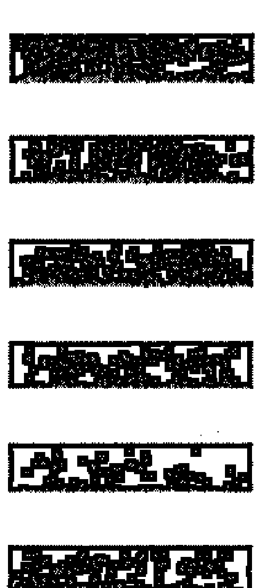

#### 分析：

此为德载卦中四金全的满赢卦，主无生无克，常人不利，兄弟动，求谋内有争竞，利朝觐上书。

#### 俱比课 合元卦

四位皆比是也。假令十二月，戊戌日，卯时，未位，己土、天空土、河魁土、未土。
比合为兄弟，主同类相争，又主事体重叠，占病大凶。此为杂配，分而为水曰稽，火曰燎，木曰忧颠，金曰丛刃，土曰坯户，更看神将性气以类断之。

| 己 |
| :--- |
| 壬戌 |
| 壬戌 |
| 未 |

##### 《金口透易·梅花占》卦例：

###### 山地剥

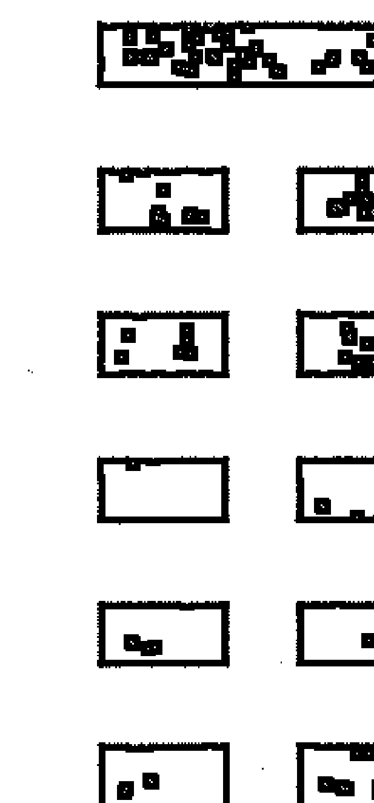

分析：此为坏户合元卦，其中兄弟发动，主事牵斗讼，迟滞不宁，坤中藏支为未申，艮中藏支为寅丑，卦中反吟，而有官动、鬼动、妻妾动之应，亦有事体纷争，牵连官事之象。

#### 正比课 首正卦

主客比是也。

假令十二月，戊戌日，未时，寅位，甲木、腾蛇火、小吉土、寅木。主其为自己事，无亲属之事，求知结好多吉。

| 甲 |
| :--- |
| 己巳 |
| 己未 |
| 寅 |

##### 《金口透易·梅花占》卦例：

###### 雷风恒

```
■■  ■■
■■  ■■
■■  ■■
■■  ■■
■■  ■■
■■  ■■
```

分析：雷风恒，天元卦为震为木，地元卦为巽为木，内外相比，是为正比，主事由亲戚，比肩之类，多有不成之象，互卦乾兑，为分局相克，官动主官事分争。

#### 近比课 为己卦

干神比是也。

假令十二月，甲午日，巳时，寅位，丙火、腾蛇火、从魁金、寅木。

主自己已事及亲属，然二火为灾百事残，更看所比吉凶断之。

| 丙 |
| :--- |
| 己巳 |
| 癸酉 |
| 寅 |

##### 《金口透易·梅花占》卦例：

###### 泽火革

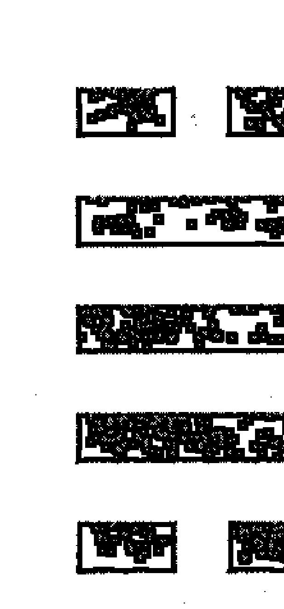

分析：泽火革，天元卦为兑为金，贵神卦为乾为金，此为干神比之为己卦，互见贼动内贼卦，内外见鬼动悔折卦，主事体牵连，事及亲戚。

#### 次比课 审认卦

神将比是也。

假令十二月，庚子日，戌时，戌位，丙火、玄武水、神后水、戌土。

主亲属之事，官动为官，妻动为妻，鬼动为鬼，以此类推。

| 丙 |
| :--- |
| 丙子 |
| 丙子 |
| 戌 |

##### 《金口透易·梅花占》卦例：

###### 雷天大壮


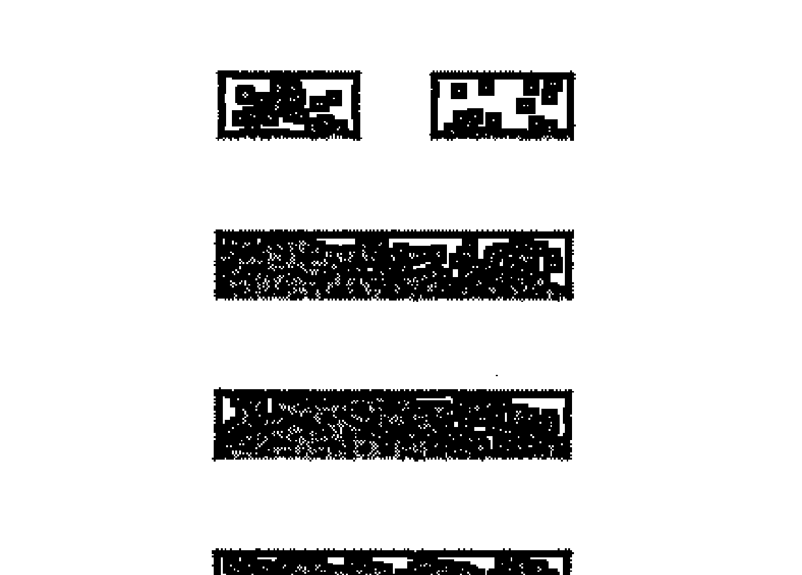

分析：雷天大壮，互卦为泽天夬，为贵神卦与将神卦相比，为审认卦，卦内现鬼动，官动，主官事，内三才见金三重，主内见争竞，官鬼两动，主求谋有竞争之象，事牵亲属之事。

#### 远比课 寄托卦

将与位比是也。
假令十二月，辛丑日，亥时，巳位，
癸水、六合木、胜光火、巳火。
主他人之事，六合主和合，仍以神断之。

| 癸 |
| :--- |
| 辛卯 |
| 甲午 |
| 巳 |

##### 《金口透易·梅花占》卦例：

###### 山天大畜

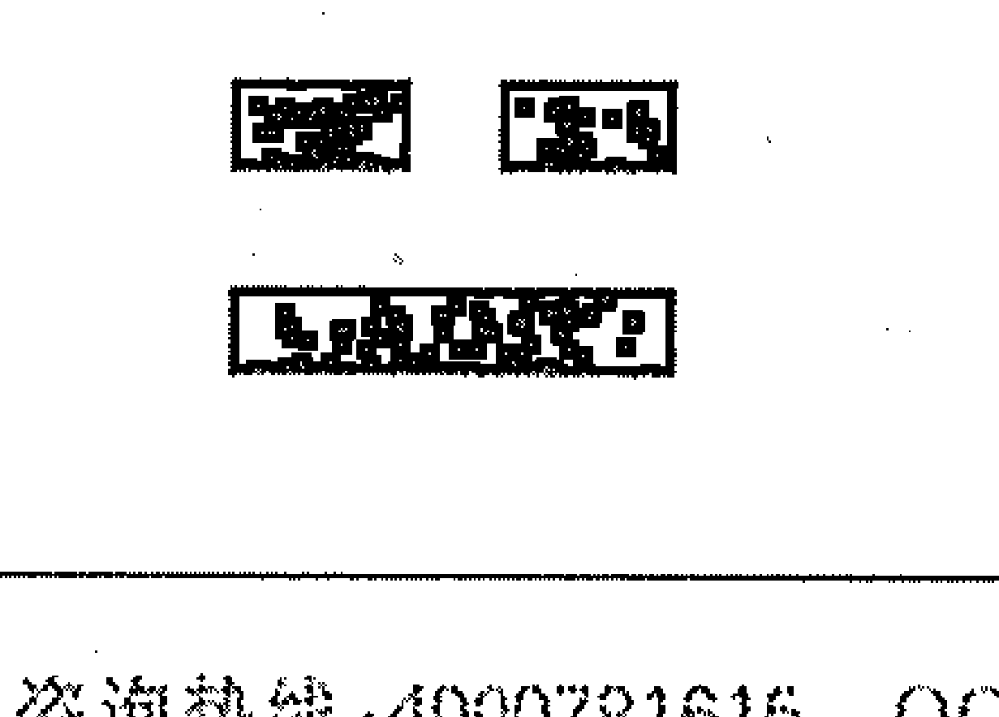

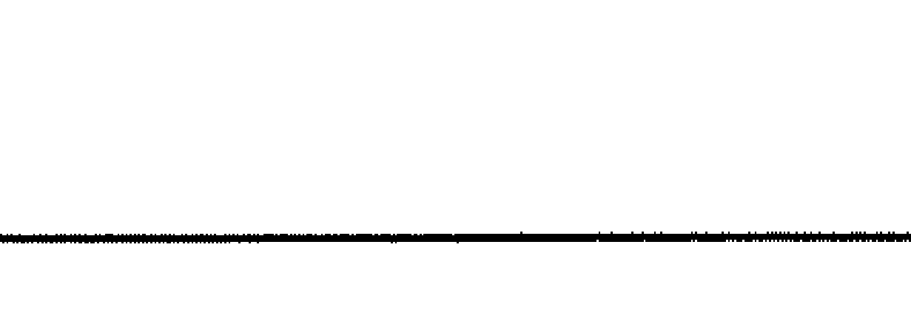

分析：此卦见山天大畜，天元卦为艮为山，地元卦为乾为天，外来生内，有人相约，互见财动(盈益卦)，为求财有得之事，将神卦与地元卦相比，为寄托卦，主事涉亲朋，所求有得。

#### 将位伏吟课 鼠伏卦

将与位同是也。
假令十二月，庚子日，子时，辰位，
庚金、六合木、天罡土、辰土。
主百事不动，望人即至，逃亡隐伏未至。

| 庚 |
| :--- |
| 己卯 |
| 庚辰 |
| 辰 |

##### 《金口透易·梅花占》卦例：

###### 泽天夬

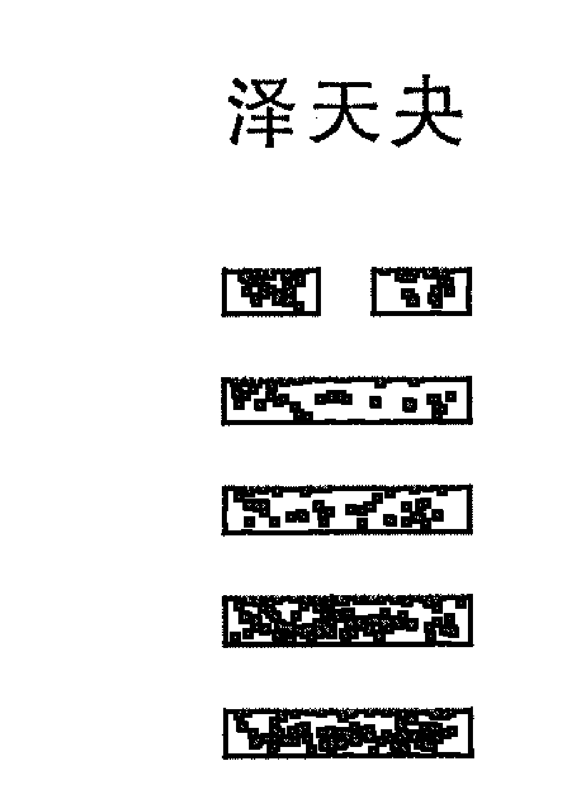

分析：泽天夬，天元卦为兑，地元卦为乾，将神卦亦为乾，测行人立至，测逃亡则隐伏他乡，事体牵连，犹豫不决之象。

#### 神将伏吟课 犹豫卦

天干克将神，神将伏吟克位是也。
假令十二月，庚子日，丑时，辰位
庚金、六合木、太冲木、辰土。
心欲动而身未动，心欲合而身不合，疑惑不决。

| 庚 |
| :--- |
| 己卯 |
| 己卯 |
| 辰 |

##### 《金口透易·梅花占》卦例：

###### 泽风大过

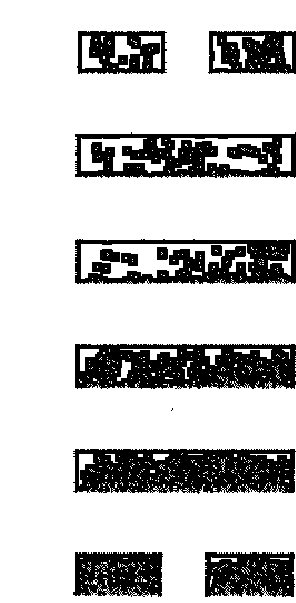

分析：此卦可以理解为神将伏吟课，互卦重乾，贵神卦位为心，将神卦位为身，元士位为宅，外三才重重属金，所谓二金刑克都无顺，此见三金，重重克宅，必主家宅不宁，测事将行不行，犹豫不决之象。

#### 反吟课 动摇卦

将位相冲是也。

假令十二月，庚子日，午时，戌位

丙火、玄武水、天罡土、戌土。

主事反复，吉凶多不成，来去动摇，莫获安定，人亡则远。

| 丙 |
| :--- |
| 丙子 |
| 庚辰 |
| 戌 |

##### 《金口透易·梅花占》卦例：

#### 天风姤

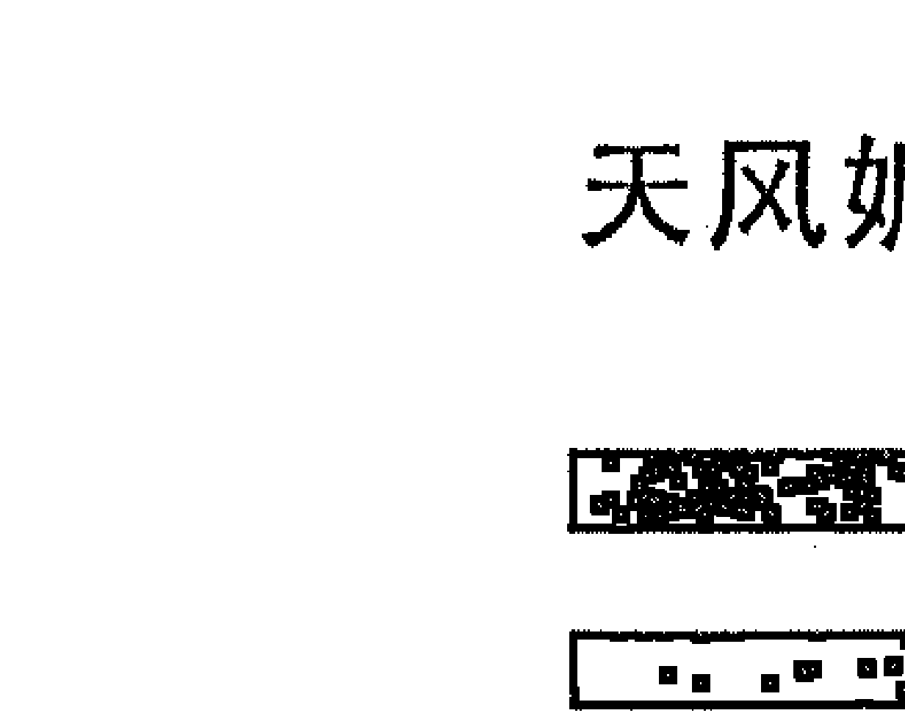

分析：天风姤，天元卦为乾为天，地元卦为巽为风，将神卦为乾，与地元卦反吟，内三才重重克下，主事体反复，来去动摇，心绪不宁，压力大，家中物品破耗，此卦见兄弟动(稽滞卦)主小有争竞，事牵亲朋。

#### 神将反吟课 乖运课

神将相冲是也。

假令十二月，庚子日，申时，酉位

乙、太常土、太吉土、酉金。

此课主内外事多不和，事多迅速。

| 乙 |
| :--- |
| 癸未 |
| 丁丑 |
| 酉 |

##### 《金口透易·梅花占》卦例：

###### 泽山咸

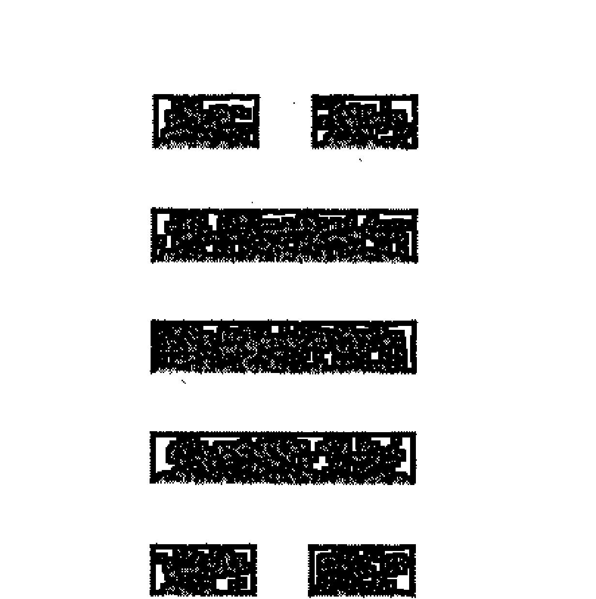

分析：此卦地元卦为艮为山为土，天元卦为兑为泽为金，内来生外，为宝成卦，互见乾巽，为神将反吟乖运卦，又为贼动（内贼卦），主动则迅速，事体内有不宁，测感情主私情。

#### 反鬼入门课 飞祸卦

神将反吟，门户相见是也。

假令十二月，庚子日，申时，亥位，
丁火、太阴金、太冲木、亥水。
占事不成，病者无凶。

| 丁 |
| :--- |
| 乙酉 |
| 己卯 |
| 亥 |

##### 《金口透易·梅花占》卦例：

###### 山风蛊

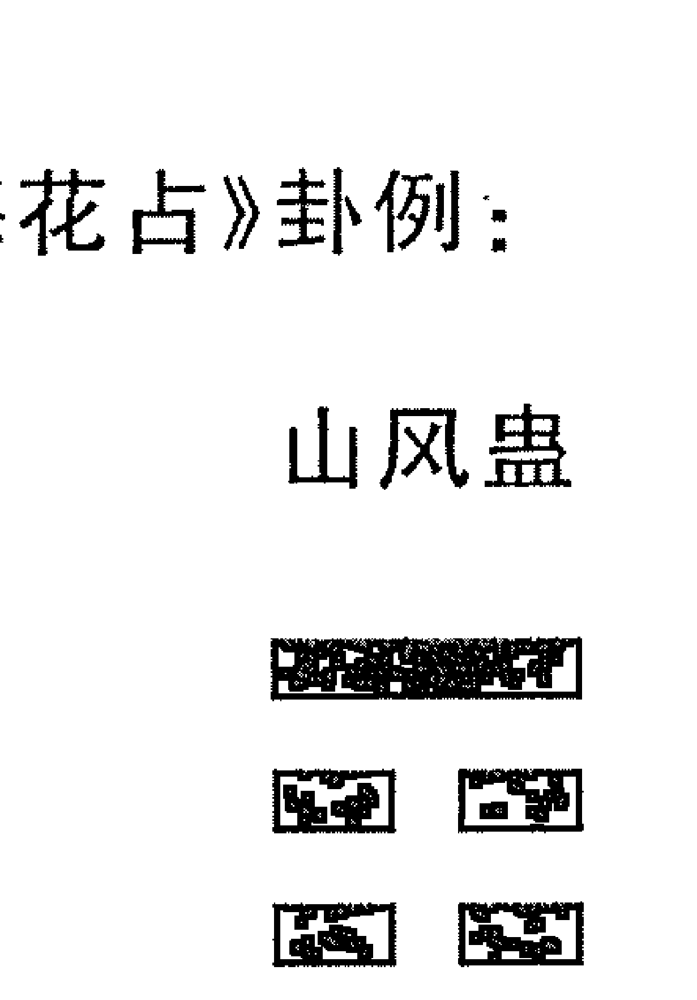

分析：本卦山风蛊，天元卦为艮为土，地元卦为巽为木，互见震兑，震中藏支卯木，兑中藏支酉金，卯酉反吟，门户相见，卦见财动(盈益卦)鬼动(悔折卦)主乱动不宁，占事有阻。

#### 关课 堵塞卦

酉上见木为关。

假令十二月，己未日，未时，酉位，
癸水、玄武水、功曹木、酉金。
主出行不通，占行人不至，囚禁难出，病孕必有隔。

| 癸 |
| :--- |
| 甲子 |
| 丙寅 |
| 酉 |

##### 《金口透易·梅花占》卦例：

#### 风泽中孚

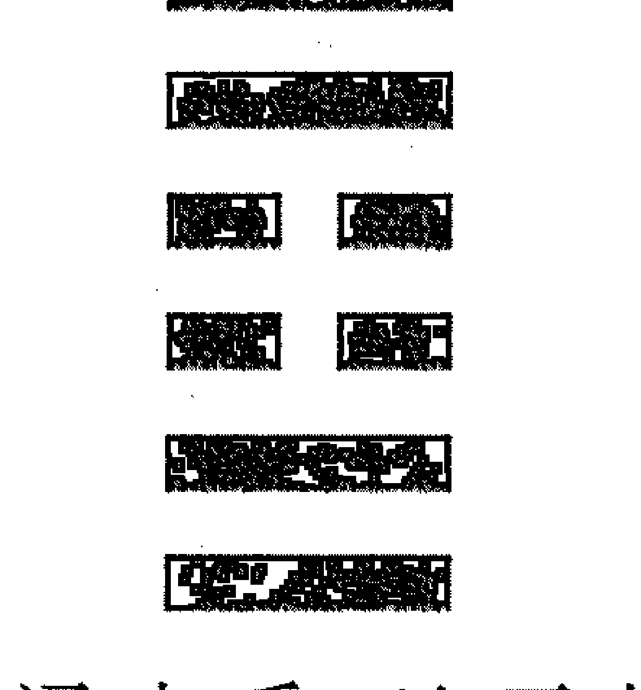

分析：主卦为风泽中孚，地元卦为兑，本位藏支为酉，将神卦为震为木，为酉上见关，主出行不通，行人难至，卦现鬼动(悔折卦)，互现财动(盈益卦)，有外出求财之象，求谋见关，出行有阻，内有不宁，卯酉双见，又主门户相争。

#### 隔课 乖越卦

卯上见土为隔。
假令十二月，甲午日，巳时，卯位
丁火、朱雀火、河魁土、卯木。
卯为门，以木土塞之，所以为隔也，主参投谒人不见，出行囚禁，病孕皆不利。

| 丁 |
| :--- |
| 庚午 |
| 甲戌 |
| 卯 |

##### 《金口透易·梅花占》卦例：

###### 地雷复

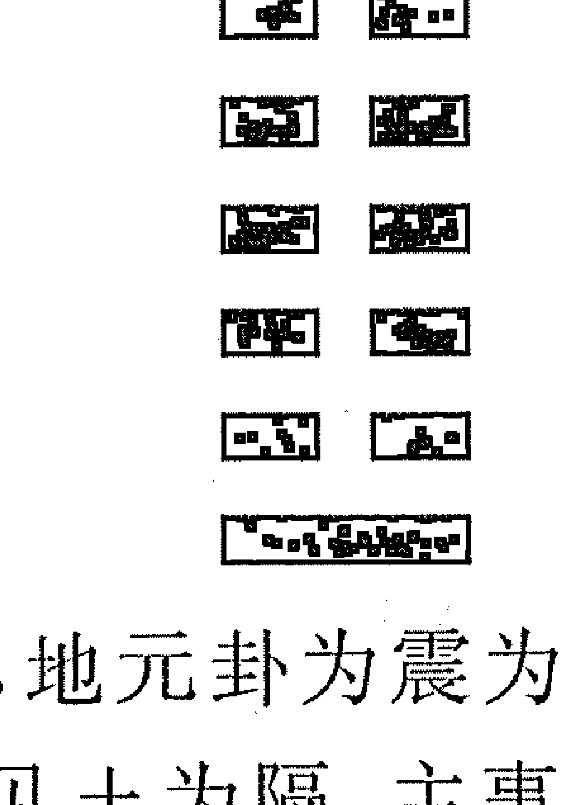

分析：地雷复，地元卦为震为雷，内藏支卯木，将神卦为坤为土，木上见土为隔，主事体有阻，迟滞不行，外三才重重见土，亦主事体伏吟，晚成。

#### 锁课 构囚卦

卯上见金为锁。

假令十二月，丁卯日，午时，卯位，癸水、勾陈土、从魁金、卯木。

此课占囚禁行人病孕，皆主不利。

| 癸 |
| :--- |
| 甲辰 |
| 己酉 |
| 卯 |

##### 《金口透易·梅花占》卦例：

###### 山雷颐

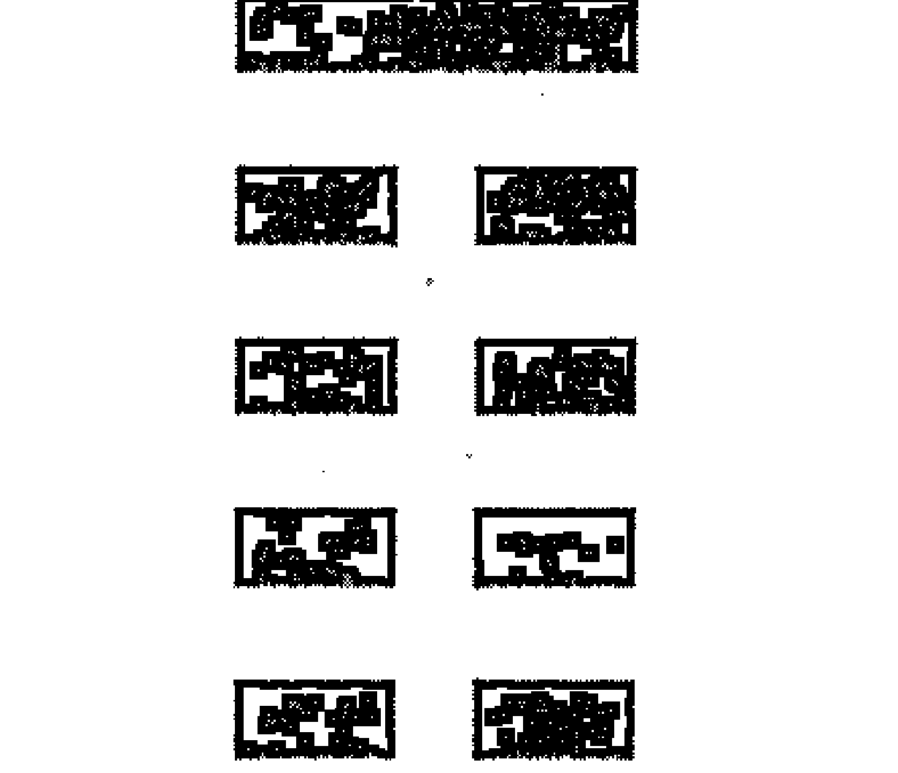

分析：山雷颐，地元卦为震，藏支卯木，将神卦为坤，藏支未申，卯见申为锁，卦现鬼动，内有争竞之象，外三才土行伏吟，木上见土又为隔，隔锁两重，必主事体有阻。囚禁行人病孕，皆主不利。

#### 斩关课 避罪卦

关上见金为斩关。

假令六月，辛卯日，子时，酉位，

丁火、白虎金、太冲木、酉金。

主凶中得吉，避罪逃亡，尤利孕病，通达出行无阻隔。

| 丁 |
| :--- |
| 丙申 |
| 辛卯 |
| 酉 |

##### 《金口透易·梅花占》卦例：

#### 山泽损

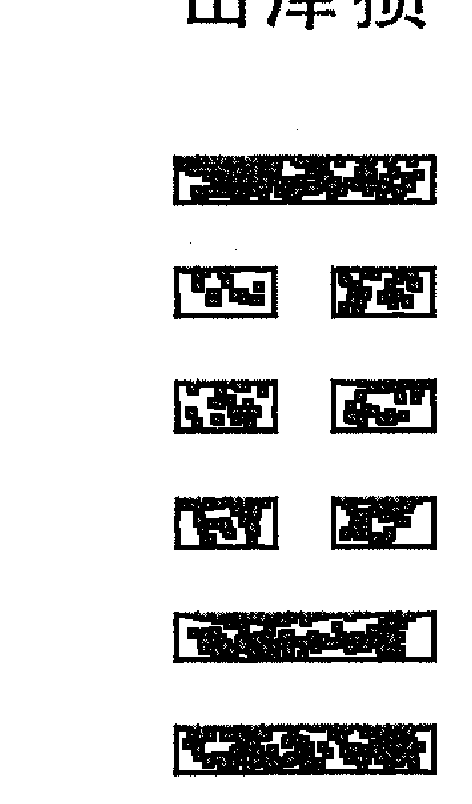

分析：山泽损，地元卦为兑，内藏支为酉，将神卦为震，内藏支为卯，金上见木为关，贵神卦为坤，内藏支未、申，申见关为斩关，卦见子孙动(恩庆卦)，财动(盈益卦)，主外来生内，求财有得，但行中有阻，小有争竞，卦内有斩关，逢凶化吉之象，卦藏支官动贼动，求官反复。

#### 毁隔课 脱面卦

隔上见木为毁隔。
假令十二月，乙亥日，亥时，卯位
丁火、青龙木、天罡土、卯木
主凶中得吉，囚禁病孕，求事皆无阻。

| 丁 |
| :--- |
| 丙寅 |
| 戊辰 |
| 卯 |

##### 《金口透易·梅花占》卦例：

###### 泽雷随

分析：泽雷随，地元卦为震为木，内藏卯木为门户，将神卦为艮为土，木见土为隔，贵神卦为巽，为木，隔上见木为毁隔，主阻隔有解，求谋得脱，主卦外来克内，为妻妾动（问招卦），又主外来侵扰，合局相克，事关口舌。

#### 叩键课 天解卦

锁上见火为叩键。
假令十二月，庚子日，未时，卯位，己土、朱雀火、传送金、卯木。
主囚禁遇赦罪，然凶中得吉兆也。

| 己 |
| :--- |
| 壬午 |
| 甲申 |
| 卯 |

##### 《金口透易·梅花占》卦例：

###### 巽为风


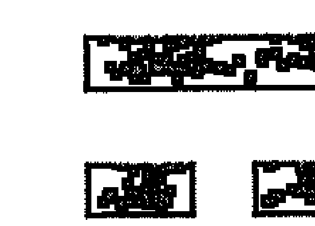

分析：巽为风，地元卦为巽为木，将神卦为兑为金，木上见金为锁，贵神卦为离为火，锁上见火为叩键课，主囚禁遇赦，凶中得吉，卦中现贼动（内贼卦），求谋不利，兄弟动（稽滞卦），小有争竞，事涉亲朋。

#### 官合课 得禄卦

贵神与人元合是也。

假令十二月，丙申日，辰时，巳位

癸水、天空土、大吉土、巳火。

主官士得禄，常人进产，亦主官事动。

| 癸 |
| :--- |
| 戊戌 |
| 己丑 |
| 巳 |

### 《金口透易・梅花占》卦例：

###### 火风鼎

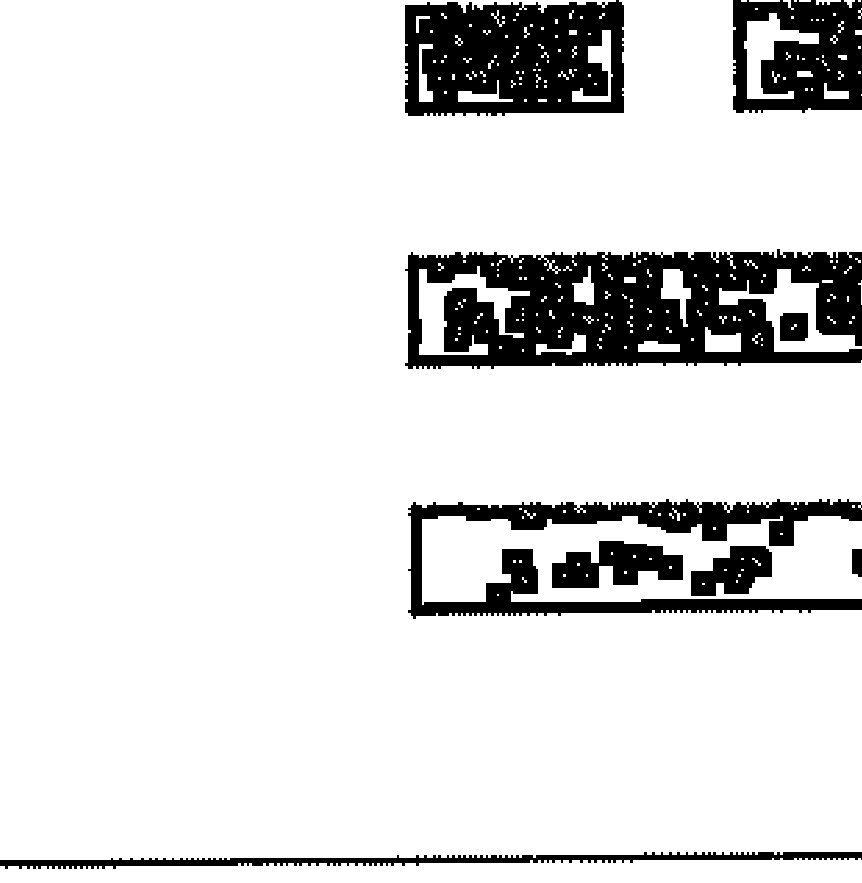

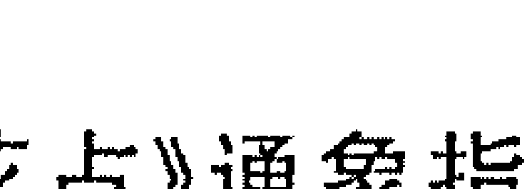

分析：火风鼎，天元卦为离，为丙之寄宫，贵神卦为兑为辛之正宫，卦内见丙辛合，为官合课，主官事合动，内来生外，有所干求，谒贵之象。

#### 正合课 如兰卦

神将支合，主客无克是也。
假令十二月，甲午日，申时，巳位
己土、勾陈土、从魁金、巳火。
此课主亲属和会，人财相庆之喜。

| 己 |
| :--- |
| 戊辰 |
| 癸酉 |
| 巳 |

##### 《金口透易·梅花占》卦例：

###### 火风鼎

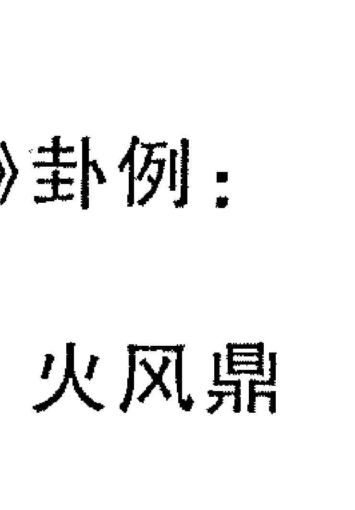

分析：离为火，贵神卦为兑，藏支为酉，将神卦为巽，藏支辰、巳，以辰与酉合，为正合课，亲属合和，人财喜。

庆，卦内贵神卦克将神卦，为贼动（内贼卦），主求谋牵连，内有不宁，将神卦藏支巳与贵神卦藏支酉半合财动（盈益卦），为事牵亲朋求财，求而不得，内有争竞，离卦内外离火兄弟动（稽滞卦）亦为事牵斗讼，亲朋口舌之象。

#### 鬼合课·鬼同卦

主课相刑，神将支合是也。

假令十二月，庚子日，申时，巳位

辛金、勾陈土、从魁金、巳火。

主人出外，占病即凶，占宅有怪祟。

| 辛 |
| 庚辰 |
| 乙酉 |
| 巳 |

##### 《金口透易·梅花占》卦例：

###### 水山蹇

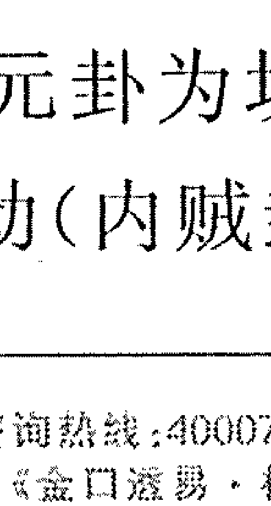

分析：水山蹇，天元卦为坎为水，地元卦为艮为山，地元卦克天元卦为鬼动（内贼卦）坎卦藏支子水，艮卦藏支寅木，子水生寅木为鬼动生起（祸生卦），亦为内乱招外祸之象。

支丑、寅，丑与子合，为克中有合，将神卦克贵神卦为财动（盈益卦），主与人合作，外出求财。

#### 日时比合课·结绥卦

将与干皆比是也。

假令十二月，癸卯日，戌时，戌位
壬水、白虎金、神后水、戌土。
主人有趋向贵人，有非常推擢之兆，然先背而后向也。

| 壬 |
| 庚申 |
| 壬子 |
| 戌 |

##### 《金口透易·梅花占》卦例：

###### 水火既济

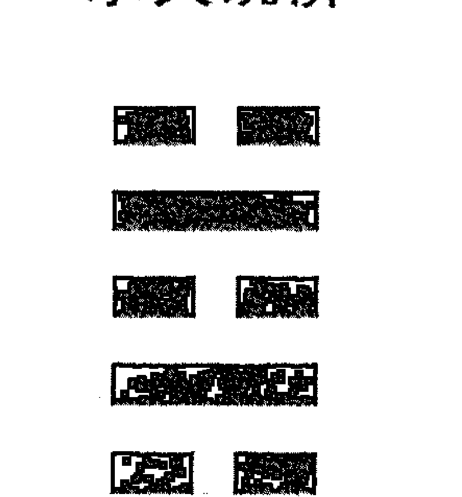

分析：结绥卦的含意是，将神课与天元课同，是以有以身趋近贵人之意，此卦水火既济，以天元卦为坎为水，将神卦为坎为水，是为结绥卦，卦中贵神卦为离火，将神卦为坎水，水来克火，为财动（盈益卦），外来克内，为妻妾动（问招卦），主求财有得，却有外来取索之患，先得后破之象，将神卦与天元卦同比，有趋近贵人，以得时机之意。

#### 空亡课·蒿目卦

三位落空是也。

假令十二月，丙申日，丑时，巳位

癸水、勾陈土、天罡土、巳火。

主身心疑惑，求事皆不成。

| 癸 |
| 壬辰 |
| 壬辰 |
| 巳 |

##### 《金口透易·梅花占》卦例：

2005年08月11日16时38分 乙酉年甲申月丁卯日戊申时

###### 泽天夬

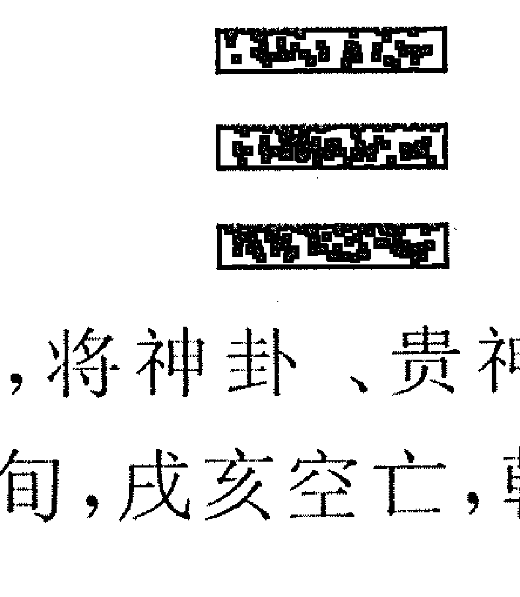

分析：泽天夬，将神卦、贵神卦、地元卦皆为乾为天，丁卯日为甲子旬，戌亥空亡，乾宫本位空亡，故为蒿目卦，有极目远望，不知行止，心生忧戚之意，主事体不成，进退不定。

#### 鬼空课·稂莠卦

神将六合，位落空亡，鬼动是也。
假令十二月，乙巳日，未时，寅位
戊土、朱雀火、小吉土、寅木。
主求事有名无实，先忧危，终得吉。

| 戊 |
| 壬午 |
| 癸未 |
| 寅 |

##### 《金口透易·梅花占》卦例：

2005年08月26日16时
乙酉年 甲申月 壬午日 戊申时（申酉空）

###### 雷地豫

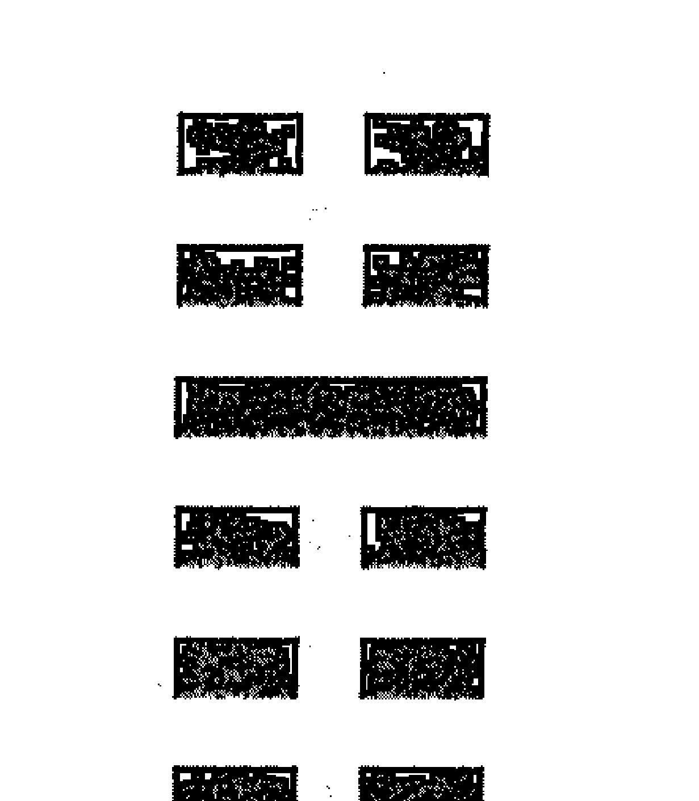

分析：本卦雷地豫，天元卦为震为雷，地元卦为坤，震中藏支卯木，坤中藏支未、申，震克坤、卯克未为妻妾动（间招卦），坤中申克震中卯为鬼动（悔折卦），壬午日甲戌旬，申酉空亡，卦中坎水藏支子与艮卦藏支丑相合，故为鬼空课，主求事事体不实，欲出不得，外来制内，求财动而逢合为财有羁留之象或合作求财之事，防外贼。

#### 四大空亡课·病败卦

甲子、甲午旬水绝，课中见水；甲申、甲寅旬金绝，课中见金。

假令十二月戊戌日戊位，壬水、玄武水、神后水、戊土，主事吉凶皆不成。

| 壬 |
| 壬子 |
| 壬子 |
| 戊 |

##### 《金口透易·梅花占》卦例：

2007年09月21日8时
丁亥年 己酉月 戊午日 丙辰时

###### 雷地豫

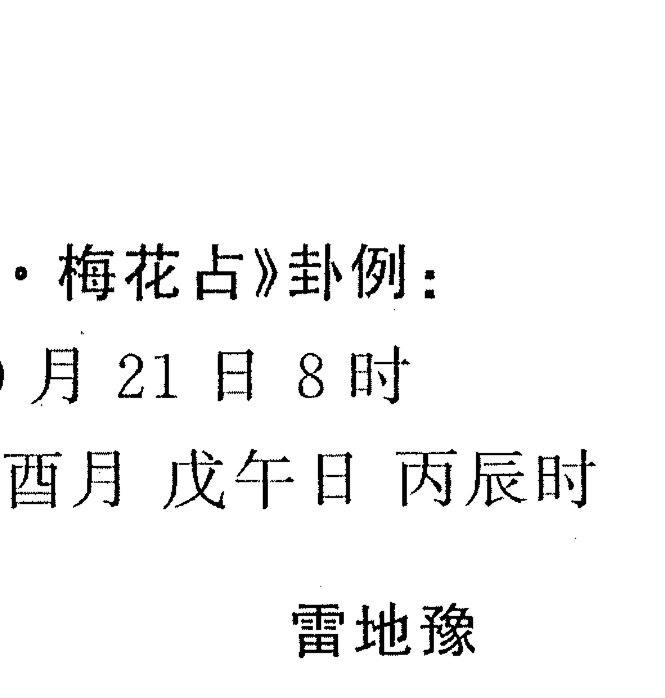

分析：天风姤，贵神卦、将神卦、天元卦皆为乾，属金，戊午日为甲寅旬，寅申旬中，金大空亡，乾金空亡，吉凶不成，外三才重重逢空伏吟，外多不实，卦中现父母动（宝成卦）子孙动（恩庆卦）妻妾动（问招卦）官动（明德卦）财动（盈益卦）贼动（内贼卦）为四象乱动，心绪不宁，有人取索之事，外来谋内，有经官动府之应，终却无妨。

#### 分局相生课·双宜卦

神生干、将生位是也。
假令十二月己亥日辰时午位
庚金、天空土、功曹木、午火。
主一事分为二事，所趋各异而皆吉。

| 庚 |
| 甲戌 |
| 丙寅 |
| 午 |

##### 《金口透易·梅花占》卦例：

###### 风天小畜

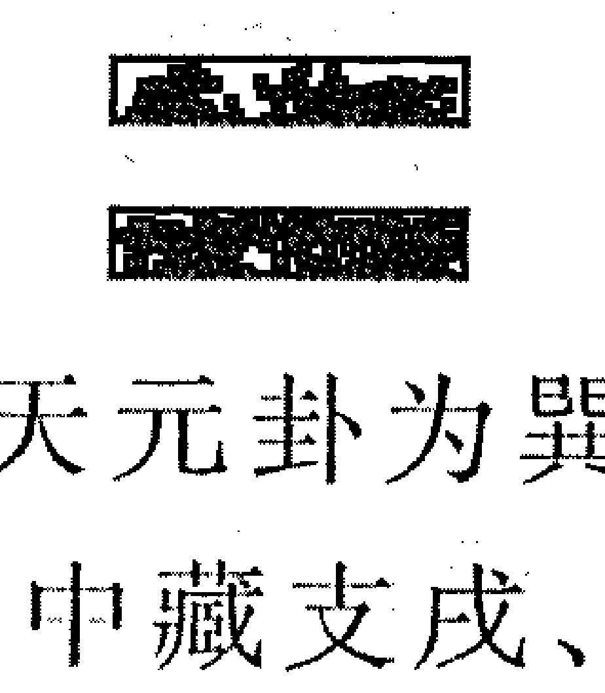

分析：风天小畜，天元卦为巽为木，地元卦为乾为金，巽中藏支辰、巳，乾中藏支戌、亥，贵神卦为离为火，藏支为午，将神卦为兑为泽，藏支酉，贵神卦中午火生天元卦中辰土，将神卦中酉金生地元卦中亥水，是为分局相生，主一事分而为二，卦见贼动（内贼卦），鬼动（悔折卦）事见争竞不宁。

#### 分局相克课·孤别卦

神克干、将克位是也。
假令十二月己丑日午时巳位
己土、青龙木、登明水、巳火。
主事一分为二，君子吉，小人凶。

| 己 |
| 丙寅 |
| 乙亥 |
| 巳 |

##### 《金口透易·梅花占》卦例：

###### 火泽睽

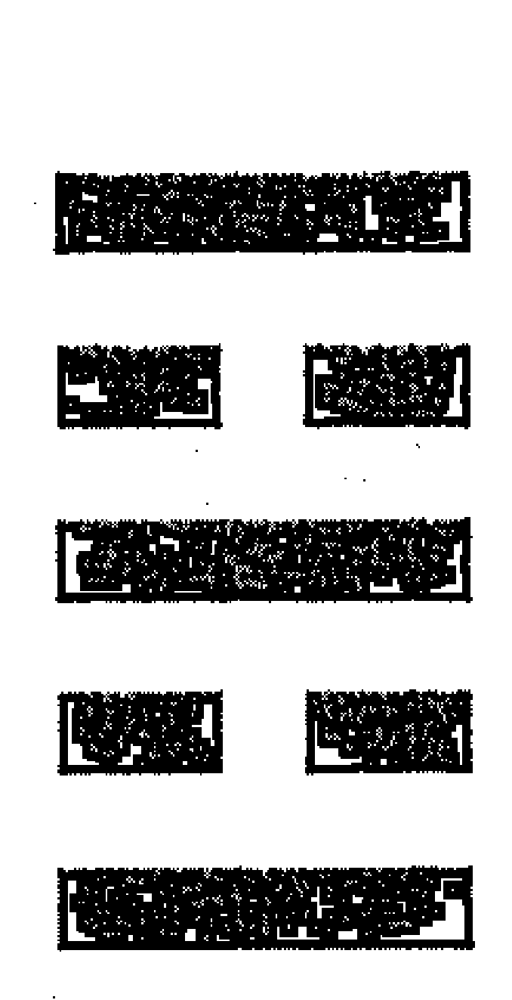

分析：火泽睽，天元卦为离为火，贵神卦为坎为水，将神卦为离为火，地元卦为兑为金，贵神卦克天元卦，将神卦克地元卦，是为分局相克，主事体两分，内有争竞不和，安吉守份为好，卦见官动（明德卦）贼动（内贼卦），官事争竞。外来克人，他人取索之象。

#### 合局相生课·同德卦

干生神、位生将是也。

假令十二月庚子日巳时午位 壬水、青龙木、大吉土、午火。

主两事合为一事，又其为事吉，内外并力，合谋相与。

| 壬 |
| 戊寅 |
| 丁丑 |
| 午 |

##### 《金口透易·梅花占》卦例：

###### 火泽睽

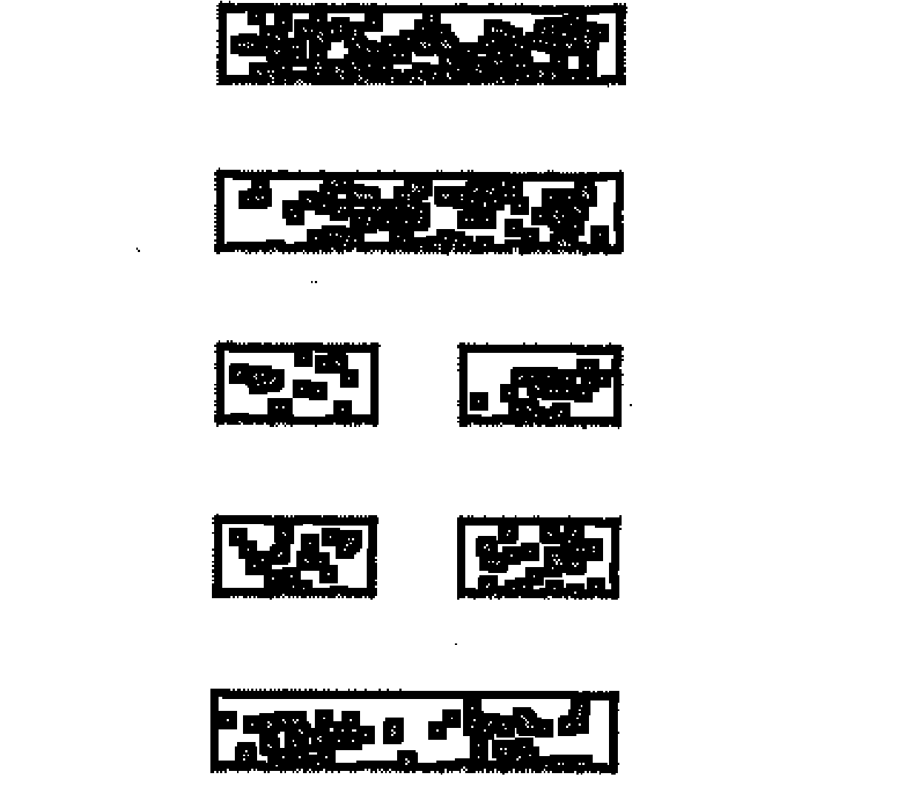

分析：风水涣，天元卦为巽为风，藏支辰、巳，贵神卦为艮，藏支丑、寅，将神卦为震，藏支为卯，地元卦为坎，藏支为子，卦中巽中巳火生艮中丑土，坎中子水生震中卯木，是为合局相生，主一事两方着力，共进之象，卦中现财动，父母动，有所干求，外出求财之象，其事当主两端。

#### 合局相克课·内溃卦

干克神、位克将是也。

假令十二月乙未日申时巳位

辛金、青龙木、从魁金、巳火。

主和中不和，其为事，先喜而后不和。

| 辛 |
| 戊寅 |
| 乙酉 |
| 巳 |

##### 《金口透易·梅花占》卦例：

###### 天水讼

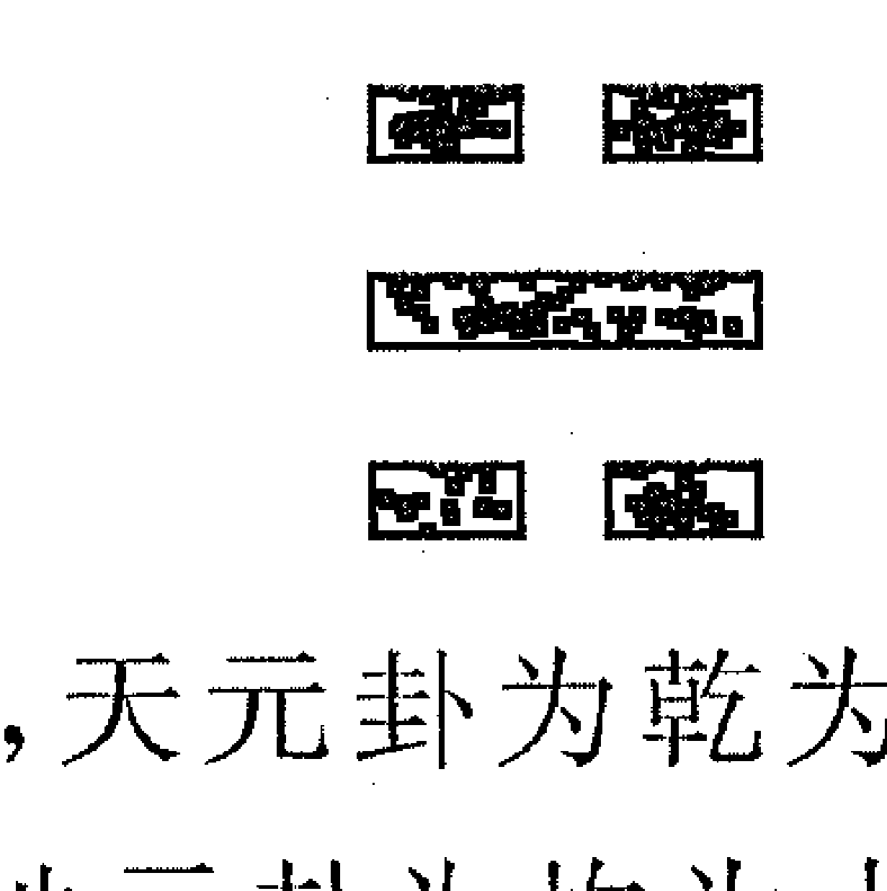

分析：天水讼，天元卦为乾为金，贵神卦为巽为木，将神卦为离为火，地元卦为坎为水，天元卦克贵神卦，地元卦克将神卦，是为合局相克，主事体合而不合，事立两端，卦现子孙动（恩庆卦）主外来生内，须借外力。

#### 连茹课·窜升卦

即寅卯辰三位相连是也。

假令十二月庚辰日酉时寅位

戊土、勾陈土、太冲木、寅木。

主事体重叠不一，而此名顺连茹，事体多顺，主将来之事也。若方是午，将是巳，神是辰，则为逆连茹，事体多逆，主以往之事。

| 戊 |
| 庚辰 |
| 己卯 |
| 寅 |

##### 《金口透易·梅花占》卦例：

###### 震为雷

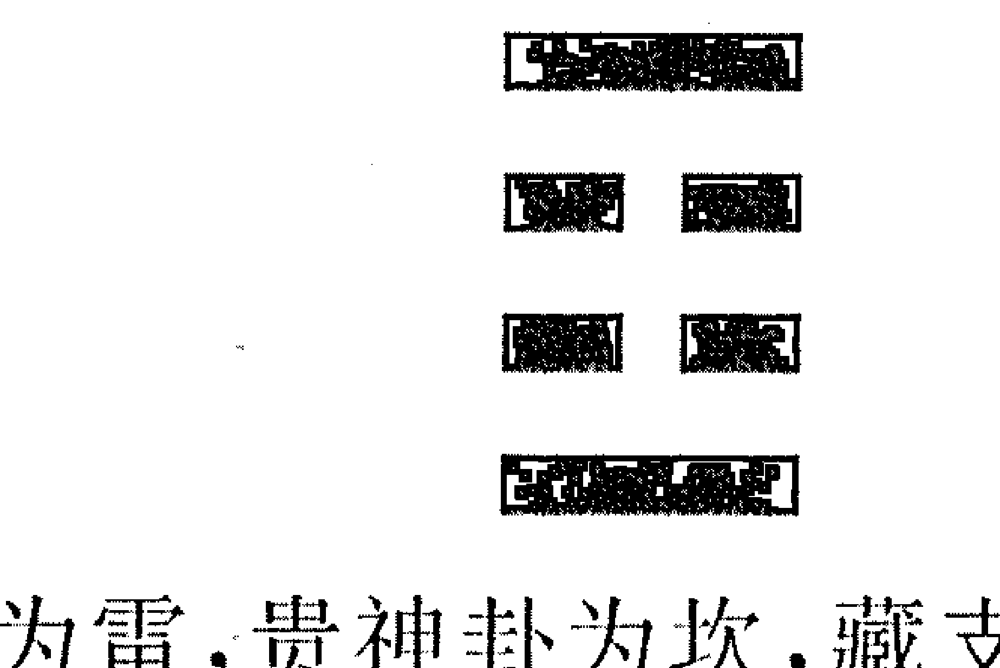

分析：震为雷，贵神卦为坎，藏支为子，将神卦为艮，藏支丑、寅，地元卦为震，藏支为卯，坎、艮、震三卦为逆连茹，主体多逆，卦中见财动（盈益卦），兄弟动（稽滞卦）为求财有阻，不定之象。

#### 陞升相生课·云腾卦

自下次第生上是也。

假令十二月辛丑日酉时寅位

庚金、勾陈土、太乙火、寅木。

主有人出外远去，求事得喜庆也。

| 庚 |
| 壬辰 |
| 癸巳 |
| 寅 |

##### 《金口透易·梅花占》卦例：

###### 泽山咸

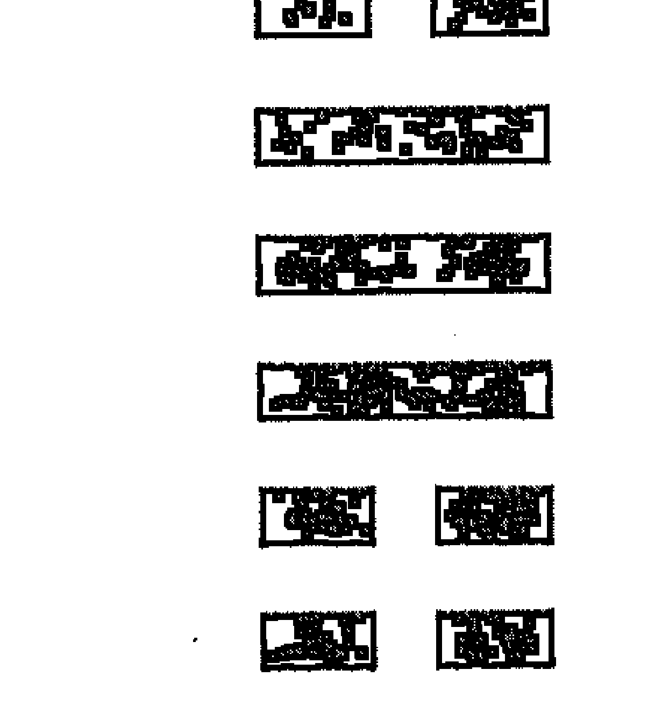

分析：泽山咸，地元卦为艮，藏支寅、丑，将神卦为巽，藏支辰、巳，贵神卦为乾，藏支戌、亥，天元卦为兑，藏支为酉，以艮中寅生巽中巳生乾中戌生兑中酉，为自下次第生上，主有人出外，求谋重重干求之象。

#### 陞升相克课·促装卦

自下次第克上是也。

假令五月壬子日申时丑位，

辛金、朱雀火、神后水、丑土。
主逼迫出外之事，又主身有口舌官鬼之灾，以次第克人元之故也。

| 辛 |
| 丙午 |
| 庚子 |
| 丑 |

##### 《金口透易·梅花占》卦例：

###### 水泽节

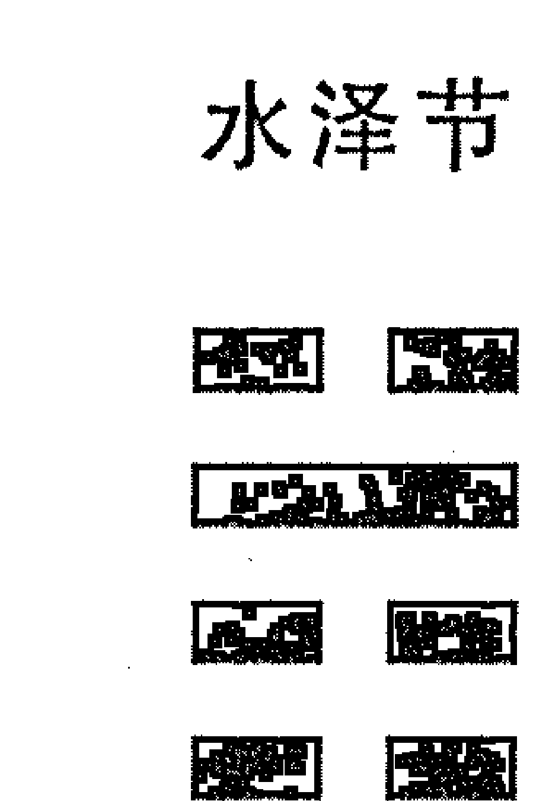

分析：水泽节，地元卦为兑克将神卦震，将神卦震克贵神卦艮，贵神卦艮克天元卦坎，此为陞升相克，为促装卦，主逼迫出外之事，卦内见财动（盈益卦）、官动（明德卦）、父母动（宝成卦），主出外见官求财，防口舌是非之事。

#### 复盃相生课·两降卦

自上次第生本位是也。

假令六月乙卯日戌时子位

丙火、太常土、传送金、子水。

主自外添进人口、财帛，又主行人归。

| 丙 |
| 癸未 |
| 甲申 |
| 子 |

##### 《金口透易·梅花占》卦例：

###### 泽火革

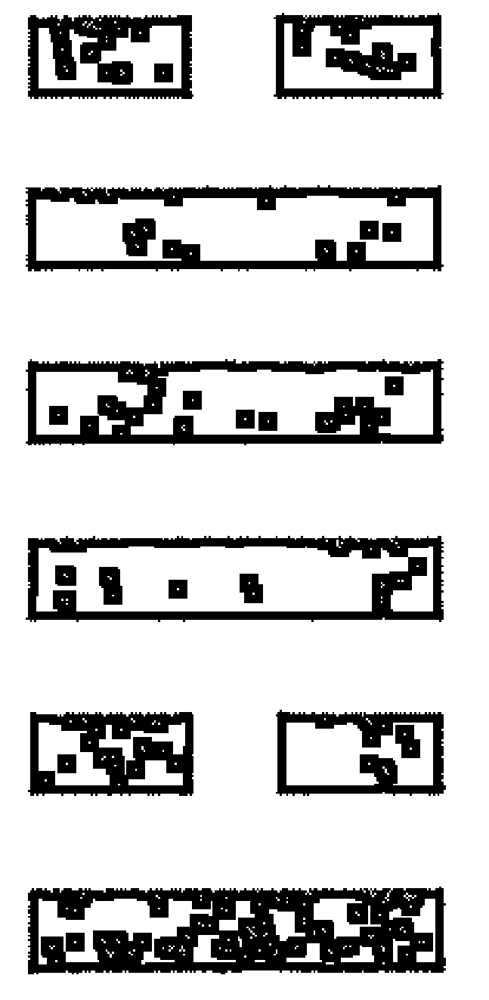

分析：泽火革，天元卦为兑，为辛金正宫，贵神卦为乾为壬水正宫，将神卦为巽为乙木寄宫，地元卦为离为丁火正宫，辛金生壬水，壬水生乙木，乙木生丁火，是为覆孟相生，主有添人进口之事，卦见贼动（内贼卦）鬼动（悔折卦）不利求财。

#### 复孟相克课·寇攘卦

自上次第克本位是也。
假令十二月乙未日申时戌位
丙火、太阴金、功曹木、戌土。
此主迫而还乡，及求索以至口舌。

| 丙 |
| 乙酉 |
| 戊寅 |
| 戌 |

##### 《金口透易·梅花占》卦例：

###### 火山旅

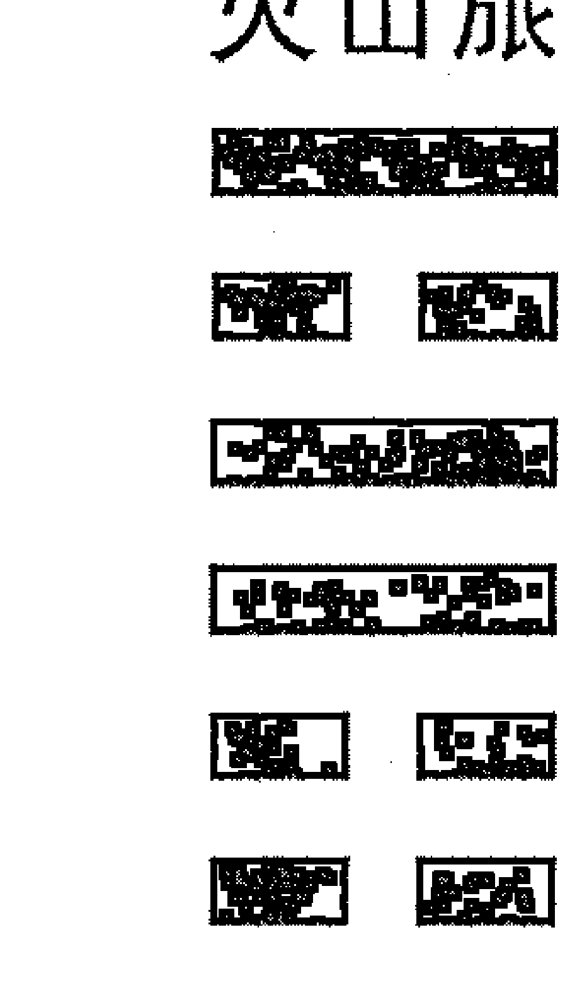

分析：火山旅，天元卦为离为火，贵神卦为兑为金，将神卦为巽为木，地元卦为艮为土，自外向内重重克内，主外来取索，卦内现贼动（内贼卦）主内有争竞，勾连牵扯，现子孙动（恩庆卦），有贵人相助之象或主文书之事。

#### 并来克身课·沉深卦

三水克人元火是也。

假令十二月乙未日亥时亥位

丁火、玄武水、神后水、亥水。

主身灾祸、人离散之事。凡三金克木名血刃，三火克金名烬骨，三木克土名缪线，三土克水名宝泽。更以所克神意断。

| 丁 |
| 丙子 |
| 丙子 |
| 亥 |

##### 《金口透易·梅花占》卦例：

###### 雷天大壮

分析：雷天大壮，天元卦为震为木，受贵神卦兑金、将神卦乾金、地元卦乾金三金之克，为三金克木之血刃卦，主身有灾祸，远行官事。

#### 并来克位课·泉涸卦

上三土并克位是也。

假令十二月辛未日申时子位

戊土、天乙土、天罡土、子水。

主迅速争斗之事，及人来取索。三水克火曰灭光，三火克金曰破模，三金克木曰破斧，三木克土名祈福，亦以神理断之。

| 戊 |
| 己丑 |
| 壬辰 |
| 子 |

##### 《金口透易·梅花占》卦例：

###### 泽风大过

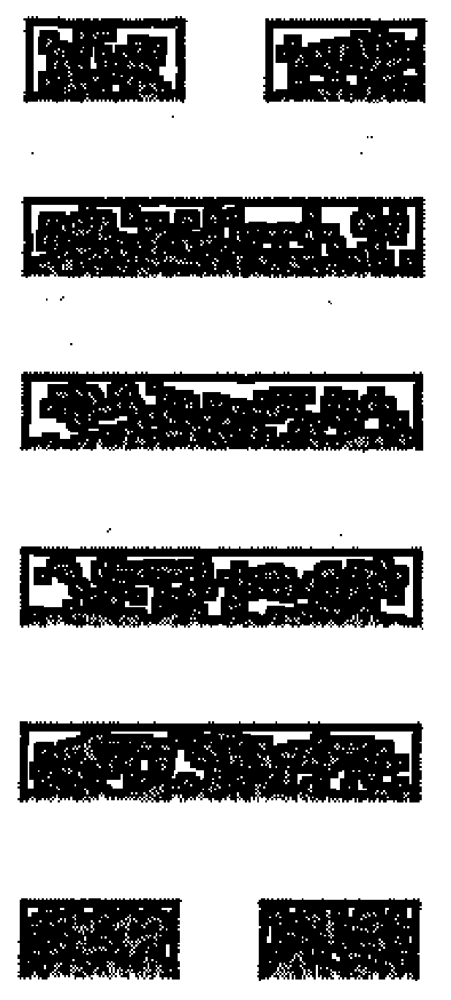

分析：泽风大过，天元卦、贵神卦、将神卦皆属金，地元卦属木，三金克一木，为破斧卦，主刀兵之患，又主小口伤灾，不宜出行。

#### 归身相克课·被剋卦

人元克三位是也。

假令十二月丙申日酉时未位

乙木、太常土、河魁土、未土。

此课主取索迫剥，外来克内故也。

| 乙 |
| 乙未 |
| 戊戌 |
| 未 |

##### 《金口透易·梅花占》卦例：

###### 泽风大过

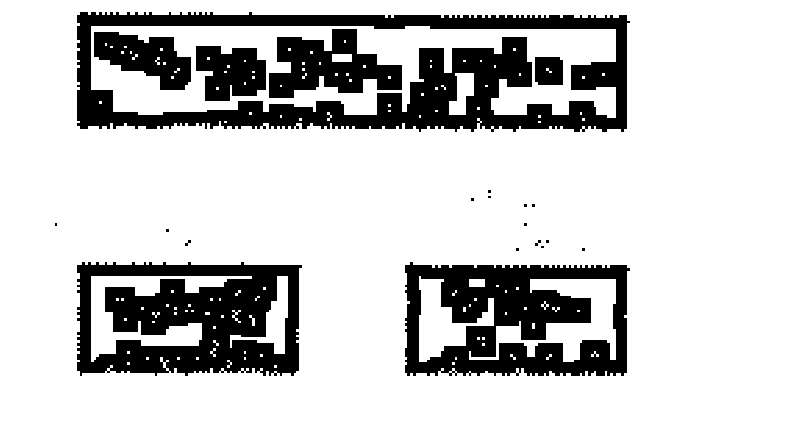

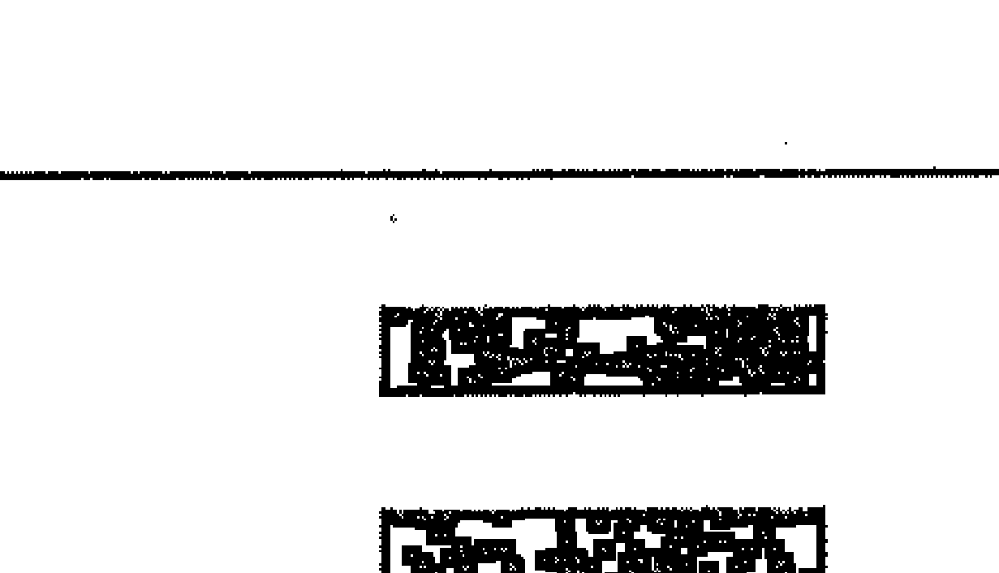

分析：火天大有，天元卦为离为火，贵神卦、将神卦、地元卦皆属金，此为归身相克卦，主外来取索，迫剥之象。

#### 进体相克课·肇共卦

本位克上三位是也。
假令十二月戊戌日戊时戊位
壬水、玄武水、神后水、戊土。
主并立之事，将谋财禄和合之喜。

| 壬 |
| 壬子 |
| 壬子 |
| 戊 |

##### 《金口透易·梅花占》卦例：

###### 地雷复

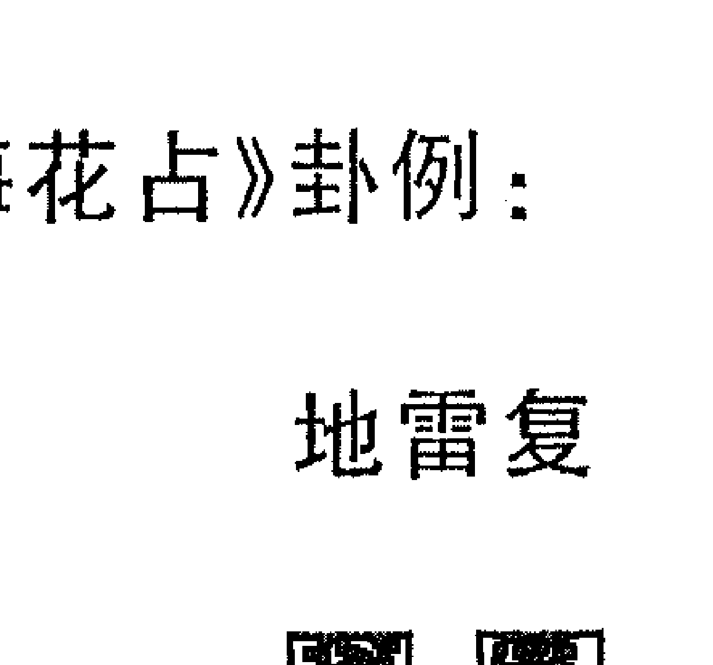

分析：地雷复，天元卦、贵神卦、将神卦皆为坤土，地元卦为震木，一木克三土，主外事重重，见鬼动（悔折卦），有所求谋，事体伏吟，吉凶皆多见，卦内见隔，事体有阻。

#### 主来刑客课·枭鸣卦

神将比，鬼动克人元是也。
假令十二月乙位日辰时巳位
辛金、青龙木、太冲木、巳火。
主鬼怪官病，人畜财散之事。

| 辛 |
| 戊寅 |
| 己卯 |
| 巳 |

##### 《金口透易·梅花占》卦例：

###### 水地比

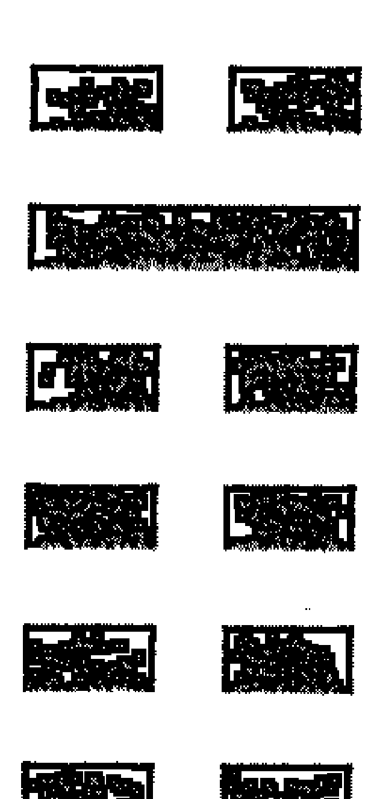

分析：水地比，地元卦为坤为土，天元卦为坎为水，地元卦克天元卦为鬼动（悔折卦），贵神卦为艮为土，将神卦为坤为土，为主来刑客之枭鸣卦，主内宅不宁，事多争吵，迟滞不定。

#### 神来克将课·内贼卦

将为内财，而神来克是也。

假令十二月乙巳日戌时丑位

己土、白虎金、太冲木、丑土。

主亲戚谋窃自己的财物，及勾连虚诈不明之事。

| 己 |
| 甲申 |
| 己卯 |
| 丑 |

##### 《金口透易·梅花占》卦例：

###### 水天需

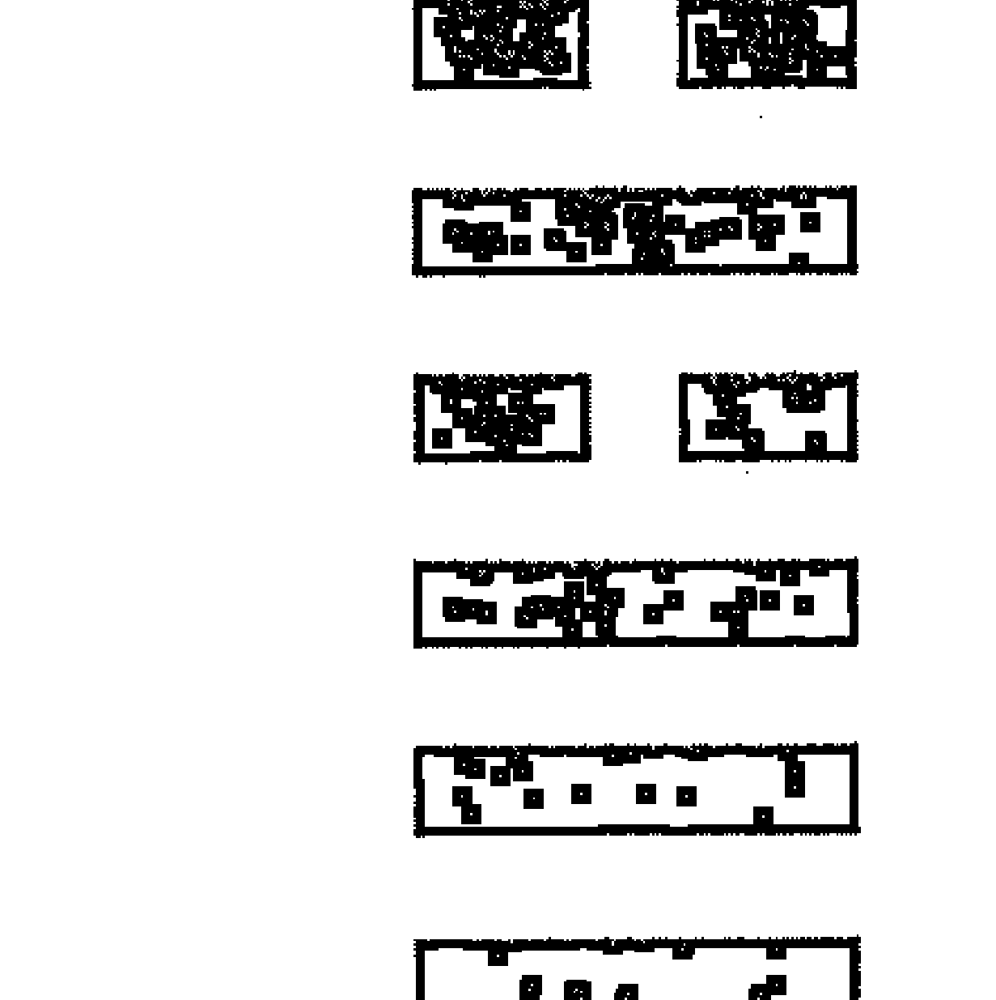

分析：水天需，贵神卦为离为火，将神卦为兑为泽，贵神卦克将神卦，为内贼卦。主内贼牵连，勾联不明之事，求财则破。问官被责。

#### 客来克主课·问招卦

人元克位是也。

假令十二月乙巳日辰时午位
壬水、天空土、功曹木、午火。
此主妻妾之忧，及财帛不明之事。

| 壬 |
| 丙戌 |
| 戊寅 |
| 午 |

##### 《金口透易·梅花占》卦例：

###### 地水师

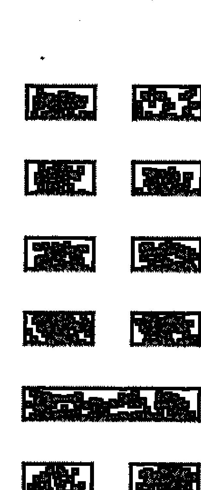

分析：地水师，天元卦为坤为地为土，地元卦为坎为水，天元卦克地元卦为妻妾动（问招卦）主外来取索，妻妾之忧，将神卦克贵神卦为财动（盈益卦）主动财之事。

#### 天门入地户课·地系卦

辰为地户，天魁戌临之是也。

假令十二月乙卯日子时辰位

戊土、勾陈土、天魁土、辰土。

主讼重，占病凶，占宅墓主出军屠，家不和。

| 戊 |
| 戊辰 |
| 戊辰 |
| 辰 |

##### 《金口透易·梅花占》卦例：

#### 天风姤

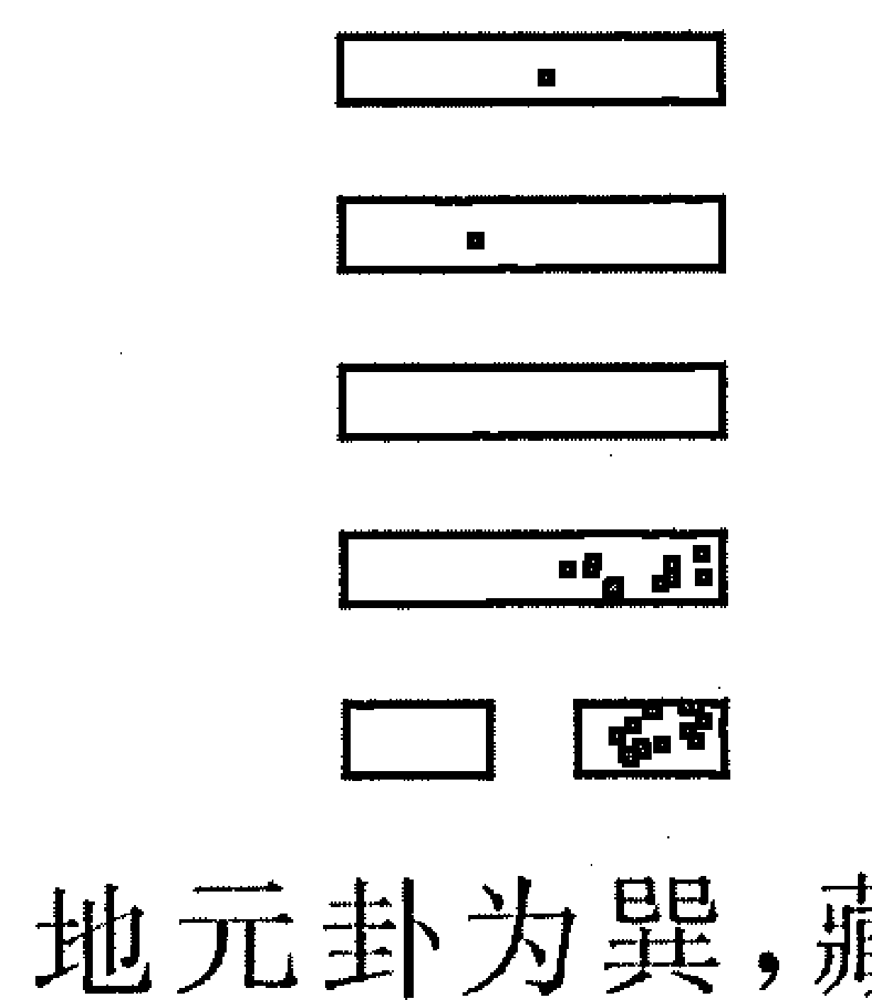

分析：天风姤，地元卦为巽，藏支辰、巳，贵神卦、将神卦、天元卦皆为乾，乾藏支戌、亥，戌在辰上，乾为天门，巽为地户，乾在巽上，为天门入地户卦，外来克内，主家不和，占讼不利。

## 《易林变占》选讲

变占是易学传承的一个重要门类，也是易象占中常要用到的法门，《周易》系辞上传中所讲的：“是故君子居则观其像，而玩其辞，动则观其变而玩其占。”这里的“观其变而玩其占”，就是指的变占，汉代焦氏著《易林》，另有《易林变占》十六卷，也是以变占解易，《易经》中很多辞是用变占来解，解《易林》则纯用变占之法。焦氏变占之法后期史籍无载，不知道与天心混元宗的秘传《金口透易》中的变占是何关系，但用《金口透易》中的变占之法，解《易林》殊为通透，应当与焦氏《易林变占》会有一定的关联。

《金口透易·梅花占》中常用的变占之法，有十二变占之法，现将部分口诀公之于众，以待有缘。

### 变占口诀（节选）

卦变之法意难求
（部分内容略）
伏玄续寄交与替
贞悔错综正卦流
卦承贞悔为终始
伏玄交变变中周
玄交卦藏纳其位
伏爻隐兮详因由
错变通行相对取
彼冲之位鲁占游
综变阴阳取其对
正兮覆兮一般收
（其它内容略）

以上歌诀中卦变占诀中的一部分，其中的伏、玄是指的伏玄变占，续、寄是指的续变与干支寄变，交、替是指的交变与替变，贞、悔是主卦与变卦，又名贞、悔两卦，错、综是指的错变与综变，变占口诀中的干支寄变口诀前文已经提过，今不再赘述，伏、玄、交、替四变的重点是结构与状态，续变的重点是过程，其基础类似于壬学中的传法，贞、悔、错、综四变的重点则在于预测者定位的变化。

在实际预测中，贞、悔、错、综四变是基础占法，同时也是日常学易者常接触到的内容，在易象占的占卜过程中，贞、悔、错、综代表着观察与解释一个事件的不同方向与定位，贞卦代表事体的起始点，即整体在这个起始点的四象与寄变吉凶，悔卦代表着事件在现有状态下最可能的变化，以及变化发生后的四象与寄变吉凶，所以口诀讲：“卦承贞悔为终始”，贞卦的错卦是事体起始点对应的对应方的情况，悔卦的错卦是事体变化后所对应的对应方的情况。贞卦的综卦，是事体发生的起始点的反向选择信息，悔卦的综卦是事体发展后的反向选择信息。

由贞、悔、错、综及其它变占形成预测的一个完整过程，从而将一个事件的起点、过程、延续、对方情况、变动情况及外围信息、解决的路径在预测中完整地预测出来，形成一个立体的占测结构。

## 梅花笔记

## 第三章 梅花占的时空基础

### 数术的学术性与技术性

“梅花占”是上古“数术”之学中的“易象占法”的传承，因此，讲“梅花占”，要先了解“数术”这个概念，“数术”之学，在汉代以前，是大宗之学，《汉书·艺文志》中《数术略》收书二百六十三家，三千三百五十一篇，其种类与数量在《汉志》中也是洋洋大观，其包涵的内容，基本涵盖了上古自然科学的所有学科。“数术”这个词，其内容中，既有“数”的成份，也有“术”的内容，“数”是指知识、规律、法则、定律，这些是学术传承的内容，“术”则是技术、规范、方法、应用，这些是技术应用的内容，因此，“数术”的传承中本身既有学术性的东西，也有技术应用的东西。学数术如果只是去学规律的“数”而不去实践应用“术”，那么最终结果只能是纸上谈兵，在书堆里绕来绕去，最终学不到“传承”中真实的东西。这就象古时候的赵括，学了满腹的兵书，真正到用的时候，一败涂地，几十万赵国的士兵被坑杀。所以学数术，既要学学术性的内容，也要学实际应用的方法。

学“梅花占”，“应用”是一个主要标准。所以在梅花占的课程中，我们会选择一些论坛里的即时求测或是我们学员自身求测的现实例子，做为课程讲解的例子来进行现场的讲解，然后把这些预测的结果进行即时的验证。这样经过一段时间的积累，大家就会知道在实际应用时，应当注意些什么，哪一个地方会出问题，在哪一些地方会出偏差。学员们在学习的过程中，也要更多地去应用，只有应用，才会知道自身的不足，因此，“应用”是我们对“梅花占”学习的第一个要求。

二、预测准确率的评估是我们需要关注的第二个问题，预测毕竟是针对未发生的事情做出的一个预期性的预计或估算，那么在实际应用时，就需要对预测的误差率做一个合理的评估。如果说预测作为一门技术，能够达到百分百的准确率，那么首先就需要考虑“数术”或“预测”是不是一门伪学。因为任何技术都不可能做到百分之百，都需要有一个可以允许的误差率。对于“梅花占”初级班的学员，我们要求大家在学习完成之后，平均准确率要达到百分之七十以上，这是一个考核标准。在达到百分之七十以上的准确率以后，才可以达到“初级班”的结业水平，向上再提升到百分之八十以上的准确率，才会允许升级到中级班继续学习。同时需要说明的是，这个准确率百分比的评估，和外界公认的评估标准是有区别的。我们要求的准确率的评估，要遵守木桶的“短板效应”。也就是“木桶的容量，是由最短的那块板决定的”，预测的准确率的评估也是这样，预测的准确率是由最低的准确率来决定的，因为预测是对未来的事件的发生的机率进行模拟，因此，在事件发生后，要对预测的结果进行复盘和评估，找到预测出现偏差的环节和原因，进行修正和提升。

在生以前，所有的预测结果的准确率为零，而当结果出现以后，对于事件而言，因为每一个事件都是独立的，所以如果对于这一个独立事件的预测准确率为零，那么预测对于此事件而言，就是准确率为零。因此，我们要求达到的百分之七十以上的准确率，实际是要求每次预测至少要达到百分之七十以上准确率，而不是这个卦例百分之九十，那个卦例百分之五十，两次相加除二，平均算出来等于百分之七十。也只有达到每次预测的准确率达到百分之七十以上，才算达到了初级班结业的水平。

## 《金口透易·梅花占》初级班学习需要掌握的内容

下面，我们讲一下《金口透易·梅花占》初级班的课程安排。首先大家要熟练地掌握“八动占”。“八动占”里面，包含着“四象占”与“八动占”两方面的内容，这部分内容，相当于梅花占的基础骨架，就像一个人需要有骨骼，一幢房子需要有梁柱，要学习预测，基础骨架的内容是很重要的，现代流传的《梅花易数》，就是因为缺少基础骨架，所以变得没有办法应用，因此，“四象占”与“八动占”，是本次课程中最基础的内容，也是必须要掌握的内容。

其次我们会给大家讲述“内外三才”。在整个“梅花占”的系统里面包括的基础骨架中，八动、四象、三才、阴阳是最基本的内容，其中八动、四象、三才的内容对事件的判断尤其重要，阴阳对事件的影响相对要小一些，因为阴阳是不显示吉凶的。而八动、四象、三才的内容，在每一个实际预测中还包括一层一层的三才、一层一层的四象和一层一层的八动，他是一个很严密的网状结构。通过这次的课程，我们会逐渐把这个网状结构展现在大家的面前。

然后在八动占的基础上为大家讲三个变占。变占是以卦演卦的一种预测方法，也是《金口透易·梅花占》独有的预测方法，这个方法，实际上是属于上古的易学与兵阴阳的传承，按照《汉书·艺文志》记载，在《焦氏易林》十六卷后，应当有十六卷的《易林变占》，《焦氏易林》讲的是推导结果，而《易林变占》讲的是推演方法，只是在后期的传承中，《易林变占》失传了，而从实际的应用上推导，《金口透易·梅花占》的变占系统，很可能与《焦氏易林》应用的《易林变占》系统有关，因为用《金口透易·梅花占》来解《易林》，是很清楚与明了的，这个应用，在初级班的课程中，也会有所涉及，《金口透易》所传承的变占系统，一共是三宗十二变，一宗里面有十二个变占。初级班里面会讲到寄变、错变、综变这三个变占的应用。

## 梅花占的传承与源流

梅花占的源流，向上溯，在秦汉以前，是属于易占中“枚卜”的传承，汉代以前，易占中有“枚卜”之法，是以竹片为卜，以竹青竹黄而分阴阳，以兆法五行及四象八动占法断验的占法，“枚卜”又称为“枚占”，这个方法的应用，在《归藏易》中记载较多，如王家台秦简《归藏》简文中所载的：“大过（依卦画当为小过）曰：“昔者□小臣卜逃唐而支占中＝魭＝占之曰不吉”（小过曰：昔者伊小臣卜祧唐，而枚占仲虺，仲虺占之曰：不吉。）”，这其中的“支占”，即是“枚占”之法。枚占法在后期的传承中，又被称为“观枚占”。这一体系，就是我们现在应用的“梅花占”的方法。

梅花占在东汉以后就进入了秘传的体系，所以在外面的传承体系里，大家就认为汉代以前的易象占已经失传掉了。因此我们现在看各代的“艺文志”里面讲到的古书，讲到的数术传承的方法，包括焦延寿的《易林》，《易林变占》这一套系统，现代人已经不知道如何去应用了。但是作为一个数术的技术门类来讲的话，也就是作为一个象数占的系统，“梅花占”的应用方法，一直在秘传的系统里面绵延不绝，一直在传承，只是在外界很少有人知道。

宋代以后，数术曾经出现了一个新术并出与诸法交融的发展过程，现代的很多数术方法都与宋代的这次数术的创新与交融有关。包括大家都熟悉的八字理论中的旺衰派、调候派、平衡派的理论，六爻占卜中的用神论等，其肇源都与宋代的这次数术变革有关。我们后期看到的通行本的《梅花易数》，也是从宋代开始出现传本，然后流传到现在。

大家今天看到的通行的《梅花易数》的这套系统，实际上在里面是没有“钥匙”的，数术的传承，过去一直讲“真传一句话，假传万卷书”，那么什么样的东西是那“一句话”，什么样的东西是那“万卷书”呢？数术传承中的“一句话”，指的是真正用于开启特定数术方法的“钥匙”，这些“钥匙”都是基础的框架性的东西，假如这个基础的、框架性的东西没有了，就象一个人被抽掉了骨架，或者象一个帐篷没有支架，整个都会瘫在地下。我们现在看到的通行本的《梅花易数》，就是这样一套瘫在地上的系统。

## 《梅花易数》中外应的欺骗性

我们前面讲到，现在通行的《梅花易数》是没有“钥匙”的，所以大家在学习《梅花易数》的过程中，常常会徘徊在一个怪圈里面走不出来，那就是在应用中《梅花易数》的准确率实际上并不高，如果单纯用《梅花易数》中讲述的“体用”方法来预测的话，他的准确率实际上是很低的。这一点，即使是在《梅花易数》的原书中，也不得不承认，《梅花易数·卦断遗论》中讲：“凡占卜决断，固以体用为主，然有不拘体用者。如起例中西林寺额得山地剥，体用互变，俱比和，则为吉，而乃不吉，何也？盖寺者，纯阳人居之地，而纯阴爻象，则群阴剥阳之义显然也。此理甚明，不必拘体用也。······盖用《易》断卦，当用理胜处验之，不可拘执于一也。”实际上已经自我否定了《梅花易数》书中的体用断法。但是很多人为什么在学习《梅花易数》的过程中对这个问题没有觉悟呢？当我们细心剖析通行本的《梅花易数》时，会发现这里面有一个江湖术法在起作用，那就是“外应”。当《梅花易数》把真实的“钥匙”和“骨架”剥离出去，单纯地运用易象占，实际这个系统已经没有办法再支撑准确的预测。但是如果一门数术没有办法去做准确的预测的话，他就很难生存与延续下去，因为毕竟数术是一门技术性的学问，其中准确率是“硬指标儿”。所以在《梅花易数》传播的中期就引进了一个很重要的概念，就是外应。

《梅花易数》中现在应用的这个“外应”理论，在宋代以前叫“逢占”，就是占测的时候看到什么东西就拿这个东西作为预测的征兆。这种应用的方法，与传承的《梅花占》的应用是有本质区别的，而当缺少了钥匙的《梅花易数》把“逢占”的这个理论加入到梅花易数的理论中去的时候，实际上整个《梅花易数》就演变成了一种江湖术。因为这种外应的理论永远是可以验卦的，但是，永远是不能算卦的。

比如有人问官禄、事业上的事情，用通行的《梅花易数》断法中的“叶音之应”：“见鹿可以问禄，见蜂可以言封。梨主分别，桃主逃走。见李则问讼得理，逢冠则问名得官。鞋为百事和谐，阖则诸事可合。”算卦的时候如果正好抬头看见迎面有棺材抬过来，那是“见棺见材，为有官禄之事”，看见棺材迎面而来，就可以讲，这个人有官，因为见“棺”了。但是这个理论是完全脱离开卦象的，按逢占讲看见“棺材”为见“官”。但是如果后期的反馈是没有得官。那按照正常的考虑是，这个卦算错了，但是按外应的逻辑则不是，因为外界的事物不可能是单独存在的，当算卦时抬眼一望的那一瞬，看到的不可能只是一个棺材，首先拉棺材的会有车，车前可能还有人，还有各种各样的事物，这些事物就为预测的不准确提供了可以圆滑的解释。这时候，你可能会觉得不是算得不准，而是外应没有取对。也就是说预测的时候确实看到棺材走过来了，见到棺材也可以认为是见官的外应，但是如果算错了你会想，那天没有算对的原因是因为当时见到棺材的时候，在棺材前还有一个小孩子跑过去，见男童为见小人，小为子孙，见小人伤官。可是如果求官应验了，你会想，哎呀我“见棺得官”的外应真的应了。（关于《梅花易数》外应的欺骗性，详情见附录“《梅花易数》外应占法的欺骗性研究”一文）

所以现在流传的《梅花易数》中的外应占实际上是一种江湖术，实际上“外应”有更真实的用法，我们有机会会讲到一些外应的东西，外应并不是不能用，但外应的应用是有严格的限制的。绝对不能像我们现在见到的《梅花易数》这样用。

### 四象占

我们现在讲到的“梅花占”所蕴含的系统，他的基础框架实际上就是我们在书里所写到的“四象占”与“八动占”，其中“四象占”是“八动占”的基础理论，“八动占”又为整个预测系统搭起了一个完整的框架。

《易经》里面谈到“太极生两仪，两仪生四象”的问题。这句话出自《系辞·上传》的第十一章，完整的这句话是：“是故，易有太极，是生两仪，两仪生四象，四象生八卦，八卦定吉凶，吉凶生大业”。这是一套完整的体系。我们现在看到的太极图，实际上里面就包含着太极、两仪、四象和八卦，我把太极图发上来，大家看一下。

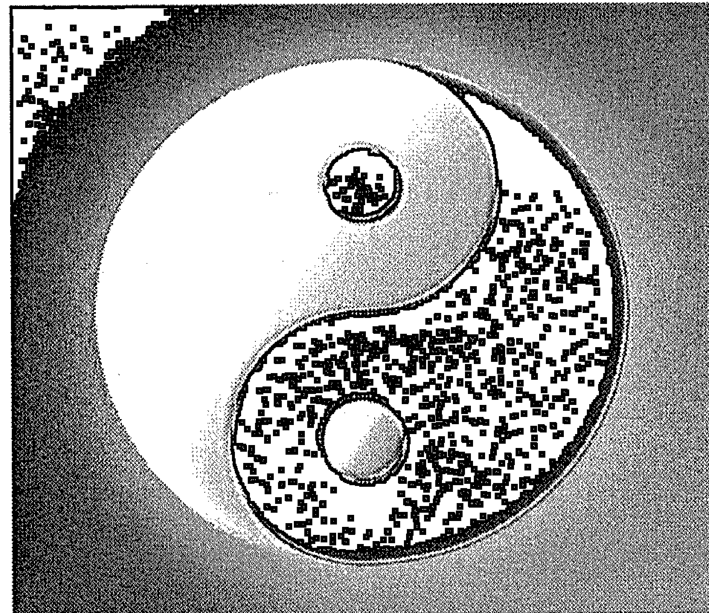

我们看到上面的这张图，叫先天太极图，在这张图上，哪个部分是太极呢？对，太极图外面的那个大的圆，就是太极。太极生出了两仪，这个两仪是什么呢？就是这张图里面一黑一白的阴阳鱼。阴阳鱼是两仪。那么什么是四象呢？实际上，太极图的阴阳鱼再加上两个鱼眼，我们称之为“阳中之阴”和“阴中之阳”，“阴、阳、阳中之阴、阴中之阳”构成了四象，其中，阴交阳是阴中之阳，就是黑色的鱼中间的白色的鱼眼，是阴中之阳。他是阴和阳相交的地方。阳交阴是阳中之阴，是白色的鱼中间的黑色的鱼眼，是阳和阴相交的地方，是阳中之阴。也就是说阴、阳加上阴阳相交，就产生了四象。在这个太极图中就包含了太极、阴阳、四象和八卦。

如果在一个卦里面，四象是如何划分的呢？现在发一张八卦图给大家，大家在上面找一下四象。

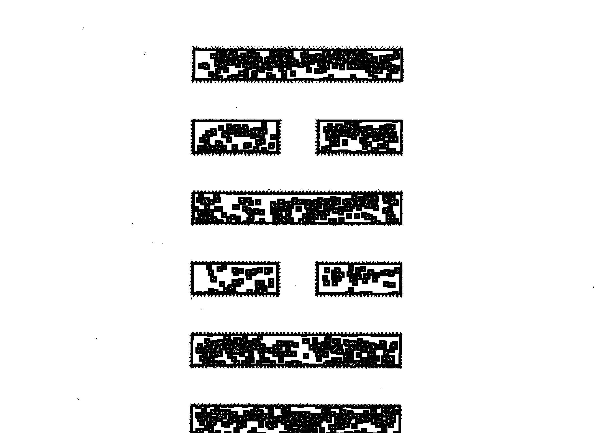

上面这个卦，上卦离，下卦兑，是为火泽睽。睽者，乖戾也，代表着不顺利。

我们找一下这个卦里面的阴阳，按照“梅花占”的理论，在一个六爻卦里面，上卦是阳卦，下卦是阴卦，《易经·系传》讲“天行健，君子以自强不息。地势坤，君子以厚德载物”。上卦为天，在上面，下卦为地，在下面，这样阴阳就确立了。上卦和下卦相叠形成了六爻卦，两套三爻卦系统组成了一个六爻卦系统。

下面我们在这个卦里面找一下四象，在讲到太极图的时候我们讲过，阴、阳与阴阳相交产生四象，那么这一个卦里面阳卦和阴卦相交的地方是在哪儿呢？如果一个六爻卦中，上卦为阳，下卦为阴，阳卦和阴卦相交的地方，是把阳卦的离为火的最上面的这个爻去掉，这样看到的这个六爻卦的三、四、五爻组成的三爻卦，就是阳卦与阴卦相交的地方，在火泽睽中，这个阳卦交阴卦所交出来的三爻卦是坎为水。而阴卦和阳卦相交的地方，则是把阴卦的最下面的这个爻去掉，即这个六爻卦的二、三、四爻组成的三爻卦，就是阴卦与阳卦样交的地方，在火泽睽这个卦中，这个阴卦交阳卦所交出来的三爻卦是离为火。阴卦和阳卦之间相互交流，相互化生，从而产生了四象卦。

大家过去研究《易经》，一直在讲：“两仪生四象，四象生八卦”，但不知道“四象”到底在哪儿，实际上四象就在这个六爻卦里面。而在这个六爻卦里面，我们找到四象卦之后，我们就知道这个四象卦是由阴阳相交而产生的，阴阳相互作用从而产生了吉凶。这就是我们刚才讲到的，太极生两仪，两仪生四象，四象生八卦，八卦定吉凶。就是一个四象卦组成了一个八卦的系统，不同的两仪、四象组合成了六十四卦的系统。而一个卦，和他的错卦，形成了一个阴阳对立的平衡系统，这个平衡系统，形成了一个完整的八卦预测系统，这样的一组预测系统里面一共是八个卦在相互作用。那么这些作用会产生一个什么情况呢？实际上就是产生了我们现实生活中一个单独的事件的吉凶。

## 梅花占所蕴含的时空观

下面讲一下梅花占的基础观念与外界流传的数术的基础观念不同的地方，梅花占是一个单纯的在方的传承，以梅花占做预测，其预测的对象是一个事件在问测时的时间上的切片。过去大家在学习易经的时候通常会用到主卦和变卦，传承里面叫贞卦和悔卦，贞卦和悔卦是在时间线上相互联系的两个独立的切片。过去一些研究易学的学者，会把主卦和变卦放到一起去，把主卦的卦挪到变卦里面去，和变卦相交叉，近代的很多易学研究者，是这样应用的。

实际上，在真正的应用中，主卦是一个事件，变卦是一个事件，这两个卦，只在事件中相联系。也就是说主卦体现的是事件的现有状态，而变卦体现的是事件发生变化之后的趋势，两个卦是要单独来看的。一个主卦里面的四象之间的关系，产生了这个事件在现阶段的基本情况和可能的发展趋势。而变卦中的四象之间相互作用产生的关系，则是事件变化后，最可能的发展方向。因此说主卦是一个事件，变卦是一个事件。

讲到这里呢，我给大家看一个图，下面这个图，是斯蒂芬·威廉·霍金在《时间简史》中所提到的时间光锥。

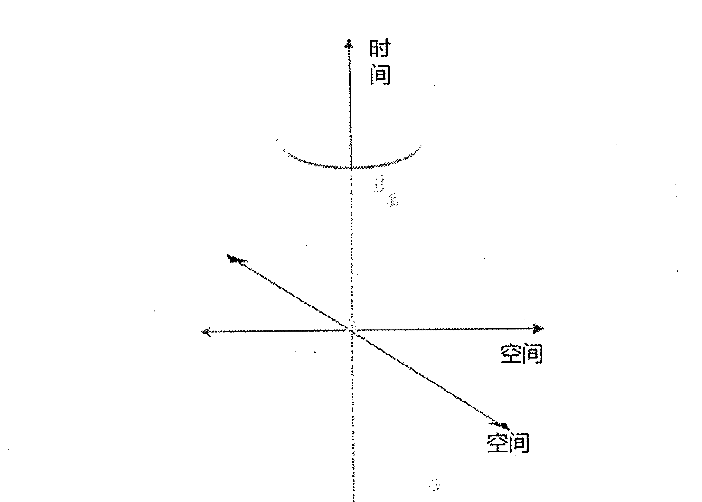

按照现代物理学的“时空”理论，人类是一种三维的生物，即人类可以感受到长、宽、高所构成的三维的、立体的空间。但是，我们没有办法去体会时间。我们穿行在时间的长河中，却无法看到时间的整体。如果在空间的维度上加上一个时间的维度，科学家们称之为“四维空间”。假如有一个“四维空间”的生物看到我们生活的世界的话，展现在他的面前的是我们每个个体的历程在时间与空间上穿行产生的通道，而组成这个通道的素，就是“事件”。

如果单纯地看这张“时间光锥”的图，给人的直观印象是时间是一条线，如果对于一个个体而言，时间可能是一条线，但是当所有个体在时空中的历程交织在一起的时候，就构成了一个时空的海洋。而我们每个人穿行在这个时间海洋之中的时候，都会形成我们自身的轨迹。依据“时间光锥”的理论，在时空上的任何一个点，都是由在过去的时间里面的无数事件相互联系构成的。也就是说，每一个事件都是由前面无数事件集合在统一的时空点上形成的。在这个点的后面，会因为此事件中各因素之间的相互关系而产生无数种可能。而这个过去的事件的集聚与未来的事件的起源，就是在中间的这个“事件”的点上。也就是说无数的事件组成了我们今天的这个结果，而我们今天所见证的结果，又会为将来产生无数种可能。我们借助一个简单的比喻，今天大家共同来此学习，对于每个人都有很多的因缘，能够让大家聚会到这个课堂里来共同探讨中国传统文化。我们相聚于此的这个时空，对于我们而言，就是时间光锥上的这个交点“A”，而这个时间的这个点，我们大家看现在这张图上穿行于时间轴上的空间和时间交叉的这个点，就是英文字母A这个位置，他是什么呢？就是佛教和道教一直在讲的因果，因果中的那个果，他是过去的果，是未来的因。而我们人生，就是在无数的这种点形成我们的人生。也就是说无数的事件组成了我们人生本身的历程。我们预测的时候，我们预测的就是A这个点组成的一个事件。

在这个点上有空间也有时间，向外发散的是空间，同时与空间相互依存的有一个时间，时间是穿行在这个空间之中的。假如我们预测一件事情，那么这个就是主卦，A这个点就是主卦。在这个点上我们转回头来看太极图，大家会不会在太极图上找到这个点？

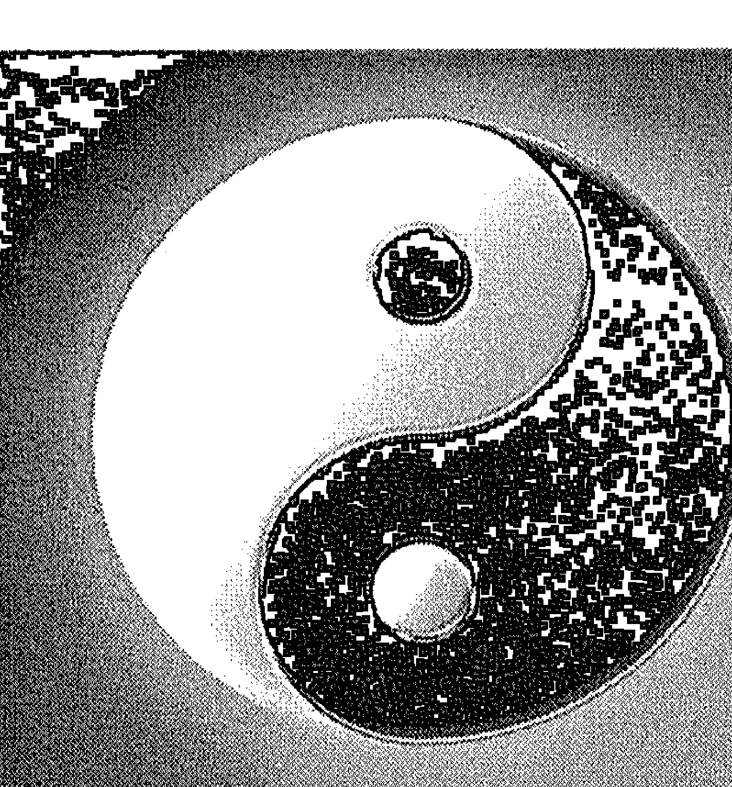

如果把时间光锥上的 A 点放大，就会看到这样一个图像，就是我们现在看到的太极图。在这个太极图上，和过去与未来的光锥相接的地方是什么呢？我们刚刚讲事情是有阴阳的。我们看到的阴中之阳与阳中之阴这两个点，就是阴鱼里面的那个白点，和阳鱼里面的那个黑点，是什么呢？如果把这两个点还原到时间光锥里面去的话，这两个点就是时间在空间里面穿行的通道。

时间从过去穿向未来，同时在事件中留下了一个穿行的轨迹，而这个轨迹，就是我们现在看到的阴阳鱼，所以我们会一个事件中看到过去的因（阳鱼里的黑点），同样我们会通过过去的这个阴的鱼看到未来（阴鱼里的白点），而整个的太极图，就是空间和时间交叉的本身，他的整体形成了我们现在一个完整的事件，为什么我们八卦是来自于太极的这一张图？而太极这张图自始终影响了我们八卦的发展和预测数术的发展历程。就是因为，在太极图中确实蕴含着时空的本质。

### 四象、八卦与太极图

刚才讲到在时间光锥里面，针对每一个事件的那个时空交汇点，都是一个太极图。而且在这个太极图之中包含着两仪和四象。那么现在如果把这个太极图代入到我们的六爻卦里面去，太极图中的两仪和四象在一个卦里面，是如何表现的呢？

我们前面讲到四象卦的时候，讲到一个六爻卦里面有天元卦、贵神卦、将神卦、地元卦，这是四象卦。在这个四象卦里面，天元卦对应着太极图中的阳鱼。地元卦对应着太极图中的阴鱼。贵神卦对应着太极图中阳鱼的鱼眼。将神卦对应着太极图中的阴鱼的鱼眼。因此在一个卦里面可以很清晰地找到卦与太极图之间的每一个对应关系。这个卦本身就是一个太极，也就是我们刚刚讲到的一个时空的交汇点，同时也就是需要预测的事件的本身。而在这个事件之中，可以看到阳和阴，也就是两仪，就是天元卦和地元卦，同时也可以看到阴阳相交的那两个点。即贵神卦和将神卦。

在这个问题上，《梅花易数》这本书中从没有讲过，在流传的《梅花易数》这本书里面，把贵神卦与将神卦称为互卦，《梅花易数》讲到互卦的时候怎么讲呢？他讲“互卦只用八卦，不必取六十四卦名。互卦以重卦去了初爻及第六爻，以中间四爻分作两卦，看得何卦。”因此，在现在流传的《梅花易数》中，有互卦的概念，但没有四象卦的概念，这一点，从本质上把《梅花易数》易象占法的真实的框架隐藏了起来，从而当大家谈到上下互卦的时候，实际上已经掉到《梅花易数》编著者所设定的陷阱里面去了。

学习《金口透易·梅花占》，首先要理清四象卦的概念，四象卦的概念是梅花占的基础框架中的基础，四象卦之间，是有相互作用关系的，这个作用关系决定了时间轴在预测的事件中的最可能的走向。而这个最可能的走向会在未来的时间上形成一个新的事件。这个新的事件同样也是一个太极。这个新的事件就是变卦。

当然，我们后面会讲到变占系统，变占系统是《金口透易·梅花占》所独有的体系，一套完整的变占系统，可以推导出一个事件中无数的细节，按照粗略的计算，当变占中的玄变、错变、综变、寄变、续变，再加上替变，也就是当用到第六个变占的时候，一共是两万四千种变化。

变占系统，是以卦演卦的一种易象占法，一个完整的变占系统用下来会把一个事件无限的细化。通过变占，可以预测事件中当事人本身，也可以预测当事人所处的环境，外界的干预，自身的行为方式，内心的想法以及对外界的反应等……，这是一套非常完整的占测系统，因此，《金口透易·梅花占》的高端用法，是可以直接解《易经》与《焦氏易林》的，我们现在看到的《焦氏易林》，实际上其中的卦变都是由“变占”变出来的。《焦氏易林》十六卷的后面，原本有十六卷的《易林变占》。我

### 四象位的具体含意

| 天元卦 | 君 | 祖 | 夫 | 主 | 尊长 | 财路 | 头 | 高处 | 天 |
| :--- | :--- | :--- | :--- | :--- | :--- | :--- | :--- | :--- | :--- |
| 贵神卦 | 宰辅 | 父 | 尊 | 家主 | 臣 | 外财 | 胸 | 上中 | 神 |
| 将神卦 | 吏 | 兄弟 | 妻 | 亲戚 | 身 | 内财 | 腹 | 中下 | 人 |
| 地元卦 | 田宅 | 子孙 | 妾 | 奴仆 | 六畜 | 积蓄 | 足 | 下 | 地 |

讲上面这个图之前，先与大家讨论一下预测的思维，预测的思维方式，不能相悖于我们日常的思维方式，我们日常的思维有一个脉络，这个脉络就是所要预测的事件本身的发展脉络。比如，要办一件事儿，按正常的思维，应当是首先考量这件事情当前的情况是怎么样的，当前遇到的问题要如何处理，这个事情在下一阶段有可能会产生什么样的变化，最终会有一个什么样的结果，这是针对事件的思维的正常模式。

所以日常面对问题时，真正需要考虑的是事件本身的各种因素之间的关系及事件发展的脉络。而我们要学习的《金口透易·梅花占》，预测的就是事件内部各因素之间的关系及事件发展的脉络。事件内部各因素之间的关系及事件发展的脉络要从哪里看呢？这些内容的基础实际上就是卦中四象之间的相互作用关系。

要了解卦中四象之间的关系，首先要了解四象位。一个卦中，有天地有阴阳，天和地相交产生了神和人，再细致一些讲，天交地产生了神，地交天产生了人。人是生活在地上的，神是生活在人之上天之下的。这就是四象卦里面的天、地、神、人四象的关系。我们前面讲到阴和阳的时候也讲到，两仪的阳是在上面，阴是在下面。而单纯的两仪的划分，是没有吉凶的。

阴阳相交产生了四象，这个四象是有四象位的。下面看四象所属图的图表，我们大家可以把它念一遍。天元卦，也就是最上面的卦，一个卦里的上卦，上卦代表君，代表祖，代表夫，代表一家之主。同时这个主代表牌位，就是一家里面的神堂。所以风水里面讲一家之主的主位的时候，不是讲的这个家长住在哪儿，而是讲的这家祖师堂在哪儿，那是一个家里面主的位置。大家学风水的时候要很重视这一点，阳宅风水中有八宅风水，有一本书叫《阳宅三要》，阳宅三要是指的一个宅子里面三个重点要关注的位置，就是门、主、灶。主在古代代表祖宗牌位，是代表死了的那一部分。“示”字和“祖”字实际上是什么呢？都是牌位。就是这个“主”，是被供奉的。象“天”啊，代表君，古代道家讲君要无为而无不为，“君”就像高高的在天上一样，君是要无为的。

“祖”，代表两个，一个是祖父，没有死的。另外呢，代表祖宗，祖宗有很多是已经死的，代表着已经死的那一部分。“主”呢，代表着牌位，就是一家的神堂。所以我们假如测一个家庭的风水，如果地元卦克天元卦，那么家中的神堂就很可能会有迁移。如果天元卦克地元卦的话呢，就不容易得到祖宗的保佑。

在一个集体中天元卦代表尊长，是最大的精神领袖。比如一个公司里，天元卦就是董事长。在一个庙里面，天元卦就是方丈。在一个寺庙里方丈是精神领袖，一个教区内只有一个方丈，监院是主管一个大庙的具体行政事务的。监院向上向方丈负责。但是方丈不管具体事务，方丈只负责传教。我曾经在一个企业管理的课程里面谈到企业内董事长和总经理的关系，我们现在很多企业里面，董事长往往会篡总经理的权。如果在一个企业里面，董事长篡总经理的权，那么这个企业就很难发展下去。一般会出现两种情况，一种是总经理不干事，董事长去干事，那么总经理就形同虚设。还有一种就是总经理和董事长之间因为争权而产生很深的矛盾，在一个企业中总经理是作实际事务的，而董事长要去把握决策和市场关系，或者是文化方向，就是企业的文化与指导方向。假如一个董事长不去指导方向，去管具体事务，那么总经理就必然会向下侵权，这种情况，在八动占里面叫贼动，最终会导致一个企业的管理混乱。

在一个企业里，董事长和总经理一定要象方丈和监院一样，在庙里面，方丈是不管具体事务的，监院向方丈负责，而方丈不能越过监院去直接行使他的管理权。所以在讨论企业管理的时候，会很重视这种上越下权的问题。

讲的天元卦，实际上就相当于董事长和方丈。在预测求财的时候天元卦代表什么呢？天元卦在求财的卦里面代表财路。财路是经营方向与指导方针。在一个企业里，董事长所做的事儿就是处理经营方向和指导方针，去扩展财路。按照道家的理论，天是倾向于无为，地是倾向于有为。所以地会载生万物，而天则按照自身的规律去发展与运行。这也是天元卦所代表的一个具体含义。

第二个讲贵神卦。贵神卦在一个管理层里面代表着宰辅，宰辅就相当于一个国家的总理，或者一个庙里面的监院，或者是一个公司里的总经理。总经理做的事情是把董事长或者董事会的决策传达到下层，同时要把具体实施行为贯彻到下层去，一个企业的总经理既要和上面的董事会交接，同时也要和下面的中层交接，我过去讲企业管理的课程时讲过，董事长管总经理，总经理管部门经理，部门经理管基层，这是一个管理的序列。一个企业总经理如果只需要管理中层，让中层向下管理他们分属的基层，这样一个企业就会良性运行，不会产生管理混乱。

在四象卦里面，宰辅的位置是和吏交接的，他的下面就是吏，中国古代词语中的每个字，很多都有其独立的意义，比如官吏，官和吏是不一样的，官是吃俸禄的。相当于国家干部。吏是干实事儿的，相当于办事员。在一个国家里面谁是干部呢？是贵神卦，贵神卦是国家干部，是一个组织中的管理者，而将神卦是中层，如果讨论一个公司的管理，按照四象卦的分级，天元卦是董事会，董事会最好是做到无为，只负责决策和方向，董事会向下对贵神卦负责。贵神卦是总经理，总经理总领具体事情，并和下层的吏交接，中层是吏，所以他要干实事，吏到哪里去做实事儿呢，到基层，就是地元卦，这就是一个企业正常的管理序列。而这个管理序列，古人两千多年前就已经形成了。

在一个家里面天元卦是祖，是祖宗，是祖父。贵神卦是父亲，父亲要管兄弟，所以将神卦是兄弟姐妹。而地元卦是什么？是子孙，他和一个公司是一样的。

在一个小家庭里面天元卦是夫，但这个夫和尊不一样。贵神卦是一家之主，夫只是一个名头，而当你负担起整个家庭的生活的时候，你才能做为尊。所以在古代社会，通常讲的家是指家族。在一个家族里面，有的时候一个小家中的丈夫未必在家中能真正管事儿，真正管得了事儿的夫是“尊”。将神卦是什么，是妻。而地元卦呢，是妾。在一个社会中，这个天元卦是尊长，贵神卦是臣，将神卦是身。身是什么？身就是自身。你自己能够管的是什么呢？家里面的小动物，所以地元是六畜。

对于求财而言，天元卦是财路，也就是一个公司的发展方向和指导方针。贵神卦是外财？大家可能会问，这“外财”是什么啊，这个时候一定要把定位定清楚。因为我给大家讲四象卦的时候，实际上已经开始谈到一些八动占的内容了。在这里外财是市场。内财呢？内财是投资，也就是钱。所以当我们讲到八动占的时候，八动占里面的财动。是用内财克外财，也就是你用投资去赢得市场，那么你就赚钱了。当你的外财克内财的时候，也就是市场压制住了投资的时候，你就赚不到钱。这就是贼动（贵神卦克将神卦），市场已经把你的投资消耗没了，就要破财了。所以贼动的时候就要破财，而财动的时候就要赚钱。为什么？你的投资会赢得市场。

在占求财的时候，地元卦在四象里面代表什么？在求财占中，地元卦代表着积蓄。当地元卦去克天元卦的时候，“八动占”里面叫鬼动，也叫“悔折卦”。当求财的时候一出现鬼动，通常是动了老本儿了，动了积蓄了，拿积蓄去博外面的发展方向了。这种情况下，遇到风险的机率就增大了。所以鬼动的时候测投资，都是很有风险的，而财动的时候都是比较稳定的。

### 附件一 时间简史中关于时间光锥的论述

## 时间与空间(节选)

我们通常的经验是可以用 3 个数或坐标去描述空间中的一点的位置。譬如，人们可以说屋子里的一点是离开一堵墙 7 英尺（1 英尺＝0.3048 米），离开另一堵墙 3 英尺，并且比地面高 5 英尺。人们也可以用一定的纬度、经度和海拔来指定该点。人们可以自由地选用任何三个合适的坐标，虽然它们只在有限的范围内有效。人们不是按照在伦敦皮卡迪里圆环以北和以西多少英里以及高于海平面多少英尺来指明月亮的位置，而是用离开太阳、离开行星轨道面的距离以及月亮与太阳的连线和太阳与临近的一个恒星——例如 α-半人马座——连线之夹角来描述之。甚至这些坐标对于描写太阳在我们星系中的位置，或我们星系在局部星系群中的位置也没有太多用处。事实上，人们可以用一族互相交迭的坐标碎片来描写整个宇宙。在每一碎片中，人们可用不同的三个坐标的集合来指明点的位置。两个例子，一个远到天边，一个近在眼前。科学的精准与普遍尽露无遗。

一个事件是发生于特定时刻和空间中特定的一点的某种东西。这样，人们可以用四个数或坐标来确定它，并且坐标系的选择是任意的；人们可以用任何定义好的空间坐标和一个任意的时间测量。在相对论中，时间和空间坐标没有真正的差别，犹如任何两个空间坐标没有真正的差别一样。对于一些没必要搞清楚的东西一个例子就足以说得明明白白。（其实这是一个普通的数学问题）譬如可以选择一族新的坐标，使得第一个空间坐标是旧的第一和第二空间坐标的组合。例如，测量地球上一点位置不用在伦敦皮卡迪里圆环以北和以西的里数，而是用在它的东北和西北的里数。类似地，人们在相对论中可以用新的时间坐标，它是旧的时间（以秒作单位）加上往北离开皮卡迪里的距离（以光秒为单位）。

图 2.3

将一个事件的四坐标作为在所谓的时空的四维空间中指定其位置的手段经常是有助的。对我来说，摹想三维空间已经足够困难！然而很容易画出二维空间图，例如地球的表面（地球的表面是两维的，因为它上面的点的位置可以用两个坐标，例如纬度和经度来确定。）通常我将使用二维图，向上增加的方向是时间，水平方向是其中的一个空间坐标。不管另外两个空间坐标，或者有时用透视法将其中一个表示出来（这些被称为时空图，如图图2.1所示）。例如，在图2.2中时间是向上的，并以年作单位，而沿着从太阳到α半人马座连线的距离在水平方向上以公里来测量。太阳和α半人马座通过时空的途径是由图中的左边和右边的垂直线来表示。从太阳发出的光线沿着对角走，并且要花4年的时间才能从太阳走到α半人马座。

正如我们已经看到的，麦克斯韦方程预言，不管光源的速度如何，光速应该是一样的，这已被精密的测量所证实。这样，如果有一个光脉冲从一特定的空间的点在一特定的时刻发出，在时间的进程中，它就会以光球面的形式发散开来，而光球面的形状和大小与源的速度无关。在一百万分之一秒后，光就散开成一个半径为300米的球面；一百万分之二秒后，半径变成600米等等。这正如同将一块石头扔到池塘里，水表面的涟漪向四周散开一样，涟漪以圆周的形式散开并越变越大。如果将三维模型设想为包括二维的池塘水面和一维时间，这些扩大的水波的圆圈就画出一个圆锥，其顶点即为石头击到水面的地方和时间（图2.3）。类似地，从一个事件散开的光在四维的时空里形成了一个三维的圆锥，这个圆锥称为事件的将来光锥。以同样的方法可以画出另一个称之为过去光锥的圆锥，它表示所有可以用一个光脉冲传播到该事件的事件的集合（图2.4）。

一个事件 P 的过去和将来光锥将空间——时间分成三个区域(图 2.5):

这事件的绝对将来是 P 的将来光锥的内部区域，这是所有可能被发生在 P 的事件影响的事件的集合。从 P 出发的信号不能传到 P 光锥之外的事件去，因为没有东西比光走得更快，所以它们不会被 P 发生的事情所影响。过去光锥内部区域的点是 P 的绝对过去，它是所有这样的事件的集合，从该事件发出的以等于或低于光速的速度传播的信号可到达 P。所以，这是可能影响事件 P 的所有事件的集合。如果人们知道过去某一特定时刻在事件 P 的过去光锥内发生的一切，即能预言在 P 将会发生什么。空间——时间的其余部分即是除 P 的将来和过去光锥之外的所有事件的集合。这一部分的事件既不受 P 的影响，也不能影响 P。例如，假定太阳就在此刻停止发光，它不会对此刻的地球发生影响，因为地球的此刻是在太阳熄灭这一事件的光锥之外（图 2.6）。

图 2.6

我们只能在 8 分钟之后才知道这一事件，这是光从太阳到达我们所花的时间。只有到那时候，地球上的事件才在太阳熄灭这一事件的将来光锥之内。同理，我们也不知道这一时刻发生在宇宙中更远地方的事：我们看到的从很远星系来的光是在几百万年之前发出的，在我们看到的最远的物体的情况下，光是在 80 亿年前发出的。这样当我们看宇宙时，我们是在看它的过去。

如果人们忽略引力效应，正如 1905 年爱因斯坦和彭加勒所做的那样，人们就得到了称为狭义相对论的理论。对于时空中的每一事件我们都可以做一个光锥（所有从该事件发出的光的可能轨迹的集合），由于在每一事件处在任一方向的光的速度都一样，所以所有光锥都是全等的，并朝着同一方向。这理论又告诉我们，没有东西走得比光更快。这意味着，通过空间和时间的任何物体的轨迹必须由一根线来表示，而这根线落在它上面的每一事件的光锥之内（图 2.7）。

### 附件二：《梅花易数》外应的欺骗性研究

从数术的角度来讲，现在流传的《梅花易数》“外应”占法实际上蕴含了很大的欺骗性成份，在没有基础骨架的情况下，梅花占的外应基本上可以讲是“猜应”，但仍然有很多易学爱好者沉迷于其中，到底是因为什么呢？实际上从江湖术的角度来讲，梅花易数的外应占具备着几个很容易迷惑人的因素，下面给大家分析一下：
- 外应的多样性造成了外应占法的灵活性同时也为取应的随意性或随机性保留了充分的余地。《梅花易数》的外应法则，如果没有多大准确性，而又要让学习者能够长期相信，而不生疑心，首先需要这个方法有足够的灵活性，从《梅花易数》三要十应篇中可知，《梅花易数》的外应可分为“天时、地理、人事、时令、方卦、动物、静物、言语、声音、五色、写字”十应，同时又有“正应、互应、变应、方应、日应、刻应、外应、天时应、地理应、人事应”等另一种说法，要知道，在预测的时候这些外应是同时存在于我们身边的，比如一个人求测官职，测得震卦为“体”，如果按十应的法则来考量，逢“天元云翳，天朗气清，则为乾卦主应，测之不吉，而如果一边有“茂林修竹”则应之主吉，若同时林中有羊，则为兑卦主应，测之又为不吉。同样以静物为例，须知我们生活在世间，我们身边的事物从来不是单一的，比如一个人坐在桌边，那他的前面可能有纸、笔、书本、电脑、水杯等等，同理，一个人站在路边，他面前的外应同样也不是单一的，比如一个老人走过来的同时会有一个女孩一起走过来，同时在占测者与老人之间，又有树木、车辆、路标等物，从外应的角度来讲，这些事物都可以取为外应，那取哪个为准呢？以梅花易数中所讲的方法，是“于闹喧市缠之地，人物杂扰，群物满前，何事拓何物为吉？吾占卜之应，此又推乎理而合其事。盖于群动之中，或观其身临吾耳目之近者，可以先见者，或以群事分明者，或吾之一念所在者，此发占之所用。”这里面提到了几个标准，一是临着近的、先看到的，二是和求测的事情相应的，三是求测者一念认可的。这三个标准哪个作为第一标准，哪个作为第二标准呢？因此，总结起来讲，就是预测师自己来选。这一点，看似不起眼，但已经为后面如果测不准是如何处理埋下了伏笔。
- 三要与十应理论上的不统一，同样为外应占法的随意性或随机性保留了充分的余地。在《梅花易数》的外应占法中，三要与十应在理论上是不完全统一的，在《梅花易数》的十应舆论中讲到：“十应固出于三要，而妙乎三要。但以耳目所得，如见吉兆而终须吉，若逢凶谶不免乎凶，理之自然也。然以此而遇吉凶，亦有未然者也。黄金白银，为世之宝，三要得之，必以为祥。十应之诀，遇金有不吉者，利刃锐兵，世谓凶器，三要得之，亦以为凶；十应之说，遇兵刃反有吉者。又若占产见少男，三要得之为生子之喜，十应见少男则凶。占病遇棺，三要占之必死；十应以为有生意。例多若此，是占卜物者，不可无应也。”也就是说，三要讲到的吉兆，在十应里同样可以论凶，但十应中的“十应”又同样有吉有凶，而对于同一个“应”中，因为事物的多样性，则同样也可以有吉有凶。而对于吉凶的选择，则同样是取乎于预测者自己。
- 对于同一事物的解释的多样性，同样为外应占法的随意性或随机性保留了充分的余地。《梅花易数》中三要灵应篇中所讲“人事之应”：“若逢童子授书，有词讼之端；主翁笞仆，防责罚之事。讲论经史，事体徒间于虚说；语歌词曲，谋为转见悠扬。见博赌，主争斗之财；遇题写，主文书之事。偶携物者，受人提携；适挽手者，遇事牵连。”其中“童子授书”也可以解释为“消息当至”，“讲论经史”也可解释为“提携授受之恩”，“适挽手者”也可解释为“相携共进之机”，至于如何解释，则同样取决于预测者的选择。民间流传的邵康节测占的例子中，就有很多这种两面性的解释内容，如“妇人测夫”的例子中，邵子的徒弟因为扇的纸面脱离竹筋而掉落，而认为是：骨肉分离，见不到。而康节先生则说：穿衣见父脱衣见夫，现在脱衣了，今晚必到！就是很明显的多样性的解释。至此，《梅花易数》绕了很大一个圈子，已经把学习《梅花易数》的学子们绕在其中了。同时，也为《梅花易数》的外应占法如果测不准时如何应对做好了充分的准备。

前面讲到《梅花易数》外应占法绕了一个很大的圈子，给学习者一个多方面的选择，因此，很多学习《梅花易数》的爱好者往往会在学习《梅花易数》的时候，感觉无法捡择，不知道如何取应，而对于预测的结果，同样没有把握，我们常常看到很多学习了多年《梅花易数》的学习者，占对一卦后欣喜非常，这本身对于预测师而言就不应当是一个正常的心态，须知“预测”是对未来的选择，在预测结果出来前，所有的预测的准确率为零，而对于预测的准确率的计算，也不应当是象外界说法中提到的，前一卦准确率为百分之八十，后一卦准确率为百分之四十，两卦相加除二，准确率为百分之六十的计算方法，而应当遵循木桶的短板原理，即木桶能装多少水，取决于木桶最短的那块板，即最低的预测准确率，由此分析，很多学习《梅花易数》的研究者，恐怕都很难保证预测的稳定性，因此才会在偶中后欣喜不已。
如果《梅花易数》中的外应占法，具有如此的欺骗成份，而大家在预测的时候，又很难保证预测的准确率，那为什么很多学习者会沉溺于此中，很难真实地去考虑其中的欺骗性，反而为这种骗术推波助澜，鼓吹不已呢，后面，就要给大家讲一下《梅花易数》的外应占法如何在别人测不准的时候，让大家不认为是“外应占法”的问题，这部分是《梅花易数》外应占法中欺骗性最高明之处。
- 外应的多样性，为预测结果提供了多种可能，从而为预测后的“验卦”保留了充分的余地。前面我们讲过外应占法中蕴藏了丰富的因素，而占法中各种“应法”的不统一，及各种“外应”的丰富性，为预测时如何选择带来了很大的难度，很多沉迷于《梅花易数》外应占的学者，往往在断卦是为选择吉凶而大伤脑筋，但《梅花易数》“外应占法”中各种“应法”的不统一，及各种“外应”的丰富性，却为预测结果出来后，如何解卦提供了多种可能，我身边很多学习《梅花易数》的研究者，往往在预测结果出来后，懊悔不已，认为自己当时如果选另一个外应，则预测结果就会准确，而到了再预测的时候，则又为选择哪一个外应伤透脑筋，如此循环，周而复始，很多学习者就是陷在了这种《梅花易数》“只能验卦，不能算卦”的怪圈中无法自拔。
- 《梅花易数》外应占法的神学化，为预测的不准确提供了一个更好的解释。在现代流通的《梅花易数》“三要灵应篇”序中，序文作者朱虚写道：

> 夫《易》者，性理之学也。性理，具于人心者也。当其方寸湛然，灵台皎洁，无一毫之干，无一尘之累，斯时也，性理具在而《易》存吾心，浑然是《易》也，其先天之《易》也。乃夫虑端一起，事根忽萌，物之着心，如云之蔽室，如尘之蒙镜，斯时也，汨没茫昧，而向之《易》存吾心者，泯焉尔。故三要之妙，在于运耳、目、心三者之虚灵，俾应于事物也，耳之聪，目之明，吾心实总乎聪明。盖事根于心，心该乎事，然事之未萌也，虽鬼神莫测其端，而吉凶祸福，无门可入。故先师曰：「思虑未动，鬼神不知；不由乎我，更由乎谁？」故事萌于心，鬼神知之矣。吉凶悔吝有其数，然吾预知之，何道欤？必曰：「求诸吾心易之妙而已矣。」

于是寂然不动，静虑诚存，观变玩占，运乎三要，必使视之不见，吾见之；听之不闻者，吾闻之。

吾闻之：如形之见形，如音之见告，吾之了然鉴之。则《易》之为卜筮之道，而《易》在吾心矣。三要不虚，而灵应之妙斯得也。是道也，寓至精至神之理，百姓日用而不知，安得圆通三昧者，与之论欤！

在这篇序文中，朱清灵子提到，要想学会“三要十应”要做到“当其方寸湛然，灵台皎洁，无一毫之干，无一尘之累……寂然不动、静虑诚存”，同时要“必使视之不见，吾见之；听之不闻者，吾闻之；如形之见形，如音之见告，吾之了然鉴之。”

前面的要求已经接近于“四禅定”的境界了，而后面更是将佛教修炼之“圆通三昧”与之相较，从而为《梅花易数》外应占的神学化奠定了基础。现今很多《梅花易数》的研习者，一旦准确率不够，则抱怨自己的修为不足。更有甚者，有《梅花易数》的宣传者提到学梅花易数易学难精，因为要学梅花易数，是要修炼通神的。须知预测术本身只是一门技术，其对预测者的要求只是要预测者“无为”。这里的无为，并不是修炼上的无为炼心，而是讲要求预测者在预测的时候要站在一个旁观者的角度，不能掺杂主观的判断。而所谓的“学《梅花易数》要修炼通神”则为《梅花易数》戴上了一顶高不可攀的高帽。至此《梅花易数》的“外应占法”，完成了一整套包装，成为很多人多年无法参悟的最高数术法门。

## 第四章 梅花占的预测要素

### 预测针对的目标是什么

首先提一个问题大家思考一下，那就是，数术的预测是要解决什么问题，预测的对象是什么？古人讲：“卜以决疑”，一个人，有疑惑，解决不了了，才会去卜。所以卜的目的是为了“决疑”，就是把疑惑的问题解决掉。那这个问题来自于哪儿呢？这些疑惑的问题，来自于“事件”。所以，数术预测的对象，就是“事件”。卦本身是对事件的模拟，一个卦实际上是一个事件的完整体现。或者说，一个卦，就是一个需要预测的事件的“原始模型”。

讲到事件，就要讲“事件”的要素，一个事件有多少个要素？时间、地点、人物、事件、起点、过程、结局，这是我们平常讲的一个事件的七要素。也有一种观点是把七要素中的“事件”去掉，也就是“时间、地点、人物、起点、过程、结局”，称为“事件”的六要素。

“时间”是“事件”表现过程及顺序的一个定位，我们可以讲这一个事件是在某一个时间内发生的，但针对于这个需要预测的“事件”而言的话，在“数术模型”的角度看实际上是没有过去和未来的。这个“数术模型”所表现的，只是预测的时间上的一个点。只有在这个时间的点上，“数术模型”才会把时间确定下来，把事件确定下来。在固定的时间，确定的地点，确定的人物之间发生相互的作用和关系，从而形成了事件本身。

大家上学的时候，学作文章，包括现在看新闻，一直在用的就是这样的一个叙事的过程。要想讲好一个故事，或者把一个新闻完整的表现出来，就要讲到时间、地点、人物，起点、过程和结局。

针对一个具体的卦，实际上在一个卦的前面还有一些卦，在一个卦的后面还有卦。如果有动爻，贞卦后面还有变卦，变卦的前面还有卦，变卦的后面还有卦。如果把这些卦全部排出来，我们看到的实际是一个立体的结构和一个完整的太极图。下面给大家看一张图。

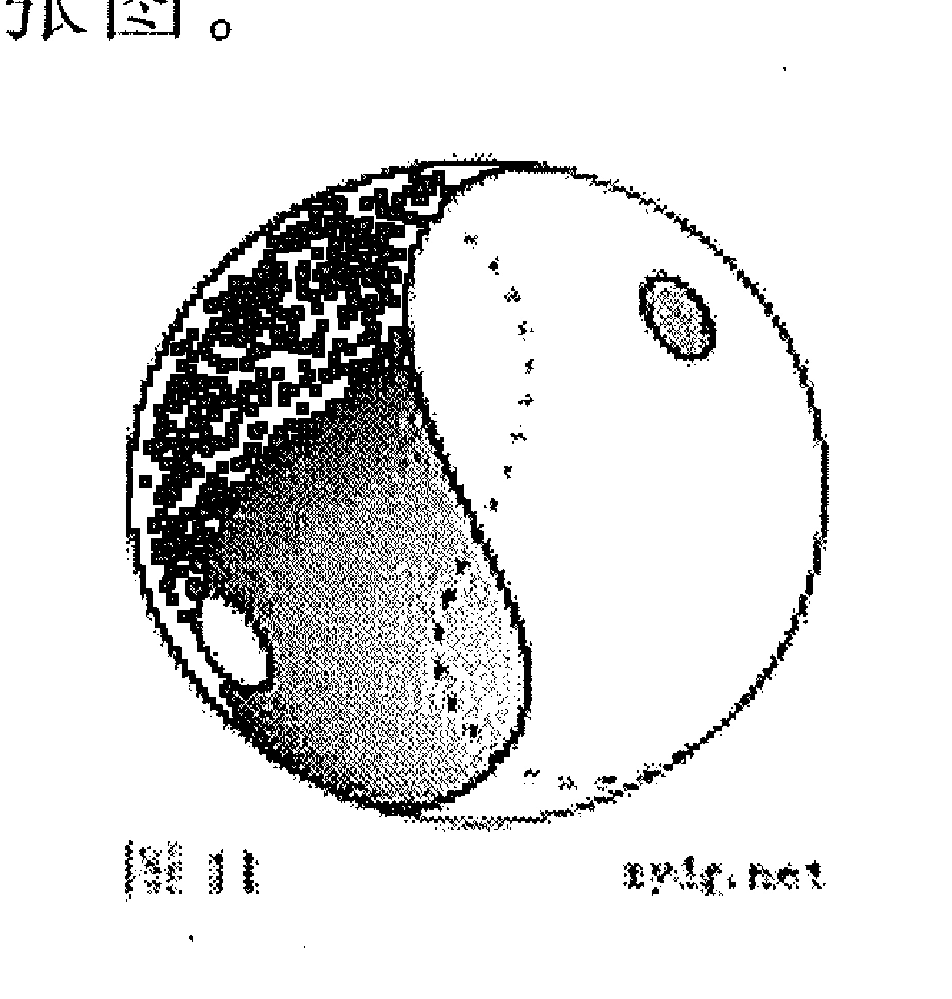

大家看这张图，现在大家看到的是一个立体的太极图的透视图。在这个图上，如果从正面看，会看到一个八卦，假如把这张图拍平了的话，就会看到一个八卦。也就是我们曾经讲到过的太极图。

大家现在从这张太极图上看到透视的两个点，也就是黑的地元里面的这个白点和白的天元里面的黑点，也就是我们讲的这个四象相交的关系点。但是，这张图上黑的点与白的点是相对的，这两个点实际上是上节课讲到的时间光锥的相对的两个轴。大家现在的认识是不是认为，我们的天元卦和地元卦是在时间轴上是相对的和相互延续的呢？这种认识实际上是错误的，下面我们看第二张图。

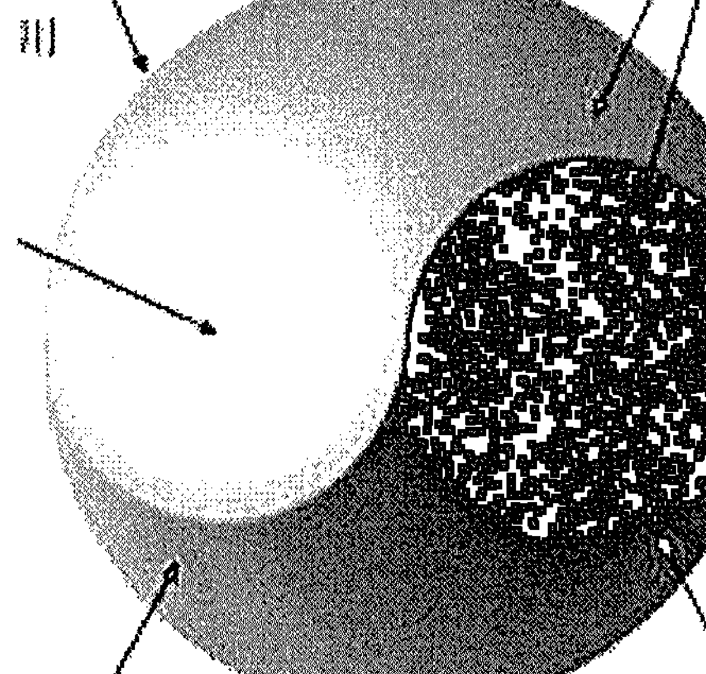

我们看到这张图上也是一个立体的太极图。假如我们把这个太极球拍扁的话，就是一张原始太极图。那么我们现在看到的阴阳的四象，是在哪一个方向上？这个黑点和白点之间是一个什么样的关系呢？大家一开始认为黑点与白点是在太极球直径的两端，实际上是受前面那张透视图的误导。真实的情况是立体太极图中的黑点与白点是垂直的。也就是说在一个卦里面贵神卦和将神卦之间是垂直的关系。

假如我们认为阴是空间，那么阳是垂直于空间表面的，也就是时间是垂直于空间表面的。时间与空间是一个相互垂直的关系。换句话说，在一个事件中，空间和时间更象是一种事物的两种表现方式。而这两种表现方式最终会形成一个事件本身。

事件是特定人物、特定地点在时间轴上的一个切片，这个切片是怎么切下来的呢？是竖着切下来的。空间和时间相交产生了事件。空间是静止的时间，时间是流动的空间。空间是时间定位的标尺。理解这一点以后，对将来的定应期会有很大的帮助，同时对空亡这些概念也就容易理解了。

时间和空间是相互穿行的，也就是说时间实际上只是一个流动的概念，他只能通过空间来表象，时间是流动的空间。空间的流动产生了时间。而时间只不过是空间在流动过程中的标尺。所以我们会看到时间就像一条不断穿行的线一样。而空间呢，是不断地在时间上切片的，这个切片是垂直的，我们垂直的来做这个切片。那么会产生每一个事件。

### 算卦的意义是什么

我们现在转回头来讲，四象和事件之间的关系。大家在过去学习预测的过程中，或多或少都会受到外界的一些错误观念的影响，包括对数术的认识上，外界的很多观念是有偏差的。这个偏差的地方主要集中在哪儿呢？首先，外界对预测的观念中有一个很严重的错误，那就是“定命论”。依照“定命论”的说法，数术中所预测的事件是固定要发生的，因此，无论你如何预测，都无法改变你算出来的事情发生的事实。这个观点实际上指向一个结果，那就是，数术是无用的。如果我们无论如何预测，都无法改变未来事件发展的方向，那预测实际上只起到了一个事前通知的作用，而对于一个无法改变的事件，事前的通知是毫无意义的。

所以，我们学习数术，要首先了解清楚预测能达到什么样的目的。这个目的与作用，古人讲得实际上很清楚，那就是“趋吉避凶”。当讲到“趋吉避凶”的时候，实际上指出了一个基本的事实，那就是预测的结果是不固定的，否则就谈不上“趋”与“避”。

对于任何一个预测，首先是通过对现实状态中的各个要素之间关系的模拟建立模型。然后通过这个模型把事件里面的各个要素之间的关系理清楚，通过模型可以看到在时间的运行轨迹上向下延伸会产生的最可能的变化。进而采取相应的措施，达到“趋”和“避”的效果。

### 推动事件发展的要素是什么

推动一个事件向前发展的要素是什么？大家知道把一个事件真正向前推动的因素是什么呢？是矛盾和矛盾的统一。矛盾与矛盾的统一，最后形成了推动事件向前发展的动力。

在一个事件中，只要产生了矛盾，就产生了不平衡。而不平衡的关系之间的相互组合，最终会给这个事件一个向前的力。这个力是在哪个方向上呢？是在时间轴的方向上的。

如果预测一个事件，首先需要关注两个方面。第一个是在一个卦里面找到这个事件的各个要素，这些要素包括事件中各层级之间的关系、空间的位置、强弱和主次的关系。第二点是找到这个事件中，这些关系之间产生了什么样的矛盾，而这些矛盾是在如何的情况下统一的，这些矛盾之间的相互作用又是怎样的。

只要我们找到了这些事件中各个要素的矛盾和矛盾之间的相互关系，我们就可以推断出这个事件向下发展的大致脉络。那么，事件中的矛盾与矛盾的统一，在哪里体现呢？这个矛盾和矛盾之间的关系，就是梅花占里面最基础的理论，就是八动占。

八动占把一个事件中的各个力量的对应关系在卦里面找出来，然后将各个卦之间的相互关系相互对比，从而推导出一个向下发展的可能方向。当然这个可能方向最后会和悔卦融合。也就是，贞观是主卦，悔卦是变卦，当事件与悔卦产生融合的时候，相当于在事件的下一个进程中产生了另一个切片。

理清八动占之间的关系，就可以很容易地把一个事件的大致矛盾模拟出来。从而推导出这个事件内部所蕴含的各个方面的要素之间的情况和大致的发展变化方向。在一个卦里面，四象是用来分别一个事件中各个层面的相关定位。而各个层面之间的关系最后形成的就是矛盾与矛盾的统一。这就是八动占所要讲述的内容。

## 第五章 八动精讲

### 问招卦

八动占里面的第一占叫问招卦。问招卦相当于金口诀里面的妻妾动，大家知道问招是什么意思吗？“问招”实际上是古代的一句官话，就是古代办公行文的时候用的。“问招”的本意是审讯的意思。古代把官员抓起来叫“系狱问招”，就是把人抓起来关在监狱里面要口供，叫问招。“问”是询问的意思，“招”是口供的意思。询问和审讯叫“问招”。

大家理解到这个词的意思，就会理解假如起卦要是测官司的话，如果测得“问招卦”，就会增加外人谋害的机率。有人会过来讯问，甚至会产生一定的限制自由的可能。我们下面一句一句地把这几句话给大家讲一下。

数术中的口诀，是为了传承方便，便于诵读，而创造的便于记忆的方式。口诀中的内容相对比较简略，在实际应用中，需要对口诀中的内容按各种各样的情况进行分析。如果不剖开来细讲，大家在日常运用口诀的时候，就有可能会产生一定的误解。下面我来讲一下“问招卦”的口诀。

- 干克方为妻妾动
- 财官损折下卑疲
- 外边取索多谋害
- 人在家中访不宜

“干克方为妻妾动”，干克方是天元克地元，天元卦克地元卦，就是问招卦。我们知道天元卦在四象里面代表君，代表祖，代表尊长，代表高处，代表大领导。他代表一些很高层的势力和阶层。而地元卦代表子孙、奴婢、六畜、下面的、还有低层次的，群众性的。高层的克低层的，这个时候就产生了一个官方的对群众的一个力量。所以，当产生这种天元卦克地元卦的时候，会产生什么事情呢？看第二句，“财官损折下卑疲”。这句话的实际含义是“求财不得、求官有损、下层不利”。

地元卦在四象里面代表积蓄，求财如果遇到天元卦克地元卦，就会动到积蓄，也就是动了家里的本儿了；把家里的积蓄给克走了。求财主家中的积蓄受损，所以叫“求财有损”。求官的时候会产生什么状况呢？“折”。折的含意是“翻腾，转折”。求财的时候占得问招卦会损伤到积蓄。求官的时候占得“问招卦”会产生转折与变化。假如测一个公司和一个单位的情况，占得“问招卦”主基层不利。“下卑疲”，“下”是下层，基层的意思。“卑”也是基层的，同时代表着低微的，地位低下的人。“疲”的意思是不得力，下层的，基层的，底层的人员不得力。测身体的话呢，主腿脚不利，“地元卦”在四象位中为足，为腿，上面来克下面，腿受伤了，所以主腿脚不利。

“外边取索多谋害”，测一件事情，占得“问招卦”，主外来克内、外人谋害。“问招”就是审问的意思。审问是强势群体对弱势群体。不管你一开始是如何强势，一旦到了监狱里面，你就是弱势的。而负责审问的，肯定是权力机构的强势的代表。

这里面有一句话大家记一下，叫：

> “外来克内人谋己，内来克外己谋人。”

这是常常会用到的口诀。外来克内的时候，是别人来算计你，内来克外的时候，是你去算计别人。内来克外是鬼动。鬼动的时候都是自身力量很足的状态。后面讲“鬼动”的时候要讲到，为什么鬼动的时候会显示出一种很强势的力量。

最后一句“人在家中访不宜”。为什么访不宜呢，为什么人在家中呢？假如我们理解刚才那个问招卦的含义的话，大家就明白了。问招卦是身在系狱，不便外出。当然啊并不是你去测谁，他就是被关在监狱里了，并不是这样。但是呢肯定有不适合外出的原因。而这个时候你去访的时候呢，是不适合的。所以呢，叫访不宜。

我们在日常生活中呢，常常有人测这个事情，他说我准备去办一件事情，你看看我去的话，合适不合适。这种情况啊，大部分都是去送礼。日常生活中有很多人去给高层送礼的时候，会有这种疑惑，说我去的话合适不合适。在平常预测中常常会遇到这种问题。遇到这个问题，假如有人问这种问题的话，那么一旦有问招卦出现，就最好不要去了。为什么？有不方便的地方。所以呢，这句话就是访不宜，去拜访他，是不合适的。肯定会遇到他不愉快啊，这种情况。外来克内的时候，你去拜访人，那是你去找别人，这个时候他是来克你的。

### 下面给大家讲一下书中的例子

例：生年：1984 性别：女 占事：能不能与他去上海工作

公历：2007年9月23日1时18分
年建：丁亥 月建：己酉
日建：庚申 时建：丁丑 (旬空：子丑)

本卦
风山渐

变卦
艮为山

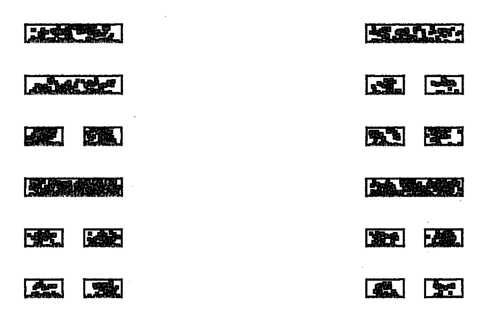

这个卦是 07 年的一个比较旧的例子。是测去上海工作行不行？

我们分析一件事情，首先，要找到事件的中心。如果分析一个卦，就要找到这个卦所反映的事件的中心点。这个卦的中心点是什么呢？是问“能不能与他去上海工作？”。这里面有几个点，大家能不能分析一下这个卦所反映的事件中需要关注的要点？

断卦实际上就像写命题作文一样，断一个卦要先读题。因为卦所反映的内容与求测人问的问题是紧密相关的，求测人问卦的时候，实际上就是在给你提问题，给你提一个命题的作文。你就要把这个命题先拟出来。

在这个卦里面有三个要素，是需要关注的要点。第一个是外出，外出行不行或合不合适。第二是工作，工作外出合不合适。第三是“与他”，这个他是她的一个朋友，与他外出工作合不合适。

断卦首先看主卦，也就是贞卦。主卦为风山渐，上卦为巽为风为木，下卦为艮为山为止为土，外木克内土，问招卦。

大家回忆一下刚才讲过的那个口诀，外来克内人谋已，内来克外已谋人。接着大家找一下贞卦里面有几个动占？首先是一个问招卦，求财不得，求官有损。然后呢，财动盈益卦，求财必得妻妾病。这两个支点里面产生了一个矛盾，问招卦讲“求财不得”，盈益卦讲“求财必得”。这两个概念是有矛盾的。

在这里，就涉及到了上节课所讲的断卦顺序的问题。如果把这个卦所反映的事件当做一篇作文或者一个故事，断卦顺序就决定了这个故事的顺序与要素。因此这个故事要先从财动开始，这就是这个故事的开端。

我们回顾一下这个故事所要问的事件的三个层次的要素是什么？“第一是外出，外出行不行或合不合适。第二是工作，工作外出合不合适。第三是“与他”，这个他是她的一个朋友，与他外出工作合不合适。”

大家首先考虑一下贞卦代表什么？贞卦代表的是事情在当下的情况。就是求测人在求测的时候的情况。贞卦里面有一个财动，求财必得。但是这个财动有一个问题，就是财动逢空了。财动代表一个求财的事情，所以她求测的问题中首先有一个收益上的考虑，也就是说这一次的外出工作，肯定会有一个受益上的预期。但是这个收益的预期如果假设他不空，是一个真实的收益预期。现在空亡代表什么呢？代表这个收益的预期是空的。落空代表着达不到。

按断卦顺序来看，这个卦首先看财动。财动克完了以后是问招卦，外来克内。外来克内代表出行有阻，而且代表犹豫，拿不定主意。为什么在这个卦里面代表拿不定主意和犹豫呢？巽为曲直、曲折，巽卦里面有巳火，巳火是螣蛇，螣蛇代表变化，消息、信息的变化，不确实的消息。这些消息来克内。

从这个事情的现状来看是有一个求财收益不错的工作，这个工作是谁说的呢？是她问的那个“他”，是“他”介绍了一个工作，这个工作收益上预期还不错，但是呢，这个预期现在看不到。还有一点是空亡，空亡的概念以后我们会反复的提到。因为空亡在预测中是一个非常重要的概念。

在这个卦例里面，风山渐卦巽卦的纳支是辰巳，艮卦是半空亡，巽卦克艮卦，这一个克是实的，而里面的财动，是虚的。也就是说，她对财的预期，心里没底。对外面的这个人，又有一定的顾虑，对这个事情又有一定的预期（寄宫的内容）。

甲寅旬子丑空，子水是全空，丑土空代表什么？艮卦是半空，艮卦的地支空亡，代表落地逢空，就是不落地。空亡的概念有很多种具体应用，空最后在这个事件里的表现有很多种，一种是虚，也就是心态上的，还有一种是实际的情况。如何来区分他到底是心态上的还是实际情况上的，需要用这个事件来引导他。也就是说他在现有的这个事件上他是什么样的呢？她问的是和他出去到上海工作好不好，那么也就说明她现在还没有动，她正在考虑去还是不去。那么也就是说她现在这个财应该还是预期中的，而不是实际已经发生的财。那么她的这个空亡，也就是预期的空亡，而不是心理的虚。就是财的预期是虚的，这个虚呢，就是空的。我们讲未发生的只能叫他虚，而不能叫空，只有他落实了，实际上是空了，实际上没有了，才能叫空。这是两个概念，所以古代有个词叫“空虚”，空和虚在古代的词语分类里面是不一样的。

下面继续看一下其它因素，“问招卦”的口诀“外来克内人谋己”，在风山渐外来克内的问招卦里面，还有多少其它的因素，首先问题中的“他”是什么卦？这个“他”是巽卦，巽卦寄宫里面有辰巳，巳火在亥年是岁破，这个破，代表着不顺畅的不利的因素，也就说，对方实际上在亥年的时候，本身的运气也不佳。那么对方是什么情况呢？也是破掉以后，去寻找新的出路。巽卦里面还有什么？巽卦里面的辰是什么？是月合，辰与酉合。月建代表什么？月建代表正当权的，新兴的事物。辰与酉合的时候代表去寻找新的合作。

但这个酉在哪儿呢？大家找一下。算卦、预测都有一个原则大家一定要注意，所有的时间，只是一个尺度，时间的显现，要在卦里找。那么卦里面有没有酉，有没有兑卦？有的，大家来找一找，有没有兑卦？兑卦在哪里呢，兑卦在错卦里面。

雷泽归妹。

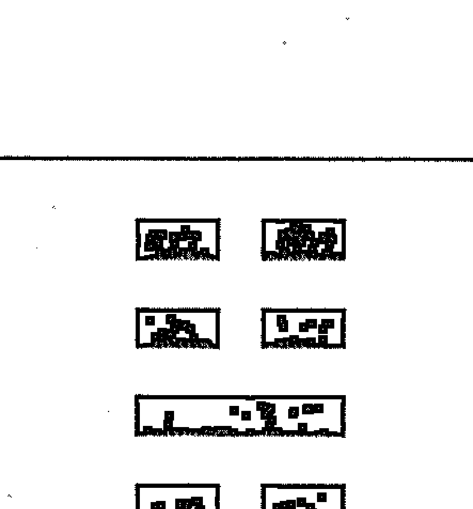

古代有个成语叫“错综复杂”，“错综复杂”这个词就是从易经里面来的。“错卦”和“综卦”在“梅花占”中，是“变占”的内容，分别叫“错变”与“综变”。“金口透易·梅花占”中的变占，是以卦变卦的方法，是“梅花占”中用来断细节的方法，这部分内容，后面的课程里会有所涉及。

“错卦”是用来查看事件主体所涉及环境情况的“变占”方法，每个卦都有着一个错卦，错卦是主体的对立面的表现，也就是从主体所针对的人、物来看这个事件的方向的表现。完整的“梅花占”，自始至终贯穿着一个交叉的螺旋结构，其中一条是以事件中的“人”为中心的视角，还有一条是以事件中的“人”的对立面为中心的视角。

在这个卦例中，这个错卦代表着什么呢？代表着“他”和“这个工作”，就是与“他”一起出去工作，与他一起去上海。错卦代表“他”去的上海的状态。错卦是把本卦的阳爻变成阴爻，阴爻变成阳爻，整个卦翻过来，实际上就是阴阳的相互对立。

这个错卦就代表“他”的状态，你看“他”是什么呀？是鬼动，鬼动人出外，而且又逢月建，当月就要外出。而且还有什么，反吟，事情有反复，当月要出去。反复在哪儿呢？兑，而且反吟。这里面出现了两个空亡，一个是兑卦空亡，一个是坎卦空亡，而且还反吟，说明什么呀？第一个是本身这个人自身想出去，但出现了反复，出现了一些不确定的阻力，“贼动”代表阻力、问题。但是这个“贼动”是空亡的，也就是坎卦实际是落地空亡的，这种情况下的“贼动”，相当于这种阻力是“空”的。“兑卦”是“大空亡”，“寅申不见金”，代表着“他”自身想出去的这种力量也是“空”的，这个“空”，是种不和谐的、无力的表现。整个这个卦呢又是一个反吟卦，代表这个人本身的消息也不确定，因为里面有两个空亡，而且里面反反复复，有很多不确定的消息。

转回头来再看巽卦，也就是“贞卦”的“风山渐”，“天元卦”巽卦里面的巳火，这个巳火是腾蛇，本身就代表不确定的消息，而且在这里面是岁破，消息上有问题，是破的。

结合“错卦”中反映的信息综合来看，约“她”出去到上海工作的这个人的情况是：“他”本身在亥年就面临着一个调整，而且是“破”掉原来的工作，寻找新的工作，新的合作。这个合作呢，假如从她问的情况看，应该就是上海的这个合作。

那么对方寻找到这个新的合作以后，求测人本身消息上就有一定的不确定性，所以他自身的状态就有一个的空亡的表现，第一个空亡是什么？是对预期收益的空亡，也就是说不确定预期的收益会怎么样。第二个呢，就是对对方的状态，也就是对对方消息的空亡。首先，我们刚才讲到艮卦是个半空亡的状态，这个半空亡的状态是什么卦呢？是艮卦里面的丑空亡。巽卦的地支寄宫是辰巳，艮卦里面是丑寅，从地支寄宫来看，这里面有……三组关系。第一个关系是寅木克辰土，这里的第一个动占关系是寅木克辰土，寅木克辰土不空，鬼动不空。第二个关系是巳火生丑土，这里面出现一个问题，巳火岁破，丑土空亡，这就出现一个主要问题了。巳火是消息，消息不确实，自己没底。还有第三层关系是丑辰比合，稽滞卦，代表着拖延，牵扯家人。而且里面也是空的。所以这三组动占里面只体现出来一个鬼动不空，是想去，但是呢，对于对方的消息心里没底。

再反过来看看错卦，对方的情况是什么？对方是本身在这个月就想出去，但是里面呢，各方的消息都显示很不确定。

上面的分析情况就是她现在问卦的主要状态。对外面的大环境心里没有把握，对于求财不确定，所以犹豫。

上面讲的是“贞卦”，“贞卦”代表着求测人现在的状态，下面讲一下“悔卦”，“悔卦”代表这个事情向下发展的最可能的情况，“悔卦”是“艮为山”，“艮为山”是个“伏吟卦”，同时也是个“稽滞卦”，伏吟卦有两种，一种是八卦伏吟，六十四卦中的八宫本卦“乾为天、坤为地、坎为水、艮为山、离为火、兑为金、震为雷、巽为风”，都是八卦伏吟，还有一种是五行伏吟，比如“天泽履、风雷益”，这种是五行伏吟，八卦伏吟肯定是五行伏吟，但五行伏吟不一定是八卦伏吟。上面的卦例中，悔卦变为艮为山，是八卦伏吟。伏吟代表着“闭伏不动”，我们还是按断卦顺序来讲，在悔卦里，只有一个克，贵神卦的震卦克天元卦的艮卦，是官动明德卦。“明德卦”的口诀是“仕应禄位旺财难，常人官事得官物，财来暗损病咽喉”，测事业主有职位上的考虑和需求，但艮卦里面的丑空亡，这也是一个半空亡，自身对这个职位没有把握。因此犹豫不决。但“艮为山”这个卦的地支寄宫中，还有四个“动占”，这四个动占中有两个动占是“克”一个是地元卦“艮”中的“寅”克天元卦“艮”中的“丑”，一个是天元卦“艮”中的“寅”克地元卦“艮”中的“丑”，这两个动占是什么含意呢？地元卦“艮”中的“寅”克天元卦“艮”中的“丑”是“鬼动悔折卦”，代表着求测人虽然对去了后的职位安排没有把握，而且内心一直犹豫不决，但还是想去看一看、试一试。虽然对于这个事情的预期并没有太高（天元卦中的寅克地元卦中的丑），而且对于去后的职位、收益，都没有太大的把握，而且对于与她相约的这个人，也没有太高的信任感，但还是想要去看一看情况。但是事情的发展怎么样呢？这就需要看另两个动占，“天元卦”寄宫中的“寅”与“地元卦”寄宫中的“寅”，形成了一组“稽滞卦”，还有“天元卦”中的“丑”与“地元卦”中的“丑”，形成了另一组“稽滞卦”，“稽滞卦”的口诀是：“事牵斗讼涉亲朋，内有争竞有小凶”，事情发展缓慢，承诺无法达成，内部有口舌不宁，造成事情的拖延与牵扯，结果不是很有力。这就是“悔卦”里所反映出来的进一步的情况，如果按一般的“贞悔”二卦来解，这个事情解到这里，就告一段落了。如果想看进一步的情况，那就需要看“玄变”，“玄变”也属于“金口透易·梅花占”中“变占”的范畴，“金口透易·梅花占”的基础占法中，有两大体系，一是“动占”，二是“变占”，所谓“动占”，就是我们在教材中所列的“八动占”，是讲事件中的“矛盾与矛盾的解决”的因素的，“变占”是以卦演卦的方式，比如“错变”、“综变”，都是属于“变占”的范围，“金口透易·梅花占”中常常讲到“三宗十二变”，都是以卦演卦，推导事件中的不同情况的方法，这个方法是“梅花占”法所独用的传承，在初级班会给大家讲到三个“变占”，就是“错变”“综变”和“寄变”，这个卦，用“玄变”看，就不是很好了，求财不得，求谋不成，去而复返，所以这个卦，最终的结果是去而复返，所求不得。

## “用神”的错误

前面讲了一个例子，在这个例子的讲解中，实际上已经包括了“八动占”，包括了“通象占”，也包括了“寄宫占”，同时也包括了“变占”里面的“错变”的内容，之所以这样讲，是希望大家在课程之初，先对如何断卦有一个整体的概念，能够直观地体会一下“梅花占”断课是怎样的思路和断卦方式，只有这样，在今后的学习过程中才不容易钻牛角尖。

数术在发展的过程中，异化的问题很明显，尤其是明代以后，数术的异化更加严重，比如现在大家常常看到的“用神论”，就是很明显的错误的方法，而且这个错误的方法，在现代还被“大而扩之”，不只六爻讲“用神”，八字讲“用神”，某些在外面教授的“金口诀”也在讲“用神”。实际上“用神”的这种说法是有错误的，在真正的预测应用中，针对想要预测的“事件”，占出来的卦，或者是起出来的“课”，包括“奇门遁甲”里面的一个盘，实际上就是这个“事件”的本身，其中包含这个事件的方方面面，而预测，也是要在这个“事件”的各个层面去考量这个事件中各种矛盾和因素之间的关系。所以大家过去如果也接触过“用神”的概念，最好在以后的预测实践中把这个概念摒弃掉。“用神”观是很狭隘的一种视角。

## “问招卦”的古例

我们前面讲到了“金口透易·梅花占”的“八动占”中的一个动占，就是“天元卦”克“地元卦”，即“问招卦”。问招卦的含义是“审讯、审问”，问招卦的四句诗是：“干克方为妻妾动，财官损折下卑疲，外边取索多谋害，人在家中访不宜”。干克方是“妻妾动”，也就是“问招卦”。测财如果求得了“问招卦”是容易动老本儿的，容易动到家里面的积蓄，而且会比较容易损失钱财。测官的话，容易有变化，有转折，有他人的谋害。测事业多主下级不力，基层不力，这就是”下卑疲“的含意。“下”是下级，“卑”是奴仆、小口、基层，“疲”是软弱无力。所以“下卑疲”的意思是下级和基层以及奴仆的能力不足。“外边取索多谋害”中的“外边”指的是“天元”，“天元”是外，“地元”是内，所以“天元”来克“地元”的时候，是“外边”来克害“里面”，也就是“外人”来谋害你自身，所以叫“外边取索”，取索的“索”是索要，“取”是索取，也就是外人来索要东西，克害你的身体，损害你的家庭和身心。“人在家中访不宜”，为什么叫“人在家中访不宜”呢？我们先看“问招”的原始含意，“问招”的意思是“审问”，“审问”这个词有两个含义：第一个含意是“拘系”，测事情遇到“问招卦”，会有“拘系”的含意。如果测拜访他人，遇到“问招卦”，就可能牵扯到这个人有不愉快的事情而不适宜外出或见客，人虽然在家中，但是去拜访是不合时宜的，所以叫“人在家中访不宜”。

中国传统的数术预测事项中，有一个事项叫“谒贵”，就是拜谒“贵人”，找“贵人”帮忙，这时候通常是去送礼、走关系。如果测这类事项，一旦在求得了“问招卦”，最好就不要去了，虽然人在家里，但贵人不适宜见客，如果去了，恐怕不容易达成愿望。

我们前面讲了一个卦例，但是那个卦例实际上涉及的信息量是比较大的，容易让大家觉得“金口透易·梅花占”不容易学。下面给大家讲一个古例，《三国志》里面的一个例子，这个卦例是来自于《三国志·魏书》里面的《董卓传》，它里面讲：

> “牛辅惶怯失守，不能自安，常把‘辟兵符’以鈇锧致其旁，欲以自强。见客，先使相者相之，知有反气与不，又筮之吉凶，然后乃见之。中郎将董越来就辅，辅使筮之，得兑下离上。筮者曰：‘火胜金，外谋内之卦也。’即时杀越”

先解几个生字，“鈇锧”，这个“鈇”，是铡刀的意思，“锧”是放铡刀的座儿。过去有一种酷刑，杀人的时候不是砍头，而是把人从腰这个地方斩开，叫“腰斩”，这样人会死得很慢，是疼痛和失血造成的死亡，所以“腰斩”对于受刑的人而言会很痛苦。腰斩的这种刑具就叫“鈇锧”，“惶”，这个字念“kuang”。惶是胆怯恐惧的意思，心生畏惧，不能自持，叫失守，不能自安，心里不踏实。

> “牛辅惶怯失守，不能自安，常把[辟兵符]以鈇锧致其旁……”是讲牛辅心生畏惧，不能自持，常常用‘辟兵符’贴在这个腰斩用的铡刀上面，放在自己的身边，欲以自强。把‘辟兵符’贴在铡刀上面，放在身边，不是为了砍人，而是中国古代的一种祈禳之术，这是一种巫术，或者说是祈禳的一个方式，辟兵符实际上用的是“天罡”，就是“天罡”所指，天罡是辰，找到天罡以后，天罡所指的地方就是百兵不侵的地方，所以，在奇门遁甲里面讲到“天罡所指，行兵大利”。这个行兵大利的“兵”不是兵器，是刀兵，是指征战的时候，顺着天罡所指的方向冲杀，就会无所不利，这就是‘辟兵符’的内容

> “见客，先使相者相之，知有反气与不，又筮之吉凶，然后乃见之”。“见客”，会见客人的时候，“先使相者相之”，让身边的人先看看这个人，看有没有反气，然后再算一卦，看看是吉利还是不吉利，再去会见他。

“中郎将董越来就辅”。中郎将董越来投奔牛辅。牛辅就让相士算了一卦，得到的是“兑下离上”，是火泽睽，这个字念“kuai”，我们大家都念“kui”，众目睽睽，实际上这个字念“kuai”，三声，易经中的很多读音，和现代字典上的注音是不一样的。比如周易的第三卦“水雷屯”，大家都念“tun”。实际上“屯”字念“zhun”，屯的意思呢是蹇涩不行。睽的意思，是乖离，不顺利，乖越。水雷屯(zhun)，实际上是与下面有走之旁的那个“迍”相通假的。“不顺利，道路颠簸”，叫迍。

我们看看这一卦，火泽睽。

这个相士于是讲，“兑下离上，‘火胜金，外谋内之卦也。’”这个卦不吉利，董越有可能有谋害之心，于是牛辅就把董越给杀掉了。我们看这个断词，很简单，实际上这个卦就是一个“问招卦”，外卦天元卦是离火，地元卦是兑金，所以火克金是“问招”。问招卦是“外来克内人谋己，外来取索多谋害”，所以相士讲“火胜金，外谋内之卦”。另外这一卦里面还有一个“贼动”，贵神卦是坎为水，将神卦是离为火，说明这个董越，是有一定的谋反之心的。这个故事后面还有一部分内容，说当时这个相士曾经被董越鞭打过，所以他借这个机会来报复董越，但是实际从这个卦里面来看，当时这个术士并没有说假话。这个断卦方法是完全与“金口透易·梅花占”相符合的。实际上说明了“梅花占”的这种方法，在自古传承里面就是这样用的。

### 附件：成语里的易经之“洁净精微”

洁净精微一词出于《礼记·经解》所记载的孔子的话：“入其国，其教可知也。其为人也，温柔敦厚，《诗》教也；疏通知远，《书》教也；广博易良，《乐》教也；洁净精微，《易》教也；恭俭庄敬，《礼》教也；属辞比事，《春秋》教也。”《经解》在今本《礼记》为第二十六篇。郑玄《礼记·目录》云：“名曰‘经解’者，以其记六艺政教之得失也。此于《别录》属通论。”孔颖达《正义》云，“人君以六经之道，各随其民教之，民从上教，各从六经之性。观民风俗，则知其教”，“凡人君行此等六经之教，以化于下。在下染习其教，还有六经之性，故云《诗》教《书》教之等”。

《礼记·经解》的内容，是讲国民教育的，教育要因材施教，所以子路问孔子：“听到什么就行动起来吗？”孔子说：“你有父亲兄长在，你怎么能听到这些道理就去实行呢！”冉有也来问：“听到什么就行动起来吗？”孔子说：“应该听到后就去实行。”公西华问道：“子路问是否闻而后行，先生说有父兄在。冉有问是否闻而后行，先生说应该闻而即行。我弄不明白，想请教先生一下。”孔子说：“冉有为人懦弱，所以要激励他的勇气。子路武勇过人，所以我让他谦退。”

对于国家而言，一个国家有其自己的政治目标与文化定位，对于每个人而言，每个人的性格与禀赋不同，因此所能接受的教育也并不相同，学过八字的人都知道，在四柱命理中，最直接能够看出来的是一个人先天的性格因素与禀赋，如财格的人性格中控制欲强，凡事要按自己的想法，同时又善于利用“官”，即秩序和管理，因此这种人最适合利用社会环境发挥自己的实力，按自己的决策创造财富，达成自身的成就。而官格的人，则最善于认识与利用秩序，在秩序中获得最大的利益，因此这种人最适合于仕途。《易经》的教化是“洁静精微”，这是一种什么样的禀赋呢？在这一点上，古人与今人都没有讲清楚，自古讲易之“洁静精微”，多是从儒家的教化的角度解词，如孔颖达《礼记正义》曰：“《易》之于人，正则获吉，邪则获凶，不为淫滥，是絜静。穷理尽性，言入秋毫，是精微。”宋儒卫湜《礼记集说》引长乐刘氏曰：“夫《易》极深而研几，尽性以至命，其德之絜静也；如空虚之不可污，其化之精微也。如阴阳之不可究，则民不敢自欺于幽隐矣。”

儒家讲“洁静精微”，是从德化的角度来解，但易如何“洁静”如何“精微”，为何学习了《易经》，民就会“洁静精微”了呢？儒家的经解中没有讲。

我们前面讲到，每个人的性格与先天禀赋，决定了他的人生的发展道路及爱好取向，而爱好取向在学术中的反映，则可称之为“学术性格”，《礼记·经解》中的“入其国，其教可知也”讲的实际上就是“学术性格”，即什么样的性格会更倾向于何种学问，而何种学问对性格上又有如何的要求，如“六经教”中的“书教”为“疏通知远”，“疏”是疏理古今，“通”是通达史鉴，“知”是以史存智，“远”是目光远大，因此研习历史的目的，是为了懂得人生，懂得政治，懂得过去而知道领导未来，同时人读了历史，也会培养出自我通达，透彻了解世故人情，目光远大的性格来，这种学术性格，应当就是史学家应当具有的素质。又如“礼教”为“恭俭庄敬”，“恭”为谦逊知礼，“俭”为自我约束、从不放纵，“庄”为谨严持重，“敬”是内心端肃。因此学习礼教的目的是为了完善自我的修养，提高自身的人格修养和人品的熏陶，由内心生起的对万事万物以及自身的敬畏与慎重。而勤于礼育、谨严持重、内心端肃，进退有度，同样也是一个礼学家应当具有的素质。

《易经》的本质是预测，所谓预测，是古人通过对时空的认识，以模拟与推演的方式建立模型，对未来的事件进行预估的方式，其本质是“技术”，以《易经》为代表的中国古代“数术”，实际上都是这种技术类的方法，在这一点上讲，占卜与巫术实际上有本质的区别，巫术是通过巫师自身的感应达到感通天地的目标，而占卜是通过推导与演算来达到通达天地的结果，因此，巫术的本质是精神性的，而易学的本质是技术性的，而对于技术本身的要求以及对于技术的把握与追求的最高层次，就是“洁静精微”，下面，我们以易象占的秘传基础占法“金口透易·梅花占”为例，来讲解一下《易经》做为一门技术，如何才能做到“洁静精微”。

## 第五章 八动精讲

### 一、洁

“洁静精微”中“洁”的本意为干净，篆文写作，字形左侧为，为水，右侧为，为切除杂丝，去芜存精，左右组合，其意为条分缕细、干净无垢。那么如何才能做到“洁”呢？对于一门技术而言，“洁”的含意是“条理清楚”，不只是这个技术的操作层次要清楚，同时这门技术的技术理念也要清楚，只有理念清楚，技术的基础才扎实，学习技术的思路才顺畅，以“金口透易·梅花占”为例，“金口透易·梅花占”的理论基础既是《易传·系辞》上传的第十一章中的：“是故，易有太极，是生两仪，两仪生四象，四象生八卦，八卦定吉凶，吉凶生大业。”而要明白这句话所包含的深层含义，则需要对《易经》所预测的对象的深入了解，我们前面讲到，《易经》的预测方法是来源于古人对时空的深入了解，时间与空间相互联系、相互纠缠，从而形成了时空，而人作为一个单独的主体，以其为中心形成的时空，构成了这个人在时空中的切片，这个切片，我们称之为“事件”，学新闻的都知道，一个事件的三个要素是“时间、地点、人物”，这三个要素，即是古人讲的三才既“天、地、人”，一个事件，在时空中形成一个点，这个点就是太极，而在西方现在物理学中，这个点称之为“光锥”，光锥（英文：Light cone）是闵可夫斯基时空下能够与一个单一事件通过光速存在因果联系的所有点的集合，并且它具有洛伦兹不变性。光锥也可以看作是闵可夫斯基时空下的一束光随时间演化的轨迹。对于闵可夫斯基时空中的任一事件,都对应有时空中的一组点的集合能够通过光的轨迹(在闵可夫斯基时空中是直线)与之联系,这组点的集合被称作光锥。在通常的二维空间和一维时间表示中光锥由两个对称的圆锥体组成,它的特性是具有洛伦兹不变性。两个对称的圆锥分别代表了当前事件的过去和未来：

#### 时间光锥：

对于当前事件,易经中将其形象化为太极图

光锥内部的所有点（如下图中的事件 B）都可以通过小于光速的速度与当前事件建立因果联系,它们与当前事件的间隔被称作类时间隔
s^2 = -t^2 + x^2 + y^2 + z^2 = 0
光锥表面上的所有点都可以通过光速与当前事件建立因果联系,它们与当前事件的间隔被称作类光或零性间隔
s^2 = -t^2 + x^2 + y^2 + z^2 > 0
光锥外部的所有点（如下图中的事件 C）都无法与当前事件建立因果联系,它们与当前事件的间隔被称作类空间隔
s^2 = -t^2 + x^2 + y^2 + z^2 > 0

类时间隔在太极图中, 即为太极图中的无极图

无极图：

无极图中的大圆外面的区域，即是类空间隔，而大圆内的区域，即是类时间隔，而大圆内部的时空，相互缠绕，形成了两仪，两仪在太极图中，为阴阳鱼，两仪在事件中缠绕的顺序，形成了四象，即，纯阴、纯阳、阳中之阴与阴中之阳，以现代西方物理的说法可以理解为“时间、空间、时间汇合空间与空间汇合时间”，四象在《金口透易·梅花占》中称之为四象卦，即以上卦代表的时间、下卦代表的空间、上卦与下卦相交形成的“时间汇合空间”与下卦与上卦相交形成的“空间汇合时间”，这四象，在太极图中，即为太极图的阴鱼、阳鱼及阴鱼的鱼眼与阳鱼的鱼眼。四象的对立，形成了八卦，即阴阳鱼的正面与反面，而时间在事件中穿过，形成的轨迹，就是阴阳鱼眼相互连接的通道，事件中的各种力量在通道中运行过程中产生的相互的力量比较，决定了事件发展的方向，这些力量的比较，在《金口透易·梅花占》中称之为“八动占”，以一个卦为例

上面的卦的卦名为水雷屯，这个卦，即构成了一个事件，即“太极”，在这个太极中，上卦坎≡为上为天元为阳为时，下卦震≡为下为地元为阴为空，从而构成了时空的两仪，上卦与下卦相交为“时间汇合空间”形成了艮≡为贵神卦为少阳，下卦与上卦相交为“空间汇合时间”形成了坤≡为将神卦为少阴，如此，则形成了一个事件在时空中的四象。而有卦必有错，卦与错卦相合，形成了八卦，这就是《易传·系辞》中：“是故，易有太极，是生两仪，两仪生四象，四象生八卦，八卦定吉凶，吉凶生大业。”一句话的真实含意及在卦占中的具体应用。

通过以上分析可知，《金口透易·梅花占》作为易象占法的秘密传承，其中理论脉络清楚明白，而从此理论中引申出来的“八动占”法，与四象占法统称为易象占中的“四梁八柱”。在预测中，通过“四象占法”与“八动占法”的循环推演，可以将一个事件的矛盾与矛盾的解决完整明晰地解象出来，形成一个完善的预测模型，只有在这种模型下，易占才具有“洁”的本质。

### 二、静

“静”金文写作，上部为，为清的省字，意为纯净，下部为，为争，意为全力以赴，整字整合意义为“努力去除杂念，安定内心”，《易经》做为一部预测学的教科书，如果对技术本身的要求是“潔”，那么对于占卜的实际操作者“筮人”的要求就是“静”，即努力去除杂念，安定内心，同时以一个旁观者的角度来对被预测的事件进行分析，不夹杂自身的喜恶。《易·系辞》中说：“易无思也，无为也，寂然不动，感而遂通天下之故，非天下之至神，其孰能与于此。”讲的就是《易经》中的“静”，这句话明处是讲《易经》，其本质实际上是对预测者的要求，正如孔颖达在《周易正义》中的解释：“易无思也，无为也”## 三、精

“精”金文写作，左侧为，为米，右侧为，为倩的省形，其本义为“集中专一，精选粟米”，“精”在易学中的意义是“专一”，《广韵》言：“精，熟也，细也，专一也。”是讲的“精”中“专一”的意义。《书·大禹谟》中有言：“惟精惟一，允执厥中”，所述即“精专”的道理。做事专一，做到唯精唯一，心无旁骛，这就是“精”，《易·系辞》：“精义入神，以致用也”中所讲的以“精”“致用”的意义，是指对于预测事物及问题要进行选择与梳理，并对预测的问题进行分析。“易”作为占卜的一种方法，其预测的基础是“在方”的，所谓“在方”的数术，其预测的基础是时空的结合，时间是流动的，而空间是相对固定的，当时空相互结合，一个事件就具有了时空性，既“时间、地点、人物”，因此，易做为预测的工具，是受“天、地、人”限制的，这种限制，决定了易占的局限性，即“一事一占”。易学的预测，是针对具体事件的“发生、发展”的模拟与评估，因此，其占卜的方式是“一事一卜”，如同我们前面讲过的，一个事件实际上就是一个太极，而与事件相关的各因素，在太极内部形成两仪、四象、三才、八动。这一切都是针对一个特定时空内的事件的，而占卜的指向性，也让占卜具有了一定的局限性，即脱离开占问的事件的其它因素（即类空间隔）是无法在预测的卦象中显示的，这就要求易经作为预测术本身，要具有“精”的特征，同时也要求预测的实际操作者（即筮人）同样也要达到“静”的境界。《易经》中对“精”的要求，实际上与其它“在方”的预测术是一脉相承的，以同样“在方”的卜法为例，考古发现的卜辞，其中体例完整的记录包括署辞、兆辞、叙辞、命辞、占辞、验辞，其中的命辞，即为卜问的问题。依现代考古发掘所发现的统计，甲骨占卜中的命辞中贞卜的事项，依罗雪堂《殷墟书契考释》所分计有九类，分别为：“卜祭，卜告，卜簟，卜出入，卜田猎，卜征伐，卜年，卜风雨，及杂卜。”均为对事而占。

> 自汉代以降，《易经》之学被儒家易理学所据，而作为技术的数术易学，则流落于民间而逐渐江湖化，自此，《易经》占法的“精”义，渐渐被江湖的“流口”与“查言观色”所取代，甚至有江湖数术，以占卜的“广、大、全”作为自身“高明”的标榜，让《易经》之学成为街头的骗术以及个别人谋财的依据。如下面某公开的占例：

#### 一男名李森得卦

##### 颐变剥

> ＊ ＊ 断：

- 1: 你今年27岁了，至多不超过28。（对！我今年27周岁，虚岁28了）。主卦“艮”加震为11，互卦为16，相对为27，变剥上艮为止，至多二十八岁。（试问所有人来问起出来是山雷颐化山地剥，都是27岁，不超过28？还是要先看看来人的面貌？）
- 2: 你是姊妹三个（主卦艮为七被震木所克，所克有必失7－4＝3个克走四个，有三个，主卦又为大离卦，离火为母生艮，视为三个孩子）。你在家是老小（体艮）。（同理，山雷颐化山地剥，则是姊妹三个，是不是所有人来问起出此卦都是如此？若此人下次来占测，起出来的是地雷复，那坤为八，被震所克，就会变成姊妹四个了？还是每次此人来占，都一定会摇出山雷颐化山地剥？）。对！你四岁时从高处摔了下来，手臂和足部受伤，对，很对，我四岁时就是这样，从墙上往下跳伤了手臂和脚。艮为高处，震为动，直读在高处妄动跌落下来，震为四，四岁为走木运，木旺克体，所以说四岁有难。（此依山地剥解，那是否所有来问求测的人占行此卦，都是在四岁时从高处掉下来过？）
- 3: 你还没有婚姻！全卦中坤土多，没有少女之象，主卦大离，为女孩都离他而去。你看我什么时候会有婚姻，在今年五月份你的婚姻定成，大离火生艮土，五月又为午火，更生艮土，婚成。婚成后来对我说一下，行，我一定对你说一下。（在今年7月份反馈婚成，此女30岁，男非常满意）。
- 4: 你母亲和你父亲离婚了，你父亲在你们家中是老大，你哥们不管你，经常还想说你（震木克艮土？），你两个哥在你面前尽说虚话，光说不办事！（对！）（震为哥们，克艮土不想管，互卦坤为虚，哥们内心对他都是虚的，变剥？变卦上艮为实，下坤为虚）。
- 5: “你看我父亲如何？”你父亲已归山入土了，去世已四年了。对，对对就是，这你也知道，太神了。震克艮有灾，山雷颐卦象为停止行动，停止思想，人停止行动停止思想那不就死了吗？

以上的卦例，初看起来给人的感觉很神奇，但经不起细致推敲。须知《易经》是占筮的方法，而不是算命的方法。占筮的方法是“在方”的，卦本身针对的是“事件”，而事件本身是有时空限制的。如果脱离开了这个时空限制，那么就没有了“事件”可言。因此，占筮的方法，都有一定的针对性与时效性。也正因为如此，占筮才真正能够指导人的选择。而前述看似神奇的卦例，初看起来，神奇无比，让人叹服于“大师”的功力，但推究起来，却包含着一个明显的悖论。试问如果一卦可以占测终身，那么是不是每次此人来求测，都会得出相同的卦象来呢？如果是以姓名起卦，那么是不是所有叫李森的人，都是家有三姊妹、四岁摔伤过、父母会离婚？从我们的社会认知中可知，这种事情是不存在的。而很多人还会被此种卦例所吸引，其原因一是因为猎奇心理，被编造出来的神奇的谎言所蛊惑，同时也是因为不明了占卜的根本原则，即“精”的真实含意。

占卜的本质是通过建立时空模型，对事件的前因后果及未来的发展最可能的方向进行模拟。因此，其预测的目标是针对事件的选择。如果没有“事件”做为前提，选择也就无从入手。而且对于同一事件的结果还有追踪，要不断地通过模拟来调整时空发展的方向，这在上古的卜法中称之为“习”。只有如此，占卜才能真正做到“精”，也才能真正具有指导意义。

### 四、微

微，金文写作（左为彳，为道路，中为𣥂，为长发缓行，右为攴，为杖），通字释义为披发缓行于路。《説文解字》释：微，隱行也。《爾雅·釋詁》释微为“幽微”，其义为细致、深入。《易·繫辭》所言“君子知微知彰，知柔知刚，万夫之望。”其中的微同样也是幽微之意。但在易占中，要做到“知微知彰”，即“既要了解事物内在细微的变化，同时也要了解事物外在的表现”，是需要方法才行的。《易经》的传承，自汉代以降，技术层面的数术易或言象数易，一直深潜于民间，而官方层面的易理之学，则只是借易言事，基本上对易占采取回避的态度。而有所传承的真正占卜技术，则深藏于皇家及道教传承之中，不为外人所知。自唐代以后，随着真实的易占技术在民众视野逐渐消失，大量掺杂混乱的数术方法进一步造成易占技术的混乱。因此，在公众的层面，很难理解易占中“微”的技法与内容。

《金口透易·梅花占》作为上古“兵占”的传承，其中包含了完整的易占技术。今以《金口透易·梅花占》中的“寄宫占”为例，解说一下如何在易占中达到“幽微”的境界。

“寄宫占”又称为“寄变”，在《金口透易·梅花占》的体系中，属于易占的“变占”系统。《金口透易·梅花占》中有三宗十二变之说。前文《成语里的易经之“错综复杂”》中，曾提到过错变与综变。与错综二变以卦变卦不同，“寄变”是将一个卦分为五层，从“事件发生的情况”、“事件中人的心理活动”、“事件中人的心理活动的外在表现”、“事件中人的心理活动的外在表现对事件的影响”、“事件与当事人的联系”这五个层面，对需要预测的整个事件进行细致剖析的方法。现以一个实例对《金口透易·梅花占》的“寄宫占”进行解说：

和同学合伙开了一个建材店，生意还能做吧。因为觉得盈利不是很多，同学想退出，如果现在转让可能会亏损，我准备接手自己做，因此手摇一卦，卦如下，请前辈们预测一下。鞠躬感谢！

职业:商业 出生年份:2013年 性别:男
起卦方式:手工指定
公历时间:2013年7月24日7时18分
农历时间:癸巳年六月十七日辰时
四柱:癸巳年 己未月 辛卯日 壬辰时
巽宫:风天小畜

## 第五章 八动精讲

## # 寄宫占

|      | 贞卦     | 天元本气寄宫 | 天元寄宫 | 天元正宫寄宫 | 地支寄宫 |
| ---- | -------- | ------------ | -------- | ------------ | -------- |
| 本卦 | 巽离兑乾 | 乙丁辛庚     | 乙丁己丙庚己庚癸 | 丙戊丁辛戊壬 | 辰巳午酉戌亥 |

1.  贞卦卦官鬼动，贼动，自己想接手生意，想要博一下，市场不是很好，竞争也很激烈。（此是从卦的层面看，本卦鬼动，有动力，但动力不足，外界市场临太岁，自身为岁破，自身实力不足，且贼动，主不安，贼运逢空，状态比较迷茫）
2.  地支鬼动，逢破，自己想把握机会，但自己的力量不足，妻动，没有实际行动，感觉有压力，外环境不利，贼动，逢空，内心纠结不安，子孙动，想寻求外面的帮助，稽滞，等待，犹豫不定。（此是从地支层面看，亥水克巳火为鬼动，巳火为太岁，亥水为岁破。从自我的认知上看，自身信心明显不足，搏不动市场，但外界的市场是个正在进步中的市场，因此自己又不想放弃，觉得下一步市场应当会更好一些“巳生戌”，所以内心为此犹豫不决“辰戌稽滞”）
3.  正宫鬼动，想要抓住机会，贼动，外面的市场不好，自己的资金不足，妻动，资金对自己是个很大压力，子孙动，想得到外面资金的帮助，兄弟动，等待资金的到位。（从正宫看，觉得外界的市场机会自身应当把握，很快市场应当有上升的机率了，所以想等待机会，等待市场上升后，带来更多的收益，但内心对自身的资金能不能支持没把握，内心不安）
4.  寄宫鬼动，自己动的意愿很大，在争取接手生意，也在感受阻力，妻动，外部环境不利，自身犹豫，贼动，市场疲软，求财有阻，子孙动，需要有外力相助，等机会，父母动，自己也在找外援，稽滞，等着外面的消息。（寄宫显示了这个事情向后面的三种选择，一是找合作，等转折，二是自身寻找机会，抓业务，三是等待。但选择中也有问题，一是合作牵扯到利益与管理的分配，二是业务机会短期内没有显现，阻隔较大，三是自身能力不足，抓业务有难度，因此，心里拿不定主意）
5.  天元寄宫鬼动，逢合，贼动，自己想接手，在犹豫，有阻力，市场环境不利盈利。（天元寄宫是最后最可能的选择，找合作，想办法等转折的机会） 看看另一种选择，即逆向选择，不接受会怎么样，看综卦。
6.  综卦卦宫稽滞，是一种停滞不前，没有发展的状态，是一种维持的状态。
7.  地支官动，生意的消耗多，压资金，子孙动，父母动，逢空，得不到市场的互动，盈利不多。
8.  正宫官动，资金投入多，父母动，寻找外面助力。
9.  寄宫官动，投入更多的资金，来取得市场，把握市场，子孙动，父母动，逢空，虽有市场的回馈但实际利益并不多，稽滞，阻力大，资金和市场的阻力大。
10. 天元寄宫稽滞，就是一个将就维持的状态。

这两种情况都不是很好，相对来说，第二种比第一种稍微好些，最好做别的生意。（实际上综合上面的两种选择来看，第二种方法太过于被动，而且需要的资金量比较大，消耗比较多，因此比较而言，反而是第一种选择要相对好一些）

从上面的例子及卦体的分析来看，一个卦排出来，求测的事件中的“环境、问题、矛盾及矛盾的解决，当事人的心态以及当事人心态对事件的影响、如何选择以及选择后的各种情况”都明白清楚地在卦里面显现出来。这样算卦，才能算得上“微”。

综上所述，一个研易者，若想达到孔子所说的“洁静精微”的真实境界，需要具备“对易学基础技术理念的真实了解（洁），客观公正的视角（静）、专一及有针对性的分析方法（精）、细致入微的分析能力（微）”。只有如此，才是一个真正的易学学者，也只有如此，才能达到“易教”的真实高度。

### 悔折卦

下面开始讲讲第二个动占，地元卦克天元卦，我们把这个动占称之为悔折卦。悔折卦的口诀是：

- 方克干兮鬼动名
- 官亨谋动人宣争
- 乖佞损害病佯和
- 暗昧空诈亦非轻

悔折卦卦名中的“悔”，是后悔、折返的意思；“折”，是曲折变化的意思。同时“悔”，在古语中还有一个意思，是侮辱、仇恨。古语讲“悔者，恨也”。“悔”，有悔恨的意思，内心之中的一种恨意。内心悔恨，冲之于外，谓之悔折。所以“悔折”的意思，是以下欺上，以内谋外，事情不顺利，常多阻隔，称之为“悔折”。我们先把上面的四句口诀，给大家作一下讲解。第一句“方克干兮鬼动名”，这一句是解卦名，“方克干”，“方”是“地元卦”，“干”是“天元卦”。金口透易·梅花占和“金口诀”有一定的相通之处。金口透易·梅花占中的“八动占”口诀和“金口诀”里面的“三动五动”口诀是有一定的相通之处的。“金口诀”的应用也分“四象位”，分别称之为“干、神、将、方”，“金口诀”中的“方”，就相当于“金口透易·梅花占”中地元卦的位置，“金口诀”中的“干”则相当于“金口透易·梅花占”中天元卦的位置。在“金口诀”中方克干称为鬼动，在“金口透易·梅花占”中“地元卦”克“天元卦”称为“悔折卦”。“官亨谋动人宣争”，“宣”，实际上应当是喧闹的“喧”，但古本口诀里面就是这个“宣”，应当是通假字，现在我们延用口诀，保持古诀的原貌，所以还是用这个“宣”字。“官亨谋动”，求官的话“亨通”。但是鬼动的求官“亨通”，是有其独特含意的。我们后面讲到“官动”（明德卦）的时候，口诀叫“仕应禄位望财难”，求官占得了“明德卦”，求官的话容易得到提升，但是占求财则不易得。但是为什么“鬼动”的口诀叫官亨呢，“亨”的含义有几点，一是由小而跃之于大，就是从基层直接跳到一个高的层次上，谓之“亨通”。亨通的意思就是很顺利地、越级的提拔，叫“亨通”，通达顺利。古人把四通八达的大道，就叫亨衢，“衢”是街道的意思，所以“亨”是很顺利的一种进阶方式。但是前面讲“官动”的口诀，是“仕应禄位”，“禄”，相当于现在的正式的编制，公务员，禄是在职的，在籍的。过去的官员，是要有禄籍的。禄相当于官的级别，官相当于实际的职务，所以我们过去讲有官、有禄，有吏，“吏”，相当于是打工的，不是正式在编的人员，这是三种人。测官的时候，假如测到一个悔折卦，往往会是越级的提升。“鬼动”是地元卦克天元卦，地元卦在四象里面代表基层，代表着弱势群体，地位低下的人，而“天元卦”，在四象里面代表君，代表父，代表家里面的领袖、尊长、祖辈，都是地位很高的人。鬼动是地位低的人以自己的实力来影响到地位很高的人，同时“天元卦”在四象里面还代表形势，那么能够自己来左右形势的话，肯定是越级的提拔与超乎意外的提升。同时“悔折卦”也代表着到外地去工作，这是两种情况。一种是越级的提升，一种是到外地去工作。因为“地元卦”主内，“天元卦”主外，“地元卦”克“天元卦”的时候，主外出。测寻人的时候，就主人已经走远了，不回来。如果寻人占得“外来克内”（“天元卦”克“地元卦”），人就比较容易回来；“内来克外”（“地元卦”克“天元卦”）的时候，这个人就不容易回来。测官禄占得“悔折卦”叫“官亨”，自身能力很强，而且能够控制形势和左右上级的意见，从而达到自己的目的。“谋动”，求谋有动，“求谋”比如谋职、谋事，也会很积极的行动，因为“地元卦”本身的地位是很低的，而且在“四象占”中“地元卦”代表内，代表着内心，代表着自身的一些想法和感觉。用自身的想法和感觉，同时用自身的力量来左右形势，就说明这个人确实是很由能力，自己在争取提升。同时在做积极的运作，所以叫“求谋有动”。“动”也是指运作，或者是变化，积极寻求变化。但是后面三个字是“人宣争”，争竞不宁叫“宣争”。“喧”是争吵、打闹、喧哗，“争”是争夺。为什么会出现这种“人喧争”的状态呢？我们刚才讲到，“地元卦”在四象位里面代表着基层的、地位低下的、本身没有地位的人，这种人即使能力很强，但在求取功名在争取自己的目标的时候，他肯定遇到的阻力是很多的。假如说“地元卦”想去克“天元卦”，首先要经过“将神卦”，然后是“贵神卦”，才会克到“天元卦”。所以说如果“地元卦”想要“克”天元卦”，其遇到的阻力是很大的。所以“鬼动”(悔折卦)和“官动”(明德卦)，同样都是测官，都主求官有利，但是其有利的方式是不一样的。“官动”是“贵神卦”克“天元卦”。“贵神卦”与“天元卦”是挨着的，地位差不多，所以“贵神卦”去克“天元卦”就比较容易，因此求官测得“明德卦”叫“仕应禄位”，很容易。而“鬼动”要经过“将神卦”，经过“贵神卦”，才能克到“天元卦”，所以相对就比较难。因此测官的时候，如果占得“鬼动”(悔折卦)，一般都主竞争激烈，另外要防备与他人的争竞。但是同时也说明自身的能力很强。

“乖佞损害病佯和”，“乖”是“乖离”，是不合作、不顺畅，“佞”，是不愉快、不舒服，叫“佞”。古代讲“佞臣”，“佞臣”就是小人的意思。没有才智，没有才力，但是又能够得到宠信的人叫佞臣。“损”是损害的意思，是损耗、亏损、减少、不得利。“害”，是谋害的意思。“病佯合”，《金口诀》现行的通行本中的五动口诀中有“仰合”两个字，后面有个解释，“仰合”是因为“病在目下之颌上，故曰‘仰颌’”，这句话，连句解，全部是错误的，实际上是这个“佯”，意思是“好像”。“合”实际上是这个“和”，是痊愈的意思。“鬼动”的时候是“地元卦”克“天元卦”，地元卦代表着基层的，地位低下的奴仆、奴婢、小口，地位比较低的。所以呢，当“地元卦”去克“天元卦”的时候呢，事情的发展就容易出现很多的问题，比如不合作的(乖)、小人(佞)、背后捅刀子(损)、当面去告状(害)。所以有不和谐的，不合作的，有小人，有背后捅刀子的，有正面跟你作对的，这都是可能要遇到的事情。

测病的时候，遇到“悔折卦”叫“病伴和”，我们前面讲四象的时候，四象里面有一个含义，“天元卦”代表“天”，“贵神卦”是“神”，“将神卦”是“人”，“地元卦”是“鬼”。如果一个人得了病“鬼”都动了，这个人可能就离死不远了。所以“地元卦”在四象里面代表“鬼”。“鬼”是“人”下面的，“人”是“神”下面的，但是“神”也得听“天”的，他是一层管一层的。所以过去“金口诀”里面“地元卦”克“天元卦”叫“鬼动”。鬼都已经主宰形势了，这个病还能好吗？所以叫“伴和”。为什么“伴和”呢，鬼动克天元的时候，“地元卦”还代表自身。自身还有一定的力量，但是呢，这个力量已经不足以让他变得完全好起来了。为什么？就像求官一样，前面的阻力太大了。所以你会看到这个人看着好象好起来，但是实际上并没有完全好起来。而且很可能他会一直拖下去。假如是慢性病的话，会一直拖下去，留下病根儿。假如是大病的话就是回光返照，所以叫“病伴合”。“和”是好了的意思，测病的话，逢上鬼动，看着象好了，实际上没有。

“暗昧空诈亦非轻”，这一句是错误的，实际的口诀是“讼牵他人宅不宁”。大家把这一句记一下，“悔折卦”完整的口诀是这样的：“方克干兮鬼动名，官亨谋动人宣争，乖佞损害病伴和，讼牵他人宅不宁”。

悔折卦是地元卦克天元卦，假如说打官司的话，就需要从地位最低的“地元卦”一路克上去，一直克到地位最高的“天元卦”，这中间要经历几个层次呢？“地元卦”首先要经历将神卦，然后要经历贵神卦，最后才会克到天元卦。在这个过程中会牵扯到很多人，也会牵扯到很多的事情，阻力也会比较大，而且会出现他人阻隔，和官方的一些压力。“宅不宁”的意思就是家宅不宁。我们知道地元卦代表着土地，代表房子，在四象里面代表着家的里面。鬼动的时候主家宅不安定，如果测病的话，逢鬼动，主家中有鬼怪，以及闹鬼的事情。

### “梅花占”与《易经》和《焦氏易林》

下面再给大家举一个例子，一个古代的例子。这个例子里面是有“悔折”这个名词的。这个卦是《焦氏易林》里面的。随卦变革卦。我们刚才看到的那个卦叫什么？火泽睽是吧？火泽睽的意思是乖离，背佞，所以呢称为“睽”，乖离、不顺畅。外来克内人谋害，所以牛辅把董越杀掉了，因为他觉着他会来谋害自己。我们现在看到的这一卦，泽雷随变泽火革。给大家把这个卦贴出来。

泽火革，外卦是兑卦，内卦是离卦，所以这个卦正好与刚才那个卦上下卦是相反的，但是大家记住啊，他不是综卦。泽火革不是火泽睽的综卦。火泽睽的综卦呢是风火家人。泽火革的综卦是火风鼎。我们看泽火革这个卦的“林辞”：

> 载金贩狗，利弃我走，藏匿渊底，悔折为咎

“载金贩狗，利弃我走”为什么叫载金？为什么里面会有狗？我们看一下过去尚老对《焦氏易林》的解释，看的时候，大家注意一下尚秉和先生的解易方法，尚老在讲这个卦的时候，他实际上也讲到过这个卦的一些易象，但是我原来给大家讲过这个问题，尚秉和老先生他最大的问题就是不知道“以术解易”，他不知道用方法来解易，所以他就把整个的《焦氏易林注》，变成了一个以象解象的过程，因此大家在读《焦氏易林注》的时候，会发现其中有很多卦象是有问题的。下面大家先看一下尚秉和先生对这一段的注解。

> 革。载金贩狗，利弃我走。藏匿渊底，悔折为咎。通《蒙》。艮为金、为狗，震为载、为贩、为走，巽为利，坎为藏匿，坤为渊、为悔，兑为折。“底”，依《震》之《复》校，各本皆作渠。坤为渊证。

“载金贩狗，利弃我走”，大家接着找一下“载金”，找一下里面为什么会有狗？大家看一下四象卦，天元卦是兑为泽，贵神卦是乾为天。戊对应的就是后天卦位中的乾。这是“寄宫占”中的内容，乾卦的地支寄宫里面有戌亥。有猪有狗。但是你看尚老先生他怎么解的？他解“艮”为金为狗，所以他一下子就把这个内容解错了。假如讲艮为金为狗的话呢，是以泽雷随来解，就是他讲的是泽雷随里面的那个将神卦，那个“艮卦”，那个艮卦是“金”是“狗”。

实际上在泽火革这个卦里面就明显的可以找到两个金，一个是兑卦，一个是乾卦，就是乾金和兑金，这都是金。另外呢，乾卦里面有戌，戌狗，本身就有狗。就像乾卦一样。乾卦初九：潜龙勿用。大家知道这个龙在哪儿了吗？实际上乾卦这个潜龙勿用中的龙，在巽卦里了。为什么在巽卦里呢？乾卦的初九爻是潜在最下面的那一爻变，他变成一个什么卦了呢？他变成的是天风姤卦。

“天风姤”卦，上面是乾金，下面是巽木，实际上也是一个问招卦，乾为天克巽为风，外来克内，“问招卦”。问招卦是讲外来克内，大家看巽卦，巽卦里面是有什么呀？巽卦的地支寄宫是辰巳。辰为龙，巳是小龙。所以你看外克内的时候，天元卦克地元卦，龙藏在下面，这个时候千万不要乱动，所以叫“潜龙勿用”。九二，见龙在田，这个“见”字念“xian”，“xian”龙在田。大家知道田在哪儿了吗？田不是离啊，乾卦的九二是什么？变天山遁，

#### 乾为天

#### 天风姤

#### 天山遁

真实的是变“天山遁”，不是变“天火同人”。艮为天田，为田园。这个时候哭卦在哪儿呢？天山遁中的哭卦在哪里？天山遁中哭卦是将神卦，将神卦是巽，所以呢，这个时候龙在田上了，在哪个田上呢？在天田上了，这个时候龙啊，就在艮卦上面了，所以叫见（xian）龙在田。

一套完整的“金口透易·梅花占”的应用是可以解易经的，但是现在大家学的这些初级的内容解不了全本的《易经》，现在解易经的话有一部分卦你们是解不了，为什么呢？解《易经》和《焦氏易林》里面是要用到变占的，实际上整个的易象占这套系统，就是动占和变占的系统结合起来的，等大家把“梅花占”完整的系统学会以后就知道了，解《周易》的本经，就象看小说一样。为什么“潜龙勿用”啊，因为天元卦克地元卦，龙潜在最下面，做事情受伤害、受压抑，所以叫“潜龙勿用”。“见龙在田，利见大人”，“利见大人”，大家知道为什么吗？“艮生乾”“父母动”，下来生上，内来生外，乾为长者，为长辈，为领导。所以叫“利见大人”。乾卦在天元卦是“大人物”。内来生外，赶紧去求他去。就是“见龙在田，利见大人”。是这个意思。

我们接着讲刚才那个卦。

泽雷随 | 泽火革
--- | ---

“载金贩狗，利弃我走”。为什么这个卦利弃我走了？上面有金，里面还有狗，但是为什么利润都逃离我而去了呢？尚老讲啊，巽为利，坎为藏匿，所以呢，利润就没了，实际上是不是呢？我们看啊，这一卦。贼动，对，贼动克利润。那将神卦是利润，贼动可不利润就没了。而且是怎么没的呢？是载金贩狗，你看上面有金啊，有狗，所以呢，利润都让这些个金啊，狗啊，给搞没了。“载金贩狗，利弃我走”。就是这样的。

“藏匿渊底”，“渊”在哪儿呢，乾卦是渊，巽卦藏在深渊下面了。为什么乾卦是“渊”呢？后面讲到《易经》的时候，我会慢慢把《易经》给大家理一遍，《易经》里面实际上乾卦是"渊"。为什么乾卦为"渊"？乾卦里面有戌、亥。亥为深潭，为太阳将养之地，所以在"寅午戌"的"火局"里面，是落于戌，寅午戌的火局代表太阳的一个运行路线，所以呢午火墓于戌，他到戌的这个位置就落到海里了，按照中国古代的神话，太阳每天早晨从这个建木上升起来，会落到哪里面呢？会落到这个"旸谷"里面，"旸谷"是北方最远处的一个深渊，太阳落到旸谷里面，在那里洗个澡，洗得身上亮亮的，准备第二天再回到建木上去开始第二天的旅行。这个阳谷就是我们现在说的这个乾卦的位置。建木在哪儿呢？在寅木那个位置，所以寅是午的长生，戌亥呢，是火的这个墓绝之地，这个地方是"深渊"，所以称为"藏匿渊底"。

悔折为咎

#### 观梅占

下面给大家讲书上的卦例，就是通行本里面，也就是《梅花易数》那本书里面的"观梅占"。非常有名的一个例子。当年邵康节先生有一天偶尔到梅园里面去看梅花，看到两只麻雀"争枝坠地"，先生说不动不占，不因事不占，今天见是算了一卦，这就是我们现在大家奉为经典的“观梅占”，大家普遍认为，《梅花易数》这个命名实际上也是从“观梅占”的这个卦例中得来的，实际上并非如此，梅花易数的这个传承，实际上最早的时候，叫做“观枚占”，又称为“枚卜”，是用三个竹片为占卜工具，用竹青、竹黄来分阴阳，以四象、八动、变占来占卜吉凶的方法，我们的“金口透易·梅花占”，在古代也应当是叫作“金口透易·观枚占”，后期人们在传承的过程中，以音度义，把“观枚占”称为了“观梅占”，并由此产生的康节先生观梅的故事，这中间应当有一个流传与演变的过程，这个过程仔细研究，应当是符合顾颉刚先生的“历史的层累说”的，当然啊，这个例子未必是真实的，但是古人写教材，实际上相当于我们现在看到的这个课本，这里面是允许有杜撰的例子，中国古代的授受之学，讲例子，是可以杜撰的，以例演意，这是古代授受之学的传统，在古代，学的人与教的人都清楚，但现代人没有接受过古代传承的教育，就很容易混淆这其中的关系。

辰年十二月十七日申时，康节先生偶观梅，见二雀争枝坠地。先生曰：“不动不占，不因事不占。今二雀争枝坠地，怪也。”因占之，主卦泽火革。初爻变咸，互见乾巽。断之曰：“详此卦，明晚当有女子折花，园丁不知而逐之，女子失惊坠地，逐伤其股。又兑金为体，离火克之。互中巽木，复生起离火，则克体之卦气盛。兑为少女，因知女子之被伤，而互中巽木，又逢乾金兑金克之，则巽木被伤，而巽为股，故有伤股之应。幸变为艮土，兑金得生，知女子但被伤，而不至凶危也。”

##### 卦例如下：

| 本卦 | 变卦 |
| --- | --- |
| 泽火革 | 泽山咸 |

> 《林辞》
无足断跟，居处不安，凶恶为残

解断：
- 一、主卦为泽火革，上卦兑为泽，为金，下卦离为火，为火，下克上，为鬼动凌迫卦，主喧争不宁之事。
- 二、互见天风姤，为贼动（悔折卦），主因盗生事，外卦为兑为少女，受克为少女有损。
- 三、外三才重重克内，乾兑克制巽木，巽为木，为长女，为关节，乾为盗，克巽为摘花之应，巽位临于下为股，外来克内为跌，受克为伤股之象
- 四、离中藏支为午为口舌是非争吵之事，兑中藏支为酉为少女为小家碧玉，午火克害酉金，亦为女子争逐有损
- 五、变卦是看事情的变化方向，变卦为兑山咸，外三才重重克内，贼动克巽，事情会发生，内三才亦重重克内，乾克巽，巽克艮，艮亦为腿足，亦主腿足之伤，但内卦变为艮，为土生金，艮宫藏支为丑寅，兑宫藏支为酉，酉金克制寅木，主腿足损伤，但卦中丑土合生酉金，故不至于凶危。

起了这一卦，泽火革变泽山咸，上一节课里面讲到过，《易经》里面很多的字，不念现在从字典里查到的读音，泽山咸的这个“咸”字，念“han”（三声），里面有感的意思，感应的意思，“咸”字下面加了一个心字，就是感，感动的感。我们现代讲的普通话，是以北方承德的地方方言为基础而确定的一种全国强制推广的语言，普通话中包含的音韵，在音韵的使用上是不完全的，他与中国的古音，包括中国古音的切韵，有很大的差别。之所以我们现在用普通话来念诵中国古代的一些诗、词、文、赋感觉很别扭，就是因为我们古人所用的音韵与大家现在习惯的普通话是不一样的。“叶公好龙”，古代念“she”公好龙，现在改了叫“ye”公好龙。“少小离家老大回，乡音未改鬓毛衰”，这个“衰”字，念“cui”，现在大家都念“shuai”了。古人学东西讲究“口传心授”，口传是一种非常实用的方式。我现在就给大家这样顺着往下讲，大家慢慢的对一些读音也就明白了。包括现在六十四卦卦名的注音，很多专家都是不太清楚的。因为过去的老先生们都是口传心授，他在真正念的时候就自动把这个音传给你，带出来，传下来了。现在大家是照着书本儿来学，所以呢有很多音要查字典，一查字典就查错了。

我们接着讲刚才的例子，这个卦怎么解的呢？他说

> “详此卦，明晚当有女子折花，园丁不知而逐之，女子失惊坠地，逐伤其股。又兑金为体，离火克之。互中巽木，复生起离火，则克体之卦气盛。兑为少女，因知女子之被伤，而互中巽木，又逢乾金兑金克之，则巽木被伤，而巽为股，故有伤股之应。幸变为艮土，兑金得生，知女子但被伤，而不至凶危也。”

我们讲啊，梅花易数的整个这一本书啊，是把钥匙藏起来之后的一个内容，所以这里面有很多的东西“不可为典要”，他前面讲这个断辞啊有可能是这样断，但是后面这个解，就不可按书的解了。

大家把书中的解暂时先放一放，我们看一下这个卦中的八动占，按断卦顺序，首先是悔折卦，泽火革上卦为兑为泽为金，下卦为离为火，下克上，鬼动凌迫卦，主什么呢？我们首一下悔折卦的口诀：“官亨谋动人宣争”，主喧争不宁之事，为什么喧争呢？是因为离火克外面的兑金，兑是什么？兑是少女，兑为泽，为酉金，为小家碧玉，而且兑是外来的兑。兑为天元，为外卦，离火为地元为内卦。内卦的克外卦，所以兑金为外，是外面的一个少女被克了，怎么被克的呢？为什么被克呢？有一个兑金有一个乾金，贵神卦是乾金克将神卦的巽木，是贼动。贼动，因盗生事。外卦为兑为少女，所以是这个少女进来偷东西，偷什么呢？巽为木，为乙木，我们将来讲寄宫的时候就知道，巽卦是乙木。乙木代表着柔软的，曲折的，细的木头，这种木头为什么是花枝呢？巽卦里面有丙火，有巳火，巳火为花，为花草之木，巳火是花，丙火也是花，所以呢巽卦带着丙火，带着巳火，代表这是一个带着花的细树枝。这个少女来做贼，偷什么啊？偷这个梅花。结果就被离火克了。这个离卦，为内，为口舌，为争吵，所以当这个离火去克这个兑金的时候，主争逐、喧争、争吵、口舌、是非，一争吵，女孩从树上掉了下来，摔了一下。

摔一下之后如何？接着看变卦，变卦代表着这个事情下一步的反应。变卦为泽山咸，内卦变成了艮为山，天元卦是兑为泽，贵神卦为乾为天，将神卦是巽为木，巽卦在将神的这个位置，将神卦在人体是什么位置？按照四象位，这个地方为股。我们学四象占的时候讲到这一点，在人体上，天元卦为头；贵神卦为胸，就是身体的上半部分；将神卦为腹，为股，人体的中间靠下的位置；地元卦为足，为腿。另外上面这个兑卦也受伤了，兑卦为天元卦，为头，兑卦受伤很可能是头受伤了，巽卦受伤，可能代表着腿的关节受伤了。而且我们看到，变卦里面这个贼动还是出现的。而且乾金来克巽木，同样也是出现的。但是，唯一的一点不同是地元卦来生天元卦了，地元卦生天元卦叫宝成卦，“宝”，是宝贝的宝，“成”是成就的成。“宝成卦”代表平安。内来生外有护佑的作用，所以，虽伤而不至于凶危。

贞卦的泽火革是离卦克兑金，离卦是地元卦。地元卦在四象里面代表基层的，奴仆，还有子孙，在这里是奴仆的意思，仆人，下人，所以为什么说园丁不知而逐之啊，园丁是仆人。仆人不知道，于是去争逐她，然后这个女子害怕，从树上掉了下来，摔伤了她的大腿。

我们如果用“金口透易·梅花占”来解这个《梅花易数》中的这个梅花占例，大家会发现，一个卦里面每一层的关节，每一层的事情，都是很清楚的。而且里面吉凶的变化，也很容易看得出来。

##### 革之咸的“林辞”

下面大家一起看一下“泽火革之泽山咸”的林辞，也就是《易林》的断辞：“无足断跟，居处不安，凶恶为残”。这个林辞的解断，实际上与我们上面讲的解是相同的，“无足断跟”，是因为乾卦克巽卦。而且是重重克内，乾卦克巽卦，巽卦克艮卦，所以叫居处不安。居处是哪里？居处是艮，艮为家园，又为地元。家园受克，居处就不安了。凶恶为残，是指兑卦和乾卦重重的来克这个巽卦，所以称为“凶恶为残”。

这个林辞只有三句，有可能是不全的，古代有句成语，叫“鱼鲁亥豕”，葛洪在《抱朴子》中讲：“谚云：‘书三写，鱼成鲁，帝成虎。’”印书的时候，鲁字中的鱼字和日字往往印得分了家，变成了鱼和日，鱼日实际上是个鲁字，印书的时候往往印来印去把鲁印成了鱼。现在我们知道林辞里面有很多重复的辞，这部分重复的辞里面有一部分确实是重复了，有一部分是印错地方了，原来的辞找不到了。有机会的话，我们还会给大家逐步的讲解易林。解《易林》是要用变占的，解易林要把十二个变占全部用全。这十二个变占，还只是我们三宗十二变里面的卦宗里的十二变占。解易经也需要用到变占的内容，当然大家在初级班学完之后，再解卦大家是可以当把卦当故事来看的，而且看得会很有意思。“迍如邅如，白马斑如”，为什么？实际上是有他内部的解释的。“匪寇婚聘”，不是盗贼，是抢亲。实际上这都是有他内部的解释的。大家如果有机会，可以自己先看一看《易经》与《焦氏易林》。

刚刚讲到“梅花占”是用来解《易经》和《焦氏易林》，但大家解《焦氏易林》和解《易经》的时候，是需要用到变占的，整个的《焦氏易林》是用变占变出来的，他是一卦变六十四卦，里面全部是变占的内容。而现在大家还没有学过变占，大家只学了基础的八动占。变占的应用，是一个非常庞大的系统，变占用到第六变的时候，实际上是两万四千种变化，这两万四千种变化，是六百个卦，这六百个卦，再归纳到64卦中来，就是《焦氏易林》，因此，解《焦氏易林》一定会用到变占，现在大家可以先读一下《焦氏易林》，但一定不要钻到《焦氏易林》里面去。

## 第五章 八动精讲

也不要钻到《易经》的那个卦辞里面去，去强行的解《易经》。因为你们现在学的东西不全。

另外《焦氏易林》和《易经》在这近两千年的时间里面，已经被学院派的先生们解乱了。所以大家在读的时候，一读头就晕掉了，而且很容易被一些外面的资料误导，一旦误导以后，想转弯儿就很难了。

还有《焦氏易林》的尚氏解，尚秉和老先生确实对治《焦氏易林》和“搜寻易象”贡献巨伟，但是，尚秉和先生他没有传承，所以他不知道以术来解易林。比如刚刚讲到的，“悔折为咎”，悔折卦本身是一个卦，但是尚老先生他没有学过这个东西，没有接触过。所以从他的角度来讲，他当然不可能用这个方法来解易林。所以他就把整个《焦氏易林注》变成了一个以象解象的大杂烩。大家现在看尚氏的《焦氏易林注》会觉得很累，为什么呢？理不清卦之间的关系和脉络，所以这个“注”就变成了一个卦象的堆砌，而且很多卦象是不对的。

比如前面讲到的，“载金贩狗”，乾卦就是狗，乾卦里面有戌，戌就是狗。而且乾卦里面有亥，是猪。所以我们解易经的时候看到很多猪啊、狗啊。这猪啊、狗的，实际上是因为卦里面有乾卦，或者“变占”出来的是乾卦。但是现在大家解卦的时候总是说艮是狗，实际上当大家讲艮为狗的时候，就已经把自己给搞糊涂了。

所以现阶段读《易经》和《焦氏易林》，千万不要钻进去。大家可以把这个东西当参考书来看。

### 恩庆卦

下面接着讲下一个动占：“恩庆卦”，第一步先释名，“恩庆”的意思是什么？恩庆卦是天元卦生地元卦，叫恩庆，也叫子孙动。“恩庆”的本意是皇恩浩荡，这也是古代的一个公文用语。古代皇帝对下属的官员进行表彰以及提拔名为恩庆，这个词一般是不对低级的官员用的，在四象占中，天元代表着这个大的领导，代表着祖辈，代表着一个国家里面的最高元首。那么天元卦生地元卦的时候就代表着皇家对下级的恩宠。我们先看一遍口诀，

恩庆卦相当于金口诀中的子孙动，口诀为
干生方为子孙动
荫子添孙奴婢财
占产始知多易育
无边宠遇自天来

第一句“干生方为子孙动”，这一句是释名，干生方，在金口诀里面干生方叫子孙动，主什么呢？“荫子添孙奴婢财”。在一个家庭里面假如没有孙子的话，那么儿子是最小的，也就是说儿子会占据地元卦的位置，如果有孙子的话呢，那么地元卦就会变成孙子的位置。同时在四象占里面，地元卦还代表奴婢，代表家中的小口，同时也代表着六畜，家中的牲畜，牛马。当天元卦来生地元卦的时候，就主着家中荫子添孙，同时容易得到奴婢以及财物。这个“奴婢财”不是因奴婢得财，是“奴婢”以及“钱财”，在中国古代，奴婢相当于家庭的财产，因此，在这里，奴婢与财产是等同的。如果预测生育，占生不生孩子，那么遇到干生方就比较容易生产和得子。现代这个社会啊，污染比较严重，大家饮食不节制，生活不规律，很多人的身体发生了问题，所以现在青年夫妇发生不孕不育的机率很大。如果有人来求测，问能不能生孩子，遇到干生方的恩庆卦，往往是比较容易得子。所以这个口诀的第三句称为：“占产始知多易育”，如果占生产的话，是比较容易生的。

最后一句就很容易理解了“无边宠遇自天来”“无边”，是“很大”、“很多”的意思，很大的，很多的宠遇，“宠”的意思是恩宠，“遇”，是机遇，有外来的机遇以及长辈及领导的帮助。由上而下，加以照顾。假如测工作，遇到恩庆卦，主得到大领导的帮助，得到上级的帮助。这个“上级”也是要分层次的。比如贵神卦，在四象占里面，贵神卦主一个公司或者机构的最高执行领导，将神卦主部门的主管领导，地元卦主基层。而天元卦呢，是能够管理一个公司或者机构的最高执行领导的领导，“天元卦”有可能是“董事长”，也可能是外界的大领导，所以天元卦主外，是外界的，有干预力量的，能够影响你的领导的领导。如果测工作的话，“恩庆卦”主能够得到上级或者外界的高层领导，或是能够影响到你的领导的领导，对你提供帮助或者是承诺。

### 生克制化 刑冲破害的含意

八动占的口诀中，实际上包含着生、克、比合三种情况，其中克有五个，生有两个，比合是一个，如果一个卦是一个事件，克实际上就是事件中的矛盾，克，代表克制，压迫，以及不配合。

如果“克”是矛盾，“生”就是事件中矛盾的解决，是一个帮助的力量，以及关怀和承诺。相生是有承诺的意思的。

比合是五行的伏吟和卦的伏吟，伏吟的状态是“闭伏不动”，事情处于纠结之中，这种状态最不好把握，进退都不容易，所以真正算卦，不怕生、克，“生、克”是动的状态，有克就有生，有矛盾就有矛盾的解决办法，而比合是一种拖延的状态，所以稽滞卦称为“事体牵延比肩行”。

除了“生”、“克”、“比合”，日常应用中常用的还有“刑、冲、破、害”，“刑”的力量更多的代表着一种促进的力量。所以古人讲“君子不刑不发”。凡是遇到三刑，以及在一个卦里出现“刑”的力量的时候，更多是代表一种不顺利的，或者是一种等待促进的力量。在这种状态下，是不能够有不正当的想法的。假如一旦有不正当的想法，或者是不正当的行为，就很容易在这种逆境之中产生对自身的伤害。但是，假如你能够坚守正道的话，那么刑，就会变成一种很好的推动力量，实际上相当于是对人的一种激励，以及逆境中对人的考验。所以，我们古人讲到“刑”的时候，实际上其中包含有“惩罚”的含义，同时也有“征讨”的含义。所以大家不要看到刑就说不好，只要坚守正道，就会产生很好的效果。前面讲到“君子不刑不发”，那么在现实断卦中，何谓君子？何为小人？实际上这里所谓的“君子”与“小人”，是衡量一个人行为的正当性的一个指称。也就是说，在处理问题时能够坚持原则，保持中正平和的心态，避免投机取巧的行为，这样的处理方式，就可以称之为“君子”，在遇到“刑”的时候，就能够比较容易地度过考验。能够遵循原则而不背离，是“君子”，与之相反则称为“小人”。也就是遇事投机取巧，不坚持原则，不按规范做事，我们可以认为这种就是小人的行为。所以古人讲“君子不刑不发”，实际上是要求一个人要能够坚守正道，秉持中正平和的心态，从而能够度过危机，达到一个新的高度。这种情况，古人称为“君子不刑不发”。“冲”也是一种促进的力量。我们前面讲“生克”，“生克”更多是一种相互之间力量的压制，而“刑冲破害”更多是一种地支位置上的关系与作用。所以前面讲刑的时候，“刑”实际上是一种促进的作用，是超出常规方式以外的一种促进方式。那么冲呢，是一种什么样的作用？“冲”是位置相对的作用关系，就是在地支的十二方位之间产生的相互之间的对立关系。这种关系会因为五行的不同而产生一个相互的冲击力量。相当于是相反的方向之间的相互作用关系。大家知道地球是圆的，所以在相反的方向上的两个力量，实际上就是一个力量已经走到了最大限度的状态，这个状态，就象易经中的老阴、老阳一样，开始向另一个方向转化了。所以古人讲“逢冲则动”，这个动，就是变化的意思，这个变化，是由外力推动与冲击而产生的变化。

“刑冲破害”的“破”，是一种三角冲击的力量，破是因为六冲而产生的。比如“寅申相冲，巳亥相冲”，那么寅、亥和申、巳，就是相破。“寅申相冲，巳亥相冲”是两个正对冲击的力量，如果此时在旁边再产生一个斜的力量来冲击这个正对冲击力量的话，实际上就形成了一个三角的关系。这个三角的关系，更多的产生的是一种破坏正对的冲击，改变原来方向，就是对原来的方向产生一个改变和破坏的作用，“破”的含义是“破开、冲开”，其中有分开的含义，因此，“破”是解“冲”的，是把“冲”的力量改变了方向。

“刑冲破害”的“害”，子未相害，丑午相害，寅巳相害，卯辰相害，申亥相害，酉戌相害。“六害”是由六合发展而来的，我们知道子与丑合，子未相害，为什么呢？因为丑未相冲。子丑相合的时候，未土来冲丑，就把子丑相合的关系破坏掉了。午与未合，当丑来冲未的时候，就把午未之间的关系破坏掉了。寅与亥合，当亥与巳相冲的时候，巳火就把寅和亥之间的相合关系破坏掉了。所以，寅巳相害。巳与申合，当亥水和巳火相冲的时候，就把巳和申之间的合作关系破坏掉了，所以申与亥是相害的。平常遇到六害这种情况的时候，代表着什么呢？代表着合作被破坏。合是代表合作，不管是六合或是三合，都代表着合作。那么逢到六害的时候，就代表着合作有可能会被第三方破坏，这是一个中国最传统的，也是最基础的思维，古人讲“生克制化，刑冲破害”，实际上代表着一种力量以及五行之间的相互关系。不要把他想的过于复杂。我们讲到合的时候就是合作，讲到生的时候就代表着求人以及他人的帮助。“生克制化”实际上更多是五行的作用，而“刑冲破害”则更侧重于方位的作用。五行之间的作用力更多的是体现在时间的方面。而方位的作用则更多的体现在空间的方面。比如说我们讲到一个位置的变化的时候，更多的你要考虑“刑冲破害”。假如我们要考虑一个力量之间的对比关系的时候，你更多的要考虑“生克制化”。当然，“生克制化”和“刑冲破害”，实际上在预测事情的时候都要用到的。但是，他里面有一个侧重点的不同。

### 恩庆卦卦例讲解

下面我们来讲恩庆卦的这个卦例。大家先看卦题：“测近两年工作上有没有提升？”占得卦是火山旅变火地晋。

例：测近两年工作上有没有提升？
干支：己丑年 丙子月 壬子日 丙午时（寅卯）

#### 【本卦】火山旅

#### 【变卦】火地晋

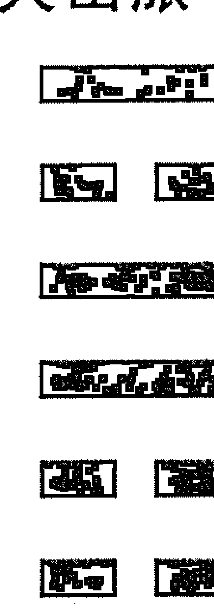

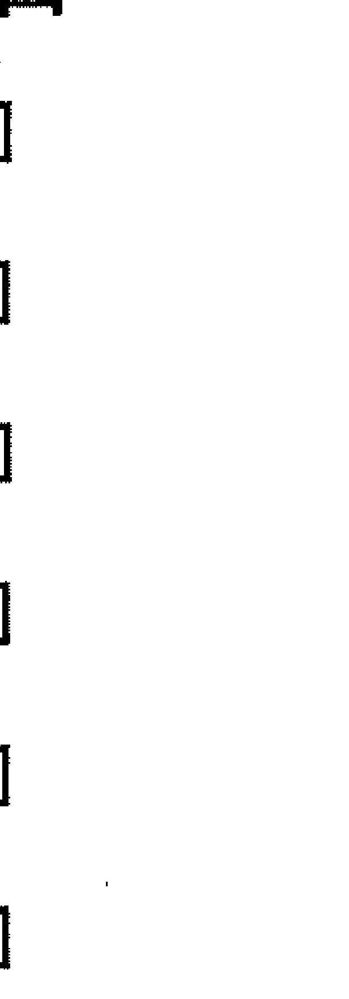

旅：小亨，旅贞吉。
初六：旅琐琐，斯其所取灾。
六二：旅即次，怀其资，得童仆贞。
九三：旅焚其次，丧其童仆，贞厉。
九四：旅于处，得其资斧，我心不快。
六五：射雉一矢亡，终以誉命。
上九：鸟焚其巢，旅人先笑后号啕。丧牛于易，凶。

> >《林辞》：
>鷽鷽窃脂，巢於小枝。摇动不安，为风所吹。内寒飘摇，常忧殆危。

解断：

-   1. 本卦为火山旅，天元卦为离为火为文书，地元卦为艮为山为官职，艮为太岁丑本宫，亦为次年寅木之本宫，主近两年之内，有领导关照，文书印信之事
-   2. 互卦见泽风大过，兑为金，在贵神卦位，为直属领导，巽为木，为文书职务，直属领导有压力，有所压制，内三才形成巳酉丑三合局，合入太岁，与领导应当有所牵扯，内三才重重克下，要直属领导作调整才行。
-   3. 主卦重重克下，为寇攘卦，主求谋有阻，压力重重之象
-   4. 卦内木火旺相，主文书印信职务之事可成，兑官处死地，门户争竞口舌之事，又主事体阻隔，待时方成
-   5. 地元卦艮宫逢空，待时而动，须借外力方可
-   6. 地元卦藏支为寅丑，天元卦藏支为午火，寅为官贵，内生外有所求谋，寅木空亡，须待时机
-   7. 天元卦午火与太岁相害，与月建相破，领导的关照达不到下面，有人阻隔，外界形势不允许，要等待
-   8. 变卦为火地晋，天元卦为离，地元卦为坤，待第二年的夏天的五月与六月，离火得太岁寅为长生，外来生内，其事可成
-   9. 变卦财官两动，印星又动，这个机会很好，要把握，对收入与职务都有好处

还是按断卦顺序逐步解断，我们先看贞卦，有哪一个是相克的？（贵神克将神），贼动，内贼卦。贵神卦是兑为泽，将神卦是巽为风，那么兑为泽克巽为风叫内贼卦。贵神卦代表着单位的领导，将神卦代表着直属的领导，那么单位领导克直属领导，代表着单位领导对内部有所压制。同时呢，代表单位领导要对直属领导做调整。因为很明显，内贼卦在一个单位里面代表直属领导和单位领导之间不和。那么在这种情况下，单位领导恐怕就要对直属领导进行调整。

在贞卦里面还能看到了一个什么情况呢？重重克内，重重克内实际上是通象占的内容。在通象占中重重克内代表压力重重。外界的环境（天元卦），克贵神卦。贵神卦代表着单位领导。外界的环境对单位的领导有压力。单位的领导对直属领导有压力。直属领导对基层有压力。就产生了一个重重克下的这种局面。实际上大家压力都很大。在这种情况下，测近两年的工作有没有提升，那么还要看第二层，就是相生的关系。在这种重重压力之下，如何去找到更好的机会，找到更多的机缘，能够找到其他人的帮助，从而让自己的仕途能够变得更好。这种情况，实际上就牵涉到了一个调整和解灾的含义。

### 如何定应期

大家在日常的预测中，有两个概念是一定要把握的。第一个就是因果相续，一个事情的前因和一个事情的结果，是相互联系的。前面的因产生了后面的果，而后面的果又变成了后面的果的因。也就说因果之间他是连续不断的。

还有第二个观念，那就是预测的目标不只是要准确，还要跟据预测的卦象来做到趋吉避凶，而趋吉避凶本身就是预测中随时要考虑的信息。实际上在预测的时候，往往很多卦之中，就已经包含着调整和解决的方法。你只是需要通过卦象，把这个调整与解决的方法拿出来，就可以达到趋吉避凶的目的了。

所以，有的时候大家会问到应期，如果明白上面的两个观念，大家会发现，应期实际就是在一件一件事情，一层一层的因果关系之中产生的。你只需要把应期从这个因果关系中找出来，把他解答出来，就已经找到了应期。而且，应期也是有因果相续与递进关系的，并不是说，我测工作的话，他只有一个工作的应期，而是在一个事件之中，有无数的应期。或者说在每个事件的每个阶段，以及每一个层面上，都是有应期的。

比如举例中的这个卦里面有几个应期呢？有几个事情的应期呢？比如讲到内贼卦，兑金来克巽木。我们刚才讲到内贼卦很可能代表了内部的贵神，也就是单位领导和直属领导之间的关系可能不是很和谐，里面有一个相对比较紧张的关系。很可能里面会牵扯到直属领导或者是主管领导的一个调整。确定调整时间的应期就要找这个兑卦和巽卦之间的关系。在这个卦里面，兑卦克巽卦的时间实际上是在阴历的七月，或者是阴历的四月和三月，都有可能会出现这种调整的状态。

同时恩庆卦代表着好的消息，离卦来生艮卦代表着一个外界对自身的一个帮助，那么这个帮助是什么呢？是离火来生艮土，按寄宫看，艮卦里面有两个地支，一个是寅木，一个是丑土。后面讲到地支寄宫的时候会知道，午火和寅木、丑土之间，实际上是两层的关系。一个是午火会生丑土，第二个关系呢，是寅木来生午火。那么也就说，这里面代表求测者从内心里面（地支寄宫代表着一个内心的活动真实想法）希望能够得到上级对他的关照。同时，他自身也希望能够和上级，也就是他的单位领导以外的这个高层，产生一个相互之间的请托的关系。

在丑和寅中，哪一个应期更确实呢，这就需要从时间四柱里面找一下有哪一个干支是真正出现的，时间四柱是己丑年 丙子月 壬子日 丙午时，太岁为丑土，这里面就有断应期的一个一个基本原则：“就是时间的四柱，实际上相当于你预测的事件在时间轴上的一个标尺”。在时间轴上的各个层面，也就是这四组地支和天干之中，哪一个地支和天干在相应的位置出现，则代表了这个卦中所反应的事情会和这个时间相应。古人讲叫“年则应年，月则应月，日则应日。”

> “就是时间的四柱，实际上相当于你预测的事件在时间轴上的一个标尺”。

古人在预测的时候，还常常讲到一句话：“远应年月，近应日时”，这个远应年月，近应日时，实际上就是卦和时间四柱中的天干地支之间的标尺关系。也可以讲，时间四柱的标尺，在事件中有一个显像的关系。卦里面的哪一个地支，哪一个天干，哪一个卦，在时间四柱中显像的时候，代表着事件中的八动关系在这个时间四柱中相应的时间尺度上，最有可能产生作用。在这个卦里面是丑土，也就是太岁在里面显示出来了。那么丑土显示出来代表什么呢？这个事情在今年有可能会产生一定的变化，也就说上级可能在今年会对他有所关照。

> “远应年月，近应日时”

断应期还有一个重要原则，就是任何的应期，都不应该脱离开事件的实际。例如求测的事件，按照基本的原则应该是在年上出现，那么即使他出现在日和时上，也只能断在本日或者是在现在，正在做这个事情，而且这个事情会达到一个什么样的情况。

同时地支寄宫中的丑和午，还有一重关系，那就是“丑午相害”，午丑相害代表着一种合作关系之间的破坏，在这个午火生丑土的上生下的关系中，又有一个“害”的关系，也就是说这个合作关系并不牢靠。因为天元卦是离火，离火和月建之间产生了第二个关系“月破”。天元卦中的午火被月建破掉了，代表着在这个月，天元卦中的午来生丑土的力量不足，所以我们就可以由这个情况去推导出两个到三个断语，在这重关系里面首先看到的是，天元卦生地元卦的恩庆卦，代表着有外界的大的领导或者对你的部门领导有影响的领导，能够帮忙。而且自身也希望能够在得到这个领导的帮助。但是，这个关系并不是一个很牢固的关系，其中实际上有一些权利的争夺，以及其他因素的干扰。同时，这个大的领导呢，可能在本月内，也就是在子月，会因为个人的因素而无法对这个求测人提供更多的帮助。

下一步我们回过头来看占测的问题：“测近两年工作上有没有提升”。从问题上来讲实际上到了己丑年的丙子月还没有产生一个很好的提升结果。那么我们就要考虑己丑年的丑月，会不会产生这个结果。因为前面讲到，艮卦里面呢，实际上含着一个丑土，很可能子月他的领导被破掉，那么其本人职务调整的时机就有可能会应到丑月。或者是第二年的正月和五月，从这两个月的情况看的话，第二年的寅年，在时间的四柱上寅卯是逢空的。而丑土和午火又相害，今年的太岁丑实际上会影响到午火对下面的地元卦艮土的一个帮助。那么在丑年的时候很可能这个事情达不到一个预期的结果。因此我们就要向下看，丑的下面是寅，而且第二年也是寅年。那么寅年在这个时间的四柱上是一个逢空的情况。那么逢空的时候代表着什么？最少在正月的时候他会去求这个午火。因为寅来生午是一个宝成卦，也是父母动“须知祭祀祥福祯”（去给领导送礼）。但是送礼后自己依然没底。逢空是不在状态，心里没底。

那么我们转过头来看变卦。在变卦里面，出现一个很大的契机，就是官动，坎水克这个离火是官动。官动代表着一个职务的提升，而且这个坎水实际上是在月建和日建里面的，也就是说坎水在时间四柱里面是有显现的。那么我们就要考虑有几个时间段是需要考量的，一个是子月，因为子月的话产生了一个官动的状态。第二个是五月，也就是午火出现的时候。悔卦里面还有第二个动，是财动，艮土来克坎水。财动代表什么呢？“求财必得妻妾病，损官谋动人出外”。丑为太岁，因为艮卦里面有丑，在丑年的子月很可能还达不到预定的目标。

再往下看生，离火来下生坤土，离火生坤土代表着一个文书的变动。我们讲的前面离火生艮土的时候，他里面还有一个相害的关系，那么下面这个离火生坤土的时候，产生了一个本质的变化，是什么变化呢？是午未相合，这种合的关系，合就是一种很良性的关系了。午未相合的时候代表文书到位，那么这个文书到位是什么时候呢？是第二年的五月份或者是六月份。大家注意一下，在时间四柱里面午是时辰，但是在断这个卦的时候不可能讲，在今天的午时你就会得到这个文书，或者是今天下午未时就会得到文书的帮助。为什么呢？因为求测人有一个前题：“测近两年工作有没有提升”。我们一直在强调，在断卦的时候，一定要读题，就像在做一个命题作文一样，首先要读题，求测的问题本身已经给了一个时间段，那么这个时间段是有问卦的具体含义的。

### 宝成卦

第四个动占是宝成卦，宝成卦是地元卦生天元卦。相当于金口诀里面的父母动。今天讲宝成卦还是从释名开始。

-   地元卦生天元卦（宝成卦）
-   方生干兮父母兴
-   父母君亲皆喜忻
-   印信擢拔多进益
-   须知祭祀祥福祯

（占产多育，占印有喜，有擢拔进益之事，须有所求谋方成）

宝成卦中的“宝成”，是“万物已成，丰盈厚重”的意思，宋代有一位研易的大家，叫林栗，林栗解易的著作叫《周易经传集解》。林栗这个人，在宋代淳熙年间做过兵部侍郎，大家知道中国宋代有一个儒家的大家叫朱熹，朱熹当时以江西提刑召为兵部郎官，林栗是朱熹的顶头上司。林栗与朱熹两个人在周易的辩论中产生了一些不同的意见，从而被朱熹的这一派排挤，最后是死于外戌的任上。大家看林栗的经历，他实际上是做兵部侍郎，宋代的兵部侍郎，相当于现在的国防部副部长，官做得很大，而且知兵事，林栗解易，朱彝尊《经义考》引董真卿之言，谓其说“每卦必兼互体约象覆卦”林栗解易，重汉易传统，其解易的方法，有没有受到兵阴阳的影响，现在不好讲，《周易经传集解》中解雷火丰卦时讲到：“下离上震，成卦曰丰者，初为离，二为巽，三为兑，四为震。离，明也；震，动也。明以动，谓之丰，何也为其有？巽兑之象焉。巽，人也；兑，说也。一阳在上，三阴承之春气而百草生，正得秋而万宝成”。这个宝成的意思，就是“万物已成，丰盈厚重”。

《周易经传集解》讲丰卦“下离上震，所以呢叫丰，初为离，二为巽，三为兑，四为震。离，明也；震，动也。明以动，谓之丰”。大家有没有发现林栗在解“丰”卦时，是把卦分成四象的。“初为离二为巽三为兑四为震”。他实际上是分四象卦的。

### 下面先把“宝成卦”的口诀解释一下

第一句：“方生干兮父母兴”这一句是释名，与前面的八动占的口诀是一样的，就是方来生干的时候，名叫父母动。

第二句：“父母君亲皆喜忻”。这个“忻”字呢，念“xin”。“忻”者“闿”也，古同“恺”，忻的含义是代表着欢乐，内心之中开怀的欢乐。“闿”字的意思，是胸怀开放，意志舒畅，名之为“闿”。就是很高兴的意思，所以，当这个方来生干的时候，代表什么呢？父母、长辈、君亲都很愉快、欢乐，“君亲”中的“君”是指一国之主。“亲”，并不是我们平常讲的亲人的意思。“亲”是代表着长辈，叫“尊亲”，尊长的意思。他代表着尊长，也就是在血统之中，比较直系的长辈。所以他这句话的含义是什么呢？就是，当这个方来生干的时候，就像小辈去孝敬长辈，所以父母、长辈、尊长都内心开怀，无比畅快，所以叫“父母君亲皆喜忻”。

第三句：“印信擢拔多进益”。“印信”是指“文书”。过去古代的官职，他是有官印的，同时，因为古代去外地当官，需要赴任。古代的科技文化水平没有我们现在高。现在有手机，电话，可以远程通讯，而且交通也很便利。古代没有这些东西，官员上官赴任的时候，需要走很长的路。我们刚才讲到林栗，就是死在了迁转赴任的路上。所以古人有的时候赴任要带着仆人走很长的时间。明代有一个很有名的文人叫王阳明，王阳明是阳明学派的代表，创始人。王阳明当初到海南赴任的时候，就走了将近一年的时间。路途中还要逃避政敌的追杀。古人赴任的时候，他是要带两样东西，一个是他的官印，第二个就是委任状。这个“信”，是指委任的文书。

父母动在具体事件中代表着什么？如果测工作的话，如果占得父母动的宝成卦，就有可能到外地任职。或者在文书职权上，委任上，有一定的提升。我们在前面讲过了鬼动悔折卦，后面还会讲到官动明德卦。鬼动官动都代表着一个官职的升迁。占得宝成卦的时候，同样代表着文书的升迁，代表着一个官职的升迁和变化。那么这三个动占，在断职务或事业的时候有什么区别呢，总结起来可以这样讲，占事业提升的时候，占得官动明德卦是一种很顺畅的提拔，官动是贵神卦克天元卦，贵神卦和天元卦是离得很近的，贵神卦的四象位是从下往上数的第三位，天元卦是在从下往上数的第四位，贵神卦与天元卦已经很接近了。这个时候，当出现贵神卦克天元卦的时候，是代表着一种很正常的提拔。所以官动的口诀叫“仕应禄位”，“禄”是指“官禄”，也就是正规的俸禄，代表着国家公务员的序列，是一种很正常的提拔。鬼动是地元卦克天元卦，地元卦和天元卦之间隔着将神卦和贵神卦，因此鬼动是越级的提升。鬼动代表的提升需要经历很多的竞争以及可能出现的困难和阻力。所以“鬼动”的口诀叫“官亨谋动人宣争”，主争竟不宁，鬼动是一种越级式的提升，同时也代表着到外地去任职，或者是换工作地点。父母动，占事业更多的时候不是职务的提升，而是职级或者是权力的提升。也有可能是增加名誉头衔等等这一类的提升，大家知道在现在的职务序列里面，有很多是有名无实的。比如说“总会计师”、“顾问”、董事会的董事、常务董事，等等这些职务，实际上更多地代表着一个名誉上的提升或者是管理范围的增大。占事业逢到“父母动”的时候，往往代表着这种非权力型的，而是名誉型的职务，是这种职务的提升。

中国古代也有很多这种职务。学数术应当都会知道一本很有名的书，叫《五行大义》，学习术数，《五行大义》是一定要看的。《五行大义》的作者是隋代的一位非常有名的术数家，名叫萧吉。萧吉在隋朝叫“上仪同三司城阳郡开国公”，“仪同三司”就是一个名誉头衔，萧吉是梁的宗室的后代。隋朝建立后，就把过去梁宗室中的一些高级的知识分子笼络到朝廷之内，并授予一定的职务。萧吉在政府的政权体制内，他的权力并不高，但是因为他本人是一个术数家，他的学问很好，所以政府就给了他一个名誉的头衔，就叫仪同三司。这个职务，在国家官员的品阶中相当于从一品，但是没有实际的职权。父母动，很多时候就是这种职务，就是有职无权，相当于几级几级干部。

“印信擢拔多进益”。“擢”的意思是“提拔、提升、迁官、引荐”。“迁官曰擢，擢尤升也，进也”。“拔”是提拔的意思。占事业逢“父母动”，就会有外人引荐。荐是推荐的意思。有人推荐，得到长辈的赞许。这个卦的实际含义是小辈来孝敬长辈，长辈对小辈有提携之恩。所以后面讲“多进益”，“益”，是发展，好处，前进，有很好的前进方向。所以我们看到“宝成卦”是从小到大，是讲成长的。假如测事业，可以讲是岗位和声誉会因为与前辈以及领导之间的关系和日常的实际工作而得到更多的提升与好处。

“须知祭祀祥福祯”。“宝成卦”是“地元卦”生“天元卦”，天元卦在四象的含义是代表长辈，还代表祖宗，代表“祖”，“祖”实际上是牌位。所以，“地元卦”生“天元卦”，并不单纯是对生的长辈要有孝顺之恩，同时，也要祭祀祖宗。所以“祭祀”的含义，有他本身“祭祀”的概念。还有一个概念是“上供”。这个“上供”，我们现代人来讲的话，就不单纯的是祭祀了。现代人讲上供的时候，有的时候是有送礼的含意的。给死去的人“送礼”就是“祭祀”。给活着的人就称之为“送礼”，假如测一件事情，占得“宝成卦”，那么解决办法是请托长辈或大的领导帮忙，同时，要有一定的“孝敬”。假如卦里面有“财动”的话，那么就有可能要“孝敬钱财”。假如卦里面有“父母动”，就有可能是“孝敬礼物”。性质是不一样的。这是送礼和送钱的分别。

实际上送礼也是一门很高深的学问，就是在哪一个阶段，给某一个人送不同的东西，是有讲究的。有的时候关系近的可以直接送钱。关系不到的想送钱也送不进去。所以这个时候要送礼，这个“送礼”与“送财”的区分，取决于卦里面财动不动。所以，“须知祭祀祥福祯”。假如求测一件事情，占得“父母动”宝成卦，就有可能要给前辈，或者是大的领导，上面帮你的人送礼。“祯”的意思，是正。“祯：正也，天以福瑞告之名曰祯”。上天用“好处、福瑞恩泽”，帮助下面的小民，叫做“祯”。“祯祥”就是上天福佑的意思。

古人在用每一个字的时候，都是有他特定含义的。中国的“古文”中，每一个字都是有单独含义的。现代人因为现代文的“改革”，往往把一些字的含义混淆在一起了。比如现代所讲的“衣裳”，在古代，衣和裳是不一样的。酒和浆也不一样，薄酒谓之浆。酒精含量高才能叫酒。我们平常讲的衣，在古代是指上衣，就是我们现在穿的上衣，过去叫“衣”。“裳”在古代是指下面穿的裙子，古时候的古人，下面是着裳，穿一个裙子，很宽的那种。

占生产、占求子的时候，如果碰到父母动，主求子。我们上一次课讲到的，“子孙动”代表得子，“占产易育”。“父母动”代表求子。占子息，如果逢到“子孙动”，主很容易怀孕。逢到“父母动”的时候啊，就需要“求”，要寻医问药，要“上供祈求”。所以他是求子，他和“子孙动”的得子在性质上还是不一样的。

占官的时候呢，“宝成卦”主印信有喜，文书上有喜事，或者是有新的职务。得长辈提携，同时有求长辈的含义，所以，要给长辈，前辈上供，送礼，才能够得到上面的帮助。

### “宝成卦”卦例

下面看一个例子，这个例子也是《梅花易数》里的例子。

例：观梅古例(少年有喜色占)

壬申日午时，有少年从离方来，喜形于色，问有何喜，曰无。遂占之，以少年属艮为天元卦，离为地元卦，得山火贲。以艮七离三加午时七，总十七数，除十二，余五为动爻，贲之六五爻曰：“贡于丘园，束帛戋戋，吝，终吉。”易辞已吉矣。卦则贲之家人，互见震、坎，离为体，互变俱生之。

断曰：子于十七日内必有聘币之喜。至期，果然定亲。

【本卦】
山火贲

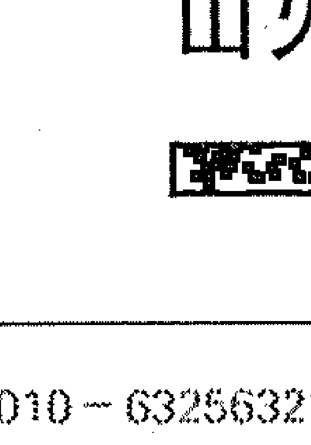

【变卦】
风火家人

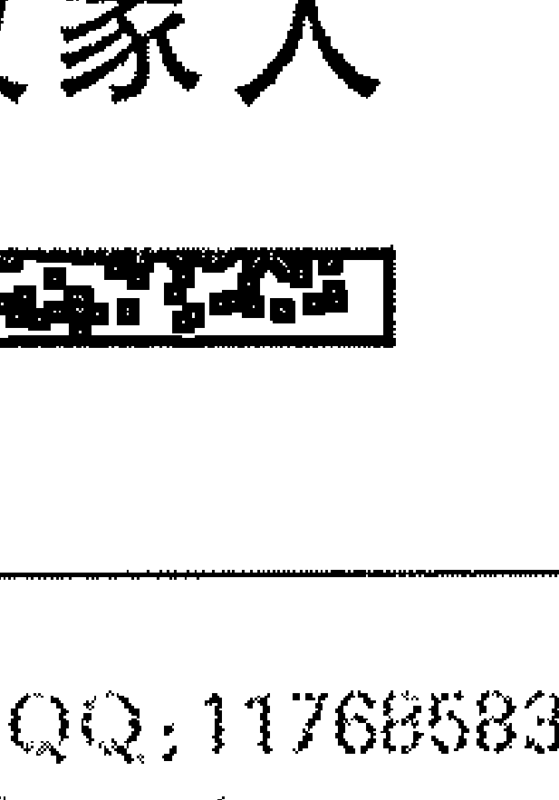

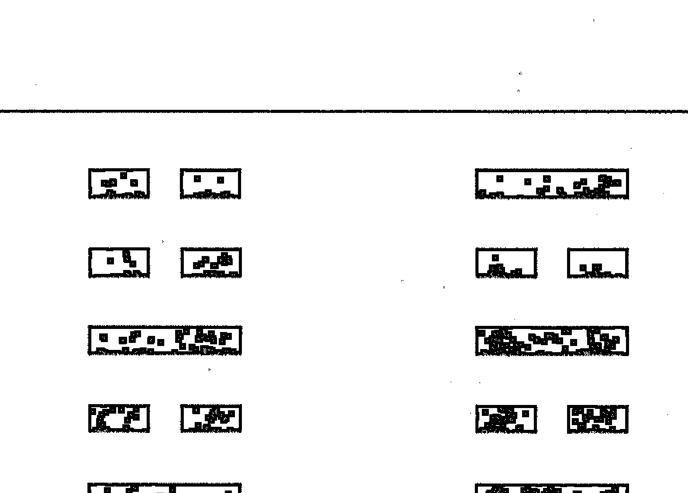

## 贲: 亨。小利有所往。

- 初九: 贲其趾，舍车而徒。
- 六二: 贲其须。
- 九三: 贲如皤如，永贞吉。
- 六四: 贲如皤如，白马翰如，匪寇婚媾。
- 六五: 贲于丘园，束帛戋戋，吝，终吉。
- 上九: 白贲，无咎。

#### 《林辞》

> > 东山西山，各自言安。虽相登望，竟未同堂。

#### 分析：

1.  本卦山火贲，天元卦为艮为山为少男，地元卦为离为中女，内来生外，男女相亲之象
2.  艮六五变为巽，艮为山为田园，互中震为林木，巽为花草，离为饰，故言贲于丘园，巽藏辰其数五，离为帛，互坎克离，故言束帛戋戋，内来生外，互见震为日支驿马，有跑动之象。
3.  艮内藏寅支，离中藏午支，寅午化合，会合文书离火之局，为文书婚姻之喜
4.  变卦为风火家人，外来生内，巽为长女，为媒妁，离为中女，互见离坎，为财动（盈益卦）主求财必得，婚姻有成
5.  外来生内，亦为合和之事，伏玄鬼动争竞，有喜有忧，又主官事

我们先看一下，话说邵康节先生，于壬申日午时，看到一个少年呢，从南边走过来，喜形于色，就是看着脸上很高兴的样子。于是他就问：“你有什么样高兴的事啊”？这个人就很奇怪，说我没有高兴的事。梅花易数讲不动不占，于是他就算了一卦，说这个少年属艮，为天元卦，离为地元卦，得山火贲。实际上《梅花易数》中讲的这种得卦方法，是梅花易数在滥觞以后出现的一种起卦的方法，他里面是有一定的欺骗性的。但是，并不代表这一卦本身有问题。我们知道在古人写术数的书籍的时候，是需要引用例子的，只不过古人在把这些例子形之于文字的时候，把里面真实的东西隐藏起来了。但是古人的传承讲究“师徒授受”，书里没写的内容，可以通过“师”来教授，现代人易学的师徒授受的传统断绝，再加之印刷业的发展，出版的图书越来越多，很多人觉得按书学就可以了，但实际上古人的数术传承，讲究“真传一句话，假传万卷书”，书里有很多内容是有问题的，今人按书索骥，就出了很多问题，造成了后人不得其门而入，所以我们一直讲，“尽信书不如无书”，就是这个问题。

大家接着看这一卦。“山火贲”，贲神卦震克天元卦“艮”为“官动”明德卦，然后是离火生艮土“父母动”宝成卦。父母动的四句口诀“方生干兮父母兴，父母君亲皆喜忻，印信擢拔多进益，须知祭祀祥福祯”。内来生外，有所求谋。外卦呢，是艮为山，为少男，内卦呢，为离为火为中女，内外相生，男女相亲。那么我们看，艮的六五变成了巽，巽中有天田，为田园，天星系统中有两个天田，一个在角宿，一个在牛宿，天田星代表着天上的田园。巽是花草。离为饰，为装饰。所以讲叫“贲于丘园，束帛戋戋”。贲于丘园，这个丘园，实际上就是来自于艮卦。山火贲六五化风火家人，巽中有天田，艮中也有天田，艮为丘，为山。所以说“贲于丘园”，贲呢，就是离火本身的含义。离本身又代表着布帛，彩饰，所以，互坎克离的时候，是什么？是用丝麻把彩饰，就是离的布帛捆起来，所以叫“束帛戋戋”。

贞卦山火贲，内来生外是有所跑动，有所驱使的意思。大家关注一下卦例中的时间，时间是壬申日午时，天元卦的艮卦里面，寄着一个寅，为日支的驿马，离火中藏着一个午火，大家看午在这个卦里面有没有显现？午火是一直有显现的，就是离卦。午去生外面天元卦的艮卦，离中的午火又和艮中的寅木半合，“寅午”半合，合于时辰。寅午半合的时候，实际上在寄宫里面代表什么？外来生内，寅又代表珍宝，喜聘。午火呢，代表女子，文书，喜庆，所以他有文书婚姻的概念。

变卦为风火家人，是外来生内。外面的巽是长女，同时巽卦里面有螣蛇。螣蛇代表媒妁，同时，螣蛇巳火有求子之象。巳火为胞胎，是胎神，代表着未成形的胎儿，或者是精子，所以巳火本身的易象中就有求子的含义。所以巳火里面，又有交合，求子的易象，离中有午火。上生巽中的辰土，是宝成卦，内外相生的关系，同时里面有一个稽滞的关系。

山火贲化风火家人，贞卦是内外相生，悔卦也是内外相生，里面同时有一个和合之象。我们现在把这个卦整个的排一遍，就会发现，用梅花占来解这个卦的话，会感觉到非常的清楚，而且他里面的每一个交流，每一个变化的过程，实际上也都是很符合我们的日常思维和判断事情的标准，我们很容易把他判断出来，是一个很不错的事情，而且，里面可能会牵扯到一些婚姻，感情上或者是求财的事情。对于这个卦的细分，将来给大家讲的时候会讲到，因为“金口透易·梅花占”的高层占法是“变占”。变占是把事情一步步的细化。变占是一个细化的过程。

### 稽滞卦

天元卦与地元卦比和（稽滞卦）

稽滞卦相当于金口诀中的兄弟动，口诀为
干方比为兄弟动
事体牵延比肩行
勾联斗讼亲朋涉
内有争竟有小凶
（占事内有争竞，事牵亲朋，凡事不利谋为，拖延迟滞）

稽滞这个词，实际上也是取决于古代的一个官话。古人把仕途不利，前进不得，称作稽滞。《北史·郭祚传》里面讲：“祚持身洁清，重惜官位。至于铨授，假令得人，必徘徊久之，然后下笔，下笔即云：“此人便以贵矣。” 由是事颇稽滞，当时每招怨讟。然所拔用者，皆量才称职，时又以此归之”。他说做事情颇为稽滞，就是这个含义。做事情的时候总是不舒服，不顺畅。稽，代表留止，就是停留，停止，同时代表计较，反唇相稽。逢到事情的时候不顺畅，总是斗嘴，就像嘴和牙齿一样。这个反唇相稽的稽，实际上就是这个稽滞的稽，代表计较。现在大家都写成这个“讥”了，就是言字旁的这个“讥”字，实际上应当是“稽滞”的这个“稽”，是两个人斗嘴，相互计较，叫反唇相稽。稽代表停止，停留，不顺畅。滞代表着不流通、不顺畅、不灵活。所以，稽滞的总体含义，就是代表着事情不顺畅，不灵活，同时常常被计较，变得不痛快，就是这种含义。

我们先把“稽滞卦”的口诀解释一下，“干方比为兄弟动”，“天元卦”和“地元卦”两个卦五行相同，叫兄弟发动。“比”是代表比和。二人相行谓之比，他有比较的意思，有相互核对的意思。“二人为从，反从为比”。在甲骨文里面，大家看看“比”是怎么写的。

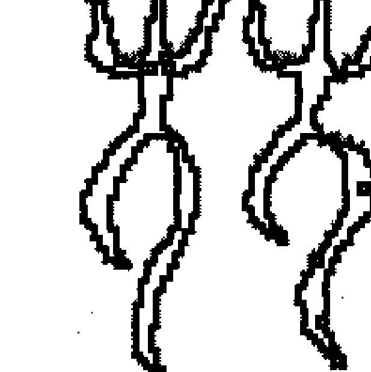

比是两个人肩并肩的走，叫比。那么既然能够肩并肩的走，代表着什么呢？ 代表着两个人的基础差不多，步调差不多，能量、速度差不多，这种情况下就有可比了。所以，“比”中有一部分相同的含义。但更多的是一种竞争的含义。当两个人中有一个人更强壮，有一个人稍微弱势一些，这个时候叫“从”。一个人跟在另一个人后面，叫“从”。

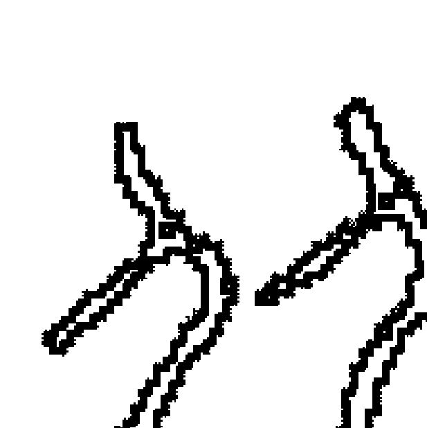

假如两个人并着肩走，叫“比”。所以我们讲，说兄弟发动啊，是干方比。是干和方两个力量差不多。

### 金口透易论旺衰

金口透易论卦的旺衰，是以卦内旺衰为主。卦内旺衰以什么确定呢？这里面有三个原则，第一个原则是“卦内的旺衰是以无克者为旺”。第二个原则是“克他者为旺”。第三个原则是“生他者为旺”。干方比和，那么干和方的旺衰肯定是相同的，旺则同旺，衰则同衰，所以叫比。

“事体牵延比肩行”。“比肩”这两个字，实际上就是肩并着肩的意思，就像肩并着肩在一起走一样。为什么叫事体迁延呢？“比”的状态，是存在竞争，存在着相互的拉扯和比较，所以逢到兄弟发动的时候，总是会出现你拉我，我拉你的情况，这种相互的牵扯和拉扯，就造成了一些事情的不顺畅，也就是存在的竞争因素增多。但这种因素，因为两个人的旺衰情况实际上差不多，所以不会产生象“鬼动”那样强制的，或者是非常激烈的争斗。而是很像是内部的一些小的比较和牵扯，以及别人扯后腿的事情。

但是这种扯后腿的事情，也不会产生什么太大的力量，而是在一种力量相当的状态下的相互竞争和赶超。所以后面一句叫“勾联斗讼亲朋涉”。当两个力量差不多，相互竞争，互相比较的时候，实际上就产生了“勾”，“勾”是勾结，拉帮结派，叫“勾”。找后援，找朋友帮忙。“联”是联系，联合。“斗”，“比”则有斗，两个人相互竞争，实际上是一种斗争。有斗争就有口舌，所以叫讼。在力量相比的情况下出现了四种情况，第一个是“勾”。勾是招引，牵引其他力量，联合不同势力，然后相互争竞，“亲朋涉”是个倒装句，就是涉及亲朋的意思，比的时候，是肩并着肩的走，两个人挨得很近，他是在一个圈子里面的。在这种圈子内部的争斗，不是亲戚就是朋友，所以有可能会牵扯到亲戚或朋友。

“内有争竞有小凶”。内有争竞。里面的争斗，竞赛，争夺，小有不宁。“小凶”，是不安宁，不愉快的意思。所以稽滞卦主内部争竞。事情牵扯到亲戚、朋友，不利于谋为，不利于做事情。内部有很多的牵牵扯扯，打架斗讼的事情，相互竞争的事情，有人拖后腿的事情。所以，稽滞卦主拖延，迟滞。

此外，“稽滞卦”还有一种状态，就是内外卦在五行上的伏吟和反吟，伏吟是“闭伏不动、呻吟不安”的状态。吟是斟酌，沉吟不决。“伏”是不动。“反吟”是反复多变、动荡不安，不断变化，叫反吟。“反”实际上应当写作“返”，往返的返。是走来走去，来回斟酌，两个相反方向的力量相互牵扯，叫反吟。

下面讲一下书中的卦例。

### 西林寺牌额占

先生偶见西林寺之额，“林”无两钩，因占之。以“西”字七画为艮，作天元卦；以“林”字八画为坤，作地元卦；以上七画下八画总十五画，除二六一十二，零数得三，是山地剥卦；第三爻动，变艮；互见重坤

断曰：寺者，纯阳之所居。今卦得重阴之爻，而又有群阴剥阳之兆。详此，则寺中当有阴人之祸，询之果然。遂谓寺僧曰：“可添‘林’字钩？则自然无阴人之祸矣”。僧信然，即添‘林’字两钩，寺果无事。

【本卦】       【变卦】
山地剥       艮为山

> 剥：不利有攸往。
> 初六：剥床以足，蔑贞凶。
> 六二：剥床以辨，蔑贞凶。
> 六三：剥之，无咎。
> 六四：剥床以肤，凶。
> 六五：贯鱼，以宫人宠，无不利。
> 上九：硕果不食，君子得舆，小人剥庐。

#### 《林辞》

巨蛇大鳅，戰於國邦。上下隔塞，主君走逃

#### 解断

1.  主卦天元卦为艮，地元卦为坤，互卦亦为坤，卦象为四土比合，兄弟动稽滞之卦，又为卦象伏吟之坏户合元卦，主事体牵延不宁，内有争竞迟滞斗讼之事，内有重叠，党比相争。
2.  主卦卦体反吟，且反吟重重克上，艮为财，为少男，为僧，坤为老女，坤中藏未为少妇，主女人生灾，事牵官事
3.  艮中藏支丑寅，坤中藏支为申未，丑未相冲与艮坤反吟并，主牵连斗论，争竞不宁，申冲寅，为鬼动悔折卦与官动明德卦，内部争竞，事牵动官之事，艮中藏寅克坤中未土，又为妻妾动问招卦，外来取索，官事不休，又主财帛耗散
4.  变卦为艮为山，伏吟卦，二土伏吟稽滞未解，艮中藏寅克本宫丑土，外来克内，鬼动与妻妾动相并，主事不喜，解之不得，官动亦主经官动府之事。
5.  综合看来，此卦内外相争，事体伏吟反吟重现，故主寺内有阴人祸患之事，斗讼不息，恐亦有经官动府之事。
6.  添笔改为山泽损，则外来生内为恩庆卦，内财动为盈益卦，外官动为明德卦，反伏吟全消，内外相生，讼事可息。

上面的这个也是梅花易数里的一个例子，就是“西林寺牌额占”。“邵康节先生”，偶然看到了西林寺的牌匾，林字没有两个勾。大家注意，在梅花易数里面的测字规则，是只要逢到拐弯儿的地方就算一笔，这一点，实际上有很深的理论基础，那就是古代占法中“动则变”的概念，古人测字，实际上关注的并不是字的笔画数，而是其中每次变化的数据。这个数据，就是“兆”，所以测字的时候，只要一拐弯儿，就算一笔。林字没有两勾，这样就少了两笔。因此“先生”很奇怪，就算了一卦，用西字的七画，大家数一下，西字是“一横一竖，一个拐弯儿是两画，然后一横、一撇一捺。

为什么会出现“阴人之祸”的判断呢？贞卦的天元卦是艮卦。地元卦是坤卦，艮卦和坤卦，里面有两个因素是需要考虑的。第一个是，比如说四个土，四个火，四个金，四个木，叫五行一气。还有呢，乾卦和坤卦叫一类朝元。实际上一类朝元和五行一气还不一样。一类朝元卦，如果是晋谒，拜谒君王，则主好事儿，但是其他事情不吉。四位俱比则代表着重叠，同类相争。四个土在通象占里面，叫坏户卦。就像土坯垒在一起一样，上下压制，所以叫坏户。代表内部的挤压与竞争。

在这里顺便给大家讲一下内外三才的一些基础概念。“地元卦、将神卦、贵神卦”组成了内三才。内三才代表着内部的情况。内部——有两个含义：一是代表内心世界，真实的内心世界是怎么想的。第二是代表排除掉客观因素的主观情况。主观的东西，是来自于内心的，来自于内部，不受外部干扰的。“将神卦、贵神卦、天元卦”组成了外三才。外三才也是两个含意，一是代表外面的世界，外面的环境。二是代表排除掉主观因素后的单纯的客观情况。

山地剥卦的内三才是什么？伏吟，彻彻底底的伏吟，外面是什么？伏吟和反吟。由此可知这个寺庙的内部的事情是伏吟，拖延不动。外面又反反复复，而且还有官事是非（寄宫的官动，寄宫里面有官事是非口舌。官动牵扯官事。坤里面有未土，同时坤里面有申金，申金克艮卦寄宫里的寅木，所以他是有官事是非的）。在这里大家要关注一下占卜的对象，占卜的对象是和尚，和尚就不要考虑当官的事情了，这里的官动是涉及到官府的事情。

变出来的悔卦是艮为山，也是一个稽滞卦。同时是天元卦和地元卦的伏吟。稽滞与伏吟。这种情况代表什么呢？内外的一个沉吟不决。相互牵扯，互相争斗。事情牵扯到亲戚朋友。

此外变卦中还有一个动占是“官动”明德卦。而且这个“官动”已经走到明面上了。寄宫为隐，在断卦时代表着一些隐藏的、内心的、没有表现出来的想法和信息。而在这个卦里面，还代表着事件中的隐藏信息，这个隐藏的信息，到了悔卦中已经显现出来了，而且按“通象占”来看，地元卦克将神卦，贵神卦克天元卦，叫进阶相克，这种情况就代表着内部争斗不宁。外部呢，官事缠身。所以很不容易解决。

下面再给大家讲一下“阴人之祸”的问题，第一点，贞卦里面，内卦重坤。坤里面有未土，有申金，三个申，三金的时候，在通象占里面，这种形式叫做“赤刃”，也有的叫“丛刃”，是刀锋相见。未土在古代的时候代表少妇。坤宫为母，未土代表少妇、女人。外面是丑土，丑未相冲，所以主阴人之祸，阴人破财，求财。艮卦代表财力，代表内部的钱财，钱粮，同时，艮卦又代表斗宿。二十八宿中的“斗牛女”三宿，是在艮卦的位置。银河相分的，就是牛宿和女宿，牛郎和织女的故事就是从这里来的。所以这个卦，阴人反吟，阳人也反吟，而且内部阴事重重，就很可能会代表着一些女人的麻烦。当然，这个里面还需要借助一些“变占”的方法来辅助解决细节的问题。

假如在“林”字上添上两笔的话，按“梅花易数”折为一画，也就是动则为兆的原则，卦就变成了山泽损化风泽中孚，就不再是“山地剥”化“艮为山”了。

#### 山泽损

#### 风泽中孚

山泽损是外来生内，子孙动，恩庆卦。里面又有财动。山泽损的地元卦是兑为泽为金，天元卦为艮为山为土，外来生内，为子孙动，恩庆卦。而且里面财动，求财必得。虽然还是有反吟，而且是内外两个反吟，但是求财没有问题了，而且里面争斗和反复的讼事也减少了。所以这里面实际上也讲到了一部分破法。当然这个破法是有问题的。并不是说单纯的改一两个字就可以把问题破解掉。

### 明德卦

今天开始讲明德卦，就是第六个动占，第一步还是按惯例来做一下释名。

### 六、贵神卦克天元卦(明德卦)

明德卦相当于金口诀中的官禄动，口诀为

- 神克干为官禄动
- 仕应禄位望财难
- 常人官事得官物
- 财来暗损病喉咽

> (求官有得，求财先损后得，求谋有官事，病主咽喉)

明德卦相当于金口诀中的“官禄动”，“明德”的含义应当是来自于《大学》的“大学之道在明明德，在亲民，在止于至善”这一句。“若想成长为圣人，成就‘通天之德’，这里的‘德’，就是成就大的德行，在于不断使人弃旧图新、去恶从善，努力使自身做到最好”。这里的明德，应当是与《大学》中的这句话有关。这个卦名里面实际上也体现了中国传统的为官之道。“贵神卦”克“天元卦”在金口诀中叫官动。因此，这一卦的卦名，实际上也体现了中国传统文人以及术数学者，对于为官之道的基础要求。就是要明白大的准则和道理，亲近民众。同时让自身达到一个最好的程度，“止于至善”。至是最大的意思。要让自己达到一个最好的程度。

“神克干为官碌动”，这句为释名。“神”为贵神卦，“干”为天元卦，贵神卦克天元卦称之为“官禄动”。

## 第五章 八动精讲

“仕应禄位望财难”，“仕”是仕宦的意思。为仕途、为官之道，为仕宦。也就是相当于我们现在的国家公务员。中国古代当官叫做“入仕”，“仕”古代写做仕，本意是：“以道艺、武勇谋职于君王”，引申意是通过正规的考试与科举，达到一定的职务并在国家官僚系统内任职，这个求职的过程，相当于我们现代的国家公务员考试。“官”是指的国家正式编制的官员。“吏”相当于我们现在的协勤，也就是非正式编制的国家办公人员。所以这个口诀讲到“仕应禄位”，假如说测仕途的话，求得“明德卦”就比较容易得到国家的俸禄。这里面的“禄”，是国家俸禄的意思。国家的俸禄实际上是针对于国家公务员的。也就是国家只对有正式编制的人员发放俸禄，而对于非正式编制的工作人员，也就是我们平常讲的“吏”，他们的工资，是不在国家俸禄范围之内的，是要由吏的上属官员，来自行解决。

在古代，一个部门中养吏的费用，往往是来自于苛捐杂税，相当于我们现在的国家的非正式编制的工作人员，是不准造工资表的。前一段时间曾经看到一个新闻，一个单位正式员工的工资要达到几万元，然后有人出来讲，说这个工资表是为了给非正式编制的工作人员发工资，这种情况，实际上就有接近于官和吏的状况。也就是吏是不发放俸禄的。所以讲“仕应禄位”中的禄和位是不一样的，在这里面要分开来理解。位，是职位，禄，是俸禄。如果求测仕宦官职，占得“明德卦”就比较容易得到相应位置和俸禄。贵神卦在四象位中已经接近于天元卦了，当贵神卦向上克天元卦的时候，实际上就有控制天元卦的力量。而天元卦在四象卦里代表着大的环境与大的形势，是天子，是国家的国体，贵神实际上有官吏的意思，官吏能够上达天子，能够达到更大的形势与地位。官位肯定是要有所提升的。而且这个提升是一种非常正规的提拔。我们在前面的课程中曾经讲过，官动、鬼动与印动的一些区别。官动实际上是一种正常的提拔和提升。鬼动更倾向于非正常的提拔，对外的任职以及竞争中的提升。印动则是非实权型的提升，具体的情形是有区别的。

“望财难”，在求财占的时候，占得官动“明德卦”，主投资增加，求财不易，在“四象位”中天元代表着求财的总体市场。贵神代表外财，也就是利润。将神代表内财。内财就是投资。地元卦代表积蓄。所以天元卦克地元卦的时候，叫“外边取索多谋害”，会动血本，就是因为财路克住了积蓄。财路克积蓄的时候，如果要想控制这个市场，就需要动到积蓄了。就要损害积蓄。受克代表损害。当贵神卦克制天元卦的时候呢，是外财，也就是利润来压制市场。在一个求财的过程中，利润已经对市场造成了伤害或者是说市场已经不足以支撑利润的话，相当于前期的投资过高，或者是需要用投资来压制市场。这种情况下，首先利润会降低，投资会多于收益，不容易取得收益和利润。

求财逢到“官动”的时候，并不单纯预示着没有利润，而是指前期的投资的加大，需要以投资去博得市场。这就牵扯到一个前期投资的增加，也就是外财要去消耗。所以求财逢“官动”并不等于说最后赚不到钱。这个前期投资的增加一般会有两种情况，第一个，逢到官动的时候会与官方合作，也就是我们后面讲的那一句话，常人官事得官物。还有第二种，是需要加大对市场的控制力度，要增加宣传和推介渠道。同时，以投资来博得市场。

这里的投资实际上还有一个内涵，就是其中也包含了送礼的概念，“官动”一般情况代表与官方的合作。而与官方的合作，往往是要给官方一定的利润，给对方一定的利润和比例。这一部分可以认定为是一种损耗。也就说是一种投资以外的额外损耗。虽然实际上现在的官商之间的合作，往往利润更高，但是官商合作的前提是前期的投资要加大。你必须有一定的实力，而且你需要用钱来办一些事情。所以测求财如果占得“官动”，往往就是与官方合作，需要做前期的投资。以及加大宣传力度和赢取市场份额。所以后面的那句口诀就顺理成章了，“常人官事得官物”。一般的人会因为公家的事情得到公家的好处。比如前面讲到的“俸禄”，实际上就是官员在政府领到的补贴和日常的生活费用。相当于我们现在的公务员工资。那么，“常人”，就是“非官员”，假如在求财的时候或者是求事的时候，测得了官动的话呢，也就象得到俸禄一样，因为与政府相关的事情，得到了公家的利益。所以，这叫“常人官事得官物”。

后面一句是“财来暗损病喉咽”。古人的遣词造句是非常有条理的。“财来暗损”这种情况，实际上就相当于刚才讲到的，与官方合作同时要从私下分出一部分利润。一般逢到测求财占得“官动”，往往有很多人他会讲，说你不得财。实际上不是。常常是在求财的时候你测到官动，往往会得到更大的财，但是，这个财是要分出一部分去的。在实际的占测过程中，任何一个事情的预测，不能脱离开实际的环境。与官方合作的生意，必然要给官方一定的回扣或利润。这一部分，实际上就是暗损的那一部分财，他是脱离开商业规则以外的，实际上也是商业“潜规则”中的一部分。这也同时说明，实际上在数千年前，中国人的经营规则，与我们现代社会并没有太大的区别。过去测八字的时候总是在讲，财官相生。财来生官，官来护财。实际上与我们现在这个社会中的某些规则也是没有什么区别的。

“病喉咽”。四象占中占人的身体，“天元卦”为头，“贵神卦”为胸，“将神卦”为腹，“地元卦”为足。贵神卦克天元卦的时候，主头部有损，但是在这里要特别的提醒一下大家。在正常的疾病预测里面，要从两个方面来看，测病症，受克的地方叫病灶。那么主克的一方呢，叫病因。病因和病灶要分清楚。往往在测疾病的时候，天元卦来克地元卦，主足疾，但是有的时候他也主头疾。从病因和病灶这两个角度来分析的话，我们可以大致判断出是一种什么样的疾病呢？他实际上有可能是这种情况，头部有病，引起不能行走。这种情况下最多的是脑血管的疾病引起的瘫痪和行走不利。实际上这个东西，从四象占的基础上可以很简单的把他推断出来。正如前面所讲的，任何一个预测，我们不能脱离开理，就是道理和常识。总结上面讲的情况，“病喉咽”，一般占病主胸部以上的疾病，咽、喉的病症。

总结一下前面的内容，“明德卦”，求官的时候是正常提升，得到国家的俸禄。求财的时候，先要掏出一部分投资，然后才能得到更大的收益，同时，也预示着与官方的合作，从而带来更多的市场和机会。求谋的时候（求谋，是求事情）主与官方有关，有官方的帮助，或者是与官方进行合作和交流。如果测官司，逢官动“明德卦”，必然有官方的参与。测病的话，主头部疾病，咽喉疾病。按五行来分类的话，就很容易把这个疾病的一些基本情况分析出来。

### 明德卦卦例讲解

下面看一下卦例，这个卦是测工作有无升迁的一个卦。我的印象里面，这个卦好像是当时在论坛里面测的一个卦。

#### 例（测工作有无升迁的机会）

庚寅年 庚辰月 己酉日 戊辰时 （日空:寅卯）

【本卦】
山风蛊

【变卦】
山水蒙

蛊:元亨，利涉大川。先甲三日，后甲三日。

- 初六:干父之蛊，有子，考无咎，厉终吉。
- 九二:干母之蛊，不可贞。
- 九三:干父小有晦，无大咎。
- 六四:裕父之蛊，往见吝。
- 六五:干父之蛊，用誉。
- 上九:不事王侯，高尚其事。

#### 《林辞》

> 家在海隅，绕旋深流；王孙单行，无妄以趋。

- 主卦为山风蛊，天元卦为艮为山，地元卦为巽为风，内来克外，为鬼动（悔折卦），测官主出外，主内部争竞，心态不定。
- 互卦震卦克艮卦，为官动（明德卦），有求谋升职之机，但艮震皆落空亡，所求不得之象。
- 互卦财动（盈益卦）主事体牵扯收入，但财动不利求官，官空又主不得。
- 巽卦正寄天干乙木，艮卦正寄天干己土，亦为鬼动，争竞不宁之事，鬼动逢空，亦为未备。
- 艮宫为月令驿马，有跑动外出之事，驿马逢空，行而不得。
- 变卦山水蒙，外来克内，为妻妾动（问招卦）亦为所谋不得。
- 变卦天元卦伏吟，事多反覆，财动不利求官，震艮空亡，不得之象。

贞卦是山风蛊，变卦是山水蒙。“山风蛊”，“蛊”为“事”，事情。“干父之蛊，干母之蛊”，这个蛊实际上是事情的意思。这与小说中讲的下蛊不是一个事情。“蛊”也代表着靡乱，代表着诱惑。但在最早的时候蛊的本意是“事儿”，“蛊”通“故”。像蛊毒一样迷惑众生，这已经是后期演绎的一个字义了，蛊卦中“干父之蛊，干母之蛊”的蛊，实际上还是事情的意思。

首先看贞卦，“山风蛊”。首先是“鬼动”，就是“地元卦”克“天元卦”。然后是“财动”“盈益卦”。接着看是“贵神卦”克“天元卦”，叫“官动”明德卦。实际上他是一个重重克外的卦。

下面对这个卦例进行一下具体分析，测工作有无升迁的机会。首先第一条，“鬼动”悔折卦的口诀，“官亨谋动人宣争”。“鬼动”预示着竞争或一个向外发展的机会，更何况里面还是一个官动。而且通象占为分局相克的“孤别卦”。鬼动主内部争竞，心态并不稳定。这里要看一下卦中的空亡，这个卦里面有两个空亡，就是寅卯空。艮卦的地支寄宫里面有寅木和丑土，所以艮卦里面有一个半空亡（寅）。震卦的地支寄宫是卯木，是一个全空亡，又叫落地空亡。这里面首先可以考虑到，“鬼动”是想求官。因为鬼动是主竞争有得。就是需要很强的竞争的意识，才能够得到这个职位。也证明其自身有一定的能力。但是这个官，假如正常求的话能不能得到呢？他里面是有一个官动，也就是应当有一个职务上的安排。但是这个官动是空的。

此外还有一个情况需要注意，“天元卦”艮卦和“贵神卦”震卦，构成了一个连茹。我们曾经屡次讲到连茹的这种关系。连茹实际上代表着事件发展的前进方向与顺序。卦里面也是有连茹的，卦的连茹，和寄宫中的地支寄宫是相互关联的，以此卦为例，“贵神卦”震卦里面有卯木，“天元卦”艮卦中有寅木和丑土，现在来分析这个卦中的连茹的含义的话，“天元”，代表大的形势。在这个形势里面可以看到以下几点？第一个是鬼动，就是求测者本身有一个很好的竞争的想法和要求，而且也在行动，在与别人竞争。第二个，官动，也就是有职务中变化的机率。我们讲是这种职务的说法。同时，贵神空亡代表什么？贵神空亡代表一个职位的空缺。但是这个空缺呢，假如我们把他和天元卦连在一起的话就会发现，实际上他是一个逆连茹。我们讲从下往上是顺连茹，从上往下是逆连茹。那么，从上是个艮，艮震——一一一这种组合是逆连茹。这种连茹代表着什么呢？代表着事情在后退，他在一步一步的后退，而且后退到一个什么程度？后退到官的位置的时候，就空亡了，说明这个官职不好求。

接下来再看“山风蛊”中兑卦与震卦之间是一个什么关系？兑与震是反吟，主事情反复不定。把这几个因素连在一起看：

首先，这里面是一个丑寅卯的逆连茹，而且寅卯是空亡。寅卯空亡的话，我们在里面找一下时间的标记。卦里面寅空亡，而寅是当年的太岁，也就证明在今年这一年，这个事情不容易办，没有头绪。

其次后面酉金在时间四柱里面是日支，也就是兑卦的地支寄宫。巽卦里面有个辰，辰是时辰，也是月建。我们把这个时间代进去，就可以这样讲：“今年你们单位有一个职位的空缺，你现在很想争取这个空缺，但是，这个空缺现在从外界传出来的消息，是一个不太确定的，一直在反复的一个消息。而且，在这个月，实际上你是想着争取一下。因为巽卦里面有巳火，巳火是生丑土的，主求人，现在外面没有很明确的消息，但是你自己感觉也有点不利（为什么不利呢？卯木来克丑土，但是卯木空亡。而且丑和辰主稽滞，也就说这个事情现在有点拖，没有明确，而且大家都没有表态，是这种状态。）所以震卦克艮卦，叫“官动”，但是官动逢空，主事情所求不得。

互卦里面的财动，我们讲到这个卦的时候，之所以写到“互卦”这个词，实际上也是为了迁就外面的一些个说法，实际上在梅花占的角度，很少讲到互卦这个概念，梅花占用得更多的是四象卦，就是贵神卦将神卦天元地元。这个卦里面将神卦克贵神卦叫财动“盈益卦”。这个事情肯定要牵涉到一些收益的问题，但是这个收益实不实呢？也不实，为什么不实？财动逢空。

接下来，我们再来看变卦。先看将神卦克贵神卦，财动“盈益卦”。再看天元卦来克地元卦，妻妾动“问招卦”。再看有没有生，山水蒙卦，“寄宫”里面有生，卦里面是没有相生的。

再看第二层的关系，就是方位，天元卦和贵神卦是反吟。反吟是两个卦的后天方位正好相对，主反复不定。

前面的贞卦里面的财动，说明他实际上有一个想要求财的想法，这个想要求财的想法是得自于什么呢？实际上来自于他这个工作的升迁。工作的升迁会带来收益的增加，现在变卦里面同样也看到求财的想法，这个财动逢空，财动是空的。

测职位的有无要看地元。地元代表着职位，就是这个位子还有没有，悔卦“问招卦”发动，外来克内，天元卦克地元卦，把这个位子给克住了。而且不只是克住，还合走了，有人把这个位子合走了，或者叫合住了。因为艮卦的地支寄宫中有丑，这个丑不空，坎卦的地支寄宫中有子水，子与丑合。天元卦代表形势，外来的形势“克合”，在克制的状态下合，而且里面有妻妾动“问招卦”。“人在家中访不宜”，这个位置就在那儿摆着，但是你想得得不到。为什么得不到呢？大的形势把这个位子合住了，不动了，在这种情况下想求的这个事情就不好得了。外界的形势很反复，领导对这个事情也很难把握，所以呢，干脆就暂缓执行，就不再动了。不再动的结果，当然是想要求财的那个事情就泡汤了。

上面的分析，就是对于整个卦的一个分析过程。梅花占的预测，最好完全地按照他的程序，内、外、八动、五层的寄宫，五层的寄宫实际上也是严格的按照程序来讲故事的。

### 内贼卦

第七个动占是内贼卦，我们先把书上的内容给大家发一下

> 贵神卦克将神卦（内贼卦）
内贼卦相当于金口诀中的贼动，口诀为
神克将为内贼生
勾联偷攘染私情
谋空财损卑幼病
暗昧空诈亦非轻
（求谋不利，求官不得，求财有损，妻子病困，有暗昧之事，测婚主私情）

例:古例(鸡悲鸣占)
甲申日丁卯时，有鸡鸣于乾方，声极悲怆，因占之。
鸡属巽，为天元卦，乾为地元卦，得风天小畜。以巽五乾一共六数，加卯时四数，总十数，除六，得四爻动，变乾，是为小畜之六四。《易》曰：“有孚，血去惕出。无咎。”以血推之，割鸡之义。卦则小畜之乾，互见离、兑。乾金为体，离火克之。卦中巽木离火，有烹饪之象。
断曰：此鸡十日当烹。果十日客至，有烹鸡之验。

###### 【本卦】风天小畜

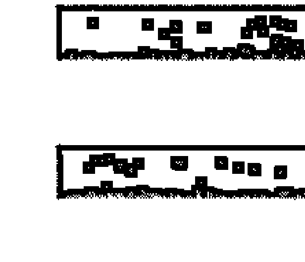

###### 【变卦】乾为天

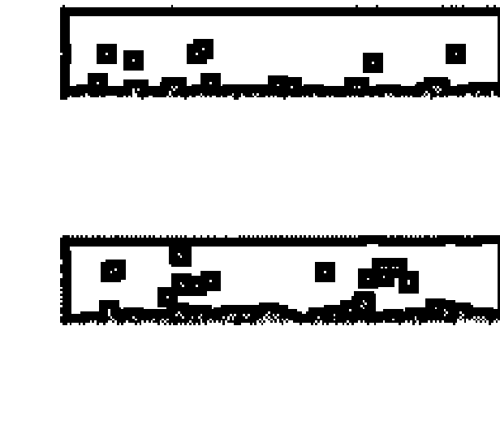

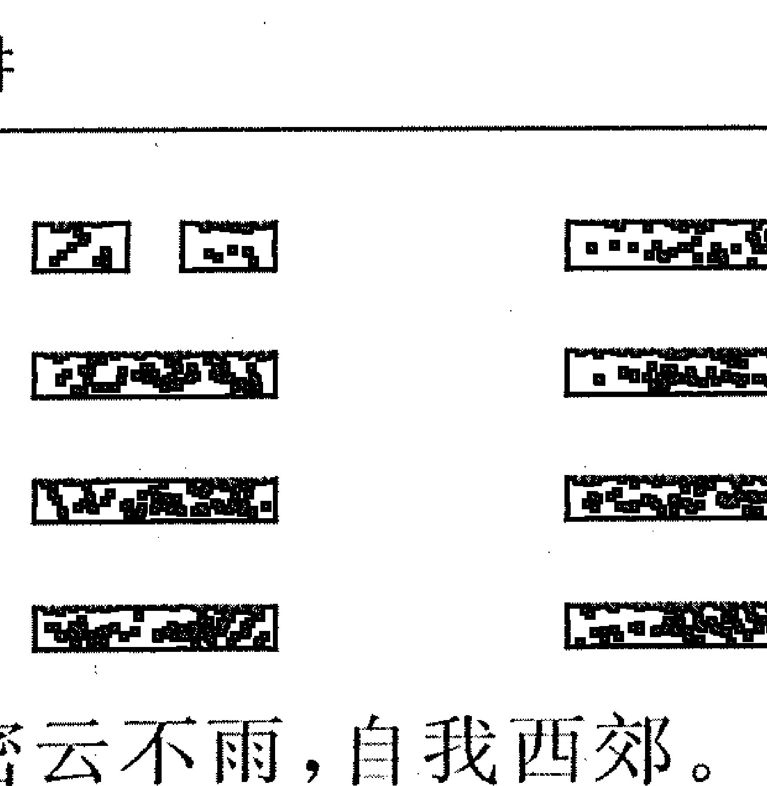

小畜：亨。密云不雨，自我西郊。
初九：复自道，何其咎，吉。
九二：牵复，吉。
九三：舆说辐，夫妻反目。
六四：有孚，血去惕出，无咎。
九五：有孚挛如，富以其邻。
上九：既雨既处，尚德载，妇贞厉。月几望，君子征凶。

#### 《林辞》

东遇虎蛇，牛马惊奔。道绝不通，商困无功。

- 1、主卦风天小畜，天元卦为巽为鸡为颈，地元卦为乾为庚为刀，巽居为上位为头，故有鸡断头之象。
- 2、互见火泽睽，为贼动（内贼卦），离为火为血，泽为辛为刀，兑卦藏支为酉，亦为鸡，亦是鸡被刀割出血之象。
- 3、伏玄见未为宴乐，见子午为酒食，故主宴乐酒食之事，而见杀鸡之应。
- 4、变卦为重乾之卦，为丛刃合元卦，亦主刀兵之事。
- 5、申子辰日，见巽为劫煞，为墓地，见乾为地煞，为巽之死地，逢辰巳日，为巽卦当令，故主十日后辰巳之日应。

四象卦中的贵神卦克将神卦叫内贼卦。内贼卦就相当于金口诀中的贼动。我们先把这一卦的口诀给大家解释一遍。“神克将为内贼生”，贵神卦来克将神卦叫内贼卦。假如测事情的话呢，主内部争竞不宁，内部有小人奸细，所以叫内贼生，也叫内贼卦。

“勾联偷攘染私情”，“勾”，是“牵扯，勾搭，勾结，引诱”的意思。按四象位来讲，将神卦在四象卦的卦位里面，代表着妻。外面的贵神来克妻子的时候呢，称为“外官克内财”，这个状况下，就很容易出现一些感情上的问题，有些勾勾扯扯，引诱、勾引的事情。“联”，是联系，有些勾勾扯扯的联系。还有一个意思是“顺序”，“连续的，连绵的这种事情”，叫“联”。“勾联”放在一起来讲，是“勾勾扯扯，私下联系，勾勾搭搭”的意思。“偷”，“不明确的，暗地里的，在别人不知道的情况下拿”。另外“偷”也有“苟且”的意思，“不循礼法的事情，不正常的男女关系”称之为苟且。荀悦在《汉纪·武帝纪二》中讲：“夫秦灭先圣之道，为苟且之治，故立十四年而亡。”。所以只有十四年的时间就灭亡掉了。“攘”是夺的意思，“抢夺，攘夺，喧闹，争竞”，都叫攘。另外呢，“攘”也有辟除的意思，贵神卦克将神卦为外来克内，主他人夺取。是“没有仁义的，没有理由的强取豪夺”，所以叫“攘”。“勾联偷攘”连起来讲，是“有勾勾扯扯的事情，有私下暗地的联系，偷偷摸摸的窃取财物，明着来夺取财物”，实际上都是与妻与财有关。这里面的妻与财，就是来自于四象占里面将神卦的卦位所代表的含义。“染私情”。染：“招惹”。染私情，“招惹私情”。“染”是“招惹，掺杂，混乱，污秽，传染，影响”，还有弄脏的意思。所以这句话的意思整体连起来讲，就是“有私底下勾勾扯扯的事情，暗地的联系，别人来攫夺财物，暗地的偷情。别人明着来夺取财产”，假如测感情的话占得内贼卦，往往主私下的感情。“染私情”这种情况，实际上更多的时候还是一种非正常的婚姻的状态。

在这里，有一点要提起注意，那就是预测的道德性问题，预测本身实际上是没有道德性的，他只反映事情的真实情况而不反映道德评判。“道德”本身是有阶级性与时代性的。不同的时代有不同的道德标准，假如我们向前溯七十年，或者八十年，“纳妾”就是符合道德的。但是现代社会如果出现纳妾的行为，也就是“二奶三奶”的问题，就是违反道德。但是这种违反或者不违反道德的状态，在卦里面只显示为正常或不正常，我们的祖先在创立周易的时候，也没有结婚领证这样的说法，那时候是媒妁之言，婚聘之书。所以我们在正常的预测过程中，“染私情”实际上反映出来的是以下几种情况的，一种就是私情，这种私情就是第三者。第二种，是家里不知道的感情，也叫私情。在四象卦位里面“将神卦”是财，也就是妻，“贵神卦”为夫。夫来克妻。如果针对一个女子，一般情况下主着外边有男孩子追得很紧，而且对方有足够的力量来征服她。在这种情况下，就很有可能就出现“家里不知道的，还没有发展到和家里公开的，但是确实已经有了比较深的感情的情况。第三种是未婚同居。

在日常的预测实战的过程中，有的时候测到的婚姻的年龄，特别是四柱预测，测到的婚姻的年龄，实际上发生的是同居的状态，事实婚姻就相当于婚姻，预测的结果，指向的往往是事实，这个事实是对现实的真实反映，是没有道德属性的。

如果是测求财，贼动主外边有人来迫害你的财产，有人来夺取你的财产，外边可能有人勾结共同谋夺你的财产，在四象卦里面“贵神卦”的位置代表强势的、高等级的，因为对于四象位而言，贵神卦的位置比将神卦要高，那么在这个位置上的人应该比将神卦要强势，所以当贵神卦来克将神卦的时候，实际上代表着一种外来势力对你自身财产的一个剥夺。假如测感情的话，出现内贼卦，往往代表着有一些不明确的，家里不知道的，或者是已经发生了事实婚姻的，或成为第三者的感情状态，大家看《西厢记》等古代的话本儿，张生与催莺莺就是私定终身。这种情况就是私情。

“谋空财损卑幼病”，“谋”，“谋”是求谋，就是求事情，求事情的话主“空”，空是落空的意思，求谋往往伴随着“谒贵”，也就是求贵人帮助，而这个时候“贵人来克将神”，在四象位里面将神有一个很明确的含义————身，将神卦为“身”，“身”是自己的意思，在四象位里，贵神为“家长”，天元为“祖先”，将神“为妻为身”，地元为“子孙”，相当于是四代人。贵神卦来克将神卦的时候，就相当于是权势来克自己，如果这个时候测求谋，肯定会遇到一些当权者的阻力，所以主求谋不得。

求财的话“有损”，求财是有损失的。在四象位里将神卦为内财，贵神卦为利润。利润来克你的内财，代表着利润减少。利润克制了支出，也就是利润伤害了支出，这种情况下，肯定是一个人不敷出的状态，所以求财的时候主财的损失，因为伤害了你的投资，伤害了你的内财。“卑幼病”，“卑”是地位低的，弱小的，叫“卑”，将神在四象占里面代表家。贵神卦代表权势。权势克住了家，地位低的受制于地位高的，所以主卑幼病。小口、家人出现疾病和问题。

“暗昧空诈亦非轻”。“暗”是不明确的，暗地里的。“昧”，是幽暗的，隐藏的，糊涂的，蒙昧的。“空”是不实际的，不现实的。“诈”是欺骗的。“暗昧空诈”，这四种情况“亦非轻”，“亦非轻”是“也不轻”，比较严重的意思。

把这四句话连起来讲的话，是这样。当贵神卦来克将神卦的时候，假如测一个单位的话这个单位内部就会出现不安定的状态，上下之间不合作不团结了。里面出现了很多勾勾扯扯的事情，私底下的联系。外面有人暗中的骗取财物，或者会有人明着来夺取你的钱财。假如测婚姻，代表着第三者的介入或者是私下里面的感情以及未婚同居的状态。求谋的话，必然要受到来自于权贵和上层的压制。求财的话，恐怕投资会比利要高得多。在测家里的情况的时候，主家人会有一定的问题，同时，自身恐怕也不会太舒服。总之，有些不明确的，不好讲的，无法去明说的，打掉牙往肚子里吞的事情，从面搞得心里头非常郁闷。同时，遇到事情的时候，往往无法落到底地，还要承担被别人欺骗的风险。求谋主不利，求谋的时候就不顺利。求官主不得。贵神卦来克肯定是上级领导对你不好，假如上级领导对你不好的话，又有谁来提拔你呢？所以求官不得。求财有损，妻子病困，“妻子”是指妻和孩子，实际上还是家人的含义。有暗昧之事，测婚主“私情”。测婚主私下里的感情。如果抛开道德因素的话，不论是家人不知道的，还是私下的未婚同居，以及第三者的介入，实际上都是私情，家里人不知道的感情。性质是一样的。

我们下面来讲个例子，这个例子实际上就是梅花易数里面的，但是我们会发现梅花易数里面有很多东西他没有讲到，随着我们学习的深入，就会逐渐了解梅花易数里面的内容和真实的传承之间到底有多大的差距了。

鸡悲鸣占：甲申日丁卯时，有鸡鸣于乾方，有鸡在西北那个方向鸣叫。声极悲怆，声音很悲，很凄凉。因占之。梅花易数里面讲到的这种起卦法，实际上是有一定的问题的，但是，这个卦本身来讲，还是可以用来作为一个学习的资料来看。

这个起卦法有一个至关重要的问题，那就是违背了“无为”的原则，《易经·系辞》中讲到“易无思也，无为也，寂然不动，感而遂通天下之故。非天下之至神，其孰能与于此？”，其中讲到了易占的“无思”、“无为”的原则，易占本身是反映事件发展和因素的工具模型，而这个模型中的结果，需要卜师对于进行解读，只是这个解读，应当是不掺杂自己的观点与判断的，一个好的“卜师”，应当是卦的读者，而不应当是评判者，这就是《易》中“无思、无为”的道理。

在《庄子》南华经中，有一个故事，讲到庄子和惠子，就是惠施，这两个人，经常在一起辩论，有一天两个人在濠梁之上游玩，看到河里的倏鱼在河里游来游去，庄子说：“这个鱼出游的时候如此从容不迫，如此欢快，这个鱼真的是很快乐呀”。惠子就说：“子非鱼安知鱼之乐？”你不是鱼，你怎么知道鱼高兴不高兴呢？这里面有一个很深的道理。就是人和动物之间的感受，往往取决于人的感想，取决于人的想法，但是人的想法和动物本身的想法到底是不是一样的呢？假如说这鸡的声音极其悲怆的话，那么这个悲怆是鸡的悲怆还是这个听者的悲怆呢？所以这种起卦法，包括《梅花易数》中的“牛哀鸣占”，实际起卦的时候就已经决定了预测者“非无为”。而在正常的预测中，包括梅花占的实际的起卦法如“端法、筮法、金钱课、积算法”，无论是哪一种都要求预测者是无为的。预测者一直是在以一个旁观者的身份在观察事情，但是“牛哀鸣占”“鸡悲鸣占”这两种方式，已经违反了“易法无为”的原则。预测者不能以自己的想法来考虑鸡的想法。

《梅花易数》的流通的传本本身为“杂揉之作”，是由几本不同的传本攒在一起的一个合集，而且里面人为地隐藏了很多真实的内容，比如《梅花易数》是的起卦方法就有很多问题，但是，就这个卦本身来讲，还是可以用来作为一个学习的资料来看的，我们回过头来看一下

#### 卦例

### 例:古例(鸡悲鸣占)

甲申日丁卯时，有鸡鸣于乾方，声极悲怆，因占之。

鸡属巽，为天元卦，乾为地元卦，得风天小畜。以巽五乾一共六数，加卯时四数，总十数，除六，得四爻动，变乾，是为小畜之六四。《易》曰：“有孚，血去惕出。无咎。”以血推之，割鸡之义。卦则小畜之乾，互见离、兑。乾金为体，离火克之。卦中巽木离火，有烹饪之象。

断曰：此鸡十日当烹。果十日客至，有烹鸡之验。

###### 【本卦】风天小畜


###### 【变卦】乾为天

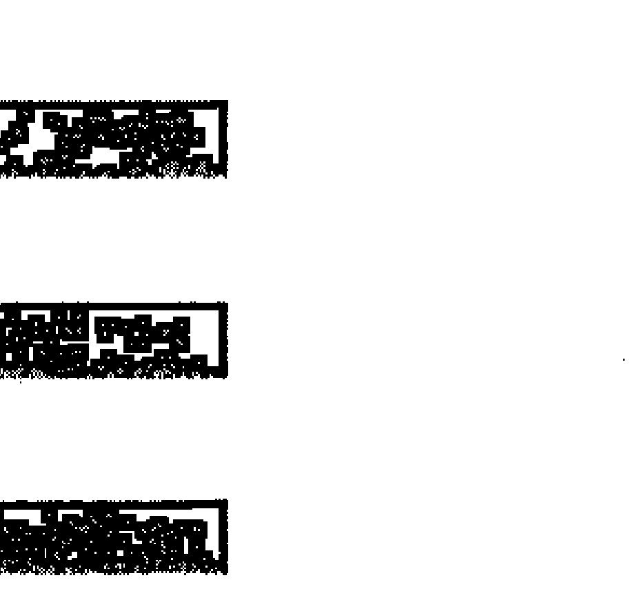

甲申日丁卯时，有鸡在西北方(乾方)鸣叫，声音非常地悲怆，于是算了一卦。鸡属巽，为天元卦，乾为地元卦，得风天小畜。以巽五乾一共六数，加卯时四数，(这是用的先天数)总十数，除六，得四爻动，变乾，是为小畜之六四。《易》曰：“有孚，血去惕出。无咎。”讲到这里，又一个问题，我们前面讲过，易经的解卦，不是这样解的。说以血推之，割鸡之义。这就造成了后人用爻辞里面的意思去强解卦，实际上《易经》的解卦，同样隐藏了很多东西。过去常常讲以经解易（易理），同样有“以象解易”，真实的用法是“以术解易”，“以术解易”一直是隐藏的内容。卦中巽木离火，有烹饪之象。所以呢十日当烹。到第十天的时候有客人来，于是把鸡杀掉，吃了。

我有一次与朋友聊天，讲到这个卦例，朋友讲：“如果这个卦的传奇因素成立的话，说明邵子找到了一只有特异功能的鸡，可以预知死期啊，比下金蛋的鸡都贵重，杀掉吃可惜了”。

下面讲解一下这个卦里面的动占与变占，在前面的课程里面我一直在讲，梅花占是以“动占”与“变占”为主，但这些天来，我发现大家对“变占”还是不太了解。这一点，确实也可以理解，因为变占已经隐藏了很长时间了。大家都认为他已经是失传了。实际上梅花占里面一直存着这个变占。变占的内容，是以卦变卦，不是以动爻来变卦。大家理解以卦变卦的含义吗？变占是以一个卦代表一个事儿，然后以这个事情为中心，看这个事件中间以及外围的各种因素对这个事件的影响的方法。

比如“错变”，是讲对立面与外围环境的情况。如果测另外一个人他怎么样，那么错卦代表着这个人，再比如“综卦”。是代表着反向选择。我想做这个事情，假如前面有两条路，一条是向东的，一条是向西的，如果贞卦代表着你选择向东的路会如何？那么，综卦则代表不选择向东的话会怎么样。不向东的话你有两种选择，不是说一定要向西，还有一种可能是你会退回去或者站在原地不动。

打个比方说，现在有一个人，想着要换工作，想要出去，那么贞卦代表什么？贞卦代表“想换工作”这件事情现在的情况，就是他想换工作的情况是什么？悔卦代表进一步发展可能出现的情况，那么错卦代表什么？错卦代表他换的这个工作的情况，是错卦。从换工作的角度看他本身什么样的，是错卦。综卦呢？是他不换工作他会怎么样？

现在学习预测，很多人已经被外面的东西把心思搞乱掉了，不会正常思考了，正常人考虑一件事情，他是怎么想？比如说想换工作的话，要怎么考虑？他有几点要考虑，第一要对自己现在处的环境进行分析，我现在的情况是怎么样的，我换这个工作有什么好处？有什么不好的地方？我换了以后会怎么样？有什么好处，有什么不好的地方？这是第一步要考虑的。这个考虑实际上就是一个事件里面最核心的主体，用贞卦和悔卦。下一步就要考虑如果我换工作，工作会怎么样？新的工作的情况怎么样？想要换的工作的环境怎么样，对自身有什么利弊？这是错卦。那么后面是什么？还要考虑“如果不换工作怎么样”？这就是用综卦，预测的主体是事件，一个事件里面有“时间、地点、人物”。人物是可以虚化的，假如要讲一个故事的话，可以把这个人虚化掉，但是事件本身你不能虚拟。你可以把这个人改个名字，但是这个事情，必须是这个事情。

错卦和综卦，本身就是“变占”中的两个变占，一个错变加一个综变，大家算一下能变出多少个卦来？贞卦，贞卦的错卦、贞卦的综卦，贞卦的综错卦，这是四个。悔卦、悔卦的错卦、悔卦的综卦、悔卦的综错卦。最少有这些变化。大家再数一遍，贞卦下面有错卦、综卦、综错。悔卦下面也有错卦、综卦、综错，所以一个贞卦和悔卦加上“错综”两个变占，至少会出八个卦，就是当你们学完错综两个变占，至少要解八个卦。

变占是从不同的角度看问题，这个方法是非常科学的，决策一个问题，要从事情的正面、反面以及各种角度去看问题，我们在梅花占的“弟子进阶面授班”讲课的时候，解一个卦，大致上会用一天的时间。真正讲一个卦基本上和写一本小说没有什么太大的差别。这个人的情况是什么样的，这个人往下一步是一个什么情况，这个人变动之后会是一个什么情况，假如他不变动是一种什么情况，他所面对的是一个什么事情，从对方的角度看他是一个什么情况，他假如说不选择的话，那么对方是一个什么情况，他假如选择了以后对方是一个什么情况，事件里面的每一个顺序，以及可能发生的变化，都有可能会算得出来。整个梅花占的这个预测来讲的话，信息含量是很大的。

同学们可能觉得一天只讲一个卦很恐怖！在这里给大家说明一下，面授班一天只能讲一个卦，是因为弟子班还只讲到了伏玄变占，“金口透易·梅花占”中一个卦宗里面有十二个变占，连一半还没讲到呢！我给大家算一下，如果占一卦，有贞卦，有悔卦。贞悔两卦是主卦，是不在变占里的，错综是变占，前面讲到，到贞悔错综这个层次，要解八个卦，每个卦有五层，就是四十层。这还只是用到了三个变占。到伏玄变占的时候是 40 乘 3，五个变占是 120 个层次。

我们这个梅花占是一种非常计算机化的一个程序，如果把变占学全，就会有一万多种层次，如果每一层说一句话，那么一万多句话，应该就是一篇小说的篇幅了。

下面接着讲前面的卦例，我们前面讲到，《梅花易数》书中的“鸡悲鸣占”，实际上是不符合“无思、无为”的卦占原则的，但是这个卦例有一点是符合易学原则的，就是“不动不占，无外应不占，无人问不占”，这个鸡的叫声，异于常态，我们可以认为他“非悲”，但是很可能它是异于常态的，在这种情况下，可以认为是一种“不动不占”的状态，这种状态可以测，测谁呢？主体就是这只鸡，因为由鸡而起占，所以就测这只鸡，你不能听见鸡叫，测测国家大事如何，这个是测不了的。

这里讲，邵子听见鸡的声音悲怆，占了一个卦，风天小蓄化乾为天，先看贞卦的风天小蓄，第一个动占是鬼动悔折卦，乾卦克巽卦，“官亨谋动人宣争，乖佞损害病伴合，讼牵他人宅不宁”，事情不吉利，要出问题了，谁的问题呢？是鸡的问题，从鸡起的卦，测的就是鸡的问题，鸡的“宅不宁”，那么这个“宅不宁”的具体情况是怎样的呢？我们看下面一个动占，贵神卦克将神卦的内贼卦，贵神卦克将神卦，“勾连偷攥染私情”，鸡肯定牵扯不到“私情”的问题，这里的贼动代表的是“偷攥”，有攘夺的可能，大家看这个卦里有没有“鸡”？《梅花易数》中对这个卦的解释是”有孚，血去惕出，无咎，以血推之，割鸡之义。卦则小畜之乾，互见离、兑。乾金为体，离火克之。卦中巽木离火，有烹饪之象。”没讲有没有鸡的问题，我们下面找一下这个卦里面鸡在哪里，实际上鸡就是兑卦，十二生肖中申为猴酉为鸡，兑卦的地支寄宫为酉，所以兑卦就是鸡，这个酉金现在被内贼了，而且酉金又是卦身，在这里酉金代表着什么？代表着这个鸡，而不是测卦的人，因为测卦的人是观察者，对应的是这只鸡，这只鸡现在被离火克制住了，就要出问题了，同时鬼又动了，鬼动代表着不好，鬼都动了，这个鸡就容易有生命危险，这里实际上就是鬼动的口诀里面的“乖佞损害病佯合”的那个“损害”的含意，这个时候，鸡容易被“损害”，出问题的可能性很大，如果按正常的断卦程序，还需要关注一下占测的年、月、日、时，《梅花易数》的卦例本身存在着一些问题，就是卦例里面没有列年月，而在正常的预测过程中，年、月、日、时，是推神煞的基本指标，我们知道，梅花占是不看月令旺衰的，但年、月、日、时并不等于没有用处，例如这个卦，如果年、月齐全，有可能兑卦会存在岁破和月破的问题，如果这一层考虑进去，就有可能进一步综合评判，单纯以现在的条件可以看到，卦里面有鬼动、贼动，如果加上岁破、月破、三丘、四墓，就可以进一步推断出这只鸡的损伤，这只鸡出现损伤有可能有几种情况，一种是鸡的自身的问题，一种是外来的问题，我们刚才讲到一句口诀叫“讼牵他人宅不宁”，因为别人的原因，造成这只鸡的损伤，自身的不稳定，会被杀掉，或者是损伤，而在风天小蓄整个的卦里面，四象卦分别是：“天元卦为巽，贵神卦为离，将神卦为兑，地元卦为乾”，按卦内旺衰来看的话，酉金处于死地，克兑卦的离火，处于最旺的状态，兑处死地，恐有死丧之事，在这里首先可以推断出，一是有可能会出现问题，二是有可能会出现鸡的死丧”，后面会出现什么问题呢？下面看一下变卦，变卦是乾为天，乾卦是一类朝元的从刃卦，乾卦为四金，寄宫里面有四个庚金，庚主刀，四个庚金，主刀兵四起，延颈受戮，而且乾卦里面有戌，成为冢墓，在这里面代表着要出现坟墓，对于鸡而言，看到刀兵，又看到冢墓了，那么这个鸡的生命就要出问题了，所以，可以推断出，这只鸡的运气是很凶的，对于这只鸡而言，有可能出现很凶的事情，可能与刀兵有关，会出生命的危险，也就是后面讲到的“十日之后鸡当烹”的问题，这里面给大家用梅花占把这个卦读一下，大家会发现，这个卦是很符合事件的本意的，而且对事件的描摹也很清楚。解卦，实际上就是通过模拟事件内部存在的矛盾以及矛盾之间的相互关系，以及四象中各方面的因素与缘由，通过动占之间的克、合、生、化各个层面的因素来解决事件发生、发展、变化的脉络，并找到最佳发展路径的一种方法，其本质应当是“以术解易”。

### 从“以理解易、以象解易”到“以术解易”

中国自汉代以后社会上普遍使用的是“以理解易，以象解易”两种解易方法，在这两种方法之中，“以理解易”尚不如“以象解易”，以象解易是汉易的传统，当这种传统的传承中断的时候，文人以自己的理解来寻求新的解易方法，从而出现了“王弼扫象”，这是不得已的一种选择，王弼扫象的真实的原因，就是因为传承的缺失，因为传承的断绝，士人（知识分子）急于找到一种新的方法，来解读易经，当解易的技术方法与规则归于隐传，消失于大众的视线，当卦辞和爻辞已经无“法”可解的时候，才出现了不得已的“以理解易”，就是“易理学派”，而易象学派，在汉代已后，实际上也已经沦入了衰亡，因为以象解易存在一个非常大的问题，就是单纯的象，是无法穿成事件的，打个比方说，单个的易象就象一个个“汉字”，并不是把所有的汉字都放在一起，就能成为一篇文章，要想让汉字变得有意义，就需要了解写作的框架、组织结构、叙事的顺序和要素等内容，并以合理的方式，将文字穿联起来，组成有意义的文句，这些内容，不是“象”，而是“术”，梅花占的传承，实际上就是这个“术”，所以我们讲，“梅花占”是“以术解易”，是用方法论来把整个事件穿起来的一种方式，这就是“易象占”中真实缺少的那一部分东西。

我们刚才讲烹鸡之应的时候，是有客人来了，那么大家知道烹鸡之验的客人，是从哪里来的吗？在这里给大家讲一下，当测鸡的时候，这个事件的主体就变成了这只鸡，这个鸡所面对的情境，就要从错卦里面看，贞卦的错卦，代表事情现实状态，悔卦的错卦代表着事情进一步发展的未来鸡所面临的环境，这个鸡所面对的状态是什么呢？是坤卦，坤卦里面有未、申，未为酒食，为宴乐，申为丛刃，为贵客，未生申，是酒食宴乐，以迎贵客，鸡面临的环境很严峻，丛刃，被杀掉了，为什么被杀掉呢，从错卦里面看，有贵客要来了，“但取寅申为贵客”，贵客来了要招待（未来生申），大家在一起，酒食宴乐，非常的高兴，这就是鸡所面对的问题，所以大家发现一个问题没有，自始至终，没有测卦人的问题，这个卦，由鸡而始，由鸡而终，自始至终都是鸡的问题，而没有测卦人的问题。

### 盈益卦

梅花占的基础是八个动占，今天我们讲第八个动占——盈益卦。

#### 八、将神卦克贵神卦（盈益卦）

盈益卦相当于金口诀中的财动，其口诀为：

- 将克神兮财内动
- 求财必得妻妾病
- 损官谋动人出外
- 心疾物损职难静

（求官有损，求财易得，出外之象，病主胸腹）

盈益卦，“盈”的意思是充满、增长“将克神兮财内动”。盈益卦相当于是金口诀里面的财动。将克神兮财内动，与前面的口诀相同，还是以第一句来释义，就是“将神卦”来克“贵神卦”的时候，这个动占称之为“财动”盈益卦。

我们知道，将神卦在四象占里面是内财。财动的意思呢，实际上是以内财搏外财，是这个意思。我们知道外财是贵神卦，也就是相当于是利润，相当于是营业的利润，当我们的内财，也就是我们的投资，足以控制利润，也就说投资可以谋取到利润的时候，那么我们就相当于是赚钱了。经营的话，就是赚钱了，所以求财必得。假如说，是来测生意的话，主着求财一定容易得到，因为你的投资足以赢取利润，所以一定能够得到。

“妻妾病”，“妻妾病”有两个含义，第一个含义是妻妾有病；第二个含义是，因妻妾而病。这里面主克与受克的问题。不论是梅花占也好，金口诀也好，只要牵扯到克的时候，往往主两个方面的问题。第一个是主克方，另一个是被克方。例如“占疾病”。克的一方，往往是病因。而被克的一方，往往是病症。比如说因为脑溢血造成的行动不利，一般会表现为妻妾动，上来克下，外来克内，地元卦受克主行走不利。但是这个病的病因来自于哪儿呢？是来自于头。在动占的应用中，要分清楚病因与病症的表现是不同的。

“妻妾病”的解释，实际上也有主克与受克的含意，将神卦在四象占里面是代表着妻，实际上也代表着妾。妻妾在这句话里面实际上是“妻子”的统称。中国古代的贵族是陪嫁制度的，贵族有妻、有媵、有妾。姐姐出嫁，要有同族姐妹或侄女陪嫁，这个陪嫁称为媵，媵在一定意义上，保证了宗族联姻的稳定性，假如正妻有了问题，比如被废。不得另选他妻，要从媵里面选。就是婚嫁不离开这个宗族，虽然说主妻出了问题，但是，可以由主妻的同宗族的姐妹或侄女来填充这个位置。这样的话，这个婚嫁的联姻，不会离开这个宗族。实际上也是古代的一种婚姻的保障制度。在四象位里面，有的时候地元卦代表着妾，但是这个妾的位置，就相对较低。这个地元卦代表的妾，往往就是相当于是使唤丫头。

因此，在实际断卦的时候，运用四象占也要看实际的情况来考虑其在四象之中所处的位置。例如说测感情，贼动，往往就不是与正妻之间的关系，而是出现了私情之类的关系。那么这个关系的时候，往往这个第三者的位置，就是在将神位。我们知道贼动的时候是贵神克将神，是勾联偷攘染私情，出现了一定的问题。这个问题，实际上与病因与病症的情况是一样的。一般可以认为病症来自于妻，也就说妻子变成了一个病症。妻子是病症的这种情况，往往就是私情或者是一种病态的，不正常的感情。

“妻妾病”的含义也可以也可以从更广泛的角度来考虑。在四象占中，将神卦是妻位，贵神卦是夫位，将神卦来克贵神卦，在一个家庭中，相当于妻子来克丈夫，那么就主着妻子比丈夫要厉害，或者妻子要压制丈夫，从这个角度来讲，必然就是因为妻妾而产生了问题。这个问题，实际上就相当于测疾病中的病因的。所以“妻妾病”的含义可以理解为两个方面：一个是妻妾的问题，一个是来自于妻妾的问题。

“损官谋动人出外”，“损官”，在测求官的时候主有损。从四象占的基础上来看，贵神卦代表着一个单位的主要领导，相当于总经理。测官的时候，这个位置代表官禄。那么，当贵神卦被克的时候，代表着官禄受到了损伤。在一个家庭而言的话，贵神卦代表着一家之主，而针对于一个小家庭，贵神卦相当于丈夫。因此在测夫妻感情的时候，将神卦来克贵神卦，也代表着丈夫的权利受到了损伤，压制不住妻子，同时无法控制钱财。这种情况下，就代表着一种权力的损失。我们知道贵神卦还代表着权力，天元卦在四象占里面代表形势，将神卦代表资产，地元卦代表着积蓄。资产，积蓄，权力和形势。从事体的角度来考量四象位的时候，要知道如此考量。当贵神卦受克的时候，代表着职权，官禄的受损。

“谋动”是求谋有动，这是另一个层次，就是如果去测事情的话（谋是指事情），主着积极的行动（求谋有动）。同时主需要动钱，在求谋的时候，有动财的迹象。例如测一个公司的事情，假如卦中“财动”，就需要积极的行动，同时要有一部分投资。这个投资，实际上在单纯的经商活动中，代表了资本的投入。在官场上则代表了送礼，而且是实际性的钱财。

前面的课程中讲过“八动占”里面有一个“宝成卦”，宝成卦是“地元卦”生“天元卦”，其中也讲到送礼的问题，但“宝成卦”的送礼与“盈益卦”中的送礼是有一定的区别的，宝成卦中的“祭祀”一般是指送礼，而“盈益卦”中的送礼一般是送钱，这两个的性质是不一样的。“宝成卦”是地元卦生天元卦，是一个以低就高的状态，两个卦的位置差距比较大，相隔的间隔比较远，在这种差距的状态下，往往一开始就送钱的这种情况，是很少的。因此“宝成卦”的情况一般是代表着走关系，以礼物做敲门砖，这种礼物，如果按照五行来讲的话，可以分为字画、礼品，包括一些金银、珠宝啊等等这些东西。但总体上还是一种礼品的性质。而财动“盈益卦”是“将神卦”克“贵神卦”，“将神卦”和“贵神卦”之间的距离是比较接近的，因此，“盈益卦”所代表的送礼，往往是一种比较直接的状态，这种状态更接近于相互之间的一种交易。在官场上的这种交易，实际上是有一个投资性质，同时有互利的性质。这种情况下，往往是以实际的钱为敲门砖的。

“损官谋动出外”，依据“内外三才”的用法，“将神卦”是“内三才”的中心。相当于“内三才”中的“人”，“贵神卦”是“外三才”的中心，相当于“外三才”中的“人”，就是天地人中的人的这一层面。当“将神卦”克“贵神卦”的时候，相当于是自然意义上的“人”在努力成为社会意义上的“人”，这种情况下，往往是代表着一个人，努力向外发展，因此“盈益卦”称之为“人出外”。

“心疾物损职难静”。“心疾”，有两个含义：一个是心脏的问题，“心的病”。还有一个含义是“心病”，这个心病，是思虑上的问题。中医讲“心藏神”，《灵枢·邪客》曰：“心者，五脏六腑之大主也，精神之所舍也”中医讲精神上的情况的时候，不说大脑，而是讲“心”。中国传统的中医是一个大一统的理论，更倾向于一种整体结构的把握。

按照四象占的卦位，贵神卦在体内是在胸的位置，腹部以上颈部以下为贵神卦的位置。肩部以上为天元卦。将神卦为腹为腰，地元卦为腿为足。那么，当将神卦去克贵神卦的时候，假如说测病症的话，就是胸部的疾病。也就代表着“胸、肺、膏肓（也就是横隔）”，就是贵神卦的位置。所以我测病的话，贵神卦受克，此外贵神卦为火的话，心脏或者是精神性的疾病的机率就比较大。心属火，心也代表精神。

“物损”，“四象占”里面呢，贵神卦实际上还代表着“物”，就是实体的物质。将神则更多的是代表着一种内部的形制和用途。如果形制与用途克制住了他的形态，说明了形态无法胜任用途与形制，那么这个东西就很有可能被坏掉了。所以，财动主测物有损。

“职难静”，求职不定，在四象占里贵神卦代表着职务和官禄。所以测官的话，往往将神卦克贵神卦的时候代表职务不稳，需要积极运作和努力表现。

综合起来讲一下这个口诀，占卦求得财动，主求官有损，求财易得，财的投资胜过了利润，会有足够的控制力，所以求财易得，外出之象，病在胸腹，当将神卦克贵神卦的时候，有的时候代表着病的病因是来自于腹部，而病症可能是在胸部，比如胃肠的穿孔造成的腹膜感染，这种情况就是因腹部的疾病造成的腹部以上的问题，古代有个成语叫“病入膏肓”，膏肓的位置就在横膈膜上面一点，心脏下面一点的位置。就是说病到了这个位置就很难治了。

#### 下面讲一下书中“盈益卦”的例子

（测开店吉凶）

庚寅年 己卯月 甲戌日 己巳时（日空:申酉）

| 【本卦】 | 【变卦】 |
| :--- | :--- |
| 风火家人 | 山火贲 |


家人:利女贞。
初九:闲有家，悔亡。
六二:无攸遂，在中馈，贞吉。
九三:家人嗃嗃，悔厉吉；妇子嘻嘻，终吝。
六四:富家，大吉。
九五:王假有家，勿恤吉。
上九:有孚威如，终吉。

#### 《林辞》

画龙头颈，文章不成。甘言美语，诡辞无名。

## 解:

1. 主卦风火家人，外来生内，有人相约之象，天元卦为巽为柔软衣物，离为修饰，主店铺经营与衣物饰品有关
2. 互卦火水未济，为财动（盈益卦）为求财必得，
3. 变卦为山火贲，内外相生，但分局相克，主事体有所中断，艮为财，为店铺，寻店铺有阻之象
4. 变卦外化官动，所求店铺或与政府或单位有关
5. 变卦外化官动（明德卦），玄变又化官动（明德卦），内外相克，求财投入会超预期，有暗损之象
6. 总体看，这个生意应当盈利，但前期选店铺会困难一些，后期的消耗较大，要提起注意。

这是一个测开店的卦，“测开店的吉凶”这是命题，问开店好不好？那么首先要知道这个问题中包含着几层含意，也就是开一个店铺要产生的几种情况，第一个是开什么样的店铺？开这个店铺有没有别人帮忙或是与他人合作？这个店铺的选址是怎么样的？因为店铺牵扯到房子的问题。还有就是开这个店好不好，赚不赚钱？这几个层面的问题，都要考虑。

这个卦的贞卦是风火家人。贞卦中第一个动占是“财动”盈益卦，“求财必得妻妾病”还有“心疾物损职难静”。求财占“财动”主盈利，“将神卦”坎卦克“贵神卦”离卦，这种情况一般主水火方面的生意。比如说工艺品、美容院、文化用品、书画店、服饰等等，饭店也是这一类生意。特别是水火财动再逢到坤卦的时候，往往是开饭店。逢兑卦的时候有时也是开饭店，但是逢兑卦的时候不是大饭店，是小饭店。逢坤的时候饭店的规模会比较大。因为坤卦代表酒食宴乐，代表腹，代表肚子，代表饮食，是可以办酒席的饭店。

占开店测得坎水克离火的财动，就牵扯到要投资了。但是这个投资顺不顺呢？子刑卯，卯刑子，子卯相刑，而且子水刑入月建，本月相刑，会有一些不痛快的事情。这个事情是如何来的呢？或者是有没有外人帮助呢？外来生内，天元卦生地元卦，是子孙动，“荫子添孙奴婢财，占产始知多易育，无边宠遇自天来”。代表着有他人相约，也主着有别人帮忙。天元卦为巽卦来生地元卦离卦，主外人提供消息，从而产生了合作，为什么说产生连茹，巽和离是连茹，但是这个连茹是个逆连茹，同时呢也是个跛脚连茹。这个连茹在这里面实际上有一个通象占的卦格，而且贵神卦的离和地元卦的离，又产生了一个相互的感应，这种情况，在通象占中称为“接气”，是内外的状态的相互感应，结合前面的情况，可以理解为这个生意一开始的时候，有外人相约，为他提供信息，准备与他合作。但是最后外面这个人很可能退出去了。逆连茹在外三才主外人（合作者）退出。同时也主着这个事情有一定的阻力。

求财占得财动、子孙动，都是好事情。有人来相约，有人来帮忙，有人来提供信息。但是自身呢，内在比较纠结，内在的有一点儿拿不定主意。内三才反吟，两火夹一水。主内外反复，心神不宁。所以，将神卦克贵神卦是财动，求财的话应该还是不错的，但是自己心里头很不安宁，这种来回反复的状态，应当是有其内在原因的。这个原因可以看“寄变”。巽卦的地支寄宫是辰巳，离卦的地支寄宫是午火，午火是去生辰土的。而且火生土这是他想做，心里头想做，地支寄宫代表内心的反应，代表内心的真实想法，但是又犹豫，为什么会犹豫呢？因为“巳午”是“稽滞”，稽滞卦。五行伏吟，代表犹豫不决。

前面讲，此人测求财的事情。这个求财的事情很可能与食品、文化用品、衣物服饰这一类的事情相关，而这个事情，是因为外边有人给他提供的一个消息，而且，提供消息的人还准备与他合作。此人现在的状态是心中犹豫不决。
我们继续看后面事件的发展状态，变卦山火贲，就是天元卦为艮为山，地元卦为离为火。还是按照解课的顺序来讲。现在在悔卦里面有“官动”，还有“父母动”。“官动”利求官，但是求财则不利（仕应禄位望财难）。然后内外相生。自己想来做这个生意了，然后开始积极地运作，地元卦来生天元卦，是找房子，艮为房子为店铺。而且里面是官动。官动代表着这个生意可能要与官方打交道的。测生意找店铺的时候和官方打交道呢？这种状态下的“官动”，往往代表与公家或者某一个比较大的单位、商场之类的单位打交道，但是事情运作到这个阶段，发现投资过大了。官动明德卦是“仕应禄位望财难”，形势对利润不利，求财的话主暗损，前期投资过大，而且四象分局。分局在通象占里面代表着两方面的意见不统一，叫分局相克。是贵神卦克天元卦，将神卦克地元卦，这个阶段投资加大了，问题就出来了。

但是如此就判断这个生意不赚钱吗？未必。为什么呢？悔卦在这里代表着在前进过程中遇到的问题，生意运作到后期的时候，实际上还是赚钱的。但是很不稳定，而且到后期消耗很大。因为玄变化鬼了。玄变化鬼，就很容易出现矛盾和问题，悔卦中的分局相克，过去在通象占里面叫孤别卦，主分别，自己很孤立。事情要一分为二，做正道行。不能有邪心思。这种情况实际上接近于三刑。古人讲“君子不刑不发”，逢到三刑的时候，往往代表着机遇，但这个机遇，要行正路，逢刑的时候就要做君子，不要做小人。悔卦中没有财动，但是有官动的投资，而且分局相克，实际上事情在动作过程中已经蕴含着危机了。

前面刚才讲到，贞卦还是有一个盈利的状态的。但是，越往后运作问题越多。容易出现意见的不统一，投资的加大。这种情况，并不代表着这个生意不赚钱，因为从主体的这个贞卦的生意来讲的话，他应该是有盈利的。但是，后期越往后经营，问题越大。找店铺的时候不好找，而且，出现了意见的不统一，出现了一些分歧，而且越到后面投资越大。

下一节课，开始讲旺衰和寄宫，金口透易·梅花占前面讲到的八动占，和金口诀还是有一定的联系，但是到寄宫和变占上，联系就不紧密了。金口透易·梅花占中真正的重点，还是在变占上。后面的学习任务还很重，还是要求大家能够尽量的多练习，要积极思考。

## 第六章 寄宫占

《金口透易·梅花占》前面的八动占所讲的位占和动占的体系，在《金口诀》的系统中，也是基础之一，因此学过金口诀，特别是学过通行本的金口诀的，会觉得《金口透易·梅花占》的八动占没有什么太多的特殊之处，当然《金口透易·梅花占》的八动占口诀是通行本的《金口诀》里面没有的。但是学过通行本的《金口诀》的会感觉八动占的内容没有脱离开《大六壬神课金口诀》“三动五动”的内容，所以在《金口透易·梅花占》正式公开以来，一直有一个说法，就是《金口透易·梅花占》和“金口诀”之间没有什么区别。很多人认为《金口透易·梅花占》是“金口诀”的一个变体。甚至有人认为《金口透易·梅花占》是抄袭“金口诀”的体系硬造出来的东西。之所以有如此的认识，有一个原因是因为《金口透易·梅花占》公布到网络上的内容，只限于教材中“八动占”的内容，因此很多人看到这部分内容后，会觉得“金口透易”与“金口诀”没有什么区别，实际上“金口透易·梅花占”有其自身的体系，而且这个体系比我们现在外面流传的“通行本”的《金口诀》的内容要复杂得多。在金口透易·梅花占中八动占只不过是基础中的基础，当大家把八动占学完之后，再往后学就会发现，真正的金口透易·梅花占里的内容，就和“金口诀”完全没有关系了。

《金口透易·梅花占》的系统中，真正秘传的内容是“变占”，“变占”是以卦变卦，用以分析一个事件中不同层次与视角的内容的方法，按照史籍记载，焦延寿著《焦氏易林》，后面还有十六卷的《易林变占》，所以真正解读《焦氏易林》，是需要了解“易林变占”的方法的，《焦氏易林》是以一卦变六十四卦，这个方法，后世是理解为是以动爻来变，即我们现在理解的主卦和变卦系统，实际上《焦氏易林》中应用的方法，应当是“变占”，就是主卦（贞卦）可以单独变为“六十四卦”，变卦（悔卦）也可以单独变为“六十四卦”，这个系统，就是以卦变卦的“变占”系统，当然我们现在没有办法看到《易林变占》的原貌，因为《易林变占》在隋唐以后就失传了，所以我们现在看到的就是残缺的《焦氏易林》，是只有结果而缺少方法的部分，《金口透易·梅花占》中的变占系统，是不是《易林变占》的“变占”系统，因为确少必要的佐证，所以不好明确地来讲，但以《金口透易·梅花占》中的变占系统，来解《焦氏易林》是非常通透的，从这个角度来讲，很可能《金口透易·梅花占》中的变占系统，与《易林变占》是有渊源的，也或者《金口透易·梅花占》中所用的“变占”系统，就是《易林变占》中的“变占”系统。

今天所讲的“寄宫占”，就是属于《金口透易·梅花占》中“变占”的系统。“寄宫占”的内容在我们的教材里面是涉及篇幅最少的，一个“寄宫占”的内容在我们这本教材里面只用了两页来介绍。实际上“寄宫占”所包含的内容很多。“寄宫占”是把一个卦分为了五层，包括“卦本身，天元本气寄宫，天元寄宫，天元正宫，还有地支寄宫”。这五层各层有各层的含义。这五层的内容，把一个事件从里到外，从内心的状态到外界的表现全部要剖析出来，因此在《金口透易·梅花占》正常的解卦程序中，一个卦是要分为五层来看的。

现在先看“寄宫占”的第一个口诀，“天元本气寄宫”，“天元本气寄宫”的口诀是：

甲震乙巽丙丁离，
庚乾辛兑两宫移，
戊居艮位己坤是，
壬癸在坎定其居。

上面的口诀讲的就是“天元本气寄宫”。“寄宫占”实际上这就是《金口透易·梅花占》变占系统中的“寄变”。《金口透易·梅花占》初级教材中一共公布了三个变占，寄变、错变和综变。这三个变占如果全部应用，一共是四百多种变化，“寄宫占”就是变占里的寄变。

甲震乙巽丙丁离——甲木的寄宫是震卦，乙木的寄宫是巽卦，丙丁火的寄宫是离卦。庚乾辛兑两宫移——庚的寄宫是乾卦，辛的寄宫是兑卦。戊居艮位己坤是——戊的天元本气寄宫在艮，己的天元本气寄宫在坤。壬癸在坎定其居——壬癸的天元本气寄宫在坎。

“天元本气寄宫”实际上就是十天干分配八卦五行。在“天元本气寄宫”中，有一点疑问需要与大家讲一下，就是离卦的“天元本气寄宫”有丙火和丁火，坎卦的“天元本气寄宫”中有壬水和癸水，这两个卦中的丙丁火与壬癸水。

## 金口透易(天元正宫寄宫)

- 甲木正宫在艮寄宫在震
- 乙木正宫在震寄宫在巽
- 丙火正宫在巽寄宫在离
- 丁火正宫在离寄宫在巽
- 戊土正宫在辰寄宫在戌
- 己土正宫在丑寄宫在未
- 庚金正宫在坤寄宫在乾
- 辛金正宫在兑寄宫在坤
- 壬水正宫在乾寄宫在坎
- 癸水正宫在坎寄宫在乾

这里有一个问题，为什么十天干中，甲、乙、丙、丁、庚、辛、壬、癸这八个天干，所对应的寄宫是卦，而戊、己两个天干对应的寄宫是地支呢？实际上这个口诀中有一部分内容，是需要口授的，古人数术传承，只要写到纸上，形诸于书的，大部分会隐藏一部分内容，或者故意混淆一部分内容，被隐藏或混淆的部分，就是古人说的真传一句话，被形诸于书本的内容，就是假传万卷书，中国古人重传承，真东西，不能全部写到纸上，要有一部分是通过口传心授来传承的，现代很多人学习数术，有一种一切唯书的心理，我听过有人讲：“这些东西既然是写到书里的，肯定是不假的，更何况是古人写到书中流传了几百上千年的东西”。这种想法，实际就是不明中国传承的方式，实际上现代流传的很多数术的古书，其中也是有隐藏和混淆的成份的，而且历代的隐藏与混淆，以及后人在隐藏和混淆的内容中所做的引伸与解读，造成了现代数术的分歧与异化，实际上我们今天看到的很多数术的传世的书籍，就是这种隐藏、混淆、分歧、异化的结果。

今天，把《金口透易·梅花占》中的天元正宫与天元寄宫完整的口诀告诉大家，把前面的那个疑问解开。

- 甲木正宫在艮寄宫在震；
- 乙木正宫在震寄宫在巽；
- 丙火的正宫在巽寄宫在离；
- 丁火的正宫在离寄宫在巽；
- 戊土的正宫在乾巽寄宫在艮坤；
- 己土的正宫在艮坤寄宫在乾巽；
- 庚金的正宫在坤寄宫在乾兑；
- 辛金的正宫在兑寄宫在坤；
- 壬水的正宫在乾寄宫在坎；
- 癸水的正宫在坎寄宫在乾。

这个口诀才是全的，包含了口传和书授的内容。天元正宫和天元寄宫是非常重要的内容，我们一会儿要用一个例子来正式的把这个用法给大家讲一下。

下面再看地支寄宫的口诀：

乾宫藏支戌亥论，
坎水本位子来存，
艮宫丑寅寄其位，
震卯离午是其身，
巽纳辰巳位上坐，
坤宫未申自来临，
酉金原来居兑位，
八宫地支本位寻。

下面讲一下“寄宫占”各层的用法。在一个卦里面，卦本身是事体的本身；天元本气寄宫是事件外因与事体之间的关系；天元寄宫是事情的内因的外在表现与事情外因之间的关系；天元正宫是事情的内因的外在表现；地支寄宫是事情的内因与求测者的心理因素。

所以《金口透易·梅花占》的占断次第中讲：“主卦的天干断伏隐外事，主卦的地支断伏隐内事，变卦的天干断伏隐外事，变卦的地支断伏隐内事”。

《金口透易·梅花占》的“变占”系统是一套非常宏大的系统，寄变是把一个卦分为五层来分析，后面讲到“错卦”（错变），讲到“综卦”（综变），到中级班的时候会讲到“伏玄变占”，讲到续变，讲到替变等等。这些变占应用起来，大家就会知道在一个卦里面到底蕴含着多少的因素在里面。我们现在讲“寄变”中各个层次的关系，可能大家不容易很快接受，因为这一个概念在此之前从未在外面流传过，而且也没有相关的资料给大家参考。所以下一步，我们用一个例子来给大家把这个内容理清楚。

占事：我们会复合么？
生年：1983
性别：女
占事：我们会复合么？
公历：2011年5月21日9时5分
农历： 农历辛卯年（兔）四月十九
节气： 2011年5月6日5时20分立夏
辛卯 癸巳 丙子 癸巳（旬空：申酉）

#### 本卦

#### 变卦

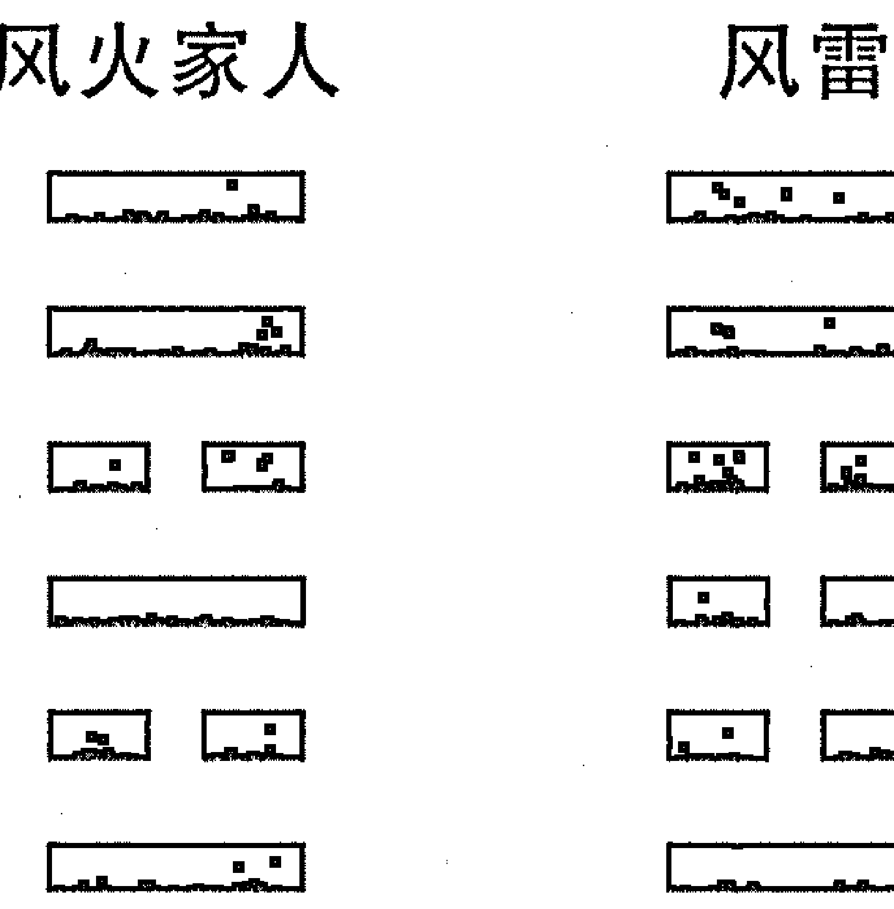

这是龙隐论坛上的一个求测卦，是今天刚刚发上来的，一个女孩子问：会不会复合，那么肯定是感情上出了一定的问题，而且肯定是跟男朋友之间的问题，我们现在就卦论卦，给大家把这个卦解一下。

首先看贞卦，贞卦是“风火家人”。先看卦的一层，分析其中的“八动占”。第一个动占是“财动”，财动的口诀是：“将克神为妻妾动，求财必得妻妾病，损官谋动人心外，心疾物损职难静”。第一是“求财必得”，但是“妻妾病”。“妻妾之病”有一种可能是指“妻妾的问题”。还有一种是因妻妾而出现问题。那么她与她的男朋友之间的关系，肯定是妻妾的问题。作为“妻”而言，她自身出了一定的问题。“损官”，贵神卦为丈夫，内财来克贵神卦的时候，就把丈夫克掉了。这种状态下，就容易造成两个人的分手。那么这种情况是如何造成的呢？或者其中还有没有其它隐藏的因素？再看后面的状态。她在克这个“丈夫”，将神卦在克贵神卦，但是对方反过来生她的，就是子孙动。子孙动的口诀是“荫子添孙奴婢财，占产始知多易育，无边宠遇自天来”。“外来生内”，对方对这个求测者还是有一定感情的，但是，这个感情发展到了一个什么程度呢？我们来进一步分析。

#### 下面看第二层“天元本气寄宫”。“阳日用阳阴用阴”，所以把其中阴性的因素去掉，阳日用阳。

- 乙
- 丙
- 壬
- 丙

“天元本气寄宫”往往和卦的五行是相同的，因此“天元本气寄宫”的动占往往也与卦的动占表象是相同的，在这一层中，也是两个动占，一个是财动“盈益卦”，一个子孙动“恩庆卦”。但是也有与卦不同的地方，那就是神煞，神煞这个因素要结合在一起看。在“天元本气寄宫”这一层里面丙是天德合。乙是月德合。天德与月德代表贵人，天德合与月德合代表什么呢？贵人家里的人或者贵人身边儿的人。所以，在预测中，如果神煞逢天德，是主贵人尊长相助。逢到天德合的时候，主贵人尊长，喜庆和合，助解危难。天德合和月德合代表着贵人家里的人或者是贵人身边儿的人。在这个卦里面，丙火既是他自己（地元卦）同时还是贵神卦，贵神卦与地元卦都是丙火，同样都是天德合，同时天元卦“乙”是月德合。在这个卦里面，代表着感情的双方的家庭条件恐怕都不错，家中有贵人。同时内三才里面两火夹一水，这种情况是反伏吟，是因为家庭内部或是自身原因，造成分开。我们把这一层只是简单的分析一下，没必要停留，继续往下看“天元寄宫”。

- 乙丁己
- 丙
- 壬
- 丙

“天元寄宫”代表的是事件外在表现的内因，大家看一下“天元寄宫”中有几个动占。第一个是财动（盈益卦）、子孙动（恩庆卦）、父母动（宝成卦）、兄弟动（稽滞卦），在这一层里面，比“卦”和“天元本气寄宫”中多了两个动占。这两个动占一个是“丙火生己土”的父母动，一个是“丙火与丁火”的稽滞卦，丙火生己土，是内来生外，代表着她自身对对方还是有所依恋，而丙火与丁火的稽滞，是代表着这个事情在内部有其不可调合的因素，从这一层面来分析，对方来生她（宝成卦），她也去生对方（恩庆卦）。说明双方是相爱的，但是因为某些因素造成两个人不能在一起。所以表现出来的是稽滞卦。稽滞卦的口诀是：“事牵斗讼亲朋涉，内有争竞有小凶”。在求测感情的时候，稽滞一般代表着因家庭或亲朋的原因而引起事情的拖延与口舌。在这一层的动占中，可以看到两个人你来生我我来生你，然后两个人你拖延我我拖延你，这种状态，往往是因为家庭或者是亲戚朋友的原因，造成内部的争竞，但是旧情未断。下一步继续往下看，看“地支寄宫”

#### 地支寄宫

- 辰巳
- 午
- 子
- 午

“地支寄宫”表达的是求测人的心理状态，在这一层里面，有财动（盈益卦）、父母动（宝成卦），还有一个巳午的稽滞卦，同时还有子午相冲，子卯相刑（卯为太岁），同时午火是月令桃花。还有“辰巳午”（天元与贵神）是逆连茹。逆连茹代表对方在后退，子午相冲代表求测人自身很矛盾。这个自身的矛盾和对方的后退（逆连茹）引起了她自身内心的纠结。那么这个纠结的表现是什么样的呢？下面接着看“天元正宫”

#### 天元正宫

- 丙戊
- 丁
- 癸
- 丁

“天元正宫”代表的是内心心理活动的外在表现，这一层中有“财动（盈益卦）、父母动（宝成卦）还有兄弟动（稽滞卦）。这一层的内容，是她自身内心的外界表现，这个外在表现是，希望找到机会与对方沟通，而且自身也一直很喜欢对方，虽然现在内心比较矛盾，但还是在期盼机会，因为她确实是很喜欢对方。但是对方呢？对方的状态并不好。

综合“地支寄宫”中反映的内心的活动，可以看出，从内心来讲，这个女孩感觉到了男朋友的退缩、后退，因此内心很矛盾。虽然女孩很喜欢这个男孩儿，很喜欢她的男朋友，但是两个人现在的状态是稽滞，女孩儿一直想去生这个男孩，但是实际的情况是，两个人之间的关系，处在一种停滞的状态。这就是地支的寄宫所反应的状态。而这个状态反应到天元正宫里面，其外在表现是，女孩去生这个男孩，但两个人的状态也是处于停滞的状态。但是这个情况在天元寄宫里面。

- 乙丁己
- 丙
- 壬
- 丙

就是实际外界的情况的内在因素中，又有一些不同，在“天元寄宫”中有子孙动，也就是她的男朋友也在与她交流，但这种交流，不再是内心的交流了。所以表现在外面的，她的男朋友来生她的状态，实际上是她自己一厢情愿的一个想法。表现在外界的真实情况。在这个卦里面没有“空”没有“破”。看到的更多的是相刑。

也就说实际上是因为家庭的原因，因为亲属或家庭的原因，造成两个人不能在一起。而这个时候，实际上她的男朋友已经开始退缩了，但对于她自身而言，更希望的是对方还在喜欢她。在稽滞卦里面就有“事牵斗讼亲朋涉”的判断。所以这种情况下，很可能是因为家庭原因。

我们现在把这一个卦的五层和这个五层之间的各个关系分析完，这个贞卦分析完之后，我们来分析贞卦的错卦。这个卦的错卦是雷水解

#### 雷水解

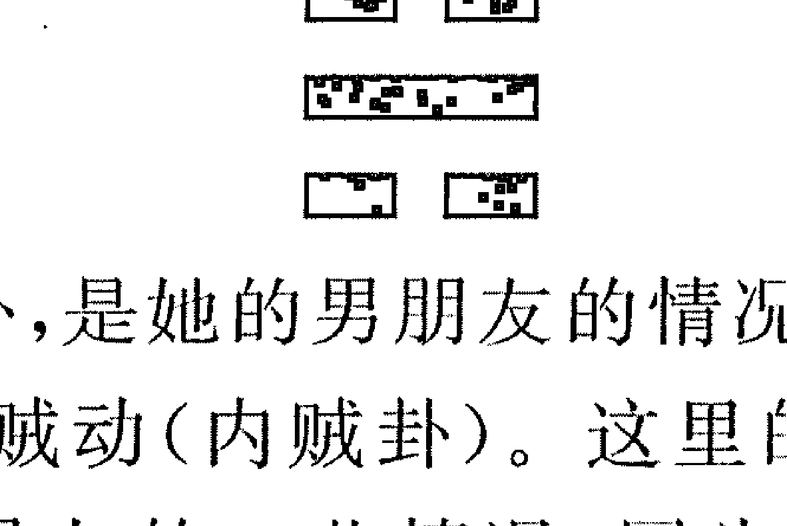

贞卦的错卦，是她的男朋友的情况。一个是父母动（宝成卦），还有贼动（内贼卦）。这里的错卦，是代表着她认为的她的男友的一些情况，因为毕竟测卦的人是她，错卦实际上是她所问的事件的外环境，这是从她的男友的角度来看问题。

首先看第一层，也就是卦本身。内来生外（宝成卦），也就是男来生女，还有贼动（内贼卦），贼动是“勾联偷攘染私情”。从这个男孩儿的角度，更多的会认为这是一个私情，“谋空财损卑幼病，暗昧空诈亦非轻”。求谋不得，求财有损，将神卦为财为妻，所以这个“财损”实际上也是“妻损”，损的是谁呢？是这个女孩的成为妻子的这个事情。所以内贼卦是不利妻的。然后是父母动（宝成卦），内是这个女孩的男朋友，外是这个女孩儿，女孩儿的男朋友还是来生她的。

下面接着看“天元本气寄宫”。

- 甲
- 壬
- 丙
- 壬

这一层基本上和卦的五行是一样的。我们看一下神煞。只有一个丙是天德合，天德合在将神位，这个女孩儿的家里面有钱或者说有贵人，说明这个女孩儿家里面家庭条件很不错。这一层没有太多的信息。我们接着看“天元寄宫”。

- 甲
- 壬
- 丙
- 壬

甲主阴私和合啊。“天元本气寄宫”和“天元寄宫”是一样的。那么我们接着往下看“天元正宫”。

- 乙
- 癸
- 丁
- 癸

“天元正宫”是男孩子心理的外在表现，这一层中“贼动”见丁了，丁代表“第三者、女性”，同时内来生外，癸来生乙，乙是月德合，癸为阴私，丁为第三者，或者说是丁非正妻。这个男孩子实际上更多的时候是看中的这个女孩子的家世，但是又把与女孩子之间的关系呢，看做一种非正式的感情。

#### 我们接着往下看‘地支寄宫’

- 卯
- 子
- 午
- 子

午火为月令桃花，子水是太岁沐浴，同时子卯相刑，刑入太岁，而且贼动，子刑卯，卯刑子为无礼之刑。这种情况是非正常的，没来由的，对这个女孩儿的刺激，同时里面有贼动主私情。就是这个女孩儿的男友对这个女孩的感觉是什么样的？这个男孩感觉这个女孩子不是可以做为正妻的选择，同时感觉与这个女孩儿之间的交流有问题，因为女孩可能会有点不讲道理（无礼之刑），总是无理由的争吵或发生矛盾。这个女孩自身的条件很好，长得也很漂亮，但也让这个男孩儿有不安全感。所以，这个男孩儿来生这个女孩儿的同时有一种排斥的心理。卦中贼动代表已经有私情了。但是现在这个男孩儿开始相刑了，而且是无礼之刑。无礼之刑有一种含义，就是不合礼法的，不合传统的冲突。不合传统的，不合礼法的冲突造成的刑克，叫无礼之刑。那么，不合礼法，不合传统的这种相刑，而且在女孩儿那里又有一个来自家庭或亲朋的阻碍的状态，那么很可能这个男孩儿和这个女孩儿之间的感情会遇到传统的或者礼法上的一些问题。

贞卦和贞卦的错卦分析完之后，下一步分析悔卦。悔卦是风雷益。

#### 风雷益

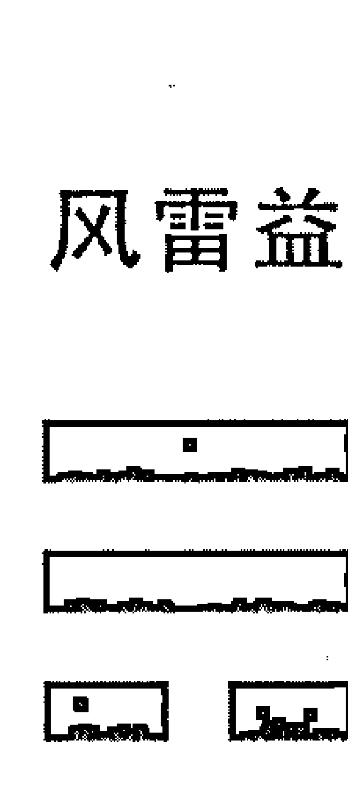

风雷益这一卦，稽滞卦凸显出来了。贞卦是这个女孩儿求测时的状态。悔卦是事件的一个发展过程，在悔卦中，“稽滞卦”就凸显出来了。而且“合局相克”。“合局相克”是两方共同把事情往不好的方向上推。一开始（贞卦）情况还不错，后来越来越不好，更何况还稽滞。第三个，贵神将神反吟，反复，变化，波动，都出来了。贵神和将神在一个卦里面代表“丈夫和妻子”。是夫妻位。夫妻位反吟，这种情况，是家庭干扰的这种可能性增大了，但不是反目，反目是分局相克，是中间的劲儿往两边儿使，分家，是反目。这个卦是两边儿的劲儿往里边使，这种情况一般是外界干扰。跟攥拳头一样。是两边的劲儿一块儿挤压他们。受到了外界的压力越来越大。而且稽滞，“事牵斗讼亲朋涉，内有争竞有小凶”。这种情况说明又出现了一个进一步的情况，变化。那么我们接着排，悔卦的天元本气寄宫。

- 乙
- 戊
- 己
- 甲

甲己内合。这还是这个女孩儿的状态。这种合，是压抑，压制，极力保持平衡。她自身在压制，在找平衡。后面接着看“天元寄宫”和“天元正宫”。

| | |
|---|---|
| 己乙丁 | 戊丙 |
| 戊 | 甲己 |
| 戊辛 | 庚己 |
| 甲 | 乙 |

天元寄宫里面，变化就趋于复杂了。还是先看克，鬼动，内心不宁。然后“稽滞”，“事牵斗讼涉亲朋，内有争竟有小凶”。同时外三才伏吟，这种状态，说明这个女孩子内心很矛盾，因为家庭或者是各方面的阻力造成这个事情久拖不决，而且外面越来越没有消息。外面三个土啊，两个戊土加一个己土是三个土，阻碍重重。

再看“天元正宫”，“天元正宫”中首先是“鬼动”悔折卦，然后乙来生丙。这个丙是什么呢？丙是私情里面的第三者，同时也是贞卦里面的贵神卦，同时还是她自身的位置。庚甲、甲己，财动贼动，先看财动再看贼动。外面还有官动，里面乙庚相合，乙庚合是夫妻之合。她自己把这个人当丈夫了。但是在外面生的时候呢，外面一片乱动，财也动了，官也动了，贼也动了。官动代表程序婚姻。这种情况下，很可能是家里面开始给她介绍对象了。可是她对对方现在没有死心，和对方的这个私情还在继续。

#### 地支寄宫

- 辰巳
- 丑寅
- 未申
- 卯

“地支寄宫”的八动占与“天元正宫”是一样的，但是，其中的内涵是有很大不同的，“地支寄宫”所表现的是内心想法层面的内容，首先是太岁入卦了，地元卦为太岁，太岁鬼动，今年不宁，而且从阴历二月份就开始不安宁了。到了四月份，她还在想着对方（卯来生巳），寅午戌见卯为桃花。整个卦中桃花朵朵。然后看“寅申”的财动。“但取寅申为贵客”。但是申金是空亡的。“天元正宫”中庚的落地地支是申。所以，“天元正宫”中的乙庚合是虚的。甲来克己是实的。贼动是实的。官动也是实的。

从她自身来讲，从阴历二月份开始，一直心中不宁。然后到阴历四月份的时候，她又开始想去生这个男孩子。从她的这个内心来讲的话，是想和这个男孩子维持一段哪怕是私情的感情。维持一段时间，然后和这个男孩子能够走到一个正式的程度上去。因为寅和辰之间是一个官动，官动的话代表着正式的婚姻。但是两方的家庭或外界环境给他们这个事情的压力是很大的。这就是我们现在看到的真实的悔卦的情况。

下面接着看悔卦的错卦。悔卦的错卦是“雷风恒”

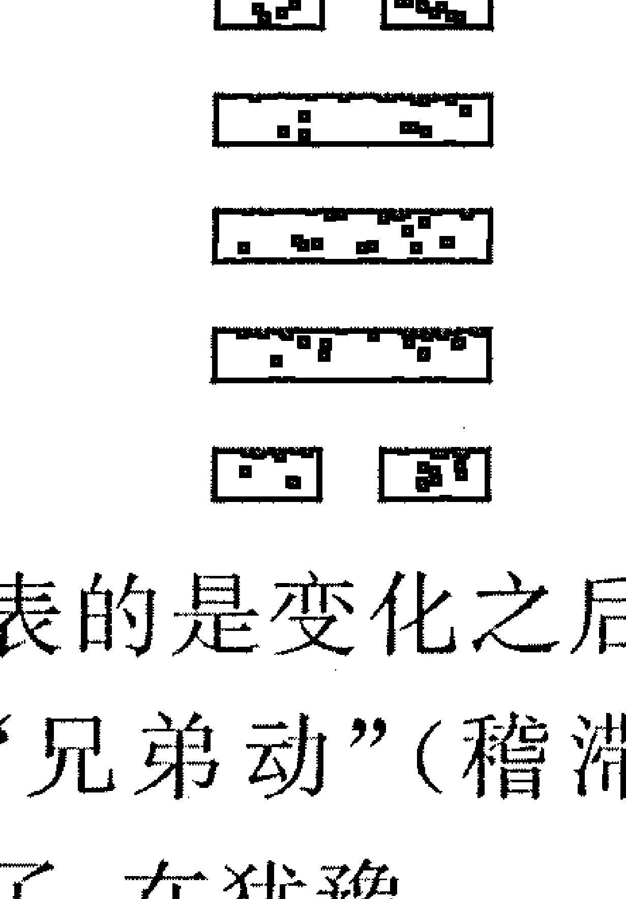

悔卦的错卦代表的是变化之后的男孩的状态，这个卦显示的情况是：“兄弟动”（稽滞卦）。还有是“分局克”，男孩儿想分手了，在犹豫。

下面的四层关系我们一次性的排出来，看一看。雷风恒中寄宫的四层关系。

| 天元本气寄宫 | 天元寄宫 | 天元正宫 | 地支寄宫 |
|---|---|---|---|
| 甲 | 甲 | 乙 | 卯 |
| 辛 | 庚 | 辛 | 酉 |
| 庚 | 庚癸己 | 戊壬 | 戌亥 |
| 乙 | 己乙丁 | 戊丙 | 辰巳 |

第一层是“天元本气寄宫”甲辛庚乙，分局克而且乙庚合。下面乙庚合，外面辛甲官动，按照断卦顺序，首先要考虑的是官动和稽滞。官动（明德卦）是“仕应禄位望财难”，对于这个男孩子而言的话，“仕应禄位望财难”，发展事业，不考虑感情。虽然，在里面藏着一点点夫妻的想法，但是在对外的表现是“事业的追求可能会成为这个男孩不考虑感情的动力。

第二层是“天元寄宫”。天元寄宫里面有“官动（明德卦）、妻妾动（问招卦）、兄弟动（稽滞卦）、子孙动（恩庆卦）”，官动，男孩子想求事业，把感情放在一边了。妻妾动，问招卦。女孩子一直在找他，给他造成了不少的压力。而且这个女孩子也在生他，还是来找他的意思。最后是甲乙稽滞，还是在拖。

但是这个男孩子真实的想法是什么呢？下面看“地支寄宫”。“地支寄宫”是男孩子的内心想法，“天元正宫”是“地支寄宫”的外在表现，刚刚讲到的情况是：官动，妻妾动（问招卦），乙变成了他的压力了。所以我去做事业，但是“乙”还一直来生，他也有点儿放不开，是这么一种状态。而到了“地支寄宫”，就可以看到这个男孩子的真实心理了，“地支寄宫”中有“卯酉官动”，但是“酉金”官动实际上是空的，卯来克辰是实的，卯来生已是实的，已是消息，女孩子一直在找他，一直在给他压力，两个人一直在互通消息。男孩子在跟女孩子讲：“我现在在考虑事业的问题，要把事业做起来”。但实际上这个事业的事儿是虚的。这就是“地支寄宫”所反映的情况。

刚才的分析，用到了贞卦，贞卦的错卦，悔卦，悔卦的错卦，以及贞、悔、错的五层寄宫关系，就是“卦、天元本气寄宫、天元寄宫、天元正宫、地支寄宫”，把这五层关系理顺之后，我们发现，这一个卦里面所反映的信息，最终会指向拖延，甚至分手。所以有的时候说断卦看不到结果。实际是因为你对这个关系的分析没有完全到位。有的时候结果在贞卦和悔卦里面就已经出现了。有的时候需要用到伏玄变占，有的时候需要用到续变，用到替变，有的时候需要用到错综。当然只算到这个样子。还是不合格的，因为预测的真实目标，并非结果，前面分析的结果，是指向事件自然发展的结果，就是求测者什么都不做，什么都不改变，所可能发展出来的最可能的结果，作为预测而言，只算到这一步还是不够的，预测的目标，应当是按照预测结构所给出的模型，找到未来事件变化与发展的多种可能，并从中找到最佳选择模式，这些选择，实际上才是变占所要真正解决的问题。

## 第七章 错卦与综卦

错卦与综卦，在梅花占的体系里面，是属于“变占”的体系。学《易经》都知道有《焦氏易林》这本书，《焦氏易林》的卦解，是一卦变六十四卦，六十四卦变四千零九十六卦，但这个卦是怎么变出来的，后人不清楚，现代研易者普遍的看法是，《焦氏易林》中的一卦变六十四卦，指的是“爻变”，也就是主卦与变卦的关系，但是，按《隋书・经籍志》考证，《焦氏易林》的后面原本还有一本书叫《易林变占》，《焦氏易林》为十六卷，《易林变占》也是十六卷，都是由焦延寿祖师著的。如果按照后世研易者的观点，《焦氏易林》中的“一卦变六十四卦”，是“主卦”与“变卦”的关系，那么实在没有必要写出“十六卷”篇幅的内容来，由此可以推测出两点，第一是《焦氏易林》所用一卦变六十四卦的方法，至少不是后世研读易林的学者所认为的“爻变”系统，而是另有所本。二是《焦氏易林》中所用的方法，应当与《易林变占》紧密相关，而且《易林变占》中所蕴含的内容应当非常丰富。自隋代以后，《易林变占》在外界就已经失传了。但是从我们现在的传承来讲，实际上我们现在用的这套体系，应该就是这套变占的体系。当然，没有旁证可以证明，说我们的变占和焦氏的《易林变占》到底是一个什么关系。因为凡是涉及到变占体系的书籍，实际上在近两千年的兵燹、战乱等等过程中，都已经散失掉了。数术的传承，在古代属于“天人之学”，这个学问随着历代统治阶级的“历禁”，最终进入了两个渠道，一个渠道是秘传的体系。秘传体系因为其传承本身的私密性、保守性与口传心授的授受方式，所以保持了自身的一个学术传统上的纯洁。还有一套体系呢，就变成了外面那种流传的、通行的、著之于书的东西。

我们在学习《金口透易·梅花占》的过程中，可以发现，传承的体系和外面流传的体系，区别是很大的。而且，在对准确率的把握和对事情的把握上，差别也是很大的。过去讲“真传一句话，假传万卷书”，数术体系的传承，分为“书”与“诀”两部分内容，书之与纸的部分，是剥离开了“诀”的部分，而真正的“诀”，则往往是要通过口传心授来实现的，而这部分“诀”的内容，往往是“书”的那部分内容的“钥匙”，当钥匙口诀被剥离之后，书中的内容，就变成了残缺的、容易产生变异的体系。东汉以后，之所以会出现“易理学派”，实际上也与秘传的术数体系在外面流传不广有很大的关系。“易理学派”是以“理”来解《易经》。这种解法，更适于为大众接受，但是对于技术上的传续，并没有多大意义。所以，我们现在把《易经》看做一种哲学，这种说法是完全背离《易经》的基础的。《易经》本身首先是预测之学，他是在建立“宇宙时空模型”的基础上，模拟时空发展与变化的一种方法，我们能说“时空模型”是哲学吗？不是，“时空模型”更接近于现在的理论物理学，其本身应当是技术。

梅花占中的“变占”系统是一个非常庞大的体系。贞卦和悔卦加一个寄宫占就分成了十层。一个贞卦可分五层，一个悔卦也可分五层，实际上是十层的一个占验体系。寄宫在变占体系中称为“寄变”。其本质就是“变占”系统中的一种方法。

在“变占”系统中，“错卦”与“综卦”是把一个卦变成四个卦。“寄宫”是把一个卦分为五层。“错综”把一个卦再分成四个卦，这四个卦是什么呢？贞卦，贞卦的错卦，贞卦的综卦，贞卦的综卦的错卦。还有“悔卦，悔卦的错卦，悔卦的综卦，悔卦的综卦的错卦。”是把两个卦分为八个卦，假如真正给大家把“变占”这套系统讲全，大家会发现《焦氏易林》中“一卦变六十四卦”的体系，完全就是“变占”的系统。一套完整的“变占”应用，他的成卦的数量是呈几何性增长的。就是一变四，四变十六，十六变二百五十六。“变占”是用六十四个卦不断地在演进交替，反应事件的不同状态。

那么在“变占”体系中，错卦与综卦所反映的内容是什么呢？“错卦”在变占体系中反映的是求测者所求测事件的外环境及对立面情况的内容。“综卦”在变占体系中反映的是求测者所求测事件的反向的选择。“综卦的错卦”在变占体系中反映的是求测者对所求测事件反向选择后的外环境及对立面环境。

实际上大家日常思考问题的思路也是这样的，对于一个事件，要考虑事件中现在的状态是怎样（“贞卦”）？
- 这件事情的外环境及求测者的对立方现在是一个什么样的状态，也就是你面对的事情的环境是一种什么状态？（“贞卦的错卦”）。
- 假如采取反方向的选择，事件会有什么样的状态？（“综卦”）。
- 如果求测者做出了反方向的选择，那么外环境与对立方会产生什么样的变化？（“综卦的错卦”）。
- 这个事件向下发展，最有可能出现的状态是怎么样的？（“悔卦”）。
- 事情变化之后，事件的外部环境及求测者对立方是一种什么样的状态？（“悔卦的错卦”）。
- 事件变化后，有没有可供参考的反向选择？（“悔卦的综卦”）。
- 事件变化后，并做出反向选择之后，外部环境及对立方会是一种什么样的状态？（“悔卦综卦的错卦”）。

这些就是用“贞悔错综”来预测事件的基本思路。

下面是教材中的一个实例，我们来综合分析一下：

孙鹏是我一个朋友的朋友，曾经在朋友聚会时见过几次面，小伙子长得挺精神，人也外向坦诚，但不知道什么原因，年近三十岁了，还没有合适的对象。2005年夏天，孙鹏找到笔者的公司，说想要算算姻缘，问有个女孩，看有没有追求的希望。

起铜钱卦如下：

乙酉年 壬午月 戊寅日 丁巳时(日空:申酉)

| 本卦 泽山咸 | 变卦 天火同人 |
| :--- | :--- |
| (卦象符号：六爻图示) | (卦象符号：六爻图示) |

咸：亨，利贞，取女吉。
- 初六：咸其母
- 六二：咸其腓，凶，居吉
- 九三：咸其股，执其随，往吝。
- 九四：贞吉悔亡，憧憧往来，朋从尔思。
- 九五：咸其脢，无悔
- 上六：咸其辅，颊，舌

### 解断：【贞、悔两卦看事体的起始情况与变数】

一、本卦为泽山咸，咸者感也，为男女相悦之卦，天元卦为兑为少女，地元卦为艮为少男，艮来生兑，男求女之象。

二、卦内现父母动（宝成卦），亦为男来求女，但卦内申酉空亡，求之不得。

三、卦内现乾巽为贼动（内贼卦），主阴私暗昧，不宁之事，又主私情。巽为长女，外三才重重乾兑来克，以少女之事，而破长女财位，此长女主孙鹏原来尚有女友。

四、兑卦本位寄酉，艮卦本位寄丑，丑为太岁，与时兑卦为月建桃花，太岁将星，此女家庭条件较好，长得漂亮，追的人多。家中长辈有政府领导。

五、变卦天火同人，为鬼动（悔折卦），家宅不宁之象。内来求外，求之不得。

六、离为月建，亦为桃花，当月有求爱之象，内有贼动（内贼卦），主家中矛盾，此矛盾当与原女友私情所起。

首先我们看贞卦，贞卦是泽山咸。泽山咸这一卦是内来生外，内为艮卦为少男，外为兑卦少女，少男来追这个少女。“印信擢拔多进益，须知祭祀祥福祯”，这个男孩儿要去追这个女孩儿，在这里面已经显示得很明显了。但是下面需要关注一下时间，戊寅日是甲戌旬，甲戌旬中申酉空，兑卦的地支寄宫是酉金，酉金的状态是空亡，兑卦是落地空亡。他去生这个女孩儿，但是这个女孩儿现在是一种什么状态呢？是一种空的状态。空亡的状态一种是“躲避”，因为没有主意，所以采取回避的态度。还有一种情况是没有感觉。这个男孩儿去生她，但是对方是没有明确的表态。天元卦为酉，当年的太岁又为酉年。太岁入卦空亡，可以理解为这个女孩儿在酉年这一年不会有太明确的表态。在这里，太岁入卦是个标记，古代数术书籍中讲“应之以年，应之以月”，就是这个概念。从这个卦的基本情况可以看出，这个男孩儿在追这个女孩儿，现在女孩儿没有表态，这个女孩儿在躲避。

贞卦中还有一个动占是“贼动”，“神克将为内贼生，勾联偷擭染私情”。如果这个男孩儿去追这个女孩儿的话，他应该是很正常的一种爱情的表现。而且我们看到这个女孩儿现在是一种空的状态。那么这种状态下，产生私情的可能性是不大的。

我们前面讲过，预测是在方的数术，因此要一事一占，对于预测的前提一定要搞清楚，要做命题作文。假如这个卦的前提是现在有女朋友，和女朋友之间存在一些问题，想看问题能不能解决。这种时候卦中如果出现贼动，就要考虑是否两人已经发生了实质性的关系。

但是这一卦是想问：“有个女孩儿，看有没有追求的希望”。而且在卦中又明显可以看到，这个女孩儿在躲避。在这个时候出现“贼动”（内贼卦），那么这个贼动，很可能就不是和这个女孩儿的实质性关系。而是存在两个可能，一是内心不安，犹疑不定，内心压力大。二是他自己有可能还存在其它的私情。对于这些情况的梳理，需要看一下贞卦的寄宫。

### 贞卦的“天元本气寄宫”。
- 辛
- 庚
- 乙
- 戊

在贞卦的“天元本气寄宫”中有一个很明显的标记，这个标记是“乙庚之合”，乙庚合为夫妻之合，而且这个夫妻之合是合入太岁。太岁为“乙酉”，而且这个乙又在将神卦妻妾位，庚为夫，乙为妻，这个乙庚之合是有夫妻之实的。

### 下面继续看一下“天元寄宫”
- 庚
- 己庚癸
- 乙丁己
- 戊

“天元寄宫”是事件的外在表现的内在因素。这个内容就要变得复杂很多。第一是内来生外，内来生外的这种状态一直在里面延续。然后看第二组“丁来克庚，乙来克己，己来克癸”，第二组是三个“财动”。这三个财动的主克方一个是乙，一个是丁，一个是己。这里面又明显的出现了两个标记，乙是妻子。丁是第三者，是妻子以外的人。那么还有一个是己。这三个财动，乙己是一组，丁庚是一组，己癸是一组，这是一组三个“财动”。

然后看第三组“庚乙贼动，癸丁贼动”，出现了两个贼动。求测感情，财动主妻妾病，因为妻妾而产生问题。所以叫“心疾物损职难静”，留下心病了。这个心病来自于哪儿呢？“庚乙”和“癸丁”。在十干里面癸主阴私。癸水主心里的小算盘，主问题，主阴私，这是癸的表现。癸来克丁，形成了一个贼动。就是原来可能有一段感情（庚合乙）。那么后面又出现了一个癸和丁的“小算盘”。那么这个“小算盘”，就很可能是和当下想追的这个女孩儿。我们刚才讲的这一部分，是告诉大家如何去一步一步的筛选，把预测中包涵的问题体现出来。

### “天元正宫”
- 辛
- 壬戌
- 丙戌
- 甲己

“天元正宫”是内心活动的外在表现，这里面有四个“动占”，按断卦顺序看，第一个是“财动”（盈益卦）。然后是“妻妾动”（问招卦）。接下来是“贼动”（内贼卦）。最后是“父母动”（宝成卦）。首先出现了一个戊和壬的财动。壬为酝酿。从他自己内心的表现来讲，在酝酿这个事情。然后是辛克甲的妻妾动。外面那个女孩儿是“辛”，这个辛，就是“天元本气寄宫”里面的那个“辛”，同时也是兑宫的那个“兑”，这是一个标记的路线。这个“妻妾动”（问招卦）“外边取索多谋害”，辛为刑，对方在回避他，或者讲是不理他。辛金来克甲木。这个情况呢，实际上在前面的卦里面是没有表现的。但是，从天元正宫里面就已经显示出来了这个辛金克甲木，这个辛金克甲木是实的。在这里酉金逢空亡，辛金不空，但是兑卦落地空。辛金来克甲木，所以这个女孩儿很不喜欢他。然后是“壬克丙”的“贼动”（内贼卦），他又想一些心思，想一些事情，比如说给这个女孩儿买东西，和这个女孩儿套近乎，男孩子还是一直在和这个女孩儿在纠缠。这是从两个方面来讲的，一个是戊和壬，“求财必得妻妾病”，因妻妾而产生问题，内心的问题，所以在反复思量，酝酿状态，从而落下一个心病。第二个是己土来生辛金，“须知祭祀祥福祯”。一直在给这个女孩儿上供，在哄这个女孩儿。

### 下面再看一下“地支寄宫”
- 酉
- 戌亥
- 辰巳
- 丑寅

“地支寄宫”看内心的心理表现，天元酉金空亡。酉金处于真正的空亡的状态，就是这个女孩儿在外面表现很烦他，但是女孩儿不表态，在躲。已代表信息、书信、短信。同时已亥相冲为取索，跟这个女孩儿之间还有一些钱财上的纠缠。酉戌亥又为逆连茹。女孩儿一直在退。已亥相冲，辰戌相冲，他自己内心的冲突也很大，一直在反复的徘徊，因为辰戌为斗讼，已亥为取索，这种状态就是内心很纠结的状态。

我们再看错卦，贞卦的错卦是山泽损。

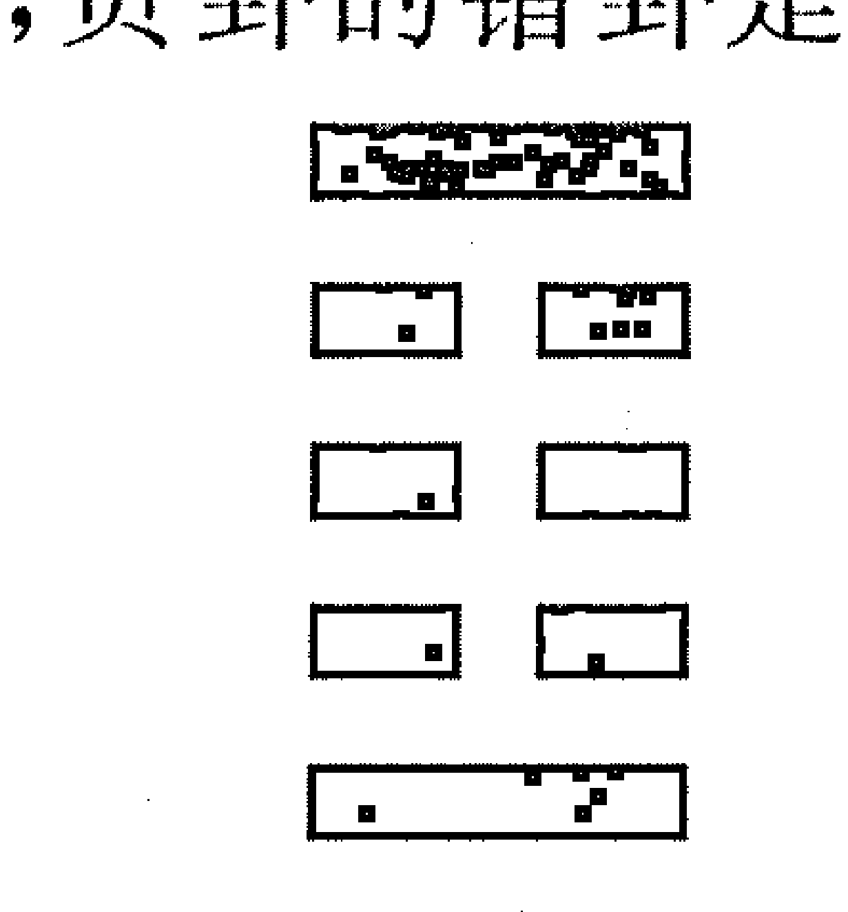

错卦讲的是预测的事件的外部环境及对方情况，是从被追求的女孩儿的角度来看这个事情，外来生内“宝成卦”，是这个男孩儿在追她，说明这个女孩儿是有感觉的，是知道这个男孩儿在追她的。但是她是一种什么状态？落地空亡。落地空亡代表这个女孩儿在躲避。

卦里逢“财动”，“求财必得妻妾病，损官谋动人出外”。从这个女孩儿的角度来看这个男孩儿，出现了两个情况，第一个是“将神卦”妻妾位逢破，她不想结婚。“财动”在很多时候，对于女孩儿来讲就是一种婚姻状态。“财动”同时还代表着一个含意就是“损官”，官位是丈夫。那么对于这个女孩儿来讲，第一她不想结婚。我们知道卯木是六合，六合为婚姻，婚姻逢冲。又逢岁破，她不考虑婚姻的问题。第二是“损官谋动”。“损官”，也是一种不考虑婚姻的状态。而且外部反复，外面是艮坤的反吟。这个男孩儿，一直在反复的变化，而女孩儿也处在一种反复变化的状态中，忽冷忽热。但是从她内心而言，她是在躲避的。因为兑卦是落地空亡，内心没有这种想法。

这个女孩儿从卦里分析，感觉她可能有几个想法，一个是我先跟你谈，先发展一点点地下的感情，但是从这个女孩儿的表现中可以看到她不太喜欢这个男孩儿。第二个是财爻逢破，她不考虑做媳妇儿的可能。第三个是贼动逢空，这种情况是她也不考虑跟他相处的这种可能。而且她也一直在反复，也是在拿不定主意。但是总体的状态她已经表现出来了，就是这个女孩儿并不喜欢这个男孩儿，所以她一直在躲避这个男孩儿。也不考虑婚姻的问题，也不考虑和他进一步发展感情的可能。

接下来看综卦，泽山咸的综卦是雷风恒。

## 第七章 错卦与综卦

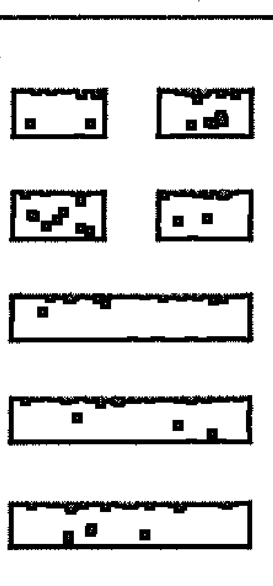

雷风恒是反向选择，如果不追这个女孩儿会怎么样。先看八动占，兑卦克震卦为“官动”（明德卦）。“仕应禄位望财难，常人官事得官物，财来暗损病喉咽”。感情的事情没有着落了，着急上火。然后是“兄弟动”（稽滞卦）。“事体迁延比肩行，事牵半夜亲朋涉，内有争竞有小凶”，拖延迟滞。天元逢岁破，把这个女孩儿放弃掉了。

### 接下来看地支寄宫
- 卯
- 酉
- 戌亥
- 辰巳

地支寄宫有三个动占：酉克卯“官动”（明德卦），卯克辰“妻妾动”（问招卦），卯生巳“子孙动”（恩庆卦）。但是官动落地空亡。而且，外卦反吟，内卦反吟。内外反吟，分局相克。分局相克是内外的力量一起把这个事儿分开了，所以假如说他不去追这个女孩儿的话，从综卦看就是很明显的是分开了。但是这个女孩儿虽然不喜欢他，还会给他留一线可能。卯来生巳，最少对他还会产生一个不错的印象。虽然做不了夫妻，产生不了感情，但是还能做朋友。

### 接下来再看综卦的错卦，也就是雷风恒的错卦

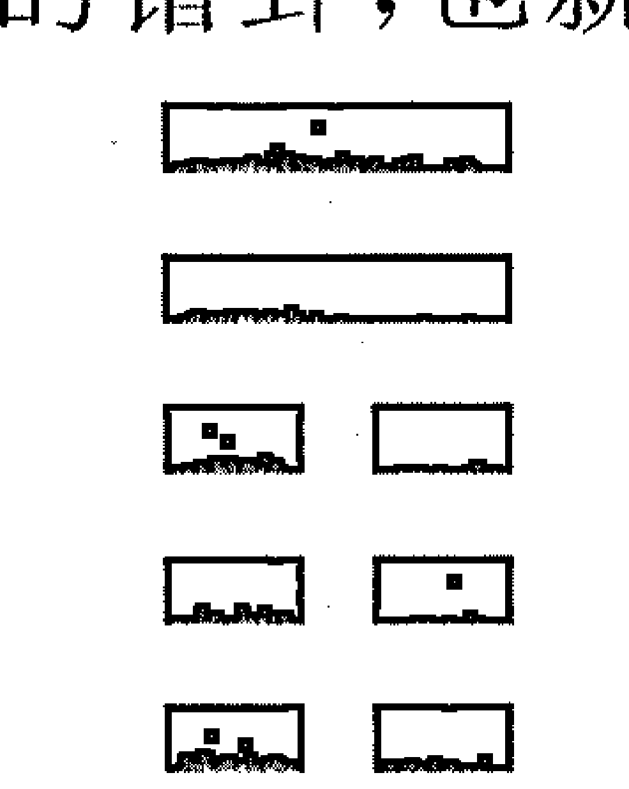

综卦的错卦是风雷益，在这个事情里面代表的是孙鹏做出反向选择后，女孩的状态，我们知道前面的那个卦是女孩儿不考虑，不想跟他去谈朋友，而且还在躲避他。而风雷益同样是稽滞卦，“事牵斗讼亲朋涉，内有争竞有小凶”，而且合局相克。内外的环境都决定了这两人确实合不到一块儿去。这个事情可能会拖延，但是最后还是成不了。

前面所讲的是贞卦的错卦，贞卦的综卦，和贞卦的综错所反映出来的事情，在这个卦里面的表现。就是我们现在讲的这四个卦各五层所表现出来的各个层面的关系。

### 下面讲一下悔卦，悔卦是天火同人

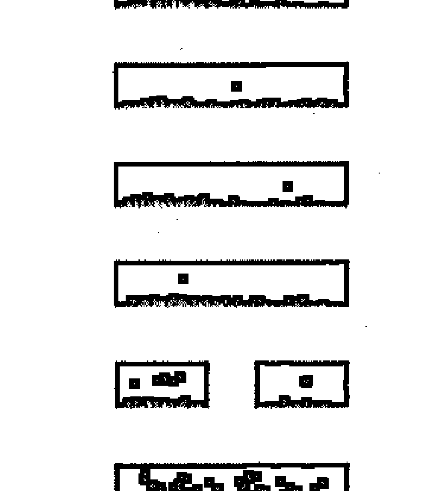

悔卦是事件向下发展的最大可能方向，这个可能方向，是前面事件在后面的反应，也就是前面的贞卦所反映的事件，在后面的发展中最可能的方向。

卦中“鬼动”（悔折卦）是内心不宁，而且想坚持要追一下，而且是比较强硬的追法。这个卦的时间四柱是：“乙酉年 壬午月 戊寅日 丁巳时”，卦中的离火，既是太岁的桃花，也是时辰的桃花。在这一年，是桃花朵朵开，求测人心里头有一种很激荡的情绪。而这里面“贼动”的这种状态，在悔卦里面是一直在出现的。

下面再看地支寄宫。因为时间的关系，我们只讲地支寄宫，地支寄宫是
- 戊亥
- 戊亥
- 辰巳
- 午

我们看一下动占，第一个动占是辰克亥，“财动”（盈益卦），“求财必得妻妾病”，“亥巳”相冲，巳亥为取索，辰戌为斗讼。取索感情，去求爱，这种状态也显出来了，求爱的状态也显出来了。

第二个动占是“官动”，“仕应禄位望财难”。然后变成了“亥来克巳”（内贼卦），“亥来克午”（问招卦），他去生人家，人家明确表态，不喜欢你。

午生成的“父母动”（宝成卦），是从心里想着去生对方。午生成，而且是合，寅午戌合，合到日建里面，想要和对方表态这是内心的想法。

在外面卦（天火同人）这一层的表现是“贼动”（内贼卦），“勾联偷攘染私情，谋空财损卑幼病，暗昧空诈亦非轻”。求谋不得，求财有损。这里面就不是私情了。

为什么同样一个动占，在解卦的过程中，会出现不同的解释？预测事件的第一步是要读题。对事件的判断要根据命题来解读，所有对事件的解读，就像包裹在命题外面的外壳一样，要围绕这个核心来把握事件脉络。

“求谋不得，求财有损”，这些是从哪里看出来的呢？实际上是从寄宫里面看出来的。但是在外面的表象上他要追一下，而且追求得很激烈。而对方会对他的这种表现表现得很无奈。为什么很无奈呢？在这个四象占里面，金废木休火旺。他自觉很强势，然后对方很犹豫。“废”是躲避、消极的状态，对方很消极，他自身很积极。但是，从外三才看，是“金旺木废”。对方实际上并不像他想的那么弱消极。对方实际上是很积极的在躲避。

接下来看悔卦的错卦，地水师。

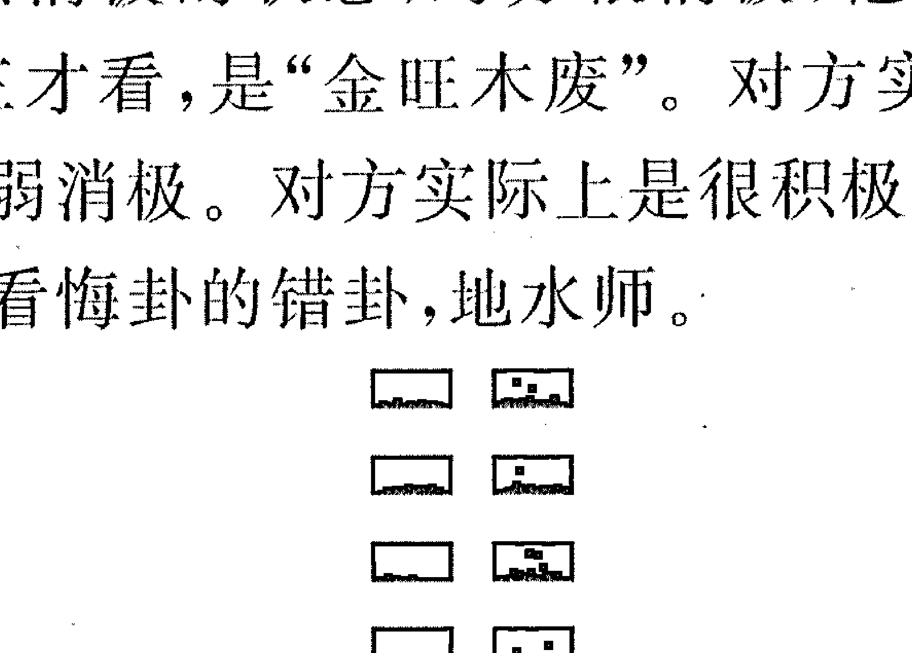

大家有没有发现主卦和错卦之间肯定是两两相应的，如果主卦是内来克外，那么错卦肯定是外来克内。假如说主卦是内来生外，错卦肯定是外来生内。分析一下悔卦的错卦反映的情况。悔卦的错卦，是事件发展以后的外环境与对立面状况，悔卦的错卦中的第一个动占是“财动”（盈益卦），“损官谋动人出外，心疾物损职难静”，对于感情的事情不做考虑，而且心事重重，第二个动占是“问招卦”，外来克内，这个女孩儿能感觉到他在很积极地追求。已经感觉到压力了。

接下来看一下“地支寄宫”
- 未申
- 未申
- 卯
- 子

地支寄宫中有几个问题需要关注，第一是“将神位的岁破”，财动逢破，外伏吟。是女孩儿还不想考虑这个问题。第二是，子未相害，“害”是解“合”的。子与丑合，丑未相冲，未把“子丑合”的状态冲开了，所以叫害。这个女孩儿觉着跟他合不来，不想跟他谈。而且“申克卯”贼动逢空，女孩儿也不会考虑私下发展的可能，没有这种状态。

### 接下来再看悔卦的综卦，进一步发展状态下的反向选择

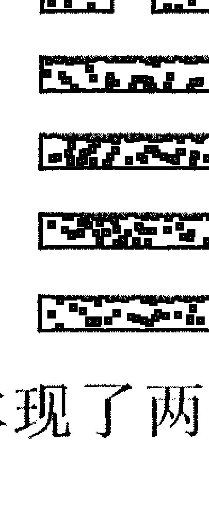

悔卦的综卦中也体现了两种情况。第一种，他不去追这个女孩儿，会发生什么情况，悔卦是他想去追这个女孩儿，要有所表现，但从悔卦看，这个女孩儿与他发生感情的可能微乎其微，假如他不去追求，那么这个女孩儿对他同样不可能发生感情。火天大有是“妻妾动”，“问招卦”。“外边取索多谋害，人在家中访不宜”。对方还是不喜欢他。
再看综卦的错卦。综卦的错卦代表男孩儿的态度转变之后，对方的相应表现。

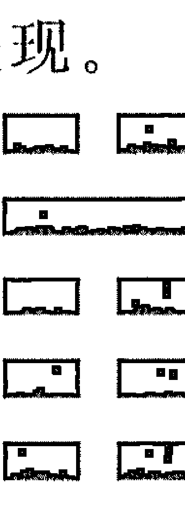

火天大有的错卦是水地比。综卦的错卦是他采取反向选择后女孩儿的态度。假如孙鹏放弃，那么这个女孩儿和他还是合不到一起(鬼动、官动、子未相害)。但是，最少在两个人之间，可能还会有朋友之间的那种关系(地元申生天元子)。

前面把这个卦分析了一下，一共等于是分析了八个卦。贞卦、悔卦、贞卦的错卦、贞卦的综卦、贞卦的综错卦、悔卦的错卦、悔卦的综卦、悔卦的综错卦。我们刚刚把这个事情各个层面的关系，给大家理了一遍，但是今天的时间比较有限，给大家来讲这个内容，还是稍微显得有点仓促。

一般日常预测的时候，是没必要算得这么细的。因为初级班的教学目标，就是要求大家在学完初级班之后，能够把一个卦断得很完整。

在日常的预测中，错卦一般是一定要看的。综卦一般情况下可以不看，但比如对方：“这个事情有没有其它选择”？这个时候，就要看综卦。所以，真正用到变占的时候，都是对方问什么方向就去解什么方向。金口透易梅花占中的变占，如果全部讲出来，将近几千种变化，真正使用，需要按照求测人所提出的问题来进行选择，否则的话预测就变成写长篇小说了，梅花占的整体还是很复杂的。

### 附件：成语里的易经之“错综复杂”

名词：错综复杂

> 【解释】: 错：交错，交叉；综：合在一起。形容头绪多，情况复杂。

> 【出处】:《周易·系辞上》：“参伍以变，错综其数。”

> 【示例】:不管形式上怎样～，变化诡奇，实际上总有一个基本的道理贯串其间。（秦牧《河汉错综》）

按上解，错综复杂中的“错综”一词是来自于《周易·系辞》，其原文是“参伍以变，错综其数”，而对于“复杂”，则是以词解词，只说了个“情况复杂”，实际上等于没解。至于示例，引用秦牧先生的《河汉错综》，则是秦牧先生做于 1962 年的文学随笔集，自与易学无关。查历代古文，没有将“错综复杂”合用的例子，今人把这个词与“易经”重新联系起来，是得益于南怀瑾先生的《易经杂说》。

南先生的《易经杂说》中，专门分了一章来讲“错综复杂”，其原文摘引如下：

> “我们常常说某件事错综复杂，这错综复杂的语源，就是本自《易经》，《易经》的范围太广，真可说是“错、综、复、杂”。这四字的意思是指卦变而言，我们常说某人变卦，变卦是卦变的颠倒语，我们中国人说话，常常都是来自《易经》，如说：“不三不四”，为什么不说“不五不六”或“不一不二”呢？“不三不四”这句话，又是根据《易经》来的。因为《易经》的道理，卦的第三爻和第四爻最重要，这两爻在卦的正中间，亦是中心的位置，如果一个人不成样子，就被形容为“不三不四”。又如“乱七八糟”，即是从游魂卦、归魂卦来的，中国人处处都在引用《易经》的话，只是自己不知道而已。

#### 错卦与综卦是什么意思？

卦的错综复杂是什么意思？现在先说综卦，为了使大家看八卦图案的方便，还是举乾卦为例来说明：

乾卦的第一爻变为姤卦，如果把这个卦倒过来看，或者平放在桌面上，站到对面来看，就成了夬卦，这就是姤卦的综卦。综卦是相对的，全部六十四卦，除了八个卦以外，没有不相对的，这综卦是象，而综卦的理，是告诉我们万事要客观，因为立场不同，观念就完全两样。另外有八个卦是绝对的，无论单方面看或相对地看，都是同一个样子，这八个卦是乾卦，天，怎样去看都是天，坤卦，地，总归是地，亦是绝对的，坎卦是绝对的，离卦亦是绝对的，其他大过、小过、颐、中孚也都是绝对的，除此之外，其余五十六卦都是相对的，这表明宇宙间事物都是相对的，这就是综卦的道理。

错卦，是阴阳爻错的意思，错卦的理是立场相同，目标一致，可是看问题的角度不同，所见也就不同了。如：天风姤卦，它的第一爻是阴爻，其余五爻都是阳爻，那么在阴阳爻错之后，变成了地雷复。这样第一爻是阳爻，其余五爻是阴爻，如上面的这个卦象，它的外卦是坤，坤为地，内卦是震，震为雷，就是地雷复卦，所以天风姤卦的对错卦，就是地雷复卦。六十四卦，每卦都有对错的卦。因此学了《易经》以后，以《易经》的道理去看人生，一举一动，都有相对、正反、交错，有得意就有失意，有人赞成就有人反对，人事物都一定是这样的，离不开这个宇宙大原则。

以现在的观念来解说，综卦可以称之为反对的或相对的，错卦可称之为正对的。有人说《易经》动辄有黑格尔的辩证法的思想，他说的正、反、合，就是《易经》的原则，这是乱讲。现在中国人很可怜，讲自己的文化，要和西方的文化比。我们这个和爱因斯坦一样，为什么不说爱因斯坦和我们一样？硬要把祖父拉下来和孙子比，说祖父很像孙子，很可怜，真是岂有此理！为何要如此比呢？他们说黑格尔的正、反、合是三段论法，我告诉他们《易经》是八段论法，比起来黑格尔就显得粗糙得很，又算得了什么！《易经》看东西是八面玲珑的。现在已经看了四面了，仍以天风姤卦为说，综卦是泽天夬，错卦是地雷复，而复卦亦应有它的综卦，就是山地剥，这岂不是看了四面，所以《易经》的头脑，一件事初到手，处理起来，四面都要注意到，不但要注意四面，还要八面玲珑。

##### 复杂的道理

《易经》还有一个道理——复杂，亦即等于交互卦的道理，我们都讲究互助，这个互象就是《易经》的图案，像同样的挂勾交相挂住，就是一个“互”字。什么是“交互”？就是六爻内部的变化，如第二上连到第四爻，下面挂到上面去为互，第五爻下连到第三，上面交至下面来为交，这是交与互的不同，每卦的纵深内在，发生了交互的变化，又产生了卦。换句话说，这是告诉我们看事情，不要看绝了，不要只看一面，一件事情正面看了，再看反面，反面看了，再把旁边看清楚，同时旁边亦要看反面，这样四面都注意到了，还不算完备，因为内在还有变化，而内在的变化，又生出一个卦了。除了乾、坤两卦外，别的卦把中心拿出来交互，又变了一种现象。这现象的本身，又有综卦，又有错卦，这就是八面看东西，还要加上下一共十面，所以把老祖宗拿来和黑格尔这些人比，简直冤枉得很。

现在我们作一个结论，唐代虞世南为什么说不学《易》不可为将相？试想我们懂了这个背诵八卦的方法与错综复杂的道理以后，知道这个图案的组织如此严密，告诉我们，看事情要有那么细密的头脑，要

###### 交互卦

现在谈交互卦，以火雷噬嗑为例说明如下：

火雷噬嗑，如以噬嗑卦的第二爻与第三爻、第四爻卦配上去，便成为三代表山的艮卦，这就是噬嗑卦的互卦。又把噬嗑卦的第三爻，交到第四、第五爻上去，便成为三代表水的坎卦，这就是噬嗑卦的爻卦。再把噬嗑卦的爻卦三和互卦三重叠起来，便成为水山蹇卦，于是我们知道，噬嗑卦的交互卦就是蹇卦，以图示之即：

至于复杂，复就和综卦一样，是重复的意思，杂是指彼此的相互关系，六十四卦可发展到无数的卦，每一卦牵一发而动全身，都是彼此相互的关系。

南怀瑾先生学究古今，但这个“错综复杂”的问题，南先生没有讲清楚。依南怀瑾先生的观点：“错卦是‘立场相同，目标一致，可是看问题的角度不同，所见也就不同’，综卦是‘立场不同，观念就完全两样’，复卦即互卦，是‘复就和综卦一样，是重复的意思’，杂是‘杂是指彼此的相互关系’”关于复杂，等于没有解释，不知是否受南先生的著作影响，部分现代易学著作对“错综复杂”进行了如下的解释，可看做南先生所讲“错综复杂”的补充：

##### 错卦

——立场相同，目标不同是为错。

错者交错也，狗的牙齿都是交错的，所以特别有力量，立场相同，看法却不同，便是相错，相错者相辅则相成，相背时则力量抵消。

例如乾和坤，天和地同时存在，但风格正好相反。离与坎，也是一样，火水虽相反，但也有相辅相成之效。

天风姤的错卦则是地雷复，姤表示有相遇的机会，抓住机会，也有复的可能。复卦开始后；偶遇的机会也将较多。泽山咸卦的错卦是山泽损，损己利人则有咸，损人利己则无咸，损和咸间有交错关系。

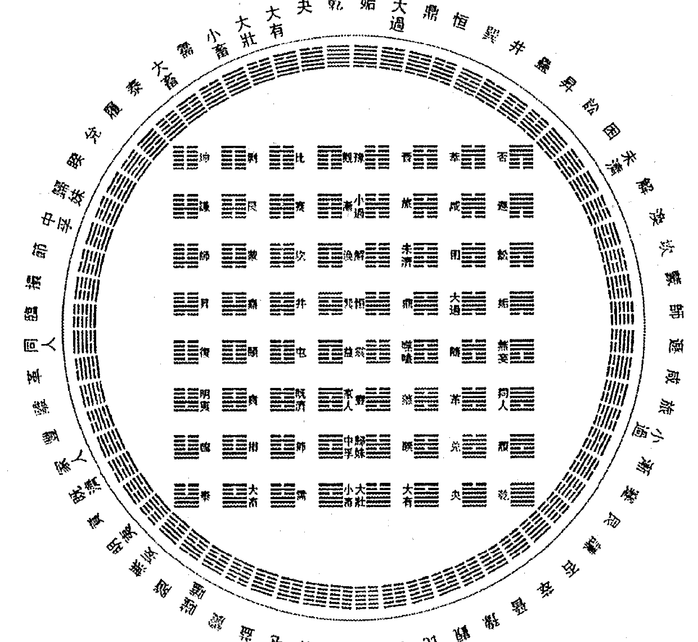

##### 伏羲先天六十四卦方圆图

##### 综卦

——把卦象倒过来看。

综者综卦也，立场不同时，卦象也不同，从不同的立场看卦象，更为客观些。综卦者观察其不同立场的相互关系，很多卦象的原因皆来自这层关系。

六十四卦中，有八个卦象是绝对的，无论怎么看都一样，这八个卦是乾卦，乾者天也，怎么看都是天。坤卦，坤者地也，怎么看都是地，其卦象是独立而自发性的。其馀还有坎卦、离卦、泽风大过卦、雷山小过卦、山雷颐卦、风泽中孚卦属於绝对卦，其馀五十六卦则皆有其相对性。

## 第七章 错卦与综卦

例如：姤卦是天风，倒过来便成为泽天夬，姤卦和夬卦是相综，也就是相对立的卦象。

姤者遇也，不断有不期的相遇，是谓邂姤。对付这种现象，最好能当下决定，水来土掩，兵来将挡，快刀斩乱麻，是为夬。所以姤和夬是相综的。

### 复卦

——（也叫交互卦）事件内部的交杂关系

事起必有因，有些因晦昧不明，不小心看便看不出来，但对卦象的起源及可能的未来变化，却有着非常重要的影响，不可不预先观察到，这便是所谓的交互卦。

交互卦共有两爻，内卦的第二及第三爻，成为第一及第二爻，加上外卦的第一爻（即第四爻），成为内卦，为第一爻；内卦的第三爻为第一爻，加上外卦的第一爻（即第四），和外卦的第二爻（即第五爻），成为外卦，是为第二爻。

此外，还可观察交互卦中的主客观因素，交互卦中的内卦，由原本卦之第二、三、四爻组成，交杂的因素为内卦二、外卦一，是属主观卦象，如前面的蹇卦，内卦为坎，表示意志较强，但实力未成熟；外卦为原本之第三、四、五爻组成，是离卦，为火，表示客观情势已成熟，主客观明显不协调，故有蹇卦的阻碍。是以得以坚定忍耐的态度，以等待下一个机会。

### 杂卦

——复卦的综错卦。杂卦的道理是，事情没有绝对的，光看一面不行，应面面俱到。

> 依上解，与南怀瑾先生的解说还是有很大的出入，现将两种说法列表比较如下：

| 著者卦象 | 错卦 | 综卦 | 复卦 | 杂卦 |
|----------|------|------|------|------|
| 南怀瑾 | 立场相同，目标一致，可是看问题的角度不同 | 立场不同，观念就完全两样 | 即互卦，复就和综卦一样，是重复的意思 | 杂是指彼此的相互关系 |
| 现代解 | 立场相同，目标不同 | 立场不同时，卦象也不同 | 事件内部的交杂关系 | 复卦的综错卦 |

由上表可知，现代流行的易经解中，发展及详细了南氏之说，但从某些细节上，两者的解释并不完全相同，例如关于错卦，南氏解为“立场相同，目标一致，但角度不同”，而现代解则直接解释为“立场相同，目标不同”，同时现代解将“杂卦”解为复卦的“综错卦”，而南氏并未对杂卦进行明确的解说。

综合上述诸论可知，对于错综复杂的解释，实际并未统一，同时也未达到可以应用以指导预测的程度，此亦为现代很多易学研究者无法深入理解错综诸卦真实应用的原因之一。

观中国历代古书，“错综复杂”，没有连用的例子，“错综”的起源是卦，其所本即为《周易·系辞上》：“参伍以变，错综其数。”，系辞传中的此句，所讲的是《周易》占法中历代秘传的变占体系，“复杂”一词《易经》全文没有连用之例，单用者，复卦为卦名，即地雷复卦，杂卦者，有杂卦传，所讲即为错综卦的排列与含意。古书中有“复杂”连用为词的例子最早见于《淮南子·卷三·季春纪·圜道》：“天道圜，地道方。圣王法之，所以立上下。何以说天道之圜也？精气一上一下，圜周复杂，无所稽留，故曰天道圜。”其中的复杂一词，是讲天球表面各天体反复环绕，词意与天文有关，却与卦无关，至于南先生所言复卦即互卦，传承中实无记载，而且将互卦称为复卦，与六十四卦中的地雷复卦相重复，既不利于传续，也没有必然的意义，而将杂卦称为互卦的错综卦，则亦属于牵强之论了。

《易经》中的错综卦的应用，与易占体系中历代秘传的“变占”体系密切相关，所谓变占，是以卦演卦，从而深入考量预测事件中的各个因素的方法，传统古易传承中应用的“变占”之法，古传有“三宗十二变”之说，而“错卦”与“综卦”，即是变占体系中，卦宗十二变占中的“错变”与“综变”法则。笔者于 2011 年始，于所著《金口透易·梅花占》中将“变占”体系中的“寄变”、“错变”、综变”的应用首次披露于世，且计划将后面的诸种变占择时披露，以贡献于世人，古易传承的中的“变占”体系完整应用下来，一个卦可演变成数千上万种变化，即以公开的“寄、错、综”三种变占，已可演出四百多种变化，对于预测事件的整体把握，具有非常的意义。

要想充分了解“错卦”与“综卦”，首先需要了解易学预测所要解决的问题以及易学预测所要达到的效果，易学预测作为一门实用技术，其应用的目的是解决疑惑，即古人所谓的“卜以决疑”，而疑问的产生，来自于求测人对选择的不确定，因此，预测所要解决的问题实际上应当是如何选择，而要达到的效果，就是选择出未来最合理的方向，而这一切的发生，都离不开一个主体，那就是“事件”，我们每个人的人生，都是由无数的事件组成的，无数的事件的连续，就是我们人生的脉络，而每个人对于每一个事件本身，都面临选择，我们知道，组成事件的三要素是时间、地点、人物，在这三个要素中，人是连接时、空的关键，而人的选择，则会决定着事件下一步的走向，因此，如何对事件中的各要素进行权衡与选择，就成为了日常每个人都在做的事情，而易学预测，就是以模拟的方式对事件的各要素进行建模与分类，同时对事件的未来走向进行模拟的一种方法，一个整体的预测模型，要对事件中的各个因素及各因素之间的相互关系进行系统的模拟，以为对未来的选择做出充分的评价，而易象占中的变占系统与动占系统，就是解决这一系列问题的钥匙。

下面，我们具体讲一下错卦与综卦的用法，前面提到，易学预测的主体是事件，一个卦起出来，这个卦，就是所要预测的事件的模型，事件中与求测者的一切因素，都在这个模型中显示，而体现这些因素之间的相互关系的关键是卦内各层次的力量与因素之间的互相作用，这些作用，“梅花占”中称为“动占”，动占一共有八个，这八个动占，将事件中的各因素之间的关系充分显示出来，但这些因素，是以求测者为视角的，也就是说，

## 第七章 错卦与综卦

占卜者求测出来的卦象，是以求测者的视角为中心的模型，我们知道，一个事件中，往往会有一个事件的相对方，比如谈判，如果求测者是一方，那么谈判的另一方，就是谈判这一事件的相对方，求测者求测出来的卦，里面包含的是求测者的视角，是以求测者为中心来把握整个事件的模型，而要想看到对此事件能够产生绝对影响的因素的视角，就要用到错卦。

#### 试举一个例子来说明错卦的用法：

- 出生:癸亥年 年 性别:女 占事:他会是我的什么人？哥们？贵人？男人？
- 公历起卦时间:2013年7月1日16时41分 （手工指定）
- 农历:癸巳年五月廿四日申时
- 芒种:2013年06月05日 20时44分
- 小暑:2013年07月07日 07时09分
- 干支:癸巳年 戊午月 戊辰日 庚申时 （日空:戌亥）
- 神煞:驿马一寅 桃花一酉 日禄一巳 贵人一丑,未

离宫:山水蒙

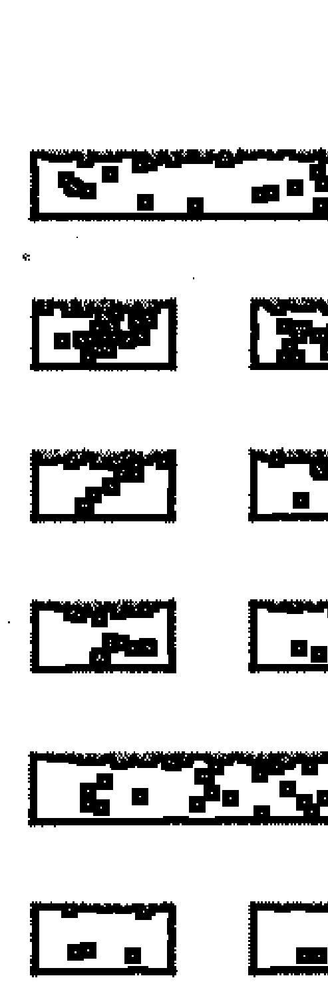

背景情况:本人癸亥年的小猪出版社工作 对方1981年9月的属鸡银行工作(信贷方面),一个月前在婚礼上认识

上面的卦例是我的学生研习的一个例子,其求测的事件的主题是与一个偶然相识的朋友将来会发展成什么关系,这个卦的本卦,就是从求测者自身的角度来看待这一事件发展的可能因素,依此我的弟子断卦如下(括号里为点评):

1. 悔卦财动(盈益卦),有婚恋的考虑,妻动,动而化破,自己没有适合的目标,心下不定,未有主见。(盈益卦:求财必得妻妾病,测感情主有姻缘方面的考虑,卦内贵神卦为官为夫,贵神卦受克,主内心不安,一直找不到太合适的对象)
2. 地支财动,逢合,自己想求,对男方较为满意,官动,外三才反伏吟,对这个男方没把握,心绪不宁,妻动,逢空,逢合,自己心里没底,犹豫,男方也没表示,贼动,有阻力,内心不宁,父母动,逢破,想追求对方,但没有信心。
3. 正宫财动,在寻求合适机会,官动,找人联系下,有阻力,不好找,妻动,没有看到好的机会,自己在权衡,父母动,等新的机会。
4. 寄宫财动,开始积极去求,(只能说自身的愿望比较积极一些),妻动,压力很大,没有好的反馈,贼动,遇到阻力,克制了自己求的想法(妻动是没有行动,担心被拒绝,拿不定主意)。
5. 天元寄宫财动,逢合,妻动,自己想要求稳,克制了自己的想法,没有机会,在等待。

山水蒙的错卦为泽火革卦,因求测者所测为与另一个人的发展可能,那么能够影响这个关系发展的最直接的对象即是另一个人的想法与状态,而以另一个人为主体来看待这个事件则要看错卦,再列“错卦”如下:

- 干支:癸巳年 戊午月 戊辰日 庚申时 (日空:戌亥)
- 神煞:驿马—寅桃花—酉 日禄—巳 贵人—丑,未

### 错卦:泽火革

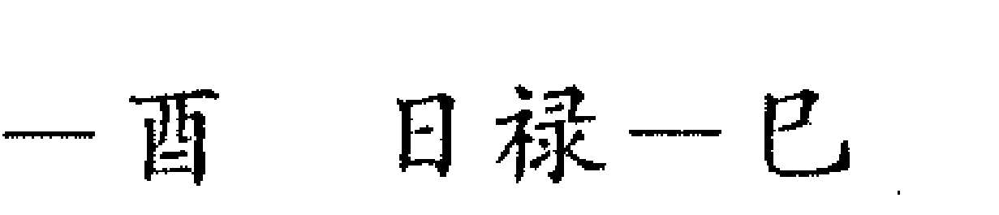

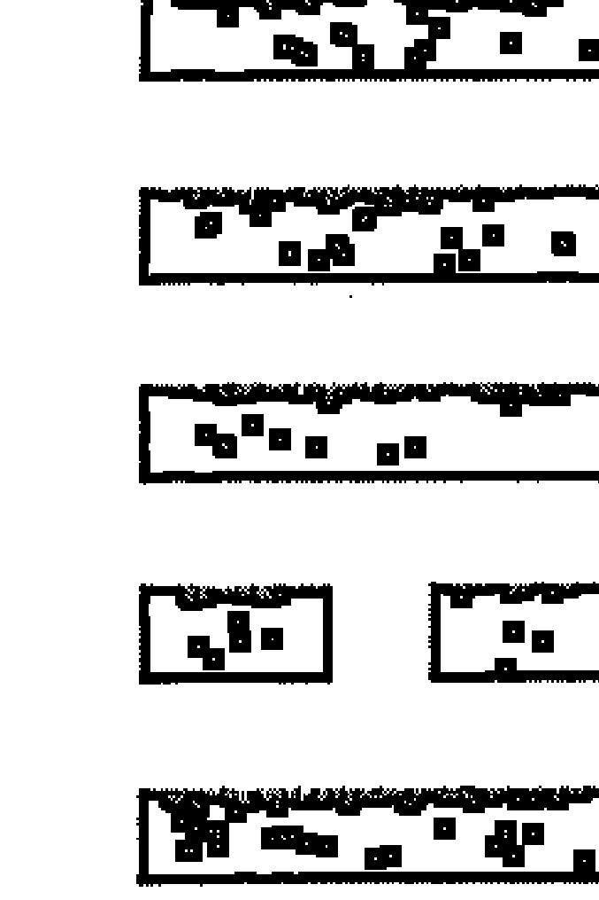

###### 对于错卦，弟子断语如下（括号中为笔者点评）：

6. 错卦鬼动，贼动，男方不愿意，对你没有婚恋之像，男方有感情的纠缠。（鬼动悔折卦，主内心不安，内来克外，从男方的角度来讲，是对这个女孩不“感冒”，没什么想法，内贼动而逢空，可能会有点小暧昧，有点牵牵扯扯的联系，但只限于“私情”，没有进一步发展的愿望）
7. 地支，鬼动，逢月建，男方条件很好，有牵扯的事，财动，逢空，男方有追求的人（这一点不能确定，因为预测是与事件相关的，如果从事件角度来讲，这个财动逢空应当是男孩对结婚或发展感情的愿望并不强烈，或根本还没有考虑），但对这个没有把握，贼动，逢空，男方心里不安，对外面的女的还有一线希望。
8. 正宫鬼动，男方在选择中，有很大阻力，受到感情牵扯，财动，在努力去求外面的女人，贼动，有很大阻力（这一点也应当有误差，以事件为中心，应当是男孩在外的表现上来讲，也应当对这个女孩并不“亲近”）。
9. 寄宫鬼动，男方找机会争取，阻力很大，财动，贼动，没有看到追到的希望，自己在犹豫不决。（此句断语有待商榷）
10. 天元寄宫鬼动，逢合，贼动逢合，自己在犹豫，在等待。（从错卦泽火革卦来看，这个男孩子自身条件挺优秀，对这个女孩没有什么感觉，而且其自身的求偶条件较高，对婚姻也没有什么迫切性，如果发展下去，最多有个“私情”的可能，不太可能发展成稳定的婚姻关系）

从本卦与错卦的综合判断中，我们可以看出，这个女孩子自身发展稳定婚姻的愿望比较强烈，对这个男孩子有好感，但现阶段没有什么具体的行动，而对方对她的感觉并不强烈，只是泛泛之交，没有什么发展感情的愿望。

那么这一卦断完，给这个求测者的信息无疑是负面的，那么有没有解决的办法呢？讲到这里，我们要引入易占中的另一个概念，那就是“选择”，人作为事件中的一个重要要素，是有其选择的能动性的，因此，易占不只要告诉求测者如何“决疑”，还应当告诉求测者更多的选择的可能，从这个角度上来讲，预测是给予求测者尽可能多的选择模型，并对每一种模型出现的可能进行推导，以及对每一种模型的结果进行评估，从而为求测者的选择提供依据，从这个角度讲，预测的结果并不是固定的，而是在各种可能中找到一个最好的路线，以帮助求测者达成愿望，这个过程，古人称之为“趋吉避凶”。

同样以上面的占例为例，我们在本卦中可以看到，求测者对于这个事件的态度是犹豫与不自信的，内心担心对方不接受，所以并没有什么实质性的行动，而对方，因为对女孩儿的感觉并不深刻，因此也不会主动与女孩联系，如此下去，这个感情的发展基本上是没有什么可能的。那么，女孩应当如何发挥自己的能动性做出更有利于自己的选择呢，答案在综卦之中，综卦是事件的当事人对于事件发展的逆向选择，或者我们可以称之为“另一种选择”，上面那个卦的综卦为“水雷屯”，现将卦例举例如下：

-   干支: 癸巳年戊午月 戊辰日 庚申时 （日空:戌亥）
-   神煞: 驿马—寅 桃花—酉 日禄—巳 贵人—丑,未

## 综卦:水雷屯

依“金口透易·梅花占”八动占规则断卦如下：

卦内官动(明德卦)发用,常人官事得官物,做为求测者的女孩儿,应当尽量考虑在工作中或是正式场所与对方联系的可能,综合上面求测者自身的陈述,对方在银行工作,有找对方信贷的可能,这样,至少可能通过这种方式,先与对方接触,加深了解。

艮卦在卦中为贵人,艮与坎合,贵人相助,正合其问题中的“贵人”一条,因此,想办法先让对方成为“贵人”是比较可行的选择。

综卦恩庆卦外来生内,在这个事情上,对方会有一个积极的回应,而且可以提供很不错的帮助。

那么如果求测者选择综卦的行动,会对对方产生什么样的影响呢? 这就要看综卦的错卦,山水蒙的综卦的错卦是火风鼎,现将综卦的错卦举例如下：

-   干支:癸巳年 戊午月 戊辰日 庚申时 （日空:戌亥）
-   神煞:驿马—寅 桃花—酉 日禄—巳 贵人—丑,未

## 综卦:水雷屯

综卦的错卦是求测者采取“综卦”所代表的行为时，对方的反应与变化。

卦内宝成卦（内来生外）发用，对方对女孩的感觉会加深，同时对女孩会产生不错的认识。

内三才退茹，地元逢死地，进一步发展的阻力还是比较大。

外三才天元逢旺地，女孩的优势更加明显一些。

卦内财官不动，但内来生外，对于感情的发展有积极意义。

综合本卦的综卦与本卦综卦的错卦，我们可以分析出女孩下一步最有利的行动是先找对方帮忙，在交往的过程中，增加与对方的了解，同时加强对方的好感，这样，感情的进一步发展就有希望了。

综上所述，易占中的“错综”两卦，实际上包含了一个事件中“求测人的视角”与“另一种视角”的不同，同时也包含了事件中的“选择”与“决策”，从而从不同角度分析出多种可能，以供求测者判断与选择，从一个卦中，推导出四个变占同时推导出多种选择与可能，从这个角度来讲，“错综”两卦确实可以称得上“复杂”了。

联合保险公司、河北鑫达地产，河北君达地产等多家机构签订了长期合作协议，为各家公司从企业文化、员工建设、机构建设、环境规划等多方面提供了大量的服务。

北京晟龙吉祥文化传播有限公司现有多位专家学者，可在各个领域提供专业服务，国际金口诀首席专家璞玄老师在长期道教文化和国学文化的研究和浸染中，结合道教宫观管理与现代企业管理实践，创造出独特的企业管理文化理念，将宫观管理与现代企业管理理念相结合，大力发扬中国传统术数文化在管理实践中的指导意义，致力于将中国传统文化精华应用于现代企业管理实践之中，为企业与个人的发展进步出谋献策。