# 冥想的奇跡

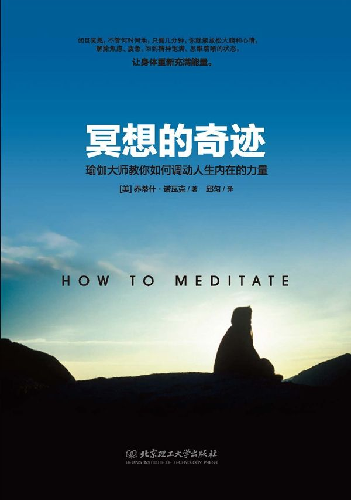

# 自序

**正確的冥想給你生命的力量**

我在 20 世紀 80 年代開授了一門名為「如何冥想」的課 程，本書的最初撰寫目的就是用於補充該門課程的。我注 意到，許多學生都在全神貫注地做著筆記，卻忽略了該門 課程最精華的部分一對於冥想技巧的實踐。要知道，你 得通過實踐來學習冥想，而非研究。

很顯然，一本筒單的概述該門課程所授內容的小書將 極大地幫助我的學生們。這就是這本書的緣起。它涵蓋了 課程中教授的所有內容，並向讀者提供了他們開始進行每 曰冥想所需要的一切指導。

自本書第一次印刷以來，西方國家中的冥想者的數量 大幅增加。如今，數以百萬計的人進行著每日冥想。據美 國國立衛生研究院（NIH)的調查研究可知，大約有 12% 的美國成年人進行深呼吸的練習，約有 8%的美國成年人練 習冥想。隨著冥想越來越為人所知，越來越多的人需要一本筒短實用的冥想指導手冊來教授正統的冥想藝術和科學。

本書的內容主要是基於帕拉宏撒‧尤迦南達和他的弟 子斯瓦米‧克裡雅南達的教導，後者是我的老師。有史以來 在美國教學的瑜伽修行者中，帕拉宏撒‧尤迦南達是最偉大 的一位。1920 年，帕拉宏撒‧尤迦南達從印度來到美國。在 接下來的 32 年裡，他一直留在西方，撰寫書籍，向數以萬計 的學生演講，並教導弟子。他把古老的勝王瑜伽最深的哲學 理念和最高的技巧帶到了西方，並且用特別適合現代西方人 理解的語言和系統進行表達和詮釋。他所撰寫的《一個瑜伽 行者的自傳》MMto&ograpAy of a Yogi)成為靈性領域的經典， 激勵了世界各地的無數讀者。現在距離該書的首印已經過 去了 50 多年，但它仍然留在了暢銷書排行榜上，銷量超過數 百萬冊。

克裡雅南達在 1948 年成為了尤迦南達的弟子，並跟隨 他一起生活，一直到 1952 年尤迦南達去世。克裡雅南達巳 經教授瑜伽及其在生活中的應用超過 60 年。他就這一主題 撰寫了近 100 部著作，包括《全新的旅程一我跟隨帕拉 宏撒‧尤迦南達的日子》，該書記錄了他跟隨尤迦南達的 那段經歷。認真的學生自然想瞭解冥想背後的生命哲學， 作為自己冥想實踐的補充。我大力推薦這兩位偉大導師的著作。

在 1967 年，我成為斯瓦米‧克裡雅南達的學生，並在 一年後開始教授冥想。在 1968 年，斯瓦米‧克裡雅南達創 建了阿南達村，這是以帕拉宏撒‧尤迦南達的教導為基礎 的精神社區，位於美國加州內華達山脈的丘陵地帶。阿南 達村擁有自己的學校、商業和冥想中心。多年以來，阿南 達村不斷擴展，在美國、歐洲和印度都建立了住宅社區和 冥想中心。阿南達村被認為是全球最成功的瑜伽生活的范 例，共有近 1 000 位常住居民，以及超過 100 個的冥想團體 和冥想中心。阿南達的生活方式建立在每日冥想的基礎之 上，並遵行尤迦南達所說的「樸素生活，崇高精神」阿 南達社區就像一個有生命的實驗室，檢測著這些教誨給人帶來的助益。

更多關於阿南達的信息，請登錄網站 www.ananda.org。 常言道，一張圖片勝過千言萬語，因此我們還特別創建了 一個名為「如何冥想」的網站，提供部分本書提及內容的 免費視頻和音頻下載。

我自 1969 年以來在阿南達社區生活和教學。我也是阿南 達社區的創始人之一。我和妻子黛維都在阿南達村擔任精神 導師一職。在過去的 40 年裡，我有機會教育、指導成千上萬 的追求真理的人，並與他們結下了深厚的友誼。我親眼見到 冥想的力量，這力量足以改變人的生活。

我祈願這本書可以成為幫助你瞭解冥想這一美妙的科 學的指南。願你的追求充滿了喜悅。

喬蒂什‧諾瓦克

## 第一章冥想，調動內在正力量的藝術

### 冥想 5 分鐘，你將擁有力量

冥想是最自然和最有價值的人類活動之一。如果每天進行冥想的練習，你將在生理、心理、情感和精神等各個層面發生驚人的改變。它將使你與你自己內在的活力、澄淨以及愛相連接。當進入深層冥想狀態，它還將使你體會到你與生命的深刻連接，以及莫大的喜悅。

冥想有三個方面：放鬆、內化和擴展。冥想的過程可以被簡單地描述為：

(一）完全放鬆，包括身體上和精神上的完全放鬆；

(二）深入內在，並全神貫注於一點，通常是在雙眉之間的位置；

(三）專注於自己更高的內在層面，比如愛、喜樂或者光。這將有助於自然地擴展你的意識。

雖然這個過程解釋起來很簡單，要實現更深層次的冥想狀態卻需要一定的認識和訓練。然而，即使只進行了一點點的冥想練習，也會產生立竿見影的效果。冥想的練習者發現，每天練習幾分鐘就增加了他們的幸福感，並且為他們的生活注入了更多的喜悅。

在我們每個人的心裡，都有一種與生俱來的渴望。我們渴望擴大自己的認知，去瞭解我們是誰、是怎樣的人。帕拉宏撒·尤迦南達將這稱為「永恆的追尋」而在某一個階段，我們被引導去通過練習冥想來獲得內心的寂靜。一刻不停躁動的念頭是一種精神上的「靜電噪聲」只有這些噪聲被消除後，我們才能聽到自己內心的低語。

對於真實本性的深刻理解，是通過直覺而不是邏輯，從超意識而不是有意識的頭腦獲得的。當身體完全放鬆，五種感官轉向內在，全神貫注，此時將出現一股巨大的能量流。這股強烈的能量可以提升我們進入超意識，在那裡我們擁有內在直覺的力量。深度冥想有助於我們感知到個人與宇宙的真相，這真相超越了我們所有的想像；而只需稍許意識的內化就可以使我們進入這種狀態，並帶來巨大的平靜。

從身體的角度看，冥想已經被證實能夠減輕壓力，增強免疫系統，幫助調節身體的許多系統，等等。在冥想的過程中，呼吸減慢，血壓降低，新陳代謝率降低，循環和血液排毒能力增強。最近的研究顯示，冠狀動脈疾病的患者，進行冥想、哈達瑜伽和素食相結合的治療法，其逆轉心臟疾病的療效要遠遠優於目前可用的最好的其他輔助醫療手段。冥想能夠改善腦電波的頻率和強度，甚至被證明能增加大腦額葉的大小。

從精神的角度看，冥想聚焦於並淨化頭腦。詹姆斯 _J_ 林恩是帕拉宏撒·尤迦南達最年長的弟子，他創建了美國最大的保險公司之一，並任首席執行官。他經常在早上做數小時的冥想，然後才進辦公室。他的合夥人曾問他是如何能在這樣寬鬆的時間表裡完成他所有的工作的，他回答說，冥想讓他的工作更為高效。他能夠集中注意力，在幾分鐘內做出一般人可能需要花費數周做出的決定。

近年來，冥想在西方已經被廣泛地接受和練習。如今，冥想在教堂裡被教授，受到醫生的推薦，並被許多運動員實踐。在機場、醫院甚至是國會裡，都設有冥想室。

冥想是一種古老的藝術，可以追溯到存在任何歷史記錄之前的時期。在印度的印度河流域，已發現了展示人們各種瑜伽姿勢的印章石，經考古學家判斷存在於公元前 5000 年。然而，冥想絕不僅僅是一種有趣而被長久遺忘的古老傳統。幾千年來，它一直保持著活力，各個宗教的聖賢都不斷地為它注入新的經驗。

在東方，特別是在印度，已經發展出了關於冥想的科學和傳統。幾個世紀以來，偉大的瑜伽導師將他們發現的真理和技巧傳給了弟子們，又通過弟子們傳給了弟子們的追隨者。幾千年來，代代相傳，保存下來一個完整的傳承。這種傳承不斷地為冥想注入活力一那些被證明是正確的和持久的得以流傳下來，而那些無知、偏邪的則被拋棄在一旁。此外，在東方形成了一種文化：崇敬開悟的人，並把他們視為生活的榜樣。在印度，人們至今還是用達到自我實現的人的生活故事和例子來教育孩子們，例如古印度的兩個偉大的聖人羅摩和黑天 R。有人曾說，要判斷一個文化是否偉大，只需看它崇敬怎樣的英雄。而在東方，特別是在印度，人們將在精神上達到最高造詣的人視為最偉大的央雄。

然而，在西方，冥想缺乏一條從師父到弟子的活的傳承。 取得冥想成就的人肯定有，但通常他們無論男女都是依靠自己發現通向內在力量的途徑，很少獲得或者根本沒有外界的幫助。 此外，他們在歷盡千辛萬苦而喚醒巨大的內在能量後，往往不瞭解如何傳遞這能量。沒有導師的引導，也沒有技巧的幫助，他們的內在能量的發揮受到了阻礙，許多人還遭受了巨大的身體痛苦。在一個不理解也未必尊重神聖的社會裡，他們中的許多人不得不面對家人甚至是自己精神上所仰慕的人的反對。

在西方，我們崇敬的英雄往往更加是好戰的，而不是神聖的。曾經有人問聖雄甘地，他對西方文明怎麼看。甘地幽默地給出了一個迷人的答覆：「我認為這將是一個好主意。」 幸運的是，冥想的益處和傳統被介紹到了西方，並開始發展一個新的傳統。練習冥想對於豐富我們的個人生活以及整個社會都具有巨大的潛力。歷史學家阿諾德·湯因此將東方精神傳統傳入西方稱為 20 世紀最重要的影響。

### 顯微鏡下的冥想研究

在過去的一個多世紀裡，科學家一直在研究冥想的過程和結果。然而，在最近的幾年中，此類研究的數量急劇增加。 其部分原因是，無論是醫療界還是商界都敏銳地認識到，壓力導致了每年數十億美元的金錢損失。人們渴望找到解決壓力這一流行病的方法。而研究發現，冥想是用來對付壓力的最好工具。研究人員還發現，冥想除了是「壓力剋星」之外，還有許多其他的好處，並迅速成為保持健康的手段。如今，冥想成為許多世界權威雜誌的封面主題，這是冥想為主流所接受的標誌。

科學家和醫生已經深入到了針對冥想的研究中。有數以百計的研究是關於冥想過程中大腦所發生的變化的，還有很多其他研究涉及冥想所帶來的心血管的變化、免疫系統的改善，以及眾多心理和情緒健康上的好處。很多諸如哈佛、耶魯、麻省理工學院等頗具聲譽的大學，諸如梅奧診所等的醫院，以及美國醫藥協會（AMA)這樣的組織機構，現在都在進行關於冥想及其益處的研究。這些研究涉及許多不同類型的冥想，研究對像包括冥想初學者和經驗豐富的長期冥想者。研究的結果不斷驗證了多年來人們對冥想的觀察結果。

歷史上，以冥想為對象的科學研究可以追溯到 19 世紀末，但以今天的標準來看，當時的研究往往比較粗糙。當時的研究人員可以測量心臟速率和氧氣的攝入量，但也僅限於此。然而，即使在這些簡單的研究中，醫生驚訝地發現，冥想練習者不僅具有停止自己脈搏的能力，還可以使左右手同時產生不同的脈搏。這種成果是很神奇的。

### 冥想，大腦最好的補藥

從大約 50 年前開始，儀器變得越來越先進，這就幫助科學家們得以更好地觀測冥想過程中大腦的運轉情況。 EEG (腦電圖）設備可用於記錄腦電波。在 20 世紀 70 年代初期，研究者開始將不同類型的腦電波與不同的冥想狀態聯繫起來。結果並不令人驚訝。他們發現，某些類型的腦電波活動與冥想的不同階段一放鬆、專注和擴展一的關係非常密切。

實驗者發現，不僅在冥想的過程中會發生 a (Alpha)，卩（Beta)，0 (Theta)和 y ( Gamma )波的強度和頻率的變化，在冥想之後它們也會發生變化。每一種類型的波與某些活動以及各種不同的神經傳遞相關。

a 波與眼睛閉合和整個神經系統的放鬆有關。當大腦被剌激激活時，a 波通常就受到了阻礙。然而，冥想者大腦中的 a 波對外部剌激保持不起反應，這表明大腦中的反應路徑變少，因而腦電波不受阻礙。人們可以將這種狀態與保持平靜的能力聯繫起來，這正是冥想過程中的第一步。

P 波的頻率會在冥想過程中增加。它的存在表明對進入大腦的感官信息的處理正變得更平緩。高頻率的 P 波與專注的狀態有關，這點在練習哈達瑜伽等的行家身上是非常突出的。

冥想練習者身上的 P 波模式的變化，顯示出他們的頭腦變得平靜，專注力得到提升。這一 P 波模式可能表明，冥想練習者正在經歷冥想過程中的第二階段：從來自外部的剌激中撤回以及內在專注度的提升。

0 波在寧靜的意識狀態中出現。在冥想中，0 波的活動也增加了，這意味著冥想帶來了更深的精神寧靜狀態和愉快的體驗。0 波活動的增加通常被認為會激活情緒的產生，但在冥想練習者身上，它是與客觀觀察模式相聯繫的，使用的是大腦的潛意識層面。產生 0 波的意識狀態幫助冥想練習者獲得深刻的洞察力，並克服舊有的消極傾向（在梵文中稱為 samskars )。

在深度冥想中，經驗豐富的冥想練習者有時會進入 A (Delta)波模式，這一模式通常與無夢的睡眠有關，也可在嬰兒身上見到。這表明冥想者擁有不對外在意識產生反應但對此仍保有警覺的能力。

最重要的是 Y 波，它與前額葉加強的意識相關。隨著冥想推進，Y 波變得更強也更好。一些科學家將 Y 波的存在與超意識狀態相聯繫，在 Y 波出現時，往往標誌著冥想者對自我有了一個更大但更客觀的覺知。這些研究結果已經引起了人們極大的興趣，因為它們為科學家提供了量化更高意識狀態的可能。

利用腦電圖的監測，研究者發現大腦兩個半球之間存在著更多相關聯的活動，這被稱為「腦同步」。它導致了清晰的思維和創造力，也解釋了為何冥想練習者會普遍有直覺增強的感受。

這些關於大腦的研究是非常有趣的，但我們必須小心不要混淆了其中的因果關係。在西方，人們有偏向於物質上的因果關係的問題。在一些西方科學家看來，是大腦活動的變化導致了不同的意識狀態。而冥想練習者則持相反的觀點：意識的轉變是第一位的，然後大腦活動相應改變了，就像你想要移動手的念頭先出現，隨後才出現手的移動。研究大腦就有點像看著街對面大房子裡的窗戶。我們可以看見窗戶裡燈亮燈滅，並將其與相對應的房間裡的活動聯繫起來。 到目前為止，這沒有錯。

然而，假如我們得出結論說，是打開房間裡的燈引起了房間裡的活動，而不是因為房間裡有活動才打開燈，那就是錯誤的了。是意識本身導致了腦活動的增加或減少，或者說導致了腦電波模式的變化。

早在 20 世紀 90 年代，科學家們就開始使用各種類型的腦部掃瞄，特別是 fMRIs (功能性核磁共振成像），來研究大腦的血流量，並推廣到研究冥想者的大腦代謝活動。雖然這些測試是比較昂貴且較難執行的，但是它們為研究人員提供了一個更為精確的對冥想過程的描述。醫生還可以得到一些以前只能通過屍體解剖才能獲得的信息。

他們發現，冥想對大腦的某些功能會產生深遠的影響。 研究表明，冥想使人們對自主神經系統的控制增強了，不僅如此，冥想還使大腦的物理尺寸和結構也產生了變化。這清楚地表明，冥想使大腦的某些結構得到發展，並使另一些結構萎縮。這是一個驚人的發現。隨著此類研究的不斷增多，科學家們開始意識到，冥想所帶來的益處是讓人驚歎不已的。

現在科學界存在這樣一種公認的科學模型，認為大腦和中樞神經系統的變化在兒童和青少年時期十分迅速，到了大約 20 歲或多或少地凍結在原來的速度了，然後在中老年隨著細胞死亡開始放緩。然而，從 20 世紀 80 年代初開始，關於這一認識發生了一次科學上的革命。科學家發現，無論在什麼年紀，人們使用大腦的方式都會對大腦產生顯著影響，就像鍛煉對肌肉產生影響一樣。成人的大腦被證明是可以改變的，其結構和功能都能夠比較迅速地成長和改變。這一關於大腦可塑性的新科學模型與瑜伽練習者一千年來所宣揚的是一致的。當帕拉宏撒·尤迦南達在 20 世紀 20 年代說「凝視靈性之眼的光會改變實際的腦細胞」時，人們認為他是在進行比喻。最近的這些實驗表明了他所說的正是字面意思。

無論是兒童或成人的大腦，都會對外界的要求從幾個方面加以回應。用學習一門新技能來舉例。孩子學習彈鋼琴時，首先，大腦中與音樂和靈巧相關的細胞的數量會增加。 其次，這些大腦各部分之間的聯繫急劇增加。最終，鄰近部分的細胞會施以援手。

讓我們來看與冥想特別相關的兩種大腦的變化。大腦有兩個部分尤其重要：額葉和邊緣系統。這兩個部分都會影響你的思維、行為以及對你是誰的認識。額葉位於眉毛上方的額頭部分。其中，前額葉是最重要的部分，位於最前方。從進化的角度來說，這是大腦中最先進的部分。儘管它也以有限的方式存在於較為進化的動物（如海豚）中，但還主要存在於人類的大腦中。額葉和前額葉使我們人類擁有隆起的額頭，而低等動物沒有這樣的結構，它們的額頭是傾斜的。

對瑜伽修行者來說，大腦邊緣系統也十分重要。它是大腦的原始部分，目前在人類和動物身上都存在。它的形狀像一彎新月，位於大腦中心的深處。邊緣系統與生存本能有關，包括「戰鬥或逃走」在內的反應都是由邊緣系統控制的。它也與原始的情緒相關，如憤怒、恐懼和侵略等。腦掃瞄顯示，當人們害怕、心煩意亂或生氣時，大腦邊緣系統的細胞就開始瘋狂「活動」。大腦邊緣系統過度活躍的人常常會有與恐懼、焦慮或憤怒管理有關的問題。

大腦如何對冥想練習做出反應呢？首先，由於在冥想的實踐中，能量集中在前額葉區，這一區域的細胞功能和數量都會增加。核磁共振成像顯示，前額葉區的活動有顯著增加。這一影響既是暫時的（在冥想的過程中出現），更是持久的，因為細胞結構也對冥想做出了反應。相關證據表明，冥想增加了與專注力、處理感覺輸入、決策和記憶有關的大腦皮層的厚度。

同時，原始的大腦邊緣系統也對冥想的練習產生反應。在冥想過程中，注意力從該區域撤出，因此核磁共振成像顯示大腦活動減少，這一效果會持續一段時間。研究表明，冥想者處於憤怒、焦慮、抑鬱和失眠狀態的時間減少，情緒控制也得到了很大的改善。在冥想過程中，專注力集中於雙眉之間的一點，能量從大腦邊緣系統轉移至前額葉區域。隨著時間的推移，大腦便產生了相應的反應，因此冥想者身上會發生長期的變化。冥想者的大腦中與心血管控制、學習、記憶以及專注能力一這是理所當然的一相關的區域都發生了驚人的改善。關於冥想和腦功能的研究發展得如此迅速、如此廣博，遠遠超出了本書的範圍。我只想說，冥想是你可以找到的最好的大腦補藥，也是最便宜的。

### 冥想與健康體魄

在冥想對人類大腦以外的健康所產生的作用上，科學領域也表示出了興趣。由於冥想，呼吸和循環系統發生了明顯的改善。許多人的血液化學和激素指標都降低了，這些指標可用於檢測壓力水平。因此，受訪者表示冥想的練習降低了壓力感受水平也就不足為奇了。

對於呼吸系統而言，冥想降低了氧的消耗、心跳率和呼吸頻率，而在壓力下的應激反應中這些指標都會升高。

循環系統也獲得了重大改善。例如，冥想可以降低膽固醇水平。對心臟疾病患者的研究表明，與只接受藥物治療的患者相比，那些學習如何處理壓力的患者，心臟病再次發作的危險性大大降低。在《美國心臟協會雜誌》上發表的一項研究表明，冥想對減少動脈粥樣硬化，從而降低中風和心臟病發作的風險，都可能有作用，並且對於那些接受血管成形術和類似手術的患者有顯著的幫助。融入了瑜伽體式的冥想練習，配合低脂肪的素食飲食，再加上運動，就能夠逆轉動脈堵塞。另一項研究還顯示，冥想可以減少高達 50%的慢性疼痛。

### 讓你的生命更年輕

相比睡個午覺或者聽古典音樂等簡單的放鬆技巧，冥想更能恢復人的能量水平，以及幫助緩解失眠。研究表明，患有慢性疼痛、焦慮、抑鬱和高血壓的市中心居民在接受冥想訓練之後，他們這些精神上的症狀減少了 50%，而醫學上的症狀減少了 44%。對於那些患有嚴重抑鬱症的人，冥想已經被證明可以減少一半的復發率。

許多研究表明，冥想能夠明顯改善衰老症狀。一項研究表明，練習冥想五年或五年以上的人比他們的實際年齡要年輕 12 歲。他們的血壓更低，近點視力更好，聽覺分辨力更佳。

冥想的一個非常重要的結果是，它幫助人們做出積極的生活方式的改變。冥想已被證明在幫助人們克服對毒品、酒精和吸煙的依賴上是非常有效的，其效果比任何常規的藥物濫用項目或預防項目都更好。

冥想對於個人和整體文化都有極大的提升作用。冥想有助於調節情緒，使人們能夠更好地相處。因為這個原因，現在眾多大公司都鼓勵員工進行冥想，將冥想作為一種提高盈利的工具。

目前對於冥想和類似練習方法的研究仍處於起步階段，但正在迅速成為主流。令人驚訝的是，僅僅在大約 20 年前，對於飲食是否對健康有任何顯著的影響，醫生之間仍存在著激烈的辯論。今天，關於冥想存在著類似的情況。雖然可能仍有一些人在質疑冥想的價值，但冥想所帶來的有益的變化是如此深刻而廣泛，以至於現在幾乎所有的科學家都承認冥想是非常有益的。哪怕僅僅是一點點的冥想練習也是有幫助的，因為幾乎所有的益處都來自於對冥想技巧的相對溫和的實踐，就如我們在這本書中所建議的。

彼得.范.豪登博士（Peter Van Houten)是我們的朋友，他在北加州內華達山脈的山腳下經營著一家中等規模的診所，生意興隆。他有超過 30 年的家庭醫生從業經驗，診治了成千上萬的病人。彼得·范·豪登博士擁有約 5 000 名患者，他們現在幾乎都居住在加利福尼亞的「金鄉」--個相對較小的區域。然而，讓他的診治變得獨特的，是他的病人中約有 5 %來自阿南達村並且專門練習本書所提出的教誨和冥想技巧。這給了彼得·范·豪登博士一個特別的機會，親眼看到冥想練習所帶來的終身益處，以及冥想練習者所通常採取的健康的生活方式。他得以將此作為「對照組」，與居住在同一地理區域的其他病人進行對比。以下是他的觀察結果：

* * *

1.一個有代表性的情況是，經驗豐富的冥想練習者顯得，並且實際上也的確要比他的生理實際年齡年輕至少 10 歲。例如，60 歲的人看起來就像 50 歲。

2.冥想練習者在從受傷、手術、傳染性疾病中恢復時，需要的時間比同齡人要減少三分之一。

3.冥想練習者很少使用消遣性毒品（消遣性毒品是指通常被認為偶爾使用不會致癮的毒品）。

4.我注意到冥想練習者身上通常很少存在消極的狀態。 他們比一般人更容易改變習慣。

5.冥想練習者患精神疾病的概率要低於平均水平。冥想練習者與精神問題相關的治療所需時間比通常減少了至少 1/3，大部分都不需要進行長期治療。

6.冥想練習者更願意接受建議米取健康的生活習慣。

7.最重要的是，總體而言，冥想練習者更快樂。

* * *

## 第二章冥想，輕鬆改善人生的密鑰

儘管冥想在本質上是一段時間內摒除了對日常生活的關注，但仍有很多方法將冥想所帶來的改變應用於外在的生活。其中最重要的幾個可以獲得改善的領域是人際關係、工作和健康。

### 冥想以促進你的人際關係

沒有什麼其他事像我們與他人的關係那樣，在生活中給我們帶來如此多的喜悅和痛苦了。我們都在不斷通過朋友、同事、配偶或重要的其他關係人來尋求滿足。然而，我們在人際關係中所做的大多數「選擇」，都是受到個人以往的習性在潛意識層面的影響，以及受到我們生活在其中的文化環境的磁性影響。在大多數情況下，我們的心隨著外境起反應，而不是對外境起作用。冥想為我們提供了一個中心，加強了我們的判斷力，降低了我們的脆弱性，使我們不那麼容易被社會的隱性勸說而影響。通過冥想，我們能夠成為影響別人的「因」，而不是被影響的「果」。這對於改善人際關係是特別有用的。

理想的情況下，我們應該深明自己和別人都是靈魂，而不僅僅是身體和性格。這一認識首先需要通過深度冥想來獲得一在深度冥想中我們可以體驗到自己更深的本性。然後再將這一認識從自己擴大到他人就相對容易了。 當我們開始習慣這種認識時，我們看待他人的方式以及他人回應的方式都可能發生深刻的變化。我們不再自覺或不自覺地要求他人滿足我們的「需求」，而是可以安住在自己內心的實現和滿足上，這是冥想狀態所帶給我們的。由此，合作取代了競爭，相互給予的喜悅取代了相互要求的緊張。當我們意識到培養良好人際關係主要是為了幫助我們學習和成長，尤其增強我們接受和愛的能力時，全然的放鬆就實現了。以這種方式存在的關係能幫助我們達到深層的自我實現。在阿南達村，我們在婚禮上的宣誓是這樣結束的：

「願我們的愛更深邃、更純淨、更廣闊。願我們的愛不斷完善，直到在其中顯現出完美的愛。」

現在，以磁的形式發送出強烈的能量，去吸引一個非常適合你，也適合與你攜手人生旅程的伴侶。當你的專注力和能量水平增強時，磁性的力量也會增強。最後，如果磁力足夠強大，這個「靈魂電話」會在另一個人心中引起共鳴，你們會被吸引到一起。

這種技巧不僅可用於吸引愛人，也可以用來吸引生活其他方面的機會。在大蕭條時期，帕拉宏撒·尤迦南達曾公開演講如何使用這種力量來找到工作。

在這兩個例子中，磁力是最重要的。冥想有兩種方式可以幫助我們提高磁力：定量和定性。電磁鐵的功率由通過電線的電流強度決定。能量在我們心中的流動也同樣如此。 當我們不再因為分散的思維而消耗能量，而是使意識專注，這種專注的力量可以是無限的。隨著我們專注力的增強，磁性吸引力也將增強。

不幸的是，這可以在正反兩方向起作用。我們都見過極富魅力但擁有錯誤思想的領導者和獨裁者是如何將他人帶入歧途的，這就是不幸的反面例子。

冥想也有助於擴展我們的同情心和和諧的個人特質，從而將我們不斷增加的磁力引導向更加積極的方向。我們能做的最好的事情之一，就是成為這個世界中的一個積極的力量，讓自己充滿了仁愛、喜樂和同情，並渴望以此滋養他人。簡單地問自己這樣一個問題：「在這種情況下，別人會希望我做什麼？ 」這樣就能深刻地改善自己和他人的生活。

如果你是和一個合作夥伴或所愛的人一同練習冥想，你可以嘗試這種想像的方法，以增加你們之間的愛與和諧。在冥想接近尾聲時，開始採用相同的想像方法，這次想像的對象是之前所學習過的一束不斷擴大的光。當光開始擴大到你的身體之外，想像它圍繞在你的夥伴周圍，並注入他的身體。 讓這光保持在你們周圍，直到它填滿每一個細胞、每一種情緒、每一個念頭。讓光籠罩著你們兩人。如果在你們之間有任何困難或緊張，讓光溶解它，直到不再存在陰影。用同樣的方法，可以用和諧的能量連接你和與你保持一定距離的人。

如果有人試圖傷害你，而你用負面的能量做出回應，這只會幫助他實現他的意圖。不如用一束光來作為回應。如果對方施加於你的負面能量很強，你可以想像用光束驅逐掉黑暗，或者想像有一道光環圍繞著你的身體保護著你。

### 冥想以改善你的工作狀態

如果把工作看作一個自我表達與成長的機會，看作一種在行動中進行的冥想，那麼你一定會從工作中獲得更多的樂趣。「業瑜伽」（行動瑜伽）是瑜伽的一種，它被描述為「行動但不懷著對行動結果的渴望」。而典型的現代工作卻充滿了無聊、消磨時光、職場政治和緊張的人際關係。相比之下，兩者簡直是天壤之別。

讓我們來問一個發人深省的問題：如果你不需要通過工作來賺錢，那麼你還會繼續做你當前的工作嗎？你還會去做任何工作嗎？如果第一個問題的答案是否定的，那麼你的工作就肯定有問題。如果兩個問題的答案都是否定的，那麼很可能你對工作的認識有問題。

工作的意義在於我們能夠為其付出什麼，而不是從中得到什麼；是一種個人的成長，而不是個人獲得的回報。

幾年前，在阿南達村，我們一起修建那些被之前我所提到的毀滅性森林火災夷為平地的房屋。大家都來幫忙。因此做木工活的人也是出於善心而來，他們的技術有時並不很好。

一天，我們停下來休息並吃午飯的時候，做木工活的一群人顯得很失落，因為我們的進度實際上相比那天開始的時候甚至還落後了很多。但是領頭的木匠給了我們積極的鼓勵，他笑著說：「要記得，我們並不是在建造房屋，我們建造的是自己的品格。」

除了改善我們的態度之外，我們所學習的冥想的技巧也可以應用到工作場所。事實上，冥想的三個階段一放鬆、專注和擴展一也適用於工作場所。在工作時，可以應用經過修改的相同技巧來放鬆。保持良好的姿勢，做深呼吸，加上溫和的伸展運動，將幫助你保持身體放鬆。停下一會兒，閉上眼睛，觀察呼吸，將立即使你注意力集中、變得專注。如果情況許可，在午餐時間花一小段時間進行冥想是大有助益的。保持注意力集中將幫助你在工作中保持快樂、富於創造力，並且使工作成為自我成長的一種方式，而不是無聊得迫不得已才做的事。

人們試圖將他們的精神訴求和工作的經歷分開，這是錯誤的。假如我們嘗試將我們從冥想中獲得的體悟用於每天的日常活動，我們的生命就會更加和諧。根據法則，我們的生命反映了我們所表現出的態度和素質。假如你愛別人，生活就會給你豐富的愛的回報。想要擁有朋友，首先成為他人的朋友。要從工作中獲得滿足，最好的方法是別去擔心你將獲得什麼，而是用心去給予。並且，自我實現的最快路徑是完全忘記自己，把自己當作一個美麗而廣大的生命之網的一部分。

### 冥想以保護你的健康

帕拉宏撒·尤迦南達說，生病的根本原因，是靈魂與自我之間的衝突。靈魂試圖吸引我們走向與神的同一，而自我試圖說服我們是獨立的個體自我意識。這種對立導致了潛意識的緊張，堵塞了生命力的流動，並最終導致了疾病。良好的健康是通暢的生命力量流經身體的各個部分的結果，而疾病、情緒、情感淡漠等所有負面的狀態，實際上都是生命力量有衝突或被堵塞的症狀。冥想的最大好處之一，是在我們實現與意識的融合時，我們將漸漸從這些衝突中解脫而獲得自由。屆時我們將能自由地體驗自然狀態下充滿活力的健康和能量。

這並不是說，疾病沒有生理上的原因。肯定有。相反，我們應該認識到，身體上的症狀通常有意識或習慣上的根本原因。在阿南達村，我們開發出一種被稱為「阿南達容光煥發健康培訓」的系統。該系統確認了疾病（特別是慢性疾病）是多層次的。

基本上，疾病有四個層面：身體上的、能量上的、精神/情緒上的和靈性上的。「阿南達容光煥發健康培訓」系統給出了具體的做法和技巧，以重新獲得每個層面上的控制。

在身體層面上，假如能正確做到以下三點，就能使系統恢復到平衡的狀態。它們是：合理的飲食、適當的運動、無毒的生活。通過在這三點上保持平衡，我們可以極大地影響自己的健康、壽命和生活質量。關於身體健康的資料很多，身體健康不僅是一個個人的重要目標，也是整個國家的困擾。然而，基本的原則既是非常簡單的又是非常有力的。

飲食主要由新鮮的蔬菜、水果和天然穀物構成，再包括一些豆類、堅果和牛奶製品。吃素是最好的。如果吃肉，要注意節制，並且以魚類和禽類肉為主。遠離糖和過度加工的食品，避免暴飲暴食。每週選擇一天節食是最好的也是最簡單的保持身體健康的方法。但是，也不要對此太狂熱了。 平衡飲食，然後別一直把它放在心上。

養成一個簡單的習慣，所收穫的將比所付出的時間和精力成本高許多倍。試著每天鍛煉至少 30 分鐘。任何會讓你呼吸急促起來的運動都將是非常有用的。有氧運動能夠幫助改善循環、淨化細胞、控制體重和腺體的再平衡，在身體和精神的層面上都對人有益。對於大多數人來說，步行是最好的基本運動。但事實上，任何你喜歡的運動對你來說都是最佳的選擇。瑜伽體式不僅是一項很好的體育鍛煉，還有額外的好處一能提高靈活性、平衡生命力。一些負重練習或拉升練習也很重要，尤其是對增加骨骼密度有好處。

最後，在身體層面上，避免任何毒素進入你的體內。 以下是三個最糟糕的習慣，也是最需要被戒除的習慣：吸煙、喝酒、使用毒品。所有這些不僅將奪去你數年的生命，還將大大降低你的生活質量。關於這一主題已經有了如此多的信息，以至於幾乎每個人都知道這些習慣具有自我毀滅性。擺脫這些習慣並不容易，但冥想可以有效地幫助你養成健康的生活方式。

在能量的層面上，我們必須認識到生命之氣的重要性。 當我們的生命之氣是平衡而有力的時候，我們就擁有良好的健康狀況；而如果生命之氣變弱、失去平衡或受到阻塞，就會導致疾病。許多東方的學科，如阿育吠陀醫學和針灸，就是針對生命之氣的微妙流動而起作用的。生命之氣的流動可以通過一定的技巧而得到增強（本書中就提到了若幹此類技巧），這些技巧還可以幫助我們自覺地加強和引導生命之氣在體內的流動。帕拉宏撒·尤迦南達設計了一套「能量練習」 訓練法。這一方法有助於將生命之氣的流動納入意識的控制，使生命之氣能夠被引導流入不同的身體部位，使這些部位重新恢復活力。

另一個因素是我們意識或潛意識中的意願，這是關鍵的因素。當我們說「不」，能量就受到了阻塞；但當我們說「是」，能量就自由地流動。如果你想要感到精力充沛，就學習對生活說「是」吧！我們將在下一節中探討生命力量這一主題，但現在讓我們先說完實現容光煥發的健康的四個層面。

第三個層面是精神或情緒。我們的思想和情緒受習慣模式的制約程度之深令人吃驚。進化使我們擁有了精密的對感官剌激做出感知、評估和反應的能力。只要我們醒著，這一對感官剌激做出感知、評估和反應的過程就毫無間斷地發生。但是，不同的人對同一剌激源所做出的感知和反應卻可能是天差地別的，這一差別很大程度上是由我們的態度和傾向所決定的。

日常的思想和行為就像電台節目一樣一遍又一遍地重複，只有細微的變化，就像你最喜歡的電台上所播放的音樂。 通常情況下，我們的精神電台只有在晚上睡覺時才關閉。大多數人都很難控制心靈的運作，但是當我們改變深層心態，就像調到一個電台，可以從根本上改變我們的精神和情緒狀態。要改變深層心態，有兩個很有效的技巧：肯定和想像。

最後，靈性的層面會影響我們的整個見地。我們有一種靈性的「比重」，它並非由宗教信仰決定，而是由我們所處的擴展或收縮的自然狀態決定的。人降生到這個世界上時就帶有一個固有的靈性比重，可能是陰暗的、自私的、收縮的，也可能是喜悅的、富有同情心的、擴展的。早些時候，我們注意到冥想者在大腦和生理層面上都發生了有益的變化。通過冥想來改變我們的腦電波模式是最好的提高靈性比重的方式。冥想是幫助人們在生理、能量、情緒層面上實現容光煥發的健康狀態的最優工具。

**健康要點**

疾病有四個層面：身體上的、能量上的、精神/情緒上的和靈性上的。所有這些層面都必須得到應有的尊重。

強有力的心靈會增強生命力的流動，這反過來會提高整體的健康水平。

### 冥想以引導生命力的流動

本書中所提供的許多技巧都可以幫助我們控制和引導生命之氣，所以讓我們回到這個主題。生命力通常不需有意識的控制就會流向需要它的部位，人們通常不會注意到它。但即使當生命力是自動而無意識地流動時，也是在意志控制下從大自然中進入體內，並受意志的指引而流動到任何需要的地方以維持生命進程。然而，通過使用意志和瑜伽技巧，也可以有意識地引導生命力，並使得整個系統充滿活力，幫助治療受傷或患病的部位，或者醫治他人。意志和生命力之間的聯繫對於治療不斷反覆的健康問題特別有幫助，因為它為我們提供了一種輔助治癒自己的方法。下一次你感覺不適時，可以嘗試使用這種治療方法：

專注於延髓（位於大腦顱底）。為了更輕鬆地達到專注，可以先用手觸摸該區域。想像有一束光從那裡進入，然後沿著脊柱向下。現在，開始輕輕地使全身緊張，隨後放鬆，讓身體被光與生命力流過。用意志指揮生命力從延髓往下經過手臂一直流動到雙手，與此同時繼續輕輕地使身體繃緊隨後放鬆。

然後停止繃緊身體，用右手摩挲左手臂裸露的皮膚。 然後用左手摩挲右手臂裸露的皮膚。放鬆一段時間，在放鬆時繼續想像生命之氣流向雙手。現在，輕柔但快速地搓一搓手。雙手是很有磁力的，並且有極性：左手是南極、右手是北極。揉搓雙手使得兩極交錯，就像在發電機中那樣，產生了能量流。抬起雙臂，雙手向上，感受生命力從雙手流出時的震顫。

將雙手放在你想要治癒的部位的上方或周圍，把雙手作為能量的來源，將具有治癒能量的生命力源源不斷地發送到受損的細胞裡。當你這樣做時，嘗試想像一束光注入細胞。繼續這樣做，直到你覺得已經使該部位充滿了能量。每天都這麼做若干次，直到治癒。據我所知，有很多看似奇跡的事例證明了這種治療的有效性。

阿南達村的一位成員曾在加拿大進行冰川徒步。幾個小時的步行後，他在冰川的裂隙處滑倒了，嚴重扭傷了腳踝。他的腳踝腫得相當厲害，哪怕承受再小的重量也會痛苦難忍，更不可能嘗試行走。他面臨著在夜幕降臨後的活活凍死的危險。他把雙手放在腳踝上，在接下來的半小時裡保持深度專注，用上面描述的技巧向受傷的部位發送能量。半小時之後，他就能夠走路了，並且只感覺到隱隱的疼痛。一兩天後，他的腳踝就差不多痊癒了。

幾年前，阿南達村的另一名成員（她是一位醫生）在墨西哥的偏遠地區遭遇了一場嚴重的車禍。她骨盆破裂、腿骨多處斷裂，而且用了大約 24 小時才被送到醫院。為她手術的醫生說，她將永遠不能再次走路了。在她養病期間，她每天都用這些生命力的技巧向受傷的腿輸送能量，有時一次就練習幾個小時。醫院裡的每一個人都震驚於她康復的速度。三個月後，她出院回家了。現在，她行走時只有一點點瘸。

同樣的能量不僅可以用來醫治自己，也可以醫治他人。當你已經使雙手充滿能量並且能夠感受到其中生命之氣的流動時，將雙手放在你想要發送能量的對象的身體部位上。專注於能量的流動，感覺它的溫度，或者想像它是光。祈禱這種神奇的醫治能力經由你注入需要能量的對象身上。

## 第三章現在，開始冥想

只要保證一定的平和與安靜，你幾乎可以在任何時間、任何地點進行冥想。你需要的只是一個能讓自己遠離外在活動、專注於內在實相的場所。剛開始，你可以嘗試每天冥想 15~20 分鐘。然而，當你開始從冥想中獲得真切的受益後，你會想要增加冥想的時間。

冥想與信仰或教條無關。相反，冥想與科學一樣，是基於實驗和親身經驗的基礎之上的。科學致力於探索物質的世界，而冥想則致力於探索意識的世界。冥想所使用的工具並非顯微鏡和示波器，而是專注和直覺。冥想中的發現是可以被證實的。在科學領域，能夠被另一位合格的科學家重現的實驗結果才能被採納。在冥想領域也是如此。在漫長的歷史中，無數冥想的實踐者都重現並證實了在冥想中獲得的微妙的感知和洞察力。

懷著一顆樂於探索的心，你就可以開始冥想了。而使用一些輔助手段，則可以使冥想變得更加容易。

### 設置一塊「冥想專用區域」

設置一塊「冥想專用區域」將是極有幫助的，它能強化內化的狀態，並且會漸漸充盈一種冥想的氛圍。一間小小的房間或密室是最為理想的，前提是通風良好。 如果你沒有足夠的空間留出一整間房間，那麼在臥室或其他房間辟出一塊專門用於冥想的區域就好。這一區域的陳設可以很簡單，你需要的只不過是一小塊坐墊或一把椅子。

很多人都會覺得安置一張冥想壇對他們很有幫助，可以在上面放上一些激勵過自己的偉大靈魂的相片。在傍晚做冥想時，也許你會想要焚香燃燭。你可以根據自己的喜好來裝飾冥想壇，可以是華麗的或是簡樸的，也可以放上任何有助於提升專注和意識的物品。

我和妻子所使用的冥想室大約有一個大衣櫃的大小，裡面有一張凳子，上面覆蓋著一塊羊毛坐墊。它足夠寬，既可以盤腿坐在上面，也可以當作一把椅子來坐。我們的冥想壇上安放著導師的照片、一對蠟燭以及其他對我們具有神聖意乂的物品。

如果沒有可以辟出的角落，你可以在任何安靜的地方進行冥想。無論如何，沉靜的心才是真正冥想壇的所在。

### 與自然力量合作

某些自然力量可以幫助你進行冥想，另一些則會阻礙你。地球的磁力會將人的能量往下拉。某些天然纖維材料可以隔絕這些阻礙你的力量，就像電線的橡膠外層起到絕緣的作用一樣。根據傳統，瑜伽修行者總是坐在虎皮或鹿皮上，這虎皮或鹿皮需要取自於自然死亡的老虎或者鹿。 在今天，這些很難獲得，但是可以將羊毛或絲綢質地的毯子（也可同時使用兩者）覆蓋在用於冥想的凳子上，其功效幾乎是一樣的。

特別適宜冥想的時間是一天中的黎明、黃昏、正午和午夜。在這些時候，太陽的引力與人體自然的極性剛好和諧。在夜間或清晨，當其他人都睡著了的時候，進行冥想會相對容易。思緒是有力量的，而周圍人紛繁不安的思緒會對你的冥想產生微妙的影響，使之更為紛亂。在過去的好幾年裡，我和妻子曾在舊金山某靜修處指導冥想，我們將集體冥想的時間定在清晨。隨著太陽升起，整座城市也慢慢醒過來，我們可以很容易地感受到我們所在的社區變得越來越躁動。

### 養成良好的習慣

要判斷你冥想的練習是否成功，最重要的判斷依據是看你是否養成了良好的習慣。美好的願望和投身練習的熱情都是會消失的，除非你將它們融入日常生活中，成為慣例。

首先要選定一個最方便進行冥想的時間。在選擇的時候，最重要的因素是要能保證規律性。所以要選擇一個可以持續進行冥想的時間。每天在選定的時間進行冥想一即使只有 5 分鐘或 10 分鐘的時間。假如你持續至少 30 天每天進行冥想，這種持續的努力就會形成一種習慣，這種習慣會支持你，使得之後的冥想練習變得更加容易。

在一開始，試著每天做兩次冥想，每次持續 15 ~ 20 分鐘。然後逐漸增加冥想的時間，但不要太過逼迫自己，要始終保持在能夠享受這段冥想的時間的限度內。當你進步時，你會發現自己很自然地想要進行更長時間的冥想。你冥想得越多，就越能夠享受冥想！ 一旦你建立了一個練習冥想的慣例，就要堅持下去，直到形成強有力的習慣。如果能用於冥想的時間有限，要記住，冥想的深度比時間的長度更為重要。

對於大多數人來說，冥想的最佳時間是早上太陽剛升起的時候，以及晚上上床睡覺之前的時候。這兩段時間是最不可能與其他安排或需求產生衝突的。在我們的潛意識裡，許多習慣根深蒂固，而在剛起床時和入睡之前的時候，對潛意識進行重新編程會更容易一些。很多人還喜歡在午餐之前或者下班之後、晚餐之前進行冥想。如果在飯後進行冥想，最好等待至少一個半小時-如果剛吃完一頓大餐，可能需要等待長達三個小時才能進行冥想。這樣全部能量就可以用於冥想，而不會被消化系統霸佔了。

要增加冥想的長度和深度，一個非常有用的方法是每星期至少做一次較長時間的冥想，大約是你平時冥想時間的兩到三倍的時間。假如你一次冥想的時間一般是 20 分鐘，就嘗試每週做一次 1 個小時的冥想。你會發現，你不僅可以在更長時間的冥想練習中進入得更深，而且每次 20 分鐘的冥想很快就會顯得太短了。

共修也是非常有幫助的。如果可能的話，嘗試加入定期冥想的共修小組。來自更早開始練習冥想的同修的鼓勵，是一種非常有力的精神力量。

冥想可分為三個階段：放鬆、專注、擴展。每個階段都是重要的，沒有任何一個階段可以被忽略。如果你想進入盡可能深的冥想狀態，就更是如此。幸運的是，有各種策略和技巧來幫助你完成每個階段。

**冥想入門要點**

+將一條羊毛或絲綢質地的毯子（也可同時使用兩種）覆蓋在用於冥想的凳子上；

養成冥想的習慣，每天在相同的時間進行一次 15 ~ 20 分鐘的冥想，每天兩次更佳；

設置一塊「冥想專用區域」將幫助提升能量；

每星期進行一次較長時間的冥想。

# 第一階段
放鬆

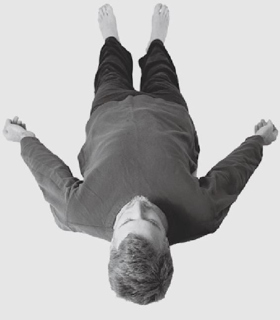

冥想中最大的挑戰是專注。即使有經驗的冥想練習者都會面臨這個困難，必須努力克服一切阻礙專注產生的干擾。首先你要處理的是身體上的緊張。當身體移動或處於緊張狀態時，運動神經會向大腦發送信號，擾亂專注。幸運的是，稍加注意，就很容易實現充分放鬆身體的目的。更具挑戰性的是達到精神上的放鬆，這在後文中會加以討論。

在某種意義上，身體和精神上的長期的緊張和不安僅僅是習慣的結果。我們已經習慣了保持運動和緊張，不停地計劃和擔心。漸漸地，習慣性的緊張變得如此根深蒂固，以至於讓身體放鬆下來、讓頭腦變得安靜，反而會有一種奇怪的感覺。事實上，很多現代文化，尤其是廣告，其目的就是讓我們保持一種充滿慾望和焦慮的狀態。要克服這種文化和習慣的影響，需要一些意志上的努力。

當你坐下來進行冥想時，下定決心放下所有的牽掛和憂慮是非常重要的。在這短暫的一段時間裡，放下萬緣。

在印度流傳著一個迷人的小故事。有人在恆河中沐浴。 一個聖人問他為什麼這樣做，那人回答說，「哦，你看，在恆河中沐浴能洗去我所有的罪業。」聖人笑了，「這可能是事實。但那些罪業坐在樹上等著你呢，一旦你從河裡走出來，它們就會跳回到你身上。」

這個故事實際上有著更深一層的意義。恆河可以作為流過脊柱的生命之氣（prana )的象徵。將人的意識浸入這股直覺的能量流之中後，就能洗去所有的擔憂、無知和雜念。然而，正如那個可憐人的罪業一樣，這些擔憂、無知和雜念也會等待你結束冥想，並跳回到你心裡。

冥想的第一步是身體上的放鬆。

## 第四章放鬆身體

在冥想中，擁有隨意放鬆身體的能力是至關重要的第一步。這一技能對於生活的各個方面都大有益處。在身體和頭腦之間存在一個反饋回路，一串在肌肉和大腦之間交換的複雜信號。如果身體緊張或不安，我們的大腦也會如此，反之亦然。在你下一次面臨難對付的會議時，觀察一下自己肌肉的緊張狀態吧。我們也可以利用這個反饋回路來幫助自己，通過放鬆身體，我們會自動開始放鬆精神。

在開始冥想之前，做幾個簡單的放鬆動作是非常有幫助的。以下是兩個簡單的瑜伽姿勢，它們將幫助我們做好冥想的身心準備。

### 深長的瑜伽呼吸

首先保持直立，雙臂垂放在身體兩側。完全放鬆，把意識的中心放在脊柱上，把脊柱想像成一棵大樹的樹幹。關注自己的呼吸，觀察自己正從腹部做的深呼吸。

現在慢慢地向前彎腰，保持膝蓋放鬆。向前彎腰時，慢慢地呼氣，直至完全呼出。在保持舒適的前提下，盡可能將身體往下彎曲，雙手放鬆地伸向雙腳。保持這個姿勢幾秒鐘，放鬆。

現在一邊慢慢吸氣，一邊直起身體。隨著吸氣的繼續和身體的慢慢直立，把雙手沿身體兩側向上提升，手肘向外伸。吸氣時，感覺你吸入的不僅是空氣，還為身體和大腦的每一個細胞提供著能量和生命的力量。

繼續吸氣、直立起身體、抬高手臂，最後把雙手高高舉過頭頂。在保持這一姿勢時，你應該盡可能深地吸氣。保持這個姿勢幾秒鐘。

現在慢慢地呼氣，再一次向前彎曲，保持放鬆。重複此過程三次或四次。

最後一次時，一邊呼氣一邊恢復到最初的站立姿勢，雙臂垂在身體兩側。

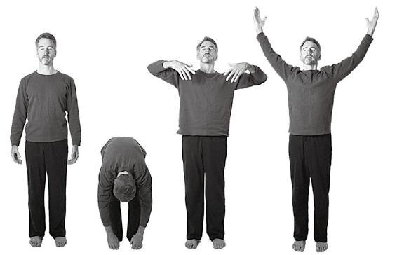

深長的瑜伽呼吸

### 仰臥放鬆（Savasana)

這種姿勢也被戲稱為「挺屍式」，因為它可以幫助你消除所有的肌肉緊張。在所有的瑜伽姿勢中，它既是最簡單的，也是最困難的。在動作上它是非常容易的。困難的是，要做得完美，必須完全放鬆，而這對大多數人來說不是一件容易的事情。

仰臥平躺，雙腿伸直，雙腳略分開，雙臂平放在身體兩側。整個身體應保持頭部、頸部、上身和雙腿處在一條直線上。掌心最好向上，這樣能產生一種接受的感覺。

保持這一姿勢，開始系統地進行全身放鬆。從消除身體不自覺的緊張開始：首先使身體緊張，然後完全放鬆。有一種特殊的「雙重呼吸」方法，有助於增加氧氣攝入量並排除體內毒素。它的做法是，通過鼻子吸氣，首先做一次短促的吸氣，緊接著做一個相對較長的吸氣，節奏類似於「huh/ huuuuhh」。呼氣時鼻子和嘴巴要一起呼氣，節奏和吸氣時的先短後長一樣。

用雙重呼吸的方式深深吸氣，讓全身緊張，直到震動起來。然後用雙重呼吸的方式呼氣，釋放掉緊張，放鬆身體。保持放鬆的狀態幾秒鐘，然後再做一次。這樣進行 3~6 次，每一次都試著放鬆整個身體。

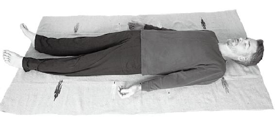

仰臥放鬆/挺屍式

現在，從雙腳開始，有意識地為身體的各個部位做深度放鬆。可以想像正在放鬆的部位充滿了空間，變得很輕很輕，或者相反，變得極其沉重而無法移動。漸漸地向上不斷放鬆身體的其他部位：小腿、膝蓋（尤其是膝蓋後面，這一區域常充滿了潛意識中的緊張）、大腿、臀部、腹部（另一個常見的緊張點）、雙手、前臂、上臂、胸部、頸部和臉。 當放鬆頭部時，務必著重放鬆下顎、舌頭、眼睛周圍以及額頭這些地方。當你放鬆了全身之後，在這一深度放鬆的狀態下繼續靜靜地躺著休息幾分鐘。

要進一步深入放鬆，你可以想像自己正漂浮在溫暖的海面上，隨著波浪的起伏而呼吸。在身心都得到極大放鬆時，讓最後一絲緊張的痕跡也消失。感覺自己正融入大海，和大海以及所有的生命融為一體。試著保持這種放鬆的擴展的狀態幾分鐘，在這幾分鐘裡盡量不要胡思亂想。如果你發現自己開始做白日夢，就將你的思維拉回到當下，去覺知自己的呼吸，覺知這個深度放鬆的狀態。

在感覺合適的時候，讓能量逐漸回到身體。慢慢地坐起來，盡量保持放鬆，直接開始進行冥想。

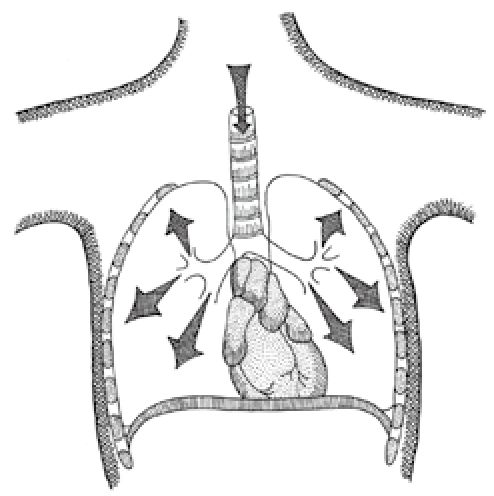

胸部的擴張和收縮

### 腹式呼吸

深度放鬆的挺屍式也可以幫助你學習正確的呼吸方法。 正確的呼吸開始於隔膜，隔膜是胸腔和腹部中間的一層圓形肌肉。這一肌肉收縮時向下推入腹腔，在它上方創造出空間，使肺部得以擴大並吸入氧氣。其次，肋骨和胸部的擴張也為肺部的擴大創造了條件。深度腹式呼吸可以增加人體含氧量，使人精力充沛。遺憾的是，只有少部分人懂得如何正確呼吸。

挺屍式是練習腹式呼吸的完美姿勢，因為你在這一姿勢時處於徹底放鬆的狀態。呼吸時，讓已經放鬆的腹部隨著吸氣輕輕隆起，隨著呼氣恢復平坦。有些人將這樣的呼吸稱為「像嬰兒一樣呼吸」。在開始的時候，你可能想要誇大運動幅度，來幫助控制呼吸。結束挺屍式後，可以直立一段時間，繼續在直立的姿勢下進行腹式呼吸。

正確的呼吸還取決於正確的姿勢。如果你垂頭彎腰，就會壓迫腹部，使隔膜沒有擴大的空間。訓練自己無論是站還是坐都保持挺胸、肩膀稍向後和脊椎挺直的姿勢。這一姿勢不僅有助於你使用正確的呼吸方法，也可以讓你的身體在冥想時保持完全放鬆的狀態。

挺直脊柱也有靈性上的益處。許多更高級的瑜伽技巧與靈性之脊的能量有關。巨大的昆達裡尼能量 R 通常盤繞在印度，甚至專門有一派僧侶叫作拄杖派，他們隨身攜帶一根竹杖，提醒自己要始終保持脊椎挺直。學會更多地「在脊柱中」生活，更多地專注於內在的自我，而不是不斷地對外部世界上的事件和憂慮做出反應。

### 適合冥想的姿勢

為了能在冥想時充分放鬆身體，正確的姿勢是非常重要的。正確的姿勢並不複雜。只需要坐直，保持脊椎直立和身體放鬆，同時挺胸，雙肩稍向後，下巴與地面平行。把自己想像成一個牽線木偶，頭骨的頂部有一根線把你拎起來，讓身體的其他部分自然垂下。這樣的姿勢使脊椎承受身體的重量，而假如脊椎是彎曲的，就需要肌肉用力保持平衡。

你可以坐在直背椅子上，或者以舒服的姿勢盤腿坐在地板上。如果您肢體比較靈活，可能會覺得坐在地板上更為容易。傳統的冥想姿勢是蓮花坐，它將身體鎖定為挺直的姿勢，但採取任何舒適的坐姿都可以。如果你坐在地板上，你可能會發現使用一個小墊子墊在臀部底下會有幫助。坐直，雙肩稍向後，背部靠上的部分略略彎曲，手掌向上放在大腿根部或膝蓋上。

如果你喜歡坐在椅子上，那最好選擇一把不是太軟的椅子，以便保持脊椎挺直。坐在椅子在前部，使背部不受壓迫。手掌向上，放在大腿和腹部交界處，以幫助保持脊椎挺直，以及打開胸腔。雙腳平放在地板上。正如前面提到的，無論你是坐在椅子上或地板上，用一張羊毛或絲綢的毯子(或者兩者一起使用）覆蓋在冥想區域上是有幫助的。

當你坐下來冥想時，首先要確保身體是放鬆的。如果您剛剛完成了挺屍式，快速檢查一下自己是否仍然放鬆應該就足夠了。如果你還沒有放鬆身體，可以先開始進行放鬆。 按照與挺屍式一樣的方法：首先用雙重呼吸的方式深吸氣，讓全身緊張，直到震動起來。然後用雙重呼吸的方式呼氣，釋放掉緊張。這樣進行 3~6 次。隨後，從雙腳開始，漸漸地向上直到頭部，有意識地放鬆身體的各個部位。當你在身體上完全放鬆了，就到了放鬆精神的時候了。

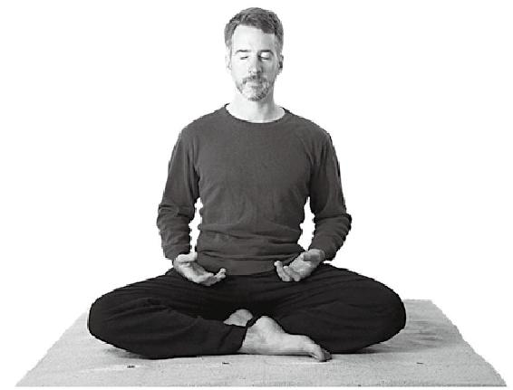

盤腿而坐的冥想姿勢

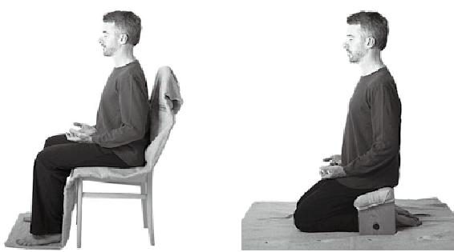

冥想姿勢：坐在直背椅子上，或坐在冥想凳上

**放鬆身體要點**

+在坐下冥想之前，先做一分鐘身體上的放鬆練習，使用深長的瑜伽呼吸或挺屍式仰臥放鬆法。

+學習和實踐正確的腹式呼吸法。

+坐時保持脊柱放鬆而直立，可以坐在地板上或椅子上。

在冥想之前，確保做好準備，從腳開始一直到額頭，深入地放鬆身體的各個部位。

## 第五章放鬆精神

就像釋放掉肌肉的緊張是必要的，放鬆精神也是必不可少的。精神上的緊張主要是由憂慮引起的，包括對過去的牽掛或者對未來的焦慮和渴望。如果我們能保持完全活在當下，就會很容易保持輕鬆愉快。

曾經有一段時間，我經營著一項香料生意，為阿南達社區提供香。創業時期總是充滿壓力，任何一個企業家都不會否認這點，工作時間長、資金匱乏，還有無數雜事都在消耗我的精力。我發現自己的心很難平靜下來，很難保持對當下的覺知。數以千計的念頭不停地冒出來，都在叫囂「那我呢？我很重要。」憂慮似乎成了我的主要精神食糧。有一天，當我坐著冥想時，一幅圖像有力地出現在我腦海裡：「時間就像是一條河流，你在這河流裡漂浮著。在任何一個給定的時刻，你都不可能待在一個以上的地方。所以專注於你現在的所在之處，讓河流的其餘部分自己照顧自己。」不知何故，那幅圖像的力量幫助我集中了注意力。每當我發現憂慮佔據了我的腦海，或者我開始思考待做清單上的事情，我就開始想像一條河，它會把我帶回當下。

冥想將幫助我們實現更加專注的狀態，但是我們首先必須要放鬆，至少是部分放鬆，才能讓效果顯現。要放鬆精神，最有效的方法之一是觀察呼吸。在遠古時代，瑜伽修行者就已經認識到了呼吸和心之間存在著直接聯繫。事實上，「調息」這一通過呼吸技巧來調心的科學是印度帶給全世界的最偉大的禮物之一。

生命之氣（prana)這個詞有三層含義：能量、生命和呼吸。首先，生命之氣被用來描述宇宙的能量，這種能量注入一切物質並帶給一切物質活力。這一宇宙能量凝聚成亞原子粒子和原子，成為物質世界中所有物質的基本構建單位。 所以，每個原子、分子和細胞都是宇宙能量的一種延伸，正如波浪是它們底下的大海的延伸一般。

其次，生命之氣意味著在所有活生命體裡流動並執行重要功能的生機。帕拉宏撒·尤迦南達將生命之氣的這一方面的意義稱為「生命力」。他進一步解釋說，生命力自身擁有一種固有的維持生命的智慧。為了使表述更清楚，他甚至創造了「生命粒子」 一詞。

我們還擁有一個潛存於物理的身體之下的微妙的或靈性的身體，是由生命之氣組成的。東方的治療技術，例如阿育吠陀和針灸，就是通過平衡或加強生命力的流動而起作用的；生命力又被稱為「氣」。當生命力正常流動時，就會導致一種健康和充滿活力的自然狀態。

最後，也是對瑜伽的科學十分重要的一點，生命之氣也被用來指呼吸。當我們進行物理的呼吸時，生命之氣同時在靈性之脊上流動。隨著吸氣，生命之氣沿著脊柱向上流動，隨著呼氣則向下流動。這一呼吸與生命之氣的關聯在許多冥想技巧中都佔有重要的地位。呼吸時很容易感受到的，而生命之氣是流動卻是更加微妙的，很難被感受到；而我們可以通過控制呼吸來影響生命之氣的流動。傳統的調息(pranayama，其中 prana 的意思是能量，yama 的意思是控制）技巧包括各種控制呼吸的方法。

在呼吸流和心之間也存在一個直接的反饋回路。緊張或者興奮的精神狀態總是伴隨著斷續的呼吸。你可以通過調整呼吸來讓心平靜下來。你會發現，當你有一個需要集中注意力的任務，比如穿針引線的時候，你會自動地把呼吸放緩，甚至屏住呼吸。下一次你感覺精神緊張時，嘗試借助調整呼吸來恢復鎮靜，可以使用深長的瑜伽呼吸或者以下所列的簡單練習之一。甚至在面臨巨大壓力時，你也可以使用呼吸技巧。

邁克是我的朋友和弟子，他負責培訓舊金山警方的新入職警員。他教導那些新警員的技巧中就包括以下這個：在試圖控制緊張局勢時，首先要控制自己的呼吸。「緩慢而輕鬆地呼吸，」他告訴他們，「以便保持冷靜和專注」。他隨後說了一個真實的故事，以說明通過調整呼吸來實現自我控制的重要性：

有一次，在一項掃毒行動中，邁克在追一個人，一直追進一幢昏暗的樓房，追上了樓梯。到了樓梯的頂部，他拐入了一條狹窄的走廊，並發現疑犯正用槍指著他的胸口。那人顯然正因吸食毒品而神志不清著，邁克知道自己做錯任何一個舉動都可能是致命的。他和那人對視的同時，立即開始深呼吸，並在精神上給自己正面暗示，「冷靜，專注」。然後他慢慢地伸出手，讓那人把槍遞給他。那人從緊繃狀態中出來，肩膀鬆弛下來，沒有使用暴力，而是交出了武器。

在奧運會冬季兩項比賽中，參賽者必須將越野滑雪所需的極端外向的努力與步槍射擊所需的精密的專注力結合起來。在若干年前，隨著呼吸控制的力量被發現，這項運動也獲得了革新。現在，參賽者向目的地做最後幾百米的衝剌時，這些世界級的運動員使用特殊的技巧來控制自己的呼吸，幫助降低心率並開始集中注意力。

我們中的大多數人並不會面臨如此極端條件對精神控制力的挑戰。然而，調整呼吸和精神控制之間的關聯將幫助我們進行冥想。以下是幾個簡單的有助於放鬆精神的呼吸技巧。首先是「均勻呼吸」，這一呼吸技巧應該在每次冥想開始時使用。

### 均勻呼吸

在放鬆完身體的各個部位之後，立刻使用這一技巧來放鬆精神：慢慢吸氣，從 1 數到 12。屏住呼吸，數到同樣數目，同時專注於雙眉之間的一點。然後慢慢呼氣，同樣從 1 數到 12。這是「均勻呼吸」的一輪。

當你開始冥想時，做 6 到 9 輪均勻呼吸。根據你自己的情況，可以增加計數到 16 ： 16 ： 16，或者減少計數到 8 ：8 ：8，但要確保呼吸的三個階段一吸氣、屏氣和呼氣一都是相同長度的。一般來說，較慢的節奏更好些，前提是你覺得舒服並且不會喘不上氣。尤其是在後面的幾輪均勻呼吸裡，你可能想要增加計數。

把注意力完全集中在呼吸上，感覺它像潮水一樣流入和流出。當你呼氣時，釋放所有不安或消極的想法。當你吸氣時，感覺你吸入的不僅是空氣，也吸入了平靜的生命力。 如果你發現你的心開始漫遊了，立即把它帶回到對呼吸的專注上。專注於呼吸本身，而不是呼吸的過程。冥想最初的這幾分鐘是非常重要的，因為它將為整個冥想定下基調。專注於第一次呼吸，會幫助你在整個冥想期間保持專注。

均勻呼吸是如此簡單而有效，它可以在各種情況下使用。下一次當你開始緊張，就做幾輪均勻呼吸，你會發現自己立即鎮靜了下來。你很少能依靠思考而擺脫某種焦慮或消極的狀態，但卻總是可以通過呼吸達到這一目的。

### 交替呼吸

還有另一種簡單的呼吸或調息方式也會對你有幫助——交替呼吸。交替呼吸和均勻呼吸十分相像，區別只是交替呼吸是通過一個鼻孔吸氣、通過另一個鼻孔呼氣。用右手大拇指按住右邊的鼻孔，通過左邊的鼻孔吸氣，此時從 1 數到 12。然後屏住呼吸，從 1 數到 12。在屏住呼吸的時候，輕輕擠壓關閉鼻孔，用大拇指壓住一個鼻孔，用無名指壓住另一個鼻孔。這樣憋住呼吸，同時專注於雙眉之間的一點。從 1 數到 12 之後，繼續用無名指壓住左邊的鼻孔，從右邊的鼻孔呼氣。在哈達瑜伽裡，每個階段都有一個名字：吸入階段被稱為「purak」，屏住呼吸的階段被稱為「kumbhak，，』呼氣的階段被稱為「rechak」。

和均勻呼吸一樣，交替呼吸時你也可以根據自己的舒適度來改變計數長短，只需保證三個階段的計數是相同的。

這一練習使神經系統「冷卻」，並有助於使頭腦冷靜，因為它與體內磁場能量的自然流動保持一致。在我們吸氣時，能量沿著脊柱的左側向上移動；在我們呼氣時，能量沿著脊柱的右側向下移動。

交替呼吸

您可能試圖對此項技巧進行革新。按照以上指示做一個回合之後，從右邊的鼻孔吸氣，然後從左邊的鼻孔呼氣。 這與能量的自然流動相反，將給你帶來完全不同的體驗，可能會覺得熱或更有活力。

如果在吸氣和呼氣時如常數到 12，而在屏氣時數到 25 或更長時間，將把你帶入更深的專注。在屏住呼吸時，以極大的決心專注於雙眉之間的一點，也就是「靈性之眼」。

這些簡單的方法比你想像得更為重要。人們可能打坐很多個月甚至很多年都無法進步，僅僅是因為他們忽略了基礎，錯誤地認為這些基本練習只適用於剛入門的初學者。煩躁不安，尤其是精神上的躁動，是進入更深層次冥想的主要阻礙。 而這些基本的呼吸練習是非常有效的平復思緒的方法。一方面，它們提供了專注的聚焦點，中斷了精神上的躁動。但更重要的是，這些呼吸技巧帶動了在西方很少被瞭解的微妙能量。

「我們的想法，」尤迦南達說，「是根植於整體的，而不是根植於個體的。」這一驚人的論斷扭轉了如今的思維模式。我們並不創造自己的想法，相反，我們從整體意識中抽取出部分，就像無線電台接收一個頻道的電波一樣。當我們改變了自身的意識磁性，我們就改變了自己所接收的電台頻道。精神上的煩躁不安就像是靜電，會干擾電台頻道，使我們無法清楚地聽到。在冥想中，我們最艱巨的工作就是擺脫想法和慾望所產生的靜電。只要我們能做到這一點，我們將上升到一個更高的意識層次。

冥想是一種非常重要的精神追求的方法，因為冥想能夠使頭腦平靜，擺脫分離的意識所造成的漩渦（或靜電干擾)。一旦我們意識到所謂界限是虛妄的，並將自我擴展到無窮，我們便將最終實現真正的自我。

然而，千里之行始於足下。第一步是放鬆。一旦身體和精神都得到了放鬆，我們就準備好進入冥想的第二階段：專注。

**放鬆精神要點**

使用均勻呼吸或交替呼吸的呼吸技巧來放鬆精神。

這些呼吸技巧可以在任何你想要平靜心靈或平復情緒的時候使用。

在屏住呼吸時，深深專注於雙眉之間的一點；在結束呼吸練習時也是如此。

# 第二階段
專注和內化

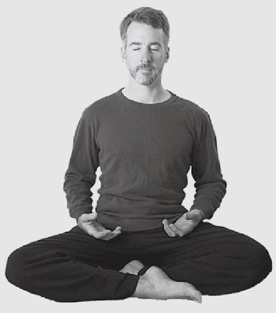

## 第六章專注和內化

冥想的第二個階段是能量的專注與內化，這將在身體、精神和更微妙的層面上發生。在斯瓦米·克裡雅南達的另一本書《自我肯定與修復》（4 所 _ 如⁰似 f^(or) Self-Healing)中，他寫道：

「專注是做任何事獲得成功的秘密。假如沒有專注，思想、能量、靈感、目標這些人類內在的力量都將變得渙散。 專注是指對當下目標平靜地灌注全部的注意力。專注不只是精神上的努力，也是指將你所有的感情、信心以及心底深處的渴望注入你正在做的這件事。這樣一來，即使是生活中微不足道的小事，都將變得豐盛而富於意義。

專注並非精神緊張。當你真正想要某件事物時，很難不去想它！無論你正在做什麼，懷著興趣專注於你正在做的事情，你會發現自己沉浸於其中。」

專注對於在任何領域取得成功都是有幫助的。對於冥想，專注更是必不可少的。因為冥想的定義就包括了極深的專注。冥想所需要的是一種特殊類型的專注，心是向內專注的，而不是向外專注於外部對象。

當我們投身於外界活動之中時，我們的思想通常集中在我們關注的對象上：一個人、一本書或一個針眼。但為了進行向內的探索，我們需要從外在事物上撤回我們的注意力，專注於內在的東西之上，比如呼吸，或額頭所見的光亮。

在冥想時，我們必須將分散的力量集中於一點，通常是大腦前部、雙眉之間的一點，也就是前面所說的「靈性之眼」。這是意志和直覺的中心，也是超意識或全意識的所在之處。當所有的能量（或生命之氣）集中在這一點上時，覺悟便會發生。這一點還與喜悅的感受有關。涉及腦成像的最新研究顯示，當這個中心點變得更活躍時，參與者報告說體驗到更積極、快樂、醒覺甚至幸福的感覺。長時間練習冥想的人，即使在他們冥想以外的時間裡，他們的大腦前額葉部分也比一般人更為活躍，並且他們的與恐懼、焦慮和消極的情緒相關的那些中心比一般人更不活躍。

當我們的能量向內集中時，除了冥想以外，還可能處於其他的意識狀態。每天晚上睡覺時，能量從感官和肌肉中撤回，重新聚焦在大腦中。許多人在睡著時完全與現實世界失去了聯繫。事實上，能量的內化和注意力的回撤是睡眠使人解乏振作的主要原因。從能量回撤的角度來看，睡眠和冥想是相似的。但在睡眠中，我們沒有覺知。而冥想時，我們通常比平時更醒覺，更能將我們的意識提升到超意識的狀態。如果我們能夠像睡眠時那樣保持身體和感官的休止，但同時並不失去覺知，從理論上說，我們會取得靈性上的飛速提升。帕拉宏撒·尤迦南達曾幽默地將睡眠稱為「冒牌三摩地」。

冥想時，我們所面臨的最大威脅是躁動不安的想法和憂慮，它們無休無止，彷彿是一切精神活動的背景。當某件事完全抓住我們的注意力時，比如當我們觀看一場剌激的電影時，它們通常會暫時臣服。但是當我們試圖放鬆並向內專注時，我們常常會發現要關掉這些精神上的背景噪聲是如此艱難。我們很難平靜地專注於現在，而是會傾向於回憶過去，憂慮或計劃未來，或者做起白日夢來。然而，假如我們擁有強烈的決心，並使用一些有用的技巧，這些干擾是可以被克服的。

有一個故事，講的是一個貪姜的商人聽說有位聖人能夠懸浮起來。他想到自己如果能擁有這樣的能力就可以省下好多旅費，就去向那位聖人學習。令商人感到驚訝的是，聖人告訴他懸浮十分簡單，只需在冥想中重複一句咒語。貪姜的商人滿懷期待地搓著手，正要離開時，聖人對他說，「哦，還要補充一件事：在重複念這句咒語時，你可別想到猴子哦。這一點很重要。」商人覺得很困惑，但倒並未因為這個建議而苦惱，因為他從來都沒有想過猴子呢！

那天晚上，他坐下開始冥想並重複念誦咒語時，他立刻想起了那個別想猴子的警告。在隨後的幾分鐘裡，他一直琢磨著各種不同種類的他不應該想到的猴子。然後，他開始思考猴子的有趣習慣。那天晚上，他夢見了猴子。 而第二天，他開始在圖書館裡研究關於猴子的問題。最後，在一個星期後，他回到了聖人面前，說：「請拿回你的咒語吧。我不想要它了。它的唯一功效是使我癡迷於猴子。」那位聖人是位瑜伽修行者，他笑了起來，說：「你來這裡時，就是處於猴子意識的狀態，我所做的就是幫助你意識到這一點。」然後，他給了商人一些基本的指導，使商人可以逐漸提高自己。關於懸浮的問題再也沒有被提起。

還有一些其他方法也可以幫助我們進行專注和內化。 我們已經瞭解了放鬆和呼吸技巧，這些可以作為起步。但瑜伽修行者開發出了更為強大的技巧來幫助我們集中精神能量。其中三個最強大的技巧是觀呼吸、唱誦（或重複念誦一個咒語或祈禱）和想像。

### 觀呼吸

觀呼吸是勝王瑜伽最重要也是最被廣泛教授的技巧之一。觀呼吸十分易於實踐，同時非常有效，因為它科學地利用了呼吸一能量一心的循環。通過完全專注於呼吸，並且直接觀察吸氣和呼氣，我們可以影響能量，讓能量流向靈性的眼。而這反過來也可以幫助我們更深入地專注，因為通常通過感官向外流動的能量被撤回到了內部。具體方法如下：

1.觀呼吸應該在完成此前已經學過的準備之後立即進行。如果可能的話，首先放鬆身體。然後，當你坐下冥想時，有意識地下決心在整個冥想期間保持專注。先做幾個回合的均勻呼吸或交替呼吸。再用雙重呼吸的方式吸氣，讓全身緊張，直到震動起來。然後用雙重呼吸的方式呼氣，讓身體完全放鬆。這樣進行 3~6 次。現在從雙腳開始徹底放鬆整個身體，使用你已經學會了的方式。最後專注於雙眉之間的一點，釋放緊張，徹底放鬆精神。

2.在完全放鬆身體和精神後，你需要一個專注的焦點一呼吸。首先，深吸氣，然後做一個三重呼氣，直至完全排出空氣。在下一次的吸氣和呼氣時，用心觀察這種呼吸，就像觀察海面的起伏那樣。對吸氣和呼氣保持清楚的覺知，但不要試圖以任何方式進行控制，只是觀察呼吸的自然流動。嘗試感受呼吸進出鼻孔時身體的感覺。如果你無法感受到呼吸進出鼻孔，可以先專注於呼吸過程本身，觀察胸部和肺部的變化。一段時間後，再改為覺知呼吸進出鼻孔。

3.為了幫助加深專注力，你可以使用一個有力量的字的組合或咒語，被稱為「宏一撒（hong-sau)」。這是修行者所說的「種子口訣（bija mantra)」，種子口訣並非實際的字詞，但是聲音本身就擁有力量。默默地重複「宏一撒」，在吸氣時發「宏」（聽起來像「hong」 )，呼氣時發「撒」（聽起來像 sau )。這種特殊的咒語在使脊柱的生命之氣平靜流動上特別有效。

如果你更願意結合呼吸重複一個熟悉的字，比如「阿門」，那也可以。當你吸氣時，默默地說「阿」，當你呼氣時默默地說「門」。或者，你可以在吸氣時說「我是」，在呼氣時說「神」-這是對宏一撒（hong-sau)所做的一個粗略的翻譯。或者你也可以在吸氣時簡單地數「一」，而在呼氣時數「二」。在吸氣時輕輕將右手食指觸及手心，在呼氣時輕輕移開手指，也會有所助益。

4.如果思緒變得紛繁，要立即把念頭帶回到呼吸上來。這是非常重要的。呼吸為我們提供了一個參考點。如果我們沒有參考點，就很難發現自己已經神遊天外了。呼吸為我們提供了這一參考點，除了觀察呼吸以外的任何思想或頭腦中出現的形象都可以被確認為是分心。一旦你意識到自己分心了，就把心帶回到呼吸上。

5.當呼吸變得平靜，你會漸漸感覺到它接觸鼻孔的部位越來越高，一直到你覺知到它在鼻腔深處。需要足夠平靜和專注才能感受到呼吸在鼻腔深處，這可能需要幾分鐘的時間。

現在，你可以將對呼吸之流的專注轉移到「靈性之眼」上了。專注於在這一點上，保持你的注意力集中而不渙散，你將逐漸實現用意志控制生命之氣的流動，這使你能夠內化這種能量。嘗試著去盡可能地深入，直到你的心完全專注於觀察呼吸，靜靜地重複咒語。請記住，不要試圖做任何努力來控制呼吸的速度或深度。僅僅讓呼吸自然地平靜下來就好。

當你的注意力開始集中在雙眉之間的一點，你會發現，你（閉合的眼瞼後面的）目光也向上提升了。隨著覺知的向上，目光也向上。而目光的向上，也引導著覺知的向上。因此，你會發現，假如從冥想一開始就稍微抬起你閉合眼瞼背後的視線，會很有幫助。目光向上的角度應該是柔和而舒適的，彷彿你正在望向遠處的山峰。如果你覺得眼睛或額頭有任何緊張感，應該稍微往下望一點。

你可能需要一點時間來適應目光向上。不要將全部注意力集中於此，而是隨著時間的推移慢慢適應。它將迅速成為一種習慣，而你會發現，它可以幫助你保持專注。

7.「宏——撒」練習法的關鍵是不斷加深對靈性之眼的專注，直到除了覺知呼吸有節奏的流動之外，你不再思考任何事情。隨著心變得平靜，你會發現自己漸漸不再需要呼吸。享受呼與吸之間的停頓，保持心的平靜，並允許這一停頓自然地延長。這一技巧會導致內化的不斷加深。隨著呼吸（和生命力的流動）變得越來越平靜，心的專注力也獲得了極大的提升。不斷深入的專注又使呼吸和生命之氣的流動變得更加平靜，從而又加深了專注，這樣週而復始，最終指向身體和感官的休止和心的全然專注。

在非常深的冥想中，能量可以完全集中在靈性之眼上，因此身體不再需要氧氣，呼吸停止了。起初，這可能是一種有點古怪，甚至是可怕的經歷，但它是通往最深冥想狀態的入口。事實上，帕拉宏撒·尤迦南達將能夠隨心所欲停止呼吸的人定義為「高手」。不要擔心過早發生這種情況。這是一個非常深的狀態，並不容易實現。如果你實現了，就說明你已經準備好了。然而，大多數人在他們的呼吸變得平靜時就得到了很大的好處，即使呼吸並沒有完全停止。由於呼吸、能量和心之間的聯繫，這一技巧能導致極深的專注狀態。

你可以將這種技巧看作是我們得以從由呼吸代表的存在的物質方面轉向平靜的內在意識的一座橋樑。進行至少 5 分鐘的練習。如果你享受這一練習所帶來的平靜和喜悅，可以練習更長的時間。

8.在練習的最後，深深吸氣、呼氣，這樣做三次。然後深入專注於靈性之眼，忘記身體的存在，保持心念的完全靜止。隨著心的深入專注和內化，現在你可以繼續下一階段的冥想——專注於內在的實相。

通常情況下，應該花冥想時間的四分之一來做觀呼吸的練習。但是，在剛開始進行冥想時，或者當你在這過程中得到極大的啟迪時，你可能希望練習更長時間。

尤迦南達年輕時曾一口氣進行了 8 小時的觀呼吸練習他建議，如果想要在今生成為高手，每天應進行兩個小時的觀呼吸練習。在某段冥想中你應該花多少時間來觀呼吸呢？ 這取決於你對這一練習的享受程度，以及保持專注的能力。

但需要記住的是，觀呼吸是一項非常重要的冥想技巧，它旨在達到全然的專注。這個目的是非常重要的。專注有助於生命力的內化，而如果不能實現專注，所謂的冥想是基本無效的，只是浪費時間罷了。

9.觀呼吸不同於許多其他冥想方式，因為它可以在任何時候進行，即使你並未坐著時也可以觀呼吸。任何時候，如果想要控制心，首先控制呼吸！這對於消除緊張很有用。 下一次，當你看牙醫或者面臨一個不愉快的任務時，試著進行「宏一撒」練習吧。我曾做過一次實驗，面對一個非常緊張的電影場景，我做了幾個回合的「宏一撒」練習。幾秒鐘之內，所有的焦慮都消失了！

**觀呼吸要點**

帶著專注的覺知坐下，放下一切關於過去或未來的念頭，專注於此時此地。

專注應該是放鬆的，而不是緊張的。

花一次冥想四分之一的時間觀呼吸、念誦「宏一撒」或其他咒語。

不要做任何試圖控制呼吸的嘗試。僅僅做一個觀察者。 一覺知到走神，就把覺知拉回到呼吸上。

做完練習時，保持心念專注於兩眉之間的一點上。

### 想像

想像也是一種幫助人在冥想時集中注意力的有效方法。 想像繞過了大腦將念頭語言化的功能，因此可以極大地促進專注和平靜的實現。在深度冥想時，圖像會自然出現，這也經常是神對聖人顯現的方式。

體驗意識擴展的一種方式是想像一道擴大的光，具體如下面所舉的例子。這一方法應該在冥想的後期進行。那時冥想者已經完成了觀呼吸的練習，處於放鬆和專注的狀態中。

在雙眉之間的一點想像一道藍色的光。如果你無法逼真地看見光，就想像出一道光。當你能清楚地「看見」這道光，就讓它擴大，先是充滿你的整個大腦，然後逐步注入你身體的每一個細胞。讓這道光繼續擴大，直到充滿你所處的整個房間，充滿你的房子，你所在的小區、省份、國家，最後充滿了整個地球。觀察地球漂浮在藍色的光裡，彷彿你是在外太空望向地球。

感覺這道光連接了這顆星球上的每一個人，散發著和諧與愛。現在，不斷擴大這道光，直到它充滿整個太陽系，乃至整個宇宙。想像星星和銀河都漂浮在藍色的光裡，就像藍色的海洋上泛著點點銀光。感覺你也在這片藍色的光的海洋裡休息；實際上，你就是那道光。你的身體擴展為宇宙和宇宙中的一切。星星是你的細胞。感受這種狀態，這種寧靜、安全和喜悅的狀態。你什麼都不需要了，因為你已經擁有了一切。沒有任何東西可以傷害你，因為你就是一切。沉浸在這種宇宙意識的喜悅裡，能持續多久就持續多久。然後逐漸讓光收縮，直到它再次成為雙眉之間的一點。

斯瓦米·克裡雅南達錄製過若干像這樣的關於想像的練習 CD，還配有悅耳的背景音樂。

最適合進行想像的是對你來說感覺很親切的人的臉，尤其是他們的眼睛。眼睛是「心靈的窗戶」。通過凝視人的眼睛，你會變得與他的意識相應。嘗試細緻入微地觀察他們，從看他們的圖片開始，然後想像他們的形象，直到他們活在你的心中。與他們交流，發送和接受愛與和諧。

關於專注和內化的技巧通常會佔據冥想練習的大部分時間。不要過早地停止練習這些技巧。只有當你能深刻地專注，達到覺知擴展的狀態，放開這些技巧純粹地沉浸在體驗裡才對你有好處。如果仍然存在精神上的不安緊張，你已經學到的技巧將幫助你重新調整並進入更深更平靜的擴展狀態。另一方面，專注的技巧不應該佔用你所有的時間，而是應該將你帶入下一個階段一擴展。你至少應該將冥想的最後四分之一的時間花在與內在更高的自我的交流上。

**想像要點**

選擇一個能深化和擴展意識的對象進行想像。

試著在看見的同時去感覺。

不斷深入專注，直到你沉浸在想像的對象中。

盡可能長地沉浸在想像的對象中，然後逐漸回到對雙眉之間那點的能量的專注上。

冥想的最後階段是意識的擴展。事實上，直到意識發生擴展，我們才真正開始冥想。在《形而上學的冥想》(Metaphysical)中，尤迦南達寫道：「冥想與專注是不同的。專注存在於將注意力從分散注意力的對象上撤回並在一個時間只集中在一個對像上的過程中。而冥想是一種特殊形式的專注。一個人可以專注於思維自我，或專注於思維金錢，但不能冥想金錢或其他任何物質的東西。」

在實踐中，這意味著在結束上述幫助我們變得專注的技巧練習後，我們便準備好進入冥想的最後一個階段了。現在我們應該專注於某種無限的層面，比如光、愛、喜悅或和平。我們可以把這些特性視作廣闊海洋的特性。專注的技巧把我們帶到了海岸邊，而深層的冥想則要求我們進入海洋並最終與它合為一體。我們應該盡可能長地保持在擴展的意識的狀態裡，這一狀態可以通過內在交流或祈禱達到。這兩種方法都需要我們將已經專注的心集中於某種無限的特性上。

# 第三階段
擴展

## 第七章擴展

### 內在交流——靈性層面的冥想

從某種意義上，這就像我們晚上做夢時，認為自己是夢中的某個角色。在夢裡，當我們沒有外界參考物，夢中的角色彷彿就是我們的全部身份。只有在我們醒過來之後，才能意識到夢裡的角色，甚至這個夢本身，都只是頭腦上演的好戲。覺悟真實自我的聖人將世俗的生活比作一個夢，敦促我們採取行動來覺醒，回到真正的靈魂自我。瑜伽的練習就是專門為打破靈魂對身體的自我定義而設計的。深度冥想能夠打破這一夢中生命的泡影。

靈魂是精神的擴展部分，有特定的內在靈性屬性。擴展意識的最佳方式之一就是對靈魂的這些基本特性進行冥想。 印度的經典中記載，人的靈魂有八種特性：光、聲音、力量、智慧、寧靜、和平、愛和喜悅。因為靈魂的每一個特性都是無限的表達，無論我們專注於哪一個，我們的意識都會自然地擴展。這八種永恆的特性是能幫助我們實現「超越自我認知局限、實現與無限靈魂合一」這一冥想目標的通道。對真實自我的特性進行冥想時達到自我實現的最有效的方式之一。

在完成重要的卻也是初步的專注技能的訓練之後，花一些時間將自己沉浸於這八個特性中最吸引你的那個。例如，如果最吸引你的特性是愛，那就先從心裡生起愛的感受開始。感受到心裡的愛要比僅僅確認它或思維它更有力量。 在感受之中存在著智慧，這一點被我們嚴重低估了。心和腦通過神經相連，而心中積極的感受會在大腦裡產生相似的反應。如果我們想要提升靈性，控制感受要比試圖控制思維更有效。思維隨著感受而變！

要讓自己與無限的愛相應，從敏銳地感受心裡愛的感應開始。不要將愛個人化。就是說，不要將愛限制到任何一個個人或群體上。僅僅是嘗試與一種普遍的愛相應。從你真實感受到的愛入手，然後嘗試讓這愛擴展。一開始在心裡感受愛，然後也專注於在靈性之眼上感受愛。這將使心和靈性之眼這兩個中心連接起來。當你能夠強烈地在這兩處都感受到愛時，讓它生長，直到愛的氛圍充盈你的整個大腦、思緒乃至整個身體。

現在，你意識到自己的身體不再能夠容納得下這種愛。 你讓這愛向外擴展到那些與你親近的人身上。不要停步於此，因為這仍然太具有限制性。神聖之愛想要擁抱一切人和一切事物。

讓這神聖之愛擴展到世界的每一個角落、每一個衝突頻發或飢寒交迫的角落、每一個急需純粹的愛的慰藉的角落。也讓這神聖之愛圍繞並充滿那些與你關係緊張的人。不要讓任何偏見阻礙你擴展愛。想像這愛向外擴展，就像太陽散發著溫暖，遍及每一個人和每一樣事物，不計較他們是否值得。最後，想像這巨大的、非特指的愛是一種生機勃勃的、充滿靈性的力量，將你自己與所有生靈聯繫在一起。盡可能地保持這一狀態，讓這擴展的愛消除一切分離「我」和「非我」的感覺。

最後一步是認識到一切都是從同一個源泉一神聖之愛一而來，並且實際上並沒有「非我」的存在。你成為愛的海洋。即使你不能達到這一提升的狀態，努力本身也會產生極大的好處。做一定的此類練習可以改變你的生命。

當你在一天中進行各種活動時，感受愛的氛圍從你的心底向外發散，擁抱每一個你遇見的人。你可以想像你被一個愛的氣泡或磁力場所包圍和保護，這會對你有所幫助。

八個靈魂特性中的每一個都是一種有影響力和活力的靈性力量。

當心靈變得非常安靜，你可能會看到靈性之眼，它呈現為金色圓環內藍色區域裡的白色五角星形狀。如果心還沒有到達那麼平靜的程度，你可能會看到一個有些扭曲的形象，比如一個甜甜圈模樣的圓圈，或者是在額頭看見光和色彩的某種集合。無論你看到的是什麼，冷靜地觀察它，提高自己的專注程度，直到你沉浸到內在的亮光裡。

通過光將你的意識投射到無窮遠是一種非常有益的嘗試。在瀕死體驗中，最常被提及的體驗之一就是通過隧道進入了一道巨大的光。在深層冥想中，當能量從身體意識中撤回，而擴展到宇宙意識中時，也會產生類似的體驗。

聲首和光十分相似，都是能量以各種波長振動的形式的表現。就像觀察內在的光一樣，你可以聆聽內在的聲音。聆聽內在的聲音是非常令人振奮的，但是，就像看到內在的光一樣，需要頭腦處於相當寧靜的狀態。為了幫助你更清楚地聽到內在的聲音，可以使用大拇指堵上耳朵或使用耳塞。無論你聽到怎樣的內在聲音，都試著專注地去聽，首先沉浸在這聲音裡，然後感覺它在整個身體內蔓延，消融所有自我的認知。

在使自己與靈魂的某一特性相協調的過程中，無論這一特性是光、聲音、愛、喜悅或任何其他特性，都可以從你已經有的經歷開始入手，並在此基礎上擴展。如果你不能夠看到、聽到或感覺到任何東西，那就以回憶或想像曾有的經歷作為一種剌激。例如，為了擴展成普遍的愛，可以從你記得的一次愛的經歷入手，讓它成長，就像一小撮餘燼變得越來越明亮，直到它燃燒起來，並最終成為熊熊燃燒的烈火。

額頭上所見到的小小光亮可以擴展為關愛所有生物的能量。心裡感受到的一小縷愛意或和平可以擴展成為足以擁抱每個你認識的人的愛意或和平，然後還能繼續擴大，直到包容下所有的人、所有的生物，乃至所有一切被創造的有情或無情生命。

真正的冥想是對這些特性的深層專注，或深深地沉浸在這些特性之中。

意識擴展的最終狀態在梵語裡被稱為三摩地。在這種狀態下，你不再將自己定義為有局限的自我，或者是與他物分離的孤立的個體。你不只是這樣思維，更是知道，一切都是無限意識的表達，而你也是其中的一部分。尤迦南達的詩《三摩地》是歷來對此類主題描述得最清晰的文字之一，也是最美麗的神秘詩之一。尤迦南達建議他的弟子記住這首詩，每天重複念誦它，以幫助自己準備好面對這種經歷。 這首詩是這樣開始的：

光與影的面紗被揭開，悲傷如煙霧般消散；

快樂才剛開始便駛離，感官幻象亦已不見。

愛恨、生死或健康疾病，

二元世界裡的對立轟然倒塌；

笑聲、嘲諷或憂鬱璇渦，

紛紛融化在極樂的廣闊海洋。

空幻境界的風暴，息止於一柄名為深刻直覺的魔杖。

宇宙，被遺忘的夢，在潛意識裡潛伏著，

準備好入侵，我那新喚醒的神聖記憶。

我活著，裡面沒有宇宙的影子，

但若沒有我，宇宙就不是宇宙了；

若沒有波浪，海仍然存在著；

但是波浪的呼吸，卻離不開海。

夢境、清醒、全然的覺知，現在、過去、未來，

這些都不再適用於我；

始終存在，不斷流淌——我，無處不在。

**靈性層面的冥想要點**

選擇八種靈魂的特性中與你最相應的一種：光、聲音、力量、智慧、平靜、和平、愛和喜悅。記住，每次只專注於其中的一種。

專注於對這一特性的感受，而不是僅僅思維它。首先在心裡感受到愛，然後在靈性之眼（雙眉之間的一點）上感覺到愛。

讓你所選擇的特性擴展，直到它充盈你的整個身體，然後不斷向外擴展，直到最終充盈整個宇宙。

盡可能長地沉浸在這一擴展的狀態，保持思想和情緒完全靜止。

在日常生活中保持這一特性的氛圍。

### 直覺解答

很多人都會犯這樣的錯誤：在冥想的時候去思考問題。 只要心仍是躁動不安的，冥想者就既不能圓滿地進行冥想，也無法成功地解決問題。其實只要心變得專注，意識得到擴展，直覺就開始活躍，能夠幫助解決生命中的兩難問題。生命中的那些難題大都是源自於我們有限的理解力，而只要我們的意識停留在該問題產生的同一個水平，這個問題就幾乎是不可能被解答的。當我們提升了意識水平，問題的答案常常立刻變得顯而易見了。所以完全可以等到冥想的後期，當你意識的水平得到提升之後，再嘗試引入問題。

這裡有一個找到問題的直覺解答的方法。首先，深入冥想，直到頭腦變得冷靜而專注。然後，增強洞察力和獲得解決方案。試著用簡單而清晰的方式表述你的問題，有時候因為問題變得清晰，答案也隨之變得明顯。當你有了一個簡單而清晰的問題時，把它從靈性之眼上投射出去，彷彿你在對宇宙做一個廣播。以很大的強度和很深的專注提出問題，但要避免精神上的焦慮。這就是說，不要聚焦於困難，而要聚焦於解決之道。現在，期待一個回答，聚焦於心臟的中心，有意識地保持開放的狀態。通常，你會直接知道問題的答案。假如沒有答案顯現，提出幾個最有邏輯性的可能答案，同時感受心中的能量。有沒有感覺到其中一個答案讓你產生了緊張不安的感覺，而另一個答案產生的是寧靜的感覺？如果是這樣，就採用那個讓你感受到平靜的答案。為了清楚地感受，你必須保持完全的客觀。對某個答案的執著或喜好將阻礙直覺的流動。

**直覺解答要點**

首先進行冥想，直到你的頭腦和情緒都變得平靜。不要反覆思考那些會阻礙你深入冥想的問題。

使問題變得簡單而清晰。

將問題從靈性之眼上投射出去，期待得到回答。

在心裡感受答案。

如果你沒有得到直覺的回答，提出邏輯上的備選答案。 選擇你感覺合適和平靜的，而不是感覺興奮和緊張的。

## 第八章由靜入動

把你在冥想中所感受到的和平與喜悅帶入日常生活。 在冥想之後保持平靜與專注，將平靜延伸到生活的各個方面。當你意識到活動和冥想是一個東西，你就將能在哪怕是最惱人的環境中在心裡找到一個平靜的中心。

冥想後最初的幾分鐘尤為重要。假如可能的話，保持沉默，在保持冥想的內在平靜的同時，靜靜地開始其他工作。感覺你只是在神提供的舞台上演一齣戲，不擁有任何東西，也不控制任何人，只是暫時照管和照料那些遇到的物和人。在冥想後，人們常常會覺得色彩更鮮艷了，周圍的人更可愛了，事情也更歡樂了。盡可能長地去保持這個可攜帶的天堂，將它延長到交通工具上、工作場合裡，乃至整個生活中。這種練習將給你一個在日常生活中可以保有的平靜的中心，在不斷練習之後還能提供令人驚歎的力量。

在 1976 年，一場森林大火幾乎摧毀了阿南達村的所有房屋。在慘絕人寰的幾個小時中，以及在隨後令人困惑的日子裡，阿南達社區的居民保持著平靜，甚至是快樂的，不曾丟失他們的中心或幽默感。我和家人居住在一個網格球頂的圓屋頂下，這種設計在審美上是敞開式的、誘人的。不幸的是，它的縫隙也是敞開和來者不拒的。簡單地說，它像篩子一樣是漏的。我花了幾個小時和火搏鬥，但最終徒勞無益地目睹房子化為灰燼。之後，我終於回到了妻子戴維和 10 歲的兒子等候的地方，與他們碰頭。我是這樣和他們打招呼的： 「好吧，至少我們再也不用擔心漏雨的問題了。」在幾分鐘內，我們就平靜地談論起發生的事，並且樂觀地為將來做計劃了。

對於我們一家以及阿南達村的其他居民來說，每一天的冥想練習所產生的不執著的狀態以及內在的喜悅使得我們能夠從容面對絕大多數人眼中的重大人生考驗。《薄伽梵歌》（Bhagavad Gita )裡說：「即使一個人只做了一點點這種訓練，就能從極度的恐懼和巨大的痛苦中獲得解脫。」 而在火災之後的幾天乃至幾個月裡，我們見到了這一承諾的實現。

## 第九章冥想的基本步驟
—放鬆、專注、擴展

在你坐下進行冥想之前，你可能想要通過做幾輪伸長的瑜伽呼吸和/或挺屍式仰臥放鬆來進行身體的伸展和放鬆。在坐下冥想的時候，檢查你的姿勢。確保脊柱是豎直的，挺胸，雙肩稍向後。放鬆腹部，並且確保你在進行腹式呼吸。

向那些帶給你極大啟迪和鼓勵的聖人，以及向你的更高的自我進行祈禱。祈願得以進入深層的冥想，以及與自然進行深入的交流。

進行 6～9 輪的均勻呼吸或交替呼吸來放鬆精神並集中注意力。慢慢吸氣，從 1 數到 12。屏住呼吸，數到同樣數目。 然後慢慢呼氣，同樣從 1 數到 12。根據你自己的情況，可以增加或者減少計數的長度。但要確保吸氣、屏氣和呼氣這三個階段都是相同長度的。

然後用雙重呼吸的方式吸氣，讓全身緊張，直到震動起來。然後呼氣，徹底放鬆身體。

這樣進行 3～6 次。隨後有意識地放鬆身體的各個部位，從雙腳開始，一個部位又一個部位地漸漸向上，一直到頭部。在放鬆大腦後結束。當你在身體上完全放鬆了，嘗試不要讓身體的緊張再來干擾你，直到這次冥想結束為止。從坐下冥想開始，這一放鬆的過程，除去預備的深長的瑜伽呼吸或挺屍式仰臥放鬆的時間，應該只花 5 分鐘左右。

在放鬆之後，專注於雙眉之間的一點。將所有的想法從腦海中驅走，完全專注於此時此地的當下。不要回憶過去，也不要擔心未來。

實踐一個或多個專注的技能練習。

比如，現在開始觀呼吸，先深深吸一口氣再呼出，這樣做三次。接著，在吸氣時默念「宏（hong)」，在呼氣時默念「撒（sau)」。花大約整個禪修四分之一的時間來做這一練習，試著達到完全的專注。當你發現自己神遊天外時，輕輕地把覺知拉回到觀察呼吸上。試著不斷深入專注，直到你完全沉浸其中，並且呼吸靜止了。用三次深呼吸來結束這一練習。

盡可能長地保持深度專注和平靜的狀態，總是盡量嘗試進入更深的內在靜默。在練習冥想時，漸漸地從有為的「做」的狀態，轉變為無為的「是」的狀態。

向內將自己調整到與光、聲、愛、喜悅等八種靈魂的特性之一的顯現相應。嘗試消除一切個性和分離感。與你冥想的對象合一。盡可能長地保持這一狀態。

當你還處於深度平靜中的晚一些時候，你可能想要尋求對你生活中正在經歷的困難的幫助或指引。通過靈性之眼將你的請求發送出去，在心的中心聆聽答案，期待答案的產生！ 試著使冥想始終保持新鮮、富於活力和直覺。假若一次冥想包含了太少的技巧，會太淺薄。但是假如包括太多的技巧，又會太枯燥。試著去找到一個能夠帶給你最多喜悅的平衡點。內在的喜悅是冥想程度加深的最真實的標誌。

## 第十章能量練習

帕拉宏撒·尤迦南達設計了一個被稱為「能量練習」的美妙的系統。該系統利用意志的力量將生命力吸引入身體。

能量練習可以幫助你增強生命力的流動，並引導生命力流入身體的各個部位而使這些部位強健和充滿活力。這些練習也有助於使人專注，對冥想有不可或缺的幫助。整個能量練習系統包括 39 個練習，超出了本書的範圍。這裡只是做一個簡單介紹。

學習如何做整套的練習需要一些時間，但只要堅持有規律地進行其中的兩個練習就將獲益匪淺了。這兩個練習是:雙重呼吸法和 20 個身體部位的充電法。之後我們會給出如何做這些練習的說明。首先，你需要知道的是一些基本原則。

1.專注於顱底的延髓區域，感覺你正在通過這一區域

從宇宙中吸取能量。正如食物是通過口腔進入體內的，生命之氣是經過能源中心或脈輪進入我們體內的，能源中心或者說脈輪所對應的物理名詞是髓質。專注於能量的流動。使用專注力引導能量，通過交替地繃緊和放鬆身體的各個部位，使能量流入相應的部位。比如，要將能量發送到左邊的小腿，你需要使該部位的肌肉緊張，隨後放鬆，感受結果。這樣做，不僅會為身體提供充盈的能量，更重要的是能訓練我們使用意識來控制生命之氣的流動。你甚至可以閉上眼睛，來幫助深化和內化意識。

2.使肌肉緊張和放鬆的過程，應分階段進行，以免用力過猛。

緊張可以分為：

‧低度緊張一輕微緊張；

‧中度緊張一顯著緊張；

‧高度緊張一強烈得足以導致身體部分振動的緊張。 保持高度緊張大約 3～4 秒鐘。以一種連續的波段的方式來使肌肉緊張：低度、中度、高度，然後以連續的波段的方式來放鬆，高度、中度、低度、完全放鬆。專注於你要發送能量到的肌肉或肌肉群的中心。在練習時始終保持緩慢、平穩，並保持深度的專注。

3.有一種靈性上的規律：「有多大的意志力，就能產生多大的能量流。」通過有意識地集中意志力，你將得以控制無限的能量流。將意志力理解為「願意」會更好些，這樣就可以避免使它顯得嚴酷。為了得到最大的利益，在使用意志力時應該十分專注，尤其是在使身體部位緊張時。 在放鬆身體部位時，也盡量敏銳地覺知到該部位的感受。

4.如果身體的某一部位生病了或受傷了，在使該部位緊張時只到較低的程度即可，並且向該部位發送能量，慢慢數，數到十。

將這一過程重複若干次。對於你無法感知到的內部器官或身體部位，可以向想像的器官或部位發送能量。想像一束光照向患病的部位也會有幫助。

### 雙重呼吸

雙重呼吸是通過鼻子吸氣，首先做一次短促的吸氣，緊接著做一個相對較長的吸氣。呼氣時通過鼻子和嘴巴一起呼氣，節奏和吸氣時的先短後長一樣。

將雙臂在身體兩側展開，與肩齊平，用已經學會的雙重呼吸的方式通過嘴和鼻子呼氣。然後將雙臂伸到身體前方，直到雙掌相觸。用雙重呼吸的方式通過鼻子吸氣，同時將雙臂張開到身體兩側。同時使整個身體緊張，按照從雙腳一直到頭部的順序。用雙重呼氣的方式從上而下地放鬆，釋放出所有的緊張，並將雙臂在身體前方合攏。重複這一過程四至五次。再溫習一次。

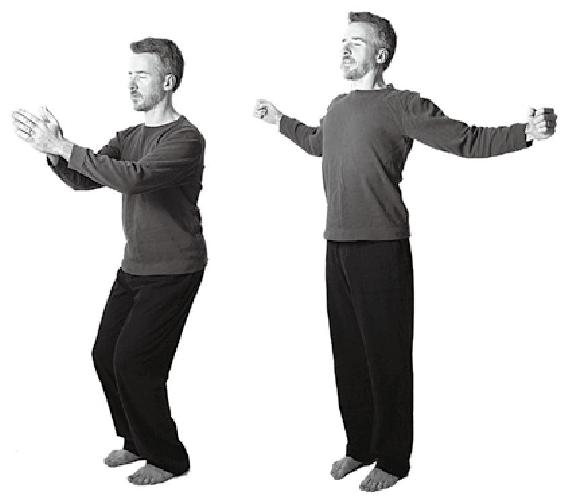

雙重呼吸

### 20 個身體部位的充電

「20 個身體部位的充電」這一練習包括三個階段。在第一階段，使全身緊張，再放鬆。在第二階段，按照從雙腳到咽喉的順序，使 20 個不同身體部位緊張，再放鬆。

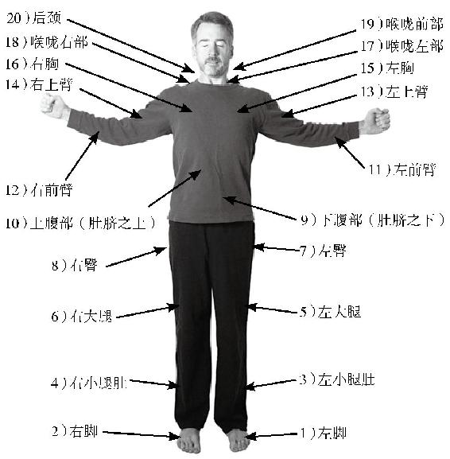

20 個身體部位的充電

第三階段與第二階段很相像，只是在第二階段，在使身體的某一部分緊張後，不是立刻放鬆該部位，而是保持著這緊張，繼續向上使下一個部位緊張。最後從上而下一個又一個部位地進行放鬆。

以下是更為完整的指導：

a)第一階段：全身緊張。用雙重呼吸的方式吸氣。當你這樣做的時候，讓全身緊張，直到震動起來。保持這種緊張三到五秒鐘，然後用雙重呼吸的方式呼氣，並放鬆。花一點時間來感覺肌肉中的能量增強了。

b)第二階段：個別部位緊張。使 20 個身體部位挨個兒緊張然後放鬆，按照如下順序：

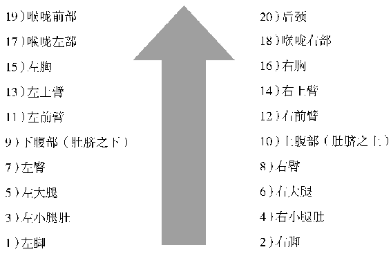

在這個階段，正常地呼吸就好。和第一階段結束後相同，在使後頸緊張並放鬆之後，花一些時間來感知這一練習後活力得到增強的感覺。

C)第三階段：積累緊張。

快速使與上一階段相同的 20 個身體部位緊張（到中度緊張的程度)，保持著這緊張，繼續向上使下一個部位緊張。在此過程中緩慢地吸氣。在你完成了全部 20 個身體部位的練習之後，吸足滿滿一口氣，屏住呼吸，讓全身緊張，直到震動起來。

現在你完全呼出這口氣，放鬆頸部，用下巴去觸碰胸部。然後從上而下地放鬆其餘的身體部位。結束時，你會感覺細胞和肌肉都更強壯也更有活力了。站立大約一分鐘左右的時間，放鬆並保持專注。

這聽起來可能有些複雜，但重複這樣做幾次後，就會變得相當自然。

這些能量練習可以作為很好的冥想前的準備練習來做，因為它們能夠放鬆並且使整個身體充滿活力。你越是能夠把技術細節置之度外，就越能夠專注於將能量流從延髓區域發送至身體的各個部位。這種有意識地控制生命之氣的流動的能力，對於進入更深層的冥想十分重要。這些練習也可以在冥想之後進行。事實上，這些練習可以在任何你需要提升能量的時候進行。

**能量練習要點**

能量從位於大腦顱底的延髓區域進入體內。感覺你正將生命力之流從該區域引導進入相應的身體部位。

平穩地使肌肉緊張，從低度緊張到中度再到高度緊張。 按照相反的順序進行放鬆。在練習之間短暫地停頓，感覺細胞的活力正在增強。

在熟練之後，可以不用過多注意身體的緊張，而是專注於能量的流動。 如果某個身體的部位需要醫治，可以使用相同的方法發送生命力，但需要降低肌肉的緊張程度或僅僅在精神上發送生命力。

### 「生命之氣」（Prana)的流動

維持生命所依靠的除了食物、水和空氣，還有生命之氣。我們剛才所學的能量練習就是一種讓生命之氣滋養生命的方法。

對於尚未覺悟的人來說，生命之氣會不由自主地由延髓向下流入靈性之脊。然而，一位覺悟了的大師，卻能夠將生命之氣直接從延髓輸送到靈性之眼。也就是說，只要他願意，他也能夠將生命之氣向下發送到身體相應的部分，來實現必要的生命活動。

就生命之氣的流動而言，我們的語言也包含了一種隱藏的智慧。生命之氣的向上流動與意識的提升及擴展有關，向下流動則是消極與收縮的狀態。每一次吸氣都伴隨著生命之氣在靈性之脊中的向上流動，每一次呼氣則伴隨著生命之氣的向下流動。

有趣的是，靈感（inspiration )這個詞有另外兩個意思：振奮鼓舞與吸氣。當生命之氣在向上流動時，我們稱之為「振奮的（uplifted，字面意思是上舉的）」、「興奮的（high，字面意思是高的）」或者「極為幸福（on cloud nine，字面意思是處於九霄雲端」）。另一方面，當生命之氣在向下流動時，我們會覺得「消沉的（low，字面意思是低的）」、「抑鬱的（depressed，字面意思是凹陷的）」、「低落的（down，字面意思是在下面的）」或者「悶悶不樂的（in

the dumps，字面意思是在倒掉的垃圾堆裡）」。

我們的肢體語言也在無意之中反映了這一點。當我們覺得鼓舞的時候，我們更傾向於強調向上流動，於是會坐直身體、深呼吸。但是失落的時候，我們就會消沉而強調向下流動，於是便唉聲歎氣。

但是為了避免被其中的複雜性搞暈，只要記住，在冥想中我們只做一件很簡單的事情：把注意力集中在雙眉之間，我們自然就會創造一種磁力把生命之氣向上吸。

## 第十一章脈輪

我們已經討論了生命之氣是如何通過延髓流向身體的。生命之氣並不是生理層面的能量，而是一種微妙的、靈性的能量。這種能量進入體內後，沿著靈性之脊向下流動，並通過在靈性之脊上排成一列的六個中心或脈輪進入全身。這一靈性之脊可以被看作是一根從脊柱底端一直到大腦的貫穿全身的光柱。在自然科學領域，靈性之脊被表述為中樞神經系統。有趣的是，在每個脈輪區域的附近都存在著中樞神經系統的中心，成組的神經從這些中心向外延伸。

有一個龐大而有些複雜的瑜伽理論體系來解釋脈輪。每個脈輪都與一種意識能量、一種元素、一顆行星、兩種星座(分別對應能量上升和能量下降)、一種聲音、一種靈性狀態等相聯繫。當能量通過或停留在某個脈輪的時候，我們就會受到這個中心能量的影響。在冥想的最高狀態下，所有的生命之氣從身體各處湧向脈輪，然後被引導至靈性之眼，使人得以開悟。

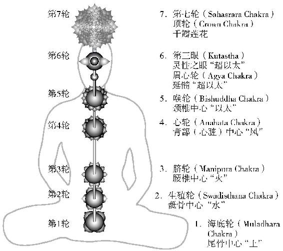

七個脈輪

1.海底輪（Muladham Chakra)

位置：脊柱底部的尾骨中心元素：土

意識能量：安全感

靈性特性：避免消極行為，遵行持戒的準則內在聲音：大黃蜂行星：土星

星座：水瓶座、摩羯座

該脈輪中積極的能量流將導致堅定的意志，以及避免錯誤的習慣和傾向的能力。而向下的或消極的能量流則將導致對於物質安全的過度執著，並因此產生僵硬和焦慮。

2.生殖輪（Swadisthana Chakra)

位置：脊柱上的骶骨中心，正對著生殖器官

元素：水意識能量：性慾

靈性特性：遵從積極規則，遵行精進的準則內在聲音：長笛行星：木星

星座：雙魚座和射手座

該脈輪中向上流動的能量將有助於產生創造力，以及做有益之事的力量。而消極向下流動的能量則會導致過於專注自我以及過度的性慾。

3.臍輪（Manipum Chakra)

位置：腰椎中心，在正對著肚臍

元素：火

意識能量：權力

靈性特性：激烈的自我控制

內在聲音：豎琴行星：火星

星座：天蝸座和白羊座

該脈輪中積極的能量流動產生堅定的意願和強大的自律，而消極的能量流動則導致掌控他人行動的慾望以及權力爭鬥。

4.心輪（Anahata Chakra)

位置：背部中心，正對著心臟

元素：風

意識能量：愛

靈性特性：神聖的愛

內在聲音：鈴聲

行星：金星

星座：天秤座和金牛座

心輪中向上流動的能量產生愛所擴展出的方方面面： 善良、慈悲心、同理心和奉獻精神。收縮的向下的能量流動則會導致過分情緒化以及需索無度。

5.喉輪（Bishuddha Chakra)

位置：頸椎中心，正對著喉嚨

元素：以太

意識能量：冷靜

靈性特性：冷靜

內在聲音：風

行星：水星

星座：雙子座和處女座

在喉輪中，向上的能量流動產生冷靜，以及面對人生的挑戰時保持專注的能力。而收縮的向下的能量流動則會導致冷漠地面對他人的需要。

6a.眉心輪（Agya Chakra)

位置：延髓

元素：超以太

意識能量：自我

靈性特性：神聖的臣服

內在聲音：AUM

行星：月亮星座：巨蟹座

假如能保持一定的平衡，在眉心輪聚集的能量可以因為內在個性的完全融合而產生一系列美好的特點。在靈性之眼（反映延髓的正極）處向上流動的能量產生神聖的臣服，這將導致自我實現或者自我與神性的結合。在這裡若集聚了太多的能量，則會導致產生自我的傲慢、自以為是和階級意識。

6b.第三眼（Kutastha):正極，反映了延聽

位置：基督意識中心，在雙眉之間

元素：超以太

意識能量：喜悅

靈性特性：喜悅、神的意志、靈魂意識

內在聲音：AUM

行星：太陽

星座：獅子座

能量聚集在第三眼時會產生頓悟和喜悅。不存在消極方面，這是我們選擇專注於這裡來進行冥想的原因之一。

7.頂輪（Crown Chakra)--千辨蓮花

位置：頭頂

頂輪是能量彙集的中心。只有在能量完全上升到雙眉之間的靈性之眼後，該中心才會打開。在頂輪積聚的能量將產生宇宙意識，即認識到你與宇宙萬物合一。

### 脈輪特性的總結

對脈輪進行冥想已經有幾千年的歷史了。每個脈輪會給我們帶來一個特別的禮物。我們根據每個脈輪所散發出的能量來進行自我調節，並因此得以獲得巨大的靈感和力量。 然而，這種練習尚未被普通大眾理解。

不瞭解情況的人嘲笑「冥想肚臍」的練習，只是源於對這一重要技巧徹頭徹尾的誤解。事實上，專注的對象並不是肚臍，而是肚臍後面的脈輪。這個脈輪是個人能量與自我控制的中心，位於身體的中心，十分重要。有些武術門類要求習武者將氣集中於此，激發體內真氣並發揮到招式之中。 對任何一個脈輪進行冥想練習都不僅會提高該脈輪的磁力，也會能量從下方的脈輪向上提升。

為了能夠更好地覺知靈性之脊與脈輪，你可以嘗試以下方法：把左手放在脊柱的底部，把右手放在延髓（顱骨底部「凹陷」處)。想像有一道光柱像一根螢光管一樣連接這兩個點。如果輕輕搖擺身體，同時微微抵制這晃動，你就能更清楚地感受到這光柱。然後把左手拿起來放在雙眉之間，想像光柱在延髓處轉了個彎，流經大腦進入額葉。 這根「光柱」便是靈性之脊。每個脈輪都是這一中央通道的擴展，將能量向外引入我們的感官、肌肉、器官和身體機能系統等，使之充盈活力。這便是對這門複雜科學的簡單解釋。

為了進入深度冥想，我們需要收回能量而不是向外投射。正如帕拉宏撒·尤迦南達所說，「改變感官探照燈的方向」。任何專注於靈性之脊或任何一個脈輪的冥想練習都會產生強大的內化的效果。

**脈輪要點**

脈輪是能量的中心，也是天然的冥想時的專注點。

靈性之脊位於生理脊柱的前方。六個脈輪位於靈性之脊上，就像能量球一樣，它們分別位於：尾骨、骶骨、肚臍、心臟、喉嚨和大腦。大腦有兩極，一個靠近延髓，另一個靠近前額葉附近的靈性之眼。第七個脈輪位於頭頂。

每個脈輪都有一個特定的聲音、顏色和特性。

對任何脈輪進行冥想都能提高我們意識裡該脈輪的力量。這也對內化意識從而為深度冥想做好準備產生了強大的效果。

## 第十二章帕坦伽利的瑜伽八支法

我們之前所學的冥想方法是勝王瑜伽這一更廣闊的科學的一個部分。勝王瑜伽包含了所有其他的瑜伽分支，就像國王統一著王國內所有的地方。

勝王瑜伽是第一部以書面形式表達的經文，由古代瑜伽大師帕坦伽利所著。在所有的古代瑜伽大師中，帕坦伽利是最受人尊重的一位。該經寫於公元前若干世紀。在該經中，帕坦伽利以極為簡練的方式講解了瑜伽，因此無論是學者還是聖徒，每一位瑜伽老師都把這部經當作瑜伽的聖經。 這部《瑜伽經》包括一系列共 196 條警句與格言，其中很多都只有一句話的長度。這部經不僅包含了瑜伽的發展之路，也包括了精神的本質以及對整個人類的哲思。

這部經不僅僅是哲學思辨，它也充滿著智慧，為那些想要探索自我實現境界的人指明了道路。帕坦伽利是一位得道的大師，經文來自於他的理解以及實際的知識。其他走上冥想之路並得道的聖人們也都通過親身經歷認識到相同的真理，證實了帕坦伽利的論述。

帕坦伽利對瑜伽的定義簡單而深邃。他是這樣描述的：「瑜伽是心念波動的平息（或原始感覺的波動的平息)。 (Yoga is the neutralization of the vrittis of chitta.) 」 儘管有些人把 chitta 理解為「精神素材」，但我認為更好的翻譯應該是「原始感覺」。因為妄念是隨著人們在喜惡兩極間的波動而起伏的。

這部經典的寓意十分深遠。為了達到合一的境界，我們不能依賴書本，更沒必要去參加各種儀式，加入某個教會，或者取得尊貴的社會地位。只要我們能夠破除二元對立(尤迦南達特別地將此二元對立理解為我們對事物的執著），我們就自然而然地覺悟，回到我們的本性一與無窮合一。 帕坦伽利在後面的兩部經裡繼續闡述道：「當心念的漩渦被平息的時候，觀察者便回歸到其本性。在所有其他時間裡，他認為那心念（或者是妄念的波動）便是自己。」

《瑜伽經》的最後一部分《瑜伽八支法》（Ashtanga)與冥想息息相關，帕坦伽利列出了通往宇宙意識的步驟。接下來我們將簡單地檢視這八個步驟。它將成為指引我們走向覺悟的地圖。

可以把這八個步驟看成八個同心圓。最外面的兩個提出了十條道德要求，規定了我們的行為表現。合適的行為可以幫助人們創造和諧的生活，是覺悟的必要基礎。

但僅僅控制我們的外在行為是不夠的，我們還必須學會培養和諧的意識。接下來的三個同心圓向我們展示如何循序漸進地控制生命之氣，並且展示了因此產生的能量的內化，我們可以借助這種能量的內化來使妄念止息。最後的三個同心圓描述了冥想不斷深入的狀態，最終指向三摩地，或者是與無限的合一。這本書中，我們講述的技巧與觀點都是基於帕坦伽利的瑜伽八支法以及包羅萬象的勝王瑜伽的原理。

### 第 1 步和第 2 步——持戒（Yama)、精進（Niyama)

帕坦伽利的瑜伽八支法中，前兩個步驟或分支是持戒(yama)與精進（niyama )，為人們提供了指引人生的道德信條和人生態度。假若生命之舟已佈滿孔洞，那麼通過冥想所獲得的片刻平靜會即刻漏盡，對人生毫無益處。西方人可能會傾向於將持戒與精進這兩個分支視作與聖經中的十誡相類似。然而，與其說它們是戒律，不如說它們是使人們得以與宇宙法則和諧相處的基本準則來得更為準確。要正確地遵循五種持戒和四種精進，我們必須懂得如何將其同時運用於外在的行為和內在的人生態度上。

所謂**持戒（Yama)**，即克制。生命中需要克制，需要「不可以」。如果我們肆意隨順人性中的某些習氣，便會導致不和諧，造成痛苦。因此，我們必須學會克制，學會限制能量向著這些方向流動。持戒的五種原則是：不傷害、不說謊、不偷盜、不縱慾、不貪姜。下面我們將依次討論以上五種原則。

a)不傷害（Ahimsa)。我們若要尋求生命的和諧，就必須克制一切傷害他人的傾向。持戒與精進的所有原則，其目標都不僅僅是對外在行為的控制，更重要的是內心中自然而然的依從狀態。所以要正確地實踐不傷害的戒條，就不只是控制自己不做傷害任何生物的行為，更艱巨的任務則是克服內心中一切想要傷害的慾望。如果最終能夠戰勝這些存在於潛意識中的內在習氣，我們就實現了同所有生命達成美妙和諧的境界，並且從恐懼中獲得解脫。但是，要是不加以控制，這種傷害其他生命的習氣就會使我們與其他生命隔絕開來，使我們的意識收縮，這與自由背道而馳。帕坦伽利闡釋說，當我們圓滿地遵行持戒或精進中的任何一個準則時，便能獲得一種特殊的能力。當我們圓滿地遵行不傷害的準則時，我們身邊的整個世界都變得和平安詳起來。

有不少故事講述野生的動物在聖人面前變得馴服，溫順地服從指令。在西方，此類故事中最負盛名的一個，就發生在聖方濟各的身上。聖方濟各僅僅運用愛的力量，就成功地馴服了一匹兇猛殘暴地侵擾古比奧城鎮的狼。若干年前，古比奧教堂出土了一具大型狼骸骨，進一步證實了這一傳說的真實性。

根據另一個有關聖方濟各的著名傳說，他曾對聚集在他身邊的一大群鳥兒進行布道。聖方濟各可能比任何其他聖人都更嚴格地踐行不傷害的戒條，也更能同動物和自然和諧相處。意大利文藝復興初期畫家喬托曾在阿西西的聖方濟各教堂創作了世界著名的壁畫，刻畫了這位受人愛戴的聖人一生的重大事件。其中最美的一幅描述了這樣的場景：聖方濟各為聚集在他周圍的一群鳥兒祈神賜福。聖方濟各與鳥兒深情相望，而另一位修士則望著他們。帕坦伽利告訴我們，只要我們能像聖方濟各那樣心中充盈著寧靜，我們周圍的世界就將變得平靜祥和。

b)不說謊（Satya)。精神追求的目標之一是洞察理性思維所不能及的微妙真理。沒有完全的誠實，我們不可能發現這無限的真理。作為出發點，我們必須首先學會克服說任何不真實話的習氣。這意味著即使善意的謊言和對真相的誇大，只要讓我們遠離真相，都需要克服。一旦我們可以控制外在的行為了，我們就能夠繼續實踐深層次的向內的誠實。 這不僅包括誠實地面對他人，還包括完全對自己誠實。逃避真相並不能讓我們成長。然而，誠實並不意味著我們有權利用粗暴的語言去傷害別人。明顯的事實背後往往隱藏著更深的真相，因此在我們開口之前，應仔細辨別事實與真相。例如，告訴長期臥床的病人他看起來很糟糕，這可能是事實，但這也可能會減緩他的康復過程。此外，儘管他的身體在受苦，他的靈魂卻是健康的。假如能夠寬慰他是健康的，卻又避免說任何不真實的話，豈不是好得多嗎？

圓滿遵行不說謊的準則，就會擁有無論說什麼都會成真的力量。

c )不偷盜（Astaya)。我們必須努力克制拿取任何不屬於我們的東西的習氣。這不僅包括物品，也包括諸如表揚或職位等更微妙的東西。在人際關係裡，這意味著不能從他人身上獲取能量或愛，除非這是他人無償提供的。圓滿地遵行不偷盜的準則，就會擁有在需要時讓財富自動出現的能力。

d)不縱慾（Brahmacharya )。在思考和追求感官享樂時，我們消耗了大量的能量。

生活中的很多事物，尤其是絕大部分我們稱之為娛樂的事物，其目的都是剌激感官。雖然不縱慾是特指在性的方面的自制，但它也包括了其他的感官享樂。瑜伽的教導並不強調罪，也不因為外部權威的論斷就將某行為視為是錯的。 相反，瑜伽要解決的問題是，怎樣才能最好地引導我們的能量，以及什麼會將我們帶向覺悟。在這裡，帕坦伽利並沒有說性是罪惡的，而是說如果在縱慾中消耗的能量能得到更好的引導，這能量就可以得到更好的使用。

冥想技巧能幫助平息超負荷的感官運作，但帕坦伽利對此建議說，我們在日常生活中也應該保持一定程度的對感官的控制力一比如有助於打破感官剌激的催眠力量。所有的感知都發生在我們的心裡，但感官卻使它看起來好像是在我們之外發生的。要打破這種錯覺，帕坦伽利建議我們把能量回撤。帕拉宏撒·尤迦南達曾說，「在所有感官中，觸覺是最難打破的。當身體疼痛時，很難相信身體只是我們對所看、所聽、所嘗、所聞和所觸之物的感應的集合。」感官剌激帶來的問題之一是，它會將我們牽扯著遠離和平與寧靜，並且會促使我們在自己之外去尋找滿足一這是不可能完成的任務。我們將稍後討論到的第五支被稱為斂識(pratyahara )，意即切斷感官的通話。

在很大程度上，冥想是有意識地將向外流動的能量重新引導到向上的、擴展的方向。冥想時，我們真正處理的，是能量和磁力。靈性之眼代表電池的正極，而脊椎的底部代表負極。專注於靈性之眼進行冥想，能加強正極的磁力，引導生命之氣向上流動。沉溺於感官剌激，則加強負極的磁力，使能量收縮或向下流動。

因此，帕坦伽利敦促我們抑制感官。當我們學會不在感官剌激中消耗能量，我們就會擁有極大的精神與靈性的活力。

e )不貪姜（Aparigraha )。之前我們學習了不偷盜的原因，但這條說的是，即使我們有權擁有的東西，也不應對它過於執著。太多的財富會創造出監獄，首先是物質慾望的監獄，然後是執著的監獄，最後是唯恐失去擁有之物這種焦慮的監獄。分辨「需要」和「想要」是十分有益的。事實上，貪姜（想要的超過需要的）源自於意識某些層面上的不安全感。貪姜地抓住一點點財物，就像是一個人生活在寬闊的河流邊上，卻囤積了滿滿一水桶的水。貪姜中斷了無限的能量的流動。

不過，為了避免因為這一教誨使我們變得消極，需要說明的是，需要抑制的並不是我們的抱負，而是緊抓著我們努力的成果並認為這為我所有的習氣。從靈性的角度來說，只要我們與他人分享成功的果實，獲取成功便會有很好的結局。

圓滿地遵行不貪姜的準則，會導致你擁有一種誘人的能力。當你連潛意識中都不再有貪姜的習慣時，你將能夠清楚地看到你的過去、現在和未來。

所謂**精進（Niyama)**，即克制的反面。以下四種精進的準則是我們應當在修行過程中鼓勵自己去做的：潔淨、知足、苦行（對身體及感官的控制)、內省。

a)潔淨（Saucha)。身體、精神與環境的潔淨對於使能量和諧有十分重要的作用。在所有的文化中，更為進化的人的標誌之一都是潔淨，這並非只是因為控制疾病這樣淺顯的原因。宇宙有美麗而和諧的秩序，而文雅的人也會有與生俱來的動力去製造這種美與和諧。

帕坦伽利曾在別處將「粗心」列為瑜伽練習中的阻力之一。有關瑜伽練習阻力的整個清單是有趣的，本身就是對如何採取合適行為的指導。瑜伽練習的阻力分別是：疾病、愚鈍、懷疑、粗心、怠惰、世俗心、邪見、忽視和不穩定。 為什麼這些被視為障礙？因為它們阻礙了生命力的流動，使人分心。

保持潔淨還有更微妙的原因，一種不能夠被看見但是可以被感覺到的原因。斯瓦米·契達南達（Swami Chidananda)是來自印度的瑜伽大師。一次，他注意到地上有一隻銹跡斑斑的噴水壺。「那是用來做什麼的？ 」他問道。 我們解釋說，這是用來為植物澆水的。他沉默了一會兒，然後說：「那麼你們應該撿起它，為它上漆，然後找個地方安置它。低等的靈魂體會被雜亂所吸引。」

b )知足（Santosha )。知足指能夠接受事物本來的樣子，是一種極高的美德。快樂感更多地是由我們滿足的程度所決定的，而不是由我們所擁有的財富所決定的。如果我們欲求無度，無論我們擁有多少，都會創造一個羨慕、嫉妒、灰心、生氣等等讓消極情緒易於滋生的精神環境。解決方法很簡單，真的去實踐卻很難一欣賞生活本來的樣子。

長久以來，我都使用一種肯定的技巧來克服抱怨生活的習氣。這種方式對我起到了令人驚歎的效果，也許你也會想要嘗試一下：

我感恩生命本來的模樣，

感恩這一天，

擁抱每一時。

謝謝你，親愛的生命。

知足並不意味著冷淡或懶惰。知足意味著接受那些我們無法改變的。圓滿遵行知足這一準則，你會擁有無上的快樂。

C )苦行（對身體及感官的控制）（Tapasya )。我們必須學會掌握我們的喜好，並能下決心實踐我們的決定。傳統上，這一精進的原則被詮釋為苦行或憑借意志力完成艱巨修行的能力。印度經典裡記錄了許多關於聖人因為苦行而獲得神通的故事。這些故事在初讀時看起來像是在講關於克敵制勝或取得世俗成就的能力。然而在深入理解後，會發現它們其實講的是如何克服我們自身的弱點和無知。接受一個在你「舒適區域」以外的任務，並用堅不可摧的決心去完成它，是一種極好的精神上的修行。通過這種方式，你內在的力量會得到增長，直到強大到可以戰勝最終的對手：妄想。

帕坦伽利說，圓滿地遵行這一準則，將導致獲得各種心靈力量。

d )內省(Swadhyaya )。通過內省，我們得以清楚地看見自身的品質，無論是好是壞。在自省時，無須做消極評判，而是借此幫助我們保持全然的清晰和客觀。假如沒有自省和自我分析的幫助，就不可能在靈性成長的道路上走遠。 但沉溺在內疚和自責中並無助益。真正的自省應該幫助人看見自己所在的位置以及需要做什麼才能成長。

帕坦伽利說，「這些準則（持戒和精進）不能附加等級、地點、時間或場合的條件。」他的意思是，我們不能利用合理化的借口來避免做正確的事。當我們真誠地努力實踐這十個準則時，必然會遭遇挑戰。然而，如果我們堅持不懈，不得不重新做出調整的將是宇宙，而不是我們自己。

這九項準則值得花一生的時間去研究與實踐。假如能遵行之，或者是真誠地嘗試了，就必將改變你的生活。試想一下，假如世界各地的人們都依據這些準則生活，這個世界將變成怎樣美好的天堂啊！

### 第 3 步、第 4 步和第 5 步——調身（Asana)、調息(Pranayama)、斂識（Pratyahara)

**調身。**以下三個步驟將帶來能量的內化。在我們開始真正冥想之前，內化能量是十分必要的。調身（體式）是下一個步驟。帕坦伽利簡單地概括說，「應該採取穩定而舒適的姿勢。通過這種姿勢，可以從二元對立中解脫出來。」

引起精神不安的重要原因之一，是身體發出了過多的神經信號。因此，冥想總是以放鬆和適當的姿勢開始，讓身體保持靜止。假如身體不安，必然造成精神不安。當身體強健、柔韌、健康的時候，就有助於實現身體的全然靜止。實現宇宙意識需要一段較長的冥想時間，在這段時間裡需要保持身體完全的靜止一哈達瑜伽（瑜伽體式）的科學就是從這樣一種簡單的需要演變而來的。如果練習方法正確，哈達瑜伽是一種了不起的科學，它對肌肉、關節乃至內部器官的健康都有驚人的促進作用。哈達瑜伽的練習所帶來的助益也遠遠超出了身體上的健康，因為作為一種真正的瑜伽修行方式，它還起到協調和提升生命力量的作用。在阿南達瑜伽體系中，這些更微妙的益處得到了強調。每種體式會自然產生生命之氣的流動，阿南達瑜伽賦予了每種體式一種心理肯定，來促進該體式下的生命之氣的流動。

不幸的是，近年來哈達瑜伽已經變得太像只是一種生理上的科學。儘管能帶來健康和美也是很好的，但練習哈達瑜伽時應該記得它有更高的目標：將我們從世俗憂慮中提升，並幫助我們找到自己最好的精神狀態。

調息（能量控制）是下一個步驟。調息（Pranayama)是由兩個我們已經熟悉的詞構成的：調（yama，調整）和息（prana，微妙的能量或生命的力量)。在我們能夠通過調身止息運動神經的不安感覺之後，我們需要通過調息來控制更為微妙的生命之氣。許多冥想技巧，例如我們前面學到的調息的呼吸技巧，旨在幫助控制生命之氣。生命之氣是容易觀察的物質的身體與更微妙的靈性或能量的身體之間的橋樑。當這兩種形式的能量都變得靜止和內化，我們便終將能夠實現深度專注。深深地專注於靈性之眼將強化能量的正極。當靈性之眼有足夠的力量和持久度時，它可以將我們提升到明悟的狀態。

瑜伽體式是引導生命力流動的一種物理手段，在阿南達瑜伽的練習中尤其是如此。之前的「能量練習」也是為了實現同一個目標。瑜伽體式和能量練習都是物理的、向外的，因此相對來說比較容易練習。但因為它們能影響生命之氣，所以比表面上看起來的作用要大得多。

調息是一個重要的階段，因為它在身心之間架起一座橋樑，讓我們能止息意識。接下來，帕坦伽利講述了最後一個導致不安的原因。

**斂識（感官控制）。**帕坦伽利在《瑜伽經》裡說，「斂識是指將頭腦與感官從它們的對象撤出，因此達到對感官最大的掌控」。帕拉宏撒·尤迦南達將這個深度冥想前的最後準備階段稱為「切斷感官的通話」。

感覺神經發送到大腦的信號是精神不安的主要原因之一，也是平息心念的一個很大的障礙。採取一切方法來切斷感官與外界的聯繫是非常有幫助的。閉上眼睛可以切斷大部分通過視神經傳遞的信號。聲音是第二大的干擾源，許多冥想者使用耳塞或耳機以減弱噪音。通過保持身體的完全靜止，我們減少了觸覺干擾。為了減弱嗅覺干擾，有些人喜歡熏香。這聽起來有些自相矛盾，但創造一個穩定的剌激源是幫助心無視感官剌激的另一種方式。除非受到故意的剌激，味覺在自然狀態下就是非活動的，或是放鬆的。

然而，在消除外部干擾的方面，我們只能做到這些了。我記得有一次，在極為安靜的環境下，我眨了眨眼，然後被自己眼皮所發出的聲音吵到了真正的斂識是在內心發生的，而不是身體。斂識是切斷感官通話之後所導致的生命力量的內化，像是每天晚上我們睡著後所自然處於的狀態。

經過調身、調息和斂識這三個階段，我們已經消除了精神不安的來源，為進入深度冥想做好了準備。不斷深入的冥想階段包括：專注（Dharana)、入定（Dhyana)和三摩地(Samadhi )。

### 第 6 步、第 7 步和第 8 步——專注（Dharana)、入定(Dhyana)、三摩地（Samadhi)

**專注（Dharana)。**專注指集中注意力並聚焦於一點的能力。從某種意義上說，到現在為止我們所學習的一切都是幫助我們實現和保持這種狀態的手段。在真正的專注狀態裡，所有對身體的覺知以及不安的念頭都停止了，這使我們得以不受干擾地專注於我們冥想的對象上。舉例來說，假如我們正專注於靈性之眼去冥想一束光，我們將完全專注於光，不為任何其他念頭分心。我們練習「宏-撒」的技巧或觀呼吸的技巧，都是為了達到這種專注所需的靜止狀態。但不必把目標設定得高不可及，專注程度的任何深入，哪怕只是部分的或轉瞬即逝的，都是極為有益的。實際上，即使我們所達到的專注程度並不完美，也能獲得在本書前面所談及的幾乎所有的冥想益處。只需將能量和注意力集中在雙眉之間的靈性之眼就可以改變大腦和意識。

然而，最終的目標是達到心一境性（專心一志)。在偉大的史詩《摩訶婆羅多》（The Mahabharata )中有一個精彩的故事。阿朱那（Arjuna)代表了一個理想的冥想練習者，他是該國最優秀的弓箭手。射箭在這裡是冥想的象徵，弓箭代表了專注。在這個故事中，德羅納（Dronacharya )是教授射箭（冥想）的老師，他正在舉行一場比賽。一個禿鷲的雕像被放置在樹的高處，它的頭是目標。當輪到的學生上前準備射箭時，德羅納逐一問他們看見了什麼。一個學生回答說，「我看到了您，我的老師，還有樹、天空以及周圍聚集的人群。」這個學生沒有射中。下一個學生的回答也是類似的，他也沒有射中。

一個又一個，沒有人命中目標。最後，阿朱那走上前。 面對相同的問題，他回答說：「我看見了鳥的頭。」

德羅納問「難道你沒看到別的嗎？ 」阿朱那回答說「我只看到鳥的頭。」

他當然射中了他所看見的。這個故事說明了專注的狀態。當我們能夠達到並保持專注的狀態一定時間後，我們會自動進入到下一個階段：入定。

**入定（Dhyana)。**在這裡，帕坦伽利是在描述與專注的對象融合為一體的能力。讓我們回到之前用過的冥想靈性之眼的光這個例子，看看完成這一冥想的人會如何描述這次冥想。假如他已經達到了專注的狀態，他會這樣說：「我經歷了一次極深的冥想，令人難以置信。我看見了靈性之眼有一道光，我全然地專注於它。在很長一段時間裡，我的腦海裡都沒有出現其他的雜念。這真美妙。」

在一段時間內保持這種狀態，自然會進入到下一個階段：入定。我們是如此徹底地融入了光，以至於我們認為自己就是那道光。光充滿了我們的意識，我們不再認為自己是在看著什麼東西。在經歷了這種深度的冥想後，他會報告說:「起先，我看著光。然後，隨著我保持著對光的專注，我似乎成了光。就像我在不知不覺中融入了光之中一樣。」

此前，我們學習過以八種靈魂特性中的一種為冥想對象的練習。這八種特性中的任何一種都給我們一個專注的聚焦點，幫助我們達到專注的狀態。當我們全然專注於這一特性時，我們便達到了更高的入定的狀態。當這個狀態出現時，將顯得極為自然，因為我們正在融入的是我們自己的靈魂特性。在《瑜伽經》的另一篇裡，帕坦伽利說瑜伽（合一）是「記憶」。我們不必學習自己是誰，只需要記起自己是誰。專注和入定消除了阻礙我們記起自己真實本性的精神上的干擾。當我們明白我們不必被身體所局限時，我們將向外擴展，進入三摩地。

**三摩地（Bliss)。**這指的是意識的完全擴展，以至於達到了自我實現一與天地萬物合一。融入光之後，我們意識到天地萬物都是由光構成的，並且意識到我們的真正本性是在天地萬物中與光的合一。

三摩地是一個真實的意識狀態，而不僅僅是一種精神上或哲學上的理念。它遠遠超越想像的情形，也並非只是一個擴展意義上的對他人的同情。帕拉宏撒·尤迦南達是在美國生活的最偉大的瑜伽大師之一，他激勵了幾代的瑜伽練習者。他進入了三摩地這一最高的狀態，並始終處於這種意識之中。

我的老師斯瓦米·克裡雅南達跟隨尤迦南達學習了好幾年，並接受了尤迦南達的親自訓練。在《全新的旅程——我跟隨帕拉宏撒·尤迦南達的日子》裡，斯瓦米·克裡雅南達記錄了尤迦南達在沙漠中完成講解印度最偉大的經典《薄伽梵歌》（Bhagavad Gita )時的情形。

在傍晚，上師慢慢地繞著他靜修處的院子行走。通常他會讓我隨行。在行走過程中，他會不再意識到身體，以至於有時不得不倚靠在我的手臂上獲得支撐。他會停下，來回搖晃，彷彿即將摔倒。

他有一次一邊慢慢恢復對身體的意識，一邊說：「我處於太多的身體之中了，很難記住應該使哪一個身體保持行走的動作。」

實現三摩地這一最高的意識狀態，是生命的真正目標。 我們就是在這種狀態裡，經歷了從靈到身的墮落。在我們每一個人的內心，都有一種抑制不住的回歸到無限的本源的渴望。所有外在的滿足，都只是三摩地這一極樂的虛幻倒影，相形見絀。

在《一個瑜伽行者的自傳》中，帕拉宏撒·尤迦南達對這種狀態做了精彩的記錄。這種狀態出現在他的上師斯瓦米·聖尤地斯瓦爾認為他已經為這種意識狀態做好了準備時：

他輕輕地敲擊了我胸口正對心臟的地方。

我的身體一下子像生了根似的，動彈不得。呼吸像受到一塊巨大磁石的吸引一樣，被抽離肺部。靈魂和心智頃刻間不再受到身體的束縛，像光流一般從每一個毛孔中穿透而出。我的肉體好像是死了，然而在敏銳的覺知中，我知道自己正從未有過地、全然地活著。我對自我的認知已經不再局限在身體裡，而是包含了周圍的原子。在遠處街道上行走的人們彷彿是輕柔地走在了我的邊緣處。土壤隱約變得透明了，花草樹木的根也顯現在我眼前，我可以看見它們內在的汁液流動。

鄰近的地區在我面前一覽無遺。正常的前方視野現在變成了廣闊的球面視野，我可以同時看到各個方向。我能看到頭的後方，人們在遠處的甘地陵散步。我還注意到，一頭白色的母牛正悠閒地向我走來。當它走到靜修處開著的大門前時，我能用肉眼觀察到它。當它從我身邊經過，走到磚牆後面時，我仍然可以清楚地看到它。

所有處於我全景視野中的物體，都像快速轉動的影片一樣震顫著。我的身體、上師的身體、圓柱裝飾的院子、傢俱、地板、樹木和陽光會偶爾劇烈地震動，直到最終全部融入一片冷光的海洋；就像將糖的晶體倒入一杯水中，搖晃之後就溶解了。光的合一性與物質形態的實在化交替著，這種變形揭露了宇宙因果的法則。

每一個人都自覺或不自覺地在追尋這種完全合一的狀態。這是人生的終極目標。然而，我們每個人都有自由意志，可以選擇去追求三摩地那「常新的、不斷擴展的喜悅」，也可以選擇再一次奔向熟悉的舊習和執著。冥想的藝術和科學將吸引那些選擇向光而行的人們。

本書向你介紹了瑜伽的一些最有效的練習技巧，但任何技巧都不可能代替實際的練習。

願你，我的朋友，有幸通過冥想的實踐獲得覺悟的智慧，這是所有生命的真正的目標。願你沐浴在冥想的歷程中，照亮歸家的旅程。

# 後記

**40 年的教授經驗**

我親身實踐和教授冥想這門科學 40 多年了，得以觀察 到冥想（尤其是克裡亞瑜伽中關於冥想的先進的技巧）在 我的成百上千的朋友與學生身上所產生的效果。在這 40 多

年間，我大部分時間都住在阿南達村--個以冥想與其

他相關的精神練習為生活方式的社區。我也曾是「希望之 光」（The Expanding Light)的一員。「希望之光」是加利福 尼亞州最早的瑜伽與冥想靜修中心之一，每年有上千人來此 靜修。所有這些經歷都為我研究冥想的價值提供了廣闊的基 礎，並且我的觀察是基於長期研究的視角之上的。

我親眼見證了人們能很快地從冥想之中獲益。許多練 習者反映說，在學習冥想的幾天之內，他們就得到了極其重 要的，甚至是能夠改變人生的智慧。那些持續練習的人常常

覺得冥想是他們為自己做得最有益的事情。

冥想的另一個重要影響，是帶來個人行為與生活態度 方面的重大轉變。練習冥想的人會開始考慮如何提高生活 的其他方面。他們傾向於更加健康的飲食，多做運動，以 及戒掉煙酒等不良嗜好。他們還會開始自省，改變不良態 度與行為。

儘管冥想可能帶來深刻的益處，但它卻不是萬能藥。 冥想和鍛煉一樣，必然會顯現效果，卻需要時間來逐漸顯現 效果。生理和心理的改變都需要時間，尤其是當習慣根深蒂 固的時候。堅持日常的練習需要決心和努力，期望過高就難 免受挫灰心。也就是說，冥想是時間越久越有效果。許多人 覺得冥想讓他們找回了之前失落的自己。更重要的是，冥想 使我們與自己最深的本性連接，幫助我們找到生命真正的意 義。將冥想作為生活方式，無疑會活得更快樂。

當一群練習冥想的人生活在一起，能量就會被極大地放 大。在阿南達社區，居住著大約 250 名不同年齡、不同種族但 依據同樣的精神原則生活的人。阿南達社區裡人們和諧的生活， 讓人瞥見了人類在未來過上美好生活的可能性。以冥想、合作、 健康的生活方式與互相支持為基礎的生活是怎樣的呢？ 40 多年 來，阿南達社區裡沒有發生過一起真正意義上的暴力事件，也 沒有在其他地區廣泛流行的犯罪、吸毒或歧視等社會問題。

這並不是因為阿南達社區裡的成員更消極。事實上， 他們往往意志更為堅強，有勇氣逆著社會潮流而選擇這樣的 生活方式。真正的原因是，冥想給予了我們剷除矛盾衝突的 根本原因一不惜犧牲他人來保護自我的習氣一的最好 的工具。冥想使我們擁有了在經歷生命中最艱難的遭遇時保 持平和與喜悅的能力，我有過這樣的親身經歷，也見證過其 他人的經歷。阿南達社區 40 年的經驗，是冥想能帶來美好幸 福生活的充分證明。

在《一個瑜伽行者的自傳》這本偉大著作的結尾處，帕 拉宏撒·尤迦南達深情地寫道：「我的一個摯友，也是美國的 第一位克裡亞瑜伽練習者，與我就建立靈性社區的必要性進 行了徹夜長談。我們常將各種弊病歸咎於所謂的『社會』這 一擬人化的抽像概念，然而更現實的做法是讓每個人為之承 擔責任。烏托邦的種子必須首先能夠在每個人的內心萌芽， 然後才可能在一座城市開花。人類是有靈性的，而非一個機 構；其內在的改革本身能夠引發持久的外部改革。通過強調 精神價值和自我實現，一個驗證了四海之內皆兄弟的靈性社 區將能喚起鼓舞人心的共鳴，這種共鳴將是超越地域的。」 我真誠地希望你能在本書中獲得「鼓舞人心的共鳴」， 並祈願冥想的實踐將為你的生活注入喜悅，為世界帶來光亮。