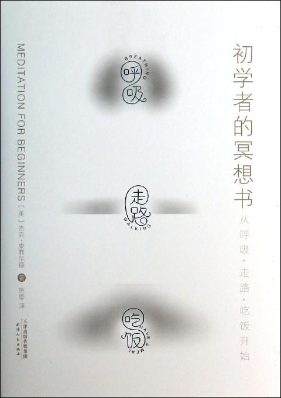

#  初学者的冥想书

**第一章** **古老的冥想艺术**

《初学者的冥想书》，把那些最好的寺庙里的核心教导，提供给西方社会。在《初学者的冥想书》里，你将会发现那些最简单，最常见的冥想练习——尤其是觉察和慈心观。这本书也包含附送 CD 里的六大基本冥想练习。这些由我指导的冥想，都是在冥想中心实地录制的，只为带给你书里所谈到的直接体验。

这些教导的重点，和是不是佛教徒没有什么关系，也和学习那些东方的仪式，规则或是鞠躬无关。重要的是，你要学会如何冥想，并让它在生活里给你带来实际的好处。当我们花些时间，安静下来，就会发现，我们可以活的更慈悲，更觉悟。冥想，就是为这份内在的潜能创造出条件，让它来到你的生命中。

有很多种冥想的练习。一个好的冥想方式，一定包含对身体和感受，对大脑和内心的觉察。你选择具体哪种并没有太大的关系。重要的是，在你做出选择之后，你要坚持下去，勤加练习。冥想需要的是大量的练习，就像弹钢琴一样。如果你想学会怎么弹钢琴，每天却只花几分钟可不行。如果你想真的掌握任何重要的技能——无论是弹钢琴，还是冥想——要想进步，必须坚持不懈，耐心，以及系统的学习。

所以，选择和自己相应的冥想方式，然后，开始练习吧。一定要每天坚持，如果有老师指导，那样最好。或是找一个可以和同修们一起共修的地方。在不断练习的过程中，你会发现，你慢慢具备了对当下一刻开放的能力。当你冥想的次数多了以后，耐心和慈悲的品质自然会发展出来。你会更加的敞开，接纳当下所发生的一切。

《初学者的冥想书》将会告诉诸位最重要的基本练习技巧：有觉察的冥想。它也被称为 VIPASSANA，VIPASSANA 是一个巴利文的词语，意思是“如实的看到事物本来的样子”。它是在东南亚被人们练习的最多的一种冥想方式，在佛教所有的传承中，它都是核心。这一练习，强调有觉察的注意力，对个人在所有领域的全部体验，都发展出迅速的觉察。

《初学者的冥想书》里谈到的冥想方式，是想帮你把觉知的光，带到每天生活的方方面面——并告诉你，如何把慈心观的疗愈能量，播撒给更多人（当然也包括你自己）。觉察的练习也被称为“内观”。它不是教人把注意力集中到观想出的佛的形象，或者是神的形象，或是一束光，一根蜡烛，还有那些神圣的句子上。与之相反，透过觉察，我们会在我们的行动中发展出一份宁静。然后，就算是最平常的经验——比如吃饭，走路，讲电话——都可以被带到觉察的领域，包含进觉察的练习之中。这样的话，冥想就不再是偶尔做做就完事了的练习，而变成了一种可以把它带到生活中的每一刻的存在方式。

觉察让我们更加全然的活在当下，不管面对的是多么糟糕的状况，这样就能培养出艾伦•沃茨所说的“生活的艺术”：

“生活的艺术……既不是心不在焉的胡思乱想，也不是带着恐惧，紧抓住过去的事情不放……而是把心打开，全然的接纳一切，对每一刻都保持高度的敏感，把它们全都看成是新的，独一无二的。”

开始打坐，就是带着好奇，还有善意，看着我们的生活，进而发现怎样才能觉醒，得到真正的自由。我们有那么多关于自己的信念和看法。我们在心中告诉自己一些故事，关于我们要什么，我们是谁，聪明还是善良。它们通常都来自于别人，是未加检视，就被我们内化，并自动运行的限制性思想。冥想会发现新的可能性，唤醒我们沉睡的巨大潜能：我们每个人都可以活的更智慧，更有爱心，更慈悲，也更加全然。

**第二章** **为什么要冥想？**

这里有一个关于佛陀的故事，时间是在他开悟后没多久。他走在尘土漫天的路上，这时，迎面走来一位旅人。那人觉得他仪表不凡，身上流露出巨大的能量。不禁问到：“你看上去非常与众不同。你是谁呢？你是天使，还是天神？我觉得你不像人类。” “我不是。”佛陀答道。“那你是某位神祗吗？”“也不是。”佛陀回答说。“你是不是一个巫师，或者魔术师？”“不是。” “那你是人吗？” “也不是。”“那你究竟是谁？” 这时佛陀答道，“我觉悟了。” 就这么简简单单的几个字----我觉悟了-------他已经道出了佛法全部的精髓。“佛陀”这个词的意思是，觉悟了的人。成为佛陀，就是成为一个对生死的本质彻底觉悟的人，一个在这个娑婆世界展现慈悲心的人。

冥想的练习，并不是要我们成为一位佛教徒，一个冥想者，或是一个有灵性的人。它只是邀请我们，实现自身作为人类，本自具足的觉悟的能力。更有觉察力，更活在当下，更有慈悲心，更有觉悟，所有这些，都可以坐在垫子上学会。但觉察力可以在很多方面帮到我们，比如，编电脑程序，打网球，做爱，在海边散步，聆听周围的一切等等。事实上，觉悟，并真正的活在当下这一刻里，是所有艺术中最为核心的艺术。

我们觉悟什么呢？我们要觉悟的，是佛教徒所说的法。法是梵文，指的是宇宙中的真理：宇宙的法则，以及对它的描述。这么说来，找到法应该是件相当迅速的事情。它本是随时都可以被发现的智慧。

它与呆呆地坐在那里，等待上帝踩着祥云降临；或是开悟；甚或是一次精彩的出神体验都不同。智慧的法，我们要觉悟之物，是只有当我们放下妄想和记忆，回到当下一刻的实相时，才会发现的真理。当我们这样做，并细心的觉察时，就可以在我们的生活中，看到法的诸多特征。

冥想中，法所显现的第一个特征，是无常和不确定性。“想想这个飞逝的世界吧，”某部佛经中有这样的语言，“清晨天幕中的一颗星星，溪流中的一个泡沫，夏天云团里的一道闪电，一个回声，一道彩虹，一个幻影，一个梦。”你越是安静，观察的越仔细，你就会越明白，你所看到的一切，都处在不断的变化当中。一般来说，我们所体验到的一切，看上去都好像是固定不变的，包括性格，身边的世界，我们的情绪，以及心中的念头。就像看电影一样，我们被故事紧紧的吸引住，即便它其实不过是银幕上光影的闪烁而已。如果你观察的仔细一点，你会看到，电影其实就是一长串静止的画面，一帧接着另一帧。一帧出现，一个细微的间断之后，另外一帧出现。

同样的事，也在我们生活中发生着。没有任何一件事情，会长时间的保持着同样的状态。你不需要成为一个异常老练的冥想者，能看到一切事情无时无刻都在变化中。你能让某个情绪状态持续很长时间吗？你的生活里，有什么东西是一直不变的吗？

它把我们带向了法的第二项法则。如果我们想让一直在改变的事情保持不变，还执著于此的话，我们就会失望，并因此而受苦。这不是因为我们应该受苦-----这不是上天用来惩罚我们的。这就是事情本来的样子，像万有引力一样，是常识。如果我们执著于让某件事情保持不变，这并无法阻止它的改变。试图紧抓“过去的它”不放，只会创造出受苦和失望，因为，生命是一条河流，每时每刻，它都在改变着。

当我们开始看到自然的法则：事情是无常易变的，执著只会带来痛苦。我们也应该意识到，是时候换个方式了。是的。这个新的方式，可以被称为“不确定的智慧”。这是跟随无常，把一切事情都看成是一个不断变化，并接纳它们的不确定性的过程。冥想教会我们放下，以及如何在变化当中保持安定。一旦我们看到一切事情的无常和无法把握，如果还执著于让它们保持不变，那么，就会创造出很多很多的受苦。然后，才会意识到，放松，放下，是更为智慧的生活方式。也会意识到，得到与失去，赞美和责备，痛苦和欢乐，都是生命这场舞蹈的一部分，是上天赐予给我们每个人的，我们与生俱来就有。放下，并不意味着对事情漠不关心。而是意味着，以一种灵活和智慧的方式来关心它们。在冥想中，我们带着一份关爱，一份尊重，把注意力带到身体上。

当我们问自己一个问题，“身体的本质是什么？”，我们看到它成熟，苍老，有时候还会生病，最终归于灰烬。坐下冥想时，我们可以直接感受身体的状态，它所承受的紧张，疲惫，以及能量状态。有时候，身体感觉良好，有时候却会感觉受伤。有时候，它是安静的，有时候又很焦虑。在冥想中，我们会意识到，我们并不真的拥有身体，只不过在它里面住上很短一段时间罢了。在这段时间内，它们会自己变化，而不管我们是不是想让这些变化发生。我们的大脑也是一样，它们会制造出希望，恐惧，悲伤和喜悦。当我们继续冥想，会学会睿智的与希腊左巴所说的“全面的灾难”连接。与其对痛苦的体验感到恐惧，忙着逃之夭夭，或是想紧紧抓住愉快的体验不放，希望它们可以一直在那。我们会意识到，我们的心具备接纳这所有一切的能力，更全然，更自由的活在当下。当我们意识到，一切最终都会消散，不只是好的事情，坏事情也是一样。明白了这点，我们就会在它们出现时，找到内在的那份沉着。

所以，我们冥想的最终目的，是为了觉悟生命的法则。把关注的重点，从山洪般的思绪和念头中，转移到身体和感受上。我们开始看到身体和大脑的运作模式，然后，找到与它们相处更为智慧的关系。这一内在工作的核心，是带着觉察来聆听，对周围的环境，还有身体，大脑和内心的活动密切留意。这就是觉察，一种带着细心和尊重的注意力。

在冥想中培养出来的觉察力，在很多方面，都是有帮助的。比如，吃饭时可以用到它。你可以听见你的肚子说，“已经饱了，不能再吃了。” 你还可以听到你的舌头说，“这水果太好吃了，让我多吃一点吧。”你可以听见眼睛说，“那里还有些甜点，我还没吃呢。” 这时，你妈妈也许会说：“你应该先把盘子里的东西吃完先，” 带着觉察的话，你就可以听到你内在这么多不同的声音。你还可以听到你所有的感觉------并且觉察所有愉快的，中性的，不愉快的经验。你不需要恐惧那些痛苦，也不需要抓住那些愉快。而以前我们常常就是这么做的，就此被牢牢的限制住了。但当我们冥想时，很显然的，抓住那些令人愉快的，而恐惧那些痛苦，并不会带来和平，也不会带来幸福。事实是，不管我们想不想要，它们都会改变。执著于喜欢的那些事，推开那些不喜欢的，并不会阻止它们的变化。而只会带来更深重的苦难。

与之相反，在冥想中，我们会发现一种自然的，开放的，不带判断的，对身体和感觉的觉察。我们可以慢慢地用带着善意和开放的觉察，来看到心智的一切活动。看到，并信任无常的法则--------这意味着，我们学会一切如是的看待这个世界。在这当中，我们开始看到，如何把这一切，和慈悲，善良和智慧联系到一起。

**第三章** **冥想的好处**

我所见过的最美的冥想形象，是一张微笑的沙吉难陀尊者（Swami Satchidinanda）的海报，他是一位伟大的印度瑜珈大师。这张海报上，他穿着一件橙色的缠腰布，胡须飘飘，以瑜珈的经典姿势：单腿站立，保持着身体的平衡。最不可思议的是，他居然站在一个浪尖之上的冲浪板上！下面是他的一句话，“你无法阻止波浪，但你可以学会冲浪。”这张海报完美地捕捉到了冥想的精髓：它向我们展示了怎样才能把觉察带到现实生活里，那里，到处都是信息，情绪和变化。

觉察的冥想，不是聚焦于定在某一个特殊的境界中，因为到最后，根本没有任何境界可以安住于其中。冥想训练我们，带着开放的心与清明的看，在每时每刻都带着觉察，活在当下。它教会我们如何变得更加开放，还会教我们爱上自己的内心，并无所畏惧的表达出这种爱。即使是在困境中，冥想，也会让我们对生活中无可避免的起落，少一些执著；对欢乐和痛苦的变化，少一些恐惧。冥想让我们学会好好地爱，我们发现自己可以对心灵的所有层面都开放，不只是对困难的那一面，也包括简单的那一面。

冥想中的觉察，能让我们不那么紧张，疗愈疲惫的身体。冥想会让大脑安静下来，轻柔的打开我们的内心，令灵魂得到安定。它也会帮我们更全然的活在当下的实相中，更清晰地看到身边的那些人，以及这个世界。对觉察训练的越多，就会越来越活在当下。所以，我们在公园散步时，如果脑子里还想着要付的账单，工作上的问题，还有昨天发生的事情时，我们就不是真正的在树林中散步。我们要学会活在此时此地。觉察当下一刻就是一场游戏，如果我们错过了这一刻，那它就永远的过去了。

以这样的方式，冥想可以帮我们完成最深的渴望，发现内在的自由和喜悦，并实现与生命的一体感。透过它，我们会更彻底的明白自己究竟是谁，在这个独特的生命中，如何更有智慧的活着。修行也会令我们发现生和死的过程到底是怎么回事。我们所需要做的，是系统的觉察练习，发展出内在的宁静，只有这样，我们才可以从我们的内在，以及周围的一切中，有所学习。

尽管看上去很简单，冥想却并不是一件很容易做到的事。它需要很大的勇气。卡罗斯•卡斯特尼达曾写道，巫师唐望告诉他，只有成为灵性战士，才可以在知识的道路上生存。只有灵性战士，从不抱怨任何事，也从不遗憾。“一位灵性战士的生命，是一场永无止境的挑战，挑战既不是好，也不是坏。一位普通人和一位战士之间的基本差别是：战士会把任何事情都当成是挑战，而普通人只会把这些事情都看成是祝福或者诅咒。”

你需要带到冥想中的灵性特质，是开放，探索，纯然的看，这三者之中的任意一种。无论是坐着，还是走路，都要训练自己把注意力带到当下这一刻。学会以一种平衡的方式，带着觉察来保持专注——观察呼吸，身体，情绪，以及所有的心智活动。我们要了解会带来受苦的身体和心智的运作模式，并发现从痛苦中解脱出来的办法。我们也可以学会，如何以善意，深切的同理心和慈悲心，把我们的生命，和其他人的生命联系在一起，在奥尔道斯•赫胥黎临死之前，有人问他，能不能谈谈在他的灵性道路上，在跟随了那么多的心灵导师，见了那么多大师后，他究竟学到了什么？他的回答简单的不可思议，“也许我的答案会令你们失望，我只是学会了变得更善良吧了。”

**第四章** **冥想 1： 与呼吸联结**

我们将要开始的地方，也是所有真正的灵性修行开始的地方。首先，都是回到身体上。在这个练习中，我们以有意识的，觉察和警觉的方式，回到呼吸和身体上。

身体的静止不动，会让大脑宁静下来。第一步，是找到一个安稳而舒服的姿势，这样你就可以在当下觉察身体了。你可以坐在垫子上，双腿交叉，也可以坐在椅子上。重要的是，你能感觉到稳定，舒适和放松。你舒服的坐着，感觉被垫子和椅子支持着。安静地坐上那么几分钟，身体没有任何的压力。最好坐直一点，带着自尊，但记得别对自己太过苛刻。

如果交叉双腿坐着，可以试着让你的脊椎骨稍微抬离地面一点点，这样你的膝盖会很安稳。你可以试验不同的高度，直到找到最舒服的那个位置为止。让你的后背挺直，但别对自己太苛刻，这样呼吸就能顺畅自如，能量在身体里能够畅通无阻的运行。以一个挺直的姿势开始，也能帮你保持警觉。如果你的身体开始向一边歪，那就是说，你快要睡着了。尽管睡觉也是好的，但它与冥想还是很不一样。

一旦你找到那个舒服的姿势，那么，放下你的肩膀好了，让手自然一些。人们常常会让手垂在裙兜里或是膝盖上，这样肩膀就会放松，胸腔会打开，肚子变的柔软。你可以换不同的姿势，直到找到那个既能挺直，同时又很放松的位置。冥想不是让你和自己打架。如果你觉得不舒服的话——比如，腿有点疼——那么，觉察它，并适当的动一动，也是可以的。

如果你终于找到了一个舒服的姿势，让眼睛轻轻地闭上，当然你也可以让它们微微地张开-----看着地板，但不要四处张望。

接下来，把你的注意力带到当下一刻上。觉察周围的环境和声音。然后是身体的感受——也许是身体里的紧张。深深的呼吸几口气，放松下来。再然后是心智和感觉的变化——你的念头，你的情绪，你的期望和记忆。现在，是学会专注的时候了。

第一次体验冥想的时候，我们会用呼吸的自然进出作为开始，来训练你专注在当下的能力。附送 CD 里的第一套冥想——与呼吸联结——会帮你觉察到你在呼吸这个事实，更准确地说，是呼吸正在发生。

在冥想中，你的目标，是体验呼吸的进出，而不试图改变它，觉察呼吸本身的节奏就好了。有时，你会体验到鼻腔中的凉感，或是喉咙后面的刺痛感，甚至还可以感觉到胸腔的动静和腹部的起落。我建议你们用鼻孔呼吸，但如果你感冒了，也可以用嘴呼吸，或是把两者结合到一起。觉察的冥想不是 PRANAYAMA（一种快速呼吸的瑜珈方法）。这是真正训练觉察力和活在当下的练习。所以，无论你以什么样的方式感觉呼吸，都是没问题的。

在这个冥想中，你首先会注意到的，是心会神游万里。这是 VIPASSANA 冥想中的第一个洞见，名叫“看着那个瀑布”。你也许会告诉你的大脑，停在呼吸上，但它会听你的话吗？应该不会吧。你会发现它会计划冥想后你要做的事：平衡你的支出，还有和你的问题斗争。每次当你发现大脑在神游时，你可以用 3 次呼吸，把它带到呼吸上，然后，它就会安静下来。当你跟随呼吸时，你会看到大脑持续的内在活动和对话。

遇到这样的局面，你会怎样训练你的大脑？在冥想中，第一要义是，每次你觉察到，你滑入到思考，计划，或是过去的记忆时，放下这个念头，回到呼吸上。所以，每次你分神的时候，记得回来，感受下一次呼气和吸气。如果你觉得有帮助的话，呼吸时，可以在心里轻轻地对自己说，呼气时说：呼；吸气时说：吸。但要记得只让这几个词占据你 5%的注意力，剩下 95%的注意力，要放在对呼吸的觉察上。附送 CD 里的冥想指导，可以帮你觉察你的呼吸，并一直保持住这份觉察。

冥想练习的第一部分，和所有艺术的开始一样。冥想这门艺术，也需要花些时间来练习。圣弗朗西斯.德.萨勒斯曾说过，沉思的生活，所需要的是“一杯理解，一桶爱，一个大洋的耐心。” 这份耐心，也是愿意在冥想的练习中，不断把自己拉回来，拉回到当下一刻。

呼吸的练习，有点像训练一只小狗。你抱起一只小狗，把它放在一张纸上，告诉它，就待在那儿别动。但它会乖乖地待在那儿吗？根本不会。就像大脑一样，它爬起来，到处乱窜。所以你只好再次把它抱起来，放在纸上，告诉它，呆在那别动。这样做很多次以后，小狗才会听话。

在这方面，我们比狗还要稍微慢一点，但训练大脑是有可能的。就像小狗在角落便便后，我们得清理它们一样，我们也要清理大脑制造出来的那些脏东西，并把注意力带回到呼吸上。冥想的练习，就是一个觉察不断走神的过程，把你的注意力带回到呼吸上，把你的身与心，也一起带回到当下一刻。通过重复的做，冥想练习可以训练你，如何安住在此时此地。

如果你训练过一只小狗的话，你会知道，当它迷路时，打它可不是什么好主意。我们也是如此。当你意识到，你正在体验判断性的念头，比如“我无法做这个”，或是“我做得不对”，你就是在打自己，但这一点帮助都没有。你只能轻轻地抱起那只小狗，把它带到下一次呼吸上。在接下来的呼吸上，你试着体味活在当下。就这么简单。慢慢的，你就会和呼吸连接上。

初次冥想的人普遍存在的问题，是各自呼吸的不同品质。很多人会感到呼吸上有很紧的感觉。当你把注意力带到上面，呼吸好像就变得很做作。这个经验十分常见。放松自己，让呼吸进出的自如一些吧。如果仍有紧的感觉，那么，以轻松的心态面对它，就让那份紧在那里好了，没关系的。

有时候，人们也会注意到，他们的呼吸变得非常浅，非常柔和，他们会想是不是可以加快一些，变深一些，这样就能更容易的感受到它们了。但练习的最终目的，是让你的注意力提纯，这样你就可以听到更深，感受到你身体里最自然的东西。因此，如果你觉得你的呼吸是浅的，柔和的，试着让你的注意力与这份柔和配合，注意到它的开始，结束，以及呼吸之间的空间-----当呼吸在体内运行时，觉察它。

另外一个普遍的经验是，人们注意到，他们的心，会在短短 10 分钟里，神游 100 次，1000 次。我们的心喜欢神游是很自然的事情-------你的一生中，它都是这样，所有的心也都是如此。冥想的艺术，是看到心的神游万里，并在当下这一刻里，接纳这一点，然后，回到呼吸上。你的心神游次数的多少，并不重要，只要你记得把它带回到呼吸上就好。在某种意义上，冥想是一种记忆，或者说自我记忆。这是一个醒悟的过程，与呼吸和身体同在，然后忘掉它们。有些人有很多很多的念头，无论是突发奇想，解决问题的方案，记忆，还是其他什么。一段时间以后，他们会醒悟，意识到他们的心飘到爪哇国去了。然后，他们会猛地想起来，“哦，对了，我在冥想呢。” 接下来，他们会重新安放自己的注意力。这个过程的一部分，是培养并增强这份醒悟的能力。当你昏睡的时候，当你忘记的时候，你没法做太多的事情。但当你醒来的时候，你会记得再次活在这一刻中。你可以对自己说，“让我感觉这次呼吸，让我知道这一刻究竟发生了什么，身体的感受是什么样子。”慢慢的，当你这样做的时候，你就能越来越久的活在当下了，而这也会越来越频繁的发生------直到你开始更多的安住在当下，越来越少的活在健忘，幻想或记忆中。这不是说念头，计划和记忆是错的------没有它们，我们都没法活下去------但它们却常常会占据我们生命 95%的时间。如果少一点思考的话，我们会活的更加的全然。

**第五章** **冥想 2：与身体的感受联结**

第 2 个冥想的焦点，将会把所有出现的感受都包括进来，最痛苦的感受，以及最愉悦的感受。

在把自己安顿下来以后，与呼吸做一个连接，下一步，就是把觉知的领域，拓展到身体里所有的能量和感受上。在冥想中，你也许会体验到一系列的感受，比如舒服，紧张，愉悦，痒痒，有时候还会有痛。所有这些感受，都可以在冥想中包括进来，带着注意力和尊重。

当你安静的坐下来，身体会自然的慢慢敞开。在这份敞开中，你会感受到之前忙碌的生活让你忽视的那些东西。首先，你会体验到不习惯，因为你还没适应安静的坐下来。有时候你会感觉到肩膀上的紧张，下巴，背部，肚子，或是身体的其他部分，也都会有紧张。原因是，当你静静的坐下来，积累了很多年的那些紧张，会一一袒露。当你可以感受到呼吸的节奏时，突然间，这些部位会变的疼痛，温暖，紧张。你所需要做的，就是允许身体敞开-------不管经验的是痛苦，还是愉悦------并且观察它们。当我们这样做时，身体里所出现的一切，就不再是问题了，而变成了深层的疗愈------尽管在最开始，这个过程看上去非常痛苦。

当我们背负的那些紧张初次浮现时，身体里积累了很多年的冲突，痛苦和难题全部都会被曝光。当我们带着温和的觉察注意到这些紧张时，它们会慢慢的敞开，并得到释放。允许身体成为冥想的一部分，核心原则是，接纳所出现的一切，以体验呼吸同样的觉察品质。

这里有一个故事。圣弗朗西斯常常把他的手，轻轻放在一个忧愁的人紧皱的眉头上，甚至对动物也是一样，透过他的触摸所传递出来的善意，会提醒他们看到本身内在的美好。冥想时升起的任何能量-------无论是紧张，痛苦，还是愉悦，困难-------我们都应以圣弗朗西斯同样的善意来接纳。

当你在冥想中，体验到任何身体的感受时，在心里轻轻的给它们取个名字，比如“发麻，发麻”，或是“紧张，紧张”。当你这样做的时候，你就给开放留出了空间。你也会注意到身体本身想要变化，流动，或是移动。当你体验到痒痒，不要马上想到去抓它，简单的做个“痒痒，痒痒”的标记就行了。也许这是你人生第一次，看到那个痒痒的感觉，要给发麻和痒痒留出空间，而不是马上去抓它们。然后，你也会注意到它是怎样最终消失的。对任何感受都是这样------无论是凉爽，暖和，还是紧张，疼痛。

在冥想中，如果你注意到身体的打开，切记，不要用头脑来决定它应该怎么样，这点很重要。你的冥想，应该像鲜花盛开一样，在每一方面都要如此。

当你坐下来时，你会发现有三类痛苦的感受出现。首先出现的，是有些地方不对劲的信号，比如，你的手会感到像被火烧了一样。这常常是因为你处在一个不舒服的位置上，你的身体在告诉你，要改变一下坐姿了。虽然这不怎么常见，但偶尔你还是会体验到这种感受。

第二类痛苦的感受，来自于以不舒服的姿势坐着。一个比较常见的体验，是在腿部有针刺感和麻痛感。这样的感受，常常会在当你不适应静坐或是盘腿坐时出现。当你挺直后背，不靠着任何东西，也许需要点时间才能适应它。你可以继续这样坐着，感受这份针刺感，并让它们成为冥想中的一部分，进而学会带着它来静坐，甚至是带着紧张。但如果发现那段时间里，有太多东西需要注意的话，那么，简单的换一下姿势，自然的回到呼吸上就可以了。尝试不同的姿势，对冥想是有帮助的。如果你静坐时有持续的后背痛，那么，试着改变一下坐姿，让自己更舒服一点。生命中已经有太多的痛苦和难题了，不需要再制造出更多了。

第三类更常见的痛苦的类型，来自于这副身体所带来的所有不舒服的感受。有时候，当你冥想时，肩膀会疼，下巴会疼，胃也会疼。常常是当你想安静下来，这些地方就会开始疼，因为它们一直都处在很紧张的状态里。我们身上都有藏匿紧张的地方，很多人时常会咬紧下巴，让肩膀紧绷------每次我们感觉到压力或挑战时，身体的某一部分就会以特定的方式紧缩，这也会锁住紧张和痛苦。

当你坐下来，如果把注意力带到这些部位，允许它们开放，这样就能释放掉那股紧张。这并不是说，你得拒绝紧张，重要的是把它带入意识层面。这意味着，你开始感受自己的身体了。过段时间以后，它自己会慢慢打开。

我们的目标，不是以否认痛苦的心态坐着。在某些静坐中，你会体验到喜悦和欢乐，而在另外一些时候，却只会体验到痛苦。在冥想中，就如同在生活中一样，得到的喜悦和痛苦是平衡的。所以，我们不是要试着最小化，消除，忽略，或是驱走痛苦。因为那样做的话，你就得把你生命的一半时间都花在逃避上了。更有帮助的，是学会把所有这一切------喜悦，还有痛苦-----用慈悲，温和，宽恕和理解联系在一起。

当你把注意力带到身体上时，重要的是，不是你认为感觉应该怎样，而是感受实际上是什么样子。你要学会去感受那份痛苦，并意识到它并不会让你死掉。也许从前你从未全然的感受过痛苦吧。它有刺痛感吗？感觉像针刺吗？有火辣辣的感觉吗？会跳动吗？

但你并不想让冥想变成与身体里的感受之间的对抗。因此，如果身体里有些东西打开了，你尽量给它你所能给的最多的注意力。如果它变成了对抗，那么释放掉它，回到呼吸上就好了。觉察那份感受一会儿，然后回到呼吸上。也许待会你能以一个更简单的方式，再次回到感受上。

当你把注意力带到感受上，它们一定会做下面三件事情中的一件：逃走，保持不变，或是变的更糟。你的工作不是控制它们，而是和它们在一起，让它们在你的意识里自由进出。

也许还有更有威力的释放，能让你的身体摇晃，或让身体的某部分不由自主的移动。这似乎听上去有点令人害怕，好像你完全失去了控制一样。通常当你体验到这样的感受时，你的大脑会开始思考它们，这样你就没法感觉到它们了，也就没法意识到，身体有多么失控了。但如果你真的想到它们，身体也绝不会完全处在你的控制之中。就好像你不是真的在呼吸，而是呼吸自然就发生了。心脏也自己跳动着，肝脏也同样没从你这里接受到任何的指令，它自己在运作着。

在你冥想时，会有很多奇怪的感受出现。有时候感觉轻飘飘，仿佛是在漂流；感觉沉重时，会以为自己是石头做的一样。呼吸好像在身体里打转。你可以捕捉到它本身的冷和热，以及其他的感受。在冥想中，你能体验到的感受，有时令人愉悦。有时却是刺痛感，激动，还有无法控制的狂喜。如果你还没适应这些感觉的话，它们对你来说，恐怕让人有点害怕。

当你的身体慢慢打开时，感受常常是自动发生的副产品。有些人没什么感受。对另外一些人来说，这些感受出现的次数很频繁。重要的不是感受本身，而是你可以找到一个地方，触及存在更深的层次。紧张，恐惧，不舒服，狂喜就在那里，你会遇到它们，但它们只不过是你生命中很浅的层次罢了。重要的是，在这下面，你与自我和觉察连接，它们会给你力量，让你体验生命中所有的变化。

知道怎样处理冥想中的声音，也是有帮助的。因为很多背景都有点吵。当你觉察到自己正在聆听环境中的声音，把这份聆听也包含在你的意识里面，以注意身体感受同样的方式。当那些声响触及你的耳朵时，纯然的感受它，如果你想，也可以做个标记：“听，听，听。” 让这些声音像波浪一样，就仿佛呼吸是波浪一样。当这些声响过去后，自然的回到呼吸上。

我有一个朋友，住的地方在消防站附近。起先，他常常生气，因为每次他冥想时，刚把心情平静下来，坐在那里，感觉自己的呼吸，突然汽笛声就开始大作。但当他了解到，可以把这汽笛声也包括进冥想时。这样的话，每次当汽笛声响起，他会看到自己是否真的活在当下。一段时间以后，他开始转而期待汽笛声更频繁的响起，因为，那会把冥想时昏睡的他吵醒。

在第二个冥想部分，你还是要再次坐直，让身体轻松地挂在脊柱上，让眼睛和脸变的柔和，把肩膀和手放在舒服的地方。再一次的，把呼吸作为冥想的中心，感觉呼吸的进与出。同时，记得标记那些感受：冰凉感，刺痛感，痒痒，压抑，胸腔和肚子的起伏，不论你体验到了什么，也不管是在哪里体验到的。这些就是你冥想的中心。

然而，当你坐下来，感觉呼吸时，如果出现任何强烈的身体感受------刺痛感，痒痒，或是鼻子上的苍蝇，膝盖的疼痛，还是肩膀的紧张，热，冷。。。。。。。放下呼吸，把注意力带到这些感受上。带着觉察和善意，接纳它们，给它们一个名字。比如，你可以把感受命名为“热，热，热”，或是“痒，痒，痒”，或是“麻的感觉”，或是“疼”，或是“针刺感”。当你给你的感受命名时，细心的感觉它们，当它们变化时，注意到它们，尽管这开始做起来很难。当它们离开后，回到下一次呼吸上。

在这样的冥想中，当身体感受强过呼吸时，你将会在感觉你的呼吸，和注意身体的感受之间切换。当你注意到你的呼吸，允许它自然的升起，同时也注意到它的开始，中途和结束，你将会全然接纳身体的任何感受和能量。以这样的方式，你回到呼吸或身体上，无论大脑是否神游，就在那里，和它们在一起。

**第六章** **冥想 3：与感觉和情绪联结**

俄国作家亚历山大.索尔仁尼琴曾写过，善与恶的界线，把每个人的心都分成了两半。不只是别人有愤怒，恐惧，厌恶，贪婪和攻击性，不只是别人才是所有问题的制造者，我们所有人，其实都有份。所以，冥想中非常重要的一个任务，是学会与自身最强的能量在一起，在我们的感觉和情绪中，找到慈悲，觉察和开放。

到现在为止，你可能已经注意到了，心情，心境和感觉的戏码，一直在不停的改变中，它们在很大程度上决定了你的个人体验。因此，你坐在那里，有时候感到厌倦，有时不安，害怕，快乐，有时充满爱，有时又很压抑。你可以清楚地看到这些状态是如何装点我们的世界的。如果你早上醒来，发现自己心情糟糕透顶-----比如，感觉愤怒，压抑等等-----这和你看到谁，基本上没有太大关系，某人身上就是有些东西你不喜欢。与此相似的是，如果你心里充满爱，即便是发生了一次车祸，你也只会耸耸肩，说，“哦，这不过是一辆车罢了，没什么。”很明显的，你大脑和内心的敏感度，感觉，内心的喜好，对你的生活有很强烈的影响，远远超过周围的环境本身。

当你直接体验你的情绪的时候，你也许会开始哭起来，也许会很悲伤，过一会你会给它贴上“悲伤，悲伤，悲伤”的标签，直到它解决为止。有时候，突然间，你意识到，在悲伤之下，其实还有另外一个情绪，比如“孤独，孤独，孤独。”然后，你静静感受这个情绪一会儿，直到它离开，或是变化。最后，回到呼吸上。

很多人都相信，只有在解决完他们所有的问题之后，才能真正开始冥想，事实上，你所有的问题，都是灵性路途中非常重要的部分。我们对于好与坏有那么多的看法，但我们并不真的知道对错。有时候，全然的体验一个我们认为应该竭力避免的情绪-----比如：愤怒，憎恨-----是我们需要学习的重要一课。比如，当你真正深入的研究你的愤怒，并学会不加判断的接纳它时，这会成为了解它的第一步，启动迈向宽恕的深层移动。

有一天下午，我在一块草地上做冥想，做一种叫“LAD-DEE-DAH”的冥想。我脑子里正在异想天开，做着各种计划，感受呼吸的进与出，享受着这寂静又美好的时光。突然，一只苍蝇落在我的脸上。我的第一反应是把它赶走，因为它让我很痒，很不舒服。但转念一想“我以前总是教别人观察这样的感受，现在，就让我和它呆在一起好了。” 因此，我坐的更直了，开始感觉那份感受------“痒，痒，刺痛”-----直到这只苍蝇滑到了我鼻尖上。这一天很热，鼻孔有点湿润，这只苍蝇大概是被这股湿润的气息所吸引来的。我深深地呼了一口气，决定和这个感受就呆在一起。过了一会，我心底居然升起了恐惧，担心会不会一不小心，把这只苍蝇给吸入鼻孔，它会在里面一直爬啊爬，直到卡在里面。这时候，肚子也开始震起来了。我看着这股恐惧缓缓地升起，以细微的脚步，在鼻孔边上渐渐逼近。

苍蝇停在那里，足足有十分钟之久，最有意思的是，在这十分钟里，我没有计划什么，没有算我的税单，没做什么特别的事情，也没有担忧什么。实际上，那段时间里，除了这些细微的脚步之外，没有别的声音。在十分钟快满的时候，我更专注在当下，也更聚焦，效果甚至远远好过去寺院闭关一个月。

很多人在冥想中，最先体验到的，是欲望，即“想要的心态”。有时候我们叫它“如果怎样。。。。就好了”的心态。你坐在那里，跟随你的呼吸，突然，大脑说，“如果我可以吃点什么就好了”，或者，“如果这里再暖和一点就好了，” “如果这里凉一点就好了”，“如果我有一个更舒服地坐垫就好了。” 这种“想要的心态”的问题是，就算你得到了你认为应该得到的东西，它仍不会停止。它会说，“好，我有了一辆好车，现在，我还想要更多的钱。” 我们要的，总是那些现在还没有的东西------我们想拥有它，来满足自身的渴望。

应对冥想中的欲望的方法，和应对身体感受的方法，是一样的。压抑它是没用的，它会以别的方式再次出现。另一方面，你也不想被它牵着走。如果你像曾经的我一样，被欲望牵着鼻子走，它们会把你搞得很惨。因此，你既不想压制你的欲望，也不想被它们牵着鼻子走。

你可以做的，是利用你的欲望，来获得洞见和认知。并从欲望中学会如何在和它的关系中，找到一些自由。所以，当欲望升起时，你坐下来，给它命名为“想要，想要”，或是“欲望，欲望。” 为了感觉它究竟是怎么回事，你可以好好的检查一下它。如果是饥饿感，你的肚子感到饿吗？还是你的舌头感到饿？甚或是大脑中的饿？又或者是在心里？很多时候当我们感到饥饿时，常常是心感到孤独。

在冥想中，也许是你人生中第一次，你不准备去满足你的欲望，而是坐在那里，感觉它，观察它的本质。你会看到它的升起，感觉它，并标记它。最终，它会消散。然后，你会看到下一个欲望出现，因此看到欲望无常的本质，看到不需要对每个念头和欲望做出反应。当它出现时，你要学会从很多的回应中，做出自己的选择，从而发现一种全新的自由。你不需要跟随你的欲望，但可以选择以一种新的方式来做出回应。

因此，当这种想要的心态继续轻拍你的肩膀时，你会怎么做？首先，你要辨别出，无论它现在说什么，它都只不过是想要的心态而已。看到它，你就可以给它命名，以你命名你的身体感受一样的方式。与其选择起身，打开冰箱的门，也不管你的欲望是什么，你都可以给它命名为欲望或是渴望，你可以仍旧坐在那里，感觉那股饥饿感，渴望，你可以给它取名为“想要，想要，想要”，或是“如果这样。。。就好了，如果那样。。。。就好了”，然后，感受它的能量。那么，你就有了一个选择：你会起床吗？有时候起床是正确的做法，在其他时候，你会辨认出想要的心态的品质，当它出现时，找到一个方式，不要去跟随它。

当你了解到欲望和想要的心态时，你会看到你的大脑像一个在迪斯尼乐园的小孩：“我想要这个糖果，我想去骑木马，我还要那个玩偶。”当你开始冥想时，你的大脑仍像一个在迪斯尼乐园的小孩，想要很多很多东西。其中的选择之一，是继续坐着，深入的了解它。不需要对你的大脑生气；看着它的活动就好了，并在其中，找到一个可以休息一下子的地方。

你坐在那里，自自然然的感觉着呼吸，突然间，你的大脑说，“我不喜欢这个，不想要它，我想让它走开，我讨厌它。”你会感受到大脑的对抗，想要的心态的对立面。同样的，我们向这股生命中的伟大力量鞠躬。这是想要的心态，现在，有了它的反面------厌恶，愤怒，恐惧等等，大脑在判断或推开我们的经验。这也包括下判断：它也是厌恶的一种：“这很坏，你做错了。”厌恶和判断也把恐惧包括在内：“我不想感受这个，我不喜欢那个。”它也包括厌烦。厌烦会说，“我不想在这里，在这一刻，我想要老天给我的另外一种体验。”重要的是，所有这一切，都是对抗的状态。

当你体验到欲望，当你困在厌恶，恐惧和判断中的时候，你很难和它们一起工作，常常是，你跟着你的恐惧，愤怒，判断做着无意识的反应，你甚至都不了解它们到底是什么。在冥想中，应对它们的核心策略，是面对它们。当你感觉它们出现时，不要想着马上跟随它们反应，或是推开它们，你可以选择拥抱它们。如果你很愤怒，那么允许自己愤怒好了，坐下来，给这个感觉标记为“愤怒，愤怒。” 然后，你就会知道愤怒究竟是什么感觉，能量状态是什么样的，以及它是如何改变你的呼吸的。把它体验成热的状态是很常见的，但你可以继续看的更深：它让人高兴吗？还是叫人很痛苦？

当你留意到一个情绪升起，比如愤怒，你也可以试着辨认一下愤怒之前的特点。在愤怒升起之前，常常会有受伤，恐惧，失落的感受。当你感觉到它时，你会发现，你对自己和他人是多么的没有慈悲和善意。当我们感觉恐惧，痛苦，受伤时，我们的反应常常是愤怒，但更有疗愈能量的是，承认那份愤怒，觉察到它背后的原因，并保持对它的注意。

与此类似，你也可以觉察到判断。你坐在那里，神游万里，这时你对自己说，“我不应该神游，应该和呼吸在一起，我做得不对。”你还说，“我也不应该下这些判断。”其实这是另外一种判断。你会说，“我也不应该下这样的判断。”可没多久，一连串的判断就出现在你的脑海里。那么，你究竟该怎么应对判断呢？方法是，你坐在那里，向它鞠躬，告诉自己，“这是一颗喜欢下判断的心，我们每个人都是如此。”

恐惧是另一种很多人都想竭力逃避的情绪，我们都认为不应该去体验它们。这里有一个纳斯鲁丁讲的故事，他曾吹嘘说，他曾让一个部落的贝都因人都撒开腿狂跑，他的朋友不禁问道，他究竟是如何一个人驾御了一个部落的贝都因人的。纳斯鲁丁回道，“很简单，我先跑，他们在我后面跟着我跑。”这同样也是恐惧工作的方式。我们越想逃避，恐惧越容易找到我们。

当你冥想时，恐惧会升起，你可以用上已经学会的那一套，“恐惧，恐惧，恐惧。” 当你带着恐惧坐在那里，给它标记，有时候，你会感觉到身体里的感受。它是如何影响你的呼吸的？它让你的心变大了呢，还是变小了？某一天当你再次坐下来，恐惧会再次出现，你就可以认出它来，“哦，这就是恐惧，我认出你来了。欢迎回来。”这样，恐惧就会成为你的一个朋友。

另一个在冥想中很常见的能量，是睡意。有时候，你坐下来，昏昏欲睡。睡意是由很多事情引起的。其中之一是，我们是如此的忙碌，当有机会坐下来，保持安静，身体会说，“我没有好好的休息过，整天忙的太久了。”你尽可以把它看成是身体给出的信号，要我们更好的休息。当这股睡意还很强的时候，你要怎么做才好呢？你可以睁开眼睛，站起来，就这样站着冥想，或是在散步时冥想。

当你感到有了睡意，它和你没有足够的睡眠没有太大关系，而是在冥想时，身体会变得特别的平静，它还没习惯既保持安静，同时又保持警觉。在这样的情况下，你最好挺直你的脊椎，把眼睛睁大一点，放一线光明进来。你也可以更深的呼几口气。用你以前向判断，愤怒，想要的心态鞠躬的方式，来向睡意鞠躬，“哦，现在有睡意了。。。。我想睡了，我想睡了。” 觉察一下感受，看看它究竟会持续多久。在有些冥想中，有时仿佛像一场薄雾出现，然后消散。在另外一些时候，也许有点难，但这并不是说，你得与出现的做抗争------你要了解，这些就是你的大脑和心自然的能量，它也可以包括进你的修行中。

现在，我们谈谈睡意的对立面：焦虑和担忧，你可以深入的看看焦虑是什么样的感受。作为人，我们是有自身限制的。当我们焦虑，孤独，厌烦时，常常会做些什么？我们会起床，打开电视，给朋友打电话，或是以别的方式来分散注意力。差不多全部的生命都耗在逃离孤独，厌烦，焦虑，或恐惧上了。在冥想中，当焦虑出现时，给它贴上“焦虑，焦虑”的标签就行了，然后，感受它吧。

当焦虑感真的很强的时候，你可以做些什么呢？你可以继续坐着，对自己说，“OK，杀了我吧，我将成为史上第一位因焦虑而死的冥想者。” 在这样的时刻，即便是在你觉得要死的时候，仍然继续坐下去，焦虑就会消失。它们变得如此强大的原因，是我们对它的对抗。但当你接纳它们的时候，它们就会失去很多的能量。是对它们的对抗，让它们变得如此难对付。

另外一个冥想中常见的体验，是怀疑。“对我来说，安静地坐着实在是太难了。”“我的脑子总是在神游。” “我太年轻了，应该等我成熟一些再来做才对。” “我太老了，要是年轻的时候做就好了。” 你会认为这些是错误的冥想方式。所有这些念头都在说，“我不能做我本来的样子，我需要变的不同才对。”当你体验到怀疑的时候，你会做什么呢？简单地对它们鞠上一躬就好了：“哦，这是一颗喜欢怀疑的心，每个人都是这样。” 当喜欢怀疑的心出现，而后离开时，你看着它就好了。

事实上，有两种怀疑。有一种是很细小的怀疑，比如“我没法做这个，它太难了，今天不对劲，” 诸如此类。但也有“大怀疑”，对“你是谁”这一问题做深入的探索，同时置疑你的心，大脑和意识的本质。这是会把我们带向领悟的怀疑。

当你坐下来，你不只会体验到这些，也会体验到爱，幸福，和狂喜的感觉，你可以给它们一一标记。关键是不要压制它们，而是带着觉察，智慧和善意。我们与生活中太多的事情切断联系了，现在，通过冥想和注意来了解它们吧。

现在，你会发现一件事情，当你给心情和情绪贴标签的时候，它们通常不会持续很久。念头瞬间即至，一般来说，只会持续几秒钟。身体上的感受会来的稍微慢一点。心情位居其中。每分钟大概会有 2—3 种不同的感觉。如果你给你的感觉贴标签的话，你会注意到，在另外一种情绪升起之前，一种情绪很少能持续很长时间。

另外一个会出现的问题是，“如果感觉真的很强的话，该怎么办？” 你坐在那里，悲伤从心底涌现，突然间，积压了多年的悲伤缓缓升起，你独自低首流泪了很久。这没什么的。有时候，冥想的主题是睡意，有时候，是眼泪和悲伤，有时候，是快乐。是什么并不重要，让感觉自由的来去好了。一位诗人说过，有时，云堆自己消散，只为让背后清明的天空闪现。所以，不要害怕冥想中出现的任何感觉。让它们成为你修行的一部分好了。我的师傅曾说过，如果你不曾痛哭过，你可能也没法做很长时间的冥想。

对第三次冥想来说，再次让身体以舒服的姿势坐着，挺直脊椎，保持姿势不动。闭上眼睛，或是让它们微微地张开，看着地下。在这次冥想中，你仍要把呼吸作为注意力的核心，尽可能细心的感受它。当身体上的感受很强烈时，你可以把它们命名为痒，刺痛，热，冷，疼。。。。。如果有任何声响出现，打扰了你-------比如一辆很吵的车，某人的咳嗽------那你可以把它们标记为“听，听”，重要的是，不要编出一个故事，它们是好的声音还是坏的声音，而仅仅是留意到听，直到杂音消逝，然后回到呼吸上。我们也可以看看是否可以认出那些强烈的情绪或感觉，比如爱，欲望，愤怒，满足，焦虑，怀疑等等。当你觉察到，有强烈的情绪出现时，放下呼吸，全然的感受它们。体验单独的情绪和感觉是什么样子-----比如渴望，专注，恐惧------当它们出现的时候，温和的标记它们。试着和它们待在一起。当感觉消散时，回到下一次呼吸上。心绪消逝后，觉察当下的感觉-------平和也许已经变成了激动，悲伤恐怕转变成了恐惧。在这所有一切当中，试着聚焦在你的呼吸和身体上，你所留意到的任何声响，以及，内心的活动。

**第七章** **冥想 4：看着你的念头**

当冥想走的越深，人们常常会说，“很多时候，我都会在思想中迷失，我该怎么办呢？” 我们已经知道了想要，焦虑，怀疑，恐惧，厌恶等诸多情绪都会一一浮现，最终自会消失，我们向它们鞠躬，把它们看成是冥想的一部分。同样的，对待大脑的活动也是如此------我称它为“思想工厂”-------它讲着大量的故事，制造出计划，记忆和幻想。冥想的任务，是认知到思想工厂正在做着计划，回忆，或是正在工作。常常是，我们用一到两个词来认知它，如“计划，计划，计划”，或是其他的词，它就会消融掉。然后，你就可以回到下一次呼吸上。

有时候，我们发现自己再次陷入了以前发生的一些事情中。这里有一个关于“神圣的愚人”纳斯鲁丁的故事，有一天，他去银行取钱，有人问他：“你能认出自己吗？”他从兜里拿出一面小镜子，看了看，说道，“恩，这就是我。” 这是你的大脑在冥想中做得最多的事情。它的重点是在讲过去。它告诉我们过去发生的事情，并想象未来将要发生的事情。一段时间以后，你会厌倦这类故事，关键是对它们不要轻易地下判断。试着去看到这些故事都不是真的------每个故事，都是出于某些原因，我们才不断告诉自己的，但这和当下发生的没有任何关系。所以，我们把这些故事当成“记忆”或“计划”，然后，回到呼吸上。

最终来看，你多快走神一次，念头会持续多久，这些都没有太大关系，因为，这些都不在你的控制之中。重要的是，在醒来的那一刻，你意识到，“哦，我一直都在思考中。” 不管它是发生在 5 秒钟后，还是 5 分钟后，这就是让一切决然不同的那个瞬间。这个瞬间给了你两个选择：是继续迷失在思想中，还是回到当下一刻里来。回来是一种觉醒的训练，以有觉察的方式，活在当下一刻。

那些不断重复的故事，到底是怎么回事？有些故事就像冥想中的十大高发事件一样。你坐在那里，唱片开始转动，反复的讲述着同一个故事。一般来说，如果有一个念头持续的来袭击你，那么，你可以给它取个名字，比如“计划”，“记忆”。 如果它不断的回来，这常常是一个信号，有些东西需要被感知到，被接纳。如果这个念头不断的回来，也许这里有一份失落，需要被你看到，或是有一份爱，需要被你接纳，或是某些创造力需要以特定的方式，被认同，被荣耀。

你也会体验到所谓“创造力的爆发”-----它是说，当你安静下来的时候， 一些深层的思想，或沉睡的东西，会被唤醒，并浮出水面。你可以花点时间，和这些洞见待在一起，但它并不是一个值得培养的好习惯，因为，它很容易占据大脑。让大脑保持虚静，放下一切，包括那些很有力量的洞见，真的是有帮助的。当你不做冥想的时候，你可以花很多时间来和那些洞见在一起。它们有时候会在冥想中出现，这是很自然的，但与其聚焦在上面，最好是记得你是带着目的来做冥想的。你可以对自己说，当冥想结束的时候，也许你会多思考这些想法，但现在，还是继续冥想吧。

念头是你和事情之间的联系。如果你感到痒，听到雨滴落的声音，或是膝盖上很疼，这些都是直接的感受。就是痒，声音，还有疼痛。但只要疼痛出现，你就会想，“我想知道，它究竟会持续多久？”听到雨滴落的声音，你会想，“明天还会下雨吗？” 如果感觉到痒，也许会说，“我不认为这里有蚊子。那是什么让我痒呢？” 首先，是直接的身体感受，然后，才是念头。

当你试图在冥想中认出你的念头时，有时候它们不会马上进入意识层面。或是变得安静。但如果你耐心的等待，突然间，有一个念头会说，“这里真的太安静了，不是吗？” 它们也许会从后面偷偷地溜走，假装自己不是真正的念头。你会想，“那里没太多念头，是吗？” 这里有一个问题，那就是我们太容易与我们的念头认同了，有时候，冥想是你第一次真正聆听到这股内在的涓涓细流。

一会之后，你就会开始了解自己的思考方式。有些人是图像型，没什么语言。有些是语言和图像都有，有时候是两者同步，有时候，图像全是记忆和幻想的场面，而语言都是些关于未来的计划，它们有不同的作用。有些人却全都是语言，很少有图像。

你会发现，不仅觉察呼吸，身体感受，还有声音是可以做到的，甚至还可以觉察到内在的画面，以及语言-------尽管大多数都是没有经过仔细检视的。冥想中的关键洞见之一，是你的大脑是如何运作的，你有很多机会了解它。首先要做的，是认识到，你有多少时间是迷失在念头中的。一个可能的反应，是非常严肃的对待它，相信我们所有的念头和心情。一般来说，它们只会带来受苦。另外一种可能性，是聆听我们心里的某一个地方，不是大脑，在那里可以听到空无，智慧，还有理解，然后，对事情做出反应，而不是被它们牵着鼻子走。

在冥想的第四部分，再一次找到一个让自己可以舒服坐下的姿势，挺直你的身体。开始时，先回到呼吸上，把它作为冥想的中心。真正地去聆听它，看是否可以感觉到它的开始，进展，结束。呼吸是短，是长，还是柔和？当你把注意力放到呼吸上，如果身体感受，声音，心情很强烈，放下呼吸，给它们一一命名，用给到呼吸同样的觉察。

另外，在这次冥想中，我们也会把念头包括进来。所以，当你跟随呼吸时，如果念头出现，并且还很强烈，把你困在了里面------不管它是以一系列的画面或语言，还是以一个记忆或计划------给它命名为“思想”。 你也可以标记为“计划，计划” ，或者是“记忆，记忆。”

如果它是一个很强的念头，你可以标记为“思考，思考”，它会继续这样下去。如果继续这样，你可以温和的继续标记它-------“记忆，记忆”，或“计划，计划”-----直到它消失。然后，你就可以回到呼吸上了。觉察当下，不要试着去改变它，以温和，细心的注意力觉察到它。

有时候，人们会被这个取名的过程搞得很困惑。命名所有的感觉和念头，对你而言似乎有点难度，“它是一个计划呢，还是一个记忆？” “它是悲伤，还是悲哀？” 如果它看上去很复杂， 那么让名字尽可能的简单。你要么扔下它们，或是标记为“感觉，感觉，感觉”，“思考，思考，思考。” 命名会帮我们觉察到当下所有正在发生的事情。如果它听你的话，你可以好好的用它。如果不听话，就让你的觉察和当下正在发生的在一起好了。

在这样的时刻，我们的觉察从呼吸和身体的姿势开始，也会把能量和身体的感受包括进来。出现的声音也会包括进来。同时也包括念头，画面，还有大脑创造出的故事。以这样的方式，我们就把冥想向生命中所有的音乐，静坐时体验到的能量的舞蹈都全部开放了。我们把呼吸作为中心，让自己安静下来，变的平和，然后，我们用这份觉察，带上善意和接纳，来迎接所有出现的。这样，所有出现的，都会成为冥想的一部分。

**第八章** **冥想 5：宽恕的冥想**

除了对呼吸，身体，心，还有大脑的觉察练习之外，还有两项练习可以作为补充：宽恕的冥想，慈心观。

宽恕是灵性生活的核心艺术之一，当我们原谅别人时，我们就释放掉了过去，得以开始全新的生活。没有宽恕的话，我们总是会陷入“谁对谁做了什么”的怪圈，循环往复，不得解脱。

在柬埔寨发生了惨绝人寰的大屠杀之后，我和我的师傅一起去一个难民营访问，他在那里建了一个寺庙，即使红色高棉曾警告过他不要这么做。事实上，人们都清楚，如果在寺庙开放时，他们进去朝拜的话，他们就会被杀掉。然而，当他敲钟，打开庙门时，却发现有 25000 人云集在广场上。当他念起那些古老的咒语，人们开始流泪。他用梵文和柬埔寨语不断的吟诵一句简单的话，那是佛陀住世时所说的，“仇恨，不会被仇恨所终结，只有爱才能做到。” 这些渴望复仇的悲伤的人们，开始和他一起念诵。莫名其妙的，当他们念诵的时候，我可以感觉到，他们在念诵这个事实，比他们的悲伤更加伟大。每个人的内心深处，其实都有宽恕的能力。

宽恕不是纵容所发生的事情。当你开始宽恕时，你可以说，发生的事情是错的，你不会允许它再次发生--------如果未来这样的伤害发生在其他人身上，你甚至都可以代他受过。但宽恕的本质是不把任何人排除在你的心之外，即使是那些在极度无知，困惑和痛苦中做出伤害别人的行为的人。宽恕也意味着放下过去，即使有些事情做错了，但前方全新的道路已经铺开。

重要的是要了解，宽恕是这样一项练习，你可以做上 50 遍，100 遍，甚至更多遍，在心里才能真正的做到宽恕。这一过程包括愤怒，有时候还有悲伤。有时候，这个过程中出现的情绪，会让我们第一次意识到，我们之前背负了那么多的愤怒，那么深的痛苦。一个人没法用灵性上的那些个陈词滥调，比如宽恕，来掩饰这些痛苦。

有时候，宽恕也意味着我们不再背负仇恨，因为我们会意识到它在毒害我们。这里有个故事，一个美国的前战犯，在越战很多年后，遇到另外一个前战犯。其中一个问，“你忘记了抓你的那个家伙了吗？”，另一个回答道，“没有，从来都没有。”那人盯着他的眼睛说，“他们仍把你关在牢里，难道不是这样吗？” 重要的，是意识到宽恕的越多，就能最强烈的影响那个给予宽恕的人。

在最开始，人们会发现，给予宽恕，好像有点做作，不大自然。如果你这样觉得，也没什么关系。开始你的冥想就好了，接纳所出现的一切。有时候，你甚至会体验到慈悲的反面，比如愤怒，沮丧或空虚。如果你体验到了这些情绪，请以慈悲心拥抱它们。

每个人心里都有一个地方，渴望爱，渴望安全，带着尊重对待别人和自己。有时候，它被深埋在恐惧，旧伤，批评，以及我们用来保护自己免于再次受伤的痛苦之下。

所以，再一次的，让自己感觉舒服一点，眼睛微微闭上，回到呼吸上。让注意力变的精微，以感觉呼吸微细的变化。

首先，你要宽恕自己，如果你曾以意念，言语，行为伤害过别人，无论是有意还是无意。我们都曾这样做过。我们都曾因为自身的痛苦和恐惧做过不善的业。让这些事情进入你的大脑和内心，然后，请求宽恕。

然后，如果你曾因为恐惧，痛苦，无知，虚伪伤害过自己的话，也要原谅自己。让那些伤害自己的画面，进入你的意识，请求宽恕。

最后，让别人带给你的伤害和悲伤进入意识层面，意识到，你曾被别人出于恐惧，痛苦，困惑而伤害过。感受你心中那些愤怒的地方，以善意和宽恕触摸它们，看现在是不是放下的时候。把宽恕给到那些伤害过你的人-----有意的，或是无意的-------以意念，言语和行为的方式。

**第九章** **冥想 6：慈心观的冥想**

慈心观是一项历史悠久的练习，我们有意识地把内心的注意力给到我们自己，然后是我们所爱的人，最后，扩展到这个世界的一切众生。

玛哈塔.甘地曾说过，“我深信一切众生是一体的，所以我很清楚，如果一个人在灵性上得到进化，整个世界都会进化。如果一个人堕落，整个世界也会因之而堕落。” 因此，希望别人都好，把爱心播撒给别人，不是一个机械的做法。这项练习是建立在我们的念头，感觉和行为对周围世界的影响的基础上。我们生命中那无量数的喜悦和悲伤，每个人都有份。我们都有能让别人听了会流泪的伤心事，每个人也都有很多的美好，可以让别人都快乐起来。通过练习慈心观，我们与周围世界里的人都有了连接。

这里有一个真实的故事，两个年轻的孩子，用他们的故事，生动地诠释了慈心观的品质。一个 8 岁的女孩得了一种少见的白血病，身体非常的虚弱。家人到处寻找捐赠者，最后发现，只有她 6 岁的弟弟可以救她。医生和妈妈于是问那个孩子，是否愿意捐一部分血来救他的姐姐。那个孩子说，给他一点时间来好好想想吧。两三天后，他对他妈妈说，“我准备好了。” 他同意了。这一家子便一起去医院，医生在姐姐的床边加了一张床，这样他们就能彼此看到对方了。一瓶血从弟弟的胳膊里被抽出来，输进他虚弱的姐姐的身体。当弟弟看到姐姐重新有了生命力，他叫来了医生，在他耳边轻轻地问了一个问题，“医生，我会很快死吗？” 他还不明白，当你把你的血输一部分给别人，是不会有什么危险的。这就是他为什么要花 2--3 天来思考这个问题， 他是否需要付出自己的生命，来挽救他的姐姐。

这是慈心观冥想的基础。当你听到这个故事，也许你会记起，在你心里的某处地方，是如此的深的爱着别人，甚至都可以把生命给到他们。

好几年前，在旧金山最大的医疗中心，有一项由外科主任医师主持的对祈祷团体的研究。在没人知道的前提下，有 250 个人被安排加入祈祷团体，为自己的幸福祈祷。剩下的 250 个人，没人为他们祈祷。研究结束后，数据令人相当震惊。那 250 个被选中做祈祷的人，得传染病的几率更少，也更少肺的问题，也更能从一系列的疾病中迅速的恢复过来。这个研究发表在一本科学杂志上，我和另外一些医生聊过，他们也不知道到底是怎么回事。但我知道，你也知道，因为我们都知道，我们比其他任何事物，都更能影响这个世界。

慈心观的冥想，究其本质，是我们练习过的 VIPASSANA 冥想的补充。你可以在一次冥想的最开始，练习慈心观，来让自己放松下来。也可以在练习的最后做它，作为拓展善意的方式。如果这项练习让你觉得很做作，你可以试着找到些句子或词语，让它更好地为你工作。有些人发现这个不是很适合他们，这并不是说，他们没有慈爱心。如果你也是这样，那对自己更好一点，更慈悲一点，放下这份感觉，回到呼吸或身体的感受上。

对很多人来说，这项练习如果频繁的做，人们会发现，他们可以在心里逐渐培养出很强的慈悲心。当你在心里种下慈悲的种子，并不断的浇灌它时，它会生长的很快。

慈心观的另外一个优点是，你可以随时随地做。你可以在街上散步时做：“愿这个人快乐，愿他心中充满慈悲。”很快，你便会对遇到的所有人都有爱心，你可以在坐车时做，也可以在飞机上做。

找一个舒适的地方，坐下来，轻轻闭上你的眼睛，让身体和呼吸都变得轻柔。然后，把注意力带到心中。看看是否可以感觉到自己的心和呼吸，好像你能从心里呼进吸出一样。感觉你的呼吸，好像它们就是从你心的中心进出一样。

传统的慈心观是以把慈悲心导向自己开始，如果你身上有自己不接纳或讨厌的部分，你也很难去爱别人身上的这些特点。

下一步，是对自己的挣扎和悲伤感到慈悲。这个世上所有的人都会体验到同样的痛苦和悲伤。所以，我们试着以一颗开放的心，带着慈悲和善意，拥抱自己的悲伤。

接下来，试着培养出你做孩子时的那份感觉，孩子们是如何自然的激起对周围一切的爱的-----他们不需要做任何特别的事情来得到爱。然后，在你开放的心中，抱持住这份作为孩子的自我形象，以慈悲的精神，把你身体所有的经验，所有的感觉，所有的心情，念头，都包括进来。

然后，想想你爱的某个人，你自然而然就会升起慈悲的某个人。你知道他们一定像你一样痛苦过，挣扎过，你想帮他们，你希望他们内心也充满慈悲和平静。

继续。把你的心打开一点点，把其他所爱的人也包括进来，希望他们也都快乐，他们的心保持开放，充满慈悲和平静。

进一步开放你的心，大到可以放下所有的朋友，你爱的那些人。愿他们都快乐。愿他们内心都充满慈悲。

让你的心变的更大，大到可以放下整个房间，直到它变成一片充满慈悲的地方，大到可以放下无数的喜悦和悲伤。

感觉你的心变的比你所在的房间再大一点，每个角度都在往外拓展-----在你之前，之后，左边，右边，上面，下面。让你的心大到可以装下你的邻居，你的城市，你的国家，甚至整个世界，好像你可以用慈悲心装下地球一样。把地球拥入怀里，带到心中----所有的大洋，大洲，鲸，鱼，鸟，昆虫，树，丛林，沙漠，和一切众生------直到你可以用善良和慈悲的心，拥抱整个世界。

最后，让一切众生被慈悲心所触碰，所有的人类，新出生的，快乐的，在悲伤中挣扎的，快要死去的-----所有的生物和人类都被触碰到，并被善意和慈悲的力量治愈。愿你内心的力量，善良的力量，爱的力量，把这束光带到世界，把自由带到我们的生命，以及所有人的生命中。

**第十章 冥想 7：吃饭时的冥想**

我们生命中的很多时间，都花在这些事情上：吃饭，在超市买东西，在花园里播种，储藏，剁碎，煮熟，调味，和朋友们一起享用，洗盘子。很多人一天吃 2 顿，3 顿，有人是 4 顿，很多时候，我们都是自动这样做。我们甚至可以去一家餐厅，吃上一顿大餐，再喝上一杯好酒，品尝那些美食。但在大餐结束的时候，我们仍止不住会感到饥饿。这是怎么回事？我们常常忙着说话，四处张望，从不曾有机会真正的品味每一顿。

吃饭，就像所有的行为一样，可以成为冥想之一种。如果你现在还不想起床准备早餐，可以从一些简单的事情开始，比如，一些葡萄干。

首先，如果你想以一个普通的方式来练习吃饭时的冥想，请先把一切放缓下来。你把装着食物的盘子放在面前。有人喜欢对着食物说上几句祈祷。常用的句子是，感谢把食物带到你桌上的所有一切。感谢阳光和雨水，种植稻谷的人们，大地母亲，以及你能想到的所有。甚至可以感谢地里的虫子，它们让土地变的肥沃。还有蜜蜂，它们给蔬菜传授花粉。这是事实，你的生活离不开蜜蜂的，也和地里的虫子关系密切。地球上所有的一切都是相互关联的。

结束祈祷后，静静坐在盘子前一分钟，什么都不要做。就那样安静地坐着。也许你会注意到那份饥饿感。那么看着盘子里的食物好了，感受那份饥饿，并意识到这个世界大部分时间都在持续的饥饿和欲望当中。这也许是你人生头一次体验到，带着那份饥饿感哪怕就坐上 60 秒，都是那么的难。

当你做这些的时候，你可以检查一下，感受一下身体里的饥饿。你的肚子饿吗？你的眼睛饿吗？你的舌头饿吗？饥饿到底是什么感觉？你可以细细的体验它，和它和平相处，在一分钟快到头的时候，相信你会更了解饥饿的。也许其他的感觉也会出现，你也能注意到它。如果你讨厌葡萄干，那么，讨厌的感觉会浮现。给它贴上“讨厌”的标签，在这一刻，全然的感受这份讨厌吧。

当你准备好了，开始吃了，记得带着觉察，慢慢地做，以你跟随呼吸和觉察其他身体感受同样的方式。首先，在手里拿着葡萄干，真正的看着它们，试着不把它们看成是葡萄干，因为“葡萄干”只不过是一个词语罢了。试着把它们看成是独立的形式，形状和颜色。

当你继续看着葡萄干时，觉察一下它的整个历史。它们在葡萄藤上，慢慢成熟。然后被果农剪下，放在太阳下晒上一段时间。被打上包装，上船运走，最后你买了它们，现在，你准备吃它们了。你会意识到，你身处一个把地球上的所有一切都包括在内的庞大网络之中。你是一种动物，而它是这个地球上生长的一样植物。现在，你准备把它变成身体里的能量，让你能继续活下去。

用手指触摸这些葡萄干，试着不要把它们当成葡萄干来感受，而是直接体验你所能感受到的。它们粘吗？软吗？当你压它们时，它们会破吗？冷，热，还是不冷也不热？

然后，觉察一下自己的身体。你可以感觉自己在分泌唾液吗？留意一下，当你体验到饥饿时，你的身体是如何自动分泌唾液的，记住，不要思考。

当你准备好了，把它送到嘴边。让一切都慢起来，感觉抬手时你所有的感受。同样的，慢慢地张开嘴，感觉它，把葡萄干放进嘴里，但不要先嚼它。首先觉察它们在嘴里的感觉，然后闭上嘴，放下胳膊。一切安顿好以后，闭上眼睛，开始咀嚼。带着觉察体味它们的味道，吞下它们。在吞下后，依旧保持觉察。你可以感觉到食物一路下沉，进入胃部吗？做完这一切后，缓缓地睁开你的眼睛。

当你带着这样的觉察吃上一顿饭时，它实际上会改变你和食物，吃饭之间的关系--------你会意识到吃哪怕一点点东西，都需要做很多功夫。即便是吃葡萄干，你也会意识到它们不只是葡萄干。实际上，有人把这称为“VIPASSANA 式膳食”-----唯一的准则，是当你吃饭时，你真的在留意。

人们会留意到一样事情，那就是葡萄干的味道不会持续很久。你也许会先咀嚼一会，然后，那个味道就会消失。你继续咀嚼，但咀嚼的最后部分，常常没什么味道。常常是在这时候，人们会想要更多的葡萄干。他们会嚼一嚼，并不准备马上吞下，味道最后消失，他们会抓更多的放进嘴里。

我们为什么这样做？因为味道是甜的，让人高兴。那我们接下来会体验到什么呢？欲望，更多的向外抓取。我们想要更多，即便是在吞下最后一颗之前，我们还想 要更多。满口塞着的葡萄干，会让你看见佛教心理学所说的整个循环------生活是一长串不断改变的感受，有些令人高兴，有些令人不高兴，还有些是中性的。我们无意识的反应，是抓住那些令人高兴的，对抗那些令人不高兴的，所以，我们总是处在战争中。当某事开始出现，最后离开时，我们都没法和它好好相处。

当你吃葡萄干时，练习觉察，你会在抓取和推开之外，学到更多的东西。你会发现，不只有甜的感觉，而且它不会保持很久，最终会消失。觉察到它的消失，并和接下来所出现的在一起-------这就是所有冥想的核心。

吃饭时的冥想的另外一面，是当你在觉察的状态下吃完一顿饭，你可以试着分辨一下内在不同的声音。大多数人都至少可以认出 6 个声音来。开始你的胃会说，它吃饱了，已经很舒服了。但舌头却说，“那东西真是太好吃了，我还想再多吃一点。”眼睛会说，“是的，我们还没吃过那些甜点呢。”然后，脑子里的声音会说，“不，你最好是停止--------你太胖了。”妈妈这时进来，对你说：你得把盘子里的所有东西吃完才行。你会听见这些不同的声音，不同的观点，它们告诉你要多吃还是少吃。

有些人每周做一次吃饭时的冥想，或是在吃零食的时候做上一次，比如在吃苹果时，做上 15 分钟的冥想。很多人发现，偶尔以这样的方式来吃饭，对他们的身体健康也有好处。

这个冥想的重点，是让每种声音都进入到意识层面，并看到哪种是你习惯跟随的，然后，学会聆听其他的声音。智慧的生活的艺术，取决于我们的注意力-------学会把注意力带到你的体验上，即便是不坐在冥想垫上。我们每天都会吃上好几顿，练习吃饭时的冥想，是练习觉察的绝佳机会。

**第十一章** **冥想 8：走路时的冥想**

另外一个适合大家做的冥想，是走路时的冥想。我建议大家在开始时，练习这个冥想 15 至 20 分钟，这样你就知道它到底是什么样了。这个冥想所需要的，不管是在家里还是外面，只要一个能来回走 20 至 30 步的地方。而且最好是在同一个地方练习，这样你就不会被周围的环境干扰了。这不是那种自然的散步，你得专注在走路上，而不为周围的环境所干扰。

首先，去到那个地方，静静地站着。让眼睛睁开，微微看着地下。感觉你的脚站在地上。穿不穿鞋子都无所谓，只要感觉和大地接触就好了。让你的双手以舒服的方式自然地垂下，大多数人会让它们垂在两侧，双脚与双肩等宽。

就这样静静地站着。注意你所能体验的任何感受。如果你在外面，也许会感觉到风在吹，闻到绿草和鲜花的湿润气息。以及四肢的感受，比如你的衬衫与肩膀之间的摩擦，你的手肘，或是脚和腿的僵硬。

当你做这个冥想时，可以把以前学会的注意力，带到呼吸上。把重心缓缓地移到左脚，感觉一下感受。现在，一条腿是僵硬而沉重的，另外一条腿，则是轻飘飘的，膝盖容易自己弯下去。让你的脚跟高出地面，但莫要让脚指头抬高。然后，慢慢地把重心移到另一边。感受，感受。

让你的左腿迈出一小步，一到两英寸就行。觉察所有的动作，抬腿，放下。现在把重心放在左腿上。让右脚迈出一小步。抬腿，放下。然后，感觉你的重心，回到身体的中心。最重要的，是感受脚步本身——一只脚由重变轻——感受腿的运动，放低，与脚底板接触。抬腿，放下，抬腿，放下。它像极了中国的太极，或是很慢的舞蹈。你甚至都可以对自己说“抬腿”，“放下”。

走了 20 步左右，停下来，然后，转过身来，抬腿，放下。现在，转一个方向。继续这样走路，带着觉察。这样你就不会像无人驾驶的飞机一样了。

走路时，如果走神了，把注意力带回来就好。抬腿，放下。如果你神思飘的太远，知道自己走神了，把注意力拉回来，然后重新抬腿，放下。

如果你想停下来，看看周遭的风景，那么，停下来看就好了。觉察看的过程，甚至可以给它贴上“看，看”，或是“欣赏”的标签。做完这些之后，重新把注意力拉回来，回到“抬腿，放下”。

你也可以试验一下，什么速度让你最能保持觉察，分辨一下你的节奏，是否要昏昏欲睡，或者是觉得慢走并不适合你。你应该以最能帮你保持觉察的步伐来走路。

走路时的冥想，在我们最忙碌和最容易被打扰的日子里，都是很好的练习。当你在一个地方来回这样走的时候，会很快意识到，重点不是去别的什么地方，而是就呆在此地。毫无疑问，冥想的精髓即在于此。

**第十二章** **冥想与社会责任**

有些人不会把冥想当成一个让人更活在当下的练习，而是当成能让他们短暂离开地球的一种手段。如果我们过于执著孤独，我们就会与世界脱节，失去联系。但对一个着重于在生活中应用的灵性修炼来说，你得在超市，开车，和家人在一起时，都用到它。我们可以去参加定期的闭关，但冥想更为重要的目的，是意识到我们是整体的一部分，而不是让我们从生活中的任何一面里逃离。而我们生活里的重要一块，就是我们的社会责任。

我曾听说过关于社会责任的两种不同观点之间的争论。其中一种观点是，重要的是，我们要积极投身于这个世界诸多的艰难和挑战中，特别是无处不在的剥削和不公平。我们似乎要么在战争中，要么就准备开战。对数以百万计的人来说，战争并不是一个遥远的话题，而是每天必须面对的痛苦现实------饥饿，贫穷，疾病，以及这个世上所有的苦难。即便是在最富裕的社会里，人们在很多方面都在受苦。从这个角度来看，最重要的是，我们的一切作为，目的是为了终结苦难和不公平。我们有没有可能觉察到这点，然后，花些时间开始打坐吗？

但还有另外一个观点，同样令人信服。减少战争和苦难的最好方式，是了解造成它们的原因。比如，饥饿，战争和苦难的原因是什么呢？这个地球拥有足够的石油，足够的食物，它有足够多的资源。很多苦难的原因是贪婪，不公平和仇恨。我们热爱我们的国家，我们的家庭，我们的民族。我们讨厌不同宗教的人，不同肤色的人，不同习俗的人。于是就有了积累，紧抓，贪婪，仇恨和无知。人类历史上曾发生过数以百计的革命，尽管从某些方面来考虑，它们在某种程度上是有帮助的，但如果从另外一方面来看，同样的问题却一而再，再而三地出现，原因是，我们没有找到问题的根源。

问题的根源是，每个人都必须首先在自己身上，发现愤怒与仇恨的根源，然后才能明白它在外部的世界是如何运作的。解决方案是，每个人都必须懂得如何从人心中的恐惧和偏见中解脱出来。为了达到这一目的，我们必须学会如其所是的看待这个世界，对痛苦不畏惧，对喜悦不贪着。我们还得学会对遇见的任何事，任何人，都敞开自己。

从这一角度出发，我们不需要更多的石油，更多的食物，更多的钱，诸如此类的外在之物。我们需要做的，是让更多的人了解到，不要陷进愤怒，恐惧，偏见的陷阱之中。这样，冥想就不再是从这个世界逃离的方式了，而成为我们责任感的一种深化意识，学会如何不被这些力量所困住。这就是为什么在我们的冥想练习中，首先要在心里明白，这一理解究竟对我们来说意味着什么，然后，再把这份理解，带到与世界上经济，社会和政治上诸多事务的互动中。

但这里有一个潜在的危险，我们会把冥想当成是从这个世界逃避的一种方式。在佛教的传承中有一个法教，叫“近敌”。比如，爱的近敌是执著。它伪装成爱，看上去好像是爱，但从根本上来说，不是的。当他说“我爱你”时，真实的意思是“我黏上你了，我需要你来让我变的完整。”慈悲的近敌是怜悯：“哦，那些可怜的人，他们在受苦。我可不像他们那样苦呢。” 怜悯让我们与那些受苦的人分离，并获得一种优越感。我们却还以为我们对他们有慈悲心。

平等心，或者说平常心的近敌，是冷漠。它会伪装成平等心，因为我们感觉一切都 OK。然而，真实的感觉，却是我们对任何人都没有感觉。真正的平等心，只有当我们的心是开放的，并把这个世界呈现于我们面前的，都以平常，爱和理解来体验时，才会升起。不要总想着从这个世界里逃离出去，就在万事万物之中，觉察一切------不管它是令人喜悦，还是让人痛苦-------观察它，并从中学习，学会以智慧的方式，与生活中的一切连接。

**如何开始每天的冥想**

冥想最重要的一点，是要每天都坚持做。如果你已经这样做了，你首先会留意到的是，在星期一，你可能还和呼吸处得非常好，但在星期二，挣扎就会出现，星期三，情况会更糟，星期四，也许会好转一点，但在星期五，一切又都糟糕透顶。

不要对你的冥想下判断很重要。你要做的，是坐在垫子或椅子上，接纳所出现的一切，并保持和它们的连接。它常常是你的心境和身体在那一刻的反射。即使你在一天结束的时候，心里很狂乱，你也可以坐下来，在 20 分钟的时间里，哪怕就觉察三次你的呼吸，尽管剩下的时间里，你都思绪纷纷。这样做就好了。试着不带任何的期望。就把它当成练习好了，不要被所发生的搞的泄气。记住，冥想的练习，和学习弹钢琴很像。首先，你得让你的手指动起来，做一系列的练习，然后，你也许会忘掉这个练习，只听到奏出的音乐。我们也许都已经花了数以亿万计的时间在胡思乱想上。所以，如果想在一夜之间让脑子告别喜欢胡思乱想的习惯，是不大可能的。冥想无疑是有用的，但它更需要坚持，以及温和的训练。

**这里有一些建议，可以帮你建立每天的冥想日程。**

1.  在一天之中找出某个时间，每天都在那个时间冥想。
2.  调整你的生活习惯。如果你是早上兴奋的人，那么可以在起床后，马上开始冥想。也有人发现，在下午静坐比较合适，或者是晚上。
3.  找一个安静的角落，在那每天练习。地方没有太大的关系，只要在冥想中不被打扰就行。用一把椅子，一张垫子，或是其他的支撑方式，帮你保持冥想的姿势和觉察。
4.  坐 15 分钟，半个小时，或是更长时间。就算每天 5 分钟，都会有帮助。只要你在这段时间，感觉你的呼吸，把注意力带到身体的感受，念头和感觉上。
5.  取决于你个人的喜好，你可以尝试一下这本书里所列出的八种冥想中的任何一种，或者是组合。
6.  你会发现，在你的冥想空间放一些有正面激励作用的物品，是有帮助的：一张照片，焚香，或是放一本书。你也许想在冥想前，读一读书里的某句话。很多冥想者会点上一根蜡烛，把这束光作为觉察的礼物。
7.  加入一个冥想团体。去教堂，寺庙，佛教徒或印度人的团体中，以及牧师的机构里。加入这样的一个团体，并不会让你成为某项特别的教导的追随者。它只是让你的练习能够得到其他同修的支持罢了。
8.  记住，冥想不是一件一蹴而就的事，而是终生的练习。当你和你的呼吸，身体感受，念头，情绪能量在一起时，你会在任何生活的场景中，都保持冷静与好奇。
9.  让它简单一点。VIPASSANA 冥想的关键，是不要追求任何特殊的体验，而是觉察当下的所有感受。赤子一般的开放态度，会帮你发现当下一刻里生命的真相。

**如果你不知道都什么书？**

**关注公众号**：【**奥丁读书小站**】

**【奥丁读书小站】**一个专业推荐各种书籍的公众号，推荐的这些书都绝对当得起你书架上的一席之地!总有些书是你一生中不想错过的！

**额外的资源**

您可以访问杰克.康菲尔德的网站：www.jackkornfield.org

他所创办的两所内观冥想中心的地址是：

Insight Meditation Society

1230 Pleasant St.

Barre, MA 01005

www.dharma.org/ims

978-355-4378

Spirit Rock Meditation Center

PO Box 169

5000 Sir Francis Drake Blvd.

Woodacre, CA 94973

www.apiritrock.org

415-488-0164

**关于作者**

杰克•康菲尔德（Jack Kornfield，1945—），生长于美国东岸一个科学与知性的家庭。1963 年就读于美国新罕布什尔州达特茅斯学院，主修亚洲研究，在学期间受陈荣捷博士影响开始学佛。1967 年毕业后，前往东南亚修学，在阿姜查主持的巴蓬寺出家，也曾经在马哈希法师和佛使比丘座下学习，并追随过西藏喇嘛、禅师、印度教上师等。1972 年回到美国，1976 年获得临床心理学博士学位。从 1974 年起，开始在世界各地教导禅修，是将南传佛教引入西方的重要老师之一，也是美国最受欢迎的内观禅修大师，擅长于将禅修思想与现代心理学结合，并将灵性修行落实于日常生活中。

他是位于玛萨诸塞州的巴瑞的内观冥想社区，以及坐落于加州的伍达克瑞的灵石冥想中心的创始人。他出版的书包括《智慧的心：佛教心理学指南》，《佛陀的教诲》，《踏上心灵幽径》，《狂喜之后》，《洗衣店》，《生活中的法》。他也拥有临床心理学的博士学位。现在与爱人和女儿，在加州北部生活。

SOUNDS TRUE 成立于 1985 年，愿景非常清晰：致力于传播灵性智慧。坐落于科罗拉多的鲍德勒，SOUNDS TRUE 出版教育，提升和激励方面的书和音像制品。我们与很多一流的心灵导师，思想家，治疗师和视觉艺术家都有密切的合作。

欲获得关于个人转化和灵性进化的方法的免费目录，请访问 www.soundstrue.com 。 或拨打免费电话 800-333-9185；或是给我们写信，寄到如下地址：

The Sounds True Catalog

PO Box 8010

Boulder CO 80306
