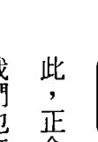

★《紐約時報》暢銷書、Amazon讀者評價4.5顆星★

隨書附贈
中英雙語冥想導引
光碟MP3
總長約129分鐘

## 靜心冥想的練習
## 28天在家自修的正念課程
## Real Happiness
THE POWER OF MEDITATION: A 28-Day Program

雪倫·薩爾茲堡 Sharon Salzberg——著
李芸玟——譯

美國知名靜心導師雪倫·薩爾茲堡
將逾三十年的教學經驗，
濃縮成28天的自修課程。
每天20分鐘，連續4週，
你就能體驗超越一切理解的平靜與快樂。

## St. Royal College
### 天使神秘学院

- 专业占卜预测机构
- 神秘学培训机构
- 水晶能量研究中心
- 神秘学资料库
- 官方微信：strcdts
- 微信公众平台：strc2011
- 读书交流QQ群：
  - 占星塔罗占卜师交流群：814594478（加入密码：PDF）
  - 神秘学其他综合群：659338717（加入密码：PDF）

微信号：strcdts
天使神秘学院
天使神秘学院 院长QQ：715104687
微信公众平台：strc2011

## 制作说明：

本书由《天使神秘学院》出重金从台湾购入的原版书籍扫描制作完成。为达到最好阅读效果，特地把原版书全部切开后，再经由专业扫描设备高精度扫描完成，并经过一张张的PS后期处理最终成书，其间花费大量的人力、物力以及时间，只为能给大家提供经济并优质的神秘学学习资料而努力。

本学院强力谴责某些机构和个人，把本学院花心血制作完成的电子书籍，包装后直接放在自家淘宝网上低价倾销的行为，以谋取不劳而获的经济利益。如果长此以往最终将无人愿意再为大家花心思制作电子书，那以后可能大家再无新书可读。

为让大家以后能够读到更多的好书，也为了本学院的良性发展。本学院恳请大家尽量做到如下几点：

- 一、 尽量在本学院的网站购买电子书籍。
- 二、 请勿用技术手段把电子书内的水印及加密去掉。
- 三、 在收到电子书后小范围传阅即可，千万不要公开传播，更别挂到淘宝网上低价销售。

同时为答谢广大支持者，学院电子书将做如下调整：

- 一、 学院会把一些早已收回制作成本的电子书折价销售。
- 二、 最新制作的电子书籍会开放打印功能，大家购买后有条件的可自行打印成书。

天使神秘学院
2019 年 1 月

## 靜心冥想的練習
28天在家自修的正念課程

Real Happiness
The Power of Meditation: A 28-Day Program

雪倫·薩爾茲堡 Sharon Salzberg 著
李芸玫 譯

## 目錄

【作者序】 靜心冥想的力量 16

PART ① 靜心冥想的理念 23

什麼是靜心？你能呼吸，就能冥想 24

看著你的念頭，是專注的開始 25

冥想如何訓練專注力：三種關鍵技巧 29

讓冥想翻轉你的人生 36

為什麼要靜心？靜心的好處和科學根據 38

靜心可以帶給你什麼益處和改變 38

且看靜心如何改變大腦運作 48

科學證實，靜心冥想能正向影響身體和情緒健康 52

請勇敢擁抱生命中的改變 57

## PART ② 二十八天正念静心冥想课程实践

### 第一週 全神贯注：练习专注呼吸和重头开始的艺术

专注的重要 61

开始静心：实用的准备事项 65

课前准备：练习专注 71

冥想操① 核心静心：呼吸 74

冥想操② 聆听静心 82

冥想操③ 放掉念头的静心 86

冥想操④ 随时可做的迷你静心 88

第一週的省思 90

常见问题Q&A 99

### 第二週 正念和身体：放掉包袱

别总是严厉的批判自己 120

课前准备：认识正念 124

内化：专注的静心冥想，感觉起来该是什么？ 113

119

59

60

### 第二週

### 冥想操5
身体扫描静心
128

### 冥想操6
行走静心
131

### 冥想操7
身體感覺靜心
138

### 冥想操8
日常活動靜心
142

### 冥想操9
喝茶靜心
143

### 第二週的省思
146

### 常見問題 Q & A
150

### 內化：你有多常記得要保持正念？
154

### 正念和情緒：處理想法和感覺
156

### 用正念跟情緒建立新關係
157

### 最令人痛苦的五種情緒
164

### 課前準備：學習與情緒共處
168

### 冥想操10
情緒靜心
170

### 冥想操11
召喚痛苦情緒的靜心
173

### 冥想操12
正面情緒靜心
179

### 冥想操13
思考靜心
182

### 第三週的省思
184

### 第四週

### 慈愛：培養慈悲心和獲得真正的快樂

做就對了
187

常見問題Q&A
189

內化：你學會安住在情緒中了嗎？
199

慈愛的力量
207

課前準備：請先祝福自己吧！
216

冥想操⑭ 核心靜心：慈愛
218

冥想操⑮ 情緒或身體受傷時所做的慈愛靜心
221

冥想操⑯ 給看護者的慈愛靜心
227

冥想操⑰ 看到優點的靜心
229

冥想操⑱ 安撫內在批評的靜心
232

冥想操⑲ 行走時的慈愛靜心
234

冥想操⑳ 慈愛圈靜心
235

第四週的省思
237

常見問題Q&A
240

內化：你體驗到送出慈愛帶給你的喜悅嗎？
248

十種加強練習慈愛的方式
251

@符號代表這個冥想練習的導引，收錄在隨書附贈的MP3光碟中。

### 四週以後 256
### 持持續不斷的練習：
訣竅是，「把你的身體放在那裡就好」 257
### 別輕言放棄，請持之以恆的練習靜心 257
### 常見問題Q&A 270
### 最後的省思 277
### 致謝 281
### 【附錄一】本書分章注釋 282
### 【附錄二】靜心冥想練習MP3光碟內容說明 286

## 名人推薦

> 「這本書是一扇敞開的大門，邀請大家進入深藏著幸福和智慧的內在領域。作者以溫柔的語氣，對內在景色的親密觀察和精心雕琢的導引，喚醒正念和慈愛，引領全心全意實踐練習的幸運讀者，回到他或她最深沉、最滿意、最棒，卻從未離開過的內在，為全人類謀福祉。」

—— 喬·卡巴金 (Jon Kabat-Zinn) 《當下，繁花盛開》作者

> 「作者給了我們簡單、實用、有效的方式，讓我們可以對症下藥！她幫助我們認清我們的追尋並非遠在天邊，而是近在眼前，並且等著我們用溫柔和正念的覺察來享受它自由自在的狀態！我熱烈推薦我很喜愛的這本書！」

—— 羅伯·瑟曼博士 (Robert Thurman, PH. D.) 《內在革命》及《無限的生命》(Infinite Life: Awakening To Bliss Within) 作者

> 「閱讀此書，感覺好像交了一個新朋友，或是找回一個老朋友。作者把靜心冥想寫活了，透過她的慈悲向我們闡示，我們如何也能像這樣地清醒過來。這是大師的傑作，深入、溫暖而迷人。」

—— 威廉·詹姆斯與維拉斯研究 (William James and Vilas Research) 心理學和精神病學教授
威斯康辛大學麥迪遜分校心靈健康調查中心總監

> 「作者非但汲取了三十多年靜心冥想教學的經驗，又從積極參與靜心冥想研究、不斷地與科學家對話中得到許多心得。她以淺顯易懂、引人入勝的方式，寫出了這本涵蓋所有靜心冥想基本要領的書籍。常有人問我，如果他們想要更深入了解靜心冥想，該從哪裡著手。現在我知道要怎麼回答他們了：『靜心冥想的練習』就是你第一本該讀的書。」

—— 李察·戴柏森教授 (Dr. Richard J. Davidson)

> 「精彩又簡單，簡單又精彩。這本書可以帶領靜心冥想新手，讓他們持之以恆地練習；也可以讓靜心冥想老手獲得更豐富的資訊，讓他們有耳目一新的感覺。在教導讀者更認真對待自己的同時，這本書也讓作者所謂心平氣和地留神變得更唾手可得。真正的快樂是個寶。」

—— 瑪莎·貝克 (Martha Beck) 《O，歐普拉雜誌》專欄作家，《找到自己的北極星》 (Finding Your Own North Star) 作者

> 「人，我想要送給身邊每個人一本。」

—— 馬克·愛普斯坦 (Mark Epstein) 《沒有思考者的思考》(Thoughts without a Thinker)，《碎而不散》(Going to Pieces without Falling Apart) 作者

> 「作者用聰敏機智論及自己的私領域，以現代化和熱情友善的語氣寫了這本很棒的書。對靜心冥想新手來說，它非常易懂也很能鼓舞人心；對靜心冥想老手來說，這更是一本不可多得、深富啟發性的好書。」

—— 希薇雅·布爾斯坦 (Sylvia Boorstein) 《快樂是內心的工作：過個快樂生活》(Happiness Is an Inside Job) 作者

> 「本書是一個不可多得的靜心冥想寶藏盒，淺顯易懂，字字珠璣，融會了作者畢生诲人無數的經驗。她不僅筆觸幽默、慈愛和充滿了才情，所傳授的冥想法也非常實用和平易近人。這本書將是所有尋求內在平靜者的良伴。」

—— 傑克·康菲爾德 (Jack Kornfield) 《踏上心靈幽徑》作者

## 名人推荐

> 「此书由浅入深，取繁于简，是给所有想要探测和理解静心冥想练习的人的入门书。作者以无比的大爱，清楚地为读者写出一週一週循序渐进、在日常生活中找到正念和慈悲的方式，这两者都是在一个需要从裡到外彻底受到疗癒的繁忙世界中，最重要的导航器。」

—— 琼·哈利法克斯禅师 (Roshi Joan Halifax) 乌帕亚禅修中心 (Upaya Zen Center) 住持及创办人

> 「简言之，这是一本极其优秀的老师所推出的一本可敬之书。学生们常常要我推荐既可以让他们入门、又可以让他们持续练习的书，那时我才惊讶地发现，市面上竟找不到多少本真正包含『基本要素』练习的手册。这本书完整包含了为什麽要练习静心冥想、如何练习，以及练习时常见的问题，是真正能帮助人们进入静心冥想力量的绝佳之作。」

—— 贾桂琳·诺佛葛拉兹 (Jacqueline Novogratz) 聪明人基金 (Acumen Fund) 创办人兼执行长、《蓝毛衣》作者、TED Conference 讲者

> 「在一个分裂的世界中，提供了一个团结的愿景。」

—— 伊森·尼克特 (Ethan Nichtern) 《一座城市：缘起宣言》 (One City: A Declaration of Interdependence) 作者

> 「雪倫·薩爾茲堡在基礎的內觀冥想裡，融入了令人驚豔的優雅、幽默和名人佳句。在這本友善、周詳和極為認真的著作中，作者將靜心冥想為她個人的痛苦生涯帶來的禮物，分享給閱讀這二十八天初學課程的讀者。因為每個人都是從懵懂的初學者開始，作者為此描繪出了一條寬廣的道路，適用於受傷的退伍軍人、注意力不足的學童，一直到屢屢分心（和易怒）的家庭主夫或主婦，以及公司執行長。她寫道，不論何時，靜心冥想都為每個人揭示了『心中善良的一面。』」

—— 依莉莎·葛瑞茲瓦德 (Eliza Griswold) 《十道平行線》(The Tenth Parallel) 作者

> 「我等這本書已經很久了！老是有人問我會推薦哪本書引導他們進入靜心冥想之門。儘管市面上有很多有關靜心冥想主題的書，卻沒有一本可以像此書一樣，聰明而又具有個人風格地將靜心冥想的目的、技巧、靈感共冶於一爐。我會建議並且贈送這本珍貴之書，給每一位想要透過練習靜心冥想得到穩定、優雅、寧靜和快樂生活的人。」

—— 伊莉莎白·萊瑟 (Elizabeth Lesser) 歐米茄學院 (Omega Institute) 共同創辦人，《破碎重生：困境如何幫助我們成長》作者

> 「作者用輕鬆但堅定的口吻，為我們介紹了靜心冥想的經驗。對那些曾經上過她課的人（我也是其中之一），本書字字珠璣，精彩度比她上課時所教過的東西有過之而無不及。」

—— 拉姆·達斯 (Ram Dass) 《擦亮心靈之鏡》作者

> 「我常常建議我那些壓力大的病患練習靜心冥想，但是他們往往不知道怎麼開始。此書是完美的靜心冥想處方，裡面包含了所有的新手需知。」

—— 法蘭克·李普曼 (Frank Lippman) 醫學博士，《重燃生命之火》(Revive) 作者

> 「作者在這些篇章中，以短短的二十八天，為大家擬出了達到正念、洞察力和慈愛的逐步計畫，並且也將這些練習融入你們的人生中。本書所傳達的是學習佛教禪修最簡單的法門，而教授這些法門的則是當今西方世界最著名的靜心冥想老師。」

—— 竹慶本樂仁波切 (Dzogchen Ponlop Rinpoche) 《叛逆的佛陀：回到真心，莫忘初衷》作者

> 「沒有多少本書會讓你改頭換面成為一個更好的人。這本書就是鳳毛麟角的幾本書之一。」

—— 雀兒西·肯恩（Chelsea Cain） 《紐約時報》暢銷書《心囚》、《危險甜心》作者

> 「經由冥想覺察的力量，得到真正的快樂和喜悅，正是我們所喜愛的佛學老師和先鋒雪倫·薩爾茲堡在這本書裡想要傳達給大家的。這本書在透過鍛鍊注意力和開發智慧，來做自主性的進化這個重要的新興範疇中，做出了令人欣喜的新貢獻。奠基於古代無垠的靜心冥想傳統，再加上現代的神經科學研究和由經驗得來的神經法規實驗，作者發展出內觀冥想、正念和她拿手的慈愛四周計畫，這個計畫不僅教導我們、也喚醒了我們，讓我們一步一步地發現自己是誰、為什麼會在這裡，以及如何追求和實現一個更圓滿的人生與更和諧的世界。我衷心推薦這本書給想要追尋自我實現和內在寧靜、幸福與啟蒙的人。」

—— 舒亞·達斯喇嘛（Lama Surya Das） 《佛性的遊戲》作者

> 「我們見過諸多想要完整傳授佛教禪修教義和生活方式的書，但是沒有人可以像雪倫·薩爾茲堡一樣，如此精確又清晰地傳達出覺醒的旅程。《靜心冥想的練習》一書，是致力將佛教帶進西方的有志之士之一，也是最真摯的雪倫老師的力作。這是兩千五百年前最受愛戴的一位導師，送給大家最完整、最摩登的禮物。」

> 「雪倫·薩爾茲堡給了世界一份和平的大禮。」

—— 史蒂芬·拉維（Stephen Levine）《今生：若只剩一年可活，你要做些什麼？》作者
—— 愛麗絲·華克（Alice Walker）《紫色姊妹花》作者

獻給我的老師們，他們深深了解靜心冥想的力量，而且一直相信我（以及每個人）一定也做得到。

## 静心冥想的力量

【作者序】

谁，需要静心冥想？

班在伊拉克打仗时，开始练习冥想*。当时还是后备军人的他，透过电子邮件拜我为师。他说他觉得冥想可以帮助他好好面对每日面临的压力和创伤，并且让他不慌不乱。

莎拉想要当一位好继母。她认为学习静心可以让她更有耐心地聆听，使她更容易融入新的家庭，也能更轻松地应付棘手的人际关系。

黛安是一家大型媒体公司的部门主管，她是我在那家公司开课时的学生。她希望能在均衡的状况下兼顾工作和家庭，并且在处理剪不断理还乱的公事时，能更心平气和地跟同事明确的沟通。

杰瑞是九一一事件时，第一批赶赴世贸大楼救援的打火弟兄，他想要克服脑中挥之不去的灾难阴影。伊莲娜想要取得不动产经纪人的执照，她必须专心读书，以便通过考试。罗西是长年的背痛患者，他想要好好地对付背痛。

丽莎是一家小型外烩公司的老板，她不想再浑浑噩噩地过日子。「我好像被启动了自动导航系统，每天都像行尸走肉。」她说，「我操心有哪些该做的事情还没做，担心未来的前途，却对当下完全麻木。我不知道自己在做什么。」

我更动了若干学生的名字和他们的身分，但他们的动机都是真的，而我教导的静心冥想练习，确实多多少少改善了他们的生活。

过去三十六年来，我在跟伙伴于一九七五年共同创立的、位于美国麻州巴瑞的「内观静心协会」(Insight Meditation Society) 的开办机构，以及全世界各大校园、公司行号、政府机构和社区中心，教导了数千名学生。我向矽谷企业家、教师、警官、运动员、青少年、军中牧师、医科学生、医师、护士、烧烫伤病患、囚犯、家暴避难所的第一线员工、新手父母等团体，推介你们即将接触到的静心冥想技巧。

我的学生来自世界各个角落，有着不同的生活经验、种族背景和宗教信仰。

静心冥想已经是一种全国性的趋势。根据一项由「美国卫生统计中心」于二〇〇七年所做的调查（可取得的最新数据显示），在过去十二个月中，有超过两百万美国人练习静心冥想。他们告诉研究员，他们这么做是为了改善整体健康；为了减轻压力、焦虑、痛苦、沮丧或失眠；以及对抗如心脏病和癌症等慢性病所带来的症状和身心疲倦。

我发现，大家也因为想要做出正确的决定、改掉坏习惯、或是从挫败中站起来，转而求助于静心冥想。他们想要跟自己的家人和朋友更为亲近；想要让自己的身心更加放松和自在；或是想要让自己更有能耐。他们之所以求助于静心冥想，是因为人生中充满了真实的、潜在的或是想像中的严重危险，他们想要变得更安全、更有自信、更安定和更沉着。在这种种动机之下，埋藏着一个重要的事实：那就是每个人都想要追求快乐，而且每个人在面对痛苦和不可预期的无常时，都很常容易受伤。

我一再看到静心冥想新手的生活开始发生转变，即便他们起初抱持着抗拒或怀疑的心态。就我个人的经验来说，静心冥想帮助我们得到更大的安详与宁静，让我们找回感觉并且统合身心灵，增强人际关系，以及产生更大的勇气来面对恐惧。这就是静心冥想在我身上发生的作用。

## 在静心冥想之中，看见真正的自己

我从一九七一年开始练习静心冥想，当时我十八岁，大三，跑到了印度去学习。我想要找到有用的工具来减轻我日复一日所感受到的痛苦与困惑，这些痛苦和困惑都是我饱受折磨和混乱的童年时期所留下的遗毒。我父亲在我四岁时离家出走，九岁时母亲去世，我不得不去投靠爷爷、奶奶。我十一岁时，爷爷过世了，那时我父亲有回来了一阵子，又因为自杀未遂被送入精神病院，从此就再也没出现过。

在我读大学之前，辗转寄宿在五个不同的家庭，每一次更换寄宿家庭都造成我极大的失落感。我一而再、再而三地感到被抛弃。抚养我的人对我很照顾，但是他们却不能对我坦白说出事情的真相。我感觉自己生命毫无价值可言。我把巨大的悲伤、愤怒和困惑藏在心里，并且不断滋养自己不值得被爱的信念。我全心全意想要找到归属感，找到一个爱和安慰的源头。十六岁时，我进入水牛城的纽约州立大学，在大二那年修亚洲哲学时，接触到了佛学，我受到这种大无畏地承认生命中苦难的宗教吸引。因为它，我不再觉得孤立：因为我不是那唯一受苦的人！佛陀（他的名字意谓着「觉醒」），一位西元前五六三年左右生于北印度的王子，后来成为精神导师。他改变我一生的警句之一是：「你可以找遍全世界，但是却找不到任何一个值得你爱他超过爱自己的人。」不仅佛陀说爱自己是合理的，他也描述这是一种需要培养的能力，因为爱自己是去爱护和关心别人的基础。这样的哲学安抚了我因困惑和绝望所导致的痛苦。尽管我带着点怀疑，但是这哲学给了我一线希望。我决定前往印度，看看我是否能学到更多。

* meditation 有多种中文译名，例如：冥想、静心、禅修、静观等等。为免过度局限其意涵，本书以较为人常用的「冥想」和「静心」交互作为此字的译文，期能帮助读者更快理解作者所要阐释的意义。

個有可能從恨自己一舉轉變為愛自己的機會，卻像磁鐵般吸引著我。我無意皈依新的宗教，我只是想要從極度的不開心中解脫。

所以我前往印度學習，展開一個獨立的研究計畫。當我到達那裡時，得知一位極受尊敬的老師，正在帶領初學者和其他人做靜心冥想活動。我有點失望，因為我發現，靜心冥想並不如我想象中的充滿異國風情——沒有人在閃著靈光的暗室中傳授我神秘的指示。相反的，第一位教我練習靜心冥想的導師只給了我兩句話：「找個舒服的姿勢坐下來，感覺自己的呼吸。」感覺我的呼吸？我心有不甘地想著。

我大可待在水牛城感覺我的呼吸！但是我很快就發現，這種光是集中注意力在吸氣和吐氣上，以全新的方式跟我的新經驗產生連結的方法，將大大改變我的人生。它讓我對自己更寬容，也對別人更開放。

一旦我知道該如何深入地往內看去，便看到了每個人體內深藏的良善血脈，包括我自己在內。善良也許被隱藏起來而且難以叫人相信，但是善良從未被徹底摧毀。我開始全心全意地相信我值得擁有快樂，其他人也一樣。現在，每當我遇到陌生人時，都覺得和他更能產生連結，並且知道我們共同擁有的東西是什麼。當我在靜心冥想時遇到自己，我不再覺得自己面對的是一個陌生人。因為靜心冥想，我對於自己如何想像和看待我在這個世界上的地位，產生了深遠而微妙的轉變。我知道我不必侷限於兒時所認為的「我是誰」，或是昨日、甚至一個小時以前認為的「我能做什麼」。靜心冥想練習已經讓我從老舊的、制約性的認定自己不值得被愛的定義中解放出來。儘管我在讀大學時，對靜心冥想懷抱著最初的幻想，然而我卻沒有榮登永恆的至樂。靜心冥想讓我快樂、心中有愛及寧靜，但卻不是時時刻刻都如此。我的心情仍然時好時壞，時晴時雨，只不過現在我比較能接受挫敗，不再那麼沮喪並介意個人的成敗，因為靜心冥想教會了我該如何面對「世事無常」這項顛撲不破的真理。

# PART 1

静心冥想的理念

## 什麼是靜心？你能呼吸，就能冥想

簡單地說（雖然並沒有那麼簡單），冥想是一種重要的專注力訓練，它不僅能讓我們更深入地覺察自己內在的想法，也讓我們更能覺察到周遭此時此地所發生的事情。一旦我們認清此刻發生了什麼事情，我們就能選擇該不該或是該如何對眼見的事情採取行動。

在往後的四個星期，我們將會探索內觀靜心（insight meditation）的原理，痛痛快快地練習時時刻刻的覺察。首先，我們把注意力集中在一個揀選出來的單一物件上（多半是我們的呼吸），來訓練專注力。然後不斷地放掉讓我們分心的事情，以便讓注意力回到那個單一物件上。稍後，我們會將專注力擴大到涵蓋我們當下產生的任何思緒、感覺或是感動上。

人們經由冥想轉化心靈已經有數千年的歷史。每一個重要的世界性宗教都會包含某些型態的冥想靜心練習，不過，冥想在當今並不牽涉任何的信仰體系。以型態而言，靜心冥想所運用的方式分為安靜和靜止，運用聲音或是讓身體不斷地運動，而所有的型態都強調專注力的訓練。

### 看你的念頭，是專注的開始

> 「我的經驗取決於我所注意到的事情，」心理學先驅威廉·詹姆斯（William James）在二十世紀初這樣寫道，「唯有我注意到的事情會形塑我的心靈。」

在最基礎的階層上，注意——也就是我們讓自己注意到的東西——事實上決定了我們如何經驗這個世界，以及如何在這個世界導航。

喚起和保持持續的注意力，是我們找工作、玩雜耍、算數學、做煎餅、打撞球時瞄準母球讓8號球入袋、保護我們的孩子和執行手術時的法寶。

它讓我們以慎思明辨的態度應付外界，用熱烈的態度對待親密關係，並且誠實地檢驗我們的感覺和動機。

我們有多注重平凡的經驗，以及我們跟自己的人生有多密切的連結，全都取決於專注力的多寡。

也許聽過一個古老故事，通常是假托一個美洲原住民長老的口中說出，這麼做的是想引起更大的關注。一位老爺爺（偶爾也會說成老奶奶）傳授生命秘笈給孫兒，他說：

> 「有兩匹狼在我內心交戰，一匹狼惡毒、可怕、嫉妒心重、憤恨不平、虛假狡詐；另外一匹狼心中有愛、富慈悲心、大方、誠實、安詳。」

小孫子馬上問，最後哪一匹狼會贏。老爺爺回答：「我餵養的那一匹。」不過，好戲還在後頭。沒錯，哪個東西吸引了我們的注意力，哪個東西就會坐大，所以如果我們的注意力濫施在負面的和微不足道的事情上，這些負面和微不足道的事物就會蓋過正面和有意義的事情；但是反過來，如果我們拒絕面對或者正視困難和痛苦的事情，假裝它們並不存在，那我們的世界就麻煩大了。舉凡不會讓我們的注意力減退，或是被隱藏在我們有意識的覺察之下的東西，一定都會或多或少地影響我們的生活。反過來說，忽視痛苦和困難，也正是餵養那匹狼的另一個方式。冥想教導我們的，就是將注意力投注在所有的人類經驗和我們身心靈的每一個部分。我想你一定知道注意力受到工作、家庭和精巧的电子产品所分散，或是心中的雜音所干擾的感覺。你不斷地回想早上跟配偶大吵一架的情景，兀自擔心未來和懊悔過去，緊張分分地核對今天還有哪些事情沒做。這樣的心理雜音有一部分可能來自兒時一點一滴灌錄的老錄音帶，這個老錄音帶播放了很久，我們幾乎要在有意識的覺察中把它關掉了。這種老錄音帶可能讓我們對自己觀感很差，或者產生先入為主的偏見或推論（譬如說：好女孩不會這樣做，男人和女人沒一個值得相信，你必須追求卓越等等）。我們甚至不再注意到我們送出的訊息，只收到了滯留下來的焦慮感。這些習慣性的反應，多半是一輩子培養出來的——是我們的父母或是文化，用明確的教導或非語言的暗示所給的早期教訓。注意力分散具有輕微的破壞性，造成一種失焦或是心神不寧的模糊感。它可能令人心灰意冷、筋疲力竭，因為你被支離破碎、東拉西扯的思緒拖著團團轉，這是非常危險的狀況（想想閃神的司機會發生什麼事情，你就知道了）。我們掌握著人生的方向盤時，也可能會因為睡著了而發生其他致命的狀況。我們不是忽視了照顧人際關係，就是沒有注意到真正很重要的事情，更沒有對它採取行動。也正因為我們的注意力渙散，讓我們錯失了好多事情；或是因為我們對老早就掌握的一切太有把握，因而根本不屑汲取重要的新資訊。冥想教導我們集中注意力和清清楚楚地注意我們的經驗，並且在經驗萌生時，以不帶評斷色彩的方式觀察它們，這麼一來，我們就可以偵測到以前沒發現到的心智壞習慣。譬如說，我們有時候會用沒有經過檢驗的想法來當作行動的基礎（我不值得被愛；你就是不講理；我不能應付棘手的狀況），以致處處掣肘，什麼事也做不了。一旦我們注意到這些反射性的反應如何暗中破壞我們當下的專注力時，我們就可以好好做出更能參照多方資訊的選擇，如此一來，我們在回應他人時，就能用更有創造性的方式，給予更大的悲憫和更正確的對待。

## 冥想如何训练专注力：三种关键技巧

各种型态的冥想，靠着培养三种关键技巧，就能加强和引导我们的注意力。这三种技巧就是：专注、正念、悲悯（或慈爱）。

### 专注

专注可以撇开分心，让注意力变得稳定和集中。分心会浪费能量，专注则会恢复这股能量。你将会学到简单又强大的初级冥想技巧，藉着集中注意力在你生来就知道该怎麽做的事情 —— 也就是呼吸上，可以大大地提升专注力。

这项练习需要专注於每一次吸入和呼出的气息。当你的心四处游荡时（一定会的，这是正常的），留意抓住你注意力的是哪些东西，在不苛责自己的状况下，放掉这些想法和感受。接下来再度专心注意自己的呼吸，这麽一来，冥想就能训练我们停留在当下，而不致於回想过去或是担心将来。专注教导我们怎样温柔地对待自己和别人，让我们原谅自己的过失，继续前进。你会在第一周的课程中，学到更多有关专注的内容。

### 正念

正念可以細緻化我們的注意力，讓我們對生命中大大小小的事情，產生更全面和更直接的關聯。正念冥想會將我們的焦點從呼吸這個單一物件，轉向任何特定時刻發生在我們裡裡外外的事情。我們練習觀察思想、感覺、洞察力、氣味和聲音，在這個過程中，我們完全不帶評斷色彩，不會抓住愉悅的經驗不放，也不會推開痛苦的經驗，更不會忽視平淡無奇的經驗。我們會越來越熟練地拋開不經思考的習慣性反應，以便更精確地衡量當下到底發生了什麼事情。而究竟什麼是不經思考的反應呢？舉例來說，假設有人說了激怒我們的話，我們感到怒不可遏，也許我們的自動反應是不假思索地發一頓脾氣。或者是我們有否定內在翻騰情緒的評斷習慣（如果我感到憤怒，就表示我是個壞人），如果未經驗驗，它就會越滾越大。或者是我們死也不肯改變每一種情緒：我是個愛生氣的人，我就永遠是個愛生氣的人；我就是死性不改！這樣的反應怎有可能產生快樂的結果。

但是，如果我們將正念運用在憤怒的經驗上，就可以用平和的接近來取代轉身逃離，我們會以探究代替阻隔。我們覺察它，而不評斷它。我們可以蒐集更多有關生氣時的情報——憤怒是被什麼因素挑起的、憤怒棲身於身體的哪一部分，以及其中是不是也包括了諸如悲傷、恐懼或懊悔等情緒。

停下來花點時間好好想想，用不帶批判色彩的眼光來認知憤怒，創造一個和平的距離，在這樣的距離中，我們對於如何應付生氣這樣的反應，可以做出不一樣的新選擇。我們可以藉此革除積習。我們也許會決定對一個惹惱我們的傢伙和和氣氣地講話，而不是怒火中燒或大發雷霆；我們也許會離開那個房間，直到自己平靜下來；或者我們會花一點時間專注在呼吸上，以便恢復平衡和洞察力。稍後，等我們的冥想時段結束後，就可以想想有哪些狀況容易挑起我們的怒意。

正念幫助我們分辨實際發生的事情，以及我們用妨礙直接經驗的敘述來告訴自己發生了什麼事情之間的區別。通常這樣的敘述，將一個短暫的心智狀態，當成了自己的全部和永久不變的狀態。我最喜歡舉一個放諸四海皆準的例子，這個例子來自一整天都處在密集壓力下的一個學生，她在事情結束後去健身房，正在更衣室換裝時，一不小心把褲襪扯破了。她又急又氣，對著最近的一位陌生人說：「我需要一個新的生活！」

「不，沒必要。」那個女人回答，「你只是需要一雙新的褲襪罷了。」

在進入第二周和第三周課程時，你會學到更多正念的技巧。在第二周，我們會檢視正念與身體的連結；第三周時，我們會運用正念來處理情緒。

### 你是否误解了冥想的定义：重新认识冥想

许多人都对冥想存有误解。在还没开始之前，我想先澄清以下几点。

- 冥想不是一种宗教。你无须皈依成为佛教徒或是印度教徒。你可以一边冥想，一边信奉原来的宗教；或者如果你没有信仰也没关系。
- 冥想不需要特別的技巧和背景。冥想並非專屬於某些有天分或是已經很穩定的人。你不必是靜坐冠軍，也不必等到消除任何癮頭或是戒掉咖啡因之後再開始靜心。你現在就可以開始。如果你能呼吸，就能冥想。
- 冥想不會花掉你每天太多的時間。我們剛開始會以一節二十分鐘做起。如果高興的話，可以先從一節五分鐘開始，然後再慢慢增加時間。（你會在67頁「選一個固定的時段」和每一週的「練習重點」欄中，找到有關冥想的數字和時機的詳細討論。）也許你會想要加長每一節練習的時間，因為你會愛上冥想所產生的安定感和喜樂感。但這是不必要的。每天定時練習，會比想要擠出更多時間來做冥想來得重要。
- 冥想不会消除你人生中的悲伤或困境。你还是会经历高低起伏、有快乐有悲伤的人生。但是你会更挺得住迎面打来的一拳，而且不觉得自己输得有多惨，因为冥想教了我们一种对抗困境的新方式。
- 冥想不是试着停止思考或是坚持只做正面思考。对人类来说，这是不太可能的事情。冥想只不过是一种认清我们的想法，予以观察和了解，然后更有技巧地将它们说出来的方式。（我喜欢佛教徒描述人的行为时，舍弃「好」与「坏」的形容词，而用「善」与「不善」来取代。不善的行为会导致痛苦和折磨，善的行为则会带来洞见和平衡。）
- 你不必谴责自己的意见、目标或热情；你无须抛开乐趣。「如果我开始冥想，」有次一个女人问我，「我是不是就得放弃欲望？」「不，不需要，」我告诉她，「你只不过是该换种态度对待欲望，也就是关注它、探究它，和知道它背后的意义。」把冥想拉进我们的生活，并不表示必须从俗世的人际关系、责任、事业、政治、嗜好和欢庆中撤出。事实上，冥想让我们可以更自由地专注在让我们感兴趣的事情上，而且多半是用更健康的态度。
- 冥想並不只是看著自己的肚臍眼。冥想不是放縱，也不是自我中心。沒錯，你會更了解自己，但是了解自己也會幫助你更加了解出現在你生命中的人，並且跟他們維持更好的關係。轉過頭來了解自己，是開始了解他人的第一步。

### 慈愛

慈愛是帶著悲憫心的覺察，它開放我們的注意力，並且讓注意力變得更為寬容。它改變我們對待自己、我們的家人和朋友的方式。花時間刻意留心理解我們的念頭、感覺和行為（正面的和負面的均可），可以打開我們的心胸，讓我們真心愛上原來那個不完美的自己。

而這就是通往愛別人的大門。如果我們知道如何關愛和欣賞自己，我們就會更有能力看清別人和欣賞別人，而不會介意他們多麼複雜和多有心機。與其被激怒，我們也許反而會想要祝福他們。我們會放掉過去受到的傷痛，加強跟一個親戚的關係，不管是向我們以前所漠視的人示好，或者找到一種更好的方式來對待一個難相處的人，都有可能。在第四週的課程中，你會學到更特殊的技巧來增加你對自己和他人的悲憫和同情。

- 在這場即將展開的二十八天練習計畫中，你將會有系統的磨練這些技巧。每一週的教學會區分為幾個部分：(1)課前準備：我們從中可以知道該期待什麼；(2)冥想和靜心本身；(3)常見問題Q＆A（包括我不斷從學生那裡聽到的實際問題）；(4)對該週較深入練習的課後省思；以及(5)可以內化的東西，也就是能夠將練習融入每日生活中的建議。

冥想是人們最需要的禮物。我在美國各地旅行，見到的人最常對我說的，就是他們在越來越複雜的世界中，覺得自己快要被各種要求和讓人分神的東西撕得粉碎，並且對隱隱約約的恐懼感到焦慮。靜心冥想可以帶給我們一種發自內心的安全感，而這股安全感就是來自深深的自信和穩定。

有人告訴我，他們感到很悲哀，因為公眾生活中充滿醜陋和不文明的對立，而他們私底下也過著孤獨和寂寞的生活。他們極度渴望跟人合作、產生連結和擁有屬於自己的社群。而教人慈愛、悲憫和耐心的冥想，就是一個可以幫助你改善跟家人、朋友以及所有遇到的人的關係，最顯而易見的方法。

人們告訴我，他們很沮喪，因為他們發現成就並沒有讓他們的心情更為平靜，而他們擁有的資產也只能帶給他們暫時的滿足。榮耀和小巧的電子產品可以讓人虛榮一下，但是真正帶來快樂的應用程式，則是既能讓人內在安詳，又能讓我們禁得起悲傷和失落的靜心冥想練習。

## 為什麼要靜心？靜心的好處和科學根據

### 靜心可以帶給你什麼益處和改變

如果你想要馬上展開靜心冥想計畫，你可以翻到第一週（見61頁）。或者你可以再等一下，再多知道一些冥想對日常生活的好處，以及科學家在實驗室中發現的靜心力量。簡言之，就是靜心對你的健康而言，也許就跟運動一樣重要。

靜心相當於心理和情感方面的健身訓練，非常實用，意思是：如果你定期運動，就會產生特定的結果，你會有強壯的肌肉、密度更高的骨質和旺盛的鬥志。如果你定期靜心冥想，也會有特定的結果。我已經提過一些了，其中包括更平靜、更專注，以及更能跟別人建立連結。但是還有另外一些好處，我會在後面的章節，花更多篇幅來討論這些優點，並且解釋如何從訓練專注力的初學者，一步跨到更高的人生境界。

### 你可以認出阻礙你快樂的原因

從現在開始，你要認出有哪些未經驗驗的設想是阻礙你快樂的原因。我們認為自己是什麼樣的人以及世界是如何運作的，我們值得擁有什麼、我們可以掌握什麼、我們可以在哪裡找到快樂、是否可能產生正面的改變等等，全都大大地影響了我們專注的方式，以及我們會專注在哪些事情上。

我憶及預設想法造成妨礙的一個實例。有一次我去華府國家畫像藝廊觀賞一位藝術家朋友雕塑的作品，我熱切地到每一個展示間看了每一座展示櫃，結果都看不到雕塑作品，最後我放棄了。當我走向出口時，往上一看，恰巧看到了朋友美麗的作品。那是一個掛在牆上的淺浮雕，而不是我以為的立式雕塑。我的預設想法蒙蔽了我，差點害我錯過就放在那裡的令人驚豔的作品。

同樣地，我們的預設立場也讓我們無法正確判斷眼前的狀況——眼前的一名陌生人可能會成為你的朋友，眼前一名似乎是死對頭的人也可能是你助力的來源。預設立場阻礙直接的經驗，讓我們蒐集不到可以安撫我們的資訊，或者是儘管我們有這些預設立場，否則我們客觀地觀察事情的能力會故障；我們以為自己無所不知。以上的陳述都來自恐懼、渴望、無聊或者無知。預設立場讓我們看不清過去和現在，它不僅限制了我們的可能性，也推開了我們的歡樂。除非我們察覺和檢驗自己的預設立場，否則我們客觀地觀察事情的能力會故障；我們以為自己無所不知。以下是一些你或許很熟悉的預設立場：我們兩人沒什麼共通點。我沒辦法這樣做。你沒辦法跟那種人講道理。明天會跟今天沒什麼兩樣。如果我再努力一點，就可以控制他／她／它／他們。只有處在天大的危機下，我才會感到自己活著。反正我搞砸了，不如乾脆放棄。我知道她會說些什麼，所以我應該把她的話當耳邊風。快樂是屬於別人的，跟我無關。

### 你不會再畫地自限

當我們靜心時，多半會認出一種受到制約的特殊反應，而我們之前並未意會到這些限制全都是自找的。我們察覺到它，正因為我們制約自己滿足於比較差的結果，以致我們嚴重破壞了自己的成長和成功。冥想會讓我們看出這些限制並不是與生俱來的，也不是永遠不變的；它們是後天學來的，同時也是無知的，不過一定要我們認出它之後，才有能力將它抹去。（一般自我設限的念頭是：她聰明，你漂亮。像我們這樣的人，連門兒都沒有。）這附近的小孩沒有一個能讀到博士。

靠著靜心冥想來訓練專注力，會讓我們看得更清楚。接下來，我們就可以用雪亮的雙眼再看看這些制約性的反應，如果有的屬實，我們就能看得更明白，然後好好地利用它們；如果有的在檢驗下無法過關，我們就可以把它們拋開了。

### 你會更能承擔困境

靜心教導我們用安全的方式把自己開放給所有的經驗範疇，不管是痛苦的、愉悅的或是苦樂參半的經驗都好，如此一來，我們就可以學會如何好好面對得意時的自己或沮喪時的自己。在上靜心課程時，我們練習在開放和接納的狀態下，面對苦澀的情緒和念頭，甚至可怕和強烈的念頭。我們不去苛責已經受到傷害的部分。靜心可以讓我們清楚地看見，我們可以做到自己以為做不到的事情。

以下就是讓你一點一滴變得勇敢的方式。

我們踏出小小的、有把握的一步，跟那個一度嚇到我們的感覺做朋友。接下來，我們可以對自己說：我坐下來，試著不帶評斷色彩地面對一些最令我絕望和最讓我興高采烈的大膽想法。這樣做需要力量，而我該從哪裡得到這股力量呢？靜心就可以讓我們清楚地看見，我們可以做到自己以為做不到的事情。

### 你會重新發現什麼才是真正重要的事情

一旦看穿為什麼會分心和為什麼會有被制約的反應，你會更明白自己最深層、最持久的夢想、目標和價值。

### 你可以隨時得到能量

你會有一個可以帶著走的緊急行動電源。靜心是最好的移動裝置，你可以在任何時間、任何地點使用。它是一種可以隨身攜帶的內在力量。

何地方、任何時間用它。譬如在工作上跟人熱烈地爭執時，或者是載著一群喧鬧的小孩去看足球賽時，在那些時候，你無法靠著在街角踱步平息怒氣，也無法衝去健身房做運動消氣，更無法抽身去泡個澡，但是這些時候，你永遠可以注意你的呼吸。在第一週的課程裡，你可以學到如何隨時隨地進行靜心。

## 你會更接近自己的內在

練習靜心可以培養諸如慈愛、信任和智慧等這些你也許認為自己身上沒有的特質，然而它們只不過是還未發展出來，或者是被壓力和焦躁掩蓋了。你以後會有機會更輕易和更頻繁地接觸到這些特質。

## 你會重新掌握你浪費在試圖操控無法掌控之事上的能量

我曾經在不斷來襲的暴風雨中，帶領過一場加州的閉關活動。它讓人濕答答的很不舒服，來參加靜心的人勢必無法得到很好的靜修，我想。我對參與者深感抱歉；事實上，我認為我該負起責任。頭幾天，我一直想要跟每個人為雨老下個不停這件事致歉，直到我心中閃過一個念頭：等等，我不是加州人，我是麻州人。壞天氣並不是我帶來的，是這裡的氣候使然。也許他們才該向我道歉才對！之後，我耳邊又傳來更深奧的智慧之語：天氣就是天氣，不應該歸咎於任何人。

我們都有遇到壞天氣的時候，在那些時刻，我們總認為自己應該讓大家好過一點。我們認為那是自己份內的工作，我們必須把溫度和濕度，或是周遭每個人都調整好（要是我們能叫夥伴們戒菸、自己查地圖，並停止節食就好了！）。我們甚至以為可以控制自己的情緒，好比說：我不該覺得忌妒，或嫌惡，或不屑！這真是糟糕！我不能再這樣下去了。也許你還會說：「我也不要感冒了！」

而儘管我們可以影響自己身體和情緒上的經驗，但終究無法替它們做決定。我們無法命令自己該生起什麼樣的情緒，但是我們能夠藉由冥想改變我們對它們的反應，藉此，我們就可以免於重蹈覆轍之苦。認清有些事情無法任由我們控制（心中

## 你會知道該如何看待改變

接納改變是無可避免的，並且也要相信改變並非不可能。大多數人對改變都抱持一種混淆和多少有點自相矛盾的態度。有些人認為改變根本是不可能的，我們相信自己會永遠停留在照老方法做事的狀態中。有些人則是一方面希望改變，另一方面又害怕改變。我們想要相信改變不是不可能的，因為那意謂著我們的人生會變得更好；但是另一方面，我們也不是那麼地渴望改變，因為我們想要永遠掌握愉悅的和正面的事物。我們希望困難自動消失，舒適永遠伴隨身邊。

人，以及我們自己。靜心讓我們瞭解到這個事實，而這可能是人類存在最根本的事實，也是人類最膽怯或最沒放在心上的事情。尤其是當最劇烈的改變，也就是大限來臨的時候，不管我們喜不喜歡，我們終將老去和死亡。

> 《古印度史詩《摩訶婆羅多》（Mahabharata）裡，一位聰明的國王被問到，宇宙間最不可思議的事情是什麼。「整個宇宙中最不可思議的事情，」國王說，「就是圍繞在我們身旁的人都會死，但是我們卻不相信自己也會死。」」

- 靜心是能幫助我們接納世事無常這個深奧事實的工具。
- 注意呼吸，一邊觀察我們的念頭如何消長，藉此明白，我們經驗中的所有元素隨時都在變動。

你很快就會發現，靜心提供一個讓我們在小宇宙下觀看改變的機會。我們一邊在靜心冥想的課程中，你會發現，經歷起起落落，接觸沒來由的新生喜悅和被喚醒的新衝突，是很正常的。

偶爾你會啟動一股猶如泉湧的平靜，其他時候你也許會感覺一波波的睡意、無聊、焦慮、憤怒或悲傷。也許你腦中斷斷續續迴盪著老歌，也許是被埋藏的記憶一一浮現。你一下感覺很棒，一下感覺很糟。每日的靜心冥想會提醒我們，如果我們就近仔細觀察痛苦的情緒或是困難的狀況，它就一定有轉圜的餘地；它並不像我們以為的那麼牢不可破和棘手。我們在早晨時感受到的恐懼，可能到了下午就消失無蹤。絕望也許會被一閃而現的樂觀所取代。即使我們面臨極大的挑戰，它也時時刻刻在變化、在更動，它是活的。靜心時的狀態告訴我們，我們並沒有被困住，我們還有其他的選擇。所以即使我們很害怕，我們還是可以找到一條可行的路，不斷地去嘗試。

與其認為一切都會按部就班、都會沒事，是沒來由的樂天想法；我們寧可將之視為一種被喚醒的通透，它給予我們勇氣踏入未知，並且賜給我們智慧，讓我們記住：只要活著，凡事都有可能。我們不能控制在體內滋生的念頭和情緒，也無法控制凡事都會改變的這項宇宙真理，但是我們能學到退後一步，平靜地覺察發生了什麼事。這樣的覺察會是我們的避難所。

科學家也證明了，改變可能發生在細胞層面。

## 且看靜心如何改變大腦運作

我讀高中時，學到的鐵一般的事實是，腦子的大小和迴路，在成年以前就已經固定了。但是過去十五年來，神經科學家和心理學家一再證明了成人腦部的神經具有可塑性，也就是可以形成新的細胞和神經路徑。在我們的一生中，為了對應環境、經驗和訓練，我們的腦袋會更換線路和形狀。靜心就是這種「換腦袋」的經驗之一。許多新近的研究證實，靜心可以大大改變腦部生理結構，對身體健康、情緒和行為都大有幫助。

由於腦部監測和顯影上的進步，諸如核磁共振造影（MRI），可以讓我們看見靜心時的腦部波動。全球的研究員傳遞出的驚人消息是：靜心練習似乎可以指引腦細胞相互連結成強化重要腦部結構的模式，這種模式對諸如做決定、記憶，以及情緒上的收放自如等任務很有幫助。靜心同樣也可以改善腦部不同部位的相互溝通，從而更進一步促進身體和情緒健康。

二〇〇五年，一項由哈佛大學和麻州綜合醫院的神經科學家莎拉·拉薩（Sara Lazar）所領導的先期研究顯示，從事內觀靜心的人，其腦左前額葉皮質比一般人來得厚，而左前額葉皮質是腦部中一個對認知、情緒處理和幸福來說非常重要的部位。她所研究的對象並不是在洞穴中冥想多年的西藏僧人，而是波士頓地區的一般專業人士，他們大多數一天靜心四十分鐘左右。對年長參與者的腦部所做的掃描顯示出，靜心冥想也許可以對抗老化帶來的腦左前額葉皮質變薄所伴隨的記憶力喪失和認知障礙。其他腦部掃描的研究也拓展了拉薩的工作內容，這些研究在顯示，靜心強化了腦部有關記憶、學習和讓情緒收放自如的區域。譬如二〇〇九年，美國加州大學洛杉磯分校神經顯影實驗室的神經科學家愛琳·魯德斯 (Eileen Ludes) 報告，當她和團隊以實行內觀靜心的老手，以及在監控下未實行靜心者的腦部作比較時發現，靜心者的腦部灰色物質，也就是負責高階資訊處理的腦部組織，比未實行靜心的人多，特別是在跟注意力、身體覺察及控制情緒反應的能力有關的區塊。「我們知道持續做靜心冥想的人，具有一種培養正面思考的非凡能力，他們可以保持情緒穩定，並且以正念的行為為依歸。」魯德斯說，「大腦剖面明顯的差別，或許可以闡釋靜心者為什麼會有這種超凡的能力。」 接下來，拉薩和她的團隊在二〇一〇年發表的一項研究，也顯示了相同的結果。他們掃瞄了接受八週正念減壓訓練（Mindfulness-Based Stress Reduction，MBSR，正念減壓訓練結合了靜心和瑜伽，是一種通俗的、可協助健康出狀況的病患消除壓力的方式）志願者的腦部，發現這些靜心新手在兩種重要的腦部區域有明顯的改變，這兩個改變的區域分別是掌管記憶和學習的海馬迴變大，以及引發身體壓力反應的杏仁核變小。 杏仁核變小，與降低壓力強度有關。根據該團體的報告，學習靜心越久，越能藉著靜心舒緩壓力，杏仁核也就變得越小。一個在監控下沒有實行正念減壓訓練的團體，八週後同樣接受腦波掃描，則並未顯示出這樣的腦部改變。 越來越多諸如此類的研究發現，有大量的證據顯示，好幾個世紀以來，靜心者已經從經驗中得知這樣的狀況。靜心冥想不僅可以強化腦中跟專注和解決問題有關的迴路，還可以增加幸福感。換言之，科學已經證實，靜心冥想會讓人活得更快樂。

「我們終於知道腦部是會隨著經驗和訓練而改變反應的內建器官，」研究神經可塑性的專家理查·戴維森 (Richard Davidson) 博士說：「它是一台學習機。」

戴維森是威斯康辛大學的心理和精神病學教授，也是該校「心智健康調查中心」(Center for Investigating Healthy Minds, CIHM) 的創建總監，這個中心於二○一○年創立，目標是進一步推動冥想神經科學 (contemplative neuroscience) 的研究領域。所謂的冥想神經科學，就是研究實行靜心會如何影響腦部功能和結構，以及這些改變如何影響生理和情緒健康。

戴維森表示，最令人振奮的一點是，新的研究指出，靜心可以重塑腦部，強化心理學家所說的對快樂而言非常重要的成份，也就是能收放自如的柔軟度、鎮定、平靜和以慈悲心看待別人。「各界並沒有正視這個革命性觀念的重要性，」戴維森說，「情緒，特別是快樂，應該跟運動技能等量齊觀。」 它們是可以「訓練的」。

我們在第四週時會討論到戴維森所做的一項實驗，發現慈愛靜心的確會改變大腦的迴路，還可以增加幸福感。

運作的方式，讓我們更有同理心（請見 249 頁）。「所有的研究都顯示，」哈佛的莎拉·拉薩說，「就跟運動一樣，你練習靜心的次數越多，所得到的益處就越大。也就是說，做得越多，得到越多。」

## 科學證實，靜心冥想能正向影響身體和情緒健康

科學家也檢視了以靜心冥想來改善專注力的方式。一項由艾默理大學所做的功能性的核磁共振顯像研究顯示，如果在從事電腦工作時不斷受到外來刺激，熟練的靜心者比受到監控的非靜心團體，更有效率地甩開無謂的念頭，專注在眼前的工作。研究人員推測，靠著靜心來集中注意力這樣簡單的動作，或許可以幫助意志消沉、焦慮、創傷後壓力症候群或是其他陷入過度耗竭狀況的病患。

二〇〇七年，賓州大學研究員以「正念減壓訓練」，訓練一群沒做過靜心冥想的成員，然後跟一群對冥想經驗豐富、並且剛剛做過一整個月靜心閉關活動的成員，以及一群完全沒有靜心冥想經驗的對照組作比較。

經過八週的訓練之後，靜心新手在辨識方向或是貫注個人注意力在一個特定的事情上，以及持續維持注意力方面的分數都提高了。經驗豐富的靜心老手則更擅於在眾多外來的干擾中，精準地選擇該全神貫注在哪一點上；他們的衝突監控技巧比另外兩組高明得多，而且為了保持專注，他們也能過濾令人分神的雜音。這些發現暗示，靜心也許可以治療注意力不足過動症（ADHD）病患，並且改善認知功能，以及其他跟注意力有關會隨著年齡增長而遞減的功能。

靠著靜心冥想來訓練專注，可以改善我們處理迅速大量湧入的資訊的能力。當有人很快地在我們眼前閃現兩種不同的圖像資訊時，我們通常很難注意到第二個刺激，因為腦部的專注來源有限，它還忙著處理第一個資訊，這種現象稱為「注意力暫失」（attentional blink）。但是我們有時候或多或少也可察覺第二個刺激，這就表示注意力暫失是可以受到訓練的。

緣於對改善認知功能的好奇心，威斯康辛大學的神經科學家海琳·史萊格特（Heleen Slagter）找來一群人參加三個月的靜心閉關活動，然後評估他們之前和之後的注意力暫失頻率。他們發現在閉關結束後，受到訓練的靜心冥想新手，可以大量地減少注意力暫失。這項研究提供了強而有力的證據，證明注意力可以受到訓練和改善。

也許這就是靜心對運動員來說幫助極大的原因之一。著名的籃球教練菲爾·傑克森（Phil Jackson）本人就是靜心者，他曾安排他的球員，先是芝加哥公牛隊的球員，其後是加州湖人隊的球員，學習靜心，以便改善他們的專注力和團隊精神。傑克森發現，正念可以幫助團員注意到場上分分秒秒發生的狀態。這種嚴格的專注力訓練，在進入錦標賽時發生了最大效用——傑克森成為NBA史上帶出最多冠軍隊伍的教練。

靜心不僅可改善我們的認知能力，似乎還會提升我們的免疫系統。譬如在一項研究中，戴維森和同事，跟麻州大學醫學中心減壓診所的創辦人兼正念減壓訓練的開發者喬·卡巴金博士合作，這些科學家掃描接受八週正念減壓訓練的受測者，其訓練之前和之後的腦部，然後跟未實行靜心的團體對照。在訓練結束後，受測者接受流行性感冒疫苗注射，測試他們抗體啟動的效果。實行靜心者的腦部不但顯示出有關降低焦慮、減少負面情緒的區域活動升高，並產生出更多的正面情緒；此外，注射疫苗後，他們的免疫系統也比沒實行靜心者的免疫系統，製造出更多的抗體。 換言之，靜心跟正面情緒和更強健的免疫系統之間，可能有強烈的關聯。

因為這些研究，有些醫生開始推薦病患練習靜心，以對抗長期的病痛、失眠，以及免疫系統不足的症狀。美國至少十二個州的公私立學校也對學生提供正念訓練。

加州大學洛杉磯分校的一項先期研究顯示，正念冥想可以幫助成年人和青少年的注意力不足過動症患者。

而《紐約時報》的一篇報導也指出，心理學家開始把正念冥想當作治療的一部分，尤其是對那些焦慮、意志消沉或是強迫症患者的治療。治療師發現，靜心冥想可以用言語所不能及的方式，改變人們對日常經驗的反應。

> 「這是一大轉變，我們不再用我們的思考內容來定義自己的精神健康狀態，」 內華達大學的心理學家史蒂芬·海斯 (Steven Hays) 說，「反而是以我們跟思考內容的關係來定義自己，並且藉由靜坐和觀察來改變兩者之間的關係，讓我們從對自己舊有的定義中掙脫。」

美國政府也是以靜心作為合法科學研究範圍的所有機構中的一員。過去十年當中，美國國家衛生研究院輔助及另類醫療中心（NCCAM），從二○○○年到二○一○年資助靜心冥想研究的數目，從七項增加到了四十七項。目前它的計畫包括：靜心冥想如何減緩老年癡呆病患的看護者的壓力、如何減輕長年的背痛，以及如何舒緩風濕病症狀和降低血壓。

二○○八年，美國國防部啟動了大規模的臨床研究，調查運用包括靜心冥想在內的另類療法，來治療從伊拉克和阿富汗戰場上撤退回來、患有創傷後壓力症候群的百分之十七左右的美軍，以及超過三千三百名受過腦部永久性創傷的病患，看看會有什麼樣的結果。

對於許多人來說，科學是他們了解世界的方式，如果缺乏科學的驗證，他們可能會忽視很多事實。可喜的是，這些研究結果除了顯示出靜心可以幫助個人改善自身之外，也讓更多新加入的人們能夠更安心地面對靜心所產生的許多好處。這些益處並不只是靠著閱讀和欣羨靜心冥想的效果，而在於真正去實行它。

## 請勇敢擁抱生命中的改變

一九八八年，巴布·狄倫（Bob Dylan）被引進「搖滾名人堂」時，布魯斯·史普林斯汀（Bruce Springsteen），有「工人皇帝」之稱，美國老牌搖滾歌手）說，那是他第一次聽到狄倫的音樂。他說那時他年方十五，媽媽開車載著他，他漫不經心地聽著收音機，突然間聽到《Like a Rolling Stone》這首歌。史普林斯汀回憶道，那就好像是「有個穿著靴子的傢伙，一腳踢開通往你心中的大門」。他媽媽在一旁譏評道：「那個傢伙根本不會唱歌。」史普林斯汀太太的反應提醒了我們，對於同樣的經驗，每個人的回應都不一樣；而她兒子的反應則提醒了我們，生命中隨時會出現觀點劇烈改變的一刻。在那一刻，我們的預設想法受到嚴重的挑戰；在那一刻，我們看到新的可能性；或是在那一刻，我們首度感覺到或許可以掙脫讓我們不自由、剝奪我們的創造力、或是讓我們對新的冒險事業裹足不前的東西。在這些時刻，我們感覺到明天不必過得跟今天一樣，我們終於可以從一蹶不振中奮起，再也不必被焦慮困住。那被延遲的歡樂和我們想要得到的愛，比我們想像的離我們更近。

一時的靈光乍現可以踢開那扇門：譬如當我們聽見一段音樂、看到一幅藝術品、讀到一首對味的詩的時候；或者是當我們遇到一位對人生有深刻理解的人物，一個擁有我們所欣羨的特質的人物。生命的可能性遠遠大過我們的想像。

有時候把那扇門踢開的是痛苦：譬喻我們失去了工作或是痛失一個朋友，感覺受到背叛或是受到很大的誤解。我們在苦痛中豁然開朗，得到很深的體悟，或是產生了一種是福不是禍的感覺。

如果你正在閱讀這些字句，這也可能表示有人正在幫你踢開大門，而你也準備好要擁抱改變了。不過，改變不能僅從遠處欣賞，也不能把它當作抽象的概念。我們需要用身體力行的方式替自己創造改變，並且把它當作日常生活的一部分。未來四週學習靜心冥想，就會學到這些事情。通往各種可能性，以及可以觸及真正快樂的大門已經開啟了！歡迎，歡迎。別那麼客氣，請進來坐坐。

# PART 2

# 二十八天正念靜心冥想課程實踐

## 第一週

### 全神貫注：練習專注呼吸和重頭開始的藝術

## 專注的重要

想像你回收手邊所有的能量，但這些能量不能被分散和浪費在沒完沒了的後悔過去、擔心未來，苛責自己、怪罪別人，頻頻查看臉書，或是上了癮的嘴饞、工作狂、購物狂或嗑藥狂。專注是指穩定而專一的聚集注意力，放掉讓我們分心的事情。當我們的注意力以這種方式穩定下來之後，能量才會回到我們的生活中，我們也才會感到自己的生活重上軌道。本週，你將學習藉由專注在呼吸上來加強注意力的技巧。有些時候，分心來自內在，我們會不斷地重播老掉牙的錯誤和懊悔（為什麼我沒有聽爸爸的話？或是，如果我當初嫁給傑佛瑞就好了）；或是我們執著於過往的不公平（她怎麼可以指控我不忠？我可是全心全意愛著她啊！）。我們專注於無法改變的事實；或者是將自己的能量虛擲在一個庸人自擾、根本不可能發生的未來上面（如果我告訴委員會我的想法，他們會不會把我換掉？或者他們會不會用了我的主意之後，卻不給我排名？我不幹了！），然後又花很大的精神煩惱這件事，彷彿我們想像出來的煩惱已經應驗了似地。

> 「我曾想像生活中會發生一些很恐怖的事情，有些事情後來真的發生了。」 馬克·吐溫曾經說道。或是我們一再地找藉口拖延，以致對眼前有可能成為事實的瞬間視而不見——我們對自己說：我會快樂起來，等我畢業那天；或者，等我瘦了五公斤，等我有了車／升遷了／拿到提案，等孩子搬出去。而許多分心是來自外在的，譬如我們很熟悉的家庭和工作之間的拉扯，媒體二十四小時的轟炸，嘈雜的消費者文化。我們常常試著用購物來降低痛苦，認為擁有

> 「獲取和消費，我們平白浪費了我們的力氣。」 詩人威廉·華茲華斯（William Wordsworth）如是寫道。不過，不僅僅是獲取和消費，讓現代人分心的還包括了傳簡訊、網路漫遊、上推特、傳Skype、數位錄影等等。一位同事最近帶領了一個認為自己注意力過度渙散的人所組成的減壓班，這些人無法安定下來，更無法靜靜地什麼事都不做。有名男子抱怨自己忙得喘不過氣來，覺得自己跟家人很疏離，而且常常感到極度焦慮。

當我的朋友問他多半是怎麼度過一天時，這名男子描述他一天平均要閱讀四份報紙、至少收看三台電視新聞。

作家艾倫·狄波頓（Alain de Botton）說，重新學習如何專心，是我們這個世代最大的挑戰。「過去十年，我們一心一意專注在某件事情上面的能力，受到了莫大的挑戰。「他在2010年的《論分心》（On Distraction）這篇文章中寫道，「靜靜地坐著思考，忍住急著想要碰觸一種機器的焦慮，幾乎已經成了遙不可及的事情。」

前蘋果和微軟的主管琳達·史東（Linda Stone），用她新造的詞「連續性局部注意力」（Continuous Partial Attention），來形容很普遍也很熟悉的累人狀況。她說，「單純的一心多用（multitasking）——好像是用的用語——是出於想要做更多的事情，好擠出更多的時間給朋友、家庭或樂趣。「但是連續性局部注意力則出於不想漏掉任何事情，」她寫道，「我們邊打電話邊開車；一邊在晚餐桌上跟人交談，一邊在桌下傳簡訊……連續性局部注意力涉及一種虛假的持續危機感，這世界需要我們一週七天、每天二十四小時都在線上。它會造成一種壓力，一種被征服的、被过度刺激的和空虚的感觉；它构成了我们反应、做决定和创造性思考的能力。」并不是说我们不该玩电玩、血拼或是热衷于收看新闻。我们讲求的是稳定而有意识地规划我们所要做的事情，在我们做的时候也要意识到自己在做这样的事情，而不是像开了自动驾驶系统一样，习惯性地转向这些活动。重点不在于痛恨我们买的一堆东西，或是苛责自己老是看垃圾新闻，或是远离现代生活，而是愿意用我们的时间和注意力做实验，更用心地对待生活中的每一分每一秒。专注帮我们踩住刹车，让我们小心留神地过生活，而不致于麻木不仁或是分心去寻求不必要的刺激。分心最大的影响就是令人困惑的破碎感。我们常常觉得失焦，对于「自己是谁」没有前后一致的感觉。我们发现自己被分成了好几部分，因此，工作中的我们跟在家里的我们，是不同的两个人。我们在办公室里也许自信满满，但是回到家后就变得脆弱不堪，或者是反过来；我们疏离自己的伴侣，但是跟朋友在一起时却十分开心。我们其实很看重耐心和同理心，但是当我们面对孩子的时候却像换了个人似地，对他们动辄打骂。或者正如我的一个学生最近对我说的：「只要我是单身的时候，我对各地的万事万物都充满了慈爱和悲悯；然而一旦我跟人交往，就会变得暴烈无比。「对有些人来说，情况刚好相反：跟别人在一起时，自己再好不过了，但是却不能好好地单独陪伴自己。诚然，我们每个人都是由许多特征、心智状态、能力和欲望组成的，这些都是我们的一部分。某些特质相互对立，我们可能一生都花在解决和整合相互竞争的特性和需求上，既亲密又独立，既脆弱又刚强。当我们全神贯注时、当我们觉察到自己时，这些构成我们的不同部分才会和谐而均衡地运作；当我们分神的时候，它们会瓦解，我们会感到支离破碎和被分割成好几部分。靠着静心冥想训练我们的注意力，可以替我们找回重要的凝聚感。

## 开始静心：实用的准备事项

### 选一个适合的地方

建立一个你可以天天使用的冥想角落，可以在卧室里，也可以是在办公室中，想在地下室或阳台也行。不论你在哪里练习，请找一个静心时比较不会被打扰的地方。关掉手机和其他的行动装置，关掉电脑，把它们放到另一个房间。

传统上，大家是在地上放一个垫子，然后坐在垫子上。如果这样不方便，你也可以坐在餐桌旁有靠背的椅子上，或是厨房的椅子上，或是坐在沙发上。（如果你根本就不能坐，你可以躺着，双手置于身体两侧。）如果你仍旧坐在地板上，放个枕头或是沙发坐垫都可以。你也可以买一个特别用来冥想的坐垫，或是冥想凳，让你用跪姿坐下时能有所支撑。

有些人在静心冥想的场所布置一些有意义的东西或是影像；有些人则会带本有启发性的书籍，在静坐前先读一小段。

### 穿着舒适的衣服

> 「谨防那些要求穿新衣服的企业。」亨利·大卫·梭罗 (Henry David Thoreau，译注：一八一七～一八六二，是位杂文家、诗人、自然主义者、改革家和哲学家。最有名的作品为《湖滨散记》）曾经这样说道。如果他听到做静心冥想不需要特殊服装的话，一定会非常开心。穿起来感觉舒适的衣服就好。但是如果你发现自己穿着很拘束的衣服，也不要让这样的衣服阻碍你。

### 选一个固定的时段

每天规划大约同样的时段来静心。有些人认为最好在早晨起床时做冥想；有的人则认为午餐时间或是上床前最适合静心。尽量试验在不同的时间冥想，看看哪个时段最适合你，然后期许自己要做到。把它写在你的日志中。

我建议刚开始的时候，第一周做三次二十分钟的静心冥想就好了；如果你想要一开始时间短一点，然后慢慢延长也可以。在开始静心之前，就决定这段静心的时间要有多长。（如果你担心时间抓不准，可以上闹钟。）这本书附赠的MP3中有四节指导式的静心，每节十至十五分钟左右*。你可以在第二周时再多加一天的静心，第三周又多加一天，第四周多加两天，这样到了月底，你就可以建立起每天都实行静心的习惯了。

订好一个实行静心冥想的时段，会提高你认为这是一个极为重要的活动的感觉。但是还有基本的问题：什么样的时段会让你想坐上那个垫子或是椅子？有些人会想，如果我没有一个小时的余裕，就绝对不会去做冥想。然而，就算你只有五分钟这点时间，你也可以利用它来静心，帮助你跟自己重新连接。

## 调整好正确姿势

在每一节冥想开始之前，花些时间调整好姿势。首先，你要做的事情就是要真正进入自己的身体。传统冥想姿势的组成要素已经行之数世纪之久，刚开始你也许会觉得奇怪和不舒服，但是最后你就会觉得很轻松了。

### 腿

如果你是坐在坐垫上，双腿可轻松的盘在身前，脚踝碰脚踝或是错开一点点形成交叉。（如果你在冥想时腿麻了，就换个边盘腿，或是再加上另外一个坐垫，把身体垫高一点。）你的膝盖应该比臀部低。无法盘腿的人，可以在坐下时将两腿曲折，但不必交叠。你也可以利用冥想椅，或是把一个坐垫放在跪坐的大腿和小腿之间，仿佛坐在一个小板凳上。如果你坐在椅子上，保持脚平放在地上，这会让你坐直，保持呼吸顺畅。

### 背

当你坐在坐垫上或是椅子上时，背部有没有打直，是静心姿势最重要的一部分。坐直，但是不要硬扯或是僵住。想像你的脊椎骨是一叠整齐的硬币。你腰背部自然的曲线会支撑你。保持脊椎挺直，会帮助你呼吸得更顺畅和保持警觉。

如果你坐在椅子上，试着不要靠着椅背，以便保持脊椎的笔直。你的脊椎挺直之后，臀部就会是水平的，肩膀也应该是水平的。你处于一个平衡的状态，一个立体三角形的状态。

### 手臂和手掌

将你的双手自然垂放在大腿上，手心向下。不要抓住膝盖，也不要用手臂去支撑体重。有些静心者喜欢把右手手背放在左手手心上，两手大拇指指尖微微分开，跟手掌形成三角形。

### 头

当你脊椎挺直坐着的时候，双眼向前平视，这会让你的头微微向前。当你视线朝下时，闭上眼睛。维持这个姿势，肩膀放松；如果发现肩膀隆起变成耸肩的状态，轻轻地把肩膀放松下来。

### 眼睛

闭上双眼，但是不要紧闭。如果你觉得睁开眼睛比较舒服（或者你发现自己闭上眼睛会打瞌睡），轻松地看着眼前一点八公尺左右的一个点，视线微微下垂。眼睛放松，不要目光呆滞，也不要用力瞪视。

### 下巴

放松下巴和嘴角，同时微微放松上下排牙齿的牙关。一位导师曾经告诉我，要轻微分开双唇到刚刚好可以容下一粒米的程度。

### 课前准备：练习专注

这一周，你要开始练习如何利用专注来克服生活中无数让你分心的事情。

你要从最亲密和最可行的事情做起：第一周的静心课程将利用把注意力放在呼吸进出身体这件事情上，来改善专注力。我们选择呼吸当作焦点，是因为呼吸是我们自然而然做出来的事情。我们不用刻意地费力。（如果你有呼吸方面的问题，或是你曾试着观察呼吸，但是这样做却让你变得焦虑，这时不妨试试专注在声音上，譬如我们在本章「聆听静心」这一节中所讲的，或是利用第二周所用到的「身体扫描静心」。）

萌生出的念头和感觉，无可避免地会攫夺你的注意力，但是你可以反复地练习全神贯注和放掉那些让你分心的事情，接着再回到觉察进出身体的呼吸。跟随呼吸，发现自己分神，然后重来，这是一件轻松简单和做得到的事情。有些萌生的念头和感觉也许很引人入胜、十分怡人，有些则会让你很不舒服，甚至感觉非常枯燥乏味。你将学着在不容浪费半点时间来评断它们的情况下，把它们全都放开。这是学习如何更专注地活在当下重要的第一步。

不管注意力跑了多远、多久，回神后立刻重新开始，会让你马上释怀。无论是初学者或是老手们在静心时，当念头和情绪上来的时候，都会受到绑架，而想完全抛开这些情绪是不可能的。但是当你看到重新来过是多么容易，你就不会那么严厉地评断自己了。在不埋怨自己的情况下重头开始，是一种你可以带进日常生活的技巧。当你犯了错或者失去理想抱负时，就可以运用这样的技巧——一切都可以重头开始。

专心的另一个益处是，当你觉得自己支离破碎的时候，它可以让你察觉所有愉快和痛苦的感觉与念头，把你兜拢起来成为一个整体。我们不必拼了命地逃避痛苦和恼人的念头，或是把它们藏起来，抑或是责怪自己有这样的念头。正因为我们开始知道要对自己更好、更宽容，我们也就能够推己及人，开始对别人更好并且更宽容。

由于静心冥想让我们更趋于完整，我们会重新发现到一个强大的中心，一个我们曾经失去的储满了心智和情绪力量的内在仓库。许多练习专注以稳定注意力的人，会用同样的字眼来形容他们的感受，那就是掌控力变大。一旦我们有了可以附着的中心点，我们就更容易挺过铺天盖地而来的过度刺激、不确定感和焦虑感。因为我们看到的更多，也看得更清楚了，所以我们可以变得更坚强。当我们的注意力涣散时，就像一片微弱扩散的光线，不能照见多少东西。专注让微弱的光线集中成一道单一、锐利的光束，明确照亮该关注的那个点。

也许你不相信坐下来静静地呼吸，就可以导致身心灵的转变，但是你很快就会有机会亲身体验了，你的静心练习就要开始了。不需担心自己有没有做对。当你分心时，不要惊慌，这是难免的。只要留意你的注意力跑去哪里，然后把这个念头或情绪放掉，缓缓地将注意力重新调回到呼吸上面。不论你的注意力是不是飞到了九霄云外，或是跑掉了好久，都不要挂心。如果你被一个念头缠住，把它们放掉，重新开始。

### 冥想操1 核心静心：呼吸*

这个典型的静心练习，是藉由全心全意地注意呼吸的吐纳来加深我们的专注力。请舒适地坐在垫子上或椅子上，保持前面68、71页详述过的姿势。背打直，不要拉扯肌肉或是过度弯曲。（如果你无法坐下，可以躺在瑜伽垫上或是摺起来的毯子上。躺下时，双臂自然放在身侧。你不必刻意想着自己即将要做什么很特别或奇怪的事情。尽管放松即可。如果你觉得闭上双眼比较舒服，就闭上；如果不行，就轻松地直视面前几吋的地方。

### 第一周练习重点

你可以在本周三次（如果你想更多次也可以）的练习中，做以下的「核心静心：呼吸」：或是可以轮流练习本周教授的「聆听静心」和「放掉念头的静心」。你也可以多加练习第88页所教授的「随时可做的迷你静心」。

本週的某一天，你抽不出时间静心或是不想静心，那么就等明天起重新来过。如果你感到无聊或慌乱，重新来过；如果你无法乖乖坐着，重新来过。如果你无法乖乖坐着，重新来过。如果你无法乖乖坐着，重新来过。

> *请聆听MP3光碟，英文第1、2、3首，或者中文第10、11、12首。*

尽量进入一种警觉的放松状态，刻意深呼吸三、四次，感觉空气吸进鼻孔，充满胸腔和腹部，然后再呼出去。接着，在不强迫和不控制的状态下，让呼吸回复自然的节奏。请感觉正在发生的呼吸，但不要试着改变它或是改善它。你就是在呼吸。你该做的就是感觉它。留意你对呼吸进行中的哪一点最为印象深刻。也许是它在鼻孔里的感受最明显，也许是在胸部最明显，或者是在腹部的感受最明显。然后轻轻地把注意力放在那里，就像蝴蝶轻柔地栖息在花朵上一样。

觉察呼吸到达的感受。譬如说如果你专注在鼻子里的呼吸，你可能会体会到刺刺的震颤和脉动；你也会感觉到空气进入鼻孔时比较凉，呼出鼻孔时比较温。如果你专注在腹部呼吸，你会感觉到移动、压力、伸展和放松。你不必指出这些感觉，只要好好地感受它们。将注意力放在自然呼吸的觉受上，专心感受每一次呼吸。（注意「放」这个字出现在这个指引中多少次？这是一个非常放松的练习。）你不必加深或延长呼吸，或是让它变得跟往常不一样。你只要觉察它，专心感受每一次呼吸就够了。在这样的静心课程中，你会发现自己的呼吸节奏改变了，而你不妨就这样任它去吧！有时候，人们会因为过度意识到一件事情而变得恐慌，以致在观察呼吸时开始过度换气，或是在不自觉的状况下屏住呼吸。如果发生这样的状况，请更加轻柔地呼吸。为了帮助自己觉察到呼吸，你也许多想试着在每一次吸气和吐气时，在心里念着「吸」和「吐」，或是「升起……降下」，但是请不要让这个心里的默念喧宾夺主，以免干扰自己对于呼吸感受的专注力。

## 试试这个技巧

### 先熟读指引，再坐下

也许你会自问：我是否应该遵循我读过的章节来做每一个动作？我闭上眼的时候发生了什么事，我可以偷看指引吗？

大哉问！本书随附的MP3里，节录有四种静心冥想练习，所以只要你想，你大可闭上眼睛，听从我发出的声音指示来做动作即可。但我还是建议在做每一个静心练习之前，要先反复地把指引看个几遍，这样才能够吸收进去，并且知道该抱持什么样的期待。

如果你在某次静心时迷失了方向，请记住以下这些简单和基本的指引：自然而然地呼吸，专心感受每一次呼吸。如果你生出某些念头或是感觉，去觉察它，然后慢慢回到专注在你的呼吸上面。

静心时会浮现许多令人分心的事情，譬如意念、影像、情绪、渴望、痛苦和计划等等。你不必追逐，也无须挂心，更不要分析它们。你只要继续呼吸。当这些意念和影像浮现时，心心念念都还是呼吸，你要把呼吸当作在人群中发现的一个朋友，你不必推开大家或是命令大家都走开；你只要指挥你的注意力、你的热忱和关注给朋友。你想着，噢，我的朋友在人群当中。噢，我的呼吸在这些意念和感受与知觉当中。

如果升起的杂念太过强烈，强大得足以把你的注意力从感受呼吸上挪开，也许是肉体的感觉、情绪、回忆、计划、无与伦比的幻想、迫在眉睫的一堆杂事等等，或是你发现自己在打瞌睡，都不要去管它。看你能不能放掉这些杂念，回到注意呼吸的感觉上。

一旦你注意到会攫取你注意力的哪些东西，你不必做任何处理，无须评断（我竟然睡着了！真白痴！），无须解释（我真没有冥想的天份！），无须比较（别人在做这个练习时，可能都比我更能持久地关注呼吸！或是，我应该有更好的想法才对！），更无须瞻前顾后（如果这个念头过度干扰我，让我无法回到专注於呼吸上，怎么办？我这辈子都无法排除杂念，我永远都学不会静心了！）。

> 你不必因为生出了一个念头而责怪自己，你不必评估它的内容：只要认知到它即可。你不必详细说明这个念头或是感觉，不用评断它，不必跟它奋战，也不要一败涂地完全倒向它的怀抱。当你注意到你的心不在呼吸上，去留意你的心跑到哪里去了，然后不论它是什么，都把它放掉。将注意力调回到鼻孔、肚子或是你感受得到呼吸的任何地方。

> 当你发现自己分心了，那就是一个魔幻的时刻。你可以抓住这个机会让自己有所不同，你可以尝试做出新的反应，而不是试都不试就说自己没办法，或是试一下觉得不行就放弃。你大可放掉这些念头，重新来过。事实上，与其惩罚自己，你应该感谢自己已经认出分心了，并且感谢自己又回到专注在呼吸上。这种重新开始的行动，是练习静心冥想的重要艺术。同样地，每次发现自己分心了，请注意这些浮现的念头和感觉，轻柔地让它走，然后再专心回到呼吸的实际觉受上。每次你发现自己在臆测未来、重演过去、或是不断地自我评断时，请将注意力重新导向对呼吸的感受。（不妨在每一次的呼吸时，在心里默念「吸……吐」，以便恢复专心，就跟我之前所建议的一样。）我们的练习是轻柔地放掉，然后回到专注於呼吸上。注意「轻柔」这个字。我们轻柔地认知和放掉杂念，并且轻柔地原谅思绪纷飞的我们。我们宽恕了自己，再度回到专注於呼吸上。就算你必须放掉杂念，重头开始好几千次也没关系。这对练习来说并不是障碍——练习不就是这样。生命不就是这样：重头开始，专注在每一次的呼吸。如果你觉得快睡着了，背可以再挺直一点；如果眼睛是闭上的，就请张开眼睛，做几次深呼吸，然后回到自然的呼吸。你不必控制呼吸或是改变原来的呼吸方式，只要与呼吸同在就可以了。感觉呼吸的开始和结束；隆起的动作和结束的动作。感觉每次呼吸开始和结束之间的小小间隔。继续专注於呼吸——等到分心的时候再重新开始——直到你预定的静心时段结束。

## 试试这个技巧

### 请珍爱你的呼吸

当我自己在练习呼吸时，我会像是捧着很脆弱、很珍贵的东西一样，就像是双手捧着一个用玻璃做的物品。如果我太用力抓住它，它就会被捏碎；但是如果我太疏忽对它的照顾，我的手会松开，它就会跌落在地上摔个粉碎。所以我捧着它，时时照顾它、珍惜它。这就是我们该对待每一次呼吸的方式。我们不想把它握得太紧或太轻，太用力或太放松。我们满足和珍惜这个片刻，这一次的呼吸，一次又一次的呼吸。

### 冥想操2 聆听静心

试着将你刚刚经验过的某些专注的特质，譬如聚精会神、安定的观察、愿意重头来过，还有轻柔，带进你在家中、办公室、朋友间或是陌生人间所做的下一个行动。

请舒服地坐着或是躺下，闭上或张开眼睛都可以；如果眼睛张开，请找面前的一个点，让视线停留在上面。一心一意地感受呼吸，只要轻松感受最正常、最自然的呼吸就好。跟随你的呼吸几分钟，然后将聚集在呼吸上的注意力转向聚焦於环绕在你身边的声音。

有些声音近，有些声音远；有些声音好听（譬如风吹过的声音，或是片断的音乐声），有些很刺耳（譬如喇叭声、电钻声或是街坊邻居吵架的声音）。上述这两种声音，都是单纯的有起有落的声音，不管那是好听的悦音或是噪音，你注意到这个声音之后就放掉它们。

### 静心练习结束后，你的心也豁然开朗了

你可以用这里所说的方式，结束本书中所教导的各种静心冥想练习。

当静心练习即将结束时，感受关爱自己、付出注意力、承担风险和甘愿重新开始所带来的愉悦。这样做并非自尊自大或是爱慕虚荣，而是经验做出了健康选择所带来的愉悦。

因为我们内在的工作从来都不是光为我们一个人而做的，请慎重地把你在练习静心时产生的正面能量，提供给曾经帮助过你的人。也许他曾帮你照顾家务，让你更有闲暇时间，或者是曾经鼓励过你实行静心的人。你可以把这股正面的力量、这种凡事都有可能的感觉，传递给这个人，因此，你内在所做的工作，也是为他们而做的。为你的幸福，献上我的静心练习。

也许你认识的某个人受伤了。你的觉察、感受、慈悲和宽容发展得更健全，就越能帮他们过得更幸福。或者想想你的家庭和更广大的社区，我们朝和平与理解所踏出的每一步，都会影响周遭每一个人。在静心结束时，不妨对自己说：愿我为了善行，了解自身为和平所采取的行动，可以造福世界各地的众生。当你感觉自己准备好了的时候，就可以睁开眼睛了。

你不必对这些声音做任何处置；你可以不费力地聆听它们。你不必对它们有所反应（除非是烟雾警报器的声音，或是你小孩的哭声）；你无须评断、操控或是阻止它们；你甚至不必了解或是指出它们。看看你是否有能耐听到一种声音，而不去指明或是解释它们。当声音传过来时，不去干扰、不去批判，只是注意声音强度和音量上的改变，它不断地起来又落下、起来又落下……。

如果你发现自己害怕某一种声音，希望它赶快结束，请注意自己能不能以更开放、更有耐心的方式对待它。放松肢体。如果这个声音让人心烦意乱，回到跟随自己的呼吸几分钟。不要紧张分分地聆听，只要开放听觉，等着下一次的声音来到即可。

如果你发现自己渴望听到这个声音以外的东西，不妨深深吸一口气，放松。单单注意声音响起了，你对声音有了某种反应，而在这两件事情中间没有多大的空档让你思考。保持开放的态度，等待下次声音升起的时刻，认清声音在你无法控制的情况下，持续地来来去去。

如果你发现一个声音让自己感到紧张，深呼吸一下，放松，运用任何有效的技巧：也许是将呼引导到身体比较紧绷的部位；或者是在当下的任何一个时点，回到聚焦于自己的呼吸上，把它当作一个锚、一个提示，提醒自己进入轻松、宽慰的放松状态。如果念头浮现，去察觉它们，然后放掉。你不必刻意去想：噢，那边来了一辆巴士，不晓得是几号公车？我希望它们改道，这样会更方便。我希望我根本不必搭公车。我觉得很烦，因为我的车送修了……你所要做的只是聆听，你只要在当下聚精会神就好了。
当你感觉自己准备好的时候，就可以张开眼睛了。
等你回到日常的活动时，想想这种静心的方式提醒了我们在体验一些事情的时刻，可以运用更全神贯注和更以之为本的态度。

## 冥想操③ 放掉念头的静心

有一次，有人问米开朗基罗该怎么做大象。他回答：「我会弄来一大块石头，然后去掉所有不是大象的部分。」在静心期间练习专注，也就像是学习认清什么「不是大象的部分」。持续不断地放掉不重要的部分和杂念，就是静心。当我们练习专心时，心中若有念头升起，不管是回忆、计划、比较和引人入胜的幻想，都该放掉它。如果升起的是愤怒、自我论断或是我们殷殷期盼的晚宴，也要放掉它，平静地回到专心这个目标上。

我们放掉一个念头或是感觉，并不是因为我们害怕或是无法承受认清它是我们经验的一部分，而是在这个背景之下，它是没有必要的。目前我们练习的是专注，亦即把注意力持续保持在呼吸上。

在这样的静心练习中，你可以舒服地坐下或躺着。闭上眼睛，或者张开眼睛也行，找到前方一个点，让视线固定在那个点上。把注意力集中在呼吸一呼一吸的感觉上，感受它们进出鼻孔、胸部或腹部的感觉。感受最自然、最正常的呼吸。

当你感受呼吸的时候，在心中默记呼吸。呼吸是吸进来和呼出去。而当一个升起的念头强烈到会将你的注意力从呼吸上转移时，请紧紧牢记：那不是呼吸。不管它是不是世界上最美好的念头，或是你绝不会告诉别人的最可怕的念头，在这一节静心中，它们都不是呼吸。

你不必批判自己，也不必糊里糊涂地杜撰一个故事来说明这个念头是怎么引起的，或是它可能造成的结果。你唯一要做的事情就是认清它不是呼吸。有些念头也许是温柔和有爱心的，有些可能是残酷和有害的，另外一些则可能是无聊和贫乏的；跟我们有关的一点，那就是：它们都不是呼吸。看着它们，认清它们，轻柔地放掉它们，然后让你的注意力回到感受呼吸上。

## 冥想操④ 随时可做的迷你静心

日常生活中，常可挤出短促的时间来做迷你静心。在这些迷你静心中，你可以抛开杂念或焦虑，并且恢复专注和平静。只要我们在呼吸，不管走到哪里都可以练习静心——不管你是在排队等候结帐，看孩子踢足球，或是将举行一项重要会议之前。一天之中，总有好几次这样的时机，不管你在哪，不妨趁机利用一两个空档来感受呼吸进入鼻孔、胸腔或是腹部的感觉，看你怎样最自在，就感受哪里的呼吸。你不需要闭上眼睛，做不一样的动作或是怪异举动，也不必太过意识到自己。你不过是掌握了一个可以快速聚精会神的片刻，而这个片刻短到只要数三次呼吸就够了，这样做可以让自己镇定下来，跟自己产生更深刻的连结。

有些人会把迷你静心订为例行公事，或是在某些特定的状况下找出空档，以便把正念的片刻安插进每日生活中。他们会在回复电子邮件之前做三次正念呼吸；或是在用微波炉热午餐、等待定时的间铃响时，稍稍花点时间静一静，专注于呼吸的瞬间；或者他们会让电话响三次才接起来，并且趁这个短暂的空档做一次正念的观呼吸。

我听一名主管说过，她指示助理在每次开会前，在日历上为她安排一分钟的空档，好让她可以趁这个时间做一次短短的观呼吸。这些偷来的静心片刻，或许可让我们恢复到我们得用更长的练习时间达到的平静状态。迷你静心提醒我们：呼吸永远是一个取之不尽的资源，我们可以用它来聚精会神，好让我们记起哪些才是当务之急。

### 第一周的省思

练习感觉自己的呼吸，并且一次又一次地把注意力转向呼吸，是单调又无聊的事情。但是当你必须对自己说，『我得重新开始，我不想困在现在这样的状况下』时，它却会发挥作用。这是一个让你回神的奇妙技巧。

我刚开始练习静心时，以为驯服心灵和发展专注力需要耗费很大的精力。我在参加第一次、也是最后一次闭关静心时，因为无法专心而非常挫折。出于狂怒，我对自己说，下一次我的注意力再跑掉的话，我就要用头去撞墙。

所幸，午餐钟声及时响起。我站在领餐的排队动线之后，无意间听到两个我不认识的学生的对话。一个学生问另一个早上过得如何。那位又高又瘦的男子轻快地说道：『我没办法很专心，但是我我想下午应该会好一点。』

我听到后大吃一惊，转过头去端详那位说话的男子，心想：为什么他不像我一样觉得那么挫折？他是不是根本就没有把静心冥想当作一回事？这就是我第一次遇到约瑟夫·葛斯坦的情景。

五年后，约瑟夫跟我还有杰克·康菲尔德，以及其他几位朋友，创立了「内观静心协会」。到了那个时候，我才明白为什么约瑟夫可以一派轻松地这样说。当我静心练习的程度越来越高之后，我才知道，要发展专注力，绝不能像我那样折磨自己。靠强迫自己获得的安静毫无意义，但是我们却常常这么做。我发现，勉强心智停留在呼吸上，并不能让专注自然地升起。唯有当心智放松时，也就是当我们的心很平静、开放和有自信时，专注就轻松自然地出现了。但是，我们怎样才能达到这样轻松的状态呢？

像约瑟夫许多年前站在午餐排队动线上那样的心态，就很有帮助。他接受静心练习就像生命经验，一定会有起起落落。有时候静心很轻松、有趣，甚至令人狂喜；有时候却很烦、很困难、很痛苦。无论用的是哪一种技巧，我们都要记得：想达到静心绝不能太过用力或挣扎，放松和坚持才是不二法门。

### 请综合运用不同的静心技巧

> 实验各式各样的静心。在练习静心时，用它们来取代核心静心，或是把有用的元素融入日常所做的静心当中。

譬如你在做静心练习时，如果感到紧张或焦虑，不妨从观呼吸转为听声音；或者你可能决定在注意力特别涣散时，在心中默念「它不是呼吸」。请运用任何一个对你来说有用的专注技巧。

不要理会那些注定会周而复始的起起落落。我们的静心是否有进步，跟它们无关。你无法胁迫自己进入觉察的状态，仁慈和宽容都要比胁迫好得多。当我们进行冥想时，如果被飞进来的念头和感觉分散注意力，我们可以在不加评断的状况下认出它，并且放开它。这样的观察没什么大不了了，它不会让我们变得没有分别心或是自满；反之，我们会拾回用在责怪自己的能量，将之导向决定该如何从大量的讯息中，选择叙述我们想法的方式。

如果我们在应该平静和聚精会神时感到昏昏欲睡、焦虑或注意力涣散，无须气馁。别忘了，静心成功与否并不在于发生了什么，而在我们如何看待发生什么事情。你有没有平静地观察过你的瞌睡、焦虑或杂念？成功。你有没有试着停止处罚想到这些事情的自己？成功。

神学家暨民权领袖霍华德·瑟曼（Howard Thurman）建议我们，「用持平的眼光观看世界。」这是一个很有意思的句子。我们常常更像是卡通影片里的人物，每看到一件新奇的事情，眼睛就瞪得大大地说：「我看到我想要的东西了！给我！」喔喔！「等等，我看到更好的了；我要换那个！」喔喔！我们抓住东西、人、潮流，然后紧紧地钳住，不让它改变或是离开。但是等一下，喔喔！我们又想要别的东西了，因为我们根本没有好好观察我们紧紧握着的是什么。

没有好好地留心，让我们陷入生生不息欲求不满的循环之中。我们会一再转向下一个目标，那是因为我们并不真的满足于我们已经有的东西；漫不经心创造了越来越强烈的追求刺激的需求。当我们敏锐地觉察到发生了什么事情时，不必急着想抓住下一刻更棒的感觉、味道或是声音（以致错失了当下正发生在眼前的事情）；我们也不必延迟快乐的感觉，好等到下一个更刺激或更愉悦的时刻来到，心想着：这还不赖，但是那样会更好……。殊不知，唯独时时留心当下的片刻，我们才能满意自己的生活。我们练习的重点就是要好好面对直接的经验。当我们对小小的愉悦麻木不仁、浑浑噩噩地活着的时候，可能很容易陷入上瘾行为，因为我们需要更大的刺激感、更大的欢愉或是更大的痛苦，以便感觉自己活着。

> 罗伯特·佛洛斯特（Robert Frost）在《永不逃避》（Escapist-Never）这首诗中写道：他的人生是一连串贪得无厌的追求，他用未来造就现在。贪得无厌的锁链锁住了他的人生。

当我们的生活变得像是一连串贪得无厌的锁链，当到手的东西都没办法满足我们时，我们应该想到这条锁链的第一节，通常来自没有全神贯注地活在当下。以下就是它发生的过程：想像你正在吃一颗苹果。如果你吃苹果时没有好好注意它的外观、触感、气味和味道，那么吃这一颗苹果就不是一个很圆满的经验。觉察到小小的不满足之后，你可能会抱怨苹果乏味和普通。你很容易就会忽略注意力不足是造成你不满意的主因。

你也许会开始想，如果我吃的是香蕉，我会更开心！等你真的吃到了香蕉，你在吃它的时候又开始漫不经心、东想西想的，所以你又感到不满足。如果你非但没有认清自己没有专心吃香蕉，反而开始想，我的人生真是太乏味了，苹果和香蕉怎么能满足我呢？我需要更有异国情调的东西。我想要一颗芒果，那样我就会开心了。费了一番功夫之后，你真的吃到了芒果。刚吃下去的那几口很美妙，这是个新鲜的经验。你说芒果真好吃，那正是你想吃的水果。不过，很快地，你又以魂不守舍、心事重重的方式，像吃乏味的苹果和香蕉一般地吃完这颗异国情调的芒果，你开始感到不满足，对其他的水果又产生了渴望。这不是苹果、香蕉或芒果的错，而是你注意力不足的错，使得你想要再找其他的东西来吃。这就是「贪得无厌的锁链」形成的过程，而专注则是打开锁链的唯一方法。

学着加深自己的专注力，可以让我们用持平的眼光看世界。我们不必伸出手去攫取更具异国风情的果子或是禁果。我们发展出平静和安宁。而我们越安静，身心就越放松，也更能接受生命的样貌。

### 写静心日志

每次静心以后，在小笔记簿上写下你练习了多久，以及静心带来的最重要感受。只需简短的记录，譬如「昏昏欲睡」，或者「老是想着明天要做什么」，或者「清醒和有活力」，或者「希望我现在正在滑雪」。到了晚上再多加一两个字眼，描述当天的精神状态，譬如「没耐心」，或「解决了」，或「开朗」，或「平静而有自信」，或「焦虑」等。到了每周的最后一天，回顾你的日志，看看你静心之后的心情跟静心有什么关联。

### 试试这个技巧：数息

奉送你一个实用的技巧：如果吸气和呼气的时候，在心中默念「吸……吐」或「起……伏」，无法帮助你聚焦于呼吸，那么可试着数呼吸的数目。当你吸进来时，心中默念「吸」；当你呼出去时，心中默念「一」。所以跟着呼吸节奏走的话是：「吸」，「一」；「吸」，「二」；「吸」，「三」，依此类推。
数息的时候应该很安静，将全部的精神都放在感受呼吸上。当你数到十的时候，可以重新再从一开始数。如果你是人，一定会在数到二或三以前就开始胡思乱想或是神游太虚。一旦你发现自己开始分心了，只要回到一，重新开始数下一次呼吸就可以了。从头开始并不表示失败，它只是一种协助你进入更深度的专注的方式。

### 常见问题 Q&A

**Q：我发现自己很难聚精会神地跟随呼吸，我是不是哪里做错了？**

A：跟呼吸同在，并不是简单的事情。为了解释一心一意跟随呼吸的技巧，我通常会以拿叉子叉起一朵花椰菜的意象来做比喻，你的目标是把叉子深深的插进花椰菜，以便把它叉起来放进嘴里。为了达到这个目的，你需要做到两件事情。第一件事是瞄准，如果你拿着叉子在空中乱挥，没有对准一个目标，你可能没办法吃到东西。第二件事情是好好地调整能量。如果能量涣散，叉子仍然伸不出去；如果你太用力，猛地叉向花椰菜，那么食物和盘子都会被你叉飞。所以，我们把注意力瞄准这一个呼吸，然后跟它连结。我们的一位老师在闭关静心时，会问学生一个很狡诈的问题：「在你的专注力跑掉之前，你可以跟多少次呼吸同在？」有人会强答：『我可以跟随呼吸四十五分钟或是一小时，才会开始胡思乱想。』但是实际上，我们也许只能撑到第二、第三或者第四次呼吸，注意力就会开始乱飘，飘到过去、未来，然后开始评断、分析、幻想。问题就在于，当你认知到自己出现杂念时，你会怎么做？你会轻柔地放掉，然后把注意力调转到当下感觉你的呼吸吗？跟呼吸同在的真正关键就在于可以重新开始。

**Q：当我开始静心冥想时，对呼吸变得太过在意，以至于几乎要过度换气了。我怎样才可以正常地呼吸呢？**

A：当我还是初学者时，我发现每次开始做第一次的呼吸时，就已经在期待下一次的呼吸。往前推是我心智的一种习惯，因为我很担忧人生的下一步会怎么样，所以，我把这种高度警戒带进了静心练习中。我有太多临场焦虑，以致无法专注在呼吸上面。我所需要的就是安定我的心智，让呼吸自然而然地来到。
但是有时我们会太过安逸和松懈，会变得想打瞌睡、无聊烦躁或是精神涣散，这是一一定会发生的。一方面，冥想时会产生平静和安宁，另一方面则会增加能量，但是两者并非总是同时产生。诚然，一定会有内在的平静加深，但是却无法产生与之相当的能量的时候。与其说这种状况很糟糕，不如说它不平衡，而处在如此不平衡的状态下，就会让你打盹。你可以用许多技巧对抗瞌睡。第一是接受这不是永久的状态，它会来来去去，而你可以克服它。另外一个方式是全然地接受昏昏欲睡的状态，并且密切地观察它。把它当成敌人来抗争，只会让你更不舒服，因为你等于是把压力和敌意一层层地加在疲倦上面。试着跟瞌睡和平相处，观察它不同的构成要素。你在哪里感到疲倦？你的眼皮下垂、四肢沉重吗？你的头是不是往前点了？你注意到瞌睡的几个征兆呢？你的呼吸有没有改变？你的姿势呢？对瞌睡产生兴趣，进而去研究它，会让你清醒过来。
你也可以用很实际的步骤拾起能量。我的一位印度老师常常会问学生，练习进行如何。当时的我在冥想时频频打瞌睡，我很担心会被别人发现。但是当我老师问我旁边的女士进行得如何时，她丝毫不以为意地告诉他，『我一直在打瞌睡。』我大大松了一口气！然后这位老师非但没有给她神秘难解的回应，反而单刀直入地说：『试试看站起来吧，或是往脸上泼冷水。』这些都是非常实际的、可以改变能量平衡的指引。
随着时间过去，你的练习会越走越深，你会找到平衡，再也不会感觉那么想睡了。

**Q：我在静心时没办法阻断杂念。静心不是应该什么都不想吗？**

A：静心的重点并不是要歼灭思考。每个人在人生中显然有很多时候需要有源源不断的想法，这对我们的生存来说非常重要。我们需要学习的是去区分思考和剪不断理还乱的想法，两者之间的分别。我们要的不是阻断我们的想法，我们要的是改变我们跟想法之间的关系。在我们思考的时候，我们要变得更全神贯注和更为觉知。如果我们觉知自己在思考，如果我们清楚地看到我们的心里是怎么回事，那么，我们就可以选择要不要或者要怎样应付我们的思考。
甚至，你在脑中塞满最邪恶、最恐怖的念头下，还是能好好地静心，这样的情境端视你跟这些念头的空间有多大而定；也就是说，你给它们多少存在空间，你在多近的距离观察它们，你对自己有多宽容。许多教导正念的老师曾说，「念头并不是事实。」念头也不是行动。它们就是念头，是远去的心智风景的一部分。念头掠过你的心，就像是云掠过天空一样。它们不是天空，天空也没有因它们而改变。你看着它们掠过就好了。然而，我们多半不是这样看待自己的念头，不过我们应该朝着这样的目标前进。
我也喜欢引用加州大学洛杉矶分校正念认知研究中心主任丹尼尔·席格医学博士（Dan Siegel, M.D.），在他的著作《第七感：自我蜕变的新科学》中所说的：
「心智就像是大海……不管表面看起来如何，不管是风平浪静还是惊涛骇浪……在大海深处总是安宁而平静的。从海底深处，你可以向上仰望表面，单单注意那边的行动。就像是从心智的底层，你也可以向上看……所有心智的活动，譬如念头、感觉、感受和记忆。」两种鲜明的印象都指向同一种事实：念头和感觉会掠过我们的心智，并且不断地在改变。它们并不代表我们是谁；它们只是我们那个当下所思考和所感受的。

**Q：为什么当我拼命想要放空时，心里却不断浮现某一个人的身影？**

A：首先，千万不要责怪自己出现这些念头。早期，我从印度老师身上学到了一个宝贵的功课。我带着莫大的挫折跑去找他，因为我在静心时产生了忌妒的念头。『你为什么对静心时跑到你心里的念头这么介意呢？』老师说，『是你邀请它们来的吗？』这样的话让我大开眼界。我们难道会对自己说，我想要在五点钟时，心中充满了讨厌自己和自怜自艾的念头？当然不会。我们只需要短暂地注意到念头和感觉，接下来继续往前进，回归呼吸。重点不在于责怪念头的内容，而是在认出这个念头，观察它，放掉它，再度回到追随自己的呼吸。

### 看看我们那喋喋不休的心智

在日常生活中，当我们心神涣散时，常常会被一连串思绪所淹没，并且跟当下所发生的事情脱钩。同样的事情也会在静心冥想时发生。而以微观的方式观察它的进程，是非常有用的。以下是一般静心者十分钟生活的简述。
你正在静坐并感受你的呼吸，突然想到，不知道午餐要吃什么？接下来，你又跑出另外一个念头：我是不是该吃素？因为吃素对身体好，也更符合我的价值观。之后，你的心思跑得更远了：好吧，我改吃素好了。但是除非很会做菜，否则很难吃素。等我做完这节冥想之后，立刻去书店买一堆食谱。既然我已经在这里了，我该去买一本墨西哥旅游书，因为下一次旅行我想去墨西哥。不，等等，既然我做冥想又吃素，那我应该去印度才对！第一站该去哪里好呢？待你清醒过来时身在德里，你记得的最后一件事情是：午餐该吃什么？
静心的目的是当念头产生时，知道我们在想些什么，并且在升起感觉时，知道自己在感觉些什么，而非整颗心跑到另外一个大陆去，而且还想着我们到底是怎么去那里的。
当一波波的回忆、计划和杂乱的想法，似乎压抑了你对呼吸的专注力时，请轻轻地将注意力集中在呼吸上，不过不要强迫呼吸。如此一来，你就可以开始安顿你的心智了。

**Q：我刚开始静心时还不错，感觉好像有点上轨道了，但后来我又退步，退回刚开始的那个点，我根本就无法专心。我真的有可能进步吗？**

A：我初期的静心练习，不论在身体上和情绪上都令我感到极为痛苦，后来我也经历了一段极为愉悦的阶段。我坐下来，跟随我的呼吸，感觉仿佛在空中飘浮，我的心智平静。我会想着，噢，如果我的下半生都活在这种美妙的状态中，不知道有多美好？但是接下来我的膝盖开始疼痛，紧接着背部也是；或是我会感到焦躁或爱睡，我会痛斥自己：你干了什么好事，让那个美妙无比的状态溜走了？事实上，它溜走了并不是因为我们做错什么。每一次的觉受、每一种情绪，都是变幻莫测的；每一次的经验，不管多么密集，都是短暂的。所有的生命都是无常的。观察思绪和情绪的起伏，教导我们如何拥抱世事无常这个事实。回到原点并没有那么糟糕。任何静心，即使是你发现自己分心的那一次静心，或是感觉很不好的一次静心，都是有用的经验。

**Q：该如何避免在冥想时打瞌睡？**

A：别担心打瞌睡的问题，这是一一定会发生的。一方面，冥想时会产生平静和安宁，另一方面则会增加能量，但是两者并非总是同时产生。诚然，一定会有内在的平静加深，但是却无法产生与之相当的能量的时候。与其说这种状况很糟糕，不如说它不平衡，而处在如此不平衡的状态下，就会让你打盹。你可以用许多技巧对抗瞌睡。第一是接受这不是永久的状态，它会来来去去，而你可以克服它。另外一个方式是全然地接受昏昏欲睡的状态，并且密切地观察它。把它当成敌人来抗争，只会让你更不舒服，因为你等于是把压力和敌意一层层地加在疲倦上面。试着跟瞌睡和平相处，观察它不同的构成要素。你在哪里感到疲倦？你的眼皮下垂、四肢沉重吗？你的头是不是往前点了？你注意到瞌睡的几个征兆呢？你的呼吸有没有改变？你的姿势呢？对瞌睡产生兴趣，进而去研究它，会让你清醒过来。
你也可以用很实际的步骤拾起能量。我的一位印度老师常常会问学生，练习进行如何。当时的我在冥想时频频打瞌睡，我很担心会被别人发现。但是当我老师问我旁边的女士进行得如何时，她丝毫不以为意地告诉他，『我一直在打瞌睡。』我大大松了一口气！然后这位老师非但没有给她神秘难解的回应，反而单刀直入地说：『试试看站起来吧，或是往脸上泼冷水。』这些都是非常实际的、可以改变能量平衡的指引。
随着时间过去，你的练习会越走越深，你会找到平衡，再也不会感觉那么想睡了。

### 试试这个技巧：觉察你的接触点，把思绪拉回来

以下是一个让你稳住的练习。如果你开始胡思乱想，可是跟随呼吸靜心時，我總是坐立不安。我開始叨念自己，可是這樣只會使情況變得更糟。我該怎麼做？

坐立不安是瞌睡的相反，這是我們的身體因為缺乏平靜而失去了平衡。有位學生有次問我，「有沒有人因為坐立不安而死？」我告訴她，「別想那麼遠，起碼當下沒有人會因為一時片刻的坐立不安就死掉。」很幸運地，每件事情都又不管用，不妨運用覺察你身體上的接觸點這個方式。這個小小的範圍，大概就一個硬幣那麼大，也就是你的背部、大腿、膝蓋和臀部接觸到椅子或坐墊的那個點。你的手碰到膝蓋，雙唇相碰，腳踝相盤，在你吸氣與吐氣的這個小小空檔中，專注在這些接觸點上，在腦中想它們的樣子，感覺它們。這樣做，或許可以把你如脫韁野馬般的思緒拉回來，並且讓你回到當下的這次呼吸。

是同樣的道理—只看當下，別想那麼遠。

如果煩躁不安讓你無法跟隨呼吸，不妨就讓煩躁不安變成靜心過程中暫時的目標。首先你要做的是，找出你在煩躁不安上面附加了什麼樣的東西，以及不好的想法。譬如，我不應該有這樣的感覺。這樣很不好。我太失控了。其他人都好好的，而我是唯一不好的那個。如果我更堅強（更有耐心、更聰明、更寬容），我就不會有這樣的感覺了。如果你處於高能量的模式下，你很輕易就會引爆一長串對自我的評斷。與其苛責自己，不如試著觀察伴隨這些念頭和情緒的身體感覺，注意它們，並且列舉它們。或許坐立不安是由挫折、恐懼、無聊和困擾所組成。

另外一個對付坐立不安的方式，則是給予能量充分移動的空間，以達到平衡狀態。也許這表示靜坐時，眼睛張開不要閉上，或者聆聽來來去去的聲音，或者找出讓你的心智感覺更為寬廣的方式，譬如看著房間裡的空間，而不是看著某些物體，或是感受你整個身體坐在太空中的感覺。也許是把坐著靜心的方式，改為行走中的。

## 靜心（請見第二週，131頁）。

我在練習中發現了一件事，那就是我的焦躁不安往往以不斷做打算的形式出現。我曾試著不帶任何評斷色彩地去仔細觀察這些念頭，靜心結束之後，我更全面地思考這些代表了什麼。我明白了我基本上相信，如果我計畫得夠周詳，我就可以操控它們，讓它們發生。計畫讓我獲得安全感。我在靜心時，透過仔細觀察我的焦躁所獲得的洞見，讓我日後得以開始檢驗過度計畫背後所隱藏的焦慮。

當我用同理心看待這些情緒時，我開始放掉把我從當下帶走的擔心和焦慮，而且我不僅僅在冥想的時刻放掉它，在日常生活中也把它給放掉了。或許你在做靜心時，也會因為調查浮現出的焦躁不安和觀察產生的情緒，而獲得有益的資訊。不過，分析和追根究柢請留待靜心之後再做就好了。

靜心時，感覺想打瞌睡或是相反的焦躁不安，都是很正常的。特別是在靜心剛開始的階段，當你進入靜默，也許會感到腦中有兩種聲音，一個說，這裡沒什麼事，不如睡一下；另外一個聲音則說，這裡沒什麼事，不如搞點什麼事出來。

**Q：** 當我坐著的時候，感覺膝蓋很僵硬。我該不該調整姿勢，或者是不管它，繼續關注呼吸？

**A：** 首先，確定你的坐姿並不會拉扯到肌肉。如果這種不舒服的感覺越來越干擾你，你就應該改變姿勢，或許換另外一種完全不同的坐姿試試看。也許你是因為採取了不熟悉的新姿勢而感到不舒服。最常見的狀況是，冥想初學者靜靜地坐著時，突然會感受到一直都有的疼痛和刺痛，而這些是你日常生活很忙、活動量很大時不會注意到的。同樣地，深藏在你體內的壓力，也會在你清除腦中的雜念和專注在身體感覺的時刻，浮現出來。如果你發現自己正在跟疼痛搏鬥，對它恨得牙癢癢的，那麼最好改變你的姿勢，並且好像在準備一回新的靜坐般地重新開始。

於是你不是眼皮越來越沉重，眼睛越來越睜不開，就是滿腹心事，有無數的念頭和打算跑了出來。這兩種情況都很有啟發性，而且都是暫時的。

## 內化：專注的靜心冥想，感覺起來該是什麼？

靜心冥想是一個微觀的小宇宙、一種模範和一面鏡子。我們靜坐時所練習的技巧，可以帶進日常生活中。在第一週課程裡，我們運用「專注」這個工具來穩定心智，並且讓自己全神貫注地跟隨著呼吸，我們變得可以察覺念頭、感覺和感受。我們注意到它們，放掉它們，但不會被它們壓制。我們不閃避也不忽視它們（我們在繁忙的日常生活中可能就會閃避和忽視它們），更不苛責自己產生了這些念頭。這樣微小的動作可能會造成大大的迴響。老派的概念認為，如果我們可以數呼吸到第五十次而不讓注意力跑掉，就叫成功的靜心。但是在靜心的過程中，成功看起來和感覺起來應該是：我們學習如何停留在此時此刻當我們跟隨呼吸時，我們的注意力會亂跑；我們重整旗鼓，再度回到當下的呼吸上（請注意，不是剛剛離開我們的那一次呼吸，或是即將到來的那一次呼吸）。

## 我們練習放掉評斷

幾秒鐘後，也許我們心神合一，完全回到呼吸上面。現在我們有了一個樣板，讓我們知道完全專注在當下是什麼樣的感覺。

有一個學生告訴我：「有一次我去布萊斯峽谷健行度假，第一天我想到離開這裡後又要回去面對工作，這是多麼討厭的一件事啊！從頭到尾，我腦中都縈繞著哀悼即將結束的假期這樣的想法，直到旅程結束，我竟然未能好好打量這個我最愛的地方——我等於在度假的時候就回到辦公室了。後來我想到是自己過度焦慮後（我甚至對自己說：「思考、思考」），就將之放掉。我告訴自己重頭開始，並且安住在我所在的地方，這是一個比未來好太多的地方。在我開始靜心之前，我的思緒已經飛過了千山萬水，並且錯過了我正在過的假期，因為我早已醞釀回家的念頭了。」

作為一位靜心冥想的初學者，一定多多少少會評斷自己在執行這項新任務時的表現：我的呼吸不夠好，不夠深，不夠寬，不夠細緻，不夠清晰。我發現我在呼吸這麼簡單的動作上，放進了太多自我的宣言與個人的投射。回歸關注呼吸，不斷地放掉這些評斷，對自己多點慈悲。

我們開始覺察到一個平靜而穩定的中心，讓生活活動不安的我們，找到安身立命之道。

你越是能專注在呼吸上，就越能感受到深深的平靜和安寧。當你的心智拋開過度思考、杞人憂天和自我批判時，你會感到自己找到了避難所。你找到一個安全的容身之處，那個容身之處就在你內心深處。

一位靜心的學生描述她在停止全職工作、待在家裡照顧患了失智症的年邁母親時，觸及了那個中心。她說，即使有先生和孩子的幫助，她的工作量還是大到無法負荷和悲慘無比。幾個月後，她感到絕望和筋疲力力竭。『我們沒錢送媽媽去照顧品質高的療養院，而且因為她的身體狀況還好，我推斷這樣的情形還要維持好多年。我無法想像這種耗費精力和體力、讓人不由自主的狀況還要維持多久。我感覺麻痺和些許歇斯底里。但是我都去想這些了，我開始把以前學到的跟隨呼吸拿出來用，我光是想我下一步要做什麼就好了。我沒有想到我母親還會活幾年，只想到我下一步、下一刻要幫她做什麼。只看眼前的那一刻，這是我做得到的。我也提醒自己，如果我有了嫌惡或沮喪的感覺，這並不表示我是個壞人。在我知道自己總是可 以停下來靜一靜，從呼吸中找到平靜和力量後，就感覺好多了。我知道我想要為我母親這樣做，而我也知道自己做得到。」

## 我們變得更能體恤自己

每次分心後，我們不會責怪自己，就只是重頭開始，我們在練習的是慈悲。心教導我們對自己溫柔，並且有能力原諒自己的錯誤，然後繼續往前行。

## 真正的平靜會帶來新的能量

由專注產生的內在安寧並不是被動的或懶散的；同樣地，它也不是從遠距離冷眼旁觀你的經驗——它是活生生的和有生命力的。它產生一種攪雜著能量、警覺和趣味的平靜。你可以跟發生在生命中的每件事情產生連結，一方面對它有著鮮明的覺察，一方面又很放鬆。有人告訴我，他們很驚訝，每天只要練習二十分鐘，就會發生這樣的改變。

一位在一家食品雜貨店擔任生產經理的靜心初學者告訴我：「儘管剛開始我根本不能保持清醒，經過一個月的靜心之後，我感覺精力更為充沛。我想，那是因為我每次總有千頭萬緒的想法，剛起頭就有一堆計畫，但卻從來沒有對任何一項計畫全心全意地投入，我那時並不知道這樣會有多麼累人。同樣地，為了想要掩埋憤怒和挫折，我不但不去感受情緒，反而把情緒擲得老遠，造成自己內傷。我一點一點地停止再這樣做，因為靜心的指導原則就是不要評斷自己。也許這就是我為什麼不再感覺那麼疲倦的原因之一了。」

## 我們變得更有自信

因為這個內在的安靜和能量完全發自內心，而且不必仰賴另外一個人或是一個特殊的狀況，我們開始感受到活得美好和活得安心，因為我們既足智多謀又獨立大方。我們看出圓滿的感覺不假外求。這樣安靜而穩定的力量，有種無法言傳的快樂。

## 第二週
正念和身體：放掉包袱

## 別總是嚴厲的批判自己

發展專注力可以穩定我們的注意力。我們接下來要發展的技巧就是正念，它讓注意力釋放掉可能連我們自己也不知道的包袱。

我的靜心老師第一次鼓勵我做正念練習時，讓我有了一個大發現。所謂的正念練習，就是注意當下萌生的想法和念頭，但卻故意不加以評斷。當我把注意力聚焦在靜坐時的每一次呼吸、每一個念頭、情緒或是身體知覺上的時候，我開始注意到，跟隨每一次經驗會有兩件事情發生：第一個是真正的經驗；第二個是基於我一輩子發展來的習慣性反應，一些我自動附加加上去的東西。

我的膝蓋讓我首次觀察到這樣的狀況。我的老師鼓勵學生在靜坐時保持不動，而我卻總是動來動去。我的膝蓋痛，背也疼。我越是想靜靜地坐著，就越會動來動去地「喬」姿勢。最後我終於明白，我動來動去並不是因為膝蓋或背部有多痛，而是因為一旦我感覺到一點點的不舒服，就會開始想：十分鐘後會不會更不舒服？二十分鐘後不是就更無法忍受？我快要受不了了。所以，我換姿勢的動機不是因為當下的不舒服，而是預期會疼痛。我想像的疼痛，一分鐘一分鐘地、一小時一小時地、一年一年地加強，直到我感覺它變成了對任何人都難以負荷的包袱。然後我轉過頭來自我評斷：你為什麼要動來動去？你可以不必動來動去的。你總是第一個動的。

我的專注受到動來動去的干擾，只持續了三十秒左右，但是焦慮地想像未來，然後釋放出種種責難，卻增加了另外十分鐘對心智的折磨。直到我得知該如何找出這些額外的負擔——也就是我傾向嚴厲地指責自己，並且會把暫時的感受擴大為將來永遠的痛苦——它們阻擋在我與直接的經驗之間：我現在覺得膝蓋痛，而不是未來一個小時膝蓋痛，它一陣陣地，像被針刺到一樣。現在有點痙攣，在兩次疼痛之間還有一點空檔……我能不能現在就處理它們？是的，我可以。

只有直接經驗才能給我們需要的重要資訊，知道現在真正發生了什麼事情。被稱為是「聰明的注意力」的正念，幫助我們看清我們在經驗中，增添了哪些包袱。這些包袱不僅出現在靜心的時刻，也出現在別的地方。這些多餘的負擔，也許會以投射到未來的形式出現（我的脖子痛，我應該會永遠都這麼痛），以意料之中的結果的形式出現（我找不到理由要求加薪），以放棄結論的形式出現（想要求加薪根本沒轍），以僵化觀念的形式出現（你不是贊成我，就是反對我），以未受檢驗的習慣的形式出現（感到緊張時，你會抓起餅乾來吃），或是以聯想的形式出現（你呵斥女兒，而後跳躍式地想到自己童年的問題），並且武斷地認為你就像你媽）。我並不是說要拋掉觀念或是聯想，這不可能也是缺乏吸引力的一件事。有時，聯想會導致創造性的問題解決方式或者藝術作品。但是我們希望在做某件事情的時候，認清我們在做什麼，並且可以去掉包袱，看出我們的直接經驗，從而知道自己要不要去留心它們。也許加不加薪並不是你想像的那麼絕望。除非你從工作狀況中未經修飾的事實區分出有條件的假設（我從來都得不到我想要的），否則你不會知道到底有沒有理由要求加薪。我們可以學到時時刻刻活在當下，並且認清直接經驗和我們加諸其上的包袱的差別。

接近自己的身體，能夠幫助我們熟悉正念的運作方式。藉由研究身體的感覺，我們將在下週把正念這項工具帶到情緒和思考上面。

我跟同事約瑟夫·葛斯坦在一次閉關授課中，共同看到一個有關包袱的最佳案例。
當我們坐下來喝茶時，一個看起來很苦惱的學生跑進來對我們說：「剛剛發生了一件很可怕的事情。」約瑟夫問：「怎麼了？」那名男子說，「我正在靜心時，發現到下巴部位很緊，我看見自己是多麼暴躁的一個人。我一直都很暴躁，我以後也改不了了。」
「你是說你感覺下巴有點緊。」約瑟夫說。那名男子說，「是的，我一直沒辦法跟任何人親近，我大概會孤單地老死了。」
「你是說你感覺下巴有點緊。」約瑟夫說。我看著那名男子繼續叨叨絮絮地以同樣的思維抱怨，就只因為他的下巴痛。直到約瑟夫終於對他說，「你不過是正在經歷疼痛，為什麼要把可怕的自我形象加進去呢？」
我想，你一定知道下巴疼痛是什麼樣的感覺。我們都曾有過宣稱自己是輸家，或是因為一閃而過的感覺或念頭而預言自己下場會很悽慘的經驗。典型的思路是我彎腰繫鞋帶，無意中扯到背部的一條肌肉。完蛋了，我想。現在一切都沒轍了。（約瑟夫會說，「你是說你拉傷了背。」）

## 課前準備：認識正念

本週的正念練習是一堂身體掃描、一堂行走靜心和一堂身體感覺靜心，這三堂較短的靜心，根源於每日的經驗，會幫助我們更為安住在自己的身體裡，也跟自己的身體更為和諧。它們不但讓我們進一步了解經驗時時刻刻都在改變，也會幫助我們發現自己妄加的包袱。

譬如在身體感覺靜心中，我們會運用正念來觀察我們傾向自動依附愉悅的經驗，並且擺脫不愉悅經驗的方式。我們很自然地會用五感來體驗我們的所想和所感，並將之分為愉快的、不悅的和不好不壞的三種經驗。不管我們是正在享受照射在臉上的陽光、聽到羞辱我們的話、聽到音樂、聞到烹煮晚餐的味道、或者感覺到一陣憤怒，所有的經驗都可以分為上述三種，這就是人類的正常反應。

## 第二週練習重點

在第二週當中，增加第四天的練習，這個練習至少要持續二十分鐘。請試著把行走靜心和靜坐結合起來。如果你在晚間做靜心時會覺得特別的坐立不安或是昏昏欲睡，也許你可以改成行走靜心以平衡能量。也許你在辦公室坐了一整天或是用腦一整天之後，只想要回歸自己的身體。儘管本週的靜心以專注在呼吸上作為開始，正如第一週一樣，或者是把呼吸當作可以讓我們回歸原點的錨，但是呼吸並非本週靜心的主要焦點。有的靜心課程甚至不包含覺察呼吸，呼吸不過是訓練專注力的工具之一。在這個二十八天的靜心冥想入門計畫中，我的目標是對各位概述各種不同的靜心方式和技巧。

不過，這是不可能的事情。「唯有變是恆久不變的事情。」希臘哲學家赫拉克利圖斯（Heracilitus）如是說。我們期待永久，但是在已知的宇宙當中，諸如想法、天氣、人和銀河都是短暫的。這是事實，但我們卻抗拒這個事實。正念允許我們在不畫蛇添足的狀況下，享受愉悅的經驗。所謂的畫蛇添足，就是緊緊抓住愉悅的經驗，生怕它改變。事實上，我們往往因為滿腦子想著要留住愉悅的經驗，反而沒辦法享受它存在的那一刻。

我記得當一位從未來過東岸的加州朋友，計畫秋天要來新英格蘭走走的時候，我跟正念脫鉤了。我既焦慮又擔心地期待她的來臨，生怕五顏六色、絢爛美麗的秋葉沒法為她駐留。但願她來的時候，秋天還是這麼漂亮，我想。如果葉子紛紛飄落，變成褐色且乾枯，那麼她這頭一遭的秋季之旅不是很失望嗎？結果，後來她根本無法成行。當我知道她不能來了之後，心想，那好，我現在終於能放心地看著大自然的變化了。顯然，想要留住樹上五彩繽紛的葉子是個很誘人的想法，我滿心焦慮地唯恐它們掉落，卻錯失了它們在我面前最絢爛的時刻。

換言之，如果一種經驗、想法或感覺是痛苦的，我們會遠離它或是把它推開。譬如說我們的身體有一個地方會痛，我們或許就會感覺全身都很緊繃，仿佛很怕會有更不舒服的感覺到來。如此一來，我們對疼痛的嫌惡，讓我們在最初的不舒服之上，又增加了壓力和緊繃。或者我們也許把疼痛想成天大的麻煩，並且不斷地批判和責備自己（這都是我的錯。我怕我會永遠就這樣痛下去）。

諷刺的是，我們對那個讓我們有反應的疼痛，可能所知不多，因為我們不假思索地想叫它快點滾開，卻反而讓它越演越烈。我們必須明白的是，身體疼痛和心靈受折磨之間有很大的區別。我們會感覺身體疼痛，但是卻沒有必要再加上它對心靈的折磨，好比恐懼，設想將來或是其他的苦惱。正念在轉化我們疼痛和其他困難的經驗時，可以扮演一個很重要的角色；它讓我們認清沮喪的確實感受，但卻不會讓我們被沮喪打倒。如果經驗是不好不壞的、平淡的，我們就傾向於切割它或是忽視它。我們的面前是一片迷霧，我們只相信自己的腦子，因而忽視了許多可能豐富我們生活的瞬間。我們匆匆忙忙地度過尋常的一天，以致錯過了可以滋養和支撐我們的那些顯得不夠喧囂的快樂時刻。有些人也許認為我們需要一點戲劇性（不管好壞都行），或是一點腎上腺素來喚醒我們，好讓我們感覺自己是活著的；我們對危險和強烈的刺激上了癮。

我們看不出眼前瞬間的原貌（因為我們擔心如果它是好的，就會結束得太快；如果它是壞的，就會縈繞不去；如果它是不好不壞的，就太平淡枯燥了），以致失去了平衡。而正念可以恢復平衡。我們可以用正念觀察到我們緊握不放、怪罪和排除的習慣性反應，然後放掉它。

## 冥想操⑤ 身體掃描靜心

以一個舒服的姿勢躺下，雙臂放在身體兩側，閉上眼睛，如同第一週核心靜心所說的自然地呼吸。你將從頭到腳掃描整個身體，並且以此當作全神貫注的方式，這也是提醒自己安住在身體之內的方法。開頭時，先感覺地板（或是床或沙發）撐住了你。請放鬆，並把自己交給支撐身體的東西。把注意力放在背部，當你感到有一個點出現緊張或抗拒的感覺時，深呼吸，放鬆自己。如果在做身體掃描時，你覺察到一種愉悅的感覺，你可能會想要緊抓住這種感覺不放。如果是這樣，放鬆，開放自己，看看你有沒有本事在不貪求的情況下跟這種愉悅的感覺共處。如果你覺察到一種疼痛的感受，你可能會反射性地想要推開它，你也許會對它感到憤怒或害怕。如果你發現任何這樣的感覺，試試看自己能不能放掉它。回到當下的直接經驗，也就是覺察疼痛或愉悅的真實感受是什麼？直接地感受它，不要帶著詮釋和評斷的意味。

把注意力帶到頭頂，然後單純去感受頭頂有什麼樣的覺受，是刺刺的、癢癢的，還是在跳動。也許你並沒有查覺到任何感覺。慢慢地把注意力移到臉部，覺察你的所有感受，是緊繃、放鬆，還是緊張。不管是愉悅的、不悅的，還是不好不壞的，你的額頭、鼻子、嘴唇和雙頰有著什麼樣的感受。你的下巴是闔上的還是鬆開的？

把注意力轉向眼睛，感覺眼皮的重量，眼珠在眼眶中的移動，睫毛的撲動。感覺你的唇，肌膚碰肌膚的輕微壓力、柔軟、濕潤、清涼。你不必指明它們每一個，只消去感受它們。如果可以，試著走出譬如「眼皮」或「嘴唇」等概念的世界，進入譬如「親密」、「即刻」、「活生生的」、「變幻不定」等的直接感受。讓注意力回到頭頂，然後把注意力挪到後腦勺至頭顱骨的曲線上。注意你的頸部，有沒有任何打結或是疼痛的部位？

再度回到頭頂，然後將注意力往下移到頭部的兩側，感覺耳朵、脖子兩側、肩頭。你不必評斷感覺，或是便宜行事來換取別的東西；只要感覺它們就夠了。慢慢地把感覺往下延伸到上臂，感覺手肘和前臂。讓注意力停留在雙手上一會兒，感覺手掌和手臂，並且看看你能不能感覺到每根手指和指尖。

現在，請把注意力移回到脖子和喉嚨，然後慢慢往下到胸部，注意你有什麼特別的感受。繼續讓注意力往下延伸到肋骨和腹部。你應該帶著溫柔、包容的情緒來覺察身體；你並沒有特別想要找什麼，你只是將自己開放給任何發現到的感覺。你什麼都不必做，只要注意到它們就夠了。

請聆聽MP3光碟，英文第4、5首，或者中文第13、14首。

## 冥想操⑥ 行走靜心

從字面上來看，行走靜心是一種靠著一步一步地走路來學習正念，並且把正念變成日常的一部分。

當你結束靜心時，看看你在做日常工作時，是否能繼續感受這個世界的瞬息萬變。

當你感覺好了的時候，張開眼睛。

現在再把注意力放在骨盆上，看看你有什麼感覺。慢慢沿著大腿、膝蓋、小腿一路往下去感覺，一直到腳踝，並把注意力放在雙腳上。

現在把注意力回到對脖子的注意，現在讓你的覺察走到身體的背面：背脊、上背部和下背部。你可能會感到僵硬、緊張、不協調和顫抖，不管是什麼樣的感覺，只要去注意它就可以了。

行走靜心是把正念帶入日常生活中很棒的方法。它成為一個模式、一座橋樑，幫助我們以正念看待一天中進行的所有活動。

行走靜心的本質是把正念帶入通常我們以機械反應去做的事情。我們常常以自動導航的方式，匆匆忙忙地從一個地方去到另外一個地方——也許是因為我們期待的一場浪漫約會，或者我們知道開會快遲到了；也許是我們盤算著要找什麼樣的藉口，想像別人會說些什麼，我們又會有什麼樣的反應。我們深陷在故事之中，以至忽略了旅途。因此在這樣的靜心中，我們要擺脫掉故事，把注意力放在最基本的東西上，也就是我們的身體在空間中移動的感覺。

在第一週的核心靜心中，你只需著眼於專心呼吸；在這一週，你必須把注意力放在抬腿前進，然後把腳踏在地上時的感覺上。大部分的時間，我們是清醒的，知道自己是誰，知覺在我們腦中，有時在我們的眼底。但是在行走靜心中，我們要由腳當家作主。試著感覺你的雙腳，不是你由上往下看著它們，而是它們由下往上看著你，彷彿你的意識是由地上生出來的。

你可以在室內或室外練習。請確定你有足夠的空間至少可以走二十步，走了二十步之後再往回走。你可以在室外進行行走靜心，這樣一來你就不必折返了。行走時，眼睛睜開，即便你的焦點放在移動時身體的感覺上，你還是要充分覺察自己周遭。

現在，開始行走靜心。請舒服地站著，眼睛張開，看著你所選擇的路的開端。

雙腳打開與肩同寬，身體的重量平均分散在雙腳。雙臂以最舒服、最自然的姿勢垂放在身體兩側，或者也可以雙手輕輕握拳放在背後或前面。

現在，把你的注意力放在腳上。注意雙腳的前端：腳趾，看看你是否能感受每根腳趾。如果你穿著鞋子的話，覺察你的腳和鞋子接觸時的感覺，接下來感覺腳和地板或是地表接觸時的感覺。你感到沉重、輕柔或是堅硬嗎？是滑順還是粗糙？你感到輕輕地接觸到地板或是重重地觸碰？敞開自己來接受腳和地板或地表接觸時的感覺，什麼樣的感覺都行。放掉有關腳和腿的概念，單單感覺它們就好了。

請仍舊舒服地站著，開始慢慢將重量轉移到左腳。在重新分配體重時，注意每一個細微的身體變化，譬如平衡的改變、肌肉伸展的方式、腳踝的嘎吱作響。也許因為承擔體重的關係，左腿還會有點顫抖，你的腿可能感覺不夠力或很有力。慢慢地並且小心地將重心移回中間，重量平均分配在兩條腿上。接下來，將你的重量移到右腿和右腳。在做這樣的調整時，再一次注意你身體的感受，覺察承載重量的右腿和左腿之間不同的感覺。

慢慢地回到中間，自在地站一下。

現在你要開始走路了，用你剛剛練習過的刻意移動和輕柔的注意力轉換重量。

保持放鬆，但是不要失去警覺和寬容。用正常的速度行走，專心注意雙腿和雙腳的移動。注意你可以全神貫注在雙腳接觸地面時的感覺，同時也不要放過身邊的景色和聲音。我們要輕輕地注意行走時的感覺，而不是緊緊地只關注這一個動作。感覺對我們來說就像是一個試金石。你可以在心中默念「碰觸，碰觸」。

幾分鐘後，看看自己有沒有辦法走慢一點，然後覺察提起腳跟時是什麼樣的感受，抬起全腳時又是什麼感受；你抬起腿往前進、然後用腳踏在地上時，是什麼樣的感受。每一次腳抬起來和踏在地上時，在心裡默念「抬，放；抬，放」或是「上，下；上，下」來穩住你的注意力。

如果你是在室外，也許會發現身旁的行人、陽光和陰影的跳動，以及狗叫聲會干擾到你。那也沒關係，只要回到專注於雙腳踏在地上的感覺就好了。當你注意到自己的思緒跑掉了，就再把注意力放回踏步這個行動的感覺上就行了。注意當你認出自己分心的那一刻，你已經準備好要重新開始覺察自己了。幾分鐘後，將走路的速度再放慢一點，把一個步伐分成三個部分：抬起，移動，落下，或抬起，往前，放下。在抬起另一隻腳之前，把前一步做到滿，看看你能不能察覺到跨步時每一個分解動作的感覺：抬起腳跟，抬起整隻腳，把腿伸出，把腳踏在地上；感覺觸地的感受，感覺換邊的感受，感覺提起另外一個腳跟的感受，然後再重複一次這個過程。這種慢慢行走的節奏，跟我們一般行走的節奏大不相同，你可能需要一段時間適應這個新的步調和節拍：抬起，移動，落下和停頓。完成之後再把後腳提起。儘管你把注意力放在雙腳與雙腿上，或許你偶爾也會想檢查身體其他部位的感覺。開始覺察腿部、臀部、背部的感覺，像是緊繃的感覺或是僵硬、流動的感覺。不過沒有必要指出它們的名稱，只要感覺它們就夠了。然後回到你的雙腳和雙腿的感覺上，去感受腳觸及地面時的微微彈力，以及地面托住你的安全感。

不斷地注意抬起，移動，落下，你輕柔而優雅地移動著，彷彿慢慢走是在練習武術，或是一種舞步。抬起，移動，落下；抬起，移動，落下……，認真地感受你當下這一刻的經驗。

行走靜心的初學者也許會感到有點搖搖晃晃——你移動得越慢，就越能覺察到雙腳，因此就越容易感覺不平衡。如果發生這種狀況，請把速度加快一點。如果你開始想東想西，或是感受不到身體的感覺，那麼也請加快速度。當你恢復專注時，就請再度慢下來。試試各種步調，直到找出可以讓你專心感受走路的最恰當步調，也就是最能讓你保持正念的步調。

差不多走了二十分鐘之後，請停下來站在原地。注意你踩在地板上或地上的那一點有著什麼樣的感覺，然後再納入你所看到和聽見的周遭狀況。溫柔地結束這一個經驗。

別忘了在接下來的任何一個時間和地點，都可以將正念帶入行動中，譬如站著、坐著、走路、爬樓梯、轉身、接電話、吃飯時舉起叉子或打開大門的時候，都可以察覺你的身體有什麼樣的覺受。

## 若不方便行走，還有其他方式

如果不便行走，你可以在不必實際走路的狀況下做這個靜心。你可以坐下（如果你臥病無法起床，也可以躺著），專心覺察身體的另一部分，譬如上下移動你的手；如果你坐輪椅，請感覺輪子轉動的感覺。當MP3的指示要求你從容地慢下來的時候，請將注意力放在雙腿和腳上；如果你用的是身體的其他部分，也請把注意力放在這些部位上。

## 冥想操⑦ 身體感覺靜心

舒服地坐在地板上，雙腿交盤，背脊挺直，或是仰躺著，雙臂平放在身體兩側，雙眼是睜是閉均可。從聽覺開始：覺察所有聽得到的聲音，讓它們來來去去，不必多做什麼事情。現在，用同樣放鬆和開放的覺察來對待呼吸，覺察呼吸在感官中最明顯的部位，不管是鼻孔、胸腔或腹部的感覺都好。如果可以，不妨在心中默念吸入和呼出——「進，出」，或「起，落」。除非有一種身體的感覺強烈到足以讓你分心，否則請將呼吸當成這次覺察的主要目標。如果發生了分心的狀況，與其費力地排除它，不如放掉對呼吸的覺察，讓注意力完全放在吸引你的身體感覺上，把它當作靜心的新目標。不管是痛苦還是愉悅的感覺，如果你覺得默誦有幫助的話，就請這麼做，譬如：溫暖的，冷酷的，焦躁的，發癢的，輕鬆的。沒有必要找到最恰當的字眼，只要協助你的心智跟實際的體驗直接接觸就夠了。這並不是試圖控制你對身體的感覺，也不是嘗試著改變這些感覺。你只是順著這些感覺，讓它們來來去去，並且在你覺得有用的狀況下標記它們罷了。如果你吸引你注意力的是愉悅的感覺，譬如果你長期為疼痛所苦的腿部，突然出現美妙的輕鬆感，或者升起一種平靜的輕盈感，你可能會有股衝動想留住這樣的感覺，讓它延續下去。如果發生這樣的狀況，請放鬆，敞開心胸，看看自己可不可以在不執著的情況下，體驗這樣的愉悅。觀察這種感覺，當它離開的時候，讓它走。如果你心中升起的感覺是不悅的或是痛苦的，你可能會反射性地想要把它推開。你會覺得困擾或害怕；你會覺得焦慮或緊張。注意這些反應，看看你能不能夠回歸到直接的經驗。不要管你的反應，看看你實際的經驗到底是什麼？如果你感覺到的是痛苦，仔細地觀察它，看看是哪個部分感受到痛苦？還是感受到痛苦的不只一處？你會如何形容它？儘管剛開始，痛苦似乎像是塊磐石般地龐大和牢不可破，但是當我們認真觀察，它似乎不只是單一的一件事。也許它是由瞬間的絞痛感、瞬間的灼熱感、瞬間的壓力感、瞬間的刺痛感等各種感覺所組成。我們在觀察它的時候，痛苦是否會變強或減弱？它有沒有裂開，有沒有消失，有沒有間歇性地回來？絞痛和刺痛之間還發生了什麼？如果我們可以查出痛苦的個別元素，就可以看清楚痛苦並不是堅若磐石般無法穿刺和永久不變的；反之，痛苦是不斷在變化的，而在一陣陣的疼痛之間，還是有讓人喘息的空間存在。看看你能不能把專注的範圍，縮小在其中一個微小的細節上。與其概括承受偷襲你的每一種感覺，不如緊盯著痛苦最劇烈的一個點。觀察它，看看你觀察它的時候，它有沒有改變。如果列舉這些變化對你有幫助的話，就請默默地列舉這些改變。此時此刻真實狀況到底為何？你能分清痛苦的感覺和你加諸其上被制約的反應（諸如對抗，擔心將來還需忍受同樣的痛苦，或是埋怨自己為什麼會有這種痛苦等等）嗎？如果出現煩惱的想法讓你分心，放掉它。如果是一種情緒，集中注意力在它的生理特性，而不要去解釋它或評定它。你身體的哪一個部位感受到它？它如何影響或改變你的身體？身體感覺是愉悅的還是痛苦的？請繼續直截了當地觀察它。不要毫不間斷地觀察痛苦的感覺太久，要不斷地讓注意力回歸到呼吸上。別忘了，如果遇到非常具有挑戰性的事情時，呼吸總是一個可以讓你找到慰藉的地方，就像是回到總部一樣。

讓你的注意力隨著聽覺、呼吸以及身體感覺移動。不管它要找的是什麼，都請保持正念的開放、放鬆、寬闊和自由。如果覺察到身體感覺特別強，請短暫地審視身體的其他部位。你是否收縮了有疼痛感部位的肌肉呢？你是否為了保住愉悅的感覺而繃緊自己的身體，不讓愉悅的感覺消失呢？

如果是上述兩種情況中的任何一個，都請深深吸一口氣，放鬆身體和心靈。疼痛很頑強，但它一定會離開；愉悅很美妙，但它也一定會離開。你不能緊抱著愉悅不放，也不能阻止疼痛不讓它來，但你可以覺察它們。當我們實行正念的時候，我們並不是想讓正在發生的事情變得更好，也不是想要拿它交換另一種經驗，我們只是讓心智停留在任何抓住我們注意力的東西上面。

溫柔地結束靜心。請看看你能不能在下半天裡，專心注意自己體內的感覺，直接體驗那種無常感。放下你正在做的事情，開始覺察你的身體，一天做個幾次，看看哪個感覺居主導位置。在從事日常活動時，試著取得直接的身體經驗和觸感經驗，譬如感覺手中握著的水杯那冷冷硬硬的感覺；當你在掃地時，感覺手臂肌肉用力的感覺，背部和頸部肌肉拉扯的感覺。

## 冥想操⑧ 日常活動靜心

有位朋友告訴我，他決定要用刷牙來練習正念——他要慢慢刷牙，並且要以全神貫注，取代以往漫不經心像機械般地去做的每一個步驟。他說自己注意到的第一件事情，是自己把牙刷握得很緊，彷彿握著一個生怕會蹦出去的手提鑽孔機。他認為這是一個有用的線索，顯示出他在做別的事情時，像是鋪床的手法或是支撐身體躺下來睡覺的時候，可能也用了不當的力量和能量。見微知著，我們往往可以從觀察一件件事情中學到教訓，然後將這個教訓運用在生活中所有的事情上。看看你能不能用日常例行公事的一部分當作靜心冥想的工具，認真踏實地活在那一刻，注意你實際的經驗，更加了解自己，更能享受單純的愉悅，或者是看看你能不能更有技巧地著手處理一項工作。選擇一個時間很短的日常活動，一個你也許已做了千百次卻都對它漫不經心的活動，這一次請全神貫注地覺察它，故意關注它。以下是幾個你可以嘗試的正念練習。

## 冥想操⑨ 喝茶靜心

我們在一天當中，有多少次是毫無覺知地在執行一個動作？當我們在看報的同時，還會一邊看電子郵件，一邊跟人講話，一邊聽收音機，一邊喝茶，那麼那杯茶到底是什麼滋味呢？在本次練習中，我們嘗試更為投入喝一杯茶這項活動的每一個細節。請拋開所有讓人分心的事情，為自己倒一杯茶。也許你也想讓泡茶變成一種靜心的儀式。

徐徐地將水注入茶壺中，聆聽水位漸漸升高時水聲音調的改變、水燒開時泡泡沸騰的聲音、蒸汽的嘶嘶聲，以及壺體發出的哨音。將茶浸入壺中時，吸進芬芳的蒸氣。當你觸摸到杯子時，繼續靜心。觀察杯子的顏色和形狀，以及茶水注入茶杯之後，茶水顏色的變化。雙手握著杯子，感覺它的溫暖。當你舉起杯子時，感覺你的手和前臂微微地施力。當你舉起杯子時，傾聽水輕輕晃動的聲音。吸進芬芳的蒸氣，體驗嘴唇下滑順的杯口、撲面而來的蒸氣，以及唇舌接觸到第一口茶時，是溫暖的感覺，還是稍稍被燙到的感覺？品嚐茶湯時，你察覺到幾種層次的滋味？注意舌尖上碎茶渣的感覺，吞嚥茶水的感覺，茶水滑落入喉嚨間熱熱的感覺。感覺你靠近杯子呼氣，製造出小小的煙霧。感覺自己把杯子放下。請專注於喝茶的每一個細微步驟。

## 用慢動作做一件事情

試試這個技巧，用戲劇化的方式，放慢你手邊正在做的事情以重整注意力，或是將注意力帶往新的高峰。如果你在吃午餐，請感受食物在舌頭上的感覺，或是牙齒在咀嚼時感到的壓力，感受拿著叉子或湯匙的感覺，感受把食物送到嘴邊時手臂的動作。在你匆忙度日的時候，也許會對這些組成動作的特殊元素視而不見。

試著在洗碗時慢下來，將覺察帶進過程中的每一個環節，譬如注水儲滿水槽，擠出洗碗精，抹拭碗盤，浸泡碗盤，搓揉，清洗，擦乾。不要急，不要匆匆忙忙帶過一個個步驟，要專注於細節上的感覺，看看你在洗一件東西時，可不可以全神貫注地活在當下。你感覺平靜嗎？枯燥嗎？注意你來來去去的情緒，譬如不耐煩、擔心、嫌惡、滿足等等。不管產生了哪一種想法或感覺，試著用輕柔的認知與它們相逢——現在正在發生這些事情，一切都很平順。

## 第二週的省思

你或許會發現心中浮現許多評判：我選錯茶了。我喝太多茶了。我沒給自己太多的時間享受喝茶。我應該去處理帳單，而不是在這裡喝茶。我的茶壺是不是快要空了？注意這些想法，放掉它們，單純地回歸到此刻在你面前展開的直接經驗。就是現在；就是喝茶而已。

有些首度嘗試行走靜心的人，必須一直往下看才能感覺到自己的雙腳。行走靜心練習的目的在於讓我們放輕鬆，跟自己的身體感覺緊密結合，這樣一來，我們才不會像詹姆斯·喬伊斯（James Joyce）的短篇小說〈憾事一樁〉（A Painful Case，編註：收錄於《都柏林人》一書中）中，靈肉完全分離的達菲先生（Mr. Duffy）一樣，「過著麻木不仁的生活」。一邊深思、一邊慢慢地踱著步子走，讓我們對自己的身體產生新鮮、即刻的經驗——不是謠傳說雙腳如何，或是我們記憶中雙腳的感覺，而是那個當下雙腳的感受。這種靜心能夠幫助我們將正念的行動帶入日常生活中。

身體感覺靜心提供了一個方法，讓我們看到身體直接經驗跟習慣性受到制約包裹限制的經驗，兩者有何差別。這種靜心方式在我們學習讓感覺自然而然地浮現和消逝，不執著、不責備，也不會依依不捨的時刻，對我們最有用。上述三種制約性的反應會剝奪我們獲得真正快樂的許多機會。

有多少次，明明在我們面前的美好時光，就因為我們煩惱它快要消失而受到荼毒？我想到有一位新手媽媽告訴我，她對於寶寶終將長大離她而去，感到非常的依依不捨。她很擔心以後再也看不到可愛的孩子躺在她的臂彎裡。有多少次，我們為了逃避痛苦而不敢接受挑戰，從而失去了自助助人的機會？殊不知，甜蜜的滋味正是來自苦樂參半的過程。又有多少次，只因為我們需要巨大、強烈的感官感受好讓自己有活著的感覺，而讓愉悅從我們身邊溜走？

正念可以讓我們全神貫注地經驗此時此刻，也就是梭羅所說的「盛開的當下」，並且讓我們保持中立的清醒，這樣，我們就不會錯過任何一個豐盛的小小片刻，這些小小的片刻累積起來就構成了我們的人生。身體感覺靜心對指引我們以正念的方式對待疼痛，也特別有幫助。它讓我們跟當下疼痛的經驗共處，但卻免除了想像出來的附加苦惱和困難。如果我們仔細觀察，疼痛最終是會改變的，就像是頭痛和心痛一樣：不舒服的感覺來來去去，在難受的感覺中會有一陣陣地間歇。當我們以第一手經驗發現疼痛並不是靜止的，而是活生生的、會改變的系統後，我們就會明白，它不像我們最初以為的那麼牢不可破和堅不可摧了。我們不能避免疼痛，但是我們可以轉變自己對疼痛的反應。我的一個學生運用身體感覺靜心，對付被診斷為萊姆病的頑強長期疼痛。她一次又一次地將覺察回歸到此刻正在經歷的感覺，也就是當下的覺受上。她觀察自己的疼痛，她說，疼痛像潮水一樣會一湧而上和逐漸消退，它的部位、它經過的路線、它的形狀和紋理，有時候像脈搏般地跳動，有時是輻射般四散的疼痛，有時又曲曲折折如一道道的閃電。她仔細觀察疼痛，發現她的疼痛就像世界上的萬事萬物一樣，都是會改變的。

她發現，疼痛中有可以讓她喘口氣、讓她撐過去的片刻。她終究沒能擺脫疼痛，但是她告訴我，「我找到了疼痛中間的空檔。」
這一點引起了科學界的興趣：研究員已經發現，對某些人來說，靜心事實上會減少對疼痛的知覺。二○一○年，英國科學家發現，長期靜心冥想的人，似乎比其他人擅於應付疼痛，因為他們的腦部比較不容易時時刻刻預期疼痛的到來。科學家先利用雷射造成受測者疼痛，接下來掃描他們的腦部。結果顯示，資深靜心者的腦部預期疼痛時，通常會開始活動的區域，活動性較低；而在我們遇到威脅時管控想法和注意力的區域，活動性較高。「研究結果確認了我們懷疑靜心可能影響腦部的論點，」曼徹斯特大學的克里斯多福·布朗博士（Dr. Christopher Brown），同時也是研究小組組長解釋道，「靜心訓練腦部更為專注在當下，因此不致於浪費太多時間預期未來的負面事件。」

### 常見問題Q&A

Q：把焦點集中在疼痛上，讓疼痛成為注意力的目標，這樣不是會更糟嗎？

A：有時候，用最細微的覺察來處理疼痛非常有效，這樣一來，你只有在疼痛最劇烈和最密集時才會感受到它。至於其他時候，你最好往後退一步，用更寬鬆的方式跟疼痛相處——短暫地注意它，然後放掉。最重要的是，用探索的精神接近它：你花了多少時間專注在上面，你對它是否採取開放的態度，對它是否產生興趣，對它是否付出全部心力？或是你對它是否充滿了恐懼和嫌惡，是否對疼痛妄下結論和評判？應付疼痛無關乎忍耐，不是靜坐時拼命咬緊牙關，即使感到極大的苦惱也要極力地忍住好撐過去。我們的練習是盡可能地在排除陳舊、例行公事般地反應的狀況下。

Q：我發現行走靜心比靜坐來得容易。但是行走是「正宗」的靜心嗎？

A：我們可以用四種姿勢練習靜心：坐著、站著、行走和躺下，每一種都同樣地「正宗」，每一種都是完整的練習。它們之間最明顯的區別在於能量，躺下的靜心可能產生的能量最少，行走靜心可能產生的能量最大。當人們感覺頭昏腦鈍、昏沉欲睡時，多半會選擇行走靜心來取代靜坐。當我們感到躁動不安和必須導引在體內竄流的多餘能量時，也可以用行走靜心取代靜坐。行走並不會分散能量，反而會幫助我們導引它，讓我們體驗更大的平衡。

Q：當我在做行走靜心時，很難不注意身旁發生的事情，該怎麼辦？
A：我們常常會因為環境中的某些事情而閃神。在那樣的情況下，你大可停下腳步，大大方方地去觀察它片刻，然後再放掉。但是如果你發現自己每十秒鐘就會停下腳步分心去注意鳥、樹葉或行人，那麼你也許應該把注意力更為集中在行動的感覺上面，而不是完全不去注意發生在你周遭的事情，但是也不要讓周遭發生的事情把你的注意力完全引開。你的目標是在尋求平衡。

Q：下班後做靜心時，我偶爾會感到身體緊繃和焦躁不安而導致分心。我是否該做做瑜伽或是伸展操之後，再來靜心呢？
A：了解自身這一點，算是個好的開始。首先，如果你剛開始就感到躁動不安，我建議你在靜坐前先做行走靜心。或者是如果環境許可的話，把靜坐改成行走靜心。

另一個選擇是：在靜坐前，用五到十分鐘做伸展操，或是做幾個瑜伽動作消除身體的糾結感，讓身體來告訴你它該受到怎樣的伸展，然後回到你坐下的姿勢，再展開靜坐活動。看看你的身體是否已經安靜下來，安靜到你已經可以注意到你的呼吸了。當然，如果你坐著的時候覺得焦慮和不舒服，試著平靜地跟這些感覺共處，看看你能不能從中學到東西。

我盤腿時，背部和膝盖总是感到很痛，痛到我想放弃。我是否该坐在椅子上呢？

你当然可以坐在椅子上，或者可以等一等，看看等你熟悉双腿交盘的姿势后，背痛会不会减轻。你同时也该检查一下，看看背部有没有受到支撑。你的背部有没有打直？你是否需要在膝盖下放个垫子，或是再加一个垫子增加坐下来的高度？也许你也应该实验看看你能不能从不舒服的状态中学到一些东西。指出不舒服的身体部位在哪里，跟这个难受的感觉共处片刻，看看它有什么改变。在你观察它时，它可能会变强或减弱；它可能会四处游移，它可能会不动如山。用探索的精神接近它：我真正经历的是什么东西？它全然是不愉快的感觉吗？其中有没有舒服的部分？它是否在改变？看看你怎么对自己叙述这样的疼痛：我不应该有这样的疼痛。我痛恨这样的疼痛。如果我再过半个钟头还是这么痛，我可能会撑不过去。请试着默默记住你所直接经历的此刻经验，但不要加以评断、加以赘述，紧抓着不放或是将之推开。一旦你注意到这样的感觉，请把注意力回归到你对呼吸的觉受上。如果你发现自己在跟疼痛对抗，并且痛恨这个疼痛，那么最好改变一下姿势，重头再来。但是请试试看看你不用往常的方式叙述这个病痛，而是用开放的心灵来观察它时，会发生什么事情。

### 内化：你有多常记得要保持正念？

对大多数人来说，正念是短暂的。我们可以持续正念一下子，但是正念随即就消失不见了。我们对过去和未来的担忧，一直盘据在我们的脑中；我们戴上护目镜，透过自以为是的臆测看世界。我们在练习中所要做的就是改变比重，让自己能更频繁地集结和对准注意力。正念并不难，难的是我们常常忘记要保持正念。

> 一位以律师为业的静心新手说，行走静心让他深深注意到之前忽略的细微肢体感受。「我可是一个出了名难搞的家伙，竟然会对微风或是晒在颈子后面的阳光生起感恩之心。有一天我从办公室出发赴一场让我提心吊胆的会议时，我特别认真地注意太阳和风，感受它们的美好。当我抵达时，我以更为愉悦的心智状态出席，并且也更能开放地听取别人的意见。会议进行得比我想象的还要顺利。法学院通常不会教导我们欣赏太阳和风。」

人们常常会想，我缺乏正确的正念，我的专注度还不够。有没有进步无关乎程度或标准，有关的是频率。如果你能记得随时保持正念，如果你能花更多的瞬间给正念，那就会不一样了。一天之中，我们会有很多次失掉正念，变得麻木不仁或无感。然而，一旦我们认知我们失掉了正念，我们就等于重拾起了正念，那种认知就是它的本质。我们可以重头开始。

## 第 三 週

## 正念和情绪：
处理想法和感觉

## 用正念跟情绪建立新关系

我听过若干有关正念的奇妙解释。作家兼教师希薇雅·布尔斯坦称之为「唤醒对于内在和外在所发生之事的注意力，并且做出明智的反应」。越南禅师兼诗人一行禅师说，「我喜欢将正念定义为能够帮助我们百分之百活在当下的能量；你凝神活过每个瞬间的能量。」但是我最喜欢的定义，则来自加州奥克兰皮德蒙大道小学的一名五年级学生。

二〇〇七年，这所学校启动了一个首创的五周正念训练计划，让一个教练每周两次、连续五周到学校课堂中带领十五分钟的静心活动，主旨在于如何「轻柔地呼吸和让身体安静」。学生们藉着把精神集中在呼吸上，并且注意浮现的情绪，训练专注力。教练也会要求他们在对操场中的某人发脾气前，以沉思——「静一静」——来培养慈悲心。根据《纽约时报》的报道，一个男孩对同学说，「我打了棒球，正想把棒子甩在地上时，正念真的发生了效用。」

一名记者请另一位参加此计划的男孩描述正念，这位十一岁的男孩说，「正念就是不去掴另外一个人巴掌。」 他的答案非常聪明、广博和深奥，说明了正念最重要的功能——帮助我们处理最难缠的情绪。正念提出了一种可能性，那就是找出导火线和我们一般的制约反应之间的空隙，并且利用这个空隙来好好想一想以改变反应。从种种状况显示，我们的确可以靠学习做出更好的决定。 「他不知道该怎么收放能量。」一位学生的母亲在家长会上说。她接着解释，儿子常常在感到混乱和沮丧时，很快地拂袖而去。但是正念训练改变了这个模式。 「有一天放学，他对我说，『我正在静一静。』」 这就是修持正念对我们的帮助。在静心的时候处理情绪，可以让我们更敏锐地认知一种感觉刚刚萌生的样貌，而不是十五个连续反应之后的样貌。接下来，我们可以与之发展出更为平衡的关系——既不把它逼到发火的地步，也不因害怕或是羞惭而不敢面对它。 我们可以从不偏不倚的正念中学习到很多。我们发现自己总是可以像奥克兰的那名男学童一样，静一静好好想一下（运用我们在第二周学习到的身体扫描静心，或是跟随我们的呼吸几次），以便认知我们的感觉，察觉我们惯性的反应（不论是我们遇到挫折时的暴走，或是当我们受到批评时的悲愤不语），或是决定采取不同途径的行动。

我初次做静心练习时只有十八岁，尽管我知道自己非常不快乐，但我并没有发现自己体内另有一股股波涛汹涌的悲伤、愤怒和害怕。我所感觉到的是一大块似乎坚不可摧的哀伤。其后，透过静心，我开始更清楚地向内探看，并且认出组成我哀伤的种种元素。

我所看到的让我大为震惊，我立刻冲到我的导师葛印卡（S.N. Goenka，译注：祖籍印度，在缅甸出生成长，是著名的内观静心大师）面前，愤愤不平地对他说，「在开始静坐前，我从来都不是个愤怒的人！」当然，我的怒气冲天——我妈妈死了，而我几乎不知道爸爸是谁，也几乎不知道自己是谁，静心揭露了我的那种挫败感。当我埋怨葛印卡时，他只是一径地笑着，之后才提醒我，我手上的工具现在要用来处理我过去藏起来的复杂感觉（对我自己隐藏多过对别人隐藏）。我可以在静心中开始处理这些感觉。处理感觉的第一步是承认。我们先承认情绪的存在。第二步是接纳。我们倾向于抗拒或是否认某些感觉，特别是不愉快的感觉。但是在静心冥想时，我们以开放的态度面对任何浮现的情绪。如果你感受到无聊，那就用无聊的感觉来静心。如果一个恼人的情绪浮现，我们不会自怨自责。我们会提醒自己，情绪常常会不请自来；我们没有本事宣称，“我受够了！不要再给我悲伤了！”或是，“这些背叛的感觉是离婚勾起的吗？那都已经事过境迁了，不要再来烦我了！”

第三个步骤是调查情绪。我们非但不远远地逃开，反而更向它靠拢，用公正无私的兴趣来观察它。我们需要花点时间静一静，除了压抑我们一贯的反应，也要跟情绪这档子事分家。当我们卷入一种强烈的情绪之中时，我们的反应往往是扣住扳机对准目标，并且对自己说：我对某某气得要命，我要告诉全世界的人他做了些什么，我要把他毁了；而不是检验情绪本身。当我们既未排斥一种负面的状况，又未陷溺在其中时，我们可以扬弃以往的反射性反应，改用滋生出的新智慧来回应。尽管这样做的重点不在解决问题，不过当我们转念之后，有些问题自然而然地就消逝了。

我们开设内观静心协会没多久，一位来自印度、名叫阿那加利卡·穆宁达（Anagarika Munindra）的老师来拜访我们。那次我在做静心练习时，再度感受到一股愤怒。当我跟穆宁达吉（Munindra-Ji，编注：在印度，人名后加上“吉”，是对长辈或平辈表达敬重或亲切之情的称呼）说我感到很苦恼时，他说，“想想有一艘太空船降落在前面的草坪，一群火星人走出来，到你面前问你，‘什么是愤怒？’你就是该用这种态度对待愤怒。而不是‘这是该受指摘的’，‘这是很可怕的’，或这是‘情有可原的’；就只是‘这个叫作愤怒的是什么东西？是什么样的感觉？’”

在观察我们的愤怒和研究任何强烈的情绪时，注意我们身体的哪个部分浮现这个感受。我们很可能会发现，它不单单是一件事情，而是一个合成的东西。愤怒包含瞬间的悲伤、瞬间的无助、瞬间的沮丧和瞬间的恐惧。一个看起来牢不可破、永不让步、没有弹性和永不改变的东西，其实是会移动和转变的（我以前就注意到这一点，但老是记不住）。当我们注意到这一点时，就会发现，其实这股强烈或痛苦的情绪并没有那么难解。

接纳导致第四步——不认同于情绪。你目前所感觉到的羞窘或沮丧，并不是你人生履历的全部，也不能盖棺论定你是谁或是你将成为什么样子。你不会再将一种暂时的状态误认为是全部的你，取而代之的是你看到自己的情绪浮现，持续一阵子，然后消失。你起先有点害怕，接下来就不怕了。你起先惹人讨厌，后来就不惹人讨厌了。

承认、接纳、调查、不予认同（有些静心老师将 Recognition、Acceptance、Investigation 和 Nonidentification 四个步骤缩写为 RAIN）等四个以正念处理情绪的步骤，也可以运用在想法上。我们倾向于跟自己的想法做认同，却不跟自己的身体做认同。当我们怀忧丧志、尽想些悲观的念头时，我们对自己说，我是个悲哀的人。但是如果我们撞到手肘的尺骨端，我们通常不会对自己说，我是一个痠痛的肘子。大多数时候，我们认为想法代表了我们自己。我们忘了，或者根本没注意到，我们的心智有着这些想法起起落落的一面，正念的重点是跟目击的能力取得联系。有时候，我要要求学生想像每一个念头都是一个来敲他家门的访客。念头并不住在那儿，你可以迎接它们，承认它们，送走它们。

修持正念并不意味着消灭各种想法，而是帮助我们了解自己在想什么，就像是我们想知道自己感觉到什么一样。

正念允许我们观察自己的念头，看看念头如何触动下一个念头，判断我们是否往下走到了一条有害的道路，如果是这样，就放掉它，然后改变方向。它会让我们认清我们是谁，远远大过一个害怕、忌妒或是愤怒的念头。如果一个念头让我们不舒服，我们可以停留在对这个念头的觉察上面，我们可以停留在我们扩及自己的慈悲上面，等我们召唤回平衡和良好的判断力，再决定要不要和该如何对那个念头采取行动。

## 最令人痛苦的五种情绪

纵观历史，聪明的人类行为观察者曾经一再指出，有一组有害的人类核心倾向会阻碍快乐。这些心智状态不仅会让我们在静心时分心，也是我们生活中的绊脚石。广义地说，它们是：欲望、乖戾、怠惰、焦躁和猜疑。它们会以各式各样的方式显现于外，等一下你就可以认出其中很多个。

欲望包括贪婪、执着、需求无度或是黏着依附。乖戾会以恨意、愤怒、害怕或是不耐烦的型态出现。怠惰不只是懒惰，还包括麻木不仁、封闭自己、与外界脱节，以及伴随着否定和不知所措的拖泥带水：这件事情肯定很棘手，我想我还是先睡一下好了。焦躁显现于外的是焦虑、担心、烦恼或激动。我们所提到的猜疑并不是有建设性的探询，而是没有能力做决定或是承诺。猜疑让我们的感觉卡住了，使我们不知道何去何从。猜疑破坏全心全意的投入（在恋爱中、在静心练习中），并且剥夺了我们的深入体验。我喜欢跟学生分享一个希薇雅·布尔斯坦告诉我的故事，这个故事说明了上述这五种障碍在我们生活中运作的方式。她认识的一个女子，一天早上离开寓所要去上班，当她走到她停在大街上的车子旁边时，被所看见的景象吓了一大跳——车子的四个轮胎都被偷了。她最直接的反应就是快步走到附近的购物商场，买了一套丝质睡衣，作为安抚自己的方式。只有这样做了之后，她才能走回家打电话给警察。这是欲望造成的心智状态最完美的范例：这名女子非得要满足物质上的需求，才能让自己稳定下来以应付实际状况。布尔斯坦继续演绎面对同样的状况时，受到其他障碍影响的人会有什么样的反应。一个有乖戾愤怒倾向的人，也许会在发现轮胎被偷时大发雷霆，乱踢车子一通，然后怪罪邻居没有注意到有人偷轮子。怠惰的人根本无法应付轮胎被偷走的状态。她回到住处，打电话到公司请病假，然后整天都赖在床上。

有焦躁倾向的人在知道轮胎被偷之后，心里就像坐云霄飞车一样忽上忽下。她想，今天是轮胎被偷，明天会变成整辆车被偷，然后接下来，目标就是我了。

有猜疑倾向的人会开始反复猜测，然后喃喃地抱怨：我为什么老是做错决定呢？我为什么要把车子停在这里？我为什么要住在这里？千错万错都是我的错！他感到混乱和不确定，而且无法采取行动来挽救这个状况。

我们可以将之称为贪婪、乖戾、怠惰、焦躁和猜疑的故事。但是不管有多少障碍从心中升起，我们也都会感觉自己同时在跟这五种障碍搏斗。不必责怪或是批评自己。修持正念教导我们如何认出它们，并且让我们知道，它们不过是一闪即逝的心智状态；一旦我们承认它们，就可以决定该如何对它们采取行动，或者是要不要对它们采取行动。

总之，当生活中出现阻碍时，我们埋头输入内容，也就是故事，却压根没有注意到状态本身的 feeling。譬如说，我们拼命想着欲望中的目标：我真的想要这辆车。我该不该在这里或那里装上椅垫？音响系统要不要也装一下？这辆车真的很贵，但是我真的很喜欢它。我该如何处理付款？我一定要拥有它！却没想到要把注意力转移到最重要的问题上面：「非常想要一个东西时，会有什么样的感觉？」

### 第三週练习重点

在第三周中，要加入第五天的练习，每一节的练习至少要有二十分钟。请加入本周学到的一个想法正念静心或情绪正念静心到练习中。

修持正念就是要取状态本身——在上述案例中，就是要取欲望的状态——当作静心的对象。你能不能感受到那种倾身向前的渴望，一种脆弱、不安，想要攫取、想要掌握之下所衍生出的不安全感？你能否跟这些感觉共处，但是却不卷入这样的故事中呢？

### 课前准备：学习与情绪共处

本周，我们要练习跟情绪和想法共处，即使是最强烈和最棘手的情绪和想法，我们都要以开放、允许和接纳的态度与之共处。对大多数人来说，这跟我们的推托模式正好相反——因为害怕或烦恼而把不舒服的感觉推开，改去做所有可以无限延长我们愉悦经验的事情。

我们还要继续上周的正念练习，也就是区分出什么是当下发生的事情，什么是我们附加上去的包袱，诸如羞愧、臆测未来，和用一闪即逝的情绪片段编织全盘负面的自我形象，这些习惯性的反应等于让痛苦雪上加霜。

我的朋友最近失业，这件事已经够煎熬和可怕的了，可是他偏偏又搬出全球经济走下坡这档子事，当成他做什么都不对的大前提。正念静心让他更能觉察出他所叙述的故事：我被裁员是我的错；千错万错都是我的错。一旦他注意到这个叙述并开始仔细检视它时，他会发现自己以为颠扑不破的逻辑，其实漏洞百出。只有到了那个时候，他才能够重拾信心，找寻新的工作。在练习中，我们试图意识到这些附加的包袱，看看我们能不能放掉它。我们修持正念的作用，就在于帮助我们区分实际经验和我们对自己叙述的故事之间的差别。

在正念静心中，你用关注、好奇和慈悲观察你的感觉，然后放掉它，不要怪罪自己有这样的感觉（我是个可怕的人），或者想要紧抓不放（我要怎样才能留住这种平静的感觉呢？），不要思忖它的意义，或是提出一个精心策划的行动（不过你可以在稍后，也就是静心之后，做这两件事情）。正念静心不会消除难受的感觉，也不会延长愉快的感觉，但是它会帮助我们接受这些感觉会过去，而且不会持久。我们的目标是不要黏着它，也不要阻止它或是压抑它，而是用更深入、更全面的方式注意它。

起先，当我们面对情绪时，也许只会注意到显而易见的情绪，那些如歌剧般的巨大感觉：愤怒、悲伤、快乐、惧怕。当我们持续的练习静心之后，会注意到更细微的综合感觉：不耐烦、迷恋、麻木不仁、懊悔、渴求和温柔。运用承认、接纳、调查和不认同等四个步骤，我们可以体验这些细微的感觉，但却不会沉沦其中。正念练习可以扩大我们的舒适圈，帮助我们发展出可以跟任何浮现的情绪共处的能力。

### 冥想操10 情绪静心*

在情绪静心中，我们想要得到的觉察状态是均衡——宁静而温和，不过也是机警而清醒的，跟我们的内在充分连接。回想你大步奔跑或是游泳游得很顺，跳舞的时候，或是切蔬菜准备做一顿大餐的时候，是什么样的感觉。

采取舒服的静心姿势，坐下或躺下均可。闭上眼睛，或者往下看也可以。静下心来进入对身体的觉察。如果你觉得可以帮助你聚精会神的话，请做上周学到的从头到脚趾的扫描（即身体扫描静心）。有声音出现时，请觉察它们，然后把注意力转回到呼吸上。如果你愿意的话，在心里默记吸，吐，或升，降。

观察你心里感觉的状态。你的心理感觉沉着和平静吗？你是否感觉焦虑？感觉无聊？心中是否有欢喜、有悲伤，还是无喜无悲？看看你是否能像对待呼吸一样，敞开心胸面对和承认情绪的背景。

当你跟随呼吸时，注意有没有任何先入为主的情绪。如果有任何感觉强到足以让你从呼吸上分心，不妨让它成为你静心的目标，指出它是什么，并在心中默念。通常我们会默念两三次，端视感觉的强度和持久度而定——快乐，快乐；失望，失望；无聊，无聊。（想要知道更多默念的事情，请看以下「默念的注意事项」。）看看你能不能指出情绪在身体的哪个部位：伴随而来的肉体感觉是什么？会不会觉得胃上有蝴蝶，或是脉搏跳动得很快？你的眼皮沉重、双肩高耸吗？（如果没有产生强烈到让你分心的情绪，那就继续跟随呼吸吧。）以柔软和放松的方式跟情绪相处。下面是看出你是否柔软和放松地跟情绪相处的方式：聆听你心中默念的语气，如果是很严厉或紧张——嫉妒，嫉妒！又来了！——请努力让语气更温和。另一种有用的方式是：当你找到情绪在身体的哪一个部位时（举例来说，如果你发现焦虑让你的胃打结），请再检查身体的其他部位，看看那些部位是否也开始紧张起来。譬如你的双肩是否因发生连带反应而耸了起来？有意识地放松那个被连带挑起的紧张，可以帮助你更平静地观察最初让你胃部打结的紧张，也许接下来它就会慢慢自己松开。光是观察这个行动，就有可能让压力化解于无形，因为我们只是旁观者，我们并不吃情绪那一套。我们不必在经验中挣扎，我们只要关心和观察所有浮现又消逝的情绪就够了。

如果你的情绪变得太过波涛汹涌，不妨回头来跟随呼吸这个老朋友。静心时，如果想让自己稳定下来，就请做回归呼吸这件事。

如果你因为身体的疼痛而分心，请注意由疼痛所产生的情绪。一阵刺痛或是疼痛，也许还伴随着一阵不耐烦、恼怒或惊慌。观察这些情绪，叫出它们的名称，然后放掉它们，回到跟随自己的呼吸。

如果发现自己加上累赘的批评（我疯了不成？我怎么会有这样的感觉？）、埋怨或是对未来的臆测，请提醒自己，不论有什么样的感觉都没有关系。试着尽量放掉这种反应，并且回到你当下最直接的经验：我现在的 feeling 是什么？它的本质是什么？我从身体的哪个部位体验到它？

* 请聆听MP3光碟，英文第6、7首，或者中文第15、16首。

## 冥想操¹ 召喚痛苦情緒的靜心

回到跟隨呼吸。過一會兒之後，結束靜心並張開眼睛。

做完情緒靜心的那天，看看你能不能收看形形色色的情緒風景，並且注意到你的各種感覺。

舒服地坐下或躺下，眼睛閉上或張開皆可。把注意力傾注在呼吸的感覺上，選擇最輕鬆的呼吸方式——只要是正常、自然的呼吸就可以了。如果對你有幫助的話，默記著吸，吐，或升，降。

跟隨呼吸片刻之後，有意識地想起最近或很久以前一種痛苦或是憂慮的感覺或狀態，一個會讓你產生悲傷、害怕、羞恥或是憤怒等強烈情緒的場景。靜靜地回想當時所有的狀況。儘管那樣做會讓人感到不舒服，但是不要迴避。你隨時可以回到跟隨呼吸的狀態，讓自己喘口氣。

這個場景會喚起哪種伴隨情緒而來的身體感覺呢？看看你可不可以分辨出身體的哪個部位有這樣的感覺。當你觀察到情緒浮現時，嘴巴會不會變乾？呼吸會不會變淺？上下兩排牙齒會不會緊閉？喉嚨會不會覺得堵住了？不管你的身體怎麼了，都請注意它。如果你可以感覺到身體情緒（這一點並不是每次都能做到），你就有了解擺脫故事的具體方法，並且可以觀察到情緒變化的本質。把你的專注力放在感覺最強烈的身體部位。除了察覺它們的存在之外，什麼都不必做。一旦你的注意力轉移到了身體感受，你也許可以對自己說，沒關係，不管它是什麼都沒關係，我不用把它推開也不會被困住，我可以好好感覺它。持續覺察身體的感覺，以及你跟它們的關係，接納它們，讓它們保持原狀，對它們保持柔軟和開放。當你對著它們靜坐片刻時，感覺有改變嗎？是怎樣的改變呢？

## 默念的注意事項

默念是短暫承認當下瞬間浮現的情緒的方式，有兩個主要目的：

1.  第一，建立覺察的範圍，一個安靜的小小內在空間，讓我們不致於陷在思緒或感覺中，也不會對其有所反應，但是我們可以分辨得出它，指出它的名字，然後繼續前進。
2.  第二，默念好比一種即刻的回饋系統：我們可以看出我們是否敞開心胸，接納我們替自己的經驗所貼的標籤（是呀，就是這樣！），或是用焦躁和嫌惡看待我們替經驗所貼的標籤（噢！又來了，又是妒忌！）。如果我們聽到語氣中帶有指責或是自我批評的色彩，我們可以把它放掉，然後再對自己說一次，用更善意和更公平的語氣（喔，是妒忌）。試著把默念變成一個溫暖、開放的承認。
3.  默念還有第三個有趣的功能：就像靜心過程所產生的許多效應一樣，它生動有效地提醒我們世事無常。我們在靜心的當下會默念許多浮現出來的情緒，有些讓人愉快，有些讓人生氣，有些讓人不喜不憂。它們會浮現，它們會消逝。我們要做的就是在無分別心的狀態下默念它們，看著當前這一刻發生的事實，並且呼吸。在我早期的練習中，我讓簡單單處理分心的方式，變成了讓人分心的主因。我曾一邊靜坐一邊想著，我所感覺到的到底是痛苦還是不舒服？它又沒有大到可以被稱為極端痛苦的地步，那麼用「心力交瘁」這個字眼如何呢？我成了一個人體同義字典，並且完全想不起來我原來的經驗是什麼了。我很快發現到字眼並不是重點，它只不過是快速記下對當下浮現東西的認知，並且避免自己被一陣思緒所襲捲。記錄不需要有多精確，它只不過是認知靜默的動作：啊，就是這樣：有悲傷，有回憶。我的一些學生很快而且很高興地指出，心中默念本身就是一種思考的模式。「我們不是該在靜心時努力放掉思考嗎？」他們問道。我回答他們，默念確實是一種思考，但卻是有技巧地運用思考；它幫助我們在覺察時，不致於迷失在思考裡，也不會被思考帶走。經過思考的默念，指引我們回到當下，回到我們的呼吸。

你沒有必要時時刻刻運用默念，通常只要默念一個想法或感覺就夠了。

但是有時候，默念會是一個迅速地和明確地連結你的即時經驗的好方法。

別忘了，通常我們所感覺到的並不是單一的情緒，悲傷也許包括瞬間的哀愁、瞬間的害怕和無力，或者是包含瞬間的慰藉、瞬間的預期和好奇。看看你可不可以將這種情緒分解成各個組成分子。注意你感覺到的所有不同的東西。在最負面的狀態中，是否也混雜了任何正面的心智狀態？留心感覺，解開錯綜複雜的線頭，也許會帶領你明瞭你的想法是一堵神祕的厚牆，其中的情緒組合不斷地在改變。光是覺察到情緒本身，就能讓情緒更容易被駕馭。

你也許會注意到自己抗拒這些痛苦的情緒和隨之而來的身體感受——推開它們，或是對它們感到羞慚。抑或你也許發現自己快被卷進去了，那麼請重演一次爭吵，或是重新經歷一股憤怒、無助或羞辱。也許這種想法或狀態所召喚來的情緒讓人心煩意亂，你忍不住哭了起來。如果真是這樣，沒關係，這不過是你經驗的一部分。你可以開始覺察你跟這些淚水有什麼關聯：你的身體有何反應？哪些情緒伴隨著哭泣而來？關於哭泣，你對自己有怎樣的描述？也許在你的悲傷中，還有懊悔、惱怒或擔心自己會一哭就無法收拾。如果你覺得快被情緒所席捲，利用覺察呼吸把注意力穩固在自己身上，這會幫助你回到當下。如果你發現自己在想，我永遠擺脫不了這樣的感覺，或是，如果我再堅強一點／更有耐心一點／更聰明／更友善，我就不會有這樣的感覺了，請回到當下這個簡單的事實——靜坐，並且覺察你的呼吸，看看你能不能認清情緒只是一種短暫的狀態，並不能代表你的全部。

## 冥想操12 正面情緒靜心

當一切就緒時，請張開眼睛，深深吸一口氣，然後放鬆。當天如果再有痛苦的情緒浮現，看看你能不能運用這些技巧覺察它們。

為了培養面對困境的柔軟度——譬如一個沒有救了的朋友，或是完全出乎意料、充滿劇變的一天——我們必須找出和培養正面的部分，並且注重給予自己愉悅的正面情緒和經驗。

我們太常把焦點放在我們哪裡出錯了，或是負面的、不愉快的經驗。我們需要有意識地努力把正面的事物含納進來。這並不是光做做樣子，或是極力否認真正的問題。我們必須注意日常生活中被我們忽略或漠視的事情。如果我們停下來留意這些愉悅的時刻：一朵從人行道探出頭來的花朵、一隻首度遇到下雪的小狗、一個小孩的擁抱，我們就會擁有取之不盡的歡樂泉源。這種注意到正面事物的能力也許還沒受到訓練，但是沒關係，我們之所以練習靜心，正是為了這種訓練。

以放鬆、舒服的姿勢坐下或是躺在地板上，眼睛張開或閉上都可以。

現在讓腦中浮現最近的愉快經驗，那種帶有諸如快樂、愉悅、舒適、滿足或感激的正面情緒的經驗。那也許是美妙的一餐、讓你恢復精力的一杯咖啡，或是跟你小孩共度的時光。也許還有生命中讓你覺得最為感恩的事情，諸如一個隨時願意為你伸出援手的朋友、一隻一看到你就很興奮的寵物、一次燦爛的日落、一晌安靜的時光。如果你想不到正面的經驗，就覺察地送自己一段當下作為靜心練習的時段。

花一會兒工夫來珍視你心裡浮現的任何影像，以及它們喚起的愉悅經驗的回憶，看看跟這些回憶對坐有什麼感覺。你身體的哪一個部位有感覺浮現？它們是什麼？它們如何改變？把你的注意力聚焦在感覺最強烈的身體部位，持續覺察身體的感覺和你跟它們的關係，敞開心房接納它們。

現在，留意你把這樣的經驗帶入內心時，會浮現什麼樣的情緒。你也許會感到瞬間的興奮，瞬間的希望，瞬間的害怕，瞬間的還想要更多。只要觀察這些情緒出現又消逝就夠了。所有的情緒狀態都不斷地在改變和轉移。

也許你覺得讓自己太舒服會有點不安，因為你擔心惡運會緊接在後。也許你還有點罪惡感，因為覺得自己不值得這麼快樂。在這個時刻，練習邀請歡樂或愉悅的感覺，並且在心中騰出一個空間給它們，承認並完整經歷這些情緒。注意當你把正面感覺引導至內心時，會出現什麼樣的想法。你會不會有較不受限於習慣或是被習慣卡住的感覺？或者也許你發現自己又陷入了舊有的思維模式中：思考自己的生活出了什麼問題、什麼事情又讓你失望了——你比較安心於這些思考，因為它們對你來說都很熟悉。如果是這樣，請把這點記下來。你有沒有試著在心裡用正面或愉快的經驗編一些故事？譬如說你有沒有告訴自己，除非我放棄自己的壞習慣，否則我沒資格擁有這些愉悅的經驗；或是，我必須找個方法讓它永不改變？試著覺察這些附加的念頭，看看你是不是能放掉它們，並且只跟當下的感覺共存就好。不管浮現什麼樣的故事或是什麼樣的附加想法，都請回到你直接的經驗上面。問問自己，我的身體現在有什麼感覺？我現在有什麼感覺？發生了什麼事？

## 冥想操13 思考靜心

你可以坐著觀呼吸來結束這節靜心。你可以溫柔地猶如把呼吸抱在懷中輕輕搖晃，來跟呼吸共處。當你準備好以後就可以睜開眼睛了。將溫和的關注、好奇與注意的技巧，應用在當天所遇到的每件事情上。注意愉快的或正面的瞬間，連即使看起來微不足道的事情都不要錯過。

舒服地坐下或躺著，可以閉上眼睛或張開眼睛，只要感覺舒服就可以了。感覺你坐著的空間由各個方位觸摸著你；你不必伸手去碰觸。感覺你身體下的地面，注意地面如何支撐著你；你不必再多做些什麼，你可以信任它。把注意力放在感覺呼吸上面。你可以注意到呼吸根據自己的節奏來來去去，它充塞了你的身體，然後離去，將你跟外界連結起來。你可以接收它，放掉它。它自然地發生，無須你去控制，你可以對它處之泰然。看看你在覺察時，會出現什麼樣的想法。你可以把它們想成心中的事件。當一個浮現的念頭，強烈到把你的注意力從呼吸上奪走時，請注意它只是個想法。你可以默念它——思考，思考——不去管它的內容為何。不論它是個可愛的想法或是糟糕的想法，它就只是個想法。

你不妨把這些念頭區分得更清楚，打算，回想，擔心，期待。不需拼命想要選用適當的字眼，但是如果一個很明確的字眼出現，不妨使用它，看看你在默念這個想法時會發生什麼事情。你不必批評自己，也不要迷失在想法裡，或者精心策劃；你要認知它僅僅是個念頭，然後輕輕地放掉它，將注意力回歸到對呼吸的感覺上。

你的某些念頭也許是溫柔體貼的，某些念頭也許是極其痛苦和有害的，但它們都只是念頭而已。記住念頭的影像就像是掠過天際的雲彩，有些非常輕柔鬆散，非常吸引人；有些看起來很不祥，很具威脅性。不過，你可以讓它們全都從眼前飄過。看著它們，認知它們，讓它們過去，把注意力回歸到呼吸的感覺上。

我們習慣性的傾向是抓住一個想法，接著用它構築整個世界；或者是把它推開，跟它對抗。而在我們保持平等、均衡和寧靜。我們只要認知到，它不過是個念頭，它並不是真正的我。它的本質就是一個念頭，不管它如何強烈，都是短暫的；它只不過是路過，是因為環境或習慣才浮現了出來。輕輕地放掉它，把注意力回歸到呼吸上，慢慢來，不要急。

再度感覺你所坐著的空間，它如何從各個角度碰觸你。感覺身體下的地面支撐著你。注意空間如何碰觸你，注意地面如何支撐你。你可以感覺到這些事情，你可以信得過它們。張開眼睛，並且放鬆。

## 第三週的省思

正念練習讓我們能夠更清楚和更誠實地面對自己的生活。我們的眼光越清晰，我們對自己和這個世界的第一手情報越多，就越能做出適當的決定，也越不會覺得自己支離破碎。

> 「當我們看進一池水裡，」強·穆特（Jon J. Muth）在他充滿古代精煉智慧的童書《禪的故事》（Zen Shorts）中寫道，「如果水面是靜止的，你可以看見月亮的倒影。但如果水面波動不已，就什麼都看不見。」

> 以看到反射在水面上的月亮。如果池水受到攪動，月亮就會碎成一片片，我們就更難看清月亮真正的面貌了。我們的內心也一樣，當我們的心智受到刺激時，我們就看不清真正的世界。」

你也可以認出本週靜心時浮現的想法和情緒，不過是重複出現模式的一部分——你一定聽過很多次我所謂的老錄音帶，也就是我在作者序中提到過常見的習慣性內心背景音樂。認出我們心中的這些老錄音帶很有用，甚至可以溫柔的為它們命名：噢，那個是「每個人都有錯，只有我沒錯」（或是，「每個人都沒錯，只有我錯了！」）錄音帶；那個是「小題大作」錄音帶，「我是輸家」錄音帶，「你鬥不過市政府」錄音帶，「何必多事？」錄音帶。一旦我們找出它們，並且叫出它們，就可以提醒自己，這些想法只是過客，它們基本上並不是我們。我們無法阻止它們來訪，但我們可以讓它們走。一位在做正念靜心時發現為模式命名很有用的學生，是一位五十九歲的承包商，他才剛重返校園攻讀園藝碩士。「你所說的錄音帶，真的讓我起了共鳴。」他說，「我發現自己一直在播放我所謂的『一個都不能出錯』錄音帶。當我在做召喚痛苦情緒的靜心時，我想到園藝碩士課程的最後一天，我拚了老命想要做一大堆事情——一份周延的植物筆記，一份我在本地濕地公園監督義工的厚厚實習工作報告。老師大大地誇獎了我一番，但是她也說，我應該可以把工作團隊組織得更好，於是便給了我幾點建議。我對此感到懊惱不已，覺得自己全盤皆輸。一個負面評語就毀了我做對的二十件事情。在召喚痛苦情緒的靜心中，我看到那天的畫面，我發現這種『只要有一個錯就全盤皆輸』的感覺有多麼熟悉。我到現在還搞不清楚我為什麼會播放那樣的錄音帶，但是至少我知道我在播放它。」

靜心就像是走進老閣樓間，把燈打開一樣。在那樣的燈光下，我們照見了一切——我們感謝發現了美好的寶藏；看到受忽略而灰撲撲的角落，忍不住對自己說，「最好把那裡清一清」；還有我們以為早就丟掉的來自悲慘過往的遺物。我們用開放、寬大和關愛的覺察承認這一切。開燈永不嫌晚。戒除壞習慣和關掉老錄音帶跟它持續了多久無關，觀點的改變

## 做就對了

既然你花了點時間靜一靜，那麼再多花點時間也無妨。出生於西元前三六九年的中國哲學家莊子說過一個故事：有個人很討厭看到自己的影子和腳印，他決定用跑的來甩掉它們。但是每當他跨出一步時，就會留下另一個腳印，他的影子也毫不費力地亦步亦趨跟著他。他想一定是自己跑得不夠快，因此他停也不停地跑得更快，直到他終於把自己累死為止。他沒有發現，只要他踏進自己的影子裡面，影子就會消失；如果他坐下不動，就不會產生更多的腳印了。練習正念靜心就是選擇靜止——踏入安靜的陰影，而非從痛苦的想法和感覺中逃開。我們有時候將靜心稱為「不作為」。我們沒有被受制約的反應帶著走，反而安安靜靜地觀察，實實在在地跟實相共處，深深觸及它，也被它觸及，盡量用最簡單、最直接的方式看看到底發生了什麼事情。

在內觀靜心協會，有人曾擬了一句諷刺的箴言：「不作為好過浪費時間。」我挺喜歡這句話的。「不作為」在這裡的意思是指不做我們經常做的那些事情，譬如緊緊抓住經驗不放或是閃避它們，以便得到新的觀點、新的洞見和新的力量來源。

安靜地坐著，以正念來觀察，是最富生產力的「不作為」。詩人聶魯達（Pablo Neruda）在他的詩作《靜下來》（Keep Quiet）中寫道：

> ……如果我們不那麼一心一意地想著要怎樣活下去，而讓自己有一陣子什麼都不做，也許巨大的寂靜可以打斷這種永遠看不清自己的悲哀……

> ……也許大地可以給我們上一課，那就是冬天時即使萬物看似死寂，其實它們壓根兒都還活著。

## 常見問題 Q & A

**Q** 跟隨呼吸時如果分心，可以再度回到呼吸上面，似乎是一個很清楚的指示。但是當一種感覺來得太強烈了，喧賓奪主地變成靜心的目標，我該不該去分析它呢？

**A** 當一種強烈的感覺把你帶離呼吸時，就隨它去。強行掙扎著回歸呼吸，以免太累人了。

就以忌妒這種強烈的感覺來說吧。一旦忌妒的念頭浮現，我們便開始恨這種想法，怨我們自己，並且試圖把它趕走，以致我們無法從中學到多少東西。同樣地，如果我們在忌妒中迷失，而且在忌妒占上風的場景中被帶得團團轉，那麼我們就會讓我們陷入更大的羞辱中，這樣也學不到東西。正念把我們帶到不偏不倚的正中央，讓我們面對「什麼是忌妒？」這個問題。我們不必把它搞清楚，相反地，我們要用這個問題來提醒自己去觀察身心發生了什麼樣的狀況。如果你感覺到忌妒，就正視它；你在觀察著自己的念頭。這就是為什麼某些靜心的技巧要強調默念，它提供我們更為具體的方式去說，噢，那是忌妒，而不致迷失在抓住不放或是推開它的兩種極端狀態之下。當有些東西極為強烈時，你留心它，並且讓它成為靜心的目標。但是當你專注在它之上時，我建議你偶爾回歸呼吸，即使一兩下子也好。呼吸的功能之一就是給你一個試金石和一個樣板：喔，對了，這就是專注在某些東西上的感覺——熟悉的吸入和呼出，但卻沒有迷失在其中，也沒有推拒它。接下來，我們再將平衡的覺察回歸到忌妒上，或者任何讓我們分心的事物上。在兩者之間來來回回並不礙事，不論何時需要，你都可以恢復平衡。不必多餘的分析，只要觀察和體驗就夠了。

> **Q** 當我在做靜心練習、試圖迎接和完整體驗眼前的事情時，要怎樣才會知道該在何時放掉觀察和承認浮現的感覺及想法，然後再回到跟隨呼吸呢？

> **A** 有時候真的很難說什麼時候該放手，只能靠直覺來引導，而且不要急著想在靜心時達到十全十美和完全不出錯。如果你在培養覺察，這樣沒有錯。如果想要用特殊的工具更完整地經驗當下，我發現現在心中默念是一個非常有效的方法。

> 因此，如果有東西浮現，譬如很強烈的情緒或是一連串的想法，我會溫和地為它貼上標籤，愉悅，愉悅；或是，思考，思考，並且以頻頻將注意力帶領到眼前發生之事的步調進行。但是如果你對正在觀察的經驗失去興趣，或是因為你已經開始厭惡發生的事情或是太沉溺於其中，以致你感到思考、感覺和感受三者之間失去了平衡，那麼就是該放掉它，看看能不能把注意力回歸到感覺呼吸上的時候了。

在靜心時，以往的恐懼和自我懷疑的感覺一再浮現。即使我敞開心房面對它們，影響還是揮之不去，以致我持續地感到情緒低落和疑惑。應付這種情形的上上之策為何？

儘管你可能不會這樣想，但是萌生害怕和自我懷疑的想法其實是好事。你獲得了學習用不同的方法來敘述它們的機會，你可以練習用悲憫的好奇心觀察它們，而不必去認同它們。對這些感覺敞開心房並不表示僅僅在靜觀後效，或是無可奈何地應付它們，好等到你想出讓它們離開的其他方法。你越疏遠這些感覺或是越不認同它們，噢，這就是我真正的面目。撇開我今天的五十種寬宏大度的表現不提，我真是一個疑心病重又愛瞎操心的人——它們就越容易消散。但是這也得靠你怎麼跟經驗打交道而定：你要如何看待這些感覺？我的同事約瑟夫·葛斯坦對這樣的狀況有一個建議，那就是當你有一段真的很艱難的時刻時，想像浮現在你心中的念頭是浮現於坐在你隔壁的那個人心中。這是在正念認知療法（Mindfulness-Based Cognitive Therapy, MBCT）共同創辦人 治療，對此大有助益，但做做靜心也不遑多讓。

造成意志消沉的原因有很多。儘管探究造成它的生理化學成分和做心理治療

## 靜心對意志消沉有沒有幫助？

個很有趣的想法。當念頭浮現在我們心中時，我們會產生非常複雜的反應：我不敢相信這是發生在我身上的念頭；我以為早就擺脫這樣的念頭了；我不知道該怎麼處理它們。但是當我們想像坐在身旁的人心裡浮現這樣的念頭時，我們會想：噢，你這個可憐的傢伙！你一定很受傷。祝你快樂。

所以問題就變成了：你要如何屏棄對這個情緒的依附、對這個情緒的認同？它有可能會再回來——這些東西往往根深柢固。但是它回來多少次都沒有關係，因為你有可以技巧地處理它的工具。

約翰·提斯戴爾 (John D. Teasdale) 所率領的牛津大學重大研究中，比照兩組受測團體，一組受到沮喪反覆來襲的人接受八週的正念訓練，另外一組類似的團體則接受傳統的認知治療。結果顯示，接受正念認知療法（這項療法教導患者以不評斷的方式看待心中掠過的想法）的團體中，有百分之三十七的人復發；而使用傳統療法控制的團體裡，則有百分之六十六的人復發。許多參與靜心的人對我們說，分辨出他們的沮喪實際上是由許多種情緒，諸如憤怒、失落和罪惡等交織而成的練習，讓他們獲益良多。儘管要把這麼多攪混在一起的各種情緒分開，還是免不了浮現痛苦的感覺，然而，一旦你認清沮喪是由許多變動的狀態組合而成，而不是只有一種不變的和壓抑一切的狀態時，它會變得更容易掌握。而在靜心時產生的悲憫，也會幫助你用更大的慈悲去關心即使對自身而言是痛苦的發現。有關對於自己和別人慈悲的深入討論，請見第四週課程。如果你的沮喪持續不退或者非常嚴重，我強烈鼓勵你跟有執照的老師合作，並且尋求其他專業的協助。

> 有時候你們建議我們跟任何浮現的感覺共處，另外有些時候你們又說可以自然而然地走路或做放鬆練習來改變這些感覺。我有點弄不清楚那是什麼意思了。

正念的主要途徑是對正在發生的事情付出注意力，並且跟我們的經驗發展出另一種不排斥也不痛恨的新關係，但是我們也不會被它們所壓制。因此，正念有一種與生俱來的均衡感。但是事實上，正念有時候並沒那麼容易取得。我們也許搞得自己筋疲力竭，也許我們即使回歸呼吸、採取默念的方式、或使用其他的技巧，都無法取得平衡，要不然就是我們的正念變得太多碎了，因此才會有一大堆幫助我們再度進入正念之中的方法。如果你想試試以這些方法取代典型的修持正念也無妨。有時候人們會想，「噢，我搞砸了，我總是做不好正事。」其實並不是這樣的。起來走一走，走進大自然，做做伸展運動或是不管什麼樣的運動都好，看看這樣能不能帶給你足夠的平靜和洞察力，好讓你重新進入一個可以用不同方式敘述浮現出的經驗的狀態。

> 我一直認為事情只會更壞，不會更好，而我似乎無法擺脫這種糟糕的想法，所以我靜心的時候不是放棄了，就是睡著了，要不然就是緊張得想要逃跑。我要怎樣在不搞砸的情況下運用靜心呢？

> 你已經看到自己附加的包袱了：你有很糟糕的感覺，而你把這種感覺投射進了未來，為了它，你評斷自己，並且感到羞愧和恐懼。這是一個無與倫比的洞見。你越是用這樣的方式覺察自己，就越會看出這種糟糕的感覺是自己建構出來的，而它已經開始改變了——它是短暫且會改變的。

當你在靜心練習中觀察這個過程時，儘管你觀察的是糟糕的感覺，它終究還是會獲得解放。我建議你現在可以用行走靜心取代靜坐，因為你所形容的有一部分是低落的能量狀態，行走會幫助你提振精神和傳導能量。

但是即使你選擇靜坐，研究「受折磨」的狀態也會讓你打起精神。研究並不是反問自己：「這是從哪裡來的？是生物性反應嗎？」而是：「這是什麼樣的感覺？它是怎麼發生的？」單單是觀看靜心時呈現在眼前的感覺，就是開始跨越這些感覺的第一步。

> 正念教導我們「解決問題最好的方法就是面對它」，這是美國詩人佛洛斯特（Robert Frost）所說的。看看你能不能將瞬間的體認延伸到所有的事情上面，即使看不出它的意義何在也不要在意。也許它現在看起來不太對勁，但是你必須相信，帶著同理心的觀察，最終會帶領你進入新的領會。

Q 如果我活在當下的瞬間，又該如何計畫未來呢？如果接納浮現出的任何想法和感覺，又如何能防止自己變得完全被動呢？

A 有些人擔心如果他們發展出正念的能力，並且精通靜心練習，那麼他們生活中大大小小的事情都會變得枯燥乏味。他們認為正念可能會使得自己只親近所有瞬間和所有經驗的本色，完全不帶包袱地面對所有事物的外表和感受。這並不意味我們失去分辨我們喜歡和不喜歡的東西的能力，而是我們了解到我們的世界觀會影響我們創造的每一個經驗，以及同樣的經驗也許會受到另一個人不同的解讀。我們仍舊會對事情有所反應，但那是有意識的反應；當我們在做一件事情時，我們知道自己在做什麼。

對每一瞬間都保持正念，並不表示我們要放棄緬懷往昔或是不該設定目標。我想引述一行禪師的話：「活在當下並不表示你不必回想起過去，或是有責任地計畫將來。」他說道，「這個概念只是不讓你在無止境地追悔過去和擔憂未來上面。如果你穩穩地扎根於現在，就可以把過去當作一個可參考和可修持正念與專注的對象。你可以藉著回顧過去而得到許多洞見，但是你仍然扎根於當下。」

先發制人，因為我們可以獲得更多資訊、做出更好的選擇，並且更不會被未受檢驗的習慣所驅動。以正念來接受譬如憤怒和忌妒等負面的感覺，並不代表你得讓自己變成一張白紙，任憑負面情緒的薰染或是用負面情緒做出不負責任的舉動。其實完全相反。除非你認知一種想法或情緒只不過是你人類功能的一小部分——你可以觀察到它不是持久的，所以它不能完全代表你這個人——否則你無法跟它建立起健康的關係。

### 内化：你学会安住在情绪中了吗？

在本週，我們進行的是承認痛苦的感受（憤怒、恐懼、絕望、忌妒、厭惡、沮喪）和不安的念頭（我恨每個人！我想要奪門而出，永遠不要回來！我希望自己能夠消失！為什麼倒楣的是我，而不是她？），是讓人類經驗更為豐富不可否認的一部分。它們就像所有的念頭和感覺一樣，無法受我們掌控。我們得提醒自己，想法並不是行動。我們持續不斷地觀察阻擋在我們和直接經驗之間的習慣性反應和批評，不知不覺地，它們在未徵得我們的同意下，悄悄驅動我們的行為。如果我們能在靜心冥想時，改變自己處理情緒的方式，將來就可以把這些健康的改變帶進我們的生活中。

就像一個壓抑自己不去打對方一巴掌的男孩一樣，我們學著在情緒和習慣性反應之間創造出一點空間。光是停駐在當下這件事，就是一個足以回味的勝利。如果我們忙著從眼前的經驗中逃走，或者我們沉溺在其中或是被它所定義，我們就沒辦法展開新的學習。如果我們能夠跟自己的經驗形塑出一種新的關係，我們除了對自己會有新的了解，最後還可以把這層新的理解擴及別人。

以下是三個學生的故事，他們分別以不同的方式，改變了自己跟某一種經驗的關係。在往後的生活中，他們也可以運用在靜心練習中學到的這些技巧，也就是承認情緒，停駐在當下，並且認出附加的包袱。簡言之，他們都學會了靜下來好好想一想，選擇另外一種反應。

一位靜心初學者是個語言治療師，她很驚訝地發現，靜心練習可以幫助她抓出她在痛苦的情況下所附加的根深柢固、未受檢驗的臆測。一天早上，我等著接受一個優秀學區的學校面試。我坐著，跟隨我的呼吸。她說，「這對我來說是個完美的工作，但是我不斷浮現的念頭卻是：我得不到這個工作，我得不到這個工作……。我不敢相信在那段時間裡，我對自己說了多少次。我能記得呼吸，也算是個奇蹟了。二十分鐘的靜坐結束後，我跟自己對話。我用提出證據的方法，戳破了我不會得到那個工作的想法：我大學畢業後一直有份工作，所以我可以得到這份工作。是啊，可是都沒有像這份工作這麼好。我的工作已經不錯了。不過，一定會有人得到這份工作；有可能是我會得到它。我非常夠格。接下來，我聽到自己用我媽媽的語氣，我十分肯定那是我媽媽的語調，說：丫頭，你別得意得太早，你是不是又在自我感覺良好了？對我來說重要的一課是，如果我沒有靜靜地坐下來跟隨呼吸，並且安靜地慢慢觀察我的想法，我就無法察覺到我正在用我媽媽的語氣打擊自己的士氣，並且拼命踩自己的痛腳。也許有一天，我會打消覺得自己是好運絕緣體的信念。這已經是很好的第一步了。」另外一個女子用靜心練習改變了一種負面的狀態。「我是替所工作的電力公司宣傳一個大型行銷計畫團隊的一員。」她說，「我做了一份長長的、複雜的初步計畫給我的新上司，她把它還給我，叫我從頭修正。我很生氣！我開始想到我遇過的每個蠻不講理的上司。我工作得這麼賣力，她卻百般刁難我交出去的東西，但如果我不妥協，可能就會被炒魷魚，我該怎麼辦呢？之後我想到，我最好照她要求的去做，公事公辦。我照做了，沒想到她又退回來叫我修改更多。我變得更生氣，花更多時間想到過去悲慘的經驗和苦難的將來。我氣呼呼地想著那些狀況是多麼不公平和讓人受不了，但是後來我想到，等等，這是一項臆測。我可以測試它，它正是我可以用來練習的東西。它是真的那麼讓人無法忍受嗎？它是真的不公平嗎？如果我拿掉我憑空想像出來的將來，以及屬於另外一個上司的歷史和一個完全不一樣的環境，當下還會這麼糟糕嗎？隨後我決定照我學到的方式，跟隨我的呼吸，放掉憤怒，跟我愚蠢的報告面對面。我問自己：如果把你受了傷的驕傲，以及新上司對你的看法的焦慮撇在一旁，你在這一分鐘感覺到受苦嗎？我必須說，並沒有。上司的意見有沒有幫助？答案是有。這個案子有沒有有趣？答案還是有。我想如果我停駐在當下，並且聚精會神在工作上，把其他的雜念都放掉，這會是一個非常有趣的挑戰。我靜下來沉潛其中。事實上，我的上司又把報告退回來一次，但我並沒有生氣。她說，她對完成後的成品印象深刻，我的態度尤其讓她感動。」

最近又有名女子告訴我一個可以當作教案的故事，這個故事被她稱為「替代物靜心的力量」。它強調兩種非常常見的經驗：處理枯燥無聊的感覺，以及庸人自擾地設想一個不快樂的將來。「我的一個朋友參加了減重班，她告訴我，她正在奮戰。」這名女子說，「我對此感同身受。我也會去過減重班，跟她做過同樣的事情。但是她隨後告訴我一件讓我豎起耳朵聆聽的事情，這是我上靜心課程之前不曾注意到的。她抱怨減重課程有多麼的無趣，她說，『如果連兩個星期的無聊我都忍不住，要如何打發接下來的兩個月！』教材案例！我想了一下並回答，『你為什麼要擔心這兩個月會多麼乏味？你要想到的是現在，今天。事實上，就是這個下午。兩個月後，你不是對你的新曲線感到興奮，再也不用操心自己吃下了什麼東西；不然就是放棄了；再不然也可能是發生了不在你意料之中的事情。如果你感覺無聊，去認識你的無聊吧！跟無聊做朋友，實實在在地檢視它，看看無聊在你體內是何種感受。』那一刻，我的朋友看起來很……無法接受。接下來我只好說，『請盡量吃藍莓吧，它們好處多多，而且一杯藍莓只占減重課程的一個點數！』希望我這樣說能補償她一下。幾週後，我又跟她說了這個道理一次。我感到很振奮，因為從靜心中得到的這些概念，似乎在我心中生根了。」

即使在相對來說非常短促的靜心時段中，我們都可以看出，不管多麼強烈的想法、感覺和肉體的感受，都脫不出到達、離去和猶如萬花筒般的變幻莫測。接納（如果只是片刻）萬事萬物都不長久、並且持續在轉變的事實，是一種觀微知著的方式。生活原貌、而非硬要它合乎我們期望的第一步。持續修持正念，可以幫助我們友善地接受世事無常這個概念——歡樂、悲傷、恐懼，沒有一個是不變的。

認清想法和情緒是多麼的變化多端，你也就不必認為，如果我感到忌妒，我一定是個很糟的先生和壞人。你必須明白，你只是一個有那種忌妒的想法和許多其他想法的人。當我們意識到自己的想法時，我們既不逃避，也不迷失在其中。我們反而要判斷我們要在什麼時候和該不該對之有反應；我們會變得更能判別哪個行動會引領我們得到快樂，哪個會讓我們招致痛苦。靜心冥想允許我們觀看和接受當下的自己，有時易怒、有時溫和，有時懦弱、有時剛強，有時害羞、有時驕傲，有時迷惑、有時清明。靜心冥想讓我們明白，我們現在的感覺並不會持續到永久，也不能蓋棺論定我們是什麼樣的人。

# 第 四 週

## 慈愛：培養慈悲心和獲得真正的快樂

## 慈悲的力量

当我遇到跟我学静心的朋友拉薇儿时，她热情的告白让我吓了一跳。「我爱上我的乾洗店店长！」她说。

我上一次看到她是半年前在一个闭关中心，我在那里教授慈悲的力量。看到我听见她的新恋情时满脸笑容（我可以如数家珍地说出她的约会史），她笑开了。

「不是啦，我并没有浪漫地爱上他。那位乾洗店店长只不过是我挑选来让我专注于慈爱静心的对象。」

我曾经要求参与闭关的学员，要他们选择一个在他们周遭而他们对之没有那么强烈感觉的人，事实上，是一个他们很少注意到的人，然后在静心冥想时，开始经常对那个人付出关心，想着他们，并且希望他们事事顺心。「现在，」拉薇儿说，「我每天静心冥想时，都把这个人放在心上，并且有意识地祝福他事事顺心。」

我发现我现在超想要进店里去看看他，我真的很关心他。」

尽管这名男子无疑是个很普通的乾洗店店长，拉薇儿也并非因为感念他很会处理衣服上的汙漬，而突然對他產生依戀。她並不感激他，也不知道他有什麼特別的憂傷和苦難。他們之間關係的改變，只不過是因為拉蔻兒不再忽視他，反而把他納入注意範圍內。

我一再地聽到做慈愛靜心的人有像拉蔻兒一樣的反應。慈愛靜心練習是要帶著興趣和關心來注意我們和別人。在慈愛靜心當中，我們將先關注自己，然後是一個我們熟悉的人，再來是一個不怎麼熟悉的人，就像拉蔻兒的乾洗店店長，接下來就是一連串其他的人。學生們告訴我，當他們做這個練習時，感覺到強烈的新連結，不僅是對一度他們所視而不見的人——我曾看到一名女子在提到她的銀行員時，臉上閃著光芒，一個實際上的陌生人不知不覺地成為她送暖的對象——也是對他們所忽視的點頭之交，和背地裡說過他們壞話的人或是躲得遠遠的人。「我開始做慈愛靜心，並且對一個特別難相處的同事送出祝福。」一名男士告訴我，「我抱著很大的懷疑，因為這個傢伙一點也沒有因此變得更好相處一點，但是儘管他常惹火我，我卻對他產生更大的悲憫，我開始看到他跟大家一樣，都有自己的困境。」

有些時候，慈愛被形容為把友誼延伸到我們自己和別人——不是那種喜歡每個人和普及眾生的概念，而是打從心底知道我們每個人的生活都息息相關。慈愛正是一種尊敬這種連結之心的力量。當我們練習慈愛的時候，我們認知每個人都同樣想得到快樂，並且同樣地很難承受改變和隨之而來的痛苦。

由史提夫·卡爾（Steve Carell）飾演單親老爹的《老爸行不行》（Dan in Real Life）電影中，有一句台詞似乎總結了慈愛的本質。戲裡的一個人脫口說出，「愛是一種能力，不是一種感覺。」我聽到之後，在戲院裡倒抽了一口氣。

> 「愛是一種能力，不是一種感覺。」

在我們所不認識的人身上看到人性，並且在我們認為難相處的人身上看到他所受的慈愛是一種貨真價實的愛的能力，正如研究科學家所顯示的，慈愛是可以學習的。它是一種需要冒點險來覺察的能力——用慈愛而不是用反射性的批評來看待自己和別人；並且把我們的關切投向以往沒有注意到的人；無條件地關心我們自己，而不是想著，「只要我不犯錯，我就會喜歡自己。」

慈愛是集中我們的注意力、並且認真傾聽別人的能力，即使對某些我們認為根本不必浪費時間的人也一樣。痛苦的能力。

慈愛不同於熱情或是浪漫的愛，它也不是濫情的感傷。誠如我所說的，我們付出慈愛的時候，並不一定得要喜愛或贊同那個人。把我們的注意力集中在涵容與關心，可以創造出一種強大的連結能力，藉著把每個人都看成「我們」的方式，挑戰我們／他們的世界概念。

以下就是慈愛在小場合中的運作方式。有許多表演者告訴我，如果會怯場，他們會先做一次短短的慈愛靜心：他們會在表演前，先對著一群觀眾演奏音樂或者背詩，然後送出祝福給在場的每一個人。「當我這樣做的時候，」一位歌者告訴我，「我不再感覺觀眾是一群帶著敵意、等著批判我的人。我的感覺是，現在我好了，我們都站在同一條陣線上了。」

有些時候，慈愛以同理心的型態出現，原因不外乎感受到我們的或別人所遭受的痛苦或折磨，以致心湖起了波動。同理心會克服我們隔離自己的傾向，讓我們感同身受，看到別人痛苦時，我們會挺身而出，因為同理心讓我們不致於擔心自己會受到連累。當我巡迴授課到華特·里德軍醫院（Walter Reed Army Hospital）的一所分院，準備要給在那所醫院工作的護士上靜心冥想課程時，邀請我去巡迴授課的女子對我說，「還能在這裡工作的護士並沒有在痛苦折磨中迷失；她們是在精神上收放自如的人。」對這些護士來說，悲愴並不意味著被哀傷所壓制，以致喪失幫助病人的能力；反之，她們善用自己和病人之間的彈性，見機行事。

有些時候，慈愛以替別人感到高興的型態出現，也就是有能力為別人的幸運和快樂而感到開心。當有好事發生時，大家真心地替我們高興，他們的反應對我們來說是一個莫大的禮物。有些人可能並不會因我們的成功而跟我們一樣高興；他們也或許表現得像在替我們高興，但我們可以感覺到如果我們沒那麼開心，他們反而會比較快樂。有能力感受跟別人一樣的快樂，讓我們無視於當我們聽到朋友的勝利時，偶爾會浮現的心底聲音，這個聲音說，噢，如果他不是這麼順遂，我會感覺好一點。

慈愛靜心可以加強我們感同身受的快樂的能力，因為它幫助我們跟別人產生連結。當我們超越被別人的成功威脅和自慚形穢的感覺時，我們才會明白自己並沒有任何東西會被帶走。事實上，慈愛增加了我們自身快樂的機會。達賴喇嘛指出，這世界上有那麼多其他人，如果他們快樂時，我們也感到同樣的快樂，那麼我們愉悅的機會，「增加了六十億倍，這真是好極了！」道理就是這麼簡單。

> 哥倫比亞大學佛學研究系教授羅伯・瑟曼（Robert Thurman），常常用有趣和強烈的影像來形容慈愛且慈悲地活著，會是什麼樣子：「想像你在紐約市的地鐵上，」他開始說了，「然後外星人入侵，將地鐵車廂封閉了起來，因此車廂裡的所有人都將在一起……直到永遠。」我們該怎麼辦？如果有人餓了，我們拿東西給他吃；如果有人害怕得不得了，我們試著安撫他。我們也許並不喜歡每一個人，也不贊同他們，但因為我們將永遠待在一起，所以我們必須好好相處，互相照顧，並且承認我們是生命共同體。住在地球上不就像是待在那節地鐵車廂裡嗎？我們都將永遠在一起，我們的生命息息相關。

在本週，我們將要練習的靜心會讓我們擴大慈愛、悲憫和同感的喜悅，遍及地鐵車廂裡的每一個人，包括我們自己在內。

## 試試這個技巧

### 快樂一定夠我們用

當我為別人的好運產生感同身受的快樂時，我會自問：如果這個人沒有這麼春風得意，我會得到什麼？很明顯的，如果別人有損失，對我並沒有任何好處。通常我們沒有意識到，我們認為別人的順遂本該是屬於我們的，但是是因為命運可惡且不公平的大轉彎，所以去到他們那兒了。但是，這當然是一個需要檢視的臆測。

培養同理心的喜悅為我們打開了一扇大門，讓我們明白，自己並不會因為別人的快樂而損及半分半毫。事實上，每個人都會因為世界上的喜悦和成功變多而受惠。

修持慈愛的方法之一，是看到某一個人的優點。看到優點並不是說要忽略缺點，或是寬恕我們認為是有害或者危險的行為。但是如果我們一心只想挑一個人的毛病，就會跟他產生疏離感。也許我們可以瞥見他一絲絲的優點。如果我們跟那個人相處時，只看他那一絲絲的優點，那麼我們就不必費那麼大的勁來跨越「我們」與「他們」之間的鴻溝。

當我首次練習慈愛靜心時，就發生了同樣的事情。當時我正在緬甸跟隨一位老師，他告訴我，「我要你回到房間，想一些人和他們的優點。然後再檢視其他被你分類為不熟和很難相處的人，並且想想他們的優點。」我的第一個念頭是，我才不要這樣做。拼命去尋找一個人的優點，這是蠢蛋才會做的事情。我甚至對會這樣做的人嗤之以鼻！但是我當時身處緬甸的佛寺，當你的老師建議你去做什麼么的时候，你不能说，「我不喜欢这样做。」所以我遵照嘱咐做了。结果是，慈爱自然而然地发挥了作用。我想像某个我看不顺眼、行为举止也往往让我讨厌的人，但是我记得有一次我看到他对一个身体疼痛不堪的朋友特别和善，而且做得非常低调，不让对方觉得受到怜悯或者低人一等。当那个记忆浮现时，啊哈，我想道就是他了。情况复杂了起来，现在我很難一直把他想成是一个坏人了。 但这却是一个值得叫好的歪打正着：我并没有否认这么做有难处或是假装它并不存在，但我却不会再僵化地将那个人归类为某一种特定的分类。因此，我感觉我们之间的距离越来越近。当我允许自己找寻他人的优点时，我发现我跟别人的连结改变了。 这就是练习慈爱的关键——认清所有人都希望自己是圆满或有意义的一份子；我们都容易因为改变和损失而受伤；我们的人生变化多端，可能一下子就失去了所爱，失去了毕生的积蓄或是工作；我们会出类拔萃，也可能每况愈下，每个人都无法避免。不管现在如何，我们都要面对不断的变化所造成的伤害。唯有全盘了解上述状况后，我们才可以打从心底做出反应。慈爱静心让我们用自己痛苦跟别人的痛苦，当作彼此连结而非互相阻断的工具。因此当人们做出笨拙的行为时，我们才可以看出他们其实正在受苦，他们同样也想要快乐。

慈爱静心练习靠的是重复默念某些句子，这些句子首先表达对自己的善意，之后是对一连串他人的善意。类似常用的句子有：祝我平安（或祝我免于危险），祝我快乐，祝我健康，祝我顺利——祝我平顺地过日常生活。这个「祝我」并不是用乞求或恳求的口吻，而是大大方方地祝福自己和别人：祝我快乐。祝你快乐。

在做这样的静心冥想时，你不必试着制造某种情绪，不需假装喜欢一个你讨厌的人。你可以在不必喜欢对方的状况下送出慈爱。你正在确认你的连结。这个练习的力量就在于聚集每一个句子之后的注意力和能量。

我的一位学生对我说，起先她觉得慈爱静心这个概念有点假惺惺和生硬，但她还是很专心地默念这些句子。尽管她心存疑虑，她还是感受到心中有股骚动和豁然开朗的感觉，当她送出祝福给自己和全世界时，她感觉到慈悲心变深且变宽了。

「刚开始似乎什么都没有发生，」她说，「接下来我猛然想起，我忘了去参加小孩学校的家长会了。我并没有像往常一样感觉羞愧并且把自己骂得半死，反而对自己说，可怜的家伙，你心里头要记的东西太多了。这样的念头真的吓了我一跳，也让我对慈爱静心有了新的想法。我想，我所经历的不仅仅是静心冥想的动作而已。在此之前，我只看得见自己的过错，但是因为慈爱静心，我的眼界放宽了，可以看得见我的优点，对自己也不再那么严苛了。就像那位女性，我们之中有许多人都倾向于注意自己不讨喜的部分。这些想法并不总是对的，但习惯会把我们的认知变得非常片面，导致我们忽略了许多正面的事物。也许我们总是批评自己没把某件事做得很圆满，而其实我们已经做得很不错了；也许我们只记得下午多么的痛苦，却忘记了上午是多么愉快。生活已经够让人筋疲力竭了，如果再对自己抱持这种偏颇的看法会加重内耗，让我们更难滋养自己。本週第一个练习将帮助我们拥有更均衡和更慈悲的观点。

### 课前准备：请先祝福自己吧！

## 第四週练习重点

在第四週，请加上第六天的练习。每一节的练习至少二十分钟。请将一个或一个以上的慈爱静心加入本週的练习中。

### 冥想操14 核心静心：慈爱*

舒服地坐着或躺着眼睛睁开或闭上都可以。先把慈爱送给自己，并在心中默念：祝我平安，祝我快乐，祝我健康，祝我顺利。在心中不断地默念这些句子，每一个句子和每一句中间都要有适当的间隔，好让自己感受到愉悦。请聚精会神地默念每一个句子。

如果发现注意力跑掉了，别担心，你可以放开让你闪神的东西，重头再来。祝 我平安，祝我快乐，祝我健康，祝我顺利。感觉、思绪或回忆可能来来去去，就让 它们浮现再消逝。在这里，呼吸已经不是你的锚。你的锚在于重复这几句规律的 句子：祝我平安，祝我快乐，祝我健康，祝我顺利。把 一个恩人召唤到心中，这个人曾经帮助过你，你知道此人对你很好，或是一 个你从未见过但深深启发了你的人。想像这个人的模样，默念他（她）的名字，感 觉他（她）就在你身边，并且送出慈爱句给对方。送给他（她）你给过的祝 福：祝你平安，祝你快乐，祝你健康，祝你顺利。当你想像着恩人的模样时，可能 会浮现一些念头。你也许会对自己说，这个那么伟大的人，有可能会需要我的 祝福吗？当你的注意力稳定地放在重复这些句子时，让思绪从脑中消逝。即使这些句子里的话并不恰当，或者觉得它们听起来很奇怪或拗口，都没关系；它是产生连结的工具：祝你平安，祝你快乐，祝你健康，祝你顺利。

召唤一个你知道他（她）受到伤害或是现在过得很痛苦的人，进入你的心中。
想像他们的模样，默念他们的名字，并且送出慈爱句给对方：祝你平安，祝你快乐，祝你健康，祝你顺利。

如果发现自己的注意力跑掉了，不必气馁，轻柔地放掉它，回来，再开始慢慢地默念这些句子。

召唤一个你知道他（她）受到伤害或是现在过得很痛苦的人，进入你的心中。
想像他们的模样，默念他们的名字，并且送出慈爱句给对方：祝你平安，祝你快乐，祝你健康，祝你顺利。

要得到快乐，跟你一样脆弱，一样会感到痛苦和失落。你可以祝他（她）好运：祝你平安，祝你快乐，祝你健康，祝你顺利。

（她）出现在你面前。尽管你不知道此人的背景，但是你知道他（她）的模样，感觉到他召唤一个你现在或以前遇到的人——一位邻居，超市的收银员，你遛狗时碰到的人。也许你连对方叫什么名字都不知道，但是你想著他（她）跟你一样想要得到快乐，跟你一样脆弱，一样会感到痛苦和失落。你可以祝他（她）好运：祝你平安，祝你快乐，祝你健康，祝你顺利。

召唤一个很难搞的人进入你的心中，一个跟你处不来的人，或者是一个讲话或行为举止都让你很不舒服的人（请见以下222页「送出慈爱给难相处的人注意事项二）。如果你选了一个很难搞的人，但是发现自己很难对人送出慈爱，那么就回归到送慈爱给自己。在那个时候，你是受苦的那一方，因此应该得到慈悲的关注。最后，你可以把自己的祝福，也就是慈爱的力量，送给世界各地的所有众生，所有的人，所有生物，已知的和未知的，近的和远的，所有存在的东西：祝你平安，祝你快乐，祝你健康，祝你顺利。当你感觉准备好以后，便可以张开眼睛。请看看能否把慈爱带进你当天的生活中，找一些机会对自己和周遭的人默默复述这些句子。

### 冥想操15 情绪或身体受伤时所做的慈爱静心

我们直觉的智慧常常告诉我们要放掉，要和平，不要浪费力气想要控制什么。但是我们的文化制约和个人经历却告诉我们，我们应该掌控别人，紧握住愉悦不放和分散注意力，这样才能得到快乐。我们的智慧和我们受到制约的想要紧握不放、控制人或局势，往往背道而驰，我们因而深陷于拉扯之中。当我们的情绪或身体受到痛苦的挑战时，千万要注意我们的直觉。因为我们需要信任和仰赖的就是直觉，它是通往快乐更真实的道路。

### 送出慈爱给难相处的人注意事项

当你决心送出慈爱给难相处的人时，第一个对象千万不能是你或全世界最痛恨的人。反之，选一个不那么让人讨厌的人，也许是一个你有点害怕或是跟你有一些过节的人。

我们用一个相对来说比较好相处的人当开端，因为我们需要能够观察自己的反应而不致于被他们压制。我们在做练习时不该用一颗沉重的心，而该用一颗探索之心来容许我们温和地看着自己和多种的抗拒，这些抗拒包括了我们不肯把慈悲的注意力放在他们身上，以及不愿意放掉对这个有问题的人的成见。

你也许对这个接受你慈爱的人感到愤怒。有时气愤会带来清明，它可以看穿社会的规范、否定、共谋和伪装。但是愤怒也会导致幻灭。我们被侷限在非常狭隘的「我们是谁」的定义中，侷限在定型化的「我们未来会变成什么」的模样中，并且忘掉了改变的可能性。如果你发现自己感觉到愤怒，请试着想起你以前在这种状态下的经历，以及这样的限制曾经如何让你丧失了更大的远景。

人们往往将放掉愤怒跟放掉原则、价值以及对与错的观念混为一谈。但是我们没有必要让这样的情况发生。我们维持观点的清明，却不致迷失在有害的愤怒观点中，譬如顽固、不给选项、失却洞察力、破坏性和伤害性的行动，以及忘掉我们真正最想要关心的事情等等。这就是慈悲力量的启蒙。

送出慈爱给一个难相处的人，事关我们认知跟一个人的连结会发生什么事情，而非只看到我们跟他的冲突。我们只关注那个人的痛苦，而不是他或她所做违背我们的事情。当你越能自在地面对这种练习时，你就可以很放松地做这件事情，甚至还可以把慈爱扩及一个伤你更深的人。你送出慈爱给一个难相处的人所用的句子，也许要好好修改一番，这样你才不会感觉那么挣扎。你可以试试下列这个属于自己的版本：

| |
| --- |
| - 祝你充满慈爱。 |
| - 祝你快乐并拥有快乐之因，诸如清明及和善等等。 |
| - 祝你不再受苦并免于痛苦之因，诸如恶意和忌妒等等。 |
| - 祝你免于愤怒、敌意和苦痛。 |

送出慈爱给一个难相处的人是一种心灵放松，并且也把自己从恐惧和有侵略性的怨恨中释放出来的过程——一个有深度的、具有挑战性和解放性的过程，同时亦是一个旷日费时的过程。有一个人在送出慈爱时，充满不耐烦和沮丧的情绪，在这种无法全心全意地送出慈爱的状况下，他问道，「我们要根据谁的时间表？」当然，我们根据的不是其他人的时间表，而是我们自己的时间表。

慈爱静心可以帮助你达成这个目的。运用下列的一、二种或甚至三种慈爱句。

随你高兴做更动，或是创造对你个人来说很重要的新句子。首先用五到十分钟试试这个练习，然后转移到呼吸静心（见第一週，74页），或是218页的慈爱静心。如果你发现悲伤、沮丧、恐惧或是不安一直让你分心，请回到默念那些句子以回应你的痛苦。

舒服地坐或躺在地板上，深深地、轻轻地呼吸几次，让你的身体安定下来。把注意力放在呼吸上，开始跟随呼吸的韵律，默念你选择的句子；或是仅仅将注意力放在那些句子本身，感觉你所说的每句话的意义，但是不要强迫自己有什么特别的感情反应，让练习带着你走。

祝我接纳这个痛苦，而不去想它让我不开心和出错的一面。
祝我牢牢记住我的意识比我这副躯体大得多。
祝所有帮助过我的人平安、快乐、安宁。
祝宇宙万物平安、快乐、安宁。
祝我对自己的爱和别人的爱源源不绝。
祝慈悲的力量支撑我。
祝我向未知敞开心房，就像鸟儿一般自由翱翔。
祝我接纳我的愤怒、恐惧和忧虑，并且知道我的心并不限于此。
祝我免于危险，祝我安宁。
祝我免于愤怒、恐惧和懊悔。
祝我安逸地生，安逸地死。

当你感觉准备好的时候，张开眼睛。

### 冥想操16 给看护者的慈爱静心

我曾在内观静心协会带领看护者做过一次闭关活动，这些看护者包括妈妈和爸爸；儿子、女儿和伴侣；护士和安养院工作人员、治疗师、附属于各机构的牧师、医学院学生，以及许多其他人。除了他们满脸的倦容，我感到最惊讶的是，不管他们的服务是多么困难和令人泄气，我看到他们绝大多数都认为他们的服务是一项荣宠。这是他们心灵美丽的一大证明。我也明瞭到任何一个持续担任照护角色的人，尽管有着世界上最有善意和最好的心肠，他们却濒临了油尽灯枯的困境。
娴熟的看护者仰赖平衡——取得对于自己的爱与慈悲，和对别人的爱与慈悲之间的平衡；取得充分敞开自己的心房，和接纳人的变化极限度之间的平衡。平衡的心态让我们得以照顾他人，但却还是会因为照顾工作非常吃重而疲于应付。

多年以前，在创办「冥想临终关怀训练课程」的琼・哈力法克斯禅师的要求下，我特别替看护人员写下了慈爱静心，以荣耀他们无以伦比的工作，并且希望带给他们力量。以下就是这个静心的摘要。

我们所用的句子反映出我们想要寻找的平衡。选择一、两个对你来说特别有意义的句子。下面就是可供选择的例句，你可以任意改变它们，或者创造你觉得对你特别有意义的句子。

开始做这个练习之前，先舒服地坐下或躺下。深呼吸几次，温和地呼吸，让你的身体安定下来。把注意力带到呼吸上，然后一遍遍地默念你选择的句子，跟随着呼吸的节奏。你也可以实验不把呼吸当作锚，将注意力限定在这些句子上，感觉你所默念的这些句子的意义，让这项练习带着你走。

当你觉得准备好的时候，张开眼睛。

祝我以我希望看到自己的样子看到你，跟生命一样壮阔，伟大到超越你的需求或是你的痛苦。
祝我带着慈悲看到我的极限，就像我看到别人的极限一样。
我祝你快乐和安宁，我知道我无法替你做决定。
我关心你的痛苦，却无法控制它。
祝我给予爱，并且知道自己无法控制生命的历程、痛苦或死亡。
祝我维持安宁，放掉期待。
祝我找到可以给予别人、我自己也接收得到的内心泉源。

## 冥想操⑰ 看到优点的静心

以放松和舒服的姿势坐下或躺着眼睛可以张开或闭上。首先，看看你能不能想到昨天所做的一件好事。这件好事不必是多了不起的事情。也许是你对某人微笑；也许是你倾听别人倾吐；也许是你被一个慢吞吞的店员惹毛了，但你却没有发作；也许是你把回收的垃圾拿出去，发一篇有趣的文章给你的叔叔，谢谢一位公车司机。现在再多想两件事情。

请记住，想到自己做对的事情并非自鸣得意。对于你所传达出来的善意感到喜悦和满足，并没有什么不好。坐下来花一点时间，回忆你做对的事情。

如果你一时想不到你做了什么好事，那也没关系：坐下做这个练习，静心，数数。这是跟自己做朋友的方式，表示我们愿意扩大我们的觉知，踏出常轨，尝试新的东西，这都是非常正面的事情。

现在想起一位曾经对你伸出援手的恩人。想象他心中的善意，感谢他的努力和仁慈的行为。

想到一位好友。想像他善良的行为，以及你俩共处时的美好时光，感激他内心的良善。

想到一位现在正陷入困境中的友人。想想他内心的良善——当他伸出手帮助你时，他本身坚强的力量。你可以看到这个人并不限于他的问题，他是大大超越这个问题的人。

想想你自己的那段困境。你能不能看到自己超越了你的问题，而且是有潜力成长和改变的？记得那个困难——一本爆满的行事历，一个烦人的配偶——是会改变的，它并不是永久的，这就是我所谓的『超越这个问题』。要记住，即使你发了脾气或是感觉受到压抑，你都可以重新开始，重新得到平衡，这就是『超越这个问题』。

想一个有点难相处的人，你们发生过冲突，看看你能不能在他做过的事情里面或做过的选择中找到优点。如果找不到，那就光是想到这个找你麻烦的人跟你、你的朋友和所有人一样，都想要快乐。

静心结束前，想到每个人都想得到快乐——你，你的朋友，找你麻烦的人。所有人都想得到快乐，祝他们得到快乐。你可以一遍又一遍地默念这些句子。所有人都想得到快乐，祝他们得到快乐。当你准备好的时候，结束这节静心。这次练习结束后，你有没有得到吉光片羽，对事情的看法出现了容纳更全面角度的空间？感觉空间变大是一种淡定、一种均衡。有淡定的态度，并不表示你永远不会被压抑或是被折磨得筋疲力竭；它指的是，我们运用注意力来提醒自己并非没有其他的选择。当我们的人生有波折时，我们应该记住这并不代表我们只是个活该倒楣的人；当我们庸庸碌碌过一天时，我们也该记住我们有办法对自己宽厚，并且正视我们跟人类社区的连结。

### 冥想操18 安抚内在批评的静心

可以用任何一种姿势做这样的静心，眼睛张开或闭上皆可，只要保持放松就行了。召唤一个最近碰到的难受心里——忌妒、恐惧、贪心。注意你对这样的情绪有何感觉？你会觉得羞惭吗？你会不会因为这样而不喜欢自己？你会不会觉得你应该有办法防止它发生？你是不是认为自己因为有这样的感觉而是个坏人或是犯错的人？现在如果你把「坏」改成「痛苦」，看看你能不能认清忌妒或害怕的感觉是一种痛苦的状态，是一种受折磨的状态。看看你在做这种改变时，你和那种感觉的关系发生了什么样的变化。

现在，看看一旦你开始用慈爱和悲悯来看待那种情绪，它在你体内又是怎样的感觉。观察错综复杂的感觉，痛苦和慈悲都包围着它。注意如果「坏」或「犯错」的感觉再度回来会造成的影响。当你发现你在苛责自己时，请扬弃那个习惯性的反应，改为同理自己，那么你就是在练习慈爱。

你可以再想想负面感觉不断出现、而你却无能为力这项事实。它们征服不了你，定义不了你，你不必对它们采取行动，或是因为有这样的感觉而感到羞惭。它只不过就是这么回事，碰到谁都一样。我们可以让自己更快地看到它们，正视它们痛苦的本质，同理我们自己，然后放掉它。我们一定要想到，当某个人做了坏透了的事情时，不管驱使他们的是怎样的负面情绪，这种负面情绪也会让他们处在痛苦的状态下，所以我们要慈悲对待他们。如果你感觉准备好的时候，结束这节静心。

## 冥想操⑲ 行走时的慈爱静心

第二週介绍的行走静心中，可以再加入慈爱练习。但是这次注意力不是放在行走的感觉上，而是聚焦在反复默诵的慈爱句上。

一开始先对自己默诵两、三个句子，譬如说，祝我安宁，祝我快乐，祝我平安。当你在走路时，你的注意力有些会放在这些反复默念的句子上，有些会放在附近的环境上。当有人闯入你的意识时，譬如有路人、传来的狗吠声或是鸟鸣声，或是你印象鲜明地想起了某个人，你都应该迅速送他们一句话：祝你快乐。之后，你把注意力调转回来，专心地把这个句子送给自己。如果你闪神了，重新开始就好，重复默诵：祝我安宁，祝我快乐，祝我平安。

回送慈爱句给自身，会给我们一个稳定的专注目标，不过我们还是可以自由地的理睬和囊括所有闯入我们觉察的人。祝我安宁，祝我快乐，祝我平安。祝你快乐，祝你安，祝你平安。也许进入我们心中的影像是一个我们所羡慕的人，或是一个让我们有点惧怕的人。我们在行走时，可以送出慈爱给他们：祝你快乐，祝你安，祝你平安。当你感觉准备好的时候，就可以结束练习。

### 冥想操20 慈爱圈静心

这是爱的圆圈。你可以体验自己接受那些人传达出的能量、注意力、关心和致意。默默复诵最能表达你希望的祝福句，不只是今天，而是一直都很想收到的祝福句。

想像自己坐在一个圆圈里，这个圆圈由你遇见的人当中你最喜欢的那些人所围绕而成，或者是由你没见过但却启发过你的人所围绕而成。也许他们现在还在世，或者他们已成历史，或者他们只是传说中的人物。就是这样的一个圆圈，而你在圆圈的正中央。

选择三、四个句子，然后想像圆圈中围绕着你的每个人都送给你这样的慈爱句，这时会有各式各样的情绪浮现出来。你也许会觉得感恩和敬畏；你也许会感到害羞，希望能消失，让圆圈中的每个人互送慈爱而不要把你算上；你也也许会觉得不值得受到这么多的注意力，而且也不值得这些关注；你也也许会觉得美妙极了。不管浮现出什么样的情绪，试着让它船过水无痕。你的试金石是那些对你来说有意义的句子。想像你的皮肤上有很多孔，你透过这些缝隙在接收这股能量。你不必做任何特别的事情，才得以配得上这种认同或关注；它的到来只是因为你存在。而且你可以把那样的慈悲和爱回馈到圆圈里，进而回馈到世界各地的每一个人，这样你就能够将受转变为施。

当你感觉好了的时候，便可以张开眼睛，然后放松。

## 第四週的省思

將你關心的焦點放在數十億的眾生之上（順帶一提，沒有人期待你在第四週結束時就可以去愛世界上的每一個人），似乎是很奇怪的事情。但是在即將結束練習時，送祝福給世界上的每一個人，可以提醒我們：我們跟極其廣大的生命網絡連結在一起，每日生活中的小小行為改變和意圖的轉變，往往是用倍數方式向外擴散。

你可以把傳統的說法稍作更動，讓它們變成你個人獨有的句子，譬如：祝我感到心平氣和。這些句子要夠普遍，才能送給你認識和不認識的人。因此，譬如：祝我得到匹茲堡鋼人（譯註：美國職業足球隊）的季賽票，就真的很不恰當。

我曾聽到一句讓我深受感動的自創句子。我朋友的女兒維拉，當年七歲的她聽到二○○五年七月倫敦地鐵爆炸案時，傷痛萬分。她淚眼盈盈地說，「媽，我們應該來祈禱。」她和媽媽牽手祈禱，媽媽要維拉先說祈禱詞。她媽媽很驚訝地聽到維拉开頭就說，「希望那些壞人記得他們心中曾經有的愛。」

你也許會發現，當你持續做慈愛練習時，它會用出其不意的方式改變你。正念靜心是我們在第二週和第三週學到的靜心方式，讓我們看到我們真實的經驗和我們根據它編織的故事之間的不同——我們不必要的贅述——並且讓我們選擇是否要繼續進行那個故事。慈愛靜心有力量改變我們的故事：如果我們最現成的故事，也就是形塑我們看待自己和這個世界的第一個反應，是隔絕、疏離或是恐懼，慈愛靜心就可以把它轉變成連結、關懷和慈愛。以下就是慈愛可以改寫的負面敘述：我一無是處。當我們將慈愛延伸到自己時——透過提醒自己看到優點靜心中做對的事情，以及慈愛靜心中送給自己的祝福——我們開始找出那個老掉牙的痛苦故事的漏洞。在做這個練習時，著重於認知正面情緒和成就，會讓我們更加認清自己，並且更能感受到我們受到的支持和滋養。我是孤單的。認知我們相互之間的連結，可以消除孤立感。如果別人快樂，就表示我的快樂會變少。當我們發展出為別人高興的能力時，我們就會了解到快樂多到用不完。

只有某些人才算數。當我們練習慈愛靜心時，我們試驗看看開放自己的注意力給也許被我們忽略或是否定的人，因為我們沒把他們當成一個人，而只把他們當作一種功能（旅館的女僕、UPS的快遞人員），而我們必須學習珍惜每一個人。

最近，我也運用了慈愛來轉化我對自己敘述的故事。當我被困在一架在跑道上待命四個半小時的飛機上時，我特別想到羅伯·瑟曼所說的被封住的地鐵車廂的景象。我熱得喘不過氣來；有人開始大叫「我要下機！」；駕駛對著擴音器，很堅定地告訴大家沒有人可以下飛機。我也感到非常沮喪。我要去土桑授課，但是卻聯絡不上要到機場接我的人，我很擔心他們。我很熱，在身旁叫囂的人也讓我覺得很煩。

然後我想到瑟曼的教案。我看著機艙邊想，也許這就是我的地鐵車廂，這些人就是跟我困在一起的人。事實上，我的覺察隨著我的態度而轉變，我對這樣的情景產生了興趣，不再嫌惡周遭的人，反而開始關心他們。我停止對飛機中的惡意火上加油。這樣做是不是多少幫了點忙？是的，它讓我改變了敘述的方式，我知道如果我們記住大家是息息相關的，我們就會記住我們之間會發生怎樣的互相影響。

## 常見問題 Q & A

> Q 做慈愛靜心，真的可以改變我們對一個難相處的人的感覺嗎？

A 我曾經接到過一個正在讀博士學位學生的電話，她訪問了十五、六個做慈愛靜心的學生。她說，每個人都告訴她同樣的事情：在練習的過程中，他們獲得的洞見告訴他們，不管某個人的行為如何地乖戾，都是出於他身心上某處的痛苦。我發現這件事非常有意思，因為這個練習並不一定引出這樣的洞見。並沒有人要求我們反省或是思考這個部分，也沒有人要求我們把它當作一個信念。但是她為了研究而訪談過的每個人，都有了相同的感覺上的轉變。當我們扭轉我們付出注意力的方式時，對於別人錯綜複雜的生命也有了非常不同的感受。我們也更清楚地知道，當我們做出魯莽或笨拙的舉動時，都是源於我們身心上某一處的痛苦，而我們可以把這樣的觀察延伸到別人身上。

> Q 有時候別人的痛苦會喚醒我心中的同情，有時候我又覺得麻煩是他們自找的。我這樣想是不是很壞？

A 你是一個凡人。看到痛苦並不總會導向同情。我們也許會因為看到別人的痛苦而感到害怕或厭惡，因而決定採取別的方式對待他們。我們也許會怪他們自尋煩惱，認為他們應該要更努力地趕快振作起來。我們也許因為埋怨自己人微言輕，在一個需要大大幫助的世界上起不了多少作用，以致堵住了自己的慈悲；或是因為對我們做過的事情或說過的話（或是該說卻沒說的話），感到罪惡。也許我們自身即處於痛苦之中，感覺自己沒有那麼大的能量來同情別人。這些事情都有可能會阻礙慈悲心。慈悲是真實，它是平靜地認知事情的真相。在你所提到的狀況中，也許意味著認知到這個人就是那麼故步自封，沒有好好地處理自己的問題。但是慈悲最終包含著看到諸如恐懼、擔心和忌妒等困難的狀態，並不是壞的、錯誤的或可怕的，而是一種受折磨的狀態。我們越能這樣做，就越能在心中生起慈悲。

> Q 如果你送慈愛給某個人，卻對那個人沒有一點感覺，是不是就代表了練習失效？

> A 我曾經多次經驗到在做慈愛靜心時沒有感覺，但這並不代表沒有事情發生。我們所冥想的愛是認知到一種實際上比情緒還深的連結。那句慈愛句是我們想要跟人產生連結的基本表示，我們希望被含納進來，而非被排除出去，我們希望用迥然不同的方式付出注意力。我們在句子之後放進我們的意圖，輕輕地捧住它。我們不想強擠出什麼樣的感覺。我們得讓練習帶領我們。有時候這些字眼對你來說或許不帶情緒，但它們還是容易在被忽視的狀況下運作。也許你對你認為應該有什麼樣感受的預期——一股伴隨著鳥鳴聲而來的感傷的愛之浪潮——阻礙了你看到慢慢發生在你體內那更精微、更深度的改變。

> > Q 有時候我覺得可以將全世界都涵蓋在我的慈愛靜心中，但就是無法包括那幾個讓我生氣的人。當這樣的感覺浮現時，我要如何應付？

> > A 達賴喇嘛曾經說過，『如果你有一個敵人，而你經常想到他們（他們犯的錯和所做的壞事，以及你的悲傷），那你就真的無法盡情享受任何事情。你食不下嚥，夜不安眠，那麼你為什麼要讓對方稱心如意呢？』這是一種常識：我們越專注於他人的心智狀態，就越會被其所吸引，也就越無法獲得自由。所以我們練習慈愛靜心，往往也是為了對自己慈悲。這並不是說我們要喜歡這些人，而是說我們可以發展出另外一種看待他們的角度。你可以用想起每個人（包括那些想要卻不怎麼稱職的人在內）都想得到快樂做開頭。我害怕失去防衛或是照顧自己的能力。運用這些讓我心防大開的慈悲，好像我在身上貼了一個標籤，告訴別人，你可以任意欺負我，不管怎樣我都能接受。

這是一個非常重要的問題。在我們對慈愛的所有經驗中，我們都看得出慈悲並不一定會讓我們軟弱，讓我們多愁善感，或是讓我們更容易被別人利用。但是當我們發現到會有這樣的狀況時，當然會擔心：「我太沒有防人之心了。」我們這樣笑咪咪的，每個人都可以對我或其他人为所欲为。」那是我們受制約的反應。我們應該要成熟，不再受「別人會對你得寸進尺」，或甚至「每個人都想占你便宜」這種老套論調所擺佈。我們有著一種既定的概念，那就是：如果我們從慈悲出發，就只能對別人好和對每件事都點頭稱是。但有時候最富慈悲心的反應也許是說「不」——拒絕贊同某些人破壞性的行為，畫出界線，或是試著竭盡所能地防止某個人傷害自己。練習慈愛心並不表示你不再分辨善惡或主動積極。我的一個朋友是一個很棒的同理心治療師。有一天，一個男人懇求她收他為病人。她發現他的政治觀點很偏激，對女性的觀感令人皺眉，而且行為也很乖張。簡言之，她一點也不喜歡他，因此便慫恿他去找另外一位治療師。但是他非常想跟她合作，所以她終於軟化接受了他。當他成為她的患者之後，她便試著以慈悲取代藐視與害怕，來看待他拙劣的行為。她開始看到他生活中非常艱苦的各個方面，以及他對外界封閉自己的各種狀況。很快地，儘管她還是認為他的行為不容否認地讓人不悅，但她發現自己得成為他的同伴，好幫助他找到脫離苦海的出路。即使我相信她壓根都不喜歡他或是贊成他大多數的觀點，她卻可以深入地關心他。

> Q 我身處一個競爭激烈的行業，我沒辦法替別人的成功感到開心，但我也十分討厭自己這麼的心胸狹窄。我該如何處理這樣的感覺？

A 你所形容的痛苦感覺，根植於你相信別人的成功和你的不幸都是一種永恆的狀態，而不相信世事多變。替別人高興也許很難，而你估計不會再有相同的好運發生在你身上，以致讓替別人高興這件事變得更不容易，所以別人飛黃騰達就意味著沒有多少幸運可以留給我們；而本來該到我們這兒的好運轉了彎，去別人那裡了。當你有了這種羨慕或怨恨的感覺時，最好不要說，「我很糟糕，因為我感到忌妒」，而是去觀察你的習慣性反應為何，並且看看它有沒有折騰你。認出畫蛇添足的自我批評，也可能是一個溫和的解脫——我已經經歷過了，夠了，我可以放它走了；或是看出你最大的憎恨因何而生，並且知道這一點也是會改變的。我們得仰賴我們都已擁有的智慧，並且對自己說，「好吧，世事無常，我得繼續向前。」培養更大的隨喜之心的方式，就是跟我們自身的快樂連結。當我們認為自己一無所有時，便幾乎不可能替別人的喜悅感到開心。就像任何一種大方的精神，替別人開心植基於一種內在豐盛的感覺，那跟你在這個世界上有多少物質上或客觀上的財富是有區別的。知道我們的生命有價值，會讓我們發揮力量來關心別人，並且替他們的成功感到開心。慈愛靜心就能幫我們接近和了解這樣的學問。

> Q 如果是在別人似乎不願開放或不願接受的狀況下，祝某人幸福是不是會冒犯到別人？

A 我仍會毫不遲疑地送出慈愛給那個人。這並不是要改造一個人：祝你改頭換面之後得到快樂。這是一個衷心的祝福，一個無條件給出的祝福，沒有線繩牽住它。別人可以收下它，或者不收下它；可以用奇怪的方式收下它，或是在它被送出之後很久才收下它。這都是一個謎。但是如果你一定要得出一個特殊的結果——祝你以下面十五種方式歡樂今宵，那麼你便需要捨棄一些東西。當我們做慈愛練習時，很容易會陷入期待結果的狀態。我們也許會自顧自地想著，我已經對你做慈愛靜心一個月了，為什麼你還是這麼不開心？一旦我們集中注意力關切某人之後，後面會發生什麼事情，就不是我們所能控制的了。當某人因為自己的選擇、決定和行動，似乎永遠無法脫離苦海時，我們可能會替他感到悲哀，或是因為我們無法讓他改變而怪罪自己；或者我們在知其不可而為之的狀況下，繼續鼓起勇氣祝福他早日脫離苦海。這時，我們內在就會湧現一股平靜，一種讓我們在不如意時不會被擊垮的鎮定和平穩。平靜也是一種均衡，這種均衡讓我們對自己說，沒錯，就只能這樣了，而我們並不會因此減少給對方的愛或慈悲。

## 內化：你體驗到送出慈愛帶給你的喜悅嗎？

慈愛靜心練習不需要假裝感覺到沒有感受到的事情，它並不會強迫你去喜歡某個人。它是一種讓注意力更能聚焦到我們和別人身上的實驗，讓我們願意踏出習慣性的軌跡，用迥然不同的方式看待我們和其他人。如果我們習慣只看到自己的缺點而看不到自己的優點，我們可以實驗看看將注意力放在自身良善的一面。如果我們習慣於忽視陌生人或是我們不熟悉的人的人性，我們可以實驗對其敞開心胸和覺察，對其產生興趣，對其產生連結。如果我們在跟別人對話時習慣性地不專心，那麼我們在跟下一個人談話時，可以試試看更全心全意地聽他說話。如果我們習慣根據自以為是的理解來分類或排斥某個人，我們就可以實驗用嶄新的耳朵聚精會神地傾聽。如果我們全心全意地、開放地、有興趣地去觀察一個人，我們也許會發現那個人讓我們另眼相看。

另外一種實驗是很富科學精神的試驗，對慈愛靜心的力量提供了有形的證據。二〇〇八年威斯康辛大學的研究員發現，慈愛靜心確實會改變大腦運作的方式。在他們的研究中，一群靜心新手和一群靜心老手，一起做慈愛靜心。首先，他們要設想一個他們喜愛的人，然後送給此人祝福；接著，他們再把這個祝福送給所有眾生；最後，他們要進入休息的狀態。研究員利用功能性核磁共振造影來觀察兩組靜心團體的腦部功能，並且用沒做靜心的受控制團體做比對。參與靜心的受測者不斷地暴露在傳遞出正面（譬如嬰兒的笑聲）、或負面（譬如嬰兒吵鬧時的哭聲，或是一個痛苦的人的哭聲）、或中性（餐廳背景的嘈雜聲音）的聲音。沒做靜心的控制組也聽到同樣的聲音。腦波掃描顯示，除了控制組之外，靜心新手和老手在做慈愛靜心時，都因為這些聲音，啟動了腦部連結到同理心的區域。暴露在負面聲音中的靜心老手比靜心新手，更容易體會同理心。研究員還發現，兩組靜心團體的腦島皮質（insular cortex）增厚。所謂的腦島皮質，就是腦部規範情緒的部位。靜心團體成員的杏仁核體也變得比受控制的非靜心團體成員更為活躍。杏仁核體是評估進入腦部的刺激所包含的情緒內容。研究員推論，練習慈愛靜心會訓練腦部，讓我們更容易發揮同理心，並且更有能力讀取細微的情緒狀態。慈愛靜心驅逐了「我們」和「你們」的幻覺，變成只有「我們」。我們可以將這種對生命的看法，帶進每日的遭遇和狀態中。今天並不單獨存在，它跟各種把我們帶進生命中這一刻的種種關聯和影響的網絡息息相關。有多少人或多或少影響了你做靜心的決定？有多少人愛你，或是敦促你？有多少人告訴你他們的靜心練習？有多少人挑戰你，以致你決定尋找更多的內在平靜和理解？那些傷害你的人又如何把你逼到死角，讓你不得不想到，我一定要另尋出路，或是我一定要找另一種程度的快樂？這也許就是你在讀這本書的一部分理由。我們每個人都被息息相關的事件、原因和狀態，襲捲到了此時此地。你被一個龐大的社群帶到了當下。你可以把那個人類社群想得更廣大。下面是可以讓你更加加強慈愛練習的十種方式，你不僅可以在本週運用這十種方式，在往後的每一週也都可以用到它們。

### 十種加強練習慈愛的方式

- 1. 把慈愛想成一項優點，而非缺點
慈愛並不等同愚蠢或易受欺騙，而是等同於智慧和勇氣。

- 2. 看見自身的優點
這樣做並不是在逃避自身的困境或問題，而是在擴大自己的觀點，讓它變得更確實和更平衡。看見自己的優點也可幫助我們看見別人的長處。

- 3. 請別忘了每個人都想要得到快樂
如果我們深入探究任何一種行為，必定會看見一種想要突破自身軀體和心智的侷限，讓自己更強大、更自在的強烈衝動。這股想要得到快樂的慾望，往往會因為無知或不知道要何去何從而受到扭曲。請別忘了，我們共同的慾望能夠激勵我們走向仁慈。

- 4. 回想那些幫助過我們或是啟發過我們的人
有時候即使某人的一個小恩惠，都可以大大地改變我們。培養感恩之心是對這些人致敬的方式，也是讓我們振作和提醒我們好心腸的力量的方式。

- 5. 每天至少練習一個慷慨的行為
每個人多多多少少都有可以給出去的東西。也許是一個微笑，或是一個專注的對話。

- 6. 做慈愛靜心
我們每天都可以把其他人默默地放在心上，祝福他們事事順心。這個靜心可以包括對我們有幫助或是對我們有啟發的人，或是一個我們感覺到他們很孤單或是害怕的人，或是一個勝利和歡樂的人，或是一個讓我們有點畏懼的人。我們也可以環顧生活的環境，將特別想到的小孩和動物囊括進來。每天花個十分鐘做慈愛靜心，是一個強大的通往轉變的路徑。

- 7. 專注聆聽
通常我們在跟別人談話時，只用了部分的注意力，至於其他的注意力也許放在等一下要發的一封電子郵件上；或是跟上一個人談話時忘記提到的一件事；或是根據過去跟對方接觸的經驗，我們已經猜到對方接下來要說什麼了。藉著聆聽重啟已經建檔的檔案，是一個強大的善意姿態，也是一個可以產生新鮮的和轉化彼此關係的反應。

- 8. 將被排除在外的人帶進來
在跟一群人講話時，也許有人太害羞而不敢發言。在滿屋子愛開趴的人當中，也許有人會覺得格格不入。這個時候，不妨做那個打開小圈圈的人。

- 9. 克制自己不要講別人的壞話
一個朋友告訴我，有一次他決定不要提到任何第三者；如果要提的話，他會直接對那個人說。如果你覺得很想貶損某人、編派他們的不是和指責他們居心不良，或只是想證明他們沒有那麼厲害的話，請深深吸一口氣。即使我們在說三道四的當下會感到很爽，但是我們在分化別人，散播紛爭和討厭的種子，到頭來對自己並無好處。其實我們還是可以在不訕笑和不譴責的狀況下，提及我們認為不安的行為。

- 10. 當要論斷某人時，『穿著某人的鞋子走上一哩路』再說
就像這句老生常談一樣（編註：意指能夠同理別人的處境或難處），即使我們想要採取強烈的手段試圖改變別人的行為，先用同理心和理解的角度來看他們，並不會削弱我們的勢力。心懷仁慈只會讓我們採取更有慈悲心和更有創造力的行動。

## 四週以後

### 持續不斷的練習：

### 訣竅是，

> 「把你的身體放在那裡就好」

### 別輕言放棄，請持之以恆的練習靜心

有天，一個朋友邀請我出外吃飯，並且開門見山地對我說：「我做靜心冥想到現在已經三年了，」他說，「我必須誠實地說，我坐在那裡冥想時，我的經驗跟我的想像差距很大。我還是有高低起伏的情緒；我會閃神，然後又得重頭來過；我仍舊會感到一陣陣的昏昏欲睡和躁動不安。「但是我已經完全變成另一個人了。我對家人、對朋友和對自己越來越仁慈，也越来越有耐心。我更加融入社區。我越來越會想到行動的後果，以及我碰到某種情況下的習慣性反應。難道這樣就夠了嗎？」

> 「但是......難道這樣就夠了嗎？」

「是的，」我一邊微笑、一邊回答，「我想那樣就夠了！」

這就是為什麼我們要練習靜心冥想——我們會更體恤自己；改善跟朋友、家庭和社區的關係；過著與周遭環境更為息息相關的生活；即使在面臨挑戰時，還是能持續關心自己真正關心的事情，保持自己的行動與價值觀一致。

我一直很感興趣的一件事情是，儘管靜心練習侷限在一個小小的場地，你就是在一個房間中，但是它給你上的人生課程，以及隨之而來的了解和體諒，卻是無比的廣大。

靜心練習是一種不斷地迎接我們經驗的過程，不管那是什麼樣的經驗，我們都給予它正念、慈愛和悲憫。靜心練習幫助我們明白世事無常，我們必須接受這樣的事實。我們努力練習靜心冥想，表示我們願意敞開心胸，願意接近我們曾想逃避的事物，願意對自己和別人有耐心，以及放掉先入為主的觀感、放掉對未來的揣測和我們三心兩意地活著的傾向。

靜心練習幫助我們拋棄痛苦的積習，它向我們值不值得快樂的假設下戰書。（我們值得的，它非常感性地告訴我們。）它同樣也點燃了我們體內極其濃烈和鮮活的能量。藉著一個由練習靜心產生的強大基礎，我們可以開始過著一種有自尊，以平靜取代焦慮，以挺身向前關切別人取代退居一隅、故步自封的生活。

然而，即使我們知道靜心冥想有那麼多的好處，我們還是很難持之以恆地練習。在下面的章節中，你會看見讓你在未來幾週，加強自動自發、持之以恆能力的一些建議。

## 四週以後的練習重點

試著每天至少花二十分鐘練習靜心冥想，看看你是否能夠進步到把每節的靜心冥想延長到三十至四十分鐘。

過去四週以來，你有機會體驗到許多種靜心冥想練習。不管你用其中哪一種，都會很有收穫。從下個月開始，每次靜心冥想都只挑一種方式來做練習。當你更有經驗或更有自信後，你也許可以把每一節的靜心冥想分成兩部分，譬如，先做核心呼吸靜心，再做慈愛靜心；或者先做行走靜心，再做情緒靜心。選擇權在你。核心靜心仍然是我們的錨，行走或移動靜心則是將練習帶入日常生活行動的好方法。

如果你想要更為關注自己的身體，可選擇在第二週學到的身體掃描靜心。如果你感覺焦慮或不安，不妨選擇慈愛靜心。更重要的是，事實上，你是以專注、正念和慈愛的技巧，練習讓它們成真。

我在練習的最初期，曾經清楚地感覺到正念在某處等我；我一定要非常努力、非常堅決，才能抵達正念。但是某一天，突然間，在一陣拼命努力之後，我差點就要抵達正念的那一刻時——就像是即將成功攻頂並在山頂插上一面國旗，我突然瞭解到，正念並非可遇而不可求，也不是遠在天邊。我對這件事情的看法突然變寬廣了，而我的理解力也轉變了：正念一直與我同在。每當我記起它的時候——我注意到自己忘記練習正念時——它都跟我同在！我不需要改善我的正念，或是跟別人的正念看齊；它早就很完美了。你的也一樣。但是忙碌的生活和複雜的人際關係，總是會讓我們忘記這項事實。我們練習的理由之一，就是想起那項事實，以便整天都記得要保持正念，久而久之，我們會更自然而然地想起它。定期練習可以讓正念成為我們的一部分。

靜心冥想從來就不是單一的事情，你會經歷瞬間的寧靜、瞬間的悲傷、瞬間的憤怒和瞬間的昏沉。它的領域不斷地在變化，但我們多半只關注它負面的部分：

「這個痛苦的經驗將會延續到我的下半輩子。」我們可以用正念處理僵化的負面傾向。我們可以利用在練習中學到的技巧，注意它、指出它、觀察它、測驗它和驅逐它。在持續做靜心練習時，每一節靜心都可能和上一節靜心大異其趣，就像我們這個月介紹過的每一種靜心都所有不同一樣。有些靜心感覺很棒，有些則很痛苦，彷彿所有的缺陷一股腦兒地全都被放大了。這些不一樣的經驗，組成了靜心過程的每一個部分。一節痛苦的靜心跟一節愉悅的靜心，同樣值得珍惜；痛苦的靜心或許更值得珍借，因為它蘊含了更多值得學習的教訓。我們可以用正念看待愉悅、悲傷或苦惱。其實發生了什麼事並不重要，改變我們跟正在發生之事的關係才是轉變的關鍵。

我最近跟精神科醫師暨作家馬克·愛普斯坦一起教學。他告訴班上學生，從他自一九七四年練習靜心冥想以來，每年都會盡量參加一次閉關。剛開始他帶著一本筆記本，記錄一些閉關時最強有力的洞見，以及老師最富啟發性、最有深度或是最具挑釁的言論。幾年前，他告訴我們，他決定要重讀這本筆記。他很驚訝地發現，年復一年，他記錄的差不多都是同一件事情，只不過說法不一樣罷了：

- 「我們怎麼描述浮現在我們經驗中的事情，遠比事件本身來得重要。」

馬克的重要發現被換湯不換藥地重述了好幾次：

- 「我們有足夠的能力用正念和平衡，迎向任何想法和情緒。」
- 「不管在我們體內翻騰的是多麼不愉快的情緒，我們都能夠放掉它。」

重讀這些句子會讓你在一點都不想坐下練習靜心時，生起堅持下去的毅力與恆心。

據傳出自愛因斯坦的一句話是這麼說的，

- 「我們不能用當初造成問題的那種想法來解決當下所面臨的問題。」

也就是說，要改掉我們習慣性看待事情的方式，用一個嶄新的角度思考，並且以不同的方式反應，這樣做需要極大的勇氣。以下就是在你快失去勇氣時、當你感覺非常害怕（或是疲倦、或是無聊、或是膝蓋僵硬）時，幫助你撐下去的許多種方式。

## 重頭來過

如果你感覺自律性變差或是不夠全神貫注時，先不要苛責自己，要記住這是自然的現象。尋找最適合你的方式——讀激勵你的詩或散文，跟志同道合的朋友聊聊，找一群由靜心者組成的社群，不然也可以加入一個靜心團體，或者組成你自己的靜心團體。如果你沒有寫靜心日誌（請見96頁），請現在就開始寫。並且記住，不管你覺得情況有多糟，不管你已經有多久沒有靜心冥想了，現在重頭開始都來得及。沒什麼好損失的，也沒什麼會受到破壞。我們面前放著大好的時光，我們可以從現在開始。這本書中所介紹的靜心和附贈的MP3，是重頭開始的絕佳工具，它們的用意就是要讓人反覆閱讀和聆聽。不要把它們拋在一旁，不要對自己說，我已經聽過了，我已經懂了。頻頻地使用它們，會讓你一次又一次地受惠；它們是讓你練習的機會，每練習一次，你的印象就會更加深一點。每次再度使用其中的一種靜心冥想方式，都會有跟上一次不同的感受。每天都運用這些靜心冥想，觀察你跟自己連結的一天與跟自己脫鉤的一天，有什麼不一樣的感覺。不管是順遂的生活或者難過的日子，都能夠讓我們學到很多。過了這一天之後，又是充滿期待和嶄新的一天。

## 『把身體放在那裡就好』

有一次，我對我的老師穆寧達吉抱怨說我沒辦法做到持續規律地練習。「當我坐在家裡冥想時，如果感覺很好，我會很雀躍，確信這是我生命中最重要的事情。」我說，「但是當我感覺很糟時，我會停下來，並且變得灰心和沮喪，接下來就放棄了。」當時他給了我很棒的建議。「只要把身體放在那裡就好。」他說，「你只要做到這件事就夠了——只要把身體放在那裡就好。你的心智無時無刻不在轉變，但是你只要把身體放在那裡就好。因為這是給出承諾的表示，其他的東西接下來會自然而然地出現。」

我們當然應該評估這些練習，看看對我們有沒有用，值不值得繼續下去。但是我們不應該每五分鐘就評估一次，或是讓自己三不五時地離開那個過程。當我們評估靜心過程時，應該把重點放在正確的評定標準上：我的生命有沒有因此變得不同？我有沒有變得更平衡、更順暢？我有沒有變得更仁慈？這些都是關鍵問題。其餘的時間，只要把身體放在那裡就好了。你也許會想，我很沒有自律精神，持續做一個練習對我來說太困難了。但是你真的可以試著日復一日地把自己的身體放在那裡。我們對外在的事情，譬如賺錢維生、到學校接孩子放學、洗衣服等這樣的事情，通常都非常有紀律；我們在做這些事情時，並沒有想到我們喜不喜歡，那麼，我們為什麼無法將相同的紀律（一天只要幾分鐘就好）導向我們內在的幸福呢？如果你可以召喚洗衣的能量，你也可以召喚能量給會帶來更快樂人生的「把身體放在那裡就好」。

## 別忘了改變需要時間

我們可以用這樣的方式來形容靜心：想像你試著用一把小斧頭劈開一大塊木頭，你砍了九十九次，木頭紋風不動，然後你再砍下第一百次，木頭應聲被劈開了。在砍下那第一百次之後，你也許覺得納悶，我那時有什麼不同嗎？我是不是用了不同的方式拿斧頭，還是用不同的方式站立？為什麼第一百次就行得通，而其他九十九次都不行呢？

但是，當然，我們之前所累積的每一次削弱木頭纖維的努力，都是必要的。當我們在砍第三十四次和第三十五次時，似乎沒有任何進展，我們感覺很無奈。但是除了用機械化的動作砍木頭並削弱它的纖維之外，我們真的造成了改變。不過，真正造成轉變的是我們願意繼續下去的意志，我們願意相信有改變的可能性，我們的耐心、努力、幽默...我們越來越強大的自我認知，以及我們持續下去所能獲得的力量，這些無形的元素是我們成功最重要的基石。在靜心練習當中，即使在我們覺得昏昏欲睡、坐立不安、無聊枯燥或是焦躁時，這些元素都在成長和加深。它們是讓我們隨著時間累積而轉變的特質；它們可以劈開木頭，劈開世界。

## 運用尋常的時刻

任何時刻，你都可以在別人無法察覺的狀況下，接觸到正念和慈愛的力量。你不必在某個大都市的街上痛苦萬分地慢慢走，驚動身邊的每個人（我奉勸你，千萬不要這麼做）。你可以用一個較不容易被發現的方式進行。

把注意力放在呼吸上，或者感覺你的雙腳踏在地上，譬如在會議上時、在講電話時、在遛狗時，這樣做會讓你對周遭發生的事情更有覺察力和更敏感。在一天當中花點時間靜一靜，放下橫衝直撞和勇往直前，單純地只是存在——以正念吃一頓飯，以正念餵寶寶，或是傾聽出現在你身邊的聲音。即使在痛苦的狀況下，這種停頓都可以帶來一種連結的感覺或是一種解脫，讓你不再執著於現在沒有的東西，或是執著於有一天會有人或事讓你得到快樂。

當我剛開始教授閉關時，必須一天上下好多段的樓梯，於是我決定要用上下樓梯當作練習的一部分。每次我上下樓梯時，都會先停頓一下，提醒自己要聚精會神。這樣做既有效又有趣。我也決定在發現自己必須等候的時候，做慈愛練習，譬如在超市排隊等結帳時、在診所等醫生看診時、在等輪到我在會議上講話時。我將所有用在交通運輸上的時間都視為等待（當成要等候去下一個地方或是下一個事件）——在飛機上、在地鐵上、在巴士上、在汽車上，或是走在街上都一樣，我對自己說：祝我安寧，祝我平安，祝我快樂。

為什麼不善用這些「過渡」的時間，產生慈愛的力量呢？你可能會發現將靜心穿插在每日生活經驗當中，是把靜心練習帶入日常生活的絕佳方式。

## 確定練習有反映在你的生活上

許多年前，我和同事在內觀靜心協會接待一位來自印度的老師，並且陪伴他到美國各處走走，介紹他很多對靜心冥想饒富興趣的各個社群。在旅途的最後，我問他對美國有什麼感想。「美國當然是一個很棒的國家，」他說，「但是這裡的學生讓我想到一堆坐在船上很賣力地划船的人，可是他們卻不願意把船索從碼頭邊解開。

在我看來，他繼續說，『這裡有些人希望透過靜心冥想獲得偉大的超覺經驗，或是驚人的意識轉換狀態；但他們卻沒有多大的興趣想想要如何對兒女說話，或是該如何對待他的鄰居。』

從我們做一件事情的態度，就可以看出我們做任何一件事情的態度。看我們在靜坐以外的生活是否跟我們靜坐的時候一致，是非常有用的一件事情。我們是否依照自己最深的價值觀來生活？我們是否找到真正快樂的源頭？是否將正念、專注和慈愛的技巧貫徹到各方面的生活中？隨著經年累月的練習，這些東西會自然而然的發生，但是在此同時，我們也要觀察我們的生活跟靜心練習有沒有失調的地方？我們靜心時所抱持的價值觀，跟我們在這個世界上所抱持的價值觀之間，有沒有不連貫的地方？譬如我們消費的方式和我們對待某個人的方式，或者我們有沒有好好照顧自己？如果發現有失調之處，我們手邊已經有了修復它們、讓它們恢復平衡的工具。

### 常見問題 Q&A

Q：我們如何知道自己的靜心做得對不對？我何時才會看見自己的改變？

別忘了，靜心成功與否不在於累積了多少奇妙的經驗。你並不是在比賽，你可以做幾次有意識的呼吸，而是在溫柔地轉化你的心智。如果你的思緒如脫繮野馬般失去控制，就再重頭來過一次。你正在學習用另一種方式跟你的身體、情緒和想法相處。請記住，靜心的目的並不是想讓自己變得更精通靜心；靜心的目的是想讓生命變得更好。

這種轉化出現在你的日常生活中，可能會比出現在你的正式練習中還要明顯。隨著時間的累積，你會發現自己已經把平衡和覺察帶進每一種經驗當中了。你最深遠的轉化將會是越來越強烈的認知到，你確實有能力愛自己和愛別人了。

別人也許比你還早發現到你開始轉變了。

Q：每當我有幾分鐘很清楚地專注在靜心上時，我會驚慌地想著，我完了！而且想要轉身逃跑。有時候我真的逃了。這樣是不是很奇怪？

很多人都有跟你同樣的感覺。他們散亂的能量被集中了起來，他們感覺到深深的寧靜、甚至極樂，這的確相當可怕。即使是最正面的心智狀態被放在不習慣的狀態下，都有可能會驚慌失措。

將害怕和沮喪帶入以擴大自己的覺察範圍，有很多方式。有的簡單到只是聆聽環境中自然浮現的聲音，便可以創造更多內在的空間以涵蓋沮喪；或是站起來做行走靜心，便可以產生能量來平衡讓你害怕的深度平靜；或是你可以做慈悲靜心，它也是一種擴大的練習。不管你採取什麼樣的行動，最好要做滿每一節你為自己定下的靜心時間，而不是每當出現「我完了」的念頭就停下來。持之以恆地做完一整組練習是非常重要的，接下來你就可以輕鬆地處理能量了。

Q：維持每日的練習好像很困難。我該怎樣持之以恆呢？

如果要讓靜心成為你人生的一部分和個人的一部分，就得每日練習。但是這樣做有其困難之處，你可能會覺得許下了太大的承諾。我的同事約瑟夫・葛斯坦曾經下定決心表示，除非他當天有花時間靜坐冥想，否則晚上就不上床睡覺。那是一個三十秒鐘的承諾。

我會建議這樣做：如果你在當天沒有正式做靜心，在就寢前，請坐下，並採取你通常靜心的姿勢。注意這樣做有沒有影響你的心智狀態，或者它用什麼方式影響你的心智狀態。當然，有時候採取靜心的姿勢會引導我們進入靜心狀態。最難搞的通常是開始，而不是開始後如何繼續。

如果你在就寢前做到了這個承諾，注意它是否影響了你的睡眠品質和夢境。我發現如果在就寢前靜心，我會睡得比較好，因為我並沒有帶著白天雜亂無章的念頭入睡。

下這種決心並不需要說大話。「我每天都要靜坐兩小時，週末則要靜坐半小時。」這種承諾甚至要不了你五分鐘的時間，但即使最後它變成只有三十秒的承諾，至少你做了，而且產生了跟自身連結的感覺。

Q：我曾經做過靜心好多次，但我的決心只能撐一個星期。這次我該換個什麼樣的方式，才能讓我更持久呢？

有時候，光是知道持之以恆地進行靜心練習有很大的難處，就已經大有幫助了。不過，有困難並不表示不可能。靠著看看你碰到哪些點最容易放棄，或許可以讓你從中學習到很多。對我來說，致命傷通常是自我批評和不耐煩，或者是我靜坐並且進入越來越寧靜的狀態時，會有一種失掉昨日光環的感覺。後來，我想辦法讓自己看得更長遠，因此即使好像什麼都沒有發生，我卻可以看出每一次的練習都是這麼的重要和豐饒。

當我們在一九七六年創立內觀靜心協會時，我們在一個月內就接到兩封收件人的署名很不尋常的信。第一封是寫給署名「即刻靜心協會」（Instant Meditation Society），這讓我們產生一種奇妙的感覺，因為在一個如此繁忙的世界，竟然有人把我們寫成這樣的名稱。另外一個是把我們寫成「後見之明靜心協會」（Hindsight Meditation Society），我們覺得這樣的稱呼也很有趣，因為我們往往是在事後才知道自己付出的努力和承諾有多麼值得。

我發現，對我最有幫助的往往是將一次練習奉獻給另一個人，祝他幸福，這樣等於是為我們兩人靜坐。我也許會選擇一個幫助過我的人，他碰到了麻煩或者過得很不順遂，或者他是一位政界人士，或是一位在世界舞台上的人。這樣的奉獻幫助我將自己的靜心練習看成不只是給我，也是給別人的禮物。就是這樣的想法，激勵我持之以恆地練習。請參考第83頁的例子。

Q：當你感覺靜心很枯燥時，該怎麼培養對它的興趣？

我覺得感到無聊是一種很棒的感覺，因為這件事很有趣。無聊這種感覺是我們制約性的思考中想要避開的事情。整個社會的結構，從我們一出生那一刻直到死亡，似乎建立在努力避免無聊上。我們一旦感覺無聊，就覺得該去做點事情、買點東西，總之就是做任何事情來避免這種感覺。因此，讓我們光是坐著跟無聊面對面，並且注意它，會是多麼有趣的一件事情啊。

接下來，當我們觀察無聊的根源，並且對症下藥找出對抗方式時，就會出現其他的狀況。中性的經驗會讓我們感覺無聊。這也是制約反應的一部分——我們需要靠著劇烈的高低起伏來讓我們清醒過來。敞開心胸並且全心全意地投入那個不痛不癢的經驗中，需要花很大的力氣。謹慎且刻意地將調頻對準普通的經驗——一次呼吸，一個聲音——可以幫助我們面對中性的經驗。

無聊也可以是一種等待的型態。我們認為現在發生的事情不夠好，因此在等著更重大的事情發生。解除這種狀況的方式是注意到這樣的狀況，並全心全意地投入當下——這一次的呼吸。除了這一次的呼吸，你不必關注其他的東西，但卻要全心全意地投入。

### Q：我的靜心練習似乎沒有進展，我覺得很煩惱。你有任何建議嗎？

某種程度的煩惱，其實是有幫助的，它可以變成一個良好的回饋系統，一種自我評估。通常我們對自己的練習已經做出了不管是有意識還是無意識的決定，我們已經決定了練習應該是什麼樣的，以致除了那個完美的典型之外，我們貶損或討厭任何其他的東西。我們評判我們的練習，或是評判自己。如果我們能發現到自己在做評判，就等於學到了有關我們自身的重要一課。

通常我們仰賴改變目標以排除無聊，可是問題往往不出在目標，而在於我們心不在焉。如果我們真的聚精會神，同樣的老目標（呼吸、我們的念頭和感覺、走路、吃一顆蘋果，或是洗碗）就不會是讓人感覺無聊的事情了。

## 最後的省思

我們的練習變成我們的苦惱，這樣的感覺可以反映出我們在生活中對很多事情的習慣性反應，而不僅僅是靜心時而已。我在靜心時對膝蓋痛的反應告訴我，我通常會把身體或情緒上的痛苦看成是永遠不會改變的事實，並且感到無計可施。我在靜心時浮現出的憤怒告訴我，我是多麼害怕某種感覺，並且用否定的方式來呈現它們，而否定卻會讓它們變得更強大。我管不住脫繮野馬般的心智則告訴我，我是多麼愛自我評斷。學習如何重頭開始、如何對發生的任何事情敞開心房，以及用慈悲來取代批評自己則教導了我，我可以用另一種方式描述生命中的磨難。

我們都雀躍地期待靜心練習能達到我們理想中的境界。但重點不是在達到某個理想的典範，而是覺察我們所經驗到各種不同的靜心狀態。這是一個很難聽得進去的訊息，因此我們需要一聽再聽。

有一次我問一個朋友，自從他開始做靜心冥想之後，他的生命有什麼樣的改變。他毫不猶豫地說，以往不論有什麼樣的想法，都好像是一個黑暗、封閉的小戲院中上演，舞台上的每一個動作彷彿都非常具有壓倒性和牢不可破。自從他開始練習靜心冥想之後，他說，他覺察自己心中上演的戲劇，現在更像是一齣在戶外演出的歌劇，他不再覺得自己被壓制，也不覺得這些東西堅不可摧和無法改變。我非常知道他在說什麼。在這段談話之前，我才去新墨西哥州聖太非的一所戶外劇場，看了生平第一場歌劇。我可以看到舞台和廣大的天空。看到各個角色在極端複雜的情況和情緒下掙扎，背景則是廣大無垠的天空，這是一個絕妙的對比：不管這些行為多麼戲劇化，甚至矯揉造作，舞台上發生多少的悲歡離合，它們都是在廣大無垠的空間中和無所不包的天空下發生。靜心練習就好比是擁抱像天空般廣大的視野，它讓我們的觀點擴大。我們或許不能改變生活的環境，但我們可以改變自己跟這些環境的關係。靜心讓我們到對的地方找快樂。我們發現真正的、持久的快樂，不在於暫時滿足我們的需求，因為這樣反而會導致周而復始的失望和高漲的慾望：我們總是後來才發現，原本希望所寄之物不能帶來滿足，於是又再次陷入追尋更多一點什麼的囚牢之中。

傳統的快樂——短暫歡娛帶來的安慰——不僅是無常的，也可能是孤立的，是由恐懼的暗流所萌生出來的。即使當一切順遂的時候，我們還是會想嘮叨一下——我們認為自己的幸福很脆弱、不穩定、需要保護。我們最可能採取的保護方式，就是冷漠地看待這個世界上的不幸和自己的不幸，因為我們以為慈悲的覺察會耗損或破壞脆弱的幸福。但是在這種小心翼翼的孤立狀態中，我們無法經歷真正的快樂。

唯有當我們認知到生命經驗具有各種不同的面向之後，才有可能真正的快樂。真正的快樂端視我們如何運用專注力而定。當我們透過靜心冥想來訓練專注力時，我們跟自己連結，也跟自己真實的經驗連結，緊接著是跟別人連結。這個全神貫注對待另一個人的簡單行動，就是愛的行動，它可以培養堅實可靠的幸福。它是一種不受限於任何特殊狀態下的快樂，一種可以禁得起改變的快樂。

規律地練習靜心冥想，我們可以發現單純、連結、全心全意所帶來的真正快樂。

我們培養出讓自己脫離不經思索和習慣性抗爭的能力。我們以正直爲榮，我們感覺住在自己的軀體裡，自己的心智和自己的生活是那麼的安逸自在。

我們看到我們真的不假外求，就可以找到圓滿的感覺。我們每天都更爲靠近攝取自華茲華斯的這句可愛的引言：「藉由和諧的力量及愉悅的深沉力量而變得安靜的眼睛，讓我們看透世情。」

我們往往會問我的學生，「如果你知道有一種簡單、安全的行動，一天做二十分鐘，就可以幫助一個有需要的朋友，你願不願意呢？」他們的答案都是當然願意，而且是滿腔熱忱，毫不遲疑。然而，花二十分鐘來幫助自己，似乎讓我們覺得不妥，我們會擔心自己是不是太驕縱、太自我中心了。但是幫助自己，就是幫助自己朋友。

我們自身真正的快樂是一方活泉，讓我們有能力源源不斷地給出去，就像一行禪師所說的，「快樂無所不在……請自取。」

## 致謝

這本書從起頭到完成，受到很多人的支援和鼓勵，我對他們致上最高的敬意。愛美·葛羅斯（Amy Gross）一直想要有一本這樣的書，所以鼓勵我寫出來；南西·莫瑞（Nancy Murray）把我引薦給Workman出版社，並且提醒我，我當初為什麼想要寫書，以及接下來我該怎麼進行；蘇西·波洛婷（Suzie Bolotin）對我抱持高度的信心。

瑞秋·曼（Rachel Mann）核對研究報告；瓊·奧立佛（Joan Oliver）將我錄下來那糾結成一團的問題和答案，整理得有條有理；喬依·哈里斯（Joy Harris）一直給我高明的指點；愛比卡·庫伯（Ambika Cooper）則不斷地為我伸出援手。

榮蒂絲·史東（Judith Stone）是這個計畫極其重要的一份子，她做了很多寶貴的工作；茹斯·蘇立文（Ruth Sullivan）則是最棒和最有耐心的編輯。

希望這本書對大家都有幫助，而且可以為大家帶來快樂。

## 【附錄一】本書分章注釋

### 【作者序】靜心冥想的力量

第18頁
- ❶ P. M. Barnes et al. “Complementary and Alternative Medicine Use Among Adults and Children: United States, 2007,” National Health Statistics Reports, No. 12 (Hyattsville MD: National Center for Health Statistics, 2008).

### 為什麼要靜心？

第46頁
- ❷ Quoted in Joan Halifax, Being With Dying (Boston: Shambhala, 2009).

### 且看靜心如何改變大腦運作

第49頁
- ❸ Sara Lazar et al. “Meditation Experience Is Associated with Increased Cortical Thickness,” NeuroReport 16 (November 2005): 1893–97.

第49頁
- ❹ E. Luders et al. “The Underlying Anatomical Correlates of Long-term Meditation: Larger Hippocampal and Frontal Volumes of Gray Matter,” NeuroImage 45:672–78.

第50頁
- ❺ Quoted in Mark Wheeler, “How to Build a Bigger Brain,” UCLA Newsroom, http://www.newsroom.ucla.edu (accessed May 12, 2009).
- ❻ Britta Hölzel et al., “Stress Reduction Correlates with Structural Changes in the Amygdala,” Social Cognitive and Affective Neuroscience 5, No. 1 (2010): 11–17.

第51頁
- ❼ Bonnie J. Horrigan and Richard Davidson, “Meditation and Neuroplasticity: Training Your Brain,” Explore 1, No. 5 (2005): 383.

第52頁
- ❺ Sarah Lazar, in a personal conversation with the author, August 2010.
- ❻ Giuseppe Pagnoni et al., “Thinking About Not Thinking: Neural Correlates of Conceptual Processing During Zen Meditation,” PLoS One 3, No. 9 (2008): e3083.
- ❼ A. Jha et al., “Mindfulness Training Modifies Subsystems of Attention,” Cognitive, Affective, & Behavioral Neuroscience 7, No. 2:109–99.

第53頁
- ❽ H. A. Slagter et al., “Mental Training Affects Distribution of Limited Brain Resources,” PLoS Biol. 5, No. 6 (June 2007): e138.

第54頁
- ❾ R. J. Davidson et al., “Alterations in Brain and Immune Function Produced by Mindfulness Meditation,” Psychosom Med 65, No. 4 (2003): 564–70.

第55頁
- ❿ The Association for Mindfulness Education, http://www.mindfuleducation.org/map.html.
- ⓫ I. Zylowska et al., “Mindfulness Meditation Training in Adults and Adolescents with ADHD: A Feasibility Study,” Journal of Attention Disorders, OnlineFirst (November 19, 2007), doi:10.1177/1087054707308502, http://jad.sagepub.com/content/early/2007/11/19/1087054707308502.abstract.
- ⓬ Benedict Carey, “Lotus Therapy,” New York Times, May 27, 2008.

第56頁
- ⓭ The National Institute of Health, http://projectreporter.nih.gov/reporter.cfm. To compile this information, I looked specifically at meditation research from each year’s projects, over a ten-year period.
- ⓮ Noah Shachtman, “Army’s New PTSD Treatments: Yoga, Reiki, ‘Bioenergy’,” Wired, March 25, 2008, http://www.wired.com/dangerroom/2008/03/army-bioenergy.

### 第一週

### 全神貫注：練習專注呼吸和重頭開始的藝術

第 63 頁
- 1. Alain de Botton, “On Distraction.” http:// www.city-journal.org/2010/20_2_snd-concentration.html.
- 2. Linda Stone's official website, “Continuous Partial Attention,” http://lindastone.net/qa/continuous-partial-attention.

### 第二週

### 正念和身體：放掉包袱

第 149 頁
- 1. Christopher A. Brown and Anthony K. P. Jones, “Meditation Experience Predicts Less Negative Appraisal of Pain: Electrophysiological Evidence for the Involvement of Anticipatory Neural Responses,” Pain 150, No. 3 (2010), doi:, http://www.painjournalonline.com/article/S0304-3959(10)00223-X/abstract.
- 2. Quote from University of Manchester news release, June 2, 2010.

### 第三週

### 正念和情緒：處理想法和感覺

第 157 頁
- 1. Patricia Leigh Brown, “In the Classroom, a New Focus on Quieting the Mind,” New York Times, June 16, 2007.

第 193 頁
- 1. W. Kuyken et al., “Mindfulness-Based Cognitive Therapy to Prevent Relapse in Recurrent Depression,” Journal of Consulting and Clinical Psychology 76, No. 6 (2008): 966–78.
- 2. J. D. Teadale et al., “Prevention of Relapse/Recurrence in Major Depression by Mindfulness-based Cognitive Therapy,” Journal of Consulting and Clinical Psychology 68 (2000): 615–23.

### 第四週

### 慈愛：培養慈悲心和獲得真正的快樂

第 249 頁
- Researchers at the University of Wisconsin, “Regulation of the Neural Circuitry of Emotion by Compassion Meditation: Effects of Meditative Expertise, *PloS One* 3, No. 3, doi: 10.1371/journal.pone.0001897.”

## 【附录二】静心冥想练习MP3光碟内容说明

本书随附的静心冥想练习MP3光碟，收录了作者雪伦·萨尔兹堡亲口录制的冥想操导引练习。在阅读本书的说明文字后，你不妨闭起眼睛来聆听MP3，跟着雪伦老师的声音，实际来做冥想操。这就像是雪伦老师为你开设专属的一对一课程一样。

你也可以将光碟内容下载到MP3随身听，这样就能不受场地限制、随处练习，特别是在练习「行走静心」的时候。光碟中，每一週都附有一个焦点练习，每一个焦点练习又依序包含：练习前的说明，和以清亮钟声起始的引导式静心。这些引导式静心，不是让你拿来听的，而是要让你规律地实际练习用的。

你的积极参与非常重要，请尽量跟著雪伦老师的声音引导做练习，不论是呼吸静心、行走静心、觉察情绪的静心或是慈爱静心。

- 1. Breathing Meditation Introduction (2:50)
- 2. Breathing Meditation (14:28)
- 3. Alternate Breathing Meditation (1:22)
- 4. Walking Meditation Introduction (3:25)
- 5. Walking Meditation (11:05)
- 6. Meditation on Emotions Introduction (3:23)
- 7. Meditation on Emotions (12:39)
- 8. Lovingkindness Meditation Introduction (4:48)
- 9. Lovingkindness Meditation (15:04)
- 10. 呼吸靜心簡介 (2:55)
- 11. 呼吸靜心 (11:07)
- 12. 替代呼吸靜心 (1:14)
- 13. 行走靜心簡介 (2:53)
- 14. 行走靜心 (11:33)
- 15. 情緒靜心簡介 (2:48)
- 16. 情緒靜心 (12:07)
- 17. 慈愛靜心簡介 (4:10)
- 18. 慈愛靜心 (11:28)

18首為中文翻譯，由台灣「華人正念減壓中心」創辦人胡君梅老師以英文親自解說引導；第10至以下MP3的目錄，第1至9首由雪倫老師以英文親自解說引導；第10至

BC1023

## 靜心冥想的練習：28天在家自修的正念課程

(隨書附贈：129分鐘中英雙語冥想導引|MP3)

### Real Happiness: The Power of Meditation

- 作者 雪倫·薩爾茲堡 (Sharon Salzberg)
- 譯者 李芸玟
- 責任編輯 田哲榮
- 協力編輯 劉芸蓁
- 封面設計 周家瑤
- 內頁構成 歐陽碧智
- 校對 蔡昊恩
- 冥想導引 胡君梅 (中文配音)

- 發行人 蘇拾平
- 總編輯 蘇拾平
- 副總編輯 于芝峰
- 主編 田哲榮
- 業務 郭其彬、王綬晨、邱紹溢
- 行銷 陳雅雯、蔡瑋玲、張瓊瑜、余一靈

出版 橡實文化 ACORN Publishing
地址：10544 臺北市松山區復興北路 333 號 11 樓之 4
電話：02-2718-2001 傳真：02-2718-1258
網址：www.acornbooks.com.tw
E-mail 信箱：acorn@andbooks.com.tw

發行 大雁出版基地
地址：10544 臺北市松山區復興北路 333 號 11 樓之 4
電話：02-2718-2001 傳真：02-2718-1258
讀者傳真服務：02-2718-1258
讀者服務信箱：andbooks@andbooks.com.tw
劃撥帳號：19983379 戶名：大雁文化事業股份有限公司

印刷 中原造像股份有限公司
初版一刷 2015 年 1 月
初版十刷 2017 年 5 月
定價 380 元
I S B N 978-986-5623-00-5 (平裝附光碟片)
版權所有・翻印必究 (Printed in Taiwan)
本書如有缺頁、破損、裝訂錯誤，請寄回本公司更換。

First published in the United States under the title: REAL HAPPINESS: The Power of Meditation.
Copyright © 2010 by Sharon Salzberg. Published by arrangement with Workman Publishing Company, Inc., New York, through Big Apple Agency, Inc. Complex Chinese translation © 2015 by ACORN Publishing, a division of AND Publishing Ltd. All Rights Reserved.

> 「作者以溫柔的語氣，對內在景色的親密觀察和精心雕琢的導引，喚醒正念和慈愛，引領全心全意實踐練習的幸運讀者，回到他或她最深沉、最滿意、最棒的，也從未離開過的內在……。」——《當下，繁花盛開》作者 喬·卡巴金博士

> 「極為清晰易懂，深入淺出，充滿了溫情和智慧。這是轉變你人生最重要的一本書！」——《踏上心靈幽徑》、《狂喜之後》作者 傑克·康菲爾德

> 「此書由淺入深，馭繁於簡，是給所有想要探測和理解靜心冥想練習的人的入門書。」——聰明人基金（Acumen Fund）創辦人兼執行長、《藍毛衣》作者、TED Conference講者 賈桂琳·諾佛葛拉茲

> 「對靜心冥想新手來說，它非常易懂也很能鼓舞人心；對靜心冥想老手來說，這更是一本不可多得、深富啟發性的好書。」——《快樂是內心的工作：過個快樂生活》作者 希薇雅·布爾斯坦

> 「雪倫·薩爾茲堡以短短的28天，為大家擬出了達到正念、洞察力和慈愛的逐步計畫，並且也將這些練習融入你們的人生中。」——《叛逆的佛陀：回到真心，莫忘初衷》作者 竹慶本樂仁波切

> 「這個課程不僅教導我們、也喚醒了我們，讓我們一步一步地發現自己是誰、為什麼會在這裡，以及如何追求和實現一個更圓滿的人生與更和諧的世界。」——《佛性的遊戲》作者 舒亞·達斯喇嘛