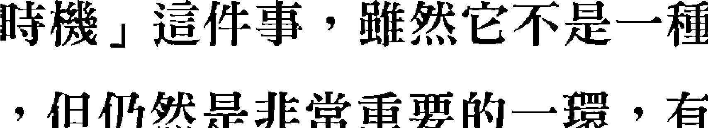
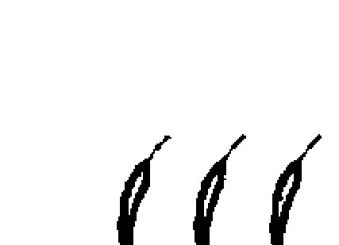
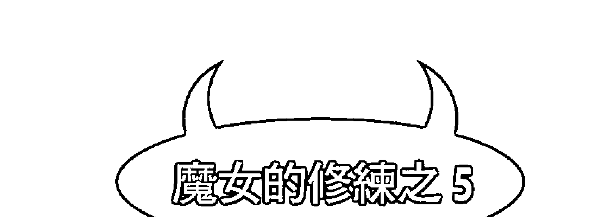
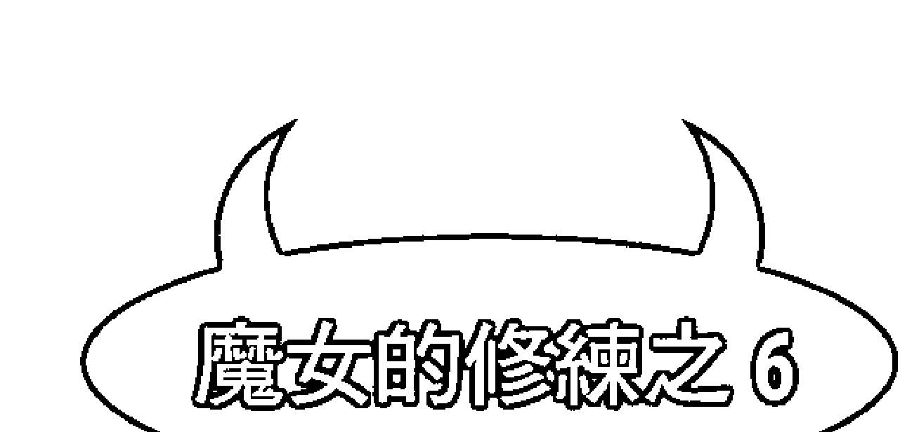

# 一针见血、两针见骨，三针见阎王的麻辣说话术

## 平常是猫，可以秒变猛虎，这是说话的江湖

你相信“人性本善”吧！从小就被大人教导着做人要温良恭俭让，人不犯我、我不犯人，生活一片祥和，王子与公主一直过着幸福快乐的日子。

然而，生活真是如此吗？人与人之间，因为立场冲突、观念差异、修养高低、情绪暴走，甚至只是无聊，言语霸凌的戏码总在我们的生命中激荡出或大或小的涟漪，严重者还留下多年难以弥平的伤疤。当佛系只会被软土深掘时，该如何自救？
言语炮弹向你射来，是闪进避弹坑还是迎面发出干扰弹直接摧毁它？

本书读过三遍，你能够获得与天空老师同样为自己而战的勇气。

熟悉天空老师的人都知道她是资深猫奴，而她给人的初步感觉也像是只和善的猫，殊不知在面对必须断然处置的话锋对战时她能秒变猛虎，往往能一招遏制来犯者，且再无争端。

出身命理世家，一直以占星学、塔罗牌占卜课程教学为人所知的天空为限老师，在她自己的朋友圈子里其实还有一项过人本事是“吵架”。总是强调自己脾气不好的天空老师，与其说她爱吵架，毋宁说她不畏惧言辞交锋，仙女般机灵的她怀抱良善的人生观，在超凡格局的价值观中也展现着女神级的超龄智慧，在本书的每一回吵架守则中演绎出令人击节叫好的舌战实录。比如：

没有老师在的小学生自习课喧闹不已，顽皮不受控的男同学还挑衅着以难听脏话顶撞担任风纪股长的你，你该如何巧妙回应来扭转窘境？

你骑机车在路口因为红灯等停，一旁有辆计程车的司机打开车门出来走近你，怒气冲冲质问你：“你撞到我的车了你知不知道!?”，同时手指向他车外某个不新不旧的刮伤痕迹，看来你不破财消灾是过不了这关啦，然而，还有什么更好的解决之道？

同学会上，N年不见的某位白目病上身的中学同学以你不复当年的身材话题画靶，鬼打墙似地对你说：“你真的胖不少耶！”，如何摧毁其无益于重现当年情谊的粗暴话锋为自己扳回局势？

**本书读过五遍，你能学会如同天空老师那般“虽千万人吾往矣”的坚定。**

在酸言酸语永远 ONLINE 的网络上，从不缺站着说话不腰疼的好事者。遇到酸友评论你支持的音乐作品：“难听，根本就侮辱了这首歌！”，如何一针见血地浇灭此无名火？

流浪猫狗志工在援救中途常听到“你有钱有时间帮助这么多猫狗，为什么不去帮助人类？”之类扯后腿式的质疑，如何让他们不帮忙就请闭嘴。

长辈情绪勒索到已经让人忍无可忍时，可以还击吗？向上管理是今世媳妇无法逃避的课题，天空老师在交男友的阶段就看透此关键，与以宠儿子为使命的男友父母交手过的案例个个经典。

天空老师自带侠女性格绝对仗义直言，嫉恶如仇不手软，她女帝级的世界观足以笑傲人性暗黑面，由歪理所支撑的歧视谬论在其照妖镜下一一现形。

**至于要读过几遍，才能懂得天空老师秒解诡辩谬误的思维逻辑呢？不多，十遍足矣。**

谨以本书向荣耀归来的天空老师敬致，并由此揭露网络上流传已久，终于得以与读者们相见的——天空老师“吵架”传奇录。

## 推荐序 1
## 江湖上气势不能输

其实人生很多问题多数都是“人际关系”的问题，吵架也是。你会跟一个人吵架，往往是他的某个行为或言语牵引到了你某个情绪，可能让你联想到某件事或是曾经委屈的自己，才会让你想要“反击”，但其实很常常发怒的人，是脆弱的，或许他不懂除了愤怒以外的沟通方式吧？

很会吵架的人不一定常常愤怒，但很多无法好好沟通、表达自己生气情绪的人，却常常会跟自己过不去，所以我觉得想要不再生闷气，学会怎么“吵架”，真的可以参考这本书。

天空老师在我印象中，是常常妙语连珠的人。我跟天空老师认识多年，当时环游世界之后回到台北的我，还没开小公司的我，是她的读者，老师的文字有种莫名的扩散力与连结，我后来一直透过网络跟老师保持联系。如今为这本有趣的书帮老师写序，只能说人生实在太有趣了。

不论在职场或商场上，我看过太多假借“自己人，不要分那么清楚”实则行情绪勒索的行为。我觉得要把自己的游戏规则先说清楚，表明自己不喜欢的事情，没必要在被甩锅的时候，替别人扛他应该负责的责任。这样的讨好行为很有可能剥夺对方成长的机会，恶性的让对方持续“依赖”，导致自己被压垮。

透过保护自己底线的吵架，也是提醒我们爱自己、珍惜自己、重视自己感受的表现。

愿这本书让我们知道自己的不足与软弱，在你需要维护自己的时候，成为你的另类祝福！

God bless us.

梅塔/metta

## 推荐序 2

在我们成长的过程中，相信大家都遇过那种不可理喻的人，学校或家庭都教我们面对遇到这种不满或是不对的事情，只能选择隐忍抑或是和平沟通“绝对不能吵架”？而“吵架”这两个字就此被妖魔化了！相信透过天空老师的这本书，您会发现面对冲突与情绪，“吵架的艺术”与“吵架的技术”也是人生里沟通协调必学的一门课，书中的 22 个章节，如同塔罗的愚人之旅，让您在未来面对每一次的冲突与沟通，都能“势”如破竹掌握先机！

塔罗公癒心创空间 Ricky Otis

## 前言

我梦寐以求的书要出版了，我兴奋好久。

当初是一位总编，要我写这本书的。她说：“虽然你是以神秘学的书著名，但我觉得你的本领是写作，重点不是神秘学，你写什么我都有兴趣。”后来就签了这本书，但之后他自己成立的公司因为伙伴生病就暂时收掉，出书计划也就不了了之啦。

但我写出来以后，对这本书非常有信心，神秘学可以学，说话可是学不来的，那是天份！这本书是我纯粹的天份展现，但我找了好几家出版社，他们只对我神秘学的书有兴趣，而且说话术的书除了少数，大部份是销路不太好的，所以我也可以理解大部份出版社的犹豫。

有一个笃信灵性的人跟我说：“我劝你不要出这本书，会给你带来很不好的业力。”她就是笃信正面思考法则那种人，我觉得很奇怪，不高兴的人不讲出来，我的用法都是可以把情况扳正，难道要憋在心里，毒害自己才会有福报吗？这种人就是对灵性似懂非懂，又觉得自己很了不起，才会讲这种话。

我觉得最好的不要跟人吵架的方式，是一分钟之内就结束它，让自己不要再被这件事困扰，至于对方，他们可以用正面思考模式啊！我讲的话不管好不好，他们都可以正面来解释我讲的话啊！这样不是皆大欢喜？以后买我的书，我会建议他们加买一本正面思考的书，好好修行自己，这样不是很好？

后来达观的总编愿意收留这本书，电子书跟纸本的我们都会出版。我本来觉得不行的话，我自己出电子版就好了，不管用什么形式，我相信它都可以帮到该帮的人，正面思考不能只是用说的，如果你可以让你别人不再找你麻烦，你的思考当然就会正面多了啊！

我从小讲话就不让人，但人缘还是很好，如果我每次吵架都跟人缠斗很久的话，我相信我的形象会很差，而且不会让人敬畏，如果让他们敬畏我的话，会直接就不来惹我了，这样大家都省事。我的人格有很多部份，不是除了吵架之外什么都没有，如果有人的人格这么单调，除了一样东西之外什么都没有，就算他的兴趣是行善，我也觉得他不太会有人缘，因为从你身上看不到多元的事物，也看不到有趣的人性，那谁会想跟你相处？人性本来就要有正有负才会精彩，也才吸引人。

希望大家多多给我反馈，因为我年纪也大了，讲话风格也有所改变了，说不定可以再出其他风格的说话术跟大家分享。

## 目录

编辑室报告 · 5

推荐序 1 · 8

推荐序 2 · 10

前言 · 11

吵架守则第 1 回【小辣】 · 17

有些时候，赢了一场架反而失去更重要的东西。

吵架守则第 2 回【中辣】 · 23

吵架不需要口出恶言，通篇礼貌性的文字也可以达到攻击的效果。

吵架守则第 3 回【小辣】 · 31

吵架的最高境界，是还没吵之前，你就把事情解决掉了。

吵架守则第 4 回【大辣】 · 37

这次要聊的案例，真的是标准的“吵架”！

吵架守则第 5 回【中辣】 · 45

这一篇不是教吵架，是教还嘴的。

魔女的修练之1 · 57

婚姻的义务？

吵架守则第 6 回【中辣】 · 63

以直报怨，以德报德。

吵架守则第 7 回【小辣】 · 69

怎么样可以口不出恶言就反击。

吵架守则第 8 回【大辣】 · 75

如果不能用气势压人，那就要把“道理”讲出来。

吵架守则第 9 回【中辣】 · 81

有时该帮的不是“人”，帮理不帮人。

吵架守则第 10 回【小辣】 · 89

人有表达自己意见的权利，但没有硬要别人遵守的权利。

犀利人妻～妳知道自己要的是什么吗？

吵架守则第 11 回【大辣】 · 103

即使是两岸之间，也有需要踩稳的立场，讲理不讲情。

吵架守则第 12 回【中辣】 · 113

宁可让别人难过，也别让自己难过。

吵架守则第 13 回【中辣】 · 117

并不是我讲的话有多狠，而是这就是他的致命伤。

吵架守则第 14 回【小辣】 · 123

吵架的决胜点并不完全取决于吵架内容，有时是吵架的时机点。

吵架守则第 15 回【中辣】 · 141

只要把他的逻辑点出来，再加以强调、凸显，就高下立分了。

魔女的修练之3 · 147

爱情其实不需要答案

吵架守则第 16 回【小辣】 · 155

训练自己在怒火冲天时，仍维持可以思考的能力。

吵架守则第 17 回【小辣】 · 163

男女之间“交手”、“斗智”之道

吵架守则第 18 回【小辣】 · 169

每个人都可以找到太多生命对自己不公平的地方，不仅限于女人。

吵架守则第 19 回【中辣】 · 177

很多事情你仔细想想，我们并没有交代的义务。

吵架守则第 20 回【小辣】 · 185

亲人之间不需要动怒，跟外人才要吵架，因为一动手非死即伤。

魔女的修练之4 · 141

丑男比较不容易花心

吵架守则第 21 回【大辣】 · 197

你拿你妈跟我比，我当然也可以拿你跟我爸比。

吵架守则第 22 回【中辣】 · 209

以对方讲的同一件事情，换个角度切入，也许能得到有利的答案。

吵架守则第 23 回【小辣】 · 217

讲好话，也是必要的。

魔女的修练之5 · 221

男人的作用，是激发女人的独立性

魔女的修练之6 · 223

可以原谅，不用接受

后记 · 229

慈悲？

## 吵架守则第1回【小辣】

有些时候，赢了一场架反而失去更重要的东西。

有时候所谓的吵架，是没有什么建设性的，纯粹就只是耍耍嘴皮子而已，但你要说这种耍嘴皮子没有任何意义吗？也不尽然。

我们常常必须做一些没用的事、说一些没用的话，目的在于抒压。有时候朋友来问我要怎么还嘴？我都会先问一下他们，看看这次吵架有没有一定要赢的必要？有些时候，赢了一场架反而失去更重要的东西。

但我也不会一直讲大道理，什么：“亲情／爱情比输赢更重要”啦、“何必争这种小事”啦、“爱就是不计较这点小事”啦，我认为每一段关系都应该要平衡！如果你是习惯性受气的人，那么情绪淤积久了也会成一种心理上的不健康，更不是什么好事。

要说这本书是教人怎么大吵一架的书吗？其实我觉得不是，我反而觉得这本书是教你怎麼用最短的时间、最少的话，把眼前烦心的事结案掉的方法。就我来说，这是一本教你怎麼不用吵架的书，因为如果很快就赢了，自然就不用吵架啦！

朋友问我，如果有人看我的书，跟别人讲话讲赢了，但卻惹火对方，闹出命案来怎么办？我說如果对方是这种人，你不应该等到吵赢架才发现，平常就感觉得到对方不太正常、EQ差、人格有问题了吧？不然为什么你吵输这么久都没杀他，而他吵输一次你就必须怕会出事？对于这种人，当然是不要跟他吵架啊！而是要远离他！跑越快越好，离越远越好！不用吵赢他，只要抛弃他就好。如果你还在想什么自己会不会太绝情？那我劝你最好继续当受气包比较安全，因为没人救得了你。

这本书教你的吵架，是跟吵了有用的人，也就是你压制对方一下，对方就会有点忌惮或是记取教训，这种程度而已，但如果你就是跟一个输不起的人相处，而且要整天担心自己会不会惹火对方，这种日子过得下去，那真的是你的自由，我也没办法。

但我也要說，我教的吵架纯粹就是为了赢、出一口气而已，没办法让感情变好，只有办法让你的心理得到平衡而已，也就是拿来发泄用的，只是让你的心理健康变好，千万不要觉得从此以后你就可以当老大了，因为不平衡的关系是没办法持续的；我的吵架法，只是让你在受气太多时，让你拿回一点优势，但过头了就会换对方受不了了。我奉劝还想嫁人的、还想和好的，就不要用我这种吵架方式，因为我没有更高的目的性，只是想讲赢、或是小小报复一下而已，千万不要得意忘形。

有时小小的堵回去，产生的痛快感就已经很够了。

我的职业算是命理业，虽然我是比较西方路线的，不是铁口直断型，但不免有时候还是被当“算命仙”看待；我刚出道时有几次因为公益活动，提供免费的解牌服务，后来我决定再也不这样做了，因为免费的状况下，上门的客人都不是真的有什么问题想解决，只是问好玩的或来“测试”你一下。

几年前，我就遇过一个客人，在吵闹的会场，一坐下来就大摇大摆地问：“我想问，我可以活到几岁？”

这就是观念不同了。在我学习的灵学中，人类回到灵界的时间其实没有命定，而是会有几次的可能性，我们称之为“开口”，如果觉得任务完成了，就可以经由这几次的机会回到灵界，也许用东方的说法，就是有“劫”，但即使是东方命理，也是会告诉你几岁的时候有劫数，不太会说你一定会死，除非是年纪已经大了，自己已经做好准备了，才会有迹象出现，不然我们胡乱帮人判死刑，是很不道德的。

但是就我的经验，其实这些人也不是那么认真想知道自己的死期，如果是经由正常管道付费咨询的，我还会觉得对方是认真的；这种随便问问的，我如果费心思去跟他讲逻辑，我会觉得我侮辱了自己的工作。

所以其实不用太认真的回答对方，那时我就回答：“你会死的时间，在三十六年五个月又二十天之后。”他气高张地问我：“妳怎么知道？”我回答：“你不用管我怎么知道的，这是商业机密不能跟你说，如果那一天到了你却没死，欢迎你来踢我的馆。”

这就解决掉啦！如果三十六年以后，对方还记得这件事、而且还找得到你时，我们再来解决吧！

事实上，如果你想测试算命师，请问一些自己有办法验证的事，不要问一些对方回答不了的事情，不然如果像我这样随便回答，你根本也没办法反驳啊！因为不到那一天不知道答案。

说到这件事，我又联想到另外一件事，有一次我的朋友去参加一场比赛，主持人是幽默风趣型的，也就是综艺咖！那时为了节目效果，主持人就问我朋友：“我可以问你一些问题吗？什么都能问吗？”朋友当然说可以，主持人就问：“请问，你头上的头发总共有几根？”这本来是一个很捉弄人的问题，但我就在台下回答：“二十九万五千三百零七根。”这时大家都突然愣住，因为不知道我讲的是真是假，我就又加了一句：“不然我们现在当场算，多一根或少一根都算我输。”幸好这位主持人反应很快，立刻把我的话视为一种幽默感，没有把我当成踢场子或找麻烦的人，真是非常谢谢他的好风度。反而我朋友下了台以后，有稍微念我一下，因为他觉得这种事情一个弄不好，或是对方反应不够快的话，就有可能傻住下不了台了。

我也只是嘴贱控制不住，倒是没有要修理人的意思啦！毕竟这种场合都是在玩闹的，就只是一时冲口而出而已，我就答应他以后要看场合说话了。

## 吵架守则第2回【中辣】

吵架不需要口出恶言，通篇礼貌性的文字也可以达到攻击的效果。

我有一个朋友，她的父亲是个职业骗子（其实我觉得这个职业超酷的……），很早就不管家人了，家人要得知她父亲的近况，都要看最近他有没有骗什么人被抓到，就会在报纸上看到他的消息（很有趣的是还会剪报留下来）；小孩长大后，这个爸爸还会三不五时出现装可怜，不然就是想办法要骗小孩给他钱，几番过后，他们三姊弟对爸爸完全死心，再也不想跟他接触了。

而她的妈妈虽然算是疼小孩的，但在她们都还小的时候，妈妈看破了，就一声不吭地离家出走，走得干干净净，再也没有回来过，对小孩也没有留恋的感觉。关于这一点，她觉得是好事，她妈妈能放得下，双方都省得负担，她也乐得轻松，因为不用被妈妈的自我牺牲拖住，她们姊妹其实在未来也少一个包袱，大家两不相欠就好。

三姊弟长大后也各自找到自己的专长，虽然过的不是什么大富大贵的日子，但也都是专业人士，在社会上立有一席之地。以他们成长的不利条件来说，我觉得他们真的算是自立自强、有出息的孩子了。

她当时在一间公司当网络营销人员，老板娘对一名女神棍深信不疑，拜女神棍当老师而且恭敬至极，以至于公司内部的员工，听到这位所谓“老师”的吩咐也都不敢怠慢，这位神棍老师几乎就以地下老板娘自居了。

有一次这位神棍老师，打电话到公司里，一副以我朋友上司自居的口吻说话，叫她把一样商品寄送给自己的朋友，说要帮公司作公关；事关公司资产，我朋友又是负责、谨慎的魔羯座，思考一下后告诉这位老师，这种事要老板娘直接吩咐她才能做，不能随便一个熟人就要她随便拿公司资产去做人情，因为她也不知道老板娘同意与否，神棍老师立刻就生气了，指责她不知好歹搞不清楚自己身份，她的脾气也上来了，魔羯座是越逼越会硬起来的人，就回答这位老师：“这是基本员工该注意的事项，我知道妳是我们老板娘的好朋友，但该把关的事我还是要把关，这件事除非老板娘直接跟我说可以，不然我不能随随便便就听一个不是公司内部的人指使。”

挂掉电话后她就忘掉这件事了，没想到神棍老师隔天居然写了一封信给她，信的约略内容就是：“妳很认真负责我们都知道，但是有时候照子要放亮一点，我知道妳从小没有妈妈教，所以教养难免差一点，不过我很同情你，就不跟妳计较了，只是请妳以后加油一点好吗？”

我叙述的这些内容，不是我把她的意思理解成这样，而是她真的就写出这些句子来！无礼的程度真是让人吃惊！（真的是连掩饰都不知道怎么做的太阳牡羊座）我朋友告诉我这件事并把信念给我听时，感觉气到声音都在发抖。但她一时之间还想不到要怎么反击，沉稳的魔羯座还是比较深谋远虑。

但是月亮星座跟这位神棍老师的太阳星座一样，位在冲动牡羊座的我（所以牡羊座的朋友们请不要生气，一个星座的特质，本来就是有正有反），比她更生气，当下就跟她说：“我来替你回信！”接着问出了一些资料，这位神棍老师跟我一样来自嘉义县，但她非常讨厌自己南部人的身份，老是喜欢伪装成天龙国人，觉得因此就可以证明自己高人一等，并且非常自豪自己長得比實際年齡年輕，常常會炫耀別人說她年輕美麗又有智慧。（大家看到她以上那種沒水準的表現，就可以知道她對自己的認知並不正確）

有了這些資料，其實等於已經抓住她的弱點，考慮到這名神棍仍然是老闆娘尊敬的所謂「老師」，我這位深思熟慮的魔羯朋友希望我溫和一點，畢竟她還沒有決定離職，也還沒想清楚下一步要怎麼走，太早撕破臉反而會讓她處於不利的情境；我當然可以明白，所以就決定用非常禮貌性的文字寫信。

用有禮貌的文字寫信，要怎麼攻擊人呢？其實這種寫法，會像一首曲子一樣，曲子是由眾多音符組合起來的，音符組合起來時非常好聽，但是一首歌好聽，是取決定其中「**哪一個**」音符才讓它變得這麼好聽呢？當然是沒有答案的，因為只有把音符組合起來，才能變成一首曲子，也才有好聽的可能性。同樣的，我們要羞辱人，要用「**哪一句話**」來羞辱人呢？實際上不用一句確切的羞辱字眼，只要文章組合出來有羞辱的意思就可以了。

於是我寫了一封信如下：「收到妳的來信，讀完之後我不禁對妳感到深深的謝意，因為我常常因為自己沒有父母，而覺得比別人矮一等，但是看完妳的來信之後，讓我瞭解到，有父母的人，禮貌跟水準仍然比我好不到哪裡去，這讓我拾回了自信，瞭解到自己並沒有比別人差，真的很感謝妳。

我這位朋友雖然跟弟妹寄居在家境也並不寬裕的伯父家，但是住家房子是長輩留下來的，當時房價還未飛漲，所以這間祖居雖然小小舊舊的，卻也位於現今台北市精華地帶，之後的年代房價高漲了，後來買下附近房子的都是有錢人，所以當地的小學跟國中教育資源都很好，同學也有很多出身權貴家庭的，於是我就拿這一點來作武器。

「我與妳無親無故，妳還這麼擔心我的家教問題，真的讓我受寵若驚，很謝謝妳的關心。但是請妳不用掛念，因為我們學校老師很關心學生，教育素質也很高，我雖然沒有父母，卻有老師教導。但是我很好奇，妳為什麼對於我沒有媽媽這件事這麼在意呢？我想了一想就發現，可能是因為妳是在鄉下地方長大的，我聽人家說，鄉下地方小孩素質比較參差不齊，教育資源又比較少，導致學生們優秀的就很優秀，如果不是天生就優秀的孩子，又沒有受到老師良好的指導，很容易年紀輕輕就失學走上歪路，女生則是早早嫁人生子或步入風塵，妳來自這樣的環境，當然看事情用的就是這樣的價值觀，我可以理解；但我們學校的教育環境不錯，同學不是成績高於其他學區的孩子、就是名門望族的後代，學校也非常重視教育跟我們的品格，因此實在不需要讓妳這樣擔心，請勿太過擔憂我的教養問題^^~。」

當然，我沒有看不起鄉下的意思，我自己就是出身於一整天內只會有早午晚三班公車經過，連一家便利商店都沒有的南部小村子，但我從來沒有掩飾過我自己的故鄉所在，且我覺得那是非常漂亮怡人又溫馨的好地方，連便利商店都沒有的環境，反而更容易保持純樸跟特色。我在有需要講禮貌時，還是可以很有禮貌的，人的心理素質其實跟出身地點無關。

只是這是對方覺得自卑跟在意的弱點，我們就要擅於運用，不說白不說。不用管事實是什麼，只要能讓她心虛就夠了。

中間我還寫了些什麼，年代久遠我也忘了，只是她年紀大我們許多，又那麼自戀、那麼在乎外貌，一定也很在乎年齡的事，所以我就寫下一句結語：「謝謝妳請我加油，我本來也想一樣請妳加油，但想到妳的年紀，我就只能請妳保重了。祝順心。」

我朋友看完信瘋狂大笑，但還是有點緊張地問我：「這樣她會不會氣瘋翻臉啊？」我很有信心地說：「不會，如果她想告狀或是想到處講妳壞話，她就得讓別人知道這封信的內容，但是我寫的那些東西，我相信她打死都不希望讓別人看到。」

最後我的朋友還是把這封信做了修改，以她的語氣來寫，並且修飾得再圓融一點，才寄出去。我也不反對，既然信是幫她寫的，信就是她的了，只有她自己明白她跟對方的關係，也才最知道要拿捏到什麼程度剛剛好，我就也沒有看過那封修改過後的信的內容。

過一陣子後她告訴我，果然對方收到這封信之後，沒有任何反應，但也沒有再找她的麻煩，但事後她悄悄向對方助理打聽狀況，知道這位神棍老師果然氣瘋了，但就如同我們預期的，這封信的內容她不敢讓別人知道，因為那無疑是往她的臉上打了一個耳光。

這一次，算是我們讓她挨了一記悶棍。在不能公開得罪的人身上，這種方式最適合了。

## 吵架守則第3回【小辣】

## 吵架的最高境界，是還沒吵之前，你就把事情解決掉了。

這件事情，嚴格來說算不上吵架，但是類似的網路討論很多，往往到最後會演變成大戰！但我說過，吵架的最高境界，是還沒有吵之前，你就把這件事解決掉了，讓對方也無從吵起，所以我覺得可以當作一則事先防範的案例。

我以前在網路上，比較常寫的是兩性文章，從文字當中，大家都可以看到我的個性是偏強勢自主一點的，雖然我個人認為不完全正確，但很多人把我歸類在大女人主義那一型的；我是覺得我雖然自主性很強，但是也不太愛控制別人，應該不算太強勢，不過網路形象也解釋不清楚，所以就不解釋了。

有一次，我就被公開指名，要我回答一個問題：「男生女生出去吃飯時，是否覺得一定要男人付錢？」這個問題一問，加上對方那種等著看好戲的口吻，我就知道這個問題是問來挑釁的成份居多。

如果我說，男人應該要付錢，那麼她就會說：「妳不是很獨立自主的女生嗎？什麼事都依賴男人，根本就算不上現代新女性。」如果我說不應該讓男人付錢，她應該會說：「妳不是身價很高，在感情中是比較優勢的那一方嗎？怎麼連讓男人請妳吃個飯都沒辦法？」因為這兩種論調我都常常聽到，尤其是在討論兩性關係的圈子裡。

**但其實我覺得提出這兩個問題的人，都犯了一個很基本的錯誤，就是他們把「請吃飯」當成一件很重大的事，但吃飯就是吃飯，有什麼了不起的？**

我的回答是這樣的：「如果我對這個男人沒有特殊的意思，那我就不會讓他請我吃飯，因為不過就一頓飯而已，難道我自己吃不起嗎？當然就是要對這個男人有興趣，才會給他機會幫我付錢，讓他可以表現一下，換句話說，幫我付錢不是一種義務，是一種權利，要我喜歡你，你才有資格幫我付錢，因為我自己又不是付不起，請你都請得起！在我不會需要人家幫我付錢的情況下，我還願意讓你付錢，這就是對你好。不是隨便什麼阿貓阿狗都有資格幫我付錢的！」但之後如果妳高興，那就再回請男人吃飯，或回送他禮物就好了，有些女人把在結帳的時候闡明自己的兩性原則，當成是一件很帥的事，我覺得這很無聊。

就這樣說，對方停頓了很久，很明顯的是無法接話。因為她的想法很蠢，她認為男人幫女人付錢，是女人的榮耀，女人有身價的證明，她不知道女人最高的境界是：「你求我收下，我還要考慮。我收下了是給你面子。」還以為拿點小禮物就可以沾沾自喜。

就實際上而言，也有另一層考量，感情要有來有往，就是要你欠我一點、我欠你一點，才互動得起來，如果凡事算得清清楚楚，連讓人家請客一下都不肯，這並不是有氣魄，也不叫獨立自主，這叫作不想跟對方扯上關係。可是現代女生都被教育得太明理了，沒事不受人恩惠，如果對男方有好感的話，更是捨不得讓他付出、想跟他「平等」！但這就等於不接受別人對妳的好，這沒什麼好驕傲的，在男方解讀起來，正好意思跟妳想表達的完全相反，他只會覺得這樣代表妳對他沒啥好感，如果有好感，誰會這樣劃分得清清楚楚的啊？一點情趣都沒有。**本來就要有來有往，關係才建立得起來，什麼都要兩不相欠的話，妳跟路人去吃飯就好啦！**

但這種境界，是要完全擁有自我的女人才能辦得到的。只有無法獨立生存的女人，才會覺得靠男人供養是一種福氣，而認為「只要是男人就應該要請客」的，我覺得很也很 low。生存能力強的女人，會覺得讓你對我好，只是我給你一個表現的機會而已，實際上你給的這些東西，我自己又不是買不起。所以，一個女人講的話完全可以顯現她的身份是高是低，心態是自主的還是卑微的。

**越是獨立自主的女性，越是有空間讓人家對她好。因為她不是沒有這些恩寵就會活不下去，就完全可以把這些純粹當成禮物來看待，也才不容易給雙方都造成壓力。**

還有另一種狀況是，這個男生真的是妳的好朋友，那互請很正常吧？我常看到有些女生，跟姊妹淘請來請去，覺得是不分彼此我們感情很好，但遇到男生就一定壁壘分明，我覺得這樣滿無聊的，而且看得出妳就是特別重視男人，因為這代表這只是妳想彰顯「我很特殊，我跟其他女生不一樣」的方式，這是另一種型式的在討好、在包裝，我覺得沒有什麼不同，就像奧修說過的：「如果有錢人是藉由有錢彰顯自己，那麼到了一定程度，有人就會改為用貧窮來彰顯自己，因為這樣才跟人家不一樣，實際上兩者沒什麼不同。」如果你們覺得過去的女生是用「男人幫我付錢，我有這個身價」來幫自己抬高身價，那這些女人現在也是用「我可不會讓男人幫我付錢，我是好女人！我很明理！」來提高自己身價，兩者沒什麼不同。

## 吵架守则第4回【大辣】

## 这次要聊的案例，真的是标准的「吵架」！

我知道台湾人一向不喜欢起争执，避免争执已经到了一种不分是非的地步，就算偶尔鼓起勇气来辩驳，也一下子就弱下去，只想赶快结束话题，这种状况下，吵架不但不会赢，你还会被人看破手脚，对方会更加得意洋洋。

然后呢？你不但不知道自己怯战会造成更大的失败，还会到处跟人说「早知道就不要跟他吵了，到后来弄得很難看……（你最难看的是没有赢对方这件事）」或是「要不是怎樣怎樣，我一定跟他没完没了！」如果我们追问为什么不跟对方没完没了呢？这个人还会支吾半天，反过来跟我们讲什么「冤冤相報何時了」、「做人要心平氣和」的道理；如果是這樣那你剛剛氣得半死是在氣假的嗎？我是覺得，只要心裡有氣，就要發洩出來，才能維持心理健康；明明情緒已經半挑動，又因為害怕吵架在那邊講什麼「我們比較有教養不跟他吵」之類自我安慰的話，該講的話也沒有講出來，悶在心裡，真的悶得住也就算了，據我看到的例子，在外面受了氣的人，往往會拿家人發洩情緒，我覺得這是非常怯懦卑鄙的作為，在得罪你的人面前你堅持當個有教養的人，在家人面前你就什麼教養都不願拿家人當出氣筒，所以人生就永遠在錯誤的對象面前做錯事。人一旦開始欺騙自己，就會一直延續下去了，而且自己已經習慣了，永遠不知道問題在哪裡。

好啦！雖然前面講得冠冕堂皇，但這完全是一次暴怒的吵架，唯一可以供大家參考的價值，就是「要吵就要吵得徹底一點」這件事。

很久以前，我還在當上班族時，有一天騎摩托車經過一個十字路口，因為是紅燈，所以我就騎到前方停下來，有經過幾輛私家車及計程車，我很確定完全沒有碰到任何一輛，老實說連靠太近的情況都沒有，因為我是一個騎車都過度小心的人，如果沒有把握我寧願停下來。

就在我停著等紅燈時，右後方一輛計程車的駕駛突然開門下車，用疑神疑鬼的表情檢查他的車，我那時根本沒注意，只是眼尾瞄到，然後他一邊檢查一邊惡狠狠地瞪我，但我還是不知道那是針對我的，他看我沒反應，就特地繞到我的面前，大喝一聲：「想跑啊!?」然後又回去繼續檢查他的車。我一時間腦袋就迷糊了，跑什麼跑？我為什麼要跑？

他裝腔作勢地檢查後，走到我旁邊，大吼：「妳撞到我的車了妳知不知道!?」

我又更困惑，如果我撞到他的車，我怎麼可能不知道？所以就用很疑惑的表情看著他，他可能看這種表情沒什麼殺傷力，誤以為我是好欺負的人，就更兇狠地說：「我說妳撞到我的車了！」

他不知道的是，我因為剛剛跟男友吵過架，一肚子氣沒地方發作，我只是一時反應不過來（因為我真的不知道他是在罵什麼意思的，還一直懷疑他罵的對象到底是不是我），並不是我脾氣很好或是我很溫和什麼的，所以算是他送上門來讓我出氣了。

我的表情我猜那時應該一瞬間變得很機車，我說：「什麼？我撞到你的車？」他很大聲的說：「對！妳……」我馬上更大聲地吼回去：「你說撞到就撞到喔？證據在哪裡？你少誣賴人我警告你！」他愣了一下，可能沒想到我會回罵，因為其實我的長相真的是看起來很溫和的那一型，他沒有我會反擊的心理準備。愣了一下後，他一邊走向車子，一邊指著車上一個地方說：「這裡有刮痕，妳看……」雖然遠遠的我看不清楚，但我也看得出來絕對沒什麼刮痕，我就用很不耐煩的口氣說：「你瞎了喔！哪來的刮痕!?」他堅持：「車上本來有灰塵，現在灰塵被刮出一道痕跡……」

這時我就很確定他是想敲詐了，這種狀況下更不能怯戰，否則他一定會窮追猛打，這種人渣如果嗅出你有害怕的氣味，他會更得意更步步進逼的。

我就大吼打斷他：「笑死人了！你這車子全台北市跑，你以為你是鑲金子還是鑲鑽石的？連灰塵都不會掉喔？灰塵掉了你就要找人算帳，你以為你是老幾啊？」

他這時氣急敗壞，但我覺得也有點措手不及，就一直反覆說：「我看到了！我就是看到了！妳明明就有撞到我……」我說：「你看到了我沒看到啦！不然你找個證人來啊！」他就非常暴怒地說：「妳下車，妳下車我們講清楚！」我說：「我為什麼要下車？你看起來就是個有前科做壞事的人！我哪知道你會砍我還是怎樣！白癡才會下車！」他就說：「妳一定要負責啦！」雖然我不知道車子灰塵被刮掉一點（而且我很確定絕對不是我刮掉的）是要我負什麼責，但我就很悠哉的說：「叫警察來啊！我奉陪，讓他們一鑑定就知道了！」

他一聽到警察看起來有點害怕，但他強裝作冷靜下來的樣子，說：「這樣好了，叫警察太麻煩了，我念在妳不懂事的份上，我不會告妳，也不要妳賠錢，妳只要跟我道歉就好了。」

他可能之前遇上的，都是想要息事寧人的人（至此我已經很確定，他應該不是第一次做這種事，因為我的反應如果不是一個女生應該有的樣子，他都會愣住，我相信是因為跟他設定好的劇本不同，所以他一時反應不過來），聽到道歉就可以沒事，一定馬上舉白旗，但我覺得只要一道歉，他更有理由咬住我不放，一定會說我自己都承認了什麼的。

我就說：「叫警察啦！我沒空跟你玩道歉遊戲！我跟你說啦！如果是我的錯，道歉賠錢都沒問題！我他媽的又沒碰到你車子要我道什麼歉？你跪下來求我我也不會道歉啦！」

他可能沒招了，就用很猙獰的表情說：「我警告妳喔！妳最好道歉！」我笑著說：「就不要！看你能怎樣！」他就大吼：「妳真的不道歉？」我更大聲吼回去：「你浪費我這麼多時間！我沒叫你道歉就不錯了！你想得美！」他可能眼看敲詐沒指望了，就收兵：「好吧！妳沒水準，算我倒楣！」然後就上車，想關上車門。

這時反而我跳下車追過去，一把抓住車門，一臉陰沉地問他：「你說誰沒水準！講清楚！」他抬頭看我，表情非常非常驚訝，接著一副不知道如何是好的樣子，我知道他嚇到了！

「講清楚，不然誰都不要走，下車！」我攀住車門堅持，他還是呆著，我就用腳用力踹他的車子並且大吼：「你一直說我碰你的車，我現在真的碰到你的車了，所以事情還沒完！你給我下車！誰都不要走！下車！」他震驚的樣子我到現在還忘不掉，這時有人從後面拍我，我回頭一看是個機車騎士，其實燈號已經轉綠燈很久了，周邊其他車都走了！後來想想他可能是看情況不對勁，想留下來幫忙，他怯怯地說：「小姐，不要跟這種人吵，你趕快離開，不然他……」我就吼他（現在想起來很抱歉）：「干你屁事啊！我警告你少管我的事！」然後再回頭，剛好看到計程車司機慌張地把門關上，火速把車開走的樣子（行進路線還有點歪扭），我就回頭再罵那個騎士：「都是你啦！讓他跑掉了！要你多管閒事！」然後我就氣呼呼地去牽我的摩托車了。

我常常跟朋友講一個概念，我說：「如果有人要追殺你，你會怎麼辦？」朋友們大多回答逃走、智取、安撫對方這一類的，我說：「不行，如果他要殺你，你是守他是攻，你輸掉的機會就很大，你要想的不是你要怎麼逃，而是要反過來想：我要怎麼殺掉他？這樣你就站在主動的那一方，就會用主導者的模式思考，那麼就更能掌握局面，贏的機率就大了。」

如果對方罵你混蛋，你絕對不能開始正經解釋為什麼你不是一個混蛋，你要罵對方卑鄙下流無恥；如果對方罵妳婊子，妳也不能解釋妳並不是一個婊子，妳要罵對方賤貨，或是相反的詞：沒人要！

解釋的人會處於劣勢，因為你就會看起來很像要求取對方的認同，那對方認不認同，決定權當然在他手上，就等於是是你把主控權交出去了。所以不管是是不是吵架，我的原則就是：不解釋。一旦需要解釋，那就是你解釋也沒用了，浪費時間罷了。

這件事也一樣，我想的不是避開對方找我的麻煩，而是：找對方的麻煩。氣勢上可以壓過對方，取得主導權的機會也就變大了。還有，不要輕易跟人開戰，但開戰了就要死咬著對方不放，要不然會前功盡棄，以後你再宣戰，也沒人會當你是一回事了。

## 吵架守則第5回【中辣】

## 這一篇不是教吵架，是教還嘴的。

相信很多人，尤其是女人，在現代生活的薰陶下，每個人都發展出自己的生活信念，適不適合婚姻、要不要有小孩、想過什麼樣的生活，都有著自己的喜好跟無奈，喜好的事情也許不符合社會常態，無奈的事情可能隨著時間過去也慢慢可以接受了；但是有時候是遇到不知輕重的陌生人，有時是逢年過節回鄉、有時是參加同學會……總會有人對妳的狀態指指點點的，我就常常看到有朋友被氣到內傷，但礙於對方並不是目前生活中非常熟悉的人，為了維持風度也就保持禮儀不回話，但事後又沒辦法釋懷，這個叫做妨礙自己的心理健康。

我的方針是：就直接開戰了。如果妳沒有反應，這些問句會年復一年不斷出現，妳每年都要內傷一次甚至好幾次；如果你直接嗆對方，就禮貌上來說，一來是對方先打探人隱私的，被妳罵的話，勉強也算合情合理；二來妳會怕翻臉，對方如果有點羞恥心的話，也是不會想翻臉的，到時候讓他往肚子裡吞，得內傷的人是他不是妳，這樣也是好事一件。

記住，吵架的其中一個要訣是「快狠準」，話不要太多，等於一拳正中對方的鼻子，你收手以後走開，他還搞不清楚狀況，也不知道到底要不要發脾氣、或甚至不知道妳到底是有心還是無意……能有這種結局，是最佳效果。

> > 與其讓自己哭，不如讓別人哭；與其讓自己心情不好，不如讓別人心情不好。

有些女人，尤其是生活圈狹小、見識不廣的女人，由於生命中沒有什麼可以拿來炫耀張揚的東西，到了一定的年紀過後，很容易就把「結婚」當作一項女人生命的戰利品，嫁掉了就覺得自己耀武揚威，沒嫁掉就心焦如焚，甚至開始把別的女人當假想敵，拚命想贏過別人，但沒有想過別的女人或許並不覺得結婚是一項勝利，畢竟同一件事，在不同人的生命中佔有不同的比重跟地位，但是她們的智商並沒有高到足夠去理解這一點。

其實就我的觀察，條件跟外表越平凡的女人越早嫁、或者原生家庭越不幸福的女人也越早嫁。

為什麼呢？因為如果妳是個漂亮的，或是不算漂亮但很有男人緣的女人，從小早就被男人捧習慣了，隨著年齡增長，對男人要求只會越來越高，而且自己都覺得「這些只是基本要求吧？」很容易男人對妳再好，妳也不會輕易許下相守一生的承諾，因為已經習慣的事物就沒那麼珍貴了。

而如果只是漂亮，雖然不會太早結婚，但也不會拖到太晚。因為謀生能力不強的女人，到了一定的年紀，因為心急也會開始降低標準、認清現實！既然沒有男人養就活不下去的話，那就不能太苛求，要趁自己在最佳身價的時候趕快推銷出去；這種時候，只要願意嫁、不太挑，外表不錯的通常都會有人願意娶進門的，因為在台灣社會的結構中，婚姻對男方仍然比較有利，男人對傳統婚姻的認同感還是大過女人的，不管夠不夠愛，年紀到了總是要結婚的，他們沒有女人那麼浪漫，時間點對了，又感覺不差的話，父母一催就結了，因為結婚雖然是一件重大的事，也有相對的責任，但是對男人來說損失並不大，且好處多過壞處。

女人，就像我忘了從哪裡看到的一句話：「想要把自己嫁掉哪有什麼難的？把自己的眼睛戳瞎就可以嫁了。」

女人在婚姻中仍擔負大部份的家庭責任，賺錢責任現在女人也跑不掉，台灣目前不是雙薪家庭很難活的；但懷孕也是女人的責任，帶小孩、做家事都是女人主要負責的，我不是說台灣男人沒有責任感，至少我交過的男友秉性都還不錯，但是男人的本性本來就比較像孩子，需要訓練跟馴服，我是比較懶的女人，我不做對方自然要撿起來做，或是願意做事的男人也才會跟我交往（笑）；但台灣女人一向太勤奮又很會安慰自己，可能凡事與其叫老公，不如自己做比較快，久而久之不是男人不想做，而是他根本不知道女人做了這麼多事，那當然就更沒他的事啦！所以啊！女人既然願意做廉價長工，哪有找不到雇主的道理？

那如果妳是漂亮、工作能力又強的女孩，其實就我身邊的例子來說，往往最晚嫁、甚至不嫁。雖然她們的口中說著：「我又不挑，只要 xxx 就好啦！」「啊！好想結婚喔，我不想孤單寂寞一輩子。」但說真的，一個條件好的女人，只要不是有太大的心理創傷，或自卑過度導致什麼爛男人都好，哪有真的不挑的？說是說不挑啦！但有時不挑錢、不挑身份地位，對方只要一句話沒猜中妳的心，一件事情沒順妳的意，讓妳幻滅了，就此分手的也不在少數。

工作能力強但外表普通的女孩，就很兩極化了。她們可能會在一段年齡層中，為了證明自己嫁得出去、生得出來，而拚死命想結婚，也很容易鬼遮眼挑了一個很差的，或是很差的男人但她說服自己不要太挑就嫁了。但如果真的沒遇到適合的，反正她是優秀的人，不怕生活過不下去，久了，結婚的衝動過去了，也就習慣自己的生活了，談談戀愛就好，除非出現真命天子閃電結婚，否則就也不一定要結婚。

但以上這兩種女人，至少選擇權在自己手上。

相對來說，最早嫁的，反而是那些外表、才能兩樣都普通（只是其中一項普通，另外一項優秀的話，也不會導致太早嫁，一定要兩樣都普通才行），在家庭中也不是備受疼愛的類型，嫁得最快最早！因為沒有受過太多男人吹捧，只要有一個男人對她們比家人對她們稍微好一點點，她們就很容易感動，產生「這個世界上從來沒有人對我這麼好」的感覺，越覺得珍貴就越容易想抓住，自然會很快就嫁了。至於幸福嗎？據我的觀察，很多真的都很幸福！因為容易知足，自然也不容易產生埋怨，有點小吵架也很容易就過去了，要的也不多，這種狀態當然最幸福囉！

（以上只是大致分類，不是絕對的狀況，我也有看過條件很好，但因為種種因素很早嫁的，只是這樣的女人沒幾個，我說的只是大部份的狀態，不是絕對。）

但我是鼓勵大家不要太挑剔，才能得到幸福嗎？也不是，這種事就算妳知道，要做到也很難，畢竟人的價值觀經由自己的生活塑造，要交換也很難啊！

我講了這麼多，只是想要解釋最基本的原理：結婚不是戰利品，如果要進入婚姻，真的要抱很大的決心，犧牲很多事物；所以越是沒事業、沒男人緣、沒什麼東西可以失去的女人，越容易放棄一切去結婚，追尋生小孩的成就感，反正她們本來就什麼都沒有，失去了也不可惜；但很多女人弄不懂這一點，總覺得自己沒結婚就輸了。

在我的生活中，什麼條件都吃虧，可是一旦結成婚就覺得自己烏鴉變鳳凰、身價倍增的女人雖然不多，但偶爾還是會碰到的。

有一次我回鄉，遇到昔日女同學，她又聯絡其他還留在同樣縣市的女同學，大家一起聚餐，算是很愉快。我已經三十好幾，身材發胖不少，但我已經到了沒什麼差耽心的年紀了（笑），還是大膽地出席跟老同學們的聚會。

大家都很有禮貌，沒有人刻意提我發胖的事，是說每個人都也變了不少啦！我也沒有去提她們改變的地方，大家算扯平，而且聚會中洋溢在心頭的都是年少的往事，看彼此都格外親切，自然不會刻意去提老化這些事。（我還是說出來了）

但其中有一位女同學，從學生時代就跟我不太合（是她跟我不合，我沒有跟她不合，因為我根本不會注意到她），可能是見獵心喜吧？就每兩、三句話就帶到一次：「妳真的胖不少耶！」我笑笑說：「對啊！」我是心裡覺得老娘胖再多臉還是比妳漂亮，而且不想破壞氣氛，她可能誤會我是尷尬但硬憋住受傷的心靈，跟她強顏歡笑，所以有點得意洋洋。

等到她第 N 次提起，並且跟我說：「妳怎麼都不想減肥呀？」我終於覺得煩了，用很溫和的口氣跟她說：「對啊！也是，我真的該減減了。」她就趕快接口：「對啊！妳怎麼受得了自己變這樣？」我仍然語氣平和地說：「減肥又不用花錢，我不減真的是說不過去，不像妳是比較需要整容，那要花很多錢的，妳沒去整就說得過去了，妳跟妳老公賺得不多吧？」

她的臉唰一下青掉，滿桌同學也倒抽一口氣，突然全部靜默下來，我倒是很自在地繼續吃我的東西。大家切記，不要一時衝動講話，但如果克制不住衝動，講出來了就不要後悔，一旦後悔就會讓你自亂陣腳，你已經講了，那就面對接下來的事吧！

接下來她臉青了很久，但我仍舊跟同學們閒話家常，跟這位臉青的同學也仍然是有說有笑，一副渾然不覺我剛剛闖了什麼禍的樣子，大家也不想破壞氣氛，就合力一起想把這件事帶過去，她也不好發難，而且說到底，是她先惹我的，自己惱羞成怒也說不過去。

之後她大概想扳回一城，跟許多女人一樣，以為我還沒嫁掉，一定會有某種程度的自卑感。天曉得我這輩子覺得自己做得最對的決定，就是我拒絕掉的幾次求婚，「嫁不掉」跟「不想嫁」是有很大差距的，我當然没啥自卑的感覺。

後來要散會時，她叫她老公來接她，她把老公介紹給我們大家認識，一副當好人的樣子跟我說：「你啊就是脾氣太壞，才那麼難結婚，你脾氣改一改，我介紹一些我老公朋友給你認識，看能不能趕快結婚。」我笑得非常溫和地說：「你老公的朋友？那就跟你老公類型差不多的囉？唉呀不要開玩笑了，如果你老公這一型的我願意嫁，我早就嫁十次了，呵呵呵～～你真愛開玩笑。」說完我還是繼續咯咯咯地笑，還一副「你好討厭喔！」的樣子打了一下她的手臂，就是要讓她不知道我是開玩笑還是講真的，所以也沒辦法發飆。

但我還是想對她老公說聲抱歉，我不是故意要攻擊你的條件，要怪就怪你老婆吧！

這一篇我想送給一些覺得自己不夠完美，被人家講到弱點就覺得無地自容的女人（其實男人也是）。自信是要自己給自己的，我們當然都有缺點跟弱點，但並不表示你比別人差，因為別人也有弱點，是我們宅心仁厚沒有去挑他毛病而已；所以我們不用否認自己的缺點，只要說：「對，這就是我的缺點，我改不掉，就像你改不掉你的缺點一樣，大家要不相安無事，不然你就也不要怪我不客氣。」就好了。

> 「對，這就是我的缺點，我改不掉，就像你改不掉你的缺點一樣，大家要不相安無事，不然你就也不要怪我不客氣。」

發胖以後就發現，身材不標準的女人會遇到的歧視不少，但有人說我內在強大，很少被傷害到；我個人自認為是臉皮比較厚，或實在是太自戀了，我覺得胖是我的缺點，但是其他人的缺點也沒比我少啊！幹嘛我就要躲起來哭，其他也不怎麼樣的人可以大搖大擺走在街上啊!?

我在神秘學圈裡算是有建立起個人風格的，也出了幾本書，所以業界裡認識我的人還算多；碰久了就知道，什麼話都有人講，有人說：「老師，我本來以為妳是嚴肅的中年男人，沒想到妳居然是個可愛的小女生耶！」（是說我已經三十好幾了），也有人說：「妳笑起來超甜美的，聲音也好好聽。」還有一位女士說：「妳超有特色的，跟我想像中都不一樣，妳演講看到妳時很驚豔。」（我只能說她眼光特殊）

當然我們畢竟發胖了，不是什麼絕世大美女，批評的也有，但當然不敢當我的面講；有一次有人跟我告狀，說有個沒什麼名氣的塔羅牌占卜師說：「那就是天空為限？看來人生是公平的，她很有名很厲害，可是居然長成那樣！」我的優缺點其實我還滿客觀看待的，所以不太容易被恭維騙倒，但也比較不會被打擊到。我聽了第一個反應不是傷心，而是驚訝，因為講這句話的男人，依他的長相，實在沒資格批判任何人啊！

她本來覺得我會很生氣，但是我微笑的說：「不會啊！上帝還是不公平的，像他自己，長得既醜，又沒有名氣沒有才華，如果我是他應該會想自殺吧？他居然還覺得上帝很公平？真是一個善良的人。」

也有人當著我的面跟我說：「如果我告訴妳，妳這幾年胖太多了啦！真的要瘦下來才會比較好看！妳會不會生氣或難過？」臉上還帶著惡意的挑釁笑容，我笑瞇瞇地說：「不會啊！這是事實嘛！但如果是一個帥哥這樣講我的話，我一定會很傷心又自卑的，還好是你這樣的男人講的，我不介意。」

我是說真的，我內在再怎麼強大，也不是鐵打的；如果這是一個大帥哥講的，我一定馬上躲回家哭，感嘆青春已逝外貌凋零，這樣的帥哥不喜歡我，這樣的帥哥再也沒有我的份了，每想到一次就心痛一次……可惜他沒有讓我脆弱心靈哭泣的本事。（攤手）

我的上升星座是雙魚座，上升點是一個人外貌看起來的樣子，上升水象星座的確容易發胖（淚），但另一個缺點是雙魚看起來就一副很好欺負的樣子，所以老是有人從各方面來惹我，我是被訓練得太多了，在不得已之下反擊的功力才越來越強的，我個人也是很無奈的。（嘆氣）

其實我不是什麼善男信女，也很愛挑人毛病，心中也有一大堆 OS，人不犯我我不犯人，攻擊人的話沒事我不會講，但如果有人要來嘲笑或攻擊我，只是給我機會把心中對他們的批評講出口罷了；相信我，我在批評人，絕對比別人批評我的話難聽多了，如果他們不惹我的話，我還沒機會說出口呢！還要謝謝他們這樣攻擊我，我才能一吐為快！（笑）

## 魔女的修練之1

### 婚姻的義務？

昨天在某大討論區，看到一個令我很感概的主題，有位女網友開題說：她的男友暗示她明年結婚，原因是她男友剛買了新房子，還有車貸，身邊的人都要她男友快點娶老婆進門，好分擔家計；她男友的打算是：自己的薪水全部拿去付貸款，家庭開支由這位水水負責。此話題一開，當然眾水水們都來勸她不要嫁，因為房子不在她名下、甚至也不是聯名，這樣萬一以後離婚，對女人一點保障都沒有，就算房子過名好了，如果家計的擔子都在女孩子身上，她是不是連失業跟懷孕的權利都沒有？

再仔細一問，水水說男友去年買房子時，都是照他自己跟他媽媽的需求、喜好，她雖然有跟著看房子，但也是看看房子好壞出意見而已，那時提起房貸怎麼支付時，她男友還支支吾吾，沒想到一等到要交屋了，就自顧自地把她的薪水也一起計算下去，這時大家反彈聲浪當然更大，覺得這個男人自私又小氣；當然我想夫妻的義務應該是相對的，不是女孩子就什麼都不用付出，但至少要叫別人付錢，得經過當事人本身的同意吧？錢不是大問題，而是這種完全以自己的立場跟需要為考量的男人，很明顯的覺得老婆就是他的財產，找的是免費的奴才跟冤大頭，這種男人不管有沒有錢，注定是誰嫁他誰倒楣；悲哀的是，台灣目前大概一半左右的男人都是這種條件不怎麼樣，要求卻很多；臉皮厚到家，卻以為自己很講理；很會盯著女人看她有沒有盡到所有該盡的義務，包括最基本的跟後來社會發展出來的，卻完全忘記自己也是有義務在身的男人；男人素質真是一代不如一代……拿錢幫這種男人養家，我覺得不如把錢捐去救助非洲餓民，至少還替自己積到一點陰德。

依我之前發言的經驗，到了這時，有些自認為走在時代尖端、自以為很客觀的人又要說了：「為什麼妳們這些女人老是想著要男人養？為什麼妳們都不願意吃一點苦？男人也是人，他們也沒有那個義務要負起全部的責任啊！」或：「如果是一個男人，無條件為老婆負擔起所有的債務，妳們一定會覺得他是好男人，不會去罵他老婆的，這是雙重標準嘛！」

這話一點都沒錯，我也認同被老公照顧、被老公養，並不見得適合所有的女性，甚至女人反過來養男人，只要是歡喜作甘願受，同樣可以很幸福（雖然幸福的機率低了一點，因為很少有知足的男人）。

只是，男人寵女人通常寵得很爽，社會眼光沒有給男人應該要「認命」、「聽話」的壓力，一個男人再怎麼笨、再怎麼寵老婆、再怎麼卑微，一定是經過他自己本身的同意，沒有家族或傳統觀念可以逼得了他！那種犧牲是很能帶給人滿足感的；但很多女人是被安排、被要求，甚至是為了維持大局而被迫接下沉重的擔子，這就完全不能相提並論了；既然要一個女人寵老公，也必須讓她享受到寵男人的快感吧？要倒貼男人，也必須讓她有一種為愛情捨身的神聖感（雖然那是幻覺）吧？如果女人只是不得不如此，只會有無奈卻沒有付出的滿足感，這樣又公平了嗎？男人的犧牲是犧牲，那很悲壯，而女人的犧牲通常被認為是她「應該做的事」，偉大的程度差那麼多，倒楣也就算了，連個悲劇英雄的牌坊都拿不到，聰明的女人當然要能避就避了。

而且如果一個男人對老婆很好，也盡到他養家的責任，再叫他做家事的話，就會有很多人幫他叫屈了，但社會上家事、工作兩頭燒女人那麼多，她們的老公腦袋裡又何嘗想到過自己的義務了？又有誰覺得不應該了？所以之前如果有職業女性朋友跟我抱怨說：「老公都不做家事，他說那是女人自古以來的義務。」我就說：「那妳就跟他說，妳要辭掉工作做家事，請他支付所有的開銷，那也是男人自古以來的義務。」（要是我，我會直接告訴他我辭掉工作了，讓他嚇一嚇腦袋清醒一下，據我的經驗，要跟男人溝通，用講的沒用，用刺激的才有用。）

有些人就會覺得：「房子老婆也有住到啊！為什麼不用付錢？」那我就要說：「付的錢就照一般房租行情啊！而且房客不需要幫房東打掃吧？」那太太帶小孩，先生是不是也要付行情的一半褓姆費用給太太？（小孩子是父母雙方的責任，所以我說先生只需付一半價格的褓姆費喔！不要說我重男輕女。）

其實講這些都沒有意義！在一段關係中，不管是經濟面還是家務，要做到公平本來就很難，但是基本的尊重跟協調不能省略，就像開頭講的這位女孩子的男友，在他週遭親友的觀念中，可能女人都是站在這種極力幫忙老公、承擔的地位中，所以一廂情願地認為，女人一嫁進來就會自然而然地擔起她的擔子，他們卻忘了想一想，傳統的婦女雖然負起大部份的責任，但是家中大部份的事情，她們也都有講話、決策的權力（除非是遇到爛男人，那就不能用常態論），而不是就直接被當提款機來看待，盡多少義務就要享多少權利，這是很正當的吧？但老一輩的人太愛為自己的兒子打算，早早就把媳婦該盡的義務算清楚並等著榨乾了！卻沒有把兒子教好，也沒灌輸兒子他應盡的義務是什麼，更沒有相對承認媳婦應有的權利，有這麼多打著「傳統」當招牌，行扼殺下一代的婚姻幸福之實的家長們，我想社會婚姻制度要崩解的速度也會越來越快了。

## 吵架守則第 6 回【中辣】

## 以直報怨，以德報德。

很多人在捍衛自己權益時，會有意無意越線侵犯到他人的權益，我深知這一點，所以我很注意不要越界，自己的權益該爭取，但是也不要過頭。我有朋友知道我跟人吵起架來很兇，跟我出門逛街時卻非常吃驚，因為我不但不是那種到處找麻煩的人，相反的，他覺得我還「比一般人都有禮貌多了，有些時候人會太好」。

當然了，我雖然是雙子座，但命盤中落入金牛座的行星很多，金牛座是最講究教養跟禮節的星座！

對我來說，很多人的反應我才很難理解。人很好的，就變成好人是他的一種生存姿態，遇到欺負他的人他一樣要當好人，然後吃悶虧；有人很霸道很兇的，或很會爭取的，遇到對他好的人，他一樣兇巴巴。很多人覺得這樣很正常，但我一直不能理解為什麼？

當然是對我好，或是沒有惹到我的人，我要對他很好，對我兇的人我就比他更兇，我覺得這樣才合理呀！我不相信什麼以德報怨，我相信的是孔老夫子的原文：「以直報怨，以德報德。」我沒有裝聖人的興趣。

> > 「以直報怨，以德報德。」

所以一般來說，我對老人家或是明顯看來弱勢的人，一向是很有禮貌，甚至有點忍讓的，但以下要跟大家聊的事，我卻直接對一個老人不敬，不過是為了我的貓。衡量一下，在台灣社會中，動物比老人還要弱勢，所以我的良心沒有任何不安，哈哈～

我是個資深貓奴，撿到我的第一隻貓是2001年時的事。撿到我的第一隻貓時，牠是才剛剛開眼的小幼貓，我不眠不休地照顧牠，就像我真正的孩子一樣，因為年紀小，牠的依賴性還很強，每次我出門，一關上門牠就會用寂寞悲慘的聲音喵喵叫，連鄰居都說聽得很不忍心，所以我盡量減少出門的機會、縮短出門的時間，真的需要久一點時就帶著牠。

雖然我這麼喜歡貓，後來也投入動保，「中途」了不少貓，但我也不喜歡為了貓狗無限上綱；有餐廳禁止寵物進入，有人會覺得他們是歧視，我倒覺得每家店都有他們不同的定位，當然可以設規定來維持自己的風格，這很正常也很合理，就像我想要安靜時，我也會找一家禁止6歲以下兒童進入的、標榜安靜的店家。

有一天早上我想出門到樓下買早餐，雖然橫豎也不過最多半小時的事，但我一出門，貓咪又在房子裡淒涼地喵喵叫，我實在很不忍，估算一下牠才一個多月大，行動還不是很敏捷，就抱著牠出門了。

走到樓下那間有點破舊的早餐店，我完全理解有些人不太喜歡靠近寵物，就在門口離煎檯有一段距離的地方，大聲向老闆點餐，盡量不要靠近煎檯，也不進入室內，因為我並不知道他們有沒有什麼相關規定。

老闆夫婦倒是沒什麼反應，大概貓咪太小了，他們也不是什麼很多限制的店家，只問我為什麼離那麼遠？我說我怕你們其他客人不喜歡寵物，他們也就不置可否地接受我的點餐開始製作。

結果店內有一名老人，正在擦桌子跟打點一些雜事，以他們的互動看來，這位老人是老闆夫婦的長輩，不知道是誰的爸爸。我在等餐的過程中，那位老人一看到我手上抱著貓，就大呼小叫起來：「妳不要進店裡啦！那個貓骯髒死了，我最討厭貓啊狗啊！都又髒又吵……」

這些話雖然不中聽，但要對貓狗有什麼感覺是他的自由，這也是他們的店，我覺得這是他的權利，所以我很客氣地說：「阿伯，你不要擔心啦！我不會把貓抱進去，我買完東西就走了，沒有要在這邊吃，我知道你們這裡賣吃的這樣不好。」

他惡狠狠地瞪我一眼，又開始講話，只是這次就不是講什麼有建設性的話了，就像一般囉嗦的老人一樣又在跳針！他說：「貓喔最髒了！最討厭了！妳如果敢把牠抱進來妳就試試看，我喔……」

我聽到這邊理智差不多斷線了，不是因為他討厭貓，而是我最討厭人囉哩叭唆一直講重複的話，那樣會讓我覺得這個人腦筋有問題，連我的長輩我都不可能聽他們這麼多廢話了，何況他只是外人？所以我決定不給他面子了。

於是我笑瞇瞇地說：「阿伯，我說過了，我不會把貓抱進去，你不要那麼擔心啦！」這時老闆夫婦有點不好意思地看我一眼，但他們繼續工作，沒有說什麼話。

接下來我提高音量，很大聲地說：「你們這間店吼這麼髒，桌子跟地板都那麼不乾淨，我貓抱進去萬一牠跑下去，踩到你們的桌子或地板，我還要花錢送牠去洗澡！你知道貓洗澡要花多少錢嗎？我才不敢讓牠在你們店裡弄髒咧！很貴耶！」

這話一說完大家都尷尬了，一片沉默，老闆夫婦一臉無地自容的樣子，因為就算對早餐店來說是常態，沒那麼注重格調，但一忙起來沒有時間清理到最乾淨也是事實，我這算是硬要找麻煩，但他們也無法反駁。

店內的客人有些抬頭看有些沒有，但他們統一的反應都是下意識地看一眼桌子或地板，多少也有受到這些話的影響。

老人就完全閉嘴了，因為我講的算是事實，貓狗洗澡的確很貴，我不是跟他保證我不會找他麻煩，我是在告訴他，我不會找自己麻煩！這樣算是合理又可信吧？

我們雖然要客氣也要和氣，但是在確定自己沒有給別人造成麻煩的情況下，就不用忍氣吞聲讓對方找自己麻煩。這個例子其實沒有任何建設性，純粹就是出一口氣而已，唯一的好處就是維持自己的心理平衡！不然氣憋久了也不健康，甚至有些人是受氣都不敢當面反抗，再回頭把氣出在對自己好的人身上，我覺得這樣完全沒必要。冤有頭債有主，有事就當場解決，才不會延燒到其他地方！

吵架守则第7回【小辣】

## 怎么样可以口不出恶言就反击。

这个例子算是很轻松型的，纯粹就是斗斗嘴，但仍然可以给读者们一点示范，怎么样可以口不出恶言就反击。

例子中的这位主角目前跟我是交情很好的朋友了，当初刚认识的这段小插曲算是不打不相识吧!?(笑)

几年前，我刚出了第一本书《十二星座都是骗人的!?》，那时脸书兴起没几年，我透过脸书联络到失联了好几年的小学同学；其实我们出社会后还是一直有联络，直到那三、四年才断了消息，所以联络上自然很高兴。

这位朋友是广告媒体界的高手，也认识很多业界高人，她发现几年不见，我居然出书了，当下非常兴奋，说她认识一个人，去中国工作很多年了，是文艺界满有人脉的一个才子，她可以介绍给我认识认识，说不定有其他机会；虽然我没有很想要其他的工作机会，我已经忙不过来了，但那时我们在喝咖啡，她已经不由分说地走出咖啡厅去打电话了。

我朋友大概把这件事当成一件认真的行销案来看待，据她事后告诉我，他们的对话是这样的：

> 我朋友：“……（前略）真的！我朋友出书了，她是一个很特别的人，从小就很聪明，所以她写了这本书我想你应该会有兴趣，说不定可以帮她……（巴拉巴拉）。”

> 对方很痞地说：“我为什么要去？这本书特别在哪？她是美女吗？”

> 我朋友：“现在不是（我如果听到一定会掐死她……），但这不是重点，重点在于她很天才，我从小就认识她了我知道！她的作品你一定会喜欢的……”

总之，她回到位子上坐下来时，告诉我她朋友待会儿就来跟我聊聊，我倒是不置可否，就当多了一个人来跟我们一起喝咖啡。

她的朋友L来了，果然是一副标准才子的模样，戴着黑框眼镜，很读书人的调调，但是言行中有一种文青的傲气。我的朋友当中这个类型的比较少，所以一时间我不太知道怎么跟他交谈，就由我朋友当缓冲，我们分开坐。一开始我只跟我朋友聊天，跟L除了打招呼之外，还没什么正式交集。

聊了一会儿之后，他可能看我貌不惊人，讲话又很中规中矩，实在没什么特殊的地方，在我们有机会交谈的一开始，他就亮剑了。

L 打量我半天，然后似笑非笑地说：“听说，你是个天才？”

这句话很难回答，说“是”就好像太骄傲了，说“不是”又很像在示弱。他大概很习惯直捣重点，然后看别人手足无措的样子觉得很有趣。其实我自己有时也会这样，倒是不惊讶。

不过我讲话也是很直接的，所以就一脸泰然自若的样子回答他：“对啊！”然后继续喝我的咖啡，仿佛这是个再自然不过的事实，没必要多解释，只是顺口回答他而已。

这下子换L有点出乎意料地说不太出话来了，但也有可能是震惊于：眼前这个女人怎么一点都不懂得要客套？反而接不了招。

过了好一阵子，他的表情变得没那么随意，稍微带一点挑战性了。他说：“如果一个人是天才的话，我通常都看得出来，可是我看不出来你是天才耶！”

我回答：“很简单，我这人遇强则强，遇弱则弱，所以不是你看不出来，而是我面对你的时候，就不会是个天才。”

话下之意就是：我看起来不是个天才，原因是因为你很普通，我没有必要拿出我最好的一面来对待你，所以我也就表现得像个普通人。

L 身边带来的朋友一听，马上拍一下桌子爆笑出来；他没有回话，我则是继续喝咖啡。

我朋友则是有点尴尬地开始打圆场。但其实我觉得不用尴尬，如果L交的朋友都是这么特别的人的话，他应该很快就能调适，接怪招应该接得很习惯了才对；反之，如果我客客气气，L可能也会就此打住留余地给我，也会很客气，但我们应该就没有进一步跟对方交朋友的兴趣了，因为我们彼此身边，有趣的朋友都太多了，没必要多交一个行礼如仪的所谓朋友。

幸好之后聊起占星跟塔罗牌，L对这方面虽然不太相信，但也有好奇心，我的解读方式可能刚好有对到他的胃口，大家就聊开了，一直到现在很多年过去了，我们都是还不错的朋友，甚至有工作上的合作。而且通常表面上嘴巴贱的人，实际上内在个性其实都还不错（不知道我这样形容他，他会不会不服气）。

所以有时就是这样，礼貌很重要，但展现自己的意（火）见（力）也很重要，这样对方才容易抓到你是一个怎么样的人，也才会显现真正的自己，适不适合当朋友也自然就知道了。有人说：“你这样不怕会得罪人吗？”我都说：“我不太会主动去得罪人，但如果对方不怕得罪我的话，我当然也不怕得罪他。为什么我得罪了别人应该要紧张，而别人得罪我，我反而要更小心翼翼地担心他的看法呢？”

有时这不是得罪，就更广义的立场来看，这只是一张试纸，测试看看对方是什么样的人而已。

吵架守则第 8 回【大辣】

## 如果不能用气势压人，那就要把“道理”讲出来。

吵架的时候，如果不能用气势压人，那就要把“道理”讲出来。

有人跟我说：“我也想要变成吵架很厉害的人，但是我的逻辑性跟反应没有你那么快，我都一生气就说不出来。”

这的确是个问题，但也不是没有办法解决。有些人觉得这完全靠天份，其实也不尽然，重点是你遇到每一件事情时，都要本能性地去思考、去分析，这样才能变成一种习惯；如果你平常就懒得思考，凡事只想息事宁人，只想要“不要计较，大家没事嘛”的话，等遇到让你真正生气的事，反应不过来就也不能怪别人。

我从来就不相信粉饰出来的太平。我相信真正的和平，是经过冲突后，调合两边的意见，得出一个更高的结论，才是真正的和平；如果不是，那只是假装没事而已，冲突的核心永远藏在暗处，随时会冒出来。

我记忆中，第一次体会到逻辑性的妙用，是在小学大约二、三年级时，有一次学校里的班长叫我去擦窗户玻璃，她的口气很平和，就是很日常地吩咐一声，但我那时正在发呆，实在很不想动，就随口回答她：“你这么大声地叫我去擦窗户，我会吓到，我吓到了擦玻璃的时候就会紧张，紧张时我的手就会发抖，发抖就会用力过度，那我就可能会撞破玻璃，玻璃碎片就会割到我的手，割到手流血过多就会死掉，你想害死我吗？”幸好我们班长也不是省油的灯，她愣了一下之后说：“那你就自动自发去擦窗户，就不用紧张，不会发生后来的事，也不会死啦！”

但要注意的地方是，把道理挑出来讲，但要以简短为要，如果落落长，那比较适合用来“辩论”而非“吵架”。有人问这两者不是差不多吗？在我的定义中这两者差很多，第一个差别就是，“辩论”是对手会非常仔细听你在讲些什么，因为他们必须提出论点来反驳你；“吵架”是比较情绪性的，结论才是唯一重要的话太多就容易分散重点，也容易陷入无限回圈。所以我在吵架，第一个要点就是“简明快速”，讲难听一点就是一刀毙命。

我有个朋友，是独立发片的歌手，平常也接很多表演场，虽然不是正式艺人但歌迷众多！歌声很有特色，人也很谦和。
他有一次录了一首歌，是拿流行歌曲来改编，也换了另一种风格的唱法，让人耳目一新，他粉丝团上的歌迷都为之疯狂，这首歌被点唱的机率甚至可以比得上他自己写的歌，他也蛮意外的。

但在一片好评声中，粉丝团中出现了一则所谓“酸民”的留言，说：“改得很难听，你根本就侮辱了这首歌！改成这样还敢拿出来……”反正就是这一类无聊又没营养的话；我这位朋友的歌迷当然很愤怒，大家都纷纷说：“我们很喜欢……”“你不会听……”“你不喜欢就不要来他的粉丝团啊！……”这些话虽然是事实，但说实在的，战力有点弱，对付这种喜欢酸人又自以为高人一等的家伙，就是要让他把脸丢光，用羞辱的口气让他没脸再讲话，才只是刚好而已。

我本来没注意到这则留言，是有一位他的工作人员跑来跟我告状，我才去看看的，一看之下噗嗤笑出来，现在网络上有越来越多人，喜欢用专家的口吻冷冷地批评，觉得这样是很聪明的毒舌，但这种讲话方式是有头有脸的人才适合，这位酸民除了乱骂之外，看不出哪一点是有凭有据地骂？连个像样的、有建设性的批评都提不出来，这根本就太好解决了啊！

这时我们那位谦和的歌手，竟然还留话说：

> 很抱歉，让你如此不喜欢这首歌，我跟你道歉。

看 来是不希望有太多纷争，并且想要表达“你有不喜欢这首歌的权利”。然而，没水准的人一向是给脸不要脸，那位酸民又得寸进尺地说：

> 看看你，只 会装可怜，只会哗众取宠……

然后讲一些类似鄙视的话。

其实我高度怀疑这位酸民是有音乐相关背景的人，因为嫉妒才出言攻击的。他骂的内容完全没有重点，也说不出他为什么不喜欢，就是纯粹以羞辱人为乐，但口气又很狂傲，自以为为了不起的样子，完全觉得自己高高在上，感觉像是在发泄什么一样。

我就打字了：

> 要不喜欢这首歌，甚至讨厌这首歌都可以，各人有各人的品味，不过请问你是哪位？至少这位 歌手歌迷众多受那么多人喜欢，他的品味再怎么说也比你这种拿不出音乐经历的人高吧？你确定是他的音乐不好而不是你的品味差？连评论都讲不出内容来，你回家乖乖当你的音痴吧！不要乱讲话惹别人笑了。

这篇内容，我讲的完全是事实、是道理，但其实也是很尖酸刻薄的。如果对方真的是完全没有音乐背景的人，那我刚好戳中他是外行人的点：你又听不懂，学人家评论音乐评论个屁？如果他是个有音乐相关背景的人，谅他也不敢讲出来，也不敢秀名号，不然别人一看就知道他是出自于嫉妒。总之他没有路可以走。

我另一个朋友一看，就写讯息很紧张地问我：“你这样会不会把事情闹得更大？”我说：“不会，我路都封死了，他回不了任何话了，不管他从哪个角度回话，都会掉进自己的陷阱里，他不能说他不懂音乐，更不能说他懂音乐，他只有乱骂这个选项，但我看他讲话也满无聊的，他要再乱骂，也骂不出什么东西来了，或是也很好对付了，我先出门吃饭了。”果然，一直到我吃过饭逛完街回来，一直到今天的这一刻，他都没再回话了。

其实网络上常常可以看到这种以高人一等的姿态在骂人的人，但是我想一开始这样骂人的，有一定的专业度跟自信在支撑，而现在已经不同了，有些人这样讲话，纯粹是以为自己这样看起来很帅，不知道那个样子只是表现出自己的没家教没水准而已，轻轻一攻就击破了。

**没水准，是很容易露出破绽的，如果你是这种酸民，就自律一点吧！**

吵架守则第9回【中辣】

> 有时该帮的不是“人”，帮理不帮人。

吵架，人家问我为什么帮猫不帮人？
我很不喜欢看到一些什么事都不做的人，整天只会苛求别人，而且质问他人时气势汹汹，却不想想自己有没有做些什么？他们可能以社会监督者自居，但是其实并没有具备客观的态度跟专业的观点，只是随着自己高兴乱骂而已。
举一个例子，通常一个家族中的长辈生病了，会有一个或一家子的晚辈是主要照顾者，其他的晚辈，不管有没有出钱出力，到了医院就是一副“我是审核者，我要来看看你有没有做到让我满意！”的态度，嫌东嫌西，指责哪里照顾得不够好，却也不想想想自己有没有资格讲这些话；而被质问的人通常就被牵着鼻子走，急着证明自己有尽力，却忘了反呛对方根本没有权力说这些话。

有一些慈善或是公益团体也常常感叹，民众在通报案件时，常常是一副颐指气使、在使唤下人的态度，但人家没有接受什么补助，不靠你也不靠税金养，这些人是凭什么一副高傲的样子？更过份的还会一副“我是给你机会做善事”的嘴脸，这种人在我面前我通常是不甩的，可能还会骂回去。但台湾人普遍个性温懦，很容易一气就说不出来，或者不知道怎么拒绝，就默默承受、只敢背后抱怨（这也是我不喜欢的性格特质其中一种）。

像我们这种常常捡流浪猫，帮忙医护、结扎、送养的人，遇到的状况也一样，明明是义务帮忙，付出自己的资源去解决一部份的社会问题，却搞得好像是我们欠其他人的一样。常常有人捡到猫，第一个想法就是塞给我们，他们却还不知道这是把麻烦往别人身上推，在他们的感觉里，是“你很喜欢猫、很喜欢捡猫，所以我们把猫塞给你你应该很高兴吧？”这种莫名其妙的逻辑。

最近我有个朋友的邻居也是捡到一只小猫后不由分说硬“送”给她，还好她警觉性强，当晚还是先隔离，第二天再带去看兽医，结果检测出那只小猫有高传染性的疾病，很难治，医药费也不便宜，如果不是我朋友前一晚先隔离，那全家的猫都有可能中招，医药费就足以使她破产。这种人的行为，就跟弃养动物还美其名为“放生”的人一样可耻。

好，我扯太远了，言归正传。所有帮助流浪猫狗成为常态的人，都一定听过一句指责：“你有钱／有时间帮助这么多猫狗，为什么不去帮助人类？”这种话我第一个反应就是：“物以稀为贵，人类已经太多了，不值得我浪费资源去保护。”当然，如果你是弱势的人，那我这句话就不成立。

想一想，所有地球的破坏跟物种的消失，全部都是因为人类过度泛滥所造成的，我绝对不认同“人类的生命比动物重要”这个看法，更何况“人类的生命比动物重要”这个说法很功利。要功利我们就来功利到底，现在科技跟工业技术这么发达，人力的被取代性越来越高，再过不久，过多的人口就是负债而不是资产了；这个地球其实并不需要这么多的人类。

好，就算你看法跟我不一样，你觉得这个地球还是需要很多很多人，类，你觉得人类对地球造成的破坏，只要少丢一点垃圾跟少开几个小时的冷气就有办法补救，如果你这么天真我就没话说，那是你的权利；但每个人的权利界线只到自己为止，没有资格延伸到别人身上。

你有权利去保护自己想要保护的事物，但你没有资格指定别人要保护什么或不能保护什么。

最常拿来攻击猫狗义工的话是：“你这么有爱心，为什么不去保护鸡鸭牛猪？”或“为什么不吃素？”
不好意思，可能你太孤陋寡闻了。在世界各地，就算是食用性动物，一样受到动保团体的支援，吃不吃不是重点，重点在“虐待”。曾经有养鸡场虐待鸡只，被告发后，肯德基中止对这个养鸡场的订单；国外也请对动物心理学有研究的学者开发屠宰机器，但会针对动物的心理，让它们在死去时不会受到惊吓跟痛苦。

你说：“反正都是要死的，减少它们的痛苦没有意义，那不过是一种伪善。”可是我觉得这只是最基本的“人道”跟恻隐之心，如果要照这个“反正到最后都是要死，那过程如何根本不重要”的逻辑，我们每个人最终都是要死的，那么你就不用让自己有成就，也不用过舒适的日子、不用留下后代，反正你最后都是要死的，这些就都没有意义了，是吗？

回到“你有钱／有时间帮助这么多猫狗，为什么不去帮助人类？”这句话，其实我可以很直接地告诉你，这句话就把它当废话吧！因为会跟你讲这句话的人，他谁都不会帮，甚至连人类他也不会帮，他只是藉由指责你、说你伪善，来掩饰自己的不善而已。

如果依照这种功利的逻辑来说，那我也会讲啊！我会问你我要帮助什么人才最正确？如果你说帮助老人，我就会说依照以后会缴税的人是谁这件事来说，我们应该要帮的是儿童；你如果“好啊！那你就去帮助儿童啊！”我又会跟你说“可是受虐妇女更重要，因为依年轻来说，她们正是最有生产力的时候。”；如果你要我去帮助弱势群众，我就会告诉你“我应该帮助有生产力潜能的人”；如果你要我赞助孩童失学的事，我就会告诉你“教育的事太遥远，有人正在饿肚子这件事比较严重”。

讲到最后，永远都有更重要的事，而眼前的事你一件都不会去做。

所以你可以知道，会讲这句话的人什么都不会做，因为他们觉得自己的资源非常宝贵，要找到最重要的事情才会投入；这种自以为是的心态，会让他们到最后什么都找不到。

为什么我们不能反过来想：“如果连跟你不是同一个物种的动物，你都愿意去帮助了，那看到落难的人，你会有不帮助的道理吗？”人的天性就是跟自己越接近的物种，就越容易触动同理心；我们对较远的生命有了同理心，对更接近的生命难道不会有吗？

有些人常常到救援猫狗的版上贴一些什么小孩没有营养午餐吃的新闻，然后说：“希望你们在关心动物之余，也能关心一下儿童。”你骂他他又会说，他没有恶意指责，只是提醒而已。老实说，这种事全世界都知道，我们又不是不认识字不会用网络，哪会需要你多管闲事的“提醒”？他们只是藉由指责你来彰显他们自己头脑比较清楚或是心地比较善良，并且暗示你帮助动物是一种浪费资源的事而已，绝无善意。

如果就我的角度，我会怎么看呢？老实说，我不会去暗示拯救昆虫或是护树的人应该来拯救猫狗，只因为对我来说猫狗比昆虫或植物重要；相反的，这个世界上有这么多需要帮忙的物种，我们顾不到那么多，所以知道其他物种也有人在帮忙，我会松一口气，这样我可以感觉自己不会那么无力，反而会很高兴看到不同领域的事有不同的人在努力改善。

而对于这种一味指责的人，我会直接告诉他们：“听你说的话，就知道你什么都不会做，说我不对也不能证明你是对的，因为你说出来的话，没有任何参考价值。”就这样干脆俐落；因为对于立场不稳的人，你说话太多反而太给他面子了。

吵架守则第 10 回【小辣】

> 人有表达自己意见的权利，但没有硬要别人遵守的权利。

现在交流方式发达，只要做点什么显眼的事，很容易马上就变成半公众人物；既然有公众人物，就会相对的有批评的群众，这也不足为奇，有趣的是可能这些人批评多了、上瘾了，开始觉得自己是评论家或是社会观察者这一类的人物，以为别人会非常重视他的意见，动不动就说“就我看来，你应该……”、“我觉得你根本就是……”、“就我的立场奉劝你一句……”，但我看了都觉得：请问你谁呀？这种没有自知之明的人我实在看了很不顺眼。

> 人有表达自己意见的权利，但没有一定要别人遵守的权利。

但现在的人都好像忘了这一点。

这种事情大家一定不陌生，一定很多人遇过不熟的人对你提出“好意的劝告”、“真心的建议”，好一点的状况是真的可以说到重点，但这种机率不高，大部份是想用他们的主观跟私人偏好影响你。

其实就算是这样，只要口头用词保持礼貌，大家也就算了，众人交谈哪会不有点闪失的？但如果对方连表面礼节都做不到的话，我就会直接用一句话卸掉了。

“谢谢你的指教，我很高兴你这样的人不喜欢我，如果你欣赏我的做法，那我一定会觉得自己哪里出了问题。”

这段话简单干脆，不用去跟对方争执你不是他想的那样，或者解释你的种种用意，直接表现你不愿意与他当同一路人就是了。我们通常只会想得到我们认同的人的认同（这句话有点拗口），**要认清，随便一位阿猫阿狗对我们认不认同，根本就是不重要的。**

因为讲真的，说看不起你的人，通常他自己也不是什么重要人物，我们有什么理由要为了得到他的认同，去改变我们自己的观点跟作法？或是求取他的认同？如果我们试图让这样的人赞美、同意我们，这就是对我们自己的一种轻视。

其实我一向都觉得，不是什么人我们都必须把他当一回事的，像我常常听到一句话就是：“你们不要只喂猫，有本事就把猫带回去养，这样我才会称赞你有爱心。”我不知道这个人的自信是打哪儿来的？为什么他会觉得别人稀罕他的称赞？而他又有什么资格去把自己的称赞“施舍”给别人呢？

但台湾人多数比较没自信、需要别人的认同，即使是不重要的认同也好，总是个认同；于是这种人就有掐住别人脖子的机会，也更容易以为自己的意见很重要了。

就是因为遇到太多这样的人，所以我讲话时，会先预设“别人不一定要非常重视我的意见”的立场去讲，就是不要一副自己讲的话会对别人有多大影响力的样子，因为人家不见得买帐，那就很尴尬了；这也是一种以负面教材来检视自己说话方式的例子。

毕竟，让别人觉得你搞不清楚自己的身份，也是一件挺丢脸的事。

## 犀利人妻～妳知道自己要的是什麼嗎？

看過了電視劇「犀利人妻」，對照絕大多數女性觀眾對溫瑞凡的咒罵以及對藍天蔚的嚮往，我突然發現了一件不得不承認的事實，那就是：我真的老了。

講段不相干的前言：我的個性，從年輕時代的激烈直白，到現在我其實並不輕易跟人開戰，這個意思是：我不輕易動怒，但我還是會極為尖酸刻薄惹怒他人就是了。對於破壞別人的情緒，基本上我沒有任何歉意，因為人能管制的只有自己而已，至少我現在情緒不輕易起伏，日子是比以前好過多了；所以我要的男人，也跟年輕時的標準不一樣了，藍天蔚那種白馬王子式的形象，我已經覺得沒有吸引力了。

為什麼可以不被別人影響情緒呢？就像我對一個跟男友吵架無法控制情緒的女性好友說：「妳跟他大吼大叫有什麼意義呢？他為了不讓妳生氣，可能會講出違心之論，或為了贏妳，會表現得更惡劣，這些都不是真正的他；對於眼前的男人，妳沒有傷害他的權利，但是妳有離開他的權利，所以妳要做的，就是不要插嘴，不要讓妳的情緒來干擾他露出真正的面目，這樣妳才知道要扣分還是加分，才知道妳要面對的，是怎麼樣的一個男人，他究竟值不值得，妳的下一步又該怎麼辦。」（很慶幸的，她聽了我的話冷靜下來之後，她的男友反而是主動來道歉，通過了這一關。）

一般女人很簡單，男人愛她她就高興，男人不愛她她就生氣。犀利人妻中的男性角色被喜歡或被討厭，大抵也是照這個原則來區分的：溫瑞凡愛上小三被罵、為了小三離婚被罵得更慘，然後今天大結局，有朋友跟我說，看到他最後向女主角謝安真求合的那一幕，又覺得他是好人了；然後那個明明脾氣古怪的藍天蔚，因為他對女主角很好，因為他誰都不愛只愛謝安真，因為他甩掉過身為第三者的薇恩，所以他 是個好人。

但我的看法剛好跟大家的方向是完全相反的。我非常欣賞溫瑞凡這個角色的性格，我認為他是一個很有擔當的男人，而且這個「有擔當」並不是白馬王子式的，他有著普通的人性跟很基本的善惡觀念，這種類型的好男人，有缺點、有溫度，其實比較容易出現在我們真實的生活中。

不可否認的，溫瑞凡身在福中不知福，他幼稚、他不瞭解自己……這些都沒錯，但是人的一生，本來就不可能全面瞭解自己，如果溫瑞凡對薇恩心動時，是用力壓抑下來，逼自己在婚姻生活中忍耐，那麼他會變成熟嗎？不會，他會像劇情中在壓抑時那個樣子，對老婆挑剔、對自己的生活不滿、易怒、難伺候……既然他的幼稚已經是一項事實了，那麼為了保護自己原來的生活，逼自己忽視內心的渴求跟情緒，我認為並不是一種負責任，而是比較接近「懦弱」的作法，也是一般人會認為「對」的作法。因為他一旦要對自己革命，那麼在他身邊的所有人，也都勢必會被捲進這場革命當中；事實上，從他愛上妻子以外的女人開始，他就已經做什麼都是錯的了，心中的魔鬼已然出現，他唯一能做的，就是讓這個魔鬼現形，然後才能消滅他。保持家庭完整是社會對他的期待，但是在他愛上別人的那一刻，這個家庭就已經注定不可能完整了。

我一向認為，不管是男是女，都沒有不犯錯的人，我比較在意的是，他後續會用什麼態度來面對自己犯的錯，願意付出多少代價，這才是重點。

所以我欣賞溫瑞凡的地方，就是他在認為他不愛妻子安真的時候（雖然這有可能是一時的迷惑，但他不可能當下就知道），他很認真地告訴她：「我愛過妳，但是我现在不愛妳了。」清清楚楚、明明白白，我覺得這種行為已經可以說是一種極大的誠懇了！

我常看到電視新聞上有些男性名人的例子，家人終其一生不知道他在外有情婦，一直到他死了，在外面的女人才曝光。這種男人再怎麼功成名就，都是懦弱、而且極其幼稚沒出息的，因為他不能面對自己犯下的過錯，所以他死了兩腿一伸，兩個女人再怎麼爭奪、元配再怎麼傷心，他都可以不用去面對跟處理，在死者為大的狀況下，所有人甚至不能講出重一點的話。還好這種男人注定不會娶我，如果是我老公發生這種事，就算已經燒成一堆白骨，我還是會翻出那堆遺骨再來個銼骨揚灰，並且找人作法讓他的魂魄永世不得安寧的。

很多人會勸女人說：「他瞞著妳，表示他還在乎妳的感覺，還是有救的。」或是「至少他不想破壞這個家庭。」我聽了都覺得很莫名其妙，只要稍微試想一下，這個男人已經不忠了，还一副觉得妳失去他会死的样子，把他的肉体跟时间以一种「施舍」的方式留给妳，重点是：没问过妳要不要。这已经是除了不忠之外再加上对妳的极度轻视了。他觉得他的人有留在妳身边，妳就应该满足了、就是对妳的恩惠了，也就是「他不认为『爱妳』是一个为人夫应尽的义务」，这就跟一些第三者声明「我不想破坏他的家庭」一样的伪善，好像只要不破坏他的家庭，留个家庭的虚假空壳给他的元配，就已经很对得起人家了一样，也没先问过人家元配要不要一个不忠的男人留在家里当男主人；如果你连选择权都没留给元配，那不管再怎么从其他地方补偿她，欺瞒本身就都还是极为卑鄙又不可原谅的行为。

男人如果不想离开元配也不想离开小三，不代表他对两个女人都有情有义，事实刚好相反，这两个女人对他来说都是他的所有物，他什么都不想失去，不想破坏家庭是因为家庭对他还有用处、不想离开外遇是因为外遇还能拿来消遣，一切都是站在他的立场来看；但元配失去他的爱情，小三没有任何合法权利，甚至两方如果都有小孩，又各自会有身份上的心理创伤，这些他都是不管的，都假装没有发生，两个女人跟小孩的心灵，比不上他一个男人的私欲。

我很難想像男人如果愛其中任何一個女人，會捨得讓他當一個沒有人愛的元配、或是要遮遮掩掩的第三者，問問這個男人願不願意讓他的女兒當其中一個角色，就可以知道，男人絕對明白這兩個女人都被他弄得很可悲，他都知道，但他還是覺得自己的需求比較重要。所以金庸有句話說得好：「兩個都喜歡，那就是一個都不喜歡。」有了外遇卻欺瞞到底，就是標準的「犯了錯不願意付代價」的無恥心態。

所以為什麼我喜歡溫瑞凡？因為他在決定不破壞家庭時，會控制自己跟小三之間的親密程度（雖然我覺得「不上床就沒對不起老婆」，也是一種極為自欺欺人的想法），而在他真的認定自己愛的是薇恩時，就很明白地去跟安真談離婚，而且他願意把房子、車子、小孩，以及往後的一半薪水通通留給安真，表示他是很認真地在「處理」這回事：他不愛妻子了，但妻子把青春給了他，所以他把這些青春灌溉之後的成果也給了妻子；他愛薇恩，所以就算家庭是溫暖的幸福的，他還是願意為了薇恩，割捨這個還願意等待他的妻子。我覺得世界上找不到可以保證愛妳一輩子的男人，但這個男人不愛妳時，願意誠實告訴妳，願意接受妳的責難，還願意付出實質的代價，已經是非常難能可貴的了。

而且薇恩表现出自私跟疯狂的一面，温瑞凡还是没有改变心意，这更是难得。世界上大部份外遇的男人，其实都是不想、懒得面对夫妻间的问题，所以对外寻求释放的管道，当这个外遇也开始大吵大闹给他压力时，通常这种男人又会躲回老婆身边，或再找个小四，因为他只想放松，最好女人都不要给他找麻烦，尤其温瑞凡原本的家庭是多么温暖幸福，老婆多么支持他，到了这一步他还没有想走回头路，表示他不是求放松，不是把女人当玩物，而且很诚恳地在谈恋爱，光是「不自私」这一点就很可爱了。（但这犯了女性观众的大忌，女人都会把自己代入女主角的身份，觉得每个人都应该爱上女主角才是对的，因为她很「好」；这段剧情会让女人咬牙切齿：「都已经知道她是疯女人了你还爱她，真的是执迷不悟猪油蒙了心啊！一定是被下符了！」但其实爱情真不是建立在「谁比较好」之上，我常说女人的爱情是一场战争，藉由男人对她的爱来取得成就感，所以这段情节，会更加重温瑞凡跟薇恩的可恨度，因为它伤害了女人「我值得爱是因为我是最棒的」这种信念。）

唯一的败笔是最后他被薇恩抛弃了后，又想起安真的好跟温暖，又想复合，这就很孬了。我不是说有过外遇的男人都不能回頭，但如果要回頭，必須是你跟外遇對象，在沒有任何問題跟爭吵之下，自動自發地選擇回到元配身邊，這樣的男人才有被接受的價值。因為如果你已經被外面的女人扔掉了，基本上就等於是個垃圾，而元配在被你傷害之後，又要當垃圾桶，敢作出這種要求的男人，一定是非常非常非常看不起他的妻子的，不然怎麼敢提出這麼看不起人的要求呢？即使他不會承認。

而讓所有女性觀眾瘋狂的藍天蔚，其實我看不出他有什麼可愛的地方（宥勝，我對不起你 ><! 我說的是藍天蔚不是你喔！）。但我可以知道女性觀眾的感覺，那種價值觀其實就跟看言情小說的心態差不多，她們喜歡那種「這個男人不容易愛上女人耶！可是他愛上我了耶！」這就給她們極大的滿足感，好像自己勝過了世界上其他的女人一樣，問題是這樣的男人把戀愛失敗的原因都推到前女友身上，愛上謝安真也不過是天時地利人和，讓他看到原來不是每個女人都跟他怪罪的一樣可怕，那這種愛會是真的嗎？或者又是另一場誤會而已？而且藍天蔚這種男人，他就算娶了妳，也必定還是一個難纏的傢伙，他的老婆不會多好命的；但我當然知道，那種「我是特殊的、我是不同於其他女人的、我是獨一無二的」這種幻覺，會驅使很多女人跳進這個莫名其妙的男人懷裡。

說到底，男人一生求的都是生活上的不麻煩跟滿足，女人求的都是自己編出來的童話公主劇情而已，當你要錯了東西，當然會終生不停做出錯誤的選擇。

至於郝康德，他被讚美的原因，是他雖然肉體不忠誠，但心很忠誠，他至少知道他要的是消遣，而不是愛情，所以不會破壞家庭，但在我的看法裡，這也只不過是保護自己的手段比較高明罷了，没啥可歌頌的。當然，如果妳是個只求家庭不被破壞就好，其他不挑剔的女人的話，也許這種男人就適合妳。

最後一段跟男女無關，而是：溫昇豪的演技真的是進步太多太可怕了 ><! 比起「危險心靈」那時，其實他現在變醜了……但他的演技真是影帝級的 ><! 光是他睡在書房裡，謝安真來幫他蓋被子走後，他一個人痛哭那段戲，就已經讓我驚豔到極點，真難想像這是偶像劇的演出水準！要知道，一個鏡頭停在那裡好幾分鐘，就只拍一個單獨角色的哭戲，這考驗是非常大的！你只要心中的翻騰跟複雜的情緒稍微表現沒那麼到位，那整場戲就會弱掉，即使只多拍幾秒鐘都會讓觀眾覺得太冗長，但是溫昇豪一句台詞都不用講，我們可以完全融入他那種不知該如何是好的心情……溫昇豪！我支持你參加金鐘獎 >><!（雖然現在金鐘獎其實已經很媚俗、沒水準、更沒啥公信力了。）

## 吵架守則第11回【大辣】

即使是兩岸之間，也有需要踩穩的立場，講理不講情。

現在中國跟台灣的民間往來越來越多，不管我們各自的立場如何，一定是會接觸到對方的。我的立場是，我不喜歡中國政府，也不喜歡所有國家的共產黨，但是對中國人民，我認為每一個都不同，會用個別的角度去看待他們。

但我也不反對人家說的「中國人都怎樣怎樣」，就像台灣人也都怎樣怎樣，日本人也都怎樣怎樣啊！本來一個國家就是會有其所屬的特質跟民族性，雖然不能一竿子打翻一船人，但我們也不能否認這些屬性的存在。我就討厭聽到有人順口說：「日本人都很拘謹。」就會有人跳出來義正嚴辭地說：「哪有！？不要以偏概全！我有個日本朋友就不會……」但我覺得因為你的日本朋友不會，就想要否定掉多數日本人的特質，這才叫作以偏概全！真要這樣說，那我又不是二十四小時都在以偏概全，你要說我是個以偏概全的人就錯了啊！（再說，聊天時以偏概全一下本來就很合適，畢竟又不是在學術論壇 XD。）

我們講的是多數，以及一個民族的共通點；就像一個幽默的民族，他們當中比較不幽默的成員，還是會比其他國家的人多一點幽默感，這本來就是一種特性！（還有，我熱愛日本，以上只是單純舉例。）

而中國人跟台灣人，除非這個台灣人很想回歸中國，否則一定會有一些國仇家恨的存在，這是無可避免的，最少最少，對國家認同的意見就不會相同，但在不要太過份的狀況下，個人有個人的立場，我都可以聽聽他們的意見；雖然我不會同意，但畢竟我是民主國家的人，什麼鬼意見我都會聽一聽的。（再者，我覺得很奇怪的事，一堆人一直歌頌中國多偉大多美好，認為台灣應該回歸中國，但我認為，台灣海峽又沒加蓋，入籍中國比拿美國綠卡方便太多太多了，如果你那麼熱愛中國，應該是你去中國住，而不是試圖把台灣變成中國啊！為什麼要這麼麻煩呢？連你們這麼熱愛中國的人都不去中國住，你們一直說中國多好多好，請問說服力在哪裡？為了證明你們的論點，請你們都搬去中國住。）

大約十幾年前，我住的社區新搬來了一對夫妻鄰居，太太就是從中國嫁過來的，我們住得近年齡也相近，就交朋友的立場我不會去分她是哪個國家的人，朋友就是朋友，只看聊不聊得來而已。所以我就會騎著摩托車帶她四處逛逛或上館子，幫她拍些照片寄回去給親友，而她也會在每天我一起床時就過來敲門：「要不要來我家吃飯？」還會特地替我弄菜色，基本上我們相處得非常好。

但就連立場相同的朋友，都會有擦槍走火的時候了，何況我們的國家認同基本上就不同，當然之後還是出現了幾次意見相左的狀況；不過這因為是跟朋友吵架，所以我採取的是快狠準的手段，戰事拖延越久、傷害就越大，我也常常跟你們說：「最理想的吵架是不能超過一分鐘，如果超過的話，贏了也算輸了。」因為容易撕裂雙方感情，也會讓自己的心情不好，這就不算是一個理想的吵架模式。

我跟這位中國來的太太，第一次發生類似爭執的點，就是在於統獨問題；平常我們當然不會談論這種事，但是有一次，她講到自己在家鄉多風光，前夫是軍方的重要人物，可能講到得意忘形了，脱口而出：「我們中國人呢，可是把你們台灣人當同胞的！不然台灣就這麼小小一個島，一、兩顆原子彈就炸沉了，我們幹嘛跟你們談和呢？是吧？所以我們還是很顧念你們的，真的是把你們當自己人！」

這時我就一把怒氣升上來了，可是這是很多中國人的看法，除非我想到反制之道，而且不會落入無止盡的爭執迴圈中，不然我以後就別想交任何中國朋友了，所以我決定不從政治，而從常識方面切入。

我回答她：「是喔？妳有沒有念過物理？」她：「有啊！怎麼了？」我說：「那你怎麼會不知道原子彈威力多大？這台灣一炸下去，你們沿海省份，別的不說，光是上海跟香港，也得跟著少說五年不見天日，你們有錢的地方也不過就沿海而已，玩這麼大你們玩得起嗎？」臉上一副虛心求教的樣子，非常平和還帶著微笑。

她可能是完全沒有想過這個問題，也就是講爽的而已，一想到這個可能性，也沒辦法嘴硬地說不惜任何代價，內心交戰半天之後，她就轉話題了。

第二次擦槍走火是兩個人在她家一起看電視，剛好那時有一件新聞，是學生家長要對老師的體罰提告，這件新聞我沒有研究，就不予置評；但她看了這個新聞後，開始嘆起氣來：「所以我說，你們台灣人，除了民主之外什麼都不懂。」我那時倒想聽聽為什麼，所以也沒有表示反對，只說：「喔？為什麼？」

她說：「我在我們家鄉呢，也算是有頭有臉的人，但如果是我小孩這樣犯錯，我會跟老師說：打！老師你儘管打！不乖的話打死他都沒關係！孩子犯錯本來就是要教的！台灣人跟中國人真的是太不一樣了，還可以告老師？一點都不懂中國傳統文化道德！真是的！」這時我就不跟他講什麼威權教育不恰當這些話，也不講「我記得你們中國人根本就更溺愛小孩啊！」因為講道理太費時間而且傷感情了，我們只要講實話，快速帶過就好。

所以我就回答她：「不會啊！中國人跟台灣人，本質上是一模一樣的。」她：「喔？」我說：「台灣三十年前沒什麼人權的時候，想法跟你們中國人一模一樣。」

這樣就夠了，她的臉一下脹紅起來，說不出話來，那時我做好心理準備，她如果要跟我翻臉的話，我也不會吵輸她的，現在完全就看她會不會做人了，球在她的手上，要不要我們的交情她自己決定。想一想我意猶未盡，加了一句：「而且寫簡體字的人，跟我講什麼中國傳統文化，不是很奇怪嗎？」我真的是一臉困惑的樣子，她的臉更紅，掙扎了幾十秒之後，她可能決定不跟我翻臉比較好，就把話題扯到別的地方了，真是謝謝她。

她會惹我第三次我也覺得滿驚訝的，表示前兩次的教訓還沒受夠，也或者是這件事情，她覺得天經地義，自己實在太站得住腳了，她只是把真理說出來而已，沒有想到自己會輸。

又是一次吃飯閒聊，講到下次一起去台北走一走（我們住基隆），她就用憐憫的表情笑了一笑，說：「你們最進步的地方就是台北了吧？首都嘛！」雖然我不知道只是建築物很多算不算先進，但台北市的確是我們的首都，我就點點頭。

她說：「說真的，首都就這樣了，你們台灣實在不能算先進。」這句話我也不反對，我本來就覺得台灣不先進了，就算想先進也只會跟在人家屁股後面走，沒有一點自己的主張跟判斷，自以為跟歐美做一樣的事就算先進，這我也很不同意。

她接下去說：「妳不知道我們沿海的都市，隨便一個都比你們台北進步十倍！你們很落後的！」接著跟我描述了一堆他們的機場、建築物，以及蓬勃的交易買賣。

這個我不能否認，從我得到的資訊來說，她講的是事實。但如果中國這麼好，那麼中國的居留權應該是大熱門，我們搶都搶不到才對。

我不會去講文化或是他們在做人方面的其他不足，因為那個太抽象了，爭論起來可能要爭論很久還是沒有結論，所以我選擇從眼睛看得到的事實點切入。

於是，我說：「真的耶！中國現在各方面都進步很快。」她聽了滿意地點點頭。

我又說：「但是要不要建議你們當局，撥點建設經費去做清潔？建築物這麼漂亮，搞那麼髒能看嗎？」

其實我不知道是不是這樣的，因為我沒去過中國，但現在身邊去過中國的人實在太多，從這些朋友的哀號跟中國人的民族性來看，我是用猜的；但是看她臉上的表情，我又猜對了。

我接著說：「中國真好，以前什麼都沒有，蓋新的總比改善舊的快，已經在谷底了再怎麼走都是往上；不像台灣，以前發展過度，現在要做什麼新的都礙手礙腳了。」

她臉上的表情更難看，於是，老樣子，又轉話題了。

而事實上別說我不夠朋友，這三次我允許並配合她轉話題，已經是我跟她友誼堅貞的證明了，不然我一般沒那麼容易放過得罪我的人。幸好從這幾次之後，就再也沒有類似狀況發生了。

不管是哪個族群，我都不喜歡一方太過欺壓另一方的事情發生。在政治方面，我當然也不喜歡外省人威權，但每次撥亂反正時，一定都不會剛剛好平衡，都會有過頭的狀況發生。

之前某位台灣籍市長在位期間，他當選時我歡天喜地，但同樣也有很多歧視出現，只是這些歧視對象換了而已。大家應該都經歷過小學時代說台語要受罰的事情吧？我個人對這一點非常不爽，但我沒有想到換了另一方出頭後，又變成另一種歧視。

那時市長要競選連任，正值選舉期間，所以社會上廝殺對立的氛圍很重。

那時我跟一個在嘉義小學、國中都是隔壁班的朋友相約一起逛夜市，我們都是嘉義人，也就是本省人，但從小受的教育都是國語教育，加上我們又是小時候就參加國語文競賽的那一群，講話沒有什麼南部腔，所以常常被猜是外省人，但我們就是道道地地的台灣人；至於語言，這是我們的文化背景，是大環境，要算帳也算不到我們頭上。

那時她高興地要帶我去買一個攤子的玉米，說很好吃，從她的敘述中我知道她常常來買，跟老闆娘也算熟。

結果我們到了那個攤子時，老闆娘正在跟其他攤商講話，看起來熱血沸騰，想來是在討論造勢或是選舉的事，我們等了一會兒她才看起來怒氣沖沖地回來，我朋友就笑盈盈地跟她說：「老闆娘，給我們兩支玉米，軟一點的。」結果那位她說跟她算有交情的老闆娘居然惡狠狠地說：「妳們講的不是台灣話！不是台灣人！我不想賣給妳們！」

這真的太過份了！我朋友一向不善於爭執，所以一時間說不出話，但氣極了，眼淚開始在眼眶裡打轉。我可以理解老闆娘可能正在什麼情緒之中，但如果妳要這樣講話妳就不要出來做生意，我們沒必要受妳的氣。

這時我就講話了，而且是用台語：「笑死人了，要說中國豬大家都是中國豬啦！台語還不是福建話，你們也一樣是中國豬啦！」老闆娘就愣住了，我繼續說：「而且我的祖先是嘉義人，比你們台北的人還早來台灣（其實我不知道，我亂說的，但一般感覺就是南部人跟台語的關係比較大啊！）你們還比我……我更像中國豬啦！」這時老闆娘的氣勢看來弱了下來，表情好像也比較清醒一點了，我再接下去：「要說台灣人，真正的台灣人是山地人啦！妳會講山地話嗎？不會講妳根本就沒有資格說自己是台灣人啦！明明就是中國豬，講自己是台灣人講得跟真的一樣！真正的台灣人沒有出來罵你們而已，不要臉！（我是說台語的『未見笑』）」這時老闆娘已經完全愣住了，我就拉著我朋友走了；可惜那個年代我們對網路不熟，智慧型手機也不流行，不然我就錄下來去 PO 上網！（但也很有可能是我罵人的樣子被錄下來貼上網，被說我不愛台灣啦！）

台灣的主權到底是誰的？這是可以討論的問題，但最早來台灣的人跟原住民起了衝突，有很大的成份也壓迫了原住民，現在再來一副「誰壓迫我們誰就該死，我們最大」的樣子，我看了就是不順眼！沒有只檢討別人不檢討自己的道理，所以我就提醒他們自己有什麼需要檢討的地方，如果聽不懂的話，那真的就是毫無羞恥心了，這種人不管立場是什麼，都不用對他們客氣。

## 吵架守則第 12 回【中辣】

## 寧可讓別人難過，也別讓自己難過。

之前的文章裡，我說過一個自己發胖後被老同學消遣的案例，那是對方直接太沒禮貌了，所以我嗆回去的方式也很直接地不給他面子。

但是如果對象是自己的男朋友，那又不一樣了。一般來說，女人的樣貌如果退步了，就會覺得自己好像犯了什麼錯一樣，但就像我同學說我需要減肥時，我回她那妳需要整容！我們的身價就算是降低了，還是有身價的，我表現出來的態度就是：「老娘再胖十倍都還是比妳美！」其實也可以算是一種無恥，但是遇到惡意攻擊妳的人，妳還跟他講羞恥心要幹嘛？「知恥」的美德不是這個時候拿來用的。

那時的男友從外型到家世都不錯，平常也很讓著我，我那時剛剛開始發胖，短短幾個月內就胖了不少，他有點看不下去了，有天就很小心翼翼地跟我說：「……我說，妳要不要想辦法瘦一點？不是我嫌妳喔！我對這種事是無所謂的，但是妳的職業（那時還在傳媒業）常常需要拋頭露面的，如果瘦回來漂亮一點，對妳也有好處啊！女人外在條件如果好一點，總是比較方便，不是嗎？」

我一聽就一把火升上心頭（但其他女生後來告訴我，如果是她們的男友這樣跟她們講，她們第一個反應一定是覺得很羞愧），我覺得：對！老娘現在是胖了，但除了變胖以外可沒有哪一點配不上你！（其實依客觀條件來講是配不上啦！但那時火大不會這麼講道理）你是搞不清楚狀況嗎？

所以我決定讓他弄清楚自己的身價，我笑笑地回答：「對耶！外在條件弄好一點，好處真的比較多。」他就鬆了一口氣說：「對嘛！我就說……」我馬上接下去：「我就是條件不好，才只能跟你在一起，我如果再變漂亮一點，我就可以交更好的男朋友了，你真是一語驚醒夢中人！謝謝你噢！」講完仍然是笑瞇瞇的。

他一下子馬上住嘴了，充滿怨懟之氣地瞪了我一下，但之後就沒再說什麼了。

我承認這件事是我心虛之下做出的攻擊反應啦！但很多時候，面子需要先保住，不然在你自信心碎落一地時，要重新補起來就很困難了；所以我的宗旨是：「寧可讓別人難過，也不要讓自己難過。」

但另外傳達出的訊息就是：就算我條件變差了，我一樣承擔得起離開你的後果，反而是你比較會難過，所以麻煩你自己小心一點。

我不會覺得：你這麼重視外表是你太膚淺了。我覺得重視外表是一件天經地義的事，因為換成我自己可能也不喜歡胖男人，所以我接受你嫌棄我的外型，但換句話說，我還沒有可憐到少了你就沒人要，因為我除了外型之外還有很多優點，總會有買帳的人，大家不合則散就好了。我不會覺得是我的錯我自己很差勁，也不會怕錯過這個就沒有下一個，就算我某方面有缺點，我的整體來講優點還是很多的；所以**我並不是鼓勵女人否認自己的缺點，而是正視自己的缺點，但也不要被打垮，妳同時也要正視自己的優點。**

我們之後倒是又交往了一段時間，才因為別的理由分手，後來也是一樣又交男朋友。

**每一個人會停留在妳生命之中多久，都是很難說的，千萬不要為了男人，毀了妳對自己的評價；男人可能會離開，但自尊心瓦解的話，對我們來說可是遺害無窮。**

不過一般的女生如果不想這麼激烈，但又不甘受辱，我倒是可以提供一個解決方案，就是「一過換一過」：要我減肥讓你帶出去有面子？那你就也去運動，體格好一點我帶你出去也才有面子，不然難道我們女人就不需要男人來撐面子嗎？或是要求男友戒菸、戒酒，總之開個條件，這樣才不會造成他可以對妳予取予求的錯覺；否則妳一切都逆來順受，就會有一個後遺症出現：就算順了他九十九件事，之後妳只要有一件沒聽他的，那都變成妳的錯，切記切記。其實性別如果相反過來，我也會做這樣的建議，我也不贊成男人被女人吃死死的，因為不管哪一方欺壓另一方，除非對方有受虐狂，不然那都是破壞平衡的作法，對感情沒有好處；但是如果急著嫁掉的人，就不用聽我的了，因為我的標準是要嫁對的人，不是嫁只是願意娶妳的人，我無意說妳這樣不好，只是目標不同，我的作法就不適合套用在妳身上了。

## 吵架守則第 13 回【中辣】

> 並不是我講的話有多狠，而是這就是他的致命傷。

在生活中，我很少遇到比我會講話的朋友，大家都比較溫良恭儉讓，或是有可能不讓人的，跟我這種人也本來就不會合得來，所以我的朋友都是好人居多。（笑）

我在我們的臉書社團「兩性過招～說十二星座的壞話」中，常常講天蠍座的壞話，因為我的前男友們天蠍座佔了很大的比例，就一個女人的立場來講，這樣的情況下當然是不會有好話。

話雖如此，我有天又在我臉書上的粉絲團替天蠍平反了一下，我說：天蠍座雖然跟我像是有仇一樣，但如果純粹當朋友，他們有一個好處，就是無論情況對他們自己多麼不利，無論會惹多大的麻煩上身，只要他們把你當朋友，一定會第一個跳出來擋在你跟麻煩事的中間，絕不怯戰，也不會什麼事都推給你一個人去面對；當然，前提是這位天蠍座有把你當朋友。如果你要來跟我說：「哪有？我的天蠍座朋友就很自私……」很抱歉，我要跟你說：請不要把他稱之為朋友，因為在他眼裡你不是朋友。

我從小到大就跟天蠍座很有緣，不只男友，舉凡死黨、搭檔、常聯絡的親友，也都是天蠍座居多。天蠍座戰鬥力很強，如果他們有把你當朋友，那就表示你會受到他們的庇護，他們是絕對不會放你一個人孤軍奮戰的。

很多年前我從事過傳媒業的工作，有時會引薦一些朋友試鏡或接活動，後來事情越來越多，就變成我要處理很多事，但那時年輕，不覺得負責這麼多事項有什麼不對，因為相形之下我比較伶牙俐齒，又絕不讓人，跟人過招的機會也變多，因為這是一個你不吃人、人家就會吃掉你的社會；跟人吵架的經驗，大約也是那個時期累積得最快。

其中有一位朋友L跟我配合得最多，是男生，高大帥氣，長得很像原住民，五官深邃，接過不少 MV 跟平面的 case，但他的優點不在外型，是在於他的頭腦很好，他不是那種高傲的聰明，而是在於他反應很快，回應的時候妙語如珠，既幽默又不傷人，跟他合作過的人都很喜歡他。

有一次我接到一個活動案的通知，詳細情況是什麼樣的工作我已經忘了，總之就是需要外型很好的年輕男生，第一次面談我就帶了L去；引介這個case的朋友告訴我，負責這個案子的人，不是傳媒業出身的，以前從事的是服務業，可能因為經驗跟人脈都不足，所以很敏感，也很想證明自己，可能會比較強勢一點，叫我如果發生這種狀況的話，不要跟他太計較。

我是覺得每一行都有每一行自己的絕招，我見過在傳媒業厲害的人，也不見得剛出社會就進入這一行了，所以我覺得應該不是什麼大事吧？但我忽略了一件事，很多時候，不是在於外界看不看得起你，而是在於你自己對自己的評價，會影響你怎麼詮釋別人對你說的話，以及對你的態度，簡而言之就是，如果你先心虛，別人正常的話語在你聽起來也會像是攻擊，當你覺得只是在反擊的時候，就已經得罪人了；而這位工作人員就是這個態度。

我跟L到了他們辦公室，坐下來沒多久，聽對方講話就已經聽煩了，他講話的重點都不在工作上，反而可能是為了維護自信，希望別人覺得他很幽默，就亂開一堆不得體的玩笑，在我的感覺中，他講話真的不像傳媒業的人，而是在「模仿」傳媒業的人，因為大家都覺得這一行的人講話就是要賤，這樣才顯得聰明又一針見血，但他畫虎不成反類犬的說話方式，反而讓他看起來更不專業。

談話進行沒多久，我就開始不耐煩了，反而是 L 仍然帶著優雅的笑容，一副恭聽對方講話的樣子，但他也發現我的情緒不太對勁了，就投過來一個很篤定的眼神，好像是說他會應付的，所以我就暫時沒有發作。

說著說著，他又開了一個很不得體又很不好笑的玩笑，我這人修養不好，耐性是有限的，就把茶杯往桌上一蹬，想要起身走了，對方可能發現我的動作跟臉色不太對勁了，就慌張地講了一句他剛剛已經重複過很多次的話：「哈哈哈！輕鬆一點嘛！我們這一行的人講話都是這樣子，你們別介意。」我真想吼他說：「這一行的人講話才不是你這個蠢樣子咧！」

這時 L 扣住我的手，阻止我站起來，我看了他一下，他仍然是很堅持的樣子，我就沒有堅持站起來，還是坐回去了，但是一臉不爽。

對方還在打哈哈這時，L 就回答他了：「沒關係、沒關係，你想說什麼都可以。（微笑）」對方說：「我就知道你瞭解我們……」L接下去說：「反正我也沒在聽，你想說什麼儘管說。（笑得更和善更燦爛）」這句話一出口，對方臉色變了，馬上繼續開一些無聊玩笑扯開話題，但表情已經很像一隻落水狗了，這時我就慢慢把背靠回椅子，旁觀L修理這個討厭的人，變得跟L一樣面帶微笑很有耐性。工作我們是不打算接了，但修理這個人我們很高興。

事後結束談話，我跟L走出公司，進了電梯以後我們兩個爆出狂笑，笑到東倒西歪。回味那個人的反應，變成我跟L好一段時間的茶餘飯後話題。

如果是當時我要回話，可能就直接粗魯多了。我知道他因為不是本行出身而是服務業出身的，一直對於自己的地位跟專業度有不安全感，其實這真的很沒必要，但我知道他在意，我可能就會利用這一點修理他，例如他一直跟我說：「妳知道的，我們這一行就是這樣。」我可能就面帶笑容地對他說：「我不知道是怎樣耶！我沒從事過服務業，你們那一行是都怎樣啊？」這樣應該可以徹底瓦解他的信心，並不是我講的話有多狠，而是這就是他的致命傷、他最在意的點，他越想要表現出來的，我就越不承認，這樣就足以打擊他了。

L還真是唯一一位只要有他在場，吵架我就不太需要自己出馬的人了。雖然因為後來生活方式的改變，當年通訊也不像現在那麼發達，我們已經很久沒有聯絡，但當年的他對我來說仍然是很知心的朋友。希望有一天會再碰到他囉！

## 吵架守則第 14 回【小辣】

> 吵架的決勝點並不完全取決於吵架內容，有時是吵架的時機點。

有一個朋友半夜敲我。她說剛剛跟某位陌生的網友吵了一架，雖然沒有輸，卻也沒有贏的感覺。

我問是怎麼回事？她說：「我有一個粉絲團，放我的占卜心得，這陣子出現了一個人，說是同行，用很鼓勵的口吻說我做得不錯，要我加油！」

那有什麼問題嗎？

她：「有！因為她也不是入行比我早，不是經歷比我多，看起來也沒有比我強，為什麼用一副前輩在勉勵後輩的語氣說話？」

嗯～這就是所謂的在交談中被吃豆腐，雖然被當成矮了一截，但實際上對方很有禮貌，你抓不到他什麼毛病的，只能……

> 「剛剛她又第二次傳私訊來鼓勵我，我就翻臉了！」

這時我一驚，因為如果只是這種程度的話，用「翻臉」來處理，其實是站不住腳的，這場架就難吵了，更有違我的原則：吵架最好在一分鐘之內吵完。

接著她把兩人的對話截圖下來給我看，果不其然，就是我朋友在指控對方講話的語氣跟心態有問題，而對方堅持只是溝通上的誤會。在沒有證據的情況下各說各話，這樣能吵得出結果來才有鬼。

我從來不為了「感覺」跟人吵架，因為感覺就只是感覺，毫無證據，雙方只能對自己的感覺作論述，也完全沒有重點可言。

> 「不要吵那種只要對方不承認，你就拿他沒辦法的架。」

> 「這件事的重點，不在吵架中妳講了什麼，而是妳選錯時機點，就算不輸，妳也沒辦法贏，因為妳不爽的，是她給妳的『感覺』，這種架吵起來，只有『妳就是這樣想的！』『我不是！』『騙人，妳一定是！』『我就說我不是！』這種無聊的內容，這只是在發洩而已，並不是一個有意義的吵架。」

而且這種吵架的後果，有時只會讓自己更生氣，達不到發洩的效果。

朋友：「那我要怎麼辦？」

我：「如果她像是妳講的，是要藉著上對下鼓勵妳的姿態來貶低妳的身份，那她遲早藏不住，只要妳不表現得矮她一截，她就會想更多辦法要把妳壓下去，在她越來越誇張後，總有一天會露出馬腳，妳再抓住猛打就好了。在她並沒有冒犯妳的狀況下，妳去跟她爭她的心態要幹嘛？照道理來說，她在想什麼她本身一定比妳瞭解，妳去跟她爭她真正背後的想法，妳沒有勝算啊！」

她這時想起了，我也有很多次是一時按捺住，等到對方露出無法狡賴的弱點時，再跟對方攤牌。有了證據或對方露出弱點後，這場架就好吵多了。

她懊惱地說：「我太急了，反而立場站不穩。」

其實，等待時機點的另一個好處，也是留給自己思考的空間，因為我們都難免有誤解別人的時候，時間一拉長，有時是我們自己會清醒過來，發現事情並沒有那麼嚴重，有時會發現是自己過度解讀。當然，如果狀況相反，對方真的有惡意的話，隨著時間過去，對方的惡意會越來越明顯，你也就更不用手下留情。

**凡事多給自己一點時間觀察，就等於多給自己一點空間，不去打一場沒必要的仗。劍一出鞘，就一定要見血，話一出口，就一定要贏。**

我雖然在別人眼中算是好鬥的人，但實際上要我跟人吵架或爭辯，我都一定要有非常好的理由跟立於不敗之地的條件，不然我是不蹚這個渾水的。

以上的「挑選時機點」，是我爸爸教我的，他是一個和善風趣溫暖的人，但他是雙子座，必要的時候也可以很工於心計。（笑）

當年我畢業，離開嘉義老家北上工作，不僅是菜鳥，還是個衝動的菜鳥，像我這樣的年輕人，最容易被欺負，但也最容易給別人帶來麻煩。

那時太年輕，動不動就忿忿不平，年紀比較大以後回想起來，其實很多問題都出在我自己身上，就算問題不是出在我身上，其實也沒有必要生氣或翻臉，現在想一想，很多事都有更好的解決辦法。

有一次，忘記具體是什麼事件，我覺得老鳥在針對我、要整我（其實依我當時的個性，人家如果要針對我，那也是合情合理的，因為我這個菜鳥實在太麻煩了），我就倍感委屈，打電話回嘉義跟爸爸告狀，東扯西扯嘮叨了一堆，最後的結論是：「我一定要找機會修理她！」

如果是一般的長輩，會怎麼回答這句話呢？第一種是指責你的衝動，要你忍耐、寬容，以和為貴，並且再加上一大堆「吃得苦中苦，方為人上人」之類的大道理。但這種話通常會引起我更多的怒氣，覺得我為什麼就得要任由別人踐踏!?

第二種是跟著你擔憂、不平，甚至心疼，但又幫不上什麼實際的忙，只能不停訴說他是多麼的擔心。這種長輩雖然會給你一種同仇敵愾的滿足感，但實際上在現實層面，他仍然是幫不上什麼忙的，說不定你還要承擔他多餘的情緒。

我的爸爸或許是大陣仗見多了，也或許是我這個麻煩的女兒把他磨練得等級更高了，他仍然不改平日溫和悠哉的口吻，說：「好啊！要整她當然是可以，但她現在的職位上來說，是妳的上層吧？」我說：「對。」

爸爸想一下又說：「妳說她是妳們公司挖角過來的，所以她現在應該很受信任囉？」我聽了有點不安起來，但仍然承認：「是啊！」

爸爸沉吟一會兒，說：「那妳要跟她翻臉或者修理她都可以，但不能是現在。」我大表不滿：「那要等多久？等到我七老八十嗎？」我爸爸：「不用，等到她在工作上出錯的那個時候。」

我這下就好奇了，爸爸繼續解釋：「沒有人可以一帆風順的，她現在是跟你們公司的蜜月期，是最得忍耐她的時候，很多事情即使是妳對她錯，為了整體考量，還是會把錯讓妳來承擔，沒有人會在乎一個新進人員的公道；但她總要開始主導一些案子，每個案子都不同，就算她做成功的案子，有時過程也會險象環生，那是旁觀者最容易對她失去信心的時候，也是妳可以下手的時候。」

這下我可感興趣了：「所以呢？」爸爸：「所以妳現在不要出手，因為現在是她正在得勢的時候，妳打她一百拳，她也不見得會倒下來，但是妳慢慢等，等到她正在受考驗或甚至不順遂的時候，那時再出拳，妳只要一拳，就可以打倒她，不用浪費那麼多力氣。」我想想非常有道理，我只是一個菜鳥新人而已，講話確實沒什麼份量，但等到她受懷疑的時候，人性非常嗜血，到那時大家都急著找她的弱點，不用我講出什麼事實來，即使我是捏造一些對她不利的說法，那個時候都一定有人會買單，因為他們需要的只是一個理由質疑她，好發洩焦慮的心情，並不見得真的在乎事實是什麼。

後來呢？其實生氣都是一時的而已，很容易就不了了之了，這個時候要你為了這麼一點點小事去復仇，恐怕你都還嫌麻煩。

後來我跟爸爸聊起這件事，他說：「我當時只聽妳的片面之詞，無法判斷妳是不是真的被欺負，因為我也想不出有什麼樣的人敢欺負妳。」（喂！！……）「但又不能不站在妳這一邊，所以我只能先想辦法讓妳不要衝動，觀察一陣子，只有時間可以確定，這個人這件事值不值得妳去報復？如果不值得，妳自然也就會忘記了，如果這個對手真的很惡劣，在這段過程中，她還會更進一步惹妳，到時我再替你想辦法。不過……」他笑一笑繼續說：「妳好像沒多久就忘了這件事，可見只是妳一時的情緒衝動，那時如果真的跟她翻桌，就有得妳苦頭吃了。」而老爸又說，依我的個性，實話實說來勸我，我一定不會接受，甚至還會更急著跟對方算帳；所以他只好告訴我以上那段話，讓我可以心平氣和按兵不動，也才能更看清真相。

原來這是緩兵之計，讓時間去證明一件事需不需要繼續爭執，不重要的事自然就忘了，重要的事則會更重要。

還是老爸厲害。（笑）

講到「等待時機」這件事，雖然它不是一種吵架……喔不對，是溝通技巧，但仍然是非常重要的一環，有時候沉住氣等待，可以等到他自己露出馬腳，或者等到他自亂陣腳，有的時候，則是要等到他的弱點暴露出來。

我對宗教本身沒有偏見，但對信教的人我很有意見。每個宗教的源頭都是好的，但宗教會因為流傳的過程，帶有某些特定的特質，也帶入了特定的偏見，所以難免也要跟他們吵上一吵，事實上機會還滿多的。

很久以前我加入過一個以女子話題為主體的討論網站，限定女性而且要傳身份證去，還要繳年費才可以加入，但我就是喜歡這種地方，裡面的會員素質，也感覺高出外面隨便一個論壇許多。

其中有一個討論區塊，就是專門聊日常雜事的，是我最愛逗留的地方，有天出現了一個基督教的狂熱擁護者，連續開了好幾個主題，試圖把她偏狹的宗教觀灌輸給大家。

其中一個主題，是她用非常強硬的態度，說《聖經》才是世界上唯一值得讀的書，其他書都是渣滓、都是垃圾！

剛看到她這樣講時，我沒什麼反應，因為也不需要有反應，她這就像一隻亂吠的狗，還沒講出什麼條理來，我也就還沒有必要去反駁她。

好處是，我們現在是在網路上，如果是在日常生活中，她可能平時都很正常，久久發作一次，那麼妳要等到她越來越瘋狂，瘋狂到妳可以發難，理直氣壯地把她永久踢出妳的生活圈之時，可能要等上很久。

而這裡是網路，就算我覺得還不用理她，還是會有眾多網友去討伐她。

有人問她：「難道妳覺得《道德經》、《論語》全部都是廢物嗎？」

這個發問聽起來擲地有聲，但我相信這只會讓她更亢奮，因為在這種人的心中，只有去侮辱別人視為珍寶的事物，才能凸顯她們上帝的偉大，所以她巴不得有這種問題出現。

> 「是的！都是廢物！」她堅定地回答。

大家一陣嘩然，盛怒之下，還是只說得出：「我真是不敢相信！」或「妳這人也太自以為是了吧？」這樣的話來，雖然有道理但卻沒有意義，我說過，吵架之時不要講「感覺」，「感覺」是最沒有定論也沒有說服力的一件事。

所以我有一陣子就處在一種看熱鬧的心態中，等著她會不會講出什麼自婊的話來，就像我爸爸說的，「落井下石」永遠比硬碰硬輕鬆多了。

吵著吵著，她說出一句關鍵語句：「基督教是世界上唯一有價值的宗教，我敢用我的性命保證，《聖經》是唯一值得讀的一本書。」

喔？我看到弱點了。

我開始打字：「請問妳是一個很特別的人嗎？是特別有錢有權，還是特別美麗特別有才華？（我有自信，宗教狂熱者通常沒什麼自我價值感，才會需要攀附這些外在的東西，進而想要貶低其他的一切事物，所以她不可能是一個很特別的人）」

她沒有回答，只說她最值得驕傲的是就是身為上帝的僕人什麼的……我說：「在這裡沒有人吃妳這一套，如果妳的日子沒有過得比我們大家都好，妳又憑什麼說妳的宗教是最好的？證據在哪裡？」

她還是重複她那些老掉牙的話，我說：「所以既然妳誰都不是，妳竟然敢拿妳自己的性命替上帝跟基督教作保，請問妳的命有那麼值錢嗎？還是上帝跟基督教有那麼廉價，就憑妳這個小人物就可以擔保祂們的存在？」

我不是在羞辱她，只是講事實。我雖然不是基督教，但小時候也是念天主教小學，整天都要念聖經的，國中有去加入基督教會的團契，多少還懂一點他們的基本概念：上帝是至高無上的，我們人類只有讚美祂信奉祂的份。（雖然我覺得一個人如果要人家永不停歇的讚美他，那一定是自信低落兼心理變態，但基督教徒很明顯的並不這樣想，才會把這種病態的特質拿來形容上帝。）（聳肩）

她馬上開始語無倫次，大家群起圍攻之時，她甚至打起了英文，說她從小以英文為母語，一緊張就只會講英文，不過就連我都看得懂的英文，我相信不會是什麼母語為英文說出來的程度。

到這時我應該收手了，但我對宗教還有很多話要說，雖然我沒有正式受洗，但還是很愛耶穌的，看到她把上帝的存在扭曲成這樣，令我不得不憤怒（老實說，大部份的基督教徒都是她這種會扭曲教義跟聖經類型的，只有少部份不是）。

她這時為了強調基督教的優越性，丟出一句：「妳們知不知道愛因斯坦到了晚年，是瘋狂信上帝的？」

這下連愛因斯坦她都拖下水，我實在忍不住這種憤怒，就說了：「人家信上帝的方式跟妳一定不一樣！妳就是對上帝沒有信心，才需要這樣去踐踏別人！而愛因斯坦不是相信上帝！他是知道上帝的存在！跟妳這種人的心態才不一樣！」

每一件事物都有兩面的價值，雖然我非常討厭多數的基督教徒，但我並不否定一個宗教的本質，一個宗教會流傳那麼久一定有原因。而我很清楚，就是對上帝沒有信心，才需要這樣張牙舞爪的，有信心的人並不需要。

我講這句話還有一個用意：讓正常思考的教徒出來講話。我相信雖然少，基督教徒中還是有明事理的人，我這句話一定可以讓她們想起，她們自己信教的初衷，跟這個宗教偏執狂是不一樣的。

果然這句話一出口，就紛紛有人表示自己也是基督教徒，但是：「我支持天空的說法，請妳不要再抹黑基督教徒的形象了。」「我覺得天空講的話，跟我們基督教徒的理念也並不衝突啊！……」

最後有人講出了我覺得是重點的話，她說：「我贊成天空的說法，家人常常問我為什麼要信上帝？我都說，我不是信上帝，我是認識了上帝……」這位基督教徒說的話，我就懂，而且很感動。

但從另一個角度來說，這是另外一種方法，如果我選擇反駁的方式是攻擊上帝，那就等於讓她跟上帝站在同一邊，這樣我永遠沒有可能贏，因為人類不會比上帝強；所以，我選擇為上帝叫屈，那麼我就跟上帝站在同一邊。

這場仗就是這樣贏的，等待時機，找出最適合砍下這一刀的時間點。

天主教跟基督教其實在本質上非常不同，但都是信上帝的。而我小時候有遇到好修女（修女是天主教的神職人員），是她讓我瞭解，真正的信仰應該是怎麼一回事。

小時候，有一次我們全班在做禮拜，做完禮拜後修女跟我們講道，她說：「我們真正的使命只有一個，就是去為上帝傳福音。」小朋友中就有人很緊張地舉手，問：「如果我們傳了福音，別人不相信呢？」修女慈愛地說：「我們的任務只是傳福音，只有傳福音，福音傳到了，你的任務就完成了，剩下的，是那個人跟上帝之間的事了。」

這是我聽過最美好的傳道話語了。

所以我長大之後，聽到很多基督徒那種偏狹激進的思考模式，非常不能接受，我覺得他們就是不相信上帝，才會不等上帝，急著自己送我們下地獄；他們也不相信上帝會直接跟你有關係，他們覺得要透過他們的教會，你才能接觸上帝，我認為這是一種無比的傲慢。當然我也有很多超棒的基督徒朋友，但我認識他們已久，知道那是他們自己本身的特質，並不是宗教帶給他們的。

> > 你問我：「那其他宗教沒有問題嗎？」

有的，當然有，只是每個宗教常見的問題不同，就像我認識很多有優越感的佛教徒、很無明癡迷的道教徒，但其中攻擊性跟排他性最強的，就是那些「走偏的」基督徒，而且佛教徒如果講出什麼自私偏狹的想法，其他佛教徒常常會表示反對，但基督徒的自私，通常從最上層開始就是一個態度了，甚至越偏激的越是教會的主流、或牧師本人，所以偏激的話對他們來說很正常，不偏激的基督教徒通常也只會私下喃喃自語：「我們又沒有這樣，其他人都要誤會我們……」但你們的教友講出毫無宗教精神的話時，你們卻又一聲不吭，不打算站出來講公道話，那麼別人誤會你們，就不是別人的錯了。

這都是我觀察到的現象，如果你們不同意，我也不打算改變我的看法；但只是這是我的基本概念，每當我認識一個人時，我還是會先從他的言行，而非他的宗教去論斷他，所以我承認對整體的基督徒有偏見，但不會因為你是個基督徒，就對你有偏見，因為既然人在我面前，我就會去看那個人，而不是他的宗教或任何一個面向。就這樣。

既然提到基督教了，我就再講一個故事。有一天我在台大校門外等公車，遇到兩位貌似女大學生的基督徒，帶著她們的教會小冊子來向我傳教。我雖然不喜歡基督教，但我很喜歡看到年輕人的熱血，就算是為了一些錯誤的原因熱血，但每個人年輕時，一定要熱愛一些什麼東西，一定要全心投入過一些事情，才能變成一個完整的人，所以雖然她們向我推銷的是一個我覺得需要被淘汰掉的宗教，但我也可以明白這只是就我的觀點而言，在她們眼中，基督教代表的意義全然不同，我也無意破壞。

兩位女學生很熱情的遞小冊子給我：「小姐，妳有接觸過基督教嗎？」我點點頭，想起我那幾年少年團契的日子，其實玩得滿愉快的，雖然團契中的教友還是免不了有優越感，但那無損我跟他們的友誼。

她們愉快地說：「那妳現在還有在上教會嗎？」我說沒有，她們馬上換了一副凝重的表情：「為什麼？是受到家人的逼迫嗎？」語氣有點激動。大概是教會灌輸他們基督教多麼多麼受壓迫的歷史跟思想。如果妳想成為特殊人物，妳就不能不受反對跟壓迫，就算是幻想出來的也無所謂。

我差點失笑，真想告訴她們這年代對基督徒的反感，大家這樣對待你們，並不叫壓迫，這叫作反擊，因為你們太煩人又侵略性太強了。

但我沒說什麼，就像我前面說的，我不喜歡對著別人的熱情潑冷水，我只說：「沒有，是我自己的決定。」

她們可能失去攻擊標靶所以有點洩氣，接著又開始遊說我上教會，而且不外乎是被赦免的罪跟至高無上的榮耀那一套。

我只好告訴她們：「我相信有上帝，但我並不覺得上帝被關在教會裡，我有我認識祂的方法。如果哪一天，上帝覺得我需要透過教會認識祂，祂自己會帶領我的。」這樣我雖然拒絕了，但我拒絕的不是上帝本身，也不算完全否定她們的教會，只是告訴她們，路有很多條而已，上帝是無限的，沒有一定要透過什麼方式認識祂。

如果她們能真正明白 god is everything 這句話，就應該可以理解我的意思。

這是我的真心話，但也是溝通的另一個要訣：記得，用對方使用的語言來說話，就像我用類似基督教的邏輯來說話，會讓他們分不清你是敵是友，攻擊時的力道會減弱。（但當然她們是完全呆掉了，大概純粹是回答不出來吧？哈哈～）

PS.還有，常常會有很多人來跟我說：「其實基督教也不錯的啊！有些人也很明理。」結果找給我看的、比較講道理的那些東西，往往發言的是天主教。拜託！這兩個宗教不同，不要以為信上帝的就是同一路的。

## 吵架守則第 15 回【中辣】

> 《只要把他的邏輯點出來，再加以強調、凸顯，就高下立分了。

有時有些人，會覺得你很奇怪，但仔細一推敲，他們自己的邏輯恐怕才禁不起考驗。如果這種人跟你吵起來的話，其實你也不用跟他吵架，只要把他的邏輯點出來，再加以強調、凸顯，其實就高下立分了，還可以讓對方顯得很荒謬。

我從小就喜歡人偶娃娃，小時候收集日本的珍妮娃娃，長大了就買陶瓷娃娃、BJD（球體關節人偶），在我的眼中，這些人偶娃娃都是精美的藝術品，我喜歡美型的人臉，當然會對這種精品級的娃娃心醉。但我覺得台灣人都是怕東怕西的，也不過就是些娃娃，很多人慎重其事地跟我說這些人偶很容易被附身，叫我不要在家裡放那麼多，很危險。

這就有趣了，在二、三十年前，這種陶瓷娃娃雖然都被認為是進口貨，但其實 85% 的陶瓷娃娃是在台灣生產的，是台灣重要的出口項目之一，如果我多事一點，或者有耐心一點，我應該可以跟他們解釋，有多少企業藉由娃娃建立起自己的商業王國，陶瓷娃娃又替台灣賺進了多少錢。用腦袋想一想就可以知道，如果這種東西真的那麼不祥，那可能有人經由它發財致富嗎？

如果人偶這種東西真的那麼恐怖，那最可怕的莫過人偶公司的倉庫了，應該天天都有靈異現象發生才是，如果我是老闆，我就不用辛辛苦苦設計、製造、銷售娃娃了，我只要收門票供人參觀或拍些靈異冒險節目就夠了。

如果我想惡整仇人，那就更方便了，只要送他一個娃娃，理論上來說，這個娃娃就可以幫我收拾他們一家人了；這麼不合邏輯的事，居然有這麼多人會這樣認為。我常常覺得，我這種從事命理業的因為知道比較多，反而沒有一般人來得迷信，真的要中邪、要引發靈異事件哪有這麼簡單？要冤仇夠深、要對方道行夠強、要風水夠差，這幾個要件加在一起才足夠引發強大的靈動，就算是相關從業人員，想見到的機會也沒那麼多，如果靠幾個娃娃就能辦到，我倒非常想見識見識。

**所以我常說，我們命理這一行，越外行的人反而越迷信。**

因為我從小到大聽人家怕娃娃聽多了，我現在有一句最簡單的回答。如果有人跟我說：「那種娃娃的臉長得好像活人，妳不覺得很恐怖嗎？」我會很冷淡地回答：「都已經長得像人了，難道長得像死人會比長得像活人好嗎？」

或是：「照片就直接真的是活人的臉，請問你會不會怕照片？」（但這是溫和派的說法）

**有時候我也直接人身攻擊，尤其是遇到一副嫌棄樣或是大驚小怪說娃娃多恐怖多恐怖的人，我會說：「你到底是做了多少虧心事？連個用錢買來的娃娃也怕成這樣？多做點善事吧！比躲一個娃娃有用。」**

講到這個，我就也想到我們的占卜工具：塔羅牌。大眾對於塔羅牌這個工具，有著種種神秘且詭異的說法，一開始我聽到人家說「塔羅牌會有牌靈喔！」的說法，就覺得有點不可思議了；每一副塔羅牌是會有其獨特的能量跟特質沒錯，你也可以把它擬人化，因為這樣使用起來比較親切，但是我聽到外頭的傳言越來越誇張，說什麼「對塔羅牌不尊敬，塔羅牌會報復你」、「如果養牌沒有養好，塔羅牌也會報復你」、「問問題心不誠，塔羅牌也會報復你」……聽到我都想為了你們這樣污衊塔羅牌報復你們了。（怒）

我聽到這種說法，都會跟對方說：「塔羅牌是印刷品，從印刷廠出來的，印刷廠一天要印幾千副塔羅牌出來，也就等於他們一天要製造幾千個靈體出來，在這種狀況下，出版社跟印刷廠還可以經由塔羅牌賺錢，你都不會覺得有哪裡不合理嗎？」

- 第一，這些牌靈不會反噬在牌身邊的所有工作人員？
- 第二，不會因為靈障太重讓相關從業人員家破人亡？
- 第三，塔羅牌發行商可以平安無事地印刷、販賣這麼多年的塔羅牌，版權還等閒不輕易讓出？

你們這些人，真的不覺得這些眼睛可見的事實，跟塔羅牌的靈異之說相違背，很難同時成立嗎？

塔羅牌只是一種工具而已，我們必須跟它建立良好的關係，抱著尊重的心態使用它，因為尊重自己的工具，就是尊重自己的職業或專長，但不用神經兮兮的，以為不夠恭敬或是不夠討好，塔羅牌就會懲罰你，塔羅牌真的有那麼厲害就好了啦！如果我是塔羅牌，我第一個就要懲罰散佈這些不實謠言的人，因為就是你們在毀謗塔羅牌啊！但這些人現在大多活得好好的沒受什麼報應，可見塔羅牌沒有這種能力。

以上的話，全都是我拿來跟這種堅持「塔羅牌很邪門」的人說的話，因為實在遇過太多太多了，沒辦法摘錄，只能全部寫出來。

我這個人，實在常跟人家說「很陰」的東西特別有緣，我除了收集娃娃、以塔羅牌為職業，我還是個忠誠的貓奴！是的，貓也常常被認為是跟靈異現象扯得上關係的動物，可能罪魁禍首就是很多電影在女巫或是鬼魂或是僵屍出場時，一定都要搭配一隻黑貓，或是隨便哪種貓；但是各位，這是電影，這是戲，為了不要解釋太多，所以影像必須要有一個簡單的象徵物來暗示某些劇情的發生，雖然我覺得以一般正常人的智力而言，我應該不用解釋這一點，但我很驚訝的是，我還真的常常必須解釋：「這是戲，所以它不是真的！」

但常有人跟我說空穴不會來風，既然這麼多靈異故事拿黑貓當象徵物，就一定有其典故，不會全部都是假的（對，這就跟便利貼女孩嫁給總裁一樣的真實），我還是必須說，有些訛傳是有事實作基礎，但是為了戲劇性或是簡單化，會偏離這

## 個東西原本的涵義。

就像黑貓，古稱玄貓，凡所到之處必然同時見到災厄，所以後世有人認為，黑貓會帶來不祥的事物，但在古代的原始說法正好相反，玄貓是鎮邪的，因為牠要鎮邪，所以當然會跟著不祥的事物一起出現，不然他要鎮誰？這就像有個人專門解決麻煩，但大家遇到麻煩就會呼喚他，最後變成了這個人總是帶著麻煩而來的印象（咦？我想到柯南），人類的分析能力真的很薄弱啊！

最後這句反駁貓咪不吉祥的話，不是我說的，是我在網路上看到，覺得寫得很好的。有人說：「你們不覺得看到貓的臉就一臉陰陰的樣子嗎？」下面有人說：「是嗎？你確定你不是照到鏡子看到自己嗎？」這就足以回答所有事了：**你的心中是什麼，你就會看到什麼，你對所有事物的看法，都是你自己的投射。**

## 愛情其實不需要答案

看今天的新聞，早期的女演員蔣黎麗，在過了十六年無性夫妻的生活後，終於決定離婚，把事實說出來。據她表示：「從生下第二個兒子後，他就沒再碰過我……在家裡也不跟我說話，當我是隱形人……我覺得我只是生孩子的機器……一年見到面的時間加起來不到一個月……頭幾年很難熬，我一直**想知道為什麼？**但他覺得我不愁吃穿，為何還在意那些……」現在終於離婚，聽說前夫人也不錯，在資產方面沒虧待她，這真是不幸中的大幸。

我們先不論她的老公為什麼會這樣對待她，會不會是天生木訥還是其實是 gay 什麼的……而男人覺得女人跟狗一樣有吃有穿就該感恩的，她的老公也不是特例，這些其實都沒啥好討論的，不過大家應該都看到我用粗體字標起來這兩句話，尤其是後面那一句「**我一直想知道為什麼**」。

「想要答案」跟「不甘心」，一直是造成大多數女人（以及一部份男人）在品質不好的關係中浪費時間的兩大元兇！有時明明就是該走了，有時對方的行為已經比語言更有力地說出答案了，可是就是有人非要聽到用「講出來」的答案不可，但是如果對方有擔當早就講了，你只是在自己騙自己，就算他真的哪天把答案講出口了，不甘心的人還是不會相信，會懷疑他有苦衷、找藉口，或是更扯的：「說不定他是一時糊塗。」天哪！一時糊塗？都幾歲的人了還裝什麼可愛？如果只是腦袋糊塗，不會連「行為」都這麼入戲（我再說一次，行為比語言更有力），也不會有長達數月甚至數年的「一時糊塗」。

我每每見到這樣的案例，總是很慶幸，我的沒耐性真的是在情海浮沉中救了我好幾次，從我感覺到不對勁開始，到我要對方給出好的解釋跟交代、再到失去耐性懶得要答案中間要耗費的這段期間，除了二十五歲時的某一次長達了幾個月外，其他時候不會超過一個月。有一次是對方「給了答案我覺得是見鬼」，有一次對方要我「給他時間想一下」，另外有一次是對方覺得「我們兩個之間沒問題呀！妳太敏感了」；基本上對於一個感覺不對勁的女人來說，這些答案都不算是答案！

但是我沒有浪費時間苦苦糾纏著要答案，答案這種東西其實是可以自己給自己的。每個女人捫心自問，妳們最怕聽到的答案是什麼？其實妳不斷地否定眼前看到的、感覺到的一切，無非也就是因為不想承認「他已經不愛妳了」！不管是什麼答案，導向的恐懼點就是在這件事，因為妳不願意去想這個可能性，所以不斷否認、自欺、逼對方，希望逼出一個妳可以接受的答案，也就是妳努力在騙自己，也希望對方騙妳，好逃避因為太過懦弱，孬種到擺在妳眼前妳都不敢去看的那個答案；，我再說一次，這個答案就是：「他已經不愛妳了。」

除了「他不愛妳了」，還有什麼比這個更可怕、更令人絕望的答案？所以很多女人寧可他是得癌症不敢告訴自己、寧可他是有什麼其他更可怕的苦衷、寧可他是天生對愛低能，也不願意承認男人就是不愛自己了！所以就拖拖拖，除了這個男人其他什麼事都不重要，我在旁邊看的人，都奇怪這些女人為什麼好像覺得自己的人生不值錢似的？要我是男人，說真的我也不要這種女人，因為沒有人會喜歡廉價貨。

有趣的是，我遇過這些事，除了一次例外，大多時候不用一個星期我就會告訴自己：「好，既然他的冷淡、無心都是沒有原因的，那就只有一個可能，他不愛我了，所以才沒有原因地讓我痛苦。」然後我就會像一個失戀的女人一樣，用盡情地痛苦、找其他重心转移、跟其他男人约会……来治疗自己。

有些伤人的话不见得要从对方嘴巴里讲出来，自己要给自己一刀并不是那么难的事，总比被别人捅死好，有些人应该已经猜到了，这样男人回头的机率反而大，可能是因为他还在衡量、可能是因为新对象没把握他还想给自己留退路，所以当初不愿意讲清楚，妳跟他保持一个距离他反而可以看清妳的原貌，更会觉得妳是有吸引力的，至少就我的例子来说是这样。

往往男人回来时会告诉妳：「我那阵子只是心情不好」、「我只是需要冷静」、「我发现我不能没有妳。」至于这些话是不是真的，我就不知道了，因为我从来没给过他们机会证明，修补旧关系是比发展新关系麻烦的，女人没时间浪费在这种地方；一旦承认最痛的那个部份，并且撑过去之后，妳再回头就会觉得其实也没什么大不了。一旦妳不需要答案，妳也就自由了，妳会知道青春是很宝贵的，男人也是很多的。

我自己经历过最好的例子是反面的，曾经我跟一个条件极好的男人交往过，我对他是一见钟情，原以为对手太多大概只有暗恋的份:p，之后他很认真诚恳地开始追求我时我简直不敢相信，但两人个性都火爆所以分合过两次；二十五岁那次，是终于进展到论及婚嫁的阶段，虽然住在一起，但两人却都很忙碌，他就跟一般的老公一樣常常說話不算話、動不動就不耐煩，甚至在我負氣搬回自己基隆的房子後，他也只稍微改善了一個月，之後又同樣失約、態度冷淡。有一天我在家中想起跟他交往牽扯了多次，他一遇到問題就是用冷淡跟爭吵來解決，一時新仇舊恨全都湧上心頭，我決定不要這個男人了，但是在不要他之前，我要把他加諸在我身上過的全都還給他。

於是我開始不等、不回他電話，偶爾要約會時我會放他鴿子，而且他打電話來發現我還在家裡時，我會用很溫柔的聲音說：「啊！我們約了嗎？我忘了 ^^~。」心裡盤算如果他敢責怪我，我就翻他失約的舊帳（還好他不敢）；幾次下來，他有一次氣急敗壞地問我：「妳到底怎麼了？妳是不是想跟我分手？為什麼？妳把話講清楚！」我聽著有點心酸，我瞭解他著急的感覺，他說的這些話都是我想問他卻得不到答案的，但我仍然用很無辜的語氣說：「沒有啊！你怎麼這樣說？你之前說工作忙都沒空理我時，我也沒說你要跟我分手啊！你怎麼會這樣想？還是你那時其實想跟我分手？」他一聽為之語塞，之後我仍是同樣失約、不聯絡，但我也絕對不會開口說要分手，我就是要吊著他！我就是不要給他答案！

我妹妹豆芽問我是不是要教訓他？我說我要跟他分手，豆芽說：「那你為什麼不直接說分手？」我說：「妳不懂，如果我很快地給他一個答案，那麼他就會很痛快地進入失戀的過程，接著就會很快地走出來，我不要讓他那麼快解脫，我就是要他整天猜我為什麼會這樣對他！就是要他翻來覆去想不出答案！就像他曾經對我做過的一樣，而且我跟妳保證，他至少三年之內交不了新女友。」豆芽問：「為什麼？」我說：「因為我的事會變成陰影，他會一直不懂到底是哪裡出了問題，尤其像他這種一帆風順的男人更是無法承認失敗，每碰到一個新的女孩，他的戒心也會隨之而起，妳等著看好了。」最後的結果是我還是沒開口提分手，只是慢慢把手機跟電話都換掉，他就找不到我了。

過了快四年，這個男人早就在我記憶中消失後的某一天，我突然又接到他的電話，還因為心虛所以講話結巴起來XDDD，我問他怎麼會有我的電話，他不回答，直接切入正題對我說：「我要去大陸做生意，妳要不要跟我去？」我覺得有趣，問他：「為什麼我要跟你去？」他努力講了很多理由，最後說：「我們就在那邊生活好不好？那邊有發展，我會讓妳有自己的事業，沒有妳在我身邊我真的很不習慣，我一直遇不到可以溝通的女孩……」這時有一半是因為火大，一半是因為我覺得我該放過他了，我失控地吼他：「溝通？請你告訴我！我們什麼時候可以溝通過了？我講的哪一句話你認真聽過了？！」接著我壓下情緒，冷冷笑著跟他說：「你去娶大陸那邊的女孩好了，你條件那麼好，一定找得到很多又漂亮又願意跟男人溝通的女孩，何必找我這種脾氣不好的？」他愣了好一會兒，幾乎是有點哽咽地說：「我不要！」我回答他：「你不要，我也沒辦法了，你保重。」然後就掛了電話，他也沒再打來。

不過明眼人可以發現，我最後的絕決反而是放他一馬，因為我給他答案了。

但是這樣的答案，值得花那麼久的時間去等待嗎？在我換電話不跟他講的時候，答案不是早就已經出來了嗎？雖然我達成我的目的，但他一直在等我的答案，就等於反過來陷在泥沼中了。

所以，真的，答案這種東西不用等，它就在妳的眼前，端看妳要不要承認它罷了。

## 吵架守則第 16 回【小辣】

> 訓練自己在怒火沖天時，仍維持可以思考的能力。

雖然我寫的是教人家怎麼吵架的書，但我不贊成隨時都怒氣沖沖；相反的，我覺得做人必須平時都盡量溫文有禮，有事好好講，這樣反而能訓練自己在怒火沖天時，仍然維持可以思考的能力。我認識很多朋友，明明也是思緒敏捷、口才便給的人，但只要一面臨吵架關頭，就會說不出話來，我認為這是大腦一時之間面對太大的衝擊，造成一時性反應不過來，就像彈琴彈得很好，但每次一比賽就狀況失常的人一樣，這是很吃虧的，沒辦法發揮實力。記得不要太過壓抑，我們要控制的是「風度」，只要維持住風度就好，但想講的話，還是要盡可能地表達出來，如果常常壓抑，那麼你就會失去順利表達的能力，之後一遇到壓力，第一個反應就是吞下去，這就是訓練不足，久而久之，自然不是吵不贏人家，是根本失去吵架或是自我防衛的能力了。

而且我也贊成平日的禮儀要佳，因為如果你平常表現得很好，一旦發脾氣、或是只是臉色難看了，別人因為對你的印象好，就一定會先入為主，覺得錯在惹你的人身上！

所以怎麼樣吵架可以吵贏？其實我覺得來自於日常生活中你替自己塑造出來的「形象」有沒有利，如果你很會做人，輿論自然會站在你這一邊，有了其他人的力量，你的對手就沒人支持，氣勢一弱自然就會敗下陣來。

我可能因為命盤上金牛質很多的關係，金牛座的守護星是金星，而金星是掌管形象、禮貌、風度、溫文儒雅、人際魅力的一顆星，最常見的解釋是金星都出俊男美女，這是因為外表好，給人的印象就好；我算不上美女，但金星的人緣不錯，有時不會純粹來自外表，更貼切的說法是金星掌管「你帶給別人的感覺」，那是一種喜愛程度，不是打分數打出來的，而是很直覺性的。像我常常看到五官普通的男女，雖然不是非常漂亮的長相，但大多數的人會認為他們「好看」，這就是人緣跟氣質了。其實帥哥美女還容易讓人有距離感，不見得人緣好；金星的特質比較接近「討喜的人」。

**如果你是個討喜的人，或是形象好的人，就連吵架都容易贏，甚至不用吵就贏了。**

我從小在學校時，功課雖然不算頂尖，但也還不錯，加上非常注意禮貌，這不是裝出來的，是我真的很重視，因為我覺得那是對別人的一種基本禮儀，所以即使我大多數時候脾氣不好，但因為平常算是講理，又不會隨便欺負人，老師跟同學都對我有基本的信任度，就是覺得我再怎麼樣都不會太過火，也不會表現得太差，甚至覺得我只是比較直率罷了。（但我自己知道真的是脾氣不好）

這件事的年齡層是何時，就不要提了（以下事件我有寫進電影劇本中，片中年齡是小學時，但那不是實際事件發生的年齡），總之那個時候，我擔任班級中的風紀股長，也就是管秩序的。

學生時代當過股長的人應該都知道，這是一個很兩難的任務，常常卡在老師跟同學之間，被叫雙面人啦！報馬仔啦！抓耙仔啦！都是常事，而且再怎麼跟你們解釋通常沒有用，因為說到底，同學們只是在發洩怒氣，並不是你真的做了哪些事，他們其實心裡知道，可是他們不管，或不想承認是他們自己的錯，只好把責任推到你身上，假裝他們自己是受害者；這其實一直到長大之後進入職場，都還是可以看到職場上的人有一樣的心態。

那時當風紀股長當到壓力很大，但又沒有地方訴苦，同學好朋友們也都是孩子，愛莫能助。在我之前擔任風紀股長的人，比較在乎同學的觀感，當到一半就對同學們不守秩序或更嚴重的行為睜一隻眼閉一隻眼，這是因為不希望被同學們排擠，我也可以理解，只是到了我擔任這個職務時，我覺得這種不公平的作法會帶來更多的後遺症，對老師也無法交代，所以還是堅持該有的處置，這也讓我在班上的立場更為艱困，當然更大的原因是我脾氣實在不好，不太習慣對別人妥協的感覺。

有一天下午是自修課，這通常是風紀股長最受考驗的時候，因為一群孩子，又沒有老師在，想要玩鬧自然是人之常情。我現在長大了，也覺得自修課要一群小孩保持安安靜靜實在是不太人道，但那時管理秩序是職責所在，我當然是盡量做到我該做的事。

大家知道的自修課，都是一開始安靜，然後開始有耳語的聲音傳出來，接著聲音越來越大，漸漸變成喧鬧，幹部大喊著安靜後就靜了下來，然後再重複一次上述的狀況……。我在沒有當風紀股長時，也曾經氣哭過其他風紀股長，所以這真的是小孩子沒辦法改變的本性啊！

這時班上進入越來越吵鬧的狀態，我管理秩序的聲音幾乎是用怒吼的了，還拍桌子表示憤怒！這時班上一位本來就比較不受控管，也就是我們所謂比較「不乖」的小孩（長大之後，我不會再用這種帽子去扣在他們頭上，每個人都有不同的個性跟適合的教育方式，但那時我只是個孩子，不懂這些），突然抬頭對我罵了句髒話，然後挑釁地說：「妳記我名字啊！反正妳最愛打小報告了。」

我一時之間愣住，雖然很多同學跟我採取對立的姿態，但直接被罵髒話還是頭一遭，畢竟大家都是小孩，仇恨值沒那麼高，我又是幹部，他們通常私下抱怨比較多，不敢太過火。

我站在講台上想了一下，是要忍下去？還是要記他名字？但如果採用跟他槓上的方式，只怕以後狀況會越演越烈，我的麻煩也會越來越大。我想到我爸爸說過一件事，就是他小時候是班長，班上有一個同學常常公然挑釁他，無論他怎麼跟對方溝通，甚至老師調解都沒有用，終於有一天，在這位同學又對我爸爸挑釁時，我爸爸覺得應該一次解決掉，就把這位同學叫到教室外面，跟他直接痛快的打了一架，我猜是這種解決方式，反而讓那位同學覺得我爸爸不再高高在上，站的立場是跟他相等的，反而減少了他的敵意，也或許只是單純地發現我爸爸也不是好捏的軟柿子；不管怎麼樣，總之他跟我爸爸之間休戰了，之後還變得交情不錯。

我那時候不懂這些道理，我只是累了，也想一次解決掉，但我的心態沒有我爸爸那麼直接單純，而是在盤算著怎麼樣不給自己惹上麻煩，畢竟我是雙子座，很擅於運用對自己有利之處，我想：他不算是好學生，功課也不好，又有多次說謊記錄，但我都沒有，如果是我们各说各话，当然老师相信我的機會比較大。

所以我就先走到教室門口看一下，確定沒有老師經過，隔壁班也沒有老師（因為自修課是集體式的），之後轉頭回來，當場回罵了他一句更難聽的髒話，那是非常惡毒的一句話，旁邊的同學們幾乎全都倒抽了一口氣。他第一時間愣住了，然後馬上一臉得意地說：「妳不是好學生嗎？還敢罵髒話！我要告訴老師！」這也是人為難的地方，如果你平常表現得好，反而就禁不起一次閃失；表現得差，反而死豬不怕滾水燙，就也沒差了。所以常常有人在說學校教育對表現差的學生不公平，但我覺得學校教育跟別人的眼光，對表現得好的學生也不公平，在那些自詡思想先進的人眼中，為了維護他們認為是弱勢的、品行較差的學生，卻也常常拿中規中矩的學生當祭品，把品行差的學生講成單純沒有心機，而乖學生就都是拍老師馬屁，我覺得這種人，比起對行為偏差的學生有偏見的老師跟家長，他們對乖學生有偏見的心態也好不到哪裡去。

我深呼吸一下，就對她說：「你去說啊！你要不要想一想，妳平常考試都考幾分？妳成績不好，又不聽老師的話，如果妳跟老師說我罵髒話，而我說沒有，妳覺得老師會相信誰？」她聽完臉色一變，小孩子也不是笨蛋，她衡量一下我們日常的表現，我發現我說的的確是事實，我們手上又都沒有錄音設備，她可以說是死無對證。

當然我有想到人證的部份，所以我冷冷地掃視全班一圈，說：「還是有誰想幫他作證的，可以舉手啊！」當然如果他找一下、問一下，一定有人會願意幫他作證的，畢竟那時幹部是公敵，如果可以找我麻煩，很多同學會很樂意的，但我也知道，同學之間也是有人際關係要顧的，雖然他們討厭我，但公然得罪我也對他們沒有好處，所以私下問的話他可以找到人證，但絕對不會有人公開承認願意幫他作證的，這種情況會讓他覺得自己彷彿四面楚歌，會更不敢輕舉妄動，這是自尊的問題，第一時間沒有人站出來公開挺你，之後當然也不會敢再去向他們求助，我是看準了這一點。

這是我第一次親身體驗什麼叫作厚黑學，效果比平常對同學掏心掏肺好太多了，大家可能覺得我既然敢說謊，老師又比較疼我，那我就什麼事都有可能做得出來，反而對我會忌憚幾分，我發脾氣時他們也會害怕，因為不知道我到底會做出什麼事來，在他們心中我已經是反派了。我長大以後看過書上一句話，深有同感：「與其要人家尊敬你，不如讓人家怕你。」這不是最好的方式，但卻是最簡單、最快的方式；之後我的任期內，大部份時間我們班上的秩序比賽都是全年級前三名的。

> 與其要人家尊敬你，不如讓人家怕你。

如果在小孩子的圈子內，我現在不贊成當年的我用這種作法，那時是我錯了。但如果在成人的圈子中，這個方式倒是不錯，很有用的。（笑）

這樣很奸詐很自私？或許吧！但有時保護自己，比當個好人重要多了。

## 吵架守则第 17 回【小辣】

## 男女之間「交手」、「鬥智」之道

接下來我要寫的這則案例，不算是正式的吵架，而是男女之間「交手」、「鬥智」的方式，你們可以把它當成一則兩性文章來看，但其實適用的範圍很大，只要你想跟他溝通的對象有文中「男人」的狀況出現，就可以用這個方式對付他。

不管在生活中還是女性網站上，有些感情問題是女人的共同煩惱，幾年下來每個女生講的、遇到的，其實就是同樣那幾個重點在翻來覆去。

我交的男友大多比較有陰柔的特質，所以類似的困擾沒那麼多，但也穿插過幾個「主流型」的男人，麻煩跟幼稚的程度真是讓我覺得，如果這是我兒子，應該一生下來就掐死他，免得給社會上的女人惹麻煩。女生面對感情是很認真、很當一回事在經營的，就像她們會把自己的生活打理得井井有條一樣，感情一遇到些許的波折或停滯，就會想馬上找出問題，把事情解決掉，才能圖個長久；男人就不同，習慣凡事視而不見，非到火燒屁股了才感到不對勁，都要到了事情快要無法收拾，才作一次處理。沒辦法，女生比男生完美主義，對瑕疵是很敏感的，而男人神經實在是大條了點，往往會覺得女人小題大作；最普遍、最常見的問題之一，就是情侶間有時沒什麼大問題，但就是感覺上有些變質，或是為了生活上的習慣有分歧，男人通常覺得是小事，而女人覺得小事放著不管會變大事，所以都希望馬上找出問題點，於是會跟男人說：「我們應該溝通一下！」

通常這就是錯誤的第一步，要知道男人是很怕麻煩的，女人的溝通對他們來說，就意味著要思考、要改變，而惰性奇重的他們，不會去想一下溝通對感情的重要性，他們的反應通常就會像被媽媽叫去做家事一樣，只想趕快應付過去，事情越早過去越好，所以才會很多男人的口頭禪是：「沒那麼嚴重」、「都是妳想太多」、「不然妳要我怎麼樣」……這種無賴到極點、沒大腦又沒擔當的話！好像感情的維繫都沒有他們的責任，只想得過且過，所以妳會發現，當妳很認真地在跟男人討論一個問題時，他講的內容完全不會針對事件，而是在努力地粉飾太平，想否定掉妳說的所有問題，以為假裝沒事就可以混過去了！妳是在解決問題，例如家事分配不均給妳造成的疲累、或相處上的壓力！而他卻認為妳是「無緣無故」心情又不好，他必須躲避、必須反制妳，所以兩個人重心不同，話根本講不到一起……

> **我當然也遇過這種事，而且我對這種無賴的傢伙沒皮條，因為面對一隻把頭縮起來的烏龜，是妳講什麼他都聽不到的，男人非常愛活在自己的世界裡，一有問題就先逃避再說。**

雖然我的解決方式到了最後，還是覺得直接扔掉這種男人最快！但當時會很不甘心，覺得一定要讓他搞清楚事情的嚴重性；有一次就是這樣，我一要好好地「溝通」，男人就把思考關閉起來！我氣了幾天後，開始回憶男人最怕的是什麼，因為男人大多任性，妳不可能逼他去做不想做的事，妳只能預測他的行為模式；我發現男人愛逃避，卻也很矛盾的討厭不清不楚的狀況，就像愛唱反調的頑童一樣，於是我開始進行以下這個實驗：一旦他做出什麼讓妳不能認同的事，或妳覺得有事需要協議，千萬不要講出「我想跟你談談」這句話，那只會啟動他的防衛機制！男人是一種妳攻他就守，反過來妳守的時候他就會攻的動物，所以一開始妳絕對要不動聲色，讓他感覺不到跟平常有任何不同。

接著妳話就要開始少，演技夠好的話，三不五時打量他一下，跟他講話都專挑表面的字義講，一副活在自己世界裡的樣子，有沒有很眼熟？沒錯！就是模仿男人逃避問題時的德性！之後大概要過個幾天，他發現妳不會總是在他旁邊講話，對他的事情好像也不注意，總之就是跟平常不同了，這時他才會開始正眼看妳，最初他還會很樂天，告訴自己妳大概是累了還是最近有事，好奇一下又當沒這回事了！

妳千萬要忍住，把這副雲淡風輕的樣子繼續撐下去；再過個一小陣子，他就會意識到「好像真的有點不對勁」，然後會開始先觀察，看不出所以之後，再開始旁敲側擊，接下來是用套話的，問妳或他身邊的朋友可能是怎麼回事？（有沒有發現男人的內在本質其實很婆媽又迂迴？）最後他就會收斂自己的行為，表現得特別乖巧，如果妳再沒反應，他就會在某天晚上「找妳談一談」，這時妳的態度再不置可否，他就會義正嚴辭地大吼：「妳有事就講出來嘛！凡事都可以溝通的啊！這樣事情才能解決！」嗯～這個結論是不是滿耳熟的？不就是我們一向會講的話嗎？但記住我最前面說的，男人的性格特質就是不見棺材不掉淚！

以女人的敏感，可以在一開始就發現需要解決的問題，男人則是非要一拖再拖，弄到他眼見事情好像不可能「自動消失」，才會開始想要想想辦法，妳越不回應，他想解決問題的心就越急切。男人的本性就跟就讀幼稚園的學童差不了多少！他不想做的事，就算你押著他做，他也是在敷衍了事，而等到他衝動一來想做某件事，九頭牛也拉不住他！所以這個做法的核心，在於表現出「有問題存在，但妳又不講出口」的樣子，他就會不顧一切想要讓妳把話講出來、把問題解決掉！相反的，如果妳很當一回事，急切地想找他「把話講清楚」時，他那種急於逃避而且自欺欺人的心態，同樣也是不顧一切的！只有在逼他自動開口講出「我們談一談吧！」這句話時，妳跟他才可能真正進入「談話」的狀態，妳才可能講話有人會聽！不然交談再久，也只是女人單方面式的傾訴，不具有任何意義。

台灣的母親把兒子教得真差，以致兒子到七老八十了，還必須有個「新的娘」幫她再教育一番，而且可能已經太遲，這個男人喪失心智的發育能力，一輩子都是幼稚、顧人怨的狀況，不過還好台灣有犧牲精神的女人非常多，還一再嘗試，所以，就只能告訴我的同性同胞們，怎麼樣順著男人的毛摸的方法了！

## 吵架守则第 18 回【小辣】

每个人都可以找到太多生命对自己不公平的地方，不仅限于女人。

在我刚刚开始接触神秘学时，遇到不少算是这个领域中的前辈，经过很多次的交手跟讨论之后，我发现在命理方面，知识跟论命技术虽然很重要，但却不是最为重要的；在这个行业中最重要的，反而是价值观跟心态，以及你对人生当中很多事情的看法跟定义，这些都会影响你讲出来的话，也会透过你讲的话，传达出你的观念，进而被别人接收。

我第一次遇到占星方面的前辈，其实不算是真的占星师，只是比起我这个完全是新人的家伙，他懂的比我多多了，所以常常用一副老大的姿态对我说话；其实我也没有很反感啦！让男人摆摆老大的派头，他就会同时也很照顾你，我倒是觉得利弊各半，我也不介意多給男人一點面子，所以平常算是很配合他那種有點優越感的態度。

既然是前輩，平常也會討論一下命盤，但當時我還沒正式開始研究，只有聽他拿我的命盤解說的份。事實上我的命不管是從命盤上分析，還是我自己遇到目前為止人生的感覺，我都覺得我的命算是不錯的，算是有些天份跟才華，但也沒有優秀到引起太多人嫉恨、受排擠的地步（笑），家庭也還算好過，生活不用花太大的力氣就可以輕鬆地前進。

但他雖然大我沒幾歲，卻有著中年以上男人的思想，就是他很以他的性別為傲，他覺得自己天生是個男人，就已經佔了比女人大的優勢，在言談中也常常透露出這樣的價值觀。

很多朋友會認為這一定會惹火我，但事實上並沒有，因為在我眼裡看來，我過的日子比很多男人好多了。

我對兩性的看法是這樣的，兩性雖然在份量上是平等的，但是一定有差異之處，各自佔的優勢跟劣勢也不同，絕對沒有哪一種性別就絕對吃虧或絕對佔便宜的事，我還是常常有慶幸我自己是女人的時候（事實上，是大多時候），也有覺得當男人比較方便時，例如我生理期來的時候；但是我覺得，在台灣當女人已經比很多國家輕鬆多了。而台灣男人的缺點是不夠強，但我們必須要接受「有一好就沒有兩好」這件事嘛！對吧？台灣男人性格溫和的比例也比其他國家多，我是覺得足以平衡了啦！

而且大部份時候女性自認為受到的委屈，其實問題並不出在性別上，而是出在自己的個性上，像很多女生常常嚷嚷著：為什麼我們要受到生育年齡的歧視？我都會說：「妳自己不在意的話，台灣並沒有法律規定，妳到了一個年紀不結婚生子的話，就要把妳關進牢裡去啊！」此時她們會長嘆一聲，然後說起年紀太大卻沒有一個依靠（老公）跟未來的保障（孩子）的話，下場會有多慘多慘……但我看過有老公有孩子的人，下場慘的也不在少數啊！如果你願意工作，台灣女人也沒有被剝奪工作權啊！有些人會說同工不同酬，或是女性發展出路就是比男性少，這點我不能全盤否認，但就我的觀點來說，這只是男生跟女生吃虧與佔便宜的地方不同而已，女人會比較少被提拔，但我們也得承認，女人就是比較容易擔負起大部份的家庭責任（不要說那是社會價值觀害的，妳不願意變成這樣的話，沒有人可以逼妳，也是因為妳自己「接受」了這個社會價值觀，這個價值觀才能影響妳），就老是覺得事情如果自己不做的話老公不會做，擔心東擔心西，生怕沒有自己世界就會停止運轉，那當然容易分心，就當然容易讓人不信任；與其說社會限制我們女人，不如說大部份的女人都在幫著社會來限制自己。

女人總是試圖讓事情變得完美，但事情很難有完美的那一天，比較有可能的是盡量讓事情「平衡」，這樣就夠了，我覺得台灣女人真正吃虧的地方不在別的，而是在於給自己太多期待跟規定，試圖去滿足各方的要求，如果達不到就會責怪自己，然後再來鬼叫說這個社會快要逼死我了……。

這是我看到的，雖然不是絕對的事實，因為每個人的生活圈子不一樣，人物的特質也不一樣，但我真的覺得在基本人權有受到保障的國家，被限制到什麼程度，就真的大多數取決於自己的想法，而非外界的狀況了。

我覺得台灣女人雖然比較容易分散心思，沒有辦法將全副精力投入在工作，換一個角度想，我們的生命觸角也的確容易伸得比男人多面化啊！一旦擁有得太多，就容易被綁死；責任比較輕時，就比較容易在生命中作出變化，也才能涵蓋更多範圍。也許妳會說這是女人佔便宜的地方，但不是我要的啊！也有很多男人，不喜歡對男人而言佔優勢的地方啊！這真的是沒辦法的事，是個人要克服的問題。我不覺得把兩種性別變成沒有差異會是什麼好事。（我會抗議的，我熱愛當女人，我不喜歡中性化，我也不認為「平等」=「相同」）

對於有辦法改變的事，我們可以努力去改變它，但光抱怨是沒用的，因為真的要找起來的話，每個人都可以找到太多生命對自己不公平的地方，不只是女人而已。

這位大哥應該也是當男人當得挺高興的，針對這件事情我非常恭喜他，覺得自己生對性別終究是一件好事，不管從我們外人的眼光看起來他的日子過得如何（攤手）。
但如果他要用我的性別貶低我的話，那又是另一回事。
他有一天又在跟我討論命盤時，得意洋洋地跟我說：「妳真的不會很遺憾自己不是男人嗎？」我輕鬆地說：「不會啊！我覺得當女人還挺幸福的。」他就笑著說：「拜託！依照妳的命盤，如果妳是男人，成就才不僅只現在這樣！在台灣社會，男人就是比較容易受到肯定啊！女人表現得再好，被承認的部分就是有限。」我微笑沒有講話，因為懶得為這麼無聊的話題討論。

過一會兒他又追問我：「說嘛！妳看妳自己的命盤，會不會覺得如果妳是男人，機運一定比現在好多了？」我實在是不耐煩了，就說：「會啊！可能會比現在成就大多了，也來得快多了。」

他很高興，但他正在得意洋洋時，我接下去說：「但是我的命格太過自戀，又沒有什麼自我節制跟自我檢討的部份，所以我如果是男人，大概十年前就意氣風發，得意忘形，糟蹋身邊的好運，什麼都有了卻又什麼都失去了，到現在的年齡差不多要事業失敗離婚了，再過五年就差不多要自殺了。」

命盤上面其實並沒有顯示我講的這些事情，但是他聽得懂我的意思，這是就常理推論，男人常常會走上的一條路，也像是被父母寵壞的敗家子路線。其實要認真說起來，我也有點被我爸爸寵壞，但女人再怎麼自私都有限（我知道不是全部，女人被寵到很惡劣的地步我也可以舉出很多例子，但是是通常，是男女比例對照下的結論），我還算是自立自強的女兒，但其實依照我還不錯的命，跟家族中大多數長輩的寵愛，我只要少那麼一點點自制力跟同理心，就會變得非常惡劣又自私了（咦？說不定已經是了，但沒人這樣說過我，那就是靠還算女性化、無侵略性的外表幫了不少忙了），而這一點點的程度，我覺得性別的差異會起得了作用，因為我們知道的，男生通常比女生自我，也比女生不會瞻前顧後，這一點特質的差異加下去，就可以讓性格起很大的變化了。老話一句，我知道這也不是全部，但常態上講是這樣。

他聽完我講的話，嘴巴馬上閉起來了，倒不是他有多認同，而是以社會常態來說，我講得沒錯，既然他要炫耀男人佔的優勢，又不能把男人講得太溫良恭儉讓，否則會失去優越性，在這種狀況下，他當然也沒有什麼其他話可以講了。

## 吵架守則第 19 回【中辣】

> 很多事情你仔細想想，我們並沒有交代的義務。

我的書中在吵架或鬥嘴時，都會講出一整套的理由來，但有時候作什麼決定、什麼行為是因為我們高興，並不需要給理由。許多人的致命傷，也是責任感太強，凡事都覺得自己要給個交代、給個說法，但很多事情你仔細想一想，我們並沒有交代的義務，說要或不要的權力本來就在我們自己手上，別人理解也好、不諒解也罷，其實不關我們的事。

以前我曾經因為自己想買保險，想說順便考個證照當專長，加上我凡事有自己研究的傾向，所以我就去上了一些保險相關專業知識的課，裡面也包括行銷課。行銷課程的講師是一個很有舞台魅力的人，上他的課讓我們都有如沐春風的感覺，他是笑臉迎人又有說服力那一型，課程到了尾聲，他跟大家說：「我要你們每個人，現在把我當業務，你們想出不買我保險的理由，我會一一回覆。」

這就好玩了，大家都躍躍欲試，也的確都提出一些比較棘手的問題，例如：沒錢、沒工作、爸媽已經有幫我買保險了……等等，講師果然都一一給出很好的回答，重點就是在於創造出新的、他沒有想到的保險需求，並且反駁對方無法購買的理由，但同時溫和又有禮，的確讓人很難拒絕。

這時我在台下很有興趣地看著，我這人有個毛病，如果你正正經經地問我這件事要怎麼處理？通常我會腦袋一片空白；但如果你出個難題給我，我會為了贏別人而想到辦法。

這時我就在想，如果我是業務員，怎麼樣的客人我會覺得最棘手？想一想後我舉手，問講師：「如果這位客戶，對於保險有需求、財務上面也很充裕、對我們的專業程度也很肯定，但他沒有理由，就是決定不要買，那你會怎麼辦？」

講師聽到以後愣了好一陣子，想了一會兒，他苦笑著說：「這個我就真的沒有辦法了，我也不知道要怎麼辦。」因為通常都是別人給我們理由，我們從這個理由當中找到切入點反制，我想如果他們不給理由的話，我們就失去著力點，也沒辦法說服對方了，我們出的招，就會很像拳頭打進空氣裡一樣，力道全失。

雖然是這樣，但這位老師所教的已經讓我收穫良多了，他也的確是個優秀的行銷人員，我還是很尊敬並感謝他。

隨後我就忘了這件事，直到幾天後，我在市區逛街，突然遇到硬要拉住我的化妝品銷售員，這種推銷人員應該每個人都遇過，她們銷售的保養品都是聽起來有點可疑的牌子，而且會採取疲勞轟炸的方式，我最常聽到朋友的抱怨就是說，這類型的推銷員會輪流來纏住你，你不買東西她們就不放你離開店門，很少有人的意志力強到可以經受得起這樣的攻擊。

所以她們拉住我時我就感到很困擾，雖然說是不買就不買好了，但我也曾經有過經驗，就是跟她們講到很不耐煩，又有想去買的東西怕來不及，只好付錢隨便買點東西了事，只求脫身；但這時我突然想到在保險行銷課堂上講過的例子，我決定就做個實驗，看看我自己說出來的方法有沒有用？如果我還是抵擋不了她們的推銷，那就當我輸了，就認輸買商品吧！如果有用，就當是這印證，證明我的方法是有用的，於是我改變心態，就微笑著被她們拉入店門了。

一進店裡，陣仗一如往常，站了至少五、六位以上的銷售人員，用很熱情的口吻急切地向我介紹商品，妳一言我一語的，攻勢之猛真的有點讓人難以招架，還好我已經做好了心理準備，只微笑傾聽不回話。

經過一長串的商品介紹，以及天花亂墜的功效說明後，其中一位銷售小姐以興奮的口吻問我：「小姐，妳聽到目前為止，覺不覺得我們的商品真是太棒了？」我點點頭：「嗯，對啊！好棒喔！」我說的是真的，我已經被她們說服了，她們的銷售話術真的很高明。銷售小姐又接著說：「那妳覺不覺得，這麼好的東西，才賣這種價錢是不是真的很便宜？而且我們現在正在週年慶，還送這個跟那個，真的很划算！」我一樣點點頭說：「對啊！這樣聽起來真的很超值。」她們更高興了，最後問我：「那小姐，妳要哪一種組合呢？是A還是B？我們都可以另外再給妳一些折扣喔！」我依然微笑著回答：「不，我都不買。」

本來熱絡的氣氛一下子掉到冰點，似乎是因為跟她們的預期不符合，導致她們腦袋一下子轉不來，全都僵在那邊，過了幾秒後，她們大概不太相信自己剛剛聽到的回答，另外一位銷售員又說：「小姐，妳是不是還有什麼不了解的地方？或是有什麼不方便，都可以講出來大家討論啊！或是有什麼不滿意的？」我堅定的回答：「沒有，我覺得妳們的商品很好，我也都瞭解了，也沒有什麼困難，我就是單純的不想買而已。」又有一位說：「妳不想買的原因是？」我回答：「沒有原因。」之後的交談就不斷地重複這樣的模式，她們問我原因，我說她們很好，商品很好，她們人也很好，我也有錢，但是我不要買。原因？沒有原因。

就這樣一陣混亂後，大家相對無言，我坐在位子上翻她們的商品 DM，氣氛很尷尬，過一、兩分鐘後，我打破沉默：「小姐……」她們突然活起來，熱情地問：「妳是不是想到什麼問題了？我們都可以告訴妳！」我說：「沒有，我的茶喝完了，可不可以再給我一杯？」

又沉默下來，過了幾秒鐘後，才有一位小姐不情不願地把我的紙杯拿走，倒了茶再送到我面前，我也跟她說：「謝謝妳。」

接著我站起來，到處看店內的商品，但不說話，她們也不說話。

有一位銷售員可能受不了了，站起來走向裡面的辦公室門內，過了一陣子，一位我沒見過的女士，可能是主管，打開門氣勢洶洶地走出來到我面前：「那小姐，請問妳還有什麼事嗎？」我一臉無辜地回答：「我本來就沒事，是你們要我進來的。」然後她聲音更大地說：「那妳可以走了嗎？」我退了幾步點點頭，抓了我的包包走出店門。

出了店門，我一路笑到下一條街為止。各位可敬的銷售員，很抱歉耽誤了妳們的寶貴時間，但我的寶貴時間也被你們同行耽誤過，妳們也一定耽誤過別人的寶貴時間，所以大家算是扯平，希望以後我們盡量不要相遇，免得浪費了彼此寶貴的時間。

過幾天，我妹妹跟我說一件事。我跟我妹妹有時候會有點奇怪的心電感應，我做了什麼事或想到什麼事，她很常隨後就遇到或想到類似的事。那天她跟我說：「我上次在街上遇到推銷測試皮膚機器的人。」我說：「喔？」我妹妹說：「我平常不理這種人的，但我那天突然想要看看他們能把我怎麼樣，就坐下來了。」我：「然後呢？」我妹妹：「我那天不知道哪來的靈感，不管他們怎麼跟我推銷商品，我都微笑點頭，不說話也不反駁，就一直喝水，但是不買，他們問我為什麼我就說沒有為什麼啊！」我噗哧笑出來，我們也真是默契太好了吧？「最後，那位拉我去的先生就有點無奈地跟我說：小姐，如果沒事那妳要不要走了？我就走了。」

好吧！我就當是我的妹妹替我實驗了第二個範例，證明我的論點是有用的了。

## 吵架守則第 20 回【小辣】

> 親人之間不需要動怒，跟外人才要吵架，因為一動手非死即傷。

這篇的火藥味比較沒那麼重，只是示範一下表達的方式，沒有太多吵架的成份，只有一些抬槓的話術，是有關跟親戚之間的溝通方式。我知道很多人視跟親戚長輩聊天為畏途，覺得他們都喜歡探人隱私或揭人瘡疤，或是專愛哪壺不開提哪壺，但我對於長輩們倒是沒有那麼反感，我覺得他們那樣問東問西的行為，大多數出自於關心，只是不知道怎麼表達而已。身為親戚總要知道一下彼此的近況，所以我不會討厭跟親戚聊天。

就算遇到單身女子最麻煩的問題：有沒有男朋友啊？沒有的話，就問怎麼不交一個啊？有的話就問怎麼還不結婚啊？很多人會覺得被刺到痛處，或只是單純覺得干你屁事而已，所以非常痛恨親戚這樣的問話；但我覺得長輩們其實也不見得真的想知道答案，只是隨便問問而已，那你就隨便回答一下就好了，不用認真看待，自然也不用認真生氣。

有人會說：有些長輩不是隨便問問的啊！他們是帶著要拿自家小孩跟你比較的心態。我說那一樣可以隨便說說啊！反正妳說的話是真是假他們又沒有證據，問妳有沒有男朋友，就說有，問你那為什麼不結婚？就說不想結，如果要逼問下去：為什麼不想結？就說他會打我！這時一定會驚動大家，問說他怎麼可以打妳？妳就說妳也打回去啦！問說為什麼不好好講呢？就說講過了沒用啊！問說跟男朋友這樣可怎麼是好呢？妳就說可能會分手，問說分手了要不要再找下一個？妳就說要啊但是還沒開始找，說那為什麼不馬上分了好開始找？就回答因為住他家沒辦法馬上搬出來，除非有人借我一筆錢搬出來獨立生活……，我可以想像講到這邊親戚就會作鳥獸散了，不散掉的話妳就真的跟他們借錢！

反正就讓他們不管問什麼都沒辦法得到一個有確切結果的答案，我跟妳保證，他們會比妳還快不耐煩，尤其在他們根本不是真正關心的狀況之下，會比妳早結束這個話題的，就算他們拿妳的事情來嚼舌根，妳也可以裝無辜說妳什麼都沒講啊！那為什麼嬸嬸阿姨姑姑這樣說？喔！她們聽錯了吧！？

總之對我來說，這真的不是什麼很難應付的狀況。好，我知道不是每個人臉皮都像我這麼厚，但只要你可以拋開羞恥心，就沒有什麼事情能難得倒你了！加油！

可能因為我對待長輩們總是可以心平氣和，所以很樂於跟長輩們周旋，想想年紀小的時候，長輩們總是疼你的，長大了就希望把他們通通趕出妳的生活圈，連問都不准他們問，我覺得實在也有點無情，有些時候，他們就真的只是好奇你日子過得如何而已啊！要兇不如去兇欺負你的外人，盡量少兇自己的家人比較好。（但如果他們從小對你很惡劣的話，那就另當別論了）

有時我也會覺得長輩們挺可愛的，覺得去抓他們的思考邏輯很有趣。

像我沒什麼很大的成就，賺的錢也普普通通，但好歹有寫了幾本書，在我們鄉下地方這就已經算是一項成就了，我覺得出書的 CP 值真的很大，根本不算是什麼很困難的事，也沒賺很多錢，但總是有亮相的機會（雖然只是名字寫在書封上），又不像明星或政治家一樣走到哪裡都會被認出來，既有個「有成就」的虛名，可以少掉很多干擾，又可以讓父母長輩拿來說嘴，還不用太累，因為一本書寫完就寫完了，之後你不用一直寫它或是繼續賣，等於投資有限的時間但得到長期的效益，這真是太完美了。

在我出第一本書時，鄉下的爸爸自然是感到非常驕傲，雖然就算我不出書我爸爸還是會為我驕傲的，他是一個不分青紅皂白亂寵女兒的爸爸，書的問世總是有個東西拿在手上比較好說嘴。

有一次過年回家時，我爸爸就當著一群親戚的面，很驕傲地宣布他的女兒我現在是個「作家」，但反應不如預期的熱絡，因為親戚們雖然知道作家是什麼，也不是不高興，但我的工作內容畢竟跟他們的生活有著比較遙遠的距離，我出的不是親子教育書也不是食譜啊！

我倒是沒有很失望，要知道，想讚美一樣事物的時候，也必須要你知道從何讚美起才行，在長輩們完全都不認識塔羅牌，對我整天在講的那些身心靈的話也沒什麼概念時，就算還是會為晚輩高興，但真的也不知道該從何說起。

我決定幫他們找到一個可以讚美的切入點，好讓彼此都下得了台。於是我站起來，拿著我的書，大聲跟他們說：「我寫這本書啊！裡面總共要寫十萬個字喔！」這時驚呼聲就此起彼落了：「什麼？十萬個字？」「十萬個字？那要寫到什麼時候啊！」「十萬個字？太厲害了！我一輩子都不知道有沒有辦法寫十萬個字耶！」

要知道，對於我的書中所寫的內容，他們是不懂的，也不知道我的專業度跟那些隨便寫寫的東西有什麼不同，要讓他們欣賞，就要從他們可以理解的部份去著手，十萬個字！這個數字夠驚人了吧？數字是他們可以理解的概念，知道這個部份的了不起就夠了。他們有想像的空間，就知道該讚美什麼了。

為了讓他們刻骨銘心，我決定給他們一個畫面式的印象！這時我又說：「你們知道小學的作業簿吧？」長輩們點點頭：「知道啊！」我用誇張的口氣說：「那一本寫完也不少字吧？你們知道那一本可以寫多少字嗎？」大家搖搖頭，我這時冷笑著說：「那一本，也才不過三、四百個字。」這時又引起一陣騷動了，長輩中有人驚恐地說：「那你這一本書，要寫起來，不就是好幾百本作業簿的份量!？」我嚴肅地點點頭說：「沒錯！」這時大家的騷動更厲害了，舅媽甚至不停地用手拍桌子，不斷搖著頭說：「太厲害了！太厲害了！」本來我想再誇張一點，可以去借幾本作業簿來量厚度，然後計算我寫一本書所需的作業簿厚度加起來有多高，我保證長輩們回去只要每看到一次作業簿，就會又讚嘆一次，並且把我寫了十萬字的故事到處傳播……但是我想想，才第一本書，是不用玩得那麼過火啦！就沒有這樣做了，但是之後回鄉下，只要一提到「寫字」兩個字，依然會觸發長輩們的震撼記憶，重新提起一次我寫了十萬個字是多麼的了不起，又要讚嘆一段時間……雖然有點偷懶，但是我想我對爸爸的孝道，藉由這件事也盡了一部份吧？

所以有時候不需要藉由吵架，用另外一種方式，也可以達到某種操控輿論的目的，讓事情往你想要的方向去走，而且更省力氣。

## 魔女的修练之4

## 丑男比较不容易花心

发现我早期在网络上比较擅长的两性话题，在自己私人的杂记簿里，居然数量敬陪末座？刚好最近才跟朋友聊起她的感情问题，就摘录一段交谈跟我的想法，来聊聊男人的条件该看哪里了！

我发现女生对于考虑交往的男人，通常要求都是满低的，因为依现在男人的平均水准，如果你再太要求他，老实说大概就找不到对象了。台湾的女人好像普遍的自信心不足，在男人客观条件已经不好的情况下，偏偏又要拿什么老一辈女人的金玉良言来自我安慰：「我妈说男人不要挑帅的，容易花心，挑外表不好的会比较珍惜女人。」我觉得根本就是想尽办法哄自己连基本盘都不要要求，免得顺从自己的期望，就会落到没有没有男人的下场，只是我常觉得，没有男人会比拥有一个一无是处的男人可怕吗？当然我不是说长得不帅是什么罪大恶极的事，「帥」是一種整體印象，不僅僅是針對五官，你的氣質、禮儀，還有講話的程度深淺跟有沒有誠意，都會影響你整體外表呈現出來的形象，只是我根本上就無法認同「醜男會比較懂得珍惜要他的女人」這種鬼話，跟我這樣講的女人，我會請她自己回想身邊的例子，男人要負心、要劈腿、要賣乖，還有分條件好不好的嗎？這時只要願意想一下的女人，都會膽戰心驚地緩緩搖頭了！

現在社會跟以前不同，第一，以前的人社交圈子沒這麼大，如果外表條件不好，他在外面反正也不吃香，若不是什麼多金或名氣大的，自然會比較安全一點點（但這也只是比較值啦！事實上完全不具絕對性）；第二，以前的女人比較矜持，懂得多多把關，不像現在常常看到一些小女孩，明明自己條件不錯，對於男人卻是有人追就貼上去，把自己弄得很廉價！很明顯是言情小說跟愛情戲看太多，對感情的幻想多過於認知，弄得什麼樣狗屁倒灶的貨色都有女人要收留！美其名說是為了愛情不計較（這年頭愛情真廉價，談得來一點，就會突然變成「愛情」了），實際上只是犯賤罷了！就像我一個條件不錯的女性朋友，有幾位攻勢猛烈的追求者，其中一位客觀條件差，年紀大，花錢不大方，卻又小心眼，明明依他不出色的條件，要追我朋友自然必須多花心力，他卻在獻完殷勤後又要斤斤計較女方都沒有同等回報，拜託！今天又不是女生逼你對她好的，如果你想挑戰，自然對方也有回應與否的權利，你願意就付出換取可能性，不願意就拉倒認命一點，這種小鼻子小眼睛的行為，根本就像是硬把錢塞到不想借的人口袋裡，然後逼人付你利息一樣！

因為這位仁兄在我朋友身邊繞久了，雖然要不到回報，卻也想到就來獻一下殷勤，然後沒收穫又閃人，這樣斷斷續續，不過女人的弱點就是念情，久了我朋友多少就也有點在意他；昨天上MSN時，我朋友告訴我，那個男的另外有人，她發現後還加了另外那位女孩的MSN，離譜的是，對方居然一副委曲求全的樣子，先極力否認跟男方的關係，又語帶暗示地表示：「我願意跟別的女人分享，因為我認為愛情就是要包容！」太好了！連情況都搞不清楚就已經迫不及待要犧牲了！她願意跟人分享？說不定這種男人就算整個搬回家都嫌佔位置咧！這種女人不是在談戀愛，她在照著她腦中設定的劇本當女主角！除了神經病之外，我實在想不出其他更恰當的形容詞了！

所以說，現在已經不是妳挑一個沒人要的男人，就可以一勞永逸的年代，沒人要的男人因為比較沒自信，急著想證明自己「有很多很多女人要」，所以他重量不重質，遇上那種誰都好的花癡（這年頭又特別多），他通常是有送上門來的戰利品不收集白不收集的心態，捨不得不跟人家周旋一下！如果是帥哥呢？至少被倒追的陣仗看多了！就算要劈腿，花癡、條件差的，他還不見得願意為了這種女人惹麻煩，因為這種程度的女人他要就有一大把，倘若哪天帥哥花心了，至少對方的程度也不會抱歉到哪裡去。我就常聽一些怨女說，她們那位不怎麼樣的男友，不懂得珍惜像她們這種好女人，反而去劈了醜/笨/老，或這三項集一身的第三者，讓她們在情傷之外又加上自尊心崩潰（輸給這種女人），如果男人本來就管不住，至少搶他的女人也最好別那麼讓人吐血吧?!

還有，今天如果我們要被背叛，被一個條件好的男人背叛，就還說得過去，人家會想競爭者眾嘛！任妳條件再好，也很難防得住外面女人的虎視眈眈！好男人被搶情有可原嘛！如果今天妳的男人無一可取，送給人家都不要，他還寧可找別的女人來當情聖，妳相形之下比他還不值錢，因為他條件已經差了，他還可以對妳不專一，表示妳還比他更差，妳想想看就知道傳到外面去，人家對妳的評價會怎樣了！

今天寫這篇的用意不是要大家非帥哥、多金男不交，而是女人自欺欺人已經到了變成一種慣性的地步了！

我有個朋友，以前那個男朋友根本就名存實亡，對她愛理不理，連約會都只能到他家找他看他打電動，這位小姐還是認為自己「感情穩定」，等到她被甩後傷心欲絕，我說妳難過啥？難怪他對妳的態度這麼冷淡，妳還沒心理準備嗎？她委屈屈地說：「我都覺得我們這樣是平淡卻幸福穩定的長遠感情啊！」雖然她還年輕，夢幻一點無可厚非，但我見過的女人，多的是年過三、四十還在幻想，還在給自己寫劇本的，像這樣女人隨時都在要求自己不要太挑、不要太抱理想，還力勸別人也跟著這樣想，可是我也沒見過有幾個好下場的；好像要求高一點就不叫好女人，就沒人要妳了一樣！

事實上現在的社會，不用有配偶也活得下去，不像以前成立一個家庭要織布、燒飯、劈柴、打獵、耕種，不結婚生子增加人口，光煮飯就可以煮到讓你過勞死！誰敢不結婚？但現在既然沒有什麼現實上的需求，再不好好挑個適合自己的伴、隨便屈就，那個就叫做不道德加上不孝！養一個女兒花費也不少，偏偏多是養大了自動跑上門去給人糟蹋、自貶身價，有沒有想過當妳為了男人犧牲奉獻而沾沾自喜時，看在把女兒當寶養大的父母眼中會有什麼感覺？

我們是人類，不需要很偉大，要偉大也可以去當義工，不用靠作賤自己、降格以求來讓自己顯得偉大！事實上妳越不尊重自己，就越沒人會把妳放在眼裡，有時妳自以為是的善良跟寬容，在別人眼裡看來只是倒貼罷了！所以不管是這種男人條件差比較不會花心的屁話，跟其他種種自我安慰的話就別再講給自己爽了！老是抱著鴕鳥心態，別說愛情了！整個生命都會浪費掉的。

## 吵架守則第 21 回【大辣】

> > 你拿你媽跟我比，我當然也可以拿你跟我爸比。

有天晚上，我要睡覺之前，一個朋友很難得的在這麼晚的時間線上敲我。

果然就是情緒很激動的狀態，講的是她跟老公之間的爭執：「我有我做菜的方式、打掃的方式，他不幫忙也就算了，還會用他媽媽的標準來質疑我，老愛說『我媽就不會像妳這樣，妳不知道這樣拖地不乾淨嗎？』不然就：『我媽都可以，為什麼妳不行……？』我真是恨死他媽媽了！」

這我就不同意了，我提醒她，會這樣有問題的是她老公，為什麼他光出一張嘴？據我所知他們是雙薪家庭，雖然老公薪水比較高，但也不是有錢到可以讓老婆過什麼奢侈生活的錢，憑什麼可以不用做家事？

講到這邊，朋友開始支支吾吾的，說老公叫不動啊！我說那妳可以放著不要做啊！她說她看不得家裡髒亂。總之藉口一堆，我最討厭女人的一種特質，就是不直接面對問題根源，婆婆虐待自己就打孩子出氣，公公為難她就把脾氣發到老公身上，現在這個呢？老公的錯就怪到婆婆身上。既然她不承認是老公的問題，那我給建議也無法給到重點上，我就也懶得講，跟她說我要睡了，就掛了電話。

其實不管老公、老婆、孩子、公公婆婆，都是需要訓練的，你以和為貴（其實也沒有真的和，只是把氣出到別的地方而已，反而傷害對妳好的人），久了妳的忍讓就變成一種很平常的狀態，如果妳正常講道理，反而是妳脾氣變壞，妳不對了；相反的，如果妳平常就不好惹，那妳變得親民時，就已經是人太好的狀態了。

我記得以前很年輕時，談戀愛都不太講理的，有一次我跟朋友說：「我那幾天就都對我男朋友很好，然後……」她聽一聽說：「等等，妳所謂的對他很好，是怎樣對他好？送他很貴重的禮物，還是幫他按摩、聽他的話之類的？」我很理直氣壯地說：「我那幾天都沒找他麻煩啊！」她大笑著說：「原來妳沒找他麻煩就是對他好？我懂了。」但不是我自己說，男友那些日子也真的覺得我對他很好啊！（笑）因為他已經習慣被找麻煩了。

以上這件事算是她老公找她麻煩，不能算是婆婆的錯，只是她沒用，不敢怪老公，硬要賴到婆婆身上而已。（真的是標準的「女人何苦為難女人」！）

我提供的解決方式是：很簡單，**他拿妳跟他媽媽比，妳就拿他跟妳爸爸比。**

現在家庭多半是雙薪家庭，我朋友也是，但我們小的時候，無論如何都不可能去當童工吧？妳就回答他：「我爸爸也不會讓我拿錢出來養家，你拿不出錢來憑什麼當大爺？又憑什麼我一定要跟你媽媽一樣？你有跟我爸爸一樣嗎？」（但要抱著翻臉把事情全部弄清楚的決心，如果沒有，那就不要翻臉，但也就不要抱怨了，反正妳又沒辦法，就繼續當阿信吧！是妳自己選的，那就甘願一點。）

我有類似的經驗，很年輕時也為了省房租跟男友住在一起，後來覺得真是失策，一般家事我沒怎麼在做，因為不會做，通常會越做災情越擴大，而我的男友其實都比較賢慧型的，脾氣也好，他也不在意，對我的要求只有：他整理好以後我不要太快弄亂。這樣就好了，我提議過找人來清掃，費用一人一半，但他覺得又不難，他隨手整理就好了，何必花那個錢，所以說就這樣吧！只是他也不是什麼家事高手，就把家裡維持在尚可的程度而已，我當然也沒資格講話，不會指使他也不會挑剔他，還常送他禮物，算是感謝他的辛苦，大家相安無事。（但我看過的狀況，如果女人是主要做家務的人，這種整潔的程度男人就已經會開始不滿了。）

他媽媽常會來看他，有時還是無預警的。他媽媽在場時我就要勤快一點，至少不要讓他媽媽看出她兒子是主要做家務的人，但他的媽媽好像覺得有媳婦了（我又還沒嫁），開始可以對我有要求，動不動就說：「我兒子很愛吃糖醋魚，妳做的好吃嗎？不擅長可要學著點。」（我不會做，重點是我根本不愛吃，所以妳兒子也不敢點或做這道菜的）或「他今天身上穿的衣服為什麼皺皺的？妳有沒有幫他注意？要熨啊！」我就覺得莫名其妙了，我也是在上班的人，為什麼還要兼職當媽？

我承認我不賢慧不會做家事，但我也沒去要求我男友啊！他愛做不做，或做到什麼程度我都沒說話，因為我知道不做事的人沒資格囉嗦，他願意做我已經很感謝了；但妳為什麼非但覺得我應該做家事，還要整天盯著妳兒子的需要，像專業女傭一樣？妳明明知道我也在上班。我雖然沒有很辛苦，但我覺得在她的理想中我就應該很辛苦，這件事讓我非常不爽。

當時年輕脾氣不好，有一次就爆發了。好像是她在念我以後有小孩要怎麼辦，家裡都整理得隨隨便便……（不好意思，這是妳兒子的傑作），我就忍不住還嘴了：「那就不要生啊！」她可能沒有想到我會接這句，就愣了一下，然後說：「怎麼可以說不生？」我說：「太累了。」他媽媽說：「每個女人都是這樣啊！我當初帶孩子也多辛苦……」我說：「妳又沒上班！」

她語塞了，之後就開始爆發：「我兒子我從小到大多疼他，妳這樣會讓他很辛苦，我知道有時候家事是他分擔的！（對不起，都是他做的）妳知不知道這樣我很心疼，我……」我也爆發了：「妳會心疼，我爸爸就不會心疼？」接著說：「我在家就沒做過家事啦！我連吃魚都要我爸爸把魚皮魚刺撥掉放到我碗裡我才要吃！我都沒這樣要求你兒子了，妳憑什麼要求我要像媽一樣照顧妳兒子，他難道是廢人嗎？如果我爸爸知道我又要賺錢，又要被他媽媽要求做家事，信不信我爸爸會來找妳兒子算帳!? 就像妳現在跟我算帳一樣！」

後續沒什麼好說的，當然是她開始邊哭邊罵，我把自己鎖進房間裡，打電話叫我男友回來處理他媽媽，我沒辦法。事後我跟朋友講這件事時，我朋友們緊張地問：「那他媽媽會不會很討厭妳啊？怎麼辦？」我當時回答：「她討不討厭我我不知道，但我不喜歡她。」因為是男友的媽媽，我為了表示尊重只講了「不喜歡」，沒講「討厭」。真的，可能我月亮星座牡羊座的關係，我覺得人家喜不喜歡我一點都不在乎，我比較在乎這個人討不討我喜歡。

我到現在還是覺得我講得一點都沒錯，我的男朋友沒有辦法像我爸爸一樣對我，那我又為什麼要像他媽媽一樣對他？就算他是主要做家事的人，我既不囉嗦也不嚴苛，也沒啥要求，為什麼一旦換成我做家事（雖然只是她以為家事是我做的），我就理所當然要被要求，好像你是我老闆我是女傭一樣？我也付一半房租耶！如果家事真的是我做的，麻煩妳也裝作感謝一點好嗎？

我不會跟他媽媽吵我有多愛他，或說這不公平，我只要抬出我爸爸是怎麼對我的就好，來對比她是以她兒子媽媽的身份來要求我；這就會形成一個鮮明的對比，其他也不用多解釋了，事實就會顯現出對方是多麼的荒謬。

另一次經驗，是另一任男友。我因為工作地點的關係，搬到他家住，跟他的爸爸、媽媽、哥哥、妹妹同在一個屋簷下。其實我們平常相處得都很好，因為他的家人也都是好人，我也還算有人緣，所以一開始看不出什麼不和。

但是畢竟不是一家人，有時候本質上的不同，很難互相瞭解。像這位男友脾氣也不好，但在他們眼裡，他對我的態度已經比對家人溫和很多，所以他爸媽覺得他對我好得要命，對我來說就也只是相處上還過得去，彼此互相忍受得了而已，但跟他同輩的哥哥、妹妹就比較知道他不好相處的地方。

還有上班時間。當時我男友一邊工作一邊晚上還去進修，我只有白天上班而已，但我在傳媒業工作，本來上班時間就比較彈性一點點，有時加班補一下就補過來了，但老人家無法理解這一點；而他是規規矩矩上班的人，可是這樣蠟燭兩頭燒有點太累，所以在我印象中從不遲到的他，也很難得的一個月總有兩、三次太晚出門。

他爸爸開始憂心忡忡地管起我們的時間來了，但每次叫他起床時總是充滿心疼跟捨不得，叫我起床時卻是怒氣沖沖，我就覺得莫名其妙了；終於有一次，他爸爸一邊敲門叫我起床，一邊碎碎念說我多沒責任感，他兒子多辛苦怎樣怎樣的，我就不顧一切打開房門，指著他爸爸的鼻子罵道：「奇怪了，你兒子會累我就不會累？我不是人喔？你兒子脾氣那麼壞、那麼忤逆，你教自己的兒子教不好！教訓別人的女兒倒是教訓得很高興嘛！」

他爸爸就愣住了，這時他妹妹可能聽到吵鬧聲，從樓上走下來，在旁邊看到這一幕，我們年紀相近一向感情好，她就站在我這邊，也跟她爸爸說：「爸！你幹嘛光罵她不罵哥哥？他昨天也遲到啊！你不知道小蓓很辛苦嗎？」

妹妹無意中消了我的氣，因為有人站在我的立場想事情，所以我就沒再繼續罵下去，只是進了房間，然後把門關得很大聲而已，他爸爸這時就默默離開了。

現在想一想，他爸爸也不是完全沒道理，因為他是處女座的男孩子，從小對自己要求就很嚴格，房間整理到乾淨得像樣品屋，工作上表現也非常好，從來不用人操心，所以他睡太晚，別人自然會聯想到他應該是太累了，而他們不瞭解我的個性跟工作，我平日又表現得很懶又隨性，自然會覺得我是不負責任，如果是現在，我一定不會這樣跟他們吵架了。這是平常做人形象的問題（笑），算是我自己的失敗。

但他爸爸的確有不公的地方，只要他有一定程度的講理，我指出他對待我跟對待他兒子的不同，他就無話可說了。畢竟他也不是太過強勢跟不講理的人，不然我平常不會跟他們相處得那麼好。

當年吵完了以後，我還是不覺得自己有任何不對，但回頭想想，伯父平日對我也不錯，他會比較心疼他兒子也很正常，所以我決定原諒他。之後的幾天內，他看到我都不講話，但我就跟平日一樣，笑盈盈地打招呼，回家會幫他買消夜，也會叫他吃飯；我沒道歉，因為我覺得我沒有不對，但我對他一切如常，是表示我不想繼續跟他不愉快。過幾天後，他可能覺得繼續嘔氣自己也不好過，就恢復正常了。

> **這就是有時候吵架歸吵架，吵架是為了解決當下的狀況，但我們不用一定要讓它延伸成仇恨或長期的不合；吵架是為了解決問題，不是為了要讓自己難受。**

只要瞭解了這一點，你就不會那麼千方百計想要去避免衝突，你的膽子會變大，而且衝突過後你也不會再像以前那樣不舒服那麼久，因為你可以把它當成是溝通方式的一種而已，是激烈了一點，但是沒有那麼嚴重。

這種狀況還有一個額外的收穫；很多女生在還是女朋友的時代，就承受很多男方父母，尤其是母親的壓力。準公公、準婆婆總是把要對兒子講的、交代兒子的事，一股腦兒地往妳身上丟，而且還會一副「搞定我兒子是妳的責任」的樣子，他們會怕跟兒子衝突，講起話來還有所保留，但交代兒子的女友時，那個口氣簡直就像妳欠他們家似的。你們會怕跟兒子吵架，難道我們就很想跟男朋友吵架嗎？何況那根本就是你們親子之間的事，交代了女朋友以後，如果兒子沒做好，就理所當然罵他女朋友就好，不用跟兒子正面衝突，真是維持家庭和樂的好辦法啊！

這讓我想到了「挨鞭童」，就是跟在王子旁邊的書僮，王子只要犯錯或書沒念好，一律處罰挨鞭童，因為不敢打王子，又不能不顧禮教，只好找個替死鬼。

妳男朋友也是，凡事都：「妳講我爸媽比較會聽啦！」把跟父母溝通的責任丟到妳身上，壞人都讓妳當，他在爸媽面前還是一個乖巧的孩子，錯都是那個女人的錯！都是她帶壞我們兒子的！

還好我這種個性，非但不會遇到上述的事情，反而男友有什麼事想跟爸媽講時，我會自告奮勇：「我去幫你跟他們溝通。」男友這時就會趕緊說：「不！妳不要去！拜託！我去講就好了，我會講的，真的！」反過來，男友的爸爸媽媽也知道，我跟男友所謂的「溝通」就是痛罵他一頓，他們因為捨不得看兒子挨罵，也不會要我轉告任何事的。

這不是皆大歡喜嗎？（歡喜在哪 XD!?）

## 吵架守則第 22 回【中辣】

> > 以對方講的同一件事情，換個角度切入，也許能得到有利的答案。

到目前為止，我寫的吵架範例都是我親身經驗的例子，只有一則是借用別人的故事。另外在這裡我想寫一篇，有兩個範例，都是我在書上看到的例子，符合本書的宗旨，也跟我平日講話的方式有點像，但我覺得更加睿智，所以想要介紹給大家。

兩性平等的問題一直還是很常被討論，可能我不太受制於性別，雙子座的特質讓我還算擅長運用性別的優勢，我覺得男人有男人的委屈跟優勢，女人有女人的委屈跟優勢，只是有些人的理想或志趣在他（她）的性別中是比較弱勢的，例如想當大老闆的女人，或是想當家庭煮夫的男人。

而我比較感受不到性別不平等的問題，因為我不太管別人怎麼說。在台灣，雖然女人想當女強人比較吃虧，男人想當家庭煮夫也比較吃虧，都有可能引來異樣的眼光，但我覺得雖然別人看你的眼光奇怪了點，對你不認同了點，但畢竟就台灣法律來說，你想要做不符合你性別的事，仍舊是不犯法的，不會被抓去關，更多的人是在自己的觀念上過不去，這不能說是社會害你的。

例如女人事業心很重，但又覺得自己沒把家事或孩子的事打理好就會非常愧疚，這是來自社會眼光的壓力，但畢竟妳不做家事或不送孩子上學，沒有人會抓妳去坐牢，所以我們要對抗的不是這個社會，而是妳自己那種愧疚的心態。

男人也是，只要找得到願意養你的人，當家庭煮夫有何不可？雙方都認可高興，沒有誰逼誰就好了，你當然要承受別人的指指點點，但也沒人可以把你抓去坐牢。

> 當然社會觀念也需要改變。社會對女人不公平，其實對男人又何嘗公平了？只是不公平的地方不一樣。

但是受到歧視是難免的。現在人大多的生活都在職場上，而在工作的領域，除了一些特定行業，女人仍然被認為是難以成大事的性別。（其實我不反對這個想法，但不是因為女人笨或能力不足，而是因為女人愛找自己麻煩，想要工作也想要當完美的媽媽跟太太；反之男人不會逼自己當完美的爸爸跟丈夫。所以會還沒下班就開溜去買菜、帶小孩，是女人面對這件事的心態問題，拜託妳們不要再管別人怎麼看妳們了好不好？）（什麼？妳說是老公跟婆婆逼妳的，那妳又為什麼要讓他們逼？妳就說妳沒辦法就好了啊！我不相信妳不做這些事，他們會殺了妳。）

**如果你的性別讓你顧慮別人的看法，阻礙了你的夢想，那我只能說，也許這並不是你真正的夢想，所以你才會很快就放棄了。**

但有些人喜歡提出種種奇怪的理論，說女人不如男人，這個我就不認同了，我最多認為「平等」並不等於「相同」，兩性各有優缺點，各有各的特定屬性，但絕不是某個性別全部都好，另一個性別全部都差。（雖然我自己想到前男友就會痛罵男人啦！那是遷怒，哈哈！）

我熱愛奧修大師，奧修可以用非常幽默的方式詮釋禪意，他是印度人，印度的性別概念我們都很清楚，所以我可以理解奧修為什麼擁護女人的性質，因為在要求平等之前，我們常常要先撥亂反正，強調被歧視一方的優點、歧視者那一方的缺點，然後再慢慢恢復平等，就像在天平兩邊，即使放了等重的兩樣東西，天平一開始還是會先劇烈的左右搖晃，才會變成兩邊相等的。

所以我女人，看奧修大師擁護女性看得還滿高興的。奧修曾說過一段話，這也可以用來反駁我從小到大常常聽到男人說來以自豪的一句話：

> >上帝是先創造亞當的，後創造夏娃，所以男人比女人高等。

我本來想附上原文，但我找不到那本奧修的書，只能先傳達他講的意思，請見諒。關於這一點，奧修說：

> >上帝先創造蟲蟻，再創造鳥獸，最後造人，所以上帝通常先創造低等的，再創造高等的，所以應該是女人比男人高等才對。

但我相信奧修一定沒有太強烈的偏向哪一個性別，他是一位幽默的大師，所以在普世，尤其他長大的國家，仍然會比較容易歧視女性時，他當然就幫女性說話，但他也仍然說男人的品質跟女人的品質不同，而兩者都很重要。

上面那段話完全合我的胃口，就是這本吵架書中要的快狠準！不用跟大家講大道理，直接講事實就好了。

另外一段可以對抗歧視女性的話，來自於一本小說《女教皇》（高寶出版，謝瑤玲譯）。據說史上曾有一名教皇是女性，但女扮男裝，正史中這位女教皇的記錄被刪掉了，但在一些鄉下地方的教會中仍然有她的資料。

關於她的記錄非常少，有一名作家根據收集到的資料，寫了這本小說，但杜撰的成分仍然較多，我認為以下這段對話，是出自作者本人的智慧：

「看起來這孩子對正統神學是略有所知，不過這也不能證明什麼。」他傲然地說：

「有些女人養成一種模仿的能力，使她們能夠記住並重複男人的話，因此看似有思想。但這種模仿的能力不能與真正的理性混為一談，因為理性是男人才具有的。」

「為什麼？」瓊安不加思索地脫口問道。

奧多輕蔑地笑笑，嘴唇不悅地向後撇。他看起來像一隻已將兔子堵在角落裏的狐狸。

「孩子，這問題顯示了妳的無知。因為這是聖保羅自己主張的真理：女人在男人之下，無論是思考、地位或意志。」

「思考、地位或意志嗎？」瓊安重複道。

「是的。」奧多慢條斯理，好似在對一個傻子說話。
「思考，因為亞當先被造出，接著才是夏娃；
地位，因為夏娃被造出來是服侍亞當，當亞當的伴侶；
意志，因為夏娃無法抗拒魔鬼的誘惑而吃了蘋果。」
圍桌而坐的許多人點頭贊同。
主教的表情嚴肅。
他身旁的紅髮騎士則沒有任何表情。
奧多咧嘴而笑。
瓊安覺得這個人十分討厭。她沉默了片刻，輕輕捏幾下鼻子。
然後她開口道：
「女人在思考上怎麼會較為低劣呢？
因為女人雖然後造，但她是用亞當的肋骨造出的，而亞當卻只是以普通的泥土造出的。」
大廳另一端傳來幾聲讚賞的笑聲。
「地位，」瓊安的思考清晰，滔滔不絕地說著，
「女人應該優於男人，因為夏娃是在天堂裏被造的，而亞當卻是在天堂外。」
聽眾們又傳來一陣笑聲，奧多臉上的微笑漸漸僵硬。

瓊安因對這番爭論太感興趣，沒有想其他的，繼續往下說：

「至於意志，女人也應被視為較男人更強，因為夏娃吃蘋果是出於對知識和學習的喜愛，但亞當吃蘋果只是因為夏娃要他吃。」

面對別人對你有不公平的看法或是歧視時，先別急著哭，一件事情的解釋角度可以有很多面，以對方講的同一件事情，換一個角度切入，也許就可以得到有利於你的答案。（笑）

## 吵架守則第 23 回 【小辣】

## 講好話，也是必要的。

看到這邊，大家一定會疑惑我怎麼還活著？其實我該狗腿的時候，也是很諂媚的。

曾經在《康熙來了》節目看到范冰冰跟李晨，小 S 問范冰冰：「他是妳交過第幾個男朋友？」范冰冰回答：「最後一個。」我終於有一個地方跟大美女一樣了，我以前男友問我：「我是妳第幾個男朋友？」時，我也是回答：「最後一個。」對方就會從質問的臉，轉變成有點害羞的表情，還好他們這個答案就滿意了，沒有人追問下去。

我以前當企劃的時候，我們企劃部跟另外一個部門很合不來，做什麼事都會被他們卡住，我們經理很煩惱，但他又是老總面前的紅人，我們不能得罪他。有次是我們拿到的案子，但那個部門的主管硬是要侵占，經理想個辦法搞定他，他知道我雖然很兇，但軟起來也是很軟的，所以就把這個重責大任託付給我了。

老總覺得我們兩個部門要多加交流（看來他也聞到火藥味了），安排我們兩個部門一起唱歌吃飯。我唱歌還不錯，我們的活動缺歌手時，常常是由我上台演出，我覺得這是我的機會，如果被一個唱歌好聽的人稱讚唱歌好，那一定會更高興。

對方主管唱歌前，先說：「我最近嗓子不太好，不好意思。」我就知道我的機會來了，因為這就是唱歌唱到有點心得的人，又知道自己唱得不是真的那麼好的常用的說詞；他唱完後，大家都拍手叫好，只有我悄悄地跟他說：「經理，這首歌你一定不太熟。」他馬上說：「對啊對啊！這首歌我是第二次唱，表現得不太好……」我接著說：「因為你的音有點跑掉，拍子也漏了。」他的臉色就開始變了，我接著說：「經理，我唱得還不錯吧？」他點頭說：「對啊！不愧是活動常上場的人。」我說：「音跟拍子要抓得很簡單，那個練習就可以了，但有一種東西，是我唱再久都沒辦法達成的。」他好奇地問：「是什麼？」我說：「感情！就像你剛剛唱歌的時候，我心中就好像看到歌詞中的畫面，那個就是我練習再久，都沒有辦法達到的境界啊！」他很感動地說：「對，我對這首歌有很多感觸，所以就算不熟，我覺得我還是可以詮釋它，妳知道嗎……」

那場應酬我們談得非常愉快，好像多年不見的知交一樣。

第二天我進辦公室，每個人都用鄙夷的眼神看著我，我像小偷一樣，靜靜地潛進自己的位置，我私交最好的同事，把椅子滑到我身邊，跟我說：「妳昨天講的那是什麼話？我好想把妳壓在地上，然後掐妳的脖子。」我痛苦地說：「夠了，不要再提醒我了，我想快點忘掉這件事><~~。」

從此以後，那個經理在公司裡，看到我就逢人說：「我們是麻吉！」然後也沒有再找我們部門的麻煩了，工作順利地進行，可喜可賀、可喜可賀！這就是我到現在還安然存活於世間的原因。

## 男人的作用，是激發女人的獨立性

今天我跟榛果聊到「天職」的事，她說蔡振南為了尋找自己的天職，當了八年的遊民XDDD，但我說，正在尋找天職，跟沒責任感很難區分啊！

像我從出社會起就開始在找，一直找了很多年，工作還是不穩定，讓我信心都喪失了，大家都說我能力很好，但我不知道為什麼就是做不下去，不管主動的離職或被動的離職，總之就是待不長久。

她說她覺得我們是被寵物拯救，我覺得有道理，我是養了咕姬之後，才為母則強，找出自己的生存方式。

因為要找認養貓的人，我才學會了上網，也才認識了一票好友（包括榛果在內，我們以前是一起罵男人的網友），開始寫兩性文章受歡迎，知道了自己的文字有力量，表達能力非常好，养了 Armani，因为牠死了才接触神秘学，进而找到自己的方向，所以把重点从两性转到神秘学上，后来写了书，所以我的专长真的是神秘学跟写作这两样。

古时候的人没那么重视宠物，所以只能生小孩了，总之要让自己有个可以负责的对象，那就会生出勇气跟坚持力来了，所以难怪古人说先成家，后立业，真的是有他的道理。

可以这样说＝＝＋，古时候的女人比较可怜，丈夫有了小三，她们只能藉由小三分担自己的压力，所以也就不闻不问，让老公去找小三玩，但是现在的女人大部份不可能接受这种事，所以让宠物分散老公的注意力是比较理想的 XDDD，所以现在的宠物就扮演了小三的角色，我们以前也常常说男人花钱养的小三是宠物啊！我看有异曲同工之妙 @@~~

**男人给的压力，比小孩给的压力还大，难怪一堆女人都急着找男人，这样才能让自己有很重的负担，而且独立起来 XDDDD。**

**我听过一个很有道理的说法：男人不需要宠女人，男人只要征服女人就可以，女人就会回过头来宠男人了。**

## 可以原諒，不用接受

可能是以前我處理感情事件，態度都還滿明快的，所以外人都覺得我應該是那種男友一有錯，就絕對不會原諒他的女人；其實倒不會，感情重要的地方在相處，並不是所有懂得愛自己的女人，都要拿著一張考核表時刻給男人打分數～～真要把自己弄得這麼累，那就太把重心放在男人身上了，哪裡算得上愛自己？真的愛自己，反而要懂得把怨恨跟不甘心放下。

常常有一種狀況，就是女人找朋友們投訴幾種樣板情節，例如：「男人已經不把心放在自己身上，也沒有任何經營兩人關係的誠意；或是男人小氣又自私；或是男人思想幼稚不成熟，永遠要女友為他負責（這種狀況我當然也有聽過性別顛倒的，不負責、幼稚的女人也時有所聞，但兩邊比例懸殊，所以為了方便，我就先不聊少數的那一方^^~），所以只有女人在努力挽救感情，男人卻一副無可無不可的樣子。」這時不用「我」這種女人，大部份的女人也都會義憤填膺地唆使那個可憐的女人分手；不過，說分手、甚至真的分手～是很容易的事，但接著而來的問題是：越是麻木的男人，越是有一種慣性；因為這種性格使然，女人對他們的付出會讓他們覺得理所當然，也就是變成生活中的一部份，所以在他們眼裡，交往已久的女友只是日常用品之一，不需要感激也不需要珍惜。說到這邊，那種恨不得把心挖出來給男友的女人我也不同情，妳要作踐自己，男人當然就看妳很賤，這是很正常的一件事；但是「日常用品」是不可一日不備的，有百分之九十九的機率這個男人會突然發現沒有女友是不行的，突然強烈懷念起她的好，道歉、哀求、討好……什麼招數都來了，惡劣一點的甚至會用起苦肉計，或一副女人不答應復合就是對不起他的死樣子！

遇到來跟我哭訴的女人我通常不太搭腔，因為會看上這種男人的女人當然本來也就聰明不到哪裡去，我講了真正的想法也只是枉作小人而已，不如不講～男人這一招對她們會是有效的～然後事情就又回到原點了……

接下來免不了會有一連串的掙扎、狂亂跟拉扯（不管是心理上的還是事件上的），女人的心一向很軟，通常她們會到處去問人：「我應不應該原諒他？我應不應該再給彼此一次機會？」而且從她們的問句就可以知道，她們很清楚大家的答案都是「不要」！所以她們也會不斷反覆地開始編「道理」：「這麼多年的感情／這麼深的感情，我不原諒他，心胸狹窄讓自己痛苦又是何必呢？我是不是應該寬宏大量，應該相信他？」她們看來像在要求建議，其實只是在想辦法說服自己也說服別人：「再一次接受這個男人是對的，是一種信任跟愛的表現」。因為女人也很討厭被別人看成花癡、笨蛋，所以試圖用一些聖人的標準來把愚行合理化。

我當然不會認為，一段累積了很多年、或曾經共同面對很多事的感情、跟付出過的一切，是沒有價值的！相反的，因為我很重視家人，我深刻了解時間越長，奠定下來的感情就越無法磨滅～而且這種刻骨銘心是很合理的，我一點都不會認為有什麼樣的男人是「完全不值得原諒的」，不原諒對方的人，折磨自己恐怕比折磨對方還多。

但是，一段感情、一份諒解，就只能用「在一起」這種方式來呈現嗎？

如果我會建議別人分手，通常是我覺得他們的感情已經進入一種「鬼打牆」的狀況了=="~！——周而復始不斷發生同樣的問題，多年下來不斷地問自己同樣的話！這種陷入盲點的感情，分手是為了兩個人的成長，不是為了誰要懲罰誰，如果死性不改（兩方都一樣，沒有願意受虐的一方，就不會有虐人的另一方），只是為了「討厭分開的感覺」選擇在一起，那只會讓問題日益惡化；聽到女人說「捨不得」、「捨不得」的，我都會很不耐煩地說：「那照妳的講法，捨得的人難道都是鐵石心腸、都是狼心狗肺？妳愛折磨自己悉聽尊便，不關我的事，但請不要美化自己的愚蠢，把能夠做明智決定的女人都抹黑成沒有感情的石頭。」妳捨不得？那誰又捨得呢？我用的方式就是：想想五年、十年後自己的樣子，年到三十多四十歲還在跟這種男人拉拉扯扯……只要有一點點想像力的女人都會跑得比飛得還快；說到底，根本沒有所謂的「捨不得」這種事，有的只是「有遠見」跟「短視」的差別罷了！

所以，要分開還是在一起，需要考慮的重點不是在於「能不能原諒他？」，也不在於「他愛不愛我？」，而是在於你們兩人在一起，會擁有的是一個什麼樣的未來？

我常講一句話：「工作夥伴如果你欣賞我、我欣賞你，但合作起來不能有效益產生，就一切都是誤會一場；男女之間如果你愛我、我愛你，但兩人在一起沒有幸福的生活產生，一切也同樣都是誤會一場。」

而「原不原諒？」跟「要不要跟對方在一起？」根本就是兩碼子事，如果兩個人不適合，分開了之後妳可以放下男方過去對妳的種種傷害跟辜負，那當然是件再好不過的事，表示妳的人格成熟，表示妳不會陷在傷害的漩渦裡，這是非常理想的；但是「原諒」只是不怪罪、不怨恨對方，並不表示必須讓對方繼續傷害自己下去（然後妳的縱容也毒害了對方）。

原諒，就是結帳了、不計較了！何苦又牽扯在一起，製造更多必須讓對方求你原諒的機會？就算要複合，也必須先渡過這一段自我重整的時間，重新認識對方，那才是真的適合；如果只是為了要有個男人，隨便編個藉口給自己（例如：我原諒他——這一類自欺欺人的屁話）繼續跟他攪和下去，我覺得那才叫「沒原諒」。妳如果原諒他了，為什麼要再給自己一次恨他的機會？這種美其名的「原諒」只是一種包裝，內容物其實就是「不甘心」！而妳如果真的原諒他了，又哪來的不甘心呢？

原諒不一定還要在一起，原諒就只是原諒；同樣的，在一起就只是在一起，不代表妳就人格成熟，也不代表妳就很寬宏大量，有時根本就是代表妳搞不清楚狀況，拿自己的未來開玩笑而已。拜託各位小姐別再拿馮京當馬涼了，看到大家你一句我一句：「妳應該原諒他」、「我應該原諒他」，然後拿這句話去做一些根本就是不放過對方的事，這種狀況多到就算是笑話也已經變得不好笑了！

往前走下去吧！雖然我們每個人不完美，但要有志氣！即使大多數女人一向死心眼又傻，本來就是專門鬧笑話的，但只要妳有本事不鬧重覆的笑話，就還是值得敬佩的。

## 後記

### 慈悲？

我因為在身心靈界，所以常常有人主動認為我很善良，是什麼事情都不跟人計較的，其實我覺得這樣只會寵壞別人，我不需要對人慈悲，除了天生弱勢外，每個人如果可以自己管好自己，那就天下太平了，我可沒那麼高傲，覺得我有資格去慈悲任何人，就很像你跟旗鼓相當的人下棋，你說：「好吧！我讓你十步就是了，畢竟我心底很善良。」我想正常的人，都不會覺得這是慈悲，反而覺得這是侮蔑。

如果覺得自己很慈悲的人，大部份都是自我感覺良好，因為你要認為別人的處境不如你，你才需要施恩給別人，才需要去慈悲，這中間善良跟自我滿足的程度各有多少，我覺得只有自己才瞭解。

孔子說過：「以直報怨，以德報德。」所以別人如果有讓我不舒服的地方，我一定會直接回擊，免得積怨太久，形成不可挽回的後果。對我來說，這就是一種慈悲。

有一項調查說最多殺人犯的星座是雙魚座，雙魚座不是楚楚可憐也依賴他人嗎？我猜是因為平常無法反抗，一旦爆發就是歇斯底里。

我上升雙魚，所以外表看起來很溫和，可能因為如此，很多人就覺得對我的態度可以隨便，因為他們覺得我不會怎樣。但我月亮（本性）是牡羊座，其實性格不太好惹，喜歡速戰速決，省得讓自己頭痛。所以我講話就很嗆，讓他們有點警戒心，我覺得這也是我的善意，就看大多數人能不能接受了。但老實說，就算不能，我也不在乎，因為那是你的事，你只要不來找我麻煩，我就不會對你怎樣。

我們這一行不乏講話輕聲細語，三兩句不離愛與光的人，但很多人跟我投訴，越是表面上光與愛的人，私底下行事越自私，我還好，我是看得出來的自私，至少不會讓人措手不及，而我脾氣不好也攤在大家眼前的，所以我不打算當慈悲的人。

我想講什麼就講什麼，如果我得罪你，就請你對我慈悲吧！我不介意的。

## Best 系列 28

### 一針見血、兩針見骨，三針見閻王的麻辣說話術

| 項目 | 內容 |
| :--- | :--- |
| 作者 | 天空為限 |
| 總編輯 | 馮國濤 |
| 出版者 | 達觀出版事業有限公司 |
| Email | gwotau2004@msn.com |
| 法律顧問 | 明業法律事務所 |
| 初版 | 2022 年 7 月 |
| ISBN | 9786267098417 (PDF) |
| 內文圖片 | Tetiana |
| 封面圖片 | diamonds : Anatoly Maslennikov @Adobe Stock, cat : Mahmure Alp, TR@thenounproject.com, tiger : TkBt@thenounproject.com |

All Rights Reserved 有著作權・翻印必究