# 古今图谱集成白话图解

# 中国传统决策学
# 奇门遁甲大全

## 古代奇谋制胜的最高谋略

## 第二部 阳遁 540 局详解

- 选取《古今图谱集成》最精华部分，珍藏古今传承经典
- 白话提要加白话图解，使“奇门天书”通俗易懂
- 中国古代决策学精华，影响历史几千年

上法天象
奇门决策加入了古代天象呈象

决策万事
奇门可以应用于生活中的各种决策

指挥布阵
奇门广泛应用于古代军事决策

下应律律
古代历法融入奇门决策

奇门遁甲盘
奇门决策的工具

秘籍宝库
古代奇门之王，秘而不示人。

奇门术法
奇门与遁甲相结合的产品

唐 顿 著

# 感谢您的支持

# 扫码领红包

用支付宝扫码 享优惠

打开支付宝 [扫一扫]

扫上方二维码可进入活动页面，具体活动规则以该页面展示为准

支付宝扫码 赚现金红包

# **《古今图书集成白话图解》丛书简介**

《古今图书集成》是中国古代最庞大的一部官修百科丛书，从清康熙时代至雍正时代，历时二十八载编修而成，是现存规模最大、资料最丰富的类书。共设立汇编、典、部三级类目，其特点在于彻底贯彻“以类聚事”的原则，收录了从上古到明末清初的古代文献资料，内容涵盖了我国一万五千多卷经史子集的典籍，保存了几乎所有学科的源头和血脉。

《古今图书集成白话图解》丛书精选《古今图书集成》中收录的中国古代文化典籍，经过数年的精心校勘、白话评注、生动图解编撰而成。该丛书简体横排，体例完备，通俗易懂；此外，还辑录了大量古代珍贵图版，精心绘制了手绘图、表格、图表，用现代编辑手法大大增强了其可读性，同时兼具较大的文献价值、版本价值和收藏价值。该丛书的出版，是对中华五千年传统文化一个侧面的全新梳理，也为中国传统文化的研究和普及作出了一定的贡献。

# **关于本书**

中国传统的决策学中，有一套源于《易经》的决策体系。它是古代天文学、哲学、历史学和名相智慧于一体，形成了中国古代所特有的决策理论。奇门遁甲就是这一最高层次的决策学之一，它因图象、天文、地理、阴阳五行学说于一体，形成了比较完整的体系，在古代决策中最为灵验和实用，也是目前探索中国传统决策学的重点。

《图解中国古传统决策学——奇门遁甲大全》以《古今图书集成》术数部汇考，共至卷二至六卷介绍的奇门遁甲知识为底本，并对此做了白话提要和白话图解，使传统古籍的文字得以通俗化，通过此书，不但能对中国传统决策学有更深入的认识，而且可以从中汲取有益的成分，应用至生活中的各种决策。

> - [建议上架类别：] 图解·文化
- 本册 68 元
- 定价：204 元（全三期）
ISBN 978-7-5613-4832-1

**图书在版编目 (CIP) 数据**
图解中国传统决策学/唐颐著.-西安：陕西师范大学出版社，2009.9
ISBN 978-7-5613-4832-1
Ⅰ．图… Ⅱ．唐… Ⅲ．①周易－图解 ②决策学－中国－图解IV.B221.5-64 C934-64
中国版本图书馆 CIP 数据核字（2009）第 156841 号
图书代号：SK9N0861 B

[图解经典]系列

## **图解中国传统决策学**
## 奇门遁甲大全（白话图解说）
## 第二部 阳遁 540 局详解

**责任编辑/周宏**
**装帧设计/**朱童儿
**出版发行/陕西师范大学出版社**
**经销/新华书店**
**印刷/北京市兆成印刷有限责任公司**
版次/2009 年 10 月第 1 版
2009 年 10 月第 1 次印刷
开本/787×1092 毫米 1/16 114 印张
字数/1050 千字
书号/ISBN 978-7-5613-4832-1
定价/204 元（全三册）

**如有印装质量问题，请寄回印刷厂调换**

# # 图解
中国传统决策学
奇门遁甲大全
古代出奇制胜的最高谋略
第二部 阴遁 54 局详解

陕西师范大学出版社

> **黄帝创奇门** 有关奇门遁甲的由来，有两种传说，一种是黄帝在祭天时，有彩色凤凰传下龙甲图章，黄帝据此而创制了奇门遁甲。还有一种说法是，由九天玄女传授给黄帝。

# 中国历史上奇门决策的应用

在历史上，奇门遁甲被称为“帝王之学”，主要应用于军事决策中，是帝王平定天下的神秘武器。下面就列举历史上应用奇门遁甲决策的具体事例。

**黄帝用奇门胜蚩尤** 相传黄帝得到奇门遁甲后，将其演化为 4320 局，并在与蚩尤的涿鹿大战中，利用奇门之术，最终打败蚩尤。

> **风后演奇门** 相传黄帝创制奇门遁甲 4320 局后，又派大臣风后将这局势进一步简化为 1080 局，从而使其做出更准确地决策。

**姜子牙用奇门伐商纣** 周朝的开国功臣姜子牙精通奇门之术，他将风后所传的 1080 局进一步简化为 72 局。在武王伐纣时，姜子牙用奇门之术，助周武王一举攻克商朝都城，建立周朝。

# # 编者序
## 奇门遁甲：中国古代最高决策学

一说到决策，人们往往认为是政府领导和公司总裁们考虑的事情，其实，在日常生活中，我们每个人都需要决策，人生的每一步都需要决策。当今时代，社会生活在急速变化，不确定的因素在增加，置身于瞬息万变的知识经济大浪潮中，个人如一片小舟，常感到不着边际的茫然与无助，如何在此种情况下，做出正确的决策，使自己一步步走向成功呢？现在的方法多是依靠数据和统计资料，其实这种方法往往并不能给我们提供更全面更准确地决策。那么，有没有一种不依靠数据和统计资料，而同时又包含有前瞻性和预见性的决策方法呢？回答是肯定的，这就需要从我国古代的传统决策学中寻找灵感。

在中国古代的决策学中，有一部不同于世界众多决策方法的经典，这就是《易经》，《易经》是中国古代最伟大、最神秘的一部奇书，不管易学研究者怎样从宇宙学、哲学、史学、政治学、帝王术、权力统御术等多种角度来解说，其最原始的功用便是决策。

自《易经》产生后，后世许多人都对其进行了多方位的解读，主要分为“义理”和“象数”两大块。从义理方面解读《易经》，多是强化其哲学内涵，但却失去了其最初的实用功能，而从象数方面解读《易经》，却能本着其最初的决策功能，进而形成了中国所特有的决策学，主要分为山、医、命、卜、相五术，其中属于最高层次的就是“三式”之学，即太乙、奇门和六壬，而三式之中，又数奇门遁甲最为灵验和实用。

奇门遁甲融周易、天文、律历、阴阳五行学说于一体，是目前探索中国传统决策学中的一个焦点。在古代的各种易学决策学中，奇门遁甲是一种比较完整的数理模型，应验率很高。它把天时、地利、人和与影响人类生产生活的某些能量场，与时间、空间巧妙地组合在一起，为人们提供了一个模拟宇宙统一信息场的立体动态象数理模型，既可以用于决策自然、社会、人生各种各样的事物，也可以向人们提供趋吉避凶的时空选择。

# ### 一、奇门决策学的源流

关于奇门遁甲决策学，在形成其完整独立的体系之前，应该在中国古文化中寻到不少的源头。它的基础理论，可以上溯到古老的易经、九官、八卦、星相术、古历法，以及天干地支、阴阳、五行原始哲学观念。然而在有关奇门遁甲的典籍中，相传它源于远古时期黄帝与蚩尤的那一场旷日持久的战争中，由九天玄女连同六壬、兵符、印剑、图谶一齐传授给黄帝的，以让他去打败蚩尤，当然，这只是传说而已，难以证实。

据明朝程道生所撰写的《遁甲源流》一文所述，奇门遁甲经过了三个时期四阶段的演变：最早是由远古时期的黄帝始创奇门遁甲 4320 局，第二阶段是黄帝让风后正式制作奇门局法，风后则将它简化为 1080 局；第三阶段是由精通兵法、善布奇门的周朝开国功臣姜太公创造的，他将奇门遁甲简化为 72 个活局。最后汉初三杰之一的张良又将其简化为 18 个活局。这种说法也多带有古人感情色彩，假托古人以增加其权威性与神秘感。

据考证，汉代史志所载并无奇门遁甲方面完整的明文记录，直到南北朝简文帝时才开始有了“三门”之说、“遁甲”之语，并开始兴盛起来，逐步见于史志。到了宋朝，有关奇门遁甲的各种论著愈来愈多，一直流传到后世。但由于奇门遁甲在古代军事和政治中发挥着巨大的作用，所以历代统治者对此都十分重视，有意将奇门预测人才网罗并控制起来，使其成为“帝王之学”。这样，奇门遁甲日渐成为一种绝学，传承范围日益缩小；再加上其本身复杂难学的官卦推演方法，使很多人发出“奇门奇门，难入其门”的感叹。

# **二、奇门决策概说**

所谓“奇门遁甲”，是由奇、门和遁甲三个概念组成的。奇是指乙、丙、丁三奇；门是指体、生、伤、杜、景、死、惊、开八门；遁甲是指六甲隐于六仪之下。遁是隐藏的意，甲是指甲子、甲戌、甲申、甲午、甲辰、甲寅这六甲，由于甲在十天干中最为尊贵，所以它隐于六仪之下。六仪是指戊、己、庚、辛、壬、癸。隐遁原则是甲子同六戊、甲戌同六己、甲申同六庚、甲午同六辛、甲辰同六壬、甲寅同六癸。

除上面的三奇、八门、六甲、六仪外，奇门遁甲中还配合有天蓬、天任、天冲、天辅、天英、天芮、天柱、天心、天禽这九星；以及直符、腾蛇、太阴、六合、勾陈（白虎）、朱雀（玄武）、九地、九天这八神。

奇门遁甲决策主要由大到小的地、天、人、神四个圆盘构成，每个盘都按九宫八卦而排布。其中地盘布八卦、天盘布九星、人盘布八门、神盘布八神。另外，天盘和地盘上分布三奇和六仪。这样，根据具体的时日，地盘不动，天、人、神三盘做相应的转动求得时日的定局，以占测事物的关系、性状和动向，选择吉时吉方。

奇门遁甲分为年家奇门、月家奇门、日家奇门和时家奇门四种，排局方法各不相同。

以上所述，就是时家奇门的排布方法。因为年吉不如月吉，月吉不如日吉，日吉不如时吉，所以时家奇门最为重要，也最为常用。其次是日家奇门，至于月家奇门和年家奇门，则用得较少，所以人们也较少研究。

# 三、奇门决策典籍

在奇门遁甲的流传中，产生了许多重要的著作，使奇门遁甲得以不断发展与完善。汉朝时，有《风鼓六甲》、《风后孤虚》等用于行军布阵的方术论著，这些可以看做是奇门遁甲最初的雏形。隋朝时，涌现了不少关于奇门遁甲的论著，如遁甲文、遁甲经、遁甲图等共十三家，但这些原文现在都难以见到了。唐朝时，李靖写有《遁甲万一决》、胡乾写有《遁甲经》等，史志上均有记载。宋朝时，有关奇门遁甲的论著则愈来愈多。其中的《景祐遁甲符应经》三卷，此书宋仁宗亲自作序，由司天台春官杨维德，春官副王用立，翰林天文李自正、何堪等集体编撰，经数月始成。

关于奇门遁甲比较全面完整的版本见于清代的两部巨型类书中，一是康熙年间编纂的《古今图书集成》中博物汇编艺术典第 703 至 714 卷术数部汇考十七章至二十八章。二是乾隆年间编纂的《四库全书》中子部术数类六，由明朝程道生撰写的《遁甲演义》四卷。

`《古今图书集成》`版本融合古代流传有关奇门遁甲的各种著述，并做了相关注解，其中最重要的篇章有烟波钓叟歌句解、阳遁九局、阴遁九局、日家奇门等，书中内容十分全面，但却庞杂，有许多重复之处。《四库全书》版本则主要是撷取了古代流传有关奇门遁甲的部分著述，其中最重要的篇章有遁甲源流、烟波钓叟赋、阴阳二遁十八局图列后、六甲出行诀等。此版本与《古今图书集成》版本不同的是，除讲了术理奇门外，还搜集了一些法术奇门的内容。

# ## 四、奇门决策的批判与传承

奇门遁甲一术源远流长，自古为兵家必修之课，历代政治家们也常运用此来推测事物、判断吉凶、寻找时机等，如汉初张良、三国诸葛亮、明初刘伯温等所谓军师辅臣皆精通此术。正是这些人使奇门遁甲得以良好地传承。但作为一门特殊的历史文化遗产，奇门遁甲经过千百年来的流传、演变，本身难免龙鱼混杂，在封建历史的长河中积演了不少非科学的成分，沾染上一些唯心主义的历史尘垢，使它作为传统历史文化的信息预测载体的功能常被扭曲与篡改，甚至硬加入一些古代学者亦不以为然的迷信糟粕，主要有以下三点：一是对奇门遁甲来源的神化说法，为了渲染其神奇而夸大其辞。二是唯心

# **五、奇门决策新解**

为了弘扬中华文化，更好地运用中国传统决策学中的精华，做出更全面、更准确的决策，我们出版了此书，本书以《古今图书集成》术数部汇考十七章至二十六章中介绍的奇门遁甲知识为底本，并对其做了白话提要和白话图解，使犹如天书的文字得以通俗化，使人能对奇门遁甲的相关知识有所了解，也使其研究能得以深入。

由于此版本内容体系庞杂，所以此书共分为三部，第一部主要讲利用奇门遁甲决策的方法以及一些实例；第二、三部分为时家奇门 1080 式盘，可以当做“词典”一样使用，不用再去耗费大量的时间去排盘，而直接核对式盘就能做出决策。

总之，本书在充分解读古籍的基础上，可以使人对奇门遁甲有所了解，并据此做出更准确的决策。但由于古籍过于庞杂，所以难免有错误和不明的地方，欢迎大家批评、指教、共研！

编者谨识

2009 年 8 月

# # 目录

中国古代最高决策学——奇门遁甲 ................. I-4
奇门独特的决策参数——九星和八神 ................... 5-8
中国历史上奇门决策的应用 ....................... 10-11
编者序 奇门遁甲：中国古代最高决策学 .............. 12
目录 ....................................................... 16
内容概览 ................................................... 20
本书内容导航 .............................................. 24

卷六 奇门遁甲排盘总述

# ## 第一章 奇门排盘概要

1.凡例：排盘注意事项 ............................................ 28
2.口诀：奇门遁甲排盘步骤 .................................... 30
3.新制奇子体式：奇子的制法和排布 ....................... 35
4.闰奇超神接气直指：奇门中的置闰之法 ................. 36

# ## 第二章 奇门遁甲诸格

1.吉格：二吉神与九遁 ............................................ 39
2.三奇得使：天盘三奇加地盘六甲 ......................... 40
3.玉女守门：值使加地盘丁奇 ......................... 40
4.天三门：时支加从魁、小吉、太冲 ............. 40
5.地四户：时支加除、定、危、开 .......... 41
6.地私门：时支加六合、太阴、太常 ................. 43
7.贵人：由干寻支 ............................................ 43
8.阳贵人：阳贵活盘所用贵人 ......................... 43
9.太冲天马：太冲加地支 .................................... 45

### 卷七 奇门遁甲阳遁 540 局详解（上）

**第一章**			阳遁一局 ............................................................................................ 68

1.甲己日十二时局 ............................................................................................ 70

2.乙庚日十二时局 ............................................................................................ 82

3.丙辛日十二时局 ............................................................................................ 94

4.丁壬日十二时局 ........................................................................................ 106

5.戊癸日十二时局 ........................................................................................ 118

**第三章**				奇门遁甲的推断方法 ............................................................................................ 56

I.八节三奇图例：由八节寻三奇 ............................................................................................................................ 56

2.日家寻时家伏断时：七星值日所忌时 ............................................................................................ 58

3.三奇取时克应：三奇到宫的应用 ............................................................................................ 59

I0.急则从神：直符和天乙 ................................................................................................................................. 45

I1.八门旺相：出行的吉时 ............................................................................................................................... 46

I2.九星旺相：确定吉凶的重要依据 ............................................................................................................................... 46

I3.天辅时：上天辅助的时辰 ............................................................................................................................... 46

I4.凶格：遇此不可出行 ................................................................................................................................. 48

I5.时墓：时支是时干的墓库 ............................................................................................................................... 49

I6.奇墓：三奇入墓库 ................................................................................................................................. 50

I7.六仪击刑：六甲值符相刑 ............................................................................................................................... 50

18.五不遇：时干克制日干 ............................................................................................................................... 51

I9.天网四张：六癸临九宫 ............................................................................................................................... 52

20.地网遮：六壬临时干 ............................................................................................................................... 52

21.孤虚法：空亡与对冲 ............................................................................................................................... 52

22.宫迫：门制其宫 ................................................................................................................................. 53

23.值符相冲：值符反吟 ............................................................................................................................... 53

24.伏吟：星门不动 ................................................................................................................................. 55

25.反吟：星门对冲 ................................................................................................................................. 55# 图解中国传统决策学·奇门遁甲大全（下）

## 第二章 阳遁二局 ······················ 130
### 1. 甲己日十二时局························· 132
#### 2. 乙庚日十二时局······················· 144
##### 3. 丙辛日十二时局······················· 156
###### 4. 丁壬日十二时局······················· 168
####### 5. 戊癸日十二时局······················· 180

## 第三章 阳遁三局 ······················ 192
### 1. 甲己日十二时局························· 194
#### 2. 乙庚日十二时局······················· 206
##### 3. 丙辛日十二时局······················· 218
###### 4. 丁壬日十二时局······················· 230
####### 5. 戊癸日十二时局······················· 242

## 第四章 阳遁四局 ······················ 254
### 1. 甲己日十二时局························· 256
#### 2. 乙庚日十二时局······················· 268
##### 3. 丙庚日十二时局······················· 280
###### 4. 丁壬日十二时局······················· 292
####### 5. 戊癸日十二时局······················· 304

---

### 卷八 奇门遁甲阳遁 540 局详解（下）

## 第一章 阳遁五局 ······················ 318
### 1. 甲己日十二时局························· 320
#### 2. 乙庚日十二时局······················· 332
##### 3. 丙辛日十二时局······················· 344
###### 4. 丁壬日十二时局······················· 356
####### 5. 戊癸日十二时局······················· 368

---

## 第二章 阳遁六局 ······················ 380
### 1. 甲己日十二时局 ······················ 382
#### 2. 乙庚日十二时局 ······················ 394
##### 3. 丙辛日十二时局 ······················ 406
###### 4. 丁壬日十二时局 ······················ 418
####### 5. 戊癸日十二时局 ······················ 430

## 第三章 阳遁七局 ······················ 442
### 1. 甲己日十二时局 ······················ 444
#### 2. 乙庚日十二时局 ······················ 456
##### 3. 丙辛日十二时局 ······················ 468
###### 4. 丁壬日十二时局 ······················ 480
####### 5. 戊癸日十二时局 ······················ 492

## 第四章 阳遁八局 ······················ 504
### 1. 甲己日十二时局 ······················ 506
#### 2. 乙庚日十二时局 ······················ 518
##### 3. 丙辛日十二时局 ······················ 530
###### 4. 丁壬日十二时局 ······················ 542
####### 5. 戊癸日十二时局 ······················ 554

## 第五章 阳遁九局 ······················ 566
### 1. 甲己日十二时局 ······················ 568
#### 2. 乙庚日十二时局 ······················ 580
##### 3. 丙辛日十二时局 ······················ 592
###### 4. 丁壬日十二时局 ······················ 604
####### 5. 戊癸日十二时局 ······················ 616

---

# 《图解中国传统决策学·奇门遁甲大全》全套内容概览

# 第一部 吉凶占断

**图解中国传统决策学·奇门遁甲大全（第 2 部分）**

# 导读卷奇门遁甲入门

- - 第一章 奇门遁甲概说：最高的决策术
- - 第二章 奇门遁甲的根本知识：中国文化之源
- - 第三章 奇门遁甲的基础知识：决策参数详解
- - 第四章 奇门遁甲排盘：决策工具的排布方法
- - 第五章 奇门遁甲占断：具体决策方法与示例

# 卷一《烟波钓叟歌》句解上

- - 第一章 奇门遁甲之根：阴阳易理
- - 第二章 奇门遁甲源流：由黄帝到张良
- - 第三章 奇门遁甲排盘：推演吉凶的工具和步骤
- - 第四章 奇门遁甲常见吉格：寻找吉利的局势

# 卷二《烟波钓叟歌》句解下

- - 第一章 奇门遁甲繁杂的局象：吉格与凶格大全
- - 第二章 奇门遁甲星门吉凶：趋吉避凶的方位选择
- - 第三章 奇门遁甲十干吉凶：趋吉避凶的时辰选择
- - 第四章 奇门遁甲的传承：只传贤德之人

# 卷三《景祐遁甲符应经》节选

- - 第一章 景祐遁甲符应经篡：排盘方法与天网四张
- - 第二章 释奇门相关概念：阴阳遁与九星八门

---

# 第三篇 释奇门吉凶格：格局构成与宜忌

## 卷四 遁甲穿壬与奇门克应篇

- 第一章 遁甲穿壬：奇门与六壬相合之术
- 第二章 奇门克应：决策参数的应验

## 卷五 奇门遁甲吉凶决策篇

- 第一章 奇门遁甲占断方法：吉凶格局与歌诀
- 第二章 奇门遁甲具体占断：日常应用示例

## 第二部 阳遁 540 局详解

### 卷六 奇门遁甲排盘总述

- 第一章 奇门排盘概要
- 第二章 奇门遁甲诸格
- 第三章 奇门遁甲的推断方法

### 卷七 奇门遁甲阳遁 540 局详解（上）

- 第一章 阳遁一局
- 第二章 阳遁二局
- 第三章 阳遁三局
- 第四章 阳遁四局

### 卷八 奇门遁甲阳遁 540 局详解（下）

- 第一章 阳遁五局
- 第二章 阳遁六局
- 第三章 阳遁七局
- 第四章 阳遁八局
- 第五章 阳遁九局

---

## 第三部阴遁 540 局详解

### 卷九奇门遁甲阴遁 540 局详解（上）

- 第一章 阴遁九局
- 第二章 阴遁八局
- 第三章 阴遁七局
- 第四章 阴遁六局
- 第五章 阴遁五局

### 卷十奇门遁甲阴遁 540 局详解（下）

- 第一章 阴遁四局
- 第二章 阴遁三局
- 第三章 阴遁二局
- 第四章 阴遁一局

---

# 图解中国传统决策学·奇门遁甲大全第二部

## 奇门遁甲式盘

在本书第二部和第三部中，主要是对时家奇门的 1080 个式盘的详解。在这些式盘中，其中又分为奇门圆盘和奇门方盘两种，奇门圆盘主要是用于每个大局活盘，奇门方盘则用于每个时辰局的定盘。

### 奇门圆盘：外形为圆形，主要用于每个大局的活盘，分为四层，最下面的是地盘，布八卦和九星、八门、奇仪等，由下向上依次是人盘布八门，天盘布九星和奇仪，神盘布八神。

| 六合 | 勾陈 | 朱雀 |
|:---:|:---:|:---:|
| **辛**<br>杜门<br>**辛**<br>天辅 | **乙**<br>景门<br>**乙**<br>天英 | **己**<br>死门<br>**己**<br>天芮<br>壬<br>禽 |
| 太阴 | | 九地 |
| **庚**<br>伤门<br>**庚**<br>天冲 | 壬 | **丁**<br>惊门<br>**丁**<br>天柱 |
| 螣蛇 | 直符 | 九天 |
| **丙**<br>生门<br>**丙**<br>天任 | **戊**<br>休门<br>**戊**<br>天蓬 | **癸**<br>开门<br>**癸**<br>天心 |

### 奇门方盘：外形为方形，主要用于每个时辰局的定盘，按八卦九宫排布，每宫中布八神、八门、九星和奇仪各一个，具体排布方法，可据奇门圆盘的活盘转动而排定。

---

# 本书内容导航

# 第一章 奇门排盘概要

本章主要介绍了奇门遁甲盘是由地盘、天盘、人盘和神盘四个从大到小的盘组成，外加两副奇子。还用口诀形式详细介绍了奇门遁甲的排盘步骤，以及注意事项，并单独就确定局数的置闰方法作了说明。

## 1. 凡例：排盘注意事项

### 【原文】

一、夏至后阴遁用逆局，只在九宫上逆数，若移入八卦数方位，不拘阴、阳二局，皆当顺行。

一、九星在九宫者，其序天蓬、天芮、天冲、天辅、天禽、天心、天柱、天任、天英。以坎、坤、震、巽、中、乾、兑、艮、离为次。

一、九星在八卦数方位者，其序天蓬、天任、天冲、天辅、天英、天芮、天柱、天心，五官天禽无位，寄在坤二宫，与天芮同处。以乾、坎、艮、震、巽、离、坤、兑为定。

一、六仪三奇皆在九宫掌上，照顺逆屡次排布。待符使既定，然后移入八卦顺数方位也。

一、六仪甲子同六戊之类，六甲与六干只同一位，顺则俱顺，逆则俱逆，旧时分开两次排布，今制奇子，合而为一，极为省便。

### 【白话提要】

本小节主要讲的是奇门遁甲排盘时的五个注意事项：一是在排阴遁局时，只要按九、八、七、六、五、四、三、二、一的逆序来布置宫位即可，其余就可以和阳遁局一样来布局。二是九星的原始对应宫位是天蓬在坎一宫，天芮在坤二宫，天冲在震三宫，天辅在巽四宫，天禽在中五宫，天心在乾六宫，天柱在兑七宫，天任在艮八宫，天英在离九宫。三是由于中五宫无宫，所以天禽星寄居于坤二宫，其余八星不变。四是六仪三奇要等到值符和值使排定宫位后，再依顺逆的顺序排布于天盘和地盘。五是六甲和六仪同处于一个宫位，古人排布时常常把它们同时排布于一宫，现在可以合二为一，只排布六仪。

## 九星和奇仪定位

奇门遁甲中的九星和奇仪都有固定的排式，下面就通过图来说明它们的排布方法，以及要注意的地方。

### 九星排布

天蓬星在坎一宫；天芮星在坤二宫；天冲星在震三宫；天辅星在巽四宫；天禽星在中五宫，寄坤二宫；天心星在乾六宫；天柱星在兑七宫；天任星在艮八宫；天英星在离九宫。

### 奇仪排布

甲子戊排在值符和值使之宫，其余阳遁顺排，阴遁逆排。六甲藏于六仪之下，所以可以只布六仪即可。

---

## 2. 口诀：奇门遁甲排盘步骤

先定阴阳二遁：阳顺阴逆

> **[[原文]]**
> 先观二至，以分顺逆。
>
> **[[原注]]**
> 冬至后为阳遁，顺布六仪，逆布三奇。夏至后为阴遁，逆布六仪，顺布三奇。
>
> **[[白话提要]]**
> 奇门遁甲排盘的第一步是要确定是阴遁还是阳遁，冬至到芒种节气的时间用阳遁，此时顺布六仪，逆布三奇。夏至到大雪节气的时间用阴遁，此时逆布六仪，顺布三奇。

再定三元：确定阴阳遁局数

> **[[原文]]**
> 次观节气，以定三元。
>
> **[[原注]]**
> 三元者，上、中、下三局也。五日为ー候，三候为ー气，一月有二气，一年有二十四气。此法以甲、已二将为符头，符头所临之支，如值子、午、卯、酉，则为上元;如值寅、申、己、亥，则为中元;如值辰、戌、丑、未，则为下元。五日ー换符头，故半月ー气而三局周也。假如冬至节用事，按起例云：冬至ー七四。是一为上元，七为中元，四为下元。本日符头是上元，用ー字，则从坎宫起;是中元，用七字，则从兑宫起;是下元，用四字，则从巽宫起。余仿此。
>
> **[[白话提要]]**
> 在确定是了是阳遁还是阴遁之后，就要确定是哪一局。一年有二十四节气，一个月有两个节气，一个节气十五天，五天ー候，则一个节气为三候，一候ー局，则一个节气有上、中、下三候。要想确定一个节气的三元，就以甲、已二天干为符头，符头所临的地支是子、午、卯、酉就是上元，符头所临的地支是寅、申、巳、亥就是中元，符头所临的地支是辰、戌、丑、未就是下元。比如冬至的上元就是阳遁一局，中元就是阳遁七局，下元就是阳四局。

寻找值符和值使：旬首所在宫的星和门

> **[[原文]]**
> 次观旬首，以取符使。
>
> **[[白话图解]**
> **奇门遁甲定局**
> 奇门遁甲排盘时，首先要做的就是定局，定局主要是根据节气确定阴阳遁和局数，以及寻找值符和值使。

### 1. 确定阴阳遁

|冬至|立春|春分|立夏|夏至|立秋|秋分|立冬|
|:---:|:---:|:---:|:---:|:---:|:---:|:---:|:---:|
|小寒|雨水|清明|小满|小暑|处暑|寒露|小雪|
|大寒|惊蛰|谷雨|芒种|大暑|白露|霜降|大雪|

### 2. 确定局数

| |阳遁顺局|阴遁逆局|
|:---|:---:|:---:|
|冬至|一七四|夏至|
|小寒|二八五|小暑|
|大寒|三九六|大暑|
|立春|八九二|立秋|
|雨水 |九九三|处暑|
|惊蛰|一七四|白露|
|春分|三九六|秋分|
|清明 |四一七|寒露|
|谷雨|五二八 |霜降|
|立夏 |四一七|立冬|
|小满|五二八|小雪|
|芒种|六三九|大雪|

### 3. 取符使

|甲子|乙丑 |丙寅|丁卯|戊辰 |己巳|庚午 |辛未 |壬申 |癸酉|
|:---:|:---:|:---:|:---:|:---:|:---:|:---:|:---:|:---:|:---:|
|甲戌 |乙亥|丙子 |丁丑|戊寅 |己卯|庚辰 |辛巳|壬午 |癸未|
|甲申 |乙酉|丙戌 |丁亥|戊子 |己丑|庚寅 |辛卯|壬辰 |癸已 |
|甲午 |乙未|丙申 |丁酉|戊戌 |己亥|庚子 |辛丑|壬寅 |癸卯|
|甲辰 |乙巳|丙午 |丁未|戊申 |己酉|庚戍 |辛亥|壬子 |癸丑 |
|甲寅 |乙卯 |丙辰|丁巳|戊午 |己未|庚申 |辛酉 |壬戌 |癸亥|

> > **寻找值符和值使**:首先查看用事时辰的旬首，然后查看旬首所在的官位，此宫的对应星就是值符，此宫对应的门就是值使。找到值符和值使后，就可以从此宫布奇子。

---

#### **【原注】**

#### **旬首者，用事之时所管之六甲也。看本时旬首是何甲，即从应起之宫依阳顺阴逆数之。旬首所泊之宫，星即为直符，门即为直使。如在坎宫，则天蓬为直符，**

#### **休门为直使。余仿此。**

### **【白话提要】**

#### **确定了局数后，就用时辰的旬首寻找值符和值使。值符就是天盘当值的星，值使**

#### **就是人盘当值的门。旬首即甲子、甲戌、甲申、甲午、甲辰、甲寅这六甲，一甲管十**

#### **个时辰，时辰属于哪个旬首，就找旬首所在之宫，此宫对应的星就是值符，对应的门**

#### **就是直使。比如对应的是坎宫，则天蓬星就是直符，休门就是直使。**

### **天盘转动方法：值符转到时干所在宫位**

### **【原文】**

#### **直符随时干，**

#### **【原注】**

#### **看所用时干泊在地盘何宫，即以天盘值符移在此宫，却从八卦数之，则乙、**

#### **丙、丁三奇所临之方见矣。**

### **【白话提要】**

#### **找到值符和值使后，先转动天盘九星，其方法是看地盘时辰的天干在何宫，就将**

#### **天盘值符移到此宫。那么天盘上的各星，以及奇子中的乙、丙、丁这三奇所在的宫位**

#### **就都一目了然了。**

### **人盘的转动方法：值使转到时支所在宫位**

### **【原文】**

#### **直使随时宫，**

#### **【原注】**

#### **看所用时辰泊在地盘何宫，即以地盘直使移在此宫，却从八卦数之，则休、**

#### **开、生所临之门见矣。**

### **【白话提要】**

#### **天盘转完后，就要转动地盘，地盘的转动方法是：所用时辰在地盘何宫，就将地**

#### **盘的直使移动到此宫，那么人盘上的八门，包括休、生、开三吉门的位置就都一目了**

#### **然了。**

### **神盘的转动方法：小直符加临大值符所在宫位**

**【原文】**

小直符加大直符。

**【原注】**

以八诈门之直符加于九星直符所临之宫，阳顺阴逆，则六合、太阴、九天、九地之方见矣。

**【白话提要】**

天盘和人盘转动完后，最后就是转动神盘，也就是八诈门盘。其方法是：将神盘上的直符对准天盘上值符星所在的宫位，阳遁顺排，阴遁逆排。那么神盘上的八神，包括太阴、六合、九地、九天这四个吉神的方位也就一目了然了。

---

# 奇门遁甲四盘：地盘、天盘、人盘和神盘

**【原文】**

右四图，乃张子房所遗之一十八局，至今用之。每一局为一图，共十八图。

> ### 白话图解
#### 奇门遁甲演局示例

> 奇门遁甲定局后，就要转动天盘、人盘和神盘，下面就通过阳遁一局甲乙日乙丑时的盘来说明这三个盘转动的方法。
>
> **天盘转动：**
> 此局值符是天蓬，乙丑时的天干是乙，乙落在离九宫，所以把天蓬转到离九宫。
>
> **人盘转动：**
> 此局值使是休门，用事时辰乙丑按地支顺序甲子排在坎一宫，顺数一位，则乙丑排在坤二宫，所以把休门转到坤二宫。
>
> **神盘转动：**
> 此局大值符排在离九宫，则将神盘上的直符与大值符对准，也处于离九宫。

既拘泥而不能相通，且推布烦琐，故殚心精研，为日既久，豁然有悟，乃新制此图。规木为圆，大小凡四：其下大者为地盘，内列九星八门原定之位，又以己意增入刑、制、迫、墓等忌。其上差小为九星，又其上差小为八门，又其上最小为八诈门，皆推迁无定，故取天盘之义，而以六仪三奇制为奇子二副，用则按之气布之。其三奇与八门之休、开、生及八诈门之六合、太阴、九地、九天皆以朱书之，以别其为吉。奇子之六甲，一面书朱，一面书墨，遇直符则用朱面以别之。诚一按图而不假推算，不烦查核，丁然在目，视旧所传，诚精而简，明而尽矣。

### 白话提要

此节主要讲的是奇门遁甲盘的组成，即由四个大小不等的同心圆组成。最下面的大圆是地盘，上面布上九星八门的原定之位，还可以写上有刑、制、墓等表示禁忌的字样。地盘上面是天盘，上面排布九星。天盘上面是人盘，上面排布八门。最上面也是最小的圆是神盘，上面排布八诈门，也就是八神。还有要准备三奇六仪两副奇子，排布在天盘和地盘上。其中乙、丙、丁三奇和开、休、生三吉门以及六合、太阴、九地、九天四吉神皆用红色表示，以取吉利之方向。六仪分为两面，一面红色，一面黑色，遇到值符就用红色。

## 白话图解

# 奇门遁甲四盘

奇门遁甲由地盘、天盘、门盘和八诈门盘组成，下面就通过图表具体说明各盘的布置，以及它们的用法。

[PAGE 30]

### 3. 新制奇子体式：奇子的制法和排布

【原文】
甲子戊 甲戌己 甲申庚 甲午辛 甲辰壬 甲寅癸 日奇乙 月奇丙 星奇丁

【原注】用象牙或嘉木，制一样二副，置一于地盘，置一于天盘，随应起之官，依顺逆布排。

[PAGE 31]

> **【白话提要】**

本段主要讲的是奇子的制法和排布。奇子一般用象牙或佳木制作，一式两副，一副放在地盘，一副放在天盘，随着应起之宫而按顺逆而排布。

### 4. 闰奇超神接气直指：奇门中的置闰之法

> **【原文】**

奇门之法，有正授，有超神，有闰奇，有接气。正授之后，超神继之；超神之后，闰奇继之；闰奇之后，接气继之；接气之后，复为正授。符头甲己正对节气，谓之正授，此后则符渐渐过节而为超神矣。超至九日及十余日，则当置闰，以其离后节气太远，故必有闰，然后可配气候，与历家闰法同。然置闰必在芒种、大雪之后，二至之前，其余节气虽遇超至九日之前，不可置也。此法乃用奇之关键，万一不悟，则差之毫厘，谬于千里矣。

> **【原注】**

假如万历己丑年正月初二庚戌日辛巳时用事，系冬至后阳遁顺局，符头系己酉管事，本月初六日交雨水节，上局乃超神也。从九宫起，顺布六仪，戊在离，已坎坎，庚在坤，辛在震，壬在巽，癸在中宫；逆布三奇，乙在艮，是为任；乙、丙在兑，是为柱；丙、丁在乾，是为心。丁地盘艮、兑、乾三宫有奇。辛巳时，旬首系甲戌，泊在次宫，以天蓬为直符，休门为直使，辛时干泊在震，以天盘天蓬直符加在地盘震宫，顺数，任在巽，是天任星带艮之乙奇到巽。冲在离，辅在坤，英在兑，芮在乾，柱在坎，是天柱星带兑之丙奇到坎。心在艮，是天心星带乾之丁奇到艮。三奇在地盘者，今随天盘旋转而在巽、坎、艮三方矣。辛巳时宫泊在艮，以直使休门加地盘之艮，顺数，生在震，伤在巽，杜在离，景在坤，死在兑，惊在乾，开在坎，艮得丁奇而逢休门，谓之休，与星合；坎得丙奇而逢开门，谓之开，与月合，俱吉。独巽、离得乙奇而逢伤门，未为全吉。再以八诈门直符随九星直符在震宫顺数，则螣蛇在巽，太阴在离，六合在坤，勾陈在兑，朱雀在乾，九地在坎，九天在艮。坎、艮二宫既合奇门而又逢九地、九天，为全吉也。又天盘丙加地盘甲戌直符为鸟跌穴，尤为合格。假如万历己丑年十一月初六庚戌日戊寅时用事，本日符头是己酉，当用上局。查十月二十九癸卯日已交大雪节气，从十月二十日甲午为大雪超神，上局；二十五日己亥大雪，中局；三十日甲辰大雪，下局，三局已完。今十一月初五己酉以后，似当作冬至上局。不知符已超节九日，正当置闰，故自初五日己酉至初九日癸丑，不作冬至上局而为大雪闰奇上局，初十日甲寅至十四日戊午为大雪闰奇中局，十五日己未至十九日癸亥为大雪闰奇下局，直到二十日甲子方作冬至上局。然十四日戊午已交冬至节，则符在节后五日矣。此所谓接气也。今以初六日戊日戊寅时为例演之，系夏至后未

[PAGE 32]

## 白话图解

## 奇门遁甲中的置闰

由于奇门遁甲历与实际中的历法有偏差，所以在实际的排盘中就会产生超神、接气等现象，于是就产生了置闰之法，下面就详解如何置闰。

### 置闰产生的原因

*   **奇门遁甲历 VS 古历法**
    *   年：360天 / 一个节气15天
    *   实际：一年360.2422天 / 一个节气15.2184天
*   超神 -> 置闰

### 置闰的方法

*   **条件**：超神9天，且必须在芒种（阳遁）或大雪（阴遁）之后。
*   **原因**：由于奇门遁甲历和古历法的误差，所以就会产生符头超过节气的超神现象，这时就要置闰。当奇门遁甲中的符头超过节气9天时，就要置闰。

### 置闰的循环

超神 -> 置闰 -> 接气 -> 超神 -> 置闰 ...

奇门遁甲中要不断地置闰，其过程是：首先是符头和节气正对的正授，接着会出现符头超过节气的超神现象，然后就要在芒种或大雪节气置闰，置闰后会产生节气超过符头的接气现象，接气后又会慢慢变成符头和节气正对的正授，正授后又会出现超神，超神后又要置闰，一直循环下去。

[PAGE 33]

交冬至，尚用阴遁逆局，从四宫巽起，六仪戊在巽，巳在震，庚在坤，辛在坎，壬在离，癸在艮。乙奇在中宫寄坤，丙奇在乾，丁奇在兑。本时戊寅，其旬首系甲戌，泊在震宫，天冲为直符，伤门为直使，时干戊泊在巽，以天冲直符加巽，辅在离，英在坤，芮在兑，是天芮星带中宫之乙奇到兑。柱在乾，是天柱星带兑之丁奇到乾。心在坎，是天心星带乾之丙奇到坎。蓬在艮，任在震，时宫戊寅泊在艮宫以直使伤门加艮。杜在震，景在巽，死在离，惊在坤，开在兑，休在乾，生在坎。乙奇到兑逢开门，是谓开，与日合；丁奇到乾逢休门，是谓休，与星合；丙奇到坎逢生门，是谓生，与月合，俱吉。然生门属土，临坎宫，乃门制其宫，谓之迫，此未尽善也。又以八诈门之直符随九星直符在巽，逆行，螣蛇在震，太阴在艮，六合在坎，勾陈在乾，朱雀在兑，九地在坤，九天在离，则坎宫有奇门，又逢六合，正北方，大吉。余仿此。

用奇门法，惟超神、接气最难晓，今立假如二篇，前篇为超神之例，后篇为置闰接气之例，即此推之而正授不待言矣。

> **【白话提要】**

本节主要讲的是奇门遁甲用局时和古历法的节气之间产生的超神、接气的现象。在奇门遁甲中有正授、超神、闰奇和接气四种现象。它们出现的顺序先是正授，然后是超神，接着是闰奇，继之以接气，接气后又为正授。所谓正授就是符头甲己和节气正好在同一天。此后，符头就会渐渐跑到了节气的前面，这就是超神。到符头超过节气九天或十天后，就要置闰，置闰必须是在芒种和大雪节气，而是必须是在超过九天时置闰，如果在别的节气和天数不够时置闰就是错误的。置闰之后，又会出现节气渐渐跑到符头前面的现象，就是接气，但渐渐节气和符头又会到同一天，即正授，然后又会开始新的循环。

例如明朝万历己丑年（公元 1589 年）农历十一月初六庚戌日戊寅时用事，本日的符头是己酉，当用冬至上元阳遁一局。但此年十月二十九癸卯日交大雪节气，从十月二十甲午日为大雪超神，应用大雪上元阴遁四局；从十月二十五己亥日开始，应用大雪中元阴遁七局；十月三十甲辰日开始，应用大雪阴遁一局。这时大雪三元已用完，十一月初五己酉以后，似乎应该用冬至上元阳遁一局。其实此时符头已超过节气九日，应该置闰，所以自初五己酉到初九癸丑，不应该用冬至阳遁一局，而应为大雪闰奇上元阴遁四局。依此类推，从初十甲寅日到十四日戊午日应为大雪闰奇中元阴遁七局；十五日己未到十九日癸亥应为大雪闰奇下元阴遁一局，直到二十甲子日才能用冬至上元阳遁一局。

[PAGE 34]

## 第二章 奇门遁甲诸格

本章主要介绍的是奇门遁甲中的各种格局，其中有各种吉格与凶格，下面就详细介绍这些格局的具体情况，以及与其相关的各种知识。

### 1. 吉格：二吉神与九遁

【原文】
*   **龙回首**：甲直符加地盘丙奇。
*   **鸟跌穴**：丙奇加地盘甲直符。
*   **天遁**：生门与丙奇临戊，又开门与六丙合。
*   **地遁**：开门与乙奇临己。
*   **人遁**：休门与丁奇临太阴。
*   **神遁**：生门与丙合九天。
*   **鬼遁**：生丁合艮逢九地。
*   **风遁**：休门生临巽合乙奇。
*   **云遁**：休开生与乙奇合辛。
*   **龙遁**：休门与乙奇合坎甲。
*   **虎遁**：休门与乙奇合坎辛。

【白话提要】

此节主要讲的是奇门遁甲吉格中的二吉神和九遁。青龙返首格是天盘六戊加临地盘丙奇；飞鸟跌穴格是天盘丙奇加临地盘六戊。此两个格在奇门中是最吉利的，被称为二神。

九遁包括天遁、地遁、人遁、神遁、鬼遁、风遁、云遁、龙遁和虎遁。天遁是人盘生门、开门合天盘丙奇，下临地盘六戊；地遁是人盘开门合天盘乙奇，下临地盘六己；人遁是人盘休门合天盘丁奇与神盘太阴；神遁是人盘生门合天盘丙奇与神盘九天；鬼遁是人盘生门合天盘丁奇与神盘九地；风遁是人盘休、生二门在巽四宫，并合天盘乙奇；云遁是人盘开、休、生三门与天盘乙奇合地盘六辛；龙遁是人盘休门合天盘乙奇与地盘六戊，并在坎一宫；虎遁是人盘休门合天盘乙奇与地盘六辛，并在坎一宫。

**2. 三奇得使：**
天盘三奇加地盘六甲

【原文】
*   乙奇加甲
*   丙奇加甲
*   丁奇加甲

【白话提要】
三奇得使的格局，是指天盘乙、丙、丁三奇与地盘六甲加临时的格局，分为乙奇得使、丙奇得使和丁奇得使三种，乙奇得使是指天盘乙奇加临地盘甲戊、甲午；丙奇得使是指天盘丙奇加临地盘甲子、甲申；丁奇得使是指天盘丁奇加临地盘甲辰、甲寅。

**3. 玉女守门：值使加地盘丁奇**

【原文】
天盘使门加地丁，号为玉女守门亭。
若作阴私和合事，请君但向此方行。

【白话提要】
玉女守门格是指人盘值使加临地盘丁奇时。出现玉女守门格的时辰是：甲子旬庚午时、甲戌旬己卯时、甲申旬戊子时、甲午旬丁酉时、甲辰旬丙午时、甲寅旬乙卯时。

**4. 天三门：**
时支加从魁、小吉、太冲

【原文】
本月将名起时支，十二月将顺数遍。
太冲小吉与从魁，三方避祸天门便。

【白话提要】
奇门遁甲中天三门的求法所用的盘与一般的奇门遁甲盘不同，而是做成两层的活盘，上、下盘各分为十二宫，下盘各宫分列子、丑、寅、卯、辰、巳、午、未、申、酉、戌、亥十二地支。上盘各宫分到登明、河魁、从魁、传送、小吉、胜光、太乙、天罡、太冲、功曹、大吉、神后十二月将。下盘十二地支顺时针依次而排，上盘十二月将逆时针依次而排。求天门时，以上盘当月月将，加下盘正时时支，则从魁、小吉、太冲三个方位即为天三门。
[^footnote:1]

### 5. 地四户：时支加除、定、危、开

【原文】
用时支上加月建，除满平定执破危。
成收开闭顺数去，除定危门地户宜。

> **【白话提要】**

奇门遁甲求地四户的盘也是分为上、下两层活盘，上下盘也各分为十二宫，下盘各宫中顺时针依次排列十二地支为月建：十一月建子、十二月建丑、正月建寅、二月建卯、三月建辰、四月建巳、五月建午、六月建未、七月建申、八月建酉、九月建戌、十月建亥。在上盘中于各宫外圈顺时针依次写十二地支代表时支；内圈顺时针依次写建、除、满、平、定、执、破、危、收、成、开、闭。建与子在一宫，除与丑在一宫，其余依次而推。求地四户时以上盘时支，加于下盘当月月建，则上盘除、定、危、开所落的四个方位即为地四户。

**天三门、地四户查法**

*   **天三门查法**：用上盘的当月月将，加临下盘的正时时支，那么从魁、小吉、太冲三个方位即天三门。
*   **地四户查法**：用上盘外圈的时支，加临下盘的当月月建，则上盘内圈的除、定、危、开所落的四个方位即为地四户。

### 6. 地私门：时支加六合、太阴、太常

【原文】
六合太阴太常君，三辰名曰地私门。

【原注】
以日家阴阳贵人加于本贵之支，阳贵顺轮十二支寻三辰，阴贵逆轮十二支寻三辰，总有十二辰。捷法贵滕朱六勾青空白常元阴后也。

【白话提要】
在求奇门遁甲的地私门时，需要做成阳贵、阴贵两个活盘。日支为亥、子、丑、寅、卯、辰，用阳贵活盘；日支为巳、午、未、申、酉、戌，用阴贵活盘。阳贵活盘的上盘分十二宫，自子至亥顺时针方向依次排列螣蛇、朱雀、六合、勾陈、青龙、天空、白虎、太常、玄武、太阴、天后、贵人十二神。阴贵活盘上盘十二宫也排十二神，自子至亥顺时针方向依次排列为天后、太阴、玄武、太常、白虎、天空、青龙、勾陈、六合、朱雀、螣蛇、贵人。无论阴阳活盘，贵人都在亥位。阴阳贵活盘下盘十二宫顺时针方向排十二地支。求地私门时，先审看日支，看用阴贵人还是用阳贵人，日支为亥至辰用阳贵人，为巳至戌，用阴贵人。再审看日干，看贵人为哪个地支，然后把上盘的贵人加到下盘的这个地支上去，六合、太阴、太常三个方位即为地私门。

### 7. 贵人：由干寻支

【原文】
甲戊庚牛羊，乙己鼠猴乡。丙丁猪鸡位，
壬癸兔蛇藏。六辛逢马虎，此是贵人方。

【白话提要】
在求地私门时，需要用到贵人，查找贵人是由日干决定的，下面就一一加以介绍：甲日和戊日的贵人在丑和未；乙日和己日的贵人在子和申；丙日和丁日的贵人在酉和亥；壬日和癸日的贵人在卯和巳；辛日的贵人在寅和午。

### 8. 阳贵人：阳贵活盘所用贵人

【原文】
庚戊逢牛甲见羊，乙猴己鼠丙鸡方。
丁猪癸蛇壬是兔，六辛逢虎贵为阳。
冬至后用阳贵人，夏至后用阴贵人。

> **【白话提要】**

贵人分为阴贵人和阳贵人两种，阳贵人的规律是：甲是未，乙是申，丙是酉，丁是亥，戊、庚是丑，己是子，辛是寅，壬是卯，癸是巳。阴贵人的规律是：甲是丑，乙是子，丙是亥，丁是酉，戊是未，己是申，庚是未，辛是午，壬是巳，癸是卯。冬至后用阳贵人，夏至后用阴贵人。

## 白话图解
### 地私门查法

地私门的查找方法所用的盘也与时家奇门盘不同，而且分为阳贵活盘和阴贵活盘两种，下面就图示加以说明。

> **地私门阳贵活盘**：用时的日支为亥、子、丑、寅、卯、辰用阳贵活盘。先审看日干，看贵人为哪个地支，然后把上盘的贵人加到下盘的这个地支上去，那么六合、太阴、太常三个方位即为地私门。

> **地私门阴贵活盘**：用时的日支为巳、午、未、申、酉、戌用阴贵活盘。先审看日干，看贵人为哪个地支，然后把上盘的贵人加到下盘的这个地支上去，那么六合、太阴、太常三个方位即为地私门。

### 9. 太冲天马：太冲加地支

【原文】
将支加在用时支，顺行十二逢卯止。
卯止之官天马官，出行避难宜从此。

【白话提要】
太冲天马的寻找方法与寻找天三门、地四户的方法一样，也是用两层各十二宫的活盘。下盘顺时针方向排列十二地支；上盘逆时针方向排列十二月将。求天马时，在过了本月中气之后，则以当月月将神加时支；未过本月中气，则以上月月将神加时支，拨转好后，寻上盘太冲所临下盘地支，即为天马方。

### 10. 急则从神：直符和天乙

【原文】
直符及天乙所在宫，宜从此出。

**表：**
| 项目 | 内容 |
| :--- | :--- |
| **白话图解：太冲天马的查法** | 在过了本月中气之后，则以当月月将神加时支；未过本月中气，则以上月月将神加时支，拨转好后，寻上盘太冲所临下盘地支，即为天马方。 |

[^footnote:1]: 活盘是一种可以旋转的圆盘工具，用于模拟天干、地支、星宿等在不同宫位的排列和叠加关系。

### 【白话提要】

此节主要讲的是，当事情紧急又来不及细致排盘推算时，就可以按照神盘直符或天盘值符、地盘值使的方向行动，因为它们都是贵神，所以自然会吉利。

# 11. 八门旺相：出行的吉时

### 【原文】

立春生门旺，夏至景门旺，立秋死门旺，秋分惊门旺，春分伤门旺，立夏杜门旺，立冬开门旺，冬至休门旺。

### 【白话提要】

在奇门遁甲的八门中，开门、休门和生门是三吉门，景门、杜门、惊门、伤门和死门为凶门。但是由于各门都具有五行属性，所以各门的吉凶还要看其旺相休囚死，如果是处于“旺”，则吉门更吉，凶门则会减其凶。生门旺在立春，伤门旺在春分，杜门旺在立夏，景门旺在夏至，死门旺在立秋，惊门旺在秋分，开门旺在立冬，休门旺在冬至。

# 12. 九星旺相：确定吉凶的重要依据

### 【原文】

相于本月，旺于子月，死于父母月，休于财月，囚于鬼月。

### 【白话提要】

奇门遁甲天盘上的九星也有其五行属性，所以其旺相休囚死也影响其吉凶。对九星的旺相休囚死影响最大的是月份，它的旺相休囚的规律是：相于本月，即五行相同的月份；旺于子月，即五行它生的月份；死于父母月，即五行生它的月份；休于财月，即五行它克的月份；囚于鬼月，即五行克它的月份。例如天蓬星五行属水，相于五行与它相同的亥子水月，旺于五行它生的寅卯木月，死于五行生它的申酉金月，休于五行它克的巳午火月，囚于五行克它的辰戌丑未月。

# 13. 天辅时：上天辅助的时辰

### 【原文】

甲己日己巳时，乙庚日甲申时，丙辛日甲午时，丁壬日甲戌时，戊癸日甲寅时。

### 【白话提要】

天辅之时，是指甲己之日甲己之时下临己干，乙庚、丙辛、丁壬、戊癸之日的乙庚、丙辛、丁壬、戊癸之时下临甲干。比如甲己日己巳时、乙庚日甲申时、丙辛日甲午时、丁壬日甲戌时、戊癸日甲寅时，这些都是天辅之时，此时会得到上天的辅助，有罪也无灾祸，纵然有刀架在脖子上，上天也会赦免他。

## 白话图解

## 八门九星的旺相

八门和九星本身都有吉凶，但其吉凶还受到其旺相休囚死的影响，当八门和九星都处于旺相时，则吉会更吉，凶会中平，下面就加以说明。

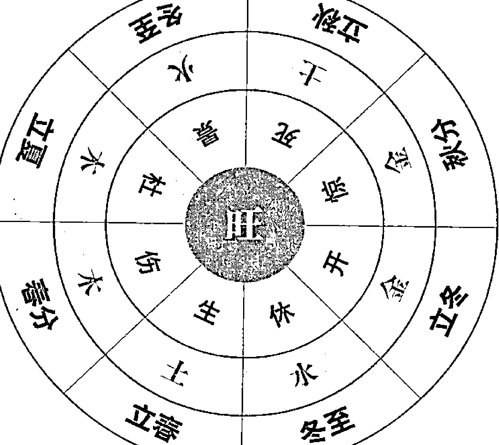

八门有其五行属性，所以就有旺、相。其中生门旺在立春，伤门旺在春分，杜门旺在立夏，景门旺在夏到，死门旺在立秋，惊门旺在秋分，开门旺在立冬，休门旺在冬至。八门遇旺相，开、休、生三吉门则更吉，而其余五凶门则凶性大减。

| 九星 | 五行 | 旺 | 相 | 休 | 囚 | 死 |
| :--- | :--- | :--- | :--- | :--- | :--- | :--- |
| 天蓬 | 水 | 寅卯 | 亥子 | 巳午 | 辰戌丑未 | 申酉 |
| 天芮天禽 | 土 | 甲西 | 辰戌丑未 | 亥子 | 寅卯 | 巳午 |
| 天冲 | 木 | 巳午 | 寅卯 | 辰戌丑未 | 申酉 | 亥子 |
| 天辅 | | | | | | |
| 天英 | 火 | 酉戌丑未 | 巳午 | 申酉 | 亥子 | 寅卯 |
| 天心天柱 | 金 | 亥子 | 申酉 | 寅卯 | 巳午 | 辰戌丑未 |

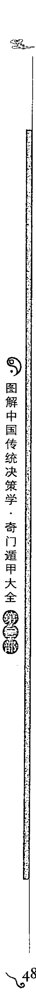

图 解中国传统决策学·奇门遁甲大全

+   龙逃走：乙奇遇辛。
+   虎猖狂：辛遇乙奇。
+   蛇夭矫：癸见丁奇。
+   雀投江：丁奇见癸。
+   荧入白：丙奇加庚。
+   白入火：庚加丙奇。
+   岁格：庚临岁干。
+   月格：庚临月干。
+   日格：庚临日干。（伏干同）
+   时格：庚临时干。
+   大格：庚加六癸。
+   上格：庚加六壬。
+   刑格：庚加六己。
+   奇格：六庚加三奇。
+   飞干格：日干加庚。
+   伏干格：庚临日干。
+   符勃：丙加天乙。
+   飞勃：天乙加丙。
+   天乙伏宫：庚临直符。
+   天乙飞宫：直符加庚。

奇门遁甲中的凶格主要有以下几种：青龙逃走，是天盘乙奇加临地盘六辛；白虎猖狂，是天盘六辛加临地盘乙奇；螣蛇夭矫，是天盘六癸加临地盘丁奇；朱雀投江，是天盘丁奇加临地盘六癸；荧入太白，是天盘丙奇加临地盘六庚；太白入荧，是天盘六庚加临地盘丙奇。岁格，是天盘六庚加临年干；月格，是天盘六庚加临月干；日格，是天盘六癸加临日干，又称伏干格；时格，是天盘六癸加临地盘时干；大格，是天盘六庚加临地盘六癸；上格，是天盘六癸加临地盘六壬；刑格，是天盘六癸加临地盘六己；奇格，是天盘六庚加临地盘乙、丙、丁三奇；飞干格，是日干加临地盘六庚；伏干格，是天盘六癸加临日干；符勃，是天盘丙奇加临地盘值符；飞勃，是天盘值符加临地盘丙奇；天乙伏宫，是天盘六庚加临地盘值符；天乙飞宫，是天盘值符加临地盘六癸。

## 奇门遁甲凶格表

奇门遁甲中的凶格多是由天盘上的奇仪和地盘上的奇仪组合而成，下面就通过图表的形式加以说明。

| 凶格名称 | 天盘奇仪 | 地盘奇仪 | 其他 |
| :--- | :--- | :--- | :--- |
| 青龙远走 | 乙奇 | 辛仪 | |
| 白虎猖狂 | 辛仪 | 乙奇 | |
| 滕蛇夭矫 | 癸仪 | 丁奇 | |
| 朱雀投江 | 丁奇 | 癸仪 | |
| 荧入太白 | 丙奇 | 庚仪 | |
| 太白入荧 | 庚仪 | 丙奇 | |
| 岁格 | 庚仪 | 年干 | |
| 月格 | 庚仪 | 月干 | |
| 日格 | 庚仪 | 日干 | |
| 时格 | 庚仪 | 时干 | |
| 大格 | 庚仪 | 癸仪 | |
| 上格 | 庚仪 | 壬仪 | |
| 刑格 | 庚仪 | 己仪 | |
| 奇格 | 庚仪 | 乙奇、丙奇、丁奇 | |
| 飞干格 | 庚仪 | 庚仪 | 日干 |
| 伏干格 | 庚仪 | 日干 | |
| 符勃 | 丙奇 | 值符 | |
| 飞勃 | 丙奇 | 值符 | |
| 天乙伏宫 | 庚仪 | 值符 | |
| 天乙飞宫 | 庚仪 | 值符 | |

# 15. 时墓：时支是时干的墓库

### 【原文】

戊戌、壬辰、丙戌、癸未、丁丑。

### 【白话提要】

时墓，即时干入墓，是指时支是时干的墓库，也就是天干与地支配合时的忌讳。奇门遁甲中的时干入墓主要有戊戌、壬辰、丙戌、癸未、丁丑、己丑六个时辰。戊戌时戌属阳土，土墓在戌。壬辰时壬属阳水，水墓在辰。丙戌时丙属阳火，火墓在戌。未时癸属阴水，水墓在未。丁丑时丁属阴火，火墓在丑。己丑时己属阴土，土墓在丑。

## 16. 奇墓：三奇入墓库

### 【原文】

乙奇加二宫及六宫，丙奇加六宫。

### 【白话提要】

奇门遁甲中有三奇入墓之时，是指乙、丙、丁三奇下临其墓库地支所在之宫。因乙的墓是未或戌，未在坤二宫，戌在乾六宫，所以天盘乙奇临坤二宫或乾六宫即乙奇入墓。因丙的墓是戌，戌在乾六宫，所以天盘丙奇临乾六宫即丙奇入墓。因丁的墓是丑，丑在艮八宫，所以天盘丁奇临艮八宫即丁奇入墓。

## 17. 六仪击刑：六甲值符相刑

### 【原文】

甲子午直符三九，甲申辰直符八四，甲戊寅直符二四。


# 18. 五不遇：时干克制日干

### 【原文】

时干克日干。

### 【白话提要】

奇门遁甲中的五不遇时，是指用事的时天干克制用事的日天干。五不遇时主要有以下几个：甲日遇庚辛时，庚金克甲木；乙日遇辛巳时，辛金克乙木；丙日遇壬辰时，壬水克丙火；丁日遇癸卯时，癸水克丁火；戊日遇甲寅时，甲木克戊土；己日遇乙丑、乙酉时，乙木克己土；庚日遇丙子时，丙火克庚金；辛日遇丁丑时，丁火克辛金；壬日遇戊申时，戊土克壬水；癸日遇己未时，己土克癸水。

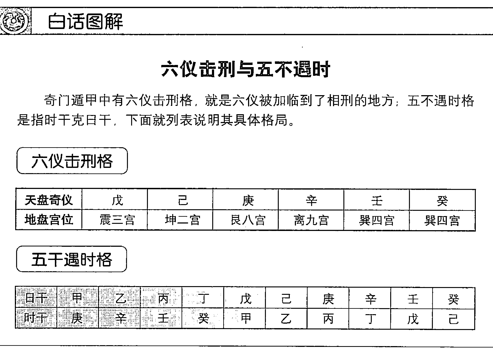

## 图解中国传统决策学
奇门遁甲大全

### 19. 天网四张：六癸临九宫

### 【原文】

六癸临时干。

### 【白话提要】

奇门遁甲中有天网四张格，是指天盘六癸加临九宫。天网有高有低，而且是按九宫八卦之数由小到大而由低到高。当天盘上的六癸加临地盘上的一、二、三、四宫时，天网较低，不宜突围出走，宜潜行匍匐突围。当天盘上的六癸加临六、七、八、九宫时，天网较高，不起作用，等于没设天网。

### 20. 地网遮：六壬临时干

### 【原文】

六壬临时干。

### 【白话提要】

奇门遁甲中有地网遮，是指天盘六壬加临地盘时的天干。此时不宜出兵或出行。

### 21. 孤虚法：空亡与对冲

### 【原文】

空亡为孤，对冲为虚。如甲子旬，孤戌亥，虚巳辰。六甲仿此。

### 【白话提要】

古人用六十甲子计时，六十甲子是以十天干顺次与十二地支相配为一旬，所余的两地支称为“孤”，与孤相冲的称为“虚”。古时常借此来推算吉凶祸福及事之成败。在六十甲子的六甲句中，甲子旬中无戌亥，戌亥为孤，辰巳为虚。甲戌旬中无申酉，申酉为孤，寅卯为虚。甲申旬中无午未，午未为孤，子丑为虚。甲午旬中无辰巳，辰巳为孤，戌亥为虚。甲辰旬中无寅卯，寅卯为孤，申酉为虚。甲寅旬中无子丑，子丑为孤，午未为虚。

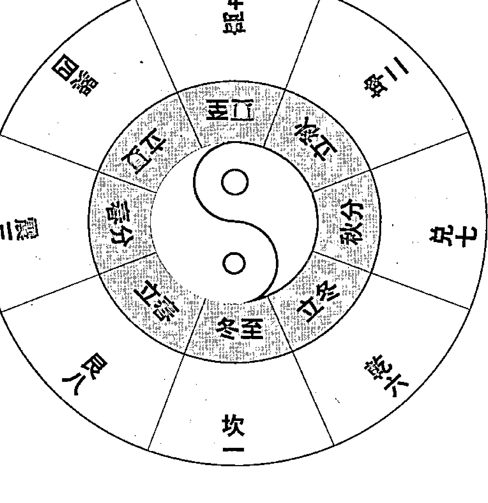

## 白话图解
**孤虚之法**

由十天干和十二地支组成的六十甲子中，分为六甲旬，每一句都有缺的地支，即为孤；与所缺地支相冲的地支，即为虚。

|   | 六十甲子 | 孤 | 虚 |
| :--- | :--- | :--- | :--- |
| 甲子 | 乙丑、丙寅、丁卯、戊辰、己巳、庚午、辛未、壬申、癸酉、戌亥 | 辰巳 | |
| 甲戌 | 乙亥、丙子、丁丑、戊寅、己卯、庚辰、辛巳、壬午、癸未、申酉 | 寅卯 | |
| 甲申 | 乙酉、丙戌、丁亥、戊子、己丑、庚寅、辛卯、壬辰、癸巳、午未 | 子丑 | |
| 甲午 | 乙未、丙申、丁酉、戊戌、己亥、庚子、辛丑、壬寅、癸卯、辰巳 | 戌亥 | |
| 甲辰 | 乙巳、丙午、丁未、戊申、己酉、庚戌、辛亥、壬子、癸丑、寅卯 | 申酉 | |
| 甲寅 | 乙卯、丙辰、丁巳、戊午、己未、庚申、辛酉、壬戌、癸亥、子丑 | 午未 | |

### 22. 宫迫：门制其宫

### 【原文】

开门临三四宫，休门临九宫，生门临一宫，伤门临二八宫，景门临六七宫，死门临一宫，惊门临三四宫，杜门临二八宫。

### 【白话提要】

奇门遁甲中有宫迫格，是指八门克制其所在之宫。比如，开门、惊门临三、四宫，为金克木；休门临九宫，为水克火；生门、死门临一宫，为土克水；伤门、杜门临二宫、八宫，为木克土：景门临六宫、七宫，为火克金。

### 23. 值符相冲：值符反吟

### 【原文】

如天盘甲子加地盘甲午，或天盘甲午加地盘甲子之类。此为符冲。又如直符在天盘坎加地盘离之类亦是。即反吟也。

### 【白话提要】

值符相冲，即值符反吟，其理论依据是地支相冲，即每一对两相对应的地支互相冲击。比如子与午相冲，丑与未相冲，寅与申相冲，卯与酉相冲，辰与戌相冲，巳与亥相冲。所谓值符反吟，就是盘上的六仪对应六甲地支相冲，比如天盘甲子戊加临地盘甲午壬，或者说是值符原在坎宫而加临离宫。

## 白话图解
伏吟与反吟示例

奇门遁甲中有伏吟和反吟格，伏吟格就是星门都不动，反吟格是星门对冲，下面就通过具体的例子来说明。

| |勾陈 |朱雀 |
| :--- | :--- | :--- |
| **六合**<br>辛天辅<br>辛杜门 | 乙天英<br>乙景门 | 己(天芮)<br>己死门 |
| **太阴**<br>庚天冲<br>庚伤门 | 壬<br>九地<br>丁天柱<br>丁(惊门) |
| **腾蛇**<br>丙天任<br>丙生门 | 直符<br>戊天蓬<br>戊 (休门) | 九天<br>癸天心<br>癸开门 |

+   • 九星伏吟：天盘上的九星都在本宫，没有移动位置，这就是伏吟格。
+   • 八门伏吟：天盘上的八门都在本宫，没有移动位置，这也是伏吟格。
+   • 值符伏吟：值符天蓬还在原坎一宫位，没有移动位置，这也是伏吟格。

|九天<br>癸天心<br>辛惊门 |直符<br>戊(天蓬)<br>乙开门 |螣蛇<br>丙天任<br>己休门 |
| :--- | :--- | :--- |
| **九地**<br>丁天柱<br>庚死门 | 壬<br>太阴<br>庚天冲<br>丁生门 |
| **朱雀**<br>己天芮<br>丙景门 | 勾陈<br>乙天英<br>戊杜门 | 六合<br>辛(天辅)<br>癸伤门 |

+   • 值符反吟：值符天蓬到了与原坎一宫相对的离九宫，这就是反吟格。
+   • 九星反吟：九星都到了与原宫位相对宫的位，这也是反吟格。

# 24. 伏吟：星门不动

### 【原文】

星不动，门亦然。

### 【白话提要】

伏吟，又称为九星伏吟或八门伏吟。实际上九星或八门全在本宫没动，比如天蓬星加临坎一宫，或休门加临坎一宫。凡遇到六甲的时刻，都是伏吟之时，主大凶，相传会损失人口，孝服哀丧。

# 25. 反吟：星门对冲

### 【原文】

星反对。门亦然。

### 【白话提要】

反吟，也有九星反吟和八门反吟，实际上是九星或八门到了与其原宫位相对之宫。比如天盘一宫的天蓬星加临到地盘九宫的天英星之上，或者坎一宫的休门加临到九宫的景门上。

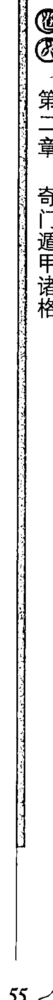

# 第三章 奇门遁甲的推断方法

本章主要讲了一些奇门遁甲中的推断方法，主要有由八节推三奇、节气所犯的神煞、由月建寻三奇、七星值日所忌时、三奇取时克应，下面就详细介绍。

## 1. 八节三奇图例：由八节寻三奇

### 八节三奇：遇煞不可行

### 【原文】

> **诗曰**：
> 冬夏二至逆顺飞，八节须寻甲子推。当年岁下五虎遁，便知方位有三奇。辰戌丑未皆为杀，可否中间事可施。

> **假如**：
> 甲子年立春节后，己丑奇出局。丙寅奇在艮，丁卯奇在离，禄在寅，马在寅，贵人在丑未出局。天煞辛未四旺，丁卯午癸酉丙子出局。金神庚午辛未壬申癸酉独火，乙丑出局。

> #### 【白话提要】
> 在奇门遁甲中，冬至后顺推，夏至后逆推，立春、春分、立夏、夏至、立秋、秋分、立冬、冬至八节都须要排入甲子宫。如果当年风干之下排五虎遁，就知道方位有乙、丙、丁三奇。辰、戌、丑、未都是煞神，某事可不可做就清楚了。
>
> 比如甲子年立春之后乙酉奇出局，那么丙寅奇就在艮八宫，丁卯奇就在离九宫，官禄在寅位，驿马在寅位，贵人在丑、未出局，天煞在辛、未四旺丁卯、庚午、癸酉、丙子出局，金神在庚午、辛未、壬申、癸酉，独火乙丑出局。


- 白话图解
- **九宫八节图**
- 由八节推三奇方位时，要巿到九宫八节图，下面就通过图表来说明八节与八卦的对应关系，并说明推算时的方法。


> 由八节推三奇方位时，要巿到九宫八节图，下面就通过图表来说明八节与八卦的对应关系，并说明推算时的方法。九宫八节：由图中可以看出，冬至在坎一官，立春在艮八官，春分在震三官，立夏在巽四官，夏至在离九官，立秋在坤二官，秋分在兑七官，立冬在乾六官。在由八节寻三奇时，就是以此盘为用的。

- 起神杀例：节气所犯神煞
- #### 【原文】
> 一太岁，二独火，三丧门，四勾陈，五官符，六死符，七小耗，八大耗，九将军，十皇帝，十一吊客，十二病符。大耗七，余同。
- #### 【原注】
> 假如子年独火在丑，官符在辰，次第顺去八节，用五虎元遁走九宫。甲子年立春节，官符飞在北方壬癸之位，此节若作壬癸之位，犯官符。余仿此。
- #### 【白话提要】
> 太岁在子宫，独火在丑宫，丧门在寅官，勾陈在卯宫，官符在辰宫，死符在巳宫，小耗在午宫，大耗在未宫，将军在申宫，皇帝在西官，吊客在戌官，病符在亥宫。比如子年太岁在子宫，独火就在丑宫，官符就在辰宫，其余依次顺推，八节用五虎元遁飞九宫。如甲子年立春节，官符飞在北方壬癸之位，如果此节也在壬癸方，这就是犯了官符。其余依此而推。

# 起月例：由月建寻三奇
### 【原文】
假如己未年正月初八日甲子乙亥时用事，立春节后，艮宫起甲子至离官。是己未太岁住处就于离，上用五虎元遁起丙寅便是奇。至离坎月建丙寅，就离，起庚寅，顺飞至中官乾兑是奇。奇起庚寅折。
### 【白话提要】
比如己未年正月丙寅初八日甲子或已亥时做事，立春节之后在艮八宫起甲子到离九宫是己未太岁的位子，就在离九宫上用五虎遁起丙寅，丙寅便是奇；如果在离九宫月建丙寅，就在离九宫上起庚寅，顺飞到中宫，乾、兑二宫中的干支就是奇。

# 2．日家寻时家伏断时：七星值日所忌时
### 【原文】
太阳直日，子、寅、酉时犯。

## 白话图解
**十二时辰与七星值日**

在十二时辰中，太阳、太阴、火星、水星、木星、金星和土星七轮流值日，下面就通过图来表示。

|土星直日<br>房见妻 | 太阴直日<br>角见丰 | 水星直日<br>张见亢 | 金星直日<br>鬼见鬼 |
| :--- | :--- | :--- | :--- |
| **木星直日**<br>箕见鬼 | **太阳直日**<br>紫见娄 | **火星直日**<br>女见亢 | **水星直日**<br>胃见牛 |
| **太阳直日**<br>室见牛 | **火星直日**<br>斗见妻 | **太阳直日**<br>虚见鬼 | **木星直日**<br>壁见亢 |

## 3. 三奇取时克应：三奇到宫的应验

### ☯ 三奇到乾宫所应

**【原文】**

乾

日奇，有著黄衣人来，或有缠钱来应。
月奇，有人执刀斧来，或有人牵牛及有角六畜为应。四七日进金银及有生气之物。
星奇，有黑禽成双，并著色衣人至。百日进女人财，南方有产难时发。

**【白话提要】**

乙奇到乾宫，有人身穿黄色衣裳来到，或扛着钱由此经过。
丙奇到乾宫，有人拿着刀或斧子来到，或有人牵着牛及有角的六畜来到。四十七日后会进金银及有生气的财物。
丁奇到乾宫，有成双的黑色飞禽来到，并且有穿彩色衣服的人来到。百日内会进女人财，南方会有难产之事发生。

### ☯ 三奇到坎宫所应

**【原文】**

坎

日奇，有著皂衣人来，无声，或有鼓乐声。七日进横财，色衣为应。
月奇，有人执杖来，或有黄白禽从西来。六十日及百二十日进契书，若东边有惊恐时发。
星奇，有人抱小儿来，南方有黑云雨。七日内进黑色生气之物，西北方有哭声，病卒时发。

**【白话提要】**

乙奇到坎宫，有人穿黑色衣裳来到，无声，或者鼓声大作。七天后得到横财，以看到彩色衣服为准。
丙奇到坎宫，有人拿着竹杖而来，或者有黄白的飞禽从西方而来。六十日或一百二十日后会有契书，在东边有惊恐时发生。
丁奇到坎宫，有人抱着小孩来到，面方有黑色的云而带来的雨。七天之后会进黑色的有生气之物，西北方会有哭声，在病死时发生。

### 三奇到艮宫所应

**【原文】**

艮

日奇，有黑白飞禽成双来，或著皂衣人至。又罾网水族之类，周年内进人口。
月奇，有人著青皂衣来，或小儿持铁器至。二七日进金帛。周年进白马六畜。
星奇，有人将文字纸笔来，或小儿持器物。二七日进青色物。百二十日进契字。

**【白话提要】**

乙奇到艮宫，有成双的黑白色飞禽来，或是穿黑色衣服的人来，还会有用网打捞的鱼等物，一年之内会增加人口。
丙奇到艮宫，有穿青黑色衣裳的人来到，或是小孩拿着铁器来到。二十七日后会进金帛。一年后会进白马。
丁奇到艮宫，有人拿着文字纸笔来，或是小孩拿着器物而来，二十七日后得到青色物品。一百二十日后获得契书。

### 三奇到震宫所应

**【原文】**

震

日奇，见罾网渔猎人，并小儿成群至。二七日进金宝，见东南方，有产难时发。
月奇，有人持刃至，春有雷声及鼓乐声。二七日进有契物。周年生贵子，若见北方有雷伤时发。
星奇，有人成双来，有黑禽在南方。七日进黄牲酒，又见东方有杀伤时气。

**【白话提要】**

乙奇到震宫，会看见拿着网的捕鱼人，并且有成群的小孩来到。二十七日后获得金银财宝，在东南方会有难产之事发生。
丙奇到震宫，有人拿着刀而来，春天会有雷声及鼓乐声。二十七日后会获得契约。一年后会生贵子，如果看见北方有雷伤时发生。
丁奇到震宫，有成双的人来到，在南方有黑色的飞禽。七日后会获得黄牲酒，还会看见东方有杀伤之气。

### ☯ 三奇到巽宫所应

**【原文】**

巽

日奇，有白衣人骑赤马，或有小儿来，主三年内生贵子，进外宝，西方木自枯，木火时惊发。
月奇，有散唱乐声，或南方火惊。七日进色衣人财，并贵人至，吉。
星奇，有小儿骑牛，不然，南方有黑云雨。七日进横财，见北方。周年有落水，产死时发。

**【白话提要】**

乙奇到巽宫，有穿着白衣裳的人骑着红马来到，或者有小孩来到，主三年之内生贵子，进外财，西方的木会自己枯萎，木火时惊发。
丙奇到巽宫，听到散唱的乐声，或者南方会有火灾。七天后会获得彩衣或财宝，且有贵人来到，十分吉利。
丁奇到巽宫，有小孩骑着牛来，或者南方有带黑色云的雨。七天后会从北方获得横财，一年后会落水，有难产时发生。

### ☯ 三奇到离宫所应

**【原文】**

离

日奇，有患脚病眼人至，或骑马小儿骑牛，东方黑白禽成双。五七日进六畜，见人家瘟疫时发。
月奇，有黑禽来。六十日进田蚕。
星奇，有著青衣人至。三七日进财，见东方。刀兵时发，吉。

**【白话提要】**

乙奇到离宫，有患脚病或者眼病的人来到，或是骑马的小孩来到，东方会有成双的黑白飞禽而来。五十七日后会获得六畜，看到人家瘟疫时发生。
丙奇到离宫，有黑色的飞禽来到，六十天后会获得田地或蚕桑。
丁奇到离宫，有穿着青色衣裳的人来到，三十七日后从东方会获得钱财，发兵出征吉利。

### 三奇到坤宫所应

**【原文】**

坤

日奇，有白衣人至，见西方雷伤畜时发。七日进猪鸡。六十日进契字。
月奇，有青衣人自南方来，或有喜鹊双至。七日后进南方财。周年绝户田。
色衣人进财，见东方有鼓声发。
星奇，有妇人著青衣来，及有黑禽飞来，或有人担水为应。二七日进水族海味，见北方有山崩，水破田时发。

**【白话提要】**

乙奇到坤宫，有穿白色衣服的人来到，当看见西方雷伤六畜时发生。七天后会获得猪和鸡。六十天后会获得契约。
丙奇到坤宫，有穿青色衣裳的人从南方来到，或者有成双的喜鹊来到。七天后会从南方获得财物。一年后会失去田地。看见穿有颜色衣服的人会进财，见东方有鼓声时发生。
丁奇到坤宫，有妇人穿着青色衣裳来到，以及有黑色飞禽飞来，或者有人担着水而来。二十七天后会获得水族海味，会看见北方有山崩之事，水破田时发。

### 三奇到兑宫所应

**【原文】**

兑

日奇，有三五鸦来报喜，三百日外进田地，见东方，牛死时发。
月奇，小儿成双来，或有鼓声。七日进横财。周年内进人口田地。坤艮方有老人丧亡时发。
星奇，有人将文字纸笔来。西方有黄禽及打网人为应。七日后进猪鸡。二七日进契字。见艮方。有卒死动火人。

**【白话提要】**

乙奇到兑宫，有三五只乌鸦来报喜，三百天后会获得田地。在东方看到牛死时发生。
丙奇到兑宫，有成双的小孩来到，或者有鼓声。七天后会获得横财。一年内会得到人口田地。西南和东北方有老人丧亡时发生。
丁奇到兑宫，有人拿着文字和纸笔而来。西方有黄色的飞禽或结网打鱼的人来到。七天后会获得猪和鸡。二十七天后会获得契约。在东北方有卒死或动火的人。

---

## 图解中国传统决策学·奇门遁甲大全

### 三奇到八宫所应（一）

奇门遁甲中的三奇到地盘八卦宫位后，会有很多的应验，这些都是古人的总结，虽然不见得有什么道理，却也值得玩味，下面就加以说明。

**乙奇在乾宫：**有人身穿黄色衣裳来，或扛着钱经过。
**丙奇在乾宫：**有人拿着刀或斧子来，或有人牵着牛及有角的六畜来。四十七日后会进金银及有生气的财物。
**丁奇在乾宫：**有成双的黑色飞禽来，或有穿彩色衣服的人来。百天内会进女人财，南方会有难产之事发生。

**乙奇在坎宫：**有人穿黑色衣裳来，或者鼓声大作。七天后获得横财。
**丙奇在坎宫：**有人拿着竹杖而来，或者有黄白的飞禽从西方而来。六十日或一百二十日后会有契书。
**丁奇在坎宫：**有人抱着小孩来到，西方有黑色的云带来的雨。七天之后会进黑色的有生气之物。

**乙奇在艮宫：**有成双的黑白色飞禽来，或是穿黑色衣服的人来。还会有用网打捞的鱼等物，一年之内会增加人口。
**丙奇在艮宫：**有穿青黑色衣裳的人来，或是小孩拿着铁器来。二十七日后会获得金帛。一年后会获得白马。
**丁奇到艮宫：**有人拿着文字纸笔来，或是小孩拿着器物而来，二十七日后得到青色物品。一百二十日后获得契书。

**乙奇在震宫：**会看见拿着网的捕鱼人，并且有成群的小孩来。二十七日后获得金银财宝。
**丙奇在震宫：**有人拿着刀而来，春天会有雷声及鼓乐声。二十七日后会获得契约。一年后会生贵子。
**丁奇在震宫：**有成双的人来，在南方有黑色的飞禽。七日后会获得黄牲酒，还会看见东方有杀伤之气。

金银财宝，在东南方会有难产之事发生。
丙奇到震宫，有人拿着刀而来，春天会有雷声及鼓乐声。二十七日后会获得契约。一年后会生贵子，如果看见北方有雷伤时发生。
丁奇到震宫，有成双的人来到，在南方有黑色的飞禽。七日后会获得黄牲酒，还会看见东方有杀伤之气。

### 🌀 三奇到巽宫所应

**【原文】**

巽
日奇，有白衣人骑赤马，或有小儿来，主三年内生贵子，进外宝，西方木自枯，木火时惊发。
月奇，有散唱乐声，或南方火惊。七日进色衣人财，并贵人至，吉。
星奇，有小儿骑牛，不然，南方有黑云雨。七日进横财，见北方。周年有落水，产死时发。

**【白话提要】**

乙奇到巽宫，有穿着白衣裳的人骑着红马来到，或者有小孩来到，主三年之内生贵子，进外财，西方的木会自己枯萎，木火时惊发。
丙奇到巽宫，听到散唱的乐声，或者南方会有火灾。七天后会获得彩衣或财宝，且有贵人来到，十分吉利。
丁奇到巽宫，有小孩骑着牛来，或者南方有带黑色云的雨。七天后会从北方获得横财，一年后会落水，有难产时发生。

### 🌀 三奇到离宫所应

**【原文】**

离
日奇，有患脚病眼人至，或骑马小儿骑牛，东方黑白禽成双。五七日进六畜，见人家瘟疫时发。
月奇，有黑禽来。六十日进田蚕。
星奇，有著青衣人至。三七日进财，见东方。刀兵时发，吉。

**【白话提要】**

乙奇到离宫，有患脚病或者眼病的人来到，或是骑马的小孩来到，东方会有成双的黑白飞禽而来。五十七日后会获得六畜，看到人家瘟疫时发生。
丙奇到离宫，有黑色的飞禽来到，六十天后会获得田地或蚕桑。
丁奇到离宫，有穿着青色衣裳的人来到，三十七日后从东方会获得钱财，发兵出征吉利。

### 三奇到八宫所应（二）

上面介绍了三奇到乾宫、坎宫、艮宫和震宫四个宫的应验内容，下面主要介绍三奇到巽宫、离宫、坤宫和兑宫四个宫的应验内容。

**乙奇在巽宫：**有穿着白衣裳的人骑着红马来，或者有小孩来，主三年之内生贵子，进外财。
**丙奇在巽宫：**听到散唱的音乐声，或者南方会有火灾。七天后会获得彩衣或财宝，且有贵人来到。
**乙奇在离宫：**有患脚病或者眼病的人来，或是骑马的小孩来，东方会有成双的黑白飞禽而来。五十七日后会获得六畜。
**丙奇在离宫：**有黑色的飞禽来，六十天后会获得田地或蚕桑。
**丁奇在巽宫：**有小孩骑着牛来，或者南方有带黑色云的雨。七天后会从北方获得横财。
**丁奇在离宫：**有穿着青色衣裳的人来，三十七日后从东方会获得钱财，发兵出征吉利。

**乙奇在坤宫：**有穿白色衣服的人来。七天后会获得猪和鸡。六十天后会获得契约。
**丙奇在坤宫：**有穿青色衣裳的人从南方来到，或者有成双的喜鹊来到。七天后会从南方获得财物。一年后会失去田地。
**乙奇在兑宫：**有三五只乌鸦来报喜，三百天后会获得田地。
**丙奇在兑宫：**有成双的小孩来，或者有鼓声。七天后会获得横财。一年内会获得人口田地。
**丁奇在坤宫：**有妇人穿着青色衣裳来，以及有黑色飞禽飞来，或者有人担着水而来。二十七天后会获得水族海味。
**丁奇在兑宫：**有人拿着文字和纸笔而来。西方有黄色的飞禽或结网打鱼的人来到。七天后会获得猪和鸡。二十七天后会获得契约。

### 征从此时，吉利。

### 三奇到坤宫所应

**【原文】**

坤
日奇，有白衣人至，见西方雷伤畜时发。七日进猪鸡。六十日进契字。
月奇，有青衣人自南方来，或有喜鹊双至。七日后进南方财。周年绝户田。
色衣人进财，见东方有鼓声发。
星奇，有妇人著青衣来，及有黑禽飞来，或有人担水为应。二七日进水族海味，见北方有山崩，水破田时发。

**【白话提要】**

乙奇到坤宫，有穿白色衣服的人来到，当看见西方雷伤六畜时发生。七天后会获得猪和鸡。六十天后会获得契约。
丙奇到坤宫，有穿青色衣裳的人从南方来到，或者有成双的喜鹊来到。七天后会从南方获得财物。一年后会失去田地。看见穿有颜色衣服的人会进财，见东方有鼓声时发生。
丁奇到坤宫，有妇人穿着青色衣裳来到，以及有黑色飞禽飞来，或者有人担着水而来。二十七天后会获得水族海味，会看见北方有山崩之事，水破田时发。

### 三奇到兑宫所应

**【原文】**

兑
日奇，有三五鸦来报喜，三百日外进田地，见东方，牛死时发。
月奇，小儿成双来，或有鼓声。七日进横财。周年内进人口田地。坤艮方有老人丧亡时发。
星奇，有人将文字纸笔来。西方有黄禽及打网人为应。七日后进猪鸡。二七日进契字。见艮方。有卒死动火人。

**【白话提要】**

乙奇到兑宫，有三五只乌鸦来报喜，三百天后会获得田地。在东方看到牛死时发生。
丙奇到兑宫，有成双的小孩来到，或者有鼓声。七天后会获得横财。一年内会得到人口田地。西南和东北方有老人丧亡时发生。
丁奇到兑宫，有人拿着文字和纸笔而来。西方有黄色的飞禽或结网打鱼的人来到。七天后会获得猪和鸡。二十七天后会获得契约。在东北方有卒死或动火的人。

---

## 奇门遁甲阳遁 540 局详解（上）

本章主要讲的是奇门遁甲阳遁九局中的前四局，其中每局分为五日，一日分为十二个时辰，所以一局共有 60 时局，那么前四局共 240 时局。其中每局又分为符使宫位、三奇方位、四吉方位和诸局格象四个方面，并配有相关的式盘。

### ☰ 本卷内容提要

*   第一章：阳遁一局
*   第二章：阳遁二局
*   第三章：阳遁三局
*   第四章：阳遁四局

---

## 图解中国传统决策学·奇门遁甲大全（第 5 部）

### ☰ 第一章 阳遁一局

**奇门遁甲时家奇门阳遁一局共有六十个时辰，即六十局**。

通过文字和各时辰的飞盘排布来说明各局的符使宫位、三奇方位、四吉神方位和诸局格象。

### ☰ 每日时辰

奇门遁甲中一局为一元，一元有甲己、乙庚、丙辛、丁壬和戊癸五日，每日有十二个时辰，则一局就有六十个时辰，用六十甲子来表示，一个时辰为一小局。

| | 甲子日 | 乙丑 | 丙寅 | 丁卯 | 戊辰 | 己巳 | 庚午 | 辛未 | 壬申 | 癸酉 | 甲戌 | 乙亥 |
| :--- | :--- | :--- | :--- | :--- | :--- | :--- | :--- | :--- | :--- | :--- | :--- | :--- |
| **乙庚日** | 丙子 | 丁丑 | 戊寅 | 己卯 | 庚辰 | 辛巳 | 壬午 | 癸未 | 甲申 | 乙酉 | 丙戌 | 丁亥 |
| **丙辛日** | 戊子 | 己丑 | 庚寅 | 辛卯 | 壬辰 | 癸巳 | 甲午 | 乙未 | 丙申 | 丁酉 | 戊戌 | 己亥 |
| **丁壬日** | 庚子 | 辛丑 | 壬寅 | 癸卯 | 甲辰 | 乙巳 | 丙午 | 丁未 | 戊申 | 己酉 | 庚戌 | 辛亥 |
| **戊癸日** | 壬子 | 癸丑 | 甲寅 | 乙卯 | 丙辰 | 丁巳 | 戊午 | 己未 | 庚申 | 辛酉 | 壬戌 | 癸亥 |

### ☰ 阳遁一局六十时符使表

奇门遁甲排盘时，最主要的就是寻找值和值使，并确定其所在的宫位。下表就是阳遁一局六十个时辰的值符和值使，以及其所在的宫位。

| 时辰 | 甲子 | 乙丑 | 丙寅 | 丁卯 | 戊辰 | 己巳 | 庚午 | 辛未 | 壬申 | 癸酉 |
| :---: | :---: | :---: | :---: | :---: | :---: | :---: | :---: | :---: | :---: | :---: |
| **天蓬** | 一 | 九 | 八 | 七 | 一 | 二 | 三 | 四 | 五 | 六 |
| **休门** | 一 | 二 | 三 | 四 | 五 | 六 | 七 | 八 | 九 | 一 |

| 时辰 | 甲戌 | 乙亥 | 丙子 | 丁丑 | 戊寅 | 己卯 | 庚辰 | 辛巳 | 壬午 | 癸未 |
| :---: | :---: | :---: | :---: | :---: | :---: | :---: | :---: | :---: | :---: | :---: |
| **天芮** | 二 | 九 | 八 | 七 | 一 | 二 | 三 | 四 | 五 | 六 |
| **死门** | 二 | 三 | 四 | 五 | 六 | 七 | 八 | 九 | 一 | 二 |

| 时辰 | 甲申 | 乙酉 | 丙戌 | 丁亥 | 戊子 | 己丑 | 庚寅 | 辛卯 | 壬辰 | 癸巳 |
| :---: | :---: | :---: | :---: | :---: | :---: | :---: | :---: | :---: | :---: | :---: |
| **天冲** | 三 | 九 | 八 | 七 | 一 | 二 | 三 | 四 | 五 | 六 |
| **伤门** | 三 | 四 | 五 | 六 | 七 | 八 | 九 | 一 | 二 | 三 |

| 时辰 | 甲午 | 乙未 | 丙申 | 丁酉 | 戊戌 | 己亥 | 庚子 | 辛丑 | 壬寅 | 癸卯 |
| :---: | :---: | :---: | :---: | :---: | :---: | :---: | :---: | :---: | :---: | :---: |
| **天辅** | 四 | 九 | 八 | 七 | 一 | 二 | 三 | 四 | 五 | 六 |
| **杜门** | 四 | 五 | 六 | 七 | 八 | 九 | 一 | 二 | 三 | 四 |

| 时辰 | 甲辰 | 乙巳 | 丙午 | 丁未 | 戊申 | 己酉 | 庚戌 | 辛亥 | 壬子 | 癸丑 |
| :---: | :---: | :---: | :---: | :---: | :---: | :---: | :---: | :---: | :---: | :---: |
| **天禽** | 五 | 九 | 八 | 七 | 一 | 二 | 三 | 四 | 五 | 六 |
| **死门** | 五 | 六 | 七 | 八 | 九 | 一 | 二 | 三 | 四 | 五 |

| 时辰 | 甲寅 | 乙卯 | 丙辰 | 丁巳 | 戊午 | 己未 | 庚申 | 辛亥 | 壬戌 | 癸亥 |
| :---: | :---: | :---: | :---: | :---: | :---: | :---: | :---: | :---: | :---: | :---: |
| **天心** | 六 | 九 | 八 | 七 | 一 | 二 | 三 | 四 | 五 | 六 |
| **开门** | 六 | 七 | 八 | 九 | 一 | 二 | 三 | 四 | 五 | 六 |

### ☰ 1. 甲己日十二时局

#### ☯ 甲子时：利于逃亡和回避

**【原文】**

甲子 蓬一，休一。子至辰阳，宿凶干吉。生艮伏，景离伏，惊兑伏。天六，地七，阴三，合四。生与月合八东北，时干坎，时伏吟，遁甲开，丙下有丙，刑德在门,客主不利，利以逃亡。

**【白话提要】**

符使宫位：值符天蓬星在坎一宫，值使休门在坎一宫。天盘时干甲居于凶星位置，其自身与地盘三奇六仪之间呈吉伏。

三奇方位：生门临丙奇在艮八宫，不相生克。景门临乙奇在离九宫，不相生克。惊门临丁奇在兑七宫，不相生克。

四吉方位：九天在乾六宫，利于出击；九地在兑七宫，利于驻防；太阴在震三宫，利于潜伏；六合在巽四官，利于撤退。

诸局格象：生门与丙奇合于艮八宫，东北方位吉。用时天干甲在坎一宫，全盘星门均成伏吟格。天盘丙奇下临地盘丙奇，成月奇悖师格，凶。刑德在门，六甲受碍。客方主方均不利，利于逃亡、回避。

*   吉方：生门与丙奇合于艮八宫，东北方位吉利。

#### ☯ 乙丑时：逢己日不利

**【原文】**

乙丑 蓬九，休二。己日不用，宿凶干吉。休坤害，杜坎和欢怡，死震害。天四，地三，阴七，合六。休与月合二西南，符冲反吟，损己明，己日悖，时干坎。

**【白话提要】**

符使宫位：值符天蓬星在离九宫，值使休门在坤二宫。逢己日不宜用事施为。时干乙逢凶星宿，天盘时干乙克地盘戊，吉利。

三奇方位：休门合丙奇在坤二宫，被克。杜门合乙奇在坎一宫，被生，吉利。死门合丁奇在震三宫，被克。

四吉方位：九天在巽四宫方位，利于出击；九地在震三宫，利于驻防；太阴在兑七宫，利于潜伏；六合在乾六宫，利于撤退。

诸局格象：休门与丙奇合于坤二宫，西南方位吉利。天盘与地盘值符相冲，成反吟格。时干克日干日月损光，逢己日悖乱不利，为五不遇时。

## 丙寅时：宜向正东行

**原文**

丙寅蓬八，休三。宿干吉。休震义。杜坤制墓，死乾义。天一，地六，阴四，合九。休与月合三正东，天乙与太白格，龙反首，相佐艮，时干震，火入金，三奇得使，白虎猖狂，雀入江。

**白话提要**

符使宫位：值符天蓬星在艮八宫，值使休门在震三宫。用时时干逢凶星宿，天盘时干乙克地盘己，吉利。

三奇方位：休门合丙奇在震三宫，生宫。杜门合乙奇在坤二宫，克宫，乙奇入墓。死门合丁奇在乾六宫，生宫。

四吉方位：九天在坎一宫，九地在乾六宫，太阴在巽四宫，六合在离九宫。

诸局格象：休门合丙奇在震三宫，正东方向吉利。天乙与六庚宫位有格，天盘戊加临地盘丙在艮八宫，为青龙返首。时干丙加临地盘庚在震三宫，是火入金乡，为荧惑入白。西南坤二宫乙奇得使，正东震三宫丙奇得使，西北乾六宫丁奇得使。天盘辛加临地盘乙在离九宫，为白虎猖狂。天盘丁加临地盘癸在乾六宫，为朱雀入江。

## 白话图解

## 阳遁一局甲己日丙庚时盘

> **符使宫位**：

天蓬在艮八宫 休门在震三宫

| | | |
|--------|-----------------|----------|
|太阴庚<br>辛生门天冲|六合<br>辛<br>乙伤门天辅|勾陈<br>乙<br>己杜门<br>天英|
|**螣蛇<br>丙<br>癸休门天任**|壬|**朱雀<br>壬禽<br>己丁景门天芮**|
|直符<br>戊<br>丙开门天蓬|九天<br>癸<br>戊惊门天心|九地<br>丁<br>癸死门天柱|

> **三奇方位**

休门合丙奇在震三宫，生宫。
杜门合乙奇在坤二宫，克宫。
死门合丁奇在乾六宫，生宫。

**四吉方位**

九天在坎一宫，利于出击。
九地在乾六宫，利于驻防。
太阴在巽四宫，利于潜伏。
六合在离九宫，利于撤逃。

**诸局格象**

天盘戊加临地盘丙在艮八宫，为青龙回首，吉。
西南坤二宫乙奇得使，正东震三宫丙奇得使，西北乾六宫丁奇得使，吉。
时干丙加临地盘庚在震三宫，为荧惑入白，凶。
天盘辛加临地盘乙在离九宫，为白虎猖狂，凶。
天盘丁加临地盘癸在乾六宫，为朱雀入江，凶。

> **吉方**：休门合丙奇在震三宫，正东方向吉利。

## 丁卯时：正东正南方向吉利

> > **【原文】**
> 丁卯蓬七，休四。宿凶干吉。景乾制墓，开震制合，生乙离制。天二，地九，阴一，合八。开与日合三正东，太白与天乙格，仪刑，甲日伏干格，生与星合九正南，乙离制，相佐兑，时干离，丁下有乙。

> > **【白话提要】**
> 符使宫位：值符天蓬星在兑七宫，值使休门在巽四宫。时干丁遇凶星宿，时干丁遇地盘乙，吉利。
> 
> 三奇方位：景门合丙奇在乾六宫，克宫，丙奇入墓。开门合乙奇在震三宫，克宫，奇仪相合。生门合丁奇、乙奇在离九宫，被生。
> 
> 四吉方位：九天在坤二宫，利于出击；九地在离九宫，利于驻防；太阴在坎一宫，利于潜伏；六合在艮八宫，利于撤退。
> 
> 诸局格象：开门合乙奇在震三宫，正东方向吉利。天盘壬在巽四宫，为六仪击刑。逢甲日，天盘庚加临地盘戊，为伏干格。生门合丁奇在正南方向离九宫。值符天蓬得地盘丁奇相助于兑七宫。时干在离九宫方位，丁下有乙奇。

> > **白话图解**
> 
> **阳遁一局甲己日丁卯时盘**
> 
> | 值符：天蓬在兑七宫 | 值使：休门在巽四宫 |
> | --- | --- |
> |  | 三奇方位<br>景门合丙奇在乾六宫，克宫。<br>开门合乙奇在震三宫，克宫。<br>生门合丁奇、乙奇在离九宫，被生。
> 
> 四吉方位<br>九天在坤二宫，利于出击。<br>九地在离九宫，利于驻防。<br>太阴在坎一宫，利于潜伏。<br>六合在艮八宫，利于撤退。
> 
> 诸局格象
> 
> 天盘壬在巽四宫，为六仪击刑，凶。<br>逢甲日，天盘庚加临地盘戊，为伏<br>干格，凶。

> > **吉方：**开门合乙奇在震三宫，正东方向吉利。

## 戊辰时：正南与正西方向吉利

**原文**

戊辰蓬一，休五避五。宿凶干吉。景丙良义，开乙离害，生丁兑义。天六，地七，阴三，合四。开与日合九正南，乙下有乙，生与星合七正西，丁下有丁，时干坎，伏吟，符吟。

**白话提要**

符使宫位：值符天蓬星在坎一宫，值使休门在中五宫，因中宫无位，寄在坤二宫。时干戊遇星宿凶，时干戊遇地盘戊，吉利。

**三奇方位**：景门合天盘丙奇、地盘丙奇艮八宫，生宫。开门合天盘乙奇、地盘乙奇在离九宫，被克。生门合天盘丁奇、地盘丁奇在兑七宫，生宫。

**四吉方位**：九天在乾六宫，利于出击；九地在兑七宫，利于驻防；太阴在震三宫，利于潜伏；六合在巽四宫，利于撤退。

**诸局格象**：开门合乙奇在离九宫，正南方向吉利。乙下有乙为日奇伏吟。生门合丁奇在正西方向兑七宫。丁下有丁，为奇入太阴。时干在坎一宫位，门星、值符俱成伏吟格。

> > **白话图解**

> **阳遁一局甲己日戊辰时盘**
>
> **值符 天蓬在坎一宫**
> **值使 休门在中五宫**
> **六合 开门 朱雀**
> ~~开门~~
> **惊门 ~~天英~~
> **天辅 休门 ~~天芮~~
> **禽**
> **太阴 九地**
> **死门 ~~天柱~~
> **天冲**
> **壬**
> **螣蛇 直符 九天**
> **景门 ~~天蓬~~
> **杜门 伤门**
> **任 天心**
>
> **三奇方位**
>
> 景门逢天盘丙奇、地盘丙奇在艮八宫，生宫。
> 开门合天盘乙奇、地盘乙奇在离九宫，被克。
> 生门合天盘丁奇、地盘丁奇在兑七宫，生宫。
>
> **四吉方位**
>
> 九天在乾六宫，利于出击。
> 九地在兑七宫，利于驻防。
> 太阴在震三宫，利于潜伏。
> 六合在巽四宫，利于撤退。
>
> **诸局格象**
>
> 丁下有丁，为奇入太阴，凶。
> 乙下有乙，为日奇伏吟，凶。
> 时干在坎一宫位，八门、九星、值符俱成伏吟格，凶。

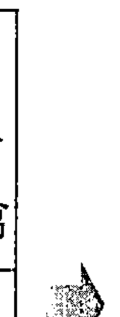

# 己巳时：正西方向吉利

### 【原文】

己巳蓬二，休六。已至酉阴，天辅，宿干凶。开丁兑伏，伤丙艮制，景巽和。
天九，地四，阴六，合一。开与月合七正西，丙下有丁，时干震，己日飞干格。

### 【白话提要】

符使宫位：值符天蓬星在坤二宫，值使休门在乾六宫。已时至酉时为五阴时，已时为天辅释罪时。时干遇凶星宿，时干己生地盘庚，凶。

三奇方位：开门合天盘丙奇、地盘丁奇在兑七宫，不相生克。伤门合天盘乙奇、地盘丙奇在艮八宫，克官。景门合丁奇于巽四宫，被生。

四吉方位：九天在离九宫，利于出击；九地在巽四宫，利于驻防；太阴在乾六宫，利于潜伏；六合在坎一宫，利于撤逃。

诸局格象：开门合丙奇在兑七宫，正西方向吉利。丙下有丁，成月奇朱雀格。时干在震三宫，己日成飞干格。

> > 白话图解

### 阳遁一局甲己日己巳时盘

| 值符 天蓬在坤二宫 | 值使：休门在乾六宫 |
| --- | --- |

| 九天| 直符<br>丁景门 | 戊惊门 | 
辛天柱|己天蓬 |
|---|---|---|
| 朱雀<br>杜门癸| 腾蛇壬<br>开门<br>天芮<br>禽<br>下 |
|---|---|---|
|勾陈 六合 太阴<br>乙伤门 | 亥生门 庚休门 |
丙天英|戌天辅|癸天冲

> > 三奇方位
> 开门合天盘丙奇、地盘丁奇在兑七宫，不相生克。
> 伤门合天盘乙奇、地盘丙奇在艮八宫，克宫。
> 景门合丁奇于巽四宫，被生。

> > 四吉方位
> 九天在离九宫，利于出击。
> 九地在巽四宫，利于驻防。
> 太阴在乾六宫，利于潜伏。
> 六合在坎一宫，利于撤逃。

> > 诸局格象
> 丙下有丁，成月奇朱雀格，吉。
> 时干在震三宫，己日成飞干格，凶。

吉方：开门合丙奇在兑七宫，正西方向吉利。

## 庚午时：正西方向最吉利

### 【原文】

庚午蓬三，休七。甲日不用，守户。死合巽害，休丁兑和，伤坎和欢怡。
天八，地一，阴九，合二。休与日合七正西，乙下有丁，天乙飞宫格，反吟，飞符，时干离，仪刑，甲日飞干格。

### 【白话提要】

符使宫位：值符天蓬星在震三宫；值使休门在兑七宫。逢甲日不宜用事，此时宜在家守候。

三奇方位：死门合丙奇在巽四宫，被克。休门合天盘乙奇、地盘丁奇在兑七宫，被生。伤门合丁奇在坎一宫，被生，吉利。

四吉方位：九天在艮八宫，利于出击；九地在坎一宫，利于驻防；太阴在离九宫，利于潜伏；六合在坤二宫，利于撤逃。

诸局格象：休门合乙奇在兑七宫，正西方向吉利。乙下有丁，为奇仪相佐格。天盘值符天蓬加临地盘庚仪在震三宫，为天乙飞宫格。天盘戊仪在震三宫，为六仪击刑格。如果逢甲日，天盘戌和地盘庚成飞干格。

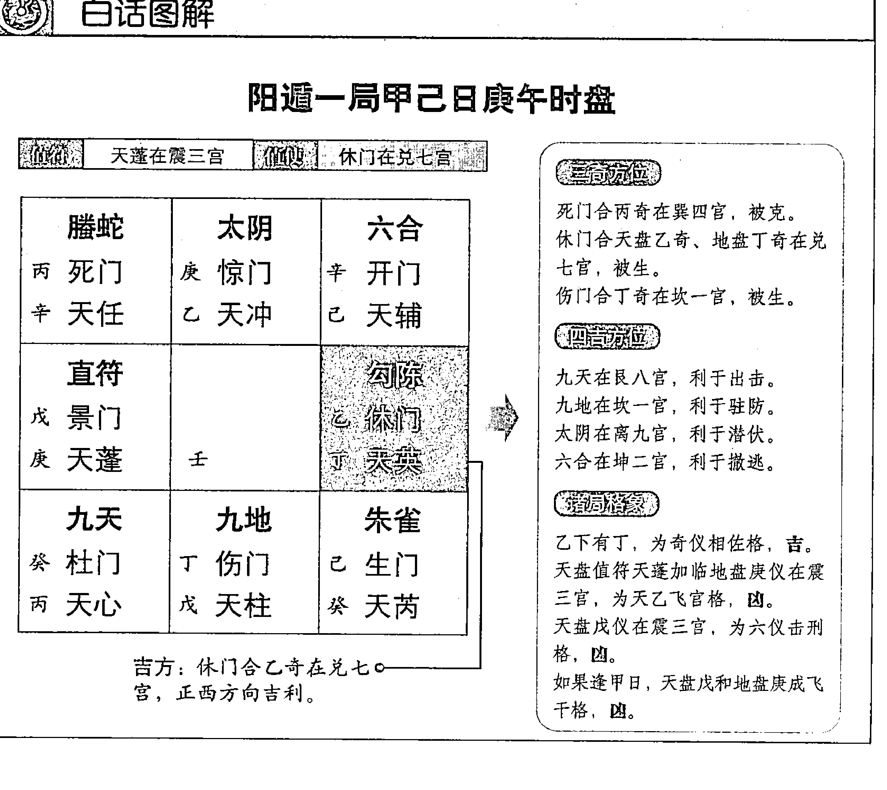

## 辛未时：正北方向吉利

### 【原文】  
辛未蓬四，休八，宿吉千凶，杜乙离义，惊乾伏墓，休丙艮害，天三，地八，阴二，合七。休与星合八东北，丁下有丙，已日伏干，时于兑，刑格。

### 【白话提要】

符使宫位：值符天蓬星在巽四宫，值使休门在艮八宫。时干辛遇吉星宿，时干辛遇地盘丁，相克，逢凶。

三奇方位：杜门合天盘丙奇、地盘乙奇在离九宫，生宫。惊门合乙奇在乾六宫，不相生克，乙奇入墓。休门合天盘丁奇、地盘丙奇在艮八宫，被克。

四吉方位：九天在震三宫，利于出击；九地在艮八宫，利于驻防；太阴在坤二宫，利于潜伏；六合在兑七宫，利于撒逃。

诸局格象：休门合丁奇在艮八宫，东北方位吉利。丁下有丙，成星随月转格。逢己日，天盘庚仪加临地盘己仪在坤二宫，成伏干格。天盘庚仪加临地盘己仪在坤二宫，也成刑格。

## 白话图解

### 阳遁一局甲己日辛未时盘
| 直符 | 戊辛天蓬 | 螣蛇 | 丙乙天任 | 太阴 | 庚己天冲 |
| --- | --- | --- | --- | --- | --- |
| 九天 | 癸庚天心 | 六合 | 辛丁天辅 | 
| --- | --- | --- | --- | --- |
| 九地 | 丁乙休门天柱 | 朱雀 | 己戊天芮禽 | 勾陈 | 乙癸惊门天英 |

- ◎吉方：休门合丁奇在艮八宫，东北方向吉利。

### 三奇方位:
杜门合天盘丙奇、地盘乙奇在离九宫，生宫。惊门合乙奇在乾六宫，不相生克。休门合天盘丁奇、地盘丙奇在艮八宫，被克。

#### 四吉方位
九天在震三宫，利于出击。九地在艮八宫，利于驻防。太阴在坤二宫，利于潜伏。六合在兑七宫，利于撒逃。

#### 诸局格象
丁下有丙，成星随月转格，吉。逢己日，天盘庚仪加临地盘己仪在坤二宫，成伏干格，凶。天盘庚仪加临地盘己仪在坤二宫，也成刑格，凶。

“第一章 阳遁一局”

“卷四”

“卷五”

“卷七”

“卷五”

## 壬申时：东南方向吉利

**原文**

壬申蓬五，休九。宿吉干凶。伤丁兑害，死丙艮伏，开巽制。天九，地四，阴六，合一。开与星合四东南，门反吟，时干震，大格。己日飞干。

**白话提要**

符使宫位：值符天蓬星在中五宫，中宫无位，寄居在坤二宫，值使休门在离九宫。时干壬遇吉星宿，时干壬临地盘庚，逢凶。

三奇方位：伤门合天盘丙奇、地盘丁奇在兑七宫，被克。死门合天盘乙奇、地盘丙奇在艮八宫，不相生克。开门合丁奇在巽四宫，克官。

四吉方位：九天在离九宫，利于出击；九地在巽四宫，利于驻防；太阴在乾六宫，利于潜伏；六合在坎一宫，利于撤逃。

诸局格象：开门合丁奇在巽四宫，东南方向吉利。八门都到了相对之官，为反吟格。天盘庚仪加临地盘癸仪，为大格。逢己日，天盘己仪加临地盘庚仪，为飞干格。

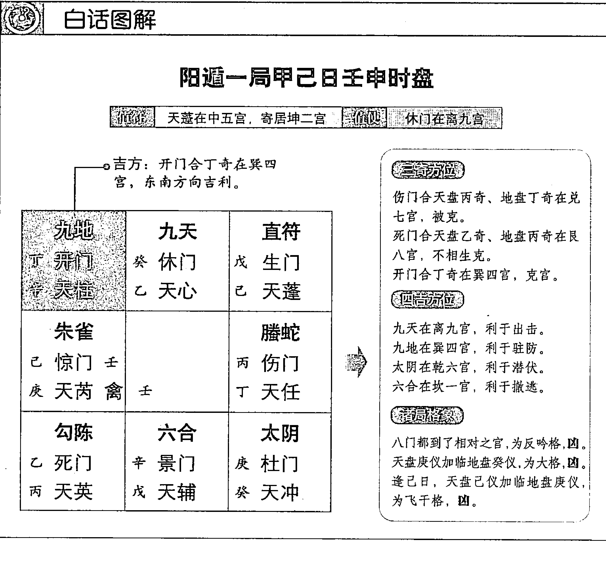

### 癸酉时：正北方向吉利

### 【原文】

> 癸酉，蓬六，休一。宿吉干凶。休坎伏欢怡，杜巽伏，死合坤伏。天七，地二，阴八，合三。休与月合一正北，蛇矫，龙反首，鸟跌穴，干格，时干兑，太白入荧惑，符勃，门伏。


### 【白话提要】

> 符使宫位：值符天蓬在乾六宫，值使休门在坎一宫。时干癸遇吉星宿，时干癸遇地盘丁，逢凶。


> 三奇方位：休门合丙奇在坎一宫，不相生克。杜门合乙奇在巽四宫，不相生克。死门合丁奇在坤二宫，不相生克，奇仪相合。


> 四吉方位：九天在兑七宫，利于出击；九地在坤二宫，利于驻防；太阴在艮八宫，利于潜伏；六合在震三宫，利于撤退。


> 诸局格象：休门合丙奇在坎一宫，正北方向吉利。天盘癸加临地盘丁在兑七宫，为螣蛇夭矫。天盘丙奇加临地盘甲子戊在坎一宫，为飞鸟跌穴。天盘庚仪加临地盘丙奇在艮八宫，为太白入荧。天盘丙奇加临地盘值符天蓬在坎一宫，为符勃格。八门都在原宫位不动，为八门伏吟。


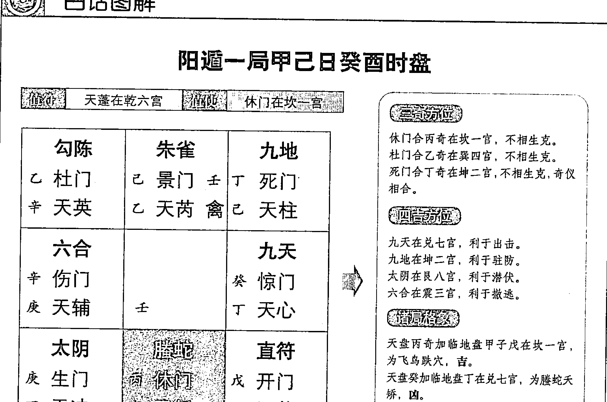

> 吉方：休门合丙奇在坎一宫，正北方向吉利。


> 天蓬在乾六宫


> 休门在坎一宫


> 三奇方位


> 四吉方位


> 诸局格象

## 甲戌时：东北方向吉利

### 【原文】
甲戌芮直符二，死直使二。戍至亥阳，宿凶干吉。景英使离伏，生任月艮伏，惊柱星兑伏。天九，地四，阴六，合一。生与月合八东北，阖时客胜亥，甲时阳外阴内，利行兵，时干坤，伏吟。

### 【白话提要】
符使宫位：值符天芮在坤二宫，值使死门也在坤二宫。戌时至亥时为五阳时，甲戌为五阳时。时干甲（戊）遇凶星宿，时干甲（戊）遇地盘甲（戊），逢吉。
三奇方位：景门合乙奇在离九宫，不相生克。生门合丙奇在艮八宫，不相生克。惊门合丁奇在兑七宫，不相生克。
四吉方位：九天在离九宫，利于出击；九地在巽四宫，利于驻防；太阴在乾六宫，利于潜伏；六合在坎一宫，利于撤退。
诸局格象：生门合丙奇在艮八宫，东北方向吉利。遁甲合时，客方胜。逢亥、甲时，阳外阴内，利于行兵作战。九星和八门都在本宫未动，为九星伏吟格和八门伏吟格。值符天芮也在本宫未动，为值符伏吟格。

### 阳遁一局甲己日甲戌时盘

| | **九天** | **直符** |
|---|---|---|
|九地<br/>辛<br/>天辅 | 乙<br/>景门<br/>乙<br/>天英 | 己<br/>死门<br/>壬<br/>禽<br/>己<br/>天芮 |
|朱雀<br/>庚<br/>天冲 | **六合**<br/>戊<br/>天蓬 | 螣蛇<br/>丁<br/>惊门<br/>丁<br/>天柱 |
|勾陈<br/>丙<br/>天任 | **太阴**<br/>癸<br/>开门<br/>癸<br/>天心 |

> **【三奇方位】**
景门合乙奇在离九宫，不相生克。
生门合丙奇在艮八宫，不相生克。
惊门合丁奇在兑七宫，不相生克。

**【四吉方位】**
九天在离九宫，利于出击。
九地在巽四宫，利于驻防。
太阴在乾六宫，利于潜伏。
六合在坎一宫，利于撤退。

**诸局格象:**
九星在本宫未动，为九星伏吟，凶。
八门在本宫未动，为八门伏吟，凶。
值符天芮在本官未动，为值符伏吟，凶。

## 乙亥时：西南方向吉利

> ### 【原文】

乙亥芮九，死三。宿凶干吉，己日不用。惊巽制，杜坎和，休合坤害欢怡。
天四，地三，阴七，合六。休与星合二西南，甲日勃，天乙与太白格，时干巽，
白入火，蛇矫，龙走。

### **【白话提要】**

符使宫位：值符天芮星在离九宫，值使死门在震三宫。时干乙逢凶星宿，时干乙遇地盘辛，逢吉。逢己日不宜用事。

三奇方位：惊门合乙奇在巽四宫，克官。杜门合丙奇在坎一宫，被生。休门合丁奇在坤二宫，被克，吉利。

四吉方位：九天在巽四宫，利于出击；九地在震三宫，利于驻防；太阴在兑七宫，利于潜伏；六合在乾六宫，利于撤退。

诸局格象：休门合丁奇在坤二宫，西南方向吉利。逢甲日，天盘丙奇加临日干甲（戊）在坎一宫，为日勃格。天盘庚仪加临地盘丙奇在艮八宫，为太白入荧。天盘癸仪加临地盘丁奇在兑七宫，为螣蛇夭矫。天盘乙奇加临地盘辛仪，为青龙逃走。

## 白话图解

## 阳遁一局甲己日乙亥时盘

| 值符 | 天芮在离九宫 | 值使 | 死门在震三宫 |
| --- | --- | --- | --- |

吉方：休门合丁奇在坤二宫，西南方向吉利。 | 

> **[星奇方位]**

惊门合乙奇在巽四宫，克宫。
杜门合丙奇在坎一宫，被生。休门合丁奇在坤二宫，被克。

> **四吉方位**

九天在巽四宫，利于出击。
九地在震三宫，利于驻防。太阴在兑七宫，利于潜伏。
六合在乾六宫，利于撤逃。

> **诸局格象**

逢甲日，天盘丙奇加临日干甲（戊）在坎一宫，为日勃格，凶。
天盘庚仪加临地盘丙奇在艮八宫，为太白入荧，凶。
天盘癸仪加临地盘丁奇在兑七宫，为螣蛇夭矫，凶。 
天盘乙奇加临地盘辛仪，为青龙逃走，凶。

### 丙子时：逢庚日不宜用事

### 【原文】

丙子芮八，死四。子至寅阳，庚日不用，宿凶干吉。伤坎和，开坤和欢怡，景震和。天一，地六，阴四，合九。开与月合二西南，龙反首，符勃，时干坤，相佐艮，符反吟。

### 【白话提要】

符使宫位：值符天芮星在艮八宫，值使死门在巽四宫。子时至寅时为五阳时，丙子时为五阴时。逢庚日不适用事。时干丙遇凶星宿，时干丙遇地盘己仪，逢吉。

三奇方位：伤门合乙奇在坎一宫，被生。开门合丙奇在坤二宫，被生，吉利。景门合丁奇在震三宫，被生。

四吉方位：九天在坎一宫，利于出击；九地在乾六宫，利于驻防；太阴在巽四宫，利于潜伏；六合在离九宫，利于撤退。

诸局格象：开门合丙奇在坤二宫，西南方向吉利。天盘丙奇加临地盘值符天芮在坤二宫，为符勃格。值符天芮在艮八宫，为值符反吟格。

## 白话图解
## 阳遁一局乙庚日丙子时盘

> > 吉方：开门合丙奇在坤二宫，西南方向吉利。
- 伤门合乙奇在坎一宫，被生。
- 开门合丙奇在坤二宫，被生。
- 景门合丁奇在震三宫，被生。
- 九天在坎一宫，利于出击。
- 九地在乾六宫，利于驻防。
- 太阴在巽四宫，利于潜伏。
- 六合在离九宫，利于撤退。

天盘丙奇加临地盘值符天芮在坤二宫，为符勃格，凶。
值符天芮在艮八宫，为值符反吟格，凶。

## 丁丑时：西北方向吉利

### 原文

丁丑芮七，死二避五。宿凶干吉。死坤伏欢怡，伤震伏，开乾伏墓。天二，地九，阴一，合八。开与星合六西北，火入太白格，虎猖狂，雀入江，庚日勃，时干乾，相佐兑。

### 白话提要

符使宫位：值符天芮在兑七宫，值使死门在中五宫，中宫无位而寄在坤二宫。时干丁遇凶星宿凶，时干丁遇地盘癸，逢吉。

三奇方位：死门合乙奇在坤二宫，不相生克。伤门合丙奇在震三宫，不相生克。开门合丁奇在乾六宫，不相生克，丁奇入墓。

四吉方位：九地在坤二宫，利于出击；九地在离九宫，利于驻防；太阴在坎一宫，利于潜伏；六合在艮八宫，利于撤退。

诸局格象：开门合丁奇在乾六宫，西北方向吉利。天盘丙奇加临地盘庚仪在震三宫，为荧入太白。天盘辛仪加临地盘乙奇在离九宫，为白虎猖狂。天盘丁奇加临地盘癸仪在乾六宫，为朱雀入江。逢庚日，天盘丙奇加临日干庚在震三宫，为勃格。时干在乾六宫方位。值符得地盘丁奇相助在兑七宫。

## 白话图解

# 戊寅时：东北方向吉利

**【原文】**
戊寅芮一，死六。宿凶干吉。死乾义，伤乙离义，开丙艮和。天六，地七，阴三，合四。开与星合八东北，丁下有丙。太白与天乙格，刑格，时干巽，伏官格，干勃。

**【白话提要】**
符使宫位：值符天芮星在坎一宫，值使死门在乾六宫。时干戊遇凶星宿，时干戊下临地盘辛，逢吉。

三吉方位：死门合乙奇在乾六宫，生官。伤门合天盘丙奇、地盘乙奇在离九宫，生宫。开门合天盘丁奇、地盘丙奇在艮八宫，被生。

四吉方位：九天在乾六宫，利于出击；九地在兑七宫，利于驻防；太阴在震三宫，利于潜伏;六合在巽四宫，利于撤退。

诸局格象：开门合丁奇在艮八宫，东北方向吉利。丁下有丙，为星随月转格。天盘庚仪加临地盘己仪在坤二宫，为刑格。天盘六庚加临地盘值符天芮在坤二宫，为天乙伏官格。逢乙日，天盘丙奇加日干乙在离九宫，为日干勃格。

# 己卯时：东北方向吉利

**【原文】**
己卯芮二，死七。卯至未阴，守户，宿干凶。杜乙离义，休丙艮害，死丁兑义。天九，地四，阴六，合一。休与月合八东北，时乾坤，伏吟，仪刑。

**【白话提要】**
符使宫位：值符天芮在坤二宫，值使死门在兑七宫。卯时至未时为五阴时，宜守户不出。时干己逢凶星宿，时干己遇地盘己，逢凶。

三奇方位：杜门合天盘乙奇、地盘乙奇在离九宫，生官。休门合天盘丙奇、地盘丙奇在艮八宫，被克。死门合天盘丁奇、地盘丁奇在兑七宫，生宫。

四吉方位：九天在离九宫，利于出击；九地在巽四宫，利于驻防；太阴在乾六宫，利于潜伏；六合在坎一宫，利于撤退。

诸局格象：休门合丙奇在艮八宫，东北方向吉利。值符天芮在原坤二宫未动，为值符伏吟格。己仪在坤二宫，为六仪击刑。

| **标题** | 白话图解 |
| --- | --- |
| **内容** | 阳遁一局乙庚日己卯时盘 |

| **九地** | 伤门<br>**九天**<br>杜门<br>**直符** | 景门 <br>:--:壬 |
| :---: | :---: | :---: |
| **天芮** | 天英<br>:--:禽<br>**值使** | 死门在兑七宫 |
| **朱雀** | 生门<br>**滕蛇** | 死门<br>壬丁<br> **六合** | 开门<br>戊<br>
**太阴** | 惊门 <br>:--:癸 |

# 庚辰时：东南方向吉利

**【原文】**
庚辰芮三死八。宿吉干凶。死丙艮伏，伤丁兑害，开巽制。天八，地一。阴九，合二。开与星合四东南，门反吟，时干乾，大格，飞官格。

**【白话提要】**
符使宫位：值符天芮星在震三宫，值使死门在艮八宫。时干庚遇吉星宿吉，时干庚下临地盘癸，逢凶。

三奇方位：死门合天盘乙奇、地盘丙奇在艮八宫，不相生克。伤门合天盘丙奇、地盘丁奇在兑七宫，被克。开门合丁奇在巽四宫，克宫。

四吉方位：九天在艮八宫，利于出击；九地在坎一宫，利于驻防；太阴在离九宫，利于潜伏；六合在坤二宫，利于撤逃。

诸局格象：开门合丁奇在巽四宫，东南方向吉利。八门都到了相反的宫位，为反吟格。天盘庚仪加临地盘癸仪在乾六宫，为大格。天盘值符天芮加临地盘庚在震三宫，为飞官格。

## 白话图解

## 阳遁一局乙庚日庚辰时盘

```
**值符** 天芮在震三宫  **值使** 死门在艮八宫

- 吉方：开门合丁奇在巽四宫，东南方向吉利。
```

| **螣蛇** | **癸** | **开门** | **丁壬** | **天柱** |
| --- | --- | --- | --- | --- |
| **太阴** | **癸** | **休门** | **乙** | **天心** |
| **六合** | **戊** | **生门** | **己** | **天蓬** |
| **直符** | **庚** | **惊门** | **癸** | **天芮** |
| **勾陈** | **丙** | **伤门** | **丁** | **天任** |
| **九天** | **丙** | **死门** | **乙** | **天英** |
| **九地** | **辛** | **景门** | **戌** | **天辅** |
| **朱雀** | **庚** | **杜门** | **癸** | **天冲** |

> **三奇方位**
死门合天盘乙奇、地盘丙奇在艮八宫，不相生克。
伤门合天盘丙奇、地盘丁奇在兑七宫，被克。
开门合丁奇在巽四宫，克宫。

**四吉方位**
九天在艮八宫，利于出击。
九地在坎一宫，利于驻防。
太阴在离九宫，利于潜伏。
六合在坤二宫，利于撤逃。

**诸局格象**
八门都到了相反的宫位，为反吟格，凶。
天盘庚仪加临地盘癸仪在乾六宫，为大格，凶。
天盘值符天芮加临地盘庚在震三宫，为飞官格，凶。

# 辛巳时：逢乙日不宜用事

**【原文】**
辛巳丙四，死九。宿吉干凶。乙日不用。杜合震伏，休乾和墓，死乙离和。天三，地八，阴二，合七，休与月合六西北，时干艮，乙日飞干格。

**【白话提要】**
符使宫位：值符天芮在巽四宫，值使死门在离九宫。时干辛遇吉星宿，时干辛下临地盘丙，逢凶。逢乙日不宜用事。

三奇方位：杜门合乙奇在震三宫，不相生克，奇仪相合。休门合丙奇在乾六宫，被生，丙奇入墓。死门合天盘丁奇、地盘乙奇在离九宫，被生。

四吉方位：九天在震三宫，利于出击；九地在艮八宫，利于驻防；太阴在坤二宫，利于潜伏；六合在兑七宫，利于撤逃。

诸局格象：休门与丙奇在乾六宫，西北方向吉利。时干在艮八宫。逢乙日，日干乙加临地盘庚仪在震三宫，为飞干格。

## 白话图解

## 阳遁一局乙庚日辛巳时盘

| **直符**<br>己 | **景门**<br>壬 | **天芮**<br>**禽** |
| --- | --- | --- |
| **丁** | **死门**<br>**乙** | **天柱** |
| **癸** | **惊门**<br>**己** | **天心** |
| **九天** | **乙** | **杜门**<br>**庚** | **天英** |
| **六合** | **戊** | **开门**<br>**丁** | **天蓬** |
| **朱雀** | **庚** | **生门**<br>**戊** | **天冲** |
| **勾陈** | **休门**<br> **天任** |

# 壬午时：正南方向吉利

**【原文】**
壬午芮五，死一。宿吉干凶。生乙离和，惊丙艮和，杜丁兑害。天九，地四，阴六，合一。生与日合九正南，时干坤，符伏吟。

**【白话提要】**

**符使宫位：**值符天芮星在中五宫，中宫无位，而寄居在坤二宫，值使死门在坎一宫。时干壬遇凶星宿，时干壬遇地盘己，逢吉。

**三奇方位：**生门合乙奇在离九宫，被生。惊门合天盘丙奇、地盘丙奇在艮八宫，被生。杜门合天盘丁奇、地盘丁奇在兑七宫，被克。

**四吉方位：**九天在离九宫，利于出击；九地在巽四宫，利于驻防；太阴在乾六宫，利于潜伏；六合在坎一宫，利于撤退。

**诸局格象：**生门合乙奇在离九宫，正南方向吉利。时干在坤二宫。值符天芮在坤二宫未动，为值符伏吟格。

## 癸未时：正北方向吉利

**【原文】**
癸未芮六，死二。宿吉干凶。惊丁兑伏，杜合巽伏，休坎伏。天七，地二，阴八，合三。休与星合一正北，门伏，天网四张，时干艮，乙日伏干格。

**【白话提要】**
符使宫位：值符天芮星在乾六宫，值使死门在坤二宫。时干癸遇吉星宿，时干癸下临地盘丙奇，逢凶。

三奇方位：惊门合天盘乙奇、地盘丁奇在兑七宫，同宫伏吟。杜门合丙奇在巽四宫，同宫伏吟。休门合丁奇在坎一宫，同宫伏吟。

四吉方位：九天在兑七宫，利于出击；九地在坤二宫，利于驻防；太阴在艮八宫，利于潜伏；六合在震三宫，利于撤逃。

诸局格象：休门合丁奇在坎一宫，正北方向吉利。八门在原宫位未动，为门伏吟格。时干在艮八宫方位。逢乙日，天盘庚仪加临日干乙在离九宫，为伏干格。

# 甲申时：利于藏兵固守

**【原文】**
甲申冲直符三，伤直使三。申至亥阳，天辅。宿干吉。生任使艮伏，景英日离伏，惊柱星兑伏。天八，地一，阴九，合二。生与月合八东北，甲时阳内阴外，利藏兵固守。事同三吉，开时，时干震，伏吟，伏宫格。

**【白话提要】**
**符使宫位**：值符天冲星在震三宫，值使伤门在震三宫。申时至亥时为五阳时。申时为天辅释罪时。时干甲（戊）遇凶星宿，时干甲（戊）遇地盘戊仪，逢吉。

**三奇方位**：生门合丙奇在艮八宫，同类伏吟。景门合乙奇在离九宫，同类伏吟。惊门合丁奇在兑七宫，同类伏吟。

**四吉方位**：九天在艮八宫，利于出击；九地在坎一宫，利于驻防；太阴在离九宫，利于潜伏；六合在坤二宫，利于撤退。

**诸局格象**：生门合丙奇在艮八宫，东北方向吉利。逢甲时阳内阴外，利于藏兵固守，类似三吉开时。时干在震三宫。八门、九星、值符都在原宫位未动，为八门伏吟格、九星伏吟格、值符伏吟格。天盘庚仪加临地盘值符天冲在震三宫，为伏宫格。

## 白话图解

#### 阳遁一局乙庚日甲申时盘

| **位置** | **名称** | **星/门** | **天盘星** |
| --- | --- | --- | --- |
| **左上** | 腾蛇 | 杜门/天辅 | 辛/辛 |
| **中上** | 太阴 | 景门/天英 | 乙/乙 |
| **右上** | 六合 | 死门/天芮 | 己/己 |
| **左中** | 直符 | 伤门/天冲 | 庚/庚 |
| **右中** | 勾陈 | 惊门/天柱 | 丁/丁 |
| **左下** | 九天 | 生门/天任 | 壬/丙 |
| **中下** | 九地 | 休门/天蓬 | 戊/戊 |
| **右下** | 朱雀 | 开门/天心 | 癸/癸 |

## 乙酉时：正北方向吉利

**【原文】**
乙酉冲九，伤四。宿干凶，伤合巽伏，死兑义，开坎义。天四，地三，阴七，合六。开与星合一正北，时干兑，乙日伏干格，庚日吉。

**【白话提要】**
符使宫位：值符天冲在离九宫，值使伤门在巽四宫。时干乙遇凶星宿，时干乙下临地盘丁，逢吉。

三奇方位：伤门合丙奇在巽四宫，不相生克。死门合天盘乙奇、地盘丁奇在兑七宫，相生。开门合丁奇在坎一宫，相生。

四吉方位：九天在巽四宫，利于出击；九地在震三宫，利于驻防；太阴在兑七宫，利于潜伏；六合在乾六宫，利于撤逃。

诸局格象：开门合丁奇在坎一宫，正北方位吉利。时干在兑七宫。逢乙日，天盘庚仪加临地盘日干乙在离九宫，为伏干格。逢庚日吉。

# 丙戌时：东南方向吉利

**【原文】**
丙戌冲八，伤五避五。宿干凶，庚日不用。死坎制，休巽义墓，伤合坤制。天一，地六，阴四，合九。休与日合四东南，得使，龙走，蛇娇，时干坎，相佐艮，白入火，仪刑，鸟跌穴。

**【白话提要】**
**符使宫位**：值符天冲星在艮八宫，值使伤门在中五宫，中宫无位，而寄居在坤二宫。时干丙遇凶星宿，时干丙下临地盘戊，逢凶。逢庚日不宜用事。

**三奇方位**:死门合丙奇在坎一宫，克宫。休门合乙奇在巽四宫，生宫，乙奇入墓。伤门合丁奇在坤二宫，克宫。

**四吉方位**：九天在坎一宫，利于出击；九地在乾六宫，利于驻防；太阴在巽四宫，利于潜伏；六合在离九宫，利于撤退。

**诸局格象**:休门合乙奇在巽四宫，东南方位吉利。天盘乙奇加临地盘辛仪在巽四宫，为青龙逃走。天盘癸仪加临地盘丁奇在兑七宫，为滕蛇夭矫。时干在坎一宫。值符得丙奇相助于艮八宫。天盘庚仪加临地盘丙奇在艮八宫，为太白入荧。天盘庚加临艮八宫，为六仪击刑。天盘丙奇加临地盘甲子戊，为飞鸟跌穴，吉。

# 丁亥时：西南方向吉利

**【原文】**
丁亥冲七，伤六。宿凶干吉，辛日不用。休坤害，杜坎和，死震喜欢怡。天二，地九，阴一，合八。休与月合二西南，符反吟，时干震，相佐兑。

**【白话提要】**
符使宫位：值符天冲在兑七宫，值使伤门在乾六宫。时干丁遇凶星宿，时干丁下临地盘庚，逢吉。逢辛日不宜用事。

三奇方位：休门合丙奇在坤二宫，被克。杜门合乙奇在坎一宫，被生。死门合丁奇在震三宫，被克，吉利。

四吉方位：九天在坤二宫，利于出击；九地在离九宫，利于驻防；太阴在坎一宫，利于潜伏；六合在艮八宫，利于撤退。

诸局格象：休门合丙奇合于坤二宫，西南方向吉利。值符天冲到了与其对冲的兑七宫，为值符反吟。时干在震三宫方位。值符得地盘丁奇相助于兑七宫。

## 白话图解

## 阳遁一局乙庚日丁亥时盘

**值符**: 天冲在兑七宫  **值使**: 伤门在乾六宫
吉方：休门合丙奇合于坤二宫，西南方向吉利。

> **朱雀** | 惊门 | 天心<br>**九地** | 开门 | 天蓬<br>**九天** | 休门 | 天任<br>**勾陈** | 死门 | 天柱<br>**直符** | 生门 | 天冲<br>**六合** | 景门 | 天芮<br>**太阴** | 杜门 | 天英<br>**螣蛇** | 伤门 | 天辅

> **三奇方位**
休门合丙奇在坤二宫，被克。
杜门合乙奇在坎一宫，被生。
死门合丁奇在震三宫，被克。

> **四吉方位**
九天在坤二宫，利于出击。
九地在离九宫，利于驻防。
太阴在坎一宫，利于潜伏。
六合在艮八宫，利于撤退。

> **诸局格象**
值符天冲到了与其对冲的兑七宫，为值符反吟，凶。
九星反吟，凶。

# 3.丙辛日十二时局

## 戊子时：正南方向吉利

### 【原文】
戊子冲一，伤七，子阳，守户，宿干吉。杜乾害墓，惊合震和欢怡，休乙离制。天六，地七，阴三，合四。休与星合九正南，丁下有乙，得人遁，时干兑，门反吟，飞官。

### 【白话提要】
符使宫位：值符天冲星在坎一宫，值使伤门在兑七宫。子时为五阳时，宜守户不出。时干戊遇吉星宿，时干戊下临地盘丁，逢吉。

三奇方位：杜门合丙奇在乾六宫，被克，丙奇入墓。惊门合乙奇在震三宫，被生，奇仪相合，吉利。休门合天盘丁奇、地盘乙奇在离九宫，克官。

四吉方位：九天在乾六宫，利于出击；九地在兑七宫，利于驻防；太阴在震三宫，利于潜伏；六合在巽四宫，利于撤逃。

诸局格象：休门合丁奇在离九宫，正南方向吉利。丁下有乙，成人遁。时干在兑宫。八门都到了其对冲的宫位，为八门反吟，凶。

## 己丑时：西北方向吉利

### 【原文】
> · 己丑冲二，伤八。丑至巳阴，宿吉干凶。死乙离和，休乾和，伤丙艮制。天九，地四，阴六，合一。休与日合六西北，时干坎，刑格。

### 【白话提要】
> 符使宫位：值符天冲在坤二宫，值使伤门在艮八宫。丑时至巳时为五阴时。时干己遇吉星宿，时干己遇地盘戊，逢凶。

> 三奇方位：死门合天盘丙奇、地盘乙奇在离九宫，被生。休门合乙奇在乾六宫，被生。伤门合天盘丁奇、地盘丙奇在艮八宫，克宫。

> 四吉方位：九天在离九宫，利于出击；九地在巽四宫，利于驻防；太阴在乾六宫，利于潜伏；六合在坎一宫，利于撤退。

> 诸局格局：休门合乙奇在乾六宫，西北方向吉利。时干在坎一宫。天盘庚仪加临地盘己仪，为刑格。

# 庚寅时：东北方向吉利

**【原文】**
庚寅冲三，伤九。宿吉干凶。开丙艮和，伤乙离义，景丁兑义。天八，地一，阴九，合二。开与月合八东北，仪刑，时干震，符伏吟，伏官格。

**【白话提要】**
符使宫位：值符天冲星在震三宫，值使伤门在离九宫。时干庚遇吉星宿，时干庚下临地盘庚，逢凶。

三奇方位：开门合双丙奇在艮八宫，被生。伤门合双乙奇在离九宫，生宫。景门合双丁奇在兑七宫，生宫。

四吉方向：九天在艮八宫，利于出击；九地在坎一宫，利于驻防；太阴在离九宫，利于潜伏；六合在坤二宫，利于撤逃。

诸局格象：开门合丙奇在艮八宫，东北方向吉利。天盘己加临坤二宫，为六仪击刑。时干在震三宫。值符天冲在原震三宫未动，为值符伏吟。九星在原官位未动，为九星伏吟。天盘庚加临值符天冲在震三宫，为伏官格。

**白话图解**

## 阳遁一局丙辛日庚寅时盘

> **值符**: 天冲在震三宫<br>**值使**: 伤门在离九宫

### **吉凶方位**
- 开门合双丙奇在艮八宫，被生。
- 伤门合双乙奇在离九宫，生官。
- 景门合双丁奇在兑七宫，生官。

#### **四吉方位**
- 九天在艮八宫，利于出击。
- 九地在坎一宫，利于驻防。
- 太阴在离九宫，利于潜伏。
- 六合在坤二宫，利于撤逃。

##### **诸局格象**
- 天盘己加临坤二宫，为六仪击刑，凶。
- 值符天冲在原震三宫未动，为值符伏吟，凶。
- 九星在原官位未动，为九星伏吟，凶。
- 天盘庚加临值符天冲在震三宫，为伏官格，凶。

# ## 辛卯时：西南与西北方向吉利

**原文**

> **辛卯**冲四，伤一，地遁，宿吉干凶。景震和欢怡，开坤和墓，生乾义墓。天三，地八，阴二，合七。开与日合二西南，生与星合六西北，丙日飞干格，虎猖狂，符勃，鸟跌穴，雀入江，时干离，丁日伏干格，火入白。

**白话提要**

> **符使宫位**：值符天冲在巽四宫，值使伤门在坎一宫。为地遁格。时干辛遇吉星宿，时干辛下临地盘乙，逢凶。
> 
> **三奇方位**：景门合丙奇在震三宫，被生，吉利。开门合乙奇在坤二宫，被生，乙奇入墓。生门合丁奇在乾六宫，生宫。
> 
> **四吉方位**：九天在震三宫，利于出击；九地在艮八宫，利于驻防；太阴在坤二宫，利于潜伏；六合在兑七宫，利于撤逃。
> 
> **诸局格象**：开门合乙奇在坤二宫，西南方向吉利。生门合丁奇在乾六宫，西北方向吉利。逢丙日，日干丙加临地盘庚在震三宫，为飞干格。天盘辛加临地盘乙奇在离九宫，为白虎猖狂，凶。天盘丙加临地盘甲申庚，为符勃格，凶。天盘丁奇加临地盘癸，为朱雀入江，凶。逢辛日，天盘庚加临地盘干辛，为伏干格，凶。

**白话图解**

> **阳遁一局丙辛日辛卯时盘**
>
> 
> 
> 吉方 1：开门合乙奇在坤二宫，西南方向吉利。
> 
> 吉方 2：生门合丁奇在乾六宫，西北方向吉利。

**## 第一章 阳遁一局**

# **壬辰时：正南方向吉利**

**原文**

壬辰冲五，伤二。丙日不用，宿吉干凶。生乙离和，景乾制，惊丙艮和。天九，地四，阴六，合一。生与月合九正南，丙下有乙，时干坎，刑格。

**白话提要**

符使宫位：值符天冲在中五宫，中宫无位，而寄居在坤二宫，值使伤门在坤二宫。逢丙日不宜用事。时干壬遇吉星宿，时干壬遇地盘成，逢凶。

三奇方位：生门合天盘丙奇、地盘乙奇在离九宫，被生。景门合乙奇在乾六宫，克官。惊门合天盘丁奇、地盘丙奇在艮八宫，被生。

四吉方位：九天在离九宫，利于出击；九地在巽四宫，利于驻防；太阴在乾六宫，利于潜伏；六合在坎一宫，利于撤退。

诸局格象：生门合丙奇在离九宫，正南方向吉利。丙下有乙，为日月并行格。时干在坎一宫。天盘庚加临地盘已在坤二宫，为刑格。

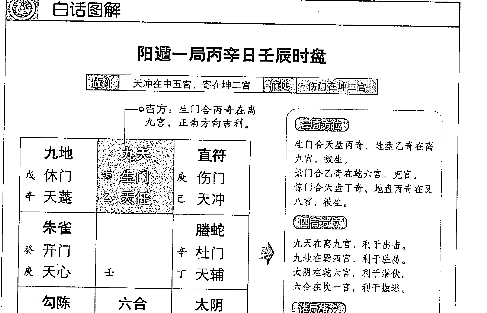

# ## 癸巳时：东北方向吉利

**原文**

癸巳冲六，伤三，宿吉干凶。惊丁兑伏，生内艮伏，杜巽伏。天七，地二，阴八，合三。生与日合八东北，乙下有丙。门伏，三吉，天网四张，时干离，天乙与太白格，事同。

**白话提要**

符使宫位：值符天冲星在乾六宫，值使伤门在震三宫。时干癸遇吉星宿，时干癸下临地盘乙，逢凶。

三奇方位：惊门合天盘丙奇、地盘丁奇在兑七宫，不相生克。生门合天盘乙奇、地盘丙奇在艮八宫，不相生克。杜门合丁奇在巽四宫，不相生克。

四吉方向：九天在兑七宫，利于出击；九地在坤二宫，利于驻防；太阴在艮八宫，利于潜伏；六合在震三宫，利于撤退。

诸局格象：生门合乙奇在艮八宫，东北方向吉利。乙下有丙，为奇仪顺遂。八门都在原宫位未动，为八门伏吟格。时干在离九宫。天盘庚仪加临地盘癸仪在乾六宫，为大格。天盘庚仪加临时干癸在乾六宫，为时格。

**白话图解**

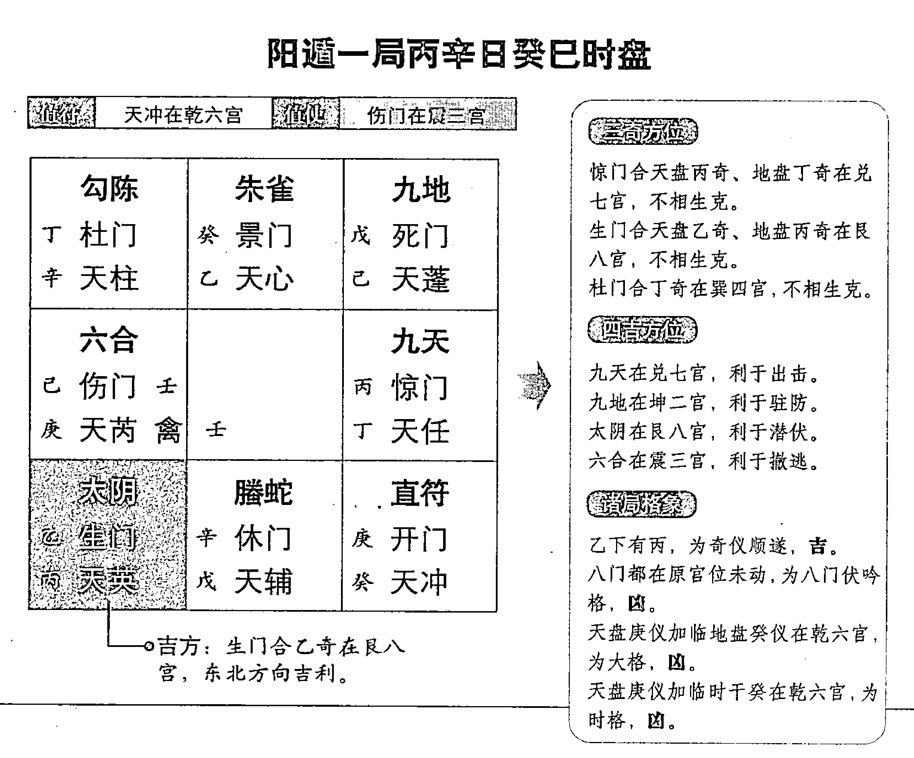

> **三奇方位**
惊门合天盘丙奇、地盘丁奇在兑七宫，不相生克。
生门合天盘乙奇、地盘丙奇在艮八宫，不相生克。
杜门合丁奇在巽四宫，不相生克。

> **四吉方位**
九天在兑七宫，利于出击。
九地在坤二宫，利于驻防。
太阴在艮八宫，利于潜伏。
六合在震三宫，利于撤退。

> **诸局格象**
乙下有丙，为奇仪顺遂，吉。
八门都在原宫位未动，为八门伏吟格，凶。
天盘庚仪加临地盘癸仪在乾六宫，为大格，凶。
天盘庚仪加临时干癸在乾六宫，为时格，凶。

# **甲午时：利于逃亡**

**原文**

甲午辅直符四，杜直使四。午至戌阳，天辅，宿干吉。景英使离伏，生任月艮伏，惊柱星兑伏。天三，地八，阴二，合七。生与日合八东北，开时遁甲，刑德在门，客主不利，利以逃亡，时干巽，伏吟，刑格，仪刑。

**白话提要**

| | 直符 | 螣蛇 | 太阴 |
|---|---|---|---|
|辛 杜门 | 乙 景门 | 己 杜门 壬 |
|辛 天辅 | 乙 天英 | 己 天芮 禽 |
|九天 | | 六合 |
|庚 伤门 | 壬 | 丁 惊门 |
|庚 天冲 | | 丁 天柱 |
|九地 | 朱雀 | 勾陈 |
|两 生门 | 戊 休门 | 癸 开门 |
|丙 天任 | 戊 天蓬 | 癸 天心 |
|吉方：生门合丙奇在艮八宫，东北方向吉利。|||

符使宫位：值符天辅星在巽四宫，值使杜门在巽四宫。午时至戌时为五阳时。午时天辅释罪。时干甲（戊）遇吉星宿，时干甲（戊）遇地盘戊，逢吉。
三奇方位：景门合乙奇在离九宫，同宫伏吟。生门合丙奇在艮八宫，同宫伏吟。惊门合丁奇在兑七宫，同类伏吟。
四吉方位：九天在震三宫，利于出击；九地在艮八官，利于驻防；太阴在坤二宫，利于潜伏；六合在兑七宫，利于撤逃。
诸局格象：生门合丙奇在艮八宫，东北方向吉利。开时遁甲。刑德在门。主客双方都不利，却利于逃亡。时干在巽四宫。九星、八门、值符都在原宫位未动，为九星伏吟格、八门伏吟格、值符伏吟格。天盘巳仪加临坤二宫，为六仪击刑。

## 白话图解

### 阳遁一局丙辛日甲午时盘

值符 天辅在巽四宫 值使 杜门在巽四宫

| | 直符 | 螣蛇 | 太阴 |
|---|---|---|---|
|辛 杜门 | 乙 景门 | 己 杜门 壬 |
|辛 天辅 | 乙 天英 | 己 天芮 禽 |
|九天 | | 六合 |
|庚 伤门 | 壬 | 丁 惊门 |
|庚 天冲 | | 丁 天柱 |
|九地 | 朱雀 | 勾陈 |
|两 生门 | 戊 休门 | 癸 开门 |
|丙 天任 | 戊 天蓬 | 癸 天心 |
|吉方：生门合丙奇在艮八宫，东北方向吉利。|||

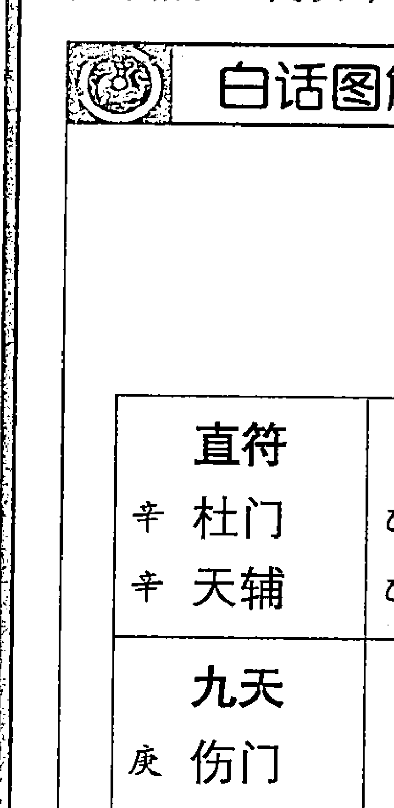

> **三奇方位**

景门合乙奇在离九宫。

生门合丙奇在艮八宫。

惊门合丁奇在兑七宫。

**四吉方位**

九天在震三宫，利于出击。

九地在艮八宫，利于驻防。

太阴在坤二宫，利于潜伏。

六合在兑七宫，利于撤逃。

**诸局格象**

九星、八门、值符都在原宫位未动，为九星伏吟格、八门伏吟格、值符伏吟格，☮。

天盘巳仪加临坤二宫，为六仪击刑，☮。

# **乙未时：正东方向吉利**

**原文**

乙未辅九，杜五避五。宿干吉。杜坤制墓，休震义，死乾义墓。天四地三，阴七，合六。休与月合三正东，得使，太白与天乙格，仪刑，虎猖狂，雀入江，时干坤，火入白，辛日伏官格。

**白话提要**

符使宫位：值符天辅星在离九宫，值使杜门在中五宫，中宫无位，而寄居在坤二宫。时干乙遇吉星宿，时干乙下临地盘己，逢吉。

三奇方位：杜门合乙奇于坤二宫，克宫，乙奇入墓。休门合丙奇在震三宫，生宫。死门合丁奇在乾六宫，生宫，丁奇人墓。

四吉方位：九天在巽四宫，利于出击；九地在震三宫，利于驻防；太阴在兑七宫，利于潜伏；六合在乾六宫，利于撤逃。

诸局格象：休门合丙奇在震三宫，正东方向吉利。天盘丙加临甲申庚在震三宫，为丙奇得使。天盘庚仪加临地盘值符天辅在巽四宫，为伏宫格。天盘辛仪在离九宫，为六仪击刑。天盘辛仪加临地盘乙奇，为白虎猖狂。天盘丁奇加临地盘癸仪，为朱雀入江。时干在坤二宫。天盘丙奇加临地盘庚仪，为荧人太白。逢辛日，天盘庚仪加临日干辛在巽四宫，为伏干格。

# **丙申时：正南方向吉利**

**原文**

丙申辅八，杜六，宿干吉。惊合震制，杜乾害墓，休乙离制。天一，地六，阴四，合九。休与星合九正南，丁下有乙，飞宫，龙反首，时干乾，门反吟，相佐艮。

**白话提要**

符使宫位：值符天辅星在艮八宫，值使杜门在乾六宫。时干丙遇吉星宿，时干丙下临地盘癸，逢凶。

三奇方位：惊门合乙奇在震三宫，克官。杜门合丙奇在乾六宫，被克，丙奇入墓。休门合天盘丁奇、地盘乙奇在离九宫，克宫。

四吉方位：九天在坎一宫，利于出击；九地在乾六宫，利于驻防；太阴在巽四宫，利于潜伏；六合在离九宫，利于撤逃。

诸局格象：休门合丁奇在离九宫，正南方向吉利。丁下有乙，成人遁。时干在乾六宫。八门都到了相冲的宫位，为八门反吟。值符逢地盘丙奇相助在艮八宫。

## 白话图解

|   |   |   |
|---|---|---|
|   | **值符天辅在艮八宫** | **杜门在乾六宫** |
|   | *吉方：休门合丁奇在离*
|   | *九宫，正南方向吉利*。 |
| 太阴六合勾陈 |
| 开门休门生门 |
| 天芮天心 |
|   | **朱雀** |
| 螣蛇惊门伤门 |
| 天英天蓬 |
|   | **九天** |
| 直符景门杜门 |
| 死门天冲天任 |

#### 三奇方位
惊门合乙奇在震三宫，克官。
杜门合丙奇在乾六宫，被克。
休门合天盘丁奇、地盘乙奇在离九宫，克宫。

#### 四吉方位
九天在坎一宫，利于出击。
九地在乾六宫，利于驻防。
太阴在巽四宫，利于潜伏。
六合在离九宫，利于撤逃。

#### 诸局格象
丁下有乙，成人遁，吉。八门都到了相冲的宫位，为八门反吟、凶。

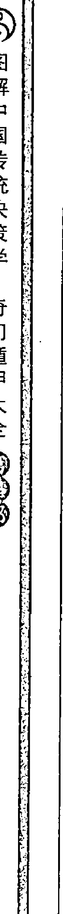

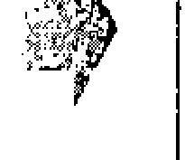


# **丁酉时：正南方向吉利**

**原文**

**丁酉** 辅七，杜七。辛日不用，守户。景乾制，生乙离和。惊丙艮和。天二，地九，阴一，阳八。生与月合九正南，丙下有乙，时干艮，刑格，相佐兑。

**白话提要**

**符使宫位:** 值符天辅在兑七宫，值使杜门在兑七宫。逢辛日不宜用事，应该守户不出。

**三奇方位:** 景门合乙奇在乾六宫，克宫。生门合天盘丙奇、地盘乙奇在离九宫，被生。惊门合天盘丁奇、地盘丙奇在艮八宫，被生。

**四吉方位:** 九天在坤二宫，利于出击;九地在离九宫，利于驻防；太阴在坎一宫，利于潜伏；六合在艮八官，利于撤退。

**诸局格象:** 生门合丙奇在离九宫，正南方向吉利。丙下有乙，为日月并行。时干在艮八官。天盘庚仪加地盘己仪在坤二宫，为刑格。值符得地盘丁奇相助在兑七宫。

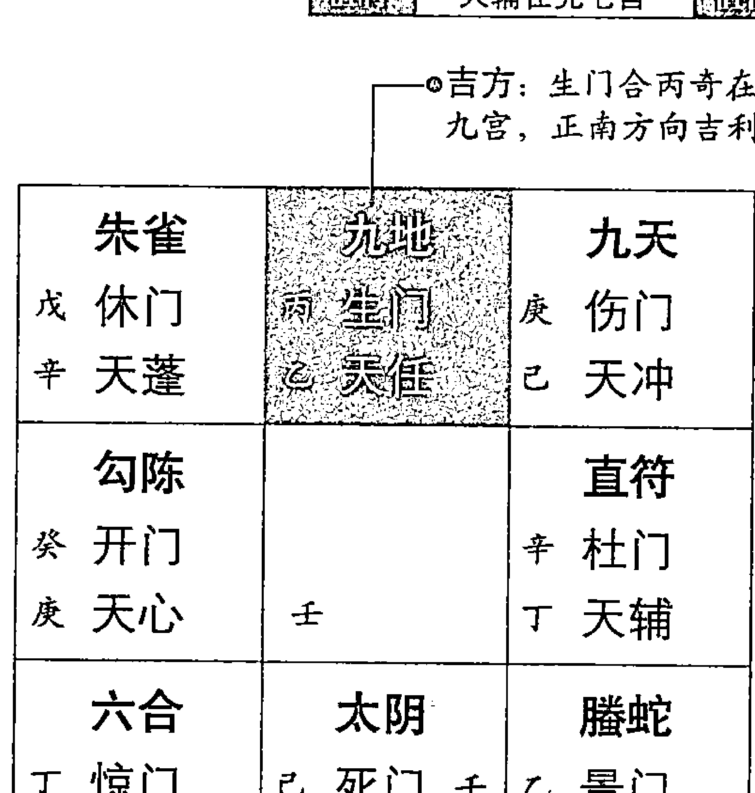

## **戌戌时**：正西方向吉利

**原文**

【原文】戊戌辅一，杜八。宿凶干吉。杜丙艮制，休丁兑义，死巽害欢怡。天六，地七，阴三，合四。休与月合七正西，丙下有丁，时坤，大格。

**白话提要**

【白话提要】**符使宫位**:值符天辅星在坎一宫，值使杜门在艮八宫。时干戊遇凶星宿，时干戊下临地盘己，逢吉。 **三奇方位**:杜门合天盘乙奇、地盘丙奇在艮八宫，克宫。休门合天盘丙奇、地盘丁奇在兑七宫，生宫。死门合乙奇在巽四宫，被克，吉利。 **四吉方位**:九天在乾六宫，利于出击；九地在兑七宫，利于驻防；太阴在震三宫，利于潜伏；六合在巽四宫，利于撤退。 **诸局格象**:休门合丙奇在兑七宫，正西方吉利。丙下有丁，为月奇朱雀。时干在坤二宫。天盘庚仪加临地盘癸仪在乾六宫，为大格。

| 六合 | 勾陈 | 朱雀 |
| --- | --- | --- |
| 丁死门辛天柱 | 癸惊门乙天心 | 戊开门己天蓬 |
| 太阴壬禽庚天英 | | 九地休任可天任 |
| 腾蛇乙杜门丙天英 | 直符辛伤门戌天辅 | 九天庚生门癸天冲 |

**白话图解**

阳遁一局丙辛日戌成时盘


**值符**:天辅在坎一宫 **值使**:杜门在艮八宫


**三奇方位**:杜门合天盘乙奇、地盘丙奇在艮八宫，克宫。休门合天盘丙奇、地盘丁奇在兑七宫，生宫。死门合乙奇在巽四宫，被克。

**四吉方位**:九天在乾六宫，利于出击。九地在兑七宫，利于驻防。太阴在震三宫，利于潜伏。六合在巽四宫，利于撤退。 **诸局格象**:丙下有丁，为月奇朱雀，吉。天盘庚仪加临地盘癸仪在乾六宫，为大格，凶。

**吉方**:休门合丙奇在兑七宫，正西方吉利。

# **己亥时：正北方向吉利**

**原文**

己亥辅二，杜九。亥阴，宿吉干凶。死丁兑义，伤巽伏欢怡，开坎义，天九，地四，阴六，合一。开与星合一正北，鸟跌穴，时干乾，符勃，辛日干勃。

**白话提要**

符使宫位：值符天辅星在坤二宫，值使杜门在离九宫。亥时为五阴时。时干己遇吉星宿吉，时干己下临地盘癸，逢凶。

三奇方位：死门合天盘乙奇、地盘丁奇在兑七宫，生官。伤门合丙奇在巽四宫，不相生克，吉利。开门合丁奇在坎一宫，生宫。

四吉方位：九天在离九宫，利于出击；九地在巽四宫，利于驻防；太阴在乾六宫，利于潜伏；六合在坎一宫，利于撤退。

诸局格象：开门合丁奇在坎一宫，正北方向吉利。时干在乾六宫。天盘丙奇加临地盘符首甲午辛，为值符勃格。逢辛日，天盘丙奇加临地盘日干辛，为日干勃格。

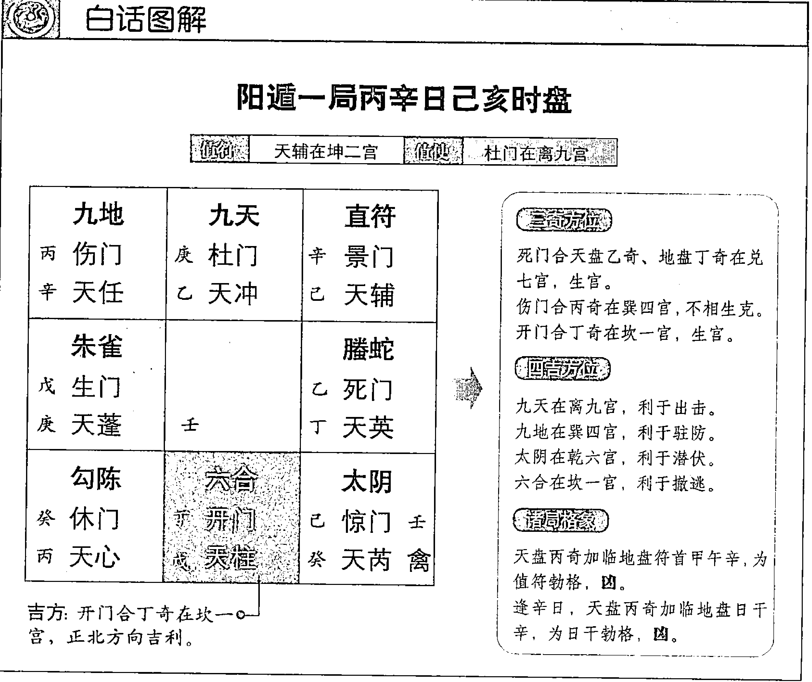

# ## 4.丁壬日十二时局

**庚子时：**西南方向吉利

**原文**

> 庚子辅三，杜一。子至卯阴，宿吉干凶。惊巽害，欢怡，杜坎和，休合坤害。天八，地一，阴九，合二。休与星合二西南，时干艮，飞宫格，白入荧。

**白话提要**

符使宫位：值符天辅星在震三宫，值使杜门在坎一宫。子时至卯时为五阴时。时干庚遇吉星宿，时干庚下临地盘丙，逢凶。

三奇方位：惊门合乙奇在巽四宫，被克，吉利。杜门合丙奇在坎一宫，被生。休门合丁奇在坤二宫，被克，奇仪相合。

四吉方位：九天在艮八宫，利于出击；九地在坎一宫，利于驻防；太阴在离九宫，利于潜伏；六合在坤二宫，利于撤逃。

诸局格象：休门合丁奇在坤二宫，西南方向吉利。时干在艮八宫。天盘值符天辅

#### **白话图解**

> **阳遁一局丁壬日庚子时盘**
> 
> ### **值符 | 天辅在震三宫 | 值使 | 杜门在坎一宫**
> 
> ### **吉方**：休门合丁奇在坤二宫，西南方向吉利。
> 
> ### **三奇方位**
> 
> 惊门合乙奇在巽四宫，被克。
> 杜门合丙奇在坎一宫，被生。
> 休门合丁奇在坤二宫，被克。
> 
> ### **四吉方位**
> 
> 九天在艮八宫，利于出击。
> 九地在坎一宫，利于驻防。
> 太阴在离九宫，利于潜伏。
> 六合在坤二宫，利于撤逃。
> 
> ### **诸局格象**
> 
> 天盘值符天辅加临地盘庚仪，为飞宫格，凶。天盘庚仪加临地盘丙奇，为太白入荧，凶。
> 
> ### **腾蛇**
> 
> - **惊门**
>   - 乙
>   - 辛
>     - 天英
> 
> ### **太阴**
> 
> - **开门**
>   - 己
>   - 乙
>     - 天芮 禽
> 
> ### **六合**
> 
> - **休门**
>   - 丁
>   - 己
>     - 天柱
> 
> ### **直符**
> 
> - **死门**
>   - 辛
>   - 庚
>     - 天辅
> 
> ### **勾陈**
> 
> - **生门**
>   - 癸
>   - 丁
>     - 天心
> 
> ### **九天**
> 
> - **景门**
>   - 庚
>   - 丙
>     - 天冲
> 
> ### **九地**
> 
> - **杜门**
>   - 丙
>   - 戊
>     - 天任
> 
> ### **朱雀**
> 
> - **伤门**
>   - 戊
>   - 癸
>     - 天蓬

**辛丑时：东北方向吉利**

**原文**

辛丑辅四，杜二。宿吉干凶。伤乙离义，开丙艮和，景丁兑制。天三，地八，阴二，合七。开与月合八东北，时干巽，符伏吟。

**白话提要**

符使宫位：值符天辅在巽四宫，值使杜门在坤二宫。时干遇吉星宿，时干辛下临地盘辛，逢凶。

三奇方位：伤门合双乙奇在离九宫，生宫。开门合双丙奇在艮八宫，被生。景门合双丁奇在兑七宫，克宫。

四吉方位：九天在震三宫，利于出击；九地在艮八宫，利于驻防；太阴在坤二宫，利于潜伏；六合在兑七宫，利于撤退。

诸局格象：开门合丙奇在艮八宫，东北方向吉利。时干在巽四宫。九星都在原宫位未动，为九星伏吟格。值符天辅在巽四宫未动，为值符伏吟格。

| |
|---|---|---|
| |||
| **白话图解** | **阳遁一局丁壬日辛丑时盘** ||
| 直符 生门 辛 | 天辅在巽四宫|杜门在坤二宫|
| 辛 天辅 | 螣蛇 伤门 乙 |
| 九天 休门 庚 | |六合景门丁 |
| 九地 开门 丙 | |朱雀惊门 戊 |
| 吉方：开门合丙奇在艮八宫，东北方向吉利。 ||

| |
|---|
||

| |第一章 阳遁一局 |
|---|
| |

| 107 |
|---|
| |

# **壬寅时：正西与正北方向吉利**

**原文**

壬寅辅五，杜三。宿凶干吉。开丁兑伏，景合巽和，生坎制，天九，地四，阴六，合一。开与日合七正西，乙下有丁，生与星合一正北，时干乾，符勃，事同，三吉。

**白话提要**

符使宫位：值符天辅星在中五宫，中宫无位，而寄居在坤二宫，值使杜门在震三宫。时干壬遇凶星宿，时干壬下临地盘癸，逢吉。

三奇方位：开门合天盘乙奇、地盘丁奇在兑七宫，不相生克。景门合丙奇在巽四宫，被生。生门合丁奇在坎一宫，克宫。

四吉方位：九天在离九宫，利于出击；九地在巽四宫，利于驻防；太阴在乾六宫，利于潜伏；六合在坎一宫，利于撤退。

诸局格象：开门合乙奇在兑七宫，正西方向吉利。生门合丁奇在坎一宫，正北方向吉利。乙下有丁，为奇仪相佐。时干在乾六宫。天盘丙奇加临地盘值符天辅在巽四宫，为值符勃格。三吉格。

## 白话图解

阳遁一局丁壬日壬寅时盘

> **三奇方位**

开门合天盘乙奇、地盘丁奇在兑七宫，不相生克。

景门合丙奇在巽四宫，被生。

生门合丁奇在坎一宫，克宫。

**四吉方位**

九天在离九宫，利于出击。

九地在巽四宫，利于驻防。

太阴在乾六宫，利于潜伏。

六合在坎一宫，利于撤逃。

> **诸局格象**

乙下有丁，为奇仪相佐，吉。

天盘丙奇加临地盘值符天辅在巽四宫，为值符勃格。凶。

> **吉方 2:**生门合丁奇在坎一宫，正北方向吉利。

**吉方 1:**开门合乙奇在兑七宫，正西方向吉利。

## **图解中国传统决策学·奇门遁甲大全（第部）**

100

# 癸卯时：正北方向吉利

### 【原文】

癸卯 辅六，杜四。丁日不用，宿吉干凶。休坎伏，死坤伏，伤震伏。天七，地二，阴八，合三。休与日合一正北，时干巽，符勃。

### 【白话提要】

符使宫位：值符天辅星在乾六官，值使杜门在巽四宫。逢丁日不宜用事。时干癸遇吉星宿，时干癸下临地盘辛，逢凶。

三奇方位：休门合乙奇在坎一官，同类伏吟。死门合丙奇在坤二宫，同类伏吟。伤门合丁奇在震三宫，同类伏吟。

四吉方位：九天在兑七宫，利于出击；九地在坤二宫，利于驻防；太阴在艮八宫，利于潜伏；六合在震三宫，利于撒逃。

诸局格象：休门合乙奇在坎一宫，正北方向吉利。时干在巽四宫。逢丁日，天盘庚仪加临地盘日干丁，为伏干格。八门都在原宫位未动，为八门伏吟格。

---

# 甲辰时：东北方向吉利

### 【原文】

> 甲辰 禽直符五，死直使五避五。辰至申阳，天辅，宿干吉。惊柱使兑伏，景英日离伏，生任月艮伏。天九，地四，阴六，合一。生与月合八东北，甲时阳外阴内，飞甲日，刑阖，时乾坤，开时，仪刑，伏吟。

### 【白话提要】

> 符使宫位：值符天禽在中五宫，中宫无位，寄居在坤二宫，值使死门在中五宫，也寄居在坤二宫。辰时至申时为五阳时，辰时为天辅释罪时。时干甲（戊）遇吉星宿，时干甲（戊）遇地盘戊，逢吉。

> 三奇方位：惊门合双丁奇在兑七宫，同类伏吟。景门合双乙奇在离九宫，同类伏吟。生门合双丙奇在艮八宫，同类伏吟。

> 四吉方位：九天在离九宫，利于出击；九地在巽四宫，利于驻防；太阴在乾六宫，利于潜伏；六合在坎一宫，利于撤退。

> 诸局格象：生门合丙奇在艮八宫，东北方向吉利。逢甲时阳外阴内，飞甲日，刑合。时干在坤二宫。天盘甲戊己值符加临地盘坤二宫，为六仪击刑。九星、八门、值符都在原宫位未动，为伏吟格。

## 白话图解

### 阳遁一局丁壬日甲辰时盘

> > 天禽在中五宫，寄在坤二宫    死门在中五宫，寄在坤二宫

> # 三奇方位    # 四吉方位    # 诸局格象
惊门合双丁奇在兑七宫，不相生克。
景门合双乙奇在离九宫，不相生克。
生门合双丙奇在艮八宫，不相生克。   
九天在离九宫，利于出击。
九地在巽四宫，利于驻防。
太阴在乾六宫，利于潜伏。
六合在坎一宫，利于撤退。
天盘甲戊己值符加临地盘坤二宫，为六仪击刑，凶。
九星、八门、值符都在原宫位未动，为伏吟格，凶。

> 九地  
杜门  
天辅   九天  
景门  
天英     直符  
死门  
天芮  
壬禽   朱雀  
伤门  
天冲        螣蛇  
惊门  
天柱   勾陈  
生门  
天任  

> 六合  
休门  
天蓬       太阴  
开门  
天心  
○吉方：生门合丙奇在艮八宫，东北方向吉利。

> 戊 庚 辛 丁 癸 乙 乙 己 己 戊 庚 癸 戊

---

# 乙巳时：东南方向吉利

### 【原文】

乙巳 禽九，死六。宿凶干吉。杜合坤制欢怡。生巽害，惊坎义。天四，地三，阴七，合六。生与日合四东南，白入火，鸟跌穴，时干巽，龙走，蛇矫。

### 【白话提要】

**符使宫位**：值符天禽在离九宫，值使死门在乾六宫。时干乙遇凶星宿，时干乙下临地盘辛，逢吉。

**三奇方位**：杜门合丁奇在坤二宫，克宫，奇仪相合，吉利。生门合乙奇在巽四宫，被克。惊门合丙奇在坎一宫，生宫。

**四吉方位**：九天在巽四宫，利于出击；九地在震三宫，利于驻防；太阴在兑七宫，利于潜伏；六合在乾六宫，利于撤退。

**诸局格象**：生门合乙奇在巽四宫，东南方向吉利。天盘庚加临地盘丙在艮八宫，为太白入荧。天盘丙奇加临地盘戊仪在坎一宫，为飞鸟跌穴。时干在巽四宫。天盘乙奇加临地盘辛仪在巽四宫，为青龙逃走。天盘癸仪加临地盘丁奇在兑七宫，为螣蛇夭矫。

| | | |
|---|---|---|
| 九天 | 直符 | 螣蛇 |
| | | |
| 乙生门 | | |
| | | |
| | | |
| | | |
| 九地 | | 太阴 |
| 辛休门 | | 癸景门 |
| 庚天辅 | 壬 | 丁天心 |
| | | |
| 朱雀 | 勾陈 | 六合 |
| 庚开门 | 丙惊门 | 戊死门 |
| 丙天冲 | 戊天任 | 癸天蓬 |

---

# 丙午时：正北与正东方向吉利

### 【原文】

丙午 禽八，死七。宿干吉，守户。生震害，开坎义，景坤义，天一，地六，阴四，合九。开与日合一正北，生与星合三正东，丁日飞干格。符冲，壬日勃，时乾坤，相佐艮，符反吟。

### 【白话提要】

符使宫位：值符天禽星在艮八宫，值使死门在兑七宫。时干丙遇吉星宿，时干丙下临地盘已，逢吉。宜守户不出。

三奇方位：生门合丁奇在震三宫，被克。开门合乙奇在坎一宫，生宫。景门合丙奇在坤二宫，生宫。

四吉方位：九天在坎一宫，利于出击；九地在乾六宫，利于驻防；太阴在巽四宫，利于潜伏；六合在离九宫，利于撤逃。

诸局格象：开门合乙奇在坎一宫，正北方向吉利。生门合丁奇在震三宫，正东方吉利。逢丁日，天盘日干丁加临地盘庚仪在震三宫，为飞干格。逢丁日，天盘庚仪加临地盘日干丁在兑七宫，为伏干格。逢壬日，天盘值符天禽加临地盘丙奇在艮八宫，为飞勃格。时干在坤二宫。值符得地盘丙奇相助在艮八宫。九星和值符都在本宫未动，为反吟格。

---

# 丁未时：西南方向吉利

### 【原文】

**丁未** 禽七，死八。宿凶干吉。杜乾害墓，生墓坤伏欢怡，惊震制，天二，地九，阴一，合八。生与日合二西南，虎猖狂，雀入江，龙反首，时干乾，相佐兑，火入太白。

### 【白话提要】

符使宫位：值符天禽星在兑七宫，值使死门在艮八宫。时干丁遇凶星宿，时干丁下临癸仪，逢吉。

三奇方位：杜门合丁奇在乾六宫，被克，丁奇入墓。生门合乙奇在坤二宫，不相生克，乙奇入墓，吉利。惊门合丙奇在震三宫，克宫。

四吉方位：九天在坤二宫，利于出击；九地在离九宫，利于驻防；太阴在坎一宫，利于潜伏；六合在艮八宫，利于撤逃。

诸局格象：生门合乙奇在坤二宫，西南方向吉利。天盘辛仪加临地盘乙奇在离九宫，为白虎猖狂。天盘丁奇加临地盘癸仪在乾六宫，为朱雀入江。天盘六戊加临地盘丙奇在艮八宫，为青龙回首。时干在乾六宫。值符得地盘丁相助在兑七宫。天盘丙奇加临地盘庚仪在震三宫，为荧入太白。

## 白话图解

| | | |
|:---|:---|:---|
| **值 符** | 天 禽 在 兑 七 宫 | **值 使** | 死 门 在 艮 八 宫 |

| 朱雀 | 九地 | 九天 |
| 庚 开门 | 辛 休门 | 乙 生门 |
| 辛 天冲 | 乙 天辅 | 乙 天英 |
| 勾陈 | 直符 | |
| 丙 惊门 | 己 伤门 | 壬 |
| 庚 天任 | 壬 伤门 | 丁 天芮 |
| | | 禽 |
| 六合 | 太阴 | 螣蛇 |
| 戊 死门 | 癸 景门 | 丁 杜门 |
| 丙 天蓬 | 戊 天心 | 癸 天柱 |

> > **三 奇 方 位**

杜门逢丁奇于乾六宫，被克，丁奇入墓。

生门合乙奇于坤二宫，乙奇入墓，好。

> **四 吉 方 位**

九天在坤二官，利于出击。

九地在离九宫，利于驻防。

太阴在坎一宫，利于潜伏。

六合在艮八宫，利于撤逃。

> **诸 局 格 象**

天盘辛仪加临地盘乙奇在离九宫，为白虎猖狂，凶。

天盘丁奇加临地盘癸仪在乾六宫，为朱雀入江，凶。

天盘丙奇加临地盘庚仪在震三宫，为荧入太白，凶。

天盘六戊加临地盘丙奇在艮八宫，为青龙回首，吉。

---

# 戊申时：西北方向吉利

### 【原文】

> 戊申 禽一，死九。壬日不用，宿凶干吉。伤丙艮制，休乾和，死乙离和。天六，地七，阴三，合四。休日合六西北，壬日伏干格，太白云天乙格，时干巽，伏干格，刑格，乙格。

### 【白话提要】

> 符使宫位：值符天禽在坎一宫，值使死门在离九宫。逢壬日不宜用事。时干戊遇凶星宿，时干戊下临地盘辛，逢吉。三奇方位：伤门合天盘丁奇、地盘丙奇在艮八宫，克宫。休门合乙奇在乾六宫，被生。死门合天盘丙奇、地盘乙奇在离九宫，被生。四吉方位：九天在乾六宫，利于出击。九地在兑七宫，利于驻防；太阴在震三宫，利于潜伏；六合在巽四宫，利于撤退。诸局格象：休门合乙奇在乾六宫，西北方向吉利。天盘庚仪加临地盘值符天禽在坤二宫，为伏宫格。时干在巽四宫。天盘庚仪加临地盘仪在坤二官，为刑格。

## 白话图解

# 阳遁一局丁壬日戊申时盘

---

# 己酉时：正南方向吉利

### 【原文】

己酉禽二，死一。酉至亥阴，宿吉干凶。杜丁兑害，生乙离和，惊丙艮和。天九，地四，阴六，合一。生与日合九正南，乙下有乙，时干坤，伏吟。

### 【白话提要】

符使宫位：值符天禽星在坤二宫，值使死门在坎一宫。酉时至亥时为五阴时。时干己遇吉星宿，时干已下临地盘己，逢凶。

三奇方位：杜门合双丁奇在兑七宫，被克。生门合双乙奇在离九宫，被生。惊门合双丙奇在艮八宫，被生。

四吉方位：九天在离九宫，利于出击；九地在巽四宫，利于驻防；太阴在乾六宫，利于潜伏；六合在坎一宫，利于撤退。

诸局格象：生门合乙奇合在离九宫，正南方向吉利。乙下有乙，为日奇伏吟。时干在坤二宫，九星和值符都在本宫未动，为伏吟格。

---

# 庚戌时：东北方向吉利

### 【原文】

**庚戌**禽三，死二。宿吉干凶。杜巽伏，生丙艮伏，惊丁兑伏。天八，地一，阴九，合二。生与日合八东北，乙下有丙，大格。壬日飞干格。门伏，时干乾，天乙飞干格，丁日干格。

### 【白话提要】

**符使宫位**：值符天禽在震三官，值使死门在坤二宫。时干庚遇吉星宿，时干庚下临地盘癸，逢凶。

**三奇方位**：杜门合丁奇在巽四宫，同类伏吟。生门合天盘乙奇、地盘丙奇在艮八宫，同类伏吟。惊门合天盘丙奇、地盘丁奇在兑七宫，同类伏吟。

**四吉方位**：九天在艮八宫，利于出击；九地在坎一宫，利于驻防；太阴在离九宫，利于潜伏；六合在坤二宫，利于撒逃。

**诸局格象**：生门合乙奇在艮八宫，东北方向吉利。乙下有丙，为奇仪顺遂。天盘庚仪加临地盘癸仪在乾六宫，为大格。逢壬日，天盘日干壬加临地盘庚仪在震三宫，为飞干格。八门都在本宫未动，为八门伏吟。时干在乾六宫。天盘值符天芮加临地盘庚仪，为天乙飞宫格。

---

# 辛亥时：正南方向吉利

### 【原文】

辛亥 禽四，死三。宿吉干凶。开乙离害，死合震害。伤墓乾害。天三，地八，阴二，合七。开与星合九正南，丁下有乙，天乙与太白格，事同，三吉，时干艮，大格，仪刑，飞宫。

### 【白话提要】

符使宫位：值符天禽星在巽四宫，值使死门在震三宫。时干辛遇吉星宿，时干辛下临地盘丙，逢凶。

三奇方位：开门合天盘丁奇、地盘乙奇在离九宫，被克。死门合乙奇在震三宫，被克，奇仪相合。伤门合丙奇在乾六宫，被克，丙奇入墓。

四吉方位：九天在震三宫，利于出击；九地在艮八宫，利于驻防；太阴在坤二宫，利于潜伏；六合在兑七宫，利于撤退。

诸局格象：开门合丁奇在离九宫，正南方向吉利。丁下有乙，成人遁。时干在艮八宫。天盘壬仪加临地盘辛仪在巽四宫，为六仪击刑。

## 白话图解

---

# 5. 戊癸日十二时局

## 壬子时：正西方向吉利

**【原文】**
壬子 禽五，死四。子至丑阴，宿吉干凶。休丁兑和，惊乙离害，杜丙艮制，天九，地四，阴六，合一。休与星合七正西，时乾坤，符伏吟。

**【白话提要】**
符使宫位：值符天禽在中五宫，中宫无位，而寄居在坤二宫，值使死门在巽四宫。子时至丑时为五阴时。时干壬遇吉星宿，时干壬下临地盘己，逢凶。
三奇方位：休门合双丁奇在兑七宫，被生。惊门合双乙奇在离九宫，被克。杜门合双丙奇在艮八宫，克宫。
四吉方位：九天在离九宫，利于出击；九地在巽四宫，利于驻防；太阴在乾六宫，利于潜伏；六合在坎一官，利于撤退。
诸局格象：休门合丁奇在兑七宫，正西方向吉利。时干在坤二宫。九星和值符都在本宫未动，为九星伏吟和值符伏吟。

## 白话图解

阳遁一局戊癸日壬子时盘

| | | |
|---|---|---|
| **九地** | **九天** | **直符** |
| 辛<br/>死门<br/>辛<br/>天辅 | 乙<br/>惊门<br/>乙<br/>天英 | 己<br/>开门<br/>己<br/>天芮<br/>壬<br/>禽 |
| 朱雀 | 蛇<br/>休门<br/>天柱<br/>癸 | 丁<br/>生门<br/>庚 |
| 勾陈 | 六合<br/>伤门<br/>戊<br/>天蓬 | 癸<br/>生门<br/>庚<br/>天心 |

> **三奇方位：**

休门合双丁奇在兑七宫，被生。
惊门合双乙奇在离九宫，被克。
杜门合双丙奇在艮八官，克宫。

> **四吉方位：**

九天在离九宫，利于出击。
九地在巽四宫，利于驻防。
太阴在乾六官，利于潜伏。
六合在坎一官，利于撤退。

> **诸局格象：**

九星和值符都在本宫未动，为九星伏吟和值符伏吟。凶。

吉方：休门合丁奇在兑七宫，正西方向吉利。

---

## 癸丑时：正北方向吉利

### 【原文】

癸丑 禽六，死五避五。宿吉干凶。休坎伏，惊丁兑伏，杜合巽伏。天七，地二，阴八，合三。休与星合一正北，天网四张，时干艮，戊日飞干格，门伏。

### 【白话提要】

符使宫位：值符天禽星在乾六宫，值使死门在中五宫，中宫无位，寄居在坤二宫。时干癸遇吉星宿，时干癸加临地盘丙，逢凶。

三奇方位：休门合丁奇在坎一宫，不相生克。惊门合天盘乙奇、地盘丁奇在兑七宫，不相生克。杜门合丙奇在巽四宫，不相生克，奇仪相合。

四吉方位：九天在兑七宫，利于出击；九地在坤二宫，利于驻防；太阴在艮八宫，利于潜伏；六合在震三宫，利于撤退。

诸局格象：休门合丁奇在坎一宫，正北方向吉利。时干在艮八宫。逢戊日，天盘日干戊加临地盘庚，为飞干格。八门都在本宫未动，为八门伏吟。

---

**甲寅时：东北方向吉利**

### 【原文】

甲寅 心直符六，开直使六天。寅至午阳，宿干吉，戊日不用。惊杜使兑伏，景英日离伏，生任月艮伏。天七，地二，阴八，合三。生与月合八东北，时于乾，休吟，地甲阖。

### 【白话提要】

符使宫位：值符天心星在乾六宫，值使开门在乾六宫。寅时至午时为五阳时。天干甲（戊）遇吉星宿，时干甲（戊）下临地盘戊，逢吉。戊日不宜用事。

三奇方位：惊门合丁奇在兑七宫，同类伏吟。景门合乙奇在离九宫，同类伏吟。生门合丙奇在艮八宫，同类伏吟。

四吉方位：九天在兑七宫，利于出击；九地在坤二官，利于驻防；太阴在艮八宫，利于潜伏；六合在震三宫，利于撤逃。

诸局格象：生门合丙奇在艮八宫，东北方向吉利。时干在乾六宫。八门、九星和值符都在本宫未动，为伏吟格。地甲合。

---

# 乙卯时：正西方向吉利

### 【原文】

乙卯心九，开七，守户。景巽和，伤丙艮制，开丁兑和。天四，地三，阴七，合六。开与月合七正西，丙下有丁，太白与天乙格。时干艮，癸日飞干格，太格，乙格。

### 【白话提要】

符使宫位：值符天心在离九宫，值使开门在兑七宫。宜守户不出。

三奇方位：景门合丁奇在巽四宫，被生。伤门合天盘乙奇、地盘丙奇在艮八宫，克宫。开门合天盘丙奇、地盘丁奇在兑七宫，被生。

四吉方位：九天在巽四宫，利于出击；九地在震三宫，利于驻防；太阴在兑七宫，利于潜伏；六合在乾六宫，利于撤退。

诸局格象：开门合丙奇合在兑七宫，正西方向吉利。丙下有丁，为月奇朱雀。天盘庚仪加临地盘值符天心在乾六宫，为伏宫格。时干在艮八宫。逢癸日，天盘庚仪加临地盘日干癸，为伏干格。天盘庚仪加临地盘癸仪在乾六宫，为大格。

## 白话图解

#### 阳遁一局戊癸日乙卯时盘

| | | |
| --- | --- | --- |
| **九天** | **直符** | **螣蛇** |
| 丁景门 | 癸死门 | 戌惊门 |
| 辛天柱 | 乙天心 | 己天蓬 |

| | | |
| --- | --- | --- |
| **九地** | | **太阴** |
| 壬杜门已 | | 丙开门 |
| 庚天芮禽壬 | | 丁天任 |

| | | |
| --- | --- | --- |
| **朱雀** | **勾陈** | **六合** |
| 乙伤门 | 辛生门 | 庚休门 |
| 丙天英 | 戊天辅 | 癸天冲 |

**吉方**: 开门合丙奇合在兑七宫，正西方向吉利。

#### 三奇方位

景门合丁奇在巽四宫，被生。
伤门合天盘乙奇、地盘丙奇在艮八宫，克宫。
开门合天盘丙奇、地盘丁奇在兑七宫，被生。

#### 四吉方位

九天在巽四宫，利于出击。
九地在震三宫，利于驻防。
太阴在兑七宫，利于潜伏。
六合在乾六宫，利于撤退。

#### 诸局格象

丙下有丁，为月奇朱雀，吉。
天盘庚仪加临地盘值符天心在乾六宫，为伏官格，凶。
逢癸日，天盘庚仪加临地盘日干癸，为伏干格，凶。
天盘庚仪加临地盘癸仪在乾六宫，为大格，凶。

## 丙辰时：东南方向吉利

【原文】

丙辰，心八，开八。宿干吉。惊坎义，景丁兑制，生合巽害。天一，地六，阴四，合九。生与月合四东南，时干巽，相佐艮，戊日飞干格。

【白话提要】

符使宫位：值符天心在艮八宫，值使开门在艮八宫。时干丙遇吉星宿，时干丙下临地盘辛，逢吉。

三奇方位：惊门合丁奇在坎一宫，生宫。景门合天盘乙奇、地盘丁奇在兑七宫，克宫。生门合丙奇在巽四宫，被克，奇仪相合。

四吉方位：九天在坎一宫，利于出击；九地在乾六宫，利于驻防；太阴在巽四宫，利于潜伏；六合在离九宫，利于撤退。

诸局格象：生门合丙奇在巽四宫，东南方向吉利。时干在巽四宫。值符得地盘丙奇相助在艮八宫。逢戊日，天盘戊加临地盘庚仪在震三宫，为飞干格。

## 白话图解

#### 阳遁一局戊癸日丙辰时盘

*   **值符：** 天心在艮八宫
*   **值使：** 开门在艮八宫
*   **吉方：** 生门合丙奇在巽四宫，东南方向吉利。

| 太阴 | 六合 | 勾陈 |
| :---: | :---: | :---: |
| 乙生门 | 庚伤门 | 辛杜门 |
| 丙天匡 | 乙天冲 | 己天辅 |
| **腾蛇** | | **朱雀** |
| 戊休门 | 壬 | 乙景门 |
| 庚天蓬 | 丁天英 | |
| **直符** | **九天** | **九地** |
| 癸开门 | 丁惊门 | 己死门 |
| 丙天心 | 戊天柱 | 癸天芮 禽 |

> **三奇方位：**
>
> 惊门合丁奇在坎一宫，生宫。
>
> 景门合天盘乙奇、地盘丁奇在兑七宫，克宫。
>
> 生门合丙奇在巽四宫，被克。
>
> **四吉方位：**
>
> 九天在坎一宫，利于出击。
>
> 九地在乾六宫，利于驻防。
>
> 太阴在巽四宫，利于潜伏。
>
> 六合在离九宫，利于撤退。
>
> **诸局格象：**
>
> 逢戊日，天盘戊加临地盘庚仪在震三宫，为飞干格。

---

## 丁巳时：西南方向吉利

### 【原文】

丁巳，心七，开九。宿凶干吉。休合坤害，惊巽制，杜坎和。天二，地九，阴一，合八。休与星合二西南，仪刑，龙走，蛇矫，鸟跌穴。戊日干悖，时乾坤，相佐兑，金入火。

### 【白话提要】

符使宫位：值符天心星在兑七宫，值使开门在离九宫。时干丁遇凶星宿，时干丁下临地盘己，逢吉。

三奇方位：休门合丁奇在坤二宫，被克。惊门合乙奇在巽四宫，克宫。杜门合丙奇在坎一宫，被生。

四吉方位：九天在坤二宫，利于出击；九地在离九宫，利于驻防；太阴在坎一宫，利于潜伏；六合在艮八宫，利于撤退。

诸局格象：休门合丁奇在坤二宫，西南方向吉利。天盘己仪加临坤二宫，为六仪击刑。天盘乙奇加临地盘辛仪在巽四宫，为青龙逃走。天盘癸仪加临地盘丁奇在兑七宫，为螣蛇夭矫。天盘丙奇加临地盘戊仪在坎一宫，为飞鸟跌穴。逢戊日，天盘丙奇加临地盘日干戊，为日悖格。时干在坤二宫。值符得地盘丁奇相助在兑七宫。天盘庚仪加临地盘丙奇，为太白入荧。

## 白话图解

#### 阳遁一局戊癸日丁巳时盘

> **三奇方位：**
>
> 休门合丁奇在坤二宫，被克。
>
> 惊门合乙奇在巽四宫，克宫。
>
> 杜门合丙奇在坎一宫，被生。
>
> **四吉方位：**
>
> 九天在坤二宫，利于出击。
>
> 九地在离九宫，利于驻防。
>
> 太阴在坎一宫，利于潜伏。
>
> 六合在艮八宫，利于撤退。
>
> **诸局格象：**
>
> 天盘己仪加临坤二宫，为六仪击刑，凶。
>
> 天盘乙奇加临地盘辛仪在巽四宫，为青龙逃走，凶。
>
> 天盘癸仪加临地盘丁奇在兑七宫，为螣蛇夭矫，凶。
>
> 天盘丙奇加临地盘戊仪在坎一宫，为飞鸟跌穴，吉。
>
> 逢戊日，天盘丙奇加临地盘日干戊，为日悖格，凶。
>
> 天盘庚仪加临地盘丙奇，为太白入荧，凶。

| 朱雀 | 九地 | 九天 |
| :---: | :---: | :---: |
| 乙惊门 | 己开门壬休门<br>乙天芮禽杜门癸休门庚天英 | |
| 勾陈<br>辛死门庚天辅 | 壬直符生门天心丁 | |
| 六合庚景门丙天冲 | 太阴丙杜门戊天任 | 螣蛇戊伤门癸天蓬 |

[img/e4f0018713850f791b9c6adce4c61f95_118_0.png]

---

## 戊午时：正东方向吉利

### 原文

戊午，心一，开一。宿吉干凶。惊乾伏墓，景坤义墓，生震害。天六，地七，阴三，合四。生与月合三正东，雀入江。时干艮，火入金，虎猖狂。

### 白话提要

符使宫位：值符天心星在坎一宫，值使开门在坎一宫。时干戊遇吉星宿，时干戊下临地盘丙，逢凶。

三奇方位：惊门合丁奇在乾六宫，不相生克，丁奇入墓。景门合乙奇在坤二宫，被生，乙奇入墓。生门合丙奇在震三宫，被克。

四吉方位：九天在乾六宫，利于出击；九地在兑七宫，利于驻防；太阴在震三宫，利于潜伏；六合在巽四宫，利于撤逃。

诸局格象：生门合丙奇在震三宫，正东方向吉利。天盘丁奇加临地盘癸仪在乾六宫，为朱雀入江。时干在艮八宫。天盘丙奇加临地盘庚仪在震三宫，为荧入太白。天盘辛仪加临地盘乙奇在离九宫，为白虎猖狂。

[img/e4f0018713850f791b9c6adce4c61f95_119_0.png]

---

## 己未时：西北方向吉利

### 原文

己未，心二，开二。未至亥阴，宿吉干凶，癸日不用。惊乙离害，景合震和，生墓乾义。天九，地四，阴六，合一。生与月合六西北，时干巽，飞官戊干，伏干格。

### 白话提要

符使宫位：值符天心星在坤二宫，值使开门在坤二宫。未时至亥时为五阴时。时干己遇吉星宿，时干己下临地盘辛，逢凶。逢癸日不宜用事。

三奇方位：惊门合天盘丁奇、地盘乙奇在离九宫，被克。景门合乙奇在震三宫，被生。生门合丙奇在乾六宫，被生，丙奇入墓。

四吉方位：九天在离九宫，利于出击；九地在巽四宫，利于驻防；太阴在乾六宫，利于潜伏；六合在坎一宫，利于撤退。

诸局格象：生门合丙奇在乾六宫，西北方向吉利。时干在巽四宫。逢戊日，天盘庚仪加临地盘日干戊，为伏干格。

## 白话图解

[img/e4f0018713850f791b9c6adce4c61f95_120_0.png]

[img/e4f0018713850f791b9c6adce4c61f95_120_1.png]

---

## 庚申时：正南方向吉利

### 原文

庚申，心三，开三。宿吉干凶。惊丙艮和，景乾制欢怡，生乙离和，天八，地一，阴九，合八。生与月合九正南，丙下有乙，天乙与太白格，癸日飞干格。时乾坤，反吟，飞符，刑格。

### 白话提要

符使宫位：值符天心在震三宫，值使开门在震三宫。时干庚遇吉星宿，时干庚下临地盘己，逢凶。

三奇方位：惊门合天盘丁奇、地盘丙奇在艮八宫，被生。景门合乙奇在乾六宫，被克，吉利。生门合天盘丙奇、地盘乙奇在离九宫，被生。

四吉方位：九天在艮八宫，利于出击；九地在坎一宫，利于驻防；太阴在离九宫，利于潜伏；六合在坤二宫，利于撤退。

诸局格象：生门合丙奇在离九宫，正南方向吉利。丙下有乙，为日月并行。天盘值符天心加临地盘庚仪在震三宫，为飞宫格。逢癸日，天盘日干癸加临地盘庚仪在震三宫，为飞干格。时干在坤二宫。天盘庚仪加临地盘己仪在坤二宫，为刑格。

## 白话图解

#### 阳遁一局戊癸日庚申时盘

*   **吉方：** 生门合丙奇在离九宫，正南方向吉利。
*   **三奇方位**
    *   惊门合天盘丁奇、地盘丙奇在艮八宫，被生。
    *   景门合乙奇在乾六宫，被克。
    *   生门合天盘丙奇、地盘乙奇在离九宫，被生。
*   **四吉方位**
    *   九天在艮八宫，利于出击。
    *   九地在坎一宫，利于驻防。
    *   太阴在离九宫，利于潜伏。
    *   六合在坤二宫，利于撤退。
*   **诸局格局**
    *   丙下有乙，为日月并行，吉。
    *   天盘值符天心加临地盘庚仪在震三宫，为飞官格，凶。
    *   逢癸日，天盘日干癸加临地盘庚仪在震三宫，为飞干格，凶。
    *   时干在坤二宫。天盘庚仪加临地盘己仪在坤二宫，为刑格，凶。

| 螣蛇 | 太阴 | 六合 |
| :---: | :---: | :---: |
| 戊 辛 | 生门天任 | 庚 己 |
| 休门 | 伤门 | |
| 天蓬 | 天冲 | |

| 直符 | 勾陈 |
| :---: | :---: |
| 癸 庚 | 辛 丁 |
| 开门 | 杜门 |
| 天心 | 天辅 |

| 九天 | 九地 | 朱雀 |
| :---: | :---: | :---: |
| 丁 丙 | 己 戊 | 乙 癸 |
| 惊门 | 死门 | 景门 |
| 天柱 | 天芮 | 天英 |

[img/e4f0018713850f791b9c6adce4c61f95_121_0.png]

[img/e4f0018713850f791b9c6adce4c61f95_121_1.png]

图解中国传统决策学·奇门遁甲大全（第 0 部）

126

---

## 辛酉时：西南方向吉利

### 原文

辛酉，心四，开四。宿吉干凶。惊震制，景坎害，生坤伏。天三，地八，阴二，合七。生与月合二西南，仪刑，时干乾，符冲，门反吟。

### 白话提要

符使宫位：值符天心星在巽四宫，值使开门在巽四宫。时干六遇吉星宿，时干辛下临地盘丁，逢凶。

三奇方位：惊门合丁奇在震三宫，克宫。景门合乙奇在坎一宫，被克。生门合丙奇在坤二宫，不相生克。

四吉方位：九天在震三宫，利于出击；九地在艮八宫，利于驻防；太阴在坤二宫，利于潜伏；六合在兑七宫，利于撤逃。

诸局格象：生门合丙奇在坤二宫，西南方向吉利。天盘癸仪加临地盘巽四宫，为六仪击刑。时干在乾六宫。天盘九星和值符都到了与其相冲的宫位，为九星反吟和值符反吟。八门都到了其相冲的宫位，为八门反吟。

## 白话图解

#### 图 21 阳遁一局戊癸日辛酉时盘

| 值符 |
| :---: |
| 天心 |
| 九天 |
| :---: |
| 惊门 |
| 天柱 |
| 九地 |
| :---: |
| 死门 |
| 天芮 |
| 腾蛇 |
| 休门 |
| 天蓬 |
| 壬 |
| 乙 |
| 天英 |
| 太阴 |
| 生门 |
| 天任 |
| 六合 |
| :---: |
| 伤门 |
| 天冲 |
| 勾陈 |
| :---: |
| 杜门 |
| 天辅 |

[img/e4f0018713850f791b9c6adce4c61f95_122_0.png]

> **吉方：** 生门合丙奇在坤二宫，西南方向吉利。
>
> **三奇方位**
>
> 惊门合丁奇在震三宫，克宫。
> 景门合乙奇在坎一宫，被克。
> 生门合丙奇在坤二宫，不相生克。
>
> **四吉方位**
>
> 九天在震三宫，利于出击。
> 九地在艮八宫，利于驻防。
> 太阴在坤二宫，利于潜伏。
> 六合在兑七宫，利于撤逃。
>
> **诸局格象**
>
> 天盘癸仪加临地盘巽四宫，为六仪击刑，凶。
> 天盘九星和值符都到了与其相冲的宫位，为九星反吟和值符反吟，凶。
> 八门都到了其相冲的宫位，为八门反吟，凶。

[img/e4f0018713850f791b9c6adce4c61f95_122_1.png]

---

## 壬戌时：西北方向吉利

### 原文

壬戌，心五，开五，避五。宿吉干凶。惊乙离合，景合震和，生墓乾义欢怡。天九，地四，阴六，合一。生与月合六西北，时干巽，飞宫格，戌日伏干格。

### 白话提要

符使宫位：值符天心星在中五宫，值使开门在中五宫，因中五宫无位，所以它们均寄在坤二宫。天盘时干壬处于吉星之位，时干壬下临地盘辛，逢凶。

三奇方位：惊门合天盘丁奇和地盘乙奇在离九宫，被克。景门合天盘乙奇在震三宫，被生。生门合天盘丙奇在乾六宫，生宫，吉利，丙奇入墓。

四吉方位：九天在离九宫，利于出击；九地在巽四宫，利于驻防；太阴在乾六宫，利于潜伏；六合在艮八宫，利于撤退。（注：原文此处“艮一宫”疑似为“艮八宫”之误，结合前文及常规逻辑修正为艮八宫）

诸局格象：生门合丙奇在乾六宫，西北方向吉利。时干在巽四宫。逢戌日，天盘庚仪加临地盘日干戌在坎一宫，为伏干格。

[img/e4f0018713850f791b9c6adce4c61f95_123_0.png]

[img/e4f0018713850f791b9c6adce4c61f95_123_1.png]

---

## 癸亥时：西北方向吉利

### 原文

癸亥，心六，开六。宿吉干凶。惊兑伏，景离伏，生艮伏。天七，地二，阴八，合三。生与月合八东北，时干乾，符门伏。

### 白话提要

符使宫位：值符天心星在乾六宫，值使开门也在乾六宫。时干癸遇吉星宿，时干癸下临地盘癸，逢凶。

三奇方位：惊门合双丁奇在兑七宫，不相生克。景门合双乙奇在离九宫，不相生克。生门合双丙奇在艮八宫，不相生克。

四吉方位：九天在兑七宫，利于出击；九地在坤二宫，利于驻防；太阴在艮八宫，利于潜伏；六合在震三宫，利于撤退。

诸局格象：生门合丙奇在艮八宫，东北方向吉利。时干在乾六宫。九星、值符和八门都在本宫未动，为伏吟格。

## 白话图解

#### 阳遁一局戊癸日癸亥时盘

值符 天心在乾六宫 值使 开门在乾六宫

| | 勾陈<br>辛<br>辛<br><br>| 朱雀<br>乙<br>乙<br><br>| 九地<br>己<br>己<br>|<br>杜门<br>天辅<br><br>景门<br>天英<br><br>死门<br>天芮<br>禽<br>|<br>六合<br>庚<br>庚<br><br>伤门<br>天冲<br><br>| | 九天<br>丁<br>丁<br><br>惊门<br>天柱<br><br>|<br>太阴<br>丙<br>丙<br><br>生门<br>天任<br><br>| 螣蛇<br>戊<br>戊<br><br>休门<br>天蓬<br><br>| 直符<br>癸<br>癸<br><br>开门<br>天心<br>|

> **三奇方位**
>
> 景门合双乙奇在离九宫，不相生克。
>
> 生门合双丙奇在艮八宫，不相生克。
>
> 惊门合双丁奇在兑七宫，不相生克。
>
> **四吉方位**
>
> 九天在兑七宫，利于出击。
>
> 九地在坤二宫，利于驻防。
>
> 太阴在艮八宫，利于潜伏。
>
> 六合在震三宫，利于撤退。
>
> **诸局格象**
>
> 九星、值符和八门都在本宫未动，为伏吟格，凶。
>
> **吉方：**
>
> 生门合丙奇在艮八宫，东北方向吉利。

---

奇门遁甲时家奇门阳遁二局共有六十个时辰，即六十局。本章通过文字和各时辰的飞盘排布来说明各局的符使宫位、三奇方位、四吉方位和诸局格象。

### 每日时辰

奇门遁甲中一局为一元，一元有甲己、乙庚、丙辛、丁壬和戊癸五日，每日有十二个时辰，则一局就有六十个时辰，用六十甲子来表示，一个时辰为一小局。

| 甲己时 | 甲子 | 乙丑 | 丙寅 | 丁卯 | 戊辰 | 己巳 | 庚午 | 辛未 | 壬申 | 癸酉 | 甲戌 | 乙亥 |
| :---: | :---: | :---: | :---: | :---: | :---: | :---: | :---: | :---: | :---: | :---: | :---: | :---: |
| **乙庚时** | 丙子 | 丁丑 | 戊寅 | 己卯 | 庚辰 | 辛巳 | 壬午 | 癸未 | 甲申 | 乙酉 | 丙戌 | 丁亥 |
| **丙辛时** | 戊子 | 己丑 | 庚寅 | 辛卯 | 壬辰 | 癸巳 | 甲午 | 乙未 | 丙申 | 丁酉 | 戊戌 | 己亥 |
| **丁壬时** | 庚子 | 辛丑 | 壬寅 | 癸卯 | 甲辰 | 乙巳 | 丙午 | 丁未 | 戊申 | 己酉 | 庚戌 | 辛亥 |
| **戊癸时** | 壬子 | 癸丑 | 甲寅 | 乙卯 | 丙辰 | 丁巳 | 戊午 | 己未 | 庚申 | 辛酉 | 壬戌 | 癸亥 |

### 阳遁二局六十时符使表

奇门遁甲排盘时，最主要的就是寻找值符和值使，并确定其所在的宫位。下表就是阳遁二局六十个时辰的值符和值使，以及其所在的宫位。

| 时辰 | 甲子 | 乙丑 | 丙寅 | 丁卯 | 戊辰 | 己巳 | 庚午 | 辛未 | 壬申 | 癸酉 |
| :---: | :---: | :---: | :---: | :---: | :---: | :---: | :---: | :---: | :---: | :---: |
| 天芮 | 二 | 一 | 九 | 八 | 二 | 三 | 四 | 五 | 六 | 七 |
| 死门 | 二 | 三 | 四 | 五 | 六 | 七 | 八 | 九 | 一 | 二 |
| 时辰 | 甲戌 | 乙亥 | 丙子 | 丁丑 | 戊寅 | 己卯 | 庚辰 | 辛巳 | 壬午 | 癸未 |
| 天冲 | 三 | 一 | 九 | 八 | 二 | 三 | 四 | 五 | 六 | 七 |
| 伤门 | 三 | 四 | 五 | 六 | 七 | 八 | 九 | 一 | 二 | 三 |
| 时辰 | 甲申 | 乙酉 | 丙戌 | 丁亥 | 戊子 | 己丑 | 庚寅 | 辛卯 | 壬辰 | 癸巳 |
| 天辅 | 四 | 一 | 九 | 八 | 二 | 三 | 四 | 五 | 六 | 七 |
| 杜门 | 四 | 五 | 六 | 七 | 八 | 九 | 一 | 二 | 三 | 四 |
| 时辰 | 甲午 | 乙未 | 丙申 | 丁酉 | 戊戌 | 己亥 | 庚子 | 辛丑 | 壬寅 | 癸卯 |
| 天禽 | 五 | 一 | 九 | 八 | 二 | 三 | 四 | 五 | 六 | 七 |
| 死门 | 五 | 六 | 七 | 八 | 九 | 一 | 二 | 三 | 四 | 五 |
| 时辰 | 甲辰 | 乙巳 | 丙午 | 丁未 | 戊申 | 己酉 | 庚戌 | 辛亥 | 壬子 | 癸丑 |
| 天心 | 六 | 一 | 九 | 八 | 二 | 三 | 四 | 五 | 六 | 七 |
| 开门 | 六 | 七 | 八 | 九 | 一 | 二 | 三 | 四 | 五 | 六 |
| 时辰 | 甲寅 | 乙卯 | 丙辰 | 丁巳 | 戊午 | 己未 | 庚申 | 辛酉 | 壬戌 | 癸亥 |
| 天柱 | 七 | 一 | 九 | 八 | 二 | 三 | 四 | 五 | 六 | 七 |
| 惊门 | 七 | 八 | 九 | 一 | 二 | 三 | 四 | 五 | 六 | 七 |

---

# 1. 甲己日十二时局

### 甲子时：正北和东北方向吉利

### 原文

甲子芮二，死二。子至辰阳，宿吉干凶。景离伏，休坎伏，生艮伏。天九，地四，阴六，合一。休与日合一正北，生与星合八东北，刑德在门，主客不利，利以逃亡。时干坤，伏吟，遁甲，开合时。

### 白话提要

符使宫位：值符天芮在坤二宫，值使死门在坤二宫。子时至辰时为五阳时，时干甲（戊）遇吉星宿，时干甲（戊）下临地盘戊，逢凶。

三奇方位：景门合丙奇在离九宫，同类伏吟。休门合乙奇在坎一宫，同类伏吟。生门合丁奇在艮八宫，同类伏吟。

四吉方位：九天在离九宫，利于出击；九地在巽四宫，利于驻防；太阴在乾六宫，利于潜伏；六合在坎一宫，利于撤退。

诸局格象：休门合乙奇在坎一宫，正北方向吉利。生门合丁奇在艮八宫，东北方向吉利。刑德在门，主客都不利，只利于逃亡。时干在坤二宫。九星、值符、八门都在本宫未动，为伏吟格，遁甲开合时。

## 白话图解

| 九地<br/>杜门<br/>天辅 | 九天<br/>景门<br/>天英 | 直符<br/>死门<br/>天芮 | 值使<br/>死门在坤二宫 |
| :---: | :---: | :---: | :---: |
| 朱雀<br/>伤门<br/>天冲 | 辛 | 腾蛇<br/>惊门<br/>天柱 |
| 勾陈<br/>生门<br/>天蓬 | 六合<br/>休门<br/>天蓬 | 太阴<br/>开门<br/>天心 |

**三奇方位**
景门合丙奇在离九宫。
休门合乙奇在坎一宫。
生门合丁奇在艮八宫。

**四吉方位**
九天在离九宫，利于出击。
九地在巽四宫，利于驻防。
太阴在乾六宫，利于潜伏。
六合在坎一宫，利于撤退。

**诸局格象**
九星、值符、八门都在本宫未动，为伏吟格，凶。

*   **吉方 2：** 生门合丁奇在艮八宫，东北方向吉利。
*   **○吉方 1：** 休门合乙奇在坎一宫，正北方向吉利。

图解中国传统决策学·奇门遁甲大全第三部

132

## 乙丑时：正南方向吉利

### 【原文】
乙丑，芮一，死三。己日不用，宿凶干吉。伤墓乾害，惊合巽制，开丙离害。天六，地七，阴三，合四。开与星合九正南，丁下有丁。虎猖狂，蛇矫，时干巽，大格，三吉。

### 【白话提要】
- **符使宫位：** 值符天芮在坎一宫，值使死门在震三宫。逢己日不宜用事。时干乙遇凶星宿，时干乙下临地盘庚，逢吉。
- **三奇方位：** 伤门合丙奇在乾六宫，被克。惊门合乙奇在巽四宫，克宫，奇仪相合。开门合天盘丁奇、地盘丙奇在离九宫，被克。
- **四吉方位：** 九天在乾六宫，利于出击；九地在兑七宫，利于驻防；太阴在震三宫，利于潜伏；六合在巽四宫，利于撤逃。
- **诸局格象：** 开门合丁奇在离九宫，正南方向吉利。丁下有丁，为奇入太阴。天盘辛仪加地盘乙奇在坎一宫，为白虎猖狂。天盘辛仪加临地盘乙奇在艮八宫，为螣蛇夭矫。时干在巽四宫。天盘庚仪加临地盘癸仪在兑七宫，为大格。

## 白话图解

### 阳遁二局甲己日乙丑时盘

| 值符 | 天芮在坎一宫 | 值使 | 死门在震三宫 |
| :--- | :--- | :--- | :--- |
| **六合**<br>乙<br>惊门<br>庚<br>天蓬 | **勾陈**<br>壬<br>辛<br>开门<br>癸<br>天任 | **朱雀**<br>己<br>休门<br>戊<br>天冲 |
| **太阴**<br>壬<br>死门<br>己<br>天心 | **九地**<br>庚<br>生门<br>癸<br>天辅 | 直符<br>戊<br>杜门<br>乙<br>天芮<br>禽 |
| **螣蛇**<br>癸<br>景门<br>丁<br>天柱 | 辛 | **九天**<br>丙<br>伤门<br>壬<br>天英 |

### 吉方：开门合丁奇在离九宫，正南方向吉利。

#### 三奇方位
- 惊门合乙奇在巽四宫，克宫。
- 伤门合丙奇在乾六宫，被克。
- 开门合天盘丁奇、地盘丙奇在离九宫，被克。

#### 四吉方位
- 九天在乾六宫，利于出击。
- 九地在兑七宫，利于驻防。
- 太阴在震三宫，利于潜伏。
- 六合在巽四宫，利于撤逃。

#### 诸局格象
- 丁下有丁，为奇入太阴，凶。
- 天盘辛仪加地盘乙奇在坎一宫，为白虎猖狂，凶。
- 天盘辛仪加临地盘乙奇在艮八宫，为螣蛇夭矫，凶。
- 天盘庚仪加临地盘癸仪在兑七宫，为大格，凶。

---

## 丙寅时：西北方向吉利

### 【原文】
丙寅，芮九，死四。宿吉干凶。死巽害，生乾义，伤乙坎和。天四，地三，阴七，合六。生与日合六西北，天乙与太白格，火入白，己日伏干格。龙反首，时干巽，相佐离，刑格。

### 【白话提要】
- **符使宫位：** 值符天芮星在离九宫，值使死门在巽四宫。时干丙遇吉星宿，时干丙下临地盘庚，逢凶。
- **三奇方位：** 死门合丙奇在巽四宫，被克。生门合乙奇在乾六宫，生宫。伤门合天盘丁奇、地盘乙奇在坎一宫，被生。
- **四吉方位：** 九天在巽四宫，利于出击；九地在震三宫，利于驻防；太阴在兑七宫，利于潜伏；六合在乾六宫，利于撤逃。
- **诸局格象：** 生门合乙奇在乾六宫，西北方向吉利。天盘丙奇加临地盘庚仪在巽四宫，为荧入太白。逢己日，天盘庚仪加临地盘日干己在震三宫，为伏干格。天盘戊仪加临地盘丙奇在离九宫，为青龙回首。时干在巽四宫。值符得地盘丙奇相助在离九宫。天盘庚仪加临地盘己仪在震三宫，为刑格。

---

## 丁卯时：正北方向吉利

### 【原文】
丁卯，芮八，死五，避五。宿干吉。休乙坎伏，景丙离伏，死坤伏欢怡。天一，地六，阴四，合九。休与月合一正北，丙丁有乙。仪刑，符反吟，门伏吟，时乾坤，相佐艮，击刑，符冲。

### 【白话提要】
- **符使宫位：** 值符天芮在艮八宫，值使死门在中五宫，寄在坤二宫。时干丁遇吉星宿，时干丁下临地盘戊，逢吉。
- **三奇方位：** 休门合天盘丙奇、地盘乙奇在坎一宫，不相生克。景门合天盘乙奇、地盘丙奇在离九宫，不相生克。死门合丁奇在坤二宫，不相生克，吉利。
- **四吉方位：** 九天在坎一宫，利于出击；九地在乾六宫，利于驻防；太阴在巽四宫，利于潜伏；六合在离九宫，利于撤退。
- **诸局格象：** 休门合丙奇在坎一宫，正北方向吉利。丙下有乙，为日月并行。天盘壬仪加临地盘巽四宫，为六仪击刑。九星和值符都到了与其对冲的宫位，为九星反吟、值符反吟。八门都在原宫位未动，为八门伏吟。时干在坤二宫。值符得丁奇相助在艮八宫。

## 白话图解

### 阳遁二局甲己日丁卯时盘

| 太阴<br>壬<br>庚 | 六合<br>乙<br>丙 | 勾陈<br>丁<br>戊 |
| :--- | :--- | :--- |
| 杜门<br>天心 | 景门<br>天蓬 | 死门<br>天任 |
| **腾蛇**<br>癸<br>己 | 朱雀<br>己<br>癸 | 伤门<br>天柱 |
| 直符<br>戊<br>丁 | 惊门<br>天冲 | 九天使<br>商休<br>己天英 |
| 生门<br>天芮<br>禽 | 开门<br>天辅 | **九地**<br>庚<br>壬 |

**值符：** 天芮在艮八宫
**值使：** 死门在中五宫，寄在坤二宫

#### 三奇方位
- 景门合天盘乙奇、地盘丙奇在离九宫，不相生克。
- 休门合天盘丙奇、地盘乙奇在坎一宫，不相生克。
- 死门合丁奇在坤二宫，不相生克。

#### 四吉方位
- 九天在坎一宫，利于出击。
- 九地在乾六宫，利于驻防。
- 太阴在巽四宫，利于潜伏。
- 六合在离九宫，利于撤退。

#### 诸局格象
- 丙下有乙，为日月并行，吉。
- 天盘壬仪加临地盘巽四宫，为六仪击刑，凶。
- 九星反吟、八门反吟和值符反吟，凶。

**吉方：** 休门合丙奇在坎一宫，正北方向吉利。

---

## 戊辰时：东北方向吉利

### 【原文】
戊辰，芮二，死六。宿凶干吉。伤内离义，惊乙坎义，开丁艮和。天九，地四，阴六，合一。开与星合八东北。时乾坤，符伏吟。

### 【白话提要】
- **符使宫位：** 值符天芮星在坤二宫，值使死门在乾六宫。时干戊遇凶星宿，时干戊下临地盘戌，逢吉。
- **三奇方位：** 伤门合双丙奇在离九宫，生宫。惊门合双乙奇在坎一宫，生宫。开门合双丁奇在艮八宫，被生。
- **四吉方位：** 九天在离九宫，利于出击；九地在巽四宫，利于驻防；太阴在乾六宫，利于潜伏；六合在坎一宫，利于撤退。
- **诸局格象：** 开门合丁奇在艮八宫，东北方向吉利。时干在坤二宫（原文误作坤一宫，依前文逻辑及上下文应为坤二宫或寄宫，此处保留原文“坤一宫”或修正为合理方位，根据乙亥时为坎一，甲己日戊辰时盘图中直符在坤位，故应更正为坤二宫）。九星和值符都在本宫未动，为伏吟格。

#### 阳遁二局甲己日戊辰时盘

| 九地 | 九天 | 直符 |
| :---: | :---: | :---: |
| 庚生门<br>天辅 | 丙伤门<br>天英 | 戊杜门辛<br>天任 |
| **朱雀**<br>休门<br>己<br>天冲 | **六合**<br>惊门<br>乙<br>天蓬 | **腾蛇**<br>景门<br>癸<br>天柱 |
| 勾陈<br>开门<br>丁<br>天芮禽 | 太阴<br>死门<br>壬<br>天心 | |

**值符：** 天芮在坤二宫
**值使：** 死门在乾六宫

#### 三奇方位
- 惊门合双乙奇在坎一宫，生宫。
- 伤门合双丙奇在离九宫，生宫。
- 开门合双丁奇在艮八宫，被生。

#### 四吉方位
- 九天在离九宫，利于出击。
- 九地在巽四宫，利于驻防。
- 太阴在乾六宫，利于潜伏。
- 六合在坎一宫，利于撤退。

#### 诸局格象
- 九星和值符都在本宫未动，为伏吟格，凶。

**吉方：** 开门合丁奇在艮八宫，东北方向吉利。

---

## 己巳时：东北方向吉利

### 【原文】
己巳，芮三，死七。己至酉阴，天辅，宿干凶。休丁艮害，景墓坤义欢怡，死兑义。天八，地一，阴九，合二。休与月舍八东北，丙下有丁，时干乾，仪刑，龙走，雀入江。

### 【白话提要】
- **符使宫位：** 值符天芮星在震三宫，值使死门在兑七宫。巳时至酉时为五阴时，巳时为天辅释罪时。时干己遇凶星宿，时干己下临地盘壬，逢凶。
- **三奇方位：** 休门合天盘丙奇、地盘丁奇在艮八宫，被克。景门合乙奇在坤二宫，生宫，吉利；乙奇入墓。死门合丁奇在兑七宫，生宫。
- **四吉方位：** 九天在艮八宫，利于出击；九地在坎一宫，利于驻防；太阴在离九宫，利于潜伏；六合在坤二宫，利于撤逃。
- **诸局格象：** 休门合丙奇在艮八宫，东北方向吉利。丙下有丁，为月奇朱雀。时干在乾六宫。天盘戊仪加临地盘震三宫，为六仪击刑。天盘丁奇加临地盘癸仪在兑七宫，为朱雀入江。

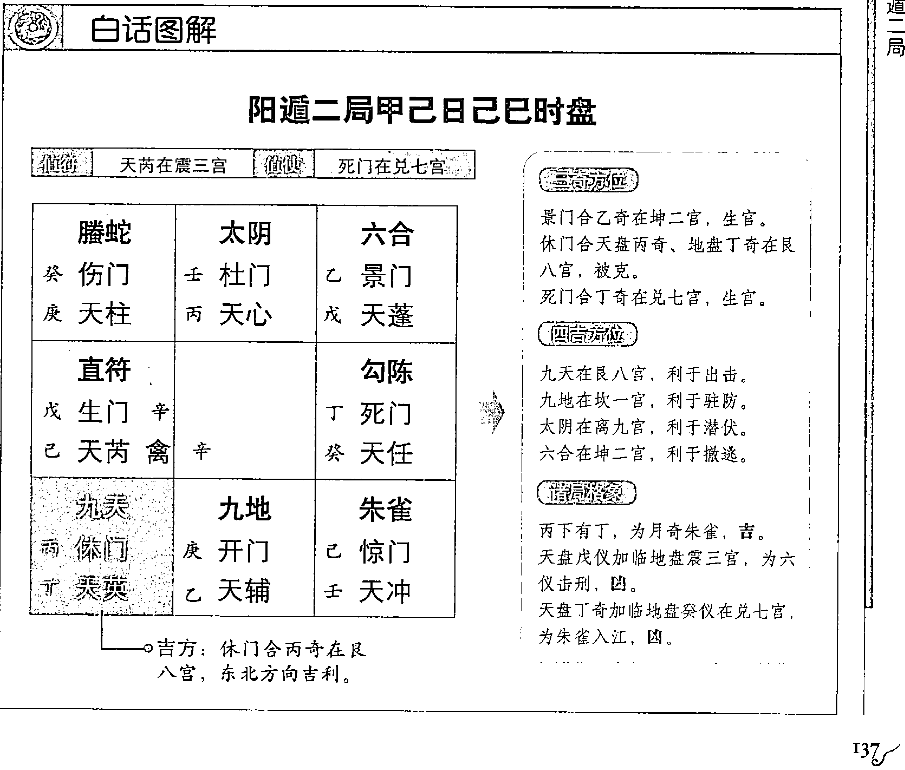

---

## 辛未时：正北方向吉利

### 【原文】
辛未，芮五，死九。宿吉干凶。死丙离和，生乙坎制，伤丁艮制。天九，地四，阴六，合一。生与日合一正北，时乾坤，符伏吟。

### 【白话提要】
- **符使宫位：** 值符天芮星在中五宫，寄在坤二宫，值使死门在离九宫。时干遇吉星宿，时干逢凶。
- **三奇方位：** 死门合双丙奇在离九宫，被生。生门合双乙奇在坎一宫，克官；伤门合双丁奇在艮八宫，克宫。
- **四吉方位：** 九天在离九宫，九地在巽四宫，太阴在乾六宫，六合在坎一宫。
- **诸局格象：** 生门与乙奇在坎一宫，正北方向吉利。时干在坤二宫。值符伏吟格。

## 白话图解

### 阳遁二局甲己日辛未时盘

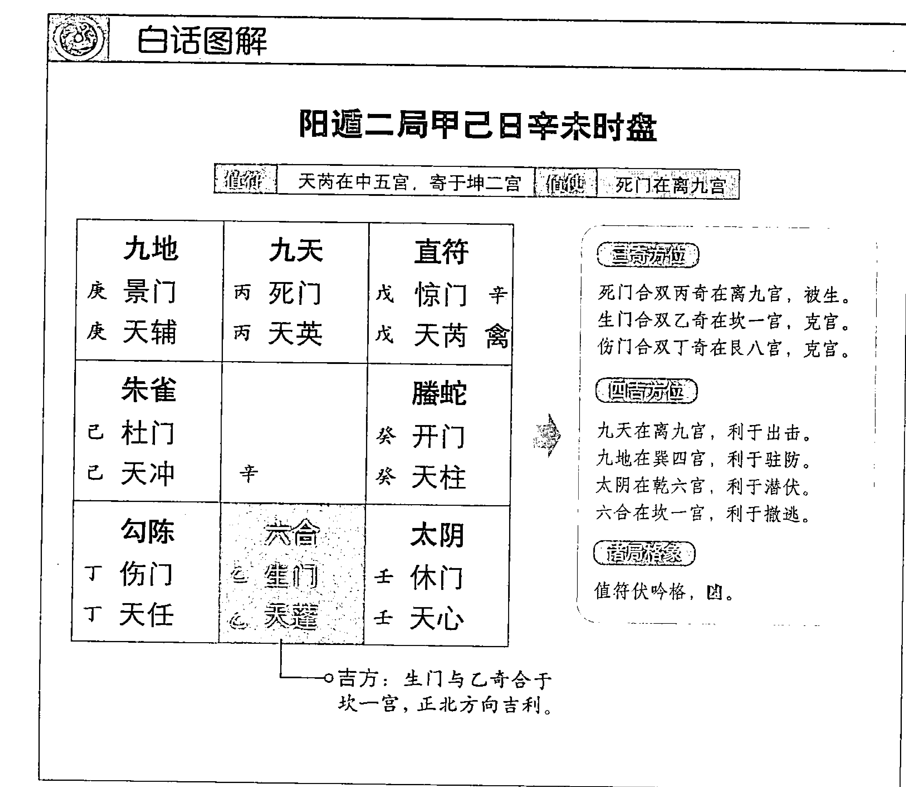

---

## 壬申时：正东和东南方向吉利

### 【原文】
壬申，芮六，死一。宿吉干凶，地遁。杜兑害，开震制，休巽义。天七，地二，阴八，合三。开与日合三正东，得使。休与星合四东南，甲日伏干格，时而良，飞宫，乙格，伏干格。

### 【白话提要】
- **符使宫位：** 值符天芮星在乾六宫，值使在坎一宫。时干遇吉星宿，时干逢凶。是地遁格。
- **三奇方位：** 杜门合丙奇在兑七宫，被克。开门合乙奇在震三宫，克官。休门合丁奇在巽四宫，生宫。
- **四吉方位：** 九地在兑七宫，九地在坤二宫（原文重复或误植），太阴在艮八宫，六合在震三宫。
- **诸局格象：** 开门合乙奇在震三宫，正东方向吉利。日奇得使。休门合丁奇在巽四宫，东南方吉利。逢甲日，伏干格。时干在艮八宫。飞宫格。乙格伏干格。

### **图 112 阳遁二局甲己日壬申时盘**

| **勾陈**<br>天任 | ***朱雀***<br>丙<br>天英 | ***九地***<br>庚<br>天辅 |
| :---: | :---: | :---: |
| ***休门***<br>己<br>生门 | 丙 | ***杜门***<br>辛 |
| ***太阴***<br>癸<br>惊门 | **螣蛇**<br>乙<br>死门 | ***直符***<br>戊<br>景门 |
| ***开门***<br>天蓬 | 丙 | **天英**<br>辛<br>伤门 |

### **阴阳遁方位**

##### **三奇方位**

#### **四吉方位**

### **诸局格局**

---

## 癸酉时：东北方向吉利

### 【原文】
癸酉芮七，死二。宿干凶。死合坤伏欢怡，生丁艮伏，伤震伏。天二，地九，阴一，合八。生与日合八东北，乙下有丁，己日飞干格。符勃，甲干勃，天网四张，时干乾，门伏，金入火，鸟跌穴。

### 【白话提要】
- **符使宫位：** 值符天芮星在兑七宫，值使死门在坤二宫，时干遇凶星宿，时干逢凶。
- **三奇方位：** 死门合丙奇在坤二宫，同类伏吟，奇仪相合，吉利。生门合天盘乙奇与地盘丁奇在艮八宫，同类伏吟。伤门合丁奇在震三宫，同类伏吟。
- **四吉方位：** 九天在坤二宫，九地在离九宫，太阴在坎一宫，六合在艮八宫。
- **诸局格象：** 生门合乙奇合在艮八宫，东北方向吉利。乙下有丁，为奇仪相佐。逢己日，为飞干格。符勃。逢甲日，为干勃。天网四张。时干在乾六宫。八门伏吟。金入火乡。飞鸟跌穴。

## 白话图解

**直符：** 天芮在兑七宫
**值使：** 死门在坤二宫

### 阳遁二局甲己日癸酉时盘

**奇仪方位**
- 死门合丙奇在坤二宫，同类伏吟。
- 生门合天盘乙奇与地盘丁奇在艮八宫，同类伏吟。
- 伤门合丁奇在震三宫，同类伏吟。

#### 四吉方位
- 九天在坤二宫，利于出击。
- 九地在离九宫，利于驻防。
- 太阴在坎一宫，利于潜伏。
- 六合在艮八宫，利于撤退。

#### 诸局格象
- 乙下有丁，为奇仪相佐，吉。
- 逢己日，为飞干格，凶。
- 逢甲日，为干勃，凶。
- 八门伏吟，凶。
- 太白入荧，凶。
- 飞鸟跌穴，凶。

**+ - ○吉方：** 生门合乙奇在艮八宫，东北方向吉利。

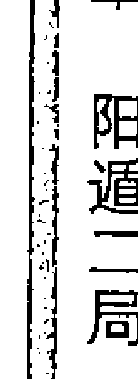


---

# 乙亥时：逢己日不宜用事

### 【原文】
乙亥，冲一，伤四。己日不用，宿凶干吉。死兑义欢怡，生震害，惊乾伏墓合，生艮伏。生与月合三正东，天乙与太白格。时干兑，己日勃。鸟跌穴，事同。

### 【白话提要】
- **符使宫位：** 值符天冲星在坎一宫，值使伤门在巽四宫。逢己日不宜用事。时干遇凶星宿，时干逢吉。
- **三奇方位：** 死门合乙奇在兑七宫，生宫，吉利。生门合丙奇在震三宫，被克。惊门合丁奇在乾六宫；同类伏。丁奇入墓，奇仪相合。
- **四吉方位：** 九天在乾六宫，九地在兑七宫，太阴在震三宫，六合在巽四宫。
- **诸局格象：** 生门合丙奇在震三宫，正东方向吉利。天乙与六庚宫位有格（原文误作“六庚”，应指天干乙或丁与六仪的格，依文义应为天乙与太白格）。时干在兑七宫。逢己日，为勃格，飞鸟跌穴。

## 白话图解

### 阳遁二局甲己日乙亥时盘

| | **值符** | 天冲在坎一宫 | **值使** | 伤门在巽四宫 |
| :---: | :---: | :---: | :---: | :---: |
| **六合** | 勾陈 | 朱雀 | | |
| 戌<br>伤门<br>辛<br>天芮禽 | 癸<br>杜门<br>丙<br>天柱 | 壬<br>景门<br>己<br>天心 | |
| **太阴**<br>两<br>己<br>生门<br>天葵 | | **九地**<br>乙<br>死门<br>癸<br>天蓬 | 辛 |
| **螣蛇**<br>庚<br>丁休门<br>天辅 | **直符**<br>已<br>开门<br>乙<br>天冲 | **九天**<br>丁<br>惊门<br>壬<br>天任 | |

**吉方：** 生门与丙奇合于震三宫，正东方吉利。

#### 三奇方位
- 死门逢乙奇于兑七宫，生官，好。
- 生门合丙奇于震三宫，被克。
- 惊门合丁奇于乾六宫。丁奇入墓，奇仪相合。

#### 四吉方位
- 九天在乾六宫，利于出击。
- 九地在兑七宫，利于驻防。
- 太阴在震三宫，利于潜伏。
- 六合在巽四宫，利于撤退。

#### 诸局格象
- 逢己日，为勃格，凶。
- 飞鸟跌穴，吉。

**吉方：** 生门与丙奇合于震三宫，正东方吉利。

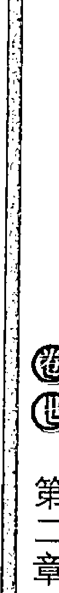

---

# 2. 乙庚日十二时局

### 丙子时：正东与东南方向吉利

### 【原文】
丙子，冲九，伤五避五。子至寅阳，地遁，宿干吉，庚日不用。开震制欢怡。杜兑害，休巽义。天四，地三，阴七，合六。休与星合四东南，开与日合三正东，时干兑，相佐离，飞宫格。

### 【白话提要】
- **符使宫位：** 值符天冲在离九宫，值使伤门在中五宫，寄在坤二宫。子时至寅时为五阳时，为地遁格。时干遇吉星宿，时干逢吉。逢庚日不宜用事。
- **三奇方位：** 开门合乙奇在震三宫，克宫，吉利。杜门合丙奇在兑七宫，被克。休门合丁奇在巽四宫，生官。
- **四吉方位：** 九天在巽四宫，九地在震三宫，太阴在兑七宫，六合在乾六宫。
- **诸局格象：** 休门合丁奇在巽四宫，东南方向吉利。开门合乙奇在震三宫，正东方向吉利。飞宫格。

## 白话图解

### 阳遁二局乙庚日丙子时盘

**值符：** 天冲在离九宫
**值使：** 伤门在中五宫，寄在坤二宫

- **○吉方 2：** 休门合丁奇在巽四宫，东南方向吉利。

#### 三奇方位
- 开门合乙奇于震三宫，克官。
- 杜门逢丙奇于兑七宫，被克。
- 休门合丁奇于巽四宫，生官。

#### 四吉方位
- 九天在巽四宫，利于出击。
- 九地在震三宫，利于驻防。
- 太阴在兑七宫，利于潜伏。
- 六合在乾六宫，利于撤退。

#### 诸局格象
- 飞宫格，凶。
- **○吉方 1：** 开门合乙奇在震三宫，正东方向吉利。

**时干在兑七宫。**
**值符得地盘丙奇助在离九宫。**
**飞宫格。**

---

### 丁丑时：无奇门可出

### 【原文】
丁丑冲八，伤六。宿干吉。伤乾害，惊巽制，杜乙坎和。天一，地六，阴四，合九。无奇门，火入白，伏干格，庚午勃，龙反首，时干坎，相佐艮，刑格，乙格。

### 【白话提要】
- **符使宫位：** 值符天冲星在艮八宫，值使伤门在乾六宫。
- **三奇方位：** 伤门合乙奇在乾六宫，被克。惊门合丙奇在巽四宫，克宫。杜门合天盘丁奇、地盘乙奇在坎一宫，被生。
- **四吉方位：** 九天在坎一宫，九地在乾六宫，太阴在巽四宫，六合在离九宫。
- **诸局格象：** 无奇门。火入金乡。伏干格。庚午勃格。青龙回首。时干在坎一宫。值符得地盘丁奇助于艮八宫。刑格。乙奇格。

> 

# ## 戊寅时：正南与东南方向吉利


[原文]

戊寅 冲二，伤七。宿千吉。开合巽制，杜墓乾害，休丙离制。天九，地四，阴六，合一。开与日合四东南，休与星合九正南，丁下有丙，仪刑，蛇矫，虎猖狂，时干坎，乙日飞干格，大格。

# ### 【白话提要】

符使宫位：值符天冲星在坤二宫，值使伤门在兑七宫。时干遇吉星宿，时干逢吉。

三奇方位：开门合乙奇在巽四宫，克宫，奇仪相合。杜门合丙奇在乾六宫，被克。休门合天盘丁奇与地盘丙奇在离九宫，克宫。

四吉方位：九天在离九宫，九地在巽四宫，太阴在乾六宫，六合在坎一宫。

诸局格象：开门合乙奇在巽四宫，东南方向吉利。休门合丁奇在离九宫，正南方向吉利。丁下有丙，为星随月转。六仪击刑。螣蛇夭矫。白虎猖狂。时干在坎一宫。逢乙日飞干格。大格。

## ### 【图解中国传统决策学·奇门遁甲大全（第 5 部）】

## 白话图解
阳遁二局乙庚日戊寅时盘


> > 吉方 1: 开门合乙奇在巽四宫，东南方吉利。
> 吉方 2: 休门合丁奇在离九宫，正南方吉利。

| 九地 | 九地 | 直符 |
| :--- | :--- | :--- |
| 乙开门天蓬 | 庚休门天任 | 己生门天冲 |
| 壬惊门天心 | 辛天辅 | 戊伤门天辅 |
| 癸死门天柱 | 丙杜门天英 | 丁天英 |

> > #### 三奇方位
> 
> - 开门合乙奇于巽四宫，克官。
> - 杜门逢丙奇于乾六宫，被克。
> - 休门合天盘丁奇与地盘丙奇在离九宫，克宫。
> 
> #### 四吉方位
> 
> - 九天在离九宫，利于出击。
> - 九地在巽四宫，利于驻防。
> - 太阴在乾六宫，利于潜伏。
> - 六合在坎一宫，利于撤退。
> 
> #### 诸局格象
> 
> - 丁下有丙，为星随月转，吉利。
> - 六仪击刑，螣蛇夭矫，白虎猖狂，凶。
> - 逢乙日飞干格，大格，凶。

---
【原文】己卯冲三，伤八。卯至未阴，守户，宿吉干凶。生乙坎制，死丙离和，伤丁艮制。天八，地一，阴九，合二。生与日合一正北，时干震，符伏吟，仪刑。

【白话提要】
**符使宫位：** 值符天冲星在震三宫，值使伤门在艮八宫。卯时至未时为五阴时，宜守户不出。时干遇吉星宿，时干逢凶。
**三奇方位：** 生门合双乙奇在坎一宫，克宫。死门合双丙奇在离九宫，被生。伤门合双丁奇在艮八宫，克官。
**四吉方位：** 九天在艮八宫，九地在坎一宫，太阴在离九宫，六合在坤二宫。
**诸局格象：** 生门合乙奇在坎一宫，正北方向吉利。时干在震三宫。值符伏吟。六仪击刑。

| | | |
| :--- | :---: | :--- |
| **腾蛇** | **太阴** | **六合** |
|庚景门<br>戊<br>丙<br>天辅<br>丙<br>戊天英 | 辛<br>癸<br>开门天柱<br>开<br>甲天蓬


# # 图解中国传统决学
*奇门遁甲大全（第二部）*

# ## 2 庚辰时：东北与正东方向吉利

# ### 【原文】

> 庚辰 冲四，伤九。宿吉干凶。开丁艮和，杜合坤制，休震义欢怡。天三，
> 
> 地八，阴二，合七。开与日合八东北，乙下有丁，休与星合三正东，时干离，反
> 
> 吟飞符，火入白。

# ### 【白话提要】

> 符使宫位: 天冲星为值符居巽四宫，伤门为值使居离九宫。星宿吉，时干逢凶。
> 
> 三奇方位：开门合乙奇于地盘丁奇艮八宫，被生。杜门逢丙奇于坤二宫，克宫，奇
> 
> 仪相合。休门合丁奇于震三宫，生宫，好。
> 
> 四吉方位: 九天在震三宫，九地在艮八宫，太阴在坤二宫，六合在兑七宫。
> 
> 诸局格象: 开门合乙奇在艮八宫，东北方向吉利。乙下有丁，为奇仪相佐。休门
> 
> 合丁奇在震三宫，正东方向吉利。时干在离九宫。反吟格。值符飞宫。荧入太白。
> 
> ○吉方 2:休门合丁奇在震
> 
> ○吉方 2:休门合丁奇在震三宫，正东方向吉利。

| 直符 | 腾蛇 | 太阴 |
| :--: | :--: | :--: |
| 己庚 | 生门天冲 | 庚丙伤门天辅 |
| 丙戊 | 杜门天英 |

| | | |

| | 九地癸丁 | 辛 |
| :--: | :--: | :--: |
| 九天丁癸 | 休门天任 | 六合庚戊景门天芮 |
| 辛禽 |

| | | |

| | 九地戊壬 | 朱雀壬乙 | 勾陈癸壬 |
| :--: | :--: | :--: |
| 开门天蓬 | 惊门天心 | 死门天柱 |

| | | |

> > **三奇方位:**开门合天盘乙奇与地盘丁奇在艮八宫，被生。杜门合丙奇在坤二宫，克宫。
> 
> > 休门合丁奇在震三宫，生官。
> 
> > **四吉方位:**九天在震三宫，利于出击。九地在艮八宫，利于驻防。
> 
> > 太阴在坤二宫，利于潜伏。六合在兑七宫，利于撤退。
> 
> > **诸局格象:**乙下有丁，为奇仪相佐，吉。
> 
> > 反吟格，值符飞官，荧入太白，凶。

# **值符:**天冲在巽四宫**值使:**伤门在离九宫

# **阳遁二局乙庚日庚辰时盘**

辛巳时：逢乙日不宜用事

【原文】

辛巳 冲五，伤一。乙日不用，宿吉干凶。死合巽害，生墓乾义，惊丙离害。天九，地四，阴六，合一。生与月合六西北，墓，时干坎，大格，乙日飞干格。

【白话提要】

符使宫位：值符天冲星在中五宫，寄于坤二宫，值使伤门在坎一宫。逢乙日不宜用事。时干遇吉星宿，时干逢凶。

三奇方位:死门合乙奇在巽四宫，被克，奇仪相合。生门合丙奇在乾六宫，生宫，乙奇入墓。惊门合天盘丁奇与地盘丙奇在离九宫，被克。

四吉方位：九天在离九宫，九地在巽四宫，太阴在乾六宫，六合在坎一宫。

诸局格象:生门合丙奇在乾六宫，西北方向吉利。乙奇入墓。时干在坎一宫。大格。逢乙日，为飞干格。

# ### 白话图解

# #### 阳遁二局乙庚日辛巳时盘

| 九地 | 九天 | 直符 |
| :---: | :---: | :---: |
| 乙死门 | 丁惊门 | 己开门 |
| 庚天蓬 | 丙天任 | 戌天冲 |
| 朱雀 |  | 螣蛇 |
| 壬景门 | 辛 | 庚休门 |
| 己天心 |  | 癸天辅 |
| 勾陈 | 六合 | 太阴 |
| 癸杜门 | 壬伤门 | 丙生门 |
| 丁天柱 | 乙天芮 | 乙死奇 |
| 吉方：生门合丙奇在乾六宫，西北方吉。 |

[三奇方位]

死门合乙奇在巽四宫，被克。
生门合丙奇在乾六宫，生宫。
惊门合天盘丁奇与地盘丙奇在离九宫，被克。

[四吉方位]

九天在离九宫，利于出击。
九地在巽四宫，利于驻防。
太阴在乾六宫，利于潜伏。
六合在坎一宫，利于撤退。

[诸局格象]

乙奇入墓，大格，凶。
逢乙日，为飞干格，凶。

**壬午时：无奇门可出**

【原文】
壬午冲六，伤二。宿吉干凶。伤墓坤制，惊艮和，杜兑害。天七，地二，阴八，合三。无奇门，雀入江，龙走，时干离，乙日伏干格。

【白话提要】**
符使宫位：值符天冲星在乾六宫，值使伤门在坤二宫。时干遇吉星宿，时干逢凶。

三奇方位：伤门合乙奇在坤二宫，克宫。惊门合丙奇在艮八宫，被生。杜门合丁奇在兑七宫，被克。
四吉方位：九天在兑七宫，九地在坤二宫，太阴在艮八宫，六合在震三宫。
诸局格象：无奇门。朱雀入江。青龙逃走。时干在离九宫。逢乙日伏干格。

**白话图解**

阳遁二局乙庚日壬午时盘

| 勾陈 | 朱雀 | 九地 |
| --- | --- | --- |
| 癸休门庚天柱 | 壬生门丙天心 | 乙伤门戊天蓬 |

| 六合 | 九天 |
| --- | --- |
| 戊开门辛禽己天芮 | 丁杜门癸天任 |

| 太阴 | 螣蛇 | 直符 |
| --- | --- | --- |
| 丙惊门丁天英 | 庚死门乙天辅 | 己景门壬天冲 |

三奇方位：伤门逢乙奇在坤二宫，克官。惊门逢丙奇在艮八宫，被生。杜门逢丁奇在兑七宫，被克。
四吉方位：九天在兑七宫，利于出击。九地在坤二宫，利于驻防。太阴在艮八宫，利于潜伏。六合在震三宫，利于撤逃。
诸局格象：无奇门，凶。朱雀入江，青龙逃走，凶。时干在离九宫，逢乙日伏干格，凶。


# # 癸未时：正北方向吉利

### 【原文】

癸未 冲七，伤三。宿干凶。景丙离伏，休乙坎伏，死坤伏。天二，地九，阴一，合八。休与月合一正北，丙下有乙，乙千格，天网四张，时干震，符冲，门伏，击刑。

### 【白话提要】

符使宫位：值符天冲星在兑七宫，值使伤门在震三宫。
三奇方位：景门合天盘乙奇、地盘丙奇在离九宫，同类伏。休门合天盘丙奇与地盘乙奇在坎一宫，同类伏。死门合丁奇在坤二宫，同类伏。
四吉方位：九天在坤二宫，九地在离九宫，太阴在坎一宫，六合在艮八宫。
诸局格象：休门合丙奇在坎一宫，正北方向吉利。丙下有乙，为日月并行。乙干格。天网四张。时干在震三宫。值符相冲。八门伏吟。六仪击刑在巽四宫。

> > > > 白话图解
> > > 
> > > ### 阳遁二局乙庚日癸未时盘
> > > 
> > > | 值符 | 天冲在兑七宫 | 值使 | 伤门在震三宫 |
> > > | --- | --- | --- | --- |
> > > |
> > > ### 三奇方位
> > > 
> > > 景门合天盘乙奇、地盘丙奇在离九宫。
> > > 休门合天盘丙奇、地盘乙奇在坎一宫。
> > > 死门合丁奇在坤二宫。
> > > 
> > > ### 四吉方位
> > > 
> > > 九天在坤二宫，利于出击。
> > > 九地在离九宫，利于驻防。
> > > 太阴在坎一宫，利于潜伏。
> > > 六合在艮八宫，利于撤退。
> > > 
> > > ### 诸局格象
> > > 
> > > 丙下有乙，成日月并行，吉。
> > > 乙干格，天网四张，凶。
> > > 值符相冲，八门伏吟，六仪击刑在巽四宫，凶。

# # 甲申时：正北与东北方向吉利

# ## 【原文】

> 甲申 辅直符四，杜直使四。申至亥阳，天辅，宿干吉。景英使离伏，休蓬日坎伏，生任星艮伏。天三，地八，阴二，合七。休与日合一正北，生与星合八东北，天乙与太白格。时干巽，休吟，地甲，事同，开。

# ## 【白话提要】

> 符使宫位：值符天辅星在巽四宫，值使杜门在巽四宫。申时至亥时为五阳时，申时为天辅释罪时。时干遇吉星宿，时干逢吉。
> 
> 三奇方位：景门合丙奇在离九宫，同类伏。休门合乙奇在坎一宫，同类伏。生门合丁奇在艮八宫，同类伏。
> 
> 四吉方位：九天在震三宫，九地在艮八宫，太阴在坤二宫，六合在兑七宫。
> 
> 诸局格象：休门合乙奇在坎一宫，正北方向吉利。生门合丁奇在艮八宫，东北方向吉利。值符与六庚成飞宫格。时干在巽四宫。伏吟格。地甲开。


# # 乙酉时：东北方向吉利

【原文】

乙酉 辅一，杜五避五。宿凶干吉。开丁艮和。杜墓坤制，景兑制。天六，地七，阴三，合四。开与月合八东北，丙下有丁。龙走，雀入江，时乾坤，乙日伏干格。

【白话提要】

符使宫位: 值符天辅在坎一宫，值使杜门在中五宫，寄在坤二宫。时干遇凶星宿，时干逢吉。

三奇方位: 开门合天盘丙奇与地盘丁奇在艮八宫，被生。杜门合乙奇在坤二宫，克宫，乙奇入墓。景门合丁奇在兑七宫，克宫。

四吉方位: 九天在乾六宫，九地在兑七宫，太阴在震三宫，六合在巽四宫。

诸局格象: 开门合丙奇在艮八宫，东北方向吉利。丙下有丁，为月奇朱雀。青龙逃走。朱雀入江。时干在坤二宫。逢乙日伏干格。

## 白话图解

### 阳遁二局乙庚日乙酉时盘

天辅在坎一宫      杜门在中五宫，寄在坤二宫

三奇游位

开门逢天盘丙奇与地盘丁奇于艮八宫，被生。

杜门逢乙奇于坤二宫，克宫，乙奇入墓。

景门逢丁奇于兑七宫，克宫。

六合
癸 生门
庚 天柱

勾陈
壬 伤门
丙 天心

朱雀
乙 杜门
戊 天蓬

太阴
戊 休门 辛
巳 天芮 禽

辛

九地
丁 景门
癸 天任

四吉方位

丙下有丁成月奇朱雀，吉。

青龙逃走，朱雀入江，凶。

逢乙日，为伏干格，凶。

⊙吉方：开门合丙奇在艮八宫，东北方向吉利。

# # 丙戌时: 逢庚日不宜用事

**「原文」**

丙戌辅九，杜六，庚日不用，天遁，宿凶干吉。生合坤伏，死丁艮伏，惊震制。天四，地三，阴七，合六。生与月合二西南，太白入火，门反吟，时干坤，相佐离，金入火。

**「白话提要」**

符使宫位: 值符天辅星在离九宫，值使杜门在乾六宫。逢庚日不宜用事。为天遁格。时干遇凶星宿，时干逢吉。

三奇方位: 生门合丙奇在坤二宫，同类伏，奇仪相合。死门合天盘乙奇与地盘丁奇在艮八宫，同类伏。惊门合丁奇在震三宫，克宫。

四吉方位: 九天在巽四宫，九地在震三宫，太阴在兑七宫，六合在乾六宫。

诸局格象: 生门合丙奇在坤二宫，西南方向吉利。金入火乡。八门反吟。时干在坤二宫。值符得地丙相助于离九宫。

| 九天        | 已开门       | 庚天冲     | 直符        | 庚休门    | 丙天辅          | 螣蛇         | 庚生门    | 戌天英   |
|-------------|---------------|-------------|--------------|------------|------------------|---------------|------------|-----------|
| 九地        | 丁惊门       | 已天任     |              |            |                  | 太阴         | 戊伤门    | 辛禽     |
|             |               |             | 辛           |              |                  |               | 癸天芮    | 禽       |
| 朱雀        | 乙死门       | 丁天蓬     | 勾陈        | 壬景门    | 乙天心           | 六合         | 癸杜门    | 壬天柱   |

*吉方: 生门合丙奇在坤二宫，西南方吉。*

### 阳遁二局乙庚日丙戌时盘
- **值符**: 天辅在离九宫
- **值使**: 杜门在乾六宫

**「三奇方位」**

生门逢丙奇于坤二宫，奇仪相合。

死门逢乙奇于地盘丁奇艮八宫。

惊门逢丁奇于震三宫，克官

**「四吉方位」**

九天在巽四宫，利于出击。

九地在震三宫，利于驻防。

太阴在兑七宫，利于潜伏。

六合在乾六宫，利于撤退。

**「诸局格象」**

太白入荧，八门反吟，凶。

# # 丁亥时：正东方向吉利

# ## 【原文】

丁亥 辅八，杜七，宿干吉。开震制，杜兑害。景墓合乾制。天一，地六，阴四，合九。开与月合三正东，仪刑，时干乾，相佐艮。

# ## 【白话提要】

符使宫位：值符天辅星在艮八宫，值使杜门在兑七宫。时干遇吉星宿，时干逢吉。

三奇方位：开门合丙奇在震三宫，克官。杜门合乙奇在兑七宫，被克。景门合丁奇在乾六宫，克宫，丁奇入墓，奇仪相合。

四吉方位：九天在坎一宫，九地在乾六宫，太阴在巽四宫，六合在离九宫。

诸局格象：开门合丙奇在震三宫，正东方向吉利。六仪击刑。时干在乾六宫。值符得地盘丁奇相助在艮八宫。

| 标题 | 白话图解 |
| --- | --- |
| **阳遁二局乙庚日丁亥时盘** ||
|| 值符:天辅在艮八宫 值使:杜门在兑七宫 |
| **太阴** | **六合** | **勾陈** |
| 休门生门伤门<br>戊癸壬<br>庚丙戌<br>天芮天柱天心 | **螣蛇** | **朱雀** |
| 开门杜门<br>两乙<br>天英天蓬 | 直符九地<br>庚丁<br>惊门天辅 | **九天** | 
| 死门天冲<br>己乙 | 


戊子时：宜守户不出

[[原文]]

戊子 辅二，杜八。子阳，守户，宿干吉。休兑和，景震和，死巽害欢怡。
天九，地四，阴六，合一。休与月合七正西，时干乾，飞宫，辛日伏干格。

[[白话提要]]

符使宫位：值符天辅在坤二宫，值使杜门在艮八宫。子时为五阳时，宜守户不出。
时干遇吉星宿，时干逢吉。

三奇方位：休门合丙奇在兑七宫，被生。景门合乙奇在震三宫，被生。死门合丁奇在巽四宫，被克，吉利。

四吉方位：九天在离九宫，九地在巽四宫，太阴在乾六宫，六合在坎一宫。

诸局格象：休门合丙奇在兑七宫，正西方向吉利。时干在乾六宫。飞官格。逢辛日，为伏干格。

# **阳遁二局丙辛日戊子时盘**

| | 天辅在坤二宫 | | 杜门在艮八宫 |
| --- | :---: | --- | --- |
| **九地** | **九天** | **直符** |
| **丁死门** | **己惊门** | **庚开门** |
| **庚天任** | **丙天冲** | **戌天辅** |
| **朱雀** |  | **腾蛇** |
| **乙景门** | 辛 | **休门** |
| **已天蓬** |  | **癸天英** |
| **勾陈** | **六合** | **太阴** |
| **壬杜门** | **癸伤门** | **戊生门** |
| **丁天心** | **乙天柱** | **壬天芮** |

吉方：休门合丙奇在兑七宫，正西方吉。

# # 已丑时：正北方向吉利

# ### 【原文】

已丑 辅三，杜九。丑至巳阴，宿吉干凶。伤巽伏，惊乾伏，开乙坎义。天八，地一，阴九，合二。开与星合一正北，丁下有乙，龙反首，时干艮，刑格，火入白。

# ### 【白话提要】

符使宫位：值符天辅星在震三宫，值使杜门在离九宫。丑时至巳时为五阴时。时干遇吉星宿，时干逢凶。

三奇方位：伤门逢丙奇于巽四宫，同类。惊门逢乙奇于乾六宫，同类。开门逢天盘丁奇与地盘乙奇在坎一宫，被生。

四吉方位：九天在艮八宫，九地在坎一宫，太阴在离九宫，六合在坤二宫。

诸局格象：开门合丁奇在坎一宫，正北方向吉利。丁下有乙，成人遁。青龙回首。时干在艮八宫。刑格。荧入太白。


# 庚寅时：正南方向吉利
[[原文]]
**庚寅**辅四，杜一。宿吉干凶。开丙离害，杜乙坎和，景丁艮义。天三，地八，阴二，合七。开与月合九正南，天乙与太白格，时干巽，反吟，符伏，击刑。

[[白话提要]]
符使宫位：值符天辅星在巽四宫，值使杜门在坎一宫。时干遇吉星宿，时干逢凶。

三奇方位：开门合双丙奇在离九宫，被克。杜门合双乙奇在坎一宫，被生。景门合双丁奇在艮八宫，生宫。

四吉方位：九天在震三宫，九地在艮八宫，太阴在坤二宫，六合在兑七宫。

诸局格象：开门合丙奇在离九宫，正南方向吉利。值符与六庚成伏宫格。时干在巽四宫。反吟格。值符伏吟。六仪击刑。

白话图解
阳遁二局丙辛日庚寅时盘

# # 白话图解
阳遁二局丙辛日庚寅时盘

| 直符 庚 惊门 庚天辅 | 螣蛇丙开门丙天英 | 太阴戊休门辛天芮禽 |
| :---: | :---: | :---: |
| 九天己死门己天冲 | 辛 | 六合癸生门癸天柱 |
| 九地丁景门丁天任 | 乙杜门乙天蓬 | 壬伤门壬天心 |

| 三奇方位 | 
| --- |
| 开门逢双丙奇于离九宫，被克。杜门逢双乙奇于坎一宫，被生。景门逢双丁奇于艮八宫，生宫。 |
| **四吉方位** |
| 九天在震三宫，利于出击。九地在艮八宫，利于驻防。太阴在坤二宫，利于潜伏。六合在兑七宫，利于撤退。 |
| **诸局格象** |
| 值符与六庚成伏官格，凶。值符伏吟，六仪击刑，凶。 |

## 辛卯时：正东方向吉利

> **原文** 

辛卯辅五，杜二。宿吉干凶。景兑制，休震义，生巽害。天九，地四，阴六，合一。休与日合三正东，生与星合四东南，干勃，时千乾，飞宫格，辛日伏干格。

### 白话提要

> **符使宫位：** 值符天辅在中五宫，寄在坤二宫，值使杜门在坤二宫。时干遇吉星宿，时干逢凶。
> 
> **三奇方位：** 景门合丙奇在兑七宫，克宫。休门合乙奇在震三宫，生宫。生门合丁奇在巽四宫，被克。
> 
> **四吉方位：** 九天在离九宫，九地在巽四宫，太阴在乾六宫，六合在坎一宫。
> 
> **诸局格象：** 休门合乙奇在震三宫，正东方向吉利。生门合丁奇在巽四宫，东南方向吉利。干勃。时于在乾六官。飞宫格。逢辛日成伏干格。

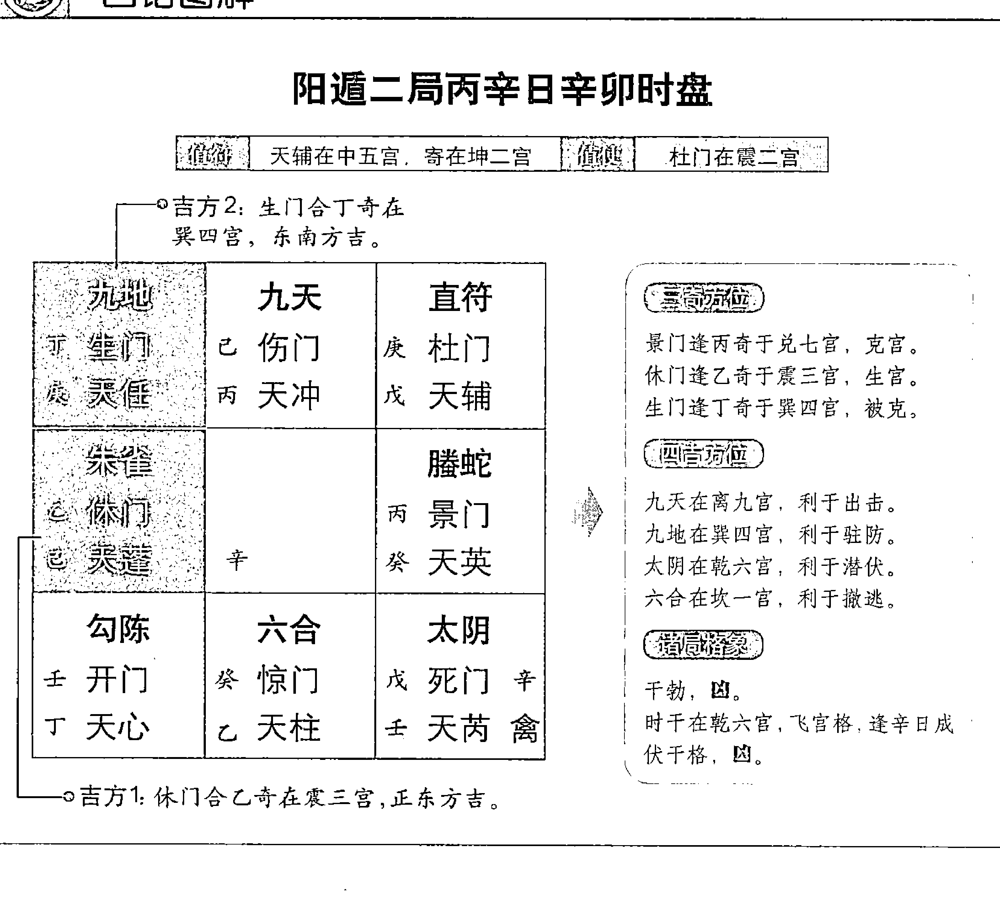

### 壬辰时：逢丙日不宜用事

## **原文**
壬辰辅六，杜三。丙日不用，宿吉干凶。生乙坎制，死丙离和，惊坤和。
天七，地二，阴八，合三。生与月合一正北，丙下有乙，时干巽，符冲三吉。

## **白话提要**
符使宫位：值符天辅星在乾六宫，值使杜门在震三宫。逢丙日不宜用事。时干遇吉星宿，时干逢凶。
三奇方位：生门合天盘丙奇与地盘乙奇在坎一宫，克宫。死门合天盘乙奇与地盘丙奇在离九宫，被生。惊门合丁奇在坤二宫，被生。
四吉方位：九天在兑七宫，九地在坤二宫，太阴在艮八宫，六合在震三宫。
诸局格象：生门合丙奇在坎一宫，正北方向吉利。丙下有乙，为日月并行。时干在巽四宫。值符相冲。三吉格。

|  | 勾陈<br>壬 <br>庚 | 朱雀<br>乙<br>丙 | 九地<br>丁<br>戊 |  |  |  |
| --- | --- | --- | --- | --- | --- |
| 六合<br>癸<br>巳 | 景门<br>天心<br>杜门<br>天柱 | 朱雀<br>死门<br>天蓬 | 九地<br>惊门<br>天任 |  | 九天<br>己<br>癸 | 开门<br>天冲 |
| 太阴<br>戊<br>丁 | 伤门<br>天心 <br>生门<br>天禽 | 死门<br>天蓬<br>生门<br>天英<br> | 直符<br>庚<br>壬 | 休门<br>天辅 |  |  |

### **[白话图解]**
阳遁二局丙辛日壬辰时盘

| 值符 | 天辅在乾六宫 | 值使 | 杜门在震三宫 |
| --- | --- | --- | --- |

<!-- Image (213, 740, 540, 869) -->

[三奇方位]
生门逢丙奇于地盘乙奇坎一宫，克官。
死门逢乙奇于地盘丙奇离九宫，被生。
惊门逢丁奇于坤二宫，被生。

[四吉方位]
九天在兑七宫，利于出击。
九地在坤二宫，利于驻防。
太阴在艮八宫，利于潜伏。
六合在震三宫，利于撤退。

[诸局格象]
丙下有乙，为日月并行，吉。
值符相冲，凶。

#### 癸巳时：西北方向吉利

### 【原文】

癸巳 辅七，杜四。开乾伏墓，杜合巽伏欢怡，景丙离伏。天二，地九，阴一，合八。开与月合六西北，门伏吟，天乙与太白格，虎猖狂，蛇矫，时干艮，天网四张，大格。

### 【白话提要】

符使宫位：值符天辅星在兑七宫，值使杜门在巽四宫。

三奇方位：开门合丙奇在乾六宫，同类伏，丙奇入墓。杜门合乙奇在巽四宫，同类伏，奇仪相合，吉利。景门合丁奇在离九宫，同类伏。

四吉方位：九天在坤二宫，九地在离九宫，太阴在坎一宫，六合在艮八宫。

诸局格象：开门合丙奇在乾六宫，西北方吉利。八门伏吟。天乙与六庚宫位有格。白虎猖狂。螣蛇夭矫。时干在艮八宫。天网四张。大格。

## 白话图解

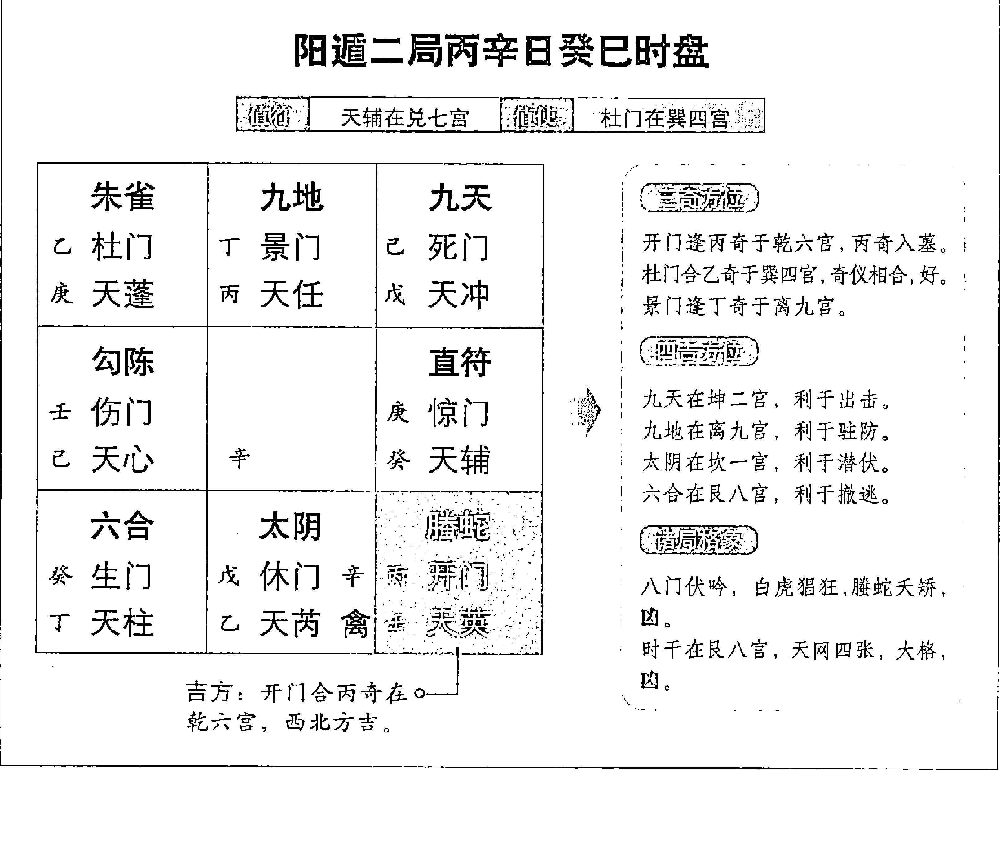

## 甲午时：正北与东北方向吉利

**原文**

甲午 禽直符五，死直使四避五。午至戌阳，天辅，宿干凶，休蓬使坎伏，景英月离伏，生任星艮伏。天九，地四，阴六，合一：休与日合一正北，生与星合八东北，蛇矫，龙反首，时乾坤，伏吟，遁甲，自刑阖。

**白话提要**

符使宫位：值符天禽在中五宫，寄于坤二宫，值使死门在中五宫，寄于坤二宫。午时至戌为五阳时。午时为天辅释罪时。时干遇凶星宿，时干逢凶。

三奇方位：休门逢双乙奇于坎一宫，同类伏吟。景门逢双丙奇于离九宫，同类伏吟。生门逢双丁奇于艮八宫，同类伏吟。

四吉方位：九天在离九宫，九地在巽四宫，太阴在乾六宫，六合在坎一宫。

诸局格象：休门合乙奇在坎一宫，正北方吉利。生门合丁奇在艮八宫，东北方向吉利。螣蛇夭矫。青龙回首。时干在坤二宫。伏吟格。遁甲自刑，合。

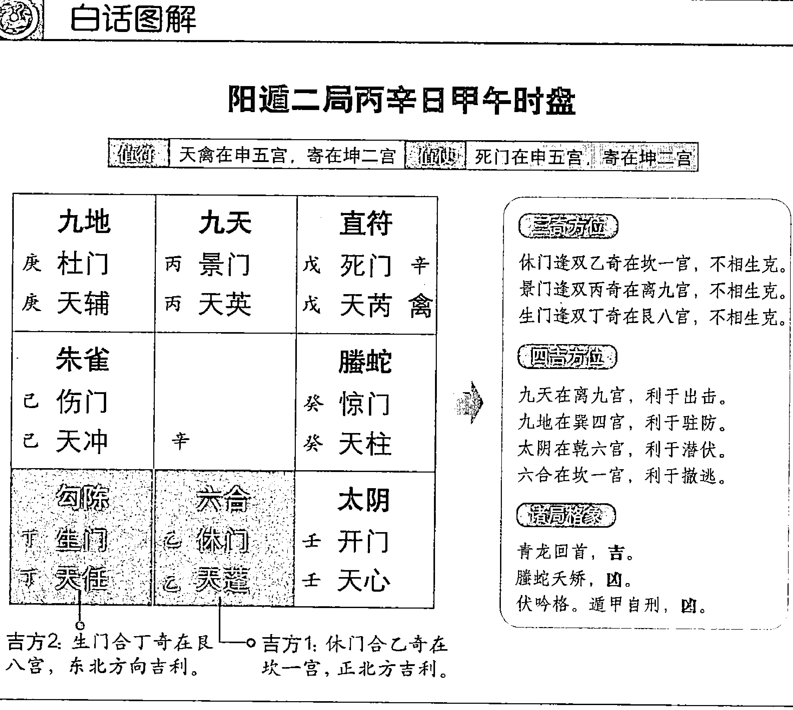

## 乙未时：东南方向吉利

### 【原文】
> 乙未
> 
> 禽一，死六。宿凶干吉。生合巽害，死乾义墓，伤丙离义。天六，地七，阴三，合四。生与日合四东南，虎猖狂，蛇矫，时干巽，大格。

### 【白话提要】
符使宫位：值符天禽星在坎一宫，值使死门在乾六宫。时干遇凶星宿，时干逢吉。
三奇方位：生门合乙奇在巽四宫，被克。死门合丙奇在乾六宫，生官，丙奇入墓。伤门合天盘丁奇、地盘丙奇在离九宫，生官。
四吉方位：九天在乾六宫，九地在兑七宫，太阴在震三宫，六合在巽四宫。诸局格象：生门合乙奇在巽四宫，东南方向吉利。白虎猖狂。腾蛇夭矫。时干在巽四宫位。有大格。

|  | 勾陈 | 朱雀 |
| --- | --- | --- |
| 生门 | 伤门 | 杜门 |
| 天心 | 天任 | 天冲 |
| 太阴 | 辛 | 九地 |
| 休门 |  | 景门 |
|  |  | 天辅 |
| 腾蛇 | 直符 | 九天 |
| 开门 | 惊门 | 死门 |
| 天柱 | 天芮 | 天英 |

## 丙申时：正北方向吉利

### 【原文】

> 丙甲禽九，死七。宿凶干吉。惊乾伏，伤巽伏，开乙坎义。天四，地三，阴七，合六。开与星合一正北，丁下有乙。火入白，丙日，飞干格。龙反首，时干巽，相佐离，刑格。

### 【白话提要】

> 符使宫位：值符天禽星在离九宫，值使死门在兑七宫。时干遇凶星宿，时干逢吉。
> 
> 三奇方位：惊门合乙奇在乾六宫，同类伏。伤门合丙奇在巽四宫，同类伏。开门合天盘丁奇与地盘乙奇在坎一宫，生宫。
> 
> 四吉方位：九天在巽四宫，九地在震三宫，太阴在兑七宫，六合在乾六宫。
> 
> 诸局格象：开门合丁奇在坎一宫，正北方向吉利。白虎猖狂，螣蛇夭矫。时干在巽四宫。有大格。

### 阳遁二局丙辛日丙申时盘

<table>
 <tr> <td rowspan="2"><b>值符</b><br/>天禽在离九宫</td> <td rowspan="2"><b>值使</b><br/>死门在兑七宫</td> </tr> 
 <tr></tr>
 <tr>
  <th colspan="3">九天 | 直符 | 螣蛇<br/><br/>丙伤门<br/><br/>庚天英 | 戊杜门<br/><br/>丙天芮禽 | 癸景门<br/><br/>戌天柱</th>
 </tr>
 <tr> 
  <td>九地<br/><br/>庚生门<br/><br/>己天辅</td><td rowspan="2" colspan="1">勾陈<br/><br/>丁开门<br/><br/>乙天任<br/><br/>辛</td> 
 <td>太阴<br/><br/>壬死门<br/><br/>癸天心</td>
 </tr>
 <tr> 
  <td>朱雀<br/><br/>己休门<br/><br/>丁天冲</td><td>六合<br/><br/>乙惊门<br/><br/>壬天蓬</td> 
 </tr>
</table>

图：吉方：开门合丁奇在坎一宫，正北方向吉利。

## 丁酉时：西南正南方向吉利

### 【原文】
丁酉 禽八，死八。辛日不用，宿干吉，守户。休丙离制，景乙坎害，生坤伏欢怡。天一，地六，阴四，合九。生与星合二西南，休与日合九正南，乙下有丙，时干坤，相佐艮，符冲。

### 【白话提要】
符使宫位：值符天禽星在艮八宫，值使死门在艮八宫。逢辛日不宜用事。时干遇吉星宿，时干逢吉。
三奇方位：休门合天盘乙奇与地盘丙奇在离九宫，克宫。景门合天盘丙奇与地盘乙奇在坎一宫，被克。生门合丁奇在坤二宫，同类伏。
四吉方位：九天在坎一宫，九地在乾六宫，太阴在巽四宫，六合在离九宫。
诸局格象：生门合丁奇在坤二宫，西南方向吉利。休门合乙奇在离九宫，正南方向吉利。乙下有丙，为奇仪顺遂。时干在坤二宫。值符得地盘丁奇相助在艮八宫。值符相冲。

|  |  |  |  |
|---|---|---|---|
| 太阴<br/>壬<br/>庚<br/>天门<br/>天心 | 六合<br/>乙丙丁戊癸己辛丑艮门天蓬 | 勾陈<br/>丁丁死成天英 |
| 腾蛇<br/>癸己惊门天柱 | 朱雀<br/>伤门天冲 |
| 直符<br/>戊丁死门天芮禽 | 九天<br/>丙景门天英 | 九地<br/>庚壬杜门天辅 |

## 戊戌时：正北方向吉利

### 【原文】

*   戊戊 禽二，死九，宿凶干吉。生乙坎制，死丙离和，伤丁艮制，天九，地四，阴六，合一。生与日合一正北，时干乾，伏吟。

### 【白话提要】
*   符使宫位：值符天禽星在坤二宫，值使死门在离九宫。时干遇凶星宿，时干逢吉。
*   三奇方位：生门合双乙奇在坎一宫，克宫。死门合双丙奇在离九宫，被生。伤门合双丁奇在艮八宫，克宫。
*   四吉方位：九天在离九宫，九地在巽四宫，太阴在乾六宫，六合在坎一宫。
*   诸局格象：生门合乙奇在坎一宫，正北方向吉利。时干在乾六宫。伏吟格。

## 白话图解

阳遁二局丙辛日戊戌时盘

| 值符 | 天禽在坤二宫 | 值使 | 死门在离九宫 |
| --- | --- | --- | --- |
| 九地 | 九天 | 直符 |
| 庚 | 庚 天辅 | 丙 死门 | 戊 惊门 |
|  | 丙 天英 | 戊 天芮 | 辛 禽 |
| 朱雀 |  | 螣蛇 |
| 己 杜门 | 辛 | 癸 开门 |
| 己 天冲 |  | 癸 天柱 |
| 勾陈 | 六合 | 太阴 |
| 丁 伤门 | 乙 生门 | 壬 休门 |
| 丁 天任 | 乙 天蓬 | 壬 天心 |

*   吉方：生门合乙奇在坎一宫，正北方向吉。

#### 三奇方位

生门合双乙奇于坎一官，克官。
死门合双丙奇于离九宫，被生。
伤门合双丁奇与艮八官，克官。

#### 四吉方位

九天在离九宫，利于出击。
九地在巽四宫，利于驻防。
太阴在乾六官，利于潜伏。
六合在坎一宫，利于撤逃。

#### 诸局格象

时干在乾六宫，伏吟格，凶。

图解中国传统决策学. 
奇门遁甲大全

第章部

```
166
```

## 己亥时：无奇门可出

【原文】

己亥禽三，死一。亥阴，宿吉干凶。伤墓坤制欢怡，惊丁艮和，杜兑害。
天八，地一，阴九，合二。无奇门，龙走，雀入江，时干乾。

【白话提要】

符使宫位：值符天禽星在震三宫，值使死门在坎一宫。亥时为五阴时。时干遇吉星宿，时干逢凶。

三奇方位：伤门合乙奇在坤二宫，克宫，吉利，乙奇入墓。惊门合天盘丙奇与地盘丁奇在艮八宫，被生。杜门合丁奇在兑七宫，被克。

四吉方位：九天在艮八宫，九地在坎一宫，太阴在离九宫，六合在坤二宫。

诸局格象：无奇门。青龙逃走。朱雀入江。时干在乾六宫。

白话图解

### 阳遁二局丙辛日乙亥时盘

+   天禽在震三宫

死门在坎一宫

|  | 太阴 | 六合 |
| --- | --- | --- |
| 癸休门 | 壬生门 | 乙伤门 |
| 庚天柱 | 丙天心 | 戊天蓬 |
| 直符 | 勾陈 |
| 戊开门 | 丁杜门 |
| 己天芮 | 癸天任 |
|  | 辛 |  |
| 九天 | 九地 | 朱雀 |
| 丙惊门 | 庚死门 | 已景门 |
| 丁天英 | 乙天辅 | 壬天冲 |

> 三奇方位
伤门合乙奇在坤二宫，克官。
惊门合天盘丙奇、地盘丁奇在艮八宫，被生。
杜门合丁奇在兑七宫，被克。

四吉方位
九天在艮八宫，利于出击。
九地在坎一宫，利于驻防。
太阴在离九宫，利于潜伏。
六合在坤二宫，利于撤逃。

诸局格象
无奇门，凶。
青龙逃走，朱雀入江，凶。

## 4.丁壬日十二时局

## 庚子时：西北方向吉利

### 【原文】

庚子禽四，死二。子至卯阴，宿吉干凶。惊兑伏，伤震伏，开墓合乾伏。天三，地八，阴二，合七。开与星合六西北，墓，飞官格，丁日伏干格。时干艮，反吟，飞符门伏。

### 【白话提要】

符使宫位：值符天禽星在巽四宫，值使死门在坤二宫。子时至卯时为五阴时。时干遇吉星宿，时干逢凶。

三奇方位：惊门合乙奇在兑七宫，同类伏。伤门合丙奇在震三宫，同类伏。开门合丁奇在乾六宫，同类伏，丁奇入墓，奇仪相合。

四吉方位：九天在震三宫，九地在艮八宫，太阴在坤二宫，六合在兑七宫。

诸局格象：开门合丁奇在乾六宫，西北方向吉利。丁奇入墓。飞宫格。伏干格。时干在艮八宫。反吟格。值符飞宫。值门伏吟。

## 白话图解

# 阳遁二局丁壬日庚子时盘

| 直符 | 螣蛇 | 太阴 |
| --- | --- | --- |
| 戊 杜门<br/>庚 天芮 | 癸景门<br/>丙天柱 | 壬死门<br/>戌天心 |
| 九天 | 六合 |
| 丙伤门<br/>己天英 | <br/>辛 | 乙惊门<br/>癸天蓬 |
| 九地 | 朱雀 | 勾陈 |
| 庚生门<br/>丁天辅 | 乙休门<br/>巳天冲 | 壬开门<br/>乙天任 |

| 值符 | 天禽在巽四宫 | 值使 | 死门在坤二宫 |
| --- | --- | --- | --- |
| [image](https://example.com/image1.png) | [image](https://example.com/image2.png) | [image](https://example.com/image3.png) | [image](https://example.com/image4.png) |

> > 三奇方位
> 惊门逢乙奇于兑七宫。
> 伤门逢丙奇于震三宫。
> 开门合丁奇于乾六宫，丁奇入墓，
> 奇仪相合。
> 
> > 四吉方位
> 九天在震三宫，利于出击。
> 九地在艮八宫，利于驻防。
> 太阴在坤二宫，利于潜伏。
> 六合在兑七宫，利于撤退。
> 
> > 诸局格象
> 丁奇入墓，飞宫格，伏干格，凶。
> 反吟格，值符飞宫，值门伏吟，凶。

吉方：开门合丁奇在乾六宫，口—
西北方向吉。

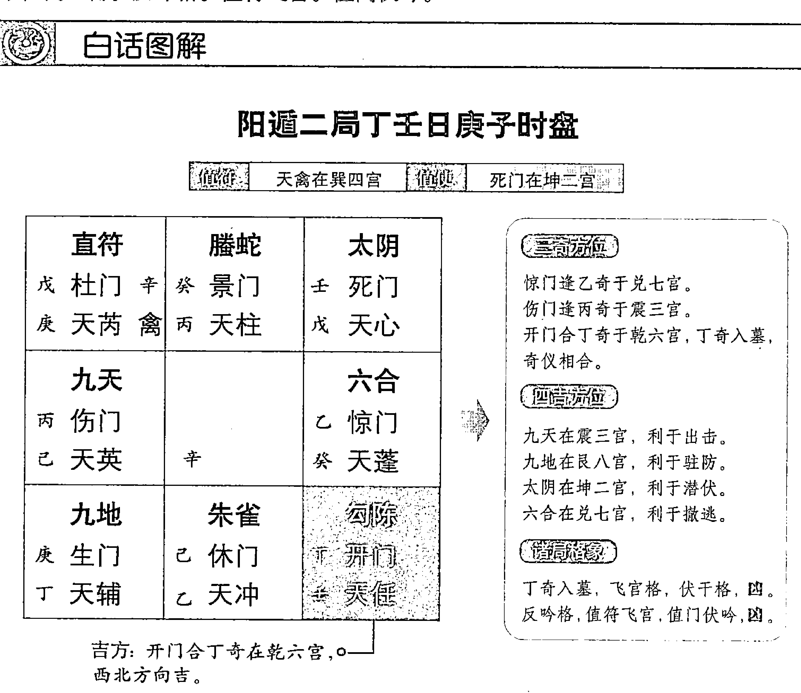

## 辛丑时：正南方向吉利

[[原文]][
辛丑禽五，死三，宿吉干凶。杜乙坎和，开丙离害，景丁艮义。天九，地四，阴六，合一。开与月合九正南，时干坤，符伏，三吉。

[[白话提要]]

符使宫位：值符天禽星居中五宫，寄于坤二宫，值使死门在震三宫。时干遇吉星宿，时干逢凶。


三奇方位：杜门合双乙奇在坎一宫，被生。开门合双丙奇在离九宫，被克。景门合双丁奇在艮八宫，生官。

四吉方位：九天在离九宫，九地在巽四宫，太阴在乾六宫，六合在坎一宫。

诸局格象：开门合丙奇在离九宫，正南方向吉利。时干在坤二宫。值符伏吟。三吉格。

## 白话图解
阳遁二局丁壬日辛丑时盘
值符：天禽在中五宫，寄于坤二宫 值使：死门在震三宫
吉方：开门合丙奇在离九宫，正南方向吉。

+   ┌───────┬───────────────┬───────────────┐
│ 九地   │九天             │直符             │
├───────┼───────────────┼───────────────┤
│庚 惊门  │两 开门          │戌 休门        辛·禽
│庚 天辅  │两 天英          │戊 天芮         亥
├───────┴───────────────┴───────────────┤
│朱雀   │              │螣蛇             │
│己 死门  │            │癸 生门          │
│己 天冲  │辛            │癸 天柱          │
├───────┬───────────────┴───────────────┤
│勾陈   │六合              │太阴             │
│丁 景门 │乙 杜门           │壬 伤门         │
│丁 天任 │乙 天蓬           │壬 天心           │
└────────┼───────┬───────────────┴───────────────┘

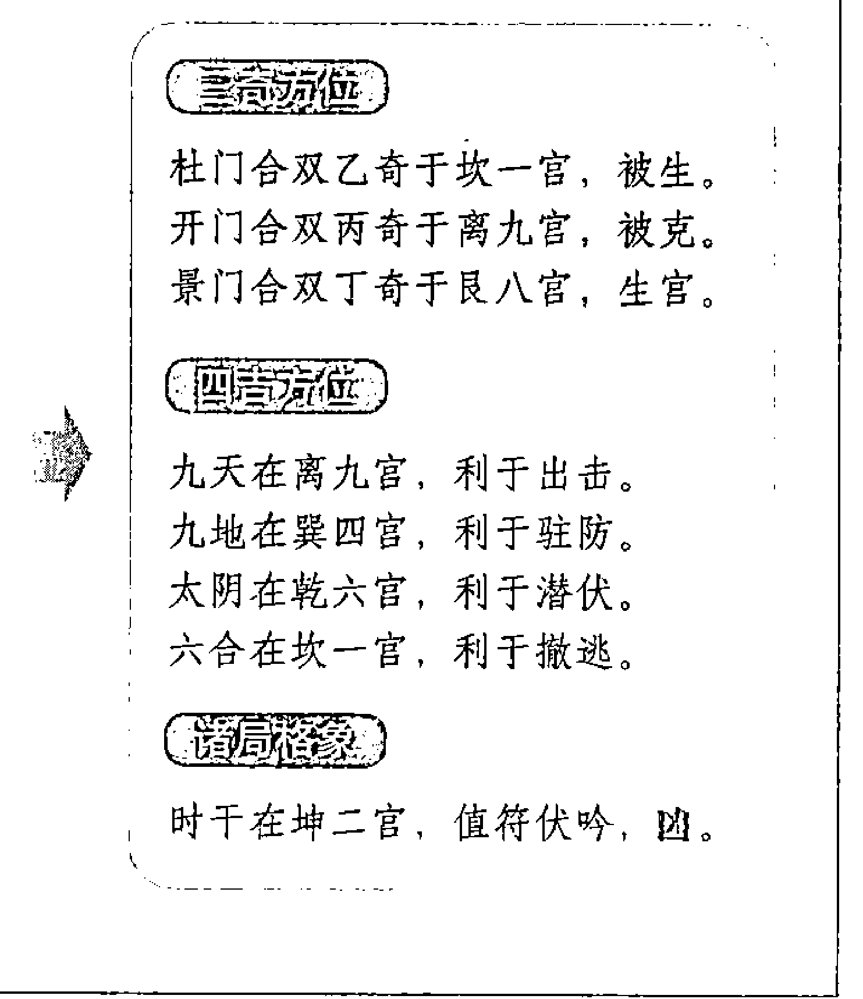

#### 第二章 阳遁二局

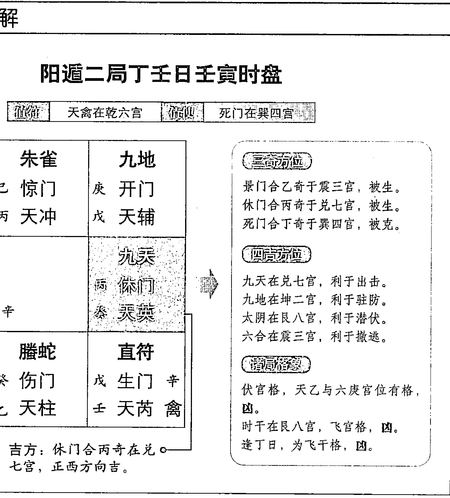

## 癸卯时：逢丁日不宜用事

【原文】
癸卯禽七，死五避五。丁日不用。生丁艮伏，死合坤伏欢怡，伤震伏。天二，地九，阴一，合八。生与日合八东北，乙下有丁，符勃，门伏吟，鸟跌穴。
时干乾，金入火，天网四张。

【白话提要】

# # 白话图解

阳遁二局丁壬日癸卯时盘
（值符）天禽在兑七宫	（值使）死门在中五宫，寄于坤二宫

| 朱 | 九地 | 九天 |
| :---: | :---: | :---: |
| 己 | 庚 | 丙 |
| 杜门 | 景门 | 死门 |
| 庚天冲 | 丙天辅 | 戊天英 |
| 勾陈 | 	| 直符 |
| 丁伤门 | 辛	 | 戌惊门禽 |
| 己天任 | 癸天芮 |
| 六合乙生门 | 太阴壬休门 | 螣蛇癸开门 |
| 丁夹蓬 | 乙天心 | 壬天柱 |

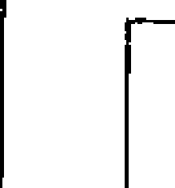

---o吉方：生门合乙奇在艮八宫，东北方向吉。

（三奇方位）

生门合天盘乙奇与地盘丁奇在艮八宫。
死门逢丙奇在坤二宫。
伤门逢丁奇在震三宫。

（四吉方位）

九天在坤二官，利于出击。
九地在离九官，利于驻防。
太阴在坎一官，利于潜伏。
六合在艮八官，利于撒逃。

（诸局格象）

乙下有丁，为奇仪相佐，吉。
飞鸟跌穴，吉。
符勃格，值门伏吟，凶。
太伯入荧，天网四张，凶。

## 甲辰时：东北与正北方向吉利

> **【原文】**

甲辰 心直符六，开直使六。辰至申阳，天辅宿干吉。生任使艮伏，休蓬日坎伏，景英月离伏。天七，地二，阴八，合三。生与星合八东北，休与日合一正北，时干乾，伏吟，飞甲，自刑阖。

> **【白话提要】**

符使宫位：值符天心星在乾六宫，值使开门在乾六宫。辰时至申时为五阳时。辰时是天辅释罪时。时干遇吉星宿，时干逢吉。

三奇方位：生门合丁奇在艮八宫，同类伏吟。休门合乙奇在坎一宫，同类伏吟。景门合丙奇在离九宫，同类伏吟。

四吉方位：九天在兑七宫，九地在坤二宫，太阴在艮八宫，六合在震三宫。

诸局格象：生门合丁奇在艮八宫，东北方向吉利。休门合乙奇在坎一宫，正北方向吉利。时干在乾六宫，伏吟格。六甲飞宫。自刑。遁甲合，宜在家静守。


|  | 白话图解 |
| --- | --- |
| **阳遁二局丁壬日甲辰时盘** |
| | [三奇方位]生门合双丁奇于艮八宫，不相生克。休门合双乙奇于坎一宫，不相生克。景门合双丙奇于离九宫，不相生克。
[四吉方位] 九天在兑七官，利于出击。九地在坤二宫，利于驻防。太阴在艮八宫，利于潜伏。六合在震三官，利于撤退。
[诸局格象]伏吟格，六甲飞宫，凶。自刑，凶。| | 勾陈<br/>杜门<br/>天辅

己<br/>伤门<br/>天冲


太阴<br/>生门<br/>天任 | 朱雀<br/>景门<br/>天英

辛


腾蛇<br/>休门<br/>天蓬
 | | 九地死门天芮禽戊<br/>直符开门天心壬


#### 第二章 阳遁二局

## 5. 戌癸日十二时局

# 🍂 乙巳时：无奇门可出

### 【原文】

乙巳 心一，开七。宿凶干吉。杜震伏，伤丁艮制，惊合坤和。天六，地七，
阴三，合四。无奇门，时干艮，金入火。

### 【白话提要】

符使宫位：值符天心星在坎一宫，值使开门在兑七宫。时干遇凶星宿，时干逢吉。

三奇方位：杜门合丁奇在震三宫，同类伏。伤门合天盘乙奇与地盘丁奇在艮八宫，
克宫。惊门合丙奇在坤二宫，被生，奇仪相合。

四吉方位：九天在乾六宫，九地在兑七宫，太阴在震三宫，六合在巽四宫。

诸局格象：无奇门。时干在艮八宫。太白入荧。

---

# 丙午时：东北方向吉利

### 【原文】

丙午 心九，开八，宿凶干吉，守户。景兑制，杜墓坤制。开丁艮和。天四，
地三，阴七，合六。开与月合八东北，丙下有丁。时干艮，相佐离。

### 【白话提要】

符使宫位：值符天心星在离九宫，值使开门在艮八宫。时干遇凶星宿，时干逢吉。
三奇方位：景门合丁奇在兑七宫，克宫。杜门合乙奇在坤二宫，克官。开命合天
盘丙奇与地盘丁奇在艮八宫，被生。
四吉方位：九天在巽四宫，九地在震三宫，太阴在兑七宫，六合在乾六宫。
诸局格象：开门合丙奇在艮八宫，东北方向吉利。丙下有丁，为月奇朱雀。时干
在艮八宫。有地盘丙奇相助值符在离九宫。

## [白话图解]

#### 三奇方位

- 景门逢丁奇于兑七宫，克官。
- 杜门逢乙奇于坤二宫，克宫。
- 开门合天盘丙奇与地盘丁奇在艮八宫，被生。

### ## 四吉方位

- 九天在巽四宫，利于出击。
- 九地在震三宫，利于驻防。
- 太阴在兑七宫，利于潜伏。
- 六合在乾六宫，利于撤逃。

### ## 诸局格象

- 丙下有丁，为月奇朱雀，吉。

---

# 🍃 丁未时：正西方向吉利

### 【原文】

丁未 心八，开九。宿干吉。惊巽制，死震害，生兑义。天一，地六，阴四，合九。生与月合七正西，丁日飞干格，时干巽，相佐艮，飞宫。

### 【白话提要】

符使宫位：值符天心星在艮八宫，值使开门在离九宫。时干遇吉星宿，时干逢吉。

三奇方位：惊门合丁奇在巽四宫，克官。死门合乙奇在震三宫，被克。生门合丙奇在兑七宫，生官。

四吉方位：九天在坎一宫，九地在乾六宫，太阴在巽四宫，六合在离九宫。

诸局格象：生门合丙奇在兑七宫，正西方向吉利。逢丁日，为飞干格。时干在巽四宫。地盘丁奇相助值符在艮八宫。飞官格。

## 白话图解

### 阳遁二局丁壬日丁未时盘

| 值符 | 天心在艮八宫 | 值使 | 开门在离九宫 |
|---|---|---|---|
| **太阴**<br>丁 惊门<br>庚 天任 | **六合**<br>己 开门<br>丙 天冲 | **勾陈**<br>庚 休门<br>戊 天辅 | |

| **螣蛇**<br>乙 死门<br>已 天蓬 | | **辛** | **朱雀**<br>丙 生门<br>癸 天英 |
|---|---|---|---|
| | | | |

| **直符**<br>壬 景门<br>丁 天心 | **九天**<br>癸 杜门<br>乙 天柱 | **九地**<br>戊 伤门<br>壬 天芮 | 禽 |

**三奇方位**

- 惊门合丁奇于巽四宫，克官。
- 死门合乙奇于震三宫，被克。
- 生门合丙奇于兑七宫，生官。

**四吉方位**

- 九天在坎一宫，利于出击。
- 九地在乾六宫，利于驻防。
- 太阴在巽四宫，利于潜伏。
- 六合在离九宫，利于撤退。

**诸局格象**

- 逢丁日，为飞干格，凶。
- 飞官格，凶。

**吉方**：生门合丙奇在兑七宫，正西方向吉。

---

## 戊申时：逢壬日不宜用事

### 【原文】

**戊申** 心二，开一。壬日用，宿凶干吉。惊墓合乾伏欢怡，死兑义，生震害。天九，地四，阴六，合一。生与月合三正东，虎猖狂，蛇矫，时干巽，丁日伏干格，大格。

### 【白话提要】

**符使宫位：** 值符天心星在坤二宫，值使开门在坎一宫。逢壬日不宜用事。时干遇凶星宿，时干逢吉。

**三奇方位：** 惊门逢丁奇在乾六宫，同类伏，丁奇入墓，奇仪相合，吉利。死门逢乙奇在兑七宫，生官。生门合丙奇在震三宫，被克。

**四吉方位：** 九天在离九宫，九地在巽四宫，太阴在乾六宫，六合在坎一宫。

**诸局格象：** 生门合丙奇在震三宫，正东方向吉利。白虎猖狂。螣蛇天矫。时干在巽四宫。逢丁日为伏干格。有大格。

## 白话图解

##### 阳遁二局丁壬日戊申时盘

**值符** 天心在坤二宫 **值使** 开门在坎一宫

| 九地 | 伤门 | 禽 | 戊 | 天芮 |
|---|---|---|---|---|
| 戍 | | | | |
| **九天** | 杜门 | 丙 | 癸 | 天柱 |
| **直符** | 景门 | 戌 | 壬 | 天心 |
| **螣蛇** | 死门 | 癸 | 乙 | 天蓬 |
| **勾陈** | 休门 | 丁 | 庚 | 天辅 |
| **六合** | 开门 | 乙 | 己 | 天冲 |
| **太阴** | 惊门 | 丁 | 壬 | 天任 |

**三奇方位**
- 惊门合丁奇于乾六宫，不相生克。
- 死门合乙奇于兑七宫，生官。
- 生门合丙奇于震三宫，被克。

**四吉方位**
- 九天在离九宫，利于出击。
- 九地在巽四宫，利于驻防。
- 太阴在乾六宫，利于潜伏。
- 六合在坎一宫，利于撤退。

**诸局格象**
- 白虎猖狂，螣蛇天矫，凶。
- 逢丁日为伏干格，大格，凶。

**吉方**：生门合丙奇在震三宫，正东方向吉。

---

### 己酉时：西北方向吉利

### 【原文】

己酉心三，开二。酉至亥阴，宿吉干凶。惊丙离害，死合巽害，生墓乾义欢怡。天八，地一，阴九，合二。生与月合六西北，时干坤，壬日勃，大格。

### 【白话提要】

符使宫位：值符天心星在震三宫，值使开门在坤二宫。酉时至亥时为五阴时。时干遇吉星宿，时干逢凶。

三奇方位：惊门合天盘丁奇与地盘丙奇在离九宫，被克。死门合乙奇在巽四宫，被克，奇仪相合。生门合丙奇在乾六宫，生宫，丙奇入墓，吉利。

四吉方位：九天在艮八宫，九地在坎一宫，太阴在离九宫，六合在坤二宫。

诸局格象：生门合丙奇合在乾六宫，西北方向吉利。时干在坤二宫。逢壬日，为日勃格。有大格。

---

### 庚戌时

### 【原文】

庚戌 心四，开三。宿吉干凶。伤坤制，生丙离合，死乙坎制。天三，地八，阴二，合七。

### 【白话提要】

符使宫位：值符天心星在巽四宫，值使开门在震三宫。时干遇吉星宿，时干逢凶。
三奇方位：伤门合丁奇在坤二宫，克宫。生门合天盘乙奇与地盘丙奇在离九宫，被生。死门合天盘丙奇与地盘乙奇在坎一宫，克宫。
四吉方位：九天在震三宫，九地在艮八宫，太阴在坤二宫，六合在兑七宫。
诸局格象：生门合乙奇在离九宫，正南方向吉利。乙下有丙，为奇仪顺遂。时干在乾六宫。值符飞官格。逢壬日，为伏干格。九星反吟格。

## 白话图解

##### 阳遁二局丁壬日庚戌时盘

| 直符 | 腾蛇 | 太阴 |
|---|---|---|
| 休门 天心 | 生门 天蓬 | 伤门 天任 |
| **九天** | **六合** | |
| 开门 | 杜门 | |
| 天柱 | 天冲 | |
| **九地** | **朱雀** | **勾陈** |
| 惊门 | 死门 | 景门 |
| 天芮 | 天英 | 天辅 |

**值符**：天心在巽四宫

**开门**在震三宫

---

### 辛亥时：逢庚日不宜用事

### 【原文】

辛亥    心五，开四。宿吉干凶。杜墓合乾害，伤兑害，惊震制，天九，地四，阴六，合一。  无奇门，天乙与太白格，门反吟，时干艮，丁日伏干，事同。

### 【白话提要】

符使宫位：值符天心中五宫，寄于坤二宫，值使开门在巽四宫。时干遇吉星宿，时干逢凶。

三奇方位：杜门合丁奇在乾六宫，被克，丁奇入墓，奇仪相合。伤门合乙奇在兑七宫，被克。惊门合丙奇在震三宫，克宫。

四吉方位：九天在离九宫，九地在巽四宫，太阴在乾六宫，六合在坎一宫。

诸局格象：无奇门。值符与六庚相格。值门反吟。时干在艮八宫。逢丁日，为伏干格。

## 白话图解

#### 三奇方位
- 杜门合丁奇于乾六宫，被克。
- 伤门合乙奇于兑七宫，被克。
- 惊门合丙奇于震三宫，克官。

#### 四吉方位
- 九天在离九宫，利于出击。
- 九地在巽四宫，利于驻防。
- 太阴在乾六宫，利于潜伏。
- 六合在坎一宫，利于撤退。

#### 诸局格象
- 无奇门，凶。
- 值符与六庚相格，值门反吟，凶。
- 逢丁日成伏干格，凶。

---

# 5. 戍癸日十二时局

## 壬子时：无奇门可出

### 【原文】

### 【白话提要】

符使宫位：值符天心在乾六宫，值使开门在中五宫，寄在坤二宫。子时至丑时为五阴时。时干遇吉星宿，时干逢凶。

三奇方位：杜门合双丁奇在艮八宫，克宫。伤门合双乙奇在坎一宫，被生。惊门合双丙奇在离九宫，被克。

四吉方位：九天在兑七宫，九地在坤二宫，太阴在艮八宫，六合在震三宫。

诸局格象：无奇门。时干在乾六宫。值符伏吟。

### 阳遁二局戍癸日壬子时盘

| 值符 | 天心在乾六宫 | 值使 | 开门在中五宫，寄在坤二宫 |
|---|---|---|---|
| 勾陈<br>庚<br>死门<br>庚<br>天辅 | 朱雀<br>丙<br>惊门<br>丙<br>天英 | 九地<br>戊<br>开门<br>戊<br>天芮<br>禽<br>辛 |

---

## 癸丑时：西北与正北方向吉利

### 【原文】

癸丑 心七，开六。人遁。休乙坎伏，开乾伏欢怡，杜巽伏。天二，地九，阴一，合八。开与日合六西北，休与星合一正北，丁下有乙，龙反首，时干坤，刑格，天网四张。

### 【白话提要】

符使宫位：值符天心星在兑七宫，值使开门在乾六宫。为人遁格。

三奇方位：休门合天盘丁奇与地盘乙奇在坎一宫，同类伏。开门合乙奇在乾六宫，同类伏，吉利。杜门合丙奇在巽四宫，同类伏。

四吉方位：九天在坤二宫，九地在离九宫，太阴在坎一宫，六合在艮八宫。

诸局格象：开门合乙奇在乾六宫，西北方向吉利。休门合丁奇在坎一宫，正北方向吉利。丁下有乙，为人遁。青龙回首。时干在坤二宫。刑格。天网四张。

### 阳遁二局戊癸日癸丑时盘

| | **三奇方位** | **四吉方位** | **诸局格象** |
|---|---|---|---|
| 值符：天心在兑七宫<br>值使：开门在乾六宫 | 休门合天盘丁奇与地盘乙奇在坎一宫。<br>开门合乙奇在乾六宫。<br>杜门合丙奇在巽四宫。 | 九天在坤二宫，利于出击。<br>九地在离九宫，利于驻防。<br>太阴在坎一宫，利于潜伏。<br>六合在艮八宫，利于撤逃。<br><br>丁下有乙成人遁，青龙回首，吉。<br>刑格，天网四张，凶。 |
| **朱雀**<br>丙杜门<br>庚天英 | **九地**<br>戊景门<br>丙天芮<br>禽 | **九天**<br>癸死门<br>戌天柱 | |
| **勾陈**<br>庚伤门<br>己天辅 | **直符**<br>壬惊门<br>癸天心 | | |
| **六合**<br>己生门<br>丁天冲 | **太阴**<br>休门<br>乙天任 | **腾蛇**<br>乙开门<br>辛天蓬 | |

---

## 甲寅时：逢戊日不宜用事

### 【原文】
甲寅柱直符七，惊直使七。天辅，寅至午阳，戊日不用，宿凶干吉。生性
使艮伏，休蓬日坎伏，景英月离伏，天二，地九，阴一，合八。休与日合一正北，
生与星合八东北，时干兑，伏吟，地甲阖。

### 【白话提要】
符使宫位：值符天柱星在兑七宫，值使惊门在兑七宫。寅时至午时为五阳时。寅
时为天辅释罪时。时干遇凶星宿，时干逢吉。
三奇方位：生门合双丁奇在艮八宫，同类伏吟。休门合双乙奇在坎一宫，同类伏
吟。景门合双丙奇在离九宫，同类伏吟。
四吉方位：九天在坤二宫，九地在离九宫，太阴在坎一宫，六合在艮八宫。
诸局格象：休门合乙奇在坎一宫，正北方向吉利。生门合丁奇在艮八宫，东北方
向吉利。时干在兑七宫。伏吟格。遁甲合主静。

### 阳遁二局戊癸日甲寅时盘

**三奇方位**
- 生门合双丁奇在艮八宫，不相生克。
- 休门合双乙奇在坎一宫，不相生克。
- 景门合双丙奇在离九宫，不相生克。

**四吉方位**
- 九天在坤二宫，利于出击。
- 九地在离九宫，利于驻防。
- 太阴在坎一宫，利于潜伏。
- 六合在艮八宫，利于撤退。

**诸局格象**
- 时干在兑七宫，伏吟格，凶。

| 朱鹳<br>庚杜门<br>庚天辅 | 勾陈<br>己伤门<br>己天冲 | 六合<br>丁生门<br>丁天柱 |
|---|---|---|
| **九地**<br>丙景门<br>丙天英 | **太阴**<br>乙休门<br>乙天蓬 | **九天**<br>戊死门<br>戊天芮<br>禽 |
| **直符**<br>癸惊门<br>癸天柱 | **滕蛇**<br>壬开门<br>壬天心 | |

**吉方 2:**生门合丁奇在艮八宫，东北方向吉。

**吉方 1:**休门合乙奇在坎一宫，正北方向吉。

---

## 乙卯时：宜守户不出

### 【原文】

乙卯 柱一，惊八。宿凶干吉。地遁，守户。休巽义，开震制，杜兑害欢怡，天六，地七，阴三，合四。休与星合四东南，开与日合三正东，符勃，癸干勃，时干震，飞官，戊日伏干格。

### 【白话提要】

符使宫位：值符天柱在坎一宫，值使惊门在艮八宫。时干遇凶星宿，时干逢吉。成地遁格。宜守户不出。

三奇方位：休门合丁奇在巽四宫，生宫。开门合乙奇在震三宫，克宫。杜门合丙奇在兑七宫，被克，吉利。

四吉方位：九天在乾六宫，九地在兑七宫，太阴在震三宫，六合在巽四宫。

诸局格象：休门合丁奇在巽四宫，东南方向吉利。开门合乙奇在震三宫，正东方向吉利。符勃格。时干在震三宫。飞宫格。逢戊日，成伏干格。

## 白话图解

#### 阳遁二局戊癸日乙卯时盘

**吉方 1**：休门合丁奇在巽四宫，东南方向吉。

**吉方 2**：开门合乙奇在震三宫，正东方向吉。

---

## 丙辰时：正西西北方向吉利

### 【原文】
丙辰柱九，惊九。宿凶干吉。生乾义墓合，休兑和欢怡，景震和。天四，地三，阴七，合六。休与日合七正西，生与星合六西北，时千震，相佐离，戊日飞干格。

### 【白话提要】
**符使宫位**：值符天柱星在离九宫，值使惊门在离九宫。时干遇凶星宿，时干逢吉。
**三奇方位**：生门合丁奇在乾六宫，生宫，丁奇入墓，奇仪相合。休门合乙奇在兑七宫，被生，吉利。景门合丙奇在震三宫，被生。
**四吉方位**：九天在巽四宫，九地在震三宫，太阴在兑七宫，六合在乾六宫。
**诸局格象**：休门合乙奇在兑七宫，正西方向吉利。生门合丁奇在乾六宫，西北方向吉利。时干在震三宫。地盘丙奇相助值符于离九宫。逢戊日，为飞干格。

## 白话图解

##### 阳遁二局戊癸日丙辰时盘
| 值符：天柱在离九宫 | 值使：惊门在离九宫 |
| --- | --- |

**吉方 1**：休门合乙奇在兑七宫，正西方向吉。

| 九天 | 直符 | 螣蛇 |
|---|---|---|
| 戊死门辛癸惊门丙天柱 | 壬开门戊天心 | |

| 九地 | 勾陈 | 太阴 |
|---|---|---|
| 丙景门己天英 | 辛伤门乙天冲 | 乙休门癸天蓬 |

| 朱雀 | 勾陈 | 六合 |
|---|---|---|
| 庚杜门丁天辅 | 乙伤门天冲 | 丙生门辛天任 |

**吉方 2**：生门合丁奇在乾六宫，西北方向吉。

#### 三奇方位
- 生门合丁奇在乾六宫，生宫。休门合乙奇在兑七宫，被生。景门合丙奇在震三宫，被生。

#### 四吉方位
- 九天在巽四宫，利于出击。九地在震三宫，利于驻防。太阴在兑七宫，利于潜伏。六合在乾六宫，利于撤逃。

#### 诸局格象
- 逢戊日，为飞干格，凶。

---

## 丁巳时：东南方向吉利

### 【原文】

丁巳 柱八，惊一。宿干吉。伤丙离义，生合巽害，死墓乾义。天一，地六，阴四，合九。生与日合四东南，虎猖狂，蛇娇，时干离，相佐艮，癸日伏干格。

### 【白话提要】

符使宫位：值符天柱在艮八宫，值使惊门承坎一宫。时干遇吉星宿，时干逢吉。

三奇方位：伤门合天盘丁奇与地盘丙奇在离九宫，生宫。生门合乙奇在巽四宫，被克。死门合丙奇在乾六宫，生宫，奇仪相合。

四吉方位：九天在坎一宫，九地在乾六宫，太阴在巽四宫，六合在离九宫。

诸局格象：生门合乙奇在巽四宫，东南方向吉利。白虎猖狂。螣蛇夭矫。时干在离九宫。值符得地盘丁奇相助于艮八宫。癸日成伏干格。

## 白话图解

#### 第二章 阳遁二局
185

---

戊午柱二，惊二。宿凶干吉。生乙坎制，休墓乾和，景巽和。天九，地四，阴六，合一。生与星合一正北，丁下有乙，休与日合六西北，墓，时干离，刑格，火入太白。

符使宫位：值符天柱在坤二宫，值使惊门在坤二宫。时干遇凶星宿，时干逢吉。
三奇方位：生门合天盘丁奇与地盘乙奇在坎一宫，克宫。休门合乙奇在乾六宫，被生，乙奇入墓。景门合丙奇在巽四宫，被生。
四吉方位：九天在离九宫，九地在巽四宫，太阴在乾六宫，六合在坎一宫。
诸局格象：生门合丁奇在坎一宫，正北方向吉利。丁下有乙，成人遁。休门合乙奇在乾六宫，西北方向吉利。日奇入墓。时干在离九宫。有刑格。荧入太白。

# 第三章 阳遁三局

## 阳遁二局戊癸日庚申时盘

### 【原文】

**庚申** 柱四，惊四。宿吉干凶。生兑义，休墓坤害，景丁艮义。天三，地八，阴二，合七。休与日合二西南，生与星合七正西，仪刑，龙走，雀入江，时干坎，反吟，飞符，癸日飞干格。

### 【白话提要】

**符使宫位**：值符天柱在巽四宫，值使惊门在巽四宫。时干遇吉星宿，时干逢凶。

**三奇方位**：生门合丁奇在兑七宫，生宫。休门合乙奇在坤二宫，被克，乙奇入墓。景门合天盘丙奇与地盘丁奇在艮八宫，生宫。

**四吉方位**：九天在震三宫，九地在艮八宫，太阴在坤二宫，六合在兑七宫。

**诸局格象**：休门合乙奇在坤二宫，西南方向吉利。生门合丁奇在兑七宫，正西方向吉利。六仪击刑。青龙逃走。朱雀入江。时干在坎一宫。反吟格。飞符格。逢癸日，为飞干格。

## 白话图解

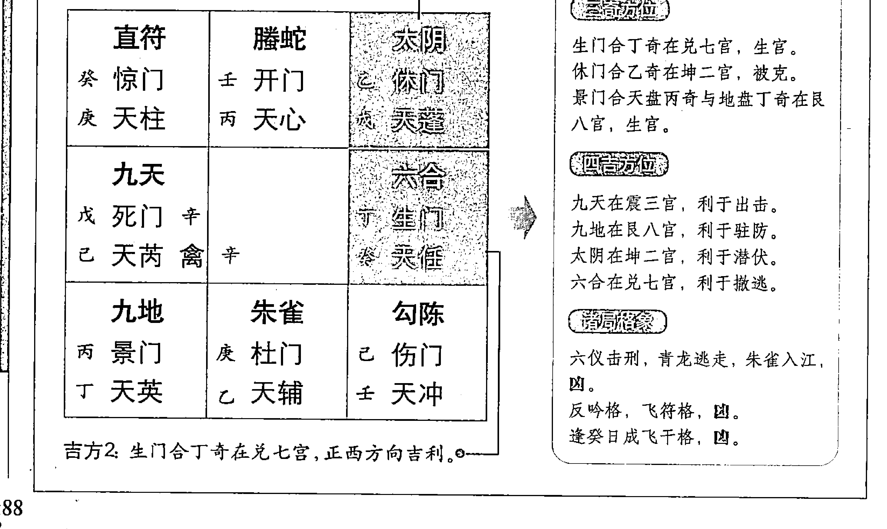

---

# 辛酉时：正北与西北方向吉利

#### [原文]

**辛酉** 柱五，惊五避五。宿吉干凶。生乙坎制，休墓乾和，景巽和。天九，地四，阴六，合一。生与星合一正北，丁下有乙，休与日合六西北，时干离，刑格，火入太白格。

#### [白话提要]

符使宫位：天柱星为值符居中五宫寄处坤二宫，惊门为值使居中五宫寄处坤二宫。星宿吉，时干逢凶。

**三奇方位**：生门合天盘丁奇与地盘乙奇在坎一宫，克宫。休门合乙奇在乾六宫，被生。景门合丙奇在巽四宫，被生。

**四吉方位**：九天在离九宫，九地在巽四宫，太阴在乾六宫，六合在坎一宫。

**诸局格象**：生门合丁奇在坎一宫，正北方向吉利。丁下有乙，为人遁格。休门合乙奇在乾六宫，西北方向吉利。时干在离九宫。刑格。荧入太白格。

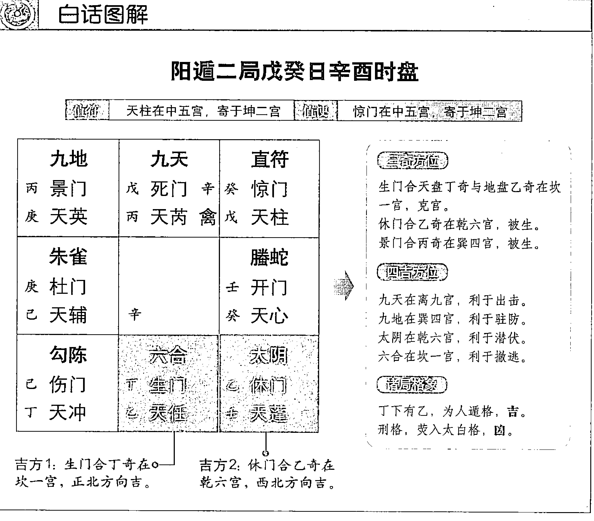

---

# 壬戌时：正东与东北方向吉利

### 【原文】

**壬戌** 柱六，惊六。宿吉干凶。生震害，休丁艮害，景坤义。天七，地二，阴八，合三。休与日合八东北，乙下有丁。生与星合三正东，戊干格，时干坎，金入火，戊日勃。

### 【白话提要】

符使宫位：值符天柱在乾六宫，值使惊门在乾六宫。时干遇吉星宿，时干逢凶。

**三奇方位**：生门合丁奇在震三宫，被克。休门合天盘乙奇与地盘丁奇在艮八宫，被克。景门合丙奇在坤二宫，生宫。

**四吉方位**：九天在兑七宫，九地在坤二宫，太阴在艮八宫，六合在震三宫。

**诸局格象**：休门合乙奇在艮八宫，东北方向吉利。乙下有丁，为奇仪相佐。生门合丁奇在震三宫，正东方向吉利。逢戊时时干格。时干在坎一宫。太白入荧。逢戊日，为勃格。

## 白话图解

#### 阳遁二局戊癸日壬戌时盘

##### > #### 值符：天柱在乾六宫
##### #### 值使：惊门在乾六宫

- ○吉方 2：生门合丁奇在震三宫，正东方向吉利。

##### #### 勾陈
##### #### 朱雀
##### #### 九地
##### #### 伤门
##### #### 杜门
##### #### 景门
##### #### 天冲
##### #### 天辅
##### #### 天英

> ### 三奇方位
生门合丁奇在震三宫，被克。休门合天盘乙奇与地盘丁奇在艮八宫，被克。景门合丙奇在坤二宫，生官。

##### #### 六合
##### #### 九天
##### #### 天任
##### #### 死门
##### #### 天芮
#### 四吉方位
### 天禽
##### #### 太阴
##### #### 直符
##### #### 休门
##### #### 惊门
##### #### 天蓬
##### #### 开门
##### #### 天柱

> ### 九地
##### #### 天芮
##### #### 休门
##### #### 惊门
##### #### 直符
##### #### 开门
##### #### 天柱

> ### 六合
##### #### 休门
##### #### 开门
##### #### 天芮
### 天禽
##### #### 太阴
##### #### 直符
##### #### 惊门
##### #### 天柱

##### #### 腾蛇
##### #### 开门
##### #### 天心

> ### 诸局格象
乙下有丁，为奇仪相佐，吉。逢戊时，为时干格，凶。
太白入荧，戊日成勃格，凶。

**吉方 1**：休门合乙奇在艮八宫，东北方向吉利。

---

# 癸亥时：正北与东北方向吉利

##### > **原文**

**癸亥** 柱七，惊七。宿干凶。生丁艮伏，休乙坎伏，景丙离伏。天二，地九，阴一，合八。休与日合一正北，生与星合八东北，时干兑，符门伏，天网四张。

##### > **白话提要**

符使宫位：值符天柱在兑七宫，值使惊门在兑七宫。时干遇凶星宿，时干逢凶。
三奇方位：生门合双丁奇在艮八宫，同类伏吟。休门合双乙奇在坎一宫，同类伏吟。景门合双丙奇在离九宫，同类伏吟。
四吉方位：九天在坤二宫，九地在离九宫，太阴在坎一宫，六合在艮八宫。
诸局格象：休门合乙奇在坎一宫，正北方向吉利。生门合丁奇在艮八宫，东北方向吉利。时干在兑七宫，九星、八门和值符都在本宫未动，为伏吟格。天盘癸加临地盘癸在兑七宫，为天网四张。

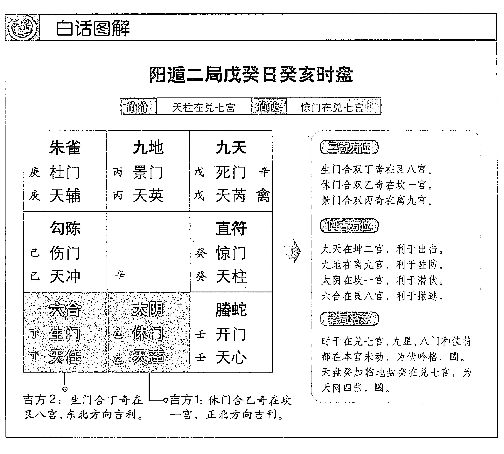

---

# 第三章 阳遁三局

奇门遁甲时家奇门阳遁三局共有六十个时辰，即六十局。本章通过文字和各时辰的飞盘排布来说明各局的符使官位、三奇方位、四吉神方位和诸局格象。

## 白话图解

#### 阳遁三局图

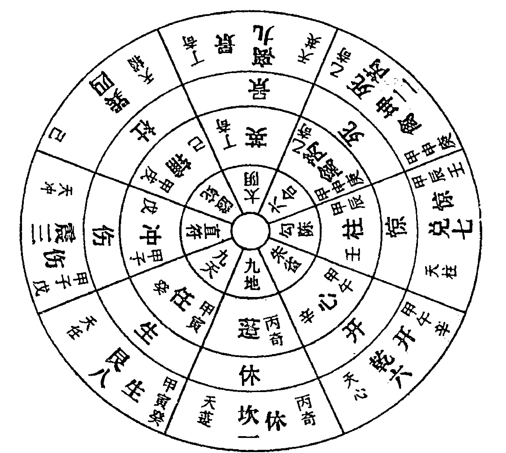

##### > > 大寒上元
##### > 春分上元
##### > 雨水下元
##### > 芒种中元

---

### 每日时辰

奇门遁甲中一局为一元，一元有甲己、乙庚、丙辛、丁壬和戊癸五日，每日有十二个时辰，则一局就有六十个时辰，用六十甲子来表示，一个时辰为一小局。

| |甲子|乙丑|丙寅|丁卯|戊辰|己巳|庚午|辛未|壬申|癸酉|甲戌|乙亥|
|---|---|---|---|---|---|---|---|---|---|---|---|---|
|**甲辰日**|丙子|丁丑|戊寅|己卯|庚辰|辛巳|壬午|癸未|甲申|乙酉|丙戌|丁亥|
|**乙蛇日**|戊子|己丑|庚寅|辛卯|壬辰|癸巳|甲午|乙未|丙申|丁酉|戊戌|己亥|
|**丙午日**|庚子|辛丑|壬寅|癸卯|甲辰|乙巳|丙午|丁未|戊申|己酉|庚戌|辛亥|
|**丁未日**|壬子|癸丑|甲寅|乙卯|丙辰|丁巳|戊午|己未|庚申|辛酉|壬戌|癸亥|

---

## 阳遁三局六十时符使表

奇门遁甲排盘时，最主要的就是寻找值符和值使，并确定其所在的宫位。下表就是阳遁三局六十个时辰的值符和值使，以及其所在的宫位。

### 第一组数据
| |**甲子**|**乙丑**|**丙寅**|**丁卯**|**戊辰**|**己巳**|**庚午**|**辛未**|**壬申**|**癸酉**|
|---|---|---|---|---|---|---|---|---|---|---|
|时辰宫位|三|二|一|九|三|四|五|六|七|八|
|伤门||四|五|六|七|八|九|— |二 |三 |

### 第二组数据
|**时辰**|甲戌|乙亥|丙子|丁丑|戊寅|己卯|庚辰|辛巳|壬午|癸未|
|---|---|---|---|---|---|---|---|---|---|---|
|天辅宫位|四|二|一|九|三|四|五|六|七|八|
|杜门宫位|四|五|六|七|八|九|— |二 |三 |四 |

### 第三组数据
|**时辰**|甲申|乙酉|丙戌|丁亥|戊子|己丑|庚寅|辛卯|壬辰|癸巳|
|---|---|---|---|---|---|---|---|---|---|---|
|天禽宫位|五|二|— |九|三|四|五|六|七|八|
|死门宫位|五|六|七|八|九|— |二 |三 |四 |五 |

### 第四组数据
|**时辰**|甲午|乙未|丙申|丁酉|戊戌|己亥|庚子|辛丑|壬寅|癸卯|
|---|---|---|---|---|---|---|---|---|---|---|
|天心宫位|六|二|— |九|三|四|五|六|七|八|
|开门宫位|六|七|八|九|— |二 |三 |四 |五 |六 |

### 第五组数据
|**时辰**|甲辰|乙巳|丙午|丁未|戊申|己酉|庚戌|辛亥|壬子|癸丑|
|---|---|---|---|---|---|---|---|---|---|---|
|天柱宫位|七|二|— |九|三|四|五|六|七 |八 |
|惊门宫位|七|八|九|— |二 |三 |四 |五 |六 |七 |

### 第六组数据
|**时辰**|甲寅|乙卯|丙辰|丁巳|戊午|己未|庚申|辛酉|壬戌|癸亥|
|---|---|---|---|---|---|---|---|---|---|---|
|天任宫位|八|二|二 |九|三|四|五|六|七 |八 |
|生门宫位|八|九|— |二 |三 |四 |五 |六 |七 |八 |

---

# 1. 甲己日十二时局

### 甲子时：正北方向吉利

### 【原文】

**甲子** 冲三，伤三。子至辰阳，宿干吉。休坎伏，死墓坤伏，星离伏。天八，地一，阴九，合二。休与月合一正北，刑德在门，客主不利，开，时干震，伏吟，遁甲，三吉，开。

### 【白话提要】

符使宫位：值符天冲在震三宫，值使伤门在震三宫。子时至辰时为五阳时。时干遇吉星宿，时干逢吉。

**三奇方位**：休门合丙奇在坎一宫，同类伏吟。死门合乙奇在坤二宫，同类伏吟，乙奇入墓。景门合丁奇在离九宫。

**四吉方位**：九天在艮八宫，九地在坎一宫，太阴在离九宫，六合在坤二宫。

**诸局格象**：休门合丙奇在坎一宫，正北方向吉利。刑德在门，主客双方都不利。遁甲开。时干在震三宫。伏吟格。遁甲三吉开，主动。

## 白话图解

###### 阳遁三局甲己日甲子时盘

---

### 乙丑时：逢己日不宜用事

### 【原文】

**乙丑** 冲二，伤四。己日不用，宿凶干吉。伤巽伏，开丙坎义，惊墓乾伏。天九，地四，阴六，合一。开与日合一正北，乙下有丙。乙日，干格。甲子，飞干格。白入火，蛇矫。时干坎，飞符，坤，飞宫格。

### 【白话提要】

符使宫位：值符天冲在坤二宫，值使伤门在巽四宫。逢己日不宜用事。时干遇凶星宿，时干逢吉。
**三奇方位**：伤门合丙奇在巽四宫，同类伏。开门合天盘乙奇、地盘丙奇在坎一宫，生官。惊门合丁奇在乾六宫，同类伏，丁奇入墓。
**四吉方位**：九天在离九宫，九地在巽四宫，太阴在乾六宫，六合在坎一宫。
**诸局格象**：开门合乙奇在坎一宫，正北方向吉利。乙下有丙，为奇仪顺遂。乙日伏干格。甲子飞干格。太白入荧。螣蛇夭矫。时干在坎一宫。值符在坤二宫。成飞官格。

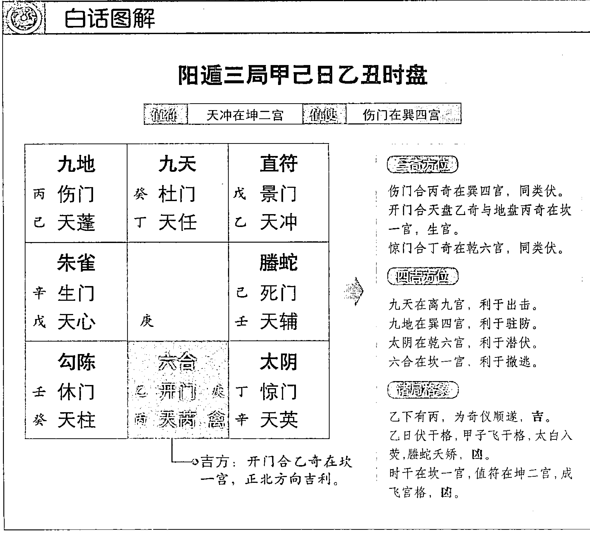

卷七 第三章 阳遁三局

---

### “丙寅时：正东与东南方向吉利”

#### “原文”

**丙寅** 冲一，伤五避五。宿凶干吉，杜兑害，休巽义，开震制欢怡。天六，地七，阴三，合四。开与星合三正东，休与日合四东南，天乙与太白格，刑格，虎猖狂，己日伏干格，时干兑，事同。

#### “白话提要”

符使宫位：值符天冲在坎一宫，值使伤门在中五宫寄在坤二宫。时干遇凶星宿，时干逢吉。

**三奇方位**：杜门逢丙奇在兑七宫，被克。休门合乙奇在巽四宫，生宫。开门合丁奇在震三宫，克宫，吉利。

**四吉方位**：九天在乾六宫，九地在兑七宫，太阴在震三宫，六合在巽四宫。

**诸局格象**：开门合丁奇在震三宫，正东方向吉利。休门合乙奇在巽四宫，东南方向吉利。天乙与六庚宫位有格。刑格。白虎猖狂。逢己日伏干格。时干在兑七宫。

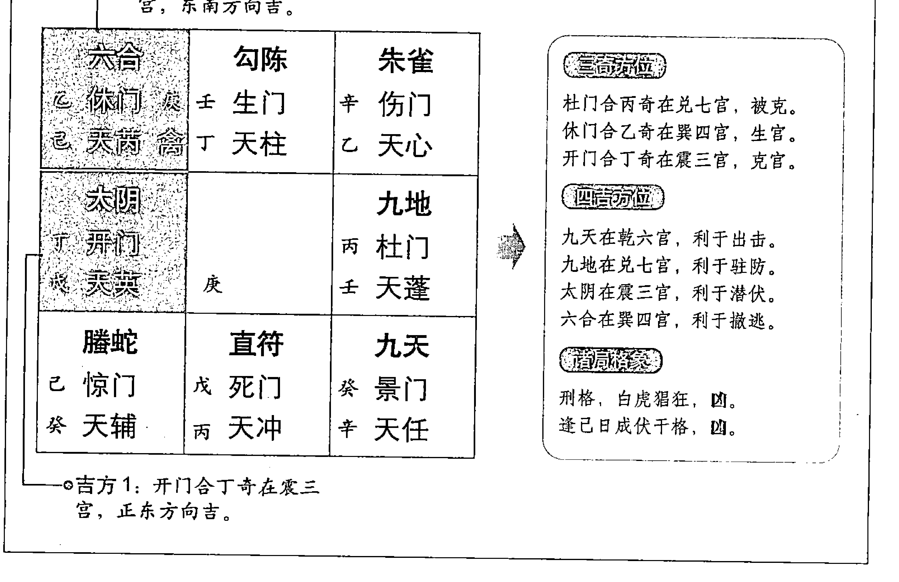

---

# 丁卯时：正西方向吉利

### 【原文】

**丁卯** 冲九，伤六。宿凶干吉。死震害欢怡，伤乾害，生合兑义。天四，地三，阴七，合六。生与星合七正西，符勃，龙走，己日伏干格，时干兑，相佐离，击刑，鸟跌穴。

### 【白话提要】

符使宫位：值符天冲在离九宫，值使伤门在乾六宫。时干遇凶星宿，时干逢吉。
**三奇方位**：死门与丙奇逢于震三宫，被克。伤门逢乙奇于乾六宫，被克。生门合丁奇于兑七宫，生官，奇仪相合。
**四吉方位**：九天在巽四宫，九地在震三宫，太阴在兑七宫，六合在乾六宫。
**诸局格象**：生门合丁奇在兑七宫，正西方向吉利。值符勃格。青龙逃走。逢己日成伏干格。时干在兑七宫。值符得地盘丁奇相助在离九宫。六仪击刑。飞鸟跌穴。

## 白话图解
阳遁三局甲己日丁卯时盘
天冲在离九宫，伤门在乾六宫

| **九天** | **直符** | **螣蛇** |
| :--- | :--- | :--- |
| 癸惊门<br>己天任 | 戊开门<br>丁天冲 | 己休门<br>乙天辅 |
| **九地** | **勾陈** | **太阴** |
| 丙死门<br>戌天蓬 | 庚 | 下生门<br>击天英 |
| **朱雀** | **勾陈** | **六合** |
| 辛景门<br>癸天心 | 壬杜门<br>丙天柱 | 乙伤门<br>辛天芮禽 |

##### > > 三奇方位
死门合丙奇在震三宫，被克。
伤门合乙奇在乾六宫，被克。
生门合丁奇在兑七宫，生官。

##### > 四吉方位
九天在巽四宫，利于出击。
九地在震三宫，利于驻防。
太阴在兑七官，利于潜伏。
六合在乾六宫，利于撤退。

##### > 诸局格象
飞鸟跌穴，吉。
值符勃格，青龙逃走，六仪击刑，凶。
逢己日成伏干格，凶。

**吉方**：生门合丁奇在兑七宫，正西方向吉。

---

# 戊辰时：正南西南方向吉利

#### [[原文]]

**戊辰** 冲三，伤七。人遁。景丙坎害，生墓乙坤伏，休丁离制。天八，地一，阴九，合二。休与星合九正南，生与日合二西南，墓，时干震，符伏，门反，仪刑。

#### [[白话提要]]

符使宫位：值符天冲在震三宫，值使伤门在兑七宫。成人遁格。
**三奇方位**：景门合双丙奇在坎一宫，被克。生门合双乙奇在坤二宫，同类伏吟，乙奇入墓。休门合双丁奇在离九宫，克宫。
**四吉方位**：九天在艮八宫，九地在坎一宫，太阴在离九宫，六合在坤二宫。
**诸局格象**：休门合丁奇在离九宫，正南方向吉利。生门合乙奇在坤二宫，西南方向吉利。日奇入墓。时干在震三宫。值符伏吟。值门反吟格。六仪击刑。

| |白话图解| |
| :--: | :--: | :--: |
| **值符** | 天冲在震三宫 | **值使** | 伤门在兑七宫 |
| **吉方 1**: 休门合丁奇在离九宫，正南方向吉。 | **吉方 2**: 生门合乙奇在坤二宫，西南方向吉。 |
| **腾蛇** | **太阴** | **六合** |
| 己 开门 | 丙 休门 | 戊<br>生门癸 |
| 己 天辅 | 壬 天英 | 乙 天芮癸 |
| **直符** | 庚 | **勾陈** |
| 戊 惊门 | 辛 | 壬 伤门 |
| 戌 天冲 | 乙 | 壬 天柱 |
| **九天** | **九地** | **朱雀** |
| 癸 死门 | 丙 景门 | 辛 杜门 |
| 癸 天任 | 丙 天蓬 | 辛 天心 |

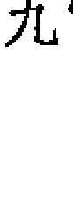

##### **三奇方位**
景门合双丙奇在坎一宫，被克。
生门合双乙奇在坤二宫，不相生克。
休门合双丁奇在离九宫，克宫。

#### **四吉方位**
九天在艮八宫，利于出击。
九地在坎一宫，利于驻防。
太阴在离九宫，利于潜伏。
六合在坤二宫，利于撤退。

##### **诸局格象**
日奇入墓，值符伏吟，凶。
值门反吟格，六仪击刑，凶。

---

# 己巳时：正西方向吉利

### 【原文】

**己巳** 冲四，伤八，已至酉阴，天辅，宿吉干凶。伤艮制，开兑伏，惊乙坤和。天三，地八，阴二，合七。开与日合七正西，时干离。

### 【白话提要】

符使宫位：值符天冲在巽四宫，值使伤门在艮八宫。巳时至酉时为五阴时。已时为天辅释罪时。时干遇吉星宿，时干逢凶。
**三奇方位**：伤门合丙奇在艮八宫，克宫。开门合乙奇在兑七宫，同类伏。惊门合丁奇在坤二宫，被生。
**四吉方位**：九天在震三宫，九地在艮八宫，太阴在坤二宫，六合在兑七宫。
**诸局格象**：开门合乙奇在兑七宫，正西方向吉。时干在离九宫位。天盘庚加临地盘壬在兑七宫，为上格。

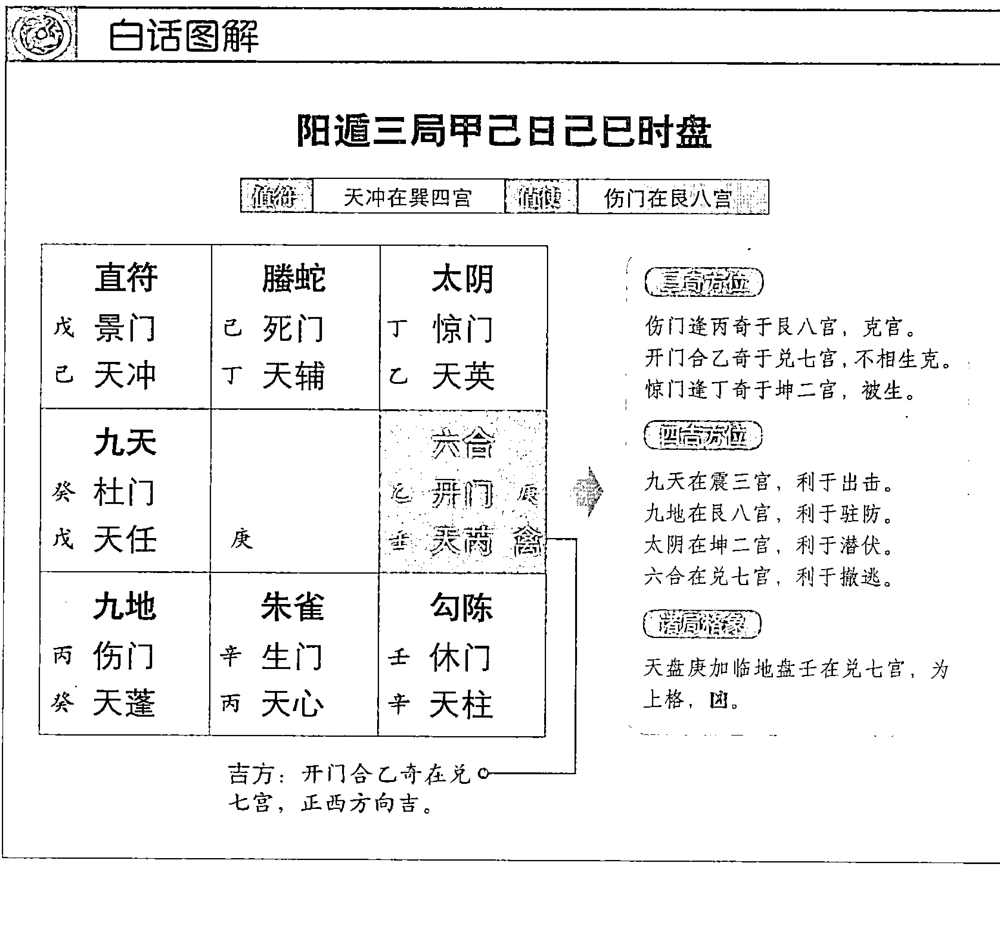

---

# 庚午时：宜守户不出

## **原文**

**庚午** 冲五，伤九。甲日不用，守户。生巽害，惊丙坎义，死墓乾义。天九，地四，阴六，合一。生与月合四东南，白入火，己干勃，甲日飞干格，蛇矫，时干坎，反吟，飞符。

## **白话提要**

符使宫位：值符天冲在中五宫寄在坤二宫，值使伤门在离九宫。逢甲日不宜用事。守户不出。

**三奇方位**：生门合丙奇在巽四宫，被克。惊门合天盘乙奇与地盘丙奇在坎一宫，生宫。死门合丁奇在乾六宫，生官。

**四吉方位**：九天在离九宫，九地在巽四宫，太阴在乾六宫，六合在坎一宫。

**诸局格象**：生门合丙奇在巽四宫，东南方向吉利。太白入荧，逢己日时干勃格。甲日成飞干格。螣蛇夭矫。时干在坎一宫。反吟格。值符飞宫。

## 白话图解

阳遁三局甲己日庚午时盘

# 值符
天冲在中五宫，寄于坤二宫

# 值使
伤门在离九宫

# 吉方：生门合丙奇在巽四宫，东南方向吉。

| **九地** | **九天** | **直符** |
| :---: | :---: | :---: |
| 生门 | 伤门 | 杜门 |
| 天蓬 | 天任 | 天冲 |
| **朱雀** | | **螣蛇** |
| 休门 | | 景门 |
| 天心 | 庚 | 天辅 |
| **勾陈** | **六合** | **太阴** |
| 开门 | 惊门 | 死门 |
| 天柱 | 天芮 | 天英 |

##### # 三奇方位
生门合丙奇在巽四宫，被克。惊门合天盘乙奇与地盘丙奇在坎一官，生官。
死门合丁奇在乾六宫，生官。

##### # 四吉方位
九天在离九宫，利于出击。
九地在巽四宫，利于驻防。
太阴在乾六宫，利于潜伏。
六合在坎一宫，利于撤逃。

##### # 诸局格象
逢己日成日勃格，甲日成飞干格，凶。
太白入荧，螣蛇夭矫，反吟格，值符飞官，凶。

---

# 辛未时：西南方向吉利

# ## 原文

**辛未** 冲六，伤一。宿吉干凶。开乙坤和，景震和欢怡，杜艮制。天七，地二，阴八，合三。开与月合二西南，丙下有乙，飞干格，己干格，蛇矫，时干离，火入金，飞宫。

# ## 白话提要

**符使宫位**：值符天冲在乾六宫，值使伤门在坎一宫。时干遇吉星宿，时干逢凶。

**三奇方位**：开门合天盘丙奇与地盘乙奇在坤二宫，被生。景门合乙奇在震三宫，被生，吉利。杜门合丁奇在艮八宫，克宫。

**四吉方位**：九夫在兑七宫，九地在坤二宫，太阴在艮八宫，六合在震三宫。

**诸局格象**：开门合丙奇在坤二宫，西南方向吉利。丙下有乙，为日月并行。飞干格。己日伏干格。滕蛇天矫。时千在离九宫。荧入太白。飞官格。

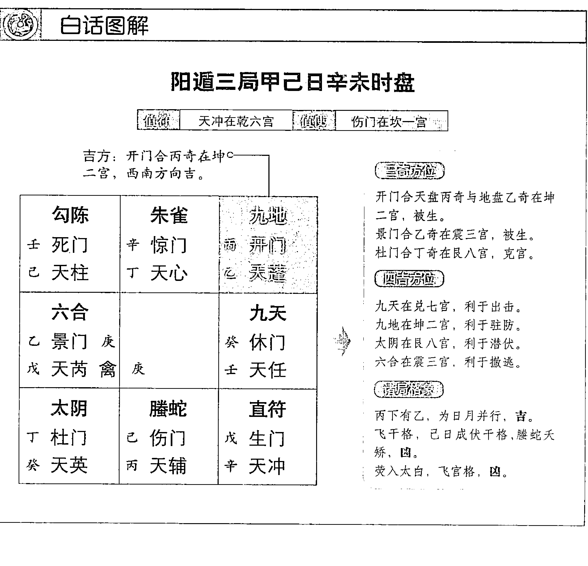

# 壬申时：正南方向吉利

### 【原文】
壬申冲七，伤二。宿干凶，天遁。生丁离和，惊艮和，死丙坎制。天二，地九，阴一，合八。生与月合九正南，丙下有丁，天乙与太白格，时干震，符冲事同。

### 【白话提要】
符使宫位：值符天冲在兑七宫，值使伤门在坤二宫。时干遇凶星宿，时干逢凶。成天遁格。
三奇方位：生门合天盘丙奇、地盘丁奇在离九宫，被生。惊门合乙奇在艮八宫，被生。死门合天盘丁奇与地盘丙奇在坎一宫，克宫。
四吉方位：九天在坤二宫，九地在离九宫，太阴在坎一宫，六合在艮八宫。
诸局格象：生门合丙奇在离九宫，正南方向吉利。丙下有丁，为月奇朱雀。天乙与六庚官位有格。时干在震三宫。值符反吟格。

## 白话图解

### 阳遁三局甲己日壬申时盘

**吉方：**生门合丙奇在离九宫，正南方向吉。

| | 值符天冲在兑七宫 | 值使伤门在坤二宫 |
|:---:|:---:|:---:|
| **九天** | 戊休门 己天冲 | **直符** | 己生门 丁天辅 |
| **九地** | 癸开门 戊天任 | **螣蛇** | 丁伤门 乙天英 |
| **朱雀** | 丙惊门 癸天蓬 | **勾陈** | 死门 丙天心 |
| **太阴** | 乙杜门 壬天芮 庚天禽 | **六合** | 壬景门 辛天柱 |

#### 三奇方位
生门合天盘丙奇与地盘丁奇在离九宫，被生。惊门合乙奇在艮八宫，被生。死门合天盘丁奇与地盘丙奇在坎一宫，克宫。

#### 四吉方位
九天在坤二宫，利于出击。九地在离九宫，利于驻防。太阴在坎一宫，利于潜伏。六合在艮八宫，利于撤退。

#### 诸局格象
丙下有丁，为月奇朱雀，吉。天乙与六庚官位有格，凶。值符反吟格，凶。

---

# 癸酉时：西北方向吉利

> **【原文】**
> 癸酉冲八伤三。宿吉干凶，开墓合乾伏，景丁离伏，杜巽伏。天一，地六，阴四，合九。开与月合六西北，墓，天网四张，时干坎，门伏，三吉。

> **【白话提要】**
> 符使宫位：值符天冲在艮八宫，值使伤门在震三宫。时干遇吉星宿，时干逢凶。
> 三奇方位：开门合丙奇在乾六宫，同类伏吟，丙奇入墓，奇仪相合。景门合天盘乙奇与地盘丁奇在离九宫，同类伏吟。杜门合丁奇在巽四宫，同类伏吟。
> 四吉方位：九天在坎一宫，九地在乾六宫，太阴在巽四宫，六合在离九宫。
> 诸局格象：开门合丙奇在乾六宫，西北方向吉利。月奇入墓。天网四张。时干在坎一宫。值门伏吟。三吉格。

---

## 甲戌时：正北方向吉利

### 【原文】
甲戌辅直符四，杜直使四。戌至亥阳，天辅，宿干吉。死墓芮使坤伏，景英星离伏。天三，地八，阴二，合七。休与月合一正北，亥申时如上法。时干巽，伏吟，飞甲开。

### 【白话提要】
符使宫位：值符天辅在巽四宫，值使杜门在巽四宫。戌时至亥时为五阳时。戌时为天辅释罪时。时干遇吉星宿，时干逢凶。

三奇方位：死门合乙奇在坤二宫，伏吟。休门合丙奇在坎一宫，伏吟。景门合丁奇在离九宫，伏吟。

四吉方位：九天在震三宫，九地在艮八宫，太阴在坤二宫，六合在兑七宫。

诸局格象：休门合丙奇在坎一宫，正北方向吉利。逢亥、申之时如上法。时干在巽四宫。伏吟格。飞官格。遁甲开。

## 白话图解
### 阳遁三局甲己日甲戌时盘

**吉方：**休门合丙奇在坎一宫，正北方向吉。

---

# 乙亥时：逢己日不宜用事

> **【原文】**
> 乙亥辅二，杜五避五。己日不用。死墓乾义，休震义，景合兑制。天九，地四，阴六，合一。休与月合三正东，天乙与太白格，龙走，蛇矫，鸟跌穴，时干乾，飞符，事同。

> **【白话提要】**
> 符使宫位：值符天辅在坤二宫，值使杜门在中五宫，寄于坤二宫。逢己日不宜用事。
> 三奇方位：死门合乙奇在乾六宫，生宫，乙奇入墓。休门合丙奇在震三宫，生宫。景门逢丁奇在兑七宫，克宫，奇仪相合。
> 四吉方位：九天在离九宫，九地在巽四宫，太阴在乾六宫，六合在坎一宫。
> 诸局格象：休门合丙奇在震三宫，正东方向吉利。天乙与六庚有格。青龙逃走。螣蛇夭矫。飞鸟跌穴。时干在乾六宫。值符飞宫。

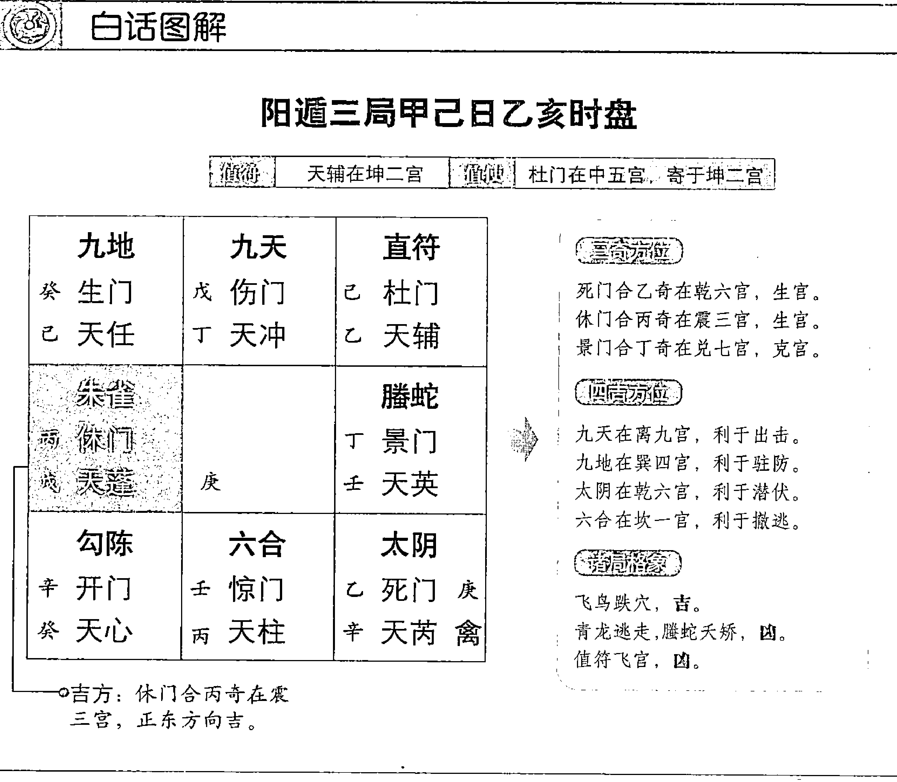

---

# 2. 乙庚日十二时局

### 丙子时：逢庚日不宜用事

### 【原文】
> 丙子辅一，杜六。子至寅阳，庚日不用，宿干吉。惊震制，生乙坤伏，死艮伏，天六，地七，阴三，合四。生与月合二西南，得使，火入白，乙于勃，门干勃，时坤，相佐坎，门反吟。

### 【白话提要】
> 符使宫位：值符天辅在坎一宫，值使杜门在乾六宫。子时至寅时为五阳时。逢庚日不宜用事。时干遇吉星宿，时干逢吉。
> 三奇方位：惊门合乙奇在震三宫，克宫。生门合天盘丙奇与地盘乙奇在坤二宫，同类伏。死门合丁奇在艮八宫，同类伏。
> 四吉方位：九天在乾六宫，九地在兑七宫，太阴在震三宫，六合在巽四宫。

## 白话图解
### 阳遁三局乙庚日丙子时盘

| | 值符天辅在坎一宫 | 值使杜门在乾六宫 |
|:---:|:---:|:---:|
| **九天** | 戊休门 己天冲 | **直符** | 己生门 丁天辅 |
| **九地** | 癸开门 戊天任 | **螣蛇** | 丁伤门 乙天英 |
| **朱雀** | 丙惊门 癸天蓬 | **勾陈** | 死门 丙天心 |
| **太阴** | 乙杜门 壬天芮 庚天禽 | **六合** | 壬景门 辛天柱 |

> 吉方：生门合丙奇在坤二宫，西南方向吉。

#### 三奇方位
*   惊门合乙奇在震三宫，克宫。
*   生门合天盘丙奇与地盘乙奇在坤二宫，不相生克。
*   死门合丁奇在艮八宫，不相生克。

#### 四吉方位
*   九天在乾六宫，利于出击。
*   九地在兑七宫，利于驻防。
*   太阴在震三宫，利于潜伏。
*   六合在巽四宫，利于撤退。

#### 诸局格象
*   ·月奇得使。吉。
*   荧入太白，逢乙日干勃。门勃。凶。
*   值门反吟格。凶。

诸局格象：生门合丙奇在坤二宫，西南方向吉利。月奇得使。荧入太白。逢乙日干勃。门勃。时干在坤二宫。值符得地盘丙奇相助在坎一宫。值门反吟格。

### 丁丑时：无奇门可出

### 【原文】
丁丑辅九，杜七。宿凶干吉。杜兑害，惊艮和，伤乙坤制。天四，地三，阴七，合六。无奇门，时干坤，相佐离。

### 【白话提要】
符使宫位：值符天辅在离九宫，值使杜门在兑七宫。时干遇凶星宿，时干逢吉。
三奇方位：杜门合乙奇在兑七宫，被克。惊门合丙奇在艮八宫，被生。伤门合天盘丁奇与地盘乙奇在坤二宫，克宫。
四吉方位：九天在巽四宫，九地在震三宫，太阴在兑七宫，六合在乾六宫。
诸局格象：无奇门。时干在坤二宫。值符得地盘丁相助在离九宫。天盘庚仪加临地盘壬仪在兑七宫，为上格。

## 白话图解
<center>阳遁三局乙庚日丁丑时盘</center>

| | | | | :---: | :---: | :---: |
| | 值符天辅在离九宫 | 值使杜门在兑七宫 |
| 九天 戊 休门 己 天冲 | 直符 己 生门 丁 天辅 | 螣蛇 丁 伤门 乙 天英 |
| 九地 癸 开门 戊 天任 | 癸 庚 | 太阴 乙 杜门 壬 天芮 庚 天禽 禽 |
| 朱雀 丙 惊门 癸 天蓬 | 辛 勾陈 死门 丙 天心 | 六合 壬 景门 辛 天柱 |

三奇方位：杜门逢乙奇于兑七宫，被克。惊门逢丙奇于艮八宫，被生。伤门逢丁奇于地盘乙奇坤二宫，克宫。

四吉方位：九天在巽四宫，利于出击。九地在震三宫，利于驻防。太阴在兑七宫，利于潜伏。六合在乾六宫，利于撤退。

诸局格象：无奇门，凶。天盘庚仪加临地盘壬仪在兑七宫，为上格，凶。

---

## 戊寅时：西北方向吉利

### 【原文】
> 戊寅，辅三，杜八。宿干吉。惊丁离害，生墓合乾义，死巽害欢怡。天八，地一，阴九，合二。生与月合六西北，时干艮。

### 【白话提要】
> 符使宫位：值符天辅在震三宫，值使杜门在艮八宫。时干遇吉星宿，时干逢吉。
> 三奇方位：惊门合天盘乙奇与地盘丁奇在离九宫，被克。生门合丙奇在乾六宫，生宫，丙奇入墓，奇仪相合。死门合丁奇在巽四宫，被克，吉利。
> 四吉方位：九天在艮八宫，九地在坎一宫，太阴在离九宫，六合在坤二宫。
> 诸局格象：生门与月奇合于乾六宫，西北方向。时干在艮八宫。乙下有丁，为奇助玉女。

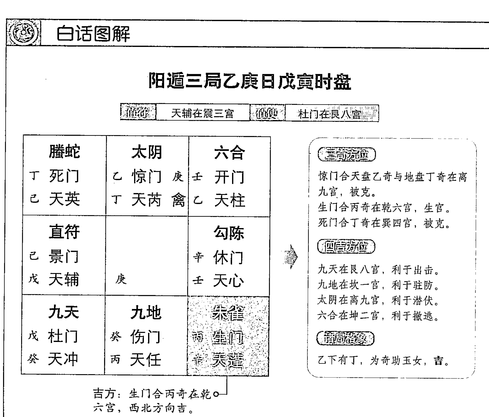

---

# 己卯时：宜守户不出

### 【原文】
己卯辅四，杜九。卯至未阴，守户，宿吉干凶。景墓乙坤义，开丙坎义，杜丁离义，天三，地八，阴二，合七。开与月合一正北，时干巽，符伏，仪刑。

### 【白话提要】
符使宫位：值符天辅在巽四宫，值使杜门在离九宫。卯时至未时为五阴时，宜守户不出。时干遇吉星宿，时干逢凶。
三奇方位：景门合双乙奇在坤二宫，生宫，乙奇入墓。开门合双丙奇在坎一宫，生宫。杜门合双丁奇在离九宫，生宫。
四吉方位：九天在震三宫，九地在艮八宫，太阴在坤二宫，六合在兑七宫。
诸局格象：开门合丙奇在坎一宫，正北方向。时干在巽四宫。值符伏吟。六仪击刑。

## 白话图解
<table>
<tr>
<th colspan="3" style="text-align:center; font-size:20px;">阳遁三局乙庚日己卯时盘</th>
</tr>
<tr>
<td>值符天辅在巽四宫</td>
<td>值使杜门在离九宫</td>
</tr>
<tr>
<td><table style="text-align:center; border-collapse:collapse;">
<th>直符</th>
</br><b>己</b> <u>伤门</u><br/><i>己</i> <u>天辅</u></th>

<th>螣蛇</th>

</br><u>丁</u> 杜门<br/><u>丁</u> 天英</th>

<th>太阴</th>

</br><b>乙</b> 景门 <i>庚</i><br/><b>乙</b> 天芮 <i>禽</i></th>
</tr>
<tr>
<td><table style="text-align:center; border-collapse:collapse;">
<th>九天</th>

</br><b>戊</b> 生门<br/><i>戊</i> 天冲</th>

<th>庚</th>

</tr>
<tr>
<td><table style="text-align:center; border-collapse:collapse;">
<th>九地</th>

</br><i>癸</i> 休门<br/><i>癸</i> 天任</th>

<th>朱雀 <u>开门</u> <i>庚</i> 
<u>天蓬</u></th>

<th>勾陈</th>

</br><b>辛</b> 惊门<br/><b>辛</b> 天心</th>
</tr>
<tr>
<td colspan="3" style="text-align:center; font-size:12px;">○吉方：开门合丙奇在坎一宫，正北方向吉。</td>
</tr>
</table></td>

</td>
</tr>
</table>

**三奇方位**
景门合双乙奇于坤二宫，生宫。
开门合双丙奇于坎一宫，生宫。
杜门合双丁奇于离九宫，生宫。

**四吉方位**
九天在震三宫，
九地在艮八宫，
太阴在坤二宫，
六合在兑七官。

**诸局格象**
值符伏吟，六仪击刑，凶。

---

# 庚辰时：正西方向吉利

### 【原文】
庚辰辅五，杜一。宿吉干凶。伤乾害，死震时，生合兑义。天九，地四，阴六，合一。生与星合七正西，龙走，飞官格，时干乾，反吟，飞符。

### 【白话提要】
符使宫位：值符天辅在中五宫，寄于坤二宫，值使杜门在坎一宫。时干遇吉星宿，时干逢凶。
三奇方位：伤门合乙奇在乾六宫，被克。死门合丙奇在震三宫，被克。生门合丁奇在兑七宫，生宫，奇仪相合。
四吉方位：九天在离九宫，九地在巽四宫，太阴在乾六宫，六合在坎一宫。
诸局格象：生门合丁奇在兑七宫，正西方向吉利。青龙逃走。飞官格。时干在乾六宫。反吟格。值符飞宫。

## 白话图解
阳遁三局乙庚日庚辰时盘
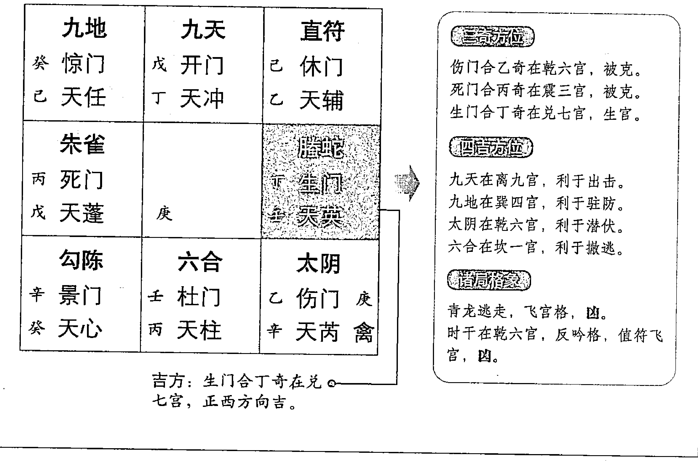

---

## 辛巳时：逢己日不宜用事

### 【原文】
辛巳辅六，杜二。己日不用，宿吉干凶。开乙艮和，伤丁离义，惊丙坎义。天七，地二，阴八，合三。开与日合八东北，天乙与太白格。时干巽，符冲，大格。

### 【白话提要】
符使宫位：值符天辅在乾六宫，值使杜门在坤二宫。逢己日不宜用事。时干遇吉星宿，时干逢凶。
三奇方位：开门合乙奇在艮八宫，被生。伤门合天盘丙奇与地盘丁奇在离九宫，生宫。惊门合天盘丁奇与地盘丙奇在坎一宫，生宫。
四吉方位：九处在兑七宫，九地在坤二宫，太阴在艮八宫，六合在震三宫。
诸局格象：开门合乙奇在艮八宫，东北方向吉利。天乙与六庚有格。时干在巽四宫。值符反吟。有大格。

# 阳遁三局乙庚日辛巳时盘

| 勾陈 | 朱雀 | 九地 |
| --- | --- | --- |
| **辛生门** | **丙伤门** | **癸杜门** |
| **己天柱** | **丁天蓬** | **乙天任** |
| 六合休门 壬 xx | 戊天柱 | 九天景门 庚 |
| 戌壬 天冲 | 太阴开门 乙 天芮 合禽 | 腾蛇惊门 丁 天英 |
| 丙直符死门己 天辅辛 | | |

⬜ 吉方：开门合乙奇在艮八宫，东北方向吉。

---

## 壬午时：正北与西北方向吉利

### 【原文】
壬午辅七，杜三。宿干凶。生丙坎制，景巽和欢怡，休墓乾和。天二，地九，阴一，合八。休与星合六西北，生与日合一正北，乙下有丙，符勃，时干艮，三吉，金入火，蛇矫。

### 【白话提要】
符使宫位：值符天辅在兑七宫，值使杜门在震三宫。时干遇凶星宿，时干逢凶。
三奇方位：生门合天盘乙奇与地盘丙奇在坎一宫，克宫。景门合丙奇在巽四宫，被生，吉利。休门合丁奇在乾六宫，被生，丁奇入墓。
四吉方位：九天在坤二宫，九地在离九宫，太阴在坎一宫，六合在艮八宫。
诸局格象：休门合丁奇在乾六宫，西北方向吉利。生门合乙奇在坎一宫，正北方向吉利。乙下有丙，为奇仪顺遂。值符勃格。时干在艮八宫。三吉格。太白入荧。螣蛇夭矫。

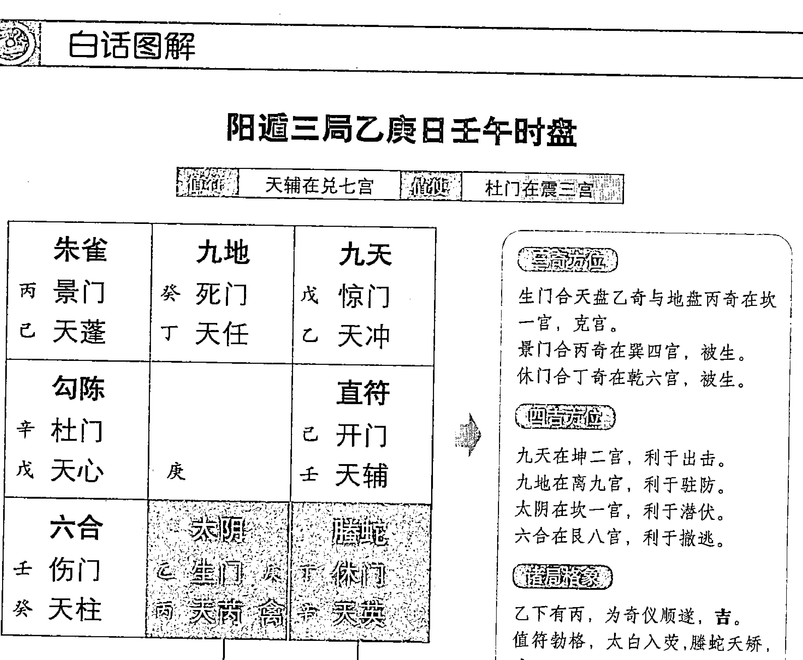
<center>阳遁三局乙庚日壬午时盘</center>
吉方2：生门合乙奇在坎一宫，正北方向吉利。
吉方1：休门合丁奇在乾六宫，西北方向吉利。

---

# 癸未时：无奇门可出

### 【原文】
癸未辅八，杜四。宿吉干凶。杜巽伏欢怡，惊兑伏，伤震伏。天一，地六，阴四，合九。无奇门，伏官格，虎猖狂，龙反首，仪刑，时干乾，门伏，乙格，击刑。

### 【白话提要】
符使宫位：值符天辅在艮八宫，值使杜门在巽四宫。时干遇吉星宿，时干逢凶。
三奇方位：杜门合乙奇在巽四宫，同类伏吟，吉利。惊门合丙奇在兑七宫，同类伏吟。伤门合丁奇在震三宫，同类伏吟。
四吉方位：九天在坎一宫，九地在乾六宫，太阴在巽四宫，六合在离九宫。
诸局格象：无奇门。值门伏宫格。白虎猖狂。青龙回首。六仪击刑。时干在乾六宫。天乙伏宫击刑。

## 白话图解
#### 阳遁三局乙庚日癸未时盘

*   值符：天辅在艮八宫
*   值使：杜门在巽四宫
*   太阴
*   杜门
*   戊 天芮
*   己
*   螣蛇
*   伤门
*   戌
*   直符
*   生门
*   癸
*   勾陈
*   死门
*   壬 天柱
*   丁
*   朱雀
*   惊门
*   丙
*   天蓬
*   壬
*   九天
*   休门
*   戊
*   丙
*   天冲
*   九地
*   开门
*   癸
*   天任
*   辛

#### 三奇方位
杜门逢乙奇于巽四宫。
惊门逢丙奇于兑七宫。
伤门逢丁奇于震三宫。

#### 四吉方位
九天在坎一宫，利于出击。
九地在乾六宫，利于驻防。
太阴在巽四宫，利于潜伏。
六合在离九宫，利于撤退。

#### 诸局格象
青龙回首，吉。
无奇门，凶。
白虎猖狂，凶。
六仪击刑，天乙伏宫击刑，凶。

---

## 甲申时：正北方向吉利

### 【原文】
甲申禽直符五，死直使五避五。申至亥阴，天辅，宿干吉。休蓬使坎伏，死禽日坤伏，景英星离伏。天九，地四，阴六，合一。休与月合一正北，伏官格，天乙与太白宫，时干坤，伏吟，地申，事同。

### 【白话提要】
符使宫位：值符天禽在中五宫，寄于坤二宫，值使死门在中五宫，寄于坤二宫。申时至亥时为五阴时，申时为天辅释罪时。时干遇吉星宿，时干逢吉。
三奇方位：休门合丙奇在坎一宫，同类伏吟。死门合乙奇在坤二宫，同类伏吟。景门合丁奇在离九宫，同类伏吟。
四吉方位：九天在离九宫，九地在巽四宫，太阴在乾六宫，六合在坎一宫。
诸局格象：休门合丙奇在坎一宫，正北方向吉利。伏官格。值符与六庚成格。时干在坤二宫。伏吟格。地盘逢申日类同。

## 白话图解
<center>阳遁三局乙庚日甲申时盘</center>

| 宫位 | 值符天禽 | 值使死门 |
| --- | --- | --- |
| 九地杜门己己 | 九天景门丁丁 | 直符死门乙乙 |
| 朱雀伤门戊戊 | 天柱壬壬 | 腾蛇惊门庚 |
| 勾陈生门癸癸 | 六合休门癸癸 | 太阴开门辛辛 |

> **吉方：**休门合丙奇在坎一宫，正北方向吉。

图解中国传统决策学·奇门遁甲大全（第2部）

---

## 乙酉时：无奇门可出

乙酉禽二，死六。宿凶干吉。惊丙坎义，杜墓乙坤制，伤丁离义。天九，地四，阴六，合一。无奇门，乙日伏干格。时干坤，符伏。

符使宫位：值符天禽在坤二宫，值使死门在乾六宫。时干遇凶星宿，时干逢吉。
三奇方位：惊门逢双丙奇在坎一宫，生宫。杜门逢双乙奇在坤二宫，克宫，乙奇入墓。伤门逢双丁奇在离九宫，生宫。

四吉方位：九天在离九宫，九地在巽四宫，太阴在乾六宫，六合在坎一宫。
诸局格象：无奇门。逢乙日成伏干格。时干在坤二宫。值符伏吟格。

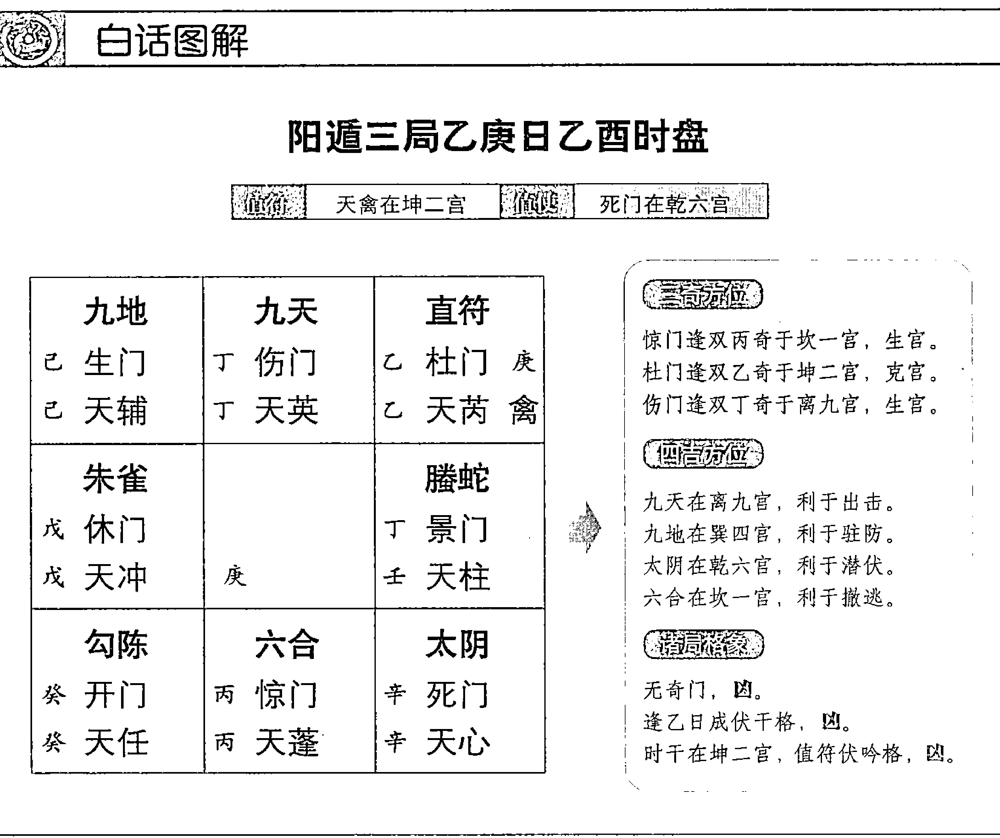

# 丙戌时：逢庚日不宜用事

### 【原文】

丙戌 禽一，死七。庚日不用，宿凶干吉。伤巽伏，开丙坎义，惊墓乾伏。天六，地七，阴三，合四。开与日合一正北，乙下有丙，时干巽，白入火，蛇矫。

### 【白话提要】

**符使宫位:**值符天禽在坎一宫，值使死门在兑七宫。逢庚日不宜用事。时干遇凶星宿，时干逢吉。

**三奇方位:**伤门合丙奇在巽四宫，同类伏。开门合天盘乙奇与地盘丙奇在坎一宫，生宫。惊门合丁奇在乾六宫，同类伏。

**四吉方位:**九天在乾六宫，九地在兑七宫，太阴在震三宫，六合在巽四宫。

**诸局格象:**开门合乙奇在坎一宫，正北方向吉利。乙下有丙，为奇仪顺遂。时干在巽四宫。太白入荧。滕蛇天矫。

## 白话图解
阳遁三局乙庚日丙戌时盘

| |值符|天禽在坎一宫|值使|死门在兑七宫|
|---|---|---|---|---|
|| || || ||
|六合|勾陈|朱雀||
|丙 伤门|癸 杜门|戌||
|已 天蓬 |丁 天任 |||
|乙 天冲||| ||太阴||||九地|
|辛 生门||己 死门|||
|戌:天心|庚 |壬 天辅|||
|| | | |腾蛇|直符|九天|
|壬 休门|乙 开门 丁 惊门|||
|癸 天柱|丙 天芮 辛 天英|||

**吉方:**开门合乙奇在坎一宫，正北方向吉。

## 丁亥时：东南与正南方向吉利

### 【原文】

丁亥禽九，死八，宿凶干吉。杜墓乾义，休丁离制，开巽制。天四，地三，阴七，合六。开与星合四东南，休与日合九正南，乙下有丁，时干巽，相佐离。

### 【白话提要】

符使宫位：值符天禽在离九宫，值使死门在艮八宫。时干遇凶星宿，时干逢吉。
三奇方位：杜门合丙奇在乾六宫，生宫。休门合天盘乙奇与地盘丁奇在离九宫，克宫。开门合丁奇在巽四宫，克宫。
四吉方位：九天在巽四宫，九地在震三宫，太阴在兑七宫，六合在乾六宫。
诸局格象：开门合丁奇在巽四宫，东南方向吉利。休门合乙奇在离九宫，正南方向吉利。乙下有丁，为奇仪相佐。时干在巽四宫。值符得地盘丁奇相助在离九宫。

## 白话图解
阳遁三局乙庚日丁亥时盘

**值符**天禽在离九宫 **值使**死门在艮八宫

吉方 1: 开门合丁奇在巽四宫，东南方向吉利。

吉方 2: 休门合乙奇在离九宫，正南方向吉利。

**值符**天禽在离九宫 **值使**死门在艮八宫

#### 三奇方位

杜门合丙奇在乾六宫，生宫。
休门合天盘乙奇与地盘丁奇在离九宫，克宫。
开门合丁奇在巽四宫，克宫。

#### 四吉方位

九天在巽四宫，利于出击。
九地在震三宫，利于驻防。
太阴在兑七宫，利于潜伏。
六合在乾六宫，利于撤退。

#### 诸局格象

乙下有丁，为奇仪相佐，吉。

| **九天**<br>丁<br>己<br>色 | **值符**<br>乙<br>壬<br>戊<br>丙<br>癸 | **螣蛇**<br>壬<br>乙 |
|---|---|---|
| | | **太阴**<br>辛<br>壬 |
| **朱雀**<br>戌<br>癸 | **勾陈**<br>癸<br>丙 | **六合**<br>丙<br>辛 |

### 3. 丙辛日十二时局

### 庚子时：正东与东南方向吉利

### 【原文】

庚子 心五，开三。子至卯阴，宿吉干凶。休巽义，杜兑害，开震制。天九，地四，阴六，合一。开与星合三正东，休与日合四东南，飞干格，虎猖狂，时干巽，刑格，壬日勃，三吉。

### 【白话提要】

符使宫位:值符天心在中五宫，寄于坤二宫，值使开门在震三宫。子时至卯时为五阴时。时干遇吉星宿，时干逢凶。

三奇方位:休门逢乙奇在巽四宫，被生。杜门逢丙奇在兑七宫，被克。开门逢丁奇在震三宫，克宫。

四吉方位:九天在离九宫，九地在巽四宫，太阴在乾六宫，六合在坎一宫。

## 白话图解
阳遁三局丁壬日庚子时盘

**值符:**天心在中五宫，寄于坤二宫 **值使:**开门在震三宫

**吉方 1:**开门合丁奇在震三宫，正东方向吉利。

#### 四吉方位

九天在离九宫，利于出击。
九地在巽四宫，利于驻防。
太阴在乾六宫，利于潜伏。
六合在坎一宫，利于撤退。

**遁局格象**

飞干格，白虎猖狂，凶。
刑格，逢壬日勃格，凶。

### 吉方 2：休门合乙奇在巽四宫，东南方向吉利。

#### 三奇方位

休门逢乙奇在巽四宫，被生。
杜门逢丙奇在兑七宫，被克。
开门逢丁奇在震三宫，克宫。

#### 诸局格象
开门合丁奇在震三宫，正东方向吉利。休门合乙奇在巽四宫，东南方向吉利。飞干格。白虎猖狂。时干在巽四宫。刑格。逢壬日勃格。三吉格。

### **辛丑时：正南与西南方向吉利**

### 【原文】
辛丑 心六，开四。宿吉干凶。生墓乙坤伏，景丙坎害，休丁离制。天七，地二，阴八，合三。生与日合二西南，休与星合九正南，时干乾，符伏，门反吟。

### 【白话提要】
符使宫位：值符天心在乾六宫，值使开门在巽四宫。时干遇吉星宿，时干逢凶。

**三奇方位**：生门逢双乙奇在坤二宫，同类伏，乙奇入墓。景门逢双丙奇在坎一宫，被克。休门逢双丁奇在离九宫，克宫。

**四吉方位**：九天在兑七宫，九地在坤二宫，太阴在艮八宫，六合在震三宫。

**诸局格象**：生门合乙奇在坤二宫，西南方向吉利。休门合丁奇在离九宫，正南方向吉利。时干在乾六宫。值符伏吟。八门反吟格。

> # 白话图解
### **阳遁三局丁壬日辛丑时盘**
*   值符：天心在乾六宫
*   值使：开门在巽四宫
#### **吉方 2**: 休门合丁奇在离九宫，正南方向吉利。

> # 阳遁三局丁壬日辛丑时盘
*   值符：天心在乾六宫
*   值使：开门在巽四宫
> # **三奇方位**
生门逢双乙奇在坤二宫，不相生克。
景门逢双丙奇于坎一宫，被克。休门逢双丁奇于离九宫，克宫。
> # **四吉方位**
九天在兑七宫，利于出击。
九地在坤二宫，利于驻防。太阴在艮八宫，利于潜伏。六合在震三宫，利于撤退。
> # **诸局格象**
时干在乾六宫，值符伏吟，八门反吟格，凶。

## 壬寅时：西北方向吉利

### 【原文】
壬寅 心七，开五避五，宿干凶。惊丁离害，生墓合乾义欢怡，死巽害。天二，地九，阴一，合八。生与月合六西北，符勃，丁日伏干格，时干坤，事同，日飞干格。

### 【白话提要】
符使宫位：值符天心在兑七宫，值使开门在中五宫，寄于坤二宫。时干遇凶星宿，时干逢凶。

**三奇方位**：惊门逢天盘乙奇与地盘丁奇在离九宫，被克。生门逢丙奇在乾六宫，生宫，吉利，丙奇入墓，奇仪相合。死门逢丁奇在巽四宫，被克。

**四吉方位**：九天在坤二宫，九地在离九宫，太阴在坎一宫，六合在艮八宫。

**诸局格象**：生门合丙奇在乾六宫，西北方向吉利。值符勃格。逢丁日，为伏干格。时干在坤二宫。逢壬日，为飞干格。

### 阳遁三局丁壬日壬寅时盘

| 项次 | 内容 |
| :--- | :--- |
| 值符 | 天心在兑七宫 |
| 值使 | 开门在中五宫，寄于坤二宫 |
| 朱雀 | 九地 |
| 九天 | 丁 死门 &nbsp;&nbsp; 乙 惊门 &nbsp;&nbsp; 壬 开门 |
| 己 天英 | 丁 天芮 | 乙 天柱 |
| 勾陈 | 庚 | 直符 |
| 己 景门 | &nbsp;&nbsp;&nbsp;&nbsp; | 辛 休门 |
| 戊 天辅 | 庚 | 壬 天心 |
| 六合 | 太阴 | 蛇 生门 |
| 戊 杜门 | 癸 伤门 | 丙 天蓬 |
| 癸 天冲 | 丙 天任 | &nbsp;&nbsp; |

**吉凶方位**
*   惊门逢天盘乙奇与地盘丁奇在离九宫，被克。
*   生门逢丙奇在乾六宫，生宫。
*   死门逢丁奇在巽四宫，被克。
*   **{{四吉方位}}**
    *   九天在坤二宫，利于出击。
    *   九地在离九宫，利于驻防。
    *   太阴在坎一宫，利于潜伏。
    *   六合在艮八宫，利于撤退。
*   **{{诸局格象}}**
    *   值符勃格，凶。
    *   逢丁日，为伏干格，凶。
    *   逢壬日，为飞干格，凶。

吉方：生门合丙奇在乾六宫，西北方向吉利

图解中国传统决策学・奇门遁甲大全
第 9 部


## 癸卯时：逢丁日不宜用事

### 【原文】
癸卯 心八，开六。宿吉干凶。丁日不用。开乾伏欢怡，伤震伏，惊合兑伏。天一，地六，阴四，合九。开与日合六西北，伏官格，龙走，鸟跌穴，蛇矫，时干巽，天网四张。

### 【白话提要】
符使宫位：值符天心在艮八宫，值使开门在乾六宫。时干遇吉星宿，时干逢凶。逢丁日不宜用事。

**三奇方位**：开门逢乙奇在乾六宫，同类伏，吉利。伤门逢丙奇在震三宫，同类伏。惊门逢丁奇在兑七宫，同类伏，奇仪相合。

**四吉方位**：九天在坎一宫，九地在乾六宫，太阴在巽四宫，六合在离九宫。

**诸局格象**：开门合乙奇在乾六宫，西北方向吉利。伏官格。青龙逃走。飞鸟跌穴。螣蛇夭矫。时干在巽四宫。天网四张。

| 太阴 | 杜门 | 己 | 天任 |
| :--- | :--- | :--- | :--- |
| **六合** | 景门 | 丁 | 天冲 |
| **勾陈** | 死门 | 乙 | 天辅 |
| **螣蛇** | 伤门 | 丙 | 天蓬 |
| **戊** | &nbsp;&nbsp; | &nbsp;&nbsp; | **朱雀** |
| **惊门** | 丁 | 天英 |
| **直符** | 生门 | 辛 | 天心 |
| **九天** | 休门 | 壬 | 天柱 |
| **九地** | 开门 | 乙 | 天禽 |

吉方：开门合乙奇在乾六宫，西北方向吉利。

#### 三奇方位
开门逢乙奇在乾六宫，同类伏。伤门逢丙奇在震三宫，同类伏。惊门逢丁奇在兑七宫，同类伏。

#### 四吉方位
九天在坎一宫，利于出击。九地在乾六宫，利于驻防。太阴在巽四宫，利于潜伏。六合在离九宫，利于撤退。

#### 诸局格象
飞鸟跌穴，吉。伏官格，青龙逃走，螣蛇夭矫，凶。天网四张，凶。

## 甲辰时：正北方向吉利

### 【原文】
甲辰柱直符七，惊直使七。辰至申阳，天辅，宿凶干吉。景英使离伏，死墓芮日坤伏，休蓬月坎伏。天二，地九，阴一，合八。休与月合一正北，阳内阴外，利行兵，客胜，时干兑，伏吟，飞甲，自刑阖。

### 【白话提要】
符使宫位：值符天柱在兑七宫，值使惊门在兑七宫。辰时至申时为五阳时。辰时为天辅释罪时。时干遇凶星宿，时干逢吉。

**三奇方位**：景门逢丁奇在离九宫，同类伏。死门逢乙奇在坤二宫，同类伏，乙奇入墓。休门逢丙奇在坎一宫，同类伏。

**四吉方位**：九天在坤二宫，九地在离九宫，太阴在坎一宫，六合在艮八宫。

**诸局格象**：休门合丙奇在坎一宫，正北方向吉利。阳内阴外利于行兵作战，客方胜。时干在兑七宫。伏吟格。飞甲自刑，合。

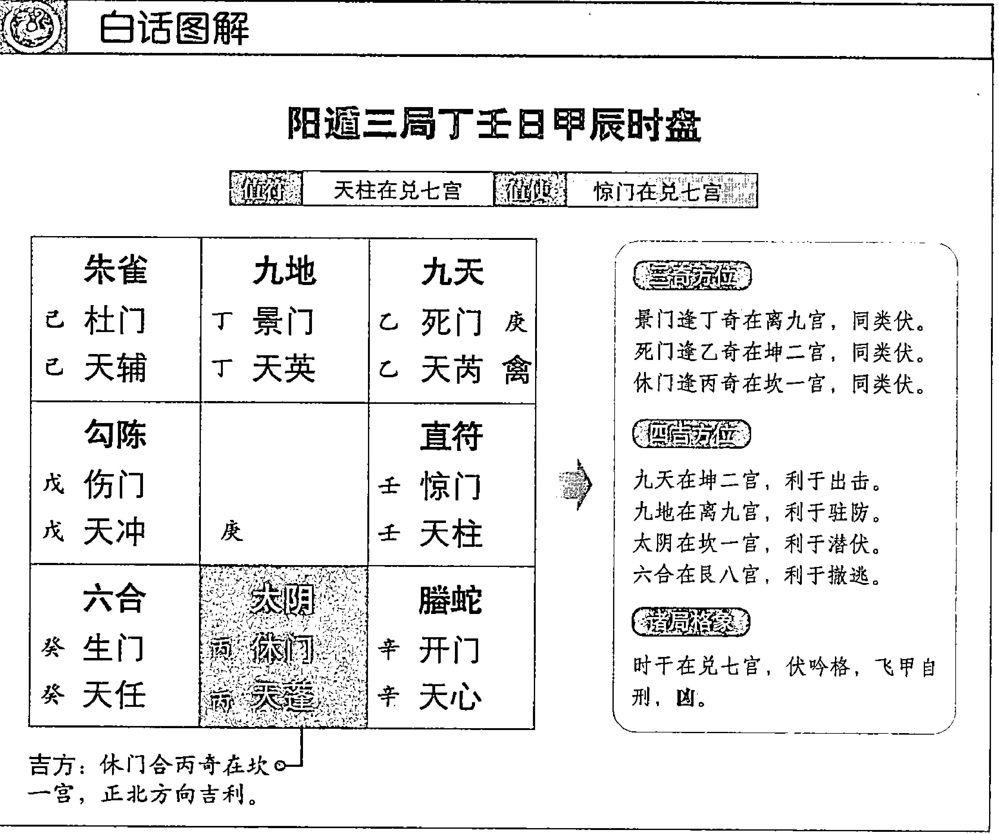
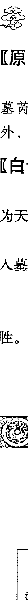


## 乙巳时：正南东南方向吉利

### 【原文】
乙巳 柱二，惊八。宿凶干吉。休巽义，生丁离和。景墓合乾制。天九，地四，阴六，合一。休与星合四东南，生与日合九正南，乙下有丁，时干离，飞官格，丁日伏干格。

### 【白话提要】
**符使宫位**：值符天柱在坤二宫，值使惊门在艮八宫。时干遇凶星宿，时干逢吉。
**三奇方位**: 休门逢丁奇在巽四宫，生官。生门逢天盘乙奇与地盘丁奇在离九宫，被生。景门逢丙奇在乾六宫，克宫，丙奇入墓，奇仪相合。
**四吉方位**：九天在离九宫，九地在巽四宫，太阴在乾六官，六合在坎一宫。
**诸局格象**: 休门合丁奇在巽四宫，东南方向吉利。生门合乙奇在离九宫，正南方向吉利。乙下有丁，为奇仪相佐。时干在离九宫。飞官格。逢丁日，为伏干格。

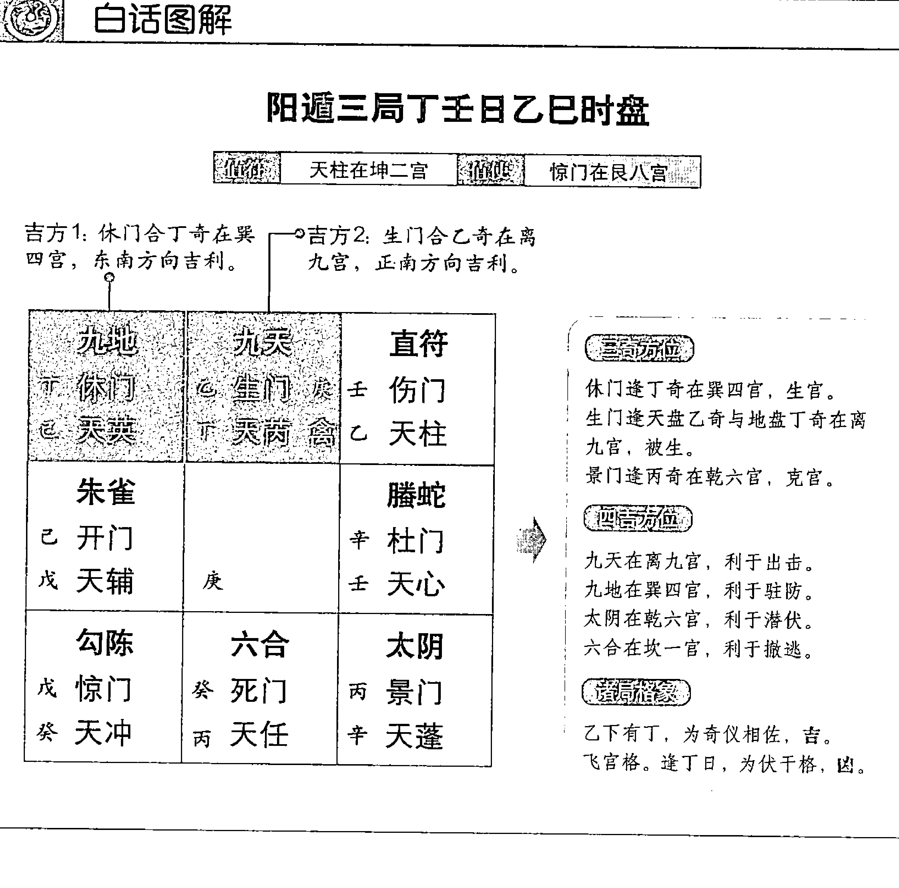

## 丙午时：宜守户不出

### 【原文】
丙午 柱一，惊九。宿凶干吉，守户。休合兑和，生墓乾义，景震和。天六，地七，阴三，合四。休与星合七正西，生与日合六西北，龙走，时干震，相佐坎，鸟跌穴。

### 【白话提要】
符使宫位：值符天柱在坎一宫，值使惊门在离九宫。时干遇凶星宿，时干逢吉。宜守户不出。

**三奇方位**：休门逢丁奇在兑七宫，被生，奇仪相合。生门逢乙奇在乾六宫，生宫，乙奇入墓。景门逢丙奇在震三宫，被生。

**四吉方位**：九天在乾六宫，九地在兑七宫，太阴在震三宫，六合在巽四宫。

**诸局格象**：休门合丁奇在兑七宫，正西方向吉利。生门合乙奇在乾六宫，西北方向吉利。青龙逃走。时干在震三宫。值符得地盘丙奇助干坎一宫。飞鸟跌穴。

## 白话图解

## 丁未时：正东东南方向吉利

### 【原文】
丁未柱九，惊一。宿凶干吉。休震义，生巽害，景兑制欢怡。天四，地三, 阴七,合六。休与星合三正东,得使生与日合四东南,虎猖狂,刑格，符勃，时千震,相佐离，壬日勃。

### 【白话提要】
符使宫位：值符天柱在离九宫，值使惊门在坎一宫。时干遇凶星宿，时干逢吉。
**三奇方位**: 休门逢丁奇在震三宫，生宫。生门逢乙奇在巽四宫，被克。景门逢丙奇在兑七宫，克宫,吉利。
**四吉方位**: 九天在巽四宫，九地在震三宫，太阴在兑七宫，六合在乾六宫。
**诸局格象**: 休门合丁奇在震三宫，正东方向吉利。生门合乙奇在巽四宫,东南方向吉利。丁奇得使。白虎猖狂。刑格。值符勃格。时干在震三宫。值符得地盘丁奇相助在离九宫。逢壬日，为勃格。

> **白话图解**
### 阳遁三局丁壬日丁未时盘
*   **值符** 天柱在离九宫 **值使** 惊门在坎一宫
*   ○吉方 2 : 生门合乙奇在巽四宫，东南方向吉利。

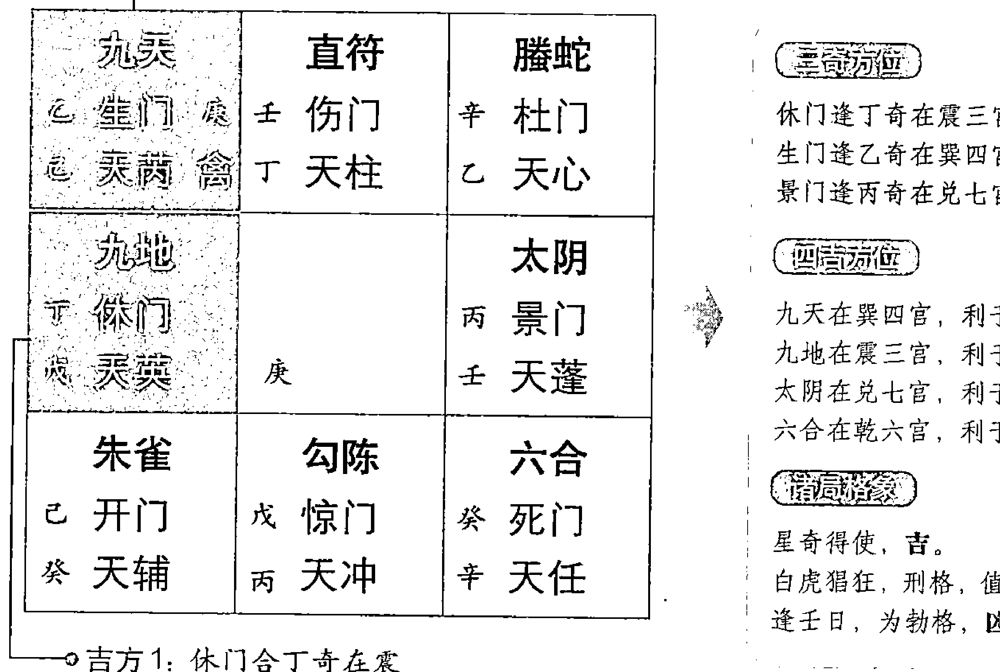
*   ○吉方 1 : 休门合丁奇在震三宫，正东方向吉利。

> **三奇方位**
休门逢丁奇在震三宫，生官。
生门逢乙奇在巽四宫,被克。
景门逢丙奇在兑七宫，克官。

> **四吉方位**
九天在巽四宫，利于出击。
九地在震三宫，利于驻防。
太阴在兑七宫，利于潜伏。
六合在乾六官，利于撤退。

> **诸局格象**
星奇得使，吉。
白虎猖狂，刑格，值符勃格，凶。逢壬日，为勃格，凶。

第三章 阳遁三局

237

## 五神时：逢壬日不宜用事

### 【原文】
戊申 柱三，惊二。宿干吉，壬日不用。生丙坎和，伤艮制，死丁离和。天八，地一，阴九，合二。生与星合一正北，丁下有丙，大格，时干兑，符冲事同，丁日勃。

### 【白话提要】
符使宫位：天柱星为值符居震三宫，惊门为值使居坤二宫。星宿吉，时干逢吉。逢壬日不宜用事。

**三奇方位**：生门逢天盘丁奇与地盘丙奇在坎一宫，被生。伤门逢乙奇在艮八宫，克宫。死门逢天盘丙奇与地盘丁奇在离九宫，被生。

**四吉方位**：九天在艮八宫，九地在坎一宫，太阴在离九宫，六合在坤二宫。

**诸局格象**：生门合丁奇在坎一宫，正北方向吉利。丁下有丙，为星随月转。大格。时干在兑七宫。值符反吟。逢丁日，为勃格。

白话图解
### 阳遁三局丁壬日戊申时盘

*   **值符** 天柱在震三宫
*   **值使** 惊门在坤二宫

| | | |
| :---: | :---: | :---: |
| 螣蛇 | 太阴 | 六合 |
| 辛景门 | 丙死门 | 癸惊门 |
| 己天心 | 丁天死 | 乙天任 |
| **直符** | 勾陈 |
| 壬杜门 | 戊开门 |
| 戊天柱 | 庚天冲 |
| 九天 | 九地 | 朱雀 |
| 乙伤门 | 己休门 |
| 癸天芮 | 辛天辅 |

吉方：生门合丁奇在坎一宫，正北方向吉利。

#### 三奇方位
生门逢天盘丁奇与地盘丙奇在坎一宫，被生。
伤门逢乙奇在艮八宫，克宫。
死门逢天盘丙奇与地盘丁奇在离九宫，被生。

#### 四吉方位
九天在艮八官，利于出击。
九地在坎一宫，利于驻防。
太阴在离九官，利于潜伏。
六合在坤二宫，利于撤退。

#### 诸局格象
丁下有丙，为星随月转，吉。
大格，值符相冲，凶。
逢丁日，为勃格，凶。

## 己酉时：西南方向吉利

### 【原文】
己酉柱四，惊三。西至阴亥，宿干凶。死艮伏，惊震制，生乙坤伏。天三，地八，阴二，合七。生与月合二西南，门反吟，仪刑，雀入江，时干兑，飞宫格，三吉，火入金。

### 【白话提要】
符使宫位：值符天柱在巽四宫，值使惊门在震三宫。西时至亥时为五阴时。时干遇凶星宿，时干逢凶。

**三奇方位**：死门逢丁奇在艮八宫，同类伏。惊门逢乙奇在震三宫，克宫。生门逢天盘丙奇与地盘乙奇在坤二宫，同类伏。

**四吉方位**：九天在震三宫，九地在艮八宫，太阴在坤二宫，六合在兑七宫。

**诸局格象**：生门合丙奇在坤二宫，西南方向吉利。八门反吟。六仪击刑。朱雀入江。时干在兑七宫。飞宫格。三吉格。荧入太白。

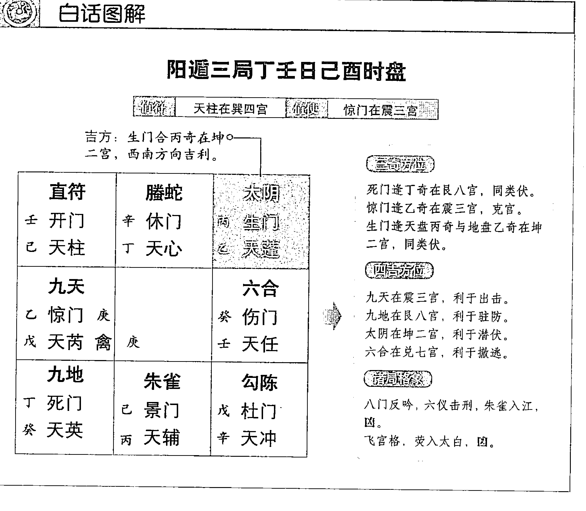

## 庚戌时：正南方向吉利
🎋

> #### 【原文】
庚戌柱五，惊四，宿干凶。惊巽制，开丁离害，伤墓合乾害。天九，地四，阴六，合一。开与日合九正南，飞宫格，时干离，丁日伏干格，壬日飞干格。

### 【白话提要】
符使宫位:值符天柱在中五宫，寄于坤二宫，值使惊门在巽四宫。时干遇凶星宿，时干逢凶。
**三奇方位**: 惊门逢丁奇在巽四宫，克宫。开门逢天盘乙奇与地盘丁奇在离九宫，被克。伤门逢丙奇在乾六宫，被克，丙奇入墓，奇仪相合。
**四吉方位**: 九天在离九宫，九地在巽四宫，太阴在乾六宫，六合在坎一宫。
**诸局格局**: 开门合乙奇在离九宫，正南方向吉利。飞官格。时干在离九宫。逢丁日，为伏干格。逢壬日，为飞干格。

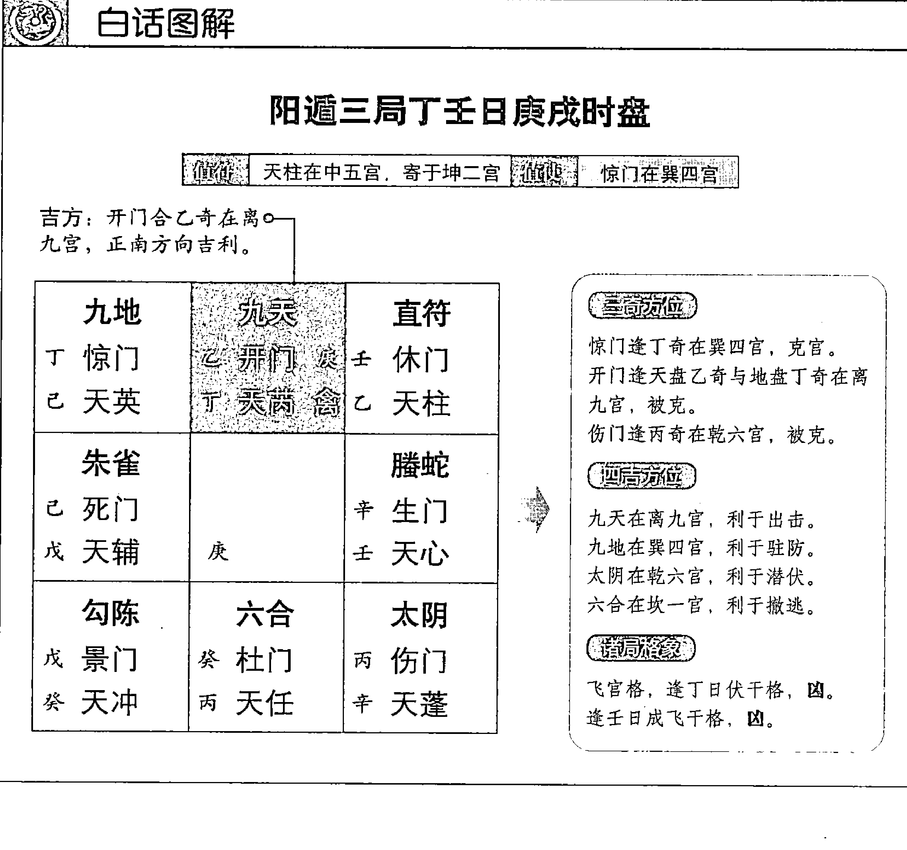
图解中国传统决策学·奇门遁甲大全 第二部
240

## 辛亥时：正西方向吉利

### 【原文】
辛亥 柱六，惊五避五。宿干吉。惊坤和，开兑伏欢怡，伤艮制。天七，地二，阴八，合三。开与日合七正西，太白与飞干格，壬日伏干格。

### 【白话提要】
符使宫位：值符天柱在乾六宫，值使惊门在中五宫，寄于坤二宫。时干遇吉星宿，时干逢吉。

**三奇方位**：惊门逢丁奇在坤二宫，被生。开门逢乙奇在兑七宫，同类伏，吉利。伤门逢丙奇在艮八宫，克宫。

**四吉方位**：九天在兑七宫，九地在坤二宫，太阴在艮八宫，六合在震三宫。

**诸局格象**：开门合乙奇在兑七宫，正西方向吉利。六庚与值符宫位有格。飞干格。逢壬日，为伏干格。

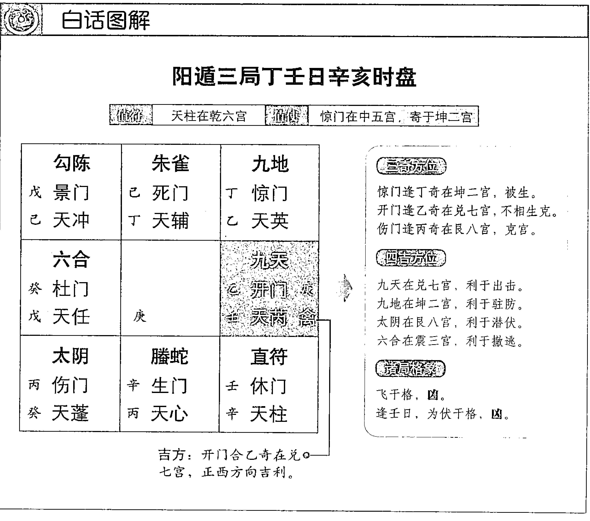

| 勾陈 | 朱雀 | 九地 |
| :---: | :---: | :---: |
| 戊景门<br>己天冲 | 已死门<br>丁天辅 | 丁惊门<br>乙天英 |
| **六合** | 庚 | 九天<br>乙开门<br>壬天芮 |
| **太阴** | **螣蛇** | **直符**<br>丙伤门<br>癸天蓬 | 辛生门<br>丙天心 | 壬休门<br>辛天柱 |

#### 三奇方位
惊门逢丁奇在坤二宫，被生。
开门逢乙奇在兑七宫，不相生克。
伤门逢丙奇在艮八宫，克宫。

#### 四吉方位
九天在兑七宫，利于出击。
九地在坤二宫，利于驻防。
太阴在艮八宫，利于潜伏。
六合在震三宫，利于撤逃。

#### 诸局格象
飞干格，凶。
逢壬日，为伏干格，凶。

吉方：开门合乙奇在兑七宫，正西方向吉利。

# 5.戊癸日十二时局

### 壬子时：正北方向吉利
### 【原文】
壬子柱七，惊六。子至丑阴，宿干凶。杜丁离义。景墓乙坤义，开丙坎义。天二，地九，阴一，合八。开与月合一正北，时干兑，符伏。

### 【白话提要】
符使宫位：值符天柱在兑七宫，值使惊门在乾六宫。子时至丑时为五阴时。时干遇凶星宿，时干逢凶。
**三奇方位**: 杜门逢双丁奇在离九宫，生宫。景门逢双乙奇在坤二宫，生宫，乙奇入墓。开门逢双丙奇在坎一宫，生宫。
**四吉方位**: 九天在坤二宫，九地在离九宫，太阴在坎一宫，六合在艮八宫。
**诸局格象**: 开门合丙奇在坎一宫，正北方向吉利。时干在兑七宫。九星和值符都在原宫未动，为九星伏吟格和值符伏吟格。

> 白话图解
阳遁三局戊癸日壬子时盘
 

## 癸丑时：正北与西北方向吉利
### 【原文】
癸丑柱八，惊七。宿吉干凶。开墓乾伏，休丙坎伏，杜巽伏。天一，地六，阴四，合九。开与星合六西北，休与日合一正北，白入火，蛇矫，时干离，门伏，戊日飞干格。

### 【白话提要】
符使宫位:值符天柱在艮八宫，值使惊门在兑七宫。时干遇吉星宿，时干逢凶。

**三奇方位**: 开门逢丁奇在乾六宫，同类伏，丁奇入墓。休门逢天盘乙奇与地盘丙奇在坎一宫，同类伏。杜门逢丙奇在巽四宫，同类伏。

**四吉方位**: 九天在坎一宫，九地在乾六宫，太阴在巽四宫，六合在离九宫。

**诸局格象**: 开门合丁奇在乾六宫，西北方向吉利。休门合乙奇在坎一宫，正北方向吉利。太白入荧。螣蛇夭矫。时干在离九宫。八门伏吟。逢戊日，为飞干格。

白话图解
阳遁三局戊癸日癸丑时盘

*   **值符**: 天柱在艮八宫
*   **值使**: 惊门在兑七宫

| 太阴 | 六合 | 勾陈 |
| :---: | :---: | :---: |
| 丙杜门 | 癸景门 | 戊死门 |
| 己天蓬 | 丁天任 | 乙天冲 |
| **腾蛇** | &nbsp;&nbsp; | **朱雀** |
| 辛伤门 | 庚 | 己惊门 |
| 戌天心 | &nbsp;&nbsp; | 壬天辅 |
| **直符** | **九天** | **九地** |
| 壬生门 | **乙休门** | **丁开门** |
| 癸天柱 | **丙景门** | **辛景门** |

**三奇方位**
开门逢丁奇在乾六宫，同类伏。
休门逢天盘乙奇与地盘丙奇在坎一宫，同类伏。
杜门逢丙奇在巽四宫，同类伏。

**四吉方位**
九天在坎一宫，利于出击。
九地在乾六宫，利于驻防。
太阴在巽四宫，利于潜伏。
六合在离九宫，利于撤退。

**诸局格象**
太白入荧，螣蛇夭矫，凶。
八门伏吟，凶。
逢戊日，为飞干格，凶。

> 吉方 2:休门合乙奇在坎一宫，正北方向吉利。

> 吉方 1:开门合丁奇在乾六宫，西北方向吉利。

## 甲寅时：逢戊日不宜用事
### 【原文】
甲寅任直符八，生直使八，天辅。寅至午阳，戊日不用，宿干吉。景英使离害，死内日坤伏，休蓬月坎伏。天一，地六，阴四，合九。休与月合一正北，时干艮，伏吟，地甲开。

### 【白话提要】
符使宫位：值符天任在艮八宫，值使生门在艮八宫。寅时为天辅释罪时，寅时至午时为五阳时。逢戊日不宜用事。时干遇吉星宿，时干逢吉。

**三奇方位**: 景门逢丁奇在离九宫，同类伏。死门逢乙奇在坤二宫，同类伏。休门逢丙奇在坎一宫，同类伏。

**四吉方位**: 九天在坎一宫，九地在乾六宫，太阴在巽四宫，六合在离九宫。

**诸局格象**: 休门合丙奇在坎一宫，正北方向吉利。时干在艮八宫。伏吟格。地甲开。

|三奇方位||四吉方位||诸局格象|
| :--- | :--- | :--- |
| 景门逢丁奇在离九宫，不相生克。 | 九天在坎一宫，利于出击。 | 伏吟格，凶。 |
| 死门逢乙奇在坤二官，不相生克。 | 九地在乾六宫，利于驻防。 | 地甲开，吉。 |
| 休门逢丙奇在坎一官，不相生克。 | 太阴在巽四官，利于潜伏。 | &nbsp; |
| &nbsp; | 六合在离九宫，利于撤退。 | &nbsp; |

## 乙卯时：正南方向吉利

> **【原文】**

乙卯任二，生九。宿凶干吉。死丙坎制，惊艮和欢怡，生丁离和。天九，地四，阴六，合一。生与月合九正南，丙下有丁，反吟，飞干格，乙格，癸日伏干格，时干艮，大格。

> **【白话提要】**

符使宫位：值符天任在坤二宫，值使生门在离九宫。时干遇凶星宿，时干逢吉。

三奇方位：死门逢天盘丁奇与地盘丙奇在坎一宫，克宫。惊门逢乙奇在艮八宫，被生，吉利。生门逢天盘丙奇与地盘丁奇在离九宫，被生。

四吉方位：九天在离九宫，九地在巽四宫，太阴在乾六宫，六合在坎一宫。

诸局格象：生门合丙奇在离九宫，正南方向吉利。丙下有丁，为月奇朱雀。反吟格。飞干格。乙奇格。逢癸日，为伏干格。时干在艮八宫。大格。

## 丙辰时：西北方向吉利

> **【原文】**

丙辰 任一，生一。宿凶干吉。景巽和，死丁离和，休墓合乾和。天六, 地七, 阴三, 合四。休与月合六西北, 时干乾, 相佐坎, 龙反首。

> **【白话提要】**

符使宫位：值符天任在坎一宫，值使生门在坎一宫。时干遇凶星宿，时干逢吉。

三奇方位：景门逢丁奇在巽四宫，被生。死门逢天盘乙奇与地盘丁奇在离九宫，被生。休门逢丙奇在乾六宫，被生，丙奇入墓，奇仪相合。

四吉方位：九天在乾六宫，九地在兑七宫，太阴在震三宫，六合在巽四宫。

诸局格象：休门合丙奇在乾六宫，西北方向吉利。时干在乾六宫。值符得地盘丙奇相助在坎一宫。青龙回首。逢癸日，为悖格。

## 丁巳时：东南方向吉利

> **【原文】**

丁巳任九，生二。宿凶干吉。杜墓乾害，景丙坎制，开巽制。天四，地三，阴七，合六。开与月合四东南，白入火，仪刑，蛇矫，门反吟，天乙与太白格，戊日飞干格，时干乾，相佐离，击刑。

> **【白话提要】**

符使宫位：值符天任在离九宫，值使生门在坤二宫。时干遇凶星宿，时干逢吉。

三奇方位：杜门逢丁奇在乾六宫，被克，丁奇入墓。景门逢天盘乙奇与地盘丙奇在坎一宫，克宫。开门逢丙奇在巽四宫，克宫。

四吉方位：九天在巽四宫，九地在震三宫，太阴在兑七宫，六合在乾六宫。

诸局格象：开门合丙奇在巽四宫，东南方向吉利。太白入荧。六仪击刑。螣蛇天矫。八门反吟。天乙与六庚宫位有格。逢戊日，为飞干格。时干在乾六宫。值符得地盘丁奇相助于离九宫。

## 戊午时：东北方向吉利

> **【原文】**

戊午任三，生三。宿干吉。景乙坤义，死兑义，休艮害欢怡。天八，地一, 阴九, 合一。休与月合八东北, 癸, 干勃，符勃, 时干巽, 三吉, 癸日勃。

> **【白话提要】**

符使宫位：值符天任星在震三宫，值使生门在震三宫。时干遇吉星宿, 时干逢吉。
三奇方位：景门逢天盘丁奇与地盘乙奇在坤二宫, 被生。死门逢乙奇在兑七宫, 被生。休门逢丙奇在艮八宫, 被克，吉利。
四吉方位：九天在艮八宫，九地在坎一宫，太阴在离九宫，六合在坤二宫。
诸局格象：休门合丙奇在艮八宫，东北方向吉利。逢癸日，为勃格。值符勃格。时干在巽四宫。三吉格。

# 阳遁三局戊癸日戊午时盘

**值符** 天任在震三宫 **值使** 生门在震三宫

> **三奇方位**
景门逢天盘丁奇与地盘乙奇在坤二宫，被生。
死门逢乙奇在兑七宫，被生。
休门逢丙奇在艮八宫，被克。
**四吉方位**
九天在艮八宫，利于出击。
九地在坎一宫，利于驻防。
太阴在离九宫，利于潜伏。
六合在坤二宫，利于撤逃。
**诸局格象**
逢癸日，为勃格。凶。
值符勃格，凶。

| 腾蛇 | 太阴 | 六合 |
| 戌伤门 | 乙杜门 | 丁景门 |
| 已天冲 | 丁天辅 | 乙天英 |
| 直符 | 勾陈 |
| 癸生门 | 死门 |
| 戊天任 | 庚禽 |
| 九天休门天蓬 | 九地开门天心 | 朱雀惊门天柱 |

> **吉方**: 休门合丙奇在艮八宫，东北方向吉利。

## 己未时：逢癸日不宜用事
> **【原文】**
己未任四, 生四。未至亥阴，宿吉干凶。癸日不用，景合兑制，死墓乾义，休震义。天三，地八，阴二，合七。休与月合三正东，龙走，鸟跌穴，蛇矫，仪刑，时干坤，戊日勃。
> **【白话提要】**
**符使宫位**: 值符天任在巽四宫，值使生门在巽四宫。未时至亥时为五阴时。时干遇吉星宿，时干逢凶。

**三奇方位**: 景门逢丁奇在兑七宫，克宫，奇仪相合。死门逢乙奇在乾六宫，生宫，乙奇入墓。休门逢丙奇在震三宫，生宫。

**四吉方位**: 九天在震三宫，九地在艮八宫，太阴在坤二宫，六合在兑七宫。

**诸局格象**: 休门合丙奇在震三宫，正东方吉利。青龙逃走。飞鸟跌穴。螣蛇夭矫。六仪击刑。时干在坤二宫。逢戌日，为勃格。

## 辛酉时：正西方向吉利

> **【原文】**

辛酉 任六，生六。宿吉干凶。景震义，死巽害，休兑和。天七，地二，阴八，合三。休与月合七正西，时干坤，刑格，虎猖狂。

> **【白话提要】**

符使宫位：值符天任在乾六宫，值使生门在乾六宫。时干遇吉星宿，时干逢凶。
三奇方位：景门逢丁奇在震三宫，生宫。死门逢乙奇在巽四宫，被克。休门逢丙奇在兑七宫，被生。
四吉方位：九天在兑七宫，九地在坤二宫，太阴在艮八宫，六合在震三宫。
诸局格象：休门合丙奇在兑七宫，正西方向吉利。时干在坤二宫。刑格。白虎猖狂。

## 白话图解

阳遁三局戊癸日辛酉时盘

| **勾陈** | **朱雀** | **九地** |
|---|---|---|
| 乙死门 庚己天芮 禽 | 壬惊门 丁天柱 | 辛开门 乙天心 |
| **六合** | **九天** | **太阴** |
| 丁景门 戊天英 | 两休门 坤天蓬 | 已杜门 癸天辅 |
| **螣蛇** |
| 戊伤门 丙天冲 | **直符** |
| 癸生门 辛天任 |

| **三奇方位** |
|---|
| 景门逢丁奇在震三宫，生官。死门逢乙奇在巽四宫，被克。休门逢丙奇在兑七宫，被生。|
| **四吉方位** |
|---|
| 九天在兑七宫，利于出击。九地在坤二宫，利于驻防。太阴在艮八宫，利于潜伏。六合在震三宫，利于撤退。|
| **诸局格象** |
|---|
| 刑格，白虎猖狂，凶。|


## 壬戌时：星宿凶，时干逢凶

> **【原文】**

壬戌 任七，生七，宿干凶。景艮义欢怡，死震害，休乙坤害。天二，地九，阴一，合八。休与月合二西南，雀入江，时干巽，火入金，戊日伏干格。

> **【白话提要】**

符使宫位：值符天任在兑七宫，值使生门在兑七宫。时干遇凶星宿，时干逢凶。
三奇方位：景门逢丁奇在艮八宫，生宫，吉利。死门逢乙奇在震三宫，被克。休门逢天盘丙奇与地盘乙奇在坤二宫，被克。
四吉方位：九天在坤二宫，九地在离九宫，太阴在坎一宫，六合在艮八宫。
诸局格象：休门合丙奇在坤二宫，西南方向吉利。朱雀入江。时干在巽四宫。荧入太白。逢戊日，为伏干格。

### 癸亥时：正北方向吉利
> **【原文】**
癸亥任八，生八。宿吉干凶。景丁离伏，死乙坤伏，休丙坎伏。天一，地六，阴四，合九。休与月合一正北，时干艮，符门伏，天网四张。
> **【白话提要】**
符使宫位：值符天任在艮八宫，值使生门在艮八宫。时干遇凶星宿，时干逢凶。
三奇方位：景门逢双丁奇在离九宫，同类伏。死门逢双乙奇在坤二宫，同类伏。休门逢双丙奇在坎一宫，同类伏。
四吉方位：九天在坎一宫，九地在乾六宫，太阴在巽四宫，六合在离九宫。
诸局格象：休门合丙奇在坎一宫，正北方向吉利。时干在艮八宫。值符与八门伏吟格。天网四张。

> **白话图解**
阳遁三局戌癸日癸亥时盘

*【宫符方位】*
景门逢双丁奇于离九宫。
死门逢双乙奇于坤二宫。
休门逢双丙奇于坎一宫。
**【四吉方位】**
九天在坎一宫，利于出击。
九地在乾六宫，利于驻防。
太阴在巽四宫，利于潜伏。
六合在离九宫，利于撤退。
**【诸局格象】**
值符与八门伏吟格。凶。天网四张。凶。

# 第四章 阳遁四局

奇门遁甲时家奇门阳遁四局共有六十个时辰，即六十局。本章通过文字和各时辰的飞盘排布来说明各局的符使宫位、三奇方位、四吉方位和诸局格象。

### 每日时辰

奇门遁甲中一局为一元，一元有甲己、乙庚、丙辛、丁壬和戊癸五日，每日有十二个时辰，则一局就有六十个时辰，用六十甲子来表示，一个时辰为一小局。

| | 甲子 | 乙丑 | 丙寅 | 丁卯 | 戊辰 | 己巳 | 庚午 | 辛未 | 壬申 | 癸酉 | 甲戌 | 乙亥 |
|:---:|:---:|:---:|:---:|:---:|:---:|:---:|:---:|:---:|:---:|:---:|:---:|:---:|
| 甲庚日 | 丙子 | 丁丑 | 戊寅 | 己卯 | 庚辰 | 辛巳 | 壬午 | 癸未 | 甲申 | 乙酉 | 丙戌 | 丁亥 |
| 丙辛日 | 戊子 | 己丑 | 庚寅 | 辛卯 | 壬辰 | 癸巳 | 甲午 | 乙未 | 丙申 | 丁酉 | 戊戌 | 己亥 |
| 丁壬日 | 庚子 | 辛丑 | 壬寅 | 癸卯 | 甲辰 | 乙巳 | 丙午 | 丁未 | 戊申 | 己酉 | 庚戌 | 辛亥 |
| 戊癸日 | 壬子 | 癸丑 | 甲寅 | 乙卯 | 丙辰 | 丁巳 | 戊午 | 己未 | 庚申 | 辛酉 | 壬戌 | 癸亥 |

## 阳遁四局六十时符使表

奇门遁甲排盘时，最主要的就是寻找值符和值使，并确定其所在的宫位。下表就是阳遁四局六十个时辰的值符和值使，以及其所在的宫位。

| 时辰 | **甲子** | **乙丑** | **丙寅** | **丁卯** | **戊辰** | **己巳** | **庚午** | **辛未** | **壬申** | **癸酉** |
|:---:|:---:|:---:|:---:|:---:|:---:|:---:|:---:|:---:|:---:|:---:|
| 天辅 | 四 | 三 | 二 | 一 | 四 | 五 | 六 | 七 | 八 | 九 |
| 杜门 | 四 | 五 | 六 | 七 | 八 | 九 | 一 | 二 | 三 | 四 |

| 时辰 | 甲戌 | 乙亥 | 丙子 | 丁丑 | 戊寅 | 己卯 | 庚辰 | 辛巳 | 壬午 | 癸未 |
|:---:|:---:|:---:|:---:|:---:|:---:|:---:|:---:|:---:|:---:|:---:|
| 天禽 | 五 | 三 | 二 | 一 | 四 | 五 | 六 | 七 | 八 | 九 |
| 死门 | 五 | 六 | 七 | 八 | 九 | 一 | 二 | 三 | 四 | 五 |

| 时辰 | **甲申** | **乙酉** | **丙戌** | **丁亥** | **戊子** | **己丑** | **庚寅** | **辛卯** | **壬辰** | **癸巳** |
|:---:|:---:|:---:|:---:|:---:|:---:|:---:|:---:|:---:|:---:|:---:|
| 天心 | 六 | 三 | 二 | 一 | 四 | 五 | 六 | 七 | 八 | 九 |
| 开门 | 六 | 七 | 八 | 九 | 一 | 二 | 三 | 四 | 五 | 六 |

| 时辰 | 甲午 | 乙未 | 丙申 | 丁酉 | 戊戌 | 己亥 | 庚子 | 辛丑 | 壬寅 | 癸卯 |
|:---:|:---:|:---:|:---:|:---:|:---:|:---:|:---:|:---:|:---:|:---:|
| 天柱 | 七 | 三 | 二 | 一 | 四 | 五 | 六 | 七 | 八 | 九 |
| 惊门 | 七 | 八 | 九 | 一 | 二 | 三 | 四 | 五 | 六 | 七 |

| 时辰 | **甲辰** | **乙巳** | **丙午** | **丁未** | **戊申** | **己酉** | **庚戌** | **辛亥** | **壬子** | **癸丑** |
|:---:|:---:|:---:|:---:|:---:|:---:|:---:|:---:|:---:|:---:|:---:|
| 天任 | 八 | 三 | 二 | 一 | 四 | 五 | 六 | 七 | 八 | 九 |
| 生门 | 八 | 九 | 一 | 二 | 三 | 四 | 五 | 六 | 七 | 八 |

| 时辰 | 甲寅 | 乙卯 | 丙辰 | 丁巳 | 戊午 | 己未 | 庚申 | 辛酉 | 壬戌 | 癸亥 |
|:---:|:---:|:---:|:---:|:---:|:---:|:---:|:---:|:---:|:---:|:---:|
| 天英 | 九 | 三 | 二 | 一 | 四 | 五 | 六 | 七 | 八 | 九 |
| 景门 | 九 | 一 | 二 | 三 | 四 | 五 | 六 | 七 | 八 | 九 |

## 甲己日十二时局

### 甲子时：正北方向吉利

> **【原文】**

甲子辅四，杜四。子至辰阳，宿干吉。死坤伏，伤震伏，休坎伏。天三，地八，阴二，合七。休与星合一正北，伏吟，时干巽，遁甲开。

> **【白话提要】**

符使宫位：值符天辅在巽四宫，值使杜门在巽四宫。子时至辰时为五阳时。时干遇吉星宿，时干逢吉。

三奇方位：死门逢丙奇在坤二宫，同类伏。伤门逢乙奇在震三宫，同类伏。休门逢丁奇在坎一宫，同类伏。

四吉方位：九地在大坤二宫，太阴在坤二宫，六合在兑七宫。

诸局格象：休门合丁奇在坎一宫，正北方向吉利。八门和九星都是伏吟格。时干在巽四宫。遁甲开。

# 阳遁四局甲己日甲子时盘

值符 杜门
天辅

> ### 值符：天辅在巽四宫，值使：杜门在巽四宫。

| **腾蛇** | **太阴** | **六合** |
|---|---|:--:|
| | **癸** 生门 **戊** | **天** 休门 **天蓬** | |
| **蜃蛇** | **景门** | **天英** | **太阴** | **死门** | **天芮** |
| **九天** | **伤门** | **天冲** | | | |

> **三奇方位**
死门逢丙奇在坤二宫，不相生克。伤门逢乙奇在震三宫，不相生克。休门逢丁奇在坎一宫，不相生克。

> **四吉方位**
#### 九地：生门天任
#### 玄武：休门天蓬 朱雀：开门天芮

| **六合** | **惊门** | **天柱** |
|---|---|:--:|
| **九地** | **生门** | **天任** |
| **勾陈** | **开门** | **天心** |
| | | |
| | | |
| **遁甲开，吉**。九星和八门是伏吟格，凶。

### 乙丑时：逢己日不宜用事

#### 阳遁四局甲己日乙丑时盘

值符：天辅在震三宫
值使：杜门在中五宫，寄于坤二宫

| | 腾蛇 | 太阴 | 六合 |
|---|---|---|:--:|
| | **癸** 生门 | **戊** 天冲 | **丁** 惊门 |
| | **直符** | **勾陈** | |
| | **戊** 休门 **天辅** | **庚** 景门 **天心** | **壬** 开门 **天蓬** |
| | **九天** | **九地** | **朱雀** |
| | **开门** | **惊门** | **死门** |
| | **死门** | | **戊** |
| | | **丙** | **开** |
| | | **庚** | **天芮** |
| **值符** | **天辅** | **杜门** | **死门** |
| **九天** | **开门** | | |
| **九地** | | **惊门** | |
| **朱雀** | **死门** | | |

> 吉方：开门合乙奇在艮八宫，东北方向吉利。

| 符使宫位 |
|---|
| 伤门逢丙奇在离九宫，生宫，不相生克。<br>开门逢乙奇在艮八宫，被生，不相生克。<br>死门逢丁奇在乾六宫，生宫，不相生克。|
| 三奇方位 |
|---|
| 伤门逢丙奇在离九宫，生宫。开门逢乙奇在艮八宫，被生。死门逢丁奇在乾六宫，生宫。|
| 四吉方位 |
|---|
| 九天在艮八宫，利于出击。<br>九地在坎一宫，利于驻防。<br>太阴在离九宫，利于潜伏。<br>六合在坤二宫，利于撤逃。|
| 诸局格象 |
|---|
| 时干在艮八宫，六仪击刑。凶。|

第四章 阳遁四局## 丙寅时：正南方向吉利

### 【原文】

丙寅 辅二，杜六。宿凶干吉。杜墓乾害，休离制，惊乙震制。天九，地四，阴六，合一。休与日合九正南，天乙与太白格，门反吟，时干乾，相佐坤，火入金。

### 【白话提要】

符使宫位：值符天辅在坤二宫，值使杜门在乾六宫。时干遇凶星宿，时干逢吉。

三奇方位：杜门逢丙奇在乾六宫，被克，丙奇入墓。休门逢乙奇在离九宫，克宫。惊门逢天盘丁奇与地盘乙奇在震三宫，克宫。

四吉方位：九天在离九宫，九地在巽四宫，太阴在乾六宫，六合在坎一宫。

诸局格象：休门合乙奇在离九宫，正南方向吉利。天乙与六庚宫位有格。八门反吟。时干在乾六宫。值符得地盘丙奇相助于坤二宫。荧入太白。

---

# 丁卯时：正东方向吉利

### 【原文】

丁卯 辅一，杜七。宿凶干吉。开乙震制，景合乾制，伤丙坤制。天六，地七，阴三，合四。开与月合三正东，丙下有乙，仪剸，时干坤，相佐坎，击刑，大格。

### 【白话提要】

符使宫位：值符天辅在坎一宫，值使杜门在兑七宫。时干遇凶星宿，时干逢吉。

三奇方位：开门逢天盘丙奇与地盘乙奇在震三宫，克官。景门逢乙奇在乾六宫，克官，奇仪相合。伤门逢天盘丁奇与地盘丙奇在坤二宫，克官。

四吉方位：九天在乾六宫，九地在兑七宫，太阴在震三宫，六合在巽四宫。

诸局格象：开门与丙奇合在震三宫，正东方向吉利。丙下有乙，为日月并行。六仪击刑。时干在坤二宫。值符得地盘丁奇相助在坎一宫。击刑。大格。

---

## 戊辰时：西南方向吉利

### 【原文】

戊辰辅四，杜八。宿凶干吉。开丙坤和，景乙震和，伤丁坎和。天三，地八，阴二，合七。开与月合二西南，时干巽，符伏。

### 【白话提要】

符使宫位：值符天辅在巽四宫，值使杜门在艮八宫。时干遇凶星宿，时干逢吉。

三奇方位：开门逢双丙奇在坤二宫，被生。景门逢双乙奇在震三宫，被生。伤门逢双丁奇在坎一宫，被生。

四吉方位：九天在震三宫，九地在艮八宫，太阴在坤二宫，六合在兑七宫。

诸局格象：开门合丙奇在坤二宫，西南方向吉利。时干在巽四宫方位。九星与值符伏吟。

---

# 己巳时：正东方向吉利

### 【原文】

己巳 辅五，杜九。巳至酉阴，天辅，宿吉千凶。惊墓乾伏，杜离义，生乙震害。天九，地四，阴六，合一。生与星合三正东，丁下有乙，时干乾，相佐坤，火入金。

### 【白话提要】

符使宫位：值符天辅在中五宫，寄于坤二宫，值使杜门在离九宫。巳时至酉时为五阴时，巳时为天辅释罪时。时干遇吉星宿，时干逢凶。

三奇方位：惊门逢丙奇在乾六宫，同类伏，丙奇入墓。杜门逢乙奇在离九宫，生宫。生门逢天盘丁奇与地盘乙奇在震三宫，被克。

四吉方位：九天在离九宫，九地在巽四宫，太阴在乾六宫，六合在坎一宫。

诸局格象：生门合丁奇在震三宫，正东方向吉利。丁下有乙，成人遁。时干在乾六宫。值符得地盘丙奇相助在坤二宫。荧入太白。

## 白话图解

#### 阳遁四局甲己日己巳时盘

| | **九地** | | **九天** | | **直符** | |
|---|---|---|---|---|---|---|
| 壬伤门 | 乙杜门 | 戌景门 |
| 戊天任 | 癸天冲 | 丙天辅 |
| **朱雀** | | **螣蛇** |
| **丁生门** | 己 | 癸死门 |
| **乙天蓬** | 辛天英 |
| **勾陈** | **六合** | **太阴** |
| 庚休门 | 辛开门 | 丙惊门 |
| 壬天心 | 丁天柱 | 庚天芮 |

> 天辅在中五宫，寄于坤二宫 | 杜门在离九宫

**三奇方位**  
惊门逢丙奇在乾六宫，不相生克。  
杜门逢乙奇在离九宫，生宫。  
生门逢天盘丁奇与地盘乙奇在震三宫，被克。

**四吉方位**  
九天在离九宫，利于出击。  
九地在巽四宫，利于驻防。  
太阴在乾六宫，利于潜伏。  
六合在坎一宫，利于撤退。

**诸局格象**  
丁下有乙，成人遁，吉。  
荧入太白，凶。

○吉方：生门合丁奇在震三宫，正东方向吉利。

---

# 庚午时：宜守户不出

### 【原文】

庚午 辅六，杜一。宿吉干凶，守户，甲日不用。景艮义，生兑义，开离害。天七，地二，阴八，合三。开与星合九正南，生与日合七正西，太白天乙格，龙走，虎猖狂，蛇矫，时干巽，反吟，符冲，飞符。

### 【白话提要】

符使宫位：值符天辅在乾六宫，值使杜门在坎一宫。时干遇吉星宿，时干逢凶。宜守户不出。逢甲日不宜用事。

三奇方位：景门逢丙奇在艮八宫，生宫。生门逢乙奇在兑七宫，生宫。开门逢丁奇在离九宫，被克。

四吉方位：九天在兑七宫，九地在坤二宫，太阴在艮八宫，六合在震三宫。

诸局格象：开门合丁奇在离九宫，正南方向吉利。生门合乙奇在兑七宫，正西方向吉利。值符与六庚成飞宫格。青龙逃走。白虎猖狂。螣蛇夭娇。时干在巽四宫。反吟格。值符反吟。值符飞宫。

## 白话图解

#### 阳遁四局甲己日庚午时盘

**吉方 1:** 开门合丁奇在离九宫，正南方向吉利。

**吉方 2:** 生门合乙奇在兑七宫，正西方向吉利。

```
| 勾陈 | 朱雀 | 九地 |
|---|---|---|
| 惊门 | 丁开门 | 壬休门 |
| 戊天心 | 癸天蓬 | 丙天任 |
| 六合 | | 九天 |
| 死门 | 乙 | 生门 |
| 天柱 | 己 | 天冲 |
| 太阴 | 螣蛇 | 直符 |
| 丙景门 壬天芮 | 癸杜门 丁天英 | 戊伤门 庚天辅 |
```

> **三奇方位**  
景门逢丙奇于艮八宫，生宫。  
生门逢乙奇于兑七宫，生宫。  
开门逢丁奇于离九宫，被克。

> **四吉方位**  
九天在兑七宫，利于出击。  
九地在坤二宫，利于驻防。  
太阴在艮八宫，利于潜伏。  
六合在震三宫，利于撤退。

> **诸局格象**  
青龙逃走，白虎猖狂，螣蛇夭娇，凶。  
反吟格，值符反吟，值符飞宫，凶。

---

## 辛未时：东南方向吉利

### 【原文】

辛未 辅七，杜二。宿干凶。惊丁坎义，杜墓丙坤制，生巽害欢怡。天二，地九，阴一，合八。生与星合四东南，时干艮。

### 【白话提要】

符使宫位：值符天辅在兑七宫，值使杜门在坤二宫。时干遇凶星宿，时干逢凶。

三奇方位：惊门逢天盘丙奇与地盘丁奇在坎一宫，生宫。杜门逢天盘乙奇与地盘丙奇在坤二宫，克宫，乙奇入墓。生门逢丁奇在巽四宫，被克，吉利。

四吉方位：九天在坤二宫，九地在离九宫，太阴在坎一宫，六合在艮八宫。

诸局格象：生门合丁奇在巽四宫，东南方向吉利。时干在艮八宫。乙下有丙，为奇仪顺遂。丙下有丁，为月奇朱雀。

---

## 壬申时：正西与正北方向吉利

### 【原文】

壬申辅八，杜三。宿吉干凶。景巽和欢怡，生丁坎制，开兑伏。天一，地六，阴四，合九。开与星合七正西，生与日合一正北，甲干勃，符勃，鸟跌穴，时干乾，三吉，金入火，刑格。

### 【白话提要】

符使宫位：值符天辅在艮八宫，值使杜门在震三宫。时干遇吉星宿，时干逢凶。

三奇方位：景门逢丙奇在巽四宫，被生，吉利。生门逢天盘乙奇与地盘丁奇在坎一宫，克官。开门逢丁奇在兑七宫，同类伏。

四吉方位：九天在坎一宫，九地在乾六宫，太阴在巽四宫，六合在离九宫。

诸局格象：开门合丁奇在兑七宫，正西方向吉利。生门合乙奇在坎一宫，正北方向吉利。遇甲日，为日干勃格。值符勃格。飞鸟跌穴。时干在乾六宫。三吉格。太白入荧。刑格。

#### 三奇方位

景门逢丙奇在巽四宫，被生。  
生门逢天盘乙奇与地盘丁奇在坎一官，克官。  
开门逢丁奇在兑七官，不相生克。

#### 四吉方位

九天在坎一宫，利于出击。  
九地在乾六宫，利于驻防。  
太阴在巽四宫，利于潜伏。  
六合在离九宫，利于撤逃。

#### 诸局格象

飞鸟跌穴，吉。  
甲日干勃，值符勃格，凶。  
太白入荧，刑格，凶。

---

## 癸酉时：东北方向吉利

### 【原文】

癸酉辅九，杜四。宿干凶。惊合兑伏，杜巽伏欢怡，生合艮伏。天四，地三，阴七，合六。生与星合八东北，门伏吟，时乾坤，天网四张。

### 【白话提要】

符使宫位：值符天辅在离九宫，值使杜门在巽四宫。时干遇凶星宿，时干逢凶。

三奇方位：惊门逢丙奇在兑七宫，同类伏。杜门逢乙奇在巽四宫，同类伏，吉利。生门合丁奇在艮八宫，同类伏，奇仪相合。

四吉方位：九天在巽四宫，九地在震三宫，太阴在兑七宫，六合在乾六宫。

诸局格象：生门合丁奇在艮八宫，东北方向吉利。八门伏吟。时干在坤二宫。天网四张。

## 白话图解

#### 阳遁四局甲己日癸酉时盘

x198px)  
- **三奇方位:**  
惊门逢丙奇在兑七宫，同类伏。  
杜门逢乙奇在巽四宫，同类伏。  
生门合丁奇在艮八宫，同类伏。

**四吉方位**  
九天在巽四宫，利于出击。  
九地在震三宫，利于驻防。  
太阴在兑七宫，利于潜伏。  
六合在乾六宫，利于撤退。

**诸局格象:**  
八门伏吟，凶。  
天网四张，凶。

-吉方:生门合丁奇在艮八宫，东北方向吉利。

---

## 甲戌时：正北方向吉利

### 【原文】

> 甲戌 禽直符五，死直使五避五。戌至亥阴，宿吉干凶。伤冲使震伏，死禽月坤伏，休蓬星坎伏。天九，地四，阴六，合一。休与星合一正北，仪刑，亥甲时如上法，时干坤，伏吟，飞甲合。

### 【白话提要】

> **符使宫位**：值符天禽在中五宫，寄于坤二宫，值使死门在中五宫，寄于坤二宫。戌时至亥时为五阴时。时干遇吉星宿，时干逢凶。
>
> **三奇方位**：伤门逢双乙奇于震三宫，同类伏。死门逢双丙奇于坤二宫，同类伏。休门逢双丁奇于坎一宫，同类伏。
>
> **四吉方位**：九天在离九宫，九地在巽四宫，太阴在乾六宫，六合在坎一宫。
>
> **诸局格象**：休门合丁奇在坎一宫，正北方向吉利。六仪击刑。亥甲时如上法。时干在坤二宫。伏吟格。飞甲合。

---

# 乙亥时：逢己日不宜用事

### 原文

**乙亥** 禽三，死六。宿干吉。己日不用。死合乾义，休乙震义，杜丙坤制欢怡。天八，地一，阴九，合二。休与月合三正东，己日飞干格，天乙太白格，甲干勃，时干乾，大格，蛇矫，鸟跌穴。

### 白话提要

符使宫位：值符天禽在震三宫，值使死门在乾六宫。时干遇吉星宿，时干逢吉。逢己日不宜用事。

**三奇方位**：死门逢乙奇在乾六宫，生宫，奇仪相合。休门逢天盘丙奇与地盘乙奇在震三宫，生宫。杜门逢天盘丁奇与地盘丙奇在坤二宫，克宫，吉利。

**四吉方位**：九天在艮八宫，九地在坎一宫，太阴在离九宫，六合在坤二宫。

**诸局格象**：休门合丙奇在震三宫，正东方向吉利。逢己日，为飞干格。值符与六庚宫位有格。逢甲日，为勃格。时干在乾六宫。大格。塍蛇天矫。飞鸟跌穴。

## 白话图解

#### 阳遁四局甲己日乙亥时盘

> ◎**三奇方位**  
死门逢乙奇在乾六宫，生宫。  
休门逢天盘丙奇与地盘乙奇在震三宫，生宫。  
杜门逢天盘丁奇与地盘丙奇在坤二官，克宫。

> ◎**四吉方位**  
九天在艮八宫，利于出击。  
九地在坎一官，利于驻防。  
太阴在离九宫，利于潜伏。  
六合在坤二官，利于撤退。

> ◎**诸局格象**  
飞鸟跌穴，吉。  
逢己日飞干格，逢甲日勃格。凶。  
大格、塍蛇天矫，凶。

---

# 2.乙庚日十二时局

### 丙子时：逢庚日不宜用事

### 【原文】

丙子禽二，死七。子至寅阳，宿凶干吉。庚日不用，生乙震害，景丙坤义，开丁坎义。天九，地四，阴六，合一。开与星合一正北，时乾坤，生与日合三正东，仪刑。

### 【白话提要】

符使宫位：值符天禽在坤二宫，值使死门在兑七宫。子时至寅时为五阳时。时干遇凶星宿，时干逢吉。逢庚日不宜用事。

三奇方位：生门逢双乙奇在震三宫，被克。景门逢双丙奇在坤二宫，生宫。开门逢双丁奇在坎一宫，生宫。

四吉方位：九天在离九宫，九地在巽四宫，太阴在乾六宫，六合在坎一宫。

诸局格象：开门合丁奇在坎一宫，正北方向吉利。时干在坤二宫。生门合乙奇在震三宫，正东方向吉利。六仪击刑。

## 白话图解

##### 阳遁四局乙庚日丙子时盘

| | | |
|---|---|---|
| **九地**<br>戊<br>戊<br>**伤门**<br>天辅 | **九天**<br>癸<br>癸<br>**杜门**<br>天英 | **直符**<br>丙<br>丙<br>**景门**<br>天芮<br>己<br>禽 |
| **朱雀**<br>生门<br>天冲 | | **螣蛇**<br>辛<br>辛<br>**死门**<br>天柱 |
| **勾陈**<br>壬<br>壬<br>**休门**<br>天任 | **六合**<br>**开门**<br>天蓬 | **太阴**<br>庚<br>庚<br>**惊门**<br>天心 |

- **吉方 2**：生门合乙奇在震三宫，正东方向吉利。
- **吉方 1**：开门合丁奇在坎一宫，正北方向吉利。

### 二奇方位

生门逢双乙奇在震三宫，被克。景门逢双丙奇在坤二宫，生宫。开门逢双丁奇在坎一官，生宫。

#### 四吉方位

九天在离九宫，利于出击。九地在巽四宫，利于驻防。太阴在乾六官，利于潜伏。六合在坎一宫，利于撤退。

#### 诸局格象

六仪击刑，凶。

### 丁丑时：东南西南方向吉利

### 【原文】

丁丑 禽一，死八。宿凶干吉。生墓丙坤伏欢怡，景丁坎害，开巽制。天六，地七，阴三，合四。开与星合四东南，生与日合二西南，乙下有丙，乙日伏，伏干格，时干巽，相佐坎，反吟。

### 【白话提要】

符使宫位：值符天禽在坎一宫，值使死门在艮八宫。时干遇凶星宿，时干逢吉。

三奇方位：生门逢天盘乙奇与地盘丙奇在坤二宫，同类伏，吉利。景门逢天盘丙奇与地盘丁奇在坎一宫，被克。开门逢丁奇在巽四宫，克宫。

四吉方位：九天在乾六宫，九地在兑七宫，太阴在震三宫，六合在巽四宫。

诸局格象：开门合丁奇在巽四宫，东南方向吉利。生门合乙奇在坤二宫，西南方向吉利。乙下有丙，为星随月转。逢乙日，为伏干格。时干在巽四宫。值符得地盘丁相助在坎一宫。八门反吟格。

## 白话图解

##### 阳遁四局乙庚日丁丑时盘

**吉方 1：**  
开门合丁奇在巽四宫，东南方向吉利。

**吉方 2：**  
生门合乙奇在坤二宫，西南方向吉利。

**星奇落位**  
生门逢天盘乙奇与地盘丙奇在坤二宫，不相生克。  
景门逢天盘丙奇与地盘丁奇在坎一宫，被克。  
开门逢丁奇在巽四宫，克官。

**四吉方位**  
九天在乾六宫，利于出击。  
九地在兑七宫，利于驻防。  
太阴在震三宫，利于潜伏。  
六合在巽四宫，利于撤退。

**诸局格象**  
乙下有丙，为星随月转，吉。  
逢乙日，为伏干格，凶。  
八门反吟格，凶。

---

## 戊寅时：正西正北方向吉利

### 原文

> 戌寅禽四，死九。宿干凶。生丁坎制，景巽和，开兑伏，天三，地八，阴二，合七。开与星合七正西，生与日合一正北，太白天乙格，伏官格，时干艮，金入火，刑格。

### 白话提要

> **符使宫位:**值符天禽星在巽四宫，值使死门在离九宫。时干遇凶星宿，时干逢凶。
>
> **三奇方位:**生门逢天盘乙奇与地盘丁奇在坎一宫，克宫。景门逢丙奇在巽四宫，被生。开门逢丁奇在兑七宫，同类伏。
>
> **四吉方位:**九天在震三宫，九地在艮八宫，太阴在坤二宫，六合在兑七宫。
>
> **诸局格象:**开门合丁奇在兑七宫，正西方向吉利。生门合乙奇在坎一宫，正北方向吉利。六庚加值符成伏宫格。时干在艮八宫。太白入荧。刑格。

## 白话图解

#### 阳遁四局乙庚日戊寅时盘

| |天禽在巽四宫|死门在离九宫|
|---|:---:|:---:|
|直符|丙戌天芮禽|辛癸天柱蛇 |
|九天|癸乙天英杜门|丁奇天蓬开门六合 |
|九地|戊壬天辅伤门|庚休门天任勾陈 |

> **生门合乙奇在坎一宫，正北方向吉利。**  
> **开门合丁奇在兑七宫，正西方向吉利。**

> **三奇方位**  
生门逢天盘乙奇与地盘丁奇在坎一宫，克宫。  
景门逢丙奇在巽四宫，被生。  
开门逢丁奇在兑七宫，不相生克。

> **四吉方位**  
九天在震三宫，利于出击。  
九地在艮八宫，利于驻防。  
太阴在坤二宫，利于潜伏。  
六合在兑七宫，利于撤退。

> **诸局格象**  
六庚加值符成伏宫格，凶。  
太白入荧，刑格，凶。

---

# 己卯时：宜守户不出

### 【原文】

己卯 禽五，死一。卯至未阴，守户，宿吉干凶。开乙震制，伤丙坤制，死丁坎制。天九，地四，阴六，合一。开与日合三正东，时干坤，符伏吟。

### 【白话提要】

**符使宫位**：值符天禽在中五宫，寄于坤二宫，值使死门在坎一宫。卯时至未时为五阴时，宜守户不出。时干遇吉星宿，时干逢凶。

**三奇方位**：开门逢双乙奇在震三宫，克宫。伤门逢双丙奇在坤二宫，克宫。死门逢双丁奇在坎一宫，克宫。

**四吉方位**：九天在离九宫，九地在巽四宫，太阴在乾六宫，六合在坎一宫。

**诸局格象**：开门合乙奇在震三宫，正东方向吉利。时干在坤二宫。九星和值符为伏吟格。

## 白话图解

#### 阳遁四局甲己日己卯时盘
（此处应包含对应的时辰盘图）

---

## 庚辰时：西北方向吉利

（注：原文部分信息缺失，仅保留标题）

---

## 辛巳时：正西方向吉利

### 【原文】

辛巳 禽七，死三。宿干凶。乙日不用，惊巽制，生合兑义，景合艮义。天二，地九，阴一，合八。生与月合七正西，时干乾，三吉。

### 【白话提要】

符使宫位：值符天禽在兑七宫，值使死门在震三宫。时干遇凶星宿，时干逢凶。逢乙日不宜用事。

三奇方位：惊门逢乙奇在巽四宫，克宫。生门逢丙奇在兑七宫，生宫，奇仪相合。景门逢丁奇在艮八宫，生宫，奇仪相合。

四吉方位：九天在坤二宫，九地在离九宫，太阴在坎一宫，六合在艮八宫。

诸局格象：生门合丙奇在兑七宫，正西方向吉利。时干在乾六宫位。三吉格。

## 白话图解

#### 阳遁四局乙庚日辛巳时盘
（此处应包含对应的时辰盘图）

- **惊门逢乙奇在巽四宫，克官。**  
- **生门逢丙奇在兑七宫，生官。**  
- **景门逢丁奇在艮八宫，生官。**

**四吉方位**  
九天在坤二官，利于出击。  
九地在离九官，利于驻防。  
太阴在坎一官，利于潜伏。  
六合在艮八宫，利于撤退。

时干在乾六官位，三吉格，吉。

## 壬午时：正西方向吉利

**【原文】**
壬午 禽八，死四。宿吉干凶。休兑和，杜艮制，惊离害。天一，地六，阴四，合九。休与日合七正西，雀入江，蛇矫，龙走，虎猖狂，时干坤，符冲，飞宫格。

**【白话提要】**
符使宫位：值符天禽在艮八宫，值使死门在巽四宫。时干遇吉星宿，时干逢凶。
三奇方位：休门逢乙奇在兑七宫，被生。杜门逢丙奇在艮八宫，克宫。惊门逢丁奇在离九宫，被克。
四吉方位：九天在坎一宫，九地在乾六宫，太阴在巽四宫，六合在离九宫。
诸局格象：休门合乙奇在兑七宫，正西方向吉利。朱雀入江。螣蛇夭矫。青龙逃走。白虎猖狂。时干在坤二宫。值符反吟。飞宫格。

## 白话图解

**阳遁四局乙庚日壬午时盘**

> ### 天禽在艮八宫
> ### 死门在巽四宫

> **吉方**：休门合乙奇在兑七宫，正西方向吉利。

> ### 三奇方位
休门逢乙奇在兑七宫，被生。
杜门逢丙奇在艮八宫，克宫。
惊门逢丁奇在离九宫，被克。

> ### 四吉方位
九天在坎一宫，利于出击。
九地在乾六宫，利于驻防。
太阴在巽四宫，利于潜伏。
六合在离九宫，利于撤退。

> ### 诸局格象
朱雀入江，螣蛇夭矫，青龙逃走，白虎猖狂，凶。
值符反吟、飞宫格，凶。

| 宫位 | 神将 | 门星 | 天盘 |
| :--- | :--- | :--- | :--- |
| 太阴 | 庚死门<br>戊天心 | 六合 | 丁惊门<br>癸天蓬 |
| | 螣蛇 | | 壬丙<br>开门天任 |
| | 辛景门<br>乙天柱 | 己 | 朱雀<br>休门<br>天冲 |
| 直符 | 丙景门<br>壬天芮 | 九天 | 癸伤门<br>丁天英 |
| | | 九地 | 戊生门<br>庚天辅 |

## 癸未时：东北西北方向吉利

**【原文】**
癸未 禽九，死五避五。宿干凶。生艮伏，景离伏，开墓乾伏。天四，地三，阴七，合六。生与日合八东北，时干巽，门伏，开与星合六西北，天网四张。

**【白话提要】**
符使宫位：值符天禽在离九宫，值使死门在中五宫，寄在坤二宫。时干遇凶星宿，时干逢凶。
三奇方位：生门逢乙奇在艮八宫，同类伏。景门逢丙奇在离九宫，同类伏。开门逢丁奇在乾六宫，同类伏，丁奇入墓。
四吉方位：九天在巽四宫，九地在震三宫，太阴在兑七宫，六合在乾六宫。
诸局格象：生门合乙奇在艮八宫，东北方向吉利。时干在巽四宫。八门伏吟。开门合丁奇在乾六宫，西北方向吉利。天网四张。

## 甲申时：正北方向吉利

**【原文】**
甲申心直符六，开直使六。申至亥阳，天辅，宿干吉。死丙使坤伏，伤冲日震伏，休蓬星坎伏。天七，地二，阴八，合三。休与星合一正北，天乙与太白格，开时，时干乾，伏吟，地甲，事同，合。

**【白话提要】**
符使宫位：值符天心在乾六宫，值使开门在乾六宫。申时至亥时为五阳时，申时为天辅释罪时。时干遇吉星宿，时干逢吉。
三奇方位：死门合双丙奇在坤二宫，同类伏。伤门合双乙奇在震三宫，同类伏。休门合双丁奇在坎一宫，同类伏。
四吉方位：九天在兑七宫，九地在坤二宫，太阴在艮八宫，六合在震三宫。
诸局格象：休门合丁奇在坎一宫，正北方向吉利。值符与六庚成格。开时时干在乾六宫。伏吟格。地甲合。

## 乙酉时：正北方向吉利

**【原文】**
乙酉 心三，开七。宿干凶。生丁坎制，惊丙坤和，景巽和。天八，地一，阴九，合二。生与月令一正北，时干坤，乙日伏干格。

**【白话提要】**
符使宫位：值符天心在震三宫，值使开门在兑七宫。时干遇凶星宿，时干逢凶。
三奇方位：生门逢天盘丙奇与地盘丁奇在坎一宫，克宫。惊门逢天盘乙奇与地盘丙奇在坤二宫，被生。景门逢丁奇在巽四宫，被生。
四吉方位：九天在艮八宫，九地在坎一宫，太阴在离九宫，六合在坤二宫。
诸局格象：生门合丙奇在坎一宫，正北方向吉利。时干在坤二宫。逢乙日，为伏干格。

## 白话图解

#### 阳遁四局乙庚日乙酉时盘

| | 天心在震三宫 | | 开门在兑七宫 |
| :--- | :--- | :--- | :--- |
| **腾蛇**<br>丁景门<br>戊天蓬 | **太阴**<br>壬死门<br>癸天任 | **六合**<br>乙惊门<br>丙天冲 |
| **直符**<br>庚杜门<br>乙天心 | | **勾陈**<br>戊开门<br>辛天辅 |
| **九天**<br>辛伤门<br>壬天柱 | **九地**<br>丙生门<br>己天芮 | **朱雀**<br>癸休门<br>庚天英 |

> **三奇方位：**
生门逢天盘丙奇与地盘丁奇在坎一宫，克官。
惊门逢天盘乙奇与地盘丙奇在坤二宫，被生。
景门逢丁奇在巽四宫，被生。

> **四吉方位：**
九天在艮八宫，利于出击。
九地在坎一宫，利于驻防。
太阴在离九宫，利于潜伏。
六合在坤二宫，利于撤退。

> **诸局格象：**
逢乙日，为伏干格。凶。

# 丙戌时：逢庚日不宜用事

**【原文】**
丙戌 心二，开八。宿凶干吉。天道，庚日不用。生巽害，惊丁坎义，景兑制。天九，地四，阴六，合一。生与月合四东南，得使，时干巽，相佐坤，金入火，刑格。

**【白话提要】**
符使宫位：值符天心在坤二宫，值使开门在艮八宫。时干遇凶星宿，时干逢吉。天通格。
三奇方位：生门逢丙奇在巽四宫，被克。惊门逢天盘乙奇与地盘丁奇在坎一宫，生宫。景门逢丁奇在兑七宫，克宫。
四吉方位：九天在离九宫，九地在巽四宫，太阴在乾六宫，六合在坎一宫。
诸局格象：生门合丙奇在巽四宫，东南方向吉利。月奇得使。时干在巽四宫。值符得地盘丙奇相助于坤二宫。太白入荧。刑格。

## 丁亥时：正西方向吉利

**【原文】**
丁亥 心一，开九。宿凶干吉。生合兑义，惊巽制，景合艮义。天六，地七，阴三，合四。生与月合七正西，时干艮，相佐坎，白入火，刑格。

**【白话提要】**
符使宫位：值符天心在坎一宫，值使开门在离九宫。时干遇凶星宿，时干逢吉。
三奇方位：生门逢丙奇在兑七宫，生宫。惊门逢乙奇在巽四宫，克官。景门逢丁奇在艮八宫，生官，奇仪相合。
四吉方位：九天在乾六宫，九地在兑七宫，太阴在震三宫，六合在巽四宫。
诸局格象：生门合丙奇在兑七宫，正西方向吉利。时干在艮八宫。值符得地盘丁奇相助在坎一宫。太白入荧。刑格。

| | | |
| :---: | :---: | :---: |
| **六合**<br>乙惊门<br>戊天冲 | **勾陈**<br>戊开门<br>癸天英 | **朱雀**<br>癸休门<br>丙天辅 |
| **太阴**<br>壬死门<br>乙天任 | | **九地**<br>生门<br>天芮<br>禽 |
| **螣蛇**<br>丁景门<br>壬天蓬 | **直符**<br>庚杜门<br>丁天心 | **九天**<br>辛伤门<br>庚天柱 |

> **【奇方位】**
生门逢丙奇在兑七宫，生官。
惊门逢乙奇在巽四宫，克官。
景门逢丁奇在艮八宫，生官。

> **【四吉方位】**
九天在乾六宫，利于出击。
九地在兑七宫，利于驻防。
太阴在震三宫，利于潜伏。
六合在巽四宫，利于撤退。

> **【诸局格象】**
太白入荧，刑格，凶。

**吉方**：生门合丙奇在兑七宫，正西方向吉利。

### 3.丙庚日十二时局

### 戊子时：宜守户不出

**【原文】**
戊子 心四，开一。子阳，守户，宿干吉。休艮害，死兑义，杜离义。天三，地八，阴二，合七。休与月合八东北，蛇矫，龙走，雀入江，虎猖狂，时干乾，符冲，飞宫格。

**【白话提要】**
符使宫位：值符天心在巽四宫，值使开门在坎一宫。子时为五阳时，宜守户不出。时干遇吉星宿，时干逢吉。
三奇方位：休门逢丙奇在艮八宫，被克。死门逢乙奇在兑七宫，生官。杜门逢丁奇在离九宫，生宫。
四吉方位：九天在震三宫，九地在艮八宫，太阴在坤二宫，六合在兑七宫。
诸局格象：休门合丙奇在艮八宫，东北方向吉利。腾蛇天矫。青龙逃走。朱雀入江。白虎猖狂。时干在乾六宫。值符反吟。飞官格。

## 白话图解

##### 阳遁四局丙庚日戊子时盘
（图略：值符天心在巽四宫；值使开门在坎一宫）

#### 己丑时：正西方向吉利

**【原文】**
己丑心五，开二。丑至巳阴，宿吉干凶。死巽害，伤坎和，休兑和。天九，地四，阴六，合一。休与星合七正西，丙日，伏干格，时干巽，相佐坤，金入火，鸟跌穴。

**【白话提要】**
符使宫位：值符天心在中五宫，寄在坤二宫，值使开门在坤二宫。丑时至巳时为五阴时。时干遇吉星宿，时干逢凶。
三奇方位：死门逢丙奇在巽四宫，被克。伤门逢乙奇在坎一宫，被生。休门逢丁奇在兑七宫，被生。
四吉方位：九天在离九宫，九地在巽四宫，太阴在乾六宫，六合在坎一宫。
诸局格象：休门合丁奇在兑七宫，正西方向吉利。逢丙日，为伏干格。时干在巽四宫。值符得地盘丙奇相助在坤二宫。太白入荧。飞鸟跌穴。

## 白话图解

###### 阳遁四局丙庚日己丑时盘
（图略）

> - **三奇方位**
死门逢丙奇在巽四宫，被克。
伤门逢乙奇在坎一宫，被生。
休门逢丁奇在兑七宫，被生。

> - **四吉方位**
九天在离九宫，利于出击。
九地在巽四宫，利于驻防。
太阴在乾六宫，利于潜伏。
六合在坎一宫，利于撤退。

> - **诸局格象**
飞鸟跌穴，吉。
逢丙日，为伏干格，凶。
太白入荧，凶。

### 庚寅时：正东方向吉利

**【原文】**
庚寅心六，开三。宿吉干凶。伤丙坤制，开乙震制，死丁坎制。天七，地二，阴八，合三。开与日合三正东，仪刑，伏干格，时干乾，反吟，击刑，符伏。

**【白话提要】**
符使宫位：值符天心在乾六宫，值使开门在震三宫。时干遇吉星宿，时干逢凶。
三奇方位：伤门逢双丙奇在坤二宫，克宫。开门逢双乙奇在震三宫，克宫。死门逢双丁奇在坎一宫，克宫。
四吉方位：九天在兑七宫，九地在坤二宫，太阴在艮八宫，六合在震三宫。
诸局格象：开门合乙奇在震三宫，正东方向吉利。六仪击刑。伏干格。时干在乾六宫。反吟格。击刑。值符伏吟。

## 白话图解

##### 阳遁四局丙庚日庚寅时盘

- **天心**：在乾六宫
- **开门**：在震三宫

> ○吉方：开门合乙奇在震三宫，正东方向吉利。

### 辛卯时：正南方向吉利

**【原文】**
辛卯心七，开四。宿干凶。休离制，死艮伏，杜乾害欢怡。天二，地九，阴一，合八。休与月合九正南，门反吟，时干乾，辛日伏干格。

**【白话提要】**
符使宫位：值符天心在兑七宫，值使开门在巽四宫。时干遇凶星宿，时干逢凶。
三奇方位：休门逢丙奇在离九宫，克宫。死门逢乙奇在艮八宫，同类伏。杜门逢丁奇在乾六宫，被克，吉利。
四吉方位：九天在坤二宫，九地在离九宫，太阴在坎一宫，六合在艮八宫。
诸局格象：休门合丙奇在离九宫，正南方向吉利。八门反吟。时干在乾六宫。逢辛日，为伏干格。

## 白话图解

###### 阳遁四局丙庚日辛卯时盘

> **值符**天心在兑七宫 **值使**开门在巽四宫
吉方：休门合丙奇在离九宫，正南方向吉利。
朱雀
癸 开门
戊 天英
勾陈
戊 惊门
乙 天辅
六 乙 死门
壬 天冲
九地
癸 休间
壬 天芮
乙
太阴
壬 景门
丁 天任
九天
辛 生门
丙 天柱
直符
庚 伤门
辛 天心
螣蛇
丁 杜门
庚 天蓬

> **三奇方位**
休门逢丙奇在离九宫，克官。
死门逢乙奇在艮八宫，不相生克。
杜门逢丁奇在乾六宫，被克。

> **四吉方位**
九天在坤二宫，利于出击。
九地在离九宫，利于驻防。
太阴在坎一宫，利于潜伏。
六合在艮八宫，利于撤退。

> **诸局格象**
八门反吟，凶。
逢辛日，为伏干格，凶。

### 壬辰时：逢丙日不宜用事

**【原文】**
壬辰 心八，开五避五。宿千凶，丙日不用，生墓乾义，惊离害，景乙震和。天一，地六，阴四，合九。生与月合六西北，丙日飞干格，符勃，时干巽，火入金，仪刑。

**【白话提要】**
符使宫位：值符天心在艮八宫，值使开门在中五宫，寄于坤二宫。时干遇凶星宿，时干逢凶。逢丙日不宜用事。
三奇方位：生门逢丙奇在乾六宫，生宫，丙奇入墓。惊门逢乙奇在离九宫，被克。景门逢天盘丁奇与地盘乙奇在震三宫，被生。
四吉方位：九天在坎一宫，九地在乾六宫，太阴在巽四宫，六合在离九宫。
诸局格象：生门合丙奇在乾六宫，西北方向吉利。逢丙日，为飞干格。值符勃格。时干在巽四宫。荧入太白。六仪击刑。

#### 癸巳时：西北方向吉利

**【原文】**
癸巳心九，开六。宿干凶。伤乙震伏，开合乾伏欢怡，死丙坤伏。天四，地三，阴七，合六，开与日合六西北，天乙与太白格，时干艮，事同，门伏，大格，天网四张。

**【白话提要】**
符使宫位：值符天心在离九宫，值使开门在乾六宫。时干遇凶星宿，时干逢凶。
三奇方位：伤门逢天盘丙奇与地盘乙奇在震三宫，同类伏。开门逢乙奇在乾六宫，同类伏，奇仪相合，吉利。死门逢天盘丁奇与地盘丙奇在坤二宫，同类伏。
四吉方位：九天在巽四宫，九地在震三宫，太阴在兑七宫，六合在乾六宫。
诸局格象：开门合乙奇在乾六宫，西北方向吉利。值符与六庚宫位有格。时干在艮八宫。八门伏吟。大格。天网四张。

## 白话图解

癸巳 心九，开六。宿干凶。伤乙震伏，开合乾伏欢怡，死丙坤伏。天四，地三，阴七，合六，开与日合六西北，天乙与太白格，时干艮，事同，门伏，大格，天网四张。
符使宫位：值符天心在离九宫，值使开门在乾六宫。时干遇凶星宿，时干逢凶。

三奇方位：伤门逢天盘丙奇与地盘乙奇在震三宫，同类伏。开门逢乙奇在乾六宫，同类伏，奇仪相合，吉利。死门逢天盘丁奇与地盘丙奇在坤二宫，同类伏。
四吉方位：九天在巽四宫，九地在震三宫，太阴在兑七宫，六合在乾六宫。
诸局格象：开门合乙奇在乾六宫，西北方向吉利。值符与六庚宫位有格。时干在艮八宫。八门伏吟。大格。天网四张。

| 九天 | 直符 | 螣蛇 |
| :--- | :--- | :--- |
| 辛杜门<br>壬天柱 | 庚景门<br>癸天心 | 丁死门<br>丙天蓬 |
| **九地** | **太阴** | |
| 丙伤门<br>乙天芮 | 己禽 | 壬惊门<br>辛天任 |
| 朱雀 | 勾陈 | 六合 |
| 癸生门<br>壬天英 | 戊休门<br>丁天辅 | 开门<br>庚天冲 |

吉方：开门合乙奇在乾六宫，西北方向吉利。

三奇方位:
伤门逢天盘丙奇与地盘乙奇在震三宫。
开门逢乙奇在乾六宫。
死门逢天盘丁奇与地盘丙奇在坤二宫。

四吉方位:
九天在巽四宫，利于出击。
九地在震三宫，利于驻防。
太阴在兑七宫，利于潜伏。
六合在乾六宫，利于撤退。

诸局格象:
八门伏吟，大格，天网四张。

### 甲午时：正北方向吉利

**【原文】**
甲午 柱直符七，惊直使七。午至戌阳，天辅，宿凶干吉。伤冲使震伏，死芮月坤伏，休蓬星坎伏。天二，地九，阴一，合八。休与星合一正北，时干兑，伏吟，遁甲，自刑合。

**【白话提要】**
符使宫位：值符天柱在兑七宫，值使惊门在兑七宫。午时至戌时为五阳时，午时为天辅释罪时。时干遇凶星宿，时干逢吉。
三奇方位：伤门逢双乙奇在震三宫，同类伏。死门逢双丙奇在坤二宫，同类伏。休门逢双丁奇在坎一宫，同类伏。
四吉方位：九天在坤二宫，九地在离九宫，太阴在坎一宫，六合在艮八宫。
诸局格象：休门合丁奇在坎一宫，正北方向吉利。时干在兑七宫。九星、值符、八门都在本宫未动，为伏吟格。遁甲自刑，合。

### 乙未时：正南方向吉利

**【原文】**
乙未柱三，惊八。宿干吉。杜兑害欢怡，惊艮和，生离和。天八，地一，阴九，合二，生与星合九正南，蛇矫，雀入江，虎猖狂，时干兑，符冲，飞宫格。

**【白话提要】**
符使宫位：值符天柱在震三宫，值使惊门在艮八宫。时干遇吉星宿，时干逢吉。
三奇方位：杜门逢乙奇在兑七宫，被克，吉利。惊门逢丙奇在艮八宫，被生。生门逢丁奇在离九宫，被生。
四吉方位：九天在艮八宫，九地在坎一宫，太阴在离九宫，六合在坤二宫。
诸局格象：生门合丁奇在离九宫，正南方向吉利。螣蛇夭矫。朱雀入江。白虎猖狂。时干在兑七宫。值符相冲。飞宫格。

## 白话图解

###### 阳遁四局丙庚日乙未时盘

<table>
<tr>
<td><b>螣蛇</b><br>庚<br>戊</td>
<td><b>休门</b><br>天心</td>
</tr>
</table>
**太阴**<br>生门<br>天蓬
<table>
<tr>
<td><b>六合</b><br>壬<br>丙</td>
<td><b>伤门</b><br>天任</td>
</tr>
</table>

直符<br>辛<br>乙<br>开门<br>天柱
| **勾陈**<br>乙<br>辛<br>杜门<br>天冲 |
:--- | :---: |
九天<br/>丙<br/>壬<br/>惊门<br/>天芮<br/>禽 | **九地**<br/>癸<br/>丁<br/>死门<br/>天英 |

朱雀<br/>戊<br/>庚<br/>景门<br/>天辅

吉方：生门合丁奇在离九宫，正南方向吉利。

<blockquote>
<table>
<tr><td>**三奇方位**</td><td>杜门逢乙奇在兑七宫，被克。<br/>惊门逢丙奇在艮八宫，被生。<br/>生门逢丁奇在离九宫，被生。</td></tr>
<tr><td>**四吉方位**</td><td>九天在艮八宫，利于出击。<br/>九地在坎一宫，利于驻防。<br/>太阴在离九宫，利于潜伏。<br/>六合在坤二宫，利于撤退。</td></tr>
<tr><td>**诸局格象**</td><td>螣蛇夭矫，朱雀入江，白虎猖狂。<br/>凶。<br/>值符相冲，飞宫格，凶。</td></tr>
</table>
</blockquote>

## 丁酉时：逢辛日不宜用事

### 【原文】

丁酉柱一，惊一。人遁。宿凶干吉，守户，辛日不用。伤离义，死墓乾义，休乙震义。天六，地七，阴三，合四。休与星合三正东，丁下有乙，火入白，丙日飞干格，时干震，相佐坎。

### 【白话提要】

符使宫位：值符天柱在坎一宫，值使惊门在坎一宫。成人遁格。时干遇凶星宿，时干逢吉。逢辛日不宜用事。

三奇方位：伤门逢乙奇在离九宫，生宫。死门逢丙奇在乾六宫，生宫，丙奇入墓。休门逢天盘丁奇与地盘乙奇在震三宫，生宫。

四吉方位：九天在乾六宫，九地在兑七宫，太阴在震三宫，六合在巽四宫。

诸局格象：休门合丁奇在震三宫，正东方向吉利。丁下有乙，为奇仪相佐。荧入太白。逢丙日，为飞干格。时干在震三宫。值符得地盘丁奇相助在坎一宫。

## 白话图解

#### 阳遁四局丙庚日丁酉时盘

| 值符 | 天柱在坎一宫 | 值使 | 惊门在坎一宫 |
| :--- | :--- | :--- | :--- |
| 六合 | 勾陈 | 朱雀 |
| 壬生门 | 乙伤门 | 戊杜门 |
| 戊天任 | 癸天冲 | 丙天辅 |
| 太阴 | | 九地 |
| 丁休门 | 己 | 癸景门 |
| 乙天蓬 | | 辛天英 |
| 螣蛇 | 直符 | 九天 |
| 庚开门 | 辛惊门 | 丙死门 |
| 壬天心 | 丁天柱 | 丁天芮 |

注：图片下方左侧有手写注释。
- ○ 吉方：休门合丁奇在震三宫、正东方向吉利。

**(三奇方位)**

伤门逢乙奇在离九宫，生宫。
死门逢丙奇在乾六宫，生宫。
休门逢天盘丁奇与地盘乙奇在震三宫，生宫。

**(四吉方位)**

九天在乾六宫，利于出击。
九地在兑七宫，利于驻防。
太阴在震三宫，利于潜伏。
六合在巽四宫，利于撤退。

**(诸局格象)**

丁下有乙，为奇仪相佐，吉。
荧入太白，凶。
逢丙日，为飞干格，凶。

## 戊戌时：西北方向吉利

### 【原文】

戊戌柱四，惊二。宿干吉。休合乾和，杜乙震伏，惊丙坤和。天三，地八，阴二，合七。休与日合六西北，时干坎，大格。

### 【白话提要】

符使宫位：值符天柱在巽四宫，值使惊门在坤二宫。时干遇吉星宿，时干逢吉。

三奇方位：休门逢乙奇在乾六宫，被生。杜门逢天盘丙奇与地盘乙奇在震三宫，同类伏。惊门逢天盘丁奇与地盘丙奇在坤二宫，被生。

四吉方位：九天在震三宫，九地在艮八宫，太阴在坤二宫，六合在兑七宫。

诸局格象：休门合乙奇在乾六宫，西北方向吉利。时干在坎一宫。大格。

## 己亥时：正南方向吉利

### 【原文】

己亥柱五，惊三。亥阴，宿干凶。死艮伏，休离制，杜墓乾害。天九，地四，阴六，合一。休与月合九正西，门反吟，伏宫格，时干艮，相佐坤，辛日伏干格。

### 【白话提要】

符使宫位：值符天柱在中五宫，寄于坤二宫，值使惊门在震三宫。亥时为五阴时。时干遇凶星宿，时干逢凶。

三奇方位：死门逢乙奇在艮八宫，同类伏。休门逢丙奇在离九宫，克宫。杜门逢丁奇在乾六宫，被克，丁奇入墓。

四吉方位：九天在离九宫，九地在巽四宫，太阴在乾六宫，六合在坎一宫。

诸局格象：休门合丙奇在离九宫，正南方向吉利。八门反吟。伏宫格。时干在艮八宫。值符得地盘丙奇相助在坤二宫。逢辛日，为伏干格。

## 庚子时：正西方向吉利

### 【原文】

庚子柱六，惊四。子至卯阴，宿吉干凶。惊巽制，生合兑义欢怡，景合艮义。天七，地二，阴八，合三。生与月合七正西，飞官格，符勃，时干坎，反吟，飞符，丁日伏干格。

### 【白话提要】

符使宫位：值符天柱在乾六宫，值使惊门在巽四宫。子时至卯时为五阴时。时干遇吉星宿，时干逢凶。

三奇方位：惊门逢乙奇在巽四宫，克宫。生门逢丙奇在兑七宫，生宫，奇仪相合，吉利。景门逢丁奇在艮八宫，生宫。

四吉方位：九天在兑七宫，九地在坤二宫，太阴在艮八宫，六合在震三宫。

诸局格象：生门合丙奇在兑七宫，正西方向吉利。飞官格。值符勃格。时干在坎一宫。反吟格。值符飞宫。逢丁日，为伏干格。

## 白话图解

## 辛丑时：正北方向吉利

### 原文

**辛丑**柱七，惊五避五。宿干凶。杜乙震伏，惊墓丙坤和，生丁坎制。天二，地九，阴一，合八。生与星合一正北。时干兑。符伏吟。

### 白话提要

**符使宫位:** 值符天柱在兑七宫，值使惊门在中五宫，寄于坤二宫。时干遇凶星宿，时干逢凶。

**三奇方位:** 杜门逢双乙奇在震三宫，同类伏。惊门逢双丙奇在坤二宫，被生，丙奇入墓。生门逢双丁奇在坎一宫，克宫。

**四吉方位:** 九天在坤二宫，九地在离九宫，太阴在坎一宫，六合在艮八宫。

**诸局格象:** 生门合丁奇在坎一宫，正北方向吉利。时干在兑七宫。九星和值符都在本宫未动，为伏吟格。

## 白话图解

**阳遁四局丁壬日辛丑时盘**

| | | |
|:--|:--|:--|
| **值符** | 天柱在兑七宫 | **值使** | 惊门在中五宫，寄于坤二宫 |
| **戊** | 景门 | **癸** | 死门 |
| **戊** | 天辅 | **癸** | 天英 |
| **丙** | 惊门 | **己** | 己 |
| **乙** | 杜门 | 辛 | 开门 |
| **乙** | 天冲 | 丙 | 天芮 |
| **壬** | 伤门 | **甲/禽** | 天禽 |
| **壬** | 天任 | **庚** | 休门 |
| **庚** | 休门 | **辛** | 天柱 |

## 壬寅时：正北方向吉利

### 原文

壬寅 柱八，惊六。宿吉干凶。景墓丙坤义，开丁坎义，伤巽伏。天一，地六，阴四，合九。开与月合一正北，天乙与太白格，丁干格，时干离，事同，丁日勃。

### 白话提要

符使宫位：值符天柱在艮八宫，值使惊门在乾六宫。时干遇吉星宿，时干逢凶。
三奇方位：景门逢天盘乙奇与地盘丙奇在坤二宫，被生，乙奇入墓。开门逢天盘丙奇与地盘丁奇在坎一宫，被生。伤门逢丁奇在巽四宫，同类伏。
四吉方位：九天在坎一宫，九地在乾六宫，太阴在巽四宫，六合在离九宫。
诸局格象：开门合丙奇在坎一宫，正北方向吉利。值符与六庚宫位有格。时干在离九宫。逢丁日，为勃格。

## 白话图解

#### 阳遁四局丁壬日壬寅时盘

**值符** 天柱在艮八宫  
**值使** 惊门在乾六宫

| 太阴 | 六合 | 勾陈 |
| :--- | :--- | :--- |
| 乙伤门 | 壬杜门 | 乙景门 |
| 戊天心 | 癸天任 | 丙天冲 |
| 螣蛇 | | 朱雀 |
| 庚生门 | 己 | 戊死门 |
| 乙天心 | | 辛天辅 |
| 直符 | | 九地 |
| 辛休门己 | 癸开门 | 癸惊门 |
| 壬天柱禽 | 丙天芮 | 庚天英 |

**三奇方位**

景门逢天盘乙奇与地盘丙奇在坤二宫，被生。
开门逢天盘丙奇与地盘丁奇在坎一宫，被生。
伤门逢丁奇在巽四宫，不相生克。

**四吉方位**

九天在坎一宫，利于出击。
九地在乾六宫，利于驻防。
太阴在巽四宫，利于潜伏。
六合在离九宫，利于撤退。

**诸局格象**

逢丁日，为勃格，凶。

**吉方**：开门合丙奇在坎一宫，正北方向吉利。

## 癸卯时：逢丁日不宜用事

### 【原文】

> 癸卯柱九，惊七。宿干凶。丁日不用，休丁坎伏，杜巽伏，惊兑伏欢怡。天四，地三，阴七，合六。休与日合一正北，乙下有丁，仪刑，壬日飞干格，鸟跌穴，时干震，门伏，金入火，刑格。

### 【白话提要】

> 符使宫位：值符天柱在离九宫，值使惊门在兑七宫。时干遇凶星宿，时干逢凶。逢丁日不宜用事。

> 三奇方位：休门合天盘乙奇与地盘丁奇在坎一宫，同类伏。杜门逢丙奇在巽四宫，同类伏。惊门逢丁奇在兑七宫，同类伏，吉利。

> 四吉方位：九天在巽四宫，九地在震三宫，太阴在兑七宫，六合在乾六宫。

> 诸局格象：休门合乙奇在坎一宫，正北方向吉利。乙下有丁，为奇仪相佐。六仪击刑。逢壬日，为飞干格。飞鸟跌穴。时干在震三宫。八门伏吟。太白入荧。刑格。

## 白话图解

#### 阳遁四局丁壬日癸卯时盘

| | 九天 丙 戊杜门天芮已癸禽 | 直符辛景门癸天柱 | 螣蛇庚死门丙天心 | | |
| :--- | :--- | :--- | :--- | :--- | :--- |
| | 九地癸伤门乙天英 | 己 | 太阴丁惊门辛天蓬 | | |
| | 朱雀戊生门壬天辅 | 勾陈之休门辰冲 | 六合壬开门庚天任 | | |

> > 吉方：休门合乙奇在坎一宫，正北方向吉利。

#### 三奇方位

休门合天盘乙奇与地盘丁奇在坎一宫，同类伏。
杜门逢丙奇在巽四宫，同类伏。
惊门逢丁奇在兑七宫，同类伏。

#### 四吉方位

九天在巽四宫，利于出击。
九地在震三宫，利于驻防。
太阴在兑七宫，利于潜伏。
六合在乾六宫，利于撤退。

#### 错局格象

乙下有丁，为奇仪相佐，吉。
飞鸟跌穴，吉。
逢壬日，为飞干格，凶。
六仪击刑、八门伏吟，太白入荧、刑格，凶。

第四章

### 阳遁四局

## **甲辰时：正北方向吉利**

### 原文

甲辰任直符八，生直使八。辰至申阳，天辅，宿干吉。休蓬使坎伏，伤冲日震伏，死芮月坤伏。天一，地六，阴四，合九。休与星合一正北，仪刑，时干艮，伏吟，飞甲，自刑阖。

### 白话提要

**符使宫位：**值符天任在艮八宫，值使生门在艮八宫。辰时至申时为五阳时，辰时为天辅释罪时。时干遇吉星宿，时干逢吉。

**三奇方位：**休门逢双丁奇在坎一宫，同类伏。伤门逢双乙奇在震三宫，同类伏。死门逢双丙奇在坤二宫，同类伏。

**四吉方位：**九天在坎一宫，九地在乾六宫，太阴在巽四宫，六合在离九宫。

**诸局格象：**休门合丁奇在坎一宫，正北方向吉利。六仪击刑。时干在艮八宫。伏吟格。飞甲自刑，合。

## **乙巳时：东南方向吉利**

### 【原文】

**乙巳** 任三，生九。宿干凶。惊合艮制欢怡，休巽义，杜合兑害。天八，地一，阴九，合二。休与日合东南，时干巽，丁日伏干格。

### 【白话提要】

**符使宫位**：值符天任在震三宫，值使生门在离九宫。时干遇凶星宿，时干逢凶。

**三奇方位**：惊门逢丁奇在艮八宫，克官，吉利。休门逢乙奇在巽四宫，生宫。杜门逢丙奇在兑七宫，被克，奇仪相合。

**四吉方位**：九天在艮八宫，九地在坎一宫，太阴在离九宫，六合在坤二宫。

**诸局格象**：休门合乙奇在巽四宫，东南方向吉利。时干在巽四宫。逢丁日，为伏干格。

## **丙午时：宜守户不出**

### 原文

丙午 任二，生一。宿凶干吉守户。死离和，开兑伏，伤良伏欢怡。天九，地四，阴六，合一。开与日合七正西，符勃，蛇娇，雀入江，龙走，虎猖狂，时干良，相佐坤，符冲，壬日勃。

### 白话提要

符使宫位：值符天任在坤二宫，值使生门在坎一宫。时干遇凶星宿，时干逢吉。宜守户不出。
三奇方位：死门逢丁奇在离九宫，被生。开门逢乙奇在兑七宫，同类伏。伤门逢丙奇在艮八宫，同类伏，吉利。
四吉方位：九天在离九宫，九地在巽四宫，太阴在乾六宫，六合在坎一宫。
诸局格象：开门合乙奇在兑七宫，正西方向吉利。值符勃格。螣蛇夭娇。朱雀入江。青龙逃走。白虎猖狂。时干在艮八宫。值符得地盘丙奇相助在坤二宫。九星和值符都到了相冲的宫位，为反吟格。逢壬日，为勃格。

#### 阳遁四局丁壬日丙午时盘

天任在坤二宫
生门在坎一宫

死门逢丁奇在九宫，被生。
开门逢乙奇在兑七宫，不相生克。
伤门逢丙奇在艮八宫，不相生克。

九天在离九宫，利于出击。
九地在巽四宫，利于驻防。
太阴在乾六宫，利于潜伏。
六合在坎一宫，利于撤逃。

值符勃格，螣蛇夭娇，朱雀入江，青龙逃走，白虎猖狂，凶。
九星和值符都到了相冲的宫位，为反吟格，凶。
逢壬日，为勃格，凶。

吉方：开门合乙奇在兑七宫，正西方向吉利。

## **丁未时：正南方向吉利**

### 【原文】

丁未 任一，生二。宿凶干吉。杜乾害，死艮伏欢怡，休离制。天六，地七，阴三，合四，休与月合九正南，门反吟，时干乾，相佐坎，丁日飞干格。

### 【白话提要】

符使宫位: 值符天任在坎一宫，值使生门在坤二宫。时干遇凶星宿，时干逢吉。
三奇方位: 杜门逢丁奇在乾六宫，被克。死门逢乙奇在艮八宫，同类伏，吉利。休门逢丙奇在离九宫，克宫。
四吉方位: 九天在乾六宫，九地在兑七宫，太阴在震三宫，六合在巽四宫。
诸局格象: 休门合丙奇在离九宫，正南方向吉利。八门反吟。时干在乾六宫。值符得地盘丁奇相助在坎一宫。逢丁日，为飞干格。

## 白话图解

#### 阳遁四局丁壬日丁未时盘

| 值符 | 天任在坎一宫 | 值使 | 生门在坤二宫 |
| :--- | :--- | :--- | :--- |

吉方：休门合丙奇在离九宫，正南方向吉利。

## **戊申时：逢壬日不宜用事**

### 【原文】

戊申 任四，生三。宿干吉。壬日不用，生乙震害，杜离义，惊墓乾伏。天三，地八，阴二，合七。生与星合三正东，仪刑，伏宫格，火入金，时乾坤，壬日伏干格。

### 【白话提要】

**符使宫位**：值符天任在巽四宫，值使生门在震三宫。时干遇吉星宿，时干逢吉。
**三奇方位**：生门逢天盘丁奇与地盘乙奇在震三宫，被克。杜门逢乙奇在离九宫，生宫。惊门逢丙奇在乾六宫，同类伏，丙奇入墓。

**四吉方位**：九天在震三宫，九地在艮八宫，太阴在坤二宫，六合在兑七宫。

**诸局格象**：生门合丁奇在震三宫，正东方向吉利。六仪击刑。伏宫格。荧入太白。时干在坤二宫。逢壬日，为伏干格。

## **己酉时:东北方向吉利**

### 【原文】

己酉任五，生四。酉至亥阴，宿吉干凶。伤离义，景兑制，开艮和欢怡。天九，地四，阴六，合一。开与月合八东北，蛇矫，雀入江，虎猖狂，龙走，时千艮，相佐坤，符冲。

### 【白话提要】

符使宫位:值符天任在中五宫，寄于坤二宫，值使生门在巽四宫。酉时至亥时为五阴时。时干遇吉星宿，时干逢凶。
三奇方位:伤门逢丁奇在离九宫，生宫。景门逢乙奇在兑七宫，克宫。开门逢丙奇在艮八宫，被生，吉利。
四吉方位:九夭在离九宫，九地在巽四宫，太阴在乾六宫，六合在坎一宫。
诸局格象:开门合丙奇在艮八宫，东北方向吉利。螣蛇天矫。朱雀入江。白虎猖狂。青龙逃走。时干在艮八宫。值符得地盘丙奇相助在坤二宫。九星和值符都到了与其相冲的宫位，为反吟格。

## 白话图解

#### 阳遁四局丁壬日己酉时盘

| **九地**<br/>庚 生门<br/>戌 天心 | **九天**<br/>丁 伤门<br/>癸 天蓬 | **直符**<br/>壬 杜门<br/>丙 天任 |
| :--- | :--- | :--- |
| **朱雀**<br/>辛休门<br/>乙天柱 | **己** | **螣蛇**<br/>乙景门<br/>辛天冲 |
| **勾陈**<br/>丙开门<br/>壬天芮 | **六合**<br/>癸惊门<br/>丁天英 | **太阴**<br/>戊死门<br/>庚天辅 |

#### 三奇方位

伤门逢丁奇在离九宫，生官。
景门逢乙奇在兑七宫，克宫。
开门逢丙奇在艮八宫，被生。

#### 四吉方位

九天在离九宫，利于出击。
九地在巽四宫，利于驻防。
太阴在乾六宫，利于潜伏。
六合在坎一宫，利于撤退。

#### 诸局格象

螣蛇天矫，朱雀入江，白虎猖狂，青龙逃走，凶。
九星和值符都到了与其相冲的宫位，为反吟格，凶。

○吉方：开门合丙奇在艮八宫，东北方向吉利。

## 庚戌时：东南方向吉利

**【原文】**
庚戌，任六，生五避五。宿吉干凶。伤兑害，景丁坎害，开巽制。天七，地二，阴八，合三。开与月合四东南，飞宫格，白入火，时干坤，反吟，飞符，壬日飞干格。

**【白话提要】**

*   符使宫位：值符天任在乾六宫，值使生门在中五宫，寄于坤二宫。时干遇吉星宿，时干逢凶。
*   三奇方位：伤门逢丁奇在兑七宫，被克。景门逢天盘乙奇与地盘丁奇在坎一宫，被克。开门逢丙奇在巽四宫，克宫。
*   四吉方位：九天在兑七宫，九地在坤二宫，太阴在艮八宫，六合在震三宫。
*   诸局格象：开门合丙奇在巽四宫，东南方向吉利。飞宫格。太白入荧。时干在坤二宫。反吟格。值符飞宫。逢壬日，为飞干格。

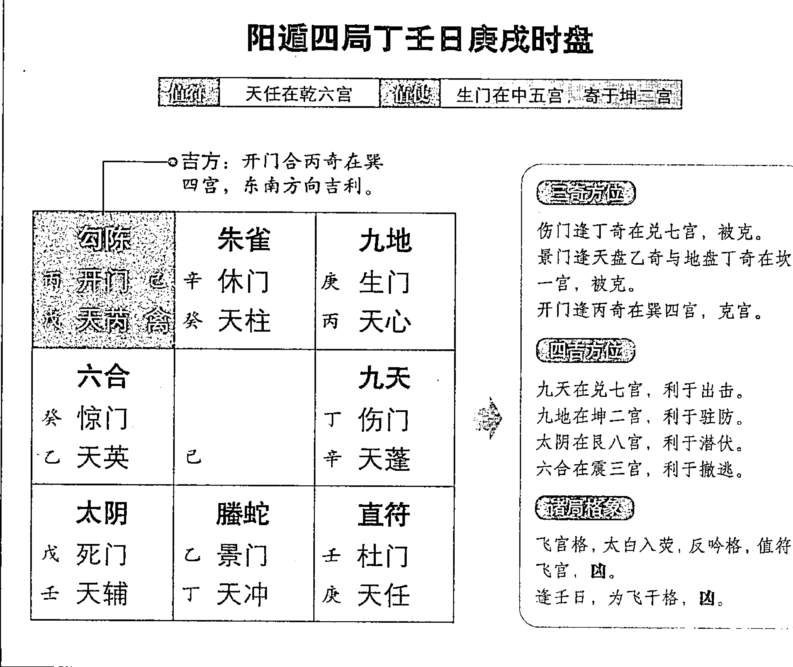

## 辛亥时：西南、西北方向吉利

**【原文】**
辛亥，任七，生六。宿干凶。开丙坤和，生合乾义，景乙震和。天二，地九，阴一，合八。开与星合二西南，生与日合六西北，天乙与太白格，时干巽，大格。

**【白话提要】**

*   **符使宫位**：值符天任在兑七宫，值使生门在乾六宫。时干遇凶星宿，时干逢凶。
*   **三奇方位**: 开门逢天盘丁奇与地盘丙奇在坤二宫，被生。生门逢乙奇在乾六宫，生宫，奇仪相合。景门逢天盘丙奇与地盘乙奇在震三宫，被生。
*   **四吉方位**：九天在坤二宫，九地在离九宫，太阴在坎一宫，六合在艮八宫。
*   **诸局格局**：开门合丁奇在坤二宫，西南方向吉利。生门合乙奇在乾六宫，西北方向吉利。值符与六庚宫位有格。时干在巽四宫。大格。

| | 白话图解 |
| --- | --- |
| | **阳遁四局丁壬日辛亥时盘** |
| | |
| | * 值符<br>天任在兑七宫<br>| **<br> 值使<br>生门在乾六宫<br>** |
| | 吉方1：开门合丁奇在坤二宫，西南方向吉利。 |
| | 三奇方位 |
| 朱雀<br/>辛<br/>戊死门天柱 | 九地<br/>庚<br/>癸惊门天心 | 九天<br/>丁<br/>丙<br/>开门<br/>天蓬 |
| 勾陈<br/>丙<br/>乙<br/>景门天芮禽 | 直符<br/>壬<br/>辛休门天任 | 腾蛇<br/>生门**<br/>戊天冲 |
| **六合**<br/>癸<br/>壬<br/>杜门天英 | 太阴<br/>戊伤门丁天辅 | 值符<br>天任在兑七宫<br>**<br>| **<br> 值使<br>生门在乾六宫<br>** |
| | 吉方2：生门合乙奇在乾六宫，西北方向吉利。 |
| | 四吉方位<br>九天在坤二宫，利于出击。<br/>九地在离九宫，利于驻防。<br/>太阴在坎一宫，利于潜伏。<br/>六合在艮八宫，利于撤退。 |
| | **诸局格象**<br/>值符与六庚官位有利格，时干在巽四宫，大格。凶。 |

## 戊癸日十二时局

### 壬子时：西南方向吉利

**【原文】**
壬子，任八，生七。子至丑阴，宿吉干凶。杜坎和，死乙震害，休丙坤害。天一，地六，阴四，合九。休与月合二西南，时干艮，符反吟。

**【白话提要】**

*   符使宫位：值符天任在艮八宫，值使生门在兑七宫。子时至丑时为五阴时。时干遇吉星宿，时干逢凶。
*   三奇方位：杜门逢双丁奇在坎一宫，被生。死门逢双乙奇在震三宫，被克。休门逢双丙奇在坤二宫，被克。
*   四吉方位：九天在坎一宫，九地在乾六宫，太阴在巽四宫，六合在离九宫。
*   诸局格象：休门合丙奇在坤二宫，西南方向吉利。时干在艮八宫。九星和值符都在本宫位未动，为伏吟格。

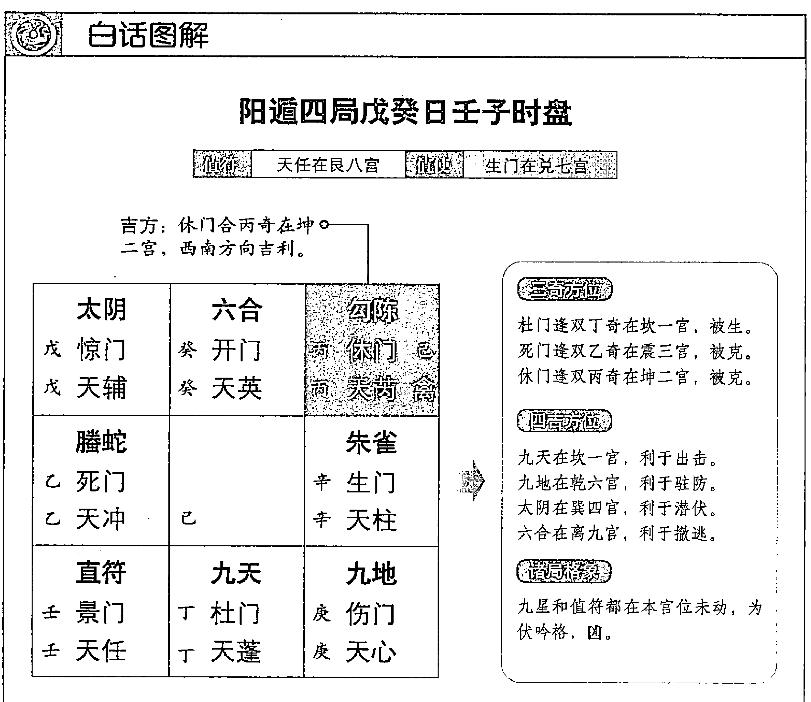

## 癸丑时：正北方向吉利

**【原文】**
> 癸丑，任九，生八。宿干凶。杜巽伏，死墓丙坤伏，休丁坎伏。天四，地三，阴七，合六。休与月合一正北，门伏吟，日干乾，癸日飞干，天网四张。

**【白话提要】**
> 符使宫位：值符天任在离九宫，值使生门在艮八宫。时干遇凶星宿，时干逢凶。
> 三奇方位：杜门逢丁奇在巽四宫，同类伏。死门逢天盘乙奇与地盘丙奇在坤二宫，同类伏，乙奇入墓。休门逢天盘丙奇与地盘丁奇在坎一宫，同类伏。
> 四吉方位：九天在巽四宫，九地在震三宫，太阴在兑七宫，六合在乾六宫。
> 诸局格象：休门合丙奇在坎一宫，正北方向吉利。伏吟格。时干在乾六宫。逢癸日，为飞干格。天网四张。

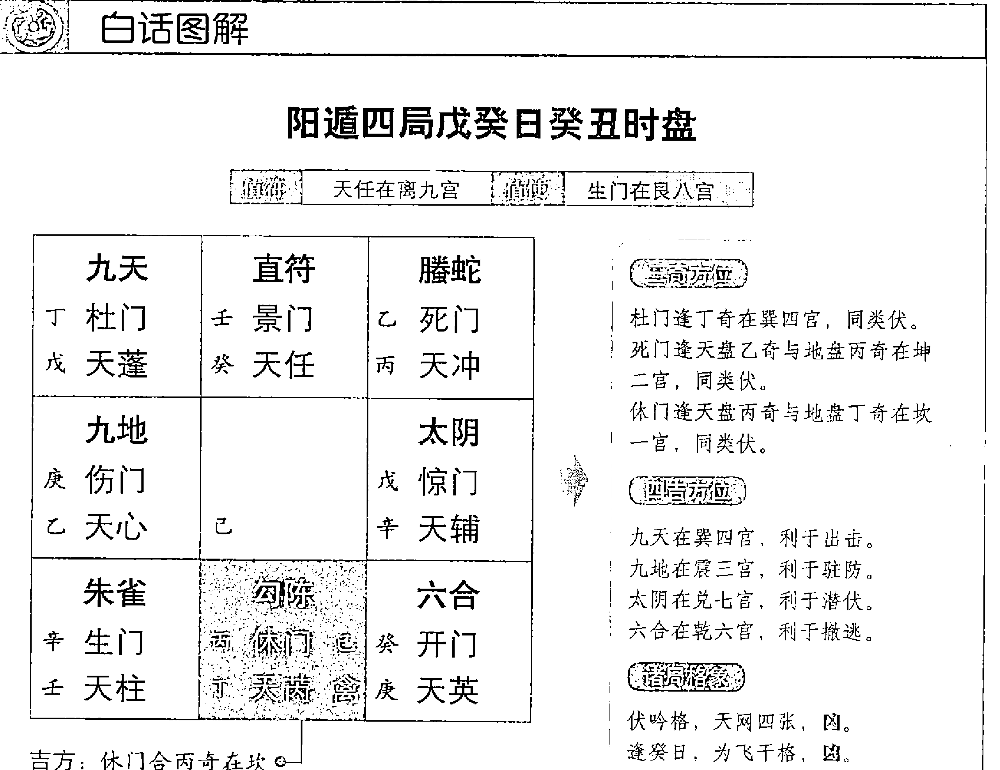

## 甲寅时：逢戊日不宜用事

**【原文】**
> **【原文】**
> 甲寅，英直符九，景直使九。天辅。寅至午阳，宿凶干吉。戊日不用，休蓬使坎伏，伤冲日震伏，死内月坤伏。天四，地三，阴七，合六。休与星合一正北，合时地甲，时干离，伏吟，地甲阖。

**【白话提要】**
> **【原文】**
> 符使宫位：值符天英在离九宫，值使景门在离九宫。寅时为天辅释罪时，寅时至午时为五阳时。时干遇凶星宿，时干逢吉。逢戊日不宜用事。
> 
> **三奇方位：** 休门逢双丁奇在坎一宫，同类伏。伤门逢双乙奇在震三宫，同类伏。死门逢双丙奇在坤二宫，同类伏。
> 
> **四吉方位：** 九天在巽四宫，九地在震三宫，太阴在兑七宫，六合在乾六宫。
> 
> **诸局格象：** 休门合丁奇在坎一宫，正北方向吉利。遁甲合。时干在离九宫。九星、八门、值符都在本宫未动，为伏吟格。

图解中国传统决策学·奇门遁甲大全（第一卷）

#### **白话图解**

### 阳遁四局戊癸日甲寅时盘

> **三奇方位：**
> 
> 休门逢双丁奇在坎一宫，同类伏。
> 伤门逢双乙奇在震三宫，同类伏。
> 死门逢双丙奇在坤二宫，同类伏。
> 
> **四吉方位：**
> 
> 九天在巽四宫，利于出击。
> 九地在震三宫，利于驻防。
> 太阴在兑七宫，利于潜伏。
> 六合在乾六宫，利于撤退。
> 
> **诸局格象：**
> 
> 遁甲合，吉。
> 九星、八门、值符都在本宫未动，为伏吟格，凶。

## 乙卯时：宜守户不出

**【原文】**
乙卯，英三，景一。宿干吉。守户。伤兑害，景丁坎害，开巽制。天八，地一，阴九，合二。开与月合四东南，门反吟，戊干格。鸟跌穴，时干坎，戊日勃，金入火，刑格。

**【白话提要】**
符使宫位：值符天英在震三宫，值使景门在坎一宫。时干遇吉星宿，时干逢吉。宜守户不出。
三奇方位：伤门逢丁奇在兑七宫，被克。景门逢天盘乙奇与地盘丁奇在坎一宫，被克。开门逢丙奇在巽四宫，克宫。
四吉方位：九天在艮八宫，九地在坎一宫，太阴在离九宫，六合在坤二宫。
诸局格象：开门合丙奇在巽四宫，东南方向吉利。八门反吟。戊时干格。飞鸟跌穴。时干在坎一宫。逢戊日，为勃格。太白入荧。刑格。

## 白话图解

### 阳遁四局戊癸日乙卯时盘

| 值符 | 天英在震三宫 | 值使 | 景门在坎一宫 |
| :--- | :--- | :--- | :--- |

*   ◎吉方：开门合丙奇在巽四宫，东南方向吉利。

| | 太阴 | 六合 |
| :--- | :--- | :--- |
| 庚开门 己天芮 | 辛休门癸天柱 | 庚生门丙天心 |

| 直符 | | 勾陈 |
| :--- | :--- | :--- |
| 丁惊门乙天英 | 巳 | 丁伤门辛天蓬 |

| 九天 | 九地 | 朱雀 |
| :--- | :--- | :--- |
| 戊死门壬天辅 | 乙景门丁天冲 | 壬杜门庚天任 |

**三奇方位**
伤门逢丁奇在兑七宫，被克。
景门逢天盘乙奇与地盘丁奇在坎一宫，被克。
开门逢丙奇在巽四宫，克宫。

**四吉方位**
九天在艮八宫，利于出击。
九地在坎一官，利于驻防。
太阴在离九宫，利于潜伏。
六合在坤二宫，利于撤逃。

**诸局格象**
飞鸟跌穴，吉。
八门反吟，太白入荧，刑格。
逢戊日，为勃格。

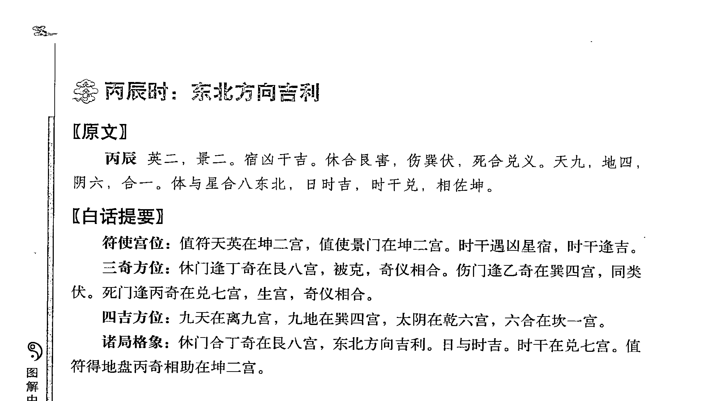

### 丙辰时：东北方向吉利

**【原文】**
丙辰，英二，景二。宿凶干吉。休合艮害，伤巽伏，死合兑义。天九，地四，阴六，合一。体与星合八东北，日时吉，时干兑，相佐坤。

**【白话提要】**
符使宫位：值符天英在坤二宫，值使景门在坤二宫。时干遇凶星宿，时干逢吉。
三奇方位：休门逢丁奇在艮八宫，被克，奇仪相合。伤门逢乙奇在巽四宫，同类伏。死门逢丙奇在兑七宫，生宫，奇仪相合。
四吉方位：九天在离九宫，九地在巽四宫，太阴在乾六宫，六合在坎一宫。
诸局格象：休门合丁奇在艮八宫，东北方向吉利。日与时吉。时干在兑七宫。值符得地盘丙奇相助在坤二宫。

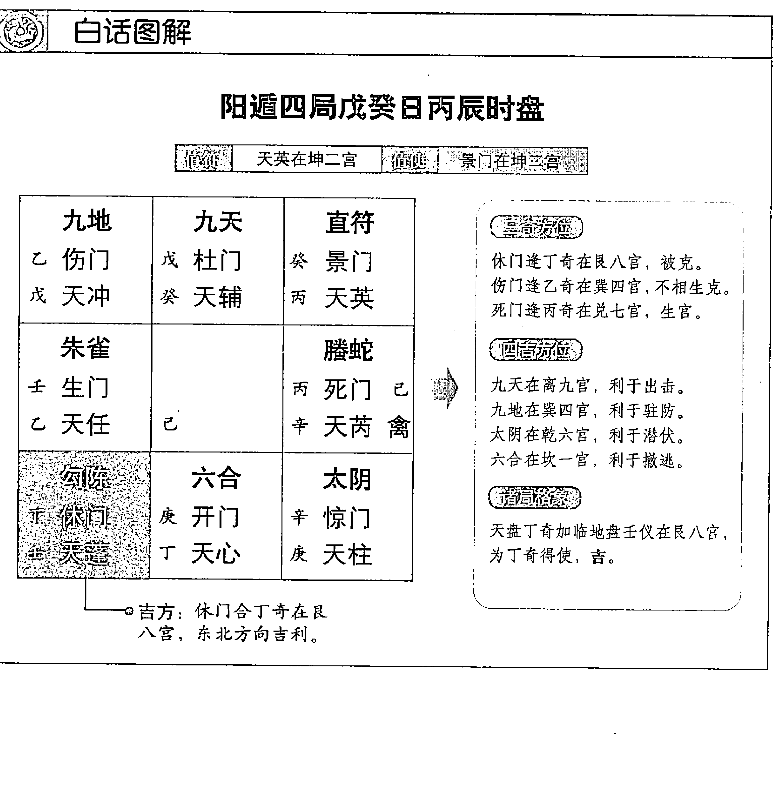

### 丁巳时：正西方向吉利

**【原文】**
丁巳，英一，景三。宿凶干吉。惊离害欢怡，休兑和，杜艮制。天六，地七，阴三，合四。休与日合七正西，仪刑，雀入江，蛇娇，龙走，虎猖狂，戊日，飞干，伏干，飞官，时干离，相佐坎，符冲，击刑。

**【白话提要】**
符使宫位：值符天英在坎一宫，值使景门在震三宫。时干遇凶星宿，时干逢吉。
三奇方位：惊门逢丁奇在离九宫，被克，吉利。休门逢乙奇在兑七宫，被生。杜门逢丙奇在艮八宫，克宫。
四吉方位：九天在乾六宫，九地在兑七宫，太阴在震三宫，六合在巽四宫。
诸局格象：休门合丁奇在兑七宫，正西方向吉利。六仪击刑。朱雀入江。腾蛇天娇。青龙逃走。白虎猖狂。逢戊日，为飞干格，伏干格。时干在离九宫。值符得地盘丁奇相助在坎一宫。九星和值符都到了其对冲的宫位，为反吟格。击刑。

> ***白话图解***
### 阳遁四局戊癸日丁巳时盘

| | **勾陈** | **朱雀** |
|---|---|---|
| | 天英在坎一宫 | 景门在震三宫 |
| **值符** | 天英在坎一宫 | 景门在震三宫 |
| **太阴** | | |
| **九天** | | |

*   吉方：休门合丁奇在兑七宫，正西方向吉利。

**【三奇方位】**
惊门逢丁奇在离九宫，被克。
休门逢乙奇在兑七宫，被生。
杜门逢丙奇在艮八宫，克宫。

**【四吉方位】**
九天在乾六宫，利于出击。
九地在兑七宫，利于驻防。
太阴在震三宫，利于潜伏。
六合在巽四宫，利于撤退。

**【诸局格象】**
六仪击刑，朱雀入江、腾蛇天矫。
青龙逃走，白虎猖狂，凶。
逢戊日，为飞干格和伏干格，凶。
九星和值符都到了其对冲的官位，为反吟格，凶。

### 戊午时：西北方向吉利


### 己未时：东北方向吉利

**【原文】**
**己未**，英五，景五避五。未至亥阴，宿吉干凶。癸日不用，休合艮害，伤巽伏，死合兑害。天九，地四，阴六，合一。休与星合八东北，时干兑，相佐坤。

**【白话提要】**
*   符使宫位：值符天英在中五宫，寄于坤二宫，值使景门在中五宫，寄于坤二宫。未时至亥时为五阴时。时干遇吉星宿，时干逢凶。逢癸日不宜用事。
*   三奇方位：休门逢丁奇在良八宫，被克，奇仪相合。伤门逢乙奇在巽四宫，同类伏。死门逢丙奇在兑七宫，被克，奇仪相合。
*   四吉方位：九天在离九宫，九地在巽四宫，太阴在乾六宫，六合在坎一宫。
*   诸局格象：休门合丁奇在艮八宫，东北方向吉利。时干在兑七宫。值符得地盘丙奇相助在坤二宫。

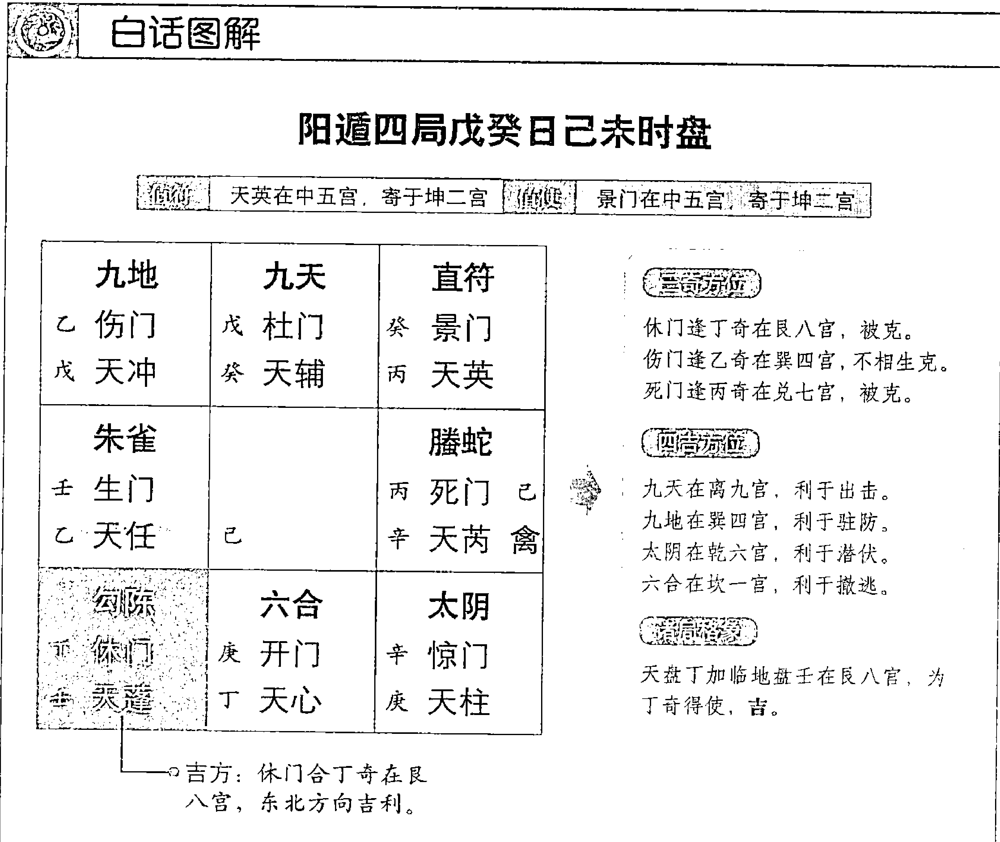

*   ○吉方：休门合丁奇在艮八宫，东北方向吉利。

### 庚申时：东南方向吉利


#### 《图解中国传统决策学 ·奇门遁甲大全 (第一部)》

**【原文】**
庚申，英六、景六。宿吉干凶。休巽制，伤墓丙坤制，死丁坎制。天七，地二，阴八，合三。休与星合四东南，天乙与太白格，飞官格，癸日飞干格，时干震，飞符，事同。

**【白话提要】**
符使宫位：值符天英在乾六宫，值使景门在乾六宫。时干遇吉星宿，时干逢凶。
三奇方位：休门逢丁奇在巽四宫，克宫。伤门逢天盘乙奇与地盘丙奇在坤二宫，克宫。死门逢天盘丙奇与地盘丁奇在坎一宫，克宫。
四吉方位：九天在兑七宫，九地在坤二宫，太阴在艮八宫，六合在震三宫。
诸局格象：休门合丁奇在巽四宫，东南方向吉利。天乙与六庚成飞官格。癸日成飞干格。时干在震三宫。值符飞宫。

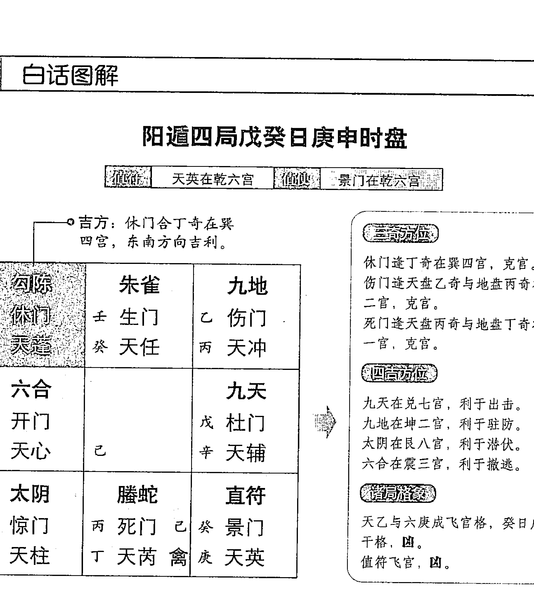

### 辛酉时：正东方向吉利

**【原文】**
辛酉，英七，景七。宿干凶。休乙震义，伤离义欢怡，死墓乾义。天二，地九，阴一，合八。休与星合三正东，丁下有乙，龙反首，时干坎，相佐兑，火入金。

**【白话提要】**
符使宫位：值符天英在兑七宫，值使景门在兑七宫。时干遇凶星宿，时干逢凶。
三奇方位：休门逢天盘丁奇与地盘乙奇在震三宫，生宫。伤门逢乙奇在离九宫，生宫，吉利。死门逢丙奇在乾六宫，生宫，丙奇入墓。
四吉方位：九天在坤二宫，九地在离九宫，太阴在坎一宫，六合在艮八宫。
诸局格象：休门合丁奇在震三宫，正东方向吉利。丁下有乙，为玉女奇生，吉如人遁。青龙回首。时干在坎一宫。值符得地盘奇助。荧入太白。

| | **白话图解** |
| :---: | --- |
| | 阳遁四局戊癸日辛酉时盘 |
| **值符：**天英在兑七宫 | **值使：**景门在兑七宫 |
| **玄武**<br>**生门**<br>**壬**<br>**天任** | **九地**<br>**乙**<br>**伤门**<br>**癸**<br>**天冲** | **九天**<br>**丙**<br>**杜门**<br>**戊**<br>**天辅** |
| **白虎**<br>**丁**<br>**休门**<br>**庚**<br>**天蓬** |  | **直符**<br>**癸**<br>**景门**<br>**辛**<br>**天英** |
| **六合**<br>**开门**<br>**壬**<br>**天心** | **太阴**<br>**丁**<br>**惊门**<br>**辛**<br>**天柱** | **螣蛇**<br>**死门**<br>**庚**<br>**天芮**<br>**丙** | **禽**<br>**己** |

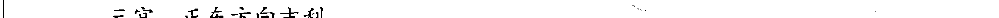

*   吉方：休门合丁奇在震三宫，正东方向吉利。

> ### 三奇方位
> 
> 休门逢天盘丁奇与地盘乙奇在震三宫，生官。
> 伤门逢乙奇在离九宫，生宫。
> 死门逢丙奇在乾六宫，生官。
> 
> ### 四吉方位
> 
> 九天在坤二宫，利于出击。
> 九地在离九宫，利于驻防。
> 太阴在坎一宫，利于潜伏。
> 六合在艮八宫，利于撤退。
> 
> ### 诸局格象
> 
> 丁下有乙，为玉女奇生，吉。
> 青龙回首，吉。
> 荧入太白，凶。

### 壬戌时：西南方向吉利

**【原文】**
壬戌，英八，景八。宿吉干凶。休丙坤害，伤合乾害，死乙震害。天一，地六，阴四，合九。休与星合二西南，丁下有丙，癸日伏干格，太白格，时干兑，大格，太乙格，伏宫格。

**【白话提要】**
符使宫位：值符天英在艮八宫，值使景门在艮八宫。时干遇吉星宿，时干逢凶。
三奇方位：休门逢天盘丁奇与地盘丙奇在坤二宫，被克。伤门逢乙奇在乾六宫，被克。死门逢天盘丙奇与地盘乙奇在震三宫，被克。
四吉方位：九天在坎一宫，九地在乾六宫，太阴在巽四宫，六合在离九宫。
诸局格象：休门合丁奇在坤二宫，西南方向吉利。丁下有丙，为星随月转。逢癸日，为伏干格。六庚格。时干在兑七宫。大格。太乙格。伏宫格。

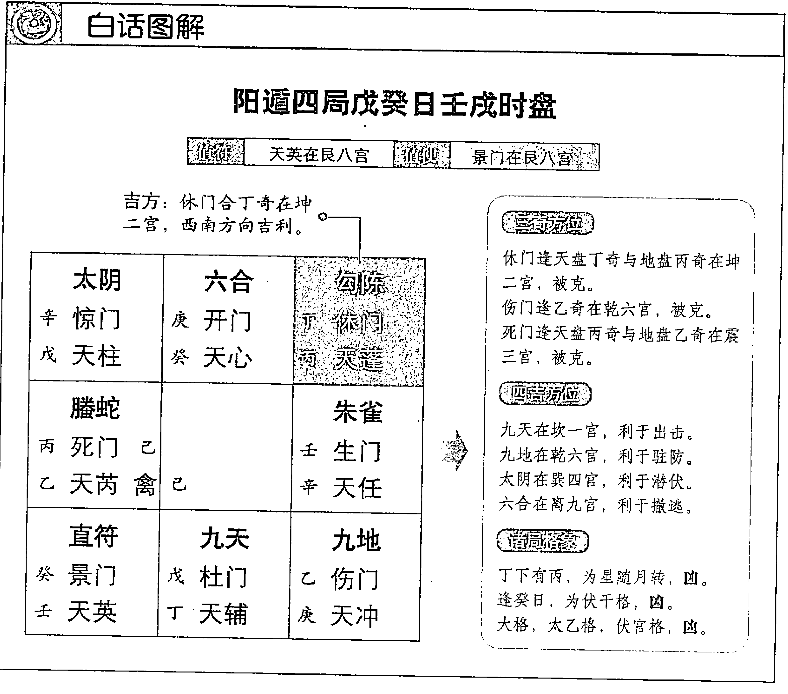

### 癸亥时：正北方向吉利

**【原文】**
癸亥，英九，景九。宿吉干凶。休丁坎伏，伤乙震伏，死丙坤伏。天四，地三，阴七，合六。休与星合一正北，天网四张，时干离，符伏。

**【白话提要】**
符使宫位：值符天英在离九宫，值使景门在离九宫。时干遇吉星宿，时干逢凶。
三奇方位：休门逢双丁奇在坎一宫，同类伏。伤门逢双乙奇在震三宫，同类伏。死门逢双丙奇在坤二宫，同类伏。
四吉方位：九天在巽四宫，九地在震三宫，太阴在兑七宫，六合在乾六宫。
诸局格象：休门合丁奇在坎一宫，正北方向吉利。天网四张。时干在离九宫。九星和值符都在本宫未动，为伏吟格。

> ### 白话图解

#### 阳遁四局戊癸日癸亥时盘

> **值符** 天英在离九宫 **值使** 景门在离九宫

| 九天 | 直符 | 螣蛇 |
| --- | :--- | :--- |
| **戊**杜门<br/>**戊**天辅 | **癸**景门<br/>**癸**天英 | **丙**死门<br/>**丙**天芮<br/>己禽 |
| **九地**<br/>**乙**伤门<br/>**乙**天冲 |  | **太阴**<br/>**辛**惊门<br/>**辛**天柱 |
| **朱雀**<br/>**壬**生门<br/>**壬**天任 | **勾陈**<br/>**丁**休门<br/><b>己</b>天蓬 | **六合**<br/>**庚**开门<br/>**庚**天心 |

*   吉方：休门合丁奇在坎一宫，正北方向吉利。
*   **三奇方位**
    休门逢双丁奇在坎一宫，同类伏。伤门逢双乙奇在震三宫，同类伏。死门逢双丙奇在坤二宫，同类伏。
*   **四吉方位**
    九天在巽四宫，利于出击。九地在震三宫，利于驻防。太阴在兑七宫，利于潜伏。六合在乾六宫，利于撤退。
*   **诸局格象**
    九星和值符都在本宫未动，为伏吟格，凶。天网四张，凶。

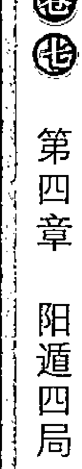
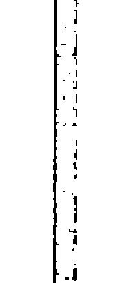

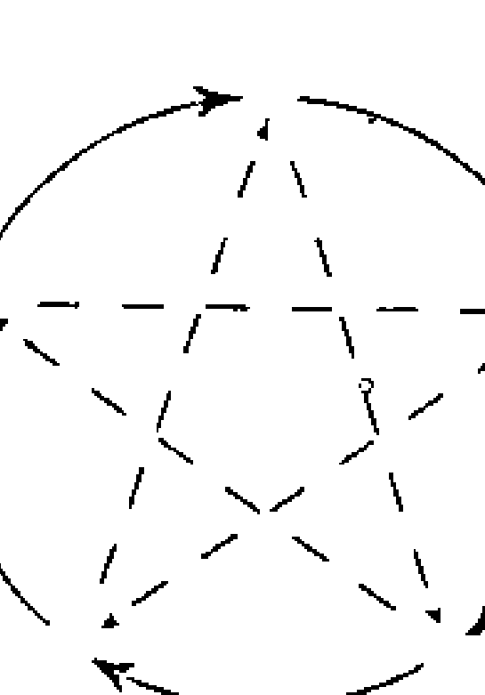

## 卷八

### 奇门遁甲阳遁 540局详解（下）

本卷主要讲的是奇门遁甲阳遁九局中的后五局，其中每局也分为五日，一日分为十二个时辰，所以一局共有60时局，那么后五局共300时局。其中每局又分为符使宫位、三奇方位、四吉方位和诸局格象四个方面，并配有相关的式盘。

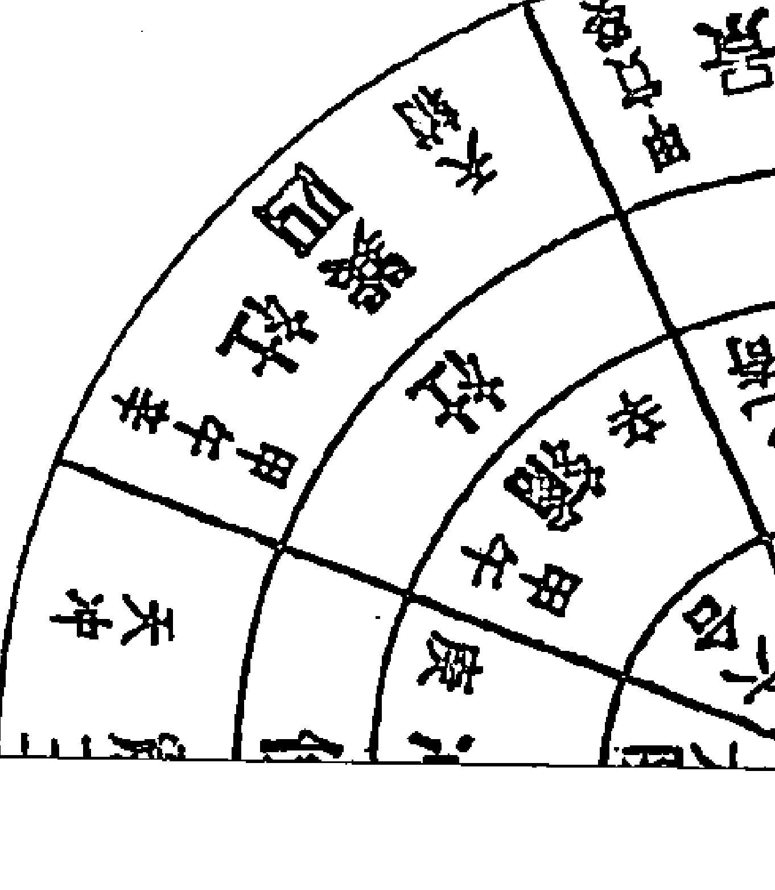

图解中国传统决策学·奇门遁甲大全

- 316

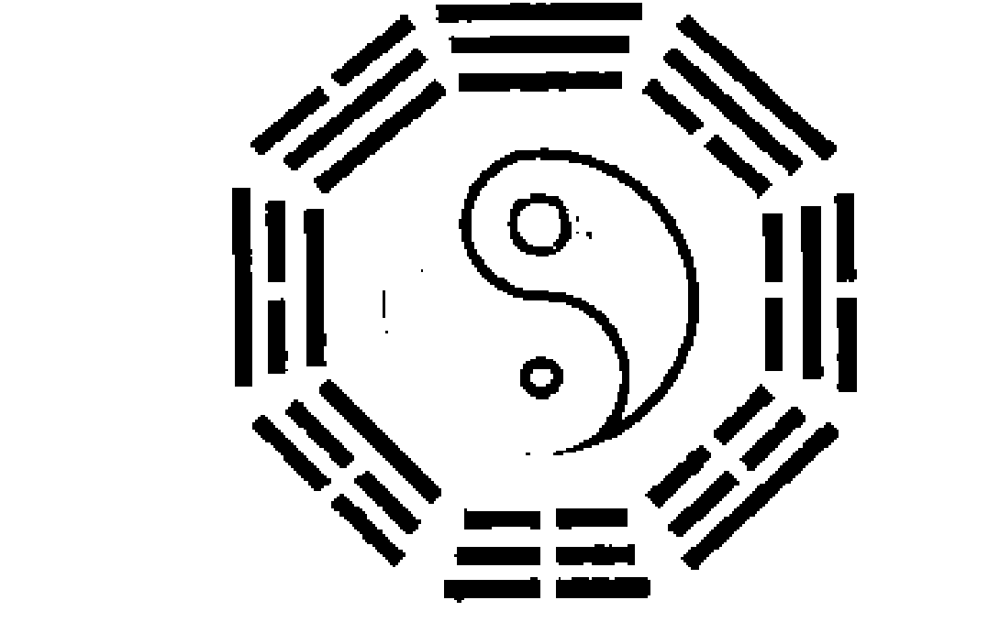

> **本卷内容提要**
> 
> 第一章&nbsp;&nbsp;阳遁五局
> 
> 第二章&nbsp;&nbsp;阳遁六局
> 
> 第三章&nbsp;&nbsp;阳遁七局
> 
> 第四章&nbsp;&nbsp;阳遁八局
> 
> 第五章&nbsp;&nbsp;阳遁九局

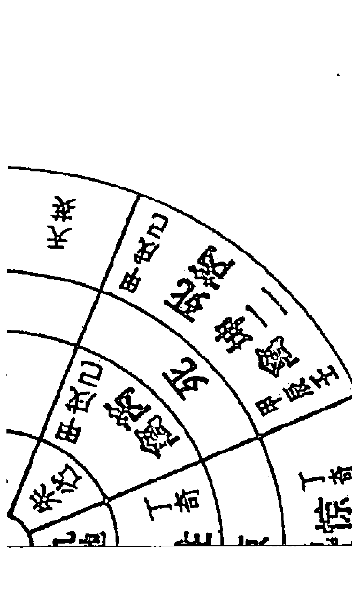
317

## 白话图解

### 每日时辰

奇门遁甲中一局为一元，一元有甲己、乙庚、丙辛、丁壬和戊癸五日，每日有十二个时辰，则一局就有六十个时辰，用六十甲子来表示，一个时辰为一小局。

| |甲子|乙丑|丙寅|丁卯|戊辰|己巳|庚午|辛未|壬申|癸酉|甲戌|乙亥|
| ---| ---| ---| ---| ---| ---| ---| ---| ---| ---| ---| ---| ---|
| 乙庚日 |丙子|丁丑|戊寅|己卯|庚辰|辛巳|壬午|癸未|甲申|乙酉|丙戌|丁亥|
| 丙辛日 |戊子|己丑|庚寅|辛卯|壬辰|癸巳|甲午|乙未|丙申|丁酉|戊戌|己亥|
| 丁壬日 |庚子|辛丑|壬寅|癸卯|甲辰|乙巳|丙午|丁未|戊申|己酉|庚戌|辛亥|
| 戊癸日 |壬子|癸丑|甲寅|乙卯|丙辰|丁巳|戊午|己未|庚申|辛酉|壬戌|癸亥 |

## 阳遁五局六十时符使表

奇门遁甲排盘时，最主要的就是寻找值符和值使，并确定其所在的宫位。下表就是阳遁五局六十个时辰的值符和值使，以及其所在的宫位。

|时辰 |甲子|乙丑 |丙寅|丁卯 |戊辰 |己巳|庚午|辛未 |壬申 |癸酉|
| ---| ---| ---| ---| ---| ---| ---| ---| ---| ---| ---|
| 天禽 |五 |四 |三 |二 |五 |六 |七 |八 |九 |一 |
| 死门 |五 |六 |七 |八 |九 |一 |二 |三 |四 |五 |
| 时辰 |甲戌 |乙亥 |丙子 |丁丑 |戊寅 |己卯 |庚辰 |辛巳 |壬午 |癸未|
| 天心 |六 |四 |三 |二 |五 |六 |七 |八 |九 |一 |
| 开门 |六 |七 |八 |九 |一 |二 |三 |四 |五 |六 |
| 时辰 |甲申 |乙酉 |丙戌 |丁亥 |戊子 |己丑 |庚寅 |辛卯 |壬辰 |癸巳|
| 天柱 |七 |四 |三 |二 |五 |六 |七 |八 |九 |一 |
| 惊门 |七 |八 |九 |一 |二 |三 |四 |五 |六 |七 |
| 时辰 |甲午 |乙未 |丙申 |丁酉 |戊戌 |己亥 |庚子 |辛丑 |壬寅 |癸卯|
| 天任 |八 |四 |三 |二 |五 |六 |七 |八 |九 |一 |
| 生门 |八 |九 |一 |二 |三 |四 |五 |六 |七 |八 |
| 时辰 |甲辰 |乙巳 |丙午 |丁未 |戊申 |己酉 |庚戌 |辛亥 |壬子 |癸丑|
| 天英 |九 |四 |三 |二 |五 |六 |七 |八 |九 |一 |
| 景门 |九 |一 |二 |三 |四 |五 |六 |七 |八 |九 |
| 时辰 |甲寅 |乙卯 |丙辰 |丁巳 |戊午 |己未 |庚申 |辛酉 |壬戌 |癸亥|
| 天蓬 |一 |四 |三 |二 |五 |六 |七 |八 |九 |一 |
| 休门 |一 |二 |三 |四 |五 |六 |七 |八 |九 |一 |

## 1.甲己日十二时局

## 甲子时：利以逃亡

甲子禽五，死五避五。子至辰阳，宿干吉。伤震伏，杜巽伏，死坤伏。天九，地四，阴六，合六。无奇门，开时，刑德在门，主客不利，利以逃亡，时干坤，伏吟，遁甲阖。

### 【白话提要】

符使宫位：值符天禽在中五宫，寄于坤二宫，值使死门在中五宫，寄于坤二宫。子时至辰时为五阳时。时干遇吉星宿，时干逢吉。

三奇方位：伤门逢双丙奇在震三宫，同类伏。杜门逢双乙奇在巽四宫，同类伏。死门逢双丁奇在坤二宫，同类伏。

四吉方位：九天在离九宫．九地在巽四宫，太阴在乾六宫，六合在坎一宫。

诸局格象：无奇门。遁甲开时，刑德在门，主客双方都不利，利于逃亡。时干在坤二宫。九星、八门、值符都在本宫未动，为伏吟格。遁甲合。

### 乙丑时：逢己日不宜用事

### 【原文】

**乙丑**禽四，死六。宿干吉。己日不用，惊坎义，开艮和，生乙巽害。天三，地八，阴二，合七。生与星合四东南，时干艮，开与日合八东北，龙走。

### 【白话提要】

**符使宫位：**值符天禽在巽四宫，值使死门在乾六宫。时干遇吉星宿，时干逢吉。逢己日不宜用事。

**三奇方位：**惊门逢丙奇在坎一宫，生宫。开门逢乙奇在艮八宫，被生。生门逢天盘丁奇与地盘乙奇在巽四宫，被克。

**四吉方位：**九天在震三宫，九地在艮八宫，太阴在坤二宫，六合在兑七宫。

**诸局格象：**生门合丁奇在巽四宫，东南方向吉利。时干在艮八宫。开门合日奇在艮八宫，东北方向吉利。青龙逃走。

#### 阳遁五局甲己日乙丑时盘

| **值符** | 天禽在巽四宫 | **值使** | 死门在乾六宫 |
| :--- | :--- | :--- | :--- |

- ○吉方1：生门合丁奇在巽四宫，东南方向吉利。
- ○吉方2：开门合日奇在艮八宫，东北方向吉利。

**三奇方位**
惊门逢丙奇在坎一宫，生官。
开门逢乙奇在艮八宫，被生。
生门逢天盘丁奇与地盘乙奇在巽四宫，被克。

**四吉方位**
九天在震三宫，利于出击。
九地在艮八宫，利于驻防。
太阴在坤二官，利于潜伏。
六合在兑七宫，利于撤退。

**诸局格象**
青龙逃走，凶。

### 丙寅时：正北正东方向吉利

#### 【原文】 
丙寅 禽三，死七。宿干吉。惊墓乾伏，开坎义，生丙震害。天八，地一，阴九，合二。开与日合一正北，生与星合三正东，龙反首，天乙与太白格，天遁，时干乾，相佐震，已日勃。

#### 【白话提要】 
*符使宫位：**值符天禽在震三宫，值使死门在兑七宫。时干遇吉星宿，时干逢吉。**
***三奇方位：**惊门逢丙奇在乾六宫，同类伏，丙奇入墓。开门逢乙奇在坎一宫，生官。生门逢天盘丁奇与地盘丙奇在震三宫，被克。
> ***四吉方位：**九天在艮八宫，九地在坎一宫，太阴在离九宫，六合在坤二宫。
> * **诸局格象：** 开门合乙奇在坎一宫，正北方向吉利。生门合丁奇在震三宫，正东方向吉利。青龙回首。天乙与六庚宫位有格。天遁。时干在乾六宫。值符得地盘丙奇助于震三宫。逢己日，为勃格。

## 白话图解
| **值符** | 天禽在震三宫 | **值使** | 死门在兑七宫 |
| :---: | :--- | :---: | :--- |
| **腾蛇** | **太阴** | **六合** |
| 庚<br>伤门<br>乙<br>天柱 | 己<br>杜门<br>壬<br>天心 | 癸<br>景门<br>丁<br>天蓬 |
| **直符**<br><br>丁<br>维门<br><br>戊<br>天芮<br><br>禽 |  | **勾陈** |
| **九天** | **九地** | **朱雀** |
| 壬<br>休门<br>壬<br>天英 | 乙<br>开门<br>癸<br>天辅 | 丙<br>惊门<br>己<br>天冲 |

---

#### 三奇方位：
惊门逢丙奇在乾六宫，同类伏。
开门逢乙奇在坎一宫，生官。
生门逢天盘丁奇与地盘丙奇在震三宫，被克。 
#### 四吉方位：
九天在艮八宫，利于出击。
九地在坎一宫，利于驻防。
太阴在离九宫，利于潜伏。
六合在坤二宫，利于撤退。
#### 诸局格象：
青龙回首，吉。
天遁，吉。
逢己日，为勃格，凶。 

- ○ **吉方2：** 生门合丁奇在震三宫，正东方向吉利。
- ○ **吉方1：** 开门合乙奇在坎一宫，正北方向吉利。

### 丁卯时：东南与西南方向吉利

### 【原文】
丁卯 禽二，死八。宿干凶。惊丙震制，开乙巽制，生丁坤伏欢怡。天九，地四，阴六，合一。开与日合四东南，生与星合二西南，乙下有乙，丁下有丁，时干坤，相佐艮，符伏，击刑。

### 【白话提要】

符使宫位：值符天禽在坤二宫，值使死门在艮八宫。时干遇凶星宿，时干逢凶。

三奇方位：惊门逢双丙奇在震三宫，克宫。开门逢双乙奇在巽四宫，克宫。生门逢双丁奇在坤二宫，同类伏，吉利。

四吉方位：九处在离九宫，九地在巽四宫，太阴在乾六宫，六合在坎一宫。

诸局格象：开门合乙奇在巽四宫，东南方向吉利。生门合丁奇在坤二宫，西南方向吉利。乙下有乙，为日奇伏吟。丁下有丁，为奇入太阴。时干在坤二宫。值符得地盘奇相助。九星和值符都在本宫未动，为伏吟格。击刑。

## 白话图解

#### 阳遁五局甲己日丁卯时盘

吉方1：开门合乙奇在巽四宫，东南方向吉利。

吉方2：生门合丁奇在坤二宫，西南方向吉利。

##### 九地

| | 九天 | 直符 |
| --- | --- | --- |
| 乙开门 乙天辅 丙惊门 丙天冲 | 壬休门 壬天英 | 丁生门 丁天芮 庚天禽 |
| **朱雀** |---| 丙惊门 丙天冲 |
| 勾陈 |---| 辛死门 辛天任 | 
| 戊 |
| 六合 |---| 癸景门 癸天蓬 | 
| 庚伤门 庚天柱 螣蛇 |
| 太阴 |---| 乙杜门 己天心 | 

#### 三奇方位

惊门逢双丙奇于震三宫，克官。
开门逢双乙奇于巽四宫，克官。
生门逢双丁奇于坤二宫，好。

#### 四吉方位

九天在离九宫，利于出击。
九地在巽四宫，利于驻防。
太阴在乾六宫，利于潜伏。
六合在坎一宫，利于撤退。

#### 诸局格象

乙下有乙，为日奇伏吟，凶。

丁下有丁，为奇入太阴，凶。

九星和值符都在本宫未动，为伏吟格，凶。

### 阳遁五局甲己日戊辰时盘

值符天禽在中五宫，寄于坤二宫：值使死门在离九宫。

三奇方位。
杜门逢双丙奇在震三宫，不相生克。
景门逢双乙奇在巽四宫，被生。
惊门逢双丁奇在坤二宫，被生。

四吉方位。
九未在离三宫，利于出击。
九地在巽四宫，利于驻防。
太阴在乾六宫，利于潜伏。
六合在坎一宫，利于撤退。

诸局格象。
无奇门，凶。
九星和值符都在本宫未动，为伏吟格，凶。

#### 盘面布局示意：

|九地乙景门乙天辅|
|---|
|九天戊<br>死门<br>壬天英|
|直符<br>丁<br>惊门<br>丁<br>天芮禽|
|朱雀丙杜门丙天冲|
|---|
|---|
|---|
|---|
|---|
|---|
|---|
|---|
|---|
|---|
|---|
|---|
|---|
|---|
|---|
|勾陈辛伤门壬天任|
|---|
|---|
|---|
|---|
|---|
|---|
|---|
|---|
|---|
|---|
|---|
|---|
|---|
|---|
|---|
|---|
|六合<br>癸生门<br>癸天蓬|
|---|
|---|
|---|
|---|
|---|
|---|
|---|
|---|
|---|
|---|
|---|
|---|
|---|
|---|
|太阴<br>己休门<br>己天心|

## **卷八第一章**

### 阳遁五局

#### 已巳时：正南方向吉利

### 【原文】

**已已**禽六，死一。已至酉阴，天辅，宿吉干凶。生离和，伤墓丁坤制欢怡，景墓乾制。天七，地二，阴八，合三。生与月合九正南，大格，虎猖狂，时干艮。

### 【白话提要】

**符使宫位:**值符天擒在乾六宫，值使死门在坎一宫。巳时至酉时为五阴时，巳时 为天辅释罪时。时干遇吉星宿，时干逢凶。

    **三奇方位:**生门逢丙奇在离九宫，被生。伤门逢天盘乙奇与地盘丁奇在坤二宫，克 宫，吉利，乙奇入墓。景门逢丁奇在乾六宫，克宫，丁奇入墓。

    **四吉方位:**九天在兑七宫，九地在坤二宫，太阴在艮八宫，六合在震三宫。

    **诸局格象:**生门合丙奇在离九宫，正南方向吉利。大格。白虎猖狂。时干在艮 八宫。

#### 阳遁五局甲己日戊巳时盘 (示意)


值符 天禽在乾六宫
值使 死门在坎一宫

- ○吉方:生门合丙奇在离九 宫，正南方向吉利。

# 庚午时：宜守户不出

### 【原文】

庚午禽七，死二。宿干凶，守户，甲日不用，杜乙巽伏，景离伏，惊兑伏。
天二，地九，阴一，合八。无奇门，甲日飞干格，己日伏干格，时干乾，门伏，刑格，飞官格。

### 【白话提要】

符使宫位：值符天禽在兑七宫，值使死门在坤二宫。时干遇凶星宿，时干逢凶。宜
守户不出。逢甲日不宜用事。

三奇方位：杜门逢天盘丙奇与地盘乙奇在巽四宫，同类伏。景门逢乙奇在离九宫，
同类伏。惊门逢丁奇在兑七宫，同类伏。

四吉方位：九天在坤二宫，九地在离九宫，太阴在坎一宫，六合在艮八宫。

诸局格象：无奇门。逢甲日，为飞干格。逢己日，为伏干格。时干在乾六宫。八
门伏吟。刑格。飞宫格。

## 白话图解

##### 阳遁五局甲己日庚午时盘

> 三奇方位:
杜门逢天盘丙奇与地盘乙奇在巽四宫，同类伏。
景门逢乙奇在离九宫，同类伏。
惊门逢丁奇在兑七宫，同类伏。

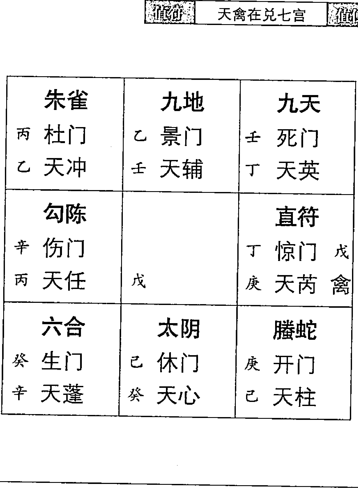

> 四吉方位:
九天在坤二宫，利于出击。
九地在离九宫，利于驻防。
太阴在坎一宫，利于潜伏。
六合在艮八宫，利于撤退。

> 诸局格象:
无奇门，凶。
逢甲日，为飞干格，凶。
逢己日，为伏干格，凶。
八门伏吟，刑格，飞宫格，凶。

### 辛未时：正西方向吉利

### 【原文】

**辛未** 禽八，死三。宿干凶。生兑义，伤乾害，景艮义。天一，地六，阴四，合九。生与月合七正西、得使，飞宫格，甲日飞干格，时乾坤，火入金，符冲，三吉。

### 【白话提要】

符使宫位：天禽星为值符居艮八宫，死门为值使居震三宫。星宿凶，时干逢凶。

三奇方位：生门逢丙奇在兑七宫，生宫。伤门逢乙奇在乾六宫，被克。景门逢丁奇在艮八宫，生宫。

四吉方位：九天在坎一宫，九地在乾六宫，太阴在巽四宫，六合在离九宫。

诸局格象：生门合丙奇在兑七宫，正西方向吉利。三奇得使。飞宫格。逢甲日，为飞干格。时干在坤二宫。荧入太白。九星和值符都到了与其相冲的宫位，为反吟格。三吉格。

#### 阳遁五局甲己日辛未时盘

|  | **白话图解** |  |
| :---: | :---: | :---: |
| **阳遁五局甲己日辛未时盘** |  |  |
| *值符* | 天禽在艮八宫 | *值使* | 死门在震三宫 |  |
| --- | --- | --- | --- | --- |
| **太阴**<br>乙<br>天心<br>**惊门**<br>巳<br>乙<br>**六合**<br>癸<br>开门<br>壬<br>天蓬<br>**勾陈**<br>辛<br>休门<br>丁<br>天任 | **朱雀**<br>商<br>生门<br>庚<br>天冲<br>**螣蛇**<br>戊<br>死门<br>丙<br>天柱 |  |  |
| --- | --- | --- | --- |
| **直符**<br>丁<br>景门<br>辛<br>天芮<br>**九天**<br>壬<br>杜门<br>癸<br>天英<br>**九地**<br>乙<br>伤门<br>己<br>天辅 |  |  |  |
| **吉方：生门合丙奇在兑七宫，正西方向吉利。** |  |  |  |

> > 三奇方位：
> 生门逢丙奇在兑七宫，生宫。
> 伤门逢乙奇在乾六宫，被克。
> 景门逢丁奇在艮八宫，生宫。

> > 四吉方位：
> 九天在坎一宫，利于出击。
> 九地在乾六宫，利于驻防。
> 太阴在巽四宫，利于潜伏。
> 六合在离九宫。利于撤退。

> > 诸局格象：
> 三奇得使，吉。
> 飞宫格，荧入太白，凶。
> 逢甲日，为飞干格，凶。
> 九星和值符都到了与其相冲的宫位，为反吟格，凶。

## 壬申时：无奇门可出

### 【原文】
壬申禽九，死四。宿干凶。杜合艮制，景丙震和，惊合离害。天四，地三，阴七，合六。无奇门，伏官格，甲日伏干格，时干巽，飞官，乙格，己日飞干格。

### 【白话提要】
符使宫位：值符天禽在离九宫，值使死门在巽四宫。星宿凶，时干逢凶。
三奇方位：杜门逢丙奇在艮八宫，克官，奇仪相合。景门逢天盘乙奇与地盘丙奇在震三宫，被生。惊门逢丁奇在离九宫，被克，奇仪相合。
四吉方位：九天在巽四宫，九地在震三宫，太阴在兑七宫，六合在乾六宫。
诸局格象：无奇门。伏官格。逢甲日，为伏干格。时干在巽四宫。飞官格。乙奇格。逢己日，为飞干格。

## 白话图解
##### 阳遁五局甲己日壬申时盘


> #### 九天
壬 死门
乙天英

##### 直符
丁惊门
壬天芮禽

##### 螣蛇
庚 开门
丁天柱

##### 九地
乙景门
丙天辅

##### 太阴
己休门
庚天心

##### 朱雀
丙杜门
辛天冲

### 勾陈
辛伤门
癸天任

##### 六合
癸生门
巳天蓬

> #### 三奇方位
杜门逢丙奇在艮八宫，克官。
景门逢天盘乙奇与地盘丙奇在震三宫，被生。
惊门逢丁奇在离九宫，被克。

#### 四吉方位
九天在巽四宫，利于出击。
九地在震三宫，利于驻防。
太阴在兑七官，利于潜伏。
六合在乾六宫，利于撤退。

#### 诸局格象
无奇门，凶。
伏官格，飞官格，乙奇格，凶。
逢甲日，为伏干格，凶。
逢己日，为飞干格，凶。

### 癸酉时：正北方向吉利

### 【原文】
癸酉禽一，死五避五。宿干凶。死丁坤伏欢怡，惊合兑伏，休坎伏。天六，地七，阴三，合四。休与星合一正北，符勃，甲，千勃，雀入江，时干巽，门伏吟，天网四张。

### 【白话提要】
符使宫位: 值符天禽在坎一宫，值使死门在中五宫，寄于坤二宫。时干遇凶星宿，时干逢凶。
三奇方位：死门逢天盘丙奇与地盘丁奇在坤二宫，同类伏，吉利。惊门逢乙奇在兑七宫，同类伏，奇仪相合。休门逢丁奇在坎一宫，同类伏。
四吉方位: 九天在乾六宫，九地在兑七宫，太阴在震三宫，六合在巽四宫。
诸局格象: 休门合丁奇在坎一宫，正北方向吉利。符勃格。逢甲日，为日勃格。朱雀入江。时干在巽四宫。八门伏吟。天网四张。

#### 阳遁五局甲己日癸酉时盘 (示意)
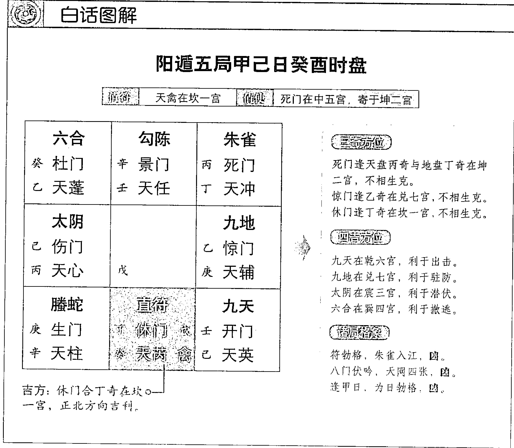

## 1. 甲戌时：无奇门可出

**【原文】**
甲戌心直符六，开直使六。戌至亥阳，宿干吉。杜辅使巽伏，伤冲月震伏，死芮星坤伏。天七，地二，阴八，合三。无奇门，合时亥甲如上法，时干乾，伏吟，飞甲阖。

**【白话提要】**
符使宫位：值符天心在乾六宫，值使开门在乾六宫。戌时至亥时为五阳时。时干遇吉星宿，时干逢吉。
三奇方位：杜门逢双乙奇在巽四宫，同类伏。伤门逢双丙奇在震三宫，同类伏。死门逢双丁奇在坤二宫，同类伏。
四吉方位：九天在兑七宫，九地在坤二宫，太阴在艮八宫，六合在震三宫。
诸局格象：无奇门，凶。时干在乾六宫。九星、值符、八门都在本宫未动，为伏吟格，凶。

| 勾陈 | 朱雀 | 九地 |
| --- | --- | --- |
| 乙杜门 | 壬景门 | 丁死门 |
| 乙天辅 | 壬天英 | 丁天芮 |
| 六合 | 九天 | 戌禽 |
| 丙伤门 | 戊 | 庚惊门 |
| 丙天冲 | 庚天柱 |
| 太阴 | 螣蛇 | 直符 |
| 辛生门 | 癸休门 | 己开门 |
| 辛天任 | 癸天蓬 | 己天心 |

---

## 2. 乙亥时：逢己日不宜用事

**【原文】**
乙亥心四，开七。宿凶干吉，己日不用。休乾和欢怡，开兑伏，伤艮制。天三，地八，阴二，合七，休与日合六西北，开与月合七正西，火入金，时干乾，金入火，事同，符冲。

**【白话提要】**
符使宫位：值符天心在巽四宫，值使开门在兑七宫。时干遇凶星宿，时干逢吉。逢己日不宜用事。
三奇方位：休门逢乙奇在乾六宫，被生，吉利。开门逢丙奇在兑七宫，同类伏。伤门逢丁奇在艮八宫，克宫。
四吉方位：九天在震三宫，九地在艮八宫，太阴在坤二宫，六合在兑七宫。
诸局格象：休门合乙奇在乾六宫，西北方向吉利。开门合丙奇在兑七宫，正西方向吉利。荧入太白。时干在乾六宫。太白入荧。九星和值符都到了与其对冲的宫位，为反吟格，凶。

---

## 3. 乙庚日十二时局

### 丙子时：逢庚日不宜用事

**【原文】**
丙子心三，开八。子至寅阳，宿干吉，庚日不用。景合兑制，杜丁坤制，惊坎义。天八，地一，阴九，合二。无奇门，时乾坤，相佐震，乙日飞干格。

**【白话提要】**
符使宫位：值符天心在震三官，值使开门在艮八宫。子时至寅时为五阳时。时干遇吉星宿，时干逢吉。逢庚日不宜用事。
三奇方位：景门逢乙奇在兑七宫，克宫，奇仪相合。杜门逢天盘丙奇与地盘丁奇在坤二官，克官。惊门逢丁奇在坎一宫，生官。
四吉方位：九天在艮八宫，九地在坎一宫，太阴在离九宫，六合在坤二官。
诸局格象：无奇门，凶。时干在坤二官。值符得地盘丙奇相助在震三宫。逢乙日，为飞干格，凶。

---

### 丁丑时：无奇门可出

**【原文】**
丁丑心二，开九。宿凶于吉。景良义，杜坎和，惊乙巽制。天九，地四，阴六，合一。无奇门，时干巽，相佐坤；仪刑，龙走。

**【白话提要】**
符使宫位：值符天心在坤二宫，值使开门在离九宫。时干遇凶星宿，时干逢吉。
三奇方位：景门逢乙奇在艮八宫，生宫。杜门逢丙奇在坎一宫，被生。惊门逢天盘丁奇与地盘乙奇在巽四宫，克官。
四吉方位：九天在离九宫，九地在巽四宫，太阴在乾六宫，六合在坎一宫。
诸局格象：无奇门，凶。时干在巽四宫。值符得地盘丁奇相助在坤二宫。六仪击刑，凶。青龙逃走，凶。

---

### 戊寅时：正北东北方向吉利

**【原文】**
戊寅心五，开一。宿干吉。休艮害，开坎义，伤乙巽伏。天九，地四，阴六，合一。开与月合一正北，休与日合八东北，时干巽，相佐坤，义刑，龙走。

**【白话提要】**
符使宫位：值符天心在中五宫，寄于坤二宫，值使开门在坎一宫。时干遇吉星宿，时干逢吉。
三奇方位：休门逢乙奇在艮八宫，被克。开门逢丙奇于坎一宫，生官。伤门逢天盘丁奇与地盘乙奇在巽四宫，同类伏。
四吉方位：九天在离九宫，九地在巽四宫，太阴在乾六宫，六合在坎一宫。
诸局格象：开门合丙奇在坎一宫，正北方向吉利。休门合乙奇在艮八宫，东北方向吉利。时干在巽四宫。值符得地盘丁奇相助在坤二宫。六仪击刑，凶。青龙逃走，凶。

**白话图解**
## 阳遁五局乙庚日戊寅时盘

| 类别 | 详情 |
| :--- | :--- |
| **值符** | 天心在中五宫，寄于坤二宫 |
| **值使** | 开门在坎一宫 |

#### 三奇方位
- 休门逢乙奇在艮八宫，被克。
- 开门逢丙奇于坎一宫，生官。
- 伤门逢天盘丁奇与地盘乙奇在巽四宫，不相生克。

#### 四吉方位
- 九天在离九宫，利于出击。
- 九地在巽四宫，利于驻防。
- 太阴在乾六宫，利于潜伏。
- 六合在坎一宫，利于撤逃。

#### 诸局格象
- 六仪击刑，青龙逃走，凶。

---

# 己卯时：宜守户不出

**【原文】**
己卯心六，开二，卯至未阴，守户，宿吉干凶。死乙巽害，景丙震和，开丁坤和。天七，地二，阴八，合三。开与星合二西南，符勃，时干乾，符伏，庚日伏干格。

**【白话提要】**
符使宫位：值符天心在乾六宫，值使开门在坤二宫。卯时至未时为五阴时，宜守户不出。时干遇吉星宿，时干逢凶。
三奇方位：死门逢双乙奇在巽四宫，被克。景门逢双丙奇在震三宫，被生。开门逢双丁奇在坤二宫，被生。
四吉方位：九天在兑七宫，九地在坤二宫，太阴在艮八宫，六合在震三宫。
诸局格象：开门合丁奇在坤二宫，西南方向吉利。符勃格。时干在乾六宫。九星和值符都在本宫未动，为伏吟格，凶。逢庚日，为伏干格，凶。

---

### 庚辰时：西南方向吉利

**【原文】**
庚辰心七，开三。宿干凶。开丙震制，惊合艮和，生合离和。天二，地九，阴一，合八。开与日合三正东，乙下有丙，生与星合九正南，时乾坤，三吉，飞符，飞宫格。

**【白话提要】**
符使宫位：值符天心在兑七宫，值使开门在震三宫。时干遇吉星宿，时干逢凶。
三奇方位：开门逢天盘乙奇与地盘丙奇在震三宫，克宫。惊门逢丙奇在艮八宫，被生，奇仪相合。生门逢丁奇在离九宫，被生，奇仪相合。
四吉方位：九天在坤二宫，九地在离九宫，太阴在坎一宫，六合在艮八宫。
诸局格象：开门合乙奇在震三宫，西南方向吉利。符勃格。时干在乾六宫。值符在本宫未动，为值符伏吟，凶。逢庚日，为伏干格，凶。

---

# 辛巳时：逢乙日不宜用事

**【原文】**
辛巳心八，开四。宿吉干凶，乙日不用，生墓丁坤伏，休离制，杜墓乾害欢怡。天一。地六，阴四，合九。生与日合二西南，休与月合九正南，时干巽，大格，反吟，虎猖狂。

**【白话提要】**
符使宫位：天心星为值符居艮八宫，开门为值使居巽四宫。星宿吉，时干逢凶。逢乙日不宜用事。
三奇方位：生门逢天盘乙奇与地盘丁奇在坤二宫，同类伏，乙奇入墓。休门逢丙奇在离九宫，克宫。杜门逢丁奇在乾六宫，被克，吉利，丁奇入墓。
四吉方位：九天在坎一宫，九地在乾六宫，太阴在巽四宫，六合在离九宫。
诸局格象：生门合乙奇在坤二宫，西南方向吉利。休门合丙奇在离九宫，正南方向吉利。时干在巽四宫。大格，凶。八门都在本宫未动，为八门反吟格，凶。白虎猖狂，凶。

**白话图解**
（此处为图片占位符，原图已省略）

---

### 壬午时：西北方向吉利

**【原文】**
壬午心九，开五避五。宿干凶。伤坎和，生墓乾义欢怡，景丙震和。天四，地三，阴七，合六。生与月合六西北，符勃，蛇矫，时干艮，乙日伏干格。

**【白话提要】**
符使宫位：值符天心在离九宫，值使开门在中五宫，寄于坤二。时干遇凶星宿，时干逢凶。
三奇方位：伤门逢乙奇在坎一宫，被生。生门逢丙奇在乾六宫，生宫，吉利。丙奇人墓。景门逢地盘丁奇与地盘丙奇在震三宫，被生。
四吉方位：九人在巽四宫，九地在震三宫，太阴在兑七宫，六合在乾六宫。
诸局格象：生门合丙奇在乾六宫，西北方向吉利。符勃格，凶。䖃蛇夭矫，凶。时干在艮八宫。逢己日，为伏干格，凶。（注：原文此处有误，根据前文逻辑应修正为“逢乙日”或保留原意，此处按OCR校正为乙日格）。

- 符使宫位：值符天心在离九宫，值使开门在中五宫，寄于坤二宫。时干遇凶星宿，时干逢凶。
- 三奇方位：伤门逢乙奇在坎一宫，被生。生门逢丙奇在乾六宫，生宫，吉利。丙奇人墓。景门逢天盘丁奇与地盘丙奇在震三宫，被生。
- 四吉方位：九人在巽四宫，九地在震三宫，太阴在兑七宫，六合在乾六宫。
- 诸局格象：生门合丙奇在乾六宫，西北方向吉利。符勃格，凶。䖃蛇天矫，凶。时干在艮八宫。逢乙日，为伏干格，凶。

---

# 癸未时：无奇门可出

**【原文】**
癸未心一，开六。宿干凶。景离伏，杜乙巽伏，惊兑伏。天六，地七，阴三，合四。无奇门，乙日伏干格，时干艮，刑格，乙格，门伏，天网四张。

**【白话提要】**
符使宫位：值符天心在坎一宫，值使开门在乾六宫。
三奇方位：景门逢乙奇在离九宫，同类伏。杜门逢天盘丙奇与地盘乙奇在巽四宫，同类伏。惊门逢丁奇在兑七宫，同类伏。
四吉方位：九天在乾六宫，九地在兑七宫，太阴在震三宫，六合在巽四宫。
诸局格象：无奇门，凶。逢乙日，为伏干格，凶。时干在艮八宫。刑格，凶。乙奇格，凶。八门伏吟，凶。天网四张，凶。

---

### 甲申时：无奇门可出

**【原文】**
甲申柱直符七，惊直使七。申至亥阳，天辅，宿凶干吉。伤冲使震伏，杜辅日巽伏，死芮星坤伏。天二，地九，阴一，合八。无奇门，天乙与太白格，时干兑，伏吟，地甲，事同阖。

**【白话提要】**
符使宫位：值符天柱在兑七宫，值使惊门在兑七宫。申时至亥时为五阳时，申时为天辅释罪时。时干遇凶星宿，时干逢吉。
三奇方位：伤门逢双丙奇在震三宫，同类伏。杜门逢双乙奇在巽四宫，同类伏。死门逢双丁奇在坤二宫，同类伏。
四吉方位：九天在坤二宫，九地在离九宫，太阴在坎一宫，六合在艮八宫。
诸局格象：无奇门，凶。天乙与六庚成飞宫格，凶。时干在兑七宫。伏吟格，凶。地甲合，凶。

| 类别 | 详情 |
| :--- | :--- |
| **值符** | 天柱在兑七宫 |
| **值使** | 惊门在兑七宫 |

#### 三奇方位
- 伤门逢双丙奇在震三宫，同类伏。
- 杜门逢双乙奇在巽四宫，同类伏。
- 死门逢双丁奇在坤二宫，同类伏。

#### 四吉方位
- 九天在坤二宫，利于出击。
- 九地在离九宫，利于驻防。
- 太阴在坎一宫，利于潜伏。
- 六合在艮八宫，利于撤退。

#### 诸局格象
- 无奇门，凶。
- 天乙与六庚成飞宫格，伏吟格，凶。

---

### 乙酉时：正东方向吉利

**【原文】**
乙酉柱四，惊八。宿干吉，景墓乾制，死坎制，开芮震制。天三，地八，阴二，合七。开与星合三正东，蛇矫，龙反，时干坎，乙日伏干格。

**【白话提要】**
符使宫位：值符天柱在巽四宫，值使惊门在艮八宫。时干遇吉星宿，时干逢吉。
三奇方位：景门逢丙奇在乾六宫，克官，丙奇入墓。死门逢乙奇在坎一宫，克宫。开门逢天盘丁奇与地盘丙奇在震三宫，克宫。
四吉方位：九天在震三宫，九地在艮八宫，太阴在坤二宫，六合在兑七官。
诸局格象：开门合丁奇在震三宫，正东方向吉利。腾蛇夭矫，凶。青龙回首，凶。时干在坎一宫。逢乙日，为伏干格，凶。

---

# 丙戌时：逢庚日不宜用事

**【原文】**
丙戌柱三，惊九。宿干吉，庚日不用。休兑和欢怡，生乾义，杜艮制。天八，地一，阴九，合二。生与日合六西北，得使休与月合七正西，庚干勃，时干兑，相佐震，火入金，符冲。

**【白话提要】**
- 符使宫位：值符天柱在震三宫，值使惊门在离九宫。时干遇吉星宿，时干逢吉。逢庚日不宜用事。
- 三奇方位：休门逢丙奇在兑七宫，被生，吉利。生门逢乙奇在乾六宫，生官。杜门逢丁奇在艮八宫，克官。
- 四吉方位：九天在艮八宫，九地在坎一宫，太阴在离九宫，六合在坤二宫。
- 诸局格象：生门合乙奇在乾六宫，西北方向吉利。日奇得使。休门合丙奇在兑七宫，正西方向吉利。遇庚日，为日干勃格，凶。时干在兑七宫。值符得地盘丙奇相助于震三宫。荧入太白，凶。九星和值符都到了与其相冲的宫位，为反吟格，凶。

---

### 丁亥时：正东东北方向吉利

**【原文】**
丁亥柱二，惊一。宿凶干吉。开合艮和，休丙震义，伤合离义。天九，地四，阴六，合一。开与月合八东北，休与日合三正东，乙下有丙，时干离，相佐坤。

**【白话提要】**
符使宫位：值符天柱在坤二宫，值使惊门在坎一宫。时干遇凶星宿，时干逢吉。
三奇方位：开门逢丙奇在艮八宫，被生，奇仪相合。休门逢天盘乙奇与地盘丙奇在震三宫，被生。伤门逢丁奇在离九宫，生宫。
四吉方位：九天在离九宫，九地在巽四宫，太阴在乾六宫，六合在坎一宫。
诸局格象：开门合月奇在艮八宫，东北方向吉利。休门合乙奇在震三宫，正东方向吉利。乙下有丙，为奇仪顺遂。时干在离九宫。值符得地盘丁奇相助于坤二宫。

---

## 4. 丙辛日十二时局

### 戊子时：宜守户不出

**【原文】**
戊子柱五，惊二。子阳守户，宿凶干吉。伤合艮制，杜丙震伏，死合离和。天九，地四，阴六，合一。无奇门，辛干勃，时干离，相佐坤，飞宫，事同。

**【白话提要】**
- 符使宫位：值符天柱在中五宫，寄于坤二宫，值使惊门在坤二宫。子时为五阳时，宜守户不出。时干遇凶星宿，时干逢吉。
- 三奇方位：伤门逢丙奇在艮八宫，克宫，奇仪相合。杜门逢天盘乙奇与地盘丙奇在震三宫，同类伏。死门逢丁奇在离九宫，被生。
- 四吉方位：九天在离九宫，九地在巽四宫，太阴在乾六宫，六合在坎一宫。
- 诸局格象：无奇门，凶。逢辛日，为日干勃格，凶。时干在离九宫。值符得地盘丁奇相助在坤二宫。飞宫格，凶。

**白话图解**
# 阳遁五局丙辛日戊子时盘

| 类别 | 详情 |
| :--- | :--- |
| **值符** | 天柱在中五宫，寄于坤二宫 |
| **值使** | 惊门在坤二宫 |

#### 三奇方位
- 伤门逢丙奇在艮八宫，克宫，奇仪相合。
- 杜门逢天盘乙奇与地盘丙奇在震三宫，同类伏。
- 死门逢丁奇在离九宫，被生。

#### 四吉方位
- 九天在离九宫，利于出击。
- 九地在巽四宫，利于驻防。
- 太阴在乾六宫，利于潜伏。
- 六合在坎一宫，利于撤退。

#### 诸局格象
- 无奇门，凶。
- 飞宫格，凶。
- 逢辛日，为日干勃格，凶。

---

### 己丑时：正南东南方向吉利

**【原文】**
己丑柱六，惊三。丑至巳阴，宿干凶。开乙巽制，休离制，伤兑害欢怡。天七，地二，阴八，合三。开与月合四东南，丙下有乙，休与日合九正南，时干坎，刑格，三吉，门反吟。

**【白话提要】**
符使宫位：值符天柱在乾六宫，值使惊门在震三宫。丑时至巳时为五阴时。时干遇凶星宿，时干逢凶。
三奇方位：开门逢天盘丙奇与地盘乙奇在巽四宫，克官。休门逢乙奇在离九宫，克宫。伤门逢丁奇在兑七宫，被克，吉利。
四吉方位：九天在兑七宫，九地在坤二宫，太阴在艮八宫，六合在震三宫。
诸局格象：开门合丙奇在巽四宫，东南方向吉利。丙下有乙，为日月并行。休门合乙奇在离九宫，正南方向吉利。时干在坎一宫。刑格，凶。三吉格。八门反吟，凶。

**白话图解**

| **值符** | 天柱在乾六宫 | **值使** | 惊门在震三宫 |
| :--- | :--- | :--- | :--- |
| **勾陈**<br>两乙<br>丙 | **朱雀**<br>乙生<br>土 | **九地**<br>生门<br>天英<br>丁 | **六合**<br>辛开<br>丙 |
| **九天**<br>丁庚 | **伤门**<br>戊<br>天芮<br>禽 | **太阴**<br>癸辛 | **螣蛇**<br>乙癸 |
| **直符**<br>庚<br>己 | **死门**<br>天蓬<br>开门<br>惊门<br>天任 | | |

---

### 庚寅时：西南方向吉利

**【原文】**
- **庚寅**柱七，惊四。宿干凶。死芮震亥，惊合巽制，休丁坤害。天二，地九，阴一，合八。休与星合二西南，伏干格，飞干格，时干兑，反吟，击刑，符伏。

**【白话提要】**
- **符使宫位：** 值符天柱在兑七宫，值使惊门在巽四宫。星宿凶，时干逢凶。
- **三奇方位：** 死门逢双丙奇于震三宫，被克。惊门逢双乙奇在巽四宫，克宫，奇仪相合。休门逢双丁奇于坤二宫，被克。
- **四吉方位：** 九天在坤二宫，九地在离九宫，太阴在坎一宫，六合在艮八宫。
- **诸局格象：** 休门合丁奇在坤二宫，西南方向吉利。伏干格，凶。飞干格，凶。时干在兑七宫。反吟格，凶。击刑，凶。九星和值符都在本宫未动，为伏吟格，凶。

**白话图解**
# 阳遁五局丙辛日庚寅时盘

- **值符：** 天柱在兑七宫
- **值使：** 惊门在巽四宫

### 吉方
- 休门合丁奇在坤二宫，西南方向吉利。

| 玄武 | 九地 | 九天 |
| :--- | :--- | :--- |
| 乙惊门 | 壬开门 | 休门 |
| 乙天辅 | 壬天英 | 芮禽 |
| **白虎** | | **直符** |
| 丙死门 | 戊 | 庚生门 |
| 丙天冲 | | 庚天柱 |
| **六合** | **太阴** | **螣蛇** |
| 辛景门 | 癸杜门 | 己伤门 |
| 辛天任 | 癸天蓬 | 己天心 |

#### 三奇方位
- 死门逢双丙奇于震三宫，被克。
- 惊门逢双乙奇在巽四宫，克宫。
- 休门逢双丁奇于坤二宫，被克。

#### 四吉方位
- 九天在坤二宫，利于出击。
- 九地在离九宫，利于驻防。
- 太阴在坎一宫，利于潜伏。
- 六合在艮八宫，利于撤退。

#### 诸局格象
- 伏干格，飞干格，反吟格，击刑，凶。九星和值符都在本宫未动，为伏吟格，凶。## # 辛卯时：正北正西方向吉利

**【原文】**

辛卯柱八，惊五避五。宿吉干凶。惊丁坤和，开合兑伏欢怡，生坎制。天一，地六，阴四，合九。开与日合七正西，生与星合一正北，时干离，辛日伏干格。

**【白话提要】**

符使宫位：值符天柱在艮八宫，值使惊门在中五宫，寄于坤二宫。时干遇吉星宿，时干逢凶。

三奇方位：惊门逢天盘丙奇与地盘丁奇在坤二宫，被生。开门逢乙奇在兑七宫，同类伏，吉利，奇仪相合。生门逢丁奇在坎一宫，克宫。

四吉方位：九天在坎一宫，九地在乾六宫，太阴在巽四宫，六合在离九宫。

诸局格象：开门合乙奇在兑七宫，正西方向吉利。生门合丁奇在坎一宫，正北方向吉利。时干在离九宫。

## # 壬辰时：逢丙日不宜用事

**【原文】**
壬辰柱九，惊六。宿干凶，丙日不用。开坎义，休艮害，伤乙巽伏。天四,
地三，阴七，合六。开与月合一正北，时干震，休与日合八东北。

**【白话提要】**
符使宫位：值符天柱在离九宫，值使惊门在乾六宫。时干遇凶星宿，时干逢凶。逢
丙日不宜用事。

三奇方位：开门逢丙奇在坎一宫，生宫。休门逢乙奇在艮八宫，被克。伤门逢天
盘丁奇与地盘乙奇在巽四宫，同类伏。

四吉方位：九天在巽四宫，九地在震三宫，太阴在兑七宫，六合在乾六宫。

诸局格象：开门合丙奇在坎一宫，正北方向吉利。时干在震三宫。休门合乙奇在
艮八宫，东北方向吉利。

> **白话图解**
阳遁五局丙辛日壬辰时盘

| 九天 | 直符 | 螣蛇 |
|:---|:---|:---|
|丁<br>伤门 戊<br>乙<br>天芮 禽 |庚<br>杜门 壬<br>天柱 |己<br>景门<br>天心 |
|九地 |太阴 |
|壬<br>生门<br>丙<br>天英 |戊 |癸<br>死门<br>庚<br>天蓬 |
|朱雀<br>乙<br>休门 辛<br>天辅 |勾陈<br>巽<br>开门 癸<br>天冲 |六合<br>辛<br>惊门<br>己<br>天任 |

吉方2：休门合乙奇在艮八宫，东北方向吉利。
吉方1：开门合丙奇在坎一宫，正北方向吉利。

## # 癸巳时：西北方向吉利

**【原文】**
癸巳 柱一，惊七。宿干凶。景离伏，死丁坤伏，开墓乾伏。天六，地七，阴三，合四。开与星合六西北，天乙与太白格，虎猖狂，时干震，大格，门伏，天网四张。

**【白话提要】**
符使宫位：值符天柱在坎一宫，值使惊门在兑七宫。时干遇凶星宿，时干逢凶。
三奇方位：景门逢丙奇在离九宫，同类伏。死门逢天盘乙奇与地盘丁奇在坤二宫，同类伏。开门逢丁奇于乾六宫，同类伏，丁奇入墓。
四吉方位：九天在乾六宫，九地在兑七宫，太阴在震三宫，六合在巽四宫。
诸局格象：开门合丁奇在乾六宫，西北方向吉利。天乙与六庚宫位有格。白虎猖狂。时干在震三宫。大格。八门伏吟。天网四张。

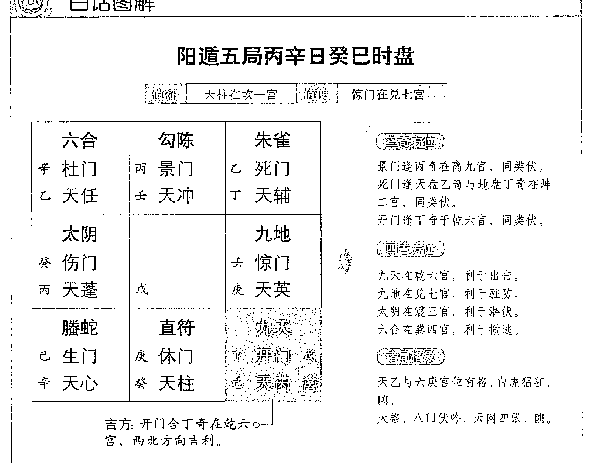

**【三奇方位】**
景门逢丙奇在离九宫，同类伏。死门逢天盘乙奇与地盘丁奇在坤二宫，同类伏。
开门逢丁奇于乾六宫，同类伏。

**【四吉方位】**
九天在乾六宫，利于出击。九地在兑七宫，利于驻防。
太阴在震三宫，利于潜伏。六合在巽四宫，利于撤退。

**【诸局格象】**
天乙与六庚宫位有格，白虎猖狂，凶。
大格，八门伏吟，天网四张，凶。

## # 甲午时：无奇门可出

> **原文**
甲午任直符八。生直使八。午至戌阳，天辅，宿干吉。杜辅使巽伏，伤冲月震伏，死芮星坤伏。天一，地六，阴四，合九。无奇门，时干艮，伏吟，遁甲，自刑阖。

**【白话提要】**符使宫位: 值符天任在艮八宫，值使生门在艮八宫。午时至戌时为五阳时，午时为天辅释罪时。时干遇吉星宿，时干逢吉。**三奇方位**: 杜门逢双乙奇于巽四官，同类伏。伤门逢双丙奇于震三宫，同类伏。死门逢双丁奇于坤二宫，同类伏。
**四吉方位**:九天在坎一宫，九地在乾六宫，太阴在巽四宫，六合在离九宫。**诸局格象**:无奇门。时干在艮八宫。九星、值符和八门都在本宫未动，为伏吟格。遁甲自刑,合。

**白话图解**

# 阳遁五局丙辛日甲午时盘
值符天任在艮八宫 |值使生门在艮八宫

| 太阴 | 六合 | 勾陈 |
| --- | --- | --- |
|乙杜门<br>乙天辅 |壬惊门<br>壬天芮 |丁死门戊禽<br>丁天芮|
| 螣蛇 | 朱雀 | |
|丙伤门庚惊门<br>丙天冲庚天柱 |直符<br>辛生门己开门<br>辛天任癸天蓬巳天心 |

**三奇方位**
杜门逢双乙奇于巽四宫，同类伏。
伤门逢双丙奇于震三宫，同类伏。
死门逢双丁奇于坤二宫，同类伏。

**四吉方位**
九天在坎一宫，利于出击。
九地在乾六宫，利于驻防。
太阴在巽四宫，利于潜伏。
六合在离九宫，利于撤退。

**诸局格象**
无奇门，凶。
九星、值符和八门都在本宫未动，为伏吟格，凶。

## # 乙未时，正南方向吉利

### 【原文】

乙未 任四，生九。宿干吉。伤墓丁坤伏，生离和，景墓乾制。天三，地八，阴二，合七。生与月合九正南，大格，虎猖狂，时干坤。

### 白话提要

符使宫位：天任星为值符居巽四宫，生门为值使居离九宫。星宿吉，时干逢吉。

三奇方位：伤门逢天盘乙奇与地盘丁奇在坤二宫，同类伏，乙奇入墓。生门逢丙奇在离九宫，被生。景门逢丁奇在乾六宫，克宫，丁奇入墓。

四吉方位：九地在离三宫，九地在艮八宫，太阴在坤二宫，六合在兑七宫。

诸局格象：生门合丙奇在离九宫，正南方向吉利。大格。白虎猖狂。时干在坤二官方位。

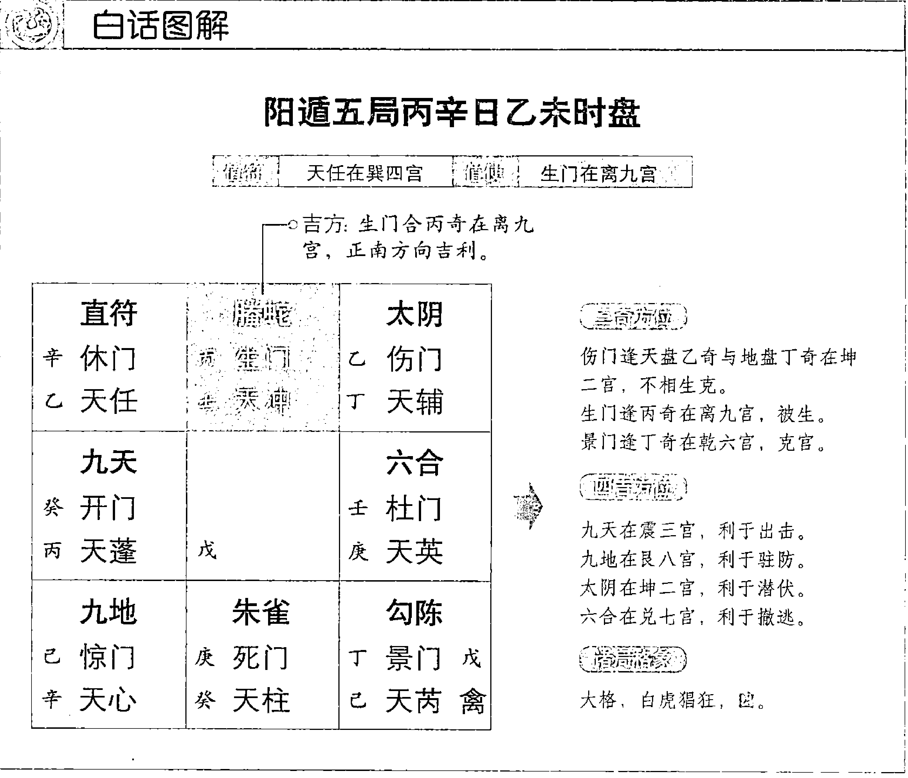

## # 丙申时：正西方向吉利

### 原文

丙申 任三，生一。宿干吉。死离和，景乙巽和，开兑伏。天八，地一，阴九，合二。开与星合七正西，时干巽，相佐震，刑格。

### 白话提要

符使宫位: 值符天任星在震三宫，值使生门在坎一宫。时干遇吉星宿，时干逢吉。

三奇方位: 死门逢乙奇在离九宫，被生。景门逢天盘丙奇与地盘乙奇在巽四宫，被生。开门逢丁奇在兑七宫，同类伏。

四吉方位: 九天在艮八宫，九地在坎一宫，太阴在离九宫，六合在坤二宫。

诸局格象：开门合丁奇在兑七宫，正西方向吉利。时干在巽四宫。值符得地盘丙奇相助在震三宫。刑格。

## 白话图解

阳遁五局丙辛日丙申时盘

| 天任在震三宫 | 生门在坎一宫 |
|---|---|
| **螣蛇** | **太阴** | **六合** |
| 丙景门 | 乙死门 | 壬惊门 |
| 乙天冲 | 壬天辅 | 丁天英 |

| **直符** | **勾陈** |
|---|---|
| 蓬杜门 | 开<br>丙天任<br>庚天芮 |

| **九天** | **九地** | **朱雀** |
|---|---|---|
| 癸伤门 | 己生门 | 庚休门 |
| 辛天蓬 | 癸天心 | 己天柱 |

> ### 三奇方位

死门逢乙奇在离九宫，被生。

景门逢天盘丙奇与地盘乙奇在巽四宫，被生。

开门逢丁奇在兑七宫，不相生克。

#### 四吉方位

九天在艮八宫，利于出击。

九地在坎一宫，利于驻防。

太阴在离九宫，利于潜伏。

六合在坤二宫，利于撤退。

#### 诸局格象

刑格，凶。

吉方：开门合丁奇在兑七宫，正西方向吉利。

## # 丁酉时：宜守户不出

**【原文】** 丁酉任二，生二。宿吉干凶，守户，辛日不用，杜乾害，伤兑害，死艮伏。天九，地四，阴六，合一。无奇门，火入白，丙日飞干格，时干艮，相佐坤，符冲。

**【白话提要】** 符使宫位：值符天任在坤二宫，值使生门在坤二宫。时干遇吉星宿，时干逢凶。宜守户不出。逢辛日不宜用事。
三奇方位：杜门逢乙奇在乾六宫，被克。伤门逢丙奇在兑七宫，被克。死门逢丁奇在艮八宫，同类伏。
四吉方位：九天在离九宫，九地在巽四宫，太阴在乾六宫，六合在坎一宫。
诸局格象：无奇门。荧入太白。逢丙日，为飞干格。时干在艮八宫。值符得地盘丁奇相助在坤二宫。九星和值符都到了与其对冲的宫位，为反吟格。

> - **白话图解**: 

### 阳遁五局丙辛日丁酉时盘

| 九地 | 九天 | 直符 |
|---|---|---|
| 己开门 | 癸休门 | 辛生门 |
| 乙天心 | 壬天蓬 | 丁天任 |
| 朱雀惊门 | | 腾蛇伤门 |
| 庚丙天柱 | 戊 | 丙庚天冲 |
| 勾陈死门 | 六合景门 | 太阴杜门 |
| 丁辛天芮禽癸壬天英 | | 乙己天辅 |

> - **三奇方位**: 
杜门逢乙奇于乾六宫，被克。
伤门逢丙奇于兑七宫，被克。
死门逢丁奇于艮八宫，不相生克。

> - **四吉方位**: 
九天在离九宫，利于出击。
九地在巽四宫，利于驻防。
太阴在乾六宫，利于潜伏。
六合在坎一宫，利于撤退。

> - **诸局格象**: 
无奇门，凶。
荧入太白，凶。
逢丙日，为飞干格，凶。
九星和值符都到了与其对冲的宫位，为反吟格，凶。

## # 戊戌时：东北方向吉利

> **原文**
戊戌任五，生三。宿干吉。惊乾伏，死兑义，休艮害欢怡。天九，地四，阴六,合一。休与星合八东北，时干艮，符冲，金入火，三吉。

> **白话提要**

符使宫位: 值符天任在中五宫，寄于坤二宫，值使生门在震三宫。时干遇吉星宿，时干逢吉。

三奇方位：惊门逢乙奇在乾六宫，同类伏。死门逢丙奇在兑七宫，被生。休门逢丁奇在艮八宫，被克，吉利。
四吉方位: 九天在离九宫，九地在巽四宫，太阴在乾六宫，六合在坎一宫。

诸局格象：休门合丁奇在艮八宫，东北方向吉利。时干在艮八宫。九星和值符都到了与其相冲的宫位，为反吟格。太白入荧。三吉格。

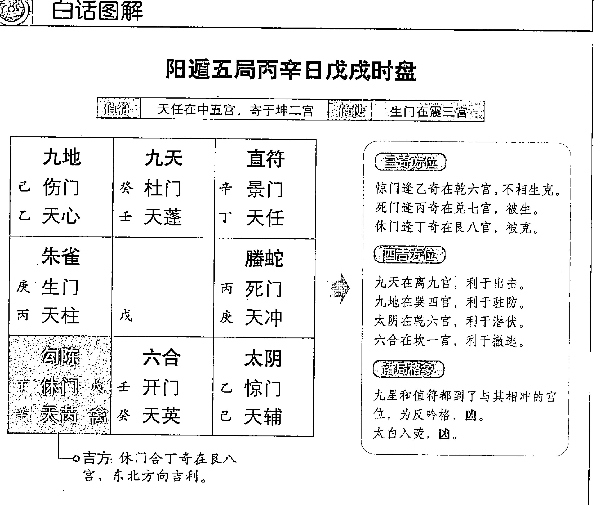

## # 己亥时：东南方向吉利

**【原文】**

己亥 任六，生四。亥阴，宿吉干凶。开艮和欢怡，惊丙坎义，生乙巽害。
天七，地二，阴八，合三。生与星合四东南，时干坤，开与日合八东北，龙走。

**【白话提要】**

符使宫位：值符天任在乾六宫，值使生门在巽四宫。亥时为五阴时。时干遇吉星宿，时干逢凶。

三奇方位：开门逢乙奇在艮八宫，被生，吉利。惊门逢丙奇在坎一宫，生官。生门逢天盘丁奇与地盘乙奇在巽四宫，被克。

四吉方位：九天在兑七宫，九地在坤二宫，太阴在艮八宫，六合在震三宫。

诸局格象：生门合丁奇在巽四宫，东南方向吉利。时干在坤二宫。开门合乙奇在艮八宫，东北方向吉利。青龙逃走。

| 天任在乾六宫 | 生门在巽四宫 |
|---|---|
| **吉方1**：生门合丁奇在巽四宫，东南方向吉利。 | 
|| **勾陈** | **朱雀** | **九地** |
|---|---|---|
| 可生门疾禽<br>己天芮禽<br>色生门禽 | 庚伤门<br>壬天柱 | 巳杜门<br>丁天心 |
| **六合** | 
|---|---|
| 壬休门<br>丙天英 | 戊 | 癸景门<br>庚天蓬 |
| **太阴**<br>**己开门户辅** | **螣蛇**<br>**丙惊门**<br>**癸天冲** | **直符**<br>**辛死门**<br>**己天任** | 
| **吉方2**：开门合乙奇在艮八宫，东北方向吉利。 |

## # 4.丁壬日十二时局

### ## 庚子时：无奇门可出

# ### 【原文】

**庚子**任七，生五避五。子至卯阴，宿吉干凶。景坎害，杜墓乾害，惊丙震
至。天二，地九，阴一，合八。无奇门，蛇矫，时干巽，飞符，飞宫格。

# ### 【白话提要】

**符使宫位：**值符天任在兑七宫，值使生门在中五宫，寄于坤二宫。子时至卯时为
五阴时。时干遇吉星宿，时干逢凶。

**三奇方位：**景门逢乙奇在坎一宫，被克。杜门逢丙奇在乾六宫，被克，丙奇入墓。
惊门逢天盘丁奇与地盘丙奇在震三宫，克宫。

**四吉方位：**九天在坤二宫，九地在离九宫，太阴在坎一宫，六合在艮八宫。

**诸局格象：**无奇门。腾蛇天矫。时干在巽四宫。值符飞宫格。


> # 白话图解

> # 阳遁五局丁壬日庚子时盘

> # **值符**
> 
> **天任**在兑七宫

> # **值使**
> 
> **生门**在中五宫，寄于坤二宫

| 朱雀<br>庚开门<br>乙天柱 | 九地<br>己休门<br>壬天心 | 九天<br>癸生门<br>丁天蓬 |
|---|---|---|
| 勾陈<br>丁惊门<br>丙天芮<br>戊禽<br>戊 | **直符**<br>辛伤门<br>庚天任 |
| 六合<br>壬死门<br>辛天英 | 太阴<br>乙景门<br>癸天辅 | 螣蛇<br>丙杜门<br>己天冲 |

> # 三奇方位
景门逢乙奇在坎一宫，被克。
杜门逢丙奇在乾六宫，被克。
惊门逢天盘丁奇与地盘丙奇在震
三宫，克宫。

> # 四吉方位
九天在坤二宫，利于出击。
九地在离九宫，利于驻防。
太阴在坎一宫，利于潜伏。
六合在艮八宫，利于撤退。

> # 诸局格象
无奇门，凶。
螣蛇天矫，值符飞宫格，凶。

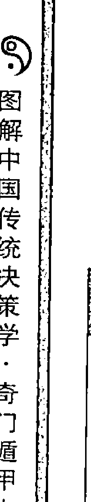

## # 辛丑时：西南方向吉利

### 原文

辛丑 任八，生六。宿吉干凶。死一巽害，景丙震和，开坤和。天一，地六,
阴四，合九。开与星合二西南，丁下有丁，时干艮，符伏吟。

### 白话提要

符使宫位：值符天任在艮八宫，值使生门在乾六宫。时干遇吉星宿，时干逢凶。
三奇方位：死门逢双乙奇在巽四宫，被克。景门逢双丙奇在震三宫，被生。开门
逢双丁奇在坤二宫，被生。

四吉方位：九天在坎一宫，九地在乾六宫，太阴在巽四宫，六合在离九宫。

诸局格象：开门合丁奇在坤二宫，西南方向吉利。丁下有丁，为奇入太阴。时干
在艮八宫。九星和值符都在本宫未动，为伏吟格。

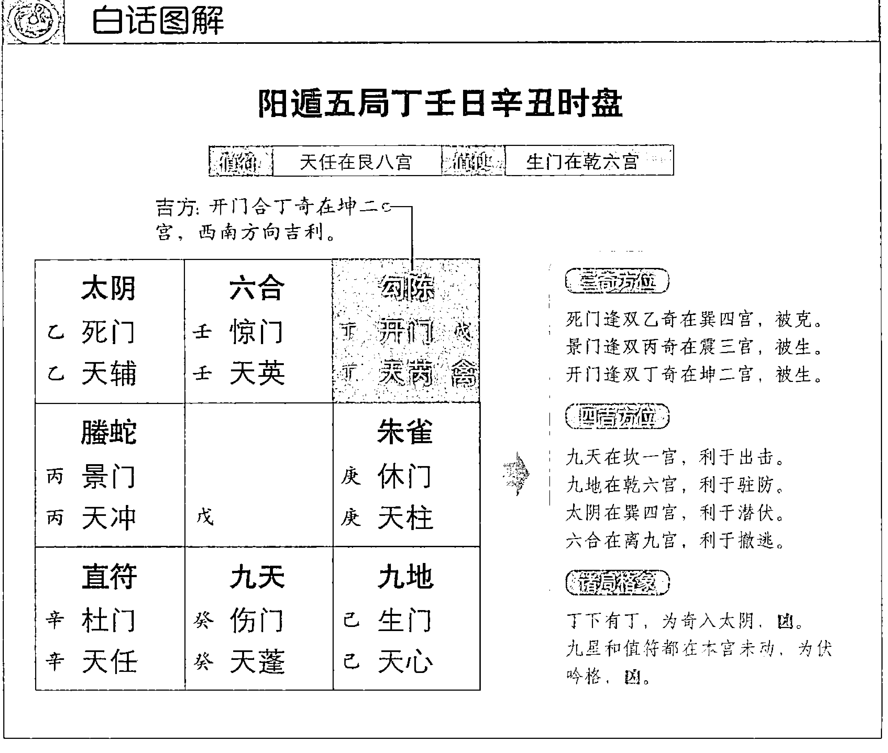

## # 壬寅时：正西西南方向吉利

### 【原文】

壬寅 任九，生七。宿吉干凶。生合兑义，休丁坤害，杜坎和。天四，地三，阴七，合六。休与月合二西南，丙下有丁，生与日合七正西，得使，天乙，伏官格，仪刑，雀入江，太白格，时干乾，乙格，丁日勃，鸟跌穴。

### 【白话提要】

**符使宫位**: 值符天任在离九宫，值使生门在兑七宫。时干遇吉星宿，时干逢凶。

**三奇方位**: 生门逢乙奇在兑七宫，生宫，奇仪相合。休门逢天盘丙奇与地盘丁奇在坤二宫，被克。杜门逢丁奇在坎一宫，被生。

**四吉方位**: 九天在巽四宫，九地在震三宫，太阴在兑七宫，六合在乾六宫。

**诸局格象**: 休门合丙奇在坤二宫，西南方向吉利。丙下有丁，为月奇朱雀。生门合乙奇在兑七宫，正西方向吉利。日奇得使。天乙伏宫格。六仪击刑。朱雀入江。六庚格。时干在乾六宫。乙奇格。遇丁日，为日勃格。飞乌跌穴。

## 白话图解

### 阳遁五局丁壬日壬寅时盘

**值符**   **天任**在离九宫   **值使**  **生门**在兑七宫

**吉方 1**：休门合丙奇在坤二宫，西南方向吉利。

**吉方 2**：生门合乙奇在兑七宫，正西方向吉利。

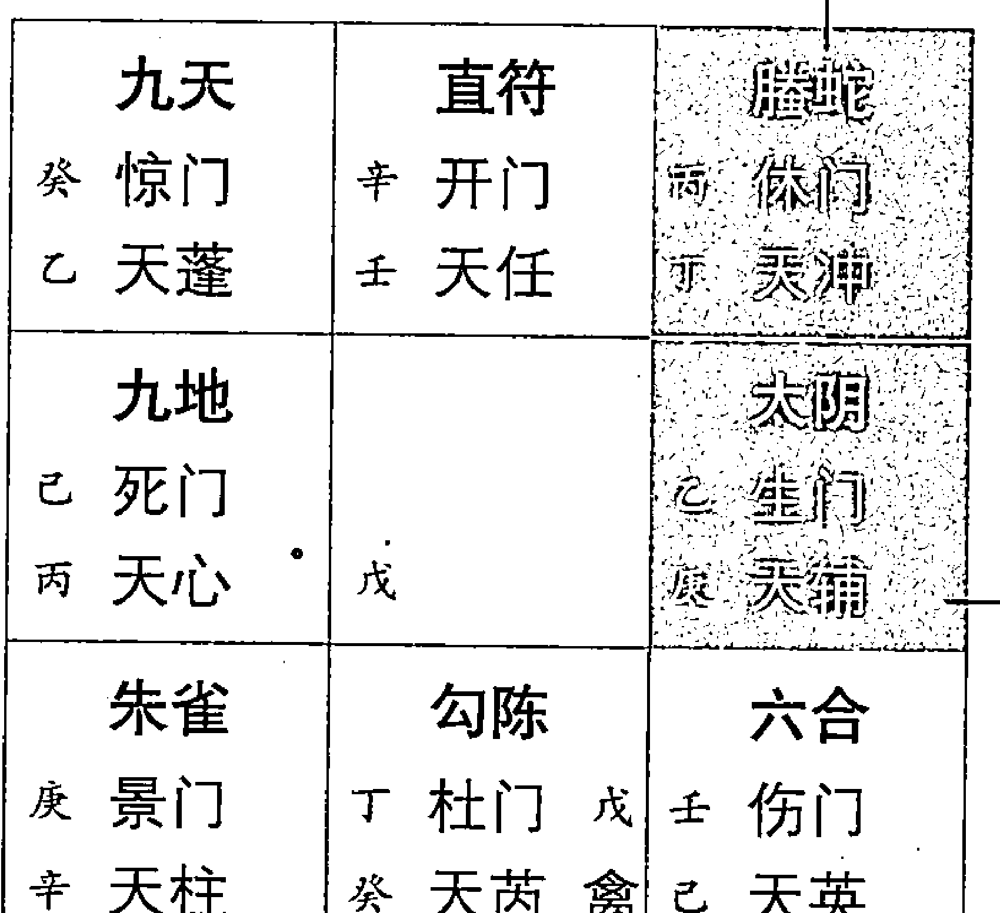

> **三奇方位**
生门逢乙奇在兑七宫，生宫。
休门逢天盘丙奇与地盘丁奇在坤二宫，被克。
杜门逢丁奇在坎一宫，被生。

> **四吉方位**
九天在巽四宫，利于出击。
九地在震三宫，利于驻防。
太阴在兑七宫，利于潜伏。
六合在乾六宫，利于撤退。

> **诸局格象**
丙下有丁，为月奇朱雀，吉。
日奇得使，吉。
飞鸟跌穴，吉。
天乙伏宫格，六仪击刑，朱雀入江，六庚格，凶。
遇丁日，为日勃格，凶。

## 癸卯时：逢丁日不宜用事

### 【原文】

癸卯任一，生八。宿干凶，丁日不用。伤丙震伏，生合艮和，景合离伏。

天六，地七，阴三，合四。生与月合八东北，符勃，鸟跌穴，时干乾，门伏，丁日伏干格，飞宫格，天网四张。

### 白话提要

符使宫位：值符天任在坎一宫，值使生门在艮八宫。时干遇凶星宿，时干逢凶。逢丁日不宜用事。

三奇方位：伤门逢天盘乙奇与地盘丙奇在震三宫，同类伏。生门合丙奇在艮八宫，被生，奇仪相合。景门合丁奇在离九宫，同类伏。

四吉方位：九天在乾六宫，九地在兑七宫，太阴在震三宫，六合在巽四宫。

诸局格象：生门合丙奇在艮八宫，东北方向吉利。符勃格。飞鸟跌穴。时干在乾六宫。八门伏吟。逢丁日，为伏干格。飞宫格。天网四张。

## 白话图解

### 阳遁五局丁壬日癸卯时盘

**值符**：天任在坎一宫，**值使**：生门在艮八宫

| 六合<br>杜门<br>乙<br>天英 | **勾陈**<br>**景门**<br>戊<br>壬<br>天芮<br>禽 | **朱雀**<br>**死门**<br>庚<br>丁<br>天柱 |
|---|---|---|
| **太阴**<br>**伤门**<br>丙<br>天辅 | **九地**<br>**惊门**<br>己<br>庚<br>天心 | **直符**<br>**休门**<br>辛<br>癸<br>天任 |
| **九天**<br>**开门**<br>癸<br>天蓬 | | |

#### 三奇方位

伤门逢天盘乙奇与地盘丙奇在震三宫，不相生克。
生门合丙奇在艮八宫，被生。
景门合丁奇在离九宫，不相生克。

#### 四吉方位

九天在乾六宫，利于出击。
九地在兑七宫，利于驻防。
太阴在震三宫，利于潜伏。
六合在巽四宫，利于撤退。

#### 诸局格象

飞鸟跌穴，吉。
符勃格，凶。
八门伏吟，凶。
飞宫格，天网四张，凶。
逢丁日，为伏干格，凶。

吉方：生门合丙奇在艮八宫，东北方向吉利。

# # 甲辰时：无奇门可出

### 【原文】

甲辰 英直符九，景直使九。辰至申阳，天辅，宿凶干吉。死芮使坤伏，杜辅日巽伏，伤冲月震。天四，地三，阴七，合六。无奇门，时干离，伏吟，飞甲，自刑，阖。

### 【白话提要】

符使宫位：值符天英在离九宫，值使景门在离九宫。辰时至申时为五阳时，辰时为天辅释罪时。时干遇凶星宿，时干逢吉。

三奇方位：死门逢双丁奇在坤二宫，同类伏。杜门逢双乙奇在巽四宫，同类伏。伤门逢双丙奇在震三宫，同类伏。

四吉方位：九天在巽四宫，九地在震三宫，太阴在兑七宫，六合在乾六宫。

诸局格象：无奇门。时干在离九宫。九星、值符和八门都在本宫未动，为伏吟格。飞甲自刑，合。

## 白话图解

## 阳遁五局丁壬日甲辰时盘


## # 乙巳时：正南方向吉利

### 【原文】

乙巳 英四，景一。宿干吉。休合离制，惊丙震制，死合艮伏。天三，地八,
阴二，合七。休与星合九正南，得使，仪刑，门反吟，时千震，丁日伏干格。

### 【白话提要】

符使宫位：值符天英在巽四宫，值使景门在坎一宫。时干遇吉星宿，时干逢吉。

三奇方位：休门逢丁奇在离九宫，克宫，奇仪相合。惊门逢天盘乙奇与地盘丙奇
在震三宫，克宫。死门逢丙奇在艮八宫，同类伏，奇仪相合。

四吉方位：九天在震三宫，九地在艮八宫，太阴在坤二宫，六合在兑七宫。

诸局格象：休门合丁奇在离九宫，正南方向吉利。丁奇得使。六仪击刑。八门反
吟。时干在震三宫。逢丁日，为伏干格。

> > 白话图解
>
> ### 阳遁五局丁壬日乙巳时盘
>
> | 值符：天英在巽四宫 值使：景门在坎一宫 |
> |---|
> | 吉方：休门合丁奇在离九宫，正南方向吉利。 |
>

## 丙午时：宜守户不出

### 【原文】

丙午 英三，景二。宿干吉，守户。伤乙巽伏，休艮害，开坎义。天八，地一，阴九，合二。休与日合八东北，开与月合一正北，龙走，刑格，时干坎，相佐震，壬日伏干格。

### 【白话提要】

符使宫位：值符天英在震三宫，值使景门在坤二宫。时干遇吉星宿，时干逢吉。宜守户不出。

三奇方位：伤门逢天盘丁奇与地盘乙奇在巽四宫，不相生克。休门逢乙奇在艮八宫，被克。开门逢丙奇在坎一宫，生宫。

四吉方位：九天在艮八宫，九地在坎一宫，太阴在离九宫，六合在坤二宫。

诸局格象：休门合乙奇在艮八宫，东北方向吉利。开门合丙奇在坎一宫，正北方向吉利。青龙逃走。刑格。时干在坎一宫。值符得地盘丙奇相助在震三宫。逢壬日，为伏干格。

---

# 丁未时：正西方向吉利

### 【原文】

- 丁未 英二，景三。宿凶干吉。休兑和，惊离害欢怡，死乙巽害。天九，地四，阴六，合一。休与星合七正西，时干兑，相佐坤，刑格，三吉。

### 【白话提要】

- 符使宫位：值符天英在坤二宫，值使景门在震三宫。时干遇凶星宿，时干逢吉。
- 三奇方位：休门逢丁奇在兑七宫，被生。惊门逢乙奇在离九宫，被克，吉利。死门逢天盘丙奇与地盘乙奇在巽四宫，被克。
- 四吉方位：九天在离九宫，九地在巽四宫，太阴在乾六宫，六合在坎一宫。
- 诸局格局：休门合丁奇在兑七宫，正西方向吉利。时干在兑七宫。值符得地盘丁奇相助在坤二宫。刑格。三吉格。

---

## 戊申时：逢壬日不宜用事

### 【原文】

戌申 英五，景四。宿干吉，壬日不用。开兑伏，死离和欢怡，景乙巽和。天九，地四，阴六，合一。开与星合七正西，时干兑，相佐坤，刑格，丁日飞干格。

### 【白话提要】

符使宫位：值符天英在中五宫，寄于坤二宫，值使景门在巽四宫。时干遇吉星宿，时干逢吉。逢壬日不宜用事。

三奇方位：开门逢丁奇在兑七宫，不相生克。死门逢乙奇于离九宫，被生，吉利。景门逢天盘丙奇与地盘乙奇在巽四宫，被生。

四吉方位：九天在离九宫，九地在巽四宫，太阴在乾六宫，六合在坎一宫。

诸局格象：开门合丁奇在兑七宫，正西方向吉利。时干在兑七宫。值符得地盘丁奇相助在坤二宫。刑格。逢丁日，为飞干格。

---

# 己酉时：正北方向吉利

### 【原文】

己酉 英六，避五景五。酉至亥阴，宿干凶。开坎义，死合兑义，景丁坤义。
天七, 地二, 阴八, 合三。开与星合一正北，雀入江，时干震，相佐乾，丁日勃。

### 【白话提要】

符使宫位：值符天英在乾六宫，值使景门在中五宫，寄于坤二宫。酉时至亥时为五阴时。时干遇凶星宿，时干逢凶。

三奇方位：开门逢丁奇在坎一宫，生宫。死门逢乙奇在兑七宫，生宫，奇仪相合。

景门逢天盘丙奇与地盘丁奇在坤二宫，生宫。

四吉方位：九天在兑七宫，九地在坤二宫，太阴在艮八宫，六合在震三宫。

诸局格象：开门合丁奇在坎一宫，正北方向吉利。朱雀入江。时干在震三宫。逢丁日，为日勃格。

## 白话图解

阳遁五局戊癸日己酉时盘
值符：天英在乾六宫 值使：景门在中五宫，寄于坤二宫

---

## 庚戌时：正南方向吉利

### 【原文】

**庚戌**英七，景六。宿吉干凶。景墓乾制，伤墓坤制，生离和。天二，地九，阴一，合八。生与月合九正南，天乙与太白格，虎猖狂，时干坎，大格，飞符，壬日飞干格。

### 【白话提要】

**符使宫位**：值符天英在兑七宫，值使景门在乾六宫。时干遇吉星宿，时干逢凶。
**三奇方位**：景门逢丁奇在乾六宫，克宫，丁奇入墓。伤门逢天盘乙奇与地盘丁奇在坤二宫，克宫，乙奇入墓。生门逢丙奇在离九宫，被生。

**四吉方位**：九天在坤二宫，九地在离九宫，太阴在坎一宫，六合在艮八宫。
**诸局格象**：生门合丙奇在离九宫，正南方向吉利。天乙与六庚成飞宫格。白虎猖狂。时干在坎一宫。大格。逢壬日，为飞干格。

|  | 白话图解 |
| --- | --- |
| 阳遁五局丁壬日庚戌时盘 |
| 值符天英在兑七宫    值使景门在乾六宫 |
| ---   o吉方：生门合丙奇在离九宫，正南方向吉利。 |
|  | 朱雀<br>辛休门<br>乙天任<br>勾陈<br>癸开门<br>丙天蓬<br>六合<br>己惊门<br>辛天心 |  **九地**<br>两壬生门<br>半壬天冲<br>戊<br>太阴<br>庚死门<br>癸天柱 |  **九天**<br>乙伤门<br>丁天辅<br>直符<br>壬杜门<br>庚天英<br>螣蛇<br>丁景门<br>己天芮<br>禽 |
| --- | ---- |

#### 三奇方位

- 景门逢丁奇在乾六官，克宫。
- 伤门逢天盘乙奇与地盘丁奇在坤二宫，克宫。
- 生门逢丙奇在离九宫，被生。

#### 四吉方位

- 九天在坤二宫，利于出击。
- 九地在离九宫，利于驻防。
- 太阴在坎一宫，利于潜伏。
- 六合在艮八宫，利于撤退。

#### 诸局格象

- 天乙与六庚成飞宫格，大格，白虎猖狂，凶。
- 逢壬日，为飞干格，凶。

---

# 辛亥时：正东方向吉利

### 【原文】

   **辛亥**英八，景七。休丙震义，惊坎义，死墓乾义。天一，地八，阴四，合九。休与星合三正东，天乙与太白格，龙走，蛇娇，时干兑，事同。

### 【白话提要】

   符使宫位：天英星为值符居艮八宫，景门为值使居兑七宫。
   
   三奇方位:休门逢天盘丁奇与地盘丙奇在震三宫,生宫。惊门逢乙奇在坎一宫,生宫。死门逢丙奇在乾六宫,生宫，丙奇入墓。

   四吉方位：九天在坎一宫，九地在乾六宫，太阴在巽四宫，六合在离九宫。

   诸局格象:休门合丁奇在震三宫,正东方向吉利。天乙与六庚宫位有格。青龙逃走。腾蛇天矫。时干在兑七宫。

## 阳遁五局丁壬日辛亥时盘

阳遁五局丁壬日辛亥时盘
值符：天英在艮八宫 值使：景门在兑七宫

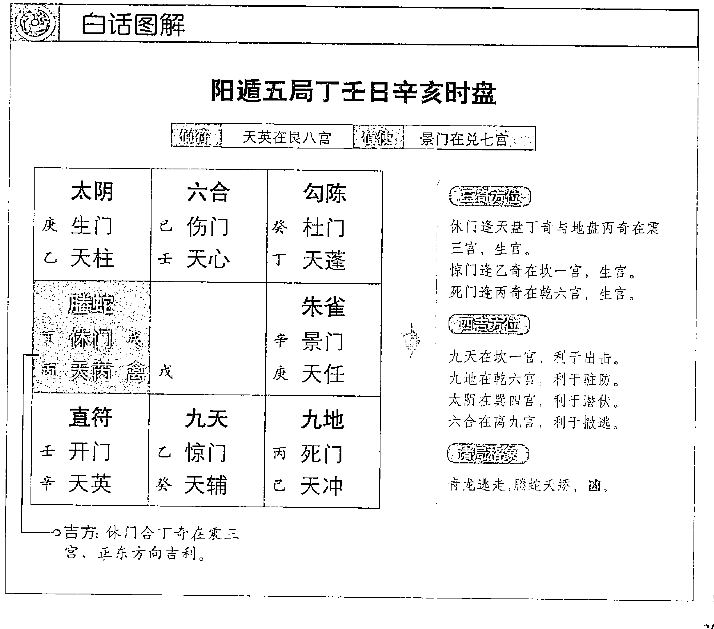

---

# 5.戊癸日十二时局

**壬子时：西南方向吉利**

### 【原文】

   **壬子** 英九，景八。子至丑阴，宿干凶。休丁坤害，惊乙巽制，死芮震害。
天四，地三，阴七，合六。休与星合二西南，时干离，符伏。

### 【白话提要】

   **符使宫位：** 值符天英在离九宫，值使景门在艮八宫。子时至丑时为五阴时。时干遇凶星宿，时干逢凶。
   
       **三奇方位：** 休门逢双丁奇在坤二宫，被克。惊门逢双乙奇在巽四宫，克宫。死门逢双丙奇在震三宫，被克。
   
       **四吉方位：** 九天在巽四宫，九地在震三宫，太阴在兑七宫，六合在乾六宫。
   
       **诸局格象：** 休门合丁奇在坤二宫，西南方向吉利。时干在离九宫。九星和值符都在本宫未动，为伏吟格。

## 白话图解

### 阳遁五局戊癸日壬子时盘

| **九天** | **直符** | **值符** |
| --- | --- | --- |
| 惊门 | 开门 | 休门 |
| 乙天辅 | 壬天英 | 丁芮 |

\*吉方：休门合丁奇在坤二宫，西南方向吉利。

| **九天** | **直符** | **值符** |
| --- | --- | --- |
| 惊门 | 开门 | 休门 |
| 乙天辅 | 壬天英 | 丁芮 |

\*吉方：休门合丁奇在坤二宫，西南方向吉利。

### 【三奇方位】

- 休门逢双丁奇在坤二宫，被克。
- 惊门逢双乙奇在巽四宫，克官。
- 死门逢双丙奇在震三宫，被克。

### 【四吉方位】

- 九天在巽四宫，利于出击。
- 九地在震三宫，利于驻防。
- 太阴在兑七宫，利于潜伏。
- 六合在乾六官，利于撤退。

### 【诸局格象】

九星和值符都在本宫未动，为伏吟格。凶。

---

# 癸丑时：西北、东北方向吉利

### 【原文】

> 癸丑 英一，景九。宿干吉，地遁。生艮伏，开乾伏，惊兑伏。天六，地七，阴三，合四。开与日合六西北，生与星合八东北，丁下有乙，时干离，符冲，门伏，火入金。

### 【白话提要】

> > **符使宫位:** 值符天英在坎一宫，值使景门在离九宫。时干遇吉星宿，时干逢吉。为地遁格。
> 
> > **三奇方位:** 生门逢丁奇在艮八宫，不相生克。开门逢乙奇在乾六宫，不相生克。惊门逢丙奇在兑七宫，不相生克。
> 
> > **四吉方位:** 九天在乾六宫，九地在兑七宫，太阴在震三宫，六合在巽四宫。
> 
> > **诸局格象:** 开门合乙奇在乾六宫，西北方向吉利。生门合丁奇在艮八宫，东北方向吉利。丁下有乙，为玉女寄生，吉如人遁。时干在离九宫。九星和值符都在本宫未动，为反吟格。八门伏吟。荧入太白。

## 白话图解

### 阳遁五局戊癸日癸丑时盘

| | | |
| --- | --- | --- |
| **六合**己杜门乙天心<br><br>**勾陈**癸景门壬天蓬 | **朱雀**辛死门丁天任<br><br>**太阴**庚伤门丙天柱 | **九地**丙惊门庚天冲<br><br>**螣蛇**丁生门壬天芮癸天禽<br><br>**直符**壬休门癸天英<br><br>**九赤**己开门乙天辅 |
| 吉方2：生门合丁奇在艮八宫，东北方向吉利。 | 吉方1：开门合乙奇在乾六宫，西北方向吉利。 |


> > **三奇方位**
> 
> - 生门逢丁奇在艮八宫，不相生克。
> - 开门逢乙奇在乾六宫，不相生克。
> - 惊门逢丙奇在兑七宫，不相生克。
> 
> > **四吉方位**
> 
> - 九天在乾六宫，利于出击。
> - 九地在兑七官，利于驻防。
> - 太阴在震三宫，利于潜伏。
> - 六合在巽四宫，利于撤退。
> 
> > **诸局格象**
> 
> - 丁下有乙，为玉女寄生，吉。
> - 九星和值符都在本宫未动，为反吟格，凶。
> - 八门伏吟，荧入太白，凶。

---

## 乙卯时：宜守户不出

### 【原文】

乙卯 蓬四，休二。宿凶干吉，守户。杜坎和欢怡，生合兑义，休丁坤害。
天三，地八，阴二，合七。休与月合二西南，丙下有丁，生与日合七正西，时干
兑，戊日勃。

### 【白话提要】

符使宫位：值符天蓬在巽四宫，值使休门在坤二宫。时干遇凶星宿，时干逢吉。宜守户不出。

三奇方位：杜门逢丁奇在坎一宫，被生，吉利。生门逢乙奇在兑七宫，生宫。休门逢天盘丙奇与地盘丁奇在坤二宫，被克。

四吉方位：九天在震三宫，九地在艮八宫，太阴在坤二宫，六合在兑七宫。

诸局格象：休门合丙奇在坤二宫，西南方向吉利。丙下有丁，为月奇朱雀。生门合乙奇在兑七宫，正西方向吉利。时干在兑七宫。逢戊日，为日勃格。

## 阳遁五局戊癸日乙卯时盘

### 吉方1:休门合丙奇在坤二宫，西南方向吉利。

- **直符**
    - 癸惊门<br>乙天蓬
- **滕蛇**
    - 辛开门<br>壬天任
- **太阳**
    - 休门<br>天禽
- **九天**
    - 己死门<br>丙天心<br>戊
- **六合**
    - 生门<br>天辅
- **九地**
    - 庚景门<br>辛天柱
- **朱雀**
    - 丁杜门戊<br>癸天芮禽
- **勾陈**
    - 壬伤门<br>己天英

### 吉方2:生门合乙奇在兑七宫，正西方向吉利。

> - 杜门逢丁奇在坎一宫，被生。
> - 生门逢乙奇在兑七宫，生宫。
> - 休门逢天盘丙奇与地盘丁奇在坤二宫，被克。
> 
> - 九天在震三宫，利于出击。
> - 九地在艮八宫，利于驻防。
> - 太阴在坤二宫，利于潜伏。
> - 六合在兑七宫，利于撤退。
> 
> - 丙下有丁，为月奇朱雀，吉。
> - 逢戊日，为日勃格，凶。

---

## 丙辰时：无奇门可出

### 原文

丙辰 蓬三，休三。宿吉干凶。死墓乾义，杜墓丁坤制，伤离义。天八，地一，阴九，合二。无奇门，天乙太白格，三吉，虎猖狂，癸日伏干格，时干离，相佐震，大格，乙格。

### 白话提要

符使宫位：值符天蓬在震三宫，值使休门在震三宫。时干遇吉星宿，时干逢凶。
三奇方位：死门逢丁奇在乾六宫，生官，丁奇入墓。杜门逢天盘乙奇与地盘丁奇在坤二宫，克宫，乙奇入墓。伤门逢丙奇在离九宫，生宫。
四吉方位：九天在艮八宫，九地在坎一宫，太阴在离九宫，六合在坤二官。
诸局格象：无奇门。天乙与六庚方位有格。三吉格。白虎猖狂。逢癸日，为伏干格。时干在离九宫。值符得地盘丙奇相助在震三宫。大格。乙奇格。

## 白话图解

阳遁五局戊癸日丙辰时盘
值符天蓬在震三宫 值使 休门在震三宫

| **腾蛇** | **太阴** | **六合** |
|---|---|---|
| 辛<br>生门 | 丙<br>伤门 | 乙<br>杜门 |
| 乙<br>天任 | 壬<br>天冲 | 丁<br>天辅 |

| **直符** | **勾陈** |
|---|---|
| 癸<br>休门<br>丙<br>天蓬 | 壬<br>景门<br>庚<br>天英 |

| **九天** | **九地** | **朱雀** |
|---|---|---|
| 已<br>开门 | 庚<br>惊门<br>癸<br>天柱 | 丁<br>死门 | 戊<br>天芮 | 禽 |

#### 三奇方位：

- 死门逢丁奇在乾六宫，生官。
- 杜门逢天盘乙奇与地盘丁奇在坤二宫，克官。
- 伤门逢丙奇在离九宫，生宫。

#### 四吉方位：

- 九天在艮八宫，利于出击。
- 九地在坎一宫，利于驻防。
- 太阴在离九宫，利于潜伏。
- 六合在坤二官，利于撤逃。

#### 诸局格象

无奇门，凶。
白虎猖狂，大格，凶。
逢癸日，为伏干格，凶。

---

# 丁巳时：正东方向吉利

### 【原文】

丁巳 蓬二，休四。宿凶干吉。开丙震制，死坎制欢怡，景墓乾制。天九，地四，阴六，合一。开与星合三正东，蛇娇，仪刑，时干震。相佐坤，击刑。

### 【白话提要】

符使宫位:值符天蓬在坤二宫，值使休门在巽四宫。时干遇凶星宿，时干逢吉。

三奇方位:开门逢天盘丁奇与地盘丙奇在震三宫，克宫。死门逢乙奇在坎一宫，克官，吉利。景门逢丙奇在乾六宫，克宫，丙奇入墓。

四吉方位:九天在离九宫，九地在巽四宫，太阴在乾六宫，六合在坎一官。

诸局格象:开门合丁奇在震三宫，正东方向吉利。滕蛇夭矫。六仪击刑。时干在震三宫。值符得地盘丁奇相助在坤二宫。击刑。

## 白话图解
阳遁五局戊癸日丁巳时盘

| **九地** | **九天** | **直符** |
| --- | --- | --- |
| 庚<br>休门 | 乙<br>天柱 | 己<br>生门<br>壬<br>天心 |
| 癸<br>伤门<br>丁<br>天蓬 |
| **朱雀**<br>开门 | 戊 | 滕蛇<br>辛<br>杜门<br>庚<br>天任 |
| **勾陈**<br>惊门 | 乙<br>死门 | 太阴<br>景门<br>丙<br>天冲<br>辛<br>天英 |
| 癸<br>天辅 |

#### 三奇方位
- 开门逢天盘丁奇与地盘丙奇在震三宫，克官。
- 死门逢乙奇在坎一宫，克官。景门逢丙奇在乾六官，克官。
 
#### 四吉方位
- 九天在离九宫，利于出击。
- 九地在巽四宫，利于驻防。
- 太阴在乾六宫，利于潜伏。
- 六合在坎一官，利于撤退。

#### 诸局格象
滕蛇夭矫，六仪击刑。凶。

○吉方:开门合丁奇在震三宫，正东方向吉利。

---

## 戊午时：无奇门可出

### 【原文】

戊午 蓬五，休五避五。宿干吉。死芮震害，杜坎和，伤墓乾害。天九，地四，阴六，合一。无奇门，蛇矫，时干震，相佐坤。

### 【白话提要】

符使宫位：值符天蓬在中五宫，寄于坤二宫，值使休门在中五宫，寄于坤二宫。时干遇吉星宿，时干逢吉。

三奇方位：死门逢天盘丁奇与地盘丙奇在震三宫，被克。杜门逢乙奇在坎一宫，被生。伤门逢丙奇在乾六宫，被克。

四吉方位：九天在离九宫，九地在巽四宫，太阴在乾六宫，六合在坎一宫。

诸局格象：无奇门。螣蛇夭娇。时干在震三宫。值符得地盘丁奇相助在坤二宫。

## 阳遁五局戊癸日戊午时盘

| | **天蓬在中五宫，寄于坤二宫** |  | **休门在中五宫，寄于坤二宫** |
| --- | --- | --- | --- |
| **九地** | **九天** | **直符** |
| 庚<br>惊门<br>乙<br>天柱 | 己<br>开门<br>壬<br>天心 | 癸<br>休门<br>丁<br>天蓬 |
| **朱雀** |  | **螣蛇** |
| 丁<br>死门<br>丙<br>天芮 | 戊<br>禽 | 辛<br>生门<br>庚<br>天任 |
| **勾陈** | **六合** | **太阴** |
| 壬<br>景门<br>辛<br>天英 | 乙<br>杜门<br>癸<br>天辅 | 丙<br>伤门<br>己<br>天冲 |

---

## 己未时：逢癸日不宜用事

### 【原文】

己未 蓬六，休六。宿干凶。未至亥阴，癸日不用。死合离和，杜丙震伏，伤合艮制。天七，地二，阴八，合三。无奇门，时干兑，飞宫，戊日伏干格。

### 【白话提要】

符使宫位：值符天蓬在乾六宫，值使休门在乾六宫。时干遇凶星宿，时干逢凶。未时至亥时为五阴时。逢癸日不宜用事。
三奇方位：死门逢丁奇在离九宫，被生，奇仪相合。杜门逢天盘乙奇与地盘丙奇在震三宫，不相生克。伤门逢丙奇在艮八宫，克宫，奇仪相合。
四吉方位：九天在兑七宫，九地在坤二宫，太阴在艮八宫，六合在震三宫。
诸局格象：无奇门。时干在兑七宫。飞宫格。逢戊日，为伏干格。

---

## 庚申时：无奇门可出

### 【原文】

庚申蓬七，休七。宿干凶。死一巽害，杜艮制，伤坎和欢怡。天二，地九，阴一，合八。无奇门，符勃，天乙与太白格，时干离，飞符，癸日飞干格。

### 【白话提要】

**符使宫位：** 值符天蓬在兑七宫，值使休门在兑七宫。时干遇凶星宿，时干逢凶。
**三奇方位：** 死门逢天盘丁奇与地盘乙奇在巽四宫，被克。杜门逢乙奇在艮八宫，克官。伤门逢丙奇在坎一宫，被生，吉利。
**四吉方位：** 九天在坤二宫，九地在离九宫，太阴在坎一宫，六合在艮八宫。
**诸局格象：** 无奇门。符勃格。天乙与六庚宫位有格。时干在离九宫。值符飞宫。逢癸日，为飞干格。

## 白话图解

### 阳遁五局戊癸日庚申时盘

- **值符：** 天蓬在兑七宫
- **值使：** 休门在兑七宫

| | | |
| --- | --- | --- |
| **朱雀**<br>丁死门<br>乙天芮 | **九地**<br>庚惊门<br>壬天柱 | **九天**<br>己开门<br>丁天心 |
| **勾陈**<br>壬景门<br>丙天英 | 戊 | **直符**<br>癸休门<br>庚天蓬 |
| **六合**<br>乙杜门<br>辛天辅 | **太阴**<br>丙伤门<br>癸天冲 | **螣蛇**<br>辛生门<br>己天任 |

#### 三奇方位
- 死门逢天盘丁奇与地盘乙奇在巽四宫，被克。
- 杜门逢乙奇在艮八宫，克官。
- 伤门逢丙奇在坎一宫，被生。

#### 四吉方位
- 九天在坤二官，利于出击。
- 九地在离九官，利于驻防。
- 太阴在坎一宫，利于潜伏。
- 六合在艮八宫，利于撤逃。

#### 诸局格象
无奇门，凶。
符勃格，值符飞宫，凶。
逢癸日，为飞干格，凶。# 辛酉时：无奇门可出

**【原文】**

辛酉蓬八，休八。死兑义，杜离义，伤乙巽伏。天一，地六，阴四，合九。无奇门，时干雷，刑格，戌日飞干格。

**【白话提要】**

符使宫位：值符天蓬在艮八宫，值使休门在艮八宫。

三奇方位：杜门逢乙奇在离九宫，生宫。伤门逢天盘丙奇与地盘乙奇在巽四宫，不相生克。死门逢丁奇在兑七宫，生宫。

四吉方位：九天在坎一宫，九地在乾六宫，太阴在巽四宫，六合在离九宫。

诸局格象：无奇门。时干在震三宫。刑格。逢戌日，为飞干格。


## 壬戌时：无奇门可出

### 【原文】

壬戌蓬九，休九。死艮伏，杜乾害，伤兑害。天四，地三，阴七，合六。
无奇门，反吟，符冲，时干坎，金入火，火入金。

### 【白话提要】

符使宫位：值符天蓬在离九宫，值使休门在离九宫。
三奇方位：死门逢丁奇在艮八宫，不相生克。伤门逢丙奇在兑七宫，被克。杜门逢乙奇在乾六宫，被克。

四吉方位：九天在巽四宫，九地在震三宫，太阴在兑七宫，六合在乾六宫。

诸局格象：无奇门。九星、值符和八门都到了与其对冲的宫位，为反吟格。时干在坎一宫。太白入荧。荧入太白。


# 癸亥时：元奇门可出

**【原文】**
癸亥蓬一，休一。死丁坤伏，杜乙巽伏，伤丙震伏。天六，地七，阴三，合四。无奇门，时干坎，符门伏，天网四张。

**【白话提要】**

符使宫位：值符天蓬在坎一宫，值使休门在坎一宫。

三奇方位：死门逢双丁奇在坤二宫，不相生克。杜门逢双乙奇在巽四宫，不相生克。伤门逢双丙奇在震三宫，不相生克。

四吉方位：九天在乾六宫，九地在兑七宫，太阴在震三宫，六合在巽四宫。

诸局格象：无奇门。时干在坎一宫。九星、值符和八门都在本宫未动，为伏吟格。天网四张。

## 白话图解
阳遁五局戊癸日癸亥时盘


# 第二章 阳遁六局

奇门遁甲时家奇门阳遁六局共有六十个时辰，即六十局。本章通过文字和各时辰的飞盘排布来说明各局的符使宫位、三奇方位、四吉神方位和诸局格象。

### 阳遁六局图 

节气上元：大寒下元、春分下元、雨水中元、芒种上元


## 白话图解

### 每日时辰

奇门遁甲中一局为一元，一元有甲己、乙庚、丙辛、丁壬和戊癸五日，每日有十二个时辰，则一局就有六十个时辰，用六十甲子来表示，一个时辰为一个小局。

| |甲子|乙丑|丙寅|丁卯|戊辰|己巳|庚午|辛未|壬申|癸酉|甲戌|乙亥|
|---|---|---|---|---|---|---|---|---|---|---|---|--- |
| 丙子|丁丑|戊寅|己卯|庚辰|辛巳|壬午|癸未|甲申|乙酉|丙戌|丁亥|
| 戊子|己丑|庚寅|辛卯|壬辰|癸巳|甲午|乙未|丙申|丁酉|戊戌|己亥|
| 庚子|辛丑|壬寅|癸卯|甲辰|乙巳|丙午|丁未|戊申|己酉|庚戌|辛亥|
| 壬子|癸丑|甲寅|乙卯|丙辰|丁巳|戊午|己未|庚申|辛酉|壬戌|癸亥

## 阳遁六局六十时符使表

奇门遁甲排盘时，最主要的就是寻找值符和值使，并确定其所在的宫位。下表就是阳遁六局六十个时辰的值符和值使，以及其所在的宫位。

| 时辰 | 甲子 | 乙丑 | 丙寅 | 丁卯 | 戊辰 | 己巳 | 庚午 | 辛未 | 壬申 | 癸酉 |
|---|---|---|---|---|---|---|---|---|---|--- |
| 天心 | 六 | 五 | 四 | 三 | 六 | 七 | 八 | 九 | 一 | 二 |
| 开门 | 六 | 七 | 八 | 九 | 一 | 二 | 三 | 四 | 五 | 六 |
| 时辰 | 甲戌 | 乙亥 | 丙子 | 丁丑 | 戊寅 | 己卯 | 庚辰 | 辛巳 | 壬午 | 癸未 |
| 天柱 | 七 | 五 | 四 | 三 | 六 | 七 | 八 | 九 | 一 | 二 |
| 惊门 | 七 | 八 | 九 | 十 | 二 | 三 | 四 | 五 | 六 | 七 |
| 时辰 | 甲申 | 乙酉 | 丙戌 | 丁亥 | 戊子 | 己丑 | 庚寅 | 辛卯 | 壬辰 | 癸巳 |
| 天任 | 八 | 五 | 四 | 三 | 六 | 七 | 八 | 九 | 一 | 二 |
| 生门 | 八 | 九 | 十 | 二 | 三 | 四 | 五 | 六 | 七 | 八 |
| 时辰 | 甲午 | 乙未 | 丙申 | 丁酉 | 戊戌 | 己亥 | 庚子 | 辛丑 | 壬寅 | 癸卯 |
| 天英 | 九 | 五 | 四 | 三 | 六 | 七 | 八 | 九 | 一 | 二 |
| 景门 | 九 | 十 | 二 | 三 | 四 | 五 | 六 | 七 | 八 | 九 |
| 时辰 | 甲辰 | 乙巳 | 丙午 | 丁未 | 戊申 | 己酉 | 庚戌 | 辛亥 | 壬子 | 癸丑 |
| 天蓬 | 一 | 五 | 四 | 三 | 六 | 七 | 八 | 九 | 一 | 二 |
| 休门 | 十 | 二 | 三 | 四 | 五 | 六 | 七 | 八 | 九 | 十 |
| 时辰 | 甲寅 | 乙卯 | 丙辰 | 丁巳 | 戊午 | 己未 | 庚申 | 辛酉 | 壬戌 | 癸亥 |
| 天芮 | 二 | 五 | 四 | 三 | 六 | 七 | 八 | 九 | 一 | 二 |
| 死门 | 二 | 三 | 四 | 五 | 六 | 七 | 八 | 九 | 十 | 二 |

# 1. 甲己日十二时局

## 甲子时：利以逃亡

### 【原文】

甲子心六，开六。子至辰阳，宿干吉。杜巽伏，死墓坤伏，伤震伏。天七，地二，阴八，合三。无奇门，刑德在门，客主不利，利以逃亡，时干乾，伏吟，遁甲阖。

### 【白话提要】

符使宫位：值符天心在乾六宫，值使开门在乾六宫。子时至辰时为五阳时。时干遇吉星宿，时干逢吉。

三奇方位：杜门逢双丙奇在巽四宫，不相生克。死门逢双乙奇于坤二宫，不相生克，乙奇入墓。伤门逢双丁奇于震三宫，不相生克。

四吉方位：九天在兑七宫，九地在坤二宫，太阴在艮八宫，六合在震三宫。

诸局格象：无奇门。刑德在门，主客双方都不利，利以逃亡。时干在乾六宫。九星、值符和八门都在本宫未动，为伏吟格。遁甲合。

> **[插图]**

**白话图解**

阳遁六局甲己日甲子时盘

值符：天心在乾六宫  值使：开门在乾六宫

勾陈       朱雀       九地 
丙杜门    辛景门   癸死门 乙 
丙天辅    辛天英   癸天芮 禽
六合       
丁伤门      己惊门
丁天冲   乙   己天柱
太阴       螣蛇     直符 
庚生门    壬休门   戊开门
庚天任    壬天蓬   戊天心

### 乙丑时：逢己日不宜用事

**【原文】**
乙丑心五，开七。宿干吉，己日不用，伤艮制，景丙巽和，生合坎制。天九，地四，阴六，合一。生与星合一正北，伏官格，火入白，甲子伏宫格，时干巽，飞官，乙格。

**【白话提要】**

符使宫位：值符天心在中五宫，寄于坤二宫，值使开门在兑七宫。时干遇吉星宿，时干逢吉。逢己日不宜用事。

**三奇方位**:伤门逢丙奇在艮八宫，克官。景门逢天盘乙奇与地盘丙奇在巽四宫，被生。生门逢丁奇在坎一宫，克宫，奇仪相合。

**四吉方位**:九天在离九宫，九地在巽四宫，太阴在乾六宫，六合在坎一宫。

**诸局格象**:生门合丁奇在坎一宫，正北方向吉利。伏官格。荧入太白。甲子伏宫格。时干在巽四宫。飞宫格。乙奇格。


| 九地 | 九天 | 直符 |
|---|---|---|
| 癸景门乙 | 己死门 | 戊惊门 |
| 丙天芮禽辛天柱 | 戊天心 |
| 朱雀杜门 | 壬开门 | 腾蛇 |
| 辛丁天英天蓬 | 庚休门 |
| 勾陈伤门 | 六合生门奏冲 | 太阴天任 |
| 丙庚天辅 | 戊 | 戊 |

**●吉方**:生门合丁奇在坎一宫，正北方向吉利。

#### 三奇方位

- 伤门逢丙奇在艮八宫，克官。
- 景门逢天盘乙奇与地盘丙奇在巽四宫，被生。
- 生门逢丁奇在坎一宫，克官。

#### 四吉方位

- 九天在离九宫，利于出击。
- 九地在巽四宫，利于驻防。
- 太阴在乾六宫，利于潜伏。
- 六合在坎一宫，利于撤退。

#### 诸局格象

- 伏官格，荧入太白，甲子伏宫格，凶。
- 飞宫格，乙奇格，凶。


# **丙寅时：东北方向吉利**

**【原文】**

**丙寅**心四，开八。宿干吉。死墓乾义欢怡，开合艮和，景兑制。天三，地八，阴二，合七。开与日合八东北，符反吟，甲干勃，鸟跌穴，龙反首，时干乾，相佐巽，大格。

**【白话提要】**

符使宫位：值符天心在巽四宫，值使开门在艮八宫。时干遇吉星宿，时干逢吉。
三奇方位：死门逢丙奇在乾六宫，被生，吉利，丙奇入墓。开门逢乙奇在艮八宫，被生，奇仪相合。景门逢丁奇在兑七宫，克官。
四吉方位：九天在震三宫，九地在艮八宫，太阴在坤二宫，六合在兑七宫。
诸局格象：开门合乙奇在艮八宫，东北方向吉利。九星和值符都到了与其相冲的宫位，为反吟格。逢甲日，为日干勃格。飞鸟跌穴。青龙回首。时干在乾六宫。值得地盘丙奇相助在巽四宫。大格。

> > **白话图解**

### 阳遁六局甲己日丙寅时盘

| |值符|天心在巽四宫|值使：开门在艮八宫|
|---|---|---|---|
|直符<br>生门<br>戊<br>丙|螣蛇<br>伤门<br>壬<br>辛|太阴<br>杜门<br>庚<br>癸|
|**九天**<br>**休门**<br>**己**<br>**丁**<br>**天柱**|**九地**<br>**开门**<br>**丙**<br>**戊**<br>**天芮**<br>**禽**|六合<br>景门<br>丁<br>巳<br>天冲|
|**朱雀**<br>**惊门**<br>**辛**<br>**壬**<br>**天英**|**勾陈**<br>**死门**<br>**丙**<br>**戊**<br>**天辅**|

#### 三奇方位
- 死门逢丙奇在乾六宫，被生。
- 开门逢乙奇在艮八宫，被生。
- 景门逢丁奇在兑七宫，克官。

#### 四吉方位
- 九天在震三宫，利于出击。
- 九地在艮八宫，利于驻防。
- 太阴在坤二宫，利于潜伏。
- 六合在兑七宫，利于撤退。

#### 诸局格象
- 飞鸟跌穴，青龙回首，**吉**。
- 大格，**凶**。
- 逢甲日，为日干勃格，**凶**。
- 九星和值符都到了与其相冲的官位，为反吟格，**凶**。

> ○吉方：开门合乙奇在艮八宫，东北方向吉利。

## 丁卯时：正西与西南方向吉利

### 【原文】

> 丁卯心三，开九。宿干吉。生兑义，杜坎和，休坤害。天八，地一，阴九，合二。休与星合二西南，丁下有乙，生与月合七正西，雀入江，仪刑，时干坤，相佐震，己日飞干格。

### 【白话提要】

> 符使宫位：值符天心在震三宫，值使开门在离九宫。时干遇吉星宿，时干逢吉。

> 三奇方位：生门逢丙奇在兑七宫，生宫。杜门逢乙奇在坎一宫，被生。休门逢丁奇在坤二宫，被克。

> 四吉方位：九天在艮八宫，九地在坎一宫，太阴在离九宫，六合在坤二宫。

> 诸局格象：休门合丁奇在坤二宫，西南方向吉利。丁下有乙，为玉女奇生，成人遁。生门合丙奇在兑七宫，正西方向吉利。朱雀入江。六仪击刑。时干在坤二宫。值符得地盘丁奇相助在震三宫。逢己日，为飞干格。

> > **白话图解**

> ### 阳遁六局甲己日丁卯时盘
> 
> **值符** 天心在震三宫 | **值使** 开门在离九宫
> 
> - **吉方1：**休门合丁奇在坤二宫，西南方向吉利。
> 
> 
> 
> - **吉方2：**生门合丙奇在兑七宫，正西方向吉利。

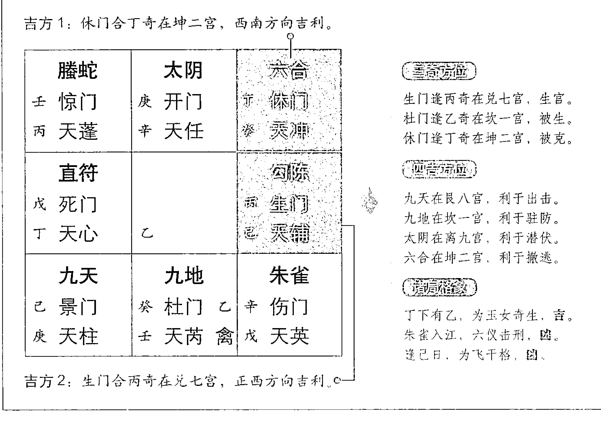

## 戊辰时：正东方向吉利

**[原文]**
戊辰心六，开一。宿干吉。伤丙巽伏，景墓乙坤义，生丁震害。天七，地二，阴八，合三。生与星合三正东，时干乾，符伏吟。

**[白话提要]**
**符使宫位**: 值符天心在乾六宫，值使开门在坎一宫。时干遇吉星宿，时干逢吉。
**三奇方位**: 伤门逢双丙奇在巽四宫，不相生克。景门逢双乙奇于坤二宫，生宫，乙奇入墓。生门逢双丁奇于震三宫，被克。
**四吉方位**: 九天在兑七宫，九地在坤二宫，太阴在艮八宫，六合在震三宫。
**诸局格象**: 生门合丁奇在震三宫，正东方向吉利。时干在乾六宫。九星和值符都在本宫未动，为伏吟格。

图解析中国传统决策学·奇门遁甲大全 (第二部)

> **白话图解**

阳遁六局甲己日戊辰时盘

值符：天心在乾六宫，值使开门在坎一宫。

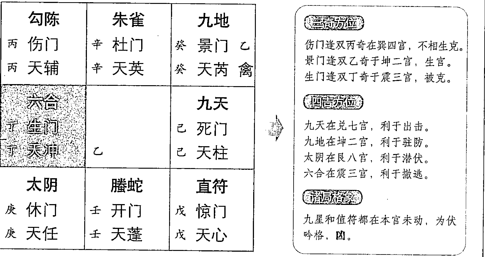

○吉方：生门合丁奇在震三宫，正东方向吉利。

## 己巳时：无奇门可出

### 【原文】

**己巳**心七，开二。巳至酉阴，天辅，宿吉干凶。景丁震和，惊离害，杜艮制。天二，地九，阴一，合八。无奇门，龙走，刑格，门反吟，蛇矫，时干坤，己日休干格。

### 【白话提要】

符使宫位：值符天心在兑七宫，值使开门在坤二宫。巳时至酉时为五阴时，巳时为天辅释罪时。时干遇吉星宿，时干逢凶。

三奇方位：景门逢天盘丙奇与地盘丁奇在震三宫，被生。惊门逢乙奇在离九宫，被克。杜门逢丁奇在艮八宫，克官。

四吉方位：九天在坤二宫，九地在离九宫，太阴在坎一宫，六合在艮八宫。

诸局格象：无奇门。青龙逃走。刑格。八门反吟。螣蛇夭矫。时干在坤二宫。逢己日，为伏干格。

| | | |
|---|---|---|
| **朱雀**辛丙<br>死门天英 | **九地**癸辛<br>惊门天芮禽乙 | **九天**己癸<br>开门天柱 |
| **勾陈**丙丁<br>景门天辅 | **乙** | **直符**戌己<br>休门天心 |
| **六合**丁庚<br>杜门天冲 | **太阴**庚壬<br>伤门天蓬 | **螣蛇**壬戌<br>生门天蓬 |

### 【三奇方位】

- 景门逢天盘丙奇与地盘丁奇在震三宫，被生。
- 惊门逢乙奇在离九宫，被克。
- 杜门逢丁奇在艮八宫，克官。

### 【四吉方位】

- 九天在坤二宫，利于出击。
- 九地在离九宫，利于驻防。
- 太阴在坎一宫，利于潜伏。
- 六合在艮八宫，利于撤退。

### 【诸局格象】

- 无奇门，凶。
- 青龙逃走，刑格，八门反吟，螣蛇夭矫，凶。
- 逢己日，为伏干格，凶。

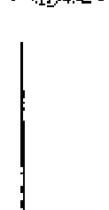

## 庚午时：无奇门可出

**[原文]**

庚午心八，开三。甲日不用，守户，宿吉干凶。伤乙坤制。景乾制欢怡。生离和。天一，地六，阴四，合九。生与星合九正南，飞宫格，甲日飞干格，时干巽，飞符，金入火，三吉。

#### [白话提要]

符使宫位：值符天心在艮八宫，值使开门在震三宫。逢甲日不宜用事，宜守户不出。时干遇吉星宿，时干逢凶。

三奇方位：伤门逢天盘丙奇与地盘乙奇在坤二宫，克宫。景门逢乙奇在乾六宫，克宫，吉利。生门逢丁奇在离九宫，被生。

四吉方位：九天在坎一宫，九地在乾六宫，太阴在巽四宫，六合在离九宫。

诸局格象：生门合丁奇在离九宫，正南方向吉利。飞宫格。逢甲日，为飞干格。时干在巽四宫。太白入荧。三吉格。

| |太阴|六合|勾陈| |
|---|---|---|---|---|
| **庚**休门| *丁*生门| **丙**伤门| |
| **丙**天任| *壬*天冲| **癸**天辅| |
| **太阴**|六合|勾陈| |
| **壬**开门| |朱雀| |
| **丁**天蓬|乙|辛杜门| |
| | |乙天英| |
| **直符**九天九地| |
| 戊惊门|己死门|癸景门
|---|---|---|
| 庚天心|壬天柱|戌天芮禽

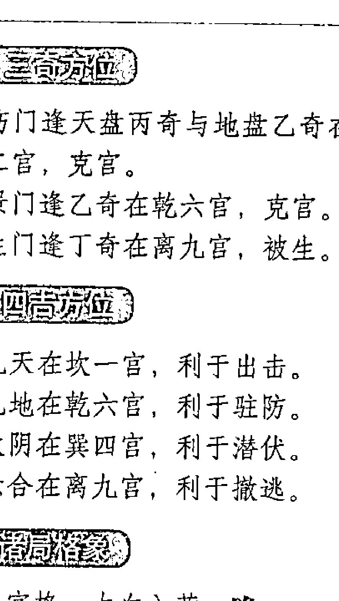

# 辛未时：无奇门可出

**原文**

辛未心九，开四。宿干凶。景坎害，惊丁震制，杜墓乾害欢怡。天四，地三，阴七，合六。无奇门，刑格，门反吟，蛇矫，时干艮，已日伏干格。

**白话提要**

符使宫位：值符天心在离九宫，值使开门在巽四宫。时干遇凶星宿，时干逢凶。

三奇方位: 景门逢丙奇在坎一宫，被克。惊门逢天盘乙奇与地盘丁奇在震三宫，克官。杜门逢丁奇在乾六宫，被克，丁奇入墓。

四吉方位：九天在巽四宫，九地在震三宫，太阴在兑七宫，六合在乾六宫。

诸局格象：无奇门。刑格。八门反吟。滕蛇天矫。时干在艮八宫。逢己日，为伏干格。

### 阳遁六局甲己日辛未时盘

**值符**	天心在离九宫	**值使**
开门在巽四宫

| **九天** | **直符** | **螣蛇** |
|---|---|---|
| 已 **开门**丙 **天柱** | 戊 **休门**辛 **天心** | 壬 **生门**癸 **天蓬** |

| **九地** | | **太阴** |
|---|---|---|
| 癸 **惊门**乙丁 **天芮**禽乙 | | 庚 **伤门**己 **天任** |

| **朱雀** | **勾陈** | **六合** |
|---|---|---|
| 辛 **死门**庚 **天英** | 丙 **景门**壬 **天辅** | 丁 **杜门**戊 **天冲** |

### 奇方位

- 景门逢丙奇在坎一宫，被克。
- 惊门逢天盘乙奇与地盘丁奇在震三宫，克官。
- 杜门逢丁奇在乾六宫，被克。

#### 四吉方位

- 九天在巽四宫，利于出击。
- 九地在震三宫，利于驻防。
- 太阴在兑七宫，利于潜伏。
- 六合在乾六宫，利于撤退。

#### 诸局格象

- 无奇门，凶。
- 刑格，八门反吟，螣蛇天矫。凶。
- 逢己日，为伏干格，凶。

# 壬申时：正西方向吉利

**原文**

> 壬申心一，开五避五。宿干凶。惊合离害，休兑和，死丙巽害。天六，地七，阴三，合四。休与日合七正西，得使，虎猖狂，时干艮。

**白话提要**

符使宫位：值符天心在坎一宫，值使开门在中五宫，寄于坤二宫。时干遇凶星宿，时干逢凶。

三奇方位：惊门逢丙奇在离九宫，被克，奇仪相合。休门逢乙奇在兑七宫，被生。死门逢天盘丁奇与地盘丙奇在巽四宫，被克。

四吉方位：九天在乾六宫，九地在兑七宫，太阴在震三宫，六合在巽四宫。

诸局格象：**休门**合乙奇在兑七宫，正西方向吉利。乙奇得使。白虎猖狂。时干在艮八宫。

+ ## 阳遁六局甲己日壬申时盘

> **三奇**

- 天心在坎一宫

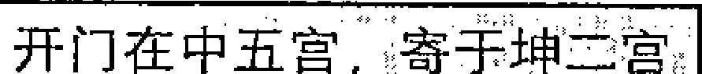


> **四吉方位**

- 惊门逢丙奇在离九宫，被克。
- 休门逢乙奇在兑七宫，被生。
- 死门逢天盘丁奇与地盘丙奇在巽四宫，被克。

> **诸局格象**

- 九天在乾六宫，利于出击。
- 九地在兑七宫，利于驻防。
- 太阴在震三宫，利于潜伏。
- 六合在巽四宫，利于撤退。

- 乙奇得使，吉。
- 白虎猖狂，凶。

## # 癸酉时：正北东北方向吉利

**【原文】**

癸酉 柱二，开六。宿千凶，生艮伏，杜丙巽伏，休合坎伏。天九，地四，阴六，合一。休与星合一正北，生与月合八东北，甲日伏干格，火入白，时干巽，飞宫，乙格，门伏，天网四张。

---

## # 甲戌时：无奇门可出

**【原文】**

甲戌柱直符七，惊直使七。戌至亥阳，宿凶干吉。死内使坤伏，杜辅月冀伏，伤冲星震伏。天二，地九，阴一，合八。无奇门，亥申时如上法，时干兑，伏吟，飞甲阖。

### 白话提要

**符使宫位**：值符天柱在兑七宫，值使惊门在兑七宫。戌时至亥时为五阳时。时干遇凶星宿，时干逢吉。

**三奇方位**：死门逢双乙奇在坤二宫，不相生克。杜门逢双丙奇在巽四宫，不相生克。伤门逢双丁奇在震三宫，不相生克。

**四吉方位**：九天在坤二宫，九地在离九宫，太阴在坎一宫，六合在良八宫。

**诸局格象**：无奇门。逢亥、申时如上法。时干在兑七宫。九星、值符和八门都在本宫未动，为伏吟格。飞甲合。

## 白话图解

阳遁六局甲己日甲戌时盘 值符天柱在兑七宫 值使惊门在兑七宫

| 朱雀 | 九地 | 九天 |
|---|---|---|
| 丙 杜门 | 辛 景门 | 癸 死门 乙 |
| 丙 天辅 | 辛 天英 | 癸 天芮 禽 |
| 勾陈 | | 直符 |
| 丁 伤门 | 乙 | 巳 惊门 |
| 丁天冲 | 乙 | 已 天柱 |
| 六合 | 太阴 | 滕蛇 |
|---|---|---|
| 庚 生门 | 壬 休门 | 戊 开门 |
| 庚 天任 | 壬 天蓬 | 戊 天心 |

#### 三奇方位

死门逢双乙奇在坤二宫，不相生克。
杜门逢双丙奇在巽四宫，不相生克。
伤门逢双丁奇在震三宫，不相生克。

#### 四吉方位

九天在坤二宫，利于出击。
九地在离九宫，利于驻防。
太阴在坎一宫，利于潜伏。
六合在良八宫，利于撤退。

#### 诸局格象

无奇门，凶。
九星、值符和八门都在本宫未动，为伏吟格，凶。

---

## # 乙亥时：逢己日不宜用事

**【原文】**

**乙亥** 柱五，惊八。宿干吉，己日不用。生离和，开丁震制，惊艮和。天九，地四，阴六，合一。开与月合三正东，生与日合九正南，天乙与太白格，时干离，事同，龙走。

**【白话提要】**

**符使宫位**: 值符天柱在中五宫，寄于坤二宫，值使惊门在艮八宫。时干遇吉星宿，时干逢吉。逢己日不宜用事。

**三奇方位**: 生门逢乙奇在离九宫，被生。开门逢天盘丙奇与地盘丁奇在震三宫，克宫。惊门逢丁奇在艮八宫，被生。

**四吉方位**: 九天在离九宫，九地在巽四宫，太阴在乾六宫，六合在坎一宫。

**诸局格象**: 开门合丙奇在震三宫，正东方向吉利。生门合乙奇在离九宫，正南方向吉利。天乙与六庚宫位有格。时干在离九宫。青龙逃走。

---

# # 2.乙庚日十二时局

# ## 丙子时：逢庚日不宜用事

**【原文】**

丙子 柱四，惊九。宿凶干吉。子至寅阳，庚日不用。景丁震和，伤坎和，生墓乾义。天三，地八，阴二，合七。生与星合六西北，伏官格，蛇矫，时干坎，相佐巽，刑格，乙格。

**【白话提要】**

符使宫位：值符天柱在巽四宫，值使惊门在离九宫。时干遇凶星宿，时干逢吉。子时至寅时为五阳时。逢庚日不宜用事。
三奇方位：景门逢天盘乙奇与地盘丁奇在震三宫，被生。伤门逢丙奇在坎一宫，被生。生门逢丁奇在乾六宫，生官，丁奇入墓。
四吉方位：九天在震三宫，九地在艮八宫，太阴在坤二宫，六合在兑七宫。
诸局格象：生门合丁奇在乾六宫，西北方向吉利。伏宫格。螣蛇夭矫。时干在坎一宫。值符得地盘丙奇相助在巽四宫。刑格。乙奇格。

## 白话图解

#### 阳遁六局乙庚日丙子时盘

| 值符 | 天柱在巽四宫 | 值使 | 惊门在离九宫 |
|---|---|---|---|
| | 直符 | 螣蛇 | 太阴 |
|---|---|---|---|
| 己死门 | 戊惊门 | 壬开门 |
| 丙天柱 | 辛天心 | 癸天蓬 |
| --- | --- | --- |
| 九天 | | 六合 |
| 乙 |
| 癸景门乙 | | 庚休门丁天任 |
| 禽乙 |
| 丁天芮 | | 己天任 |
| --- | --- | --- |
| 九地 | 朱雀 | 勾陈 |
| 辛杜门 | 丙伤门 | 丁生门 |
| --- | --- | --- |
| 庚天英 | 壬天辅 | 戊天冲 |

#### 三奇方位

景门逢天盘乙奇与地盘丁奇在震三宫，被生。
伤门逢丙奇在坎一宫，被生。
生门逢丁奇在乾六宫，生官。

#### 四吉方位

九天在震三宫，利于出击。
九地在艮八宫，利于驻防。
太阴在坤二宫，利于潜伏。
六合在兑七宫，利于撤退。

#### 诸局格象

伏宫格，螣蛇夭矫，凶。
刑格，乙奇格，凶。

> **吉方：**生门合丁奇在乾六宫，西北方向吉利。

---

### ## 丁丑时：东北方向吉利

### 【原文】

丁丑柱三，惊一。宿干吉。开合艮和，死墓乾义，景兑制欢怡。天八，地一，阴九，合二。开与日合八东北，乙日飞干格，时千兑，相佐震，符冲，大格。

### 【白话提要】

符使宫位：值符天柱在震三宫，值使惊门在坎一宫。时干遇吉星宿，时干逢吉。
三奇方位：开门合乙奇在艮八宫，被生，乙奇入墓。死门逢丙奇在乾六宫，生宫，丙奇入墓。景门逢丁奇在兑七宫，克宫，吉利。
四吉方位：九天在艮八宫，九地在坎一宫，太阴在离九宫，六合在坤二宫。
诸局格象：开门合乙奇在艮八宫，东北方向吉利。逢乙日，为飞干格。时干在兑七宫。值符得地丁相助于震三宫。九星和值符都到了与其相冲的宫位，为反吟格。大格。

## 白话图解

#### 阳遁六局乙庚日丁丑时盘

- **直符**
  - 天柱在震三宫
- **值使**
  - 惊门在坎一宫
- **螣蛇**
  - 戊生门
  - 丙天心
- **太阴**
  - 壬伤门
  - 辛天蓬
- **六合**
  - 庚杜门
  - 癸天任

##### 直符

- 乙休门
- 丁天柱
- 九天
- 癸开门
- 戊天芮禽

##### 九地

- 辛惊门
- 壬天英

### 勾陈

- 丁景门
- 己天冲

##### 朱雀

- 丙死门
- 戊天辅

#### 四吉方位

九天在艮八宫，利于出击。
九地在坎一宫，利于驻防。
太阴在离九宫，利于潜伏。
六合在坤二宫，利于撤逃。

#### 诸局格象

逢乙日，为飞干格，凶。
九星和值符都到了与其相冲的宫位，为反吟格，凶。
大格，凶。

- **吉方**: 开门合乙奇在艮八宫，东北方向吉利。

---

## # 戊寅时：正西方向吉利

**【原文】**

戊寅柱六，惊二。宿干吉，地遁。开兑伏欢怡，死合离和，景丙巽和，天七，地二，阴八，合三。开与日合七正西，得使，虎猖狂，时干坎。

**【白话提要】**

符使宫位：值符天柱在乾六宫，值使惊门在坤二宫。时干遇吉星宿，时干逢吉。成地遁格。
三奇方位：开门逢乙奇在兑七宫，不相生克，吉利。死门逢丙奇在离九宫，被生，奇仪相和。景门逢天盘丁奇与地盘丙奇在巽四宫，被生。
四吉方位：九天在兑七宫，九地在坤二宫，太阴在艮八宫，六合在震三宫。
诸局格象：开门合乙奇在兑七宫，正西方向吉利。乙奇得使。白虎猖狂。时干在坎一宫。

---

## # 己卯时：西南和东南方向吉利

### 【原文】

已卯柱七，惊三。卯至未阴，守户，宿干凶。生墓坤伏，开丙巽制，惊震制。天二，地九，阴一，合八。生与日合二西南，时干兑，符伏，开与月合四东南，三吉，门反吟。

### 【白话提要】

符使宫位：值符天柱在兑七宫，值使惊门在震三宫。卯时至未时为五阴时，宜守户不出。时干遇凶星宿，时干逢凶。 

**三奇方位**：生门逢双乙奇在坤二宫，不相生克，乙奇入墓。开门逢双丙奇在巽四宫，克宫。惊门逢双丁奇在震三宫，克宫。
**四吉方位**：九天在坤二宫，九地在离九宫，太阴在坎一官，六合在艮八宫。 
**诸局格象**：生门合乙奇在坤二宫，西南方向吉利。时干在兑七宫。值符伏吟。开门合丙奇在巽四宫，东南方向吉利。三吉格。八门反吟。

## 白话图解

> **符使宫位：**值符天柱在兑七宫，值使惊门在震三宫。
卯时至未时为五阴时，宜守户不出。时干遇凶星宿，时干逢凶。

**三奇方位：**生门逢双乙奇在坤二宫，不相生克，乙奇入墓。开门逢双丙奇在巽四宫，克宫。惊门逢双丁奇在震三宫，克宫。

**四吉方位：**九天在坤二宫，九地在离九宫，太阴在坎一宫，六合在艮八宫。

**诸局格象：**生门合乙奇在坤二宫，西南方向吉利。时干在兑七宫。值符伏吟。开门合丙奇在巽四宫，东南方向吉利。三吉格。八门反吟。

> **三奇方位**
生门逢双乙奇在坤二宫，不相生克。
开门逢双丙奇在巽四官，克宫。 
惊门逢双丁奇在震三官，克宫。

> **四吉方位**
九天在坤二宫，利于出击。
九地在离九官，利于驻防。 
太阴在坎一官，利于潜伏。 
六合在艮八宫，利于撤逃。

> **诸局格象**
值符伏吟，八门反吟，凶。

---

## # 庚辰时：正西与西南方向吉利

# ## 原文

> 庚辰柱八，惊四。宿干凶。杜坎和，生兑义欢怡，休乙坤害。天一，地六，阴四，合九。生与月合七正西，休与星合二西南，丁下有乙，得使，时干离，飞符，鸟跌穴，雀入江。

# ## 白话提要

> 符使宫位：值符天柱在艮八宫，值使惊门在巽四宫。时干遇凶星宿，时干逢凶。

> 三奇方位：杜门逢乙奇在坎一宫，被生。生门逢丙奇在兑七宫，生宫，吉利。休门逢天盘丁奇与地盘乙奇在坤二宫，被克。

> 四吉方位：九天在坎一宫，九地在乾六宫，太阴在巽四宫，六合在离九宫。

> 诸局格象：生门合丙奇在兑七宫，正西方向吉利。休门合丁奇在坤二宫，西南方向吉利。丁下有乙，为玉女奇生，成人遁。得使。时干在离九宫。值符飞宫。飞鸟跌穴。朱雀入江。

## 白话图解

#### 阳遁六局乙庚日庚辰时盘

值符：天柱在艮八宫 值使：惊门在巽四宫

**吉方2:**休门合丁奇在坤二宫，西南方向吉利。
**吉方1:**生门合丙奇在兑七宫，正西方向吉利。

---

## # 辛巳时：逢乙日不宜用事

# ## 原文

辛巳 柱九，惊五避五。宿干凶，乙日不用。景丙巽和，伤艮制，生合坎制。天四，地三，阴七，合六。生与星合一正北，得使，庚干勃，时干震，飞宫，火入金，庚日勃。

# ## 白话提要

**符使宫位：** 值符天柱在离九宫，值使惊门在中五宫，寄于坤二宫。时干遇凶星宿，时干逢凶。逢乙日不宜用事。

**三奇方位：** 景门逢天盘乙奇与地盘丙奇在巽四宫，被生。伤门逢丙奇在艮八宫，克宫。生门逢丁奇在坎一宫，克宫，奇仪相合。

**四吉方位：** 九天在巽四宫，九地在震三宫，太阴在兑七宫，六合在乾六宫。

**诸局格象：** 生门合丁奇在坎一宫，正北方向吉利。丁奇得使。逢庚日，为日干勃格。时干在震三宫。飞宫格。荧入太白。

> > ## 白话图解
> 
> ### 阳遁六局乙庚日辛巳时盘
> 
> | **值符** 天柱在离九宫 | **值使** 惊门在中五宫，寄于坤二宫 |
> | --- | --- |
> | **九天**<br>癸景门 乙禽<br>丙天芮 | **直符**<br>乙死门<br>辛天柱 | **腾蛇**<br>戊惊门<br>癸天心 |
> | **九地**<br>辛杜门<br>丁天英 | **太阴**<br>壬开门<br>己天蓬 |
> | **朱雀**<br>丙伤门<br>庚天辅 | **勾陈**<br>丁生门<br>癸天冲 | **六合**<br>庚休门<br>戊天任 |
> 
> 吉方：生门合丁奇在坎一宫，正北方向吉利。

> > **三奇方位**
> 
> 景门逢天盘乙奇与地盘丙奇在巽四宫，被生。
> 伤门逢丙奇在艮八宫，克宫。
> 生门逢丁奇在坎一宫，克官。

> **四吉方位**
> 
> 九天在巽四宫，利于出击。
> 九地在震三官，利于驻防。
> 太阴在兑七宫，利于潜伏。
> 六合在乾六宫，利于撤退。

> **诸局格象**
> 
> 丁奇得使，吉。
> 逢庚日，为日干勃格，凶。
> 飞宫格，荧入太白，凶。

---

## # 壬午时：无奇门可出

**【原文】**
壬午 柱一，惊六。宿干凶。惊乾伏，景乙坤伏，杜离义。天六，地七，阴三，合四。无奇门，时干震，金入火，乙日勃。

**【白话提要】**
符使宫位：值符天柱在坎一宫，值使惊门在乾六宫。时干遇凶星宿，时干逢凶。
三奇方位：惊门逢乙奇在乾六宫，不相生克。景门逢天盘丙奇与地盘乙奇在坤二宫，不相生克。杜门逢丁奇在离九宫，被生。
四吉方位：九天在乾六宫，九地在兑七宫，太阴在震三宫，六合在巽四宫。
诸局格象：无奇门。时干在震三宫。太白入荧。逢乙日，为日勃格。

## 白话图解

#### 阳遁六局乙庚日壬午时盘

天柱在坎一宫，惊门在乾六宫

| 六合 | 勾陈 | 朱雀 |
|---|---|---|
| 庚伤门 | 丁杜门 | 丙景门 |
| 丙天任 | 辛天冲 | 癸天辅 |
| --- | --- | --- |
| 太阴 | 朱雀 |
| 壬生门 | 乙 | 辛死门 |
| 丁天蓬 | | 己天英 |
| --- | --- | --- |
| 螣蛇 | 直符 | 九天 |
| 戊休门 | 己开门 | 癸惊门 乙 |
| 庚天心 | 壬天柱 | 戌天芮禽 |

> **三奇方位**
惊门逢乙奇在乾六宫，不相生克。
景门逢天盘丙奇与地盘乙奇在坤二官，不相生克。
杜门逢丁奇在离九宫，被生。

> **四吉方位**
九天在乾六宫，利于出击。
九地在兑七宫，利于驻防。
太阴在震三宫，利于潜伏。
六合在巽四宫，利于撤退。

> **诸局格象**
无奇门，凶。
太白入荧，凶。
逢乙日，为日勃格，凶。

---

## # 癸未时：东北方向吉利

**【原文】**

> 癸未 柱二，惊七。宿干凶。景离伏，伤丁震伏，生艮伏。天九，地四，阴六，合一。生与星合八东北，仪刑，龙走，时干离。门伏，雀入江，天网四张。

**【白话提要】**

符使宫位：值符天柱在坤二宫，值使惊门在兑七宫。时干遇凶星宿，时干逢凶。

三奇方位：景门逢乙奇在离九宫，同类伏。伤门逢天盘丙奇与地盘丁奇在震三宫，同类伏。生门逢丁奇在艮八宫，同类伏。

四吉方位：九天在离九宫，九地在巽四宫，太阴在乾六宫，六合在坎一宫。

诸局格象：生门合丁奇在艮八宫，东北方向吉利。六仪击刑。青龙逃走。时干在离九宫。八门伏吟。朱雀入江。天网四张。

#### 阳遁六局乙庚日癸未时盘

| | | |
| --- | --- | --- |
| 九地 | 九天 | 直符 |
| 杜门景门死门天英天芮天柱 | 己艮辛癸禽 | 
| --- | --- | --- |
| 朱雀 | | 螣蛇 |
| 伤门天心 | 乙巳 | 丙戊 |
| --- | --- | --- |
| 天辅已 | 休门开门六合天任天蓬庚壬戊 | 太阴壬戊 |

> **吉方**：生门合丁奇在艮八宫，东北方向吉利。

> > **三奇方位**

> 景门逢乙奇在离九宫，不相生克。
> 伤门逢天盘丙奇与地盘丁奇在震三宫，不相生克。
> 生门逢丁奇在艮八宫，不相生克。

> > **四吉方位**

> 九天在离九宫，利于出击。
> 九地在巽四宫，利于驻防。
> 太阴在乾六宫，利于潜伏。
> 六合在坎一宫，利于撤退。

> > **诸局格象**

> 六仪击刑，青龙逃走，凶。
> 八门伏吟，朱雀入江，天网四张，凶。

---

## # 甲申时：无奇门可出

**【原文】**

    **甲申** 任直符八，生直使八。申至亥阳，天辅，宿干吉。杜辅使巽伏，死芮日坤伏，伤冲星震伏。天一，地六，阴四，合九。无奇门，庚日伏干格，伏官格，
天乙与太白格，时干艮，符门，伏地甲，事同，开。


**【白话提要】**

    符使宫位：值符天任在艮八宫，值使生门在艮八宫。申时至亥时为五阳时，申时
为天辅释罪时。时干遇吉星宿，时干逢吉。


    三奇方位：杜门逢双丙奇在巽四宫，不相生克。死门逢双乙奇地坤二宫，不相生
克。伤门逢双丁奇在震三宫，不相生克。


    四吉方位：九天在坎一宫，九地在乾六宫，太阴在巽四宫，六合在离九宫。


    诸局格象：无奇门。逢庚日，为伏干格。伏官格。天乙与太白宫位有格。时干在
艮八宫。九星、值符、八门都在本宫未动，为伏吟格。遁甲开。

---

## # 乙酉时：无奇门可出

### 【原文】

乙酉 任五，生九。宿干吉。景墓乾制，惊合艮和欢怡，杜兑害。天九，地四，阴六，合二。无奇门，伏官格，时干艮，符冲，大格，乙日伏干格。

### 【白话提要】

符使宫位：值符天任在中五宫，寄于坤二宫，值使生门在离九宫。时干遇吉星宿，时干逢吉。

三奇方位：景门逢丙奇在乾六宫，克宫，丙奇入墓。惊门逢乙奇在艮八宫，被生，吉利，奇仪相合。杜门逢丁奇在兑七宫，被克。

四吉方位：九天在离九宫，九地在巽四官，太阴在乾六宫，六合在坎一官。

诸局格象：无奇门。伏宫格。时干在艮八宫。九星和值符都到了与其相冲的宫位，为伏吟格。大格。逢乙日，为伏干格。

白话图解

---

## # 丙戌时：逢庚日不宜用事

### 【原文】

丙戍，宿干忌，庚日不用。惊乙和，休乾和，死离和。天三，地八，阴二，合七。休与月合六西北，干勃，时于坤，相佐巽，金入火，乙日勃。

### 【白话提要】

符使宫位：值符天任在巽四宫，值使生门在坎一宫。时千遇吉星宿，时干逢吉。逢庚日不宜用事。

三奇方位：惊门逢丙奇在坤二宫，被生。休门逢乙奇在乾六宫，被生。死门逢丁奇在离九宫，被生。

四吉方位：九未在震三宫，九地在艮八宫，太阴在坤二宫，六合在兑七宫。

诸局格象：休门合乙奇在乾六宫，西北方向吉利。时干勃。时干在坤二宫。值符得地盘丙奇相助于巽四宫。荧入太白。逢乙日，为日勃格。

| 阳遁六局乙庚日丙戌时盘 |
|---|
| **值符** | 天任在巽四宫 | **值使** | 生门在坎一宫 |
| --- | --- | --- | --- |
| 直符 | 螣蛇 | 太阴 |
| 景门 | | 丁死门 | 丙惊门 |
| 丙天任 | | 辛天冲 | 癸天辅 |
| --- | --- | --- |
| 九天 | | 六合 |
| 壬杜门 | | 辛 | 开门 |
| 丁天蓬 | 乙 | 已 | 天英 |
| --- | --- | --- |
| 九地 | 朱雀 | 勾陈 |
| 戌伤门 | 已生门 | 休门 |

> **吉方**：休门合乙奇在乾六宫，西北方向吉利。## 丁亥时：正南东南方向吉利

### 【原文】
丁亥任三，生二。宿干吉。休合离制，伤兑制，开丙巽制。天八，地一，阴九，合二。开与星合四东南，丁下有丙，休与月合九正南，时干巽，相佐震，虎猖狂。

### 【白话提要】
符使宫位：值符天任在震三宫，值使生门在坤二宫。时干遇吉星宿，时干逢吉。
三奇方位：休门逢丙奇在离九宫，克宫，奇仪相合。伤门逢乙奇在兑七宫，克宫。开门逢天盘丁奇与地盘丙奇在巽四宫，克宫。
四吉方位：九天在艮八宫，九地在坎一宫，太阴在离九宫，六合在坤二宫。
诸局格象：开门合丁奇在巽四宫，东南方向吉利。丁下有丙，为星随月转。休门合丙奇在离九宫，正南方向吉利。时干在巽四宫。值符得地丁相助在震三宫。白虎猖狂。

### 阳遁六局乙庚日丁亥时盘
值符：天任在震三宫
值使：生门在坤二宫

#### 吉方 1: 开门合丁奇在巽四宫，东南方向吉利
#### 吉方 2: 休门合丙奇在离九宫，正南方向吉利

| | | |
| :-: | :-: | :-: |
| **丁**开门<br>**丙**天冲<br>**丙**天蓬 | **壬**休门<br>**子**天辅<br>**乙** | **辛**生门<br>**癸**天英<br>**乙**禽 |
| **庚**惊门<br>**丁**天任 | | **癸**伤门<br>**乙**天芮<br>**丙**天柱 |
| **壬**死门<br>**庚**天蓬 | **戊**景门<br>**壬**天心 | **丙**杜门<br>**戊**天柱 |

#### 三奇方位
> 休门逢丙奇在离九宫，克宫。
> 伤门逢乙奇在兑七宫，克宫。
> 开门逢天盘丁奇与地盘丙奇在巽四宫，克宫。

#### 四吉方位
> 九天在艮八宫，利于出击。
> 九地在坎一宫，利于驻防。
> 太阴在离九宫，利于潜伏。
> 六合在坤二宫，利于撤逃。

#### 诸局格象
丁下有丙，为星随月转，吉。白虎猖狂，凶。

---

# 第二章
## 阳遁六局

### 3. 丙辛日十二时局

#### 戊子时：正北东北方向吉利

**【原文】**
戊子任六，生三。宿干吉。子阳，守户。休艮害欢怡，伤丙巽伏，开合坎义。天七，地二，阴八，合三。开与星合一正北，休与月合八东北，得使，符勃，时乾坤，飞官，三吉，火入金。

**【白话提要】**
符使宫位：值符天任在乾六宫，值使生门在震三宫。时干遇吉星宿，时干逢吉。子时为五阳时。守户不出。
三奇方位：休门逢丙奇在艮八宫，被克，吉利。伤门逢天盘乙奇与地盘丙奇在巽四宫，不相生克。开门逢丁奇在坎一宫，生官，奇仪相合。
四吉方位：九天在兑七宫，九地在坤二宫，太阴在艮八宫，六合在震三宫。
诸局格象：开门合丁奇在坎一宫，正北方向吉利。休门合丙奇在艮八宫，东北方向吉利。丙奇得使。符勃格。时干在坤二宫。飞宫格。三吉格，荧入太白。

### 阳遁六局丙辛日戊子时盘
值符：天任在乾六宫
值使：生门在震三宫

#### 三奇方位
休门逢丙奇在艮八宫，被克。
伤门逢天盘乙奇与地盘丙奇在巽四宫，不相生克。
开门逢丁奇在坎一宫，生官，奇仪相合。

#### 四吉方位
九天在兑七宫，利于出击。
九地在坤二宫，利于驻防。
太阴在艮八宫，利于潜伏。
六合在震三宫，利于撤逃。

#### 诸局格象
丙奇得使，吉。
符勃格，飞宫格，荧入太白，凶。

##### 吉方 2：休门合丙奇在艮八宫，东北方向吉利。
##### 吉方 1：开门合丁奇在坎一宫，正北方向吉利。

| | **勾陈** | **朱雀** | **九地** |
| :-: | :-: | :-: | :-: |
| | **癸**伤门<br>**乙** | **已**杜门<br>**辛** | **戌**景门<br>**癸** |
| | **丙**天芮<br>**禽** | **辛**天柱 | **天心** |
| **六合** | | | **九天** |
| | **辛**生门<br>**丁** | **乙** | **壬**死门<br>**己** |
| | **天英** | | **天蓬** |
| **太阴** | | **騰蛇** | **直符** |
| | **商**休门<br>**戊** | **丁**开门<br>**壬** | **庚**惊门<br>**戊** |
| | **辰**天辅 | | **天任** |

---

---

### 己丑时：正东方向吉利

### 【原文】
己丑任七，生四。丑至巳阴，宿吉干凶。惊坎义，休丁震义，死墓乾义。天二，地九，阴一，合八。休与日合三正东，蛇矫，时干巽，刑格，辛日飞干格。

### 【白话提要】
符使宫位：值符天任在兑七宫，值使生门在巽四宫。丑时至巳时为五阴时。时干遇吉星宿，时干逢凶。
三奇方位：惊门逢丙奇在坎一宫，生宫。休门逢天盘乙奇与地盘丁奇在震三宫，生宫。死门逢丁奇在乾六宫，生宫，丁奇入墓。
四吉方位：九天在坤二宫，九地在离九宫，太阴在坎一宫，六合在艮八宫。
诸局格象：休门合乙奇在震三宫，正东方向吉利。螣蛇夭矫。时干在巽四宫。刑格。逢辛日，为飞干格。

## 白话图解

### 阳遁六局丙辛日己丑时盘
值符：天任在兑七宫
值使：生门在巽四宫

- **星奇方位**
惊门逢丙奇在坎一宫，生宫。
休门逢天盘乙奇与地盘丁奇在震三宫，生宫。死门逢丁奇在乾六宫，生宫。
- **四吉方位**
九天在坤二宫，利于出击。
九地在离九宫，利于驻防。
太阴在坎一宫，利于潜伏。
六合在艮八宫，利于撤逃。
- **诸局格象**
螣蛇夭矫，刑格，凶。
逢辛日，为飞干格，凶。

- **吉方**：休门合乙奇在震三宫，正东方向吉利。

#### 九宫图

| | **朱雀** | **九地** |
| :-: | :-: | :-: |
| **丙**开门 **辛**天英 | **癸**伤门 **乙** | **丁**景门 **癸** |
| **丁**天柱 | **壬**死门 **己** | **天心** |
| **勾陈**<br>**己**<br>**天蓬** | | **直符**<br>**庚**<br>**惊门** |
| **六合**<br>**戊**<br>**景门**<br>**壬**<br>**天心** | | **太阴**<br>**癸**<br>**丙** |
| **丁**休门<br>**己**<br>**天辅** | | **九地**<br>**戊**<br>**生门** |

> - **勾陈**<br>**己**<br>**天蓬**
> - **朱雀**<br>**己**<br>**丁**
> - **九地**<br>**戊**<br>**丙**
> - **九天**<br>**壬**<br>**辛**
> - **勾陈**<br>**己**<br>**天蓬**
> - **朱雀**<br>**己**<br>**丁**
> - **九地**<br>**戊**<br>**丙**
> - **九天**<br>**壬**<br>**辛**

**（注：根据页面 402 原文排版还原九宫布局，部分字符识别为错字已修正，如“撤逃”、“驻防”等）**

*   **丙**开门 **辛**天英
*   **丁**景门 **癸**
*   **己**天柱
*   **壬**死门 **己**
*   **天心**
*   **己**天蓬
*   **戊**景门 **壬**天心
*   **己**天辅
*   **丁**开门 **壬**
*   **庚**惊门 **戊**
*   **天任**

---

---

### 庚寅时：东南西南方向吉利

### 【原文】
[[原文]]
庚寅 任八，生五避五。宿吉干凶。开丙巽制，生墓乙坤伏，惊丁震制。天一，地六，阴四，合九。生与日合二西南，开与月合四东南，辛日伏干格，飞官格，时干艮，反吟，符伏，击刑。

#### [[白话提要]]
符使宫位：值符天任在艮八宫，值使生门在中五宫，寄于坤二宫。时干遇吉星宿，时干逢凶。
三奇方位：开门逢双丙奇在巽四宫，克宫。生门逢双乙奇在坤二宫，不相生克，乙奇入墓。惊门逢双丁奇在震三宫，克官。
四吉方位：九天在坎一宫，九地在乾六宫，太阴在巽四宫，六合在离九宫。
诸局格象：生门合乙奇在坤二宫，西南方向吉利。开门合丙奇在巽四宫，东南方向吉利。逢辛日，为伏干格。飞宫格。时干在艮八宫。八门反吟格。伏吟格。击刑。

---

---

### 辛卯时：正西与西南方向吉利

#### [原文]
辛卯 任九，生六。宿干凶。休兑和，伤坎和，开乙坤和。天四，地三，阴七，合六。开与星合二西南，休与月合七正西，得使，时干乾，辛日伏干格，雀入江。

#### [白话提要]
符使宫位：值符天任在离九宫，值使生门在乾六宫。时干遇凶星宿，时干逢凶。
三奇方位：休门逢丙奇在兑七宫，被生。伤门逢乙奇在坎一宫，被生。开门逢天盘丁奇与地盘乙奇在坤二宫，被生。
四吉方位：九天在巽四宫，九地在震三宫，太阴在兑七宫，六合在乾六宫。
诸局格象：开门合丁奇在坤二宫，西南方向吉利。休门合丙奇在兑七宫，正西方向吉利。丙奇得使。时干在乾六宫。逢辛日，为伏干格。朱雀入江。

### 阳遁六局丙辛日辛卯时盘

| 值符 | 天任在离九宫 |
| :-: | :-: |
| 值使 | 生门在乾六宫 |

#### 吉方 1：开门合丁奇在坤二宫，西南方向吉利。
#### 吉方 2：休门合丙奇在兑七宫，正西方向吉利。

---

### 壬辰时：逢丙日不宜用事

### 【原文】
壬辰 任一，生七。宿干凶。丙日不用。死丁震害，开离害，景艮义。天六，地七，阴二，合四。开与日合九正南，龙走，时干乾。

### **【白话提要】**
符使宫位：值符天任在坎一宫，值使生门在兑七宫。时干遇凶星宿，时干逢凶。逢丙日不宜用事。
三奇方位：死门逢天盘丙奇与地盘丁奇在震三宫，被克。开门逢乙奇在离九宫，被克。景门逢丁奇在艮八宫，生官。
四吉方位：九天在乾六宫，九地在兑七宫，太阴在震三宫，六合在巽四宫。
诸局格象：开门合乙奇在离九宫，正南方向吉利。青龙逃走。时干在乾六宫。

#### 阳遁六局丙辛日壬辰时盘

| | | | | |
| :-: | :-: | :-: | :-: | :-: |
| **六合**惊门 | **辛**丙 | **勾陈**<br>开们<br>**庚**天芮禽乙 | **朱雀**<br>休门<br>**已**癸天柱 | **太阴**<br>丙丁<br>**死门**天辅 |
| **九地**<br>戊<br>**生门**<br>**己**天心 | | | | |
| **螣蛇**<br>丁<br>**景门**<br>**庚**天冲 | **直符**<br>**庚**<br>**壬**杜门<br>**天任** | **九天**<br>壬<br>**伤门**<br>**戊**天蓬 |

> **诸局格象：**
青龙逃走，凶。
四吉方位：
九天在乾六宫，利于出击。
九地在兑七宫，利于驻防。
太阴在震三宫，利于潜伏。
六合在巽四宫，利于撤退。
三奇方位：
死门逢天盘丙奇与地盘丁奇在震三宫，被克。
开门逢乙奇在离九宫，被克。
景门逢丁奇在艮八宫，生官。

---

### 癸巳时：东北西北方向吉利

### 【原文】
癸巳 任二，生八。宿干凶。开墓乾伏，生合艮伏欢怡，惊兑伏。天九，地四，阴六，合一。生与日合八东北，开与月合六西北，龙反首，鸟跌穴，天乙与太白格，时干艮，符冲，门伏，大格，天网。

### 【白话提要】
符使宫位：值符天任在坤二宫，值使生门在艮八宫。时干遇凶星宿，时干逢凶。
三奇方位：开门逢丙奇在乾六宫，不相生克，丙奇入墓。生门逢乙奇在艮八宫，不相生克，吉利，奇仪相合。惊门逢丁奇在兑七宫，不相生克。
四吉方位：九天在离九宫，九地在巽四宫，太阴在乾六宫，六合在坎一宫。
诸局格象：生门合乙奇在艮八宫，东北方向吉利。开门合丙奇在乾六宫，西北方向吉利。青龙回首。飞鸟跌穴。天乙与大庚宫位有格。时干在艮八宫。反吟格。八门伏吟。大格。天网四张。

### 阳遁六局丙辛日癸巳时盘

| 九地<br/>戊<br/>丙 | 九天<br/>壬<br/>辛 | 直符<br/>庚<br/>癸 |
| :-: | :-: | :-: |
| **朱雀**<br>**己**<br>**丁** | **六合**<br>**辛**<br>**壬** | **太阴**<br>**癸**<br>**丙** |

**吉方 1**: 生门合乙奇在艮八宫，东北方向吉利。
**吉方 2**: 开门合丙奇在乾六宫，西北方向吉利。

---

# 甲午时：利以逃亡

### 【原文】
甲午 英直符九，景直使九。午至戌阳，天辅，宿凶干吉。死墓内使坤伏，杜辅月巽伏，伤冲星震伏。天四，地三，阴七，合六。无奇门，仪刑，刑德在门，客主不利，利以逃亡，时干离，符门伏，遁甲，自刑，阖。

### 【白话提要】
符使宫位：值符天英在离九宫，值使景门在离九宫。午时至戌时为五阳时，午时
为天辅释罪时。时干遇凶星宿，时干逢吉。
三奇方位：死门逢双乙奇在坤二宫，不相生克。杜门逢双丙奇在巽四宫，不相生克。伤门逢双丁奇在震三宫，不相生克。
四吉方位：九天在巽四宫，九地在震三宫，太阴在兑七宫，六合在乾六宫。
诸局格象：无奇门。六仪击刑。刑德在门，主客双方都不利，只利于逃亡。时干在离九宫。九星、值符和八门都在本宫未动，为伏吟格。遁甲自刑，合。

| 九天 | 直符 | 螣蛇 |
| :-: | :-: | :-: |
| **丙**天辅<br>**辛**景门<br>**辛**天英 | **天芮**<br>**甲**死门<br>**乙**禽<br>**癸**天芮<br>**亥**死门 | |
| **九地** | | **太阴** |
| **丁**伤门<br>**丁**天冲 | **天柱**<br>**己**惊门<br>**己**天柱 |
| **朱雀** | **勾陈** | **六合** |
| **庚**生门<br>**庚**天任 | **壬**休门<br>**壬**天蓬 | **戊**开门<br>**戊**天心 |

> ### 三奇方位
死门逢双乙奇在坤二宫，不相生克。
杜门逢双丙奇在巽四宫，不相生克。
伤门逢双丁奇在震三宫，不相生克。

#### 四吉方位
九天在巽四宫，利于出击。
九地在震三宫，利于驻防。
太阴在兑七宫，利于潜伏。
六合在乾六宫，利于撤退。

#### 诸局格象
无奇门，凶。
六仪击刑，凶。
九星、值符和八门都在本宫未动，为伏吟格，凶。

---

# 乙未时：正南东南方向吉利

### 【原文】
> 乙未 英五，景一。宿干吉。伤兑害，休合离制欢怡，开墓丙巽制。天九，地四，阴六，合一。开与星合四东南，休与月合九正南，虎猖狂，时干离，辛日勃，鸟跌穴。

### 【白话提要】
符使宫位：值符天英在中五宫，寄于坤二宫，值使景门在坎一宫。时干遇吉星宿，时干逢吉。
三奇方位：伤门逢乙奇在兑七宫，被克。休门逢丙奇在离九宫，克宫，吉利，奇仪相合。开门逢天盘丁奇与地盘丙奇在巽四宫，克宫。
四吉方位：九天在离九宫，九地在巽四宫，太阴在乾六宫，六合在坎一宫。
诸局格象：开门合丁奇在巽四宫，东南方向吉利。休门合丙奇在离九宫，正南方向吉利。白虎猖狂。时干在离九宫。逢辛日，为日勃格。飞鸟跌穴。

| | 九地 天英 开门 天辅 天冲 | 九天 伤门 太阴 | 直符 生门 天英 |
| :-: | :-: | :-: |
| **朱雀**<br>**庚**<br>**丁** | 两 休门 天辅 | **乙** |
| **勾陈**<br>**壬**<br>**庚** | **六合**<br>**戊**<br>**景门**<br>**壬**<br>**天心** | **太阴**<br>**已**<br>**杜门**<br>**戊**<br>**天柱** |
| | | **癸**<br>**伤门**<br>**己**<br>**天芮** 禽 |

> > 📜 **白话图解**

#### 阳遁六局丙辛日乙未时盘

#### 值符：天英在中五宫，寄于坤二宫 | 值使：景门在坎一宫
- ○吉方 1：开门合丁奇在巽四宫，东南方向吉利。
- ○吉方 2：休门合丙奇在离九宫，正南方向吉利。

### (三奇方位)
- 伤门逢乙奇在兑七宫，被克。
- 休门逢丙奇在离九宫，克宫。
- 开门逢天盘丁奇与地盘丙奇在巽四宫，克宫。

### (四吉方位)
- 九天在离九宫，利于出击。
- 九地在巽四宫，利于驻防。
- 太阴在乾六宫，利于潜伏。
- 六合在坎一宫，利于撤退。

### (诸局格象)
- 飞鸟跌穴，吉。
- 白虎猖狂，凶。
- 逢辛日，为日勃格，凶。

---

# 丙申时：正东东北方向吉利

### 【原文】
丙申 英四，景二。宿干吉。杜离义欢怡，生丁震害，休艮害。天三，地八，阴二，合七。休与星合八东北，生与月合三正东，时干震，相佐巽，龙走。

### 【白话提要】
符使宫位：值符天英在巽四宫，值使景门在坤二宫。时干遇吉星宿，时干逢吉。
三奇方位：杜门逢乙奇在离九宫，被生，吉利。生门逢天盘丙奇与地盘丁奇在震三宫，被克。休门逢丁奇在艮八宫，被克。
四吉方位：九天在震三宫，九地在艮八宫，太阴在坤二宫，六合在兑七宫。
诸局格象：休门合丁奇在艮八宫，东北方向吉利。生门合丙奇在震三宫，正东方向吉利。时干在震三宫。值符得地丙相助在巽四宫。青龙逃走。

## 白话图解
### 阳遁六局丙辛日丙申时盘

| 值符 | 天英在巽四宫 | 值使 | 景门在坤二宫 |
| :-: | :-: | :-: | :-: |
| **直符** | **腾蛇** | **太阴** |
| **辛**<br>**伤门**<br>**<br>**<br>**丙**天英 | **癸**<br>**杜门**<br>**乙**<br><br>**天芮** 禽<br>**辛** | **已**<br>**景门**<br>**癸**天柱 |
| **九天**<br><br>**生门**<br><br>**丁**天辅 | **乙** | **六合**<br><br>**死门**<br>**戊**<br><br>**天心**<br>**己** |
| **九地**<br><br>**休门**<br>**丙**<br><br>**辰**天冲 | **庚**<br>**开门**<br><br>**壬**<br>**天任** | **壬**<br>**惊门**<br>**壬**<br>**天蓬** |

|三吉方位|
| :-: |
| 杜门逢乙奇在离九宫，被生。|
| 生门逢天盘丙奇与地盘丁奇在震三宫，被克。|
| 休门逢丁奇在艮八宫，被克。|

|四吉方位|
| :-: |
| 九天在震三宫，利于出击。|
| 九地在艮八宫，利于驻防。|
| 太阴在坤二宫，利于潜伏。|
| 六合在兑七宫，利于撤退。|

|诸局格象|
| :-: |
| 青龙逃走，凶。|

##### 吉方 2:生门合丙奇在震三宫，正东方向吉利。
##### 吉方 1：休门合丁奇在艮八宫，东北方向吉利。

图
解
中
国
传
统
决
策
学
·
奇
门
遁
甲
大
全
（
第
三
部
）

144

---

## 丁酉时：宜守户不出

### 【原文】
丁酉英三，景三。辛日不用，宿干吉，守户。死丙巽害，杜艮制，伤合坎和。天八，地一，阴九，合二。无奇门，火入白，时干坎，相佐震，丙日飞干格。

### 【白话提要】
符使宫位：值符天英在震三宫，值使景门在震三宫。时干遇吉星宿，时干逢吉。逢辛日不宜用事。宜守户不出。
三奇方位：死门逢天盘乙奇和地盘丙奇于巽四宫，被克。杜门逢丙奇于艮八宫，克宫。伤门逢丁奇于坎一宫，被生，奇仪相合。
四吉方位：九天在艮八宫，九地在坎一宫，太阴在离九宫，六合在坤二宫。
诸局格象：无奇门。荧入太白。时干在坎一宫。值符得地丁相助在震三宫。逢丙日，为飞干格。

### 阳遁六局丙辛日丁酉时盘

+ **值符**：天英在震三宫
+ **值使**：景门在震三宫

+ **三奇方位**：
  - 死门逢天盘乙奇和地盘丙奇于巽四宫，被克。
  - 杜门逢丙奇于艮八宫，克宫。
  - 伤门逢丁奇于坎一宫，被生。

+ **四吉方位**：
  - 九天在艮八宫，利于出击。
  - 九地在坎一宫，利于驻防。
  - 太阴在离九宫，利于潜伏。
  - 六合在坤二宫，利于撤退。

+ **诸局格象**：
  - 无奇门，凶。
  - 荧入太白，凶。
  - 逢丙日，为飞干格，凶。

# # 戊戌时：正北与正西方向吉利

### 【原文】

戊戌英六，景四。宿干吉。生坎制，开兑伏，惊乙坤和。天七，地二，阴八，合三。生与日合一正北，开与月合七正西，伏官格，雀入江，时干震，乙格，丁日伏干格。

### 【白话提要】

符使宫位：值符天英在乾六宫，值使景门在巽四宫。时干遇吉星宿，时干逢吉。
三奇方位：生门逢乙奇在坎一宫，克官。开门逢丙奇在兑七宫，不相生克。惊门逢天盘丁奇与地盘乙奇在坤二宫，被生。

四吉方位：九天在兑七宫，九地在坤二宫，太阴在艮八宫，六合在震三宫。

诸局格象：生门合乙奇在坎一宫，正北方向吉利。开门合丙奇在兑七宫，正西方向吉利。伏官格。朱雀入江。时干在震三宫。乙奇格。逢丁日，为伏干格。


- **白话图解**

## 阳遁六局丙辛日己亥时盘

# ### 己亥时：无奇门可出

### 【原文】

己亥	英七，景五避五。亥阴，宿干凶。惊乾伏，景乙坤义。杜离义欢怡。天二，地九，阴一，合八。无奇门，时干坎,金入火，丙日伏干格。

### 【白话提要】

符使宫位:值符天英在兑七宫，值使景门在中五宫，寄于坤二宫。亥时为五阴时。时干遇凶星宿，时干逢凶。

三奇方位:惊门逢乙奇在乾六宫，不相生克。景门逢天盘丙奇与地盘乙奇在坤二宫，生宫。杜门逢丁奇在离九宫，生宫，吉利。

四吉方位:九天在坤二宫,九地在离九宫,太阴在坎一宫，六合在艮八卦。

诸局格象:无奇门。时干在坎一宫。太白入荧。逢丙日，为伏干格。


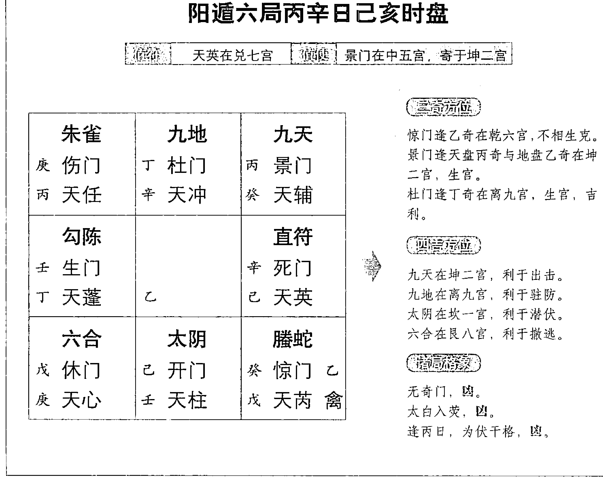

- 三奇方位:
- 惊门逢乙奇在乾六宫，不相生克。
- 景门逢天盘丙奇与地盘乙奇在坤二宫，生宫。
- 杜门逢丁奇在离九宫，生宫，吉利。
- 四吉方位:
- 九天在坤二宫，利于出击。
- 九地在离九宫，利于驻防。
- 太阴在坎一宫，利于潜伏。
- 六合在艮八宫，利于撤退。
- 诸局格象:
- 无奇门，凶。
- 太白入荧，凶。
- 逢丙日，为伏干格，凶。

# # 阳遁六局丙辛日己亥时盘


## 庚子时：正东方向吉利

## 4.丁壬日十二时局

### 原文

庚子英八，景六。子至卯阴，宿干凶。开丁震制，死坎制，景墓乾制。天一，地六，阴四，合九。开与日合三正东，飞宫格，天乙与太白格，蛇矫，时干兑，飞符，刑格，壬日勃。

### 白话提要

符使宫位：值符天英在艮八宫，值使景门在乾六宫。子时至卯时为五阴时。时干遇凶星宿，时干逢吉。

三奇方位：开门逢天盘乙奇与地盘丁奇在震三宫，克宫。死门逢丙奇在坎一宫，克宫。景门逢丁奇在乾六宫，克宫，丁奇入墓。

四吉方位：九天在坎一宫，九地在乾六宫，太阴在巽四宫，六合在离九宫。

诸局格局：开门合乙奇在震三宫，正东方向吉利。天乙与六庚成飞宫格。螣蛇夭矫。时干在兑七宫。值符飞宫。刑格。逢壬日，为日勃格。

一吉方：开门合乙奇在震三宫，正东方向吉利。

| 直符 | 辛 惊门 | 庚 天英 |
|---|---|---|
| 九天 | 丙 死门 | 壬 天辅 |
| 九地 | 丁 景门 | 戌 天冲 |
| 六合 | 戌 生门 | 壬 休门 |
| 勾陈 | 壬 伤门 | 癸 天蓬 |
| 朱雀 | 庚 杜门 | 己 天任 |
| 螣蛇 | 乙 | 开门 | 天英 |


> 三奇方位：

开门逢天盘乙奇与地盘丁奇在震三宫，克官。

死门逢丙奇在坎一宫，克宫。

景门逢丁奇在乾六宫，克官。

四吉方位：

九天在坎一宫，利于出击。

九地在乾六官，干利驻防。

太阴在巽四宫，利于潜伏。

六合在离九宫，利于撤退。

> 诸局格局：

螣蛇夭矫，值符飞宫，刑格，凶。

逢壬日，为日勃格，凶。


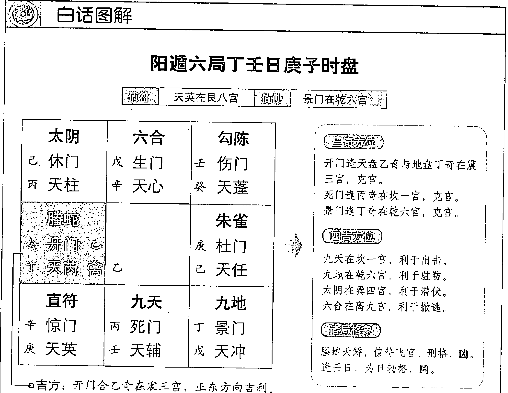

# # 辛丑时：正东东南方向吉利

### 【原文】
 辛丑英九，景七，宿干凶。杜墓乙坤制，生丙巽害，休震义。天四，地三，阴七，合六。生与月合四东南，休与星合三正东，时干离，符伏，仪刑。

### 【白话提要】
 符使宫位：值符天英在离九宫，值使景门在兑七宫。时干遇凶星宿，时干逢凶。三奇方位：杜门逢双乙奇在坤二宫，克宫，乙奇入墓。生门逢双丙奇在巽四宫，被克。休门逢双丁奇在震三宫，生宫。
 四吉方位：九天在巽四宫，九地在震三宫，太阴在兑七宫，六合在乾六宫。
 诸局格象：生门合丙奇在巽四宫，东南方向吉利。休门合丁奇在震三宫，正东方向吉利。时干在离九宫。九星和值符都在本宫未动，为伏吟格。六仪击刑。

## 白话图解

## 阳遁六局丁壬日辛丑时盘
 
| | | |
|---|---|---|
| | 天英在离九宫 | | 景门在兑七宫 |

> 吉方 1:生门合丙奇在巽四宫，东南方向吉利。

| |直符 |螣蛇|
|---|---|---|
|商 癸 甲子戊辛 |伤门 |杜门 |乙禽
|两 丁 己辛丑 |天英 |天芮
| | ||

|九地 | |太阴 |
|---|---|---|
|可 庚 丙己癸 |休门 |景门
|下 辛 乙丁戊 |天冲 |天柱
| ||

|朱雀 |勾陈|六合 |
|---|---|---|
|庚 甲子丙癸 |开门 |惊门
|庚 丁 癸戌壬 |天任 |天蓬
| | |死门
| | |天心 

< >吉方 2：休门合丁奇在震三宫，正东方向吉利。

#### 三奇方位
杜门逢双乙奇在坤二宫，克宫。生门逢双丙奇在巽四宫，被克。休门逢双丁奇在震三宫，生宫。

#### 四吉方位
九天在巽四宫，利于出击。九地在震三宫，利于驻防。太阴在兑七宫，利于潜伏。六合在乾六宫，利于撤退。

#### 诸局格象
六仪击刑，凶。
九星和值符都在本宫未动，为伏吟格，凶。


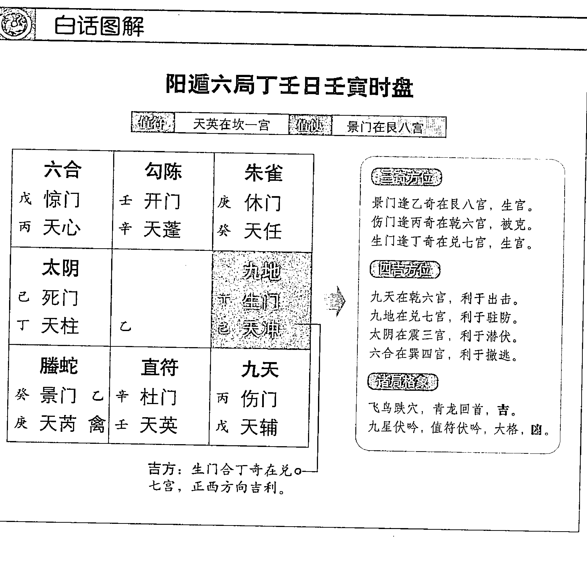

# # 壬寅时：正西方向吉利

### 【原文】

壬寅 英一，景八。宿干凶。景合艮义，伤墓乾害，生兑义。天六，地七，阴三，合四。生与星合七正西，鸟跌穴，龙返首，时干离，符伏，大格，事同。

### 【白话提要】

符使宫位：值符天英在坎一宫，值使景门在艮八宫。时干遇凶星宿，时干逢凶。三奇方位：景门逢乙奇在艮八宫，生官，奇仪相合。伤门逢丙奇在乾六宫，被克，丙奇入墓。生门逢丁奇在兑七宫，生宫。

四吉方位：九天在乾六宫，九地在兑七宫，太阴在震三宫，六合在巽四宫。

诸局格象：生门合丁奇在兑七宫，正西方向吉利。飞鸟跌穴。青龙回首。时干在离九宫。九星伏吟。值符伏吟。大格。


> > ### 三奇方位
> 
> 景门逢乙奇在艮八宫，生官。
> 伤门逢丙奇在乾六宫，被克。
> 生门逢丁奇在兑七宫，生官。

> > ### 四吉方位
> 
> 九天在乾六宫，利于出击。
> 九地在兑七宫，利于驻防。
> 太阴在震三宫，利于潜伏。
> 六合在巽四宫，利于撤退。

> > ### 诸局格象
> 
> 飞鸟跌穴，青龙回首，吉。
> 九星伏吟，值符伏吟，大格，凶。


图 解 中 国传 统决 策学·奇门 遁甲大 全 （第 三）部


# # 癸卯时：逢丁日不宜用事

### 【原文】

**癸卯** 英二，景九。宿干凶，丁日不用。惊兑伏，景合离伏欢怡，杜丙巽伏。天九，地四，阴六，合一。无奇门，符勃，壬日飞干格，时干兑，门伏，丁日伏干格，虎猖狂。

### 【白话提要】

**符使宫位**: 值符天英在坤二宫，值使景门在离九宫。时干遇凶星宿，时干逢凶。逢丁日不宜用事。

**三奇方位**: 惊门逢乙奇在兑七宫，不相生克。景门逢丙奇在离九宫，不相生克，奇仪相合，吉利。杜门逢天盘丁奇与地盘丙奇在巽四宫，不相生克。

**四吉方位**: 九处在离九宫，九地在巽四宫，太阴在乾六宫，六合在坎一宫。

**诸局格象**: 无奇门。符勃格。逢壬日，为飞干格。时干在兑七宫。八门伏吟。逢丁日，为伏干格。白虎猖狂。


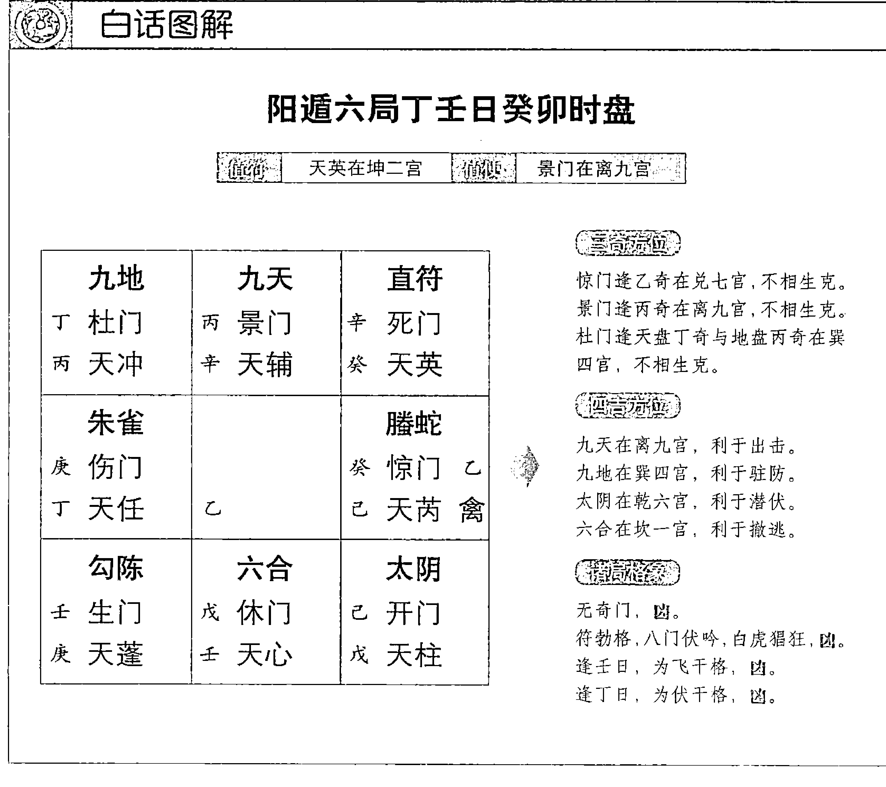

# # 甲辰时：无奇门可出

### 【原文】
甲辰 蓬直符一，休直使一。辰至申阳，天辅，宿凶干吉。伤冲使震伏，死芮日坤伏，杜辅月巽伏。天六，地七，阴三，合四。无奇门，干格，时干坎，伏吟，飞甲，自刑，开。

### 【白话提要】
符使宫位：值符天蓬在坎一宫，值使休门在坎一宫。辰时至申时为五阳时，辰时 为天辅释罪时。
三奇方位：伤门逢双丁奇在震三宫，不相生克。死门逢双乙奇在坤二官，不相生克。杜门逢双丙奇在巽四官，不相生克。
四吉方位：九天在乾六宫，九地在兑七宫，太阴在震三宫，六合在巽四宫。
诸局格象：无奇门。伏干格。时干在坎一宫。九星、值符和八门都在本宫未动，为伏吟格。六甲自刑，开。

图解中国传统决策学·奇门遁甲大全第 4 部（第 506 页）

白话图解
阳遁六局丁壬日甲辰时盘
值符：天蓬在坎一宫 值使：休门在坎一宫
六合 勾陈 朱雀 
丙 杜门 辛 景门 癸 死门乙 
丙 天辅 辛 天英 癸 天芮禽 
太阴 
丁 伤门 乙 
丁 天冲 己 惊门
己 天柱


> 三奇方位:
伤门逢双丁奇在震三宫，不相生克。
死门逢双乙奇在坤二宫，不相生克。杜门逢双丙奇在巽四宫，不相生克。
四吉方位:
九天在乾六宫，利于出击。
九地在兑七官，利于驻防。
太阴在震三宫，利于潜伏。六合在巽四宫，利于撤退。
诸局格象:
无奇门，凶。
伏干格，凶。
九星、值符和八门都在本宫未动，为伏吟格，凶。

422


# ## 乙巳时：无奇门可出
### 【原文】
乙巳蓬五，休二。宿干吉。伤墓乾害，死丁震害，杜坎和欢怡。天九，地四，阴六，合一。无奇门，符勃，丁干勃，蛇矫，时干震，刑格，壬日勃。
### 【白话提要】

**符使宫位**: 值符天蓬在中五宫，寄于坤二宫，值使休门在坤二宫。时干遇吉星宿，时干逢吉。

**三奇方位**: 伤门逢丁奇在乾六宫，被克，丁奇入墓。死门逢天盘乙奇与地盘丁奇在震三宫，被克。杜门逢丙奇在坎一宫，被生，吉利。

**四吉方位**: 九天在离九宫，九地在巽四宫，太阴在乾六宫，六合在坎一宫。

**诸局格象**: 无奇门。符勃格。螣蛇夭矫。时干在震三宫。刑格。逢壬日，为日勃格。


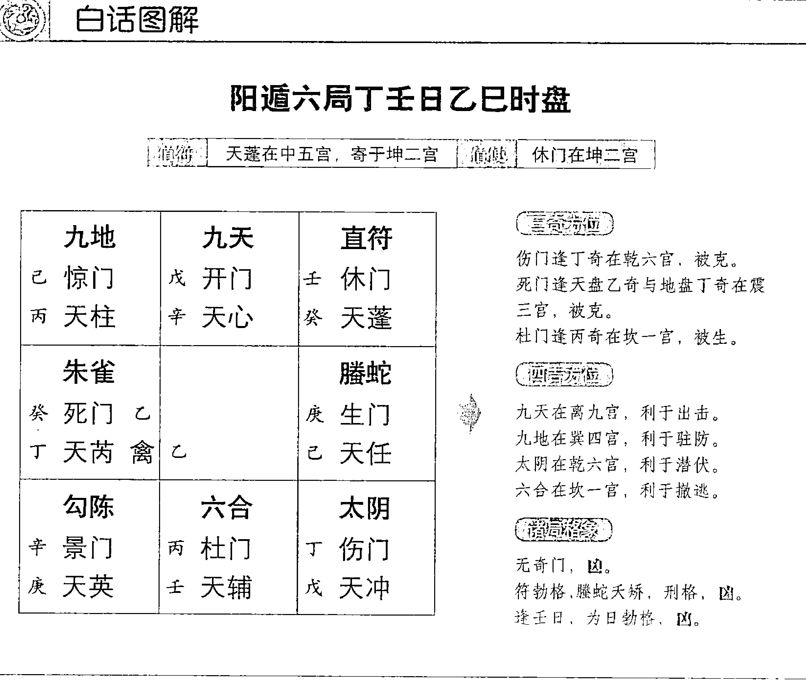

# # 丙午时：宜守户不出

### 【原文】

丙午 蓬四，休三。宿干吉，守户。杜乙坤制，惊坎义欢怡，景兑制。天三，地八，阴二，合七。无奇门，时干兑，相佐巽，三吉，雀入江。

### 【白话提要】

符使宫位：值符天蓬在巽四宫，值使休门在震三宫。时干遇吉星宿，时干逢吉。宜守户不出。

三奇方位：杜门逢天盘丁奇与地盘乙奇在坤二宫，克宫。惊门逢乙奇在坎一宫，生宫，吉利。景门逢丙奇在兑七宫，克宫。

四吉方位：九天在震三宫，九地在艮八宫，太阴在坤二宫，六合在兑七宫。

诸局格象：无奇门。时干在兑七宫。值符得地盘丙奇相助在巽四宫。三吉格。朱雀入江。


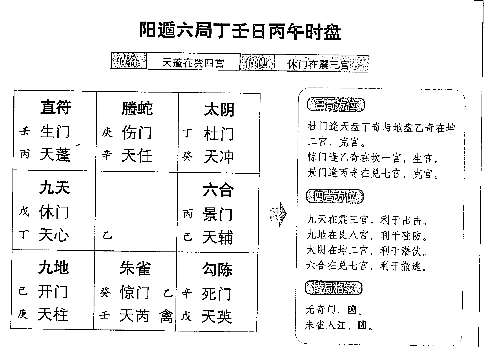

# ### 丁未时：正南方向吉利

**【原文】**

丁未 蓬三，休四。宿干吉。生离和，景乾制，伤乙坤制。天八，地一，阴九，合二。生与星合九正南，时干离，相佐震，金入火。

**【白话提要】**

符使宫位：值符天蓬在震三宫，值使休门在巽四宫。时干遇吉星宿，时干逢吉。

三奇方位：生门逢丁奇地离九宫，被生。景门逢乙奇地乾六宫，克宫。伤门逢天盘丙奇与地盘乙奇在坤二宫，克宫。

**四吉方位：**九天在艮八宫，九地在坎一宫，太阴在离九宫，六合在坤二宫。

**诸局格象：**生门合丁奇在离九宫，正南方向吉利。时干在离九宫。值符得地盘丁奇相助在震三宫。太白入荧。


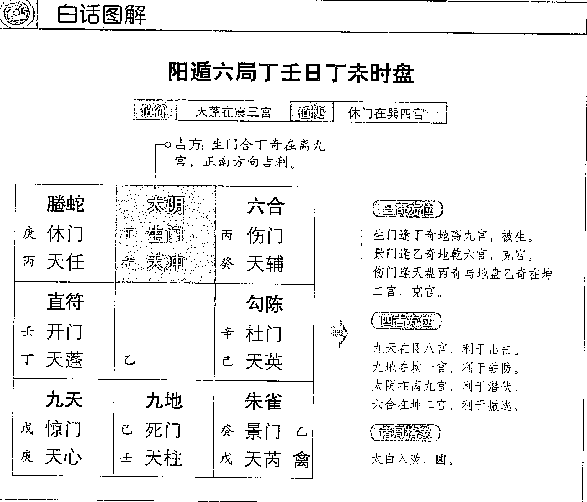

# # 戊申时:逢壬日不宜用事

### 【原文】

**戊申** 蓬六，休五避五。宿干吉，壬日不用。景艮义，开离害，死丁震害。天七，地二，阴八，合三。开与日合九正南，丁干勃，龙走，伏宫格，丁日飞干格，时干兑，乙格，壬日伏干格。

### 【白话提要】

**符使宫位**：值符天蓬在乾六宫，值使休门在中五宫，寄于坤二宫。时干遇吉星宿，时干逢吉。逢壬日不宜用事。

**三奇方位**：景门逢丁奇在艮八宫，生宫。开门逢乙奇在离九宫，被克。死门逢天盘丙奇与地盘丁奇在震三宫，被克。

**四吉方位**：九处在兑七宫，九地在坤二宫，太阴在艮八宫，六合在震三宫。

**诸局格象**: 开门合乙奇在离九宫，正南方向吉利。逢丁日，为日干勃格。青龙逃走。伏宫格。逢丁日，为飞干格。时千在兑七官。乙奇格。逢壬日，为伏干格。

| | | |
|---|---|---|
| | **白话图解** | |
| | **阳遁六局丁壬日戊申时盘** | |
| 值符 | 天蓬在乾六宫 | 值使<br>休门在中五宫<br>寄于坤二宫 |
| ◎吉方：开门合乙奇在离九宫，正南方向吉利。 | 运奇方位 | 
| 勾陈惊门<br>辛丙<br>天英 | **朱雀开门**<br>**天芮**<br>己癸禽 | **九地休门**<br>天柱<br>巳
| **六合死门**<br>丁丙<br>天辅 | **乙** | **九天生门**<br>天心
戌己 |
| **太阴景门**<br>庚丁<br>天冲 | **腾蛇杜门**<br>壬庚<br>天任 | **直符伤门**<br>天蓬
戌壬 |


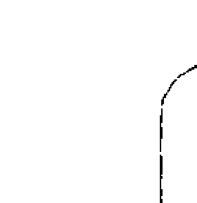

# # 己酉时：正北方向吉利

### 【原文】

**己酉**蓬七，休六。酉至亥阴，宿干凶。生合坎制欢怡，景丙巽和，伤艮制。
天二，地九，阴一，合八。生与星合一正北，时干离，飞宫，火入金。

### 【白话提要】

**符使宫位：** 值符天蓬在兑七宫，值使休门在乾六宫。酉时至亥时为五阴时。时干遇凶星宿，时干逢凶。

**三奇方位：** 生门逢丁奇在坎一宫，克宫，吉利，奇仪相合。景门逢天盘乙奇与地盘丙奇在巽四宫，被生。伤门逢丙奇在艮八宫，克宫。

**四吉方位：** 九天在坤二宫，九地在离九宫，太阴在坎一宫，六合在艮八宫。

**诸局格象：** 生门合丁奇在坎一宫，正北方向吉利。时干在离九宫。飞宫格。荧入
太白。


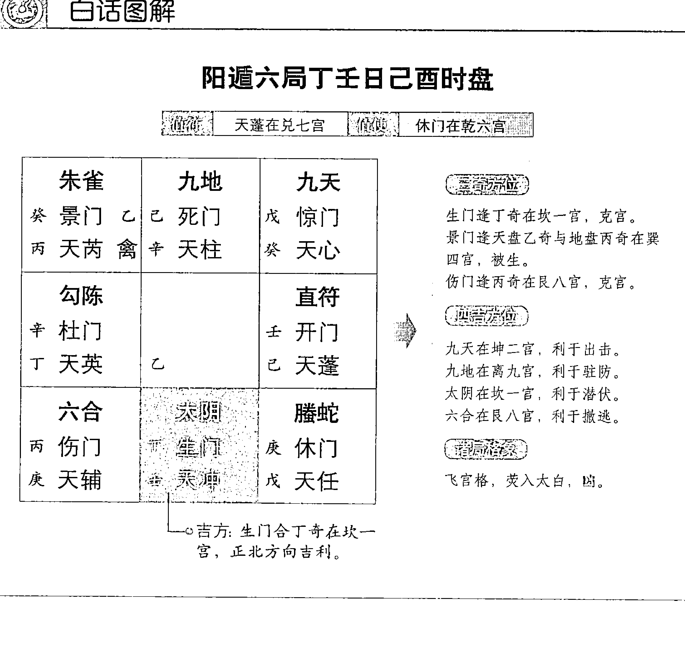

# 庚戌时:正西方向吉利

[原文]

庚戌蓬八，休七。宿吉干凶。死丙巽制,休兑和，惊合离害。天一，地六,
阴四，合九。休与日合七正西，飞宫格，虎猖狂，丁日伏干格，时干震，飞符,
壬日飞干格。

[白话提要]

符使宫位：值符天蓬在艮八宫，值使休门在兑七宫。时干遇吉星宿，时干逢凶。
三奇方位：死门逢天盘丁奇与地盘丙奇在巽四宫，克宫。休门逢乙奇在兑七宫，被
生。惊门逢丙奇在离九宫，被克，奇仪相合。
四吉方位：九天在坎一宫，九地在乾六宫，太阴在巽四宫，六合在离九宫。
诸局格象：休门合乙奇在兑七宫，正西方向吉利。飞宫格。白虎猖狂。逢丁日，为
伏干格。时干在震三宫。值符飞宫。逢壬日，为飞干格。

## 白话图解


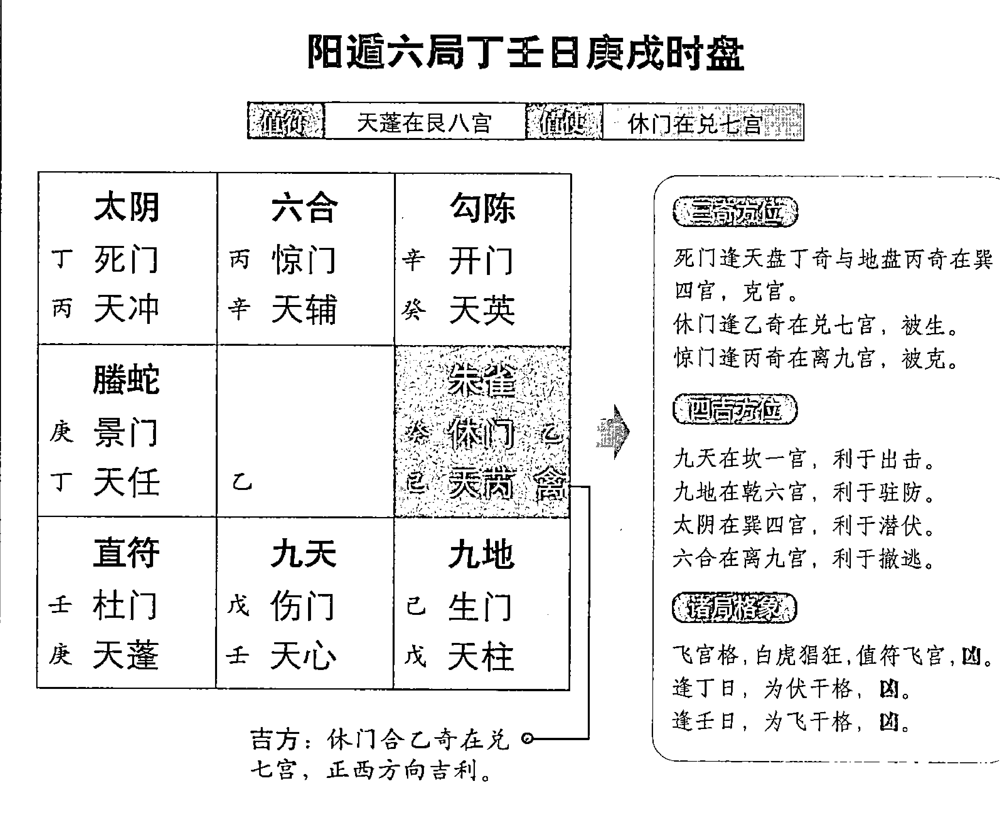

# ### 辛亥时：东北方向吉利

> **【原文】**

辛亥 蓬九，休八。宿干凶。死兑伏，休合艮害，惊墓乾伏。天四，地三，阴七，合六。休与日合八东北，天乙与太白格，鸟跌穴，龙反首，时干坎，符冲，大格。

> **【白话提要】**

符使宫位：值符天蓬在离九宫，值使休门在艮八宫。时干遇凶星宿，时干逢凶。
三奇方位：死门逢丁奇在兑七宫，不相生克。休门逢乙奇在艮八宫，被克，奇仪相合。惊门逢丙奇在乾六宫，不相生克，丙奇入墓。
四吉方位：九天在巽四宫，九地在震三宫，太阴在兑七宫，六合在乾六宫。
诸局格局象：休门合乙奇在艮八宫，东北方向吉利。天乙与六庚成飞干格。飞鸟跌穴。青龙回首。时干在坎一宫。九星和值符都到了与其相冲的宫位，为反吟格。大格。


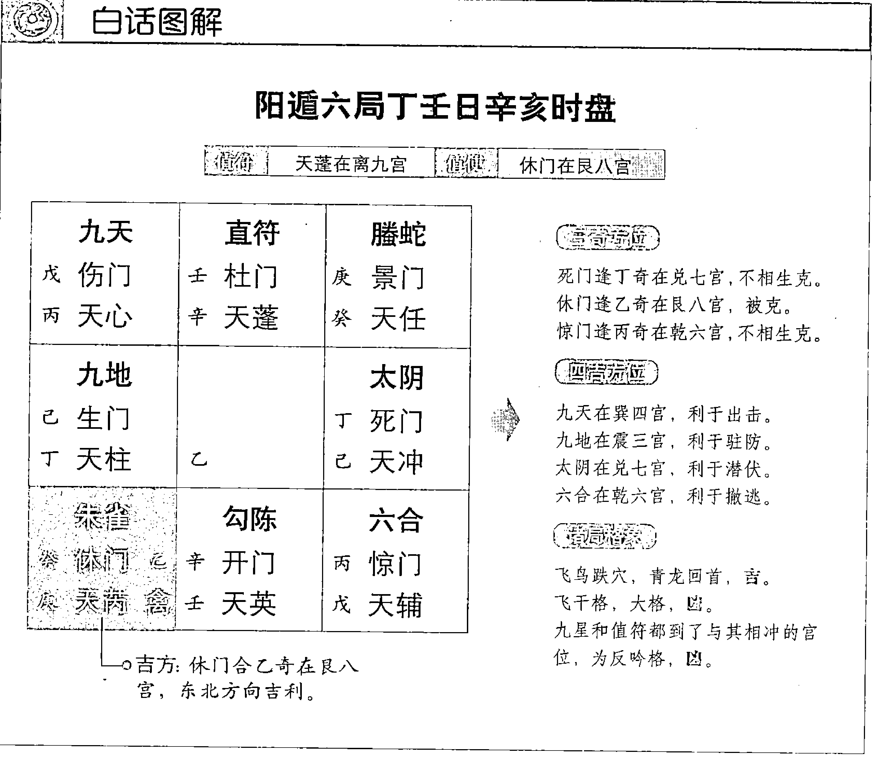

# # 5.戊癸日十二时局

# 108 5. 壬子时: 东南和西南方向吉利

### 【原文】

壬子蓬一，休九。子至丑阴，宿干凶。惊丁震制，生墓乙坤伏，开丙巽制。天六，地七，阴三，合四。开与月合四东南，时干坎，生与日合二西南，符伏。

### 【白话提要】

114 符使宫位: 值符天蓬在坎一宫，值使休门在离九宫。子时至丑时为五阴时。时干遇凶星宿，时干逢凶。

三奇方位：惊门逢双丁奇在震三宫，克宫。生门逢双乙奇在坤二宫，不相生克,乙奇入墓。开门逢双丙奇在巽四宫，克官。

四吉方位：九天在乾六宫，九地在兑七宫，太阴在震三宫，六合在巽四官。

诸局格象: 开门合丙奇在巽四宫，东南方向吉利。时干在坎一宫。生门合乙奇在


图 解中国传 统决 策学 奇门通甲大 全 第部

> 白话图解

阳遁六局戊癸日壬子时盘

| | 天蓬在坎一宫 | | 休门在离九宫 |
| :--: | :--: | :--: | :--: |
| | | | |
| 吉方 1 : 开门合丙奇在巽 | | 吉方 2 : 生门合乙奇在坤 |
| :--: | :--: | :--: | :--: |
| | 六合 | 勾陈 | 朱雀 |
| | 丙 | | 癸 |
| | 开门 | 休门 | 生门 乙 |
| | | 天芮 天辅 | 天芮 禽
| :--: | :--: | :--: | :--: |
| 四宫 , 东南方向吉利。

二宫，西南方向吉利。 | | 
| | | 
| 太阴 | | 九地 |
| 丁 | | 
| 惊门 | | 伤门 |
| 丁 天冲 | 乙 己 | 己 天柱
| :--: | :--: | :--: |
| 滕蛇 | 直符 | 九天 |
| 庚 死门 壬 景门 戊 杜门 |
| 庚天 任壬 天蓬 戊 天心


三奇方位

惊门逢双丁奇在震三宫，克宫。

生门逢双乙奇在坤二宫，不相生克。

开门逢双丙奇在巽四宫，克官四吉方位

九天在乾六宫，利于出击。

九地在兑七宫，利于驻防。

太阴在震三宫，利于潜伏。

六合在巽四宫，利于撤逃。

诸局格象

九星和值符都到了与其相冲的官位，为伏吟格，凶。


$\odot$

430## 坤二宫，西南方向吉利。九星和值符都到了与其相冲的宫位，为伏吟格。

## 癸丑时：正北西北方向吉利

### 【原文】

癸丑 蓬二，休一。开墓乾伏，伤丁震伏欢怡，休坎伏欢怡。天九，地四，阴六，合一。开与星合六西北，休与月合一正北，蛇矫，时干震，刑格，门伏。

### 【白话提要】

符使宫位: 值符天蓬在坤二宫，值使休门在坎一宫。

三奇方位：开门逢丁奇在乾六宫，不相生克，丁奇入墓。伤门逢天盘乙奇与地盘丁奇在震三宫，不相生克，吉利。休门逢丙奇在坎一宫，不相生克，吉利。

四吉方位：九天在离九宫，九地在巽四宫，太阴在乾六宫，六合在坎一宫。

诸局格象：开门合丁奇在乾六宫，西北方向吉利。休门合丙奇在坎一宫，正北方吉利。螣蛇天矫。时干在震三宫。刑格。八门都在本宫未动，为伏吟格。

---

## 甲寅时：逢戊日不宜用事

### 【原文】

甲寅 芮直符二，死直使二。天辅，宿凶干吉。寅至午阳，戊日不用，伤冲使震伏，死墓芮日坤伏，杜辅月巽伏。天九，地四，阴六，合一。无奇门，阳内阴外，宜固守，时乾坤，符门伏，地甲时，阖。

### 【白话提要】

符使宫位：值符天芮在坤二宫，值使死门在坤二宫。寅时为天辅释罪时。时干遇凶星宿，时干逢吉。寅时至午时为五阳时。逢戊日不宜用事。

三奇方位：伤门逢双丁奇在震三宫，不相生克。死门逢双乙奇在坤二宫，不相生克。杜门逢双丙奇在巽四宫，不相生克。

四吉方位：九天在离九宫，九地在巽四宫，太阴在乾六宫，六合在坎一宫。

诸局格象：无奇门。阳内阴外宜固守。时干在坤二宫。九星、值符和八门都在本宫未动，为伏吟格。地盘六甲合。

---

## 白话图解

## 阳遁六局戊癸日甲寅时盘

| 九地 | 九天 | 直符 |
| :---: | :---: | :---: |
| 丙杜门<br>丙天辅 | 辛景门<br>辛天英 | 癸死门乙禽 |
| 朱雀<br>丁伤门<br>丁天冲 | 乙 | 螣蛇<br>己惊门<br>己天柱 |
| 勾陈<br>庚生门<br>庚天任 | 六合<br>壬休门<br>壬天蓬 | 太阴<br>戊开门<br>戊天心 |


<blockquote>
#### 三奇方位
伤门逢双丁奇在震三宫，不相生克。
死门逢双乙奇在坤二宫，不相生克。
杜门逢双丙奇在巽四宫，不相生克。
</blockquote>

<blockquote>
#### 四吉方位
九天在离九宫，利于出击。
九地在巽四宫，利于驻防。
太阴在乾六宫，利于潜伏。
六合在坎一宫，利于撤退。
</blockquote>

<blockquote>
#### 诸局格象
无奇门，凶。
九星、值符和八门都在本宫未动，为伏吟格，凶。
</blockquote>

---

## 乙卯时：宜守户不出

### 【原文】

乙卯 芮五，死三。守户。死丁震害，休墓乙坤伏，惊丙巽制。天九，地四，阴六，合一。休与日合二西南，三吉，时干坤，符伏。

### 【白话提要】

符使宫位：值符天芮在中五宫，寄于坤二宫，值使死门在震三宫。宜守户不出。

三奇方位：死门逢双丁奇在震三宫，不相生克。休门逢双乙奇在坤二宫，不相生克，乙奇入墓。惊门逢双丙奇在巽四宫，克宫。

四吉方位：九天在离九宫，九地在巽四宫，太阴在乾六宫，六合在坎一宫。

诸局格象：休门合乙奇在坤二宫，西南方向吉利。三吉格。时干在坤二宫。九星和值符都在本宫未动，为伏吟格。

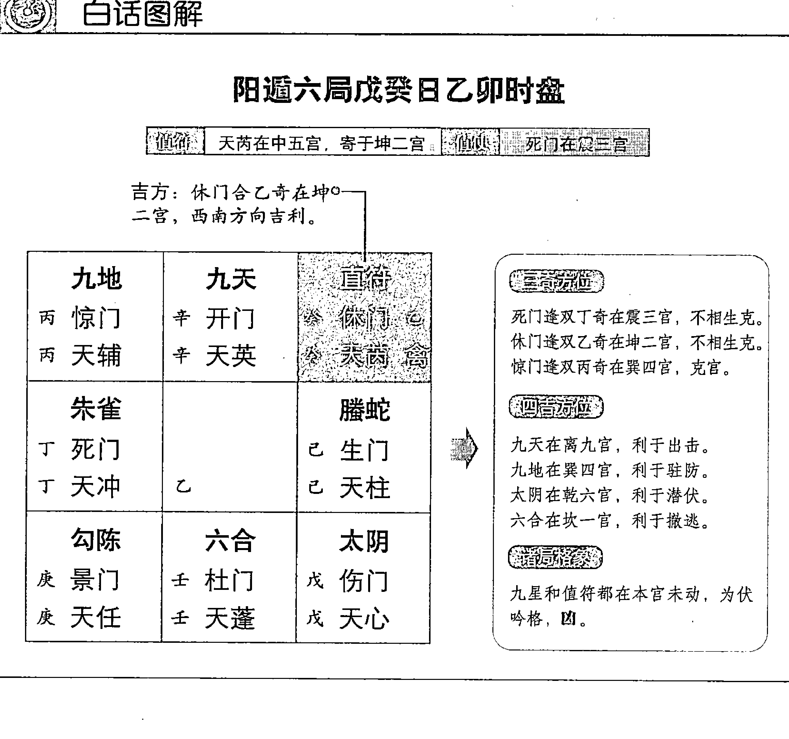

---

## 丙辰时：无奇门可出

### 【原文】

丙辰 芮四，死四。伤合坤和，死芮巽害，杜艮制。天三，地八，阴二，合七。无奇门，戊日伏干格，仪刑，时干艮，相佐巽，火入金，飞官格。

### 【白话提要】

符使宫位：值符天芮在巽四宫，值使死门在巽四宫。

三奇方位：伤门逢丁奇在坎一宫，被生，奇仪相合。死门逢天盘乙奇与地盘丙奇在巽四宫，被克。杜门逢丙奇在艮八宫，克宫。

四吉方位：九天在震三宫，九地在艮八宫，太阴在坤二宫，六合在兑七宫。

诸局格象：无奇门。逢戊日，为伏干格。六仪击刑。时干在艮八宫。值符得地盘丙奇相助在巽四宫。荧入太白。飞官格。


<blockquote>
#### 三奇方位
- 伤门逢丁奇在坎一宫，被生。
- 死门逢天盘乙奇与地盘丙奇在巽四宫，被克。
- 杜门逢丙奇在艮八宫，克宫。
</blockquote>

<blockquote>
#### 四吉方位
- 九天在震三宫，利于出击。
- 九地在艮八官，利于驻防。
- 太阴在坤二官，利于潜伏。
- 六合在兑七宫，利于撤退。
</blockquote>

<blockquote>
#### 诸局格象
无奇门，凶。
六仪击刑，荧入太白，飞官格，凶。
逢戊日，为伏干格，凶。
</blockquote>

---

## 丁巳时：正北西北方向吉利

### 【原文】

丁巳芮三，死五避五。开幕乾伏，伤丁震伏，休坎伏。天八，地一，阴九，合二。休与月合一正北，开与星合六西北，蛇矫，时干乾，相佐震，击刑，刑格。

### 【白话提要】

符使宫位：值符天芮在震三宫，值使死门在中五宫，寄于坤二宫。

**三奇方位**：开门逢丁奇在乾六宫，不相生克，丁奇入墓。伤门逢天盘乙奇与地盘丁奇在震三宫，不相生克。休门逢丙奇在坎一宫，不相生克。

**四吉方位**：九天在艮八宫，九地在坎一宫，太阴在离九宫，六合在坤二宫。

**诸局格象**：休门合丙奇在坎一宫，正北方向吉利。开门合丁奇在乾六宫，西北方向吉利。腾蛇天矫。时干在乾六宫。值符得地丁相助在震三宫。击刑。刑格。

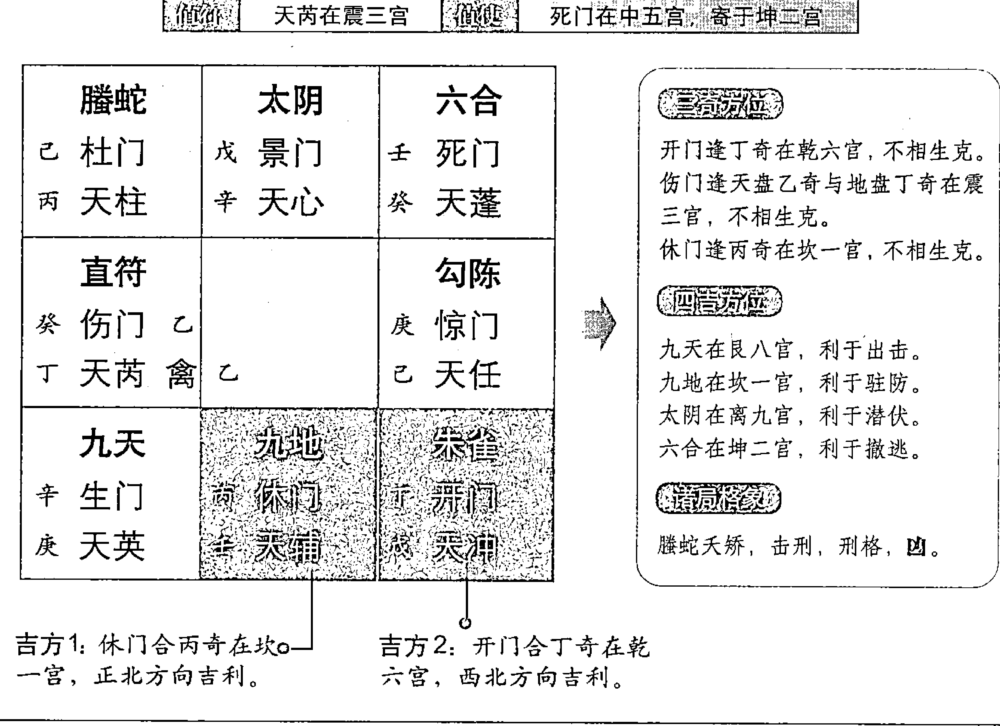

**三奇方位**：开门逢丁奇在乾六宫，不相生克。伤门逢天盘乙奇与地盘丁奇在震三宫，不相生克。休门逢丙奇在坎一宫，不相生克。

**四吉方位**：九天在艮八宫，利于出击。九地在坎一宫，利于驻防。太阴在离九宫，利于潜伏。六合在坤二宫，利于撤退。

**诸局格象**：腾蛇天矫，击刑，刑格，凶。

---

## 戊午时：无奇门可出

### 【原文】

戊午，芮六，死六。伤离义，死乾义，杜乙坤制。天七，地二，阴八，合三。无奇门，时干艮，癸日勃，戊日飞干格，金入火。

### 【白话提要】

- 符使宫位：值符天芮在乾六宫，值使死门在乾六宫。
- 三奇方位：伤门逢丁奇在离九宫，生宫。死门逢乙奇在乾六宫，生宫。杜门逢天盘丙奇与地盘乙奇在坤二宫，克宫。
- 四吉方位：九天在兑七宫，九地在坤二宫，太阴在艮八宫，六合在震三宫。
- 诸局格象：无奇门。时干在艮八宫。逢癸日，为日勃格。逢戊日，为飞干格。太白入荧。

## 白话图解

### 阳遁六局戊癸日戌午时盘

| | | |
| :---: | :---: | :---: |
| **勾陈** | **朱雀** | **九地** |
| 戊生门天任 | 丁伤门天冲 | 丙杜门天辅 |
| 壬休门天蓬 | 乙 | 辛景门天英 |
| **太阴** | **腾蛇** | **直符** |
| 戊开门天心 | 己惊门天柱 | 癸死门天芮禽 |

> > **三奇方位**
>
> 伤门逢丁奇在离九宫，生官。
> 死门逢乙奇在乾六宫，生宫。
> 杜门逢天盘丙奇与地盘乙奇在坤二宫，克宫。
>
> **四吉方位**
>
> 九天在兑七宫，利于出击。
> 九地在坤二官，利于驻防。
> 太阴在艮八宫，利于潜伏。
> 六合在震三宫，利于撤退。
>
> **诸局格象**
>
> 无奇门，凶。
> 太白入荧，凶。
> 逢癸日，为日勃格，凶。
> 逢戊日，为飞干格，凶。

---

## 己未时：逢癸日不宜用事

### 【原文】

己未芮七，死七。宿干凶。未至亥阴，癸日不用，伤丙巽伏，死兑义，杜合离义。天二，地九，阴一，合八。无奇门，虎猖狂，时千乾。

### 【白话提要】

符使宫位：值符天芮在兑七宫，值使死门在兑七宫。时干遇凶星宿，时干逢凶。未时至亥时为五阴时。逢癸日不宜用事。

三奇方位：伤门逢天盘丁奇与地盘丙奇在巽四宫，不相生克。死门逢乙奇在兑七宫，被生。杜门逢丙奇在离九宫，生宫，奇仪相合。

四吉方位：九天在坤二宫，九地在离九宫，太阴在坎一宫，六合在艮八宫。

诸局格象：无奇门。白虎猖狂。时干在乾六宫方位。

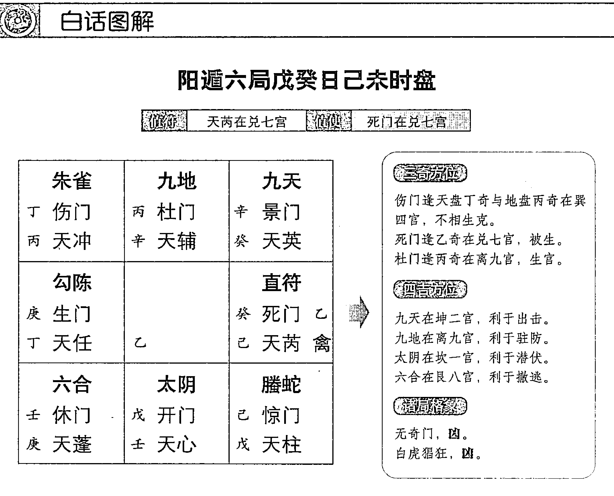

---

## 庚申时：无奇门可出

### 【原文】

庚申 芮八，死八。伤兑害，死艮伏，杜乾害。天一，地六，阴四，合九。无奇门，大格，伏宫格，鸟跌穴，龙反首，时干坤，符门冲，戊日勃，癸日飞干格。

### 【白话提要】

符使宫位：值符天芮在艮八宫，值使死门在艮八宫。
三奇方位：伤门逢丁奇在兑七宫，被克。死门逢乙奇在艮八宫，同类伏。杜门逢丙奇在乾六宫，被克。
四吉方位：九天在坎一宫，九地在乾六宫，太阴在巽四宫，六合在离九宫。
诸局格象：无奇门。大格。伏宫格。飞鸟跌穴。青龙回首。时干在坤二宫。九星、值和和八门都到了与其相冲的宫位，为反吟格。逢戊日，为日勃格。逢癸日，为飞干格。

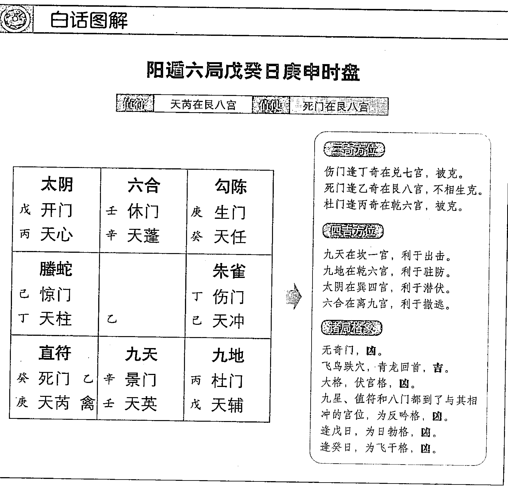

---

## 辛酉时：无奇门可出

### 【原文】

辛酉 艮九，死九。伤丁艮制，死离和，杜丁震伏。天四，地三，阴七，合六。无奇门，龙走，时干巽。

### 【白话提要】

符使宫位：值符天芮在离九宫，值使死门在离九宫。

三奇方位：伤门逢丁奇在艮八宫，克宫。死门逢乙奇在离九宫，被生。杜门逢天盘丙奇与地盘丁奇在震三宫，不相生克。

四吉方位：九天在巽四宫，九地在震三宫，太阴在兑七宫，六合在乾六宫。

诸局格象：无奇门。青龙逃走。时干在巽四宫。

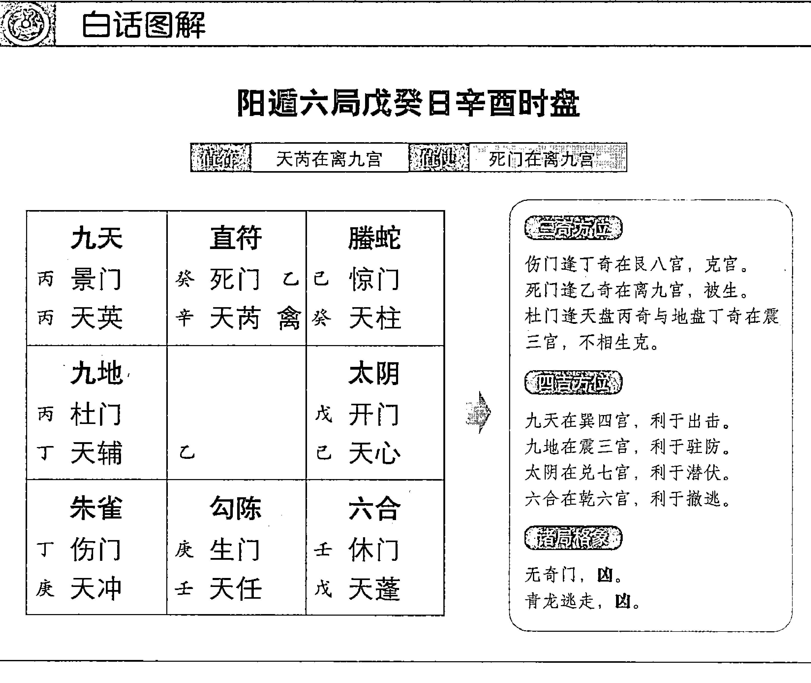

---

## 壬戌时：无奇门可出

### 【原文】

壬戌芮一，死一。伤乙坤制欢怡，死坎制，杜兑害。天六，地七，阴三，合四。无奇门，雀入江，时干巽。

### 【白话提要】

符使宫位：值符天芮在坎一宫，值使死门在坎一宫。
三奇方位：伤门逢天盘丁奇与地盘乙奇在坤二宫，克官，吉利。死门逢乙奇在坎一宫，克宫。杜门逢丙奇在兑七宫，被克。
四吉方位：九天在乾六宫，九地在兑七宫，太阴在震三宫，六合在巽四宫。
诸局格象：无奇门。朱雀入江。时干在巽四宫位。

## 白话图解

阳遁六局戊癸日壬戌时盘

| | 勾陈 | 朱雀 |
| :---: | :---: | :---: |
| 六合 | 庚生门 | 丁伤门 |
| 丙天蓬 | 辛天任 | 癸天冲 |
| | 乙 | |

**三奇方位**

伤门逢天盘丁奇与地盘乙奇在坤二宫，克官。
死门逢乙奇在坎一宫，克宫。
杜门逢丙奇在兑七宫，被克。

**四吉方位**

九天在乾六宫，利于出击。
九地在兑七宫，利于驻防。
太阴在震三宫，利于潜伏。
六合在巽四官，利于撤退。

**诸局格象**

无奇门，凶。
朱雀入江，凶。


---

## 癸亥时：无奇门可出

### 【原文】

癸亥 芮二，死二。伤丁震伏，死一坤伏，杜丙巽伏。天九，地四，阴六，合一。无奇门，时干坤，符门伏，天网四张。

### 【白话提要】

符使宫位：值符天芮在坤二宫，值使死门在坤二宫。

三奇方位：伤门逢双丁奇在震三宫，不相生克。死门逢双乙奇在坤二宫，不相生克。杜门逢双丙奇在巽四宫，不相生克。

四吉方位：九天在离九宫，九地在巽四宫，太阴在乾六宫，六合在坎一宫。

诸局格象：无奇门。时干在坤二宫。九星、值符和八门都在本宫未动，为伏吟格。天网四张。

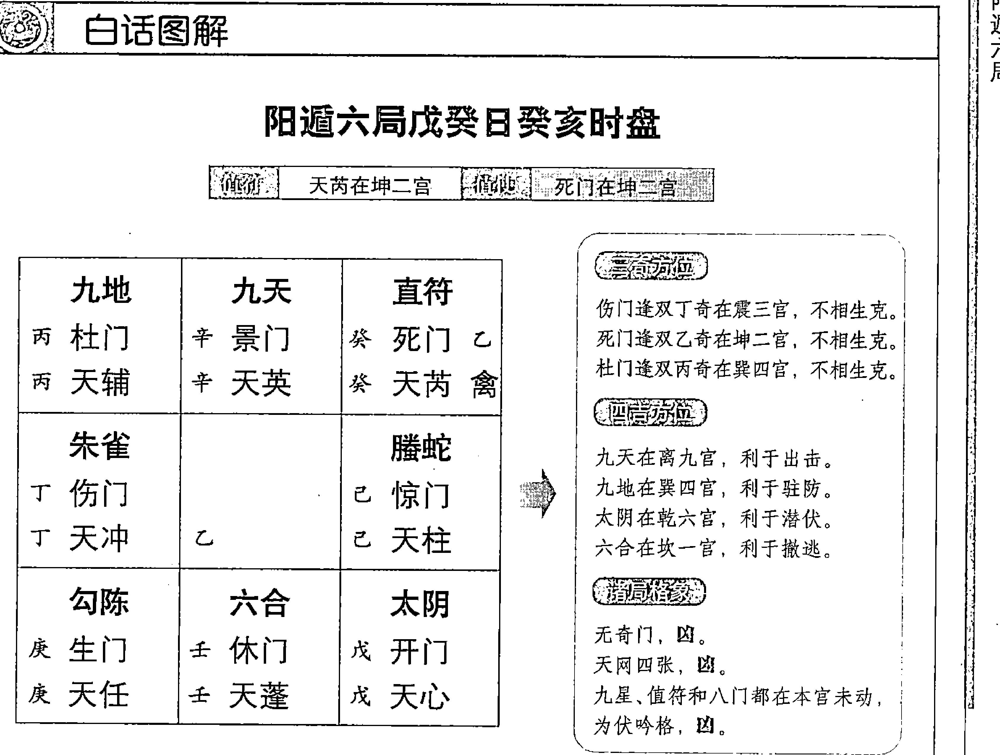

---

## 第三章 阳遁七局

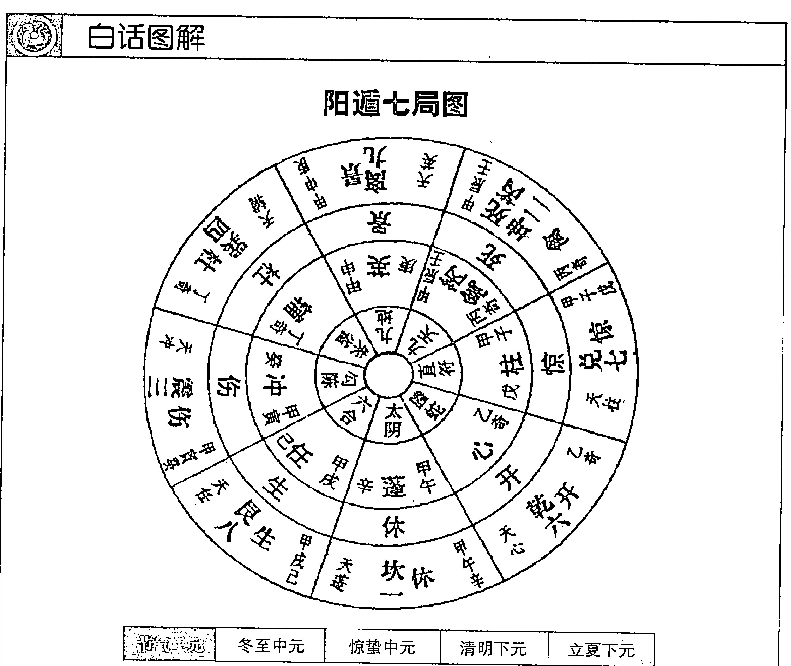

---

**图解中国传统决策学·奇门遁甲大全（第2章）**

奇门遁甲时家奇门阳遁七局共有六十个时辰，即六十局。本章通过文字和各时辰的飞盘排布来说明各局的符使宫位、三奇方位、四吉神方位和诸局格象。

### 每日时辰

奇门遁甲中一局为一元，一元有甲己、乙庚、丙辛、丁壬和戊癸五日，每日有十二个时辰，则一局就有六十个时辰，用六十甲子来表示，一个时辰为一小局。

| 甲己日 | 甲子 | 乙丑 | 丙寅 | 丁卯 | 戊辰 | 己巳 | 庚午 | 辛未 | 壬申 | 癸酉 | 甲戌 | 乙亥 |
| :---: | :---: | :---: | :---: | :---: | :---: | :---: | :---: | :---: | :---: | :---: | :---: | :---: |
| 乙庚日 | 丙子 | 丁丑 | 戊寅 | 己卯 | 庚辰 | 辛巳 | 壬午 | 癸未 | 甲申 | 乙酉 | 丙戌 | 丁亥 |
| 丙辛日 | 戊子 | 己丑 | 庚寅 | 辛卯 | 壬辰 | 癸巳 | 甲午 | 乙未 | 丙申 | 丁酉 | 戊戌 | 己亥 |
| 丁壬日 | 庚子 | 辛丑 | 壬寅 | 癸卯 | 甲辰 | 乙巳 | 丙午 | 丁未 | 戊申 | 己酉 | 庚戌 | 辛亥 |
| 戊癸日 | 壬子 | 癸丑 | 甲寅 | 乙卯 | 丙辰 | 丁巳 | 戊午 | 己未 | 庚申 | 辛酉 | 壬戌 | 癸亥 |

| | | | | | | | | | | | |
| :---: | :---: | :---: | :---: | :---: | :---: | :---: | :---: | :---: | :---: | :---: | :---: |
| 时辰 | 甲子 | 乙丑 | 丙寅 | 丁卯 | 戊辰 | 己巳 | 庚午 | 辛未 | 壬申 | 癸酉 |
| 天柱 | 七 | 六 | 五 | 四 | 七 | 八 | 九 | 一 | 二 | 三 |
| 惊门 | 七 | 八 | 九 | 一 | 二 | 三 | 四 | 五 | 六 | 七 |
| 时辰 | 甲戌 | 乙亥 | 丙子 | 丁丑 | 戊寅 | 己卯 | 庚辰 | 辛巳 | 壬午 | 癸未 |
| 天任 | 八 | 六 | 五 | 四 | 七 | 八 | 九 | 一 | 二 | 三 |
| 生门 | 八 | 九 | 一 | 二 | 三 | 四 | 五 | 六 | 七 | 八 |
| 时辰 | 甲申 | 乙酉 | 丙戌 | 丁亥 | 戊子 | 己丑 | 庚寅 | 辛卯 | 壬辰 | 癸巳 |
| 天英 | 九 | 六 | 五 | 四 | 七 | 八 | 九 | 一 | 二 | 三 |
| 景门 | 九 | 一 | 二 | 三 | 四 | 五 | 六 | 七 | 八 | 九 |
| 时辰 | 甲午 | 乙未 | 丙申 | 丁酉 | 戊戌 | 己亥 | 庚子 | 辛丑 | 壬寅 | 癸卯 |
| 天蓬 | 一 | 六 | 五 | 四 | 七 | 八 | 九 | 一 | 二 | 三 |
| 休门 | 一 | 二 | 三 | 四 | 五 | 六 | 七 | 八 | 九 | 一 |
| 时辰 | 甲辰 | 乙巳 | 丙午 | 丁未 | 戊申 | 己酉 | 庚戌 | 辛亥 | 壬子 | 癸丑 |
| 天芮 | 二 | 六 | 五 | 四 | 七 | 八 | 九 | 一 | 二 | 三 |
| 死门 | 二 | 三 | 四 | 五 | 六 | 七 | 八 | 九 | 一 | 二 |
| 时辰 | 甲寅 | 乙卯 | 丙辰 | 丁巳 | 戊午 | 己未 | 庚申 | 辛酉 | 壬戌 | 癸亥 |
| 天冲 | 三 | 六 | 五 | 四 | 七 | 八 | 九 | 一 | 二 | 三 |
| 伤门 | 三 | 四 | 五 | 六 | 七 | 八 | 九 | 一 | 二 | 三 |

### 阳遁七局六十时符使表

奇门遁甲排盘时，最主要的就是寻找值符和值使，并确定其所在的宫位。下表就是阳遁七局六十个时辰的值符和值使，以及其所在的宫位。## 丙寅时：正西方向吉利

### 【原文】

丙寅柱五，惊九。宿干吉。惊离害，休兑和欢怡，景震和。天九，地四，阴六，合一。休与日合七正西，雀入江，虎猖狂，天乙与太白格，时干离，相佐坤，火入金，事同，龙返首。

### 【白话提要】

符使宫位：值符天柱星在中五宫，寄于坤二宫，值使惊门在离九宫。时干遇吉星宿，时干逢吉。

三奇方位：惊门逢丙奇在离九宫，被克。休门逢乙奇在兑七宫，被生，好。景门逢丁奇在震三宫，被生。

四吉方位：九天在离九宫，九地在巽四宫，太阴在乾六宫，六合在坎一宫。

诸局格象：休门合乙奇在兑七宫，正西方向吉利。朱雀入江。白虎猖狂。天乙与六庚宫位有格。时干在离九宫。值符得地丙助于坤二宫。荧人太白。青龙回首。

## 白话图解

阳遁七局甲己日丙寅时盘

> > **值符：** 天柱在中五宫，寄于坤二宫
> **值使：** 惊门在离九宫

| 九地 | 九天 | 直符 |
| --- | --- | --- |
| 庚死门<br>丁天英 | 壬惊门<br>丙<br>戌开门<br>壬天柱 | 戊<br>禽<br>天柱 |
| 朱雀 | 丙 | **胆蛇<br>休门<br>天心** |
| 丁景门<br>癸天辅 |  |  | 
| 勾陈 | 六合 | 太阴 |
| 癸杜门<br>己天冲 | 己伤门<br>辛天任 | 辛生门<br>乙天蓬 |

吉方：休门合乙奇在兑七宫，正西方向吉利。

- **三奇方位：** 惊门逢丙奇在离九宫，被克。
休门逢乙奇在兑七宫，被生。
景门逢丁奇在震三宫，被生。
- **四吉方位：** 九天在离九宫，利于出击。
九地在巽四宫，利于驻防。
太阴在乾六宫，利于潜伏。
六合在坎一宫，利于撤退。
- **诸局格象：** 青龙回首，吉。
朱雀入江，白虎猖狂，荧人太白，凶。

## 图解中国传统决策学 · 奇门遁甲大全

第 2 部

# 丁卯时：正东方向吉利

### 【原文】

丁卯柱四，惊一。宿干凶。休震义，伤合离义，惊千义。天三，地八，阴二，合七。休与月合三正东，已日伏干格，仪刑，时干坎，相佐巽，刑格，击刑。

### 【白话提要】

符使宫位：值符天柱在巽四宫，值使惊门在坎一宫。时干遇凶星宿，时干逢凶。
三奇方位：休门逢丙奇在震三宫，生官。伤门逢乙奇在离九宫，生宫，奇仪相合。
惊门逢丁奇在坎一宫，生官。
四吉方位：九天在震三宫，九地在艮八宫，太阴在坤二宫，六合在兑七宫。
诸局格象：休门合丙奇在震三宫，正东方向吉利。逢已日，为伏干格。六仪击刑。时干在坎一宫。值符得地盘丁奇相助在巽四宫。刑格。

# # 戊辰时：西北方向吉利

**【原文】**

戊辰柱七，惊二。宿凶干吉。惊丙坤和，休乙乾和，景丁巽和。天二，地九，阴一，合八。休与日合六西北，时干兑，符伏。

**【白话提要】**

符使宫位：值符天柱在兑七宫，值使惊门在坤二官。时干遇凶星宿，时干逢吉。
三奇方位：惊门逢双丙奇在坤二宫，被生。休门逢双乙奇在乾六宫，被生。景门逢双丁奇在巽四宫，被生。
四吉方位：九天在坤二官，九地在离九宫，太阴在坎一宫，六合在艮八官。
诸局格象：休门合乙奇在乾六宫，西北方向吉利。时干在兑七宫。九星和值符在本宫未动，为伏吟格。

## 白话图解

### 阳遁七局甲己日戊辰时盘

|           |           |          |
| --------- | --------- | -------- |
| 朱雀      | 九地      | 九天     |
| 丁景门    | 庚死门    | 壬惊门   |
| 丁天辅    | 庚天英    | 癸天芮   |
|           |           |          |
| 勾陈      |           | 直符    |
| 癸杜门    |           | 戊开门   |
| 癸天冲    |           | 戌天柱   |
|           |           |          |
| 六合      | 太阴     | 暗蛇    |
| 己伤门    | 辛生门    | 乙休门   |
| 己天任    | 辛亥蓬    | 丙天心   |

三奇方位：惊门逢双丙奇于坤二官，被生。
休门逢双乙奇于乾六官，被生。
景门逢双丁奇于巽四官，被生。
四吉方位：
九天在坤二官，利于出击。
九地在离九宫，利于驻防。
太阴在坎一宫，利于潜伏。
六合在艮八宫，利于撤退。
诸局格象：

九星和值符在本官未动，为伏吟格，凶。

吉方：休门合乙奇在乾六宫，西北方向吉利。

# # 己巳时：无奇门可出

**[原文]**

**[白话提要]**

**符使宫位**: 值符天柱在艮八宫，值使惊门在震三宫。已时至酉时为五阴时，已时为
天辅释罪时。时干遇凶星宿，时干逢凶。

**三奇方位**: 景门逢丙奇在坎一宫，被克，奇仪相合。惊门逢乙奇在震三宫，克官。
伤门逢丁奇在兑七宫，被克，吉利。

**四吉方位**: 九天在坎一宫，九地在乾六宫，太阴在巽四宫，六合在离九宫。

**诸局格象**: 无奇门。八门都到了与其相冲的宫位，为反吟格。时干在离九宫。三
吉格。逢己日，为飞干格。

## 白话图解
### 阳遁七局甲己日己巳时盘
**值符天柱在艮八宫** **值使惊门在震三宫**
| 太阴 |		六合 |勾陈 |
|---|---|---|
|辛开门 
丁 天蓬 |		
己休门
庚天任 |		
癸生门
壬天冲 |
| 腾蛇 |		朱雀 |
|乙惊门
癸天心 |
丙 |
丁伤门
戊天辅 |
| 直符 |		九天 |九地 |
|戊死门 
已天柱 |		
壬景门
辛天芮禽|		
庚杜门
乙天英 |

- **三奇方位**: 景门逢丙奇在坎一宫，被克。
惊门逢乙奇在震三官，克官。
伤门逢丁奇在兑七宫，被克。
- **四吉方位**: 九天在坎一宫，利于出击。
九地在乾六宫，利于驻防。
太阴在巽四宫，利于潜伏。
六合在离九宫，利于撤逃。
- **诸局格象**: 无奇门，凶。
八门都到了与其相冲的宫位，为
反吟格，凶。
逢已日，为飞干格，凶。

阳遁七局

# # 庚午时：宜守户不出

### **【原文】**

庚午柱九，惊四。宿干凶，守户，甲日不用。惊丁巽制，休墓丙坤害，景艮义。天四，地三，阴七，合六。休与日合二西南，甲日伏干格，伏官格，天乙与太白格，时干震，飞符，大格。

### **【白话提要】**

**符使宫位：**值符天柱在离九宫，值使惊门在巽四宫。时干遇凶星宿，时干逢凶。宜守户不山。逢甲日不宜用事。

**三奇方位：**惊门逢天盘丙奇与地盘丁奇在巽四宫，克宫。休门逢乙奇在坤二宫，被克，乙奇入墓。景门逢丁奇在艮八宫，生宫。

**四吉方位：**九天在巽四宫，九地在震三宫，太阴在兑七宫，六合在乾六宫。

**诸局格象：**休门合乙奇在坤二宫，西南方向吉利。逢甲日，为伏干格。伏官格。飞宫格。时干在震三宫。大格。值符飞宫。

## 白话图解

# **阳遁七局甲己日庚午时盘**

 **值符：天柱在离九宫  **值使：惊门在巽四宫**

| 九天<br>壬惊门<br>丁天芮 | 直符<br>戊开门<br>庚天柱 | 腾蛇<br>乙休门<br>壬天心 |
| 九地<br>庚死门<br>癸天英 |  | 太阴<br>辛生门<br>戊天蓬 |
| 朱雀<br>丁景门<br>己天辅 | 勾陈<br>癸杜门<br>辛天冲 | 六合<br>己伤门<br>乙天任 |

> **三奇方位**

惊门逢天盘丙奇与地盘丁奇在巽四宫，克官。
休门逢乙奇在坤二官，被克。
景门逢丁奇在艮八宫，生宫。

> **四吉方位**

九天在巽四宫，利于出击。
九地在震三宫，利于驻防。
太阴在兑七宫，利于潜伏。
六合在乾六宫，利于撤退。

> **诸局格象**

逢甲日，为伏干格，凶。
伏官格，飞官格，大格，值符飞官，凶。

# # 辛未时：西北方向吉利

### 【原文】

辛未 柱一，惊五避五。宿干凶。休墓乙乾和，伤艮震，惊合坤和。天六，
地七，阴三，合四。休与月合六西北，甲日伏干格，伏宫格，天乙与太白格，时
干震，飞宫，乙格。

### 【白话提要】

符使宫位：值符天柱在坎一宫，值使惊门在中五宫，寄于坤二宫。时干遇凶星宿，
时干逢凶。

三奇方位：休门逢天盘丙奇与地盘乙奇在乾六宫，被生，丙奇入墓。伤门逢乙奇
在艮八宫，克宫。惊门逢丁奇在坤二宫，被生。

四吉方位：九夫在乾六宫，九地在兑七宫，太阴在震三宫，六合在巽四宫。

诸局格象：休门合丙奇在乾六宫，西北方向吉利。逢甲日，为伏干格。伏官格。天
乙与六庚宫位有格。时干在震三宫。飞宫格。乙奇格。

## 白话图解

## 阳遁七局甲己日辛未时盘

值符 天柱在坎一宫 值使 惊门在中五宫 寄于坤二宫

| 六合 | 勾陈 | 朱雀 |
| --- | --- | --- |
| 已景门 | 癸死门 | 丁惊门 |
| 丁天任 | 庚天冲 | 壬天辅 |
| 太阴 |  | 九地 |
| 辛杜门 | 丙 | 庚开门 |
| 癸天蓬 |  | 戊天英 |
| 螣蛇 | 直符 | 九天 |
| 乙伤门 | 戊生门 | 休门 |
| 已天心 | 辛天柱 | 芮禽 |

吉方：休门合丙奇在乾六宫，西北方向吉利。

三奇方位：
休门逢天盘丙奇与地盘乙奇在乾六宫，被生。伤门逢乙奇在艮八宫，克官。
惊门逢丁奇在坤二宫，被生。

四吉方位：
九天在乾六宫，利于出击。九地在兑七宫，利于驻防。太阴在震三宫，利于潜伏。
六合在巽四宫，利于撤退。

诸局格象:
逢甲日，为伏干格。凶。伏宫格，飞官格，乙奇格，凶。

# # 壬申时：正东方向吉利

【原文】
> 壬申柱二，惊六。宿干凶。杜离义，死兑义欢怡，生震害。天九，地四，
> 阴六，合一。生与星合三正东，伏干格，时干离，相佐坤，火入金。

【白话提要】
> * **符使宫位：**值符天柱在坤二宫，值使惊门在乾六宫。时干遇凶星宿，时干逢凶。
> * **三奇方位：**杜门逢丙奇在离九宫，生宫。死门逢乙奇在兑七宫，生宫，吉利。生
> 门逢丁奇在震三宫，被克。
> * **四吉方位：**九天在离九宫，九地在巽四宫，太阴在乾六宫，六合在坎一宫。
> * **诸局格象：**生门合丁奇在震三宫，正东方向吉利。伏干格。时干在离九宫。值符
> 得地盘丙奇相助在坤二宫。荧入太白。

## 白话图解

### 阳遁七局甲己日壬申时盘

<div align="center">| 值符 |
天柱在坤二宫 | 值使 |
惊门在乾六宫|
</div>

| 九地 伤门 庚丁 | 九天 杜门 壬 天芮 庚禽 | 直符景门戊辛天柱 | 朱雀生门丁癸天辅 | 六合开门己辛天任 | 太阴惊门乙辛天蓬 |
| --- | --- | --- | --- | --- | --- |
| 天心丙 | 

**三奇方位**

杜门逢丙奇在离九宫，生官。
死门逢乙奇在兑七宫，生官。
生门逢丁奇在震三宫，被克。

**四吉方位**

九天在离九宫，利于出击。
九地在巽四宫，利于驻防。
太阴在乾六宫，利于潜伏。
六合在坎一宫，利于撤退。

**诸局格象**

伏干格，荧入太白，凶。

> 吉方：生门合丁奇在震三宫，正东方向吉利。

# # 癸酉时：西北与东北方向吉利

# ### 【原文】

癸酉 柱三，惊七。宿吉干凶。生艮伏，杜丁巽伏，开乙乾伏。天八，地一，
阴九，合二。开与星合六西北，生与月合八东北，丁下有乙，时干兑，符冲，仪
刑，门伏。

# ### 【白话提要】

符使宫位：值符天柱在震三宫，值使惊门在兑七宫。时干遇吉星宿，时干逢凶。
三奇方位：生门逢丙奇在艮八宫，不相生克。杜门逢天盘乙奇与地盘丁奇在巽四
宫，不相生克。开门逢天盘丁奇与地盘乙奇在乾六宫，不相生克。
四吉方位：九天在艮八宫，九地在坎一宫，太阴在离九宫，六合在坤二宫。
诸局格象：开门合丁奇在乾六宫，西北方向吉利。生门合丙奇在艮八宫，东北方
向吉利。丁下有乙，为玉女奇生，成人遁。时干在兑七宫。反吟格。六仪击刑。八门
伏吟。

**吉方 2：**生门合丙奇在艮八宫，东北方向吉利。

**吉方 1：**开门合丁奇在乾六宫，西北方向吉利。

**三奇方位**
生门逢丙奇在艮八宫，不相生克。杜门逢天盘乙奇与地盘丁奇在巽四宫，不相生克。
开门逢天盘丁奇与地盘乙奇在乾六宫，不相生克。

**四吉方位**
九天在艮八宫，利于出击。九地在坎一宫，利于驻防。太阴在离九宫，利于潜伏。六合在坤二宫，利于撤退。

**诸局格象**
丁下有乙，为玉女奇生，吉。反吟格，六仪击刑，八门伏吟，凶。

# # 甲戌时：西北方向吉利

# ## 原文

甲戌任直符八，生直使八。戌至亥阳，宿干吉。开心使乾伏，死芮月坤伏，杜辅星巽伏。天一，地六，阴四，合九。开与日合六西北，亥申时如上法，时干艮，门伏吟，飞甲开。

# ## 白话提要

符使宫位：值符天任在艮八宫，值使生门在艮八宫。戌时至亥时为五阳时。时干遇吉星宿，时干逢吉。

三奇方位：开门逢双乙奇在乾六宫，不相生克。死门逢双丙奇在坤二宫，不相生克。杜门逢双丁奇在巽四宫，不相生克。

四吉方位：九天在坎一宫，九地在乾六宫，太阴在巽四宫，六合在离九宫。

诸局格象：开门合乙奇在乾六宫，西北方向吉利。亥、申时如上。时干在艮八宫。九星、值符、八门都在本宫未动，为伏吟格。飞甲开。

# ### 白话图解

[PAGE 450]

# 乙亥时：逢己日不宜用事

**原文**

乙亥 任六，生九。宿干吉，己日不用。伤墓丙，休丁巽义，惊艮和欢怡。

天七，地二，阴八，合三。休与月合四东南，丙下有丁，得使，天乙与太白格，

时干坤，大格，事同。

**白话提要**

符使宫位：值符天任在乾六宫，值使生门在离九宫。时干遇吉星宿，时干逢吉。逢

己日不宜用事。

三奇方位：伤门逢天盘乙奇在坤二宫，克宫。休门逢天盘丙奇与地盘丁奇在巽四

宫，生宫。惊门逢丁奇在艮八宫，被生，吉利。

四吉方位：九天在兑七宫，九地在坤二宫，太阴在艮八宫，六合在震三宫。

诸局格象：休门合丙奇在巽四宫，东南方向吉利。丙下有丁，为月奇朱雀。丙奇

得使。天乙与六庚宫位有格。时干在坤二宫。大格。

# ## 白话图解

# 阳遁七局甲己日乙亥时盘

|天任在乾六宫
生 休门两
天芮 禽
乙
伤门
壬
天心|天柱
丙|
九天
辛
杜门
天蓬
开 天英
癸
太阴
开门
丁
惊门
己
天辅 |死门
癸
天冲 |直符
己
天心
乙
天任 | 

**三奇方位**
伤门逢天盘乙奇在坤二宫，克宫。休门逢天盘丙奇与地盘丁奇在巽四官，生官。
惊门逢丁奇在艮八宫，被生，吉利。
**四吉方位**
九天在兑七宫，利于出击
九地在坤二宫，利于驻防
太阴在艮八宫，利于潜伏
六合在震三宫，利于撤退
**诸局格象**
丙下有丁，为月奇朱雀，吉。
丙奇得使，吉。
大格，凶

+   * 第三章 阳遁七局

[PAGE 451]

# # 2.乙庚日十二时局

# ## 丙子时：逢庚日不宜用事

# ### 【原文】

丙子任五，生一。子至寅阳，宿干吉，庚日不用，人遁。景巽和，伤良制欢怡，休墓乙乾和。天九，地四，阴六，合一。休与星合六西北，丁下有乙，符勃，时干艮，相佐坤，符反吟，仪刑。

# ### 【白话提要】

符使宫位：值符天任在中五宫，寄于坤二宫，值使生门在坎一宫。子时至寅时为五阳时。时干遇吉星宿，时干逢吉。逢庚日不宜用事。成人遁格。

三奇方位：景门逢乙奇在巽四宫，被生。伤门逢丙奇在艮八宫，克宫，吉利。休门逢天盘丁奇与地盘乙奇在乾六宫，被生，丁奇入墓。

四吉方位：九天在离九宫，九地在巽四宫，太阴在乾六宫，六合在坎一宫。

诸局格象：休门合丁奇合在乾六宫，西北方向吉利。丁下有乙，为玉女奇生，成人遁。符勃格。时干在艮八宫。值符受地盘丙奇相助在坤二宫。九星和值符都到了与

# #### 白话图解

# #### 阳遁七局乙庚日丙子时盘

价值：天任在中五宫，寄于坤二宫 值使：生门在坎一宫

九地 九天 直符 景门 死门 惊门 天心 天蓬 天任

+   - 朱雀
- 杜门
- 天柱

+   - ...
- ...
- ...
- ...
- ...
- ...
- ...
- 丙

庚

+   ### 【四吉方位】
### 【四奇方位】
- 九天在离九宫，利于出击。
- 九地在巽四宫，利于驻防。
- 太阴在乾六官，利于潜伏。
- 六合在坎一宫，利于撤退。

丁下有乙，为玉女奇生，吉。

+   - 符勃格，六仪击刑，凶。

九星和值符都到了与其相冲的官位，为反吟格，凶。

吉方：休门合丁奇合在乾六宫，西北方向吉利。

[PAGE 452]

其相冲的宫位，为反吟格。六仪击刑。

# ### 丁丑时：西南方向吉利

[[原文]]

丁丑 任四，生二。宿干吉。死艮伏欢怡，杜墓乙乾害，生合坤伏。天三，地八，阴二，合七。生与星合二西南，乙下有丙，得使，门反吟，时乾坤，相佐巽，飞宫，乙日勃。

[[白话提要]]

符使宫位：值符天任在巽四宫，值使生门在坤二宫。时干遇吉星宿，时干逢吉。

三奇方位：死门逢乙奇在艮八宫，不相生克，吉利。杜门逢天盘丙奇与地盘乙奇在乾六宫，被克，丙奇入墓。生门逢丁奇在坤二宫，不相生克，奇仪相合。

四吉方位：九天在震三宫，九地在艮八宫，太阴在坤二宫，六合在兑七宫。

诸局格象：生门合丁奇在坤二宫，西南方向吉利。乙下有丙，为奇仪顺遂。丁奇得使。八门反吟。时干在坤二宫。值符得地盘丁奇相助在巽四宫。飞宫格。逢乙日，为日勃格。

[PAGE 453]

# 戊寅时：正北与正东方向吉利

《原文》

> 戊寅任七，生三。宿凶干吉。杜合离义，生震害，开坎义。天二，地九，阴一，合八。开与星合一正北，生与月合三正东，伏宫格，太白天乙格，时干巽，刑格，乙格。

《白话提要》

符使宫位：值符天任在兑七宫，值使生门在震三宫。时干遇凶星宿，时干逢吉。三奇方位：杜门逢乙奇在离九宫，生宫，奇仪相合。生门逢乙奇在震三宫，被克。开门逢丁奇在坎一宫，生宫。

四吉方位：九天在坤二宫，九地在离九宫，太阴在坎一宫，六合在艮八宫。

诸局格象：开门合丁奇在坎一宫，正北方向吉利。生门合丙奇在震三宫，正东方向吉利。伏宫格。六庚与天乙宫位有格。时干在巽四宫。刑格。乙奇格。

> 白话图解

阳遁七局乙庚日戊寅时盘

> 三奇方位

杜门逢乙奇在离九宫，生官。生门逢丙奇在震三宫，被克。开门逢丁奇在坎一宫，生官。

> 四吉方位

九天在坤二宫，利于出击。九地在离九宫，利于驻防。太阴在坎一宫，利于潜伏。六合在艮八宫，利于撤逃。

> 诸局格象

伏官格，刑格，乙奇格，凶。

> 吉方 2：生门合丙奇在震三宫，正东方向吉利。

# 己卯时：宜守户不出

**原文**

己卯 任八，生四。卯至未阴，宿吉干凶，守户。死乙乾义，杜丙坤制，生丁巽害。天一，地六，阴四，合九。生与星合四东南，时干艮，符伏吟。

**白话提要**

符使宫位：值符天任在艮八宫，值使生门在巽四宫。卯时至未时为五阳时。时干遇吉星宿，时干逢凶。宜守户不出。

三奇方位：死门逢双乙奇在乾六宫，生宫。杜门逢双丙奇在坤二宫，克宫。生门逢双丁奇在巽四宫，被克。

四吉方位：九天在坎一宫，九地在乾六宫，太阴在巽四宫，六合在离九宫。

诸局格象：生门合丁奇在巽四宫，东南方向吉利。时干在艮八宫。九星和值符都在本宫未动，为伏吟格。

## 白话图解

## 阳遁七局乙庚日己卯时盘

> **值符** 天任在艮八宫 **值使** 生门在巽四宫
>
> ○吉方：生门合丁奇在巽四宫，东南方向吉利。

> > ## 三奇方位
> 
> 死门逢双乙奇于乾六宫，生官。
> 杜门逢双丙奇于坤二宫，克官。
> 生门逢双丁奇于巽四宫，被克。

#### 四吉方位

九天在坎一宫，利于出击。
九地在乾六宫，利于驻防。
太阴在巽四宫，利于潜伏。
六合在离九宫，利于撤退。

#### 诸局格象

九星和值符都在本宫未动，为伏吟格。

---

## 庚辰时：无奇门可出

**原文**

> 庚辰任九，生五避五。宿干吉。惊震制，景合坎害，伤兑害。天四，地三，阴七，合六。无奇门，飞宫格，时干乾，飞符，乙日飞干格。

**白话提要**

符使宫位：天任星为值符居离九宫，生门为值使居中五宫奇处坤二宫。星宿吉，时干逢吉。
三奇方位：惊门逢乙奇在震三宫，克宫。景门合丙奇地坎一宫，被克。伤门逢丁奇在兑七宫，被克。
四吉方位：九天在巽四宫，九地在震三宫，太阴在兑七宫，六合在乾六宫。
诸局格象：无奇门。飞宫格。时干在乾六宫。值符飞宫。逢乙日，为飞干格。

## 白话图解

### 阳遁七局乙庚日庚辰时盘

---

# 辛巳时：逢乙日不宜用事

**原文**

> 辛巳任一，生六。宿干凶，乙日不用。休兑和，惊离害，景震和。天六，地七，阴三，合四。休与日合七正西，庚于勃，虎猖狂，雀入江，时干乾，火入金。

**白话提要**

符使宫位：值符天任在坎一宫，值使生门在乾六宫。时干遇凶星宿，时干逢凶。逢乙日不宜用事。

三奇方位：休门逢乙奇在兑七宫，被生。惊门逢丙奇在离九宫，被克。景门逢丁奇在震三宫，被生。

四吉方位：九天在乾六宫，九地在兑七宫，太阴在震三宫，六合在巽四宫。

诸局格象：休门合乙奇在兑七宫，正西方向吉利。逢庚日，为日勃格。白虎猖狂。朱雀入江。时干在乾六宫。荧入太白。

## 白话图解

### 阳遁七局乙庚日辛巳时盘

| 值符 | 天任在坎一宫 | 值使 | 生门在乾六宫 |
| :---: | :---: | :---: | :---: |
| **六合** | 勾陈 | 朱雀 | |
| **庚 死门** | 壬惊门丙 | 戊开门 | |
| **丁天英** | 庚天芮禽 | 壬天柱 | |
| **太阴** | | 九地 | |
| **丁景门** | 丙 | 乙休门 | |
| **癸天辅** | | 戊天心 | |
| **腾蛇** | 直符 | 九天 | |
| **癸杜门** | 己伤门 | 辛生门 | |
| **己天冲** | 辛天任 | 乙天蓬 | |
| **吉方**：休门合乙奇在兑七宫，正西方向吉利。 |

---

## 壬午时：无奇门可出

**原文**

> 壬午任二，生七。宿凶干吉。惊丁巽制，景艮义欢怡，伤墓乙乾害。天九，地四，阴六，合一。无奇门，仪刑，符勃，时干艮，相佐坤，符冲。

**白话提要**

**符使宫位:**值符天任在坤二宫，值使生门在兑七宫。时干遇凶星宿，时干逢吉。
**三奇方位：**惊门逢天盘乙奇与地盘丁奇在巽四宫，克宫。景门逢丙奇在艮八宫，生官，吉利。伤门逢天盘丁奇与地盘乙奇在乾六宫，被克。
**四吉方位:**九天在离九宫，九地在巽四宫，太阴在乾六宫，六合在坎一宫。
**诸局格象:**无奇门。六仪击刑。符勃格。时干在艮八宫。值符得地盘丙奇相助在坤二宫。九星和值符都到了与其相冲的宫位，为反吟格。

|  | **白话图解**
|---|---|
| **九天七局乙庚日壬午时盘**| |
| *任值* | 天任在坤二宫
 *生使* | 生门在兑七宫 |
| 九地 | 开门 | 直符 |
| 惊门 | 天蓬 | 休门 |
| 天心 | 乙壬 | 丁己 |

> 三奇方位
惊门逢天盘乙奇与地盘丁奇在巽四宫，克官。
景门逢丙奇在艮八宫，生宫。
伤门逢天盘丁奇与地盘乙奇在乾六宫，被克。

> 四吉方位
九天在离九宫，利于出击。
九地在巽四宫，利于驻防。
太阴在乾六宫，利于潜伏。
六合在坎一宫，利于撤逃。

> 诸局格象
无奇门，凶。
六仪击刑，符勃格，凶。
九星和值符都到了与其相冲的官位，为反吟格，凶。

---

## 癸未时：正北方向吉利

**原文**

> 癸未 任三，生八。宿吉干凶。休坎伏，惊兑伏，景离伏。天八，地一，阴九，合二。休与日合一正北，仪刑，龙走，蛇矫，鸟跌穴，时干巽，门伏，金入火，击刑。

**白话提要**

**符使宫位：**值符天任在震三宫，值使生门在艮八宫。时干遇吉星宿，时干逢凶。

**三奇方位：**休门逢乙奇在坎一宫，不相生克。惊门逢丙奇在兑七宫，不相生克。景门逢丁奇在离九宫，不相生克。

**四吉方位：**九天在艮八宫，九地在坎一宫，太阴在离九宫，六合在坤二宫。

**诸局格象：**休门合乙奇在坎一宫，正北方向吉利。六仪击刑。青龙逃走。腾蛇天矫。飞鸟跌穴。时干在巽四宫。八门伏吟。太白入荧。击刑。

## 白话图解

---

#### 甲申时：西北方向吉利

**原文**

- 甲申英直符九，景直使九。申至亥阳，天辅，宿凶干吉。死芮使坤伏，开心日乾伏，杜辅星巽伏。天四，地三，阴七，合六。开与日合六西北，符勃，伏官格，天乙与太白格，时干离，门伏吟，地甲，事同，阖。

**白话提要**

- 符使宫位: 值符天英在离九宫，值使景门在离九宫。申时至亥时为五阳时。申时为天辅释罪时。时干遇凶星宿，时干逢吉。
- 三奇方位：死门逢双丙奇在坤二宫，不相生克。开门逢双乙奇在乾六宫，不相生克。杜门逢双丁奇在巽四宫，不相生克。
- 四吉方位：九天在巽四宫，九地在震三宫，太阴在兑七宫，六合在乾六宫。
- 诸局格象: 开门合乙奇在乾六宫，西北方向吉利。符勃格。伏官格。天乙与六庚格。时干在离九宫。八门伏吟。地甲合。

## 白话图解

---

## 乙酉时：无奇门可出

**原文**  

> 乙酉 英六，景一。宿干吉。景合坎害，惊震制，伤兑害。天七，地二，阴八，合三。无奇门，三吉，门反吟，时干震，乙日伏干格。

**白话提要**  

符使宫位：值符天英在乾六宫，值使景门在坎一宫。时干遇吉星宿，时干逢吉。  
三奇方位：景门逢丙奇在坎一宫，被克，奇仪相合。惊门逢乙奇在震三宫，克宫。伤门逢丁奇在兑七宫，被克。  
四吉方位：九天在兑七宫，九地在坤二宫，太阴在艮八宫，六合在震三宫。  
诸局格象：无奇门。三吉格。八门反吟。时干在震三宫。逢乙日，为伏干格。

### 白话图解  

### 阳遁七局乙庚日乙酉时盘：值符，天英在乾六宫；值使，景门在坎一宫

**三奇方位**
景门逢丙奇在坎一宫，被克。
惊门逢乙奇在震三宫，克宫。
伤门逢丁奇在兑七宫，被克。

**四吉方位**
九天在兑七宫，利于出击。
九地在坤二宫，利于驻防。
太阴在艮八宫，利于驻防。
六合在震三宫，利于撤退。

**诸局格象**
无奇门，凶。
八门反吟，凶。
逢乙日，为伏干格，凶。

---

# 丙戌时：逢庚日不宜用事

**原文**

> 丙戌 英五，景二。宿千吉，庚日不用。死兑义，开坎义，日离义欢怡。天九，地四，阴六，合一。开与日合一正北，时干兑，相佐坤，金入火。

**白话提要**

> 符使宫位：值符天英在中五宫，寄于坤二宫，值使景门在坤二宫。时干遇吉星宿，时干逢吉。逢庚日不宜用事。
> 
> 三奇方位：死门逢丙奇在兑七宫，生宫。开门逢乙奇在坎一宫，生宫。杜门逢丁奇在离九宫，生宫，吉利。
> 
> 四吉方位：九天在离九宫，九地在巽四宫，太阴在乾六宫，六合在坎一宫。
> 
> 诸局格象：开门合乙奇在坎一宫，正北方向吉利。时干在兑七宫。值符得地盘丙奇相助在坤二宫。太白入荧。

## 白话图解

### 阳遁七局乙庚日丙戌时盘

---

## 丁亥时：正西方向吉利

**原文**
> 丁亥 英四，景二。宿干吉。惊离害欢怡，休兑伏，景震和。天三，地八，阴二，合七。休与日合七正西，雀入江，符勃，时千震，相佐巽，火入金，三吉。

**白话提要**
符使宫位：值符天英在巽四宫，值使景门在坤二宫。时干遇吉星宿，时干逢吉。
三奇方位：惊门逢丙奇在离九宫，被克，吉利。休门逢乙奇在兑七宫，不相生克。景门逢丁奇在震三宫，被生。
四吉方位：九天在震三宫，九地在艮八宫，太阴在坤二宫，六合在兑七宫。
诸局格象：休门合乙奇在兑七宫，正西方向吉利。朱雀入江。符勃格。时干在震三宫。值符得地盘丁奇相助在巽四宫。荧入太白。三吉格。

## 白话图解

### 阳遁七局乙庚日丁亥时盘

**三奇方位**
惊门逢丙奇在离九宫，被克。
休门逢乙奇在兑七宫，不相生克。
景门逢丁奇在震三宫，被生。

**四吉方位**
九天在震三宫，利于出击。
九地在艮八宫，利于驻防。
太阴在坤二宫，利于潜伏。
六合在兑七宫，利于撤退。

**诸局格象**
朱雀入江，符勃格，荧入太白，凶。

### 盘位图

| :---: | :---: | :---: | :---: | :---: |
| **直符** | **腾蛇** | **太阴** | **三奇方位** | (内容同上) |
| **庚** | **死门** | **壬** | **惊门** | **丙**
| **丁** | **天英** | **戊** | **开门** | 
| **甲** | **天芮** | **癸** | **天柱** |
| **九天** |  | **六合** | 
| **丁** | **景门** | **乙** | **休门** | 
| **癸** | **天辅** | **戊** | **天心** |
| **丙** |  | **九天** | 
| **九地** | **朱雀** | **勾陈** | 
| **癸** | **杜门** | **己** | **伤门** | **辛**
| **己** | **天冲** | **辛** | **天任** | **戊**
| **生门** |
| **天蓬** |

---

> > **图解中国传统决策学 · 奇门遁甲大全 (第一部)**

# 3.丙辛日十二时局

## 白话图解

#### 阳遁七局丙辛日戊子时盘

#### 值符天英在兑七宫 值使景门在巽四宫

| 朱雀 | 九地 | 九天 |
| --- | --- | --- |
| 癸己丁 景门天任 | 癸庚 死门天冲 | 丁壬 惊门天辅 |
| 勾陈 |  | 直符 |
| 辛癸 杜门天蓬 | 丙 | 庚戌 开门天英 |
| 六合 | 太阴 | 白虎 |
| 乙戊辛 伤门生门天柱 |  | 辛乙休门天蓬 |
|  |  | 癸乙死门天芮 |

| 三奇方位 | 休门逢天盘丙奇与地盘乙奇在乾六宫，被生。伤门逢乙奇在艮八宫，克宫。惊门逢丁奇在坤二宫，被生。 |
| --- | --- |
| 四吉方位 | 九天在坤二宫，利于出击。九地在离九宫，利于驻防。太阴在坎一宫，利于潜伏。六合在艮八宫，利于撤退。 |
| 诸局格局 | 飞宫格，凶。丙下有乙，为日月并行，吉。 |

吉方：休门合丙奇在乾六宫，西北方向吉利。

### 戊子时：宜守户不出

**原文**

> 戊子 英七，景四。宿凶干吉，子阳，守户。休墓乙乾和，伤艮制，惊合丙坤和。天二，地九，阴一，合八。休与月合六西北，飞宫格，丙下有乙，时干坎。

**白话提要**

符使宫位：值符天英在兑七宫，值使景门在巽四宫。时干遇凶星宿，时干逢吉。子时为五阳时，宜守户不出。

三奇方位：休门逢天盘丙奇与地盘乙奇在乾六宫，被生，丙奇入墓。伤门逢乙奇在艮八宫，克宫。惊门逢丁奇在坤二宫，被生，奇仪相合。

四吉方位：九天在坤二宫，九地在离九宫，太阴在坎一宫，六合在艮八宫。

诸局格象：休门合丙奇在乾六宫，西北方向吉利。飞宫格。丙下有乙，为日月并行。时干在坎一宫。

---

## 己丑时:正北正东方向吉利

**原文**

> 己丑英八，景五避五。丑至巳阴，宿干凶。生震害，杜合离义欢怡，开坎义。天一，地六，阴四，合九。生与月合三正东，开与星合一正北，时干兑，刑格，仪刑。

**白话提要**

符使官位：值符天英在艮八宫，值使景门在中五宫，寄于坤二宫。丑时至已时为五阴时。时干遇凶星宿，时干逢凶。
三奇方位:生门逢丙奇在震三宫，被克。杜门逢乙奇在离九宫，生宫，吉利，奇仪相合。开门逢丁奇在坎一宫，生宫。
四吉方位：九天在坎一宫，九地在乾六宫，太阴在巽四宫，六合在离九宫。
诸局格象:生门合丙奇在震三宫，正东方向吉利。开门合丁奇在坎一宫，正北方向吉利。时干在兑七宫。刑格。六仪击刑。

## 白话图解

---

### 庚寅时：东南方向吉利

**原文**

> 庚寅 英九，景六。伤丙坤制，景乙乾制，休丁巽义。天四，地三，阴七，合六。休与星合四东南，时干离，符伏，击刑，伏官格。

**白话提要**

符使宫位：值符天英在离九宫，值使景门在乾六宫。
三奇方位：伤门逢双丙奇在坤二宫，克宫。景门逢双乙奇在乾六宫，克宫。休门逢双丁奇在巽四宫，生宫。
四吉方位：九天在巽四宫，九地在震三宫，太阴在兑七宫，六合在乾六宫。
诸局格象：休门合丁奇在巽四宫，东南方向吉利。时干在离九宫。九星和值符都在本宫未动，为伏吟格。击刑。伏宫格。

## 白话图解

### 阳遁七局丙辛日庚寅时盘

*值符*天英在离九宫 *值使*景门在乾六宫

**吉方：**休门合丁奇在巽四宫，东南方向吉利。

**三奇方位**
伤门逢双丙奇在坤二宫，克官。
景门逢双乙奇在乾六宫，克官。
休门逢双丁奇在巽四宫，生官。

**四吉方位**
九天在巽四宫，利于出击。
九地在震三宫，利于驻防。
太阴在兑七宫，利于潜伏。
六合在乾六宫，利于撤逃。

**诸局格象**
击刑，伏官格，凶。
九星和值符都在本宫未动，为伏吟格，凶。

---

## 辛卯时：东北和东南方向吉利

**原文**

> 辛卯英一。景七。开艮和，生丁巽害，死墓乙乾义。天六，地七，阴三，合四。开与月合八东北，生与日合四东南，丁下有乙，时干离，符冲，辛日飞干格。

**白话提要**

符使宫位：值符天英在坎一宫，值使景门在兑七宫。
三奇方位：开门逢丙奇在艮八宫，被生。生门逢天盘乙奇与地盘丁奇在巽四宫，被克。死门逢天盘丁奇与地盘乙奇在乾六宫，生宫，丁奇入墓。
四吉方位：九天在乾六宫，九地在兑七宫，太阴在震三宫，六合在巽四宫。
诸局格象：开门合丙奇在艮八宫，东北方向吉利。生门合乙奇在巽四宫，东南方向吉利。丁下有乙，玉女奇生，成人遁。时干在离九宫。九星和值符都到了与其相冲的宫位，为反吟格。逢辛日，为飞干格。

## 白话图解

### 阳遁七局丙辛日辛卯时盘

值符天英在坎一宫
值使景门在兑七宫

**三奇方位**
开门逢丙奇在艮八宫，被生。
生门逢天盘乙奇与地盘丁奇在巽四宫，被克。
死门逢天盘丁奇与地盘乙奇在乾六宫，生官。

**四吉方位**
九天在乾六宫，利于出击。
九地在兑七宫，利于驻防。
太阴在震三宫，利于潜伏。
六合在巽四宫，利于撤退。

**诸局格象**
丁下有乙，玉女奇生，吉。
九星和值符都到了与其相冲的宫位，为反吟格，凶。
逢辛日，为飞干格，凶。

#### 吉方 2：生门合乙奇在巽四宫，东南方向吉利。
#### 吉方 1：开门合丙奇在艮八宫，东北方向吉利。

---

## 第三章 阳遁七局

### 壬辰时：逢丙日不宜用事

**原文**

> 壬辰 英二，景八。丙日不用，天遁。生兑义，杜坎和，开离害欢怡。天九，地四，阴六，合一。生与月合七正西，开与星合九正南，蛇矫，鸟跌穴，丙日伏干格，时干兑，相佐坤，金入火，龙走。

**白话提要**

符使宫位：值符天英在坤二宫，值使景门在艮八宫。逢丙日不宜用事。成天遁格。
三奇方位：生门逢丙奇在兑七宫，生宫。杜门逢乙奇在坎一宫，被生。开门逢丁奇在离九宫，被克，吉利。
四吉方位：九天在离九宫，九地在巽四宫，太阴在乾六宫，六合在坎一宫。
诸局格象：生门合丙奇在兑七宫，正西方向吉利。开门合丁奇在离九宫，正南方向吉利。螣蛇夭矫。飞鸟跌穴。逢丙日，为伏干格。时干在兑七宫。值符得地丙助于坤二宫。太白入荧。青龙逃走。

## 白话图解

---

## 癸巳时：东北方向吉利

> **原文**
>
> 癸巳 英三，景九。杜丁巽伏，死墓丙坤伏，生艮伏。天八，地二，阴九，合二。生与星合八东北，天乙与太白格，门伏吟，时干坎，大格，天网四张。
>
> > **白话提要**
>
> > **符使宫位：** 值符天英在震三宫，值使景门在离九宫。
>
> > **三奇方位：** 杜门逢天盘丙奇与地盘丁奇在巽四宫，不相生克。死门逢天盘乙奇与地盘丙奇在坤二宫，不相生克。生门逢丁奇在艮八宫，不相生克。
>
> > **四吉方位：** 九天在艮八宫，九地在坎一宫，太阴在离九宫，六合在坤二宫。
>
> > **诸局格象：** 生门合丁奇在艮八宫，东北方向吉利。天乙与六庚宫位有格。八门伏吟。时干在坎一宫。大格。天网四张。

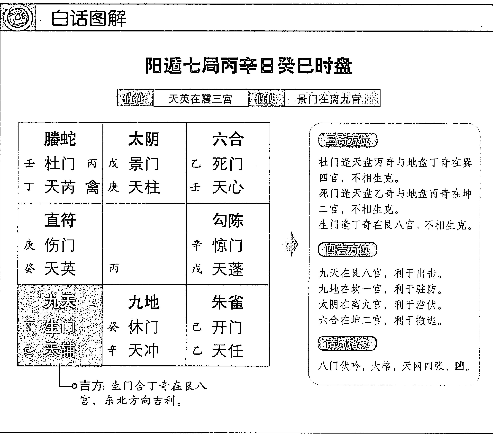

## 甲午时：西北方向吉利

### **【原文】**
> 甲午蓬直符一，休直使一。宿吉干凶。午至戌阳，天辅。开心使乾伏，死芮月坤伏，杜辅星巽伏。天六，地七，阴三，合四。开与日合六西北，仪刑，时干坎，门伏吟，遁甲，自刑，阖。
>

### **【白话提要】**
> 符使宫位：值符天蓬在坎一宫，值使休门在坎一宫。时干遇吉星宿，时干逢凶。午时至戌时为五阳时，午时为天辅释罪时。
> 三奇方位：开门逢双乙奇在乾六宫，不相生克。死门逢双丙奇在坤二宫，不相生克。杜门逢双丁奇在巽四宫，不相生克。
> 四吉方位：九天在乾六宫，九地在兑七宫，太阴在震三宫，六合在巽四宫。
> 诸局格象：开门合乙奇在乾六宫，西北方向吉利。六仪击刑。时干在坎一宫。八门伏吟。遁甲自刑，合。

#### **白话图解**
#### 阳遁七局丙辛日甲午时盘

| | | |
| :---: | :---: | :---: |
| 六合 | 勾陈 | 朱雀 |
| 丁杜门 | 庚景门 | 壬死门 |
| 丁天辅 | 庚天英 | 壬芮禽 |
| 太阴 | | 九地 |
| 癸伤门 | 丙戊 | 惊门 |
| 癸天冲 | | |
| 腾蛇 | 直符 | 乘蛇 |
| 乙生门 | 辛休门 | 乙开门 |
| 乙天任 | 辛天蓬 | 乙乘心 |

> 吉方：开门合乙奇在乾六宫，西北方向吉利。

# 乙未时：正南、正西方向吉利

### **【原文】**
> 乙未蓬六，休二。生兑义，开离害，死震害。天七，地二，阴八，合三。开与月合九正南，生与日合七正西，雀入江，龙反首，时干兑，火入金，丙日飞干格。

### **【白话提要】**
> 符使宫位：值符天蓬在乾六宫，值使休门在坤二宫。
> 三奇方位：生门逢乙奇在兑七宫，生宫。开门逢丙奇在离九宫，被克。死门逢丁奇在震三宫，被克。
> 四吉方位：九天在兑七宫，九地在坤二宫，太阴在艮八宫，六合在震三宫。
> 诸局格象：开门合丙奇在离九宫，正南方向吉利。生门合乙奇在兑七宫，正西方向吉利。朱雀入江，青龙回首。时干在兑七宫。荧入太白。逢丙日，为飞干格。

# 丙申时：正东方向吉利

## **原文**
> 丙申 蓬五，休三。伤合离义，休震义，惊坎义欢怡。天九，地四，阴六，合一。休与月合三正东，时干震，相佐坤，刑格，三吉。

## **白话提要**
> 符使宫位：值符天蓬在中五宫，寄于坤二宫，值使休门在震三宫。
> 三奇方位：伤门逢乙奇在离九宫，生宫，奇仪相合。休门逢丙奇在震三宫，生宫。惊门逢丁奇在坎一宫，生宫，吉利。
> 四吉方位：九天在离九宫，九地在巽四宫，太阴在乾六宫，六合在坎一宫。
> 诸局格象：休门合丙奇在震三宫，正东方向吉利。时干在震三宫。值符得地盘丙奇相助坤二宫。刑格。三吉格。

#### **白话图解**

#### 阳遁七局丙辛日丙申时盘

| | 天蓬在中五宫，寄于坤二宫 | **休门** | 休门在震三宫 |
| :---: | :---: | :---: | :---: |
| **九地**<br>戊丁<br>生门<br>天柱 | **九天**<br>乙庚<br>伤门<br>天心 | **直符**<br>辛壬<br>杜门<br>天蓬 |
| **朱雀**<br>休门<br>天芮 | 丙 | **螣蛇**<br>己戌<br>景门<br>天任 |
| **勾陈**<br>庚己<br>开门<br>天英 | **六合**<br>丁辛<br>惊门<br>天辅 | **太阴**<br>癸乙<br>死门<br>天冲 |

*◎吉方：休门合丙奇在震三宫，正东方向吉利。*

***

**【三奇方位】**
伤门逢乙奇在离九宫，生宫。
休门逢丙奇在震三宫，生宫。
惊门逢丁奇在坎一宫，生宫。

***

**【四吉方位】**
九天在离九宫，利于出击。
九地在巽四宫，利于驻防。
太阴在乾六宫，利于潜伏。
六合在坎一宫，利于撤退。

***

**【诸局格象】**
刑格，凶。

> # 图解中国传统决策学·奇门遁甲大全

## 丁酉时：宜守户不出

### **【原文】**
> 丁酉 蓬四，休四。辛日不用，守户。开震义，死坎制欢怡，杜兑害。天三，地八，阴二，合七。开与日合三正东，时干兑，相佐巽，辛日勃。

### **【白话提要】**
> 符使宫位：值符天蓬在巽四宫，值使休门在巽四宫。逢辛日不宜用事。宜守户不出。
> 三奇方位：开门逢乙奇在震三宫，生宫。死门逢丙奇在坎一宫，克宫，吉利。杜门逢丁奇在兑七宫，被克。
> 四吉方位：九天在震三宫，九地在艮八宫，太阴在坤二宫，六合在兑七宫。
> 诸局格象：开门合乙奇在震三宫，正东方向吉利。时干在兑七宫。值符得地盘丁奇相助在巽四宫。逢辛日，为日勃格。

#### **白话图解**
#### 阳遁七局丙辛日丁酉时盘

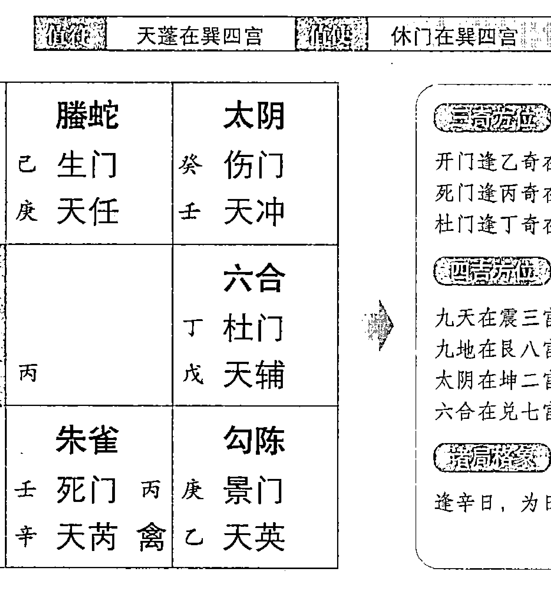

# 戊戌时：西南方向吉利

### **【原文】**
> 戊戌 蓬七，休五避五。休墓丙坤害，惊丁巽制，景艮义。天二，地九，阴一，合八。休与月合二西南，大格，乙下有丙，时干离。

### **【白话提要】**
> 符使宫位：值符天蓬在兑七宫，值使休门在中五宫，寄于坤二宫。
> 三奇方位：休门逢天盘乙奇在坤二宫，被克，乙奇入墓。惊门逢天盘丙奇与地盘丁奇在巽四宫，克官。景门逢丁奇在艮八宫，生官。
> 四吉方位：九天在坤二宫，九地在离九宫，太阴在坎一宫，六合在艮八宫。
> 诸局格象：休门合乙奇在坤二宫，西南方向吉利。大格。乙下有丙，为奇仪顺遂。时干在离九宫。

#### **白话图解**
#### 阳遁七局丙辛日戊戌时盘

| | 天蓬在兑七宫 | 休门在中五宫，寄于坤二宫 | |
| :--- | :--- | :--- | ---: |
| **值符** | | |
| **朱雀** | 九地 | 九天 |
| 壬惊门<br>丁天芮 | 戊开门<br>庚天柱 | 乙休门<br>辛天心 |
| **勾陈** | <center>丙</center> | 直符 |
| 庚死门<br>癸天英 | | 辛生门<br>戊天蓬 |
| **六合** | 太阴 | 螣蛇 |
| 丁景门<br>巳天辅 | 癸杜门<br>辛天蓬 | 己伤门<br>乙天任 |

***

**【三奇方位】**
休门逢天盘乙奇在坤二宫，被克。
惊门逢天盘丙奇与地盘丁奇在巽四宫，克宫。
景门逢丁奇在艮八宫，生官。

***

**【四吉方位】**
九天在坤二宫，利于出击。
九地在离九宫，利于驻防。
太阴在坎一宫，利于潜伏。
六合在艮八宫，利于撤逃。

***

**【诸局格象】**
大格，凶。
乙下有丙，为奇仪顺遂，吉。

# 己亥时：正北、正西方向吉利

### **【原文】**
> 己亥 蓬八，休六。亥阴，宿干凶。生坎制欢怡，开兑伏，死离和。天一，地六，阴四，合九。生与日合一正北，开与月合七正西，龙走，鸟跌穴，时干震，金入火，丙日伏干格。

### **【白话提要】**
> 符使宫位：值符天蓬在艮八宫，值使休门在乾六宫。亥时为五阴时。时干遇凶星宿，时干逢凶。
> 三奇方位：生门逢乙奇在坎一宫，克官，吉利。开门逢丙奇于兑七宫，不相生克。死门逢丁奇在离九宫，被生。
> 四吉方位：九天在坎一宫，九地在乾六宫，太阴在巽四宫，六合在离九宫。
> 诸局格象：生门合乙奇在坎一宫，正北方向吉利。开门合丙奇在兑七宫，正西方向吉利。青龙逃走。飞鸟跌穴。时干在震三宫。太白入荧。逢丙日，为伏干格。

#### **白话图解**
#### 阳遁七局丙辛日己亥时盘

| | | |
| :---: | :---: | :---: |
| 太阴 | 六合 | 勾陈 |
| 癸景门<br>丁天冲 | 丁死门<br>庚天辅 | 庚惊门<br>壬天英 |
| 螣蛇 | | 朱雀 |
| 己杜门<br>癸天任 | 丙 | 开天芮 |
| 直符 | 九天 | 九地 |
| 辛伤门<br>己天蓬 | 乙生门<br>辛天心 | 戊休门<br>乙天柱 |

***

**【三奇方位】**
生门逢乙奇在坎一宫，克官。
开门逢丙奇在兑七宫，不相生克。
死门逢丁奇在离九宫，被生。

***

**【四吉方位】**
九天在坎一宫，利于出击。
九地在乾六宫，利于驻防。
太阴在巽四宫，利于潜伏。
六合在离九宫，利于撤逃。

***

**【诸局格象】**
飞鸟跌穴，吉。
青龙逃走，太白入荧，凶。
逢丙日，为伏干格，凶。

> # 第三章
>
> ## 阳遁七局

# 丁壬日十二时局

## 庚子时：西北方向吉利

### **【原文】**
> 庚子 蓬九，休七。子至卯阴，宿干凶。死丁巽害，杜艮制，生墓乙乾义。天四，地三，阴七，合六。生与星合六西北，丁下有乙，太白与天乙格，飞宫格，符冲，飞符，仪刑，时干坎。

### **【白话提要】**
> 符使宫位：值符天蓬在离九宫，值使休门在兑七宫。子时至卯时为五阴时。时干遇凶星宿，时干逢凶。
> 三奇方位：死门逢天盘乙奇与地盘丁奇在巽四宫，被克。杜门逢丙奇在艮八宫，克官。生门逢天盘丁奇与地盘乙奇在乾六宫，生官，丁奇入墓。
> 四吉方位：九天在巽四宫，九地在震三宫，太阴在兑七宫，六合在乾六宫。

#### **白话图解**
#### 阳遁七局丁壬日庚子时盘

| 九天 | 直符 | 螣蛇 |
| :---: | :---: | :---: |
| 乙死门<br>丁天心 | 辛惊门<br>庚天蓬 | 己开门<br>壬天任 |
| 九地景门<br>癸天柱 | 丙 | 太阴<br>癸休门<br>戊天冲 |
| 朱雀杜门<br>已天芮禽 | 勾陈<br>庚伤门<br>辛天英 | **六合**<br>丁生门<br>己天辅 |

> **吉方：** 生门合丁奇在乾六宫，西北方向吉利。
>
> **三奇方位**
> 死门逢天盘乙奇与地盘丁奇在巽四宫，被克。
> 杜门逢丙奇在艮八宫，克官。
> 生门逢天盘丁奇与地盘乙奇在乾六宫，生官。
>
> **四吉方位**
> 九天在巽四宫，利于出击。
> 九地在震三宫，利于驻防。
> 太阴在兑七宫，利于潜伏。
> 六合在乾六宫，利于撤退。

### **格局**
> 丁下有乙，为玉女奇生，吉。
> 六仪击刑，凶。
> 九星和值符都到了与其相冲的宫位，为反吟格，凶。

## 辛丑时：无奇门可出

### **【原文】**
> 辛丑蓬一，休八。宿干凶。惊乙乾伏，景丙坤义，伤丁巽伏。天六，地七，阴三，合四。无奇门，时干坎，符伏。

### **【白话提要】**
> 符使宫位：值符天蓬在坎一宫，值使休门在艮八宫。时干遇凶星宿，时干逢凶。
> 三奇方位：惊门逢双乙奇在乾六宫，不相生克。景门逢双丙奇在坤二宫，生官。伤门逢双丁奇在巽四宫，不相生克。
> 四吉方位：九天在乾六宫，九地在兑七宫，太阴在震三宫，六合在巽四宫。
> 诸局格象：无奇门。时干在坎一宫。九星和值符都在本宫未动，为伏吟格。

#### **白话图解**
#### 阳遁七局丁壬日辛丑时盘

#### 符使天蓬在坎一宫值使休门在艮八宫

| | 六合 丁伤门丁天辅 | 勾陈 庚杜门庚天英 | 朱雀 壬景门丙禽壬天芮 |
| :---: | :---: | :---: | :---: |
| | | 太阴 癸生门癸天冲 | 九地 戊死门戊天柱 |
| | | 螣蛇 己休门己天任 | 直符 辛开门辛天蓬 | **九天** 乙惊门乙天心 |

##### **三奇方位**
惊门逢双乙奇在乾六宫，不相生克。
景门逢双丙奇在坤二宫，生官。
伤门逢双丁奇在巽四宫，不相生克。

#### **四吉方位**
九天在乾六宫，利于出击。
九地在兑七宫，利于驻防。
太阴在震三宫，利于潜伏。
六合在巽四宫，利于撤退。

##### **诸局格象**
无奇门，凶。九星和值符都在本宫未动，为伏吟格，凶。

# 壬寅时：正南方向吉利

## **原文**
> 壬寅蓬二，休九。宿干凶。休合离制，惊震制，景坎害。天九，地四，阴六，合一。休与日合九正南，天乙与太白格，门反吟，时干震，相佐坤，刑格。

## **白话提要**
> 符使宫位：值符天蓬在震三宫，值使休门在离九宫。时干遇凶星宿，时干逢凶。
> 三奇方位：休门逢乙奇在离九宫，克宫，奇仪相合。惊门逢丙奇在震三宫，克宫。景门逢丁奇在坎一宫，被克。
> 四吉方位：九天在离九宫，九地在巽四宫，太阴在乾六宫，六合在坎一宫。
> 诸局格象：休门合乙奇在离九宫，正南方向吉利。天乙与六庚宫位有格。八门反吟。时干在震三宫。值符得地盘丙奇相助在坤二宫。刑格。

#### **白话图解**
#### 阳遁七局丁壬日壬寅时盘

***

**三奇方位**
休门逢乙奇在离九宫，克官。
惊门逢丙奇在震三宫，克官。
景门逢丁奇在坎一宫，被克。

***

**四吉方位**
九天在离九宫，利于出击。
九地在巽四宫，利于驻防。
太阴在乾六宫，利于潜伏。
六合在坎一宫，利于撤逃。

***

**诸局格象**
八门反吟，刑格，凶。

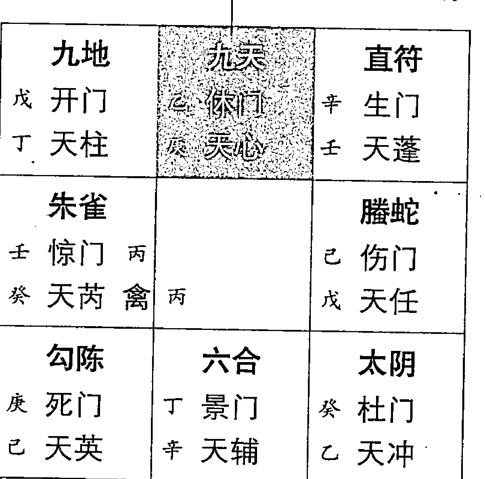

# 癸卯时：东北、西北方向吉利

## **原文**
> ### 癸卯
> 蓬三，休一。宿吉干凶，丁日不用。生艮伏。开墓乙乾伏，死合丙坤伏。天八，地一，阴九，合二。开与月合六西北，生与日合八东北，时干离，飞门伏，天网四张。

## **白话提要**
#### 符使宫位
> 值符天蓬在震三宫，值使休门在坎一宫。时干遇吉星宿，时干逢凶。逢丁日不宜用事。
#### 三奇方位
> 生门逢乙奇在艮八宫，不相生克。开门逢天盘丙奇与地盘乙奇乾六宫，不相生克，丙奇入墓。死门逢丁奇与地盘丙奇在坤二宫，不相生克。
#### 四吉方位
> 九天在艮八宫，九地在坎一宫，太阴在离九宫，六合在坤二宫。
#### 诸局格象
> 开门合丙奇在乾六宫，西北方向吉利。生门合乙奇在艮八宫，东北方向吉利。时干在离九宫。飞干格。八门伏吟。天网四张。

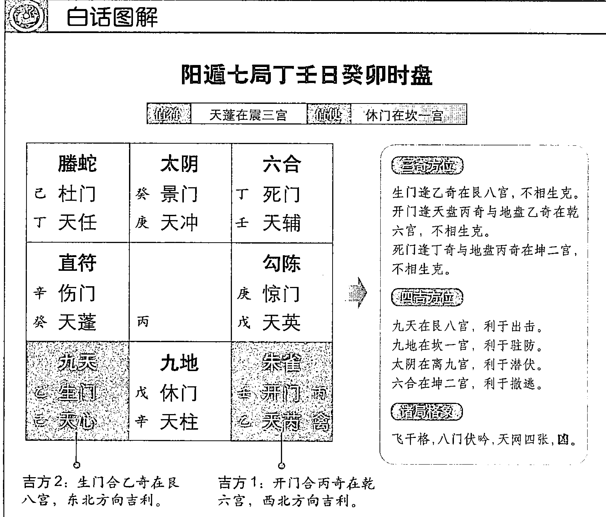

# 甲辰时：西北方向吉利

## **原文**
> 壬直符二，死直使二。辰至甲阳，天辅，宿凶干吉。杜辅使巽伏，开心日乾伏，死芮月坤伏。天九，地四，阴六，合一。开与日合六西北，时干坤，
> 符门伏，飞甲，自刑，阖。

## **白话提要**
> 符使宫位：值符天芮在坤二宫，值使死门在坤二宫。辰时至申时为五阳时，辰时为天辅释罪时。时干遇凶星宿，时干逢吉。
> 三奇方位：杜门逢双丁奇地巽四宫，不相生克。开门逢双乙奇在乾六宫，不相生克。死门逢丙奇在坤二宫，不相生克。
> 四吉方位：九天在离九宫，九地在巽四宫，太阴在乾六宫，六合在坎一宫。
> 诸局格象：开门合乙奇在乾六宫，西北方向吉利。时干在坤二宫。九星、值符和八门都在本宫未动，为伏吟格。飞甲自刑，合。

#### **白话图解**
#### 阳遁七局丁壬日甲辰时盘

| 值符 | 天芮在坤二宫 | 值使 | 死门在坤二宫 |
| :---: | :---: | :---: | :---: |
| **九地** | 九天 | **直符** |
| 丁杜门<br>庚景门<br>壬死门丙 | 丁天辅<br>庚天英<br>壬天芮禽 | **朱雀** | <center>**螣蛇**</center> |
| 癸伤门<br>戊惊门 | 癸天冲<br>丙天柱 | 勾陈 | **六合**<br>太阴 |
| 己生门<br>辛休门<br>乙开门 | 己天任<br>辛天蓬<br>乙天心 |

***

**三奇方位**
杜门逢双丁奇地巽四宫，不相生克。
开门逢双乙奇在乾六宫，不相生克。
死门逢丙奇在坤二宫，不相生克。

***

**四吉方位**
九天在离九宫，利于出击。
九地在巽四宫，利于驻防。
太阴在乾六宫，利于潜伏。
六合在坎一宫，利于撤退。

***

**诸局格象**
九星、值符和八门都在本宫未动，为伏吟格，吉。

吉方：开门合乙奇在乾六宫，西北方向吉利。

# 乙巳时：西南方向吉利

### **【原文】**
> 乙巳 芮六，死三。宿干吉。休合丙坤害欢怡，伤墓乙乾害。天七，地二，阴八，合三。休与星合二西南，时干艮，丁下有丙，飞宫，三吉。

### **【白话提要】**
> 符使宫位：值符天芮在乾六宫，值使死门在震三宫。时干遇吉星宿，时干逢吉。
> 三奇方位：休门逢天盘丁奇与地盘丙奇在坤二宫，被克，吉利，奇仪相合。景门逢乙奇在艮八宫，生官。惊门逢天盘丙奇与地盘乙奇在乾六宫，克官。
> 四吉方位：九天在兑七宫，九地在坤二宫，太阴在艮八宫，六合在震三宫。
> 诸局格象：休门合丁奇在坤二宫，西南方向吉利。时干在艮八宫。丁下有丙，为星随月转。飞宫格。三吉格。

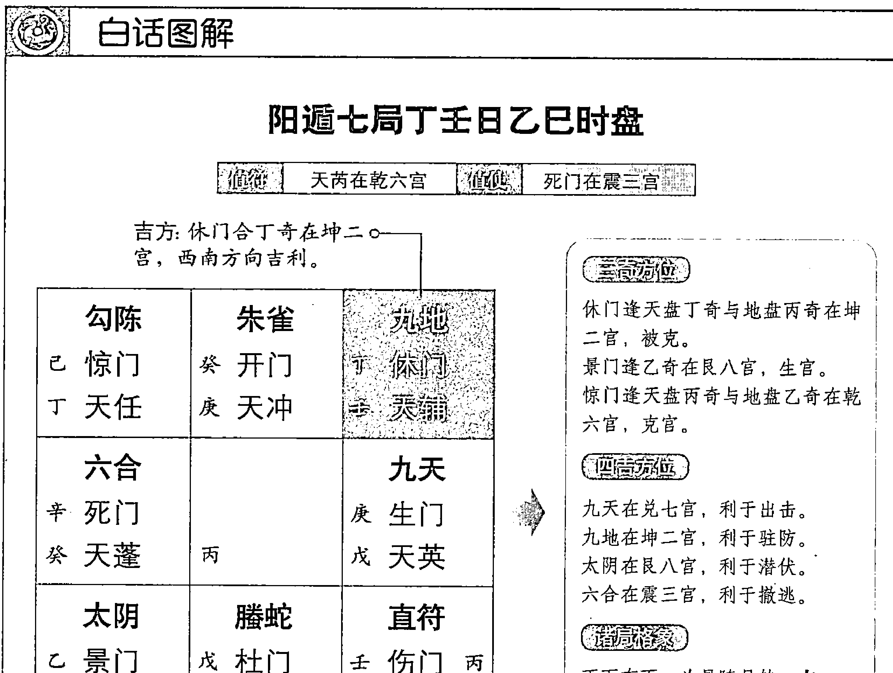

## 丙午时：宜守户不出

- **原文**
    - 丙午 芮五，死四。宿干吉，守户。死丁巽害，生乙乾义，开丙坤和。天九，地四，阴六，合一。生与日合六西北，时干坤，开与月合二西南，符伏。

- **白话提要**
    - 符使宫位：值符天芮在中五宫，寄于坤二宫，值使死门在巽四宫。时干遇吉星宿，时干逢吉。宜守户不出。
    - 三奇方位：死门逢双丁奇在巽四宫，被克。生门逢双乙奇在乾六宫，生宫。开门逢双丙奇在坤二宫，被生。
    - 四吉方位：九天在离九宫，九地在巽四宫，太阴在乾六宫，六合在坎一宫。
    - 诸局格象：生门合乙奇在乾六宫，西北方向吉利。时干在坤二宫。开门合丙奇在坤二宫，西南方向吉利。九星和值符都在本宫未动，为伏吟格。

- **白话图解**
    - 阳遁七局丁壬日丙午时盘

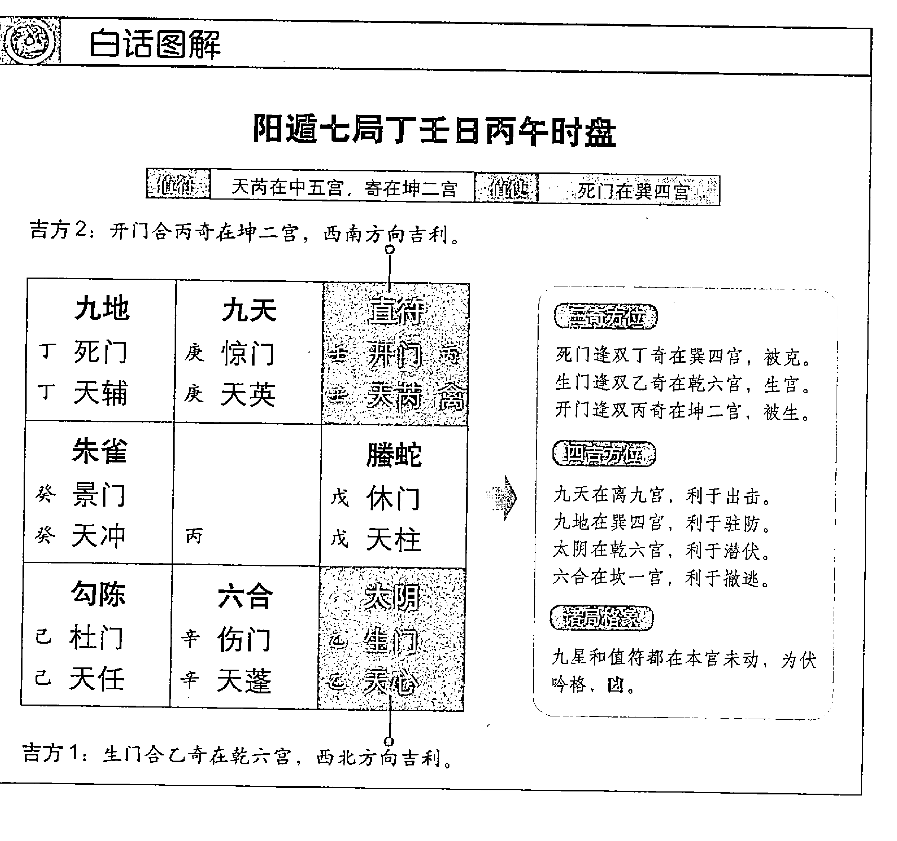

## 丁未时：东北方向吉利

【原文】
丁未芮四，死五避五。宿千吉。生艮伏，死慕丙坤伏欢怡，杜丁巽伏。天三，地八，阴二，合七。生与星合八东北，得使，门伏，干勃，时干艮，相佐巽，大格。

【白话提要】
符使宫位：值符天芮在巽四宫，值使死门在中五宫，寄于坤二宫。时干遇吉星宿，时干逢吉。
三奇方位：生门逢丁奇在艮八宫，不相生克。死门逢天盘乙奇于地盘丙奇在坤二宫，不相生克，吉利，乙奇入墓。杜门逢天盘丙奇与地盘丁奇在巽四宫，不相生克。
四吉方位：九天在震三宫，九地在艮八宫，太阴在坤二宫，六合在兑七宫。
诸局格象：生门合丁奇在艮八宫，东北方向吉利。丁奇得使。八门伏吟。干勃。时干在艮八宫。值符得地盘丁奇相助在巽四宫。大格。

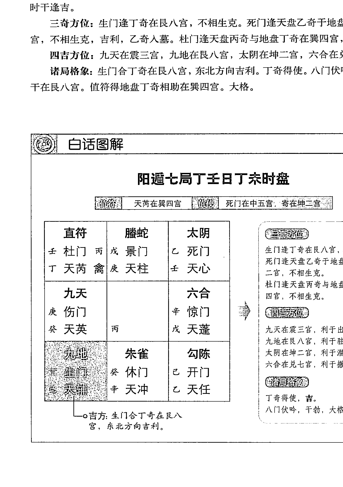

## 戊申时：逢壬日不宜用事
### 【原文】
戊申芮七，死六。宿凶干吉，壬日不用。伤离义，惊坎义，景兑制。天二，地九，阴一，合八。无奇门，太白与天乙格，白入火，蛇矫，龙走，时干乾，丁日飞干格，壬日伏千，乙格。
### 【白话提要】
符使宫位：值符天芮在兑七宫，值使死门在乾六宫。时干遇凶星宿，时干逢吉。逢壬日不宜用事。
三奇方位：伤门逢丁奇在离九宫，生宫。惊门逢乙奇在坎一宫，生宫。景门逢丙奇在兑七宫，被克。
四吉方位：九天在坤二宫，九地在离九宫，太阴在坎一宫，六合在艮八宫。
诸局格象：无奇门。六庚与天乙宫位有格。太白入荧。螣蛇夭矫。青龙逃走。时干在乾六宫。逢丁日，为飞干格。逢壬日，为伏干格。乙奇格。

## 白话图解
#### 阳遁七局丁壬日戊申时盘
#### 值符：天芮在兑七宫 值使 死门在乾六宫

| 朱雀 | 癸生门丁天冲 | 九地 | 丁伤门庚天辅 | 九天 | 庚杜门壬天英 |
| :--- | :---: | :--- | :---: | :--- | :---: |
| 勾陈 | 己休门癸天任 | **丙** | 直符 壬景门丙天芮癭 | 六合 | 辛开门已天蓬 |
| **太阴** | 乙惊门辛天心 | **螣蛇** | 戊死门乙天柱 | | |

#### 三奇方位
伤门逢丁奇于离九宫，生官。
惊门逢乙奇于坎一宫，生宫。
景门逢丙奇于兑七宫，被克。

#### 四吉方位
九天在坤二宫，利于出击。
九地在离九宫，利于出击。
太阴在坎一宫，利于潜伏。
六合在艮八宫，利于撤退。

#### 诸局格象
无奇门，凶。
太白入荧，螣蛇夭矫，青龙逃走，凶。
逢丁日，为飞干格，凶。
逢壬日，为伏千格，凶。

## 己酉时：东北方向吉利
### 【原文】
己酉芮八，死七。酉至亥阴，宿干凶。惊墓乙乾伏，伤丁巽伏，休艮害。天一，地六，阴四，合九。休与月合八东北，时干坤，符冲。
### 【白话提要】
**符使宫位**：值符天芮在艮八宫，值使死门在兑七宫。酉时至亥时为五阴时。时干遇凶星宿，时干逢凶。
**三奇方位**：惊门逢天盘丁奇与地盘乙奇在乾六宫，不相生克，丁奇入墓。伤门逢天盘乙奇与地盘丁奇在巽四宫，不相生克。休门逢丙奇在艮八宫，被克。
**四吉方位**：九天在坎一宫，九地在乾六宫，太阴在巽四宫，六合在离九宫。
**诸局格象**：休门合丙奇在艮八宫，东北方向吉利。时干在坤二宫。九星和值符都到了与其相冲的宫位，为反吟格。


### 阳遁七局丁壬日己酉时盘

| 天芮在艮八宫 | 死门在兑七宫 |
| :---: | :---: |
| **太阴**<br>**乙** 伤门<br>**丁** 天心 | **六合**<br>辛 杜门<br>庚 天蓬 | **勾陈**<br>已 景门<br>壬 天任 |
| --- | :---: | :---: |
| **螣蛇**<br>戊生门<br>癸天柱 | **丙** | **朱雀**<br>癸死门<br>戊 天冲 |
| --- | :---: | :---: |
| **值符**<br>庚 休门<br>乙天芮禽辛开门甲天英 | **九天**<br>庚开门<br>辛天英 | **九地**<br>丁惊门<br>乙天辅 |

#### 三奇方位
惊门逢天盘丁奇与地盘乙奇在乾六宫，不相生克。
伤门逢天盘乙奇与地盘丁奇在巽四宫，不相生克。
休门逢丙奇在艮八宫，被克。

#### 四吉方位
九天在坎一宫，利于出击。
九地在乾六宫，利于驻防。
太阴在巽四宫，利于潜伏。
六合在离九宫，利于撤退。

#### 诸局格象
九星和值符都到了与其相冲的宫位，为反吟格，凶。

#### 吉方：休门合丙奇在艮八宫，东北方向吉利。

## 庚戌时：正南方向吉利
### 【原文】
庚戌芮九，死八。宿干凶。惊震制，伤兑害，休离制。天四，地三，阴七，合六。休与月合九正南，门反吟，火入白，飞宫，雀入江，虎猖狂，时干巽，丁日伏干格，壬日飞干格。
### 【白话提要】
符使宫位：值符天芮在离九宫，值使死门在艮八宫。时干遇凶星宿，时干逢凶。
三奇方位：惊门逢丁奇地震三宫，克宫。伤门逢乙奇在兑七宫，被克。休门逢丙奇在离九宫，克宫。
四吉方位：九天在巽四宫，九地在震三宫，太阴在兑七宫，六合在乾六宫。
诸局格象：休门合丙奇在离九宫，正南方向吉利。八门反吟。荧入太白。飞宫格。朱雀入江。白虎猖狂。时干在巽四宫。逢丁日，为伏干格。逢壬日，为飞干格。
### 【白话图解】

阳遁七局丁壬日庚戌时盘

值符：天芮在离九宫 值使：死门在艮八宫

☉吉方：休门合丙奇在离九宫，正南方向吉利。

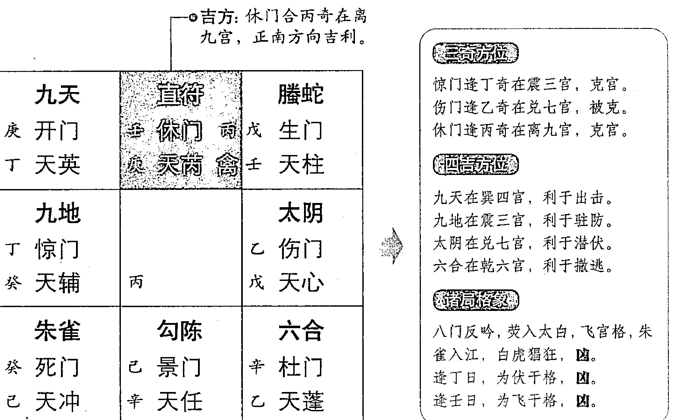

## 辛亥时：正西正北方向吉利
### 【原文】
辛酉芮一，死九。宿干凶。开兑伏，杜震伏，生合坎制。天六，地七，阴三，合四。开与星合七正西，生与月合一正北，天乙与太白格，时干巽，事同。
### 【白话提要】
符使宫位：值符天芮在坎一宫，值使死门在离九宫。时干遇凶星宿，时干逢凶。
三奇方位：开门逢丁奇在兑七宫，不相生克。杜门逢乙奇在震三宫，不相生克。生门逢丙奇在坎一宫，克官，奇仪相合。
四吉方位：九天在乾六宫，九地在兑七宫，太阴在震三宫，六合在巽四宫。
诸局格象：开门合丁奇在兑七宫，正西方向吉利。生门合丙奇在坎一宫，正北方向吉利。天乙与六庚官位成格。时干在巽四宫。

## 白话图解
阳遁七局丁壬日辛亥时盘

| 六合 | 景门<br>丁<br>天蓬 | 勾陈 | 死门<br>庚<br>天英 | 朱雀 | 惊门<br>壬<br>天冲 |
| :---: | :---: | :---: | :---: | :---: | :---: |
| **太阴** | 杜门<br>癸<br>天心 | **九地** | 开门<br>丙<br>天辅 | 螣蛇 | 伤门<br>巳<br>天柱 |
| 直符 | 生门<br>禽<br>天芮 | 乙 | 休门<br>天英 |

#### 三奇方位
#### 四吉方位
#### 诸局格象
天乙与六庚宫位成格，凶。

#### 吉方 1: 开门合丁奇在兑七宫，正西方向吉利。
吉方 2: 生门合丙奇在坎一宫，正北方向吉利。

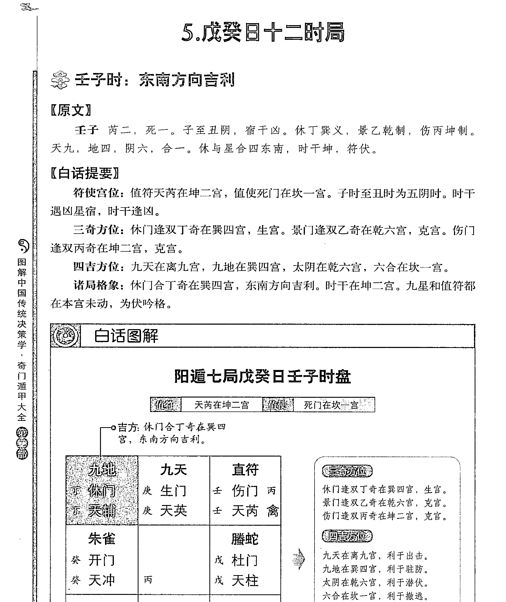

## 癸丑时：正北方向吉利
**【原文】**
癸丑芮三，死三。宿吉干凶。休坎伏，景合离伏，伤震伏。天八，地一，阴九，合二。休与星合一正北，刑格，癸日伏干格，时干乾，癸日勃，门伏。天网四张。
**【白话提要】**
符使宫位：值符天芮在震三宫，值使死门在坤二宫。时干遇吉星宿，时干逢凶。

三奇方位：休门逢丁奇在坎一宫，不相生克。景门逢乙奇在离九宫，不相生克，奇仪相合。伤门逢丙奇在震三宫，不相生克。

四吉方位：九天在艮八宫，九地在坎一宫，太阴在离九宫，六合在坤二宫。

诸局格象：休门合丁奇在坎一宫，正北方向吉利。刑格。时干在乾六宫。逢癸日，为日勃格。八门伏吟。天网四张。

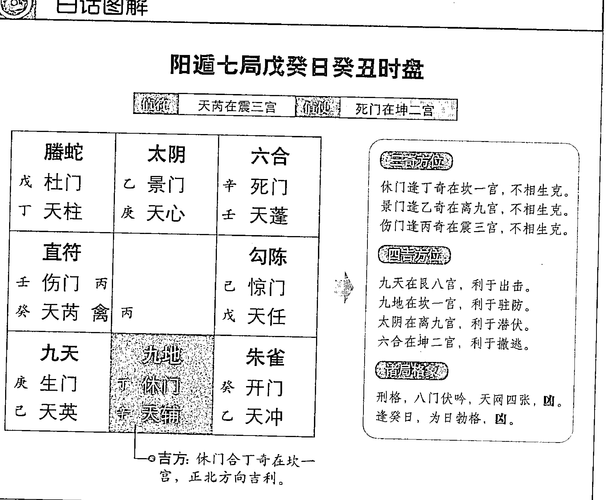

## 甲寅时：逢戊日不宜用事
### 【原文】
甲寅冲直符三，伤直使三，天辅。寅至午阳，宿干吉，戊日不用。杜辅使巽伏，开心日乾伏，死芮月坤伏。天八，地一，阴九，合二。开与日合六西北，时干震，符门伏，地甲，三吉，开。
### 【白话提要】
符使宫位：值符天冲在震三宫，值使伤门在震三宫。寅时为天辅释罪时。寅时至午时为五阳时。时干遇吉星宿，时干逢吉。逢戊日不宜用事。

三奇方位：杜门逢双丁奇在巽四宫，不相生克。开门逢双乙奇在乾六宫，不相生克。死门逢双丙奇在坤二宫，不相生克。

四吉方位：九天在艮八宫，九地在坎一宫，太阴在离九宫，六合在坤二宫。

诸局格象：开门合乙奇在乾六宫，西北方向吉利。时干在震三宫。九星、值符和八门都在本宫未动，为伏吟格。地甲开。三吉格。

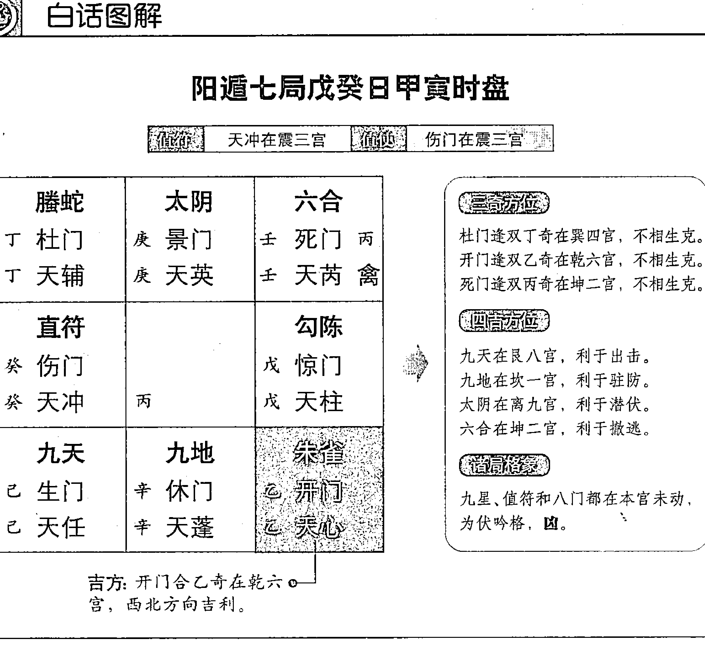

## 乙卯时：宜守户不出
### 【原文】
乙卯冲六，伤四。宿干吉，守户。开坎义，杜合离义，生震害欢怡。天七，地二，阴八，合三。开与星合一正北，生与月合三正东，癸干格，时干离，癸干勃，刑格。
### 【白话提要】
符使宫位：值符天冲在乾六宫，值使伤门在巽四宫。时干遇吉星宿，时干逢吉。宜守户不出。

三奇方位：开门逢丁奇在坎一宫，生宫。杜门逢乙奇在离九宫，生宫，奇仪相合。生门逢丙奇在震三宫，被克，吉利。

四吉方位：九天在兑七宫，九地在坤二宫，太阴在艮八宫，六合在震三宫。

诸局格象：开门合丁奇在坎一宫，正北方向吉利。生门合丙奇在震三宫，正东方向吉利。时干在离九宫。逢癸日，为日勃格。刑格。

## 白话图解
## 阳遁七局戊癸日乙卯时盘

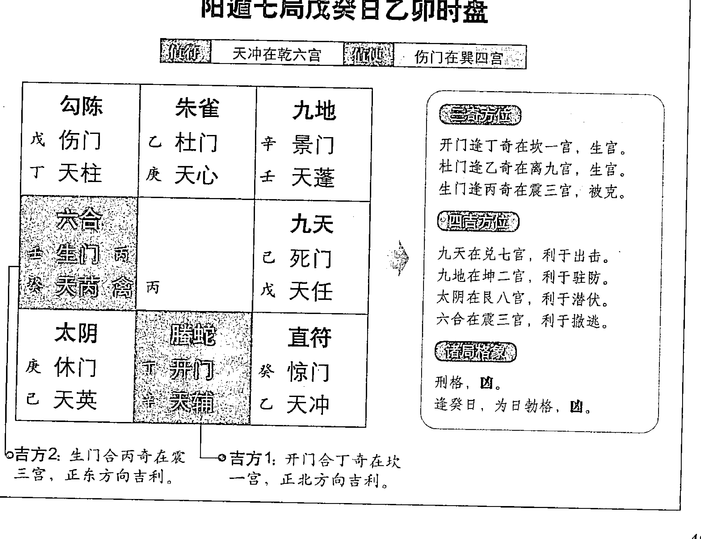

## 丙辰时：正东方向吉利
### 【原文】
丙辰冲五，伤五避五。宿干吉。杜兑害，开震制欢怡，死合坎制。天九，地四，阴六，合一。开与日合三正东，时干坎，相佐坤。
### 【白话提要】
符使宫位：值符天冲在中五宫，寄于坤二宫，值使伤门在中五宫，寄于坤二宫。时干遇吉星宿，时干逢吉。

三奇方位：杜门逢丁奇在兑七宫，被克。开门逢乙奇在震三宫，克宫，吉利。死门逢丙奇在坎一宫，克宫，奇仪相合。

四吉方位：九天在离九宫，九地在巽四宫，太阴在乾六宫，六合在坎一宫。

诸局格象：开门合乙奇在震三宫，正东方向吉利。时干在坎一宫。值符得地盘丙奇相助在坤二宫。

## 白话图解

| 值符 | 天冲在中五宫，寄于坤二宫 |
| :---: | :--- |

| 九地 | 九天 | 直符 |
| :--- | :--- | :--- |
| 辛<br>休门<br>丁<br>天蓬 | 己<br>生门<br>庚<br>天任 | 癸<br>伤门<br>壬<br>天冲 |
| **<center><strong>朱雀</strong><br><strong>开</strong><br><strong><strong>心</strong></strong>** | | 螣蛇<br>丁<br>杜门<br>戊<br>天辅 <br> | | |
| **勾陈** | **六合** | **太阴** |
| 戊<br>惊门<br>己<br>天柱 | 壬<br>死门<br>辛<br>天芮 | 丙<br>庚<br>景门<br>乙<br>天英 | 甲乙 |

●吉方：开门合乙奇在震三宫，正东方向吉利。
### 二奇方位
杜门逢丁奇在兑七宫，被克。
开门逢乙奇在震三宫，克宫。
死门逢丙奇在坎一宫，克宫。
#### 四吉方位
九天在离九宫，利于出击。
九地在巽四宫，利于驻防。
太阴在乾六宫，利于潜伏.
六合在坎一宫，利于撤逃。
#### 诸局格象
飞勃格，凶。


## 丁巳时：正南与正西方向吉利
### 【原文】
丁巳冲四，伤六。宿干吉。开离害，杜坎和，生兑义。天三，地八，阴二，合七。开与星合九正南，得使，生与月合七正西，龙走，鸟跌穴，癸干格，仪刑，时干离，相佐巽，戊日勃，击刑。
### 【白话提要】
符使宫位：值符天冲在巽四宫，值使伤门在乾六宫。时干遇吉星宿，时干逢吉。
三奇方位：开门逢丁奇在离九宫，被克。杜门逢乙奇在坎一宫，被生。生门逢丙奇在兑七宫，生宫。
四吉方位：九天在震三宫，九地在艮八宫，太阴在坤二宫，六合在兑七宫。
诸局格象：开门合丁奇在离九宫，正南方向吉利。丁奇得使。生门合丙奇在兑七宫，正西方向吉利。青龙逃走。飞鸟跌穴。逢癸日，为伏干格。六仪击刑。时干在离九宫。值符得地盘丁奇相助在巽四宫。逢戊日，为日勃格。击刑。

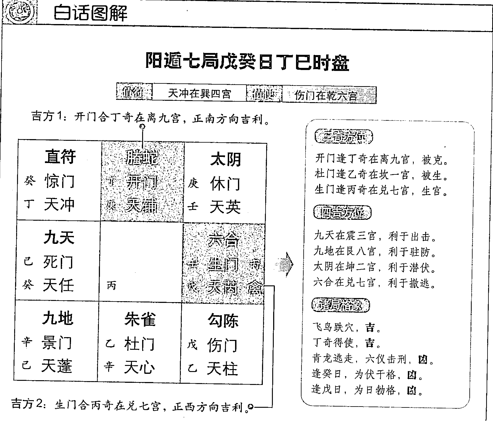

## 戊午时：东南方向吉利
### 原文
戊午冲七，伤七。宿凶干吉。杜墓乙乾害，开丁巽制，死艮伏。天二，地九，阴一，合八。开与日合四东南，乙下有丁，时干震。符门反吟。
### 白话提要
符使宫位：值符天冲在兑七宫，值使伤门在兑七宫。时干遇凶星宿，时干逢吉。

三奇方位：杜门逢天盘丁奇与地盘乙奇在乾六宫，被克，丁奇入墓。开门逢天盘乙奇与地盘丁奇在巽四宫，克宫。死门逢丙奇在艮八宫，不相生克。

四吉方位：九天在坤二宫，九地在离九宫，太阴在坎一宫，六合在艮八宫。

诸局格象：开门合乙奇在巽四宫，东南方向吉利。乙下有丁，为奇仪相佐。时干在震三宫。九星、值符和八门都在与其相冲的宫位，为反吟格。

| | | |
| :---: | :---: | :---: |
| **朱雀**<br>开门<br>天心<br>乙辛<br>戊癸 | **九地**<br>休门<br>天蓬<br>丙庚辛 | **九天**<br>生门<br>天任<br>己壬 |

●吉方：开门合乙奇在巽四宫，东南方向吉利。
【三奇方位】
杜门逢天盘丁奇与地盘乙奇在乾六官，被克。
开门逢天盘乙奇与地盘丁奇在巽四官，克官。
死门逢丙奇在艮八官，不相生克。
【四吉方位】
九天在坤二宫，利于出击。
九地在离九宫，利于驻防。
太阴在坎一官，利于潜伏。
六合在艮八宫，利于撒逃。
【诸局格象】
乙下有丁，为奇仪相佐，吉。
九星、值符和八门都在与其相冲的宫位，为反吟格，凶。

## 己未时：逢癸日不宜用事

**原文**

己未冲八，伤八。未至亥阴，宿吉干凶，癸日不用。杜震伏欢怡，开兑伏，死离伏。天一，地六，阴四，合九。开与日合七正西，雀入江，虎猖狂，时干坎，火入金。

**白话提要**

**符使宫位：**值符天冲在艮八宫，值使伤门在艮八宫。未时至亥时为五阴时。时干遇吉星宿，时干逢凶。逢癸日不宜用事。

**三奇方位：**杜门逢丁奇在震三宫，不相生克，吉利。开门逢乙奇在兑七官，不相生克。死门逢丙奇在离九宫，不相生克。

**四吉方位：**九天在坎一宫，九地在乾六官，太阴在巽四官，六合在离九宫。

**诸局格象：**开门合乙奇在兑七宫，正西方向吉利。朱雀入江。白虎猖狂。时干在坎一官。荧入太白。

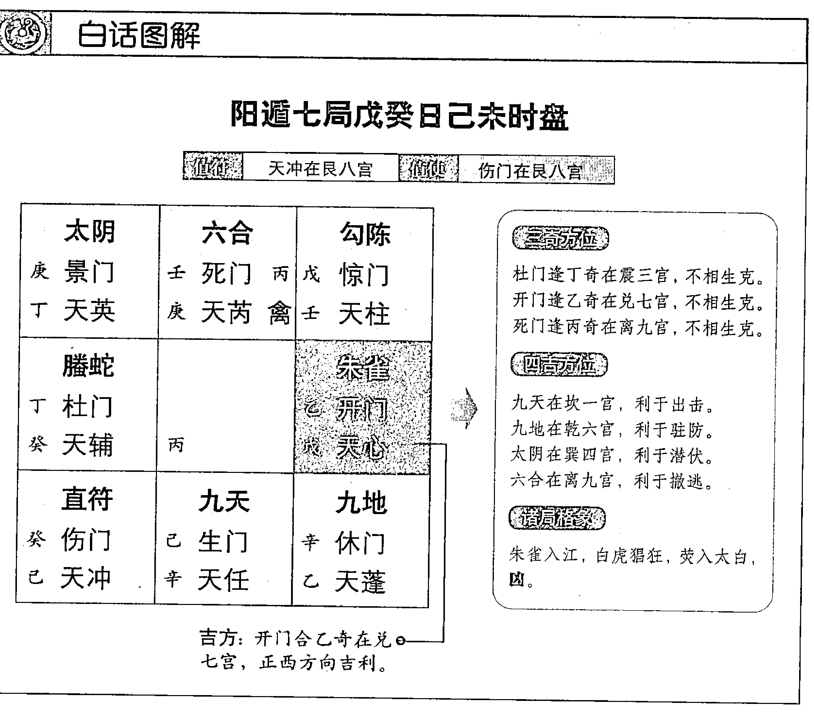

## 庚申时：东北方向吉利
### 【原文】
庚申冲九，伤九。宿干凶，地遁。杜合丙坤制，开艮和，死墓乙乾义。天四，地三，阴七，合六。开与日合八东北，天乙与太白格，癸日飞干格，戊日伏干格，时干兑，事同，飞符，飞官。
### 【白话提要】
符使宫位：值符天冲在离九宫，值使伤门在离九宫。时干遇凶星宿，时干逢凶。成地遁格。
三奇方位：杜门逢天盘丁奇与地盘丙奇在坤二宫，克宫，奇仪相合。开门逢乙奇在艮八宫，被生。死门逢天盘丙奇与地盘乙奇在乾六宫，生宫，丙奇入墓。
四吉方位：九天在巽四宫，九地在震三宫，太阴在兑七宫，六合在乾六宫。
诸局格象：开门合乙奇在艮八宫，东北方向吉利。天乙与六庚成伏宫格。逢癸日，为飞干格。逢戊日，为伏干格。时干在兑七宫。值符飞官格。
## 白话图解

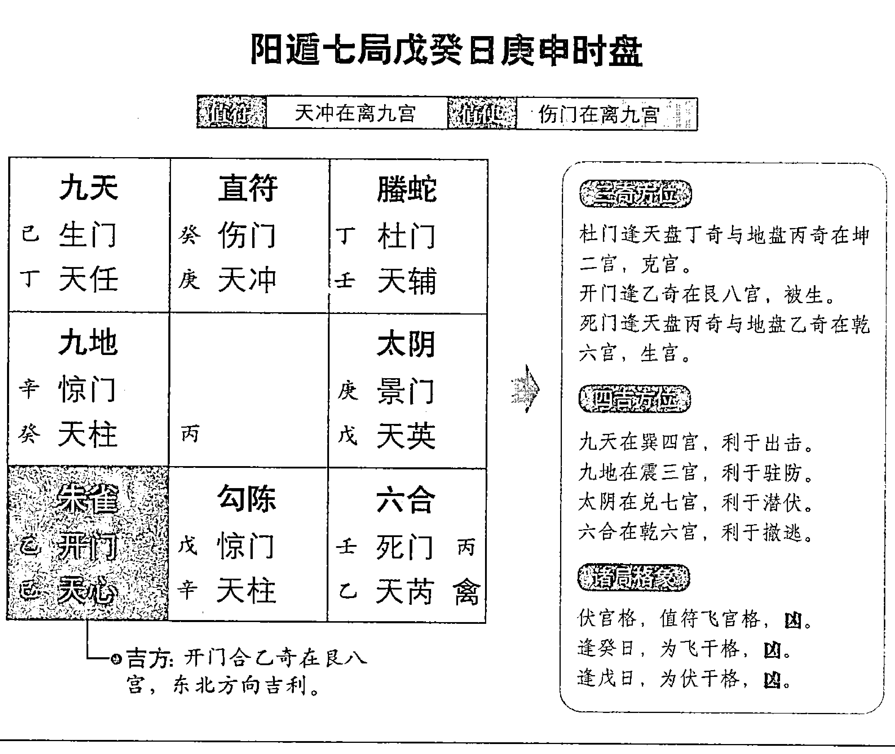

## 辛酉时：西南方向吉利
### 原文
辛酉冲一，伤一。杜艮制，开墓丙坤和，死丁巽害。天六，地七，阴三，合四。开与日合二西南，戊癸日伏干格，太白与天乙格，时干兑，大格，乙格。
### 白话提要
符使宫位：值符天冲在坎一宫，值使伤门在坎一宫。

三奇方位：杜门逢丁奇在艮八宫，克宫。开门逢天盘乙奇与地盘丙奇在坤二宫，被生，乙奇入墓。死门逢天盘丙奇与地盘丁奇在巽四宫，被克。

四吉方位：九天在乾六宫，九地在兑七宫，太阴在震三宫，六合在巽四宫。

诸局格象：开门合乙奇在坤二宫，西南方向吉利。逢癸日，为伏干格。六庚与天乙宫位成格。时干在兑七宫。大格，乙奇格。

#### 白话图解 阳遁七局戊癸日辛酉时盘

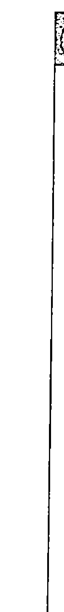

值使 天冲在坎一宫 值使 伤门在坎一宫 吉方：开门合乙奇在坤二○宫，西南方向吉利。
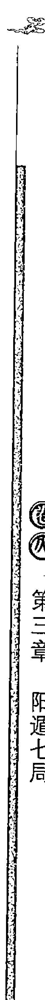

## 壬戌时：正东方向吉利
### 【原文】
壬戌冲二，伤二。杜兑害，开震制欢怡，死合坎制。天九，地四，阴六，合一。开与日合三正东，时干坎，相佐坤。
### 【白话提要】
符使宫位：值符天冲在坤二宫，值使伤门在坤二宫。

三奇方位：杜门逢丁奇在兑七宫，被克。开门逢乙奇在震三宫，克宫，吉利。死门逢丙奇在坎一宫，克宫，奇仪相合。

四吉方位：九天在离九宫，九地在巽四宫，太阴在乾六宫，六合在坎一宫。

诸局格象：开门合乙奇在震三宫，正东方向吉利。时干在坎一宫。值符得地盘丙奇相助在坤二宫。

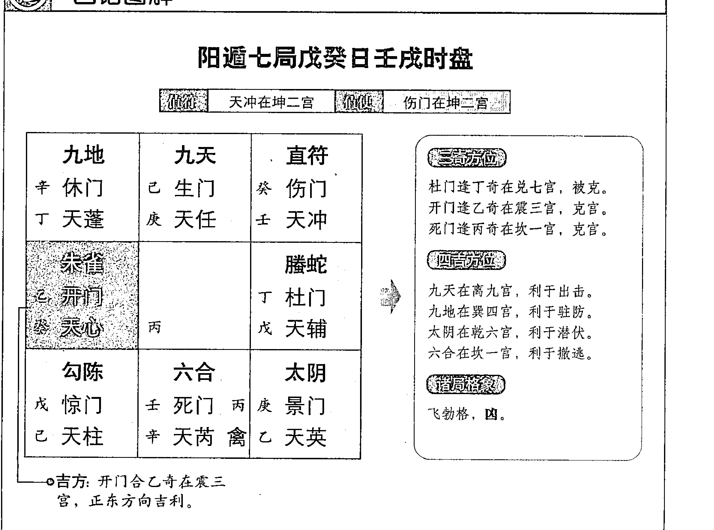

## 🦁 癸亥时：西北方向吉利
### 【原文】
癸亥冲三，伤三。杜丁巽伏，开丁乾伏，死丙坤伏。天八，地一，阴九，合二。开与日合六西北，时干震，符门伏，三吉，天网。
### 【白话提要】
符使宫位：值符天冲在震三宫，值使伤门在震三宫。

三奇方位：杜门逢双丁奇在巽四宫，不相生克。开门逢双乙奇于乾六宫，不相生克。死门逢双丙奇在坤二宫，不相生克。

四吉方位：九天在艮八宫，九地在坎一宫，太阴在离九宫，六合在坤二宫。

诸局格象：开门合乙奇在乾六宫，西北方向吉利。时干在震三宫。九星、值符和八门都在本宫未动，为伏吟格。三吉格。天网四张。
## 白话图解
#### 阳遁七局戊癸日癸亥时盘

- 值符：天冲在震三宫

- 值使：伤门在震三宫

| | 腾蛇<br>丁<br>杜门<br>丁<br>天辅 | 太阴<br>庚<br>景门<br>庚<br>天英<br>丙 | 六合<br>壬<br>死门<br>壬<br>天芮禽 |
| :---: | :---: | :---: | :---: |
| **直符**<br>癸<br>伤门<br>癸<br>天冲 | **九地**<br>辛<br>休门<br>辛<br>天蓬 | **勾陈**<br>戊<br>惊门<br>戊<br>天柱 |
| **九天**<br>己<br>生门<br>己<br>天任 | **朱雀**<br>乙<br>开门<br>天心 |

- 吉方：开门合乙奇在乾六宫，西北方向吉利。

#### - 三奇方位
杜门逢双丁奇在巽四宫，不相生克。
开门逢双乙奇于乾六宫，不相生克。
死门逢双丙奇在坤二宫，不相生克。

#### - 四吉方位
九天在艮八宫，利于出击。
九地在坎一宫，利于驻防。
太阴在离九宫，利于潜伏。
六合在坤二官，利于撤退。

#### - 诸局格象
天网四张，凶。
九星、值符和八门都在本宫未动，为伏吟格，凶。# 第四章 阳遁八局

奇门遁甲时家奇门阳遁八局共有六十个时辰，即六十局。本章通过文字和各时辰的飞盘排布来说明各局的符使宫位、三奇方位、四吉方位和诸局格象。

## 白话图解

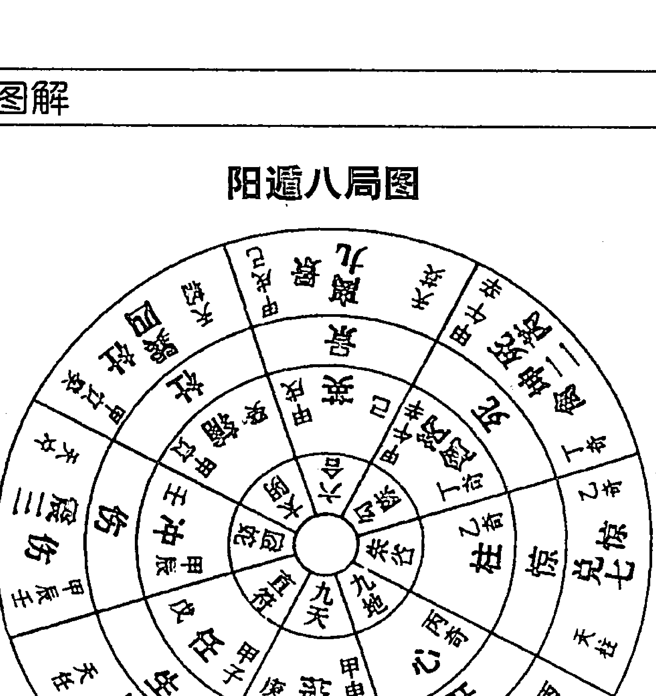
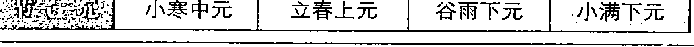

### 每日时辰

奇门遁甲中一局为一元，一元有甲己、乙庚、丙辛、丁壬和戊癸五日，每日有十二个时辰，则一局就有六十个时辰，用六十甲子来表示，一个时辰为一小局。

| 甲子旬 | 乙丑旬 | 丙寅旬 | 丁卯旬 | 戊辰旬 | 己巳旬 | 庚午旬 | 辛未旬 | 壬申旬 | 癸酉旬 | 甲戌旬 | 乙亥旬 |
| :---: | :---: | :---: | :---: | :---: | :---: | :---: | :---: | :---: | :---: | :---: | :---: |
| 甲子 | 乙丑 | 丙寅 | 丁卯 | 戊辰 | 己巳 | 庚午 | 辛未 | 壬申 | 癸酉 | 甲戌 | 乙亥 |
| 丙子 | 丁丑 | 戊寅 | 己卯 | 庚辰 | 辛巳 | 壬午 | 癸未 | 甲申 | 乙酉 | 丙戌 | 丁亥 |
| 戊子 | 己丑 | 庚寅 | 辛卯 | 壬辰 | 癸巳 | 甲午 | 乙未 | 丙申 | 丁酉 | 戊戌 | 己亥 |
| 庚子 | 辛丑 | 壬寅 | 癸卯 | 甲辰 | 乙巳 | 丙午 | 丁未 | 戊申 | 己酉 | 庚戌 | 辛亥 |
| 壬子 | 癸丑 | 甲寅 | 乙卯 | 丙辰 | 丁巳 | 戊午 | 己未 | 庚申 | 辛酉 | 壬戌 | 癸亥 |

## 阳遁八局六十时符使表

奇门遁甲排盘时，最主要的就是寻找值符和值使，并确定其所在的宫位。下表就是阳遁八局六十个时辰的值符和值使，以及其所在的宫位。

| 时辰 | 甲子 | 乙丑 | 丙寅 | 丁卯 | 戊辰 | 己巳 | 庚午 | 辛未 | 壬申 | 癸酉 |
| :---: | :---: | :---: | :---: | :---: | :---: | :---: | :---: | :---: | :---: | :---: |
| **天任** | 八 | 七 | 六 | 五 | 八 | 九 | 一 | 二 | 三 | 四 |
| **生门** | 八 | 九 | 一 | 二 | 三 | 四 | 五 | 六 | 七 | 八 |

| 时辰 | 甲戌 | 乙亥 | 丙子 | 丁丑 | 戊寅 | 己卯 | 庚辰 | 辛巳 | 壬午 | 癸未 |
| :---: | :---: | :---: | :---: | :---: | :---: | :---: | :---: | :---: | :---: | :---: |
| **天英** | 九 | 七 | 六 | 五 | 八 | 九 | 一 | 二 | 三 | 四 |
| **景门** | 九 | 一 | 二 | 三 | 四 | 五 | 六 | 七 | 八 | 九 |

| 时辰 | 甲申 | 乙酉 | 丙戌 | 丁亥 | 戊子 | 己丑 | 庚寅 | 辛卯 | 壬辰 | 癸巳 |
| :---: | :---: | :---: | :---: | :---: | :---: | :---: | :---: | :---: | :---: | :---: |
| **天蓬** | 一 | 七 | 六 | 五 | 八 | 九 | 一 | 二 | 三 | 四 |
| **休门** | 一 | 二 | 三 | 四 | 五 | 六 | 七 | 八 | 九 | 一 |

| 时辰 | 甲午 | 乙未 | 丙申 | 丁酉 | 戊戌 | 己亥 | 庚子 | 辛丑 | 壬寅 | 癸卯 |
| :---: | :---: | :---: | :---: | :---: | :---: | :---: | :---: | :---: | :---: | :---: |
| **天芮** | 二 | 七 | 六 | 五 | 八 | 九 | 一 | 二 | 三 | 四 |
| **死门** | 二 | 三 | 四 | 五 | 六 | 七 | 八 | 九 | 一 | 二 |

| 时辰 | 甲辰 | 乙巳 | 丙午 | 丁未 | 戊申 | 己酉 | 庚戌 | 辛亥 | 壬子 | 癸丑 |
| :---: | :---: | :---: | :---: | :---: | :---: | :---: | :---: | :---: | :---: | :---: |
| **天冲** | 三 | 七 | 六 | 五 | 八 | 九 | 一 | 二 | 三 | 四 |
| **伤门** | 三 | 四 | 五 | 六 | 七 | 八 | 九 | 一 | 二 | 三 |

| 时辰 | 甲寅 | 乙卯 | 丙辰 | 丁巳 | 戊午 | 己未 | 庚申 | 辛酉 | 壬戌 | 癸亥 |
| :---: | :---: | :---: | :---: | :---: | :---: | :---: | :---: | :---: | :---: | :---: |
| **天辅** | 四 | 七 | 六 | 五 | 八 | 九 | 一 | 二 | 三 | 四 |
| **杜门** | 四 | 五 | 六 | 七 | 八 | 九 | 一 | 二 | 三 | 四 |

# 1. 甲己日十二时局

### 甲子时：利于逃避

### 【原文】

甲子
任八，生八。子至辰阳，宿千吉。开墓乾伏，惊兑伏，死坤伏。天一，地六，阴四，合九开与月合六西北，刑德在门，客主不利，利以逃亡，时干艮，符门伏，遁甲，阖。

### 【白话提要】

符使宫位：值符天任在艮八宫，值使生门在艮八宫。子时至辰时为五阳时。时干遇吉星宿，时干逢吉。三奇方位：开门逢双丙奇在乾六宫，不相生克，丙奇入墓。惊门逢双乙奇在兑七宫，不相生克。死门逢双丁奇在坤二宫，不相生克。四吉方位：九天在坎一宫，九地在乾六宫，太阴在巽四宫，六合在离九宫。诸局格象：开门合丙奇在乾六宫，西北方向吉利。刑德在门，主客双方都不利，只利于逃避。时干在艮八宫。九星、值符和八门都在本宫未动，为伏吟格。遁甲合。

## 白话图解

#### 阳遁八局甲己日甲子时盘

| | 太阴<br>杜门<br>天辅 | 六合<br>丙景门<br>丁天英 | 勾陈<br>辛死门<br>乙天芮<br>乙禽 |
| :---: | :---: | :---: | :---: |
| | 腾蛇<br>壬伤门<br>壬天冲 | | 朱雀<br>乙惊门<br>癸天柱 |
| | | | 直符<br>戊生门<br>戊天任 |
| | | | 九天<br>庚休门<br>庚天蓬 |
| | | | 九地<br>丙<br>癸<br>丁<br>己<br>开门<br>天心 |

**吉方**：开门合丙奇在乾六宫，西北方向吉利。

> **【三奇方位】**

开门逢双丙奇在乾六宫，不相生克。

惊门逢双乙奇在兑七宫，不相生克。

死门逢双丁奇在坤二宫，不相生克。

> **【四吉方位】**

九天在坎一宫，利于出击。

九地在乾六宫，利于驻防。

太阴在巽四宫，利于潜伏。

六合在离九宫，利于撤退。

> **【诸局格象】**

九星、值符和八门都在本宫未动，为伏吟格，凶。

#### 阳遁八局甲己日丙寅时盘

| | 勾陈 | 朱雀 | 九地 | | | |
| :---: | :---: | :---: | :---: | :---: | :---: | :---: |
| | 辛 | 景门 | 丁 | 乙 | 死门 | 丙 |
| | 癸 | 天芮 | 禽 | 庚 | 天柱 | 壬 |
| | 六合 | 丁 | 九天 | | | |
| | 己 | 杜门 | 庚 | 开门 | | |
| | 壬 | 天英 | 乙 | 天蓬 | | |
| | 太阴 | 螣蛇 | 直符 | | | |
| | 癸 | 伤门 | 壬 | 生门 | 戊 | 休门 |
| | 戌 | 天辅 | 庚 | 天冲 | 丙 | 天任 |

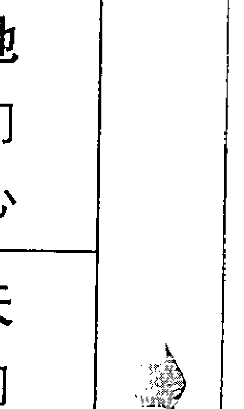

> **三奇方位**

惊门逢天盘丙奇与地盘丁奇在坤二宫，被生。
死门逢乙奇在离九宫，被生。
景门逢丁奇在巽四宫，被生。

> **四吉方位**

九天在兑七宫，利于出击。
九地在坤二宫，利于驻防。
太阴在艮八宫，利于潜伏。
六合在震三宫，利于撤退。

> **诸局格象**

无奇门，凶。
青龙回首，吉。
逢己日，为日勃格，凶。

### 乙丑时：逢己日不宜用事

### 【原文】

乙丑 任七，生九，宿凶干吉，己日不用。生离和，休巽义，开合震制。天二，地九，阴一，合八。开与星合三正东，休与日合四东南，生与月合九正南，时干巽，己日勃。

### 【白话提要】

符使宫位：值符天任在兑七宫，值使生门在离九宫。时干遇凶星宿，时干逢吉。逢己日不宜用事。

三奇方位：生门逢丙奇在离九宫，被生。休门逢乙奇在巽四宫，生宫。开门逢丁奇在震三宫，克宫，奇仪相合。

四吉方位：九天在坤二宫，九地在离九宫，太阴在坎一宫，六合在艮八宫。

诸局格象：开门合丁奇在震三宫，正东方向吉利。休门合乙奇在巽四宫，东南方向吉利。生门合丙奇在离九宫，正南方向吉利。时干在巽四宫。逢己日，为日勃格。

### 阳遁八局甲己日乙丑时盘

| | | |
| :---: | :---: | :---: |
| **朱雀**<br>休门<br>庚天冲 | **九地**<br>生门<br>丙天辅 | **九天**<br>伤门<br>庚壬<br>天英 |
| **勾陈**<br>开门<br>己癸<br>丙天芮<br>乙禽 | **直符**<br>戊杜门<br>乙天任 | **六合**<br>惊门<br>己天英 |
| **太阴**<br>死门<br>癸庚<br>天辅 | **螣蛇**<br>景门<br>壬乙<br>天冲 | |

**白话图解**

吉方 2：休门合乙奇在巽四宫，东南方向吉利。
○吉方 3：生门合丙奇在离九宫，正南方向吉利。
○吉方 1：开门合丁奇在震三宫，正东方向吉利。（注：原文此处描述可能与图表或上下文有细微出入，此处保留原文“丙乾六宫”表述）

#### 三奇方位：
生门逢丙奇在离九宫，被生。休门逢乙奇在巽四宫，生宫。开门逢丁奇在震三宫，克宫。

#### 四吉方位：
九天在坤二宫，利于出击。九地在离九宫，利于驻防。太阴在坎一宫，利于潜伏。六合在艮八宫，利于撤退。

#### 诸局格象：
逢己日，为日勃格、凶。

【三奇方位】

【四吉方位】

【诸局格象】

## 丙寅时：无奇门可出

> **原文**

丙寅 任六，生一。宿干吉。惊合丁坤和，死离和，景巽和。天七，地二，阴八，合三。无奇门，己干勃，天乙与太白格，龙反首，时干坤，相佐乾，事同。

> **白话提要**

符使宫位：值符天任在乾六宫，值使生门在坎一宫。时干遇吉星宿，时干逢吉。

三奇方位：惊门逢天盘丙奇与地盘丁奇在坤二宫，被生，奇仪相合。死门逢乙奇在离九宫，被生。景门逢丁奇在巽四宫，被生。

四吉方位：九天在兑七宫，九地在坤二宫，太阴在艮八宫，六合在震三宫。

诸局格象：无奇门。逢己日，为日勃格。天乙与六庚宫位成格。青龙回首。时干在坤二宫。值符得地盘丙奇相助在乾六宫。

### 阳遁八局甲己日丁卯时盘


> **三奇方位：**
开门逢丙奇在巽四宫，克宫。
惊门逢乙奇在震三宫，克宫。
死门逢丁奇在艮八宫，克宫。

**四吉方位：**
九天在离九宫，利于出击。
九地在巽四宫，利于驻防。
太阴在乾六宫，利于潜伏。
六合在坎一宫，利于撇逃。
**诸局格象：**
青龙逃走，六仪击刑，伏干格，刑格，凶。
逢己日，为飞干格，凶。
九星、值符和八门都到了与其相冲的官位，为反吟格，凶。

## 丁卯时：东南方向吉利

### 【原文】

**丁卯** 任五，生二。宿干吉。开巽制，惊震制，死艮制欢怡。天九，地四，阴六，合一。开与月合四东南，龙走，仪刑，门反吟，己日飞干格，伏干，时干艮，相佐坤，刑格，击刑，符冲。

### 【白话提要】

**符使宫位**: 值符天任在中五宫，寄于坤二宫，值使生门在坤二宫。时干遇吉星宿，时干逢吉。

 **三奇方位**: 开门逢丙奇在巽四宫，克宫。惊门逢乙奇在震三宫，克宫。死门逢丁奇在艮八宫，克宫，吉利。

 **四吉方位**: 九天在离九宫，九地在巽四宫，太阴在乾六宫，六合在坎一宫。

 **诸局格象**: 开门合丙奇在巽四宫，东南方向吉利。青龙逃走。六仪击刑。逢己日，为飞干格。伏干格。时干在艮八宫。值符得地盘丁奇相助在坤二宫。刑格。击刑。九星、值符和八门都到了与其相冲的宫位，为反吟格。

### 阳遁八局甲己日丁卯时盘


天任在中五宫，寄于坤二宫 生门在坤二宫
九地 | 九天 | 直符
---|---|---
丙 | 开门庚 | 生门戊
癸 | 天心已 | 天任辛
 | | 天蓬
 | 丁 | 天冲
 | | 天蓬
朱雀 | | 螣蛇
乙 | 惊门 | 伤门壬
壬 | 天柱丁 | 天冲乙
 | | 天雄
勾陈 | 六合 | 太阴
辛 | 死门丁 | 杜门癸
戊 | 天芮禽己 | 天辅丙
 戊 | 禽 | 
 | 天英庚 | 
 | | 

> **三奇方位：**
开门逢丙奇在巽四宫，克宫。
惊门逢乙奇在震三宫，克宫。
死门逢丁奇在艮八宫，克宫。

**四吉方位：**
九天在离九宫，利于出击。
九地在巽四宫，利于驻防。
太阴在乾六宫，利于潜伏。
六合在坎一宫，利于撤退。
**诸局格象：**
青龙逃走，六仪击刑，伏干格，刑格，凶。
逢己日，为飞干格，凶。
九星、值符和八门都到了与其相冲的官位，为反吟格，凶。

## 戊辰时：无奇门可出

### 【原文】
戊辰任八，生三。宿干吉。惊墓丙乾伏，飞乙兑义，景丁坤义。天一，地六，阴四，合九。无奇门，时干艮，符伏，三吉。

### 【白话提要】

符使宫位：值符天任在艮八宫，值使生门在震三宫。时干遇吉星宿，时干逢吉。

三奇方位：惊门逢双丙奇在乾六宫，不相生克，丙奇入墓。死门逢双乙奇在兑七宫，不相生克。景门逢双丁奇在坤二宫，被生。

四吉方位：九天在坎一宫，九地在乾六宫，太阴在巽四宫，六合在离九宫。

诸局格象：无奇门。时干在艮八宫。九星和值符都在本宫未动，为伏吟格。三吉格。

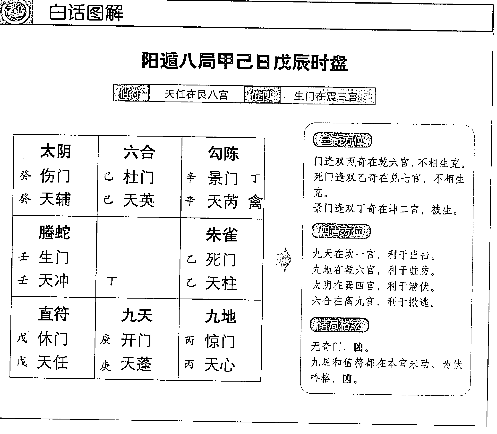

## 己巳时：正东与东北方向吉利

### 【原文】

己巳任九，生四。巳至酉阴，天辅，宿吉干凶。休震义，开艮和欢怡，惊坎义。天四，地三，阴七，合六。开与日合八东北，时干乾，休与月合三正东，大格。

### 【白话提要】

符使宫位：值符天任在离九宫，值使生门在巽四宫。巳时至酉时为五阴时，巳时为天辅释罪时。时干遇吉星宿，时干逢凶。

三奇方位：休门逢丙奇在震三宫，生宫。开门逢乙奇在艮八宫，被生，吉利。惊门逢丁奇在坎一宫，生宫。

四吉方位：九天在巽四宫，九地在震三宫，太阴在兑七宫，六合在乾六宫。

诸局格象：开门合乙奇在艮八宫，东北方向吉利。时干在乾六宫。休门合丙奇在震三宫，正东方向吉利。大格。

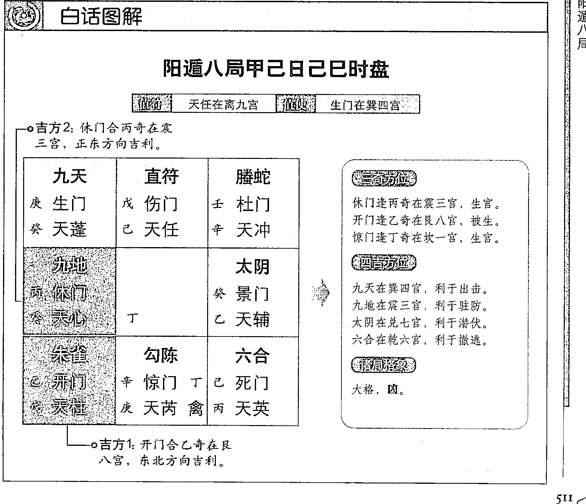

>

# 庚午时：宜守户不出

### 【原文】

庚午 任一，生五避五。宿干凶，甲日不用，守户。伤乙兑害，生墓丁坤伏，休离制。天六，地七，阴三，合四。生与日合二西南，休与星合九正南，龙走，甲日飞干格，时干乾，门反吟，飞符，金入火。

### 【白话提要】

符使宫位：值符天任在坎一宫，值使生门在中五宫，寄于坤二宫。时干遇凶星宿，时干逢凶。逢甲日不宜用事。宜守户不出。

三奇方位：伤门逢天盘丙奇与地盘乙奇在兑七宫，被克。生门逢天盘乙奇与地盘丁奇在坤二宫，不相生克，乙奇入墓。休门逢丁奇在离九宫，克宫。

四吉方位：九天在乾六宫，九地在兑七宫，太阴在震三宫，六合在巽四宫。

诸局格象：生门合乙奇在坤二宫，西南方向吉利。休门合丁奇在离九宫，正南方向吉利。青龙逃走。逢甲日，为飞干格。时干在乾六宫。八门反吟。值符飞宫。太白入荧。

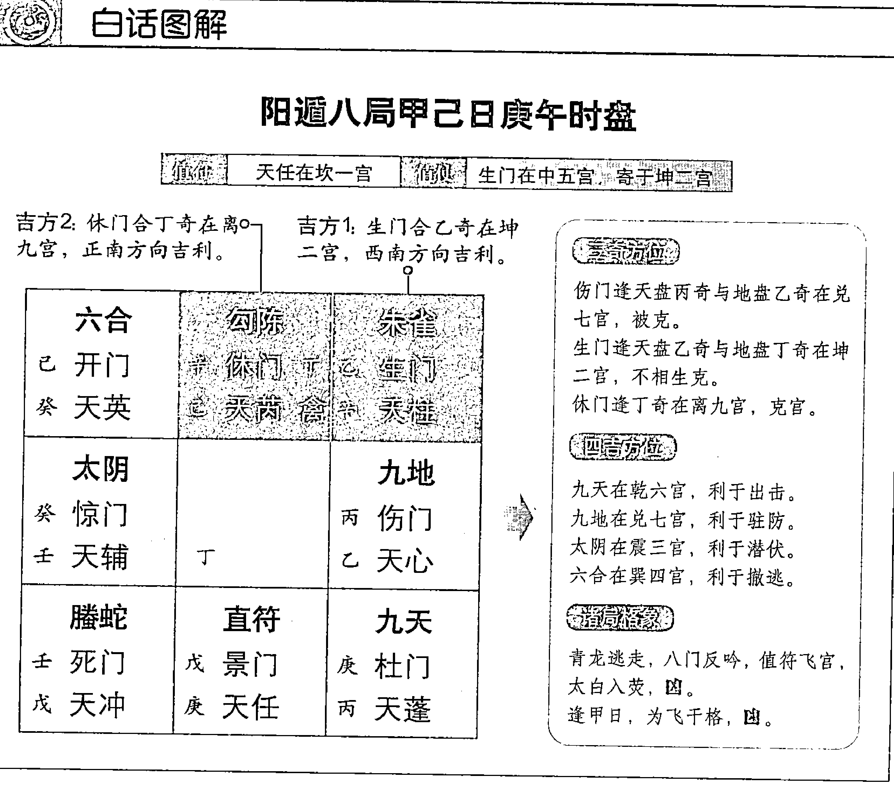

# 辛未时：无奇门可出

### 【原文】
辛未 任二，生六。宿干凶。死巽害，景震和，杜艮制欢怡。天九，地四，阴六，合一。无奇门，己日伏干格，刑格，时干艮，相佐坤，符冲。

### 【白话提要】
符使宫位：值符天任在坤二宫，值使生门在乾六宫。时干遇凶星宿，时干逢凶。三奇方位：死门逢丙奇在巽四宫，被克。景门逢乙奇在震三宫，被生。杜门逢丁奇在艮八宫，克宫，吉利。四吉方位：九天在离九宫，九地在巽四宫，太阴在乾六宫，六合在坎一宫。诸局格象：无奇门。逢己日，为伏干格。刑格。时干在艮八宫。值符得地盘丁奇相助在坤二宫。九星和值符都到了与其相冲的宫位，为反吟格。

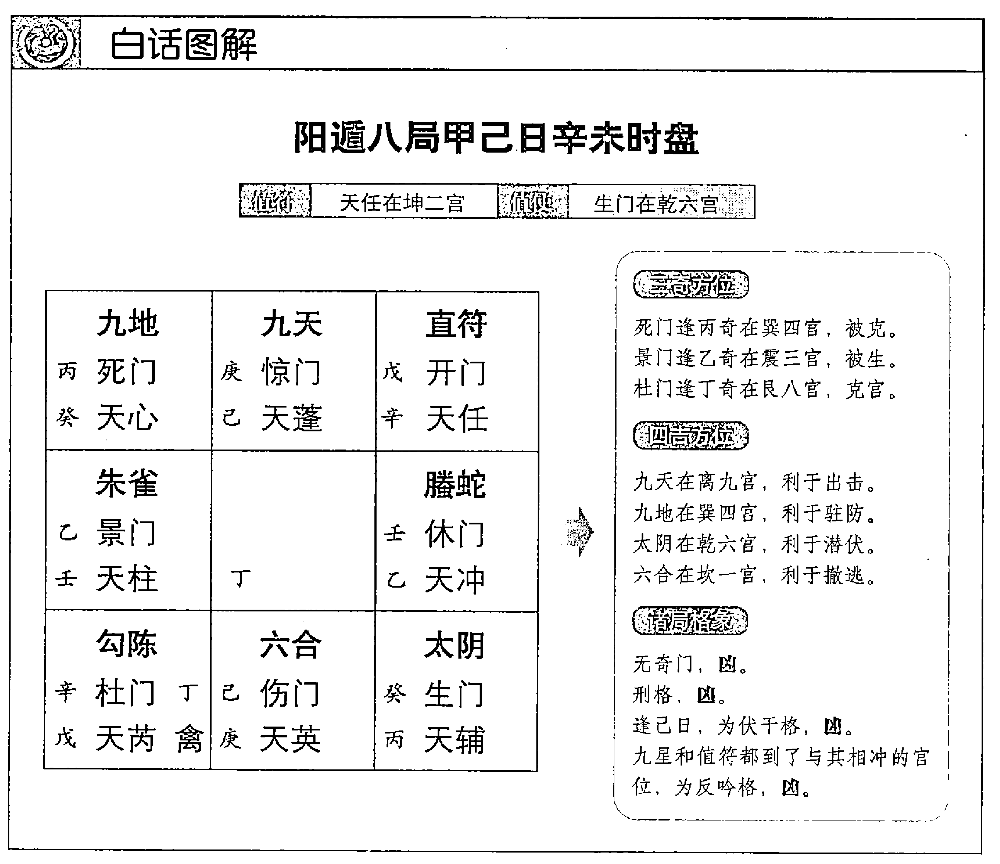

## 壬申时：无奇门可出

- **原文**：壬申任三，生七。宿吉干凶。杜坎和，伤丙乾害，生乙兑义。天八，地一，阴九，合二。生与星合七正西，丁下有乙，仪刑，虎猖狂，甲日伏干格，时干巽，火入金，乙格，飞官。
- **白话提要**：符使宫位：值符天任在震三宫，值使生门在兑七宫。时干遇吉星宿，时干逢凶。三奇方位：杜门逢丙奇在坎一宫，被生。伤门逢天盘乙奇与地盘丙奇在乾六宫，被克。生门逢天盘丁奇与地盘乙奇在兑七宫，生宫。四吉方位：九天在艮八宫，九地在坎一宫，太阴在离九宫，六合在坤二宫。诸局格象：生门合丁奇在兑七宫，正西方向吉利。丁下有乙，为玉女奇生，成人遁。六仪击刑。白虎猖狂。逢甲日，为伏干格。时干在巽四宫。荧入太白。乙奇格。飞官格。
- **白话图解**：阳遁八局甲己日壬申时盘

| 腾蛇 | 太阴 | 六合 |
| :---: | :---: | :---: |
| **癸**<br>惊门 | **癸**<br>开门 | **己**<br>休门 |
| **癸**<br>天冲 | **己**<br>天辅 | **辛**<br>天英 |
| 直符 | *丁* | 勾陈<br>生门<br>乙<br>天芮<br>禽 |
| **戊**<br>死门 | | 
| **壬**<br>天任 | | 
| 九天 | 九地 | 朱雀 |
| **庚**<br>景门 | **丙**<br>杜门 | **乙**<br>伤门 |
| **戊**<br>天蓬 | **庚**<br>天心 | **丙**<br>天柱 |

- **符使**：天任在震三宫，值使 生门在兑七宫
- **三奇方位**：杜门逢丙奇在坎一官，被生。伤门逢天盘乙奇与地盘丙奇在乾六宫，被克。生门逢天盘丁奇与地盘乙奇在兑七宫，生官。
- **四吉方位**：九天在艮八宫，利于出击。九地在坎一宫，利于驻防。太阴在离九宫，利于潜伏。六合在坤二宫，利于撤退。
- **诸局格象**：丁下有乙，为玉女奇生，吉。六仪击刑，白虎猖狂，荧入太白，飞官格，凶。逢甲日，为伏干格，凶。

**吉方**：生门合丁奇在兑七宫，正西方向吉利。

* 图解中国传统决策学·奇门遁甲大全（第*）部 *

## 癸酉时：正北、西北和东北方向吉利

### 【原文】
癸酉 任四，生八。宿吉干凶，天遁。生艮伏欢怡，休合坎伏，开墓丙乾伏。
天三，地八，阴二，合七。开与星合六西北，生与月合八东北，得使，鸟跌穴，
休与日合一正北，蛇娇，甲干勃，时乾坤，门伏吟，天网。

### 【白话提要】
符使宫位：天任星为值符居巽四宫，生门为值使居艮八宫。星宿吉，时干逢凶。成天遁格。
三奇方位：生门逢丙奇在艮八宫，不相生克，吉利。休门逢乙奇在坎一宫，不相生克，奇仪相合。开门逢天盘丁奇与地盘丙奇在乾六宫，不相生克，丁奇入墓。
四吉方位：九天在震三宫，九地在艮八宫，太阴在坤二宫，六合在兑七宫。
诸局格象：开门合丁奇在乾六宫，西北方向吉利。生门合丙奇在艮八宫，东北方向吉利。丙奇得使。飞鸟跌穴。休门合乙奇在坎一宫，正北方向吉利。腾蛇天娇。逢甲日，为日勃格。时干在坤二宫。八门伏吟。天网四张。

## 白话图解
阳遁八局甲己日癸酉时盘

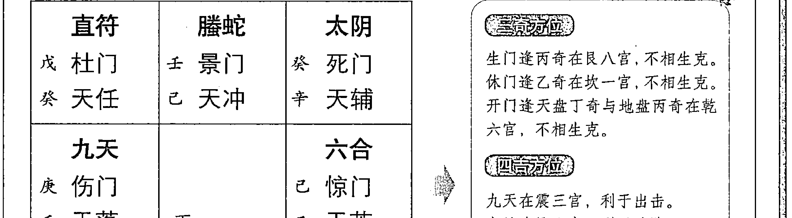
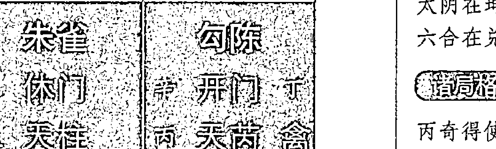

## 甲戌时：西北方向吉利

### 【原文】
甲戌英直符九，景直使九。戌至亥阳，宿凶干吉。惊杜使兑伏，开幕心月乾伏，死芮星坤伏。天四，地三，阴七，合六。开与月合六西北，时干离，符伏门，飞甲，阖。

### 【白话提要】
符使宫位：值符天英在离九宫，值使景门在离九宫。戌时至亥时为五阳时。时干遇凶星宿，时干逢吉。
三奇方位：惊门逢双乙奇在兑七宫，不相生克。开门逢双丙奇在乾六宫，不相生克，丙奇入墓。死门逢双丁奇在坤二宫，不相生克。
四吉方位：九天在巽四宫，九地在震三宫，太阴在兑七宫，六合在乾六宫。
诸局格象：开门合丙奇在乾六宫，西北方向吉利。时干在离九宫。九星、值符和八门都在本宫未动，为伏吟格。飞甲合。

# 乙亥时：逢己日不宜用事

### 【原文】
乙亥 英七，景一。宿凶干吉，已日不用。景合坎害，死艮伏，杜墓丙乾害。
天二，地九，阴一，合八。无奇门，甲干勃，已日飞干格，天乙与太白格，时干坎，蛇矫。

### 【白话提要】
符使宫位：值符天英在兑七宫，值使景门在坎一宫。时干遇凶星宿，时干逢吉。逢己日不宜用事。
三奇方位：景门逢乙奇在坎一宫，被克，奇仪相合。死门逢丙奇在艮八宫，不相生克。杜门逢天盘丁奇与地盘丙奇在乾六宫，被克，丁奇入墓。
四吉方位：九天在坤二宫，九地在离九宫，太阴在坎一宫，六合在艮八宫。
诸局格象：无奇门。逢甲日，为日勃格。逢己日，为飞干格。天乙与六庚宫位成格。时干在坎一宫。螣蛇夭矫。

# 2.乙庚日十二时局

### 丙子时：逢庚日不宜用事

### 【原文】
丙子 英六，景二。子至寅阳，宿凶干吉，庚日不用。休艮害，生震害，开坎义。天七，地二，阴八，合三。休与日合八东北，开与星合一正北，生与月合三正东，时干震，相佐乾，大格。

### 【白话提要】
符使宫位：值符天英在乾六宫，值使景门在坤二宫。子时至寅时为五阳时。时干遇凶星宿，时干逢吉。逢庚日不宜用事。
三奇方位：休门逢乙奇在艮八宫，被克。生门逢丙奇在震三宫，被克。开门逢丁奇在坎一宫，生宫。
四吉方位：九天在兑七宫，九地在坤二宫，太阴在艮八宫，六合在震三宫。
诸局格象：休门合乙奇在艮八宫，东北方向吉利。开门合丁奇在坎一宫，正北方向吉利。生门合丙奇在震三宫，正东方向吉利。时干在震三宫。值符得地盘丁奇相助。

## 白话图解
**阳遁八局乙庚日丙子时盘**

**吉方3：**生门合丙奇在震三宫，正东方向吉利。

#### 三奇方位
休门逢乙奇在艮八宫，被克。生门逢丙奇在震三宫，被克。开门逢丁奇在坎一宫，生宫。

#### 四吉方位
九天在兑七宫，利于出击。九地在坤二宫，利于驻防。太阴在艮八宫，利于潜伏。六合在震三宫，利于撤退。

#### 诸局格象
大格，凶。

##### 钩陈
庚 伤门
癸 天蓬

##### 朱雀
戊 杜门
己 天任

##### 九天
癸 死门
乙 天辅

##### 六合
丙 生门
丑 天心

##### 太阴
休门
戊 天柱

##### 螣蛇
壬 开门
癸 天芮

##### 直符
乙 惊门
丙 天英

##### 九地
壬 景门
辛 天冲

值符：天英在乾六宫 值使：景门在坤二宫

**吉方1：**休门合乙奇在艮八宫，东北方向吉利。

**吉方2：**开门合丁奇在坎一宫，正北方向吉利。

> > ### 图解中国传统决策学：奇门遁甲大全

#### 丁丑时：正西与西北方向吉利

### 【原文】
丁丑英五，景三。宿干吉。生丙乾义，伤坎和，休乙兑和。天九，地四，阴六，合一。生与日合六西北，乙下有丙，休与星合七正西，丁下有乙，时干兑，相佐坤，火入金，庚日勃。

### 【白话提要】
符使宫位：值符天英在中五宫，寄于坤二宫，值使景门在震三宫。时干遇吉星宿，时干逢吉。
三奇方位：生门逢天盘乙奇与地盘丙奇在乾六宫，生宫。伤门逢丙奇在坎一宫，被生。休门逢天盘丁奇与地盘乙奇在兑七宫，被生。
四吉方位：九天在离九宫，九地在巽四宫，太阴在乾六宫，六合在坎一宫。
诸局格象：生门合乙奇在乾六宫，西北方向吉利。乙下有丙，为奇仪顺遂。休门合丁奇在兑七宫，正西方向吉利。丁下有乙，为玉女寄生，成人遁。时干在兑七宫。值符得地盘丁奇相助在坤二宫。荧入太白。逢庚日，为日勃格。

#### 戊寅时：无奇门可出

### 原文
戊寅 英八，景四。宿干吉。景巽和，死离和欢怡，杜合震伏。天一，地六，阴四，合九。无奇门，符勃，时干兑。

### 白话提要
符使宫位：值符天英在艮八宫，值使景门在巽四宫。时干遇吉星宿，时干逢吉。
三奇方位：景门逢乙奇在巽四宫，被生。死门逢丙奇在离九宫，被生，吉利。杜门逢丁奇在震三宫，不相生克，奇仪相合。
四吉方位：九天在坎一宫，九地在乾六宫，太阴在巽四宫，六合在离九宫。
诸局格象：无奇门。符勃格。时干在兑七宫。

## 白话图解
##### 阳遁八局乙庚日戊寅时盘

| 太阴 | 六合 | 勾陈 |
| :--- | :--- | :--- |
| 乙景门癸天柱 | 丙死门己天心 | 庚惊门辛天蓬 |
| 腾蛇杜门辛壬天芮禽丁 | 丁 | 朱雀戊开门乙天任 |
| 直符巳伤门戊天英 | 九天癸生门庚天辅 | 九地休门壬天冲 |

#### 三奇方位
景门逢乙奇在巽四宫，被生。死门逢丙奇在离九宫，被生。杜门逢丁奇在震三宫，不相生克。

#### 四吉方位
九天在坎一宫，利于出击。九地在乾六宫，利于驻防。太阴在巽四宫，利于潜伏。六合在离九宫，利于撤逃。

#### 诸局格象
无奇门，凶。符勃格，凶。

# 己卯时：宜守户不出

### 【原文】
己卯 英九，景五避五。卯至未阴，宿干凶，守户。死一兑义，惊墓丙乾伏，景丁坤义。天四，地三，阴七，合六。无奇门，时干离，符伏，刑格，伏干格。

### 【白话提要】
符使宫位：值符天英在离九宫，值使景门在中五宫，寄于坤二宫。卯时至未时为五阴时。时干遇凶星宿，时干逢凶。宜守户不出。
三奇方位：死门逢双乙奇在兑七宫，生宫。惊门逢双丙奇在乾六宫，同类伏，丙奇入墓。景门逢双丁奇于坤二宫，生宫。
四吉方位：九天在巽四宫，九地在震三宫，太阴在兑七宫，六合在乾六宫。
诸局格象：无奇门，时干在离九宫。值符伏吟格。刑格。伏干格。

#### 庚辰时：正东东南方向吉利

### 【原文】
庚辰英一，景六。宿干凶。开震制，休巽义，惊艮和。天六，地七，阴三，合四。开与日合三正东，休与月合四东南，仪刑，火入白，虎猖狂，时于离，符冲，飞伏，刑格，乙格。

### 【白话提要】
符使宫位：值符天英在坎一宫，值使景门在乾六宫，时干遇凶星宿，时干逢凶。
三奇方位：开门逢乙奇在震三宫，克宫。休门逢丙奇在巽四宫，生宫。惊门逢丁奇在艮八宫，被生。
四吉方位：九天在乾六宫，九地在兑七宫，太阴在震三宫，六合在巽四宫。
诸局格象：开门合乙奇在震三宫，正东方向吉利。休门合丙奇在巽四宫，东南方向吉利。六仪击刑。火入金乡。白虎猖狂。时干在离九宫。值符相冲。飞宫格。伏宫格。刑格。乙奇格。

# 辛巳时：逢乙日不宜用事

### 【原文】
辛巳英二，景七。宿干凶，乙日不用。死丙乾义，惊坎义，景乙兑制。天九，地四，阴六，合一。无奇门，乙日伏干格，雀入江，时干兑，相佐坤，庚日勃，火入金。

### 【白话提要】
符使宫位：值符天英在坤二宫，值使景门在兑七宫。时干遇凶星宿，时干逢凶。逢乙日不宜用事。
三奇方位：死门逢天盘乙奇与地盘丙奇在乾六宫，生宫。惊门逢丙奇在坎一宫，生宫。景门逢天盘丁奇与地盘乙奇在兑七宫，克宫。
四吉方位：九天在离九宫，九地在巽四宫，太阴在乾六宫，六合在坎一宫。
诸局格象：无奇门。逢乙日，为伏干格。朱雀入江。时干在兑七宫。值符得地盘丁奇相助于坤二宫。逢庚日，为日勃格。荧入太白。

## 白话图解
##### 阳遁八局乙庚日辛巳时盘

| | | |
| :--- | :--- | :--- |
| 九地 | 九天 | 直符 |
| 壬生门癸伤门己杜门 | 癸天冲己天辅辛天英 | 朱雀螣蛇 |
| 戊休门丁景门 | 壬天任乙天芮禽勾陈六合太阴 | |
| 庚开门丙惊门乙死门 | 戊天蓬戊天心丙天柱 | |

三奇方位：死门逢天盘乙奇与地盘丙奇在乾六宫，生宫。惊门逢丙奇在坎一宫，生宫。景门逢天盘丁奇与地盘乙奇在兑七宫，克宫。

四吉方位：九天在离九宫，利于出击。九地在巽四宫，利于驻防。太阴在乾六宫，利于潜伏。六合在坎一宫，利于撤退。

诸局格象：无奇门。朱雀入江，荧入太白。逢乙日，为伏干格。逢庚日，为日勃格。

#### 壬午时：正南西南方向吉利

### 【原文】
壬午英三，景八。宿吉干凶。开离害欢怡，休合丁坤害，惊兾制。天八，地一，阴九，合二。开与日合九正南，休与月合二西南。时干坎，乙日伏干格，雀入江。

### 【白话提要】
符使宫位：值符天英在震三宫，值使景门在艮八宫。时干遇吉星宿，时干逢凶。
三奇方位：开门逢乙奇在离九宫，被克，吉利。休门逢天盘丙奇与地盘丁奇在坤二宫，被克，奇仪相合。惊门逢丁奇在巽四宫，克宫。
四吉方位：九天在艮八宫，九地在坎一宫，太阴在离九宫，六合在坤二宫。
诸局格象：开门合乙奇在离九宫，正南方向吉利。休门合丙奇在坤二宫，西南方向吉利。时干在坎一宫。逢乙日，为伏干格。朱雀入江。

# 癸未时：无奇门可出

### 【原文】
癸未英四，景九。宿吉干凶。死墓丁坤伏，惊乙兑伏，景离伏。天三，地八，阴二，合七。无奇门，乙日伏干格，龙走，时干震，门伏，击刑，天网。

### 【白话提要】
符使宫位：值符天英在巽四宫，值使景门在离九宫。时干遇吉星宿，时干逢凶。
三奇方位：死门逢天盘乙奇与地盘丁奇在坤二宫，同类伏，乙奇入墓。惊门逢丙奇于地乙兑七宫，同类伏。景门逢丁奇在离九宫，同类伏。
四吉方位：九天在震三宫，九地在艮八宫，太阴在坤二宫，六合在兑七宫。
诸局格象：无奇门。逢乙日，为伏干格。青龙逃走。时干在震三宫。八门伏吟。击刑。天网四张。

#### 甲申时：西北方向吉利

### 【原文】
甲申 蓬直符一，休直使一。申至亥阳，天辅，宿凶干吉。开墓心使乾伏，惊柱日兑伏，死芮星坤伏。天六，地七，阴三，合四。开与月合六西北，天乙与太白格，伏官格，时干坎，符门伏，地甲，事同，阖。

### 【白话提要】
符使宫位：值符天蓬在坎一宫，值使休门在坎一宫。申时至亥时为五阳时，申时为天辅释罪时。时干遇凶星宿，时干逢吉。
三奇方位：开门逢双丙奇在乾六宫，同类伏，丙奇入墓。惊门逢双乙奇在兑七宫，同类伏。死门逢双丁奇在坤二宫，同类伏。
四吉方位：九天在乾六宫，九地在兑七宫，太阴在震三宫，六合在巽四宫。
诸局格象：开门合丙奇在乾六宫，西北方向吉利。天乙与六庚成飞宫格。伏官格。时干在坎一宫。值符、九星和八门都在本宫未动，为伏吟格。地甲合。

## 白话图解
###### 阳遁八局乙庚日甲申时盘

| | 天蓬在坎一宫 | 休门在坎一宫 |
| :--- | :--- | :--- |
| 六合勾陈朱雀 | 癸杜门己景门辛死门丁 | 癸天辅己天英辛天芮禽 |
| 太阴九地 | 壬伤门乙惊门 | 壬天冲乙天柱 |
| 腾蛇直符九 | 戊生门庚休门两开门 | 戊天任庚天蓬两天心 |

吉方：开门合丙奇在乾六宫，西北方向吉利。

#### 乙酉时：正南与西南方向吉利

### 【原文】
乙酉 蓬七，休二。宿凶干吉，地遁。休合丁坤害，开离害，惊巽制。天二，地九，阴一，合八。开与日合九正南，休与月合二西南，时干离，乙日伏干格。

### 白话提要
**符使宫位:** 值符天蓬在兑七宫，值使休门在坤二宫。时干遇凶星宿，时干逢吉。成地遁格。
**三奇方位:** 休门逢天盘丙奇与地盘丁奇在坤二宫，被克，奇仪相合。开门逢乙奇在离九宫，被克。惊门逢丁奇在巽四宫，克宫。
**四吉方位:** 九天在坤二宫，九地在离九宫，太阴在坎一宫，六合在艮八宫。
**诸局格象:** 开门合乙奇在离九宫，正南方向吉利。休门合丙奇在坤二宫，西南方向吉利。时干在离九宫。逢乙日，为伏干格。

# 丙戌时：逢庚日不宜用事

### 【原文】
丙戌 蓬六，休三。宿干吉，庚日不用。景乙兑制，杜墓丁坤制，伤离义。天七，地二，阴八，合三。无奇门，龙走，干勃，时干兑，相佐乾，金入火，三吉。

### 【白话提要】
符使宫位：值符天蓬在乾六宫，值使休门在震三宫。时干遇吉星宿，时干逢吉。逢庚日不宜用事。
三奇方位：景门逢天盘丙奇与地盘乙奇在兑七宫，克宫。杜门逢天盘乙奇与地盘丁奇在坤二宫，克宫。伤门逢丁奇在离九宫，相克。
四吉方位：九天在兑七宫，九地在坤二宫，太阴在艮八宫，六合在震三宫。
诸局格象：无奇门。青龙逃走。时干勃。时干在兑七宫。值符得地盘丙奇相助于乾六宫。太白入荧。三吉格。

#### 丁亥时：正东、正南与东南方向吉利

### 【原文】
丁亥 蓬五，休四。宿千吉。生离和，休巽义，开合震制。天九，地四，阴六，合一。生与月合九正南，休与日合四东南，开与星合三正东，时干震，相佐坤，得使。

### 【白话提要】
符使宫位：值符天蓬在中五宫，寄于坤二宫，值使休门在巽四宫。时干遇吉星宿，时干逢吉。
三奇方位：生门逢丙奇在离九宫，被生。休门逢乙奇在巽四宫，生宫。开门逢丁奇在震三宫，克宫。
四吉方位：九天在离九宫，九地在巽四宫，太阴在乾六宫，六合在坎一宫。
诸局格象：生门合丙奇在离九宫，正南方向吉利。休门合乙奇在巽四宫，东南方向吉利。开门合丁奇在震三宫，正东方向吉利。时干在震三宫。值符得地盘丁奇相助于坤二宫。三奇得使。

## 白话图解
阳遁八局乙庚日丁亥时盘

# 3.丙辛日十二时局

### 戊子时：宜守户不出

### 【原文】
> > 戊子 蓬八，休五避五。子阳，宿凶干吉，守户。杜坎和欢怡，伤丙乾害，生乙兑义。天一，地六，阴四，合九。生与星合七正西，丙日飞干格，雀入江，仪刑，时干震，火入金，飞宫，符勃。

### 【白话提要】
> > 符使宫位：值符天蓬在艮八宫，值使休门在中五宫，寄于坤二宫。子时为五阳时。时干遇吉星宿，时干逢吉。宜守户不出。
> > 三奇方位：杜门逢丙奇在坎一宫，被生，吉利。伤门逢天盘乙奇与地盘丙奇在乾六官，被克。生门逢天盘丁奇与地盘乙奇在兑七宫，生官。
> > 四吉方位：九天在坎一宫，九地在乾六宫，太阴在巽四宫，六合在离九宫。

|白话图解|
|---|
|阳遁八局丙辛日戊子时盘|
|值符 | 天蓬在艮八宫 值使 休门在中五宫 寄于坤二宫 |
|太阴壬惊门癸天冲 | 六合癸开门己天辅 | 勾陈已休门辛天英 |
|腾蛇戊死门壬天任 | | |
|丁朱雀庚生门乙天芮丙天禽 | |
|直符庚景门戊天蓬 | 九天丙杜门庚天心 | 九地乙伤门丙天柱 |

诸局格象：生门合丁奇在兑七宫，正西方向吉利。逢丙日，为飞干格。朱雀入江。六仪击刑。时干在震三宫。荧入太白。飞宫格。符勃格。

### 己丑时：无奇门可出

### 【原文】
己丑 蓬九，休六。丑至已阴，宿干凶。景巽和，杜震伏，伤艮制。天四，地三，阴七，合六。无奇门，符冲，时干坎，刑格。

### 【白话提要】
符使宫位：值符天蓬在离九宫，值使休门在乾六宫。丑时至巳时为五阴时，时干遇凶星宿，时干逢凶。
三奇方位：景门逢丙奇在巽四宫，被生。杜门逢乙奇在震三宫，不相生克。伤门逢丁奇在艮八宫，克宫。
四吉方位：九天在巽四宫，九地在震三宫，太阴在兑七宫，六合在乾六宫。
诸局格象：无奇门。值符和九星都到了与其相冲的宫位，为反吟格。时干在坎一宫。刑格。

#### 庚寅时：正西、西北与西南方向吉利

### 【原文】
庚寅 蓬一，休七，宿干凶。生墓丙乾义，休乙兑和，开丁坤和。天六，地七，阴三，合四。开与星合二西南，休与日合七正西，生与月合六西北，时干坎，击刑，符伏。

### 【白话提要】
符使宫位：值符天蓬在坎一宫，值使休门在兑七宫。时干遇凶星宿，时干逢凶。
三奇方位：生门逢双丙奇在乾六宫，生宫，丙奇入墓。休门逢双乙奇在兑七宫，被生。开门逢双丁奇在坤二宫，被生。
四吉方位：九天在乾六宫，九地在兑七宫，太阴在震三宫，六合在巽四宫。
诸局格象：开门合丁奇在坤二宫，西南方向吉利。休门合乙奇在兑七宫，正西方向吉利。生门合丙奇在乾六宫，西北方向吉利。时干在坎一宫。击刑。值符和九星都在本宫未动，为伏吟格。

## 白话图解
阳遁八局丙辛日庚寅时盘

| | 天蓬在坎一宫 | 休门在兑七宫 |
| :--- | :--- | :--- |
| **吉方1：**开门合丁奇在坤二宫，西南方向吉利。 | 六合勾陈 | |
| 癸死门天辅 | 己惊门天英 | 朱雀 |
| 太阴丁九地 | 壬景门天冲 | 禄存 |
| 戊杜门天任 | 直符伤门天蓬 | 九天 |
| **吉方2：**休门合乙奇在兑七宫，正西方向吉利。 | | |
| **吉方3：**生门合丙奇在乾六宫，西北方向吉利。 | | |## 辛卯时：正东方向吉利

### 【原文】

辛卯蓬二，休八。宿干凶。杜离义，伤巽伏，生合震害。天九，地四，阴六，合一。生与星合三正东，时干震，相佐坤，辛日伏干格。

### 【白话提要】

符使宫位：值符天蓬在坤二宫，值使休门在艮八宫。时干遇凶星宿，时干逢凶。
三奇方位：杜门逢丙奇在离九宫，生官。伤门逢乙奇在巽四宫，不相生克。生门逢丁奇在震三宫，被克，奇仪相合。

四吉方位：九天在离九宫，九地在巽四宫，太阴在乾六宫，六合在坎一宫。

诸局格象：生门合丁奇在震三宫，正东方向吉利。时干在震三宫。值符得地盘丁奇相助于坤二宫。逢辛日，为伏干格。

## 白话图解

##### 阳遁八局丙辛日辛卯时盘

| **九地**<br>乙<br>癸 | **九天**<br>丙<br>己 | **直符**<br>庚<br>辛 |
| :--- | :--- | :--- |
| 伤门<br>杜门<br>天柱 | 天蓬<br>死门<br>天任 | 腾蛇 |
| **勾陈**<br>已<br>戊 | **六合**<br>癸<br>庚 | **太阴**<br>壬<br>丙 |
| 休门<br>开门<br>天英 | 天冲<br>惊门 | |

> (奇仪方位)
杜门逢丙奇在离九宫，生官。
伤门逢乙奇在巽四宫，不相生克。
生门逢丁奇在震三宫，被克。

> (四吉方位)
九天在离九宫，利于出击。
九地在巽四宫，利于驻防。
太阴在乾六宫，利于潜伏。
六合在坎一宫，利于撤退。

> (诸局格象)
逢辛日，为伏干格，凶。

> 吉方：生门合丁奇在震三宫，正东方向吉利。

## 壬辰时：无奇门可出

### 【原文】

壬辰 蓬三，休九。宿吉干凶，丙日不用。死艮伏，景合坎制欢怡，杜墓丙乾害。天八，地一，阴九，合二。天奇门，蛇矫，时干离，门反吟。

### 【白话提要】

符使宫位：值符天蓬在震三宫，值使休门在离九宫。时干遇吉星宿，时干逢凶。逢丙日不宜用事。

三奇方位：死门逢丙奇在艮八宫，不相生克。景门逢乙奇在坎一宫，被克，吉利，奇仪相合。杜门逢天盘丁奇与地盘丙奇在乾六宫，被克，丁奇入墓。

四吉方位：九天在艮八宫，九地在坎一宫，太阴在离九宫，六合在坤二宫。

诸局格象：无奇门。螣蛇夭矫。时干在离九宫。八门反吟格。

## 白话图解

阳遁八局丙辛日壬辰时盘

- **三奇方位**：死门逢丙奇在艮八宫，不相生克。景门逢乙奇在坎一宫，被克。杜门逢天盘丁奇与地盘丙奇在乾六宫，被克。
- **四吉方位**：九天在艮八宫，利于出击。九地在坎一宫，利于驻防。太阴在离九宫，利于潜伏。六合在坤二宫，利于撤退。
- **诸局格象**：无奇门，凶。螣蛇夭矫，八门反吟，凶。

## 癸巳时：正北与东北方向吉利

### 【原文】

癸巳 蓬四，休一。宿吉干凶。伤震伏，生艮伏，休坎伏欢怡。天三，地八，阴二，合七。生与日合八东北，休与星合一正北，天乙与太白格，时干兑，门伏，大格，天网，辛日伏干格。

### 【白话提要】

符使宫位：值符天蓬在巽四宫，值使休门在坎一宫。时干遇吉星宿，时干逢凶。

三奇方位：伤门逢丙奇在震三宫，同类伏。生门逢乙奇在艮八宫，同类伏。休门逢丁奇在坎一宫，同类伏，吉利。

四吉方位：九天在震三宫，九地在艮八宫，太阴在坤二宫，六合在兑七宫。

诸局格象：生门合乙奇在艮八宫，东北方向吉利。休门合丁奇在坎一宫，正北方向吉利。天乙与六庚宫位成格。时干在兑七宫。八门伏吟。大格。天网四张。逢辛日，为伏干格。

## 白话图解

阳遁八局丙辛日癸巳时盘

| **直符** | **直符**<br>庚杜门<br>癸天蓬 | **九地**<br>乙生门<br>戊天柱 |
| :---: | :---: | :---: |
| **螣蛇** | **戊景门**<br>己天任 | **朱雀**<br>辛休门<br>庚天芮<br>禽 |
| **太阴** | **壬死门**<br>辛天冲 | **勾陈**<br>已开门<br>丙天英 |
| **九天** | **丙伤门**<br>壬天心 | **六合**<br>癸惊门<br>乙天辅 |

吉方 1：生门合乙奇在艮八宫，东北方向吉利。
吉方 2：休门合丁奇在坎一宫，正北方向吉利。

> **三奇方位**:
伤门逢丙奇在震三宫，不相生克。
生门逢乙奇在艮八宫，不相生克。
休门逢丁奇在坎一宫，不相生克。

> **四吉方位**:
九天在震三宫，利于出击。
九地在艮八宫，利于驻防。
太阴在坤二宫，利于潜伏。
六合在兑七宫，利于撤退。

> **诸局格象**:
八门伏吟，大格，天网四张，凶。
逢辛日，为伏干格，凶。

## 甲午时：西北方向吉利

### 【原文】

甲午 芮直符二，死直使二。午至戌阳，天辅，宿凶干吉。惊柱使兑伏，开墓心月乾伏，死禽星坤伏。天九，地四，阴六，合一。开与月合六西北，时干坤，符门伏，遁甲，自刑，阖。

### 【白话提要】

符使宫位：值符天芮在坤二宫，值使死门在坤二宫。午时至戌时为五阳时，午时为天辅释罪时。时干遇凶星宿，时干逢吉。

三奇方位：惊门逢双乙奇在兑七宫，同类伏。开门逢双丙奇在乾六宫，同类伏。死门逢双丁奇在坤二宫，同类伏。

四吉方位：九天在离九宫，九地在巽四宫，太阴在乾六宫，六合在坎一宫。

诸局格象：开门合丙奇在乾六宫，西北方向吉利。时干在坤二宫。值符、九星和八门都在本宫未动，为伏吟格。遁甲自刑，合。

## 白话图解

阳遁八局丙辛日甲午时盘

> **三奇方位**
惊门逢双乙奇在兑七宫，不相生克。
开门逢双丙奇在乾六宫，不相生克。
死门逢双丁奇在坤二宫，不相生克。

> **四吉方位**
九天在离九宫，利于出击。
九地在巽四宫，利于驻防。
太阴在乾六宫，利于潜伏。
六合在坎一宫，利于撤退。

> **诸局格象**
值符、九星和八门都在本宫未动，为伏吟格，合。

## 乙未时：正西方向吉利

### 【原文】

乙未 芮七，死三。宿干凶。伤丙乾害，杜坎和，生乙兑义。天二，地九，阴一，合八。生与星合七正西，丁下有乙，丙日飞干格，虎猖狂，时干乾，火入金，飞官，三吉。

### 【白话提要】

符使宫位：值符天芮在兑七宫，值使死门在震三宫。时干遇凶星宿，时干逢凶。

三奇方位：伤门逢天盘乙奇与地盘丙奇在乾六宫，被克。杜门逢丙奇在坎一宫，被生。生门逢天盘丁奇与地盘乙奇在兑七宫，生宫。

四吉方位：九天在坤二宫，九地在离九宫，太阴在坎一宫，六合在艮八宫。

诸局格象：生门合丁奇在兑七宫，正西方向吉利。丁下有乙，为玉女寄生。飞干格。白虎猖狂。时干在乾六宫，荧入太白。飞官格。三吉格。

### 图解

| | **天芮**在兑七宫 值 | **死门**在震三宫 值 | |
| :---: | :---: | :---: | :---: |
| **朱雀** | **九地** | **九天** | **勾陈** |
| 壬<br>癸 | 惊门<br>天冲 | **癸**<br>开门<br>**己**<br>天辅 | **己**<br>休门<br>**辛**<br>天英 |
| **勾陈** | **勾陈** | **-<br>值<br>门 飞<br>** | |
| 戊<br>壬 | 死门<br>天任 | 丙<br>丁<br>， | 天禽<br>**禽** |
| **六合** | **太阴** | **腾蛇** | |
| **庚**<br>戊 | 景门<br>天蓬 | *<b>丙</b>*<br>杜门<br>**庚**<br>天心 | **乙**<br>**丙**<br>伤门<br>天柱 |

吉方：生门合丁奇在兑七宫，正西方向吉利。

## 丙申时：西北方向吉利

### 【原文】

丙申 芮六，死四。宿千吉。伤合坎和，杜艮制，生墓丙乾义。天七，地二，阴八，合三。生与星合六西北，蛇矫，时干艮。

### 【白话提要】

符使宫位：值符天芮在乾六宫，值使死门在巽四宫。时干遇吉星宿，时干逢吉。

三奇方位：伤门逢乙奇在坎一宫，被生，奇仪相合。杜门逢丙奇在艮八宫，被克。
生门逢天盘丁奇与地盘丙奇在乾六宫，生宫，丁奇入墓。

四吉方位：九天在兑七宫，九地在坤二宫，太阴在艮八宫，六合在震三宫。

诸局格象：生门合丁奇在乾六宫，西北方向吉利。螣蛇天矫。时干在艮八宫。

## 白话图解

#### 阳遁八局丙辛日丙申时盘

**值符**：天芮在乾六宫 **值使**：死门在巽四宫
**三奇方位**
伤门逢乙奇在坎一宫，被生。
杜门逢丙奇在艮八宫，被克。
生门逢天盘丁奇与地盘丙奇在乾六宫，生宫。

**四吉方位**
九天在兑七宫，利于出击。
九地在坤二宫，利于驻防。
太阴在艮八宫，利于潜伏。
六合在震三宫，利于撤退。

**诸局格象**
螣蛇天矫，凶。

> 吉方：生门合丁奇在乾六宫，西北方向吉利。

## 丁酉时：宜守户不出

### 【原文】

原文 丁酉 芮五，死五避五。宿干吉，辛日不用，守户。惊乙兑伏，开墓丙乾伏，死坤伏欢怡。天九，地四，阴六，合一。开与月合六西北，时干坤，符门伏。

### 【白话提要】

符使宫位：值符天芮在中五宫，寄于坤二宫，值使死门在中五宫，寄于坤二宫。时干遇吉星宿，时干逢吉。逢辛日不宜用事。宜守户不出。

三奇方位：惊门逢双乙奇在兑七宫，同类伏。开门逢双丙奇在乾六宫，同类伏，丙奇入墓。死门逢双丁奇在坤二宫，同类伏，吉利。

四吉方位：九天在离九宫，九地在巽四宫，太阴在乾六宫，六合在坎一宫。

诸局格象：开门合丙奇在乾六宫，西北方向吉利。时干在坤二宫，值符、九星和八门都在本宫未动，为伏吟格。

## 白话图解

#### 阳遁八局丙辛日丁酉时盘

**值符**：天芮在中五宫，寄于坤二宫。
**值使**：死门在中五宫，寄于坤二宫。

- 九地：杜门/天辅 (癸)
- 九天：景门/天英 (己)
- 直符：死门/天芮 (丁/辛)

- 朱雀：伤门/天冲 (壬)
- 空宫：-
- 螣蛇：惊门/天柱 (乙)

- 勾陈：生门/天任 (戊)
- 六合：休门/天蓬 (庚)
- 太阴：开门/天街 (丙)

> **三奇方位**：惊门逢双乙奇在兑七宫，不相生克。开门逢双丙奇在乾六宫，不相生克。死门逢双丁奇在坤二宫，不相生克。

- **四吉方位**：九天在离九宫，利于出击。九地在巽四宫，利于驻防。太阴在乾六宫，利于潜伏。六合在坎一宫，利于撤退。
- **诸局格象**：值符、九星和八门都在本宫未动，为伏吟格，凶。

吉方：开门合丙奇在乾六宫，西北方向吉利。

## 戊戌时：正东、东南与东北方向吉利

### 【原文】

戊戌 芮八，死六。宿干凶。休震义，生巽害，开艮和。天一，地六，阴四，合九。休与日合三正东，生与月合四东南，开与星合八东北，丙日伏干格，时干坤，符冲，刑格，仪刑。

### 【白话提要】

符使宫位：值符天芮在艮八宫，值使死门在乾六宫。时干遇凶星宿，时干逢凶。

三奇方位：休门逢乙奇在震三宫，被生。生门逢丙奇在巽四宫，被克。开门逢丁奇在艮八宫，被生。

四吉方位：九天在坎一宫，九地在乾六宫，太阴在巽四宫，六合在离九宫。

诸局格象：休门合乙奇在震三宫，正东方向吉利。生门合丙奇在巽四宫，东南方向吉利。开门合丁奇在艮八宫，东北方向吉利。逢丙日，为伏干格。时干在坤二宫。值和九星都到了与其相冲的宫位，为反吟格。刑格。六仪击刑。

## 白话图解

#### 阳遁八局丙辛日戊戌时盘


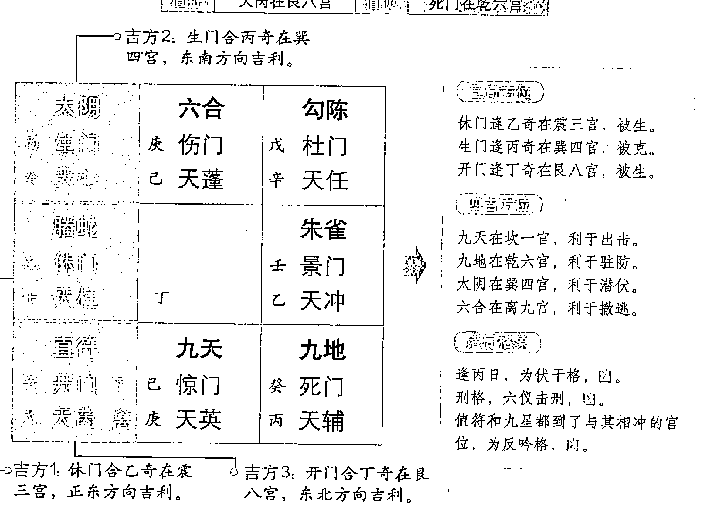

## 己亥时：无奇门可出

### 【原文】

己亥 芮九，死七。亥阴，宿干凶。景墓丁坤义欢怡，死乙兑义，杜离义。
天四，地三，阴七，合六。无奇门，仪刑，龙走，时干巽，金入火，丙日伏干格。

### 【白话提要】

符使宫位：值符天芮在离九宫，值使死门在兑七宫。亥时为五阴时。时干遇凶星宿，时干逢凶。

三奇方位：景门逢天盘乙奇与地盘丁奇在坤二宫，生宫，吉利，乙奇入墓。死门逢天盘丙奇与地盘乙奇在兑七宫，生宫。杜门逢丁奇在离九宫，生宫。

四吉方位：九天在巽四宫，九地在震三宫，太阴在兑七宫，六合在乾六宫。

诸局格象：无奇门。六仪击刑。青龙逃走。时干在巽四宫。太白入荧。逢丙日，为伏干格。

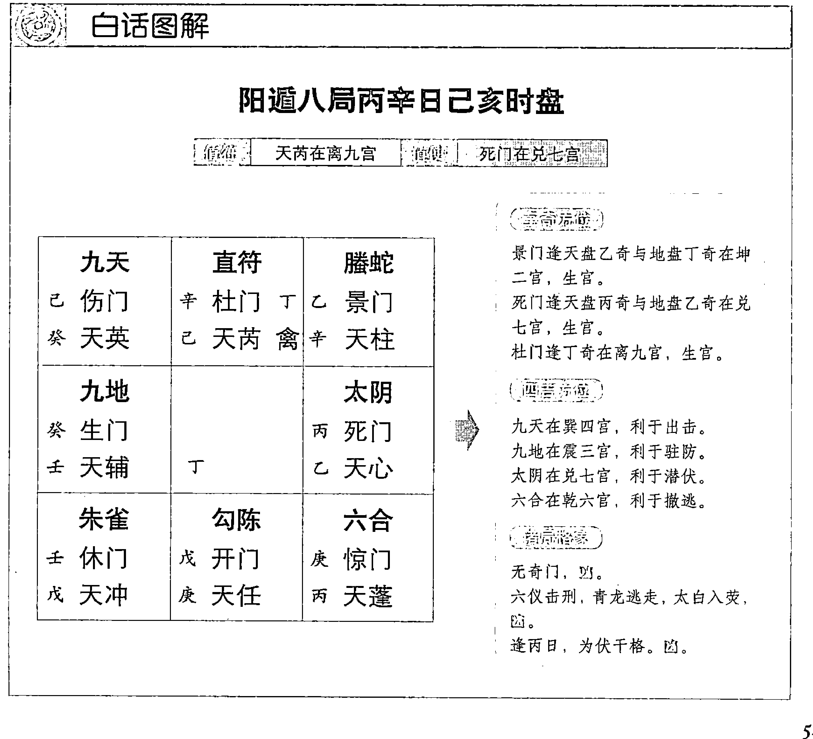

## 4.丁壬日十二时局

### 庚子时：无奇门可出

### 【原文】

庚子 芮一，死八。子至卯阴，宿干凶。死艮伏，惊震制，景坎害。天六,
地七，阴三，合四。无奇门，门反吟，飞官格，时干巽，大格，壬日勃，丁日飞
干格。

### 【白话提要】

符使宫位：值符天芮在坎一宫，值使死门在艮八宫。子时至卯时为五阴时。时干遇凶星宿，时干逢凶。

三奇方位：死门逢乙奇在艮八宫，不相生克。惊门逢丙奇在震三宫，克宫。景门
逢丁奇在坎一宫，被克。

四吉方位：九天在乾六宫，九地在兑七宫，太阴在震三宫，六合在巽四宫。
诸局格象：无奇门。八门反吟。飞官格。时干在巽四宫。大格。逢壬日，为日勃

## 白话图解

##### 阳遁八局丁壬日庚子时盘

| **值符** | 天芮在坎一宫 | **值使** | 死门在艮八宫 |
| :--- | :--- | :--- | :--- |
| **六合**<br>庚<br>癸 | **勾陈**<br>戊<br>己 | **朱雀**<br>壬<br>辛 | |
| **太阴**<br>丙<br>壬 | 丁 | **九地**<br>癸<br>乙 |
| **腾蛇**<br>乙<br>戌 | **直符**<br>辛<br>庚 | **九天**<br>己<br>乙 |

> **三奇方位**
死门逢乙奇在艮八宫，不相生克。
惊门逢丙奇在震三宫，克宫。
景门逢丁奇在坎一宫，被克。

**四吉方位**
九天在乾六宫，利于出击。
九地在兑七宫，利于驻防。
太阴在震三宫，利于潜伏。
六合在巽四宫，利于撤退。

**诸局格象**
无奇门，凶。
八门反吟，飞宫格，大格，凶。
逢丁日，为飞干格，凶。
逢壬日，为日勃格，凶。

图解说中国·奇门遁甲大全 (第二册) 542

格。逢丁日，为飞干格。

### 辛丑时：正西与西北方向吉利

### 【原文】

辛丑 芮二，死九。宿干凶。开乙兑伏，休墓丙乾和，惊丁坤和。天九，地四，阴六，合一。休与月合六西北，时干坤，开与日合七正西，符伏。

### 【白话提要】

符使宫位：值符天芮在坤二宫，值使死门在离九宫。时干遇凶星宿，时干逢凶。

三奇方位：开门逢双乙奇在兑七宫，不相生克。休门逢双丙奇在乾六宫，被生，丙，奇入墓。惊门逢双丁奇在坤二宫，被生。

四吉方位：九天在离九宫，九地在巽四宫，太阴在乾六宫，六合在坎一宫。

诸局格象：休门合丙奇在乾六宫，西北方向吉利。时干在坤二宫。开门合乙奇在兑七宫，正西方向吉利。值符和九星都在本宫未动，为伏吟格。

## 白话图解

#### 阳遁八局丁壬日辛丑时盘

- **值符**：天芮在坤二宫
- **死门**：在离九宫

**吉方 2**：开门合乙奇在兑七宫，正西方向吉利。

#### 三奇方位

- **三奇方位**：
- 开门逢双乙奇在兑七宫，不相生克。
- 休门逢双丙奇在乾六宫，被生。
- 惊门逢双丁奇在坤二宫，被生。

#### 四吉方位

- **四吉方位**：
- 九天在离九宫，利于出击。
- 九地在巽四宫，利于驻防。
- 太阴在乾六宫，利于潜伏。
- 六合在坎一宫，利于撤退。

#### 诸局格象

- **诸局格象**：
- 值符和九星都在本宫未动，为伏吟格。

## 壬寅时：正东、正南与东南方向吉利

### 【原文】

壬寅 芮三，死一。宿吉干凶。休巽义，生离和，开合震制。天八，地一，阴九，合二。开与星合三正东，休与日合四东南，生与月合九正南，事同，时干乾，乙格，丁日伏干格。

### 【白话提要】

**符使宫位：** 值符天芮在震三宫，值使死门在坎一宫。时干遇吉星宿，时干逢凶。
**三奇方位：** 休门逢乙奇在巽四宫，生宫。生门逢丙奇在离九宫，被生。开门逢丁奇在震三宫，克宫，奇仪相合。

**四吉方位：** 九天在艮八宫，九地在坎一宫，太阴在离九宫，六合在坤二宫。
**诸局格象：** 开门合丁奇在震三宫，正东方向吉利。休门合乙奇在巽四宫，东南方向吉利。生门合丙奇在离九宫，正南方向吉利。时干在乾六宫。乙奇格。逢丁日，为伏干格。

## 癸卯时：无奇门可出

### 【原文】

癸卯 芮四，死二。宿吉干凶，丁日不用。景离伏，死丁坤伏欢怡，杜巽伏。
天三，地八，阴二，合七。无奇门，符勃，时干艮，门伏，天网，丁日勃，壬日
飞干格，龙反首。

### 【白话提要】

符使宫位：值符天芮在巽四宫，值使死门在坤二宫。时干遇吉星宿，时干逢凶。逢丁日不宜用事。

三奇方位：景门逢乙奇在离九宫，不相生克。死门逢天盘丙奇与地盘丁奇在坤二宫，不相生克，吉利。杜门逢丁奇在巽四宫，不相生克。

四吉方位：九天在震三宫，九地在艮八宫，太阴在坤二宫，六合在兑七宫。

诸局格象：无奇门。符勃格。时干在艮八宫。八门伏吟。天网四张。逢丁日，为日勃格。逢壬日，为飞干格。青龙回首。

## 白话图解

#### 阳遁八局丁壬日癸卯时盘

**值符**：天芮在巽四宫 **值使**：死门在坤二宫

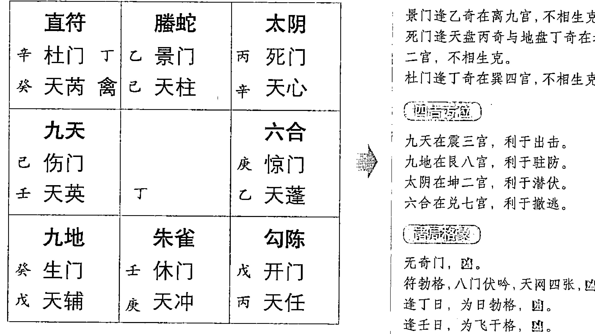

**【星奇方位】**
景门逢乙奇在离九宫，不相生克。
死门逢天盘丙奇与地盘丁奇在坤二宫，不相生克。
杜门逢丁奇在巽四宫，不相生克。

**【四吉方位】**
九天在震三宫，利于出击。
九地在艮八宫，利于驻防。
太阴在坤二宫，利于潜伏。
六合在兑七宫，利于撤退。

**【诸局格象】**
无奇门，凶。
符勃格，八门伏吟，天网四张，凶。
逢丁日，为日勃格，凶。
逢壬日，为飞干格，凶。
青龙回首。吉。## 甲辰时：西北方向吉利

### 【原文】
甲辰 冲直符三，伤直使三。辰至甲阳，天辅，宿干吉。死芮使坤伏，惊柱日兑伏，开心月乾伏。天八，地一，阴九，合二。开与月合六西北，时干震，符门伏，飞甲，自刑，三吉，阖。

### 【白话提要】
符使宫位：值符天冲在震三宫，值使伤门在震三宫。辰时至申时为五阳时，辰时为天辅释罪时。时干遇吉星宿，时干逢吉。
三奇方位：死门逢双丁奇在坤二宫，同类伏。惊门逢双乙奇在兑七宫，同类伏。开门逢双丙奇在乾六宫，同类伏。
四吉方位：九天在艮八宫，九地在坎一宫，太阴在离九宫。六合在坤二宫。
诸局格象：开门合丙奇在乾六宫，西北方向吉利。时干在震三宫，值符、九星和八门都在本宫未动，为伏吟格。飞甲自刑合。三吉格。

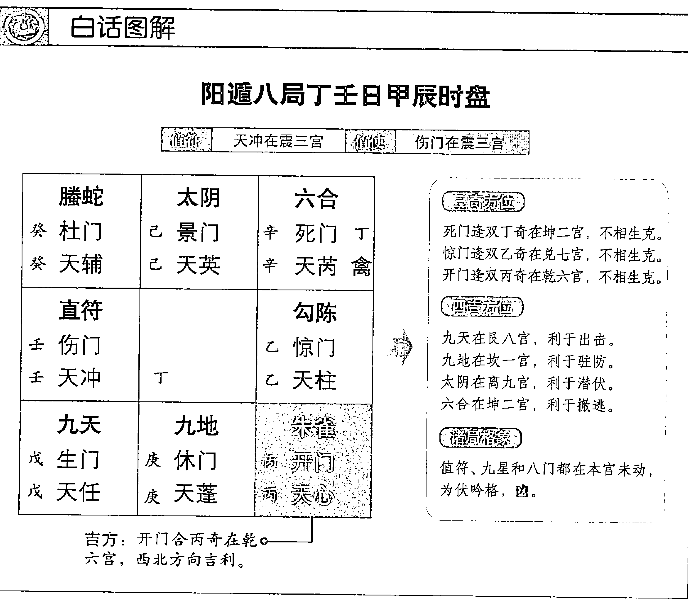

## 乙巳时：正东与东北方向吉利

### 【原文】
乙巳冲七，伤四。宿凶干吉。休艮害，生震害欢怡，伤巽伏。天二，地九，阴一，合八。生与日合三正东，休与星合八东北，时干震，符冲，刑格。

### 【白话提要】
符使宫位：值符天冲在兑七宫，值使伤门在巽四宫。时干遇凶星宿，时干逢吉。
三奇方位：休门逢丁奇在艮八宫，被克。生门逢乙奇在震三宫，被克，吉利。伤门逢丙奇在巽四宫，不相生克。
四吉方位：九天在坤二宫，九地在离九宫，太阴在坎一宫，六合在艮八宫。
诸局格象：生门合乙奇在震三宫，正东方向吉利。休门合丁奇在艮八宫，东北方向吉利。时干在震三宫。值符和九星都到了与其相冲的宫位，为反吟格。刑格。

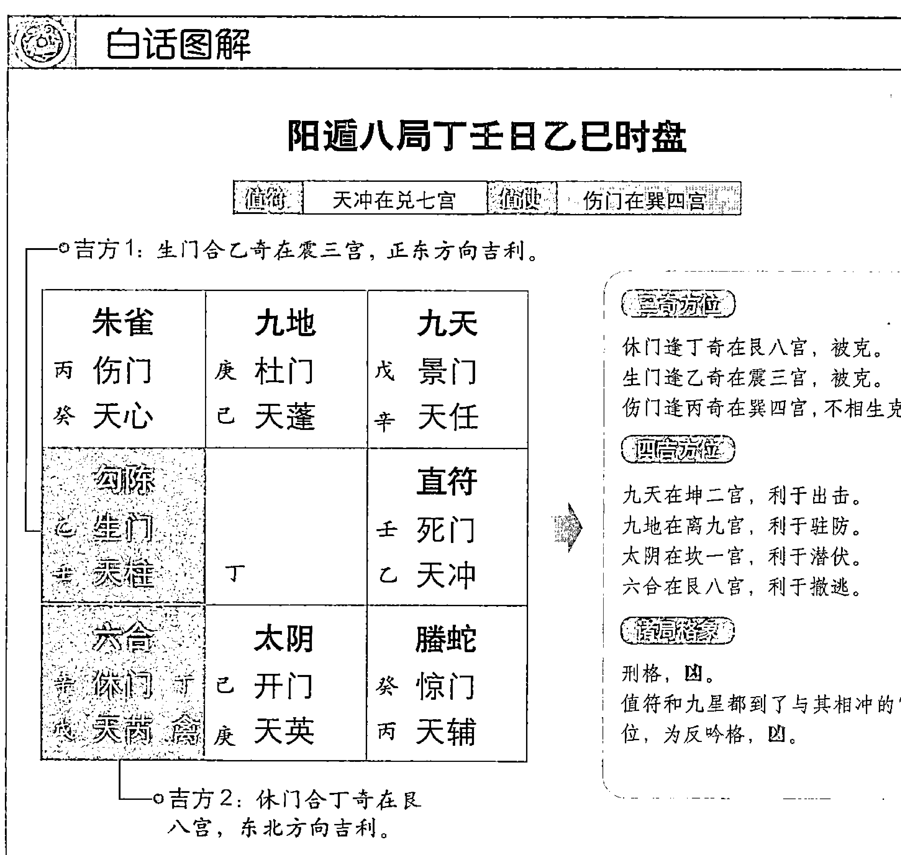

## 丙午时：宜守户不出

### 【原文】
丙午冲六，伤五避五。宿干吉，守户。开合震制欢怡，休巽义，生离和。天七，地二，阴八，合三。休与日合四东南，开与星合三正东，生与月合九正南，时干离，相佐乾，丁日伏干格。

### 【白话提要】
**符使宫位：** 值符天冲在乾六宫，值使伤门在中五宫，寄于坤二宫。时干遇吉星宿，时干逢吉。宜守户不出。
**三奇方位：** 开门逢丁奇在震三宫，克宫，吉利，奇仪相合。休门逢乙奇在巽四宫，生宫。生门逢丙奇在离九宫，被生。
**四吉方位：** 九天在兑七宫，九地在坤二宫，太阴在艮八宫，六合在震三宫。
**诸局格象：** 休门合乙奇在巽四宫，东南方向吉利。开门合丁奇在震三宫，正东方向吉利。生门合丙奇在离九宫，正南方向吉利。时干在离九宫。值符得地盘丙奇相助于乾六宫。逢丁日，为伏干格。

## 白话图解

| 值符天冲在乾六宫 | 值使伤门在中五宫，寄于坤二宫 |
| :---: | :---: |
| **阳遁八局丁壬日丙午时盘** | |
| | |
| **吉方 1:**休门合乙奇在巽四宫，东南方向吉利。 | |
| **九地**<br>**伤门**<br>**天蓬** | | **勾陈**<br>**休门**<br>**天柱** | | **朱雀**<br>**生门**<br>**天心** |
| :---: | :---: | :---: | :---: | :---: |
| **乙丙**<br>**天英** | **丁** | **丙辛**<br>**天芮** | **六合**<br>**开门**<br>**天禽** | |
| **吉方 3:**生门合丙奇在离九宫，正南方向吉利。 | | | | |
| **直符**<br>**景门**<br>**天冲** | | **九天**<br>**杜门**<br>**天任** | | |
| :---: | :---: | :---: | :---: | :---: |
| **癸**<br>**天辅** | **丁** | **腾蛇**<br>**死门** | | |
| **太阴**<br>**惊门** | | | | |
| **直符**<br>**景门** | | | | |

**吉方 2:**开门合丁奇在震三宫，正东方向吉利。

## 丁未时：无奇门可出

### 【原文】
丁未冲五，伤六。宿干吉。杜坎和，景艮义，死震害欢怡。天九，地四，阴六，合一。无奇门，符勃，壬日伏干格，时干坎，相佐坤，大格，丁日飞干格。

### 【白话提要】
符使宫位：值符天冲在中五宫，寄于坤二宫，值使伤门在乾六宫。时干遇吉星宿，时干逢吉。
三奇方位：杜门逢丁奇在坎一宫，被生。景门逢乙奇在艮八宫，生宫。死门逢丙奇在震三宫，被克，吉利。
四吉方位：九天在离九宫，九地在巽四宫，太阴在乾六宫，六合在坎一宫。
诸局格象：无奇门。符勃格。逢壬日，为伏干格。时干在坎一宫。值符得地盘丁奇相助于坤宫。大格。逢丁日，为飞干格。

## 戊申时：逢壬日不宜用事

### 【原文】
戊申 冲八，伤七。宿干吉，壬日不用。休离制，生墓丁坤伏，伤乙兑害。天一，地六，阴四，合九。生与日合二西南，时干坎，休与星合九正南，金入火。

### 【白话提要】
符使宫位：值符天冲在艮八宫，值使伤门在兑七宫。时干遇吉星宿，时干逢吉。逢壬日不宜用事。
三奇方位：休门逢丁奇在离九宫，克宫。生门逢天盘乙奇与地盘丁奇在坤二宫，不相生克，乙奇入墓。伤门逢天盘丙奇与地盘乙奇在兑七宫，被克。
四吉方位：九天在坎一宫，九地在乾六宫，太阴在巽四宫，六合在离九宫。
诸局格象：生门合乙奇在坤二宫，西南方向吉利。时干在坎一宫。休门合丁奇在离九宫，正南方向吉利。太白入荧。

## 白话图解

## 阳遁八局丁壬日戊申时盘

- [吉方 1: 生门合乙奇在坤二宫，西南方向吉利。](http://doc.docin.com/toc/709/529/550.html#_Toc314732683)
- [吉方 2: 休门合丁奇在离九宫，正南方向吉利。](http://doc.docin.com/toc/709/529/550.html#_Toc314732684)

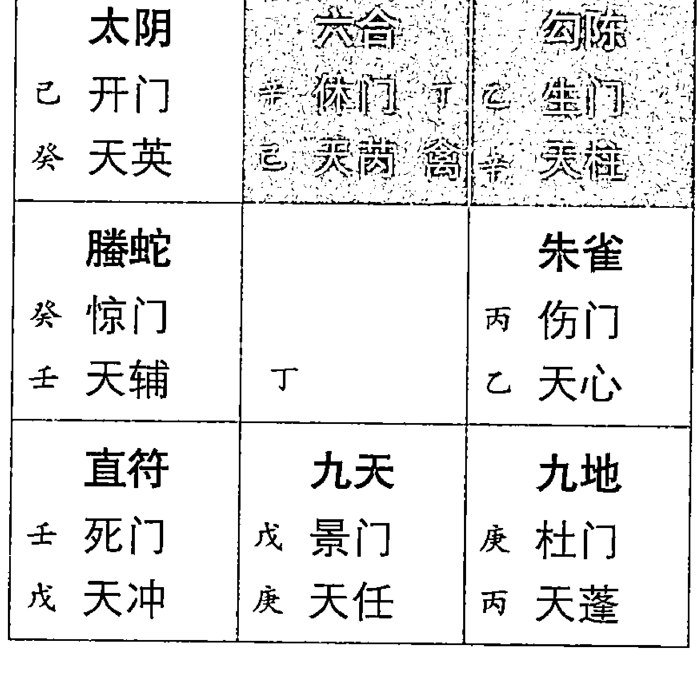
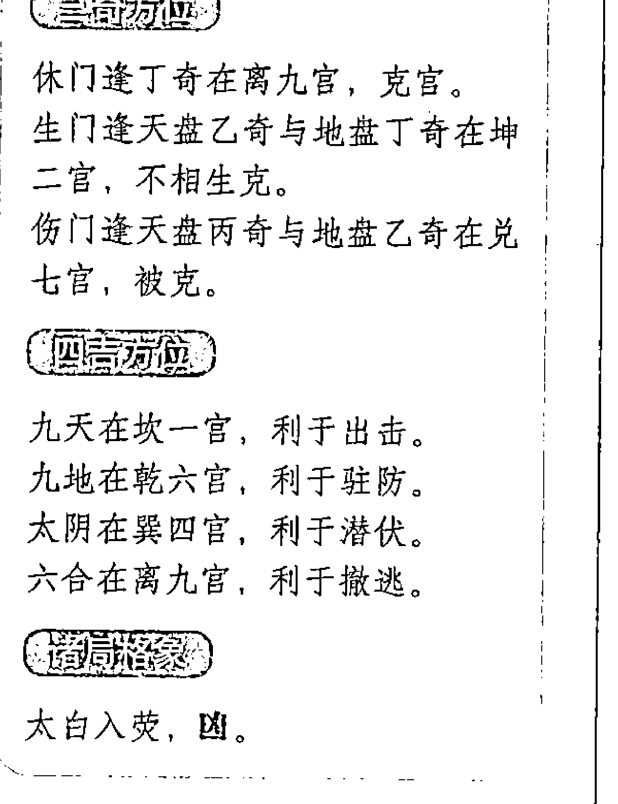

## 己酉时：无奇门可出

### 【原文】
己酉  冲九，伤八。酉至亥阴，宿吉干凶。休墓丙乾和，生合坎制，伤艮制。天四，地三，阴七，合六。休与星合六西北，丁下有丙，生与日合一正北，蛇矫，鸟跌穴，时干兑，壬日伏干格，乙格，伏官格。

### 【白话提要】
符使宫位：值符天冲在离九宫，值使伤门在艮八宫。酉时至亥时为五阴时。时干遇吉星宿，时干逢凶。
三奇方位：休门逢天盘丁奇与地盘丙奇在乾六宫，被生，丁奇入墓。生门逢乙奇在坎一宫，克宫，奇仪相合。伤门逢丙奇在艮八宫，克宫。
四吉方位：九天在巽四宫，九地在震三宫，太阴在兑七宫，六合在乾六宫。
诸局格象：休门合丁奇在乾六宫，西北方向吉利。丁下有丙，为星随月转。生门合乙奇在坎一宫，正北方向吉利。螣蛇夭矫。飞鸟跌穴。时干在兑七宫。逢壬日，为伏干格。乙奇格。伏宫格。

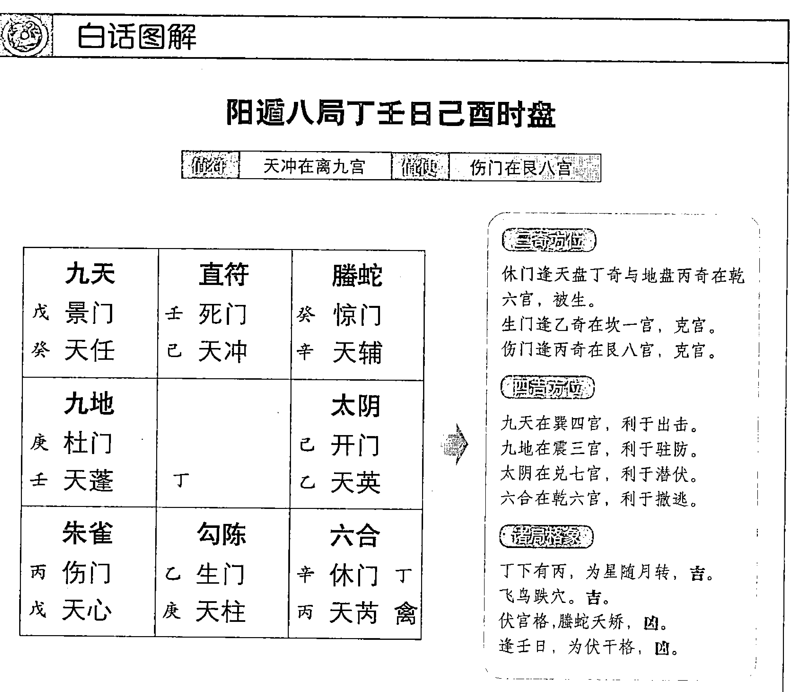

**白话图解**

**阳遁八局丁壬日己酉时盘**

- 值符天冲在离九宫
- 值使伤门在艮八宫

## 庚戌时：东南方向吉利

### 【原文】
庚戌 冲一，伤九。宿于凶。生巽害，伤离义，杜合坤制。天六，地七，阴三，合四。生与星合四东南，得使，龙反首，天乙与太白格，雀人江。时干兑，飞 符，丁日勃，壬日飞千格。

### 【白话提要】
符使宫位：值符天冲在坎一宫，值使伤门在离九宫。时干遇凶星宿，时干逢凶。
三奇方位：生门逢丁奇在巽四宫，被克。伤门逢乙奇在离九宫，生宫。杜门逢丙奇在坤二宫，克宫，奇仪相合。
四吉方位：九天在乾六宫，九地在兑七宫，太阴在震三宫，六合在巽四宫。
诸局格象：生门合丁奇在巽四宫，东南方向吉利。丁奇得使。青龙回首。天乙与六庚成格。朱雀入江。时干在兑七宫。值符飞宫。逢丁日，为日勃格。逢壬日，为飞干格。

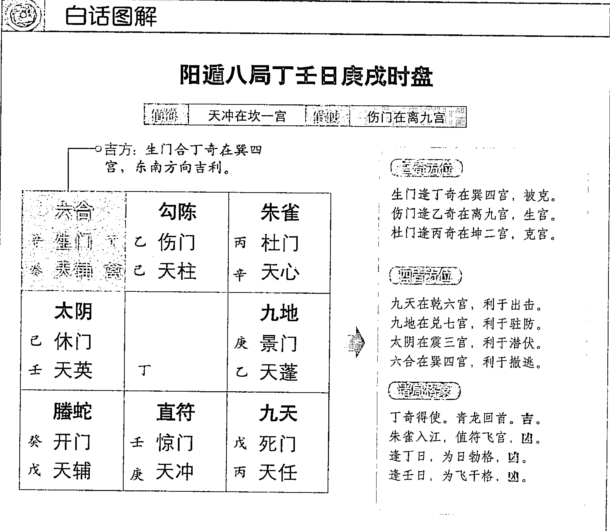


| | | |
| :---: | :---: | :---: |
| **九天**在乾六宫，利于出击。 | **九地**在兑七宫，利于驻防。 | **太阴**在震三宫，利于潜伏。 |

### 吉局格象
- 丁奇得使。首，吉。
- 朱雀入江，值符飞宫，凶。
- 逢丁日，为日勃格，凶。
- 逢壬日，为飞干格，凶。

#### 三奇方位
生门逢丁奇在巽四宫，被克。
伤门逢乙奇在离九宫，生宫。
杜门逢丙奇在坤二宫，克宫。

## 辛亥时：无奇门可出

### 【原文】
辛亥冲二，伤一。宿干吉。伤坎和，杜艮制，景震和。天九，地四，阴六，合一。无奇门，丁日飞干格，壬日勃，鸟跌穴，时干坎，相佐坤，大格，事同。

### 【白话提要】
符使宫位：值符天冲在坤二宫，值使伤门在坎一宫。时干遇吉星宿，时干逢吉。
三奇方位：伤门逢丁奇在坎一宫，被生。杜门逢乙奇在艮八宫，克宫。景门逢丙奇在震三宫，被生。
四吉方位：九天在离九宫，九地在巽四宫，太阴在乾六宫，六合在坎一宫。
诸局格象：无奇门。逢丁日，为飞干格。逢壬日，为日勃格。飞鸟跌穴。时干在坎一宫。值得得地盘丁奇相助于坤二宫。大格。

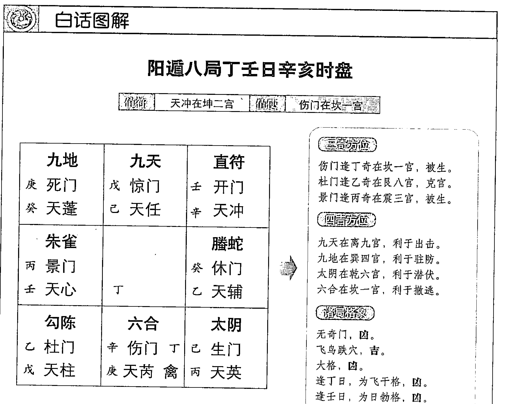

## 壬子时：无奇门可出

### 【原文】
壬子冲三，伤二。子至丑阴，宿吉干凶。伤丁坤制，杜乙兑害，景墓丙乾制。天八，地一，阴九，合二。无奇门，符伏，时干震。

### 【白话提要】
符使宫位：值符天冲在震三宫，值使伤门在坤二宫。子时至丑时为五阴时。时干遇凶星宿，时干逢凶。
三奇方位：伤门逢双丁奇在坤二宫，克宫。杜门逢双乙奇在兑七宫，被克。景门逢双丙奇在乾六宫，克宫，丙奇入墓。
四吉方位：九天在艮八宫，九地在坎一宫，太阴在离九宫，六合在坤二宫。
诸局格象：无奇门。值符和九星都在本宫未动，为伏吟格。时干在震三宫。

| | 值符 | 天冲在震三宫 | 值使 | 伤门在坤二宫 |
| :---: | :---: | :---: | :---: | :---: |
| **腾蛇**<br>癸<br>**休门**<br>癸<br>**天辅** | **太阴**<br>己<br>**生门**<br>己<br>**天英** | **六合**<br>辛<br>**伤门**<br>丁<br>**禽**<br>辛<br>**天芮** | |
| **直符**<br>壬<br>**开门**<br>壬<br>**天冲** | **丁** | **勾陈**<br>乙<br>**杜门**<br>乙<br>**天柱** | |
| **九天**<br>戊<br>**惊门**<br>戊<br>**天任** | **九地**<br>庚<br>**死门**<br>庚<br>**天蓬** | **朱雀**<br>丙<br>**景门**<br>丙<br>**天心** | |

#### 三奇方位
伤门逢双丁奇在坤二宫，克宫。杜门逢双乙奇在兑七宫，被克。景门逢双丙奇在乾六宫，克宫。

#### 四吉方位
九天在艮八宫，利于出击。九地在坎一宫，利于驻防。太阴在离九宫，利于潜伏。六合在坤二宫，利于撤退。

#### 诸局格象
无奇门，凶。
值符和九星都在本宫未动，为伏吟格，凶。

## 癸丑时：正北与西北方向吉利

### 【原文】
癸丑冲四，伤三。宿吉干凶。惊乙兑伏，开丙乾伏，休坎伏。天三，地八，阴二，合七。休与月合一正北，开与日合六西北，乙下有丙，火入白，虎猖狂，仪刑，时干离，飞官，戊日伏干，门伏，天网。

### 【白话提要】
符使宫位：值符天冲在巽四宫，值使伤门在震三宫。时干遇吉星宿，时干逢凶。
三奇方位：惊门逢天盘丁奇与地盘乙奇在兑七宫，不相生克。开门逢天盘乙奇与地盘丙奇在乾六宫，不相生克。休门逢丙奇在坎一宫，不相生克。
四吉方位：九天在震三宫，九地在艮八宫，太阴在坤二宫，六合在兑七宫。
诸局格象：休门合丙奇在坎一宫，正北方向吉利。开门合乙奇在乾六宫，西北方向吉利。乙下有丙，为奇仪顺遂。荧入太白。白虎猖狂。六仪击刑。时干在离九宫。飞宫格。逢戊日，为伏干格，八门伏吟。天网四张。

**白话图解**

## 阳遁八局戊癸日癸丑时盘

| | **天冲**在巽四宫 直符 壬 杜门 | **伤门**在震三宫 | |
| :---: | :---: | :---: | :---: |
| **直符** 壬<br/>癸<br/><br/>杜门<br/>天冲 | **腾蛇**<br/>癸<br/>己<br/><br/>景门<br/>天辅<br/><br/>丁 | **太阴**<br/>己<br/>辛<br/><br/>死门<br/>天英<br/><br/>辛 | 惊门 **丁**<br/>乙<br/>天芮<br/>禽 |
| **九天**<br/>戊<br/>壬<br/><br/>伤门<br/>天任<br/><br/>丁 | | **六合**<br/>辛<br/>乙<br/><br/>惊门 **丁**<br/>乙<br/>天芮<br/>禽 |
| **九地**<br/>庚<br/>戊<br/><br/>生门<br/>天心<br/><br/> | **朱雀**<br/>丙<br/>癸<br/>甲<br/><br/>休门<br/>天心 | **勾陈**<br/>乙<br/>丙<br/><br/>开门<br/>天柱 |

**四吉方位：**
九天在震三宫，利于出击。
九地在艮八宫，利于驻防。
太阴在坤二宫，利于潜伏。
六合在兑七宫，利于撤退。

**诸局格象：**
乙下有丙，为奇仪顺遂，吉。
荧入太白，白虎猖狂，六仪击刑，凶。
飞宫格，八门伏吟，天网四张，凶。
逢戊日，为伏干格，凶。

**吉方 1**：休门合丙奇在坎一宫，正北方向吉利。 **吉方 2**：开门合乙奇在乾六宫，西北方向吉利。

## 甲寅时：逢戊日不宜用事

### 【原文】
甲寅 辅直符四，杜直使四。天辅。寅至午阳，宿干吉，戊日不用。死禽心坤伏，惊柱日兑伏，开墓心月乾伏。天三，地八，阴二，合七。开与月合六西北，地甲开，时干巽，符门伏，仪刑。

### 【白话提要】
符使宫位：值符天辅在巽四宫，值使杜门在巽四宫。寅时为天辅释罪时。寅时至午时为五阳时。时干遇吉星宿，时干逢吉。逢戊日不宜用事。
三奇方位：死门逢双丁奇在坤二宫，不相生克。惊门逢双乙奇在兑七宫，不相生克。开门逢双丙奇在乾六宫，不相生克。
四吉方位：九天在震三宫，九地在艮八宫，太阴在坤二宫，六合在兑七宫。
诸局格象：开门合丙奇在乾六宫，西北方向吉利。地甲开。时干在巽四宫。值符、九星和八门都在本宫未动，为伏吟格。六仪击刑。

| | | |
| :---: | :---: | :---: |
| **直符** 癸<br/>杜门<br/>癸<br/>天辅 | **腾蛇** 己<br/>景门<br/>已<br/>天英 | **太阴**<br/>辛<br/>死门丁<br/>辛<br/>天芮禽 |
| **九天** 壬<br/>伤门<br/>壬<br/>天冲 | | **六合**<br/>乙<br/>惊门<br/>乙<br/>天柱 |
| **九地** 戊<br/>生门<br/>戌<br/>天任 | **朱雀**<br/>庚<br/>休门<br/>庚<br/>天蓬 | **勾陈**<br/>巽<br/>开门<br/>丙<br/>天心 |

**吉方：**开门合丙奇在乾六宫，西北方向吉利。

> **三奇方位**
死门逢双丁奇在坤二宫，不相生克。
惊门逢双乙奇在兑七宫，不相生克。
开门逢双丙奇在乾六宫，不相生克。

> **四吉方位**
九天在震三宫，利于出击。
九地在艮八宫，利于驻防。
太阴在坤二宫，利于潜伏。
六合在兑七宫，利于撤退。

> **诸局格象**
六仪击刑，凶。
值符、九星和八门都在本宫未动，为伏吟格，凶。

## 乙卯时：宜守户不出

### 【原文】
**乙卯** 辅七，杜五避五。宿凶干吉，守户。惊坎义，开艮和，休震义。天二，地九，阴一，合八。开与日合八东北，休与月合三正东，癸日伏干格，时干艮，大格，乙格，伏官格。

### 【白话提要】
符使宫位：值符天辅在兑七宫，值使杜门在中五宫，寄于坤二宫。时干遇凶星宿，时干逢吉。宜守户不出。
三奇方位：惊门逢丁奇在坎一宫，生宫。开门逢乙奇在艮八宫，被生。休门逢丙奇在震三宫，生宫。
四吉方位：九天在坤二宫，九地在离九宫，太阴在坎一宫，六合在艮八宫。
诸局格象：开门合乙奇在艮八宫，东北方向吉利。休门合丙奇在震三宫，正东方向吉利。逢癸日，为伏干格。时干在艮八宫。大格。乙奇格。伏官格。

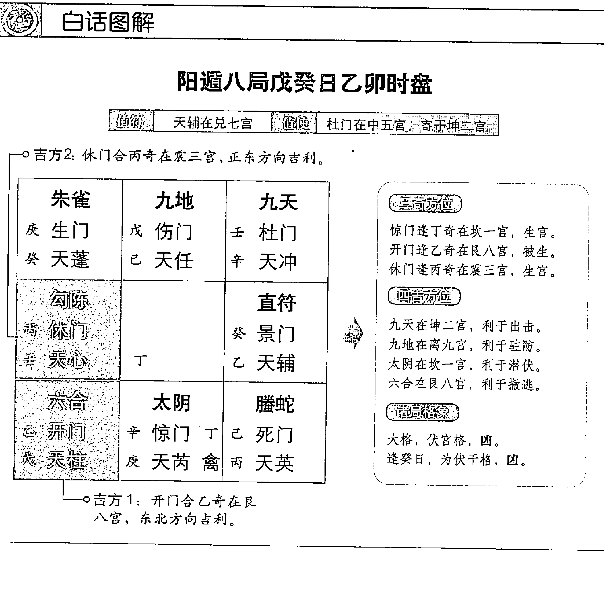

## 丙辰时：东南方向吉利

### 【原文】
丙辰辅六，杜六。宿干吉。死艮伏，惊震制，开巽制欢怡。天七，地二，阴八，合三。开与月合东南，刑格，符勃，癸干勃，时干巽，相佐乾，符门反吟。

### 【白话提要】
符使宫位：值符天辅在乾六宫，值使杜门在乾六宫。时干遇吉星宿，时干逢吉。
三奇方位：死门逢丁奇在艮八宫，不相生克。惊门逢乙奇在震三宫，克宫。开门逢丙奇在巽四宫，克宫，吉利。
四吉方位：九天在兑七宫，九地在坤二宫，太阴在艮八宫，六合在震三宫。
诸局格象：开门合丙奇在巽四宫，东南方向吉利。刑格。符勃格。逢癸日，为日干勃格。时干在巽四宫。值符得地盘丙奇相助于乾六宫。值符、九星和八门都到了与其相冲的宫位，为反吟格。

**白话图解**

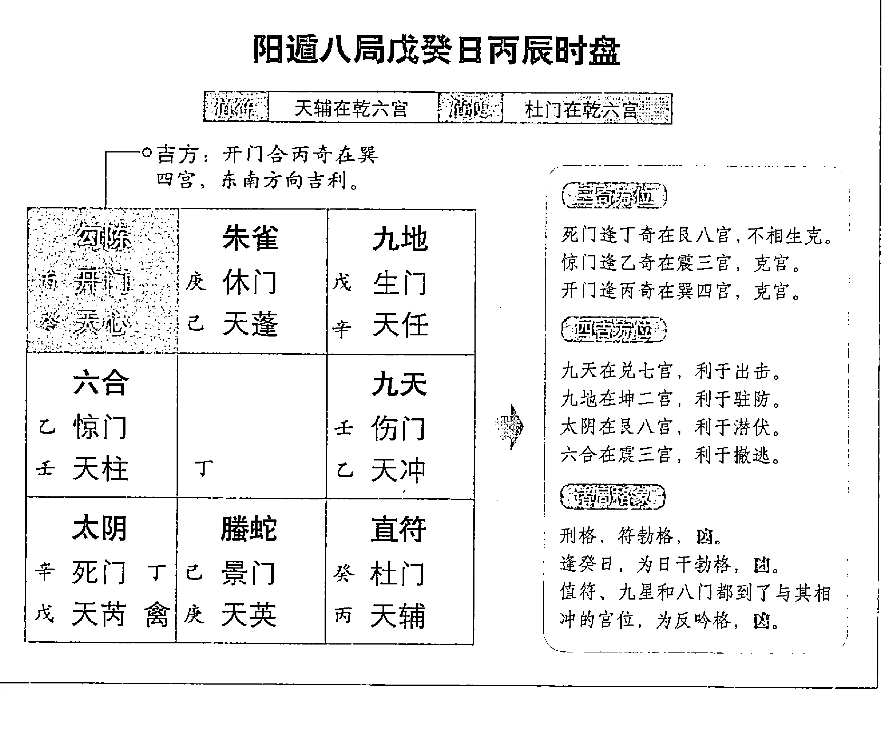

## 丁巳时：无奇门可出

### 【原文】
丁巳辅五，杜七。宿干吉。景墓丙乾制，死合坎制，惊艮和。天九，地四，阴六，合一。无奇门，仪刑，时干乾，相佐坤，击刑，戊日勃。

### 【白话提要】
符使宫位：值符天辅在中五宫，寄于坤二宫，值使杜门在兑七宫。时干遇吉星宿，时干逢吉。
三奇方位：景门逢天盘丁奇与地盘丙奇在乾六宫，克宫，丁奇入墓。死门逢乙奇在坎一宫，克宫，奇仪相合。惊门逢丙奇在艮八宫，被生。
四吉方位：九天在离九宫，九地在巽四宫，太阴在乾六宫，六合在坎一宫。
诸局格象：无奇门。六仪击刑。时干在乾六宫。值符得地盘丁奇相助于坤二宫。击刑。逢戊日，为日勃格。

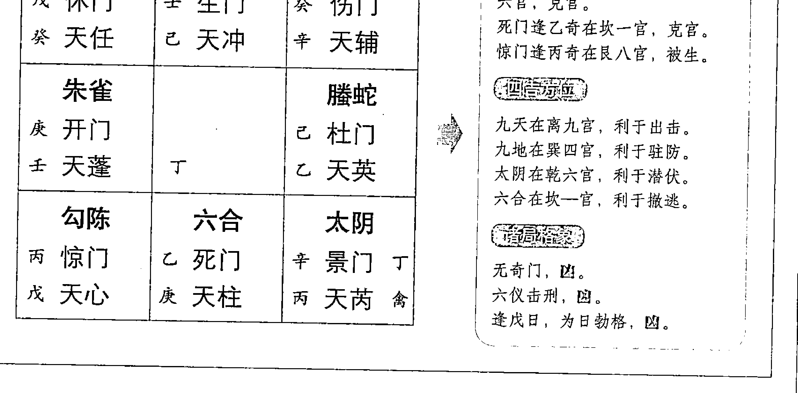

> > 第四卷 阳遁八局
> **第四章**

## 戊午时：西南方向吉利

### 【原文】
戊午 辅八，杜八。宿干吉。死巽害欢怡，惊离害，开合丁坤和。天一，地六，阴四，合九。开与月合二西南，雀入江，龙反首，时干乾。

### 【白话提要】
符使宫位：值符天辅在艮八宫，值使杜门在艮八宫。时干遇吉星宿，时干逢吉。
三奇方位：死门逢丁奇在巽四宫，被克，吉利。惊门逢乙奇在离九宫，被克。开门逢天盘丙奇与地盘丁奇在坤二宫，被生，奇仪相合。
四吉方位：九天在坎一宫，九地在乾六宫，太阴在巽四宫，六合在离九宫。
诸局格象：开门合丙奇在坤二宫，西南方向吉利。朱雀入江。青龙回首。时干在乾六宫。

## 白话图解

**阳遁八局戊癸日戊午时盘**
[值符天辅在艮八宫 [值使杜门在艮八宫]
吉方：开门合丙奇在坤二宫，西南方向吉利。

三奇方位
死门逢丁奇在巽四宫，被克。惊门逢乙奇在离九宫，被克。
开门逢天盘丙奇与地盘丁奇在坤二宫，被生。

四吉方位
九天在坎一宫，利于出击。九地在乾六宫，利于驻防。
太阴在巽四宫，利于潜伏。六合在离九宫，利于撤退。

诸局格象
朱雀入江，凶。
青龙回首，吉。

## 己未时：逢癸日不宜用事

### 【原文】
已未辅九，杜九。未至亥阴，宿吉干凶。癸日不用，死乙兑义，惊丙乾伏，开坎义。天四，地三，阴七，合六。开与月合一正北，虎猖狂，时乾坤，飞官,火入金，戊日伏干格。

### 【白话提要】
符使宫位：值符天辅在离九宫，值符杜门在离九宫。未时至亥时为五阴时。时干遇吉星宿，时干逢凶。逢癸日不宜用事。

**三奇方位**:死门逄天盘丁奇与地盘乙奇在兑七宫，生官。惊门逄天盘乙奇与地盘丙奇在乾六宫，不相生克。开门逄丙奇在坎一宫，生官。

**四吉方位**：九天在巽四宫，九地在震三宫，太阴在兑七宫，六合在乾六宫。

**诸局格象**:开门合丙奇在坎一宫，正北方向吉利。白虎猖狂。时干在坤二宫。飞宫格。荧入太白。逢戊日，为伏干格。

## 庚申时：正南方向吉利

### 原文
庚申辅一，杜一。宿干凶。死合震害，惊巽制，开离合。天六，地七，阴三，合四。开与月合九正南，飞宫格，天乙与太白格，癸日飞干格，时干坤，飞符。

### 白话提要
符使宫位：值符天辅在坎一宫，值使杜门在坎一宫。时干遇凶星宿，时干逢凶。

**三奇方位**：死门逢丁奇在震三宫，被克，奇仪相合。惊门逢乙奇在巽四宫，克宫。

**开门**逢丙奇在离九宫，被克。

**四吉方位**：九天在乾六宫，九地在兑七宫，太阴在震三宫，六合在巽四宫。

**诸局格象**：开门合丙奇在离九宫，正南方向吉利。飞宫格。天乙与六庚成格。逢癸日，为飞干格。时干在坤二宫。值符飞宫。

## 白话图解
阳遁八局戊癸日庚申时盘
**天辅**在坎一宫，**值使杜门**在坎一宫。

**吉方**：开门合丙奇在离九宫，正南方向吉利。

| | 勾陈 | 朱雀 |
| --- | --- | --- |
| 六合 乙惊门癸天柱 | 死门丁禽杜门己天英庚天辅 | 庚辛休门天蓬 |
| 太阴壬死门天芮丁 | 九地戊生门天任乙 | 伤门壬天冲丙九天 |

六合、勾陈、朱雀、玄武、青龙、白虎等是奇门的八神之一，也是二十八宿之一。

死门逢丁奇在震三宫，被克。惊门逢乙奇在巽四宫，克宫。开门逢丙奇在离九宫，被克。

九天在乾六宫，利于出击。九地在兑七宫，利于驻防。太阴在震三宫，利于潜伏。六合在巽四宫，利于撤退。

飞宫格，值符飞宫，凶。逢癸日，为飞干格，凶。

## 辛酉时：东北方向吉利

### 【原文】
辛酉辅二，杜二。宿干凶。死丙乾义，惊合坎义，开丙艮和。天九，地四，阴六，合一。开与月合八东北，蛇矫，龙走，时干乾，相佐坤，戊日勃。

### 【白话提要】
符使宫位：值符天辅在坤二宫，值使杜门在坤二宫。时干遇凶星宿，时干逢凶。

**三奇方位**：死门逢天盘丁奇与地盘丙奇在乾六宫，生官。惊门逢乙奇在坎一宫，生宫，奇仪相合。开门逢丙奇在艮八宫，被生。

**四吉方位**：九天在离九宫，九地在巽四宫，太阴在乾六宫，六合在坎一宫。

**诸局格象**：开门合丙奇在艮八宫，东北方向吉利。腾蛇夭矫。青龙逃走。时干在乾六宫。值符得地盘丁奇相助于坤二宫。逢戊日，为日勃格。

## 壬戌时：正西方向吉利

### 【原文】
壬戌辅三，杜三。宿吉干凶。死离和，惊墓丁坤伏，开乙兑伏。天八，地一，阴九，合二。开与月合七正西，丙下有乙，龙走，时干艮，戊日飞干格，金入火。

### 【白话提要】
符使宫位：值符天辅在震三宫，值使杜门在震三宫。时干遇吉星宿，时干逢凶。

**三奇方位**：死门逢丁奇在离九宫，被生。惊门逢天盘乙奇与地盘丁奇在坤二宫，不相生克，乙奇入墓。开门逢天盘丙奇与地盘乙奇在兑七宫，不相生克。

**四吉方位**：九天在艮八宫，九地在坎一宫，太阴在离九宫，六合在坤二宫。

**诸局格象**：开门合丙奇在兑七宫，正西方向吉利。丙下有乙，为日月并行。青龙逃走。时干在艮八宫。逢戊日，为飞干格。太白入荧。

| | 值符：天辅在震三宫 | 值使：杜门在震三宫 |
| --- | --- | --- |
| 腾蛇<br>已<br>癸<br>景门<br>天英 | 太阴<br>辛<br>己<br>死门<br>丁<br>天芮<br>禽 | 六合<br>乙<br>辛<br>惊门<br>天柱 |
| 直符<br>癸<br>壬<br>杜门<br>天辅 | 丁 | 勾陈<br>丙<br>乙<br>开门<br>天心 |
| 九天<br>壬<br>戊<br>伤门<br>天冲 | 九地<br>戊<br>庚<br>生门<br>天任 | 朱雀<br>庚<br>丙<br>休门<br>天蓬 |

**三奇方位**：
死门逢丁奇在离九宫，被生。
惊门逢天盘乙奇与地盘丁奇在坤二宫，不相生克。
开门逢天盘丙奇与地盘乙奇在兑七宫，不相生克。

**四吉方位**：
九天在艮八宫，利于出击。
九地在坎一宫，利于驻防。
太阴在离九宫，利于潜伏。
六合在坤二宫，利于撤退。

**诸局格象**：
丙下有乙，为日月并行。吉。
青龙逃走，太白入荧，凶。

## 癸亥时：西北方向吉利

### 【原文】
癸亥辅四，杜四。宿吉干凶。死丁坤伏，惊乙兑伏，开墓丙乾伏。天三，地八，阴二，合七。开与月合六西北，仪刑，时干巽，符门伏，天网。

### 【白话提要】
符使宫位：值符天辅在巽四宫，值使杜门在巽四宫。时干遇吉星宿，时干逢凶。
**三奇方位**：死门逢双丁奇在坤二宫，不相生克。惊门逢双乙奇在兑七宫，不相生克。开门逢双丙奇在乾六宫，不相生克，丙奇入墓。

**四吉方位**：九天在震三宫，九地在艮八宫，太阴在坤二宫，六合在兑七宫。

**诸局格象**：开门合丙奇在乾六宫，西北方向吉利。六仪击刑。时干在巽四宫。值符、九星和八门都在本宫未动，为伏吟格。天网四张。

## 白话图解
### 阳遁八局戊癸日癸亥时盘
直符：天辅在巽四宫，杜门在巽四宫

| | 直符 | 太阴 |
| --- | --- | --- |
| 癸杜门 | 己景门 | 辛死门丁 |
| 癸天辅 | 己天英 | 辛天芮禽 |
| 九天 | 六合 | 乙惊门 |
| 壬伤门 | 丁 | 天冲 |
| 乙天柱 | 九地 | 朱雀 |
| 勾陈 | 戌生门 | 庚休门 |
| 商天心 | 天壬 | 庚天蓬 |

**三奇方位**
死门逢双丁奇在坤二宫，不相生克。
惊门逢双乙奇在兑七宫，不相生克。
开门逢双丙奇在乾六宫，不相生克。

**四吉方位**
九天在震三宫，利于出击。
九地在艮八宫，利于驻防。
太阴在坤二宫，利于潜伏。
六合在兑七宫，利于撤退。

**诸局格象**
六仪击刑，天网四张，凶。
值符、九星和八门都在本宫未动，为伏吟格。吉方：开门合丙奇在乾六宫，西北方向吉利。

---

图解中国传统决策学 · 奇门遁甲大全

奇门遁甲时家奇门阳遁九局共有六十个时辰，即六十局。本章通过文字和各时辰的飞盘排布来说明各局的符使官位、三奇方位、四吉神方位和诸局格象。

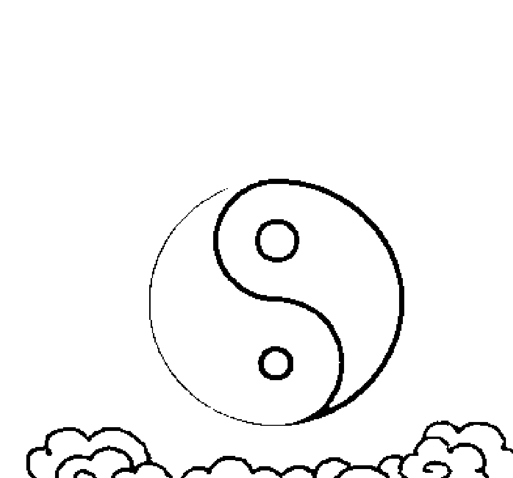
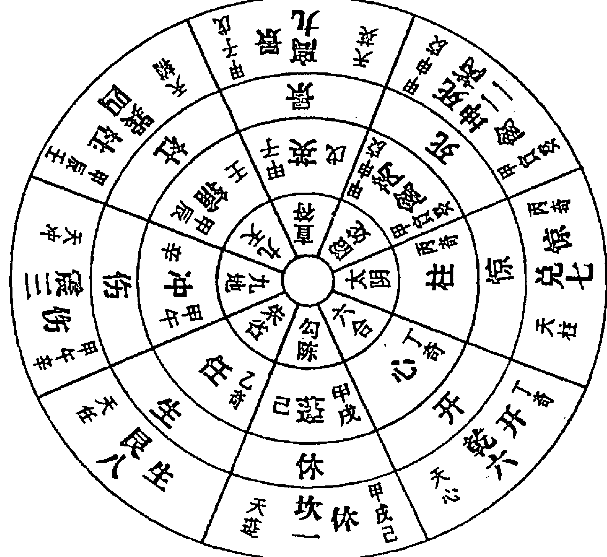
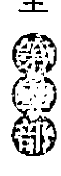
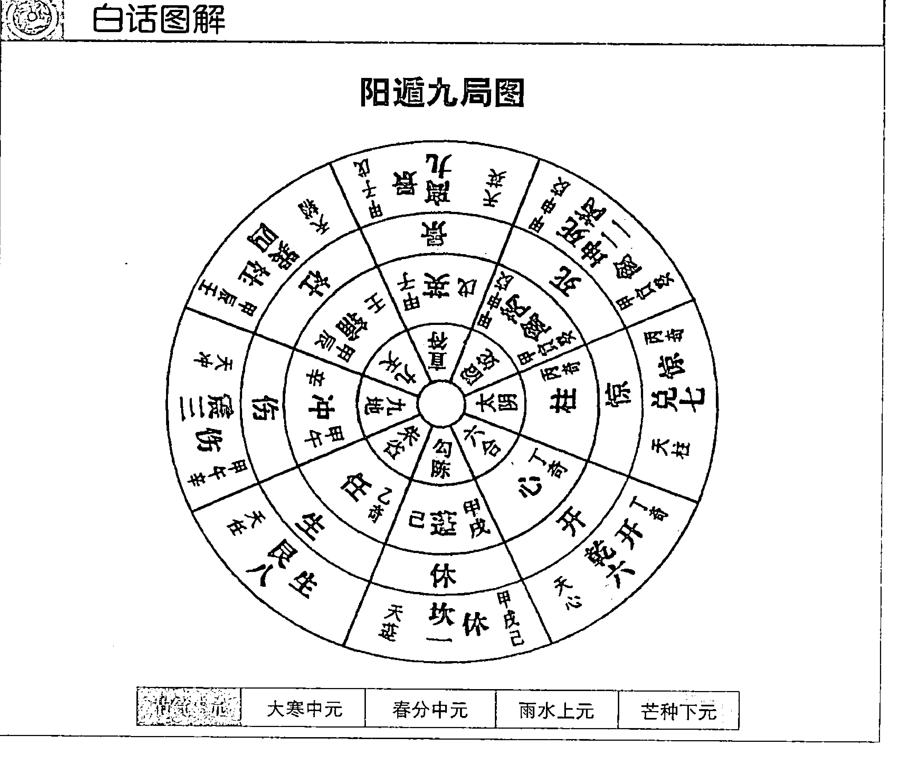

## 白话图解

### 每日时辰
奇门遁甲中一局为一元，一元有甲己、乙庚、丙辛、丁壬和戊癸五日，每日有十二个时辰，则一局就有六十个时辰，用六十甲子来表示，一个时辰为一小局。

奇门遁甲排盘时，最主要的就是寻找值符和值使，并确定其所在的宫位。下表就是阳遁九局六十个时辰的值符和值使，以及其所在的宫位。

### 阳遁九局六十时符使表

| 时辰 | 甲子 | 乙丑 | 丙寅 | 丁卯 | 戊辰 | 己巳 | 庚午 | 辛未 | 壬申 | 癸酉 | 甲戌 | 乙亥 |
| --- | --- | --- | --- | --- | --- | --- | --- | --- | --- | --- | --- | --- |
| 乙庚局 | 丙子 | 丁丑 | 戊寅 | 己卯 | 庚辰 | 辛巳 | 壬午 | 癸未 | 甲申 | 乙酉 | 丙戌 | 丁亥 |
| 丙辛局 | 戊子 | 己丑 | 庚寅 | 辛卯 | 壬辰 | 癸巳 | 甲午 | 乙未 | 丙申 | 丁酉 | 戊戌 | 己亥 |
| 丁壬局 | 庚子 | 辛丑 | 壬寅 | 癸卯 | 甲辰 | 乙巳 | 丙午 | 丁未 | 戊申 | 己酉 | 庚戌 | 辛亥 |
| 戊癸局 | 壬子 | 癸丑 | 甲寅 | 乙卯 | 丙辰 | 丁巳 | 戊午 | 己未 | 庚申 | 辛酉 | 壬戌 | 癸亥 |

| 时辰 | 甲子 | 乙丑 | 丙寅 | 丁卯 | 戊辰 | 己巳 | 庚午 | 辛未 | 壬申 | 癸酉 |
| --- | --- | --- | --- | --- | --- | --- | --- | --- | --- | --- |
| 天英 | 九 | 八 | 七 | 六 | 九 | 一 | 二 | 三 | 四 | 五 |
| 景门 | 九 | 一 | 二 | 三 | 四 | 五 | 六 | 七 | 八 | 九 |
| 时辰 | 甲戌 | 乙亥 | 丙子 | 丁丑 | 戊寅 | 己卯 | 庚辰 | 辛巳 | 壬午 | 癸未 |
| 天蓬 | 一 | 八 | 七 | 六 | 九 | 一 | 二 | 三 | 四 | 五 |
| 休门 | 一 | 二 | 三 | 四 | 五 | 六 | 七 | 八 | 九 | 一 |
| 时辰 | 甲申 | 乙酉 | 丙戌 | 丁亥 | 戊子 | 己丑 | 庚寅 | 辛卯 | 壬辰 | 癸巳 |
| 天芮 | 二 | 八 | 七 | 六 | 九 | 一 | 二 | 三 | 四 | 五 |
| 死门 | 二 | 三 | 四 | 五 | 六 | 七 | 八 | 九 | 一 | 二 |
| 时辰 | 甲午 | 乙未 | 丙申 | 丁酉 | 戌戌 | 己亥 | 庚子 | 辛丑 | 壬寅 | 癸卯 |
| 天冲 | 三 | 八 | 七 | 六 | 九 | 一 | 二 | 三 | 四 | 五 |
| 伤门 | 三 | 四 | 五 | 六 | 七 | 八 | 九 | 一 | 二 | 三 |
| 时辰 | 甲辰 | 乙巳 | 丙午 | 丁未 | 戊申 | 己酉 | 庚戌 | 辛亥 | 壬子 | 癸丑 |
| 天辅 | 四 | 八 | 七 | 六 | 九 | 一 | 二 | 三 | 四 | 五 |
| 杜门 | 四 | 五 | 六 | 七 | 八 | 九 | 一 | 二 | 三 | 四 |
| 时辰 | 甲寅 | 乙卯 | 丙辰 | 丁巳 | 戊午 | 己未 | 庚申 | 辛酉 | 壬戌 | 癸亥 |
| 天禽 | 五 | 八 | 七 | 六 | 九 | 一 | 二 | 三 | 四 | 五 |
| 死门 | 五 | 六 | 七 | 八 | 九 | 一 | 二 | 三 | 四 | 五 |

## 1.甲己日十二时局

### 甲子时：利于逃避

### 原文
甲子英九，景九。子至辰阳，宿凶干吉。惊兑伏，生艮伏，开墓乾伏。天四，地三，阴七，合六。生与日合八东北，开与星合六西北，刑格，在门，客主不利，利以逃亡，时干离，符门伏，遁甲阖。

### 白话提要
符使宫位：值符天英在离九宫，值使景门在离九宫。子时至辰时为五阳时。时干遇凶星宿，时干逢吉。

三奇方位：惊门逢双丙奇在兑七宫，不相生克。生门逢双乙奇在艮八宫，不相生克。开门逢双丁奇在乾六宫，不相生克，丁奇入墓。

四吉方位：九天在巽四宫，九地在震三宫，太阴在兑七宫，六合在乾六宫。

诸局格象：生门合乙奇在艮八宫，东北方向吉利。开门合丁奇在乾六宫，西北方向吉利。刑格在门，主客双方都不利，利于逃避。时干在离九宫。值符、九星和八门都在本宫未动，为伏吟格。

## 白话图解
| 九天 | 直符 | 螣蛇 | 三奇方位 | 四吉方位 | 诸局格象 |
|---|---|---|---|---|---|
|壬杜门 |戊景门 |庚死门|惊门逢双丙奇在兑七宫，不相生克。生门逢双乙奇在艮八宫，不相生克。开门逢双丁奇在乾六宫，不相生克。|九天在巽四宫，利于出击。九地在震三宫，利于驻防。太阴在兑七宫，利于潜伏。六合在乾六宫，利于撤退。|值符、九星和八门都在本宫未动，为伏吟格，凶。|
|壬天辅 |戊天英 |庚天芮| | | |
|辛伤门 |癸 |丙惊门| | | |
|辛天冲| |丙天柱| | | |
|朱雀 |勾陈 |六合| | | |
|乙生门 |己休门 |壬 | | | |
|乙天柱 |己天蓬 |壬 | | | |

吉方1：生门合乙奇在艮八宫，东北方向吉利。
吉方2：开门合丁奇在乾六宫，西北方向吉利。

### 乙丑时：逢己日不宜用事

### 原文
乙丑英八，景一。宿干吉，己日不用。开巽制，伤丙兑害，休离制欢怡。天一，地六，阴四，合九。开与月合四东南，休与星合九正南，时干兑，己日飞干格，门反吟。

### 白话提要
符使宫位：值符天英在艮八宫，值使景门在坎一宫。时干遇吉星宿，时干逢吉。逢己日不宜用事。
三奇方位：开门逢丙奇在巽四宫，克官。伤门逢天盘乙奇与地盘丙奇在兑七宫，被克。休门逢丁奇在离九宫，克宫，吉利。
四吉方位：九天在坎一宫，九地在乾六宫，太阴在巽四宫，六合在离九宫。
诸局格象：开门合丙奇在巽四宫，东南方向吉利。休门合丁奇在离九宫，正南方向吉利。时干在兑七宫。逢己日，为飞干格。八门反吟。

## 白话图解
阳遁九局甲己日乙丑时盘
**值符**天英在艮八宫 **值使**景门在坎一宫

**吉方1**：开门合丙奇在巽四宫，东南方向吉利。
**吉方2**：休门合丁奇在离九宫，正南方向吉利。

**三奇方位**
开门逢丙奇在巽四宫，克官。
伤门逢天盘乙奇与地盘丙奇在兑七宫，被克。
休门逢丁奇在离九宫，克宫。

**四吉方位**
九天在坎一宫，利于出击。
九地在乾六宫，利于驻防。
太阴在巽四宫，利于潜伏。
六合在离九宫，利于撤退。

**诸局格象**
八门反吟，凶。
逢己日，为飞干格，凶。

### 丁卯时：无奇门可出

### 原文
丁卯英六，景三。宿干吉。杜乙艮制，惊离害欢怡，景震和。天七，地二，阴八，合三。无奇门，己日伏干格，时干震，相佐乾，击刑，刑格。

### 白话提要
符使宫位：值符天英在乾六宫，值使景门在震三宫。时干遇吉星宿，时干逢吉。
三奇方位：杜门逢天盘丙奇与地盘乙奇在艮八宫，克宫。惊门逢乙奇在离九宫，被克，吉利。景门逢丁奇在震三宫，被生。
四吉方位：九天在兑七宫，九地在坤二宫，太阴在艮八宫，六合在震三宫。
诸局格象：无奇门。逢己日，为伏干格。时干在震三宫。值符得地盘丁奇相助于乾宫。击刑。刑格。

## 白话图解
阳遁九局甲己日丁卯时盘
**值符**：天英在乾六宫
**值使**：景门在震三宫
<table>
<thead>
<tr>
<th>勾陈</th>
<th>朱雀</th>
<th>九地</th>
</tr>
</thead>
<tbody>
<tr>
<td>己 死门<br/>壬 天蓬</td>
<td>乙 惊门<br/>戊 天任</td>
<td>辛 开门<br/>庚 天冲 <br/><span style="vertical-align: middle;">癸禽</span></td>
</tr>
<tr>
<td>六合<br/>丁 景门<br/>辛 天心</td>
<td>戊<br/></td>
<td>壬 休门<br/>丙 天辅</td>
</tr>
<tr>
<td>太阴<br/>丙 杜门<br/>乙 天柱</td>
<td>螣蛇<br/>庚 伤门<br/>己 天芮</td>
<td>直符<br/>戊 生门<br/>丁 天英</td>
</tr>
</tbody>
</table>

**三奇方位**
杜门逢天盘丙奇与地盘乙奇在艮八宫，克官。
惊门逢乙奇在离九宫，被克。
景门逢丁奇在震三宫，被生。

**四吉方位**
九天在兑七宫，利于出击。
九地在坤二宫，利于驻防。
太阴在艮八宫，利于潜伏。
六合在震三宫，利于撤退。

**诸局格象**
无奇门，凶。
击刑，刑格，凶。
逢己日，为伏干格，凶。

### 戊辰时：正西与西北方向吉利

### 原文
戊辰英九，景四。宿干凶。开丙兑伏，伤乙艮制，休墓丁乾和。天四，地三，阴七，合六。休与星合六西北，大格，符伏，开与月合七正西，时干离。

### 白话提要
符使宫位：值符天英在离九宫，值使景门在巽四宫。时干遇凶星宿，时干逢凶。
三奇方位：开门逢双丙奇在兑七宫，不相生克。伤门逢双乙奇在艮八宫，克宫。休门逢双丁奇在乾六宫，被生，丁奇入墓。
四吉方位：九天在巽四宫，九地在震三宫，太阴在兑七宫，六合在乾六宫。
诸局格象：休门合丁奇在乾六宫，西北方向吉利。大格。值符、九星都在本宫未动，为伏吟格。开门合丙奇在兑七宫，正西方向吉利。时干在离九宫。

## 白话图解
阳遁九局甲己日戊辰时盘
| | 值符天英在离九宫 | 值使景门在巽四宫 |
| :---: | :---: | :---: |
| **吉方2**:开门合丙奇在兑七宫，正西方向吉利。 | 

| 九天 <br>壬<br>景门 <br>壬<br>天辅 | 直符 <br>戊<br>死门 <br>戊<br>天英 | 螣蛇 <br>庚<br>惊门 <br>庚<br>天芮 <br>禽
| :---: | :---: | :---: |
| 九地 <br>辛<br>杜门 <br>辛<br>天冲 | 癸 | 太阴 <br>己<br>开门 <br>己<br>天柱 

| 朱雀 <br>乙<br>伤门 <br>乙<br>天任 | 勾陈 <br>己<br>生门 <br>己<br>天蓬 | 六合 <br>丁<br>休门 <br>丁<br>天心 

**吉方1**:休门合丁奇在乾六宫，西北方向吉利。

| | **三奇方位** |
| :---: | :---: |
| 开门逢双丙奇在兑七宫，不相生克。<br>伤门逢双乙奇在艮八宫，克宫。<br>休门逢双丁奇在乾六宫，被生。

| **四吉方位** |
| :---: |
| 九天在巽四宫，利于出击。<br>九地在震三宫，利于驻防。<br>太阴在兑七宫，利于潜伏。<br>六合在乾六宫，利于撤退。

| **诸局格象** |
| :---: |
| 大格，凶。<br>值符、九星都在本宫未动，为伏吟格，凶。

```

# 己巳时：正东方向吉利

【原文】

己巳 英一，景五避五。已至酉阴，天辅，宿干凶。生合震害，景墓合坤义，伤合巽伏。天六，地七，阴三，合四。生与月合三正东，天乙与太白格，时干离，符冲，事同。

【白话提要】

符使宫位：值符天英在坎一宫，值使景门在中五宫，寄于坤二宫。已时至酉时为五阴时，巳时为天辅释罪时。时干遇凶星宿，时干逢凶。

三奇方位：生门逢丙奇在震三宫，被克，奇仪相合。景门逢乙奇在坤二宫，生宫，乙奇入墓，奇仪相合。伤门逢丁奇在巽四宫，不相生克，奇仪相合。

四吉方位：九天在乾六宫，九地在兑七宫，太阴在震三宫，六合在巽四宫。

诸局格象：生门合丙奇在震三宫，正东方向吉利。天乙与六庚成格。时干在离九宫。值符与九星都到了与其相冲的宫位，为反吟格。

## 白话图解

### 阳遁九局甲己日己巳时盘

| 六合<br>丁<br>伤门<br>壬<br>天心 | 勾陈<br>己杜门<br>戊天蓬 | 朱雀<br>乙景门<br>庚天任 |
| :--- | :--- | :--- |
| **太阴<br>丙<br>生门<br>辛<br>天柱** | 癸 | 九地<br>辛死门<br>丙天冲 |

| 螣蛇<br>庚休门<br>乙天芮 | 直符<br>戊开门<br>己天英 | 九天<br>壬惊门<br>丁天辅 |

<div style="margin-top: 5px;">
**○吉方：**生门合丙奇在震三宫，正东方向吉利。
</div>

| **三奇方位** |
| :--- |
| 生门逢丙奇在震三宫，被克。<br>景门逢乙奇在坤二宫，生宫。<br>伤门逢丁奇在巽四宫，不相生克。 |

| **四吉方位** |
| :--- |
| 九天在乾六宫，利于出击。<br>九地在兑七宫，利于驻防。<br>太阴在震三宫，利于潜伏。<br>六合在巽四宫，利于撤退。 |

| **诸局格象** |
| :--- |
| 值符与九星都到了与其相冲的宫位，为反吟格，凶。 |


# 庚午时：宜守户不出

### 【原文】

庚午 英二，景六。宿干凶，甲日不用，守户。景丁乾制，开震制，死坎制。天九，地四，阴六，合一。开与日合三正东，甲日飞干格，飞宫格，时干兑，飞符，金入火，龙走。

### 【白话提要】

**符使宫位：**值符天英在坤二宫，值使景门在乾六宫。时干遇凶星宿，时干逢凶。逢甲日不宜用事。宜守户不出。

**三奇方位:**景门逢天盘丙奇与地盘丁奇在乾六宫，克宫。开门逢乙奇在震三宫，克宫。死门逢丁奇在坎一宫，克宫。

**四吉方位:**九天在离九宫，九地在巽四宫，太阴在乾六宫，六合在坎一宫。

**诸局格象:**开门合乙奇在震三宫，正东方向吉利。逢甲日，为飞干格。飞宫格。时干在兑七宫。飞符。太白入荧。青龙逃走。


# 辛未时：无奇门可出

【原文】

辛未 英三，景七。宿吉干凶。伤离义欢怡，死丁乾义，杜坤制。天八，地一，阴九，合二。无奇门，雀入江，时干坎，甲干格，符勃，仪刑。

【白话提要】

符使宫位：值符天英在震三宫，值使景门在兑七宫。时干遇吉星宿，时干逢凶。

三奇方位：伤门逢丙奇在离九宫，生宫，吉利。死门逢天盘乙奇与地盘丁奇在乾六宫，生宫。杜门逢丁奇在坤二官，克官。

四吉方位：九天在艮八宫，九地在坎一宫，太阴在离九宫，六合在坤二官。

诸局格象：无奇门。朱雀入江。时干在坎一宫。逢甲日，为日干勃格。符勃格。六仪击刑。


# 壬申时：正西与西南方向吉利

### 【原文】

壬申 英四，景八。宿吉干凶。休坤害，杜坎和，生丙兑义。天三，地八，阴二，合七。生与星合七正西，休与月合二西南，甲日伏干格，伏官格，虎猖狂，时干震，火入金，飞宫，乙格。

### 【白话提要】

符使宫位：值符天英在巽四宫，值使景门在艮八宫。时干遇吉星宿，时干逢凶。

三奇方位：休门逢丙奇在坤二宫，被克。杜门逢乙奇在坎一宫，被生。生门逢天盘丁奇于地盘丙奇在兑七宫，生官。

四吉方位：九天在震三宫，九地在艮八宫，太阴在坤二宫，六合在兑七宫。

诸局格象：生门合丁奇在兑七宫，正西方向吉利。休门合丙奇在坤二宫，西南方向吉利。逢甲日，为伏干格。伏官格。白虎猖狂。时干在震三宫。荧入太白。飞宫格，乙奇格。


# 癸酉时：正北与西北方向吉利

**原文**

癸酉 英五，景九。宿吉干凶。开墓丁乾伏，伤震伏，休坎伏。天九，地四，阴六，合一。开与月合六西北，丙下有丁，休与星合一正北，飞宫格，甲日飞干格，龙走，时干兑，飞符，金入火，天网。

**白话提要**

符使宫位：值符天英在中五宫，寄于坤二宫，值使景门在离九宫。时干遇吉星宿，时干逢凶。

三奇方位：开门逢天盘丙奇与地盘丁奇在乾六宫，不相生克，丙奇入墓。伤门逢乙奇在震三宫，不相生克。休门逢丁奇在坎一宫，不相生克。

四吉方位：九地在离九宫，九地在巽四宫，太阴在乾六宫，六合在坎一宫。

诸局格象：开门合丙奇在乾六宫，西北方向吉利。丙下有丁，为月奇朱雀。休门合丁奇在坎一宫，正北方向吉利。飞宫格。逢甲日，为飞干格。青龙逃走。时干在兑七宫。飞符。太白入荧。天网四张。


# 甲戌时：东北与西北方向吉利

**原文**
甲戌 蓬直符一，休直使一。戊至亥阳，宿凶干吉。生任使艮伏，惊柱月兑伏，开墓心星乾伏。天六，地七，阴三，合四。开与星合六西北，生与日合八东北，时乾坤，符门伏，飞甲，阖。

**白话提要**
符使宫位：值符天蓬在坎一宫，值使休门在坎一宫。戊时至亥时为五阳时。时干遇凶星宿，时干逢吉。
三奇方位：生门逢双乙奇在艮八宫，不相生克。惊门逢双丙奇在兑七宫，不相生克。开门逢双丁奇在乾六宫，不相生克。
四吉方位：九天在乾六宫，九地在兑七宫，太阴在震三宫，六合在巽四宫。
诸局格象：开门合丁奇在乾六宫，西北方向吉利。生门合乙奇在艮八宫，东北方向吉利。时干在坤二宫。值符、九星和八门都在本宫未动，为伏吟格。飞甲合。

## 白话图解

### 阳遁九局甲己日甲戌时盘

| **六合** | **勾陈** | **朱雀** |
| :--- | :--- | :--- |
| **壬<br>杜门**<br>**天辅** | **戊<br>景门**<br>**天英** | **庚<br>死门**<br>**天芮** |

| **太阴** | **九地** | **九天** |
| :--- | :--- | :--- |
| **辛<br>伤门**<br>**天柱** | **丙<br>惊门**<br>**癸** | **开**<br>**开门** |

| **螣蛇** | **直符** | **九地** |
| :--- | :--- | :--- |
| **生门**<br>**天柱** | **己<br>休门**<br>**己<br>天蓬** | **杀心**<br>**天心** |

- **奇方位：**
  - 生门逢双乙奇在艮八宫，不相生克。
  - 惊门逢双丙奇在兑七宫，不相生克。
  - 开门逢双丁奇在乾六宫，不相生克。

- **四吉方位：**
  - 九天在乾六宫，利于出击。
  - 九地在兑七宫，利于驻防。
  - 太阴在震三宫，利于潜伏。
  - 六合在巽四宫，利于撤退。

- **诸局格象：**
  - 值符、九星和八门都在本宫未动，为伏吟格。


# 乙亥时：逢己日不宜用事

> 【原文】

乙亥 蓬八，休二。宿干吉，己日不用。死震害，伤墓丁乾害，杜坎和。天一，地六，阴四，合九。无奇门，天乙与太白格，事同，时千震，金入火，龙走。

> 【白话提要】

符使宫位：值符天蓬在艮八宫，值使休门在坤二宫。时干遇吉星宿，时干逢吉。逢己日不宜用事。

三奇方位：死门逢乙奇在震三宫，被克。伤门逢天盘丙奇与地盘丁奇在乾六宫，被克，丙奇入墓。杜门逢丁奇在坎一宫，被生。

四吉方位：九天在坎一宫，九地在乾六宫，太阴在巽四宫，六合在离九宫。

诸局格象：无奇门。天乙与六庚宫位成格。时干在震三宫。太白入荧。青龙逃走。


# 2.乙庚日十二时局

**丙子时：**逢庚日不宜用事
【原文】**丙子**蓬七，休三。子至寅阳，宿凶干吉，庚日不用。死丁乾义，伤离义，杜坤制。天二，地九，阴一，合八。无奇门，雀入江，时干离，相佐兑，三吉。

**白话提要**符使宫位：值符天蓬在兑七宫，值使休门在震三宫。子时至寅时为五阳时。时干遇凶星宿，时干逢吉。逢庚日不宜用事。
三奇方位：死门逢天盘乙奇与地盘丁奇在乾六宫，生宫。伤门逢丙奇在离九宫，被克。杜门逢丁奇在坤二宫，克宫。
四吉方位：九天在坤二宫，九地在离九宫，太阴在坎一宫，六合在艮八宫。
诸局格象：无奇门。朱雀入江。时干在离九宫。值符得地盘丙奇相助于兑七宫。三吉格。


# 📚 丁丑时：无奇门可出

> **【原文】**

   丁丑 蓬六，休四。死坎制欢怡，伤坤制，杜丙兑害。天七，地二，阴八，合三。无奇门，庚干勃，虎猖狂，时干兑，相佐乾，火入金，庚日勃。

> **【白话提要】**

   符使宫位：值符天蓬在乾六宫，值使休门在巽四宫。

   三奇方位：死门逢乙奇在坎一宫，克官，吉利。伤门逢丙奇在坤二宫，克宫。杜门逢天盘丁奇与地盘丙奇在兑七宫，被克。

   四吉方位：九天在兑七宫，九地在坤二宫，太阴在艮八宫，六合在震三宫。

   诸局格象：无奇门。逢庚日，为日干勃格。白虎猖狂。时干在兑七宫。值符得地盘丁奇相助于乾六宫。荧入太白。

## 阳遁九局乙庚日丁丑时盘
**天蓬在乾六宫**    **休门在巽四宫**

| | | |
| :---: | :---: | :---: |
| **戊<br>壬** | **休门<br>天英** | **生门<br>天芮** |
| **六合** | 癸 | 九天 |
| **壬<br>辛** | **开门<br>天辅** | **丁<br>丙** |
| **太阴** | 螣蛇 | 直符 |
| **辛<br>乙** | **惊门<br>天冲**| **死门<br>天任** |
| **己<br>丁<br>景门<br>天蓬** | | |

### <u>⬅</u> 三奇方位
死门逢乙奇在坎一宫，克官。
伤门逢丙奇在坤二宫，克宫。
杜门逢天盘丁奇与地盘丙奇在兑七宫，被克。

### <u>⬅</u> 四吉方位
九天在兑七宫，利于出击。
九地在坤二官，利于驻防。
太阴在艮八官，利于潜伏。
六合在震三宫，利于撤逃。

### <u>⬅</u> 诸局格象
无奇门，凶。
白虎猖狂，荧入太白，凶。
逢庚日，为日干勃格，凶。


# 戊寅时：西南方向吉利

## **原文**
戊寅蓬九，休五避五。休墓合坤害，死合震害，惊合巽制。天四，地三，阴七，合六。休与日合二西南，时干坎，符冲，乙日伏干格，飞干格。

## **白话提要**

**符使宫位**：值符天蓬在离九宫，值使休门在中五宫，寄于坤二宫。

**三奇方位**：死门逢丙奇在震三宫，被克，奇仪相合。惊门逢丁奇在巽四宫，克宫，奇仪相合。休门逢乙奇在坤二宫，被克，奇仪相合，乙奇人墓。

**四吉方位**：九天在巽四宫，九地在震三宫，太阴在兑七宫，六合在乾六宫。

**诸局格象**：休门合乙奇在坤二宫，西南方向吉利。时干在坎一宫。值符和九星都到了与其相冲的宫位，为反吟格。逢乙日，为伏干格。飞干格。


# 己卯时：宜守户不出

### 【原文】

己卯 蓬一，休六。卯至未阴，宿干凶，守户。伤乙艮制，开丙兑伏，休墓丁乾和。天六，地七，阴三，合四。休与星合六西北，时干坎，开与月合七正西，符伏。

### 【白话提要】

**符使宫位**：值符天蓬在坎一宫，值使休门在乾六宫。卯时至未时为五阴时。时干遇凶星宿，时干逢凶。宜守户不出。

**三奇方位**：伤门逢双乙奇在艮八宫，克宫。开门逢双丙奇在兑七宫，不相生克。休门逢双丁奇在乾六宫，被生，丁奇入墓。

**四吉方位**：九天在乾六宫，九地在兑七宫，太阴在震三宫，六合在巽四宫。

**诸局格象**：休门合丁奇在乾六宫，西北方向吉利。时干在坎一宫。开门合丙奇在兑七宫，正西方向吉利。值符和九星都在本宫未动，为伏吟格。


# 庚辰时：正西方向吉利

【原文】

庚辰蓬二，休七。休丙兑和，死巽害，惊离害。天九，地四，阴六，合一。休与日合七正西，庚日飞干格，时干震，飞符，飞宫格。

【白话提要】

**符使宫位**:值符天蓬在坤二宫，值使休门在兑七宫。

**三奇方位**:休门逢天盘乙奇与地盘丙奇在兑七宫，被生。死门逢丙奇在巽四宫，被克。惊门逢丁奇在离九宫，被克。

**四吉方位**:九天在离九宫，九地在巽四宫，太阴在乾六宫，六合在坎一宫。

**诸局格象**:休门合乙奇在兑七宫，正西方向吉利。逢庚日，为飞干格。时干在震三宫。飞符。飞宫格。


# 辛巳时：逢乙日不宜用事

### 【原文】

辛巳 蓬三，休八。乙日不用。伤巽伏，开坎义欢怡，休乙艮害。天八，地一，阴九，合二。开与月合一正北，休与星合八东北，丁下有乙，时干离，符勃，蛇矫，龙反首。

### 【白话提要】

符使宫位：值符天蓬在震三宫，值使休门在艮八宫。逢乙日不宜用事。

三奇方位：伤门逢乙奇在巽四宫，不相生克。开门逢丙奇在坎一宫，生宫，吉利。休门逢天盘丁奇与地盘乙奇在艮八宫，被克。

四吉方位：九天在艮八宫，九地在坎一宫，太阴在离九宫，六合在坤二宫。

诸局格象：开门合丙奇在坎一宫，正北方向吉利。休门合丁奇在艮八宫，东北方向吉利。丁下有乙，成人遁吉格。时干在离九宫。符勃格。腾蛇夭矫。青龙回首。

## 图解题解中国传统文化决学奇门遁甲大全

> ## 图解题解中国传统文化决学奇门遁甲大全
- **壬午时：正南方向吉利**

#### 【原文】**壬午蓬四，休九。休离制，死乙艮伏，惊震制。天三，地八，阴二，合七。
休与日合九正南，伏干格，门反吟，时干兑，刑格，乙日勃。**

#### 【白话提要】**符使宫位：值符天蓬在巽四宫，值使休门在离九宫。
三奇方位：休门逢乙奇在离九宫，克官。死门逢天盘丙奇与地盘乙奇在艮八宫，不相生克。惊门逢丁奇在震三宫，克官。
四吉方位：九天在震三宫，九地在艮八宫，太阴在坤二宫，六合在兑七宫。
诸局格象：休门合乙奇在离九宫，正南方向吉利。伏干格。八门反吟。时干在兑七宫。刑格。逢乙日，为日勃格。**

#### **白话图解**

## 阳遁九局乙庚日壬午时盘

| 直符 | 值蛇 | 太阴 |
| :--- | :--- | :--- |
| 己开门<br>壬天蓬 | 乙休门<br>戊天任 | 辛生门<br>庚天冲 |
| 九天<br>丁惊门<br>辛天心 | 癸 | 壬伤门<br>丙天辅 |
| 九地<br>丙死门<br>乙天柱 | 朱雀<br>庚景门<br>己天芮<br>禽 | 勾陈<br>戊杜门<br>丁天英 |

---

# 癸未时：无奇门可出

### 【原文】
癸未 蓬五休一，惊丙兑伏。杜巽伏，景离伏。天九，地四，阴六，合一。
无奇门，庚日飞干格，天网，时干震，击刑，飞符，门伏。

### 【白话提要】
符使宫位：值符天蓬在中五宫，寄于坤二宫，值使休门在坎一宫。
三奇方位：惊门逢天盘乙奇与地盘丙奇在兑七宫，不相生克。杜门逢丙奇在巽四宫，不相生克。景门逢丁奇在离九宫，不相生克。
四吉方位：九天在离九宫，九地在巽四宫，太阴在乾六宫，六合在坎一宫。
诸局格象：无奇门。逢庚日，为飞干格。天网四张。时干在震三宫。击刑。值符飞宫。八门伏吟。

## 白话图解
阳遁九局乙庚日癸未时盘

| | | |
| :--- | :--- | :--- |
| 天蓬在中五宫，寄于坤二宫 | 休门在坎一宫 | |
| **三奇方位** | 惊门逢天盘乙奇与地盘丙奇在兑七宫，不相生克。<br>杜门逢丙奇在巽四宫，不相生克。<br>景门逢丁奇在离九宫，不相生克。 | |
| **四吉方位** | 九天在离九宫，利于出击。<br>九地在巽四宫，利于驻防。<br>太阴在乾六宫，利于潜伏。<br>六合在坎一宫，利于撤退。 | |
| **诸局格象** | 无奇门，凶。<br>天网四张，击刑，值符飞官，八门伏吟，凶。<br>逢庚日，为飞干格，凶。 | |

---

# 甲申时：西北与东北方向吉利

### 【原文】
甲申 芮值符二，死直使二。申至亥阳，天辅，宿凶干吉。惊柱使兑合，生日艮伏，开墓心星乾伏。天九，地四，阴六，合一。开与星合六西北，生与日合八东北，伏官格，庚日伏干格，太白与天乙格，时乾坤，符门伏，地甲。

符使宫位：值符天芮在坤二宫，值使死门在坤二宫。申时至亥时为五阳时，申时
为天辅释罪时。时干遇凶星宿，时干逢吉。
三奇方位：惊门逢双丙奇在兑七宫，不相生克。生门逢双乙奇在艮八宫，不相生克。开门逢双丁奇在乾六宫，不相生克。
四吉方位：九天在离九宫，九地在巽四宫，太阴在乾六宫，六合在坎一宫。
诸局格象：开门合丁奇在乾六宫，西北方向吉利。生门合乙奇在艮八宫，东北方向吉利。伏官格。逢庚日，为伏干格。六庚天乙格。时干在坤二宫。值符、九星和八
门都在本宫未动，为伏吟格。遁甲合。

### 阳遁九局乙庚日甲申时盘

### 吉方 1: 开门合丁奇在乾六宫，西北方向吉利。

### 吉方 2: 生门合乙奇在艮八宫，东北方向吉利。

> ### 三奇方位
惊门逢双丙奇在兑七宫，不相生克。
生门逢双乙奇在艮八宫，不相生克。
开门逢双丁奇在乾六宫，不相生克。

> ### 四吉方位
九天在离九宫，利于出击。
九地在巽四宫，利于驻防。
太阴在乾六宫，利于潜伏。
六合在坎一宫，利于撤退。

> ### 诸局格象
伏官格，六庚天乙格，凶。
逢庚日，为伏干格，凶。
值符、九星和八门都在本宫未动，
为伏吟格，凶。

---

# 乙酉时：西南方向吉利

### 【原文】

> 乙酉芮八，死三。死合震害，休墓合坤害欢怡，惊合巽制。天一，地六，阴四，合九。休与日合二西南，仪刑，三吉，时干坤，符冲，乙日飞干格，伏干勃。

### 【白话提要】

- **符使宫位**：值符天芮在艮八宫，值使死门在震三宫。
- **三奇方位**：死门逢丙奇在震三宫，被克，奇仪相合。休门逢乙奇在坤二宫，被克，奇仪相合，乙奇入墓。惊门逢丁奇在巽四宫，克官，奇仪相合。
- **四吉方位**：九天在坎一宫，九地在乾六宫，太阴在巽四宫，六合在离九宫。
- **诸局格象**：休门合乙奇在坤二宫，西南方向吉利。六仪击刑。三吉格。时干在坤二宫。值符和九星都到了与其相冲的宫位，为反吟格。逢乙日为，飞干格。伏干格。

#### **白话图解**

# 阳遁九局乙庚日乙酉时盘


**吉方：休门合乙奇在坤二宫，西南方向吉利。**

---

# 丙戌时：逢庚日不宜用事

### 【原文】

丙戌 芮七，死四。庚日不用。生墓丁乾义，景震和，伤坎和。天二，地九，阴一，合八。生与月合六西北，龙反首，时干乾，相佐兑，金入火。

### 【白话提要】

符使宫位：值符天芮在兑七宫，值使死门在巽四宫。逢庚日不宜用事。

三奇方位：生门逢天盘丙奇与地盘丁奇在乾六宫，生宫，丙奇入墓。景门逢乙奇在震三宫，被生。伤门逢丁奇在坎一宫，被生。

四吉方位：九天在坤二宫，九地在离九宫，太阴在坎一宫，六合在艮八宫。

诸局格象：生门合丙奇在乾六宫，西北方向吉利。青龙回首。时干在乾六宫。值符得地盘丙奇相助于兑七宫。太白入荧。

## 白话图解

# 阳遁九局乙庚日丙戌时盘

值符 | 天芮在兑七宫 | 值使 | 死门在巽四宫

> 

吉方：生门合丙奇在乾六宫，西北方向吉利。

#### 三奇方位
生门逢天盘丙奇与地盘丁奇在乾六宫，生宫。
景门逢乙奇在震三宫，被生。
伤门逢丁奇在坎一宫，被生。

#### 四吉方位
九天在坤二宫，利于出击。
九地在离九宫，利于驻防。
太阴在坎一宫，利于潜伏。
六合在艮八宫，利于撤退。

#### 诸局格象
青龙回首，吉。
太白入荧，凶。

>

---

# 丁亥时：正北与东北方向吉利

### 【原文】

丁亥芮六，死五避五。休坎伏，杜巽伏，生乙艮伏。天七，地二，阴八，合三。休与月合一正北，生与星合八东北，丁下有乙，天乙与太白格，蛇矫，龙反首，时干艮，相佐乾，合同，门伏。

### 【白话提要】

**符使宫位**:值符天芮在乾六宫，值使死门在中五宫，寄于坤二宫。

**三奇方位**:休门逢丙奇在坎一宫，不相生克。杜门逢乙奇在巽四宫，不相生克。生门逢天盘丁奇与地盘乙奇在艮八宫，不相生克。

**四吉方位**:九天在兑七宫，九地在坤二宫，太阴在艮八宫，六合在震三宫。

**诸局格象**:休门合丙奇在坎一宫，正北方向吉利。生门合丁奇在艮八宫，东北方向吉利。丁下有乙，成人遁。天乙六庚格。螣蛇夭矫。青龙回首。时干在艮八宫。值符得地盘丁奇相助于乾六宫。八门伏吟。

## 白话图解

# 阳遁九局乙庚日丁亥时盘

| | :---: | :---: |
| **勾陈** | **朱雀** | **九地** |
| :--- | :--- | :--- |
| **乙** 杜门<br>*壬* 天任 | **辛** 景门<br>**戊** 天冲 | **壬** 死门<br>**庚** 天辅 |
| **六合** | **九天** | |
| *己*伤门 | **辛** 天蓬 | *戊* 惊门<br>**丙*** 天英 |

> **三奇方位**
休门逢丙奇在坎一宫，不相生克。
杜门逢乙奇在巽四宫，不相生克。
生门逢天盘丁奇与地盘乙奇在艮八宫，不相生克。

> **四吉方位**
九天在兑七宫，利于出击。
九地在坤二宫，利于驻防。
太阴在艮八宫，利于潜伏。
六合在震三宫，利于撤退。

> **诸局格象**
丁下有乙，成人遁。吉。
青龙回首，吉。
天乙六庚格，螣蛇夭矫，八门伏吟，凶。

**吉方 2**:生门合丁奇在艮八宫，东北方向吉利。
**吉方 1**:休门合丙奇在坎一宫，正北方向吉利。

> 【阳遁九局】
第五章

> 【阳遁九局】
第五章

---

# 3.丙辛日十二时局

## 🦔戊子时：宜守户不出

### 【原文】

> 戊子芮九，死六。子阳，宿凶干吉，守户。杜坤制欢怡，惊坎义，景丙兑制。天四，地三，阴七，合六。无奇门，虎猖狂，符勃，时干巽，火入金，丙日飞干格。

### 【白话提要】

> 符使宫位：值符天芮在离九宫，值使死门在乾六宫。子时为五阳时。时干遇凶星宿，时干逢吉。宜守户不出。
>
> 三奇方位：杜门逢丙奇在坤二宫，克宫，吉利。惊门逢乙奇在坎一宫，生宫。景门逢天盘丁奇与地盘丙奇在兑七宫，克宫。
>
> 四吉方位：九天在巽四宫，九地在震三宫，太阴在兑七宫，六合在乾六宫。
>
> 诸局格象：无奇门。白虎猖狂。符勃格。时干在巽四宫。荧入太白。逢丙日，为飞干格。

### 🗝️白话图解

# #### 🔐阳遁九局丙辛日戊子时盘
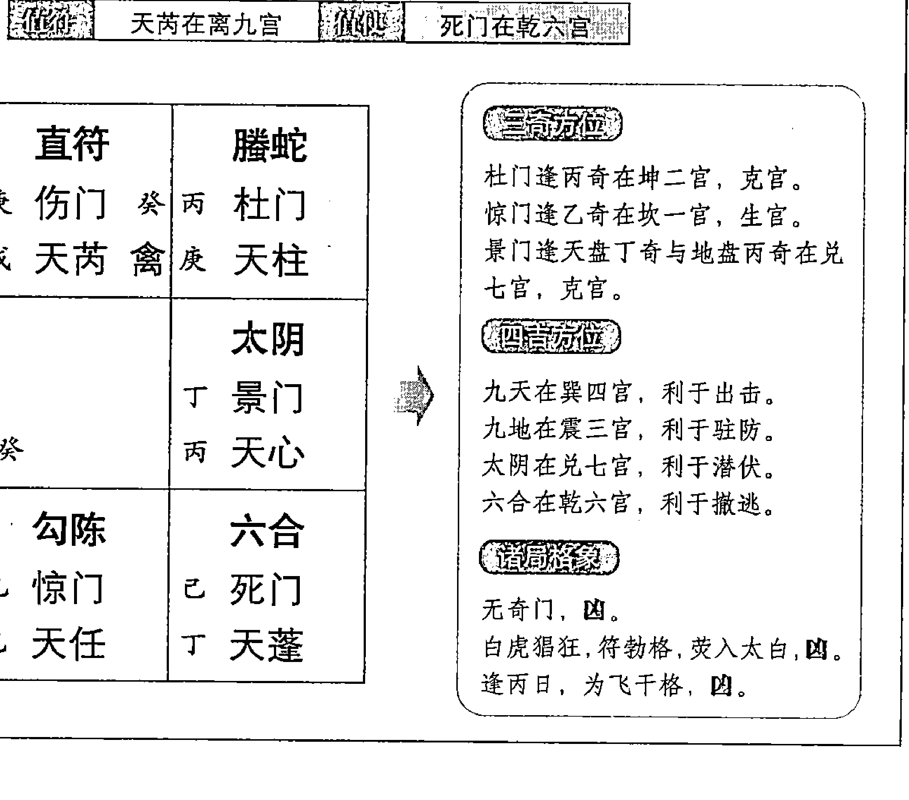

---

## 己丑时：正东与东北方向吉利

### 【原文】

己丑   芮一，死七。丑至巳阴，宿干凶。休乙艮害，杜离义，生震害。天六，地七，阴三，合四。休与月合八东北，生与星合三正东，时干巽，辛日飞干格，刑格。

### 【白话提要】

**符使宫位**:值符天芮在坎一宫，值使死门在兑七宫。丑时至巳时为五阴时。时干遇凶星宿，时干逢凶。
**三奇方位**:休门逢天盘丙奇与地盘乙奇在艮八宫，被克。杜门逢乙奇在离九宫，生宫。生门逢丁奇在震三宫，被克。
**四吉方位**:九天在乾六宫，九地在兑七宫，太阴在震三宫，六合在巽四宫。
**诸局格象**:休门合丙奇在艮八宫，东北方向吉利。生门合丁奇在震三宫，正东方向吉利。时干在巽四宫。逢辛日，为飞干格。刑格。

## 白话图解

# 阳遁九局丙辛日己丑时盘
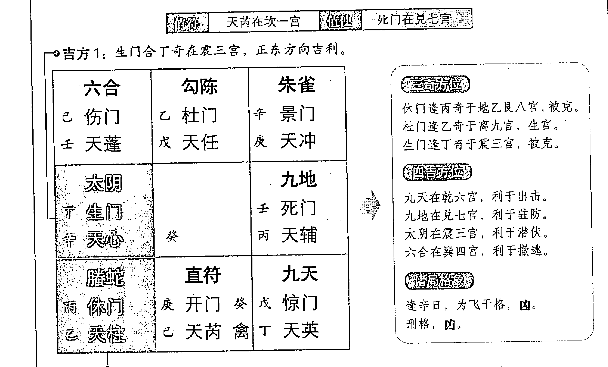

吉方 1:生门合丁奇在震三宫，正东方向吉利。
吉方 2:休门合丙奇在艮八宫，东北方向吉利。

---

# 庚寅时：无奇门可出

### 【原文】
庚寅 芮二，死八。宿干凶。伤丙兑害，死乙艮伏，杜墓丁乾害。天九，地四，阴六，合一。无奇门，仪刑，飞宫格，时干坤，符伏，门冲，击刑。

### 【白话提要】
符使宫位：值符天芮在坤二宫，值使死门在艮八宫。时干遇凶星宿，时干逢凶。
三奇方位：伤门逢双丙奇在兑七宫，被克。死门逢双乙奇在艮八宫，不相生克。杜门逢双丁奇在乾六宫，被克，丁奇入墓。
四吉方位：九天在离九宫，九地在巽四宫，太阴在乾六宫，六合在坎一宫。
诸局格象：无奇门。六仪击刑。飞宫格。时干在坤二宫。值符伏吟。八门反吟。击刑。

#### **白话图解**

阳遁九局丙辛日庚寅时盘
值符：天芮在坤二宫 值使：死门在艮八宫

| | :---: | :---: |
| :--- | :--- | :--- |
| 九地<br>庚 开门<br>壬 天辅 | 九天<br>戊 休门<br>戊 天英 | 直符<br>庚 生门<br>庚 天芮<br>癸 禽 |
| 朱雀<br>辛 惊门<br>辛 天冲 | | 螣蛇<br>丙 伤门<br>丙 天柱 |
| 勾陈<br>乙 死门<br>乙 天任 | 六合<br>己 景门<br>己 天蓬 | 太阴<br>丁 杜门<br>丁 天心 |

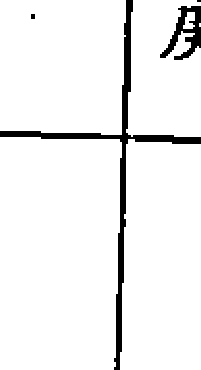

> **三奇方位**
伤门逢双丙奇在兑七宫，被克。
死门逢双乙奇在艮八宫，不相生克。
杜门逢双丁奇在乾六宫，被克。

**四吉方位**
九天在离九宫，利于出击。
九地在巽四宫，利于驻防。
太阴在乾六宫，利于潜伏。
六合在坎一宫，利于撤退。

**诸局格象**
无奇门，凶。
六仪击刑，飞宫格，凶。
值符伏吟，八门反吟，击刑，凶。

---

# ### 辛卯时：正西方向吉利

### 【原文】

### 辛卯 芮三，死九。宿吉干凶。景巽和，开丙兑伏，死离和。天八，地一，阴九，合二。开与日合七正西，时干乾，辛日伏干格。

### 【白话提要】

符使宫位：值符天芮在震三宫，值使死门在离九宫。时干遇吉星宿，时干逢凶。

三奇方位：景门逢丙奇在巽四宫，被生。开门逢天盘乙奇与地盘丙奇在兑七宫，不相生克。死门逢丁奇在离九宫，被生。

四吉方位：九天在艮八宫，九地在坎一宫，太阴在离九宫，六合在坤二宫。

诸局格象：开门合乙奇在兑七宫，正西方向吉利。时干在乾六宫。逢辛日，为伏干格。

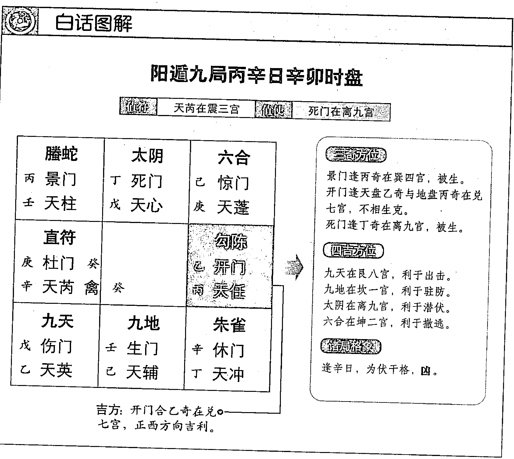

> > 第五章 阳遁九局
>
> > 
>
> 595

---

# **壬辰时：逢丙日不宜用事**

### 【原文】

**壬辰**芮四，死一。宿吉干凶，丙日不用。生离和，景丁制，伤坤制欢怡
天三，地八，阴二，合七。生与月合九正南，时干艮，辛日伏干格。

### 【白话提要】

**符使宫位**:值符天芮在巽四宫，值使死门在坎一宫。时干遇吉星宿，时干逢凶。逢丙日不宜用事。
**三奇方位**:生门逢丙奇在离九宫，被生。景门逢天盘乙奇与地盘丁奇在乾六宫，克宫。伤门逢丁奇在坤二宫，克宫，吉利。
**四吉方位**:九天在震三宫，九地在艮八宫，太阴在坤二宫，六合在兑七宫。
**诸局格象**:生门合丙奇在离九宫，正南方向吉利。时干在艮八宫。逢辛日，为伏干格。

#### 白话图解 阳遁九局丙辛日壬辰时盘

| | 直符 | | 天芮在巽四宫 | | 值使 | 死门在坎一宫 |
| :--- | :---: | :---: | :--- | :---: | :--- | :---: |
| | 庚 | | 癸 | 芮 | 生门 | 丁 |
| | 壬 | 休门 | 禽 | 戊 | 生门 | 伤门 |
| | | 天芮 | | | | 庚天心 |
| | 九天 | | | | 六合 | |
| | 戊 | 开门 | | | 己 | 杜门 |
| | 辛 | 天英 | 癸 | | 丙 | 天蓬 |
| | 九地 | | 朱雀 | | 勾陈 | |
| | 壬 | 惊门 | 辛 | 死门 | 乙 | |

吉方:生门合丙奇在离九宫，正南方向吉利。

---

# # 癸巳时：东北与西北方向吉利

### 【原文】

> 癸巳 芮五，死二。宿吉干凶。惊丙兑伏，生乙艮伏，开墓丁乾伏。天九，地四，阴六，合一。生与日合八东北，开与星合六西北，天乙与太白格，飞官格，时乾坤，符门伏，事同，天网。

### 【白话提要】

> 符使宫位：值符天芮在中五宫，寄于坤二宫，值使死门在坤二宫。时干遇吉星宿，时干逢凶。
>
> 三奇方位：惊门逢双丙奇在兑七宫，不相生克。生门逢双乙奇在艮八宫，不相生克。开门逢双丁奇在乾六宫，不相生克，丁奇入墓。
>
> 四吉方位：九天在离九宫，九地在巽四宫，太阴在乾六宫，六合在坎一宫。
>
> 诸局格象：生门合乙奇在艮八宫，东北方向吉利。开门合丁奇在乾六宫，西北方向吉利。天乙与六庚宫位成格。飞官格。时干在坤二宫。值符、九星和八门都在本宫未动，为伏吟格。天网四张。

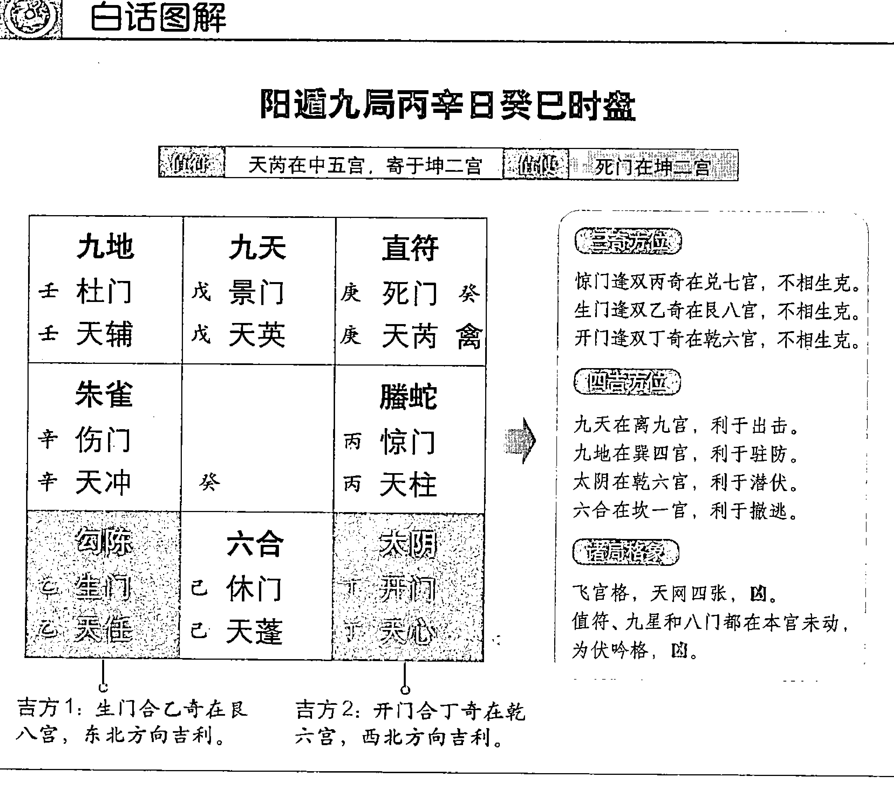

---

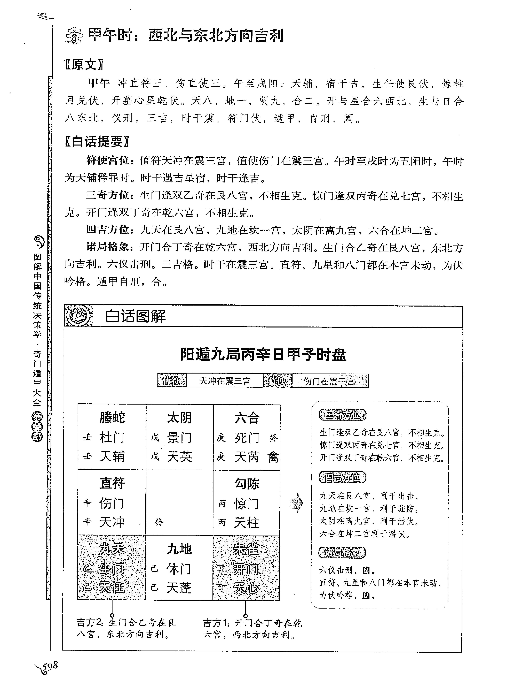

---

# 乙未时：正北方向吉利
### 【原文】
乙未冲八，伤四。宿干吉，地遁。开坎义，景坤义，死丙兑义。天一，地六，阴四，合九。开与日合一正北，得使，虎猖狂，时干坎，火入金，丙日飞干格，飞官。

### 【白话提要】
符使宫位：值符天冲在艮八宫，值符伤门在巽四宫。时干遇吉星宿，时干逢吉。成地遁格。三奇方位：开门逢乙奇在坎一宫，生宫。景门逢丙奇在坤二宫，生宫。死门逢天盘丁奇与地盘丙奇在兑七宫，生宫。
四吉方位：九天在坎一宫，九地在乾六宫，太阴在巽四宫，六合在离九宫。诸局格象：开门合乙奇在坎一宫，正北方向吉利。乙奇得使。白虎猖狂。时干在坎一宫。荧入太白。逢丙日，为飞干格。飞官格。

## 白话图解

##### 阳遁九局丙辛日乙未时盘

值宿 | 天冲在艮八宫 | 值地 | 伤门在巽四宫
|---|---|

<table>
<tr><td>太阴<br/>戊伤门<br/>壬天英</td><td>六合<br/>庚杜门禽<br/>戊天芮</td><td>勾陈<br/>丙景门<br/>庚天柱</td></tr>
<tr><td>螣蛇<br/>壬生门<br/>辛天辅</td><td><br/>癸</td><td>朱雀<br/>丁死门<br/>丙天心</td></tr>
<tr><td>直符<br/>辛休门<br/>乙天冲</td><td><br/>九夫<br/>开门<br/>天任</td><td>九地<br/>己惊门<br/>丁天蓬</td></tr>
</table>

吉方：开门合乙奇在坎一宫，正北方向吉利。

三奇方位
开门逢乙奇在坎一宫，生宫。景门逢丙奇在坤二宫，生宫。死门 逢天盘丁奇与地盘丙奇在兑七宫，生官。

四吉方位
九天在坎一宫，利于出击。九地在乾六宫，利于驻防。太阴在巽四宫，利于潜伏。六合在离九宫，利于撤逃。

诸局格象
乙奇得使。言。白虎猖狂，荧入太白，飞官格，凶。逢丙日，为飞干格，凶。

---

# 丙申时：正东与东南方向吉利

> **原文**

丙申 冲七，伤五避五。宿凶干吉。伤墓合坤制，开合震制，休合巽义。天二，地九，阴一，合八。开与月合三正东，休与星合四东南，辛日伏干格，天乙与太白格，符勃，龙反首，时干震，相佐兑，符冲，事同。

> **白话提要**

> **符使宫位:**值符天冲在兑七宫，值使伤门在中五宫，寄于坤二宫。时干遇凶星宿，时干逢吉。
>
> **三奇方位：**伤门逢乙奇在坤二宫，克宫，奇仪相合，乙奇入墓。开门逢丙奇在震三宫，克宫，奇仪相合。休门逢丁奇在巽四宫，生宫，奇仪相合。
>
> **四吉方位:** 九地在坤二宫，九地在离九宫，太阴在坎一宫，六合在艮八宫。

**诸局格象：**开门合丙奇在震三宫，正东方向吉利。休门合丁奇在巽四宫，东南方向吉利。逢辛日，为伏干格。天乙与六庚格。符勃格。青龙回首。时干在震三宫。值符得地盘丙奇相助于兑七宫。值符与九星都到了与其相冲的宫位，为反吟格。

| | **白话图解** |
| :--- | :--- |
| | **阳遁九局丙辛日丙申时盘** |
| 值使: | 天冲在兑七宫 | 值使： | 伤门在中五宫，寄于坤二宫 |
| **吉方2：**休门合丁奇在巽四宫，东南方向吉利。 | 朱雀<br>下<br>生<br>休门<br>壬<br>天心 | 九地<br>巳<br>戊<br>生门<br>天蓬 | 九天<br>乙<br>庚<br>伤门<br>天任 |
| 勾陈<br>丙<br>辛<br>开门<br>芮<br>死<br>英 | 癸<br>戊<br> | **直符**<br>辛<br>丙<br>杜门<br>天冲 |
| **吉方1：**开门合丙奇在震三宫，正东方向吉利。 | 六合<br>庚<br>乙<br>惊门<br>天芮<br>禽 | **太阴**<br>戊<br>己<br>死门<br>天英 | **螣蛇**<br>壬<br>丁<br>景门<br>天辅 |
| | | | |

> ### 三奇方位

> 伤门逢乙奇在坤二宫，克官。
> 开门逢丙奇在震三宫，克宫。
> 休门逢丁奇在巽四宫，生宫。

#### 四吉方位

> 九天在坤二宫，利于出击。
> 九地在离九宫，利于驻防。
> 太阴在坎一宫，利于潜伏。
> 六合在艮八宫，利于撤退。

#### 诸局格象

> 青龙回首，吉。
> 符勃格，凶。
> 逢辛日，为伏干格，凶。
> 值符与九星都到了与其相冲的宫位，为反吟格，凶。

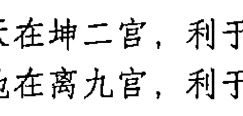

## 丁酉时：宜守户不出

**原文**

丁酉 冲六，伤六。宿干吉，辛日不用，守户。生丙兑义，惊巽制，开离合。
天七，地二，阴八，合三。生与日合七正西，开与星合九正南，伏宫格，太白与
天乙格，时干离，辛日伏干格，乙格。

**白话提要**

符使宫位：值符天冲在乾六宫，值使伤门在乾六宫。时干遇吉星宿，时干逢吉。逢
辛日不宜用事。宜守户不出。

三奇方位：生门逢天盘乙奇与地盘丙奇在兑七宫，生宫。惊门逢丙奇在巽四宫，克
宫。开门逢丁奇在离九宫，被克。

四吉方位：九天在兑七宫，九地在坤二宫，太阴在艮八宫，六合在震三宫。

诸局格象：生门合乙奇在兑七宫，正西方向吉利。开门合丁奇在离九宫，正南方
向吉利。伏宫格。六庚与天乙成格。时干在离九宫。逢辛日，为伏干格。奇格。

### 阳遁九局丙辛日丁酉时盘

| 值符 | 天冲在乾六宫 | 值使 | 伤门在乾六宫 |
| :--- | :--- | :--- | :--- |
| **吉方 2** | 开门合丁奇在离 9，正南方向吉利。 | 勾陈 | 朱雀 | 九地 | 三奇方位 |
| | | 惊门 | 开门 | 休门 |
| | | 丙壬庚巳 |
| | | 天柱 | 天心 | 天蓬 |
| **六合** | | **九天** |
| | | 庚乙 |
| | | 死门生门 |
| | | 癸戊禽酉 |
| | | 天芮天柱 |
| **太阴** | **腾蛇** | **直符** |
| | | 庚丁 |
| | | 景门杜门伤门 |
| | | 乙己天英天辅天冲 |
| **吉方 1** | 生门合乙奇在兑七宫，正西方向吉利。 |
| **四吉方位** | 九天在兑七宫，利于出击。九地在坤二宫，利于驻防。太阴在艮八宫，利于潜伏。六合在震三宫，利于撤退。 |
| **诸局格象** | 伏宫格，奇格，凶逢辛日，为伏干格，凶。 |

---

## 己亥时：西北方向吉利

**原文**

己亥 冲一，伤八。亥阴，宿吉干凶。休丁乾和，死离和，惊坤和。天六，地七，阴三，合四，休与日合六西北，雀入江，鸟跌穴，时干兑。

### 白话提要

**符使宫位**：值符天冲在坎一宫，值使伤门在艮八宫。亥时为五阴时。时干遇吉星宿，时干逢凶。

**三奇方位**：休门逢天盘乙奇与地盘丁奇在乾六宫，被生。死门逢丙奇在离九宫，被生。惊门逢丁奇在坤二宫，被生。

**四吉方位**：九天在乾六宫，九地在兑七宫，太阴在震三宫，六合在巽四宫。

**诸局格象**：休门合乙奇在乾六宫，西北方向吉利。朱雀入江。飞鸟跌穴。时干在兑七宫。

### 阳遁九局丙辛日己亥时盘

**[值符]** 天冲在坎一宫 **[值使]** 伤门在艮八宫 **六合** 癸景门 **勾陈** 丙死门 **朱雀** 丁惊门 **壬** 天芮 **禽** 戊天柱 **庚** 天心

**太阴** 戊杜门 **九地** 已开门 **辛** 天英 **丙** 天蓬 **腾蛇** 壬伤门 **直符** 辛生门 **九天** 乙休门 **天辅** 己天冲 **癸** 天任

**[三奇方位]** 休门逢天盘乙奇与地盘丁奇在乾六宫，被生。死门逢丙奇在离九宫，被生。惊门逢丁奇在坤二宫，被生。

**[四吉方位]** 九天在乾六宫，利于出击。九地在兑七宫，利于驻防。太阴在震三宫，利于潜伏。六合在巽四宫，利于撤退。

**[诸局格象]** 朱雀入江，凶。飞鸟跌穴，吉。

**吉方**：休门合乙奇在乾六宫，西北方向吉利。

> 己亥时：西北方向吉利 原文
> 
> **白话提要**

---

## 4.丁壬日十二时局

### 庚子时：正东与东北方向吉利

**原文**

庚子 冲二，伤九。子至卯阴，宿吉干凶。伤离义，开乙艮和，休震义欢怡。
天九，地四，阴六，合一。休与星合三正东，开与月合八东北，丙下有乙，时于
坎，飞符，刑格，飞官格。

### 白话提要

符使宫位：值符天冲在坤二宫，值使伤门在离九宫。子时至卯时为五阴时。时干遇吉星宿，时干逢凶。

三奇方位：伤门逢乙奇在离九宫，生官。开门逢天盘丙奇与地盘乙奇在艮八宫，被生。休门逢丁奇在震三宫，生宫，吉利。

四吉方位：九天在离九宫，九地在巽四宫，太阴在乾六宫，六合在坎一宫。

诸局格象：休门合丁奇在震三宫，正东方向吉利。开门合丙奇在艮八宫，东北方
向吉利。丙下有乙，为日月并行。时干在坎一宫。飞符。刑格。飞宫格。

### 阳遁九局丙辛日庚子时盘

| 值符 | 天冲在坤二宫 | 值使 | 伤门在离九宫 |
| :--- | :--- | :--- | :--- |
| **吉方 1** | 休门合丁奇在震三宫，正东方向吉利。 |
| **吉方 2** | 开门合丙奇在艮八宫，东北方向吉利。 |
| **诸局格象** | 日月并行，飞符，刑格，飞宫格。 |

---

### 辛丑时：正西与西北方向吉利

### 【原文】

辛丑冲三，伤一。宿吉干凶。杜乙艮制，休丙兑和，生墓丁乾义。天八，地一，阴九，合二。休与月合七正西，时干震，生与星合六西北，符伏。

### 【白话提要】

符使宫位：值符天冲在震三宫，值使伤门在坎一宫。时干遇吉星宿，时干逢凶。

三奇方位：杜门逢双乙奇在艮八宫，克宫。休门逢双丙奇在兑七宫，被生。生门逢双丁奇在乾六宫，生宫，丁奇入墓。

四吉方位：九天在艮八宫，九地在坎一宫，太阴在离九宫，六合在坤二宫。

诸局格象：休门合丙奇在兑七宫，正西方向吉利。时干在震三宫。生门合丁奇在乾六宫，西北方向吉利。值符和九星都在本宫未动，为伏吟格。

---

### 壬寅时：正东方向吉利

### 【原文】

壬寅 冲四，伤二。宿吉干凶。开震制欢怡，景墓丁乾制，死坎制。天三,
地八，阴二，合七。开与日合三正东，天乙与太白格，龙走，丁干勃，时干离,
丁日勃，事同，金入火。

### 【白话提要】

符使宫位：值符天冲在巽四宫，值使伤门在坤二宫。时干遇吉星宿，时干逢凶。
三奇方位：开门逢乙奇在震三宫，克宫，吉利。景门逢天盘丙奇与地盘丁奇在乾
六宫，克宫，丙奇入墓。死门逢丁奇在坎一宫，克官。
四吉方位：九天在震三宫，九地在艮八宫，太阴在坤二宫，六合在兑七宫。
诸局格象：开门合乙奇在震三宫，正东方向吉利。天乙与六庚格。青龙逃走。逢
丁日，为日勃格。时干在离九宫。太白入荧。

#### 阳遁九局丁壬日壬寅时盘

直符 天冲在巽四宫 值使 伤门在坤二宫

**[值符]** 天冲在巽四宫 **[值使]** 伤门在坤二宫 **六合** 癸景门 **勾陈** 丙死门 **朱雀** 丁惊门 **壬** 天芮 **禽** 戊天柱 **庚** 天心

**太阴** 戊杜门 **九地** 已开门 **辛** 天英 **丙** 天蓬 **腾蛇** 壬伤门 **直符** 辛生门 **九天** 乙休门 **天辅** 己天冲 **癸** 天任

- **吉方**：开门合乙奇在震三宫，正东方向吉利。

> - **三奇方位**:
  - 开门逢乙奇在震三宫，克官。
  - 景门逢天盘丙奇与地盘丁奇在乾六宫，克官。
  - 死门逢丁奇在坎一宫，克官。
- **四吉方位**:
  - 九天在震三宫，利于出击。
  - 九地在艮八宫，利于驻防。
  - 太阴在坤二宫，利于潜伏。
  - 六合在兑七宫，利于撤退。
- **诸局格象**:
  - 青龙逃走，太白入荧，凶。
  - 逢丁日，为日勃格，凶。

---

## 癸卯时：逢丁日不宜用事

### 【原文】

**[原文]** 癸卯冲五，伤三。宿吉干凶，丁日不用。景离伏，生乙艮伏，伤震伏。天九，地四，阴六，合一。生与月合八东北，飞宫格，天网，时干坎，三吉，门伏，飞符，刑格。

### 【白话提要】

符使宫位：值符天冲在中五宫，寄于坤二宫，值使伤门在震三宫。时干遇吉星宿，时干逢凶。逢丁日不宜用事。
三奇方位：景门逢乙奇在离九宫，不相生克。生门逢天盘丙奇与地盘乙奇在艮八宫，不相生克。伤门逢丁奇于震三宫，不相生克。
四吉方位：九天在离九宫，九地在巽四宫，太阴在乾六宫，六合在坎一宫。
诸局格象：生门合丙奇在艮八宫，东北方向吉利。飞宫格。天网四张。时干在坎一宫。三吉格。八门伏吟。飞符。刑格。

| 九天 | 九地 | 直符 |
| :---: | :---: | :---: |
| 丁伤门 辛天心 | 乙景门 戌天任 | 辛亥死门 庚天冲 |
| 朱雀 | 六合 | 腾蛇 |
| 勾陈生门己天柱 | 庚休门 癸天芮禽 | 壬惊门 丙天辅 |

**吉方**：生门合丙奇在艮八宫，东北方向吉利。

三奇方位 景门逢乙奇在离九宫，不相生克。生门逢天盘丙奇与地盘乙奇在艮八宫，不相生克。伤门逢丁奇于震三宫，不相生克。
四吉方位 九天在离九宫，利于出击。九地在巽四宫，利于驻防。太阴在乾六宫，利于潜伏。六合在坎一宫，利于撤退。
诸局格象 飞宫格，天网四张，凶。八门伏吟，飞符，刑格，凶。

---

## 甲辰时：东北与西北方向吉利

### 【原文】

甲辰 辅直符四，杜直使四。辰至申阳，天辅，宿干吉。开墓心使乾伏，生任日艮伏，惊柱月兑伏。天三，地八，阴二，合七。开与星合六西北，生与日合八东北，时干巽，符门伏，飞甲，自刑，阖。

### 【白话提要】

符使宫位：值符天辅在巽四宫，值使杜门在巽四宫。辰时至申时为五阳时，辰时为天辅释罪时。时干遇吉星宿，时干逢吉。

三奇方位：开门逢双丁奇在乾六宫，不相生克。生门逢双乙奇在艮八宫，不相生克。惊门逢双丙奇在兑七宫，不相生克。

四吉方位：九天在震三宫，九地在艮八宫，太阴在坤二宫，六合在兑七宫。

诸局格象：开门逢丁奇在乾六宫，西北方向吉利。生门合乙奇在艮八宫，东北方向吉利。时干在巽四宫。值符、九星和八门都在本宫未动，为伏吟格。飞甲自刑，合。

### 阳遁九局丁壬日甲辰时盘

| | | |
| :---: | :---: | :---: |
| **直符**<br>壬壬<br>**杜门**<br>天辅 | **螣蛇**<br>戊戊<br>**景门**<br>天英 | **太阴**<br>庚庚<br>**死门**<br>天芮<br>癸禽 |
| | | |
| **九天**<br>辛辛<br>**伤门**<br>天冲 | **六合**<br>丙丙<br>**惊门**<br>天柱 |
| | | |
| **九地**<br>乙<br>**生门**<br>庚癸 | **朱雀**<br>己己<br>**休门**<br>天蓬 | **勾陈**<br>壬壬<br>**开门**<br>癸甲 |

> 吉方 2: 生门合乙奇在艮八宫，东北方向吉利。
> 吉方 1: 开门逢丁奇在乾六宫，西北方向吉利。

---

## 乙巳时：无奇门可出

### 【原文】

乙巳辅八，杜五避五，宿干吉，杜坤制，死丁乾义，伤离义。天一，地六，阴四，合九。无奇门，伏宫格，天乙与太白格，雀入江，壬日伏干格，时干乾，丁日飞干格。

### 【白话提要】

符使宫位：值符天辅在艮八宫，值使杜门在中五宫，寄于坤二宫。时干遇吉星宿，时干逢吉。

三奇方位：杜门逢丁奇在坤二宫，克宫。死门逢天盘乙奇与地盘丁奇在乾六宫，生宫。伤门逢丙奇在离九宫，生宫。

四吉方位：九天在坎一宫，九地在乾六宫，太阴在巽四宫，六合在离九宫。

诸局格象：无奇门。伏宫格。天乙与六庚格。朱雀入江。逢壬日，为伏干格。时干在乾六宫。逢丁日，为飞干格。

## 白话图解

### 阳遁九局丁壬日乙巳时盘

**[值符]** 天辅在艮八宫 **[值使]** 杜门在中五宫，寄于坤二宫

- **三奇方位**:
  - 杜门逢丁奇在坤二宫，克官。
  - 死门逢天盘乙奇与地盘丁奇在乾六宫，生宫。
  - 伤门逢丙奇在离九宫，生官。
- **四吉方位**:
  - 九天在坎一宫，利于出击。
  - 九地在乾六宫，利于驻防。
  - 太阴在巽四宫，利于潜伏。
  - 六合在离九宫，利于撤退。
- **诸局格象**:
  - 无奇门，凶。
  - 伏宫格，朱雀入江，凶。
  - 逢丁日，为飞干格，凶。
  - 逢壬日，为伏干格，凶。

---

## 丙午时：宜守户不出

### 【原文】

丙午辅七，杜六。宿凶干吉，守户，惊震制，休离制，死乙艮伏。天二，
地九，阴一，合八。休与日合九正南，龙反首，时干艮，相佐兑，刑格，门反吟。

### 【白话提要】

符使宫位：值符天辅在兑七宫，值使杜门在乾六宫。时干遇凶星宿，时干逢吉。宜
守户不出。

三奇方位：惊门逢丁奇在震三宫，克宫。休门逢乙奇在离九宫，克宫。死门逢天
盘丙奇与地盘乙奇在艮八宫，不相生克。

四吉方位：九天在坤二宫，九地在离九宫，太阴在坎一宫，六合在艮八宫。

诸局格象：休门合乙奇在离九宫，正南方向吉利。青龙回首。时干在艮八宫。值
符得地盘丙奇相助于兑七宫。刑格。八门反吟格。

## 白话图解

#### 阳遁九局丁壬日丙午时盘

| | | |
| :---: | :---: | :---: |
| **朱雀** | **九地** | **九天**<br>己开门<br>壬天蓬 | *乙休门*<br>*戊天任* | 辛生门<br>庚天冲 |
| | **勾陈** | **直符**<br>丁惊门<br>辛天心 | | 壬伤门<br>丙天辅 |
| **六合** | **太阴** | **螣蛇**<br>丙死门<br>乙天柱 | 庚景门<br>己天芮 | 戊杜门<br>丁天英 |

---

## 丁未时：正东与东南方向吉利

### 原文

丁未 辅六，杜七。宿干吉。休合巽义欢怡，伤墓合坤制，开合震制。天七，地二，阴八，合三。开与月合三正东，休与星合四东南，时干巽，相佐乾，符冲。

### 白话提要

符使宫位：值符天辅在乾六宫，值使杜门在兑七宫。时干遇吉星宿，时干逢吉。
三奇方位：休门逢丁奇在巽四宫，生宫，吉利，奇仪相合。伤门逢乙奇在坤二宫，克宫，奇仪相合，乙奇入墓。开门逢丙奇在震三宫，克宫，奇仪相合。
四吉方位：九天在兑七宫，九地在坤二宫，太阴在艮八宫，六合在震三宫。
诸局格象：开门合丙奇在震三宫，正东方向吉利。休门合丁奇在巽四宫，东南方向吉利。时干在巽四宫。值符得地盘丁奇相助于乾六宫。值符、九星都到了与其相冲的宫位，为反吟格。

## 白话图解

#### 阳遁九局丁壬日丁未时盘

- **值符**：天辅在乾六宫
- **值使**：杜门在兑七宫

- **○吉方 2**：休门合丁奇在巽四宫，东南方向吉利。

| 勾陈 | 朱雀 | 九地 |
| :---: | :---: | :---: |
| 丁休门乙天心丙生门戊天蓬 | 己 | 乙伤门庚天任 |

- **○吉方 1**：开门合丙奇在震三宫，正东方向吉利。

#### 三奇方位

休门逢丁奇在巽四宫，生官。
伤门逢乙奇在坤二宫，克官。
开门逢丙奇在震三宫，克官。

#### 四吉方位

九天在兑七宫，利于出击。
九地在坤二宫，利于驻防。
太阴在艮八宫，利于潜伏。
六合在震三宫，利于撤退。

#### 诸局格象

值符、九星都到了与其相冲的宫位，为反吟格，凶。

> 第五章 阳遁九局

---

## 戊申时：逢壬日不宜用事

### 【原文】

戊申辅九，杜八。宿凶干吉，壬日不用。伤坎制，景震和，生墓丁乾义。
天四，地三，阴七，合六。生与月合六西北，得使，龙走，时乾坤，金入火，丁干勃。

### 【白话提要】

符使宫位：值符天辅在离九宫，值使杜门在艮八宫。时干遇凶星宿，时干逢吉。逢
壬日不宜用事。

三奇方位：伤门逢丁奇在坎一宫，克宫。景门逢乙奇在震三宫，被生。生门逢天
盘丙奇与地盘丁奇在乾六宫，生宫，丙奇入墓。

四吉方位：九天在巽四宫，九地在震三宫，太阴在兑七宫，六合在乾六宫。

诸局格象：生门合丙奇在乾六宫，西北方向吉利。丙奇得使。青龙逃走。时干在
坤二宫。太白入荧。逢丁日，为日干勃格。

## 白话图解

#### 阳遁九局丁壬日戊申时盘

**值符**天辅在离九宫 **值使**杜门在艮八宫

吉方：生门合丙奇在乾六宫，西北方向吉利。

---

## 己酉时：无奇门可出

### 【原文】

己酉辅一，杜九。酉至亥阴，宿吉干凶。杜离义。死丙兑义。伤巽伏欢怡。
天六，地七，阴三，合四。无奇门，时干坤，壬日勃。

### 【白话提要】

符使宫位：值符天辅在坎一宫，值使杜门在离九宫。酉时至亥时为五阴时。时干遇吉星宿，时干逢凶。

三奇方位：杜门逢丁奇在离九宫，生宫。死门逢天盘乙奇与地盘丙奇在兑七宫，生宫。伤门逢丙奇在巽四宫，不相生克，吉利。

四吉方位：九天在乾六宫，九地在兑七宫，太阴在震三宫，六合在巽四宫。

诸局格象：无奇门。时干在坤二宫。逢壬日，为日勃格。

## 白话图解

#### 阳遁九局丁壬日己酉时盘

**天辅**在坎一宫 **杜门**在离九宫

| | | |
| :---: | :---: | :---: |
| **六合**<br>伤门<br>壬<br>天柱 | **勾陈**<br>丁<br>杜门<br>戊<br>天心 | **朱雀**<br>己<br>景门<br>庚<br>天蓬 |
| --- | --- | --- |
| **太阴**<br>庚<br>生门<br>辛<br>天芮 | | **九地**<br>乙<br>死门<br>丙<br>天任 |
| --- | --- | --- |
| **螣蛇**<br>戊<br>休门<br>乙<br>天英 | **直符**<br>壬<br>开门<br>己<br>天辅 | **九天**<br>辛<br>惊门<br>丁<br>天冲 |

#### 三奇方位

杜门逢丁奇在离九宫，生官。
死门逢天盘乙奇与地盘丙奇在兑七宫，生宫。
伤门逢丙奇在巽四宫，不相生克。

#### 四吉方位

九天在乾六宫，利于出击。
九地在兑七宫，利于驻防。
太阴在震三宫，利于潜伏。
六合在巽四宫，利于撤退。

#### 诸局格象

无奇门，凶。
逢壬日，为日勃格，凶。

---

## 庚戌时：无奇门可出

### 【原文】

庚戌辅二，杜一。宿千凶。景乙艮义，惊巽制欢怡，杜坎和。天九，地四，阴六，合一。无奇门，蛇矫，丁日伏干格，时干乾，飞符，壬日飞干格。

### 【白话提要】

符使宫位：值符天辅在坤二宫，值使杜门在坎一宫。时干遇凶星宿，时干逢凶。

三奇方位：景门逢天盘丁奇与地盘乙奇在艮八宫，生官。惊门逢乙奇在巽四宫，克官，吉利。杜门逢丙奇在坎一宫，被生。

四吉方位：九天在离九宫，九地在巽四宫，太阴在乾六宫，六合在坎一宫。

诸局格象：无奇门。螣蛇夭矫。逢丁日，为伏干格。时干在乾六宫。值符飞官格。逢壬日，为飞干格。

## # 辛亥时：无奇门可出

**【原文】**  
辛亥辅三，杜二。宿干凶。景丙兑制，惊坎义，杜坤制。天八，地二，阴九，合二。无奇门，虎猖狂，天乙与太白格，火入金，飞宫格，时干艮。

**【白话提要】**  
符使宫位：值符天辅在震三宫，值使杜门在坤二宫。时干遇凶星宿，时干逢凶。  

三奇方位：景门逢天盘丁奇与地盘丙奇在兑七宫，克宫。惊门逢乙奇在坎一宫，被生。杜门逢丙奇在坤二宫，克宫。  

四吉方位：九天在艮八宫，九地在坎一宫，太阴在离九宫，六合在坤二宫。  

诸局格象：无奇门。白虎猖狂。天乙与六庚格。荧入太白。飞宫格。时干在艮八宫。

---

## # 5. 戊癸日十二时局

### > 壬子时：正西与西北方向吉利  
> **原文**  
> 壬子辅四，杜三。子至丑阴，宿吉干凶。休墓丁乾和，伤乙艮制，开丙兑伏。天三，地八，阴二，合七。开与月合七正西，休与星合六西北，仪刑，时干巽，符伏，三吉。  
> 
> **白话提要**  
> 符使宫位：值符天辅在巽四宫，值使杜门在震三宫。子时至丑时为五阴时。时干遇吉星宿，时干逢凶。  
> 三奇方位：休门逢双丁奇在乾六宫，被生，丁奇入墓。伤门逢双乙奇在艮八宫，克宫。开门逢双丙奇在兑七宫，不相生克。  
> 四吉方位：九天在震三宫，九地在艮八宫，太阴在坤二宫，六合在兑七宫。  
> 诸局格象：开门合丙奇在兑七宫，正西方向吉利。休门合丁奇在乾六宫，西北方向吉利。

#### - 吉方 2：开门合丙奇在兑七宫，正西方向吉利。


#### - 吉方 2：休门合丁奇在乾六宫，西北方向吉利。


### > 癸丑时：正北与东北方向吉利  
**【原文】**  
癸丑 辅五，杜四。宿吉干凶。生乙艮伏，杜巽伏欢怡，休坎伏。天九，地四，阴六，合一。休与月合一正北，生与星合八东北，天乙与太白格，飞官格，蛇矫，时干乾，门伏，飞符，天网。

**【白话提要】**  
符使宫位：值符天辅在中五宫，寄于坤二宫，值使杜门在巽四宫。时干遇吉星宿，时干逢凶。  

三奇方位：生门逢天盘丁奇与地盘乙奇在艮八宫，不相生克。杜门逢乙奇在巽四宫，不相生克，吉利。休门逢丙奇在坎一宫，不相生克。  

四吉方位：九天在离九宫，九地在巽四宫，太阴在乾六宫，六合在坎一宫。  

诸局格象：休门合丙奇在坎一宫，正北方向吉利。生门合丁奇在艮八宫，东北方向吉利。飞官格。腾蛇天矫。时干在乾六宫。八门伏吟。飞符。天网四张。

---

## # 甲寅时：逢戊日不宜用事

**【原文】**  
甲寅 禽直符五，死直使五避五。宿千吉。寅至午阳，戊日不用，天辅。开墓心使乾伏，生任日艮伏。惊柱月兑伏。天九，地四，阴六，合一。开与星合六西北，生与日合八东北，天乙与太白格，时干坤，符门伏，地甲，事同，阖。

**【白话提要】**  
符使宫位：值符天禽在中五宫，寄于坤二宫，值使死门在中五宫，寄于坤二宫。时干遇吉星宿，时干逢吉。寅时至午时为五阳时。逢戊日不宜用事。寅时为天辅释罪时。  

三奇方位：开门逢双丁奇在乾六宫，不相生克。生门逢双乙奇在艮八宫，不相生克。惊门逢双丙奇在兑七宫，不相生克。  

四吉方位：九天在离九宫，九地在巽四宫，太阴在乾六宫，六合在坎一宫。  

诸局格象：开门合丁奇在乾六宫，西北方向吉利。生门合乙奇在艮八宫，东北方向吉利。时干在坤二宫。天乙与六庚成格。值符、九星和八门都在本宫未动，为伏吟格。地甲合。

### 白话图解  

**阳遁九局戊癸日甲寅时盘**

| | **九地**<br>天辅<br>杜门<br>壬<br>朱雀<br>伤门<br>辛<br>天冲<br>辛<br>勾陈<br>乙<br>生门<br>乙<br>天任<br>天芮<br>庚<br>天芮<br>庚 | **六合**<br>休门<br>已<br>天蓬<br>己<br>大阴<br>开门<br>天心<br>直符<br>死门<br>癸<br>天芮<br>庚 |
|:---:|:---|:---|
| **腾蛇** | 惊门<br>丙<br>天柱<br>丙 | |

- - 九方：
    - 九天在离九宫，利于出击。
    - 九地在巽四宫，利于驻防。
    - 太阴在乾六宫，利于潜伏。
    - 六合在坎一宫，利于撤逃。
    
- - 诸局格象：
    - 值符、九星和八门都在本官未动，为伏吟格，凶。
    
- **吉方 2**：生门合乙奇在艮八宫，东北方向吉利。
- **吉方 1**：开门合丁奇在乾六宫，西北方向吉利。

---

## # 乙卯时：宜守户不出

**【原文】**  
乙卯禽八，死六。宿干吉，守户。生合巽害，杜墓坤制欢怡，休合震义。  
天一，地六，阴四，合九，生与星合四东南，时干坤，休与月合三正东，符冲。

**【白话提要】**  
符使宫位：值符天禽在艮八宫，值使死门在乾六宫。时干遇吉星宿，时干逢吉。宜守户不出。  

三奇方位：生门逢丁奇在巽四宫，被克，奇仪相合。杜门逢乙奇在坤二宫，克宫，吉利，乙奇入墓。休门逢丙奇在震三宫，生宫。  

四吉方位：九天在坎一宫，九地在乾六宫，太阴在巽四宫，六合在离九宫。  

诸局格象：生门合丁奇在巽四宫，东南方向吉利。时干在坤二宫。休门合丙奇在震三宫，正东方向吉利。值符和九星都到了与其相冲的宫位，为反吟格。

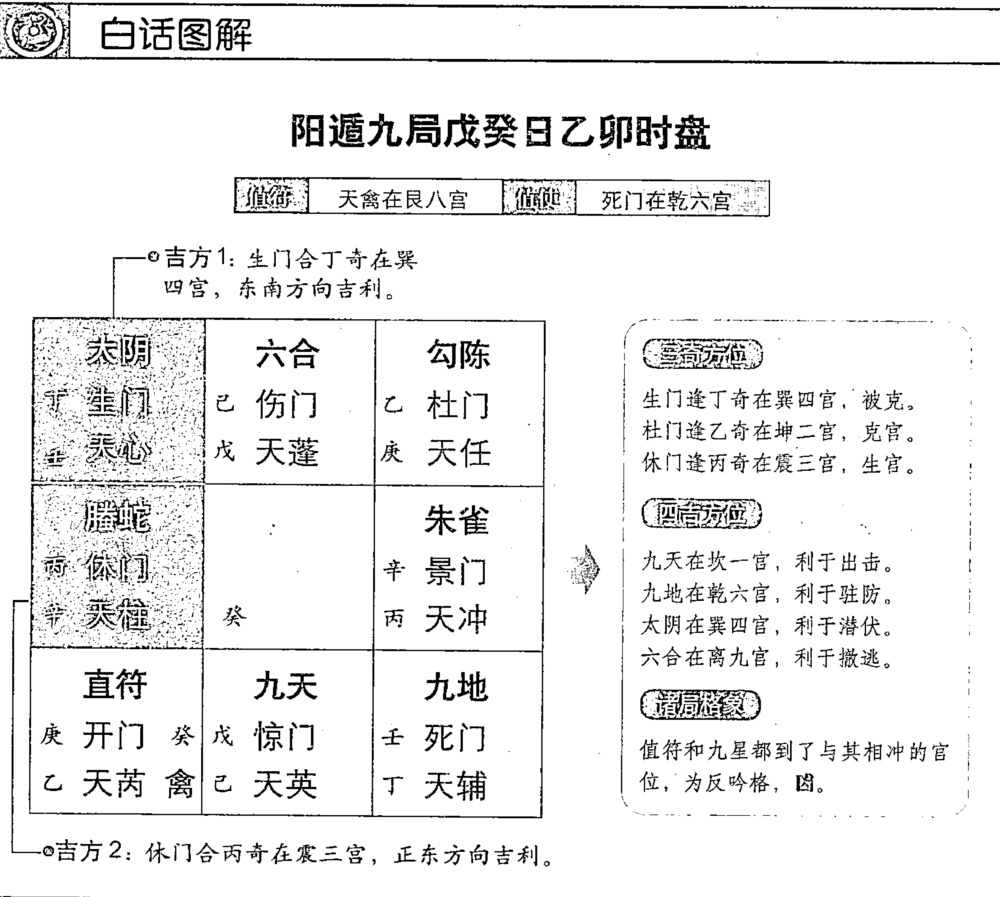

---

## # 丙辰时：正东与正北方向吉利

### 【原文】  
丙辰 禽七，死七。宿凶干吉。开坎义，生震害，惊墓丁乾伏。天二，地九，阴二，合八。生与日合三正东，开与星合一正北，龙走，时干乾，相佐兑，金入火，戊日飞干格。

### 【白话提要】  
**符使宫位：**值符天禽在兑七宫，值使死门在兑七宫。时干遇凶星宿，时干逢吉。  

**三奇方位：**开门逢丁奇在坎一宫，生官。生门逢乙奇在震三宫，被克。惊门逢天盘丙奇与地盘丁奇在乾六宫，不相生克，丙奇入墓。  

**四吉方位：**九天在坤二宫，九地在离九宫，太阴在坎一宫，六合在艮八宫。  

**诸局格象：**生门合乙奇在震三宫，正东方向吉利。开门合丁奇在坎一宫，正北方向吉利。青龙逃走。时干在乾六宫。值符得地盘丙奇相助于兑七宫。太白入荧。逢戊日，为飞干格。

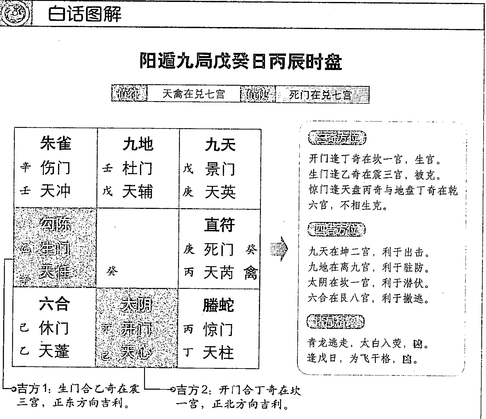

---

## # 丁巳时：东南方向吉利

### ### 【原文】  
丁巳 禽六，死八。宿干吉死。乙艮伏，开巽制，景坎害。天七，地二，阴八，合三。开与日合四东南，门反吟，蛇矫，时干艮，相佐乾，击刑。

### ### 【白话提要】  
符使宫位：值符天禽在乾六宫，值使死门在艮八宫。时干遇吉星宿，时干逢吉。  

三奇方位：死门逢天盘丁奇与地盘乙奇在艮八宫，不相生克。开门逢乙奇在巽四宫，克宫。景门逢丙奇在坎一宫，被克。  

四吉方位：九天在兑七宫，九地在坤二宫，太阴在艮八宫，六合在震三宫。  

诸局格象：开门合乙奇在巽四宫，东南方向吉利。八门反吟。螣蛇夭矫。时干在艮八宫。值符得地盘丁奇相助于乾六宫。击刑。

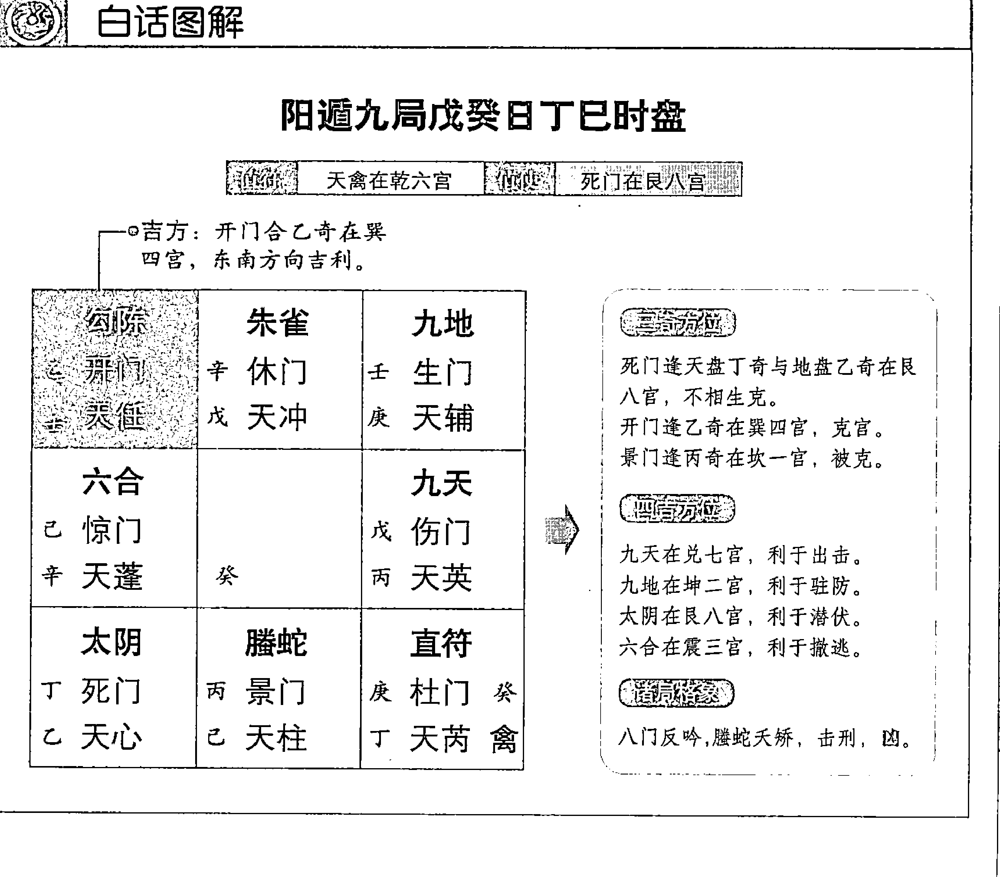

---

第五章 阳遁九局

## # 戊午时：正西与正北方向吉利

### 【原文】  
戊午禽九，死九。宿凶干吉。开丙兑伏，生坎制，惊坤和欢怡。天四，地三，阴七，合六。开与星合七正西，丁下有丙，生与日合一正北，虎猖狂，鸟跌穴，符勃，戊日伏干格，时干巽，火入金，癸日勃，飞宫格。

### 【白话提要】  
符使宫位：值符天禽在离九宫，值使死门在离九宫。时干遇凶星宿，时干逢吉。  

三奇方位：开门逢天盘丁奇与地盘丙奇在兑七宫，不相生克。生门逢乙奇在坎一宫，克宫。惊门逢丙奇在坤二宫，被生，吉利。  

四吉方位：九天在巽四宫，九地在震三宫，太阴在兑七宫，六合在乾六宫。  

诸局格象：开门合丁奇在兑七宫，正西方向吉利。丁下有丙，为星随月转。生门合乙奇在坎一宫，正北方向吉利。白虎猖狂。飞鸟跌穴。符勃。逢戊日，为伏干格。时干在巽四宫。兇入太白。逢癸日，为日勃格。飞宫格。

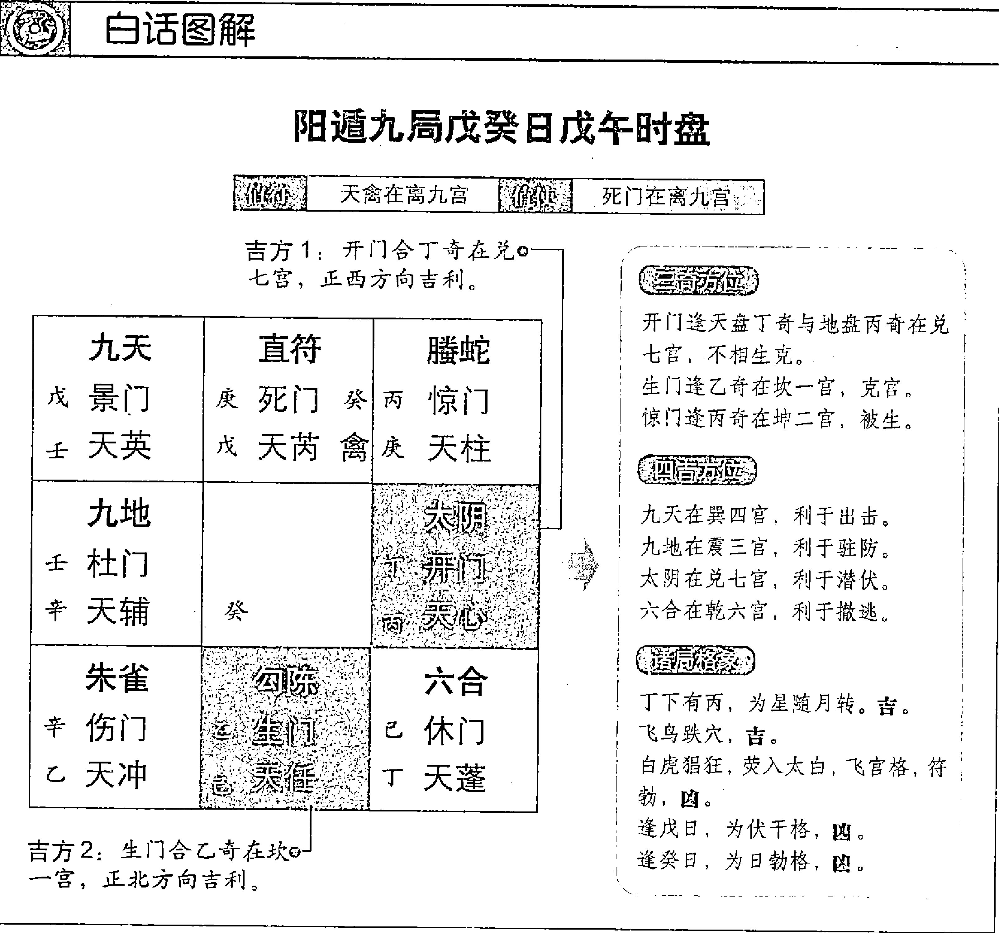

---

## # 己未时：逢癸日不宜用事

### ## 【原文】  
己未禽一，死一。未至亥阴，宿吉干凶，癸日不用。开震制，生离和，惊乙艮和。天六，地七，阴三，合四。开与星合三正东，时干巽，生与日合九正南，刑格。

### ## 【白话提要】  
符使宫位：值符天禽在坎一宫，值使死门在坎一宫。未时至亥时为五阴时。时干遇吉星宿，时干逢凶。逢癸日不宜用事。  

三奇方位：开门逢丁奇在震三宫，克宫。生门逢乙奇在离九宫，被生。惊门逢天盘丙奇与地盘乙奇在艮八宫，被生。  

四吉方位：九天在乾六宫，九地在兑七宫，太阴在震三宫，六合在巽四宫。  

诸局格象：开门合丁奇在震三宫，正东方向吉利。时干在巽四宫。生门合乙奇在离九宫，正南方向吉利。刑格。

### 白话图解  
阳遁九局戊癸日己未时盘。  

吉方 2：生门合乙奇在离九宫，正南方向吉利。

| | 勾陈 | 朱雀 | | | | | |
|:---|:---|:---|:---|:---|:---|:---|:---|
| | 己休门 | 生门 | 辛 | 伤门 | 辛 | 庚 | 天冲 |

| | 乙 | 生门 | 辛 | 伤门 | 辛 | 庚 | 天冲 |
|:---|:---|:---|:---|:---|:---|:---|:---|
| | 壬天蓬 | 天任 | 成 | 天任 | 成 | 天冲 | 癸 |
| | 大阴 | | | | | | |
| 下开门 | | | | | | | 九地 |
| 天心 | | | | | | | 壬杜门 |
| | 癸 | | | | 丙癸丙 | | 天辅 |
| | | | | | | 戊 | |

| | | |
|:---|:---|:---|
| | 直符 | 九天 |
| | 庚死门 | 戊景门 |
| | 已天芮禽 | 丁天英 |
| | | |

| |
|:---|
| 丙惊门 |
| 乙天柱 |
| |

- 三奇方位  
  - 开门逢丁奇在震三宫，克宫。生门逢乙奇在离九宫，被生。惊门逢天盘丙奇与地盘乙奇在艮八宫，被生。
  
- 四吉方位  
  - 九天在乾六宫，利于出击。
  - 九地在兑七宫，利于驻防。
  - 太阴在震三宫，利于潜伏;
  - 六合在巽四宫，利于撒逃。
  
- 诸局格象  
  - 刑格，凶。

- 吉方 1: 开门合丁奇在震三宫。正东方向吉利。

# 庚申时：东北与西北方向吉利

**原文**

庚申 禽二，死二。宿干凶。开幕丁乾伏，生乙艮伏，惊丙兑伏。天九，地四，阴六，合一。生与日合八东北，开与星合六西北，时乾坤，符门伏，事同。

### 【白话提要】

符使宫位：值符天禽在坤二宫，值使死门在坤二宫。时干遇凶星宿，时干逢凶。

三奇方位：开门逢双丁奇在乾六宫，不相生克，丁奇入墓。生门逢双乙奇在艮八宫，不相生克。惊门逢双丙奇在兑七宫，不相生克。

四吉方位：九天在离九宫，九地在巽四宫，太阴在乾六宫，六合在坎一宫。

诸局格象：生门合乙奇在艮八宫，东北方向吉利。开门合丁奇在乾六宫，西北方向吉利。时干在坤二宫。值符、九星和八门都在本宫未动，为伏吟格。

| | | |
| :--- | :--- | :--- |
| | | |
| 三奇方位 | | |
| 开门逢双丁奇在乾六宫，不相生克。生门逢双乙奇在艮八宫，不相生克。惊门逢双丙奇在兑七宫，不相生克。 | |
| | | 四吉方位 |
| 九天在离九宫，利于出击。九地在巽四宫，利于驻防。太阴在乾六宫，利于潜伏。六合在坎一宫，利于撤退。 |
| | | 诸局格象 |
| 值符、九星和八门都在本宫未动，为伏吟格，凶。 | |
| | 阳遁九局戊癸日庚申时盘 |
| | | 值符 | 天禽在坤二宫 | 值使 | 死门在坤二宫 |
| 直符 | | | 九天 | 直符 | | | 天禽在坤二宫 | 值使 | 死门在坤二宫 |
| | | | 九地 | | | | | | | | |
| 壬 | 杜门 | 戊 | 景门 | 庚 | 死门 | 癸 | 死门 | 癸 | 九地 | 九地 | 九天 | 直符 | 天禽在坤二宫 | 值使 | 死门在坤二宫 |
| 壬 | 天辅 | 戌 | 天英 | 庚 | 天芮 | 禽 | 死门 | 癸 | 死门 | | | | | | | | | | | | | | | | | | | | | | | | | | | | | | | | |
| | | | | | | | | | | | | | | | | | | | | | | | | | | | | | | | | | | | | | | | | | | | | | | | | | | | | | | | | | | | | | | | | | | |
| 朱 | 伤门 | 丙 | 惊门 | 丙 | 天柱 | 丙 | | | | | | | | | | | | | | | | | | | | | | | | | | | | | | | | | | | | | | | | | | | | | | | | | | | | | | | | | | | | | | | | | | | | | | | | | | | | | | | | | | | | | | | | | | | | | | | | | | | | | | | | | | | | | | | | | | | | | | | | | | | | | | | | | | | | | | | | | | | | | | |
| 辛 | 天冲 | 癸 | 癸 | 丙 | 天柱 | 丙 | | | | | | | | | | | | | | | | | | | | | | | | | | | | | | | | | | | | | | | | | | | | | | | | | | | | | | | | | | | | | | | | | | | | | | | | | | | | | | | | | | | | | | | | | | | | | | | | | | | | | | | | | | | | | | | | | | | | |
| 辛 | 天冲 | 癸 | 庚 | 丙 | 癸 | 癸 | | | | | | | | | | | | | | | | | | | | | | | | | | | | | | | | | | | | | | | | | | | | | | | | | | | | | | | | | | | | | | | | | | | | | | | | | | | | | | | | | | | | | | | | | | | | | | | | | | | | | | | | | | | | | | | |
| 勾陈 | 己 | 六合 | 己 | 太阴 | 开<br>丙 | 开门 | 太<br>丙 | | | | | | | | | | | | | | | | | | | | | | | | | | | | | | | | | | | | | | | | | | | | | | | | | | | | | | | | | | | | | | | | | | | | | | | | | | | | | | | | | | | |
| | | | | | | | | | | | | | | | | | | | | | | | | | | | | | | | | | | | | | | | | | | | | | | | | | | | | |## 辛酉时：正南与正西方向吉利

**原文**

辛酉禽三，死三。宿吉干凶。开离害，生丙兑义，惊巽制。天八，地一，阴九，合二。开与星合九正南，生与日合七正西，乙下有丙，戊干勃，时干乾，三吉，仪刑，雀入江。

**白话提要**

符使宫位：值符天禽在震三宫，值使死门在震三宫。时干遇吉星宿，时干逢凶。三奇方位：开门逢丁奇在离九宫，克官。生门逢天盘乙奇与地盘丙奇在兑七宫，生宫。惊门逢丙奇在巽四宫，克宫。

四吉方位：九天在艮八宫，九地在坎一宫，太阴在离九宫，六合在坤二宫。

诸局格象：开门合丁奇在离九宫，正南方向吉利。生门合乙奇在兑七宫，正西方向吉利。乙下有丙，为奇仪顺遂。逢戊日，为日干勃格。时干在乾六宫。三吉格。六仪击刑。朱雀入江。

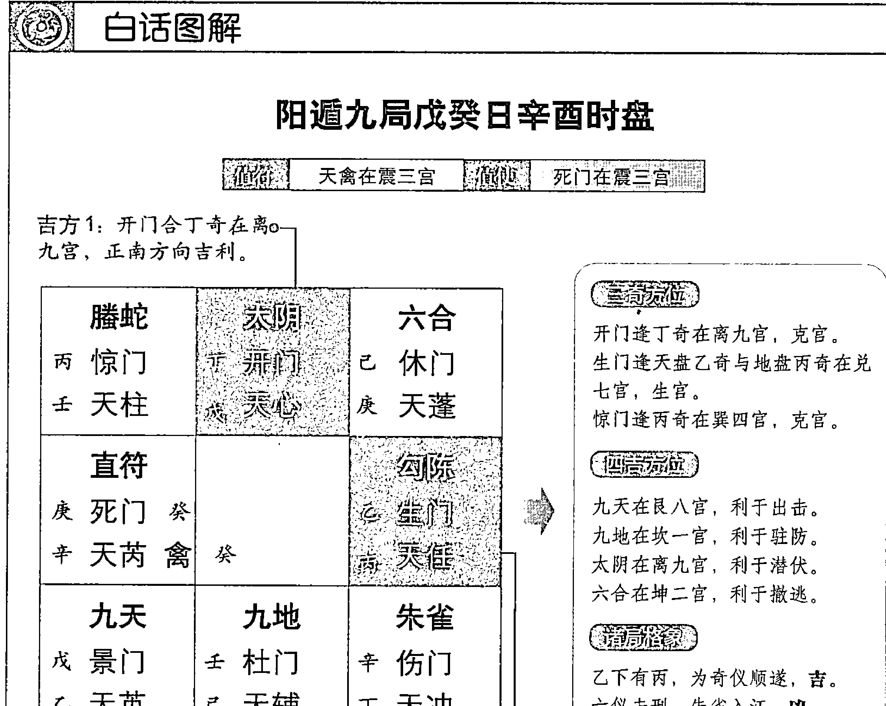

**吉方 2**:生门合乙奇在兑七宫，正西方向吉利。

# 壬戌时：西北与西南方向吉利

## **原文**

壬戌禽四，死四。宿吉干凶。开坤和欢怡，生丁乾义，惊离害。天三，地八，阴二，合七。生与日合六西北，开与星合二西南，仪刑，雀入江，时干艮，戊日勃。

## **白话提要**

符使宫位：值符天禽在巽四宫，值使死门在巽四宫。时干遇吉星宿，时干逢凶。三奇方位：开门逢丁奇在坤二宫，被生，吉利。生门逢天盘乙奇与地盘丁奇在乾六宫，生宫。惊门逢丙奇在离九宫，被克。

四吉方位：九天在震三宫，九地在艮八宫，太阴在坤二宫，六合在兑七宫。

诸局格象：生门合乙奇在乾六宫，西北方向吉利。开门合丁奇在坤二宫，西南方向吉利。六仪击刑。朱雀入江。时干在艮八宫。逢戊日，为日勃格。

| | | |
| --- | --- | --- |
| **直符** | **螣蛇** | **太阴** |
| 庚<br>死门<br>癸<br>丙<br>惊门<br>戊<br>天芮<br>禽<br>天柱 | 九天<br>戊<br>景门<br>辛<br>天英 | 六合<br>己<br>休门<br>丙<br>天蓬 |
| **九地** | **朱雀** | **勾陈** |
| 壬<br>杜门<br>乙<br>天辅 | 辛<br>伤门<br>已<br>天冲 | 乙<br>生门<br>甲<br>天任 |

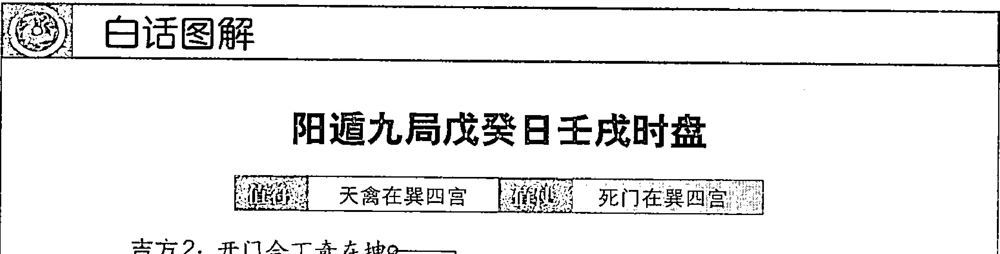

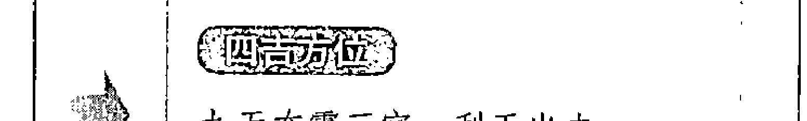

白话图解阳遁九局癸日壬戌时盘

值符天禽在巽四宫值使死门在巽四宫

吉方 2:开门合丁奇在坤二宫，西南方向吉利。

| 奎 | 方位 |
| --- |
| 开门逢丁奇在坤二官，被生。生门逢天盘乙奇与地盘丁奇在乾六官，生官。<br>惊门丙奇在离九宫，被克。四吉方位<br>九天在震三宫，利于出击。九地在艮八宫，利于驻防。太阴在坤二宫，利于潜伏。六合在兑七官，利于撤逃。
诸局格象<br>六仪击刑，朱雀入江，凶。逢戊日，为日勃格，凶。

吉方 1:生门合乙奇在乾六宫，西北方向吉利。

# 癸亥时：东北与西北方向吉利

### 【原文】

**癸亥**禽五，死五避五。宿凶干吉。开墓丁乾伏，生乙艮伏，惊丙兑伏。天九，地四，阴六，合一。生与日合八东北，开与星合六西北，天乙与太白格，天网，飞干格，时干坤，符门伏，癸日伏干格。

### 【白话提要】

符使宫位：值符天禽在中五宫，寄于坤二宫，值使死门在中五宫，寄于坤二宫。时干遇凶星宿，时干逢吉。

三奇方位：开门逢双丁奇在乾六宫，不相生克。生门逢双乙奇在艮八宫，不相生克。惊门逢双丙奇在兑七宫，不相生克。

四吉方位：九天在离九宫，九地在巽四宫，太阴在乾六宫，六合在坎一宫。

诸局格象：生门合乙奇在艮八宫，东北方向吉利。开门合丁奇在乾六宫，西北方向吉利。天乙与六庚格。天网四张。飞干格。时干在坤二宫。值符、九星和八门都在本宫未动，为伏吟格。逢癸日，为伏干格。

## 白话图解

### 阳遁九局戊癸日癸亥时盘

值符：天禽在中五宫，寄于坤二宫

值使：死门在中五宫，寄于坤二宫

| 九地 | 九天 | 直符 |
| --- | --- | --- |
| 杜门 | 景门 | 死门 |
| 天辅 | 天英 | 天芮 |
| **朱雀** |  | **螣蛇** |
| 伤门 | 癸 | 惊门 |
| 天冲 | 丙 | 天柱 |
| 勾陈 | 六合 | **太阴** |
| **生门** | 休门 | 开门 |
| 天任 | 天蓬 | 天心 |

注：

- **吉方 1**:生门合乙奇在艮八宫，东北方向吉利。
- **吉方 2**:开门合丁奇在乾六宫，西北方向吉利。

> **三奇方位**

开门逢双丁奇在乾六宫，不相生克。
生门逢双乙奇在艮八宫，不相生克。
惊门逢双丙奇在兑七宫，不相生克。

**四吉方位**

九天在离九宫，利于出击。
九地在巽四宫，利于驻防。
太阴在乾六宫，利于潜伏。
六合在坎一宫，利于撤退。

**诸局格象**

天网四张，飞干格，凶。
值符、九星和八门都在本官未动，为伏吟格，凶。
逢癸日，为伏干格，凶。


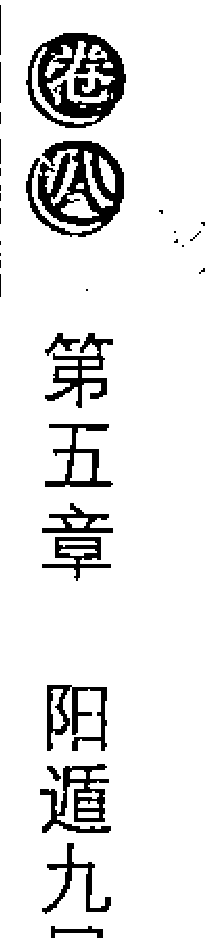