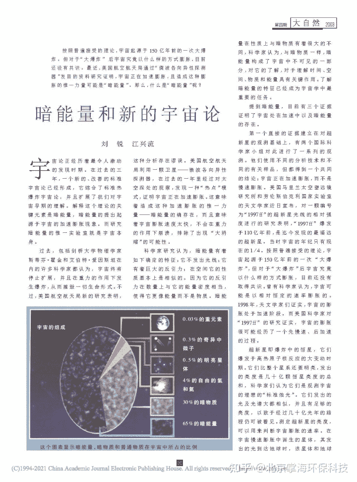
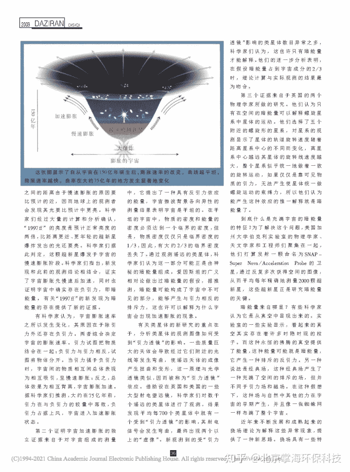
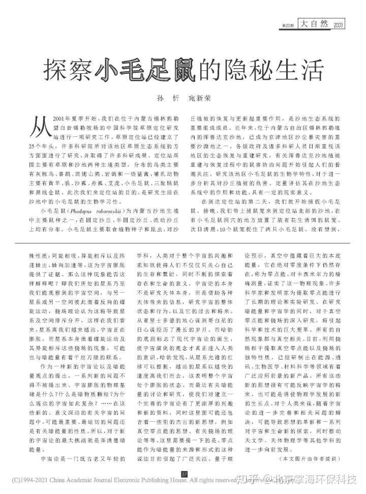

<!--yml
category: 未分类
date: 2022-11-09 19:19:30
-->

# 掌海科技科普文摘（九）——暗能量和新的宇宙论 - 知乎

> 来源：[https://zhuanlan.zhihu.com/p/360952075](https://zhuanlan.zhihu.com/p/360952075)

**……对于真空零点能和挠场的深入研究， 将引起科学和技术的巨大变革……**

**本文摘自：**《大自然》2008年第4期

**作者：**刘锐、江兴流

**下载网址：**

