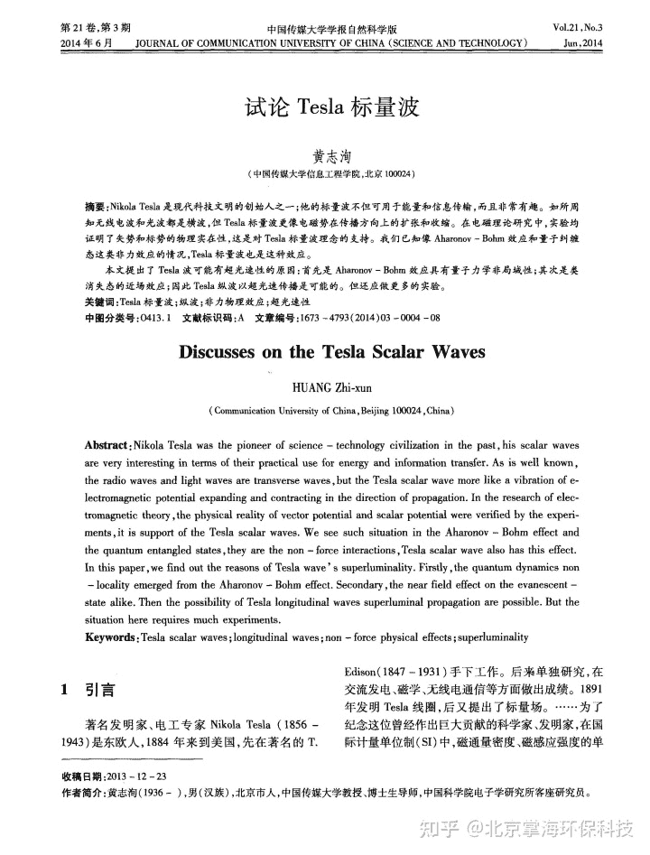
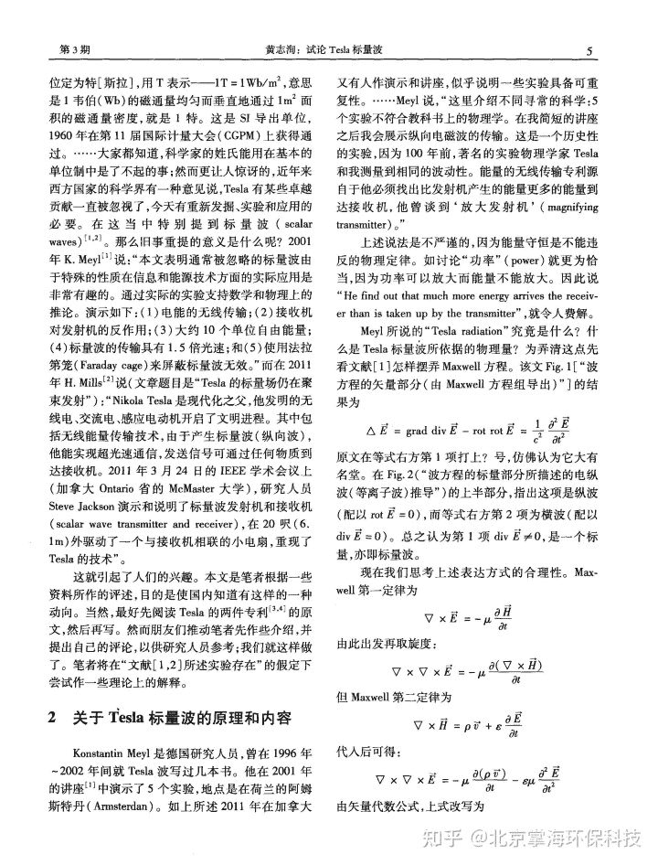
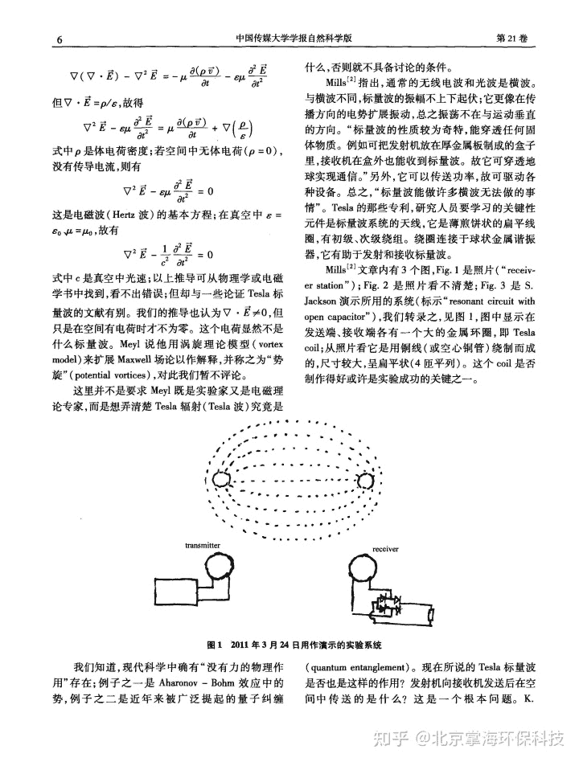
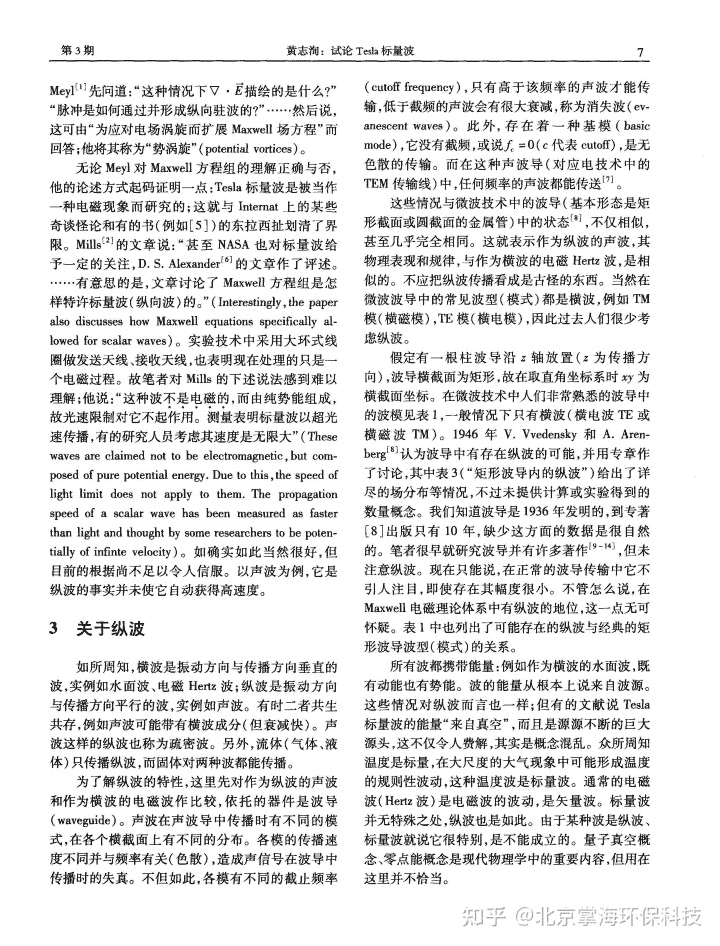
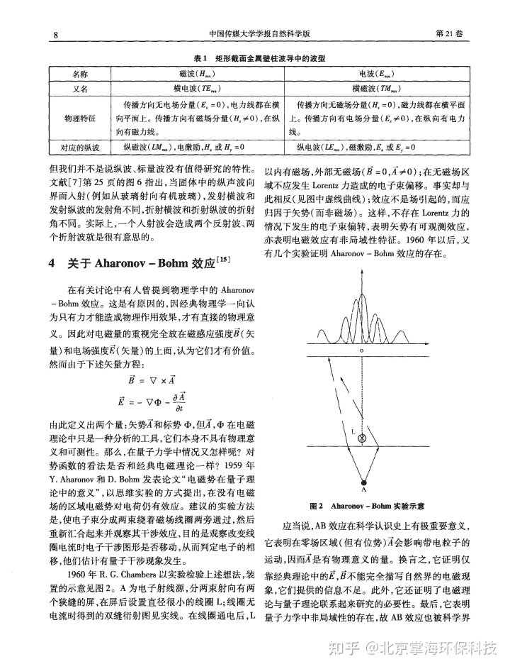
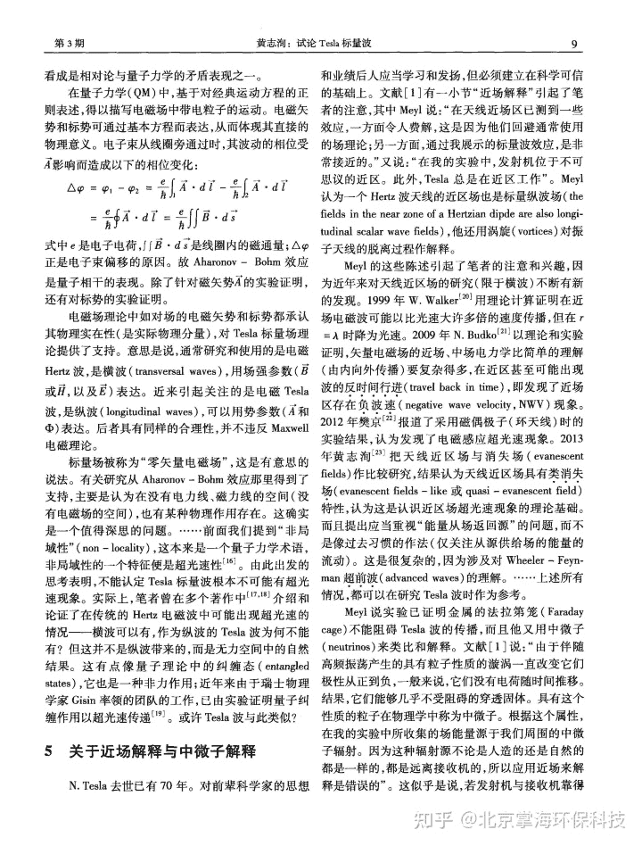
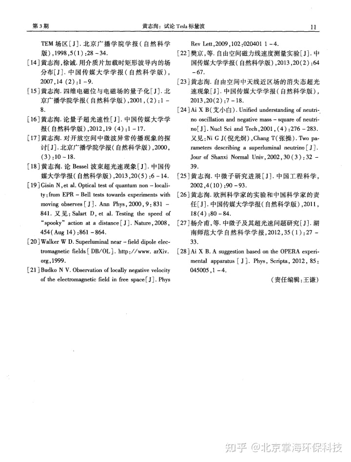

<!--yml
category: 未分类
date: 2022-11-09 19:43:17
-->

# 掌海科技科普文摘（八）——试论Tesla标量波 - 知乎

> 来源：[https://zhuanlan.zhihu.com/p/357824753](https://zhuanlan.zhihu.com/p/357824753)

**转载来源：中国传媒大学学报自然科学版，第21卷，第3期，2014年6月**

**摘要：**NikolaTesla是现代科技文明的创始人之一；他的标量波不但可用于能量和信息传输，而且非常有趣。如所周知无线电波和光波都是横波，但Tesla标量波更像电磁势在传播方向上的扩张和收缩。在电磁理论研究中，实验均证明了矢势和标势的物理实在性，这是对Tesla标量波理念的支持。我们已知像Aharonov—Bohm效应和量子纠缠态这类非力效应的情况，Tesla标量波也是这种效应。

**本文提出了Tesla波可能有超光速性的原因：首先是Aharonov—Bohm效应具有量子力学非局域性；其次是类消失态的近场效应；因此Tesla纵波以超光速传播是可能的。但还应做更多的实验。**

