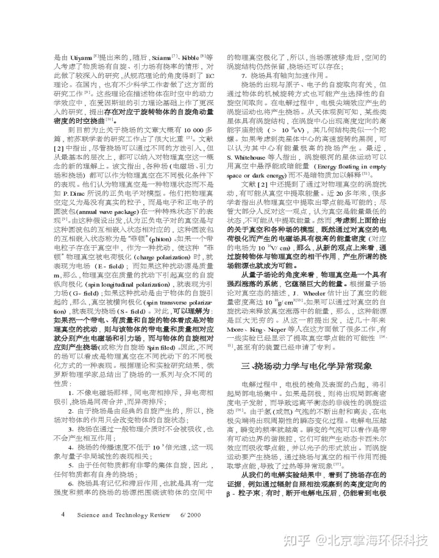
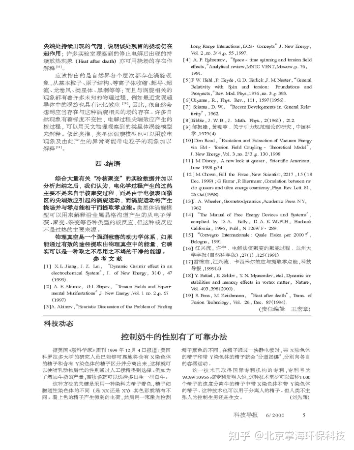

<!--yml
category: 未分类
date: 2022-11-09 19:22:40
-->

# 掌海科技科普文摘（六）—电化学异常现象与挠场理论 - 知乎

> 来源：[https://zhuanlan.zhihu.com/p/356653827](https://zhuanlan.zhihu.com/p/356653827)

**掌海科技科普文摘（六）—电化学异常现象与挠场理论**

**作者：**北京航空航天大学——雷锦志、江兴流、张建刚、陈昌晔、韩丽君；中科院高能物理所——康文。

**……通过旋转物体与物理真空的相干作用, 产生所谓的挠场能源也成为可能……物理真空是一个具有强烈涨落的系统，它蕴涵巨大的能量如果能通过有效的途径提取出物理真空中的能量，它确实可以是一种取之不尽用之不竭的干净的能源……**

