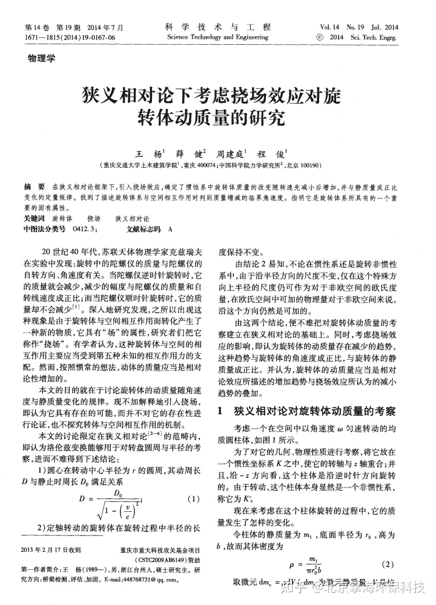
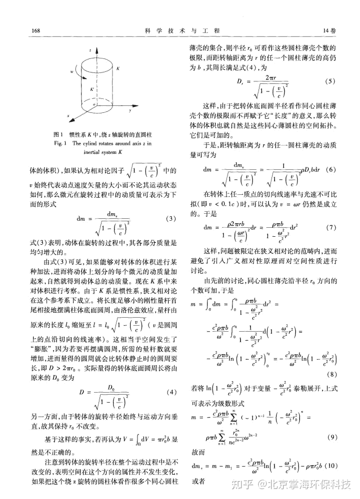
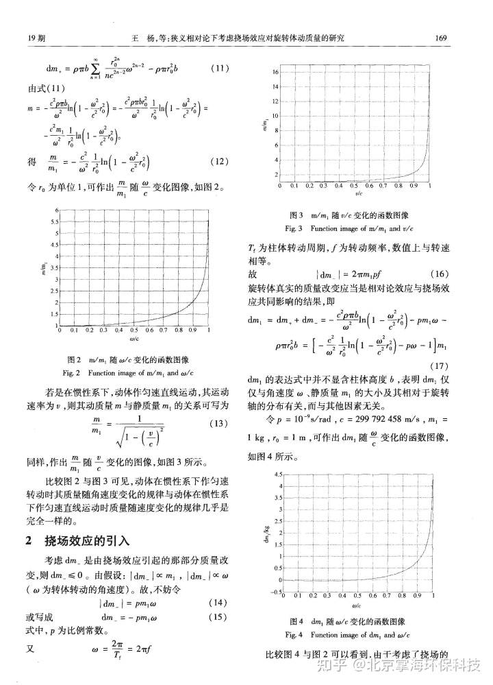
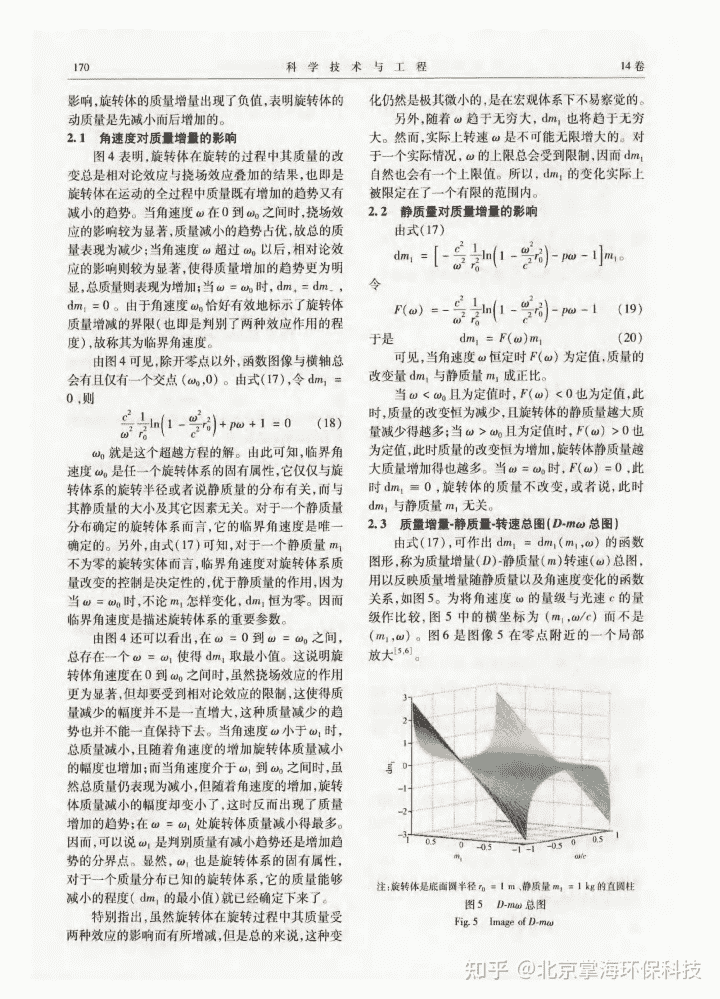
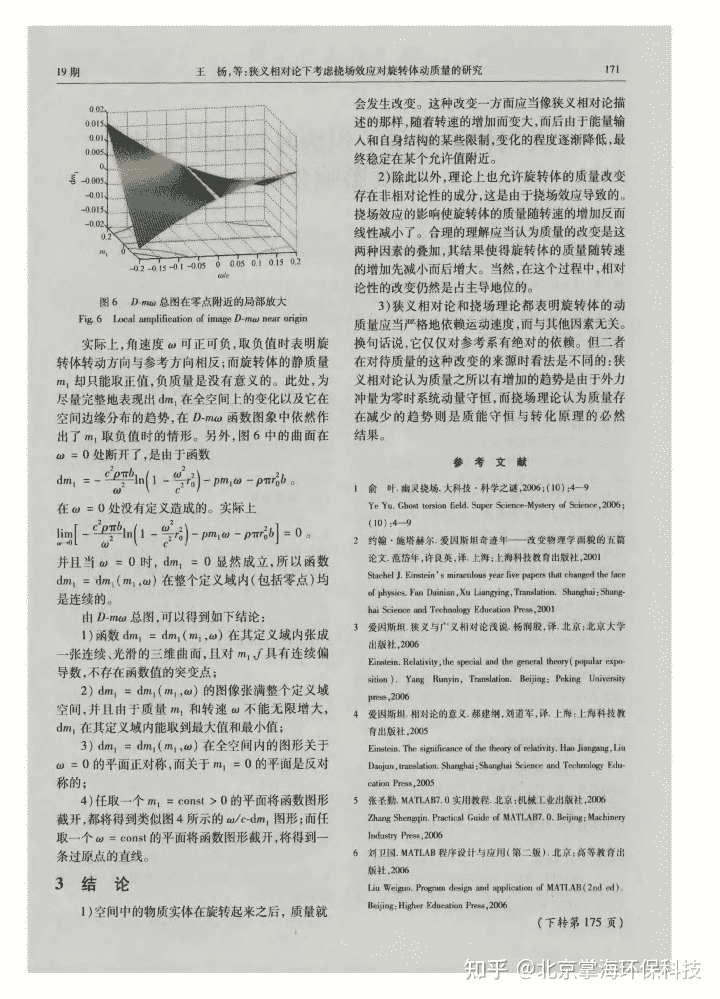
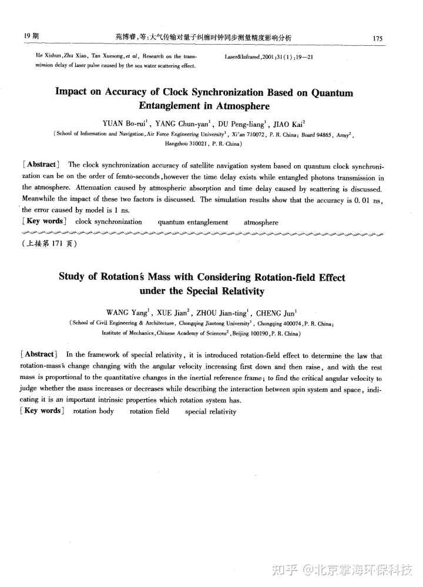

<!--yml
category: 未分类
date: 2022-11-09 19:44:57
-->

# 掌海科技科普文摘（十二）——狭义相对论下考虑挠场效应对旋转体动质量的研究 - 知乎

> 来源：[https://zhuanlan.zhihu.com/p/362642891](https://zhuanlan.zhihu.com/p/362642891)

**关键词：**旋转体 挠场 狭义相对论

**作者：**王杨 薛健 周建庭 程俊

**作者单位：**重庆交通大学土木建筑学院，重庆；中国科学院力学研究所，北京

**刊名：**科学技术与工程 2014年，14(19)卷(期)

**摘要：**本文的目的就在于讨论旋转体的动质量随角速度与静质量变化的规律，……狭义相对论和挠场理论都表明旋转体的动质量应当严格地依赖运动速度，而与其他因素无关……

