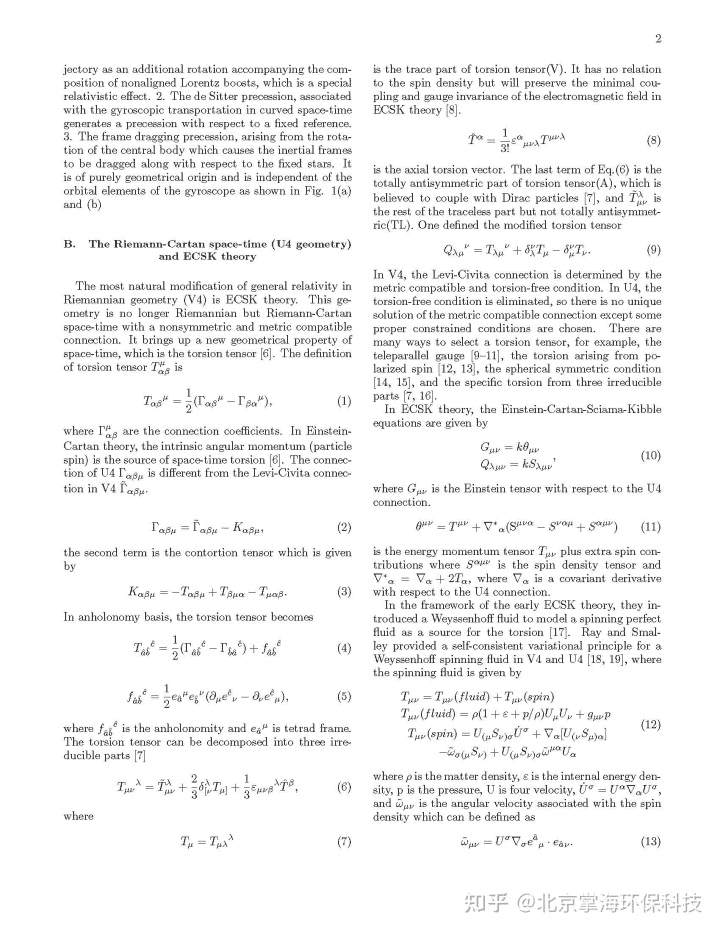
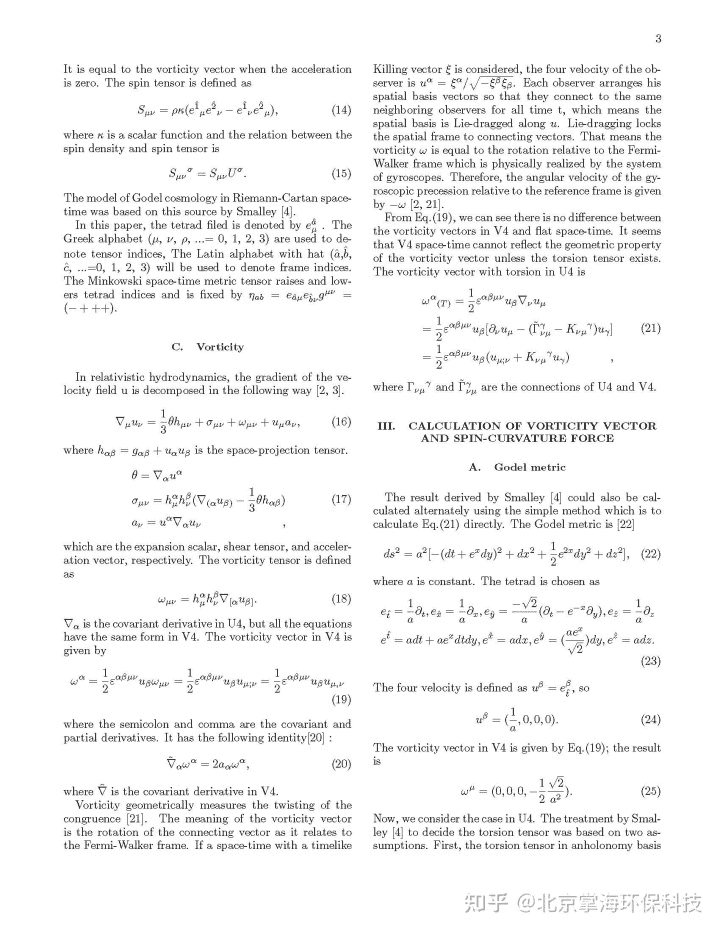
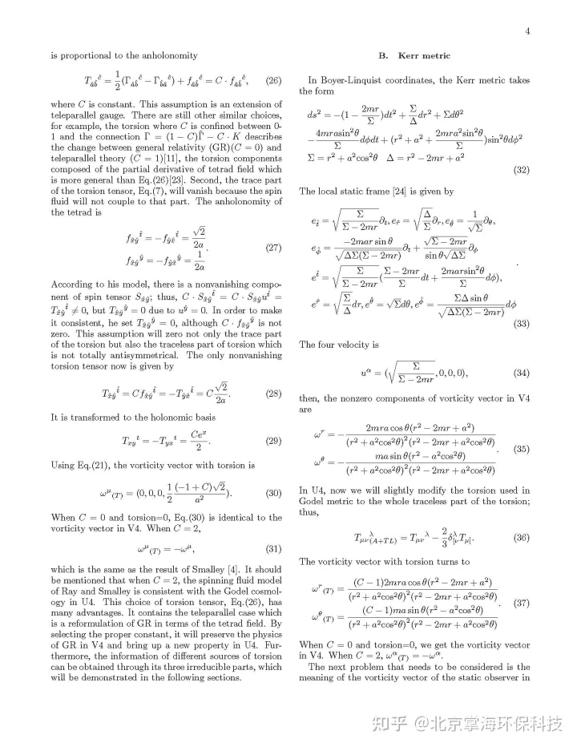
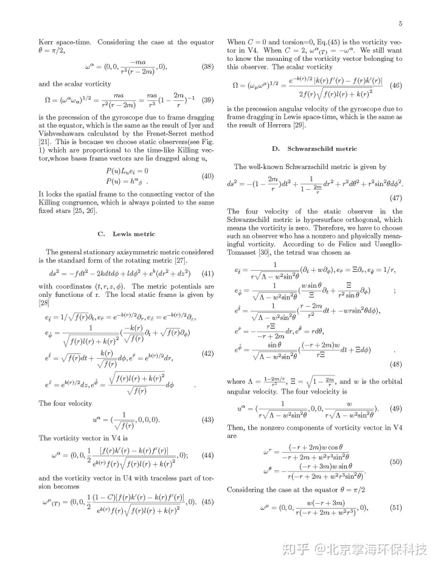
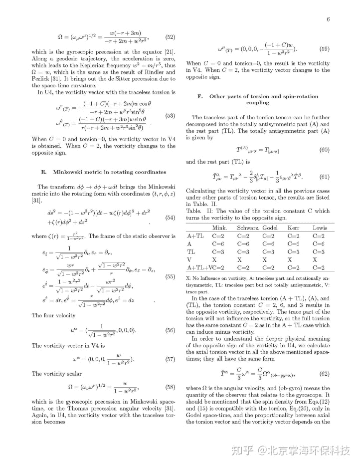
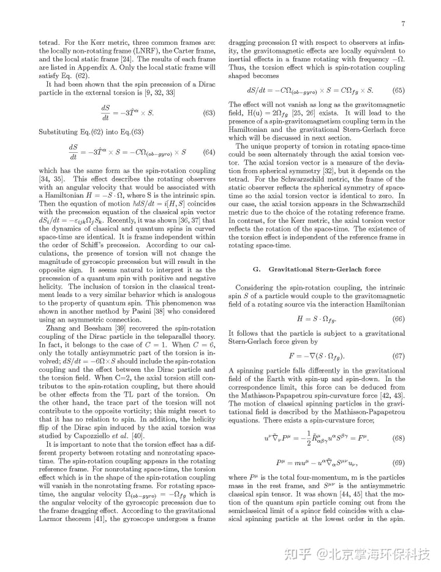
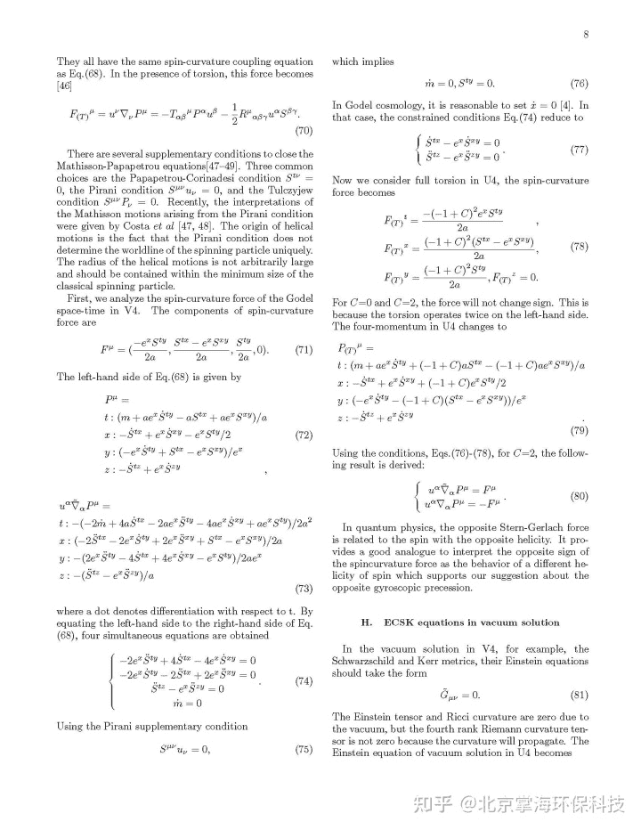
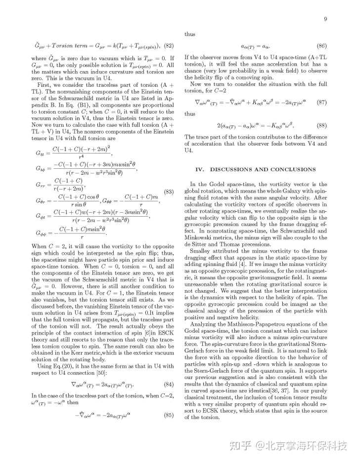
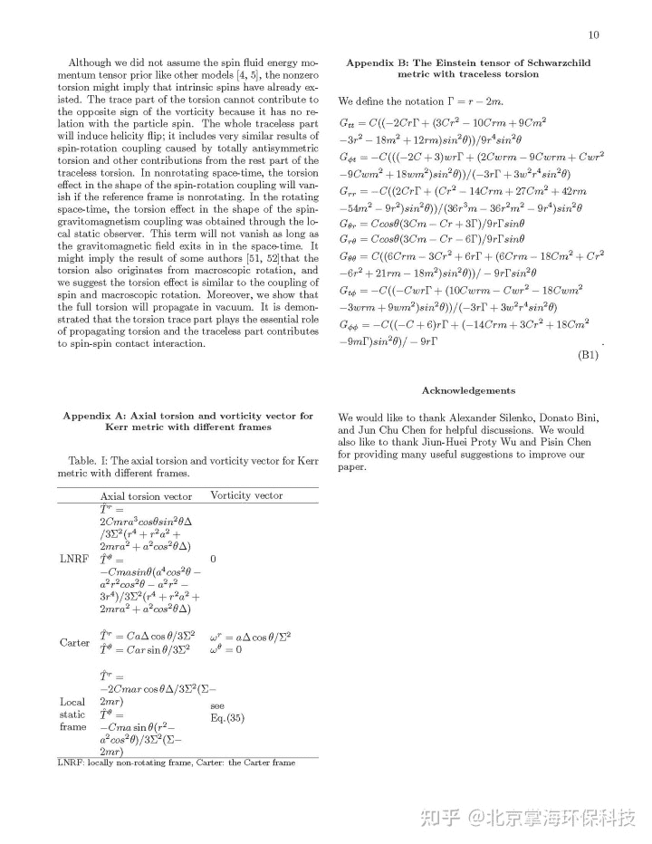

<!--yml
category: 未分类
date: 2022-11-09 19:43:47
-->

# 掌海科技科普文摘（十）——Vorticity, gyroscopic precession, and spin-curvature Force - 知乎

> 来源：[https://zhuanlan.zhihu.com/p/360979017](https://zhuanlan.zhihu.com/p/360979017)

**FROM：Wei Chieh Liang and Si Chen Leey October 2012 Physical review D: Particles and fields 87(4) DOI: 10.1103/PhysRevD.87.044024**

**梁博士该论文重点是：证明了电子自旋角动量如果与电子本身所做的大旋转轨道耦合就会产生可传播的挠场。**

