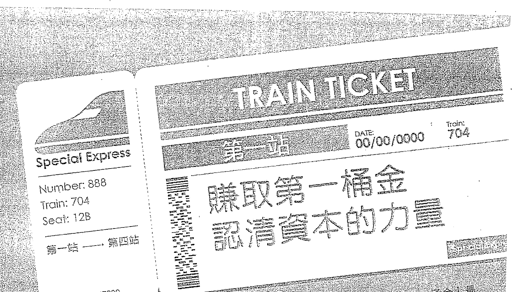
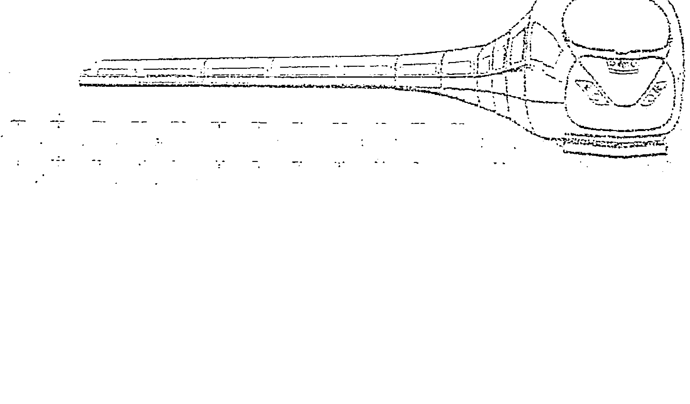
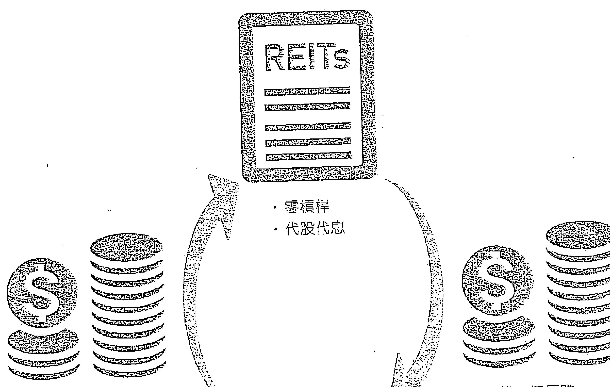
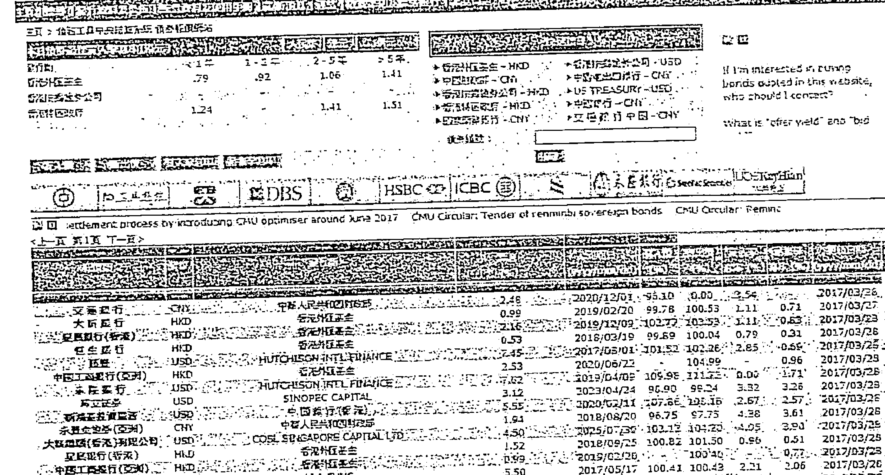
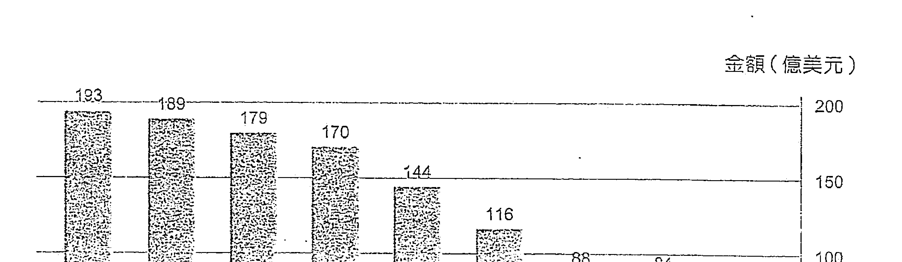
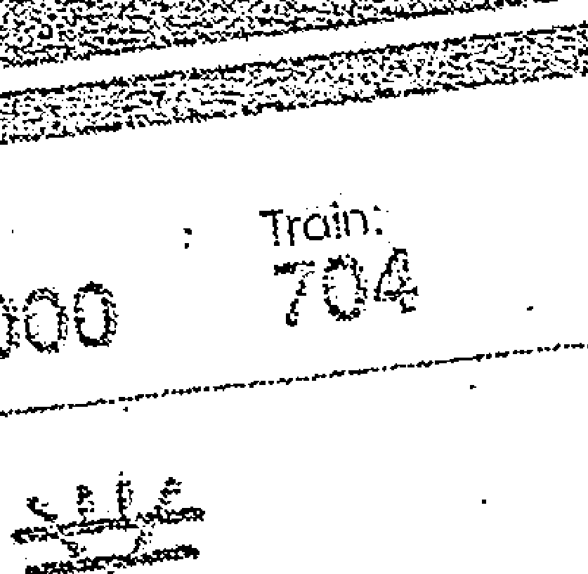
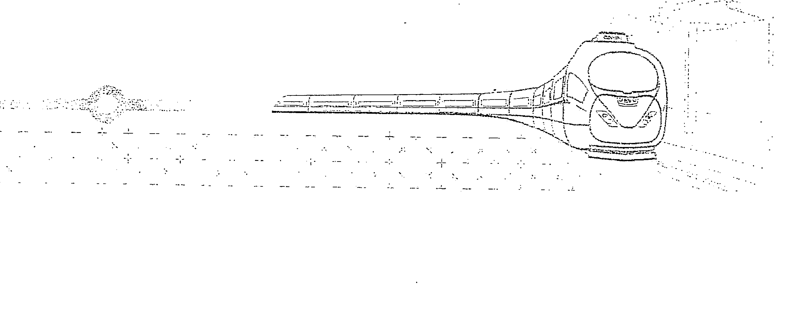
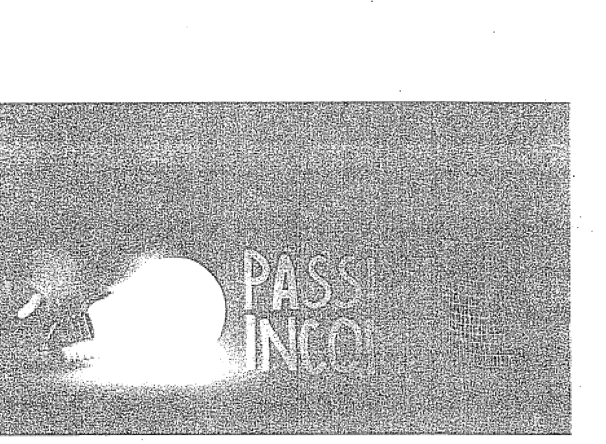

安穩時都能賺錢的方法：房託＋債券『防守型收息』× 工廠＋倉地另類投資『進攻型收益』 每月源源不絕現金流，登上財務自由的列車！

Starman 著

# EAEI

Stefan M

# 目錄

- 推薦序 止凡 ... 6
- 黃元山 ... 9
- 百樂 ... 10
- King Sir 葉景強 ... 14
- 時景恒 ... 15
- 關志康 ... 16

# 自序

我的富足自由路 .... 18

### 導讀

富足路上的重要車站 .... 22

# 第一站 賺取第一桶金 認清資本的力量

- 1.1 規劃「三個10年」 防「向下流」 .... 28
- 1.2 打工要偷師 邁向第一個100萬 .... 36
- 1.3 儲蓄＋穩健投資 第一桶金有數得計 .... 41
- 1.4 身家百萬或千萬 取決投資門檻 .... 48

# 第二站 滾動你的投資雪球

- 2.1 REITs + Bond投資法 可攻可守 .... 56
- 2.2 REITs + Bond優勢互補 愈滾愈大 .... 63
- 2.3 踏足私銀 債券選擇更多 .... 66
- 2.4 真正的高息股：房託 (REITs) .... 70
- 2.5 新加坡優質REITs 解構示範 .... 79
- 2.6 聰明借錢 投資高息股 .... 87
- 2.7 投資債券 穩健等收息 .... 90
- 2.8 債券風險與投資技巧 .... 96
- 2.9 為何投資iBond必賺？ .... 103
- 2.10 避開「變種債券」Coco Bonds .... 105
- 2.11 債券風險與投資技巧 .... 110
- 2.12 債券基金多屬垃圾債 DIY組合更可取 .... 115
- 2.13 投資債券與REITs的機會成本概念 .... 121

# 後記

重要是現金流。只有能產生現金流的資產，才能通過不斷的現金流「再投資」，令組合不斷自我優化，做到風險分散，現金流收入多元化。筆者在本書提出的「REITs+Bond」組合正是一個進可攻、退可守的資產配置組合。

人生就如一條很長的道路，如果大家都希望能夠在人生有限的時間裡欣賞更多風景，令人生活得精彩，請趕緊登上這部快速行駛的列車。然而，請謹記「財務自由」只是一個重要的中轉站而非終點站，而這個中轉站只是賦予你更多選擇而已，到達中轉站後要去哪裡，這就是閣下的選擇了。人生最重要是有選擇權。

最後，希望大家能從本書中得到一點啟發，對大家的人生有一點正面影響，這就是筆者寫這本書最大的願望。祝大家都擁有一個富足的人生！

歡迎大家通過電郵或社交網站與我交流，到時告訴一下我你的選擇吧！

# 理財工具書

Wealth 69

| 项目 | 内容 |
| --- | --- |
| 作者 | Starman⋯ |
| 出版經理 | 呂雪玲 |
| 責任編輯 | 吳愷媛 |
| 書籍設計 | Stephen Chan |
| 相片提供 | Thinkstock |

| 项目 | 内容 |
| --- | --- |
| 出版 | 天窗出版社有限公司 Enrich Publishing Ltd. |
| 發行 | 天窗出版社有限公司 Enrich Publishing Ltd. |
|  | 香港九龍觀塘鴻圖道78號17樓A室 |
| 電話 | (852) 2793 5678 |
| 傳真 | (852) 2793 5030 |
| 網址 | www.enrichculture.com |
| 電郵 | info@enrichculture.com |
| 出版日期 | 2017年4月初版 |

| 项目 | 内容 |
| --- | --- |
| 承印 | 嘉昱有限公司 |
|  | 九龍新蒲崗大有街26-28號天虹大廈7字樓 |
| 紙品供應 | 興泰行洋紙有限公司 |

| 项目 | 内容 |
| --- | --- |
| 定價 | 港幣 $138  新台幣 $580 |
| 國際書號 | 978-988-8395-46-0 |
| 圖書分類 | (1)工商管理  (2)投資理財 |

版權所有  不得翻印
All Rights Reserved

©2017 Enrich Publishing Ltd.
Published & Printed in Hong Kong

作者及出版社已盡力確保所刊載的資料正確無誤，惟資料只供參考用途。
對於任何援引資料作出投資而引致的損失，作者及出版社概不負責。

# 第三站 多元投資+創業 主動出擊

- 3.1 香港機會窗口已關閉？ .... 126
- 3.2 當「成功人士」都是收租佬…… .... 130
- 3.3 做生意的三大Golden Rules .... 133
- 3.4 從貿易生意學經營策略 .... 137
- 3.5 投資工廈取代住宅 待價值釋放 .... 142
- 3.6 為工廈增值 創造生金蛋商業系統 .... 146
- 3.7 拆售工廈實戰 半年回報100% .... 149
- 3.8 看清政府規劃 新界地尋寶 .... 152
- 3.9 棕地功能及價值 遠被低估 .... 156
- 3.10 物業產融結合 財富幾何級數升值 .... 159
- 3.11 平價農地 價值升級成農莊 .... 162
- 3.12 投資馬來西亞・爆出下個深圳 .... 165
- 3.13 投資日本樓 聰明對沖圓匯風險 .... 169
- 3.14 我的企業管理模式 .... 172

# 第四站 投資有法 真正財務自由

- 4.1 「財務自由」的意義 .... 178
- 4.2 愈做愈忙 達創業本義 .... 181
- 4.3 投資簡易輕鬆 真正財務「自由」.... 184
- 4.4 未有合適投資前 不應亂借貸 .... 187
- 4.5 理財三分法 讓財富不斷滾存 .... 191
- 4.6 窮中產的非理性消費模式 .... 195
- 4.7 富中產或窮中產 關鍵在可持續現金流 .... 199
- 4.8 退休人士的資產「鐵三角」.... 202

後記 .... 206

# 推薦序

止凡 著名財經Blogger、《財富未來》作者

坦白說，從前看一本著作時，多只會閱讀其內容，未必會留意序言，無論是作者自序還是友人所寫的推薦序，最多只是輕輕看過便算。自從自己有機會出版著作，用心編寫出一本著作之後，發現寫自序時是一個與讀者溝通的地方，透過自序可以有效告訴讀者編寫這本著作時的心路歷程。後來被邀請替其他作者寫推薦序，每次也用心去閱讀給談論與作者的關係與感覺。因此，如今到書局拿起任何著作時，多會看看人家的序言，因為明白到這是一個精讀，透過別人的推薦序亦能窺探到一些有關作者的事跡。

回想一下，原來認識Starman並不是很長時間，記得他於2015年中才開始寫blog，當看到他的文章時，發現非常另類，所討論的投資工具非一般之餘，每每所談及的數字都與一般打工仔所理解的不一樣。三十出頭的小伙子，甚麼每月六位數字被動收入，動不動10萬、20萬美元的債券投資，起初實在不敢相信，本身太小人之心了，不知道這blogger有否問題。

同樣的感覺，我在看另一位「離地」blogger百樂時也一樣，於是我多會做一些due diligence，想辦法去驗證這些blogger的可信度，包括建議另一位blogger巴黎邀請他作live、建議iMoney記者作個訪問，亦主動邀請他出來飯局，因為只要從不同的渠道了解及觀察一個人，是龍是鳳，一看便知。始終，若這人沒有財商的話，談三兩句，觀察其即時反應，很容易「露底」，有些東西是裝不出來的。

一連串的due diligence後，愈來愈了解Starman的致富之路，他從開始到今天的身家數字，雖不可能被完全透露及交代細節，但從語意間的資訊，屈指一算，還是有跡可尋，他的致富思維、方法與眼光也相當合理，算是把「離地」的部分成功「接地」了。今時今日，親身見過面，若不對路的，難以逃過本尊法眼，哈哈。財務知識不能假裝吧，若有人能裝出豐富的財務知識，那麼此人就真的有相關知識，要賺錢也不會難。

有一點令我印象深刻，就是Starman文章中思維的老練。著作一開始，看到Starman以旅行到目的地比喻人生的道路，走路慢而風險低，坐飛機快但失去了過程，他會選擇搭火車，可不費勁之餘又可以欣賞沿途風景。而有一點更貼切的，他不是富二代，一開始到火車站上火車前，仍然是需要用腳慢慢地走一段路，這比喻找第一桶金的過程，猶如要成功抵達火車站，也需要努力。

看見Starman的手筆，絕對不像一位三十出頭的小伙子，與他交談後，得知他的工作年資不長，打工的日子只是數年，但寫起文章時好像在職場上領悟到不少。由打工、第一桶金、百萬到千萬富翁，由散戶的投資項目跳到散戶不能參與的領域，把人生分成三個十年，每個十年再分成兩個五年，在每一個階段都有其想法，我們又怎能想得到作者的人生階段，原來只是正在第一個十年轉往第二個十年的時期呢？

說回這本著作，當中寫下不少Starman自己的操作理念，市面上多沒有相關範疇的財經著作，這包括債券、REITs、人民幣這些投資工具，再到投資工廈、倉地、農地農莊、投資馬來西亞、貿易生意、海外物業等等，這些內容都是一個投資者的經驗之談，而並不是在象牙塔中的學者所寫出來的教科書，舉例如債券投資，可能不少教科書會把債券的學術細節一一說明，但作為投資者是如何理解債券的相關資訊，找著那些重心作投資決定，看看這本實戰秘笈吧。

我不用說太多「祝這本著作大賣、一紙風行」等話語，因為我知道這都是必然的。

# 推荐序

黄元山　中文大学全球政治经济社会科学硕士课程客座讲师

笔者一直认为，香港虽然作为国际金融中心，股市兴旺，但散户却一直对投资的认识不足，最喜爱的是听「专家」贴士来炒股，最后不单未能赚钱，连财富稳健增值也做不到，甚至惨蚀收场。

资产配置是投资里很重要的范畴，资产需要多元化；债券在投资组合里十分重要；投资回报不应过分进取……这些都是希望财富增值的投资者须要知道的事情，但一般散户却一点也不了解。读过Starman的文章后，觉得其对资产运作熟悉，尤其是债券，而且条理分明，我尤其同意他对谨守纪律的重要的看法。

笔者常常说投资其实很简单，因为只要观念正确，并谨守纪律，持之以恒，原来财富增值也不是很难的事。

# 推薦序

百樂 著名財經 Blogger、《財務自由速成法》作者

記得那天從香港數碼港的創業大賽完成一整天的評審工作，回家路上，身心雖有點兒疲累了，突然收到 Starman 兄的短信，看到內容的一刻，很是興奮，路旁的行人還以為小弟中了彩券頭獎耶！

究竟是甚麼事情，令百樂如此上心？

Drum roll please……

Starman 兄終於出書了！

但更為雀躍的，是 Starman 兄邀請小弟提筆為他的大作，參與寫序的行列，十分感恩的同時，亦希望藉著此文分享 Starman 與百樂的一些點滴。

記得多年前，已留意到一位非常上進的 80 後青年，在網上熱心分享他對理財和投資的心得。那時百樂剛把科創公司的股票完全套現，全職投入在矽谷的地產開發項目，並開辦了 100HappySouls.com 的《Life as a Startup Academy™》快樂創富人生平台。

那時 Starman 兄也在 Blog 上分享工廈的投資點滴。大概是家庭背景，人生價值觀和生意理念相似的關係，英雄所見略同，大家很快就在網上熟絡起來，互相交換戰場上的筆記和心法，很是痛快！

成了筆友好一段日子，近這兩年來，百樂每次回港，我倆更從密麻麻的時間表中騰出寶貴的空間來，共聚一刻，把酒談心一番，家事，國事，天下事，無所不談……

題外話說完了，現在回到本書。

因天窗出版社的工作效率超高，距離交序稿日期只有三天而已，百樂早前已預留了半天給香港城市大學作學生就業/創業分享，加上之前承諾了友人的約會，實則上僅僅有兩天剩，去把這個極有意義的任務完成……

那刻，更覺時間原來是如此的可貴……

手上拿著少於兩天的寶貴資源，立刻把自己關在書房內，從目錄開始，仔細地閱讀Starman兄在書中的每一頁，每一句，每一字。

因有不少內容（例如市場對沖策略）的確需要反覆思考，才能完全掌握其背後心法，中文閱讀能力蠻差勁的百樂，最終花了大概十二小時，到了夜店關門前的時份，才把全書讀完。

看畢全書的一剎那，老實說，是有著一種頗為任重而道遠的感覺……

首先，如一直有追看 Starman 兄博客分享的朋友，绝不難找到 Starman 那一針見血，點到即止，藥到病除，授人以魚不如授人以漁的筆跡和獨特風格。

但更令百樂喜出望外的，是書中除了把多年來博上最精要的部分（如債券，REITs，和其對沖的原理），在思維上有層次地重新整理外，還加入了很多實則操作和應用例子，並在人生價值觀方面，作出了深入淺出的思考模式說明，讓讀者們有一個更全面的人生理財規劃。

這種全方位的章節鋪排，對年青人而言，特別是 90 後的朋友，將有極大的參考和實戰價值。

另外，Starman 兄也花了不少篇幅在談論香港現時的經濟形勢和轉型期帶來的挑戰。

百樂大部分時間都在世界各地遊歷，從宏觀的角度看，特別覺得這部分描寫得非常到位。

在矽谷的創意產業生態圈打滾已有一段日子，百樂深明 Google、Facebook、Snapchat、Uber、Airbnb 的生態模式，中國 BAT 的連番收購和在矽谷設立科研中心的部署，以及整個創投業界的遊戲規則，都有著我們參考的地方。

但如盲目地把西方的那一套，原原整整地硬加於我們中港台的經濟體身上， 的確是需要作出一定程度的本地化和改良。

不得不提的，是書中對現今香港年青人發展空間和機遇的反思。這也是 Starman 兄和小弟一直以來，每次見面必談論的議題。人生，真的有樓就萬事足嗎？有樓收租就是成功？

最後，希望從我們這群有心人的實戰經驗中，帶給年青人一點啟發，在樓市 和股市以外，利用香港對外港的獨有環境，一國兩制的相對優勢，和我們香 港人靈活的創意思維，為自己，為家人好友，為香港，為國家，創出一片藍 天來！

不再把書中的內容複述了，現在就讓讀者朋友繼續翻到下一章，看看 Starman 成功背後那不一樣的世界。

# 推薦序

King Sir 葉景強　資深物業投資者、《置業主意》作者

很高興能為Starman寫序，我與他相識的過程十分特別。話說有天，《iMoney智富》財經雜誌的記者找我做專訪，在訪問當中記者提及她在上星期訪問了一位跟我的投資概念相近的嘉賓，但他很神秘，從不露面，就是這樣令我對他有點莫名的好奇，很想知道他是何方神聖。

直至一次在投資界好友聚會當中認識了他，我發覺他是一位積極上進、滿腹創業大計、為理想而奮鬥的人，我們談得十分投契，惺惺相惜。看完此書後，更發現我倆的理念非常相近，都是希望能鼓勵年青人把握青春光陰，積極學習正確的投資理念，為未來能達至財務自由而努力。

人生匆匆幾十年，相信沒有人喜歡工作到老，因此學習投資絕對是人生最重要的一課。每個人的投資取向都不同，有些人比較進取，喜歡投資股票、外匯；有些則較保守，喜愛投資債券、REITs及房地產，這其實沒有錯或對，最重要是否切合個人的性格以及自己所訂立的目標。

如閣下投資取向是比較穩健、希望每月能有穩定的現金流的話，我誠意推薦此書給你，書中不單分享Starman豐富扎實的投資經驗，更重要的是能令你真正明白達至財務自由的真諦！

# 推薦序

時景恆　時昌迷你倉創辦人

在全球一體化的經濟體系下，理財——人人都關注的話題。有財可理，固然可喜，但如何去賺取第一桶金，如何了解資本的力量；再借用此力量產生現金流，投資再投資，令自己如本書內提及「睡覺時還能賺錢」。當然，有很多人做到了，但仍有很多人還在躊躇怎樣起步。

本書作者為80後，他所寫出來的投資法，全是他自身的經歷與走過的路。一位可以在30歲前達成財務自由，成功創立一整套投資法，包括第一桶金、投資雪球、多元投資及財務自由多項心得，都一一盡錄。

此書不單可成為年青投資者的攻略範本，亦是現行投資者的取經，各讀者可以細閱其投資心法，作為參考大全，必定獲益良多。

# 推薦序

關志康 上市公司百本(2293)主席

隨著生活質量的提高，人均壽命在不斷延長，調查數據顯示全球壽命最長的是香港人，男性和女性平均年齡分別81.24歲及87.32歲。香港老齡化問題日益嚴峻，隨即而來的是勞動力也相對急劇下降，然而，很多人希望能在60歲就過上退休生活。

我的工作和醫療相關，面對高昂的老年醫療費用，個人養老儲備失了預算的也隨處可見。人人想要實現理想的退休生活，在不工作的情況下能保障自己享受一個愉快無憂的晚年。那麼，有規劃、有遠見的投資是必不可少的。

一直都有關注Starman這位80後財務自由人，給我印象是踏實、創新和堅毅。他在博客上更新的文章，讓我不斷吸取在投資領域中的新視角的同時，更能感受到一個年輕人勇於進取的赤子之心，受益匪淺。在專業的概念基礎上，迸發出自己獨到的投資理念，給投資領域增添一抹燦爛的驕陽。

有一個故事：雜貨店老闆請小男孩吃糖果，卻遲遲沒有去拿的意思，多次邀請後，老闆自己用手抓了一大把放到他的口袋，回家後：

媽媽問：為甚麼沒有自己去抓糖果而要老闆抓呢？

小男孩答：因為老闆的手比我大，他拿一定比我多！

小孩明白，凡事不靠自己的力量，學會適時地依靠他人，也是一種謙卑，更是一種智慧。

在商場上，如何借助他人力量成功絕對是一門學問。

當然在工作或創業旅途中，想藉助別人力量並不是想像中那麼容易，須要不斷重視自我，積累資源，實踐和總結。我非常相信，《現金流為王》能為你找到一個當你睡覺時還能賺錢的方法，實現財務自由，安享晚年。

# 自序 我的富足自由路

> 正如巴菲特所說：「你若沒有一個找到一個當你睡覺時還能賺錢的方法，你將一直工作至死。」

筆者是一名80後，出身自單親家庭，家境清貧，生活要憂柴憂米，因此自小已養成了節儉的習慣。至中學階段，由於太過注重練習乒乓球，基本上沒好好讀過書，第一次會考只得7分，放榜當天才真正意識到自己可能無機會繼續升學，幸得中五重讀那年遇到恩師，深深愛上經濟學，整個人突然開竅。

從經濟學中學到的，不僅是書面上的知識，更重要是邏輯思維。我亦慢慢創建了自己的一套思維模式，不再受傳統思維的框框所局限，這對我日後的發展，無論是學業、事業、創業，以至人生規劃都有著極大幫助，令我的人生變得不一樣。

## 由打一份工開始

進入大學後，主修的當然是經濟金融，一直到後來出國讀碩士，都是修讀相關學科。畢業後，順理成章進入了一所大型金融機構當實習生。這份工時間長、壓力大，工作不分晝夜，每月要飛幾次到不同地方出差，但卻累積到很多寶貴工作經驗和人脈。

不過，隨著職級的提升，還須面對辦公室政治，這可說沒一點生產力。然而，要上位，你不得不參與這遊戲。對一位有上進心的年輕人來說，可謂進退兩難，漸覺打工很沒意思。有天我反問自己：這份工作雖能給我高薪厚職，但人生難道除了工作賺錢以外，就不能擁有屬於自己的生活和理想？難道這就是普遍香港人的命運？

### 想要自主人生　先要勇於冒險

我不甘心，從那天開始，無時無刻都想著如何發掘身邊潛在的市場機會，並付諸實行，多次勇敢地作出大膽的投資，包括工廠改裝、農地發展等另類物業投資項目，亦漸漸燃起創業的決心，開始慢慢組建自己的業務團隊，決心跳出安全地帶（Comfort zone），贖回自己的人生和時間。這個決定不容易做，因為考慮到機會成本不輕。當時筆者已成家立室，太太剛剛誕下大女兒，我需要為整個家庭負責，所以辭職出來創業的包袱比以前大了。

創業需要資金，同時做生意不一定賺，收入亦不穩定，為了安頓好家庭，必須創造一個具穩健現金流的被動收入組合（Passive income portfolio），以應付家庭每月的經常性開支。幸好我已累積到一定的資金，因為那份工作除了花紅派得不錯，還有一個好處：工時長，逼使自己根本沒時間去消費，加上自小養成節儉性格，因此已有本金以錢揾錢。

### REITs + Bond 組合

正正就是想擁有屬於自己的生活和理想，驅使筆者在工作幾年之後，就建立了一個具穩定現金流的投資組合——「REITs + Bond」（房地產信託基金混合債券）的投資組合。現時，組合每月產出六位數字的被動收入，以保障家庭每月所需，同時將「剩餘的被動收入」（被動收入扣除日常開支後的部分）累積，將其再投資（re-invest）於組合內，為整個投資組合注入動能，讓雪球愈滾愈大。

投資雪球能產生穩定的現金流，而現金流可用作再投資。我個人的投資都是穩健而同時可持續產生現金流，從來不追求爆發性收益，只要求「計到數」的收益，使組合既能穩定增長，又不用自己操心，亦能根據「計到數」的現金流作未來計劃。有了防禦力高的防守性投資組合，在創業時便能無後顧之憂地大膽嘗試，只為追求理想而非純粹為金錢而工作，令人生變得更多姿多彩和有意義。

### 朝著標竿直衝的成功感

當然，要創業，執行力確實十分重要，亦不是每個人都適合創業，先要好好評估自己的性格和特質。其實每人每日都可能與不少機遇擦身而過，能否捉緊就是關鍵。

我深信，財務自由不應成為一個人的人生目標，金錢是虛無的，成就和成功感才是實在的，而清晰的目標是人生的原動力，沒有了正確的目標，做人就沒有了方向。因此，不須為五斗米而折腰後，儘快找個你覺得有意義的人生目標，然後切實朝著標竿直去吧！

Starman

### 導讀

### 富足路上的重要車站

人生就如行走在一條很長的道路上，走得愈遠愈前，看到的風景愈多愈美。

雖然人的生命有限，而且每人的起點都不同，你亦難有選擇權，但我相信，我們都有能力去選擇和決定自己人生路上的「中途站」及「終點站」。當然，人生的分岔路很多，必須選擇自己認為對的路，要想清楚才走，因為走錯了想回頭，會浪費不少寶貴時間。

### 步行、踏單車、搭列車？

你亦可問問自己，會選哪種方式去走過人生大道？

有人選擇步行，有人會選擇騎單車，亦有人會選擇乘搭不同的交通工具。選擇步行的人會比較累，每一步都靠自己的努力，想看前面美麗的風景，就得一步一步前進，覺得累只能停下來，但懂得欣賞當下風景的人，仍會覺得快樂。

有人希望走快一點，想在有限的人生裡，能走多點路看多些風景，讓人生變得多彩多姿。他們知道單靠自己的步伐不能走得多遠，於是選擇踏單車，雖然都需用力去踏，但前進速度較快較省力，也能走得更遠。當然，有人為了更快捷到達目的地，會選乘飛機，然而你只能從飛機窗口看見白濛濛一片，中途的風景全都錯過了。

而我，會選擇乘搭有不同中途站的列車，細味沿途風景，並會嘗試在不同的中途站下車甚至轉車。

是的，我不會選擇乘坐飛機，也不羨慕「起跑線」比我前、甚或不花力氣已上車的人，因為一個人的人生是否豐盛，是否富足，並非取決於其「起跑線」和「終點站」，反而，我深信欣賞人生旅途中的風景更為重要，這才是多姿多彩人生中不可或缺的元素。

當然，要登上列車，你要計劃如何找到車站，亦得一步一步走去找。找到車站，可能不知道列車的抵站時間，所以要在月台作好準備，以至列車到來時，你可確認該班列車是否朝著你的「目的地」進發，在列車開動前決定是否買票上車。

### 打工仔與千萬富翁的分別

每人都有權選擇以不同交通工具去走自己的人生旅程，但你的抉擇，極可能決定你是手停口停的打工仔，是百萬富翁，還是千萬富翁！

「步行」可比作一般打工仔，每天營營役役的工作，為的只是安穩的生活，但只靠勞力，手停口停。如果你沒有父蔭，你的財富只能累積每月的餘錢，這條方式是「加數」，因此人生所能走的路不遠，旅程經歷和風景亦有所局限。

「單車」可視為主動型投資，這種交通工具，雖然也要用力踏才能前進，但可事半功倍。你將本金投資再投資，其回報是以本金乘以回報率計算，是「乘數」的概念。「單車」（主動型投資）這種工具，若運用得宜，往下傾的斜坡即使無須用力亦能快速前進，但風險會比「步行」高一些，要懂得風險管理，即需運用剎車技巧，亦要有隨時跌倒的準備。風險的高與低，很大程度在於你對該工具的熟悉程度，也取決於你的風險管理技巧。

「列車」可理解為一個「讓錢自動流入的系統」，使你無須再付出努力、精神去換取金錢，亦可視之為財務自由的狀態。只要成功構建好這個「讓錢自動流入的系統」，就等如登上了可高速行駛的列車，時間將會是你最好的朋友，因為即使在睡覺的時候，列車會繼續運行，金錢會為你工作，而你卻不再需要為金錢而工作，你可以好好欣賞沿途的風景。


### 現金流是列車的動力

筆者一直提倡的理財理念，講求「攻守兼備」，以建立穩健現金流的投資作為防守。現金流和複利的力量，是投資列車的燃料，或是投資雪球的動能。換言之，如果一項投資能持續產生穩定的現金流，以在此系統再投資，同時亦投資於不同的項目，分散風險，進一步優化投資組合，讓雪球愈滾愈大。

要令人生變得多姿多彩，不能只靠打工和投資，財務自由不應作為人生的目標。有志於創業的人，可考慮為自己創造創業的條件，贖回自己的人生。創業，其實和投資一樣，只是多元化收入的其中一種。

當然，人生最緊要有選擇權，有選擇才是自由富足的人生。有金錢沒時間，或是有時間沒金錢都沒有用，所以，選中對的工具去走人生之旅，相當重要。

說了大半天，行動最實際。要做到上述的人生藍圖，前提是有財可理。事不宜遲，立即由第一站出發，由「賺取第一桶金」開始。



## 赚取第一桶金，认清资本的力量

赚取第一桶金，认清资本的力量。如何获得「第一桶金」最理所很重要，但前提是有财可理。对每个人来说，如何获得「第一桶金」最重，其次是「何时」获得第一桶金。资本能产生现金流，现金流要明白第一桶金的意义，请先了解资本的力量。了解时间的重要性。接下成为再投资的资本。而当你认清资本的力量，便明白百万富翁和千万富翁的巨大分别。你便开始明白百万富翁和千万富翁的巨大分别。


## 1.1 規劃「三個10年」防「向下流」

從理財角度看，一個人的收入應該多元化，即除了打工份糧，亦應開拓買樓收租、買股票收股息、買債券收取利息等收入。

打工需要付出勞力腦力，所得收入為主動收入，但問題是，一個人一生可付出的勞力及腦力有限，所以，為了保障退休後的生活能夠維持一定水準，每個人都應好好利用辛苦賺來的工資，進行投資或資本運作（運用你本身或融資得來的資本進行投資），換句話說是錢搵錢，從而產生長遠而穩定的被動收入。

## 賺取第一桶金的捷徑？

如果閣下是富二代或者已經擁有一定資本，筆者先恭喜你，閣下已經贏在起跑線，可即時跳至本書的第二站，研究資本運作的心法，學習如何迅速讓資本增值，在短時間內將身家翻倍，讓自己立於不敗之地，然後再去追尋理想，做更有意義的事情。

但如果閣下像大多數人一樣，沒有富裕的家底，請在此第一站「起跑線」就位，由累積第一桶金開始。同時，筆者亦會恭喜你，因為你獲得的會比富二代更多，由零走向財務自由的路，沿途風景很漂亮，值得你細心欣賞。懂得欣賞，你的人生將會變得不一樣。

每一個人的起步點都不一樣，沒必要去想太多，人生起跑線不是自己決定，但中途站及終點在哪裏，則由自己計劃、自己編寫。你抱怨社會也沒用，只會浪費時間，而年輕人最寶貴的資產當然就是時間，大家要將之好好珍惜及利用。

## 做專業人士 Vs 搞 Startup

如何賺取第一桶金？筆者認為從來都沒有捷徑，既不應跟著傳統思維走，也不應跟隨潮流去創業！

過去數十年來，社會普遍認為讀好書，入名校，讀大學修專業學科，畢業出來做專業人士，就可成為社會的天之驕子。隨著時代轉變，傳統行業到了樽頸，大學生數目大幅增加，專業人士供應量多了，自然沒上一代吃香，起薪點也下降了。而隨著香港作為世界金融中心的地位冒升，投資銀行從業員的起薪點遠較其他行業及專業人士高，市場又開始追捧投行職位，不少高考狀元和海歸名牌大學生全都成了投資銀行家（iBanker），大學的經濟金融學系都變得炙手可熱。

時至今日，金融業出現飽和，大家又開始追捧科技相關的Startup（初創企業）。傳媒經常報導一些初創企業的成功例子，最為人津津樂道的是手機應用程式（App）Startup 如 Snapchat、GoGoVan 等，在短時間內被創投基金（Venture Capital）或科技巨企看中，以巨額注資或收購，動輒以十億美元計算，年輕的創辦人搖身一變成為身家豐厚的企業家。

## 香港 Startup 不易成功

其實，傳媒報導的成功例子蒿中無一，而且大家都忽略了這些成功 Startup 背後的主要因素。一個 Startup 要成功，除了一個初始的核心概念（Initial idea），更重要是後續資源的支援，包括整個產品開發的發展流程、多次市場測試、收集市場測試數據及進行多次微調的技巧、確立市場定位後主打市場的方向……以上種種除了需要專業而有經驗團隊的協助，更重要是資金的支持。

美國矽谷多年來成為初創企業孵化基地的代名詞，孕育不少成功的 Startup，大部分更在納斯達克上市。這些成功初創企業一路走來，非常了解成功的秘訣，他們亦深明長江後浪推前浪，必須培育下一代初創企業。因此，成功的初創企業大都有做資本運作，成立創投基金，哪怕只投中一間成功跑出，其回報亦非常可觀，成為具有爆炸性收益的投資項目。由於有源源不絕的資源投入矽谷孵化基地，令這地方擁有成熟健全的初創企業生態鏈。

反之，在香港這個欠缺科技基建配套的城市，Startup 要成功絕非易事，即使有香港政府成立的創科局所提供的支援，香港 Startup 要成功，亦可說是難過登天。當然，除非你能找到一個伯樂，引導並支援你走上成功之路，那就另作別論。

先旨聲明，筆者絕對支持年輕人創業，人生不應該由起點到終點都是打工，我更絕對贊成年輕人應以創業心態去工作（詳見1.2章節）。但只想發美國矽谷模式Startup夢的話，請你醒一醒，因為只想不做沒有用，應該如何執行才最重要。

## 打破「窮忙族」的宿命

而如果你仍相信那套傳統思維，跟著傳統的路去走的話，你的人生已可算是落在固定軌道上。筆者不是算命師傅，但大概都能預測到你將來的人生，準確度大約有八至九成。

以一個普通打工人士為例，一生收入大概在1,400萬至2,200萬港元左右（假設工作30年，每月平均收入4至6萬元），當然不同打工人士收入有高有低，收入較高的生活水準會好些，較低的會差一些，在此僅以一個平均數作例子。

支出方面，以一個人大約有80多歲壽命計算，退休時間約有30年，若退休後每月開支大約15,000元（假設已有樓自住，無須租樓，未計醫療開支及通脹），30年的退休開支就要540萬。一層自住樓大約500萬，30年按揭利息總支出179萬（假設利率維持2.15%）。如果閣下一生人的收入為2,200萬，退休開支和自住樓連利息開支已佔1,219萬，只餘下981萬，即30年的打工生涯，每月只能以2.7萬元去應付日常生活開支，如果還要養妻活兒，實在難有儲蓄。


可以想像，在人生有限的收入下，如果不作投資，沒有額外的現金流，人生的變化不會多，可以做的非常有限。每日營營役役，付出了寶貴的時間，卻未能換來應得的財富和安穩的生活，這正是典型「窮忙族」的寫照。

從以上邏輯推論，要過多姿多彩的人生，跟著傳統的思維去走幾乎是不可能的。

想走出這個死胡同，脫離「窮忙族」，及早規劃人生是必須的。如果閣下目前仍只擁有傳統的打工思維，希望讀完本書後能夠有一些啟發，儘快開始生涯規劃，儘早贖回時間和人生，做自己喜歡做的事。

## 儘早規劃 尋找自己的藍海

筆者認為，每個人都必須要有生涯規劃，愈早做愈好，沒有規劃的人生難以成功。

近年坊間流行「贏在起跑線」之說，然而起跑線真的這麼重要嗎？當然，在現實社會裡，身處食物鏈愈高處愈好，但若然起跑線一開始就設在食物鏈的高處，亦意味著缺少了這條「起跑線」的經歷，而這些經歷卻是對人生下半場的發展，起著決定性作用。正如一個剛畢業的年輕人，擁有無數金光閃閃的沙紙，但沒有工作經驗，甫入職場便是集團行政總裁或是高級管理層，這個package看似完美，但實際上充滿缺憾。試問一個沒有前線經驗、沒有公司營運經驗的CEO，又如何憑空管理好整個集團？

這個看似完美的 package，實際上是「被規劃」的人生！人生應該由自己去規劃，只有自己親身經歷，無論是好與壞，都是有價值的經驗，及至成功一刻才能夠真正感受那份成就感。

## 人生的三個10年

說到如何規劃人生，筆者認為應該由5年計劃開始，太短太長都沒有意思。相信普遍年輕人的5年計劃都不外乎「買車買樓、結婚生仔」，可是這只是目標，目標設高一點也無妨，最重要是如何具體實踐，然後堅持執行。能做好以上，便是一個好的人生規劃，成功只是遲早的事。


### 第一個10年(22-32歲) — 開荒年代

人生可分為三個10年，第一個10年是22-32歲，畢業前就應該著手規劃。10年裡又可分為兩個5年，對於年輕人來說，5年是可預見的距離，但轉變可以很大。22-32歲是一般人畢業後的首個10年，由選工作、努力工作/學習、進修、升遷、轉換工作，到適婚年齡開始組織家庭、置業、結婚生小孩等等。

理論上，第一個10年應該是最忙碌、充實的10年，如果你發覺自己在第一個10年無方向，無所事事，可能你就是沒做好人生規劃。

要在第一個10年完成所有目標，正確的理財觀不可或缺。擁有良好的理財觀加上豐富的財務知識是重要的，除了幫助你在首10年努力達到目標，也令你在第一個10年裡累積財富。

賺取第一桶金往往是最困難的，若然你在第一個10年就能累積到第一個100萬，有了第一桶金，加上過程中累積到的人脈、工作經驗、人與人之間的溝通技巧、從工作所累積的專業知識，你在第二個10年時的人生規劃就可以有更多選擇。

### 第二個10年(32-42歲) — 黃金年代

你在第一個10年累積得愈多，第二個10年（32-42歲）就可以真正地「尋找自己的藍海」。人各有志，只有自己才會真正知道路怎樣走才適合自己，所以人生規劃不可能每個人都一樣。儘管如此，規劃仍然是必需的。

第二個10年是黃金10年，在穩健的基礎下，有人選擇創業，有人繼續打工累積財富，有人專注家庭，開始自己人生的另一頁，為自己的人生增添色彩。

### 第三個10年(42-52歲) — 創富年代

第三個10年（42-52歲）基本上大局已定，應該開始計劃並準備退休或退而不休的生活。這階段已經過了精力最旺盛的時期，不應再依靠勞力腦力賺取金錢，被動收入應該為最主要的收入來源。這三個10年後，亦即是50歲過後，子女長大了，可以真正享受人生，做自己想做的事，到那時候，健康最重要。

很多人沒刻意規劃自己的人生，也沒有想過理財投資的問題，更不會意識到被動收入的重要性，努力工作數十年後，仍然繼續埋頭苦幹工作，做公司/老闆想你做的事，而不是自己想做的事。時間眨眼又十年，身體開始覺得累了，回頭看才發覺自己收入雖然高，但全部需要用努力腦力換取，這時才醒覺增加被動收入、理財及規劃的重要性。在現今的新經濟環境，這些例子將會愈來愈多，成為大部分「向下流」香港人的寫照。


## 打工要偷師
邁向第一個 100 萬

要在人生中尋求突破，第一是放棄傳統打工思維，贖回自己寶貴的時間和人生，尋找自己的藍海；第二是要精明地理財，有規律地持續進行有穩定現金流回報的投資，再利用投資產生的現金流再投資（reinvestment），產生多元被動收入，不斷進行資本運作，長遠讓金錢為你工作，而非為金錢而工作。

### 以老闆思維打工 工作質素高

何謂放棄傳統打工思維？不是慫恿你貿然去創業，而是建議你以創業思維及心態去打工。

我認為，對一般沒家底的年青人來說，畢業後即使有創業的志向，也不應該立刻創業，因為對於初生之犢來說，未有工作經驗，對一間公司基本運作沒有概念，更別提企業管治理念，即使幸運地找到一盤好生意的意念及機會，若公司沒有良好的運作能力，公司盈利亦難以持續，最終失敗機率非常高。因此，對於剛畢業的年輕人來說，應該先踏踏實實找份工作，受薪學習最著數，以吸取相關工作經驗為首要考慮。

不過，做一個打工仔，無論你在哪一個行業，職位是高或低，思維上也不應只是打工的思維。你必須擁有創業者或企業家的思維模式，一個人的思維層次愈高，工作質素定必愈高，因為你所考慮的都是以老闆角度出發。

在一間公司內，老闆最緊張公司是否賺錢，多數打工人士卻只在意出糧是否準時、加薪和花紅的多與少，因為大多數人都持打工思維去打工，緊張的都不是公司利益，而是自身的利益，因每個月的薪金，就是他們從公司所能賺取的全部。


## 第一阶段 赚叠人脉和经验

笔者一向信奉80/20法则（或称为「帕雷托法则」Pareto Principle），此法则提出世界上大多数现象都是「80%的成果，取决于20%的原因」。例如，一间公司80%的业绩是由20%的员工赚取回来，意思是80%的生产力集中在20%人手上。

20%的高质素员工是如何炼成的？他们就是持创业思维的打工仔，做事以公司的利益角度出发，工作质素自然不一样。要注意，这不是单纯工作勤力与否，重点在于思维。如果没有创业思维，像机器一样去打工，即使多勤力为公司卖命，每晚OT到凌晨都是徒劳，日子久了就真的变成一部机器，只会愚蠢的工作，工作质素成疑。所以，聪明的打工仔要聪明地工作，不要浪费自己和公司的时间。

老板不是盲的，谁人工作有质素，谁人交行货「hea做」，很容易看出来，能干者升职加薪是必然的事。但是，对于拥有创业思维的打工仔而言，志不止于此。

对拥有创业思维的打工仔来说，公司就像一个金矿，等着你去开采。以偷师心态打工，所赚取的不仅仅仅是一份粮，而是人脉、经验、公司营运模式、业务上与上下游公司的具体商业条件等等……以上种种的实战经验，对将来创业有极大的帮助，价值远比每月薪金高。

做人要目标为本，做事前先锁定目标，好好规划自己要走的路，走冤枉路的机会就会大幅减少。要知道，时间是非常宝贵的资产。

所以，对有意将来创业的年轻人来说，找工作一样要目标为本，切勿浪费时间做一些低回报的工作。低回报绝不是指薪金低，而是指工作所能带来的人脉和相关工作经验等等。不少年轻人毕业后初踏足社会找工作，最着眼于薪酬福利，最好就是薪高粮准、假期多，但年青人应视公司为学校，应着眼于公司能给予你甚么机会，而不是名义上的薪酬福利。

我认为，聪明的打工仔切忌找一些过分稳定、挑战性低、机械式后勤、「做又36，唔做又36」的工作。相反，应该找一些与前线业务相关、与你兴趣相符、或与将来你想创业的行业或其上下游行业，亦可考虑频密接触客户的前线工作。挑战性愈高愈好，反正年轻人没东西可以输，做唔掂最多给老板炒鱿鱼，但你赚到高难度的工作经验，赚到失败的机会。失败了，赔的不是你，而是公司。

选对工作，就要发挥创业思维，当自己是老板去考虑每一件事，不限于业务，甚至乎人事管理、会计、融资等大小事务，事事多了解，发问前先思考，不怕蚀底，最终得益会是你自己。

初入职场属投资期，投资在自己身上，累积工作经验、建立人际网络最为重要，切忌怕蚀底。如能做好上述一点，不出数年，升职加薪是必然的事，否则该公司应该不太珍惜你的价值，留下也没意义，大可着手去找新工作，再学一些难得的工作经验。

## 第二阶段 储钱投资滚大本金

升职加薪后就到第二阶段，就要「储钱投资，滚大本金」。工作数年，假设人工2.5万至3万，每月能储蓄1.5万（笔者不认为离地），一年能储蓄18万（还未计双粮及花红），努力储蓄两年就能有36万，已足够作小额投资。

在资金泛滥的年代，现金不是王，持有现金成本高，定期储蓄只会让通胀蚕食购买力，故应作稳健的投资，避免炒卖细价股。事实上，买入稳健的房托基金（REITs）或价值类股，每年5-6%回报不难做到，不要小看复息的力量，不少著名投资者都是利用复息效应致富。如此一来，30岁前累积第一个100万不是难事，如按部就班，几乎大部分人都可达到。

### 1.3 储蓄+稳健投资 第一桶金有数得计

通胀蚕食现金的购买力，相信大家都明白。「70法则」就是以每年1%的通胀率（Inflation rate）计算，在70年过后，70年前仅需1元买到的东西，现就要70元才能买到，这反映在每年持续通胀的情况下，即使只是1%的低通胀率，银纸的实际购买力（Purchasing power）也会急速下降。

### 两条公式 认清时间的力量

「70 法则」的公式是：

```
70/通胀率（%）= 银纸购买力减半的年数
```

举例说，以香港近年平均年通胀率约4%计算，在经过17.5年（70/4）后，你手持的现金购买力便会减半，亦即是物价会上升一倍。

从以上数字便知道理财和人生规划的重要性，退休计划不是一时三刻的事情，退休的时间也不是三、五年的事，而是长达30年或以上的事，假设香港在往后30年的平均年通胀率维持约4%，在你退休时即使不吃不喝不消费，银纸就这样放着，银纸的购买力亦会减值至只有25%。对于没有理财思维的人来说，时间是最大的敌人，银纸的购买力会被高速蚕食。

要令时间成为你最好的朋友，首先要通过「72法则」明白复利的力量。所谓「72法则」，就是以1%的年回报率并每年以复式计算，经过72年以后，本金就会变成原来的一倍。

### 「72法则」的公式是：

72/年回报率=本金翻一倍所需的年数

举例说，以年回报率5%计算，经过14.4年（72/5）本金就变成一倍。假设本金为20万元，14.4年后本金会变成40万元。这就是复利的力量，而复利的关键是时间，懂得利用时间的人能将时间变成朋友，反之时间就是敌人。

要令时间成为朋友，最有效的方法是购入有现金流回报的资产，其回报率只要高于通胀率，你手持资产的购买力便不会被通胀蚕食，资产价值更会随通胀上升。银纸是货币，是交易工具，仅此而已，而且会随时间而贬值，将钱放入月饼罐和床下底的方法已不合时宜。

## # 一万元储蓄 足以改变人生

### # 第一站：赚取第一桶金 认清资本的力量

投资必须由储蓄开始，而消费和储蓄永远是对等的；储蓄实质上即是延迟消费（Deferred consumption），性质上已经是一种投资，是投资将来的消费。因为今天的储蓄可以用作投资，有回报率，将来便能换取更多的消费。以同一种概念来看，即时消费的机会成本并不只消费品的名义价格，而是放弃了储蓄用作投资所能获得的潜在回报率，应用「复利的力量」，长远你将放弃了将来更多更多的消费。人生时间是有限的，你今天消费和储蓄的决定，可能对你的人生起着决定性影响。

假设你月入三万元，基本开支为一万元，你可选择每月消费一万元和储蓄一万元，或消费二万元和零储蓄。一万元的储蓄，以5%年回报率计算，30年后的本利和是43,219.43元，意思就是说你每消费多一万元，就放弃将来43,219.43元的消费机会。

以每月储蓄一万元计算，30年的本利和可高达797.3万元，而如果不投资的话只有360万元，这就是复利的力量，足以改变人的一生，因此不要小看一万元和仅5%的年回报率。消费和储蓄的比例是个人选择，是价值观的问题，但最重要是你要清楚知道消费的机会成本有多高。

除着工资上升，你会选择将工资的升幅大部分用于增加消费还是储蓄投资？

## 专注「有数得计」投资 致富不是梦

当你明白复利的力量，就会明白时间的重要，亦会明白5%年回报已足以令你致富。你会再浪费时间去投机炒股，还是专注「有数得计」的投资、让你的时间将你的雪球滚大？

对于一般非「投资专家」的普通人，不应投机回报和资本增值有过分的预期，因大部分普通人认为会令资产资本增值的因素一般已经在价格反映（Price-in factors）。因此作为普通打工仔，有正职，又不是专业投资者，时间不多，更不应笔者称之为非常回报（Abnormal return）有过分暇想，而应针对「有数得计」的投资下功夫。

所谓「有数得计」，即是会定期产生现金流的资产，这类资产值得积累，使自己的收入来源更广。以努力收入作为前锋，再将努力收入的储蓄投资往有定期现金流的资产，累积一段时间，直至非努力收入（被动收入）比努力收入（主动收入）更多，财务自由就指日可待。

会持续产生现金流的资产包括：

-   1. 稳定派息的股票（高息股如一些公用股、内银股等）；
-   2. 以一篮子租金收入为主、同时会定期将不少于90%盈利分派予股东的房地产信托基金（REITs）。例子有领展（0823）、越秀房托（0405）和置富产业信托（0778）等；
-   3. 固定收益资产（Fixed-income asset）如定息企业债券（例子有内房企世茂房地产、路劲基建等等）；
-   4. 买入「实砖」（实物砖头）物业收租（包括住宅、工厦、商厦和铺位等等）。

上述都是能持续产生现金流收益的资产，然而它们的特性和收益率（Yield）都不同。在资金不多的情况下，投资一开始不必强求太分散，可选择一些具稳定增长的高息股，好处是回报率「有数得计」，基本上每半年派息一次，到时再用收回来的股息分散投资其他具增长潜力又会稳定派息的股份。要留意的是企业派息背后是否有盈利支持，切勿只看周息率或一味贪高息。由零开始到第一桶金，一点也不困难，关键在于你是否 on the right track，以及能否坚持，谨守纪律。

## 攒第一个100万 应否先买楼？

买楼，仿佛已成为每个香港人的人生目标，不少人尝成功累积到第一个100万后，都会将之做首期买楼，之后将一半收入供楼，这些人有部分有自住需要，部分是当投资。笔者并不反对，但必须说明一点，尝成功累积到第一个100万后，投资选择便会增加，这亦意味着以买楼作为投资的机会成本已经大大增加。只是买楼是中国人的传统智慧，大家都熟悉，加上传媒的喧染，将有楼与成功划上等号，令大部分人都以买楼作为人生目标。

诚然，在新经济常态下，资产价格长远只会继续上升，买楼最大好处是可利用长达30年以上的低息杠杆，自住物业在可负担的情况下当然应该考虑，但不代表可以不计数不问价高追。要知道目前业主们都有很强的持货能力，叫价相当进取，同时在辣招遍布的市场下，市场交投非常疏落。如果市场没有货，而叫价比市场价高出一两成，买家便要小心。

### 买楼「半自住半投资」观念错误

要知道，买楼并不是唯一的选择，不买楼不会死，所谓的「半自住半投资」是错误的概念。自住就是自住，投资就是投资，是两种概念。不买楼可以租楼，不会无得住；投资就是看回报率和资本增值空间。香港住宅物业在辣招遍布的年代，短期内尚有多少上升空间成疑。一般住宅租金回报率约2.5-3.5%左右，如果有一种投资回报率高达10%，你还会选择买楼作「半自住半投资」吗？

100 万，在今时今日的香港不算多，但可说已突破了第一个樽颈门槛。除了大家熟悉的住宅和股票，大家可留意工厦物业和债券。工厦物业是目前最便宜的「砖头」，租金回报5%尚算普遍，lump sum有大有小，可做按揭，虽然按揭成数仅四成，没有住宅高，但工厦物业的价格低水，在政策的限制下，其真正价值仍未体现，相对于价格可能已经over priced-in的住宅物业，更具值博率。

100 万budget，亦可考虑买入入门版债券，基本的入场门槛为10万美元一手，利率6-8%左右的选择不少。若不做杠杆，企业债券的风险不外乎企业违约风险，只要细心研究，风险比股票更为可控，而且是稳定派息和保本的投资工具，投资者可选择赚价沽出获利或持有至到期收息，是进可攻退可守的投资工具。

拥有不少于100万投资本金，笔者建议可买入入门版的债券，透过运用其保本和稳定派息的特性，利用派息的现金流再投资门槛相对较低的高息股和REITs。当投资组合慢慢变大时，可再考虑分散投资到实砖，如相对高回报的工厦物业，再利用按揭套现的资金再投资债券或其他高现金流的资产，达至实现多元化的现金流投资组合。

## # 14 身家百万或千万 取决投资门槛

赚取了第一个100万，那再赚取第二个100万就更加容易，而且快得多！

关键在于你的目标是100万变成200万，还是1000万甚至更多。完成首个100万后，为何有些人最终能滚出1000万以上的财富，有些人却只能多赚100万？

因为投资有门槛，这是一般人所忽略的。门槛愈高的投资项目或产品，风险调整后回报 (risk-adjusted return) 愈高，而投资选择亦愈多。

### # 散户愈少 回报愈易掌握

何谓投资门槛？不同投资有不同的要求，包括相关知识和投资金额。传统投资理论告诉我们，回报愈高，风险愈高。然而从事实来看，这理论不一定适用于所有投资工具。据笔者的分析，在相同或接近门槛级别的投资选择来说，这理论比较准确。

在门槛较低的市场（如股市）上，散户众多。他们有羊群心理，同时亦受很多因素影响，所以投资者要追求稳定而高的回报就愈不容易，这种不确定性也就是风险。

如果除去这一「散户风险」，风险调整回报就变得吸引了，这正正解释了为何高门槛投资在同一风险的情况下，一般会有较高投资回报，投资选择亦愈多。不要忘记，高门槛投资（如债市）需要的除了是资金，一般还须具备一定知识。因此，愈少散户的投资领域，资产回报愈趋理性，投资者也愈有把握取得预期回报。

### 新经济常态下　百万已不是富翁

香港有几多百万富翁，有几多千万富翁？根据2016年花旗银行的一个调查显示，如不计物业，只计流动资产（现金、股票、债券等），千万富翁约有六万人，以2015年底香港人口732万计，也就是每124人就有一名千万富翁。百万富翁人数亦多达76.8万人，占成年人口13%，按年增9.6%，即大约每十人便有一个。这些数字很吸引眼球，但其实受访者只有4,120人，受访地区、对象、工作、职位不详，因此以上数字只反映富翁人数按年有所增长（前设是两年的统计方法一致），而最吸引眼球的实际富翁人数，意义其实不大。

尽管上述数字未必准确，但据笔者分析，香港的富翁人数比一般人想像的要多。事实上，在数十年前，拥家财百万还算得上是富翁，然而今时今日，特别在金融海啸后，各国争相印银纸将货币贬值、长期维持低息政策、过分依赖货币政策「医治」不振的经济，百万已不再是富翁，一个高级白领或投行分析员的年收入可能已有此数。更甚者，千万身家在现今世代也不能称得上富翁，极之量只是迈向富翁的一张入场券。因此，当年财爷说自己是一名中产，其实是正确的描述！不是中产，难道是富翁？坊间对此反应颇大，正正反映普罗大众的财富思维远远未跟得上市场的转变，但笔者认为这也是可以理解的。

### 千万富翁 靠稳定回报累积身家

而且，于2015和2016年，百万富翁输得很惨烈。据统计，百万富翁2016年投资普遍录得30%以上亏损。相反，千万富翁则有10%以上的正回报。原因为何？答案是笔者前面所说投资门槛问题。

百万富翁的资产配置主要集中股票、基金及细价楼，2015年股、楼皆跌，至2016年细价楼出现较明显的回调，虽然后段止跌回升，但细价楼出租回报率不高，杠杆更受按揭条例所限。无奈，股、楼正是大多数人认识的投资工具，受散户因素影响，增加了市场的不确定性，影响预期回报。

对于千万富翁，他们的资产配置中，有相当一部分属于固定收益投资(如债券)，稳健性倾向较高。他们普遍认为投资不需有爆炸性收益，追求的是稳定回报率，财富才能得以更有效地累积。

千万富翁最大的优势，在于他们可以运用门槛高的投资工具，这些投资工具不需要复杂，简单便是美。他们更可利用私人银行平台提供低息融资，将资产抵押予私人银行，取得低息贷款，无须还本只须还息，利率可低至1%多，故适当使用杠杆，就能有效增加回报率，亦同时提高资产组合的整体流动性。在具备这些优势的情况下，千万富翁为何要与市场及散户「搏斗」？

### # 只懂盲目买楼 现金流低

其实，香港人一直热爱投资房地产，可说去到一个疯狂热爱的程度，盲目投资住宅的不计其数，也懒得去学习其他投资工具，以致很多人有钱，但投资知识贫乏，除了住宅楼，对固定收益及其他非住宅物业的投资，认识极为皮毛。

当然，过去六至七年间，投资住宅的资产增值的确不错，因为后金融海啸的新常态经济，取代了传统经济的运行模式，一方面极度低息环境、银纸快速贬值，另一方面实物资产快速升值，以上种种都在「惩罚」无产阶层。

正由于低息及实物资产飞升，如果你在2008年拥有百万，甚或数十万也好，只要在香港借钱买楼，不管买的是甚么楼，楼价升值，升值后加按套现，再多买一层，如此类推，一拆二、二拆四，转眼已成数百万富翁，甚至千万富翁。笔者身边有不少打份牛工的打工仔朋友，正是如此暴发起来。

正所谓时势造英雄，以前老爸教落千万不要借钱，有债要尽快还清，负债是羞家的事。但现今笔者与一班「上岸」朋友聚餐，大家不是斗身家，而是斗多负债，以多负债为荣，因为负债多，证明自己的借贷能力和银行对你的信任，可谓时移势易。

然而，展望未来，继续尽借楼按投资细价楼又是否最佳的投资选择？在现今市场，先不谈自住物业，投资住宅其实有四大短处：一、租金回报率甚低（有2-3%已不错）；二、有辣招；三、使费高；四、出租麻烦。

如果你热爱投资房地产，其实不用自己买卖物业，投资REITs已尽得实物资产之好处，而且化解了投资住宅的所有短处：

一、回报率高（普遍有4-8%）；二、没有辣招；三、使费低；四、出租物业有人代劳；五、杠杆：买入REITs如领展，公司本身有向银行融资，小股东买入REITs时银行又会提供仓值（如部分券商提供领展之可融资比率达70%），这可是双重杠杆（Double gearing）。

REITs的特点是盈利90%用以派息，收租收入相当稳定，因此投资REITs很容易，只要留意其派息增长率就已足够。想想，8%回报率的REITs每年派息都有增长，长升长有，我们也不需太看重其股价升跌了。如果你更进取，以杠杆投资REITs，回报率则更高。事实如此，为何我们仍死抱投资住宅物业这方程式？

### 多元化被动收入 打破财富极限

世界及楼市政策不停变化，只抱过去十年都成功的投资策略，最终只会被新的游戏规则所淘汰。投资者要不时检讨自己的投资策略，判断现时应用的那套是否仍具优势。

其实，大部分人的理财策略都一成不变。然而，昨天成功的策略不等如明天也会成功。随着财富累积，层次不断提升，若投资策略未能同步跟上，樽颈很快会出现，这就是所谓的财富极限。

如前文提及，投资永远是讲求门槛的领域，愈高投资额就有愈多投资选择，回报风险比也愈高，100万的投资组合跟1,000万的投资组合，回报率相差可以非常远，1亿以上的投资组合又是另一个层次。若这三种投资组合皆采取相同的投资策略，财富上要有新突破相信非常困难。

所以「智富法则」必须要扩阔收入来源，关键在于突破你的单一收入来源。要从第一个100万到踏上真正富足之路，除靠工资的主动收入之外，被动收入的来源亦宜分散。若收入来源单一，财富容易受经济环境影響。以做銷售員為例，若零售市道轉差，就要面對減薪或裁員的風險，所以打工仔應作多類型投資，增加不同被動收入來源，從而以複式效應累積財富，這亦是筆者認為最重要的現金流管理。

本書的第二站將會具體講述，如何好好利用你賺取到的第一桶金，在新常態經濟下，利用低息環境賦予的優勢，進行資本運作，讓金錢為你工作，令資本不斷增值，使雪球在長濕坡上滾動，愈滾愈大。只要掌握了資本運作的技巧和心法，並擁有一個具優勢的資本運作平台，要在短時間內達到財務自由、每月持續收到穩定現金流以支持生活開支，其實不難做到。

# TRAIN TICKET

DATE: 00/00/0000

Train: 704

# 滾動你的投資雪球

Special Express

Number: 888

Train: 704

Seat: 12B

第一站 —— 第四站

T1234567890

希望說是堅守，投資講求現金流，可以產生持續又穩定的投資。是最佳的防守。持續的現金流如一條又長又寬的斜坡，只要把雪球一推，雪球自然會愈滾愈大，你不再需要每天用自己雙手去堆砌。


## 2.1 REITs + Bond 投資法

可攻可守

筆者當年決意辭職創業去尋找理想，但創業風險不少，為了好好安頓家庭所需，我積極做好資產配置，創造一個具穩健現金流的被動收入組合（Passive Income Portfolio），以應付家庭每月的經常性開支。

身為有家室的人，上有高堂下有妻兒，一家大細都等我開飯。正如不少讀者朋友都體會到，隨著近年通脹加劇，銀紙愈來愈不值錢，一個中產家庭基本開支每月7-8萬是必需的（基本開支包括供樓、水電煤、管理費、差餉、家中雜費、養車、請工人、照顧長輩、小朋友學費、食飯、基本娛樂、醫療保險等等），當然要壓縮開支也總有方法，在此不贅。因此，建立一個被動收入組合，能持續及穩定產生現金流，對每一個典型中產都相當重要。

### 目標：被動收入不低於12萬

當時，筆者對「財務自由」的目標是：以每月基本家庭開支8萬元計，被動收入必須不低於此開支的1.5倍，即12萬，因為要靠被動收入仍可儲蓄4萬，筆者稱之為「被動收入儲蓄」（Net Saving from Passive Income）。每月的「被動收入儲蓄」為4萬，一年為48萬，再定期利用該筆資金買入資產，持續產生穩定現金流收益，複式增長，每年的被動收入會不斷增加，被動收入儲蓄亦會不斷累積。

被動收入儲蓄的累積及再投資這概念，相當重要，因為我們面對銀紙貶值及通脹之苦，財富組合的購買力正被蠶食，若被動收入只足夠覆蓋目前每月基本家庭開支，莫說要改善生活質素，在不久的將來，很可能連維持現時生活質素也難以做到。因此，追求財務自由應同時考慮通脹的因素，而被動收入儲蓄的再投資操作，則能為整個被動收入組合注入「動能」，讓雪球滾動，追上通脹的同時令財富愈滾愈大。這才是真正可持續的財富組合（Sustainable portfolio），做到真正「使來使去都係面嘔浸」，即使到百年歸老時，組合仍能自動運作，為家庭及下一代帶來保障。



## 第二站：滾動你的投資雪球


- 零杠杆
- 代股代息
- 債券派息所得，投資到REITs。
- 當一債價跌，抽取REITs的値替債券補倉。


- 買入後押私行融資八成，債券收益5厘，貸息1.5厘，賺取3.5厘差價。



有讀過筆者博客的朋友應該知道，我的被動收入組合內的金融資產以REITs（房地產信託基金）及Bonds（公司債券）為主，簡稱「REITs + Bond」組合。

組合內的Bond以短債為主，一般不長於3年（部分有5年）。我會利用債券本身的値（LTV，Loan To Value）做槓桿投資，增加回報率。所謂槓桿投資債券（Bond Leveraging）是指買入一隻債券後，將之抵押予銀行，利用銀行低息融資的優勢，根據該債券的融資率向銀行貸款借回相當部分的資金，將套現出的資金再度買入該債券，如此類推，重複操作。

當然，槓桿投資債券的實際操作不用這樣複雜，假設債券票面息率為5%p.a.，債券的融資率為80%，私人銀行的融資利率1.5%，買入債券時直接只須支付20%資金就可以買到100%面值的債券，其餘80%由銀行融資，槓桿比率就是1/20% = 5倍，淨回報率超過18%。當然，筆者一向不建議用盡槓桿，但即使不用盡槓桿，要做到淨回報10%以上不難。以上做法就等同套息交易（Carry trade），借低息資金買入高息資產從而套取息差。

筆者組合的REITs一般不做槓桿，利用其價格波動性（Volatility）較低及高値（即高融資率）的優勢，可作為槓桿債券組合的有效緩衝（Buffer），並作為滿足臨時現金需要的「提款機」，提升了整個投資組合的資產流動性及穩健度。要做到「REITs + Bond」組合有足夠的防守力，首要記住債券組合槓桿不用盡，REITs組合的Buffer要充足，這樣才能令組合立於不敗之地。


債券一般每半年派息一次，而筆者將組合中不同債券以派息月份去分類，做到每月均收到債券利息，以達至每月出糧的效果。債息每月有多有少，筆者會用於再投資優質、前景看好、平穩增長的REITs組合，如領展（0823）、越房（0405）和持有又一城的新加坡豐樹信託等，而REITs組合亦會定期每半年派息一次，因此「REITs + Bond」絕對是一個擁有穩定現金流的投資組合。

## 1,000萬「雙高」組合示範

在低利率、低經濟增長的「L形經濟」大環境下，市場的預期回報率偏低。在長期低息環境下，要獲取穩定高回報必須要適當運用地桿。買樓之所以能在低息環境下為投資者帶來豐厚的財富，正正是因為買樓能輕易運用長達30年的銀行低息槓桿，借入貶值的銀紙買入長遠增值的資產。筆者多次強調，槓桿是兩刃刀，雖有風險，但只要適當控制風險，增加和強化投資組合的現金流部分，事實上風險相當可控，更能利用低息環境的優勢，提升整體回報率。

「REITs + Bond」組合最大的優勢是「雙高」（高値、高現金流），債券保本但長期對抗不了通脹，REITs不保本但會隨通脹資本增值，兩者的優劣互補。以1,000萬的投資組合為例，筆者建議一開始建立「REITs + Bond」組合的初始比例為30:70（REITs : 債券）。筆者投資「REITs + Bond」組合的策略是以槓桿買入債券，REITs則不用槓桿，作為債券槓桿的buffer。以1,000萬的「REITs + Bond」組合為例，總投入資金實際為510萬，總借貸金額為490萬，組合的負債比率為49%。組合內可使用而未用的備用値為210萬，表示組合有210萬的buffer，即使組合價值下跌210萬亦無須補倉。

## 1000萬「REITs + Bond」組合

|  | REITs(R) | 債券(B) |
| --- | --- | --- |
| 開始比例 | 30% | 70% |
| 投資金額 | 300萬 | 700萬 |
| 銀行融資率 | 70% | 70% |
| 使用融資率 | 0% | 70% |
| 借貸金額 | 0 | 490萬 |
| 投入資金 | 300萬 | 210萬 |
| 未用融資額 | 210萬 | 0 |

|  | R+B Portfolio |
| --- | --- |
| 總借貸金額 | 490萬 |
| 總投入資金 | 510萬 |
| 總未用融資額 | 210萬 |
| 負債比率 | 49% |
| 槓桿比率 | 0.96x |

根據市場現時的情況而言，筆者認為「REITs + Bond」組合的合理預期年回報率為12% (ROI)，要做到每月現金流入12萬，總投入資金需要1,200萬，組合的總投資額為2,353萬。


## 不要自以為比市場聰明

要注意一點是，筆者很少會做再平衡（re-balancing）的動作，意思是不論大市升跌，一般情況下，筆者絕少會主動去做減持或換馬，以維持組合內的初始比例。相反，筆者會利用組合產生的現金流（利息／股息）進行再投資，以不同種類的高現金流資產為目標，同時再投資時一般不會再做槓桿（新投入的資金除外），令組合的風險更為分散，同時達致自然去槓桿的效果。隨著時間愈長，組合的槓桿比率會逐漸下降。

一般適合投資「REITs + Bond」組合的證券平台如一般私人銀行或自動化證券平台Interactive Brokers等，它們對各種證券如股票、債券、REITs等的值是綜合結算的，即實際操作上無須將不同證券類別戶口內的值調撥使用。而筆者在「REITs + Bond」組合的投資策略上提出以槓桿買入債券，而REITs則不用槓桿，在實際操作上只是一種投資行為上的約束。

人往往會受市場的情緒所影響，當市場追捧債券時，債券價格上升，投資者很容易突然改變投資策略增加債券的再投資。而歷史告訴我們，當市場上多數人認為是對的，多數情況下都不是。大家手上都沒有水晶球，不應主動去預測大市的走勢，更不應試圖去賺取abnormal return（即經常自信比市場更聰明），應該專注投資「計到數的項目」，做好有紀律的資產配置才是致勝之道。

## 12.2 REITs + Bond 優勢互補 愈滾愈大

筆者選擇投資債券，皆因其相對低風險、高融資率、高現金流的特性，可以運用低息環境下的便宜資金，進行有效套息交易。其實，債券最大的缺點是持有債券至到期並沒有資本增值的效果，因為債券只能做到保息保本（債券到期取回本金），這是優點同時也是缺點。

## 穩定現金流 + 長遠資本增值

在不斷量化寬鬆的大時代下，銀紙長遠會以高速貶值，沒有資本增值的力量實在難以抵抗通貨膨脹。要做到投資組合產生穩定現金流，而又能收得像實物資產/磚頭般的長遠資本增值，將債息再投資REITs是最穩健之選，同時REITs亦具有高值的特點，也具有高而穩定現金流的特點，因此兩者除了互補，亦能夠相互作出再投資的操作，優化整個投資組合，使雪球愈滾愈大。


筆者的投資一向注重現金流，任一種投資的回報有多大爆炸性也好，過程中或短期內沒有產生任何現金流，其實也只是一潭死水，是缺乏「動能」的投資。

投資需要「動能」，意思是說一項投資只要能產生現金流，除了提供流動性以外，其所產生的現金流就能夠用於再投資，而再投資的項目即使是性質相同，也不一定是同一種投資產品（可以是REITs、Bonds或其他具有現金流的資產，例如穩定派息的股票，包括高息股如一些公用股、內銀股等），即使也是REITs，也可以是領展、新加坡豐樹信託之外的選擇。總而言之，投資具有現金流的資產，它們定期產生出來的現金流收益，可用以再投資其他不同種類的具有現金流資產，重複以新增的現金流再投資，能令被動收入來源更多元化。這樣就能做到分散風險的效果，使投資帶動的現金流收入來源（被動收入）多樣性增加，進一步優化整個投資組合。

## 攻防策略　建立自己的投資模式

不同投資者的背景、投資理念、強弱、特點也不盡相同，故其投資風格、取態不可能完全相同，大家亦無需要去複製他人（包括筆者）的投資組合模式，投資需因應個人情況去考慮、做決策。投資對與錯只在於你事前有沒有做足功課，清楚投資產品的資訊，沒有做足夠盡職調查（Due diligence）的話，就算投資理念再好也是徒勞。

明智的投資者，應多吸收不同成功投資者的「強項」，並使其成為自己的投資理念的一部分，集百家之長，融匯貫通後加上自己的經驗，建立屬於自己的一套投資模式。

舉例說，筆者的投資分「防守」與「進攻」兩部分，REITs及槓桿債券投資屬「防守」部分，地產投資項目屬「進攻」部分（將於第三站詳談）。前者具強勁穩定現金流、波動性較少，足以支持生計及部分地產項目現金流需要，後者極高回報，但缺乏現金流，屬於資本性投資。

當自己的投資模式形成後，下一步就是優化此模式。我先優化「防守」部分，利用槓桿債券投資，使其年回報達十多二十厘，但槓桿的短處是若債價大幅下跌，會有補倉的風險，因此筆者以價格穩定而又派高息的REITs來作buffer，使筆者的整個投資組合更為堅固，長短得以互補。

以上看似是立於不敗之地的投資模式，但亦未必適合所有投資者。對於價值投資者而言，買入優質股份，採取長期持有（buy and hold）的策略，與企業盈利一同成長，加上雪球效應，長期回報亦可高至難以想像。

因此在選擇適合自己的投資策略前，應想清楚自己的需要、投資取態，不是單單選擇哪一個模式適合自己，而是參考別人投資模式中合適合自己的理念及元素，再去建立真正屬於自己的投資模式。


## 2-3 踏足私銀 債券選擇更多

很多炒賣個股的散戶，都會發現到頭來一場空，中間有贏有輸，但最後輸錢佔大多數，打個平手已算是「執身彩」，卻免不了輸掉時間，以及資金的機會成本，即投放於其他投資的潛在收益。這些例子在賭場賭客身上也屢見不鮮，贏完錢卻不願離場，最後輸掉本金。

### 散戶愈多 風險愈高

其實，散戶開始時愈贏得多就愈有風險，因為他們深信自己的贏錢方法才是王道，或者自己行正好運。散戶只有從輸錢中，才會領悟到以炒賣股票所賺的錢不能長久，炒賣幾隻股票所賺到的金錢是否足以令你日後生活無憂？如果自信可以的話，那閣下必定天生有炒股的敏銳觸覺，但買買賣賣所付出的時間也是成本，是努力換取回來的收入，仍然未能做到真正的「自由」。

## 如何獲得、挑選私銀平台？

隨著全世界低利率或負利率、海量QE，在資金氾濫的形勢下，對於擁有REITs+ Bond或其他固定收益資產配置的投資者，其實非常有利，即使是暫時未能進入私銀平台門檻的投資者，投資選擇雖相對較少，但如果學懂選擇優質REITs及高息股，明白股票的真正價值，學懂「財富累積」的投資理念，就可以從捷徑走進財務自由的大道。

當然，投資者如擁有私銀平台，可供買賣債券的選擇會更多，而且可作低息融資，進可攻退可守，同時不失流動性，現金流能以高速不斷累積，日子愈長效果愈明顯。

普遍人對私人銀行平台的認知不足，只聽聞其准入場門檻高，其實私銀開戶要求沒有硬性規定，坊間說私銀需要起碼1-2百萬美元的准入門檻，只說對了一半。私銀是否願意為客戶開戶視乎很多因素，最重要是判斷你是否他們的價值客戶。當年筆者開戶，也只持有不足其准入門檻一半的流動資產。絕大部分私人銀行對新客戶最關注的是其資金來源，銀行須嚴格遵循監管機構的KYC (Know Your Customer) 程序要求，向客戶了解其背景、職業、財富和資金來源。

坊間說的1-2百萬美元，所指的是管理資產總值 (Asset Under Management, AUM)，即私銀戶口內的總投資資產金額，包括私銀借貸予投資者買入的資產部分。這點非常重要，假設投資者手上只有400萬港元，事實上，投資者只需要買入融資率50%或以上的資產 (例如買入800萬港元或以上的證券)，便能夠滿足私銀最低門檻的要求。一般而言，私銀並不會要求客戶一步到位，一般會給予約半年的時間，讓客戶慢慢投入資金建立投資組合。

如果手頭上的資金不太充裕，而又希望儘快獲得私銀平台，方法是買入高融資率的投資物，如銀行所發出的存款證（Certificate of Deposit, CD）。一般私銀對於大型銀行所發出的短期存款證融資率可高達90%，即只需支付10%的資金便能買入100%的資產，換句話說，是10倍的槓桿。所以，理論上只需80萬已能買入價值800萬的存款證，滿足了私銀管理資產總值的要求。當然，這是理論，實際操作上不能太極端，私銀亦需要核實閣下具一定的資產實力才會幫你開戶。

號稱自己是歐洲最大私人銀行的UBS（瑞士銀行），其私人銀行門檻金額是200萬美元，開戶手續十分嚴謹，皆因UBS於行業具領先地位，故此其legal & compliance要求比標準更嚴。根據筆者經驗，開戶有時需長達2個多月。

一般私人銀行對每位客戶都有本「數簿」，當中記錄著銀行的資產總額，而更重要的是銀行能在該客戶當中賺取了多少利潤。故此，筆者這類借取私銀低息融資優勢，而只專注投資REITs及債券的客戶，對私銀來說是不吸引。不少私銀客戶經理經常語帶譏諷的說「哪有私銀用戶只買REITs同債券，實在太浪費」。但同時，我們這類專業而又有自己投資理念的投資者「自助」成份很高，也用不著banker給太多的意見，無需他們貼身服侍，既然佔用其時間不多，他們自然不介意多開一兩個這類戶口。

## 門檻不如想像高

至於如何挑選私銀平台，其實首要是選對人（客戶經理），其次才考慮平台本身的條件。二擇其一，一般投資者應先考慮前者，因為一個好的客戶經理，最起碼不會向你推銷 Coco bond、I kill you later 等產品。

其實即使是私銀，不同平台的條件可以相差很遠，就算是同一間銀行，不同 banker 亦可能會有明顯分別。比如說，有些私銀可能會要求客戶先買入直債後才可套現資金，因此在做槓桿債券時手續會較麻煩，需預留多些資金。如果非私銀客戶，如 Priority Banking/ Citigold 等，先不論能否槓桿和融資成本，因為對象非專業投資者，本身可供買賣債券的選擇就不多，一般只提供「精選債券」供投資者選擇，不是一個專業的債券買賣投資平台。

私人銀行其實不如一般人想像中離地，在當今香港地，擁有數百萬元至一千萬元的流動資產大有人在，君不見在辣招滿佈的今天仍然不少人以全額支付（Full Payment）買樓收取 2-3% 的租金回報嗎？如果他們懂得「REITs + Bond 投資」或更好的投資選擇，他們仍會在今天的香港 full pay 買樓嗎？我認為，如果你的投資擁有雙位數的年回報率，寧可收著此高回報租樓自住，因為每年收取的回報足以繳付租金有餘，用不著大灑金錢被辣招所捆綁。資金出路多的是，大家絕對有選擇。

## 2.4 真正的高息股：房託 (REITs)

投資REITs及高息股，都可產生持續的現金流，大家應多加研究。筆者在第一站曾提及，REITs盡得房地產升值之好處，而且化解了投資住宅的辣招及回報率低之短處，同時具有高倉值的特點，是穩健投資之選。那究竟REITs是甚麼？

### 低負債 高派息

REITs (Real Estate Investment Trust) 中文全名為房地產投資信託基金，簡稱「房託基金」。沒錯，REITs如其名是一隻基金，性質是上市的封閉式基金 (closed-end fund)，所以其基金單位就像股票，按現行市價買賣，而市價很大程度由市場供求決定。理論上，基金單位的價格與本身的資產淨值沒直接關係，即其二手價格可能較基金本身的資產淨值出現溢價或折讓。

房託基金集中投資各類型房地產項目，如大型商場、購物中心、酒店、服務式公寓、辦公室、停車場項目等。其收入主要為租金，也包括物業升值所帶來的收益，此可體現於出售物業帶來的實際收益或物業重估的帳面收益。租金收入和物業升值的收益，都會帶來基金資產浮值的上升。

房託基金與房地產開發商大有不同，房託以租金為主要收入來源，而開發商則以銷售物業為主要收入來源。由於租金收入較銷售收入更為穩定，收入波動性較低，業務風險也較低，且派息比率有保證，預測投資收益的現金流入也較為「有數得計」。

有別於其他上市公司的股票，房託基金最大的特性是會把大部分稅後盈利以股息派予基金持有人。要留意的是，不同國家或地方對房託基金派息率要求都不一樣，但原則上都要求基金須將大部分盈利派發予股東。

以香港為例，證監會的「房地產投資信託基金守則」規定，在香港上市的房託基金，須將最少90%的稅後淨收入以股息定期向投資者派發，也限制其借貸比率不能高於35%。因此，房託基金的資產負債結構十分穩健，一般企業常見的負債過高情況在房託身上不會發生，加上其收入來源以租金為主，是一隻現金牛，每月現金流入穩定，房託的股東能夠定期收到穩定的現金派息。所以說，房託是風險低、穩健、計到數的投資。

不少人擔心，美國聯儲局加息可能會使REITs價格受到明顯影響。筆者認為，即使會加息，美國目前也沒有條件連續加息，而且加息幅度應有限，更遑論進入加息周期。此外，有別於債券的固定票面息率，REITs的收入、盈利和股息卻是浮動的。如果聯儲局在若干年後真的大幅加息，其實是表示經濟復甦強勁使美國具備長遠加息的條件。在經濟環境向好的情況下，房地產需求必然增加，REITs旗下物業的出租率、租金亦會水漲船高。

根據過往多年的歷史數據，REITs在進入加息周期之前有一定的波動，但在一個完整的加息周期中，REITs往往跑贏其他資產及證券，因此利率與REITs的表現呈正向關係。投資者不必過分擔心加息對REITs價格的影響，反而當加息時，市場持不同看法的投資者會沽貨，會出現更多入貨機會。

## 七大因素 精選優質REITs

市場上有優質REITs和「化妝」REITs，如何分辨兩者，筆者主要考慮以下七個因素：

### 1. 股息增長潛力

筆者曾提及，要投資組合有「動能」，現金流不可或缺。從這方面考慮，挑選優質房託比挑選優質股票更簡單直接。原因很簡單，房託的盈利不少於90%用於派息，即表示其盈利表現與派息是一致的，因此投資者較有把握地從其派息率，定出投資組合的現金流再投資方案。在尋找優質REITs時，筆者往往以REITs 的每年DPU（每基金單位分派，即其股息）增長作為第一準則去篩選。可以說，一隻REITs的DPU能夠做到每年增長，差極也有譜，也反映該基金的經營管理能力。

在分析DPU增長時，筆者會將之分為內部及外部增長。內部增長取決於旗下物業資產的出租率和租金上升空間、物業資產增值的能力（當中包括以翻修擴建、宣傳推廣提升物業營運收入），以及通過有效管理降低物業營運成本的能力。外部增長取決於集團背景、資金實力、融資能力、操盤能力、營運團隊物業買賣和物業開發的能力和經驗。

### 2. 旗下物業資產質素

挑選優質的房託基金，重要考慮因素必然是旗下物業資產的質素。要審視物業位處的地點（是一線區還是二線區？是核心區還是民生區？）、級數/檔次（是甲級還是丙級？）、旗下物業是否契合經濟周期和供需結構的物業類別（酒店/商鋪/商場/甲級寫字樓）等因素。再配合地區的經濟狀況及政策因素（如自由行數量的減少）作出分析，從而判斷其物業資產的供需結構是否有利。如果供大於求，租金未來難以攀升，相反如果供不應求，租金會有一定的潛在上升空間。這點將直接影響REITs的DPU。擁有優質物業資產的REITs，其DPU的增長才長遠有保證。

### 3. 估值

估值對投資者來說非常重要。無論一間上市公司如何優質，股價太高代表利好因素已反映在價格上，因此如果股價增長比盈利增長還快，投資者要考慮高追的風險。當大家都知道這REITs十分優質，地點及質素都優越，投資者和基金都蜂擁而至爭相認購，它的價格會被追高，甚至超過物業資產的內在價值，所以投資者應根據各種因素對每隻有意投資的REITs進行估值分析。

市場對REITs進行估值的方法有很多，如現金流折現模型（Discounted Cash Flow，DCF model）、股息增長模型（Dividend Growth Model）等等。其實REITs有別於一般上市公司股票，估值模型用不著搞得那麼複雜，筆者認為分析REITs的估值只須用兩招，就是看其市帳率（PB）和DPU增長率。

市帳率大於1表示市價比資產淨值（NAV）有溢價，小於1則代表折讓，這直接反映REITs的估值是否昂貴。大部分香港上市的REITs，市帳率都是有折讓的，原因與在低息環境下，REITs在對其資產進行內部估值時所用的資本化率（Capitalization Rate）偏低有關，令旗下物業資產估值偏高，故有估值便宜的假象。因此，在進行估值時，宜同時留意和比較不同REITs所使用的資本化率。

由於REITs會將其90%可分派收入以股息的形式向股東進行分派，因此無須擔心股息率與盈利不同步的問題。要觀察其盈利能力和ROE表現，直接看其DPU增長率最實際。如一隻REITs的市帳率不高、ROE良好，同時DPU增長率長期保持穩定高水平，那該REITs便是一隻不可多得優質的REITs。

### 4. 分散風險

即使某REIT旗下的資產多麼優質，如果過分集中某一類別，或所持資產數目不多，其租金收入來源都可能過分集中，風險不夠分散，投資者應避免單一地投資該REIT。換言之，在考慮整個投資組合的資產配置上，應盡量避免投資與該REIT重疊的物業類別或相同區域的資產，將投資組合的風險分散。

### 5. 負債水平

當兩隻REITs的質素差不多，筆者會較傾向投資負債水平較低的一隻。當黑天鵝出現時，資本市場會出現較大波動，如於2008年金融海嘯，很多高負債的REITs都因為旗下資產大幅貶值令負債比率急速上升，再融資出現困難，使公司出現流動性風險，REITs價格大幅下跌。因此，兩隻REITs客觀因素相若，筆者會選擇負債比率較低者，原因是以同樣槓桿的水平而兩者表現差不多，代表了負債比率較低的營運表現較出色。同時，負債水平較低的公司，其再融資的空間較多，當黑天鵝來臨時，市場往往出現併購機會，公司負債水平較低自然能通過融資更能把握市場機會。

當然，筆者不是建議投資負債水平極低的REITs，其實REITs的負債比率水平已被要求不高於35%，本身其實已不高。如果一些REITs持有過多現金而又沒有負債，可能代表其經營能力不高，沒有有效利用槓桿收購有潛質的資產，發展過於被動。與其投資持有過多現金、流動性過高的REITs，投資者倒不如將投資資金自行存入銀行算了吧。

### 6. 管理層及未來發展計劃

融資必然存在成本，對物業持有者而言，將旗下物業資產上市融資最大的成本是要與眾多股東分享利潤。試想一下，如果企業沒有未來發展計劃使其有龐大的集資或融資需要，為何要將旗下高質素、高回報的物業資產上市？所以，以逆向思維分析，在沒有未來發展計劃的前提下，上市的REITs應該不是優質的物業資產。如果該REIT未來發展及增長有限，很大程度上是利用財技將物業資產上市「cap水」，筆者稱之為「財技REITs」或「化妝REITs」。這些REITs在市場的佔比不少，以下會再講講REITs可以如何「化妝」。

### 7. 避開「化妝」REITs

筆者留意到不少在本港上市的REITs有利用財技「化妝」之嫌。有關財技不外乎：

-   1. 大股東提供前期租金收入保證，從而谷大前期租金收入；
-   2. 大股東放棄前期收取派息，以提高投資者的派息水平；
-   3. 大股東利用利率掉期協議(Interest Rate Swap)降低前期利息成本；
-   4. 基金的管理人收取管理費，前期以收取基金單位代替現金，使前期現金收入增加。

以上說了很多「前期」，意思是說大股東往往利用前期的「化妝品」，吸引投資者在上市時認購，及後大股東「cap水」後便打回原形，後期回報大幅下滑。香港有不少REITs在上市時都有用上「化妝品」的其中一種或更多，投資者在投資前要多留意。

## 領展、置富看好 與民生關係密切

在本港上市的REITs中，筆者比較看好的是置富(0778)和領展(0823)，原因是它們的物業和租戶組合跟民生（中產的民生）關係密切，受零售放緩和自由行減弱的影響相對較低，收入也比較穩定。

以置富為例，全港擁有17個商場，當中不少位於大型屋邨，兩大旗艦商場為置富第一城及置富嘉湖；十大租戶包括百佳、中原、美聯、中銀、長實地產、利嘉閣、大快活、屈臣氏、7-11和恒生。領展更不用說，擁有全港大部分公屋的商業零售設施和停車場，覆蓋面甚廣，公司總資產超過1,600億。

兩隻REITs當中，筆者最看好領展。領展作為目前唯一晉身藍籌的REITs，足以反映其在香港眾REITs中的領導地位。從財務數據看，置富的市帳率僅0.66，比領展的0.90為低，但領展的ROE達15%，而置富僅10%。置富全年每基金單位分派（DPU）49.23仙，惟預測未來3年DPU年複合增長率僅0.8%，而領展則高達8%，以此比較，領展估值相對更吸引。

領展的預測DPU增長較高是有原因。領展現時有11個包括商場翻新工程等正在進行中的資產提升工程（AEI）項目，另有8個待批中，13個規劃中，合共近30個項目有待資產提升，這將可持續提升物業資產價值的收益，有利支持未來數年的DPU增長。因此，領展是賣得有道理。

## 2.5 新加坡優質 REITs 解構示範

對投資者來說，以上文七大因素分辨優質和「化妝」REITs，基本財務知識十分重要。財務分析並非千遍一律，要視乎不同行業、不同公司的特性、因素作出相應分析才有意義。筆者以自己鐘情的一隻新加坡REITs——大中華豐樹商業信託（Mapletree Greater China Commercial Trust，SGX：RWOU）為例，示範如何解構REITs的財務特性。

大中華豐樹商業信託的主要資產在香港，收入70%來自位處九龍塘最繁忙交通交匯處的優質商業物業——又一城（Festival Walk）。投資該REITs主要是看中其資產質素及未來租金增長。

### 負債及流動性

投資REITs如投資一間公司，除分析物業及管理層質素外，亦需分析REITs本身的財務情況。以大中華豐樹商業信託為例，其負債比率為40%。負債比率即是總負債/總資產的百分比，即負債比率愈高，負債水平亦相對愈高。

負債包括流動負債（Current Liability）及非流動負債（Non-current Liability）；資產包括流動資產（Current Asset）及非流動資產（Non-current Asset），因此當分析公司的流動性（Liquidity）時，不能只看負債比率，亦同時要看流動比率（Current Ratio）及速動比率（Quick Ratio），比率數字屬高或低亦需視乎不同行業。流動比率是流動資產/流動負債，因此流動比率愈高，公司的資產流動性愈高。如果公司的資產主要是非流動資產，但負債主要是流動負債，就需留意公司是否存在短錢長用的問題，當流動負債到期時（1年內到期），流動資產是否足夠償債，如不充足，公司是否有能力作再融資，使之成為長期負債，又或公司所持固定資產是否能夠變現成為流動資產以應付短期債務。如公司有以上的問題，就代表該公司可能存在債務及流動性的問題。

### 流動性與再融資能力

大中華豐樹商業信託持有的現金水平不高，流動性會出現問題嗎？根據其截至2016年6月30日的財務報表，公司資產集中於物業投資資產（S$58億），而公司負債亦主要集中於非流動負債（S$21.69億）；流動資產方面，公司手持現金僅S$1.42億，短期銀行負債S$3.61億，流動比率只有0.32左右，以一般企業來說是極低水平，然而，這是否代表它的流動性嚴重不足？

答案是，REITs持有大量投資收租物業，一般不會大量持有現金，因為一隻房託基金如果大量持有現金，已不是流動性好與不好的問題，而是一種浪費。對投資者來說，如果REITs持有大量現金，那為何要投資該REITs，還要付基金管理費用，不是很傻嗎？一隻大量持現金、流動性「十分好」的REITs代表它沒有做好資產配置，是流動性泛濫，那該REITs還有投資價值嗎？

其實，單純以流動比率的高與低，去評估一家公司的流動性是低手做法，流動比率只是一個參考值，要評估其流動性尚要看行業特性。房託特性是持有大量定期產生現金流的物業，物業視為非流動資產，而房託一般持有現金不多，同時公司如果有流動負債，看似是短錢長用，流動性不足。然而，房託基金更重要的特性是其極高的融資及再融資能力 (Refinancing capability)，其物業在會計上雖是非流動資產，但房託已經將其證券化 (Securitization)，集資及融資能力是一般企業不能比擬。

以大中華豐樹商業信託為例，其於2017年3月到期的貸款是一筆無抵押貸款（Unsecured loan），事實上該REIT目前所有的貸款均為無抵押貸款，因其持有眾多優質物業，每月現金流強勁，銀行應該非常願意向其提供續期貸款。此外，該REIT已於2016年4月份發行了等值港幣6億元的7年期債券，可以輕鬆地以極低資金成本對該筆短期貸款作再融資。

> 據其2015年年報所報告：「於二零一六年三月三十一日，MGCCT集團的流動負債淨額為S$4.257億，此批債務大部分將於二零一七年三月期間到期還款。作為本集團再融資策略的一部分，此批債務於到期還款前，將以債券或銀行貸款重新融資。根據再融資策略，MGCCT於二零一六年四月十二日公佈發行6億港元，為期7年的債券，用作再融資部分現有到期債務，並進一步延長MGCCT的債務到期期限。」

> (From MGCCT 2015 annual report: At 31 March 2016, MGCCT Group had net current liabilities of S$425.7 million which is mainly due to borrowings maturing in March 2017. As part of the Group’s refinancing strategy, these borrowings will be refinanced with bonds or bank debt prior to maturity. In accordance with the refinancing strategy, on 12 April 2016, MGCCT announced the issuance of a HKD 600 million, 7 year bond which was utilised to refinance part of the existing expiring debt and further extend MGCCT’s debt maturity.)

再者，作為上市的房託基金，它尚有很多其他二級資本市場的途徑融資。有如此高的低成本融資能力，為何尚要持有大量現金儲備？是沒有投資渠道，還是沒做好資產配置？

有些投資者及分析員認為該REIT的負債比率高，是「息口敏感股」，認定加息會嚴重增加該REIT的借貸成本負擔。如果他們連40% debt ratio都認為高負債，從而推論成「息口敏感股」，想必他們一定不明白何謂Fixed Debt（80%），如何以利率掉期對沖利率上升風險，該REIT年報以下報告已清楚說明。至於餘下20%的非固定利率貸款所帶來的影響負債比率高是否過高？筆者不評論，每個投資者可接受風險程度不一樣。請自行分析。

據其2015年年報所報告：「2015年年底衍生金融工具之公允價值，包括（i）貨幣遠期匯兌港元及人民幣兌新加坡元；（ii）利率掉期，將浮息付款轉換為定息；及（iii）跨貨幣利率掉期，將新加坡元定息及美元浮息換算為港元定息。」

> (From MGCCT 2015 annual report: Derivative financial instruments represent the fair value as at year end of the (i) currency forwards to swap HKD and RMB to SGD; (ii) interest rate swaps to swap floating interest payments into fixed; and (iii) cross currency interest rate swaps to swap SGD fixed interest rate and USD floating interest rate to HKD fixed interest rate.)

## 何謂利率掉期？

筆者在此也簡釋基金如何利用利率掉期（IRS）對沖利率上升風險。假設基金的貸款息率是Libor+1.5%，由於Libor是浮動，如果市場加息，Libor會上升，借貸成本就會上升，但spread是1.5%不變的，變的只是……為對沖LIBOR上升風險，基金會買入利率掉期，根據IRS協議，基金會定期以定息（fixed rate）去換取浮息（floating rate）。基金所收取的浮息就會用以支付銀行的浮息貸款。因此，對基金而言，無論市場加息與否，基金實際只需要支付一個定息貸款，因此可說期內完全沒有利率風險。

### 如何買新加坡REITs？

新加坡REITs的投資種類多元化，物業組合包括商場、辦公室、工廈、住宅、物流項目等，如上文所說的大中華豐樹商業信託是不錯的選擇，因主要資產是香港又一城，收入70%來自香港大型收租資產，故此在一般私人銀行有50% LTV（loan-to-value ratio），可做2倍槓桿。資產質素高，九龍塘地段可說已具不敗的價值，而且是我們每日都可看得到監察得到的優質物業。

投資者想投資新加坡REITs，可以經私人銀行平台，對於沒有私銀平台而又想投資該REITs，可以利用Interactive Brokers網上證券平台，融資率高達60%，融資利率低至1點幾至2%，是一個不錯的平台。

此外，部分證券行提供新加坡股票買賣服務，投資者需繳付交易佣金、成交金額0.04%的結算費、成交金額0.0075%的SGX（新交所）行動費。輝立的交易佣金介乎成交金額的0.28至0.35%（視乎交易金額），最低收取33坡元（或23美元/150港元）。市場上數間大型的證券行的交易佣金為成交金額0.2%，其中經電子系統落盤的最低收費是20坡元或15美元；經網上支援電話落盤最低收110坡元或60美元。新加坡股票的交易時段為早上九時至下午五時，交收日T+3，交易亦以每手作為交易單位。

此外，散戶可透過某幾間大證券行做「分期投資計劃」投資新加坡REITs。由於該REIT資產優質穩健，價格波幅不大，透過「分期投資計劃」最高可做70%的融資，分12或24個月分期，融資利率低至1.88%，交易還免經紀佣金。但要留意的是，由於供款期一般只有兩年，每月需供本息，有現金流錯配（cashflow mismatch）的問題。因此，投資者應先衡量自己的財力，如只夠購買一萬股，應該只買一萬股，切勿因為證券行高融資率而倍大總投資金額。投資者利用該計劃投資時，應以「分期付款」的心態去投資REITs，而非「以小博大」、「做大槓桿」去增加總投資額的心態去投資，只有真正私人銀行戶口才有條件做槓桿式投資。

對於散戶而言，在資產累積的初期，上述證券行分期投資其實也是一個非常好的資產累積方式，每年收得的REITs回報（以目前7%計，未計每年增長）足以支付利息成本有餘，只要持之以恆，有穩定收入，一般小散戶由開始投資到取得私銀平台，再達至財務自由，八至十年內完成目標一點也不難，問題在於你有沒有這個恆心。

## 投資外幣REITs 對沖匯幣風險

對於投資外國上市的外幣計價REITs或股票，投資者必須要留意其外匯風險，避免賺息蝕匯價。

由於大中華豐樹商業信託是新加坡REITs，借新加坡紙投資是最佳對沖匯率波動的方法。當投資者買入外幣計價REITs或股票，投資者需要將手持的港元兌換成外幣去買入該REITs，等如持有外幣資產。假如該幣匯率兌港元貶值，投資者便會錄得外匯損失。由於我們投資REITs的目的是要計到數，賺取穩健現金流，對於不必要的外匯風險，建議儘量做對沖，切勿為貪圖額外的匯兌收益而去賭博。如果閣下有很強的信念認為該貨幣會升值，那倒不如直接炒買外匯來得更直接有效。投資，切勿忘記初衷，本末倒置是大忌。

要對沖外匯風險，最直接的方法是利用借貸該貨幣去買入該REITs或股票，原理是以相同的外幣負債去購買相同的外幣資產。有一點要留意的是，除了該REITs或股票的計價貨幣外，還要留意該REITs或股票所持有資產的所處國家的貨幣升值或貶值，因為會直接影響物業資產的帳面值及REITs資產淨值。此外，投資者亦需要留意該REITs本身是否已有進行外匯對沖的財務安排。以大中華豐樹商業信託為例，本身並沒有任何外匯對沖的財務安排。

如有私銀戶口，對沖外匯風險可如下操作：一般私銀對大中華豐樹商業信託此REIT提供約50%的融資率，筆者建議的策略是50%以本幣（港元或美元）轉新加坡元（坡紙），餘下50%直接借坡紙買入。原因是該REIT雖以坡紙計價，但旗下主要資產主要是香港資產（港元計價），以負債對沖錯幣風險實際意義成疑。因此，筆者不考慮坡紙升跌對該REIT股價的影響，而只針對買入該REITs時的錯幣交易進行對沖——借50%坡紙買入(position A)，餘下50%以港元/美元兌換成坡紙(position B)後買入。當坡紙升，position A會虧，但position B會賺；當坡紙下跌，position A會賺，而position B會虧。這樣操作仍未能完全對沖所有匯率風險，但至少已將波幅不大的匯率風險降低。

## 2.6 聰明借錢 投資高息股

隨著通脹，銀紙貶值，香港物業資產在過去數十年的升值以十倍計，當中有不少業主早已供完樓，以筆者所收到的讀者來郵為例，十位讀者平均有四位已接近供滿自住樓。

借私人貸款投資 做法危險

自住樓不能產生現金流，所以自住於已供滿的物業，算是一種消費。在目前銀行水浸的低息環境，按揭利率低至H+1.3%，另有回贈，回贈金額足夠你付半年以上的利息，而罰息期僅兩年，兩年後轉按再收一次現金回贈，即實際上兩年內只需支付一年多一點的利息，而支付的利息金額少得可憐，銀行生意真不易做。因此，加按資金只要投資於穩定收益的資產，回報率稍高於按揭利率，已可產生額外的被動收入。加按出來的資金算是流動資產，可以申請私銀平台，有私銀平台的幫助，要投資確保有穩定收益8-10%的資產實在輕而易舉。因此筆者認為加按自住樓之舉是值得的。

但有一點筆者必須要提一提，筆者讀到最近有博客分享其通過借私人貸款（P-Loan），將所得的100萬資金全數投資於高息股，雖然借貸利率不高，但每月償還款額達85,000，即代表其供款年期相當短，估計只有一年期，存在著很大現金流錯配（cashflow mismatching）的問題。每月供款8.5萬，供款中相當大部分是本金，而高息股則每半年派一次息，如果是自己的收入及預期所得的花紅失預算，會即時陷入財政困難。這種做法相當危險，是財商低，甚至是傻的做法。

借私人貸款買高息股的問題，第一是影響做按揭時計算借貸能力，雖然目前未必是買樓的良佳時機，但往後數年情況難以估計，故借私人貸款一般都會傾向做較短年期，惟做較短年期的私人貸款，令每月供款額大增，風險較高。第二是高息股的選擇，市場上有很多看似高息的股票（如內銀、公用股等），但未來派息未必能夠持續，而即使派息可持續，如盈利未能持續也無意義。

### 派息與盈利同步的重要性

這就是為何筆者一向建議，追求穩定收益的投資者投資REITs，因REITs會按其盈利不少於90%派息，其他所謂的高息股的派息比率與公司盈利沒有掛鉤的必然性。大家不要只著眼於息率的高低，更重要的是每年穩定派息的增長，前題是派息與盈利能夠同步，否則派息從價格中派出，其實與賣股套現無异，這與「債基」（债券基金）如何每月保证派息的道理一样。「债基」保证派息的来龙去脉，笔者稍后解释。

重申一次，长线投资收息股应关注该股每年的股息增长及可持续性，前提是盈利和派息能同步。股价增长，或是每年股息派发的增长，都可体现该企业价值，一种是股价（帐面）体现，另一种是现金流的体现。其实，上市的股票已证券化，要套现可以直接卖出股票，不一定「期待」收息去体现现金流，因此长线持有收息股的焦点不是现金流，而是其每年的派息（盈利）增长及其可持续性。以何种方式体现（股价、股息或红股）则视不同投资者本身策略的需要。

我相信价值投资，投资股票等同投资公司，公司的表现离不开盈利或将来的盈利。股息、股价只是体现上市公司价值的一种方式，背后如果没盈利支持都是没有意义的。

试想想，投资一复股票，如每年盈利及股息持续双位数增长，而股价却不断下跌，假设没其他因素，你应该感到高兴还是失落？笔者肯定感到高兴，因为发现了一只市场错价的股票，也难得地找到市场有极好的再投资机会，而股息在持续盈利支持下，长远而言，价值总会回归，这就是真正的价值投资。

## 2.7 投資債券 穩健等收息

一般零售銀行都有五花八門的投資產品，花多眼亂，客戶經理一般介紹的ELN（Equity-Link Note）、投資相連保險、某某基金等等，風險高低回報，但就偏偏很有市場。當你想問有關投資債券的資訊時，投資經理就會向你推銷債券基金，說了半天才知道原來銀行只有債券基金產品，甚或是客戶經理連債券（或稱直債straight bond）和債券基金（簡稱債基）都未分得清楚。

### 買債券 等同做債主

很多人一聽到債券就怕怕，可能是受當年雷曼債券事件的陰影所影響，所以市面上比較少聽到有朋友投資債券。債券不普及亦有另一原因：債券投資高門檻，入場費一般雖為10-20萬美元，但以20萬美元為起標的佔大多數，並不在一般散戶的投資能力範圍內，而且債券不同一般投資產品，投資者必須對債券有基本認識才知其回報及風險。加上賣債券銀行「無乜肉食」，純粹只賺取客戶的買賣佣金，買入後持有至到期，銀行連賣出佣金都賺不到，所以銀行一般都只會銷售客戶手續費高昂的基金產品。羊毛出自羊身上，一般銀行產品回報低是有原因的。

要解釋債券的基本概念，用借錢的比喻最易令人明白。簡單來說，債券發行人是借款人（Borrower），債券認購人是貸款人（Lender），你買了某企業所發行的債券，等同你借錢予該企業，是該公司的債權人。借錢有還款期，這就是債券到期日（Maturity Day）。假設2017年1月30日發行的3年期債券，債券到期日就是2020年1月30日，到期時債券發行人會將本金全數償還予債券投資者。所以投資債券的風險就是發行人違約（Default risk），例如公司執笠破了產，無力償還貸款。而一般的債券每半年派一次息，每一隻債券都有一個票面息率（Coupon Rate），發行人會按票面息率派發利息予債券持有人。

### 分清票面息率與孳息率

上述是債券首次發行（IPO）時的情況，假設投資者在IPO買入的價格是$100票面值（Par Value），但債券有二手市場，隨著市場變化如市場利率、公司經營情況等因素有變，債券價格會根據供求浮動，債價可升可跌。假設投資者在二手市場買入債券，而買入價格是$97，到期時發行人仍然會償還$100予投資者，中間投資者每半年仍然會收到發行人按$100票面值以票面息率計算的利息。假設票面息率是6%，買入價格是$97，到期時收回$100，即是到期時多賺了3%；債券年期為3年，平均每年多收1%，所以實際收益率應為6%+1% = 7%（實際計算方法會較複雜），比票面息率的6%高，而這個實際收益率我們叫做孳息率（Yield-to-maturity/YTM）。所以買債券時投資者除了要留意票面息率，更重要的是孳息率。

### 槓桿直債的操作

談論了債券的基本概念，接著會講解債券投資的實戰技巧和槓桿操作。債券投資實戰可講很長篇幅，由選債、公司基本面分析、財務分析、償債能力、市場利率走勢、債券Duration、融資成本，以至實戰落盤等等。為免篇幅太長，太多理論，筆者決定先以實戰案例向讀者講解，太學術的理論在此不贅。先旨聲明，以下僅供參考，不涉及任何推薦及投資建議。

| Coupon | Maturity    | Bid    | Ask    | YTM   | YTW   | Ticker | Rating |
| :----- | :---------- | :----- | :----- | :---- | :---- | :----- | :----- |
| 3.6    | 28-Nov-2024 | 96.256 | 96.729 | 4.086 | 4.024 | BABA US | Low    |

以上是阿里巴巴發行的債券。從上可見，這債券價格為$96.729，低於$100，我們叫作below par，低過票面值的債券，亦是貼現債券 (discount bond)，債券到期時投資者可收到$100，所以投資者如果以現價買入，實際到期回報率比票面息率高。如果投資者預期自己將會持有該債券至到期，應該主要考慮YTM，而不只是Coupon Rate，而Coupon Rate只會影響債券到期前期間所收取利息的現金流。

此債券最主要的風險就是阿里巴巴違約，以這種規模的公司而言，違約可能性極低，可以說香港幾間本地中小型銀行執笠都未到阿里巴巴，故安全性應該不用質疑，但YTM收益就只有4%左右（其實以這級數的債券而言已不錯），為了全面發揮這類高評級債券的優勢，投資者可以利用槓桿直債操作 (Leveraged Bond)。

槓桿直債操作原理，以上述例子，其實是買入一隻4%回報的債券，將之抵押予銀行，利用銀行低息融資的優勢，套現80%資金，再將套出的資金再次買入該債券，再將債券抵押予銀行融資，將套現資金再度買入債券，如此類推，重複操作。當然實際操作不用這樣複雜，買入債券時直接只須支付20%資金就可以買到100%面值的債券，其餘80% 由銀行融資，槓桿比率就是1/20% = 5倍。以上做法就等如套息交易，借低息資金買入高息資產從而套取息差。

## 投資阿里巴巴債券(2024年到期)

| 指標       | 數值             |
| :--------- | :--------------- |
| 擴展       | 20%              |
| YTM        | 4.02% p.a.       |
| 融資利率   | 1.60% p.a.       |
| 投資金額   | $193,458.00      |
| 總投資金額 | $967,290.00      |
| 借貸成本   | $12,381.31       |
| 收益       | $38,923.75       |
| 淨回報     | $26,542.44       |
| 淨回報率   | 13.72% p.a.      |

假設融資成本為 1.6%，買入 4% 回報的債券抵押予銀行，以 1.6% 成本套現 80% 資金。如用盡 5 倍槓桿，即可將原本 4.02% 年回報提升至 13.72% 年回報。

投資者如果持有債券至到期日的話，根本無須理會債券價格的高低，只需買入時留意 YTM，回報基本上已經鎖定，等出糧（派息）即可。如投資債券涉及槓桿操作，則涉及較多的學問及技術：

- 如何使用安全槓桿比例；
- 如何分配每次派息的現金流；
- 如何管理債券組合的現金流matching issue；
- 如何增加持債能力。

### 初哥宜投資短年期債券

如果上述技巧掌握得宜，在一般情況下，根本不用擔心債券價格波動導致的補倉問題。當然，對於債券投資初哥而言，想減少債券價格波動帶來的風險，宜選擇年期較短的債券。因為債券的特性是到期保本，故此當債券愈近到期日，債券價格的波動會減少，並且會回歸票面值（Par價格，即$100），對於債券投資初哥而言，相對較容易掌握，投資回報率更容易準確計算。

對於債券的槓桿操作，雖然市場上有部分證券行對非私人銀行客戶亦會提供槓桿，惟筆者一向不建議。槓桿債券有高回報主要是利用套息交易，因此關鍵在於息差，在利息成本高的情況下，利差不夠闊，雖然一開始仍有不錯的利潤，但面對加息或其他風險時持債成本會增加，持債能力不足會導致有機會產生虧損，與投資Fixed income的原意不同，這種做法亦與筆者的投資理念相違背。

## 2.8 債券風險與投資技巧

理論上，只要策略得宜，債券是穩健而回報率相對高的投資。債券價格波動性較低，因此只要有持至到期的準備，理論上債券是高回報、進可攻退可守的投資。

當然，我們亦不能忽視投資債券的風險，此風險主要為1、違約風險；2、利率風險；3、價格風險；4、流動性風險。

- 1. 違約風險(Default Risk)

違約風險即是債券發行人違約，例如公司破產、無力償還本金或利息。遇上這種情況，要視乎債券的結構，例如債券是否有抵押品或母公司擔保，又或者公司有備用信用證擔保（Standby LC），如果有擔保，債券投資者（即公司的債權人）有第一優先索償權利，除非抵押品不足償還或擔保人同時破產，投資者的索償權有一定保證。而即使債券沒有任何擔保或抵押品，債權人地位仍優於一眾股東（包括股票投資者），公司變賣資產後會先償還債權人，歷史數據反映，企業債違約後的資金回收率達85%。

- 2. 利率風險(Interest Rate Risk)

市場利率風險上升，債券價就會下跌，原因是現有債券的相對回報(Relative Return)下降，但不代表所有債券都會下跌，所以在預期利率將會開始回升時，選債技巧十分重要，故專業投資者會分析收益率曲線(yield curve)、預測利率走勢、加息幅度、經濟可否承受大幅加息、通脹預測是否有大幅加息的必要等因素。因此，利率風險同時導致價格風險。另外，做槓桿債券的投資者特別要注意一點，由於槓桿債券的融資利率一般是浮息，市場加息同時令融資成本上升，令套息空間收窄。

- 3. 價格風險(Price Fluctuation Risk)

價格風險顧名思義就是債價下跌，多數因為公司不利因素及利率上升。公司不利因素意指令公司信貸風險上升的因素；而利率上升導致債價下跌，則視乎債券的年期（Duration），因關乎債券價格對利率變化的彈性。基於「回歸理論」，利率上升對短期的債券價格影響較少，愈近到期日，債券價格愈tend to be 100，即愈接近票面值；相反，債券年期愈長，債券價格對利率變化的敏感度愈大。因此對於滿足於債券現有Yield（不是coupon rate）的投資者來說，只有持有債券至到期日，便不需理會債券的波幅，如債價大幅上升，投資者就財息兼收，可謂進可攻退可守。

但槓桿債券投資者要留意，如果債價大幅下跌，觸及補倉點，投資者是需要於指定時間內補倉的，因此我建議投資者不要用盡債券的槓桿成數，有必要留一點buffer。

- 4. 流動性風險(Liquidity Risk)

流動性風險即是債券的流動性問題，投資者是否容易在市場上沽出債券。

### 預期加息 選選長年期債券

大家預期美國將會加息，故應儘量避免選擇年期太長的債券，特別是沒有reset terms的永續債券（Perpetual Bond），除非你認為發行人非常穩健，同時收益率（yield）亦都滿意，值得長期持有收息，同時你有能力持有至到期（永續債券沒有到期日），收回所有本金。此外，避免選擇評級高但收益率低的債，這些債券較受加息影響。當然，對同時評級不高的債券，你又可能擔心持有至到期，因此選債是一門藝術。對槓桿債券投資者而言，更應選擇穩健的企業（穩健也不一定代表高評級低收益）、高槓桿比率（但也不一定要用盡），並宜保留一定倉值（Margin Value）。為對沖利率上升令融資成本增加，投資者可選擇購入利率掉期以鎖定為固定利率。

## 債券一手與二手市場

大部分香港人都沒有投資債券的經驗。與外國相比下，債券在香港實在是太不流行，大部分投資者都不外乎買樓收租或投資股票。每當提到債券時，大部分人的反應是聯想到「雷曼債券」，認為債券投資都是高風險的，反映雷曼爆煲事件，令香港人留下了不能磨滅的陰影。幸好政府近年多次推出通脹掛鈎債券（iBond），才令大家有機會接觸到債券。

投資世界從來都是講求門檻的地方。一手市場IPO的債券，只有專業投資者（Professional Investors，簡稱PI）才可參與，要求是800萬港元流動資產，可向券商申請。由於投資一手IPO債券具一定門檻，非PI人士要買債券只能通過二手市場，因此一般而言，新上市的IPO債券在市況正常的情況下，在二手市場放售時都是高於票面值的溢價債券（Premium Bond），PI一般的情況下可以說是穩賺，而且PI認購IPO時更只需要「篤手指」，最高可達100%融資，基本上是無本生利，與券商共同分享利潤，俗稱「分餅仔」。


一般散戶如資金相對充裕，並具一定投資知識的，可考慮於二手市場買入投資債券。債券的交易方式與股票不同，股票一般是場內交易，債券則屬場外交易（Over-the-counter；OTC）。場外交易並不是透過一個電子化的中央結算平台自動配對進行交易，相反，它是以自營買賣的模式為主，當然過程中也可以選擇透過代理協助進行買賣。因此，買債券的過程如買樓，一般人買賣債券可透過證券行，而資產達到私人銀行門檻的投資者可透過私銀買賣，兩者分別在於私銀融資比例較高和融資利率較低，但佣金會比證券行貴，其他方面如買賣流程等則分別不大。

用買樓比喻買債券，大家較易明白。私人銀行和證券行就如地產代理公司，客戶經理就如地產經紀，債券就如地產代理公司的樓盤。由於債券是OTC交易，因此買賣雙方是透過買方與賣方代理議價的方式進行交易。作為代理（銀行或證券行客戶經理），他們亦明白債券投資者一般為長線投資，持貨時間較長，而客戶經理的收益純粹為0.15%-0.5%左右的交易佣金。投資者有時甚至持有至到期日，客戶經理連賣出佣金都落空。

## 落盤有技巧　省摳成本

在已經「無乜肉食」的交易下，客戶經理很自然會想盡辦法在不透明的OTC市場上取得最大利益。由於證監監管嚴格，經紀們當然不能「出術食價」，最終的成交價格必然是公開透明。站在證券行的立場，要獲得最大利益，唯有盡可能撮合自己行的買家與賣家成交，這就解釋了為何往往證券行報出來的債券價格的買賣差價這樣闊，皆因證券行希望留多一些buffer撮合自己行的買家與賣家，儘管其他行的債券出價更好。

舉例，我希望買入一隻債券，並向經紀下達買入指令。假設該債券上一次成交的價格為$103，經紀一般會報價$104-104.5左右，儘管市場上其他行有些賣方可能願意以$103出售。經紀一般會以本行的出售盤為優先，並主動詢問本行的賣方是否願意以市價$103沽出，如果賣方不願意，經紀會追價至$104，甚至追到底價$104.5，總之以撮合本行的成交為首要目標，如果成功，經紀便能賺取兩邊佣金。

當知道上述的實際操作情況，下單策略便需要適當調整。筆者一般的做法是，當經紀報價$104.5，筆者會要求試$103，跟經紀說不介意等待，如果一段時間都成交不了才稍作調整。當經紀發現本行的盤不能滿足時，最後必然會在其他市場上尋找合適的沽盤進行交易，投資者從而能省掉$1-1.5的成本。要知道債券的投資金額高，$1-1.5的成本已非常大，以一手債券20萬美元為例，1.5%已相等於3000美元或2.33萬港元，金額愈大，實際差價數字便愈大。懂得上述的實戰落盤技巧能讓你省掉不少。

## 哪裡可獲免費債券資訊？

由於債券市場是OTC Market (Over-the-Counter)，透明度較低，坊間提供的免費資訊不多。零售銀行門市一般沒有提供債券的資訊，不少朋友反映銀行會推銷其他理財產品或債券基金。原因如上述所說，第一是零售銀行的客戶服務員不認熟識債券；其二是債券佣金不高，銀行基本上「無乜肉食」。而且債券所需的投資知識比較高，一般以專業投資者為主，對推銷者的認知要求亦較高，因此銀行一聽到債券二字，二話不說就推銷你債券基金。


有興趣投資債券的讀者可直接前往證券行查詢。以下有幾個獲得債券資訊的方法：

- 1. 金管局網站（見圖）：[https://www.cmu.org.hk/cmupbb_ws/chi/page/wmp0100/wmp010001.aspx](https://www.cmu.org.hk/cmupbb_ws/chi/page/wmp0100/wmp010001.aspx)
- 2. 下載手機app：債券通
- 3. 京華山一網站：[http://www.cpy.com.hk/hk/bonds.htm](http://www.cpy.com.hk/hk/bonds.htm)

但要留意，相關資訊都是前一天的。如需最新更新的債券資料，必須要通過Bloomberg或直接向券商direct quote。



## 2.9 為何投資 iBond 必賺？

香港實在太少人認識債券，政府發行iBond除派錢予市民之餘，也向廣大市民灌輸債券的概念，可謂比澳門直接派錢來得更有深度。iBond 5的認購反應熱烈，香港政府發行100億，認購金額達60億，證明大家都似乎知道iBond是穩賺不蝕的了。但大家又是否知道，為何iBond於首日掛牌在市場立即沽售可保證獲利？10個人裡面，知道原因的可能不足3人。

iBond全名為香港政府通脹掛鉤債券，由香港政府發行，是一種3年期港元政府債券，每手面值一萬港元，每半年派息一次，其息率分浮息及定息，浮息與香港最近六個月的通脹率（以綜合消費物價指數為準）掛鉤，定息為1厘，最終派息率以高者為準。於2011年7月起每年發行一批，至今已經發行第5批。


## 極高評級 基本上零風險

iBond由香港政府發行，惠譽給予iBond「AA+」評級，穆迪評級為「Aa1」，而標普則給予「AAA」的評級，可以說是risk free。以一個risk free 發行人發行的債券回報應該是多少？以同是AAA的3年期美國國庫債券為例，孳息率約1%。而iBond IPO認購的收益率平均有4%-4.5%，同樣是risk free asset，但iBond比3年期美國國庫債券高出3%，你說是不是穩賺？

有人會說iBond幾厘回報毫不吸引，但槓桿後回報就可以乘大20倍。每一隻債券都有不同的融資額，愈高評級的債券一般會有較高的融資額，例如評級高如iBond的債券就有高達97%的融資額。當年iBond我認購了38手，以IPO認購價100、每年4%回報計，槓桿後（融資率97%，槓桿達33倍）的回報率達80%p.a.，所以大家應該明白iBond 首日掛牌為何必升無疑了，因為如果唔升，班基金佬第一時間走出來掃貨，第一口價就已經去到105了。如果有人願意以103價格首日掛牌場外賣給我，我會非常歡迎，定必來者不拒，將買入的iBond抵押予銀行，套回97%資金出來套息，回報也很不錯。

## # 2.10 避開「變種債券」 Coco Bonds

跟政府給你穩賺的iBond相反，市場上有些已變種的債券，例如幾年前才面世的Coco Bond，其特性與固定收益產品的原意背道而馳，投資者要小心。

早在開始寫博客前，筆者已多次向身邊朋友解釋Coco Bond的風險，奈何很多身邊朋友竟跟筆者說，經banker不斷遊說，按奈不住買了數隻大銀行發行的Coco Bond，貪其大銀行兼高息，而且私銀更提供高達50-60%的融資率，槓桿後回報返1x%，好不和味。但在一眾Coco Bond投資者中，有多少人真正明白箇中風險？因此，筆者希望讀者注意一下相關風險，明白穩中求高回報才是致勝之道。


### 不保本 不一定派息

首先，何謂Coco Bond？Coco Bond全名為Contingent Convertible Bond（或然可換股債券），顧名思義，是可換股債券的一種，原理其實與優先股相若，在指定的情況下，債券持有人所持之債券隨時可能會被迫轉換為股份，持有人就從債主變成股東，因此Coco Bond並不被視為保本債券。投資者買入Coco Bond時表面上是一種債券，然而該債券設有觸發事件（Trigger event），不同公司發行的Coco Bond的觸發事件、合約條款也有可能不同。Coco Bond的發行人大部分以銀行為主，而銀行所發之Coco Bond 的觸發事件一般為其一級資本充足比率（Tier 1 Capital Ratio），當比率下跌至7-8%，Coco Bond就會自動轉換成股票，而當該情況出現，銀行股票的股價很有可能已大瀉，變相入股該銀行，投資本金難免錄得大幅虧損。此外，Coco Bond不保本之餘，發行人亦有權不派息，有些甚至設定Discretionary Interest Payment條款，即發行人可隨意選擇派多少利息，說白點就是這本息都不保證。因此，由大銀行所發行的Coco Bond回報雖然吸引，有部分更高至8-10%，槓桿後回報近20%，但投資者不應將投資Coco Bond視同投資一般公司債券。正確來說，Coco Bond不應視作債券來投資。

Coco Bond的誕生，是經歷金融海嘯後，各國央行開始明白到銀行及金融體系安全的重要性。由於很多大銀行是「大到不能倒」，因此當銀行流動性出現問題時，政府不能不救，最後只能用納稅人的金錢去注資挽救銀行，市民對政府自然怨聲載道。為免事件重演，國際清算銀行在制定《巴塞爾資本協定》時，對銀行的一級資本充足比率有比較高的要求。根據《巴塞爾資本協定3》（Basel 3），銀行的一級資本充足比率須達到6%或以上，而Coco Bond 則可以計算在額外一級資本（Additional Tier 1 Capital）內，使銀行在不用攤薄股份權益的情況下，提升銀行的一級資本充足比率，變相鼓勵銀行大量發行Coco Bond。Coco Bond的發行量由2010年不足50億美元，大幅升至目前近700億美元，增長速度相當驚人。

### 銀行一巨大換股 或現新一輪風暴

Coco Bond本身沒有問題，相反它有助提升銀行的後備資本，使大眾或存戶對銀行體系的信心增加。然而，由於產品有利可圖，各大投行大力推銷，投行為了銷情，更積極提供融資予 Coco Bond 投資者（高槓桿的背景其實是該行可能也發了不少 Coco Bond），最後銀行賺個盤滿缽滿，投資者亦有高收益，看似雙贏。但隨著 Coco Bond 普及盛行，市場開始推出各式各樣與 Coco Bond 相關的衍生工具及相關對賭產品，例如 CDS（Credit Default Swap）等等，進一步增加 Coco Bond 的槓桿，同時亦拉長了整條資金鏈，牽連甚廣。銀行如過分依賴 Coco Bond 作為其資本來源，將對整個銀行體系來說絕對不健康。

另一個更大的問題是，如果銀行資本比率不足，觸發一連串換股，若投資者同時沽售這批股份，銀行股價將會即時急跌，投行隨即收緊融資率，繼而引發斬倉潮，促使相關衍生工具等價格下跌（或 CDS 急升）。由於市場大幅度去槓桿，只要有一個 counter party 違約，足以觸發骨牌效應式資金鏈斷裂問題，新一輪金融風暴隨即開始。

根據《金融時報》資料，Coco Bond 的投資者約有 20% 為個人投資者（非機構投資者），而當中又有多少投資者能清楚明白 Coco Bond 的合約條款及風險？到危機發生，類似迷你債風波的事件又會再次出現，市民對銀行體系的信心盡失，這是大家都不想看到的事情。其餘 80% 機構投資者、對沖基金的加入，使整個 Coco Bond 市場加速槓桿化，與此同時，最可怕的是其背後的衍生工具及相關對賭產品，複雜程度即使是專業人士亦無法估計。


## 發行最多 Coco Bond 銀行



上圖為十大Coco Bond發行量最多的銀行，值得留意的是中資銀行竟佔四席。中資銀行的資本比率一向偏低，為滿足 Basel 3要求，中行及農行發行的Coco Bond分別近200億美元。根據最新年報，建行及工行的核心一級資本充足比率均超過11%，而中行及農行分別為9.36%及8.65%。為維持資本比率要求，加上壞賬有機會需要增加撥備，本年內銀很大機會會削減派息，因此投資者不要只著眼於內銀高周息率，而忽略了壞帳比率及其他風險因素。

當然，四大內銀的大股東為中金和財政部，可以說有「阿爺」包底，而中金和財政部的主要收入來源為四大內銀之派息，估計削減派息幅度亦應有限度。筆者亦曾多次提及，對筆者而言，四大內銀中只會考慮建行。

總言之，投資者最重要是清楚自己正在投資甚麼，請相信"There's no such thing as free lunch"。


## 12.11 債券風險與投資技巧

2015年人民幣債券價格跌幅頗大（平均跌幅約百分之幾，債券來說已是頗大），原因是人民銀行主動上調人民幣中間價，引導人民幣一次性貶值4%，投資者因恐人民幣匯價持續走低，遂拋售手上人民幣資產，轉而持有外幣資產。事實上，更重要原因是槓桿人民幣債券的投資者斬倉，拋售人民幣債券，推低人民幣債券價格。

有讀者可能會不明白，在人民幣債券價格本身沒有下跌的情況下，人民幣匯價下跌，為何槓桿人民幣債券的投資者需要補倉或斬倉？原因很簡單，債券投資者之所以槓桿債券就是為了套取息差，而美元的拆借成本比人民幣要低很多，投資者為了將息差最大化，必然借入美元。投資者在買入人民幣債時，持有的是人民幣資產，而借入的是美元。因此，當人民幣兌美元匯價下跌時，投資者所持有資產價值下跌，而負債則上升，故即使債價本身並沒有下跌，投資者亦需補回差價，即補倉。

## 交叉貨幣槓桿投資 須管理外匯風險

其實交叉貨幣（Cross currency）的債券槓桿操作，等同槓桿了匯率的升跌，是雙刃刀。應用同一個例子，如果人民幣不是下跌，而是上升，投資者會獲利，相反便會虧損。筆者曾以同樣方法在短時間內獲利1.5倍，當時中央正大力推動人民幣國際化，人民幣幾乎是每年保證升值。

筆者當時買入人民幣存款證（Certificate of Deposit，CD），回報約3%，然後抵押予銀行借回美元，貸款利率1.5%。由於是自己銀行發出的CD，融資率高達97%，槓桿倍數為33.33倍。即使人民幣兌美元匯率不變，息差為1.5%，槓桿後的回報率已達1.5% x 33.33 = 49.995%p.a.。當年一年間人民幣兌美元匯率由6.5x上升2000點子至6.3x，升值幅度約3%，即匯率部分回報為3% x 33.33 = 99.99%，總回報（息差+匯率收益）達150%。此次是筆者唯一一次使用槓桿做交叉貨幣的套息交易。

善用槓桿，回報非常可觀，但如上文提到槓桿是雙刃刀，使用槓桿同時亦不忘要做好風險管理。一般專業投資者做套息交易時都會將外匯風險鎖定，方法是買入相反方向的遠期合約（Forward）或貨幣掉期（Currency Swap），目的是只套息差，規避或管理好其他風險。做套息交易的專業投資者會儘可能避免做單邊操作，除非像筆者當年對人民幣單邊升值非常有信心，否則必須做好對沖其他可能潛在風險的準備。


### 第二站：滾動你的投資雪球

## 人民幣債券 配合遠期合約對沖

如上提到，由於資金成本的問題，要槓桿人民幣債券，借入的貨幣必然為美元，故存在著人民幣貶值的風險。要對沖人民幣貶值風險，可同時買入購匯方向（即買入美元賣出人民幣）的遠期合約，到期日需與債券到期日相吻合，最好為債券到期日多三天，因為債券一般是T+3交收。

假設買入債券時的即期價格（Spot Rate）為6.30，一年期的遠期合約一般為6.50左右（約2000點溢價）。債券到期時，假設當天匯率為6.80，債券槓桿部分會虧損5000點子，但遠期合約會獲利3000點子，對沖成本仍為2000點子；相反如當天匯率為6.00，債券槓桿部分會獲利3000點子，但遠期合約虧損5000點子，對沖成本仍為2000點子，即約3%。因此，如買入的人民幣債券的息差為6%-7%，減去對沖成本的3%，仍然有利可圖，投資者亦可放心放大槓桿進行套息交易。

## 人民幣貶值預期下的買債策略

如今預期人民幣貶值，投資者也可利用外匯遠期合約作反向操作套息獲利。

上文提到借入美元買入人民幣債券會產生人民幣貶值的風險，因此做套息交易時為對沖人民幣貶值風險，不惜付出3%溢價購入買美元沽人民幣的FX Forward以鎖定美元兌人民幣遠期匯率。但市場瞬息萬變，作為專業投資者，應該懂得在不同市況下都能以最佳的應市策略獲利。說是最佳的應市策略，其實應說成最有效利用市場特點獲利的策略。


在中央引導人民幣貶值時，由於市場對該種貨幣的貶值預期，加上人民幣相對美元為高息貨幣，根據利率平價理論（Interest Rate Parity），買入美元沽出人民幣的遠期合約價格會出現明顯溢價，即是比較貴，以上述例子就是比現匯價貴3%。以相同邏輯，如果反向操作，即購入買入人民幣沽出美元的遠期合約，價格必然會有折讓。因為市場普遍預期人民幣貶值，一年後遠期合約的人民幣匯率價格比現在低是很正常。

假設今天的現匯價為6.4367，一年期買入人民幣的遠期合約價為6.6190，比現匯價折讓2.83%。既然如此，我們只需作反向操作，直接買入美元債券，將之抵押銀行借出人民幣，將人民幣兌成美元再買入美元債券，只要債券利率高於人民幣拆借成本就有套利空間。

## 海航集團美元債券實戰案例

以海航集團美元債券為例，到期日為2018年3月，買入人民幣的遠期合約價應比上述更大折讓，為免太複雜難明，假設遠期合約價仍為6.6190，比現匯價折讓2.83%。

該美元債券YTM為7.20%，融資率60%（即2.5倍槓桿），人民幣融資利率3.8%pa.，槓桿後回報約為11%。但是次操作是借入人民幣後，將人民幣以現匯價6.4367兌成美元，再買入美元債券，到期時由於已買入一年「購入人民幣」的遠期合約，協議匯率為6.6190，即當債券到期時，發行人將美元本金償還給投資者，投資者可以6.6190協議匯率將美元兌回人民幣，償還人民幣貸款。因為協議匯率（6.6190）比現時現匯價（6.4367）高，即投資者以相同美元數量可兌換更多人民幣，在償還所有人民幣貸款後仍有餘額，這部分就是FX Forward帶來的鎖定回報。

是次操作槓桿2.5倍，FX Forward的回報為2.83% × 2.5 = 7.075%。因此，總年回報為11% + 7.075% = 18.075%。以一年左右、沒有任何匯率風險的短期債券來說是相當不錯的回報。當然，上述操作需有一個私人銀行戶口。由此可見，只要擁有一個私銀平台，可有低息融資進行低風險的套息套匯交易，一年要獲取10%以上的穩定收益易如反掌。

投資，從來都是講求門檻的地方。門檻指的不只是資本，更重要的是知識及資訊，以及是否擁有富人的視野。

## 2.12 債券基金多屬垃圾債 DIY組合更可取

市場上有不少人將債券和債券基金混淆了，其實兩者在性質上存在極大分別。債券基金的性質本身就是基金，並不是債券，只是該隻基金所投資的資產（Underlying assets）為債券而已，但性質上依然是一隻基金，並不是債券。因此，千萬不要將債券基金當成是債券去投資。


## 債券基金有除淨 派息價跌

債券基金和債券的分別，詳見下表：

|          | 債券基金                                                                 | 債券                                                                                     |
|----------|--------------------------------------------------------------------------|------------------------------------------------------------------------------------------|
| 性質     | 一般為封閉式基金。                                                       | 債務性質，投資者為債主，投資期間定期收到利息，到期可取回本金。                           |
| 年期/到期日 | 沒有到期日。                                                             | 有到期日，到期時投資者可收回相等於面值(Par)100的本金。                                     |
| 派息     | 一般每月派息。                                                           | 一般每半年派息一次。                                                                     |
| 價格     | 有二手市場價格，可於二手市場交易，基金單位價格的高低根據市場供求情況而定。派息時除淨，價格可能會下跌。 | 有二手市場價格，可於二手市場交易，基金單位價格的高低根據市場供求情況而定。由於債券到期日投資者能收回相等於面值(Par)100的本金金額，因此一般愈近到期日債券價格會愈接近面值(Par)100。派息時不需除淨，價格不受影響。 |
| 風險     | 持有一籃子不同的債券，一般超過100隻，風險較為分散。惟為了拉高總體收益率，大部分債券屬低評級或垃圾級別。 | 債券由單一機構(政府或企業)所發行，投資者的風險為債券發行人的違約風險。                   |
| 入場費   | 一般為2萬港元。                                                           | 一般為10萬到20萬美元 (約78萬到156萬港元)。                                                |
| 手續費/管理費 | 手續費較高，另每年收取管理費，視乎不同債券基金。                         | 只有認購費，沒有管理費。                                                                 |
| 交易方式 | 一般銀行及證券行的網上平台操作。                                         | 證券行或私人銀行，交易方式為OTC。                                                         |

筆者認為，投資債券基金本身問題不大，但投資心態要微調一下。由於債券基金沒有最終到期日 (Final Maturity Day)，屬長線投資，好處是門檻低、風險分散、可槓桿操作、每月派息；壞處是高息債基內的 underlying 債券多屬低評級或垃圾債券，而大部分投資者都忽略最重要的一點，就是債基的派息是從基金價格中派出來，即是會有除淨。當債基派息時，假設沒其他市場因素的情況下，基金價格會下跌，這跟股票派息原理一樣。這點就是與債券最大分別之處，債券基金是基金，而債券就是債券。

## 買債基不保本 不宜做槓桿

買入債券基金，要有心理準備基金價格會下跌，而投資者亦要很清楚自己的投資目標是每月收取穩定現金流。債基吸引力在於其低門檻槓桿，但要留意，坊間經常聽說所謂「做一轉/兩轉」，意思其實等同於槓桿倍數 (Leverage Multiplier)。債券基金內含多隻低評級債券，可以說是風險分散，但價格會上落。債券基金的價格波動雖然一般比股票低，但做槓桿後價格上落是要乘以槓桿倍數，加上如基金價格下跌，就可能需要補倉。因此，以為不用理會市況，大被蓋頭後長揸每月等收息賺現金流的算盤未必打得響。

買債券基金的正確心態應該是儘量不做槓桿，並要計算好回本期 (即收息要收多少個月才能覆蓋本金)，要有長線投資、每月收息當出糧的心態。在可以選擇的情況下，筆者不建議買入債券基金。有不少於 10 萬美元資金的情況下，筆者寧願買入入場版的短期公司債券收息，賺價可考慮沽出獲利，價跌不用補倉，安心持有至到期，本息兼收。在進可攻退可守的情況下，慢慢累積資金等候機會。


## 銀行提供低息融資 謀取暴利

債券基金並不保本，涉及手續費多，派息是從價格中派出，價格相對波動，因此不建議槓桿。但債券基金吸引之處就是將一籃子垃圾債打包後，風險分散，銀行願意提供低息融資，因此槓桿後的派息率很高，而且每月派息，入場費低；如果債基不做槓桿，吸引力則大大減低。羊毛出自羊身上，債券基金發行和銷售的成本高，假設5%的收益已去了投行、基金經理、零售銀行和銷售人員的口袋，而債券基金仍能派發10%利息，其所投資的債券質素可想而知。

不少銀行都力推債券基金產品，同時願意提供低息融資，息率低至跟私人銀行相約，美其名是由於債券基金風險分散，因而願意提供高融資率。事實上，銀行方面當然鼓勵客戶做槓桿買入債券基金。債券基金的手續費高昂，提供低息融資給些少甜頭，客戶運用槓桿後的總投資金額自然更大，令其手續費及佣金收入倍增，根本就是暴利。

## 自制債基每月收息 風險分散

與其買債基，不如建立自己的bond portfolio/DIY bond fund，好處是在低洗費的情況下，同樣有每月派息、風險分散的效果，在選擇高評級債券投資的情況下做槓桿相對穩健。除此之外，bond portfolio 最大好處是可以直接將整個bond portfolio 申請一個portfolio LTV ratio，由於風險分散，可向銀行爭取更高的LTV，增加整個portfolio的防守力、靈活性及盈利能力。

筆者的債券Portfolio中有最少六隻不同月份派息的債券，除了風險分散外，最重要是債券每半年只派息一次，持有不同月份派息的債券，最大好處是每月產生現金流，相等於每月出糧。筆者亦偏向買入不同種類、行業、到期日的債券，從而達到風險分散的效果。

下圖是筆者手上其中一個bond account，用於出糧予夫人及家用。市值代表槓桿後的總投資額，證券市值代表資產淨值，購買力代表可用的現金餘額，該部分可直接提取現金或再投資。該戶目前資產淨值545萬，總投資額2129萬，即做了約4倍槓桿，平均每月收取約10萬元的淨利息收入（已扣除利息支出）。若利用此bond portfolio申請一個更高的portfolio LTV，「購買力」部分會即時增加，即增加了整個bond portfolio的流動性。大部分私銀客戶都不知道可以這樣操作，但其實這樣可大大增加整個bond portfolio的流動性及防守力。


筆者的bond account做了4倍槓桿，portfolio size 2,129萬，餘下約48萬buffer是否足夠？其實筆者在同行的股票戶口持有數百萬元REITs，其融資率高達七成，未做任何槓桿，以股票本身流動性高的特性，將整個portfolio的流動性提高，作為槓桿債券的buffer，因為同行的金融資產融資率可共用，因此整個portfolio的buffer是相當充裕的。

其實投資組合所做的槓桿是否過高，某程度上非常視乎underlying assets本身融資率的高與低。投資物本身融資率愈高，在不用盡融資率的情況下，未用的融資率本身已經是buffer，並可隨時提現作現金周轉。筆者重點持有的REITs本身的周息率高達7%，穩定派息，但由於股票本身沒有到期日，不宜大做槓桿，道理正如筆者不建議槓桿買入債基一樣。然而，股票本身的資產流動性高，且具有高融資率的特性，持有REITs比持有現金好，但有如現金相當的流動性，需要現金周轉時可從戶口提取，利率僅1.5%左右，資金成本低。

私銀或其他低融資成本的證券平台雖然是一個很好的理財富管理平台，但偏偏大部分的私銀客戶或一般散戶都不懂得好好利用在低息環境下低息融資平台的好處。相當一部分的私銀客戶是全權交由私銀經理代為管理，反而變成了投資銀行家在客戶身上賺錢的平台。理財始終需要親力親為，亦需要具備基本的認知。謹記，你不理財，財不理你。

## 2.13 投資債券與REITs的機會成本概念

環球市場不景，機構投資者在未能看透後市的情況下，傾向選擇較保守、穩健的投資策略，以致大量資金停泊在短期債券、REITs身上，持盈保泰，穩健收取固定收益。這導致債價及REITs價格急升，更有不少多次升穿歷史高位，孽息大幅下跌。

雖然近日市場預期美國會開始加息，但幅度有限，始終在各國都低息的情況下，美國加息只會令美元進一步強勢，對美國剛復甦的經濟百害而無一利。因此，筆者不認為美國有條件大幅加息，市場的偏低息環境會持續，債券及REITs最終只會繼續受追捧。

2015年尾，日本首相安倍晉三再度推出新一輪刺激經濟措施，總規模將高於28萬億日圓（約2萬億港元），遠超此前盛傳的20萬億日圓（約1.47萬億港元）。筆者認為，這個遊戲一開始便不能回頭，像抗生素一樣，只能一直服食。這個環球經濟局面史無前例，以往的經濟理論亦不能解釋，加上各國根據博弈論預測其他對手的行為而作出相應行動，令局面更難以扳轉。如果債價及REITs價格在將來仍然維持高位，對想入市的投資者可說是十分頭痛。


## 帳面錄收益 沽出還是持有？

有讀者向筆者報盈喜，表示早前跟筆者開始建立的「Bond + REITs」投資組合，在適當運用槓桿下，錄得不錯的帳面收益，詢問筆者意見，是繼續持有還是沽出？對於這問題，筆者一如以往不會正面回答。讀者要考慮的是不同投資產品的特性，長期持有的價值及增長空間，而更重要是繼續持有的機會成本，再作綜合考慮。

筆者以「Bonds+ REITS」組合投資多年，作為投資者，對於近一兩年所錄得的龐大帳面收益，理論上應該是值得高興，但作為長線投資者，同時亦面對進退兩難的問題。資產價格上升，同時代表孳息下跌，繼續持有的機會成本上升。對於投資相對穩定收益的資產，投資者應考慮現時的孳息（Current Yield），而不是買入時的歷史孳息（Historical Yield），因為現時的孳息包含了再投資的機會成本。

## 債券與REITs 機會成本概念有別

投資債券的朋友需要特別留意，買債與買股票或REITs的策略和考慮是有分別的。債券有別於股票的地方是其保本、每日計息的特質，因此可視作進可攻退可守，當債價升有資產增值（capital gain）時，可考慮財息兼收，價跌時則可持有至到期賺取利息收入。買債的目的不是要炒價，而是賺取利息收入，請不要曲解原意。

有一點要留意的是，任何換貨或涉及再投資的決定，都離不開機會成本的概念。舉個簡單例子，假設你買入的債價是100，買入時YTM是10%，現升至115，假設市場上現有同質的債券YTM有9%，那麼你繼續持有舊債的機會成本已不再是9%（100為基礎的9%），而是10.35（115為基礎的9%），這比你買入該債的yield還要高，故此應該選擇換馬。所以當你所持的債券價格上升，你繼續持有舊債的機會成本其實是也比以前上升，也就是說，不要只考慮你買入時的YTM，而需要考慮mark to market的YTM，這是你換馬其他資產所考慮的重要因素之一。

以上的機會成本概念是重要的，但要留意上述例子是假設其他因素不變。以上的概念，短期債券比REITs更明顯（影響的比重依次為債券 > REITs > 高息股），因為債券到期時價格會回歸Par（100）。對REITs及其他高息股則只能作為一個分析基礎，不能完全應用。REITs/股票不像債券，本身沒有到期日，其資產價值又會隨市場因素（如通脹、QE等）而改變，因此，REITs及高息股組合的比例需要適時作出調整。


Special Express
Number:888
Train:704
Seat:12B
第一站——第四站
T1234567890

# TRAIN TICKET

DATE:00/00/0000
Train:704

## 多元投資+創業
主動出擊

投资为防守有进攻，透过创业建立一盘长线生意为进攻，主动寻找市场机会，加上物色市场仍有待释放价值的潜力项目，让自己收入来源更多元化，是建构一个让金钱自动流进来的系统，让现金流稳定而源源不绝。




## 香港機會窗口已關閉？

較早前，筆者讀到內地一篇瘋傳的文章，內容大意是「香港這座城市所有的機會窗口已幾乎關閉」，當中主要原因是香港人不懂搞實業，只會搞金融、地產；不懂創造，只會埋首工作；能吸納數萬億的資本，但沒好好運用，大部分只去了炒炒賣賣；沒有實體經濟，因而沒能有效消化海量的資金，因此錢多了就通脹，直接將樓價推向頂，封死了後續一切創造價值的空間；稅率低，但對生活、營商沒有幫助，因為土地財政本身就是一種課稅。

以上幾點說得好，值得香港人反思。但難道香港就已經沒有任何機會窗口了嗎？筆者對此不認同，香港在很多方面仍然存在著很大優勢，至少筆者仍然看到市場有很多很多機會。儘管中央已在國家發展的規劃上部署好，讓數個一線城市作試點，一步步意圖將香港的優勢及功能複製，筆者仍然認為儘管硬件（如政策）到位，軟件（如人民的質素、法制等）卻遠遠未到國際水平，想要走出去、與國際接軌，尚有一條很漫長的路要走。

## 香港優勢仍在 惟思維落後

舉例，內地前幾年的滬港通、開放融資融券等金融改革，市民瘋狂炒股，場外配資，引致市場出現過度槓桿，散戶數量大得誇張，市場散戶因素的不確定性自然極高，最後市場泡沫要爆要去槓桿，過程相當痛苦，中央迫於無奈入市干預，不惜嚴禁市場沽空，命令國企（即「國家隊」）入市，出現球證也落場踢的局面，嚇得不少外資落荒而逃。2016年上海、深圳等一線城市樓價急升，單月升幅達50%，市場出現首付貸、100%融資、自己人賣給自己人，為的是套取銀行資金的情況極為嚴重，情況猶如2015年的場外配資，市場出現過度槓桿，難道這些都不是泡沫？筆者夠膽說這是瘋狂的泡沫，在香港這個成熟、經歷過多次地產和金融風暴的地方是不會發生，而市民的經驗、質素以及成熟的政策，也是內地不能比擬的。香港在這方面較內地成熟得多，仍然具有優勢，但優勢能夠持續多久？不知道。香港人要有危機感：不進則退。

文中指出的問題，其實不獨是香港，大部分已發展國家去到一個樽頸都會面對相同問題。工資、租金等成本上漲，使傳統產業開始面臨經營困難。而香港既不是一個國家，只是一個城市，內需規模不足以支撐經濟。香港是知識型、外向型經濟，核心產業集中於地產、金融及服務業，產業單一從來都是香港的問題，但香港人必須接受「香港只是一個功能城市（functional city）」，而不是一個國家的規範，故香港只能以functional city的層面去規劃發展，以國家的層面去規劃的話，將會一事無成。



其實香港的營商環境仍有可取之處，無論在人才、稅率、國際聲譽、自由度都有優勢。只是金融海嘯後，美國多次量寬帶來世界貨幣政策經濟的新玩法，香港是外向型經濟，加上聯匯的牽制，面對著市場大起大跌，香港只能隨波逐流。與此同時，互聯網世代的來臨，世界出現鉅變，當香港人尚未了解新經濟模式的新玩法，而只為置業、政治而極度憂慮的時間，多年來留守在傳統產業（金融、地產和服務業）的香港人，思想明顯還未能完全跟得上步伐。然而，世界是不會停下來。這世代，無論美國、台灣、內地都在向「互聯網+」的方向發展各類型產業。不論香港以前在傳統產業上有多大優勢，都要面對現實轉型。香港人在過去數十年很成功，大家也習慣了這種成功模式，要改變可能不是一時三刻能夠接受得了。

## 「互聯網 +」時代 創造新產業是大趨勢

互聯網是世界性的即時資訊平台，現今新世代不能缺少，從商業的角度，所有互聯網商業模式都是「互聯網+傳統商業」的模型。所謂「互聯網+」，就是互聯網將能改變任何產業，發展方向都會加入互聯網概念。例如互聯網+金融= Fintech（金融科技）；互聯網+貸款=P2P；互聯網+跨境貿易= 跨境電商。1.0時代是互聯網+信息，2.0時代是互聯網+交易，3.0時代是互聯網+綜合服務。1.0時代已經過去，2.0時代已經開始了好一段時間，目前正由2.0演變去3.0。傳統產業要不被淘汰，就要跟得上時代轉變。

香港问题是专业人士太多，创业者少。这是历史遗留下来的问题，亦是每个已发展国家总会面对的问题。一方面，香港教育着重死记硬背，所谓的教育精英制、「知识改变命运」概念根深蒂固，中产家长们都着重「赢在起跑线」；当知识没能改变命运，同时社会贫富差距拉阔，市场游戏规则改变，香港人就开始气馁，加上政党及相关利益团体、传媒的影响，年青人价值观开始改变，部分更变得仇富、反智。当不少人都在认为「一带一路」是笑话（当然689政府都有相当的责任），笔者看到的却是极大的市场机会，并已积极研究发展马来西亚市场。香港的步伐，在海啸后几年已毫无疑问比其他竞争对手走慢了很多，再不急起直追的话，十年后可能真的如上文所说，机会窗口完全关闭。

香港在传统产业优势渐失的大环境下，只有大集团和大品牌才能屹立不倒，小市民创业去搞零售、开酒楼必然输钱收场。在内地二三线、经济发展中的城市，即使传统产业也仍有机会，可见在不同的环境下做同样的事，会有不同的结果。香港人要明白自己的优势在哪，大环境转变了，再按传统的方法走，失败是必然的，不应怪香港机会不多，只能怪自己不会审时度势，创造新产业，为市场创造价值。要知道香港的国际人才资源、税制和成熟的法制有多大优势，怎样利用这种优势走一条该走的路（如创意产业、科技产业）才是关键。

以上不一定是事实，但值得大家反思。

### 3.2 當「成功人士」都是收租佬……

筆者曾出席一個創業講座作演講嘉賓，內容主要圍繞怎樣建立創業思維、發掘市場機遇，怎樣有效利用「融資」結合不同產業（即所謂的產融結合）及資本運作概念等。參與者除了主辦單位的會員及獲邀的數個創投基金經理外，也不乏剛出來工作數年的年輕人，更有部分是未畢業的大學生，這反映他們都已經有很好的人生規劃，並已積極為人生路向作好準備，令筆者十分欣賞。

### 死守傳統產業 死路一條

講座完結後有個簡單茶會，筆者也把握機會與大家閑聊交流，當中有數個在Big 4任審計師，有些在投行任職Junior Analyst，有些在銀行工作，也有一位在基金公司工作，其餘未畢業的都是讀工商管理，群組中約十位清一色是商界/金融界的朋友，奇怪為何沒有IT、Engine或其他學系或界別的參與者，是因為他們不會主動參與這類型活動嗎？正當筆者認為他們都是商界或金融圈中人的時候，發現他們對經濟金融的知識相對比較（較筆者的預期）局限，思維步伐也較緩慢，普遍停留於傳統理論及操作，投資的問題也僅限於股票、買樓、基金……相比起筆者早前在深圳前海參加經濟論壇所見的內地年輕人，他們來自不同界別，但宏觀經濟視野很闊，滿腦子都是想著市場有何商機，如何利用科技配合未來需求，甚至製造目前不存在的需求，帶動市場走向新的方向。

其實筆者也明白，香港本身的市場跟內地根本沒法比，因此談機會，內地遠遠比香港多。以影視業為例，內地市場是香港市場的數十倍，這樣大的市場需求能夠支撐多大的投資、多大的商機？而香港，單靠香港政府的2億元電影基金又能夠做到甚麼？有巨大的市場潛力，自然會有充足的資本投資，產業才會有發展空間；有潛力的產業才會有人才，人才會去努力想辦法開拓市場，甚至創造新的需求、新的產業。內地影視業不單按傳統發展，早兩年已研究怎樣利用VR技術，配合360度全景拍攝，設計多種場景及情節，一部戲可能有八個結局，讓觀眾主宰。這樣的製作時間及資本投入比傳統高數倍以上，試問這樣大的資本投入，沒有如內地般大的市場，又有誰願意冒風險投資？這是為何中國博納影業以27億美元私有化在美國申請退市，都要回歸中國A股市場，市場保守估計其PE超過50倍以上，這都反映內地市場的規模及潛力。

## 視野不應被「買樓」支配

以香港目前的情況，必須轉型，要面對現實，不能再留守傳統產業，否則只會被地產霸權、XX霸權等所支配。懂得計數的投資者會知道，與其買一間舖自己經營，不如出租予租戶經營，不用付出努力，租金收入比經營者還要多，還可視乎生意好壞定時加租；而經營者是被動的，成本六成以上是租金，靠努力賺到的都落業主袋了，經營者要冒風險，而業主則無須承擔經營風險，偏偏業主賺得比經營者更多，這不是霸權是甚麼？名義上經營者是做生意，實際上是替業主打工。除非經營方是大集團或有很好的品牌，有良好的口碑，那才有資格在市場長線經營生存。因此，香港人普遍選擇靠知識，打份好工，累積財富後做業主，這樣才夠穩陣。長遠下去，大部分人的目標都是買樓收租、財務自由。當所有「成功人士」都是收租佬，香港十年後會變成怎樣？

香港人明明就贏在起跑線，站在國際金融中心、世界人才匯聚的地方，理應有極高的國際視野。買樓收租本身並無問題，問題是香港人太重視能否置業，以此為最大目標，視野受一棟一棟的樓所阻。今時今日的香港，很多矛盾其實都是由買樓產生出來，難道買樓真的沒有其他替代品，非買不可？另一方面，創業不一定是好，打工也不一定是差。每個人都應該找一條適合自己的路，但在決定走哪條路前，即使在職打工的時候，都應該先打開個mind，放眼世界，增強自己的宏觀思維，目標才能放遠。要跳出comfort zone，談何容易，除了要夠勇敢，還要有準備。

### 3.3 做生意的三大 Golden Rules

早陣子路過大圍一間新開的特色咖啡室餐廳，老闆是年輕人，裝修很骨子，上下有兩層，面積也不小。餐廳主力做特色飲品和甜品，而應該是為了應付沉重的租金，午市也供應set lunch，款式不多，都是以西式意粉和不同款色的窩夫配以特色飲品為主。當日一試，無論是食物或特色飲品，味道都有驚喜，比不少大商場內的品牌餐廳要好。

儘管食物質素高，大圍街舖的租金並不便宜，讓筆者不禁為餐廳老闆圏一圏數。簡單計計，以筆者經驗，裝修連餐桌和餐椅、廚房工具、電腦系統、租舖的兩個月按金連一個月上期，保守估計需要80-100萬初始資本開檔，另外需要預留最少半年至9個月以上的營運資金，換言之，開檔所需投入及準備的資本約150-170萬元，而一般而言，傳統的餐廳回本期可能需要數年。從做生意的角度來看，確實不好計數，很大程度上最多只是賺份糧。

在香港，租金動輒佔總營運成本七成以上，對零售業和餐飲業而言，絕對不是一個理想的營商環境。租金成本比例太高，意味被業主「鍊著喉嚨」，亦由於投入的固定成本如裝修等金額不少，搬家的機會成本相當高。無論你多努力做好生意，搞得有聲有色，人流不絕，業主看見生意好自然會加租，與你分享成果，還要是業主大份你細份，變相是創業者替業主打工，對自己的生意根本沒有控制權，這已失去創業的意義。

### 須以「資本運作」概念做生意

香港是一個小城市，地理資源非常有限，卻背負著國際金融中心之名，同時作為中國大陸對外的主要境外平台。經過多年時間洗禮，在不停QE、長期低息的新經濟模式大時代下，土地資源已所剩無幾，世界各地包括內地的資金卻衝著香港而來。以上種種造成了今天香港一個地產主導的經濟體系，各大行業、大部分大路的生意都由地主／業主所控制主導，慢慢侵害各行業的生態系統，營商環境變差，經濟結構不健康，人的價值觀亦受到影響。

在別的國家如馬來西亞，開餐廳或經營烘焙坊教室，租金成本能夠控制在總營運成本的10-15%水平，這才是對相關行業有利的營商環境。做生意要懂得審時度勢，創造價值的同時要做對自己有利的事。

做生意不一定要選margin（毛利）高的來做，也不一定要做大turnover（營業額），著眼點應在於需要用多少資金，在多長時間內賺取多少回報，這是內部回報率（IRR，Internal Rate of Return）的計算方式，是資本運作的概念。做生意要有把握，必須應用資本運作的概念做生意，這是rule no.1。然後，便是建立自己的品牌，鞏固自己獨一無二的優勢，以創造價值為核心，建立自己的護城河，這是rule no.2。最後才是將成功的營運模式複製，做大規模，迅速搶佔市場，也就是rule no.3。以上的三條守則必須順序做好，切忌心急跳步，否則失敗機率會大大增加。

### 成本高＋回籠慢　資金鏈易斷裂

不少創業者都有很好的點子，但由於缺乏經驗，亦沒有計算回報率，結果成本超支，生意一開始投入的資本過高，即是over budget，然後自然佔用本來數月的營運資金。同時，又由於沒有準確計算好投入資本後現金流回籠的所需時間（即「回本期」的計算），結果生意營運數個月至半年後，收支仍然未能平衡，而由於一開始投入的資本佔用了相當部分的後續營運資金，如此一來，便很容易出現資金鏈斷裂，若未能有額外資金注資，公司便需要結業。以上情況十分普遍，反映不少創業者都缺乏基本的財務管理知識，儘管他們都有很好的創業點子。

### 須同時考慮供求變化

市場上也有不少創業例子是在rule no.1和2都未完成的情況下，以為自己能在短時間內成功或闖出名堂，立即急不及待跳級，擴充規模，在短時間內大量開分店。但由於護城河未鞏固好，當市場上的潛在競爭者入場時，需求迅速被沖淡，出現供應方面（Supply side）的市場變化；又或是閣下生意上的initial idea只是一時興起，貪新鮮過後需求急速下降，出現需求方面（Demand side）的變化。謹記做生意須同時考慮供求兩方面的因素和市場變化，市場永遠是多變的，創業者的思維要永遠跑在市場前面。

做生意講求創造價值，同時要有全面的知識和正確的財務管理思維，這些在學校裡都沒有教，大學工商管理課程教的都只是流於理論，做生意若只跟著千篇一律的理論，事實上可能死得更快。做生意講求實戰經驗，一邊打工一邊學習都能從旁累積到珍貴的實戰經驗，當然這也取決於你持創業的思維去打工，還是打工的思維去打工了。

### 3.4 從貿易生意學經營策略

常說「創業難，守業更難」，筆者作為一個走過創業路的人也十分同意。要找一盤一開始就賺錢的生意一點也不難，但要令一盤生意持續賺錢卻一點也不容易。原因很簡單，因為市場是多變的，在資訊流通的年代，別人看見你的生意賺錢就會即時加入市場與你競爭，除非入場門檻很高。供應多了，價錢自然下降，導致毛利收窄，直至沒有新參與者加入，這其實亦反映了這盤生意對潛在市場參與者來說已不再吸引，這就是經濟學的市場均衡狀態 (Market Equilibrium)。這亦正正說明了「創業難，守業更難」的道理，守業講求的是經營策略，遠比創業的層次高。要建立一盤成功的生意，如何成功建立護城河 (Barrier of Entry) 是非常關鍵。

對一般有意創業的年輕人來說，除非你爸是李生，否則沒有家底支持，是不可能以「資本」作為生意的護城河，去想「資本運作」也是徒勞無功，因為你還未到那個層次。對於沒有資本實力的創業者來說，最容易做的生意就是貿易生意。貿易生意基本上是一門左手交右手的生意，需要的資本不多，雖然毛利少，但時間短，轉數快。做貿易生意首先要選定一種存在價差的產品，當然每做一件事要成功，你必須要對此事十分熟悉，做足功課，務求令自己在短時間內行內專家。例如你是做韓國化妝品的，那最起碼你自己本人是用家，了解產品的潛力和未來趨勢，了解市場價格，然後最重要的環節就是尋找貨源。

### 貿易生意入門易 適合創業初哥

互聯網發達，只要你懂英語（懂多國語言更好，不懂的可以去學），要在網上找到供應商或供應商指定的分銷商（Distributor/Dealer）一點也不難，有誠意的可親身飛往當地面談，成本也只是一張來回機票。接下來便是分銷渠道（Sales channel），只要你懂得利用互聯網，就能輕易地建立銷售平台，而且是零成本。做電商或網上代購的好處是，你即使手無一貨都可以銷售，無需坐貨，只需要一大堆貨品的照片，便可全力打市場。

筆者一位好朋友，現在是筆者貿易公司的負責人，他當時也只是一人公司，手無一貨，自學韓語，隻身跑到韓國尋找市場具潛力的化妝品和服裝，進入當地門市偷偷拍攝貨架上的產品，有時甚至在當地時裝店的試身室內偷拍，然後將相片放在網頁和FB專頁上，收到訂單才入貨，再安排寄貨。慢慢地，他成功建立了自己的品牌，開始有部分香港和內地的零售店買手與他接觸，憑著手持大額的訂單，成功直接向供應商以大折讓的價格取貨，短時間內壟斷了某數隻韓國產品在香港的銷售。當然，這類韓國產品換款相當快，市場潮流經常轉變，難以長遠壟斷一隻產品而持續獲利。因此，這類貿易銷售業務能帶來短暫的盈利，但要長遠持續就必須及時轉型，並且配合適當的經營策略。

對年輕創業者而言，不須每一門生意都要求長遠持續獲利，這是不現實的。因此，可以的話應該先做到短暫獲利，儲夠子彈，賺得一桶金後才有資本轉型做「資本運作模式」的生意。以上述韓國產品貿易業務為例，筆者接手後已完全放棄電商銷售平台，轉為純批發生意，從不坐貨，但仍然能壟斷某數隻產品於香港的銷售，成為莊家之一。原因是價格取勝，筆者公司在產品的價格上只賺取極少差價，在上水市場上，基本上沒有任何一個供應商的價格比我們更平。我們能做到如此低價是因為利潤主要體現於出口退稅，而出口退稅需要數月時間，不是每個商家都等得了。對於這門生意，筆者看的是使用的資金數量和利潤體現的時間，計的是IRR，也就是資本運作的概念，3個月時間賺10%，年化回報就是40%。

筆者最近主力催谷一隻外國補濕水產品，筆者本身是完全沒有概念的。同事提供的市場數據顯示香港一年四季都是長期缺貨，而同事已有渠道在外國直接找到供應商取得大貨，價錢折讓極大，歐羅下跌更令成本進一步下降。取得大貨首推出市場，同事表示該貨即使以較高價格出售也不憂賣，因為市場供應不多，但筆者堅持以極低價格推出予所有批發商發零售商，平絕全城，市場為之震撼，同事也摸不著頭腦，而事實亦證明筆者的決定是對的。

### 資金回報率  取決付款條件

此貨一出，由於價錢極平，數天之間接獲的訂單已超過筆者買入的貨量數倍，連之前未接觸過的買家都主動來找我們要貨，還即場交付訂金，而筆者堅持每個買家都派一些貨，從而取得更多市場大手買家的聯繫。筆者根本志不在該批貨的利潤，目的是要在本地市場壟斷該貨，成為大莊家。筆者更明確向所有同事表明，凡在市場上發現有任何貨源的訂價比我們低，我們通通都要買下來。目的是讓市場任何大手買家要貨時，必然第一時間想起我們。當市場被壟斷，到時自然就有定價權，是長遠的現金流生意，確實無須急在一時。

貿易業務一般雖然毛利不高，但資金回報率就相當高，關鍵在於付款條件(Payment terms)。筆者公司向供應商下單一般只需付30%訂金左右，待airway bill或bill of lading發出後才付餘款。而筆者的大貨客戶一般都會於貨期確定後即時付20-30%訂金予我方，因此實際要墊付的資金不多，時間亦不長，資金回報率自然高。貿易業務的另一好處是業績累積，當公司累積一定的盈利業績時，向供應商訂貨自然不用付現金，通過向銀行申請開出信用證（Letter of Credit）或做Invoice Financing就可，利率不高，令本身毛利不高的貿易業務搖身一變成為無本生利的生意，這是為何筆者一直不介意交稅的原因，思維與傳統喜歡報大開支避稅的生意人截然不同。如有物業在手，更可利用物業抵押，向銀行申請營運資金貸款或備用信用證額度，發揮產融結合的力量，令貿易公司孕育成一個優質的業務平台，向不同合作夥伴吸納更多的業務，使無本生利的生意繼續發大。

### 創造價值 從夕陽行業找機會

在資訊發達的年代，市場機會多的是，創業成本比以前低，開始時亦無須一定要放棄手上工作，到時機成熟時才出擊；也不一定一開始就要做大生意或長遠壟斷的生意，做得到固然好，但在資本不足的情況下也無必要將對生意的要求和目標定得太高。相反，以打游擊的心態慢慢累積資本方為上策；到羽翼豐滿之時就必須要有轉型意識，應用「資本運作」的思維做生意，最後建立一盤能持續盈利的生意，長遠為自己產生穩定現金流。

世上沒有夕陽行業，關鍵在於你能創造多少價值。當每個人都做同一種生意（不論是零售、飲食或貿易），參與的人數太多，利潤空間收窄，市場沒有增長，那這個市場就會被稱為夕陽行業。但如果你做的能跟一般人不同，不論是營運方式或做法，你就是創造價值，在所謂的夕陽行業裡，這反而是你的機會。

### 3.5 投資工廈取代住宅 待價值釋放

目前住宅市場受制於政府SSD、DSD等辣招，DSD加辣後，買入第二個住宅物業更要繳付15%印花稅。目前按揭收緊至六成，收租物業最高五成，在重重辣招下，住宅物業的投資價值已所剩無幾，加上政府政策側重增加住房供應（包括私人及公共房屋），以目前住宅的價錢（特別是細價樓）及回報率，理論上已沒有合理的投資價值。

目前不少老一輩仍有意買入住宅長線收租，主要基於他們的知識及資訊的局限，缺乏其他更好投資渠道。要知道手持現金是有成本的，亦即是銀紙的貶值風險，而缺乏理財知識和廣泛投資渠道的一般人，就只能奉行買樓收租的傳統智慧對抗貶值風險。

### 工廈供應已成定局 需求卻穩增

建築成本不斷上升，已與現時部分單層工廈的建築呎價相若，加上政府政策側重增加住宅供應，工廈未來的供應基本上不會再增加。工廈是在## 3.6 為工廈增值 創造生金蛋商業系統

筆者非常看好香港的工廈市場，原因是價格平、租金回報率高（有現金流）、資產價值有待釋放、市場上工廈的供應減而需求增。根據世邦魏理仕的研究報告，現時本港企業對辦公室的擴張需求高達900,000平方呎，然而空置單位面積卻只有150,000平方呎，市場對商用樓面出現嚴重供不應求。由於大業主重視租戶質素，這點對大型租戶有利，較細型租戶便只能選擇搬遷至質素次一級的工廈，加上市場對倉庫的需求繼續遠高於供應，最後只會令工廈市場持續供不應求。

### 拆售、裝修、加添服務 提高回報率

對資金較充裕的投資者而言，除了買入工廈收租，採取長線收租等升值的策略外，更可主動為工廈進行增值，包括將整層工廈分間和裝修，另針對工廈工作坊的用家需要，提供全層WiFi、清潔維修和一般性物業管理服務、CCTV保安設施、甚至會計及公司秘書等增值服務。以上操作相對簡單容易，成本較輕，資產的租金回報率能夠即時提高。假設增值操作的成本是200元/呎，能夠為項目帶來額外每月5元/呎的租金回報，投資的內部回報率（年化）=5×12/200=30%。如果閣下滿意30%年回報率的話，便值得去做。

工廈項目增值後，增加資產的租金回報率，原5%租金回報率在增值操作後提升了30%，即6.5%。增值操作是創造價值的一種，若操作愈切合市場用家的實際需要，所能創造的價值便愈高，能帶來的額外回報率也愈高。投資者應視該操作為一盤生意，若在經營中同時能建立好自己的品牌，整體回報率便能更上一層樓。像時昌迷你倉一樣，買入工廈改裝成迷你倉後，輕易獲得10%以上的年回報率，再利用銀行融資買新工廈，不斷累積資產。借低息套取高回報是資本運作的概念，用一個商業模式去經營一盤地產生意。簡單而言，工廈的增值操作是創造價值，除了帶來高回報率和額外現金流外，還為投資者帶來新的生意機會，只要結合商業模式運作，該盤生意便能成為長遠為你帶來被動收入的系統。

對於較具資本實力的投資者而言，可選擇買入整層工廈，然後再進行分契拆售，這種操作的回報率更高，且資金回籠的時間更快，以商業模式操作的概念，能做到貨如輪轉的效果。

## 有配套小單位 市場需求大

買入大面積單位或整層工廈，呎價一般比細單位低約兩三成，視乎面積與新舊程度。在香港，九龍區的細單位工廈租金可達26元／呎，對一些經營網購需要倉儲功能小單位的用家，或需要儲存大量文件的會計／公司秘書行業，又或是一些需要找一個市區且能夠24小時出入的co-working space的freelance工作者而言，他們能夠負擔的租金有限，一般商廈對他們而言實在太貴，而且所需的空間根本不需要太大。成本低、lump sum小、有裝修和配套且具管理的工廈小單位，就能填補這個市場空缺，可以說是一個Niche market。月租金數千元，實際用家可以負擔，對業主／發展商而言，呎價更相當吸引。以目前長沙灣或荔枝角區而言，這類型分拆工廈的市價約為6000-7000元／呎的水平。

大面積且裝修殘舊，又或是有生意線和機器在內的工廈單位，呎價則相對低靡。原因是面積大，且用家要先清場再裝修的成本相當高，不容易找到租客。租值低，呎價自然低。因此，將大單位分契拆細，再配以雅觀的裝修設計，以市場細單位價格出售，可說是一種「增值套利」的商業營運模式。

## 3.7 拆售工廈實戰
半年回報100%

筆者數年前已洞悉這個市場機會，一邊投資價格低水的工廈，一邊組建團隊進行分契拆售項目，是市場上首批進行分契拆售項目的投資者。至今已完成超過20個工廈拆售項目，拆售的單位近700間，全部由自己的管理公司管理。從管理公司的資料，能夠了解市場真正用家，包括經營業務、租金水平等。要知道絕大部分筍盤都不會流出市場，最後只會由「自己人」來消化，平時我們在地產公司所能獲得的都不會是最筍的樓盤。為了取得市場一手資訊，同時更好控制盤源和銷售渠道，筆者亦開辦了自己的地產公司，形成找盤源、買入後改裝增值、銷售和管理的一條龍式「垂直產業鏈」。

### 向業主爭取商業條款 降低啟動資金

如前文所說，做生意的rule no.1是要應用資本運作的概念去經營生意，要懂得計算內部回報率，意思就是以「要用最少的資金，在最短的時間內賺取最高回報」為目標。要做到這一點，首先要經常謹記這個原則，然後便是想盡辦法達到。上文曾解釋為何大面積的工廈單位價錢較小工廈低兩至三成，原因是它們大面積且裝修殘舊，又或是有生意線和機器在內，故呎價相對低廉。其實，這些單位除了有議價空間外，還可以爭取到其他的商業條款，如成交期。

數年前，筆者的資金不多，眼見市場的工廈價錢異常低廉，極具投資價值，同時亦有相當創造價值的空間。當時業主所持單位過萬呎，裝修非常殘舊，亦有生產線，租又租不出，而由於面積大，雖然呎價低，單位售價的lump sum亦大，放盤一段時間亦未能成功售出。為了做到以用最少的資金去做這個項目，筆者不議價，但要求業主給予7個月的成交期，成交前只支付20%訂金，且容許期間以租約的形式進場清拆及裝修。業主見放盤價能售出，即時爽快同意。

取得這個商業條款的好處是，筆者能以最少的資金（20%的訂金）去起動整個項目。在支付20%的訂金後，第一時間當然由則師進場複呎及設計圖則，工程團隊亦隨即根據圖則施工，工程一般需時3個月完成，同時將由認可建築師（簡稱AP）簽署的圖則交予律師準備分契文件。事實上，筆者在圖則完成以及第一間示範單位完成後，便立即放盤予地產經紀推出市場銷售。

### 銷售策略三部曲 加速資金回籠

筆者的銷售程序一般分為三個階段。第一個階段的定價會大幅低於市場價，假設項目總成本為3000元 / 呎，市場的小單位呎價為5000元 / 呎，那麼此階段的銷售定價約為4000元 / 呎，低於市價1000元 / 呎，吸引投資者較快入場，同時讓資金迅速回籠。第二階段銷售時，大部分單位接近完成，即接近現樓交易，因此定價較接近市價，但仍低於一般市價。完成第二階段時，由於銷售金額已足夠我於成交日支付全數樓價金額有餘，故第三階並不急於散貨，並會提價至市價，令第一及二階段入市的投資者能夠摸出獲利。而這班投資者亦自然地成為我的「擁趸」，會經常要求下次有項目時第一時間通知。獲得投資者捧場，亦令筆者每個項目都能在第一階段開售時就做到迅速資金回籠。一般而言，筆者大部分的項目都能做到成交日前售出所有單位。

以上述為例，項目總成本價為3000元 / 呎，平均出售價為4000元 / 呎，項目的利潤就是1000元 / 呎，回報率即1000/3000 * 100% = 33.33%。由於筆者只用了 20% 的訂金便能起動整個項目，加上 50% 的工程費用及釐印費用，故成交日前所動用的實際資金值1000 / 呎。因此，該項目的資本回報率（ROC）實際為1000/1000 * 100% = 100%。在半年左右的時間，做到100%的資本回報率，是相當不錯的成績。

## 38 看清政府規劃 新界地尋寶

除工廈外，筆者在大約兩年前亦開始留意新界農地及倉地的投資機會，發現潛力極大。在做任何投資前，首先是對市場有所認識，做足功課及市場調研。筆者最近亦收到不少讀者來郵詢問有關農地投資的問題，發覺大家對於新界地及城市規劃的認知不多，因此想與大家分享一下新界土地投資的基本概念及潛力。

要尋找新界地的投資潛力，不得不留意政府的規劃圖。政府的規劃圖大致可分為分區計劃大綱圖（Outline Zoning Plan，OZP，見圖），發展審批地區圖（Development Permission Area，DPA） 和發展大綱圖（Outline Development Plan，ODP）。以上都是政府公開資訊，但會去認真研究的人是極少數，沒有認真做功課便說市場沒機會的人要成功，除非上天將塊肉放入你口中，否則等一世都難有機會。對政府未來規劃有了基本概念後，大家便會開始發覺某些土地已經供不應求，供應將會在未來數年嚴重大幅減少。

### 倉地嚴重供不應求 租金爆升

新界農地的規劃用途，基本可分為八個主要類別，包括保育地、綠化地、農地、康樂地、V-Zone地（即丁地）、OS地（即倉地）、ID地（工業用地）及R地（住宅地）。筆者2015年購入一幅位於上水文錦渡9萬呎的倉地（OS地），經過近一年的工程，數個月前已全部出租，租金12.5元／呎，月收110萬，一年收1,300多萬租金，成本計租金回報超過10%。在興建的過程中，倉地的租金水平已急速上升，直至目前，某些條件相若的倉租值已升至超過15／呎水平，升幅驚人，甚至超乎筆者預期，主要由於市場倉地已處於嚴重稀缺的狀態，而情況只會愈來愈嚴重。

倉地本來已經不夠，加上新界東北發展計劃即將上馬，以及未來洪水橋和元朗南發展規劃，政府將會大規模收地，令倉地市場供不應求的情況更趨嚴重。根據元朗南發展區最新規劃方案，元朗南可發展的183公頃面積，近六成屬棕地，包括已荒廢農地或用作露天倉貯（Open Storage），並透露政府需要收回「絕大部分」棕地作發展。現時元朗南的棕地集中於公庵路、山廈村等一帶，主要用作露天擺放重型機械、貨櫃場、物流倉貯等，佔地超過110公頃，而發展局表示只會預留約12公頃土地用作露天倉貯及工場用途，換言之單是元朗南，未來數年內將會損失超過100公頃的露天倉貯面積，佔目前市場總供應非常重大的比例，還未計算更大規模的新界東北發展計劃，涉及的發展面積達700公頃，其中古洞北、粉嶺北以及坪輋的倉地將會面臨被收回。

筆者估計數年內被趕走及收回的倉地或倉庫涉及近1,000個。土地業主當然高興，因政府的收地價錢是天價，新界東北極荒蕪的農地，回收價都接近2000元 / 呎，可想而知，元朗南近公庵路的大量倉地會是何價？業主高興，卻苦了本地物流業界的經營者，部分用家得悉租約到期後不獲續租，已紛紛在市場尋找倉地，惟市場供應已極少，一年來持續上升的租金已反映市場情況。

### 政府無力解決 地產商積極囤地

更可笑的是，政府的解決方法竟然是採用多層工廈方式安置倉地的經營者，要知道部分涉及重型機械的業界根本難以「上樓」，而他們才是真正的用家。這證明政府對實際市場的認知是何等貧乏。對香港人來說，這是何等的無奈？

## 第三站：多元投資+創業 主動出擊

擁有地產霸權優勢的大地產商早已囤地，亦有不少財力雄厚的市場投機者在發展規劃大綱公佈後，大量掃入相關土地，購入後連租也懶得出租，荒廢著等升值。像筆者基於市場供需、考慮市場真正需要而著實投資發展的投資者或投資團體屬極少數。因此，最近有些得悉最新政府規劃藍圖中，自己所投機購入的倉地不納入規劃範圍便急急求售，對筆者來說正好是一個市場機會。筆者始終喜歡「主動增值」的項目，投機者關注的只是規劃為資產帶來多少價格升幅，而非規劃為市場供求帶來甚麼影響。

雖然筆者都只是一個生意人，更談不上貢獻社會等清高考慮，但始終對於投機的事情沒太大興趣，經營項目中所能學到的知識和經驗、賺到的人脈、得到的成功感，比金錢回報來得更寶貴。

## 3.9 棕地功能及价值 远被低估

笔者一直未有留意发展规模较小的横洲发展计划，亦萬萬想不到這個涉及發展面積僅33公頃的項目竟鬧得如此火熱，成為了整個大形勢發展的序幕。其實所謂棕地，是指已受破壞的土地，包括用於放置大型機械及物流倉儲的倉地及貨櫃場等等，當中價值最高且本已十分稀缺的是「露天倉地」（OS地）。土地資源稀缺是香港先天的問題，而689政府將解決香港住屋問題列為重中之重的首要任務，方法是想盡辦法大舉增加潛在可發展住宅的土地供應量。然而，口講容易，執行困難，當中必然有所取捨，最後被「捨」的相關團體必然會走出來反對，令發展計劃面臨種種挑戰，最後成功與否且看政府的決心。以目前情況看來，上述發展計劃事在必行，最後還是用錢解決。凡事總有個價，香港政府資金充裕，上百億的收地資金，錢從何來？自然是從納稅人口袋裡去拿吧。

### 横洲爭議只是序幕？

橫洲發展計劃的爭議，簡單說就是說好用橫洲約33公頃棕地興建17,000個公屋單位，最後因政府多次「摸底」，認為棕地問題不易處理，涉及收地補償的金額龐大，在取易不取難的原則下，轉而打有原居民居住的綠化地主意，先發展朗屏路毗鄰佔地 5.6公頃土地，興建4,000個公屋單位，作為橫洲發展計劃的第一期。然而，這並不代表餘下13,000個單位落空，政府表示為使項目儘快上馬，橫洲發展計劃將分4期興建。客觀分析，其實這也合理，原居民居住的綠化地屬自用性質，價值當然遠低於露天倉地（棕地），所涉及的收地補償金額也較少。根據東北發展的情況，新界東北極荒蕪的農地如打鼓嶺農地，回收價都已接近2000元 / 呎，試問元朗的露天倉地（棕地）會是何價？超過2000元 / 呎幾乎是必然的事。龐大的收地預算、談判所需的時間，以及如何安置被趕走的棕地使用者，要解決這些問題不是一時三刻的事情。

其實情況一如所料，香港的土地問題是先天性的，而新界的土地問題千絲萬縷，是歷史遺留下來的問題，除錢以外，根本沒有其他方法解決，而錢最終也只能解決業主的補償問題，真正土地用家（業界）的問題仍然無法解決。筆者預期，橫洲發展計最終仍會按計劃上馬，如政府所說，先收綠化地興建4,000個公屋單位發展第一期，下一步將會是收餘下37公頃棕地，用於發展餘下13,000個公屋單位，問題只是要取得收地補償金額的共識。同時，洪水橋發展計劃及元朗南發展計劃將緊隨其後接力上馬，屆時市場會開始真正意識到棕地的功能及價值及其稀缺性，最先反映的會是倉地租金，然後便是倉地的估值及價格。目前為止，無論是政府、業主、用家都大大低估了棕地的功能及價值，往往都會在問題真正浮現時才意識到，情況好比十年前，大家仍未意識到住宅供應問題一樣，到問題真正來到時才亡羊補牢，最後用多少力氣才能追回十年的時間？

筆者作為小投資者，雖然早已意識到問題，但可以做的，就只能從經營業務及投資的角度出發。這段時間，筆者一直努力物色具條件的露天倉地，買入作投資及興建大型貨倉收租，回報非常可觀，可以說是史無前例。單是一個星期，已收到4組買家同時開票購買筆者拆售的倉地，感覺是非常著急，估計是其正在租用的倉地業主收回，不再續租。

## Real-estate PE 大勢所趨

有見及此，筆者隨即著手在開曼群島成立一隻新的私募股權基金（Cayman PE），以SPC架構成立（有別於傳統的GPLP），同時已有不少PI（專業投資者）及數個機構投資者有意作為Class-A Investors，主力投資香港倉地市場及另類房產項目（Alternative investments）。無論筆者看得多遠，跑得多快，以有限的資金體量，實在難以追得上市場往後數年的發展及變化，機會一瞬即逝。Real-estate PE正是一個有效的投資模式及未來大趨勢，這是最近與該方面專業的律師團隊努力研究的方向。香港應該朝著這方向走，可惜香港人才只局限於過時的傳統專業範疇，步伐遠較歐美地區甚至中國內地落後，實在可惜。

## 物業產融結合 財富幾何級數升值

2015年中，筆者以低於市價在上水購入一幅倉地後，立即進行建倉工程。由於該地涉及斜坡，需要加建擋土牆，令整體工程延誤了整整超過六個月，失了點預算。經過近一年的建築工程，整個9萬呎的現代化物流貨倉項目終於完成了，並已全部租出，租金回報率超過10%，以資本化率 (Capitalization rate，簡稱Cap rate) 5%左右計算，目前估值2.53億，呎價約2800元 / 呎，在不足一年的時間裡增值超過一倍，可算是十分成功。

## 銀行融資 將帳面升值實體化

整個貨倉項目建築面積約9萬呎，分拆成11個獨立契小貨倉，筆者公司同時提供物業管理。市場對物流貨倉需求旺盛，而新界倉地及貨倉的供應嚴重不足，未來情況將會更加嚴重，筆者與市場研究公司合作，收集了大量有關新界地供應及需求預測的數據，斷定這個方向沒有錯，因此立即大規模投資倉地發展。市場反應證明筆者當時的推斷沒有錯，更可能是低估了。

該項目還未完全完工之際，已由4個獨立用家全部承租，平均租金約12.5元／呎，每月收租110萬，全年租金收入1,320萬。由於測量師行根據市值租金水平，以5%左右的資本化率推算估值，目前估值已大幅提升。銀行則根據測量師估值報告，向筆者公司提供最高四成的按揭貸款，而通過銀行承做四成按揭，筆者已幾乎取回全部投入本金。假設供20年，每月供款約50萬，其中33萬為本金，17萬為利息，租金收入足以覆蓋供款有餘，每月正現金流60萬，還未計算33萬本金供款部分。

房地產項目具有長遠資本增值的特性，且具有潛在爆炸性收益的投資優勢，唯一缺點是缺乏流動性，套現不容易，即使物業升值，某程度上也只是帳面風光而已。然而，通過銀行的低息融資則能彌補該缺點。如果項目本身在扣除利息支出後能帶來正現金流入，通過銀行融資能將升值部分套現，那麼房地產項目的升值再也不只限於帳面，而是真正落入口袋的現金流，而業主也沒有出售項目的需要。同樣道理能套用在所有物業投資身上，這就是產融結合的力量。在低息環境下，產融結合的優勢就愈明顯，同時資產價格也會持續升值，只要把握好時機，以資產儲蓄資產，財富便能以幾何級數累積。

### 產融結合 爆發力驚人

將產融結合提升至資本市場的層次，效果將能發揮得淋漓盡致。若以上操作應用於上市公司，在財務的安排上，如果將整個項目的升值部分以公允價值（Fair value）入帳，整個項目便能被資本化，再透過發行可換資產債券，更可將項下的資產證券化。筆者相信這種資產證券化模式將會在未來十年內大行其道。事實上，REITs也是一種資產證券化下的產物。

一個具潛力高回報的實體項目，結合金融財技，即所謂產融結合，是現代化項目不能忽視的，其爆發力更是難以想像。在現今世代，若以傳統模式經營實體項目和實業，只能賺取正常收益（Normal return），試問除了壟斷市場的巨頭，其餘市場參與者能如何競爭？

### 3.11 平價農地 價值升級成農莊

香港百物騰貴，相對平價的磚頭資產除了工廈外，還有農地。農地價格便宜，原因與工廈差不多。農業在香港已經式微，大部分的農產品均從外地或內地進口。對於一般人的認知而言，農地只能用於農耕，商業價值十分低，農地價格也就極為便宜。

有了投資工廈的成功經驗，筆者在想，既然農地這般便宜，如果能夠在極低市場價值的農地上加入一點點商業元素，為農地提升商業價值，這將會是另一種主動增值的價值投資。

### 代種服務 針對忙碌港人

筆者數年前在元朗郊區購入一幅數萬呎的農地，與工廈項目的操作手法相約，將農地包裝成一個具規模的有機生態農莊，並將其分割成數十個小農莊，再分契出售。改造大面積農地的平均成本，當然比獨立建造一個小農莊來得更有成本效益，價值和售價自然較高，加上公眾空間的設施是大家共同享用，令基建工程的建造成本得以有效攤薄。每塊小農地或小農莊，建築面積數十呎至數百呎不等，價錢由十萬元起至百多萬元，出售呎價約為700元／呎，而當時購入成本僅250元／呎，扣除成本，利潤以倍計。此外，筆者公司保留項目的管理權，提供耕種土地的維護、定期灑水和代種服務等，使平日沒有時間打理的用家，假日一家大小來到自己農地體驗耕種的同時，也可以即時享受部分農作物收成。項目一開售，以「十萬元起就可以做地主」作口號，反應非常熱烈，不出數月成功全部售出，獲利超過一倍。

有了第一個項目的成功經驗，筆者隨即更大膽買入附近位置更好的逾十萬呎農地，進行升級增值，繼續創造新需求。筆者曾於美國留學，眼見當地郊區有不少人將露營車（Caravan）放在郊外大片草地上，旁邊有一個大湖。在露營車內露營方便舒適，又能真正與大自然融為一體，晚上觀星，早上垂釣，實在好不寫意。生活在人煙稠密的香港，這最基本的居住問題都未能解決，莫說家中要有一個大花園或私人農莊。因此，筆者認為「休閒農莊加露營車」概念在香港必定有市場，將本身幾乎沒有商業價值的荒廢農地變成擺放露營車的私人休閒農莊，價值必定大大提升。

### 擺放露營車 須向城規會申請

筆者自小已夢想擁有屬自己的農莊，如今項目成功完成，有夢想成真的感覺。農莊項目令一幅又一幅荒廢了的農地重新注入價值，除了帶來經濟回報外，同時亦能夠讓生活在香港的都市人有機會擁有自己的假日農莊、後花園，在工餘時間嘗試種菜，在戶外露營車內與家人享受親近大自然的悠閒感覺，是一個有意味義的投資項目。

想投資農地的投資者要注意，筆者發現目前新界大部分的小型農莊項目，嚴格來說都有違規風險。若希望改造成像筆者一樣的休閒農莊項目，並在農地上擺放露營車或有蓋物，其實需要先向城規會提交申請「休閒農莊」用途。投資者可根據每一地段的土地，查看城規會就該地段的規劃用途 (Use Guideline)。第一欄為經常准許的用途，第二欄為非經常准許或帶條件性准許的用途，事前須經城規會批准方可進行。對一般農地來說，「休閒農莊」一般為經常准許之用途。

此外，如業主希望在農地上擺放露營車或其他非結構性的有蓋物，亦須同時向地政總署申請短期豁免書 (Short-term Waiver)，定期向地政總署繳交豁免費用即可。

香港缺乏戶外休閒設施，加上農地被忽視，筆者就看中此商機，收購農地發展成農莊。

### 3.12 投資馬來西亞 爆出下個深圳

亞投行的成立和一帶一路的發展，為東南亞國家帶來了不少機遇。當中，筆者最看好馬來西亞的發展，因此在約一年多前已開始研究如何投資、發展開拓馬來西亞市場。在最具發展潛力的地方投資，只要方向沒有錯，投資回報只是多與少的問題，雖不中亦不遠。經過多次親身考察，最終鎖定大馬新山。

新山位於新加坡對岸，位處柔佛州，與新加坡只是一峽之隔，近年已有不少內房開發商如碧桂園、萬達、富力、卓達等在當地大量買地發展房地產，因此當地目前全是地盤，不論居住環境和治安方面都有很大的改善空間。然而，新山給筆者的感覺就像是十多年前的深圳，投資和發展潛力相當大，這個方向不會有錯。目前，最為香港人熟悉的是碧桂園金海灣項目，而下一個將會是為期二十年、由四個島嶼組成的巨無霸酒店及商住項目「森林城市」，同樣由碧桂園發展。該項目總投資達2,500億元人民幣，為目前中國民企最大的海外投資項目。

### 一帶一路加基建 新山潜力佳

內房都看中新山，主要是由於未來基建發展以及馬來西亞政府推出的「第二家園計劃」（MM2H）。大部分熱門國家如新加坡、美國、加拿大、澳洲等，即使申請投資移民成功，都需要加上該國國籍，然而，中國不允許中國公民擁有雙重國籍，即是說如要移民其他國家，必須放棄中國國籍。在第二家園計劃下，中國人申請馬來西亞不須放棄原有國籍，可無需簽證自由往返中馬兩地，而且投資門檻僅30萬馬幣，資金進出亦無須繳稅，按揭在當地輕易能做足七成，對內地及海外投資者來說，可是一個吸引的賣點。

一帶一路即「絲綢之路經濟帶」和「21世紀海上絲綢之路」，計劃所涵蓋的國家包括歐洲、東南亞及非洲的海上及陸路基建發展，馬來西亞是中心，而且是相對成熟的發展中國家，必然最先受惠。

大馬直接受惠的基建，首先是隆新高鐵，連接吉隆坡及新加坡，來往兩地僅需一個半小時。根據計劃，中途站包括岩株巴轄、麻坡、馬六甲、新山，直抵新加坡，這勢必帶動高鐵沿線的發展。除此之外，泛亞鐵路由中國昆明開始，路經緬甸、泰國、柬埔寨、馬來西亞，加強了中國與東南亞的強大交通網絡。目前大馬樓價就如十多年前的深圳和澳門，大馬政府最先投入資金發展吉隆坡，隨著一帶一路及高鐵等基建的帶動，加上一眾內房地產商大興土木，新山將會是一顆耀眼的新星。

綜合以上因素，筆者認為最受惠的絕對是當地裝修及建築工程行業，其次就是地產代理。約一年多前，筆者抽調部分資金，在新山收購一家工程公司，同時投資成立了一家設計及裝修工程公司並自設開料廠房，將香港時尚的設計概念帶到當地。

### 裝修、基建、地产、原料行业受惠

由於當地新樓都是包裝修，而當地可以說是資源百無，地盤多且同時開工，人手嚴重不足，公司開業不足三個月已接到不少工程訂單，每張的利潤空間超過30%。公司也接了兩個大型內地發展商的工程，雖然利潤低而且沒有訂金，但勝在能賺到名氣，筆者當時就堅持接下來，始終內房對香港人的公司相對有信心。現在公司在當地可以說是薄有名氣，接單更沒難度。

然而，筆者近月發現最大的商機除了設計及裝修工程，更大利潤之處在於建材原材料貿易。以石英石為例（碧桂園的枱面全部統一用石英石），新山完全沒有貨源，全部靠進口，大部分來自中國。價錢方面，當地的石英石是150-180元／呎，而中國的成本是40元／呎，意味存在很大利潤空間。由於筆者公司已與當地發展商建立了良好的合作關係，而且公司亦有開料廠，筆者順勢成立一家建材貿易公司，直接向中國建材廠方進口大理石及石英石入新山，再自行開料連安裝。這種做法，筆者公司在當地是第一家有這樣的規模及配套。這種貿易模式，加上銀行給予的信用證額度，在資金回報率上來說，可以說是無本生利。

其實，一帶一路帶來的機遇實在很多，不要說生意，僅僅是投資也存在很多機會，只是有沒有時間和恆心去發掘和研究。大馬的項目，是筆者第一次衝出海外，截至目前為止，我也認為是十分成功的，亦非常看好將來發展。畢竟香港現時受著太多方面的限制，大家是否是時候開始留意其他地方的投資機會？

### 3.13 投資日本樓 聰明對沖圓准風險

在新經濟環境下，作為小投資者，第一時間要想的是銀紙貶值的影響（持有現金的成本），然後是資產配置的部署。不要小看持有現金的風險，單是2008年至今，銀紙的購買力下跌最少兩三成（視乎不同類別的購買力）。在各國均採用量寬作為解決問題主要手段的年代，環球市況不明朗，要對沖持有現金的風險，資產組合必然是配置具一定回報的固定收益投資產品或磚頭等實物資產。

要留意，債券收益雖然高且固定，但正因為固定的特性，其對抗通脹或銀紙貶值的力量是有限的，只能靠固定回報補償，惟其資產的升值能力低，在高通脹的年代，計算回報時需要將其產生的固定現金流折讓（Discount），因此債券只能說是具高防守性的資產。說到具防守性，能夠絕對對沖銀紙購買力下跌風險的，必然是中國人最傳統的投資——磚頭。

### 東京鐵路沿線潛力大

本港樓市已處高位，不少有閒錢的投資者亦會考慮海外投資物業，其中近年較多香港投資者有興趣的是日本。這不難理解，近年美元／港元持續強勢，日圓不斷貶值，對香港投資者來說，就像是早幾年內地客來港買樓大減價一樣吸引。加上日本物業門檻比香港低，以最多投資者首選的東京為例，新宿御園上車門檻僅130萬。東京作為日本政治、經濟及文化中心，升學及就業的住屋需求殷切，鐵路沿線的住宅空置率僅4-5%，具一定防守力，加上2020年東京舉辦奧運會，筆者認為該區鐵路沿線具不錯的投資潛力。

投資日本物業，最大風險不是物業本身的價格升跌，而是日圓匯價的波動風險。安倍晉三2012年底上台後，加速實施一系列刺激經濟政策，最引人注目的就是寬鬆貨幣政策，日圓匯率開始加速貶值，直至近期各國貨幣戰，日圓匯價才開始喘定回穩。但在各國寬鬆貨幣政策救經濟的新時代經濟大環境下，日圓匯價再下跌的風險不低，且幅度難以預計。

### 當地銀行做定存 隨意主拆融資成本

投資日本物業同時要對沖日圓匯率風險，最直接做法是在日本當地銀行做按揭，借入日圓購入日圓計價資產，匯率風險便會自然對沖。投資者可在當地的中國銀行、建設銀行或交通銀行申請按揭貸款，按揭成數最高可達五至七成，利率在2-3%左右，年期最長20年。剩下的就是首期部分的匯率風險。假設當地中國銀行批出五成按揭貸款，一般人做法是將手上的港元本幣兌換成日圓後，匯往日本直接支付首期。

但要對沖匯率風險，較明智做法是將手上的港元／人民幣以定期方式存入日本中國銀行，做3年定期，收取約4%的定期存款利率。將人民幣定期存單抵押予當地中國銀行，以低息借出日圓，由於人民幣利率比日圓利率高，可套取1-2%息差，賺取的息差差不多可以抵銷借入日圓按揭的融資成本，同時可對沖日圓下跌的匯率風險。投資，永遠要利用低成本的弱勢負債，持有強勢資產。

### 3.14 我的企業管理模式

筆者公司的業務已完全上軌道，按道理應該愈來愈輕鬆才對，但事實剛好相反。這不代表筆者中央集權，而是因為忙於不停開拓新業務。喜歡工作的人就是不願意停下來，為的不純粹是金錢上的回報，盈利指標只是一個業務成功與否的一個量度工具，而一個成功的業務或項目，就能為自己帶來無比的成功感和滿足感，非筆墨所能形容。

### 放羊式管理 架構機制是靈魂

說到公司的管治模式，筆者對公司的管治方針是「放羊式管理」，著重於各業務部門負責人與管理層之間的溝通效率，而不著重開會的時間和次數，重質不重量。做生意，「人」是勝負的關鍵，作為公司的最高決策者，事實上腦袋只有一個，手亦只有一雙，即使是超人，也不可能將自己變成三頭六臂，不可能事無大小，事事落手去執行，這是不現實的。因此，「人」便成了成功的關鍵。

一間公司，一項業務，一個項目，都必須要找一個負責人全權負責跟進，該負責人稱為RO (Responsible Officer)；項目經理 (Project Manager) 負責跟進和協調好工作的細節、時間表、監察好項目的進度等工作；項目團隊 (Project Team) 則負責執行項目的各項工作。RO、項目經理和項目團隊必須保持緊密溝通，設立好清晰而有效的匯報溝通機制，在實際工作時要work as a team with the same goal，目標一致，共同努力向目標邁進。上述三方都會獲分派項目公司甚至集團的股份及分紅權，只要項目達標，會再分派performance bonus shares，大家均為股東，心態自然不一樣。

### 建立自動運作系統

筆者的角色是業務開拓者，不停在市場尋找業務機會，每次一鎖定目標，會先進行市場調研，收集足夠的數據分析，如數據正面，會即時研究如何落地執行，絕不浪費一分一秒。開拓新業務，最重要是方向是否正確，只要方向正確，其實已成功了一半，餘下一半便取決於如何執行和後續的跟進工作，這便考驗管理者選人的能力了。方向正確，選對了人和團隊，根據過往經驗，成功率接近90%，接下來的10%便看市場了，而這往往就是最大的不確定性。

每次開拓新業務公司，筆者一開始在一段短時間內都會完全負責公司的大小事務，然後就慢慢將自己的角色淡化，準備交棒，而人選必然是現有團隊的骨幹要員，既有過往項目管理的經驗，也有向上流動的動力和對公司歸屬感，找「對」人的機率非常高。最後，筆者會完全交棒退出。

用人要信任，同時要相信有系統的機制去自動管理，只要大家有共同利益，目標必然一致，成功機率便會大大提升，然後就能抽身將自己free出來。

## 我的四頭馬車

筆者公司現時的業務主要涵蓋四個主要板塊：

-   地產板塊：非住宅類地產物業投資、項目投資及開發、物業管理、地產代理等，形成垂直企業鏈；
-   策劃及管理板塊：項目策劃及營運管理、建築工程顧問、項目投融資方案管理；
-   海外板塊：海外項目投資及開發、馬來西亞工程、澳洲綜合地產項目投資；
-   貿易板塊：大馬建材貿易、大宗商品貿易（如實金、油等）、其他貿易業務。

以上各業務板塊除大宗商品和其他貿易業務外，均以地產為核心，伸延至其他相關的上下游業務，互有關連，而且具有一定協同效應。以上各個板塊都有各自的RO及管理團隊，大小事務都不用筆者去操心。以目前的科技，只需一部手機，即使不在公司亦能獲得公司的各種業務數據。基本上，即使筆者外出旅遊一個月，公司已上軌道的業務也不會出任何問題。

## 公司只是讓員工發揮的平台

目前發展最如火如荼的是馬來西亞工程公司，當地的機會愈來愈多。最近，憑著當地同事的關係，成功取得歐洲一大品牌家電商在大馬唯一分銷商的分銷權，同時已成功取得3個樓盤合共數千個單位的訂單，毛利接近20%。2017年新山很多樓盤相繼進入落成階段，相信將接到更多發展商的訂單。同時，當地主管同事亦成功與一吉隆坡的枱面製造廠達成聯營協議，年底前會將製造人造石枱面（Solid Surface）的生產線遷移至本公司的新廠房，屆時公司將能夠生產印有自己品牌的Solid Surface，乘勢一條龍承包當地發展商的所有工程及建材貿易、設計及安裝的一條龍業務。

馬來西亞公司今天的成績都是當地主管同事及團隊的功勞，主管同事是由香港派去，雖然離鄉別井，但看見今天的成績也是值得，而今天的成績都是他與團隊的功勞，這亦是筆者最希望達到的目標。這目標並不是業績，而是希望每一個板塊的主管及團隊都能利用公司這一個平台，以及平台的所有資源，創造並擁有自己的生意。筆者的角色就是打好這個平台的基礎，找好對的發展方向及機會，再將機會留給大家發揮。


Special Express
Number: 888
Train: 704
Seat: 12B
第一站 —— 第四站
TI234567890

# TRAIN TICKET

DATE: 00/00/0000
Train: 704

# 设定方法
真正财务自由

由没财可理到有财要理，你已成功踏上了快速前进的列车，各式各样的投资工具，投资追求的是心态，只要理念正确，时间将会是你最好朋友，因为你的投资将会慢慢自动形成一个「让钱自动流入的系统」，让财富每秒以「本金乘以回报率」的形式滚存，令你明白「乘数」比「加数」的力量大多少倍。正确的人生价值观将会令你的人生除了金钱以外，还增添了色彩和意义，令你拥有真正富足的人生。


## 4.1 「財務自由」的意義

談了那麼多投資及創業，目的都是想財務自由。近年「財務自由」一詞熱爆全球，人人都買一本《富爸爸窮爸爸》學習怎樣財務自由，每個討論區、網誌都熱烈談論這個話題，彷彿「財務自由」就象徵著一個人的成功，所有打工一族都熱切追求。大家又有否仔細想過其實追求「財務自由」的同時，實際上最終是在追求甚麼？人生到底又需要些甚麼？

「財務自由」是一個甚麼樣的概念？《富爸爸窮爸爸》作者清崎對財務自由的闡述較為直接，若一個人每個月的被動收入等於主動收入，他已經叫做財務自由了。對一般打工一族來說，主動收入就是每月的工資（需付出勞力換取的回報，手停就口停）；被動收入是無須依靠勞動，憑藉持有可持續帶來穩定現金流的資產所產生的收入（包括物業收租、透過投資債券、股票定期收取利息、版權費收入等）。以一個更嚴謹的定義，當一個人的被動收入可以完全支持所有生活開支，才真正叫做財務自由，筆者認為這更恰當。因此，當一個人達到財務自由，他已無須為維持生活而工作，可以做自己想做的事情，這正是財務自由要表達的最重要一點。

## 走向自己的路才是重点

然而，財務自由是否就等如成功？個人認為財務自由只是一種狀態，只代表一個人當時的財務狀態，而不是終點站，甚至根本不是一個「站」，因為它根本不能反映出一個人的成就，正如金錢不等如成就。若視財務自由為終極人生目標，只因工作不開心，每天都想逃避工作，這是不健康的。

就財務自由這概念而言，走向財務自由之路才是重點，過程才是最重要。有能力憑自己創造價值走向財務自由的人，一定不會以財務自由為目標，因為有能力的人會不停創造價值，不斷進步。沒有建立好自己的事業，單純靠買物業收租而達到財務自由是沒有意義的。有很多人在過去幾年樓市向上的時間買入物業，賺個盤滿鉢滿，每月收租已足夠過活，但由於本身正職工資所限，壓力測試要求收緊，加上樓價處於高位，樓價大幅上升的時間已經過去，這些人亦只能以財務自由為人生目標，每天期盼樓市繼續升值，租客每月準時交租幫手供樓。這些人自以為很成功，但試想想，若全世界成功的人都是收租佬，世界還會有進步嗎？

## 有成就才是成功

一個自信有能力的人，不應每天都期望自己中六合彩，因為當夢想成真，一朝醒來擁有大筆財富，中間卻完全沒有任何過程和經歷。儘管你勤奮又有大志，但因為再發奮努力工作的機會成本大幅提升，令你難再願意付出很多在工作上了，很有可能回到公司失去了工作的衝勁，甚至辭職去吃喝玩樂，然後慢慢你就會發覺人生除了錢，甚麼都沒有。

曾經有段時間，筆者建立好被動收入配置後，每月收息十分豐厚，足夠每月生活開支有餘，而且當時還十分年輕，決定放自己一個大假，嘗試過一過退休生活。記得當時每天早上專車送囡囡上學，然後去食早餐看報紙，等囡囡放學後接回家。下午閒來無事去游水、做 Gym，但由於朋友都要上班，感覺很悶，同時感覺人生很虛無，沒有目標，沒有下一步，開始去想做人的意義何在？結果，這個假期只放了兩星期。體會到財務自由最重要不是「唔使做」，而是賦予你更多空間去做你真正喜歡的、有意義的事後，筆者最後決定去創業，「攞苦嚟辛」。

人生不應該以財務自由為目標，財務自由是虛無的概念，只讓你的人生有更多選擇。一個人的成就才是實在、成功的象徵。

筆者相信一句說話——知足常樂！可能家庭背景問題，筆者對家庭很重視，而且有種執著，對筆者而言，屋企夠使夠用就可以，筆者亦不需要名錶名車，只希望多忙碌也好，每天都有時間回家陪太太及囡囡吃飯，此願足矣。

## 4.2 愈做愈忙 達創業本義

筆者鼓勵大家創業和投資，因為人生時間是有限而固定的，如果單靠打工的主動收入作為個人或家庭主要財政來源，除非閣下能保證自己的收入能長期持續地維持高水平，而每月消費只佔每月打工收入少於10%，否則集中於打工的主動收入，其實意味著你手停口停。

前文提到，筆者認為人生可分為三個十年，第一個十年是22-32歲（即畢業前就應該著手規劃）；第二個十年是32-42歲（在第一個十年累積得愈多，才是真正的「贏在起跑線」）；第三個十年是42-52歲，應該開始計劃並準備退休或退而不休的生活。

### 工資實為補償金 創業「解放」自己

打工每月所收到的工資，正確來說應該稱為「補償」(Compensation)，打工等如你出賣最寶貴的人生、時間和心力予公司，當中包括被上司「柄」、受氣、承受工作壓力等等。正所謂「人生有多少個十年」，人生不應只為了「被補償」而生活，打工的意義不應單純為了每月工資，而應該為了脫離窮忙生活而努力儲備足夠的彈藥。當然，工作中賺取的人生閱歷也非常寶貴，羽翼豐滿的一天就是脫離現在崗位、去做自己真正想做的事情的時候。至少也應以此為目標，人生才能活得多姿多彩。事業、家庭、成就、理想在人生中應該取得平衡。

創業，其實和投資一樣，只是讓自己收入來源多元化的一種手段。創業目的是為要構建一個「讓金錢自動流進你口袋」的系統。正如巴菲特所說：「你若沒有找到一個當你睡覺時還能賺錢的方法，你將一直工作至死。」如果你創業後發覺比打工更辛苦，且在可見的將來亦不見得會比以前輕鬆，只會愈來愈忙，那就代表你的生意經營方式出現了問題。這已不是賺錢與否，而是與最初目的背道而馳，方向出錯了，應立即檢討。

創業，執行力確實十分重要，當然不是每個人都適合創業，要好好評估自己的性格和特質。每人每日其實都可能曾有不少機遇擦身而過，能否捉緊就是關鍵。當想到，就應去即時執行，坐言起行，莫待明天，很多時時間拉長了，動力就會減低。起步永遠最吃力，當起步後慢慢會遇到不同的問題，遇到問題就去解決，過程會學習到不少。問題遇到愈多，能學到的就愈多，成功機率就愈大，因你慢慢會成為該市場的專家，知道的比其他人多，漸漸形成一種優勢。

## 一次性收益不能複製 不應奢望

世界上有不少人都有機會獲得一次性收益，如中六合彩，又或是早年投資物業賺了大錢，但樓市不可能一直以同一種方向同一種速度上升，而市場又沒有任何限制或阻止其他競爭者。因此，筆者認為樓價升值的收益，只能算是一種一次性收益，姑勿論是運氣使然與否，這類一次性爆炸性收益也難以持續。活在香港，大家應該不難遇到以上情況，同樣情況金融界也存在。筆者以前在行內都有不少舊戰友有相似經歷，在因緣際會下發現某些套利/獲利的途徑，但套利的window不會永遠打開，稍縱即逝。除非金額相當大，一世也使不完，否則大家都會面對同一個問題：「下一步該怎樣？」

其實賺錢往往不只為了賺錢，重點是過程中還獲得了甚麼？資金？關係？人脈？經驗？而怎樣利用這些金錢以外的資源才是創業成功的關鍵。一盤生意、一家自己的企業、一個屬於自己的品牌，才是真正長遠有價值的資產。

企業賺錢，除了袋落袋裡的現金流外，公司的業績及Goodwill也同樣重要。業績就是公司盈利的紀錄，即使所賺的現金已全部分配，企業損益表上的業績也是十分有價值，證明了企業的盈利能力。有了業績，就自然有Credit/Goodwill，公司慢慢就有融資能力。這些都是企業可持續性發展和成功的要素。套用資本市場概念，以市盈率（P/E）10倍計，公司一年賺一千萬，公司市值就是一億。因此，不要小看業績的價值，它比單純賺錢所能獲得的其他好處要多很多，這點值得大家深思。


## 4.3 投資簡易輕鬆 真正財務「自由」

2016年的英國全民公投，最終決定了脫歐（Brexit），和歐盟分手。公投反映了大部分英國國民的意願，然而這不代表全部國民的意願，脫歐與否所涉及的利弊，對不同利益群體而言有不同程度的分別，背後又可能涉及一些政治利益問題，因此公投是否等如民主？對一個國家而言，所謂的「民主公投」又是否必然是一個最佳方法去決定一個國家的重大決策？這些問題確實值得大家思考。

## 固定收益資產 省時省力

雖然要真正實行脫歐尚要通過不少程序，最少要兩年到三年時間，然而，公投的決定無疑已對全球金融市場造成一定影響，這從現金流向可以明顯察覺得到。在此情況下，兼具基本面及相對較固定息率收益的REITs及一些短期債券具有一定優勢，成為不少基金的資金避風港，原因是在前景走向不明確的大環境下，不少基金需要減少風險資產比例，又不能持有太多現金，REITs就是良佳選擇。



在脫歐公投前後，筆者一直也十分放心地繼續將回籠資金投入REITs組合，結算看看持倉，原來REITs組合的持倉價值在不知不覺間升值了不少，包括領展（0823）、越秀（0405）、置富（0778）、前文提及的新加坡REIT等，帳面升值已有7位數，尚未計派息收益。相信不少有投資REITs的投資者在大圍環境不理想的情況下也大豐收。事實上，筆者近一年一直在忙自己的海外業務，沒有太多時間留意證券投資組合，只有留意個別REIT派息的增長情況，以及查看證券戶口內的派息是否已收到，如果不是經紀及客戶經理來電通知，也沒有留意帳面升值了不少。當然，經紀來電的目的不是恭喜筆者咁簡單，而是建議筆者是時候沽出股票先行獲利。筆者當然不以為然。


## 投資股票 不夠自由自在

投資REITs及債券，目的是可以讓人投資得輕鬆。不要少看這個好處，當一個投資者的投資金額相對較大時，進行資產管理是一件很費時費力的事情。以買物業收租為例，假設手持十個物業，每個租客每隔一個月又致電你說甚麼甚麼電器壞了，要你趕快去維修，想到這裡就覺得煩。又以投資一般股票為例，不少投資者每天要留意股票報價機，升了要趕緊沽出獲利，跌了又要買回，在不同時點要止蝕止賺，實在不夠自由自在。

財務自由組合中，產生被動收入的最佳投資工具，應該不需要費時去進行日常操作，而又能讓自己放心又輕鬆地定期收取穩定而有增長的回報。市場上，不少人有財務自由的概念，概念固然重要，但又有多少投資者能找到最合適的工具，同時以最簡便的操作，讓自己能夠達到真正的財務自由，提供100%空間予自己去做想做的事情？謹記，財務自由概念中，最重要的不是「財務」，而是「自由」。

## 4.4 未有合適投資前 不應亂借貸

對於非專業投資者，特別是初畢業的大學生及年輕人，筆者會有這樣的忠告：在沒有找到合適的投資項目前，不建議貿然作出借貸的決定。在資金氾濫的年代，借貸一點也不難，而且愈來愈普及。普通一名大學生、打工仔每天總會收到一兩個銀行提供私人貸款的電話，借貸過程更簡單至一個電話錄音確認就完成，資金幾個工作天後便自動存入閣下戶口，年利率低至2-3%（視乎閣下的工作及信用度），低至幾萬、高至百萬元的貸款唾手可得。

## 資金氾濫 借貸易如反掌

在市場資金氾濫、銀紙購買力不斷下降的大環境下，最好做的生意莫過於「資本運作」模式的業務。資本運作簡單來說就是錢搵錢，讓資本為你工作，為你帶來回報，計的數是資本內部回報率（IRR）。資本的來源可分為自有資金、貸款資金或其他外來資金，而無論是何種資金都有成本，稱之為資金成本（Cost of Fund，COF），當中亦包括了自有資金的機會成本。每個人的資金成本都不一樣，因人而異，因此不同人適合做的資本運作生意都不一樣。

資本運作模式下的投資項目、業務或生意，概念基本上離不開利差的套利，即投資項目的回報率與資金成本（化成利率）之落差。舉例，債券槓桿操作（Bond Leveraging）和傳統貨幣套息交易（Currency Carry Trade）都是典型資本運作模式下的投資項目，前者是將企業債券抵押融資後再反覆投資債券的操作行為，後者則是借低息貨幣投資高息貨幣的套利行為。兩者特點都是回報率比利率（資金成本）高，資本運作投資者不可能借高成本的錢，去投資低回報的項目。

套利行為的行內專業名詞為套戥（Arbitrage），官方定義為在某種實物資產或金融資產（在同一市場或不同市場）擁有兩個價格的情況下，以較低的價格買進，較高的價格賣出，從而獲取低風險的收益，簡單而言就是低買高賣（buy low sell high）。以上舉的兩個例子都並非無風險套利，但套利行為一般都有一個共通點：套利投資項目的風險部位一般歸邊鮮明，因此比較容易運用其他衍生工具進行對沖，例如購買債券違約掉期（Credit Default Swap，CDS）對沖違約風險；購買反方向貨幣遠期合約（Currency Forward Contracts）對沖貨幣風險等。因此，衍生工具不是對賭工具，而是一個對沖工具。

## 資金有成本　易心急做錯投資決定

返回本篇文章的主題，資本運作模式在低息環境下看似是一門容易、穩障的「生意」，然而，畢業生及年輕人在缺乏合適投資項目的情況下貿然大幅舉債，抱著「人有我有」、「借咗先」的心態借入信用卡貸款或私人貸款，往往會出現問題。

當一個人取得銀行貸款後，由於貸款有資金成本，在一段時間後仍然找不到合適的投資項目，自然會產生一定心理壓力，特別對於缺乏投資實戰經驗、心理素質較薄弱的初生之犢來說，最後容易因心急而作出錯誤投資決定，藥石亂投。這情況很正常，莫說是初生之犢，即使專業如大型基金，如手持太多idle fund，亦會心急尋找資金出路，以致錯誤投資於質素差的項目。人有錢就身痕，不少人在樓市獲利套現後，本來打算靜候下一個投資機會，因為不忍看著銀紙急速貶值，最後亂投股市導致損失慘重。

因此，即使在低息的大時代下，關鍵不是你能有多快借多少錢，也不是你的資金成本有多低，更重要是你有沒有合適的投資項目或目標，而要成功找到合適項目，所需要的是準備及計劃。不論做生意或投資股票，任何投資都需要做足功課，世上沒有完全能對沖的風險，只有你不熟悉的市場、缺乏足夠認知的產品，那就是最大的不確定性，也就是最大的風險。


## 先有資金 才有本錢做資本操作

有一樣東西任何時間都要做，就是投資自己，自我增值。這件事絕對沒有風險，只要做好時間分配，將有限的時間投入有價值的事情上即可。投資來說，當然無本生利的生意最好，這是市場機會，但往往不容易找到，需要投放時間，慢慢去發掘，累積經驗。當中投放的時間也是一種投資，一種付出。

年輕人雖然資金不多，但有的是時間。資金不多就不要戀棧資本運作，資本運作是錢搵錢，沒財可理又怎樣理財？但不代表你不用去準備，不用去認識，機會總是留給有準備和有計劃的人，趁年輕儘快好好投資自己的時間、投資自己，也不忘尋找市場機會，儲蓄資金同時也要儲蓄合適的投資項目，避免在成功累積第一桶金後沒地方好投資，為明天的你作好準備。

## 4.5 理財三分法 讓財富不斷滾存

早陣子趁市場對美國加息預期增溫，債息急升，筆者利用工廈項目回籠的部分資金入手了兩條直債（有運用槓桿），回報約18%，以投入資金160萬計，平均每月收22,500元利息，相等於加了兩萬幾蚊人工。這是我的習慣，我的理財哲學是「有進攻、有防守，投資分前中後，最重要是現金流」。

生意與純投資不同，生意需要經營，是running a business，涉及經營風險，因此生意業務（包括投資各種項目、投入公司的資本金）的性質是進攻。進攻需要果斷進取，在可控風險中尋求最高回報。在個人以投資者身分賺錢的同時培養企業盈利，為長遠產生更多現金流。進攻所賺取的回報，我會分開三份，一份是現金，一份用於投資固定收益資產（如債券、某些REITs相關的股票及物業），餘下是再投資於進攻的資金。


## 被动收入不低于家庭开支1.5倍

这种理财哲学对我很重要。如前文所说，我是一个有家庭的人，上有高堂下有妻儿，一家大细都等我开饭。相信不少中产读者近年都会体会到，随着通胀，银纸愈来愈不值钱，一个中产家庭的基本开支，每月7-8万对于一个有小孩的家庭来说已是必需。因此，投资要立于不败之地，必须要谨守原则，避免受其他客观因素影响。即使给我遇到再好的投资项目，以上的资金分配永远不会改变。

以每月基本家庭开支8万元计，我对财务自由的要求是，被动收入必须不低于家庭开支的1.5倍，即12万，而依靠被动收入仍可储蓄4万（我称之为“被动收入储蓄”）。每月的被动收入储蓄4万，每年为48万，每年再利用该笔资金投入固定收益资产（以债券为主），复式增长，那么每年的被动收入会不断增加，被动收入储蓄亦会不断累积。

债券组合方面，笔者的债券Portfolio中有最少六只不同月份派息的债券，除了风险分散外，最重要是持有不同月份派息的债券，可每月产生现金流，相等于每月出粮，从而应付每月开支。在此基础上，我可以放心继续进攻，建功立业。

除此之外，REITs相关的股票如越秀房托、领汇等（但领汇已于今年开始减持）亦是笔者的固定投资。很多人都认为是闷股，问我为何情有独钟。我钟情REITs的最大原因是其房产收租的特性及其极高的融资率（高达七至八成），加上强制性的固定派息比率，相等于买物业收租，同样有高杠杆之效，而且物业都是优质物业，但免却了收租问题之苦及林林种种的税费开支。以越秀房托现价计，周息率约7.6%，假设融资率70%，融资成本1.6%（视乎投资者用何种平台），杠杆后回报有20%。但股票就是股票，没有到期日，不保本，因此笔者一般不会用杠杆，只有在需要用资金时，以低成本随时提取流动资金使用，使自己不持有现金，一样可以有现金的流动性。

除金融工具，实物资产（以收租物业及工厦为主）亦为主力累积的资产之一，目前由于住宅物业的收租回报已处于不合理的低水平，因此新资金的处置，我会投放于工厦，未来数年会积极储蓄工厦等商用物业，建立庞大而有稳定现金流的实物资产组合。

最后就是现金。现金流动性最高，虽然持有现金的成本高，但到有需要时，现金才是最能够帮忙应急的资产。虽然现金在我的资产组合中所占比例最小，但尽量保持在一定水平，以防不时之需。

## 做好资金管理 防流动性危机

在我的理财投资哲学中，在合理风险下寻求高回报之余，资产流动性亦是我最重视的一环。不少基金、投行在金融海啸中资金链断裂，导致上万亿的资产崩溃，都是出于流动性的问题，作为专业投资者应从中汲取宝贵教训。投资，若要立于不败之地，谨守戒律才是至关重要。

无论你是做生意或是打工人士，都需要定期做好个人资金管理计划。没有良好而有条理的资金管理，就莫说有良好的投资表现。投资往往是因为没有做好资金管理计划而导致失预算。

以笔者为例，作为生意经营者，同时又是投资者，我每个月都会做好资金管理，对生意上所投资的项目及经营性的现金流作出预测。用汽车来比喻，生意是“前轮”，前轮所产生的现金流入，相当一部分会流入“后轮”，而后轮就是投资，投资会带来更稳定的现金流，扣除开支后的现金流会用于后轮的再投资，不断滚存。时间一长，个人财富组合风险会再分散，进一步优化整个组合，真正做到进可攻退可守，而当中关键就是现金流。

### 4.6 穷中产的 非理性消费模式

金融海啸后，全球经济出现巨变，市场游戏规则改变，大家不知不觉间已经过渡到另一个世界。不少人会觉得，为何我爸妈年代大家生活都不觉吃力？现在社会进步了，感觉反而生活得比以前更吃力？

第一个原因当然是社会贫富悬殊差距拉阔。几十年前，左邻右里的生活水平普遍很接近，我住的居屋可能十多万，你住的私楼可能二十万，不觉得质素有多大分别，也没有特别大的要求或需求；消费市场没有太多选择，大家的消费模式也没多大差异，生活得很和谐，不存在强烈的比较。数十年后的今天，随着科技进步，社会普遍生活质量大幅提升，日常生活所需的选择多了，即使是同类型的日用品或家庭用品，不同选择的价格差异可以是数十倍。同样是吸尘机，Dyson与普通家品店的型号价格差异何只十倍，但Dyson已不是有钱人专利，身边不少一般市民都可能拥有。这反映了什么？不是Dyson价钱亲民，而是大家消费模式改变了，笔者称为“消费力错觉”（Purchasing power illusion）。

## 考虑自身实力 才选择相应消费

现今世界，人们不懂得自我分类，作出理性的消费决定。所谓的自我分类，即是综合考虑个人现时的收入及将来所能产生的收入再加上增长，亦即是个人的综合消费能力的分类（传统分为基层、中产、富裕及富豪），从而准确地评定自己属于哪个阶层的消费者。即使未能做到综合考虑现时及将来的收入，至少也应知道自己现时此刻是属于哪一类别，再作出理性、相应的消费决定。

面对市场的Wide range of choices，不同阶层的消费者出现自我消费能力误判的情况十分常见，更有相当一部分人消费前，根本从没考虑过自己属于哪个消费类别及可承担能力，最后出现收支不平衡。年介中年虽满有计划但没有条件实行，甚或面临退休才发现自己根本没有条件退休的大有人在，但事实上亦是可以预期的结果。普遍人会抱怨香港楼价远超负担能力，政府没提供足够资源，没有医保，没有退休保障。这可能是事实，然而不少人本身不是条件不足，不是贫穷，不是缺乏消费能力，而是消费前没有准确评定好自己的消费者类别而作出相应而合理的消费，陷入“中产贫穷”的局面。

香港大部分人也会认为自己是中产，不是说不准确，但以现今社会来说，“中产”的范围实在太阔，若以现今社会的消费选择而言，说“中产”可分成十个阶级也不为过。家庭入息五万元是中产，月入十多万又是中产；有家庭每月开支三万，亦有不少家庭每月开支超过十万。因此，消费模式是一个重要的因素。

社会进步，生活水平高了，消费选择增加是事实。以幼稚园为例，有免费的学券幼稚园、有每月二千元学费的非牟利幼稚园、有三至四千元学费的私立幼稚园，也有五至八千元的名幼，也有过万元学费的国际学校，偏偏不少“贫穷中产”、“穷忙中产”争相选择学费高昂的名幼及国际学校。当然，负担得起是没有问题的，但不少家庭一边读一边叫苦连天。手机有六千多元的iPhone，有一千多元的国产小米、华为，功能差异很大吗？对某些消费者来说可能是，但对笔者而言差别不大，但价钱可差得远。然而，市场普遍消费者都是使用iPhone级数的手机，这是否反映社会大部分人都富有了起来？不是，这只是消费模式的转变。

## 第四站：投资有法 真正财务自由

住屋亦如是，市场上愈来愈多'studio flat'新楼，说穿了就是豪宅劏房，small lump-sum is king。当大家说买不起楼或换不起楼的同时，又去买全套数万元的Dyson系列去吸那300呎实用面积的“假豪宅”私楼，用后将Dyson放入迷你仓。事实上，不少富裕家庭即使居住千呎豪宅，也只是用普通吸尘机或扫把去清洁家居。消费前要想清楚什么是“必要”，什么是“想要”。

## 开支愈高 愈难财务自由

香港人喜欢比较，消费品要比较，学校要比较，住屋要比较，就连接婚摆酒甚至影结婚相都要比较，别人去日本我要去欧洲，但又有多少人在做这些消费决定之前，有想清楚自己其实是属哪一个级别的消费群？有多少人的消费能够理性地作出对应自己消费类别的消费？今天户口里有100元，不代表你就有100元的消费力，你今天消费了100元，那明天怎么办？今天你作出了超出自己消费能力的消费，将来你就得要作出牺牲，很公平的。

财务自由是一个相对的状态，是被动收入与开支的角力。一个每月开支二十万的家庭要财务自由，被动收入每月就不能少于二十万。鱼与熊掌，你想要“今天的享受”还是“明天的自由”？相信每个人答案也不同，但这是个人的选择。

## 富中产或穷中产 关键在可持续现金流

香港有不少中产人士，收入高，表面上财务状况非常健康。然而收入来源很单一，主要靠每月工资，是靠劳力和时间换取的主动收入，因此从结构上看，长远并非如表面般健康。假如经济不稳，原来稳定的工作突然变得不稳定，或十多年后开始计划退休，而小朋友十多年后仍在中学阶段，同时计划海外升学，开支只会有增无减，届时现金流状况便会由健康变为不健康。当收入无明显增幅而开支增加，人的压力自然增加，甚至需要延迟退休计划。

同为中产，即使净资产及每月收入相若，有部分可如期50岁退休环游世界，有部分却到50岁时财务状况不但没有进步，反而倒退，最后需要延迟退休。原因为何？

## 「收入可持续增长」是关键

两种中产的分别在于“收入可持续增长”的问题。无论你职位多高，用劳力获取的收入（主动收入）是需要用时间换取，但总有一天你会停下来（假如你有退休计划），打工就是手停口停。要改变上述情况，人其实应及早计划，开始重组自己的收入来源，增加并分散个人被动收入，将集中力放于提升收入的可持续性，而非单纯依靠每月工资支持生活，或单单集中于资本增值的投资。要强调，笔者并非反对资本增值的投资，而是希望读者明白持续现金流的重要。赚钱每个人都想，但风险、不确定性、流动性需要同时考虑。

债券、REITs不一定是王道，只是在众多投资之中，属于较为简单直接而又能够计到数的投资。有人说，加息周期为何还持有债券和REITs？首先，加息周期何时到来笔者不知道，但各国开始实行负利率是已知事实，美息何时加至“正常”水平则是很大的问号，而在新常态经济中，何谓“正常”水平利率是更大的问号。可能过一两年，美联储会告诉你正利率原来就是现在的“正常”水平。

## 计不到数的投资 只带来不确定性

投资REITs，关注的是其资产质素，因REITs的90%盈利会派息，基金旗下的资产营运、租金收入直接影响派息的可持续增长，相对于持有低回报的本地住宅物业，无论是回报率、经济规模效益、资产流动性，REITs都更胜一筹。至于债券，选择短年期的债券，只要投资者能够持有至到期，而发行人又没有违约，即使做了杠杆，只要控制好仓值比例，也是进可攻退可守的投资。

组合中配置计到数的投资有助你去计划，至于在短线赚价的投资，除非是套利，否则在笔者看来不是计划，只是增加组合的不确定性。中产家庭，宜及早及分散收入来源，建立多重被动收入，将过度集中的固定资产减磅，或利用借贷增加资产流动性，从而慢慢提升每月现金流水平。

一个人的财务状况是否健康，长远来说，应看结构是否健康。

## 48 退休人士的资产「铁三角」

香港有不少高中产人士，即使人工高，职位高，努力工作多年，供楼多年，临退休前终于将层楼供完，发现子女到了成家立室的年龄，将一层供满的楼送赠。在这班年近退休的高中产人士当中，不少都与大多数人一样面对着同一个问题，就是退休时都欠缺新增的现金流。

老一辈的概念往往是“食老本”，将一笔退休前储落的退休金每年“就住使”，而没有想过建立一个稳健而具现金流的投资组合，只利用投资组合定期产生出来的现金流支持退休后的日常生活开支，不用蚕食到本金一分一毫。

他们退休时往往手持数百万现金，有一到两层供完的自住楼和收租楼，没有负债。他们的财务状况很简单，一句讲晒，就是财务状况“太健康”。太健康表示很稳定，稳定是因为没有负债，同时也代表资源没有好好地利用，但这又是否代表没有风险？

## 不投资 不代表无风险

前辈常对笔者说，投资有风险，不投资就没有风险。在现今世代，这句话是不正确的。在新经济模式下，每一个人都是投资者，即使你没有意识去作出“投资”行为，但实际上你也是在投资。具体一点来说，即使你什么也不做，每天上班，每月出粮，工资储起，持有现金，你就是在投资现金资产，在赌银纸升值（银纸的购买力上升）。今时今日，各国争相推行极度宽松货币政策，印银纸，贬汇率，负利率，高息环境在可见的将来或难再现，意味着银纸贬值的机率远高于升值的机率，因此投资（持有）现金是有风险的，风险就是银纸贬值，资产升值，购买力下降。未能成功将手上资产有效地转化为资本的话，永远不可能达到财务自由。

笔者对“资本”定义为“会产生一连串现金流 (a stream of cash flow) 的资产”。没有有效资本，被动收入是零，收入来源仅靠打工所得每月工资，打工所得的工资是出卖自己时间的报酬，而时间是有机会成本的，因此建立多元化的被动收入是重要的。收入来源过于单一代表风险集中，相反，拥有多元化的被动收入才能将自己“赎身”，从老鼠笼中走出来，在任何经济情况下皆立于不败之地。

## 加按自住物业 增加流动资金

香港不少高资产人士的问题是现金流不足，因此说“太健康”也不对，因为收入集中于每月工资，资产集中于自住物业，几乎没有被动收入。如果有稳定收入，借贷能力高，应在退休前及早向银行申请加按。自住物业不是资本，要将其转化为资本就是利用银行加按套现，将现金投资有现金流的资产，产生被动收入，优化现金流组合。

假设准备退休人士预期所得到的退休金达数百万元，同时又持有已供完的物业，则可考虑在尚有借贷能力的时候将物业加按，扩大个人资产负债表，令流动资金水平增加。如足够800万港元流动资产，便合资格申请成为PI，同时符合私人银行的最低入门门槛，可投资的渠道及选择更多，股票及债券等金融资产也有更好的仓值，融资利率更低，让全盘投资策略进一步优化。

## 增加被动收入储蓄 立不败之地

退休人士可考虑的投资包括债券，REITs及工厦物业等，笔者认为是高门槛投资的“铁三角”。三者的特点是低价格波动性，有按值可做低杠杆，具良好现金流。具按值代表有杠杆可以利用，杠杆可提升资产回报率，有杠杆不一定要尽用，但在低息年代应该要适当运用，资产组合的杠杆若使用得宜，是进可攻退可守的投资策略。

香港是全世界唯一视房地产为赚钱工具的地方，因此香港人无一不熟悉房地产（住宅），也十分热爱房地产投资，可以说去到一个疯狂热爱的程度，盲目投资住宅的不计其数，也就懒得去学习其他投资工具，以致很多香港人有钱但投资知识贫乏（除了买楼）。

对后生一辈的投资者，我一般倾向有攻有守的投资策略，但对步入退休年龄的人士来说，理财计划应更偏向稳健，并以资产组合产生的被动收入是否能够足以覆盖生活开支为主要考虑。除此之外，有能力的不应只满足于此，应努力增加被动收入储蓄，作为投资高息投资物的buffer，原因是高息投资如债券虽然保本，但债券会受加息因素所影响。为使资产组合立于不败之地，除要不时留意息口的转变趋势，更重要是增加“被动收入储蓄”，提升自己的持债能力。时刻记住，保本性质的债券，只要发行人够实力，投资者有能力持债至到期，永远不败，大市愈差就愈能凸显出债券之优势。

## 后记

笔者自小贪玩，小时凭着小聪明，小学阶段不用读书也名列前茅，中学阶段继续贪玩，因觉得读书太没趣，整天打波不读书，成绩低落，第一次会考只得7分。放榜当天看到母亲失望的表情决心发愤读书，到处找学校，最后从屯门跑到湾仔重读。有些事情失去过才懂得珍惜，短短一年的重读生涯体验了许多，得到启蒙老师龙Sir的启发，明白到人生需要计划，有心不怕迟。从此每走一步都很用心地去计划，走自己认为正确的路，目标是希望自己和身边的人都能拥有富足人生。

理财和人生同样需要计划，分别只在于人生投资的是时间，理财投资的是金钱，时间和金钱同样重要，有时间没金钱抑或有金钱没时间都没有意思。因此，努力工作的同时亦要懂得投资，只有投资才能获得“被动收入”，才有条件赎回自己的人生和时间。投资愈早开始，效果愈显著，这是复息的力量，因此愈早懂得珍惜时间去投资，便能愈早获得真正的“财务自由”，拥有更多时间去做有意义的事情。

投资最重要的是资产配置，目的是赚取“计到数”的回报，利用本金x回报率x时间去赚钱，并非追求短暂爆炸性的回报。我的投资理念中，最