## 富爸爸窮爸爸

資本運作×資產配置×槓桿應用

深化「現金流投資系統」3大心法，讓財富自動流入，實現真正的財務自由！

Starman 著

全港最暢銷財經書《現金流為王》之延續

## 社会学的七个大门

Starman 著

## 目錄


## 推荐序

- 止凡 .... 8
- 汪敦敬 .... 11
- 徐闵 .... 12
- 时景恒 .... 13
- 关志康 .... 14
- 99% .... 16

自序 .... 20

导读 「现金流为王」的投资理念 .... 22

# 第一章 如何构建收入系统

- 1.1 你想得到何种「收入」？ .... 28
- 1.2 由建立收入管道开始 .... 34
- 1.3 利用管道建立系统 .... 38

# 第二章 建立有效「系統」的考慮

### 2.1 「系統」的背景與原理 .... 42

### 2.2 「REITs + Bond」組合的五個重點 .... 46

### 2.3 有關債券投資的補充 .... 49

### 2.4 浮息債券 應對利率上升 .... 53

### 2.5 浮息基金比高息債基可取 .... 58

### 2.6 「REITs + Bond」以外的選擇 .... 62

# 第三章 累積財富的秘訣

### 3.1 投資是為「賺資產」而非「賺錢」.... 68

### 3.2 嚴謹對「資產」下定義 .... 75

### 3.3 投資「有效資產」的心態與考慮 .... 80

### 3.4 從收入、有效資產、資本看現金流 .... 82

### 3.5 輕資產／重資產的投資模式 .... 86

### 3.6 「防守」才是最強的「進攻」.... 90

# 第四章 槓桿的應用與藝術

### 4.1 投資，要有可槓桿的選擇 .... 96

### 4.2 槓桿的藝術 .... 101

### 4.3 槓桿前先要「融資平台」.... 105

### 4.4 實戰需要的融資平台 .... 110

### 4.5 槓桿是為了「去槓桿」.... 116

### 4.6 「貪心」與「知足」的藝術 .... 120

### 4.7 「動態」與「靜態」的投資思維 .... 124

# 第五章 現金流的極至——資本化與證券化

### 5.1 資產「升值」的意義何在？ .... 130

### 5.2 現金流資本化 .... 135

### 5.3 資產證券化的終極操作 .... 140

# 第六章 營商實戰與產融結合

- 6.1 以槓桿投資思維營商 .... 146
- 6.2 營商如投資 投資如營商 .... 153
- 6.3 空手入白刃的地產項目 .... 155
- 6.4 提升估值 產融結合 .... 161
- 6.5 迷你倉市場整合下的機會 .... 165

# 第七章 宏觀拆局與投資部署

- 7.1 貿易戰下 中國債市的隱憂 .... 170
- 7.2 美國加息的啟示 .... 179
- 7.3 港匯套利操作示範 .... 183
- 7.4 認清何謂「加息」.... 187
- 7.5 加息的根本與邏輯 .... 192
- 7.6 傳統經濟理論過時？ .... 198

後記 .... 204

## 推薦序

止凡 著名財經Blogger、《財富未來》作者

近期正在看《商戰道》一書，這是小弟於2018年書展買回來的書，這書本來早已絕版，但2018年發生了一件事之後，這本書復活了。主因是 Starman 兄於 Facebook 出了一個 post，指多年前看過這本書有很大啟發，及後，圖書館立時出現數以百計的預約申請，預約讀者大概要等數年才有機會借閱。該著作的出版社見狀立即推出再版，並邀請 Starman 替其寫序。由此可見 Starman 兄的叫座力有多誇張。

平日會有讀者約小弟食飯，閒談時會說說其他作者，我發現大多數讀者都會提起 Starman，可見他的確相當多 fans。曾有一位讀者於飯局中提過自己特別喜歡看我們這類 blogger 的文章，因為內容夠貼地，能夠寫出中產階級的心境。他的經驗是於內地談生意的，一開口就是賺個億，賺過億再說吧。

> 我立即問：「Starman 不離地嗎？」
讀者：「離地呀，不過至少都還做到，如買債券與REITs……」

未知這位讀者看完這本著作之後會否改觀呢？

我認識 Starman 兄已有一段時間，知道他是大忙人，極之佩服他如此忙碌都有心機再多寫一本新書出來。普通人，莫講話寫，睇本書都未必得。加上他於財務知識上已達如此級數，費盡心力去寫一本書出來把財商帶給讀者，這近乎無私分享，實在功得無量。

Starman於書中提及過他不想寫工具書，但上一本仍有不少讀者誤以為那是一本工具書，把「招式」都照抄一遍。而這本書更加強一點思路哲學，把他的投資理念解釋得更透徹。我十分喜歡這類書籍，我特別喜歡看別人的思路，自己寫作時也儘可能少談操作，多談理念。

認識Starman兄以來，一直有追看他的文章，亦久不久飯局見面，對他的動作理念都略有概念。然而，翻閱一下這本著作的初稿，仍有不少驚喜，Starman於我心目中，又跳進了另一個層次，又拋離我們更加之遠。

說回這著作的內容，有幾個點我特別印象深刻。首先不少人都十分關心的加息問題，全球金融環境轉變，Starman一直運用債券收息，對利率極之相關，如何應對呢？他於書中帶出一個非常重要的理念：世上沒有一套投資方法是永恆的，需要因時制宜，作出改變，所以他應對加息也作出了一些變動。

在〈投資是為「賺資產」而非「賺錢」〉的篇章中提到一個有趣例子：買入一支股票，定期拿股息再投資，我們總以為股價一直上升，得到的回報一定較高。Starman做了一些簡單的列表，拿20年來看看，原來股價一直下跌著，一直拿股息再投資，會賺得比較多，這結果令我有點意料之外，亦能帶出篇章想說的思想。

有篇章談到一個零成本的融資平台，這是Starman看中的一個機會，別人做得意興闌珊的生意，找出其致命傷後，與其合作解決問題，再以這運作多年的生意作為平台，把自己的磚頭資產注入以得到較高成數的按揭融資機會，聰明非常。完成一個成功例子後，再引來其他類似生意及其他物業投資者的合作機會，做到多贏。這是一個令我看初稿時「眼定定」的篇章，大家不妨再三細讀該篇，了解其背後理念，高到不得了。

一路看，著作的前半還好，說說買債、買REITs、買工廈，正如之前那位飯局讀者所說，至少都還能做到。然而，到第四章開始，所提到的是愈來愈「離地」的操作。例如，買生意、租上租、買地皮、資本化與證券化等，上億元的利潤，太誇張了吧。有多少人會想到港美兌換匯率保證（7.75-7.85）可以有機會以33.3倍槓桿來賺錢？人民幣在岸及離岸價又可以拿來賺大錢？不要說做出來，單是想一想也覺「離地」。

我很慶幸自己認識一位如此「離地」的朋友，好讓我不用太過「井底」。而我更慶幸的是這樣「離地」的人竟會花時間把思路寫出來分享，好讓大家開開眼界。這本書一定會在我的書櫃裏，實在太珍貴了。最後，恭喜Starman兄再次出書，祝這書大賣（雖然我知道這書定必大賣，no doubt!）。

## 推薦序

**汪敦敬** 祥益地产总裁

我经常强调「影响楼价最大的因素是货币」，当中是包括了汇价及资金流。

多年来，楼价升幅往往和资金增加的倍数成正比。本来，汇价升跌也是左右楼价升跌的重要因素，但是2009年后的环球量化宽松令资金泛滥，过量的资金不单令资产价格上升，香港更脱离了联系汇率的规限，长期进入「悠长的低息年代」，也凌驾了汇率，楼价进入了长期上升轨，果然是「现金流为王」！

香港在2016年的英国公投后几天就成为了西方的资金停泊港，短时间内要面对7,000亿港元的资金涌入，执笔写此序言的时候，刚好美股连续数星期面临下跌的调整，若美国市场出现泡沫爆破，那么资金应走去哪裏停泊呢？

既然现在是「资金流为王」的年代，谁人能够透彻掌握到资金流的财技、理论基础及能提供运用现金流的方案？很欣赏Starman的著作，掌握到重点，深入浅出。我推荐各位阅读《现金流为王2》一书！

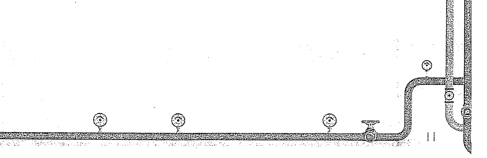

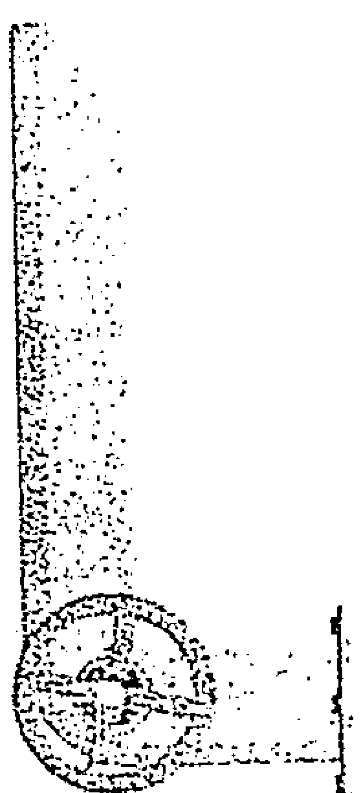

## 推薦序

徐閱 上市委員會成員

它不是一本故事書，不是科幻小說，但它仍然可以令人追看。

筆者透過分享自己個人的經驗，深入淺出介紹累積財富的秘訣、理財概念，以及不同的投資產品。例子淺白易明，是未曾接觸投資理財的讀者的首選，資深投資人亦有深刻感受，注入新思想。此書配上一杯咖啡，一張舒適的椅子，足夠令人享受一個週末的下午。

最後，祝年青有為的Starman繼《現金流為王》後，書籍繼續大賣，再闖高峰，期待下一本著作！

## 推薦序

時景恆 時昌迷你倉創辦人

大家於2017年讀過《現金流為王》，今次Starman又出書，承接上本，將會有更精彩的演繹。

這是一本非傳統投資「股和樓」的論調，而是一本「另類思維」的組合。Starman從別人或市場不認同中，萌生出一個機會，一個說法。投資，不是只靠單一的獨特眼光，而是持續的投資思維，更重要是個人的堅持和執行。

請各讀者與我一起細閱此書《現金流為王2》。

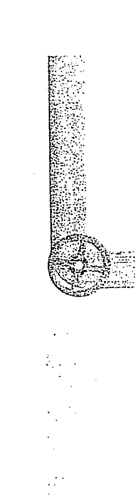

## 推薦序

關志康 上市公司百本(2293)主席

我的辦公室位於尖沙咀鐘樓旁，每天都有很多人在街頭唱歌。其中常常在窗外傳來的歌，是容祖兒和李克勤合唱的「刻不容緩」：

- 遲來一秒鐘 遲疑一秒鐘
- 從迎接你變做目送
- 遲來一秒鐘 沿途經過和結局
- 其實太不同
- 遲遲未預備 第一句愛你
- 已經足夠醞釀暗湧
- 盼望猶豫未決的情人回信
- 猶如行刑懸在半空

許多投資者都會一樣感嘆，如果當初這樣，現在就不會怎樣，後悔懊惱一再重複。假如我們可以汲取教訓，別再犯同樣錯誤，那麼我們在投資道路上就不會走太多冤枉路。

在人生很多事情中，許多年輕時會有自己的夢想和人生規劃。然而，大部分人往往流於空想而未有坐言起行。當我們到了一定年紀，很容易因一支歌曲或一部電影，就觸動內心深處的遺憾或懷念。本書的作者奉勸青年人，務必充實自己，把握當下任何機會和資源，別退縮或過於保守，把握機會，當機立斷。縱使萬一失敗也要汲取難得的經驗，成為你生命中的許多養分。那麼，人生就不會白費，今生也會無悔。事業發展如此，投資理財也是如此。本書的作者Starman，絕對是我們的典範楷模。

本書作者是在我的朋友圈子中罕見的英雄才俊，行文流暢，能將複雜概念化繁為簡，讀時使人神馳。作者主張現金流為王，介紹了自己身體力行、在日常生活中的一些可行的操作方法。全書富有本地色彩，雖然不是一部文藝作品，但其中許多文章寫得生動活潑，真實勵志，內容豐富，有理有據，而且文筆優美，是一部可讀性甚強的好書，我十分喜歡，也全力推薦給你。

## 推薦序

99% 台灣著名財經作家、「99帕的財經筆記」 Blogger、著作《沒有 18% 我靠股票打造自己的鐵飯碗》

在投資的道路上，我一直習慣透過廣泛閱讀學習，充實自己的理財知識，但只有在極少數的時刻，會讓我在閱讀過程中，有著豁然開朗、相見恨晚的悸動，而Starman兄的大作《現金流為王2》，正是這樣的一本好書。

現在回憶起來，其實我與Starman兄結識時間並不算是2015年才接觸到他部落格的文章，但卻對我在投資思維上有著很大的啟發與影響。因為當時我正處於投資階段的轉換期。雖然自己過去藉由投資中小型價值股及動能操作，得到豐厚的超額報酬，但同時也必須忍受更太的波動，所以我一直希望，隨著資產的累績，能慢慢將資本利得的操作，轉換為相對穩定的股息回報，最終以賺足穩定的現金流為目標。

可惜台灣這方面資訊及適合的投資工具不多，所以才開始放眼海外投資，後來偶然接觸到Starman兄的文章後，更開啟了我的投資視野，因為他獨創的「現金流投資法」，是以較少人關注的房地產信託基金（REITs）及債券（Bond）為投資工具，將兩者不同的特性融合互補，再搭配適度的槓桿，完成了一個可以有穩定增長現金流的投資組合。

這種方式正好與我的投資目標不謀而合，於是我開始變成Starman兄的忠實讀者，而且一路追看文章下來，愈發欣賞他的投資理念及人生觀。之後湊巧我們都先後出書，也才開啟了以書會友及互相交流的機會。從他上一本大作《現金流為王》中，我已經得到非常多的啟發與收穫。

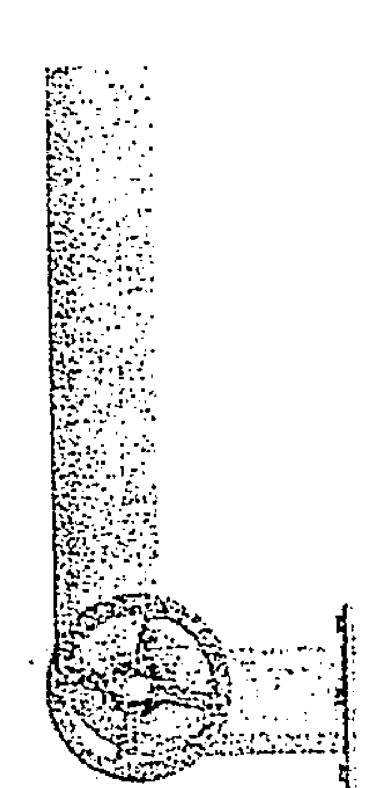

但這次有幸拜讀新書後，更是令我眼界大開，因為Starman兄除了延續過去「現金流為王」的概念外，還進一步完整闡述了他的投資體系，包含「資本運作」、「資本配置」及「槓桿配置」的應用方式及背後的哲學理念，教大家如何區分各種資產的特性，並且善用這些要素，建立一個可以自我優化、持續穩定增長的現金流系統。

此外，還將此投資理念應用到地產、物業及營商等項目上，教導投資者如何以現金流為基礎，藉由「先現金流、後價值、再價格」的方式，估算資產價值，甚至通過「產融結合」模式，達成所謂「現金流的極至」——資本證券化的終極操作。

更棒的是，本書除了理論之外，還有舉出許多Starman兄親身投資案例作為示範，包括貿易平台、地產及倉地的投資等，這些都是市面少見、非常難得的經驗分享，許多項目甚至跨足商業經營領域，已經超出了一般散戶的投資範疇，足見作者功力之深，見識之廣。我想，也只有像Starman兄這樣身兼投資專家及企業經營者的資歷，才能寫得出如此宏觀格局的作品。

最後，現今世界各地都出現貧富差距惡化，財富向1%少數人集中的趨勢，也因此過去才會出現所謂「佔領華爾街運動」，主要訴求99%的人再也無法忍受1%人的腐敗跟貪婪，當時對我造成很大震撼，也是我「99啪」筆名的由來。

不過不同的是，我始終認為，資本市場雖然是由1%的人制定規則及壟斷財富，但99%的人不必灰心，更不用去佔領街頭，只要學會正確理財方式，每個人都有達到財務自由的機會。而本書《現金流為王2》，就是一個值得大力推薦、可以幫助大家翻身的最佳利器。

因為本書已為讀者完整剖析了資本市場的運作規則，只要大家能學習作者的投資思維，持續正確的累積資產，我相信未來一定也可以擁有穩定的現金流系統，享受富足自由的人生。

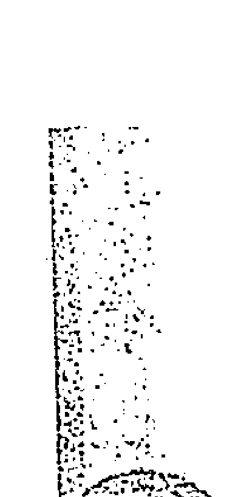

## 自序

2017年4月，我出版了第一本著作《現金流為王》，書中講述了我的成長之路。由一個當年會考只得七分的窮小子，到今天能夠實現自己的理想，做到自己想做的事情，每一次回想自己的一步一腳印，都會十分感恩。人生中每一個階段，過程中每一段經歷都為我帶來新的啟發，同時也感受到自己在不斷成長，思維上變得更立體，直至今天自己仍在不斷的蛻變，這是事隔一年多後我再度著書的原因。

由零到第一桶金，由投資到營商，由打工到創業，由最初一個人「單打獨鬥」到今天擁有各路的優秀團隊……十年光陰過去，回頭看，自己一直所走的路其實與社會上大部分人所追求的「成功之路」都大相徑庭，但我卻為自己走過「不一樣」的路感到幸運。一直以來，我對傳統思維、準則的不認同，使腦袋裏無時無刻都萌生著不同的另類想法，這是一種「另類思維」。正正就是這種思維，我總覺得普羅大眾最感興趣的投資（股和樓）乏味沒趣，因此我更喜歡研究和投資一些非大路的「另類投資」（Alternative investments），漸漸建立了另類的投資思維，對投資組合的營運操作、營商的理念亦別樹一幟。

這些年來，當大家都從物業投資中賺到了許多個零，從股票投機中短時間便賺取了可觀的利潤，我卻對這些單一的爆發性收益不感興趣，卻鍾情投資普羅大眾都認為收益低又悶蛋的投資——債券和房託基金。

一般人認為債券和房託基金不吸引，原因是其價格波動沒有股票般顯著，現金流收益遠比不上股價升幅的樂趣。一般人眼中的「缺點」，在我眼裏卻是「優點」。債券價格的波動性低，正有利於槓桿操作，將債券偏低的回報率提升，以此作為起點，投資於同樣高倉值、高現金流回報的房託基金。將兩種別人眼中「低收益、又悶蛋」的投資產品，搖身一變，成為一個可運用槓桿調節收益、以現金流再投資的投資組合系統。

或許今天很多人可能會認為我當初在投資和創業路上所做的決定和選擇都是正確的，但事實上，在這十年裏，我做了無數次重大的決定，而幾乎每一次大部分人當時都不認同我的選擇。每一次聽到別人的不認同，又或看見市場的不認同，我便知道這是一個機會。

機會的出現，往往來自市場不同的看法，當所有人都持相同的看法時，機會便會被市場消化，這些利潤便輪不到你去賺。那些所謂趨勢投資法，每天盼望「搭順風車」，又或是一味追逐資產價格來買賣的投資方式，從來都不是我杯茶，但我明白這都是市場大多數人的「嗜好」和做法。

因此，我們無需老是要爭取別人對自己看法的認同，別人的不認同其實是一種機會，而關鍵是如何將機會把握好。想要把握好機會，除了獨到的眼光，其實更重要的是個人的堅持和執行力。

投資，不是只靠一次半次獨到的眼光，而是持續系統性的投資思維。


## 导读

## 「现金流为王」的投资理念

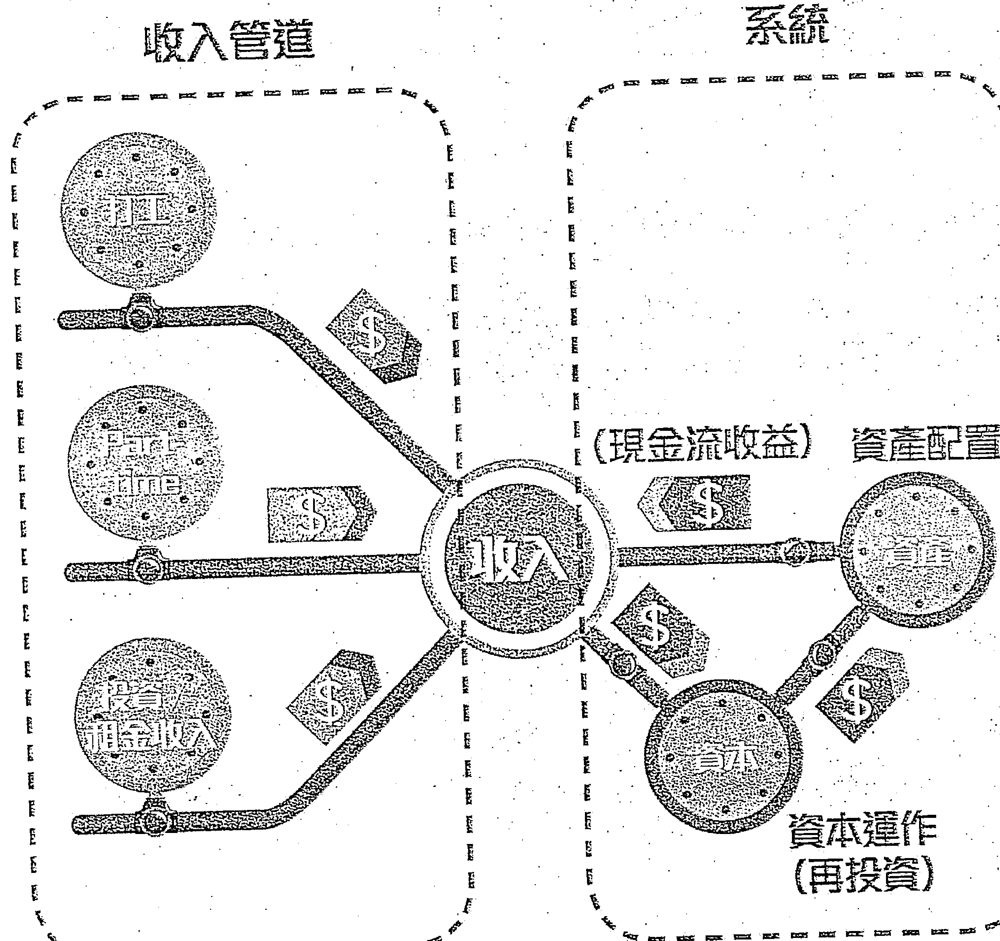

每一個人都需要「收入」去應付日常生活的需要和支出。收入是以持續流動狀態呈現的一種收益，所以收入必須是一種現金流。資產的升值，既非持續，又非流動，因此並非收入。我們每個人每月應該都有一份收入，但大部分人的主要收入管道（來源）都非常單一（主要來自工作），更重要的是大部分人並沒有利用不同的收入管道去構建一個「系統」。

「現金流為王」是一種投資理念，指長時間買入和累積能持續產生現金流的資產項目，資產又能產生現金流收入，收入轉化為新資本，用於再投資能產生現金流的資產，資產再次產生現金流收入……生生不息，正向循環，這是第一個層次。要建立多元化現金流及自我優化成長的投資系統，當中包含了資本運作、資產配置和槓桿操作的概念，這是第二個層次。《現金流為王》講述了筆者整個投資理念的大綱，而本書將更深層次地深化講述「現金流為王」中資本運作、資產配置和槓桿操作背後的哲學理念和應用。

投資是長途賽，我們必須要考慮長時間的投資行為和回報。回報=本金×時間×回報率，時間是回報的重要因素，而時間是你的朋友或敵人，取決於如何運用你的資本，這是為何資本運作的理念對所有投資者都相當重要。資本運作是指一連串的動態投資操作，原理如「滾雪球」，關鍵在於讓雪球不斷自然滾動，而雪球的動力就是現金流。投資收益只有體現於現金流才能不斷地進行「再投資」，「再投資」含複利的力量，使雪球能自然產生動力，不斷滾動，愈滾愈大。

對於初階投資者，我會強調「複利」（在《現金流為王》中我多次強調複利），因為這是作為任何投資者都需要去認識的一個重要概念；對於進階投資者，我會強調「槓桿」，因為除「複利」以外，「槓桿」才是真正致富的關鍵。在雪球開始滾動時，缺乏的是一種初始的力量去推動雪球，這時候我們可以運用槓桿去增加投資組合的動力。

然而，槓桿投資只是一個開始，而前提是你們要找到一條長斜坡，然後用一根棍子，令你能利用較少的力量（資本）去挑起較重的石頭（大額投資和回報），推動石頭在長斜坡向下開始滾動。當投資組合產生「動能」（現金流）後，依靠的就不再是那一根幫你挑起大石的棍子（槓桿），因為你不再需要主動利用槓桿去幫助石頭加速，而是需要令石頭滾得穩定，on the right track，令石頭得以持續地滾動。因此，對投資組合而言，再投資和資產配置才是關鍵。真正善於運用槓桿的人，是懂得以「去槓桿」（Deleveraging）為目標。

「現金流為王」的投資理念，可應用於證券、物業、地產項目和其他不同種類的投資，同時也適用於營商，這理念有助投資者「有根有據」地估算資產項目 / 一盤生意的潛在價值。以資產產生的現金流作為基礎去推算資產價值的過程，稱之為「現金流資本化」。專業投資者都注重資產的現金流，因為我們都明白這是資產價值的基礎。一個資產項目如果不能在現在或將來產生可持續的現金流，該資產的價值便缺乏了實質上的支持。先現金流，後價值，再價格。

然而，一般大眾投資者的邏輯卻剛好相反：先價格，後價值，才現金流。他們只著眼於資產價格的升跌，並花大量精力嘗試不停預測該資產將來的價格，「價格上升是貴，要沽售；價格下跌是便宜，要買進」，並不是一種正確去評估資產價值的概念。這就是富人與大眾散戶在思維上的分別。

有了「先現金流，後價值，再價格」的概念，我們明白到現金流才是資產價值的起源和根本。應用於地產項目的投資，要提升資產價值，必須先提升租值，租值提升，估值便能提升，最後通過「產融結合」，我們便不一定要通過沽售資產（價格）才能將升值部份轉化為現金流，進行再投資。「先現金流，後價值，再產融結合」才是不斷累積資產的終極操作。

明白了上述一套完整的投資理念，大家應該開始有了明確的方向去建立自己的投資系統，同時會發現市場其實充滿著不同的投資機會。投資的關鍵在於多元化收入，要令齒輪不停轉動，不能或缺的就是現金流，缺乏現金流，資本、資產、收入都會乾涸，當齒輪不再轉動，投資組合就不會繼續自然成長。

本書的第一至第三章，主力講解投資概念；第四章主要講槓桿的應用；第五章便是「現金流為王」的極至——資本化和證券化。第六章，我會以一些親身投資經驗作示範；到了第七章，我希望以一些宏觀經濟事件作分析，令大家更全面地掌握整套投資理念。

# 第一章

# 如何建立收入系统

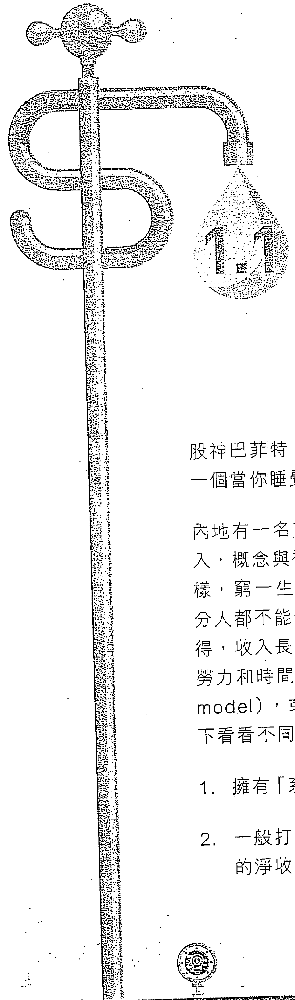

# 你想得到何種「收入」？

股神巴菲特（Warrant Buffett）曾經說過：「如果你沒有找到一個當你睡覺時還能賺錢的方法，你將一直工作到死。」

內地有一名詞叫「睡後收入」，意思是指睡一覺醒來就有的收入，概念與被動收入一樣。其實內地和香港的打工仔普遍都一樣，窮一生精力，以勞力換取收入，以時間換取金錢，大部分人都不能做到「時間」和「金錢」兩者兼得。要做到兩者兼得，收入長遠必須透過構建一個「系統」而產生，而非單純以勞力和時間來換取。「系統」可以是一個商業模式（Business model），或者是一個投資組合（Investment portfolio）。以下看看不同人擁有的不同收入種類：

-   1. 擁有「系統」的資本家：睡後收入（睡醒後就有的收入）
    2. 一般打工仔：稅後收入（賺到錢還要繳足稅後才屬於自己的淨收入）
    3. 持有債券、房託和股票的投資者：免稅收入（免繳稅的投資收入）
    4. 親身參與營運的老闆：免稅收入（24小時工作來換取的收入）
    5. 打兩份工的打工仔：睡眠收入（以睡眠時間來換取的額外收入）

你又屬於哪一種？

# 你清楚遊戲規則嗎？

人生需要規劃，而且需要很有系統地去規劃，原因很簡單，世界上所有的事情都有門檻，包括投資，以至生活、結婚、生小孩、買車買樓、換樓等等。正如打機一樣，撇除「父幹」因素，每一個人一開始都是 Level 1，然後需要不斷努力「升呢」，在每一關卡完成某項特定任務後才能過下一關。

遊戲的創造者很清楚地預先設定了不同關卡和一系列的特定任務。而事實上，我們的人生也一樣，只是沒有人幫我們去預先設定關卡。某些父母、師長們嘗試為我們設定過關要求，如「讀好書、升班、考學校、考公開試、上名牌大學、搵份好工／做專業人士」，完成以上要求就可以如願地高人一等、買車買樓，做人上人。甚至公司老闆都一樣告訴我們：「做好份工，努力加班，你便會升職加薪，然後便可以買車買樓，做人上人……」

然而，社會真的這樣運作？由我們踏入社會的一刻，才知道原來事實並非如此，此刻驚覺被欺騙了二三十年。是師長和老闆們存心欺騙？還是他們真的這樣認為？我不知道，我只知道他們所灌輸的傳統思維，在今時今日已經不適用，大家所信奉的「過關要求」與現實社會的要求愈來愈不符合。如只按上述方法，在今天的市場，莫說是買車買樓，連買新樓劏房也遙遙無期。對某些人來說，排隊申請公屋可能比買樓上車更快、更實際。這是為何有些大學生尚未畢業就先申請公屋，比起來職申請的準備來得更早。當大學生都要與低收入家庭爭上公屋時，我們需要想想這個社會，以至整個經濟結構正在發生甚麼轉變。

# 人生不應只為「被補償」

在作出財政規劃之前，我們需要清楚明白何謂「收入」。大家最為熟悉的收入概念是各位打工仔上班每月所收到的「工資」。然而，這份「工資」正確來說應該稱為「補償」(Compensation)。打工出賣最寶貴的人生、時間和心力予公司，當中包括被上司無理訓話、受氣、承受工作壓力等等，每月的工資就是對你作出的應得補償。

但是人生不應該只為了「被補償」而生活，打工的意義不應單純為了每月工資，而應該是為了脫離窮忙生活而努力儲備足夠的彈藥。當然，工作中賺取的人生閱歷也非常寶貴，羽翼豐滿的一天就是脫離現在崗位，去做自己真正想做的事情的時候，至少也應該以此作為目標，人生才能活得多姿多彩。事業、家庭、成就、理想在人生中應該取得平衡。

因此，對於人生，我們需要很有系統地去規劃，而首要的是預先設定人生不同階段的目標，這樣才知道現時自己正在朝著的那個方向，是否能夠如願地達到預設的目標。

筆者在《現金流為王》中提到，人生可分為三個十年，第一個十年是22-32歲（即畢業前就應該著手規劃）；第二個十年是32-42歲（在第一個十年累積得愈多，才是真正的「贏在起跑線」）；第三個十年是42-52歲，應該開始計劃並準備退休或退而不休的生活，原因很簡單，這階段已經過了精力最旺盛的時期，不應再依靠勞力賺取金錢，被動收入應該為最主要的收入來源。

# 第一章：如何構建收入系統


# 收入必須依賴「系統」

主動收入是靠努力和時間賺取，而努力和時間都是有限的資源，以有限的資源去換取的收入也自然是有限的。而且，隨著年紀漸長，以上兩種資源便愈來愈缺乏。因此，結論是：收入並不應該單靠努力和時間去換取，長遠應該透過構建一個「系統」，為我們產生源源不絕的收入。如果不希望收入是一種補償，收入就必須是依靠一個「系統」產生出來。

一個「系統」是由多條收入「管道」建立出來。要構建一個「系統」，我們首先要建立不同的「管道」，使經由「管道」流入的被動收入多元化。如本書開首所說，「系統」可以是一個商業模式，或者是一個投資組合，更可以是兩者的結合。

筆者的收入「系統」分為兩個「子系統」，一個是由不同金融資產組成的投資組合，一個則是由生意系統所組成；前者屬於「防守系統」，後者屬於「進攻系統」。

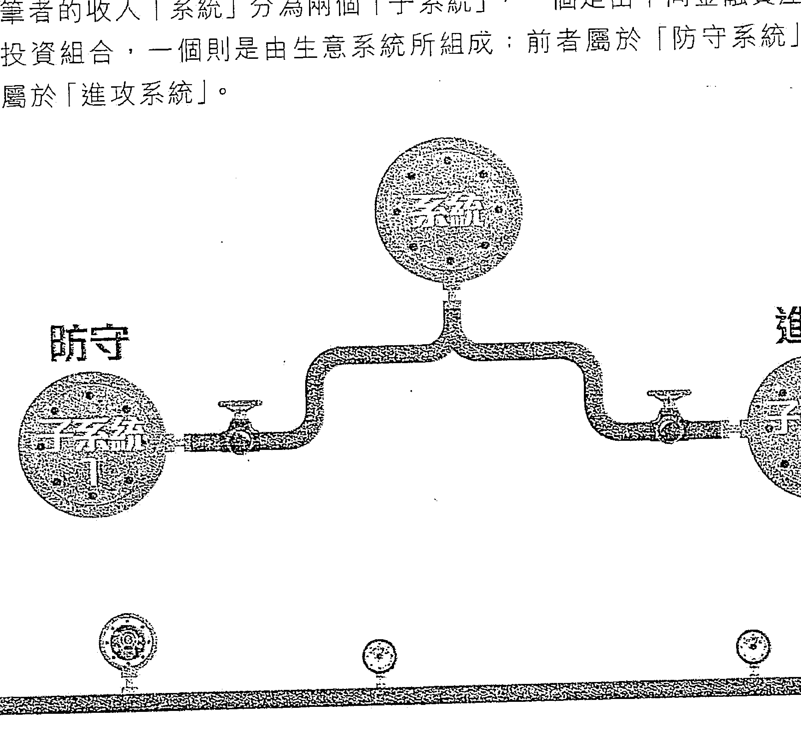

「防守系統」中的金融資產如房託基金（REITs）和債券（Bond），每月穩定地產生現金流回報，以支持家庭的日常生活開支。這個系統不求爆炸性回報，只求穩健現金流，以「時間來累積資產」為宗旨，使「進攻」的一方沒有後顧之憂，同時為「進攻系統」提供流動性支援和補充。

「進攻系統」的收入是由生意和公司業務所產生。生意和公司業務同樣講求現金流，但角度和概念並不一樣。「防守系統」中的金融資產組合，要求能夠定期產出穩定現金流，並以產出的現金流進行再投資，概念是「以時間累積財富」。而「進攻系統」中的生意／項目投資，則是以現金流作為起點，主動提升資產價值，是「創造價值」的概念。雖然不論是「防守系統」或是「進攻系統」，兩者均十分注重現金流，但當中現金流的角色和概念截然不同。

前者是純投資，是收穫別人創造的價值，以現金流方式體現回報，再以反覆再投資的操作去累積資產和財富；後者則是投資加經營，是主動創造價值，以現金流為起點，通過強化資產（Asset enhancement），增加資產所能產生的現金流回報（Yield enhancement），從而提升資產項目的估值，其過程稱為「估值資本化」（Capitalization），再體現於資產價格的上升，最後可以沽售資產獲利，或通過再融資（Re-financing）的方式套現，然後進行再投資，是為「產融結合」累積資產的方式。本書的後半部將會作詳細解釋。

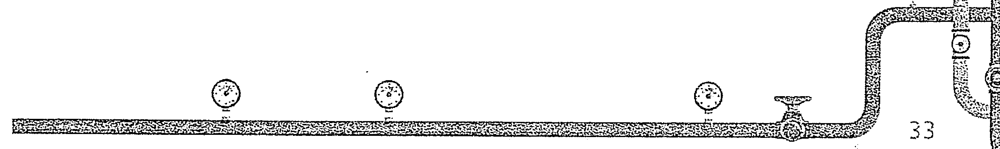

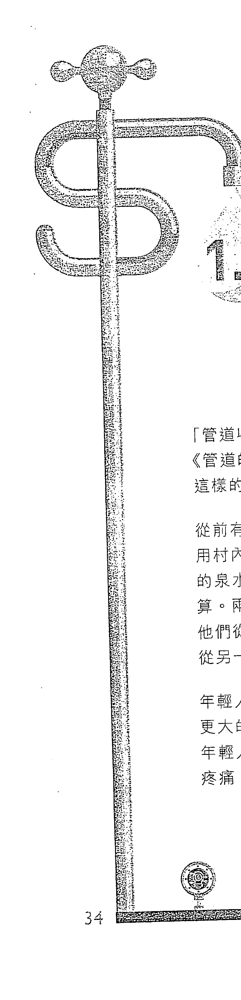

# 1.2 由建立收入管道開始

「管道收入」一詞來自貝克·哈吉斯（Burke Hedges）的著作《管道的故事》（The Parable of the Pipeline），故事大概是這樣的：

從前有一條村莊，由於天氣大旱，村莊缺乏水源，村長唯有僱用村內兩名自動請纏又年青力壯的年輕人，幫忙將另一個山谷的泉水利用水桶運送至村莊，報酬按照他們運水的數量來計算。兩位年輕人找到工作非常興奮，馬上投入運水。每一天，他們從早到晚提著水桶，來往山泉和村莊之間，很努力地把水從另一山谷運到村莊裏，每天晚上帶著當天的報酬回家。

年輕人A很滿意這份工作，他心想如果要增加報酬，他就要換更大的水桶去承載更多的水，這樣每一次就能提更多的水。但年輕人B則不太滿意報酬，每天回家後他的背部和手臂都十分疼痛，而且筋疲力盡，因此他想辦法尋找一個更輕鬆，而且能夠賺到更多錢的方法。有一天，他終於想到——他打算建一條管道，把泉水引到村裏去，這樣他就不需再每天提著水桶來往山谷和村莊運水。

B向A提出他的想法，但A反對，認為這樣會影響他每天運水的進度，拖慢他賺取收入的時間。話還未說完，A已換了更大的水桶繼續出發去山谷運水，而且為了增加報酬，他增加了往返來回的次數。B則堅持執行他的想法，每逢周末和工余時間，他都非常努力地建設管道。

另一方面，換了大水桶的A在這段時間裏，收入增加了一倍。然後，他的生活方式開始產生了改變——他利用增加的收入買了更大的房子，每天下班都用賺回來的收入去享受。日子久了，他開始意識到身體出現毛病。很快，由於身體的疲勞，他提的水量愈來愈少，收入大幅下降，經濟狀況開始陷入困境。

時間一天一天過去，B的管道終於完成了，他不再需要以人手每天提著水桶運水，卻比以前賺到更多收入，而且無論在睡覺、吃飯還是度假的時候，山上的水都能通過管道源源不絕地流進村莊，同時他的收入也就源源不絕。

# 1.3 用「管道」買回時間

上述故事的兩位年輕人，其實正正就是現實社會的反映。年輕人A通過提水桶來賺錢，其盈利模式很簡單，要增加收入，就必須增加提水的次數，或者使用更大的水桶。在現實生活中這是一個很普遍的現象，不少人會通過加倍努力工作去賺取更多收入，如加班或兼職；又或是換一個更大的水桶，然而提更大的水桶需要更大的力氣，這代表換一份更高收入的工作，但所投入的時間可能會更長。

現實生活中，大多數人都像A一樣，以努力和時間換取金錢，然而我們一天只有二十四小時，以有限的時間去換取收入，收入也必然是有限的。只要你墮入「以時間換取金錢」的老鼠籠模式，你再也無法改變你的收入極限，這是一個物理定律。更何況我們不可能將所有的時間都拿來工作，加上年齡、健康以及其他因素，當我們不能再用時間和努力來換取收入的時候，收入便會完全停止，這是正所謂「手停口停」的困局。

相反，年輕人B相當有遠見，他並沒有利用所有時間去換取有限的收入，反而選擇利用一部分時間去建立自己的管道。當管道完成後，水便

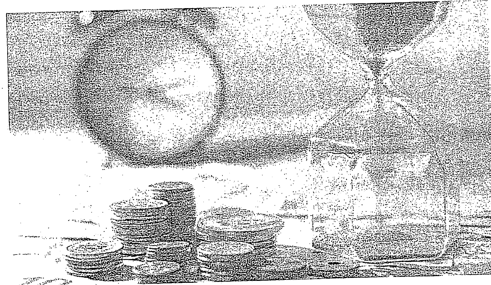

# 財務自由的真正意義

就像我們上班，上一個月班就能賺取一個月工資，當生病了不能上班，就沒有收入，這是絕大多數人的生活常態。但是，如果你有不同的收入管道，上班賺取的工資已不是你唯一的收入來源，即使退休了，不上班也有其他的管道收入。例如你投資開了一家食店，請了經營團隊為你營運，你每月需要支付經營團隊工資，但買回了自己的時間，因此你可以運用多出來的時間去建立另一條收入管道，如建立一個投資理財組合。

慢慢你會發覺，每一條收入管道不需要打理，都能賺取可觀的利潤，關鍵在於一段時間後它能自動營運，儘管利潤多分一點出去給予你的經營團隊；又或者這只是一個「賺息」的投資組合，只有現金流但沒有爆發性收益，但只要它能穩定自動運作，不用你去操心，這等同買回自己的時間，這樣你才有心力去做其他事情或再建立更多的收入管道。只有這樣，你的管道收入才能做到多元化。因此，所謂的「財務自由」，關鍵不在於「財務」，而在於「自由」。

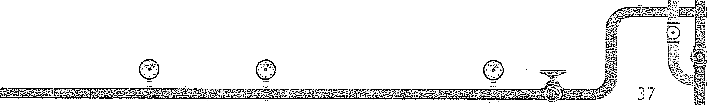

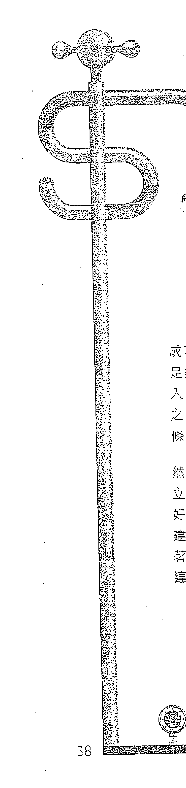

# 1.3 利用管道建立系统

成功建立了一條管道後，你就會擁有一項被動收入，但這是不足够的，因為若管道淤塞了，收入就會停止繼續流入。一項收入，不管是主動還是被動，比例過分集中便是風險，財務上稱之為集中風險（Concentration risk）。因此，人有需要建立多條管道，使被動收入多元化。

然而，建立一條管道所耗費的精力、時間和資本太高了，要獨立地建造多條管道所犧牲的成本實在巨大。因此，我們必須好好利用第一條管道去建立第二條管道，再利用已建的管道去建造更多的管道，前提是管道與管道之間必須全部接通，意味著管道之間的結構是互相關連，互相補充。一個結構上互相關連、互相補充的多元管道，是為一個「系統」。

# 1.4 以管道建立管道

由於建造一條獨立管道的成本浩大，若我們能夠利用第一條管道的基礎，包括已建管道分佈的地理位置，和已創造的流水（被動收入）去建立另一條管道，所開拓的新管道就能去到更遠，且能到達其他人更難去得到的新領域，建造時間和成本亦能大大減低。做事要懂得善用手中已有的資源，而所得的成果必須能夠積累。這將大大節省一個人努力所需要付出的時間，達到事半功倍的效果。

此外，能利用已建管道的新流水，亦有助降低建造新管道的資本開支（Capex）。利用投資收入再投資，這就是再投資操作（Re-investment），當中的複息效應將大大加快「系統」建立的速度。當你的管道愈來愈多，「系統」就會逐漸形成，你更可利用新增的流水收入，直接收購別人的獨立管道，然後與自己的管道「系統」接上，用最短的時間將規模擴充。由於它在別人手中只是一條獨立管道，但落入你手中卻是「系統」一部分，能收到1+1=3之效，這就是協同效應（Synergy Effect）。

# ## 「系統」的堡壘效應

在系統結構上，多元管道之間的互相關連和互相補充，充分發揮了互助互補的功能，即使其中一條管道淤塞了，其他管道亦能提供即時的補充。正如集團內一家子公司出現了財政周轉問題，其他子公司能提供即時的流動性，大大降低了整個集團資金鏈斷裂的風險。另一方面，若其中一條管道有良好的拓展機會，其他管道亦能提供及時和靈活的資金支持。

簡單而言，一個「系統」比起多條獨立的管道更優勝，其優勝的地方在於前者擁有更大的「流動性緩衝」（Liquidity buffer），使管道能經得起市場波動所帶來的考驗。與此同時，波動亦代表著機會。由於「系統」擁有多元的流動性互補機制，使其更有條件在波動的市場中抓緊突如其來而且難得的投資機會。

下一步，我們一起開始學習如何去構建自己的「管道系統」。

# 第二章 建立有效广告系统的考虑


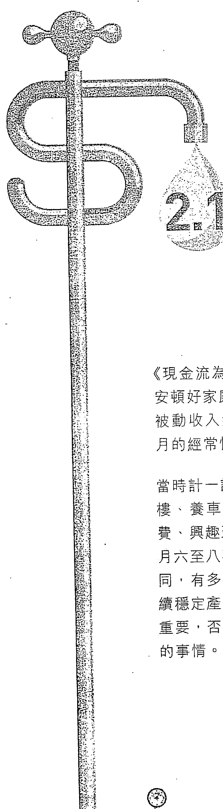

# 「系統」的背景與原理

《現金流為王》提到筆者當年決意辭職創業去尋找理想，為了安頓好家庭，便積極做好資產配置，創造一個具穩健現金流的被動收入組合（Passive income portfolio），以應付家庭每月的經常性開支。

當時計一計數，一個有小朋友的中產家庭的基本開支，包括供樓、養車、工人、長老、水電煤、管理費、差餉、小朋友學費、興趣班、食飯、基本娛樂、醫療保險、家中雜費等等，每月六至八萬元已是相當基本（當然，不同家庭的開支會有所不同，有多有少，然而重點不在於數字）。意識到擁有一個能持續穩定產生現金流的被動收入組合，對每一個人來說都是相當重要，否則只能一世困在老鼠籠內，永遠不能做自己真正想做的事情。

面對這個未來只會有增無減的開支，我們要做的不只是去努力創造收入，更重要是構建一個能產生現金流且持續增長的「收入系統」，而筆者的「REITs + Bond」（房地產信託基金＋債券）投資組合是一個例子，希望大家不要將焦點單純放在「工具」之上，更重要是去了解建立這個系統背後的理念，然後大家便會明白組合內運用不同操作的原因，進而在不同的市況下，均能因應市場的變化與自己的情況作出最佳調節，創建真正屬於自己的投資系統。

# 為何選擇「REITs + Bond」？

《現金流為王》提到筆者的金融資產被動收入組合——「REITs + Bond」，基本原理如下：

債券以短債為主，一般不長於三年，會利用債券本身的倉值（LTV）做槓桿投資，增加回報率。倉值的意思是銀行提供的融資額，以買樓的按揭成數概念去理解會比較容易：若銀行對某債券提供70% LTV，意思等如買樓做七成按揭。

所謂槓桿投資債券（Bond Leveraging）是指買入一隻債券後，將之抵押予銀行，利用銀行低息融資的優勢，根據該債券的融資率向銀行貸款，借回相當部分的資金，將套現出的資金再度買入該債券，如此類推，反覆操作。

當然實際操作上比較簡單，假設債券票面息率為5%p.a.，債券的融資率為80%，私人銀行的融資利率1.5%，買入債券時就只須支付20%資

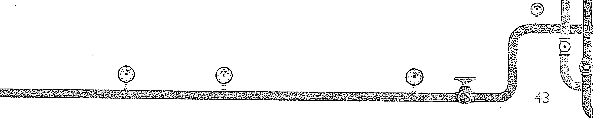金，就可以買到100%面值的債券，其餘80%由銀行融資，計算槓桿比率就是1 / 20% = 5倍，淨回報率超過18%。當然，筆者一向不建議用盡槓桿，但即使不用盡槓桿，要做到淨回報10%以上也不難。以上做法就等同套息交易（Carry Trade），借入低息資金，買入高息資產，從而套取當中的息差。有關槓桿操作，會於稍後篇章作更深入講解。

至於筆者的REITs組合一般不做槓桿，因為想利用其價格波動性（Volatility）較低及高倉值（即高融資率）的優勢，作為槓桿債券組合的有效緩衝（Buffer），並作為滿足臨時現金需要的「提款機」，提升整個投資組合的資產流動性及穩健性。

要做到「REITs + Bond」組合有足够的防守力，首要記住債券組合槓桿不用盡，REITs組合的緩衝要充足，這樣才能令組合立於不敗之地。

基於債券一般每半年只派息一次，因此債券組合本身的設計是分散買入最少六隻不同派息月份的債券，使債券組合每月均會收到債券利息，達到每月出糧的效果。債券利息每月有多有少，筆者會用於再投資優質、前景看好且平穩增長的REITs組合，如領展（0823）、置富（0778）、越房（0405）和持有又一城的新加坡豐樹信託（Mapletree Greater China Commercial Trust；SGX：RWOU）等，而REITs組合亦會定期每半年派息一次，因此整個組合便形成了一個擁有穩定現金流的投資組合系統。

# 投資「系統」的四大重點

筆者是首個提出以REITs配合債券建立投資組合系統的「散戶」，但其實重點不在於這兩種投資產品，而是其背後的核心理念。只要明白箇中原理，其實組合可以千變萬化，只要運用相同原理，按個人對不同投資項目（如ETD、ETF、優先股、物業等）的認識水平，應用於不同的投資產品，也能產生相同效果。有些投資者可能以優質高息股 / 價值股替代REITs，有些會以其他固定收益投資替代債券。

筆者之所以選擇REITs+Bond，原因很簡單，主要是因為筆者對金融和地產熟悉，就地取材地選出兩種有互補特性的投資產品來組合。因此，產品不是唯一，也不是最主要的重點，最重要是：
- 投資者對產品本身是否有深入的認識；
- 不同產品之間又是否有互補且有穩健現金流的特性；
- 然後再看其中一種產品是否有槓桿操作的空間；
- 最後就是整個組合的營運技巧與風險管理。一個投資組合系統是否成功，背後的營運管理哲學才是關鍵。

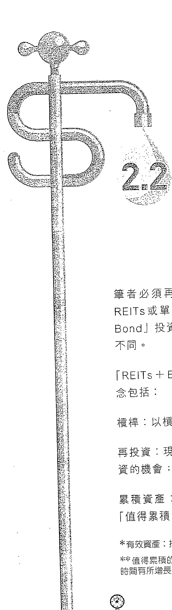

# 「REITs + Bond」組合的五個重點

筆者必須再三強調的是，這是一個組合系統。單獨地投資REITs或單獨地以槓桿方式買債券，基本上已與「REITs＋Bond」投資組合提出的核心理念和背後的營運管理哲學完全不同。

「REITs + Bond」投資組合的投資操作中，提出的重要投資理念包括：

- 槓桿：以槓桿方式投資有效資產*，從而帶來高現金流回報；
- 再投資：現金流是再投資的條件，再投資含複利力量和分散投資的機會；
- 累積資產：以槓桿投資產生的現金流，長遠不用槓桿去累積「值得累積的資產」**；

*有效資產：指能在一段時間內持續地產生現金流收益的資產。詳情請見第三章。

**值得累積的資產：指能於指定時間內產生現金流收益、其產生的整體收益會隨時間有所增長，且增長速度比通貨膨脹快的資產。詳情請見第三章。

- 去槓桿：以「加槓桿」去開始，「去槓桿」為目標，組合長遠方向是去槓桿。
- 自我優化：投資組合的自我運作須能隨時間自我優化，所指的是包括：
  1. 組合的價值增長層面
  2. 風險系數層面。
  去槓桿和風險分散（Risk diversification）正有助降低風險係數。

基於上述的五個重點，才能總結出「REITs + Bond」投資組合是一個長遠能自我優化的投資系統。單純地以槓桿投資債券或投資房託基金，絕對不能做到相同的效果，意義上亦與上述組合操作的原意大相逕庭。

# 「駕駛」你的投資組合

槓桿和複利力量是投資回報的助燃劑；分散投資和去槓桿則是組合風險的緩衝。投資組合是一部汽車，投資者就是司機。汽車起動時需要動能，因此需要以高轉數產生足夠扭力，汽車才能向前行，正如投資組合一開始時需要足夠「扭力」去起動，這是為何我會提倡投資一開始需要有槓桿。

起動後，仍需要一些「動力」去推進汽車向前加速，這是為何投資組合需要不斷的再投資，而再投資帶來的複利力量就是「動能」，使汽車產生速度。當汽車已經在公路上有了速度地行駛，這時汽車已有動量（Momentum），無需再維持高轉數（加槓桿）去產生強大扭力。汽車有了向前的動量，我們只管控制好軚盤方向，而這時駕駛的專注力應放在腳掣（Brake），而非油門。

這好比當投資組合經過一段時間的操作後，除了利用再投資的複利效應去維持一定的車速外，更重要的是利用再投資去做好穩健的資產配置，不用槓桿地運用新動力（新增的現金流）再投資長遠值得累積的資產，專注自己的投資方向，並在面對不同的路面情況（市況）時，去控制和調節車速。

大部分的投資者「駕駛」投資組合時，只注重速度（預期投資回報），而忽略了風險因素，如方向錯誤或遇上突發事件如黑天鵝等。事實上，投資的關鍵是要方向正確，盡量避免走錯路，不然只會想快得慢，更浪費了燃油。投資如駕駛，在有了一定的速度後，穩健和方向比起純粹的速度更重要。

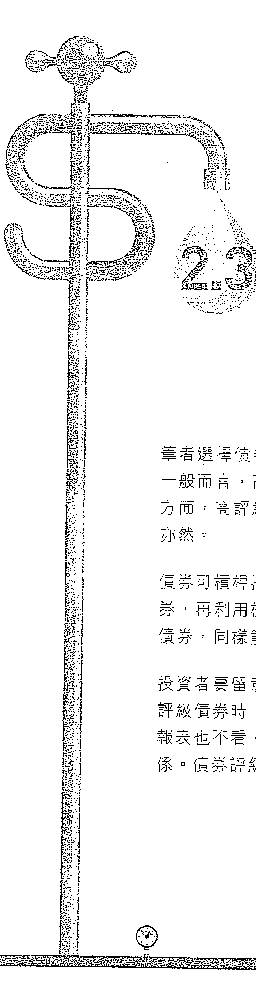

# 有關債券投資的補充

筆者選擇債券，其吸引的地方是定息回報，以及可槓桿操作。一般而言，高評級的債券回報低，低評級的債券回報高。另一方面，高評級或高質素的債券，銀行給予的融資率較高，反之亦然。

債券可槓桿操作的特點讓投資者可選擇高評級、穩健的企業債券，再利用槓桿操作提升資本回報率，使本身低收益的高質素債券，同樣能定期產生高收益的現金流回報。

投資者要留意的是，高質素的債券不一定有高評級，而投資高評級債券時，也不代表可以放一萬個心，連公司最基本的財務報表也不看。債券的評級與質素，兩者之間沒有絕對必然的關係。債券評級始終僅供參考，投資者不宜過分依賴評級。

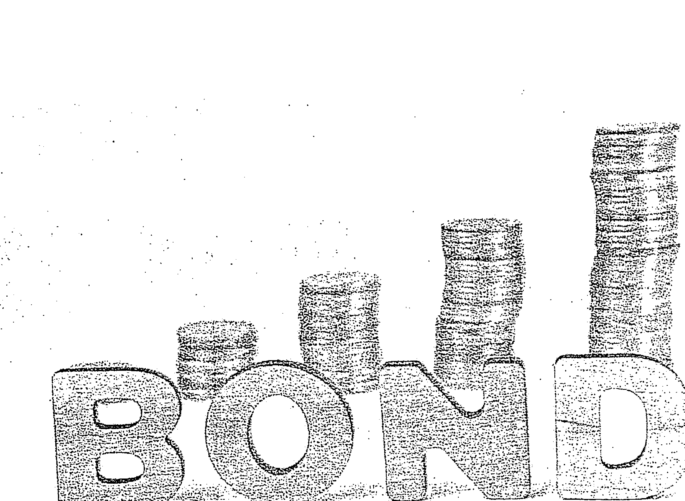

# 「無評級」債券可能更吸引

筆者甚至會專門留意一些沒有評級的債券，因為高評級債券的收益必然不高，錯價的機會較低。相反，沒有評級的債券，如果發行人資產負債表健康，有償債能力，可能更「抵買」。

有些債券沒有評級，可能因為企業本身具一定實力或背景（國企／央企、主權基金如淡馬錫系統內的公司），或發債的總金額不高，而獲取評級機構的評級需要成本，所以這些不愁投資者的發債企業為了節省成本，在發行債券時索性不尋求評級。由此可見，沒有評級不代表信貸基本質素欠佳。

# 第二章：建立有效『系統』的考慮

事實上，有不少香港大型藍籌公司所發行的債券都沒有信貸評級，但其信貸質素不容置疑。個別公司因技術性和結構性因素而未有尋求評級，如和黃、恒基，原因是如要獲得較佳的信貸評級（如「投資級別」或以上），發行人可能需要訂下一些約束條款，控制企業自身的信貸質素，以保障債券持有人。一些企業可能因應業務擴張而希望維持信貸狀況的靈活性，因而放棄獲取信貸評級。

基於上述因素，我們不能排除沒有獲取評級的企業所發行的債券是高質素及穩健的。定息回報和可槓桿操作這兩個特點讓投資者可選擇高評級、穩健的企業債券，再利用槓桿操作提升資本回報率，使低回報的高質素債券更具吸引力。

# 因時制宜 重新部署

面對利率開始正常化的趨勢（雖不意味著低息環境的離去），加上債券市場的轉變，以槓桿投資債券獲取「暴利」的時機已經過去，債券投資者的心態必須重新調整。2008年金融海嘯後，市場利率維持在極低水平，加上內地房產市場發展蓬勃，但又遇上融資困難的問題，境外發債變成了內房企業融資的主要手段和渠道。面對高回報的內地房地產項目，內房企業不惜以高成本發行高收益債券，吸引投資者認購。對投資者而言，市場歷史性的低利率跟內房的高收益債券簡直是絕配，投資策略可以同時做到「獲取暴利，亦求穩健」。挑選有國企背景的內房國企如中海外（0688）、優質內房民企世茂房地產（0813）、具大型央企背景的中信泰富（0267）等所發行的債券來投資，槓桿後的投資年回報率一般高達2x至30%。

投資，一定要順勢而行。目前美國開始走出零息年代，利率在正常化過程中，內地實行去槓桿，加上中央多項管理內房企業的措施，令市場投資環境開始轉變，債券投資是時候慢慢回歸其「保守」的傳統功能，對債券投資的預期收益回報需要降低。「槓桿」在投資債券操作中的角色，需要由「放大投資金額」改變為「備用信貸額度」，以為投資組合預留流動性作主要功能。投資者要做到因時制宜，方能立於不敗之地。

對筆者而言，債券最吸引的地方是定息回報及可槓桿操作，然而，槓桿操作的前題是息差。在目前資金成本高昂的情況下，只能找高回報的債券來投資，如內房債和城投債*，變成了以風險換取回報。若不使用槓桿，投資債券的資本回報率會下降，投資者入市投資債券時，必須要降低預期回報的要求。從資產配置的角度，對於收息一族或較年長的退休人士而言，債券投資仍是可取的選擇，惟投資債券的策略要以穩健為主。

筆者近三年已沒有增加債券的持倉，原因是難以選擇優質又高息的債券，最後在一年多前，債券到期的到期，未到期的都已全清倉。以目前市況，投資債券需要更為謹慎，考慮到加息等因素，應該以年期短的債券為主，同時可選擇投資浮息債券，以對沖利率成本上升的風險。如投資或手持定息債券，在目前市況應該開始減低槓桿，盡可能將銀行提供的融資額作為備用緩衝，投資者對回報率的要求應合理地降低，切勿盲目追求資本回報率的極大化。

*即城市投資債券，是指中國地方政府融資平台發行的債券，用以支援城市發展。

# 24 浮息債券 應對利率上升

市場利率風險上升，債券價格就會下跌，原因是現有債券的相對回報（Relative return）下降，但也不代表所有債券下跌的幅度都會一樣，例如年期短的債券、浮息債券所受的影響相對會較少。所以在預期利率將會開始回升時，選債技巧十分重要。專業投資者會分析孳息曲線（Yield curve）、預測利率走勢、加息幅度、分析加息對經濟的影響、通脹預期等因素。因此，利率風險同時會導致債券價格的波動。

利用槓桿投資債券，先天結構上有一個問題——利率和收益不匹配。由於融資利率一般為浮動利率（以COF / Libor / Hibor為基礎利率），而市場上大部分債券為固定收益債券，因此，當利率上升時，套息空間便會收窄。在面對利率正常化的加息環境，除儘量挑選年期較短的債券外，槓桿投資債券時一般可採取兩種方法，對沖利率上升的風險：

+   1. 買入利率掉期，鎖定融資利率（固定融資利率 vs. 固定收益回報）；
2. 投資浮息債券（浮動融資利率 vs. 浮動收益回報）。

以上兩個方法實際上都是解決「利率和收益不匹配」的問題，將利率和收益變為匹配，而無論利息上行或下行，息差依然不變。

# 何謂利率掉期？

利率掉期交易（Interest rate swap，IRS）是掉期交易最常見的一種。利率掉期交易合約首先確定一個名義本金（Nominal principal），在合約時間段中，其中一方同意定期支付另一方以固定利率（Fixed rate）計算的現金流，另一方則同意定期支付以現時浮動利率（Floating rate）計算的現金流；浮動利率一般以倫敦同業拆借利率（Libor）作為基準。

假設槓桿債券的貸款利率是Libor+1%，由於Libor是浮動的，如果市場加息，Libor會上升，借貸成本就會上升，但息差1%是不會改變，變的只有Libor。為對沖Libor上升風險，投資者可買入利率掉期。根據利率掉期協議，投資者會定期以固定利率去換取浮動利率的現金流。投資者所收取的浮動利率現金流，就會用來支付銀行貸款的浮動利率貸款。因此，對投資者而言，無論市場加息與否，投資者實際只需要支付一個定息的貸款成本，因此期內的利率風險可以說是完全對沖，浮動的貸款利率得以鎖定。

當然，買入利率掉期是有成本的，特別是在市場預期加息的情況下，溢價便會愈高，但其好處是讓投資者「計到數」。若融資利率加上利率掉期溢價，相對於債券的固定收益回報仍然有一定空間，那麼投資者在預期加息的環境下，仍然可考慮是否以槓桿投資債券。

# 浮息債券操作示範

在加息的環境下，債券的價格會受到不利的影響，然而浮息債券能為投資者提供與市場利率掛鉤的利息回報，當參考市場利率（一般為Libor）上升，利息回報便會同步增加。因此，浮息債券類別可以對沖利率波動風險，適合有意投資債券、同時希望避開利率風險的投資者。

以北大方正集團屬下子公司所發行的浮息債券為例：

| 項目 | 詳情 |
| :--- | :--- |
| 發行人 | 坤智有限公司 |
| 擔保人 | 香港方正集團有限公司 |
| Keepwell | 北大方正集團有限公司<br>Peking University Founder Group Company Limited |
| 總發行金額 | 3.1億美元 |
| 票面利率 | 3M Libor + 4%p.a. |
| 到期日 | 2021年5月21日 |

> *先旨聲明，筆者對該公司未作深入研究，此例子僅作解釋投資浮息債券的實戰操作，僅供參考，並非投資建議。

該債券為浮息債券，票面利率以三個月倫敦同業拆息（3M Libor）為基準加400點子或4%，債券收益每三個月重新確定一次，對上一次定息日為5月21日，當時三個月Libor為2.533125%，因此債券的總收益固定為6.533125%。下一次定息日為8月21日，如期內利率上升，假設屆時三個月Libor升至3%，則債券的總收益會同步上調至7%（3% + 4%）。

筆者所用的其中一間私人銀行，能夠提供60%的融資率（LTV），意味只需40元的資本投入便可買入100元的債券，槓桿比率為1/40% = 2.5倍。融資利率為COF + 1%（不同銀行的COF有異，但大致與Libor相若），可選擇7天 / 14天 / 1個月 / 3個月的利息期，利息期愈短，利率愈低。為了對應該浮息債券的利率重置日，投資者可選擇同為三個月的利息期。債券的下一次定息日為8月21日，假設投資者於同一天買入債券，同時選擇三個月的利息期，債券下一次的利率收益重置日與貸款的利率成本重置日，將會為同一天。融資成本為3% + 1% = 4%，而債券收益率為7%，槓桿操作下的套利息差將會固定為3%。

| 項目 | 數值 |
| :--- | :--- |
| 槓桿 | 40% |
| 債券收益率 | 7.00%p.a. |
| 融資利率 | 4.00%p.a. |
| 實際投入資金（美元） | $200,000.00 |
| 總投資金額（美元） | $500,000.00 |
| 融資成本 | $12,000.00 |
| 債券收益 | $35,000.00 |
| 淨回報 | $23,000.00 |
| 淨回報率 | 11.50% |

# 慎防補倉風險

槓桿債券操作原理，以上述例子，其實是買入一隻7%回報的債券，將之抵押予銀行，利用銀行低息融資的優勢，借出60%資金，再將借出的資金再次買入該債券，再將債券抵押予銀行融資，將套現出的資金再度買入債券，如此類推，重複操作。當然實際操作不用這樣複雜，買入債券時直接只須支付40%資金，就可以買到100%面值的債券，其餘60%由銀行融資，槓桿比率就是1/40%＝2.5倍。以上做法就等如套息交易，借低息資金買入高息資產，從而套取息差。

假設融資成本為4%，買入7%回報的債券抵押予銀行，以4%成本套現60%資金。如用盡2.5倍槓桿，即可將原本7%年回報提升至11.50%。

槓桿債券最大的風險是，當利率上升，融資成本增加，使息差收窄，最壞情況是利率倒掛，即融資成本比債券收益高，槓桿部分便會造成虧損。與此同時，債券價格會因為利率上升而下跌，增加了投資者的補倉風險。而更嚴重的是，當利率上升時，以上兩個問題會同時發生。

由此可見，利率上升是槓桿債券投資者的最大敵人。在預期利率上升時投資債券，要規避利率上升所衍生的風險，最有效是選擇浮息債券。原因是當利率上升，浮息債券的收益率也會同步向上調整，因此能夠有效抵銷上升的融資成本。此外，由於浮息債券的收益率與利率是同步的，浮息債券的債券價格在利率上升時也會受到較少影響，潛在補倉風險也較低。

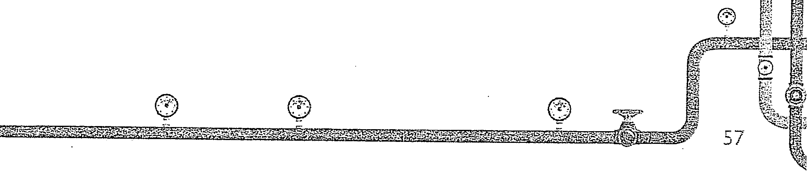


# 浮息基金比高息债基可取

不少讀者朋友都詢問應否投資「高收益債券基金」，筆者一向並不建議投資這類專為「吸引投資者投資的產品」。筆者不想「一竹篙打一船人」，只想指出該類型產品在結構上有一些問題，投資者在投資前宜先多了解。

市面上大部分「高收益債券基金」均會定期（一般為每月）向基金投資者派發固定息率。驟眼看來，固定的現金流收益看似吸引，但世上沒有免費午餐，想享受固定息率，投資者其實要付出代價。最理想的情況當然是基金經理使用實際持有債券所產生的收入派息，但如基金息率固定，實際持有債券產生的息率低於基金承諾每月派發的固定息率，基金便被迫從資本中支付派息，令基金資產淨值下跌，意味基金經理用投資者原先的投資資本作股息。

# 高息債基或賺息蝕價

同時，因基金需要應付每月的派息予投資者，基金會預留一定比例的現金持倉，這會造成額外的成本。此外，基金的高收費（這也解釋了為何某些銀行並不介意提供極低借貸利率予投資者，以「鼓勵」其增大投資金額，因銀行佣金收入更高）、不定期的資金流入和贖回也會造成額外的成本，而該等成本亦會間接轉嫁予投資者，影響基金的表現，出現「賺息蝕價」的情況。這是為何「高收益債券基金」的總體收益表現往往遜於直債（Straight Bond）。

由於債券基金沒有最終到期日（Final Maturity Day），投資者不應以投資債券的心態去投資債券基金。債券基金的好處是門檻低、風險分散、可槓桿操作、每月固定派息。然而，高息債基以高派息回報為招徠，為了抵銷上述結構帶來的高成本，同時又要提供較高的收益回報予投資者，高息債基一般都會通過高息債券配置帶來額外的孳息率和回報。高收益債券，說白了就是低評級或垃圾債券，這樣的配置也增加了本金的波動性和風險，降低了資本保值的要求，最後較高的債券違約率當然也會直接影響基金的表現。

# 浮息基金 能調節利率變動

浮動息率基金（簡稱浮息基金）則與市場上一般的「高收益債券基金」不同。首先，浮息基金的收益來自實質持倉的應收利息，而利息為浮動性

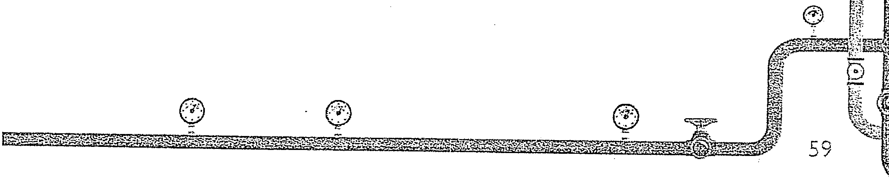

質。因此，基金收益與市場利率基本上同步。此外，浮息基金在結構上也相對穩健，這與其投資標有直接關係。

浮息基金一般為投資於槓桿貸款相關債務資產的基金。已發展國家的貸款市場成熟，商業銀行等金融機構借貸予有需要企業進行資本重組、收購、再融資、重整資本架構及槓桿收購等交易，而銀行借予企業的貸款多為浮動息率貸款，一般以同業拆息為基準。為降低資本成本，銀行會通過將企業的浮息貸款出售予投行或基金，將企業貸款「表外化」。然後，投行或基金將企業貸款證券化成浮息基金，出售予國際投資者。因此，浮息基金項下的資產實質為浮息貸款。

在預期加息的環境下，又希望投資能產出穩定現金流的債務資產，筆者認為投資組合內應儘可能置換一些能對沖利率風險的資產，除浮息債券外，浮息基金也是一項比較可取的投資配置，達到分散投資風險的同時，又比高息債基更可取。浮息借貸的票息根據普遍市場認可的基本借貸利率（一般為三個月Libor），再加上一個固定息差（Fixed interest spread）而有所變動，並且定期重新調整，以反映目前的利率走勢。因此，與無法對任何利率走勢作出調整的固定利率債券或債券基金相比，利率走勢對這資產類別所造成的價格波動相對較低。

## 具抵押品擔保　復原率較高

基本上，浮息貸款沒有利率風險，風險主要為企業的違約風險。然而，浮息貸款多數為優先有抵押貸款，享有優先償還本金和利息，且有抵押品擔保，例如公司的廠房、設備、房地產，因此當公司違約時，浮息貸款的復原率相對較高。

這類貸款的優先、有抵押地位，可為貸款方或投資者提供較高的信貸風險保障，儘管抵押品的價值不一定足夠抵銷所有應付債務，惟一旦企業違約事件發生，抵押品可被即時出售來償還貸款，使浮息貸款／基金的復原率大大提高，投資者的資本也有更大的保障。

除此之外，浮息基金下的大部分槓桿貸款普遍均有「財務狀況條款」(Financial covenants)，借貸企業必須達到或維持這些財務狀況條款，而貸款機構亦會對借貸企業進行動態監察，因此借貸企業的負債比率一般受到限制，保障貸款機構的同時，也保障了基金投資者。

在風高浪急的市場下，投資者宜因應動態的市場情況，調整投資策略，在繼續追求穩健現金流收益的前題下，重新部署投資雪球的移動方向，優化組合結構和動態投資運作。

## 2-6 「REITs + Bond」以外的選擇

自《現金流為王》出版後，一直有不少讀者來郵希望筆者能推介買REITs和Bond的證券行，也有說債券門檻高，詢問是否應該直接投資債券基金去解決門檻高的問題。事實上，寫一本「工具書」從來都不是我本人的目的，因為我清楚明白投資從來都是理念先行，投資工具千變萬化，不同的投資工具都可以實踐到同一種投資理念。筆者由第一篇文章已多次提及，投資從來都是講門檻的地方，門檻指的除了資本，還有知識。擁有正確的理念而操作不到，除了資本，九成都是知識或資訊的問題。儘管有了資訊，知道哪間證券行，也知道應該買甚麼產品，但不肯去學習和了解不同產品的特性、熟練平台的操作，也是徒勞。投資，從來不是走落樓下馬會，想不到買甚麼號碼就買條「電腦飛」這樣簡單，就算馬會有得買，亦要有view才行。

「現金流為王」是一種投資理念，事實上「REITs+Bond」組合正是體現著同一種理念—— 1、投資收益以現金流體現；2、收益持續穩定中帶增長。從單一投資的角度，「持續穩定」與「增長」往往是魚與熊掌，要兼得，不能依靠單一的投資工具，筆者多次強調REITs和債券只是眾多投資產品中的選擇，並不是唯一，投資者需要因應個人的情況和市場的變化去挑選最適合自己的投資工具。大家要明白，REITs與Bond其實各自代表著不同種類的收益，前者是穩定收益，後者是固定收益。例子如下：

- 穩定收益產品：高息股、封閉型基金、REITS、商業信託（Business trust）、業主有限合夥（MLP）等。
- 固定收益產品：公司債券、交易所交易債券、優先股（或稱為特別股）等。

固定收益投資（Fixed-income investments）能提供持續穩定的現金流，在組合中扮演著十分重要的角色。不少投資者在組合配置固定收益資產時，往往遇到一個難題——投資門檻高。傳統公司債券的入場門檻為十到二十萬美金，而且一般人（非專業投資者）只能購買投資級別的債券。面對高門檻，投資者不容易入場，即使能入場，亦不容易做到分散風險，從資產配置的角度上是一個負擔。事實上，固定收益投資除了大家較為熟悉的定存和傳統債券，市場上還有其他選擇，當中包括交易所買賣債券（Exchange-Traded Debts，ETD）和優先股（Preferred stocks）。

## 美國券商買ETD較佳

大部份優先股和ETD都在美國上市，要投資這些美國上市的證券，一般可以通過美國券商，如盈透 (Interactive Brokers)、嘉信證券 (Charles Schwab)、第一證券 (Firstrade)、TD Ameritrade和E-trade等，而香港本地除了私人銀行外，做得比較好又親民的就只有中銀國際 (BOCI)，但交易佣金就比一眾美國券商要高，一般為0.25至0.5%，而且融資率亦較低。因此，想投資美國證券，需要先學懂以上券商平台的操作。

首先，美國券商平台一般會將優先股和ETD歸為一類，統稱特別股。然而，雖然兩者都會穩定派息，但要留意兩者在本質上是不一樣的。優先股是股票，派發的是股息（Dividend），而且條款中訂明公司有權基於營運上的考慮而選擇不向投資者派息，即派息並不保證。此外，優先股在受償權的順位上雖優先於普通股，但次於債券。ETD本身是債券的一種，在發行人的資產負債表上亦列為債務，因此投資者所收取的是債券利息（Bond Interest），對於投資美國證券的投資者而言，這點十分重要，原因是債息並不涉及高達30%的股息預提稅（Withholding Tax），這是為何筆者會優先考慮ETD多於優先股。

ETD全名為交易所買賣債券，顧名思義是在交易所進行交易的債券。傳統債券的交易方式是櫃面交易（Over-the-counter, OTC），買賣雙方通過證券經紀進行，雙方均可議價，情況與物業買賣類似，交易速度與市場資訊透明度較低。ETD是「再證券化」下的債券產物，債券在主要的交易平台如紐交所（NYSE）、納斯達克（Nasdaq）上市，買賣如股票交易一樣，流動性與市場價格的透明度均較高。

ETD本身是債券的一種，但大家要留意ETD的最終到期日一般比較長，但在到期日前大多會有不同贖回日，意思是發行人有權在債券到期前，於指定的贖回日後提早回收債券。因此，投資者投資ETD時除了看 Yield to maturity（YTM），同時亦要留意或自行計算債券的 Yield to call（YTC），特別是如果你是以溢價買入債券（ETD的收回價一般為發行時的面值，即 par value = 25），更需要留意YTC，因為這才能真正反映債券於中途被收回時投資者最終所獲得收益率。

此外，ETD中有相當一部分為從屬債（Subordinated Debts），在受償債的順位上次於傳統企業債券。有別於一般面值為100的傳統債券，ETD的發行面值一般為25，意味著投資的入場門檻也較低，而由於交易面額較小，因此市場又稱為Baby bond，交易金額低至二千美元已有交易。

## ETD 宜考慮債券評級

投資ETD，筆者的建議是儘量挑選投資評級的債券投資，而且可以更分散。與亞洲傳統債券市場不同，美國市場選擇眾多，投資級別的發行企業的收益率很多也不俗，普遍也有4-7%的水平，要知道目前十年期無風險的美國國債的孳息率也高於3%的時候，企業現在再發行的債券只會更高。此外，與收益與息率同步的浮息ETD的選擇也不少。

選ETD作為投資組合中固定收益的部份，筆者認為應以較長線的角度去部署，這與槓桿投資亞洲的傳統債券，以套息為目的有所不同。在加息的時間，債券孳息率上升，同時債券價格普遍受壓，反而是收集年期較長、質素良好的ETD之良佳時機，到加息周期完結，債券價格回升便是收成之時。

- 有關美國ETD的資訊：
  - Quantum：http://www.quantumonline.com
  - Dividend Channel：https://www.dividendchannel.com/baby-bonds/
  - 兆豐證券：https://www.emega.com.tw/emegaAbroad/financialTool.do

## 第三章
常见问题与解答

### 3.1 投資為「賺資產」而非「賺錢」

在構建一個良好的理財和資產配置系統之前，大家首先要明白投資不是為了「賺錢」，而是「賺資產」。意思是說，投資的終點站永遠都是資產，並不是金錢。原因是資產長期會升值，而金錢長期會貶值，在長期的時間裏，你會選擇累積長期升值的資產，還是長期貶值的現金？精明的投資者會想盡辦法盡可能縮短持有現金的時間，盡可能將現金盡快轉化為資產，避免現金的購買力被時間蠶食。當明白此道理，大家便會明白金錢只不過是「中轉站」，資產才是「終點站」。

### 「金錢」本身沒有意義

一般人每日營營役役工作的目的是為了賺錢，投資的目的也是為了賺錢，可是這概念是不正確的，大家有這種概念，是因為没有理解清楚何谓「金钱」。「金钱」本身是虚无的，只是一種交易媒介（Medium of Exchange），「金钱」如果没有資產背後支持，则什麼都不是。

要知道，目前全世界最大的貨幣系統「美元」，背後其實並沒有任何實質資產支持。以往的金本位制度已不存在，因此「美元」不應再稱作「美金」，它只是一種單純得到國際認可的交易媒介。背後支持「美元」不停大規模發行的其實只是信貸（Credit），再白一點說，是一種債務「美債」，亦即是說美元是根據「美元本位制」發行的，很可笑吧？而世界大部分貨幣都是以美元作為「錨」去支持其貨幣的發行，即全世界也在實行「美元本位制」，這不是霸權是什麼？

通過這個不平等的機制，美國更可突破傳統的國際收支平衡理論，以資本和金融帳（Capital and Financial Account）的順差來彌補經常帳（Current Account）的逆差，從而無限制地支持美國人多年來揮霍無度的消費。這種揮霍無度的消費模式，再加上金融海嘯後的多次量化寬鬆（QE），就如「染上毒癮」的癮君子，已不能返轉頭。由此可知「美債」對美國人來說是何等重要，因此很難相信美國會在「染上毒癮」的情況下持續或大幅加息，因為債務需要支付利息，而加息只會增加美國的財政負擔，令財赤問題更嚴重，試問新政府又如何減稅？加息只有一個邏輯：只有經濟增長和通脹才是長遠加息的理由/條件，加息幅度不可能高於通脹率，否則經濟會一沉不起。（關於美國加息的分析，詳見第七章。）

聽完以上危言聳聽的論述，大家會開始清楚知道「金錢」的本質是虚無，而且對比資產長遠會不斷貶值。因此，大家工作和投資的目的便需要更正——工作和投資不是為了「賺錢」，而是「賺資產」。這是為何每個人都需要做好理財和資產配置，而並不是每天只懂盲目地去賺取虚無的「金錢」。

## 股票上升值得高興嗎？

投資是為了「賺資產」而不是「賺錢」的概念相當重要。有了這個概念以後，你便不會再過分注重每天資產價格的波動，或每天看著股票機留意股價，反之，你只會關注所持有資產的質素有沒有改變，以及身邊有沒有更好的投資機會。因為當資產價格上升了，你不會純粹為了 take profit（「賺錢（價）」）而去沽售手上資產，而是會考慮 take profit 後賺了的錢要配置到哪裏這個更重要的問題。最後，你便會真正明白到「更好的投資機會」才是 take profit 沽售資產的唯一動機／原因。

有讀過筆者文章的，都知道筆者投資相當注重現金流和再投資機會。以下我們做一個實驗，以單一股分所產生的股息現金流再投資，去比較兩種情況：一是股價一直上升，另一情況是股價一直下跌，在股息增長維持不變的情況下，結果究竟哪一種情況下的回報會更高？

### 股價上升

- 1. 每年股價升幅 5%
- 2. 每年股息增長 5%
- 3. 初次投資股數為 1 萬股，股價為 HK$50，投資金額為 HK$50 萬

| 年份 | 股價 | 每年用派息再投資之股數 | 累積股數 | 每股派息 | 每年派息 | 累積派息 |
|------|------|----------------------|----------|----------|----------|----------|
| 1    | 50.00 | 10,000.00            | 10,000.00 | 3.50     | 35,000.00 | 35,000.00 |
| 2    | 52.50 | 666.67               | 10,666.67 | 3.68     | 39,200.00 | 74,200.00 |
| 3    | 54.08 | 724.92               | 11,391.59 | 3.86     | 43,957.28 | 118,157.28 |
| 4    | 55.70 | 789.22               | 12,180.80 | 4.05     | 49,352.81 | 167,510.09 |
| 5    | 57.37 | 860.28               | 13,041.09 | 4.25     | 55,480.33 | 222,990.42 |
| 6    | 59.09 | 938.92               | 13,980.01 | 4.47     | 62,448.51 | 285,438.92 |
| 7    | 60.86 | 1,026.07             | 15,006.08 | 4.69     | 70,383.54 | 355,822.46 |
| 8    | 62.69 | 1,122.76             | 16,128.84 | 4.92     | 79,432.16 | 435,254.62 |
| 9    | 64.57 | 1,230.20             | 17,359.05 | 5.17     | 89,765.26 | 525,019.88 |
| 10   | 66.51 | 1,349.74             | 18,708.79 | 5.43     | 101,582.16 | 626,602.04 |
| 11   | 68.50 | 1,482.94             | 20,191.73 | 5.70     | 115,115.69 | 741,717.73 |
| 12   | 70.56 | 1,631.56             | 21,823.29 | 5.99     | 130,638.30 | 872,356.02 |
| 13   | 72.67 | 1,797.64             | 23,620.92 | 6.29     | 148,469.25 | 1,020,825.27 |
| 14   | 74.85 | 1,983.49             | 25,604.42 | 6.60     | 168,983.31 | 1,189,808.58 |
| 15   | 77.10 | 2,191.80             | 27,796.21 | 6.93     | 192,621.11 | 1,382,429.68 |
| 16   | 79.41 | 2,425.62             | 30,221.84 | 7.28     | 219,901.60 | 1,602,331.29 |
| 17   | 81.79 | 2,688.50             | 32,910.34 | 7.64     | 251,437.02 | 1,853,768.31 |
| 18   | 84.25 | 2,984.52             | 35,894.86 | 8.02     | 287,950.87 | 2,141,719.18 |
| 19   | 86.77 | 3,318.38             | 39,213.24 | 8.42     | 330,299.70 | 2,472,018.88 |
| 20   | 89.38 | 3,695.55             | 42,908.79 | 8.84     | 379,499.31 | 2,851,518.19 |

20年累積總股數 42,908.79
總市值 3,835,090.46
總派息 2,851,518.19
總收益 6,186,608.65

### 股價下跌

- 假設：
  1. 每年股價跌幅5%
  2. 每年股息增長5%
  3. 初次投資股數為1萬股，股價為HK$50，投資金額為HK$50萬

| 年份 | 股價 | 每年用派息再投資之股數 | 累積股數 | 每股派息 | 每年派息 | 累積派息 |
|------|------|------------------------|----------|----------|----------|----------|
| 1 | 50.00 | 10,000.00 | 10,000.00 | 3.50 | 35,000.00 | 35,000.00 |
| 2 | 47.50 | 736.84 | 10,736.84 | 3.68 | 39,457.89 | 74,457.89 |
| 3 | 45.13 | 874.41 | 11,611.26 | 3.86 | 44,804.93 | 119,262.83 |
| 4 | 42.87 | 1,045.17 | 12,656.42 | 4.05 | 51,279.86 | 170,542.69 |
| 5 | 40.73 | 1,259.16 | 13,915.58 | 4.25 | 59,200.68 | 229,743.37 |
| 6 | 38.69 | 1,530.17 | 15,445.75 | 4.47 | 68,995.95 | 298,739.32 |
| 7 | 36.75 | 1,877.21 | 17,322.96 | 4.69 | 81,250.47 | 379,989.79 |
| 8 | 34.92 | 2,326.97 | 19,649.93 | 4.92 | 96,772.97 | 476,762.76 |
| 9 | 33.17 | 2,917.39 | 22,567.32 | 5.17 | 116,697.74 | 593,460.50 |
| 10 | 31.51 | 3,703.22 | 26,270.55 | 5.43 | 142,639.84 | 736,100.33 |
| 11 | 29.94 | 4,764.69 | 31,035.24 | 5.70 | 176,935.96 | 913,036.29 |
| 12 | 28.44 | 6,221.38 | 37,256.61 | 5.99 | 223,025.08 | 1,136,061.37 |
| 13 | 27.02 | 8,254.68 | 45,511.30 | 6.29 | 286,061.13 | 1,422,122.50 |
| 14 | 25.67 | 11,145.05 | 56,656.35 | 6.60 | 373,918.96 | 1,796,041.46 |
| 15 | 24.38 | 15,334.76 | 71,991.11 | 6.93 | 498,881.13 | 2,294,922.59 |
| 16 | 23.16 | 21,536.39 | 93,527.50 | 7.28 | 680,529.35 | 2,975,451.94 |
| 17 | 22.01 | 30,924.25 | 124,451.75 | 7.64 | 950,818.97 | 3,926,270.91 |
| 18 | 20.91 | 45,480.64 | 169,932.39 | 8.02 | 1,363,208.51 | 5,289,479.43 |
| 19 | 19.86 | 68,638.44 | 238,570.83 | 8.42 | 2,009,521.98 | 7,299,001.41 |
| 20 | 18.87 | 106,506.04 | 345,076.87 | 8.84 | 3,051,972.23 | 10,350,973.64 |

20年累積總股數 345,076.87
總市值 6,510,800.01
總派息 10,350,973.64
總收益 16,361,773.65第三章：累積財富的秘訣

假設初始投資金額為50萬港元，派息每年增長5%。若股價每年上升5%，20年的總收益（包括派息及股價升幅）為619萬；相反，若股價每年下跌5%，總收益為1,636萬，較股價每年上升的情況高出1,000萬。當大部分人都認為當然是股價一直上升的回報會更高的時候，結果剛好相反，「股價一直下跌＋現金流再投資」竟比股價一直上升的財富增長更大，還大很多倍。雖然一直有派息增長的股份，其價格長遠不可能一直下跌，這可能是不現實的假設，然而這個測試相當有啟發性，同時亦展示了現金流再投資的力量。

這實驗的結論說明了在未找到其他更好的投資選擇前，而手上持有股份的基本面長遠來看仍然是非常良好，而該公司亦是再投資的第一目標時，其價格急升其實不是值得投資者興奮的理由，更可能會令投資者感到彷徨，迫使投資者只能持有現金等待。

當然，以上理論是有前設的，就是假設了其他因素不變，包括該股的基本面往後不變、往後沒有更多其他更好的投資出現等。如果該股往後因為其他因素如管理層變動而轉差，即往後再投資的價值便會下降，以上理論便不一定成立。此外，如果往後有其他更好的投資機會出現，再投資的選擇可能會更多。

因此，當股價大幅上升，只有兩個原因對投資者來說是值得高興：

+   1. 價格上升，能為我們提供更多日後抵抗風險的緩衝（包括該股份的基本面突然轉差，而需要換馬其他資產），即一個令你能獲利離場的選項（離場的原因是基本面改變，而不是為了 take profit）；

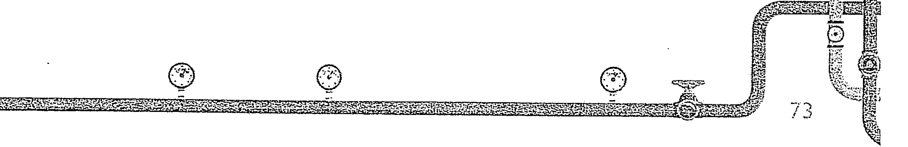

+   2. 如果市場有其他潛在更好的選擇。

當明白投資是為了「賺資產」而不是「賺錢（價）」，同時又清楚再投資的重要，投資者便不會輕言take profit和隨意沽售資產。主動為自己設定「止賺位」等同為自己設定財富極限，正如那些當年看見樓價升了幾十萬便賣樓、看見領展（0823）升了十元八塊便止賺離場的投資者，離場後想再追回，難矣。

## 3.2 嚴謹對「資產」下定義

明白累積資產的概念後，你不會再期望利用重複的交易，不停買入和賣出資產去賺取金錢回報，因為賣出資產獲得金錢後，儘管能賺取利潤，但若找不到更好的資產進行配置，最後只有兩個選擇：一是持有長期貶值的現金，等待更好的投資機會，然而等待是一種成本，會一直輸掉時間值，還要不知等待的時間有多長；二是被迫急於買入質素更差的資產，這種做法比等待的風險更高。現實生活中，不難發現有不少散戶出售資產賺了少許利潤後，持有現金一直輸時間值，最終按捺不住再入市，胡亂買入其他資產，結果得不償失。

這解釋了為何富人與窮人的差距會隨著時間愈拉愈闊，原因是兩者投資的思維和方式不一樣。富人投資的方式是買入資產，資產產生現金流，現金流再投資資產，從而達致長遠累積資產的目的；而後者投資的目的是純賺錢，然後等下次機會再投資，再賺錢。兩者的分別是，後者的投資方式欠缺連續性，投資與投資之間嚴重輸掉了時間值。長期下去，兩者的差距會大到難以想像。

## 分清三種「資產」

作為一個投資者，必須將自己的思維和層次提升。因此，在執行理財計劃或資產配置前，首先要將「資產」的定義界定清楚，深入了解「資產」的概念，才能作出理性而全面的投資決定。

筆者「資產」的概念大致可分為三種：

-   1. 廣義資產

又稱會計資產（Accounting Assets），指會計學上對資產的定義：一個人所擁有的所有經濟物品／資源，並能以貨幣單位衡量的，均稱為資產，如銀行帳戶上的現金存款、樓宇住宅物業、一張桌子或椅子。只要產權能清晰界定，都能稱為一個人／一間企業的資產。

-   2. 有效資產

廣義指凡能於一段時間內持續地產生經濟收益的資產，均能稱為有效資產（Effective Assets）。從資產配置的角度，筆者一向要求收益是能具體地「計到數」的，因此筆者將有效資產定義為凡能在一段時間內持續地產生現金流收益的資產，才稱為有效資產。正如《富爸爸，窮爸爸》作者羅伯特·清崎對資產的定義是：當持有一項物品，這物品會自動使現金流向你的口袋，就是資產。債券這種「工具資產」便是一例。

-   3. 值得累積的資產

除於指定時間內產生現金流收益外，其產生的整體收益會隨時間有所增長，且增長速度比通貨膨脹快，這才是我們長遠值得累積的資產。還記得前文提到投資或資產配置的最終目標並不是「金錢」，而是「資產」？投資過程中，資產價格上升，沽出資產所賺取到的「金錢」並非投資的最終目的，因為投資是長途賽，你不會賺了一次錢後就停下來永遠不再投資，而由於銀紙長遠貶值，資產長遠升值，投資賺錢後必須將沽售套現的資金重新投入其他資產，才不會被時間將你的資產購買力吞噬。不論是新投資或再投資操作，投資項目的投資比例也應儘量投入值得累積的資產為主，從而實踐投資是為了「賺資產」而非「賺錢」。投資要認清「目的地」。

## 自行構建完美的「資產」組合

以上概念十分重要，投資者很多時候以為自己知道，實際上可能只是一知半解。有些人或會認為這些概念不重要，無須過分嚴謹，就由得它含糊糊算了，十年過去後，可能會發覺自己明明投資有「技術」，為何身家就是給懂得累積「資產」的普通人比下去，甚至遠遠拋離。

這單純是因為 2. 有效資產 和 3. 值得累積的資產 在市場上並不難找到，然而同時具備兩者特質的資產卻不容易找。雖然要找到能定期產生高現金流回報，同時其整體收益 (Total Return，包括現金流和資本增值) 的資產項目不容易，但我們卻可通過精明的資產配置方式，結合不同資產的特性，自行構建能同時滿足2和3的投資組合。

筆者提出的「REITs + Bond」投資組合就是一個例子。會選擇以REITs和槓桿債券去建立自己的投資組合，是基於兩種資產的不同特質性，而兩者的優劣能夠做到有機互補。

雖然同時能滿足2和3的資產項目選擇不多，但能分別滿足2或3的，市場上卻有不少選擇。又以「REITs + Bond」投資組合為例，債券能滿足2的條件，能定期產生高現金流回報，若使用槓桿，資本回報率 (ROC, Return on Capital) 會更高，但債券的特質是「保本」（若發行人不違約），即到期日能全數收回本金，而期間收取穩定的債息，然而其「保本」的好處正正就是壞處。因此，筆者透過房託這種「值得累積的資產」來彌補債券的不足，兩者結合起來，正是同時滿足2和3的投資組合。

《現金流為王》中亦曾提到：

> > 債券最大的缺點是持有債券至到期並沒有資本增值的效果，因為債券只能做到保息保本（債券到期取回本金），這是優點同時也是缺點。在不斷量化寬鬆的大時代下，銀紙長遠會以高速貶值，沒有資本增值的力量實在難以抵抗通貨膨脹。要做到投資組合產生穩定現金流，而又能收得像實物資產 / 磚頭般的長遠資本增值，將債息再投資 REITs 是最穩健之選，同時 REITs 亦具有高倉值的特點，也具有高而穩定現金流的特點，因此兩者除了互補，亦能夠相互作出再投資的操作，優化整個投資組合，使雪球愈滾愈大。

由此可見，不同資產有不同的特質性，通過資產配置的方式能將不同特質性的資產有機結合，做到優劣互補，使資產組合能有高現金流，又能收長遠資本增值的效果，對沖通脹和銀紙貶值的風險。


## 3.3 投資「有效資產」的心態與考慮

從「REITs + Bond」投資組合的例子中，我們可以見到債券其實只是一個會產生現金流的「工具資產」（有效資產的一種），本身並沒有資本增值的作用，因此債券並非長遠值得累積的資產。

對於投資「工具資產」如債券，投資者的目的必須十分清晰，就是要安全、穩健地賺取它的高現金流回報，取其風險低、高現金流回報的好處。因此，筆者認為投資債券一定要有持有至到期的心理準備，不論你使用槓桿與否，總之投資者必須設法令自己有能力持有債券至到期日取回本金，這是rule 1。

## 投資債券　須考慮發行者資產

特別在現時這個風高浪急的市場下，債券孳息率已大不如前，債券孳息率低亦意味著債券的價格昂貴。以前孳息率超過 10% 的內房公司，現在發行的債券孳息率只有 5 至 6%，這並非因為企業的信貸能力有所改善，而是因為收益率差價（Yield spread）收窄，意指企業債收益率和零風險資產收益率（Risk-free rate）的差距正在不斷減少。

投資債券盡量避免投資業務經營能力主導的公司，也不應期望公司業績有亮麗的增長，有此期望者，應該買股票。投資債券，投資者是債主，不應與公司共存亡，在最壞的情況下，即使公司盈利能力轉弱，基本面情況轉差，投資者都可以獨善其身，於債券到期時安全取回本金。這就是作為債主與股東的最大分別。

因此，投資債券時應考慮公司目前持有多少資產，除償債能力外，更應考慮公司是否持有「極具價值」或高流動性、高變現能力的資產，然後就是看公司的債務水平，因為其他債主都將有可能是你的「競爭者」。所以，投資者如希望長線投資債券的話，應更注重公司的資產基礎、資產本身的性質和資產價格的穩健性。從此角度出發，REITs Bond（房託基金發行的債券）其實也是個不錯的選擇。

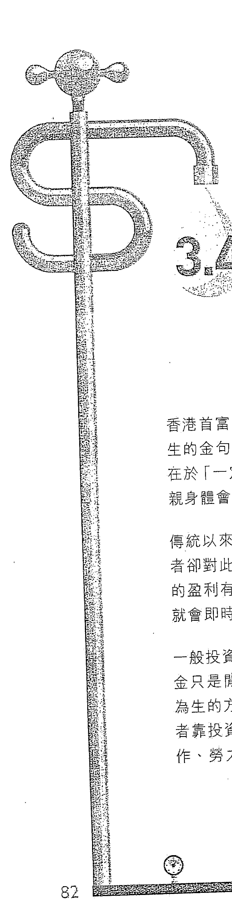

### 3.1 從收入、有效資產、資本看現金流

香港首富李嘉誠先生終於正式宣佈退休，各大報章紛紛報導李先生的金句和發跡史，在其中一篇報導中，李嘉誠談到成功之道在於「一定要有現金流」。他回想「以往從事塑膠花製造業時，親身體會到現金流是主宰公司命脈的因素，一直惦記於心中」。

傳統以來，只有做生意的人才知道現金流的重要性，一般投資者卻對此忽略。對生意人來說，現金流是血液，不管這盤生意的盈利有多強大、公司的盈利能力有多強，如果沒有現金流，就會即時死亡。

一般投資者沒有這個概念，原因是大部分投資者拿來投資的資金只是閒置資金，即是「閒錢」，並不是他們產生收入來賴以為生的方式。收入的產生不外乎主動和被動，前者靠努力，後者靠投資。社會上大部分人的主要收入來源為主動收入（靠工作、勞力換來的收入來源），因此大部分人根本沒有想過現金流對投資的重要性，總之投資能產生即時收益就好了，收益指的是總收益概念（Total Return），而沒有現金流價值的概念。

## 「收入」須是現金流

在進行更進一步分析前，宜先再定義一下「收入」。收入是以持續流動狀態呈現的一種收益，所以收入必須是一種現金流。資產的升值，既非持續，又非流動，因此並非收入。

以上並不是艱深複雜的概念，但必須嚴謹看待。事實上，大部分人也搞不清資產和收入的概念，往往將資產值和收入混為一談。混亂和含糊不清的概念往往直接影響投資行為，對長遠的人生投資計劃影響深遠，不得不正視和及時糾正。

-   收入：持續現金流收益。
-   有效資產：能持續產生現金流的資產。
-   資本：用作投資 / 買入有效資產的現金流。

收入、有效資產和資本是投資者必須認識的基礎概念，值得留意的是它們都有個共通點，就是三者都必須要有現金流。

資產升值了，只屬帳面，如不能將升值部分轉化成現金流，就永遠不能將升值部分轉化為新資本進行再投資，買入更多不同的有效資產，長遠為投資組合產生出更多的持續現金流收益（收入）。

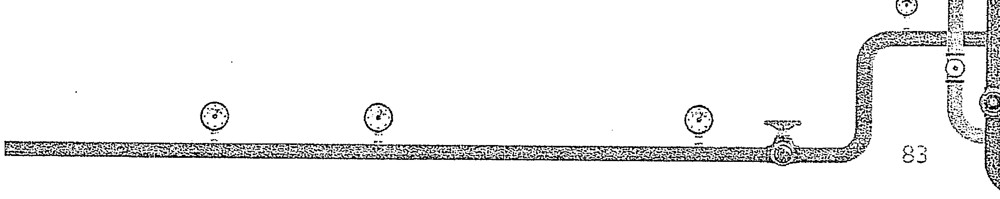

## 重資產 如現金流黑洞

香港大部分人都没有搞清楚上述的概念，因此儘管他們沒有良好的「產融結合」工具（或因為不重視現金流而從沒有計劃去構建一個「產融結合」的平台），仍然都只繼續集中投資低現金流收益的物業資產。他們不介意現金流收益低，只期盼資產繼續升值，為他們帶來資本增值的帳面收益，誤以為帳面的升值是收入的一種。結果，一段長時間過後，他們滿手都是低現金流收益的物業資產，並會因為資產價格的升跌而影響投資情緒。

只累積不會產生或產生低現金流的資產，現金流只會愈來愈少，那些重資產就像黑洞一樣將現金流都吸收，這就是物業資產的特質。要必須配合再融資（Re-financing），將升值部分轉化為現金流，成為再投資的資本，血液才不會隨時間流乾，投資雪球才不會停下來。

相反，投資及累積「有效資產」（會持續產生現金流收益的資產），現金流會愈來愈多，而新增的現金流能成為新資本不斷進行再投資，再不斷持續累積「有效資產」產生更多的現金流，形成資本雪球（Capital Snowball）。

## 有現金流，才有時間值

正如筆者經常說，投資回報＝資本×回報率×時間。真正懂得投資的人，是利用時間為資本增值，收益取決於時間，而非市場因素。時間可準確計算，市場因素卻不能。只有重視現金流的投資者，時間才是他們的朋友，時間對他們來說才有價值（時間值）。

搞不清收入、有效資產和資本概念的投資者，他們看不通現金流的價值。他們一般依靠資產的價格升值（市場因素主導），以及靠工作、勞力換來的主動收入，被動收入比例極低，以致他們不得不繼續工作，以時間和勞力換取金錢，而時間則不會恆常而主動地為他們創造收益。這是大多數香港人的通病，通通都輸了「時間值」，要知道「時間值」包含了複利的力量，大部分香港人損失的實在太多了。

當大家了解收入、有效資產和資本的概念，便明白投資需要資本，資本是由現金流轉化而成，而現金流由有效資產所產生，有效資產的累積需要有資本，資本是由現金流轉化而成……投資的關鍵在於多元化收入，要令齒輪不停轉動，不能或缺的就是現金流，缺乏現金流，資本、資產、收入都會乾涸，當齒輪不再轉動，投資組合就不會繼續自然成長。

看通了，投資的關鍵是現金流，一盤生意的血液是現金流，資產價值的起源也是現金流。


### 3.5 轻资产／重资产的投资模式

笔者经常说「重资产、轻资产」，其实是形容一个商业模式。在新经济模式的趋势下，轻资产远比重资产的商业模式「值钱」，从资本市场的市盈率（P/E ratio）便能够反映出来。

事实上，「重资产」、「轻资产」并不是一个财务概念，财务中只有固定资产和流动资产、有形资产和无形资产的概念，轻资产和重资产其实是一个「策略性」（Strategic level）的概念。一般而言，重资产主要是指固定资产集中、资本密集（Capital intensive）的商业模式，如机械、钢铁等行业，这类行业需要大量的资本投入；而互联网、电子商务、中介代理等领域的固定资产相对较少，资本投资入亦相对较低，其营运模式我们称为「轻资产模式」（Asset-light Strategy）。


## 資產輕重看效率

要判斷輕資產還是重資產的商業模式較好，首先我們需要思考一下哪種模式的創造價值能力、效率比較高，當中我們需要同時考慮資本投入的因素。一個特別重要的指標就是「資產產生價值」的能力。從經濟、財務的角度，一般會以經濟附加值（Economic Value Added，EVA）作為判斷資產創造價值能力的指標。

經濟附加值是企業在一段時間內的稅後營業淨利潤（NOPAT）與投入資本的資金成本之差額。也就是說，價值一元的資產所產生的淨利潤，與相同金額的銀行存款或債券利息相比，如前者較後者低，那就不如把錢直接存入銀行或者購買國債算了，無需投入龐大的資本，辛苦經營，而只為換取較低的利潤。簡而言之，這是機會成本（Opportunity cost）的概念。

因此，假設利潤相若，從資本密集性（Capital intensity）的角度，輕資產比重資產模式更有效率，原因是前者能以較少的資本投入換取相同的利潤回報。這是為何輕資產模式的企業在資本市場上較「值錢」，這同時也含意著輕資產企業的潛在增長能力更高，因為它的成長並不單純依靠資本投入，而主要是依賴非資本投入的經濟價值創造能力，這也就是營運模式本身的價值。

作為資本家，除了企業營運團隊的營運能力，更關注的其實應該是企業的商業營運模式，因為這決定了一項投資的資本回報率。要極大化資本回報率，就是要在最短的時間內，以最少的資本賺取最高的回報，這也就是資本運作的真諦。

同樣道理也可應用在個人投資。從資產配置的角度，也可分為輕資產和重資產的投資模式。重資產指資本密集、回報率和流動性偏低的投資物。所有資產都有「重量」，愈「重」的資產，就愈難轉身，意味著其流動性偏低，同時其現金流回報（Investment yield）普遍也偏低。長時間累積重資產，最終會使投資組合的重量不斷增加，形成現金流黑洞，將資本和現金流都吸收，最終形成「死亡鎖結」（Hardcore），使投資齒輪停止轉動。這是大部分只會買樓收租的香港人面對的問題。隨著政府辣招和按揭成數的收緊，只懂買樓的投資者最終會陷入重資產的hardcore，而原因是他們根本沒有做好資產配置。

## 營運模式重要過重量

要為重資產投資組合減磅，可以通過融資解決，這是為何筆者常說投資重資產必須要結合融資手段，做到「產融結合」，從而釋放資產的流動性，利用槓桿將資本回報率提高，同時也能夠使資產的升值部份轉化為現金流，再投資不同的資產類別，做到分散投資，將投資重量分散到不同的投資品種，達到資產配置平衡和現金流多元化的目的。

筆者一直採取輕資產的投資模式，但這並不代表我不投資物業磚頭。輕資產抑或重資產，關鍵其實不在於投資物本身的「重量」，而是經營個人投資組合的「營運模式」。看通了，投資，就是講求資本運用的效率，及資產配置的平衡。

### 3.6「防守」才是最強的「進攻」

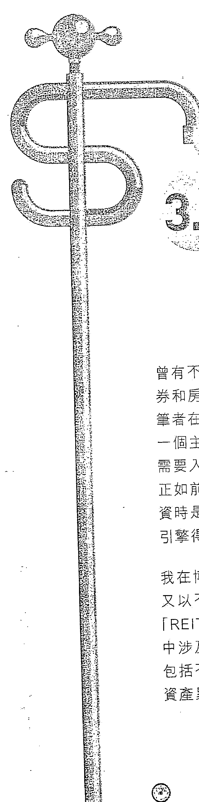

曾有不少讀者問我的投資組合是否只是經常提及的REITs、債券和房地產項目，每次我都笑著回答「當然不是」。事實上，筆者在博客內提及得較多的「REITs＋Bond」組合，只是其中一個主要能產生穩定現金流的「永續投資引擎」。這個引擎無需要入電油，靠的是生生不息的投資現金流為引擎注入能量。正如前文所解釋，現金流收入是投資資產的產物，現金流再投資時是資本，資本能持續產生現金流的資產，令這個投資引擎得以自給自足，永續發動。

我在博客中、書中有不少篇幅提及「REITs＋Bond」組合，又以不同層次深入解釋該組合背後的原理，因為我認為我的「REITs＋Bond」組合是一個值得讓大家參考的投資模式，當中涉及的投資理念，我個人認為有一定的啟發性和參考價值，包括不同投資產品的優劣互補、槓桿的使用、再投資的力量、資產累積後自然去槓桿等等。

然而，這不等於我的投資世界裏就只有「REITs＋Bond」組合，房託和債券也不可能沒有其他可能性和替代品。沒有一種投資組合或方式是永久必勝，牢不可破，大家不應該去神化任何一種投資模式或策略，而應該融會貫通，因時制宜，這才是令投資者永遠立於不敗之地的唯一方法。

正如前文提過，筆者認為「REITs＋Bond」組合的回報率正在不斷下降，投資者應該因應市場變化，從而判斷或調節自己的要求回報率(Required rate of return)。不去做這種調節，以換入其他同類更高收益的債券或通過加大槓桿谷大回報率，來維持組合原本的回報率，是自欺欺人的做法，說穿了就是以風險來換取回報。這是為何筆者提及自己已於2017年開始不斷減持槓桿債券的部分，換入更多如領展和其他優質的房託基金。

## 槓桿債券只為手段 不是目的

大家不要忘記初衷，投資是長途賽，比賽當然需要有一個清晰的目標。如前文所說，投資是為了「賺資產」而非「賺錢」，作為投資者，大家的目標應該是去累積資產，累積值得長遠去累積的資產項目。投資債券的心態必須是持有至到期，中間定期收息，到期取回本金。槓桿只是將回報適當地放大，為傳統認為過於保守的債券投資作出適當的調節。記著這個調節是將回報和風險同時放大，不同的投資者應作出相應的調節。因此，不少讀者問我到底應該用多少槓桿，這個問題我答不了，投資者應該要問自己，只有投資者自己才最清楚答案。


債券加槓桿的好處是能即時產生高現金流回報，債券每天計息，時間便是金錢，惟其最大的缺點是回報並沒有任何增長，長遠欠缺對抗通脹的能力，因此債券並不是最終的目標，也並非投資者值得長遠去累積的資產項目。

如果現金流是子彈，槓桿債券就是一把槍，「值得累積的」如REITs等能與經濟同步增長、水漲船高的資產項目，才是大家的最終目標。因此，前文也就解釋了為何槓桿只是累積資產過程中的一種輔助工具，資產逐漸增加的同時，自然去槓桿才是目的。

有些人會認為：「那你的投資策略豈不是非常保守？年輕人只以收息、慢慢累積資產為目標實在太消極。」

投資當然需要有攻有守，但在談進攻之前，請先學會防守。因為大部分的投資時間裏，多數的時間都是在防守，而進攻從來只會選擇在把握最大的時候才全力出擊。這種機會一生人總會遇上數次，大家不用心急，機會總會來臨，最怕的只是當真正的機會來臨時，由於你平日已在進攻，已沒有足夠彈藥重槌出擊，最後只能眼白白看著機會離你而去。

## 恐慌時間 才有真正進攻機會

筆者這個想法根深柢固，因為筆者深信真正最佳、最安全的賺錢時機應該是在市場恐慌時的跌市時間，而非風和日麗的時間。投資者應該將關注點放在研究如何在風和日麗的時間養兵，同時累積和保存實力，在「恐慌時間」進取。

正如筆者曾接受過報章訪問，記者問及我的第一桶金，我提及08年金融海嘯時市場遍地屍骸，當時我大手買入多隻優質股份，其中最大手吸納的就是九倉（0004），當時市價僅十多元，心想九倉持有時代廣場、海港城等地標性資產，大折讓平賣，機會可一不可再。在金融海嘯的環境下，要買就買最靚最優質的資產，甚麼都不用理會，只需望著市帳率（P-book），像是759阿信屋做大減價，大折讓掃貨，過癮非常。其實當時市場上還有很多大折讓的不良資產（Distressed assets），若當年我有現在的實力和流動性，相信將能獲得更多有價值的資產。

當知道何時才是最佳、最低風險的進攻時機，大家便不會認為在風和日麗下養兵收息是保守了。相反，平日的「保守」正是為日後「大舉進攻」作了最好的準備。


# 第四章

### 樣本均值抽樣分佈估計

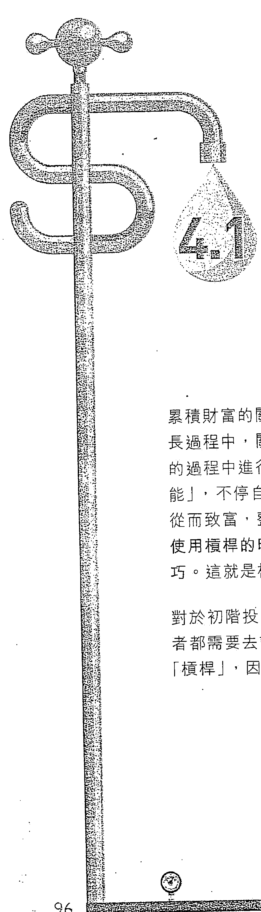

# 投資，要有可槓桿的選擇

累積財富的關鍵只有一個，就是累積資產，而在累積資產的漫長過程中，關鍵就是要有現金流。只有現金流才能在累積資產的過程中進行「再投資」(Re-investment)，使投資雪球有「動能」，不停自我滾動。然而，若希望以現金流投資去累積資產從而致富，整個投資的過程就不能完全沒有槓桿，而關鍵在於使用槓桿的時機 (Timing) 和比例，其次是運用槓桿的收放技巧。這就是槓桿的藝術。

對於初階投資者，我會強調「複利」，因為這是作為任何投資者都需要去認識的一個重要概念；對於進階投資者，我會強調「槓桿」，因為除「複利」以外，「槓桿」才是真正致富的關鍵。

# 實質財富積累 要抵銷通脹

單純以現金流投資去累積資產可以防守，但難以致富，原因很簡單，假設你買入高息股票，每年回報率6%，根據72法則，資產需要12年才能翻一倍，即使回報提升至8%，也需要九年時間，而這已包含了「再投資」的複息力量。對一般人而言，這個財富累積的增長速度尚可接受。

然而，在經濟自然增長的情況下，銀紙會隨時間貶值，主因是通脹因素。由於金錢本身只是交易媒介，是虛無的，投資的實際回報，特別是對於長遠的投資，不應只用「名義概念」（Nominal concept），而應該應用「實質概念」（Real concept）。正如專業投資者評價一隻基金的表現時，會將基金表現與市場基準（Benchmark）作比較，而不是單純以基金的絕對回報率去評定。

對於一般個人投資者，我們可以用另一種方式去實際判斷自己的投資表現，就是投資回報對購買力。假設每年通脹2%，銀紙的購買力每年便下跌2%，而且銀紙的持續貶值也有複息效應，以「金錢」計價的資產帳面上雖然每年回報6%，但若計及2%的購買力損失，實際上每年的淨累積財富只有4%，因此實質財富需要18年才能翻一倍。

# 不應懼怕槓桿 但要懂去槓桿

若然遇上經濟增長穩定，加上低息環境長期持續的經濟大環境，同時又有輸入性通脹，資產價格只會不斷飆升。實打實去投資，用1蚊去買1蚊資產的投資方式只會永遠落後於大市。在有門檻的投資市場上，更甚的情況是，你持有現金，但在市場上最終甚麼也買不到。道理有如你要full pay買樓，你所能買到的物業選擇自然大幅減少，到最後你會發現很難買到心目中的物業，原因是當其他市場參與者（你的對手）都在使用槓桿買入物業，物業價格自然被推高。當然，大部分不使用槓桿的人會希望這是一場泡沫，期望泡沫爆破後資產價格終有一日回落，但若然這不是一場泡沫呢？你便會輸掉一輩子。從這角度看，missing out的風險可不低。

因此，我們不應懼怕槓桿所帶來的風險，而是要去認識槓桿的潛在風險，想辦法將風險歸邊，再進行對沖，或是透過資產配置平衡相關風險。真正善於運用槓桿的人，是懂得以「去槓桿」（Deleveraging）為目標。

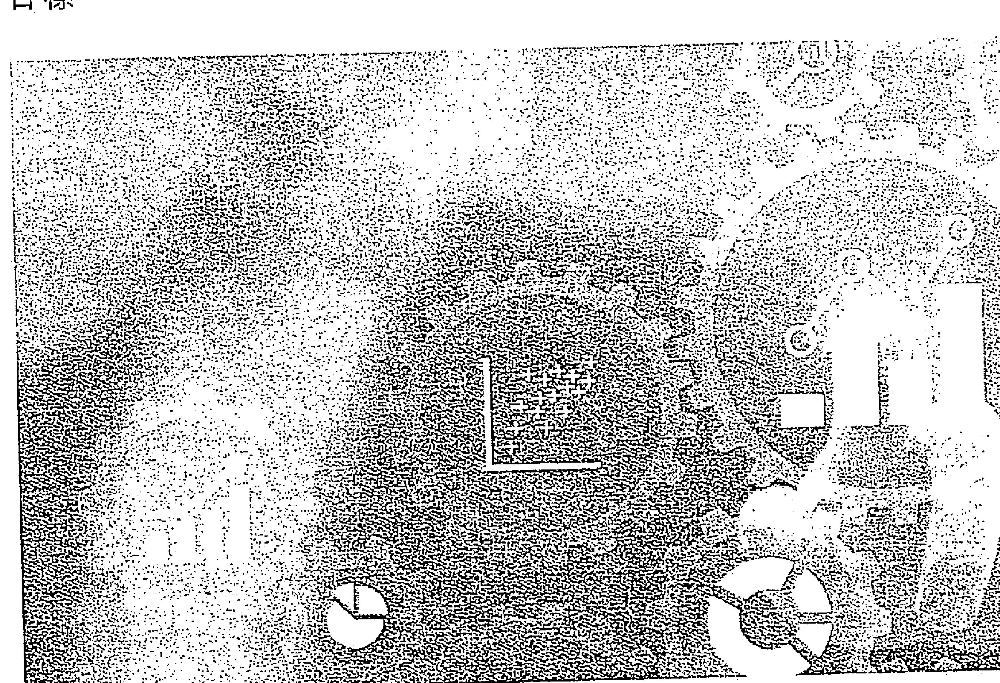

投资应该注重现金流，因为这是「有数得计」的投资，而且只有现金流才能做到「现金流再投资」，而「再投资」有复息的力量，能为投资雪球注入动能。但是，若只依靠现金流「再投资」的力量，在抵销了通胀因素后，预期财富累积的速度将会大幅减慢。

不用杠杆而致富的例子不是没有，但大部分他们本身都已经富有，拥有雄厚的资本，full pay不是问题，不影响投资选择。对于他们而言，即使只有5至6%的年回报，已经可以稳定产出强大的现金流回报去进行再投资，同步地去买入「值得累积的资产」，前后两者可以同时进行，互不耽误。此外，由于他们所及的投资门槛较高，投资项目众多，投资项目的回报率相对较高，通胀因素影响亦相对较小。相反，对于一般资本不多的大众投资者而言，单纯依靠现金流投资累积资产，很大程度上只能在对抗通胀的同时，一点一滴的去累积财富。

# 善用杠杆 须考虑时机及比例

想要更上一层楼或致富，整个长时间的投资过程中就必须懂得善用杠杆，合理地提升名义资本回报率（Nominal ROC），以抵销通胀因素拖延财富累积速度的时间成本。因此，我们投资时必须要寻找能杠杆的投资目标，长远累积的资产也必须要有「潜在使用杠杆的可能性」。要留意的是，投资能使用杠杆的资产，并不等于投资者投资时要立即使用杠杆，更不等于投资者要用尽可能用之杠杆去投资。

杠杆，是一种选择（Option），所有选择本身都有价值，而附有杠杆选择权（Option of leveraging）的资产，其价值远比没有杠杆选择权的资产高。尽管今天可能并非大幅使用杠杆的最佳时机，但这不代表资产的杠杆选择权没有价值。如果使用杠杆的时机未到，你可以保留使用的权利，待日后时机来临时，这个选择权能带给你即时的流动性，让你能迅速把握一瞬即逝的市场机会。财务杠杆，不只是让投资者放大总投资额，更重要的是它给予你一个选择权，在任何时候去购买流动性。因此，财务杠杆所涉及的利息成本就是流动性的价格，只要流动性为你带来的得益高于你需要付的流动性价格，你便有诱因使用杠杆套取差价，而这个差价就是杠杆的价值。

运用财务杠杆的关键在于使用杠杆的时机和比例，其次是运用杠杆的收放技巧，这就是杠杆的艺术。财务杠杆只是杠杆哲学中的其中一种杠杆运用方式，想要凭一双收在有限的生命中成就更多有意义的事情，大家有必要去学习「杠杆的艺术」，将个中的哲学融入生活之中。

## 4.2 橫桿的藝術

> > 古希臘物理學家阿基米德曾經講過：「給我一根槓桿，一個支點，我就可以舉起全世界。(Give me a lever and a place to stand and I will move the earth.)」

槓桿不單只是一種物理學原理，看得通透的話，槓桿其實是一門哲學，而槓桿的使用則是一門藝術。

槓桿，原理上需要一根棍子，再加上一個支點、力點和重點，使用槓桿的目標是利用最小的力量去挑動最大的重量，簡單而言，槓桿哲學的目標是要收「事半功倍」之效。

## 你站在槓桿的那一邊？

從投資或財務的角度，一根有支點的棍子是一個融資平台，而投資的資本（Equity）就是力點，槓桿後放大了的投資回報就是重點，也就是我們投資的「重點」。這個槓桿後回報的回報率，我們稱之為資本回報率，從而反映投資者使用了多少自有資金去獲得最終的實際回報。從企業家的角度，公司就是支點上的棍子，公司每月所支付予員工的薪金就是力點，而員工為公司所創造的價值就是重點。

事實上，不論是投資者、企業或是普通上班一族，任何人其實每天都在接觸槓桿，分別只在於你是使用槓桿，還是「被使用」槓桿的那位。投資者在本金有限的情況下，為了增加回報，會借取別人的資金去投資，在資金回報率比資金成本高的前提下，資本回報便能極大化，這就是利用了 OPM (Other people’s money) 進行槓桿。

企業家任你再能幹都只有一對手，沒有三頭六臂，而一天只有 24 小時。企業家要提高公司的效率，會聘請不同的專業人士和員工每週五天、每天朝九晚六為公司賣命，這就是利用了 OPT (Other people’s time) 進行槓桿。

槓桿是相對的，在槓桿的棍子上，只有力點和重點，你不是主動舉起槓桿的那位，便是被槓桿舉起的另一位。作為投資者或手持資金的人，你不去投資，便只能將錢存入銀行或基金，讓別人利用 OPM 槓桿；作為上班一族，你不利用別人的時間為自己工作（老闆），就得將自己的時間出賣給公司，去換取每月薪金（打工仔），讓別人利用 OPT 槓桿。你會選擇主動舉起槓桿，還是被槓桿舉起？人各有志，每人有不同的考慮，但這是你的選擇。在計及風險因素後，何時、怎樣、如何使用槓桿便是一門藝術。

# 有回報並不夠「多少」才是關鍵

然而，作為香港人，大家都是填鴨式教育制度下的產物，師長們都以傳統思維告訴我們，要成功就必須要努力，將「吃得苦中苦，方為人上人」的大道理奉若神明，但就從來沒有解釋應該如何努力，總之就是要努力。當有學生問為何或該如何努力時，老師一般會說：「你努力了再說吧！」又或者說：「你付出的努力，總會有回報。」問題是，付出多少努力，能換取多少回報？這個才是問題的重點，也就是回報率的概念。投資，不能不講求回報率；做事，不能不講求成效。單單知道有回報是不足夠的。

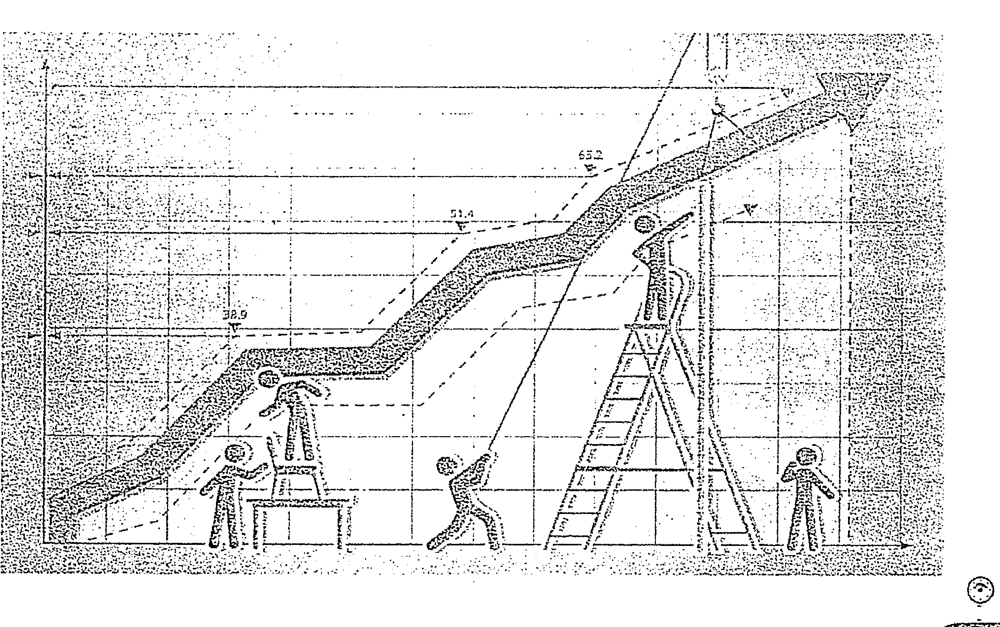

努力，也需要朝著正確的方向努力，否則方向錯了，所付出的努力便會付諸東流，更重要是浪費了寶貴的時間。從投資的角度，回報＝資本×回報率×時間，當中時間是一個很重要的因子，時間浪費了會直接影響回報，浪費的時間愈長，對回報的影響愈明顯，原因是時間因素包含了複利的力量。很多時候，選擇比努力更重要。

# 最小風險 換最大回報

選擇對的方法和方向，聰明地去付出，比起盲目地努力更重要。要做到聰明地付出，就必須要懂得善用槓桿，要善用槓桿，就必須先明白槓桿的原理。不論是投資或是做生意，都必須應用資本運作的概念——「在風險可控的情況下，用最少的資金，最短的時間，賺取最大的回報」，這與槓桿的目標一致。

以上提到風險，筆者說槓桿是一門藝術，也就是因為槓桿不能在沒有任何條件下運用，而設定甚麼條件、如何運用則是一門高深的藝術。從投資和財務的角度，槓桿是一面放大鏡。由於它放大了總投資額，因此在放大回報的同時，也會將風險放大，因此也有人說槓桿是一面雙刃刀。精明的投資者，在使用槓桿時必然能夠做到理性的風險評估，以及透過資產配置去降低相關財務風險，以最小的風險換取最高的回報，而這亦是槓桿哲學裏的核心概念。明白以上的概念，便會明白槓桿確是一門藝術。

## 4.3 槓桿前先要「融資平台」

從理財角度，要做好資產配置，我們必須要有潛在的槓桿能力，有助投資組合發揮更高的收益，同時為投資組合保留更多的流動性，有效把握一瞬即逝的投資機會。為此，我們須要擁有不同的「融資平台」。所謂「融資平台」，即能夠提供低成本融資的信貸渠道。

首先，我們知道投資需要有「槓桿選擇權」，即有條件隨時隨地對所投資的資產使用槓桿。這取決於兩個因素：

+   1.  投資的資產是否有「可槓桿」的空間？換句話說，該資產能否被廣泛接受為抵押品，並能輕易取得融資？
+   2.  投資者是否擁有合適的「融資平台」？

以上兩個因素決定了投資者對資產的可槓桿操作能力——融資成本和最高槓桿成數。

不同的资产有不同的特质，资产的可杠杆成数愈高，同时融资成本愈低，其「杠杆选择权」的价值就愈高。众多砖头之中，住宅的按揭成数最高，且按揭年期亦最长（最长为30年），融资成本亦最低；而工商业的按揭成数则较低（最高为三至四成），年期最长为15至20年，融资成本亦相对较高。

因此，传统以来，住宅的「杠杆选择权」价值比工商业高，这就是住宅物业比工商业优胜的地方。「杠杆选择权」的价值体现于流动性，而流动性有价，称之为流动性溢价 (Liquidity premium)。市场利率愈低，融资成本愈低，资产的「杠杆选择权」价值愈高，资产价格便愈贵，原因是流动性溢价上升。


> *现金流资本化是估算资产内在价值的其中一个有效方法，第五章会作详细解释。

因此，市场一般投资者（并非炒家）在低息环境下，会更倾向选择投资住宅物业，原因是融资成本低，使住宅的「杠杆价值」上升；投资者倾向以高杠杆买入住宅物业，杠杆又放大了购买力令需求增加，楼价因而加速了上升。与此同时，由于住宅的「杠杆价值」上升，投资者愿意付出更高的流动性溢价购入物业，令加速上升的楼价有了支持。然而，随着金管局收紧非首置的按揭成数，投资者的借贷能力受到限制，加上政府推出的多项针对住宅物业的辣招，使住宅的投资价值大大下降。

# 产融结合释放资产流动性

既然流动性有价，而大部分房地产均为「重资产」，流动性偏低，只要我们能够盘活资产的流动性，便能主动为资产创造价值，提升资产的价值和价格。

价格只是价值体现的其中一种形式。资产价值（估值）的提升，不一定体现于资产价格，也可透过产融结合，利用融资释放资产流动性，令升值部分转化为现金流，让现金流成为新资本，再投资其他资产，然后再产生新增的现金流收益。新增的现金流收益便是价值体现的另一种形式。

为了能随时随地运用杠杆，盘活资产的流动性，有效发挥资产「杠杆选择权」的价值，我们必须要有多个「融资平台」。至于运用杠杆的时机、比例和技巧则是一门艺术。能否在对的时机有条件适当运用杠杆进行投资，除了取决于你投资的资产本身是否有杠杆空间，更重要是你是否拥有合适的「融资平台」。

# 自己就是一个融资平台

其实每个人自己都是一个「融资平台」，只要阁下未曾宣布过破产，则每个人本身都有融资能力。例如，未毕业的大学生都可以申请信用卡，而信用卡都有一个信用额，信用额一般都有数万元，这个数万元的信用额也就是你个人的融资能力。至于一般在职人士或专业人士的信用额则由数万到数十万元不等；高资产净值人士的信用额甚至高达过百万元。

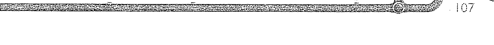

首先，笔者不是鼓励大家「碌卡」消费。相反，笔者希望在此提醒大家，杠杆从来都有成本。信用卡借贷的成本非常高，而消费是没有回报的行为，如果透过借贷去消费，先使未来钱，实属不智。信用卡的发明是为了促进消费者去消费，对象不是投资者。如果有人告诉你「碌卡」借钱去投资，他不是骗你便是推你去死。即使坊间一些类似私人贷款性质的「信用卡贷款」，由于年期短，期间每月偿还本金比例高，投资者容易堕入现金流错配（Cash flow mismatching）的问题。

从来只有用于投资时，才会考虑借贷，但即便如此，借贷成本亦不宜过高。透过借贷去投资，实际上是一种「套息差」（可理解为「回报率差」，即投资回报率与融资利率的差距）的行为。换言之，投资收益必须高于借贷成本才划算。

如果借贷成本过高，投资者对于投资收益的要求也必然更高，而投资回报高的项目也可能伴随着高风险。风险是一种变数，计及风险因素后的预期投资回报也自然存在较大的变数，而风险愈高变数愈大，预期投资回报的变数便愈大，但借贷成本却是固定。因此，尽管投资项目存在「息差」，即所谓「计到数」，借贷成本过高亦不宜进行杠杆操作，否则风险相当高。因此，信用卡不是一个良好有效的「融资平台」。

## 投資需要「不記名」融資平臺

舉信用卡的例子是想說明任何一個人都擁有信貸額，亦即是個人的融資能力。而香港的金融機構在決定是否借錢給你之前，會先審查你的信貸紀錄，包括審查你的環聯信貸報告（TransUnion，簡稱TU），而每一個借過錢的人，理論上都有一份TU。當你申請貸款時（例如樓宇按揭或汽車貸款，甚至是新信用卡），銀行或財務機構會參考你的TU內的信貸評分，以評估你個人的「財務誠信」和了解你的借貸情況，包括你的信用卡借貸、私人貸款、按揭、車會等所有借貸項目均一目了然。在金管局嚴格收緊信貸的今天，過度信貸的情況相信難再出現。

除了個人TU，個人借貸能力主要取決於個人的入息水平。在金管局收緊信貸下，入息供款比率的壓力測試十分嚴緊。年青人要買樓上車，前提是先搞好自己的信貸記錄和提升自己的借貸能力。

對於已買樓人士，在現今世代想單靠不斷買樓，然後以一拆二、二拆四的傳統方式致富已不可能，原因是政府推出的辣招稅和金管局對非首置的信貸收緊。投資，我們需要尋找「不記名」（不記錄在TU）、沒有壓力測試的「融資平台」，為我們的投資更有效地釋放流動性。想獲得槓桿的選擇權，又要控制使用槓桿時的借貸成本，我們必須準備多個不同的融資平台。

## 4 實戰需要的融資平台

要突破每一個財富階段的財富極限，我們必須因應自己不同的財富水平，應用不同的投資方式，提升自己的投資層次。不同的投資層次有不同的門檻要求，當你滿足到門檻要求，投資者一定要勇於跨開去，改變從前的投資思維。財富十萬是一個層次，一百萬是另一個層次，一千萬又是另一個層次，三種不同的財富階段不可能運用同一種投資策略和方式。

當財富累積到一定水平，我們必須擁有不同的「融資平台」，幫助我們實現不同的投資策略。不要少看「融資平台」的價值，這決定了你的財富終點是百萬、千萬甚至更多。以下為大家介紹一下不同財富層次所需的實戰「融資平台」及其操作。

### 盈透證券（Interactive Broker，IB）

對於一般大眾投資者，筆者建議大家可以先開一個盈透證券戶口，開戶口基本上沒有門檻，存入數萬港元便可開戶。盈透證券是一個自助化的證券戶口，可供交易的產品種類眾多，交易覆蓋全球24個國家共100多個市場中心。通過一個IB全能賬戶，即可進入股票、期權、期貨、外匯、債券、交易所指數基金（ETF）及差價合約（CFD）的交易。

其最大優勢在於融資利率超低，主流貨幣歐元、美元、日元，也只要1%多一點的年化利息。不管你買的是甚麼股票，不管你借的是甚麼貨幣，都可以外匯操作換成利率超低的貨幣，以便投資者以最低的融資成本進行槓桿投資。

操作方面，在盈透證券買入股票，如果本幣不足就會自動融資，融資額會變成負債，這些負債按照當天盈透證券的利率來計算，按天計息，一月一結算，也就是一個月的利息滾存到總負債裏面，自動展期，相當方便。

盈透證券另一個優勢是交易手續費便宜，每股只需0.005美元。唯一缺點是它比較少亞洲區的證券選擇，例如內房債券就未能在盈透買入。

### 私人銀行（Private Bank）

私人銀行是一個高門檻、但非常有用的個人融資平台。對大部分私銀客戶來說，私人銀行是一個高級理財平台，原因是私人銀行提供360度多元化、多功能的理財服務。

然而，筆者卻將私人銀行定位為融資平台，原因是其最大功能之一（對筆者而言）是其低廉的融資成本，一般為資金成本（Cost of Fund，COF）+1%左右，all-in融資利率則低至大約1.X%左右，比銀行按揭利率更低。每間銀行的COF也不同，一般與同業拆息（Hibor/Libor）差不多或略高。投資者一般可選擇低至七天、高至一年的利息期，當然在正常情況下，愈短利息期利率愈低，反之亦然。

私人銀行這個融資平台非常靈活，對大部分常規證券如股票、債券、基金等，會因應其特定的「融資率」（LTV）提供額資額度。舉例，假如你持有100萬元債券，而該債券的LTV為70%，這意味著你可以隨時以1.X%的融資成本提款70萬元，用於再投資或套現作其他用途。這貸款額是備用的，使用才會計息，償還後就不計息，而由於債券的收益是每天計息的，因此槓桿投資債券是比較匹配的套息組合。

相對於一般銀行及證券行，私人銀行的交易手續費較高，一般為0.3至0.5%。因此，投資者可考慮從其他證券行買入債券或股票，然後轉倉去私人銀行戶口（俗稱「射倉」），省卻交易成本。私人銀行是一個綜合的證券戶口，所有存入私銀戶口的證券，只要有LTV，都可以隨時提取低息貸款。這優勢為整個投資組合提供了極佳的備用流動性，創造了進一步提高收益的條件。

私人銀行的另一個優勢，是其包羅萬有的投資產品選擇，而有相當一部分是一般零售銀行沒有的。此外，私銀更能因應客戶的要求度身訂造投資方案，有些專業的投資者客戶更會主動向私銀提出投資方案，私銀往往都能配合，彈性相當高。

例如，債券投資客戶為了鎖定利率風險，向私銀買入利率掉期（Interest rate swap）。由於利率掉期需要交易對手，如市場沒有合適的交易對手，私銀會自己「坐盤」，為客戶提供配對特定債券組合的利率掉期產品。無論到期日、金額及利率等都能做到完全匹配，讓利率風險得以成功對沖。私銀更能為客戶提升整個投資組合的LTV，非常靈活。

### 投資貸款（Investment Loan）

香港不少人喜歡投資住宅物業等重資產，貪其能夠承造長年期的按揭。但隨著政策和按揭成數收緊，加上租金回報率已下跌至較低水平，住宅物業的投資吸引力開始下降。物業升值，想套現再另覓投資，增加被動收入，傳統方法是將物業加按或轉按予另一間銀行。然而，受按揭成數的限制，投資性質的收租物業最高只能做五成按揭，加上借款人及擔保人需要做壓力測試，令個人的借貸力收到限制，想利用銀行按揭的低成本資金去投資高回報項目，似乎已不容易。

由於金管局重點限制的是銀行的個人按揭業務，因此要避開按揭的限制借款，方法是以公司名義向銀行申請貸款。如目的是將物業升值的部分套現並用於投資其他資產，包括債券、房託基金、高息股等，以增加現金流投資收入，可申請投資貸款。要以公司名義申請投資貸款，當然首先要有一間公司。一般而言，針對投資貸款的申請，銀行並不要求申請人必須是一間成熟的營運公司，可以是一間全新的公司，亦無須公司財務報表，但會要求遞交一份簡單的業務計劃書，內容包括公司的業務性質、營運計劃等。

由於投資貸款有抵押品，銀行對公司的要求不高，只要公司有營運的計劃，已符合基本要求，至於公司業務是否成功、財務是否健康等，基本上並非主要的審批考慮，也無須進行負擔力測試，更重要的是相關貸款並不會紀錄在TU。

投資貸款的融資成數最高可做到物業估值的八成（比一般人能夠申請到的五成按揭高出三成），包括住宅、工廠及商用物業等資產，惟套現出來的資金只可在該銀行內進行投資。申請人也可以選擇先做五成按揭，然後才申請投資貸款，將餘下的三成也借出，用於投資穩健的債券或房託等類固定收益回報資產套取息差，增加每月的被動現金流收入。此外，通過投資貸款，亦能增加組合的流動資產水平，有助進入私人銀行的門檻。

### 商業貸款（Commercial Loan）

商業貸款與投資貸款都是以公司名義借款，惟商業貸款的要求較高。商業貸款的借款用途為營運資金貸款（Working capital loan），因此申請公司需要為營運公司，並需要遞交公司的審計財務報表。

與投資貸款一樣，由於商業貸款有抵押品，銀行對公司的財務實力要求不高，一般銀行只會審視公司的營業額（Turnover），對利潤要求並不高，但最好不要虧損。貸款額最高可做到物業估值的八至九成，惟基於貸款性質是公司營運資金貸款，貸款額一般不能高於公司營業額的五至七成。

商業貸款最大的優勢，在於所借的資金可以較自由地運用，無須被限制在貸款銀行內進行投資。而且，貸款一般為循環貸款（Revolving loan），貸款期內只需還息，無須還本，貸款可以較彈性地使用，用才計息，償還後便不會再生利息。因此，商業貸款能為申請人提供非常靈活且低成本的備用流動性。

最有利申請商業貸款的公司是貿易性質的公司，因為貿易公司的營業額一般比較容易做大，儘管利潤較薄，但銀行審批商業貸款一般只關注公司的營業額，利潤能負擔到利息支出就可以。這是為何在筆者的眾多生意中，最看重就是貿易業務。除自己經營的貿易業務外，也會與其他貿易伙伴合作，更會主動收購別人做得不好、打算放棄的貿易公司。因為擁有龐大營業額的貿易公司，就是一個絕佳的「融資平台」，貿易公司最大的價值並非其本身的利潤多少，而是其融資能力。

筆者公司的主力業務為投資房地產相關項目，儘管房地產項目回報高，但房地產最大的短處是重資產，缺乏高流動性，必須配合「產融結合」的手段才能將升值的房地產轉化為現金流，在無須出售資產的同時能夠套現進而「再投資」，實現長期累積資產的目的。

## 第四章：槓桿的隱性風險與智慧

槓桿是為了「去槓桿」

> “Leveraging today is to achieve deleveraging tomorrow”，中文意思是「今天的槓桿是為了明天的去槓桿」。

以上一句說話總結了我的投資理念。筆者當年以槓桿買入債券，就是為了賺取更多現金流，並以現金流再投資，買入不做槓桿的REITs（Deleveraging and diversifying），令投資組合的現金流被動收入更可持續（Sustainable）。

「財務自由」概念中最重要的元素，並不單單請求今天被動收入的多與少，更重要是被動收入的可持續性和增長能力。即使你今天的每月被動收入數字達六位數，甚至七位數，如果沒有可持續性和增長能力，那都是沒有意義的。

## 資產配置 對沖市場風險

要加強被動收入的可持續性和增長能力，關鍵就是資產配置。只有做好資產配置，才能在逆市的情況下經得起考驗，才能有效對沖市場系統性風險。股神巴菲特有一句名言：「潮退後便知誰沒穿泳褲」。要知道，作為一般投資者的我們，並不能像對沖基金一樣能主動造短倉對沖風險，既然如此，我們只能專注做好投資組合裏的資產配置。

要令被動收入可持續，投資組合最終不能大幅使用槓桿，意思是說槓桿投資只是一個開始，前提是你找到一條長斜坡，然後用一根棍子，令你能利用較少的力量（資本）去挑起較重的石頭（大額投資和回報），

推動石頭在長斜坡向下開始滾動。當投資組合產生「動能」（現金流）後，依靠的就不再是那一根幫你挑起大石的棍子（槓桿），因為你不再需要主動利用槓桿去幫助石頭加速，而是需要令石頭滾得穩定，on the right track，令石頭得以持續地滾動。因此，對投資組合而言，再投資和資產配置才是關鍵，純粹去追求單項投資的槓桿後回報是虛無的，因為用槓桿去提升的回報率，並不是有效可持續的真實回報率。

以筆者的「REITs+Bond」組合為例，以槓桿買入債券，再利用債券產生出來的高回報現金流再投資REITs，事實上就是以槓桿提升暫時性的高回報現金流，並以此作再投資和資產配置。這個過程之中，投資組合正不停「去槓桿」和分散風險，令組合能不停自我優化。“Leveraging today is to achieve deleveraging tomorrow”簡單的一句說話，實在形容得再貼切不過。

良好的資產配置，能產生可持續並穩定增長的被動收入，箇中的關鍵便是現金流。只有不停產生的現金流，才能長期賦予你充足的子彈，不停作出再投資行為，而只有再投資才能令你的投資組合風險有效分散，而只有分散風險，才能在不主動造短倉的情況下仍能有效降低市場的系統性風險。

## 投資應著眼「有數得計」

投資是長途賽，不應只著眼於今天的成敗。然而，一般人的視野都是有限的，他們都期盼爆炸性的資本增值（Capital gain），而大多數人對細水長流的現金流收益都不大感興趣。假設在一個有時限的投資比賽，以一星期的投資表現定輸贏，那必然是要靠資本增值賭升跌來分勝負，而大部分人都以為自己在玩這樣的一個短期投資比賽。事實剛好相反，投資是長途賽，純賺價位的投資一般較難「有數得計」（即使有內幕消息也如是），而且都需要等待，更重要是不知道要等多久，當中面對的不確定性較高，不確定性就是風險。

你今天賺了一百萬，便將股票放了，what's next？夠過世，收得工？如果不能，投資者很難會就此「金盆洗手」，肯定會繼續玩這個遊戲，然後繼續面對風險，如果沒有穩健的風險管理能力或操盤能力（如高度集中於單一投資），投資組合便容易遭受系統性風險，導致大額嚴重虧損，這些事發生一次就夠致命了。

因此，真正的專業投資者作大額投資時，會非常重視多元現金流，因為只有多元化、持續定期產生現金流的資產，才是真正「有數得計」的投資。有錢的人無須為了賺取額外（Marginal）的abnormal return而去冒更多額外的風險。「炒價投資（投機）」的大部分人在一段時間後，都會發覺自己的投資表現有贏有輸，波動較大，到頭來得個吉，輸了時間。而對於專注於現金流投資的人來說，時間是回報的重要因素（回報＝本金 × 時間 × 回報率）。這就是兩種投資者最大的分別。

## 「貪心」與「知足」的藝術

《現金流為王》出版後，一直收到不少讀者的問題，比較常見是「現在美國已進入加息周期，債券和REITs都是對息口敏感的投資產品，現在才入市是否已經水尾？」、「在進行REITs +Bond投資時應該用多少槓桿？」等。

看到這些問題，令筆者感覺到部分讀者都將焦點放在「招式」上，因為大家都希望從書中得到即時的「成效」，急急腳要抓緊時間投資，部分讀者甚至只希望筆者提供一個最佳的投資平台和提供自己的portfolio，讓其可以即時複製，然後便大功告成。當然筆者並不會答應，如果投資是這麼簡單，筆者根本用不著花時間和心機，用不同的層次和角度去講解組合設定背後的理念，倒不如直接將自己的portfolio資訊和各個投資平台資料清楚寫出來，然後在博客定時更新就可以了。投資是一門學問，同時也是一門藝術，「招式」（投資工具）需要配合「心法」，並不是如此簡單。只學「招式」或「照抄」去學投資，還要使用槓桿，風險相當高。

前文提到一個重要的概念：「財務自由」最重要的元素並不單單講求今天的被動收入的多與少，更重要是被動收入的可持續性和增長能力。即使你今天的每月被動收入數字達六位數甚至七位數，如果不能持續或不能增長，也是沒有意義的。

## 運用槓桿前的三件事

為了使投資組合的現金流具有長時間的可持續性和增長能力，關鍵便是要做好資產配置，如在投資組合中使用槓桿（如筆者的REITs+Bond投資），更需要有收放自如的能力。在投資使用槓桿前，必先要清楚何謂槓桿和明白槓桿的意義。槓桿是利用不屬於自己本身的資金（如借貸的資金）去作出投資，使總投資額增加，總投資額除以自己本身的資金（Equity）是為槓桿的倍數。由此可見，槓桿是一面放大鏡，放大回報的同時也放大了風險。清楚何謂槓桿後，便要明白槓桿的意義，即為何要槓桿投資？

槓桿投資操作簡單而言就是「套取利差」——項目回報率和借貸資金成本之差。槓桿投資操作成立的前提是項目回報率必須要大於借貸資金成本，如果利差不存在或具有不確定性，那就根本沒有使用槓桿的理由。因此，在運用槓桿前，必先要確定三件事：

- 1. 利差要有一定的空間；
- 2. 利差要有穩定性和可持續性；
- 3. 資產價格具良好穩定性。

如果以上三點都能同時滿足，則任何時候都應該利用槓桿增加回報率。然而，要滿足條件1不難，但同時要滿足2和3便並不容易。不要忘記，投資是長途賽，我們投資的目的是長期產生穩定現金流，並不是今天財務自由，明天突然打回原狀，後天又再次回復財務自由，這樣一點意義也沒有。因此，既然條件1至3不容易同時滿足，筆者的結論是槓桿的操作是不能長遠的。槓桿雖能夠使組合的回報增加，但同時會令組合長遠存在不確定性，凡投資組合使用槓桿，都必須要有自我優化（隨時間自動去槓桿和分散投資）的能力，這一點才是整套投資理論的核心關鍵。

「REITs＋Bond」投資組合只是「招式」，不是沒有替代品，最重要是其背後的理念。不同投資者都會有不同的投資/ 風險喜好，有些投資者可能會以優質高息股/ 價值股替代REITs，有些會以其他固定收益投資替代債券。

## 加息需要恐懼嗎？

至於大多數人關心美國進入加息周期的問題，簡單而言，大家要明白利率正常化和進入加息週期的分別。利率上升是短債息上升，還是長債息升？大家應該要留意長短債的息差（Yield spread），目前息差正在收窄，是十數年來最窄，這正正反映了這是利率正常化的過程而不是真正進入加息週期。若然趨勢持續，市場如出現孳息曲線倒掛（Inverted Yield Curve）的情況（即短債息高於長債息），這反映美國經濟可能開始陷入衰退（Recession）。加息週期下，加息目的是控制因經濟過熱帶來的通脹升溫，衰退的情況下又何來加息的需要？若然經濟轉好，又何憚加息？這就是加息的邏輯，切忌人云亦云，要有自己的獨立思考判斷。

在利率正常化的過程中，利率短期內有機會上升，投資債券要選短期債券，價格波動性較低。債券價格自2017年急升，債券的息差已經低得可憐，整體回報要求需要不停降低，若不自我調整回報要求的話，就是以風險換取高回報，這是市場大家都瘋狂在做的事情，也解釋了為何近期的高息債被搶高至如斯田地。

從來，真正最佳、最安全的賺錢時機，應該是在市場恐慌時的跌市時間。投資者應該將關注點放在研究如何在風和日麗的時間養兵，同時累積和保存實力，在「恐慌時間」進取。筆者只能說，目前市場不是投資者應該「貪心」的時間。早五至六年前，筆者也非常貪心，現在愈來愈「知足」，同時等待「貪心時機」的再次來臨。記得當年，市場第一次發iBond，香港不多人明白債券，機構又不能大手一手買入，絕對是時機。懂得債券的人會以無風險利率去比較，便知套利空間有多少，這是市場的asymetric information/market ignorance，可以盡情進取，抽他30幾手，再用97% LTV槓桿也能安睡。應該貪心的時間應該使用槓桿，盡情貪心；應該知足的時間應該養兵保存實力，採最低槓桿 / 去槓桿策略。

以上講很容易，做很難。試問要定一套完整的投資策略談何容易？如果有初哥以為自己學懂一些招式便進取，風險相當高。大家請謹記。

# 第四章 槓桿的應用與藝術

The request was rejected because it was considered high risk

## 第五章：現金流的證券化——資本化與證券化

筆者正在實驗中的方法，是以一上市公司發行特殊「可換『資產』債券」(Convertible Bond)，收購上述有現金流但缺乏流動性的資產，同時分拆該資產（將資產分成多個獨立契單位），並以該資產抵押予債券持有人。債券假設為三年期，利率為8%p.a.，債券到期時，投資者可選擇不贖回本金，而可以選擇直接獲得/以大折扣購入上述已拆售的資產，當然換「資產」的誘因是該資產升值。通過這方法，這資產便能成功被證券化。上市公司遇到好的項目，其實也能透過以上的方式將未落成、即將拆售的資產證券化，並將集資所得專項用於項目的開發。

筆者目前正努力研究執行，如成功，這將會是我個人事業上的一大里程碑，到時再與大家分享。

## 第六章

### 空间索引验证

空间索引的定义、原理与应用


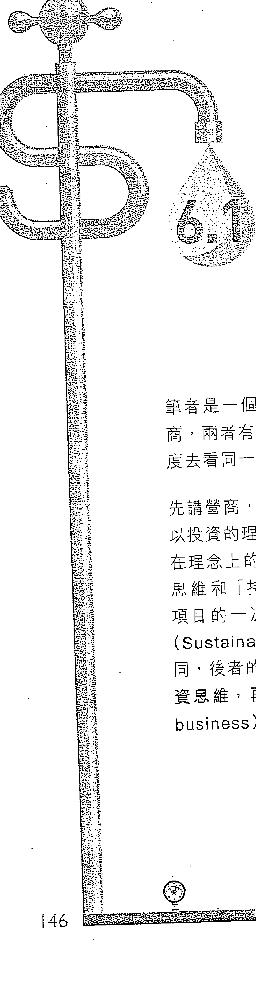

## 以槓桿投資思維營商

筆者是一個投資者，也是一個企業家，而我發現投資就如營商，兩者有著十分微妙的關係，分別只是站在不同的層次和角度去看同一件事。

先講營商，筆者營運生意的理念是「寓投資於生意」，意思是以投資的理念去經營不同的生意。而以投資模式去經營生意，在理念上的最大分別在於「單一投資」（Single investment）思維和「持續投資」思維。前者是散打式，特別注重個別項目的一次性收益（One-off gain），後者則著重持續盈利（Sustainable gain）。後者考慮的因素當然與前者截然不同，後者的視野需要比前者遠得多，而只有「持續盈利」的投資思維，再加上經營模式，才能稱得上是營商（Running a business）。

- 單一投資：注重一次性收益
- 持續盈利投資：著重長遠持續收益（因此會考慮如何使今次的投資對下一次的投資有利）
- 持續盈利投資＋商業模式＝營商

對於一般投資者而言，投資有長線和短線之分，而營商只有長線，這就是營商與投資的最大分別。正如筆者經常說，投資應該是長途賽，心態決定命運，視野決定成敗。做生意要長遠成功，必先要有正確的投資思維／價值觀，培養好良好的財商後再談創業，因此也不是人人都適合營商創業。

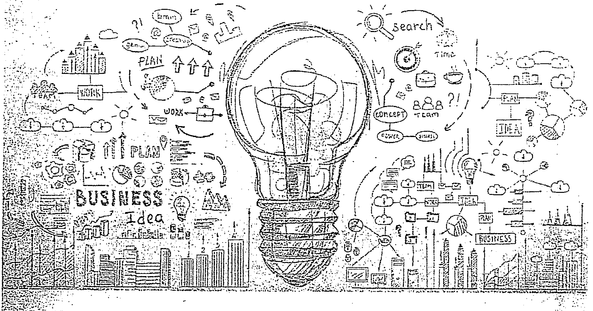

## 投資講資產配置，企業講整合發展

投資講求資產配置，特別是當投資組合去到一定規模時，必須要有合理的資產配置，長遠而言才能立於不敗之地。何謂有效、合理的資產配置？即投資組合內，資產與資產之間的關連性低或是呈負關係，從而達到風險分散 (Diversification) 或自然對沖 (Natural hedging) 的效果。這是為何筆者公司業務以房地產投資、開發、代理、管理公司、建築工程、測量師行的垂直產業鏈模式為主軸，再橫向分散至凍品貿易、外國護理產品貿易、大馬建材貿易、大宗商品貿易，以至近一年做得比較成功的貿易業務。

生意的發展除了傳統的垂直整合 (Vertical integration) 擴張 (即本業的上、下游整合發展)，還有橫向整合 (Horizontal integration)。傳統的橫向整合一般是指收購同業，從而收到協同效應和經濟規模的效果。然而，在現時成熟的市場上，傳統的外部整合 (External growth) 模式基本上只屬於巨企的世界，要在今時今日的新經濟世代尋求機會，已不一定要跟從傳統的垂直或橫向發展。相反，筆者認為業務的發展根本無須要強求業務與業務之間的必然關連性去收協同效應之效。意思是說，不同業務性質、類型的生意整合一起，一樣能夠收到協同效應的效果，這就是平台商業模式 (Platform business)。

## 成功的平台商業模式

一個成功的平台，是能夠做到完美的資源整合，前提是平台規模要夠大。如投資一樣，要平台規模做大必須要使用「槓桿」：1、OPT

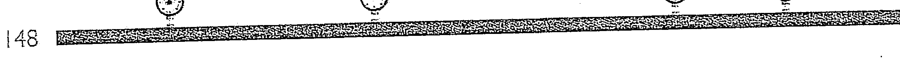

（Other people's time），利用別人的時間；2、OPM (Other people's money)，利用別人的資金，而當中尤以OPT最為重要。一個人任你怎麼能幹，也只有一對手，在人生有限的時間內，可以做到的其實非常有限，因此必須要懂得「槓桿」別人的時間，其次才是資金。

筆者從來不吝嗇分享自己的投資和經營生意的模式，原因是筆者認為只有「做大個餅」才是真正能夠長遠持續的經營模式，而市場上大部分傳統企業只是在同一塊餅上互相瓜分，俗稱「分餅仔」，當新的市場出現時，它們的優勢便會慢慢沒落。

要經營好一個平台，講求的是資源整合，首二是必須懂得去找對的合作夥伴，而找到好的合作夥伴的關鍵，在於你是否擁有長遠的視野，懂得慷慨地與夥伴分享利潤。只有你賺，別人沒賺或賺得少，你認為這種合作關係能夠長遠嗎？只有良好的利潤分享機制才是吸引人才、資源和機會的關鍵，然後平台才有機會做資源整合，才能做大。

## 零成本收購平台 產融結合

筆者目前經營得最好的貿易業務都是一種平台業務，而筆者的第一間貿易公司是在零成本下收購回來的。當年，跟幫忙核數的核數師閒談，知道他有一個客戶，公司有一定的營業額，但盈利虧損，仔細了解下，主要原因是供應商在有得選擇之下，傾向供貨予即時付款的批發商，價格亦較優惠；對於要求有帳期的批發商，傾向只發較少的貨，且貨價亦較貴。由於該貿易公司的老闆缺乏資金，公司只能入較少的貨，同時要求供應商給予帳期，價格成本亦較高，毛利進一步收窄，慢慢地生意愈來愈難做，正打算結業，要求會計師為其註銷公司。

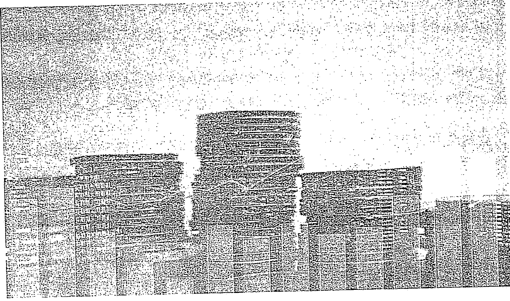

靈機一觸，這間貿易公司正合我意，可以合作，並要求約見該公司老闆，表示我可出資繼續營運他的貿易生意，他一分錢都不用出，利潤五五分成。他即時一口答應。事實上，除了貿易本身的利潤以外，我看中的公司的三年track record和營業額，可有助我進行產融結合。當時我投資了不少工廈，一般的按揭最多只可做五成，然而只要有營運公司（Operating Company），在有抵押品的情況下，公司最多可融資八至九成商業貸款。

在具備足夠資金下，貿易公司不用要求供應商給予帳期，貨價成本較低，令貿易存在利潤空間，同時貿易額可做大數倍，在利潤五五分成的機制下，原先該公司的老闆比以前賺的更多，而我則只是將額外融資出來的資金去做這盤貿易生意，空手入白刃。不足一年的時間，貿易生意愈做愈大，銀行給予的融資額按年增加，同時也包括多種能夠放大使用的融資額度，包括信用證和發票融資等。

該老闆以前的貿易合作夥伴知道後都相繼前來找我合作，希望利用我的平台做大其貿易生意，我同樣採取五五分成的機制。另一方面，有不少合作投資磚頭的投資者知道貿易的回報高，也主動找我談合作投資。他們不用拿資金出來，只需要將磚頭放入來，利用我的貿易平台便能如提款機一樣提取低成本資金投資，使貿易業務愈做愈大，愈大愈有市場優勢，平台同時被養大，銀行愈願意支持，平台的價值就愈高。這就是平台商業模式的雪球運作。

## 真正的成功 須懂得成就別人成功

有一個值得大家參考的故事：

> 「在一個有50人參加的研討會上，演講者給在座每個人派發一個氣球，並要求每人在氣球上寫上自己的名字，然後收集所有氣球，並放進另一個房間。然後讓大家進入房間，並要求在五分鐘內找回寫了自己名字的氣球。每個人都瘋狂地尋找，大家互相推擠和碰撞，場面一片混亂。五分鐘過去了，沒有人能找回自己的氣球。

> 演講者改了一下遊戲玩法：大家都隨機獲派一個氣球，並要求大家將之交給氣球上寫上的那個人。一兩分鐘內，每個人都成功取回自己的氣球。演講者說：『這正是我們每日生活中發生的事情。』

每個人每日都非常努力地想辦法令自己成功，卻不知如何做到。其實很多時候，我們的成功也取決於別人的成功。幫助別人取得成功，同時你也將獲得成功。時代轉變，我們生活在一個「共享的年代」，就必須要懂得怎樣運用共享的方式營商。

公司只是一個共享平台，老闆只是平台的發起人，平台應以創造最大價值為目標，利潤是市場對你創造價值的回報。所得的回報要與你的團隊共享，這樣才能吸引更多擁有不同才能的人加入平台，平台才能不繼壯大。一個平台創造價值的能力遠比老闆今天自己總共賺了多少個銅板重要。想得到真正的成功，我們必須懂得如何成就別人取得成功。

## 營商如投資

投資如營商

投資和營商有很多共通點，投資也必須要懂得營商的概念。營商本身就是一種投資，投資的是一門生意和營運團隊。筆者認為投資，就是相信別人比自己做得好，以資金投以信任一票，別人最後做出的成績就是你的投資回報。因此，投資者儘管不懂得營商的執行細節，也不能完全不明白營商的概念，否則你永遠不會去分析企業行為，也不懂如何去看企業的價值。若你只懂得看財務報表，你只是一個分析員，而好的分析員不一定是一個精明的投資者。原因很簡單，財務報表中的數字只是一堆過去的歷史數字，任你分析得再透徹，也只是分析歷史數據。若你只運用財表去分析企業的估值，那結果一定不全面；若你打算長期投資一家你分析得不夠全面的企業，風險就相當大。

## 投資人才 而非數字

要進行價值投資，對企業的分析必須要全面，那就必須要懂得各方面的知識，儘管你可能不夠「專業」。去分析一間企業，在決定是否長期投資之前，我喜歡分析管理層的營商能力、風格是進取或保守、視野是遠或近、企業財技運用是否得宜等因素，然後才是財務報表的分析。例如一個對地產完全沒有認識的人去投資REITs，他根本沒有能力去判斷該REITs旗下所持有的房地產項目的長遠價值，極其量只是流於看眼前的回報率。在分析不夠全面的局限下，錯誤投資的機會便相對高。風險不在於工具，而在於投資者本身。

一個成功的企業家，需要有精明的投資思維，才能有效運用資本運作的概念去創造盈利；一個成功的投資者，需要有企業家營商的思維和高度，才能閱讀一個企業的長遠價值，從而挑選出優質的企業作長線投資。投資，就是投資別人去為你營商。因此你是投資一個營商團隊，而非一堆財務數字。

### 6.3 空手入白刃的地產項目

話說數個月前，筆者在荔枝角路經一處，發覺原本是美心餐廳一直租用的工業大廈地廠圍上了街板，連忙問身邊的地產經紀同事，美心遷走了嗎？同事說是的，由於美心正進行品牌提升（現稱美心MX），分店選址首選商場，工廈地廠租金雖便宜，惟工廈食堂牌限制食肆對外不可掛上招牌，故美心最終放棄此工廈地廠，轉到大商場去。

### 物色具潛力資產 機會就在身旁

筆者立時精神為之一振，原因是筆者一直心儀該工廈地廠的位置。按筆者對荔枝角的了解，該地廠位置堪稱全荔枝角最具商業價值的工廈地廠。地廠位於青山道與大南西街交界，十字路口，人流極盛，十字口有紅綠燈位，人流匯聚於此，且該位置


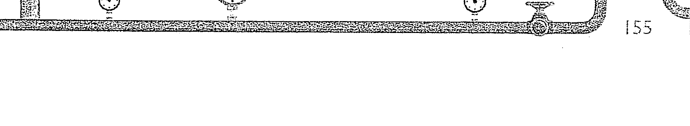

距地鐵站僅一至兩分鐘步程，地理位置相當優越，是不可多得具高可塑性的工廈地廠。

得悉美心遷走的消息，連忙命地產同事不要對外宣揚，同時讓同事立即聯繫業主。剛好原來業主也在荔枝角辦公室，筆者急不及待直接上其辦公室與業主即時見面。由於同事認識該位業主，事前也先向筆者簡介了一下業主背景，原來他本身是一名會計師，會計師特性是數口精，但計的一般都是死數，也聞說業主知道美心要遷走，曾嘗試調低租金挽留但不果，由此可知業主的心思，並嘗試根據其人物性格代入其角色——業主必在想物業若空置一個月就是廿幾萬，每一天都是錢，相當肉痛。


## 知己知彼 掌握心理

一向隨身帶備支票的筆者當然早有準備，一見面二話不說單刀直入談條件，每月23萬租15年（比美心原來的租金還高，而之前的租約是12年），隨即準備好支票。業主一聽到15年便說太長了，不可能！筆者為不讓他有太多時間考慮，速戰速決，立即開另一張支票遞向他：「24萬一個月，十年約。」業主聽到後，表情開始有點軟化，但仍搖搖頭說十年太長了，卻一邊伸手接過支票，明顯是難抵金錢的誘惑。支票是三按一上（按金加上期）合共96萬，準備充足的經紀同事早已在旁準備好臨時合約，即時簽署成交。就這樣，這一宗十年租約的deal僅用了20分鐘便完成了。一步出大門口，落到樓下，同事即時問我為何這麼有信心，大拿拿廿幾萬一個月，你不用先回公司計計數？我說不用，我心裏有數。

青山道與大南西街交界人流極旺，原來的美心餐廳佔地約8,000呎，包括了座位及廚房，但門口僅在青山道的一小角，其他對外全部密封。筆者一直認為若將青山道一排非結構牆身全部打開，將之變成數個小街舖，其價值和租值定必大大提升，而將工廈地廠改為街舖，只需向地政總署申請短期豁免書（Short-term Waiver）即可，每月僅需按改變用途單位的地祇面積（Floor area）補回差價費用，然而工廈變成零售街舖的價值提升，以建築面積計算遠比只按地祇面積補償的費用高，從而能做到強化資產（Asset Enhancement），從而提升租值（Yield Enhancement）的效果。

## 現金流算盡　空手入白刃

不足兩個月，筆者分間的六間街舖已全部租出，每月淨租金已超過30萬，已完全覆蓋每月24萬的租金支出，同時後面的三個食肆舖位是淨賺的了，這段時間已不乏多間大型連鎖品牌食肆有興趣，如翠X、大XX、吉XX等，預計租金25至30萬。該地廠項目的總租金收入預計約60萬，短時間內已翻了1.5倍，每月淨現金流收益可達36萬。

該地廠項目的投資成本，主要為改建的工程費用約150萬，當然也不是一次過支付。對於以現金流為王的筆者，計數也是算得很盡的，由於項目分間後的租金水平比原先的租金水平上升了1.5倍，所收的按金也就上升了1.5倍，以三按一上計算，筆者合共能收回240萬按金及上期，扣除支付予大業主的96萬按金及上期，正現金流為144萬，足夠支付工程費用所需。因此，本項目近乎是空手入白刃。

對於該項目淨賺回來的4,000呎食肆舖位，本來大可直接租出收租，但多日來反覆考慮，反正該食肆面積是淨賺回來的，筆者希望可以自己搞一個food court。荔枝角本身食肆供應極度稀缺，而該區是一個即將變天的商業區，加上項目本身位置好，因此筆者希望藉此機會建立一個屬於自己的food court品牌，以匯聚一班品牌食肆，以作為日後強化資產的一種利器／工具。

當擁有自己的品牌，就等同擁有一項強化資產的利器，可應用至不同的地產項目，有助日後收購其他地廠 / 物業 / 鋪位後，主動提升租值，做到強化資產，從而提升租值，然後是估值（Valuation）的提升，最後是資產價格的體現。

可參考前文：

> 「假如你自己本身是一個品牌零售商，有吸引人流的能力，你便能將一個人流不多的死舖帶旺，如果舖位是自己的，便能成功做到Asset Enhancement。更甚的，如果你們是一班「品牌新派飲食聯盟」，將一條人流不多的街舖帶旺，將租金（Yield）提升，便能成功推升舖位的估值。估值高了，銀行融資能夠將資產的增值部分（Unrealized profit）具現化為現金流 / 新資本，再投資買入其他資產，然後重複上述動作。這是筆者經常說的「產融結合」概念。」

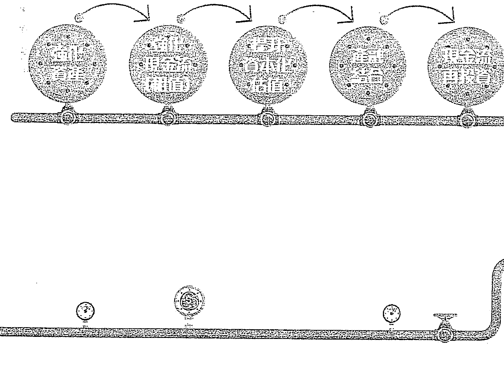

故事尚未完結，假設筆者每月淨租金收入為36萬，一年為432萬，十年為4,320萬。按現時的二房東運作，要收到這4,320萬需十年的時間。簽下租約後，筆者曾問過業主有沒有興趣出售物業，當時業主說到價可考慮，開價一億以上才考慮。明顯地，此開價是按我與他之間的租約的租金水平來釐定，每月租24萬，一年租金288萬，以3%左右的Cap rate計算，資本化估值就是大約一億。然而，現時筆者將項目的租值提升至每月60萬，物業的估值以相同的Cap rate計算，資本化估值便上升了1.5倍，即約2.4億。儘管保守地以較高的Cap rate去做估值，相信估值仍能在兩億以上的水平，若能以一億買下項目，帳面仍能賺一倍以上，這才是筆者最想做到的。由於估值主要是基於物業租值以資本化率推算，只要能提升租值，便能提升物業估值及價格；當估值提升，除了出售資產，亦能透過再融資將帳面的資本增值部分釋放，轉化為現金流再投資。

當然，當業主知道項目最終能租到這個租金水平時，又不願意出售了，然而業主亦被我的租約鎖死了十年，除了出售物業給我，我們也能合作出售，然後將資產增值部分作利潤分成。

## 提升估值

產融結合

有了現金流資本化的概念，便會明白投資除了簡單地買入資產賺取現金流，更可主動提升資產產生現金流的能力，從而達到提升資產價值和價格的目的。從此，我們便無懼投資一些「非大路」或缺乏市場參考價格的項目，因為我們知道資產的價值能夠從資產的現金流計算出來。

好了，我們知道資產的估值能夠透過強化現金流的手段提升，但如果資產在市場上鮮有交易，缺乏流動性，在沒有市場參考價格下，即使估值提升，也可能「有價無市」，最終未能出售項目來賺取利潤。

## 借再融資套現

首先，正如前文解釋過，投資的目的並不是為了賺取金錢利

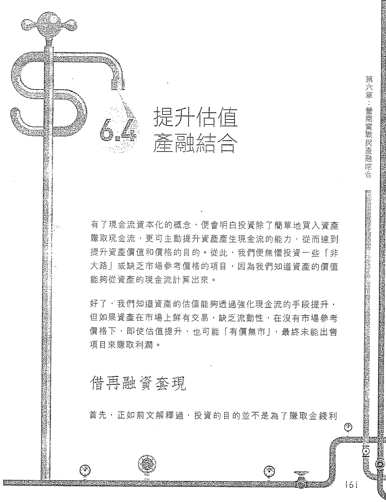

潤，而是為了賺得資產。我們需要解決的問題是如何將提升了的資產價值釋放，並轉化為現金流，成為「再投資」（Re-investment）的新資本。最簡單的方法，当然是直接將資產在市場出售，但在缺乏流動性的市場下，有價無市，最終可能令資產需要折讓出售，浪費了提升了的資產價值。在這情況下，不出售資產同時又能夠套現，只有一個方法，就是「再融資」（Re-financing）。

2015年中，筆者在新界上水購入了一幅九萬呎的倉地，計劃興建一個現代化有蓋的物流貨倉。在工程接近完工時，整個貨倉已經全部租出，平均呎價約12.5元／呎。


## 產融結合的力量

整個貨倉項目建築面積約九萬呎，分拆成11個獨立契小型貨倉，筆者公司同時提供物業管理。由於市場對物流貨倉需求旺盛，新界洪水橋發展計劃及東北發展計劃上馬，使新界倉地及貨倉的供應嚴重不足，預計未來情況將會更加嚴重。事實上，筆者早已透過與市場研究公司合作，收集了大量有關新界地供應及需求預測的數據，斷定了這個方向沒有錯，因此立即大規模投資倉地發展。市場的反應證明筆者當時的推斷正確，更可能是低估了。目前有蓋貨倉的市場租金已達到13至15元/呎。

該項目還未完全完工之際，已由四個獨立用家全部承租，平均租金約12.5元/呎，每月收租110萬，全年租金收入1,320萬。測量師行根據市值租金水平，以5%左右的Cap rate進行估值推算，目前估值已大幅提升至2.53億，呎價約2800元/呎。

在短短不足一年的時間裏，資產價值提升超過一倍。銀行則根據測量師估值報告，能夠提供最高四成的按揭貸款，而通過銀行承做四成按揭，筆者已接近取回全部投入的本金。假設供20年，每月供款約50萬，其中33萬為本金，17萬為利息，租金收入足以覆蓋供款有餘，每月有正現金流60萬，還未計算33萬本金供款部分。

透過強化資產，現金流收益資本化令資產估值提升，再通過產融結合，將資產價值提升部分成功轉化為現金流，現金流再成為新資本進行再投資。本個案將一幅沒有太大價值的倉地，改造成一個現代化的有蓋貨倉，同時將現金流和資產估值大幅提升。最後，通過再融資從銀行套現回一億資本，取回最初的投資本金，後便能立即買另一幅地發展。在一幅地都沒有出售的情況下做到貨如輪轉，從而達到真正「賺資產」的目的。

## 在「非主流」市場尋寶

一般人沒有「現金流資本化」和「產融結合」的概念，即使資產的潛在回報高，他們都不敢冒險買入一些表面上缺乏流動性或沒有市場參考價格的重資產，主要是擔心即使價值能夠提升，若未能成功將資產在市場出售，也是沒有意義，資金也會因此被單一重資產鎖死。然而，投資者若懂得以上兩種概念，便能夠在「非主流」的市場上尋寶，發掘真正有潛力的「另類投資」(Alternative investments)。正如前文所說，槓桿不一定用於放大投資額，也可以為我們提供流動性，在時機來臨時讓我們隨時再投資。

### 6.5 迷你倉市場整合下的機會

自2016年中迷你倉大火事件後，公眾及相關政府部門對工廈迷你倉的消防問題更關注。不同部門，特別是消防處，針對消防安全問題進行研究，並多次修改現有條例去規管迷你倉運作。及後消防處更頒佈最新的「迷你倉條例」，要求儲存倉之間的間距不少於2.4米，即相等於一般超市三倍的走廊闊度，單是根據此要求，當時市場上所有迷你倉都已經違規。據了解，相關部門僅給予一段時間的寬限期，迷你倉經營者須在寬限期內清拆或改建所有迷你倉，否則相關部門將會發出清拆令並罰款。

新條例令迷你倉市場發生了重大轉變，以時昌迷你倉為首的迷你倉業界面臨結業的危機。業界反映，若遵從最新的條例，倉內實用面積將下降三至四成，儘管加價三成，也未必能夠填補少收的租金。而且清拆或改建所有迷你倉涉及一次性巨額成本，這迫令不少迷你倉經營商選擇結業。隨著政府部門給予的寬限期將至，大型迷你倉經營商相繼結業或大幅縮減規模，市場供應正急速下降，但需求卻沒有減少的跡象。

大型發展商建造的新落成住宅單位以「納迷戶」為主，市場對倉儲的需求事實上是不減反增。面對剛性的迷你倉需求（迷你倉用家應該最清楚），預期未來供應卻大幅下降，市場整合便往往出現新的商機。

有見及此，筆者與時昌迷你倉合作，將不合新例的迷你倉項目向屋宇署正式入則申請重新分間及改建，使項目完全符合屋宇署及最新消防條例的規定，並且同時將整個項目進行拆售，同時由時昌迷你倉包租整個項目，買家的租金回報率達5%以上。這是香港首個正式拆售的迷你倉項目，有別於市場一般的工廈拆售單位，項目有實質的租值支持。

眼見迷你倉的租金愈來愈高，市場的大部分迷你倉經營者都不願意再投入資金將現行不合例的迷你倉重建，原因除了重建涉及額外的一次性龐大資本投入外，重置成本高，加上新例限制使回報率下降，導致回本期長，資金被牢套，才是最大的考慮。要解決資金快速周轉的問題，減少資本支出，合作改建再分拆出售，由重資產轉為輕資產的經營模式，可能是一個新的經營方向。

套用前面章節的一篇文章〈輕資產 / 重資產的投資模式〉，時昌迷你倉以往的經營模式其實是兩者兼備。時昌除了買入工廈做迷你倉外，也會與業主合作分成，前者是重資產經營模式，後者則是輕資產經營模式。儘管前者是重資產的經營模式，時昌運用了「產融結合」為重資產減磅。基於時昌的品牌和經營能力，銀行願意為其手持的工廈物業提供高成數的融資貸款，因此時昌能做到「產融結合」，能不斷地累積工廈資產，使其重資產組合永遠不會出現hardcore，是一門真正的地產生意。

對於筆者而言，是次與時昌的合作，筆者就是純輕資產的經營模式，無需買入工廈，只需承擔部份的改建與銷售成本，道理與時昌的輕資產模式相似，唯一分別只在於項目在改建後是出售而非出租。其實投資與營商的道理一樣，投資要創造現金流，營商要創造商業價值，兩者講求的都是「經營模式」。在創造價值的基礎上，優秀的經營模式能為企業家 / 投資者將創造出來的價值 / 現金流體現得更有效率、更淋漓盡致。

## 第六章：營商智慧與產融結合

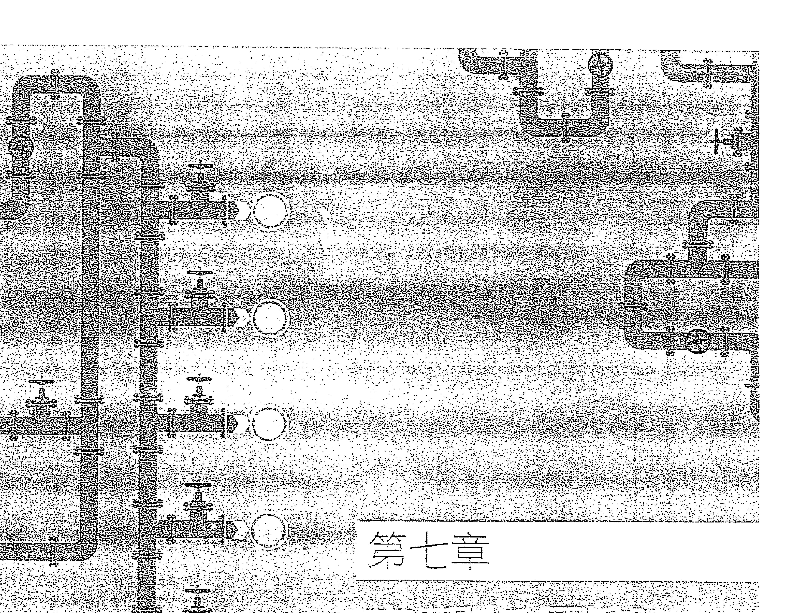

## 第七章 九、周期信号的波形图

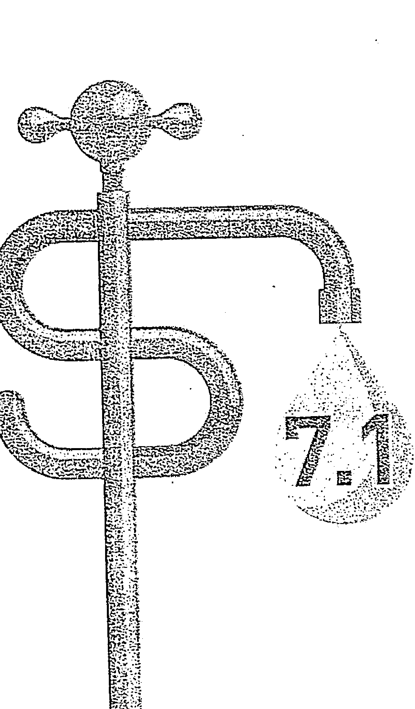

## 貿易戰下中國債市的隱憂

近日，市場最關注的問題相信離不開中美貿易戰。美國以與中國之間國際貿易長期處於龐大逆差為由，向總額340億美元中國進口貨徵收25%關稅，而後續的徵稅或使涉及商品總額超過5,000億美元，即基本上相等於2017年美國從中國的進口額。而事實上，是甚麼造成貿易逆差？而貿易逆差對一個國家而言是否有這樣的迫切性，要使用這樣強硬的行政措施去禁止？確實值得商榷。

首先，美國貿易逆差的根本原因，在於美國「高消費、低儲蓄」的經濟結構，而美國逆差問題不是中美貿易特有，目前美國對全球貿易普遍都存在逆差。或者應該這樣說：美國企業為追求利潤最大化，在全球尋求廉價勞動力和低成本生產地，轉移低端製造業去發展中國家，同時把研發中心和高端製造業等保留在美國本土，這就催生了美國對中國等發展中國家物美價廉產品的旺盛需求，造成今天的龐大貿易逆差。這正是經濟學中，傳統國際貿易理論所提出的「比較優勢原則」(The Principle of Comparative Advantage)。

根據「比較優勢原則」，一個國家是否生產蘋果，並不是看該國是否有絕對優勢（Absolute advantage），而是看該國生產蘋果是否存在比較優勢（Comparative advantage）。要看它是否有比較優勢，就必須要看其生產蘋果的機會成本，而非金錢成本。美國的比較優勢在於高科技、高技術含量的生產，這也代表美國從事低端製造工序的機會成本較發展中國家高。撇除政治及戰略層面的考慮，單純從經濟利益角度看，美中存在貿易逆差是再合理不過的。各國各司其職，各取所需，這正是全球供應鏈（Global supply chain）的運作。

任何貿易戰的發生，原因只會是基於政治及國家戰略層面的考慮。就國家之間的經濟利益而言，雙方都會是輸家，長遠影響全球供應鏈的正常運作，拖累環球經濟。從投資者的角度，不論中美貿易戰哪一方較有優勢，事情發展到最後都不會有「贏家」，埋單的都只會是兩國的經濟和國民。

作為投資者，筆者一直以來比較擔心的其實是中國本身的內在經濟問題。事實上，貿易戰只是造成了中國內憂外患的局面，加速了內部經濟問題、債務問題、資產泡沫和貨幣泡沫問題的浮現，縮短了中央針對性解決以上問題的時間。

## 中國的「明斯基时刻」來臨？

內地經濟學家賀江兵引用已故美國經濟學家海曼·明斯基（Hyman Minsky）提出的「明斯基時刻（Minsky Moment）」，來形容目前中國經濟面對的問題。該理論指出，一個國家在長期的經濟繁榮中，資產價格上升，人們對資產價格產生了上升預期，當市場資產價格普遍反映了升值預期，這反映了資產價格其實已透支了未來的經濟增長因素。為了追逐不斷升值的資產，人們開始透過借貸去購買資產，這進一步實現了市場對資產升值的預期。資產升值產生的財富效應，加上金融機構包括銀行和影子銀行的再融資，使資產升值部分有效地轉化為新增的購買力。當市場的需求主要來自升值預期下的投機需求，而購買力主要來自融資借貸，與此同時一個國家的經濟去到一個較為成熟的樽頸，經濟增長開始放緩，經濟增長遠落後於已透支未來經濟增長因素的資產價格，資產泡沫便開始形成。

事實上，在中國成為「強國」的近十多年來，中國的經濟增長並不是穩定增長，而是比較大上大落。中國的國民生產總值（GDP）由高峰期每年增長超過10%以上，除了金融海嘯時中央放水四萬億（人民幣，下同）救市令GDP增長短暫反彈回升，GDP增長（當中也可能含有不少水份）一直下跌，因此事實上中國的經濟基本面，特別是內需，並非如大家想像中強。

## 房地產泡沫與內債危機

中國建行董事長田國立估算中國目前的房地產價總值達到400萬億元，是一個天文數字。中央當然也知道內房市場存在的泡沫問題，而對付泡沫問題最有效徹底的解決方法就是讓它爆破。然而，房地產市場是中國經濟增長的火車頭，股市是二號列車，在現時股市不會好到哪裏去的情況下，如果400萬億的房地產市場爆破，對中國的經濟將會造成非常沉重的打擊。因此，中央近年的主調是「去槓桿」，減低泡沫真的要爆破時對市場造成的影響。現時，中國的房地產泡沫也開始有破裂的跡象，2017年北京房價已明顯出現下調，特別是二手房，價格由高位下跌幅度達20%。


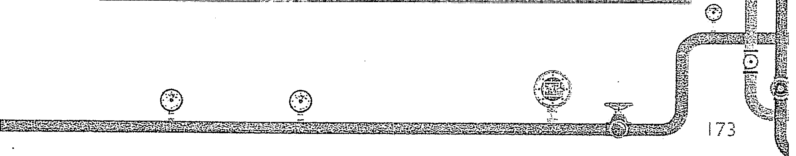

為免「去槓桿」會刺破泡沫，影響經濟增長，人民銀行今年以來已經第四度實施降準，累計降準幅度達3至4%，總放水規模已達2.5萬億人民幣，支持高負債企業「債轉股」項目和小微企業融資，儘量針對性維持寬鬆的貨幣政策。中央所做的都是「緩衝式去槓桿」政策。

除房地產泡沫以外，中國另一大危機是內債問題。雖然中國國債（中國政府發行的債券）僅為十萬億元，相比其他主要經濟大國不算高水平。然而，根據人民銀行公佈的資產負債表顯示，截至2016年底，中國內債竟高達244萬億元，當中主要是家庭和企業債務。相比中國僅約75萬億元的GDP，中國的總負債比率高達350%。在經濟學上，一個國家的負債比率接近200%已是警戒線，而中國目前的內債水平已超過警戒線1.75倍。

2018年以來，國內的債券違約問題嚴重，不論是地方政府、上市公司、民間企業、甚至中大型國企均存在債務和流動性的問題，當中尤以內房企的問題最為嚴重。中央「去槓桿」的意志十分堅定，自2017年底再次限制內地房地產企業於內地發債融資，因此有不少內房公司、國企急急來港進行境外發債。

## 「偽擔保」與「偽國企」

值得留意的是，不少內地企業只通過境外成立子公司（實質上只是一個融資平台）進行發債，這些企業礙於外管政策的限制，又不能直接對境外的融資主體進行擔保，往往只能提供沒有法定擔保效力的安慰函（Letter of comfort / Keepwell agreement）。在沒有辦妥外管局的對外擔保登記的情況下，這種所謂「擔保」實際上只等同「口頭承諾」，請個信字。這些境外融資平台實為新成立的特殊目的公司（SPV），本身並沒有還款能力，倘若發債主體違約，提供「偽擔保」的內地母企儘管有能力償還貸款，但到時又是否能獲得外管批准，順利將資金從內地匯出至境外還債？這是一個問號。因此，大家投資債券時不得不留意發債之結構，以及資金用途是否用於再融資，更重要的是其還款來源。

以上這類結構的債券，真正的還款來源實質上只依靠發新債再融資。大家不難發現近年不少內企在境外新發行的債券之發債用途為「再融資」（Re-financing），說白了就是「以新債還舊債」，性質等同續用貸款（Loan rollover）。若市場繼續有債券違約事件發生，令債券市場情況轉差，加上市場加息因素，企業若未能發行又或者需要以更高的成本去發行新債再融資，資金鏈一旦斷裂所引發的連鎖市場反應，將使債價進一步受壓，繼而觸發債券市場去槓桿，加速債市崩盤的骨牌效應。以上的市場傳遞反應將會非常迅速，一旦來臨的時候才意識到，要走幾乎是不可能的爭，因為債券二手市場已即時失去流動性。

除這類「偽擔保」債券以外，近年市場多了很多「偽國企」跑出來境外發債，更令筆者震驚的是不少香港大型私人銀行更會為這類「偽國企」提供高成數的融資率。所謂「偽國企債券」，是指一些擁有中國地方政府背景的企業所發行的債券。由於地方政府要爭取政績，必須要「修橋補路」，而這都牽涉到龐大的政府財政開支，但地方政府發債有規模限制，有見及此，地方政府唯有成立城市投資建設公司（簡稱「城投公司」），再將土地及政府的資產或一些特殊權益注入這些城投公司作擔保，然後利用城投公司進行發債（城投債），從而取得資金。


然而，城投公司所投資的公共建設項目大部分都沒有盈利能力。這些城投債作為地方政府爭取政績的工具，卻沒有想過還款能力的問題，爆破是遲早的事。最近一兩年，大量內地城投公司跑出境外尋求發債渠道，筆者也曾接獲不少城投公司的邀請作為其境外發債的融資顧問，可以說，他們甚麼也不懂，只想趁境外債券市場火熱時圈錢。偏偏就有不少私人銀行客戶貪其高息，又有「國企」背景，以為相當安全，加上銀行又願意配合給予高槓桿，令這些債券近年都十分暢銷。

說到國企背景的債券，不得不提中國國儲能源化工集團。2017年底，國儲能源曾牽頭合組財團向長實以402億港元收購中環中心。然而不久後，國儲能源退出了交易，並在2018年5月份出現一系列美元債券違約。事實上，金融海嘯後，中央開閘放水，實施寬鬆貨幣政策，擁有國企背景的企業以及大型上市企業如萬達、海航等，都極容易從銀行取得大額貸款。然而，他們都明白到內地的資產和人民幣都存在著泡沫。引述賀江兵的說法，人民幣事實上是「超額增發」的。根據人民銀行資料顯示，2018年3月，人民幣廣義貨幣供應量高達約174萬億元，這個數字比美元和歐元的M2貨幣供應量之總和還要高。這是為何國儲能源、萬達、海航等大型企業要在內地借取大量銀行貸款、發債用於海外併購，因為他們都意識到將資產配置海外的安全性，同時清楚明白人民幣存在泡沫的問題。然而，這些不惜通過高負債去境外進行瘋狂併購的行為令中央非常關注，當中央針對這些高負債的企業實施融資限制，流動性便會即時出現問題，這些企業在境外發行的債券便會面臨違約危機。

## 貿易戰 讓拆彈複雜化

筆者自金融海嘯後開始投資債券，當時內地的房地產發展項目回報高，但內房企業在內地難取得開發貸，且融資成本高，故紛紛走境外以高息發債融資。筆者當時利用低息環境的優勢，運用槓桿投資相對穩健的高息債券，套取豐厚的息差收益，槓桿後的資本年回報率連續幾年高達2X至30%。然後再利用槓桿後的高息回報暴積紙磚（REITs）等現金流資產，慢慢自然去槓桿。

在風高浪急的大環境，擁有防守意識的投資思維才是令自己立於不敗之地的關鍵。筆者一直認為中國表面上的「經濟繁榮」背後都有些隱憂（其實很多大經濟體都有），但我相信中央行政手段有能力解決，加上人民幣資本帳不開放，有效的貨幣政策加上行政手段，要慢慢拆彈／解決問題應該不難。

然而，今次外憂令中國有點進退失據。面對貿易戰，人民幣要貶值，為貿戰爭取本錢，同時又怕人民幣貶值預期形成（預期從來都是最可怕的敵人），資金外流令中央外匯儲備減少，其速度可以很快。2015年的資金大逃亡，中央外匯儲備由四萬億降到三萬億，只需不到一年的時間。

作為投資者，不得不再次關注「中國本身內在問題」，儘管問題不一定會發生，但投資者應為最壞的情況作好調整及部署（包括投資選項、槓桿運用和操作技術層面），特別是中國相關的債券投資配置。投資，一定要令自己立於不敗之地，勿存「貪」和「博」的心態，要博不如過大海博一鋪，更省時快捷。


截至2018年9月，美聯儲已第八次加息，每次加息幅度為0.25%，合共2%，並預料2018年12月再加息一次。有市場人士認為，在全球一體化，加上目前環球經濟情況不樂觀的情況下，美國加息將牽連甚廣，首先影響的是環球資金流向。

資金流向從來都是從低利率貨幣流向高利率貨幣，目前世界各國具影響力的貨幣，包括日元、歐元、人民幣等全球數大貨幣區，基本上都在實行相對寬鬆的貨幣政策，大部分央行目前均傾向將利率維持於相對低水平，儘管加息，步伐亦相對緩慢。有些國家更讓其貨幣貶值，動作多多，但方向基本一致，除了美國。因此，市場過剩的資金很自然跟著美元走，美國也從而達到了「班資回朝」的目的。


## 聯匯制度下的無奈

當世界資金流向都湧向美元，美元變得十分強，在聯繫匯率的機制下，港元亦只能無奈地變強，港元匯率的強弱，事實上一直都並非出於本身的經濟情況。面對這個局面，作為香港的小市民其實相當無奈。2008年金融海嘯後，美國數次量化寬鬆（Quantitative Easing，QE）救市，市場過度充裕的流動性令大量資金湧入本港，加上內地海量資金同時湧入，造成了香港近十年的資金氾濫、銀紙貶值、資產價格暴升的局面，通脹率平均每年維持在4至5%，但銀行存款利率不足0.5%，出現實際負利率（不是名義負利率），直至近來才開始有所收窄。

按道理，香港在通脹率相對高的情況下，銀行利率根本不會這樣低，出現這樣的情況，主要因為香港實行聯繫匯率，港元匯率必須跟著美元匯率走，簡單講就是香港根本沒有自主的貨幣政策。美國要QE救市，故意將利率不合理地壓低，若香港不跟隨，更大量的資金會即時湧入香港推高港匯，為維持聯繫匯率，香港近十年也必須一直跟隨維持超低利率水平。

## 負利率下的套利操作

高通脹，但不合理地低利率，在實際負利率長期持續的情況下，銀紙貶值速度加快。有錢人尚可透過購入各類資產（包括物業、債券及其他投資等）對沖購買力下降的風險，但窮人只能每月出糧存款入銀行坐以待斃，任由通脹蠶食本已不多的購買力。貧富懸殊進一步拉闊，社會矛盾加深，實屬可以理解。

實際負利率長期持續的情況下，精明的有錢人更可利用已升值的資產，以低息融資套現，再購入其他具現金流的資產，享受資產升值的同時，更有正回報現金流。

早兩年，歐洲更已率先實行名義負利率（Negative nominal interest rate），即存錢入銀行，銀行會收取存戶利息。當時筆者亦曾建議投資者可考慮以接近零成本借入歐元，去購買其他資產（債券 / 貨幣）套利。當然若該資產非歐元計價，會存在匯率風險，但在歐元負利率、美元又準備加息的情況下，歐元續向下的機會大於向上。

## 利率正常化VS.加息周期

每次議息前，市場和投資者都非常緊張，認為市場總是充滿不確定性。其實聯儲局已多次表示會因應就業市場和通脹的數據去執行加息的計劃，因此關鍵不在於加息與否，而在於後續加息的節奏和力度。大家需要分清楚「真正加息周期」與「利率正常化」的分別。前者主要針對經濟增長帶來的通脹升溫，周期是漫長的；後者則是將扭曲的貨幣市場環境正常化，正常化的目標利率可以是3至4%，最終的加息幅度和時間都是有限的。

客觀而言，筆者暫未看到美國具備進入加息周期的條件。如果3至4%是一個「正常化目標利率」，亦即是利率正常化的目標，這意味著低息環境仍將會是新經濟常態下的正常設定，市場應未見有任何重大轉變。作為散戶，掌握好重點已足夠，其他已經不太重要。

## 7.3 港匯套利
操作示範

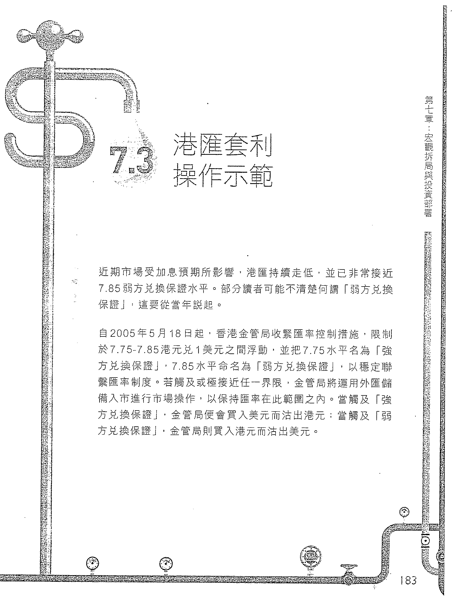

近期市場受加息預期所影響，港匯持續走低，並已非常接近7.85弱方兌換保證水平。部分讀者可能不清楚何謂「弱方兌換保證」，這要從當年說起。

自2005年5月18日起，香港金管局收緊匯率控制措施，限制於7.75-7.85港元兌1美元之間浮動，並把7.75水平名為「強方兌換保證」，7.85水平命名為「弱方兌換保證」，以穩定聯繫匯率制度。若觸及或極接近任一界限，金管局將運用外匯儲備入市進行市場操作，以保持匯率在此範圍之內。當觸及「強方兌換保證」，金管局便會買入美元而沽出港元；當觸及「弱方兌換保證」，金管局則買入港元而沽出美元。

## 聯匯下 港元「跌無可跌」的投資機會

當港匯非常接近7.85的弱方兌換保證，意味著港匯基本上已沒有下跌的空間。面對這情況，有一種操作可以做，就是「沽美元、買港元」。對投資者而言，具體操作實際是「借美元來買港元」。在聯繫匯率制度下，美元對港元之最大波動幅度為7.75-7.85，即1.27%。若現時匯率（即期 / Spot）已觸及7.85弱方兌換保證，理論上港匯只有upside，沒有downside。

聯匯套利操作很簡單，先向銀行借入美元，然後將美元兌換成港元，再將港元存於銀行（可做定期存款、買入港元存款證或其他港元定息產品），目的是儘量抵銷美元借貸的利息成本。下一步是將港元定期存款或其他港元定息資產抵押予銀行，借出美元，然後重複以上操作，原理與槓桿債券一樣。當然，在實際操作下，只需直接以孖展額放大總投資金額即可。

舉例，假設銀行提供的最高融率（LTV）為97%，即槓桿倍數為33.33倍，一萬元的本金可將總投資額放大至33.33萬元。而港匯目前在「弱方兌換保證」的最低水平下，最高的升幅為1.27%（由7.85去到7.75），槓桿後最高回報率為1.27% × 33.33 = 42.33%。假若一年後港匯回升至7.75，槓桿後最高回報率將有42.33%，即使只有一半，年回報率也超過20%。


## 须考虑的操作成本

在港元理论上几乎没有再下跌空间的情况下（唯一可能是香港特区政府放弃联系汇率），这种投资操作有这水平的回报，算是非常吸引。但以上操作亦涉及两种成本：

- 第一、借入美元当然涉及借贷成本。买入港元后将港元存于银行虽然有存款利息，但低得可怜。因此，美元贷款和港元存款的息差是最主要的成本；
- 第二、就是买入和卖出港元的买卖差价。

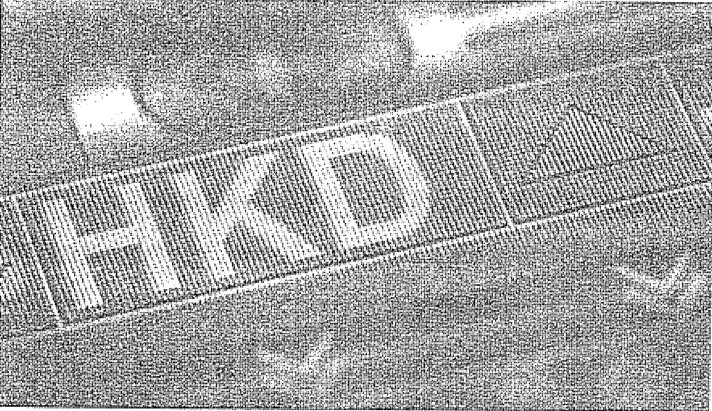

一般而言，笔者会直接设计一个proposal，向私人银行建议整个操作方案。首先，笔者提出的要求是美元贷款和港元存款（或其他港元固定收益产品）的息差要接近相同，第二是杠杆比率的要求。笔者好奇致电某专门做结构性产品的大投行询问，第一个反应是：「陈生，乜又系你呀？」。经过一轮内部商讨，该行产品部的初步回覆是：第一个条件基本上可以做到，但行方并不愿透露以何种产品操作；至于融资比率最高则可能只有95%（待定），即20倍杠杆。最后，当然是行方对投资者的要求——一般tailor-made的投资盘均会对投资者设定最低的投资金额要求。

市场不时会出现一些短期的套利操作空间，笔者对上一次操作已是数年前人民币存款证借美元、CNY / CNH等的操作了，当时回报非常疯狂，现在回想起亦津津乐道。现时除了市场的套利机会和空间愈来愈少，感觉上金融机构们亦没有当年般进取，这当然也跟监管机构的政策收紧得愈来愈严格有关。

## 7.4 認清何謂「加息」

分析加息對經濟，以至資產市場的影響前，我們需要先知道所謂「加息」，實際上是加甚麼息？美聯儲又是通過甚麼手段達到「加息」的效果？儘管大家都在談論「加息」這個議題，但相信大家對以上兩個問題都未必清楚。

所謂「加息」，其實加的是美國聯邦基金利率（Federal Funds Rate，FFR），亦即是美國銀行隔夜同業拆息（銀行與銀行之間互相借貸的利率）。有別於中國對利率的直接操控（直接對市場給予一個指導利率），聯儲局開會決定的其實是FFR的目標，說是一個「目標」，是因為聯儲局一般會透過市場操作去影響銀行體系儲備（Reserves），以確保FFR實際水平與目標相若，因此多年來美聯儲的零息目標其實是0%-0.25%的區間。

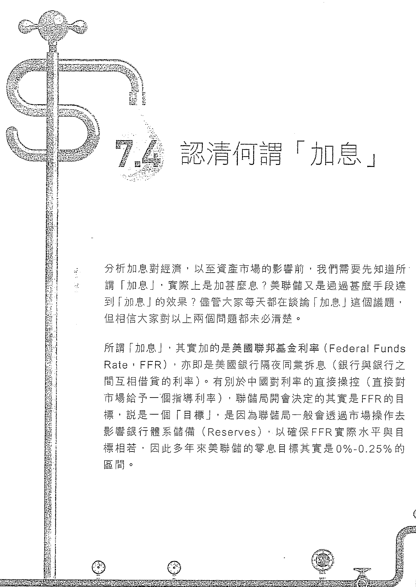

## QE後 傳統加息操作失效

簡單而言，如果聯儲局決定加息，理論上必須減少銀行體系的儲備，令銀行體系內的資金頭寸相對緊張，從而推升市場利率。操作上，聯儲局會在市場沽售債券或證券，如美國國債、按揭抵押證券（Mortgage-backed security，MBS）等，從而抽走市場的流動性。相反，若聯儲局決定減息，則會在市場上購買美債，目的是向市場注入資金，增加市場流動性，在市場資金充裕下，利率自然下降。利率就是流動性的價格。傳統以來，聯儲局都是通過向銀行買賣國債的方式調控FFR至貼近目標水平，這種操作方式稱為公開市場操作（Open Market Operation，OMO）。

然而，2008年一場席捲全球的金融海嘯，美國為挽救經濟推出三次史無前例的大規模量化寬鬆，通過多次在市場大量購買美債、MBS等證券資產，向市場注入數萬億美元資金，使美聯儲的資產負債表規模擴大至4.5萬美元。面對數萬億美元的資產規模，如果通過OMO在市場收緊流動性以達到加息的目的，就必須要在市場上沽售數以千億美元計的債券，這必然會對金融市場造成巨大衝擊，更甚可能會引發另一場金融海嘯。面對著市場海量的資金規模，以OMO去調控FFR水平，可以說是被廢了武功。

傳統公開市場操作失效，聯儲局唯有通過其他手段去達到提升FFR的目標，其中一種方法同時亦是現時聯儲局加息時所採用的方法，就是提高額外存款準備金利率 (Interest on Excess Reserves，IOER)，以吸引銀行將多餘的儲備存入聯儲局。對銀行而言，將資金拆借予同業是有風險的，而將資金存入聯儲局則沒有風險，因此當IOER提升至高於FFR，銀行必然會將多餘的儲備存入聯儲局，從而達到收水的效果。現時聯儲局就是利用這種方法去「加息」。

放棄公開市場操作，而改用提升IOER的方法去加息，有個很大的問題。大家別忘記聯儲局之前三輪大規模QE是通過OMO向市場注入資金，使市場的資產規模膨脹至數萬億美元。然而，如今聯儲局希望「加息」收緊市場流動性時，卻放棄OMO的方式，改以提升IOER來達到「加息」的效果。

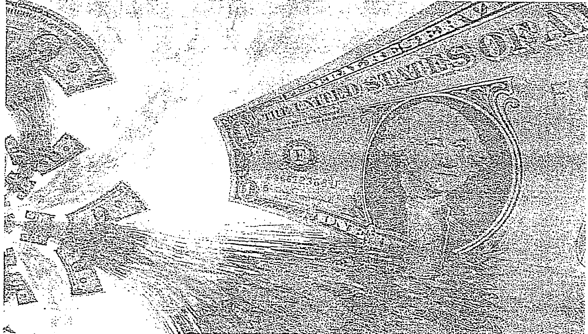

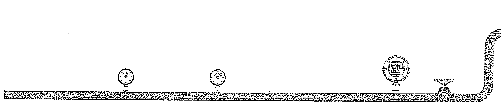

## 真正加息 不能不缩表

有趣的问题来了，当IOER提升至高于FFR，银行当然减少将多余的資金拆借予同业，而倾向将資金存入联储局收取更高的利息，需要拆借資金用于临时周转的银行，唯有开出更高的利率向同业拆借資金。理论上，市场的流动性应该会被收紧，「加息」的目的亦看似达到。但事实并非如此，银行存入联储局的資金仍然是属于银行的流动资产，银行体系的货币基础实际上并没有因为「加息」而减少。

要知道银行体系在资金充裕的情况下，银行又不想将资金借出去，虽然理论上同业拆借成本高了，但银行根本没有需要向同业拆借资金，银行实际上并无加息压力。因此，以提高IOER来「加息」的效用可谓名存实亡，实际上根本无助收紧流动性。

由此可见，在后量宽年代，「加息」不是主菜，缩表才是关键，大部分人的焦点都放错在「加息」之上。另一方面，以提升IOER来「加息」只会抽高短息，这也解释了为何长债息率仍然长期维持于低水平，升的只是短债利率。现时两年和十年期孳息率之差降至只有39.1点子，美国国债孳息率曲线（Yield curve）是自2007年以来最为平坦。

倘若联储局继续单靠提升IOER去「加息」，美国国债孳息率曲线有机会出现「倒挂」（Inverted yield curve），即短债息率高于长债息率，历史告诉我们这是经济衰退的先兆。继续这样「加息」只会消耗持续再加息的本钱，而「加息」的实际效用却成疑。

## QE毒癮難戒又危險

因此，不論聯儲局以何種方法去加息，也必須配合縮表來同時進行，貨幣政策正常化的過程必須與減少資產規模來配合，否則聯儲局加多十次息也無助收緊市場的流動性，資產價格只會一直繼續上升，製造真正的資產泡沫。當經濟衰退來臨時，資產價格和息口均處於高水平，資產泡沫在高位爆破，到時所造成的影響更嚴重。

筆者很早之前的文章也曾說過，QE猶如吸毒，很難回頭，要回頭過程亦相當痛苦。這三輪 QE 的影響，除了完全改變了聯儲局一直以來慣常的貨幣政策操作，亦扭曲了全世界經濟體的金融生態系統，同時亦使聯儲局難以用傳統OMO的方式去調控市場利率。當資產負債表過分地吹大了，所有傳統的貨幣政策都已經難以產生效用，想再以傳統的貨幣政策去正常化已扭曲的金融生態系統，難矣，要做都必須要用新藥。正如長期吸毒的癮君子想戒毒，絕非易事。

## 7.5 加息的根本與邏輯

在後量寬年代，面對著龐大的資產負債表和巨額的銀行儲備，傳統利用公開市場操作去調控美國聯邦基金利率（FFR）已經失效。情況猶如下完一場大雨後，水塘滿瀉，你要用一個水桶將水塘內的水抽出來，結果很明顯——無論你怎樣用力去抽，水塘內的水也好像沒有減少。這很正常，水桶如果是用來抽一個浴缸內的水，抽它一到兩桶，效果已很明顯，但對於一個水塘來說，一桶桶的抽，根本是個不可能完成的任務，而大家都清楚，如強行將堤壩毀掉，只會造成另一種災難。

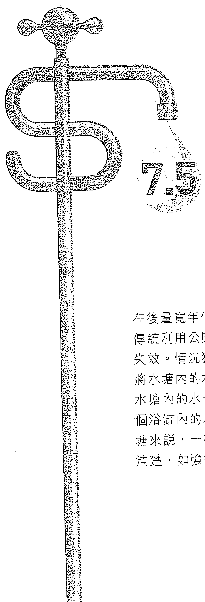

## 美國聯邦基金圖表 FEDERAL FUNDS CHART

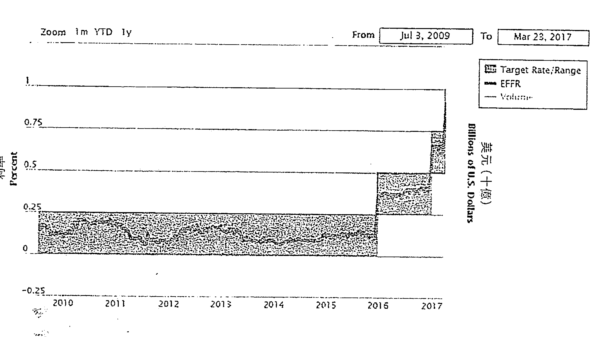

承上文，自2015年起，美聯儲每一次「加息」實際上主要是提升額外存款準備金利率（IOER）以達到表面「加息」的效果。IOER是金融海嘯的新產物，為吸引聯邦銀行將多餘的超額儲備存入聯儲局的儲備戶口，IOER會高於FFR，而銀行們亦會因為存款於聯儲局是零風險，且收益更高，都會傾向將額外儲備存入聯儲局。因此，理論上IOER應為「利率通道」（0%-0.25%的區間）的下限，即聯儲局要加息的話，只需直接調升IOER即可。同時，如銀行如需要向聯儲局借貸以滿足法定儲備的要求，則會以貼現窗利率（Discount Window Rate）計算，因此，貼現窗利率理論上為「利率通道」的上限。

然而，事實並非如此，從上圖我們可以發現IOER竟然並非「利率通道」的下限而是上限。從2008年到2015年，「利率通道」為0%-0.25%的區間，而IOER為0.25%，有效聯邦基金利率（Effective FFR，EFFR）則比IOER為低。原因是甚麼？

## 「加息」反令資金更泛濫？

原因是在並非所有金融機構存款在聯儲局均可以賺到IOER，舉例如房利美和房地美等政府資助金融機構（GSE）就不符合資格，但他們在QE後擁有大量剩餘儲備，既然他們存款於聯儲局無利息可賺，因此願意以FFR或更低利率借出予其他銀行。但在市場資金充裕的情況下，銀行的儲備都滿瀉，有誰還需要拆借？答案是所有銀行都爭著去借，原因是只要GSE的借貸利率比IOER低，市場便有套利空間。銀行們紛紛向GSE以FFR或更低的利率借入資金，然後存於聯儲局賺取更高的IOER，基本上是無風險套息（Risk-free arbitrage）。

因此，儘管IOER實際上未能作為「利率通道」的下限，通過市場的套利行為，IOER和EFFR之間的利差也是有限的，聯儲局依然可以利用IOER作為「加息」的工具。然而，為了解決「利率通道」下限設定的問題，從而更精準地「加息」，聯儲局發明了另一種「加息」工具——隔夜逆回購計劃（Overnight Reserve Repo Program，ONRRP）。聯儲局以各大銀行存入的儲備作為「抵押品」（實際上應為保證），進一步向銀行及其他金融機構借入更多的儲備。這種方式的分別在於參與的金融機構將更多，由於房利美和房地美等GSE和貨幣市場基金（MMF）等其他金融機構均合資格，自由參與市場逆回購，比起IOER以銀行參與為主，這種方式的規模更大，且加強了「加息」的市場傳遞力量。

由於MMF等市場參與機構借錢予聯儲局是零風險，因此ONRRP必然低於FFR，ONRRP於是便成了「利率通道」的下限。IOER和ONRRP分別成為「利率通道」的上限和下限，使EFFR確保在「利率通道」的中間，使聯儲局「加息」變得更有把握，「加息」力量隨傳隨到。

以上看似是多麼的美好，「加息」力量是多麼的有效傳遞到市場。然而，這樣「加息」對實際收緊市場流動性同樣一點作用也沒有，反而會令到整個銀行體系上的資金比以前更充裕。原因很簡單，不論是IOER抑或是ONRRP，聯儲局都是憑空印錢去支付各大銀行和金融機構巨額利息，情況形同另一種「量寬」。

## 美國聯邦銀行的超額儲備

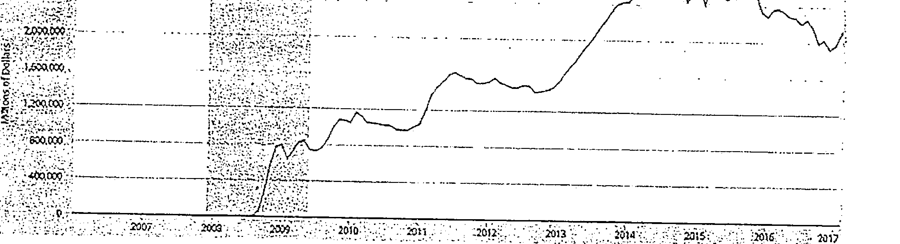

美國各聯邦銀行持有的超額儲備超過兩萬億美元，單是2017年的相關利息開支已近300億美元，當中賺取這筆利息的約有三分之一為海外金融機構，即美國將相當一部分通過印錢支付的利息白白送給了他人。以目前的超額儲備總量，是次加息至1.75%-2%，估計2018年的利息開支高達500億美元。隨著加息步伐推進，支付給各銀行的利息也會不斷攀升，這對本已有財赤問題的美國，將造成更沉重的財政負擔。

聯儲局在08年後的後量寬年代發明IOER，吸引銀行將資金存入聯儲局，目的是避免印出來的海量資金同一時間湧入經濟實體，造成嚴重的惡性通貨膨脹，這是為何印了4.5萬億美元，多年來美國經濟也未見有多大的起色，通脹率目前也只有約2%左右。這正如開餐廳，客都未有，就怕太多客招待不來，思想是否太「敏捷」了？

事實上，如果銀行和各大金融機構將所有資金全都存進聯儲局來賺取利息，他們貸款予企業和消費者的積極性就會減弱，企業和消費者得不到銀行信貸的支持，中小企生意萎縮，消費者減少消費，經濟又怎會好起來，失業率又怎能改善？經濟差，政府稅收減少，財赤問題只會進一步惡化。

經濟環境不好，反而去加息，而且利用IOER / ONRRP去「加息」，只會令美國的財赤問題更嚴重。另一方面，美國國會都未必會允許這樣的情況長期持續，相信這種做法將會面臨一定的政治壓力。萬一國會基於財赤問題要求即時取消IOER，則會導致銀行的多餘資金需要即時尋找出路，迫使銀行之間互相借出資金，繼而引發FFR和短期利率暴跌，進一步推升資產價格，在經濟增長未能跟上的情況下，將造成真正的資產泡沫。

## 幣策正常化 重點不在加息

對於現行的加息方式，筆者相當懷疑尚有多少空間能夠持續下去，其必須要配合縮表來同時進行，不能再拖。正如筆者多次強調，「加息」並不是重點，聯儲局應適當出售資產一步步回收過剩的儲備，目標旨在減少存於聯儲局過多的額外儲備，同時慢慢降低IOER，迫令銀行將資金重新投入經濟實體，重振經濟。否則，聯儲局加多少次息，都無補於事，只會令情況更複雜，政府的財赤問題更嚴重。

正如筆者常說，真正加息的邏輯只有一個，就是經濟增長引致通脹，然後央行加息去控制通脹，而真正加息的幅度不可能比經濟增長快，否則經濟只會一沉不起。貨幣政策正常化不一定要先「利率正常化」，重點不應一味放在「加息」。正如現時的量寬版「加息」，銀行體系資金變得更為充裕，資產價格不會收到影響，銀紙繼續貶值，反而對實質資產價格更有支持，特別是物業資產。

聯儲局需要明白加息的邏輯，掌握錯重點只會不停兜圈，令問題更複雜。投資要明白加息的邏輯，既然真正的加息永遠只能滯後於經濟增長或通脹，加息又何懼之有？

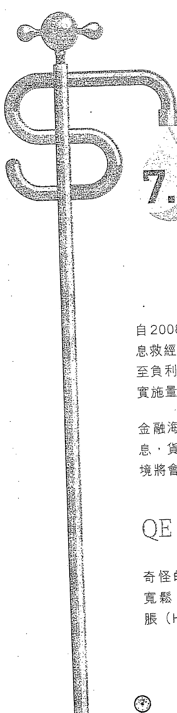

## 76 傳統經濟理論過時？

自2008年金融海嘯後，美國帶頭量化寬鬆，大開印鈔機、減息救經濟；歐洲緊隨其後實施量寬，部分歐洲國家更帶頭減息至負利率；日本央行自安倍晉三上台，實行安倍經濟學，同樣實施量寬，瘋狂印鈔，甚至曾減息至負利率。

金融海嘯後，各國已習慣動不動就開動印鈔機，久不久就減息，貨幣政策成了國與國之間的一種博弈。負利率或極低息環境將會成為一種新常態。

## QE 為何沒帶來惡性通脹？

奇怪的是，自2008年金融海嘯至今，各國已多次實施量化寬鬆，銀紙不停印。按傳統經濟學理論，應會導致惡性通脹（Hyperinflation），然後各國應該要加息以解決通脹問題，而加息最后又会引致经济负增长，失业率上升，最后经济衰退 (Recession)，这视为前经济周期 (Economic cycle)。这样的经济运作模式多年来未曾改变，然而，现时大家所看见的情况是「经济增长率低，失业率偏高，没有明显通胀，利率处极低水平」，原因为何？

根据经济学中，著名的费沙效应 (Fisher Effect)* 所推论出来的 Quantity Theory Of Money (QTM) 是这样的：

```
MV=PQ
```

- M —— 货币供应 (Money supply)；
- V —— 货币流通速度 (Velocity of money)；
- P —— 物价水平 (Price level)；
- Q —— 各类商品的交易总量（可视为实质 GDP “Real GDP”）。

在 MV = PQ 这条经济学公式中，MV代表货币市场，而PQ则是实体经济的表现。扩张性货币政策的目的就是透过增加货币市场的货币供应，从而推动实体经济增长。如何将公式左侧的力量有效地传递至右侧，就是关键。

> *费沙效应 (Fisher Effect): 一个国家的名义利率反映了该国预期的通货膨胀调整后的实质利率（或可理解为实际回报率），也就是说造成各国名义利率不同的原因，仅仅是因为通货膨胀率的预期不同。在投资者可进行自由的国际投资的情况下，各地的预期实质利率趋于相等。如果出现了不相等的情况，投资者为追求较高的投资收益就会进行套利活动，而套利的结果又使各地的实质利率趋于一致。

傳統經濟學認為V和Q一般在短期的變化不大，可視為constant，因此當實施量化寬鬆，銀紙不斷增發，M的增長率會上升，在V和Q不變的情況下，P的增長率必然會上升，因此大家都很怕惡性通脹的來臨，亦做定了加息對抗通脹的心理準備，認為不久將來進入加息周期是必然的事。然而，事隔多年後的今時今日，我們所見到的情況並非如此——錢印了許多，惡性通脹卻沒有到來。

原因是V和Q並非永恆不變。以目前世界宏觀經濟情況為例，產能過剩的情況嚴重，令Q處高水平，未能有效消化，因此過往幾年Q一直在上升軌中，而並非不變。而更重要的是，海嘯後全球信貸收縮，V相比以前大幅下降。根據MV = PQ的公式，V的下降實際上抵銷了M的上升，加上Q上升，因此P（普遍物價，並不代表資產價格）很難會上升。在低通脹、經濟前景不明朗的情況下，大家所期待的真正「加息周期」（非利率正常化）將可能遙遙無期。

事實上，在金融海嘯後，世界宏觀經濟出現了一個新經濟常態，傳統的經濟思維模式已不合時宜。現時全球信貸系統出現了一個結構性的問題：銀行有錢但不願貸款，特別是貸款予中小企做生意；想借貸的中小企又借貸無門。銀行體系資金充裕，平錢周街都是，銀行出現水浸，因為印出來的新錢全部留存於銀行體系。量寬印錢只能增加貨幣基礎，並不是M2，而只有M2增加才是真正可以令貨幣供應上升。沒有銀行體系的乘數效應（Multiplier Effect），流入實體經濟的貨幣供應實際上也就沒有大幅增加。

## 流動性陷阱 貨幣政策失效

以目前情況來看，市場是處於流動性陷阱（Liquidity Trap）—— V處極低水平。流動性陷阱是經濟學家凱恩斯（John Maynard Keynes）提出的一種假設處境，指當一定時期的利率水平降低到不能再低時（即像目前情況），人們就會產生利率上升而債券價格下降的預期，貨幣需求彈性就會變得無限大，即無論增加多少貨幣，都會被人們儲存起來，或是銀行不願貸出資金，以致資金鎖死在銀行體系。發生流動性陷阱時，再寬鬆的貨幣政策也無法改變市場利率，使得貨幣政策失效。

沒錯銀行體系資金十分充裕，但未能有效推動經濟，主因是資金沒能有效投入實體經濟。銀行只願貸款予有磚頭抵押的按揭貸款（Mortgage Loan），借貸者用之來買樓自住或投資，間接又推高樓價；銀行又十分願意低息貸款予私人銀行客戶，以僅1%多的資金成本借予客戶投資(投資股票或債券)，間接又推高證券資產價格。以上兩種都是銀行最為願意貸款的客戶，利率低至1%多。對於中小企貸款則愈來愈嚴謹，P+的利率想借也借不到，根本就是銀行不想做。另一方面，對有磚頭抵押的investment loan卻又十分願意做。Investment loan借貸資金高達物業抵押品的八成，但用途僅限於該銀行內之證券投資，最後又推高資產價格。新增的資金並沒有有效投入實體經濟，反而去了投資，結果是資產價格不停被推高。在市場普遍物價沒有大升而資產價格卻持續上升的大環境下，有錢的人會愈有錢，貧窮的人會愈貧窮，中產階層繼續窮忙，無產階層被市場懲罰。

## 不能再用傳統思維看樓市

其實以上的MV=PQ公式，可以同樣套用股票或住宅市場，結果也是一樣。以香港住宅市場為例，M=住宅市場內的資金；V=住宅市場內的資金周轉率；P=樓價；Q=預期住宅供應。根據傳統分析，M上升所以P上升，但以目前來說卻不一定對。自政府推出一系列辣招後，市場交投跌了很多，即V大幅下跌，表面上抵銷了流入市場的資金增長，預期樓市會因而冷卻。這是政府的算盤，而普遍市民當時都是這樣想，故樓價在辣招推出後曾短暫出現調整。

然而，香港住宅市場的關鍵其实在於Q。首先，一系列辣招的推出雖令V大幅下跌，但V的下跌同時鎖死了二手市場供應，Q 因此也下跌。在房屋本身已潛在供應不足的情況下，辣招再鎖死二手供應，Q下跌的幅度比V更大。當市場預期Q未來的增長比住宅需求的增長落後，M會上升得更快，繼而令樓價屢創新高。任何政府政策，包括推出各種稅收、收緊按揭成數等所謂的需求管理，表面上限制M的增加或令V下跌，但實際上都會使Q下跌，令市場乾升。

綜上所述，在新經濟常態下，以傳統的思維和假設去應用傳統經濟理論已經不合時宜。理論框架仍然有用，但分析時需要將新經濟常態下的各種因素加入考慮再加以分析調整，否則差之毫釐謬以千里。大家必須接受，新經濟模式下甚麼才是新常態的遊戲規則。繼續複製以往成功模式經營傳統實業、投資住宅已經沒有優勢，而經營非傳統產業、建立大數據平台、資本運作、錢搵錢的投資則擁有明顯優勢。大家要在新時代來臨前想清自己的發展路向，同時為自己的多種被動收入來源作好準備，為自己鋪設好多元管道。

## 後記

寫一本書不容易，要寫一本好書更難。從來沒有想過出書的我，在偶然的機會下好不容易才出了一本，本只想過一下作家癮就算。但在《現金流為王》出版後，收到不少讀者的電郵，在網上亦看到不少人在討論，發覺不少人都只將焦點放在「招式」之上。這驅使我下決心撰寫本書，希望更深入地解釋和補充上一本書所講的投資技巧背後的理念。

儘管近一年公司進入了另一個新的里程碑，業務非常繁重，但寫這本書的過程我是真的非常用心，對自己的思路和組織要求很高，寫作過程必須將自己關在書房中進行，否則我那兩個「天真活潑」的小孩會不停纏著我嚷著要跟我玩耍，嚴重影響思路。

《現金流為王》和本書所寫的並不是點到即止的「資訊」，也不是單一的投資「技巧」，而是比較深入、以概念性為主，同時又非主流的投資思維，涉及的解釋比較多，如果讀者只看本書的部份，不容易吸收到我想表達的整套思想，甚至會產生誤解。其實，吸收所有知識都一樣，課堂學的不一定是正確，權威說的不一定是絕對，大家需要的是一個具批判性的獨立思維。

在閱讀本書時，我希望大家能讀到當中的心法，明白箇中的投資理念，沒有「心法」的「招式」只是虛招。不同層次的人會看到不同的東西，一般人只會看到招式，甚至只會challenge招式。沒有內功，只一味「抄考」回來的招式都只是虛招，退潮時便知誰人沒穿泳褲。

有朋友說一開始讀筆者的書時感覺似是一本工具書，但看畢全書就發現當中包含了「招式十心法十哲學」。我很高興讀者讀到了一點點的哲學味道。事實上，工具書本來就不是我想寫的書類。很久以前有另一間出版社曾與我洽談過出書事宜，希望筆者寫某些特定的投資工具，這與我出書的目的不同，因此最後婉拒了。

《現金流為王》和本書完整地記錄了我的投資路心路歷程和一路走來所運用的投資思維，我自己也看著看自己的思維在人生的不同階段一直轉變。因此，這可以說是一本我走到此刻，看回頭時，以我今天的思維重新編寫的一本投資札記。

承蒙各位不嫌棄我的長篇大論，一直花時間閱讀至此。最後，希望本書能夠為大家帶來一些啟發，刺激大家對投資和營商的另類思考。

歡迎大家在我的博客閱讀我的文章，或通過電郵或社交網站與我交流。祝大家都擁有一個富足的人生！

| 角色 | 姓名 |
|---|---|
| 作者 | Starman |
| 出版經理 | 呂雪玲 |
| 責任編輯 | 吳愷媛 |
| 書籍設計 | Stephen Chan |
| 相片提供 | Getty Images |

| 項目 | 內容 |
|---|---|
| 出版 | 天窗出版社有限公司 Enrich Publishing Ltd. |
| 發行 | 天窗出版社有限公司 Enrich Publishing Ltd. |
| 地址 | 香港九龍觀塘鴻圖道78號17樓A室 |
| 電話 | (852) 2793 5678 |
| 傳真 | (852) 2793 5030 |
| 網址 | www.enrichculture.com |
| 電郵 | info@enrichculture.com |
| 出版日期 | 2018年11月初版<br>2018年12月第二版 |
| 承印 | 嘉昱有限公司<br>九龍新蒲崗大有街26-28號天虹大廈7字樓 |
| 紙品供應 | 興泰行洋紙有限公司 |
| 定價 | 港幣 $138  新台幣 $580 |
| 國際書號 | 978-988-8395-97-2 |
| 圖書分類 | (1) 工商管理  (2) 投資理財 |

版權所有 不得翻印
All Rights Reserved
©2018 Enrich Publishing Ltd.
Published & Printed in Hong Kong

作者及出版社已盡力確保所刊載的資料正確無誤，惟資料只供參考用途。對於任何援引資料作出投資而引致的損失，作者及出版社概不負責。

此書紙張經無氯漂白及以北歐再生林木纖維製造，並採用環保油墨。