# 盈利模式的最高境界

## 《盈利模式的最高境界》

盈利是企业天经地义的事，也是第一要务和唯一选择！

刘备三顾茅庐(跪拜、哭求)奉诸葛亮为师，终成帝业！

# 自古成功有路——师道

荀子的老师是孟子、孟子的老师是子思、子思的老师是曾子、曾子的老师是子贡、子贡的老师是颜回、颜回的老师是孔鲤、孔鲤的老师是子路、子路的老师是孔子。

刘邦的老师是张良！刘备的老师是孔明！你的老师是谁？

一诺老师是你最佳人生导师、梦想教练！

- ★企业不盈利就是耍流氓
- ★企业不盈利就是不道德
- ★企业不盈利就是在犯罪
- ★企业不盈利就是无能的表现
- ★企业不盈利就是最大的悲剧
- ★企业不盈利就是最大的耻辱
- ★企业不盈利就是对员工不负责任
- ★企业不盈利就是对股东不负责任
- ★企业不盈利就是对社会不负责任
- ★企业不盈利就是对资本最大的浪费
- ★企业不盈利就是对机会最大的错过

# 一诺老师最高境界系列书籍

| 书名 | 副标题 |
|------|--------|
| 《猪买单》 | 免费的最高境界 |
| 《商业模式·顶层设计》 | 模式的最高境界 |
| 《一步一步引导别人说YES》 | 说服的最高境界 |
| 《全球疯狂吸金》 | 吸金的最高境界 |
| 《全球疯狂变现》 | 收钱的最高境界 |
| 《盈利模式》 | 盈利的最高境界 |
| 《魔力演说》 | 演讲的最高境界 |
| 《营销大师》 | 营销的最高境界 |
| 《催眠大师》 | 销售的最高境界 |
| 《成交大师》 | 成交的最高境界 |
| 《融资兵法》 | 融资的最高境界 |
| 《顾问兵法》 | 顾问的最高境界 |
| 《领导兵法》 | 领导的最高境界 |
| 《股权兵法》 | 股权的最高境界 |

# 前 言

大家都知道一诺老师自创立《商业模式》课程/书籍起，在教育行业辛勤奉献19年，凭借100%实战案例教学，不仅桃李满天下，也为社会培养无数弟子，这些弟子都在授课《商业模式》、《顶层设计》、《利他模式》、《免费模式》、《盈利模式》、《股权兵法》、《融资兵法》、《信用融资》、《营销兵法》、《万能营销》、《成交心法》、《万能成交》、《品牌魔力》、《魔鬼营销》、《疯狂爆粉》、《魔力演说》等，一诺老师很荣幸能为社会培养这么多优秀讲师人才。

大家都知道，一诺老师的课程采用100%实战案例教学，案例全部来自于一诺老师原创！是一诺老师深入成功企业、走访全球成功人士、一诺老师亲自顾问案例及弟子实操案例。

众所周知，一诺老师一直被模仿，从未被超越！一诺老师已经把整个培训界甩开了一个银河系的距离！

作为一诺老师的弟子，不仅被一诺老师实战案例所震撼，还被一诺老师的人格魅力深深折服！在追随一诺老师的1年时间里，我从一个小白到实现财富自由，命运发生了魔术般的改变，可以说一诺老师是我的再生父母！

本次为了回报社会，受一诺老师委托，将一诺老师15年前演讲视频、音频、DVD等课程内容，做一个梳理，原汁原味的还原课程现场的案例及精髓！

提醒大家《商业模式·顶层设计》、《营销设计》、《成交心法》、《万能营销》等，均为一诺老师弟子将一诺老师课程译成文字所改编，也许有些内容会因弟子个人喜好而有所变动。

但是告诉大家一个好消息，如果你想学习原汁原味的一诺老师智慧，有一诺老师亲自撰写的《猪买单》上下两部，这套书凝聚一诺老师19年来教学精华、一诺老师300万的顾问案例。

还有一本书叫《全球疯狂吸金》也是一诺老师亲自撰写，这本书真是惊天地泣鬼神，一旦拥有称霸行业！

例如*文强、*国顺、*引华、**贤、*涛、*灵富、*栋、*万才、*践、*志强、*超、*婕、*魏、*克亚、*强、*志一、*才文等国内外知名讲师都是商业模式终极版《全球疯狂吸金》的受益者……

> 愿景：惠及全人类！ 使命：帮助更多人实现梦想！

* 改变世界商学院·创始人
* 改变世界APP·创始人
* 共产主义接班人、人民日报最佳评论人
* 《猪买单》著作权人和商标持有人
* 《全球疯狂吸金》著作权人和商标持有人
* 《全球疯狂变现》著作权人和商标持有人
* 一诺老师从事教育行业19年，能系统拆解古今中外企业家成功案例，并将总结的商业真谛深入浅出的穿插在教学中。

# 一诺老师的梦想就是成就你的梦想！

## 一诺老师与德国前总统伍尔夫

2017年11月27日，全球中小企业联盟大会在上海胜利召开，一诺老师应邀出席会议，席间德国前总统伍尔夫亲自会见了一诺老师，高度赞扬一诺老师对全球中小企业做出的杰出贡献，并充分肯定了【改变世界商学院】世界企业家摇篮的地位！面对一诺老师盛情邀请伍尔夫出席《全球中小企业·改变世界论坛》欣然接受并表示期待！

# 许绍雄出任改变世界商学院荣誉院长·形象代言人

1972 年，许绍雄在第 1 期无线电视艺员训练班毕业后加入无线电视，曾在无线工作三年后转到丽的电视工作，四年后再回到无线。许绍雄是第一个驾驶奔驰上班的艺员，所以他被人们 Benz 雄。2012 年，获得万千星辉颁奖典礼杰出演员奖。2013 年香港 TVB2013 台庆颁奖礼，许绍雄凭借《My 盛 Lady》获得最佳男配角。2014 年，在周润发的电影《澳门风云》中饰演了奔驰哥一角。2015 年，在郑中基、何超仪主演的《第七谎言》中饰演了包租公。 2016 年，回归电影《使徒行者》……

## 一诺老师近期课程部分剪影

## 一诺老师带领各分院院长们革命圣地游学

# 一诺老师课程现场指导企业家落地

活着就是为了改变世界  愿景：惠及全人类  使命：帮助更多人实现梦想

# 一诺老师《终极弟子密训》

# 目录

- 第一章：企业成长四个阶段 .................................................................... 23
    - 第一阶段 从0到1百万 .................................................................... 31
    - 第二阶段 从1百万到1千万........................................................... 32
    - 第三阶段 从1千万到5千万........................................................... 33
    - 第四阶段 从5千万到1亿以上....................................................... 34
- 第二章：盈利模式四个阶段 ........................................................... 35
    - 第一阶段：找到盈利模式 ........................................................... 37
    - 第二阶段：放大盈利模式 ........................................................... 42
    - 案例：一诺老师弟子从生存困难到月入百万 ................................... 61
    - 第三阶段：颠覆整个行业 ........................................................... 65
    - 第四阶段：重塑行业标准 ........................................................... 71
- 第三章：打造自动赚钱机器 ........................................................... 83
    - 第一节：疯狂吸引用户 ........................................................... 85
    - 第二节：成交主张与角度 ........................................................... 93
    - 案例：一诺老师弟子拉斯维加斯狂赚1亿美金 .................................... 95
    - 案例：一诺老师弟子采用永久免费倒赚千万 ...................................... 98
    - 第三节：如何设计零风险承诺 .................................................. 101
    - 案例：一诺老师弟子1本书3月狂赚百万美金 ....................................... 104
    - 案例：一诺老师洋弟子零风险承诺赚1亿美金 ....................................... 107
    - 第三节：设计不可抗拒的超级赠品 ............................................... 111
    - 超级赠品五大要点 .............................................................. 113
    - 第四节：一诺老师盈利模式金三角 ............................................... 114
    - 第五节：不可抗拒的免费策略 .................................................... 117
    - 第六点：不可抗拒的独特卖点 .................................................... 123
    - 第七节：塑造物超所值10倍以上的价值 ............................................ 127
    - 第八节：追售的最高境界 ........................................................ 128
    - 第九节：描绘美好愿景 .......................................................... 131
    - 第十节：完美的变现流程 ........................................................ 134
    - 第十一节：让客户疯狂送上门 .................................................... 137
    - 第十二节：提高10倍变现率 ...................................................... 140
- 第四章：引爆利润 .............................................................. 141
    - 第一节：引爆利润的四大核心
    - 第1个核心：你究竟卖什么
    - 第2个核心：不可思议的独特卖点
    - 第3个核心：快速引爆精准鱼塘
    - 第4个问题：如何清晰盈利模式
    - 第二节：核心卖点的终极密码
    - 第三节：把客户的梦中情人卖给客户
    - 第四节：锁定精准客户
    - 第五节：准客户在哪个鱼塘
    - 第六节：如何在鱼塘捞鱼
    - 第七节：锁定客户终身价值
    - 第八节：引爆利润心法
    - 第九节：如何成为盈利模式高手
    - 第十节：破解人心灵魂密码
    - 第五章：成交的终极密码
    - 第一节：不可抗拒的成交主张
    - 一诺老师三步让粉丝听话照做的催眠公式
    - 第二节：变现主张的核心
    - 案例：三个狗男女的主张
    - 第三节：变现主张的十大元素
        - 第一大元素：打造爆款产品或服务
        - 第二大元素：不可抗拒的独特卖点
        - 第三大元素：不可抗拒的零风险承诺
        - 第四大元素：不可抗拒的超级赠品
        - 第五大元素：不可抗拒的价格
        - 第六大元素：不可抗拒的支付主张
        - 第七大元素：不可抗拒的送货条款
        - 第八大元素：不可抗拒的稀缺性
        - 第九大元素：不可抗拒的紧迫感
        - 第十大元素：不可抗拒的行动理由
    - 第四节：变现与追售的终极密码
    - 第四节：一诺老师鱼塘导图
    - 第五节：打造赚钱机器的六大步骤
    - 第六节：不可抗拒的抓粉主张
    - 第七节：潜在客户资格框定
        - 第一种框定：身份限定
        - 第二种框定：行为限定第八节：完美的风险控制
第九节：无法抗拒的变现主张
第十节：如何让客户立刻行动
第十一节：变现时机的策略
第十二节：变现主张的数量如何控制
第十三节：不可抗拒的理由

第六章：完美的追售技术
第一节：追售八大密码
第一个密码：最有效的增销
第二个密码：最有效的减销
第三个密码：最有效的再销
第四个密码：最有效的跨销
第五个密码：最有效的搭销
第六个密码：最有效的捆销
第七个密码：最有效的赠销
第八个密码：最有效的锁销
第二节：追售的最佳时机
第三节：追售的最佳时间
第四节：追售的最佳主张数量
第五节：无懈可击的追售理由

第七章：选对鱼塘钓大鱼
第一节：鱼塘初体验之牛刀小试
第二节：选择鱼塘的标准和优先顺序
第三节：不可抗拒的鱼塘合作方式
第四节：鱼塘合作成败之关键
第五节：鱼塘长久合作之关键
第六节：鱼塘合作争议解决方法

第八章：病毒营销终极密码
第一节：设计不可抗拒的合作主张
第二节：设计不可抗拒的抓粉主张
第三节：谁来主导此次合作
第四节：合作伙伴的管理与监控
第五节：盈利模式总结

# 一诺老师盈利模式导图

帮助更多人实现梦想

一诺老师盈利模式导图

# 第一章：企业成长四个阶段

一诺老师的弟子都知道，中小企业追求的都是快速的回报。因为他们没有太多的钱。

最好是今天把钱花出去，今天花10块钱做广告，订单今天就上去了，报社、杂志社把广告登上去，还可以给我15天的信用期限，15天后再付钱给他，紧接着当天收现金的订单就来了。

这是最好的，所以到15天以后你的钱已经赚回来了，然后再把广告费付给他，这是最好的结果。

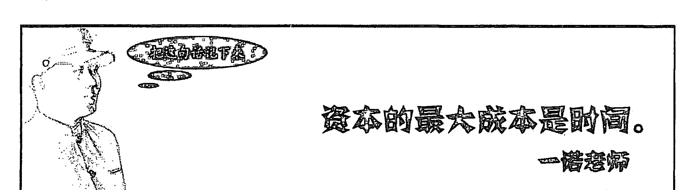

这可能有点极端，但所有的中小企业基本面临类似的情况，就是现金流的问题，所以你希望收取现金和付出现金的时间越短越好。这是中小企业非常重要的一点！

另外一个中小企业没有大量的资金去砸在广告或营销上。

为什么？

因为所有中小企业，你的产品、形态，在慢慢做的过程中还没有足够的资金的积累，或者吸引大量资金的能力还没有到一定的程度。

所以呢……

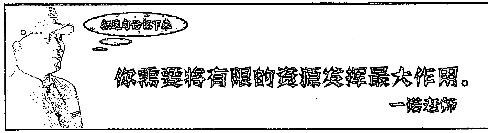

更重要的是中小企业老板不喜欢赌，大的企业都是职业经理人。

职业经理人并不是老板，他需要的是预算。

比如一诺老师的一个学生叫林总，林总担任一家上市公司的总监，一年有1.5亿的营销预算，全球的市场份额是68%，那么设想一下1.5亿的资金预算，你做的差不到哪去，你已经68%了，剩下还有十几个公司只占百分之三十几。

所以，获得市场份额的可能性也不大，你也做的差不到哪里去，另外呢你也好不到哪里去。

因此1.5亿就是你该怎么花就怎么花，去年怎么样，今年还怎么样。所以大企业都是做营销预算！

但是中小企业老板要以结果来买单，如果你让我花五万块钱，如果你给我带来的价值不超过五万，那么对中企业来说，这是一件不值得做的事情。

从现在开始呢，大家应该树立这个观念，就一定要追求结果。并不是说大企业这种往上砸，这种砸进去一个亿，然后追求一年以后的回报是不是不可以，可以的。

待会一诺老师讲企业的四个发展阶段，你就知道，到了那种阶段，那种投入是可以的。但是在前阶段，这种投入是错误的。因为随着企业越做越大，你的生存的压力会越来越小，但是你发展的压力会越来越大。

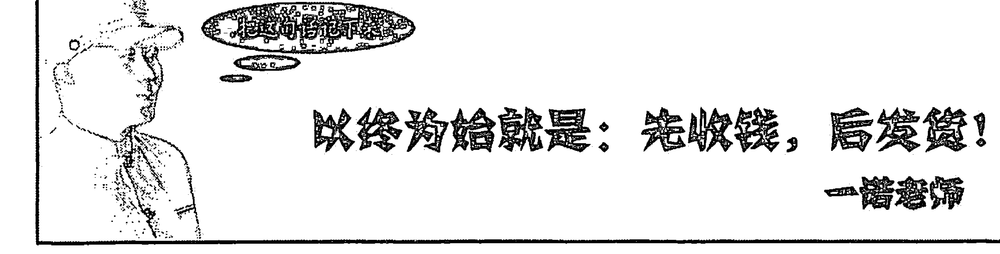

所以，开始你始终要平衡好以后你的生存。所谓生存，就是追求现金收入和付出之间的时间要越快越好。最好是先收钱，后发货。

一诺老师告诉我，世界上最好的营销就是先收钱后付钱。为什么锁销是一个非常重要的手段就在这里。尤其是中小企业，如果你能锁住他，这是非常重要的。

比如中国移动、中国联通都有这个什么88套餐，实际上管你花不花，88元就得交，就得收。

全国各地的美容美发店都是充值卡，5000元先交，然后以后再扣，但实际上钱已经到他那里了，因此你不可能不来，先收钱。

有段时间，星巴克他推出类似策略，但是不叫充值卡，他是叫会员卡，99元买个会员。

很多人可能没有想明白，收99元，然后给他打折，实际上星巴克是亏的。因为他可以买几杯就越过了这个折扣。

但实际上，99元是从心理上就已经把他锁定了。

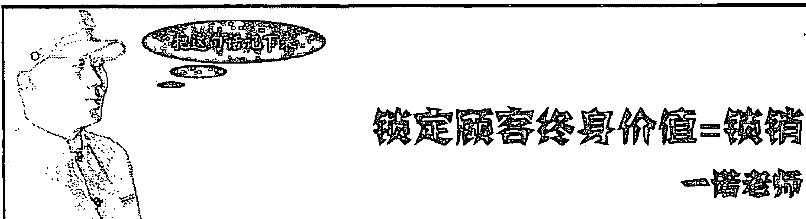

因为有这么一张卡，他就会更经常的去，因为有这么一张卡，他就会买的更多。

比如一诺老师自己都能感觉到，一诺老师去那里读一上午书，平时一诺老师可能一杯咖啡就可以了，但是因为有这张卡，所以一诺老师会买两杯。这是种心理。其实我们每个人都会有。

其实99元不在于赚多赚少，99元关键是锁定他，从心理上他会更经常购买。其实这个锁销是非常非常重要的手段。

其实锁销每个企业都应该用。

你们去看现在的所有企业都试图去先收钱后付钱，对中小企业是非常非常重要的一个手段。

大企业还有很重要的一个原因让他们没有这样做。受到的职业经理人的影响。就是当你追求以结果为导向的营销，你的决策人的目的，他的动机必须是追求利润的最大化。

我花五万元做广告，那么你给我五万元以上的回报，尽快的给我回报，这是我们中小企业的老板要追求的目的。

但是对职业经理人呢？他不完全这样，职业经理人的第一考虑是他的职业前景，而不是老板的利益，他是能够追求自己未来的职业发展的情况下，然后再考虑老板的利益。

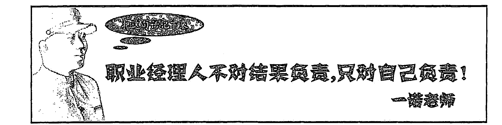

这是职业经理人和老板最大的区别。

老板不管，老板过去也许犯了一个5000万的错误，但是现在找到了答案，这就是胜利！承认自己错误没有关系。

但是对于职业经理人他不能承认自己错误，因为这是一个非常非常重要的职业。

一诺老师教大家的很多东西，没有给大型的企业去做并不代表它不能用，只是整个的机制有很多问题需要调整过来。

因为职业经理人不对结果负责，这是非常重要的一个问题。

一诺老师是集中精力帮助中小企业，而且一诺老师本人也是最喜欢中小企业，因为一诺老师认为创业者是一群独特的人群。

因为他们有梦想，他们希望能够给别人创造价值。

希望能够追求不一样的生活。

一诺老师觉得这是一种非常特殊的人群。

而且帮助人实现梦想，是一诺老师的使命。

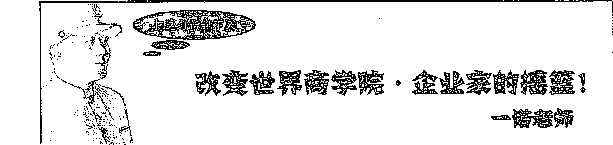

一诺老师主要的精力花在中小企业上。实际上对一诺老师的课程感兴趣和最大的受益人群也基本上是中小企业的老板。

更多绝学课程请咨询微信xi383921，备注：咨询！

一诺老师把中小企业的发展分为四个不同的阶段。

这四个不同的阶段呢，它有四种不同的需求，需要聚焦在不同的问题上。需要实现不同的目标，然后会遇到不同的问题，这个非常重要。

那么这四个阶段基本上从销售额来讲，这个是大致，并不是精准的，供大家参考。

## 第一阶段 从0到1百万

这个阶段所追求的目标就是要把事情做成。

因为不管创业者有多么完美的想法，但是没有人百分之百的相信，有信心这个事情一定能做成。

在这个阶段，做成是你最重要的目的。就是能够生存下来，这个阶段非常重要。

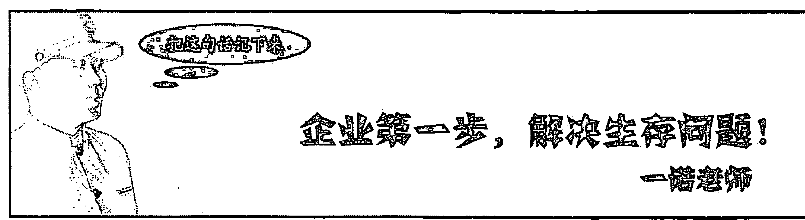

## 第二阶段 从1百万到1千万

当生存问题解决之后，此时最重要的是要做大，如果你下面挣第二个100万和第一个100万一样的辛苦，那么这个企业对你来说是没有意义的。

所以，在第二阶段你希望把他做大。

## 第三阶段 从1千万到5千万

这个阶段我们要实现的是要——做强。

你不仅是一个能够盈利、能够赚钱、能够给客户创造价值，更重要是你的行业中得是一个强者。

这样你的利润率，你在行业中的地位都会非常重要。

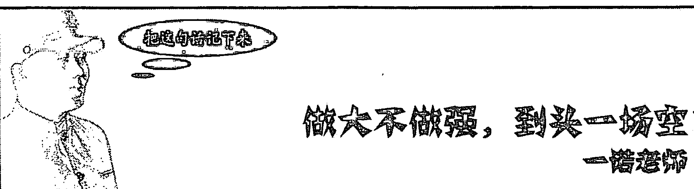

## 第四阶段 从5千万到1亿以上

这时候主要是要把企业做久。

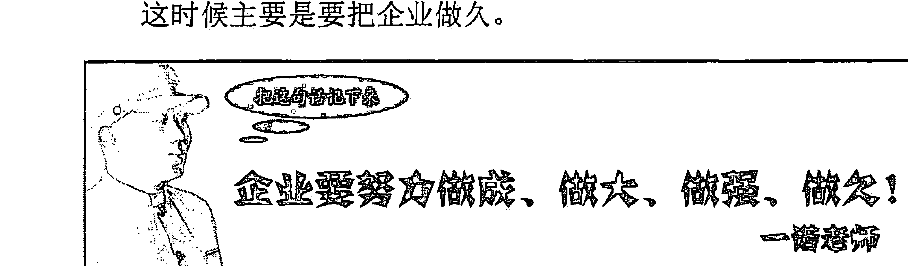

所以做成、做大、做强、做久，非常重要。

当你做到了1亿以上，比如上市企业，然后你会遇到各方面的问题，这时候营销可能不是你最重要的，可能是你的管理，你的其它方面的问题。

但是从营销的角度来说，在中小企业的这四个阶段就非常重要。

# 第三章：盈利模式四个阶段

企业只有盈利才能进一步发展下去，才能规模扩大，才能更好的发放奖金福利，企业如果不能盈利，最终会倒闭。

> 公司不盈利就是对资本的浪费！

——一诺老师

企业一般是指以营利为目的，而且一定要盈利，必须要盈利！

你想承担社会责任，你想做好事，你想做慈善，你想让员工过上高品质的生活，这一切的一切都要盈利！

> 为人不可贪为商不可奸，要想做善事手中先有钱！

——一诺老师

运用各种生产要素（土地、劳动力、资本和技术等），向市场提供商品或服务，实行自主经营、自负盈亏、独立核算的具有法人资格的社会经济组织。

## 第一阶段：找到盈利模式

很多企业在创业的时候没有意识到，你在第一阶段的时候你是要卖产品。每个创业者开始有一个产品，关键是你要把它卖出去。

这时候你要把你认为最好的产品研发出来，你最重要的是找到一个成功销售的模式。

这个模式成功的关键是——你的鱼塘在哪里？

你用什么方式能够把它吸引过来，你最后怎么成交？

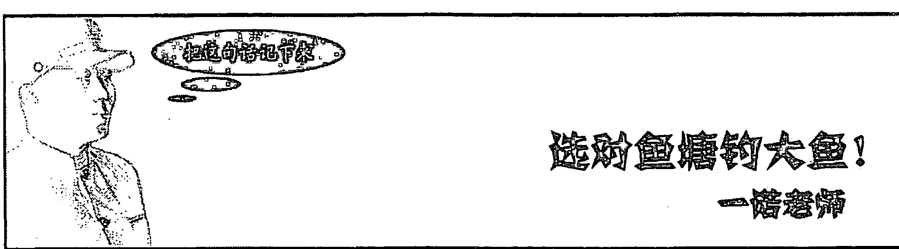

看过《全球疯狂吸金》的同学都知道，在这个阶段切记不要创新，你的目的不是做大，你的目的是做成。

就是你不知道你的产品你可能认为是世界上最完美的产品，很多做科研出身的创业者都这么想。他的产品是世界上最完美的，但悲哀的是，不一定能够销售的出去。你的产品可能是符合需求，但是如果你的营销方法不对，不一定能够销售出去。所以在在这个阶段，

# 改变世界商学·世界企业家的摇篮 《盈利的最高境界》一诺老师

你的需要是将你的产品做成你认为最好的产品。

记住了，这时候你的产品不要追求完美。

就是说一点点把它做成了完美之后再去销售。这是最大的错误，记住这个阶段你在做测试，不管你想的多么美好，实际操作时才发现：你原始的想法不一定是100%正确的。

这时候你的不断的优化、不断的细化就变得浪费精力，如果不对。一诺老师提醒大家，如果一个想法是正确的，一个概念是正确的。那么你把它执行做到60%、70%，那么它应该可以给你足够的数据证明这个方向是正确的。

如果一个想法是错误的，那么你做到90%也没有用。

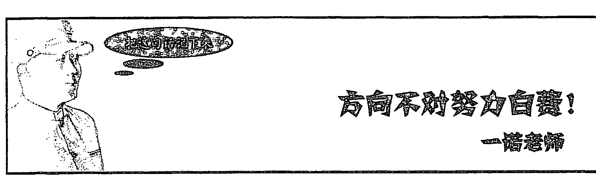

从概念上，如果是正确的，比如说一诺老师的《猪买单》通过网络直销的方法去销售。如果推广成本1元钱可以赚1.5元，那就有信心，这个东西是正确的。

因为有可能一诺老师的产品可以继续的提升，继续的改善、改进，继续的优化，有可能一诺老师的销售信只是花了两天写成的，一诺老师还可以把它写的更好。

也许因为一诺老师的广告，或者一诺老师的网络广告费用量不够大，还可以继续的提高量，然后让成本降下来，有很多可以改进。

但是如果你花1元钱，回报却是0.5元，那这个事情就需要考虑。在这个阶段，需要找到的是成功的征兆。这时候你的产品要做成你认为是最好的，但不要追求完美。而且这个阶段不要在产品上拼命的创新。为什么？

你本来你的精力是有限的，市场是不确定的，对你的产品不知道是不是能够成功，这时候你应该把所有的精力集中在你最核心的一个产品上，而不是这时候创新出八个、九个、十个产品。

就像一诺老师开始重点放在《猪买单》、《全球疯狂吸金》上。

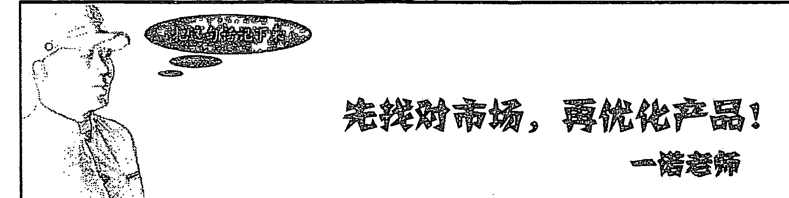

很简单，如果一个产品卖不出去，十个产品同样卖不出去。

但是你的风险会大很多。这是创业的一个非常重要的阶段。

也许很多在坐的企业家已经超越了这个阶段，但是你的新产品创新同样要经过这个阶段。

你有一个新的产品，你需要的是快速的市场反馈。而不是在最初的时候赚很多钱，这个非常非常重要！

即使是这时候你的产品比较的单一，没有关系，因为你不需要太多产品。你只需要的是检验你的想法，你的概念是正确的。

# 这时候目的是要探索出一个有效的盈利模式——

一、也许你的盈利模式是在报纸上做广告，哪些报纸，你至少找出一个两个报纸，这个报纸上的广告能够给你带来你想要的客户。

二、也许是你通过互联网，是哪些网站（鱼塘），通过什么样的方式能够给你带来足够多的粉丝，当你看过《全球疯狂吸金》这本书，你就能够轻而易举的“选对鱼塘钓大鱼”。

然后这些人过来之后，通过一个什么方式能够有足够的变现。

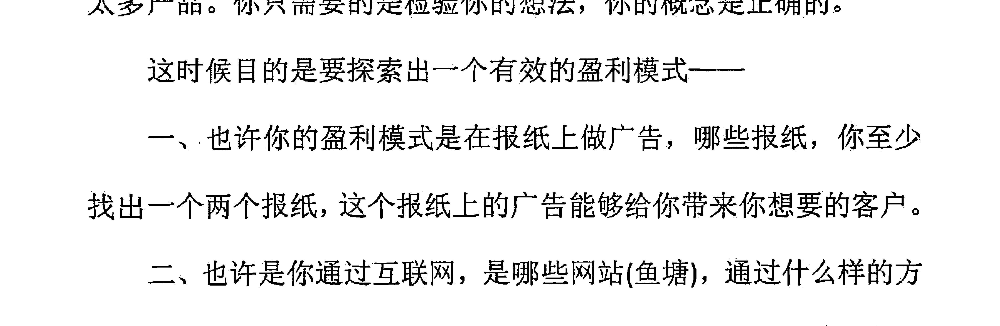

这个阶段你主要的是要探索出你的盈利模式。

成功的盈利模式，能够让你赚钱的盈利模式。

到了第二阶段，这时候你需要搭建系统。

如果第一个阶段你找到了一个鱼塘，然后你直接成交他。比如说这个鱼塘有可能是报纸，也许是电视，也许是互联网平台，也许是其它的。是哪一家不重要，重要的是能够成交他！而且盈利模式越简单越好，越粗暴越好！越有效越好！

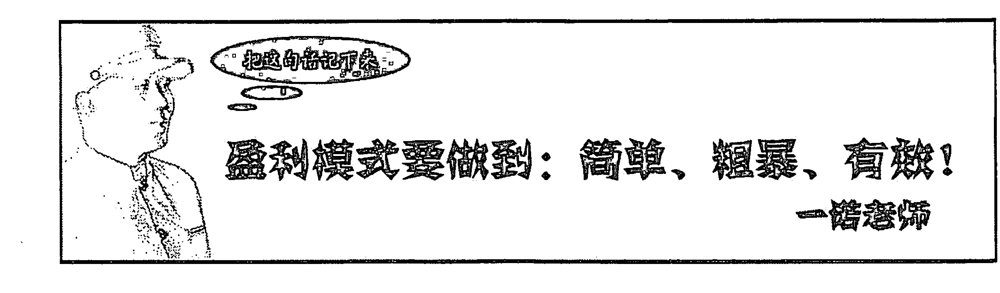

这时候你不要太复杂的盈利模式，你需要越简单越好。因为你需要证明这个东西是能够卖出去的，同时你不想花太多的钱，冒太大的风险，所以你的盈利模式越短越好。

最重要的是要实现盈利，证明它的价值，这是第一阶段。

登录《改变世界》APP，就可以免费的、更系统的学习一诺老师的音频课程。

## 第二阶段：放大盈利模式

第二阶段，如果你仍然这么做，那你很难做大，这时候你追求的是整个的流程。在第一阶段，你已经找到了一种成功的盈利模式。所以这时候你需要放大。

也许你原来找到了一个鱼塘，比如说你找到了百度、今日头条、趣头条、公众号、抖音等，然后他们确实能够给你带来潜在客户，然后也能够成交，你能赚钱。

你再尝试其它的类似平台怎么样呢？然后其它的媒体形态，地铁、公交等其他的媒体形态，尝试一下结果怎么样？

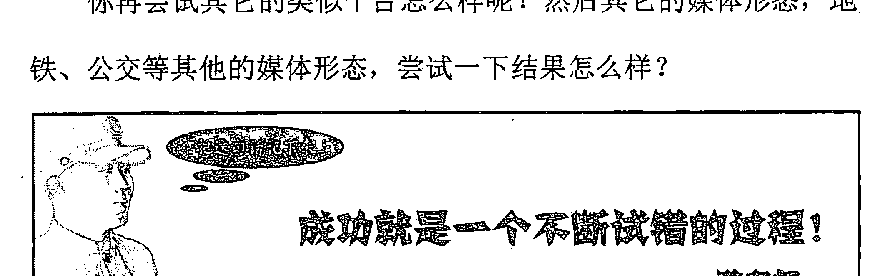

> > 《全球疯狂吸金》里面谈到，我们需要多种鱼塘，然后进入里面抓粉，你可能有多种抓粉的方式，然后可能有多种第一次成交的方式，然后后面的追售要形成一个系统化。

来，一诺老师带你继续……

在这时候如果你没有一个系统，那么你的营销就会变得非常的松散，你就做不大，你的人员根本没法处理这个过程。

一诺老师再三强调，你要将这个流程标准化，所以，在第二阶段一定要卖系统。

其实很简单，比如说是“鱼塘”和“抓粉”是你唯一浮出水面的部分，是你已经系统的掌握了，证明行之有效的方法。

你的竞争对手只看到你在各个地方做广告，然后提供免费的什么东西。因为他们没有接受过一诺老师的专业训练，所以在你“抓粉”之后的东西竞争对手是看不到的。

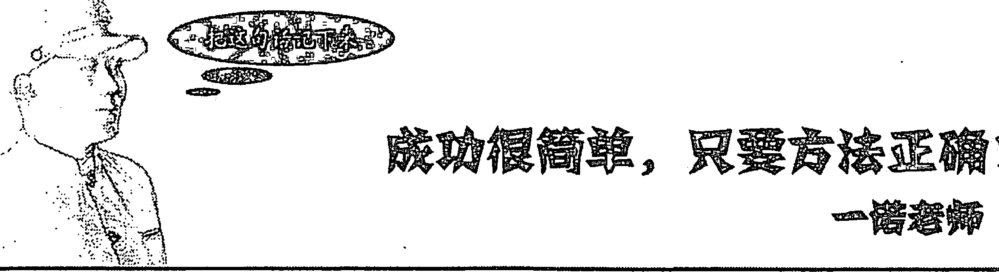

怎么追售他不知道，怎么成交他更是两眼懵逼……

但是，作为一诺老师的弟子，你却掌握了抓粉有各种不同的手段。并且形成整个系统，并不断地优化这个系统！

在这个阶段最重要的是你在推系统，对外你很简单，哪里是鱼塘，然后给他一个主动送上门的理由，把他引入你的营销系统。

> 更多绝学课程请咨询微信xi383921，备注：咨询！

活着就是为了改变世界
愿景：惠及全人类
使命：帮助更多人实现梦想

# 改变世界商学·世界企业家的摇篮 《盈利的最高境界》一诺老师

也许不是一诺老师弟子，听起来好像显得比较抽象，但是后面一诺老师会结合案例说明的时候，你会看到非常的具体。

一诺老师再次的提醒大家：这个阶段你不要再卖产品，如果这时候你还集中在一个一个产品卖，你就错了。

那卖什么呢？

听好了——

你应该卖你的整个系统，复制盈利模式就是招商加盟。

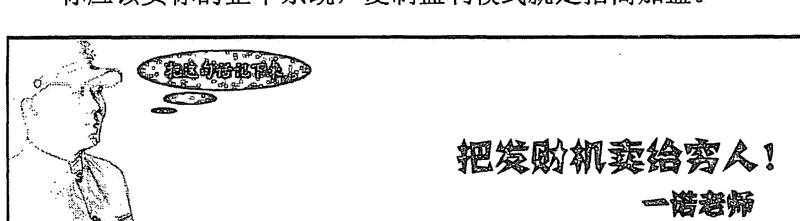

卖系统是什么概念呢，就是争取把更多的人引进前端、引进系统。把发财机会给到更多人，这样别人的资源就能为你所用。就好像一诺老师的终极弟子拥有书籍和课程100%分润，利益驱动，让各个步骤自动的配合起来。这就是各个部分进行配合，形成一个系统。

这个时候你要干嘛？

很重要的一件事就是：你需要产品创新。

为什么？因为你后面，我们知道了这个营销中，如果你是一诺老师的弟子，跟一诺老师实操一段时间，你们应该知道在盈利模式中最大的成本就是——把你的潜在客户从人群中找出来，把他引到你的变现系统里去。

抓粉或者是寻找目标客户，是所有企业运营当中成本最高，风险最大。所有老板最头疼的是抓取潜在客户。

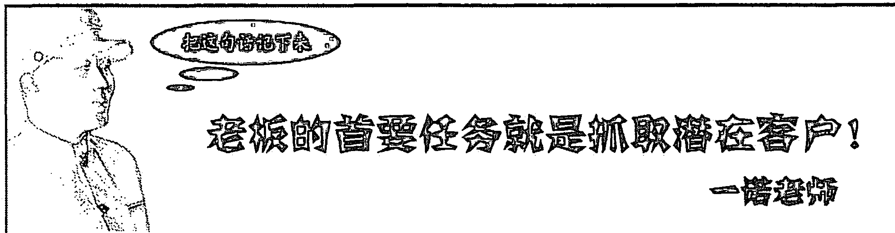

看过《全球疯狂吸金》就明白企业前期一切观点、一切技术、一切策略都是建立在如何让抓粉变得轻松、简单、低成本、低风险。
因为认识到抓取潜在客户的成本很高，风险很大，所以我们要集中精力去开发后端。

一旦一个潜在客户抓到之后，他的价值可以不断的放大。
愚蠢的人看不到顾客的终身价值！
作为一诺老师弟子你要明白，这就相当于抓取潜在客户的时候是投资，然后追售就是回报。
所以，一诺老师弟子长期跟着一诺老师实操最重要的目的，就是要不断强化你的追售能力！

因你追售的次数越多，你的回报越大。那么当你的回报越大的时候，你在追售上所能花的成本就会越高，越能够承受。

普通人抓粉一次成交了就完了。但是作为一诺老师的弟子，你必须要能够追售一次、两次、三次、五次……

一诺老师曾经有一位弟子叫*心老师，他曾经最多的一次是追售客户超过 100 次以上，在一诺老师两年的培养下，从小白到培训大师，豪车、豪宅、钞票挡都挡不住……

如果你是一诺老师的弟子，那么恭喜你，我相信下一个成功的人就是你！

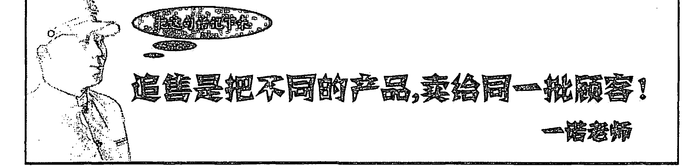

大家要记住，追售不仅仅是一个技术，更重要的是注重策略。

为什么？例如你的竞争对手花 100 块钱，然后通过成交，变现 200 块钱。

因为他不是一诺老师的弟子，不会系统的追售，因此他就结束了，鼠目寸光的他自认为还不错，赚了 100 块钱。

那么假如说你同样花了 100 块钱，也同样成交 200 块钱，但是你又追售了 200 块钱。

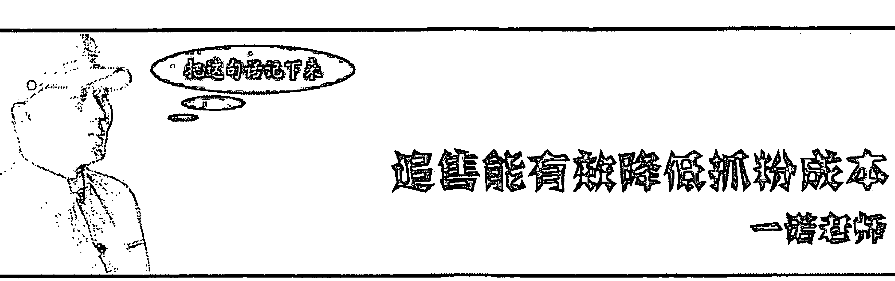

这时候，你只是认为你比他多赚了 200 块钱而已吗？

错！大错特错！

从表面上看是这样的，因为你的后端比他强。

但更重要的是，你可以把它作为一个策略去欺负他。

为什么？

因为你有强大的后端，从某种方面来说你可以把后端的优势转移到前端。

具体怎么说呢，比如说，他 100 块钱花进去只能挣 200 块钱，那么你 100 块钱花进去可以赚 400 块钱。

假如说你再追售一次，再追售 200 块钱，你就变成 600 块钱了。

这时候你可以花 200 块钱去购买这个客户。

而你的竞争对手做不到，听懂没有？

一诺老师尽量的说慢一点，让每一位弟子都能够明白这个道理，因为这关系到后面的具体实操！将来有机会成为一诺老师的弟子，通过直接进行实操，你就会耳濡目染，身临其境！

好了，我们继续……

假如说一诺老师弟子通过某种技巧，把本来他要成交的这 200 块钱的东西用来免费去送给竞争对手的客户，那么这对于客户来说是无法抗拒的！

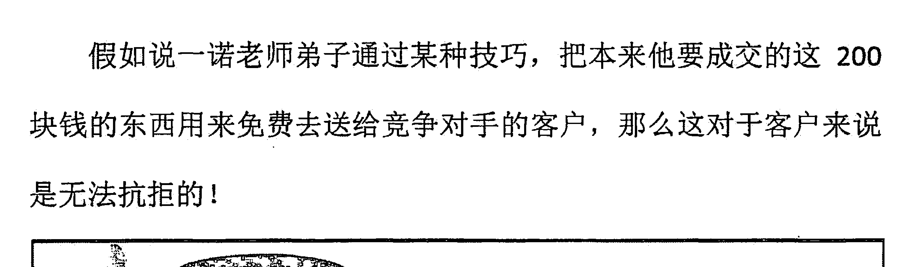

> 免费的底气来自于强大的追售能力！
一诺老师

因为你很会追售，你就有足够的勇气把后端的优势转移到前端，你的竞争对手就被你打的满地找牙！跪在地上唱征服！(捂脸)

更可悲的是，你的竞争对手在这个时候，还没回过神！还不知道他是怎么死的！天下功夫唯快不破！

作为一诺老师的弟子，一诺老师要求你，当你掌握这套方法，要以迅雷不及掩耳之势，快速的消灭对手！一统江湖！

所以，为什么一诺老师不断强调要做实后端，它不仅只是企业盈利的手段，还是什么呢？

比如说，你要去前端再去挣这个 200 块钱，这是很难的。这就意味着你还要在更多的鱼塘里去花更多的钱，去冒更大的风险。

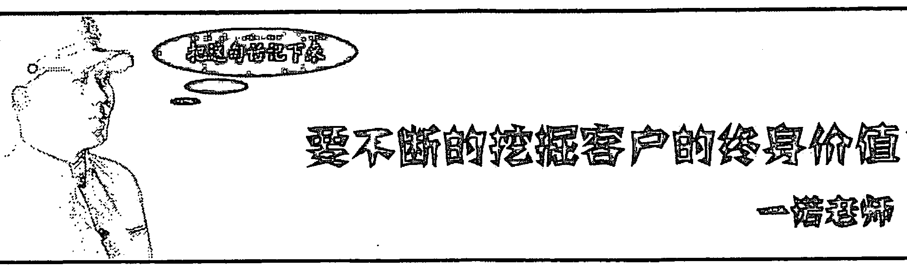

但是你追售的 200 块钱呢？

对现在已经花了 200 块钱购买你产品的客户，并且他的数据已经进入你的数据库的客户，研究出一个怎么追售他另外 200 块钱的技术。《全球疯狂变现》学会之后收钱是非常容易的事情！

所以，大家要意识到这个地方不仅容易，而且从战略上是非常非常重要的。

还有一个就是现在这个百度竞价，开始成本很低，几毛钱。现在越来越高越来越高，那么一些企业就会彻底被淘汰了。

为什么？是因为他没有后端变现的能力，因为他没有系统的学习变现的方法。因此他只能望粉兴叹，就像太监上青楼……

如果后端变现不是问题，那么他就不存在这个问题。

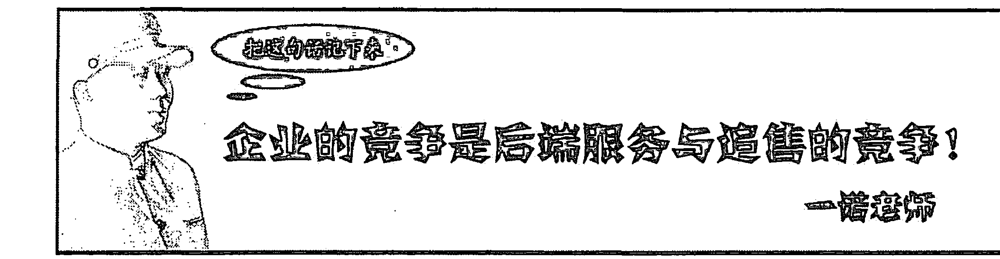

特别是今天，每一个企业所有原材料、人工、房子、办公、广告等成本越来越高。但什么样的企业可以生存下来呢？

标准答案——只有那些后端变现能力过硬的企业。

只有那些认识到后端变现是非常重要的，不断的研究新的爆款产品、变现策略的公司，有能力变现的公司，他的竞争力才会越强。

注意啦：后端变现在这里非常非常重要的！

一诺老师后面将结合案例让你看得非常的清楚。

在这个阶段呢，你要在后端给客户更多的购买机会，要给他更多的产品/服务，帮助他们解决问题、实现梦想。

所以，这个阶段产品创新与变现是非常重要的焦点。

第二个阶段最重要的是，你一定要把你的吸金系统搭建起来。

一诺老师的很多学生都是中小企业主，基本上他觉得这原来打工的时候或者企业比较小，100 万觉得还比较轻松，可是到了第二个阶段钱是挣多了，但自己得到的越来越少，担心越来越多。

跟家人在一起的机会越来越少，感觉变成了钱的奴隶！

就觉得做企业很累，觉得你看几百万都能累成这个样子，不知道做到一个亿要累成什么样子。

为什么呢？是因为他没有一个变现系统。

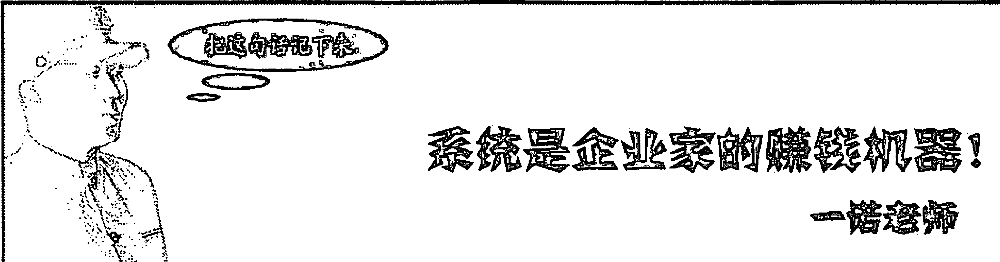

如果你的企业离开你转不起来，就说明你没有系统，因为大家都不知道怎么去做。

就和一个足球的教练一样。

就好像一个足球的教练安排的非常好，给大家分析好队形，排好每个人的战略目的干什么，相互之间怎么配合，其实他是不需要出现在场的。

如果每一次这个教练都没有计划，都是场上随机安排随机变形，那么当他不能出现在球场的时候，这个球队是没法作战的。

一样的道理，如果你不有一个整体的鱼塘、抓粉、成交、追售的计划，如果你的人员不知道他在干什么。那么很显然你是离不开的，因为所有的决定都必须每天作出。时时作出，都必须你亲自作出。这样你会累死，你觉得你在为他们打工！感觉自己就变成了赚钱机器！为什么企业做到一定阶段就做不大了？这就是很多人之所以一定要成为一诺老师弟子的原因！怎么办？

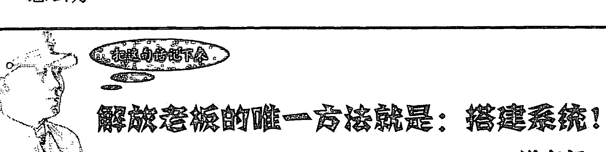

曾经有个弟子完全根据一诺老师盈利的方法来做。比如说弟子海燕有一个员工是专门负责抓粉的。这个人的工作很简单，就是到处找鱼塘，有抓粉主张模版，只要是以这个成本以下能够带来客户，你都可以去做，没关系。然后这个弟子每个月给员工多少钱，你可以做测试。测试一旦成功的鱼塘和渠道，然后就把它放大。只要你抓来一个潜在客户的成本不超过5块钱、10块钱，你有多少都行，放手去做，没有预算。

只要他5块钱可以抓来一个客户，你去做就行了。

所以，这个抓粉团队没有别的事情，就是在5块钱以下的成本到各种鱼塘捞鱼，看过《全球疯狂吸金》自然都懂。

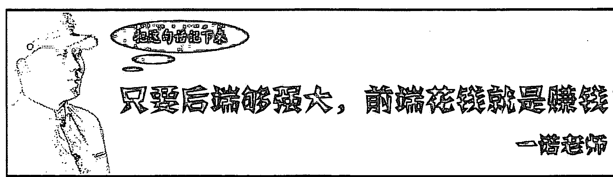

另外一个团队呢，很简单，那边比如说花5块钱买来了一个客户，你必须在最短的时间内以更多的比例把他变现掉。

通俗地说就是收钱！

让客户购买你的产品或服务！

可能抓粉他一分钱都没赚，比如说他5块钱的成本，可能5块钱的销售，一分钱没赚，甚至再倒贴5块钱。

但是他抓到了粉丝。

然后这个变现团队呢，必须尽可能的、快速的变现更多的比例。

这样的话呢，他的利润就回转的非常快。

在一诺老师的指导下，他有一个追售的团队，是专门负责老客户的。他们每一周都会产生一个新的变现概念。

其实所谓的营销概念，待会一诺老师会讲到的，到时候，你就会恍然大悟，原来营销概念和变现主张是一起的。

就是说你每次跟客户去接触的时候，你不能说：“诶，我有新东西，要不要买？”这样追售是非常愚蠢的！

这是非常非常直接的推销，而且令人反感、想吐。

客户会斜着眼睛看你，啊哈，原来你就是要卖给我东西，就是想赚我的钱，于是防备着你！

所以，你每一次和客户接触，每一次的追售，你必须告诉他是一个概念或一个角度，这样的话，他才容易接受，也许是一个周年回馈，也许是特别的新产品上市。

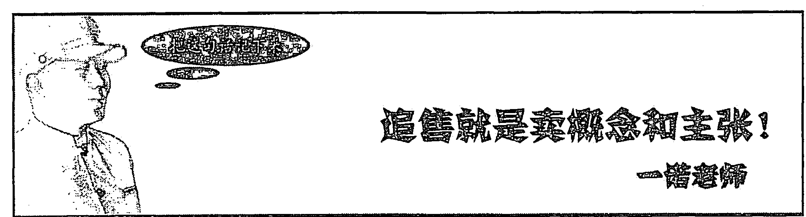

就是说你需要一个很好的概念。

所以，追售的这个团队呢，很简单，就是每星期想出一个概念。

为什么一诺老师非要说这个非常非常重要呢？

因为，我们没有在销售产品，我们在销售主张。

这个主张怎么构成必须含有一个非常重要的概念。

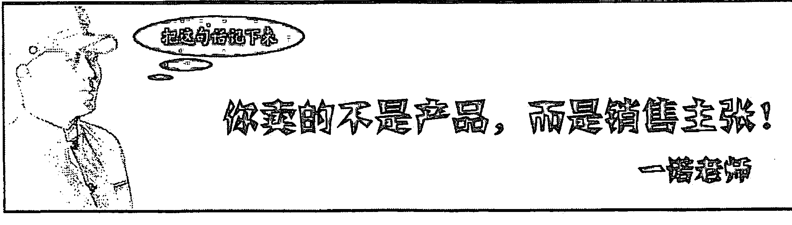

比如说这个月发现客户购买特别的强烈，为什么呢？下个月就是我们这个产品的旺季。

很多客户担心到了旺季我们供不上货。

即使是你的生产能力足够大，完全能够供货……

但是，你要说可能旺季来了抢都抢不到货哦。

如果你实在是非常的担心，我们现在有一个折扣……

客户一听心想，占了大便宜！

哈哈哈……

很简单，这就是一个概念。

就是说他本来有这种购买的心理，实际上你要在他面前表现得好像是希望他不要着急购买。

如果你说：没有关系，我们能够供足货。

那你就输了！

为什么？

因为顾客有一种心理惯性，就是越抢越买，越多越烦！

所以，你要表演！

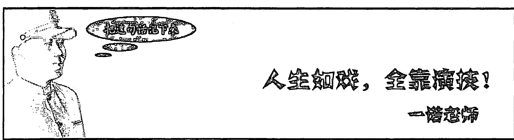

你要说：“去年抢不到货，很多代理商都连夜去抢货，还涨价50%呢，等等诸如此类……”

大部分做企业的人他还是担心供不了货。

所以，那些实在担心的那么你们就现在买。

这个概念为什么呢？

首先，你告诉他很多人都在买。

这里面有一个很重要的心理，而你要制造紧张气氛，让他担心怕抢不到。

攻心为上，攻城为下！

也许是另外一个概念，比如说一诺老师的弟子叫小雪，她研究一个新产品,这个产品比原来的产品性能非常好,小雪准备提价30%。

因为从它的功能和性能来说提30%是完全没有问题的,市场完全能够接受。

小雪准备7月1日提价,举例你是小雪的老客户,如果你们的订单在7月1日之前能够确定,那么你仍然享受过去老产品的价格,这是对你们的优惠。

7月1日以后,不管是老客户还是新客户都提价30%。

每次提价之前,小雪需要让老客户得到价值。

这样老客户就会觉得小雪特别照顾他。

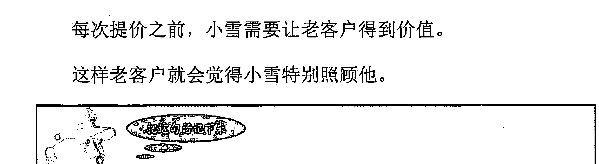

但实际上小雪是最大的受益者,对吧?

小雪每次给客户一个机会的时候,追售的成功率也会大大提高。

大家希望能够得到这个实惠,能够得到这个价值,对吧!

这只是其中的一个概念。

你会看到很多没有学过一诺老师课程的人,每一次销售,都说:

OK，我们现在打折了，你们购买吧。

愚蠢，这种废话用的人太多了，没有用的！

而且你群发信息大家都不看的，因为太老一套。所以你成交的主张和角度非常重要。后面有机会成为一诺老师弟子，会系统的让你实操成交主张和角度（催眠语言）。

> > 成交主张和角度非常重要！
> ——一诺老师

所以，在第二阶段，你需要把你的系统搭建起来。

让你的企业系统化动作，没有你一样可以自动运转。

很多人说：没有我，不就显得我不重要了吗？

其实错了，任何一个做企业的人呢，但更重要的是，你希望把这个企业做起来，能够赚钱，能够全自动的赚钱，当然你希望能够贡献价值得到认可。

因为，如果一个企业不能全自动的赚钱，这个企业的价值无法最大化。

为什么呢？

一诺老师告诉我们，不管什么时候总有一天你会退出企业，或者你没有兴趣了，你没有热情了。你觉得你的员工当中，或者你的朋友当中，或者其他人能够更好的运作你的企业。也许你想去干别的事情了，也许你想退休了。 这时候你的企业需要卖掉。

如果你的企业仍然停留在第一阶段，卖产品阶段，而没有形成一个系统，这就意味着，你不能离开这个公司。

一旦你离开了这个公司呢，这个公司就瘫痪了。

如果是这样的话说呢，这就意味着你的企业必须和你捆绑在一起才能够出售。任何一个投资人想买你的企业，意识到这个企业离不开你，都不会单独购买这个企业。都会购买你和这个企业，至少把你捆起来多少年。这从一定程度上讲你没有真正的自由，这个企业不可能离开你，你也做不了最大化。

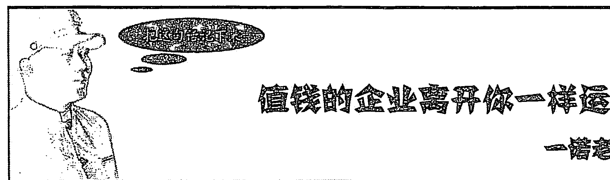

你必须要系统，如果你的企业只是今天做广告，做5万块钱的广告销售10万。那个5万不做了，10万就没了。那么这个企业没有什么价值。

但是如果你有一个系统在运作，每天都有 100、200 个潜在客户进来，每天都有 3%的潜在客户会第一次成交。
然后老客户每个星期或者每个月他会平均再购买一次。
那么这就形成了一个系统，你的一个客户值多少钱？
用脚指头都能够算得出来吧……
这个时候，这个企业值钱是毫无疑问的！

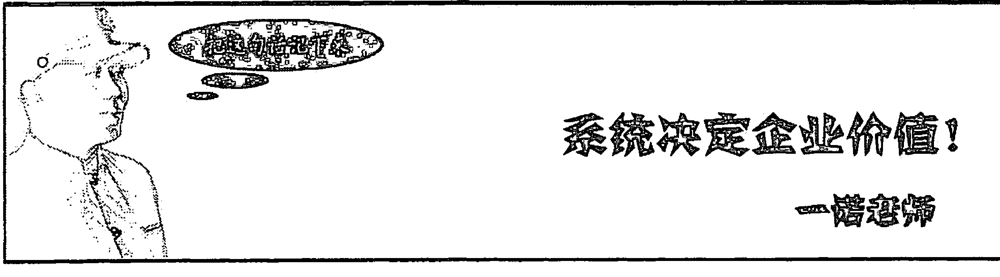

就像【改变世界】APP，要打造 10 亿粉丝的“品质文化社区”，
将来平台打造成功，这就是一个超级系统，一个巨无霸的鱼塘，市值千亿、万亿那是分分钟的事情。

因此很多人想要付费几万块听线下课，每次几百人就是上千万，
但是一诺老师根本不收，因为能看到的钱都是小钱！

### 案例：一诺老师弟子从生存困难到月入百万

一家保洁公司从生存困难到月入百万，他是如何做到的呢？

一诺老师一个弟子叫大卫，大卫在美国曾经做过一个很简单的案例：一家家庭保洁公司。

这样的公司其实非常多，在中国也一样。基本上都是一个人带几个人，很小的这种作坊式的公司对吧？

因为很简单，他就登个什么广告。然后有人打电话来说我们家要打扫卫生，面积多少。然后几个人开着车过来，清洗完毕就走人。然后下一个单子在哪里不知道，大部分时间他们的员工都是坐在家里等电话，基本上都是这样！

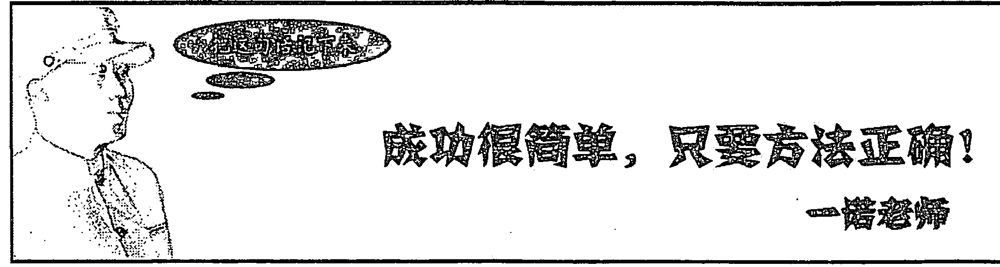

像这样的公司呢，还是生存阶段的公司。

能够存活下来都不容易，赚的钱和花的钱差不多，每个月都差不多，这样就完了。

所以呢，这样的公司做不大，你也卖不掉，没有人能够把这种家庭保洁公司卖掉。因为你们走了客户就没了。

盈利模式很简单，之前是每次比如说这么一个地毯，就这么大，客户打电话来，他过来清洗一下。

例如收 200 元，200 块钱，客户交了之后，他过来帮你清洗，清洗完了之后走人，下一次不知道什么时候。

然后大卫把这个变现流程做了一个简单的修改。

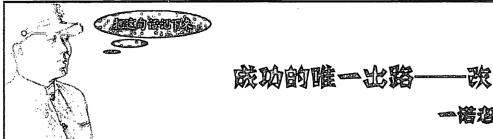

每次来了之后，按照要求清洗完之后，告诉客户：我知道你们希望你的家里是干净的，你家很多死角里面有细菌，这些细菌累积的速度很快的。这些细菌对人的皮肤有严重的影响。我看你们家有孩子经常坐在地毯上，我想最好的情况是定期的清洗你的地毯。

这样对你的环境，不仅灰尘会更少，更重要的是对你小孩的健康，皮肤是非常重要的。我们有一个计划，每个季度我们第一个星期会主动打电话来，然后跟你约一个时间，来帮你清洗，从此之后你不用担心任何事情。这就是说你的清洗，之前每次还要找我们，打电话给我们。今后我们主动给你打电话，约好了时间，每个季度清洗一次，非常的干净。更重要的是，今天的清洗地毯是200元对吧？再加200元，共400元就可以清洗4次。

40%到70%的人就会干。客户会想：我清洗一次花200元，然后我再花200元就可以清洗4次，并且我不用操心这个事情。

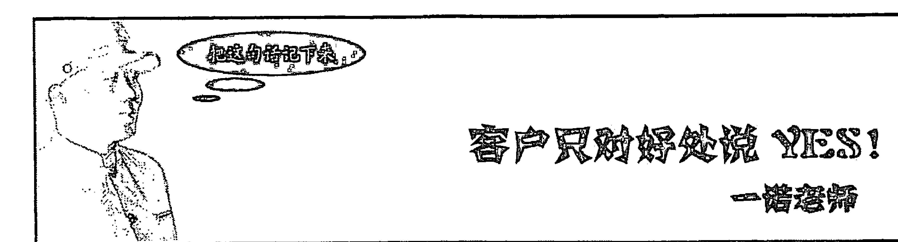

错了，实际上，流程变了，结果就变了！

-   第一，是你把他锁住了；
-   第二，更重要的是你的人员不会坐在那里等了。

因为订单可以均匀的分布，所以你人员的利用效率会大大的提高。然后，还有一个事情是什么呢？你的公司现在值钱了。在你的数据中你的每一个客户每年给你花400元，这是固定的。而原来没有这个概念。其实还不止400块钱。一旦你把他锁定之后，还有更多的机会。比如下一次，你可以说万一你的地毯上洒上了牛奶或者其它的东西，洒上去的这些东西需要立即清洗。我们通常收 100 元，因为你是会员，所以我们只收 50 元。那么很多人就会给你打电话，你就可以紧急清洗。然后你说，你既然来了，这个窗台等等其它东西都可以清洗。

你可以开始研发新的产品和服务。因为这个时候你的注意力不用每天等这个客户什么时候来了，因为你已经把他锁定了。他已经在你的鱼塘里了，所以你可以把精力放在后端变现。

然后开发后端的风险没有，非常简单。

你只要训练你的清洗人员，每次清洗完了之后怎么说就行了。一部分比例的人就会购买，因为你让购买变得非常简单。

这是一个看起来好像很简单的概念，但是会极大的改变你企业的运作效率和企业的命运。

第二个阶段呢，一诺老师知道大部分企业在这个阶段忽略了搭建盈利系统的重要性。

-   将来有机会成为一诺老师的弟子，会系统的学习怎么把这个盈利系统搭建起来，然后怎么让各个部分更高效的运作。
-   好，我们想继续第三个阶段，翻到下一页……## 第三阶段：颠覆整个行业

第三个阶段，我们要卖行业。

这是什么概念呢？

这时候你已经证明了你的产品有市场需求，并且你能够赚钱。

然后第二阶段，你已经把你的系统搭建起来了。能够很高效地动作，并且你不需要天天盯在那里。企业就可以运转起来了，这是一个非常非常重要的里程碑。

下一阶段，你必须把你的精力花在怎么影响这个行业的结构，怎么能够对这个行业造成影响。通过一些行业组织结构的变化，使你不仅仅是一个企业，而是这个行业里面具有重要主导地位的一个企业。一个人是很难发挥作用的。一诺老师弟子都知道，其实社会不是一个一个的人，社会是一个组织一个组织。我们每个人都属于不同的组织。所以要影响一个行业，最快的是要建立一个组织。

### 在金融上来说叫做——杠杆借力！

在组织上的杠杆借力就是通过机构来影响一个行业的发展方向。
如果你是自己去影响一个行业很难，但是你通过几个有效的组织机构，去影响就变得更容易。因为你能够在这个结构建立共识，整个这个组织机构会支持你在某一个方面的主张。通过你新的观点或者理念的创新，那么你就可以影响整个行业。这样的话，你就变成了这个行业里非常重要的结构。

那么我们知道在任何一个市场，如果你是一个行业中举足轻重的非常重要的企业，那么同样的产品，你的利润率可能会比别人高。然后同样的产品，你的份额可能比别人高。

当然了，一旦你获得了这个主导地位，其实你在创新各个方面都有巨大的优势，这是另外一个杠杆。在这个阶段你通过打造你在所在行业或者细分市场中的主导地位，然后去获得超常利润，或者利润率，是非常非常重要的。这个时候你的重点是推动这个细分市场或行业的发展。

这个时候，你需要的创新是在你原有产品的基础之上进行不同的组合，这个非常重要。要组合不同的主张。就是说对产品、零风险承诺和超级赠品完全不同的组合。

很多人说我只有三个产品，我只有三种销售方法，其实是错误的。其实三个产品有无穷多种销售方法。

他们可以组合，他们可以有不同的零风险承诺。

比如这是一瓶水，这瓶水卖10元，难道就只有这一种卖法吗？

错了，如果6瓶水放在一起，卖50元，是另外一种做法。

然后对于想喝大量水的人，这个主张就比单独卖一瓶水的吸引力更大。如果你在沙滩上，要卖给比如说6个人，大家都是集体来玩的，说不定你一个6瓶装的套装，50元更有吸引力。那这个10元钱，你们现在需要交10元我给你一瓶水。还有一种就是说这样你们先喝这个水，如果这个不是最好的，那么你们可以不用付钱。后如果是好的，你们需要购买6瓶，50元。这是另外一种卖法。所以有各种各样的卖法。比如说只要你买了6瓶水，我可以送你一个水的净化器，这又是另外一种卖法。

就是说我们作为吸金大师需要灵活的思考，怎么把产品变成主张，我们永远不要卖产品，产品是不好卖的，但主张是好卖的。所以在这里边你同样的产品你需要打造不同的主张。

总而言之，在这个阶段你需要很多追售的机会，每一次的追售你希望给客户不同的体验，对吧？

前几天一诺老师测试过。

比如说之前成为一诺老师终极弟子要100万，先付10万定金，30天之内付全款，然后一诺老师指导你，这种卖法也有很多人拜师。

后来一诺老师改变了主张，先付5万，这叫降低门槛，让更多人进来，剩下的是一诺老师帮助你赚到200万，再付95万。

想想看，除非下雨没打伞或者脑袋被门夹了的，只要智商在服务区的人，都会觉得好！

为什么呢？因为帮助你赚到200万，你付100万学费天经地义。

事实上，很多一诺老师的终极弟子，他们也收徒弟，例如韦收弟子69800元，心收弟子39800元，我收弟子都要98000元，一诺老师的弟子费已经很低了，并且前期不用付这么多，先付一点，这样才表示诚意，因为付费是对老师最大的认可！

当然还有另一种，就是你跟着学，只要3万块，但是一诺老师只负责教你，没有时间私下辅导你，3万块就是学费，期满1年只要你在朋友圈公开发布100条一诺老师的音频链接，就可以免费申请奖学金3万，相当于免费！

你的主张要能够解决别人的疑虑和困惑，或障碍的时候，那么成交的机率就会大。

第三个阶段你达到1000万到5000万销售额的时候，你需要构造一个有利于你的行业格局，你不希望别人拥有格局，你在别人的格局下玩这个游戏，那么你的盈利空间将会受到极大的压缩。

你需要主动出击，影响这个行业格局的结构，也许你需要跟某些组织结构合作，这种合作不只是一个前后端的合作，可能是在理念、思想、影响层面上的合作。

所以，这个阶段非常重要。

如果你做到 1000 万以后，你仍然还是默默的做，那么这个企业要做强就没有希望了。

一诺老师的弟子都知道：全世界如果有一万种方法，不用问最好的那就是合作！如果全世界只有一种方法，不用问，最好的那一定是合作！

你跟着一诺老师的节奏，当你把这一课学完的时候你就知道，这四个阶段和一诺老师后面讲的是有很强烈的对应关系。

## 第四阶段：重塑行业标准

第四个阶段这时候你卖标准。

第三个阶段你推行业，因为你是行业中的老大，或者是主导者。推动这个行业本身你就会成为最大的受益者，所以，你在第三阶段推行业。到第四个阶段你的目的是要做久，这时候你要影响人们的思维模式和观念，这时候你推的是标准，这时候你卖的是标准。

> 企业的最高境界就是卖标准！ —一诺老师

千万不要忽视，任何一个行业都可以制定标准。我们多半人是采用一种被动的心态：啊！我们进去了，这些标准别人制定的，我们必须要这样。没有任何事情是必须的。只要你系统的学习一诺老师的知识，你都可以制定。

你看一诺老师做企业顾问和培训，一诺老师在这里面做了相当长的时间，创造了很多的产品！

例如开始大家都做营销，如果一诺老师再说营销，大家觉得老一套，于是乎，一诺老师破天荒的创造了一个课程《商业模式》，领先整个行业6年！于是乎同行开始模仿……后来做的人多了，一诺老师又开了一个课程《顶层设计》！领先整个行业6年！再后来同行业开始模仿……一诺老师又开了一个课程叫《商业模式·顶层设计》结果又领先整个行业6年。同行又开始模仿……

因为之前的课程名字注册不了商标，得不到保护，现在《猪买单》、《全球疯狂吸金》等都已经提交国家商标总局，受法律保护！

任何人未经许可都是违法侵权行为！都将受到法律严惩！

> > 法律保护是最好的技术壁垒！——一诺老师

一诺老师一直被模仿，却从未被超越！一诺老师将整个培训界的讲师甩开了一个银河系的距离！

一诺老师对整个培训行业产生了巨大的影响。

首先，零风险承诺以前是没有的，一诺老师开始做。

另外，一诺老师标准化了很多的行业用语，比如说“抓粉”这个概念是没有的，“追售”这个概念也是没有的，“免费”这个概念是一诺老师率先提出的！“猪买单”理论是一诺老师破天荒的创造的！

任何一个行业都有很多的标准，比如说很多人对营销的认识，几乎每一个人都对营销都有一些概念，但是几乎每一个人都对营销的理解都是错误的。所以大家都觉得，说起营销，每个人都能发表一些想法，但是大部分人的想法都是错误的。

所有公司的营销都一样，就是这个过程。

> ——从别人的鱼塘到自己的鱼塘的过程。

学会《全球疯狂吸金》你就能从别人的鱼塘通过抓粉、成交、追售，然后变成自己的鱼塘？因为，自己的鱼塘是你公司的未来，你的鱼塘越多，鱼塘里的鱼越多，对你越忠诚，和你做过的交易越多，满意度越高，那你的未来就越富有。

所以，做企业最后就是做自己的鱼塘，培养忠实的客户，这就是营销。就是从这个层面上来诠释营销的还没有，所以一诺老师制定了标准。你们了解现在在中国很多人拷贝模仿，为什么拷贝模仿？

因为大多数人都是没有道德底线的！

眼里只盯着钱！

不像一诺老师，一诺老师投资很多企业，很多一诺老师弟子都不需要出一分钱，就成为股东，因此一诺老师的收入这辈子都花不完，一诺老师早就实现财富自由了，但是为什么还要讲课贡献价值？

因为，这个世界上还有很多人像一诺老师当初一样，在贫困的底层挣扎着，一诺老师想要帮助他们实现梦想！

现在在中国做英语培训或者记忆力培训的有很多很多，但是没有人制定标准。

那么没有制定标准，你就没有差异化，没有差异化你就没法塑造独特的价值。

所以，在第四阶段你一定要制造标准。

我们看其实微软、甲骨文、思科，他们都在制定标准，你可以开发任何的软件，但是你必须在 windows 这个平台上去开发，对吧？

思科制订各种互联网的标准。

> 谁拥有制订标准的权利、能力，谁就能获得最大利益！——一诺老师

更重要的是什么？

### 独一无二的销售主张——符合行业标准！

为什么我们很多企业老板说，一诺老师老师啊，这个客户要这样砍价，那样砍价。

一诺老师说，之所以客户要砍价是因为你无法告诉他你的产品和别人的产品有什么区别，当没有区别的时候，最终只能到价格。

你要制定独一无二的销售主张——符合并超越行业标准！

因为这个标准是你制定的，这个标准(特点)是别人没有，只有你有，所以你轻而易举达到了！

第四阶段要制订标准，这时候你要设计一个行业的理念和标准，这个行业你能够引导这个行业在理念上的发展方向和趋势，这个非常非常重要。

所以，到了第四个阶段，你引领理念，技术是短暂的，但理念是长久的。为什么以前很多培训要么集中技术，教你怎么杀价，特别具体的技术。但是人们只看到树木，看不到森林，看不到整个系统，所以没有用。

很多企业家被社会上那些吃瓜讲师忽悠的一愣一愣的，例如：

为什么一诺老师希望在理念、策略和技术上能够给大家一套非常完整的系统，不仅给你一套理念，而且给你一套策略。最终上升到一套可以执行的东西，只有这样，尤其是做企业必须是这样的，对吧？

你们做其它的行业也一样，如果你只是教技术，你的产品价格永远上不去。

如果你只是教理论，你的零风险承诺会变得比较单薄。但如果两个合在一起，你不仅影响短期，而且影响长期，非常重要。

这时候你的目的要设计行业的理念与标准，非常重要的一个目标就是你一定要主导这个行业的发展。那么第三个阶段你是通过非常努力走到前台，通过跟行业的人的不同的合作来主导这个行业的发展。那么第四个阶段你实际上就坐在背后，通过制定你的标准和理念来主导别人和发展，其实你更轻松了，但是你需要更深厚的思想功底和全局的观念。

这四个阶段非常有意思，我们来总结一下。

+   - 第一阶段的时候卖产品；
- 第二阶段卖系统；
- 第三阶段卖行业；
- 第四阶段卖标准。

当然，我们在第一个阶段的目的是要做成，第二阶段的目的是要做大，第三阶段的目的是要做强，第四阶段的目的是要做久。

我们再来看两个很重要的趋势：

第一阶段是生存，生存在第一阶段是非常重要的。

第四阶段是发展，在第四阶段发展也是非常重要。

这四个阶段中，在第一阶段我们更关注的是生存，越往后你越关注的是发展，这是很有道理的。企业最初更重要的是你能不能活下来，不活下来就提不到发展。

这就像打台球一样，如果你要赢一场台球游戏，你能够把自己的球一扫而空。建立在你每打一次，必须至少得有一个球进才行。你不仅要有球进，你还要为下一轮击球创造一个很好的布局才行，否则你下一轮就没有了。

每一次出击都有两个目的，一是你至少得有一个球进；二是你得为下一轮做好铺垫和准备。这两个目的都实现了，你就能一连串把你的球的清空，你就可以赢。但是这里面哪个更重要呢？每一次必须得有一个球进更重要。如果这个球不进，谈不上再为下一轮做准备，就没有意义了。

就像盈利一样，一切都是为盈利而准备的！

盈利模式和品牌营销的区别——盈利模式追求的是快速的产生结果。现在我们花一块钱，必须得有一块钱以上的回报。

而品牌营销追求的是品牌持续的影响力。

《全球疯狂吸金》就是把品牌营销和盈利模式结合起来。

如果你开始就追求品牌，解决不了你生存的问题，你会很快熄火，这个公司就灭亡了，谈不上发展。但是如果你一直用盈利模式，等到了第三阶段、第四阶段的时候仍然不想用品牌营销，理念的创新、怎么主导行业，那么你的品牌就没有影响力。

什么概念呢？我们要盈利，当然要变现。如果不变现就没有钱。如果要变现我们就必须卖产品，这是对的！

但是我们仔细看，在最初的阶段，我们卖的是产品。接着我们卖系统，然后我们卖行业、卖标准。但卖标准的目的最后是通过间接的手段来影响产品。

在整个这四个发展阶段，我们间接的实现了直接的目的。你会发现你的手段越直接，其实你的效果越快，但实际上不一定是最大的效率。

实际上当你做到第三第四阶段的时候，你的手段很间接，反而你的销售和收入反而更大。但是，你得一步一步搭建这个系统平台，如果基础不扎实，那么你的间接就没有用。

在这里你会看出直接和间接之间的辩证关系，非常重要。为什么是这样的呢？我们来看很重要的一点就是实际上从困难程度来看，做产品、推产品是最困难的。但越往下越容易，这就是做企业的真谛。等你把这个阶段处理好了，其实越做越大越容易，这很简单。

为什么我们觉得我们做中小企业比比尔·盖茨他们做这么大的企业都困难？

因为我们和他们在不同的水平上在管理公司。

现在看比尔·盖茨的这些都已经存在了，都是系统化了，他们努力在推这个标准。

而我们呢？每天正在打游击式的产品、产品、产品，等产品出来了，懵逼了！粉丝在哪里？鱼塘在哪里？找不到北了！（捂脸）

各位想想看，现在什么产品都不缺，缺的是粉丝！

于是看着满仓的积压，心都碎了……

学会《全球疯狂吸金》有了足够的粉丝，一切都不是问题！

人性的沟通是建立在一个间接的沟通的基础之上。一诺老师说人性的沟通是不能太直接的。比如说这个东西我就想卖给你，你买吧，对你很好，价格合理，买吧。大家不一定愿意购买。但你说这个产品我们经过测试了，90%多的人都会产品作用。

有没有作用呢？无所谓，你用完之后，如果没用，你就退给我，我把钱退给你，我就想邀请你做一个测试。那么反而销售就会更容易，这就是人性。人性需要一种间接的沟通，希望能够从对方的角度去思考，而不是从我要销售的角度去思考。

到了做标准阶段实际上更是一个垄断式的做法。

那么做企业大家都知道，从企业生存法则的角度来说，都是希望做到这个行业的垄断地位，因为垄断是企业生存的不二法则！

更多绝学课程请咨询微信xi383921,备注：咨询！

《猪买单》这就是一诺老师的垄断产品，价值大家都知道，价格也是最高的，但是价值也是最大的。

一诺老师陆续面世了《全球疯狂吸金》、《全球疯狂变现》，这都是通过知识产权保护和商标申请保护，进行的新产类垄断。

> > 企业最高生存法则就是高度的垄断！
> > 
> — 一诺老师

一诺老师觉得这四个阶段你们去认真体会一下其中的道理，非常重要。如果你领悟了这四个阶段，领悟了这之间的生存、发展、直复式营销、品牌营销、直接和间接之间的辩证关系。

对于你们的整体的营销、对你的企业、对一诺老师盈利模式导图的认识都会上升到一个全新的角度、全新的高度，这里边有很多的东西需要去体会。

# 第三章：打造自动赚钱机器

一诺老师经常把企业比喻成一个赚钱的机器，为什么企业是一个赚钱的机器呢？其实企业的盈利系统分成很多部分，这些个部分必须要协调起来打造成一个系统。

最终目的是要把公司盈利的所有环节像一个自动化的机器一样动作起来。达到这一步的话，你的赚钱机器就变成了一个全自动的。

我们的企业要经过前面一诺老师说到的这四个阶段的发展，实际上到了第二阶段，你们的企业就能像一个自动化的赚钱机器。然后第三、第四阶段是要不断的强化这个赚钱机器。

怎么让它从利润上、从影响力上变得更强。

所以，这是一诺老师营销把企业比喻成一个赚钱机器非常直接的一个理由。

企业盈利模式分成前端吸粉和后端变现。

因此才诞生两个爆款产品，《全球疯狂吸金》解决前端问题，《全球疯狂变现》解决后端问题，企业最大的困惑莫过于此！

## 第一节：疯狂吸引用户

这里边非常重要的就是你的企业，任何时候你想成立一个企业，就说明你在某一方面具有的优势，然后把它演化成产品和服务，你们为某种特定的人群创造价值，能够帮他实现某种梦想，这是你创立企业的一个重要的价值。如果你不能说通过我的产品和服务为一部分人创造价值，那其实你的企业就不应该存在。

你的企业，比如说你是通过对人的护肤的需求研究，对男性护理的研究，把他转化成一个产品——毛刷，通过这个毛刷来满足他在这方面的需求，实现他的一个梦想，也许他需要，可以是比较专业的，或者是比较舒适的，比较优雅的展现，或者是魅力的展现。你需要对他提供这种价值。

任何一个企业其目的，就是为某些特定的人群提供某种价值，来帮助他实现他在这个领域的梦想。那么一个很重要的工作就是，怎么能够把你想要的这个特定的人群从茫茫的人海中找出来。

一诺老师的《全球疯狂吸金》，看完之后我感悟到：我们每一个产品和服务都不可能卖给所有的人，这是做不到的。

一诺老师曾经的一位弟子，他们做记忆力培训。

一诺老师问他需要什么样的客户？他说所有人都行吧，每个人都需要提升记忆力。（捂脸）

就像每一个抽烟的人都应该戒烟，但并不代表每一个抽烟的人都想戒烟，这个很重要。

作为客户来说，他花钱的地方一定是想要的，而不是他需要的，需要没有用，需要只是你以为他需要，而不是他想要。

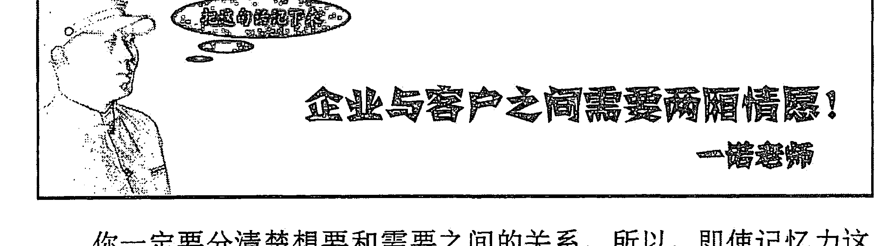

你一定要分清楚想要和需要之间的关系。所以，即使记忆力这种东西，每个人都需要提升记忆力，但是真正想花钱购买这个培训提高自己记忆力的，可能有这几类人群。

- 第一，中小学生，因为有功课的压力，考试的压力，所以他必须要记很多东西，所以他需要提高记忆力。
- 第二，企业的管理层，因为他每天要应付非常多的信息，所以他需要提高自己的记忆力。
- 第三，可能是老年人。现在老人要自己独立生活，他必须能够记住自己的东西放在哪里。但是我们再考虑，哪些人群适合，比如说一般人都可以提高记忆力，但是你让他花钱他不一定愿意去做。

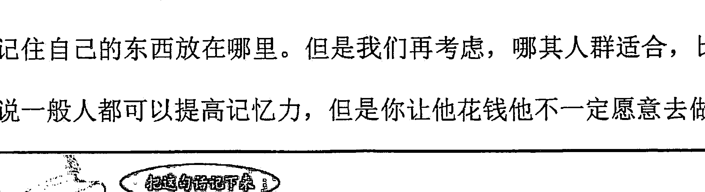

要筛选，要在几种人群当中选择真正愿意花钱的人！

比如老人，他自己可能需要记住他的钥匙在哪。可能他需要。但是这不是最强烈的需求，他不一定愿意花钱去参加这个培训。

也许你会通过某种媒体的文章，或者其它的什么，让他提高些是有可能的。但可能让他参加培训班是有难度的。

你到什么样的媒体(鱼塘)去找到这些人(鱼)呢？

每一个人的产品和服务都是一群或者是几群独特的人群，这个独特的人群他不仅想要你的产品和服务，而且他还能够支付。

《全球疯狂吸金》提到：他想要，但他没有支付能力也不行。因此，他不仅想要而且还要能够支付。那这就意味着，我们必须想清楚我们最想要的人群(鱼塘)在哪里？

然后怎么能把他们找出来。这一步我们就叫抓粉，抓粉就是抓住潜在客户的意思。所以只有你瞄准了什么样的客户、什么样的人群，然后你才能抓粉。

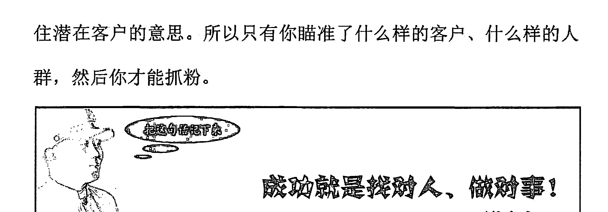

所以，在一诺老师亲自执笔的《全球疯狂吸金》的体系中，前端其实就是抓粉。后端是不断变现的过程。前端和后端的最大区别是：前端营销是你在向一个不认识你的人销售，你在实现第一次销售，你需要抓住他，你和他之间的沟通和接触是在他不认识你，不信任你的情况下进行的。所以这个难度是相当大的。因此前端基本上是属于投入的阶段。而后端系统是属于变现阶段。

一诺老师说，这个前后之间的关系一定要平衡好、搭配好。

强化后端不仅提高你的盈利，更重要的是你获得了一个非常重要的战略武器，可以应对不断上涨的原材料、不断上涨的广告价格、不断强化你的竞争的压力。

所以，一定要理解前端和后端的搭配。我们快速的过一遍前端的一些关键点。前端最重要的当然就是抓粉、抓粉、抓粉！

因为没有粉丝就没有一切！

比如说 15 年前，一诺老师从百度竞价排名销售公司产品，然后你会看到一封长信，接着成交，不管卖的是什么，这个地方成交的人通常不会超过 5%。可能 5%以内吧，取决于价格。如果卖的是 1 万、2000 万的东西，可能成交 1%已经相当不错了。

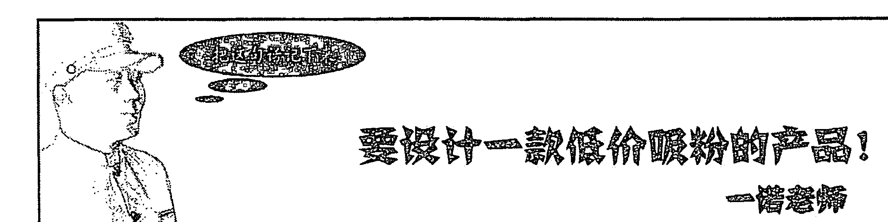

一般情况下成交率不会太高，一诺老师做过很多测试，比如说你从广告来的流量直接转到一封长信（销售信）的页面，这里可能成交率也就 3%左右。就是说 97%的人进来了，就有优势了，你记住 97%的人是你花钱把他吸引过来的。

所以，你现在只成交了 3%，97%的人就浪费掉了。

一诺老师后来做了一个改革，比如说在我们的长信中加了个方框，说我们有一个特别的赠品送给你，只要填写你的姓名和微信号（那时候是 QQ 号），你就可以获得该赠品。

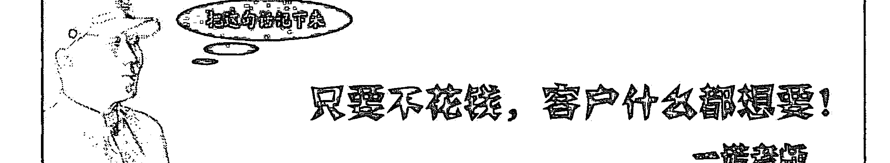

这种情况下他读了这封长信，读到这里然后他填写了他的姓名和微信号，然后这个程序自动启动，接着你告诉他，我们会通过微信发给你，请继续阅读这封信。

在这种情况下，当时通常可以抓到 20%-40%的人群，这是相当厉害的。就是说抓到了 20%-40%的人群，如果接着读这封信的人，可能有 3%的人还会继续成交，你在没有损失 3%的情况下，你多抓了 17%-37%的人，这就是抓粉的威力。

一诺老师教导我们，在设计变现流程的一个很重要的一点就是你要考虑你的第一次是为了抓粉，他从来不认识你，如果这个时候你冲上去直接，那他的效率不会太高。所以你要考虑你能不能给他提供一个很有价值的东西，先收集他的信息，然后再销售。

一诺老师做了一个测试，就是从别的广告上来的流量，一诺老师先不要让他去读长信，先给他一封信息，很短很短，只有一页。

然后只有一个目的，就是我们有一个非常重要的信息。

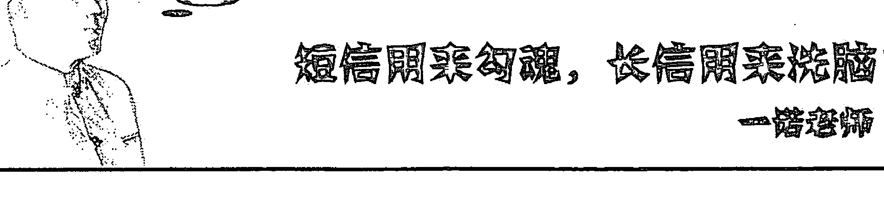

只要填写你的姓名和微信（QQ或Email），我们就会发给你。

所以这封信息很轻松，他读完了之后自动跳转到这封长信上！

一诺老师管这个叫做：长枪+短炮

一诺老师最高的时候抓过68%的人。这时候就是说他看到这封信息写得非常好，你提供的赠品非常有价值，他很想要。

这个时候他只需要提供一个姓名和微信（QQ或Email），所以相当多的人就会去领取赠品。

当他填完信息提交之后，网页会跳转到一封长信的页面上，这封长信不仅是一封长信，这封长信可以个性化，因为这个时候名字已经收集到了。

你要记住你的前端的目标主要是抓粉。

一诺老师说这个目的并不是说你不可以成交，你当然也可以成交。如果你的吸金功底很强，比如说你的电话销售人员水平很高，或者是你的销售信写得确实很好，然后你就要成交，当然是可以的。

如果你的成交是可以赚钱的，你还可以在这里试图插入抓粉的程序，我想效果可能会更好，这个是需要测试的。

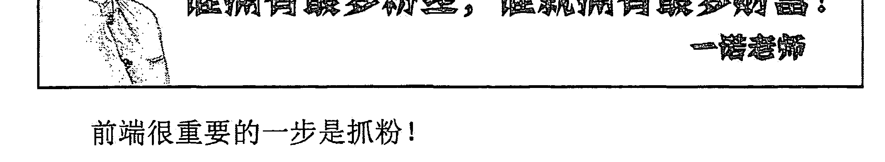

前端很重要的一步是抓粉！

> 借用《全球疯狂吸金》书里的一句话：谁拥有最多的粉丝，谁就拥有最多的财富！

- 不相信你看看马化腾，
- 不相信你看看马云，
- 不相信你看看抖音，
- 不相信你看看美团！

## 第二节: 成交主张与角度

这个产品100元一个，这个成交主张不是非常的有吸引力。

你需要把零风险承诺，把其它的付款条款非常清晰的表达出来，别人一听就知道是无法抗拒的一个主张，这时候你的成交才会变得比较容易。

一诺老师曾经举个例子，比如说你卖宝石。

宝石最大的风险是什么呢？最大的风险就是假的。

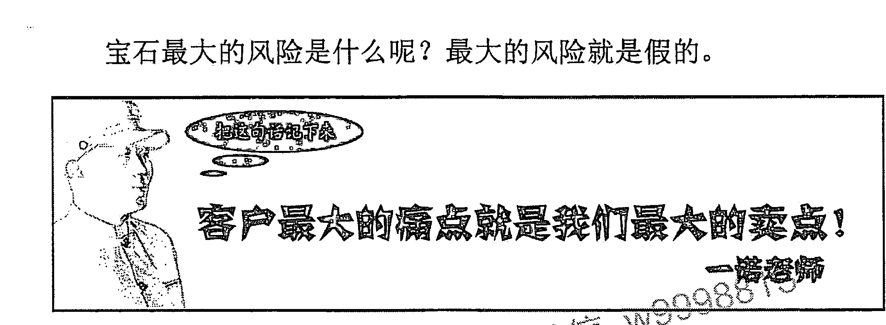

从消费者的角度来说，尤其是购买结婚的这个东西。

他买完之后是假的这个风险对他很大。我不知道你这个宝石有没有计划，他能不能到别的地方去检验真假。

决定价格的关键因素——价值塑造。

很多人第一次买产品，他对价格没有太多的概念。

他可能知道自己能花多少钱，他只有这个概念。买什么样的宝石他不知道，关键是你怎么塑造价值。

比如你这样说：你今天花了 5 万元在我这里购买了一个宝石，我强烈建议你到你周围其他的宝石店去问问他们，这样的宝石他们那里要卖多少钱。

如果他们回答的价格是比我们的低，那我们可以赔你。

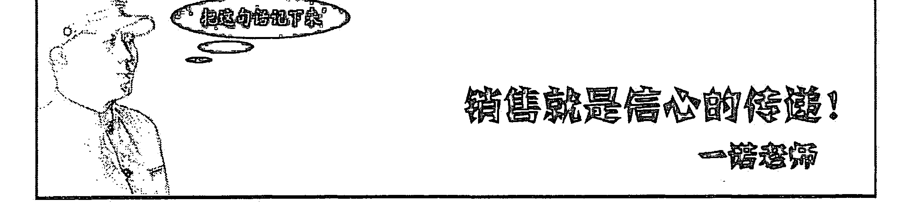

一诺老师不是建议你可以这么去销售，但是如果有这么一种手段，如果有这么一个成交主张，那他的吸引力就更大。

当然，这个宝石我们需要打造好的成交主张，任何一个产品你都需要给客户的一种感觉，就是他可以拿出来放在这里一讲，大家就清楚他购买的是什么。

### 案例：一诺老师弟子拉斯维加斯狂赚 1 亿美金

一诺老师弟子曾经做过这么一个案例，这个客户是拉斯维加斯开酒店的，他的酒店里有赌场。他的酒店是五星级酒店，拉斯维加斯大部分豪华酒店都是五星级酒店。

在一诺老师的指导下，他的成交主张是：我的五星级酒店你要单独去订基本上至少都要 300、500 美金一个晚上。但你掏 497 美金就可以在我的酒店住上三个晚上，不仅如此，你到我的酒店，我的大堂里还有香槟，你和你的家人可以随时喝。不仅如此，如果你决定要在我的赌场玩，只要你买 497 美金的筹码，我再赠送给你 497 美金匹配你的筹码。

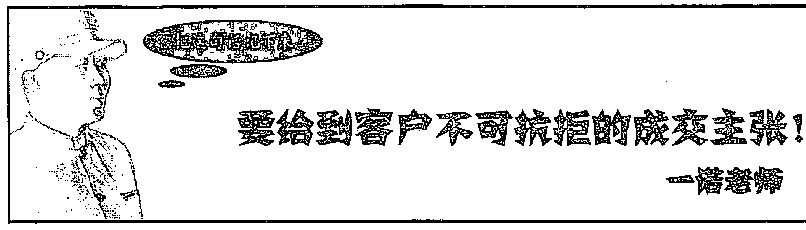

设想一下这是什么概念？假如说你有兴趣到拉斯维加斯去玩，你想你自己订一个酒店要 500 美金。现在是五星级酒店只需要 497 美金，你可以住三个晚上。

然后你可以随便喝香槟，如果你决定要去赌，他还再给你 497 美金。没有什么可以拒绝的。

那老板怎么赚钱呢？

别着急，听一诺老师给你解析这个案例……

首先，497 美金是一个三晚的酒店代金券。

我现在在促销，你现在给我 497 美金，然后我就寄给你 497 美金住三晚的酒店代金券。所以大量的人觉得这是一个无法抗拒的成交主张，就会花 497 美金去买这个。

那很多人可能要等半年、一年或两年再去订那个酒店，因为你拿到这个 497 美金三晚的酒店只是说你有了这个权利，你可以去入住，但并不代表你今天就去入住。就是你什么时候需要入住，你只要提前两个星期跟我预订酒店。

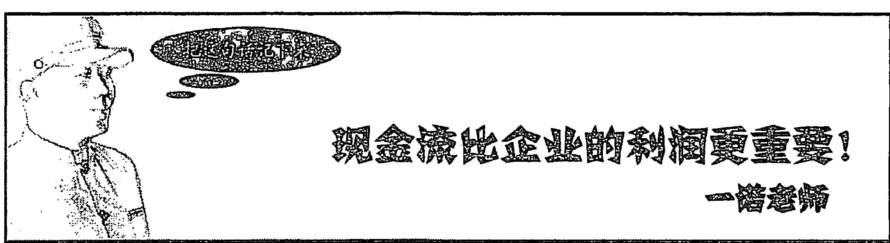

很多人买完了之后，他可能不一定马上就有时间去入住。可能要等三个月、五个月才去。

这样的话这个老板，因为这个无法抗拒的成交主张，他就先收到了大量的现金。你做任何项目的时候，如果你能够先收钱，然后再付你的产品和服务，那么你的利润会完全不一样。一诺老师弟子就是这么做的。更重要的是去过赌城的人都知道，如果你对赌没有兴趣，你是不会去的。但是如果你去了，你就想赌。

大家都知道 99%的人赌肯定是要输钱的。而且假如说他通过这个方法发出去 10 个到 20 个，总能找到一个非常喜欢赌的人，这些人可能每年要去很多次，而且每次都会输很多钱。他在前端通过一个非常有吸引力的成交主张把很多人抓进来。这里边还有一个很大的差别，就是虽然这个酒店是 497、500 美金的价值。但如果他没有人入住，他依然有成本，他空着也是空着。

弟子通过一诺老师教的这个方法，成功盘活这家酒店，他更重要的就是给人的感觉是他的酒店生意爆棚、需要排队。

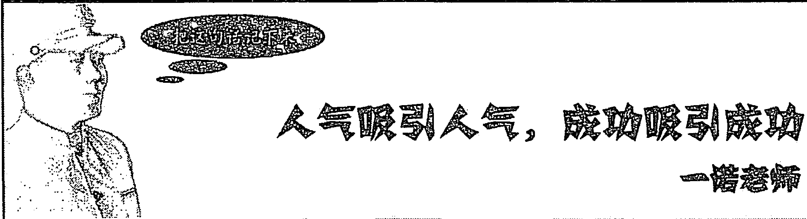

因为弟子掌握了一诺老师教的方法，可以先收钱，然后再给产品和服务，半年时间营业额提高 10 倍以上。

### 案例：一诺老师弟子采用永久免费倒赚千万

一诺老师有一位弟子，做眼镜镜片生意，由于竞争压力大，导致生意惨淡。

他的眼镜成本很低，只有几十元钱。但是卖出去都是上千元。因为在渠道的加价非常高，所以他卖不出去。

但他的镜片确实很好，很牢固，永远砸不碎。

弟子在一诺老师的指导下，设计了一个成交主张——

大部分人买镜片，比如说 600 元、800 元，买完了之后往上一装，不行也没有其它的服务。他卖的方法就是你掏 200 元买一副镜框，然后我们可以确保每两年给你换一副新的镜片，直到永远。

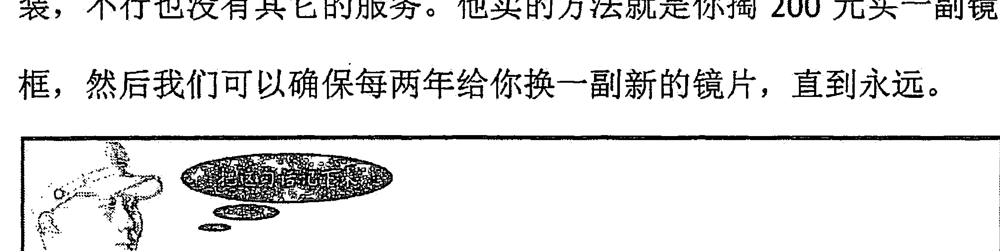

你听着这个东西好像不赚钱，但是你仔细思考一下就知道。他这个镜片其实卖到眼镜店只卖 20 元。

但是，他现在卖 200 元可以永远给你换，每两年换一次。

客户会觉得这个挺好，每两年换一次新的，只要去申请他就换。

其实你想清楚了，就是说你的镜片卖出去只卖 20 元，可能他的生产成本只有 5 块钱。先把 200 元拿来了，然后别人只要换、只要坏就给他换。你承诺可以终身换，但是有多少会坚持 20 年以后还接着换？有，只要他要换他可以换。但这只是一个比例的问题。

第二，记住了，这 200 元，如果你先拿了，假如说你能做投资，把 200 元钱产生 10%的回报，那么就相当于每年可以光靠利润就出来好几副镜片。

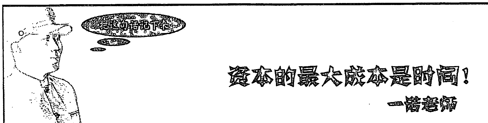

当然你可以说，到眼镜店去买同样的一副镜片你需要 800 元，现在你只需要付 200 元，而且不仅仅买一副镜片，每两年就可以换一副新的。

这样的话，可以省很多钱，一部分人就会觉得很有吸引力。

为什么呢？

因为他作为一个镜片经销商，他通过这个渠道是很难卖掉的。

# 改变世界商学·世界企业家的摇篮 《盈利的最高境界》一诺老师

因为他不可能有大的品牌效应，而且渠道控制的非常严格。

他就是5元的成本，别人在那里卖800元，但是你没有办法，对吧？如果是打造一个这样的直销渠道，通过这样的一个成交主张，别人一听，这个就很有吸引力。

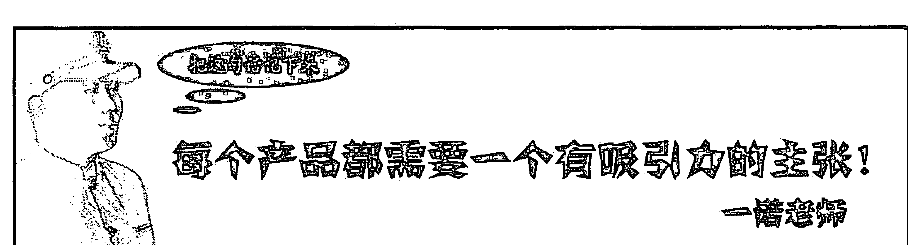

就是你需要打造的是一个有吸引力的主张。其实，每一个产品都能够打造一个有吸引力的主张。

不是说所有人都能打造像这个赌场这样这么有吸引力的主张，因为每个行业的价值不一样，但是至少都可以打造出一个无法抗拒的成交主张。

就像一诺老师说的，成功很简单，只要方法正确！

关键是，什么才是正确的方法？

古人云：读万卷书不如行万里路，行万里路不如名师指路！

最后我的结论是——成功需要教练！

上帝派一诺老师帮助你实现梦想！一诺老师你值得拥有！

## 第三节：如何设计零风险承诺

成交主张里一定要有零风险承诺，零风险承诺是非常重要的。

零风险承诺很重要的一个概念是，你需要降低别人和你交易的风险。

零风险承诺是一种理念、一种概念。

就是说你可以尽量的降低他的风险。但是否绝对是零取决于很多因素。你只需要比你的竞争对手承担更多的风险就行了，并不是说你一定要百分之百的承担所有的风险。

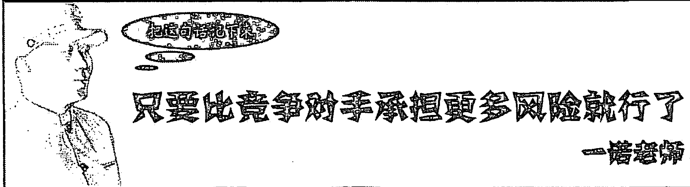

比如说你是盖楼房的，那你很难承诺盖完了楼大家不买或老板不满意你就可以把它拆了重新盖，对吧？

当然在美国确实有这样的公司可以做这样的承诺，说我盖好的楼，如果你不满意，我就拆了。但他是怎么做的呢？他是把整个建楼的过程分成 30 个步骤，每一个步骤他做完了都让你签字，怎么样？满意吗？你说 OK，那他就接着往下一个步骤走。做完了，他又问满意吗？如果你说 OK，最后 30 个签字你都签了，你不能说从第一个开始拆，对吧？这也是一种零风险承诺。

他可以说你不满意我就拆，但是他拆的是你不满意的那个部分，他只是把这个分解掉。

# 改变世界商学·世界企业家的摇篮 《盈利的最高境界》一诺老师

更多绝学课程请咨询微信xi383921,备注: 咨询!

就是说你在作零风险承诺的时候，你的零风险承诺越有吸引力，进来的人就会越多。

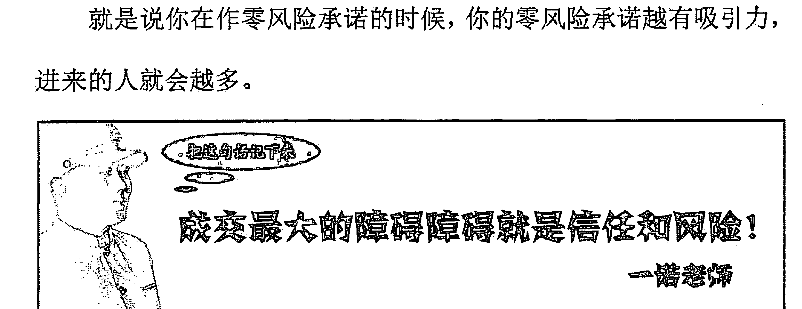

大家不信任你，大家觉得我没有见过你，你说的这个东西天花乱坠，万一不是我想要的怎么办？

或者是跟我说的不一样呢？

你的零风险承诺如果打消了客户的这个顾虑，那么进来的人就会更多。

你需要管理好自己的风险，为什么呢？

> 你不能把自己的零风险承诺为降低对方的风险，促进交易，而把自己的公司拿给输掉了。所以，你需要控制好风险。

比如说，如果你要作零风险承诺的时候，不可否定的有一些人就会利用你的这个零风险承诺来占你的便宜。

所以，你需要把这个尺度很好的平衡。

很多人没有零风险承诺卖 100 个，有零风险承诺你卖 1000 个，结果 10%的人都退货了。

当然你没有零风险承诺你卖 100 个，假如说一个卖 100 元。

但是如果有零风险承诺，最终你卖了 1000 个，有 10%退货了，你也还有 900 个成交，900 个乘以 100 元当然是比 100 个乘以 100 元要大多了

可是，有很多人不这么认为，一诺老师曾经做过一个案例。

看下一页……

### 案例：一诺老师弟子1本书3月狂赚百万美金

一诺老师的一个弟子叫约翰，他在加州写了一本书，叫《如何成为百万富翁》，但是他不知道怎么卖这本书，很奇怪。

他漂洋过海到中国找到一诺老师，请教怎么卖这本书。

一诺老师就告诉他……

在美国买东西是可以用支票的，然后就承诺说这本书是40美金，你寄来的支票推迟30天兑现，就是说你这个支票可以写30天之后才能存银行。30天以内，如果你觉得这本书不值，你就把这个支票取消就完了。如果你觉得值，你什么都不做，30天之后我会把你的支票存到银行里去。

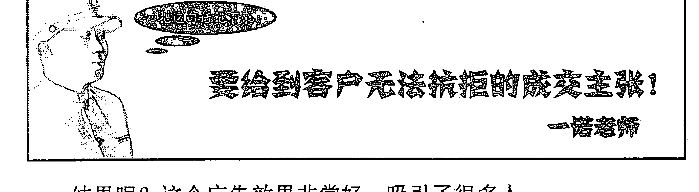

结果呢？这个广告效果非常好，吸引了很多人。

有一天他又跑到中国找一诺老师，他非常激动，他说：“一诺老师看看他们这些蠢货，然后他给一诺老师看了一大堆支票，全是一些无法存银行的支票……他说一诺老师看看吧，我说不能作零风险承诺，您非要教我承诺，您看一大堆支票都存不了。”

> 一诺老师立刻对他说：“你才是蠢货！约翰吓一跳！”

> 一诺老师说：“我问你，你这个促销是赚钱了还是亏钱了？”

> 约翰说：“赚钱了。”

> 一诺老师说：“赚钱了你就一抽屉这个烂支票，你要希望这整个房间全是烂支票才对。”

约翰一脸懵逼的看着一诺老师……

> 一诺老师说：“你想过吗？你只有20%是退回来的，对吧？”

> 约翰点头说：“YES!”

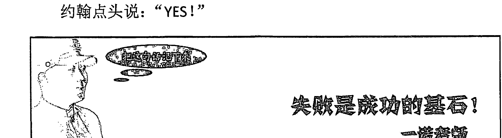

> 一诺老师说：“就相当于有1个存不了银行的，就应该有4个已经存到银行里去了，是不是？”

> 约翰点头说：“YES!”

> 一诺老师说：“应该是你这个房间我进都进不来，全是存不了的支票，那你就赚得更多了。”

> 约翰恍然大悟，满脸通红的说：“I'm the wrong teacher. I'm sorry.”

意思是：我错了老师……

实际上就是这里边的关系大家没有想清楚，其实你需要瞄准的是最终能够满意的客户，而不是要瞄准那些不满意的客户，不满意的客户只是一定的比例。

有时候还有一个概念，也是一诺老师做的一个案例。

大家看下一节。

### 案例：一诺老师洋弟子零风险承诺赚1亿美金

一诺老师的一个学生，叫乔治，乔治在美国的创业者杂志曾经做过一套400美金的创业课程，就是他有一些磁带，然后加上一些各个不同行业的创业模板，卖400美金。

然后乔治给6个月的零风险承诺，就是6个月之内，如果你按照这个说明去开的公司不赚钱，你就把这个东西退回来，400美金我一分钱不要，全部给你退回去。

结果证明退货的比例相当高，大概有40%。

乔治非常紧张！然后乔治求助一诺老师帮他解决这个问题，说退货的这么多，怎么办？

结果一诺老师说：‘很简单，把零风险承诺变得更有诱惑力。就是如果在6个月你开的公司不赚钱，我不仅退给你400美金，我还再赔你400美金。’

乔治一听，吓得脸都绿了！

乔治激动地说：“一诺老师您疯了，我们本来退货的就这么多，现在再赔400美金，不是让我彻底完蛋了。”
一诺老师说：“你错了，要附加一个条件，就是只要你把你新公司的营业执照或者是新公司注册的那个备案做一份复印件寄给我。我就不仅可以退你400美金，还再赔你400美金。
很简单，如果你不采取行动，你公司都不去注册，你是不会赚钱的。我承诺你是把公司开起来去赚钱，我没有承诺你公司不开都可以赚钱。有没有道理？
就是你得采取行动，光是看这个书不采取行动是没有用的。”
你不需要证明你去做了营销，你去做了这个、做了那个。你只需要证明你的公司开起来了，不过分吧？我要赔你一倍的钱。

乔治听话照做……

结果退款的几乎没有！

这就说明大部分人买了这个课程没有动，什么也没做，公司没开，他就把400美金要回来了。

最后乔治用了一诺老师的这个方法一年内赚到1亿美金！

一诺老师的方案很简单，我可以向你作零风险承诺，但是我的承诺你得满足最起码的条件。

比如健身房，你可以上1年的课程，收费2800元，不满意我可以把2800元全部退给你。但有一个条件，你的旷课不能超过30次。如果你老旷课最后你退钱，没有道理，对吧？

零风险承诺是一个强有力的武器，但是你需要巧妙的去变化。

一诺老师上次弟子密训里有讲：当你做出无法抗拒的零风险承诺，你有资格要求别人付出适当的行动。

> > 成功就是：相信、听话、照做！ ——一诺老师

你说我的电脑我可以做360天的零风险维护，没有关系。

但前提是你不能去砸，你不能出现其他的意外。就是你可以限定他，但是这个限定不能太多，说你必须要做到这个。比如说健身卡，如果我们的零风险承诺是一次课都不能旷，这个要求就太严格了，他觉得做不到。但是你说，总共12个月365次课你最多不能旷超过30次课，你旷30次课很显然你不是认真的，对不对？

一诺老师常说：要理解的是零风险承诺其实是一个杠杆，不要把他理解成了一个被动的静态的概念。实际上很简单，比如说一个人过来，你在他前面树一个零风险承诺的标杆。

如果你把它树高了，过来的人就少了。如果你把他树低了，过来的人就多了，但是这里面还有一部再次裂变的话就多了。

就是说这个零风险承诺要求确实要退款的人就多了。

实际上是两个因素，通过你的零风险承诺这个杠杆来调节进入的和最终要退钱的两者之间的平衡。

零风险承诺不是一个静态的东西，是一个可以有各种各样的变化。当然每次的调整就会产生不同的影响。

## 第三节：设计不可抗拒的超级赠品

超级赠品一定要配合你的核心产品，最好是你的超级赠品和核心产品是相关的，这样的话他才能意识到赠品的价值。

就好像购买一套《猪买单》书籍，可以免费学习价值5980元的《猪买单》2阶段音频课程，一套《猪买单》书籍3980元，而赠品价值更高！这就才是超级赠品！

消费者和商家永远是一对矛盾体，消费者希望用最低的价格买到最好的商品，而商家则希望最差的商品能卖出最高的价格。

消费者和商家博弈，谁输谁赢却要看市场的供需情况。

在一个充分竞争的市场，消费者有多方选择的自由，那么商家的生意就很难做，要想低质高价卖出去是不可能的，就算是优质高价也很难卖，因为你会发现，你的竞争对手永远比你卖的便宜。

所以，充分竞争的市场，对消费者是有利的，消费者可以“挑三拣四”，从容的和商家讨价还价——就这个价，你卖不卖，不卖我走了！妥协的往往是商家，只要不亏，少赚点，换回现金流也好啊。

然而，系统学习过一诺老师课程的弟子，在这种同行价格竞争的情况下，往往能用超级赠品的方法，打败对手，赢得市场，并且获得可观的利润。

- 那么，什么是超级赠品？
- 他们是如何使用超级赠品的呢？
- 为什么超级赠品有超级威力？

所谓超级赠品是对消费者而言的！ 比如说，消费者在你这里购买了一个100元的商品，而你赠送了一个超过100元价值的东西给消费者。 那么消费者就会觉得太划算了！ 所以，他的购买行为就会发生在你的身上。

## 超级赠品五大要点

- 超级赠品必须与主商品相关，不然效果大打折扣；
- 超级赠品的价值至少与主商品的价格相当，甚至远超过主商品，才能刺激消费者行动；
- 超级赠品最好与稀缺性和紧迫感联系起来运用，也就是说不是无限量的供应，无时间限制的供应。
- 超级赠品价值很高，但成本很低，最好有10倍、20倍、100倍以上的价差才好利用。
- 超级赠品的获得最好是免费或者很低成本而来。

## 第四节：一诺老师盈利模式金三角

一诺老师盈利模式金三角就是任何时候你的前后端都必须要考虑这三者之间的配合。你的吸金，你的变现人群是谁。

首先，是对什么样的客户，其次是你的主张是什么样的，最后是你的角度又是什么样的。其实就是客户、主张、角度。

前面一诺老师说过了，要打造一个无法抗拒的主张。

然后是什么样的角度呢？

比如说你卖珠宝，这时你可以说：你买我的珠宝，我送你一个耳坠。或者你买一个戒指，我送你一个耳坠，这个耳坠价值500元。

这时你可以有两种主张，一种主张是比如说你买我5000元的戒指，然后我就送你一个价值500元的耳坠，只要你买我就送。另一种主张是，你买完了，我给你一个零风险承诺，比如说一个月如果有什么问题你可以随便退，你退了之后我送你的耳坠还是你的。这时候你的角度可以说，我免费送给你价值500元的耳坠，目的是贿赂你试戴我的结婚戒指。（捂脸，结婚戒指谁会退？多不吉利啊！）

当然你的零风险承诺不一定是这样的，很简单，就是你可以把赠品作为打造你的角度的一种手段，这样你在一瞬间可以抓住他的注意力。

我免费送给你什么东西，当然有的人可能会觉得你这送的东西是有条件的，但有条件的也是免费送，对吧？有的人可能觉得，你应该全部免费。实际上大家谁都知道，如果我只是免费的送给你们人民币，送给你们耳坠，我什么都没有，这不可能，对不对？

你说我免费送你的目的是为了让你测试一下我的产品的质量、我的产品品质，是不是确实是像我说的一样，如果你不满意，这个东西还是免费送给你。但是如果你测试确实证明好，那么你买5万、1万的戒指对你来说也是一个价值，至少你没有任何的风险。

有没有理解角度这个概念？

比如之前一诺老师弟子那个赌场的例子。

他说待在拉斯维加斯最新的五星级酒店，住三个晚上付一晚的价格。不仅如此，你可以随便喝法国的香槟。

不仅如此，如果你决定要在我们的赌场玩，我再赠送497元给你玩。这就是他的角度。一诺老师说过，主张你要说清楚，可能需要一些口舌，需要一些空间。

但是，主张角度要在一瞬间抓住他的注意力。

你看一诺老师的每一个音频，每一本书，标题就是一个角度。

主张必须吸引人，人家在五秒钟之内无法理解你的主张，你就完了！所以，你需要在一瞬间抓住他的注意力，更有冲击力。

想到这里，我还要把《全球疯狂吸金》再看100遍！

## 第五节：不可抗拒的免费策略

免费策略的误区是：大部分人觉得应用免费策略是为了提高成交率，是为了让更多人体验他的产品，吸引更多资金。 错！

你免费的目的是为了干什么呢？

你的最大目的是为了完善自己！

很多人觉得使用免费策略，他的付出很大，然后他就等着回收免费策略所带来的顾客。因为他在想，我用了免费策略都已经损失了那么多，我就应该等着提高成交率了吧？我应该等着很多人体验产品之后来买收费产品吧？错！

你应用了免费的策略之后你应该更努力，比竞争对手更努力。

这样的话，免费策略是给你提供你和顾客互动的一个平台，通过和顾客的互动，你发现哪里需要去改进，哪里需要完善自己的优势，帮助你更好的立足。

在这个过程中你要去跟客户建立信赖感。免费完之后你要很努力的去完善自己的产品，这个时候你就更厉害了！

很多人学了一诺老师的猪买单免费模式，在使用了免费模式之后，他就不努力了，他觉得这个免费策略是我已经很厉害了，其实，你用了免费策略之后你该更努力。

我们知道360杀毒软件，你看360这个软件，他是免费的。你难道能说他不好嘛？我觉得很好，360浏览器啊，360卫士啊。当然360浏览器是个主打安全的一个概念。你不得不承认360这个公司是十分了解上网民的需求心态。他在商业模式上非常厉害，他完全免费，而且免费的产品还做的很好。

如果你现在的产品和服务很普通，你去免费，我建议你在这个免费过程中洞察你的目标顾客的特征和目标顾客的需求，让你的产品与服务变得更好。这才是你应该做的，免费之后你应该更努力，这样做怎么会不强大呢？你不可能不强大！

一诺老师知道，大部分人都很懒，你可以身体很懒，但是你的大脑不能懒。一诺老师弟子班曾经讲过，360浏览器有个非常非常好的服务，就是在线收藏夹。他这个在线收藏夹完全是在他这个免费的过程中洞察到顾客的需求而推出的一个服务。这个时候浏览器的功能都是他的数据库。他的浏览器功能已经转移到一个网络收藏的功能了。

你说这些东西竞争对手不知道嘛？知道啊！难道没有其他的免费竞争软件了嘛？有啊！但他免费了之后他觉得自己付出了很多钱，或者投入很多人力物力，他就不努力，最后就挂掉了！

也许，你会说360的后台有一些负面报道。但你不得不说他洞察顾客的需要和特征这个能力很强。他完全把这个产品功能转移了。
大家应该把自己的生意上升到一个模式的高度。

也许这个话说得不够准确，记得一诺老师大致是这么说的。
比如有的人是做产品的，比如他是做充值服务的，或者他是做软件的，做电话卡的。他通常只把他的思维局限于他的产品服务上。

你把你的大脑思维只聚焦在你的产品和服务上，优化是有一个极限的！假如，你这个产品和服务都被淘汰了，难道你和你的产品服务一起进坟墓吗？

你不想那样，那就必须：

你应该纵览整个行业，纵览你的产品的上下游资源，纵览你产品的发展，在这个当中去了解你的产品是处在一个怎样的位置，能不能有一个更好的定位。

一诺老师说大多数的产品，他能够有更好的潜在功能，但都没有发挥出其全部的功能。同意吗？可以说有百分之七八十的产品，它潜在的功能都没有被挖掘出来。所以你应该对你的产品和服务有一个更外层的认识，拓展空间的认识。

你不是做这个产品和服务的，你是做这个价值链的。你唯一想做的决定就是你想把你这个价值链做多长，你想把你这个价值链做得多久。一诺老师的思维很多就是这个链的感觉。

在这个时候你的成功或者你的第一桶金就成为了一个必然，这是一个必然，只是你还没有找到这个链。

那个时候成功就是一个必然，而并非是偶然。

所以，分享一诺老师的盈利模式就是要帮助你实现梦想，你有这个思维，你的成功就只是时间问题，可能就是一个月二个月甚至是半年，而且你不是一般的成功，你是很成功！

一诺老师知道大家也有为别人打工的，有别人的产品或有自己的产品。但大部分人都跳不出来这个旧的定势，都局限在那个里面，你局限在产品里面，你就完了。

你赚的钱是有限的，因为你看到的价值是有限的，你看到的东西是有限制的，你没有一个透视的能力，再加上的你文案能力，你的口头表达能力转化又不高，你的成功就会变的很艰难！

一诺老师说，免费策略目的是完善自我，完善自己的链条，完善自己产品与服务的功能，能够更好的提炼出其功能，这是你的任务和使命。希望大家在做产品和服务的时候，从某种程度上你的产品和服务要能改变某些人的命运。

无论是何种产品或者服务，必须从某种程度上改变顾客的命运，这个成功率又上升了一个高度。就像【改变世界】APP上一诺老师《弟子内训》的五个英雄帖那种贩卖梦想的境界！

当你像一诺老师那样，从改变人命运的角度去思考产品和服务时，你这个视野就宽了，你可以选择很多产品和服务。

你在谈合作的时候成功率很高，而且所有人都会认同的你的梦想和计划，所有人都想加入你的梦想和计划，这些加入你梦想计划的人又可以帮助你不断完善你的个人优势以及帮助你打造核心故事。

如果能像一诺老师那样有吸引力，你就完成一个更好的跳板式借力。你的成功是必然的，你不可能不成功，只要你相信！

## 第六点：不可抗拒的独特卖点

我们介绍这个案例的时候，你可能会更有感觉一点。但是你的一个营销是冲着一群人进行的，对吧？比如说你的杂志、广告往那里一登是冲着一群人的，这一群人对某种特征的需求是不一样的。比如说你的产品有一二三四个五个卖点。
然后你对应三个特征人群。
那么一个人群他可能会把一二三四五个卖点列出来；
另一个人群可能列出的卖点是二三四五一；
第三个人群列出的卖点可能是三四五二一。
每个人群的重点是不一样的。一定是这样的，就是说不同的人群会优先不同的卖点。那么这里面有几种不同的哲学。

一种哲学，是我只卖一个卖点：

产品只有一个卖点，但把它的价值塑造的很好，然后向这群人去卖。当卖到最多的时候我再换一个卖点，然后再一个一个的测试。这是一种卖法。另外一种卖法就是把产品所有的卖点糅和在一起，然后向一群人去卖。

Gary Halbert的观点是应该只卖一个卖点。他说如果这样你的效果会更好。在整个销售信中你花所有的精力在塑造一个点的价值，这个点会非常有价值。一个点完了之后，你再换一封销售信，诉求另一个卖点，直到某些点可能没有价值为止。另外一种观点就是把很多个卖点糅合起来，全部放在一起。

有人曾经做过测试，在美国有很多教别人如何打高尔夫球的DVD录像。很多人说我既教你打得很远、很直，然后我也教你打得怎么怎么样。但他写了一封信只卖我怎么教你打得又远又直。

他的理论很简单，他说90%打高尔夫的人可能并不是什么高手，都是一般的。他认为好坏就是打的又远又直。因为大部分人可能那一竿都打不出去，而且打得不远不直。他说那个可能是最核心的需求，其它的东西都无所谓。所以他主张把你最有吸引力的卖点塑造好，你就能够打动很多人，然后再换一个卖点。

一诺老师的另外一个学生叫玛丽，他主张的是选择几种最核心的卖点，糅和在一起，但不要超过三种。你的角度不要超过三种。

如果角度超过三种的话，会有几个问题。如果角度太多的话有些人就会觉得这不是给他的，对他不实用，所以他就不看了。这里边有一个很重要的观点，比如他做英语培训的链接广告。

然后写一些跟英语没有关系的标题，反正是吸引最多的人。

他说反正广告费一天是1500元，我吸引的人越多，当然对我越有利，反正我也不是按点击付费的。一诺老师说了，你吸引的人是：最需要的人才有价值，否则没有价值。

如果你吸引的不是你想要的人，他进来很快就走了。

一诺老师曾经看到有一个在迅雷上做的广告，觉得很滑稽。他实际上一个网上超市，在网上卖东西。然后他在迅雷做广告，他说“北大教授新婚之夜逼妻子上网交易”。

这个标题可能是吸引眼球的，但是人家看了这个标题之后，没人想象到会是一个网上商城的广告。

大量的人是点击了，但点击进去入网页一看是网上超市，瞬间就走了。更多绝学课程请咨询微信xi383921，备注：咨询！

你的卖点必须要和你的整个变现流程要协调起来才行。

一诺老师讲销售信要抓住注意力，一诺老师曾说过：抓住注意力、保住注意力和锁住注意力三者要全部协调起来才有用。

一诺老师的观点是，销售信诉求一个最大的卖点是最好的。

如果你的一个卖点的模式被摸索出来了之后，你再去测试一下其它的角度也是有必要的。

最终市场对什么样的东西有反应，需要通过测试来找到答案的。

测试完了，就自然可以解决了。理论是没有用的，一诺老师弟子注重实操，除了实操所有的都是纸上谈兵！

## 第七节：塑造物超所值10倍以上的价值

一诺老师之前说了塑造价值就是要追求对方最敏感的、最需要的那一个方面，实际上塑造价值最重要的是你要研究清楚对方最大的困难，最大的问题是什么。

你的产品最终是帮助别人解决问题的。

你要塑造物超所值十倍、百倍以上的价值，甚至是无价之宝！

让他睡觉都会笑醒，让他激动地手舞足蹈！就像你听一诺老师音频课程一样！这才是演讲的最高境界！

事实上如果你是一诺老师的弟子一定会有这一课的……

总之你一定要让他觉得占便宜了！占大便宜了！

## 第八节：追售的最高境界

后端营销非常重要，也就是你的追售非常重要。如果你是一诺老师弟子就知道，企业盈利模式的核心就是——不断的追售！

究竟如何追售呢？

一诺老师曾说过一句话，这句话价值一个亿：

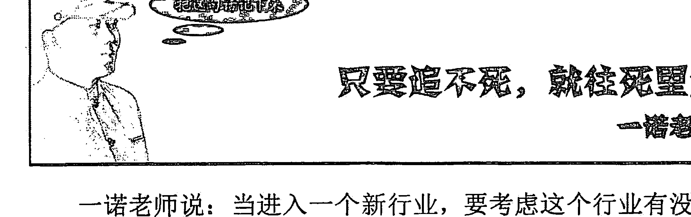

一诺老师说：当进入一个新行业，要考虑这个行业有没有追售的可能。

一个没有追售的行业，做起来非常辛苦。

你花钱去抓客户，成交一次就完了！

就是说你的一生都在追求新的客户，这样会非常辛苦。

所以，当你考虑是否进入某一个行业的时候，你一定要考虑你的行业是否有追售的可能性。

最好的行业——有无限的追售的可能性，不断重复购买，同样的产品在重复的销售，这是最好的行业。

比如美容产品，美容服务是最好的，一个人做美容不会做一次就完了，她会继续去消费。像常用的材料，也是这样的，有很多是可以重复销售的。其护肤品也是一个重复销售的产品，尤其对于你的中间商更是重复的，因为他必须重复的去购买。

## 维护好客户的终身价值，做好追售非常重要。

如果我们的赚钱机器要变成一个全自动的、永久的赚钱机器，我们必须要打造坚实的后端——变现能力！

因为：后端是未来的保证，是利润的保证。

现在开始，必须有意识地思考怎么为客户描绘愿景，怎么能够不断地产品创新，怎么能够增加客户的信任，创造更多的追售机会。

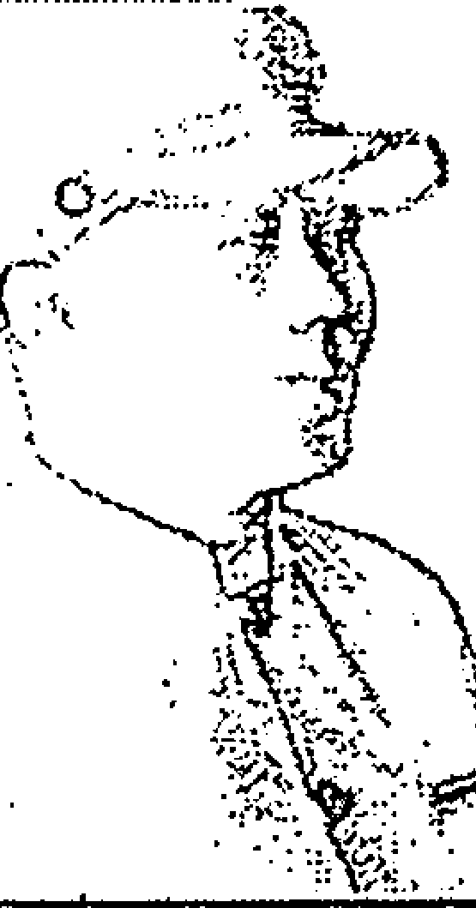

> > 企业家要思考如何为客户绘制蓝图！——一诺老师

当然追售不是完全的自私的一个目的。

一定要从对方的角度思考，给他提供更好的价值。

然后减少客户的流失。

客户在跟着你的一段时间之后如果没有继续得到价值，没有继续被提醒，没有给予他购买的机会，那么这个客户肯定会流失掉。

在这样的情况下，客户的终身价值会降低。

所以，要不断地努力减少客户的流失，获得零风险永久获利的潜力。

## 把客户锁在你的追售(变现)系统，也就是你的鱼塘里！

客户已经购买了你的产品，如果你的产品确实能给他创造价值，你对他的主张其实是零风险的。

要想零风险永久保持获得的潜力，就必须要打造坚实的后端。

## 第九节：描绘美好愿景

描绘愿景是一个非常重要的技术。因为大部分人都模模糊糊的有一个愿景。比如说我为什么要购买这个东西？我为什么要参加一诺老师的课程？没有人只是为了一诺老师的课程而学一诺老师的课程。没有人只是说我钱没地方花了，我就想购买一个结婚戒指，其实他的结婚戒指对他的人生，让别人看到他的戒指就知道他是已经结婚的，是成了家的等等。一整套的思想，他有一个梦想。

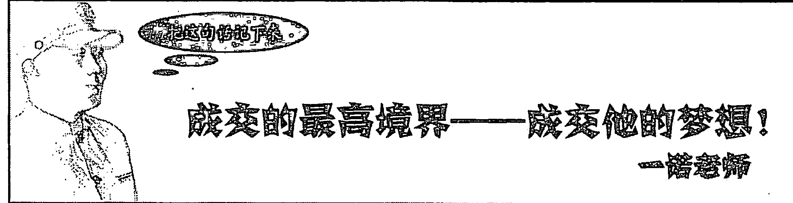

但是 99%的人无法用自己的语言描绘他究竟要达到的是一个什么样的梦想状态。比如他买电脑也是一样，他没有说没事干了买一台电脑。对吧？买一台电脑也许他享受的是一种自由的网上生活；也许他享受的是一种通过电脑解脱他办公上的一些负担。

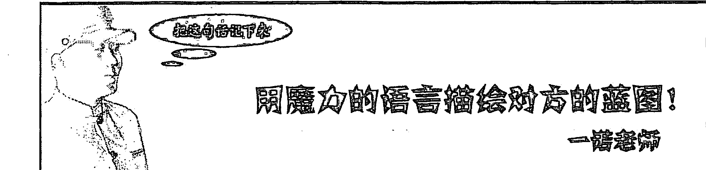

《全球疯狂吸金》有讲蓝图方面的，他有自己的一些需求的蓝图。用我们的语言来描绘他的愿景和梦想。

当你描绘清楚他的愿景的时候，实际上他需要购买的是你描绘的这个愿景，这个愿景会推进他不断的向前走。

从某个方面，就是为你的追售，为你的后端做好一个铺垫。

更重要的是让大家了解，不只是就购买这一个产品。

当然了，你的愿景确实是他想要的，不是说你随便描绘一个愿景，你告诉对方说这就是你需要的，这样会让对方很难接受。

如果你描绘的愿景，你的语言刚好是他想要的，想要表达而无法表达出来的这种愿景，那么他就会接受你这个愿景，相当于接受你将来在帮助他实现愿景的过程中，所推出的各种各样的产品。

例如一诺老师在《改变世界》上面的 5 个英雄帖，那真是演讲的最高境界，听说那5段音频，一诺老师曾经晕倒5次，幸好抢救及时！所以一诺老师发功的时候，助理会准备氧气罐，随时抢救！

虽然隔着音频，我都能感受到一诺老师那种激情、状态、真诚、感动、格局、大爱、使命、愿景！

第1个音频我就哭了整整一夜，哭的撕心裂肺，连续失眠5个晚上，感觉自己满血复活！后面的音频时而让人热血沸腾，时而让人痛哭流涕，时而让人格局放大到宇宙，特别是最后一个音频，感觉自己终于找到了内心最伟大的力量，感觉自己可以改变世界！

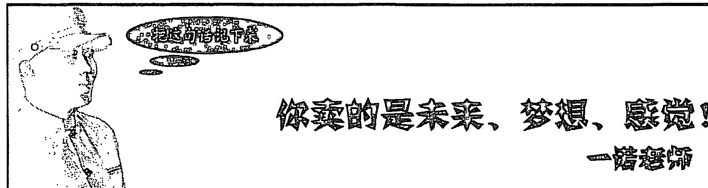

永远不要直接卖产品，卖的是一种未来，一种梦想，一种感觉。

卖戒指也好，卖化妆品也好，卖培训也好，或者是卖瓷器，没有人只是说买瓷器当容器用，其实你希望他是一种生活的情调，一种生活的方式，对吧？这代表着他会怎么样的生活，他的家居摆设是什么样的，然后他有一个什么样的生活态度，什么样的生活格调。

## 第十节：完美的变现流程

变现流程也是非常重要的。为什么呢？

变现流程是一个客户从来没有见过你，对你没有任何的信任。你通过一个什么样的流程？通过一个什么样的过程，然后把他变成你的客户，变成你重复购买的客户，变成你忠实的客户。

这个流程是非常重要的。你的任何的销售，当你和顾客接触的时候，你必须要说你给什么具体的价值，你要说清楚你他给什么好处，什么报酬。领取价值 500 元的耳坠；或者参加这个价值多少钱的培训，或者是接受什么样的检查。

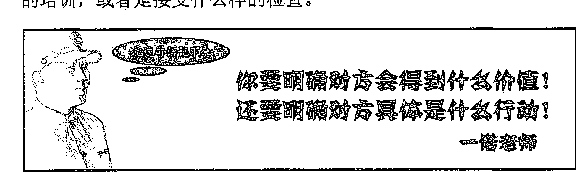

营销的目的很简单，就是你希望对方要做一些动作。

从客户不认识你，也就从抓粉到追售成功，再到自己的鱼塘。

开始时客户根本不认识你，你要通过不断的给他提供价值(养鱼)，然后让他采取一个行动(变现)，再继续不断的为他提供价值(养鱼)，并且让他采取行动(变现)。

他在采取行动获得价值，验证价值这个过程中，他对你的信任越来越多，越来越……最后他才能成为你的终身价值客户。

刚刚参考了一下我阅读一诺老师的《全球疯狂吸金》做的笔记感悟，一旦他进入你的抓粉程序，很重要的一点是要不断的互动，不断的交流，也就是培养信赖感(养鱼)。

交流什么？

就是不断的给予价值(养鱼)，说清楚给他什么价值(养鱼)，然后要他做什么样的具体的行动来配合你。

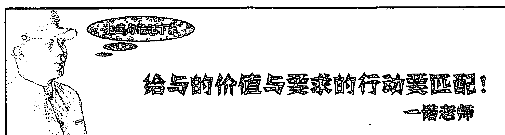

你给的价值很高，你让他做的动作很小，那他就会怀疑你的价值是虚的。

比如说，所有的人都可以到我公司领取价值 1 万元的新婚戒指，免费的。没有人会来领取。

这里边很重要的就是——你的价值和动作一定要匹配。

一诺老师 19 年前曾经做过一次实验，一诺老师写了一封信，说任何人给一诺老师寄 10 块钱，一诺老师都会寄给你 100 块钱。

结果没有人寄！

一诺老师：说我真寄，给我 10 块钱，我寄给你 100 块钱。

但是没有人要，为什么？

人家觉得不可信，就是没有可信度。

你给的价值要能够匹配他的动作。

信赖感是一切的基石！

比如说一诺老师给你一个免费的报告，然后你把你的姓名和微信号填写一下，这个可以。

但是如果一诺老师说我给你一个 5 页的免费学习资料，你填完下面这个 1000 页的调研，可能就没有愿意干。

你一定要匹配！

在较早阶段的抓粉，别要求对方填很多信息，也就是不要要求对方做出难度较大的动作。

流程要像美女的超短裙，越短越好！

## 第十一节：让客户疯狂送上门

就算你的后端真的坚实了，但是不管你的后端做得多么好，总会流失客户，你总需要更多的客户。

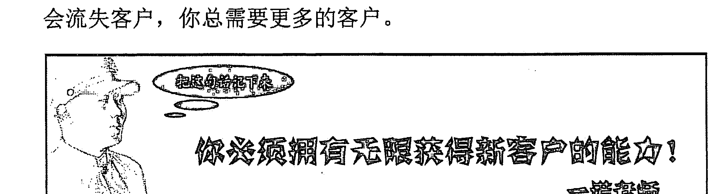

一诺老师弟子内训的时候讲：允许的成本公式

举例：你的客户成交之后，然后追售，比如说追售的变现 100元，然后你的产品成本是 40元。

如果用一个成本来获得新客户，你允许什么样的成本来抓粉？比如说你的直接成本是 40 元，其他的成本平均分摊后也是 40 元。然后还有投入广告的成本 X。你必须要求 10%的回报。

那么可以得到一个等式是 100-40-40-X=10%。

你的回报是 100-40-40-X，这是你的利润。

你的总投入就是 40+40+X。最后算出营销成本 X 约等于 10。

也就是说如果获得新客户的成本是在 10 元以内，你几乎可以保证有 10%的投资回报率。

这时候你的吸金预算只要是能够在10元以内获得新客户，你现有的追售机制就能够保证你有10%的回报。

有了这个公式，你可以通过你的追售机制迅速算出你允许的成本是10元。那就意味着你可以在允许成本内无限制的吸引客户。

如果你要做百度竞价，假如说你有3%的成交率，约每30个点击就会成交一单。意味着你的点击的成本大概不能超过3角钱左右。

如果你的点击成本超过3角钱，你的回报就不会达到10%。

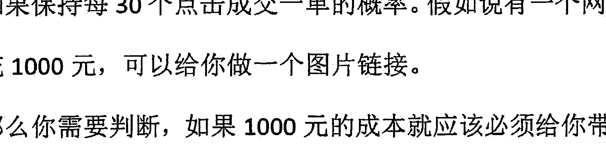

如果保持每30个点击成交一单的概率。假如说有一个网站说你每天花1000元，可以给你做一个图片链接。

那么你需要判断，如果1000元的成本就应该必须给你带来100个客户，100个客户如果是按第30个点击成交一单的概率，就必须要有3000个点击，你需要问他，能不能保证我每天有3000个点击。

如果一天没有3000个点击，那么这一天花1000元，你就无法保证赚 10%了。

前端该花多少钱跟后端利润是挂钩的——这叫允许成本。

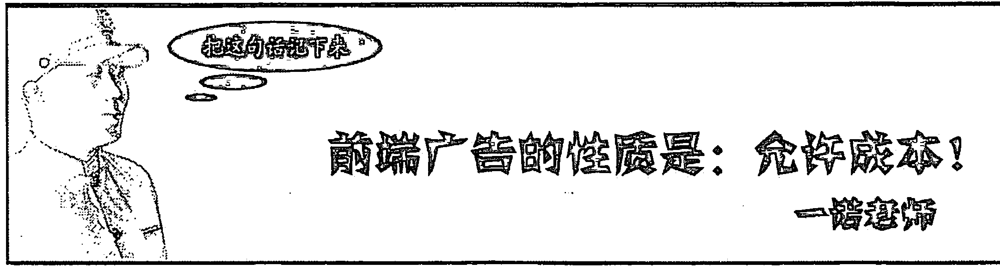

就是说允许以这样的成本去购买新客户。

当然你还有手段，就是杠杆借力免费获取新客户。

如果你能够通过杠杆借力，就是别人不是让你付费的方式，而是说提成的方式，当然这样的情况下你会更简单。

你是先收钱再分钱。但是同样的道理，如果你的成交率和后面的追售跟不上，你付别人的钱很少，别人不会坚持下去。就不会继续免费给你送客户，打铁还需自身硬！

所以即使是免费的杠杆借力的合作，你也认为这只是短期的安排，从长期来说，你必须让那个人发挥最大的价值，否则他不会跟你合作。这就是为什么一诺老师在《全球疯狂变现》终极弟子秘训课程里说的一句话：会变现的全世界都是你的鱼塘，不会变现的拥有全世界的鱼塘都没有用！

更多绝学课程请咨询微信xi383921，备注：咨询！

## 第十二节：提高10倍变现率

提高变现率就是多种主张。

到了第二个阶段，你的主张要多样化。从新进来的客户，也许这些人对这一种主张反映强烈，那些人对另外一种主张反映强烈，通过不同的多种多样的主张，可以最大限度的尽快的把你的潜在客户转化为变现的客户。

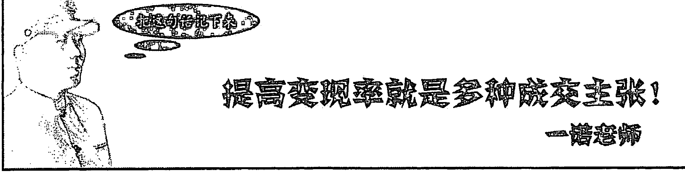

然后你有马上变现，马上变现的概念，实际上就是抓粉的同时做一个紧急的变现主张。

**马上变现目的就是吸收一些抓粉成本，如果能够最大限度的吸收抓粉成本，你的全面无限获得新客户的能力就会大大的提高。**

一诺老师终极弟子内训的时候，讲《全球疯狂变现》会讲到把多种主张组合，结果成交率提高 10 倍以上。

# 第四章：引爆利润

在跟一诺老师学习三招引爆利润的时候，在学这个方法、这个神奇的吸金技术之前，我们需要做一些基础的工作。

三招引爆利润有一个基本的前奏。

## 第一节：引爆利润的四大核心

很多吸金大师都没有思考的一个问题，就是比赚钱机器更重要的问题，比引爆利润更重要的核心。

引爆利润有四大核心：

- 第一个核心：你究竟卖什么；
- 第二个核心：不可思议的独特卖点；
- 第三个核心：快速引爆精准鱼塘；
- 第四个核心：如何清晰盈利模式。

### 第1个核心：你究竟卖什么

究竟你卖的是什么？

很多人没有想清楚，说我就卖保健品啊。

错！

你卖的不是保健品，你卖的是能够给客户带来什么价值！

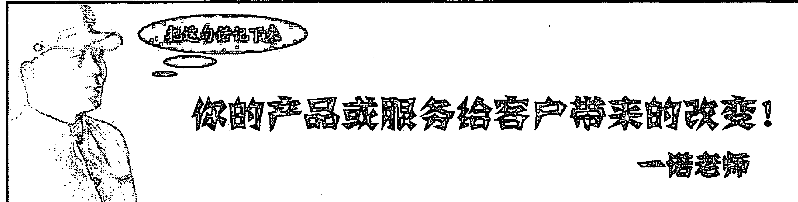

这个改变是让客户更美丽、更自信、更快乐、更……

总之，是好的改变！

例如：

美容院——让别人更美丽！

一诺老师的课程——改变命运！

变高、变美、变瘦、变有钱……

### 第2个核心：不可思议的独特卖点

就是客户购买你这个东西，比如他购买眼镜，他不是为了购买一块玻璃。他购买的究竟是什么？这个“什么”就是独特卖点，必须回到他原有的生活状态中去，能给他什么帮助。

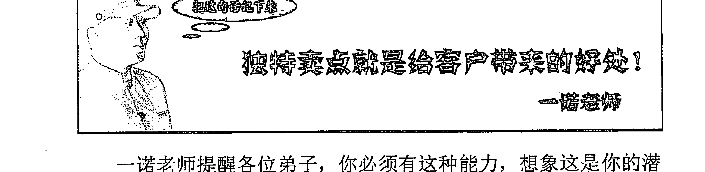

一诺老师提醒各位弟子，你必须有这种能力，想象这是你的潜在客户，你现在走进了他的生活。

也许通过你的思想、通过你的思维模式、通过你的产品和服务，你必须发现随着他和你的交易和交往，能帮助他对日常生活质量向着他向往的方向有所改进。

你是卖健康的，你必须能够看到他，随着使用你的产品，他的健康状况、他的心理状况必须有所改进。

你卖的是其他培训，如果他获得培训之后，三个月、六个月他的生活必须向着他想要的方向去发展。

## 改变世界商学。世界企业家的摇篮 《盈利的最高境界》一诺老师

正是由于这样，一个独特的卖点就显得非常重要。

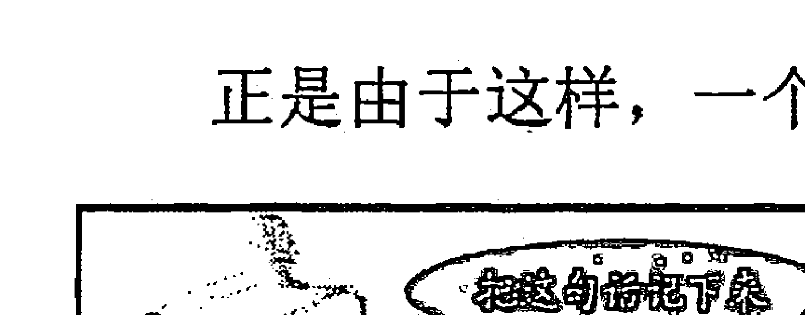

> > 客户购买的是改变，变得更好！
> > ——一诺老师

你必须清楚的看到，你的这个独特的卖点放到他原来的生活中去，是怎么样改进他的生活的，是怎么样提高他的生活质量的，是怎么样帮助他实现梦想的，你必须能够看到自己走进他的生活。帮助他去实现这个过程。

每一个弟子都必须做到这一点，其实这是一个非常重要的过程。就像有时候你遇到一个陌生人。如果你能够想象到，任何时候你跟他坐上十五分钟、半个小时之后，你觉得，嗯！他看世界的方法不一样，他看起来更有激情了，他对待生活更加乐观了，或是他本来的一些困难解开了，其实这些就是你的贡献。

所以，我们的产品和服务，最终必须要往这个方向发展，究竟怎么样改善他们的生活？就是你卖的是什么？你的独特卖点是什么？能给他们带来哪些好的改变！

### 第 3 个核心：快速引爆精准鱼塘

究竟是什么样的潜在客户（鱼塘）？

很多人说，所有人都是我的客户。就像他卖眼镜的一样，所有人只要戴眼镜的都是我的客户。你说的对，如果是不要钱也许他们会要，但问题是你的产品是需要钱购买的，就不一定都是你的客户，

你需要找的不仅是需要你的产品的那些人，需要你的产品有很多人都需要，但是想要才是关键，想要他才愿意付钱。

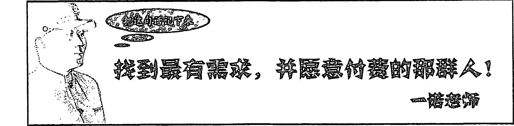

一诺老师的弟子都知道，其实只要认真的看一诺老师书籍，或听过一诺老师音频课程者都能够受益。但是很多企业老板会去看吗？

他不会，也许他认为他什么都懂；也许他已经有了其他的想法；也许他根本就不认为有方法可以解决他的问题……有各种各样的原因。

也许下雨没打伞的人认为培训还要收费，开什么玩笑，不就是想法嘛！对吧？有各种各样的因素决定他需要，但他不想要。

许多年前，一诺老师有个弟子，他是做记忆力的培训。一诺老师说你的客户是谁？他说只要是人都是我的客户。

一诺老师说为什么？他说每个人都需要提高记忆力。

一诺老师说对，但并不是每个人都愿意花钱去购买如何提高记忆力的产品和服务。

比如说我们在座的人说你来参加这三天的培训，我提高你的记忆力多少，很多人不一定愿意，或者因为我们每天的生活要应付很多很多的挑战，很多的事情，也许提高记忆力，现在在我们脑海中并不是最优先的，我们就不认为有这个必要，你需要寻找的是认为有必要的这部分人，找对人很重要。

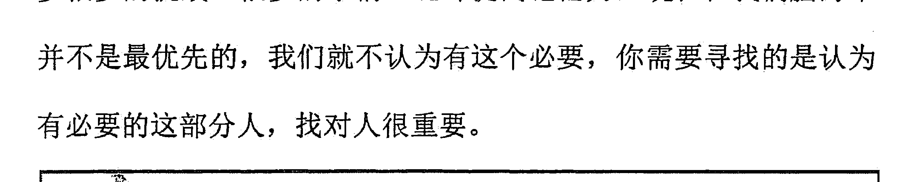

> > 《全球疯狂吸金》课程里说，我们的工作就是筛选认可的人！

一诺老师跟他说，尽管所有人都可以提高记忆力，但并不是每个人都愿意花钱购买你的记忆力培训或产品，其实真正有的潜在客户有：第一类是中小学生，因为他有很多东西要背、要记、要应付考试，他有压力，也许他愿意花钱去买记忆力培训；另外一个，也许是老年人，因为他要独立生活，他老记不住自己钥匙放在什么地方，所以他需要提高记忆力；第三类是中高层管理人员，每天面临这么多信息，要做报告等等，记不住。也许是这个原因，所以这三个市场是愿意花钱购买的。

但最愿意花钱而且量比较大的，有可能是中小学生。

> > 一诺老师说：如果想打入市场，你应该从学生这个市场切入，这些学生有这个问题、困难、困惑、痛苦，而且愿意花钱去购买这个产品。因为世界上最容易赚的钱就是女人和孩子的钱。

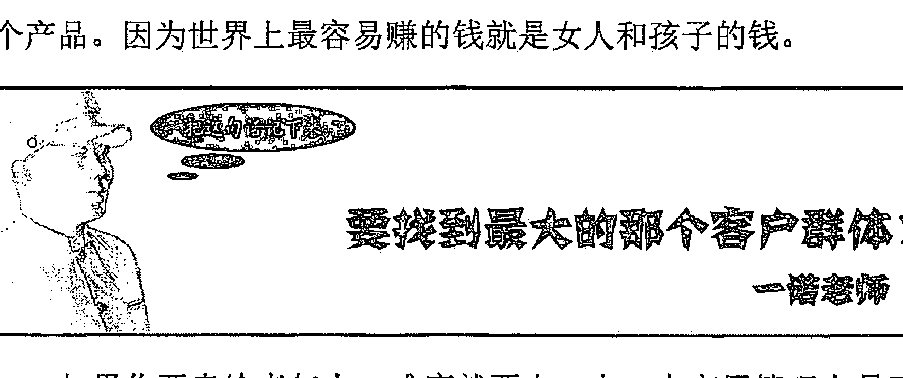

如果你要卖给老年人，难度就要大一点。中高层管理人员可能也有需要。这三个市场，尽管是卖同样产品，但你需要不同定位。

很显然，你给小学生上课方式和给大公司老总、副总上课方式一模一样，教他们怎么背唐诗，很显然，老总、副总不会感兴趣。

重要的不是你的产品，你卖的不是产品，没有人会对你的产品感兴趣。人们感兴趣的是你的产品给他带来的最终的结果。

《全球疯狂吸金》有讲如何设计爆款，爆款就是输出高价值？

什么是高价值？人们想要最终的结果，这才是高价值！

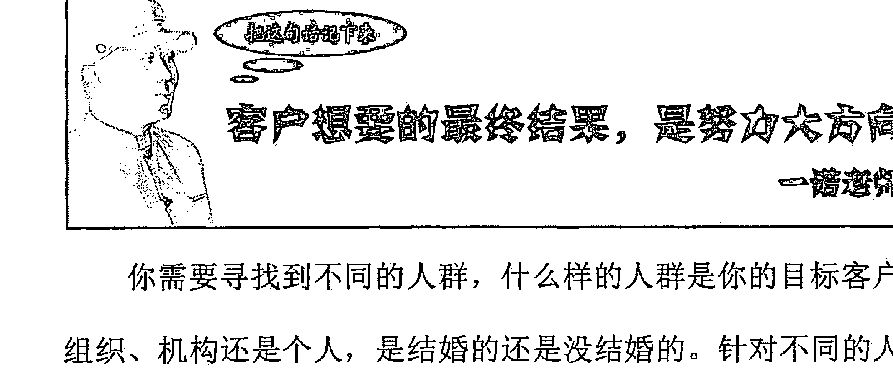

你需要寻找到不同的人群，什么样的人群是你的目标客户，是组织、机构还是个人，是结婚的还是没结婚的。针对不同的人群，决策的过程是完全不一样的。所以，你需要锁定这些客户。

我们都知道，如果自己和一个人说话的方式和另一个人说话的方式一模一样，很显然这不是最有效的，也许自己跟他说话，他很喜欢，自己跟他聊两句他很开心。但如果自己说话的口气、姿势一点不变的再和另外一个人说，可能自己就失去他了。

吸金是通过你的广告、通过你的视频、通过语音、通过网络，你要面对很多人讲话，但是要让他们感觉你在跟他一个人讲话。

因此，最好这些人有很多共同点，共同的需求，共同的生活挑战，共同的理念、信念，这样你的个性化的东西就不会太多，你的吸金才会最有效。一诺老师为何让你把人群细分，原因就在于此。

无论你通过什么媒体方式向大众宣传，但是要让他们觉得你是在跟他一个说话。就像一诺老师《猪买单》《全球疯狂吸金》都到达了这个境界，你不会觉得在看书，而是觉得一诺老师跟你一对一沟通，就好像坐在你旁边，因此你不觉枯燥的把几百页看完了。

用的词语都不一样，你对他们说也许有这个问题：他们会觉得你在胡说，我怎么会有这个问题呢？如果你的主张，一上来就说他有这个问题，他说我没有这个问题啊！神经病！客户就走了！

但是，如果你研究好了，这群人里面有百分之九十确实有这个问题，那事情就会解决。

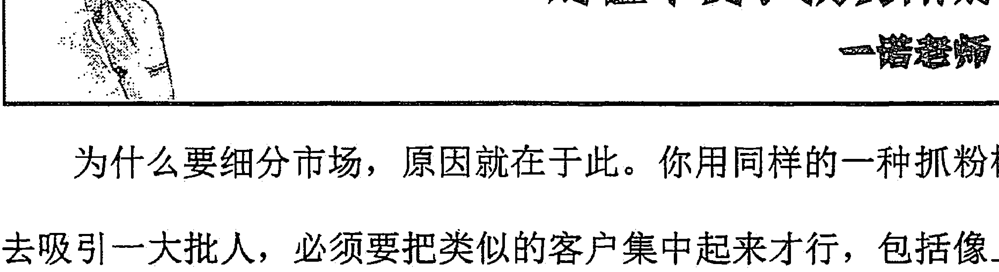

为什么要细分市场，原因就在于此。你用同样的一种抓粉模式去吸引一大批人，必须要把类似的客户集中起来才行，包括像上课一样，如果一诺老师把销售额达 10 亿的企业老总和创业的人放在一起，这个是不可能的。那 10 个亿的老总他想，我要去美国开拓，我要做品牌整合，我要做形象，我要融资，我要做这个，做那个。

但是对于创业的人来说，他关心的是，我应该找什么市场？我怎么能够不花钱？所以，你把市场细分是非常重要的。

首先是你要找的是什么样的客户。

第二是你到哪里去寻找这些客户。

研究客户经常会聚在什么地方，有什么共同爱好，这样你才能找到他们。如果你知道他们都喜欢读某一类书籍，上某一类 APP，看某一类电视节目，参加哪些研讨会，这些就是你的鱼塘。

你必须清楚到哪里去找到他们才行。一诺老师从来不主张一对一的抓粉，到马路上发传单，这种营销是过时的、低效的。

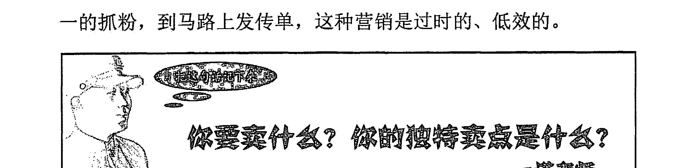

你最好是通过一批、一批、一批，通过鱼塘的方式去寻找，你必须想清楚他们聚焦在什么地方。这就是为什么很多一诺老师的弟子把《全球疯狂吸金》看 100 遍、200 遍的原因，曾有一诺老师弟子用这套方法 1 年时间，成功引爆了 5000 万用户的大鱼塘。

### 第4个问题：如何清晰盈利模式

你自己的独特卖点是什么？

然后你也知道到哪里去寻找你的客户。

但是下面一个问题是，你怎么使他们购买。

他们从不认识你，不了解你，到对你的一个标题感兴趣，怎么从这里第一步，一步一步，一步一步把他转化成一个购买的客户呢？

企业要生存和发展，必须拥有一套从抓粉到变现的技术，如果没有这个，最基本的盈利模式都没有解决。

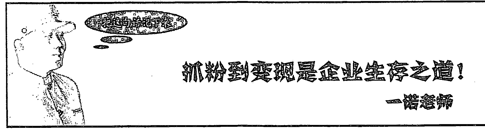

- 1. 第一，你没想清楚你究竟要卖什么；
- 2. 第二，你没有想清楚，没有锁定你最理想的客户；
- 3. 第三，你不知道你最重要的卖点是什么；
- 4. 第四，你不知道到哪里去寻找你的客户；
- 5. 第五，当一个客户来了，你是乱打乱撞，你没有一个系统的、程序化的过程，把他们从一个非购买者、潜在的客户，转变成一个购买者，整个的流程没有，那么你的盈利模式是不会有效的。

活着就是为了改变世界 愿景：惠及全人类 使命：帮助更多人实现梦想

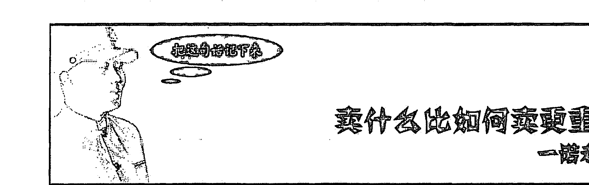

为什么叫引爆利润的前奏，就是有五个问题，你必须要想清楚。

- - 1. 你要卖的究竟是什么？
- - 2. 你的独特卖点是什么？
- - 3. 你理想的客户是谁？
他的个人组织、年龄、教育程度、家庭状况……
- - 4. 你到哪里去找到他们？
- - 5. 找到他们之后你有什么步骤，如何一步一步地把他们变现成客户？
- - 6. 提前准备好抓粉和变现的流程。

## 第二节：核心卖点的终极密码

接下来有一个概念是“核心卖点”，很多人在这里很困惑。

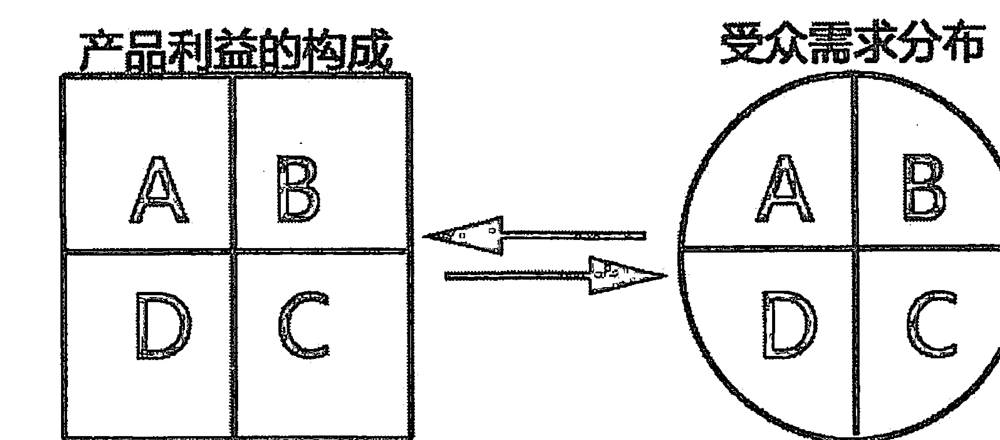

### 一诺老师核心卖点表

如上图。左边是产品利益的构成，右边是受众需求分布。

什么概念呢？你认为大家比较关心的，也许是价格，也许是服务，或者是其他的等等。

你的产品可能拥有 A、B、C、D 四种卖点，然后你到鱼塘里去找你的客户，你会发现很多客户需求不一样的东西，但大致差不多。

比如说，有一类他说 A 是最重要的，也许有一类他说 B 是最重要的，也有一类说 C 是最重要的。但其实说 A 重要的 B 并不重要，也许他给 A 七十分，其它他分别是十分、十分、五分。另一位也是一样。

就是说任何时候，你拿你的产品，你的产品有一些利益，然后去冲着一群人去抓粉，这群人的需求在一定程度上是相似的。

为什么聚焦，就是说聚焦的越好，需求就越单一，一诺老师希望你的聚焦，比如说有百分之六十、百分之七十都是认为 A 是最重要的，当然如果是百分之百是最好的，但通常的可能性没有这么理想。在这个时候你应该三个聚焦？

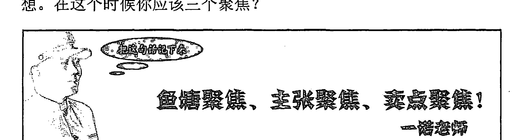

各位，当你有三种鱼饵，鸡蛋、蚯蚓或肉。同时这里也有三种鱼，很显然，这三种鱼对于你的这三种东西的兴趣是不一样的，有一种鱼喜欢鸡蛋，一种鱼喜欢蚯蚓，还有一种鱼喜欢肉。

你应该怎么钓呢？有几种方法：

- 第一种方法，你认为这里面的大部分鱼喜欢蚯蚓，所以你就拿蚯蚓去钓。 然后就不管他们，就完了。
- 第二种方法，是先拿蚯蚓钓，然后你给自己一个限制，如果四十分钟是你的耐心能够接受的，四十分钟没有吃，就把蚯蚓换成其它的去钩。但只要四十分钟有吃，钩上来了，你就接着钩，到四十分钟坚持住了，如果四十分钟都没有反应，那你就换鸡蛋，然后你说四十分钟有吃，就接着钩。然后鸡蛋不行了，再换成肉，然后也给自己四十分钟。

实际上你们仔细想想，这是一个非常有趣的内容。你现在假如说你的鱼塘是一个 APP，这个 APP 有 100 万客户，你在里面做广告，你的广告的标题可以强调三种卖点。你应该怎么去做这个广告？和刚才一诺老师说的钓鱼是一模一样的思路，你怎么去做？

如果你上过一诺老师《全球疯狂变现》的课程，你们应该知道，其实第三种方法可能是最有效的。

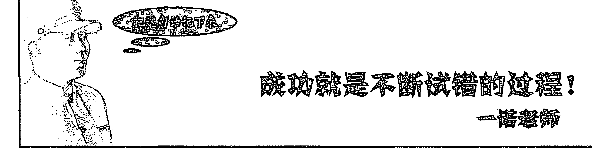

第三种方法：就是他把一个卖点强调作为标题，然后登一次广告只要赚钱，再登第二次，如果赚钱，再登第三次，直到盈亏平衡不赚钱为止。然后再换一个卖点继续做广告！

当然了，你还可以有另外的方法，在杂志、门户网站、APP 平台等，你可以用三种不同的方法同时测试。你可以一个做整版广告，另外一个做半版，第三个做四分之一版。

这些都可以测试，做一条也可以测试，方法有很多。

但是，一诺老师觉得如果你只有一种选择，最有效的方法实际上把最重要的卖点放到最前面。你在思考你的产品利益、卖点的时候，分析受众的时候，一诺老师希望你能够排出一个顺序来。第一重点是什么，第二重点是什么，第三重点是什么……

就连广告标题，都要给客户带来好处，没有好处，你很难吸引人。所以，你在考虑产品卖点，要排出一、二、三个重点。

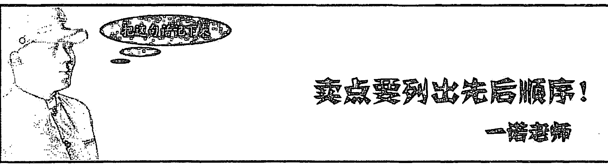

你说有时候，别人需要这个，有时候需要那个，但实际上一定是有一个是被大多数人认为是最重要的。

你需要首先推这个，如果你一定要测试，你首先可以测试这个。

## 第三节：把客户的梦中情人卖给客户

你现在有的产品是什么？

不要说现在的产品是保健产品，现在有的产品是工程，要描述的具体一点，是什么样的工程？做什么？

客户得到的结果是什么？

你的独特的卖点是什么？

在客户的心目中，为什么他应该选择你，而不是选择别人？

客户总是选择对他最有利的！

所以，你必须让客户认识到，你比另外一个竞争对手更能满足他的需求。你的独特卖点是什么？

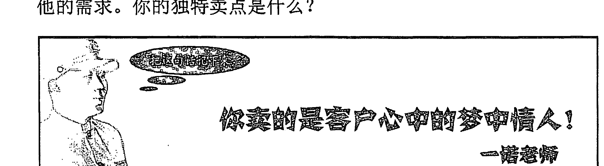

然后，你不要把你的注意力集中在现有的产品上，你的产品给对方带来什么好处，有空去看看《全球疯狂吸金》，对财富有个觉醒，对人生有个开悟，这样你会更容易明白一诺老师是如何“把你的梦中情人卖给你的！

## 改变世界商学·世界企业家的摇篮 《盈利的最高境界》一诺老师

这才是高手呀，我一直在研究一诺老师为什么不见面、不给我打电话、不给我发信息还能让我整夜整夜的失眠，最后花30万报名一诺老师的终极弟子！

你的目的不是赚钱，你的目的是满足你锁定的这群潜在客户的梦想。选定的这个方面的梦想。

《全球疯狂吸金》就是教你设计能够满足客户的梦想的产品和服务，以及通过什么渠道(鱼塘)找到这些客户(鱼)。

也许是自己生产，也许是做代理，也许是帮别人介绍，也许是帮别人推荐，有各种各样的方式，不一定都是要自己，你需要怎么能够把这种关系，这种信任，能够变成现金，而方式必须得有。

说一千道一万，你卖的是顾客心中的梦中情人！

只有一诺老师才有资格教你如何变现，因为只有一诺老师做到了！众所周知，一诺老师的变现能力是整个培训界一流的，一诺老师能把一本书卖到几百、几千，这是人类史无前列的！

之前《全球疯狂变现》线下课是 6.8 万，一诺老师为了帮助更多人实现梦想，就把这堂课变成书，真羡慕你们省去了几万块。

## 第四节：锁定精准客户

意思是卖给谁？谁是你的精准客户？

有的人是卖给渠道，有的人是卖给终端客户的、个人的。

但是卖给渠道的，一诺老师说了，你的渠道没有兴趣购买你的产品，你的渠道是购买你一套赚钱机器，然后他必须要向终端客户销售你的产品。

所以，你必须为你的渠道打造一套赚钱机器，产品只是一个很小的部分。中国有很多人自己都琢磨不出来怎么卖，然后就去圈钱说卖代理，这是一个极不负责任的行为。

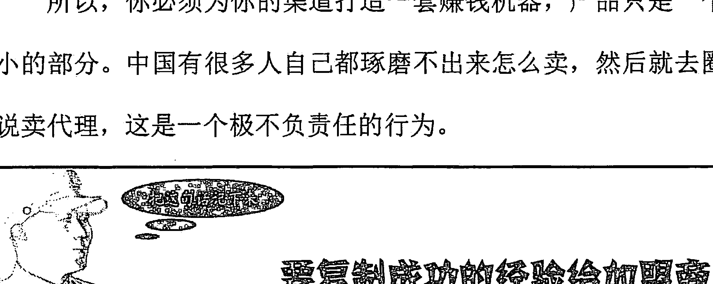

你可能收了一万元钱、收了两万元钱、收了五万元钱。但最后这些人做不起来，因为他不知道怎么做。

如果你的代理商他做不出来，如果他卖不掉，最后那他一定会后悔，那么你这个事情也做不下来。

其实不管你是做代理、做加盟或是特许经营，你自己必须要知道如何卖掉它，如果你自己不知道怎么卖出去，别人知道的可能性几乎没有。

无论是机构还是个人，目标客户的身份，如性别、年龄、职业、教育程度、收入、家庭构成等，非常重要。

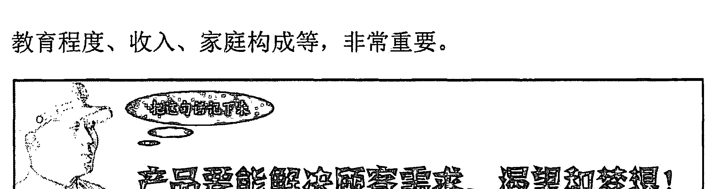

接下来是目标客户的需求、渴望和梦想。如果你知道他的渴望，知道他的梦想，你就能更好的为他提供价值，你就能更好的销售，因为人的一切都是围绕他自己的梦想、痛苦和渴望而做出选择的。

我们每天都要做出选择，我们的选择是能不能帮助我们实现梦想，或者能不能帮助我们减轻痛苦。如果你沿着这个方向去思考，你的产品能够帮助他实现梦想，能够帮助他减轻痛苦，那么你就更容易销售出去，然后不要更多的困难、挑战和痛苦。

一诺老师的弟子都知道，驱动了一个人行为的力量只有两个，一个是向梦想靠近，另一个是减轻痛苦。

一诺老师弟子内训中曾经系统的说过：人为什么会购买，购买是怎么被驱动的？我们每个人都有不同的人生，家庭出身、背景、读过的书、接触过的人、干过的事都不一样。

我们熟悉的环境、生存的环境不一样，这就决定了我们有不同的梦想，我们就会产生很多不同的，属于每个人自己的版本。

梦想之所以成为梦想，是因为它没有实现。所以，有了梦想，你就会有挑战、困惑和困难。

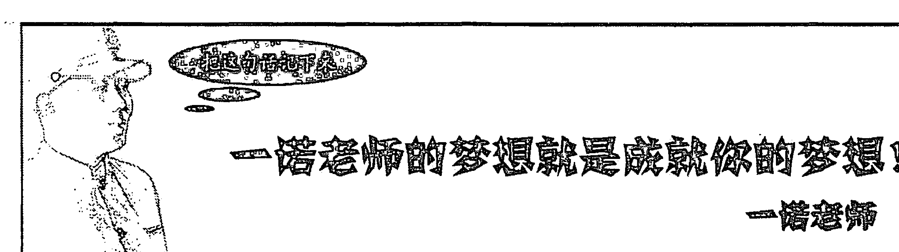

有了梦想和挑战两者的不协调，然后就产生了你的计划，如果你确实对你的梦想非常的重视，你一定要实现梦想，然后你就想办法去克服这些困难和挑战，你有自己的方式、计划去战胜这些挑战。于是你有了这个计划你就认识到，你需要某些资源、需要某些产品、需要某些想法、需要某些能够帮助你的东西，于是你就产生了购买的动机。

产生了购买的动机，下一步就是购买。

因为购买能够解决他的问题，能够帮助他实现梦想，解除他的痛苦，或者解决他的困惑，最后让他的人生有一个升华。

请问这种感觉好不好？

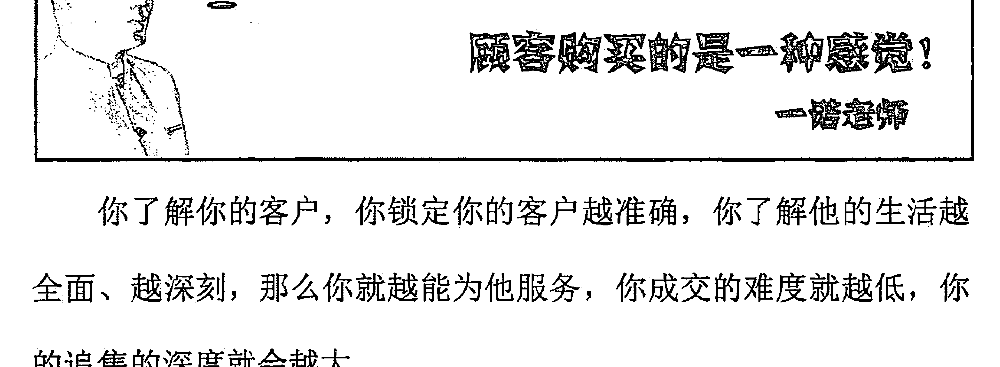

你了解你的客户，你锁定你的客户越准确，你了解他的生活越全面、越深刻，那么你就越能为他服务，你成交的难度就越低，你的追售的深度就会越大。

这些是相关的，《全球疯狂吸金》书中反复强调，你要想清楚你的客户的需求就是这个原因。

## 第五节：准客户在哪个鱼塘

接下来就是何处找到潜在客户。去哪里找到他们，他们究竟在哪里活动，在哪里聚集，在哪里聚会，阅读什么，观看什么，尤其是在你没有走进他的生活之前，他是怎么满足他的梦想的。

根据正在整理的一诺老师2003年《全球疯狂吸金》现场录音中讲到，有三种可能：

- 第一种可能，他凑合着过，他满足不了，他也不知道他在痛苦的寻找，他在寻找的过程中，他很痛苦，他想解决，但是没有找到可行的选择，他还在痛苦；
- 第二种可能，他在买一个替代品，不是最佳的，但是他在买；
- 第三种可能，就是说他决定，他已经失望了，他觉得这个东西没有用，他不想解决了。

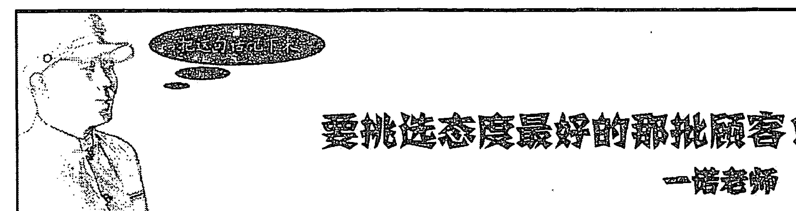

一般来说有这几种可能。你最好的客户是什么呢？

是哪些痛苦是必须要解决的，而且必须马上解决的，但是没有解决方案，或者是解决方案都不是最好的，很少解决的方案。

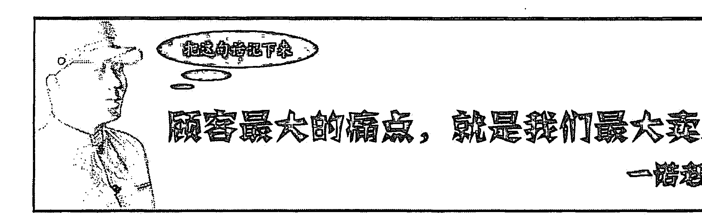

如果能有这样的客户，那么你的产品就会更受欢迎。

然后何处找到潜在客户，就是别的鱼塘、合作伙伴有哪些？

然后各种媒体，什么样的媒体，其他可能的渠道，也许是通过活动或者其它的方式去吸引你的潜在客户。这是《全球疯狂吸金》三天三夜课程才有讲到，这里时间有限，就不能过多的论述。

## 第六节：如何在鱼塘捞鱼

前面的问题解决了，接下来的一个问题是怎样让你的潜在客户购买呢？就是你有没有完整的盈利模式。

一诺老师希望大家想清楚你现在是怎么盈利。

一个潜在的客户是怎么来的？

大部分的企业莫名其妙的感觉我有个零售店，我就开到这里，客户一不小心就撞进来了，撞进来了我就试图卖他点东西，卖不掉了，就拜拜了。

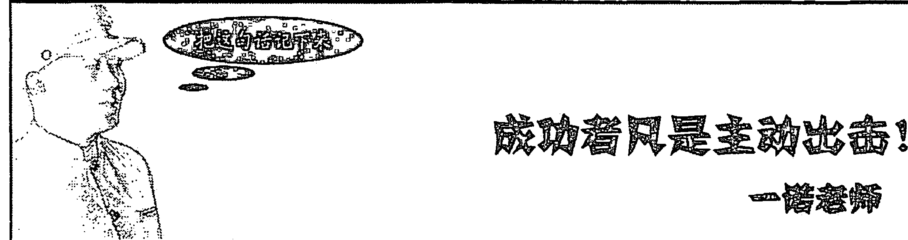

大部分的企业都是在守株待兔，包括很多的餐馆也是这样。

为什么餐馆的死亡率是最大的？

大部分人开餐饮，认为我租一个好的地方就行了，然后就是被动的等，根本就没有做什么吸金动作。

所以，一个很重要的因素，就是你得有一个吸金的流程，你得知道到哪里去抓粉，你抓来了客户之后，你得知道如何变现，然后维护关系、增加信任(养鱼)，最后怎么不断的追售，然后你的抓粉主张是什么，你的成交主张是什么，你的追售主张又是什么。

一诺老师《全球疯狂吸金》课程里讲到过一个很重要的概念，是其它老师从未涉及到的，叫“主张”。

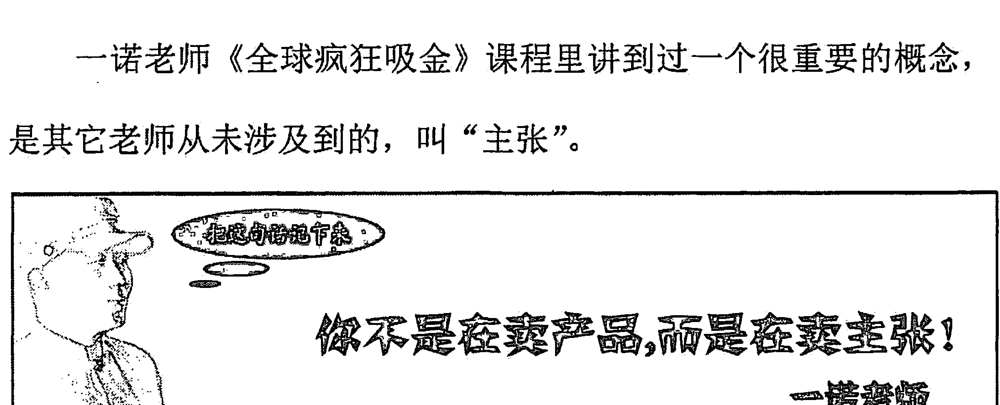

比如说卖手机，一种方法是，我这个手机三千元，这是一种销售方法。

认为我是在卖场，这个华为手机你们看到了吗？三千元，后最新的这个功能……那个功能，你给我三千元我给你手机。

另外一种方法是，这个是最新的，然后屏幕很好，可以看电影、游戏、购物、娱乐、听歌等，你拿去用一个星期，如果你觉得这不是你想要的，不是最好的、最能满足你需求的，你拿回来退给我，然后三千元钱我退还给你，一分钱不要。

很显然，你需要打造一个主张，主张是销售，你销售的永远不是你的产品，而是你的主张。

### 主张是什么？

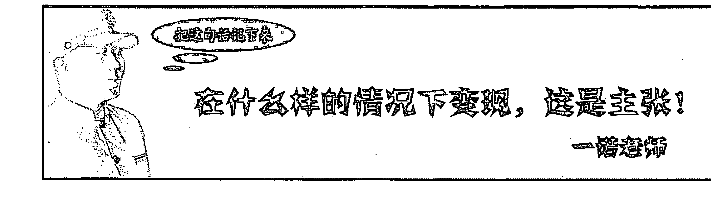

所以，一诺老师在接下来的课程里，会花很多时间教你怎么打造你的主张，让你的主张很有吸引力。

现在就跟着一诺老师的节奏，把主张一步步的解剖。

## 第七节：锁定客户终身价值

一诺老师无数次强调：后端最重要。后端一个很重要的因素，是我们要像清楚我们客户的终身价值是多少。

你现在的盈利模式，也许你从来没有做过后端变现，从来没有有意地去打造后端(养鱼)。

比如说你卖保健品，没有刻意地去打造后端(养鱼)，但是客户已经进入你的后端(鱼塘)，你没有任何有意识的去系统化后端，在这样的情况下，客户终身价值有多少？都浪费了！

如果你能明白《全球疯狂吸金》课程的精髓，那就是客户终身价值，就会重视贡献价值(养鱼)这个环节，很多互联网平台，花97%的时间精力来贡献价值(养鱼)，只需要3%的时间变现(捞鱼)。

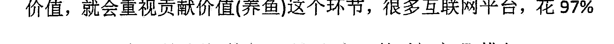

如果你是一锤子买卖，卖了三千元的东西，卖完就拜拜再见了！

那么就是三千元的问题，但是你找到三千元钱的一个人需要花很多的成本。

客户的终身价值，就是一个潜在客户一旦成为你的客户，在他的一生中会购买多少，每次平均购买多少。

你也可以算的比较保守一点，他们平均购买多少，平均每年购买多少次，然后持续多少年，一诺老师主张用平均法。

如果你是一个保守的人，你也可以采用一个保守的方法来计算，这样你就知道每次进来一个客户，你别看到他现在只购买了一百元钱，你要看到他在未来的三年中要给你送来一万八千元。

你要看到更多价值，只有这样你的免费决定才能更符合客户终身价值的需求。提高客户终身价值是一个非常大的盈利杠杆。

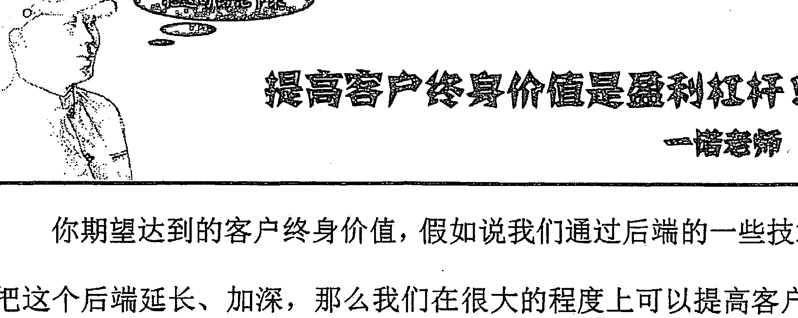

你期望达到的客户终身价值，假如说我们通过后端的一些技术，把这个后端延长、加深，那么我们在很大的程度上可以提高客户的终身价值，那么我们的盈利就有了更多发挥想象力的余地。

## 第八节：引爆利润心法

你需要先回答以下几个问题，你要找出你认为最好的答案：

你现在的状态，你现在的产品和服务是什么？

你认为你的独特卖点是什么？

你认为客户为什么要选择你？

千万不要说质量、服务，质量和服务是太虚的东西。

你说我的质量很好，质量是什么概念？

质量是持续你的产品最耐用，还是你的产品能够在最短的时间内发挥作用？

什么叫质量？就像卖感冒药，是你的感冒药吃进去十秒钟就发挥作用，还是你的感冒药吃进去可以管三天，还是其它的指标。

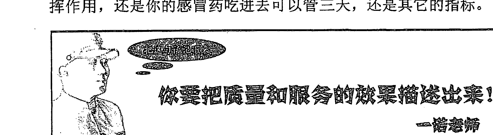

什么叫服务？是因为你的产品如果出现问题你可以换，是因为你的产品如果出现问题，你会在第一时间派人去修理，还是你的产品出现问题，你可以退换货，还是其它的方式。

15 年前，一诺老师弟子的有一个公司，他卖什么？

他卖的是一个长途电话的通话服务。他的独特卖点是保证音频质量的情况下，省钱是它的最大卖点。

他的客户最终买的是能省钱。所以他卖的是一个省钱的特征。

他卖给谁呢？卖给那些钱不是很多，并且不住在家里，但是经常需要给家里打电话的人。

所以他找到工厂的那些工人，一个月两三千多元的收入。这些人就是他的主要核心的目标客户。

那么，他到哪里去找到这些目标客户呢？就到工厂，然后通过工厂里面有影响的人，来帮助他找到这些潜在的客户。

怎样让他们购买呢？先送一个十分钟免费通话，然后进行一个追售，他通话之后，当场再追售，后期继续追售。

## 第九节：如何成为盈利模式高手

我们生活中的每一个积累，就像大脑中的一个点。你的大脑里有很多的点，但是创意就是把这些点连接起来。这些点可能是你今天读一本书，明天见另一个人，后天去另外一个地方。这些事件之间没有关联，它是独立的事件。但是通过某种机制，这些点突然在一瞬间连在了一起，就产生了创意。

为什么会有一个不断的突然会点亮的这种感觉，就是因为这些点连接在了一起。自己生活中本来已经有很多经历，但是从来没有这么联系过。我们平常在生活中会有突然顿悟的感觉，就是把以前认为没有用的东西突然以一种新的角度、新的方式把它连起来了。

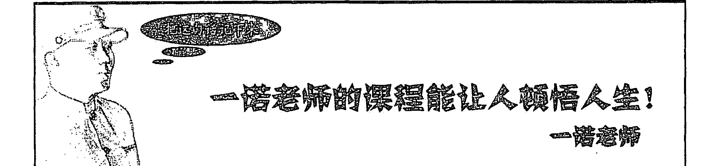

就像你看到一诺老师盈利模式导图，杠杆借力之后，周围有很多的资源。你以前没有开悟看不到。

因为你以前看待问题的方式，从来无法把这些点连起来。

随着我们看到不同的案例，不同的想法，这些点都会连接起来。

这就回答了一个问题，就是重要的不是知识，知道只是一个点一个点，你知道某一个事实，一点用都没有。

让这些点和其它的点连起来才有用。尤其是能够解决你现实生活中的一些问题，要么抓粉，要么变现，要么追售，或者是商业计划的改变等等，只有到这种程度，只有到这个时候，你积累的这些知道才能够真正的发挥作用。

> 把这句话记下来
>
> 重要的不是知识，是知识之间的关联！
> ——一诺老师

爱因斯坦说过，想象力比知识更重要。

想象力就是想象把这些东西连起来。

随着一诺老师课程的案例推进，看到不同的案例，尤其是前面一诺老师分享了很多奇特的盈利模式。

盈利模式很独特是因为它的变现方式很独特。

你们从来没有想过，带着这种思维你们再看周围，在现实生活中有很多的吸金大师天才。有些吸金大师可能经过训练，有些吸金大师可能是经过老师的指点。有很多精彩的盈利模式，只要你们注意去看，就会有！大部分吸金方法实际上是垃圾！

所以，你一定要注意观察，注意思考。

之前有人问一诺老师如何成为吸金大师。吸金大师一个很重要的标准就是要悟透《全球疯狂变现》课程精髓。《全球疯狂变现》是任何业务之间的几个必然联系的部分。悟透了《全球疯狂变现》，你就相当于多了一只眼睛。更恰当的比喻就是这个世界是一个三维的世界，但我们通常都是戴着一副二维眼镜。

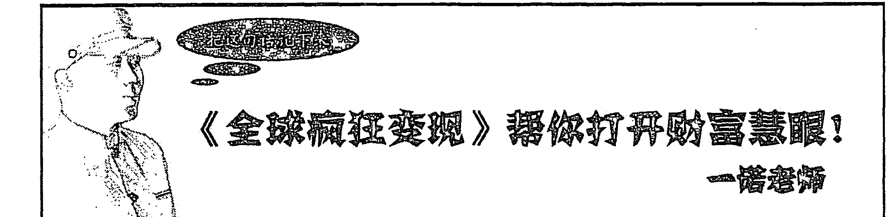

我们看到很多东西，很多认为解决不了的问题。

当戴上三维眼镜的时候，你会发现这些问题其实都可以解决。

当你戴上三维眼镜会看到很多原来看不见的机会。

相信大家都看过三维电影，当你不戴三维眼镜时，你看到的效果就完全不一样。

上完《全球疯狂变现》相当于给你戴上了三维眼镜，会看到更多机会。

更多机会，更多解决方案。

为什么一诺老师能够为弟子解决很多的案例？

为什么一诺老师能在课程现场设计盈利方案、股权方案、吸金方案、变现方案……免费方案？

很重要的就是因为一诺老师思考了很多，经历了很多。

上过一诺老师的线下课都知道，一诺老师能够现场回答学生的任何问题，从蓝图设计、吸金模式、变现模式、盈利模式、招商路演、资本上市等，几乎企业的所有问题，一诺老师都可以现场解决！这就是为什么一诺老师的课程总是爆满的真正原因！

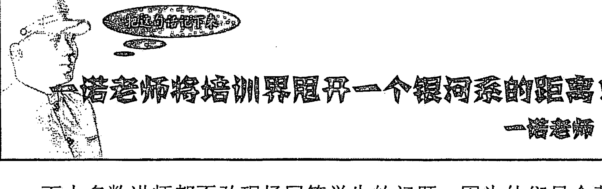

而大多数讲师都不敢现场回答学生的问题，因为他们只会背稿子！仅仅为了忽悠学费而已，没有真才实学！更没有实操经验！

其实我们在生活中有很多这样的案例。

例如别人解决不了的问题，例如你看到一个好的商业构思，你觉得这个不错，好在什么地方？他的真实意图是什么？然后怎么样可以更好的改进？我们看到一个好的项目也好，广告也好，营销活动也好，我们要想清楚他背后的故事是什么。

例如信息的案例，很显然，如果他的目的仅仅是卖一块钱的电影票，那是没钱赚的。那么他的目的是什么呢？他不是 OK，神州行的朋友们，一块钱可以看电影。就算一块钱他能赚钱，他能赚多少钱呢？那他真实的意图是什么呢？一诺老师相信如果你登录他的网页，可能你会发现一部分秘密，为什么他能赚钱。对吧？

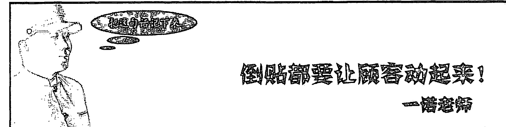

一个人的惯性是很大的，迈出第一步的时候总是非常困难的。

盈利模式首先要解决，怎么能够让客户很轻松的迈出第一步，然后第二步就更加容易了。

比如说变现，你让别人把钱夹从口袋里掏出来的动作是最困难的。一旦他掏出来了，他会继续掏出 10 元、20 元、50 元、100 元，后面要容易的，为啥？因为惯性！

你的主张怎么能够让别人决定？

让他把手伸进口袋，把他的钱夹拿出来，这个难度远远超过现在让他买 150 元钱的东西的难度。

所以，你就必须要把客户的第一个动作做得简单。

一诺老师的弟子做过一个实验。谁都知道洗车店，洗车店他们有积分卡，洗 10 次免费赠送 1 次。

如果你洗了，他会发给你一张卡，你洗一次车他给你盖一个章。

然后到第 10 次洗完了，下一次也就是第 11 次是免费的。

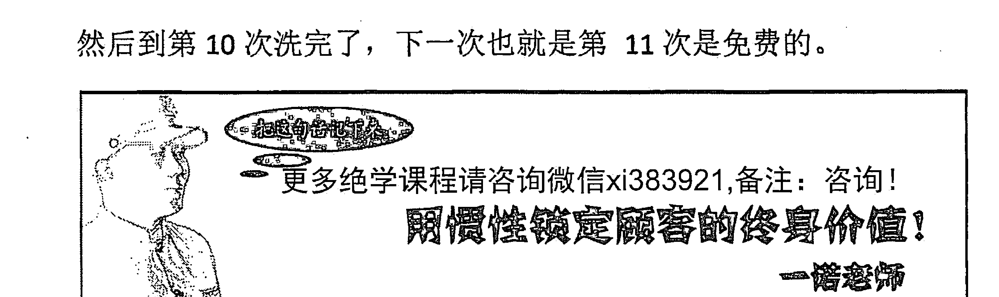

我们在生活中可能很多类似这样的，发现有很多人在用这样的卡。也许理发店，也许是其它各种各样的店在用这个东西。但是有多少人会坚持到第 10 次呢？很少。我们有一个客户也在用这样的卡，其实最终不到 10% 能坚持，只有 8% 的人可以坚持到第 10 次。真正坚持到第 10 次，然后要免费的第 11 次。如果他坚持不到第 10 次，其实你的项目是失败的，因为他不会累计，对不对？很多人可能到第二、第三次就停止了，就放弃了。

我们决定要对这个进行一个改变，一个改进。说你洗 12 次我们就免费赠送 1 次。如果第 10 次都不来，第 12 次就会来吗？怎么可能呢？其实很简单，一诺老师将模式改进之后是发给他一张 12 个印的卡，但是先给他盖好了两个印，就是跟 10 次的是一样的。

结果发现 30%－40% 的人会完成，会坚持到第 12 次。

为什么？就是你帮他已经迈出了两步！

他认为我已经走出两步了，第一次已经盖了三个章，所以他完成的可能性就增大了。人性是如果你已经走了一段时间。

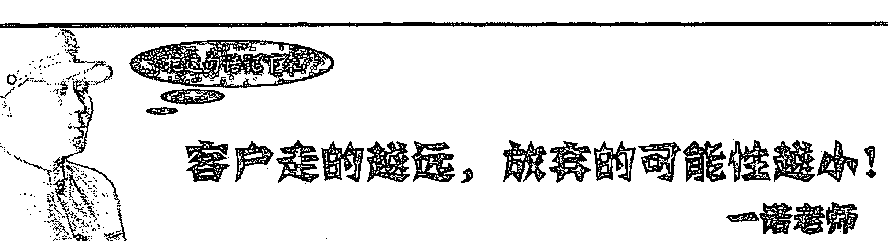

例如围棋培训，你说到这里上 10 次课多少钱，但是你给他一个前两次课免费的零风险承诺，和没有这个零风险承诺是完全不一样的。当然了从变现的角度，他体验过两次之后，他才能够知道你的价值。他体验的越多，得益的越多，他的欲望就越大。

你需要给他机会，让他认识到价值，也是给机会让他往前一步。

像一诺老师免费课程一样，要有这个自信，让别人体验。

18 年前一诺老师订了一套杂志，这个杂志非常贵。一本杂志大概 30 页，加一张 DVD，价格是 300 美金一个月。

但确实很好，这个杂志确实教很多新的想法、新的思想。

他的主张很简单，前两个月免费赠送给你。

不仅如此，他还设计了一个非常好的夹子，夹子上面标有 1 月份、2 月份、3 月份……12 月份，通通免费赠送给你。

然后他说你看到没？

1 月份和 2 月份的杂志我已经给你放进这夹子里去了。这时候你弄个夹子放在这上面，其实你随时可以停止订阅的，但是正是因为有这个夹子，很多人就停不了订阅。

**这就是一诺老师在《全球疯狂吸金》课程说的消费惯性！**

一个非常简单的改变，却有很好的效果。所以表面上他好像是花了这个钱赠送给你一个免费的夹子，但实际上，大大增加了他的客户继续走下去的概率。

有很多很多这样的例子，可能你第一次看到他不以为然，但实际上里面有很多的道理。

## 第十节：破解人心灵魂密码

如何成为吸金大师，就是你要观察，人性是共同的，但是表现的方式是各种各样的。就像学建筑的一样，力学的原理可能并不多，但力学原理表现的形态太多了。

人性也是一样的，但表达的方式不一样。刚才说的积分卡的这种方法，你们很多人都可以用，但是你得思考怎么去用上它。就是说怎么帮助客户迈出第一步。

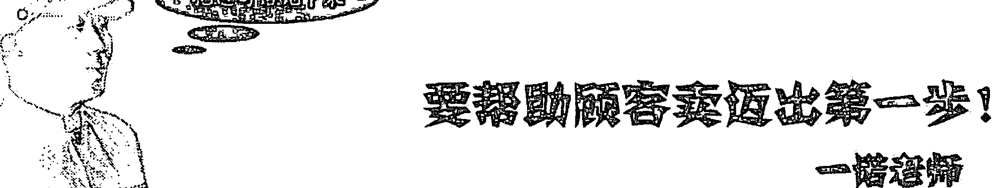

举个例子，如果你让客户从现在坐火车去上海，你对你的客户说你去火车站坐火车去上海吧，可能很多人都不会去。你对你的客户说我帮你买好了去上海的火车票，明天上午 10 点整出发，你去吧，可能有更多比例的人会去。你对你的客户说明天我陪你去火车站，可能性又更在一点。你说我不仅陪你去火车站，我还陪你一起上火车，然后走了一站之后你下车了，那他去的可能性就更大了。

你怎么能够帮助你的客户向着他能够受益的方向前进，迈出他的第一步。不要指望他自己琢磨清楚怎么去走第一步。

很多人第一步是不知道怎么走的，所以你需要帮助他往前走。不管你们做任何产品，都可以运用这种方法，这个人性。

比如说你卖猪皮也可以用这个方法。第一次如果他不买，有很多原因，不一定是价格的原因，也许是不知道怎么使用，或者是其它的原因。你说前三次我派人来辅导你，你只要进三批货，我派人一直辅导你三天，那么他接着走下去的可能性就更大了，这是一样的，对吧？

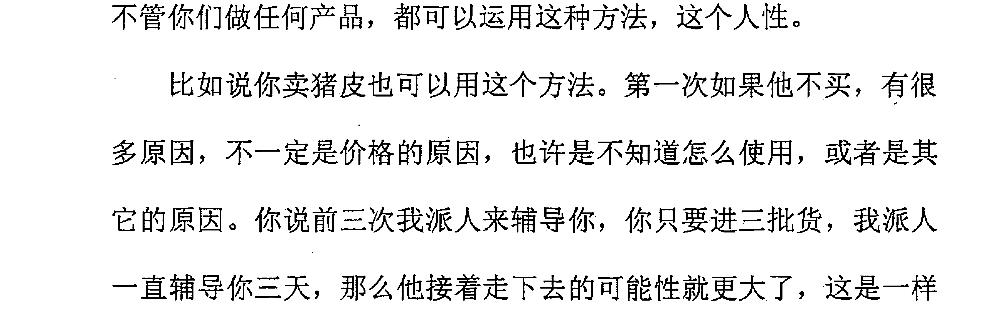

从现在开始，你应该意识到做企业人性是非常重要的，没有人性根本就没有吸金和变现。

伟大的梦想教练一诺老师说过，其实企业只有吸金和变现是利润，其他都是成本。如果你没有吸金（找对市场、打造爆款、整合鱼塘、养鱼……），就没有客户（鱼塘）。如果没有客户（鱼塘），其他的都没有，只有客户（鱼塘）才有价值。

从现在开始，大家一是要悟透一诺老师《全球疯狂吸金》课程精华，另外要注意观察，要不断改进自己。

大家也一定要不断的研究新的东西。

你的赚钱机器在动，有一些已经在赚钱的吸金方法，同时你得有一些备用，经过测试，每一个企业都应该至少有一部分钱用来测试一些新的吸金方法，新的变现概念等。

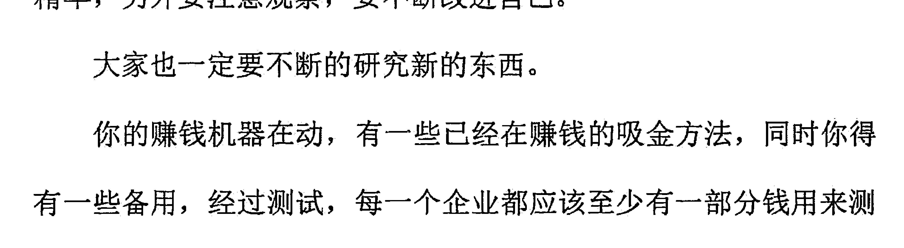

比如说每个月花多少钱来测试一些新的吸金技术，也许是你认为很疯狂的方法，但是你不知道结果会怎么样，万一突破了呢？对吧？如果你每个月用一部分钱去测试一些全新的东西，在小范围内进行测试，万一有一个全新的突破，那就不得了了，对吧？比如你做健身房的，你可以做某种主张，比如说一个月和三个月的，对吧？

或者说只要你现在加盟，再买一个就送一个，或者是其它各种各样的疯狂的想法，也许是跟某种你从来没想到的渠道（鱼塘）进行一次合作。你的概论可能就测试 10 个（鱼塘），全只要有 1 个（鱼塘）成功，你就已经非常成功了，下一步只要放大就行了，只是你不要投入太多的钱，你得把握好这个投入资金的比例。

以上内容摘自于一诺老师 2003—2010 年《全球疯狂吸金》课程内容，总而言之，你要最少有两套以上盈利模式：

- 吸金大师要有一个正在赚钱的盈利模式；
- 吸金大师还得有好几个备用的盈利模式。

# 第五章: 改变的终极密码

## 第一节：不可抗拒的成交主张

不管是你的抓粉、变现还是追售，主张都是一个非常重要的概念。你永远不要销售产品，你要销售主张。你的主张有没有吸引力，对方能不能拒绝，是你成功的关键。

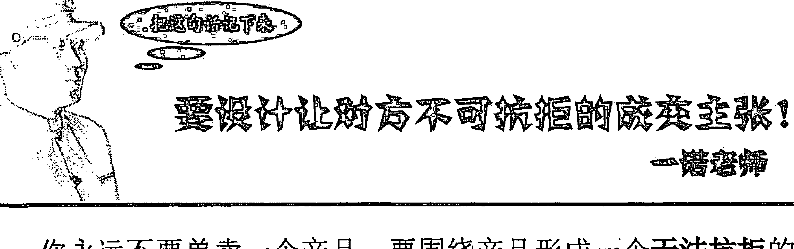

你永远不要单卖一个产品，要围绕产品形成一个无法抗拒的主张。我们去观察，不管到网络、电视上……其他的媒体，一诺老师总结最一套公式，这套公式可以让客户立刻按照你说的去做！

1. 第一，给什么？你给我什么？你的主张要产生某种作用，你要给我什么？你要不给我什么就想让我做什么是不可能的，对吧。
2. 第二，做什么？就是说，好，你的广告、你的传单说了给我什么，但是我要做什么才能得到你给我的这个东西呢？
3. 第三，为什么要马上做？为什么我现在必须加你微信？为什么我现在必须打电话给你？为什么现在必须到你的学校？为什么现在必须得到你想要的报名……

任何时候你的宣传、你的广告、你的抓粉，如果没有回答这三个问题，你的主张都不会成功。一个很简单的动作，你都需要解释清楚你给对方什么，你要对方做什么。

你说下星期四我举办一个生日 party，我们在深圳最好的旋转餐厅定了一个位置，届时会有很多明星到来，可能有你最喜欢的明星，从来没见过的。你现在需要加微信 12345 预定。但是那里只能容纳两百人，但我估计有五百人要参加，所以请你马上加微信预定。

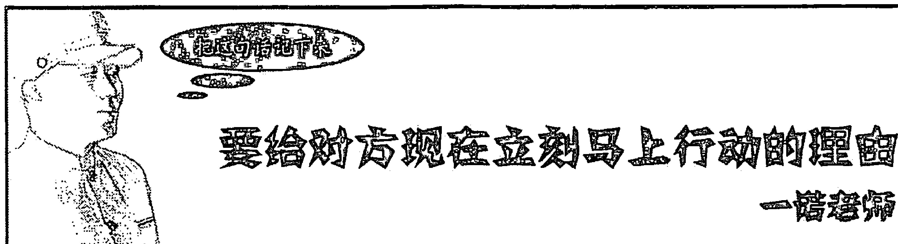

- 给什么？旋转餐厅与明星一起的晚会；
- 做什么？加微信预定；
- 为什么要现在做？因为有很多人想来，我们只能容纳两百人。
- 你的赠品是什么？比如说我们要送净水机。

你可以这样说：我们有一种全新的净水机，我们想免费赠送给你做一个测试。因为是测试，所以我们只能送有限的量，很简单，我们送一百个客户为止。你只要加微信告诉我们你公司的名称、地理位置，然后我就会给你寄过去。

- 给什么？给净水机；
- 做什么？加微信；
- 为什么马上做？只送一百个人，先到先得，马上就没有了。

任何时候，你跟客户的沟通必须是这个公式。这个公式非常重要，只要按照这个公式，你就起到了你真正的吸金的目的。

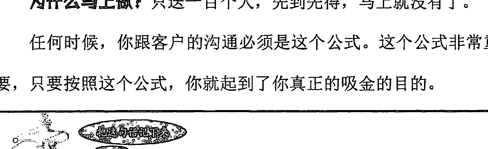

比如听一诺老师的音频，为什么大家会加微信或公众号？

### 一诺老师三步让粉丝听话照做的催眠公式

- 给什么？有一个一诺老师没有讲完的秘密（答案）。
- 做什么？你要加微信或公众号；
- 为什么要马上做？心里有疑问睡不着。

所以，你所有的吸金都必须回答这三个问题：

很多人的主张可能没有回答这三个问题，他从来不说清楚给别人什么东西，价值在哪里，为什么很有价值。没有说清楚，很模糊，人家不知道自己得到什么，一切都免谈。

另外一个，他需要做什么？有很多人，把微信号往那一写，就指望别人去加他微信。一诺老师做过很多实验，你要求别人做的什么越具体越好，一定要具体，不要说把微信号码往那一摆就指望别人去加，别人不会加的。

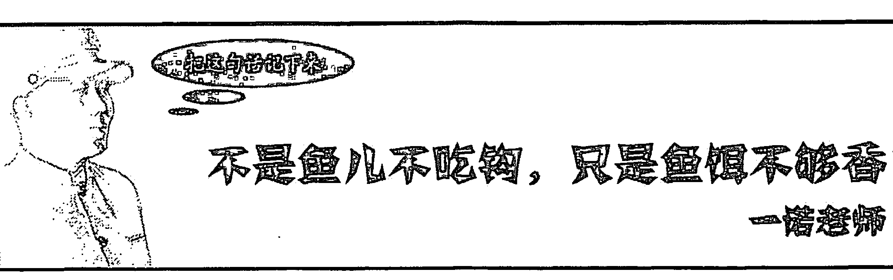

一诺老师做过测试，如果我们说“请马上加微信 11111 预定你的位置”，然后加微信的机率就会更高。然后一诺老师再做的测试是“请马上加微信，告诉微信客服你想预定什么什么培训的名额，并说明为什么”。更多绝学课程请咨询微信 xi383921，备注：咨询！

你不仅要告诉他要马上加微信，然后你还要告诉他加微信怎么说，一诺老师研究发现，有相当多的人加了微信不知道怎么说，说什么。不知道大家有没有这样的粉丝。

广告一登，电话有的人确实会打过来，或加微信等，但是打过来电话或加了微信，他不知道怎么说，然后半天不知道怎么组织语言。那么，有很多时候正是因为这个原因，他就不去打这个电话或加你的微信。

所以，你让他的动作越容易、越具体越好。“请马上加这个微信”，这个在他头脑是一个很具体的动作，对吧？他无意识的就去做了。如果你把微信号往那一入，就指望他去加，这个成功率就很低。

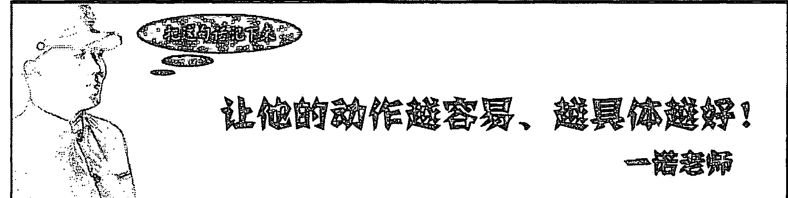

很多人的广告就是一个画面，在那里一闪一闪的。一诺老师弟子做过测试，没有做这些一闪一闪的画面，就是一个很简单的背景，标题是“如何在 2019 年多赚 100 万”，一诺老师弟子进行过测试，这个就很清楚。一诺老师的弟子做了另外一件事情，在标题的下方有一个括号，“（点击此处见策略）”。结果点击率翻了三倍。

有人说谁都知道这个点击处，错！

“点击见策略”这么几个字。你告诉他，第一，点击，结果就不一样。所以你们做广告的时候，做电话广告的时候，一定要把要对方做的动作说清楚，越具体越好。

你看一诺老师写的信，一定要“请马上加微信”，“点击此处”或“马上点击此处”。不要指望你放一个网址在那里，别人就会点击，不要指望你放一个微信号码人家就会加。

请于什么什么之前加微信，和我们的工作人员或者是和张老师或李老师确定你的报名，效果完全不一样，你给的越具体越好。

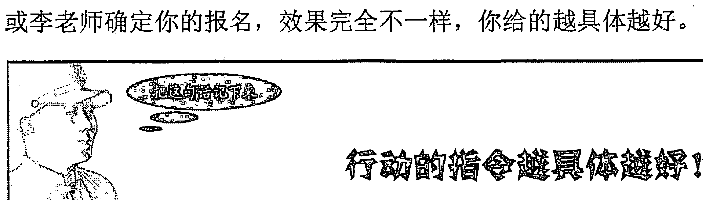

作为吸金大师，是必须要解决这些问题的。

一诺老师现在要谈的是“给什么”这一块。也就是你的主张是什么。你记住，任何时候人性就是交换。你给我什么，我给你什么。

你让别人要做的事情，你要给予别人价值。不管你是给别人一个免费的东西，还是你让别人做一个简单的点击动作，不管你是让别人加微信，还是你让别人给你 1000 块钱、2000 块钱。你都需要把“给什么”说清楚。给什么永远不是产品，给什么是主张。

你主张在什么样的情况下，包括什么样的价值。

你给我什么样的价值，在什么样的情况给我这个价值。

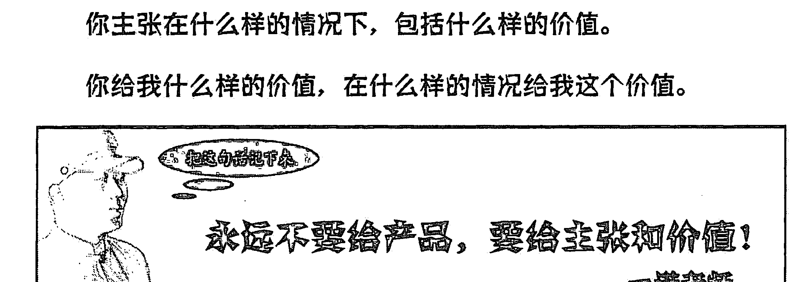

> 永远不要给产品，要给主张和价值！
> — 一诺老师

我们经常会看很多人发信息进行销售，其实在信息中提出销售，什么降价百分之多少，打几折，这个东西没有任何价值，别人不会有任何的响应。仅靠信息里几十个字是不可能变现的，你需要把它作为一个抓粉，你的目的不是让他决定要不要购买，你的目的是让他决定要不要去获得一个他无法抗拒的东西。

让他给你拨打电话咨询，你就有足够的空间，去说服他采取另外一个动作。他与你本来就不认识，所以你需要让他采取一个很轻松的、很小的动作，这是关键。

一诺老师 17 年前曾经做过这么一个实验，卖 398 元一本的图书。做的是一个整版的广告，这个广告大概有五万人阅读。通常搞定百分三的读者，也就是大概 1500 人，也就是说他的整版的广告直接卖 398 元的图书，通常会有百分之三的人响应。

## 《盈利的最高境界》一诺老师

一诺老师就想怎么能够把这个东西改进，一诺老师就把这个标题进行改进，把标题改的更有吸引力，让成交主张更有吸引力。

一诺老师准备分两步走，什么概念呢？

登一个四分之一的广告，不去直接去卖这个图书，然后我们把这本书的一个章节的内容抽出来作为超级赠品。

这样的话，就会有 15000 人向一诺老师索要这个超级赠品，然后一诺老师通过快递的方式，因为只有 15000 人，这个成本很低。

同时这 15000 个潜在客户的质量是非常高的，所以这样一诺老师通过快递的方式把这个超级赠品给他寄过去，但同时在这个报告后面加了一封长的销售信，再卖这一整本书！

超级赠品是为争取一次成交的机会！

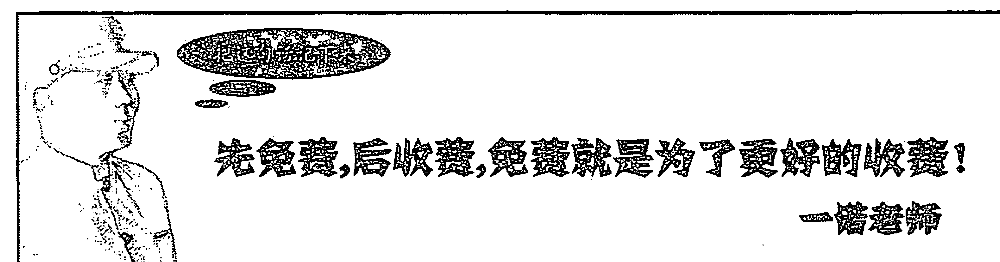

他看到的这个超级赠品非常精彩，但它只是这本书的一部分。

所以现在你可以以 398 元的价格购买这整本书。

然后一诺老师再给你 30 天的零风险承诺，你看完之后如果觉得不值，你可以随时退。

当然一诺老师的弟子在美国做就可以更简单，就是你把支票寄过来一诺老师的弟子 30 天不存你的支票，30 天之内的任何时候你觉得这个不值，你就把你的支票取消了，然后一诺老师自然就拿不到钱了，你如果不取消，一诺老师的弟子在第 31 天就去存。这么一个思路，所以对方没有风险。

> 给顾客零风险承诺，可以增加成功率！—一诺老师

通过这样一个思路，因为这个 15000 个潜在客户的质量很高。

另外，因为他已经阅读了一章的内容。当然一诺老师会把这本书里面很精彩的一章选出来。这样会有 30%的人会购买这本书。

这个是什么概念呢？15000 的百分之三十，就是 4500。

再通过巧妙的把这个变现流程台阶化，我们从原来登整版的广告，卖了 1500 套。

现在我们分两步走，我们省了四分之三的广告费。

当然，有一些快递的成本，但这个成本很低。

通过这个四分之三的广告费，就足以支付这些快递的费用。但实际上我们的销售量增加了三倍。

这里边就有很多人性的东西。

第一，就是说你让他先去获得超级赠品，不是让他购买，所以人们响应的可能性很大。

然后，一旦他第一次响应了，第二次响应的可能性就更大了，因为他已经看了一部分，所以这就是怎么巧妙的设计你的变现流程。

如果你的一步台阶太大，那么你可以分成两步，也就是说本来是他要通过一个整版的广告进行成交的，现在变成了先抓粉再成交。

事实上到此还没有结束。

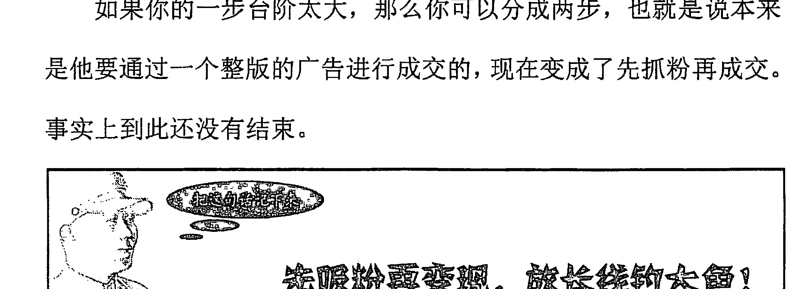

设想一下，你原来这种整版的成交广告登出去，你只有多少人的数据库？你只有 1500 人的数据库。

现在呢？你有 15000 人的数据库。

虽然只有 4500 人购买，还有一万多人没有购买，但不可否认，只要你继续追售，他还会购买别的产品。这样就建立了自己的鱼塘，而原来那种方法呢？你的抓粉数量很小。

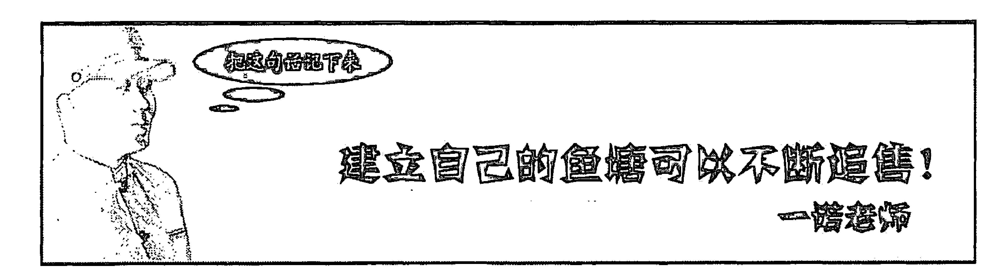

如果改进后的方法这样登广告登下去，一次有 15000 人的名单，你根本不用登 10 次，也许这个鱼塘总共只有 5000 人，你一次吸引 15000 人，可能登两三次也就没有了。

那么，第二次登可能不会吸引 15000 人，可能会吸引 10000 人，或者 8000 人。可能登三次也就结束了。然后放到自己的鱼塘慢慢养，随时可以抓鱼。

就像《全球疯狂吸金》课程里面一诺老师讲的那样，抓粉不是说你的赚钱会更多，但是因为你有了这个数据库（鱼塘），你将来的变现（捞鱼）手段会更多。

所以当你将《全球疯狂吸金》课程内容融会贯通之后，你的主张就具有吸引力，然后你就可以根据实际情况做出相应调整。

## 第二节：变现主张的核心

然后我们看大部分人的主张，99%的主张都可以看到这种情况。

说你现在付 5000 块钱给我，下一次你去取产品，到阳光大酒店 8 楼去取产品，然后取完之后至于说行不行我们不能保证退换。

如果是这么一个主张，很显然是很难把产品销售出去的。但是很多人的主张都是这样的。

如果你去看所有的广告，把它所有的枝节给分离出去之后，最终它的核心主张是什么？

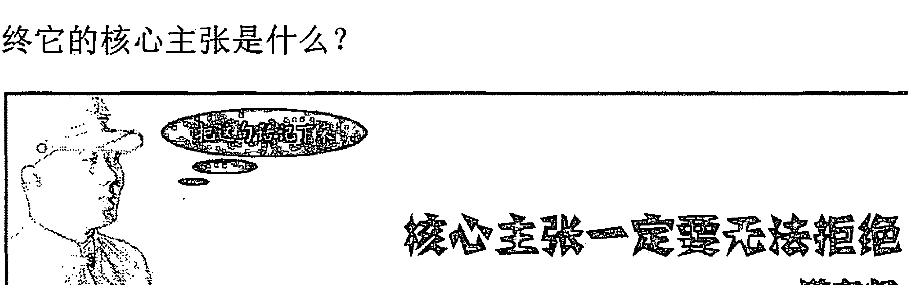

你会发现大部分抓粉主张没有吸引力，这样的话，他的主张不会有太高的响应。

之前我没有学过《全球疯狂吸金》所以根本没有粉丝，更谈不上什么变现了！希望一诺老师可以早日让雪藏已久的《全球疯狂吸金》课程早日重见天日，这门学问一定可以帮助更多人。

### 案例：三个狗男女的主张

有一个父亲想给他女儿买一只狗，在这个城市里有三个卖狗人。

- **概不负责主张**

第一个人说，“你看这个狗很好，好像你女儿也挺喜欢的，一千块钱，你好好再看一看。如果你喜欢呢，付一千块钱就成交了。至于狗，你也看过了，你女儿现在挺喜欢的，至于说以后怎么样，跟我没关系”……

- **独特卖点主张**

第二个卖狗人说，“你看这个狗非常好，是英国的纯种狗，这种颜色的结合非常的好，好像你女儿也挺喜欢，一千块钱，也合适，但是呢，我不确认你女儿明天是不是还会喜欢，所以你付我一千块钱，你回去一周后，如果你女儿不喜欢了，只要你把狗抱回来，一千块钱我就退给你。”这是第二个卖狗人。

- **零风险+超级赠品主张**

第三个卖狗人呢，先给这只狗塑造价值，就是说“这个狗怎么样值钱”，同时他说，“你女儿看起来挺喜欢的，但是我不知道你养没养过狗？是不是会养狗？你女儿是不是喜欢养狗？但她肯定喜欢这个狗，所以呢，我会跟你一块把狗带到你家，然后在你家找到一个最好的地方，搭一个狗窝，我会放足够的食物给它，你可以喂一个星期，我还会教你怎么喂这个狗，然后一个星期以后我再来。

如果你女儿仍然喜欢这个狗，这个狗也喜欢你女儿，那这时候我来收一千块钱，如果你说不喜欢，或者你女儿跟这个狗之间没有缘分，那我就把狗抱走，把你家打扫干净，顺便把味道全部清洗下……”

很显然，第三个卖狗人就把这个生意做成了！

为什么？他从客户的角度出发，给一个别人无法抗拒的主张。

而第一个卖狗人呢？是百分之八九十的人做生意的方式，就是你看好了，出门概不负责，这是很难把产品卖出去的。

第三个卖狗人他就有零风险承诺，还有超级赠品，我送你狗粮，我教你怎么照顾这个狗，这就是他的超级赠品。

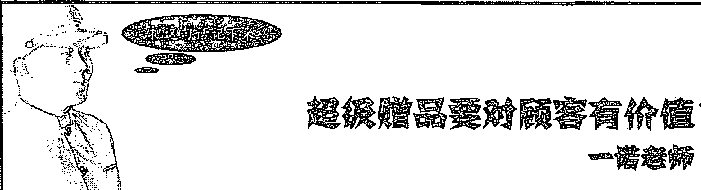

为什么这些赠品有价值？因为确实是这些目标客户需要的东西，所以才有价值，如果别人不需要，是没有价值的。

现在我们应该认识到，价值是相对的，价值是主观的，一个东西是否有价值看对谁而言。

如果你提供的产品，你认为有价值，但目标客户没有这方面的需求，那是没有价值的。

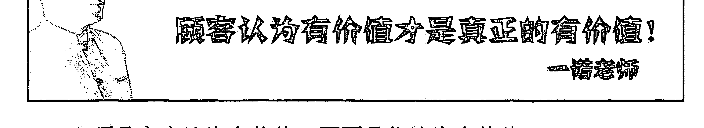

必须是客户认为有价值，而不是你认为有价值。

如果你按照一诺老师盈利模式导图，你百分之百进入客户的世界，你就不难看出，处于他这种状态的消费者、人或者客户，他需要什么，他有什么样的困惑，他有什么样的挑战……

知己知彼对于你设计赠品、设计零风险承诺就相对比较简单。

有机会你一定要上【改变世界】APP 免费学习一诺老师的音频，特别是《弟子内心》复制一诺老师六种能力。

## 第三节：变现主张的十大元素

你的变现主张必须包括十大元素。

| 序号 | 元素名称 | 描述 |
| :--- | :--- | :--- |
| 1 | 打造爆款产品或服务 | |
| 2 | 不可抗拒的独特卖点 | |
| 3 | 不可抗拒的零风险承诺 | |
| 4 | 不可抗拒的超级赠品 | |
| 5 | 不可抗拒的价格 | |
| 6 | 不可抗拒的支付主张 | |
| 7 | 不可抗拒的送货条款 | |
| 8 | 不可抗拒的稀缺性 | |
| 9 | 不可抗拒的紧迫感 | |
| 10 | 不可抗拒的行动理由 | |

### 第一大元素：打造爆款产品或服务

你的一个完整的主张，必须回答你究竟要给别人什么。

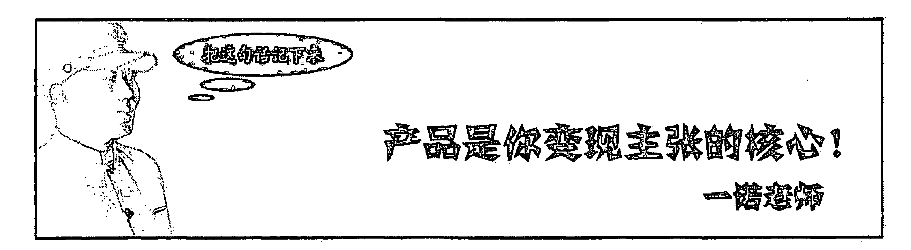

记住，你围绕着产品而设计的主张，最终的目的是想卖掉这个产品和服务。因此产品是你主张的一个很重要的部分。

你的主张究竟包括什么样的产品和服务。然后怎么样塑造价值，怎么样强调结果。以目标客户的利益为导向，而不是你的利益为导向，要凸显产品的功能、功效，对细节的描述，会帮助你很好的来塑造价值。

一个主张肯定得有产品和服务，但你不能把你的产品和服务往那一摆就行了，你需要给产品塑造价值，你需要告诉客户他不知道的产品背景知识，你需要告诉客户如何更有效享受你的产品和服务。

如果这个狗最可爱之处是到草地上去翻腾，这种感觉会让孩子兴奋，你需要告诉客户，让他和他女儿一起带着这个狗到草地里去，“要知道这个狗有多么聪明，你可以教它最难的动作”……

你需要给出这些背景知识，客户不知道，但你知道，当你告诉他这些知识的时候，产品的价值自然就提高了。

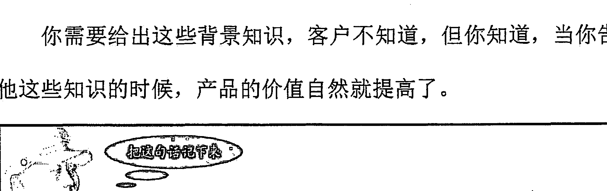

如果客户对产品的认识很肤浅，那它的价值就不可能高，所以为什么一诺老师说“吸金大师首先必须是老师”的原因就在这里。

如果你不能教会别人使用你的产品并能享受它所带来的方便和利益，那么你的产品就得不到它应有的价值。

在这里，还需要强调的是“结果”。就是客户得到的是结果，你一定要给他非常具体的结果，你要用“结果”来塑造你产品和服务的价值，“他能得到什么具体的结果”。

只有这样对方才能理解你产品的价值。

作为吸金大师，你面对的是这样的一群客户，他们对你的产品和服务的认识是非常有限的，非常肤浅的，但你不同，你心中看到的是一个更宽广的世界，你心中看到的是能够对客户梦想产生巨大作用的世界。

但这个世界，只有被化为生动、具体语言的那一刻，它才能真正地被复制到别人的大脑里，为别人所接受。就像一诺老师【改变世界】APP 上面的那 5 个英雄帖，简直是无法超越的经典！

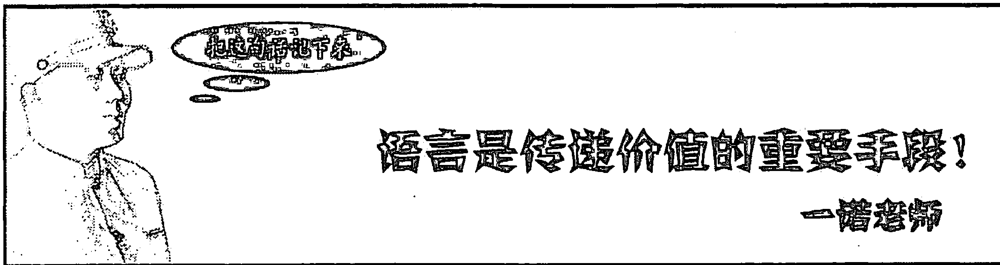

语言是传递价值的重要手段，你必须学会怎么使用语言。

假如说，你需要给一个在上海的朋友送一个“生死相关”的信息，他必须在有限的时间内得到这个信息……但是你去不了上海，你会怎么找一个第三者去传达？假如说这个信息有关于你的生命，甚至你爱的人的生命，你会不会花时间盯住他？你会不会用语言描述给他听，告诉他应该怎么说？你一定会。

吸金也是一样的，那个陌生的人就是你潜在的客户，那个第三者就是你的语言，所以不要轻视你的语言，你要认真思考“怎么表达才能更准确的把你脑海中这种色彩斑斓、丰富、宏伟的世界，复制到别人的世界里？”非常关键！这叫塑造价值。

因为你比客户更了解产品，所以当你表达出来的时候，产品的价值才能真正地被传递和复制。如果客户觉得你了解的比他还少，那你应该退出这个生意，做别的事情，因为你没有能力去帮助客户。

很简单！不管你卖什么东西，你需要比客户了解的更深刻，更生动，更色彩斑斓！

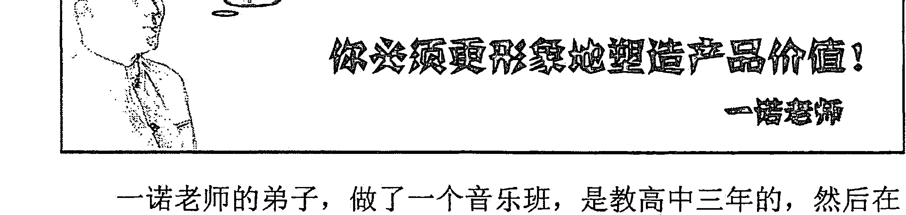

一诺老师的弟子，做了一个音乐班，是教高中三年的，然后在全国各地招人上他们的课。他们主要的特长是音乐，学器乐，当然学生同时要上高中的文化课。很多学生的目的都是出国。

于是开始定价一年四万八，但卖不掉，所以他们想降价。

一诺老师说：不，你需要加价，但是你先要学会塑造价值，如果你不会塑造价值，只会越降越糟糕。

> 一钱不值的东西卖多少钱都没人买。

很简单的道理，你把自己定位成一个很简单的商品，只是招学员来，给他们上三年的课……这是错的，你们这些人都是中国最杰出的音乐家，每一个家长在决定他们的孩子要上哪一个音乐特长高中的时候，都有一个伟大的明星梦，每个人都有，否则学音乐是很辛苦的事情，这是不争的事实。

但是实现梦想的路是非常遥远的，学生选什么样的导师，受什么样的指点，非常关键，因为作为一个音乐家和艺术家，他们的悟性非常重要，没有悟性你就成不了艺术家。

你们这里集中了一批中国最有潜质，并且已经成为明星的音乐、艺术家，你给学生的不是时间，也不是文化课，你给他们的是领悟、感悟成名之路上的很多技巧。

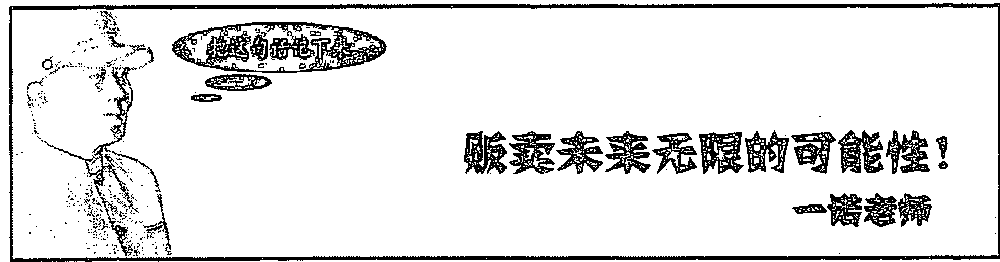

你可以帮助他们避免一个又一个的陷阱，你能安排他们去美国、英国的音乐学院面试，你能给他们搭建一个和其他明星一起同台演出的机会，这是你的能力！

你在最大限度地为他们实现自己的明星梦，铺平了道路，这是你应该做的事情。

一诺老师的弟子非常感动，他说他从来没想过这么伟大，实际上他已经把自己看扁了。

很简单，你首先要认识到自己所创造的价值，如果你认为自己不值钱，那客户也不可能认为你值钱。

当然你先要想清楚“怎么在别人梦想的旅程中去创造价值？”

你需要用事实、证据、案例去说服客户，把你的价值展现在他面前。

如果有一天，你能有一诺老师【改变世界】APP《弟子秘训》那 5 个英雄帖境界之万一，你就能成为一位优秀的吸金大师。

金钱如潮水般向你涌来！

### 第二大元素：不可抗拒的独特卖点

独特卖点是什么呢？独特卖点是你的成交主张中最独特的一点，别人没有的，不敢有，也不愿意有的。

为什么客户要选择你，而不选择别人。

你有什么独特卖点，你有什么独特的结果或者是突出你的差异化，重点在优势。

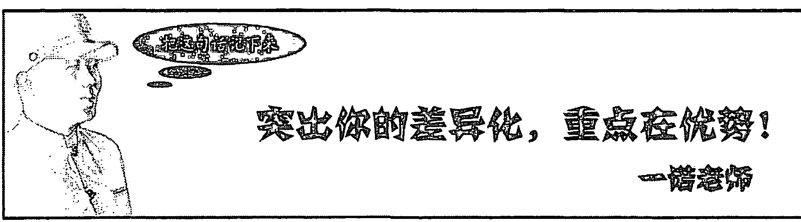

更快、更简单、更安全、更省力……你的产品和服务能够提供什么更多的保障。客户需要更大的价值、更多的保障、更快的速度、更少的努力，然后拥有更大价值。

比如说，很多人都教英语，一诺老师的弟子爱伦也教过英语，爱伦的英语课程是中国最贵的，三天 8 千块钱，而且爱伦不是中国最好的英语老师，但这不妨碍爱伦能给予学生最大的价值。

因为爱伦对价值的理解是多维的，爱伦给予你的不仅有个人发展的思路，更具有思维创造力的东西。

可以说，爱伦教的英语不止是让你学会英语，更重要的是，当你学会英语之后你“怎么能快速的把英语能力转化成财富”，所以爱伦虽然不是中国最好的英语老师，但爱伦的英语课程是离金钱、财富和收获最近的一种。

如果你只需要最好的老师，那你可以到别的地方，但是如果你需要这个，爱伦是唯一的选择，这是爱伦的独特卖点。

当然了，爱伦不是光说这个卖点

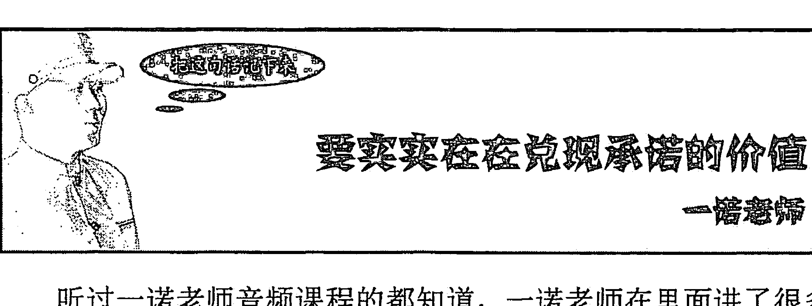

听过一诺老师音频课程的都知道，一诺老师在里面讲了很多商业模式、营销、杠杆借力、空手道、白手起家的故事，这就是一诺老师的独特卖点。

爱伦在一诺老师的影响下，也将这些内容揉到英语中，别人不止是学习英语，还被激励了、启发了、思想开悟了、满血复活了！

请问，是不是有很多人都希望在学好英语后，能快速地把英语能力转化为财富呢？所以爱伦就打造了自己的独特卖点，这就是一诺老师的弟子爱伦独有的，别人无法取代。

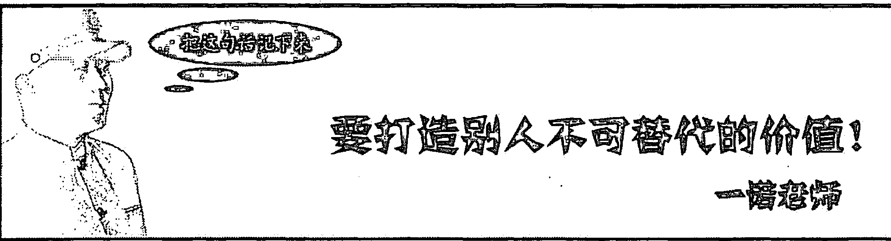

因为爱伦是一诺老师的弟子，就是这个独特的背景，爱伦可以教别人，但在中国，没有几个英语老师可以教这个，所以这就是一个别人无法超越的竞争壁垒，再加上爱伦的“零风险承诺”，这是让中国的英语培训师“闻风丧胆”的一个做法，他们真的不敢做 。

现在有很多培训师，譬如说李阳、陈斌，他们都是在爱伦的影响下开始做零风险承诺的，但如果爱伦刚开始不跟他们讲这个背景，讲这个理念，他们第一次也是不敢做的。

你想想，一个潜在客户，他可以上别人的课，也可以上爱伦的课。爱伦的课“8千”，其他课“3千”，便宜很多，但爱伦说，“我就教你如赚钱的学英语，我不教你打工英语，打工英语的事儿跟我没关系”。结果这样的主张，客户瞬间高端了！

爱伦说：“我的课程是8千，但是我要保证你对这个课程100%满意。如果你上了一天半的课，你觉得不值这个钱，你可以拿着你的钱，轻松走人。

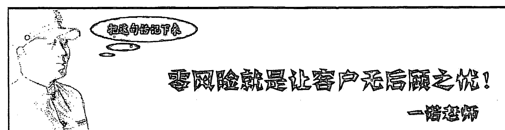

客户做什么选择？

这是一目了然的。你是要上一个两千块钱但是概不退货的课呢，还是上一个8千块钱但保证“如果得不到10倍的回报，可以100%退款”的课程呢？你觉得，如果你是一个潜在客户，你会选择什么？很显然，你应该选择爱伦。

所以打造“独特卖点”需要你用非常简单的语言来表达。

- 第一、必须独特。
- 第二、必须跟客户想要得到的结果密切相关。

你的英语很好，但你不能说“我是唯一在地下室上课的”、“唯一芭蕾舞老师和英语老师同台上课的”、“我是唯一一个穿着草裙上课的英语老师”……没用，不相关。

所以光“独特”没用，要“相关性”。

第三、用简单的语言表达不出来的优点都不是优点。一诺老师刚才已经强调了语言的重要性，你有再好的优点但是你无法用语言把它表达出来，有什么用呢？

客户必须通过你的语言和文字才能感受到你的优点，但你表达不出来，没用。

所以要具备“独特、相关、可表达性”，三者缺一不可。

比如一诺老师的弟子班是“零投入、零风险”，看起来很简单，但你想，作为中小企业老板有多少人不要这个呢？一诺老师不需要更多的语言，而且一诺老师的竞争对手没法复制一诺老师的课程。

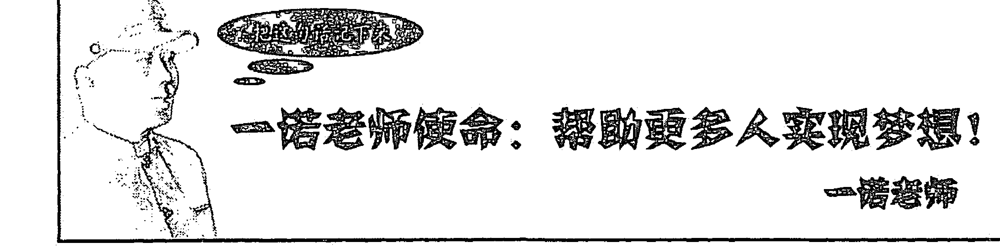

你需要打造的是“独特”，并且用很简单的语言，很形象的语言，把它表达出来，然后再加上“零风险承诺”。

很多人拜师成为一诺老师弟子，交 2 万学费，但是可以申请 2 万奖学金（以官方为准），这样就相当于免费学习。计划招募 100 名，谁知挡都挡不住来了几千名申请，这就是不可抗拒的独特卖点！

### 第三大元素：不可抗拒的零风险承诺

零风险承诺有很多种，退款并不是唯一的方式，有很多方式。

比如说体验了赠品以后，包括还有的零风险承诺可以是这样的，“你可以先品尝一个脐橙，如果你不喜欢，或这不是你吃过最好吃的脐橙，没关系，打包退回来给我，我给你退款。”

就是你不需要吃完一整包，你再告诉我你不喜欢，没有必要。

你的目的只是让别人检验你说的和你产品能够给予的是一致的。

所以，零风险承诺最关键的是你要列出客户在使用你的产品和服务时所真正面临的一些风险是什么。然后你要对这些风险进行承诺。

如果客户担心的并不是价格，那么退款并不能解决他最大的风险，所以你要解决他最担心的问题，最大的风险，很重要。

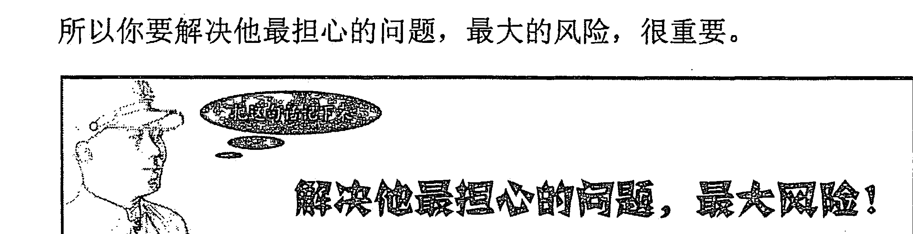

零风险承诺是一个非常强大的技术，同时它也代表着一种理念，一种哲学。

因为有了零风险承诺，你才能向你的市场，向你的潜在客户，非常自豪地宣布：我愿意为你的结果承担全部责任。

我没有资格要你的钱，除非我确定能给你创造 10 倍的价值。

当你交钱给我的时候，并不代表你对我价值的认可，而是你愿意给我一个机会，让我一步一步的展示给你看，我所说的一切我都能做到。如果我言行不一，或者你对我有任何的疑问，你都有权利要回你付给我的每一分钱。

这是非常有威力的，这是你的态度，也是你的主张。

当你提供零风险承诺的时候，你永远不能靠吃老本混饭，你必须不断的创新，必须满足客户的欲望，必须把客户的梦想推向一个新的台阶，必须让客户的满意度不断提高，你再也不能原地踏步了。

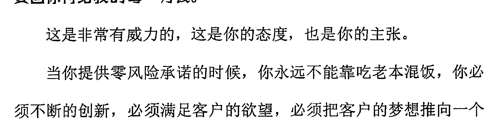

因为有了这么一个巨大的杠杆，双向的夹击，所以你的能力会增强，你的进步会加速，你会有一个飞跃；用不了多久，当你站在所有的竞争对手中，你会有一种“鹤立鸡群”的感觉。为什么？因为你系统的学习一诺老师课程之后，就会有这个魄力，有这个能力，因为你创新的速度会超越别人拷贝的速度，所以最终你把“赢利，为客户服务，创造价值，自我发展，自我提高，不断完善”全部用一个零风险承诺彻底地连成一片……

还有一个，零风险承诺对不同的行业是不一样的，零风险承诺并不代表客户购买的所有风险你都全部承担，但至少代表你比任何竞争对手承担的风险都要多。对手承担的风险接近于“零”，竞争对手躲在后面什么都不敢承担，而你站出来承担，就已经可以了。

你承担风险要有个度，什么度呢？

比如说很多人参加成功学的培训，他们有一个梦想，就是说我花了一千块买了这个成功学的课程/书籍，放到我的书架上，然后去睡一觉，第二天起来我就成功了……听起来不可思议，但是很多人就有这么一个幻想，所以你必须要求他采取行动，如果他不采取行动，没有用。

如果你卖的是冰箱，你保证能够制冷到多少度，可他从来不把电源插上去，没用的！

当你提供这么丰厚的零风险承诺的时候，你有权要求对方去做最基本的尝试。虽然不能要求对方太多，但是最起码的要求得有，否则你的零风险承诺没有意义。

当你提出最起码要求时，那些不认真的人，根本就不会成为你的客户，因为他不会去采取第一步的措施。

例如：一诺老师在很多年前开设北大 EMBA 课程时，曾经承诺，一天半不满意可以退款，但是一诺老师要求你每天都要来上课。如果这个人的想法只是到深圳转一圈，那他就不会来了，因为他做不到。所以你通过“起码的要求”，就把非潜在客户给排除了。

你做的承诺也一样，只要对方要求退款，你必须 100%的退钱，你提供的无条件承诺必须要实现，但是对方要先交钱，这样做的目的不是为了“卡”这些人，目的是把那些不符合条件的人“删除”。

当你给出这么慷慨的承诺，你需要他也做出足够的表示和响应，否则没有意义，这是一个平衡。也不是说，你一定得绝对零风险承诺，你只需要比竞争对手做的更好就行。这是零风险承诺的一个哲学。

另外你需要管理你的内部，建立内部的退货流程。首先，你的内部响应速度要很快，当别人退款的时候，你必须在第一时间退回去，永远不要因为这个犹豫。

只要我们收到客户的退款帐号，我们的退货处理工作将在72小时内完成。你的送货，因为某种原因可以推迟，但是退款不可以，因为这是你的承诺，如果你实现不了你的承诺，你就无法让更多的客户进来，这是一点。

另外一点，很多人对零风险最大的恐惧是什么？怕很多人会退货。这是不可能的，如果你有很好的客户筛选标准，如果你有很好的评判过程。

设想一下，你把你的价值塑造的很好，对方非常想要，但是就在交钱的一瞬间，他始终有这个怀疑，“你说的和做的如果不一样，我怎么办？”

所以当你给出零风险承诺的时候，相当于你对客户说，“你现在交钱并不代表成交，交钱只代表你给我一个机会,让我向你证明我说的和做的一样，如果不一样，你有机会拿回你的钱”，所以这样你就把他所有的顾虑打消了。

很多人觉得这不可思议，其实你仔细算一个帐：假如说在你不用“零风险承诺”的情况下，你只能招 10 个人，而你用了它招了 30 个人，就算有 30%的人退掉了，结果是什么？结果是你多成交了 11 个客户。

更重要的是，这 21 个人会更欣赏你，你们之间的信任度加强了，客户对你更感激了，因为你有这个魄力提供零风险承诺，这对他来说是一种待遇。所以你要看清这一点，不仅你的收入加倍了，更重要的是你与客户之间的关系变得更融洽，更信任了。

即使客户要求退货，他觉得这个东西对他没有价值，也没关系。

就像“海浪”一样，也许那个人超前了，他现在没有准备好，可是你把钱退给他了，毫无疑问他会非常感激你。将来有一日，也许他还会回报你，所以这是零风险承诺的威力：让爱你的人更爱你，让你自己的能力提高的更快，让你做事更自信更坦荡，没有任何躲躲闪闪的感觉。

当然零风险承诺有各种各样的版本，上过一诺老师课程的都知道，有几种不同的版本。这里仅列出了六个不同的版本：

- 第一个版本：不满意退款，只收 xx%的手续费或快递费。

有一个问题，什么叫不满意？假如说你卖的是美容的产品，你比较一下这两种说法的不同：

首先，不满意退款。

其次，如果你按照我的方法用上七天后，你和你最喜欢，最漂亮的姐妹们对比下，如果没有人对你充满着嫉妒，我强烈要求你退款。

这两种说法有什么不同？

> “假如说你按照我的方法用了七天之后，你参加你公司的聚会，如果你没有感受到一种全新的自信和状态，我给你退款！”

是不是威力更大了？只要你能用语言给别人表达一种肯定的结果，别人就会越安心。记住要结果……结果！

- 第二个版本：不满意 100%退款，我们支付快递费。

这个比第一个要好，因为如果你让客户付快递费，一诺老师认为是不合理的。客户给你信任的机会，用你的产品，结果证明不合适，他不应该有任何的损失，你应该 100%退款，快递费也应该你出，这是你的责任和态度。

一诺老师给大家举一个例子。

一诺老师的课程/书籍，每年都有几千套到国外，有一个英国的粉丝，在一个月之内没有收到货，虽然物流系统显示收到了。

到英国的快递费需要 400 多元，按道理我们可以退 1000 元产品费，至于 400 元的快递费可以不退，因为我们确实发货了，而且系统显示已经收到了。正常的处理就是你付快递费，因为谁都有责任，毕竟系统显示是收到货的。

但一诺老师认为，别人跨洋寄一千多块钱给你，确实是想学一诺老师的知识，确实是因为别人对一诺老师极大的信任，所以才愿意这么做，但是对方说没有收到，所以一诺老师认为他不应该承担 400 块钱的快递费。

因为别人真的想学，但是没有收到货，就莫名其妙的出了 400 块钱。从对方的角度来看，这是不合理的，所以我们说，

> “如果你愿意等，我们可以再寄一套给你，如果你不愿意等，那么就把 1400 块钱分文不剩地退回给你”。

说真的，这种现象很少，我们卖了几万套就这一个特殊情况，你怎么可能因为这种情况就倒闭了呢？当你不要求对方付快递费的时候，你的销量就会上去。说真的，对国内来说快递费也就 20 块钱，如果你自己付快递费，却使销售额增加了 30%，那什么都有了。还一个道理，客户会更感谢你，更感激你。要算大帐，不要算小帐。

- 第三个，不满意多少天内 100%退款，我们支付快递费，你不需要回答任何问题。

这个承诺更强烈。一诺老师知道有一些公司，他们拖了 47 天才给人家退货，而且要经过七关，要领导签字才行，每一次打电话就这样。

结果他们的退货率就从原来的 10%，降到只有 1%，为什么？因为客户还没有坚持到最后就“烦死”了，实在不愿意跟他们罗嗦了。

你知道吗，你的零风险承诺要么做得很彻底、很干净，要么你根本就不要做，不要糊弄人，没有意义，这样做也不可能成功。

有个弟子要拍一个电视广告卖一诺老师的课程，但是他的退货流程有问题。一诺老师说：“你不给人家退货，将来所有人骂的都是我，跟你没有关系。” 他说：“我承诺至少给一诺老师您卖一万套。”

一诺老师说：“你承诺一千万都不行。”很简单，因为你做不到一诺老师要求的零风险承诺，但这是一诺老师做人基本的底线。

你记住，当你做零风险承诺时，这不仅仅是一个姿态，更是你快速赚钱的一个手段。什么都不用做就会增加你几倍的销售量。所以一诺老师《弟子班》里有一条一诺老师的要求：零风险承诺是你的责任，更是你的义务。 如果你做不到，也无法收你为弟子。

一诺老师的理念很简单，如果你不敢站出来承担风险，承担结果，你有一种侥幸或者是蒙混过关的心态，那一诺老师不可能收你为弟子。因为一诺老师不会给“魔鬼”们提供一个有利的武器，一诺老师只愿意给“英雄”插上一个腾飞的翅膀！

- 第四个，不满意我们立刻、无条件、100%退款，我们仍然是朋友。“你什么时候退？”“不满意，立刻、无条件、100%退款”，这就显得更加坚决。

然后, 如果你在 XXX 天内得不到 XXX 结果, 我们立刻、无条件、100%退款。

还有一个比零风险承诺更好的零风险, 即使你要求退款, 你仍然可以保留我们送给你的超级赠品。

就是说, 即使最后你要求退款, 你不但可以 100%拿回钱, 而且你仍然可以保留一个超级赠品。一诺老师经常用这样的“成交主张”这样的零风险承诺。

你可以得到十大馈赠礼品, 如果你这次来没有收获, 你仍然可以保留一诺老师给你的十大赠品。

你想这是一个什么样的姿态?

你只有这么几种选择:

- 一、你报名了, 然后事实证明一诺老师确实能够帮助你, 那你的命运会有一个几何级的提高, 你的吸金能力会有一个非常好的发展，你的收获是巨大的。

- 二、你来了，一天半之后觉得不适合你，不能让你赚钱，你可以拿走你的三万块钱，你的机票和两天的酒店报销，我来帮你付，你没有一分钱损失。就相当于，你在深圳免费畅游了一番，然后你还可以保留一诺老师的礼品。

- 三、如果你什么都不做，那只有一种可能：失去！

只要你采取行动，你一定会有所收获，你不采取行动就没有收获。所以这样；你的主张就变得无懈可击，无法抗拒。

只要你是一个真正想吸金的人，你真的想要让自己的业务做得越来越容易，你是没法拒绝这样的主张的。

大家多听听《改变世界》APP上面一诺老师的免费的公益课程，这样相信你的主张将会更加的强大！

### 第四大元素：不可抗拒的超级赠品

更多绝学课程请咨询微信xi383921,备注：咨询！

超级赠品是很重要的变现加速器。

但如果你卖不掉的东西你不要赠送。

为什么？你卖不掉是因为你的东西没有吸引力，没有吸引力的东西就算你送给别人也是没有价值的。

最重要的是很多好的赠品设计，就是别人看好了你的核心产品之后，觉得挺好。然后超级赠品他确实也很想要。

人们都有一种贪婪的心理。

客户觉得这个产品已经很值了，还有这些赠品是白给的。就能在最后一瞬间促成客户的行动。

如果他很喜欢这个核心产品，但是赠品对他一点意义都没有，他根本不想要。

这样的话，他就觉得自己吃亏了，别人觉得这个有用，我觉得没用，对我没有意义。反而会降低他行动的可能性。

为了确保有超级赠品有价值，超级赠品最好是围绕着你的核心产品进行设计，和核心产品进行互补，帮助它、促进它。

为什么？他已经喜欢你的核心产品了，那么对核心产品的促进是非常重要的。所以围绕着核心产品进行设计超级赠品。另外，千万不要让人家感觉你的超级赠品是有了，但你的核心产品不完整了。这个反而会扼杀他购买的可能性。

比如说我们有奔驰车，很漂亮，然后怎么设计，我们什么工程师设计的最新造型，流线型，这个很好。我们还有一个超级赠品，赠送你两个轮胎。那人家一想，啊！原来还没有轮胎啊？那就不想购买了，对吧？超级赠品虽然是增值的，但是不能让人家以为你的核心产品不完整。否则他就不会购买。

超级赠品设计一定要配合你的核心产品，超级赠品设计的目的是帮助客户快速轻松地采取行动，产生结果。

如果你卖的是英语课程，但送给客户的却是牙刷，这样是没用的！要有“相关性”。你要理解，别人是对你的产品感兴趣，你需要在这个基础上去设计你的超级赠品。

即使是赠品，你也需要塑造价值。没有经过“塑造价值”的东西，即使是免费的，别人也不想要。

你需要塑造超级赠品的价值：为什么它很关键？它能帮别人解决什么样的问题？带来什么样的结果？

当你塑造价值时，你要聚焦在对方可能得到的结果上。

只有这样，才能提高产品在客户心中的价值。

所以，你要让客户觉得购买这个产品，已经得到了10倍的回报，但是你给予的更多，你还送他赠品，这就更超值了！

在塑造价值的时候，你需要给客户一个衡量产品价值的尺度。

比如说，这个超级赠品以1000元的价格出售过，确确实实的卖过，不是随便编的，是真实的事情。

因为之前很多人花了 5000 元购买过，所以它的价值是实实在在的，是可以衡量的。

一诺老师建议你的超级赠品不要超过核心产品的价值。否则可能会影响你的可信度。

不要只送一个超级赠品，最少送两到三个超级赠品。为什么呢？因为你的超级赠品可能只让一部分人喜欢，另外一部分人，可能会因为不喜欢你的超级赠品而决定不购买你的产品。

所以当你有三个超级赠品时，你可以从三个不同的角度去给人家提供价值。同样的道理，这三个赠品的设计最好是有所差别，不同形态，不同角度的。

比如说，你仓库里存了很多东西卖不掉，你想送给客户，千万不要这么做！这样做非常愚蠢！

无异于搬起石头砸自己的脚！

因为，很多情况下别人是因为喜欢你的超级赠品，所以决定购买你的主打产品；

也有人因为不喜欢你的超级赠品，所以决定不买你的产品。

所以，超级赠品是整个变现流程中不可分割的一部分，超级赠品的设计很重要！

> “超级赠品”威力最大的使用方法是和零风险承诺相结合。

比如，你的超级赠品即使在客户退的情况下，也可以被保留。这样做会让别人采取行动，只要他行动，就会有所得，所以他没有理由不采取行动。

再说，你把快递费也报销了，什么都报销了，但还可以保留超级赠品，所以他没有理由不采取行动。也因为这样，你需要把超级赠品设计成一个高价值、低成本的形态，这个产品的价值非常高，但是它的成本很低。

一诺老师弟子在营销的时候，会送你的很多一诺老师的内部资料，这些东西的价值都非常高。说真的你看完一段一诺老师的书，听完一诺老师的录音，你琢磨透了一个想法，它的价值就是巨大的。

尤其送的是实实在在的案例，别人靠这个东西去赚钱，要付钱给我才能得到的，所以，它的价值是经过验证的。

但是对我们来说，成本不是很高，但是很有“价值”。

你要知道，客户只担心价值，他不关心你要花多少成本去实现这个“价值”。所以你要花精力帮他琢磨出最有价值的超级赠品，然后又能降低自己的成本，这很重要！

不管你卖什么，教育本身就是有价值的。也许你去教一个母亲“如何照顾好自己的婴儿”。第一次当母亲，她什么都不知道，如果你有一个报告，把她所有最担心的问题都列出来，请最权威的医生给她辅导，那这个报告本身就有价值，但是对你来说可能成本很低，你只是请一个专家录上两个小时的音频/视频而已。

关键是这些东西确实有价值，确实是他们想知道的答案，所以这是超级赠品基本的一个使用方法。

一诺老师前面讲了几个成交元素，一诺老师需要补充说明。

零风险承诺是成交的一大利器，但是它不是销售中的第一个武器，你千万不要冲上去说，“反正我有零风险，你就买吧”。

如果你的东西没有价值，即使你做“零风险”别人也不会购买，所以你需要先塑造产品价值，当别人想要你产品的时候，“零风险承诺”才会在最后关头消除他所有的疑惑，起到关键作用。

千万不要冲上去，就提“零风险承诺”，没有用，因为客户还不信任你。

如果你是一诺老师的弟子，经常跟着一诺老师学习时，你会发现弟子实操落地的流程，就是整个吸金流程的高度浓缩。

这是怎么实现的？一开始，你既不能马上提到价格，也不能马上成交，当然更不能提“零风险承诺”，一诺老师的弟子都知道“零风险承诺”是在很晚的时候才出现的。

我必须给你足够的信息，让你了解“这个课程是干什么的”，而且给你足够多的秘诀，让你确实想要。

如果别人不想要了，你扔给他“零风险承诺”，他也不会买。

记住，没有价值的东西，就算再好的“零风险承诺”也挽救不了。这跟一诺老师的吸金理念是一致的。

你的产品和服务不能为别人的梦想创造价值，再好的主张，也无法帮助你。

当你把【改变世界】APP上面一诺老师的音频学习100遍以上，我相信你就会融会贯通，真正体会到什么才是商业真谛。

### 第五大元素：不可抗拒的价格

你的成长必须含有价格，在别人认识到你的产品和服务的价值之前，你不应该谈价格。

也就是在你塑造价值前，永远不要提价格。为什么？因为你卖的是价值，价格只是一种传递价值的标尺。

当他不理解他要得到什么的时候，你的价格会让他觉得很不舒服。所以，当他觉得最好的时候，这个时候他觉得这个东西我想要，其实他已经在心里想了，究竟多少钱呢？这个时候你的价格才会起到作用。

你看一诺老师从来没有一开始就说价格除非你卖的是一个标准的东西。比如说大米，没什么差别，都是大米，我的价格比别人有优势、便宜。那可以提价格。所以，你的产品不是标准产品，你必须先塑造价值，然后再给出价格。

如果你上去就扔价格，对方会被吓跑。

如果一诺老师的标题说“10万块钱3天的培训”，我想在座的现在没有人会在这里，因为一诺老师没有说清楚“能帮你做什么”。

还有，就是如果你的价格很高，你必须要解释，因为客户会有这个疑惑。

最好的主张就是把客户的疑问提前化解。如果你看过一诺老师的英雄帖（改变世界商学院公众号输入关键字“弟子”，和《改变世界APP》《弟子内训》英雄帖之三四），会发现，一诺老师站在你的角度思考你会问什么样的问题。这叫：料敌于先，提前化解抗拒！

当一诺老师在改变世界商学院公众号的吸金信中回答了你所有的疑问后，一诺老师才呈现价格，才呈现“零风险承诺”。

因为免费，其实也不存在什么风险，但是你需要解释……

一诺老师希望不要因为价格而剥夺了渴望改变命运的英雄们受教育的机会，一诺老师的使命：帮助更多人实现梦想。

如果你的价格很高、或免费，你必须解释。

这是为什么一诺老师的产品都有解释的原因，例如猪买单。

如果你的价格非常低，你也需要解释，不要认为你的价格低，别人就没有疑问，你一样需要解释。

就像一诺老师的《弟子班》，免费也要解释！

10多年前，一诺老师的一个弟子卖过劳斯莱斯，这个车很贵，但是他有一次卖的非常便宜，便宜得别人都不敢相信，他说，“这个车是我一个朋友从国外弄进来的，因为在美国大家都在左边开车，但这个车的方向盘是在右边的，所以才便宜”。

这样别人就相信了。

你需要给别人解释为什么便宜？

当你解释了原因，别人才能接受你的价格。

> 无论价格高低或免费，都需要解释！
> —一诺老师

否则别人就会按照他的思路去假设。

万一他假设的有偏差，那他可能就不会去购买了。

### 第六大元素：不可抗拒的支付主张

“支付条款”是影响你成交主张的吸引点。

一次性预付现金。很显然，在收到或接受你的产品和服务之前，就要求客户“一次性支付现金”，这会“扼杀”你变现的机会。

如果一诺老师让你们在没见到我，在对我一无所知的情况下，就往账户里打10万块钱，很显然这会扼杀“变现”的机会，因为我们的信任没有达到这个程度。

如果是大家免费学习几个月，至少对一诺老师的能力有个判断，你知道一诺老师是有实力的导师，所以，这是一个非常重要的信任布局，不是巧合。

你让对方采取的每个行动要跟你们之间的信任相配合。

很显然，你第一次见到一个女士，不管你是否喜欢她，她不会第一次就想嫁给你，因为你们之间的信任没有达到一定的程度；但是如果你提议和她一起喝咖啡，这是正常的。

所以，你需要把你对客户的要求“台阶化”，要一步一步地进行。

当别人对你的信任很高时，你可以要求多一些，无所谓，可是当别人对你的信任很低的时候，你必须把他的行动分解。

为什么要提供台阶化的产品了？

信任！

一诺老师反复强调信任是你变现的一个“重要货币”，没有信任，你就不可能变现。当然你可以提供“货到付款”，很显然这样风险就更低了，你的变现主张的吸引力也更高。为什么货到付款很有吸引力呢？ 就是因为他先看到了产品，再付款。

分期付款，就是你先获益，然后再分批付款，例如一诺老师弟子就是先赚到100万再补交学费，这就叫不可抗拒的支付主张。

这种方式的吸引力更好，有两点因素：

第一，你愿意承担风险。

但你愿意承担风险，因为你对你的产品和服务有信心。

第二，可能有很多人没有这么多钱去购买高价的产品和服务，但他可以分开去购买。

这样做你可以让更多的人接受。

一诺老师的弟子可以收费100万元，但一诺老师允许你先拥有，并复制一诺老师的6种能力，先赚到100万再交。

所以，你付给一诺老师的钱都是在你已经赚钱的前提下做的。

这跟租房子的感觉有点像。

这是一个最好的方法，这种主张根本不需要说服，因为客户已经得到了想要的结果。

这种方式需要你把原来的一个产品分解成多个产品，然后放在“前端”让客户先体验，不断地给客户创造价值。

比如一诺老师的产品价值很大，一诺老师可以先给你显示1%的产品，但已经足够让你赚回成本了。有的产品可能与节约成本有关，但道理是一样的。通过这种方式，你的主张将变得非常有吸引力！

## 什么叫诱惑力、吸引力？

如果你让客户说“YES”比说“NO”更容易，你的主张就轻松了。

一诺老师的《弟子内训》系列课程之一《说服的最高境界》就是研究“如何把从一个很蹩脚的，非常软弱的主张，打造成一个让对方无法抗拒的主张”。

这“十大成交元素”，每个都可以让你向理想中的主张靠近。

这些东西听起来很简单，但每一个都很“神奇”，尤其当你懂得组合运用的时候，它的作用不是2-3倍，而是N倍！

### 如何几何式的倍增你的吸金？

### 如何在零投入的情况下去实现？

### ——杠杆组合！

更多绝学课程请咨询微信xi383921，备注：咨询！ 真正发挥威力的是“杠杆组合”，支付条款就是其中的一个杠杆。

## 改变世界商学·世界企业家的摇篮 《盈利的最高境界》一诺老师

还有，如果你的价格很高，你可以采用分期付款的方式，这样价格就不显得“高”了。

一诺老师的弟子在美国曾经做过试验，卖10万元的东西很难，但是当弟子把10万元分解成10个月的时候，成交率急速上升，虽然什么都没变，就是把10万元分解成10个月的付款期。

这样做在别人的感觉里，它的价格降低了，因为你每个月付的少，所以你会更容易说“YES”。

一诺老师的弟子女子都知道，【改变世界】APP里面有一诺老师的免费《弟子秘训》，里面就有复制一诺老师的六种能力，其中一种就是《一步一步引导别人说YES》，大家可以去系统的学习一下。

### 第七大元素：不可抗拒的送货条款

送货条款有各种各样的，比如说现场提货，那当然是最好的，交完钱马上得到产品，非常有吸引力。

如果说xxxx天内送货上门，它的吸引力没有现场提货这么好，但是有时候客户没法现场提货，这时你可以说我用特快专递，24小时发货，而且告诉你快递公司名称，这样吸引力又增加了。

一诺老师在18年前卖自己的课程DVD光盘和书籍的时候，曾经了解到很多客户顾虑，全国各地的，比如“我的朋友都说我一定会受骗的，请你帮我发货好吗？”这体现出了客户的心态！

当你的发货日期离付款期越近，你成交的可能性就大，因为你降低了对方的忧虑，降低了对方的担心，你在给他创造价值，所以“发货方式”影响你成交主张的吸引力。

分期送货。有些产品它必须分期送，比如说他买了你六个月的材料，他先付了钱，货是一月一发的。如果是这样的话，你需要告诉他在六个月中你将在什么时间发货，由什么公司给他送货，那么他的担心就小多了。

比如，“我知道你付了六个月的款，我将分批在六个月内发货，我会在每个月的1号发货，我用的快递公司是EMS，大概需要两天的时间你就可以收到货……”

这样让对方感觉很舒服，也可以解除他的疑虑。

所有这些情况，你都要从对方的角度去思考，你要知道“他的忧虑是什么”，这样你才能进入他的世界。“你知道客户交完钱之后在等待货的那种焦虑吗？”所以，你应该减轻对方的焦虑，这样你的成交率就会增加，所以送货条款很重要！

以上举例大多数来自于，一诺老师13—19年前的案例，下载【改变世界】APP 就学习一诺老师最新的、最实战的、最落地的、最有效的课程。

### 第八大元素：不可抗拒的稀缺性

一诺老师经常说：每样东西都有稀缺性，你必须设法找到它。

一诺老师的《终极弟子班》每次只能接受固定的8个名额，为什么？

因为一诺老师希望能照顾到每一位弟子，一诺老师要去亲自辅导每一位弟子，这需要很长的时间，所以，一诺老师不能接受很多人。

稀缺性是“数量有限”的概念，为什么稀缺性很重要？如果你没有稀缺性，对方会犹豫，因为稀缺性会造成一种失去的感觉。

并不是每个人都能进来，一诺老师有一定的数量限制。

### 第九大元素：不可抗拒的紧迫感

紧迫感是什么？是时间有限。

一诺老师2010年之前，每个月几场的线下培训，一诺老师可能在15号就停止招生，虽然15号以后还有很多人报名，但一诺老师的助理根本无法应付，因为没有时间了。一诺老师希望在15号以后全力以赴地准备三天的培训。这是一个时间的紧迫感，如果你在15号之后，再打电话过来，“对不起，我们无法帮你。”这就增加了客户的“紧迫感”。

还有一个一诺老师想说明的，紧迫感和稀缺性是相关的，这两个可以相互地加强。譬如说，在2017年的时候，【改变世界APP】的数据库里有100万注册用户，一诺老师开始卖《猪买单》全集，一诺老师只能卖100套，因为一诺老师想在第一个阶段用低价的方法先做测试，当时只卖980元/套，如果大家都得到了预想的结果，那下一步一诺老师就提价。

因为【改变世界APP】的数据库有100多万用户，所以当给一万个人发信时，这就造成了‘稀缺性’。因为100万人中可能有超过3000人想要拥有《猪买单》，当然这里面也有‘紧迫感’，毕竟100个名额很有限。

结果100套3分钟内抢购一空！这就是那句话——

所以，因为这个‘稀缺性’造就了‘紧迫感’，你卖的每一个东西都要有‘稀缺性’和‘紧迫感’。以后在【改变世界APP】一诺老师的《弟子内训》音频里，一诺老师会系统地教会你，如何巧妙地运用紧迫感和稀缺性，否则你是很难成交的。

我们都是人，人性就是喜欢拖延，你必须给他一个不拖延的理由。但一诺老师并不是让你去编假话，我们要实实在在地做。

可惜很多人做生意，没有意识到这些。

打造‘稀缺性’的方法有很多种。

比如，你的课程可以卖无限次，但是你送的一个超级赠品是有限的。一诺老师的弟子们有这么多的人报名，一诺老师觉得很正常。

因为，如果你在现在就报名，你就能得到一个超级赠品，这个赠品的价值非常高；但如果你今天没有报名，明天你也可以报，但是赠品没有了”，这是可以理解的，因为先报名的人必须得有额外的奖赏，这点大家可以理解。

### 第十大元素：不可抗拒的行动理由

你的所有决定：为什么稀缺？为什么紧迫？为什么你要送超级赠品？为什么你的价格这么高？为什么你的价格这么低？为什么你的“零风险承诺”如此地慷慨？所有这一切，你都需要给对方一个理由。

- 一、对方需要理解你为什么这么做，这样他更容易相信。
- 二、希望你的主张是透明的，你需要给潜在客户解释“为什么”，而且你可以有自私的原因。

如果你的自私是建立在别人得到价值的基础上，那你的自私反而显得真实。

就算你拼命地给别人创造价值，但是你却把真正的目的掩藏在背后，那人家会觉得怪，可能就“扼杀”了你的主张。

所以原因非常重要，你一定要解释原因……

- 为什么……
- 为什么……
- 为什么……

现在我们看完了主张，你知道不管是你的抓粉，不管是你的吸金（建鱼塘）或者是你的追售，最后只有主张（变现）才是核心。

如果主张（变现）缺乏吸引力，没有人会响应。

设计完了主张（变现），其它的都好办。

有机会你一定要跟一诺老师多学习、多修炼！

相信下一个成功的人就是你！

## 第四节：变现与追售的终极密码

更多绝学课程请咨询微信xi383921，备注：咨询！

我们再来看一下这个抓粉部分到变现部分。

我们再回到一诺老师盈利模式导图，在这里我想和大家分享一下一诺老师盈利模式导图的一个核心的核心。

很多中小企业的老板都注重的是变现，因为变现是赚钱的唯一方式，没有变现就不可能有价值的交换。

所以，很多人都盯住了“变现”这一步。

当你把百分之百的注意力放在变现上，你的成交会变得很困难。

> 变现的前提是建立信赖感！一诺老师

随便来一个人你不管他对你了解不了解，你不管他对你信任不信任，你的唯一目的就是要变现，反而会扼杀了变现的机会。

但如果我们在变现前做一个铺垫，我们的目的是给他提供价值，但是我们不要试图去卖给他，而是通过提供信息获得他的客户信息。

然后我们通过不断的给予价值，让他不断的采取一些小的动作，然后让他对我们的信任不断的增加，最后我们再变现。

一旦变现了，他通过购买我们的产品和服务，然后对我们的满意地不断地提高，信任度不断地提高，然后我们追售的机会是无限的。要学会放长线，钓大鱼。

经过这样一个改变，你的盈利模式就非常的清晰。

不是一见面就要变现，然后变现了就变现，不变现的就拜拜，其实这就是一诺老师课程说的做整版广告的案例。

另外一种方法就是进行了抓粉，先抓粉然后再变现，然后才存在着追售的机会。

这样，它的效率就会高很多。

大家有没有领会，就是追售的成本不仅会降低，而且给以后创造了很多追售的机会。

这些抓粉后没有变现的客户可以不断地循环，通过不断地给予价值。也许第一次他没有意识到购买是他最好的选择，但是通过不断地获得价值，不断地增强信任，最终他确实意识到了购买是他最好的选择。这是很有可能的！

很多粉丝刚开始接触一诺老师的音频课程，第一次和第二次他不会购买，并不代表他第三次第四次不会购买。

但是，如果你没有粉丝信息，这种机会是不存在的。

所以，把这个简单的变现，扩展成抓粉（抓鱼）、养粉（养鱼）和追售（捞鱼）是非常关键的一个思维模式的变化。

如果你去看《孙子兵法》，实际上它是一样的。所有的将军都注意在战斗、战斗、战斗，其实高手在真正的战斗之前，前面会有一些铺垫，然后这个表面认为是战斗并不是真正最后的战斗。

所以，真正的钱是在后面，真正的战争的胜利是决定在最后面的。只有这样它才能有一个配合。

举个例子，就像排球比赛一样。排球比赛是把球打对方的区域内。让对方出界，或者到地上接不住，以此来决定胜负。但是把球打到对方的区域内，如果我们采用的是最直接的方法，就是没有一传二传和扣球这三种方法。而是所有人，谁离球近，谁就试图把球打到对面去。如果是这样一种策略呢，那排球比赛很显然没有所谓的战术配合。球打过去的质量不会很高，因为他的位置不是最佳的。整个的排球比赛也没有什么策略可言，是很不精彩的，但是有了一传二传和扣球的配合就精彩了。会有突然袭击，或者会有突然传球，这样的话，扣球总保证他最佳的位置。

吸金也是一样的，抓粉就相当于一传，养鱼相当于二传，真正的追售才是扣球。就是说实际上最多的钱是在追售这里赚的。

所以，我们在前端如果能够保证不亏钱，或者是少赚，但是在后端有赚钱。这就是一诺老师弟子班最重要的精髓！

比如说，有100个进来，一转身有10个人购买，然后只要他购买了一诺老师可以再试图做一次追售，立即的追售。追售时购买的比例更少无所谓，可能只有3个人购买。有90个人从来没有购买过，没关系。我们再给他价值，我们有活动再要求他参加。因为我们有他的个人信息。

第一步，记住了我们的目的是抓粉，所以我们有他的个人信息。我们就可以邀请他继续进入我们的变现流程。

然后，我们可以有继续追售他的机会。

再过一段时间另外一些人可能就成交了。

最后，已经变现多次的客户可以继续追售，这些人是最好的客户，因为他已经购买了你很多的产品并且是满意的。

假设你的产品是好产品，这样的话就形成了一个赚钱机器。

一诺老师曾经说过一个概念：

原来我们就是一个环节在这里，大量的客户进来，一小部分成交了，OK，谢谢！拜拜，再见。

然后就没有然后了，也是OK，拜拜再见，从来不认识！

现在呢？【改变世界APP】几个月注册用户近千万，大量的高端人群进来了，首先在卖给粉丝任何东西之前，先培养信赖感1天、2天、10天、30天、100天、300天、1年、2年、5年、10年……到多久呢？答案是终身！

粉丝有终身价值，所以平台要服务他们一辈子！

【改变世界】APP是一个平台，欢迎社会各界讲师前来讲课。

直到有一天粉丝想通了，再购买任何产品！

你购买了，平台很感谢，然后平台再卖你其它东西，直到你说stop！就停了，没有关系，平台不会强推。

那些没有购买的平台继续跟踪，最终在你的整个盈利系统中：

总有一部分人在抓粉阶段，

总有一部分人在变现阶段，

总有一部分人在追售阶段。

然后平台的系统继续推进，不要停止，不要放弃他们。

## 第四节：一诺老师鱼塘导图

在你的鱼塘里，总有一部分人相信就交钱了，总有一部分人在追售环节，就变成了良性循环，最后形成一个赚钱机器。

就像上图：一诺老师鱼塘导图
实际上就是企业生存发展之基石，就是一台【自动赚钱机器】

分为六个阶段：## 第五节：打造赚钱机器的六大步骤

- **第一步骤：投入**
找到别人的鱼塘投入，无论是时间还是钱，这两者其实是一样的道理，人工就是钱，钱就是人工，做老板的要计算哪个划算；

- **第二步骤：抓粉**
投入目的呢？当然是抓粉；

- **第三步骤：成交**
抓粉能成交的成交，不能成交的千万不要说拜拜，这是没眼光的人干的事，那怎么办呢？放到自己的鱼塘！

- **第四步骤：自己的鱼塘**
你要自己挖个鱼塘养着，例如【改变世界 APP】1年度内要突破 5000 万粉丝，这就是一个鱼塘，将来肯定会突破 1 亿、2 亿、5 亿、7 亿、10 亿……

- **第五步骤：追售**
当信赖感积累到一定程度，当粉丝看到这么多人都受益了，粉丝终于相信你了，或者是想通了，或者是终于有钱了……

## 第六步骤：产出

这时候，你终于可以产出了，要学会放长线钓大鱼，做大事者要有耐心！

> > 成功需要忍耐和等待！
> ——一诺老师

一诺老师说，当面对没被你变现的粉丝时，你要理解他：他可能不够相信你，可能暂时经济紧张没有钱，可能还要考虑一下等等，诸如此类的原因，总之当你面对你的粉丝时，你要心怀感激，至少他现在在你的鱼塘里，至少你还有机会变现他，只要他在你的鱼塘里，总有一天被你变现！(总有一天轮到他)这是一种信念！

> > 你只是把钱暂时放在客户那里保管！
> ——一诺老师

这就像果园里的苹果，在任何一个时候，总有一部分苹果是红的。再过一段时间，阳光照耀又有一部分是红的。这是一样的道理。

一诺老师之前谈的引爆利润就是这么一个思路。

随着大量的粉丝引到《改变世界 APP》，不断的贡献价值，然后慢慢变现。你一定要形成一个系统，得有人负责前端不停地抓粉(整合鱼塘)，进了你的鱼塘之后得有人负责追售(捞鱼)，得有人负责这些没有变现的客户继续给他贡献价值(养鱼)。

就像一诺老师不停地免费贡献价值，很多人不愿意付出，不舍得付出，恨不得连鱼饵都不想付出就想不劳而获，这种人，唉！

你要不断的付出，让客户对你的价值认识越来越深化，对你的信任越来越强，然后购买的阻力越来越小。

一切就是要靠盈利系统系统，但是我们现在的引爆利润要打通抓粉、变现、追售这所有的环节，让这个系统能够非常轻松的运作。

其实这里还没有讲完整，完整的是一诺老师《全球疯狂吸金》课程里面才有：整合鱼塘、鱼塘引流、养鱼+鱼生鱼、捞鱼、再养鱼、再捞鱼……最终形成完美的变现系统，有机会听课你会相当震撼！

现在你明白了这个赚钱机器是怎么回事，引爆利润跟这之间的关系是怎么回事。

下面一诺老师带你学习抓粉这个环节的关键在哪里。

## 第六节：不可抗拒的抓粉主张

抓粉这个环节最重要的关键是——

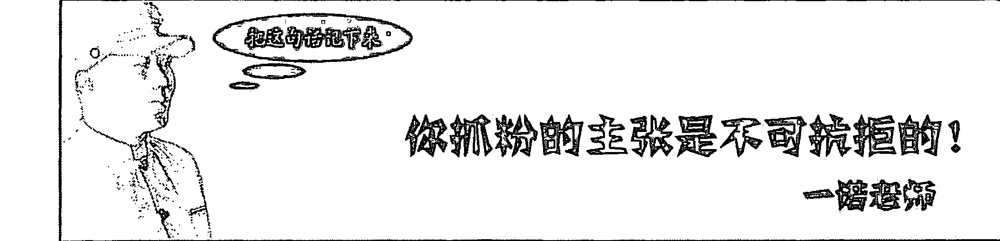

你记住，这时候人家对你一无所知，人家对你的信任是零。所以你的抓粉主张要无法抗拒，而且还要可信。

你如果说我送你十万块钱的价值，很显然成功率不高。

你不仅要无法抗拒，而且还要可信。

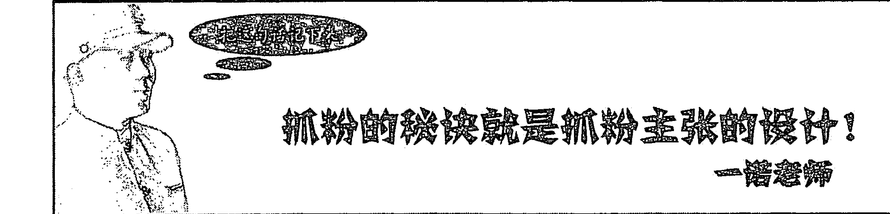

我们看小美的这个免费赠送是一个非常好的方法。但免费赠送要为下一步的变现埋下伏笔。比如说小美的得为他们现场的变现作好铺垫。免费赠送是一个非常关键的元素，如果你能够免费赠送。

但并不是说免费赠送一定要送你的产品，可以送与你产品相关的。

你记住，你需要送的是与你产品相关的，也许是免费体验，也许是免费测试，也许是免费咨询，也许是免费体检，也许是免费检查，也许是免费评估，也许是其它的免费学习等等有很多。

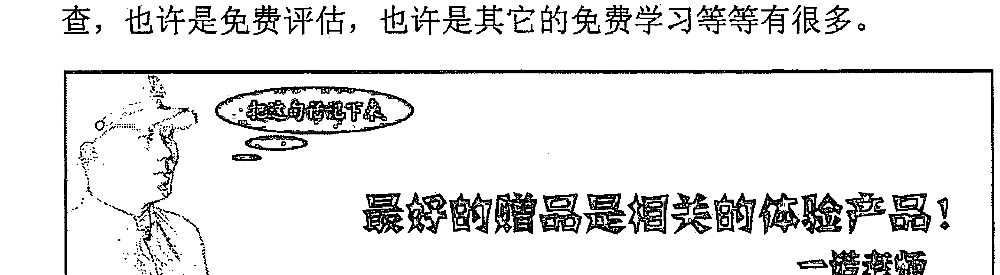

但你需要送的这个免费的东西，能够为你下一步你的产品的出场作一个铺垫才行，否则你吸引的人不一样。

比如说你是卖健身器材的，你送免费的眼镜，没有用！因为可能很多人看他戴眼镜不错，结果帮别人做眼镜广告去了……

这不能为你的产品作铺垫，非常愚蠢！

但是你送免费的瑜伽课，或者免费的减肥方法，说不定就能够为你的产品作很好的铺垫。然后也可能只付手续费，产品是免费的。这也很好。

免费是一个非常非常重要的杠杆。任何时候人们对“免费”有一种天然的本能的不可抗拒！

有这么几个测试，就是说有两种巧克力，一种巧克力的市场价是20元，另外一种巧克力的市场价是10元。

一个教授做了这样一个测试，他们在校园里摆上这两种巧克力，20元钱的巧克力只需要2元，10元钱的巧克力只需要1元。他们发现会有一定数量的人花2元钱购买这个20元钱的巧克力，也有一定数量的人花1元钱去购买10元钱的巧克力。当他们把价格降低0.5元。比如一个是1.5元，另一个是0.5元的时候，发现这个购买人数的比例没有太大的变化。

> > 只要不花钱，客户什么都想要！
> — 一诺老师

原来可能有10个人购买了20元钱的巧克力，5个人购买了10元钱的巧克力，现在仍然是这个比例。当他们降低0.7元，就是一个是1.3元，另一个是0.3元的时候，比例还是没有变化。

当他们把一个变成1元钱，另一个变成0元的时候，发现90%的人都要免费的，而不愿意付1元钱去购买那个20元的。

实际上价格调整的比例是一样的，而且谁都知道那个20元钱的巧克力要比这个 10 元钱的要好得多。

可没有人愿意付 1 元钱，愿意不花钱去要另外一个。
可能是人家嫌烦，不要钱就拿了，另外一个还要掏 1 元钱。
在学生食堂做了测试，而学生都是通过购物卡来购物的。所以
在结账的时候放这两种巧克力，然后进行测试。
说只要你说要，那个加 1 元钱的就直接从你卡里扣了，就是没
有其它任何动作。结果呢？和之前测试的是一样的。发现大家对免
费的东西特别的敏感。免费对人家的吸引力非常大。

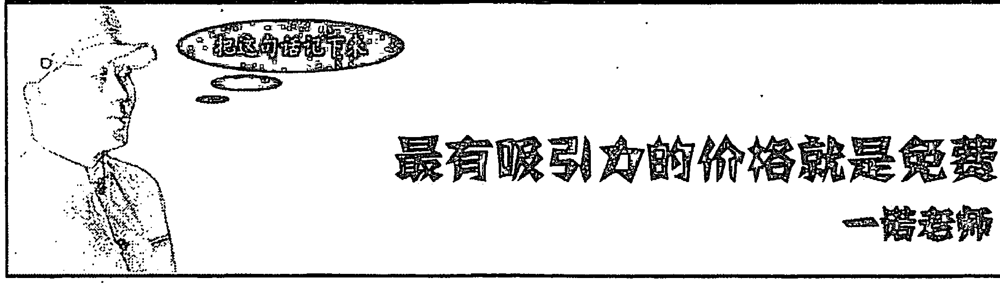

他们说这个是不是只是成人会这样，小孩是不是就不是这样了
呢？他们又对小孩做了一个测试，在美国这个鬼节的时候，小孩子
都拿着灯笼到家里去要糖。

有人做了这个实验，每个小孩都给他 10 颗糖，但不一样的是，
给了他 10 颗糖之后呢，然后他对小孩说你看我这里有两块巧克力，
这块巧克力呢，你需要给我 5 颗糖，我才能给你这块巧克力。

这个糖就是先免费给小孩，然后告诉他这里有两块巧克力，这块巧克力呢你要给我 5 颗糖我才能给你，因为这块比较大。

另外一块巧克力呢，你给我 2 颗糖，我就可以给你。

他们发现呢，有一定比例的人会给他 5 颗糖，就把 5 颗糖还给他，他给小孩这块大的巧克力，一定比例的人呢，给他 2 颗糖要小的巧克力。然后他们作了一个调整，调整到分别需要用 4 颗糖和 1 颗糖来换。结果和用 5 颗糖和 2 颗糖的比例没有什么变化。然后突然他突然改成 3 和 0 的时候，发现 100%的小孩子都不喜欢付出，都喜欢要那个 0 的。

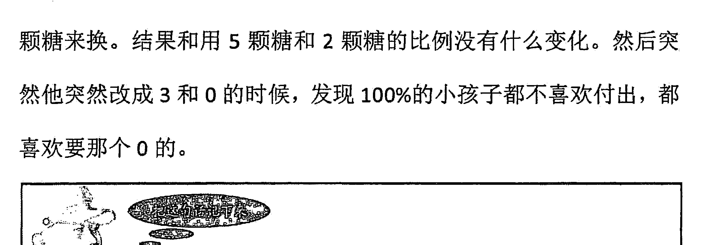

从价值的角度来说，这是不合理的。大家知道那块巧克力可能是另一块三倍的重量。很显然多付 3 颗糖是值得要那块大的，但是没有人要，因为免费对人们的吸引太大了。

为什么我们前端要用免费的东西的原因就在这里。

因为它的吸引力非常非常大，但是精彩的免费在很好的设计，

改变世界商学·世界企业家的摇篮 《盈利的最高境界》—一诺老师

为后端做很好的铺垫。即使你的产品不能免费，你也需要在其它的环节上设计免费的东西。

举个例子：

亚马逊做了一个测试，只要你购买了一本书之后再买第二本书，你的运费是免的。

就这么简单的一个免费，就突然增加了很多的销售量。

因为不需要运费啊。他一想，每次购买书还要付运费，现在第二本不需要付运费了，所以他就很有可能会购买第二本。

他本来坐在沙发上什么都不动，但是第一本书已经让他站起来了，你现在想让他走动当然要容易得多。很多吸金大师是这样的。

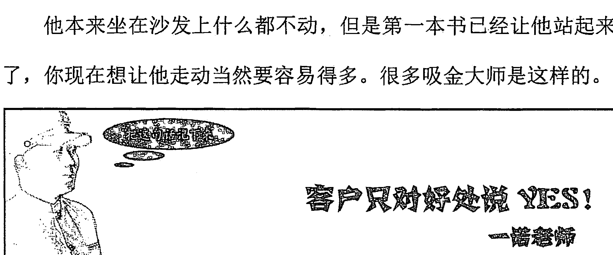

意思是本来他对你无所谓，不感兴趣，现在你的广告让他能够打电话给你，你已经让他动起来了，他就会有一种动量和势能在里边，你应该想办法让他加速。

他已经采取行动了，已经购买了一定量的产品，再让他购买更多。当然你需要给他提供更多的价值，让他看到你的产品的价值。
这就是为什么你的成交主张里一定得有免费的东西。
也许你的产品本身不能免费，但你总可以提供免费体验，免费测试，免运费……对吧？

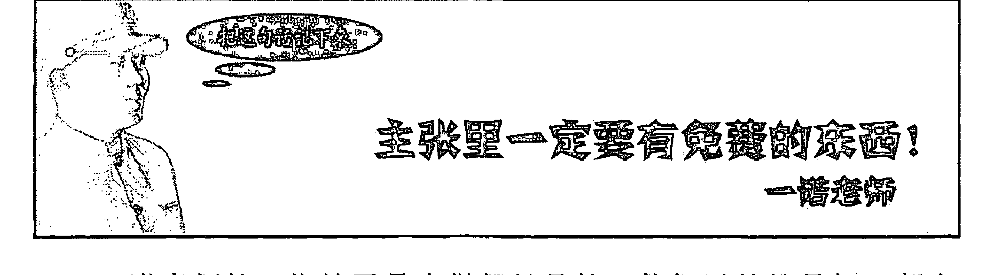

一诺老师的一位弟子是个做保健品的，他们以前就是把一帮人请来，然后会议变现，开始时变现还不错，十几二十万。
后来连两万三万都收不到，因为客户的抵触很大。
经过一诺老师的辅导之后，业绩倍增10倍以上……
让他们跟一个体检中心合作。
免体检费，然后通过老年人过来体检，你在体检中心设立一个很好的服务台，这样呢就比较容易了。
因为这些老太太老头都希望体检。比如说你给他们提供一个标准的菜谱做一个体检。
这个体检包括五项标准的。

如果你量大了的话就可以去和体检中心合作。现在每个城市都有很多体检中心，他们没有生意，你说你给我体检一个人我给你十块钱，很多人都愿意干。

然后客户体检五项，你再另外追售他三项，每项收费十块钱。一定比例的人就会购买。

这个说不定就可以把你整个体检的成本给摊平了。

你再巧妙的建立一个桥梁，为你再去拜访他或者追售你的产品而作好铺垫。因为体检本身只说了他在什么方面有问题，然后你的追售就变得更简单了。

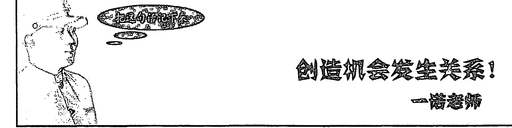

你总能够为你的客户提供免费的东西。

当你理解了一诺老师《全球疯狂吸金》的精髓的时候，你会发现自己会成为一个价值的吸金大师，你能够创造出价值，能够在别人认为不可能的地方创造出一些价值来。

所有人都认为体检需要 50 元钱、60 元钱，是你却能免费体检。

为什么呢？

是因为你找到了根本不景气的体检中心，是因为你给这些体检中心提供了很大的量，是因为你有后端的追售，所以你才能提供免费的体检。

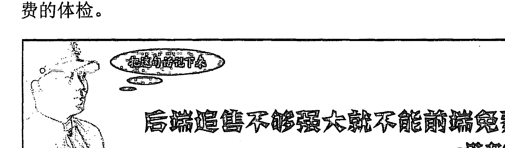

比如你说只付成本费，虽然我不能完全免费，但我一分钱没有赚，你可以去任何地方去检查。

为什么我们要这么做呢？

因为我想让你们首先体验我们产品的特点，我们产品的功能。

一旦你们体验这个产品，你们会发现它的功能比我说的还要好，你们会发现我们的产品能够给你想要的一切，到那时候我相信你会决定购买。

> > 一诺老师说：我们值得放弃第一次赚你钱的机会。

即使前面不赚钱，后面也会有一定比例的人购买。

但只能是第一次购买的新客户才可享受这种只付成本费的优惠。

所以像这种深度折扣的方法也是可以的，对吧？

重要的是，你的前端要让人感觉，“哇！不可思议！”但是又要有一定的可信度。

就是要有一定的震撼力又要有可信度。

“怎么可能呢？”

但是仔细一想呢，又有一定的可能性。这个可信度非常重要。

关于如何让免费比收费更赚钱，如何设计出让客户尖叫的、不可思议的、大跌眼镜的免费模式，那就请回去认证学习《猪买单》，

猪买单是免费的最高境界！

我现在讲的真的不及一诺老师亲自执笔《猪买单》书里的万分之一，当你把《猪买单》学习100遍以上，就会出现一种奇迹，这种奇迹叫做：羊毛出在狗身上《猪买单》！

当你学会《猪买单》你能够瞬间颠覆整个行业，打的同行满地找牙，跪在地上唱征服……

## 第七节：潜在客户资格框定

在这里有几个重要因素，就是潜在客户的框定非常重要。一诺老师曾经讲过两种方法。

### 第一种框定：身份限定

因为你提供了一个无法抗拒的主张，你不希望所有的人都进来，你要对你的潜在客户有一个限定。

比如说你卖保健品，你可以限定你的潜在客户的年龄，或者是限定一个街区，住在这个地方的并且有你以前体检的历史的人。

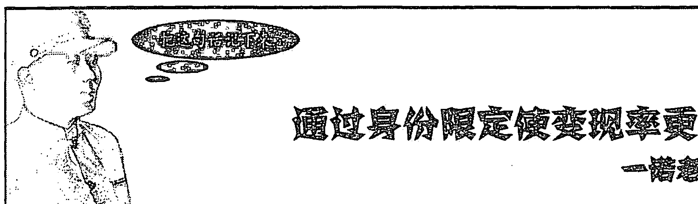

每个情况不一样，你需要慢慢地限定。就是说你通过逐渐的更好的限定你的客户，使你的变现率更高，你的成本更低。

很显然，你这里如果能够通过某种资格的排除，把一些非你的潜在客户排除，那么你的变现率就提高了，你的整个吸金成本就降低了。那就意味着你的前端可以放得更大。
所以，一诺老师希望你们看出来我们现在所做的一切，里面都隐含着杠杆，不止是说就省两毛钱的成本费而已，不是这样的。关键是它有一个巨大的杠杆，反过来就有更多的合作伙伴可以合作，有更多的鱼塘可以借力。然而意味着有更多的人会进入你的盈利系统，这是身份的限定。

### 第二种框定：行为限定

比如说我这个产品是免费的，但是我们这栋大楼没有电梯，你需要爬到33楼去领取。

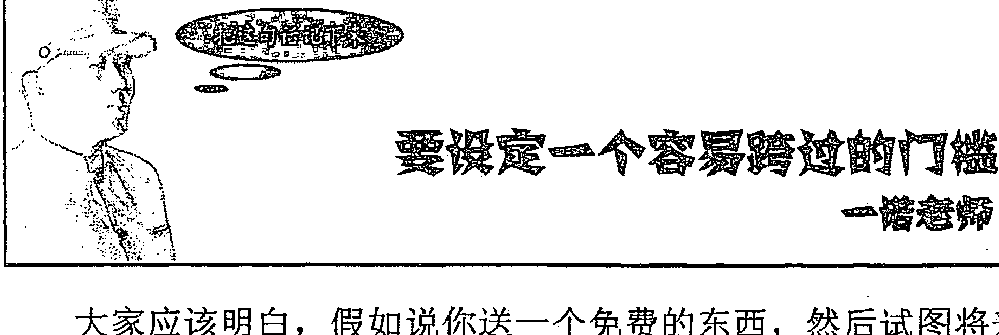

大家应该明白，假如说你送一个免费的东西，然后试图将来有机会去变现产品给他。

如果你在1楼送免费的东西和在33楼送免费的东西，很显然是不一样的。

爬到33楼的客户，你成交他的可能性远远超过在1楼的。

这就是人性，他付出的越多，他更愿意往前走。

另外通过努力，他意识到这个东西的价值确实对他很重要，他才会去爬33楼。

而不是想随便占点便宜，随便想占便宜的人，如果爬13楼，可能他就不会去了。

所以通过这么一个行为的限定，你就把非你的目标客户给排除在外了。你可以对他身份限定，如年龄、性别等，这个可以。

另外行为限定一种方法，比如支付手续费、押金等。

比如说一诺老师18年前就开始做免费领取学习资料，免费领取的人很多，但是我们也可以说支付一块钱的手续费，那很显然，你的这个前端的响应人数会降低，但你的变现率会提高。

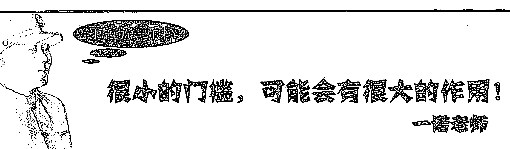

就是很小的门槛，可能就会直到很大的作用。

比如一诺老师也曾经测试过800电话和普通电话的区别，就是你的客户需要打电话给你，提不提供 800 电话？800 是全国免费的电话。

那么 400 的电话质量就差很多。然后如果是普通电话质量就很高。其实电话费可能有几毛钱，但是结果完全不一样。这里边你发现就像一样机器有很多微调的空间和余地。

所以，吸金系统就像一个机器一样，有很多环节是可以不断的优化、不断的调整。

这里讲的大多数是一诺老师 15—19 年前的案例，是一诺老师终极弟子通过一诺老师的课程录音整理而成，如果你想学习 2019 年最新资讯，建议你购买一诺老师亲自撰写的《全球疯狂吸金》，那本书跟我作为一诺老师弟子写的这本书相比真是天壤之别，希望你有资格拥有！

## 第八节：完美的风险控制

然后是风险控制，就是计算你前端的直接成本。你前端送的东西的直接成本要控制好。如果你要免费送，你需要找合作伙伴。

如果他本来生意不好，比如说体检的例子，能给他创造后端，这个老太太将来说不定还会来付费体检，那么就相当于你给他抓粉，你说你不应该在这里赚钱，我只能付你成本费，很简单，对吧？

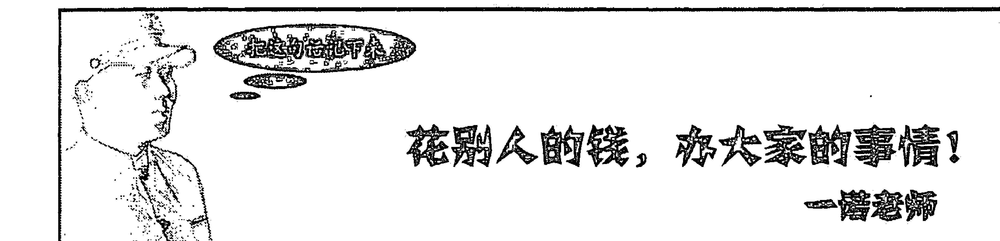

比如说你跟某个作者合作，用他的书做赠品，例如每本书 50 元。你给我 5000 本，我付你成本费，一本 10 元钱，他肯定干。

为什么？他的所有的排版、内容所有东西都弄好了，就是加印 5000 本，就是一个成本费，对吧？

再说他的量上去之后有几件事情会发生，这些人喜欢这个作者，说不定会跟他买其他的书，或者报名其他的课程。

通过这个事情就把这位作者的知名度打开了！如果你有机会跟健康杂志、时尚杂志等合作的话，一诺老师觉得有很多这样的机会。你们要了解他们的成本结构是什么，价值 240 元钱一年的杂志，你可以用 60 元钱购买。当然如果你能说服他，你给他带来更多的后端利润，说不定尤其在推广期的书在亏钱，免费可能他都会送，有很多这样的机会。你要很巧妙地把前端的成本降低，你的前端的成本降得越低，就说明你的变现率可以更低你都不会亏钱。你的追售的变现率可以更低你都不会亏钱。那么就意味着你的前端可以放得更大。降低你前端的直接成本非常重要。另外一个最重要的是你要先测试，后放大。不要说，OK！开始，任何人来都行，没有限制。我们先测试一个星期，或测试一天，测试前 500 个人，对吧？万一你的主张是失败的，万一亏钱，你亏得钱也很少。但是你经过几种不同的测试可以找到一个方法，所有的吸金，

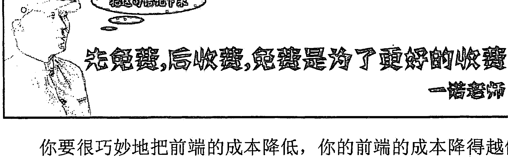

包括一诺老师教的知识，所有的策略、所有的技术，如果你们现在冲出去马上就去做，百分之百按照你想象的可能性是零。

一定会出现这样或那样的问题，但是这样那样的问题都是可以微调的。成功就是不断试错的过程！

在测试阶段，千万不要冲出去就大规模的扩展。你的系统永远是测试、放大、优化。

其实这本书你已经觉得很厉害了！

但是你知道嘛，这本书是一诺老师15—19年前的演讲课程录音资料整理出来的，我觉得里面的内容很经典的，在我的强烈恳求下，才被授权许可将一诺老师的这些课程现场录音转成书籍！

如果你想学习最新的商业智慧，一诺老师亲自撰写的《全球疯狂吸金》，我看过手稿，那简直是惊天地泣鬼神！

十万块一本都不贵！

但是此书暂未发行，只传给一诺老师的终极弟子！

这些弟子包括例如：
- *为老师
- *金老师
- *心老师
- *文强老师
- *强老师
- *引华老师
- *国顺老师都是得到这本真传！

## 第九节：无法抗拒的变现主张

这个部分呢，我们从大量的抓粉，通过无法抗拒的抓粉主张，通过和别人的鱼塘的合作引进来了。

别人都去认领你的免费的或是其它的什么主张，反正有大批的人会响应。你记住你的抓粉阶段是没有赚钱的，这时候需要成交的部分的补偿或者是全部补偿。

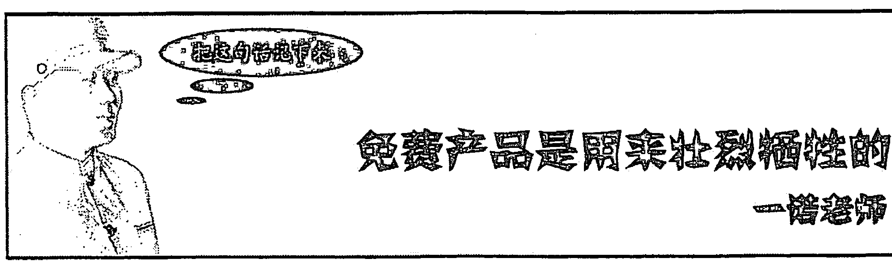

你说免费送你们理发，其实免费理发是一个很好的抓粉主张，只要你在比如说上午十二点之前来就免费给你理发。这很好，实际上你的成本几乎没有，只有电费、水费而已。然后他来了，但你不要追售他一个5000元的会员，没有用。

你可以追售他一些其它的。比如说如果是女士的话，可以追售她其它美发的产品，对吧，你给她一个五折的优惠。一定要让这个台阶非常的小，非常的轻松，并且要让她觉得无法抗拒。

## 第十节：如何让客户立刻行动

更重要的是成交的时间的限制，例如：只此一次、只限今天、20:00以前，24小时之内，现在就做决定的，10分钟内心动的！

新客户优惠：如果你现在不能决定，你只要出去之后再进来，那我们就不能给你这个优惠了，因为这是我们给新客户的优惠。

现在就决定：所以只要你现在决定，原价300元的产品现在就是150元。我们希望你能对我们的服务有一个更深入的认识。

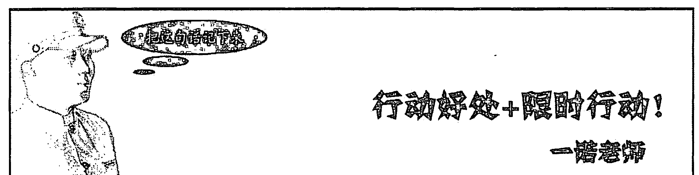

当然选择的权利是客户的，客户可以不选择我们，但是一诺老师觉得我们应该要有这种姿态。

这时候变现就会更容易。

就是说前面是免费，但这时候是需要付钱了，但付钱的金额不要太大。

## 第十一节：变现时机的策略

一诺老师还有很重要的一点就是变现的时机把握，

一个就是他已经确定拿好了这个赠品之后，然后你说：“也顺便跟你说一下，我们这个星期有个特别的促销，只对新客户。这是我们150元的套装，现在只需要70元钱，但是只能对新客户。如果你走了，我们就不能给你了。”

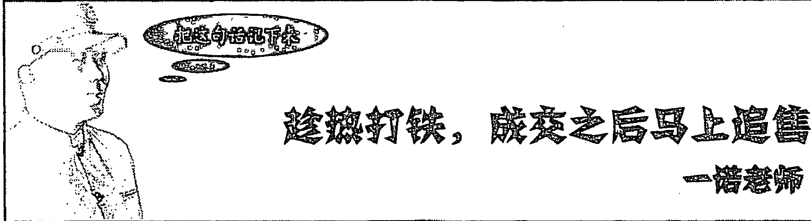

> 趁热打铁，成交之后马上追售！
—一诺老师

你需要在他前面一个阶段完成之后，再进行一个追售的说服。

但是主张不能有强迫性，如果你觉得他在抵触，你就不要再推了。没有关系，你就是不要有太强烈的追售意图。

如果他要是有抵触，你还硬推，那么人家就会觉得你前面为抓粉免费赠送的东西不是真诚的，你真正的目的根本不是要给我价值，你的目的是要赚钱。

虽然我们的目的是要赚钱，但是我们不是说要强迫你消费，我们需要等他认识到这个东西价值的时候，让他的购买变成一个自愿的，对吧？

如果他没准备好没有关系，我们还会给更好的价值。

要相信，如果我们能够帮助他，如果我们能够给他他想要的，如果我们对他的需求理解没有偏差的话，最后他会选择购买的，要有这种心态。

我拜读过一诺老师那本《全球疯狂变现》的手稿，太震撼了，里面说：变现的时候一定不能有太多的痕迹。

- 没有营销的营销才是——《营销的最高境界》
- 没有广告的广告才是——《广告的最高境界》
- 没有成交的成交才是——《成交的最高境界》
- 没有变现的变现才是——《变现的最高境界》
- 没有产品的产品才是——《产品的最高境界》

更多的自己脑补吧！

不能透漏太多，以免不尊重一诺老师的版权，就讲到这里吧！

## 第十二节：变现主张的数量如何控制

更多绝学课程请咨询微信xi383921,备注：咨询！

变现主张的数量，在这个时候很重要，你不要给他，“啊！我们现在促销，我们有30种产品促销，都是半价。”

当然这30种产品可以不同类的，但一诺老师说过：同一类产品，不能有太多。你看我们有5公斤装的、2公斤装的、1公斤装的，那样的话，会让客户很困惑。

你记住了，你现在仍然不是要赚很多钱，你现在是让他在原来迈了一小步的基础上再迈稍微一个大步。

你现在是要做这个事情，是要提高他的信任，同时从经济上来补偿你前端抓粉的一些成本，仍然不是你赚大钱的时候，所以不要给他太多的选择。

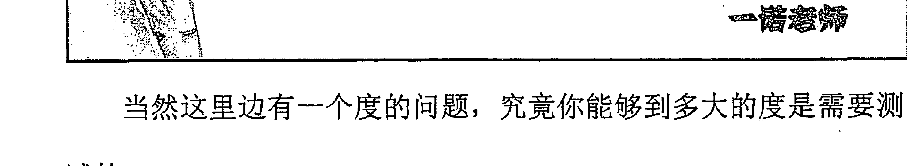

当然这里边有一个度的问题，究竟你能够到多大的度是需要测试的。

所以，一诺老师觉得这个变现主张的数量最好只有一个，就有一个选择是最好的。你比如说周总他们可以充50元送50元。
当然还可以，充100元送100元，充500元送500元或者充500元送600元，也可以推这个。
但这样你就让别人的选择很混乱了，不知道选什么了。
在这个时候你们要特别小心，他对你的信任还没有很高的时候，不要给他太多的选择。变现主张的数量要控制好。
这时候变现客户的额度也不能太高。
透漏《全球疯狂变现》的其中一个细节，变现要有台阶，要像温水煮青蛙的方式，不能操之过急！每次变现主张不能太多，因为人们都有选择恐惧症！

## 第十三节：不可抗拒的理由

另外一样的要解释原因，为什么我给你打折，是因为对于新客户，我们希望他们能够认识到我们的价值，通过体验而认识到我们产品和服务的价值。

这是我们的主张，毫无疑问我们每个人都需要赚钱，但我们跟别人不一样的。

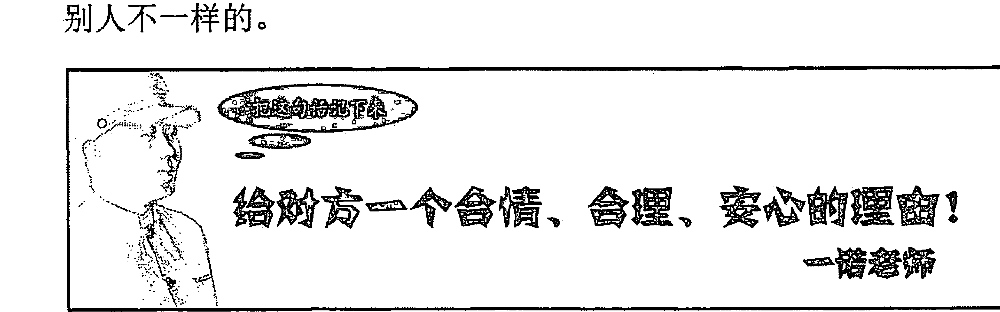

一诺老师认为，在前端我们可以牺牲一些利润，等你认识到这个东西价值的时候，你才会自愿的选择我们，对吧？

所以，这是变现的环节。

# 第六章：完美的营销战术

## 第一节：追售八大密码

追售有很多种，一诺老师课程提过八个，让我们一起跟着一诺老师学习——追售八大密码

- 第一个密码：最有效的增销
- 第二个密码：最有效的减销
- 第三个密码：最有效的再销
- 第四个密码：最有效的跨销
- 第五个密码：最有效的搭销
- 第六个密码：最有效的捆销
- 第七个密码：最有效的赠销
- 第八个密码：最有效的锁销

### 第一个密码：最有效的增销

增销就是说他买了一个东西之后，花了1000元，然后你说我们还有1500元的版本，价值是那个1000元钱的两倍。就是在他原来的销售额的基础之上去提高销售额。

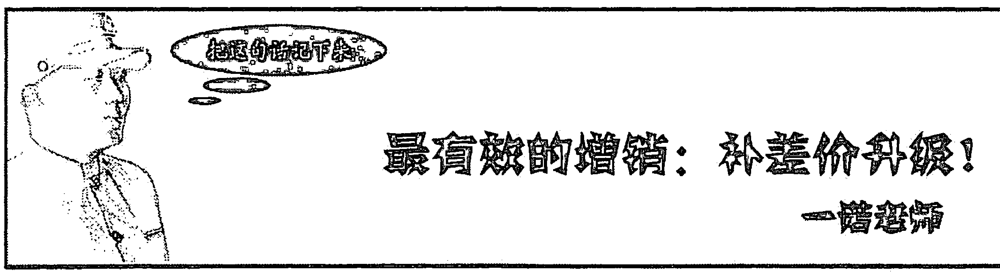

例如2017年之前一诺老师的课程就是阶梯定价，1980元网络基础班，5980元网络高级班，如果你觉得初级班好，就可以补差价升级高级班；
上完高级班，还可以补差价线上线下全能班，当时线下全能班19800元，结果大家因为上了基础班和高级班受益了，就毫不犹豫加钱升级更高的班级，这就是增销。

不过现在一诺老师创立的【改变世界】APP几千万粉丝，而且还在不断的裂变，因此一诺老师重点放在搭建平台，而且现在一诺老师的音频/书籍等，终极弟子推广拥有100%的分润。

### 第二个密码：最有效的减销

你给他1000元钱的东西他不愿意购买，那你就可以试图卖给他500元钱的东西。比如说你卖西装，一个高档的西装他不愿意购买，你就换推低档的西装他愿意购买，这就是减销。

就像很多人上《商业模式·顶层设计》网络基础班、高级班没有钱，因为这两门课但是需要5980元，很多人没钱怎么办？

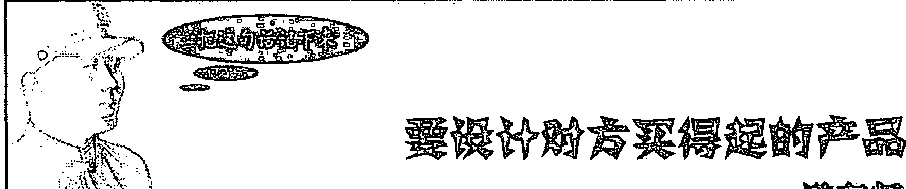

如果他还没有钱怎么办？对于很多月光族来说，有想要拥有一诺老师的知识，他还可以选择花298元买一本《商业模式·顶层设计》书籍来看看。

### 第三个密码：最有效的再销

就是有一些产品他可以重复购买。比如说消耗性的产品，他购买了一个月的量，他可以再卖他三个月的量。

就是重复销售同样的东西。

例如：很多人上了一诺老师的课程不错，就可以上一诺老师弟子的成交、财商、演讲之类的课程……

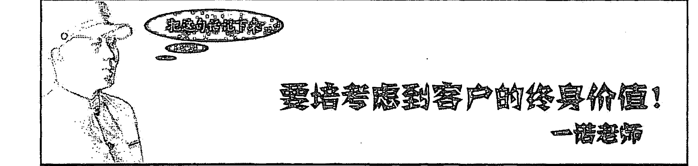

现在【改变世界APP】上有几百位世界大师的课程，他们都可以免费学习，现在还是培养信赖感的阶段，现在【改变世界APP】粉丝几千万粉丝基数，将来肯定会有1个亿、2亿、3亿、5亿、10个亿，有没有可能买其他的老师开课？(有) 有没有可能卖书？(有)

这都是可以的，这就是一诺老师的布局！

相信将来一定会成为全世界最优品质的文化社区！

### 第四个密码：最有效的跨销

本来你卖的是培训产品，现在你卖了一个电子设备，跨到了另外一个产品类别，这就属于“跨销”。

跨销能够实现的前提是，你的潜在客户非常有可能购买另外的产品，因为它们是相关的。如果你是做英语培训的，那你向客户推荐数学或语文培训，这就叫“跨销”。

例如：【改变世界APP】就是一个大鱼塘，将来肯定会有几亿的大数据，那么，重点来了，这些粉丝——

- 有没有可能出国留学？
- 有没有可能读研读博？
- 有没有可能创业借贷？

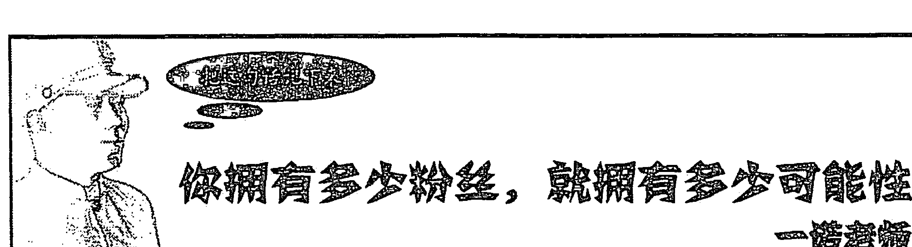

这都是商机，一诺老师前年弟子密训的时候说：变现的最高境界就是把不同的产品卖给同一批顾客！

### 第五个密码：最有效的搭销

搭销跟增销是有区别的。“增销”是提高客户购买的金额，比如一诺老师的《商业模式·顶层设计书籍》298元，通过你的主张，最后他买了3980元的《猪买单》，这叫“增销”。

而“搭销”是指卖完一个产品后，又卖了另外一个相关的产品。就像客户买西服后又买领带的故事，这是“搭销”。

例如：一诺老师的粉丝很多，因为他们喜欢、认可、热爱一诺老师和整个平台，那么很多弟子出书，也放到【改变世界APP】上面卖，别人一看原来是一诺老师终极弟子写的书，作者是：一诺老师+某某弟子，于是一诺老师的粉丝爱屋及乌也顺便购买一本。

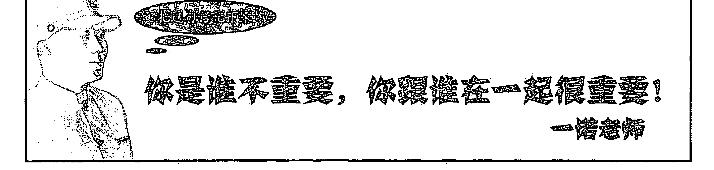

很多终极弟子的书《成交心法》、《品牌魔力》、《万能演讲模版》、《营销设计》、《勾魂攻心》等，就是靠着一诺老师这颗大树，靠着【改变世界APP】里面有海量的粉丝，每月卖书都有几万进账。

### 第六个密码：最有效的捆销

把两个产品组合后，捆在一起卖，但也可以分开独立卖。如果客户买你的组合产品，可以得到某些优惠。这样你给客户更多的选择，你也有更多变现的机会。

例如：老学员都知道，一诺老师线下课学费21800元，因此曾经有几位一诺老师的弟子经过一诺老师训练1年之后，也开始牛刀小试收弟子，结果1万块都没人报名！
最后捆绑一诺老师的课程，说只要报名弟子39800元，就可以有几个几个学习一诺老师课的名额，别人觉得好划算，于是报名了，这些弟子因为捆绑了高价值的一诺老师课程才让自己更值钱！

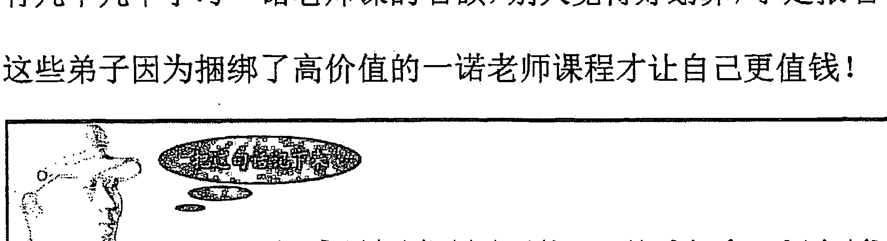

就好像一个塑料袋卖多少？5毛钱！可是这个塑料袋里装了一枚1万块的钻戒，现在卖这个塑料袋1000块钱，里面的钻戒也归你，各位你会要吗？答案是肯定的！

### 第七个密码：最有效的赠销

就好像，只要报名一诺老师的课程就会有很多赠品。

如果报名一诺老师的弟子，那赠品可就多了……

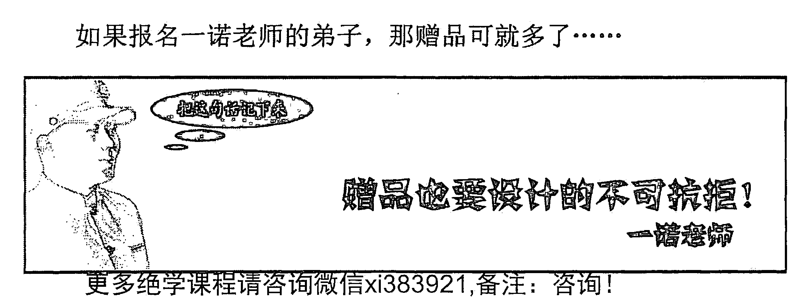

更多绝学课程请咨询微信xi383921,备注：咨询！例如：一诺老师终极弟子100%复制一诺老师的六大能力！

- 赠品1：全球合伙人
- 赠品2：一诺老师所有书籍100%分润；
- 赠品3：一诺老师所有课程100%分润；
- 赠品4：【改变世界APP】合作讲师100%分润；
- 赠品5：超级帐号【改变世界APP】6位数ID帐号；
- 赠品6：终极弟子可以共同做项目共分等……

好了，一诺老师说过不能公开这些赠品，等有机会你能够成为一诺老师终极弟子就知道了，一诺老师把钱100%分给终极弟子，一诺老师不是为了赚钱做教育，而是为了帮助终极弟子实现梦想！

### 第八个密码：最有效的锁销

就是锁定会员，锁定他一年两年或者更长时间的消费，然后给他一个非常巨大的优惠。通常除了折扣我们会给他一个赠品。

并且赠品最好是高价值低成本的产品。

客户有一个什么样的心理呢？

就是他今天交了一年的钱，你说OK，你现在每个月来理发都可以省钱了，或每个月来购买东西都可以省钱了，这当然挺好。

但是他交给你钱了，他什么也没拿到，他会觉得不舒服。所以你如果有一个超级赠品再加上省钱，会非常好。

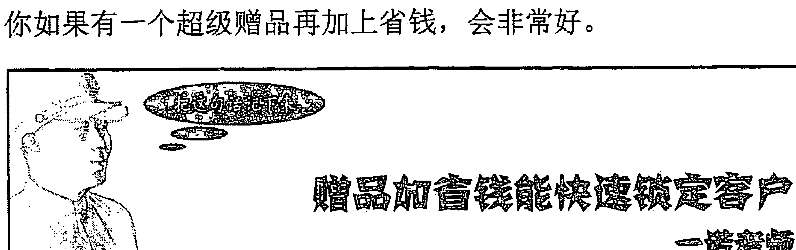

就是他交完了钱之后他还可以拿一个赠品回家，然后将来还可以继续的省钱，这个概念会更吸引人。人们有一个习惯，就是他交了东西，他还希望拿到东西。这个非常重要。

锁销是一个非常重要的武器，每个企业都应该想办法做一个锁销的计划，其实每个企业都可以做锁销。

你们看现在全国的理发店都在卖会员，全国的按摩等等都在卖会员。有很多商家使用充值卡，其实就是锁销，锁定你了，对吧？

锁销就是锁定你，锁定你只一个目的——不断的变现。

但是有多少人锁销了之后，会百分之百用完他的产品和服务的呢？很少。

比如说你购买168套餐，可以每个月打500分钟的电话。但有多少人真的打了500分钟呢？很少。

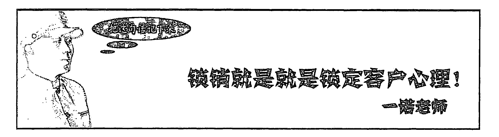

这就是我们的一种心理，就觉得我可以有无限，我可以没有限制的使用产品和服务，但实际上没有限制你却从来都没用。

就跟卖自助餐一样。觉得98元好便宜，但是你消费的钱从来都不到98元。这就是人们的一种心理。

锁销是一个很重要的变现技术。比如说很多人发代金券，你现在花1000元就能购买2000元的代金券。

但是有相当多的比例是最后被丢掉了。每一个这样的业务最终都会剩下一些，他没有去使用。你不相信你可以去所有的美容店和理发店，你去问他们，有没有会员最后剩了钱一两年都没来的？多的是这样的会员。他充了5000元，你认为他会用完最后一块钱才会消失吗？不会，他可能中途就搬家了，他搬了之后他说我原来的地方好像还有20元钱还没有消费完，我得去要回来。很少有这样的人。说不定他一搬家那个卡的事情就忘了。

本以为好像是打折，但实际上没有打多少折。所以锁销有无穷多的变化。锁销本身就是一个很神奇的变现技术。

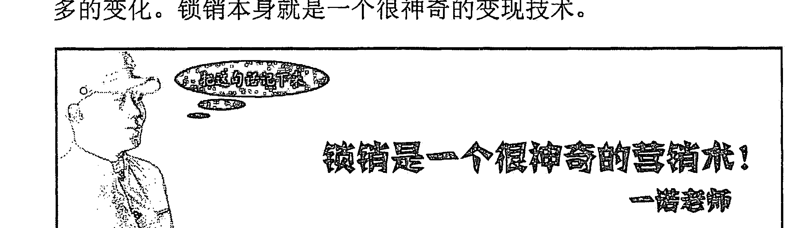

还有一个是追售，追售主张的构成一样，你的追售主张一定是无法抗拒的。

一诺老师说，你的追售主张一定要无法抗拒，我们发现有一种追售方式很简单。
就是说你现在进到我的店里来，免费的理发，然后你又升级了一个套餐，花了100元做一个200元的项目。

你可以说：现在我们有一个500元的充值卡，或者是1000元的充值卡，哪种更效果更好是需要测试的。比如说有1000元的充值卡可以享受6折优惠。你看你已经花了100元做这个项目，对吧？

如果你现在充值呢？这个100元钱就不算了。

这时候他觉得很好，他就做了另外的项目。

所以他就充了这个500元或者是1000元。

这一步很轻松。为什么？他的这个心理就说，“啊！我白做了这个项目，然后将来还可以用那个100元的产品和服务”。

但是一旦他交了这个500元，就意味着他必须要来。

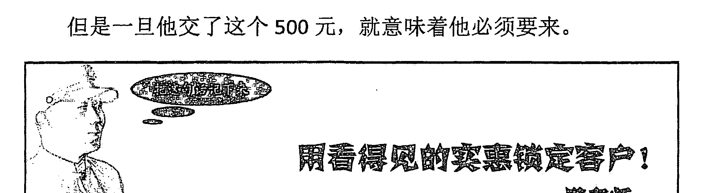

他本来是有很多选择的，也许他刚搬到这个地区，他有很多选择，一旦他购买了你500元或1000元的充值卡，那么他就已经没有其它选择了，他就选择你了。

当然，你仍然需要提供高质量的服务。假如说你的服务仍然能够像他想象的那么好，他现在已经没有理由拒绝你了。当然等他的那500元用到还剩200元或100元的时候，你当然还要向他追售1000元的卡，然后再加上个赠品。

当他的1000元钱用到还剩200元的时候，你当然还得向他追售5000元钱的卡。一诺老师说这叫一层一层的跟进，最后等他变成了5000元卡的时候，他就变成了你的一个铁杆客户了。

不要单纯的从技术层面去理解，好像有很多把戏。其实这些都要建立在为客户创造价值的基础之上。

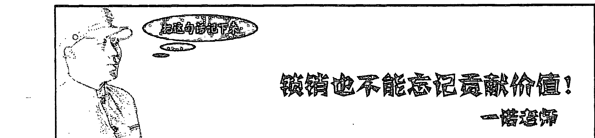

没有价值，所有这些东西都没有用。

我们要把这种选择，从客户的角度变成一种没什么值得思考的，这就是最好的选择。我喜欢这个理发店，我喜欢这个理发师傅，他剪得很好。每剪一次60元，现在充了1000元之后，我最近又不会搬家，那么我可以打六折，我干吗不呢？对不对？

一诺老师说：你一定要为客户创造价值。

## 改变世界商学·世界企业家的摇篮 《盈利的最高境界》一诺老师

其实让这种锁销变得更有趣的、更无法抗拒的就是任何时候你觉得不想继续了，我们可以按比例退给你钱，就是你用了多少算多少，没用的部分我们还退给你。就相当于到你不想继续的时候，你可以拿回余款，但是你前面白白享受了这个VIP会员的优惠。

那这样他就更没有后顾之忧了。为什么？很多在充这个500元钱的时候在想，万一我用不完呢？万一我搬家了呢？你说没关系，你现在可以有享受优惠的权利，但却没有被套牢的顾虑。

但是很多顾虑就是他交钱那一瞬间的顾虑，但最终他真的会搬家了，他会来退余款吗？真正退的比例并不多。怎么把你的主张变得无法抗拒有很多因素。你记住，你所有的主张的设计，必须是围绕着人性，围绕着他真正的担心、顾虑和困惑。

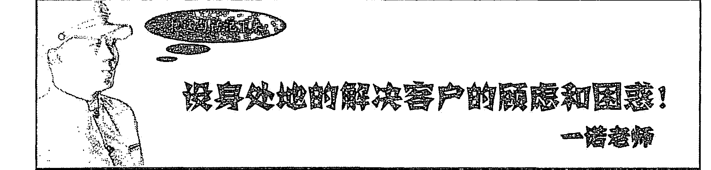

如果你的设计不能够围绕他的担心、顾虑和困惑进行，那么就没有价值，你这个设计对他而言是没有意义的。

## 第二节：追售的最佳时机

然后追售时机的把握也一样，等他前一个交易已经定了，你再决定。你不要在他前一个交易还没有完成就去向他追售。

比如说他进来免费理发，然后交了100元享受一个200元的升级服务，他一边在做头发，你一边在向他销售，这个事情就会很烦人，对不对？那么成功率就会很低。

等他完了之后，他明显觉得很满意的时候，在他认为超值的时候，你再进行一个追售，实际上就更容易了，你的成功率也会更高。

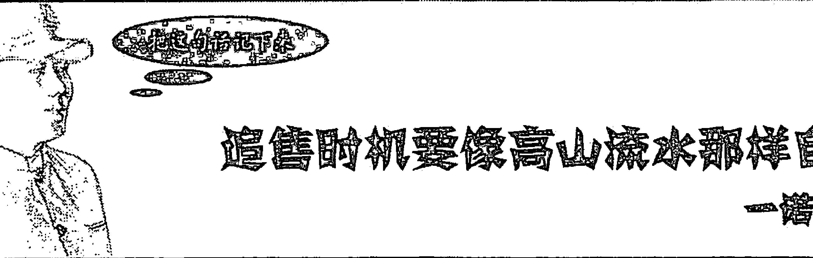

这个时机的把握很重要，时机一定要把握好。你不要让人家觉得你在存心这样。

记得如果他不满意，那你推动他的速度会很快。如果你的价值塑造的好，确实让他感受到这个价值，不需要再强烈的销售。

追售的时机把握非常重要。这个也可以测试，就是变现有很多主张是可以尝试的。

比如说你进行追售，你是追售他500元的产品还是800元的，还是1000元的还是5000元的，这个都是可以测试的。

然后你是有赠品还是没有赠品？

是A赠品还是B赠品，是送服务还是送化妆品？

你是在他理发的时候追售，还是在他付款的时候追售，是由你们的理发人员来追售还是由收款的人员来追售等等，效果都不一样。

所以，有很多主张都可以测试。

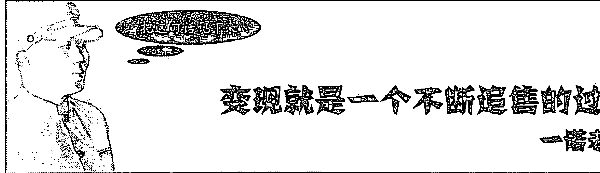

具体每个人的业务都不一样，答案是什么？

我不知道，但是答案一定是在其中几种组合之中某种平衡的点，需要通过测试才能够知道。

> 我相信当你学会《全球疯狂吸金》你就不缺粉丝(鱼塘)。当你学会《全球疯狂变现》你就不缺钱，因为你有变现(捞鱼)的能力。

## 第三节：追售的最佳时间

追售时间的限制也一样，就是说最好是他付款的时候进行追售。

为什么呢？

因为他付款的时候，已经是认可并接受你的产品或服务了，人都有这种心理，既然买了，就买更好的吧，既然买了，就顺便多买点吧……

举例：很多人买了一诺老师的书籍，一看到一诺老师弟子的书籍也顺便买一本，这就是购买惯性！

购买惯性来自于哪里呢？

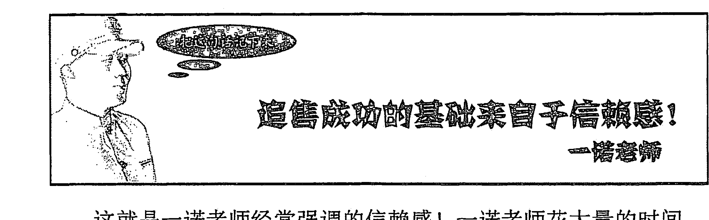

> > 追售成功的基础来自于信赖感！——一诺老师

这就是一诺老师经常强调的信赖感！一诺老师花大量的时间，动用公司大量的人力物力财力，到来世界各地实地走访企业，向成功的企业取经，然后总结成通俗易懂的案例，并免费讲给大家听，要说一诺老师成功的秘诀是什么？两个字：付出！

## 第四节：追售的最佳主张数量

追售的主张数量不要太多，不要既追售 500 元的产品，又追售 2000 元的、3000 元的产品。最后把客户给搞困惑了。

追售的额度，一个是要测试，另外一个要根据信任的程度而定。

如果你卖他一个 500 元钱的卡，你还有机会卖给他 5000 元的产品。如果你卖他 5000 元的产品，他不要，如果你销售的方式不好，那么你可能永远失去了这个机会。

> 追销额度控制非常重要，先牛刀小试！
——一诺老师

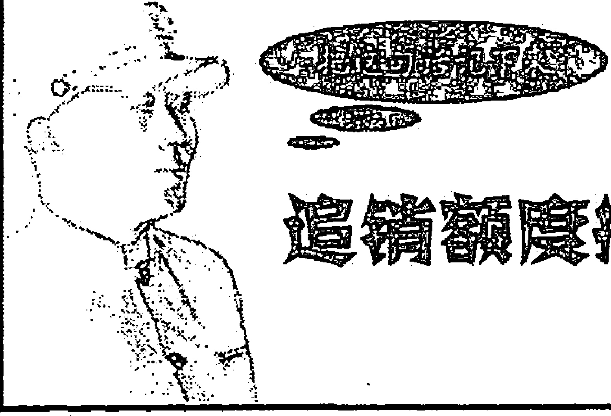

例如：购买《猪买单》3980 元的学员，这样的学员一般都是骨灰级的粉丝，非常相信认可一诺老师！

那么一诺老师的助理和弟子就可以顺便问一下，要不要带一套《全球疯狂吸金》1 本才 398 元，如果他说好吧，很便宜买 1 本。

后来发现，这么便宜多买几本、甚至其他弟子的书也带上。但是弟子在推荐的时候，只能先推荐 1 本，这样他们觉得便宜。

## 一诺老师最高境界系列书籍

| 书名 | 副标题 |
| --- | --- |
| 《猪买单》 | 免费的最高境界 |
| 《商业模式·顶层设计》 | 商业的最高境界 |
| 《一步一步引导别人说YES》 | 说服的最高境界 |
| 《全球疯狂吸金》 | 吸金的最高境界 |
| 《全球疯狂变现》 | 收钱的最高境界 |
| 《盈利模式》 | 盈利的最高境界 |
| 《魔力演说》 | 演讲的最高境界 |
| 《营销大师》 | 营销的最高境界 |
| 《催眠大师》 | 销售的最高境界 |
| 《成交大师》 | 成交的最高境界 |
| 《融资兵法》 | 融资的最高境界 |
| 《顾问兵法》 | 顾问的最高境界 |
| 《领导兵法》 | 领导的最高境界 |
| 《股权兵法》 | 股权的最高境界 |

更多一诺老师书籍，请加微信809008505 慕容老师

## 第五节：无懈可击的追售理由

最后你也要解释你给他优惠的原因。为什么你要给这么好的优惠给他。这点也非常重要。如果不解释原因，他很有可能会有疑惑。

他可能就不太相信你给他的这个东西是真的，这样也不利于你的变现。

就像有一诺老师的弟子，是网络上课：

+   - ★《弟子密训》音频课程；
- ★《弟子密训》直播课程；

这个课程100万元人民币，但是可以免费，为什么可以免费呢？

一诺老师的课程向来以简单、粗暴、有效、实战、落地而著称，你是因为受益才会买书、报名课程，一诺老师普通课程都要几千块一两万，而这个《弟子密训》课程你想要免费，可以：

在朋友圈发布100条一诺老师的音频链接，你就可以免费学习。

但是你如果不发呢？

你交3万块，一年后申请2万奖学金，相当于免费！

解释原因：奖励那些愿意付出和贡献的人！

改变商学，世界企业家的摇篮《盈利的最高境界》一诺老师

《全球疯狂吸金》有讲过，前端借力就是要借用别人的鱼塘来进行抓粉。哪些是我们要找的鱼塘呢？

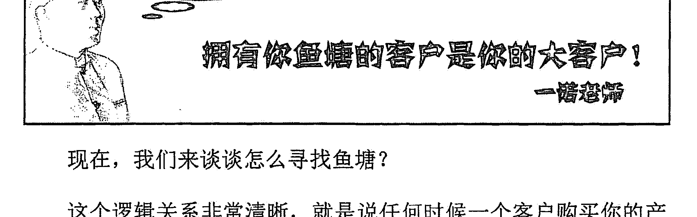

现在，我们来谈谈怎么寻找鱼塘？

这个逻辑关系非常清晰，就是说任何时候一个客户购买你的产品和服务的决定不是孤立的，他购买你的产品和服务是满足一个梦想，实现一个大的愿望。

那么你的产品和服务并不是满足他的梦想，帮助他实现愿望的唯一产品和服务。

那么有些产品他在购买你的产品之前已经购买了；有些产品他在购买你的产品之后必须购买；有些产品必须跟你的产品协同，同时使用，增强你的产品的效果；有些产品是跟你的产品共存的，虽然没有太多的直接联系，但是是共存的。

比如只要购买《猪买单》书籍，就可以听《猪买单》课程，而且是免费的！

## 第一节：鱼塘初体验之牛刀小试

找到了鱼塘，我们应该怎么跟他合作？成功的因素有哪些？

很简单，在跟别人的鱼塘合作之前，你需要先找塘主。

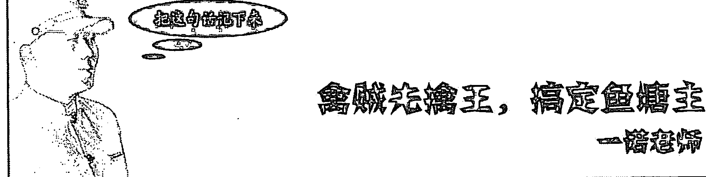

你需要有测试结果。鱼塘或者是别的塘主没有兴趣跟你做实验，你说我们已经做了测试，只要你那边给我们多少潜在客户，我大概的成功率是多少。

然后这相当于按照我们的测试结果能够给你的报酬大概会是多少。这样的话你一分钱不投，我们利用你的资源。如果我们估算没有错的话，我每个星期应该能够给你寄一个五万元的支票，那样就行了。五万元也许不能帮助你很多，但是你就不用考虑你员工的工资，这样的话这个东西突然变得有价值。

所以你需要先测试，最后你才有数据向他沟通。

任何跟你合作的伙伴没有兴趣作为你的实验伙伴。

人们之所以愿意跟你合作，是因为你有一个稳定的肯定能够赚钱的赚钱机器，他能够确保赚钱。这样的话他才会与你合作。

你的测试结果很重要，你还可以在别的类似的鱼塘中进行测试。也许有时候会花费一定的成本，这个也没有关系，也是值得的。

即使是你可能没有测试，你说如果我的设想不错，应该是这样的结果。但我也诚实的告诉你，我还没有做过测试。

我建议在你打开你的 5000 个潜在的客户数据之前，我们先做一个 50 人的测试。所有测试的这一切都由我们来做，如果这个测试达到我们的最起码的结果，我们就放大。

如果没有得到理想的结果，你没有任何的损失，我负责所有成本，然后我把最后学到的东西与你分享，或者是我补偿你任何的成本。至少你不能让他在这个测试中花任何的精力、时间和成本。

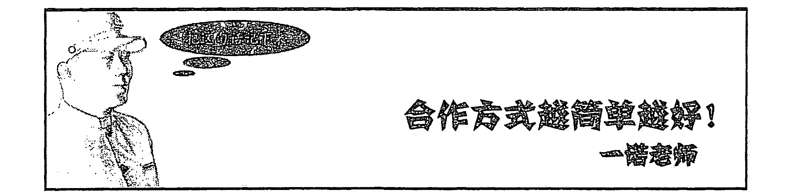

任何时候，你希望和别人合作帮忙的时候，让别人做的事情越简单越少，你的成功率就越大。

千万不要让他发挥自己的创造力、想象力去做决定，那样你永远不可能成功。

你把所有的事情都做好。你说，就像菜谱一样，按 A、B、C 步骤进行操作就可以了。

所以，你测试过的这个群体和其他的鱼塘的群体要有足够的相似性，否则你的结果就没有有效性。

然后你的响应的比例是多少？

变现的比例是多少？

追售的成交比例是多少？

最终落实到财务数字是怎么样的。

如果你不能变现，拥有再多鱼塘都没有用!!!

## 第二节：选择鱼塘的标准和优先顺序

如果你需要几千个上万个人，那么你个鱼塘里面不要就十几、二十个人，这样很显然，数量太少，对吧？从你的业务来说得有足够多的人。

鱼塘里的鱼还要对塘主有足够多的信任。

很简单，就像一诺老师之前的弟子*引华想要认识某靓女，找另一个弟子*金老师给他介绍。他需要知道那个靓女是对*引华的印象是很好的，是信任*金老师的。

如果那个靓女认为*金老师不靠谱，那么显然是不能成功的。所以你要借力的*金老师这个塘主是享有他的受众的信任的，这点非常重要，这叫信任转移。

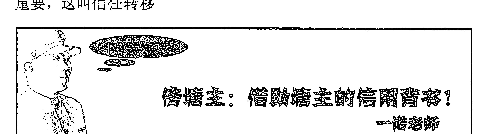

然后他还得有那个能力，就是他们以前做的事情有没有成功的案例，他们做事情效率怎么样。然后他们有没有现成的系统。

比如说你有没有潜在客户的名单？他说有啊，但不知道在哪，

都在这一带。那这个东西很大程度上不一定做得好，因为他都不知道，对吧？他有没有系统，他有没有这个愿望。

就是你给他提供的这个测试结果，对他有没有足够的吸引力，有没有动力让他去做。

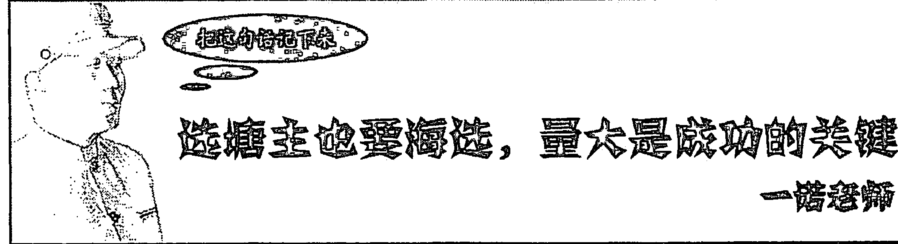

另外一个就是一诺老师讲的果农理论，就是说你要排出一个优先顺序。你联系十个人，只有一个人同意与你合作，可以这一个人具备条件，我们就开始合作。

然后合作的结果很好，反馈给其他的几个人，告诉他们怎么样。

然后说不定九个人当中又有一个人愿意与你合作，然后再合作。

最后慢慢地慢慢地，整个过程是一个循环，不要指望一次搞定所有人，这是不可能的。

更多绝学课程请咨询微信xi383921,备注：咨询！

## 第三节：不可抗拒的鱼塘合作方式

你可以设计一个超级赠品，只要客户购买他的产品，客户就可以获得这个超级赠品，就是作为他买单时的超级赠品。

然后你的产品或者服务作为他抓粉的一个工具，帮他带来潜在的客户。作为他独立的追售主线。

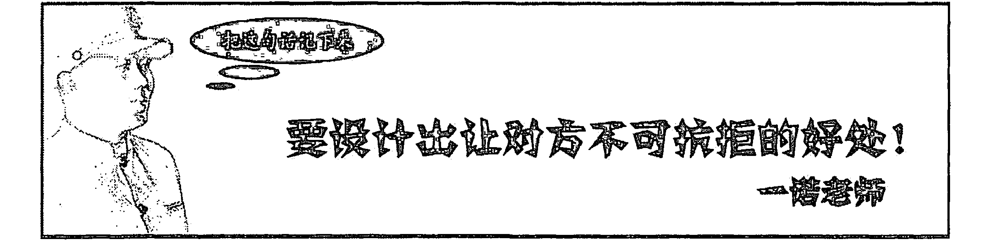

比如他现在有很多老客户，然后你可以弄在后端，你说卖我的东西 500 元钱我分给你 200 元。这是完全作为一个独立追售的手段。

然后可以作为追售组合的一部分。把你的产品和他的产品组合在一起。别忘了，你们的客户是共同的，都需要你们两个的产品，所以你们可以组合。

作为追售组合的一部分，然后你可以作为奖品。作为员工的奖品，或者是对某种 VIP 客户的奖励都可以。

## 第四节：鱼塘合作成败之关键

这里要强调的是要确保透明度，你和合作伙伴千万不要弄虚作假。你需要的是他不遗余力的去帮助你。如果你的整个机制设计是成功的，你不需要弄虚作假，不需要欺骗对方，你一定会赚钱的。

如果你弄的是假的，你只能扼杀这种合作的可能。所以一定要透明，非常透明。

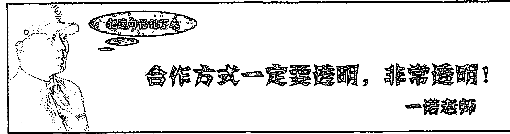

然后每天或者一定时间有多少客户数量进来，变现率怎么样，要让他知道。客户的状态怎么样，是变现、追售还是怎么，对吧？都要告诉他。

要及时披露信息。也许一个星期或者每天向他通报一次，或者通过E-mail或微信、QQ等方式。

这样人家觉得你是诚实的，他的合作就会更彻底、更到位。

## 第五节：鱼塘长久合作之关键

然后是报酬支付的问题。

如果你答应给人家一定的报酬，你到时间要及时的支付给对方，不要拖欠。

否则人家就不愿意继续和你合作。

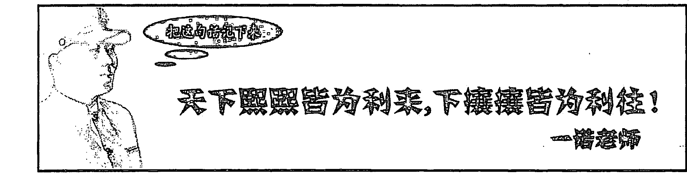

你记住了，你后面还有其他的合作伙伴，其他合作伙伴需要从已经找到的合作伙伴中看到信心才行。

> 一诺老师的《全球疯狂吸金》里有句话很经典：如果世界上有一万种成功方法，不用问最管用的叫合作；如果世界上只有一种成功方法，不用问那一定是合作！

## 第六节：鱼塘合作争议解决方法

如果你的前端比较丰富，如果你的整个流程设立的很好，有钱赚。如果出现争议的时候，在合理的范围内，要照顾到合作伙伴的利益，不要自私，要能够让合作伙伴满意。

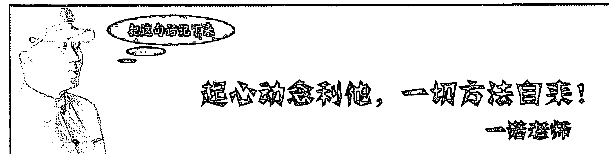

这样你以后的合作就会更好。一诺老师告诉我们：看待合作伙伴和看待客户一样。看待客户你第一次并不是想赚他最多钱，争取不亏钱就行了。就是你希望他能够得到价值。

跟合作伙伴也一样，如果合作伙伴赚到钱了，即使你没赚到钱，也没有关系，将来还有很多机会赚钱。最好的结果是大家都赚到钱，即使你真的没有赚到钱，将来也还有机会赚钱。

像一诺老师那样大格局，有长远的发展眼光，一诺老师把利润100%分给终极弟子，钱分出去人就来了！人来了，变现是早晚的事！

这才是高手！

# 第八章：高频营销的底层逻辑

## 病毒营销是什么概念呢？

《全球疯狂吸金》课程录音说：通过合作伙伴等各种鱼塘大量的客户，过无法抗拒的抓粉主张进来了，然后变现、追售，然后继续不断的循环，不断的推动，不断的贡献价值(养鱼)。

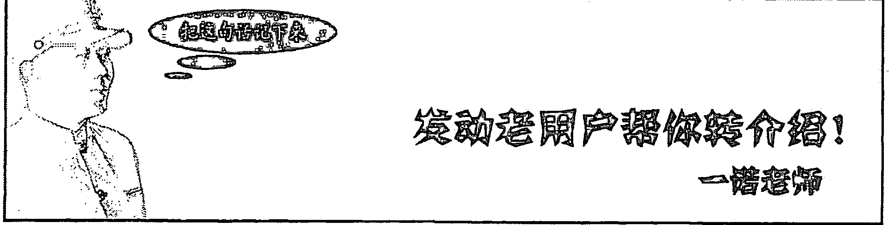

一诺老师说，最好让最忠实的客户，最好的铁杆客户能够给我们带来新客户(大鱼生小鱼)。

当然这是一种梦想，如果我们通过前端进来 100 个客户，然后经过后来变现的客户，或者追售的客户，如果能够不断地给我们带来新客户，带来的新客户经过变现之后又带来新客户，这就相当于我们做出了一个永远循环的机器。

## 为什么这是一个病毒营销呢？

你希望通过一传十、十传百，就是通过互相的介绍，最后把你这个机器很好的运转起来。

## 怎样促成最忠实的粉丝，心甘情愿的给你介绍新客户？

## 我们到哪去找别的潜在客户呢？

标准答案——物以类聚，人以群分。

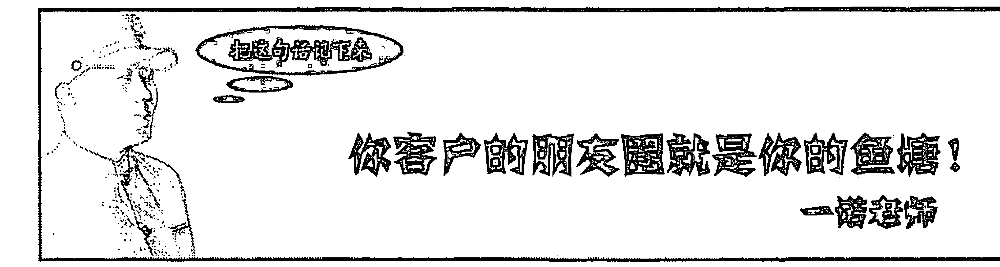

你的潜在客户周围就很有可能有你的别的潜在客户。所以他们离你的潜在客户最近。

如果你找到中小企业老板，很显然，中型企业老板会聚会；如果你找到的是糖尿病的病人，也许糖尿病病人会在一起探讨；如果你找到的是单身母亲，那么很可能她们会聚会；如果你找到的会计师，那么很可能会计师和别的会计师会经常聚会。

所以，让他们推荐是最好的选择。

## 第一节：设计不可抗拒的合作主张

怎么能够促成最好的客户再不断的给我们推荐新客户呢？这里有很多成功的因素。

第一，就是说很多人说局限在佣金。

当然你需要给他钱。但是中国人很多时候不一定能够接受这个钱，所以你需要通过一种变换的方式。也许你可以送他你的产品，本身他也是需要，对吧？你可以送他其它的，他有需要的，但是跟你的产品不相关的东西。比如说你可以送他纪念品，你可以送他度假。等等这些都可以。

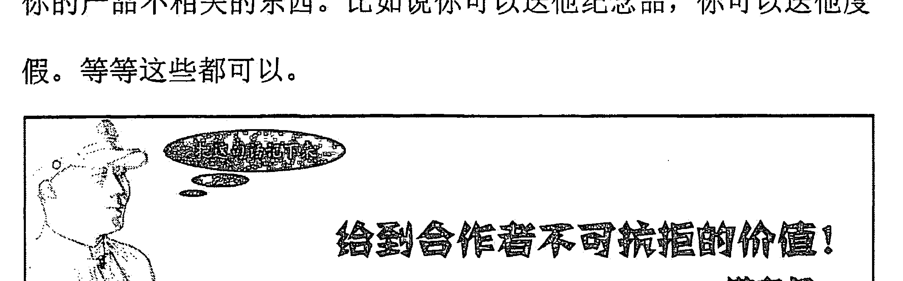

总而言之你需要给的是价值，或者你给他一个特别的机会都可以。比如说我们每年会举行一个年会，我们会邀请一些重要的客户参加。然后到什么地方去玩上两天，然后给我们推荐客户最多的人将会被邀请免费参加。这两天我们除了有一些体育活动，或者旅游活动之外，我们还会有一些政府的要员参加，或者是其他的能够塑造价值的地方，你需要给他价值。也许是我们会举办一个音乐会。只要他们需要这个，我们会给你送多少音乐会的门票，芭蕾舞的门票都可以。你需要把这个价钱换成价值。所以第一个是佣金。

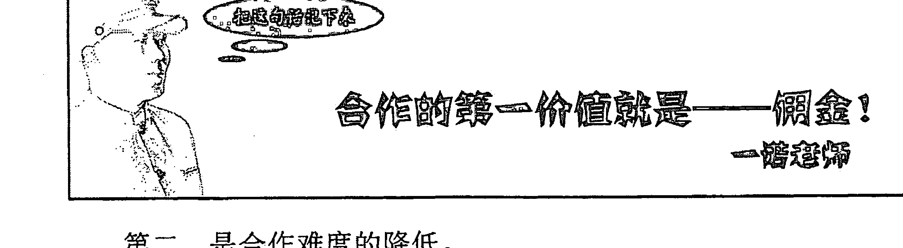

第二，是合作难度的降低。

你说帮我推荐。我告诉你，如果你这么说没有多少人帮你推荐。

你觉得你的朋友或者是同事，能从我的产品和服务中受益的话，请把我的微信推送给他，这样容易一些。

但如果你说，我们这个月在做一个活动，我们邀请老客户的朋友，我们有一个小时的咨询，我们本来要收费 1000 元，但现在因为都是老客户的朋友，所以我们就不收费，免费的。那么这个作为送给你的老朋友或者是家人，或者是朋友或者是同事的一个礼物。

这样的话，他的价值就会更大。

就像之前举的这个例子，*引华、*金老师和两女，这三个人都必须从这次聚会中受益。很显然，*引华要认识这个靓女，*金老师给他介绍，*金老师介绍这个人之后，*引华必须在这个靓女的眼中、心中形象会更好，靓女觉得*引华确实很不错，确实给她创造了机会。所以*金老师觉得很开心。*引华很显然，他的受益是毫无疑问的。但是靓女也要觉得有所收获才行。如果这个中间有任何一个人有点勉强，这三个人的聚会都不会持续很久。

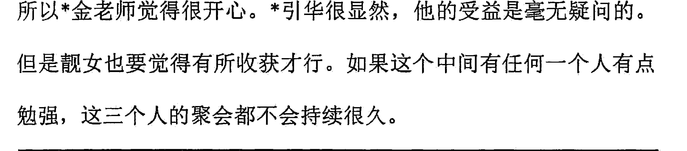

客户转介绍也一样，就是让你的客户帮你介绍，当然你可以给他价值，但是如果仅仅是为了价值而不是他介绍的朋友认为：“嗯，谢谢你给我推荐这个资源，确实不错，确实帮了我个大忙。”

就像现在很多朋友推荐一诺老师价值 3980 元一本的《猪买单》书籍。很多学员介绍给他朋友的时候，他朋友说《猪买单》太棒了，真的非常谢谢你，非常感谢你介绍这本书，给我很大启发。

抛弃任何的金钱不说，他对这个价值本身确实是很感谢的。

你必须让介绍人，在他推荐的人心目中是一个很好的形象。

关键是你的代价什么呢？他是我的哥们，由我介绍一下。

如果那哥们在他的介绍人的心目中没有很好的形象，那么实际上你欠了你哥们一笔，他帮了你的忙，你下一次你很内疚。

如果是这样的关系，这个大规模的进行是问题的。最好是大家都有价值，降低他的合作难度，一个标准化合作的模板和工具。

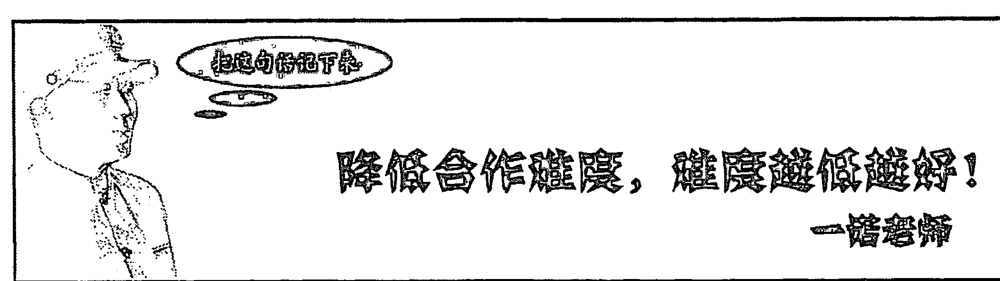

例如，你把一诺老师《猪买单》免费音频发给你的朋友，他们不仅免费，而且一定会有收获。显然这种《猪买单》免费音频推荐要容易的多。因为标准化的东西动动手指就可以发过去了。

> 借用《全球疯狂吸金》课程里一诺老师讲过的一句话：要降低粉丝推荐的难度，难度越低越好。

然后是目标客户的锁定，你要告诉他你需要什么样的客户，否则没有用。然后就是你跟合作伙伴之间的主张。

## 第二节：设计不可抗拒的抓粉主张

老客户向他的朋友、家人、同事，推荐一个什么样的东西。这个非常关键，就相当于你通过老客户来抓粉，你的抓粉主张同样要是无法抗拒的，不仅无法抗拒，而且还要是他通过正常的渠道得不到的。正常的渠道得到他是要付出这样的代价，现在通过你这个老客户得到他所付出的代价是不一样的。 所以这样的话，

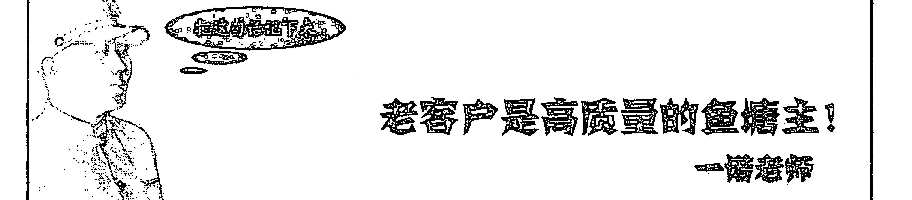

老客户在他推荐的人面前就有很好的形象。

首先你的抓粉主张必须无法抗拒，然后要有零风险承诺，并且零风险承诺更彻底、更无法抗拒、超级赠品更有吸引力、更有价值，在其它地方没有。

比如说其它地方我保证30天，因为是你的朋友，所以我保证3个月。其它地方我赠送1000元钱的赠品，现在我赠送你2000元的赠品，但仅限于你推荐的朋友。

## 第三节：谁来主导此次合作

任何时候、任何两个人在做一件事情，一个人必须起领导作用，否则这件事情做不成。既然是这样，谁应该领导呢？一诺老师的建议很简单：合作的重要性，永远超过你自己开发客户的重要性。

因此，你应该当仁不让，你必须起领导作用。

而且只有你能够领导，你需要告诉他怎么做，你需要帮助他解决问题，你需要帮助他提供工具，你需要帮助他事先设计好模板。

另外从伙伴的角度，他能够得到什么，不要老说钱，钱是次要的。一诺老师经常告诫弟子——钱是最不值钱的。

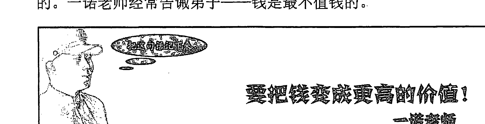

如果他对小钱不感兴趣，例如300元现金，他不一定要。

如果他喜欢学习，你就送他一本《全球疯狂吸金》，他看到书内如此实战和震撼的技术，会觉得划算多了……

实际上对于一个热爱学习的人来说它的价值远远超过398元钱。

因为它是一个特殊的超级爆款，之前《全球疯狂吸金》线下课每场 300 多人参加，而且学费要几万块，后来一诺老师把这 19 年来的积累，经过 1 年的闭关修炼，终于铸成《全球疯狂吸金》，原先定价 19800 元，后来一诺老师想能帮助更多人，就修订价格到 9800 元，后来觉得还是不能帮助更多人，于是改价 8800 元、6800 元、5800 元、2800 元，后来一诺老师觉得最好不要超过 1000 元，于是才有了利他的终极定价 998 元，不过今天只花 398 元，就可以拥有！

用这种高价值的礼品，那真是绝品！

价值，一个很重要的点就是你要从对方的角度出发，去思考他需要什么。如果他不需要这个东西，那它就没有价值。

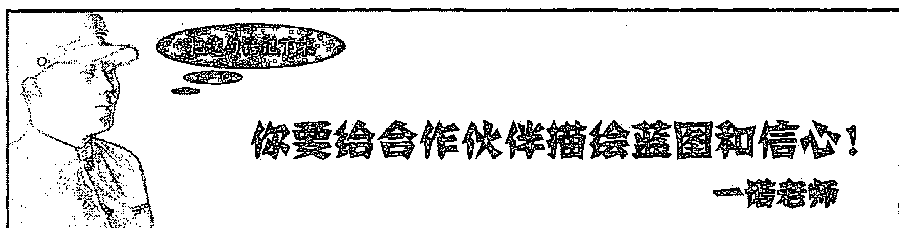

你要给合作伙伴描绘愿景，你要对这个有信心。

因为合作伙伴从来没有做过这个东西，不知道结果怎么样，你要表现出很大的信心，并且你有事实的根据，你有测试数据和其他合作伙伴的见证，这个非常重要。

## 第四节：合作伙伴的管理与监控

一诺老师说：无论你跟谁合作，都有一个制度，一套科学的、有效的、系统的方法，而且越简单越好。

你不能依赖于随机的，没有系统性的推荐，这种就做不大。

你必须得有一个推荐的系统，如果你有这个系统，你就必须管理和控制。

你监控什么样的指标：
- 推荐总人数、一定时间内推荐的人数、变现比例、追售比例、监控周期是多长。如果这种方案不行，有没有其它的方案？

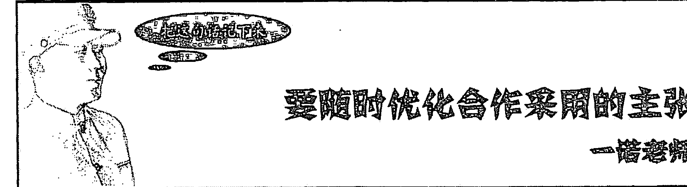

当然了，关键是你需要测试，如果一个合作伙伴对你没有信心，没有做过，你要给他一个测试的方案。

我们在小范围内先测试一下，看看怎么样。

## 第五节：盈利模式总结

更多绝学课程请咨询微信 xi383921, 备注：咨询！

本书到这里就要结束了，我用了 一诺老师的方法，是受益者，因此我把事业经营的井井有条，我发现还有很多跟我当初一样的迷途羔羊，因此在一诺老师格局的感召下，我把企业交给了家人打理。

全力以赴的跟着一诺老师，跟着改变世界商学院，做更有意义的事情，哪怕不赚钱，我都愿意，因为这件事情非常有意义！

世界上再也没有比改变别人命运更有意义的工作！

还记得一诺老师 3 年前说过的一句话，要想做善事手里先有钱！

今天我拥有的一切财富，都是一诺老师给予的，因此，我主动捐款 100 万给一诺老师，因为捐款不仅是对老师最大的认可，改变世界平台发展与维护、人员工资、办公成本等都需要开支。

由于能力有限，本书的内容不及一诺老师课程之万一，如果你想学习最新的、最实战、最落地、最有效的大智慧，你一定要看《猪买单》、《全球疯狂吸金》、《全球疯狂变现》，这三本书是一诺老师给我的手稿，我已经爱不释手了。

## 一诺老师最高境界系列书籍

| 书名 | 副标题 |
| --- | --- |
| 《猪买单》 | 免费的最高境界 |
| 《商业模式·顶层设计》 | 模式的最高境界 |
| 《一步一步引导别人说YES》 | 说服的最高境界 |
| 《全球疯狂吸金》 | 吸金的最高境界 |
| 《全球疯狂变现》 | 收钱的最高境界 |
| 《盈利模式》 | 盈利的最高境界 |
| 《魔力演说》 | 演讲的最高境界 |
| 《营销大师》 | 营销的最高境界 |
| 《催眠大师》 | 销售的最高境界 |
| 《成交大师》 | 成交的最高境界 |
| 《融资兵法》 | 融资的最高境界 |
| 《顾问兵法》 | 顾问的最高境界 |
| 《领导兵法》 | 领导的最高境界 |
| 《股权兵法》 | 股权的最高境界 |