# ★ 美股 ★

## 股息成長投資術

追日Gucci ◎ 著


> 推薦人（按姓名筆畫排序）
> 《Smart 智富》月刊社長 朱紀中
> 紐優股夢想家臉書社團榮譽社長 蕭輔彥
> 美國又上成長基金經理人 關又上

## 股息成長投資術

追日Gucci ◎ 著

## 建立正確心態 紮固投資基礎

- 1-1 汲取經驗養分 錢進長期股息成長投資 ............... 026
- 1-2 投資方式無分優劣 適合自己最重要 ............... 031
- 1-3 世上不存在神奇指標 只能盡力掌握2優勢 ............... 034
- 1-4 想靠主動式投資致富 先用4條件自我評估 ............... 042
- 1-5 撇開主動、被動投資之爭 回歸需求適切性 ............... 049

## 認識股息成長 奠定成功基石

- 2-1 掌握3大元素 搞懂DGI致勝策略 ............... 060
- 2-2 建構全球化投資組合 投資路走得更長久 ............... 065
- 2-3 執行股息成長投資策略 先養成3大觀念 073
- 2-4 投資期間愈長 股息對總報酬貢獻度愈高 078
- 2-5 布局股息成長股 擁抱高報酬、低波動 084
- 2-6 市場衰退時期 股息為投資人撐起保護傘 101
- 2-7 投資股息成長企業 成本殖利率將愈來愈高 109
- 2-8 按個人需求做最佳配置 兼顧殖利率與股息成長率 114
- 2-9 及早打造複利雪球 自動穩穩放大資產 120

# 第3篇 檢視企業體質 建立致勝組合

- 3-1 解析企業年報 初步了解公司優勢 128
- 3-2 利用質化分析 探索企業護城河 144
- 3-3 進行量化分析 先檢視3大財報數據 161
- 3-4 制定明確作戰計畫 分散投資減少失誤衝擊 180
- 3-5 3原則建置買進策略 降低非系統性風險 189
- 3-6 確立自我風格 建構最適切資產組合 197
- 3-7 持有不同性質產業 減少單一市場利空影響 210
- 3-8 善用股息再投入 讓總收入大幅成長 221
- 3-9 2觸發點+7因素 判斷賣出時機 232
- 3-10 別被股息高稅率嚇退 長期總報酬更重要 241
- 3-11 把握3原則 避免賺股息、賠價差 244

# 第4篇 精進分析能力 畫出隱憂選股的關鍵

- 4-1 親手撰寫企業分析報告 增加解讀深度與廣度 252
- 4-2 活用股息折價模型 算出股票合理價 262
- 4-3 融合多項評價準則 提高企業價值預估準度 273
- 4-4 善用4工具 被動追蹤股價變化 283
- 4-5 自製總覽報表 有效掌握投資組合狀況 287
- 4-6 質化+量化分析雙管齊下——以卡地納為例 306
- 4-7 逆風激發第2層思考——以卡地納、沃爾瑪為例 328
- 4-8 評估轉型企業未來發展——以迪士尼為例 333

# 第5篇 善用網路資源 提升操作效率

- 5-1 晨星》重要財務比率非看不可 340
- 5-2 GuruFocus.com》快速掌握企業數據所處位階 ………… 353
- 5-3 Dividend.com》6大重要配息資訊全都露 ………… 361
- 5-4 CCC List》彙整股息連續成長企業清單 ………… 368
- 5-5 Portfolio Tracker雲端試算表》輕鬆管理投資組合 ………… 374
- 5-6 Simply Safe Dividends》簡潔財務圖表一目了然 ………… 383
- 5-7 F.A.S.T. Graphs》圖表化呈現企業價值評估 ………… 392
- 5-8 價值投資獵人全自動計算機》快篩落入合理價的股息成長股 ………… 403
- 5-9 股息連續成長篩選器》視覺化方式呈現CCC List數據 ………… 408

# 第6章 選擇權雙戰法 補助薪水替身

- 6-1 靠賣出掩護性買權 賺取額外收入 ………… 416
- 6-2 3方式調整選擇權部位 避免持股被迫讓出 ………… 422
- 6-3 利用賣出賣權 在理想價格取得好股票 ………… 435
- 6-4 釐清選擇權策略目標 別陷入「少賺」迷思 ………… 441
- 關鍵點 高薪、高儲蓄是累積財富雙引擎 ………… 446


## 了解各項內在外在要素 找出你變得有錢提的投資方式

> 如果在錯誤的道路上，就算你奔跑也沒用！~華倫·巴菲特（Warren Buffett）

偶爾會有人找我幫他們的投資新書寫序，我通常都是婉拒，但上星期追日Gucci用臉書（Facebook）發私訊，請我幫他的新書寫序，我原本有點猶豫，但在看過他一些自我介紹的資料及新書部分內容後，我毅然決定要幫他寫這本新書序言。

為什麼呢？因為我看了書的內容後，發現這本書跟其他的投資書籍不一樣，追日Gucci光解釋投資心理方面，以及為何他會選擇股息成長投資（DGI）的理由就占了許多篇幅。

書中並詳細比較了主動式投資與被動式投資的差異性，而且他也不斷強調，他不認為世上有一體適用於所有人的投資策略，因此鼓勵大家依照「投資自己、適合自己、喜愛自己」的方向，去尋找出屬於自己且能產生樂趣的投資方式，這跟坊間許多投資書籍，作者總強調自己書中的策略是最好、最棒的說法截然不同！

在我過去經營投資社團及投資教學經驗裡，我看過無數的投資人以及他們的投資心路歷程，也知道大部分的人在投資時，問題會出現在哪裡，這本書裡面表達的觀念，跟我的想法不謀而合。

舉例來說，追日Gucci 提到「教學的困境」、「主動式投資的難複製性」，我就深有同感。每個人都想賺錢，但每個人的條件及狀況都不一樣，例如有人沒時間、有人資金量不足、有人沒天分、有人沒興趣等，因此怎麼可能有一套一體適用的方法，來讓每個人都學會？

所以我認為，最終找到一套能讓自己「心情穩定、目標明確，又能專注本業」的方式最為重要，而追日Gucci 在這本書提出來的 DGI 策略，就剛好符合這樣的要求。

另外，為何要選擇美股市場？他的想法也跟我一樣，很多人會說，選擇美股是因為美國的好公司比較多。其實不只是好公司，無論你想要投資的公司類型是哪個種類（如穩定成長股、轉機股、景氣循環股等），美國市場都有比較多選擇；也因為美股法令嚴明、制度明確、財報資訊豐富透明，且美股的個股選擇權與固定收益標的很多，流動性也不錯，可以讓我們在各種市況下，利用各種策略，構築出具有不同勝率與賠率的系統風險報酬比！

只投資台股的缺點，是穩定成長的好公司太少，所以投資人大多只能做波段，要真的落實長期投資並不容易。你看巴菲特（Warren Buffett）等投資大師，亮眼績效幾乎都是在美股達成的就知道，若他是在台灣長期投資，應該不會像現在這麼有錢！

再來，只投資單一市場的缺點，就是資金利用率不高，舉例來說，台股有時在高檔，常常要等，且一等就是好幾年，投資人不得不讓資金閒置。而全球許多績優企業都有在美國掛牌交易，加上不是每個國家的大盤都在高檔，所以開立美股券商戶頭，等於可以投資全世界，比較不會喪失機會成本。

大部分的投資朋友，以為只要能選出想要的公司並在低價買進，就能長期穩定獲利，達到財務自由的目標；降低風險的方式，也大多只是停留在控制標的集中與分散的程度，以及帳戶現金的比例多寡。但只是這樣做，其實離真正能穩定獲利的主動式投資人程度還很遠！

想要成為優秀的主動投資人，必須要建立一個完整的交易系統，包括財務分析、資產配置、部位風險控管、績效評估、各種交易商品策略應用以及組合，最後才能夠組成一個完整的投資系統。要學的東西很多，也因此多數投資人會覺得很難穩定獲利，因為這需要很多知識，沒有想像中那麼簡單！

非常幸運的是，本書裡對為何要做資產配置、如何找出屬於你的投資組合風格、如何設計投資組合、為何與如何使用DGI、量化分析與質化分析的比較，都有詳細介紹。

尤其第3篇分析各種投資護城河的案例解析十分精彩，而第4篇的分析流程與投資組合管理、第5篇的實用工具介紹也都很實用，可以想像追日Gucci是多麼想把自己的所思、所想、所學，讓讀者一次學會！這裡節錄幾句我覺得印象深刻的內容，讓大家體會一下本書的深度跟廣度：

- 1. 與其說投資是門科學，但我看它更像是人生的修為過程。
- 2. 投資的目標是什麼？最好能夠具體，但又不要過於不切實際。
- 3. 無論投資的頻率快與慢，都需要面對心理層面的問題，也同樣需要一份計畫，並且理性執行。
- 4. 以創造現金流為目的，擺脫了短線與價差思維，因此能夠讓投資人安定身心，把全部精力專注在工作表現中，這絕對比尋找迅速提升績效的投資方法還要重要得多。
- 5. 分析與思考是沒有止境的過程，這也是為什麼我提到必須不斷閱讀。

我非常喜歡這本書中的許多內容，很高興看到台灣誕生了一個投資新星，更開心看到追日Gucci為了幫助許多投資人，而用心出了這本書。相信對喜愛投資的朋友們會有實質上的幫助，故推薦給大家。

績優股夢想家臉書社團榮譽社長

蕭輔元

## 美股股息成長投資術

## 速度與方向

我向來喜歡不直接給答案，有時會用問題來回答提問者的問題。例如，你住台中，想到墾丁吃海鮮和看海，開車時速每小時100公里，中間吃個飯、喝個咖啡、加個油，估計要40分鐘；路程全長假設250公里，堵車20分鐘，不走3號國道，而走1號國道（北），請問需要多少時間？

許多朋友立刻埋頭計算，說需要3個半小時，我說不對，再把問題重複一次，可能來回2～3次，終於有人領悟回答，應該要走國道（南）吧，不然跑到基隆去了！

是的，方向錯誤，加速只有離目標更遠！不管是做整體的財務規畫或投資管理，多年來的經驗告訴我，方向比速度重要。

江湖僅是湖，就已有三教九流的人物，令人目不轉睛；股市如海，投資管理的學派各有其強調的投資理念以及操作技巧，究竟何者才是你所需要的呢？

這本書在我看來，最有價值的部分，是指出了一個不容易出錯的方向：想到墾丁看海，不管是1號國道、3號國道、省道或羊腸小道，只要往南的方向走，你一定可以達到目的地，只是時間早一點、晚一點的差別而已。

如果你是初次接觸投資的朋友，分不清自己應該選擇主動式投資管理，既要選擇進出的時機，又要分析個別股票，還是應利用指數股票型基金（ETF）被動式管理來操作，那麼追日Gucci的前言和第1篇，則是精彩的一問。如果不能說服你成為主動式投資者，那麼這本書絕對不適合你——不必感到難為情，反而要恭喜你，因為這也是一個重要方向的抉擇。

如果，你已經很清楚自己想往主動式投資管理的方向學習或靠近，我認為這本書有其精彩之處。因為這猶如姜育恆經典歌曲中的〈再回首〉，人生若不經幾番挫折、困頓，很難感受到那歌詞中「再回首，才知道平平淡淡從從容容才是真」的滋味。

追日Gucci從期權如此波動之大、獲利或虧損都驚人的操作模式，轉換到指數型的資產配置，再到股息成長投資術，這個轉折與之間的摸索，其調整和定位值得許多投資人參考。因為事關方向，更重要的是這個股息成長投資術，方向出錯的機率小，而成功的機會大，為什麼？讓書中的內容來告訴你。

有一本書，投資理念如其書名《Dividends Don't Lie》（股息不會欺騙）。

## 推薦序

你），這個道理很簡單，一家股息能持續成長的企業，沒有足夠的現金流是做不到的；而盈餘若不能持續增長，股息要持續的增加也是不容易。所以股息和現金流的持續增加，本身就是簡單判斷好企業的指標之一。

如果你是一個喜歡看到數據分析、看到實際操作技巧的人，那麼這本書應該能夠符合你這方面的渴望。

我個人覺得有一點美中不足的是，如果對數字分析、數學公式有一點膽怯的人，追日Gucci在這方面的大量呈現，可能會讓這些人怯步，因而錯過了這麼一個穩健投資的好方法。但誰說吃龍蝦一定要吃頭？掐頭去尾依然有其美味之處！

也要提醒讀者的是，股息投資成長術也可以算是價值學派的一支，這也意味著不是每一個時間點都能「獨」領風騷，有時候你要看著成長學派及動能學派的耀武揚威。追日Gucci提醒——耐心也是必要的體認和功課，否則你會無法堅持而前功盡棄。

追日Gucci是一個學理工，又用大量數據做分析的人，結構性、邏輯性以及組織性相當不錯；再加上相當多資料的佐證，並且詳細附上資料的出處來源，這種心得的分享特別難能可貴，也看得出是他多年的累積。

以我接觸美股的經驗來看，這些資料整理、分析和心得的呈現，最少在500個小時以上，讓讀者平均花不到1塊錢就能享受作者1小時的心血結晶，這是印刷之美，也是每個作者想留下最好的紀錄和身影的渴望。希望你在閱讀之後，能夠以簡取繁，整理出屬於你自己的系統獲利方式，那麼出版社、作者、讀者和推薦者，都會有不虛參與的喜悅了。

> 美國又上成長基金經理人
> 關又上

## 自序

## 投資理財是人生的必修過程

我的本業是IT（Information Technology），說得清楚一些，讀者們一定聽過大數據，而我的工作內容就是數據處理與數據應用。利用數據，幫助企業找出改善效率的方法與探索問題發生的根源。

我很幸運的能從事一份我很喜歡的職業。然而，無論多麼喜歡一份工作，都無法避免80%的時間都花在處理許多令人不那麼喜歡的瑣事。

但是，當我細細回想，工作除了提供我安穩的生活，也在長時間中磨練出許多技能，而這些技能恰恰也與我的投資方式相輔相成，假如缺少了邏輯思考習慣、分析數據能力、圖表製作技能與外語能力，恐怕我也很難靠自己獨立學習到這些必要能力。因此，不該因為不喜歡工作而尋求投資協助；該以人生的長期目標，來決定是否要投資，或者要用什麼投資方式！

坊間太多討論的是如何以投資賺錢，卻鮮少回到問題的本質，思考那些「比投資更重要的事」。我認為有3大要點，是凌駕於投資之上：

### 要點1》投資自己

美國的《Money》雜誌訪問百萬美元富翁得到的數據顯示，有86%的人都是白手起家，靠自己的努力累積財產；當他們談論到資產累積的方法時，95%的人提到勤奮工作、83%的人提到有效投資、81%的人提到節儉，從中不難看出辛勤工作與減少支出才是關鍵。

既然勤奮工作至為重要，那麼專注本業，提高收入才是資產累積的關鍵課題。儘管國內薪資缺乏成長性，但與其被動接受，倒不如起身而行、嘗試提升自己的能力。因為環境很難改變，改變自己相對容易許多。

工作不應該是人生的全部，但不諱言，工作卻會影響你工作餘的所有生活。既然擺脫不了工作，那麼何不提升每小時的所得效率，也就是拉高收入。提高收入的方法，除了長期累積自我品牌之外，則要善於時間管理，大幅利用空閒時間，例如，大量閱讀好書，借鏡他人數年乃至一生的經驗，透過書本媒介來與你進行一對一的談話；或是自費強化通用的軟性技能，包含外語能力、簡報技巧、口語表達等等，這些能力適用於任何產業與職位。

### 要點2》適合自己

每種投資方式，就像是你購買的保險一般，除了年齡、性別有基本差異，也會因要保人想要加強或在意的部分做差異規劃；同樣的，投資方式也會因為每個人的財務目標、收入能力、人格特質而迥然不同。因此，在評估投資方式時，務必回到「個人」條件上思考，而條件則包含了3大類：

- 1. 外在能力：資本大小、收入水準、外語能力、資訊判讀與分析。
- 2. 內在特質：價格驅使、獨立思考、批判懷疑、堅毅耐心、果敢勇氣。
- 3. 長期目標：所需投資報酬或收入。

在選擇投資方式之前，不該以想要的報酬來回推投資方式，應以自身的能力出發，且務必將心理層面與人格特質考慮其中。因為若讓人類遠古遺留下來的一些不利於用在投資的基因主導了決策，那麼原先想像的美好投資成果，終將毀於一旦。

### 要點3》喜愛自己

許多投資人會因為想擺脫工作，或者因為財務困境而寄託於投資，甚至鋌而走險。一旦投資出發點是汲汲營營於追求快速獲利，便很容易把路走偏，反而更無法達成預期目標。

投資比較像是存錢，考驗的是留下多少，但並非高收入者一定能留下較多的資產。因此，只有當你能處之泰然地面對投資路上的崎嶇時，才能更理性的做出判斷與決策。

要能夠說服自己的腳步慢下來、且多點耐心的前提是，你必須自在且滿意現在的生活。唯有在身心與家庭狀況都在平衡的狀況時，你才不會因為厭惡或想要擺脫什麼而孤注一擲；一旦腳步慢了，你的視野與高度就能獲得提升，也更容易找到投資的初衷。

投資不該是人生中的主角，投資「自己」與投資「生活」才是。

儘管本書著重於股息成長投資，無論它是否適合你，我認為在思考任何一種投資方式的最前沿，都該思考以上3項課題。與其說投資是門科學，但我看它更像是人生的修為過程。

理解自己的需要、探索自己的人生、喜愛自己的生活！

逸凡Gucci

## 前言

## 主動型投資非易事

5年前，當我在獨大（獨孤求敗，部落格「選擇權搖錢樹」版主）那邊開始我的正規學習投資之路後，我的投資方式漸漸改變，也修正掉許多錯誤的習慣，更重要的是克服了所有投資方式都必須面對的敵人——不理性
的自己，慢慢地也對自己的長期財務目標有了清晰的輪廓。

還記得在—開始的2年，我每天就像唐三藏一般，不斷地在同事與朋友的耳邊囉叨：「你應該提早為退休問題做準備，早10年投資，可以省掉30年的光陰與省下大量的資金投入」、「你應該多存點錢、拉高儲蓄率，分辨需要與想要，即使是穩定的報酬3%～4%，都好過消費膨脹行為」等。

很遺憾的，大概是我口條太差，成功度化的人寥寥可數，大概就1～2位。實際上，我的朋友圈的收入，大多已是受薪階級的前5%～10%，曾對理財展露出興趣的幾個朋友，往往幾經思考之後，就因為各種困難，甚至我認為他們是特意搬出許多困難，來避免改變或嘗試新事物。這讓我想起馬雲（中國阿里巴巴集團創辦人）的一席話：「晚上想想千條路，早上起來走原路。」

的確，我發現，好奇心與行動力，是我幸運擁有的幾樣特質；我認為很多時候特質來自於上天的恩賜，不一定會隨著年齡增長而擁有。

說個親身經驗：幾年前，一位大學同學帶著老婆來找我尋求投資建議，我做了20~30頁的簡報，向他們介紹被動式的ETF（指數股票型基金）資產配置。這已是我認為波動相對較小，且能夠穩健取得市場平均報酬最好的方式。事後，他告訴我，他老婆覺得這個風險太大。

對！你沒看錯，他老婆說ETF資產配置，風險太大！我著實身心受挫……

## 對年輕投資人而言，長期風險比短期波動更值得憂心

的確，跟ETF相比，也許債券或收益型商品表面上看起來比較穩定，然而除非買的是公債，波動才會小一點，也比較沒有違約風險。

只是，投資不就是為了長遠生活做預備嗎？在年輕時期，過分地規避短期風險或波動，傷害的是長期的資產報酬，讓資產成長速度過慢，反而危害老年生活。

因此，長期風險遠比短期波動更值得憂心，而且一旦晚年面臨長期風險，幾乎已無可彌補。

## 前言

險，早已喪失年輕時最大的本錢——時間。

再回頭看看我那位大學同學的朋友圈與同事圈，長期以來，都是收入既高又穩定的階層，因此他認為舒服的日子能夠一直這樣過下去；且隨著收入提高，他也選擇大幅提高支出。

假如認為有錢就等於很會花錢，或是花很多錢，來滿足他人對於富人應有的期待形象，這是個人的選擇，也沒有什麼不對。沒有人能干涉他人消費的方式，我也對此不感興趣。誰說一定得提早投資？一定要讓複利雪球效應發酵？一定要會量入為出、聰明花費，分辨需要與想要呢？

我慢慢學習用同理心，站在他們的立場去理解他們的想法；我發現，每個人當下其實都在做其認為「最符合利益的事」，因此我現在的想法就是「無為」，不再想方設法地催促朋友們積極理財。雖然現在只要談到理財話題，我仍是不厭其煩地搬出同一套說法：「高薪與高儲蓄率才是比投資方法更重要的東西！即使是高薪，也要小心避免消費隨著收入擴張。」因為高薪不等於很會理財，有錢人也不等於很會花錢，更不需要讓自己必須表現得「符合社會期待」。

同樣的，這樣無為的想法也延伸到我對於本書的中心思想。我不吹擂報酬，也不為股息成長投資（DGI）擦脂抹粉，而是以中立的觀點，闡述我的投資方式。假如可以，我主觀的認為，95%的人應該考慮被動式ETF資產配置；因為主動式投資，除了要具備與群眾不同的思考能力，正確判斷的機率還要比錯誤判斷的機率高一些。當你判斷正確，卻與他人看法不同時，仍要堅持看法，這更是難上加難。

過去大量接觸人群的經驗，讓我發現，儘管我有充足的熱情且毫不保留的傳授，但是效果微乎其微。我花了好一段時間，才放下這個「理想」念頭。其實，不是每個人都擅長於某個領域，又或者說，其實只是「不適合」。試想，你所知的領域翹楚，或者自己身邊卓越的朋友，比例是不是很小？

套用到投資領域，同樣如此。在我長年接觸人群的樣本下，僅有1%～2%的人可以真正認同我的想法，然後發展出適合自己的方式。除了外在條件，如外語能力、資本大小、收入狀況之外，更多時候，影響成果的是特質。很殘酷的是，特質這種無形資產，通常來自於上天的恩賜，難以靠鍛鍊而獲得。

我引述暢銷書《成功者的8個特質》作者理查·聖約翰（Richard St. John）所歸納出的8個成功者特質：熱情、工作、精通、專注、衝勁、服務、點子、堅持。別說要同時具備8個特質，光是其中1項都十分不容易！

我希望本書能達到一個目標——識別出自己適合什麼投資方式？以及什麼投資方式超出了自己的能力圈？

## 美股股息成長投資術

主動式投資一點也不容易，如果不能確認自組投資組合是你要的，也不確定自己有這樣的能力，在認知到這點之後，或許能更加清楚自身能力的侷限，反而能夠驅使你擁抱被動式的指數化資產配置。

投資，並非以「報酬率」來定義投資是成功或失敗，落後大盤也不等於失敗；一個好的投資方式，只要符合自我需要就足夠了。同樣的，投資組合波動較大也不等於是不好的，每個組合本來就有其對應的適切性。

換句話說，我的立場不會是一言堂，再再證明我的方法很棒、我的方式很好；我只是中立地闡述一個投資方式，甚至會不斷暗示，你可能沒有具備相應的能力。

在本書中，我堅持的立場就是如此。我希望能夠讓你認識自己的需要，包括自己的能力圈，然後願意敞開心胸，敲門進入股息成長投資的領域。假如不適合，你也能夠踢開它，轉而投抱其他足以讓你產生堅定信仰的投資方法。

## 建立正确认知 稳固投资信心

## 汲取經驗養分

沒有人在投資生涯一開始，便能具備完全成型的投資理念，因為理念一定是隨著時間，在過程中來回調整無數次，將各式各樣不同來源的想法長期累積淬煉而成。如果沒有從生活中汲取到經驗與教訓，不可能發展出有效的投資理念。

然而很多時候，智慧並非隨著年紀增長而增加；失敗與不如意的經驗，也不一定能夠使人獲取教訓。有些人在投資路上受了傷，自此血流不止；有些人則能夠在傷口結痂之後，汲取經驗與教訓，不讓血白流。

投資的路途上，不可能從未犯錯，或許是我風險控制導向的性格，我確實沒有犯過什麼極大的錯誤。只是，我也不是幾天內就演變到今天你所看到的投資哲學。

在我開始認真學習投資的第1階段，接觸到的是「台股選擇權」，跟多數人一樣，在沒有完善的風險控制下，我並沒有獲得滿意的報酬。但很幸運地，在跌跌撞撞1年後，碰上了第1位恩師「獨大」，為我奠定了很好的贏家思維與習慣。透過他的身教，我漸漸愈來愈像他，並養成與大眾不同的思考方式、準則化的交易系統、謹記風險遠勝對報酬的追逐，才慢慢地在選擇權交易上創造出令人滿意的報酬。

當時我採用的策略，主要是簡單的隔月賣方指數選擇權，有時候也會利用手機下單，採取期貨當沖或選擇權買方交易。不過，當指數出現快速變化時，身為上班族的我很難即時做出反應，就容易吃虧。

## 接觸美股市場後，毅然決定結束台股投資部位

那時，有位和我一起上課的同學分享了他的美股投資經驗。我研究後發現，美股的股票選擇權交易量非常大，且合約到期結算時，若現股價格低於履約價，還能轉換為現股；如果長期投資美股並搭配美股選擇權策略，即能賺取額外的現金流。

歸納出3個原因後，讓我決定從台股選擇權的短線投資，轉型為美國股市長期投資人：

-   原因1：短線投資須耗費太多時間，且報酬難以預期；除了必須持續關注市場價格外，也難以預估每年報酬的水準。
-   原因2：複利威力雖然廣為人知，然而假如沒辦法穩定且長期持續，複利效果難以發酵，短期投資績效很難達到穩定。
-   原因3：我在台灣市場時已有選擇權的長期實戰經驗，因此認識到美股選擇權時，我感到非常激動——既能使用我原本熟悉的知識，又恰好能與我想要轉型長期投資互相契合。

於是我毅然決然地結束台灣所有投資，轉向美股市場。雖然初期我仍從事以價差為主的選擇權，並非是一個完全長期導向的投資人，但此時我已開始進入第2階段，落實佈局被動式的ETF（指數股票型基金）資產配置。

第3階段，是在更認識美國股市後，我開始將資金投入到本書介紹的股息成長投資（DGI），以價值投資為核心，投資股息連續成長的企業。

## 美國高品質企業多，易覓得股息連續成長績優股

我對美國市場感到驚豔的一點，就是比起電子公司占上市櫃公司逾5成、電子股成交量占7成的台股，美國產業組成分散而健全，且擁有眾多歷史悠久又市值龐大的高品質企業，甚至不少公司能夠連續數十年股息成長。

若想要學習巴菲特（Warren Buffett）的價值投資，在美國很容易找到績優企業，如可口可樂（Coca-Cola，美股代號KO）、寶僑（Procter & Gamble，美股代號PG）、星巴克（Starbucks，美股代號SBUX）等；世界上許多新技術、新產品、高端服務，也大多是美國創造，如蘋果（Apple，美股代號AAPL）、高通通訊（Qualcomm，美股代號QCOM）等。

這些高品質企業既有營運穩定的特質，獲利又能穩健成長，因此能夠配發給股東穩定成長的股息。投資這樣的公司，投資人將能獲取年年成長的被動收入，恰恰滿足我原本渴望轉型為長期投資人的需求。

當然這期間，我也閱讀了許多國外的鉅作，如《漫步華爾街》、《投資金律》、《散戶投資正典》、《坦伯頓投資法則》，以及葛拉漢（Benjamin Graham）的《智慧型股票投資人》等。假如沒有足夠知識，我也很難體悟並願意接受長期投資。知識正如養分與材料，假如知識不足，很難做到，甚至完全沒辦法意識到這些。

## 利用DGI投資，可安心預期未來被動收入

在此，總結3點DGI投資方式的特點：

-   特點1：投資心情穩定：指的不是以過高的股價隨意買進股票，再於收到股息時安慰自己「至少還有股息可領」；相反的，是因為對企業本質有了了解，對資產價格做了正確估算再買入，因此更能在市場波動時泰然處之。
-   特點2：長期目標明確：假如是短線價差，很難保證獲利的範圍，很有可能今年報酬率30%、明年報酬率-50%；一旦無法產生雪球效應，資產就很難「緩步」上升。反觀，DGI專注的是企業品質，著眼的是穩定成長的被動收入，以及收割長期資本利得，而被動收入又與投入資本總量正相關。因此，除了長期目標明確外，被動收入也能夠預期。
-   特點3：易於專注本業：光靠高薪也能夠讓財富高速成長，當然還要搭配高儲蓄，不讓消費習慣產生消費過度擴張。而身為DGI長期投資人，大部分時間是沒事可做的，一旦估算好資產合理價格，接著就是考驗耐心的修為（這似乎正是多數人欠缺的）。當未來的現金流收入與資產成長程度都可以預期，無論是白天或黑夜，都不需要打開券商軟體，讓心情隨股價波動，自然能夠騰出心思，專注於提升本業能力，讓薪資繼續成長；另一方面，也得以騰出時間在個人與家庭生活。

DGI投資方式會被歸類為「主動式投資」，但我選擇它的動機不是出於打敗大盤的目的或是自負，恰恰相反的是，我深知這是極其困難的一件事，既要擁有洞察力，又要能夠辨識資產價值，然後在與主流智慧背道而馳時，具備行動的勇氣，並持續一段長時間，等待資產價值受市場認可後回歸，反而讓我更加謙遜地去理解風險、面對風險、管理風險。這也許不適合所有人，卻是最適合我的投資方式。

## 投資方式無分優劣 適合自己最重要

18世紀工業化之後，人類生產商品的能力大增，資本家在假設所有消費者需求類似的前提下，量產規格化商品，並用較低廉的價格，讓大部分的人都能享受類似的商品。然而，我認為有些商品或服務是無法以單一規格強銷於所有人，理財或投資方法都屬於其中。

首先，每個個體的條件都不一樣，舉凡收入、家庭狀況、英文能力到軟性實力（如心理素質、紀律、耐心、好奇心等）不盡相同，很難以銀行專員販售規格化商品的模式，套用到所有人。

這有點類似保險，每個投保人在意的部分不同，有些人的需求是身後的財產規劃，有些人大額醫療支出的需求，而有些人則在乎年金收入。各種保險商品在設計時都是中立的，沒有一種保險商品可以適用所有人；因此，業務員勢必要以客戶利益為前提、著眼於客戶真正的需求，才能為客戶規劃最適切的保單組合。

## 人類慣於規避立即風險卻不擅長長期規劃

理財規劃也是一樣，例如政府債（由國家發行的債券）或市政債（由市政府發行的債券），只要持有到期，投資人就能領回本金以及約定的利息；這種債券擁有「較低的波動」與「還不錯的報酬」，對於大額投資人而言，就是個好商品；相對的，因為殖利率偏低，對於處於資產累積階段的年輕人而言，就有可能傷害長期報酬，影響退休生活。

投資方式是多元的，商品本身是中性的，沒有哪一種投資方式是「最好」的，我們只需找到「最合適」的。

請反問自己，理財的目的究竟是為了什麼？假如是為了30年後的生活做準備，那麼長期風險就是「隨著年紀增長，發現年輕時過於趨避風險，導致資產成長速度不如預期」，而這樣的風險，更甚於短期的帳面波動。

有些人會感嘆「堅持」不容易。的確，我們較容易著眼於眼前的事件，畢竟我們有著從遠古基因流傳下來的特質——「求生存」，這使得我們慣於規避立即風險，卻不擅長於長期的規劃。

此外，如雪球效應的複利威力，雖廣為人知，但堅持者寡，就是因為複利在最初7～8年的效果通常很不明顯。沒有人一開始就有能力採取成熟的投資方式，各種投資方式正如料理中的素材，當素材變多了，就能加以選擇，並慢慢調整至自己喜歡的口味。這必須用實際行動去檢驗，在多面向學習後，才有可能找到最適合自己的方式。

如果某種方式真的不適合自己，也不須羞於承認，或者勉強為之。與其說投資是選擇投資門派或方法，更像是找尋自我目標與認清自我需求、貼近心靈、踏實且舒適的過程，既可多種方式混搭，也可以單純信仰一種方式，然後一條路走到底。

我認為投資就是生活體悟的延伸，投資對我的意義，在於追尋自我的過程，總要不斷嘗試、反覆修改，才能找到最適合自己的投資模式。

最後，附上我最喜愛的一句話：「廣廈千間，夜眠不過六尺；家財萬貫，日食不過三餐。」『金錢』與『財富累積』是自我實踐過程中的產物，但不是最終的結果，也不是驅使人們前進的最大動力。人生中還有更多不同面向的財富，都值得我們用一生去追尋。

## 世上不存在神奇指標
### 只會基本分析2件事

想要單憑幾個神奇指標或觀察價格波動，就能夠輕鬆取得理想報酬，這種事並不存在於投資當中。假如有「專家」號稱他知道許多你不知道的事情，或者告訴你，只要這樣做就可以年輕鬆賺多少％，那麼請更謹慎地看待它。

因此，假如不是非常確定某個投資方式與個人性格及財務目標相契合，同時又具備自主投資的能力，那麼我主觀認為大多數人應該考慮指數化投資，因為自組投資組合並不容易獲得好的投資成果。至於剩下的那極少數適合自主投資的族群，則必須具備可帶來理想報酬率的僅存優勢，我認為，只有「評估優勢」與「時間維度優勢」。

### 評估優勢：在能力圈內投資，不畏短期風險

我只投資以下幾類範圍的企業，並謹慎地留在我的能力圈之中：

1.  我能看懂的企業模式。
2.  會成長的內涵價值（有形淨值），如資本投入回報率（Return on Invested Capital，ROIC）、股東權益報酬率（Return on Equity，ROE）。
3.  競爭優勢（可預測的現金流）。
4.  對股東友善的管理政策。
5.  安全邊際（Margin of Safety），亦即股價被低估的程度（Undervalued）。

舉個例子，蘋果（Apple，美股代號AAPL）或許已過了銷售的最高峰期，智慧型手機市場飽和為原因之一；然而就算沒用過其智慧型手機iPhone的人，應該也能感受到iPhone在我們這一代人所產生的生活變化。

自2013年~2015年，iPhone的銷量年年成長，2014年甚至創下銷量年成長逾20%的成績；儘管從2013年~2016年，蘋果在全球智慧型手機銷售市場以市占率約15%排名居次，低於市占率逾20%的三星（Samsung）（詳見表1），但我們都知道iPhone使用者的忠誠度很高，就算銷量年成長20%的速度很難再現，然而邁入穩健成長期的蘋果公司，只要競爭優勢沒有遭到侵蝕，並且股價合理，甚至遭到低估，仍然具有不錯的投資機會。

在2016年，蘋果本益比僅有12倍多，再用股息折價模型（Dividend Discount Model，DDM）或現金流折價模型（Discounted Cash Flow，DCF）（詳見4-2）計算合理價，以當時股價約90美元計算，都是7折左右的價格。

但請回想一下，1～2年前（2015年～2016年）關於蘋果的消息，市場過分關注短期營收成長的狀況，「成長停滯」、「榮景不再」、「失去光環」等字眼，是否仍讓你記憶猶新？

該怎麼解讀這個訊息？你可以說，蘋果只是個硬體製造商，反正銷售再也上不到哪裡去；或者說，蘋果具有高度品牌價值與高度客戶認可，即使售價不菲，人們仍願意使用蘋果的產品，因此利潤率仍可以維持得很高。

再好的企業，都會面臨被市場低估或棄如敝屣的時候，星巴克（Starbucks，美股代號SBUX）、亞馬遜（Amazon，美股代號AMZN）或者波克夏（Berkshire Hathaway，美股代號BRK.A、BRK.B）都曾出現過。這其實都顯示人類的天性——直覺性思考，我們天生善於面對短期事件，因為攸關遠古人類的生死存亡，但我們較不善於規劃未來或著眼未來，畢竟吃飽穿暖這樣的生存需求更為重要。但在投資市場上，這個與生俱來的基因卻派不上用場，我們傾向於過分放大短期事件的權重，再加上媒體的推波助瀾，更容易加深我們的恐懼與憤怒。

切記，企業的淨值或者價值不會忽然巨幅變動，但股價可以漫天遊走，隨著情緒毫無拘束，沒有極限。

無論投資的頻率快與慢，都需要面對心理層面的問題，也同樣需要一份計畫，並且理性執行。圖1是2016年6月23日英國脫歐公投之前，我在進場前所做的「採購清單」，以我平時就有關注的企業，或已持有的企業為主。我預先計算適合買入的折扣價格，耐心等待市場恐懼帶來的機會，並在英國脫歐公投後的6月24日、6月27日陸續買入。以蘋果公司為例，當時我估算的合理價為133美元，在2016年6月27日以91.8美元買入，大約是合理價打了69折，而後蘋果股價也隨著獲利緩步走升，截至2017年11月20日，收盤價為169.98美元（詳見圖2）。

同樣的，我有個對指數化投資有堅定信仰的朋友，她也事前擬定計畫，在英國脫歐當時買了先鋒FTSE歐洲ETF（Vanguard FTSE Europe ETF，VGK），而在川普（Donald Trump）當選美國總統前，買了道富必需性消費類股ETF（Consumer Staples Select Sector SPDR Fund，XLP）；更早之前

表1：2013年~2016年iPhone全球市占率居次

| 名次 | 2013年 | 2014年 | 2015年 | 2016年 |
|------|--------|--------|--------|--------|
| 1 | 三星 (Samsung)<br>市占率: 31.0% | 三星 (Samsung)<br>市占率: 24.7% | 三星 (Samsung)<br>市占率: 22.5% | 三星 (Samsung)<br>市占率: 20.5% |
| 2 | 蘋果 (Apple)<br>市占率: 15.6% | 蘋果 (Apple)<br>市占率: 15.4% | 蘋果 (Apple)<br>市占率: 15.9% | 蘋果 (Apple)<br>市占率: 14.4% |
| 3 | 華為 (Huawei)<br>市占率: 4.8% | 聯想 (Lenovo)<br>市占率: 6.5% | 華為 (Huawei)<br>市占率: 7.3% | 華為 (Huawei)<br>市占率: 8.9% |

資料來源: Gartner

表2：投資前先做採購清單，把握撿便宜時機 ——追日Gucci於英國脫歐公投前後的採購清單

| 美股代號 | 公司名稱 | 合理價 | 現價 (2016.06.27) | 折扣 | 預計購入股數 | 成本價 | 金額 | 打勾者已買入 2016.06.24開盤 | 2016.06.27開盤 |
|----------|------------------------------|--------|--------------------|--------|------------------|----------|---------|----------------------------------|----------------------------------|
| DE | 迪爾公司 (Deere & Company) | 95 | 80.15 | 84.37% | | 50.75 | | v | |
| KO | 可口可樂公司 (The Coca-Cola Company) | 45 | 43.44 | 96.53% | | | | | v |
| PEP | 百事可樂公司 (PepsiCo, Inc.) | 100 | 101.55 | 101.55% | | | | | |
| AFL | 美國友達人壽保險公司 (AFLAC Incorporated) | 70 | 67.30 | 96.14% | | | | | |
| CAT | 卡特彼勒公司 (Caterpillar Inc.) | 65 | 70.35 | 104.19% | | | | | |
| ABT | 雅培大藥廠 (Abbott Laboratories) | 44 | 36.88 | 83.82% | | 35.49 | v | v | |
| EMR | 艾默生電氣公司 (Emerson Electric Company) | 62 | 49.01 | 79.05% | | 52.03 | v | v | |
| V | 威士公司 (Visa Inc.) | 81 | 74.21 | 91.62% | | 74.08 | v | | v |
| AAPL | 蘋果公司 (Apple Inc.) | 133 | 91.91 | 69.03% | | 91.80 | v | | v |
| DIS | 華特迪士尼公司 (Walt Disney Company) | 134 | 94.20 | 70.37% | | 94.28 | v | | v |
| CMI | 康明斯公司 (Cummins Inc.) | 113 | 106.24 | 90.03% | | | | | |
| CMP | Compass Minerals International Inc | 89 | 74.18 | 83.35% | | | | | |
| IBM | 國際商業機器股份有限公司 (International Business Machines Corporation) | 145 | 143.85 | 99.21% | | | | | |
| PH | 帕克漢尼芬公司 (Parker Hannifin Corp) | 120 | 99.75 | 83.13% | | 91.69 | v | | v |
| TROW | 富信英蓋公司 (T. Rowe Price Group, Inc.) | 77 | 67.72 | 87.95% | | | | | |
| UTX | 聯合科技集團 (United Technologies Corporation) | 120 | 97.59 | 81.33% | | 97.45 | v | v | |
| VFC | V.F. Corporation | 79 | 58.06 | 74.44% | | 58.02 | v | | v |

註：1. 此表價格單位均為美元；2. 2016.06.24、2016.06.27打勾者為實際買入

# 2016年下半年以来，苹果公司股价缓步走升——Apple (AAPL) 日线图

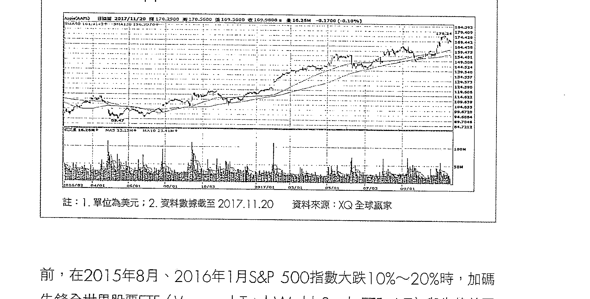

注：
- 单位为美元
- 资料数据截至 2017.11.20

资料来源：XQ 全球赢家

前，在2015年8月、2016年1月S&P 500指数大跌10%~20%时，加码先锋全世界股票ETF（Vanguard Total World Stock ETF，VT）与先锋美国整体股市ETF（Vanguard Total Stock Market ETF，VTI）。

虽然我们的投资信仰不尽相同，然而背后的运行机制都恰如其分地按照长期计划，机械而有纪律地实行。我认为，假如平时没有养成不同思考的习惯，那么当“非”效率市场现象发生时（详见注1），很难做出正确而果断的行动。捧着大量现金在手，除了损失机会成本外，一旦真正面临蔓延的恐惧情绪，更不可能投注大部分资金在单一时间点上，因为平时没有“操练”，届时手、脚、脑同时停止运作，才是最真实的可能性。

# 第五篇 建立正确心态 稳固投资信心

## 遇短期不确定性，投资人应以宏观视野评估投资价值

我举这些例子不是想要展示投资成果，而是藉此表达，太过关注资讯本身，容易变成只注重短期的消息或催化剂；但这反而提供很好的机会给愿意承担短期风险的长期投资人，也正是这种带有不确定的未来，恰恰提供绝佳的机会。当好企业碰到短期利空，短期影响或许不确定，但长期影响其实没那么大，甚至经过几年调整即可恢复，乃至营运绩效更甚以往。因此，用什么样的时间维度来看待这样的不确定性，就导出独立投资人可能有优势之处：投资期限优势。

投资人在此刻是不是能独立思考，秉持与大众智慧不同的看法，并保有纪律，愿意等待短期业绩不佳而遭市场抛弃的企业，出现价格被低估的机会？当然，等待所需要的时间，说不准需要多久，甚至在等待过程中，可能会让人产生“难道是我错了吗？”的念头。

记住！即使一切评估都做对了，市场也不会立即给予糖果回报。但我认为，在市场情绪浓得化不开，甚至还搅和着自己的几滴血在里头之际，愿意且有智慧率先买进高品质企业的投资人，是可以取得优势的。

> 注1：效率市场学院派假说认为，市场上所有讯息已经反映于股价。但是当人性弱点浮现，股价容易出现过大波动，造成价值与价格之间的巨大落差。

评估投资人优势的能力，我想没什么绝对的圭臬可以遵循，只有不断练习。投资是投资企业本体，而不是买进股票本身；遇到不确定性的消息时，别急着下定论，而要冷静思考这是否仅为短期影响、短期情绪，并不影响企业未来3~5年的发展？试着用退位思考的方式，以更为宏观的视野，来看清全貌。

## 时间维度优势》趁短空布局，静待企业回归应有价值

评估优势得当，也可能不会在短期得到回报，然而这类长期投资人，愿意承担短期的不确定，早早在低于合理价时买进，然后持续一段时间，等待市场智慧回归企业应有价值。耐心与纪律不容易，因为做出对的投资决策，仍可能让投资组合在几年内的报酬落后整体市场一大截。

此外，多数投资人急于要看每天、每季的报酬，鲜少有人在乎3~5年后苹果公司的发展如何，人们更在乎这一季卖出几支iPhone？营收有没有成长？市场上多数人的短期思考已成常态，且随着网路发展而资讯加速传播，更容易让消息被放大解读，导致价格波动超乎消息本身应有的幅度。例如在季报发布时，对于整年展望下修EPS成长7%，但是股价却下跌20%之多。

当市场出现此类“非”效率的时刻，恰恰为长期视角者创造好的投资机会，这也是我认为一般投资人能拥有的大部分优势来源。

# 想靠主动式投资致富 先用4件事自省理性

我主要的投资方式，是选择股息成长的个别企业，然而我清楚知道，自己建构与管理投资组合，必须仰赖众多外在条件与内在人格特质才可达成。因此，只要有朋友寻求建议，我推荐的一律都是与指数化投资及长期投资相关的书籍，如：《漫步华尔街》、威廉·伯恩斯坦（William Bernstein）的《投资金律》与《智慧型资产配置》、绿角的《绿角教你前进美国券商》与关又上的《你没学到的巴菲特：股神默默在做的事》等。

而在《原来有钱人都这么做》书中，汤玛斯·史丹利（Thomas J. Stanley）和威廉·丹柯（William D. Danko）大规模地调查了那些所谓超优理财族（prodigious accumulator of wealth）的百万美元富翁，他们的共同特点就是不一定坐拥绝对高薪，却都达到非常高水平的储蓄率，并且适当投资。

这类族群往往居住在不起眼的中产社区、开着普通的国产车。他们累积财富的过程不传奇亦不狗血，大多是多数人都知道的方法——勤奋工作、量入为出、谨慎规划财务支出。这些方法，许多人都知道，但就是做不到，更遑论投资债券、股票需要大量的外在能力（如收入高低、语言能力、资产大小、分析能力、投资组合管理、风险控管等），还要再面对市场波动时，能够保持理性与自律。

我认为如果超出自己的能力圈，不需要勉强为之。每个人都有擅长与不擅长的领域，知道该采取什么、放弃什么，同样也是一种智慧。因此，我主观地认为，95%的投资人应该考虑指数化投资。

当然，还有极少数对财务规划、商品研究非常有求知欲望的投资人，他们将指数化投资标的纳入资产组合之余，还有能力透过主动投资加入部分优秀的投资标的，以期投资组合更加贴近自我需求与个人风格。

我认为，假如真的决定要采取自组投资组合，一定要自我评估是否符合以下几项条件：

## 【条件1】拥有强烈求知欲

先求知、再求思，进而求变、最终求行。我认为知识是驱动最终行为的根源，假如知识水平、存量不足，或者根本不知道有这个东西或概念，就不可能凭空让行为做出改变。

# 第1篇 建立正确心态 稳固投资信心

因此对于知识边界的探索，必须有着旺盛的好奇心与求知欲。面对新知识，要随时保有让知识存量归零的准备，摆脱既有包袱，时时保持谦逊的持续学习。

## 条件2》具备洞察力的“第2层思考”

霍华·马克斯（Howard Marks）著作《投资最重要的事》当中，所提出的第1个概念——“第2层思考”，这是继第1个条件的求知欲后，我认为主动投资人绝不能缺少的重要人格特质。

即使我选择股息成长投资（DGI）作为终身的投资事业，然而我从没想过以超越大盘为目标，但是我很坚定地持续以系统化准则识别高品质企业，在与大众看法不同时，投资在市价低于应有价格的企业，建立并维持一个“非制式”的投资组合。这也是一个令人“不安”且“特殊”的组合，在传统智慧者的眼中经常显得太过于“轻率”（此为《投资最重要的事》书中的精妙智慧）。

我选择了主动式投资，正是因为了解这样的行为有多么不容易、必须具备多么大的勇气与超然的智慧，因此我更加谨慎地与风险共存，而这门学问与建构我们的人生十分相似，不是吗？

假如是其他领域，你可以透过比其他人努力、付出更多汗水与时间来增加机会、抢占先机；但投资领域不行，因为这些东西都不重要，若想获取比平均更高的投资报酬，需要卓越洞察力、直觉、价值观念，以及对市场心理层面的熟稔，想做到这些，就需要“第2层思考”。

你与其他人拿到相同资讯，或许你们一样聪明、一样消息灵通，但你必须要能洞察出其他人疏忽的地方、他们没想过的事以及错失的机会，进而有着不同的反应与行为。

第1层思考的人需要的只是“对未来的看法”，而且通常会很直觉地将其串成因与果，例如：“企业前景看好，所以股价上涨”；但是懂得“第2层思考”的人，思考的不仅如此。

以下引用《投资最重要的事》当中，谈到“第2层思考”的人所需考虑的更多事情：

- 未来可能的结果会座落在什么范围？
- 我认为会出现哪种结果？
- 我的看法正确的机率有多少？
- 市场共识是什么？
- 我的预期与市场差异多少？
- 资产价格与市场共识，与我认定的价格吻合度有多少？
- 价格反映出的市场共识是悲观还是乐观？
- 如果市场共识是对的，那对资产价格有何影响？如果我的看法才是正确的，又有何影响？

第1层思考的人都用相同方式想事情，因而得出相同结论，进而获得类似报酬，自然不可能获得卓越成果；第2层思考的人则知道，成功投资往往与“简单”对立。

## 条件3》持续做出正确行动

有了独特思考能力之后，一旦进入执行阶段，除了要经常得出与众不同且正确的结论外，还要能持续做出行动。

你不可能只是跟着别人做同样的事，却期待得到更出色的结果，虽然不该把与众不同当作目标，但可将“与众不同”当成一种思考方式。这一点也不简单，也不是这么做就一定会得到更好的结果，然而事实就是只有采取与众不同的行为，你的表现才有机会优于常人。

此外，还得再加上“判断比别人卓越”，你才会有高于平均的表现，可想而知是倍加困难。

总结第2层思考的人的特质：你的预期与投资组合都必须与一般人不同，而且看法也得比市场共识更为正确。因此，认为投资流程很简单的人，往往缺乏第2层思考，甚至没有想过第2层思考的存在，乃至于受到许多误导，相信几个过于简化的魔术，以为轻易就能成为成功投资人，事实上，这不是人人都可以做到的。

总结第2项、第3项条件，请想像一下这个难度是多么的难上加难：做出大多正确的预估→持续做出大多正确的预估→执行正确的决策→在正确的时间持续做出正确的决策。

对能力的要求是一回事，但今天做了一个正确的决策，不表示明天或下个月就会赚钱，甚至不会在3~5年内。此时，对于企业的了解程度以及当初对于价值估算的坚定，可能就是少数能够帮助你在价格与价值脱钩时，据以坚守投资决策的要素。

## 条件4》愿意持续摸索出最适合自己的投资方法

投资犹如人生的修行，也是生活体悟的延伸，这是一个探索自我的过程。了解自我投资属性，是愿意忍受短期波动，换取长期累积报酬？还是着重现金流的产生，以支应生活支出？或者是采取杠杆型操作，以创造短期极大化报酬？在探索自我的同时，亦须考虑自我能力的限制，包含外在技巧与内在修为。

每一种商品都是中立的，各有其适切性，也分别需要不同的投资信仰。但无论选择哪一种投资方法，都会面临不同程度与形式的心态考验；假如对于信仰不够坚贞，或者根本选择了不合心意的信仰，那就犹如穿着一双不合脚的鞋，无法陪伴你走到投资旅程的终点。

花点时间思考一下，究竟你投资的目的是什么？而为了达成此目的，到底什么才真正符合你的个性、能力与财务目标？

你也许不会一开始就找到答案，因为它是需要仰赖经验与随着人生智慧累积，来回着墨、涂改才会形成；但你必须持续地去寻找——当然，也可以不需要这么费劲，指数化投资已经提供了一种答案。

# 第15篇 撇开主动、被动投资之争 回归私人目标适切性

在1-2谈到“没有最好，只有最合适的投资方式”之后，我想再延伸谈一下主动式与被动式投资。因为这是一个很有趣的党争，但我认为其实没有必要，原因就在于私人目标适切性。

自从指数化投资在近10年受到投资人青睐后，主动式与被动式议题争论不休。就多数人的理解，机械化投入ETF（指数股票型基金），ETF会按照指数分配的持股比例投资指数成分股，普遍称之为“被动式投资”；除此之外，几乎都被归类为“主动式投资”。

而一旦选择主动式投资，就等于积极选股，甚至被贴上“好大喜功”、“想要击败大盘”等标签。只要报酬不如大盘，就是主动式投资人不切实际；报酬超越大盘，就是运气。

不过，我认为还是要回到我不断提到的“适切性”。我会选择主动式投资有3大理由：

## 理由1》被动式投资不见得能满足个人需求

目前“被动式投资”是指被动追踪指数的工具，例如指数型基金或ETF，是透过完全复制、采样复制或由基金发行公司的智慧复制等技术，以追踪特定市场指数表现的商品。

如道富标准普尔500指数（SPDR S&P 500 ETF，SPY），是追踪S&P 500（标准普尔500）指数；先锋基金公司发行的先锋美国整体股市ETF（Vanguard Total Stock Market ETF，VTI）则是追踪CRSP美国市场指数（CRSP US Total Market Index，详见注1）。

至于主动式投资方式，尤以主动式基金饱受抨击，数年来，许多研究纷纷提出90%的主动式基金无法击败大盘。

争论主动式或被动式投资孰优孰劣毫无意义，我想我们更应该思考，把“非ETF投资”定义为主动式投资，真的没有问题吗？难道只要是个别投资人自行选股、自行搭配不同资产，或者有分析团队进行选择，就称之为主动，并且认为这种投资方式的目的就该打败大盘？我想不是。请试想以下情境：由经理人掌控的一档基金，其周转率1年只有5%，或者基金当中包含公债、市政债，整体波动很小，标准差仅有5%；又或是一位个体投资人，每几年在价格低估时才出手买股票，然后几十年以来，都没有卖出持股。看到这些状况，都要为他们贴上“积极的主动式投资人”标签吗？

> 注1：CRSP全名 Center for Research in Security Prices，属于美国芝加哥大学的证券价格研究中心，为研究股价、提供股市资料库、编制指数的专业机构。

众 所皆知，有许多投资策略设计的目的，原本就不是用来超越市场报酬，如采取降低波动、以收益为主的策略，或以现金流再投入来滚大复利雪球等。

投资，应该以目的导向来选择适切性，打个比方，这有点像保险当中，到底该选择“还本型”或“不还本型”？该买1年定期寿险、20年期寿险，或保障较少的储蓄险与年金险？我们都不该指着别人鼻子说：“你怎么会买那个保险？应该像我这样买才对啊！”因为“对你”而言是对的，但并不等于他人的需要。

## 理由2》对需要现金收益者，现金流比赢大盘更重要

接着再谈谈，要不要跟大盘比较？这也是主动式投资经常被拿来与被动式投资比较的一点。

# 第★篇 建立正确心态 稳固投资信心

首先，部分投资人的需求是现金收入，这个需求不专属于退休族群，在职族群也可能同样需要现金收入。无论是作为日常生活花费，或者希望再投入这份收入来加速雪球效应，总之，这些投资人的目标就是“现金流”模式，并且采用收益型投资，毕竟S&P 500指数约1.9%的股利殖利率（2017.10.20为1.95%），并没有满足他们的需要。

而采取收益型投资（主要以稳健型债券为主），大约可以达到4%~5%的殖利率，但可能因此在资本利得方面落后S&P 500指数，这能定义为失败的投资吗？我不认为是。

既然这些投资人的目的是现金流，那么硬是要求他们的长期资本利得报酬要高于市场大盘，根本上就违背了他们的需求。因为，为了打败大盘而去投资低殖利率的标的，很有可能使得每年领取的利息收入（如股息或基金配息）不足以满足其需求，导致必须卖掉投资部位以求变现；在熊市恐慌时期，还 得强迫自己贱卖资产，这对他们而言一点都不实际。

卖掉投资部位，将使得持有股数降低，未来可能领到的利息收入也会变少，这相当于砍掉了原本每年结果的果树；事实上，这些投资人一点都不想把树砍掉，他们只想继续持有，并享受每年收获的果实。

我认为，选择投资方式，其实很类似于找寻自我的过程。假如违背个人意志，显得各方面格格不入，产生不了投资信仰，自然很难以此走完人生的投资旅程。

所以，这类需要现金收入的投资人，更适合持有个别企业公司债或股息成长股，因其产生的利息更可应付他们的现金流需求。即使短期价格出现下跌，对投资人亦无负面影响，他们不倾向于实现资本利得或规避帐面亏损，当然也不会造成立即损失；而且因为无论股票或债券，利息收入与价格变动并没有直接的关联，此时仍可领取到预期的现金流。

以债券而言，只要持有到期，无论债券价格涨跌，同样能获得预期的利息收入；以股票而言，领取股息多寡，是与投资人持有股数以及企业获利有关，与股价涨跌无关，只要企业仍保有竞争力，甚至能配发成长的股息，投资人就无须畏惧，甚至因为市场情绪而造成股价下跌时，还可视为绝佳的买进、加码机会。

## 理由3》有机会以划算价格投资被低估的高品质企业

市场就像是一个大卖场，有可能整个市场的平均价格高涨，但个别高品质企业的股票或债券却在打折求售。

例如，目前席勒本益比（详见注2）已达31.2倍（截至2017.10.25，详见图1），明显高于美国市场长期平均本益比15倍的水准，然而还是有不少企业处于折翼时期。无论在市场的多头或空头时期，这个现象会一直存在，只是企业数量多寡的区别。因此，对自行搭配投资组合的投资人而言，他们能够等待低估或者划算的价格，并不需要勉强自己购买整个昂贵的市场价格（即追踪整个市场的ETF与基金）。

我想大众都清楚，高涨的价格将导致较低的报酬预期。尽管狂热时期可能持续一段时间，甚至好几年，但是过高的价格与过高的评价（Valuation），无疑都增加了风险；更精确地说，这会让报酬的机率分布变得更广，也就是不确定性提高。

因此，指数化投资人，无论采用定期定额或更进阶的定期定“值”，或许受益于整体市场上涨，但也承受过高评价导致的未来风险。

当然，我知道指数化投资是一个纪律的计划性买进，在高点买进，也在低点买进，取得平均的市场报酬；股债平衡，再享受较低的波动，并且节省时间。概念虽然简单，但执行并不容易！同样需要投资人强大的信念与耐心。

即使我后来转换投资方式，将主要资本投注于股息成长投资（DGI）之上，然而我仍然保有当初建置的ETF投资组合，因为2种方式对我而言都能分别运作良好，也 同样符合我的投资目的。

> 注2：席勒本益比（Shiller PE Ratio）又称为10年期调整后本益比（Cyclically Adjusted Price Earnings Ratio，CAPE Ratio），由美国经济学家罗伯特·席勒（Robert Shiller）提出，是以S&P 500指数除以近10年经通膨调整后平均获利所计算出的本益比。

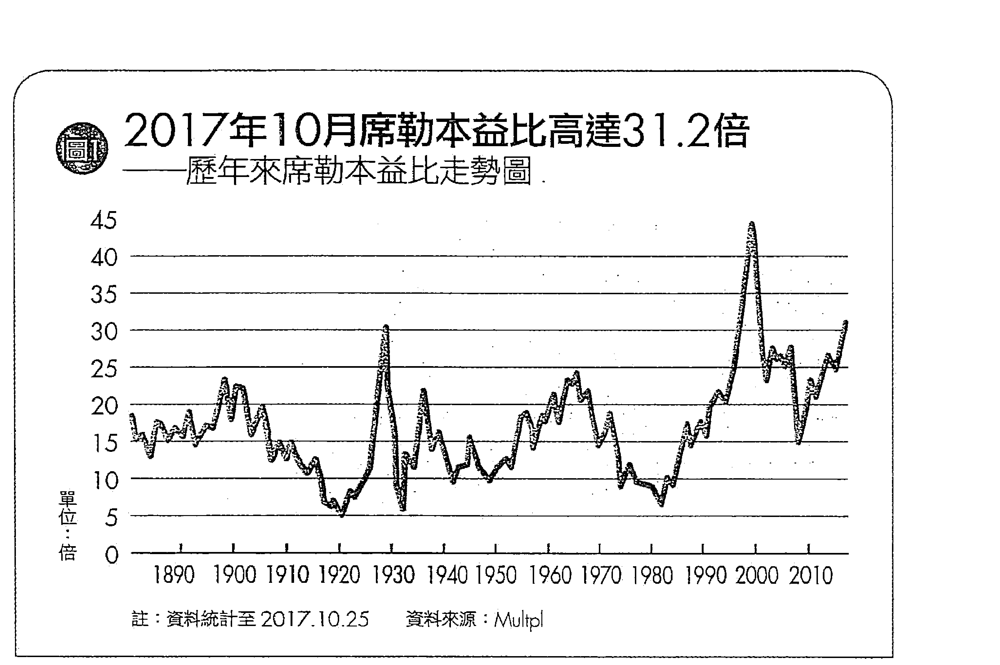

# 企业再优秀，都不宜以超出价值过多的价格买进

回来谈谈过高的资产价格与过高的评价问题，这是投资决策中不可或缺的最后一块拼图。再好的企业，也得要一个好的价格，“买好的，不如买得好”。

买进时如果没有同时考虑价格与价值是否相符，尽管资产的价格上升，短期报酬也许好看，但只完成了一半的课题；因为这项资产未来的价格成长空间将会减少，也让投资人置身于更大的风险之中。

对于偏好自行建构投资组合的投资人而言，反而不希望看到价格不断上涨，甚至到达高估的程度；因为只有企业价格低于价值时，才能提供投资人更长时间与更多的机会以购买更多的份额。

# 投资绩效无须与大盤分高下，符合个人需求即可

因此，回到投资绩效是否与大盘做比较这个议题上，自行建构投资组合的策略，买进时可拥有选择低估价格的弹性，目的也与“拥有整体市场绩效”策略大相径庭。

既然从内到外都截然不同，怎能用表面的年化报酬率来评论高下？就像大多数人认为擅长念书的学生才能飞黄腾达，因此严苛要求那些擅长体育、艺术、工艺的学生，必须在国文、英文、数学、历史、地理等学科考取高分，却没有想到这些学生其实可以在自己擅长的领域占有一席之地。老话一句，只要能 满足自身需求，就是最好的策略。

当然我知道，巴菲特（Warren Buffett）曾经在“给股东的信”中提到：“如果5年的年化报酬率无法击败大盘（编按：指S&P 500指数），那么最好思考是否该转换策略。”这段话，我只认同前半部，也就是用够长的时间周期，来检视自己的投资状况是否符合预期，而不要用单一年度；至於後半部談到「無法擊敗大盤，最好思考是否該轉換策略」，真的正確嗎？I don't think so！

我沒有合夥人與背後投資人的績效壓力，我不須對任何人負責，我只需要對自己的需求與目標以及對家人負責即可。只要我設計的投資組合是我確定想要的風格與屬性，為什麼我要關心績效是否落後S&P 500指數？

購買公債的大額投資人，或者以投資收益型商品為主的退休族，本來就希望穩定的現金流與較低的波動率，難道也要跟大盤比較報酬率嗎？

我想無論選擇什麼方式，ETF資產配置、債券、期貨、選擇權、成長股……都是每個投資人依據自身需要，做出當下最適切的選擇，不存在誰高一等，誰又一定比誰好的問題。

20世紀的葛拉漢（Benjamin Graham）與坦伯頓（John Templeton），都提供了價值投資的概念，深深影響近代的人；到了21世紀，巴菲特的睿智，也為我們這一代人建構了完整的投資平台，讓我們足以在其上恣意地栽植，並享受果實。

此外，以《非常潛力股》著作聞名的菲利浦·費雪（Philip Fisher），到威廉·歐尼爾（William O'Neil）的「CAN SLIM」策略（詳見註3），以及近代喬爾·葛林布萊特（Joel Greenblatt）的神奇公式（詳見註4），也都提供給投資人許多不同投資想法的素材。

選對符合需求、個性、目標、目的等導向的策略，才可以一條路走到底。當然，如果缺乏主動式投資的能力，被動式的ETF資產配置，值得95%投資人考慮採用。至於剩下5%呢？他們自己會往最適合的方向去選擇。

註3：CAN SLIM策略

為威廉·歐尼爾著作《笑傲股市》書中，對於股價大幅成長的股票所歸納的特徵字首縮寫，分別為：

- Current Quarterly Earnings Per Share：當季每股盈餘（較去年大幅成長）。
- Annual Earnings Increases：年度盈餘成長率（較去年大幅增加）。
- New Products, New Management：新商品、新的經營者。
- Supply and Demand：供給與需求（留意流通性與成交量）。
- Leader or Laggard：領導者或落後者（應選擇產業領導者）。
- Institutional Sponsorship：機構投資人支持（至少被數個法人持有）。
- Market Direction：市場趨勢。

註4：神奇公式

為喬爾·葛林布萊特著作《超越大盤的獲利公式：葛林布萊特的神奇法則》書中所提出，投資宜選擇「盈餘殖利率」（Earnings Yield，即以盈餘除以股價所計算出的比率）、「資本投入回報率」（Return on Invested Capital）較高的股票。

# 第1篇 建立正确心態 穩固投資信心

# 第二篇 认识股票成长 确定成功密码

## 掌握3大元素 搞懂DGI致勝策略

第1篇談了許多我對投資的理解，也是我認為投資之中最重要的概念；至於方法，反而是其次才要關注的。我目前所採用的是「股息成長投資（DGI）」策略，DGI是Dividend Growth Investing（或Investor）的縮寫，在美國是一種普遍的投資方式。

簡單的說，DGI就是由「價值投資＋股息成長」的企業，提供持續而穩定的現金流，並收割長期投資之後的資本利得。逐項拆解DGI策略，主要有3個元素：價值投資、持續而穩健的現金流、長期資本利得。

### 元素1》價值投資

DGI與價值投資結上緣，原因有2：

1. 股息連續成長的企業大多是成熟產業，既有歷經景氣循環的底蘊，又能保持獲利成長。
2. 投資人追求的是穩健的現金流成長，投資期限一定是以長期（10年以上）作為規畫。

既然希望投資組合的屬性為長期、持續、穩健的被動收入，那麼選擇企業時，勢必會考慮其當前價值，並以合理價之下或折扣價買進；如此一來，既提供錯誤容忍空間，也為長期報酬取得較佳立足點，投資人自然也較不會去追求當前熱門股或成長股。

### 元素2》持續而穩健的現金流

許多投資人常常陷入高殖利率的陷阱，但過高的殖利率難以長期為繼，也可能陷入價值陷阱之中，因為企業的實質競爭力也許正在流失當中。

因此，殖利率不是選擇標的主因或誘因，不該倒果為因，它只是你評估一家高品質企業之後的副產品。

既然DGI的目的是持續而穩健的現金流，因此，了解想投資企業的競爭優勢、護城河、營運模式等質化分析至關重要。你不會希望一家企業除了配息不穩定之外，連競爭優勢都喪失了，也就是既失了股息，還面臨資本利損。

### 元素3》長期資本利得

股息能夠連續成長，通常也代表著企業的獲利增長，難有企業能長時間不斷配發成長股息，但企業獲利卻是「不」成長的。因此，只要企業仍運行良好，沒有發生質變，股價也沒有被極度高估，那麼DGI不需要有實現資本利得的固定計畫（或依照獲利百分比來實現資本利得）。

然而，仍有可能在很長一段時間（10年、20年）之後，因各種需要必須賣出持股；除了支應生活所需，也有可能是兒女結婚或幫兒女置產，或者各種大筆意外支出。但總歸來說，這類支出是長期一段時間後才會發生，不是短期會用到的，短期支出必須靠工作、保險與充足的緊急預備金來支付（若是屆齡退休者，仍可建構股息成長投資組合，只是須以成長率較低的高殖利率企業為主，相關介紹詳見2-8）。

再者，股息成長背後的驅動力是企業獲利持續成長，當獲利成長時，即使本益比不變，合理預期價格也會隨之 上漲，投資人可以同時收割長期資本利得。

### 穩定創造現金流是股息成長投資的最大優勢

現金是企業的命脈，年度每股稅後盈餘（EPS）小於0，企業還是能夠生存下去，但很難在沒有現金的情況下支撐太久。

對個人也是一樣，只要收入大於支出，日子就能繼續過下去；但若沒有現金流入，即使持有的資產（如房子、土地、珠寶等）很多，如果不把這些資產變現，那麼擁有再多資產，也無法達成經濟獨立。

反觀，假如持有的資產產生現金流的能力很強，能夠涓涓不息地提供現金，讓你足以支應生活所需，自然心理壓力就小，更容易幫助你挺過市場波動時期。因為你的收入並不仰賴於資產市價的變動，這就呼應了1-1談到的DGI第1個特點「投資心情穩定」。

假如需要仰賴價格變化才能提升資產總值，只要資產價格不動，就不會產生資本利得；而當資產價格下跌之際，若又需要現金支應生活時，投資人就必須被迫賣掉資產，此時資產總值減少的幅度也愈大，因為必須賣掉更多股數。

反觀，現金流收入的投資方式，專注的是企業品質，並建構在「股數」的基礎之上，從持有股數和估計股息配發金額，即可預估每個月（或每年）的被動收入有多少。

想要達到某個金額的月收入或年收入，能夠清楚計算需要準備多少資本；對於「需要準備多少退休金」這個問題，也不會覺得難以評估——你問10個人認為自己需要準備多少退休金，會得到10個答案，而且多半是聽來的，或者是自己的想像金額，很少人會根據實際需求做出明確的預估及規畫。

此外，當挹注新的資金時，因為股數變多了，自然能夠立即獲得收入增加的反饋；因此，我能夠以生活所需的支出金額反推所需的資金總量，且不需要賣出資產，就能獲得被動現金流。

DGI這樣的投資方式，以創造現金流為目的，擺脫了短線與價差思維，因此能夠讓投資人安定身心，把全部精力專注在工作表現中，這絕對比尋找迅速提升績效的投資方法還要重要得多。

# 第 ☆ 篇 認識股息成長 奠定成功基石

## 建構全球化投資組合 投資路走得更長久

只要有投資新手或同事、朋友向我詢問適合的投資方式，我一定不假思索地給予「全球化ETF資產配置」的建議。如同在我的部落格上，每篇個別企業的分析文都會加註一段文字：「使用指數化投資工具，仍是多數人最合適的選擇，並將省下時間花在投資自己的本業能力之上，與陪伴親愛的家人。」

「全球化ETF資產配置」適合大多數投資人，利用30～40年的在職階段，將部分薪水收入被動式地分散投入全球ETF，即可穩健且扎實地累積資產，取得平均或平均之上的市場報酬，讓雪球效應發生；至於大資金的投資人，選擇性就更多了，可用更低風險的投資工具獲取稍低的報酬，即可滿足其需求，例如以A級公司債混搭國債以及保險年金等。

假如沒有時間，也沒有興趣了解產業與個別企業的投資人，不需要勉強自己選擇股息成長投資（DGI）。因為不同方式之間沒有優劣，也不存在黑白之分，每個人的長期財務目標與自身的財務體質不盡相同，因此好與壞沒有絕對的分界，一個人不一定只適合一種方式，同樣的一種方式也不盡適合所有人。

我曾經打算用10~12檔ETF做資產配置，但是，後來無意間看到國外的部落格介紹DGI，深深打動了我，憑藉著以往大量閱讀書籍的底蘊，加上一篇篇文章的自學，吸收內容之後再重新以我的理解寫成文章，慢慢地累積分析企業的能力。此時，我才深刻地體悟到，這樣打造源源不絕的現金流水庫的方式，十分符合我的需求與性格，這才是我想要畢生採取的投資方式。

既然我決定改走DGI路線，那麼我有放棄掉原有的全球化ETF資產配置嗎？從我部落格首頁公開的持倉部位可以看到，我始終沒有賣掉ETF，因為兩者是完全能夠並存的。

如圖1所示，我所持有的ETF、長期價值股（採取DGI投資方式）、美股選擇權三者，正如一個循環生態系統，能夠相互支援；ETF的股息可以提供給DGI買進股票，DGI的股息也可以拿來買ETF，至於美股選擇權產生的現金流，要做何種運用皆可。

只是近兩年，我主要將新資金都投注在DGI，至於ETF，預計等有餘力時再慢慢補足原有規劃。

## 用投資組合循環系統，創造無限現金流收入——追日Gucci投資組合結構與占比

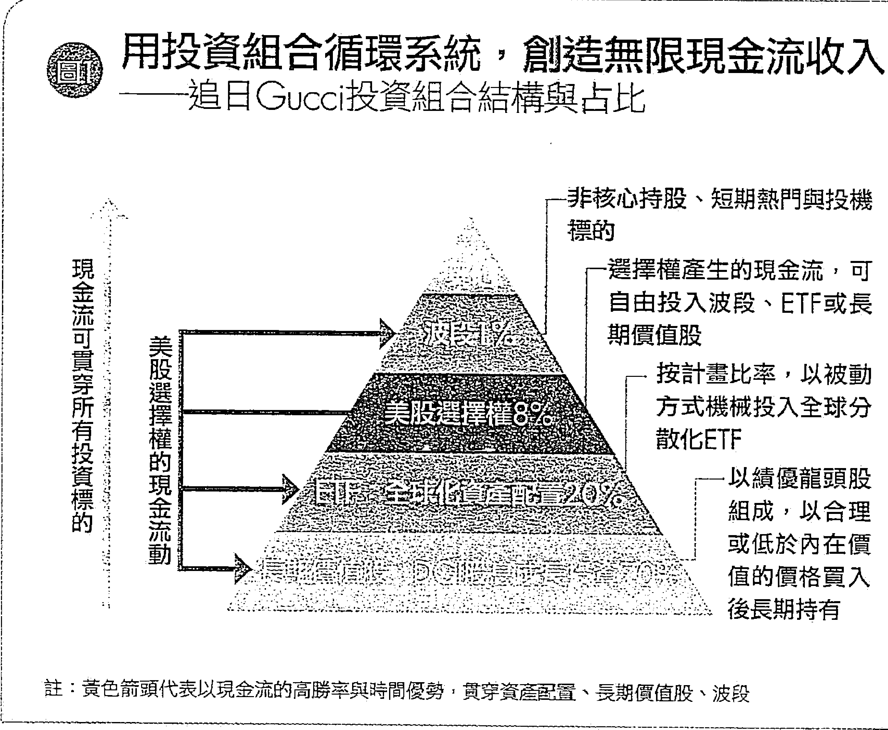

回到為什麼我選擇股息成長的投資方式？總結3點適合我自身的理由：

### 理由1》建構自我風格的組合

ETF的特色，在於投資人不需要深入研究個別企業，而是只要選擇欲投資的市場，就能獲得該市場的平均報酬。

# 第☆篇 認識股息成長 奠定成功基石

例如，使用ETF做資產配置時，通常會採取股市與債市的搭配，常見的有2種做法：

### 1.簡約式風格

以2檔全球型ETF完成股債配置，如VT+BND，投資範圍簡單敘述如下：

- ①VT：全球型股票市場，全名為先鋒全世界股市指數ETF（Vanguard Total World Stock ETF），追蹤指數是富時全球市場指數（FTSE Global All Cap Index），約可獲得全球股市的平均報酬。
- ②BND：全球型債券市場，全名為先鋒總體市場債券ETF（Vanguard Total Bond Market ETF），追蹤指數是巴克萊美國整體債券市場浮動調整指數（Barclays U.S. Aggregate Float Adjusted Index），這個指數的投資標的主要包括美國公債、投資等級公司債、美元計價國際債券等。

### 2.分散式風格

以多檔區域型ETF完成股債配置，如股（VTI+VGK+VPL+MCHI）、債（IEF+TIP+VVIP）等，投資範圍簡單敘述如下：

- ①VTI：美國股票市場，全名為先鋒美國整體股市ETF（Vanguard Total Stock Market ETF），追蹤CRSP美國市場指數（CRSP US Total Market Index）。
- ②VGK：歐洲股票市場，全名為先鋒富時歐洲ETF（Vanguard FTSE Europe ETF），追蹤富時已開發歐洲全市場指數（FTSE Developed Europe All Cap Index）。
- ③VPL：亞太股票市場，全名為先鋒富時太平洋指數ETF（Vanguard FTSE Pacific ETF），追蹤富時已開發亞太全市場指數（FTSE Developed Asia Pacific All Cap Index），包括日本、香港、新加坡、澳洲、紐西蘭等太平洋主要已開發國家的股市。
- ④MCHI：中國股票市場，全名為安碩摩根士丹利中國ETF（iShares MSCI China ETF），追蹤摩根士丹利資本國際中國指數（MSCI China Index），投資標的為不含A股的中國股票。
- ⑤IEF：美國公債市場，全名為安碩7～10年期美國公債ETF（iShares 7-10 Year Treasury Bond ETF），追蹤洲際交易所美國7～10年期公債指數（ICE U.S. Treasury 7-10 Year Bond Index）。
- ⑥TIP：美國抗通膨公債，全名為安碩美國抗通膨公債ETF（iShares TIPS Bond ETF），追蹤彭博巴克萊美國抗通膨公債指數（Bloomberg Barclays U.S. Treasury Inflation Protected Securities (TIPS) Index）。
- ⑦WIP：美國以外的抗通膨公債，全名為SPDR花旗國際抗通膨政府債券ETF（SPDR Citi International Government Inflation-Protected Bond ETF），追蹤花旗國際抗通膨政府債券指數（Citi International Inflation-Linked Securities Select Index）。

# 第★篇 認識股息成長 奠定成功基石

以上ETF可自行調配比率，甚至可以再加入一些多元的元素，如先鋒不動產投資信託ETF（Vanguard REIT ETF，VNQ）、先鋒小型價值股ETF（Vanguard Small-Cap Value ETF，VBR）等。

只是我偏好的投資風格是穩健成長的現金流，而非讓資產達到整個市場的平均報酬率；即使有針對「股息成長股」而發行的ETF，當中仍存在許多我不想持有的企業，我也沒辦法決定其中的產業分布比率。但透過DGI投資方式，我可以自行設計持股類型分布比率。我主要是以「20%偏於成長、60%核心穩健、20%防禦型」的比率來設計；也因為我偏好波動較低的組合，因此將必需消費、電信、健康照護產業分配較高的比率，而波動度較高的科技、原物料、能源等產業，則分配較低的比率。

用這樣的方式來設計我的投資組合，使得產業分配方面具備良好的分散性，一切的建構都圍繞著我「想要的樣子」來搭建。

### 理由2》捕捉「非」效率市場時股價偏離的機會

有效率的市場，指的是所有會影響股價的因素都已經反映在股價上。但是，市場總會出現「非」效率的時刻，使得一些優良企業的股價，甚至是整個市場被過度低估。

中立的說，有計畫與系統性的機械式投資ETF，同樣可以捕獲「非」效率市場的時刻。不過DGI更可以讓我針對鎖定的企業，等候其股價到達合理價以下。

例如我一直關注的嬌生（Johnson & Johnson，美股代號JNJ），它作為全球最大的個人健康照護、醫療器材以及藥品製造企業，股息連續33年成長。我不需要在整體市場指數偏高時被迫買進它，而是能夠以事前依據評估的合理價格，在企業遭遇短期困境或市場情緒過度低落時再出手。

當然，我也許需要花費幾年的時間成本等待，但與其以過高的價格承擔較高的風險，卻得到較差的長期報酬，我更喜歡保持投資紀律，耐心等待折扣價格的來臨。

在市場中，每個時期都會有不同產業的倒楣企業，加上市場情緒的過度催化效果，使得股價落入合理價或低估價；因此，在等待嬌生落入合理價的同時，我仍有機會選擇其他股價打折的企業，不需要等待整體市場被低估時再買進。

這就像是我不需要等待商場舉辦跳樓大拍賣，只要在平日裡仔細觀察，就有機會以物超所值的便宜價格，買入我待購清單中的商品一樣。

## # 第2篇 認識股息成長 奠定成功基石

### 理由3》滿足投資性格與樂趣

每個人都是獨特的，包含個性、興趣，乃至於價值觀等。我熱愛閱讀，喜歡數字與思考其背後的意義，更熱中於研究各式各樣的企業。每研究完一家企業，對於企業所處的該產業就會有全新的理解，也許是天生的好奇心使然，這樣的投資過程讓我極度樂在其中。

總結以上3點，我是真心喜歡DGI，無論是從長期的財務目標，個人的喜好、興趣到滿足求知欲，都完全貼近我的個性。正因為這樣的適切性，讓我願意充實自己的分析、批判與思考能力，一步步地堅定我的投資信仰；甚至可以說，我願意花一生的時間，讓DGI陪伴我成就這段投資旅程。


## 執行股息成長投資策略 先養成3大觀念

股息成長投資（DGI）並非隨意買進股票就能定期收到股息那麼簡單，儘管可能老調重彈，在此我仍想繼續提出幾個極其重要的觀念：

### 觀念1》找股息成長企業，避免落入殖利率陷阱

或許你已經聽過「價值陷阱（Value Trap）」，意思是說，只看到陡降的價格便見獵心喜，卻沒有深入研究價格下跌的主因，究竟是來自於短期的利空但企業體質不變，或是企業的競爭優勢已遭到永久侵蝕。因此，不明事理的按下購買按鈕，將讓自己暴露於風險之中而不自知。

短期利空消息的影響可能會被人性的行為偏差所擴大，此時就是買進超跌好企業的時機。然而有時候，投資人僅是對某家企業略有耳聞，或是曾經深入研究過該企業卻沒有持續追蹤，但當價格陡降至看似吸引人的價格錨點，便容易忽視重新檢視企業本質的重要性，乃至於在價格仍遠在企業內在價值之上的時候，就貿然的買進看似跌幅很大的企業，跌入所謂的價值陷阱。

「殖利率陷阱」也是類似道理。嚴格來說，殖利率只是投資一家高品質企業所能獲得的副產品，企業本質才是因，殖利率只是果，不該反以高殖利率為優先選擇。這就如同在債券市場之中，企業給予較高的利率方能夠吸引投資人買單，背後當然是某種程度的風險暗示，除了企業本身可能暗藏的風險外，高配息這件事也不容易長期為繼，即使能夠持續配息，也很難有股息的成長空間。

DGI追求的是穩健的現金流成長，投資期限一定是以長期作為規畫；既然你希望投資組合的屬性為長期、持續、穩健的被動收入，那麼選擇企業的時候，就要以宏觀的視野作為考量。你總不希望收入忽高忽低，甚至收到高股息之後，隔年就戛然而止，這簡直嚴重偏離了持續而穩健的投資組合訴求。

更理想的方式，是找尋兼具股息與獲利成長的企業，因為股息能夠持續成長的企業，非常可能意味著其營收與獲利同時成長，也代表著投資人不只每季收到的股息會增加，所擁有的資產價值亦會成長。

因此，不要將自己的思維侷限在當前的殖利率數字，而該一併考慮企業未來；就像價值投資，既要考慮當前價值，也必須對未來發展進行評估。

### 觀念2》重視系統化投資策略，別跟股票談戀愛

無論你多麼喜愛一家企業，它的產品擁有穩定的市占率、公司內部維持優秀的管理風格、股息成長趨勢長期且持續……但別忘了，再好的企業都可能有凋零的一天，僅有少數的企業能夠陪伴你度過整個投資生涯。

記住你當初評估該家企業的結果，並且定期（1年至少1次）檢視企業的經營方向與評估未來可能的狀況，時時確保它仍符合當初的條件。假如只是一廂情願的深愛著它，只會被蒙蔽雙眼，進而對企業質變的事實視而不見，甚至為其找藉口。

一旦察覺到企業的質變，更是該老老實實檢視企業的時刻，思考這是短期逆境遇上市場恐慌？還是長期優勢開始瓦解？

每家企業都有艱難的時刻，能在逆境中轉型的企業，更是長期投資的絕佳選項，因此DGI投資人應仰賴一套輪廓清晰且簡單的系統，來幫助自己增加長期投資報酬。

簡單來說，人類以心理為基礎做出的決定是脆弱的，但系統化的投資策略不會。這邊指的系統化，並非像是IBM超級電腦華生（Watson）這樣的人工智慧（AI），必須寫出複雜的Machine Learning（機器學習，指訓練機器根據數據進行分析並學會預測）或者Deep Learning（深度學習，為機# 第2篇 认识股息成长 奠定成功基石

机器学习的一种，电脑自行从巨量数据找出规则）。所谓的投资系统化，是在投资时，简单遵循几条规则，以避免心理因素过于扰动。

当一样的数据同时摊开在2位投资人面前时，这2人会做出全然不同的决定，甚至同一人在这1分钟与下1分钟也会做出不同决策。即使是身经百战的投资人，也会受到情绪影响，让投资决策过程复杂化，进而对财富造成巨大伤害。因此，采用简单的系统化准则，最大优势就在于它能够移除我们的情绪行为，避免伤害的产生。

## 观念3》以长远的视野投资，不要参与短线投资

> 著名避险基金机构Baupost Group创办人，同时也是经典书籍《安全边际》作者赛思·卡拉曼（Seth Klarman）曾说：“投资人唯一能安身之地就是长期导向的投资。”这段话其实贯穿了前述2个观念：
> - 1. DGI需要的不是短暂的高殖利率，关注的是企业的本质与营运。
> - 2. 投资人应当遵循系统化投资策略，因为短期的价格总是随机漫步，掺杂着过多大众非理性的情绪，无法如实反映企业真实价值；然而将时间拉长来看，价格终能回归企业应有价值。没有一种策略能总是击败市场，即使是大师也不能年年做到，DGI也不例外。有些时候，报酬就是会落后于市场。
>
> > 被誉为“价值投资之父”的葛拉汉（Benjamin Graham）也说过：“对于短线投资，市场只是一部投票机；然而长期投资中，它更像一台体重计。”

短线投资就像投票机器，每天、每月、每季，乃至每分钟，主要受到群众的“情绪”所驱使；想要事前猜出大众情绪的变化，几乎完全不可能！当然，这场难预测的游戏，你并不需要参与。

记住DGI投资策略的准则，只要企业没有下砍股息、长期竞争优势没有丧失，价格也没有过分被高估，那么即使投资组合的账面价值减少，下个月、下一季，投资人同样会收到持平或成长的股息现金流；而股价下滑所带来的加码买进良机，更可视为长期投资人展现纪律与长期等待的回报。

因此，真正重要的不是短期报酬，而是“有没有达成投资目标”；如同DGI需要的不是追求绝对报酬的数字，而是源源不绝的现金流、持续成长的被动收入。

当你投资于高品质企业时，所能做的，除了每年检视企业没有偏离航道外，你能做的最好的一件事就是——别做任何事！

# 第2章 投资期间愈长 愈能降低短期波动带来的卖压

有些投资人不太重视股息，例如在除权息前买进股票，然后填息之后迅速与股票分手，赚取看似免费午餐的手法；或是在股票套牢后，“被迫”以领股息为借口，说服自己成为长期投资人。

股息是企业获取现金流并扣除支出后，提取部分比例给予股东的回报。要想从企业获得持续成长的股息，有赖于企业维持并提升获利的能力，以及对股东友善且一贯的股利政策。

因此，股息的重要性，除了显示企业是否维持好的获利能力，也可供投资人检视企业经营状况，以及企业对未来的展望。

## 计算投资总报酬，须同时考量股息与长期资本利得

美股单年度的股息看似不高，特别是美股的殖利率通常又比台股来得低（根据2017年9月数据显示，S&P 500指数殖利率约2%，台湾加权股价指数殖利率约4%），因此若要成为美股长期投资人，殖利率往往不是多数人重视的选项。

事实上，股息对于市场总报酬的贡献率举足轻重，只是常被投资人所忽略。简单来说，投资人获得的总报酬“=股息收入＋长期资本利得”；而长期资本利得的产生，又来自于股息成长（约等于盈余成长）与本益比的提升（详见图1）。

资产管理公司Santa Barbara Asset Management曾针对全球及美国、英国、日本、加拿大、法国、德国、澳洲等股市的年化总报酬率，以及其形成结构进行分析，资料范围长达近47年（1970.01.31～2016.12.31）。

分析结果显示，“当年度股息”与“股息成长”对总报酬的贡献良多，在全球以及各个主要股市都是相同现象（详见图2）。

再看另一份由基金公司Guinness Atkinson Funds发表的分析报告，也有类似的论点。如图3所示，可看到1940年底～2011年底长达70年的时间，S&P 500指数1年、3年、5年、10年及20年的滚动平均总报酬中股息所占的比重。

## 持有时间愈长，股息占总报酬率比率愈高 ——资本利得与股息占S&P 500指数总报酬比率

> 注：1. 资料日期 1940.12.31 ~ 2011.12.31；2. 此表持有期间均为滚动报酬率
> 资料来源：Guinness Atkinson Funds

若平均持有年度为1年，股息占S&P 500指数总报酬的比率平均约27%；持有5年则为42%；当持有时间愈长，股息占总报酬的比率愈高。图3中可看到，当持有期间达20年时，股息占总报酬比率逼近60%，超越了资本利得。换句话说，这70年来，假如没有股息的存在，长年的市场报酬将缩水约60%。

再以10年为单位来观察，1940年代起每个10年，股息对于S&P 500指数总报酬的平均贡献度占了52.7%（详见表1），可以说，S&P 500指数的投资人所获得的报酬，有一半以上来自股息。尤其是指数总报酬偏低时，股息的贡献度更为明显，例如1970年代的10年期间，S&P 500指数总报酬为76.9%，股息就贡献了59.7%，占了总报酬的77.6%，可见在市场环境不佳时，绝大部分报酬来自于股息的支撑。

# 表1 近70年来，股息占市场总报酬比率达52.7% ——每10年股息占S&P500总报酬比率

| 年度 | 总报酬（%） | 资本利得（%） | 股息（%） | 股息占总报酬比率（%） |
| :--- | :--- | :--- | :--- | :--- |
| 1940年代 | 143.1 | 34.8 | 108.3 | 75.7 |
| 1950年代 | 467.4 | 256.7 | 210.7 | 45.1 |
| 1960年代 | 109.5 | 53.7 | 55.8 | 51.0 |
| 1970年代 | 76.9 | 17.2 | 59.7 | 77.6 |
| 1980年代 | 389.2 | 227.4 | 161.8 | 41.6 |
| 1990年代 | 432.2 | 315.7 | 107.5 | 25.4 |
| 2000年代 | -9.1 | -24.1 | 15.0 | N/A |
| 平均 | 228.6 | 125.9 | 102.7 | 52.7 |

> 注：资料日期 1940.12.31 ~ 2011.12.31
> 资料来源：Guinness Atkinson Funds

因此，投资人若想拥有理想的长期总报酬，在建立投资组合时，除了重视殖利率，更要关注所选择的企业是否有股息成长（获利成长）的能力。

当然，本益比的变动也是影响长期总报酬的因素之一，只是这部分是投资人无法掌握的。不过，股息成长的原始驱动力是来自于获利成长，即使本益比不变，也能够带动股价上扬，进而提升资本利得。假如市场给予的本益比提高，又能让资本利得进一步增加。

然而，尽管股息占有很重要的地位，投资人在看待长期总报酬率时，也不能只是着眼当下、单一年度的股息；更应该回归企业本质，选择具有成长性的高品质企业，以获取长期成长的股息收入。

## 布局股息成长股 稳健高殖利率、低波动

我喜欢数字，也是数据控，一切证据我都要数字来告诉我事实。在我学习股息成长投资（DGI）的过程中，从研究机构与资产管理公司搜集到的大量图表与数据资料，发现了许多股息成长企业的优势。既然“股息”与“股息成长”是构成投资总报酬的重要部分，我们可以再从历史的统计，来看看几个问题：
> - 1. 投资配发股息与不配发股息的企业，谁的报酬率较好？
> - 2. 股息成长企业，是否能为投资人创造比大盘更好的报酬？
> - 3. 若一并考虑风险（波动程度、获利风险比），配发股息的企业也有优势吗？
> - 4. 高股息配发率的企业，能提供较佳的报酬吗？

虽然我提过，选择投资策略时，不需要刻意与大盘比较，但是研究机构在评断投资策略的绩效时，不免会把指数当作比较基准。事实上，你也会发现，长期投资股息成长企业，报酬率并不逊于指数。

## 重点1》配发股息的企业财务体质较健全

先来看看研究机构Ned Davis Research曾经做过的统计。自1972年～2010年底的15个牛市（多头市场）与14个熊市（空头市场），投资配发股息的企业，无论是在牛市或是熊市，报酬率都略优于不配发股息的企业，也胜过S&P 500指数（详见图1）。

在熊市中，虽然配发股息的企业也呈现负报酬，但是负报酬幅度约只有不配发股息企业的一半。其原因在于，连续多年发放股息的企业，大多是成长稳健且财务体质较佳的企业，因此虽无法自免于整体大环境不佳的影响，然而因企业的竞争优势没有丧失，获利减少的情况也更为缓和，甚至逆势成长，如2008年的麦当劳（McDonald's Corporation，美股代号MCD）、娇生（Johnson & Johnson，美股代号JNJ）与沃尔玛（Wal-Mart Stores，美股代号WMT）等，在2008年～2009年间，获利逆势上扬。

## 重点2》股息连续成长的“股息贵族”报酬率较佳

进一步来看，股息成长、股息持平、不配发股息、股息减少这4类公司，谁的总报酬率比较好？根据研究机构Ned Davis Research的数据，自1972年～2015年底，股息成长企业的总报酬最高，也优于整体有配发股息的企业（详见图2）。

# 配发股息企业的报酬率均优于不配发股息企业 ——配发股息企业vs.不配发股息企业报酬率

> 注：资料统计至 2010.12.31  资料来源：Ned Davis Research

此外，来看看标普道琼指数公司（S&P Dow Jones Indices）所编制的指数“S&P 500股息贵族指数”（S&P 500 Dividend Aristocrats Price Index），这是在2005年5月设立，成分股是“股息连续成长超过25年，同时为S&P 500指数成分股”的族群。

# 股息成长企业的总报酬最高 ——不同股息配发类型企业总报酬比较

> 注：1. 资料期间为 1972 年～ 2015 年；2.S&P 500 等权重指数，其成分股所占指数权重皆一致；3. 此表以 1972 年 1 月为基期 100 资料来源 : Ned Davis Research

这类企业或许已过了最高速成长的时期，然而多数都历经时间及景气循环的考验，在时间的长河中，成为稳定且获利成长的代表。根据标普道琼指数公司截至2017年10月31日的资料，S&P 500股息贵族指数10年年化报酬率达10.85%，比S&P 500指数多出3.34个百分点（详见表1）！

# 股息贵族指数10年年化总报酬率可达10.85% ——S&P 500股息贵族指数vs.S&P 500指数报酬率

| 指数项目 | 报酬率类型 | 1个月 | 3个月 | 年初至今 | 1年 | 3年 | 5年 | 10年 |
| :--- | :--- | :--- | :--- | :--- | :--- | :--- | :--- | :--- |
| **S&P 500 股息贵族指数** | 总报酬率 (含股息) | 1.45 | 3.95 | 14.02 | 19.24 | 10.23 | 14.94 | **10.85** |
| | 价格报酬率 (不含股息) | 1.28 | 3.33 | 11.80 | 16.32 | 7.52 | 12.14 | 7.79 |
| | 税后总报酬率 (含股息) | 1.40 | 3.77 | 13.35 | 18.36 | 9.41 | 14.09 | 9.92 |
| **S&P 500 指数** | 总报酬率 (含股息) | 2.33 | 4.76 | 16.91 | 23.63 | 10.77 | 15.18 | 7.51 |
| | 价格报酬率 (不含股息) | 2.22 | 4.25 | 15.03 | 21.12 | 8.47 | 12.77 | 5.21 |
| | 税后总报酬率 (含股息) | 2.30 | 4.61 | 16.34 | 22.87 | 10.08 | 14.45 | 6.82 |

> 注：资料统计至 2017.10.31 资料来源：S&P Dow Jones Indices

3.34个百分点看似不多，但是两者10年的累积报酬率却差了约74% (详见图3)；只要了解复利效果，就会知道在长时间的催化之下，两者将产生非常大的差距。

假设投资100万美元，年化报酬率为每年7.51%及10.85%，10年累积的金额分别为206万美元及280万美元，差距74万美元；时间拉长到25年，差距扩大到702万美元；再拉长至35年，差距更高达2,418万美元（详见表2）。

# 投资不同年化报酬率商品，时间愈久差距愈大 ——投资100万美元，不同年化报酬率的累积报酬

| 时间 | S&P 500指数 (年化报酬=7.51%) | S&P 500股息贵族指数 (年化报酬=10.36%) | 差距 |
| :--- | :---: | :---: | :---: |
| 10年 | 206 | 280 | 74 |
| 25年 | 611 | 1,313 | 702 |
| 35年 | 1,261 | 3,679 | 2,418 |

> 注：1. 资料统计至 2017.10.31；2. 计算基础为年化报酬率与复利效果。3. 图中数据单位为万美元。
> 资料来源：S&P Dow Jones Indices，作者整理

再看过去10年（2007年～2016年）各年度的含股息报酬率，10年当中有7个年度，股息贵族的表现都比S&P 500指数好；2008年金融海啸与2011年欧债危机扩散，股息贵族也优于S&P 500指数，显示当市场动荡时，身为股息贵族的企业，具备较为抗跌的优势（详见表3）。

## 金融海嘯時，股息貴族報酬優於S&P 500指數

| 年度 | S&P 500 股息貴族指數 | S&P 500 指數 |
| :--- | :--- | :--- |
| 2007 | 總報酬率 (含股息) -2.07 | 總報酬率 (含股息) 5.49 |
| | 價格報酬率 (不含股息) -4.46 | 價格報酬率 (不含股息) 3.53 |
| | 稅後總報酬率 (含股息) -2.77 | 稅後總報酬率 (含股息) 4.90 |
| 2008 | 總報酬率 (含股息) **-21.88** | 總報酬率 (含股息) **-37.00** |
| | 價格報酬率 (不含股息) -24.42 | 價格報酬率 (不含股息) -38.49 |
| | 稅後總報酬率 (含股息) -22.65 | 稅後總報酬率 (含股息) -37.45 |
| 2009 | 總報酬率 (含股息) 26.56 | 總報酬率 (含股息) 26.46 |
| | 價格報酬率 (不含股息) 22.20 | 價格報酬率 (不含股息) 23.45 |
| | 稅後總報酬率 (含股息) 25.23 | 稅後總報酬率 (含股息) 25.55 |

> 注：資料統計至2017.10.31　資料來源：S&P Dow Jones Indices

## ——S&P 500股息貴族指數vs.S&P 500指數年度報酬率

| 2010 | 2011 | 2012 | 2013 | 2014 | 2015 | 2016 |
| :---: | :---: | :---: | :---: | :---: | :---: | :---: |
| 19.35 | 8.33 | 16.94 | 32.27 | 15.76 | 0.93 | 11.83 |
| 15.70 | 5.30 | 13.70 | 29.12 | 13.05 | -1.51 | 8.99 |
| 18.24 | 7.41 | 15.96 | 31.32 | 14.94 | 0.19 | 10.97 |
| 15.06 | 2.11 | 16.00 | 32.39 | 13.96 | 1.38 | 11.96 |
| 12.78 | 0.00 | 13.41 | 29.60 | 11.39 | -0.73 | 9.54 |
| 14.37 | 1.47 | 15.22 | 31.55 | 12.99 | 0.75 | 11.23 |

> 注：上表数据依次为：股息贵族指数总报酬率、S&P 500指数总报酬率、股息贵族指数价格报酬率、S&P 500指数价格报酬率、股息贵族指数税后总报酬率、S&P 500指数税后总报酬率。
> 资料来源：S&P Dow Jones Indices，作者整理

## 科技产业更迭速度快，在S&P 500股息贵族指数中占比低

接着来看一下，S&P 500股息贵族指数的成分股组成究竟与S&P 500指数有何差异？

S&P 500指数是由美国500大企业，不管企业品质高低、殖利率高低而组成的指数。观察其产业类别，单是科技股这个产业，就占了24.5%（详见图4）。

科技业很容易吸引人们的注意，但产业特性是变动快速，获利再高的公司，也容易因为被新技术、新竞争者取代而面临殒落的命运。

回顾历史，以往受到追捧的新兴公司，过了10年之后，还有几家公司能维持荣景，甚至攀上更高峰？甚至多数公司都已被市场淘汰，能长时间维持优秀获利的科技公司不是没有，然而终究是凤毛麟角。

提供一个从股息成长企业清单（详见注1）中查到的数据（资料日期为2017.10.31），在814家股息连续成长超过5年的企业中，仅有约6%是科技业；把时间拉长来看，股息连续成长超过25年的企业共有113家，仅有4家科技业，比率仅3.5%，可见科技业保持长青的困难度。

> > 注1：取自每个月由 Dave Fish 更新的“CCC List”。CCC为 Champion、Contender、Challenger，分别代表股息连续成长 25 年以上、10 年～未达 25 年、5 年～未达 10 年（相关介绍详见 5-4）。

反观，S&P 500股息贵族指数的持有产业组成内容大为不同，以“必需消费”这类变动缓慢的产业居冠，占了将近1/4（详见图5）。必需消费品是日常生活不可或缺的产品，却常被视为老掉牙的产业，既没有惊奇的## 重點3》配發股息企業波動較低、夏普值較高

很多人喜歡比較不同投資工具的報酬率，也喜歡比較自己與他人的報酬率；但是在評量整體報酬時，往往會忽略重要的「風險」。因此除了看報酬，也必須一併觀察風險相關指標，包括波動程度（年化標準差）與獲利風險比。

從表4可以看到，截至2017年10月31日，近10年S&P 500股息貴族指數的年化標準差為14.06%，略低於S&P 500指數的15.15%，顯示S&P 500股息貴族指數的波動程度比較小。

### 近10年股息貴族波動程度低於S&P 500指數
——S&P 500股息貴族指數 vs. S&P 500指數波動程度

| 指標 | 年化報酬率(%) | | | 標準差 | | |
| :--- | :---: | :---: | :---: | :---: | :---: | :---: |
| | 3年 | 5年 | 10年 | 3年 | 5年 | 10年 |
| S&P 500 股息貴族指數 | 9.37 | 9.53 | **14.06** | 1.09 | 1.57 | 0.77 |
| S&P 500 指數 | 10.06 | 9.46 | **15.15** | 1.07 | 1.60 | 0.50 |

註：資料統計至2017.10.31    資料來源：S&P Dow Jones Indices

## 不配發股息企業報酬率較低，且波動程度相對較高

再看到獲利風險比，這項指標又稱為「夏普值（Sharpe Ratio）」或「風險調整係數」，也就是每冒一分風險，能夠得到多少回報。S&P 500股息貴族指數的獲利風險比為0.77，較S&P 500指數的0.5高出54%，可見S&P 500股息貴族指數不僅波動更低，且每承擔一分風險可獲得的回報也高出許多。

美國基金公司Heartland Funds發布的一份研究報告，資料範圍長達89年（1928.01.01～2016.12.31），報告中將美股分成6組，不配發股息的企業歸類為1組，配發股息的企業則依股息殖利率高低分為5組。

先看結論，配發股息的5組企業，年化報酬率全數勝過不配發股息的企業（詳見圖6）；有趣的是，不是股息殖利率最高的族群表現最佳，反而是股息殖利率次高的族群表現最好。假設1928年初投資100萬美元，截至2016年12月底，股息殖利率次高的企業組別「組別4」，可累積到175億7,400萬美元，年化報酬率為11.61%；不配發股息的企業組別僅能累積到13億1,000萬美元，年化報酬率雖也有8.47%，但累積金額差距相當驚人，前者整整高出了12.4倍。

另外，不配發股息的企業組別，其波動程度也是所有組別當中最高的，年化標準差高達33.28%；一般而言，年化標準差高於25%，已是相當高的波動程度。

再來比較夏普值，不配發股息的企業組夏普值僅有0.15，是所有組別當中最低的，也就是說，投資這類企業，不僅報酬率最差，波動程度也最劇烈，甚至每承擔一分風險所獲得的報酬也最低。而年化報酬率最佳的股息殖利率次高組別「組別4」，夏普值表現也最好，達0.38，是不配發股息企業組別的2.53倍。如果以每20年為一個期間，觀察各組別的報酬率和風險，不配發股息的企業同樣繳出最差的表現（詳見表5）。

最後來看市場大幅下跌時的各組別表現，當市場累積報酬率達-30%時，不配發股息的企業組跌幅高出整體市場許多，平均為-44.99%，其他有配發股息的企業組別，則在-30%～-39%區間（詳見表6）；整體市場下跌時，不配發股息組別平均跌幅是-28.24%，而配發股息次高的組別僅有-16.03%。

# 第2篇 認識股息成長 奠定成功基石

## 重點4》高殖利率、低股息配發率企業，報酬最佳

如果要考慮股息的成長性，那麼就要關注企業的獲利成長動能。

一般而言，獲利成長動能較弱的企業，多會採取較高的股息配發率（即配息占企業獲利的比率）；反之，處於成長軌道的企業，則會採取較為溫和的股息配發率，以保有一定的現金部位，讓企業保有一定的資本支出以進行擴張與投資，企業本身繼續茁壯，進而在未來以成長的股息來嘉惠股東。

以美股而言，企業如能維持股息配發率在50%以下是最理想的平衡狀態，只有少數產業較為特別，例如不動產投資信託（Real Estate Investment Trust，REITs），或以業主有限合夥（Master Limited Partnership，MLP）方式投資能源或原物料產業，而REITs與MLP必須發放獲利90%以上的股息，作為公司稅減稅的條件。

根據瑞士信貸（Credit Suisse）於2006年發布的報告，針對1990年～2006年S&P 500指數的成分股，按殖利率與股息配發率的高低進行分組，並比較這17年來的總報酬率。結果發現，總報酬率最佳的組別，是「高殖利率、低股息配發率」，而「低殖利率、高股息配發率」的組別報酬率最差，也遜於S&P 500指數（詳見圖7）。這裡要做點解釋，此份報告的「低股息配發率」是配發股息占盈餘比重50%以下；「高殖利率」標準則是指3%左右，與國人認知的高殖利率定義非常不同（在台股中，殖利率高於6%才稱得上高殖利率股）。

做個小小的結論，投資美股的股息成長企業，殖利率不是愈高愈好，須一併觀察企業的成長性，而成長性除了看企業基本面，也可從股息配發率看出來——保有一定獲利用於企業擴張，更有利於企業穩健成長。

### 配發股息者年化報酬率均優於不配發股息者
——不配發股息 vs. 配發股息企業組別年化報酬率

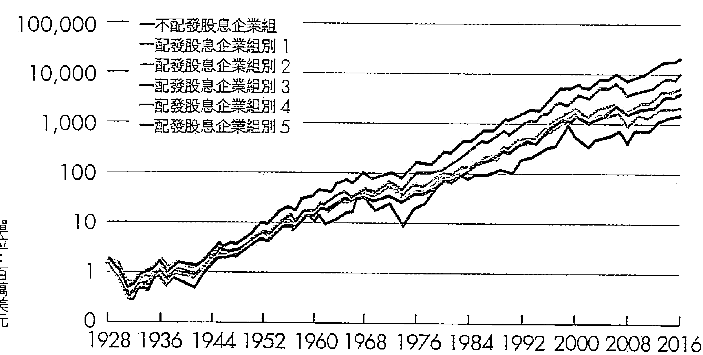

不配發股息的企業組年化報酬率最低、年化標準差最高、夏普值最低，在所有組別當中表現最差。

| | 不配發股息企業組 | 配發股息企業組別 1 | 配發股息企業組別 2 | 配發股息企業組別 3 | 配發股息企業組別 4 | 配發股息企業組別 5 |
| :--- | :---: | :---: | :---: | :---: | :---: | :---: |
| 平均年化報酬率（%） | 8.40 | 8.92 | 9.81 | 9.67 | 11.61 | 10.78 |
| 年化標準差（%） | 33.28 | 22.68 | 19.29 | 20.56 | 21.09 | 23.94 |
| 夏普值 | 0.15 | 0.24 | 0.33 | 0.30 | 0.38 | 0.30 |

註：1. 資料期間為 1928.01.01 ~ 2016.12.31；2. 以 1928.01.01 投資 100 萬美元，截至 2016.12.31 累積金額計算
資料來源：Heartland Funds

### 不配發股息企業組在20年期報酬率表現最差
——不配發股息 vs. 配發股息企業組別20年期報酬表現

| 比較項目 | 不配發股息企業組 | 配發股息企業組別-組別1 | 配發股息企業組別-組別2 | 配發股息企業組別-組別3 | 配發股息企業組別-組別4 | 配發股息企業組別-組別5 |
| :--- | :---: | :---: | :---: | :---: | :---: | :---: |
| 最低的20年期年化報酬率平均值 (%) | 1.04 | 2.51 | 2.91 | 2.72 | 4.34 | 3.37 |
| 最高的20年期年化報酬率平均值 (%) | 17.50 | 17.65 | 17.53 | 17.12 | 19.51 | 18.84 |
| 平均年化報酬率 (%) | 10.01 | 10.50 | 11.16 | 11.39 | 13.21 | 12.86 |
| 報酬率中位數 (%) | 9.78 | 11.15 | 11.26 | 11.87 | 13.16 | 13.33 |
| 平均年化標準差 (%) | 32.14 | 20.77 | 17.58 | 17.80 | 18.82 | 20.87 |
| 平均夏普值 | 0.19 | 0.33 | 0.43 | 0.44 | 0.50 | 0.44 |

### 市場重挫逾30%，不配發股息企業跌幅近45%
——不配發股息 vs. 配發股息企業組別平均報酬率

| 市場跌幅 | 不配發股息企業組別平均報酬率(%) | 組別1 | 組別2 | 組別3 | 組別4 | 組別5 |
| :--- | :---: | :---: | :---: | :---: | :---: | :---: |
| 跌幅≧30% | -44.99 | -38.11 | -32.89 | -31.90 | -30.14 | -32.37 |
| 25%≦跌幅<30% | -39.71 | -27.97 | -26.55 | -32.07 | -28.99 | -30.81 |
| 20%≦跌幅<25% | -33.31 | -24.50 | -20.82 | -20.77 | -19.61 | -21.45 |
| 15%≦跌幅<20% | -26.62 | -17.84 | -14.67 | -12.25 | -11.46 | -11.14 |
| 10%≦跌幅<15% | -20.15 | -13.52 | -12.28 | -11.24 | -10.90 | -11.03 |
| 整體市場下跌時期 | -28.24 | -20.25 | -17.68 | -17.01 | -16.03 | -16.68 |

註：資料期間為1928.01.01～2016.12.31
資料來源：Heartland Funds、Kenneth R. French、CRSP

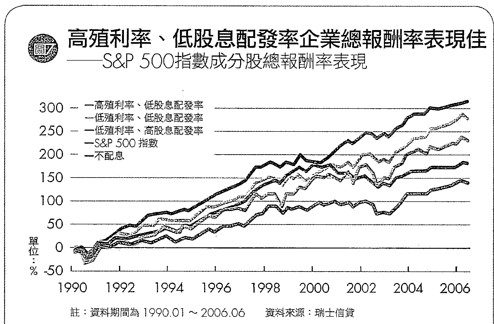

# 2-6 市場衰退時期
股息成長投資人應記住兩要

2-5提到，股息成長企業可提供相對高的報酬與相對低的波動度，這與一般「高波動才有高報酬」的認知很不一樣。事實上，高波動不等於高報酬，更精確地描述應該是「波動愈高，報酬分布的範圍愈廣；而報酬可能更好，也可能更差」。

投資不能只是看到100個獲利機會，卻從來不去設想1個可能失敗的腳本。況且，千萬不要忽視心理衝擊對理性決策的影響，一旦承受不住而在恐慌下被迫離場，複利效果將不再存在；存活在市場中，永遠比勝過市場重要！

## 獲得好報酬，不一定非要承擔高波動風險

我們來看看S&P 500低波動指數與S&P 500指數在過去20年（1990.11～2010.11）的比較，可以明顯看到在2000年網路泡沫與2008年金融海嘯的股市衰退時期，S&P 500指數的波動程度較為劇烈（詳見圖1）。

### S&P 500低波動指數長期報酬優於大盤
S&P 500低波動指數 vs. S&P 500指數累積報酬

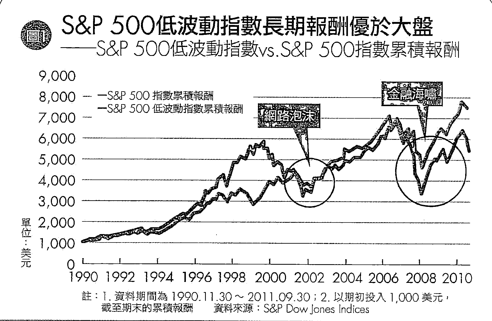

而S&P 500低波動指數明顯在瘋狂牛市時表現落後S&P 500指數，然而經歷過熊市後，S&P 500低波動指數開始超前，20年的年化報酬率勝過S&P 500指數約2個百分點。

細看不同時間長度的年化報酬率、波動與獲利風險比（夏普值），S&P 500低波動指數短、中、長期的年化報酬率都比S&P 500指數高；20年的年化標準差則少了S&P 500指數3.61個百分點；20年的夏普值是S&P 500指數的3.11倍；而20年間的最大跌幅則為-35.36%，比起S&P 500指數的-50.95%，少了15.59個百分點（詳見表1）。可見不需要承擔高波動，也能獲得較好的報酬。

另外一份研究報告也顯示，1990年～2011年，世界各國的市場都能看到相同現象，也就是愈高波動的股票，其長期報酬愈差（詳見圖2）。了解這些數據，至少讓我知道不需要冒更多額外波動，就能夠獲得還不錯的報酬；我也不願意為了提高幾個百分點的風險溢酬，讓自己投資組合的波動上升。我只要求穩健且盡可能的走好每一步，哪怕因此需要多出幾年的時間才能達到長期財務目標。

投資應該是開心的事，不是生活的重心。投資也只是達成目標過程中的一種手段，我要每天都睡得香甜。

### S&P 500低波動指數報酬與波動度較穩定
——S&P 500低波動指數 vs. S&P 500指數報酬表現

| 比較項目 | 年限 | S&P 500低波動指數 | S&P 500指數 |
| :--- | :--- | :---: | :---: |
| 年化報酬率 (%) | 1年 | 9.890 | 1.140 |
| | 3年 | 6.360 | 1.230 |
| | 5年 | 3.340 | -1.180 |
| | 10年 | 6.810 | 2.820 |
| | 15年 | 8.350 | 5.230 |
| | 20年 | 9.640 | 7.640 |
| 年化標準差 (%) | 3年 | 14.250 | 21.250 |
| | 5年 | 12.690 | 18.320 |
| | 10年 | 10.730 | 15.750 |
| | 15年 | 12.210 | 16.500 |
| | 20年 | 11.470 | 15.080 |
| 獲利風險比 (夏普值) | 3年 | 0.143 | -0.106 |
| | 5年 | 0.060 | -0.072 |
| | 10年 | 0.143 | -0.046 |
| | 15年 | 0.139 | 0.015 |
| | 20年 | 0.168 | 0.054 |
| 最大跌幅 (%) | | -35.360 | -50.950 |
| 註：資料統計至 2011.09.30 | 資料來源：S&P Dow Jones Indices | |

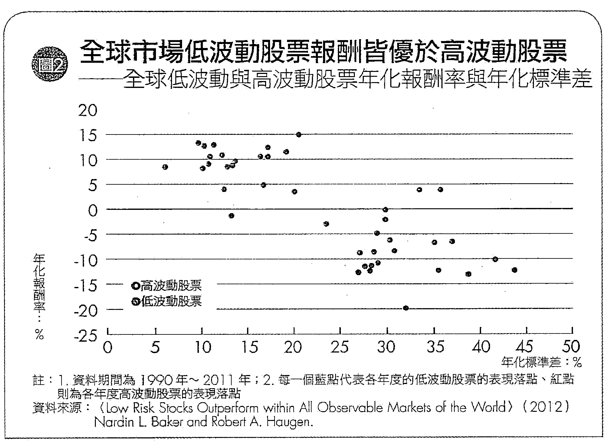

## 美國5次經濟衰退，股息平均跌幅僅8%

回頭來看股息在市場衰退時期帶來的好處。企業的獲利經常有較大的波動，然而股息的波動相對小了許多。

根據基金公司Guinness Atkinson Funds統計，自1973年~2010年，美國共經歷5次經濟大衰退，每股稅後盈餘（EPS）平均跌幅42%，而股息平均跌幅僅有8%（詳見表2）。

### 經濟蕭條時，S&P 500指數股息衰退幅度有限
——S&P 500指數股息與EPS衰退程度

| 美國經濟蕭條期間 | 最低股息年度 | 最低EPS年度 | 從高峰衰退比(%)股息 | 從高峰衰退比(%)每股盈餘 |
| :--- | :--- | :--- | :---: | :---: |
| 1973.11 ~ 1975.02 | 1975.12 | 1975.09 | -1 | -15 |
| 1981.07 ~ 1982.10 | 未出現衰退 | 1983.03 | 0 | -19 |
| 1990.07 ~ 1991.02 | 1991.12 | 1992.06 | -1 | -32 |
| 2001.03 ~ 2001.10 | 2001.06 | 2001.12 | -6 | -54 |
| 2007.12 ~ 2009.05 | 2009.03 | 2009.03 | -24 | -92 |
| 平均 | | | -8 | -42 |

註：資料統計年度為 2010年  資料來源：Guinness Atkinson Funds

可以想像，在經濟蕭條時期，企業獲利可能嚴重衰退，然而許多財務體質強健的企業仍然手握鉅額現金，且企業同樣有大筆營業現金收入，足以度過短期的衰退。

而股息成長企業在市場出現大波動時，也有比較好的報酬率。根據資產管理公司Santa Barbara Asset Management的一份企業平均報酬比較統計（資料期間為2007年10月初～2017年9月底），當芝加哥選擇權交易所波動率指數（VIX指數）上升大於40%時，股息成長企業的報酬率，相對於不配發股息的企業高出1.96個百分點，平均高出了0.87個百分點（詳見表3）。

### 股息成長企業在市場波動時可提供較高報酬
——VIX增加，配發股息企業 vs. 不配發股息企業報酬率

| VIX月增率 | 配息股企業相對不配息股企業報酬率(%) |
| :--- | :---: |
| 40% < VIX月增率 | 1.96 |
| 20% < VIX月增率 ≤ 40% | 0.59 |
| 10% < VIX月增率 ≤ 20% | 1.16 |
| VIX月增率 ≤ 10% | 0.31 |
| 平均(所有VIX上升月份期間) | 0.87 |

註：2007.10.01 ~ 2017.09.30 資料來源：Santa Barbara Asset Management

### 歷次美國升息後表現，股息成長企業報酬最佳
——聯準會歷次升息後36個月各類企業平均報酬比較

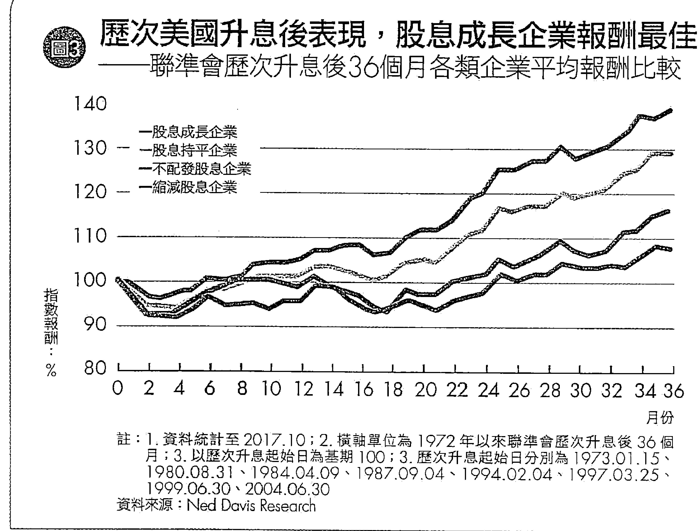

1.  資料統計至2017.10；
2.  橫軸單位為1972年以來聯準會歷次升息後36個月；
3.  以歷次升息起始日為基期100；
4.  歷次升息起始日分別為1973.01.15、1980.08.31、1984.04.09、1987.09.04、1994.02.04、1997.03.25、1999.06.30、2004.06.30
資料來源：Ned Davis Research

## 股息成長企業具定價優勢，不怕央行升息

假如因為有通膨上升預期，引發央行啟動升息循環，雖然會提高企業還債成本，但也同樣驅使有競爭優勢與定價能力的企業，進一步提高商品或服務價格。

圖3顯示S&P 500指數當中，股息成長、股息持平、不配發股息、縮減股息這4類企業，自1972年以來歷次升息循環開始後36個月的平均漲幅，以股息成長族群表現最佳，接近40%。

以上這些資料，都是支撐我投資信仰的一部分。雖然不表示我能夠完全複製出同樣結果，但至少已提供我一張地圖與框架，清晰地指引著我。

## 投資股息成長企業

### 成本殖利率將愈來愈高

「成本殖利率」（Yield On Cost）簡稱「YOC」，也有另一個說法「YOI（Yield On Investment）」。不管是Cost或Investment，指的都是初次購買價格或平均成本，公式為「成本殖利率＝目前配息／初次購買價格（即平均成本）」。

因為台股當中罕有長期股息維持年年成長的企業，因此也鮮少聽到這個名詞。在長期投資中，成本經常是固定的，或者說不常變動，因此股息連續成長的話，自然會讓YOC變得愈來愈高。也就是說，相對於一開始付出的資本，隨著股息連續成長，過了一段時間之後，從這筆資本所獲得的回收率，每年會逐步攀升。

在此也導正一個觀念，計算成本殖利率時，分母的「初次購買價格（平均成本）」，只有在購買新股數且價格不同時才會變動。我曾看過有些人在談YOC相關概念時，會把平均成本不斷地減掉每年收到的股息，我想這會讓YOC在檢視回報率時大幅失真。雖然收到股息之後，成本的確降低了，但仍不宜直接減去，成為新的成本；成本只有在平均成本變動時，才可以修改。

打個比方，假設定存100萬元，第1年收息1萬元，年利率1％。請問可以在第2年計算年利率時，用99萬元（100萬元－利息1萬元）當作分母，然後說第2年的年利率是「1萬元／99萬元＝1.01％」嗎？顯然是不適當的。

## YOC可呈現當初投入資本與目前股息的回報率

YOC的概念很簡單，就是回頭檢視若干年前的一筆資本，一段長時間之後，以當前增長的股息，與成本相除之下的比率。

我以5家股息皆已連續成長超過40年的企業來演示，經歷1990年～2015年連續25年股息成長，YOC的變化過程。因為分子逐年上升，5家企業的YOC都會達到很高的水準，並非我特別挑選，分別是寶僑（P&G，美股代號PG）、沃爾瑪（Wal-Mart Stores，美股代號WMT）、可口可樂（Coca-Cola，美股代號KO）、嬌生（Johnson & Johnson，美股代號JNJ）、麥當勞（McDonald's Corporation，美股代號MCD）。

如表1所示，若從1990年初開始投資這5家企業，到2015年底，其連續25年股息成長，企業成本殖利率可逾50%——期初投入1萬美元，25年後總報酬與成本殖利率變化

| 項目 | (PG) | (WMT) | (KO) | (JNJ) | (MCD) |
|---|---|---|---|---|---|
| 總報酬 (%) | 1,548.44 | 1,434.74 | 1,454.88 | 2,396.21 | 2,153.44 |
| 購買價格 (美元/每股) | 4.59 | 3.83 | 2.63 | 3.95 | 5.02 |
| 最終價值 (美元) | 164,844 | 153,474 | 155,488 | 249,621 | 225,344 |
| 年化報酬率 (%) | 11.38 | 11.08 | 11.13 | 13.17 | 12.73 |
| 初始配息 (美元/每股) | 0.231 | 0.034 | 0.100 | 0.165 | 0.082 |
| 2015年度配息 (美元/每股) | 2.63 | 1.96 | 1.32 | 2.95 | 3.44 |
| 初始殖利率 (%) | 5.03 | 0.89 | 3.80 | 4.18 | 1.63 |
| 成本殖利率 (%) | 57.36 | 51.17 | 50.19 | 74.68 | 68.53 |

> 註：1. 資料統計期間為 1990.01.01 ~ 2015.12.31；2. 期初成本為 1 萬美元，年化報酬率包含股息再投入；3. 報酬率與殖利率皆4捨5入至小數點後2位

YOC在50%~75%之間。儘管美股現金股利殖利率一般不高，多位於2%~3%，看似不起眼，然而因股息能夠持續成長，在時間的催化下，相較於當初投入資本便顯得豐碩，投資人也能見識到雪球效應的真實發生。

在股息連續成長的狀況下，可增強複利效果，因為每年的股息成長，都是繼承了前一年的成長再繼續往上成長（詳見2-9）。

檢視YOC只是了解當初投入的資本，對照目前單一年度股息的回報率；它是一種過去指標，也就是檢視已發生的現象。因此，YOC不該拿來當作是否賣出的指標，至少不該過分重視它。真正應該讓我們考慮賣出的唯一理由是「企業喪失競爭優勢」。

### 若企業發生質變，可轉換至更具獲利成長性的標的

作為股息成長投資（DGI）者，最在意的是企業的「未來」，因為這關係到未來現金流收入的成長性。一旦察覺企業發生質變，就不該因當前的高YOC，而放棄以其他更好的企業來替代它的機會。

以沃爾瑪為例，假設目前時間為2015年底，自1990年開始投資的話，試算如下：

- 1. 先比較各標的單一年度配息金額

假設1990年投入1萬美元，年配息0.034美元，初始的殖利率即為：0.034／4.29＝0.89%。

目前年配息1.96美元，YOC為51.17%，表示每年收息5,117美元；而當初投入的1萬美元，在25年後的最終價值成為15萬3,474美元，總報酬率1,434.74%。

此時，假設評估後發現沃爾瑪的護城河逐漸消失，且股息難以繼續成長而決定售出；同時觀察到另一家企業B，目前價格為合理價的9折，預估未來10年，EPS年化成長率約6%，而當前殖利率3.0%。如將投資於沃爾瑪的現值15萬3,474美元改投資企業B，年收息金額為15萬3,474美元×3%=4,604美元，低於沃爾瑪目前能提供的5,117美元。

- 2. 評估轉換後標的股息是否具成長性

雖然在投資企業B的第1個年度股息低於沃爾瑪，然而未來永遠比過去更重要；股息除了要能持續成長之外，企業獲利維持在成長的軌道，所帶來的資本利得同樣重要。

「總報酬」等於「股息」與「資本利得」兩者的加總，股息只是其中一部分，且4,604美元的股息，若將股息成長率以相當於EPS年化成長率的6%預估，3年後便會成長至5,483美元，已超過沃爾瑪所能提供的5,117美元。

因此，YOC雖然是評量過去投資表現的指標，然而卻無法指引是否能夠一直持續下去。現金流要求穩健且成長，假如是不成長的股息，除了無法抵抗通膨之外，同時也代表著企業獲利成長的動能喪失，這並不適合繼續留在希望長期穩定的投資組合當中。

# 第2篇 认识股息成长 奠定成功基石

## 按个人需求做最佳配置

## 事前应考虑的三个因素

高殖利率与高股息成长率无法兼得。「高殖利率」比较着眼於当前收入，而「高股息成长率」代表的是更多的未来收入与更高的长期资本利得实现。我认为不需要特别纠结於哪个比较好，问题应该是自己当前的年纪以及对收入的急迫性高低。

我挑选分别代表高殖利率的美国电话电报公司（AT&T，美股代号T）与高股息成长率的星巴克（Starbucks，美股代号SBUX）来推演（以下范例所述「目前时间」为2017年6月中旬，考量企业过去表现与未来可能发展后的假设性推估；目的仅用於试算，高殖利率与高股息成长率企业，在长时间之下可能产生的结果，不代表投资建议）。

假设，投资1万美元，星巴克目前殖利率1.5%，每年股息成长率维持20%；而美国电话电报公司目前殖利率5.3%，股息成长率近期都只有2.3%左右（暂不考虑该公司近年积极购并，包含2015年的DirectTV以及2017年的時代華納，是否有可能因為垂直整合而產生新成長動能的預期）。

透過試算，星巴克在第8年時，單一年度股息將超過美國電話電報公司，而在第14年時，總股息收入將高於美國電話電報公司（詳見表1）。

當然，不會有企業連續這麼長時間都以每年20%的速度成長；目前美股當中，股息年成長速度20%的最長紀錄是連續6年，因此前前述的假設明顯過於樂觀。接下來我們再採取一個較有可能達成的假設：星巴克股息成長率第1年～第5年為20%、第6年～第10年為10%、第11年之後為6%。

試算結果為，第14年時，星巴克單一年度股息將超越美國電話電報公司；但要到25年，總股息收入才會超越美國電話電報公司（詳見表2）。

通過以上試算，我們得出一個事實：高殖利率企業很難被低殖利率企業追上。但是，不要忘了總報酬的概念——股息只是總報酬當中的其中一個元素，當股息成長速度緩慢時，幾乎等同於獲利成長動能不夠，也表示資本利得的空間受到壓縮；反觀高股息成長率的企業，有較高的資本利得預期，但需要較長的等待時間。

結論是，高殖利率與高成長型企業，沒有誰一定比較好！若想兼顧股息收入與獲利的成長，應根據自己的年齡與收入需求，適當混合兩者比例。

## 搭配進攻、主力、防守部隊，打造專屬投資組合

一般而言，年長者距離退休時間較近，有現金收入需求；年輕者距離退休時間較遠，有較長的時間強化本業、提高收入，以期能夠持續投入資金，等待高品質企業為自己創造資產成長（包含股息成長與資本利得成長）。

資產組合就像是一個軍團，有先鋒、有中軍、有後勤補給，各有特色：

- 1. 進攻部隊：股息（或EPS）成長率較高、殖利率較低，波動可能較高。
- 2. 主力部隊：股息（或EPS）成長率一般、殖利率一般，且波動也一般。
- 3. 防守部隊：股息（或EPS）成長率較低、殖利率較高，但波動較小。

例如我目前DGI組合中的VISA（威士公司）、CVS（CVS Health，美國連鎖藥局）、CAH（Cardinal Health Inc.，美國前3大醫藥通路商之一）等，我預估未來5～10年EPS年化成長率在雙位數（10%～15%）左右的企業，就歸類在「進攻部隊」。

好的資產組合，不需特別只挑選某一個部隊，而是該善用每個部隊的特性，根據自身需求（包含年紀）做調整。例如35歲投資人的組合可以是：

樂觀預期下，星巴克第14年總股息逾1萬美元——高股息成長率vs.高殖利率企業單年股息與總股息

| 年份 | 美國電話電報公司（AT&T）股息成長率(%) | 美國電話電報公司（AT&T）單年股息(美元) | 星巴克（SBUX）股息成長率(%) | 星巴克（SBUX）單年股息(美元) |
|------|------------------------------------|--------------------------------------|----------------------------|------------------------------|
| 0    | -                                  | 530                                  | -                          | 150                          |
| 1    | 2.3                                | 542                                  | 20.0                       | 180                          |
| 2    | 2.3                                | 555                                  | 20.0                       | 216                          |
| 3    | 2.3                                | 567                                  | 20.0                       | 259                          |
| 4    | 2.3                                | 580                                  | 20.0                       | 311                          |
| 5    | 2.3                                | 594                                  | 20.0                       | 373                          |
| 6    | 2.3                                | 607                                  | 20.0                       | 448                          |
| 7    | 2.3                                | 621                                  | 20.0                       | 537                          |
| 8    | 2.3                                | 636                                  | 20.0                       | 645                          |
| 9    | 2.3                                | 650                                  | 20.0                       | 774                          |
| 10   | 2.3                                | 665                                  | 20.0                       | 929                          |
| 11   | 2.3                                | 681                                  | 20.0                       | 1,115                        |
| 12   | 2.3                                | 696                                  | 20.0                       | 1,337                        |
| 13   | 2.3                                | 712                                  | 20.0                       | 1,605                        |
| 14   | 2.3                                | 729                                  | 20.0                       | 1,926                        |
| 總股息收入 | | 9,367 | | 10,805 |

> 註：1. 此表以期初投資1萬美元計算；2. 假設星巴克目前殖利率1.5%，股息成長率每年維持20%；3. 美國電話電報公司目前殖利率5.3%，股息成長率維持2.3%

正常預期下，星巴克第14年單年股息收入將勝過——高股息成長率vs.高殖利率企業單年股息與總股息

| 年份 | 美國電話電報公司（AT&T）年股息成長率(%) | 美國電話電報公司（AT&T）單年股息(美元) | 星巴克（SBUX）年股息成長率(%) | 星巴克（SBUX）單年股息(美元) |
| :--- | :--- | :--- | :--- | :--- |
| 0 | - | 530 | - | 150 |
| 1 | 2.3 | 542 | 20.0 | 180 |
| 2 | 2.3 | 555 | 20.0 | 216 |
| 3 | 2.3 | 567 | 20.0 | 259 |
| 4 | 2.3 | 580 | 20.0 | 311 |
| 5 | 2.3 | 594 | 20.0 | 373 |
| 6 | 2.3 | 607 | 10.0 | 411 |
| 7 | 2.3 | 621 | 10.0 | 452 |
| 8 | 2.3 | 636 | 10.0 | 497 |
| 9 | 2.3 | 650 | 10.0 | 546 |
| 10 | 2.3 | 665 | 10.0 | 601 |
| 11 | 2.3 | 681 | 6.0 | 637 |
| 12 | 2.3 | 696 | 6.0 | 675 |
| 13 | 2.3 | 712 | 6.0 | 716 |
| 14 | 2.3 | 729 | 6.0 | **759** |
| 15 | 2.3 | 745 | 6.0 | 804 |
| 16 | 2.3 | 763 | 6.0 | 853 |
| 17 | 2.3 | 780 | 6.0 | 904 |
| 18 | 2.3 | 798 | 6.0 | 958 |
| 19 | 2.3 | 816 | 6.0 | 1,016 |
| 20 | 2.3 | 835 | 6.0 | 1,077 |
| 21 | 2.3 | 854 | 6.0 | 1,141 |
| 22 | 2.3 | 874 | 6.0 | 1,210 |
| 23 | 2.3 | 894 | 6.0 | 1,282 |
| 24 | 2.3 | 915 | 6.0 | 1,359 |
| 25 | 2.3 | 936 | 6.0 | 1,441 |
| 總股息收入 | | 18,578 | | 18,827 |

> 註：1. 此表以期初投資1萬美元計算；2. 假設星巴克目前殖利率1.5%，股息年成長率第1年～第5年為20%、第6年～第10年為10%、第11年之後為6%；美國電話電報公司目前殖利率5.3%，股息年成長率維持2.3%

進攻部隊占15%、主力部隊占65%、防守部隊占20%；隨著年紀增長，慢慢調整為進攻部隊占10%、主力部隊占50%、防守部隊占40%。這概念有點類似於ETF資產配置，隨著年齡增長，調整股債之間的比率。退休族群並非完全不需要成長動能，只是比重配置的問題；保有一定的成長性，對於有收入迫切需求的族群，資金壓力也會較小。

## 及早打造複利雪球 自動精篇放大資產

我想談論一個大眾熟知的概念，被愛因斯坦（Albert Einstein）稱為「世界第8奇蹟」的「複利」。

對，一個老掉牙的概念，相信許多讀者都看到膩了。不過在這裡，我是想就複利的基礎觀念，呈現股息成長投資（DGI）對於資產累積的助益。

複利的2大支柱為「長期」+「持續」，缺少任何一根支柱，複利都不復存在。一般的複利，都是基於一筆初始金額，然後以某個成長率向上累增，清楚而簡單。

每個人都知道，經過一段長期的時間（通常是20～30年以上），會是一筆很大的財富；然而，因為預期的「成長率」都是固定的，前10年的雪球滾動速度通常很不明顯，使得許多人認為難以執行，往往將這個方法束之高閣，或是執行不久即半途而廢。

不過，如果採取DGI，預期的「成長率」是逐年往上提升，複利的成效，將會超過原本的想像。

## 股息成長企業的平均股息成長率達7.5%

DGI所選擇的都是股息逐年成長的企業，買進之後，我就知道在接下來的一年之中，這些企業將再度宣布股息成長。

美股股息成長投資者Dave Fish在網路上免費分享一份「CCC List」（詳見5-4），仔細列出了股息連續成長5年以上的企業清單，每個月底會更新一次，被股息成長投資者奉為珍貴的資料來源。這份清單按股息連續成長年數，將企業分為3類：

- 1. 股息冠軍（Champions）：股利連續成長達25年以上，股息年成長率為5%～6%，例如嬌生（Johnson & Johnson，美股代號JNJ）、百事可樂（PepsiCo，美股代號PEP）。
- 2. 股息競爭者（Contenders）：股利連續成長達10年～未達25年，股息年成長率為7%～7.5%，例如好市多（Costco Wholesale Corporation，美股代號COST）。
- 3. 股息挑戰者（Challengers）：股利連續成長達5年～未達10年，股息年成長率為9%~10%，例如VISA（美股代號V）。

# 第2篇 讓我們從認識股息成長，奠定成功基石

截至2017年6月30日，符合上述3類的美股企業共有826家，平均股息成長率為7.5%~8.5%。

假設以上述3類股息成長企業，打造出一個投資組合，那麼我們可以合理期待，未來領到的股息，會以每年約7.5%~8.5%的幅度增長，這個投資組合就是一個「股息成長雪球」。

因為股息逐年成長，愈來愈多的股息會開始影響整體組合的成長率；透過股息再投入（Dividend Reinvestment Plan，DRIP），又會再加快資產累積的進程。你可以將此想像成，一旦雪球開始持續滾動，除了原有的雪球，還有愈來愈多的雪黏在原雪球上，滾動速度將愈來愈快，體積也愈來愈大。

## 利用時間威力，讓股息自我成長

接著我們來假設情況，體驗一下雪球威力。首先做個保守假設：我的投資組合上一個年度的股息總額為1萬美元，股息年成長率為6%。

當今年度結束，我的股息會增加600美元（1萬美元×6%），股息總額從1萬美元成長至1萬600美元。

## 資深投資人不須投入新資金，就能放大股息
——全新投資人vs.資深投資人產生股息600美元方式

| 類型 | 條件 | 結果 |
| :--- | :--- | :--- |
| DGI 全新投資人 | 投入一筆1萬7,200美元資本，打造股息成長投資組合 | 投資組合殖利率3.5%，1年後可產生股息約600美元 |
| DGI 資深投資人 | 投資組合已可創造股息1萬美元，無須再投入新資金 | 投資組合的上一年度股息為1萬美元，以股息成長率6%計算，1年後自然增加股息600美元 |

以我個人投資組合近年股息殖利率約3.5%估算，假設現在一切從頭開始，想要獲得600美元的現金流，要掏出多少全新資本呢？

答案是，需要約1萬7,200美元（約合新台幣51萬6,000元，已是許多受薪階級1年的收入總額），才能用1年的時間，產生約600美元的現金流（1萬7,200美元×3.5%=602美元）。

然而，對於已擁有股息現金流1萬美元的DGI投資人而言，不需要多做什麼事，下一年度就會自然而然地增加600美元的股息，增加的股息是從原有資金滾動而產生，不需要再加入新的資本（詳見表1）；這顆雪球不需要外力推動，也可以一天24小時不停歇地滾動，它不會生病也不會抱怨，比人類還要勤奮——這就是複利的力量、雪球效應的力量，同樣也是DGI的力量。

讓我們再回到1萬7,200美元這個數字上，為了主動取得這樣的年收入，必須夙夜匪懈，在昏暗街燈下返家，在疲憊中睡去；但別忘了每年還需要支付稅負、生活必需支出等費用。不僅收入要高於這個數字，還必須相當有紀律地儲蓄與財務規畫才能取得。

相較之下，透過DGI產生現金流，美妙之處在於不需要額外付出新的資本，就能在下一次的股息成長中，得到更多的現金流。

要是還不滿足，那麼可以透過「股息再投入」來增加雪球成長的速度。假設我將上一年度獲得的股息1萬美元全部再投入，以殖利率3.5%計算，今年度結束後，將能再多取得350美元的股息。將350美元加上原本增加的股息600美元，總計是950美元，因此，今年度結束後，我的股息現金流會從1萬美元成長至1萬950美元。

同樣的思考，如果是一開始投入全新資本的投資人，需要約2萬7,200美元（約合新台幣81萬6,000元），1年後才可取得約950美元的股息。可見，時間愈長、累積可獲得的股息愈多，股息成長所帶來的複利優勢愈明顯。

在數年前，當我採取DGI成為一生的投資事業時，我已清楚地估算了這一切。我也相信這一切進程，都會在我眼皮底下逐步發生。當然，我也完全接受這會是個漫長的過程，但因為目標明確，我堅信只要我起而行動，當雪球開始滾下，無論雪球大小，它都不會停止滾動，它比我勤奮，也比我更有效率。

但要達到此目標，仍需願意為此付出相當大的努力，盡力取得高薪、鞭策自己養成高儲蓄習慣，然後保持堅持與耐心。成功的資產累積，必須將有效的計畫與目標，牢牢植入腦海裡，並且確實貫徹；這不是什麼秘密，只在於你願不願意付諸行動。

# 第 3 篇 檢視企業體質 建立致勝組合

## 解析企業年報 初步了解公司優勢

第3篇將開始按部就班地建構股息成長投資（DGI）的投資組合。這套方法，大部分不是我的創新，我也不完全記得各是從何處學來，但不外乎是從日常閱讀，包含書籍與網路，慢慢累積而來，許多書本與文章的作者都是我的導師。

一般大眾在認識一家公司之前，多半是從媒體取得資訊，而吸引投資人注意力的多半是價格動能或是消息與催化劑。然而，通常當投資人接收到這些訊息時，假如是好消息，則多半過於樂觀；反之，如是壞消息，又容易過於悲觀。無論是哪一種，都不是純粹的資訊，已參雜了過多的雜音。

假如決定要自己選擇投資個股與債券，則必須學習從自身需求出發，從最原始的材料研究起，找出與自己的人格特質能相互契合的企業或產業。然而，要找到這樣子的企業或產業，除了需要時間，也需要投入大量的研究工作。

慢慢的你會發現，當研究的分量夠多時，許多不適合你的企業，你就會像戴了一副分析眼鏡，自然而然地繞過它們。初次研究個別企業相當耗費時間，假如能戴上這副眼鏡，就能夠將寶貴的時間，專注於研究適合自己的企業上。

一開始，你會覺得對許多產業都非常陌生，然而你並不需要擅長每個領域。能力圈的大小不是重點，而是要從你的能力圈內尋找自己能夠充分理解的企業與其營運模式；有些領域門檻較高，但也不用心急，隨著分析能力的提升，跨界的程度也會慢慢有所提高。

## 投資美股，必需消費是最佳入門產業

假如是初入美國股市的人，我最推薦從必需消費產業入門，其次為工業與健康照護。在S&P 500股息貴族指數成分股中，必需消費產業就占據了1/4的份額，其變動緩慢的特性，是孕育成熟與穩健產業的搖籃。

再者，投資是生活體驗的延伸，從日常生活去感受一家企業，較容易產生聯繫感，而這份聯繫感，除了能幫助投資人在研究的過程中更為順利外，遇上市場波動時，因為對這家企業夠理解，也較容易產生信念。

當然，要了解美股，首當其衝與不可避免的就是閱讀英文，假如要尋求中文資料，那幾乎是處處受阻。雖然近年國內已有媒體積極翻譯國外文章，或者像中國的「雪球」網站也產出品質相當優良的文章。然而在研究過程中，幾乎都得看英文，中文資料只能作為錦上添花。你無法冀望想研究的企業，剛好都有中文，因此我先假設各位讀者沒有英文閱讀困難，否則下面的路完全走不通。

## 認識企業概況，先看懂年報關鍵資訊

想初步了解一家企業，至少應涵蓋以下5點：

- 1. 企業介紹、歷史、規模、產業地位為何？
- 2. 企業如何賺錢？主要產品有哪幾項？
- 3. 企業的市場在世界上的哪些地理區域？各區域擴張狀況如何？
- 4. 競爭優勢是什麼？是否在未來還能保持下去？
- 5. 目前遇到的困境是短暫的嗎？

關於前3點，最容易取得資訊的方式就是企業年報（Annual Report）中的「Business Overview」（企業概述），其中的資訊絕對比從任何媒體上獲得的要多且直接。

至於第4點，須評估公司有何競爭優勢，我使用的是帕特·多爾西（Pat Dorsey）所著《尋找投資護城河》一書中的分類，包括無形資產、轉換成本、網路效應、成本優勢、規模優勢等。我每次在做企業質化分析時，必定要從中找出至少1項優勢（詳見3-2）。

找出優勢這件事，既需要理性的科學，也需要感性的藝術，更並非單純仰賴人性直覺而輕易推演至未來。這部分，除了深入研究之後產生的信任感與掌握度，還必須仰賴生活體驗做出一些想像；也就是以目前認知的資訊為基礎，往未來推演，推測當前的企業優勢能否再持續下一個10年。確定競爭優勢之後，才能進入第5點——將企業遇到的目前困境，定義為短暫或永久。

評估企業優勢和判斷企業困境這2個重點，正呼應本書第1篇談到的「第2層思考力」（詳見1-4），投資不是輕易相信其他人傳輸給你的訊息，更多時候，若這類陳述與我們的既有看法特別吻合，反而更加需要警惕。

有網友曾問我，美國連鎖零售商場Target應該會被網購巨擘亞馬遜（Amazon）打趴吧？這個問題，便是典型的「相信直覺」；然而直覺在投資當中，完全不是一項有利的人類基因。

我覺得更好的思考方式是，亞馬遜可能對零售業造成威脅，但是有些零售業是否能挾帶原有的優勢再進化？假如是，那麼目前價格與價值之間，是否構成一筆好的投資？

不要忘記，每家企業都有遭逢危難的時刻，但是我們在評估危難對企業的影響時，容易將近期現象賦予過高的重要性。那些屹立不搖的企業，也許敗於此役，也許拜過去多次逆轉的經歷，能夠再次成功回擊。

耶魯大學校長彼得·沙洛維（Peter Salovey）在2016年秋季的開學演講，談到以下3個重點：

- 1. 警惕任何簡單的陳述，特別是被誇大扭曲的事實，會煽動我們產生恐懼、憤怒或厭惡的心理。
- 2. 如果這類陳述與我們的既有看法特別吻合，更需加以警惕；因為我們會傾向接受與我們看法一致的陳述，而忽略與我們不一致的看法。
- 3. 成為更加謹慎和批判的思考者，學習求證、仔細推敲，產生你自己的定見。

上述重點很適合應用於評估企業的優勢與困境，特別是在企業艱困時期，我們要懂得摒除雜音，嘗試找出證據，堅持與大眾不同的思考。假如我告訴你，照著本書中的方法，就能從此一帆風順，那就宛如我能教會一個人「堅毅」與「勤勉」一樣的不可思議。也難怪霍華·馬克斯（Howard Marks）會說：「第2層思考正如籃球場上的身高，無法靠鍛鍊而來。」

## 從專屬投資者網站尋找企業相關報告

在看完企業年報的Business Overview後，我不會立刻往下閱讀。因為在不完全了解一家企業或產業時，面對大量數字，其實容易找不到重點，更遑論感受企業的優勢，也難往其未來延伸。因此，我習慣直接看企業的其他相關報告（通常是PDF）。只要上網搜尋關鍵字美股名稱（或美股代號），並加上「Investor Relations」（投資者關係），都能找到該企業的專屬投資者網站。

進入專屬投資者網站後，找到「Presentation」（報告），裡面通常會有大量的股東會議報告、投資銀行報告、研討會報告等。既然是報告，表示是在會議中播放的討論內容，因此含有大量圖表，藉由圖表呈現，能更容易找到重點。例如，你會了解到每個產業重要的KPI（Key Performance Indicators，關鍵績效指標），例如不動產投資信託（REITs）會呈現租房率、零售業會看售價是否上升或者同店銷售成長率、MLP（Master Limited Partnership，業主有限合夥）則會注重營業現金流、製藥產業則會注重新藥開發進程等。

此外，報告中也不免會提到該企業的優勢處，以及重要計畫與產業趨勢，這些都是單獨看財報時，投資人無法立即掌握的部分；或者有些年報在既定格式之前，會有10~20頁不等的關於企業過去一年的重要數據或事件說明，同樣是有助於理解企業的寶貴資訊。

我真正會拿財報來看，是每年春天股東會召開之前；或者我在研究的過程，看到不合理的數字波動，才會閱讀財報深究其原因。

# 第3篇 檢視企業體質 建立致勝組合

## 企業解讀——以可口可樂為例

以下以我研究可口可樂公司（Coca-Cola，美股代號KO）的資料當作範例。進入可口可樂公司官網（www.coca-colacompany.com）後，點選「The Coca-Cola Company」→「Our Company Main」→「Over View」後可看到企業基本介紹。

以我在2016年2月14日查詢時的網頁內容為例，可口可樂在全球有超過3,600種商品，碳酸飲料（Sparkling Drinks，氣泡飲料）、果汁、即飲咖啡在全球市場占有率第1，擁有20個年營收超過10億美元的品牌（詳見圖1）。

接下來，可以從可口可樂歷年報告中，大致看到其產品的地位、對產業前景的看法與展望，包括以下重點：

### 重點1》產品地位

## 可口可樂在全球共超過3,600種商品
——可口可樂（KO）公司基本介紹

在一份2015年的可口可樂報告中，顯示可口可樂在每個品項的全球銷售額排名，不是第1就是第2（詳見圖2）。

再將公司產品分為碳酸飲料和非碳酸飲料（Still Drinks），在全球各地區的銷售額排行，前者無論在北美、拉丁美洲、歐洲、非洲、亞太地區都位居龍頭；後者僅在歐洲地區居次，其他地區也都是排行第1（詳見圖3）。

### 重點2》消費趨勢與產業前景

在產業成長動能方面，可口可樂指出，在2020年之前，世界會再產生7億個中產階級，個人消費支出（Personal Consumption Expenditure，PCE）將成長20兆美元，帶動非酒精零售飲料（Non-Alcoholic Ready-to-Drink，NARTD）3,000億美元的產值（詳見圖4）。

而在一份2017年的可口可樂報告中，則提到飲料產業的近年成長狀況以及未來的預估。2014年～2016年产值增加1,000億美元，年化成長率為4%；而在2017年～2019年，產值預估增加1,100億美元，年化成長率亦維持4%（詳見圖5）。

### 重點3》消費行為轉變對企業的影響與因應方式

近年來消費者愈來愈重視健康，茶飲與能量飲料更受歡迎，而可樂這樣的含糖飲料銷售狀況也受到影響。雖然可口可樂不只賣可樂與雪碧，近一半商品都不是碳酸飲料（詳見表1），然而可口可樂公司確實在2012年～2016年營收與獲利都有衰退趨勢。對此，自2013年起，可口可樂就因應消費行為轉變而做出調整，包含降低銷售成本、提高生產效率、善用廣告資源等，預估至2019年後，每年能夠降低30億美元支出（詳見表2），可使營業利潤率上升6.5個百分點。

另外，憑藉著公司的高度品牌價值，可口可樂也善用定價能力優勢，將產品變更為較小且易於攜帶的包裝，並提高產品售價（詳見圖6、圖7）。

### 重點4》未來展望、股東友好度

企業通常在報告中會提到來年展望，像是營收、EPS、營業利益率、自由現金流等。有時企業甚至會提出未來5年的中長期年化成長率（詳見表3）。這些資訊，也是在用股息折價模型（DDM）預估未來成長率時參考的依據之一。

最後是關於企業的股東友好度。如可口可樂股息連續成長55年，自2012年～2016年，包含買回股份及發放股息，已返還股東超過400億美元（詳見圖8）。通常會長年發放股息的企業，也經常會伴隨著回購自家股票的政策。假如企業一貫地在價格低估的時候，買回在外流通股數，則會大幅提高原有股東每一份權益持有的價值。

看完以上資料後，企業提出的作為，無論是否認同，我相信你的心裡應

## 零售飲料產業未來仍將穩健成長
——可口可樂（KO）零售飲料預估成長狀況

◎零售飲料產值成長預估

◎預估成長幅度（至2019年）

| 碳酸飲料 | 水 | 加工乳品 | 能量飲料 | 果汁飲品 | 其他非酒精飲料 | 即飲茶 | 運動飲料 | 即飲咖啡 |
|---|---|---|---|---|---|---|---|---|
| 3~4% | 5~7% | 4~6% | 6~8% | 2~3% | 4~5% | 3~5% | 3~5% | 2~4% |
*單位：產值增量（10億美元）*

註：資料統計至 2017.02.23
資料來源：Coca-Cola 2017 CAGNY Presentation

### 表1 碳酸飲料約占可口可樂公司半數營收
——可口可樂（KO）各產品占營收比重

| 產品類別 | 營收比重 |
| :--- | :--- |
| 碳酸飲料 | >50% |
| 能量飲料 | <15% |
| 水、運動飲料 | <15% |
| 即飲茶、即飲咖啡 | <15% |
| 果汁、乳品 | <10% |

註：資料統計至 2017.02.23
資料來源：Coca-Cola 2017 CAGNY Presentation

### 表2 可口可樂公司預計2019年後年省30億美元
——可口可樂（KO）預估可節省之成本與費用

| | 生產製造 | 行銷費用 | 總部管理 | 合計 |
| :--- | :--- | :--- | :--- | :--- |
| 2013年度成本與費用（美元） | 180 億 | 120 億 | 50 億 ~ 60 億 | 360 億 |
| 預估 2019 年後可節省金額（美元） | 約 14 億 | 約 10 億 | 約 6 億 | **約 30 億** |

註：資料統計至 2015.02.20
資料來源：Coca-Cola 2015 CAGNY Presentation# 可口可樂產品銷量上升，售價也能隨之提高——可口可樂（KO）產品銷量與售價關聯性

# 可口可樂預估未來EPS可成長7%~9%——可口可樂（KO）2018年~2020年展望

| 項目 | 說明 |
| :--- | :--- |
| 營收 | 成長4% ~ 6% |
| 營業利益率 | 實質成長 6% ~ 8% |
| 每股稅後盈餘 (EPS) | 成長 7% ~ 9% |
| 自由現金流 | 轉換 95% ~ 100%，與淨利逼近 |

通常淨利為會計帳面損益，現金流則是衡量企業獲利品質的最佳方式；因此扣除資本支出後的自由現金流，如能貼近淨利，則表示企業實質現金流狀況健全。

註：資料統計至 2017.11.16  資料來源：可口可樂 2017 年投資人大會

該有了一定的想法。當然在看這些報告時，你必須想像是一家企業在向你（你就宛如投資機構）報告，這是一個說服的過程。此時，必須以中立的態度，戴上懷疑的眼鏡與批判精神，去審視每一條企業告訴你的訊息。之後，你可以全盤否決，也可以部分接受，不需要照單全收企業秀出的任何預估。

以上，是我初步認識一家企業的起點。

# 利用質化分析 探索企業護城河

從企業年報獲得企業資訊後，可以大致透過該企業提供的圖表來認識營運關鍵數據、產業趨勢與未來展望等，此時我至少會先做以下幾項思考：

1. 該企業的營運模式是否超出我的理解（能力圈）？
2. 可預見的未來5～10年，該企業是否可以維持當前優勢？可能更好、持平，或是持續低迷？
3. 該企業在我心中是否浮現出競爭優勢，並且是否能夠賴以為繼，足以阻擋競爭者？
4. 我預估該企業未來的年化成長率，大致會落在什麼範圍？

這時要預估該企業未來的年化成長率，其實概念會有點模糊，這是正常的，因為需要搭配長期量化數據。既要同時借鏡過去，考慮其當前困境，還要放眼未來是否有改善計畫或新的購併案等，必須全方位考量才能有更清楚的輪廓。

本章的重點將著重在3-1提到初步了解一家企業當中的第2點～第4點，也就是企業本質的質化分析。質化分析的結果，我認為其重要性凌駕在任何數字之上，因為企業的本質才是競爭力的基礎。質化分析結果也是投資人在面臨股價波動時，據以判斷能否堅持持有的關鍵要素。少了這一要素，投資人除了可能會輕易在便宜價賣出高品質企業外，也可能在企業質變時卻渾然不知。因此，在查看量化數據之前，絕對必須先通過質化分析的考驗。

我使用的方式並非原創，而是參照《尋找投資護城河》一書中所提的4種護城河作為大框架，再自己額外延伸幾個小框架。而我在研究一家企業時，至少會從中找出一種護城河，然後再考慮其護城河狹窄或寬廣。書中一開始便提到，管理階層宛如騎師，企業正如馬匹一般。而馬匹比騎師的角色重要。簡而言之，有些產業的基本結構，就是比許多產業來得優良；即使管理者的能力一般，還是能夠長年保持豐厚的利潤。

正如撲克牌賽局，一個只拿到「一對（One Pair）」的職業高手，面對拿到「同花順（Straight Flush）」的業餘玩家，儘管職業高手牌藝精湛，也很難發揮其卓越能力。

管理能力卓越的CEO，或許能透過一些精明的商業策略，挽救企業從危機中脫困，並在短期間內得到成效，但難保不會被競爭者複製。因此維持護城河的重點，在於其事業具有結構性優勢，不容易被對手模仿，且比較不受管理卓越度影響。

《尋找投資護城河》也提到，最容易被誤認的護城河為「優異的商品」、「龐大市占率」、「優秀管理者」與「卓越執行力」，但真正的護城河應為：「無形資產」、「顧客的高轉換成本」、「網路效應」、「成本優勢」。以下將根據我的理解，逐一解釋這幾種護城河，並佐以我認為擁有該項護城河的企業作為範例。

當然，這部分也是科學與藝術成分各半的項目。每個人對於各項企業能力的解讀各不相同，而分析與批判能力為最重要的人格特質，對與錯沒有絕對，只要能夠說服自己且邏輯合理，並能夠反映到投資組合的長期成果，都是好的分析結論。

## 護城河1：無形資產

「無形資產」包含3個項目：品牌價值、智慧財產與特許行業：

### 1. 品牌價值

首先是「品牌價值」，光從字面就夠讓人誤認了，例如聽起來很有名、市占率很高、百大品牌等，其實這些都不等於具有品牌價值。

檢驗品牌價值的標準，是消費者（客戶）是否願意付出較高的價格，來購買該品牌的商品或服務，而且願意持續回頭消費，如果擁有這項特點，可以說這家企業具有定價能力。

簡單回想一下你平時的購物經驗，架上類似的商品，能否因為掛上不同商標，就能賣出更高價錢？假使不能，表示這個品牌其實沒那麼有價值。

相信此時，你的心中已經浮現出幾個有品牌價值的品牌，精品珠寶品牌Tiffany & Co.就是一個標準的例子，一旦將珠寶裝進Tiffany藍的小盒子中，售價就立刻比一般珠寶高出許多；又如星巴克（Starbucks）除了賣咖啡，還賣一種不同於家與工作場所的體驗；另外如迪士尼樂園（Disneyland Park）與其周邊商品，乃至於蘋果公司（Apple）的商品都是類似概念。

從這些例子中就能發現，品牌價值除了能賦予商品更高的售價外，往往還附帶了一種價值觀或認同感。也就是商品同時會讓人與奢華、氛圍、愉悅、品味等感受相連結。

### 2. 智慧財產

智慧財產要能夠產生優勢，不只是擁有少數專利，更重要的是長期有研發能力，能夠「持續」產出新專利的企業才具備此護城河。因為智慧財產向來是兵家必爭之處，一旦有利可圖，其他競爭者會不斷地透過訴訟方式來突破防護。

而擁有持續創造專利能力的企業也不少，舉凡從製藥的輝瑞（Pfizer，美股代號PFE）、艾伯維藥品（AbbVie，美股代號ABBV，2013年由亞培大藥廠分割出去），到榮登23年北美專利王、每年能產出超過7,500項專利的IBM（International Business Machines，美股代號IBM），還有生產化學材料的3M（美股代號MMM），乃至於通訊晶片領導商高通（Qualcomm，美股代號QCOM），這些企業除了握有大量的專利外，每年都會再投入大量資金用於新專利的研發。

即使某些專利因年限到期而失效，或遭競爭者透過法律途徑撤除，這些企業也能藉由長久以來累積的優良能力，保持長久的智慧財產優勢。

### 3. 特許行業

特許行業指的是透過政府嚴格審核，或透過法令許可才可經營的產業，以美國3大債券信評機構為代表。

長久以來，美國信評產業始終維持三雄割據，包括標準普爾（Standard & Poor's）、穆迪投資者服務公司（Moody's Investors Service）、惠譽國際信用評等公司（Fitch Ratings）。要想通過繁複的法令成為第4家信評公司並不容易，因此該產業的獲利豐碩，如穆迪毛利率始終保持在約70%。

真正能夠形成優勢的特許行業，除了在定價方面要有「獨占」的特點，卻又不必像公用事業（如水與電廠）等獨占業者受到政府規範。以公用事業而言，是受到法令保護的獨占產業，定價同時受政府限制而不容易恣意調整，因此公用事業的成長率通常非常遲緩。

儘管如此，我認為公用事業仍然算半個特許行業，畢竟不是想開電廠就隨時能開。以美國Dominion電廠（美股代號D）為例，毛利率同樣約70%，10年平均營業利益率24.07%，10年平均股東權益報酬率（ROE）為15.05%，經營績效不差；且5年平均Beta值僅0.28（詳見註1），能夠減緩投資組合的波動性。

因此，雖然公用事業成長動能較低，我同樣保留其在資產組合中的位置，只是配置比重較低。

## 護城河2：顧客的高轉換成本

顧客的高轉換成本，顧名思義，就是顧客若想更換為其他產品或服務，必須付出很高的代價。例如，某企業使用了A供應商的產品後，因為自身企業的營運已與A供應商的產品密不可分，即使遇到成本較低的B供應商，也會因為企業本身或其客戶可能面臨的風險，而避免更換原供應商的產品。

舉例來說，企業導入IBM的資訊系統，包含生產製造、企業資源規劃（ERP）與資料庫等，之後因長年運行，又延伸出許多的子系統，可能包含生產報表、資料分析、資料倉儲等應用。

此時，另一家廠商提出較低的價格，但是對於資訊主管而言，替換整套系統，除了必須耗費大量人力在硬體與軟體的置換，還要付出規劃與測試的時間，正式上線後還需要監控與觀察；替換之後，也難保不會出現重大問題。試想，如果是銀行的結算系統，若因此發生預料之外的事件，導致帳務異常，那是該銀行所無法承受的風險。

因此，衡量風險與效益之後，新系統如果沒有壓倒性的效益，即使多了一些方便的功能與效率提升，企業通常寧可與原廠商繼續合作，不會輕言更換。

又如飛機引擎中的精密鑄件、電子控制與流體系統等零件，企業對於原先配合許久的供應商的產品品質、規格、合作模式都很了解，此時，引擎製造商就不會因為較低的零件售價就貿然替換供應商，因為其風險同樣不可預料。

## 護城河3：網路效應

比較容易發生網路效應的，通常是使用者以資訊共享或資訊連結為主的企業。

首先來看「資訊共享」。舉個與一般大眾使用經驗較相關的商品：微軟（Microsoft，美股代號MSFT）的文書處理系統「Office」。即使許多人抱怨Office不好用，而且早在2005年就有免費且功能相近的「Open Office」軟體可供下載，但卻鮮少人願意使用Open Office。

原因就在於，你不會希望用Open Office做出來的資料，在老闆或客戶電腦中出現問題；正因為許多人都是使用Office來傳遞資訊，進而影響了更多人願意繼續使用Office。

至於「資訊連結」，最好的例子莫過於信用卡。多數商品通常只供自己使用，而不具有共享的特質。然而當你使用信用卡的付款網路時，並不是只有你個人專屬，其他人也會共同使用這個付款網路；且因為更多人參與使用，將會提升這個網路的價值。當愈來愈多人使用信用卡，也有愈來愈多店家願意支援信用卡付費，進而帶動更多人願意使用這樣的付款方式。

因此，當更多人使用這樣的網路時，其網路價值才會出現。競爭對手若想要插手其中，首先得先複製出接近的水準，讓使用者感受到價值後，才會願意改用其服務。

## 護城河4：成本優勢

成本優勢主要來源有3：絕佳的地理位置、難以複製的得天獨厚資產、經濟規模。

### 1. 絕佳的地理位置

地理位置並不容易複製。例如，企業在設置工廠時，選擇運輸樞紐或者鄰近產業製造中心，因地利之便，利於取得原料、節省原料的運輸成本。

另外，像是太平洋鐵路公司（Union Pacific Railroad，美股代號UNP）擁有達2萬3千英里綿密的運輸網路，遍布美國2/3領土；其轉運點還涵蓋了礦產、能源、車輛、化學品、農產品等生產重鎮，不僅便於將貨物裝櫃運輸至美國各地，亦能擴及各大港口與鄰國關隘口，這對提供礦產、化學品等運送服務的太平洋鐵路公司而言，著實是一大優勢。

### 2. 得天獨厚的資產

較標準的例子為羅盤岩鹽（Compass Minerals，美股代號CMP），該企業生產高速公路除冰用鹽，其在加拿大安大略省的高德瑞契（Goderich）有一礦區，礦藏豐富厚達30公尺，且易於開採，這讓羅盤岩鹽能以全球最低的成本開採岩鹽。

除此之外，該礦區也鄰近美國與加拿大交界的休倫湖（Lake Huron），因此羅盤岩鹽能夠以低成本將成品透過船運運送至美國中西部，船運只需要鐵路運輸的1/5成本，也可說是具備地理優勢。

### 3. 經濟規模

這一項比較不容易正確辨識，因為並非單純的「大」就一定能夠產生優勢。假如因為規模大，而造成尾大不掉或者是策略調整缺乏彈性，反而不能夠產生優勢。舉例來說，快遞公司優比速（UPS，美股代號UPS）的資本回報率優於聯邦快遞（FedEx，美股代號FDX）的原因，就在於更為綿密的貨運網路。

貨運業最大支出為固定成本，如司機薪資、卡車購買或租用、燃料等。假設將貨品從A點送到B點，如剛好距離C點很近時，那麼將貨品多送到C點，並不會增加太多成本。

因此，一旦貨運公司將運送網建置完成，亦即多送一件物品並不會增加太多額外成本，此時多送一件就多一分獲利；其他競爭者想要介入，則必須先建立起綿密的運送網。

又如世界第1大公開上市石油公司埃克森美孚石油（Exxon Mobil，美股代號XOM），能源業本來就是資本密集產業，固定成本可以分攤到較大的銷售量上，因此開採設施的成本會隨著經濟規模而遞減。

根據2016年報，埃克森美孚石油截止2016年底的稅前平均生產成本（開採＋折舊、攤銷＋探勘），每桶僅23.87美元，投入資本回報率為5年平均14.33%，是業界最高；日產能約410萬桶。

2016年，埃克森美孚石油的獲利表現：上游（探勘與開採）為虧損42億美元、煉油為獲利42億美元、化學為獲利46億美元。身為上游探勘與原油開採業者，最容易在油價下跌時首當其衝，然而埃克森美孚石油的產品組合還包含了煉油與化學品製造，因此油價位於50美元低檔時，反而對其下游發展最為有利（因為成本較低）。

再者，其精煉與化學製造設施有80%相互整合，又進一步降低成本。正因為埃克森美孚石油垂直整合了上下游，在油價波動時，公司也能有更為穩定的表現，且難以被對手輕易複製。

## 企業解讀——以CVS Health為例

美國第2大連鎖藥局CVS Health（美股代號CVS），我認為有以下護城河優勢：

1. 成本優勢：CVS的核心事業PBM（Pharmacy Benefits Management），是介於保險機構、藥商、醫院與藥房之間的第三方協調機構，主要目的是對醫療支出費用做成本管理。病患拿到醫師開立的處方簽到藥房取藥，藥房會將處方箋上傳至PBM，系統再根據保險業者能賠付的範圍內，選擇合適的配藥。

PBM透過上下游客戶資料，整合需求，擁有向藥商爭取較大的折扣空間的籌碼，使得保險機構降低費用，同時病患也得到較合適的治療。

PBM的委託客戶包含醫院、保險公司與政府機構，挾帶大量與藥商議價的能力，除了向客戶收取費用外，同樣嘉惠自身下游的1萬家藥局；加上垂直整合，中央集權採購與物流，都使得CVS的營運成本更低。

2. 規模優勢（遍佈的網路）：CVS每年處理19億張處方箋與續訂單，而其藥局內的「1分鐘診所（Minute Clinic）」提供簡易且迅速的看診服務，一週7天看診。美國76%民眾可以在5英里範圍找到CVS的1分鐘診所，50%民眾則可以在10英里範圍內找到；也因為CVS很早就採用電子病歷，因此在任何據點看診都很方便。

此外，CVS也與60多家基層醫療機構合作，以擴張1分鐘診所的功能，打破原有的侷限性，CVS能將電子病歷與用藥資訊傳給醫療機構，臨床醫生則能以CVS傳送的資料，有效率地給予病患協助。因此，CVS就成為病患與醫療機構之間的資訊橋梁，彼此分享病歷資訊，即使病患沒辦法經常到醫院，也能到CVS的1分鐘診所看診，或是病情較嚴重時，經由1分鐘診所的協助，找到較大型醫院的醫生並進行更進一步的診斷。

CVS於2015年開始與3家遠端看診公司American Well、Doctor On Demand、Teladoc合作，截至2016年年底，尚僅限於在CVS的診所與藥局中進行遠端醫師看診服務；未來可望直接整合此服務，全面擴大到CVS的官方網站上遠距離視訊看診。

根據2015年CVS的市場調查，95%參與遠端看診的病患，表示很满意此服務；病患認為與當面問診效果幾乎相近，甚至1/3受訪者表示更喜歡遠端看診服務。

> 我們已預見未來醫療將發生巨大變化，CVS擁有大規模的綜合資產，不論是實體的與虛擬的，我們將利用技術創新與差異化的醫療方案，而這都是競爭對手難以匹敵的。我們相信創新將會持續推動CVS的成長。

## 自行延伸思考，探索其他護城河優勢

除了《尋找投資護城河》書中提及上述的4種護城河優勢外，我認為還有其他競爭優勢：

1. 多樣而分散的商品區塊

有些企業在商品類別或地域分布上較為均衡時，也可能會是一項優勢。例如百事可樂（PepsiCo，美股代號PEP）其實不是一般大眾認為的可樂公司，它反而比較屬於食品公司。

相較於可口可樂（Coca-Cola，美股代號KO）僅跨足飲料產業，百事可樂的優勢在於多了均衡的零食區塊。百事可樂超過60%營收來自於零食與食品，反而高於飲料。因此百事可樂並非只是一家飲料企業，更不是只賣可樂的企業。

百事可樂擁有22個年營收各超過10億美元的品牌，而零食與食品就占了8個，是所有產品線當中獲利最佳的區塊。

此外，百事可樂的食品事業，營業利益率也遠高於飲料，比較百事可樂2015年度北美地區3個事業群的營業利益率分別為：北美零食（Frito-Lay North America）29.11%；北美桂格食品（Quaker Foods North America）22%；北美飲料（North America Beverages）13.5%。

零食與食品相較於飲料，能帶給百事可樂更高的本業獲利；因此，我預期零食與食品區塊，未來無論在定價能力與銷售量的提升，都會是百事可樂的主要成長動力來源。

2. 研發預算與資本支出

持續創新與研究，是保持與競爭對手距離最好的方式，如只單靠些許專利，早晚會被對手想盡辦法攻破。如IBM過去10年平均研發費用占營收5.5%，約55億美元；嬌生（Johnson & Johnson，美股代號JNJ）也是投資研發費用甚鉅的企業，占營收12%，約80億美元。因為這些企業都深知，長久的創新與研究能力是其立世基礎，為了企業的長治久安，必須不斷尋找下一個10年的利基之處。

3. 提供一次購足整合方案

這個優勢較常發生在具有規模優勢的企業上。畢竟小企業的商品或服務通常較小，大多主打利基型商品（此為小企業專屬的優勢）。

試想，今天採購一套資訊系統，假如該供應商能夠同時提供依附在此系統下的其他應用，或許整個配套採購下來會比單獨找不同供應商購買的價格還高，但對業主而言，系統之間的相容性與穩定性更為重要，加上單一供應商就能處理維護與諮詢服務，且對方在該領域的專業資源也很充分；這時價格不會是最重要的考量，系統整合才是決策關鍵。

4. 滲透而密布的配送網路

百事可樂與可口可樂都擁有廣大的銷售通路，讓消費者非常輕易的接觸到自家商品，強大的品牌使其受到零售賣場和通路的青睞，自然讓新競爭者難以介入。

5. 廣告行銷預算

必需消費產業是擁有護城河比重較高的產業，然而直接面對消費者的零售產業，並不容易建立起競爭優勢。

零售產業必須仰賴長久的品牌建立，汲取顧客經驗，才能產生顧客忠誠度。因此，需要不斷透過廣告與迎合消費者習慣，才能保持品牌地位。如百事可樂每年花費大筆廣告與行銷費用，2013年~2015年都花費達39億美元，這是其他規模較小的競爭者所難以比擬的，更遑論還有從採購、製造到配銷網等經濟規模所帶來的成本優勢。

以上是大致常見的護城河類型，當然這只是提供一個大框架，或許你自# 第3篇 檢視企業體質 建立致勝組合

自己能再自行探索，延伸出其他的小框架。建議在分析企業時，必須試著找出至少1～2項護城河。我只是提出我的看法，看法雖有萬千種，但重在思考過程，需要不斷修正，慢慢提升決策品質。

有些企業的優勢不是那麼顯而易見，然而假如是高品質企業，你一定可以從中挖掘出明顯的護城河，無論是從過去與當下得到啟發，或者依據未來趨勢、人口結構、消費習慣等線索得到指引。

這個過程，你必須靠自身的勤勉與一點想像力去參與，研究時，最好能夠寫下想法，不要只是靠感覺。別忘了，投資不是向別人交差，而是對自己的決策與帳戶負責。

## 進行量化分析
先檢視3大財務數據

對我而言，量化分析是在質化分析之後的輔助與再確認。無論數據再美好，只要質化分析不過關，通常我不會再進行量化步驟。

從我開始建構投資組合以來，我每個月都會整理一份「價值投資獵人全自動計算機」企業清單（相關介紹詳見5-8），以量化方式過濾出符合篩選條件、且位於合理股價之下的股息成長企業。

或許早期我會透過這樣的量化篩選，進而將精力集中在這份清單，以節省時間來縮小研究範圍。然而我發現透過篩選，很難有一體適用的完美篩選條件，況且那都是過去了的表現了。

現階段我的核心選股原則在於質化分析，然而我仍會每個月更新這份清單；有時看到評價分數高、股價又高度打折的企業，也會激起我的好奇心，回頭去做質化分析。

## 量化分析最重要目的，是檢視質化分析的結果

在我的股息成長投資（DGI）組合建構到中期之後，我往往是透過閱讀他人文章來尋找投資想法。閱讀他人研究過的成果，除了節省時間外，還能看到他人不同的思考方式。如同3-2所提到的，分析並無對錯，看法各有千秋，分析重在長期磨練思考的過程，並不斷精煉。沒有人總能看得正確，但長期錘鍊思考，一定能夠讓對的機會緩步提高。

當然本章不是要指出量化分析有什麼問題，而是我無法單純依靠數字帶給我信心，能帶給我十足信心的往往是來自於企業的本質；因此量化數據是我用來確認質化分析的結果，而非要透過數字來找出哪個指標能夠指引未來報酬。至於確認什麼呢？比方說：

- 1. 看到淨利率改善，我必定會查看長期的營業利益率（Operating Margin Ratio）是否逐步上升；想確認長期債務是否不斷墊高？我得查看長期負債占淨值比率（Long Term Debt to Equity）。
- 2. 看到每股稅後盈餘（EPS）近年表現不佳，我得再多查看營業現金流與自由現金流狀況；看到資本投入回報率（ROIC）達12%，看似不錯，仍必須要再與同業相比，才能知道其水平是否真的比競爭者優秀。

查看長期數據有其必要，雖然不一定能因此洞察未來，但至少透露出企業現況。本章也不是要講如何分析財報，許多財務方面的專書講解的更為透徹，因此我只會簡單講述我平常會確認的一些數字。

我並非系統性的學習過財務分析，都是透過閱讀企業報告、年報與分析文章後，不懂的部分再自行學習；或者遇到不正常的數字波動時，才會去翻閱多年年報，找出原因。

很多時候，數字看起來很好或很差，其實可能是一次性的收入或者支出，例如出售事業體、購併、商譽減損（Goodwill Impairment）等。如果只是單純看數字，卻沒有了解數字背後的故事，就很容易誤判。

以下根據資產負債表、損益表、現金流量表以及股息相關數據這4個分類，依序分享我會留意的財務指標。

## 資產負債表》觀察企業財務安全程度

資產負債表與其他財務報表有一個非常不同之處，就是其他報表都是呈現「一段時間」的整體表現，但資產負債表只表示「截止至某一天為止」的結果，代表著企業當下的處境。

例如2016年度財報，損益表呈現的是企業2016年全年的獲利表現，而資產負債表則是呈現企業2016年12月31日的資產、負債、浮值狀況。跟資產負債表相關的重要指標如下：

# 1.利息保障倍數（Interest Coverage）

計算方式為「營業利益／當期利息（Operating Income／Interest Expense）」，是用來評估公司在稅前息前的獲利，能否支應利息的支出，屬於檢視公司財務安全性的指標之一。

債務並非愈低愈好、愈高愈差，因此我不會單看此項指標來評斷公司財務安全性，而是會搭配負債率、淨利對總負債倍數（淨利／負債），乃至於股東權益報酬率（ROE）。

這幾項關於負債率的指標，如同其他財務數據，單看一項沒有太大意義，因為財務數字彼此之間互有關聯。若真要設一個標準，我希望利息保障倍數至少能在5倍之上。

# 2.負債占淨值比率（Debt to Equity Ratio）

計算方式為「負債／淨值（Debt／Equity）」，其中，淨值為總資產減去總負債，是用來衡量公司舉債的程度。大多時候我看的是「長期負債占淨值比率」（簡稱負債率），因為只有長期負債會產生利息與槓桿。

負債率低雖然比負債率高來得好，然而依據產業不同，各有千秋，最好與同產業相比較。看久了，就能夠熟悉每個產業大致的區間。

# 3.流動比率（Current Ratio）

計算方式為「（現金＋約當現金＋應收帳款＋庫存＋其他流動資產）／（應付帳款＋流動負債）」，是用來衡量公司目前的流動資產，是否能支應要給合作廠商的貨款或短期負債，一般標準為2倍。

# 4.長期負債（Long-Term Debt）

短期負債通常在1年內便付清，或者只是應付帳款，並不會產生槓桿，因此我只看長期負債。長期負債指的是超過1年以上的債務，例如借貸500萬元共5年，其中每年要還100萬元。在第1年度時，會先列100萬元在短期負債，而剩餘400萬元會列在長期負債。

長期負債不外乎是用於購併、擴產、添購設備等，其詳細內容我不會去追究，主要是搭配「長期負債占淨值比率」觀察公司運用槓桿的程度。

無論是上述的負債率或者流動比率，投資人不須執著於某幾項財務比率一定要符合什麼標準，應要看得更全面。只看數字而忽略最核心的營運模式，很難推測出企業究竟在做什麼。例如，長年以來，沃爾瑪（Wal-Mart Stores，美股代號WMT）流動比率從未超過一般標準（2倍），甚至連1倍以上都沒有過，但能說它隨時有財務危機嗎？

流動比率未達2倍，或許是因為企業信評好、融資能力佳、創造現金流能力強、很短的現金循環週期（Cash Conversion Cycle），亦即企業從支付現金生產商品到收回現金的天數很少，是否反而透露出公司不需要總是預備大量現金呢？

又如果企業的流動比率符合一般標準，但其實是靠庫存支撐的，恰巧有人很在意這個數字卻沒有查證，就容易被誤導。

再舉一個例子，某家企業的負債占淨值比率很高，就能說它容易有財務危機嗎？也許這家企業的ROE、ROIC更高，也許負債占稅後淨利（Net Income）的比率根本極小，且利息保障倍數很大，因為企業巧妙運用舉債做生意，所創造的獲利金額更遠大於負債。

整體評估後發現，該企業在財務安全方面並不危險；或者，也許該企業本來就是資本密集產業（詳見註1）。債務本身不是惡，也不一定是負面因素，端看是否合理運用與管理債務，創造額外效應。

再者，有些產業如電信、公用事業，經常需要仰賴長期負債，用以購買設備、興建廠房與設施，但其營運模式較為固定，以舉債用於擴張，是該產業常見的模式；又或者像是不動產投資信託（REITs）的營運模式，在於舉債買新物業，獲利方式為賺取出租租金與舉債利差，故負債率經常都在200%之上。

> 註1：資本密集產業
> 指的是為擴張、建造設備，必須投資大量金額，動輒數百億元，甚至數千億元以上，因此多有舉債需求，如電信業與能源業；像出版業與軟體業則非資本密集產業。

最後，債務變高還有一個可能性，那就是購併。無論企業是發行公司債或向金融機構融資，投資人都要仔細觀察這項購併未來是否能為企業提供新的成長動能？或帶給企業更高的利潤率？抑或其他更重要而實質的戰略意義，導致負債率攀高。身為投資人，都要仔細評判，再決定是否買單。

## 損益表》分析企業特定時間的帳面損益

損益表又稱為收入支出表，讓你知道企業在「特定一段時間」之內到底賺不賺錢。一般人在聽媒體報導時，會將重點完全放在EPS上，增加似乎就是好消息，減少則是壞消息。如果常看我寫的企業分析文章，談到獲利或EPS時，一定會經常看到「紙上金額」或者「帳面損益」這類字眼。

損益表雖然能夠看出企業是否賺錢，但是假如只看損益表是很危險的；因為很有可能企業根本沒有那麼多現金可以花用，或者說，容易誤以為企業有賺錢，有那麼多錢可以支付員工薪水或供應商帳款。

換個方式說，損益表記錄的是企業「承諾」付給廠商的應付帳款，以及客戶「承諾」付給企業的應收帳款，但是並不是記錄企業「實際」付出與收到的現金。因此損益表最後一行金額稱為淨利（稅後），也俗稱Bottom Line，不是真正可支配的現金。

再者，損益計算包含了許多會計準則之下的計算，例如折舊、攤銷、商譽減損、一次性收入（支出）、匯損等。假如單看EPS高低，很容易忽略變動背後是好是壞。因此，我習慣在看到數字出現峰值（Peak，詳見註2）時，找出背後成因，並搭配其他數字與現金流量表一起看，才能拼湊出完整的輪廓。

如同前文所提到的，損益表可以讓你知道企業在「特定一段時間」之內到底賺不賺錢，因此我會用至少10年的數據，看第1年至當年的趨勢；如果是付費資料，我會看得更仔細，然後算出期初（第1年）到期末（當年）的年化成長率或平均值。原因在於，我需要知道該企業的穩定性以及成長性。能成長尤佳，能穩定次之。我較重視的指標如下：

- 1. 營業利益率（Operating Margin Ratio）
  計算方式為「營業利益／營收（Operating Income／Revenue）」，透過銷售取得的收入扣除營業成本與營業費用之後，所占營收的比率。
- 2. 淨利率（Net Margin）
  計算方式為「稅後淨利／營收（Net Income／Revenue）」，扣除所有費用且計入業外損益、稅金後的稅後淨利，所占營收的比率。

> 註2：峰值（Peak）指的是一眼就能辨識出不正常或不常見的數字跳升或驟跌。依我的經驗，通常這不是常見的事件，大多來自於「非」本業正常營運導致的結果，例如購併、分拆事業體或法律訴訟造成的利得或利損。

# 3.股東權益報酬率（Return on Equity，ROE）

計算方式為「稅後淨利／淨值（即股東權益）」，代表公司運用股東權益的獲利能力。這個數字以及杜邦方程式，相信有投資經驗的讀者都很熟悉。簡單來說，可以用杜邦方程式拆為3個部分：ROE=淨利率×總資產周轉率×權益乘數。

每個產業在杜邦方程式之下的組成會大有不同，有時看到ROE高達50%以上，可能是淨利率很高、也可能是權益乘數很高。淨利率很高問題不大，但權益乘數很高，就要確認一下企業債務狀況。

# 4.資本投入回報率（Return on Invested Capital，ROIC）

計算方式為「（營業淨收入（NOPAT））／（股東權益＋有息負債）」不同於ROE可能受到槓桿倍數所影響，ROIC的計算方式，分母為「股東權益＋有息負債」，分子為「營業淨收入」，意指企業運用資本創造收入價值的能力。

ROIC一般會與加權平均資本成本（Weighted Average Cost of Capital，WACC）相比較，只有當ROIC高於WACC時，回報才有意義，也代表企業運用資本的能力較好。

WACC指的是使用長期資金的資本成本加權平均。因此，算出加權平均資本的成本後，便可用來與企業每年的ROIC相比，以確定企業透過管理可取得比WACC還高的回報。

## 現金流量表》解讀企業營運狀況

企業的EPS可以為負，但是難以在現金收入小於支出的情況下，持續運作多年。相較於損益表，現金流較少受到會計準則影響，因此也較不容易灌水或受到扭曲。現金是企業透過業務所得到的真實收入，用以支付費用、利息、股息、股票回購（逆回購）、購併與資本支出等。

有時EPS看起來很慘，是一些帳面數字（如折舊、攤銷，或其他一次性支出（如賠款）等）所導致，實際上企業仍不斷地產生大量的現金流；反之，如果EPS看似正常，自由現金流卻經常出現負數，那麼企業經營背後則可能有異常。以下是我會特別觀察的現金流量表數據：

- 1. 營業現金流（Operating Cash Flow）
  將獲利數字加回沒有實際現金流出的折舊、攤銷，並排除應收、應付帳款與庫存的變化等，就可以看到真實的現金收入。
- 2. 自由現金流（Free Cash Flow，FCF）
  將營業現金流減去資本支出（Capital Expenditures），即為自由現金流，最好不要連續2年為負。若有充沛的自由現金流，除了能提供企業不需舉債就足以支付股息、股票回購、投資項目之外，亦是企業財務體質強健的要素之一，使其更有能力度過艱困時期。

圖1是基金公司Manning & Napier的研究報告，統計範圍自1990年初～2015年底，共25年，將羅素1000等權重指數成分股，按現金流殖利率（每股自由現金流／股價）由高而低分為4個組別，可發現現金流殖利率愈高的組別，25年來的年化報酬率也愈高。

前文曾提及配發股息企業的長期年化報酬率較佳（詳見2-5、2-6），此份報告也結合了股息與自由現金流殖利率的研究。同樣將股息殖利率由高而低分為4組，圖2顯示，同時位於股息殖利率最高與現金流殖利率最高組別的公司，其25年的年化報酬率更優於股息殖利率最高的組別。

圖3為該報告市場下跌時期，依企業股息殖利率高低的4個組別與羅素1000等權重指數，相對於市場（基準指數為羅素1000指數）的年化報酬率比較。可以看到，股息殖利率最高的族群，相對於市場的下跌幅度最小，少了31.48個百分點，代表空頭時期時，股息殖利率最高的企業組別報酬率穩定度最佳。

圖4則為本世紀至今2次較大衰退時期（網路泡沫與金融海嘯）的年化報酬率比較；股息與現金流殖利率最高的組別，雖然仍是負報酬，但是以-11.54%的表現，明顯勝於羅素1000等權重指數的-26.48%。

# 3.股息占自由現金流比率（Dividend／Free Cash Flow）

一般網站查到的股息配發率，計算方式都為「股息／EPS」，但EPS容易受到會計準則影響，導致我們計算的股息配發率出現異常波動。

若採用自由現金流取代EPS，所計算出的自由現金流配發率（股息占自由現金流比率），其波動相對較小；且股息是從FCF當中撥發，與股息的相關性更高。

股息占自由現金流比率，如果能維持在50%是剛好平衡的比率，代表既有充足現金發放「成長」的股息，又有充分資本可用於企業擴張。然而，有些企業會希望保持此比率在50%以下，以保留較多企業擴張的資金；但也有企業會讓此比率緩步提高。無論是哪一種，股息占自由現金流比率若能處於「均衡」狀態，股息成長的把握性與空間才會更大，也更能夠穩定成長。

# 4.股票回購占自由現金流比率（Share Repurchases to FCF）

股票回購與發放股息都是嘉惠股東的措施，但真要比起來，股票回購的效用會略高於股息，因為減少流通股數，會實質增加原有股東的每股實質權益，因為分攤的分母變少了，因此只要是以每股計算的指標都會上升。

關於股票回購與發放股息，通常連年發放股息的企業是雙管齊下，也非特定狀況才會執行，而是國策（公司既定政策方向），是有計畫的回購與安排股息成長，這點與台灣不同。但要特別注意的是，股票回購必須在企業評估回購價低於合理價時，才能真正嘉惠股東，這也是觀察企業對於自我信心與未來展望的指標之一。

此項數據能夠看出企業運用自由現金流執行股票回購的比率，當然還須注意企業是否經常是在股價低估時進行股票回購。

# 5.自由現金流占營收比率（Free Cash Flow/Revenue）

這項數據類似淨利率（淨利／營收），但是分子換成自由現金流，足以看出企業透過營業收入所產生自由現金流的能力。

# 6.自由現金流占稅後淨利比率（Free Cash Flow／Net Income）

自由現金流與稅後淨利不該經常出現大幅落差。這項數據能檢驗獲利品質，如果能維持在1附近，除了顯示獲利的真實性外，還可表示其資本支出比重不大，是一家不需要一直燒大錢的企業。

總之，以上介紹的3種財務報表各有其觀察角度，應綜觀相互對照為佳。

## 股息相關數據》檢視企業未來成長動能與趨勢

關於一般投資人最關心的股息，我特別要介紹的是以下幾個數據：

# 1.股息殖利率（Dividend Yield）

計算方式為「股息／股價」，主要可以幫助投資人了解所投入的資金能夠拿到多少股息。本書已多次提到，不要追求「高殖利率」，而該追求企業長期的品質。

# 2.股息年化成長率（Dividend Growth Rate）

查看10年、5年、3年、1年的年化股息成長率，除了可作為股息折價模型（DDM，詳見4-2）未來股息成長率的參考依據外，同時可注意成長率的趨勢是增長還是減緩。

- ①成長率的趨勢增長：短年份（1年或3年）年化成長率＞長年份（5年或10年）年化成長率。
- ②成長率的趨勢減緩：短年份（1年或3年）年化成長率<長年份（5年或10年）年化成長率。以可口可樂（Coca-Cola，美股代號KO）為例，截至2016年底，2016年單年股息成長率為6.1%，3年的年化成長率為7.7%，5年、10年的年化成長率分別為8.3%、8.5%，顯示可口可樂的股息成長趨勢已經減緩（詳見圖5）。

# 3.股息連續成長年數 (Consecutive Dividend Increases)

根據股息成長投資者Dave Fish的分類（詳見2-9），「股息挑戰者」為股息連續成長5~未達10年，「股息競爭者」為連續成長10~未達25年，「股息冠軍」為連續成長25年以上。另外，也有人把股息連續成長50年以上的企業，稱為「股息君王」。

查看各類別的股息成長率，由高而低為：股息挑戰者（9%~10%）>股息競爭者（7%~7.5%）>股息冠軍（5%~6%）。可見，想投資股息連續成長年數愈長的企業，股息成長率也會相對較低。就如2-8所提及的，沒有哪個類別一定最好，不需要特別偏頗哪個族群，應該依據自身的當前需求，以適當比重建置投資組合。

# 4.股息配發率 (Payout Ratio)

計算方式為「股息／EPS」，股息配發率在50%以下會是比較好的情況。

# 第三篇 檢視企業體質 建立致勝組合

況，因為能夠同時兼具企業成長動能與股息成長的空間。另外，這項數據最好能夠搭配前述的「自由現金流配發率」一起觀察，會更加具有參考價值。

### 依產業訂定合理的量化指標，評估企業前景更準確

確認完以上數據的長期平均與趨勢之後，再結合質化分析（詳見3-2），將能夠幫助你評估企業的未來。相較於起初的混亂，此時你心中應該有一些想法已經慢慢成形，此過程難以假手他人，唯有自己勤勉做過一回才會浮現。

或許你會覺得，前述的量化指標，怎麼幾乎都沒有提及確切的衡量標準呢？雖然每一項數據我都有既定的標準，然而每個產業不盡相同，很難硬套進同一個指標。況且，每個人認定的標準也不會一致。

我也不會說，你用這些數據設定一個標準作為篩選方法，然後投資就能一帆風順，假如說以簡單的幾個數字篩選，就可以找到未來的好企業，那麼略顯得過於輕視這一門學問。

本章想強調的是，數字確實有用，量化方式能讓你更了解企業在質化之外的面貌，但若少了質化分析這一步，便不能運用數字借鏡過去、立足當下、評估未來。

## 制定明確作戰計畫

分散投資減少失誤衝擊

當做完質化與量化分析之後，假如確定已經找到你想要等待時機買進的某家企業，在此之前還有個重要的工作必須先做，那就是為投資組合訂定戰略計畫或投資準則，至於如何評估合理價，則留待第4篇再述。

本章將會談到全球行業分類標準（The Global Industry Classification Standard，GICS）的產業比重、股息成長投資（DGI）投資組合的企業家數、買入計畫等實務事項。

首先，你必須有個投資組合計畫，能取個名字更好，用以激勵自己。

接著是設定目標。請自問你投資的目標是什麼？最好能夠具體，但又不要過於不切實際（如5年獲得百萬元被動收入）。以我個人而言，我的DGI投資組合目標，是產生源源不絕且持續成長的現金流；透過質化分析、量化分析，尋求我能力圈內的高品質企業。

以股息連續成長超過10年以上且低波動的企業作為最核心資產，並總是在低於合理價時買進，只要企業不產生質變、不下砍股息，價格沒有明顯被高估或單一企業占比不超過10%等情況，我就不輕易賣出。因為比起帳面損益波動，我更關心現金流的產出狀況與企業本質。

此外，我每年也會再投入新資金50萬元，善用複利效果以加速雪球滾動效應。

第3則是幾個清楚準則，包含產業比重、企業家數、觀察清單產生、股息再投入（DRIP）、賣出準則、再平衡準則等。有了這些準則作為系統化依循，便不容易偏離投資目標。

## 參考GICS產業比重，分配投資組合產業占比

既然DGI是符合我個人長期財務需求的方式，而且是使用個股組成的組合，當然可以完全按照我希望的風格來構成。而風格則包含幾種面向，有「成長、穩健、防禦」、「高殖利率、高股息成長率」、「波動高、波動低」、「產業比重」等。

投資市場中，總是對集中持股還是分散持股爭論不休。很容易理解的是，假如對企業分析把握度極高且資金充裕，重壓少數3～5家企業，很可能獲利豐碩。

然而，我考慮的更實際一些，也就是加入「情緒」這個重要因素。假如重壓一家企業佔比30%，只要我評估失準，損失是我無法承受的。

再者，即使在低估的價格時買進高品質企業，市場也並不一定會快速反映其應有價值，有時反映時間甚至會長達3年以上。

試想一下，要長時間堅持做對的事已屬不易；若加上單一企業佔比過高，導致資產價值波動劇烈，對於心理的衝擊可想而知，很可能在碰上短暫股價波動與負面消息時便早早棄守。

DGI的設計目的，是穩健成長的股息現金流，加上收割長期資本利得，因此穩定與長期是我追求的重心。我不希望收入與帳面損益的波動過大，也清楚知道自己的評估能力是有侷限的。我能夠做的，就是按照自己的準則，把應該遵從的程序做透徹；至於未來的產業變化或者是趨勢預測，是不可控制的範圍，因此接受主觀判斷可能的失誤，也成為我投資策略中的一環。

綜合以上原因，我毫不考慮地選擇分散持股，且將其分攤在GICS的11個產業中，包括：

- 非必需消費（Consumer Discretionary）
- 必需消費（Consumer Staples）
- 能源（Energy）
- 金融（Financials）
- 健康照護（Health Care）
- 工業（Industrials）
- 資訊科技（Information Technology）
- 原物料（Materials）
- 不動產投資信託（REITs）
- 電信（Telecommunications）
- 公用事業（Utilities）

然而，這11個產業的屬性迥異，因此分配產業比重是第1個影響投資組合風格的關鍵，也是戰略等級的框架，不容打破。例如，我從GICS挑出較穩健的產業佔據最大的比重；至於易受景氣循環或者變動快速的產業，則給予較低比重的配置。

因此，你得先問問自己，在考慮到波動影響情緒的因素下，你希望的投資組合是什麼模樣？

高波動不等於高報酬，高波動只是讓報酬分布的範圍更廣，也增加更多的不確定性。在午夜夢迴時，高波動可能讓你輾轉難眠，以至於急著按下賣出按鈕，讓好不容易開始滾動的雪球戛然而止，也將你的長期目標無限延後，而這是你想要的嗎？

反之，尋求那些看似無聊的企業，可能沒有華麗的成長與話題性，然而變動性較低，掌握度也較高。

另外，你也可以再加上一些自己的想法，例如，你認為人口老化已不可逆，美國戰後嬰兒潮（指1946年~1965年間約7,900萬名出生者）陸續步入退休年齡，相當於美國每天約有1萬人步入65歲。根據美國人口統計局（United States Bureau of Census）的預估，到2025年，美國85歲以上人口將近750萬人，2035年更高達1,190萬人，而此人口老化趨勢其實在世界各地都一樣。

不過，現階段仍有持續上升的世界人口與快速增長的中產階級，根據可口可樂（Coca-Cola，美股代號KO）的預估（資料時間為2015.02.20），2015年～2020年，全球將增加7億個中產階級，並增加個人消費支出金額20兆美元。

簡而言之，你認為未來的世界人口趨勢是人口變多、結構愈來愈老化且富有，因此健康照護產業就會是你配置投資組合的重點。

無論你決定要如何配置產業比重，都應該有自己的一套邏輯思路，同時考量波動性，並一以貫之，不要輕易更改。假如在投資初期，實在沒有產業配置的概念，那麼可以參照以下3種數據，進而延伸出一些想法：

## 數據1》各產業ETF標準差

我將各產業較具代表性的ETF整理如表1，可看到各產業ETF的標準差，數字愈高代表波動愈大，反之則愈小。

根據2017年5月的數據，不動產投資信託、美國房地產指數、金融、能源、原物料等代表性的ETF標準差皆為20%以上，比較起來，必需消費產業的代表性ETF（XLP）標準差僅約這些產業的一半，為11.35%，波動度明顯較低。

### 必需消費ETF標準差最低、波動度最小

——各產業主要ETF標準差與Beta值

| 產業別 | 代表的ETF | 標準差(%) | Beta值 |
| :--- | :--- | :--- | :--- |
| 必需消費 | XLP | 11.35 | 0.49 |
| 健康照護 | XLV | 13.95 | 0.62 |
| 公用事業 | XLU | 14.02 | 0.27 |
| 資訊科技 | XLK | 17.17 | 0.90 |
| 那斯達克指數 | QQQQ | 18.14 | 0.96 |
| 非必需消費 | XLY | 18.32 | 0.93 |
| 電信 | IYZ | 18.36 | 0.80 |
| 工業 | XLI | 19.11 | 1.01 |
| 製藥 | XPH | 19.18 | 0.69 |
| 原物料 | XLB | 21.64 | 1.15 |
| 能源 | XLE | 21.86 | 0.99 |
| 美國房地產指數 | IYR | 24.38 | 1.08 |
| 金融 | XLF | 24.97 | 1.20 |
| 不動產投資信託 (REITs) | VNQ | 25.46 | 1.09 |

**註：** 1. 資料統計至2017.06；2. 此表採用10年數據  
**資料來源：** 晨星 (Morningstar)

### 數據2》CCC List中的產業比重

股息成長投資者Dave Fish每月更新的CCC List（相關介紹詳見5-4）中，列出了美股當中股息連續成長5年以上的企業（包含股息冠軍、股息競爭者、股息挑戰者），除了企業名稱、股息成長相關資料，也有詳細的產業類別。將這份清單加以整理，即可清楚看到這些企業的所屬產業（詳見表2）。以2017年6月的資料為例，在所有股息連續成長5年以上的企業當中，科技產業僅占6.31%（但科技產業占S&P 500指數卻高達20%以上），在股息冠軍中僅占2.75%。

### 數據3》S&P 500股息貴族指數比重

如同2-5所介紹的「股息貴族」，在S&P 500股息貴族指數中，成分股為「股息連續成長超過25年，同時為S&P 500指數成分股」。按產業來分類，則以必需消費產業所占的比重最高（詳見表3）。

其中，在S&P 500股息貴族指數當中，健康照護產業所占比重與前文介紹的CCC List中的「股息冠軍」有落差，原因在於兩者對於其中3家企業的定義不同，分別是卡地納健康集團（Cardinal Health Inc.，美股代號CAH）、亞培（Abbott Laboratories，美股代號ABT）、艾伯維（AbbVie Inc，美股代號ABBV）。

CAH在1990年代執行過數次股數分拆（或稱股票分割），相同投資者持有股數變多，但是總值不變。由於股數增加，使得每股配息降低，因此表面上看起來股息停止成長，實則不然；2013年，ABBV從ABT分拆出來成為獨立公司，因此每股股息自然下降，然而如果合併計算2家企業的股息，仍然呈現連續上升。

由於在Dave Fish的CCC List中是不考慮這些狀況的，所以其中的股息冠軍沒有納入CAH、ABT、ABBV這3家公司，導致股息冠軍中的健康照護產業的比重顯得很低。CCC List與S&P 500股息貴族指數成分股的分類儘管不同，但我認為兩者都合理，仍不損企業的品質，在股息成長企業當中，健康照護產業仍佔有重要的地位。

### 資訊科技產業在股息冠軍中佔比僅2.75%

——CCC List及股息冠軍企業家數與佔比

| 產業類別 | CCC List 家數(家) | CCC List 佔比(%) | 股息冠軍 家數(家) | 股息冠軍 佔比(%) |
| :--- | :---: | :---: | :---: | :---: |
| 金融 (Financials) | 244 | 29.61 | 23 | 21.10 |
| 非必需消費 (Consumer Discretionary) | 123 | 14.93 | 8 | 7.34 |
| 工業 (Industrials) | 109 | 13.23 | 20 | 18.35 |
| 不動產投資信託 (REITs) | 70 | 8.50 | 3 | 2.75 |
| 公用事業 (Utilities) | 58 | 7.04 | 16 | 14.68 |
| 資訊科技 (Information Technology) | 52 | 6.31 | 3 | 2.75 |
| 原物料 (Materials) | 51 | 6.19 | 10 | 9.17 |
| 必需消費 (Consumer Staples) | 39 | 4.73 | 17 | 15.60 |
| 能源 (Energy) | 36 | 4.37 | 3 | 2.75 |
| 健康照護 (Health Care) | 36 | 4.37 | 4 | 3.67 |
| 電信 (Telecommunications) | 6 | 0.73 | 2 | 1.83 |

註：1. 資料統計至2017.06；2. 各產業分佈比率進位至小數點後2位，因此相加後不一定為100%
資料來源：The DRiP Investing Resource Center

### 必須消費產業在股息貴族指數中佔24.6%

——S&P 500股息貴族指數成分股產業比重

| 產業類別 | 比重(%) |
| :--- | :---: |
| 必需消費 (Consumer Staples) | **24.6** |
| 工業 (Industrials) | 17.7 |
| 健康照護 (Health Care) | 14.9 |
| 非必需消費 (Consumer Discretionary) | 11.6 |
| 金融 (Financials) | 10.1 |
| 原物料 (Materials) | 9.9 |
| 能源 (Energy) | 3.8 |
| 公用事業 (Utilities) | 2.0 |
| 資訊科技 (Information Technology) | 1.9 |
| 不動產投資信託 (REITs) | 1.8 |
| 電信 (Telecommunications) | 1.8 |

註：1. 資料統計至 2017.06；2. 各產業分佈比率進位至小數點後 1 位，因此相加後不一定為 100%
資料來源：S&P Dow Jones Indices

## 3原則建置買進策略 降非系統性風險

《漫步華爾街》一書中曾提到，關於投資個股，如想消除「非系統性風險（因個別公司特殊因素所引起的股價變動）」，可以經由分散投資來降低。當投資組合中包括30「種」（分散於各產業）股票時，已經可以消除大半的非系統風險了；而持有60「種」分散良好的股票，非系統風險幾乎可以被完全消除。

理論是如此，然而實務上，不可能無限制地增加持有企業數量，同時要考慮到資金規模、付出心力程度與管理投資組合能力。假如為了分散而分散，很可能導致選擇企業品質時過於鬆散，而輕率地做出買進決定，以下是我對持有企業家數的看法。

### 原則1》按個人能力決定持有企業家數

建立投資組合，除了應兼顧全球行業分類標準（GICS）戰略等級配置，也要同時考慮到質（種類）的分散，否則增加的企業數量不僅無法發揮分散效果，也降低決策品質，並增加管理精力。

你必須在企業家數、單一企業占比與管理精力之間取得平衡，沒有標準答案，你必須自己去尋找。假設希望組合的企業家數較少，那麼表示在產業內的廣度將較為狹隘，此時你必須更專注地挑出產業中的代表者。

我認為可從幾個面向去縮減：

- 放棄部分非核心的GICS產業：例如資訊科技、原物料、能源等變動性較高的產業，或是自己的掌握能力較差、且本來在股息冠軍或股息貴族產業配置比重就很低的產業。
- 只選產業中的部分行業為代表：例如健康照護，你持有的企業所屬行業，可能無法涵蓋該產業的完整範圍，如生技研發、製藥與營養品、醫療器材、個人護理、藥局批發與零售，必須更謹慎地從中挑選1～2個較有把握的行業。
- 聚焦股息連續成長逾10年的企業：以「股息冠軍」（股息連續成長25年以上）與「股息競爭者」（股息連續成長10年～未達25年）等股息連續成長年數較長的族群作為配置核心，而「股息挑戰者」（股利連續成長5年～未達10年）配置較低比重。

### Vitali Alexeev認為合理持股家數為20～40家

——Vitali Alexeev建議的資金規模與持有企業家數

| 資金規模(美元) | 持有企業家數(家) | 每家企業資金(美元) |
|----------------|------------------|--------------------|
| 2 萬 5,000     | 15               | 1,667              |
| 5 萬           | 25               | 2,000              |
| 7 萬 5,000     | 30               | 2,500              |
| 10 萬          | 35               | 2,857              |
| 25 萬          | 45               | 5,556              |
| 50 萬          | 50               | 1 萬               |
| 100 萬         | 60               | 1 萬 6,667         |

資料來源：〈Equity Portfolio Diversification : How Many Stocks are Enough ? Evidence from Five Developed Markets〉

投資個股，原本就必須面對集中與分散的課題；即使分散，也必須在良好分散與採樣分散中做決定，這一點也不容易。因為人的時間、精力、能力都有限，一定要有此認知。

研究論文〈Equity Portfolio Diversification : How Many Stocks are Enough ? Evidence from Five Developed Markets〉（〈投資組合分散性：持有多少企業才足夠？來自於已開發市場的論證〉）作者Vitali Alexeev提出，若資金規模為2萬5,000美元（約合新台幣75萬元），則可以分散至15檔，每檔約1,667美元（約合新台幣5萬元）（詳見表1）；

該論文也指出，持有企業數量達55家時，方能夠消除90%的非系統性風險。理論如此，但是仍需考量個人財務狀況、資金規模、研究意願與管理時間。

我認為也可換個角度反向回推——根據你自己的評估，持有單一企業占資金規模比重多少，會讓你感到安心？如果認為一家企業占比3%～5%是合適的，那麼就表示適合持有家數約為20家～33家之間。

如再將資金規模與管理精力一併考慮，我認為合理的持有家數約在20家～40家之間；當資金規模愈來愈大，也不表示一定得持有更多家、導致超出自己的管理能力，投資人仍須在風險分散與實務之間取得平衡。

### 原則2》留意個別企業占投資組合比重

2-8曾介紹高股息殖利率與高股息成長率的取捨，應根據年齡與收入需求採取混合比例，我再次強調，當前收入與未來總報酬同等重要，但依據年齡與當前需求而有差異。

退休族群並非完全不需要成長動能，只是配置比重的問題，保有一定的成長性，對於有收入迫切需求的族群，資金壓力也會較小。一旦規畫出投資組合的GICS產業比重以及企業家數後，便可依據當下資金規模，計算出每次投入的金額。舉例來說，當前資本200萬元，預計平均分散投入至20家企業，但希望每家企業投入時，分為3次投入，保留向下攤平成本使用。因此，每次投入金額為：（200萬元／20家）／3次＝3萬3,000元。

這裡僅是以平均分散投入來舉例，實務上，必須符合你自行規劃的GICS產業比重分配，並留意盡量不高過單一企業的最大占比，可保留些許彈性，但差異不可過大。

每年發生倒楣事的產業不盡相同，經常會在某一段時期，某個產業被低估價格特別多，設定部分彈性，就是為了能夠趁此良機，多收購這個產業的企業。

例如，必需消費產業比重設定為15%，而單一企業最大占比設定為3%。而每一次購買前都必須仔細計算，確認是否會超過該產業比重與單一企業持股上限。

發現該產業出現大量低估企業時，則可依事前設定的彈性值，如允許超出預設產業比率5%，允許該產業暫時超出比重，往後透過資金再投入或股息再投入計畫（DRIP）來漸進調整到應有比重；同樣的，單一企業持股也要設定一個彈性值上限，如正常占比為3%，但允許至多到5%。唯有在每次購買前，同時把握住大框架（GICS產業占比）與小框架（個股占比），才能保持一定彈性，且不至於讓實際資產組合與原先計畫南轅北轍。

## 原則3》當產業或個別企業占比失衡，實施再平衡策略

再平衡策略與GICS產業占比、個別企業占比息息相關。首先是大框架GICS產業占比。假如始終遵守已規劃好的GICS比例，並保持些微緩衝彈性，作為短期單一產業出現較多被低估公司時，能夠有額度稍微超出預定占比。正常情況下，一個良好分散於11個GICS產業的組合，不應太常出現顯著超出預定占比的情況。

假設500萬元的投資組合，15%配置於必需消費產業，預留5%的緩衝彈性，因此最高容忍值為20%；表示該產業帳面總額應維持在75萬元（500萬元×15%），緩衝上限為100萬元（500萬元×20%）。

然而，實務上不太容易出現此種狀況，原因在於，除非某段時期單一產業漲幅劇烈且其他產業大多下跌，在這個情況下，才有可能讓單一產業超出緩衝百分比；另一個情況是，單一企業占比過高，超出容忍值，但這同樣要在該企業漲幅很明顯超過其他企業時才會發生。

即使如此，仍需要假定這個情況有可能發生，因此必須事前規劃好準則，步驟如下：

- 1. 明確訂出產業占比與企業占比
    - ①決定產業占比：例如必需產業占比15%，最高容忍值20%；非必需消費占比10%，最高容忍值15%；健康照護占比20%，最高容忍值25%等。
    - ②決定個別企業占比：例如一個33家企業的投資組合，每家企業基本占比為3%，而你必須設定一個合理且感到舒服的最高容忍值，例如5%。
    這個數值會隨著企業家數而有所不同，例如20家企業的投資組合，每家企業基本占比為5%，此時，你設定的最高容忍值可能為8%。

### 2. 決定執行再平衡的頻率

明確訂出產業與個別企業的占比後，就要檢視是否有超過容忍值，如果有超過，才進行再平衡。檢視的頻率有2種：

- ①定期檢視：定期檢視的時間至少半年1次或1年1次。
- ②即時檢視：這是我認為比較實際的做法，即時查看產業或個別企業占比，若超過容忍值，再進行再平衡。

### 3. 當占比超過容忍值，執行再平衡

那麼，假設必需消費產業的預設占比為15%，最高容忍值為20%，超過20%時該怎麼進行再平衡？此時得從必需消費產業中占比最高的企業著手，將其適度減碼，使產業比重降至20%，甚至15%以下；若有2家企業占比相近，則以價值被相對高估的企業優先。

當然也會有一種情況是產業比重沒有超出最高容忍值，但是單一企業卻超過了；這時我認為還是必須執行再平衡，因為過高的占比，就是違背了原有的個股比重準則，假如放任不管，投資組合便會不斷偏離你原本設定的風格。例如，個別企業占比應為5%，最高容忍值8%，而如今上升至9%，那麼則必須將其占比降至8%以下。

而減碼占比過高的企業所釋放出來的資金，便可轉而挹注於占比較低的產業類別或者個別企業，達成再平衡的目的。

## 確立自我風格 建構最適切資產組合

至此，已談論了質化分析（詳見3-2）、量化分析（詳見3-3）、全球行業分類標準（GICS）產業大框架規劃（詳見3-4）、以及該以多少企業家數組成股息成長投資（DGI）組合（詳見3-5）。接下來即將面臨的問題是，該從什麼企業開始著手？

的確，我在剛開始建構資產組合時，腦子仍是一片混亂。這時，總得有個切入點來開始這趟投資旅程。因此，我列出了4種思考方向：

### 方向1》從生活經驗找熟悉的藍籌股

美國企業的產業結構發展均衡，且受全球化影響，你我的生活其實早已充斥美國企業所生產的產品或服務。我相信當中不乏許多你相當熟悉的生活用品，例如你入住飯店的空調是Honeywell（美股代號HON）的產品、公司電梯是聯合科技（United Technologies，美股代號UTX）的Otis品牌，還有寶僑（P&G，美股代號PG）、嬌生（Johnson & Johnson，美股代號JNJ）品牌的日用品等。

當然，熟悉的品牌不表示就是合適的標的，但在投資初期，絕對已有足夠數量能作為你的入門磚。

### 方向2》以CCC List為基本篩選標準

這絕對是股息成長投資者最珍貴的資料來源，股息成長投資者Dave Fish的CCC List除了依照股息連續成長年數區分為股息冠軍、股息競爭者、股息挑戰者外，也包含了大量財務數據。

儘管缺乏少部分數據，如股東權益報酬率（ROE）、利息保障倍數、自由現金流占營收比率等，但仍瑕不掩瑜。我們可以下載CCC List後，自己補充這些數據。

我放在部落格上的「價值投資獵人全自動計算機」（詳見5-8），便是以CCC List為基礎資料，再自行補足我認為重要的財務數字後做出評分系統，最後結合股息折價模型（DDM）合理價（詳見4-2）。除了方便取用外，也在初期建構DGI時，節省我許多時間。

CCC List下載的檔案格式為Excel，只要稍微熟悉試算表，要做出適合自己使用的篩選器也很方便。

我並不反對使用財務數據做初步的篩選，然而你必須清楚知道，為什麼要用這項指標做過濾；而非在篩選後，便直接依據這份清單輕率購買。例如，你已經知道自由現金流對企業至關重要，資本投入回報率（ROIC）足以證明企業有妥善運用資本的能力，或者股息至少要連續成長幾年等，總會有些你認為非常重要且幾乎無法妥協的要點。

此時，使用量化數據篩選，讓候選名單範圍縮小才有意義。因此，我非常建議你建立自己的觀察清單，並加上評分系統；這能幫助你在定期採購企業時，能有優先順序，將有限的資金優先分配在該企業上。

### 方向3：低波動企業有更好的報酬

前文曾提及，S&P 500股息貴族指數與S&P 500指數相較有更低的標準差、更高的獲利風險比外，也提到S&P 500低波動指數同樣具備一樣的結果（詳見2-5、2-6）；而在所有國家也顯示相同現象，高波動的企業報酬率更低。

> 再次引用霍華·馬克斯（Howard Marks）在《投資最重要的事》當中，精妙地闡明——高波動，或許帶來更高報酬，但同時也可能帶來更差報酬（詳見圖1）。

S&P 500低波動指數當中的成分股，也是尋找投資企業的名單之一，且與股息成長企業重疊甚多（詳見2-6）。我們都深知，下跌50%，需要上漲100%才能回到帳戶淨值原點，因此，投資組合震盪愈大，恢復的難度也會急遽增加。

假如再以年份探究S&P 500低波動指數與S&P 500指數的報酬率，1994年～1998年的瘋狂牛市時期，S&P 500低波動指數表現明顯大幅落後S&P 500指數（詳見圖2）。這段時間採取穩健的投資組合，會讓自己看起來像傻子，看著市場氛圍，總會不斷興起懷疑自己的念頭。此時，堅持一貫的紀律一點也不容易；反觀市場動盪時期，低波動企業便能一舉超前，並且提供心理上的支持——我不斷反覆強調，務必將情緒納入投資組合因素中一併考量。

因此，我提出這些數據，便是希望提供大框架，使自己能跳出小框架的視野，因為靠得愈近，就愈看不清楚全貌。其實主脈絡一直存在，只是被雜訊與歡愉的迷霧所包圍。

這個現象也非常類似於價值投資與成長投資在牛市時的差異（詳見圖3）。即使我們已清楚看出價值投資的成果豐碩且甜美，然而極需執行的勇氣，並且耐心等待成果，因此價值投資在過去一個世紀從來沒有風行過。雖然當浪潮退去，可能看到有人裸泳，但與此同時，也有許多美麗的貝殼露出；我們該做的，是懂得拾起，並拂去覆蓋貝殼的砂礫。

表1列出了數家低波動的企業，當中不乏多家股息君王以及股息冠軍（詳見第204頁）。我要強調，這並不是一份推薦名單，你仍應該一如既往地勤勉，運用一貫的投資準則，一絲不苟地做完每一個步驟，建構屬於你自己的投資清單。

### 方向4》閱讀他人的分析文章

在「Seeking Alpha」網站（seekingalpha.com）上有許多質量不錯的文章，起初我對企業分析還沒發展出自己的框架時，就經常在此一篇篇地閱讀，也找到幾位想法相近的作者，如Chuck Carnevale、Jason Fieber、FerdiS、Chowder、The Dividend Guy等；另外像是部落格Sure Dividend、DivGro、The Dividend Guy，以及Jason Fieber在Daily Trade Alert與Mr. Free At 33的文章，都是我的精神食糧。

而收費的網站如：晨星（Morningstar）的個股分析、Value Line以及Morningstar免費的Our Picks（www.morningstar.com/articles/collection/172-our-picks.aspx），也經常會提出低於合理價與寬廣護城河的企業名單。

雖然說不該讓其他人的想法過分影響自己的思考，然而多看他人的文章，經常能提供不同的觀點，提點自己不曾注意的地方，甚至能因此對某企業產生興趣，很多時候投資點子就是這樣不經意的產生。

當然，這也非常考驗英文能力，假如缺少這一塊，將對投資想法的產生與質化分析有相當大的斷鏈。

# 第3篇 檢視企業體質 建立致勝組合

### 表1 5年標準差低於18%+Beta值小於1，表示波動較小——12家低波動公司相關資訊

| 公司名稱 | 代號 | 產業分類 | 股息殖利率(%) | 股息連續成長年數(年) | 10年平均報酬率(%) | 5年平均報酬率(%) | 5年Beta值 |
| :--- | :--- | :--- | :--- | :--- | :--- | :--- | :--- |
| 百事可樂 (PepsiCo) | PEP | 必需消費 (飲料、點心) | 2.78 | 45 | 10.0 | 13.09 | 0.70 |
| 可口可樂 (Coca-Cola) | KO | 必需消費 (無酒精飲料) | 3.04 | 55 | 8.2 | 13.09 | 0.71 |
| 麥當勞 (McDonald's) | MCD | 非必需消費 (餐廳) | 2.92 | 41 | 13.7 | 13.09 | 0.67 |
| 嬌生 (Johnson & Johnson) | JNJ | 醫療照護 (藥品、消耗品) | 2.90 | 55 | 8.0 | 13.76 | 0.81 |
| 寶僑 (P&G) | PG | 必需消費 (消耗品) | 3.38 | 61 | 10.0 | 14.07 | 0.65 |
| 美國南方電力公司 (Southern) | SO | 公用事業 (發電) | 4.85 | 17 | 3.8 | 14.47 | 0.13 |
| 美國電話電報公司 (AT&T) | T | 電信服務 | 5.50 | 33 | 3.7 | 15.45 | 0.49 |
| 高露潔 (Colgate-Palmolive) | CL | 必需消費 (個人用品) | 2.29 | 54 | 9.5 | 15.49 | 0.82 |
| 金百利克拉克 (Kimberly Clark) | KMB | 必需消費 (個人用品) | 2.90 | 45 | 7.1 | 15.61 | 0.81 |
| 通用磨坊 (General Interface Solution) | GIS | 必需消費 (食品處理) | 3.00 | 13 | 10.4 | 15.91 | 0.60 |
| 埃克森美孚石油 (Exxon Mobil) | XOM | 能源 (石油與天然氣) | 3.78 | 35 | 8.8 | 17.13 | 0.85 |
| 沃爾瑪 (Wal-Mart Stores) | WMT | 必需消費 (零售) | 3.26 | 44 | 11.8 | 17.16 | 0.31 |

註：1. 5年標準差資料日期為 2017.11.27、5年Beta值資料日期為 2016.06；2. 此表按標準差從低到高排序。資料來源：Yahoo! Finance、CCC List。

## 評估合理價格，並耐心執行購買計畫

接下來，便是開始執行購買計畫。一旦你建立了自己的觀察清單，並且加上評分系統，就能夠優先購買評分最高的幾家企業。假如是從零開始，直到將計畫中的投資組合建構完成，我認為至少耗費要2年半～3年的時間。因為不可能在一段短時間內，所有想納入組合的企業都剛好處於或低於合理價，假如又遇上明顯的牛市時期，則要花上更長的時間。因此，一定是每個月慢慢買，並保留加碼空間。買進過程倒也不需要心急，與其付出過高成本，冒了更大風險，影響長期報酬，不如耐心等待，細心評估合理價格。

自行組成投資組合的好處之一，便是可以自行選擇在企業價格被低估時購入。儘管整體市場指數高漲，仍可能有少數好公司會落入合理價之下，此時，評分系統便派上用場，你可以事前擬定計畫。以下分別以30歲年輕人與退休族為例：

### 範例1》30歲年輕人，初始投入5萬美元、每年新投入1萬美元

- 1. 預期24～30個月完成30家企業的資產組合。
- 2. 每月挑選1～2家企業，按照評分與打折率設定買進順序（投資組合中尚未買進的產業或企業優先）。
- 3. 某產業或企業被特別低估時，稍微提高購買比重。
- 4. 每年新增資金1萬美元。
- 5. 預留至少1次加碼的空間，以降低平均成本。
- 6. 產業分配必須符合規劃的GICS產業占比（保留一定的彈性緩衝範圍，如5%）與單一企業最大占比限制。

### 範例2》退休族，可投入資金總量固定

假如已是退休階段，可投入的資金總量已確定，日後不太會再挹注額外資金，採取以下的買進計畫較為適當：

- 1. 選擇波動度較低的20～40家企業。
- 2. 以股息成長15年以上的企業為配置主體，兼顧收入、穩定與成長。
- 3. 每月挑選1～2家企業，按照評分與打折率設定買進順序（投資組合中尚未買進的產業或企業優先）。
- 4. 某產業或企業被特別低估時，稍微提高購買比重。
- 5. 預留至少1次加碼的空間，以降低平均成本。
- 6. 因為已非在職累積資金階段，不會有新資金挹注以調整產業比重，因此產業分配必須完全按照初始規劃的GICS權重配置，不給予緩衝範圍。

在投資組合建構完成的幾年之後，可能變成產業及個股占比失衡的狀況，例如表2：可以看到在個股方面，蓋璞（GAP，美股代號GPS）與普信集團（T. Rowe Price Group，美股代號TROW）比重偏低，假如這2家企業仍在低估榜上，則下個月可優先購買；在產業方面，非必需消費與金融產業比重偏低，假如仍在低估榜上，則下個月可優先購買。

### 表2 投資組合中比重偏低之產業與個股範例

| 企業名稱 | 美股代號 | 產業別 | 比重(%) (名次) |
| :--- | :--- | :--- | :--- |
| 阿徹丹尼爾斯米德蘭 (Archer Daniels Midland) | ADM | 必需消費（農業） | 3,000 |
| 美國瓦斯公司 (AmeriGas Partners) | APU | 公用（瓦斯） | 3,000 |
| 康明斯 (Cummins) | CMI | 工業（機械） | 3,000 |
| 歐米茄健康醫療 (Omega Healthcare) | OHI | 不動產投資信託（醫療照護） | 3,000 |
| 羅盤岩鹽 (Compass Minerals) | CMP | 原物料（採礦） | 2,000 |
| 高通 (Qualcomm) | QCOM | 科技（通訊） | 2,000 |
| 赫爾默里克 & 佩恩 (Helmerich & Payne) | HP | 能源（石油、天然氣） | 1,000 |
| 沃爾瑪 (Wal-Mart Stores) | WMT | 非必需消費（零售） | 1,000 |
| 蓋璞 (GAP) | GPS | 非必需消費（服飾） | 500 |
| 普信集團 (T. Rowe Price Group) | TROW | 金融（資產管理） | 500 |

### 分析能力隨時間提升，更能迅速辨識出適合標的

實作約2年之後，你分析的企業可能達20～30家，而DGI投資組合也建構了約一半規模。隨著質化與量化分析能力的提升，知識也會有複利的效果，當你再研究到類似產業時，會感受到觸類旁通、事半功倍。

你的能力圈也在無形之中擴大，碰到無法攻克的領域不須著急，與其囫圇吞棗、一知半解，不如將精力用於擅長的領域，待日後分析能力精進時再回頭研究，或許當時不解之處，頓時就能豁然開朗。

經過長時間的累積，慢慢地可能就不需要刻意去尋找適合的企業，你會像是戴了具備搜尋功能的眼鏡，能夠迅速辨識出適合自己風格的企業。這時候，風格不再需要特別塑造與尋找，因為只有符合你的性格與能力圈的企業類型，才會吸引你的目光。

當然，假如你的觀察清單與評分系統設計夠精良，還是能繼續沿用；又或者只需要從固定閱讀習慣之中，找尋新的想法，接續他人的研究成果，自己再進一步地確認。如此一來，便足以保持自己的口袋名單不虞匱乏。

### 持有不同性質產業 減少單一市場風險影響

集中持股抑或分散持股不是是非題，而是選擇題；我考慮的更加實際一些，將情緒這個重要因素考慮其中。

一個具備良好分散性的投資組合，不該只是追求夠多的標的數量，而是該從「種類」著手，也就是每家企業之間存在著不完全相關性，可從幾個面向思考：

### 面向1》產業分散，確保配置多樣性

這部分在3-4、3-5已探討過，「產業」是作為決定初步投資組合風格的重要因子，也是組合中戰略等級的最大框架。

假如你只是分散數量，卻集中在某些屬性的企業，恐怕無法產生分散的實質效果，例如只投資品牌特性類似的必需消費產業、過於遵守殖利率高於4%的標準，或是本益比、淨值須低於特定標準等，都可能會讓投資組合過於集中在某些類似的產業；如此一來，遇到產業利空時，這些企業會因為高度的相關性而一起受到影響。

若是從全球行業分類標準（GICS）占比著手，以不同產業進行組合配置，可避免掉多樣性不足的問題。表1以10個產業中具代表性的ETF為例，可以看到彼此間並無明顯的相關性（詳見第211頁）。

產業的興衰沒有規律性，沒有人能夠預測在下一個5年、10年，哪個產業會表現最佳；近年報酬好的產業，很可能在未來3年、5年即刻反轉。因此，維持合理的分散是必要的，知道什麼能夠掌握、什麼不可能掌握，並且接受它成為投資組合當中的一環。

當然，假如為了分散而強迫自己投資能力圈之外的企業，或者硬要在價格高估時購買，只是為了要在該產業配置一定比重，那也不必要。

總而言之，分散的前提是，要與你的個性與判斷相符；假如已超出你的理解範圍，不一定每個產業都要雨露均霑。我個人的準則是單一產業不超過整體投資組合占比20%，即使是我最喜愛的必需消費產業亦然。

### GICS共有11個產業，又細分為157個子行業——GICS全球行業分類層級

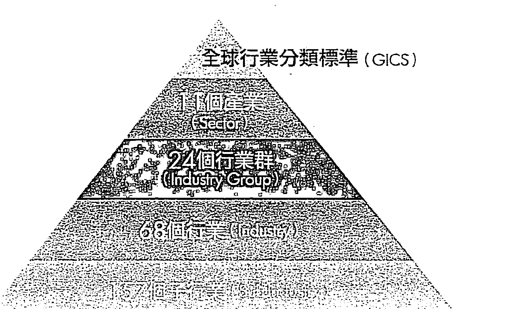

>> 資料來源：MSCI

### 面向2》選擇產業下的行業時，須考量其特性

目前GICS的11個產業之中，又細分為24個行業群、68個行業、157個子行業（詳見圖1，詳細分類可至MSCI官網（www.msci.com）查詢）。在精力、資金都有限的情況下，當然不可能無限制的配置到每一個行業；因此當你在某個產業分類之下時，盡量選擇不同的行業類別，才有分散的效果。

例如，「非必需消費產業」之下，又分為「汽車與汽車零部件」、「耐用消費品與服裝」、「消費者服務」、「媒體」、「零售業」等行業群，其中的零售業又可分為「經銷商」、「網路與直接行銷零售業」、「多元化零售」、「專營零售」等4種行業；而「專營零售」可再分為「服裝零售」、「專賣店」等子行業（詳見表2）。

假如你已經持有蓋璞（GAP，美股代號GPS），而GAP是屬於「服裝零售」子行業，所以當你想增加非必需消費產業的配置時，就可以從其他子行業（如專賣店）或更上層的其他行業（如經銷商）、行業群（如消費者服務）尋找標的。

又或者「能源」產業中的「石油、天然氣與消費用燃料」行業，分為「綜合性石油與天然氣企業」、「石油與天然氣探勘與生產」、「石油與天然氣煉製及營銷」、「石油與天然氣儲存及運輸」與「煤與消費用燃料」等子行業，當你已持有埃克森美孚石油（Exxon Mobil，美股代號XOM），因為它是屬於「綜合性石油與天然氣企業」子行業，那麼要尋覓能源業時，或許可以從其他子行業如運輸與儲藏、或煤與消費用燃料著手，因為它們雖然同屬能源業，但產業特性差異卻很大。

### 面向3》投資組合應兼具穩健與成長

2-8已強調過，高殖利率與高股息成長率不可兼得，也沒有哪個比較好。

投資高殖利率的企業，功能是提供你當前收入；高股息成長率的企業，則具備未來收益成長潛力。因此，可根據投資人短期（如1～5年）對股息現金流收入的急迫性，決定哪一類企業應占據投資組合較大的比重。

如果短期現金流收入需求較高，也別忽略要配置一些成長性較高的企業，只是占比可以低一些。一個長治久安的投資組合，應當同時考慮穩健與成長，而非兩者擇一。

### 面向4》排除規模過小的企業

以美股而言，市值規模大小一般可分為以下幾種類型：巨型股（市值逾2,000億美元）、大型股（市值逾100億美元）、中型股（市值逾20億～未達100億美元）、小型股（市值逾3億～未達20億美元）、微型股（市值未達3億美元）。

相較於大型股，小型股有更高的波動性，但波動性愈高，不等於報酬愈高，只是報酬分布範圍更廣，這點我已談論到多次。

以下分別為追蹤道瓊工業平均指數（成分股為美國市值最高前30檔股票）、S&P 500指數（成分股為美國市值最高前500檔股票）、羅素2000指數（成分股為美國2,000檔中小型股）的3檔ETF，截至2017年7月，可以看到追蹤羅素2000指數的ETF（IWM）10年標準差最高。

- 1. SPDR道瓊工業平均指數ETF（DIA）：追蹤道瓊工業平均指數，10年標準差為14.19%。
- 2. SPDR標普500指數ETF（SPY）：追蹤S&P 500指數，10年標準差為15.17%。
- 3. iShares羅素2000 ETF（IWM）：追蹤羅素2000指數，10年標準差為20.10%。

此外，小型股與微型股常有流動性問題，同樣值得注意。當然，規模（市值或者營收）愈高不等於企業品質就愈好，雖然規模有時確實能夠帶來成本、資本支出等優勢，但不表示非得選擇巨型企业不可。

在考慮合適的企業時，切記不能忘記挑選的主軸——以企業的質化分析為先，其次為量化數據再確認，避免市值大就是好，或者市值小就是差的先入為主觀念。因此，在良好的分散性之下，應該讓巨型股、大型股、中型股，乃至於小型股，依據自我風格來分布，不需刻意偏頗。

以我而言，我會希望排除規模過小的企業，例如避免「市值與營收小於5億美元」的企業。這個標準沒什麼特別道理，完全是我個人的喜好。順道提供一份數據，CCC List中的824家企業（截至2017年6月），市值小於5億美元者，占比為13.7%。

### 面向5》投資組合波動性不宜過於極端

當談到投資風險時，常會用標準差或Beta值來作為風險的量化觀察指標，然而風險其實很難用數字來說明。風險愈高，表示風險發生的機率分布愈廣，或者說發生虧損的機率愈高，因此，唯一可以確定的是「風險愈高，報酬不確定性愈大」。

波動數值都是過去的歷史資料，不完全能夠複製於未來，且波動也無法顯示企業的品質。換句話說，我們無法以此來判斷企業在未來5年、10年後，是否能夠成為一筆好的投資。

我曾提到，主動式投資人的優勢有2：評估優勢與時間維度優勢（詳見1-3），時間優勢是擁有高品質的企業，並伴隨著長時間，讓價格回歸至應有價值。

因此，在建構投資組合時，請務必考慮「波動性」，因為再好的質化、量化分析，只要中途忍受不了情緒折磨，你便無法堅守原本理性的決策。

那麼，該怎麼把波動性納入投資考量呢？這點沒有標準答案，假如資金總量極大的投資人，或許採取標準差7%、報酬率3.5%的國債混合公司債作為投資組合，便足以達成其財務目標；至於一般投資人，不論波動過高或過低都不恰當，若要讓時間維度成為優勢，便不要輕忽波動對你的心理造成衝擊這一點，更不要過於自信自己的波動容忍程度。

當然，也不要因為過於害怕波動，而選擇波動極小的投資組合。假如在資產累積階段，只追求波動極小化的組合，或許會面臨長期報酬不足的窘境，屆時時間將不再站在你這邊——切記，投資是一場馬拉松，而不是百米衝刺的競賽。

總結來說，合理的分散性能夠讓你專注在能力圈內，同時又足以讓你配置一定的份額在你認為高品質的企業，還能保留一些位置給波動較高或變動較為快速的產業。你不需要執著於波動很低或規模巨大的企業，而不敢對其他類型的企業出手。

分散的目的，是讓你能夠在企業種類與自我能力之間取得平衡，遇到高品質企業時，能更有勇氣的以金錢來證明你的分析與決策可能是正確的。即使某家企業的結果不如預期，你也能在重新修正後，仍有信念持續貫徹你的每一次決策。

最後，建立一個假設來模擬股息下砍時，分散的組合與收入間的關係：假設投資組合由30家企業所組成，平均股息成長率5%；而每年有3%的機率會有企業砍光股息，導致10年間，遭遇9家企業的股息歸零。

可以看到，即使歷經9家企業砍光股息，第10年的股息總收入仍高於第1年領到的股息（詳見表3）。也許實際情況會更好或更糟，但我仍堅信合理的分散，能帶給我情緒上的支援，這點對我格外重要。

### 善用股息再投入 精金收入大幅成長

建立股息成長投資（DGI）組合後，每季會收到股息（少部分為月配），假如持有的企業家數愈來愈多，因為配息的月份錯開，甚至可能每個月都會有現金收入。

假設一如預期，每年股息可能在某一季或某兩季宣布成長，這也是DGI希望建構的每年成長的現金流。無論是否退休，假如投資人還不需要完全仰賴現金流來維持支出，那麼都應當考慮股息再投入計畫（Dividend Reinvestment Plan，DRIP）。其中，DRIP對資產累積階段的族群更是重要，因為仍在職，並沒有立即使用現金流的需求。

當企業獲利成長、宣布股息成長，投資人收到更多股息後，可透過DRIP累積持有股數，不需投入新資金，也能產生雪球滾動效應（詳見圖1）。

我們來試算有無執行DRIP所能領到的股息差異。假設投入1萬美元，殖利率3.5%、股息成長率6%，前幾年差異還不明顯，例如第5年時，有DRIP的單年股息為503美元，無DRIP則為442美元；但差距隨著時間拉長而逐漸擴大，在第25年時，有DRIP的單年股息為3,384美元，無DRIP則為1,502美元，成本殖利率（YOC）分別為33.84%、15.02%，前者已是後者的1倍以上，主因便是在於累積股數的不同（詳見圖2）。

再引用「Dividend.com」網站的數據，若於1980年投入資金2,000美元於百事可樂（PepsiCo，美股代號PEP），並執行DRIP至2014年，其價值累積至15萬美元（詳見圖3），股數從80股成長至2,800股。

同樣於1980年投入資金2,000美元於菲利普莫里斯菸草公司（Philip Morris International，美股代號PM），並執行DRIP至2014年，其價值累積至30萬美元，股數從58股成長至4,300股。

再試算S&P 500指數，若以無DRIP的指數長期年化報酬率8.24%、有DRIP的指數長期年化報酬率11.16%計算，期初投資1萬美元達25年，無DRIP可累積至7萬2,409美元，有DRIP則為14萬963美元（詳見圖4）。

這些是歷史數據，不需要過於覺得神奇，我們也可能無法複製出這些範例的結果，但是仍可讓我們對於DRIP有所啟發。DRIP有2種方式，一是加入券商的DRIP計畫，讓券商系統自動執行下單，自動幫你買進原股票；二是自己手動執行，領到股息後，投資人自行決定購買價格，視時機再投入。不管是再投入原股票，或挹注於其他被低估的企業都可以。

這2種方式的目的，都是透過DRIP打造一台現金股息製造機，讓股息成長投資系統運行得更有效率。但我傾向於手動選擇，因為這才能符合我只買在合理價或之下的準則。再好的企業，也需要以合理的價格持有，「買好的」，更需要「買得好」。

### 手動執行股息再投入，握有投資組合主控權

用高估的價格購買，少了安全邊際，很容易導致長期獲取不佳的報酬。

例如嬌生（Johnson & Johnson，美股代號JNJ）是「股息貴族」的一員，股息連續成長45年，股息成長也很規律。

但是若在2002年3月29日購買嬌生，當時嬌生本益比高達32.6倍，高於20年平均本益比18.6倍；10年後的2012年底，嬌生的本益比在合理價附近，含股息卻只有2.8%的年化報酬率。

嬌生2012年底股價約70美元，2017年6月已漲至130美元以上。以F.A.S.T. Graphs網站分析，嬌生在2017年8月初的本益比為19倍，已超過美國股市長期平均15倍本益比，也高於嬌生的15年平均本益比15.7倍（詳見圖5）。

### 優點1》可耐心等到股價低於合理價時再投入

手動執行DRIP，可讓你握有控制權，選擇不要以超過合理價的價格來執行DRIP，這也是個股投資人少數擁有的優勢之一，不要輕易放手。

總是以合理價或之下購買，對我而言是不可撼動的準則。DRIP的重點是善用被動現金流，為滾動的雪球添加更多的動能，或者稱為次世代的新雪球。

### 各產業報酬大不同，投資組合應分散為宜

#### ——近5年10個產業ETF vs. S&P 500指數ETF報酬率

| 產業別 | ETF名稱 | 代碼 | 5年報酬率(%) | 相對於S&P500指數的差額(%) |
|---|---|---|---|---|
| 金融 | SPDR 金融類股 ETF | XLF | 110.68 | 31.48 |
| 非必需消費 | SPDR 非必需消費類股 ETF | XLY | 109.83 | 30.63 |
| 健康照護 | SPDR 健康照護類股 ETF | XLV | 108.10 | 28.90 |
| 科技 | SPDR 科技類股 ETF | XLK | 95.35 | 16.15 |
| 工業 | SPDR 工業類股 ETF | XLI | 90.76 | 11.56 |
| 原物料 | SPDR 原物料類股 ETF | XLB | 56.83 | -22.37 |
| 必需消費 | SPDR 必需性消費類股 ETF | XLP | 55.26 | -23.94 |
| 公用事業 | SPDR 公用事業類股 ETF | XLU | 40.35 | -38.85 |
| REITs | Vanguard 不動產投資信託 ETF | VNQ | 26.25 | -52.95 |
| 能源 | SPDR 能源類股 ETF | XLE | -4.35 | -83.55 |
| S&P500指數 | SPDR 標普500指數 ETF | SPY | 79.20 | — |

註：1. 資料統計期間為 2012.07.31 ～ 2017.07.31；2. 累積報酬率計算不含股息

資料來源：Yahoo! Finance

### 產業可細分為多種行業群、行業與子行業——以非必需消費產業層級分類為例


| 產業 | 行業群 | 行業 | 子行業 |
| :--- | :--- | :--- | :--- |
| 非必需消費產業 | 汽車與汽車零部件 | 汽車零配件 | 機動車零配件與設備、輪胎與橡膠 |
| | | 汽車 | 汽車製造商、摩托車製造商 |
| | 耐用消費品與服裝 | 家庭耐用消費品 | 消費電子產品、家庭裝飾品、住宅建築、家用電器、家用器具與特殊消費品 |
| | | 休閒設備與用品 | 消閒用品 |
| | | 紡織品、服裝與奢侈品 | 服裝與服飾與奢侈品、鞋類、紡織品 |
| | 消費者服務 | 酒店、餐館與休閒 | 賭場與賭博、酒店／度假村與豪華郵輪、消閒設施、餐館 |
| | | 綜合消費服務 | 教育服務、特殊消費服務 |
| | 媒體 | 媒體 | 廣告、廣播、電影與娛樂、出版 |
| | 零售業 | 經銷商 | 經銷商 |
| | | 網路與直接行銷零售業 | 網路與直接行銷零售業 |
| | | 多元化零售 | 百貨商店、綜合貨品商店 |
| | | 專營零售 | 服裝零售、電腦與電子產品零售、家庭裝潢零售、專賣店、汽車零售、家庭裝飾零售 |

註：此表「產業」官方譯名為「行業板塊」、「行業群」官方譯名為「行業組」
資料來源：MSCI

### 10年間有9家企業砍光股息，年股息仍為成長——以投資組合有30家企業、平均股息成長率5%為例

| 年度 | 當年度砍光股息企業數 | 投資組合企業數 | 年股息(美元) |
|---|---|---|---|
| 1 | 無企業砍股息 | 30 | 3萬 |
| 2 | 1 家砍光股息 | 29 | 3萬555 |
| 3 | 無企業砍股息 | 29 | 3萬2,083 |
| 4 | 2家砍光股息 | 27 | 3萬1,666 |
| 5 | 1家砍光股息 | 26 | 3萬2,252 |
| 6 | 無企業砍股息 | 26 | 3萬3,864 |
| 7 | 2家砍光股息 | 24 | 3萬3,424 |
| 8 | 無企業砍股息 | 24 | 3萬5,095 |
| 9 | 3家砍光股息 | 21 | 3萬3,534 |
| 10 | 無企業砍股息 | 21 | 3萬5,210 |

### 執行股息再投入，時間愈長報酬愈可觀——執行DRIP vs.未執行DRIP單年股息、累積股數

#### ◎單年股息

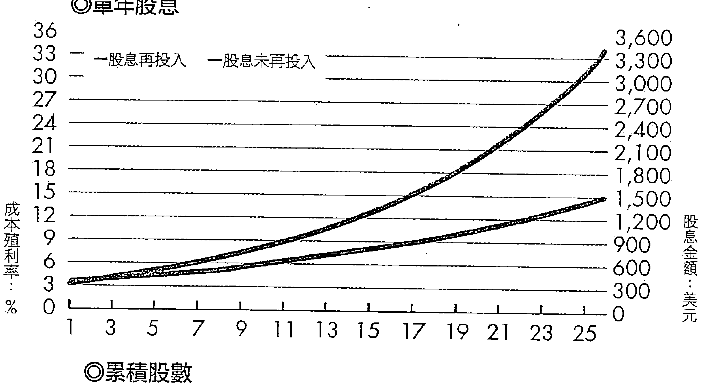

#### ◎累積股數

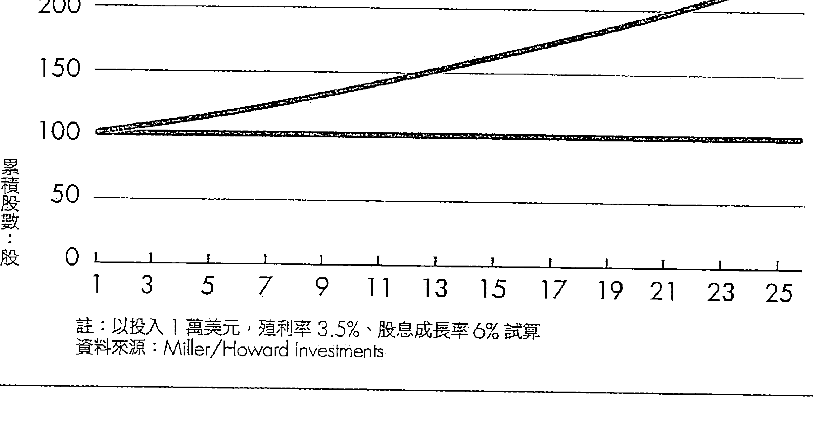

註：以投入1萬美元，殖利率3.5%、股息成長率6%試算

資料來源：Miller/Howard Investments

### 執行DRIP 25年後，總報酬豐碩——以百事可樂（PEP）、菲利普莫里斯菸草（PM）為例

#### ◎百事可樂（PEP）總報酬

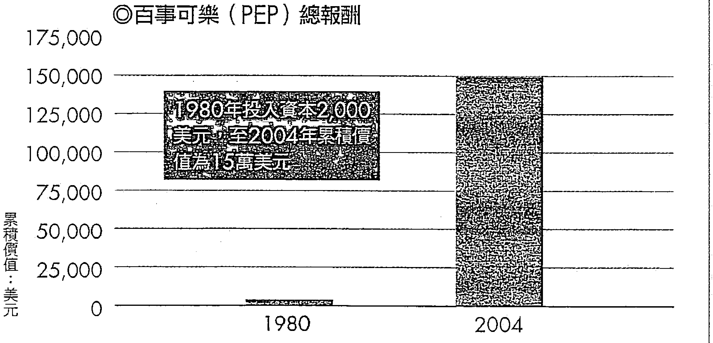

#### ◎菲利普莫里斯菸草（PM）總報酬

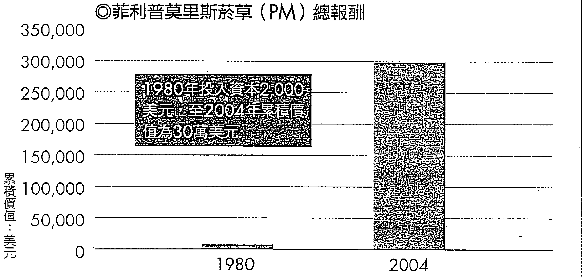

註：假設 1980 年初投入初始資金，並執行 DRIP 至 2004 年底
資料來源：Dividend.com

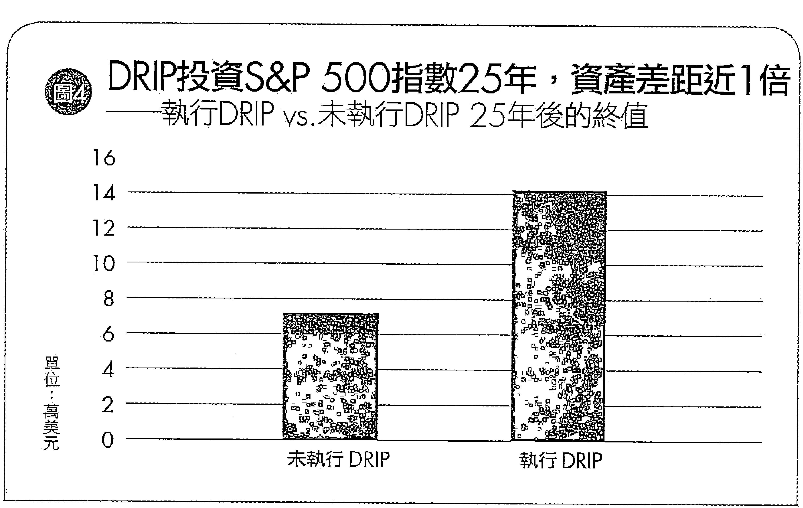

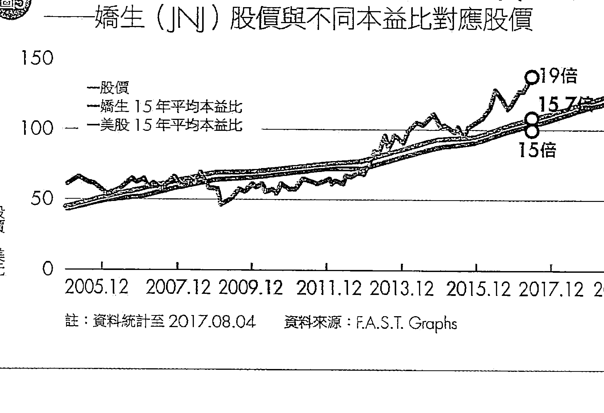球；不管你怎麼稱呼它，都是加速複利的概念。

以一個10萬美元（約合新台幣300萬元）規模的組合來說，假設平均殖利率3.5%，年股息為3,500美元（約合新台幣10萬5,000元），扣除股利所得稅30%，實收2,450美元（約合新台幣7萬3,500元）。意味著每季股息金額約為612.5美元（約合新台幣1萬8,375元）左右。

若每季要做一次DRIP，把手續費考慮進去，3家知名美國券商單次手續費由高至低為：TD Ameritrade（TD）6.95美元、嘉信（Charles Schwab）4.95美元、Interactive Brokers（IB）1美元，以前文的數據計算的話，手續費占每季成交金額比率分別為1.13%、0.81%、0.16%。

假如覺得每季再投入的手續費占成交金額比率太高，那麼可以等累積金額多一點時再執行1次DRIP，務必注意手續費占成交金額比率不要超過0.5%。

## 優點2》可將股息投資在其他股價被低估的企業

然而，也不要忘了閒置資金產生的機會成本。在等待股災的過程中，損失的機會成本往往高於及早讓資金產生複利效果的機會成本。

從圖5當中可以看到，嬌生僅有2008年第4季～2012年的本益比位於15年平均本益比之下，假如堅持只DRIP在這家企業上，那麼將會空等5年之久。

這時就能看出手動執行DRIP的另一個優點——能夠自由的將DRIP挹注於其他高品質且股價被低估的企業上。

前文談到多種建構觀察清單的方式（詳見3-6），你的清單中應當保有一定數量的候選企業；除了平常可注意其價格是否進入低估價格外，也能在你定期執行DRIP時派上用場。對於已持有的企業，你也能重新確認其是否低於合理價以利加碼。

同樣以F.A.S.T. Graphs網站來看美國前2大電信商之一威訊（Verizon Communications，美股代號VZ），2017年7月28日本益比低於市場長期平均與VZ的10年平均本益比，確認其質化分析後，或許便能考慮將股息挹注在VZ上（詳見圖6）。

## 自動執行股息再投入，穩健增加資產

當然自動執行DRIP仍有其優點：

### 優點1》多數券商不收取手續費

以美國券商為例，TD、嘉信、Firstrade都有免費DRIP服務，IB則需要收取手續費（每股0.005美元，最低收費1美元）。

### 優點2》小資本也能規律性地增加資產

除了能規律性地增加股數，且可以購買不足1股的單位數，不限制以1股為最小單位，即使是資金量小的投資人，也能夠紀律性地累積資產。

我認為個股自動DRIP，涉及到長期成長，必須對該企業的穩定性有更高的把握。當然，無法準確預測一家企業的營運是否能一帆風順、連續20~30年都是成長的狀態；假如是年年成長，可想而知，不斷地自動DRIP一定會帶來絕佳的報酬，但不可能預期投資的每家企業都能如此，否則就該重壓這些企業，不是嗎？

## 美股股息成長投資術

因此，我們可以從產業著手，例如挑選民生消費產業、電信、公用事業等變動較為緩慢的藍籌企業；或或許可依照產業特性與把握度，自行斟酌將自動DRIP與手動DRIP混合使用。

綜合以上所述，DRIP的目的是要善用被動產生的收入，也就是由投資組合自動產生的現金流，不需再挹注新資金便能持續運轉，享受著股息成長與股數成長的加乘效果。

## 2觸發點+7因素 學會賣出時機

相較於買進，賣出考慮的要素要多得多，你必須把所有客觀因素放在一起，然後謹慎地做出理性的決策。記住，引導你賣出的原因，絕對不是價格變化。無論是漲幅多少或是跌幅多少，都不是值得信服的理由。作為你股息成長投資（DGI）組合的CEO，你的重點在於產生持續成長的現金流，並關注企業未來的品質。因此，現金流不成長或減少是風險、現金流成長低於預期是風險、企業產生質更是風險。

我認為，決定DGI是否賣出有2個觸發點，但不等於滿足條件就要賣出；這僅是作為思考觸發點，並須同時考量多樣因素。此外，除了賣出選項外，有時還存在著另一個選項，就是持續持有、留待觀察。

### 觸發點1》股息下砍或終止成長

股息政策除了能夠大致了解企業的獲利狀況外，亦能知悉企業對於未來展望的態度；一旦發生股息下砍，便提供你一個思考的訊號——也就是你開始必須啟動分析模式，運用3-2的質化分析，去了解背後成因；千萬不要透過媒體或網路文章，讓他人決定你旗下企業的去留。

請想像成你擁有10家實體企業，當要賣出任何一家時，一定會從多面向去評估。投資企業也該是一樣的態度，不該只是簡單地按下按鍵，或者僅憑價格波動與他人的說詞來誘發你做決定。

圖1為股息成長企業、所有配發股息企業、股息持平企業、不配發股息企業、減少或取消股息企業等5種類型在標準差與年化報酬率的比較。圖1結果與2-5圖2顯示的結果相同，只是圖表呈現方式不同。2張圖中都可看到「減少或取消股息企業」在長期波動或報酬中敬陪末座，此處已提供股息成長投資人一個賣出的大框架。

## 觸發點2》企業價格嚴重被高估

即使目標是建立永續成長的現金流，而該企業也持續讓股息成長，在企業品質完好的前提之下，DGI希望能盡可能的持有，以享受成長的現金流與雪球效應，並收割長期資本利得。然而過分高估的價格，可將之作為思考的觸發點，尤其是當你已找到其他處於合理價之下的高品質企業時。

雖然這件事情並不常發生，但你需要事先有一個計畫，以便在高估的價格實現資本利得，並將釋放出來的資本重新配置於低估的企業上，這才會是較好的資源分配。

根據基金公司Brandes Investment Partners的研究，S&P 500指數成分股當中，相較最低本益比族群與最高本益比族群，若於1975年投入10萬美元，在2010年時，最低本益比族群的累積總報酬（含股息再投入）高達4,673萬8,649美元，最高本益比族群的累積總報酬則為234萬6,728美元（詳見圖2）。

而35年來，最低本益比族群的年化報酬率高達15.3%，高本益比族群為5.2%，相差10.1個百分點。

至於何謂「高估」？我提供我的做法，我是採取多種指標混合，如10年平均本益比或席勒本益比（Shiller CAPE）。

-   1. 10年平均本益比達40倍：當10年平均本益比高達40倍時，我就定義為高估。特別注意，我不建議使用單一年度的本益比，因為很可能會受到會計準則中的某些一次性作帳影響，而做出誤判；或者該企業正處於短期的產業循環或碰上暫時性的災難。

此時，你必須了解該企業是否對此有解決方案，假如認同企業改善的做法，那麼你必須有耐心地給它一段時間。因為能夠戰勝逆風的企業，才更能夠在時間長廊中存活，而不是站在風口的順勢企業。

-   2. 股息折價模型超過40%：使用「股息折價模型（DDM）」計算出的合理價，超過40%定義為高估。

實際上，如何定義高估的標準因人而異，但你必須在持有與高估之間取得平衡，既不會輕易地讓出企業，喪失未來成長的現金流與長期資本利得，又不會錯失高估價格時重新配置資源的機會。

## 7因素輔助投資人思考賣出時機

除了以上2個觸發點外，你還需要同時考慮下列因素：

-   1. 部位變得過大：例如單一企業投資組合超過最高容忍值，如8%、10%，這個最高容忍值會依據投資組合的企業家數而調整。
-   2. 企業發生質變或基本面嚴重改變：這一點是影響決策中最重要的一塊基石。
-   3. 企業被購併或購併其他企業

雖然購併經常是強強聯手，或者補足該企業未來想要發展的領域，然而無論是購併方或被購併方，你都要重新評估這項購併對其未來的發展性。因為購併需要長時間的磨合，包括資源整合與文化衝擊，不一定能產生原先預期的結果。

舉例來說，美國電話電報公司（AT&T，美股代號T）在2016年10月宣佈以1,087億美元（含負債）購併時代華納（Time Warner，美股代號TWX），取得多個頻道與華納兄弟影業。

除了以股交換，流通股數將增加11億股（61億股變為72億股）外，AT&T將新增負債400億美元，增加利息支出16億美元。增加的股數，等於稀釋掉原有股東的實際價值，減少約15%。

根據AT&T估計，購併時代華納並整合完畢之後，第1年便能挹注獲利10億美元，約EPS 0.11美元。除了檢視以上數據外，還須考慮AT&T跨足媒體與影視業，是否能為其帶來新的成長機會，而你是否認同AT&T的策略？抑或你更認同另外一家大型電信商威訊（Verizon Communications，美股代號VZ）2015年購併AOL（American Online）與2017年購併網路巨頭Yahoo! 網路事業的策略（其後Yahoo! 與AOL合併為子公司Oath）？

相較於AT&T的跨界整合（包括2015年收購DirecTV），威訊則較專注在網路領域。因此，購併與被購併，都同樣需要重新審視其策略是否真能為企業帶來成長的新機會。

-   4. 企業分拆：這一點與第3點有點雷同。美國企業經常進行分拆，例如2013年亞培（Abbott Laboratories，美股代號ABT）將醫藥研發分拆出去成立艾伯維（AbbVie Inc，美股代號ABBV），如果你認為少了藥品事業的亞培可能會欠缺成長動能，此時你有可能放棄亞培而轉投資於AbbVie。

但反過來說，分拆往往是為了資源整合，使其能更專注在某一領域。因此，如何評估企業的決策，同樣是身為投資組合CEO的你必須去思考的。

-   5. 當前殖利率低於2%：儘管不該過度追求殖利率，而應注重未來成長性並考慮長期資本利得。然而，有些族群較需要當前收入，而不那麼重視未來成長，因此，確實有可能因為自身財務需求而需要考慮到殖利率。
-   6. 當前殖利率高於8%：過高的殖利率很可能難以長期為繼，甚至使投資人落入價值陷阱。而DGI是尋求穩健與成長之間平衡的組合，短期看似高殖利率，卻很可能只是曇花一現，甚至造成永久資本利損。除了少數特殊產業，例如不動產投資信託（REITs）、業主有限合夥（MLP）外，8%已是極度不合理的水準。
-   7. 找到其他更好的企業替代：有時你持有的A企業，在3～5年之間，並沒有朝你事前分析的預期方向發展。此時，你找到了另一家絕佳的B企業，無論在品質、數據、價值，都是一筆更好的投資，能夠讓資本發揮更大的效益。

你會發現以上任何一個因素，都不可能單獨成為一項指標而驅使你輕易地做出賣出行為，因為每一家企業面臨的狀況都不同，有可能這家企業符合其中2個因素，另一家企業卻符合其中4個因素。

無論是本章提到的2個賣出觸發點，或是7個參考因素，都不等於要直接執行賣出動作。每一次的評估，都必須視個案狀況而定，有時你的決定可能是舉起警示牌，但暫時繼續持有、觀察；有時則是直接決定賣出。

買進股票時，只要做好質化分析、確認量化數據、評估合理價後，接著便是執行。賣出股票，也是科學與藝術並存的行為，你必須攤開所有客觀因素、拉高視野，既要理性檢視，又要感性地保持一定彈性，並相信自己的決策品質，這在情感與能力要求上都格外不容易。

我假設了3種劇本，讓你感受一下可能面臨的情境（詳見表1）。多數時候，真的不是幾個簡單的數字，就能讓你直接決定是否賣出，但更不是讓價格波動來替你決定！表1的每一種情境，我不會寫明我的決策會是什麼，因為不存在標準答案。你我的認知，肯定大大不同，你必須試著找出你認為最關鍵的那一點。

### 賣出股票時，應比較多種情況再做決定
——投資人面臨賣股時可能面臨的3種情境

| 情境分析 | 情境1 | 情境2 | 情境3 |
| :--- | :--- | :--- | :--- |
| 本益比 | 33倍 | 29倍 | 15倍 |
| 股息狀態 | 股息停止成長 | 股息相對上一季減少10%（一旦宣布減少，很難快速在隔季回復先前水準，因此也會預期全年減少約10%） | 股息與上一季相比減少5% |
| 外在環境 | 遭遇金融海嘯 | 一般 | 一般 |
| 未來預期 | 基本面不變，評估景氣復甦後會很快恢復成長 | 整個產業因大環境消費疲弱，但企業體質佳，且執產業牛耳，最有可能挺過艱困時期 | 明顯質變或競爭優勢喪失 |
| 目前殖利率 | 2.5% | 1.9% | 3.7% |
| 成本殖利率 | 7.5% | 5.8% | 7.3% |
| 占整體投資組合 | 2.1% | 8.5% | 1.2% |
| 晨星評估 | ★★ | ★★★ | ★★★ |
| 購併或分拆？ | 有購併，預期挹注成長 | 有購併及分拆，預期挹注成長 | 無 |
| 有其他替代企業？ | 無 | 有 | 無 |
| 面對這3種情境，你會做出什麼決策？賣出？還是繼續持有？ | | | |

註：「晨星評估」1 顆星為股價嚴重高估、2 顆星為高估、3 顆星為合理價、4 顆星為低估、5 顆星為嚴重低估

# 3-10 別被股息高稅率嚇退 長期總報酬更重要

美國公民投資美股的獲利與股息收入，皆需要併入個人所得稅。若持股時間少於12個月，視為短期資本利得，稅率與個人所得稅相同，最高達39.6%；若是持有超過12個月的長期資本利得，以及企業配發的股息，則按個人稅率級距適用3組較低的稅率，分別為0%、15%、20%（截至2017年資料）。非美國公民投資美股，雖然不用繳付資本利得稅，但卻要負擔30%的股息稅率。

稅率問題確實需要一併列入投資考量，包括遺產規畫也是。尤其聽到非美國人投資美股，股息必須扣稅30%，難免有被剝奪的感覺；但是，身為長期投資者，應當把視野擴大，思考損失了什麼，又能獲得什麼。

前文曾提及，股息與資本利得約各占長期市場報酬的一半（詳見2-4）。以美股長期年化報酬率8%為例，表示股息占4個百分點，扣除股息稅率30%，相當於1年少了約1.2個百分點，30年約少42個百分點。

若以期初投入100萬美元計算，30年後稅後與稅前的總股息分別為181萬美元與257萬美元（不計股息再投入），也是不小的差異。

那麼請問，假如今天不需要被課稅，在投資的旅途上，是否就能從此一帆風順？是否就能因此讓報酬變得穩健？是否就能幫助你少犯錯？是否就能因此不受情緒影響，將你的長期財務目標牢牢釘在牆上呢？

我想答案是否定的！你也清楚原因不是出在這，不是嗎？

如果因為不想被課稅30%，而拒絕投資美股，會面臨什麼情況？首先是股息成長投資（DGI），你可能會錯失股息連續成長20年～30年企業的投資機會，不只是當下的股息收入，也失去了雪球自動滾動的加乘效果，同時與收割長期資本利得擦身而過；其次，少了美元資產分散匯率風險，你也将其他世界高品質企業拒於門外，無論它是否配發股息或者是股息連續成長。

## 依個人性格與投資目標，挑對投資方式

分析企業與擺脫情緒干擾太困難，的確是事實，那麼這反倒是重點所在。因此，我想你要如何決定資產組合的出發點，不在於是否扣30%的稅，而在於你選擇的方式，能否滿足你實際需要的報酬目標，同時又符合你的能力與性格。例如，可以列出幾種可能的方式：

-   1. 投資需求為達到市場平均報酬：可選擇單純投資ETF，既可股債平衡配置、報酬貼近市場，標準差又在10%～18%之間，不易有過大的波動。ETF是透過個股方式交易，仍避免不了30%的稅，但可以達成投資目標。
-   2. 投資條件為資金總量很高，或投資需求為穩定現金流收益：可選擇波動很小的公司債混合公債，不須投資個股。
-   3. 投資條件為善於分析企業未來價值、善於控制風險、情緒穩定不易受市場波動影響：例如可專注尋覓成長股，成長股大多不會有30%的稅，因為這類企業多不配發股息，主要將現金用於快速擴張，例如輝達（NVIDIA，美股代號NVDA）、特斯拉（Tesla，美股代號TSLA）、臉書（Facebook，美股代號FB）等。
-   4. 投資條件為穩定不受情緒控制的性格：例如採取動能投資，完全以機率與期望值思考，有成熟的交易機制。

投資方法還有許多，你可能擅長某一種，也可能混合使用。本書多次談到投資方法的適切性，每個人的內在特質、外在能力、財務狀況與長期目標不盡相同；股息雖貢獻長期報酬半壁江山，但沒有股息，也不表示你無法達成長期財務目標，還有許多方式能達到相同效果。每一種方式都有其侷限性，也都會機會成本。最終，我要再次重複，請試想即使沒有了這30%的稅負，就真的能百里平川？抑或行為模式才是問題的癥結呢？

## 把握3原則避免賺股息、賠價差

關於股息，投資人常有一個疑問：「會不會賺了股息、卻賠了價差呢？」我認為這個問題應該改成：「如果我只看殖利率，而非企業競爭力時，會不會賺了股息、卻賠了價差呢？」

答案是：很可能會。但請注意，我將問題的重點，放在「如果我只看殖利率」之上。

的確，許多投資人面對收益型商品（包含股票、高收益債、公司債或特別股）時，都容易陷入殖利率陷阱。殖利率只是一個結果，是一家企業獲利之餘，撥發部分盈餘嘉惠股東，剩餘資金則投注在能為企業產生最大效益的項目。

因此，如果希望股息是在健全的企業財務體質下配發，且不希望一年有、一年沒有，或者一下配多、一下減少，那麼企業的本質，或者該說是競爭優勢，必須能夠維持一段長時間。

要達到這一點，則必須謹記這一點：殖利率只是選擇高品質企業後，連帶的「結果」，而非起因。

### 原則1》 專注尋找股息連續成長的高品質企業

而股息連續成長數十年的企業，就是找尋高品質企業很好的開始。但是許多投資人往往只被眼前的殖利率所吸引，但其實對於企業的本質並不夠了解。

事實上，擁有股票就等於持有企業的一小部分，且透過股票投資一家企業、成為其股東，無論是持有1股，還是擁有35%股權，沒有太大不同，差別只在於控制權的多寡。

「股息成長投資（DGI）=高品質企業＋長期價值投資＋股息持續成長＋企業未來獲利成長」，以上關於DGI的定義，已經解決單純受到殖利率誘因而買進股票，但對企業本質其實不了解的弱點。

我並不想刻意與價值投資扯上關係，只是DGI自然地會以這種形式運行。想像一下，你想建構永續流淌的现金流，自然而然地就會以企業本質為基石，既考慮當前，也考慮未來。一旦目標是著眼涓涓不息的现金流，那麼時間維度也會轉變為長期。

### 原則2》企業品質再高，仍不宜以高估價格買進

投資並非「買高、賣更高」的價差遊戲，會在意合理的購買價格，是因為高度溢價的價格會顯著影響長期報酬。而高度溢價的價格，猶如在樂觀繁榮時期的誘惑，讓人很難不沾惹那些在當世代被吹捧為最偉大與最吸引人的傳奇，如「FANNGs」（Facebook（臉書）、Amazon（亞馬遜）、Netflix、NVIDIA（輝達）、Google）。

當市場處在牛市時期，這小部分的個股簇擁著牛市前進，投資人容易變得輕忽風險，過分將眼前所見投射到未來。回溯歷史，每個世代都曾出現這類企業，代表著當下最偉大的商業模式與最棒的競爭優勢，而被誤認為這就是未來的模樣。例如美股1960年代的「漂亮50」（Nifty Fifty，當時受追捧的50檔成長股）與1990年代的科技股，哪個不是新奇的產業，且都建構在健康的財務基本面上呢？

或許當中不乏偉大的企業，然而環境常往非預期的方向改變，高利潤會吸引高度競爭，加上公認的「好」公司，價格往往會被高估；一旦發現企業其實沒想像得好，最終價格會回歸正常水平。

我並非要指出動能投資或者成長投資有什麼問題，而是指出當這類股票大行其道时，往往代表着投资大众乐观的情绪。即使DGI不被这类看似传奇的企业所吸引，然而当投资于股息成长企业时，就算品质再高，都该有一个好的价格，你必须注意价值是否必须高于价格。

### 原则3》保持耐心，等待企业价格被低估

最后，还剩下一个问题必须解决，那就是耐心。时间维度，是一般投资人少数拥有的优势之一；只要企业的竞争优势没有改变，而且价格没有被离谱高估的前提下，卖出决策不该以价格变化为考量。而这个问题的难度，更甚前述两点所提及的关注企业本质以及合理价格。

我没有办法让你变得有耐心，或者养成处之泰然的性格。但我必须说，当你扎扎实实的理解一家企业，佐以部分关键数据，并在价值之下的价格购买后，在面临市场波动时，你的心中该会有一份踏实。虽然这一份踏实，是否足以支撑你产生强大信念以看透价格起伏，乃至视其为良机，因人而异；若是信念的能量不足，或许是当初的工作不够扎实，或许是人格特质使然。

我能提供的建议，只有面对恐惧。做你不习惯的事，很多重要的投资理念往往是反直觉的，而愈是反直觉的事，愈是需要练习。

我会以耐心作为论述抵抗“赚股息却赔价差”的最后一点，原因在于，假使你有分析企业本质的能力，也评估了企业价值，但投资策略设计得再精妙，也敌不过最大的敌人，也就是你自己。即使你的分析品质再高，但若是受到媒体、朋友或价格变化影响，而轻易地放弃原本的想法，那么将实现了永久资本利损。

做对的事，市场并不会立即以奖励作为回报。因此，回到一开始的问题：“会不会赚了股息、却赔了价差呢？”答案是：很可能会。

即使你接受了我在本章提到的3点解决方法，包含专注企业本质、注重企业价值与耐心（时间），你还是可能犯错。有时你做了所有该做的，也以理性的计划按部就班，但事情总是不会完全按照设想的方向发展。

因此，我想分享另一个投资理念——学习放手。放手，有时是一种智慧。你既要学习如何当一个赢家，也要学习如何当一个输家。以前我在做短线期货、选择权或短线股票交易时，同样会制定一套合理的交易系统，而这系统明确地规范我所有的行为。所有交易就如机械般的执行，不因前一次交易的盈亏，而决定这一笔单该如何执行。

在长期投资当中，虽然有点不同，但我认为仅有出手频率的差别，相同之处都是有勇气地确切执行投资系统。

对于长期投资，我坦然的面对我会评估失误，也会看走眼的现实，我也知道不可能每一笔交易都完美无缺，我接受这样的“不完美”；因此在下一次做投资决策时，我也能毫无畏惧的执行当下我识别到的机会，不受前一次投资经验的影响。加上我始终保持良好的分散性，正面我赢，反面我小输，因此我很乐意用一点损失来验证我的分析结果。

我想强调的是，有能力分析是一回事，而持续有勇气执行正确决定，又是另一种更稀缺的特质。

国外的长期投资者，通常会注意“Payback”（还本率），也就是通过股息发放，大约多久能够还本。随着自己的心态调整，这时问题的核心反而会在于：必须先相信长期投资的信念，然后确信自己有第2层思考能力，以及持续做出正确决策的信心，并接受决策不是完美的。一旦有稳固的信心，那么股息就是“附加”帮助还本，而不会去想“会不会赔价差？”

这绝对需要时间累积与练习，你无法看出现在做的努力，在未来会以什么方式串联起来。但我相信，当你10年后回顾的时候，会发现过去无数的小点滴，最终以某种形式连了起来；你会感谢10年前的自己做了这么多。

# 第四篇

## 精进分析能力

### 筛出稳健提高

（此处应有图片描述：dfd1504d95bd8956cc82c7d5cbadb262_251_0.png）

## 亲手撰写企业分析报告
增加对价投更深体会

第4篇将统整第3篇提及的大部分概念，实际执行一轮质化分析、量化分析，以及到目前为止尚未提到的价值评估。

分析与思考是没有止境的过程，每当看到他人对于产业分析透彻，对于未来获利的预估之严谨，都让我感到折服；这也是为什么我提到必须不断阅读，因为通过他人的研究，往往会不经意地获得大量启发。

我从2015年开始撰写企业分析文章，便是要求自己要与知识不断地互动。通过吸收与理解再转述成文字，这是与“阅读”完全不同的概念，如此才能真正将知识与脑部产生连接。

假如只有观察与阅读，却没有实践，会达不到你想要的效果。撰写企业分析文章时，须从质化分析开始，再进入量化分析，我认为至少应包含以下3大面向：

### 面向1》质化分析

### 1.企业总览
主要是对企业的基本认识，包含总部位置、发展历史、企业规模、主要商品与服务，同时也涵盖各主要事业群占整体营收比重与获利状况。

其次也要了解销售地域的获利占比，这点很重要，因为当事业群与地域有适度分散时，整体表现较不易受到单一商品或区域影响。

完成企业总览之后，你也会确立对该企业的第一印象，在此阶段，其实已能大致识别出这家企业是否在你的能力圈范围之内？是否符合你的投资风格？

## 2.商业模式分析
商业模式分析也可能会发现促使你投资该企业的理由，主要有2类：第1类是你看到的竞争优势，第2类是该企业符合外在环境或者趋势。

比方说，中产阶级人数窜升，将带动城镇化与都市建筑。假如你研究的企业是智能建筑、电梯、空调与安全控制的企业，那么便能够以此趋势作为发展平台。

又或者如物联网（Internet of Things，IOT）革命，既然大数据、云端运算已是进行式，而接续的工业4.0与物联网也箭在弦上，那么势必不能缺少网络设备，包含网络集线器（Hub）、无线网络设备、资料中心与安全防护等。如此，这类企业便能与当前趋势有着紧密的发展关系。

## 3.经济护城河
主要以3-2提到的数种经济护城河为框架，你必须逼迫自己刻意练习，从当前研究的企业找出几项符合的护城河优势。但要谨记，不要硬把模糊的企业优势塞入框架，必须真的有把握，合理地将企业优势归类进去。

> **追日Gucci分析企业经济护城河——以可口可乐（KO）为例**
> 
> -   A slow changing industry and essential consumption.（变动缓慢的行业和必需消费产业）
> -   Intangible assets: Strong brand awareness. Pricing power, brand recognition and premier relationships with major retailers. Strong delivery distribution network and scale advantage.（无形资产：强大的品牌优势，具备定价能力、品牌认同度、零售商优先上架权。强大的物流销售网络。具备规模优势）
> -   Advertisement advantage: 3.5 billion USD/Year（广告预算优势：每年35亿美元）
> -   Overall: Wide Moat（整体评价：宽广护城河）

对于稳定情绪至关重要。

## 4.企业的可能风险
无论再好的企业都有其风险，可能来自于环境、来自于对手，甚至来自于当前你觉得很棒的营运模式，这些其实都潜藏着不确定性。然而不确定性往往是机会的来源，也才能提供充分的获利空间。反而是那些看似一切都非常完美的企业，更容易让在预估时过于乐观。

写下风险的用意，在于你事前已嗅出可能的风险，包含可见与潜在的；当将这些风险一并考虑后，可以思考是否仍认为这会是不错的投资决策。

此外，当之后你预期中的风险出现时，也更能坦然面对，因为你早已将这些因素纳入考量，因此能大幅降低价格剧烈波动时带来的心理冲击。

### 面向2》量化分析

### 1.长期基本面数据
长期基本面数据应至少看10年，许多免费网站都有近10年数据，少部分有提供到15年。虽然都是过往数据，然而许多质化分析看不到的部分，必须以量化数据辅助。假如过往都没有数据能证明企业的获利能力与财务体质健全，如何预期其未来忽然变得有获利能力？

我最常使用的信息是晨星（Morningstar）的“Key Ratios（重要财务比率）”（详见5-1），网页上半部区块信息包含2大类：

-   ①绝对数字类：我会看第1年与第10年以确认趋势，然后用Excel计算年化成长率，如营业收入（Revenue）、每股税后盈余（EPS）、自由现金流（Free Cash Flow）等。
-   ②比率类：我主要会看成长性与稳定性，如营业利益率（Operating Margin）、股息配发率（Payout Ratio）等。

而网页下半部区块有5个标签，我一定会看其中3个：

-   ①获利能力（Profitability）：税后净利率（Net Margin）、股东权益报酬率（ROE）、资本投入回报率（ROIC）。
-   ②现金流（Cash Flow）：这部分我整页都会看，包含营业现金流年成长率（Operating Cash Flow Growth）、自由现金流年成长率（Free Cash Flow Growth）、资本支出占营收比重（Cap Ex as a % of Sales）、自由现金流占营收比重（Free Cash Flow/Sales）、自由现金流对税后净利比值（Free Cash Flow/Net Income）。
-   ③财务健康（Financial Health）：主要看负债率、长期负债率。

检视完长期数据后，你应该制作一个表格，列出你认为关键的财务数字，并逐项订出一个等级，最后再给一个整体等级。例如表1是我在2016年所建立的评等表格。

| 指标 | 数据 | 评价 |
|------|------|------|
| 股息连续成长年数 | 54年 | 极佳 |
| 近10年股息年化成长率 | 每年9% | 极佳 |
| 近10年自由现金流年化成长率 | 每年6.4% | 良好 |
| 负债占净值比 | 1倍 | 尚可 |
| 近10年平均营业利益率 | 23.52% | 极佳 |
| 近10年平均股东权益报酬率 | 29.54% | 极佳 |
| 利息保障倍数 | 17.19倍 | 良好 |

### 2.短期基本面数据
短期基本面数据同样是确认一些事实，例如企业近年开始进行一些转型，像是削减低毛利的商品，导致营收与EPS降低，其后却逐步提高营业利益率与毛利率，这就代表转型对公司是有利的。因为与其空有高营收却获利不振，倒不如让企业变得更为轻盈，将生产重心放在高利润比率商品，投资人都可以从每季的财报数据确认改善状况。

此外，短期基本面数据也可得知当前趋势，英文常用逆风（headwind）一词来形容，多指整个景气环境或是该产业的整体氛围。逆风，自然大多指的是坏消息，而且已经持续一段时间，很可能造成市场情绪过度发酵，此时，不确定性反而可能是机会。

#### 3.企业对未来展望
大部分企业在季报与年报都会有来年的“Outlook”，可得知企业来年的展望，假如企业预期获利下修，则你可以检视细项说明，了解下修的原因为何，可能是企业在蛰伏转型，也可能只是提列一次性支出或账面损失。

这些信息都相当重要，最后你在预估该企业未来成长性时，也必须将不利因素一并列入考量，保守视之。

#### 4.股息与股票回购相关信息
包含股息成长年数、股息配发率以及当前殖利率。特别可以看一下，近年的股息成长率是否放缓或者是加速，同样对于预估未来股息成长率会有所帮助。

（此处应有图片描述：自制重点Highlight表，更能立即掌握重点——追日Gucci自制重点Highlight表）
| Starbucks Corp. | 代号 | SBUX | 现价 | 52.75 | 目前配息 | 0.8美元 | |
|-----------------|------|------|------|-------|----------|---------|---|
| 行业 | 非必需产业-餐饮 | 市值 | 780.70472218亿美元 | 52周高点 | 63.19 | 殖利率 | 1.52% |
| 12个月本益比 | 27.91 | 负债率 | 56.00% | 52周低点 | 50.84 | 10年股息年化成长率 | 25.40% |
| 12个月EPS | 1.89 | 护城河 | 宽度 | 平均成交量 | 840.6372万股 | 连续配息成长年数 | 6 |
| 12个月ROE | 46.11% | ROE (10年平均) | 25.96% | 预估年化报酬 | 14.05%~15.05% | 10年EPS年化成长率 | 22.10% |

#### 5.重点Highlight表
整合一个固定格式的表格，放上几个重要的Highlight（突出）信息（不只是数字），作为整篇分析的摘要。

这个表的作用有点像是报表的表头，让你能立刻抓出一些重点，也方便往后回顾使用（详见图2）。

#### 6.量化检查表
有些基本量化准则是我认为关键而不可避免的，你也应该有一份属于你自己的量化检查表（详见图3）。当然并非所有项目都必须通过才能进行投资，但你心中必须有一把尺，不可能大半条件都没有通过，还执意要进行购买行为，这也不合理。

量化检查表是写给自己看的，是对自己投资负责，虽要有一定弹性，但必须清楚知道自己的准则究竟是什么。

（此处应有图片描述：检核标准不一定要全部符合才能进行投资——追日Gucci自制量化检查表）
价值评量表
| 项次 | 检核项目 | 量化标准 | 实际值 |
| --- | --- | --- | --- |
| 1 | 营收>5亿美元 | 5 | 205 |
| 2 | 连续五年股息成长 | 5 | 6 |
| 3 | 目前殖利率>2.5% | 2.5% | 1.55% |
| 4 | 5年股息复合成长率%(CAGR)>5% | 5% | 30.50% |
| 5 | 乔德规则殖利率%+5年股息复合成长率%(CAGR)>10% | 10% | 33.81% |
| 6 | 本益比<16 | 16 | 27.4 |
| 7 | PEG<2 | 2 | 1.4 |
| 8 | Payout(股息发放率)<50% MLP与REITs不看此项 | 50% | 42 |
| 9 | 负债率<80% | 80% | 56 |
| 10 | 利息覆盖率>5 | 5 | 52.87 |
| 11 | 价格安全边际10%(合理价*0.9) | 10% | 11.00% |
| 12 | 10年正数现金流 | 6 | 9 |
| 13 | 连续2年自由现金流不为负 | 2 | 0 |
| 14 | 10年平均ROE>12% | 12% | 25.96% |
| 15 | 近5年ROE>14%年数 | 4 | 4 |
| 16 | 预估年化报酬>10% | 10% | 15.05% |
| 评量结果14/16 | | | PASS |

### 面向3》未来预估与价值评估
在经过质化分析、投资理论与长短期量化数据确认之后，便能一并整合过去与当前情势、未来风险与机会全部整合起来，在合理且保守的基础下，做出以下预估：

#### 1.未来预估
一旦计算出未来EPS成长率之后，只要再考虑当前股息配发率，即能应用在股息折价模型（DDM）中的股息成长率（详见4-2）。

最后再加上当前殖利率，即可计算出长期的年化报酬率，用以检视这样的报酬率是否符合你的标准。

#### 2.价值评估
我认为每种评估方式都有其局限性，因此我采用混合平均的方式，评估方式详见4-3。

## 活用股息折价模型 算出股票合理价

价值评估（Valuation）是质化分析与量化分析都做完后，绝对不可或缺的一环。本章将介绍如何运用股息折价模型（DDM）来评估企业合理价。

### 加总未来每年股息现值，即为企业合理价
为什么要回推未来股息在目前值多少钱？因为钱是有时间价值的，今天保留1元，放到1年后才使用，这1元在1年的时间里，可能产生1%、5%或10%的报酬，因此今天的1元，会比5年后或10年后的1元更值钱。

如果1年可产生10%的报酬率，1年后的1元，在目前的价值（以下称现值）就必须以10%回推，也就是约0.909元（1/（1+10%）），这10%就称为折扣率、折价率，或是预期报酬率。现值的计算公式为（Dn为每年股息、k为折扣率）：

n年后股息的现值 = Dn / (1 + k)^n

如果是10年后的1元，以每年10%的折扣率回推，价值就只等于现在的0.386元（详见表1）；换句话说，现在的0.386元，以每年10%的复利推算（亦即有10%的年化报酬率），10年之后约有1元的价值。

DDM就是用这种时间价值的概念，将未来每一年能从企业拿到的股息，以预期报酬率回推至现值，再将每一年的现值加总，就可以算出企业现在的合理股价。

假设每年股息相同，DDM股息折现公式为（V0为目前合理股价（现值）、Dn为第n年后的股息、k为折扣率）：

V0 = D1 / (1 + k) + D2 / (1 + k)^2 + D3 / (1 + k)^3 + ... + Dn / (1 + k)^n

我们来试算，假设A企业每年都固定配发股息1元，那么未来每一年的1元，现值分别如下：

```
1年后的1元股息现值=1/(1+10%)=1/1.1=0.909
2年后的1元股息现值=1/(1+10%)^2=1/(1.1)^2=1/1.21=0.826
3年后的1元股息现值=1/(1+10%)^3=1/(1.1)^3=1/1.33=0.751
...
25年后的1元股息现值=1/(1+10%)^25=1/(1.1)^25=1/10.8347=0.092
30年后的1元股息现值=1/(1+10%)^30=1/(1.1)^30=1/17.4494=0.057
```

可以发现，当时间愈来愈长，回推到现值也会变得愈来愈小，小到一定程度，大约25~30年就明显趋近于0。再把上述30年以10%折扣率，将未来收益回推计算到现在的价格，这就是DCF或是DDM的概念。当然，实务上并不需要一年一年的计算，后续会提到简化公式以及免费推算DCF(DDM)的网站。

再用个生活化的例子说明，假设有个业务向我推销一台机器，每年可以帮我赚进1万元，而我预期年报酬率为10%，这台机器价值多少呢？

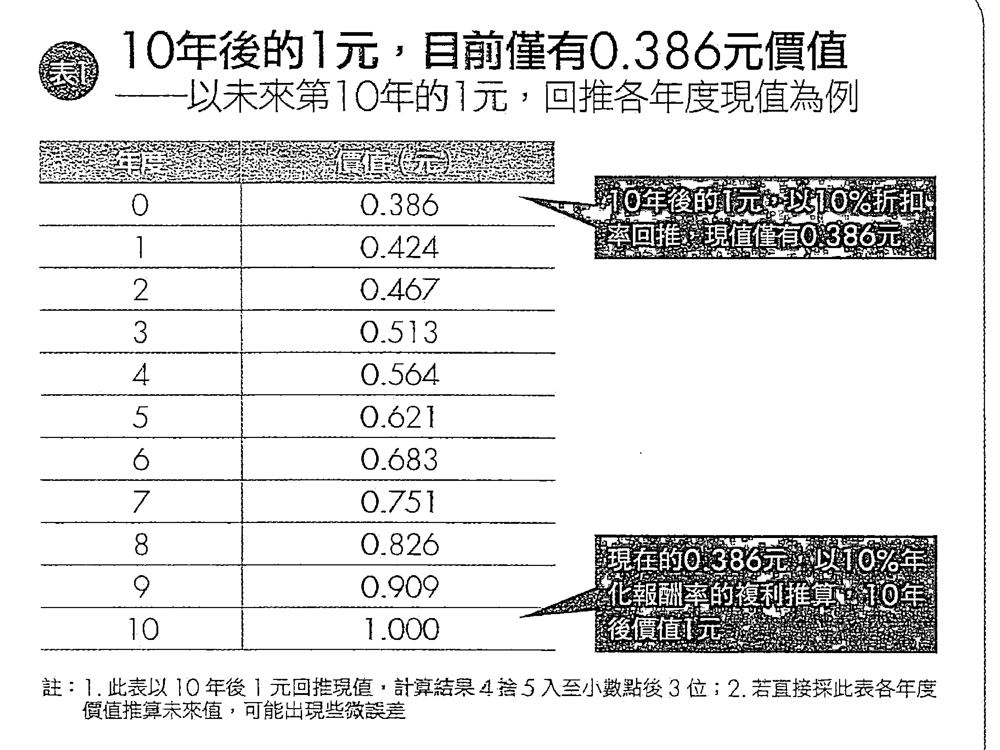

比照上述的公式計算，將未來30年的1萬元現值加總起來，一共是9萬4,269元。如果機器高於這個價格，那我絕不會考慮購買。

## 股息連續成長企業，須將股息成長率納入估價考量

上述例子只假設每年收到相同的股息，但我們投資的是股息連續成長企業，因此應該把「股息成長率」也考慮進來。假設股息每年成長，DDM股息折現公式為（V₀為目前合理股價（現值）、D₀為初始配息、Dₙ為第n年後的股息、g為股息成長率、k為折扣率）：
Dₙ=Dₙ₋₁（1+g）ⁿ
V₀ = D₀(1+g)/(1+k) + D₀(1+g)²/(1+k)² + D₀(1+g)³/(1+k)³ + … = D₀(1+g)/(k-g) = D₁/(k-g)

一樣使用前文的例子，差別只在於多了「股息成長率」。假設目前的初始配息是1元，往後股息每年成長7%，預期報酬率10%，那麼推算目前合理股價時，同樣把未來每年股息的現值相加起來。

-   1年後的1元股息現值 = 1×（1+0.07）/（1+10%）= 1.07/1.1 = 0.973
-   2年後的1元股息現值 = 1×（1+0.07）²/（1+10%）² = 1.1449/1.21 = 0.946
-   3年後的1元股息現值 = 1×（1+0.07）³/（1+10%）³ = 1.225/1.33 = 0.92
-   …
-   25年後的1元股息現值 = 1 × (1 + 0.07)^25 / (1 + 10%)^25 = 5.427 / 10.8347 = 0.501
-   30年後的1元股息現值 = 1 × (1 + 0.07)^30 / (1 + 10%)^30 = 7.612 / 17.4494 = 0.436
-   40年後的1元股息現值 = 1 × (1 + 0.07)^40 / (1 + 10%)^40 = 14.974 / 45.259 = 0.331

以此類推，當時間愈來愈長，回推到現值也會變得愈來愈小，跟每年股息相同的狀況相比，如果股息有成長，未來值較大，回推的現值也較大，趨近於0的速度也較慢。因此，我們可以採取較簡化的算法，假設股息成長率7%，當前股息1元，折扣率10%，套入簡化的公式計算，目前合理股價則為：

V₀ = D₁/(k-g) = 1×(1+0.07)/(10%-7%) = 1.07/0.03 = 35.67

因此假如這檔股票目前股價低於35.67元，就是低於合理股價。

## 股息成長率採2段式預估，並加入安全邊際

總結DDM包含3個參數：目前年度股息、折扣率、預估股息成長率。

折扣率該設定多少？一般多採取美股長期年化報酬率8%～10%；假如覺得企業的風險比較高，或者想要保守一些，也可以提高到12%，甚至更高，那麼算出來的合理價就會更低。

成長率的設定，1段式、2段式，甚至3段式都有人用。由於企業股息有可能不會長時間維持相同的成長率，因此我經常採用的是2段式：第1段為「預估第1～10年股息成長率」，第2段為「第11年之後股息成長率」。

當然，任何評估方式都有其缺點，因為必須預測成長率，不管是用長年股息成長率、EPS成長率為參考基準，都有失準的可能，所以合理的預估是必須的。

例如，綜觀某企業過去（股息、EPS、營收等）10年的年化成長率為12%，7%就是比較合理且保守的預測。這樣預測的原因是，我預估該企業營收成長率2%＋稅後淨利成長率2%＋企業持續回購自家股票3%促使EPS成長，合計為7%（2%+2%+3%）。

然後再看看該企業目前股息配發率（股息／EPS）為30%，還有相當多成長的空間，那麼7%似乎為一個合理的估值。

更重要的是，必須一併考量企業未來的成長，並同時評估未來5～10年，企業是否可保持優勢（Yahoo! Finance、Finviz網站都有提供5年EPS成長預測可作為參考），預估成長率愈低，等於愈保守，算出的合理價愈低；使用折價率愈高，等於愈保守，算出的合理價愈低。

最後，還可以加入「安全邊際」，將上述算出的合理價再打折。我習慣用20%作為安全邊際，也就是當目前價格低於合理價的8折時，我才會考慮投資。

任何的評估都有失準的可能，使用20%或是更高的安全邊際，都能讓我在評估失誤時有更多的保障。

總結來說，成長率、折扣率、安全邊際3項參數，都可以彈性使用，例如，使用保守的成長率5%，搭配12%的折扣率，再計入20%的安全邊際，等待此價格出現再投入資金，自然更有保護作用；但相對的，也必須等得更長時間，才有機會達到此價格目標。

## 股息成長性質不同，不宜採相同參數進行估價

雖然都是股息成長型企業，但因為成長方式不同，估價時的參數也需要調整，例如：

1.  股息成長率採用1段式：特別適用於股息成長趨於平緩的企業，例如美國電話電報公司（AT&T，美股代號T）。假設目前股息1.96美元，預估每年股息成長率2.3%，折扣率8%，即可算出合理價約35.18美元，再計入10%安全邊際，則為31.66美元（詳見表2）。

### 美國電話電報公司宜採1段式計算合理價 ——以美國電話電報公司（T）為例

| 安全邊際 | 折扣率7% | 折扣率8% | 折扣率9% |
|----------|----------|----------|----------|
| 20%溢價  | 51.19    | 42.21    | 35.91    |
| 10%溢價  | 46.93    | 38.69    | 32.92    |
| 合理價   | 42.66    | 35.18    | 29.93    |
| 10%折價  | 38.40    | 31.66    | 26.93    |
| 20%折價  | 34.13    | 28.14    | 23.94    |

註：此表以目前年度股息每股1.96美元、預估股息成長率2.3%、折扣率8%為試算假設

2.  股息成長率採用2段式：適用於目前處於成長，但預估第11年後成長趨緩的企業，例如星巴克（Starbucks，美股代號SBUX）。假設目前股息0.8美元，第1～10年預估股息成長率15%，第11年之後為7%，折扣率10%，即可算出合理價約54.8美元，再計入10%安全邊際，則為49.32美元（詳見表3）。

### 採2段式股息成長率，星巴克合理價約55美元 ——以星巴克 (SBUX) 為例

| 安全邊際 | 折現率8% | 折現率10% | 折現率12% |
|----------|-----------|-----------|-----------|
| 20%溢價 | 100.81 | 65.76 | 48.31 |
| 10%溢價 | 92.41 | 60.28 | 44.29 |
| 合理價 | 84.01 | 54.80 | 40.26 |
| 10%折價 | 75.61 | 49.32 | 36.23 |
| 20%折價 | 67.21 | 43.84 | 32.21 |

註：此表以目前年度股息每股0.8美元、第1段(第1～10年)預估股息成長率15%、第2段(第11年後)預估股息成長率7%、折扣率10%為試算假設

如果不想自己設定折現公式，也可以利用免費的網站資源。以Moneychimp網站為例，要計算上述的星巴克數據時，只要依序在欄位當中填入目前年股息0.8美元、第1段預估股息成長率15%、第1段與第2段分野的年數10年，第11年起的預估股息成長率7%，以及折扣率10%，網站可快速幫你算出54.8美元的合理價。

DDM是一個有學理根據的估價方式，但並不是算出低估價值就可以蒙著眼投資；核心還是在於企業的質化分析，並須搭配財務量化數據一起考量。DDM也是一個兼具科學與藝術的評估方式，科學的部分，在於輸入預估數字即能計算出合理價；藝術的部分，在於投資者須憑藉個人能力，採取適當的預期報酬率和安全邊際，才能做出較合理的預估，若將合理價估得過高或過低，都可能導致不理想的投資成果。

## Moneychimp DCF計算機得出DDM合理價

Moneychimp網站提供的DCF計算機（www.moneychimp.com/articles/valuation/dcf.htm），可依照填入的EPS與EPS成長率推算現金流折現評價；若填入股息，其計算結果則可視為DDM股息折現評價。

1.  填入目前年股息，如0.80（美元）。
2.  填入第1段預估股息成長率，如15（%）。
3.  填入第1段預估股息成長年數，如10（代表未來10年）。
4.  填入第2段預估股息成長率，如7（%）。
5.  填入折扣率，如10（%）。
6.  按下「Calculate（計算）」，即可得出合理價54.8美元。

| 描述 | 值 |
|------|----|
| Earnings per share (last 12 months) | $0.80 |
| Earnings growth rate (first stage) | 15% annually for 10 years |
| Earnings growth rate (thereafter) | 7% annually |
| Market benchmark return | 10% |
| Stock Value per share | $54.80 |

資料來源：Moneychimp

## 融合多項評價準則 提高企業價值預估準度

品質再高的企業，若以過高的溢價買進，當股價回歸正常時，投資人則容易得到不理想的報酬；再者，任何估價都有失準的時候，無論是企業品質發生改變，或當初估值過於積極但成長率不如預期，這些意外在投資生涯中總會不斷遇上。

### 以低估價格買入的3好處

我相信，「價格是你付出的金額，價值才是你實際握在手中的」，價格每分每秒都在跳動，然而企業的價值卻不會每分、每天，甚至每月劇烈變動，更多時候，當下的價格變動只是隱含了過多市場情緒。

因此，跌多不等於價格低於價值，漲多也不代表價格高於價值。假如無法得知價值，那麼價格便毫無意義，因為你不知兩者之間的落差。而我們該做的，就是得知企業的價值，以低估的價格買入的話，能享有3項好處：

### 好處1》較高的殖利率

殖利率與價格為反向關係，較低的價格、較高的殖利率，提供當前與未來更多收入；同時殖利率作為總報酬中的一項因子，將直接影響總報酬。

### 好處2》較高的隱含預期報酬

價格在低於價值時，能提供較高的隱含預期報酬。假設付出30元，買進價值45元的企業，當市場最終了解企業價值時，價格將回歸應有的價值，兩者之間的差異便是隱含預期報酬。

### 好處3》較低的風險

當以30元，買進價值45元的企業時，下跌風險減少，但隱含報酬上升；同時，因為有15元的緩衝空間，當評估出現失誤或者企業本質變差時也可提供保護。當然，不同的企業或產業有不同程度的不確定性，也應該有不同的安全邊際。

儘管估價如此重要且能帶來許多效益，但仍被多數人忽略。與我們平常的購買行為相比，這一點都不合理。試想，買房子時，你會向多家房仲打聽大致的價格區間，細心一點的人，還會自行查詢實價登錄網站，或是向其他住戶打聽。你也會注意附近的生活機能、有沒有負面設施，以及評估未來的保值或增值空間，然後在白天、晚上、晴天、雨天時，多次查看房屋狀況；確定購屋前，還會仔細檢查水電功能是否正常。這一切，都是為了確定品質能與價格匹配。

然而，面對股票投資時，多數人反而顯得過於放鬆，不去確認所付出的價格是否能買到品質匹配的股票。

能夠與價格錨定的只有價值，一旦不知道價值，你又能拿價格跟什麼做比較呢？只有價值才能成為你所有買進、賣出、持有決策的顧問，價值將引領你超越以價格為基準的思維，爾後你不會再用價格漲跌多少百分比，或價格是1年新低或新高來作為決策的依據。

## 採取混合平均的評價方式，提升估價準確性

我認為估價更多時候是「相對」而非絕對，很難要求非常準確。實際上，當我仔細研究了某家企業，熟悉其本質後，我心裡會有個底；使用現金流折現模型（DCF）或股息折現模型（DDM）進行估價時，自然會更清楚知道應當用多少的預估成長率，以做出合理且保守的預估。

不過，每種單獨使用的評價方式都有其限制，例如單獨使用本益比評估股價，很難知道當下本益比到底是算高還是低，畢竟過去的本益比不等於未來的本益比；若單獨使用DDM評估股價，則極其仰賴未來的預估股息成長率，仍非常考驗評估的能力。或者像是使用股價淨值比（P/B）時，你會發現只有少數的產業適合。

這些年來，我靠著閱讀與實作，傾向於不只使用單一評價方式，而是採取混合平均。我一共使用3種方式：1.相對比較、2.絕對價格（如DDM）、3.參考其他專業機構的預估。

各個評價項目，我會個別評分，範圍大致如下：若企業在該項目的表現在合理基準的10%範圍以內，我會給3分（中立）；低於合理基準10%～未達20%為3.5分（略微低估），低於20%～未達30%為4分（低估），低於30%～未達40%，給予4.5分（極度低估）；低於40%以上則是5分（過度低估）；反之，高出合理基準10%～未達20%，給予2.5分（略微高估）；高於20%～未達30%則為2分（高估）；高於30%～未達40%，給予1.5分（極度高估）；高於40%則為1分（過度高估）。

### 方式1》相對比較

1.  與市場長期本益比15倍比較：雖然我知道每個產業差異很大，然而15倍就像是個大框架，這也是最粗略的比較法則。

我會使用F.A.S.T. Graphs網站工具，拉出企業與市場長期平均本益比來比較。用意在於，我可知道長期以來市場給予該家企業本益比是高於或低於市場平均。假設市場長期平均本益比是15倍，而該企業一直以來都高於15倍一定比例，如此便可大致知道，目前該企業的本益比過高。

威廉斯所羅莫（Williams-Sonoma，美股代號WSM）自2010年以來，平均本益比長期高於市場（S&P 500指數）的本益比；2017年8月11日，威廉斯所羅莫本益比為13.1倍，比市場長期本益比15倍低了約13%，而我會給予3.5分（略微低估）（詳見圖1）。

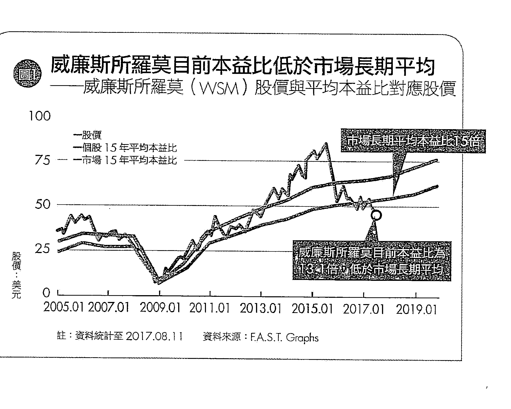

2.  與企業本身的長期平均本益比比較：企業與自己長期平均本益比比較，則是小框架。假設企業近10年本益比平均為20倍，當下為17倍，則可能略微低估；由於17倍低於合理基準20倍達15%，因此我會給予3.5分（略微低估）。

雖然17倍這個數字仍高於市場長期本益比15倍，但我可以獲得與使用「1.與市場長期本益比15倍比較」方法不同的結果。

3.  與產業平均本益比比較：每個產業的本益比差異很大，這點同樣是小框架。晨星（Morningstar）網站可免費查詢企業與產業的本益比數據，以美國電話電報公司（AT&T，美股代號T）為例，2017年12月1日的本益比為17.5倍，整個產業平均本益比為21.9倍，可知該企業本益比低於產業平均（詳見圖2）。以產業平均本益比21.9倍為合理基準，17.5倍低於合理基準達20%，因此我會給予4分（低估）的評價。

4.  當前殖利率與5年平均殖利率比較：股息殖利率在大多時間會落在一定區間內，當殖利率變高，價格變低，代表可能的潛在獲利愈高（假如價格回歸至應有價值時）。

假如目前殖利率高於近5年的平均殖利率，那麼可以推測現在的價格應該相對較低。當然，這只是相對價格與殖利率之間的關係，切勿追求高殖利率，而忽略最重要的企業品質與未來成長性，殖利率再高都敵不過長期資本利損。對照我的評分方式，假設以5年平均殖利率2%為基準，而目前是2.5%，我就會給4分（低估）。

### 方式2》絕對價格（採取DDM計算）

DDM必須將未來股息的總和，以設定的折扣率（預期報酬率）與股息成長率反推至現值，以反映未來可領到股息的時間價值。由於預估成長率並不容易，因此絕不能空穴來風。我主要會拆解成以下3小塊，然後在合理且保守的前提下做出預估，相較於單獨預估一個數字，會簡單一點。

1.  營收成長率：除了查看10年以上的長期年化成長率，以獲得大架構的概念之外，更重要的是放眼未來，當你做了完善的質化與量化分析之後，對於該企業相較於過往10年，未來會更好、更差還是持平，心中自然會有一把尺。此外，企業財報當中的未來成長展望也是參考來源之一，但謹記不要全盤接受，盡可能以你研究後的理解，保持懷疑精神去打折扣。

### 方式2》絕對價格（採取DDM計算）

2.  效能與營業利益率改善：主要分為2類：
    -   ①生產效率改善，例如整合生產線資源，提升產能利用率，降低每單位生產成本，如在3-1提到可口可樂（Coca-Cola，美股代號KO）在近6年進行的利潤率改善計畫。
    -   ②產品利潤力提升，可能是透過定價能力提高售價，也可能是企業調整戰略方向，專攻利潤高的商品，例如近年轉型中的IBM（International Business Machines，美股代號IBM）。

3.  股票回購百分比：可觀察過去幾年企業回購自家股票的幅度。例如過去3年平均回購比率為3%，那麼即可用此項數值，作為預估未來成長率的因子之一（營收成長率提升百分比+營業利益率提升百分比+股票回購百分比，3個數字加總即為預估成長率）。

或許你會認為，反正可能會預估不準，不如別估了，但我並不這麼認為。舉例來說，假設主管要求你做明年的產能規畫，你會不會說，反正常常預估不準，不如別估了？

### 比較企業與產業平均本益比，分析其目前評價——以美國電話電報公司（T）為例

| 指標 (英文) | 指標 (中文) | 企業本益比 (Stock) | 產業平均本益比 (Ind Avg) |
|-------------|-------------|---------------------|---------------------------|
| Price/Earnings TTM | 本益比 | 17.5 | 21.9 |
| Price/Book | 股價淨值比 | 1.8 | 2.0 |
| Price/Sales TTM | 股價營收比 | 1.4 | 1.5 |
| Rev Growth (3 Yr Avg) | 營收成長率（3年平均值） | 8.4 | -1.1 |
| Net Income Growth (3 Yr Avg) | 稅後淨利成長率（3年平均值） | -11.0 | -4.4 |
| Operating Margin % TTM | 營業利益率（%） | 15.5 | 14.9 |
| Net Margin % TTM | 稅後淨利率（%） | 8.0 | 6.8 |
| ROA TTM | 資產報酬率 | 3.0 | 3.1 |
| ROE TTM | 股東權益報酬率 | 10.3 | 11.1 |
| Debt/Equity | 負債對淨值比 | 1.2 | 0.8 |

註：資料統計至 2017.12.01 資料來源：晨星（Morningstar）事實上，你是有辦法預估的。例如，先調出過去2年生產量的數據、大致了解每年的報廢數量有多少、固定機台保養或維修時數會影響多少產能，然後考量每年約有多少非預期的系統或機台問題所導致的產能損失；接下來，你會考慮現階段是否有其他改善案件在進行，例如自動化搬運系統更新、搬運軌道調整等；再者，考量明年是否有重要系統更新，或者新世代製程轉換，對機台產能有多少影響等。諸如此類，相信你心中還會萌生更多影響產能的可能因素。

在工作與生活上出現的預估情況，相信你我都不陌生，然而預估並非要求精準，而是重在事前計畫，一旦有了計畫，才不會在毫無準備的情況下，去面對不確定的未來。

### 方式3》參考其他專業機構的預估

雖然我自有估價方式，但也會參考其他平台提供的資訊，來與自己的估價做比較，包含晨星、S&P Capital IQ與Value Line等。我與這些平台沒有任何對價關係，也沒有推薦之意，請讀者根據自身需要，再決定使用這些平台與否。

以我使用多年的晨星為例，晨星使用的是DCF估價方式，我至今仍會參考其分析文章以及合理價格，原因有2：

+   1. 閱讀晨星多年，我認為晨星的文章質量不錯，一直對我有所幫助。有些我在財報或企業簡報沒有看到的重點，反而在晨星看到，補足資訊閱讀不足。
+   2. 我使用DDM得出的估價，經常與晨星的DCF評價結果相當接近，久而久之就產生了信任感。我也希望自己不要閉門造車，能多參考其他人或者機構的估價。

最終，我會整合以上多種評價方式，製作如圖3的價值評估檢驗表，將每一個項目給予1～5分的評分；最後採取各項平均值，再得出整體評價。

## 整合多種評價方式，避免主觀意識過強——追日Gucci自製價值評估檢驗表

| VF Corp.(VFC) | 評估標準 | 目前 | 價值評估 | 評分(1-5) |
| :--- | :--- | :--- | :--- | :--- |
| S&P500市場歷史平均本益比 | 15 | 本益比 | 17.2 | 略微高估 | 2.5 |
| 10年平均本益比 | 17.6 | 本益比 | 17.2 | 中立 | 3 |
| PEG | 2 | PEG | 1.6 | 略微低估 | 3.5 |
| DDM合理價 | 73.36 | 股價 | 52.59 | 低估 | 4 |
| 晨星合理價 | 70.00 | 股價 | 52.59 | 低估 | 4 |
| 5年平均殖利率 | 2.00% | 殖利率 | 2.50% | 低估 | 4 |
| | | 總評價值 | 低於合理價 | 3.5 |

## 善用4工具 被動追蹤股價變化

一旦評估出企業的價值，那麼影響買進、賣出與持有的決策，就是以價值作為出發點，自然能夠等到價格低於價值某個程度時再進行購買。因此，投資人不需要主動盯盤，只要善用一些工具，就能知道股價是否已經來到你所預設的價位。

## 不需盯盤，也能掌握第一手投資消息

## 工具1》到價警報系統

使用券商網站提供的警報系統，當股價高於或低於你所設定的合理價時，就會發送E-mail給你。使用券商的服務是首選，因為功能最完整。

另外，你也可以使用免費的網站服務，例如TradingView也有此功能，只是有所限制，例如設定警報後只能維持1個月，到期後必須再上網設定，比起券商提供的服務不是那麼方便。

## 工具2》漲跌幅警報

漲跌幅警報可以針對指數或者已持有的個股，當標的價格上漲或下跌了設定的百分比（個股即時報價與前一日收盤價相比），就會發送E-mail給你。通常下跌比較能引起我的注意，因此我設定下跌的百分比為6%，上漲的百分比設定為4%。如此一來，即便我不主動開啟任何報價軟體，也能被動收到一些波動通知。

## 工具3》Seeking Alpha App

我會設定2組名單，一組為持股名單，另一組為口袋名單。使用Seeking Alpha App有個好處，那就是即使不在券商系統設定警報，只要每天使用一次App，選擇依照跌幅排序查看名單，就能很快地瀏覽跌幅前幾名的股票是哪幾檔。

會以跌幅為排名順序，是因為我比較關注跌幅，能方便知道購買的時機是否近了。每天不用花費1分鐘，看久了，就會記得其價格最近的變化。

此外，雖然我不會主動去看季報，也不會關注財報月時企業公布財報的狀況，但只要價格下跌超過8%，我就會去看季報，因為波動與不確定性出現，反而可能是投資機會。

順道也提供一個有趣的資訊來源，只要你在臉書（Facebook）上，加入一些股市訊息的網站（如Bloomberg、Business insider或美股討論區等），當有企業的價格出現大幅變動時，你會發現全世界都在迫不及待地散播消息，尤其是壞消息，你想要不知道都難。有好幾次，我都是看到這些貼文，才被動地知道某些訊息，進而去研究財報。

## 工具4》掛長天期有效單

假如選擇美國券商的長天期有效單（Good Until Cancelled，GTC），會持續掛單至少90天，券商Interactive Brokers（IB）的掛單有效期限甚至高達180天，直到執行下單或投資人主動取消為止。

因此當你計算出某檔股票的價值後，便能決定想要買進（或賣出）的價格，那麼如果在IB下了GTC單，只要該檔股票在180天內達到條件，系統便會執行委託下單。

下單方式包含限價（以限定價格委託下單）、市價（直接以市價委託下單）、觸價（等市價觸及某個價格，即以當時市價執行委託下單）、觸價止損（觸到所設定價格，可用另一個價格下單）、追蹤止損（價格往A方向移動後，往B回拉，如設定上漲10%後，若回拉5%則賣出）等常見單種。

你可能覺得，等到利空、利多訊息公布，造成價格大幅波動時，一切就晚了，應該要自顧自地先賣出或買進才對啊！會如此想的投資人，通常是分析沒有踏實，導致信念不足，情緒終日圍繞於價格變動；或是長期持股的心態尚未成熟，仍停留於只感受價格、未感受價值的時期，因此可能老是覺得有壞消息要公布，是不是要先賣出？但好消息不斷時，又過於被樂觀情緒所包圍。

只有當你對企業價值存有信念時，看到下跌的價格，不會認為那是損失，而是看到可能浮現的投資價值；看到上漲的價格，不會只想到報酬多多益善，而是會思考股價可能有過高的溢價。唯有持續做好扎實的分析，才能具備足夠堅定的信念。

# 第4篇 精進分析能力 篩出穩健標的

## 自製總覽報表 有效掌握投資組合狀況

投資組合管理是多數人都忽略的重要項目。其實，當投資組合慢慢成熟，應當轉向管理層面；雖不需天天注意價格與帳面損益波動，然而仍須每半年或一年，透過視覺化的總覽圖表（多半是自製），有效率地掌握投資組合狀況，了解整體走向是否偏離原先計畫的航道、資金調配與策略。

唯有轉換成這樣的角度，才會自然地將投資重心聚焦在企業的核心競爭力與經營層面上。例如我最關注的重點主要有幾項：

+   1. 全球行業分類標準（GICS）占比：可看出目前投資組合產業占比與計畫差距百分比。
+   2. 個股占比：可看出個別企業占投資組合比重是否符合限制最高占比。
+   3. 現金流成長狀況。
+   4. 波動性。

而要製作總覽圖表，不可或缺的是數據，且只能靠自己勤勉的輸入。除了投資組合的明細、交易紀錄，也不能忽略在每次買進時，須記錄當時的投資想法，包括企業質化與量化分析的結論、預估合理價等。投資交易紀錄並非流水帳，而是能夠幫助你事後回顧的重要依據。這個是從我以前做期貨當沖就持續保持的習慣，當沖是記錄到以1分鐘K棒的進出原因，然後每天檢討，有利之後的交易更加精進，因此回顧率很高。

雖然股息成長投資的交易紀錄回顧率不高，但紀錄的內容更為廣泛而深刻。無論之後是遇到加碼與賣出，都能從這些紀錄中回顧當初的評估結果與購買理由。這份資料是一切往下延伸的基礎，能夠幫助你將想掌握的訊息提升到另一層次，如每季收入成長狀況、GICS產業占比、帳面損益等。

我也因此特別自製了一套管理工具，當中包含多種視覺化圖表，以下介紹我認為較為重要的項目（原始資料可參考我的部落格，於首頁點選「Gucci的DGI視覺化投資組合」即可，以下資料擷取自2017年6月）：

## 項目1》 GICS產業占比、個股占比

### 產業占比（GICS Holding）

以11個GICS為最上層分類，使用的是橫條圖，每個產業尾端有一根灰色直線，是我計畫持有該產業的比率；藍色橫條代表已超過計畫比率，紅色橫條則是低於計畫比率（詳見圖1上圖）。

可看到有些產業已超過我計畫比率（如工業、非必需消費），但因為我手上還有30%的現金，且我還處在在職累積資金階段，因此下次再購買股票時，只要將資金挹注在其他產業，就能夠平衡超出的部分。

### 個股占比（Holding For GICS）

當選擇產業項目時（圖1上圖），下方會顯示該類別的持股與占比（圖1下圖）。由於我持有30多家企業，單一企業占比應該在3%，我設定的最高容忍值為5.5%，而占比最高的菲利普莫里斯菸草（美股代號PM）為4.9%，是我能接受的範圍。

### 股價（Price）、股息成長率（Dividend Growth）

在「Holding For GICS」中點選任一家企業後，會顯示該企業近1年的股價走勢圖（圖2淺粉色線）、50MA（50日移動平均線，圖2深粉色線）與晨星合理價（圖2紅色虛線）。

圖2下圖則是顯示企業近5年的股息與股息成長圖，橘色直條為當季的股息，藍色圓點則是相較於前一季的股息成長率。從圖中可以看出，CVS當前股價距離晨星合理價還有一段距離，而2017年第1季，股息成長17.6%，股息連續成長年數從13年上升至14年。

## 項目2》現金流成長狀況

現金流的報表有2種格式：

圖3為第1種格式，上圖為每季被動收入，顯示各年份4個季度的股息收入；下圖為每月被動收入，顯示各年份12個月的股息收入。

圖4為第2種格式，會製作這種格式，是因為我的被動收入區分為股息與選擇權現金流，因此將股息與選擇權現金流以堆疊圖顯示。此外，我在圖中還增加互動明細（Dividend與Option），能夠追蹤到每一家企業的股息與選擇權現金流，這是第1種格式版本所沒有的功能。

圖4上圖為股息與選擇權現金流堆疊圖，顯示各年份4個季度的收入；點選圖中年度時，系統會於下方顯示當年該季配發股息的企業。而下方2張圖表可區分為股息（Dividend）與選擇權現金流（Option），分別會根據所點選的條件，顯示當年該季配發股息的企業、選擇權現金流（Call為買權、Put為賣權）。

### 2017年Q1，CVS股息成長17.6%——股價走勢圖與股息成長圖

#### ◎近1年股價走勢圖

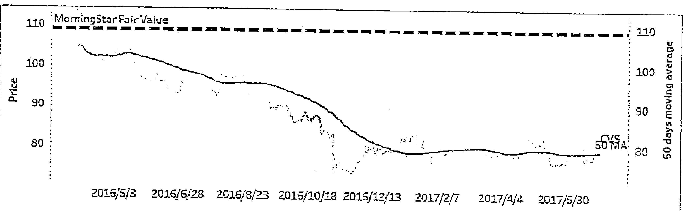

#### ◎近5年的股息與股息成長圖

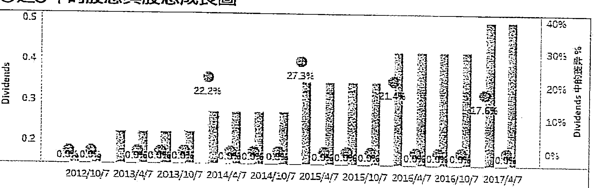

> 註：1. 近1年股價走勢圖中，淺粉色線為股價走勢、深粉色線為50MA、紅色虛線為晨星合理價，單位為美元；2. 近5年的股息與股息成長圖中，橘色直條為當季每股股息、單位為美元，藍色圓點為相較於前一季的股息成長率、單位為%

### 可依季度與月份需求製作股息現金流表——股息現金流成長報表

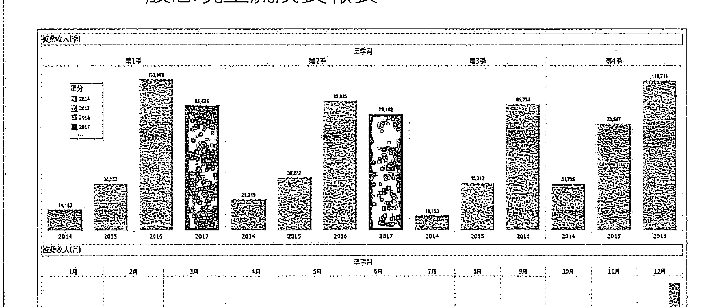

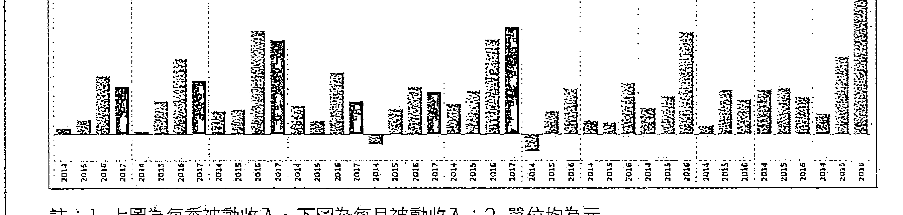

註：1. 上圖為每季被動收入、下圖為每月被動收入；2. 單位均為元

### 追日Gucci的現金流來源以股息為主——股息與選擇權現金流報表

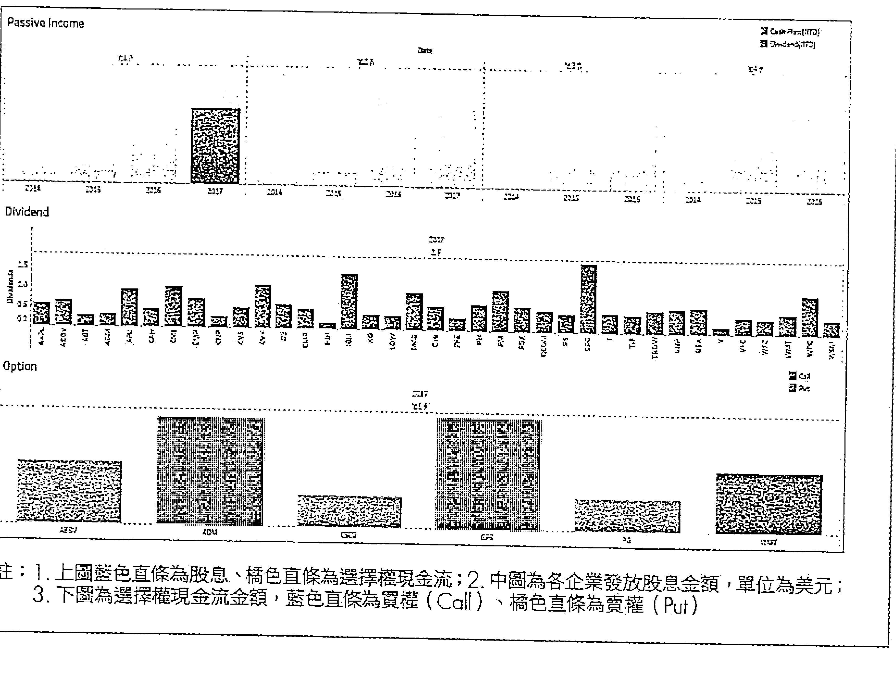

## 項目3》貢獻最多報酬率的企業

績效（Performance）用柏拉圖（Pareto Chart）呈現，主要用來看大部分的X（橫軸）是從哪些Y（縱軸）而來。如圖5所示，每一個直條都代表我的DGI組合當中的個別企業，橘色直條為按照各企業的累積報酬率由高至低排序；藍色直條則顯示，排序到該企業為止的累積報酬率累加數字。如此一來，我就可快速了解，為整體組合累積報酬率帶來最大貢獻的是哪些股票。

例如，藍色直條高度由左而右漸增，一直累加到IBM的累積報酬率為80%。這表示在我的投資組合中，有80%的報酬率是從包含IBM左側的這些企業而來，這些企業約占1/3。而為了能夠快速檢視，我也特別在80%的位置畫了一條紅色虛線。其中，累積報酬率貢獻最高的是排行第1的PH，帳面資本利得率為70.8%，貢獻DGI組合帳面資本利得金額的8.22%。

### 用柏拉圖，檢視貢獻主要績效的企業——各企業績效柏拉圖

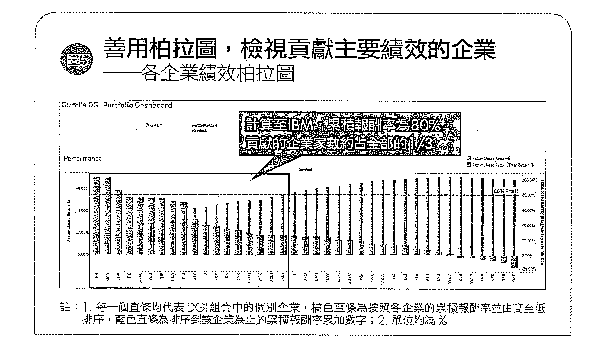

## 項目4》回本率與成本殖利率

在國外，因為長期價值投資與DGI較為盛行，投資人除了會看成本殖利率（YOC，詳見2-7）之外，也會看回本率（Payback，或稱還本率），以預估投資企業多久能夠回本。

回本率一般是假設當前股息靜止不動來推算；實際上，如果是股息成長的企業，所需回本年數會更短。

由於我希望能一眼看出我對各企業的購買成本與回本金額水位，因此圖表的呈現方式，便以橘色直條為每股購買成本，藍色直條為每股回本金額，排序依據則為每股回本金額（詳見圖6）；另外，因回本率直接以數字的方式顯示，因此有時排序較後面的企業，也可能出現較高的回本率。從圖6可看到，回本率最高的為ADM的32%，其次是T的30%。

另外，YOC則可以追蹤我是否做了一筆好的投資。當然這是一種檢視過去的指標，即使YOC很高，也不該作為是否保持持有的依據。圖7中，我將YOC區分為3種顏色，分別代表未達4%（藍色直條）、4%以上～未達6%（綠色直條）、6%以上（橘色直條），以利快速檢視。

### 用圖表可方便觀察購買成本與回本金額水位——購買成本、回本金額與回本率報表

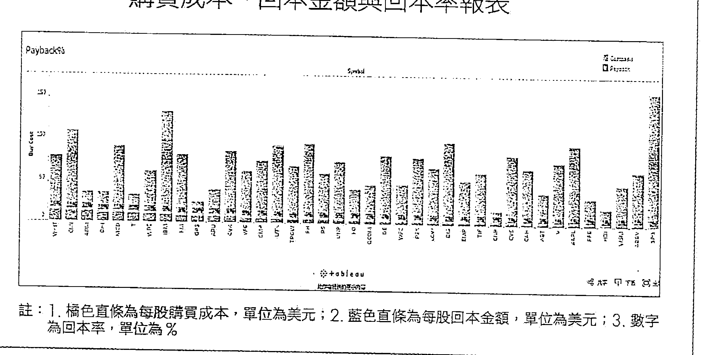

註：1.橘色直條為每股購買成本，單位為美元；2.藍色直條為每股回本金額，單位為美元；3.數字為回本率，單位為%

### 以顏色區分不同成本殖利率，觀察更簡便——成本殖利率報表

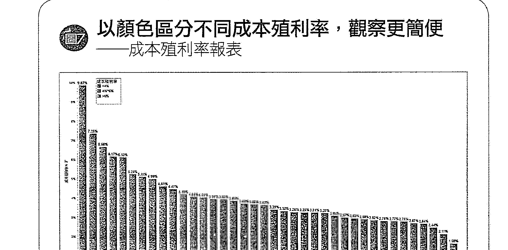

註：藍色直條為未達4%、綠色直條為4%以上～未達6%、橘色直條為6%以上

## 項目5》資產組合變化

組合元素包含了圖8中的目前累計投入資本（藍色直條）、選擇權現金流（紫色直條）、股息（橘色直條）、資本利損（紅色直條）以及資本利得（綠色直條）。

若藍色直條明顯跳高，則表示為再匯款（即投入新成本），例如圖8中的2014年8月、2015年1月、2017年2月與6月；假如前一個月有資本利損或資本利得，也都會影響到隔月的目前資本。

### 圖8 投入新成本時，藍色直條明顯跳高——資產組合變化報表

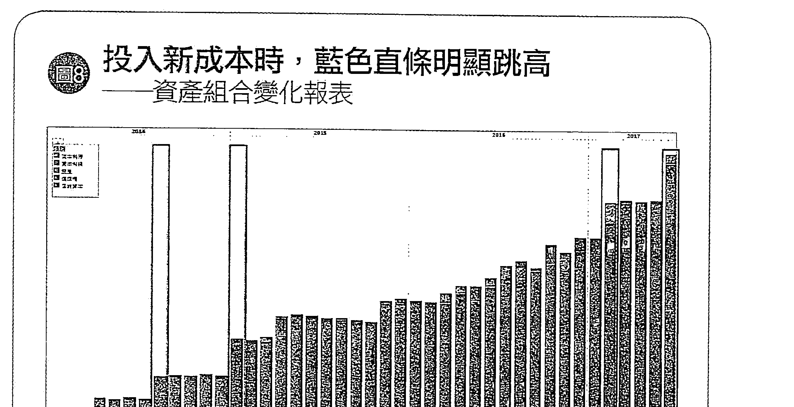

+   1. 綠色直條為資本利得、紅色直條為資本利損、橘色直條為股息、紫色直條為選擇權現金流、藍色直條為目前資本
+   2. 單位為美元

## 項目6》波動性

我特別重視波動（標準差），從理論層面來看，標準差愈大，複合報酬率愈低；而從現實層面而言，波動小一點，心裡會舒服些，也較容易捱過市場波動時期。因此我會希望自己的投資組合儘可能的減低波動。

圖9為S&P 500指數以及我的投資組合的單日波動率（當日與前日帳戶總額相較的變動比率），如此能夠很清楚地檢視兩者的波動差異。從圖中可以看到，我的投資組合（綠色直條）波動相較於S&P 500指數（紅色直條）更小。

灰色區域代表2倍標準差，顯示在95%的情況下，我的投資組合單日波動率介於-1.2%～1.3%之間，這也是我希望看到的結果。

## 項目7》購買行為對應市場波動

製作購買行為對應市場波動的圖表，單純是希望驗證自己的投資風格是不是與我認為的一致，真正做到知行合一。因為人腦並不可靠，其運作方式是求簡化與找到捷徑，因此行為很容易被「感覺」所主導。然而感覺並不可靠，所以我才需要透過數據來進行自我檢視。

### 追日Gucci自製報表中的GICS產業、企業名稱與美股代號對照表

#### ◎產業

| Energy | 能源 | REITs | 不動產投資信託 |
| :--- | :--- | :--- | :--- |
| Finance | 金融 | Technology | 科技 |
| Health Care | 健康照護 | Telecom | 電信 |
| Industry | 工業 | Unnecessary Consume | 非必需消費 |
| Materials | 原物料 | Utilities | 公用事業 |
| Necessary Consume | 必需消費 | | |

#### ◎企業

| 公司名稱 | 美股代號 | 公司名稱 | 美股代號 |
| :--- | :--- | :--- | :--- |
| 蘋果公司 | AAPL | 歐米茄醫療照護 | OHI |
| 艾伯維藥品 | ABBV | 輝瑞大藥廠 | PFE |
| 亞培大藥廠 | ABT | 寶僑 | PG |
| 美國阿徹丹尼爾斯米德蘭公司 | ADM | 帕克哈尼芬精密 | PH |
| 美國瓦斯 | APU | 菲利普莫里斯菸草 | PM |
| 卡地納健康集團 | CAH | 菲利普 66 | PSX |
| 康明斯引擎 | CMI | 高通通訊 | QCOM |
| 羅盤岩鹽 | CMP | Reliance 鋼鋁 | RS |
| 中心點電力 | CNP | 賽門地產集團 | SPG |
| 好市多 | CSCO | 美國電話電報 | T |
| CVS 製藥保健 | CVS | 蒂芬妮珠寶 | TIF |
| 雪佛龍能源 | CVX | 普信集團資產管理 | TROW |
| 迪爾農業 | DE | 聯合太平洋鐵路 | UNP |
| 迪士尼娛樂 | DIS | 聯合科技 | UTX |
| 艾默生電氣 | EMR | VISA | V |
| GAP 服飾 | GPS | 威富服飾 | VFC |
| 漢佰服飾 | HBI | 富國銀行 | WFC |
| 國際商業機器 | IBM | 沃爾瑪百貨 | WMT |
| 可口可樂 | KO | WP Carey 房產 | WPC |
| LOWES 家居 | LOW | 威廉斯諾馬家居 | WSM |
| 麥當勞 | MCD | | |

註：依英文與美股代號字首順序排序

## 追踪Gucci的投资组合波动小于S&P 500指数

——单日波动率比较报表

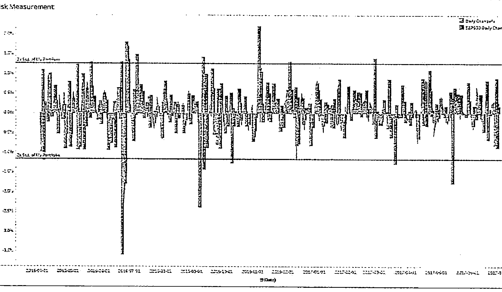

注：1. 红色直条为S&P 500指数、绿色为追踪Gucci投资组合；2. 单位为%

不稳固，虽然我知道自己习惯在市场下跌时买进，不过比起感觉，我更相信数据多一些，因此我希望把自己的行为模式（或者称为投资轨迹），以真实数据来检视。

图10为我的实际入场点与当日S&P 500指数波动（单日涨跌幅）的对照，泡泡图的纵轴0%以上表示S&P 500指数上涨；反之则表示下跌。图中的每一个圆点都代表一笔买进交易，圆点愈大颗、颜色愈深，则表示当天购买的笔数愈多。例如在2015年5月～2017年6月期间，我买进最多笔数的时间是2016年6月下旬英国脱欧时（最大红色圆点）；买进次多笔数的时间则是2016年2月，当时S&P 500指数出现15%的下跌。

## 图10 以图表检视买进时间是否位于市场下跌时期 ——S&P 500指数涨跌幅与投资时间泡泡图

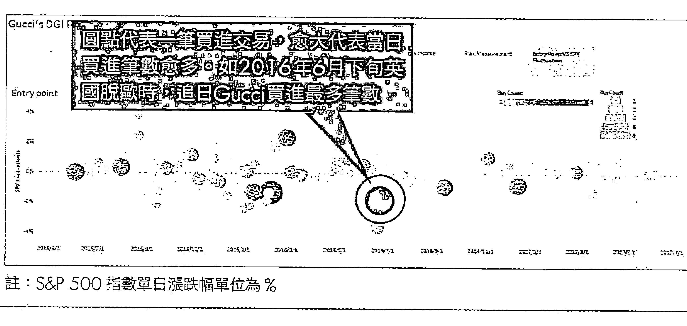

注：S&P 500指数单日涨跌幅单位为 %

虽然从图10中看起来，我有多笔投资都是落在S&P 500指数下跌（即落在0%之下）的时候，不过仍有其他中等大小的圆点落在0%之上，代表我仍有多次买进时间是在S&P 500指数上涨时。

因此，我会再以另一个方式找证据，如图11所示，将横轴（X轴）改为S&P 500指数（单日涨跌幅）、纵轴（Y轴）则换成每一笔购买金额。

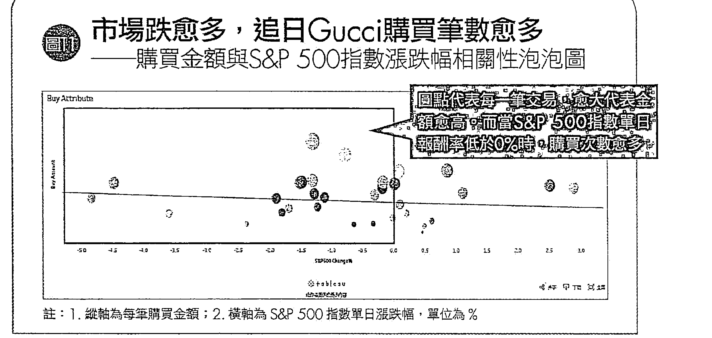

从这个角度观察，就能明显看出我的购买金额大部分落于横轴（X轴）左半部（0%以下），也就是S&P 500指数跌幅愈大时，我愈有购买的倾向。虽然负相关性没有非常强烈，不过这也可以理解，毕竟整体市场（S&P 500指数）下跌时，不代表个股就会下跌；但至少可以发现，我的购买行为与整体市场之间的悲观情绪浓度，没什么太大关系。

## 项目8. 基本财务数据

个别企业的基本财务数据，可以从免费的股市资讯网站取得，但是我会自行将一些关键数据整合在我的报表当中。例如在图12中，我只要点选持股企业名称，系统即可显示该企业的近10年财务数据，包括营收、税后净利、EPS变化、营业利益率与净利率等。

## 观察持股财务数据，检视企业体质
——企业关键财务数据报表

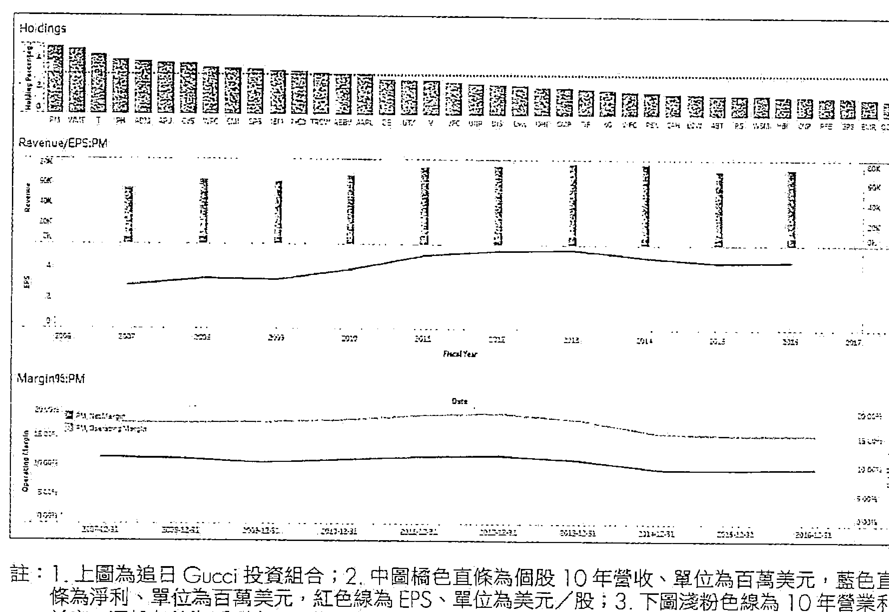

注：1. 上图为追踪Gucci投资组合；2. 中间橘色直条为个股10年营收、单位为百万美元，蓝色直条为净利、单位为百万美元，红线为EPS、单位为美元／股；3. 下图浅粉色线为10年营业利益率、深粉色线为净利率，单位均为 %

花了一些时间弄了这个报表工具，或许久久才会来看一次，不过还是有达到我的目的与需求。更重要的是，我很享受这份投资的乐趣，每研究一家企业，我就对其增添了一分见识，既满足我的好奇心与求知欲，也加深了我达成长期财务目标的信念。

虽然投资者不一定会像我一样制作详细的报表，但我建议，无论是视觉化图表或者文字都好，务必要定期检视资产组合的方向与执行状况，以确保与你的投资计划相符。

## 4.6 质化＋量化分析双管齐下
——以卡地纳为例

介绍完我对企业的分析流程，本章分享我对卡地纳健康集团（Cardinal Health Inc.，美股代号CAH）从质化到量化的分析资料（资料数据均截至2017.01.30）。

CAH成立于1971年，是美国医药通路商的龙头，为美国超过70%医院提供产品，客户也包括逾2万5,000家美国零售药店与2万家私人诊所，同时也与5,000多家制药和医疗手术供应商合作，总计每年销售超过28亿份医疗保健商品（包括个人消费医疗，居家医疗设备等），2016年CAH的年度营收高达1,215亿美元（约合新台币3兆6,450亿元）。

## 质化分析》美国医药通路商龙头，护城河强大

### 1.企业总览

从企业年报当中，可以看到CAH的业务分为2大区块，且2015年与2016年营收与获利都有不错的成长（详见图1）：

- 1. 医药（Pharmaceutical Segment）：占营收90%与获利84.55%。
- 2. 医疗（Medical Segment）：占营收10%与获利15.45%。

医药事业提供药品给药品零售商、医院与政府采购组织（GPO），包含专利药（又称原厂药）、学名药（与专利药成分相同的药物，须等原厂药专利到期后才能由其他药厂生产）与个人医疗消费型产品，此外还包含放射性诊断设备。从年报中，也可以看到医药事业长期成长的动力来源，包括：①人口高龄化、②2012年~2016年学名药大幅增长、③客製化解决方案增长，贡献营收从10亿美元成长至逾80亿美元、④透过收购以扩充产品线等（详见图2）。

其中，客製化方案包括3方面：第1为製造端，协助製造商取得生产许可及制定生产策略；其次为病患端，分析用药纪录并给予回馈；第3是物流端，指导製造商订定通路与配送策略。

医疗事业则向医院及其他医疗提供者如外科、实验室、个人诊所等，销售医疗器材用品；长期成长的动力来源，则包括超过70%的美国医院客户、病患在家体验医疗服务、医疗器材的成长等（详见图3）。

尽管在2013年，CAH丧失了原本的最大客户沃尔格林博姿联合公司（Walgreens Boots Alliance，美股代号WBA），然而CAH在近5年（2012年~2016年），花费70亿美元用于积极併购，外加15亿美元的资本支出，已在近2年让企业恢复成长，2015年营收成长13%、2016年则成长19%。

## 2016年卡地纳医药事业贡献获利25亿美元——医药事业部门成长动力来源

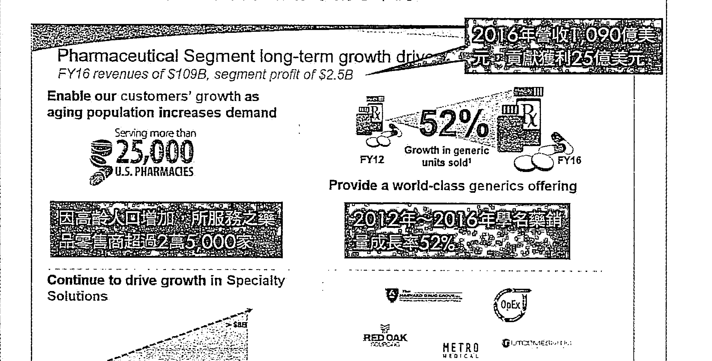

Pharmaceutical Segment long-term growth drives FY16 revenues of $109B, segment profit of $2.5B

Enable our customers’ growth as aging population increases demand

Serving more than 25,000 U.S. PHARMACIES

Provide a world-class generics offering

Growth in generic units sold FY12 to FY16 52%

Continue to drive growth in Specialty Solutions

Supplement organic initiatives with acquisitions

因高龄人口增加，所服务之药局零售额超过25,000家

2012年~2016年学名药销量成长率52%

2011年~2016年 Specialty Solutions 销售额从1亿美元成长至10亿美元

透过收购以扩充产品线，提供未来成长动能

资料来源：CAH 年报

## 2.商业模式分析

CAH作为中阶层的销售商，毛利虽然仅有5.4%，但是透过高周转率就能创造巨大的净利。因此，CAH有效率而遍布的销售网路、巨大的经济规模、作为製药商与消费端之间的桥梁，是整个医疗产业中不可或缺的传导中枢。

## 3.经济护城河

美国前3大医药通路商市占率高达90%，共约2,700亿美元的市场，除了龙头CAH外，另2大通路商为美源伯根（AmerisourceBergen，美股代号ABC）、麦克森（McKesson，美股代号MCK）。

任何小型竞争者想介入原有3大企业巩固的市场，格外不容易；因为这3大企业，除了已有长期合作的客户外，也因具有足够的销量，足以和药商谈判较低的价格，享有成本优势，让新进者很难在低毛利的环境生存。

同样的，医药通路商的客户端，也难以自行揽下这项业务并单独与药商谈判，因为通路商有够大的规模，能谈到较低的价格，医疗机构要节省成本，最好还是交由通路商处理。

因此，这些通路商形成了坚固的「经济护城河」。

## 2016年卡地纳医疗事业贡献获利逾4亿美元——医疗事业部门成长动力来源

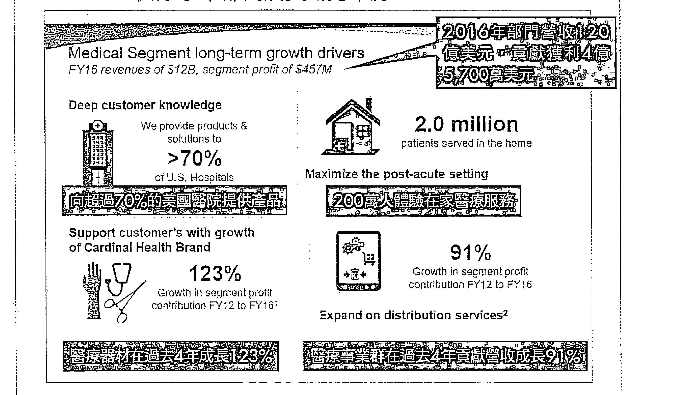

谈判，一来价格没有优势，二来资源无法整合，总不能自己一家一家地去找药商采购吧！物流与仓储管理也是一大问题，因此对客户端来说，最有效益的做法，就是向医药通路商采购药品。

美国医药通路产业的营运模式，明显是寡头产业，拥有寡占的护城河；又有些类似揽桥收费——只要想使用我的服务，就得付费给我。只要医疗处方笺不断开出、医疗产品持续有需求，就需要CAH这样的通路商。

## 4.企业的可能风险

- ①价格压力：无论是客户或政府，都希望削减药价、增加价格透明化，或是让更多人们享受健保的保障。尤其是在美国医药通路产业这样的寡占市场，一旦有人率先降价，其他对手也免不了跟着跳进战场。

2016年第4季，美国药品市场竞价战开打，CAH的竞争对手ABC为了抢市占率，率先展开价格战。零售市场是靠高资产周转率（Asset Turnover）来拉高股东权益报酬率（ROE），利润率一向不高，因此受到削价竞争的冲击尤大。

所幸CAH当中的医疗事业部门，不受药品价格下跌所冲击。2016年第3季营收年成长12%、税后净利成长26%之多，因此减缓了CAH整体的EPS下跌幅度；2016年第3季，CAH整体营收年成长14%，EPS年衰退10%。

尽管CAH获利下降，但营收大幅成长，显示市占率反而增加，ABC想抢市占率的策略似乎没有奏效。削价竞争这件事，对手一旦发现「伤人3,000，自损1万」的事无法长期进行，我认为价格战将会慢慢平息。

「非核心」事业的併购，如医疗器材或是其他医疗消费性商品。虽然这类器材或商品往往是较为低端而非最高端的诊断设备或实验仪器，但仍有助于减少药价下滑所造成的获利衰退。

- ②大客户集中度偏高：大型且长期合约至关重要，CAH前5大客户占营收比重达40%，假如丧失大客户或者无法续到好的合约内容，就可能受到打击。

- ③高利润学名药成长趋缓：对医药通路商而言，学名药的获利率远高于专利药（原厂药）；而过去10年许多专利药的专利陆续到期，学名药蓬勃发展，特别在2012年～2014年左右到达顶峰，预计到2018年，学名药将占美国处方笺份额91%。

由于学名药近年成长已呈现趋缓，当初由学名药带来的获益成长将慢慢消退，届时将会考验CAH搭配商品组合能力，例如有可能将成长动能慢慢移往特殊药品。

## 量化分析》长期+短期基本面数据观察获利状况

### 1.长期基本面数据

长期基本数据至少要看最近10年（2006年～2016年），关键数据如下：

## ①绝对数字类

- ❶ 近10年营收年化成长率：5.1%。
- ❷ 近10年税后净利年化成长率：6.8%。
- ❸ 近10年EPS年化成长率：4.4%。
- ❹ 近10年净值年化成长率：-1.1%。
- ❺ 近10年股息年化成长率：18%。
- ❻ 近10年自由现金流年化成长率：9%。

## ②比率类

- ❶ 近10年平均营业利润率：1.62%。
- ❷ 负债率（负债占净值比率）：76%。
- ❸ 负债／税前盈余倍数：1.5倍。
- ❹ 近10年平均ROE：16.54%。
- ❺ 近10年资本投入回报率（ROIC）：11.27%。
- ❻ 利息保障倍数：13.33倍。

CAH的ROE为12%～15%，是相当好的水准，我们可从ROE的组成来观察一家企业的获利特质。ROE根据杜邦方程式可拆解为「税后净利率×资产周转率×权益乘数」。

税后净利率（以下简称净利率）是税后净利占营收比率；资产周转率是全年营收除以总资产，若为1，代表公司每年可创造跟资产相同规模的营收，数值愈高代表公司以资产创造营收的能力愈强，显示管理效率愈佳；权益乘数则是总资产除以净值（股东权益）的比值，若数字愈高，代表资产当中有较大比重的负债，也代表企业运用较高的财务杠杆（Financial Leverage）。

以低净利率（约1%）的CAH而言，其高ROE的主要原因是来自高资产周转率与权益乘数。图4可看到2007年～2016年，CAH的资产周转率在3.5～4.8次的高水准，以及具有快速的现金转换周期（Cash Conversion Cycle，简称CCC周期，指购买存货后，收回应收账款并转换成现金以支付应付账款的天数）。

## 近10年来，卡地纳资产周转率达3次以上 ——卡地纳（CAH）经营效率

| Efficiency | 经营效率 | 2007-06 | 2008 | 2014-06 | 2015-06 | 2016-06 | TTM |
|------------|----------|---------|------|---------|---------|---------|-----|
| Days Sales Outstanding | 应收款周转天数 | 18.55 | 19 | 23.41 | 21.19 | 20.91 | 21.38 |
| Days Inventory | 存货周转天数 | 33.76 | 30 | 35.34 | 32.94 | 31.46 | 31.71 |
| Payables Period | 应付账款周转期间 | 40.64 | 37 | 51.92 | 49.98 | 50.26 | 49.80 |
| Cash Conversion Cycle | 现金转换周期 | 11.67 | 12 | 6.83 | 4.15 | 2.11 | 3.29 |
| Receivables Turnover | 应收款周转率（次） | 19.68 | 18 | 15.59 | 17.23 | 17.45 | 17.07 |
| Inventory Turnover | 存货周转率（次） | 10.81 | 1 | 10.33 | 11.08 | 11.60 | 11.51 |
| Fixed Assets Turnover | 固定资产周转率（次） | 41.06 | 53 | 61.79 | 69.16 | 73.62 | 74.52 |
| Asset Turnover | 资产周转率（次） | 3.73 | 3 | 3.51 | 3.65 | 3.78 | 3.83 |

注：1. 资料日期为 2017.01.30；2. 现金转换周期＝应收款周转天数＋存货周转天数－应付账款周转天数 资料来源：晨星（Morningstar）

而在权益乘数的部分，根据2016年的财报，CAH的总资产为341亿2,200万美元，净值为65亿5,400万美元，权益乘数为5.2倍。权益乘数看似很高，但是仔细观察其负债组成，长期负债只占整体负债不到3成，绝大部分是以应付账款为主的流动负债，可以知道CAH并非是依靠借钱来提高ROE。

概括来说，CAH是个中速成长、经营效率佳、财务压力低与未来展望正向的企业。

另外，从F.A.S.T. Graphs网站可看到图像化的现金流量表数据。可以看到CAH的现金流虽有几年处于低谷，但近年（2014年～2016年）已见改善，营业现金流与自由现金流明显增高，所配发的股息也跟着上升（详见图5），显示有相当充足的现金流支付股息，投资人也可以期待未来股息有成长空间。

观察CAH近10年的毛利率与净利率，大致上没有剧烈变动，毛利率约3.8%～6%，净利率则在1%上下。其中，2013年净利率从前一年度的0.99%骤降至0.33%（详见图6），分析其原因，是因为一般会计准则（GAAP）的会计处理需求，在账面上做了一次性的商誉减损测试（Goodwill Impairment Testing），认列一次性的非现金减损支出（non-cash impairment charge），金额为8亿2,900万美元，但对实质现金流并无影响。

## 2014~2016年，CAH营业现金流明显升高 ——卡地纳（CAH）每股现金流

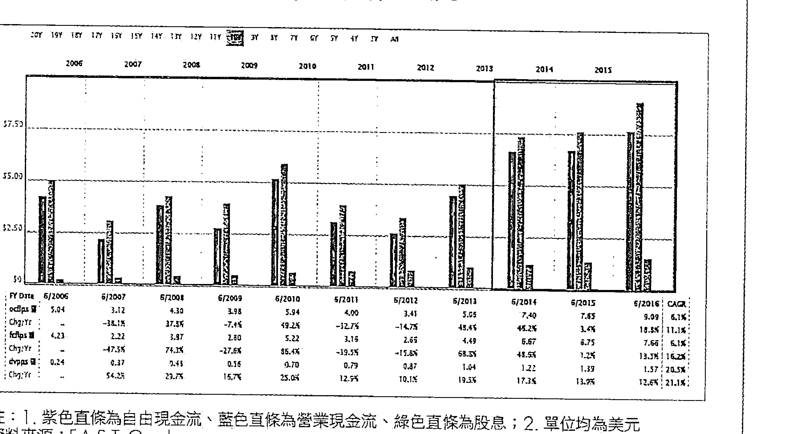

注：1. 紫色直条为自由现金流、蓝色直条为营业现金流、绿色直条为股息；2. 单位均为美元 资料来源：F.A.S.T. Graphs

商誉来自于品牌价值或者预期併购后产生的反应。CAH在2002年12月併购的欣科国际企业（Syncor International Corporation）后来成为公司的放射性医药事业（Nuclear Pharmacy Services）部门，销售放射性诊断设备，然而效果不佳，未发挥原先预期效用，因此进行商誉减损。

### 2.短期基本面数据

CAH的短期基本面关键数据如下：

## ①2016年会计年度

- ❶营业收入年成长19%，达1,215亿美元。
- ❷营业利益年成长14%，达24亿6,000万美元；Non GAAP营业利益成长17%，达28亿9,500万美元。
- ❸营业利益率2.02%。
- ❹EPS成长20%，达4.32美元；Non GAAP EPS成长20%，达5.24美元。

其中，「GAAP」代表按一般公认会计准则编制的财报数据；「Non GAAP」意指排除一次性事件与非经营性质的收益，更精准地呈现企业的核心获利状况。然而Non GAAP相较于GAAP并没有统一的标准，因此在阅读财报时，应留意被排除的项目有哪些，并且判断是否合理。

## ②2017年第1季季报

- ❶营业收入年成长14%。
- ❷营业利益年衰退14%；Non GAAP营业利益减少9%。
- ❸税后净利减少19%；Non GAAP税后净利减少13%。
- ❹EPS减少17%；Non GAAP EPS减少10%。
- ❺医药事业部门：营收成长14%，税后净利减少19%，净利率减少0.76个百分点。
- ❻医疗事业部门：营收成长12%，税后净利成长26%，净利率成长0.42个百分点。

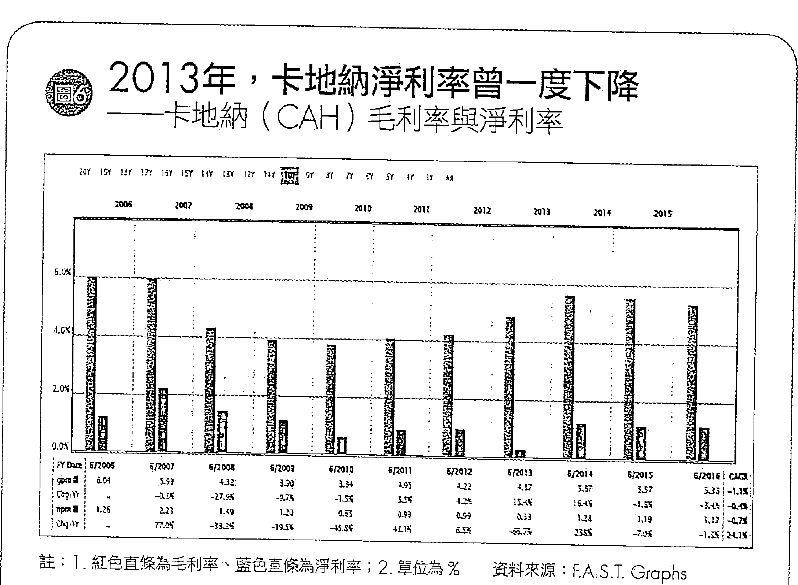

### 3. 企业对未来展望

CAH对未来5年的中期展望是营收年化成长率7%～9%，EPS成长10%～15%，股息配发率（股息占EPS比率）维持在30%～35%；预期2017年资本支出4亿～4亿5,000万美元（2016年为4亿6,500万美元）。

### 4. 股息与股票回购相关资讯

CAH殖利率约为2.45%（以2016年单季股息0.4489美元×4季＝## 根據個人需求自製表格，輕鬆分析數據
——卡地納（CAH）重點Highlight表

| Cardinal Health Inc | 代號 | CAH | 現價 (美元) | 73.19 | 目前配息 (美元) | 1.796 |
| :--- | :--- | :--- | :--- | :--- | :--- | :--- |
| 行業 | 健康照護-藥品 | 市值(美元) | 242.30億 | 52週高點 (美元) | 87.85 | 殖利率 | 2.45% |
| 12個月本益比(倍) | 17.72 | 負債率 | 76.00% | 52週低點 (美元) | 62.7 | 10年股息年化成長率 | 18.00% |
| 12個月EPS(美元) | 4.13 | 護城河 | 寬廣 | 平均成交量(股) | 225.8萬 | 連續配息成長年數(年) | 31 |
| 12個月ROE | 20.79% | 10年平均ROE | 16.54% | 預估年化報酬率 | 10.95%~12.95% | 10年EPS年化成長率 | 4.40% |

註：1. 股價資料為2017.01.30；2. 綠色表示符合追日Gucci的標準

1.796美元與2017年1月30日股價73.19美元計算），為股息貴族的成員之一。截至2016年，其股息已連續成長31年，要能夠保持這樣的紀錄，假如沒有獲利成長在背後支撐，是不可能達成的。

### 5.重點Highlight表

將幾個重要的分析數據填進重點Highlight表，圖7是我根據自身需求所做的圖表，當然，投資人也可以根據自己想知道的重點，製作屬於自己的Highlight表。

### 6.量化檢查表

![img/dfd1504d95bd8956cc82c7d5cbadb262_321_0.png]

## 少數檢核項目未通過設定標準，無礙買賣決策——卡地納（CAH）量化檢查表

| 項次 | 檢核項目 | 量化標準 | 實際值 |
|------|----------|----------|--------|
| 1 | 營收>5億美元 | 5 | 1215 |
| 2 | 連五年股息成長 | 5 | 31 |
| 3 | 目前殖利率>2.5% | 2.5% | 2.45% |
| 4 | 5年股息複合成長率%(CAGR)>5% | 5% | 13.70% |
| 5 | 喬德規則 殖利率%+5年股息複合成長率%(CAGR)>10% | 10% | 16.15% |
| 6 | 本益比<16 | 16 | 17.72 |
| 7 | PEG<2 | 2 | 1.1 |
| 8 | Payout(股息發放率)<50% MLP與REITs不看此項 | 50% | 36% |
| 9 | 負債率<80% | 80% | 76% |
| 10 | 利息覆蓋率>5 | 5 | 13.3 |
| 11 | 價格安全邊際10%(合理價*0.9) | 10% | 11.00% |
| 12 | 10年正數現金流 | 6 | 10 |
| 13 | 連續2年自由現金流不為負 | 2 | 0 |
| 14 | 10年平均ROE>12% | 12% | 16.54% |
| 15 | 近5年ROE>14%年數 | 4 | 4 |
| 16 | 預估年化報酬>10% | 10% | 12.95% |
| 評量結果15/16 | | | PASS |

> 註：1. 資料統計至2017.01.30；2. 紅色表示未符合追日Gucci的標準。

圖8是我對CAH這家企業所製作的量化檢查表，在16項評核項目當中，該企業只有殖利率這一項沒有通過。再強調一次，我不會因為幾項指標沒有通過就否決掉這家企業，影響我的決策關鍵還是「高品質的企業，在低於合理價且擁有安全邊際時買進」，量化數字永遠只是配角，因此核定結果為「Pass」。

## 未來預估》觀察獲利數據，判斷公司成長力道

### 1.預估未來獲利年化成長率

從CAH年報中可以看到，官方預估未來幾年的獲利成長率為10%~15%，為避免預估過於樂觀，我不打算完全採用。

前文提到，面臨削價競爭壓力與學名藥成長趨緩的趨勢，CAH也持續透過垂直整合購併與結盟其他企業來增加收益，以減緩藥品價格緊縮所帶來的衝擊。例如2010年購併Kinray（獨立藥店中盤商）、Yong Yu（中國永裕新興醫藥，醫療藥品器材銷售商）；2013年購併AssuraMed（居家照護產品商）；2015年購併Cordis（心臟與心血管醫療器材製造商）、Harvard Drug（學名藥銷售商）；另外，還有2014年與CVS的合作聯盟等等。

晨星分析師預估，CAH未來5年EPS年化成長率12.7%，Yahoo!分析師則預估為9.37%。綜觀以上想法，我認為較合理的預估數字是8.5%~10.5%，因為其中促使EPS成長的項目為：

- ①整體營收年化成長率：7%~8%。
- ②利潤率每年改善程度：0.5%~1%。
- ③股票回購百分比：1%~1.5%（近3年平均1.7%）。

因此，EPS成長最低的預期為8.5%（＝7%＋0.5%＋1%）；最高的預期則為10.5%（＝8%＋1%＋1.5%）。

### 2.預估未來股息成長率

再來要預估股息成長率。我所使用的其中一個付費網站Simply Safe Dividends，對於「企業股息安全性」的評估，若為81～100分，代表砍股息的可能性非常低。而該網站根據自由現金流成長、當前配發率、財務健康等多項指標，給予CAH接近滿分的99分。

CAH在2016年度的股息配發率為36%，自由現金流配發率僅20%，都算是偏低的水準，加上長期負債率（長期負債占淨值比率）為43%，都保障了往後股息持續成長的安全度。因為若負債率太高，過高的利息就會壓縮企業獲利；企業獲利減少，就會影響股息成長空間。除非利息雖然高，但獲利成長也很快，那股息成長就同樣可維持不錯的速度。

一般而言，負債低還是比負債高來得好，但是同時要考慮獲利成長與ROE、ROIC，還有檢視利息保障倍數以及債務與淨利比，單純看負債率不會看到企業債務水平全貌。

CAH股息已連續成長31年，以過去20年（1996年～2016年）年化20.7%、近10年年化18%的速度成長，接下來成長速度勢必放緩。

預估股息成長率，可先參考EPS預估成長率8.5%～10.5%，並考慮到CAH欲維持股息配發率30%～35%，以及尚有成長空間的自由现金流配發率，我認為未來10年，預估股息成長率第1階段可採用11%，第2階段則為7%。

### 3.預估長期年化報酬率

以2017年1月30日的殖利率2.45%計算，以及前文的EPS預估成長率，可預估長期投資CAH的長期年化報酬率為：2.45% +（8.5%～10.5%）=10.95%～12.95%。

## 價值評估》多方比較，檢核企業股價是否合理

### 1.相對比較

- ①與市場（S&P 500指數）長期平均本益比比較：CAH長期平均本益比其實與市場平均本益比的差距並不算太大。近20年的市場平均本益比為18.6倍，CAH為19.1倍；近10年的市場平均本益比為16倍，CAH為15.1倍。

以CAH在2017年1月30日的股價73.19美元而言，本益比為17.7倍，跟市場長期平均本益比的15倍比較起來，還要高出大約18%，是略微高估的狀況。

- ②與企業本身的長期平均本益比比較：以2017年1月30日計算出的本益比17.7倍與CAH自己過去10年平均本益比16倍相比，高出約10%，仍處於合理範圍。

## 折扣率10%情況下，卡地納合理價約89美元——卡地納（CAH）估價結果

| 安全邊際 | 折扣率9% | 折扣率10% | 折扣率11% |
|----------|----------|-----------|-----------|
| 20%溢價  | 162.15   | 106.81    | 79.20     |
| 10%溢價  | 148.63   | 97.91     | 72.60     |
| 合理價   | 135.12   | 89.01     | 66.00     |
| 10%折價  | 121.61   | 80.11     | 59.40     |
| 20%折價  | 108.10   | 71.21     | 52.80     |

> 註：本表以DDM推估合理股價，計算條件為「目前年度股息每股1.8美元，預估股息成長率第1段（第1～10年）11%，第2段（第11年後）7%，折扣率10%」

- ③當前殖利率與5年平均殖利率比較：CAH當前殖利率為2.45%，比起5年平均殖利率的2%還要高，我給予低估的評價。

### 2.絕對價格（採取DDM計算）

- 接著使用股息折價模型（DDM）來進一步估算合理價，將以下的數字輸入免費網站提供的功能，即可快速算出CAH合理價為89.01美元（詳見表1，網站介紹詳見4-2）：
  - ①目前年度股息：每股1.8美元；
  - ②第1段預估股息成長率（第1年～第10年）：11%；
  - ③第2段：預估股息成長率（第11年後）：7%；
  - ④折扣率（預期報酬率）：10%。

## 綜合多項指標，CAH目前低於合理價 ——卡地納（CAH）價值評估檢驗表

| 指標項目               | 合理價/平均值 | 目前股價/比率 | 價值評價   | 給分 |
|------------------------|---------------|---------------|------------|------|
| S&P 500指數歷史平均本益比 | 15倍          | 本益比 17.7倍 | 略微高估   | 2.5  |
| 10年平均本益比         | 16倍          | 本益比 17.7倍 | 中立       | 3.0  |
| PEG                    | 2倍           | PEG 1.1倍     | 過度低估   | 5.0  |
| DDM合理價              | 89.01美元     | 股價 73.19美元 | 略微低估   | 3.5  |
| 晨星合理價             | 79美元        | 股價 73.19美元 | 中立       | 3.0  |
| 5年平均殖利率          | 2.00%         | 殖利率 2.45%  | 低估       | 4.0  |
| 總評價值               |               |               | 低於合理價 | 3.5  |

註：資料統計至2017.01.30

### 3.參考其他專業機構的預估

晨星給予CAH的評分為3顆星，代表股價位於合理範圍，而晨星給予的合理價為79美元。

綜合以上評估，2017年1月30日CAH收盤價73.19美元，不僅低於我自行估算的DDM合理價89.01美元，也低於晨星給予的79美元。將各項評分平均之後，得出CAH 2017年1月30日的價格低於合理價的結論（詳見表2）。

## 逆風激發第2層思考 ——以卡地納、沃爾瑪為例

2017年4月18日，卡地納健康集團（Cardinal Health Inc.，美股代號CAH）公布2017年第1季財報，當天股價下跌11.5%。只要上網搜尋，就能看到媒體報導CAH宣布購併全球最大醫療設備製造商之一Medtronic（美股代號MDT）的部分醫療器材業務消息，很多人便因此以為是購併造成股價下跌。

實則不然，只是因為造成股價下跌的主要消息，恰好發出時間與購併案的消息同一天。我認為這是一個檢驗個人第2層思考的好機會。

### 找出股價下跌主因，並思考企業優勢是否發生改變

當時影響股價下跌的真正主因，是CAH將2017年的Non GAAP（指排除一次性事件與非經營性質的收益）EPS預期展望，從5.35～5.5美元改為低標5.35美元，而不是市場期望的高標5.5美元。5.5美元與5.35美元差異雖僅有2.7%，市場情緒卻放大數倍至11.5%（即當日股價跌幅），但若與2016年Non GAAP EPS 5.24美元相比，CAH全年EPS仍是呈現成長。

此外，這次購併案採取的方式不是換股或者增資，而是單純的運用企業現金與發行公司債45億美元。因此並不會稀釋原有股東的權益，或者說在外流通股數不會增加，自然也不會拖累EPS。

如果有持續關注CAH的營運變化，就會知道美國醫藥通路產業在2016年時面臨削價競爭壓力（詳見4-6）；而CAH收購Medtronic部分業務，屬於非核心事業，就是為了彌補藥價下跌造成的獲利下滑。

到了2017年8月，CAH發布2017年第2季季報，當中將2017年EPS上調至5.4美元，卻調降2018年的展望，預估2018年EPS為4.85～5.1美元、2019年為5.6美元。假如以2018年預估EPS低標4.85美元計算，與2017年的預估EPS相比，整整少了10%。

這樣的消息自然對股價造成很大衝擊，第2季財報公布前，CAH的股價還有77.33美元（2017.08.01收盤價），到了2017年11月底已跌至59.19美元，跌幅達23%。

當然，我們得去了解調降獲利展望的原因。在公司季報聲明中，2018年展望的調整，主要受到非連續性的財務作帳影響，以及主要應用於藥品批發的IT（資訊科技）基礎建設與系統升級。之後，將在2018年會計年度結束後，回歸正常水平（CAH的會計年度結束在6月）。

關於其他細節，CAH在季報中沒有透露太多，但如果你是這家企業的股東，此時你會怎麼做？

以我而言，我只專注企業本質與合理價值，不預測產業波動，也不預期市場走勢，因為這些都是不可控制的變數。企業能否扭轉頹勢，答案可能需要3年才能見分曉，但我知道自己能掌握的是企業的本質，也就是我當初對企業的研究，包含質化分析與量化分析。因此我會靜下心來，仔細的權衡利弊，思考所投資的企業本質是否改變？是否已喪失長期機會？

例如，作為3大醫藥通路商之一，CAH是產業龍頭，擁有廣布的銷售網絡，並在長期人口老化的趨勢中，取得獲利成長的動力；面臨事業的轉折（包括短期藥價競爭壓力、原本學名藥成長趨勢趨緩等），它也在進行調整。而這些改善的成果，自然會呈現在未來財報的量化數據當中，我將會繼續觀察，並據此做出投資決策。

## 企業面臨競爭挑戰，應關注其因應策略

同時，CAH的例子也讓我想起2015年沃爾瑪（Wal-Mart Stores，美股代號WMT）被網購業者，如亞馬遜（Amazon，美股代號AMZN）壓著打的情況，當時其股價也出現大幅下滑。

當時已是沃爾瑪股東的我（2014年買進），並未感到畏懼，因為我知道沃爾瑪自2013年已開始大量投資IT系統，以打通線上（Online）與線下（Offline）的資訊隔閡。除了發展一般網站與行動裝置的購物平台，也致力於提高物流效率，還提供網上訂購、到店取貨（甚至免下車）的服務。

自2016年以來，漸漸可以看到沃爾瑪努力拓展網購平台的成果。根據沃爾瑪的預估，線上銷售額（Gross Merchandise Volume，GMV）自2016年～2019年的年化成長率，估計達20%以上；而2017年Q1～Q3的線上銷售數據，年成長率高達63%、60%、50%，成績不俗。

而我也認為，產業界的O2O（Online To Offline）並非完全成熟，因為在許多企業中，線上與線下仍是獨立的2個區塊，彼此之間的訊息與銷售行為多半是分離的，且利益容易有衝突，例如優惠或訊息經常不同調，導致彼此之間不是合作，反而是搶奪資源。

未來的零售業樣貌，很有可能會成為線上傳播、線下體驗，企業把線上與線下的服務、商品、訊息、顧客全部整合。然而，雖然線上消費有其優勢，但是實體消費才是有溫度的購物體驗，符合人們喜歡觸摸、體驗，乃至於血拼（Shopping）快感的人性——這是我們與生俱來的探索精神，即使科技日新月異，也難以改變。

不過，企業若要整合線上與線下，都會面臨同樣的問題，包括資訊系統支援、作業流程的整合，甚至是企業內部文化等，因此我無法預測沃爾瑪與亞馬遜最終誰會取得最大優勢，但我看到了沃爾瑪並非是坐以待斃；反之，它早已為了往後10年的長治久安預作準備。對於一家年營收4,850億美元的巨型企業來說，面臨如此巨大的轉變，我也願意給予它時間。

我也許會誤判，但誤判很正常，我也接受這一點會在我投資生涯多次出現。但我不會因此不再信任自己的判斷力，往後當機會浮現時，我仍會根據我所掌握的研究結果，果敢地做出行動。

希望當你看到企業面臨股價下跌與不確定的情勢時，可以想到先以企業本質與價值作為檢視企業的標準，而不是讓價格波動，來牽引你的每一條思緒。

## 評估轉型企業未來發展
——以迪士尼為例

迪士尼（Walt Disney Company，美股代號DIS）於2017年8月公佈的季報（截至2017.07.01），與2016年同期相比，營收持平，調整後（Non GAAP）EPS減少2%、營業現金流上升14%、自由現金流上升33%。

而迪士尼股價在2017年8月9日出現最大跌幅6.05%，只是，讓市場感到震驚的不是其財務數字，而是重大的策略調整。

### 迪士尼力拼轉型，2019年起推出自製串流平台

迪士尼2017年8月宣布，自2019年起，將撤出目前在Netflix平台上的迪士尼影視頻道，並且自製自有串流服務（即迪士尼自製網路影音平台）；至於旗下漫威娛樂（Marvel Entertainment）和盧卡斯影業（Lucas）的影音作品，迪士尼尚未決定會不會在Netflix平台與自有串流服務上並行。

近兩年（2016年～2017年）來，迪士尼持續被看衰，因為有線電視頻道（包括迪士尼、ESPN、ABC（美國廣播公司）），收看用戶不斷萎縮，甚至曾有媒體評論：「市場的投資人或討論區也開始提出一些戲劇性的想法，例如賣掉ESPN，不管是透過分拆成立獨立公司，或是直接賣給Comcast（編按：有線電視、寬頻網絡及IP電話服務供應商）算了，連估值《富比世》（Forbes）都幫忙算好了，是500億美元。另一個有趣的提議則是，乾脆收購Netflix平台算了，畢竟它已擁有9,800萬用戶（以SVOD（隨選影片）訂閱計算）。以迪士尼之力，肯定能夠將優質內容透過Netflix平台密布的網絡來達成雙贏（Win-Win）。」

的確，新世代族群觀看節目的方式已改變。現今大家更傾向於訂閱想看的頻道就好。因此，有線電視頻道用戶持續下降早已是進行式；但迪士尼官方決定2019年撤出Netflix平台，並且自製串流服務的策略，與先前市場的預期完全不同——但仔細觀察會發現，其实在2016年時，迪士尼就已投資串流媒體公司BAMTech，為自有串流平台做準備。

## 自製串流服務具4大好處

迪士尼規畫的自有串流服務，主要將分成2部分，一部分為迪士尼的影視與電影，一部分為ESPN頻道，自2019年啟動。我認為迪士尼此舉將帶來## 幾項好處：

### 好處1》掌握用戶數據
以往這部分是掌握在Netflix平台手上，未來透過自有串流服務，迪士尼能更清楚地得到用戶資訊，包含客戶群資料與觀看習慣，進而更容易調整營運策略與精準行銷。

### 好處2》設定彈性收費
迪士尼與ESPN頻道轉換至迪士尼自有串流服務後，將可壓低有線電視頻道的收費。目前ESPN、迪士尼、皮克斯（PIXAR）、漫威娛樂等頻道是與其他有線電視打包出售，整體價格較為昂貴。

對於運動迷與影迷而言，這類節目是不可或缺的娛樂之一，他們很可能會願意付費只觀看這類節目；而那些不想付出高額娛樂費的消費者，原有的有線電視業者因為不再需要與這類頻道綁定出售，可以以較低的月費提供一些排除昂貴頻道的新方案，如此一來，兩類收視群都能夠有更彈性的選擇。

### 好處3》廣大受眾市場
穆迪信評（Moody's）分析師預估，迪士尼的自有串流服務收費假設為8美元，那麼則需要365萬的訂戶才能取代原先每年在Netflix平台上的3億5,000萬美元收益。

先不計全球，有2歲～14歲子女的家庭，光是北美即有2,500萬戶（截至2016年底）；再參考臉書（Facebook）上，喜歡迪士尼與皮克斯動畫的受眾有6,500萬人，看起來迪士尼的自有串流服務想要達到365萬訂戶，似乎不是太難。

因為迪士尼尚未決定部分頻道將來是否會同時在Netflix平台播放，假如是，那麼自有串流服務平台也不需要那麼多訂戶，既可維持原先在Netflix平台的收益，新服務的收費價格或許也可以更低，以吸引更多用戶。

### 好處4》提高用戶黏著度
提供自有串流服務將有更高的用戶黏著度，尤其對ESPN頻道收視用戶而言更是如此。運動迷通常對於運動賽事非常痴迷，一旦迪士尼轉換成自有串流服務後，運動迷就不需要為了ESPN而使用較貴的有線電視頻道服務。

此外，用戶可收看的場所也不再限定於家中電視，透過串流服務，用戶可透過任何行動裝置或電腦進行收看，如此一來，原先每個月下降0.3%的ESPN頻道訂戶問題，就可能得到緩解。在迪士尼要自行開發自有串流服務之前，ESPN頻道訂戶下降的憂慮很可能被誇大了，導致迪士尼許多表現不錯的其他事業群被蒙蔽了。

迪士尼這項商業策略，影響的是長期結果，會不會取得巨大成功？這個問題的答案，可能需要2～3年後才會見分曉。

當然，以上我的想法很可能是錯的，不過我想，舉一個充滿爭議的案例，更能誘發讀者思考。

那些短期受到吹捧的企業，尤其隨著股價推進的歡愉感，不費吹灰之力就能得到人們的認同；反觀那些陷於困頓的企業，當稍加悲觀的訊息被散播，也容易被人們所接受。

但無論是處在順境或逆境的企業，當你接收到任何訊息時，在進行批判與懷疑前，最好先採中立態度，不須急著為他人拋出的看法選邊站。因為重點在於你怎麼想？能不能與大眾智慧看法不同，並依賴自己的第2層思考能力，估算企業價值，然後堅毅地等待？

# 第5篇 善用網路資源 提升操作效率

## 晨星》重要財務比率不可不知
接下來，我將介紹一些自己常使用的網站與工具，包含免費、付費與自行開發3大類。礙於篇幅，這些網站我只會做大區塊的重點介紹，無法鉅細靡遺說明網站功能，還是需要你親自使用後，再慢慢去探索。而我與這些付費網站或功能，都沒有合作與對價關係，也不要詢問我網站相關事宜，因為這類付費功能都提供試用服務。

### 近5年資訊可免費查詢
我使用最頻繁的資訊網站晨星（Morningstar），雖然內容大多是以文字與數據呈現，但資料很齊全，整理的方式也很簡潔。網站上大多數是免費資源，但以財報數據而言，只有近5年是免費。另外有1/4的資訊是付費的，包括10年財報資料、分析報告、合理價與護城河寬度等。

- Step1 進入晨星網站（www.morningstar.com），在❶「Quote」欄位輸入欲查詢個股代號（此以微軟為例，輸入代號「MSFT」）後，按下「Enter」鍵，即可進入個股總覽頁面。
- Step 2 可看到 1「Last Price」（股價）、2「Volume」（成交量）、3「Yield」（股息殖利率）等基本成交訊息，及常用的功能選單像4「Key Ratios」（重要財務比率）、「Financials」（財報數據）、「Valuation」（股價評估）等。

Step3 下方還有一個區塊是付費功能，包含①晨星評估合理價、護城河寬廣程度及信用評等……等資訊（評價資訊為非公開資訊，為免有侵權之疑，故不顯示，有興趣者建議自行申請短期免費試用）。

Step4 再將網頁往下拉，還有一些可參考的資訊：

### 1. Company Profile (企業檔案)
包括①「What Does This Company Do?」（這家公司從事何種業務？）、②「Sector」（產業）與③「Industry」（行業）是該企業在 GICS（全球行業分類標準）的分類，例如微軟所屬產業與行業為「Technology」（科技）當中的「Software-Infrastructure」（軟體與基礎系統與設備）。④「Stock Type」（股票類型）為晨星為該企業定義的成長類型，⑤「Stock Style」（企業風格）則為晨星知名的九宮格風格箱，依照市值將股票分為大、中、小型，以及特質為價值、核心或成長股，一共有 9 種分類，幫助投資者快速看出企業風格。例如微軟為屬於「Slow Growth」（緩慢成長）、『Large Core』（大型核心股）。

| Company Profile MSFT |  | More... Projected Yield |
|----------------------|---------------------|-------------------------|
| **What Does This Company Do?**<br>Microsoft Corp is a technology company. It develop, license, and support a wide range of software products and services. Its business is organized into three segments: Productivity and Business Processes, Intelligent Cloud, and More Personal Computing.<br><br>**Visit Company Website** | **Sector**: Technology<br>**Industry**: Software - Infrastructure<br>**Stock Type**: Slow Growth<br>**Stock Style**: Large Core<br>**Employees**: 124,000<br>**Fiscal Year Ends**: 2018-06-30 | **Recent Dividends**<br>Date        Type<br>08/15/2017  Cash Dividends<br>05/16/2017  Cash Dividends<br>02/14/2017  Cash Dividends<br>11/15/2016  Cash Dividends<br><br>**Purchase Options**<br>Direct Investment<br>Dividend Reinvestment Plan |

### 2. Key Stats（重要財務數據）
此處為幾個重要財務數據，以及與產業平均數據的比較。①『Stock』欄為該企業的數值，②『Ind Avg』為產業平均。在評價個股本益比高低時，即可參考與產業本益比的比較。而圖中若有標示TTM（Trailing Twelve Months）則代表最近12個月的數據。

| Key Stats MSFT |  | More... |  |
|----------------|-----|---------|-----|
|  | Stock | Ind Avg | Relative to Industry |
| Price/Earnings TTM | 27.2 | 27.2 |  |
| Price/Book | 7.8 | 5.8 |  |
| Price/Sales TTM | 6.4 | 5.7 |  |
| Rev Growth (3 Yr Avg) | 1.2 | 2.3 |  |
| Net Income Growth (3 Yr Avg) | -1.3 | -8.3 |  |
| Operating Margin % TTM | 24.8 | 27.1 |  |
| Net Margin % TTM | 23.6 | 21.0 |  |
| ROA TTM | 9.8 | 8.3 |  |
| ROE TTM | 29.4 | 22.0 |  |
| Debt/Equity | 1.1 | 0.9 |  |

### 3. Key Ratios (重要財務比率)
回到網頁上方，點進①「Key Ratios」後，②「Financials」（財務）欄目為財報當中較重要的數據摘要，時間長達10年。這區塊的每個數據都很重要，因此我會全部查看，而下方還有「Profitability」（獲利能力）、「Growth」（成長性）、「Cash Flow」（現金流）、「Financial Health」（財務健康）及「Efficiency Ratios」（經營效率比）5個標籤頁，其中，我常看的是「Profitability」、「Cash Flow」與「Financial Health」。分別介紹如下：

| Item | 2008-06 | 2009-06 | 2010-06 | 2011-06 | 2012-06 | 2013-06 | 2014-06 | 2015-06 | 2016-06 | 2017-06 | TTM |
|---|---|---|---|---|---|---|---|---|---|---|---|
| Revenue USD Mil | 60,420 | 58,437 | 62,484 | 69,943 | 73,723 | 77,849 | 86,833 | 93,580 | 85,320 | 89,950 | 92,560 |
| Gross Margin % | 80.8 | 79.2 | 80.2 | 77.7 | 75.2 | 73.8 | 68.8 | 64.7 | 61.6 | 61.9 | 62.5 |
| Operating Income USD Mil | 22,271 | 20,363 | 24,098 | 27,161 | 21,763 | 26,764 | 27,759 | 18,161 | 20,182 | 22,326 | 23,319 |
| Operating Margin % | 36.9 | 34.8 | 38.6 | 38.8 | 29.5 | 34.4 | 32.0 | 19.4 | 23.7 | 24.8 | 25.2 |
| Net Income USD Mil | 17,681 | 14,569 | 18,760 | 23,150 | 16,978 | 21,863 | 22,074 | 12,193 | 16,798 | 21,204 | 22,113 |
| Earnings Per Share USD | 1.87 | 1.62 | 2.10 | 2.69 | 2.00 | 2.58 | 2.63 | 1.48 | 2.10 | 2.71 | 2.83 |
| Dividends USD | 0.43 | 0.50 | 0.52 | 0.61 | 0.76 | 0.89 | 1.07 | 1.21 | 1.39 | 1.53 | 1.56 |
| Payout Ratio % | 22.9 | 30.8 | 24.8 | 22.6 | 26.4 | 44.3 | 38.2 | 49.0 | 101.5 | 66.1 | 55.1 |

①Financials（財務）：例如在第4篇介紹撰寫企業分析的量化分析重點項目（詳見4-1），當中的長期基本面數據，這裡都可以快速看到數據。例如，「絕對數字類」包括營收、EPS等，我會看第1年與第10年，知道整體趨勢為何，再計算年化成長率。至於毛利率、營業利益率等「比率類」，則會看穩定性（能成長更好），然後計算10年平均值。

要特別說明，假如①「Free Cash Flow」（自由現金流）為負數，我會查看是否「連續2年為負」，如果僅有1年為負，可確認是否因為整體產業環境所致或者是一次性支出（例如罰款），雖暫時無須緊張，但至少要知道原因。若連續2年為負，則該提高警覺，更需要找出原因後，評估企業的競爭優勢是否完好無缺。自由現金流非常重要，不僅反映企業真實透過營運獲取的現金流，也同時影響未來股息成長的潛力。

| Item | 2008-06 | 2009-06 | 2010-06 | 2012-06 | 2013-06 | 2014-06 | 2015-06 | 2016-06 | 2017-06 | TTM |
|---|---|---|---|---|---|---|---|---|---|---|
| Revenue USD Mil | 60,420 | 58,437 | 62,484 | 73,723 | 77,849 | 86,833 | 93,580 | 85,320 | 89,950 | 92,560 |
| Gross Margin % | 80.8 | 79.2 | 80.2 | 76.2 | 73.8 | 68.8 | 64.7 | 61.6 | 61.9 | 62.5 |
| Operating Income USD Mil | 22,271 | 20,363 | 24,098 | 21,763 | 26,764 | 27,759 | 18,161 | 20,182 | 22,326 | 23,319 |
| Operating Margin % | 36.9 | 34.8 | 38.6 | 29.5 | 34.4 | 32.0 | 19.4 | 23.7 | 24.8 | 25.2 |
| Net Income USD Mil | 17,681 | 14,569 | 18,760 | 16,978 | 21,863 | 22,074 | 12,193 | 16,758 | 21,204 | 22,113 |
| Earnings Per Share USD | 1.87 | 1.62 | 2.10 | 2.00 | 2.58 | 2.63 | 1.48 | 2.10 | 2.71 | 2.83 |
| Dividends USD | 0.43 | 0.50 | 0.52 | 0.76 | 0.89 | 1.07 | 1.21 | 1.39 | 1.53 | 1.56 |
| Payout Ratio % * | 22.9 | 30.8 | 24.8 | 26.4 | 44.3 | 38.2 | 49.0 | 101.5 | 66.1 | 55.1 |
| Shares Mil | 9,470 | 8,996 | 8,927 | 8,506 | 8,470 | 8,399 | 8,254 | 8,013 | 7,832 | 7,813 |
| Book Value Per Share * USD | 3.97 | 4.44 | 5.33 | 8.19 | 9.21 | 10.61 | 11.23 | 9.58 | 9.05 | 11.62 |
| Operating Cash Flow USD Mil | 21,612 | 19,037 | 24,073 | 31,626 | 28,833 | 32,231 | 29,080 | 33,325 | 39,507 | 40,398 |
| Cap Spending USD Mil | -3,182 | -3,119 | -1,977 | -2,305 | -4,257 | -5,485 | -5,944 | -8,343 | -8,129 | -8,098 |
| Free Cash Flow USD Mil | 18,430 | 15,918 | 22,096 | 19,321 | 24,576 | 26,746 | 23,136 | 24,982 | 31,378 | 32,300 |
| Free Cash Flow Per Share * USD | 1.95 | 1.77 | 2.48 | 3.24 | 3.24 | 2.69 | 3.16 | 2.93 | 3.62 | - |
| Working Capital USD Mil | 13,356 | 22,246 | 29,529 | 2,395 | 64,049 | 68,621 | 74,854 | 80,303 | 95,324 | - |

②Profitability（獲利能力）：在①「Profitability」這區塊，聚焦在跟企業獲利有關的比率，主要能從中詳細看到營收結構（可清楚看出各項利潤、成本、費用等項目占營收比率），以及ROE（股東權益報酬率）的变化。

在②ROE的部分，我會連同③「Interest Coverage」（利息保障倍數）以及負債率一起檢視。例如微軟的ROE自2015年6月至2017年6月明顯上升，查看原因是淨利率與權益乘數（財務槓桿）上升，④淨利率上升了1倍，⑤權益乘數上升了50%，兩者一併拉動了ROE。只要不危及企業財務健康，適當運用財務槓桿不是壞事，雖然利息保障倍數降低至11.42倍，但仍在健康的水準，另觀察負債率105%也是一般水準。可以判斷ROE上升是良性的成長。記得，數據不能只看單一指標或是以固定角度切入，而是理解當中的連動關係。

| Profitability | 2008-06 | 2009-06 | 2010-06 | 2011 | 2013-06 | 2014-06 | 2015-06 | 2016-06 | 2017-06 | TTM |
|---|---|---|---|---|---|---|---|---|---|---|
| **Margin % of Sales** | | | | | | | | | | |
| Revenue | 100.00 | 100.00 | 100.00 | 100 | 100.00 | 100.00 | 100.00 | 100.00 | 100.00 | 100.00 |
| COGS | 19.20 | 20.80 | 19.84 | 2 | 26.19 | 31.18 | 35.30 | 38.42 | 38.09 | 38.09 |
| Gross Margin | 80.80 | 79.20 | 80.16 | 77. | 73.81 | 68.82 | 64.70 | 61.58 | 61.91 | 61.91 |
| SG&A | 30.43 | 28.94 | 27.65 | 25. | 26.06 | 23.59 | 21.72 | 22.57 | 22.26 | 22.26 |
| R&D | 13.51 | 15.42 | 13.95 | 12 | 13.37 | 13.11 | 12.87 | 14.05 | 14.49 | 14.49 |
| Other | - | - | - | | | 0.15 | 10.70 | 1.30 | 0.34 | 0.34 |
| Operating Margin | 36.86 | 34.85 | 38.57 | 38. | 34.38 | 31.97 | 19.41 | 23.65 | 24.82 | 24.82 |
| Net Int Inc & Other | 2.55 | -0.93 | 1.46 | | 0.37 | 0.07 | 0.37 | -0.51 | 0.91 | 0.91 |
| EBT Margin | 39.41 | 33.92 | 40.03 | 30. | 34.75 | 32.04 | 19.78 | 23.15 | 25.74 | 25.74 |
| **Profitability** | | | | | | | | | | |
| Tax Rate % | 25.75 | 26.50 | 25.00 | 17 | 19.18 | 20.65 | 34.12 | 14.53 | 8.40 | 8.40 |
| Net Margin % | 29.26 | 24.93 | 30.02 | 3 | 28.08 | 25.42 | 13.03 | 19.69 | 23.57 | 23.57 |
| Asset Turnover (Average) | 0.89 | 0.78 | 0.76 | | 0.59 | 0.55 | 0.54 | 0.46 | 0.41 | 0.41 |
| Return on Assets % | 26.01 | 19.34 | 22.88 | 2. | 16.58 | 14.02 | 7.00 | 9.08 | 9.75 | 9.75 |
| Financial Leverage (Average) | 2.01 | 1.97 | 1.86 | 1. | | 2.20 | 2.69 | 3.33 | 3.33 |
| Return on Equity % | 52.48 | 38.42 | 43.76 | 44. | | 14.36 | 22.09 | 29.37 | 29.37 |
| Return on Invested Capital % | 50.52 | 33.36 | | | 11.11 | 10.71 | 14.18 | 15.46 | 15.46 |
| Interest Coverage | - | - | | | 24.70 | 16.89 | 11.42 | 11.42 |

③Cash Flow（現金流）：①「Cap Ex as a % of Sales」（資本支出占营收比率）为显示企业每年将资本用于扩张的比率，没有特定标准；但与产业较有关系，必须与同产业相比较有参考性。EPS成长较快的企业，这项指标也不一定比较高，例如劳氏公司（美股代号LOW）在2016年为1.79%，星巴克（美股代号SBUX）则为6.76%。

2.  Free Cash Flow／Sales %（自由现金流占营收比率）则可视为企业产生现金流的能力，同样没有一定的衡量标准；但我分析过的企业当中，超过20%已是很好的水准，遇到这类企业时，可以多加分析。

3.  Free Cash Flow／Net Income（自由现金流对净利比）为可衡量企业获利的品质。自由现金流是指透过营业取得的现金，扣掉资本支出后的金额；因此若不是特别需要持续投入资本支出，这项比值正常会接近或高于1，也就是自由现金流接近或高于税后净利。

### Key Ratios

| Cash Flow Ratios | 2008-06 | 2009-06 | 2013-06 | 2014-06 | 2015-06 | 2016-06 | 2017-06 | TTM |
| :--- | :---: | :---: | :---: | :---: | :---: | :---: | :---: | :---: |
| Operating Cash Flow Growth % YOY | 21.44 | -11.91 | -8.83 | 11.79 | -9.78 | 14.60 | 18.55 | - |
| Free Cash Flow Growth % YOY | 18.66 | -13.63 | -16.18 | 8.83 | -13.50 | 7.98 | 25.60 | - |
| Cap Ex as a % of Sales | 5.27 | 5.34 | 5.47 | 6.32 | 6.35 | 9.78 | 9.04 | 9.04 |
| Free Cash Flow/Sales % | 30.50 | 27.24 | 31.57 | 30.80 | 24.72 | 29.28 | 34.88 | 34.88 |
| Free Cash Flow/Net Income | 1.04 | 1.09 | 1.12 | 1.21 | 1.90 | 1.49 | 1.48 | 1.48 |

4.  Financial Health（财务健康）：这部分的数据多数是关于资产负债表的相关比率，在上半部「Balance Sheet Items」（资产负债表项目）区块，全都以百分比呈现，也就是各个项目占总资产的比率。

例如2017年6月「长期债务」(Long-Term Debt)显示31.55，代表长期债务占总资产比率为31.55%。

### Key Ratios

**Profitability Growth Cash Flow Financial Health Efficiency Ratios**

| Balance Sheet Items (in %) | 2008-06 | 2009-06 | 2010-06 | 2013-06 | 2014-06 | 2015-06 | 2016-06 | 2017-06 | Latest Qtr |
| :--- | :---: | :---: | :---: | :---: | :---: | :---: | :---: | :---: | :---: |
| Cash & Short-Term Investments | 32.51 | 40.37 | 42.72 | 54.08 | 49.72 | 54.77 | 58.46 | 55.16 | 55.16 |
| Accounts Receivable | 18.67 | 14.37 | 15.11 | 12.28 | 11.34 | 10.16 | 9.44 | 8.21 | 8.21 |
| Inventory | 1.35 | 0.92 | 0.86 | 1.36 | 1.54 | 1.65 | 1.16 | 0.90 | 0.90 |
| Other Current Assets | 6.88 | 7.61 | 5.96 | 3.52 | 3.67 | 4.19 | 3.04 | 2.03 | 2.03 |
| Total Current Assets | 59.40 | 63.27 | 64.65 | 71.24 | 66.27 | 70.77 | 72.10 | 66.30 | 66.30 |
| Net PP&E | 8.58 | 9.67 | 8.86 | 7.01 | 7.55 | 8.36 | 9.48 | 9.84 | 9.84 |
| Intangibles | 19.34 | 18.31 | 15.74 | 12.45 | 15.73 | 12.36 | 11.15 | 18.76 | 18.76 |
| Other Long-Term Assets | 12.68 | 8.74 | 10.7 | 9.29 | 10.45 | 8.52 | 7.27 | 5.09 | 5.09 |
| Total Assets | 100.00 | 100.00 | 100.00 | 100.00 | 100.00 | 100.00 | 100.00 | 100.00 | 100.00 |
| Accounts Payable | 5.54 | 4.27 | 4.67 | 3.39 | 4.31 | 3.74 | 3.56 | 3.07 | 3.07 |
| Short-Term Debt | — | 2.57 | 1.16 | 2.11 | 1.16 | 4.25 | 6.66 | 4.20 | 4.20 |
| Taxes Payable | — | 0.93 | 1.25 | 0.42 | 0.45 | 0.34 | 0.30 | 0.30 | 0.30 |
| Accrued Liabilities | 4.03 | 4.05 | 3.8 | 2.89 | 2.78 | 2.89 | 2.72 | 2.41 | 2.41 |
| Other Short-Term Liabilities | 31.48 | 22.89 | 19.4 | 17.47 | 17.76 | 17.07 | 17.40 | 16.79 | 16.79 |
| Total Current Liabilities | 41.06 | 34.71 | 30.36 | 26.27 | 26.47 | 28.29 | 30.64 | 26.77 | 26.77 |
| Long-Term Debt | — | 4.81 | 5.74 | 8.85 | 11.98 | 15.78 | 21.06 | ①31.55 | 31.55 |

下半部的「Liquidity/Financial Health」（流动性与财务健康）当中，常见的流动比与速动比两种短期流动性指标，我一般不看。我会看的是②「Financial Leverage」（权益乘数或称财务杠杆），这就是构成ROE的其中一项重要元素，算法是总资产除以股东权益；以及③「Debt/Equity」（负债率）为本书中多次提到的指标，在晨星网站中，这个指标专指「长期债务除以净值」，也就是只以会产生利息的长期债务为分子。

| Liquidity/Financial Health | 2008-06 | 2009-06 | 2010-06 | 2013-06 | 2014-06 | 2015-06 | 2016-06 | 2017-06 | Latest Qtr |
| :--- | :---: | :---: | :---: | :---: | :---: | :---: | :---: | :---: | :---: |
| Current Ratio | 1.45 | 1.82 | 2.13 | 2.71 | 2.50 | 2.50 | 2.35 | 2.48 | 2.48 |
| Quick Ratio | 1.25 | 1.58 | 1.90 | 2.53 | 2.31 | 2.30 | 2.22 | 2.37 | 2.37 |
| Financial Leverage (2) | 2.01 | 1.97 | 1.86 | 1.80 | 1.92 | 2.20 | 2.69 | 3.33 | 3.33 |
| Debt/Equity (3) | – | 0.09 | 0.10 | 0.15 | 0.23 | 0.35 | 0.57 | 1.05 | 1.05 |

# 4. Financials (财务报表)

在最上方的功能选单，点进❶「Financials」，可看到❷「Income Statement」（损益表）、「Balance Sheet」（资产负债表）、「Cash Flow」（现金流量表）3张财务报表。我平常在查阅数据时，不会特别细看财报内容，通常是看到异常波动的数字时，才会进去找原因。

举例来说，2015年联合技术公司（美股代号UTX）的❸EPS为8.72美元，较前一年成长26%，查看损益表项目之后，就会知道并非是来自于本业的成长，进一步查询，得知是因为UTX卖掉了直升机事业群，因此在❹2015年的损益表列入「Net income from discontinuing operations」（非连续运营）的账面收益。

在此提供一个小技巧，若想快速看出财报项目的异常，可善用晨星的图表功能，将鼠标滑过各项目旁的❺图表符号，从图表就能快速检查是否有哪一个会计项目有显著变化，会比从一堆数字中找出异常值要来得容易些。

当然也可能你已先看过季报或年报而知道此事，无论先后顺序为何，总之先别急着因为表面的单一数字，而过早下定论。

| Statement Type | Data Type | Period | Show Report Dates | Data Scroll | View | Rounding |
| :--- | :--- | :--- | :--- | :--- | :--- | :--- |
| Annual | As of Reported | 5 Years | Ascending | - | % | .0 |
| Fiscal year ends in December | | | | | | |
| USD in Million except per share data | | | | | | |
| | | | 2014-12 | 2015-12 | | |
| Revenue | | | 65,100 | 56,098 | | |
| Cost of revenue | | | 47,447 | 40,431 | | |
| Gross profit | | 15,555 | 17,305 | 17,653 | 15,667 | |
| ▼ Operating expenses | | | | | | |
| Research and developme... | | | | | 2,279 | |
| Sales, General and adm... | | | | | 5,886 | |
| Other operating expens... | | | | | 211 | |
| Total operating expens... | | | | | 8,376 | |
| Operating income | | | | | 7,291 | |
| Interest Expense | | | | | 945 | |
| Other income (expense) | | | | | 121 | |
| Income before taxes | | | | | 6,467 | |
| Provision for income t... | | | | | 2,111 | |
| Net income from contin... | | | | | 4,356 | |
| Net income from discon... | | 290 | 35 | — | ④ 3,612 | |
| Other | | | | (403) | (360) | |
| Net income | | | | 6,220 | 7,608 | |
| Net income available t... | | 5,130 | 5,721 | 6,220 | 7,608 | |
| Earnings per share | | | | | | |
| Basic | | 5.73 | 6.35 | ⓞ 6.92 | 8.72 | |
| Diluted | | 5.66 | 6.25 | 6.82 | 8.61 | |

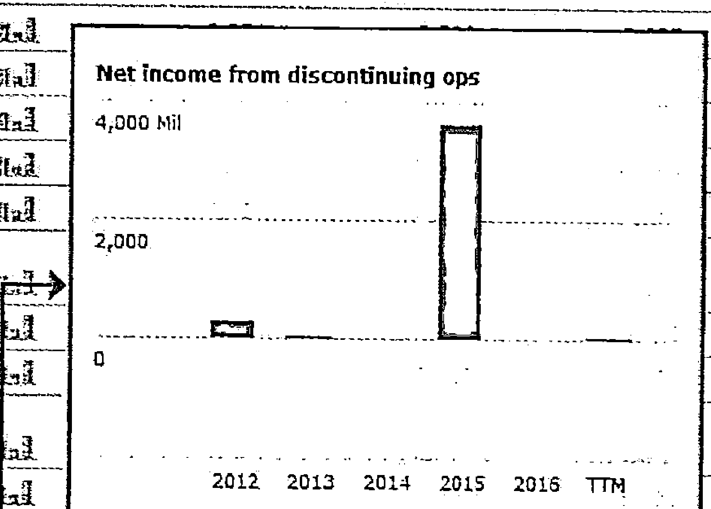

# 5. Valuation（价值评估）

晨星的①「Valuation」页面，除了在左侧显示②「企业目前数值」，例如常见的本益比、股价净值比、股息殖利率等，右侧也显示③「产业平均」、「S&P 500平均」，以及「该企业5年平均」。投资者可以加以比较，得知目前企业处于何种「相对」的位阶。接着，可切换至次页籤④「Wall Street Estimates」，则提供华尔街分析师们的预估。

Current Valuation MSFT

| 指标 | MSFT | Industry Avg | S&P 500 | MSFT 5Y Avg* |
| :--- | :---: | :---: | :---: | :---: |
| Price/Earnings | 27.0 | 27.0 | 21.9 | 20.5 |
| Price/Book | 7.8 | 5.7 | 3.0 | 4.3 |
| Price/Sales | 6.4 | 5.6 | 2.1 | 4.1 |
| Price/Cash Flow | 14.5 | 14.8 | 13.5 | 12.7 |
| Dividend Yield % | 2.1 | 1.6 | 2.0 | 2.6 |
| Price/Fair Value | 0.9 | -- | -- | -- |
| Data as of 08/15/2017, *Price/Cash Flow uses 3-year average. | | | | |

进入「Wall Street Estimates」页面后，可以看到，上半部「Annual Earnings Estimates」（年度预估盈余）为⑤近1年及近2年的EPS数值及成长率预估，下半部「Analyst Ratings」（分析师评比）则有⑥未来5年的EPS年化成长率，可作为你在做EPS成长率预估以及股息成长率时的部分参考。

| | 06/2018 USD | 06/2018 Growth % | 06/2019 USD | 06/2019 Growth % |
| :--- | :--- | :--- | :--- | :--- |
| High | 3.79 | 39.9 | 4.43 | 16.9 |
| Low | 2.87 | 5.9 | 2.96 | 3.1 |
| Mean | 3.28 | 21.0 | 3.60 | 9.8 |
| Median | 3.26 | 20.3 | 3.62 | 11.0 |
| 30 Days Ago | 3.42 | 26.2 | 3.73 | 9.1 |
| 60 Days Ago | 3.42 | 26.2 | 3.73 | 9.1 |
| 90 Days Ago | 3.43 | 26.6 | 3.74 | 9.0 |
| Number of Estimates | | 8 | | 4 |

# Analyst Ratings MSFT

| Five-Year Growth Forecast | |
| :--- | :--- |
| 9.4% | — |

| Average Rating | Last Month | Industry Avg | S&P 500 Avg |
| :--- | :--- | :--- | :--- |
| 4.7 | — | — | — |

# ## GuruFocus.com》快速掌握企业财务数据所在位阶

我较常用的第2个网站为「GuruFocus.com」（以下简称「GuruFocus」），它也提供丰富的个股资讯，呈现方式较为视觉化。一进入个股页面，映入眼帘的是许多彩色的Bar；这些绿色、黄色、橘色、红色的Bar，显示个股该项数据，与行业平均、企业本身历史平均数据的比较，让使用者可以快速看到比较结果。

对于需要使用比较法来得知某企业特定财务数据所在的位阶时，就很适合使用这个网站，恰好与晨星网站搭配参照。只是一个小缺点，GuruFocus会经常跳出广告，有点打扰就是。以下介绍几项较重要的页面与功能：

# ## 个股摘要》检视财务强度、获利能力与比率数值

Step 1 进入首页（www.gurufocus.com），在①搜寻栏位输入欲查询个股代号，进入个股页面，首先显示的是①「Summary」（摘要）页籤。

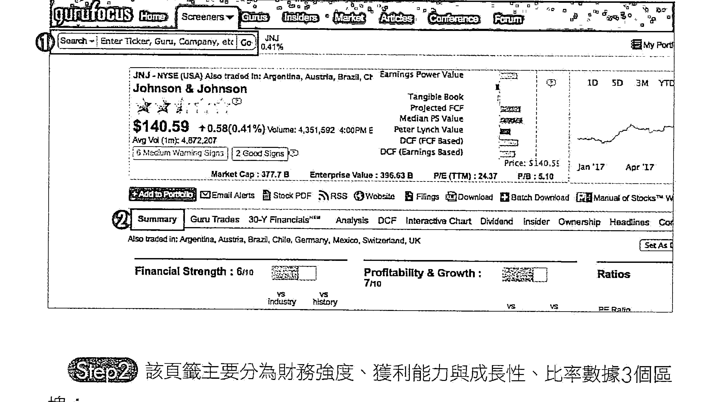

Step 2 该页籤主要分为财务强度、获利能力与成长性、比率数据3个区块：

# 1. Financial Strength（财务强度）

我主要会看①「Cash-to-Debt」（现金与债务比）、②「Equity-to-Asset」（股东权益与资产比）、③「Interest Coverage」（利息保障倍数，又称利息覆盖率）以及④最后一项的「WACC vs ROIC」。

由于本书3-3曾介绍过，ROIC（资本投入回报率）指的是企业运用资本创造收入价值的能力，一般会与WACC（Weighted Average Cost of Capital，加权平均资金成本）相比较，只有当ROIC高于WACC时，回报才有意义，也代表企业运用资本的能力较好。此项数据在GuruFocus的「WACC vs ROIC」，同时将两个数字并列显示，让使用者可以一目了然。

另有3种基本面与财务诊断的评价公式，如皮氏F分数、阿特曼Z-score模型、Beneish M-Score模型等，我没有使用，有兴趣者可自行搜寻相关资讯。

| Financial Strength : 6/10 | | | Profitability & Growth : 7/10 | | | Ratios | |
| :--- | :--- | :--- | :--- | :--- | :--- | :--- | :--- |
| | vs Industry | vs History | | vs Industry | vs History | | |
| Cash-to-Debt | 0.46 | | Operating Margin % | 27.54 | | PE Ratio | 24.37 |
| Equity-to-Asset | 0.48 | | Net Margin % | 21.28 | | Forward PE Ratio | 18.05 |
| Debt-to-Equity | 0.48 | | ROE % | 22.02 | | PE Ratio without NRI | 24.37 |
| Debt-to-EBITDA | 1.40 | | ROA % | 10.77 | | Price-to-Owner-Earnings | 20.39 |
| Interest Coverage | 24.27 | | ROC (Joel Greenblatt) % | 104.86 | | PB Ratio | 5.10 |
| Piotroski F-Score: 4 | | | 3-Year Revenue Growth Rate | 1.30 | | PS Ratio | 5.19 |
| Altman Z-Score: 4.78 | | | 3-Year EBITDA Growth Rate | 7.70 | | Price-to-Free-Cash-Flow | 20.92 |
| Beneish M-Score: -2.40 | | | 5-Year EPS without NRI Growth Rate | 7.20 | | Price-to-Operating-Cash-Flow | 17.93 |
| WACC vs ROIC | ROIC 22.88% | WACC 6.21% | | | | EV-to-EBIT | 19.60 |
| | | | | | | EV-to-EBITDA | 15.81 |

# 2. Profitability & Growth（获利能力与成长性）

这个区块为获利率与未来成长相关的比率，例如包括❶「Operating Margin」（营业利益率）、❷「Net Margin」（税后净利率）、❸「ROE」（股东权益报酬率）、❹「ROA」（资产报酬率）等，也包含葛林布雷神奇公式中提及两种选股指标之一❺「ROC」（资本报酬率）。

# 第5篇 善用網路資源 提升操作效率

Financial Strength: 6/10
Cash-to-Debt: 0.46
Equity-to-Asset: 0.48
Debt-to-Equity: 0.48
Debt-to-EBITDA: 1.40
Interest Coverage: 24.27
Piotroski F-Score: 4
Altman Z-Score: 4.78
Beneish M-Score: -2.40
WACC vs ROIC: ROIC 22.88% WACC 6.21%

Profitability & Growth: 7/10
Operating Margin %: 27.54
Net Margin %: 21.28
ROE %: 22.02
ROA %: 10.77
ROC (Joel Greenblatt) %: 104.86
3-Year Revenue Growth Rate: 1.30
3-Year EBITDA Growth Rate: 7.70
3-Year EPS without NRI Growth Rate: 7.20

Ratios
PE Ratio: 24.37
Forward PE Ratio: 18.05
PE Ratio without NRI: 24.37
Price-to-Owner-Earnings: 20.39
PB Ratio: 5.10
PS Ratio: 5.19
Price-to-Free-Cash-Flow: 20.92
Price-to-Operating-Cash-Flow: 17.93
EV-to-EBIT: 19.60

## 3. Ratios（比率數據）

此區塊包含的內容有較多種類，包括價值評估類的①「PE Ratio」（本益比）、②「PB Ratio」（股價淨值比）、③「Shiller PE Ratio」（席勒本益比）；衡量財務健康程度的④「Current Ratio」（流動比）、⑤「Quick Ratio」（速動比）；以及跟經營效率相關的⑥「Days Inventory」（存貨周轉天數）等。

Financial Strength: 6/10
Cash-to-Debt: 0.46
Equity-to-Asset: 0.48
Debt-to-Equity: 0.48
Debt-to-EBITDA: 1.40
Interest Coverage: 24.27

Profitability & Growth: 7/10
Operating Margin %: 27.54
Net Margin %: 21.28
ROE %: 22.02
ROA %: 10.77
ROC (Joel Greenblatt) %: 104.86

Ratios
PE Ratio: 24.37
Forward PE Ratio: 18.05 N/A
PE Ratio without NRI: 24.37
Price-to-Owner-Earnings: 20.39
PB Ratio: 5.10
PS Ratio: 20.97
Shiller PE Ratio: 26.99
Current Ratio: 1.32
Quick Ratio: 1.02
Days Inventory: 138.10

000 people have already joined GuruFocus to track the stocks they change investment ideas.

頁面下方還有兩個區塊，包括「Dividend & Buy Back」（股息與股票回購）相關數據、「Valuation & Return」（價值評估及報酬預期）等數據，請自行探索。

## 檢視股息》了解企業配息表現及未來股息成長空間

-   **Step1** 如果要查看股息相關數據，可從功能選單進入「Dividend」（股息）頁面，這頁也是很常檢視的資料。

網頁上半部為區塊式顯示各項股息重要數據，包括，「Dividend Yield」（當前殖利率與預估殖利率）、「Dividend Payout Ratio」（股息配發率）、「Growth Rate（5-Year）」（5年股息年化成長率），「Yield on Cost（5-Year）」（5年成本殖利率）、「Share Buyback Ratio」（3年平均股票回購率）。點選各區塊下緣的藍色文字，會顯示該數據的計算方式。

### Johnson & Johnson (JNJ) Dividend Data

| 指標 | 值 |
|------|------|
| Dividend Yield | 2.36% (Trailing), 2.39% (Forward) |
| Dividend Payout Ratio | 57% |
| Growth Rate (5-Year) | 7.00% |
| Yield on Cost (5-Year) | 3.32% |
| Share Buyback Ratio | 1.20% |

Trailing是指過去12個月，Forward是未來12個月，分母都是股價。

# # 第5篇 善用網路資源 提升操作效率

Step2 中間部分，則有近①1、3、5、10年的成本殖利率變化（Yield on Cost）及透過②「Total Return Calculator」（總報酬率計算機），輸入買進與結算日期，即會自動顯示總報酬率，與③股息殖利率變化圖表。

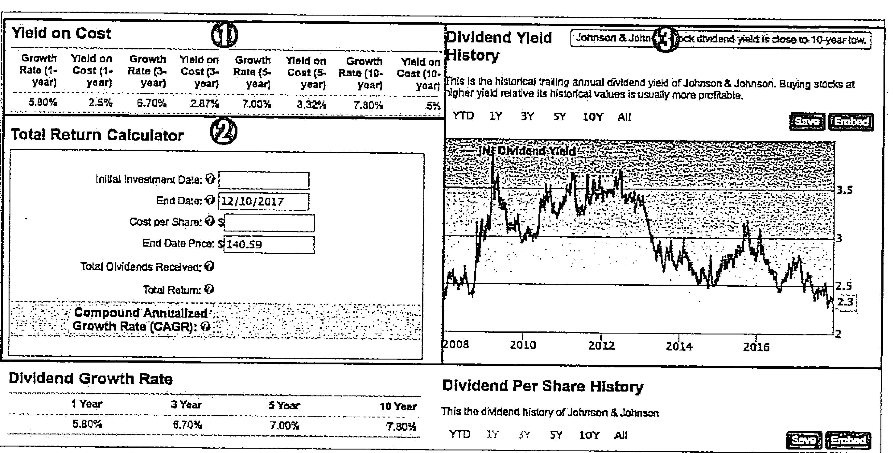

Step3 網頁下半部則分別顯示①最近1、3、5、10年的股息年化成長率（Dividend Growth Rate）、②「Dividend History」（股息配發紀錄）、③「Dividend Per Share History」（股息變化圖表）以及④「Payout Ratio」（股息配發率變化）。

其中，股息變化圖表同時包含3個指標，包括每股股息、每股稅後盈餘（EPS）與每股自由現金流。從「EPS」與「每股自由現金流」這兩個數據的比較，就能知道股息是否來自於充足的盈餘。假如股息占盈餘的比率不高，可解讀為企業還有充分的股息成長空間，並兼具擴張以挹注未來成長的能力。

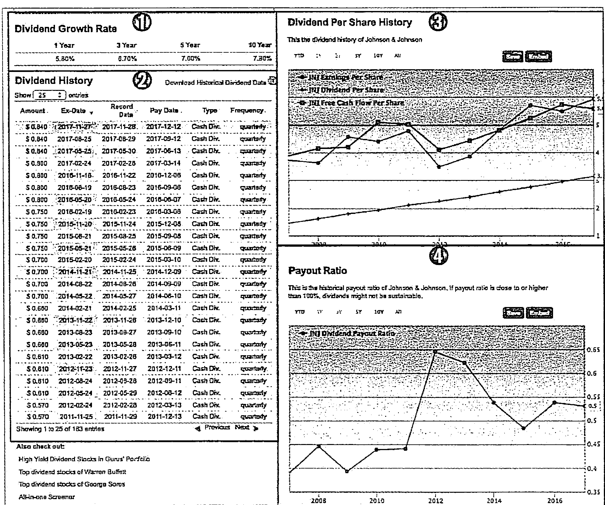

## 互動圖表》搭配不同財務指標一併呈現

最後要介紹的功能是「Interactive Chart」（互動式圖表），可以自由選取不同財務指標搭配成一張圖。

# # 第5篇 善用網路資源 提升操作效率

從功能選單進入①「Interactive Chart」。在這裡，你能夠任意選取②數種財務指標數據搭配成一張圖（此以「Earnings per Share (Diluted)」（稀釋每股盈餘，下圖綠線）、「Free Cash Flow per Share」（每股自由現金流，下圖藍線）、「Dividends per Share」（每股股息，下圖紅線）為例），完全取決你想要將數據組合成什麼樣的面貌，在同一張圖上呈現。

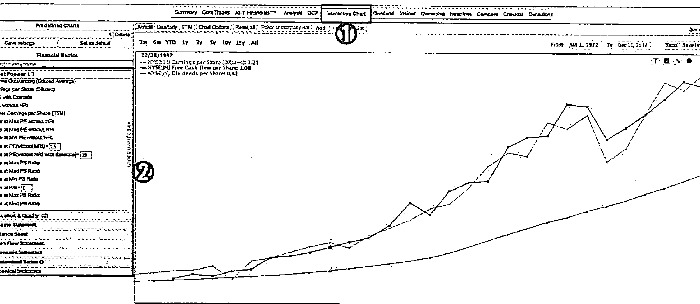

## Dividend.com》 6大重點股息資訊全面整理

「Dividend.com」網站主要是提供跟股息資訊相關的資訊，免費與付費資訊各半。以下簡單介紹一般投資者常會參考的功能：

## 1. 配息基本資訊

進入首頁（www.dividend.com），在❶搜尋欄位輸入個股代號，並按下「Enter」鍵，進入個股頁面，可看到個股代號下方有5個指標，分別為：❷「Dividend Yield」（股息殖利率）、❸「Annualized Payout」（年化配息）、❹「Payout Ratio」（股息配發率）、❺「Dividend Growth」（股息連續成長年數），最後一項❻「DARS Rating」是該網站對這檔股票的評級（為付費會員專屬，有興趣者可申請試用會員查看）。

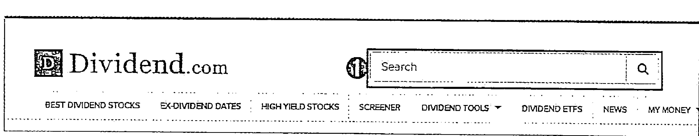

## 2. 股息倒數計時

點選上方選單⑪「Upcoming Dividend Payouts」（即將配發股息），或直接將網頁往下拉到該位置，首次使用者，網站會要求註冊Email才能查看此項資訊。

這個區塊分為上下兩部分，上方為⑫「Next Ex-Dividend Date」（最近一次除息日期）、⑬「Next Ex-Dividend Amount」（最近一次除息金額）以及⑭「Dividend Shot Clock」（除息剩餘時間）；下方顯示與配息相關的3個日期，分別為⑮「Ex-Dividend Date」（除息日）、⑯「Record Date」（股東持有名冊紀錄日）、⑰「Pay Date」（股息支付日）。想要獲取股息，必須在除息日前一交易日購入。而⑱「Payout type」（配發類型）指的是該次配息的類型。

| DIVIDEND YIELD | ANNUALIZED PAYOUT | PAYOUT RATIO | DIVIDEND GROWTH | DARS RATING |
|----------------|-------------------|--------------|-----------------|-------------|
| 2.53%          | $3.36<br>Paid Quarterly | 46.8%<br>EPS $7.16 | 54 yrs<br>Since 1963 | [部分] / 5 |

| STOCK | PRICE AS OF | INDUSTRY |
|-------|-------------|----------|
| JNJ   | DEC 07, 06:40 PM EST<br>$140.01 -$1.05 -0.7% | Drug manufacturers - major |

### JNJ Upcoming Dividend Payouts

Next Ex-Dividend Date: Aug 25
Next Ex-Dividend Amount: $0.84
Dividend Shot Clock: 5 Days, 17 Hrs, 47 Min, 0 Sec

| Amount | Declare Date | Ex-Dividend Date | Record Date | Pay Date | Payout Type |
|--------|--------------|------------------|-------------|----------|-------------|
| $0.8400 | 2017-07-27 | 2017-08-25 | 2017-08-29 | 2017-09-12 | Regular |

> 配發類型 可分為兩類。一種是「Regular」，代表正規週期（例如固定月配、季配、半年配）。另一種是「Special」，代表正規週期之外的額外配息。

## 3. 股息年化成長率

此處顯示不同週期的股息年化成長率，但免費資訊只有❶近1年與3年成長率，較為不足，可與GuruFocus.com網站搭配查看（有1、3、5、10年的股息年化成長率資訊，詳見5-2）。

| Annualized Growth 1994-2012 | Annualized Growth 1994-2004 | Annualized Growth 2004-2008 | Annualized Growth 2008-2012 | Annualized Growth Last 5 Yrs | Annualized Growth Last 3 Yrs | Annual Growth 2016 | Consecutive Years of Increases |
|-------------------------------|-------------------------------|-------------------------------|-------------------------------|--------------------------------|--------------------------------|--------------------|----------------------------------|
| 11.6% | 14.5% | 13.2% | 7.5% | 7.0% | 6.7% | 6.8% | 54 years |

## 4. 股價與殖利率長期歷史走勢圖

此處提供①股價（藍線）與殖利率（黑線）歷史走勢圖，最長可以拉到40幾年的資料。將滑鼠移至曲線上，會顯示各交易日的股價、當時配息、殖利率，以及配發日期等資訊。

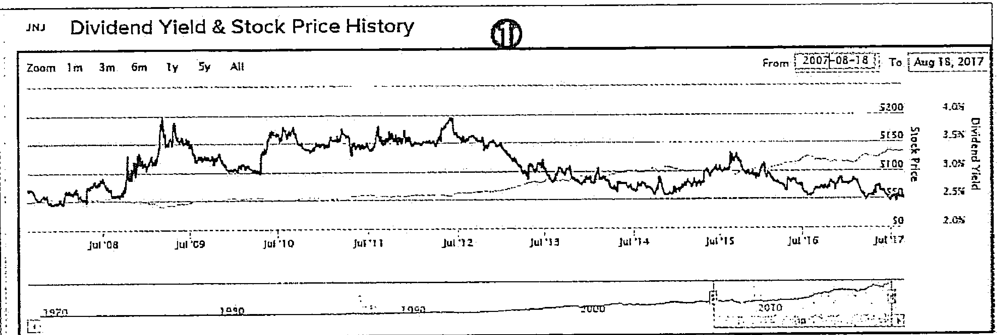

## 5. 股息配發歷史與成長率

這張①「Dividend Payout History」（股息配發歷史）直條圖，顯示個股的股息配發歷史，以發放頻率為單位，例如季配息則顯示每季配息數據，資料期間長達25年。

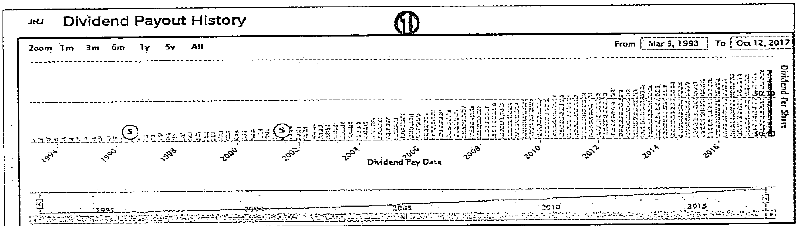

若為付費會員，可查看「Historical Annual Dividend Data & Growth」（歷年股息以及成長率）。

### JNJ Historical Annual Dividend Data & Growth

| Payout Amount | Calendar Year | Annual Growth |
|---------------|---------------|---------------|
| $3.1500       | 2016          | 6.8%          |
| $2.9500       | 2015          | 6.8%          |
| $2.7600       | 2014          | 6.6%          |
| $2.5900       | 2013          | 7.9%          |
| $2.4000       | 2012          | 6.7%          |
| $2.2500       | 2011          | 6.6%          |
| $2.1100       | 2010          | 9.3%          |
| $1.9300       | 2009          | 7.5%          |
| $1.7950       | 2008          | 10.8%         |
| $1.6700       | 2007          | 11.3%         |

另外，再將網頁下拉，可以看到「Dividend History」（股息配發歷史數據），這裡則提供了股息配發歷史的數據明細，非常實用。如果是付費會員，則可以直接下載Excel檔案。

### JNJ Dividend History

| Payout Amount | Declared Date | Ex-Dividend Date | Record Date | Pay Date | Qualified Dividend? | Payout Type | Frequency |
|---------------|---------------|------------------|-------------|----------|---------------------|-------------|-----------|
| $0.8400       | 2017-07-17    | 2017-08-25       | 2017-08-29  | 2017-09-12 | Yes                 | Regular     | Quarter   |
| $0.8400       | 2017-04-27    | 2017-05-25       | 2017-05-29  | 2017-06-12 | Yes                 | Regular     | Quarter   |
| $0.8000       | 2017-01-03    | 2017-02-24       | 2017-02-28  | 2017-03-12 | Yes                 | Regular     | Quarter   |
| $0.8000       | 2016-10-20    | 2016-11-18       | 2016-11-22  | 2016-12-07 | Yes                 | Regular     | Quarter   |
| $0.8000       | 2016-07-18    | 2016-08-19       | 2016-08-23  | 2016-09-07 | Yes                 | Regular     | Quarter   |
| $0.8000       | 2016-04-28    | 2016-05-20       | 2016-05-24  | 2016-06-07 | Yes                 | Regular     | Quarter   |
| $0.7500       | 2016-01-04    | 2016-02-19       | 2016-02-23  | 2016-03-08 | Yes                 | Regular     | Quarter   |
| $0.7500       | 2015-10-22    | 2015-11-20       | 2015-11-24  | 2015-12-08 | Yes                 | Regular     | Quarter   |

## 6. 股息連續成長達10年及25年企業清單

最後一提，Dividend.com網站中，還有連續成長達10年與25年以上的股息成長企業清單。從網頁最上方的功能表，點選❶「Dividend Tools」（股息工具），選擇❷「25-Year Dividend Increasing Stocks」（股息連續成長25年個股）或❸「10-Year Dividend Increasing Stocks」（股息連續成長10年個股，以此為例），即可免費看到❹名單。

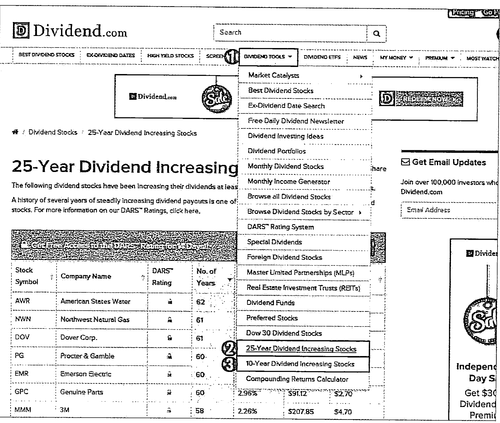

### 25-Year Dividend Increasing Stocks

The following dividend stocks have been increasing their dividends at least...
A history of several years of steadily increasing dividend payouts is one of... stocks. For more information on our DARS™ Ratings, click here.

| Stock Symbol | Company Name | DARS™ Rating | No. of Years |
| :--- | :--- | :--- | :--- |
| AWR | American States Water | A+ | 62 |
| NWN | Northwest Natural Gas | A | 61 |
| DOV | Dover Corp. | B+ | 61 |
| PG | Procter & Gamble | A | 60 |
| EMR | Emerson Electric | A- | 60 |
| GPC | Genuine Parts | A- | 60 |
| MMM | 3M | B | 58 |# 10-Year Dividend Increasing Stocks

The following dividend stocks have been increasing their dividends at least once per year for at least the past 10 years.

A history of several years of steadily increasing dividend payouts is one of the factors we use when evaluating dividend stocks. For more information on our DARS Ratings, click here.

| Stock Symbol | Company Name | DARS Rating | No. of Years | Dividend Yield | Current Price | Annual Dividend |
|--------------|--------------|-------------|--------------|----------------|---------------|-----------------|
| AWR | American States Water | 3.4 | 62 | 1.81% | $56.27 | $1.02 |
| NWN | Northwest Natural Gas | 3.3 | 61 | 2.81% | $67.20 | $1.89 |
| DOV | Dover Corp. | 3.3 | 61 | 1.91% | $98.60 | $1.88 |
| PG | Procter & Gamble | 3.5 | 60 | 3.05% | $90.37 | $2.76 |
| EMR | Emerson Electric | 3.5 | 60 | 2.92% | $66.55 | $1.94 |
| ROST | Ross Stores | 3.3 | 10 | 0.83% | $76.89 | $0.64 |
| AAN | Aaron's Inc. | 3.3 | 10 | 0.31% | $38.98 | $0.12 |
| HCC | HCC Insurance Holdings | 3.4 | 10 | 0.84% | $23.90 | $0.20 |
| AXS | Axis Capital Holdings | 3.4 | 10 | 3.10% | $50.25 | $1.56 |
| OGE | OGE Energy | 3.3 | 10 | 3.86% | $34.46 | $1.33 |
| DUK | Duke Energy | 3.4 | 10 | 4.04% | $88.05 | $3.56 |
| DNB | Dun & Bradstreet | 3.4 | 10 | 1.66% | $121.33 | $2.01 |
| SEP | Spectra Energy Partners LP | 3.4 | 10 | 7.09% | $41.00 | $2.91 |
| PBCT | People's United Financial | 3.2 | 10 | 3.66% | $18.84 | $0.69 |
| VZ | Verizon | 3.5 | 10 | 4.62% | $51.09 | $2.36 |
| FLS | Flowserve | 3.4 | 10 | 1.80% | $42.13 | $0.76 |
| CHRW | C.H. Robinson Worldwide | 3.2 | 10 | 2.08% | $88.38 | $1.84 |
| FLIC | First of Long Island Corp | 3.1 | 10 | 2.04% | $29.35 | $0.60 |
| AFSI | Amtrust Financial Services | 3.3 | 10 | 6.75% | $10.08 | $0.68 |

# ★54 CCC List》 連續股息成長企業清單

有一位股息成長投資者Dave Fish，在網路上免費開放一份清單，稱為「CCC List」。每個月最後一天會更新資料，將股息連續成長的企業，以股息連續成長年數長短，區分為3個族群：

- 1. 5年以上~未達10年：Challengers（股息挑戰者）。
- 2. 10年以上~未達25年：Contenders（股息競爭者）。
- 3. 25年以上：Champions（股息冠軍）。

# 步驟1》 下載免費股息成長企業清單

進入網頁「www.dripinvesting.org/Tools/Tools.asp」，於①「U.S. Dividend Champions」下，即可看到②下載格式分為Excel與PDF兩種。

Excel仍較為方便檢視以及做些篩選，甚至能將資料額外輸出到關聯式資料庫或Google SpreadSheet另外做處理，應用範圍很廣泛。

# Information

**U.S. Dividend Champions**
U.S. Companies with 25+ Straight Years Higher Dividends
[Excel Spreadsheet] [PDF Format] Updated 11/30/2017
Historic compilation of Dividend Champion spreadsheets
The U.S. Dividend Champions are maintained by Dave Fish of Moneypaper's DirectInvesting.com, whose articles appear at Seeking Alpha.
Dividend Champions Screener by Peter Gormsen

**Canadian Dividend All-Star List**
Canadian companies with five or more consecutive years of dividend increases. Download here
Maintained by DGI&R of Dividend Growth Investing & Retirement

**UK Dividend Champions**
This page is the home of the UK Dividend Champions List.
Maintained by Trevor Witten of Dividend Life

DRiP Sp
An Excel spr
Example DRi
Portfolio
Portfolio Slic
your way.
Budget S
An Excel spr
Portfolio
An Excel spr
Stock.Div
Stock.Div let
decisions a
Dividend

# 步驟2》開啟CCC List

以Excel檔案為例，打開檔案可看到多張工作表，前4張工作表分別是❶「Champions」（股息冠軍）、❷「Contenders」（股息競爭者）、❸「Challengers」（股息挑戰者）、❹「All CCC」（所有股息連續成長5年以上企業）。

清單當中的欄位，除了企業名稱、所屬產業，股息連續成長年數、除息日、股息配發日等基本資訊外，還包含不少財務數據，包括每股稅後盈餘（EPS）、歷年股息變化（約有近20年的數據），與1、3、5、10年的年化股息成長率等。

| # | Company Name | Ticker Symbol | Industry | No. Yrs | No. Seq | CCC DRIP Fees | 11/30/17 Price | Div. Yield | Quarterly Rate Old | Quarterly Rate New | MR% Inc. | Dividend Dates Ex-Div | Dividend Dates Record | Dividend Dates Pay |
|---|---|---|---|---|---|---|---|---|---|---|---|---|---|---|
| 7 | 1st Source Corp. | SRCE | Banking | 30 | 94 | - | 51.45 | 1.55 | 0.1900 | 0.2000 | 5.26 | 11/3/17 | 11/6/17 | 11/15/17 |
| 8 | 3M Company | MMM | Conglomerate | 59 | 8 | N N | 243.14 | 1.93 | 1.1100 | 1.1750 | 5.86 | 2/15/17 | 2/17/17 | 3/12/17 |
| 9 | ABM Industries Inc. | ABM | Business Services | 50 | 20 | Y N | 42.80 | 1.59 | 0.1650 | 0.1700 | 3.03 | 1/3/17 | 1/5/17 | 2/6/17 |
| 10 | AFLAC Inc. | AFL | Insurance | 35 | 77 | N N | 87.64 | 2.05 | 0.4300 | 0.4500 | 4.65 | 11/14/17 | 11/15/17 | 12/1/17 |
| 11 | Air Products & Chem. | APD | Chemical-Specialty | 35 | 74 | Y Y | 163.04 | 2.33 | 0.8600 | 0.9500 | 10.47 | 3/30/17 | 4/3/17 | 5/8/17 |
| 12 | Altria Group Inc. | MO | Tobacco | 48 | 30 | Y Y | 67.83 | 3.89 | 0.6100 | 0.6600 | 8.20 | 9/14/17 | 9/15/17 | 10/10/17 |
| 13 | American States Water | AWR | Utility-Water | 63 | 1 | N N | 57.69 | 1.77 | 0.2420 | 0.2550 | 5.37 | 8/11/17 | 8/15/17 | 9/1/17 |
| 14 | Aqua America Inc. | WTR | Utility-Water | 25 | 110 | N N | 37.99 | 2.16 | 0.1913 | 0.2047 | 7.00 | 8/14/17 | 8/16/17 | 9/1/17 |
| 15 | Archer Daniels Midland | ADM | Agriculture | 42 | 58 | N Y | 39.88 | 3.21 | 0.3000 | 0.3200 | 6.67 | 2/16/17 | 2/21/17 | 3/14/17 |
| 16 | AT&T Inc. | T | Telecommunications | 33 | 82 | Y Y | 36.38 | 5.39 | 0.4800 | 0.4900 | 2.08 | 1/6/17 | 1/10/17 | 2/1/17 |
| 17 | Atmos Energy | ATO | Utility-Gas | 34 | 80 | N N | 92.29 | 2.10 | 0.4500 | 0.4850 | 7.78 | 11/24/17 | 11/27/17 | 12/11/17 |
| 18 | Automatic Data Proc. | ADP | Business Services | 43 | 57 | N Y | 114.46 | 2.20 | 0.5700 | 0.6300 | 10.53 | 12/7/17 | 12/8/17 | 1/1/18 |
| 19 | Badger Meter Inc. | BMI | Industrial Equipment | 25 | 111 | N Y | 46.40 | 1.12 | 0.1150 | 0.1300 | 13.04 | 8/29/17 | 8/31/17 | 9/15/17 |
| 20 | Becton Dickinson & Co. | BDX | Medical Instruments | 46 | 42 | N N | 228.21 | 1.31 | 0.7300 | 0.7500 | 2.74 | 12/7/17 | 12/8/17 | 12/29/17 |
| 21 | Bemis Company | BMS | Packaging | 34 | 79 | N N | 46.92 | 2.56 | 0.2900 | 0.3000 | 3.45 | 2/17/17 | 2/21/17 | 3/1/17 |
| 22 | Black Hills Corp. | BKH | Utility-Electric | 47 | 33 | N N | 58.51 | 3.25 | 0.4450 | 0.4750 | 6.74 | 11/16/17 | 11/17/17 | 12/1/17 |
| 23 | Brady Corp. | BRC | Business Services | 32 | 83 | N N | 39.10 | 2.12 | 0.2050 | 0.2075 | 1.22 | 10/9/17 | 10/10/17 | 10/31/17 |
| 24 | Brown-Forman Class B | BF-B | Beverages-Alcoholic | 34 | 81 | Y Y | 59.80 | 1.32 | 0.1825 | 0.1975 | 8.22 | 12/6/17 | 12/7/17 | 1/2/18 |
| 25 | C.R. Bard Inc. | BCR | Medical Instruments | 45 | 35 | N Y | 335.94 | 0.31 | 0.2400 | 0.2600 | 8.33 | 7/14/16 | 7/18/16 | 7/29/16 |
| 26 | California Water Service | CWT | Utility-Water | 50 | 21 | N N | 45.60 | 1.58 | 0.1725 | 0.1800 | 4.35 | 2/2/17 | 2/6/17 | 2/17/17 |
| 27 | Calvin B. Taylor Bankshares | TYCB | Banking | 27 | 99 | - | 35.60 | 2.75 | 0.9700 | 0.9800 | 1.03 | 11/7/17 | 11/8/17 | 12/29/17 |
| 28 | Carlisle Companies | CSL | Rubber and Plastics | 41 | 65 | N N | 114.97 | 1.29 | 0.3500 | 0.3700 | 5.71 | 8/16/17 | 8/18/17 | 9/1/17 |
| 29 | Chesapeake Financial Share | CPKF | Banking | 26 | 103 | - | 27.75 | 1.87 | 0.1250 | 0.1300 | 4.00 | 8/30/17 | 9/1/17 | 9/15/17 |
| 30 | Chevron Corp. | CVX | Oil & Gas | 30 | 92 | Y Y | 116.99 | 3.63 | 1.0700 | 1.0800 | 0.93 | 11/16/16 | 11/18/16 | 12/12/16 |
| 31 | Cincinnati Financial | CINF | Insurance | 57 | 10 | N N | 74.73 | 2.68 | 0.4800 | 0.5000 | 4.17 | 3/20/17 | 3/22/17 | 4/14/17 |
| 32 | Cintas Corporation | CTAS | Business Services | 35 | 78 | - | 157.44 | 1.03 | 1.3300 | 1.6200 | 21.80 | 11/9/17 | 11/10/17 | 12/8/17 |
| 33 | Champions | Contenders | Challengers | All CCC | - | - | - | - | - | - | - | - | - | - |
| 34 | Coca-Cola Company | KO | Beverages-Non-alcoholic | 55 | 11 | Y Y | 45.77 | 3.23 | 0.3500 | 0.3700 | 5.71 | 3/13/17 | 3/15/17 | 4/3/17 |

# 步驟3》切換至「Summary」工作表

除了關於每家企業的詳細數據外，Dave還整理了一些有趣的資訊，放置於同一個Excel檔案當中的「Summary」工作表。其中內容有：

## 1.股息成長企業相關統計圖

以下以2017年11月更新的檔案為例，來看看這些圖表代表的意義：

- ①「Number of Companies」（企業的數量變化）：數量最少的Champion因為達成難度最高，長期不太會有顯著變化，增速最快的為股息連續成長5年到未達10年的Challenger。
- ② 「Average Price」（企業的平均股價變化）：平均股價成長最多的為Champion，最低為Challenger。
- ③ 「Average Yield」（企業平均殖利率變化）：因為價格不斷上漲，殖利率反向下降，3組企業平均都在2.4%~2.7%之間。
- ④ 「Ave Most Recent % Increase」（企業股息成長率）：自2015年後不斷下降，顯示經濟復甦力道可能不強勁，但也可能是企業使用低率借貸，而採用了股票回購來替代股息發放。

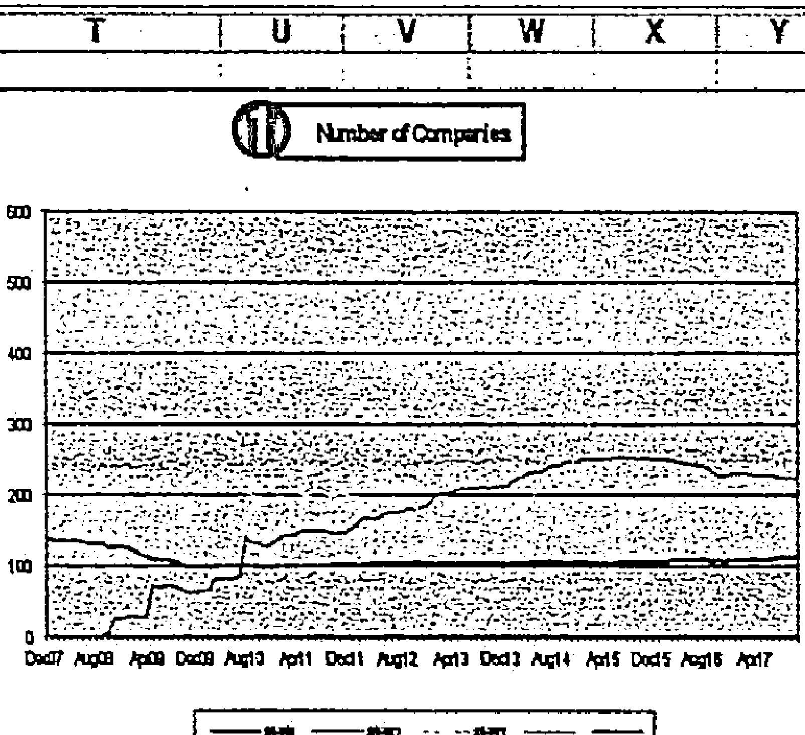

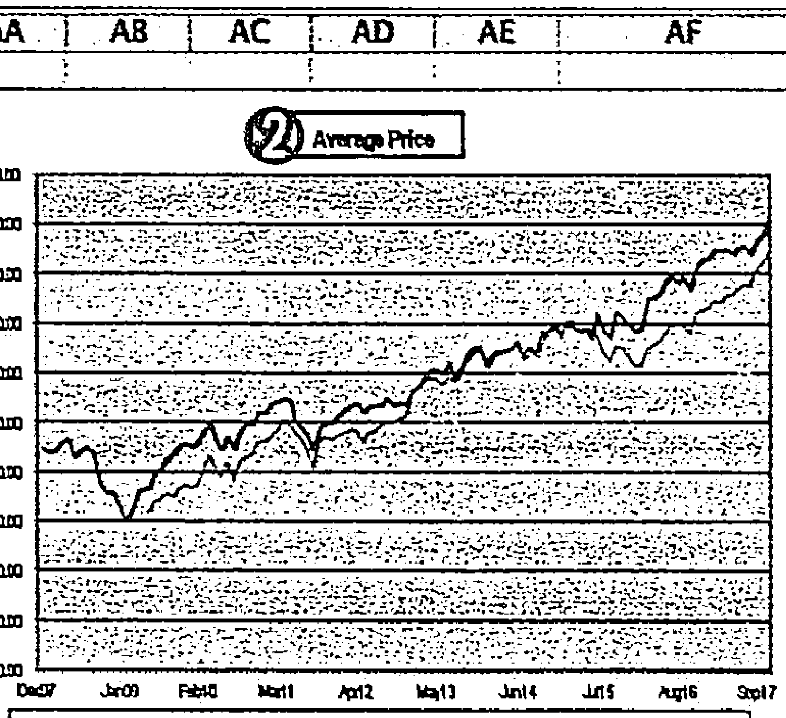

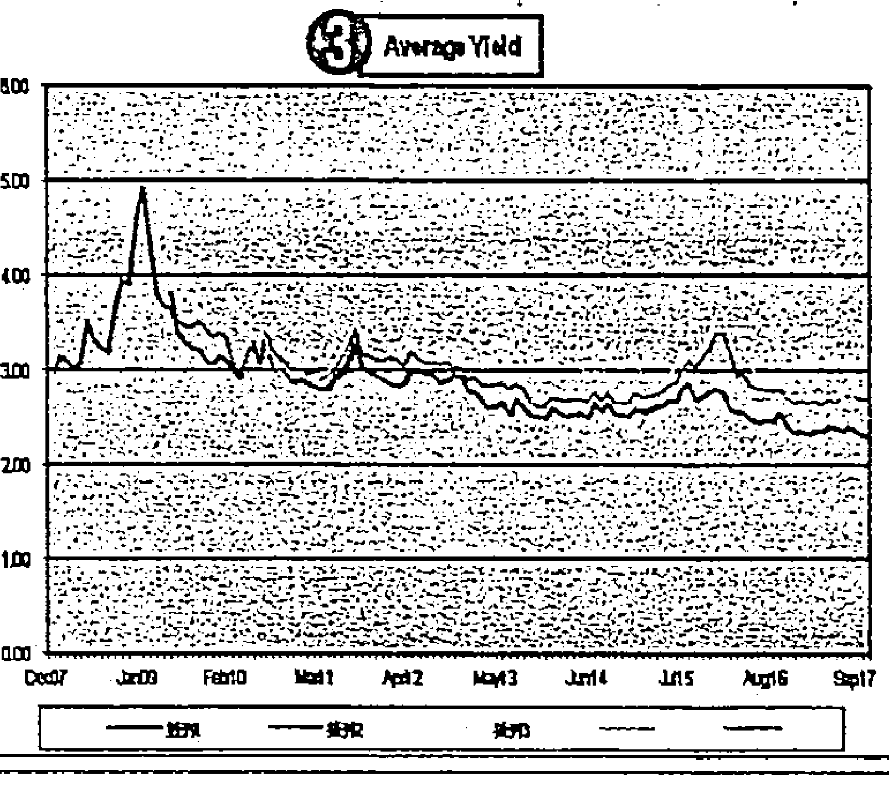

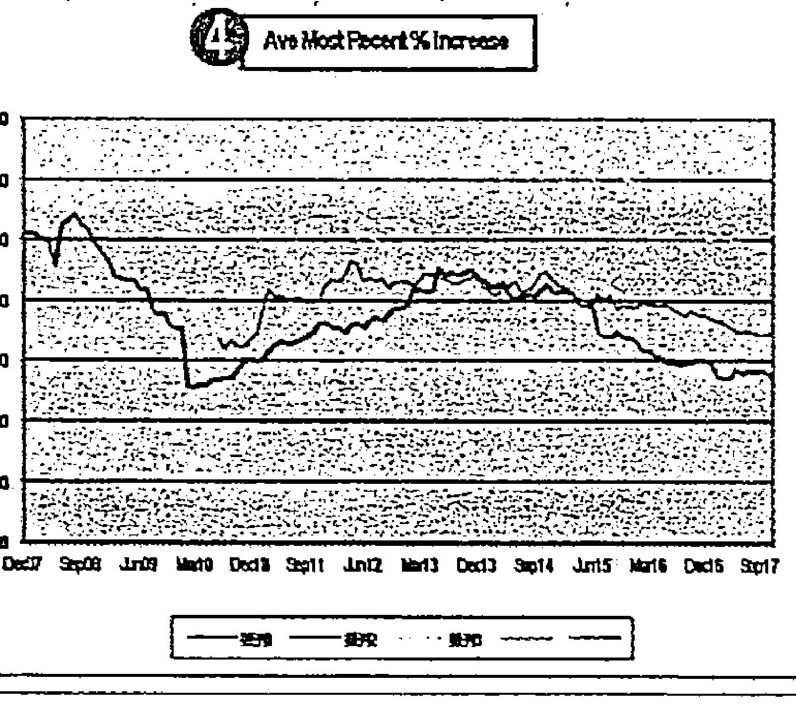## 2. 股息成長企業相關統計表

這裡的表格顯示這3組股息成長企業的相關統計，包括企業家數、連續成長年數平均值、平均股價、平均殖利率、平均股息成長率、歷年變化等資訊。

從「Quick Summary」表格中可以看到，所有CCC企業（股息連續成長超過5年）家數為815家，其中Champions有113家。「CCC Aging」項下，則為歷年3組企業的家數變化，由表中可看出Champions在2009年下降最多，近7年的則大致持平。Challengers雖然企業家數增長最快，但曾經連續2年（2012、2013年）都有家數下降的狀況，畢竟門檻較低，時間不夠長，變化幅度也比較高。Contenders反而增長較為穩定，但2016年也曾大幅減少。

| | T | U | V | W | X |
| :--- | :--- | :--- | :--- | :--- | :--- |
| 50 | **Quick Summary:** | | | | |
| 51 | | 11/30/17 | Champions | Contenders | Challengers | Total |
| 52 | No. of Companies | 2 | 113 | 222 | 480 | 1 | 815 |
| 53 | Ave. No. of Years | | 41.3 | 15.9 | 6.6 | 13.9 |
| 54 | Average Price | | 90.97 | 84.31 | 65.93 | 74.41 |
| 55 | Average % Yield | | 2.26 | 2.67 | 2.49 | 2.51 |
| 56 | Ave. MR % Increase | | 5.42 | 6.89 | 10.24 | 8.28 |
| 57 | | 10/31/17 | Champions | Contenders | Challengers | Total |
| 58 | No. of Companies | | 113 | 223 | 478 | 814 |
| 59 | Ave. No. of Years | | 41.1 | 15.8 | 6.5 | 13.9 |
| 60 | Average Price | | 87.76 | 81.94 | 63.14 | 71.71 |
| 61 | Average % Yield | | 2.31 | 2.68 | 2.55 | 2.55 |
| 62 | Ave. MR % Increase | | 5.60 | 6.88 | 10.45 | 8.40 |
| 63 | | 12/30/16 | Champions | Contenders | Challengers | Total |
| 64 | No. of Companies | | 108 | 227 | 433 | 768 |
| 65 | Ave. No. of Years | | 41.3 | 15.6 | 6.2 | 13.9 |
| 66 | Average Price | | 82.84 | 72.43 | 58.82 | 66.22 |
| 67 | Average % Yield | | 2.33 | 2.64 | 2.67 | 2.61 |
| 68 | Ave. MR % Increase | | 6.02 | 7.47 | 10.02 | 8.45 |

## 美股股息成長投資術

CCC Aging:

| # of Years in Streak | 2007 | 2008 | 2009 | 2010 | 2011 | 2012 | 2013 | 2014 | 2015 | 2016 | 2017 |
| :--- | :--- | :--- | :--- | :--- | :--- | :--- | :--- | :--- | :--- | :--- | :--- |
| Champions | 133 | 128 | 97 | 98 | 102 | 105 | 105 | 106 | 107 | 108 | 113 |
| Contenders | 6 | 22 | 62 | 129 | 146 | 183 | 210 | 246 | 250 | 227 | 222 |
| Challengers | | | | 190 | 200 | 170 | 161 | 259 | 396 | 434 | 480 |
| CCC Totals: | 139 | 150 | 159 | 417 | 448 | 458 | 476 | 611 | 753 | 769 | 815 |

Change from Prior Year: (Number of Companies at December 31)

| | 2007 | 2008 | 2009 | 2010 | 2011 | 2012 | 2013 | 2014 | 2015 | 2016 | 2017 |
| :--- | :--- | :--- | :--- | :--- | :--- | :--- | :--- | :--- | :--- | :--- | :--- |
| Champions | | -5 | -31 | 1 | 4 | 3 | 0 | 1 | 1 | 1 | 5 |
| Contenders | | 16 | 40 | 67 | 17 | 37 | 27 | 36 | 4 | -23 | -5 |
| Challengers | | | | 190 | 10 | -30 | -9 | 98 | 137 | 38 | 46 |
| CCC Totals: | | 11 | 9 | 258 | 31 | 10 | 18 | 135 | 142 | 16 | 46 |

## 55

## Portfolio Tracker雲端試算表》

## 輕鬆管理投資組合

「Two investing」部落格的2位版主Johny與Scott本身也是DGI（股息成長投資者），根據網站上的介紹，2位版主是醫學院同學，現職皆為醫師，主要專注於2種投資策略，一是透過股息成長投資策略，管理長期資產，另一個則是選擇權交易。他們以Google Spreadsheet（Google提供的雲端試算表功能），做了一個功能非常完善且免費的投資組合追蹤工具「Dividend Stock Portfolio Tracker」，我認為非常適合DGI使用，幾乎涵蓋了所有DGI注重的功能。

## 搭配Google雲端試算表，下載投資組合追蹤工具

- Step 1 進入「Two investing」部落格（www.twoinvesting.com/2013/08/investing-spreadsheets/），點選「Dividend Stock Portfolio Spreadsheet on Google Sheets」，可以看到作者詳細介紹如何使用這個試算表工具。

## DIVIDEND & OPTIONS STRATEGIES

Dividend Stock Portfolio Tracker with Transactions Page

BY SCOTT · PUBLISHED AUGUST 4, 2013 · UPDATED OCTOBER 2, 2017

Version 5 of the Dividend Stock Portfolio Spreadsheet on Google Sheets has just been released. This page will be saved for historical reference.

- Step 2 將網頁下拉，點選連結 「Click here to access the Dividend Stock Portfolio Spreadsheet」，即可進入雲端試算表頁面。

## Dividend Stock Portfolio Spreadsheet on Google Sheets

BY SCOTT · PUBLISHED OCTOBER 25, 2017 · UPDATED NOVEMBER 14, 2017

Click here to access the Dividend Stock Portfolio Spreadsheet

## 運用5大工作表，強化投資管理效率

雲端試算表預設工作表頁面為「Start Here」，提醒使用者必須先登入Google帳號，並於「檔案」功能表→「建立副本」，才能建立一份相同格式的試算表副本，並且儲存到自己的雲端空間以進行後續的編輯。

以下僅介紹5張主要工作表的功能：「Portfolio」（投資組合）、「Summary」（摘要）、「DivCalendar」（股息月曆）、「DivPayoutCalc」（股息計算）、「Transactions」（交易紀錄）。

### 工作表1》Portfolio（投資組合）

切換到「Portfolio」工作表，其顯示使用者的投資組合總覽資料，初始顯示的是預設的範本，使用者須在橘色儲存格內填入你自己購買的美股名單，包含「Company Name」（公司名稱）及「Symbol」（代號）、所屬GICS（全球行業分類標準）產業類別。綠色儲存格的部分則是已經設定好公式的内容，不需要修改。之後當你在「Transactions」工作表填入買賣紀錄後，就會同步記錄到「Portfolio」工作表當中。

投資組合總覽的欄位包含相當多資訊，包括Shares（持有股數）、Market Value（當前市值）、Market Weight（個股占投資組合比重）、Cost Basis（成本）、Unrealized Gain／Loss（未實現損益）、Realized Gain／Loss（已實現損益）、年化報酬率（XIRR）、Annual Dividend（年度股息）、Dividend Yield（殖利率）、YOC（成本殖利率）等。只要你願意勤勉的輸入買進、賣出、股息等交易紀錄，這張試算表便能清楚計算出你的投資組合內容。

另外，如果想要一併記錄你目前還有多少欲投資的現金部位，可在「Cash」旁的儲存格填入金額。

| Sector | Account | Company Name | Symbol | Shares | Market Value | Market Weight | Cost Basis | Unrealized Gain/Loss | Unrealized Gain/Loss % | XIRR | Realized Gain/Loss | Dividends Collected | Total Gain/Loss | Annual Dividend |
| :--- | :--- | :--- | :--- | :--- | :--- | :--- | :--- | :--- | :--- | :--- | :--- | :--- | :--- | :--- |
| | | Cash | | | $0.00 | 100.00% | $57,130.00 | -$23,185.00 | -34.54% | -36.07% | $0.00 | $80.00 | -$23,105.00 | $1,588.00 |
| Industrials | Brokerage | General Electric | GE | 1000 | $20,130.00 | 45.81% | $25,000.00 | -$4,870.00 | -19.48% | -5.50% | $0.00 | $80.00 | -$4,790.00 | $360.00 |
| Information Technology | Brokerage | Apple | AAPL | 100 | $17,425.00 | 39.65% | $15,000.00 | $2,425.00 | 16.17% | 0.00% | $0.00 | $0.00 | $2,425.00 | $252.00 |
| Energy | Brokerage | Royal Dutch Shell | RDS.A | 100 | $5,390.00 | 14.54% | $5,380.00 | $10.00 | 0.19% | 0.00% | $0.00 | $0.00 | $10.00 | $376.00 |
| | | Shopify Inc | TSX:SHOP | 100 | $0.00 | 0.00% | $12,500.00 | -$12,500.00 | -100.00% | 0.00% | $0.00 | $0.00 | -$12,500.00 | $0.00 |
| | | Toronto-Dominion Bank | TSX:TD | 100 | $0.00 | 0.00% | $7,250.00 | -$7,250.00 | -100.00% | 0.00% | $0.00 | $0.00 | -$7,250.00 | $0.00 |
| | | adidas | ADDYY | 0 | $0.00 | 0.00% | $0.00 | $0.00 | 0.00% | 0.00% | $0.00 | $0.00 | $0.00 | $0.00 |

# 第X篇 善用網路資源 提升操作效率

### 工作表2》Summary（摘要）

這張工作表主要顯示與股息收入相關的資訊，並且將你的投資組合資料，以圖表的方式呈現，例如：

#### 1. Monthly Dividends per Year（每月股息收入）

表格數據為近3年每個月的股息收入，並以直條圖顯示在右側。

| IB | Market Value | Cost Basis | Unrealized Gain/Loss | Unrealized Gain/Loss % | Annual Dividends | Monthly Dividends | Current Yield | YOC | Total Dividends |
| :--- | :--- | :--- | :--- | :--- | :--- | :--- | :--- | :--- | :--- |
| Schwab | $81,319.34 | $70,753.32 | $10,566.02 | 14.93% | $2,788.58 | $232.38 | 3.43% | 3.94% | $1,739.83 |
| | | | | 0.00% | | $0.00 | 0.00% | 0.00% | |
| Totals | $81,319.34 | $70,753.32 | $10,566.02 | 14.93% | $2,788.58 | $232.38 | 3.43% | 3.94% | $1,739.83 |

| Monthly Dividends per Year | | | |
| :--- | :--- | :--- | :--- |
| Month | 2015 | 2016 | 2017 |
| January | $22.00 | $23.00 | $23.00 |
| February | $80.44 | $82.96 | $94.41 |
| March | $24.40 | $55.36 | $59.06 |
| April | $23.00 | $23.00 | $23.00 |
| May | $81.96 | $83.72 | $95.81 |
| June | $24.40 | $55.36 | $59.06 |
| July | $23.00 | $23.00 | $23.00 |
| August | $81.96 | $93.41 | $95.81 |
| September | $24.40 | $55.66 | $59.06 |
| October | $23.00 | $23.00 | $23.00 |
| November | $81.96 | $93.41 | $0.00 |
| December | $25.36 | $55.86 | $0.00 |
| YTD Total | $515.88 | $688.74 | $555.21 |

#### 2. Annual Dividends Received & Realized Gain/Loss（每年股息收入與已實現損益）

以年度為單位，顯示近3年「Total Dividends Received」（已領取股息）與「Total Realized Gain/Loss」（已實現損益），並以直條圖顯示。

| Annual Dividends | | |
| :--- | :--- | :--- |
| **Year** | **Total Dividends Received** | **Total Realized Gain/Loss** |
| 2015 | $515.88 | $0.00 |
| 2016 | $668.74 | $2,260.00 |
| 2017 | $555.21 | $0.00 |

#### 3. Sector Weight (產業比重)

Summary工作表下方，也會依照GICS（全球行業分類標準）的產業分類，為你的投資組合繪製產業比重圖表，而這張圖是我自行翻譯成中文的樣貌。在第3篇〈檢視企業體質 建立致勝組合〉中，談到很重要的一點，在每回購買之前，都要留意是否符合起初規劃的GICS產業比；而這張圖就能發揮極大用處，當你在實際買進或評估是否再平衡時，可以先參考這張圖表，避免偏離當初設定的準則。

## 工作表3：DivCalendar（股息日历）

这页面会依每次收到股息的日期，按月份排列，显示该企业在当月收到的股息，并且在下方①「Total」（总计）栏位计算该月份取得的股息。

另外，②「Estimated Dividends」（预估股息）则是显示「假如能拿到全年股息」的总额，因为购买的时间可能是在配发股息之后，投资者自然不会领到全年股息，因此「Estimated Dividends」有时会大于「Total」。

| 2016 | Total | $23.00 | $82.96 | $55.36 | $23.00 | $83.72 | $55.36 | $23.00 | $93.41 | $55.66 | $23.00 | $93.41 | $56.86 | $0.00 |
| :--- | :--- | :--- | :--- | :--- | :--- | :--- | :--- | :--- | :--- | :--- | :--- | :--- | :--- | :--- |
| | | Next Pay Date | Jan | Feb | Mar | Apr | May | Jun | Jul | Aug | Sep | Oct | Nov | Dec | Div Increases |
| Name | Symbol | | | | | | | | | | | | | | |
| AmerenGas | APU | 5/18 | | $35.72 | | $35.72 | | $35.72 | | $35.72 | | | | | |
| GAP Inc. | GPS | 10/25 | $23.00 | | | $23.00 | | | $23.00 | | | $23.00 | | | |
| McDonald's | MCD | 9/18 | | | $21.36 | | | $21.36 | | | $21.36 | | | $22.56 | |
| Reliance | RS | 9/8 | | | $4.00 | | | $4.00 | | | $4.30 | | | $4.30 | |
| AT&T | T | 3/1 | | $48.00 | | | $48.00 | | | $48.00 | | | $48.00 | | |
| Apple | AAPL | 8/17 | | | | | | | | $9.69 | | | $9.69 | | |
| Archer-Da | ADM | 9/7 | | | $30.00 | | | $30.00 | | | $30.00 | | | $30.00 | |
| ① | Total | $23.00 | $82.96 | $55.36 | $23.00 | $83.72 | $55.36 | $23.00 | $93.41 | $55.66 | $23.00 | $93.41 | $56.86 | $0.00 |
| ② | Estimated Dividends | $23.00 | $95.81 | $59.06 | $23.00 | $95.81 | $59.06 | $23.00 | $95.81 | $59.06 | $23.00 | $95.81 | $59.06 | |

## 工作表4：DivPayoutCalc（股息计算）

这张工作表需要你先填入①「Dividend Paying Stocks」（股票名称）以及②「Pay Months」（配息月份），右侧就会自动显示③「Annual Dividends」（年度配息，皆预设为全年股息）、④「Payout」（配发次数）、⑤「Dividend Payout」（每次预计配发股息）、⑥各月份预计可拿到的股息。

这张表格的数值也是「DivCalendar」工作表当中「Estimated Dividends」栏位的资料来源。

| Dividend Paying Stocks | Pay Months | Annual Dividends | Payout # | Dividend Payout | ⑥ |
|---|---|---|---|---|---|
| Apple | Feb,May,Aug,Nov | 42.84 | 4 | 10.71 | Jan 23.00 |
| Archer-Daniel | Mar,Jun,Sep,Dec | 128.00 | 4 | 32.00 | Feb 95.81 |
| AmeriGAS | Feb,May,Aug,Nov | 144.40 | 4 | 36.10 | Mar 59.06 |
| GAP Inc. | Jan,Apr,Jul,Oct | 92.00 | 4 | 23.00 | Apr 23.00 |
| McDonald | Mar,Jun,Sep,Dec | 90.24 | 4 | 22.56 | May 95.81 |
| Reliance Stee | Mar,Jun,Sep,Dec | 18.00 | 4 | 4.50 | Jun 59.06 |
| AT&T | Feb,May,Aug,Nov | 196.00 | 4 | 49.00 | Jul 23.00 |
| | | | | | Aug 95.81 |
| | | | | | Sep 59.06 |
| | | | | | Oct 23.00 |
| | | | | | Nov 95.81 |
| | | | | | Dec 59.06 |

## 工作表5：Transactions（交易记录）

要能产生以上的综合数据或者图表，来源当然就是你自行输入的交易纪录，包括「Date」（交易日期）、「Type」（交易类型）、「Stock」（股票名称）、「Transacted Shares」（成交股数）、「Transacted Price/Share」（每股成交价格）、「Fees」（手续费）等。其中，⑪「Type」包含「Buy」（购买）、「Sell」（卖出）、「Div」（股息）、「Split」（拆分）4种交易类型，试算表会依照你输入的内容，自动计算结果。

| Date | Transacted Price/Stock | Split | Prev Raw Shares | Previous Shares | Cumulative Shares | Transacted Value | Previous Cost | Cost of Transaction | Transaction Cost | Cumulative Gain/Loss | Yield on Cash Flow |
| :--- | :--- | :--- | :--- | :--- | :--- | :--- | :--- | :--- | :--- | :--- | :--- |
| 2018-01-01 | [具体内容] | ... | ... | ... | ... | ... | ... | ... | ... | ... | ... |
| 2017-05-23 | [具体内容] | ... | ... | ... | ... | ... | ... | ... | ... | ... | ... |
| ... | ... | ... | ... | ... | ... | ... | ... | ... | ... | ... | ... |


## Simply Safe Dividends》

## 简洁财务图表一目了然

前面所介绍的网站为完全免费或部分功能需要付费，而本文所介绍的是付费网站「Simply Safe Dividends」（www.simplysafedividends.com）。这个网站主要分为两个区块：其一是提供简洁的财务数据图表、其二是提供投资组合管理的功能。

### 财务数据图表：信息清楚易懂，能即时掌握公司状况

Step1 在首页输入股票代号后按下Enter键，进入个股页面，系统会有企业概述与简单分析，也会有❶「Company Analysis」（企业分析）。使用者可以看到3个数字，分别为❷「Safety」（股息安全度）、❸「Growth」（股息成长率）、❹「Yield」（殖利率）的评分，意义如下：

- 1. Safety（股息安全度）

数值介于0～100。评估分数是依照自由现金流成长率、当前股息配发率、财务健康、ROIC（资本投入回报率）趋势与产业循环等指标综合而成。81～100分：非常安全，砍股息的可能性非常低；61～80分：安全，砍股息的可能性不高；41～60分：普通，砍股息的可能性一般；21～40分：不安全，砍股息的可能性很高；0～20分：非常不安全，砍股息的可能性极高。

- 2. Growth（股息成长率）

数值范围0～100。假如数值为55，表示预估股息成长率将高于55%的企业。评估依据为股息配发率、未来营收与EPS的成长性、稳定产生自由现金流能力、以及负债状况等。

- 3. Yield（殖利率）

数值范围0～100，表示该企业当前殖利率在所有企业中的位置，例如：数值55代表公司殖利率高于55%的企业。

PG — Procter & Gamble Company (The)
Consumer Staples — Soap & Cleaning Preparations
Price: $92.47 Market Cap: $236B Dividend Yield: 2.98% Beta: 0.68
52 Week Price Range: $81.18 – $92.95 Percent Above Low: 14%
Research Link: 8.13.15, 10.27.15, 12.8.16
| Safety | Growth | Yield |
| :---: | :---: | :---: |
| 92 | 55 | 45 |
Valuation
P/E Ratio: 16.5 Sector P/E: 25.6 FCF Yield: 3.9%
EV/EBIT: 18.1 Div. Yield: 2.98% P/B Ratio: 4.2
The Procter & Gamble Company is focused on providing branded consumer packaged goods of superior quality and value to improve the lives of the world's consumers. Segments include: Beauty (deodorant, cosmetics, hair care, skin care); Grooming (blades, razors, hair removal); Health Care (oral care and personal health care products); Fabric Care and Home Care (laundry detergents and additives, air care, dish care, batteries); and Baby and Family Care (wipes, diapers, adult incontinence, paper towels, tissues, toilet paper). Its products are sold in more than 180 countries primarily through mass merchandisers, grocery stores, membership club stores, drug stores, department stores, salons, distributors, e-commerce and high-frequency stores.
Company Analysis
PG has a Dividend Safety Score of 99, suggesting that the company's dividend is extremely safe. The company's earnings payout ratio over the last 12 months is 49%. This is a reasonably safe payout ratio for most types of businesses. Importantly, PG has been a consistent free cash flow generator and recorded positive free cash flow in 13 of its last 13 fiscal years. Free cash flow is the sign of a

Step2 将页面往下拉会出现一连串财务数据的图表，包含与股息相关的图表，例如：历年的股息配发率，还有近10年的①「EPS Payout Ratio」（股息配发率）与②「Free Cash Flow Payout Ratio」（自由现金流配发率）等。以下图中的企业为例，其2015年的股息配发率飙高，但是自由现金流配发率却下降，可以推测应是该年度的EPS，有一些会计准则的账面异动，不过，整体而言，股息配发率和自由现金流配发率还算稳定。

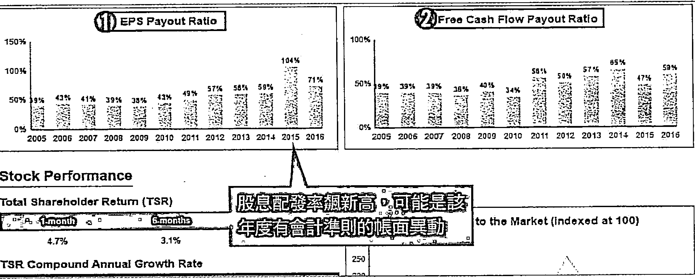

Step3 图表的部分还有与获利能力相关的①「Return on Equity」（股东权益报酬率）、②「Return on Invested Capital」（资本投入回报率）、③「Operating Margin」（营业利益率）；与资产负债表相关的④「Asset Turnover」（资产周转率）、⑤「Long-term Debt to Capital」（长期债务占资本比）、⑥「Diluted Shares Outstanding」（在外流通股数）等。网页最下方则有与债务相关的简要数据，例如：流动比、负债率、现金部位、总负债金额等。

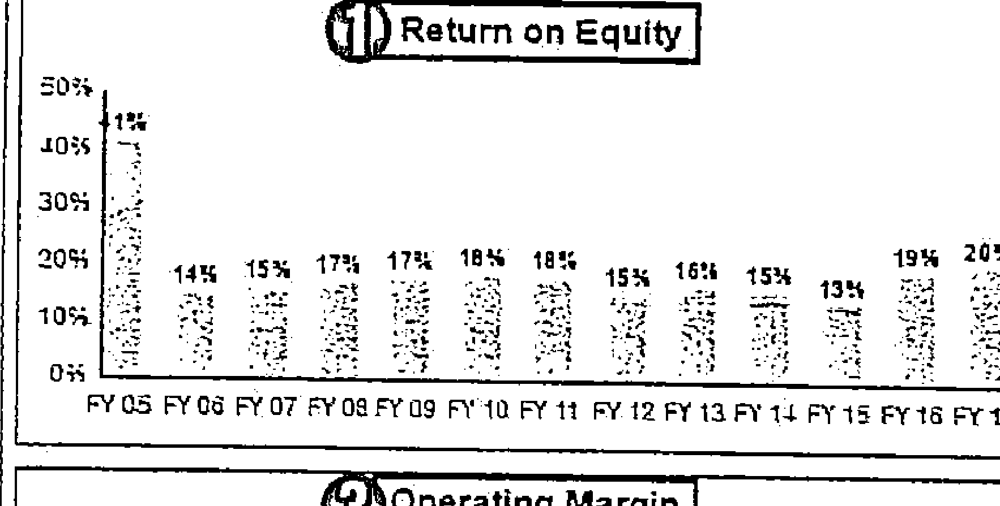

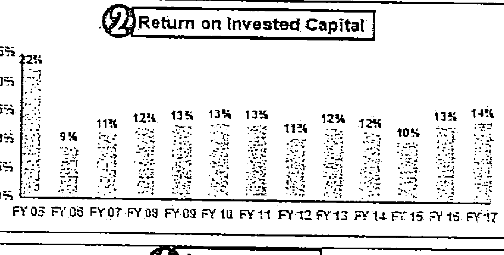

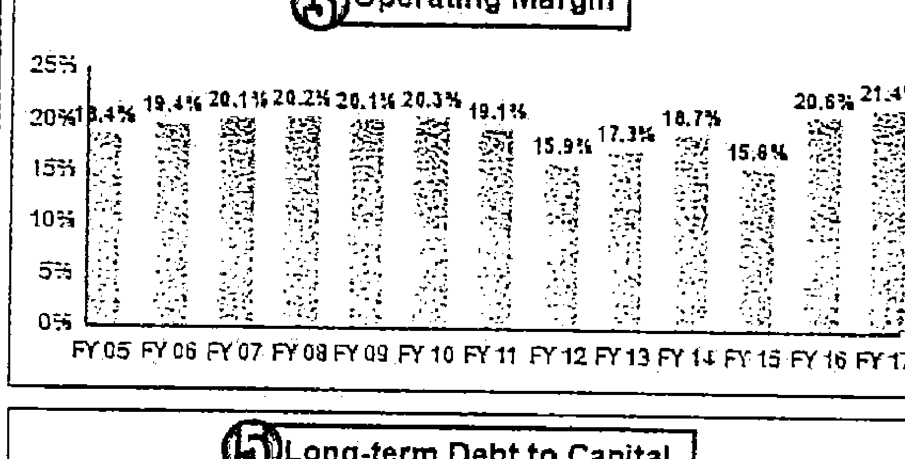

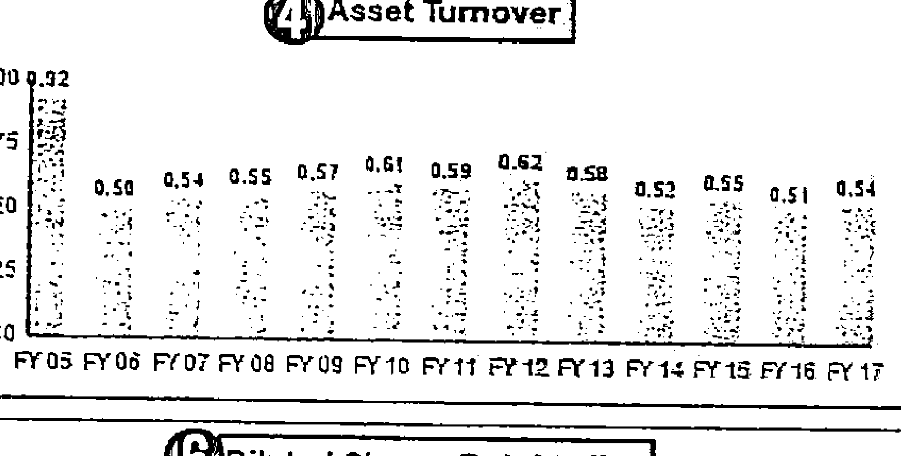

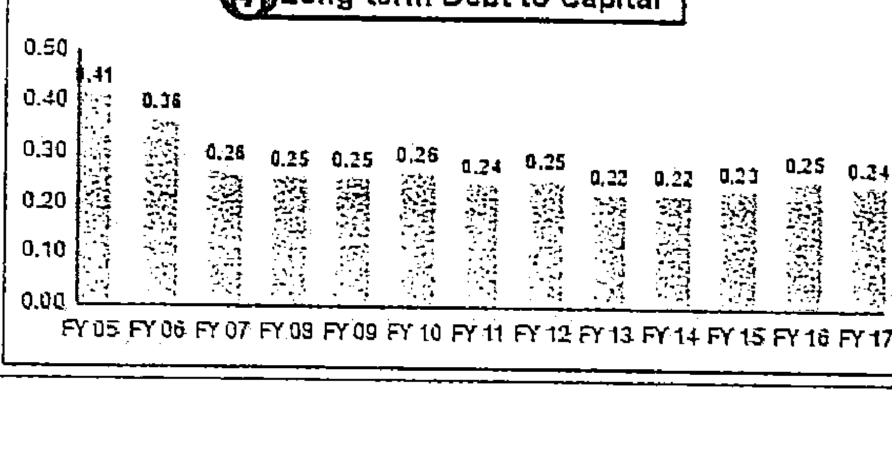

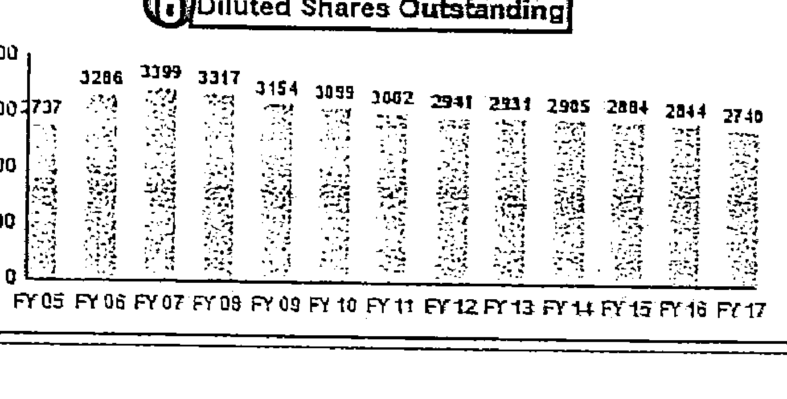

### 投资组合管理功能：依据输入资料进行财报深入分析

这个功能类似于Dividend Stock Portfolio Tracker (详见5-5)，使用者可以在网页上点选「Portfolio Analyzer」(投资组合分析器)，就能针对你所输入的投资组合资料，进行「收入分析」与「资料分析」：

- 1. 收入分析 (Income Analysis)
①投资组合摘要数字与明细

下图上方所显示的摘要数字分别是❶「Projected Annual Dividend Income」（预计年度股息收入）、❷「Total Market Value of Portfolio」（投资组合总市值）、❸「Dividend Yield」（平均殖利率）、❹「Yield on Cost」（成本殖利率）、❺「Dividend Safety」（股息安全度）、❻「Dividend Growth」（股息成长率）、❼「Beta」（波动度），下方的表格则是❽投资组合明细，包括：股数、最新股价、成本等资料。

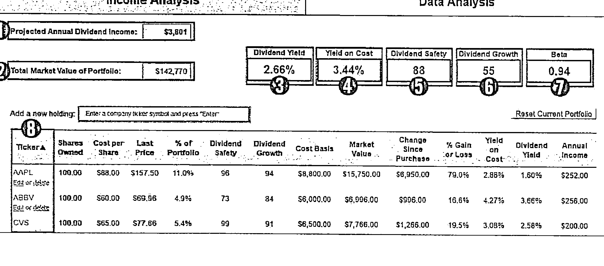

### ②每月股息收入状况

将网页往下拉，有未来每个月的股息收入状况，这部分类似于Dividend Stock Portfolio Tracker试算表中DivCalendar与DivPayoutCalc这2张工作表的功能，包括：未来1～12个月的❶「Projected Dividend Income」（预估股息收入）、单一个股的❷「Expected Dividends」（预期股息），以及❸「Projected Dividend Payment Schedule」（预估股息支付日历表）。

#### - Monthly Dividend Income

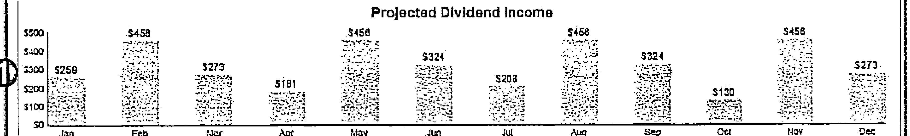

| Ticker | Name | Ex-Dividend Date | Pay Date | Shares Owned | Dividend Amount | Total Payment |
| :--- | :--- | :--- | :--- | :--- | :--- | :--- |
| O | Realty Income Corporation | 2017-07-28 | 2017-08-15 | 125 | $0.21 | $26.44 |
| PM | Philip Morris International Inc | 2017-08-21 | 2017-07-11 | 100 | $1.04 | $104.00 |
| WMT | Wal-Mart Stores, Inc. | 2017-08-09 | 2017-09-05 | 100 | $0.51 | $51.00 |
| April Total: | | | | | | $181.44 |

| Ticker | Jan | Feb | Mar | Apr | May | Jun | Jul | Aug | Sep | Oct | Nov | Dec | Total |
| :--- | :--- | :--- | :--- | :--- | :--- | :--- | :--- | :--- | :--- | :--- | :--- | :--- | :--- |
| AAPL | | $63.00 | | $63.00 | | $63.00 | | $63.00 | | $63.00 | | $63.00 | $252.00 |
| ABBV | | $64.00 | | $64.00 | | $64.00 | | $64.00 | | $64.00 | | $64.00 | $256.00 |
| CVS | | $50.00 | | $50.00 | | $50.00 | | $50.00 | | $50.00 | | $50.00 | $200.00 |
| DIS | $78.00 | | | | | | $78.00 | | | | | | $156.00 |

### ③年度股息收入表

系统会显示持股最近11年的①「Annual Dividend Income」（年度股息收入），并非按照实际买进的时间去计算投资人的真正收入。

#### - Yearly Dividend Income

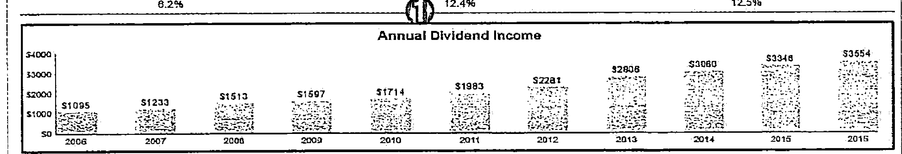

| Ticker | 2006 | 2007 | 2008 | 2009 | 2010 | 2011 | 2012 | 2013 | 2014 | 2015 | 2016 |
| :--- | :--- | :--- | :--- | :--- | :--- | :--- | :--- | :--- | :--- | :--- | :--- |
| AAPL | 0.00 | 0.00 | 0.00 | 0.00 | 0.00 | 0.00 | 76.00 | 189.00 | 185.00 | 203.00 | 223.00 |
| ABBV | 0.00 | 0.00 | 0.00 | 0.00 | 0.00 | 0.00 | 0.00 | 160.00 | 166.00 | 202.00 | 228.00 |
| CVS | 15.00 | 23.00 | 28.00 | 31.00 | 35.00 | 50.00 | 65.00 | 90.00 | 110.00 | 140.00 | 170.00 |
| DIS | 31.00 | 35.00 | 35.00 | 35.00 | 40.00 | 60.00 | 75.00 | 88.00 | 115.00 | 137.00 | 149.00 |## ④預估股息成長試算表

最後一個功能是，假設在某個「Income Growth per Year」（股息收入年成長率）之下，若干年後，投資人目前的投資組合在未來的「Projected Annual Dividend Income」（預估年度股息收入）。然而，未來無法預測，務必使用保守的假設值。

| Income Growth per Year | 5 Years | 10 Years | 15 Years | 20 Years |
| :--- | :--- | :--- | :--- | :--- |
| 1% | $3,995 | $4,199 | $4,413 | $4,639 |
| 2% | $4,197 | $4,634 | $5,116 | $5,649 |

## 2.資料分析（Data Analysis）

### ①投資組合產業配置與個別企業股息收入占比圖

左側圓餅圖為「Sector Mix」（投資組合中GICS產業占比），以及「Dividend Income Mix」（個別企業股息收入占總收入比重），請注意，不是個別企業市值占投資組合比重。

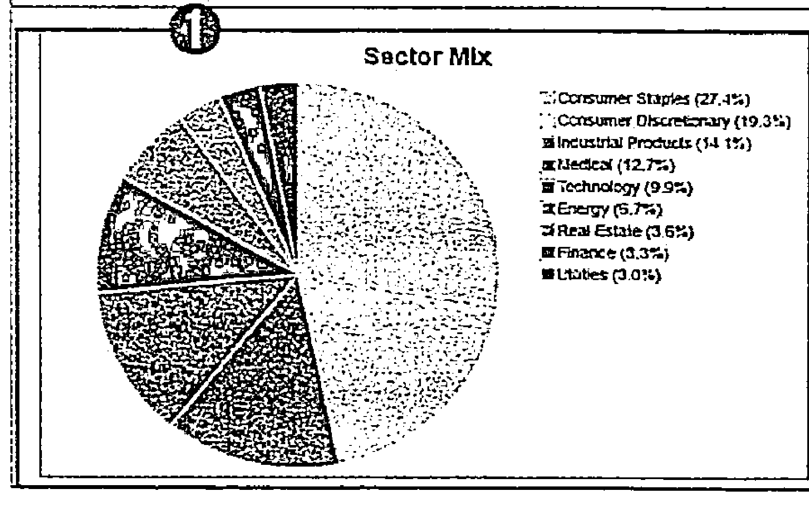

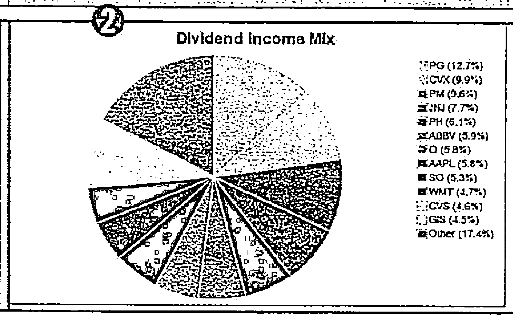

# 第5篇 善用網路資源 提升操作效率

### ②股息數據明細

此為投資組合中各企業的數據明細，包括：個別企業「% of Income」（股息收入佔總股息收入百分比）、「Annual Income」（年度收入）、「Safety Score」（股息安全度分數）、「Growth Score」（股息成長率分數），以及（年化）股息成長率等。

| Ticker | % of Income | Annual Income | Dividend Yield | Yield on Cost | Safety Score | Growth Score | EPS Payout | 1-Yr Div Growth | 5-Yr Div CAGR | 10-Yr Div CAGR | Ex-Dividend Date | Pay Date |
| :--- | :--- | :--- | :--- | :--- | :--- | :--- | :--- | :--- | :--- | :--- | :--- | :--- |
| AAPL | 5.8% | $252.00 | 1.60% | 2.86% | 96 | 94 | 21% | 9.90% | N/A | N/A | 2017-08-10 | 2017-08-17 |
| ABBV | 5.9% | $256.00 | 3.66% | 4.27% | 73 | 84 | 61% | 12.90% | N/A | N/A | 2017-07-12 | 2017-08-15 |
| CVS | 4.6% | $200.00 | 2.58% | 3.08% | 99 | 91 | 39% | 2 | - | - | - | - |
| CVX | 9.9% | $432.00 | 4.06% | 5.08% | 31 | 17 | 140% | 0 | - | - | - | - |
| DIS | 3.6% | $156.00 | 1.55% | 1.75% | 96 | 86 | 28% | 8 | - | - | - | - |
| GIS | 4.5% | $196.00 | 3.43% | 3.77% | 92 | 36 | 70% | 7.50% | 9.70% | 10.40% | 2017-07-06 | 2017-08-01 |
| JNJ | 7.7% | $336.00 | 2.53% | 3.23% | 96 | 69 | 55% | 6.80% | 7% | 8% | 2017-08-25 | 2017-09-12 |

### ③獲利相關數據

顯示「Return on Equity」（股東權益報酬率）、「ROIC」（資本投入回報率）、「Operating Margin」（營業利潤率），以及營收成長率與EPS成長率等獲利相關數據。

| Ticker | % of Portfolio | Sector | Return on Equity | ROIC | Operating Margin | 1-Yr Sales Growth | 1-Yr EPS Growth | 5-Yr Sales CAGR | 5-Yr EPS CAGR | Debt/Equity | Debt/EBITDA |
| :--- | :--- | :--- | :--- | :--- | :--- | :--- | :--- | :--- | :--- | :--- | :--- |
| AAPL | 9.9% | Technology | 35.6% | 22.4% | 27.8% | 5% | 11% | 15% | 16% | 0.7 | 1.4 |
| ABBV | 4.4% | Medical | 128.4% | 14.5% | 36.6% | 8% | 21% | 8% | 11% | 6.2 | 3.3 |
| CVS | 4.9% | Consumer Staples | 14.4% | 8.5% | 5.8% | 4% | 24% | 11% | 14% | 0.8 | 2.2 |
| CVX | 6.7% | Energy | -0.3% | -0.2% | -1.9% | 18% | 199% | -15% | - | 0.3 | 1.7 |
| DIS | 6.3% | Consumer | 20.7% | 15.3% | 25.5% | 0% | -5% | 6% | 18% | 0.5 | 1.3 |

## ④評價相關數據

顯示①「P/E Ratio」（本益比）、②「Dividend Yield」（殖利率）、③「Free Cash Flow Yield」（自由現金流殖利率）、④「Price-to-Book Ratio」（股價淨值比）等評價相關數據。

### Valuation

| Ticker | % of Portfolio | Beta | P/E Ratio | Sector P/E Ratio | Dividend Yield | Free Cash Flow Yield | Enterprise Value / EBIT | Price-to-Book Ratio | 1-Year Total Return | 5-Year Total Return CAGR |
| :--- | :--- | :--- | :--- | :--- | :--- | :--- | :--- | :--- | :--- | :--- |
| AAPL | 9.9% | 1.34 | 18.3 | 22.0 | 1.60% | 6.35% | 14.2 | 6.1 | 46% | 16% |
| ABBV | 4.4% | 1.51 | 17.2 | 28.2 | 3.66% | 5.90% | 14.4 | 18.6 | 9% | - |
| CVS | 4.9% | 0.91 | 15.6 | 25.6 | 2.58% | 11.68% | 10.7 | 2.3 | -17% | 13% |
| CVX | 6.7% | 1.23 | 34.6 | 18.7 | 4.06% | 1.73% | 34.6 | 1.4 | 11% | 5% |
| DIS | 6.3% | 1.39 | 17.8 | 19.0 | 1.55% | 5.36% | 12.3 | 3.5 | 7% | 20% |
| GIS | 3.6% | 0.61 | 20.6 | 25.6 | 3.43% | 4.78% | 15.7 | 7.0 | -18% | 12% |
| JNJ | 8.3% | 0.77 | 22.4 | 28.2 | 2.53% | 4.77% | 17.0 | 5.1 | 12% | 19% |
| LOW | 4.5% | 1.08 | 23.1 | 19.0 | 2.23% | 7.25% | 13.1 | 11.4 | -3% | 27% |
| O | 3.6% | 0.32 | 19.3 | 12.3 | 4.47% | -6.79% | 68.1 | 2.2 | -13% | 13% |
| PG | 11.6% | 0.68 | 16.5 | 25.6 | 2.98% | 3.93% | 18.1 | 4.2 | 8% | 10% |
| PH | 9.8% | 1.40 | 22.6 | 22.7 | 1.70% | 5.11% | 19.4 | 4.4 | 29% | 17% |
| PM | 7.3% | 0.93 | 25.5 | 25.6 | 3.61% | 4.03% | 19.1 | -17.0 | 21% | 12% |
| RS | 4.4% | 1.23 | 15.7 | 22.7 | 2.60% | 5.83% | 12.1 | 1.2 | -4% | 12% |
| SBUX | 3.3% | 0.81 | 26.2 | 19.0 | 1.90% | 3.72% | 18.0 | 13.6 | -2% | 20% |
| SO | 3.0% | 0.12 | 18.0 | 22.1 | 4.80% | -4.20% | 18.7 | 1.8 | -3% | 7% |
| WFC | 3.3% | 0.95 | 12.7 | 16.7 | 3.02% | 4.04% | - | 1.2 | 11% | 14% |

## F.A.S.T. Graphs》圖表化呈現企業價值評估

本篇要介紹的網站是「F.A.S.T. Graphs」（www.fastgraphs.com），它有兩大功能：一是「FAST Graphs」的價值評估圖表、二是「FUN Graphs」的財務數據圖表。前者是我用這個網站的主因，它是用「相對比較法」與「EPS成長率預估法」來評估企業的合理價格，可以作為使用者在評估企業價格時的輔助；後者是將使用者選擇的財務指標，呈現在同一張圖表上，以方便比較。因為網站的資料是以圖表呈現，所以我會用它來檢視觀察名單或投資組合中的個股，其當前價格與預估EPS成長率的落差。

### 功能1》FAST Graphs價值評估圖表

此項圖表功能提供了2種類型的價值評估方式：

#### 類型1》相對比較法：評估企業合理股價

使用者可以選擇的評價基礎分為3大類：EPS（每股盈餘）、Cash Flow（現金流），以及Intrinsic Value（內涵價值）。而內涵價值中的「EBITDA」（扣除利息、稅項、折舊和攤銷前的盈餘）與「EBIT」（扣除利息、稅項前的盈餘）都不是實際獲利數字，因此，如果要用此種評價基礎，必須非常清楚這樣的盈餘數字會不會讓估價結果有美化之嫌。

### 1.Earnings Correlations (以EPS相關數據評價)

這個部分又能選不同形式的EPS觀察，其中，「Adjusted（Operating）Earning」（以下簡稱為「調整EPS」），也就是所謂的「Non-GAAP EPS」，是我最常用的選項，因為它排除了一次性與不連續性的會計準則項目。用它來呈現本益比，可以比較忠實反映企業的價值位階。

其實，直接使用GAAP（一般公認會計原則）的EPS當然也可以，只要使用者清楚兩類EPS的差別即可。「Basic Earnings」（基本EPS）只包含在外流通的普通股。為了謹慎起見，較常使用的是「Diluted Earnings」（稀釋EPS），因為它包含了可轉債與給員工的期權，都隱含可能變為股票的項目。總之，Earnings Correlations的評價方式適合大多數的企業。

### 2.Cash Flow Correlations (以現金流相關數據評價)

現金流較不易受到會計科目的影響，能夠如實反映企業的業務收入，因此，有部分產業更適合用現金流來評估價值，例如：REITs（主要投資不動產）、MLP（主要投資能源業）。這兩種產業必須配發90%以上的獲利給股東，因此，現金流的成長性與穩定性更為重要，也正因為如此，使用者評價這類產業時，用的不是本益比，而是價格相對於現金流的倍數，比方說選項中的「Operating Cash Flow」（營業現金流）與「Free Cash Flow」（自由現金流）。因為REITs和MLP都是投資於資本密集的產業，經常需要增資來發行新股，導致在外流通的股數不斷成長，同時也稀釋了EPS，所以不適合用EPS來評價。

我們以W.W.Grainger（固安捷公司，美股代號GWW）為例，我選擇的是①「Adjusted (Operating) Earnings」（調整EPS），右側圖表就會顯示以調整EPS所計算出的本益比變化。橘線的預設值為美國市場長期平均本益比（15倍），因此，圖中的②「橘線」，就代表GWW當年度調整EPS乘以15倍後的股價位置。

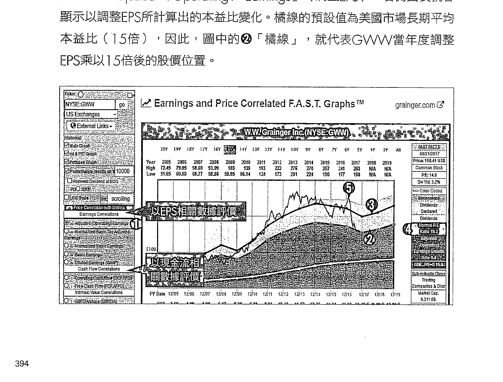

不過，假如企業的成長率超過15%時，橘線的倍數會換成與成長率相同的數字（例如：當EPS預估成長率達20%，橘線的倍數就會改用20倍）。它的概念就是，股價應該與EPS的成長率有高度相關。理論上是沒有錯，但是，有時股價會偏離成長率。而15倍是市場長期的平均值，也是一個合理的倍數，可以將它視為評價企業時的大框架。

不過，每家企業的長期本益比不一定貼近15倍，因此，我們可以再觀察圖中的❸「藍線」，這是以該企業的歷史平均本益比所計算出的股價位置，也可以稱為Normalize PE。圖中所顯示，GWW的15年平均本益比為❹「19.2倍」，而且藍線與橘線之間始終維持一定的距離，表示市場給予這家企業的本益比，大致高於市場的整體平均值。

綜合觀察，GWW目前股價位置（圖中的❺「黑線」）的本益比是14.6倍，略低於市場的平均值15倍，同時也低於藍線，也就是企業15年歷史平均值19.2倍，因此，投資人可以知道，該企業目前的股價略低於合理價。

### 類型2》EPS成長率預估法：推測企業未來股價報酬

以上是根據歷史資料取得股價相對位置的大致概念，但是，投資人更在意的是未來，此時就可以運用預估法來推測。而FAST Graphs提供的圖表，是假設以目前的價格買進，而且EPS按照預估成長率向上增長，使用者就可以查看未來3年或5年內，當股價落在不同的本益比時，年化報酬率大## 1. Estimates（基本預估）

預設值為3年內的短期預估，以市場長期平均本益比15倍為基準。同樣的，當EPS成長率預估值高於15倍時，橘線也會以預估成長率為主。如圖中所顯示，GWW最新的股價為❶「158.41美元」（2017.08.21）、當前的本益比為❷「14.6倍」、系統預估在2020年底之前，公司的EPS年化成長率為❸「4.2%」。如果使用者想知道在2020年12月31日時，本益比為15倍的年化報酬率，可以將滑鼠移到該日期的15倍本益比位置（橘線），即可以從畫面上的小視窗看到當時的預估年化報酬率為「10.23%」。使用者也可以任意將滑鼠移到其他本益比的位置，查看預估的年化報酬率。

## 2. Normal Multiple（平均本益比）

預設值為3年內的短期預估，以該企業歷史平均本益比為基準。圖中同樣是GWW這檔股票，使用者可以選擇最近1年～近18年的平均本益比，我會選擇居中的選項，例如：圖中使用的是近10年歷史平均本益比「19倍」，在2020年底之前EPS年化成長率同樣是「4.2%」。假設投資人在目前的價格購買，而且EPS的年化成長率預測正確，到了2020年底，在本益比19倍的狀況下，年化報酬率為「17.66%」。我個人認為，17.66%明顯太高，可以將滑鼠往下移到本益比17.1倍或15.2倍，去檢視較為保守的預估報酬。

## 3. 3-5Y TL Growth（3年至5年中期成長率預估）

這裡提供的是未來3年～5年的預估。例如：圖中是顯示在2022年底之前，EPS年化成長率的預估值為「9.36%」，在本益比15倍的狀況下，預估的年化報酬率為「14.91%」。

## 4. Historical CAGR（歷史年化成長率）

此處採用的預設值是該企業歷史的EPS年化成長率，使用者可以任意選擇近1年～近19年的成長率作為預估值，再查看依據不同本益比所算出的年化報酬率。

例如：圖中是用W.W.Grainger近5年的EPS年化成長率❶「5.1%」來預估，在此條件下，到了2022年底時，在本益比15倍的狀況下，年化報酬率為❷「10.1%」。

## 5. Custom（使用者自訂）

首先，使用者可以自行選擇帶入①「Estimates」（近3年預估的EPS年化成長率）或「3-5 LT Growth」（近3年~5年中期的預估成長率）；接著，自行微調②每個年度的預估成長率，或自行輸入③自訂（統一）年化成長率；最後按下④「Draw」（繪圖）。圖中是自行輸入EPS年化成長率3.8%的本益比預估位置圖。

總結此功能的特色，系統選單提供了多樣的評價方式，使用者能以各種面向觀察當前價格與長期市場平均，以及企業本身的平均本益比做對比，視覺上非常直觀。此外，在預估未來的報酬率時，也能帶入預估的EPS成長率，並且提供在不同本益比倍數時的股價結果。

## 功能2》FUN Graphs財務數據圖表

這個功能類似於GuruFocus.com網站中互動式圖表（Interactive Chart）的功能，但是，有2個比較大的差異：

- FUN Graphs將數據區分為4種類型，分別是每股為單位的數據、比率類、百分比類、百萬金額類。這麼做的好處是，以同類型數據放在同張圖表上，比較容易做比較，而缺點是比較不具彈性，因為使用者可能會想拿EPS（每股為單位的數據）和ROE（百分比類）一起看，但是，FUN Graphs圖表就無法滿足這個需求。
- 每項數據會計算CAGR（Compound Annual Growth Rate，年複合成長率），尤其在查看長期數據時，很有參考價值，這是GuruFocus.com網站所沒有的數據。

下圖中，我在左側指標區選擇了現金流量表中的3個每股數據：❶「operating cash flow per share」（每股營業現金流）、❷「free cash flow per share」（每股自由現金流）、❸「dividends declared per share」（每股股息）

右側圖表區就會顯示這3項指標的比較圖。使用者可以看到這家企業近10年股息成長4倍，然而仍然有相當充足的自由現金流來支付股息。

最右側的欄位則顯示了，近20年來這3項指標的年複合成長率，分別為每股營業現金流9.6%、每股自由現金流10.3%、每股股息12.1%。雖然股息成長率高於前兩者，但是，當前該企業的自由現金流配發率仍僅有40%（股息4.83美元／每股自由現金流11.89美元），未來仍然有相當大的成長空間。

## 《價值投資獵人全自動計算機》，快速篩入合理價的股息成長股

我要介紹自己設計的兩個工具，本文先介紹「價值獵人投資計算機」。為何我會設計這個工具呢？雖然Dave Fish設計的CCC List（詳見5-4），已經將股息連續成長超過5年的企業篩選出來，但是，當時（2015年）總企業數仍然有700多家，我不可能有時間與精力一一深入研究。

因此，為了縮小篩選的範圍，我設計出一個以CCC List為基礎資料庫，再加入幾個CCC List所沒有的財務數據，以及自動顯示DDM（股息折價模型）合理價格的企業名單。如此一來，我就能將研究時間，集中在少數已經出現合理股價的企業。

設計初版之後，我發現不太可能會有一個完美的篩選方式，能夠完美的套用在所有的企業上，因此，我只用了幾個簡單的財務數據進行初步的篩選，而關鍵的財務數據，如果符合細部篩選的標準則會以背景顏色（綠色）來顯示，最後再加總評分。如此一來，我就不需要為了同時符合眾多的篩選條件，而過濾掉值得研究的企業。

## 利用股息折價模型，快速計算標的合理價格

Step1 使用者進入我的部落格首頁（www.guccidgi.com）後，點選①「口袋名單（全螢幕版）」。

Step2 進入下一個頁面後，系統會顯示①「價值投資獵人全自動計算機」，它一共分為5張工作表，前3張是CCC List的3組企業，分別為②「Champions」（冠軍）、③「Contenders」（競爭者）、④「Challengers」（挑戰者），第4張為⑤「口袋名單」，是按照我的篩選方法所呈現的口袋名單、⑥「總排名」是按照「口袋名單」中的企業，依評價分數由高到低排名的結果。

| Champions | Contenders | Challengers | 口袋名單(以連續年區分) | 總排名(7年以上以折扣排序) |
| :--- | :--- | :--- | :--- | :--- |
| 企業名稱 | 代號 | GICS 產業 | 行業 | 市值 | 連續配息成長 | 配息 | EPS | 10年平均股息 | 配 | 自由現金殖利率 | 5年平均殖利率 | 殖利率 D |
| 1st Source | SRCE | Financials | Banking | 1,316 | 30 | 0.80 | 2.50 | 32.00 | | | 1.56 |
| 3M Company | MMM | Industrials | Conglomerate | 136,052 | 59 | 4.70 | 8.96 | 52 | | | 2.04 |
| ABM Indus | ABM | Industrials | Business Se | 2,737 | 50 | 0.68 | 1.59 | 43.00 | | | 1.62 |
| AFLAC Inc | AFL | Financials | Insurance | 33,033 | 35 | 1.80 | 6.89 | 26.00 | | | 2.15 |
| Air Products | APD | Materials | Chemical-Sc | 34,859 | 35 | 3.80 | 4.84 | 79 | | | 2.38 |
| Altria Group | MO | Consumer Staples | Tobacco | 124,862 | 48 | 2.64 | 8.00 | 0.46 | 33.00 | 49.27% | 3.26 | 4.11 |
| American & | AWR | Utilities | Utility-Water | 1,950 | 63 | 1.02 | 1.85 | 55.00 | | | 1.90 |
| Aqua America | WTR | Utilities | Utility-Water | 6,302 | 25 | 0.82 | 1.31 | 63.00 | | | 2.31 |
| Archer Daniels | ADM | Consumer Staples | Agriculture | 22,958 | 42 | 1.28 | 2.37 | 54.00 | | | 3.13 |
| AT&T Inc. | T | Telecommunication | Telecommun | 207,452 | 33 | 1.96 | 2.08 | 94.00 | | | 5.82 |
| Atmos Energy | ATO | Utilities | Utility-Gas | 9,155 | 33 | 1.80 | 3.60 | 50.00 | | | 2.06 |
| Automatic Data | ADP | Information Tech | Business Se | 51,677 | 42 | 2.28 | 3.85 | 59 | | | 1.96 |
| Badger Meter | BMI | Information Tech | Industrial Eq | 1,269 | 25 | 0.52 | 1.15 | 45 | | | 1.19 |

Step3 點選①「口袋名單」工作表後，使用者可以看到的內容是，財務數據符合我的篩選條件，而且股價已經達到合理價值之下的企業。企業分類是按照CCC的企業組別排序，例如：最新的資料（資料更新日為2017年10月29日）顯示，在股息連續成長25年的「冠軍」組別中，只有②「Target Corp.」這家企業符合篩選條件，而且股價位於合理價之下。

欄位中的③「GUCCI合理價」是我自行以DDM計算出來的合理價，但是，我所採用的預估成長率，是將近5年、近10年的股息成長率；未來5年的EPS預估成長率，同時考慮股息配發率，設定好加權公式，由程式自動算出，肯定不如人為預估來得準確。

而在④「預期報酬（折扣率）」的部分，我的預設值為10%，但是，當某家企業的股息殖利率大於5%，而且殖利率加上預估1年～10年未來股息成長率大於12%時，我會將該企業的預期報酬率調整為12%，因為如果不調高，DDM計算的合理價就會偏高；反之，當企業的股息殖利率小於5%，而且殖利率加上預估1年～10年未來股息成長率低於10%時，我也會視情況，將該企業的預期報酬率微調至9%，最低8%。因為如果不調低，DDM計算的合理價則會偏低，很難出現低估的情況。

| 企業名稱 | 代號 | 產業 | 行業 | 市值 | 本益比 | 殖利率 | EPS | BETA | 10年平均 | 殖利率 | 自由現金流 | 5年平均 | 殖利率 | 預估 | 長期 | 股息 | 成長率 | 預估 | GUCCI | 基期 | 平均 | 預期 | 折現 | 折扣 | 預期 | 分數 |
| :--- | :--- | :--- | :--- | :--- | :--- | :--- | :--- | :--- | :--- | :--- | :--- | :--- | :--- | :--- | :--- | :--- | :--- | :--- | :--- | :--- | :--- | :--- | :--- | :--- | :--- | :--- |
| Target Corp. | TGT | Consumer Dis. | Retail-Dis | 33,186 | 50 | 2.48 | 4.95 | 0.82 | 50.00 | 28.60% | 3.72 | 4.20 | 5.00% | 10% | 91.28 | 17.54 | 76.54 | 61.37 | -73.01% | 1.19 |
| Cardinal Health Inc. | CAH | Health Care | Drugs | 20,374 | 21 | 1.85 | 4.03 | 0.80 | 46.00 | -14.14% | 2.72 | 2.99 | 00% | 10% | 85.01 | 15.37 | 71.08 | 58.89 | 79.30% | 1.08 |
| Cummins Inc. | CMI | Industrials | Machinery | 29,592 | 12 | 4.32 | 8.85 | 1.81 | 49.00 | -46.51% | 2.09 | 2.44 | 0.00% | 10% | 198.56 | 26.73 | 164.19 | 170.88 | 97.85% | 0.93 |
| CVS Health Corp. | CVS | Consumer Sta. | Retail-Drug | 74,027 | 14 | 2 | 5.02 | 0.77 | 40.00 | 24.64% | 2.01 | 2.9 | 7.00% | 10% | 91.93 | 15.44 | 78.63 | 73.09 | 92.07% | 0.99 |
| Lazard Limited | LAZ | Financials | Financial | 5,956 | 10 | 1.64 | 3.61 | 1.54 | 45.00 | -59.17% | 3.98 | 3.1 | 7.00% | 10% | 75.38 | 19.50 | 64.20 | 51.28 | 74.05% | 1.18 |
| Owens & Minor Inc. | OMI | Health Care | Medical E | 1,597 | 20 | 1.03 | 1.57 | 0.60 | 68.00 | -16.26% | 5.43 | 4.1 | 3.50% | 9% | 21.77 | 6.25 | 18.67 | 18.73 | 99.41% | 0.88 |
| Williams-Sonoma Inc. | WSM | Consumer Dis. | Retail-Hardline | 4,395 | 12 | 1.58 | 3.47 | 1.53 | 45.00 | 46.72% | 2.98 | 3.0 | 7.00% | 10% | 71.70 | 16.19 | 60.60 | 53.24 | 78.22% | 1.18 |
| Amgen Inc. | AMGN | Health Care | Biotech | 128,759 | 7 | 4.6 | 11.07 | 0.62 | 42.00 | 32.48% | 2.03 | 2.6 | 7.00% | 10% | 211.43 | 30.95 | 175.33 | 175.41 | 97.03% | 0.94 |
| Chico's FAS Inc. | CHS | Consumer Dis. | Apparel | 1,039 | 8 | 0.33 | 0.72 | 1.51 | 46.00 | 37.22% | 3.51 | 4.1 | 6.00% | 10% | 11.97 | 5.25 | 10.63 | 9.08 | 79.05% | 1.12 |
| Equifax Inc. | EFX | Financials | Financial | 13,012 | 8 | 1.58 | 4.73 | 1.01 | 33.00 | 72.42% | 1.72 | 1.4 | 8.00% | 10% | 139.12 | 21.58 | 115.81 | 117.4 | 95.08% | 0.93 |
| Extra Space Storage Inc. | EXR | REITs | REIT-Indust | 10,076 | 7 | 3.12 | 2.92 | 1.18 | 107.00 | 2.52 | 3.8 | 7.00% | 10% | 143.40 | 18.01 | 118.32 | 88.28 | 73.85% | 1.12 |
| GEO Group Inc. | GEO | REITs | REIT-Cor | 3,184 | 6 | 1.88 | 1.44 | 0.95 | 131.00 | -49.35% | 9.22 | 7.24 | 00% | 12% | 50.50 | 8.77 | 42.16 | 24.48 | 61.68% | 1.22 |
| Invesco Limited | IVZ | Financials | Financial | 14,665 | 8 | 1.16 | 2.24 | 1.83 | 52.00 | -237.80% | 3.09 | 3.24 | 00% | 10% | 42.09 | 9.33 | 35.54 | 37.87 | 98.75% | 0.90 |
| Macy's Inc. | M | Consumer Dis. | Retail-App | 6,192 | 7 | 1.51 | 2.21 | 1.47 | 68.00 | -28.07% | 6.03 | 8.05 | 00% | 12% | 28.38 | 8.55 | 24.41 | 25.8 | 88.30% | 1.07 |
| Oracle Corp. | ORCL | Technology | Software-In | 209,263 | 9 | 0.78 | 2.79 | 1.10 | 33.00 | 208.04% | 1.44 | 1.49 | 00% | 10% | 37.78 | 13.60 | 58.08 | 40.6 | 38.0% | 1.00 |

## 研究企業的基本面，更能掌握標的的預期報酬率

其實，即使我運用手邊可以得到的財報數據，再加上許多額外的邏輯，但是，無論設計得多麼精妙，都很難設計出完美的EPS預估成長率與預期報酬率。

酬率。利用量化方式预估未来，其准确率远远比不上深入研究企业后所做的完整判断。

关于其他细部筛选的衡量标准，如果有使用者有兴趣，请自行上我的部落格检视。此外，我不建议各位读者直接拿这份清单，做轻率的决策，因为你还是必须回到企业的本质，维持一贯勤勉的研究，同时把量化数据，作为确认的步骤。

假如各位读者仍然需要一个好用的筛选工具，前面篇章几个免费或付费网站，几乎都有筛选功能。当然，自行设计的工具还是会最符合自己的需求，而你可以把本章的工具，当作启发你设计灵感的小环节。

## 5.2 股息连续成长筛选器》视觉化方式呈现CCC List趋势

我自行设计的另一个工具为视觉化的「股息连续成长筛选器」(Dashboard)，其资料基础也是来自Dave Fish的CCC List。我将此工具定义为「筛选器」，原因在于，其功能仅类似于用Excel筛选CCC List，只是我用视觉化的方式来处理。

### 适合投资新手挖掘口袋名单，再依企业价值进行筛选

这个工具的用法非常简单，我没有加入任何公式，也没有定义衡量标准与DDM（股息折价模型）合理价，就只是如实地呈现CCC List原有的数据，并且依据使用者挑选的指标，呈现符合筛选条件的企业。

- Step1 进入我的部落格首页 (www.guccidgi.com)，点选❶「股息连续成长筛选器」，就可以开启筛选器视窗，左侧为❷筛选结果区，有各种不同颜色与大小的方块，每个方块代表一家企业；中间为企业分类区，能决定使用者想要显示的企业组别或产业、行业类别；右侧为❹指标条件区，可以选择特定的指标条件。

## 追日 Gucci 投资美股，享受生活

> Price is what you pay. Value is what you get. 现金流就好比我想要，只吃果实，也只取够吃的果实，而树枝仍会持续茁壮，种子能够发芽结果。

## 股息配发企业VS成长型企业

| 股票代码 | 公司名称 | 行业 | 状态 | ... |
| :--- | :--- | :--- | :--- | :--- |
| DIS | Walt Disney Company | Entertainment | ... | ... |
| CME | CME Group Inc. | Financial Services | ... | ... |
| NKE | Nike Inc. | Apparel | ... | ... |
| ... | ... | ... | ... | ... |

- (20)
- Kings
- Champions
- Contenders
- Challengers

- (20)
- Consumer Discretionary
- Consumer Staples
- Energy
- Financials
- Health Care
- Industrials
- Information Technology
- Materials
- Real Estate
- Telecommunications Services
- Utilities

- (20)
- Aerospace/Defense
- Apparel
- Beverages/Soft Drinks
- Biotechnology
- Business Services
- Conglomerates
- Drugs/Pharmaceutical
- Education Services
- Entertainment
- Financial Services
- Heavy Industrial Equipment
- Machinery
- Medical Devices
- Oil & Gas
- Oilfield Services/Equipment
- Railroads
- Restaurants

- Size Selector
- Market Cap (Unit:Million)
- 43,652
- 423,175
- P/E
- 15.13
- 34.20
- Dividend Yield
- 1.15
- 3.33
- Payout Ratio
- 4.34
- 20.00
- EPS Payout
- 2.53
- 30.00
- OGR 1yr
- 1.15
- 7.10
- OGR 3yr
- 3.57
- 33.24
- OGR 5yr
- 3.50
- 33.27
- OGR 10yr
- 3.05
- 35.53

## Step 2 首先，使用者可以自由选择不同的指标，来定义企业方块的颜色深浅与尺寸大小，说明如下：

1.  「Color Selector」（颜色深浅定义指标）：在下拉选单中选择其中一个项目，作为左侧企业方块颜色深浅显示的依据。例如：选择「Dividend Yield」（殖利率）时，企业方块颜色愈深，代表企业的殖利率愈高。
2.  「Size Selector」（企业方块大小定义指标）：在下拉选单中选择其中一个项目，作为左侧企业方块尺寸大小显示的依据。例如：选择「5年年化股息成长率」时，企业方块尺寸愈大，代表企业的5年年化股息成长率愈高。

透过颜色与尺寸的选择，可以组合出多种检视角度。以上述筛选方法来看，由于殖利率与股息成长率基本上是互斥的概念，因此，使用者可以看到（详见第409页大图），颜色较深（殖利率较高）的方块多半在右下角，而股息成长率较高的方块，多半在左上角。殖利率较高，也有可能是近期股价下跌，不一定是股息成长率较低，因此，这个筛选器并不是要找出什么「圣杯」，只是单纯以视觉化呈现筛选后的结果罢了。

## Step3 接下来，使用者可以自行设定筛选指标，以下仅介绍较重要的几项指标：

1.  「Market Cap」（市值）：单位为百万美元。如果使用者只想投资市值超过500亿美元的企业，可以自行将最小条件设定为「50,000」，左侧「筛选结果区」就只会显示市值在500亿美元以上的企业。
2.  「Chowder Rule」（乔德法则）：由一位名叫Chowder的投资者所提出的概念，以「当前殖利率 + 5年年化股息成长率」来评估企业的投资价值。他认为，殖利率与股息成长率应该一起观察，而不是特别挑选殖利率高或股息成长率高的标的，毕竟股息成长率的动力来自于EPS的成长，唯有EPS不断增长，股息才可能持续地发放。附带一提，Chowder自己用的标准为12%。
3.  「DGR」（股息年化成长率）：共分为近1年、近3年、近5年、近10年的股息年化成长率。

## Step4 除了用Step3的量化数据作为筛选条件之外，使用者也可以按照股息连续成长年数区分的3类企业来筛选，或者选取特定产业、行业的种类，来进行更小范围的筛选。

1.  「CCC_Category」（股息成长企业类别）：Kings→股息连续成长50年以上；Champions→股息连续成长25年以上未满50年；Contenders→股息连续成长10年以上未满25年；Challengers→股息连续成长5年以上未满10年。
2.  「Sector」（产业）：按照GICS的产业分类来筛选，例如：只想筛选非必需消费产业（Consumer Discretionary）、必需消费产业（Consumer Staples）、健康照护产业（Health Care），则仅需要勾选这3个选项即可。
3.  「Industry」（行业）：每一个GICS分类下的子行业分类。

- **CCC_Category**
  - (全部)
  - Kings
  - Champions
  - Contenders
  - Challengers
- **Sector**
  - (全部)
  - Consumer Discretionary
  - Consumer Staples
  - Energy
  - Financials
  - Health Care
  - Industrials
  - Information Tech
  - Materials
  - REITs
  - Telecommunications
  - Utilities
- **Industry**
  - (全部)
  - Aerospace/Defense
  - Apparel
  - Beverages/Snack Food
  - Business Services
  - Conglomerate
  - Delivery & Freight
  - Drugs
  - Drugs/Consumer Prod.
  - Entertainment
  - Financial Services
  - Industrial Equipment
  - Machinery
  - Medical Devices
  - Medical Instruments
  - Railroad
  - Restaurants
  - Retail-Drugstores

### Step 3

如果使用者在「筛选结果区」看到有兴趣的企业，可以点击该企业的方块（此处以 ①「MCD」为例），即可以进入另一个标签页，显示该企业 ②「Dividend Growth Yrs」（股息连续成长年数）、③「Annual Dividend」（年化股息殖利率）、④「P/E」（本益比）等详细的数据。

| Symbol | Div. Growth Yrs | Annual Dividend | Current Div. Growth% | DGR 1yr | DGR 3yr | DGR 5yr | DGR 10yr | Debt/Equity | ROE | P/E | P/B | PEG | Est 5yr EPS Growth% | 5yr Est. Dividend | 5yr Payback% |
| :--- | :--- | :--- | :--- | :--- | :--- | :--- | :--- | :--- | :--- | :--- | :--- | :--- | :--- | :--- | :--- |
| MCD | 42 | 4.0 | 7.4 | 4.9 | 5.0 | 7.4 | 13.7 | -234.2 | 24.8 | | | 2.7 | 9.1 | 23.4 | 13.6 |

# 第 5 篇 善用网络资源 提升操作效率

另外，如果使用者觉得这些资讯还不够的话，可以点击「股票名称」（此处以「MCD」为例），系统会出现一个小视窗，让你选择要连结到网站「GuruFocus或MorningStar」，以查询更详细的资讯。

其实，无论是「价值投资猎人全自动计算机」或「股息连续成长筛选器」，都比较适合初期想找口袋名单的使用者，而我自己目前已经很少使用，主要原因是：

1.  我的投资方式已经趋于成熟，不太需要重新寻觅企业；
2.  长年累积下来的口袋名单已经足够，我目前绝大多数的时间都在等待合理的买进时机；
3.  如果要寻找更多符合我投资理念的新企业，我会阅读国外的文章，参考他人研究的成果，并且搭配自己勤奋地研究与评估。

对于股息成长投资者而言，不管是初学者或资深老手，都不要忘记，数字终究是配角，主要核心还是要回到企业的本质。

# 第六章 楚汉权双战法 军事动态的增补利

## 靠卖出掩护性买权 赚取额外收入

我预设你对于选择权的基础与概念都已熟稔，故不耗费版面介绍选择权基础。市面上的选择权资讯已非常丰富，你能轻易地找到教学。我只将重点放在以选择权结合股息成长投资（DGI）可能产生的额外效益，以及个股（包含ETF）选择权与指数选择权之间唯一的差别——实物（股票或ETF）交割。

我的被动收入为双引擎，一具为DGI，另一具为选择权。然而假如你还无法成为坚定的长期投资者，我认为你可以完全忽略本篇，也不要轻易触碰选择权。

任何投资方式或者工具本身都是中立的，端看投资人如何运用。若过于轻率地拉高杠杆、恣意把口数拉高，只计算获利而没有考量风险，一旦情势不如预期，使投资蒙受重大亏损，请问这是遭投资工具拖累？还是你自身行为所导致？

## 为持股加卖掩护性买权，收取权利金入袋

我不太卖「裸买权（Naked Call）」，而是在已有持股时，采用「掩护性买权（Covered Call）」。「掩护」（Covered）的意思是，当持有股票1张（通常是100股）时，卖出1口（相当于100股的股票价值）买权（Sell Call），此时可先收取权利金入袋，但要承担股价大涨超过履约价的风险，不过正因为持有现股来对冲抵销风险，当结算日时，若结算价超出履约价，损失可以靠交付现股来履约，此即为Covered的原意。

然而，也不是无脑地随便找个高于当前股价的履约价来卖出买权，就能够1年12个月轻松多出额外现金流。想像一下，你是一名长期股息成长投资者，你的投资目的是产生持续成长的股息现金流，假如企业没有发生明显质变或者下砍股息，你会希望只吃果实，而不砍树。在这样的前提之下，你不会希望因为卖出买权，收了1%～2%的权利金之后，却需要在结算时被迫让出股票。此外，假如是美国公民投资者，还会因为短期卖出（12个月内），被课以重税。

# 第6篇 选择权双战法 辅助增加获利

因此，在不希望持股经常轻易让出的前提下，不大可能出现每个月固定能有「X%」额外现金流的好事。因为要卖出股票的买权，需注意以下几件事：

### 1.合约到期天数

时间太短的合约，其权利金过少，因此大多会选择到期日剩下4周～8周的合约商品。而当该合约到期后，下一轮新合约的权利金很可能你并不满意。在不想为了过于微薄的权利金而去卖出买权的前提下，这时你很可能会选择等待。你会谨慎地选择履约价格以及卖出的时机，并非每次开新仓就随意选个还可以的履约价与权利金。

### 2.隐含波动率

权利金高低与隐含波动率相关，因此也并非每档股票都能经常达到2%的收益率。分水岭约是在隐含波动率20%左右，当低于20%，如果是4周合约，权利金大多落在1%～1.3%之间；而当波动率在20%～30%之间，权利金大约是1.5%～2%之间。

### 须综合衡量找出最有利的交易机会

天下没有白吃的午餐，若想要有更高的收益率，只能选择波动高的标的，例如科技股。然而当你选择波动高的产业时，很可能你的目的只是想获取短期爆发性上涨。这时，你没理由在这类标的上，放了一个卖出买权的锅盖，来限制涨幅。

因此实务上，不太可能买进单一股票之后，就能够靠着卖出买权来月月轻松获取「X%」的现金流保证，一年之中若能在单一股票上顺利获取6次现金流，已非常令人满意了。当然，假如持股家数众多，确实每个月都很可能有成交到满意的合约，如这个月是A、B企业，下个月是C、D企业，以此类推。

此外，权利金还与价外几档有关，愈价外的合约，代表到期日需要让出股票的机率愈低，但收入的权利金也很少。当4周～6周的合约权利金不多，又不希望让出股票机率高时，可能会选择到期时间较长的远月合约。远月合约的好处是，减少管理时间、增加权利金，但时间拉长，时间价值减损速度慢，且增加选择权持有时间，变数也增加，也就是股票让出的可能性增加。鱼与熊掌不可兼得，不可能有股票让出机率低、权利金又高的好交易机会。

因此，假如权利金符合我的标准，我大多选择4周～6周的合约来卖出掩护性买权，较能充分利用选择权时间价值减损的特性。

## 选择权属短线交易，不需依据基本面判断

从上可知，DGI投资的本质仍是尽可能地以拥有股票为主，至于选择权的权利金只是锦上添花。由于综合衡量履约价与卖出的可能时机后，选择的大多是1个月～2个月之间的合约，因此属于短线交易范畴。假如你本身就熟悉短线交易，那么会有较好的盘感，在选择履约价与理想的权利金时，会更有把握。

当然，对于不甚熟悉短线交易、或者不想花时间研判上档压力点位的人，许多券商软件有提供触及履约价机率的资讯，例如该合约有80%机率不会到此价格，这也可以作为参考；或者像是Delta值（详见注1）0.15左右的履约价合约，也约略代表有80%的机率不会达到履约价，但相对地，其权利金通常不会超过1%。

我自己是使用主观找寻上档压力点位或价位反转点的方式，实务上的执行方法有2种：

1.  在找好的履约价，挂好GTC单（长天期有效单），然后用我想要的现金流收益率反推权利金价格，挂一个高价等待。当有大波动产生时，会使权利金快速膨胀，假如打到高挂的价格而成交，那之后，一旦后续涨跌势不凌厉，则权利金收敛速度也会很快。
2.  我固定每隔几天会观察「Seeking Alpha（寻找阿尔法）」App，特别注意那些最近股价连续上涨的企业，是否价格已接近压力或即将出现反转，此时我才会卖出买权，因为此时权利金膨胀较多。

这一类交易方式我归类为短线交易，因此运用的是我早期使用于选择权与期货当中的短线技巧，或者有点偏向动能投资。因此，我不会依照基本面来决定是否要卖出买权。

或者像是「美股价值成长投资」的版主Joseph，他对于选择权的学问与理论基础高出我太多，其主要是依据统计与波动率等，以扎实的选择权理论来执行选择权交易，这也是另一种决定履约价与交易时机的方式。

> 注1：Delta 值
> 又称对冲值，用以衡量选择权标的资产变动时，选择权价格改变的百分比。

## DGI投资仍以长线资本利得为主，选择权收益只是配角

对于长期DGI投资者而言，会希望尽可能无限期拥有高品质的企业，同时享受股息与企业成长带来的长期资本利得。而选择权现金流永远只是配角与额外收益，不要寄望有了一张股票之后，就可以无烦恼地月月收到丰硕的报酬。为了尽可能不要让出股票，你必须将履约价、权利金、价外几档、远月近月、波动率、价格动能等同时纳入考量。这部分我能说明的有限，只有透过长期而大量的实务经验，才会找到属于自己舒服的平衡点。

此外，也不要将此方式用在企业本质或竞争力丧失的企业之上，这类股票你该做的是重新评估买卖决策，因为即使靠卖出买权而能收取到数次的权利金，也弥补不了永久、巨额的资本利损。

## 3方式調整選擇權部位
避免持股被迫讓出

延續上一章的賣出掩護性買權，這一章將討論實務上會碰到的狀況，以及可用的調整方式。

當使用賣出掩護性買權策略時，股息成長投資者並不希望經常遇到股票被迫讓出的狀況，但實際上還是不可避免會碰到。不過，當你對於此種交易方式已充分理解，就能同時接受它的優點與缺點；唯有在能夠接受它的優缺點前提下，才能充分享受它所帶來的助益，並同時也接受它的缺陷融入成為你投資系統中的一部分。

最易造成持股被迫讓出的情況有兩種：其一，結算日時收盤價超過履約價，此時券商會依照履約價賣出給另一位買進買權的投資人，而你除了實現資本利損外，仍保留一開始賣出買權時所收取的權利金；其二，合約到期之前，美式選擇權的買方是有隨時執行的權利（此為美式選擇權與欧式選擇權最大的不同），因此假如合約變為價內時，一旦買方執行他的權利，券商便會隨機抽選被指派的賣方來履約。

既然不想要總是讓出股票，那麼有三種方式可以做調整：

### 方式1》轉倉

轉倉（Rolling）指的是先平倉（買回）可能被突破履約價的合約、或已經被突破履約價的合約，然後再重新賣出未來合約，等於是先認賠，再重新賣出更高履約價位的買權，如此，持股便不會在原有合約到期時遭到讓出。此方法是執行最簡便、也不太花心力的方式，而許多券商也提供可自行設定自動轉倉的條件。

轉倉的好處是保留股票，並且有機會將履約價再次往上推。轉倉後收進的權利金有可能變多、持平，或者小幅虧損，端看轉新倉的合約長短、舊倉距離結算的天數，以及突破履約價的距離多寡。

以下舉例幾種轉倉狀況，無論哪種，都是希望盡可能保留股票。至於現金流本來就是額外獲得的收益，不管是變多或變少，都不是DGI投資者的核心。

### 狀況1》合約天數擴展，但履約價不變

這屬於用時間換空間，理想狀況是轉到隔月相同履約價後，因為延伸了到期天數，增加了變數，預估當前上漲只是短期現象，股價很可能在次月下跌。此時，你會選擇把合約轉到次月，但相同履約價。

如表1範例，7月18日先賣出1口買權，收取每股0.55美元權利金，接著在8月1日轉倉，也就是先以0.77美元平倉，虧損0.22美元，再賣出次月合約，收取0.88美元，但因為要扣除已虧損掉的0.22美元，所以實際上帳戶裡只剩0.66美元。比例使用相同履約價，但多拉出1個月的緩衝空間，而遠月多出了時間價值0.11美元，整體權利金增加至每股0.66美元。當然也可能在轉倉過程中，損失權利金。

表1 將持有合約轉為遠月合約，帳戶權利金增加——以阿徹丹尼爾斯米德蘭農業（ADM）選擇權為例

| 交易時間 | 合約代碼 | 買/賣 | 買權/賣權 (C/P) | 權利金 |
| :--- | :--- | :--- | :--- | :--- |
| 2017.07.18 22:56 | ADM 25 Aug 42 | 賣 | 買權 (C) | 0.55 |
| 2017.08.01 21:33 | ADM 25 Aug 42 | 買 | 買權 (C) | 0.77 |
| 2017.08.01 21:33 | ADM 23 Sep 42 | 賣 | 買權 (C) | 0.88 |
| | | | 權利金變化 | 0.11 |
| | | | 帳戶淨值 | 0.66 |

註：權利金單位為美元／股；1口選擇權等於100股的股票價值，如權利金為每股0.55美元，1口（100股）則相當於55美元

### 狀況2》合約天數擴展，履約價也向外擴展

此做法下，權利金可能縮水、也可能增加，這牽涉到換倉時機，假如愈早換，在履約價接近、但尚未被打穿時就換，則可能出現換到次月的權利金反而增多的現象。

但是提早換也有風險，靠近的履約價有可能剛好是多重壓力區，例如前波高點、半年線或者下降趨勢線等等的匯集處，所以這個點位不容易被突破，即使假突破，也會很快再次下跌，因此有時我會在此多觀察2天～3天。

### 轉為履約價較高的遠月合約，權利金減少——以阿徹丹尼爾斯米德蘭農業（ADM）選擇權為例

| 交易時間 | 合約名稱 | 倉方 | 買權/賣權 | 權利金 |
|----------|----------|------|-----------|--------|
| 2017.07.18 22:56 | ADM 25 Aug 42 | 賣 | 買權 (C) | 0.55 |
| 2017.08.01 21:33 | ADM 25 Aug 42 | 買 | 買權 (C) | 0.77 |
| 2017.08.01 21:33 | ADM 23 Sep 44 | 賣 | 買權 (C) | 0.55 |
|  |  |  | 權利金變化 | -0.22 |
|  |  |  | 帳戶淨值 | 0.33 |

註：權利金單位為美元／股

所以，所謂最佳的換倉時機並不存在，換倉與不換倉之間存在某種微妙平衡，且取決於你長期交易之下最舒服的方式。

如表2範例，轉倉之後，保留股票不讓出，但轉倉之間損失了0.22美元的權利金，不過帳戶內整體權利金仍為正數0.33美元。

### 狀況3》合約天數大幅擴展，履約價也向外大幅擴展

還有一種情況是選擇轉倉合約時，因為交易量小，因此合約數量較少，甚至沒有週合約。假如是交易量大的標的，每一週都可能有合約，再加上原有的月合約（每個月第3個星期五結算），此時轉倉的彈性就較大（月合約的履約價間距比週合約來得大）。

另一種情況是遠月合約的履約價間距也會調整，例如星巴克（美股代號SBUX）在2個月內的合約履約價間距是1美元，在2個月以上的合約履約價間距是2.5美元。以上情況都會影響轉倉的困難度，因為間距放大，權利金也跟著縮水。

如表3範例，轉倉之後，保留股票不讓出，但轉倉之間因為合約間距變大，可能只有45美元履約價的合約，因此權利金僅有每股0.11美元。轉倉之間少收0.66美元的權利金，帳戶內的權利金仍為負數0.11美元（-0.22美元＋0.11美元）。儘管微幅虧損，但比起放任不管，待結算後股票遭到讓出，仍是可以接受的情況。

### 轉為遠月、高履約價合約，帳戶出現虧損——以阿徹丹尼爾斯米德蘭農業（ADM）選擇權為例

| 交易時間 | 合約名稱 | 買/賣 | 類型 | 權利金 |
| :--- | :--- | :--- | :--- | :--- |
| 2017.07.18 22:56 | ADM 25 Aug 25 42 | 賣 | 買權 (C) | 0.55 |
| 2017.08.01 21:33 | ADM 25 Aug 25 42 | 買 | 買權 (C) | 0.77 |
| 2017.08.01 21:33 | ADM 23 Oct 23 45 | 賣 | 買權 (C) | 0.11 |
|  |  | 權利金變化 | -0.66 |
|  |  | 帳戶淨值 | -0.11 |
*註：權利金單位為美元／股*

總結來說，在轉倉時機的選擇上，可以在股價靠近履約價時，判斷超出履約價的可能性高，或者已確定穿價之後再轉都可以。但要知道的是，突破履約價愈多，轉倉的條件一定愈差，還有到期天數愈短，轉倉的條件同樣較差。此外，轉倉沒有限定次數，假如你轉到次月後再度被穿越，那就繼續轉倉。當然，轉愈多次，碰上條件變差的機會也會提高。

### 方式2》提早佈局深度價內的買進買權，參與上漲

這個方式是我最不推薦的方式，因為變數過多。使用的時機是，在價格尚未突破履約價之前，你預估價格越過關鍵點時，有可能拉出大波漲幅。既然會出現大波漲幅，就表示原本的賣出買權（Sell Call）履約價極有可能被突破，且超過很大的幅度。

而因為你已經有Sell Call這個鍋蓋，蓋住了最大獲利潛能，因此股價大漲讓你覺得「少賺」，而使你感到痛苦難耐。此時，你買進深度價內Delta值>0.9（意即股價與選擇權的波動極為貼近）的1口買進買權來替代1張現股的價值，意思就是股票上漲的部分，會與權利金幾乎相等，因此能夠亦步亦趨地參與股票價格上漲。

理論上，想法沒有錯，但這個過程會有相當多變數，右頁表4做了2種腳本以及可能引發的多種情況。

這部分用文字難以完全清楚解釋，然而假如熟悉選擇權的你就會看懂，無論是走哪一套劇本，都會讓整個過程變得非常複雜且難以掌握。

為了參與持續上漲，你必須額外付出許多精力，並且要時時面對多種複雜情況。最後也許持續上漲並帶給你獲利，但也可能讓你白忙一場，甚至遭受額外的虧損。起因都在於，你無法忍受「少賺」的折磨。

因此，這個方式看似美好，但實務上，必須非常小心地呵護，或許你善於此道，或者樂此不疲，但你仍必須確定你有能力應付各種狀況。

### 透過買進買權參與上漲，可能遭遇多種變數——2種買進買權（BC）模擬腳本

| 腳本1 | 行為 | 漲勢與問題 | 最終結果 |
|-------|------|------------|----------|
| 步驟1 | 買進深度價內買權（BC） | 價格持續明顯上漲 | 參與全額上漲價差，但須扣除BC成本 |
| 步驟2 | 賣出持股，保留BC部位 | 漲勢趨緩而非大漲 | 實現股票資本利得，BC部位扣除權利金支出，可能虧損、可能獲利 |
| 步驟3 | 加賣買權（SC） | 停止大漲，甚至出現反轉跡象 | 增加SC保護BC的時間價值流失，組合成買權多頭價差。此時看法轉為緩漲，而非起始的大漲 |
| 情況1 | 持續持有BC+SC | 保持緩漲 | 扣除BC付出的權利金，加回SC收取的權利金，可能為獲利 |
| 情況2 | 持續持有BC+SC | 反轉下跌至BC履約價之下 | 跌幅超過BC+SC付出的權利金總和，終至大幅虧損 |
| 情況3 | 持續持有BC+SC | 反轉下跌但保持BC履約價之上 | 結算後重新接到1張股票，選擇權的部分可能損益兩平或小虧 |

| 腳本2 | 行為 | 漲勢與問題 | 最終結果 |
|-------|------|------------|----------|
| 步驟1 | 買進深度價內買權（BC） | 價格持續明顯上漲 | 參與全額上漲價差，但須扣除BC成本 |
| 步驟2 | 保留持股，結束BC部位 | 漲勢趨緩而非大漲 | 原有股票還在，但BC部位扣除權利金支出，可能虧損可能獲利 |
| 情況1 | 持股與原有掩護性買權還在 | 再度大漲 | 股票還是讓出了，但中間過程白忙一場 |
| 情況2 | 持股與原有掩護性買權還在 | 盤整，價格沒有超過履約價 | 股票還在，但中間過程白忙一場 |

此外，我很少開券商軟體，也不喜歡將時間花在交易上面，這種方式要時時刻刻關注價格變化，嚴重違反我要的簡單與被動原則。

### 方式3》靠近結算時，賣出價內賣權

沒錯，是「賣權」！在本篇這邊首次出現，後續章節會獨立介紹賣權。

我最傾向使用的方式是上述第1種——轉倉，然而，有時轉倉的合約或者權利金非常不理想，導致轉倉的效果不彰，這時，我便會放棄轉倉。此時還有一個方式提供最後的機會，雖然不完美，但還可以接受。使用情況在於，賣出賣權（Sell Put）的履約價扣除收取的權利金之後，接到股票的成本，仍然在合理價或之下的價格。

使用價內的原因在於，我很希望用此價格取回1張股票，雖然成本較高，但仍是理想價格。而假如結算在賣權的履約價之上，還可以收取額外的現金流。雖然本來的股票仍然遭到讓出，但多了賣出賣權，至少有機會接回股票，或者收取現金流，而不是只能等待結算一途。

但最好在距離結算前1週～2週再使用，原因在於時間假如太長，變數變大，若結算價格低於賣權履約價、又低於原有的賣出買權履約價，那麼到結算之後，原本的持股仍在，還又多接了1張股票，但這情況並非是原本的計劃。最佳的情況是結算價格低於賣權履約價，但「高」於買權履約價。

### 在接近結算時，透過賣出價內賣權接回股票——以阿徹丹尼爾斯米德蘭農業（ADM）選擇權為例

| 交易時間 | 合約代碼 | 買/賣 | 買權/賣權 | 權利金 |
| :--- | :--- | :--- | :--- | :--- |
| 2017.07.18 22:56 | ADM 25 Aug 25 42 | 賣 | 買權（C） | 0.55 |
| 2017.08.18 21:33 | ADM 25 Aug 25 46 | 賣 | 賣權（S） | 1.15 |

註：權利金單位為美元/股

如表5範例，假設當初取得阿徹丹尼爾斯米德蘭農業（美股代號ADM）的成本為35美元，在8月18日時股價已漲至45美元，而8月25日到期的賣出買權合約履約價為42美元，評估結算時要跌回42美元的機會不高，且事前計算合理價格假設為48美元。

也就是說，賣出價內賣權履約價46美元，因為賣權履約價高於現股票價格，因此為價內，結算時只會有2種情況：

-   1. 股價高於46美元：沒接到股票，每股收取權利金1.15美元。
-   2. 股價低於46美元且高於42美元：原本的股票讓出（因為高於一開始的買權履約價42美元），但8月18日追加的賣出賣權反而接到1張股票，成本為每股44.85美元（46美元－1.15美元）。

雖然原本部位在每股42美元遭賣出，而新合約用44.85美元買回，相當於預估合理價48美元的93折，因此，在這價格買回還是能接受。此外，假如持續上漲超過46美元，還能額外獲取權利金，雖然股票沒了，並非股息成長投資者樂見，但至少不會完全處於被動，而什麼都不能做。

### 若無法避免股票讓出，就甘心放手吧

最後一種情況就是，什麼都做不了，可能是轉倉條件很差，或者價格漲到你也不想用賣出賣權接回，那麼當然只剩下讓出股票這一途。但接受讓出股票又分為2種情況：

-   1. 你本來就希望在履約價的位置被讓出，因為10年平均本益比已到達40倍或者超過股息折價模型（DDM）合理價100%以上……等極度高估的價格。
-   2. 你是被迫在履約價格被讓出，而你堅定希望能長久保有持股。然而每種投資方式都有其限制，你必須清楚知道你不可能把把贏、筆筆賺，也必須了解自己的投資系統有其極限，你既了解優點，也包容其缺點。我常做的是，假如價格仍然低於合理價許多，則在隔天直接現股買回；或者繼續等待股價回跌，抑或改用賣出賣權的方式在幾個月後接回。

因為我清楚知道，我的投資系統就是如此，儘管不常發生，但我知道這種情況在我的投資生涯中仍會持續發生。

很多投資者，總會覺得賣了買權，豈不是少賺？我想問題就出在這種心態之上。買晚了，覺得晚上車，「我是不是少賺了？」；賣早了，覺得錯失機會，捶胸頓足，「我又少賺了？」在我看來，這種少賺的情緒，都是你自己製造出來的假象。

投資本該是開心、愉快的事情，它是你在專注本業之餘，善用時間滾出雪球效應，期望它協助你達成長期的財務目標；投資不該是每日生活重心，更不該左右你的情緒。

有一個研究提出，虧損的感受是賺錢的2倍。同樣地，我認為這種少賺的情緒，也是賺錢的2倍吧！但是實際上，你到底哪裡少賺了？假設你是一名堅定的股息成長投資者或者長期投資者，持有蘋果（美股代號AAPL）股票的成本在每股90美元，賣出買權在100美元，現在股價105美元，合理價140美元。那麼，即使你沒有賣出買權，請問你會在105美元賣出股票嗎？顯然不會，因為你堅定地專注企業價值，而不急於實現資本利得。

既然不會，那麼當結算時，股票在100美元賣出，取得10美元的資本利得，你卻要對於那5美元（105美元－100美元）的少賺耿耿於懷？這5美元的差距，便是你虛擬出來的，不是嗎？而且你怎麼知道，2個月後蘋果股價不會回跌到90美元呢？到時，你會不會又覺得自己很聰明，在100美元的時候就被迫讓出股票了？這邏輯好像不太對，你不是堅定的股息成長投資者嗎？按理說價格的波動不會是你在意的，你在意的是企業本質。

當然，也有可能你確實是堅定的投資者，你著眼的是20年後的企業價值。那麼的確，假如在100美元讓出，而後好幾年都沒有低估的價格出現可供買回，這確實是種機會成本。這也是為什麼我不會一股腦地恣意賣出買權，尤其在市場情緒高漲之時。然而即使我謹慎地賣出買權，仍碰上了股票被讓出，我也沒什麼技巧能引導你轉念。但我必須說，放過自己吧。

就算我可能很難有機會接回股票，但我可以等，同時我還有許多其他高品質的企業在手。而且因為我尊崇良好的分散，因此單一家企業讓出，實質上對我的影響並不大。此外，我還能把注意力放在口袋名單中其他低估的企業。而我相信，謹慎評估企業品質與價值，產生的效益更大。至於，在投資的漫長過程中，曾經失去的那一小部分，失去就是失去了，我何必執著在那一個點上，反覆地用悔恨來懲罰自己。

如同我在第1篇開頭便早早點出，股息成長投資法不適合多數人，而掩護性買權（Covered Call）也是。我也許不能說服你信仰DGI，但我可以幫你剔除一個不適合你的選項；而Covered Call也是同樣的道理，假如不適合，就放棄它吧。減少選擇的數量，反而能使你更專注於尋找最適合你的方式。愛你所選，了解自身能力限制，理解策略的極限，而後甘之如飴。

## 利用賣出賣權
在理想價格取得好股票

本章要鎖定在具有風險的賣出賣權（Sell Put），或者精確地說為「有現金準備的賣權（Cash Secured Put）」。稱之為「Cash Secured」的原因在於，你必須始終備妥100%接到股票的資金，因此與一般單純裸賣（Naked Put）將盈虧目標指向純權利金的想法迥然不同。

儘管實際上都是做相同的賣出賣權，但背後實際的目的不同。Cash Secured Put的目的是在理想的價格，擁有取得1張（通常是100股）股票的機會，而Naked Put則是希望藉由選擇權時間價值耗損的特性，在盤整與小漲的時候，獲取收斂的權利金。

然而，許多投資者會在這兩者之間，刻意保留灰色地帶。因為他們認為，即使Naked Put跌到履約價之下，還是可以換成股票，既然可以換成股票，那便無所畏懼。因此，肆無忌憚地不斷賣出賣權，逐漸加大口數，帶著僥倖的心理，只要不跌就可以坐收豐碩的權利金，就算跌了還可以接到股票。

然而，市場就是有見縫插針，找到你的破口之處。當風平浪靜對你而言是常態之後，一段時間的美酒佳餚，已讓你漸失謹慎意識。過度放大的槓桿，在突發時期，一次吞噬之前的所有戰果。

### 長短線策略雖可同時運行，但投資系統切勿混淆

即使可以轉換為股票，然而張數過高，一來，若你並非透徹地研究過該企業而持有過高比重的股票，此時任何波動都會讓你承受不了，事前有計畫地持有股票與被迫持有股票，在心理與資產管理上是截然不同的概念；二來，轉換為股票的過程，可能因為張數過多導致爆倉，你會被要求補繳保證金（Margin Call）。

我並非反對使用選擇權來交易價差，工具本身為中性，沒有好壞之分。因此，資產組合之中，並非只能存在一種方式，投資人可聰明地融合多樣性，以符合自身需要。

數年前，與我的啟蒙師父獨大學學習時，他便告訴我，長線與短線是可以完全同時存在運行的。當時的我覺得有些震撼，難道不會混淆與思緒打結嗎？漸漸地，我明白問題不在於帳戶有幾個分類、或是投資方式同時採用幾種，關鍵在於清楚而有紀律地執行不同獨立的資產類型，而不該讓每種The request was rejected because it was considered high risk