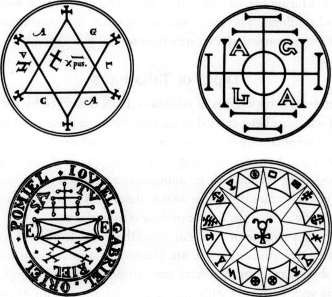
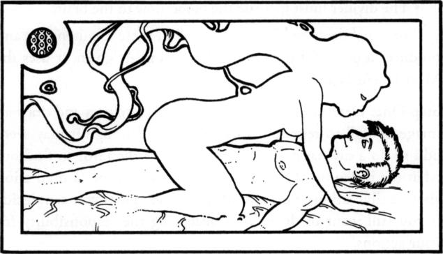
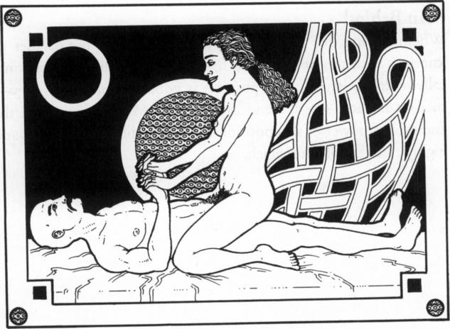
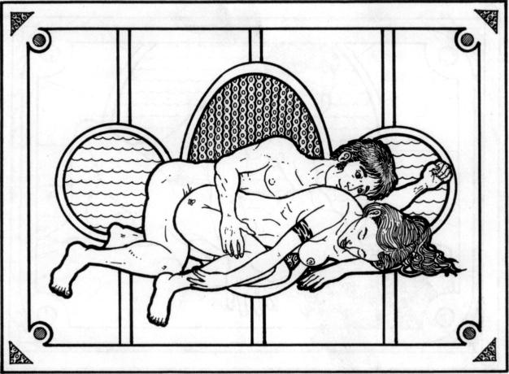
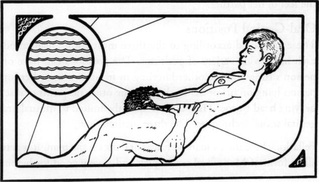
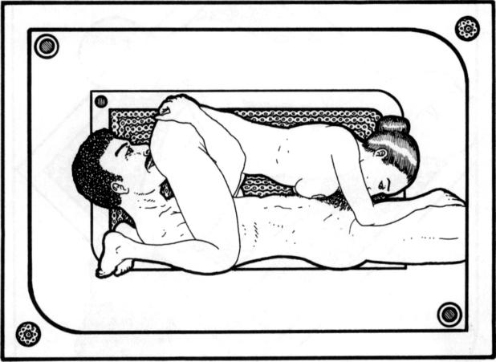
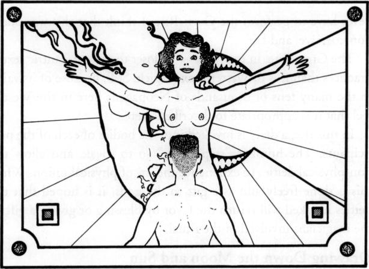

# 第二部分

###### 第四步

接下来，上面的人采取接受的立场。这个人在吸气时感觉能量通过生殖器进入，穿过身体(在途中被放大)，在呼气时通过嘴、鼻子和眼睛排出。

###### 第五步

简而言之，这对夫妇形成了一个能量循环。随着它一圈又一圈的循环，他们两个都应该想象能量在力量和强度上增加。持续 15 分钟(如果需要，也可以更长时间)。如果你觉得循环被打破了，就重新开始。

###### 第六步

当你感觉到能量正在消退，或者能量循环已经失去了平稳的运动或力量，无法恢复时，这个练习就结束了。重复驱逐。

以上做法显然任何一对情侣都可以做到。大多数书都强调男性在底部，女性在顶部。我认为没有必要。

##### 极化循环:第二版

下一个版本涉及直接的性接触。虽然这传统上包括性交(这将在这里描述)，但似乎如果一个人(在底部)可以投射，另一个可以接受，只要伴侣的生殖器直接接触，这种练习就会起作用。

###### 第一步

执行 LBRP(或另一个放逐)，中间的柱子，和光体的循环。

###### 第二步

接下来，夫妻双方应该在性方面唤起对方。如果是异性夫妇，他应该勃起，她应该有润滑液流动(可以使用额外的润滑剂，但如果你使用避孕套，不要使用油基润滑剂)。

###### 第三步

男性/投射者现在采取坐姿。女性/易接受的人坐在另一个人的腿上。他们应该确保性交(或生殖器与生殖器的接触)是牢固建立的。

###### 第四步

这对夫妇深深凝视着对方的眼睛，同时想象能量的循环运动与呼吸相协调，正如版本一中所描述的那样。当这对夫妇专注于流入和流出他们生殖器的能量时，他们可能会选择收缩肌肉，就像做凯格尔运动一样。其他运动不是必需的。在这种姿势下，男人是否保持勃起并不重要。

###### 第五步

两者都应该继续关注能量的运动。如果任何一个人都有高潮，那也没关系(尽管练习关注能量流而不是性将有助于推迟男性的高潮)。

###### 第六步

保持这个姿势二十分钟；如果需要可以更多。当能量循环被打破时，或者当这对夫妇选择结束锻炼时，他们应该分开并进行驱逐仪式。

练习完成后，如果他们还没有经历过高潮/射精，他们可能会性交达到高潮/射精。当然，如果这是他们的愿望，他们可能会有更多的性活动。

##### 潜在问题

这种类型的性/能量工作与常规性交不是一回事。这种类型的工作的结果之一是，它可能会从从事这种工作的人的内心深处唤起感觉和情感。这可以释放长期隐藏的愤怒、恐惧、愤怒、沮丧、眼泪和其他烦恼。有时候这些都以笑的形式掩盖了。如果你和一个和你有亲密关系的人一起做这项工作，关系中隐藏的问题可能会暴露出来。

如果你只是简单地把这份工作当回事，我可以保证它会给你们的关系带来问题！我在描述魔法作品时尽量避免使用“必须”这个词，但在这种情况下，我需要使用它。当这些情绪出来的时候，一定不能忽视。必须通过对话和工作来解决这些问题。

你可能会发现你已经走了这么远，并决定不再继续使用 sex magick。那很好。然而，如果你打算走得更远，直面这些情感经历并克服它们将是至关重要的。这是一种从你身上清除这些东西的方法。你可能需要去找一个专业的治疗师来帮助你解决由于这项工作而出现的问题。随着每个问题被承认、讨论和抛弃，你会发现你自己和你的神奇作品变得越来越强大。

重复上述练习，直到你可以轻松地产生、操纵和引导能量，并且不再提起旧的情感包袱。当你完成了这些，你就准备好继续更神奇的工作了。

#### 你的神庙和魔法记录

无论你决定在哪里施展魔法，它都将成为你个人的圣殿。对于性魔术来说，这可能是你的卧室，一个为魔术指定的房间，或者是一个客厅或书房，家具被推到一边，被奉献给你正在做的魔法工作。

你应该做的第一件事是打扫房间。用吸尘器清扫该区域和/或拖地。好好除尘。用屏风或床单遮住分散注意力的东西。布置你认为合适或合理的灯光和/或蜡烛、熏香和音乐。

最后，如前所述，写日记或神奇记录你的性魔法仪式/实验是很重要的。虽然本书中描述的技术和方法可以为您指出成千上万的人已经使用和正在使用的方向，但这并不意味着它们都将为您工作，或者它们将准确地为您工作。通过记录你的实验，你将能够准确地知道什么对你有效，什么对你无效。经过几个月(或者几年)的工作和分析你的魔法记录，你将能够确定你施展性魔法的最佳方法。

### four

## 护身符工具

任何形式的魔法都需要各种各样的魔法工具，比如魔杖、圣杯、匕首、祭坛、长袍等等。其他风格的 magick 有各种各样的需求和结构，使用的工具从几乎没有到非常复杂。性魔术的技术可以很容易地被加入到这些魔术系统中。例如，当奉献一个魔法工具时，你可以使用性魔法来增强你的仪式。

但是，性魔术本身并不需要这样的工具。这并不是说它们不能或者不应该和性魔法一起使用，只是说它们不是必须的。

事实上，只有一种设备被普遍用于性魔术，那就是护身符。在这一章中，我将描述什么是护身符以及如何使用它，而在接下来的几章中，我将分享如何使用性魔法将你已经创造的或者将要使用的物品变成一个强大的魔法工具。

#### 什么是护身符？

护身符是任何物体，神圣的或世俗的，有或没有适当的符号，已被充电或神圣的适当手段，并为特定的目的服务。

据说“护身符”一词来自阿拉伯语 talis ma，意思是“魔法书写”然而，没有证据证明这一点。它可能来自土耳其语，意思是“一个在神性方面有学问的人；一个牧师。”同样，单词“护身符”被认为是源于阿拉伯语，但同样没有证据。没有人知道这两个词的确切出处。

今天，魔术师使用术语“护身符”来表示用来把东西拉向你的装置。他们的目的包括获得金钱、运气、健康或爱情。护身符是用来让东西远离的。它们保护人们远离邪恶或厄运，并帮助人们远离疾病。我将使用小写首字母的“talisman”来泛指护身符和护身符。第一个字母大写的 Talisman 指的是用来给你画东西的物体。第一个字母大写的护身符指的是专门用来阻挡某物的物体。

几千年来，写作是一门神奇的艺术，由特权阶级和魔术师秘密掌握。人们相信某些符号本身就有力量。这一传统甚至延续到了现代电影中，在电影中，德古拉伯爵一看到十字架就害怕得畏缩不前。因此，放在一块石头或一张羊皮纸上的符号，就其本身而言，被认为是强大的。这就是我所说的关于护身符如何起作用的“万物有灵论”。

今天，许多魔术师不相信这一点。相反，他们接受我所谓的护身符如何工作的“能量学理论”。他们相信护身符的充电——将魔法能量注入被选作护身符的物体——是重要的部分。花时间仔细地把正确的符号放在物体上是创造和发送能量的好方法。将这种能量与在为护身符充电的仪式中提升和引导的能量混合，难怪这种魔法技术是强大的。

护身符或护身符的充电时间非常重要。护身符应该从月亮第一次出现时开始充电，在月亮变圆时或满月时充电。护身符应该从你第一次能分辨出月亮不再圆的时候开始充能，在月亮亏(缩)的时候或者月亮暗的时候。

这并没有限制你的创造力。例如，你可以在上弦月期间给一个护身符充电以获得生命值。在残月期间，你可以给护身符充电来驱除疾病。结果将是一样的，只是你的焦点(让你与自然的更好的力量一起工作)被改变了。

#### 护身符的类型

护身符有五种基本类型。每一个都是由它被创造或设计的方式来定义的。这些类型的护身符没有一个天生比另一个更好或更差。从某种意义上说，它们只是等待充电的电池。这是神奇的工作——使用性魔法或另一种系统——你去充电和/或圣化它们，使它们有效。你的魔法能力决定了它们的有效程度。

因此，你的护身符的外观并不重要。然而，如果你正在从头开始创造一个护身符，你应该花必要的时间尽你所能做好工作。全神贯注地做好自己的工作本身就是一种魔法。马虎和漠不关心会产生适得其反的效果。

##### 预制护身符

大多数与任何类型的魔法有关的人迟早(通常更快)会遇到神秘用品商店或邮购公司出售的护身符。它们由从纸或粘土到银或金的任何东西组成。它们可以是带有比例匀称、绘制精美的符号的精美物品，也可以是印刷质量差的粗心作品。

多年来，我收到人们的来信，怀疑 magick 的功效，因为他们购买了这些预制护身符中的一个，“它不起作用。”对他们，我只能说，“当然没用。它就像一个未充电的电池。在你对它进行充电或使之神圣化之前，它只不过是一件装饰品。”正如我在《现代魔术》中所写的，“记住，护身符本身只不过是惰性材料。它必须被更高层面的力量所激活，并被我们的意志所引导。即使你去一家神秘商店买了一个昂贵的(而且经常是劣质或制作错误的)护身符，它在充电之前仍然是惰性的。”包括性魔法在内的魔法技术是必要的,“赋予一个惰性和无能的`东西'在给定方向上的平衡运动。"

简单概括一下，预制护身符，通过邮购公司或商店购买的，当然可以使用。但是在通过魔法充电之前，它是一个无能的东西，不是一个强大的魔法工具。

##### 发现护身符

是超现实主义者(以及后来的达达主义者)得出了这样的结论:任何东西，如果被恰当地感知，都可以是艺术。如果物体被从其最常见的位置拿走，并被置于一个新的环境中，这一点尤其正确。也许这方面最著名的例子(被称为“现成的”)发生在艺术家马塞尔·杜尚把一个小便池挂在一个美术馆的墙上。(这幅《喷泉》的署名是“理查德·穆特”。)有人说他是在蔑视观众，但他可能是在表明，即使是一个脱离上下文的微不足道的物体也会产生特殊的意义。

典型的预制护身符

类似地，“找到的护身符”是你找到或购买的本身不是护身符的物品(如前面描述的预制物品)，但可以收费使其成为护身符。

这样的护身符可以是一枚戒指、装饰别针或项链。它也可以是一个更大的物体，比如一把中国扇子，或者一个洋娃娃或者“活动人偶”我的一个朋友用凶猛的怪物或恐龙的玩偶作为他家的护身符。

一个被发现的护身符不需要被建造或制造。也可能是自然产生的物体。例子包括石头、水晶、贝壳、羽毛等。甚至像来自圣地的泥土，来自特殊地方的空气，或者来自你喜欢的溪流的水这样的物品也可以被放在一个密封的管子里，用作找到的护身符。

发现护身符可以“照原样”使用我的意思是你不必以任何物理方式改变它们。然而，一些魔术师更喜欢添加东西，特别是绘制的符号，以增强找到的护身符。这种符号可以使用下面的技术来创建。

##### 传统结构的护身符

如果你可以买一个带有某些符号的预制护身符，为什么不干脆自己用同样的符号做一个呢？你当然可以这样做。除非你是艺术家，否则它可能看起来不像预制版本那么专业。然而，你投入的时间和精力可以帮助增强护身符的效果，因此它甚至比完美成型的人造版本更强。

下一个问题是，“那些符号从何而来？”根据我的经验，这些符号本身并不具有力量，而是我们通过通信和象征赋予它们的能量。令人惊讶的是，好莱坞制作了一部电影《恐怖之夜》，也得出了同样的结论。一个愤世嫉俗的“吸血鬼猎人”试图用十字架来抵挡吸血鬼。吸血鬼没有因为害怕而畏缩，而是几乎悲伤地粉碎了这个符号。“你必须相信，”他告诉吸血鬼猎人。

但是信仰本身只是关键的一部分。信仰需要一个理由。这个原因，以我的经验来看，应该是基于对所用符号含义的认识和理解。信仰、理解和魔法可以结合起来形成一个强大的魔法工具，被称为护身符。

###### 基本颜色

与四种元素相关的颜色可以作为一种基本的象征。例如，黄色被认为与空气的神奇元素有关。请注意，魔法元素不应该与它们的物理对应物混淆。我们每天呼吸的物质空气只是元素空气的影子。戒指上的一点黄色油漆可能是元素空气的象征。将元素空气用于诸如学校教育、记忆、理智主义、教学、测试、占卜、交流、旅行、写作、组织、各种团体、理论化和克服毒瘾。元素空气的其他合适颜色可能包括蓝色和金色。

你可以用绿色、黑色或棕色作为地球的象征。元素地球适合与金钱、工作、晋升、商业、投资、实物、生育、农业、健康食品、生态、保护、股票市场、古董、老年、博物馆、建筑、建设、进步、家庭、物质世界和日常必需品如食物和衣服有关的魔法工作。

当然，红色可以代表元素火。对魔法使用火的象征，包括成功、性、军事、冲突、保护、法院、法律、警察和治安机构、竞赛、比赛、私家侦探、寻宝、赌博、运动、力量、健康、战争、恐怖主义，以及在更个人的层面上，任何与弗洛伊德的“本我”相关的事物(过度极端的欲望和欲望，以及愤怒和其他暴力情绪)。此外，火与具有速度的事物相对应。

元素水可以用蓝色或绿色来表示。它象征着更高形式的爱和更深层次的情感，如同情、信仰、忠诚和奉献。水也与友谊、伙伴关系、任何形式的结合、感情、合同谈判、美丽、休息、康复、冥想、灵性、治愈创伤、恢复成长、分娩和孩子、家庭、接纳、家庭、游泳、潜水、钓鱼、祖先、医药、医院、同情、医生、护理和超视力有关。

以上远不是一个完整的列表。只要稍微思考一下这个主题，我相信你就能在每个元素类别中添加更多的主题。这个列表的目的不是要完整，而是给你指明正确的方向。

你可能也注意到了一些主题是重复的。例如，“家”被列在水和土之下。这不是一个错误。相反，它显示了这些简单类别的广度，以及它们可以多么容易地适用于许多目的。在水元素下，家与家庭生活的各种品质有关，例如爱、稳定、支持等。在土元素下，家与一个结构有关，即你居住的建筑。

如果你经常练习任何类型的魔术，不可避免地，你会开始对“传统的”规则和技巧做出一些改变。如果它们起作用，它们将成为你魔术表演的标准部分。通过这种方式，你的魔术从一个“食谱标准”(“做 A，然后 B，然后 C，然后 D 将是你的结果”)演变成一个独特而强大的个人系统。食谱标准是学习基础知识的好方法，但是继续前进并开发你自己的系统才是许多强大的魔术师真正的目标。事实上，我们记得最清楚的人——包括马瑟斯、克劳利、斯派德、格兰特和卡罗尔——就是这样做的人。

我提到这一点的原因是，我不希望你认为与元素的联系是在喜马拉雅山的某个潮湿的洞穴里作为不可改变的法则写在石头上的！如果，作为你的推理或经验的结果，你认为某些联想应该被改变——改变它们！你不需要我的批准。你需要的唯一证据是:这有用吗？如果有效，那么对你来说就是准确的。如果它不起作用，那么对你来说它是不准确的。

###### 数字符号

命理学也可以用在护身符上。这种系统最常见的形式被称为毕达哥拉斯数字命理学，基于以下图表:

如你所见，字母 a、j 和 s 列在数字 1 下面，等于数字 1；字母 b、k 和 t 等于 2，依此类推。如果我们要做一个代表幸福的护身符，我们会用字母给它们一个数值，就像这样:

请注意，当一个单词的总数大于 9 时，结果的位数相加得到一个位数的答案。这被称为“神智还原”有些人认为“主数字”(11，22)不应该减少。其他人将此扩展到包括所有重复的两位数数字(33、44、55、66、77、88、99)。如果你遵循那个系统，你就不会对数字 44 进行神智还原。

然而，假设你真的减少了结果，你可以把数字“8”放在你的护身符上，作为幸福的数字象征。

有些人，包括我自己，不同意这个系统的基本概念。这是因为它是基于字母的。字母仅仅是声音的符号。不同的声音不应该有不同的价值吗？然而，剪刀中的第一个“s”和听起来更像“z”的值是一样的。

如果您同意声音很重要，那么基于字母声音质量的 Kabalistic 系统可能更适合您的使用:

1= a，j，I，y

2 = b，c，k，r，q(单词“cat”中的“c”很硬)

3 = g，1，s，ch，sh(单词“sugar”中的“s”听起来像“sh”)

4=d，m，t

5 = e，n，h

6 = s，u，v，w，c(“s”听起来像“sea”中的那个" c "听起来像" cent "里的那个。)

7 = o，z，s，x(“s”听起来像剪刀中的 z；x 听起来也像“木琴”中的“z”)

8 = p，f，x，h(这个“h”和德语中的“ach”一样，在英语中很少见，但在其他语言中会出现)

9 = th，tt，s(这是一个在单词“switch”中位于“w”之前的“s”)

现在，如果我们把我们的话，这是枚举:

这里您可以看到，通过这个系统，总数又是 44 和/或 8。这无疑给这两种制度的适当性增加了额外的可信度。然而，他们很少出来一样。例如,“友谊”这个词在毕达哥拉斯体系中总共是 63(减少到 9 ),而在卡巴拉提体系中总共是 37(减少到 10，然后 10 又减少到 1)。请注意，在某些情况下，神智还原必须重复不止一次，以产生一位数的结果。

现在我们开始得到几个符号，可以用在你创造的护身符上。例如，你可以用“幸福”这个词，一个蓝色的点来代表相关的情绪，以及数字 8。这些符号可以添加到一个预制的护身符或一个发现的护身符。它们也可以与以下类型的护身符中使用的符号结合使用。

还有其他几种方法来想出和设计护身符。有许多关于这个主题的书。我的现代魔术也进入了更详细的内容。然而，这里提供的信息应该足以让您开始。

传统上，那些没有发现或预制的护身符是在“原始羊皮纸”上制作的羊皮纸是绵羊或山羊的皮肤,“处女”羊皮纸并不意味着它来自最快的雌性动物！几千年前，羊皮纸是一种流行且耐用的书写媒介。人们会在上面写字，然后寄给别人。那个人会把它擦干净，然后在上面写些别的东西。一张羊皮纸可能会经过许多人的手，最终会有许多“符号”(即字母和单词)写在上面。魔术师不用花费必要的时间来克服之前嵌入羊皮纸上的所有符号的影响，而是简单地使用从未使用过的羊皮纸:原始羊皮纸。

今天，用文字交流的主要方法是在纸上。不用非常昂贵的处女羊皮纸，你可以简单地使用处女纸。在这种情况下，这意味着纸张没有被回收。

古代卡巴里提人会用大约两英寸宽、几英尺长的羊皮纸条制作护身符。这将被紧紧地卷起来，插入一个小的银管中，并附着在衣服、房子或床上。今天，许多犹太人仍然遵循这一传统，带着一个被称为 mezuzah 的物体，一个小物体，里面放着一卷上面有特定祈祷文的纸。这是放在门口的房子，也可以作为项链吊坠佩戴。tephillin 人把祈祷写在装在小盒子里的纸卷上，盒子上有皮带。在某些祈祷中，犹太男人会在“第三只眼”的位置佩戴一个，在左臂靠近心脏的位置佩戴另一个。这些当然也是卡巴里提护身符传统的残余。

今天，大多数人不使用长卷纸来制作护身符。由于复杂的想法可以用小符号来表示，所以可以使用一张两英寸高、四英寸宽的纸。对折后，结果是一本两英寸见方、四页纸的小册子。各种符号和颜色可以添加到四个侧面中的每一个上。慢慢来，尽可能使它艺术化，但它不必看起来像伦勃朗或其他荷兰现实主义者的作品。

###### 压缩字母护身符

使用我称之为压缩字母表的制作护身符的技术，在金色黎明的神秘秩序的许多魔法技术中有一些先驱。具体来说，这是在他们的魔法系统中发现的，被称为远程魔法(不是护身符魔法)。然而，最近这个系统的流行是从魔术师奥斯汀·奥斯曼·斯佩开始的。斯派德于 1956 年去世，鲜为人知。二十年后，肯尼斯·格兰特将他的作品重新介绍给了世界。(Spare 的一些艺术作品被重印在一本名为 SSOTBME 的小书里，意思是暴露黑人魔术师的性秘密。当然，这本书与黑人魔术师或性秘密无关。)从那时起，Spare 的技术开始流行起来。

原因很简单。斯派德不喜欢诸如金色黎明和克劳利之类的系统的形式，他曾在他们手下短暂地学习过。他试图将更加形式化的系统的基本概念提炼出来。他开发的东西之一是一个将字母组压缩成看起来与原始单词无关的符号的系统。如果您不熟悉这种技术，您可能会疑惑，“为什么要这样做？”以及“为什么这会有效？”

正如我在《魔力四定理》中所描述的，精神层面的创造导致物质层面的显现。我也提到了魔法仪式的使用是在精神层面上实现理想创造的一种技术。

通过我们的潜意识，我们也与精神层面有着直接的联系。通过向潜意识发送信息，我们可以将这些信息传递到精神层面。然而，潜意识并不与文字一起工作。它和符号一起工作。通过将一个符号发送到我们的潜意识中，无论我们是否有意识地意识到这个符号的意义，我们都可以在精神层面上进行创造。结果是欲望在物质层面的最终显现。

事实上，根据这个系统，保留对符号的有意识的知识实际上阻碍了成功。我们的目标是简单地给这个符号充电，让我们的潜意识(它知道这个符号的意义，因为它帮助了这幅画的创作)发挥它的作用。不断质疑和怀疑的意识只会阻止纯粹的能量通过潜意识，通过护身符聚焦，然后进入所有显现开始的精神层面。

我想在这里补充一点，至少在 Spare 的一个使用压缩字母系统的技术中，没有忽略合成符号的含义。正如肯尼斯·格兰特(Kenneth Grant)在他 1973 年的著作《神奇的复兴》(The Magical Revival)中描述“陶器处女的配方”时所写的那样，“在关键时刻，渴望被生动地形象化，并尽可能长时间地牢牢记住。”这当然不等同于没有意识到符号的意义。要深入了解这个“公式”，以及使用这种技术的方法，请参阅下一章。

这里有一个如何制作这种压缩字母护身符的例子。假设您想制作一个护身符，用途如下:

我想把快乐带进我的生活

虽然有人不认同，但我发现去掉元音(原因:更古老的、神奇的、希伯来语字母表中没有元音)对设计是有好处的。上面的表达式变成如下:

Wnt brng hppnss nt m if(消歧义)

接下来，删除所有重复的字母和空格。

wntbrghpsmlf

最后，拿起字母，把它们推到一起。这是最容易做到的使用正楷，虽然你可能是戏剧性的或简单的，因为你喜欢。当你想出你的最终设计时(如图底部所示)，你可以让它更曲线化，并添加你想要的任何类型的装饰。修改或改变它，以适应你的设计感或平衡感。

记住，没有权威或顾问来决定你的设计是否艺术，甚至是否“正确”做出你自己的选择，并知道(不是希望或希望)它会为你工作。在下一页的插图中可以看到这个印记是如何设计的。

这样获得的符号然后可以放在要充电的物体上，用作护身符。虽然你可能希望把它刻在一个永久的物体上，比如一枚戒指或一枚别针，但它更常见的是画在一张纸上。如果你熟悉外语或不使用英语、法语、西班牙语等拉丁字母形式的语言。(也就是说，像希伯来语、梵语、希腊语、阿拉伯语或俄罗斯西里尔语这样的语言)，你也可以把它们作为设计你的护身符的基础。

你刚刚创造的护身符可以根据任何魔法方法充电或供奉。有些人建议你可以做几个这样的护身符，但目的不同。不要马上充电，把它们放一段时间。希望通过这种方式，你的意识将会失去对护身符意图的任何概念。当充电时，定向能量不会被意识阻挡，直接与潜意识一起工作。

有些读到这里的人会注意到，这个想法不同于你在充电时应该专注于护身符用途的概念。据使用这种方法的人说，这正是他们的想法。护身符就像一个透镜，通过它你将能量传送到精神层面。根据这种技巧，有意识地知道护身符的用途只会碍事。

符号的意思是“我想把快乐带进我的生活”，以及它是如何用压缩字母法产生的

显然，这两种方法是不一致的。哪种方法是正确的？答案其实是 magick 的基本概念之一。

在西方科学中有一种理论被称为“排中论”。这个理论认为一个事物不可能是两个对立的事物。因此，只有当 B = C 时，A 才能是 B，A 才能是 C。但如果 B 不等于 C，那么 A 只能是 B 或 C。它不能同时是 B 和 C。

这很有道理。如果 B =男性，C =女性，那么 A 不可能既是 B 又是 C。至少，这对西方科学来说是完全合理的。

在这个理论中被忽略的是个性和时间。a 可能这辈子是男的，下辈子是女的。因此，随着时间的推移，A=B 和 C。此外，对于许多个人来说，A 可能等于 B 或 C。因此，科学可能是有限的，而魔法却不是。

根据我的经验，以及我教过或交流过的许多人的经验，有些人通过有意识地专注于护身符的目的而获得了巨大的成功，而另一些人则通过不知道护身符的目的而获得了成功。有些人发现无论哪种工作方式都能成功。

几乎所有护身符专家都同意的一件事是，一旦你完成了你的魔法，就把它忘掉！不要开始问自己，“我筹集到足够的能量了吗？我的仪式做得对吗？我还有什么可以补充的吗？”这会消耗你的精力，把它集中在你的疑虑上，而不是让它自由地朝着你想要的目标前进。而且，既然每一个行动都有神奇的结果，专注于你的怀疑只会让你的怀疑显化为现实。你最终会得到与你想要的完全相反的结果。

##### 自由形式的护身符

尽管现在鲜为人知，自由形式的护身符已经开始在神秘团体中使用。这种技术可以追溯到几千年前，但它只是在 19 世纪中后期以所谓的“自动书写”的形式获得了一定程度的普及第二次世界大战后，超现实主义者接受了这个观点，因为(深受弗洛伊德思想的影响)他们相信它允许直接进入潜意识。直接从潜意识中获取信息是超现实主义运动的一个重要方面。他们不仅用这种技术将文字从他们的内在自我中抽离出来，他们还将此作为一种绘画方法。

奥斯汀·奥斯曼·斯派特又一次成为将这一技术应用于魔法目的的早期领导者。他甚至给出了如何做的说明。然而，由于某种原因，它一直被忽视，直到最近。

这项技术的想法也是护身符设计的逻辑结果。预制护身符只使用已经知道几个世纪甚至几千年的设计。传统结构的护身符使用一系列设计，这些设计由护身符师以其固有的形式混合而成。压缩字母护身符允许你使用普通的符号来创造一个似乎与原始符号无关的符号。自由形式的护身符通常与任何已知的符号系统无关。

画这样一个护身符符号的传统方法是拿一张大纸，手里拿一支带软铅芯的铅笔，让你的手放在纸上。然后，简单地放松，从任何想法中解放你的头脑。你的手可能会自己动起来。如果几分钟后这不起作用，试着让你的手臂在纸上画大圆圈或水平的 8 字形(00)。最终，你会发现你的手会自己移动。

这不是-重复，不是！一种让某个实体拥有你的思想和灵魂的方法。这是一种让你超越你的意识，让你直接与你的潜意识交流的方式。这种设计来自你的内心，而不是来自外部。

根据我自己的经验，疲惫在这个过程中会有所帮助。这可以通过长时间的体力活动来实现，如锻炼或跳舞，长时间不睡觉，当然，也可以通过长时间的性活动来实现。

自由形式护身符中使用的符号的典型外观

虽然您可能会发现在您的设计中有一些形状或对象，但大多数情况下，它们看起来只是曲线和线条，如示例所示。至少，在你的意识中是这样的。潜意识，知道你渴望什么，为你创造了一个强大的神奇工具。你不应该仅仅因为它没有一个明显的、合乎逻辑的来源而低估它。

### 第二级:

# 魔术师

### five

## 单焦点性魔法

起初，我打算称这一章为“性魔法”。这样一个标题的含义是，这一章将专门讨论使用自慰作为提高/产生能量的手段的魔术。事实上，大多数讨论我所谓的单焦点性魔术的人都局限于这一方面。我不同意这种狭隘的观点。

这一章更长的标题可能是“通过一个魔术师聚焦性魔法”单焦点性魔术将仪式的所有注意力集中在或通过一个魔术师身上。大多数情况下，这只是被描述为手淫。这种技术包括一个人利用他或她的意志，为了特定的目的，通过他或她自己来引导在性刺激中产生的神奇能量。这不是单焦点性魔术的唯一形式，甚至可能不是表演这种魔术的最佳方式。

如前所述，Magick 具有协同作用。从理论上讲，越多训练有素的魔术师参与到一项特殊的魔法工作中，所能产生的魔法能量就越大。这意味着，虽然这里描述的魔术可以由一个魔术师通过手淫来完成，但也可能由两个或更多的魔术师来完成，效果会更好。

有些人可能会对此感到困惑。如果任何数量的魔术师都可以施展单焦点性魔术，那么，三种基本类型的性魔术——单焦点(个体聚焦)、双焦点(夫妻聚焦)和多焦点(群体聚焦)——有什么不同呢？

单焦点性魔术使用性活动中产生的能量“通过单个透镜聚焦”也就是说，魔法的焦点都是通过一个魔术师。任何人都可以自己做这件事。第二个魔术师可以通过性刺激第一个魔术师来帮忙。第二个魔术师可能会也可能不会引起他或她自己的性欲。焦点，无论是性还是魔法能量的方向，都是通过第一个或主要的魔术师。类似地，一群魔术师可以帮助性刺激一个魔术师，帮助产生更多的魔法能量，然后通过那个主要的魔术师集中。

我没有发明这最后一个概念。也许第一次明确提到这种单焦点性魔术(我称之为“明星模式”)出现在阿莱斯特·克劳利的《玛奇卡艺术》这本小册子中。在书中，他描述了一种叫做“情色昏迷清醒”的技术这个仪式包括一个魔术师，他会被几个助手一次性刺激几个小时。重点是一个魔术师，虽然很多魔术师参与仪式。

关于单焦点性魔术，需要记住和理解的重要一点是，能量模式不会在一对夫妇或一群人之间循环。这一切都是通过一个魔术师的镜头聚焦的。

#### 单焦点性魔术模式

单焦点性爱魔术最基本的形式是我所谓的“独立模式”这是大多数性魔术作家在报道单焦点性魔术时讨论的风格。它只需要一个人。在仪式开始之前，魔术师应该有一个明确的目的。他或她应该进行占卜来决定仪式的结果。一旦知道了这一点，魔术师应该决定是否继续这个仪式。这样，他或她对魔法仪式的结果负全部责任。

魔术师如前所述为仪式做准备，包括仪式浴和驱逐仪式。她或他然后使用任何和所有想要的自我刺激方法。当仪式者接近高潮时，他或她会专注于手术的预定目的。在高潮的时候，魔术师释放提升的能量，由意志的力量引导，朝向想要的结果。如果魔术师使用一个物理装置，比如一个护身符，他或她可以使用性液体(通过性活动来控制仪式的目的)来涂抹这个装置。一个很好的技巧是使用流体在物体上重新绘制你可能已经放置在那里或者想要放置在那里的任何符号。或者，你可以在你的身体上画一些符号，或者把这些液体作为圣餐的一种形式饮用，或者单独饮用，或者混合在酒或果汁中饮用。当你想要带来仪式的结果时——比如疗愈、知识、自我控制等，这是特别强大的。-变成你自己。在结束时，一定要重复驱逐，并在你的仪式日记中记录这个仪式。

单焦点性魔法的模式

##### 魔术师/助手模式

单焦点性魔术的第二种形式是我所说的魔术师/助手模式。虽然在本质上与独立模式几乎相同，但有一点不同——魔术师有专人帮助性刺激。一些作者建议助手不必知道魔术的目的。我认为让另一个人参与你的性魔术而不告诉他或她你在做魔术的事实是一种性虐待。当然，你应该告诉其他人你将做魔术！

然而，通常，当你告诉一个人你将利用即将到来的性活动来施展性魔法时，第一反应往往是，“好吧，让我和你一起施展魔法吧。”不幸的是，你不能通过一次简短的谈话来训练一个人提升和引导性能量。即使是受过仪式或其他形式魔法训练的人，也可能没有与性能量一起工作的经验，让你进入双焦点形式的性魔法，如下一章所述。这就是魔术师/助手模式可以派上用场的地方。

在这种模式下，初级魔术师向次级魔术师解释他们将要做什么。如果第二个人在其他形式的魔法方面训练有素，尤其是仪式魔法，你也应该告诉他仪式的目的。如果这个人不是魔术师，你应该避免告诉这个人这个仪式的目的。有些人会反对这一点，但有一个重要的原因。

正如我在定理 6 中描述的，一旦你完成了一个神奇的仪式，重要的是忘掉它，让你投入的力量去完成你已经开始的事情。专注于仪式的目的，问自己这样的问题:“我做的每件事都是对的吗？结果会在什么时候出现？仪式的最后一部分不是很好；我应该重做吗？”将新的负输入添加到 magick 中。一个很少接受魔法训练的人可能会有意识地、下意识地或者两者都有。通过不告诉他或她这个仪式的目的，你可以避免这个问题，并且更有可能成功。

但你最终可能会遇到另一个问题，这个问题更多地与你和你的伴侣之间的关系有关，而不是与 magick 有关。对你的伴侣说，“我需要你帮我做一个神奇的仪式，但我不能告诉你这个仪式是为了什么”，这比许多关系需要更多的信任、荣誉和尊重。非常坦率地说，很少有情侣在浪漫关系中(并且没有在一起多年建立起信任)拥有成功的条件。另一方面，一对仅仅为了做魔术而走到一起的夫妇在练习这种魔术后更有可能继续在一起工作。

如果你不认为你的伴侣可以接受不被告知仪式的目的，或者如果他或她没有被训练得足够好以至于在仪式结束后不去思考仪式的目的，那么你应该或者和其他人一起工作或者独自工作。如果你真的想和这个人一起工作，你应该考虑训练他或她成为一个性魔术师。然后，也许你可以专注于团队工作，做双焦点性魔术，而不是做单焦点性魔术。

当在魔术师/助手模式下工作时，副魔术师会以任何想要的方式刺激你。这可能包括也可能不包括性交。二级魔术师应该专注于通过呼吸引入能量，并且应该随着每次呼气，想象能量通过生殖器进入身体。注意没有能量的循环——它来自不同的方向，进入初级魔术师的身体。从高潮开始的事件与独立模式相同。

##### 星形模式和环形模式

在群组结构中执行单焦点性魔术时，有两种模式。第一种是明星模式，克劳利在他的短篇作品《昏迷的清醒》中描述了这种模式。所有的二级魔术师都在性方面刺激初级魔术师，就像在魔术师/助手模式中一样，把他们正在提升的能量集中到初级魔术师身上。第二种形式称为环形模式。这是因为二级魔术师通过他们之间的性活动来提高能量，但是把提高的能量导向不属于拳台的一级魔术师。这种方法可以与其他模式混合，给出一个戒指/明星模式或戒指/魔术师/助理模式。

每一种性魔术——单焦点、双焦点或多焦点——都只是一种方法或技术。你用每种方法做什么取决于你自己。这里有一个图表，通过比较 magick 和 electricity 来说明这个过程。

所以(如果你还没想通的话)，可以用一种形式的性魔法进行的仪式也可以用另一种形式进行。区别仅仅在于能量产生和控制的方式——其余的保持不变。同样地，你看过其他人表演的、在书上读到的或者你自己创造的魔法仪式可能会有性魔法融入其中，以增加和增强它们的力量和效果。随意调整仪式来满足你的需求。

#### 给元素火护符充电

为了这个仪式，让我们假设我们要做一个护身符来带来运动上的成功。既然随身携带一个护身符是个好主意，那么制作一个项链形式的物品似乎是个理想的选择。红色是元素火的颜色，所以会使用一个红色的小吊坠，带红色(可能是铜)链。净化吊坠和链子，将它们放在流水下，同时观想物体内所有的能量随流水一起流走。这样，项链就变成了一块白板，一块准备好接受你要给它的电荷的空白石板。

想出一个单一的符号来代表你的愿望，这个仪式将把它嵌入到护身符中。在我们的仪式样本中，我们将使用火的炼金术符号，一个等边三角形，点向上，就像这样:你可以在护身符上画出这个符号，或者只是想象你希望它在哪里。

第一步:清理你准备用于仪式的地方。照明使用红蜡烛，或者，如果你必须使用电灯，使用红色灯泡或红色过滤器。如果你有一个壁炉，或者，如果你在外面举行仪式，你可以在火盆或火坑里生火。一定要实践消防安全。

第二步:通过神奇的沐浴来净化自己。这不是为了简单地清洁污垢和汗水，而是为了消除你在日常环境中的感觉。从定期淋浴或沐浴开始，消除身体上的污垢和汗水。然后把浴缸装满水，然后进去。拔掉塞子，待在浴缸里，让水排出。随着水位的降低，让水流过你的身体的感觉刺激所有负面的或外在的想法、想法和能量随着水一起沉入下水道的感觉。如果你没有浴缸，在淋浴时让水流过你的身体来达到同样的效果。

如果你有一件神奇的长袍，或者特殊的仪式服装，现在就穿上吧。用塔罗牌之类的工具进行占卜(如前所述),找出仪式的结果。然后再决定自己是否还想做，从而为自己的行为承担责任。

第三步:进入仪式区，进行适当的驱逐。伸展你的感官，确保这个区域在所有星体层和所有物质层都被清理干净。你应该感觉到空虚和平静。

第四步:开始刺激自己，直到你非常兴奋。这可能包括看似与仪式无关的视觉化和想象力，也可能包括阅读或观看色情作品或使用性玩具。

变化:如果你使用除了独立模式以外的任何模式，其他魔术师应该在魔法圈/区域内。如果你在和一个魔法助手一起工作，他或她应该通过任何方式刺激你来帮助你。这可能包括你的助手对自己进行性刺激。如果这能增加你的兴奋度，也可以包括你刺激你的助手。

第五步:这个阶段也被称为 sederunt，这个词的意思是“延长的会议”在 sederunt 阶段，当你把注意力从严格的色情转移到仪式的目的时，性刺激应该继续。既然你已经确定了代表火的符号——三角形，将代表仪式的目的(使用火的魔法元素来增强运动能力),你所需要做的就是专注于红色三角形的视觉。

继续 sederunt。随着你觉醒程度的增加，你想象中的火三角的强度也应该增加。sederunt 应该持续至少 10 到 20 分钟。如果你感到疼痛或干燥，随时添加润滑剂。

如果你是一个有能力多次高潮而不射精的男性，你可以这样做。同样，如果你是一个有多次高潮的女性，这样她们会达到更大的高潮，你可以允许自己有多次高潮。

第六步:在最终高潮/射精的时刻，将你的全部注意力放在与项链相连的三角形上。仪式中产生的性液体可以用手指收集，用来在项链上画或重画一个三角形。将项链挂在脖子上，根据需要佩戴。

第七步:放松几分钟。当你恢复精神后，再次放逐该区域。一定要包括各种实体的“离开许可”,这些实体可能被魔法活动无意中调用。尽管你可以使用你自己的话，或者许多魔法书中的任何一部，这里有一个这样的许可的例子:

现在解散任何被召唤来参加这个仪式的灵魂。现在离开，回到你们的家和住处去，不要伤害任何人。愿你我之间有和平，当你被召唤时，愿你快来。愿神圣的祝福伴随着你，因为你可能会收到它们。"

最后说，现在宣布仪式正式结束。“立即在你的魔法日记中写下你对仪式的记录。仪式现在结束了。

#### 备件和陶器处女

在最后一章中，我讨论了 Spare 设计护身符的压缩字母系统。尽管压缩字母系统产生的印记可以用于任何系统来创造护身符，Spare 有他自己独特的方法。

Spare 的系统是高度男性化和自慰化的。事实上，著名的《神秘学》作者伊斯雷尔·雷加迪(Israel Regardie)写了一篇评论格兰特的书《神奇的复兴》(其中格兰特描述了备用)，该书发表在《洞察》杂志上。在那篇评论中，雷加迪称斯派尔是一个“怪异的精神病患者”，并引用了弗朗西斯·金(Francis King)的《英格兰的仪式魔法》(在美国出版，名为《现代神秘魔法的仪式》)，这本书以雷加迪声称的风格描述了斯派尔的生活，“传达了伴随这个人(斯派尔)的工作和写作的腐烂、退化和疾病的感觉。”

在这个问题上，我并不完全同意雷加迪的观点。而且，坦率地说，我很惊讶，Regardie，一个训练有素的艺术家，忽视了与超现实主义者和弗洛伊德的直接联系，这将包括他们对潜意识的重要性的关注，并试图处理心灵中未被探索的方面。此外，尽管金对斯派尔生活条件的描述令人沮丧(据说斯派尔也是个酒鬼)，我看不出有什么理由不能把一个人写的东西和这个人是谁区分开来。

尽管如此，格兰特对陶器处女技术的描述是令人沮丧和厌恶女性的。它也忽略了性心理能量的重要性，只关注性的身体行为，特别是自慰。

斯佩，显然遵循 18 世纪虚假的“撒旦教徒”的信仰体系(反过来，他们的思想来自早期的基督教信仰)，认为女性处女在魔法中比其他女性更有价值。不幸的是，他发现处女很难找到，所以他“与空气交媾”也就是说，他自慰——基本上是因为他找不到几个愿意和他做爱的女人。

斯派德声称通过自动书写从一个不亚于特尔斐神谕的人物那里获得了陶器处女的“配方”。他被指示建造一个瓮，其形状适合他勃起的阴茎，在内端有一些额外的空间。当使用该装置时，这个气穴形成真空。(虽然没有提到，但我假设他使用了某种润滑，让这种体验更加愉快。这种润滑还有助于在装置的内端形成真空。)在“处女”内心的最深处，他会放置他被点燃的欲望。也就是说，要么它可以在材料成型之前被刻在里面(不太可能)，要么一张带有使用他的压缩字母表系统创建的印记的纸可以被放在底部。然后他会用这个装置手淫。

格兰特声称，真空将极大地增强手淫的快感，并导致“异常延长的性高潮”很明显，格兰特在这里谈论的是性高潮/射精的结合。射精反应是科学根据某些生理指标如耻骨尾肌的节律性收缩来定义的，并且只持续很短的时间。因此，格兰特的陈述在客观上是错误的，尽管它在主观上可能看起来并非如此。

正如我在前一章中提到的，与他通常的技巧相反，Spare 会在这个仪式的高潮/射精部分生动地形象化符号所代表的欲望。他还会尽可能长时间地保持这种想象。陶制的处女会被密封并埋葬，要么埋在地下，要么埋在“装满泥土的棺材”里，最好是在午夜时分。当月缺时，这个装置被挖出来，仪式重复进行。然后，里面的东西被倒在地上作为“奠酒”，处女被重新埋葬。

格兰特引用斯派德的话说，这是“已知的最强大的公式；它从不失败，而且很危险。”Spare 没有写下这项技术的某些方面。他只声称他们必须猜测。格兰特，假设他知道这些所谓的秘密，没有透露他们。

格兰特还提到了斯拜尔使用这个系统的目的(这个系统“从未失败”)，以及他的“大气交配”。首先，他会试图从他的潜意识中实现一种返祖现象(一种特征在消失几代后的再现)。斯派德称这种返祖现象为“元素自动机”或“侵入式家族”，格兰特声称这些实体之间会发生性行为。Spare 为什么要这么做？格兰特没说。他说的唯一一件事就是斯派克对重获青春非常感兴趣。

看起来，当斯派克做这种类型的仪式时，他变得非常有创造力。但是他经常会通过更多的性生活来消耗这种创造性的能量。格兰特声称斯贝在这种情况下和各种各样的女人发生了性关系——有一次一个晚上就有 18 个！然而，斯派德声称，他唯一与之发生性关系的女人是“妓女、巫婆和各种各样的婊子”，所以这些数字声明似乎只是象征性的。

我希望我已经对一些读者去神话化了，尽管那些他的粉丝肯定不同意我的分析。我要补充的是，我看过的他晚年的照片显示了一个缺乏生命力的衰老老人。为什么有人会在看到他的照片后想追随他，这当然有各种各样的猜测，但没有一个是积极的。但在“斯巴达人”指责我之前，让我补充一点，尽管作为一个人，我对 Spare 感到悲伤和厌恶，但我也认为他正在做一些非常强大的事情。

我完全不同意 Spare 貌似厌女的观点。我也强烈厌恶陶器处女配方的赤裸裸的肮脏，尤其是格兰特暗示，这项工作的主要目的是为了创造交媾的星体躯体或积聚创造性能量并引导它自慰。看起来好像斯派德完全没有社交行为和与人相处的能力(有人可能会说他关于“色狼”的书表明了这一点)。但是，如果我们能越过男人的这些方面，我觉得我们就剩下一种强大的神奇技术，男人或女人都可以使用。

这里有一些讽刺。Spare 的许多追随者声称，他摆脱了金色黎明和 OTO 等团体强加给 magick 的无用包袱。现在我认为，如果你克服了 Spare 使用的无用垃圾，你就能拥有一个有巨大价值的神奇工具。举例来说，我提出以下内容。

#### 陶器处女的新仪式

第一步:使用上一章描述的压缩字母表方法创建一个护身符。还想出一个词，可以代表护身符的整个目的。例如，如果你的目的是“得到一份高薪工作”，那么“工作”这个词就足够了。“我想给我的生活带来新的爱”可以用“爱”这个词来表示。

第二步:净化你自己和这个区域。执行适当的驱逐。您可以使用已经描述过的技术，或者使用您喜欢的其他系统中的技术。用塔罗牌之类的工具进行占卜，找出仪式的结果。然后再决定自己是否还想做，从而为自己的行为承担责任。

第三步:根据仪式的目的，为你的仪式准备场地。例如，如果你的仪式是为了更多的力量和能量，你可能会想包括强壮的人的照片。如果你的仪式是为了和平，使用蓝色和绿色等冷色，以及平静的海洋和湖泊或田园风光将会奏效。使用你认为准确的象征。发自内心——你不必依赖他人的观念。把护身符放在一个小盘子或供品盘里。

第四步:使用任何色情刺激，唤起你自己。让自己处于高度兴奋的状态。尽可能长时间保持这种状态。如果你在没有射精的情况下获得了多次高潮，或者在更大的最终高潮之前，让它们发生吧。

第五步:当到了最终高潮/射精的时候，把注意力集中在代表你欲望的那个词上。如果可能的话，想象一下从压缩字母表中创建的印记。

第六步:让精液落在——使——护身符受孕。不射精的女性可能会用手指从阴道中抽出液体，然后把它们涂在护身符上。

第七步:再次，执行你的驱逐。

第八步:把护身符埋在不被发现的地方。将剩余的精液和一些酒混合，倒在埋有护身符的地上。

第九步:在你的魔法日记中记录下发生的事情，然后忘掉它！让魔法随心所欲地发生吧。

请注意，这个仪式可以使用任何模式的单焦点性魔术。还要注意，这些技术中的主要魔术师可以是男性或女性，也可以是异性恋、双性恋、同性恋或女同性恋。它可以单独进行，也可以与同伴或小组一起进行。简而言之，这种方法把 Spare 厌女症的消极性变成了任何人都可以使用的技巧。

#### 卡巴拉的指环仪式

以前，我曾经顺便提到过卡巴拉和卡巴拉的生命树:我真的没有讲太多细节。坦率地说，关于西方传统上所谓的“卡巴拉”的另一本书真的没有必要。在过去的四分之一世纪里，似乎每年都有更多关于这个主题的书籍出版。如果人们到现在还没有“明白”,关于这个主题的另一本书只是重复别人说过的话可能没有帮助。如果你对这个主题感兴趣，可以看看几本已经出版的好书。

然而，正如卡巴拉随着时间的推移而改变一样，著名的卡巴拉生命树的设计也发生了变化。该树最常见的版本，如第二章所示，显示了三个三角形。最上面的三角形指向上方，接下来的两个指向下方，中间有一条垂直线穿过它们的中点。这些点通常被绘制成圆形，并被称为“球体”(来自希伯来语 sephiroht，没有直接翻译，但具有接近“数值发散”的意思)。三个三角形下面是一个圆形。有 22 条路径连接球体。在今天最常见的树的版本中，有三条路径连接到底部的球体。另一个版本的树只显示了一条通向那个球体的路径。那个版本可能已经成为最受欢迎的版本，但金色黎明的密封秩序的领导人，他们在他们的原始文件中有两个版本，最终决定只使用有三条路径下降到最低的 sephirah(sephiroht 的单数)的版本。由于大多数研究西方神秘学的英国作家都直接或间接地受到了《金色黎明》的影响，这种版本的树不可避免地成为了最受欢迎和最广为人知的版本。

生命树的最早版本与上面描述的两个版本都很不同。(根据早期卡巴拉的约瑟夫·丹，“在拉比·以撒盲人的卡巴拉[十二世纪中期]，我们第一次发现十个赛非罗的卡巴里提符号系统被大多数后来的卡巴里提人采用。”)基于 Sepher Yetzirah，它就像那本书里的信息一样，没有任何路径。生命树上路径的想法是后来增加的。从物质到精神的十个层次的想法，产生了生命之树的第一个版本，十个同心圆，如下一页所示。

虽然更广为人知的生命树版本有一些优势，特别是当它涉及到诸如卡巴拉提的路径工作和发展(和记忆)对应关系时，由十个同心环组成的树的形式也有明显的优势。例如，它非常清楚地说明了人类和我们的物质现实(被称为微观世界)，最中心的环，是在最外面的环所代表的神性(被称为宏观世界)之内。这表明一切都是神圣的一部分——我们不能逃避它！

因此，我们都是上帝的孩子。这让我想起了印度教的词 namaste，在问候和告别时使用，意思是“我身上的神圣认可并承认你身上的神圣。”

最初的生活

走向神性，卡巴拉提的道路工作的目标之一，变得远不是绕着树或者甚至在任何特定的方向移动的测试。远离自我的所有方向，最终都通向神性。这个旅程的最终结果有各种各样的名称，包括涅槃、宇宙意识和与神合一。

这个简单的想法——一切都来自神——的含义可能是惊人的。它与坦陀罗的观念直接相关，即任何事物，甚至传统上被认为是邪恶的、不道德的或禁忌的事物，如果它们被灵性化，都可以成为通往神的道路。

这并不意味着杀戮和大屠杀会导致灵性。这个“任何事物都是精神上的，所以即使是令人发指的事情也能导致神圣”的场景中的问题有一个重要的缺陷。神秘主义者一直都知道灵性是有目的的。它有一个目标，那就是努力接近神。在许多精神资源(如圣经)中发现的杀戮、谋杀、背叛和死亡的形象是个人精神发展的关键。他们谈论的是内在的成长，而不是我们外在的身体行为。圣典中关于背叛的意象，可以理解为高我通过试图接管而背叛了低我(小我)，也可以理解为高我因为小我不让高我接管而被小我背叛。

几乎所有的精神传统都承认人类的目标是与神合一。谋杀和杀害一个人或一千万人既不会使个人也不会使社会更接近这一目标。一些犯下如此恶行的人之所以这样做，是因为他们的低我控制了他们，让他们认为他们会从神那里得到一些想象中的礼物，而事实上，他们比以往任何时候都更加远离灵性、神秘主义和神圣的目标。

然而，这些迷人的想法的细节最好留给其他作家和其他书籍。这里让我们感兴趣的是，我们如何使用生命之树的图像作为十个同心环来达到性魔法的目的。然而，在此之前，还有一件事必须讨论。

如果你拿一根花园用的软管，在它上面打一个结，这样水就不能流动了，然后打开水龙头，压力就会增加。松开扭结，水短时间射出，接着是稳定的水流。如果你没有在软管上安装弯管，最初的水“爆炸”就不会发生。

这种“爆炸”的原因是水的压力增加，产生了所谓的势能。势能就是储存起来等待使用的能量。同样，我们也可以在自己体内积累神奇的能量。这种能量的积累可以通过许多方式来完成，但是最简单和最直接的方式之一是通过性兴奋。

指环仪式依赖于此。在这个仪式中，魔术师是单焦点性魔术的中心。他或她达到了一种通常不会体验到的强烈性兴奋的程度。魔术师将这段兴奋期延长到改变他或她的意识状态的程度。这个延长的时期就是我所说的 sederunt 和 Schuchard 所说的 Kabalistic 性恍惚。

当一个人刚刚被唤起时，他或她必然会专注于色情的事物。然而，一旦性兴奋水平达到顶峰并达到持续状态，大多数人就能够仅通过物理刺激来维持持续状态，同时大脑可以转向其他事情。如果一个人已经通过本书前面所描述的练习和技巧进行了这方面的训练，那就更是如此。

一般来说，持续时间越长，产生的潜在魔法能量就越多。最少 15 到 20 分钟就够了。然而，在长时间的静坐之后，你的努力可能会有负回报。为了达到最佳效果，每个人都需要通过经验和实验来发现他或她个人最理想的持续时间。

虽然这是对古老的卡布里斯特性魔法技术的探索和重新发现，但这并不意味着我们不能使用现代方法来帮助我们达到目的。因此，在卡巴拉的指环仪式中，我们将使用一些当代的技术来帮助这个仪式所需的可视化。具体来说，我们将使用一套流行的颜色，就像金色黎明使用的一样，作为生命之树的年轮(实际上是球体)。因为我们在最里面或者第一个环上，我们不需要担心它的颜色。其他环从近到远排列如下:

我们立刻可以看到基于颜色的明显关系，这在生命树典型的三元结构中是不容易看到的。最神圣的，离我们最远的，由白色光辉代表。当我们远离那种光彩时，白色逐渐变成灰色，然后变成黑色。这三个环或球体被称为上星，被认为是最具灵性的。

当我们走向物理世界时，接下来的三种颜色与前三种颜色的黑色结合，形成了世界各地打印机使用的颜色集，称为“CMYK”，即“C”代表青色(一种蓝色)、“M”代表品红色(一种猩红色或红色)、“Y”代表黄色(相当于金色)，以及“K”代表黑色。当以可控的比例组合时，这四种颜色构成了所有可以想象的颜色。

后面三种颜色无非是前面三种的组合。祖母绿是金色(黄色)和蓝色的混合。橙色是金色(黄色)和猩红色(红色)的混合。紫罗兰色是猩红色(红色)和蓝色的混合物。因此，从我们所在的地方开始，我们必须通过三个混合色的球体，然后是三个纯色的球体，混合色就是从这三个球体中产生的。最后，我们从所有颜色(黑色)的集合转移到所有颜色(明亮的白色)和其他颜色的来源。

##### 第一阶段

第一步:开始做如上所述的驱逐或做你最喜欢的驱逐。

第二步:用塔罗牌之类的工具进行占卜，找出仪式的结果。然后再决定自己是否还想做，从而为自己的行为承担责任。

第三步:创造一个包含这些图像的印记、符号或护身符来代表你仪式的目的。还要确定一个单词或短语来表达这个目的。

第四步:以你选择的姿势坐着或躺着进行仪式。根据单焦点性魔术的任何模式，从性刺激开始。在这个阶段，你应该把注意力集中在任何身体感觉或精神想象上，以提高你的唤醒水平。最终你会达到一个不再需要精神刺激来长时间保持高度兴奋的水平:sederunt。此时，进入仪式的下一阶段。

##### 第二阶段

第五步:想象一个特殊的精神领域，在这个仪式中你的冒险将从那里开始。这个区域没有可见的墙壁——它只是在周围消失在黑暗中。中间是一个由两个大立方体组成的祭坛，一个在另一个的上面。东边是两根柱子。右边的是白色的，左边的是黑色的。柱子之间的路径是“隐藏知识的路径”

这个特殊的地方被称为星体圣殿。你想什么时候来都可以，想怎么装饰就怎么装饰。如果你愿意，你可以邀请其他人参加。

第六步:站在祭坛和柱子之间。在柱子之间走向神庙的边缘。最终你会看到一层紫色的薄雾。它可能是实心的或半透明的。当你走向它时，你将能够触摸到它。它可能感觉像一个沉重的窗帘或凝胶状。四处移动，你会发现这个颜色是一个巨大的球体围绕着你。在精神上找出并发现它的弱点。将你自己穿过这个地方。

对我来说，从一个层次到另一个层次的经历就像一次小小的爆炸。这类似于当软管中的尖锐弯曲被释放时，水从软管中爆炸出来的方式。那些有多重高潮的人可能会在这种经历中有这样的感觉，让他们达到更高层次的性唤起。

让我补充一下，其他人告诉我，以这种方式穿过一个戒指感觉像是一个“叹息”，一种下滑而不是爆炸。你的体验可能和别人不一样。

第七步:一旦通过，魔术师移动找到这个区域的周边，最终找到一个橙色的障碍。在这一点上，你在精神上找到了一个弱点，将自己通过，当你突破到下一个环时，“爆炸”会重复。

第八步:对每一个颜色环(紫色、橙色、祖母绿、金色、猩红色、蓝色、黑色、灰色、白色)重复上一步，直到你突破白色亮度的水平。

第九步:在这个阶段，尽可能长时间地保持静止状态。注意，当你穿过每一个环时，兴奋的程度可能会增加。如果你有多重高潮，试着让每次高潮都发生在突破或突破一个环或球体进入下一个的时候。结果是，与标准的唤醒-平台期-高潮-放松反应不同，你有一个唤醒平台期/高潮/更高的平台期/高潮/更高的平台期/高潮/等等。回应。此时，不要对不寻常的生理体验感到惊讶，包括颤抖、振动、颤抖和感官过敏等。这个仪式允许魔术师产生大量潜在的魔法能量，超过世界上大多数人的经验。它还把人们带到很少有人能达到的性唤起和兴奋的水平。

##### 第三阶段

第十步:让 sederunt 建立强度，甚至超过在这个仪式中已经经历的不可思议的水平。当你感觉到潜在的魔法能量达到最大时，把注意力集中在仪式的目的这个词上。更好的是，关注你创造的代表这个目的的符号或印记。

第十一步:最后，在保持视觉化的同时，让你的高潮/射精发生。在保持注意力集中的同时，尽量让主观体验持续的时间越长越好。

第十二步:当你完成时(可能也休息了几分钟)，允许自己回到你的星体圣殿。回归总是更容易，因为你已经走过了那条路。

第十三步:当你在你的星体圣殿中时，感谢神允许你完成这个仪式。允许你自己离开你的星体圣殿，回到你的正常意识。执行你的驱逐，然后像前面描述的那样给出离开的许可。最后，把你经历的写在你的神奇日记里。

如果你正在使用一个护身符或印记，你可以使用这个仪式产生的任何性液体，用你的灵性液体涂抹物体。或者，这些液体可以直接饮用或与葡萄酒或其他饮料混合后饮用。在这个仪式中产生的液体是强大的——不要浪费它们！

虽然有些人使用这种仪式是为了非常实际和脚踏实地的目的，但其他人认为这种仪式中有一种超越这种欲望的精神层面。这个仪式的本质是远离物质，走向精神。如果你决定把这作为仪式的焦点，仪式的最终高潮可以把你带到人们花费数年(是的，数年！)练习其他严格意义上的精神技巧以达到。对于那些怀疑这种说法的人，我要说，“好！不要相信我的话。但是你自己试试，看看我的说法是不是真的。”

在进入本章的下一部分之前，还有一件事我想提一下。在这个仪式中经历的能量不是想象的。它们非常真实。对它们的掌握不是来自于读一本书或练习一两次。你可能要花几个星期或几个月的时间来练习这个仪式，然后才能突破明亮洁白的光环。这意味着你做这个仪式的头几次，你可能不会坚持到底。这是完全正常和意料之中的。坚持带来结果。正如我在《现代魔术》中所写的，要想在魔术中取得成功，你需要做三件事:练习，练习，再练习。

有几件可能发生的事情表明你在某个特定的时间已经尽了最大努力。如果你是一名女性，没有多次高潮，并且在 sederunt 结束前达到了高潮，那么你已经达到了这部分仪式的终点。如果你是一名男性，并且在 sederunt 结束前射精，你也同样达到了仪式的这一部分。最后，如果你只是在任何时候感到不舒服，你可能会选择结束仪式。

然而，如果这些事情发生了，不要简单地起身离开。回到你的星体圣殿，按照上面给出的步骤 12 和 13 去做。

#### 神的礼物

我很难决定把这些信息放在哪里，因为它在本质上既不是单焦点也不是双焦点。或者说，它可以被认为是单焦点或双焦点，这取决于你的观点。

这项技术背后的想法非常简单。如果一个人可以通过引导性刺激产生的能量而提升“P”量的力量，那么经历性兴奋的神或女神所能提升的力量必须“P”提升到如此极端的水平，以至于超越了人类所能想象的任何事物。将这种能量集中到一个人身上可能是一种强烈的，有时是压倒一切的体验，导致从“单纯”的快乐到无法控制的大笑，从悲伤到无法抑制的眼泪。它可以唤起埋藏多年的强烈情感，或者让你感受到你做梦也想不到的存在于你内心的感觉。因此，我不建议您从下面的技术开始。相反，等到你已经练习了本书中描述的其他一些技巧之后，再尝试这一种。

性可能是任何人所能拥有的最强烈和最个人化的体验。再加上精神层面，坦率地说，有些人无法处理这个结果。奇怪的是，虽然性魔术被描述为主要针对男性的东西，但男性在处理实践性魔术的一些身体和情感结果时最困难。例如，激烈的性魔法仪式(有时甚至是长时间激烈的性活动)的一个结果是，一个男人可能会突然大哭一场。如果他与自己的情感不合拍，结果可能会比发生在根据西方社会规范“允许”哭泣的女人身上更令人震惊。如果一个男人和一个女人在做双焦点性爱魔术，她的身体因为这种能量而颤抖，她大哭或大笑，她可能不仅会很好地处理这种体验，而且她可能会真的想沉浸其中，尽情享受。另一方面，她的男性伴侣可能试图“把她带出来”，只是因为他不想处理(甚至害怕)她的情绪和身体动作。

这不是一个理论概念。我认识的几个女人告诉我，她们交往过的男人在因为双焦点性魔术，甚至只是长时间的精力充沛的性活动而无法控制地颤抖或哭泣时，反应很差。

当然，以上是概括。有些女人不能很好地处理这种经历，而有些男人却出色而正直地处理了这种经历。但这种特殊的技术增加了魔法/性能量的筹集量，我认为最好是在能量处于较低水平时，学习如何处理这种能量的爆发。因此，我再次建议你在继续与神和女神一起工作之前练习其他的技巧。

对于那些准备好了的人，这里是方法。虽然结果可能是显著的，但是技术是简单的。

第一步:做好准备和驱逐。还可以用塔罗牌之类的工具来占卜，看看仪式的结果会是什么。然后再决定自己是否还想做，从而为自己的行为承担责任。

第二步:使用任何一种单焦点性魔术模式来激发性欲。此时你不必专注于这个仪式的目的，你可以使用任何视觉化的东西，视觉辅助和性工具来帮助你增加你的唤醒。

第三步:当你被唤醒后，想象一个你喜欢的神或女神。当然，在仪式之前，你应该已经决定了你想要和哪个神在一起。传统上，这是与女神或上帝一起完成的，而不是与较小的灵魂，尽管一些魔术师已经打破了这一传统。

第四步(选项 A):单焦点梦魔的公式。当你继续性刺激的时候，想象你和你选择的上帝做爱。如果你正在接受神的能量，想象神爱抚你，刺激你，最终与你性交。感受和感觉男神的能量随着神的阴茎的每一次插入而投入你体内。凝视这份不可思议的礼物，感受上帝的能量进入你的身体，就好像它通过他的生殖器聚焦，然后进入你的身体。吸收所有被给予你的能量，这是一份伟大的礼物。

第四步(选项 B):单焦点魅魔的配方。如果你是主动的，想象自己用手指、嘴唇、舌头、睫毛，任何能让爱人兴奋的东西，爱抚着选中的女神的每一部分。最后，想象你自己与这个实体性交。传统上，这位女神占据上位。因为这是一个想象，即使你是一个女人，你也可以想象自己有一个阴茎，像男人一样性交，进入并进入神的身体。允许神的能量通过你的生殖器进入你的身体。

第四步(选项 C):单焦点雌雄同体的公式。许多人错误地认为，与两个参与者的性活动意味着其中一个必须自信，表现得像个“男性”，而另一个则是被动的，表现得像个“女性”。这种想法是一种限制性的刻板印象——男人和女人可以随心所欲地进行性行为。还有另一种类型的性表达不依赖于这些隐喻。相反，它侧重于加入和团结的想法，而不是一个人是电/投射的，另一个人是磁/接受的。

如果你遵循这个公式，你想象你的身体与神或女神融合在一起。你和神的能量联合起来，而不是投射或接收。使用过这个公式的人告诉我，这可能是一种压倒性的体验。对这三个公式做了一些工作后，我同意了。

梦魔

魅魔

第五步(选项 A):简单地吸收能量，直到你“爆炸”，伴随着高潮和意识。在某些情况下，这允许魔术师达到被称为“宇宙意识”的状态，与神或涅槃合一。

第五步(选项 B):当能量积累到如此高的水平，以至于超出了你以前的体验，把能量送到一个目标，就像本章前面讨论的那样。例如，你可以为一个需要工作的人发出疗愈能量、物质层能量，或者将能量导向为一个护身符充电。遵循本章前面描述的技术。

第六步:感谢你的“伴侣”,以适当的驱逐和离开许可结束。最后填写你的魔法日记。

#### 通过单焦点性魔术占卜

任何占卜术的成功都包括三件事:

占卜师必须关闭外部世界，打开内在自我。

占卜师必须改变他或她的意识状态。

占卜师必须增加流向大脑的血液。

这里描述的仪式满足了所有这些要求，并产生了一种强有力的占卜方法。正如给定的，它使用魔术师/助手模式。

第一步:确定占卜的目的，并画一个图像或符号来代表这个目的。尽管用塔罗牌之类的工具来占卜这种占卜仪式的结果(关于占卜的占卜)看起来很奇怪，但你还是应该这样做。然后你可以决定你是否还想做，从而为你的行为承担责任。

第二步:进入仪式区域，进行适当的驱逐。初级魔术师现在采取一个倒置的姿势，他或她的头低于心脏的水平。(注意:患有高血压或循环困难的人不应尝试此操作。如果你有任何问题，请咨询你的医生关于保持头部低于心脏水平的影响。)这可以通过将初级魔术师的头悬挂在床垫边缘来实现。其他版本简单地通过使用枕头或躺在沙发或椅子上，使主要魔术师的臀部高于头部，这样腿被扔在椅背上，头部靠在座位上。

第三步:当初级魔术师处于这个位置时，助手应该把他或她的注意力集中在唤起初级魔术师的性欲上。这使得初级魔术师可以完全专注于这个符号。这有三个结果:聚焦于图像将注意力向内转移。倒立增加了流向头部的血液。性刺激改变了意识状态。

第四步:这应该尽可能长时间地持续下去，当主魔术师盯着这个符号时，他或她会在 sederunt 或 Kabalistic 性恍惚状态中进入一波又一波的精神错乱。

第五步:主要魔术师是否达到高潮或射精并不重要。重要的是保持恍惚状态。当初级魔术师处于这种意识改变的状态时，视觉——视觉、听觉、嗅觉、触觉或只是增强的直觉——将被体验。

第六步:当初级魔术师不再能保持恍惚状态时，仪式就结束了。高潮和射精可能发生，也可能没有发生。对于这个仪式来说，这样的事件是无关紧要的。重要的是实现并保持这三个目标。

第七步:执行一个适当的驱逐，给任何可能被仪式带到那里的灵魂一个离开的许可。最后，在你的魔法日记中记录下你所经历的事情。试着详细记录下任何一个幻象，不需要解释(虽然解释可以单独列出)。原因很简单:即使视觉的原始数据可能是准确的，你当时的解释可能是不正确的。

### six

## 双焦点性魔法

阿朵的《焦点性魔术》关注能量的循环。在大多数关于性魔术的书中，这仅限于异性恋夫妇，其中男性是魔术师，而女性“只是”他的助手。然而，正如单焦点性爱魔术不一定只涉及一个人一样，双焦点性爱魔术也不仅限于一对。

例如，一个人可以想象和一个伙伴一起工作。通过练习，这种视觉化可以变得如此强烈，以至于实际上，它是一种 duomagia(一对夫妇的性魔法)的形式，尽管在这个层面上只有一个人参与。同样，一群魔术师可以专注于帮助一对夫妇进行性魔术仪式。再说一次，要成为双焦点性爱魔法，焦点必须在夫妻身上，而不是在群体上。

这给我们带来了对双焦点性魔法的分析，以及如何运用它的能量。或许借助两首流行歌曲的歌名最容易理解。

#### “爱和这有什么关系？”

之前我描述了“浪漫”或“宫廷”爱情的概念，以及它在人类历史上是一个相当新的概念。甚至更新的是用“爱”这个词来描述性魔术中涉及的主要能量关系。

由于社会看待“爱”的方式，这个术语现在有了一个模糊的含义，几乎每个人都不一样。例如，问人们他们认为“恋爱”是什么意思，你会从每个和你交谈的人那里得到不同的答案。这个简单的词的众多含义不止于此。

在英语中，我们在“爱”这个词中加入了各种各样的感情和想法因此，你可以爱你的金鱼，你的猫，你的母亲，你的父亲，你的兄弟，你的姐妹，你的女朋友，你的男朋友，你的丈夫，或者你的妻子。即使我们用同一个词来描述我们的感情，每种类型的爱都是不同的。而且，如果我们加上广告商的观念，我们也可以喜欢汽车、食物、肥皂，甚至腋下除臭剂！这个词还有更宏大的用途，比如当我们感受到对神或全人类的爱时。

有一种被称为普通语义学的理论(最初由阿尔弗雷德·科济布斯基(Alfred Korzybski，1879-1950 年)提出)，认为世界上问题的主要原因之一就是人们使用相同的词语，但意思却不同。因此，两个国家可以谈论“自由”，但对一个政府来说，这意味着人民可以自由选择他们想做的事情，而对另一个政府来说，这意味着统治者可以自由决定国家和人民的命运。两国政府可以真诚地达成协议，两国都将获得自由。但是，当 A 国根据他们的观念拥有自由时，这可能会导致与 B 国的分歧、敌意，甚至战争。这是因为 B 国认为 A 国没有遵守协议，尽管 A 国的领导人认为他们已经这样做了。

更重要的是，两个人可以声称他们彼此相爱，但后来发现爱的意义是不同的。他们几个月甚至几年的沟通不畅会导致失望、分手，甚至暴怒。

在性爱魔术中，尤其是双焦点性爱魔术中，爱的概念非常重要。一些性魔术师会高举克劳利著名格言的后半部分，“爱是法律，爱在意志之下”，作为性魔术的一个重要方面——同时对其内在含义保密。然而，只要稍加挖掘，这个秘密就能被揭开。

在《无泪魔法》中，克劳利写道“意志下的爱”意味着“对立的统一”。他接着说,“如果爱要被正确地引导，它必须是“在意志之下”。你必须找到你的“真实意愿”，让你的所有行动服从于一个伟大的目的。”

找到你真正的意愿并不容易。在这种情况下，你真正的意愿意味着你生活的真正目的。这个目的与世界、宇宙和神性是完全和谐的。如果它不在这种和谐中，那么它就不可能是你的真实意愿。其他不遵从他们真实意愿的人可能会反对你，根据克劳利的说法，你有权反对他们。你的真实意愿可能会通过冥想、魔法、占卜和启蒙经历被发现。

一旦你发现了你的真实意愿，或者如果你希望用魔法来帮助你发现，那么你可以用这个意愿来控制“爱”，对立的结合。

那么，在 magick 中，爱不是一个模糊的术语，对不同的人有不同的含义。相反，爱是一个特定的过程。神奇的爱情是对立的结合。在性魔法中，它意味着相反形式的性能量的结合:那些被称为磁和电、女性和男性、阴阳的形式。爱是法则——一种特定的自然法则。同种能量的对立面总是试图结合。但是对于魔法——引起有意愿的变化发生的艺术和科学——来说，爱[必须]在[一个人真实的]意愿的控制之下。

#### 《爱的力量》

如果你把两块磁铁挂在空中不同的绳子上，它们会简单地保持垂直，被重力拉向地球的中心。让它们彼此靠近，它们将会反抗地心引力，这样它们相反的两极将会试图结合在一起。它需要力量和能量来克服重力，所以磁铁所展示的“神奇的爱”是一种真正的力量形式。

我们也可以说，就像流行歌曲的歌词一样，“爱的力量”是一种非常强大的力量。事实上，如果能量在练习性魔法的夫妇之间循环，那能量可能会随着每次呼吸而增加。这意味着不像磁铁相反两极的结合，能量保持不变(甚至以冰川般缓慢的速度减少)，由训练有素的双焦点性魔术师创造的爱的力量会随着时间的推移而增加。

具体来说，在双焦点性魔法中产生的能量将在仪式中继续增加。然而，延长仪式将在某个时候开始产生负面影响。双焦点性魔法仪式的理想时间长度不能由硬性规定来决定。这将取决于一些变量，如参与者的健康和能量水平，以及他们在处理性活动中产生的能量方面的经验。如果你已经累了，心情不好，并且想着第二天早上必须早起，那么你开始出现负回报的时间点可能会比你休息好并期待即将进行的仪式来得更早。环境也是一个重要的变量。与充满干扰的环境相比，一个安静、不受干扰的环境对练习双焦点性爱魔术的夫妇有着截然不同的影响。

写一本神奇的日记可以帮助你了解什么时候你的机能最好，以及你的性魔法仪式应该持续多久。然而，最好的学习方法是忘记计划双焦点性魔法仪式应该持续的时间长度。相反，当魔法能量在你和你的伴侣体内流动时，通过已经给出的技巧，学会感知它们的模式。倾听你的感觉和经验告诉你的。通过这种方式，你将能够知道什么时候该停止收集能量，并通过意志的力量将它引向你的神奇目标。

#### 双焦点性魔法模式

从下图可以看出，没有独立模式，也没有魔术师/助手模式。这是因为，在这种模式下，总是有两个主要的魔术师组成一个单位，我称之为双焦点爱情夫妇或 DLC。数据链路连接器作为一个整体发挥作用。

在双焦点性魔术中有三种模式。第一种是主 DLC 模式。这种模式需要两个实体。虽然在大多数关于性魔术的书中，DLC 是由一男一女组成的，但没有理由说这不是一对同性伴侣，也不是一对由一个人和一个非物质实体组成的伴侣。

一些人声称同性伴侣不能有效地成为 DLC。他们声称，这是因为 DLC 中的两个主要魔术师会使用相同类型的能量——磁或电，男或女，阴或阳。其他人会说，混合相同类型的能量没有什么不对。然而，我认为这两种观点都是有缺陷的。

双人焦点性魔术模式

首先，没有人拥有完美的男性或女性能量。我们都是电和磁、阴和阳的混合物。阴阳的符号表明能量的混合是不稳定的。它随着从态度、健康、精神状态到一天中的时间(根据东方医学)的变化而变化和发展。在此基础上，一个同性 DLC 的初级魔法师带出另一个初级魔法师的能量。一起，他们融合了他们内部魔法能量的对立方面。因此，同性 DLC 不限于仅使用一种类型的能量。

我在反同性观念中发现分歧的第二个原因是我对异性相吸这句名言的理解。可能很有名，但完全是假的。真相是“喜欢寻求圆满”磁铁的正极最容易被磁能吸引，这将使其能量完整和平衡。它不会被一块木头或一杯水吸引。人们不会被他们的对立面所吸引；他们被那些在某种程度上让他们感到完整的人所吸引。因此，同性伴侣不只是简单地混合同种类型的能量。相反，他们展现出不同方面的神奇能量。

由于初级魔术师在各种单焦点性魔术中是能量的焦点，DLC 在双焦点性魔术中成为能量的焦点。星形和环形模式将其能量集中在 DLC 上。除此之外，我对后两种双焦点性爱魔术的描述和说明与单焦点性爱魔术是一样的。而且，正如在单焦点性魔术中一样，可能存在后两种模式的混合形式，形成双焦点性魔术的环形/星形模式。

#### 双焦点性魔法仪式

第一步:你和你的 DLC 伙伴(以及星星和/或戒指，如果他们参与的话)应该意识到仪式的目的。应该有人进行占卜来确定进行仪式的结果。然后，所有的参与者应该决定他们是否还想进行这个仪式，从而为他们的行为承担责任。

第二步:设计一个合适的印记来代表魔法仪式的目的。要么使用传统来源的设计，要么基于已经描述的任何方法创建自己的设计。

第三步:制作几个大版本的符号，把它们放在将要举行仪式的房间里。包括天花板上的至少一个。无论你朝哪个方向看，你都应该能看到印记的副本。

第四步:你将要进行这个仪式的房间应该按照你想要的来布置。你可能希望有一个床垫或蒲团，并有蜡烛或灯的颜色是适合你的仪式。可以使用适当的音乐、熏香和任何其他旨在增强仪式、气氛或环境的附加物。

第五步:分别地，你和其他参与者应该淋浴和擦干身体，然后在身体上涂香油。然后你应该进入将要举行仪式的房间，做适当的驱逐。

第六步:你和你的 DLC 搭档应该转移到仪式实际进行的地方——“舒适的地方”你和你的伴侣应该开始爱抚、亲吻和爱慕对方。慢慢地，你脱掉对方的衣服。如果你愿意，你们可以互相涂抹润滑油。彼此自由爱抚，用眼、耳、口、声、手、脚、舌等探索。在仪式的这一点上，你不应该去想仪式。相反，你和你的伴侣应该关注你的感觉和感受。让你的性想象自由驰骋。变得完全兴奋起来。

注意:如果使用戒指模式，二级魔术师可以从这一步开始到仪式结束帮助唤醒 DLC。

第七步:当你和你的 DLC 伙伴准备好了，开始性交(注意:在女性/女性 DLC 中，你的外阴应该互相挤压，这种技术被称为部落主义)。当你们都感到舒适的时候，放松！停止你的骨盆运动。看着对方的眼睛。想想你将要完成一件伟大的魔法作品。

第八步:开始非常缓慢的抽插或摇摆动作。将你的运动速度和你的呼吸速度联系起来。专注于在你和你的 DLC 伙伴之间循环流动的能量，直到能量流动的感觉变得自动。

第九步:随着你和你的 DLC 伙伴越来越多地参与仪式的这一部分，开始观察贴在你周围的符号。不要担心意思。你的潜意识已经知道他们了。看看这些符号。

第十步:让你的激情决定你动作的速度，直到性交非常严格。如果你愿意，改变你们性交的姿势。这就是为什么有必要在你的房间里挂满你的印记。无论你往哪里看，无论你在什么位置，你都应该能看到这个符号的副本。一些性魔术师甚至用人体彩绘将这一符号印在伴侣的皮肤上。`

只要魔法能量在自动移动，你和你的 DLC 伙伴都应该尽可能地关注印记。如果你感觉到能量已经自动停止移动，暂时把注意力集中在性唤起上。

第十一步:这是 sederunt。继续第十步的工作，直到最终射精和/或高潮。如果你和你的 DLC 伙伴已经一起工作了一段时间，并且知道彼此的性反应，如果你们两个可以在大约相同的时间这样做，那将是最好的。然而，在现实世界中，这种所谓的“相互高潮”并不十分常见。

第十二步:尽可能长时间地保持生殖器结合在一起(例如，肿胀的阴茎可以留在阴道内)。然而，大约 15 分钟后，许多人将达到负收益点。在此期间，你和你的 DLC 伙伴可以互相爱抚，但你应该避免不必要的讲话。

第十三步:当所有参与的人都恢复了精力，你应该穿好衣服，重复楼梯扶手(包括离开的许可),并在你的魔法日记中记录这个仪式。

实际性交(或生殖器对生殖器的活动)的时间长短并不重要，但必须有足够的时间来积累能量，这种能量是在 DLC 的每个成员达到高潮/射精时随着对符号的思考而释放的。最少十分钟是合适的，但超过半小时通常是不必要的。之前对能量和性的实验，直到达到负回报点，会让你判断这段时间的最佳长度。

延长的性交时间有各种与之相关的问题。虽然大多数女性可以长时间性交，但有些人可能会感到疼痛或阴道润滑不足。使用高质量的性润滑剂可以解决后一个问题。在非仪式时间练习延长性交时间有助于克服疼痛。

男人有两个潜在的问题。第一种，在年轻男性中更常见，是在预期时间之前射精，通常被称为“早泄”第二种，在老年人中更常见，是不能达到和保持勃起。在大多数情况下，这两个问题都可以通过使用第三章中的练习来解决。

糖尿病、高血压(以及用于对抗高血压的某些药物)和/或前列腺肥大也可能导致男性难以获得和保持勃起。在健康食品店可以买到一些物质(包括锌、锯叶棕和育亨宾)可能有帮助。这方面的持续问题建议你去看医生。你可能会觉得和你的医生讨论性困难很尴尬，但是如果你要施展性魔法，这是必须的。

提醒一下，这个仪式可能是同性 DLC 进行的。也可以通过口交或肛交来完成。不管你的性取向如何，如果你是女性并参与肛交，任何插入直肠的物体——手指、玩具或阴茎——在插入阴道前必须彻底清洗，即使使用了避孕套或手套。

#### 双焦点性姿势

DLC 在高潮时刻的性姿势是很重要的。以下对性姿势及其在性魔术中的应用的描述只是建议。然而，许多性魔术师发现这些提示是有帮助的，它们是一个很好的起点。通过练习，你会发现每个姿势都有许多其他用途，或者某些描述的用途对你和你的伴侣来说并不准确。经验将是你最好的老师。

##### 传教士姿势

熟悉的“男人在上面”的位置适用于这样的情况:施魔法对男人所处的环境产生积极影响(例如，让他加薪、找到更好的工作、改善健康状况等)。).

##### 女上司 1

这个姿势，女人在上面，看着她的伴侣的脸(通常被称为“女牛仔式”)，在魔法对女人的环境产生积极影响的情况下是有效的。

传教士姿势

女上司 1。这个姿势不仅让女人掌管性魔法仪式，还让她控制插入的深度和角度。许多男性发现这种姿势有助于他们控制早泄。

后面的男人:勺子

##### 男人在后面

无论是像勺子一样躺在男人身后，还是跪在男人身后(这种姿势通常被称为“狗式”)，这种姿势都有利于向男人的朋友传递能量，如治疗。许多人发现这个职位的能量和力量令人难以置信的刺激，并对性魔力充满了激情。

“反向女牛仔”的姿势对于达到深度冥想状态也是非常有效的。

##### 女上司 2

经常被称为“反向女牛仔”的姿势，这种变化可以用来向女性的朋友发送能量。本质上和女上位 1 是一样的，只是女方面对的是伴侣的脚。

##### 口腔-生殖器位置

这些根据三种最常见的方法而有所不同；每个人都有各种各样的立场。这些姿势可以是一个人坐着，另一个人跪在他或她的面前，一个人仰卧，另一个人进行口交，或者头对着脚躺着。最后一种经常限于双方的口交技巧。这三种方法是:

口交，女人给男人口交。它实际上是一种单焦点性魔术，非常有助于帮助男人在物质层面和精神层面上神奇地实现他的目标。

舔阴，男人给女人口交。这也是一种单焦点性魔术，目的是帮助女性实现她的目标，无论是在物质层面还是精神层面。

舔阴

口交

相互口交，DLC 的每一方都在为另一方口交。这对与魔法能量流一起工作和治疗尤其有益。

相互口交

##### 占卜位置

当魔法意图是占卜时，使用的位置是一个人的头低于身体其余部分的位置。这增加了流向大脑的血液量，结合性唤起的效果，可以极大地帮助占卜和/或预言。最简单的方法是让一个人躺在床垫或蒲团上，让另一个人躺在他或她的身上。

对于强壮和轻盈的人来说，一个更高级的占卜位置被称为乌鸦。在这里，一个魔术师(通常是一个男人)站着，而另一个魔术师把他或她自己倒过来，这样站着的魔术师必须支撑倒过来的魔术师的全部重量。(一个不太费力的版本是让搭档坐在结实舒适的椅子上。)位置是这样的，当站立的魔术师往复运动时，倒立的魔术师可以对站立的魔术师进行口交。倒立的魔术师通常会把腿绕在站立的魔术师的脖子上，用手臂紧紧握住。最近，一个来自丹麦的记者告诉我，他是在一个桑拿浴室里这样做的(！)并取得了显著的成效。

基本卦位。虽然大多数性魔术师在特别准备的室内寺庙里进行仪式，但没有理由局限于此。正如许多神秘主义者所说，“你的身体就是你的圣殿。”仪式可以在任何地方进行。在外面，你可以使用一个绿草如茵的小山。DLC 的一个成员的头会比身体的其他部分低。这会导致那个人有占卜或神谕的视觉或感觉。在室内，这个姿势可以通过人的头部越过床垫的侧面来实现。也可以布置枕头来达到这种效果。

乌鸦

像瓦兹亚纳的《爱经》或者斯林格和道格拉斯的《性的秘密》这样的书描述和/或展示了各种各样的性姿势。通过上面的例子，你应该能够选择一个最适合你的性魔法仪式的位置。

如我所述，上述位置及其用途是许多人认为实用的建议。显然，还有许多其他可以描述的位置，以及所给出的位置的变体。一旦你在上述方面取得了一定程度的成功，你当然应该尝试尽可能多的变化和位置。

这样的性实验可以教会你很多关于你自己，关于你的伴侣，以及性魔术是如何为你工作的。此外，性实验可以是非常愉快的。但是仪式不是尝试新的、不熟悉的事物的时候。如果你觉得你以前没有和这个仪式的伴侣做过的性姿势是合适的，应该事先练习，这样你们两个都知道保持这个姿势几分钟最舒服的方式。

#### 伟大的仪式

自从 20 世纪 50 年代 Gerald Gardner 首次宣传以来，由于 Ray Buckland、Scott Cunningham、Janet 和 Stewart 法勒、亚历克斯·桑德斯、Doreen Valiente 以及更多人的努力，巫术和其他形式的新巫术越来越受欢迎，已经成为一种重要的精神、宗教和魔法趋势。当任何事物像这场运动一样快速发展时，它必然会吸引毫无价值的追随者和诋毁者，从而导致争议和分歧。目前，许多人在争论现代巫术来源的有效性。然而，这是那些在这些问题上更有专业知识的人的讨论。我不想增加分歧。

不管你喜不喜欢，巫术和威卡教会一直存在。尽管有些人否认这一点，但伟大的仪式过去是，现在也是，智者技艺的一个重要方面。这并不意味着任何人都应该被迫发生性行为，以便成为任何级别的新男性主义的成员。强迫性行为，不管出于什么目的，仍然是强奸。也不意味着任何人在任何时候都必须参加这个伟大的仪式。这种选择应该留给参与的个人。

大约二十年前，当我第一次被带入这门手艺时，在我第一次印心之前，我被明确告知，为了达到我所参与的传统的最高程度，我必须进行伟大的仪式。然而，获得这个学位的唯一原因是为了开始我自己的“女儿聚会”或“母亲聚会”如果我不想那样做，我就永远不会进行这个伟大的仪式。我认为这是公开的、非强制性的、公平的。

这个伟大的仪式，在许多方面，更接近东方密宗的性实践，而不是西方的性魔法。尽管如此，由于它对西方成千上万的新爱好者的价值，我觉得在这里描述它是恰当的。

在这个仪式中，一个神被召唤到每个参与者的身体里。可以说，人类“靠边站”，允许非物质的神体验物质结合的快乐。虽然这是免费的，是作为给神的礼物，但人们希望被召唤的神会通过祝福或给参与仪式的魔术师礼物来回报这种恩惠。

##### 画下月亮和太阳

“召唤”或让女神进入女性身体的仪式被称为“拉下月亮”最近，将神带入男性身体的一个版本被称为“拉下太阳”一些人在这些仪式中尝试过性角色的转换。

对于有经验的魔术师来说，画下月亮的方法其实相当简单。这个女人只是让她的大脑一片空白，经常进入恍惚状态。男人然后召唤一个特别的女神进入女人的身体。例如，在詹妮特和斯图尔特·法勒的《八次女巫之祭》中，他们让男人做这个祈祷，把阿拉迪亚带入女人体内:

我呼唤你，呼唤你，我们所有人的伟大母亲，带来种子和根，芽和茎，叶，花和果实，生命和爱所有果实的主，我祈求你降临在你的仆人和女祭司的身上。

过了一小段时间，被选中的女神居住在女人的身体里，这样她就可以继续体验在物质层上对男性魔术师的崇拜。然后他向面前的女神表示敬意和崇拜。Farrars 再次建议如下:

拉下月亮

万岁，阿拉迪亚！从阿马尔特角涌出你爱的贮藏；我在你面前卑躬屈膝，我崇拜你到底...

最后，女神通过女人的身体问候召唤她的人。

把太阳画下来的方法是一样的，只不过是男人让他的头脑一片空白，而女魔术师把被选中的神召唤到男人体内。按照女巫的方式，法拉夫妇认为这是祈祷的一部分:

...我祈求您，我们伟大的父亲....响应我的号召进来吧！请你带着你的仆人和牧师下来。

根据上面给出的一个例子，女人对上帝合适的问候可能是:

万岁，潘！从神圣的长矛中倾注你的爱。我在你面前卑躬屈膝，我崇拜你到底。

然后被召唤的神，通过他被召唤进入的人的身体，问候召唤他的女人。

拉下太阳

##### 伟大的仪式:单一的神

对于不习惯与神的能量一起工作的人来说，与两个神一起工作，就像在标准的伟大仪式中一样，会非常困难。所以在给出一个完整版本的伟大仪式之前，我要分享一个被一些性魔术师使用的变体。它假设非物质实体——甚至神——享受性的身体感觉。在他们自然的、非物质的形式中，他们不能体验性表达的快乐。在这里，一个神只被召唤到 DLC 的一个成员中。神获得了与男人或女人做爱的快乐，而另一个魔术师获得了与神或女神做爱的不可思议的体验。人类与被召唤的神分享性能量，人们希望神会通过给予祝福或恩惠来回报人类。

在这个例子中，一个女魔术师是控制仪式和召唤神进入她的伴侣的人。然而，这可能是相反的。女神可能会被带入女性初级魔法师的身体。然后，她的伴侣通过性崇拜她。还有，你不妨尝试把女神叫成男性，把神叫成女性。同性 DLC 也可以进行这个仪式。

第一步:DLC 的成员(以及星星和/或环，如果他们参与的话)应该知道仪式的目的。应该用 DLC 进行占卜，以确定进行仪式的结果。然后参与者决定他们是否还想进行这个仪式，从而为他们的行为承担责任。

第二步:为特定的神设计一个合适的召唤进入男性初级魔术师。女性初级魔术师应该从她的搭档那里得到一个许可。

第三步:把你将要进行这个仪式的房间布置得与你召唤的神的品质相称。你可能希望有一个床垫或蒲团可用，并有蜡烛或灯的颜色是中肯的你的仪式。可以使用适当的音乐、熏香和任何其他添加物。

第四步:分别地，DLC 应该淋浴和擦干身体，然后在身体上涂上香精油。每个人都进入将要举行仪式的房间，做适当的驱逐。

第五步:女性初级魔术师应该执行召唤。男性让他的大脑一片空白，让他的意识靠边站。当女人确信被选择的神现在居住在她伴侣的身体里，她应该像他是神一样问候和尊敬他。

第六步:她应该把她的伴侣带到仪式的主要部分，也就是“安慰的地方”她和她的 DLC 伙伴开始爱抚，亲吻，并崇拜对方。慢慢地，他们脱掉了对方的衣服。如果他们愿意，他们可以互相涂抹香精油，自由地爱抚对方。他们用眼睛、耳朵、嘴巴、声音、手、脚、舌头等探索对方的身体。

在仪式的这一点上，初级魔术师不应该去想仪式。相反，她应该把注意力集中在她的性欲和感觉上。作为主要的魔术师，你应该让你的性想象力自由驰骋。最重要的是，要明白你不是在和另一个初级魔术师做爱，你实际上是在和被召唤到他身体里的神做爱。是上帝在和你做爱。

第七步:开始性交。根据需要改变位置。让性欲的强度建立起来。扩展这段时间和能量的交换，直到你经历最后的高潮/射精。

第八步:完成上一步后，感谢神的参与，当然，也用他的性来尊重你。如果你愿意，加上你希望他喜欢和你做爱。对他的全知全能而言，你毕竟只是一个凡人！让上帝离开。

第九步:穿好衣服，重复楼梯扶手，在你的魔法日记里记录下这个仪式。

##### 伟大的仪式:标准方法

表演一个完整的伟大仪式，其中一个神被召唤到两个主要的魔术师身上，有优点也有缺点。从字面上来看，这需要两个初级魔术师都训练有素，并能让另一个实体占据他们的身体。另一个主要的不同是在第五步，一个神或女神被召唤到另一个人的身体里，一次一个。因此，在这一步中，DLC 的两个成员要么体验画下月亮，要么画下太阳。否则，仪式基本上是一样的。

这个仪式也可能是为了让你更接近所召唤的神。如果你使用这个或以前版本的仪式，希望神灵可以赐予你想要的礼物，你可能会张贴符号(如前所述)，与你和你的潜意识相连的神灵会理解。

第一步:为特定的神设计一个合适的召唤进入男性初级魔术师。女初级魔术师应该从她的搭档那里得到一个许可。同样地，设计一个合适的召唤特定女神成为女性初级魔术师。男性首相也应该从他的伴侣那里得到祈祷的许可。

第二步:DLC 的成员(以及星星和/或戒指，如果涉及的话)应该知道仪式的目的。应该用 DLC 进行占卜，以确定进行仪式的结果。然后参与者决定他们是否还想进行这个仪式，从而为他们的行为承担责任。

第三步:把你将要进行这个仪式的房间布置得既适合要召唤的神，又适合仪式的目标。你可能希望有一个床垫或蒲团可用，并有蜡烛或灯的颜色是中肯的你的仪式。可以使用适当的音乐、熏香和任何其他添加物。

第四步:单独地，DLC 应该淋浴和擦干自己。之后，如果他们愿意，他们可以在身体上涂香油。现在你应该进入将要举行仪式的房间，做适当的驱逐。

第五步:男性初级魔术师应该执行召唤。女性允许她的意识靠边站。当他确定所选择的女神现在居住在他伴侣的身体里时，他应该像女神一样问候和尊敬她。女首相中的女神为男首相重复这个过程。(如果需要的话，这可以以相反的方式进行:可以首先召唤神，然后是召唤选定的女神。)

第六步:一起，你要去安慰的地方。DLC 现在做什么取决于他们。毕竟，他们不再仅仅是双焦点性魔法仪式中的初级魔术师——他们是神！

第七步:众神随心所欲地使用 DLC 的身体，直到最后的高潮/射精。这对夫妇可能希望在此后的几分钟内保持联系。

(尽管被召唤的神会随心所欲地使用你身体的天赋，但这并不意味着你不会体验到肉体性的愉悦感觉。这也意味着你也可能体验到感觉——完全的、无法停止的性欲——这是你通常不希望有的。你应该为这种可能性做好准备。这个仪式，以及任何形式的性魔法，都不是允许另一个人甚至一个非物质实体跨越你为自己设定的界限的借口。如果你在任何时候发现自己不舒服，你应该用你的意志力重新控制你的身体，解散被召唤的神，执行驱逐，并结束仪式。)

第八步:最终，被召唤的神，完成了他们的仪式，将离开 DLC 的身体。你应该感谢神灵给了你允许他们居住在你身体里的快乐，并希望他们享受彼此的肉体性行为——这是非物质实体显然不能做到的。

第九步:穿好衣服，重复楼梯扶手，在你的魔法日记里记录下这个仪式。

#### 认识你的神

在过去，魔术师们普遍认为混合万神殿(或者甚至混合万神殿中成对的神之间的关系)不是一个好主意。然而，在过去的一二十年里，由于关于巫术或威卡教的书籍的增长，情况发生了变化。随着书籍数量的增加，启蒙聚会的数量相对减少，越来越多的人成为了自学成才的新手。如果没有来自工艺前辈的训练，这些人中的一些人不会被你不应该混合万神殿的想法所限制。也许这方面最大的例子是美丽的圣歌，承认和尊敬多种形式的女神(“伊希斯，阿斯塔特，戴安娜，黑卡蒂，得墨忒耳，卡利，伊娜娜”)，现在被一些巫术崇拜者用来称呼女神。然而，如果一个人正在做，例如，一个疗愈的仪式，我不确定召唤黑卡蒂和卡莉是不是一个好主意！你得到的治疗可能不是你想要的类型。

我认为上述类型的万神殿混合通常来自于信息的缺乏。你应该知道一些你所召唤的神的本质。神也会不高兴。如果你让他们和一个他们已经对抗了几千年的神做爱，你可能会有问题！不知道你在召唤谁可能会导致无效的魔法工作或与你的意图完全相反的结果。

另一方面，有一些更高级的魔术师，既有巫术崇拜者也有仪式上的，他们已经开始实验我称之为跨泛神论的配对(例如，见 Nema 的作品)。那些从知识基础进入这个领域的人已经有了一些非常好的结果。通过进行跨泛神论配对的伟大仪式，他们已经了解了许多与他们一起工作的每一个神的本质，以及他们是如何相互联系和与人类联系的。

但最危险的是，一些魔术师允许既非神也非女神的非物质实体被召唤到他们当中。如前所述，一些人声称，他们所谓的“克劳利的衰落”始于他召唤了一个邪恶的恶魔进入自己体内，并且从未将其驱逐。(其他人当然不同意这个理论。)我建议你遵循前面描述的规则:召唤神和女神，召唤其他非物质实体。除非你作为一个魔术师，一个性魔术师有丰富的经验，并且已经进行了很多次召唤，否则我不建议你召唤除了神或女神之外的任何东西。

#### 本书中的仪式设计

大多数告诉你如何做仪式和达到各种效果的书是两种类型之一:哲学或“食谱”哲学书籍只是泛泛而谈，很少有关于如何进行特定仪式的“做这个，做那个”的指导。烹饪书倾向于对仪式给出大量精确的指导(有时会遗漏一些重要的事情，比如如何使用魔法能量)。前一本书经常因为缺乏精确性而让人们困惑，而后一本书经常让读者害怕如果他们在一长串仪式说明中犯下哪怕是很小的错误就可能发生的危险。

在本书中，我试图跨越两者之间。正因为如此，这本书对仪式的描述是松散的。我的意思是，尽管仪式的每一步都被描述了，但它并没有被描述得如此完整，以至于魔术师除了不折不扣地遵循每一步之外，什么也没有留下。这是有意的，而且有一个重要的原因。

给出过于详细的说明会歪曲性魔法的本质。这意味着性魔法只能以一种特定的方式使用。但是性魔法并不是一个单一的系统。它是各种各样的技术，可以在任何魔法系统中使用。通过给出一般性的指导，并在这些指导中做到精确(但不过分)，我希望你能掌握性魔法并将其加入到你现在练习的魔法系统中。

过于精确的说明对于刚开始的人来说是非常好的。它们给人一种安全感。但是性魔术并不适合初学者。初学者应该先学习一个魔法系统，然后将性魔法融入到这个系统中。

#### 卡布里斯特式的性魔法催眠

之前我简单地谈过 Kabalistic 性魔法催眠(KSMT ),但直到现在，我还没有真正描述过方法和结果。这将在本节中进行补救。

我将要描述的技术极其危险！不，我不是说你会受到身体、心理或精神上的伤害。相反，KSMT 会让你接触到新思想、新概念和新体验，将你带到一个新的认知水平。在我看来，这是一种新的、身体灵性的关键仪式，它将改变你的生活。这很危险，因为大多数人根本不想改变他们的生活。大多数人，尤其是当他们步入 30 多岁时，会变得更加固定。即使许多魔术师在年轻时看起来如此开放和开明，但在晚年当接近那些威胁到他们宝贵的自我形象的人时，却变得教条甚至刻薄。例如，伊斯雷尔·雷加迪在对肯尼斯·格兰特的一本书的评论中，变得极其尖酸刻薄。一个在巫术崇拜团体中很出名的人会给任何没有提到他的书差评。在我自己的例子中，一个人最近对我表现出极大的敌意，因为我分享了一个与他使用的不同的魔法技术。当心那些说魔法必须以他们的方式完成的人。

假设你是一个愿意探索、尝试和冒险的人，我想把你的注意力拉回到第四章，在那里我描述了如何构造护身符。如果你看一下这一章的结构，你会发现它从预先设计的护身符变成了在结构上遵循一系列规则的护身符，变成了完全自由的设计。虽然在设计中是自由形式，但它们仍然有特定的用途。

但是如果我们在没有意图或目的的情况下使用自动绘图创建了一个带有印记的对象会怎么样呢？结果将是一个自由形式的“护身符”,带有未知的-无计划的和完全自由的目的。因为我对护身符的定义包括它有一个特定的目的，严格地说，这个物体不是护身符。坦白地说，我不想用 magick 给一个我不知道的物体充电。所以，我不建议你做一个没有目的的护身符。

但是如果你做的不是护身符呢？如果你的目标只是简单地敞开心扉迎接一切，那该怎么办？如果你总是指导仪式的目的，你可能无法超越你对现实的观念。KSMT 可以帮助您突破这些障碍。

我还有一个警告——在尝试这个仪式之前，确保你的栏杆是有效的。这样，就不会有不需要的实体意外占有或痴迷的机会。我建议你每天至少工作六个月来进行驱逐，尽管你将不得不成为驱逐效果的最终仲裁者。

第一步:DLC 的成员(以及星星和/或环，如果他们参与的话)应该意识到仪式的(非)目的。应该用 DLC 进行占卜，以确定进行仪式的结果。然后参与者决定他们是否还想进行这个仪式，从而为他们的行为承担责任。

第二步:让你将要进行这个仪式的房间对即将到来的事情感到舒适。你可能希望有一个床垫或蒲团可用，并有蜡烛或灯的不伦不类的颜色。不把你引向特定目标的音乐，一般用途的熏香如乳香，以及任何其他附加物都可以被使用。可以饮用的水或酒、清淡的食物和用于润滑的油是合适的。

第三步:分别地，你和你的 DLC 伙伴应该淋浴和擦干自己。之后，如果你愿意，你可以在身体上涂香油。当你准备好了，进入将要举行仪式的房间，做适当的驱逐。

第四步:你和你的 DLC 伙伴应该搬到舒适的地方。开始爱抚、亲吻、爱慕对方。慢慢的，你们可能会互相脱衣服。自由地爱抚对方，用眼睛、耳朵、嘴巴、声音、手、脚、舌头等完全探索对方。在仪式的这一点上，你和你的 DLC 伙伴应该完全专注于你的性爱感受和感觉。让你的性想象自由驰骋。

第五步:当你们都准备好了，开始性交。假设一个对你们双方都舒服的姿势。典型地，这可以是双腿缠绕的侧对侧，允许插入或直接生殖器接触，或者可能是被称为“勺子”的位置，一方在另一方后面。在异性婚姻中，男性在女性后面。当你们都感到舒适的时候，放松！停止你的骨盆运动。如果面对面，看着对方的眼睛。你应该考虑你将要进行一项伟大的魔法工作，一项强烈而深刻的灵性工作。

第六步:开始非常缓慢的抽插或摇摆动作。将你的运动速度和你的呼吸速度联系起来。专注于循环你们之间流动的能量，直到能量流动的感觉变得自动。

第七步:尽管你可能会觉得有加快动作或以某种方式改变动作的冲动，但他们应该继续缓慢但稳定的推进或摇摆模式。记住，这不是为了快乐的性(虽然它是令人愉快的)，这是魔术师的一种仪式。对任何经历都敞开心扉。

第八步:仪式开始。继续你们的性交。最终，神奇能量的运动、由于性刺激而释放的荷尔蒙以及性交过程中运动的重复动作(本质上类似于咒语的重复，但更强烈)的结合将对你的身体和思想产生影响。你可能会体验到漂浮、飞翔或翱翔的感觉。你可能会听到诸如钟声、哨声或疾风之类的声音。你可能想笑或者想哭。接受一切。毫无保留。适当的时候笑或哭。最终，所有这些感觉，连同个人自我意识，都会消失。你将与虚无融为一体。这个步骤可能需要 20 分钟到几个小时。

第九步:这最好被描述为“没有步骤的步骤”或者“没有方法的方法”对此我不能给你任何指示。你可能会得到神谕信息(例如，在昏睡的清醒状态下。参见附录 B)。你可以联系其他实体。你可能会体验到与宇宙的合一。对于每一个达到这种状态的魔术师来说，体验都是不一样的。每次同一个魔术师达到这种状态，体验可能都不一样。这个步骤持续到。。。嗯，我也没有答案。它可能看起来持续几天，但只持续几秒钟。或者看似持续几秒钟，实则持续几天。每个人，以及每个联合 DLC，都会有不同的体验。通常 DLC 的个体会一起从这个阶段下来，但是如果一个人先完成，他或她会自动将另一个人拉回常规意识。

第十步:尽可能长时间地保持生殖器结合在一起(即使是肿胀的阴茎也可以留在阴道里)。在此期间，你们可以互相爱抚，但不要多说话。(然而，大约 15 分钟后，许多人将达到负收益点。)

第十一步:你可能已经注意到，在这个仪式中没有任何东西关注高潮/射精。在前面的步骤中，我描述了即使男性有一个肿胀的阴茎，DLC 仍然保持在一起。你可能会认为这意味着他已经射精了，但这并不一定。KSMT 期间长时间的静坐和缺乏对身体性行为的关注可能导致了这一结果。无论如何，这无关紧要。高潮和/或射精对于这个仪式来说并不是必须的。

然而，如果有射精，要注意产生的液体是带电的。这些可以用于你能想到的任何目的，包括本书中描述的那些，甚至可以作为一种神圣的涂油。

第十二步:穿衣服，重复楼梯扶手，并在你的魔法日记中记录下这个仪式。仪式现在结束了。

虽然我提到了使用除主要 DLC 模式之外的模式的可能性，但这种仪式的长度通常会排除其他人的参与。然而，不仅 DLC 以外的人可能会参与，而且可能会出现令人惊讶的现象。如果明星和/或戒指的魔术师继续关注，并把他们的能量(直接或间接)发送到 DLC，他们可能成为仪式的亲密和参与的一部分。也就是说，他们实际上可能被拉入 KSMT。这种情况很少会发生在恒星和/或环的所有成员身上，但也有可能发生。所有参加这个仪式的人都应该意识到这一点。

#### 性魔术中圣餐的秘密

圣餐一词的意思是圣礼，也是许多基督教堂的中心崇拜活动。它也意味着圣餐仪式中使用的神圣消耗品。对于基督教科学的实践者来说，这意味着与上帝的精神交流。这个词来自一个希腊词，意思是感激、感谢或表示支持。

对于练习性魔法的人来说，圣餐有它自己的含义，可能包括任何或所有上述定义。然而，消耗品不是威化饼和酒，而是性爱过程中产生的液体。

实际上，这并不完全正确。性液体就是:充满各种物理物质的液体。为了配得上圣餐，他们必须被祝圣。这样做包括将导致他们产生的行为精神化——这需要性魔法。

不管你的性魔术仪式的目的是什么，仪式的进行会导致任何产生的性液体的充电或奉献。当一个男人和一个女人的性液体作为性魔法仪式的结果结合在一起时(很明显，这是一种异性恋的性魔法技术),由此产生的混合物是一种强大而神奇的工具。

这些液体可以包括男性和女性的润滑液、男性和女性的射精液、阴道中产生的其他液体，以及在某些情况下的月经血，它们被性魔法充电，并在女性阴道中的最终高潮/射精时结合，从而形成圣餐。(肯尼斯·格兰特认为阴道中产生的“其他液体”神奇地非常有效。它们的效果取决于女性月经周期中产生它们的日子。这也是可以通过魔术师的意志来改变的。)然后，被授权的圣餐可以以几种方式使用。(许多关于圣餐的信息来自阿莱斯特·克劳利的作品。有关更多信息，请参见附录 a。)

圣餐可以用来给人或物(如护身符)涂油，向他们灌输仪式的目的。为此，男方可以用嘴从女方阴道取出圣餐。或者，男人或女人可以用他们的手指做这件事。

圣餐可能会被阴道和阴茎头的组织吸收。

有一种密宗技术，一个人可以学习使用他的肌肉在他的膀胱中创造一个部分真空。结果是，他可以将液体从尿道吸入膀胱，并在那里被吸收。这项技术需要几个月或几年才能掌握，而且这项技术的训练通常在男孩很小的时候就开始了。

男人可以用嘴获取圣餐，并与他的伴侣分享。被施了魔法的圣餐在这对夫妇的嘴里来回传递，然后放在舌头下面，在那里它的魔力可以被吸收。(或者，圣餐可能被吞下而不是被吸收。)

另一种选择是将圣餐和葡萄酒混合在一起分享。在星形、环形或环形/星形模式下进行双焦点性爱魔术时，这种方法特别有效。

还有一种选择是将圣餐烤成饼干或小蛋糕，供以后食用。这是克劳利的“光之蛋糕”中使用的公式的一部分。

需要注意的是，圣餐的上述每一种用途都有不同的效果。尝试一下，看看哪个最适合你。

#### 另一个圣餐仪式

如果一个群体感到受到另一个群体的威胁，这个群体首先会做的事情之一就是编造关于威胁群体的可怕谎言。有三种常见的谎言是编造的:

崇拜撒旦或邪恶的神

性行为不当

虐待儿童，包括性虐待、谋杀和食人

目前，这三个谎言都被用来对付 Neopagans。几年前，一个所谓的“反邪教”组织对一个基督教小教派提出了性虐待儿童的索赔，美国政府侵犯了这个团体的财产，导致大规模破坏和数十人死亡。因为这种技术是如此传统，结果应该没有人感到惊讶。

因此，任何古代文献，从《圣经》到各种历史(记住，历史总是由胜利者书写)，当他们声称一个战败的民族与魔鬼崇拜或人类祭祀有关时，都是可疑的。通常，这些主张只是一种文化扩张和征服欲望的借口。

第一批基督徒被罗马当局指控犯有这样的罪行。当基督徒登上政治权力宝座时，他们将同样的指控应用于其他宗教，从当地的异教信仰到基督教起源的犹太传统。事实是，这些指控主要是为了证明谋杀是获取权力的一种手段。

直到第四世纪初(君士坦丁将基督教定为罗马的官方宗教)，基督教中有许多教派，传统差异很大。从那时起，直到新教改革后很长一段时间，大部分基督教历史都是关于摧毁不遵循各教会当局官方教条的基督教教派。

一组这样的教派被统称为诺斯替派。在早期的诺斯替书《Pistis Sophia》中，使徒詹姆斯说，"我们听说地球上有人取男人的精子和女人的月经，放在扁豆里吃，并说`我们相信以扫和雅各'但这种性圣体的主张并不仅限于詹姆斯。

有一个四世纪的基督教辩护士(一个对主流基督教进行书面或口头辩护的人)，他的名字叫埃皮法纽斯。他的著作包括对诺斯替主义的攻击。出于本书的目的，我想提到他对一个群体的攻击(因为他是他们的对手，他的信息非常可疑)——烧烤诊断学。

烧烤占卜者崇拜女神巴贝罗，她是一个神圣的母亲形象。巴贝罗被认为是宇宙能量的提供者。她的追随者希望通过收集他们灵性化的性行为产生的混合液体并提供给她来帮助她。

Epiphanius 声称他们的圣餐仪式包括庆祝者在他们教堂的祭坛上性交，向上帝提供混合液体，然后食用圣餐。他还声称，如果由于圣餐而怀孕，胎儿就会被打掉，碾碎，与各种调味品混合在一起吃掉！

因为众所周知，许多异教徒对草药知识很了解，包括从调味食品到堕胎药的准备，我认为后一项指控只是试图将烧烤学与异教徒联系起来，他们也指控了这项罪行。事实上，十三世纪宗教裁判所的检察官对卡特里派提出了几乎相同的指控。

如果我们忽略了关于食人的谎言，我们只剩下一个憎恶的仪式，只有那些厌恶性，否认它的神圣和灵性的人。是的，一些基督徒确实认为性是神圣的。但如果他们相信这一点，那不就意味着理想的做爱地点应该是他们的圣地吗？异教徒当然会这么做。在公元前 70 年之前，犹太人可能也实行过。

这就是为什么我包括了下面的仪式，为神提供“最初的果实”。无论你信仰什么，我都为你对特定的神的崇拜留下了空白。记住，性魔法并不局限于一种精神体系，但是它可以增强任何一种积极看待性的精神力量。

这个仪式有三个参与者。DLC 由 PM 1 和 PM2 组成。第三个参与者是可选的合唱团。合唱团可以是一个人或多个人，他们充当铃声和/或明星。PM 1 可以通过使用视觉化来与非物质的 PM2 一起工作，自己完成这个仪式。PM 1 和 PM2 传统上是男性和女性，但稍加改变(例如，在一个盘子里而不是在她的阴道里混合性液体)，任何性别组合都可以进行这种仪式。

这种特殊的仪式将会比本书中的其他仪式更加详细地呈现出来。这是一个例子，告诉你如何运用基本技巧，并把它们变成你想要的复杂的仪式。

第一步:DLC 的成员(以及合唱团，如果他们参与的话)应该意识到这个仪式的(非)目的。应该用 DLC 进行占卜，以确定进行仪式的结果。然后参与者决定他们是否还想进行这个仪式，从而为他们的行为承担责任。

第二步:为性魔法仪式准备一个舒适的房间。对于祭坛，你可以使用床垫、蒲团或一些折叠的毯子。纯白色、心形金色或黄色或精神蓝色的蜡烛或灯是合适的。乳香、科帕或檀香等熏香有助于保护环境。用其他的东西比如好听的音乐来提升气氛。

第三步:分别地，DLC 应该淋浴和擦干自己，之后也许在他们的身体上添加有香味的油。他们至少穿着白色或蓝色的长袍，红色的腰带或绳子，金色或黄色的头巾，一些黑色，棕色或绿色的鞋子或拖鞋，加上任何他们想要的珠宝。他们进入将要举行仪式的房间(任何其他参与者应该已经在那里了)，做适当的驱逐。

第四步:DLC，手拉着手，移动到他们用驱逐创造和净化的“神庙”的东边。

PM 1:“我们站在空气的守护者面前。”

PM2:“我们欢迎你参加我们的仪式。”

PM1:“当我们今晚(今天)敬拜的时候，我们请求你祝福我们。”

PM2:“在你看来，请赐予我们智慧。”

DLC 取下他们的头带，把他们放在寺庙的东边。

合唱:“如果这是你的意愿，让它如此。”

所有的[吟诵]:‘aaaaaaaaaaaaaa’(如单词“hay”)。

第五步:手持古剑，顺时针移动到太阳穴的南方。

PM 1:“我们站在火的守护者面前。”

PM2:“我们欢迎你参加我们的仪式。”

PM 1:“当我们今晚(今天)敬拜的时候，我们请求你祝福我们。”

PM2:“给我们激情，在你看来(因为这是你的方式)。”

DLC 拿掉他们的腰带或绳子，把他们放在寺庙的南部。

合唱:“7f 这是你的意愿，让它这样。”

所有的[吟诵]:“eeeeeeeeeeee”(如在单词“wee”中)。

第六步:手握古剑，顺时针向太阳穴西边移动。

PM 1:“我们站在水的守护者面前。”

PM2:“我们欢迎你参加我们的仪式。”

PM 1:“当我们今晚(今天)敬拜的时候，我们请求你祝福我们。”

PM2:“给我们爱，在你看来(因为这是你的方式)。”

DLC 脱下他们的长袍，把它们叠放在寺庙的西边。合唱团的成员，如果他们要做爱，在这个时候脱掉他们的长袍或衣服。

合唱:“如果这是你的意愿，让它如此。”

所有的[吟诵]:` iaaaaaaeeeeeeeee(如在单词“眼睛”中)。

第七步:手握古剑，顺时针移动到太阳穴的北方。

PM 1:“我们站在地球守护者面前。”

PM2:“我们欢迎你参加我们的仪式。”

PM 1:“当我们今晚(今天)敬拜的时候，我们请求你祝福我们。”

PM2:“在你的眼中，给我们稳定(因为这是你的方式)。”

DLC 脱下他们的鞋子或拖鞋，把它们叠放在寺庙的北部。

合唱:“如果这是你的意愿，让它如此。”

所有的[吟诵]: `000000000000(如在“虽然”一词)。

第八步:手握古剑，顺时针向东方移动，完成圆圈，然后顺时针绕着寺庙走三圈，边走边重复:

“我们祝福所有参加这个仪式的人。愿我们对[神的名字]的崇拜带给我们力量和光明。”

与此同时，合唱队齐声喊道:

副歌:“UUUUUUUU”(如“你”字)。

第九步:在完成第三次绕行并在东方结束后，DLC 手牵着手，以螺旋的方式向神庙的中心移动，在那里舒适的地方(这个仪式的祭坛)已经建立。首相站在北面，PM2 站在南面。他们互相看着对方。

PM 1:“用我的心、灵魂、头脑和肉体的力量，我给你我所有的爱。”

PM2:“我用我的心灵、灵魂、头脑和肉体的力量，给你我所有的爱。”

PM I:“所有人崇拜的时候到了。让这座庙里只有爱。”

PM2:“让我们充满爱！”

合唱:“这是我们的意愿。让我们做到这一点。”

第十步:DLC 自由地爱抚对方，用眼睛、耳朵、嘴巴、声音、手、脚、舌头等完全探索对方。它们可能会沉入床垫、蒲团等。只要他们愿意。在仪式的这一点上，焦点应该完全放在性爱的感觉和感受上。每个人，包括合唱团，都应该让他们的性想象自由驰骋。

第十一步:当 DLC 的两个成员都准备好了，他们应该开始性交(合唱团的成员应该直到现在才开始性交)，同时考虑到他们将要表演一个伟大的魔法作品，一个强烈而深刻的灵性。你和你的 DLC 伙伴可能会开始非常缓慢的抽插或摇摆动作。将你的运动速度与你的呼吸频率联系起来。专注于循环你们之间流动的能量，直到能量流动的感觉变得自动。合唱团应专注于产生能量，在他们之间或通过成员移动能量，直到最终将能量导向 DLC。

最终，这个仪式中的逾越节开始了。尽可能延长它。接受一切。毫无保留。适当的时候笑或哭。高潮是好的，但是应该避免男性射精。这个步骤可能需要 20 分钟到几个小时才能完成。

第十二步:当 DLC 确定能量处于峰值时，他们宣布如下。

PM 1:“看哪，我们的爱正处于巅峰。”

PM2:“让每一个生物都不要保留一滴爱。”

合唱:“我们把一切都献给上帝(神或神的名字)。”

在这个时候，每个人都专注于崇拜的想法，并持续到最终的高潮/射精。

第十三步:DLC 从妇女的阴道中取出混合的液体(或者将它们混合在供应盘上)。他们各自用外手拿着大约一半的混合物，并握住对方的内手。然后，他们走向东方，举起手中的圣餐。

“我们给你我们所有的爱的第一个果实。”

他们顺时针朝南、西、北行走，在每个方向重复上述公告。他们在东方绕完圈，互相看着对方。

PM 1:“爱是最伟大的礼物。我祝福你，感谢你爱的礼物。”

PM 1 然后俯身，只用他或她的嘴，从 PM2 手里接过圣餐。

PM2:“爱是最伟大的礼物。我祝福你，感谢你爱的礼物。”

奉献神圣的圣餐

然后，PM2 俯下身，只用嘴从 PM 1 手里接过圣餐。

如果有合唱，DLC 只取一点圣餐到他们嘴里，其余的放入一杯酒或果汁中。

“我们邀请你来分享我们的爱。”

圣餐杯，负责圣餐，传递给所有在场的人，每个人都喝它。

第十四步:穿衣服，重复楼梯扶手(包括离开的许可),并在你的魔法日记中记录这个仪式。仪式结束了。

你会注意到，没有讨论关于合唱团的性流体。这是因为他们应该已经将他们的魔法能量发送到 DLC。因此，他们的液体没有任何魔力，不会产生魔法公子。这种能力应该完全转移到 DLC 上。

如果你和合唱团一起工作，DLC 的混合液体，而不是放在酒或果汁中，可以放在小的可食用的物品上，如面包片甚至小饼干。这些由合唱团成员传阅和食用。

#### “最简单”的性魔法仪式

通常作家和老师会先给出最简单的仪式和技巧。这是因为一种非常积极的教导和分享形式是让信息在本质上累积:每一个随后的仪式或技术都是基于之前的。

然而，对于魔法，尤其是性魔法，情况就不一定如此了。当一个人学习 magick 时，他或她可能会发现事情变得越来越复杂。如果学生正在学习仪式魔术，这是与各种工具，包括魔杖，圣杯，匕首，手杖和其他物品。然而，所有这些复杂的东西和工具基本上都是辅助魔术师的道具。如果他或她喜欢它们，那么那个人应该使用它们。但是魔术师也应该能够在没有道具的情况下进行仪式。

学习性魔术需要像本书第三章中提到的技巧的练习和训练。然后，一旦一个魔术师能够运用这些技巧，他或她就可以运用本书以及其他老师和作家描述的仪式将它们付诸实践。

一旦技术和仪式被掌握并成为第二天性，对技术和仪式的关注就不再重要了。一个类似的例子是，当一个钢琴家练习一段音乐，直到它成为第二天性，他或她不再需要考虑音符来演奏它们。这就是所谓的“手指记忆”一旦这个水平建立起来，钢琴家就可以通过音乐来激发她的或他的情感。

因此，性魔术师的目标是对技巧和仪式驾轻就熟，让它们变得像呼吸一样自然，并且可以在任何需要的时候被召唤。当两个人达到这种程度，他们就有资格进行这种“最简单”的性魔法仪式。

第一步:DLC 的成员(以及星星和/或环，如果他们参与的话)应该知道仪式的目的。应该用 DLC 进行占卜，以确定进行仪式的结果。然后参与者决定他们是否还想进行这个仪式，从而为他们的行为承担责任。(注意:如果仪式的目的完全是为了崇拜神灵，并且所有的参与者都是有经验的魔术师，这样的占卜是不必要的。)

第二步:正如前面的仪式所描述的，准备好舒适的地方，让你将要进行这个仪式的房间适合你想要的。你和你的 DLC 伙伴应该淋浴，擦干身体，然后在身体上涂抹香精油。进入将要举行仪式的房间，做适当的驱逐。

第三步:你和你的 DLC 伙伴应该搬到舒适的地方。始终保持你的思想在仪式上，开始任何想要的性游戏，直到包括性交。专注于循环你们之间流动的能量。

第四步:在任何时候，感受到特别强烈的神奇能量脉动或波动的参与者可以呼唤仪式的目的，或者请求各种神、女神或精神实体的祝福和帮助，以实现仪式的目标。多次高潮的女性可能在每次高潮时都会这样做。多次高潮但没有射精的男性可能也会这样。这种演讲可能是预先计划好的，也可能是即兴的，时间长短不一。重复直到筋疲力尽。

第五步:休息后，参与者应该着装，重复禁令-包括离开的许可-并在神奇的日记中记录仪式。仪式现在结束了。

#### 月经流体

近年来，一些作者，最著名的是肯尼斯·格兰特，在《性魔法》中写了月经血作为圣餐一部分的价值。当然，有许多激素和化学物质，在月经前大量产生，出现在经血中。格兰特认为，这些物质的选择可以通过精神想象和对身体某些区域的神奇操纵来控制，这些区域在密宗理论中被称为 Marmas(贯穿全身的能量路径，类似于传统东方医学的经络，相互交叉的区域)。这种身体或精神操控的结果是经血成为一种强大而有用的神奇工具。我发现，在出血前的这段时间里，举行仪式并专注于一个不可思议的目标，对达到这个目的非常有效。

许多魔术师在性魔术仪式的圣餐中使用几滴这样的血。以我的经验来看，这样的圣餐当来自一个参与生产神奇的月亮血的女魔术师时，会特别有力量。克劳利确实谈到了月经血的价值，但没有深入研究将其发展成为一种动力物质的方法。

如果忽略米什伦·林登女士对这个问题提出的略有不同的观点，那将是一种疏忽。具体来说，她声称月经血被认为是强大的，因为当它离开身体时，男性(大多数关于性魔法的书籍的作者)可以利用它。对女性来说，真正强大的时候是荷尔蒙和化学物质仍在体内大量循环的时期。

换句话说，一个女人最有魔力的时候是她直接体验到最终在她每月血液中发现的物质的最深远影响的时候。这个时间受到了男性的诋毁和侮辱，暗示这是一个“问题”或“综合症”，而不是一个女人的魔力达到每月峰值的时间。许多女性只是简单地接受这是一个痛苦和疯狂情绪的时代，而不是一个令人兴奋的神奇发现和自我探索的时代。

我要指出的是，一些女性，尤其是生活在农村地区的女性，发现她们的月经周期与月亮的圆缺相一致。这意味着，就在月经期开始之前的时间将与上弦月的最高点重合，就在满月之前。这被认为是一个充满神奇力量的时代，可能是对林登女士的经历和信仰的验证。

这是我的希望，魔术师将考虑这些信息和相应的实验。

#### 最后一点

虽然我希望这本书可以被认为是权威性的，但我并不幻想它是完整的。一本关于魔法的书——甚至是一本局限于性魔法主题的书——要想完整，它必须像一部多卷的百科全书一样大。像百科全书一样，它需要每年更新。魔法，包括性魔法，应该而且正在进化。在阅读这本书的人中，大多数会对在初级模式下练习双焦点性魔法感兴趣。一些人仍然对手淫的想法感到尴尬，甚至不敢看自己进行单焦点性魔术的可能性。

任何人都不应该认为这一章是关于双焦点性魔法的全部内容。然而，虽然它可能不是全部，但它是所有需要说的。根据这里提供的信息，你应该能够阅读任何描述夫妻性魔法仪式的书籍，不仅能够理解它，而且能够实践它。

更重要的是，我希望本章和本书中描述的技术不会限制你。实验！改变周围的事情。带来新的东西。拿出旧的东西。不要让教条主义者说“你不能那样做”来限制你。相反，找出他们为什么这么说。一旦您确定了他们的异议的来源，就要确定是否有克服这些异议的方法。最后，一旦你确定自己是对的，就安全地尝试跨越教条主义者在你面前设置的界限。你自己想想。质疑权威。

请记住，magick 是经验性和实验性的。请随意更改我在本书中分享的内容。试着理解仪式背后的含义。从这种理解出发，让仪式更短或更长，增加或减少你认为合适的。

其他人，包括我自己，都可以给你指出一个方向。但是这取决于你来决定这个方向是否适合你。也许实现这个决心的最好方法是尝试你觉得舒服的仪式。