# 灵界的科学

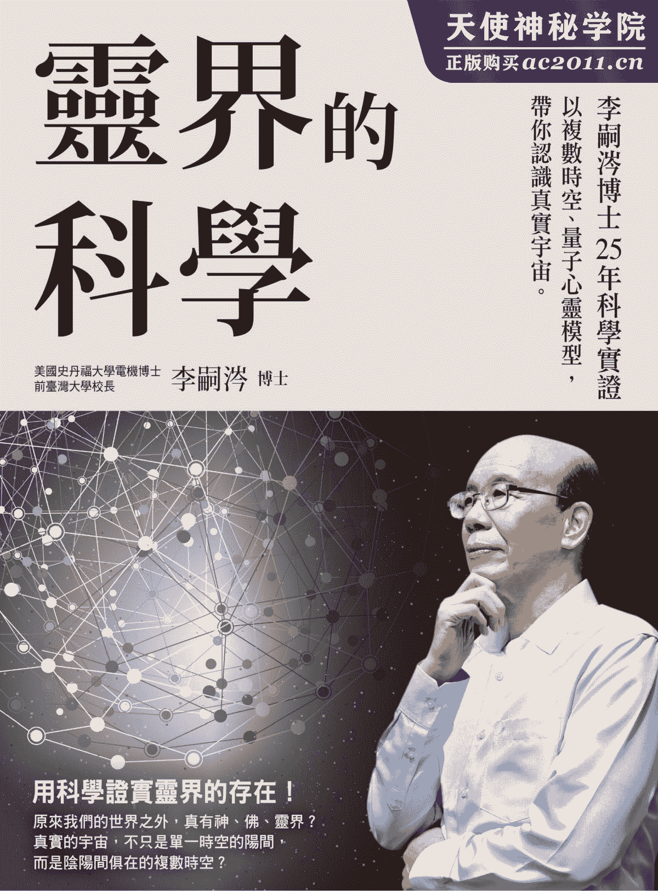

# 推荐序

> 杨定一

我认识李嗣涔教授，已经接近二十年。当年，他还是台大的教务长。有一个因缘，让我们有机会交流。没想到，我们一谈下去，就涵盖了生命点点滴滴的奥妙──从人体多重层面的潜能、生物的超导体，一路谈到高速的螺旋场、神通、ESP（超感官知觉）、水的作用、水晶、非定形的元素态……。

过去，这些主题，我很少跟别人分享。毕竟，大多数专家连传统的科学都忙不完了，更不用说去兼顾非传统的科学。而且，这类非传统的科学，感兴趣的人向来不多。有兴趣又能真正掌握的人，也是少之又少。如果没有扎实的跨领域科学基础，也深入不了。

在分享的过程中，我充分体会到李教授不光是心胸开放，反应极快，而且对这个主题相当有热忱，更是非常的诚恳。也就这样子，我们两人成了好朋友。到他担任台大校长，我们还是保持联系。李教授也不断跟我分享研究的最新情况和结果。印象中，每次见面，我们就像两个小孩，完全投入所讨论的主题，把其他事都搁到了一旁。

其实，物质之前的存在（也可以称为微细的能量、心灵的力量，甚至暗物质或暗能量），从我个人多年来的体会，是由高速的螺旋场所组合的。这个机制，可以解释所有人们眼中「意外」的现象，包括神通，包括 ESP。

但是，我也同时知道，没有相关的设备和仪器，要研究这些题目并不容易。当时，我也帮助李教授找到一个俄罗斯的相关设备，相信透过他追根究柢的科学精神，自然会找到物质和非物质之间的介面，甚至搭起一座桥梁。

身为一位科学家，我觉得最不可思议的是，李教授在那么繁重的行政事务中，依然能够保持对研究高度的专注。这一点，完全是现代年轻人最好的榜样。

李教授的新作《灵界的科学》，相当程度反映了我所注意到的科学精神。在这个非传统的科学领域，他对样样都不排斥，没有任何观念上的阻碍──这本身也反映他过人的智力，而会亲自做实验来验证或推翻。科学的研究，也可以走出既有的框架。我认为，这种精神正是我们国人当前最需要的。

当然，从我个人的角度来说，生命全部的潜能，是我们每一个人都有的，倒不仅限于智力、头脑或是 ESP 的层面。这种无限大的聪明──我过去称为智慧，你我都有，而随时都在等着我们找到。这一点，也是我个人多年来透过任何机会，都想和大家分享的。

我希望读者透过李教授的新书，能体会到生命有种种神奇的奥妙，是我们一般人想不到的。但愿透过这个启发，能让你继续追寻，而走到最后，回到心。我指的是──自己的心，不动的心，大智慧的心。

# 作者序打开宇宙真相的潘朵拉之盒──复数时空

> 台大电机系　李嗣涔教授

二○一八年四月二十七日，我到美国亚利桑那州的土桑市（Tucson）参加「二○一八意识科学」（The Science of Consciousness）国际会议，这是继二○○二年我随着中华生命电磁科学学会成员到土桑市来参加超心理学研讨会后，第二次来到土桑，期间已经相隔了十六年。

我记得二○○二年那次来的时候，我是来报告一九九九年我们手指识字实验的新发现，也就是小朋友藉由手指识字辨识神圣字汇，例如：「佛」、「菩萨」、「耶稣」等与宗教有关的字汇时，他会看不见这些字，却看到亮光、亮人、十字架等异象而发现了另外一个世界。当时我们把这个世界叫做「信息场」或「灵界」，会后我把这些发现投稿在网路期刊《The International Journal of Healing and Caring》，是用科学的方法来证明灵界的存在。

十六年后，这次我带了一个新理论来解释这些神奇现象的背后物理机制。我把这个理论于二○一四年发表在国内的《佛学与科学》杂志，用的是中文，有英文的摘要。这一次经过多年的改进，全文用英文发表，论文用了两个假设：

第一个假设：这个宇宙是由一个八度的复数时空构成。四度为实数时空，就是物质的世界，也就是俗称的「阳间」；另外四度为虚数时空，就是俗称的「阴间」或者灵界。我把一九九九年所发现的信息场及灵界架构成虚数时空与我们物质世界的实数时空组合成一个真实的宇宙图像──「复数时空」。

第二个假设：复数量子态的虚数 i 就是代表意识。因此意识是一个量子现象，可以称做量子心灵。

让我震惊的是，在会上发表的近两百篇论文中，有一位物理学家伊莉莎白‧罗切（Elizabeth Rauscher）博士的团队，也提出了宇宙的真相是八度复数时空的物理模型。看着她发表论文时神采飞扬骄傲地宣称在八度时空的模型下，量子力学的谜团如量子纠缠的非局部性（nonlocality）可以获得完美的解释，我感到无比的兴奋。终于世界上有另外一个物理团队，提出了跟我的第一假设完全一样的复数时空，而第二假设则尚未有其他团队提出。

我深刻感觉到真实宇宙的面纱在一九九九年被我们掀开，二○一四年被我用理论架构出来，而要到二○一八年起将逐渐被物理界认真的考虑。我认为宇宙真相的潘朵拉盒已经向物理界打开了。这次会议让我有机会去了解现在国际上对意识的科学研究到底包含了哪些领域？经过统计后，大致分成下面六个主题：

##### 一、分子及量子生物学

一九九四年起，意识的物理开始萌芽，英国牛津大学的物理学家罗杰‧潘洛斯（Sir Roger Penrose）与美国亚历桑纳大学的骨科医师史都华•哈默洛夫（Stuart Hameroff）共同提出意识的物理，认为意识的基础不在神经活动电位上，而是发生在神经元内担任骨架功能之微管束（microtubule）的物质进入有序的量子状态。脑神经细胞壁是由许多可形成量子状态的奈米微管束（∼十四奈米）组成。

当感官接收刺激输入大脑神经网路时，便会产生有序的量子状态，是不同量子状态的叠加态（superposition）。当时间流逝，外在环境如重力会影响这些量子态之演化，不同状态之物质因分布不同时空导致引力能量差 E 等于两状态的时空间隔 S（物理常数如光速、万有引力常数，令其为一），则叠加状态会崩溃显现为唯一确定的状态。意识就在客观缩陷（objective Reduction，简称 OR）时产生，也就是当量子态扩散到重力之变化满足某些策画（orchestrated）的条件下，宏观的量子波会客观的陷缩，简称为「Orch OR」。在宏观量子态崩溃的一瞬间，大脑的意识就产生了；接着小部分微管束又开始进入量子态，意识就逐渐消失了。等待下一次的客观缩陷机制，再产生新的意识，因此大脑的念头是一波接一波，周而复始。

我认为他们的模型已经接近意识的本质，不过相反的是，意识的产生是在形成叠加的量子状态时产生，客观缩陷时消失。因为叠加的量子状态是复数状态，这时虚数意识可扫描进入量子状态的神经网路架构，产生意识的内容如记忆、思想、判断、行动。有时埋藏在神经网路的经验会产生抑制力，让我们不要冲动、给予建议限制行动。

##### 二、泛灵主义

愈来愈多的神经科学家及哲学家不相信唯物论的观点，认为物质的大脑是第一性的，意识是由复杂神经网路运作所涌现出来的性质，属于第二性的。而开始相信主观的感觉（feeling）、明了（awareness）等特性是任何物体本身的基本性质，给它取了一个名字叫做「感受质」（qualia），这种观点称为泛灵主义（Panpsychism）。

但是泛灵主义也碰到三大困难：

（1）基本粒子夸克、电子、原子、分子有「感受质」吗？

（2）这些微小的原子、分子的「感受质」要聚集起来到什么程度才会出现可以体验到的意识？这个问题又叫做组合问题（combination problem）。

（3）大脑是如何组合这些原始的「感受质」，形成每个人所能经验到的意识？

在我的复数时空意识模型之下，凡是进入复数量子态的物体，它的意识都会出现。因此只要进入量子态，「万物皆有灵」，替泛灵主议提供了科学的基础。

##### 三、麻醉及迷幻药所改变的意识

某些药品注入人体后会改变人的意识，比如麻醉药会让人丧失意识，吃迷幻药如二甲基色胺（Dimethyltryptamine，简称 DMT）等会改变人的意识状态，产生幻觉。因此研究这些药物分子如何影响大脑神经传导，与哪些神经受体结合，以及影响大脑哪一部位，对了解意识如何产生，以及在大脑的哪里产生都有很大的助益。

科学界初步的结论是：药物会打断大脑神经网路间的一些长距离的信息联系。本来大脑是以模组方式处理输入的信息，并有回馈网路连结不同模组，因此意识就是模组功能组合的结果。麻醉让人失去意识，主要就是因为回馈网路被切断，幻觉则比较复杂。我的大脑第六识理论是：灵魂扫描放电的神经网路时空结构而产生意识，大脑连结网路因麻醉或吃迷幻药而改变，当然会改变意识的内容。

##### 四、做梦及静坐的研究

我们在睡眠时意识丧失，但是做梦时似乎意识又活跃起来，同样的，静坐时意识比较不活跃。因此分析这些状态下的脑波，或是大脑核磁共振图谱中休闲状态时网路的变化，对意识的本质可以有比较深入的了解。

##### 五、语言学及内在谈话

对一般人而言，是左脑颞叶在操控语言，也是左脑运动区在操控右手；只有百分之一点五的人是用右脑操控语言。由于擅长用右手的人是多数，运动与操控语言共同竞争左脑神经区的结果，造成少部分的人的语言区会被迫散开到数个零散区域，甚至移往右脑，导致有些人会听到内在声音，而好像有人跟自己讲话，被诊断为精神病患，这是人类发展语言的代价。

##### 六、AI 是否会发展出意识

人工智慧的发展一日千里，让 AlphaGo 在围棋上所向无敌，打败世界棋王，很多例行性的工作也将被机器人取代。一般人更担心的是，机器人是否会发展出像人类一样的意识，而让人类的生存受到威胁。

英国的物理学家罗杰‧潘洛斯，他也是一九九四年最初提出意识的物理现象的两位科学家之一。他用一个下西洋棋的例子，来说明他认为这不会发生。这一棋局是一个和局，稍有一点下西洋棋经验的人一看就知道结果，但是他用西洋棋软体中最厉害的程式──「深蓝」输入棋局却得不出结论。因为程式设计没有考虑过这种和局状况。也就是程式不会自我判断，由此他下结论：AI 不会自行发展产生意识。根据我的意识模型，AI 没有进入复数的量子状态，即然没有虚数出现，也不会产生意识。

从这些研究主题来看，我的复数时空及意识的理论都可以提出非常深入的见解来解答这些问题，我衷心地相信这个宇宙已经揭开了神祕的面纱，就等更多的科学家投入来厘清祂的面目。

这本书我尝试用复数时空及量子意识两个模型去解释宇宙大中小尺度所有的谜团，像暗质、暗能、超光速的量子纠缠、人体特异功能以及意识的本质，希望能对宇宙的真相有更进一步的了解。

我自一九九三年开始从事特异功能研究到今天已经二十五年了，除了中间有八年时间停止做研究外，剩下十七年我要感谢一些学者及企业家给予研究计画的经费支援，让这样被视为怪力乱神的研究能继续下去。第一位是中央研究院李亦园院士，邀请我参加他在中研院的群体计画；第二位是长庚大学的杨定一董事长，第三位是润泰集团尹衍梁总裁，都在我研究过程中支持研究计画，让我在实验上及理论上有很大突破。尤其是尹总裁的支持，让我在理论上有巨大的突破，在此表达深深感谢之意。另外功能人高桥舞、沈今川教授、孙储琳以及许多被我训练出功能的小朋友和他们的父母给了我很大的帮助及启示，在此一并致谢。

另外，云南大学物理系朱念麟教授授权给我使用他的念力断火柴的实验照片，沈今川教授及孙储琳女士授权我使用老子网站首页的照片，以及湖北省博物馆方勤馆长授权我可以使用馆藏太阳神纹石刻照片，也一并深深致谢。

# 第一章　灵界在哪里？

在国内物理学界近十位学者的见证下，

发现我们所处四度时空的物质世界之外，

似乎还有一个世界的存在，

当年我把这个世界称作信息场，

也就是俗称的灵界。

## 二十世纪末宇宙大尺度谜团的重大发现──暗能、暗质

二十世纪末的一九九八年时，两组天文学者宣布了一项石破天惊的发现：我们的宇宙充满了一种能量可以抵抗银河间的万有引力，导致宇宙正在加速膨胀，这股能量叫做暗能（dark energy），被当年科学上最重要的期刊之一《科学》（Science）选为当年度「科学的突破」（The Break of Science）。五年以后的二○○三年，美国的威尔金森微波非等向性探测卫星（WAMP）[1]以探测宇宙微波背景辐射所得的数据，再配合其他数据如史隆数位巡天计画（SDSS）[2]所得的上百万个银河的资料，再度证实宇宙具有大量的暗能，也被二○○三年《科学》期刊选为当年度「科学的突破」。

##### 宇宙充满了大量暗能

大约是一百三十六亿年前，宇宙从混沌中以大霹雳的爆炸方式产生了时间与空间，喷出的能量转化为基本粒子、原子、分子以致物质星云的出现。星云之间的万有引力会逐渐减缓当初时空爆炸膨胀的速度。但是物理学家从观测星空发现，离我们远去的银河系内变星[3]的光强度却比预测的强度要弱，也就是它们的距离比我们预测的还更远，它们离开我们的速度比预测的要快，显示「宇宙正在加速膨胀」。而在短短的十三年后，也就是二○一一年的诺贝尔物理奖就颁给领导发现宇宙加速膨胀现象的三位物理学家──伯马特（S.Perlmutter），施密特（B.P.Schmidt）及瑞斯（A.G.Riess），这个暗能竟然占了宇宙能量的百分之七十三，并具有斥力[4]的性质。

另外，从一九七○年代宇宙学物理学家从螺旋银河的旋转速度到了银河边缘仍不下降的现象，发现宇宙存在大量的暗质（dark matter），具有引力的性质，占宇宙能量的百分之二十三。而正常的能量，也就是我们现在已知的科学所能了解的能量只占宇宙能量的百分之四。表示我们对大尺度真实宇宙的认知完全不清楚，「暗质、暗能的物理本质到底是什么？」──成了大尺度宇宙的最大谜团。

> 编注 1 威尔金森微波非等向性探测卫星（Wilkinson Microwave Anisotropy Probe，WMAP）
> 
> 是美国太空总署（NASA）的人造卫星，目的是探测宇宙大爆炸后四十万年残留的辐射温度。
> 
> 编注 2 史隆数位巡天计画（Sloan Digital Sky Survey，SDSS）
> 
> 是利用美国新墨西哥州的一架直径二点五公尺的望远镜，对北半球天空进行的巡天探测，可拍下北半球的全天星空图影像，让我们了解星系的距离、演化。
> 
> 编注 3 变星
> 
> 指亮度与电磁辐射不稳定且经常伴随其他物理变化的恒星。
> 
> 编注 4 斥力
> 
> 指物体之间互相排斥之力，和引力相反。

## 宇宙小尺度谜团的重大发现──超光速的量子纠缠

描述微小尺度量子世界的「量子力学」是二十世纪最成功的两大物理理论之一，用来描述基本粒子、原子及分子的世界；另外一个理论是「相对论」，用来描述宇宙的重力。今天的网路、手机及电脑文明就是量子力学发展的成果。但是量子力学所描述量子世界的本质，例如哥本哈根诠释[1]引发的争议，经过了九十年，直到今天还是不能完全令人满意，最大的争议有三项：

第一，描述粒子行为的波函数解Ψ（,t）[2]或量子场论中的量子场都是复数函数，**过去没有人了解复数的含意，因为复数不能被测量，能被测量的物理量必须是实数**。

第二，任何粒子或物体的运动必须满足薛丁格（Schrodiger）方程式或狄拉克（Dirac）方程式，这是一个决定论（deterministic）的方程式。也就是在时间为零的时候，如果知道粒子的位置及速度，那么到时间 t 的时候，粒子的位置及速度就可以计算出来，但是哥本哈根诠释却把波函数的平方当作粒子出现的或然率，非常的不合理。

第三个最严重的是发现超光速的量子纠缠[3]现象。有连结的两量子系统，处于混沌不定叠加的状态，不论两者相距多远，只要其中一个或一部分被仪器测量而确定状态时，另一个也瞬间被决定，其之间讯息的传递是远超过光速的，违反相对论的结论──光速是所有速度的上限，因此被爱因斯坦提出 EPR 悖论[4]批评为「幽灵般的超距作用」。

由此可见，充斥在我们生活中的奈米尺度的宇宙也是充满谜团，正等着我们一一解开。

> 编注 1 哥本哈根诠释（Copenhagen Interpretation）
> 
> 是量子力学的一种诠释。根据哥本哈根诠释，在量子力学里，观测创造实像，在没有观察之下，量子系统处在一种叠加状态。
> 
> 编注 2Ψ（,t）
> 
> Ψ是粒子的波函数。ｒ是粒子的位置，ｔ是时间。
> 
> 编注 3 量子纠缠（quantum entanglement）
> 
> 在量子力学里，当两个粒子彼此产生交互作用后，其自旋或极化方向纠缠在一起有一定的关系（比如自旋相反），这个关系随着两粒子远离而不会改变，此现象称作量子纠缠。
> 
> 编注 4 EPR 悖论
> 
> 一九三五年，爱因斯坦与波多尔斯基及罗森联名发表「量子力学能完整地解释真实的量子世界吗？」的论文，反驳哥本哈根诠释的正确性，被称为「EPR 悖论」。

## 宇宙中尺度谜团的重大发现──信息场（灵界）

二十世纪末第二项石破天惊的发现，发生于一九九九年人体特异功能研究的手指识字领域。

人体特异功能像心电感应、遥视、念力等，从古以来历史上就有大量的记载，是宇宙中尺度的人体所发生的谜团，在西方正式的科学研究是从一八八二年的英国开始，称之为超心理学（Parapsychology）。到现在，虽然经过了一百三十年的研究，也发表了大量的科学文献，但是仍不受主流科学界、尤其是物理界的重视。

东方的研究主要是从一九七九年中国大陆开始了手指及耳朵识字、念力等特异功能研究。同样的，因为手指识字现象超越现代科学的框架，不能用现代科学解释，因而不受主流科学界的重视，但是它的重要性却是比暗能、暗质有过之而无不及。

##### 手指识字及念力是宏观的心物合一

我从一九九六年开始重覆中国大陆自一九七九年起训练儿童手指识字及念力研究成果，经过反覆测量了几十位九到十七岁青少年手指识字的能力，证实他们能用手指触摸内容含有文字或图案的折叠纸条，而在脑中看到这些文字或图案。

文字与图案的出现，有时是一个部分接着一个部分依序出现，有时是整个字或图形会同时出现在大脑内的一个萤幕（第三眼）上。当手指识字能力训练娴熟以后，有少部分儿童可以训练出念力，用意念折弯铁丝，我们认为这种手指识字及念力功能的产生是宏观的心物合一现象。

就在一九九九年，我们有了重大的发现。**在国内物理学界近十位学者的见证下，我们发现用一些与宗教或历史上神圣人物有关的特殊字样如：「佛」、「菩萨」、「耶稣」、「孔子」、「老子」、「唵嘛呢叭咪吽」或符号「卍」、太极图，这些青少年会在脑中用第三眼看到亮光，或是发光的人像、庙宇、十字架，有时会看见暗的人影或听到声音，与以往总共超过八百次手指识字的结果完全不同**。但是一旦破坏神圣字汇，例如：将佛字删除一笔一画，或加一撇成为「彿」字，则异象消失，只会看到被破坏的字汇。这个现象相当于网路世界的网址概念，神圣字汇就是网址，可连结到一个网站，表示在这个世界之外，似乎有一个信息的网路世界存在。

为了确认这些现象不是由于小朋友对神佛认知的崇敬之心所导致大脑产生的幻觉，我们改用藏文、希伯来文等小朋友不认识的神圣字汇来测试，结果一样产生异象，看到亮光、亮人等；一旦破坏神圣字汇，则异象消失，小朋友只能看到被破坏的字汇。这证实了异象不是大脑产生的幻觉。　　

我们在一九九九年后又经过了五年的实验，发现我们所处的四度时空物质世界之外，似乎还有一个世界存在，当年我把这个世界叫做信息场，也就是俗称的灵界。因为里面有许多高智能的神灵存在，可以连上它们的网站而且进去参观。而这个信息场似乎是由不同的信息网站所构成，而神圣字汇就是与对应信息网站连接之网址。

至于手指识字时，是否能藉点入这个网址而与网站连上取回信息，还要看小朋友大脑之功能而定。这个功能就好比网路的浏览器，高功能的小朋友表示手指识字正确率高，浏览器之版本很新，可以看到各种网站之信息。功能较差的小朋友，大脑浏览器之版本较旧，只能看到有旧版信息之网站，因此能产生异象之神圣字汇较少。由此观察，我们开始了解物质的宇宙与信息场世界构成了一座错综复杂的网路世界。

## 特异功能研究揭示的四大谜团

我从一九九三年开始研究特异功能中的手指识字，一开始就观察到一个现象，手指识字要能够成功，小朋友的大脑一定要先打开「第三眼」，也就是天眼。

天眼开启时，就像大脑里面突然有一个像电视萤幕的画面被打开，会遮住正常的视觉，然后可以看到色彩或字形，天眼出现一阵子后会消失再又打开，把文字或图案一步步展示出来。

当时我没有读过神经生理学，因此到台大附近的书店把看得到的教科书都买回家仔细研读，我想，「手指尖有感光细胞吗？」，查了几年文献都找不到。而且我们的纸团通常都放入暗袋中，袋中根本没有光或是极微弱的光，基本上没有光源，如何将黑暗的信号送给大脑看？更重要的是，有的小朋友隔着塑胶盒，根本没有碰到纸，也一样看得见，信号显然也没有经过眼睛的视神经系统。那大脑为什么可以先看到颜色，再一步步看到字形？我经过了几年思索，对手指识字的原理一直困在原地打转，连一小步也无法前进，终于我决定放弃现代的神经生理学，因为它对了解手指识字毫无帮助。

##### 放弃现代科学的架构，另起探索炉灶

一九九五年，我认识了中国地质大学人体科学研究所的高功能人孙储琳女士，她具有超过六十种不同的念力，想了解她的潜能可以参考《是潜能？还是特异功能？》一书。根据她的说法，特异功能要想成功，一定要先开天眼，然后把目标物如花生、钱币、汤匙等调入天眼，与目标物沟通、操控、以意念改变目标物，当天眼中的变化完成后，再将信号送回物质的目标物，等待目标物的变化完成后，念力就成功了。因此，不能打开天眼绝对无法产生念力，看了她令人瞠目结舌的实验结果，我知道念力是无法用牛顿力学来了解的，一定要放弃现代科学的架构，另起炉灶才有可能真正搞清楚特异功能的物理机制。于是在我心中渐渐形成了必须解决的四大谜团：

> 谜团 1 天眼的物理及生理机制为何？天眼与一般意识有何不同？特异功能为何需要开天眼才能成功？
> 
> 谜团 2 在手指识字及念力现象中，天眼扫描及传递信号的管道为何？
> 
> 谜团 3 灵界在这些特异功能操作的过程中扮演什么角色？真实的灵界在哪里？
> 
> 谜团 4 暗质、暗能、量子谜团、意识、特异功能是不同的现象吗？还是存在着统一的架构可以解释所有的现象？

## 二○一二年世界末日的生命启示

二○一二年的世界末日说是一个关于地球末世论的传说与谣言，它宣称在美洲过去的马雅文明中长达五千一百二十六年周期的马雅历将于二○一二年结束，因此预言了地球、世界和人类社会在西元二○一二年十二月二十一日之前后数天之内，会发生全球性的灾难性变化，此说法与太阳风暴、地球磁极反转等谣言结合，成为二○一二年十二月民间疯狂轰动的大事。

当然，最后地球安然无恙地度过这几天，戳破了这项传说。**不过，有一项用来解释这项传说的说法却深获我心，末日说并不是指地球会毁灭，而是指地球会跃升至舍弃过去一切的文明，譬如昨日死。二○一二年起，人类会由一个比较落后的文明觉醒，而逐步提升到一个比较高等的意识及文明的境界**。

##### 信息水的启发

一九九九年，由于手指识字研究因而发现了灵界，我于二○○○年七月把自己从一九八八年起所做的气功及特异功能如手指识字、意识微雕、生物意识工程等十二年的研究成果整理出书──《难以置信：科学家探寻神祕信息场》。

出版两个月后的有一天，我的一位同事国企系的汤教授来问我，王永庆董事长的女儿王瑞华及她的夫婿长庚生物科技董事长杨定一博士看了我的书，觉得很有兴趣，想请我吃个饭大家聊一聊，那时候我恨不得把自己的发现与所有对此有兴趣的人分享，自然很快答应了。

一见面之下，我发现杨博士及夫人都很年轻，那时大概才四十出头。杨博士先给了我几篇他一九八○年代在洛克斐勒大学做免疫学研究时，在世界顶尖期刊《科学》（Science）、《自然》（Nature）所发表的论文，其中描述了白血球会产生一种特殊的蛋白质武器「穿孔素」杀死肿瘤及受病毒感染的细胞的机制。我想，他的目的是告诉我，他不只是做生意的商人，而是学有专精的学者及科学家。于是，我把过去十二年的奇遇及做特异功能的所见所闻，包括信息场的发现，详细地讲述给两位听。

杨博士静静地听完以后，淡淡地说：「我也讲一些我的研究给你听听。」接下来，我所听到的故事简直匪夷所思，不但有信息场的探索，比我发现的还要深入、还要更根本；他特别问我一些有关水的特性，尤其是经过特殊处理的水的一些奇妙的性质，像超流态[1]会从杯子中爬壁而出、向你走来，好像具有意识，我完全没有听过。并告诉我一些古埃及流传下来有关水的知识。杨博士还让我见识一下这样的水做成的产品，并滴一滴在我的舌头上，我感觉这滴水一碰到舌头，瞬间消失于舌头皮肤之下，不会停留在舌头上一段时间。据杨博士告诉我，有时一滴水就可以治疗一些疑难杂症。另外，他也提到微量元素的神奇效果，这些现象及故事真让我听得瞠目结舌，回去以后几天睡不着觉，但是由于自己是外行无法验证，也只能记在心头。

隔了两年，有一次我让一位道家朋友Ｗ先生试了这瓶水中的一滴水，没想到五分钟后他竟然打起瞌睡来了，他说这滴水从舌头直接钻进大脑意识中心，关掉了他的意识，让他昏昏欲睡。另有一次，我让一位治因果病的灵疗老师试了一滴，她感觉这滴水在胸口附近的食道徘徊，上上下下好像有意识一样，在等待机会钻进大脑，让我对这瓶水产生了极大的好奇心，但是也无法更进一步了解这个特殊现象。

##### 超意识的天眼如何形成？

二○○○年开始，我对于病患使用灵疗方法来治病产生了兴趣。那一年在因缘巧合下认识了一位灵疗者，亲自观看了灵疗过程，让我开始相信因果轮回的存在。**很多的病其实是业障病，来自多次前世所累积的因果业力，因此我自二○○四年起，开始做拜忏的功课，每天做一圈一百零八拜，把功德忏悔回向给累世的冤亲债主**。做完功课，才开始一天的活动，吃早餐、漱洗、准备上班。

我记得就在二○一一年十二月二十八日，当天早上做完拜忏以后，我突然灵光一闪产生了一个念头︱︱十二年前在二○○○年时，杨定一博士告诉我有关水的奇异特性，所给我的特殊水制品，可能就是天眼的成因。几天之后，进入二○一二年元旦，我就突然像开了窍一样，对于困扰了我二十年的手指识字、念力等特异功能谜团，好像在理论上打开了一个缺口，终于可以开始往前走一小步了。

**我们的大脑里像身体一样满布生理食盐水，约占百分之七十左右，如果大脑有一小部分生理食盐水在手指触摸纸团的刺激之下进入特殊的超导态或量子态，天眼就形成了**。剩下的问题是，这个天眼要如何与外面的世界如纸团或目标物接触？是经过手指还是其他管道？如果是离体识字，纸团放在离身体一段距离之外，根本没有用到手去触摸，又该如何解释？当时我猜测，可能是天眼形成了宏观的量子波，穿出人体把纸团或目标物包围起来，强迫纸团或目标物进入心物合一状态，此时信息往大脑送就可以识字，当大脑用意识操控目标物就可以产生念力。但是又想不通量子波如何强迫其他物体进入量子状态的方法。

二○一二年中，我看到云南大学物理系朱念麟教授写的一篇文章，描述他训练儿童的念力实验的结果，获得深刻的启发。他把火柴装在一个不透明的塑胶盒子中，由一位小朋友离体用念力把火柴搬运出盒子，成功搬出后，却不知搬到哪里去了，好像进入一个隐态空间消失无踪。等了一段时间后，又要求小朋友把火柴搬回来，只见开天眼的小朋友说：「火柴出现了，飞来了」，但是没有人看得见火柴，小朋友用手去打飞行中的火柴，还说火柴会闪避，似乎火柴出现了意识，可是一旦被打到，火柴就会显身掉在地上。由此可以知道，透过意识搬运出去的火柴是藏在信息场或是灵界，只有天眼才看得见，一般人的正常眼睛是看不见的，朱教授因此把信息场叫做「隐态空间」，因为信息场是一个意识的世界，所以火柴在信息场才似乎有了意识，可以闪躲人的拍打。

而且，天眼似乎可以把目标物送入信息场藏起来，让这些火柴信息可以在信息场自由飞翔，一旦受到撞击就会物质化，而显身在物质世界。只是当我解答了一个目标物藏身的问题，却引发出更多的问题，比如天眼如何把目标物送进灵界的管道，我还是不清楚，灵界在哪里？

> 编注 1 超流态
> 
> 当物质如氦气在低于临界温度 2.15K 时，其液体会进入宏观的量子状态，流动时没有摩擦力，叫做超流态。

## 真实宇宙，包含实数空间与虚数空间

二○一三年初，我的研究兴趣转向南氏去过敏疗法[1]，尝试去了解为何当病患手握过敏原的信息水制剂，加上刮通经络及十几个关键穴道后，一天不接触过敏原就可以把身体过敏现象消除。其关键就是去证明抗原抗体分子的生化反应，不需要直接接触，而是分子的时空结构 X 信息可以穿墙破壁经由另外一个管道来完成。

二○一三年六月，我从台大校长卸任休假一年，终于有时间可以好好地把二○一二年以来所有对特异功能、宇宙实像的思考理论整理成一套逻辑比较完整的架构。那一年真是愉快，我好像回到了大学时代，行住坐卧都沉浸在解谜的氛围中，常常早上醒来就有一些新的观念出现，所谓日有所思、夜有所梦是也。

##### 真实的宇宙是复数时空

我曾于一九九五年去北京，拜访中国地质大学人体科学研究所的沈今川教授及高功能人孙储琳女士（如下页图 1-1 所示），并合作研究特异功能四年，因此推荐给汉声杂志社的总编辑吴美云女士出书。吴女士曾于二○○一年及二○○四年内两度邀请我去北京，与沈今川教授及孙储琳女士以对话录的方式来谈孙储琳的六十项特异功能，她的成长历史、功能的出现与操作的细节，以及特异功能理论的架构等问题。

书稿在二○○五年初已经完成，但是不巧的是，我在二○○五年六月就任台大校长，不方便再出这方面的书籍，因此我要求这本书要在我卸任台大校长以后再出版，获得吴总编同意，结果一等就是八年。

二○一三年六月底，我从台大校长卸任以后不到三个月，在九月初的时候吴总编就把二○○一年完成的书稿寄来要我校对。

我看到十三年前的对话录，不禁百感交集，特异功能的研究由于超出了现代科学的框架，就必须忍受主流科学的霸凌与压迫，与四百年前的伽利略所面对的宗教压迫是没有两样的，只是他面对的是生命的死刑，而我面对的是主流科学界的各种攻击。

图 1-1　与沈金川教授、孙储琳女士探讨特异功能研究

| 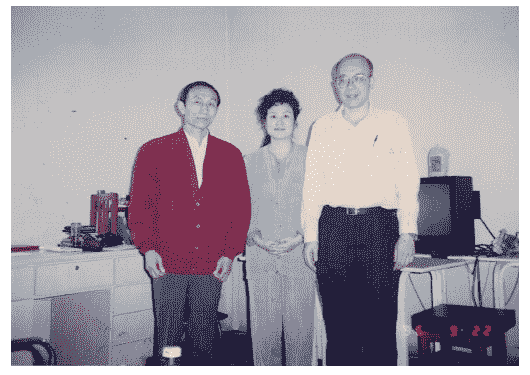 |
| 1995 年 9 月，我第一次到北京中国地质大学人体科学研究院访问沈今川教授及特异功能人士孙储琳女士，看到他们多年来的研究成果。 |

包括我选台大校长期间，外界曾利用媒体、学术杂志、甚至动用诺贝尔奖得主的批评来打压我。并在我当选校长一年后继续发动事端，假借研究伪科学的理由，找我学生论文的麻烦，种种侵扰行为足以列入史册，为这个时代主流科学界的行为留下见证。

在校对过程中，我赫然现在二○○一年的对谈过程中[2]，我已经提出实数空间以及虚数空间的这种概念。

在物理的世界中，其长度、时间都是可以测量的，而可测得的物理量都是实数，也就是物质的世界就是实数空间。而二十世纪一九二○年代出现的量子力学所描述的粒子是一个波函数，很不幸的是，波函数是一个复数，包含了实数及虚数，物理学家看到这个结果觉得很困惑，怎么描述实际粒子的波函数竟然是个不能测量的复数，于是把这个复数平方后又变成实数，表示粒子出现的或然率。但是如果粒子真的就如复数波函数所描述的，牵涉到一个实数空间和一个虚数空间，那么表示除了我们所身处的实数空间的物质世界之外，还有一个跟实数空间成共轭状态而我们测量不到的虚数空间，看到这里我豁然而通。

**一九九九年我们做手指识字实验时所发现的信息场，其实就是虚数的时空，原来我们真实的宇宙是一个复数的时空，有实数也有虚数**。我在二○○○年左右就形成了这样的概念，只是没有继续琢磨、完善这个模型。

##### 量子心灵概念的形成

二○一三年十一月，我受邀去云南昆明参加第二届人天观学术研讨会，这是中国大陆自一九九九年取缔法轮功以后，导致特异功能研究沉寂十多年来少数举办与特异功能研究有关的研讨会，其中发表的论文有不少在讨论过去三十多年来大陆所做的特异功能研究。会中我碰到了很多二十多年前做特异功能研究的老朋友，大部分研究者都已经退休了。

其中一位四川大学物理系的吴邦惠教授在演讲时提到，她在一九八○年左右，提出了量子波函数的复数ｉ代表意识的想法，并给钱学森[3]写了一封信提出这个概念，受到钱学森的鼓励，但是最后发展不下去而不了了之。

我听到她的演讲真的像五雷轰顶，我发现的信息场也就是虚数时空，是个充满了意识、神灵及信息网站，如火柴进入虚数时空后，也会产生意识可以闪躲人的拍打，不就是指明虚数ｉ代表意识吗？这时，量子心灵或量子意识的概念自我心里油然而生，**原来意识就是指量子状态出现，万物皆有灵，只要物体进入宏观量子状态，虚数出现，意识就出现了，这个宇宙的真相已经呼之欲出了**。

从昆明回来后，我加快了理论的建构过程，提出「复数时空」及「量子心灵」两大假设是破解宇宙之谜的关键，剩下的问题是「如何进入虚数时空？」、「灵界在哪里？」。

二○一三年年底十二月二十四日，我请道家朋友Ｗ先生晚餐，向他提到我这几个月在复数时空及量子心灵理论架构上的突飞猛进，但是最大的困扰是，实数空间通往虚数空间的通道究竟在哪里？

**他提醒我，中国传统的太极图其实是一个三度空间的圆球，阴阳两界各占一半，经过鱼眼交换能量而达成平衡**。突然之间他点醒了我，复数时空理论架构中实数时空与虚数时空如何沟通的问题，它们必须要经过一个涡漩的时空结构来沟通，让信息从阴到阳、或从阳到阴。其中最可能的涡漩通道，应该就是粒子的自旋，它的物理原理我们在半年后才从已发表的广义相对论文献中发现。

由于每个基本粒子包含夸克、电子、质子、中子，其中都有自旋，自旋方向不是朝上就是朝下，自旋角动量[4]不论质量为何，都是ћ/2，其中ћ是普朗克常数除以 2π。因此每个粒子都有进入虚空的通道，通道无所不在。

二○一四年一月六日我把正式论文《复数时空：解释暗质、暗能、意识与特异功能的统一架构》[5]投到国内学术期刊《佛学与科学》，被接受后于二○一四年三月刊登出来。

> 编注 1 南氏去过敏疗法
> 
> 这种疗法是先利用肌力测试，找出导致身体过敏的过敏原，然后经过二十分钟的刮经络、按摩穴道治疗后，接下来一天二十四小时内，只要不再接触过敏原，就可以完全去除过敏，恢复健康。详细论述请见《科学气功》。
> 
> 编注 2「是特异功能，还是潜能？」的大师对谈
> 
> 请见《是特异功能？还是潜能？》，第一百七十四页。
> 
> 编注 3 钱学森
> 
> 浙江省杭州市人，世界闻名科学家，中国空气动力学家，科学院、中国工程院院士。
> 
> 编注 4 自旋角动量
> 
> 一九二八年，英国物理学家狄拉克证实每个基本粒子都具有自旋角动量，不管粒子质量多大，自旋向上或向下的角动量大小都是二分之一的ћ，是普朗克常数ћ除以 2π。
> 
> 编注 5《复数时空：解释暗质、暗能、意识与特异功能的统一架构》
> 
> 请见《佛学与科学》期刊，第十五卷第一期，第十三到二十八页。

## 提出两大假设：复数时空与量子心灵

在《复数时空：解释暗质、暗能、意识与特异功能的统一架构》论文中，我提出两大假设：

##### 第一假设：复数时空

**真实的宇宙其实是一个八度的复数时空，除了目前所知的四度实数时空（阳间）以外，还有一个充满意识及信息的四度虚数时空（可称作信息场或阴间、灵界）存在（如图 1-2 所示）。**

为什么要用八度而不是像超弦理论[1]用十一度空间呢？主要考虑的因素是平衡，阴阳必须要平衡，否则会像不平衡的化学反应一样，会进行动态反应一直到平衡为止。既然实数空间有长宽高加上时间是四度时空，自然虚数时空也必须是四度。这种双重世界的概念在中国儒释道的体系早已传承悠久，西方也已转化为政治及宗教制度，例如由国王管理人民的俗世事物，由教皇管理人民的精神属灵事物。

图 1-2　宇宙是八度的复数时空

| 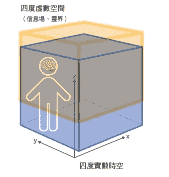 |
| 八度的复数时空，是由四度的实数时空及四度的虚数时空组合而成。四度的实数时空就是「阳间」，四度的虚数时空就是「阴间」（灵界）。人类大脑中的灵魂可以跨越实虚两界。 |

实数时空与虚数时空虽然关系密切，为同一复数时空的实部及虚部，但是其间存在实虚障碍（阴阳两隔），仅仅藉由许多不同尺度的特殊时空点交换能量，这些连结点都是漩涡状的时空结构，也就是三度空间中太极图上的鱼眼结构（如图 1-3 所示）。

我假设实数时空与虚数时空就是太极图上所尝试描述的阳及阴，两者相生相克，其能量经过鱼眼（漩涡的时空结构）互相沟通，因此实数及虚数时空中都有许多的鱼眼具有漩涡结构可与另一时空接通，让能量互相交换。除非物质小于漩涡尺寸或进入特殊状态，否则不能随意穿越。　　

一般物质存在于四度实数时空中，可以由四个座标（x，y，z，t）来定位，描述其运动。但是当物质如基本粒子、光子或物体进入微观、宏观量子状态，必须用复数场来描述其量子状态时，当复数物质波出现，物质波不受漩涡尺寸限制，就可以透过漩涡连结点穿隧进入虚数时空。

图 1-3　太极时空中，鱼眼是阴阳沟通的涡漩通道

| 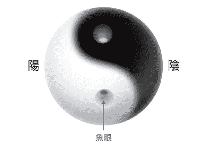 |
| 在 3D 太极的时空结构中，鱼眼是阴阳互通的涡漩通道。经由无数鱼眼的漩涡时空结构，方能达成阴阳两界的沟通。 |

在虚数时空中，物质波的波速 u 与实数时空中物体的速度 v 满足此方程式 uv＝c2，c 为光速。当物体在实数时空的速度小于光速时，（v＜c），则物质波的波速在虚数时空的速度会大于光速（u＞c），因此量子状态的物质波可以很快地传布到广袤的虚数空间，也可以撷取过去及未来的讯息。此时最大的变化是物质的意识成分（虚数部分）被唤醒。**我认为虚数时空的意识、神灵及无数的信息网站都具有能量，相当于质量的存在，而这些质量就是暗质，具有引力的特性**。暗能，一般被认为是由广义相对论中的宇宙常数所提供，也就是真空能量所产生的斥力。我认为复数时空中实数时空与虚数时空经由数量巨大的漩涡连结点紧密黏在一起，虚数时空的膨胀可以带动实数空间的加速膨胀，导致暗能的出现。因此，虚数时空的存在回答了我提出的第三个谜题：「灵界在哪里？」，也提出宇宙大尺度谜团如「暗质、暗能到底是什么？」的解答。

##### 第二假设：量子心灵

我提出的「量子心灵」的科学假设认为：意识是一个量子现象，由于虚数时空充满意识及信息网站，虚数ｉ在数学里只是一个符号，但是在物理上它代表了意识，因此我认为复数量子场或量子波函数中虚数ｉ的出现把意识带进了物理学。量子力学早已把意识带进了物理，只是没有朝这方面探讨、解释。虚数部分与意识有关，这就是量子心灵的意义。

实数空间的物质要打破实虚障碍进入虚数空间的关键有二：

第一个方式是物质的尺寸要远比自旋漩涡口的孔径小，而且正好撞上连结点的通道口，得以进入虚数时空消失，而会在不同时间、在不同地点由另一漩涡连结点出口显现。类似百慕达三角洲飞机或船舰的神祕失踪事件。

第二个方式是物质只要进入复数物质波或量子场状态一出现，就可以渗入虚数时空。我认为这个复数的物质波就是进入虚数时空的钥匙。此时物质尺寸不再重要，量子波可以渗透穿隧经过很小孔径的漩涡时空连结点（漏斗口）进入虚数时空。因为量子物质波在虚数时空的速度可以远高于光速（u＞c），因此量子可很快地传布广袤的空间，也可以撷取过去及未来时间的讯息。光子比较特殊，在实数空间的速度及虚数空间的波速都是光速 c。

在复数时空中的波函数导致在实数空间无法确切地测量粒子的动态性质，如位置及动量，因为其游走于实数及虚数时空，在虚数空间与所有物质的虚像产生随机碰撞，因此测量时当复数波函数崩溃回到实数时空后，只能得知其在位置 r 出现的或然率。两个量子所产生的量子纠缠现象是发生在虚数时空，因为它们都经过自旋通道钻入了虚空，虚空里信息的交换及传导是可以超光速的，因此量子纠缠信息超光速并不违反相对论。所以，复数时空的概念彻底解决了近百年来对量子力学本体论的迷惑，也就是量子力学所描述的「量子世界的本质到底是什么？」的问题。

> 编注 1 超弦理论.
> 
> 超弦理论认为组成世界的物质包括原子、电子、夸克等，都不是由实体物质构成的，而是由万物的基本单位「弦」的震动所构成。「弦」的不同振动方式会形成不同的粒子，粒子又构成了世界。并且弦的振动是一种能量到实体物质的转化，因此万物的本质只是振动的能量而已。过去，人类对维度的探索仅止于四度，超弦理论诞生后，人类认知的维度变成十度空间加上一度时间即十一度时空，人类生活在三度空间中，因此无法感知高维度的存在，就像听不到超声波、看不到红外线。

## 粒子自旋能划破时空，连结阴阳界

每个粒子都有自旋，是一九二○年代量子力学发展前所测量到电子的特性，而且只有两种可能，一个自旋向上、一个自旋向下。自旋角动量的大小是ћ/2，其中ћ是普朗克常数除以 2π，当时的物理学家为了解释自旋现象，尝试用了古典的图像。

若一个电子的质量为已知，尺寸可以估计，将其看成一个古典的实心圆球，那就可以计算出电子要转多快才能产生实验所量得的自旋角动量，结果发现旋转速度必须要超过光速，违反相对论，因此在大物理学家包立（Pauli）的警告下，主流物理学家从此噤声，认为电子自旋是纯粹的量子现象，没有古典的图像。

当然，一九二八年英国物理学家狄拉克（Dirac）所推导的相对论量子力学，自动得出粒子的自旋角动量只有向上或向下，大小为ћ/2，与实验一致，更加深了自旋是量子现象的信仰。但是也有少数非主流物理学家证明自旋是一团有能量的量子波在狄拉克场下的旋转行为，多少恢复了部分古典的图像。

二○一三年，俄国的广义相对论大师 Alexander Burinskii 提出，自旋由于粒子过度旋转（超光速）把时空撕裂划出一个奇环口，形成两片断裂的时空，这个划破时空的举动打开了阴阳两个世界的通道。

**本来阳间与阴间像是一张纸的两面，这张纸是无穷大，阴阳互不来往，但是只要纸上钻了一个小洞，或划破一道小口，则阴阳通道出现**。如果一个化学键有两个电子一个自旋向上、一个自旋向上，则会撕裂两道口子，时空分裂为四片。在极小的空间中，四片断裂的时空要两两相连接以维持一个稳定的时空结构。Burinskii 声称会以莫比乌斯带（Mobius Strip）的方式连接（如图 1-4 所示）。

当一条长方形纸条的头尾正常相连，就会形成一条有宽度的圆圈，但是头尾相连时，其中一头转了一百八十度再相连，就形成莫比乌斯带，图 1-4 展示的模型就是不同长宽比的纸条形成莫比乌斯带的 3D 几何构造。

很明显的是，当长宽比等于四，形成的 3D 拓朴结构就是一个 3D 太极图，有两个洞口一个向上、一个向下，代表两个不同自旋造成的结果，一个由阳到阴，另一个由阴到阳。这也解释了量子力学里的包立不共容原理（Pauli exclusion principle）──为什么同一轨道两电子的自旋必须不同，因为这样一来才能形成稳定的太极时空结构，以及稳定的分子结构。

图 1-4　3D 莫比乌斯带（Mobius Strip）

| 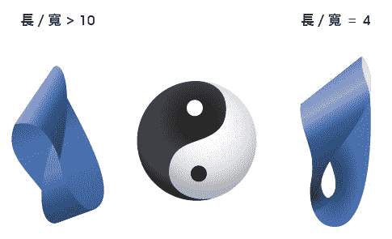 |
| 将一条长方形纸条其中一头转了 180˚再头尾相连，就形成莫比乌斯带。当纸条长宽比等于 4，形成的结构就像是一个 3D 太极图，有两个洞口一个向上、一个向下，代表一个由阳到阴，另一个由阴到阳。 |

奈米尺度的漩涡时空结构就是基本粒子的自旋，只有两种状态，向上及向下，一个由阳旋入到阴，一个由阴旋入到阳，这解释了为何一个空间内的量子轨道只容许两个自旋相反的电子，因为可以形成稳定的三度空间太极时空结构，这也解释了量子力学里的包立不共容原理的物理成因。因为在空间轨道内放入两个自旋相同的电子会造成不稳定的时空结构。

二○一三年三月二十一日，欧洲太空总署（ESA）网站公布了普朗克卫星收集了五年的宇宙微波背景辐射数据[1]。这是一百三十六亿年前从宇宙诞生的大霹雳爆炸后约四十万年，初始尘埃散开到电磁辐射可以向宇宙发散后的残留分布能量。这张图显示出两个不正常的特征：一个是两半球温度不对称，南半球温度稍高，另外一个是南半球出现一圈圆形的冷点。仔细一看，其实这张图显示了一个巨观的太极图，冷点就是鱼眼，清楚显示实数时空是由虚数时空爆发出来。当然现代宇宙学认为我们的宇宙是由真空能量爆发出来，名称虽然不一样，实质上则同为从虚空产生。

二○一五年九月十一日，美国太空总署（NASA）的天文物理学家发现一个双重黑洞星体[2]的产生速率是我们太阳系所在银河的一百倍，各大媒体公布的想像图像，就是平面太极图的两个位于鱼眼位置的黑洞互相作用之结果，表示大量的能量在黑洞附近产生，这也显示出太极的时空结构有很多异常现象产生。

总而言之，复数时空及量子心灵两大假设的提出，可以开始合理的解释暗质、暗能、量子力学的谜团，以及意识的本质，特异功能研究所引发科学四大谜团的第四个谜团似乎获得了解答，但是要如何去理解宇宙中尺度的谜团「特异功能」呢？这要等到第四章才能加以讨论。

编注 1

|  |
| 宇宙微波背景辐射数据 |

编注 2

|  |
| NASA 发现双重黑洞星体 |

# 第二章　耳朵及手指识字的实验启示

如果有一天，

能教会盲人用手指或耳朵来「看」，

用触觉来取代眼睛，

人类社会中，将不再存在「盲」这种残疾。

## 发现人体潜能――耳朵与手指识字

眼睛可以观赏五彩缤纷的世界，耳朵可以听见虫鱼鸟兽以及大自然所发出的各种声音，手指可以摸出物体表面的平滑凹凸与冰凉热烫。这些能力是一般人所拥有的基本能力，一点也不稀罕。但是，如果可以用手指「看」图案，也可以用耳朵、腋下、膝盖「看」图案，就代表着触觉的信号跑到了大脑中枢的视觉区域，那它所代表的意义就非同小可了。

##### 盲人点字时，触觉信号会牵动视觉

一九九六年四月，英国《自然》杂志刊登了一篇文章，日本国家生理科学研究所的定藤规弘教授（Dr.Norihiro Sadato）的研究群，利用正电子发射断层摄影数（PET）及区域性大脑血流量之测量发现，**当已有点字经验的盲人用手指触摸盲文（Braille）上凸出的字体时，在大脑左右半球的视觉皮质区会有激发反应，这是科学界第一次发现盲人在摸点字时，触觉信号会传入视觉皮质，造成不同感觉信号互通之现象**。

但是定藤规弘教授等人又同时发现，当盲人不是摸点字，而是在摸一片均匀的凸出小点时，则触觉信号不会传入视觉皮质。而正常人在摸点字时，视觉皮质的血流量会减少，视觉区不但没有激发，反而会受到抑制。这与一般脑科学家过去的认知是相符的，五官的感觉是不会互通的，眼睛瞎了，并不会造成听觉或触觉受损，而听觉的损伤，也不会影响到眼睛所观察的世界。

##### 发现会耳朵识字的儿童

不过，早在一九七九年，四川省大足县就发现了一个十一岁的小男孩，名字叫做唐雨，他具有耳朵识字的功能。若在一张小纸片上随便写一个字，然后将纸片折叠或揉成一小团，塞入耳朵中，他可以在几分钟内在脑中看到这个字。

这件事情经四川省的地方纸媒报导后，引起了很多人的兴趣，不少四川省各地区的小学老师就在班上试试小朋友有没有这样的能力。结果不到一年，四川各地方纷纷报导具有耳朵听字能力的小朋友，且有数百名之多。

这结果引起了北京大学生物系陈守良副教授的兴趣。他于一九七九年底在北大开了一个儿童潜能训练班，有五到十四岁的四十名儿童小朋友报名参加，各实验不同的天数，结果其中十五位参加了四天以上训练的儿童，有八成出现了手指识字功能；其他受到三天以下训练的儿童成效较差，平均下来总共有十六名小朋友出现了手指识字的功能。

一九八○年，杭州大学的田维顺教授等人对杭州四所小学及四所中学的一千两百二十二人做了四个小时的诱发测试，结果发现以九岁的儿童手指识字功能出现的比率最高可达到百分之二十。随着年龄的增减，出现手指识字功能的儿童比率递减。十岁及十一岁的儿童，出现功能的比率均为百分之十四左右；十二岁的儿童，出现功能的比率为百分之七；十三岁的儿童，出现功能的比率为百分之四；十四岁以上的一百五十位学生中当中，只有一位出现识字功能，如左图 2-1 所示。

**由此可见，我们随着年龄的增长，学习的知识越多，当大脑松果体逐渐钙化，产生手指识字能力的可能性就越低。**

图 2-1　对小学生、中学生手指识字功能的测试结果

| 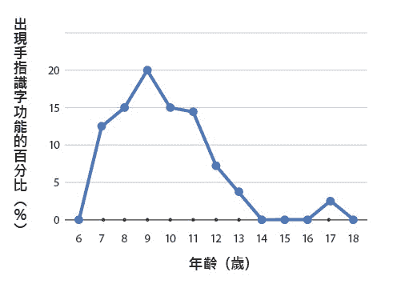 |
| 1980 年，田维顺教授等人对杭州 4 所小学及 4 所中学的 1222 人，做了 4 个小时的诱发测试，结果 9 岁小孩出现手指识字的比率最高。 |

上海市高校人体科学联合研究组的邵来胜等人，从一九八二年起，对上海各高等校院的学生与老师及地区的工人，举办了「特异功能诱发训练班」，结**果发现文化程度比较低的群众中，比较容易诱发成功，特异功能提高速度也比较快**。

比如，在一九八六年一月，其训练对象是十一名男女工人，年龄在十八到二十岁。学历在小学程度的有两人，国中程度的有九人。每天训练一小时，总共训练十八天。结果到了最后一天，每个人不但出现识字功能，还掌握了隔空把盒子内嵌施以念力弯曲的潜能，最厉害的人还能把铁丝折断，甚至搬运到远处。这些具体的实验数据在在都显示了，手指识字功能的人体潜能确实存在。

## 手指识字，突破现代脑科学认知

手指可以摸出字来？耳朵可以辨认图案？任何人第一次听到这种事情，总会嗤之以鼻，把它打入怪力乱神之流。一九八七年，当我开始参与国科会所推出的气功研究时，也抱着同样的态度。随着气功研究的深入，接触到越来越多的科学论文及大陆与日本媒体的报导，逐渐感受到这些现象，可能不但不是怪力乱神，还是人体科学的尖端领域，不过还是希望亲自做实验来证实。

##### 第一次接触到能用手指识字的人

我第一次接触到具有手指识字功能的人，是一位十一岁的高桥舞小妹妹，时间是一九九三年。高桥舞小妹妹的父亲是日本人，母亲是台湾人。她在台中的一个国小读到五年级后移民美国，由于外祖父母在台湾，因此她每年都会回台省亲。

高桥舞的母亲在她十岁那年，由于看到日本电视台的报导有手指识字这种事情，因此也让她试了一下，结果发现她也拥有这项功能，她的母亲兴奋之余也非常的重视，每天让她练习几次，因此当我们第一次碰面时，她的手指识字功能已经非常的稳定。

记得第一次见面的时候，是一九九三年暑假八月十七日的下午，地点在台中的朋友家。归国省亲的高桥，扎着一条长长的马尾，穿着牛仔短裤及短袖汗衫，由妈妈及外祖父母带着前来。面貌清秀的她面对陌生人显得有点腼腆，问她话时只是点头及摇头，偶尔会跟妈妈及阿嬷小声说两句。

开始做实验时，我先在隔壁饭厅的桌上用不同颜色的笔写了二十张纸条，并将每一张纸折叠几次，务必要做到从外观上看不到任何字的痕迹，然后拿进客厅，由在场的朋友从中间抽取一个交给高桥小妹妹，因此无人知道内容。

高桥用右手接下纸团后，摸了十三分钟也看不见，这时她的母亲拿出一个深绿色的布套，上缘系有细的尼龙绳，把高桥的右手套入布套，再把套口的细绳抽紧，让套口紧紧贴在手腕上，再在手腕上打了一个蝴蝶结。

根据高桥母亲的说法，这是当初训练高桥认字时，为避免她打开纸团或从纸团外偷看之用，时间久了，她也习惯了，不戴布套反而不容易「看」到字。

我带了一台 V8 摄影机，全程拍摄她脸部及手的动作。也许是加了布套后更胸有成竹，只见她坐在沙发上东看看、西看看，左手有时会去捏那套在布套中的纸团，不到一分半钟就说：「看到了棕色的田字。」她在一张空白的纸上写上田字。结果打开一看，是红色的「田」字。字形完全正确，颜色稍有差池（如七○页图 2-2 所示）。

接下来，我们又做了三次实验。第二次实验时，将纸条用白纸盒盖住、再用双手盖住白纸盒，她先看到「日」字，再看到右边的月字，知道是「明」字，完全正确。第三次实验时，用布套套住她的手，她在一分二十秒时看到黑色的「天」字，完全正确。第四次实验时，用布套套住她的手，还将纸团用胶带黏住，她经过十五分钟还看不到，因而放弃。第五次不戴布套，十三分钟后仍无法看到而放弃。总共五次实验中，有三次成功，两次失败。

**当时，我并不知道失败的原因，只是觉得百分之六十的成功率，有点不可思议。因为当初选择写下的文字或图案，没有任何限制，倘若每一次实验纯粹是用猜的，猜中机率大概大于千分之一**。而现场又是完全双盲的状况，没有任何人知道高桥小妹妹手里所拿纸条的答案。

图 2-2　高桥舞 11 岁手指识字的实验结果

| 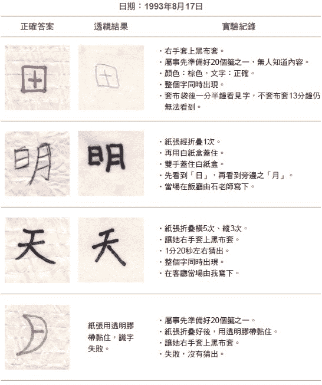 |

回台北的路上，我怀着满心的惊喜与疑惑，但五次的实验样本还是太少，仍不足证实此事的真实性。但如果手指识字是真的，其中信号传递的机制又是什么呢？一个对现代脑科学认知挑战的现象，已经浮现在眼前。

## 专家见证，手指识字的科学实证过程

有了第一次的接触以后，我们利用高桥小妹妹回国省亲的机会，每次利用二到四天的时间，对她手指识字的能力作了详细的研究。第一回是一九九三年十月，第二回是一九九四年八月，第三回是一九九五年九月，第四回是一九九六年五月，第五回是一九九七年八月。

##### 制作手指识字的实验题目

在正式实验之前，我们必须先制作题目。在第一及第二回实验时，我们均裁下五公分乘上十公分的长方形白色纸条，然后用红、绿、蓝、黑四种颜色签字笔，在纸条上写上单色或多种颜色的文字，包括单个或多个中文、英文或画上图案、写上算式等，然后沿长边对摺后，以零点六到零点八公分之宽度，由中心往外叠六次，形成一个五公分长之细长条纸卷，再在三分之一处各向内摺一次。为了达到摺好之纸团务必无法由外观看到任何字形及颜色的地步。有时，外面会再用胶带黏贴，或再加一张纸包扎。

每回实验时，我们准备的纸团均超过五十个，由实验现场的来宾在另一房间当场书写再折叠。第三及第四回实验，则裁下三公分乘上十公分之长方形纸条，一端剪成尖锥状。折叠时则从尖锥处摺起，摺向另一端，其目的在了解手指辨认图案之方向，是由内向外或由外向内。

##### 专家见证下的实验过程

每次在实验现场，旁观的教授、学生、医生或有兴趣的人士，包含记者都在十人以上，有一到两部摄影机从不同角度拍摄，以记录实验详情。

第二及第三回实验时，使用红外线摄影机记录手掌的温度，并观察她的手在布套或黑盒内触摸纸团之动作。

实验开始时，我会随意请一位在场人士，任选一个纸团交给高桥小妹妹，没有人知道纸团内容为何，以达到双盲的效果。高桥小妹妹在右手拿到纸团以后，大部分情况下，要在右手套上一个深色布套，套口有绳子可以将套口缩紧绑在手肘上，如后面九六页的实验照片所示。布套内的余光只有一般白光或灯光的万分之一。有时会在布套上再罩一个黑纸盒，让余光强度再降一百倍以上。此时可以说纸团处在完全黑暗之中，不可能由眼睛直接看到纸上的颜色或任何字形、图案。

在前三回的一百次实验中，有二十五次，让高桥小妹妹戴上眼罩阻绝光线，以了解眼睛在手指识字过程中所起之作用。有部分实验不戴眼罩，但在暗室进行，暗室之余光也只有开灯时之万分之一。一旦绑上布套，即开始计算时间，到高桥小妹妹声称「看到」颜色或字，则停止计时。此时，小妹妹选择所看到颜色之签字笔，在白纸上写出答案，并描述看到的景象。我会请在场人员协助脱掉布套，打开纸团做比较，并详细记录实验过程中所发生的状况，有时会请小妹妹将看到字形出现之顺序，一笔一画地写出来。

## 除了手指识字，还能用耳朵听字

朱小妹妹是我亲自做过实验中一位具有耳朵听字功能的小朋友，她出现特异功能的过程相当传奇。

一九九四年暑假，当时在台北市光复国小就读三年级的朱小妹妹与班上其他五位同学一起参加了一个旅行团，到大陆去玩。在访问上海交通大学的时候，刚好碰到交大正在开班，训练小朋友耳朵听字功能，看到台湾小朋友来访，于是邀请大家一起来参加训练。

朱小妹妹将第一个纸团放在耳朵内，花了四十多分钟才看到，不过答案错了；于是再塞一个纸团，十多分钟后又看到了，这次完全正确。不可思议的是，从此她不但耳朵能识字，手指也可以识字，甚至把纸团放入不透光的底片盒，她也可以只摸盒子而看到内部纸团上的字。

同行的五位同学中，另外一位同学也出现了识字功能，不过错误率较高。这**显示在十二岁以下的小朋友当中，手指或耳朵识字功能具有相当的普遍性**。

##### 验证耳朵识字功能

回到台湾以后，好几个电视台邀她们几位同学上节目示范手指识字功能，我也是看到电视节目，才知道有这么一位小妹妹，于是在一九九五年四月邀请她来台大从事比较严格的实验。

那是一个星期天上午，她的母亲带着她及妹妹来到实验室，根据她母亲的说法，她平常没有练习，但是想「看」的时候就「看」得到。于是我们将事先准备好的几十个纸团，随机选了一个就开始了实验，当然在场没有任何一个人知道纸团的内容。

只见她双眼凝视前方，好像陷入深沉的思考，两手不停的转动及戳揉纸团，经过十分三十秒只见她微微一笑，点点头说看到了，随即拿起绿色的笔在纸上写了一个「弓」字，结果完全正确（如左图 2-3 第一列所示）。字形在她脑中出现的顺序，也是出现一部分再消失，然后再出现，这些字像拼图一样拼完后会散开再组合，并不稳定。我推测她是因为平时没有练习，不熟悉技巧的缘故。

图 2-3　朱小妹妹的识字实验结果

| 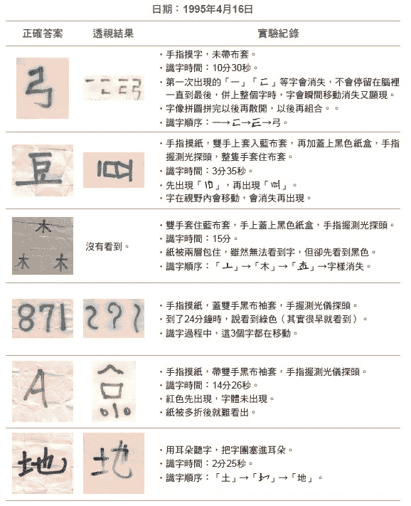 |

第二次实验，让她看蓝色的「豆」字，结果只花了三分三十五秒她就看到了，不过转了九十度，成了横躺的豆，如上页图 2-3 第二列所示。表示字在她脑中的萤幕上会移动散开再重组，仍不稳定。接下来，第三次实验（如图 2-3 第三列）花了十五分钟，第四次（如图 2-3 第四列）花了二十四分钟，第五次（如图 2-3 第五列）花了十五分钟，不是看不完全，就是自己添加了一些内容。这时已近中午，朱小妹妹有些疲倦及不耐烦，于是又试了一次耳朵听字（如图 2-3 最后一列），结果只花两分二十五秒就看到黑色的「地」字，答案完全正确。

对朱小妹妹而言，识字功能只是好玩，比较不能适应长时间严格的测试，包括摄影机的拍摄、手上戴上布套及握住测光探头等要求。因此，直到一九九七年二月，我们才有机会对她做第二次测试。令人惊讶的是，朱小妹妹平日并不练习，两年后手指识字功能似乎更强，一般简单的认字实验，她两三分钟就能看到，但是仍然不稳定。这与「不练习会退化」的一般现象是不同的，显示她具有多种部位的识字功能，可能是来自天生的。

## 让大脑打开天眼的特殊生理机制

高桥小妹妹在手指识字时，右手要套上布套或用黑纸盒罩住才看得快、看得对，这是当初母亲训练她时，为了避免她打开纸团或从纸团外偷看所用。时间一久，她也习惯了，不戴布套反而不容易「看」到字。

比如，在前三回合总共一百次实验中，有九十一次之中，她手戴布套或仅以黑盒子罩住双手，结果其中五十五次完全正确，占百分之六十的成功识字率。其中二十次颜色对了，但字形没有看完全；其中十次字形完全正确，但颜色不对；完全失败只有六次。但是，在剩余九次双手完全没有遮蔽的状况下，识字结果竟然没有一次完全正确，反而有五次完全失败。显然，遮住双手是高桥小妹妹手指识字成功的关键因素。

##### 用手「触摸」黑暗中的纸团

她的右手在布套里究竟怎么触摸纸团呢？在一九九四年八月的第二回实验中，我们想到可用红外线摄影机来拍摄她双手在黑盒内的动作。由于手有温度会在红外线范围产生大量的黑体辐射波长，因此虽然在黑盒内的可见光很微弱，用一般摄影机无法拍摄，但是用红外线摄影机可以将手部的动作看得很清楚。果然，我们从萤幕上可以清楚地观察到，高桥小妹妹用双手不断地翻转纸团，触摸纸团的稜线，但是没有打开纸团，而且盒内的光线只有一般正常亮度的万分之一，即使用眼睛去看也看不见。

为什么高桥小妹妹不戴布套反而「看」不见字形呢？我们从红外线摄影机萤幕上看出端倪。萤幕上影像的颜色代表温度，在不戴布套的状况下，我们发现高桥小妹妹的手背及手指温度会从蓝色的摄氏二十八度，在三分钟内迅速上升至黄色的摄氏三十四度以上，在这种情况下，即使超过三十分钟也看不到图案。但是，这时如果握一罐冰汽水，让手温降低到摄氏三十度以下，则在一分二十五秒后就看到了图案。为了理解手温上升的原因，我们又做了如下的实验：

首先，第一次实验时她没戴布套，拿了纸团三分钟后，手温上升到摄氏三十四度以上。这时，我们用黑盒将她双手盖住，两分钟后将黑盒拿开，直接从红外线摄影机读出手背的温度，发现已经降到三十二度；在用黑盒盖住双手的两分三十秒后，她已经看到图案，打开黑盒，我们发现她的手温已经降到摄氏二十九度以下，显然盖上黑盒有降低手掌温度的功效。

从物理上来分析，原本室温二十五度，在手掌附近盖上一个纸盒，纸盒内的温度受到手温的加热，会比环境的温度二十五度还高，在纸盒内温度的提升下，又会影响手温比在室温下稍高。但是，结果手温却下降五度以上，这显然是心理因素的影响。

高桥小妹妹一旦脱下布套，因心里没有把握而紧张起来，导致手温上升，就不容易成功。**因此我们学到，在训练小朋友开发手指识字功能时，一定要创造一个轻松的气氛，去除他们紧张的心情，才会产生比较好的结果**。

##### 心理安定，才能打开天眼

如八三页图 2-4 的第一列所示，第一次实验是高桥小妹妹双手先不罩黑盒，所以一直看不到图案。到约第七分钟时，再替她罩上黑盒，在四分三十八秒后她就看到图案。

第二次实验时，起先不戴眼罩，也不戴布套，经过五分五十四秒后戴上黑色眼罩，但到了九分钟还是什么也看不到，于是在九分二十五秒时，将手盖上有洞的黑纸罩，接着随即换成盖上全黑无洞的黑纸罩，再过一分二十三秒就看到了，结果稍微有些错误。

第三次实验时，在开灯的情况下，一开始不戴黑布套，经过十分钟后她什么也看不见，于是我们把灯关掉，再过十分钟还是什么都看不见，此时她手上温度已超过摄氏三十五度。这时我们用冰块将两手降温后，擦干手上水滴，让她再继续搓纸团，结果四分二十五秒后就看到图案了。

第四次实验时，在开灯的情况下，手上不戴布套也不罩黑盒，她过了十四分钟什么也看不到，但是在她罩上黑盒后的五分八秒时，就能看到图案，识字结果完全正确。

从这些实验结果，很明显地说明戴上布套或罩上黑色盒子可以安定高桥小妹妹的心理，让手掌微血管收缩、降低温度，导致一种特殊的生理机制能够让她在大脑打开天眼，扫描手上纸团把信息送回大脑。

图 2-4　高桥小妹妹在不同状况下的识字结果

| 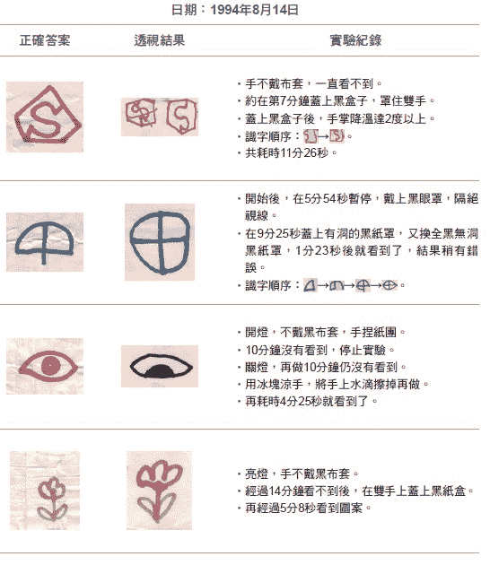 |

## 在大脑里「看」电视──了解天眼扫描的顺序

手指触摸纸团所获得的信号，如何在大脑中呈现呢？

根据大陆北京大学、上海复旦大学的研究以及一些特异功能人士的主述，都是大同小异地先在脑中出现了一个萤幕，图案、纸的颜色或纸团的形状会先出现在萤幕上，有时会消失再出现，然后颜色收拢形成图案，或纸团逐步打开又合拢，最后完整的字形被伸展开来，就像看电视一样。这种脑中出现萤幕，显出图案之现象叫做「屏幕效应」，也有很多学者称之为「开天眼」。

**就以高桥小妹妹来说，字或图案的出现，是一个部分接着一个部分出现的，而且萤幕第一次出现，一定是显现文字的色彩**。比如一九九三年十月二十七日做实验的结果（如八六页图 2-5 所示）。首次实验时，让她看红色的「茹」字，第一次开天眼后，脑中萤幕出现一片红色，然后红色消失，等了一会儿，第二次萤幕出现时，上面有一个红色的「口」字，然后萤幕又消失了。第三次萤幕出现的时候，在红色口字的左方多了一个「女」字，也就是红色的「如」字出现，瞬间又消失了。第四次萤幕出现时，整个红色的「茹」字出现，一会儿又消失了。等到第五次萤幕出现时，是红色的「茹」字，她就知道已经全部看到了，此时拿起红色的笔写出答案。

有时，她看到的字或图案并不完整，连续两次萤幕出现的图案都没有新的变化，她就以为全部看到了，实际上还有些讯息没有出现。图 2-5 的第二列实验显示的就是她还没有看完全的例子。纸条上的字是「WATER」，但是她看到的是「TEP」，只看到最后三个字，将 R 看成 P，R 下的一撇还未出现。接下来第三次实验如第三列的蓝色「料理」两个字所示，识字结果就完全正确了。

图 2-5　高桥舞手指识字实验

|  |

二○一六年，我们对高桥小姐手指辨识颜色及字汇的能力又做了一些测试（如下图 2-6 所示）。纸上正确答案的「位」字，是由黑、红、蓝三只色笔写的，透视结果完全正确。

第一次开天眼时，她看见一片黑色，表示「位」字左方单人部首的黑色信息被扫描进天眼。九点二十六分五十二秒第二次开天眼时，她仍然看见颜色有两种，上面是红色，下面是蓝色，表示「位」字右半边的红蓝两种颜色信息被扫描进天眼；上面为红色，下面为蓝色，表示颜色的排列顺序没有错误，也没有混合。接着，她以红黑蓝的顺序把「位」字组织起来，最后透视结果完全正确。从这些程序展示了天眼扫描的机制，对我们之后第四章解释手指识字的物理过程提供了丰富的细节。

图 2-6　高桥舞手指识字实验

| 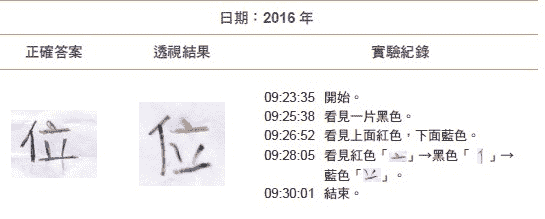 |

## 光线明暗，会影响颜色辨识功能

高桥小妹妹手指识字是在布套内极微弱的光线环境下做实验，竟然能产生与视网膜神经在强光下完全一致的色彩反应。那么她的眼睛到底有没有看到光？对手指辨识图案的影响就值得研究。

##### 没有光，天眼无法辨识颜色

我们用戴眼罩或在暗室做实验来隔绝眼睛的作用，为了避免在不同的实验条件下干扰到数据的分析，我们只考虑高桥小妹妹脑中看到字形出现的实验。

结果发现，在开灯不戴眼罩之情况下，所做的五十三次单一颜色的图案辨识，颜色完全正确。一戴上眼罩，二十一次实验中有四次颜色错误，错误率达到百分之十九。而在暗室中所做的三次实验，虽然图形正确，但是颜色全错。

由此可以了解，若眼睛看到光线，的确对颜色辨识有所帮助，其主要原因是：因**为正常双眼所看到的亮光送进大脑后是用来照亮屏幕之用**，而产生颜色感知。如果眼睛盖上眼罩或在暗室没有送入亮光到大脑，屏幕上一片黑暗，天眼扫入纸上的颜色信息，自然无法产生颜色感受，但是形状信息不须亮光照射就会呈现。

## 大脑认知习惯，会影响手指识字结果

在实验过程中，我们发现了一个有趣的现象，认知心理显然会影响实验的结果。比如有一次请高桥小妹妹认绿色的「线」字，原来写的字形里左边「系」部下面为草写只有一撇，但是高桥小妹妹先看到热字下面的四点，然后再看到左边的丝字偏旁，最后呈现在天眼的是丝字下面加上三点（如左图 2-7 第一列所示）。又如她将英文字「HAPPY」看成「Happy」，「SUN」看成「Sun」。原本是全部大写字母，都被看成第一个字母大写，其他全是小写，与她平常写字习惯相符，**显然文字信息要先经过大脑记忆部位比对，再根据过去的文化经验转换后，才显示在屏幕中，所以有些变形**。

图 2-7　高桥舞的认知干扰了手指识字结果

| 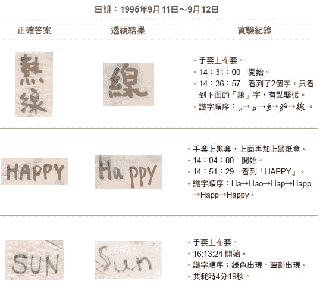 |

另外一个有趣现象则对日后我们解释手指识字的物理机制有决定性的影响（如左图 2-8 所示）。例如，第一列案例是我们在白纸写上「王后」两个字，但是把后字下面的口字挖洞，天眼上对应口字的位置会出现黑色框框，表示纸上本身不会发出光的部分会在屏幕中相对位置出现黑色。

第二列案例中，将「吃讨」两字中「吃」的口字偏旁剪开后反折到纸条后面，从正面看起来变成「乞讨」，再将纸张摺叠起来做手指识字，结果天眼上看到的是「吃讨」，答案没有错误。

第三列案例中，在纸张里贴上一小块不会发光或反光的宽黑胶带，从天眼看起来就是黑色。

另外我们在透明纸上写字来做实验，高桥小妹妹发现屏幕的背景变成一团黑色，不像以往都是明亮的白色背景，但是在透明纸背后垫一张白纸一起折叠后，则背景又恢复明亮。显示用透明纸与挖洞或黑胶带一样，似乎无法提供亮度信号给天眼，表示若无法提供亮度或颜色信号给眼睛的图案，将来在天眼上也是呈现黑色。

图 2-8　手指识字时，在纸上挖洞或贴上黑胶带的结果

| 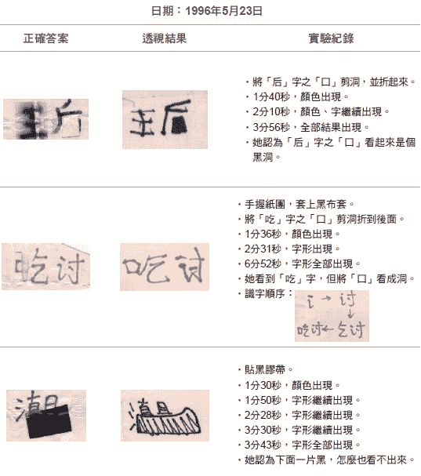 |

## 开天眼时，身体的生理变化

当天眼屏幕出现的时候，高功能人的身体是不是会产生生理的变化呢？答案是肯定的。

##### 手中电压与天眼萤幕开启，互为因果

在高桥小妹妹一九九五及一九九六年的第三及第四回实验时，为测量她两手电压的变化，我们在小妹妹两手各贴一电极，直接记录两手电压差随着时间变化的情形，实验的情况如九六页图 2-9 上方的两张照片所示。

实验时，会让高桥小妹妹手上握一按钮，天眼出现时按一次，天眼消失时按两次，实验的部分结果如图 2-9 下方的橘色曲线所示。

结果我们发现，天眼出现前两秒钟左右，双手开始出现电压，然后一个尖峰约二十到六十毫伏（mv）的电压出现，如图 2-9 下方图表中的黑色斜线所示，这一段时间叫做「酝酿时间」。接着，**从天眼打开到消失只有一到两秒的时间，也就是天眼一闪而逝非常短暂，这段时间内，她脑中会「看到」字形出现。**

直到二○○二年，她的功能增强以后，天眼可以开启到十至二十秒钟，双手电压也可以保持到几十秒钟，与天眼开关时间一致。显然脑中放电会导致手掌产生电压，这与脑中屏幕出现有一定的因果关系。这些数据让我们知道天眼出现、消失与双手电压差的发生顺序。

图 2-9　手指识字时的电压变化

|  |
| 手指识字时，让高桥舞的双手贴上电极量电压，同时描绘在纪录纸上。 |

| 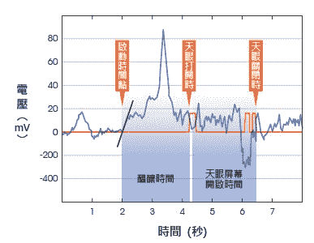 |
| 天眼出现前 2 秒，双手出现一个尖峰约 20∼60 毫伏的电压，如黑色斜线所示，这是「酝酿时间」。从天眼打开到消失只有 1~2 秒，这时，她脑中会看到字形。 |

##### 主观认知下的客观实验

在一九九七年第五回合的实验中，我们去荣民总医院神经血管内科去做脑血流流量的测试，用都卜勒超音波探头贴在头部的左右太阳穴（如下图 2-10 所示）。

结果发现高桥小妹妹用右手识字，在看到屏幕之前，右边中大脑动脉血流速度大幅降低百分之二十（如下页图 2-11 所示）。左半球脑血流速度在实验开始二十秒后从每秒八十公分（80cm/sec）的速度冲上每秒一百公分（100cm/sec），接着掉回每秒八十公分（80cm/sec）。

图 2-10　高桥舞在荣民总医院测量大脑动脉的血流速度

| 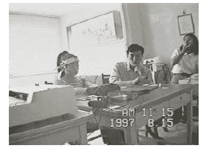 |
| 用都卜勒超音波探头，贴在高桥舞头部的左右太阳穴。 |

图 2-11　用右手手指识字时，左右大脑动脉血流速度之变化

| 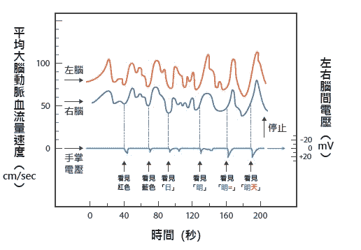 |
| 识字时，第一个出现在屏幕上的是红色。第二次打开萤幕时，她看到蓝色。接着看到蓝色的「日」字；蓝色的「明」字；红色的「二」出现在蓝色的「明」右边；最后出现「明天」后结束，透视结果完全正确。 |

这表示大脑活动量由高降低，保持约十五秒钟后开始反弹，在血流量降至最低点开始反弹之际，双手掌出现了电压脉冲约十毫伏（mV）左右，右手为正电压。接着屏幕出现，第一个出现在屏幕上的是红色，接着血流速度反弹到高点，并开始重复下降到反弹的过程。每当血流速度降到最低点，手上就会出现电压，接着屏幕打开，她能看到一部分图案。第二次打开屏幕时，她看到蓝色，表示这张纸上有红色及蓝色两种颜色的图案；接着看到蓝色的「日」字、蓝色的「明」字、红色的「二」出现在蓝色的「明」右边，接着出现「明天」后结束，透视结果完全正确。

当高桥小妹妹改用左手识字时，左中大脑血流量则大幅上升约百分之二十，在上升过程中双手会出现电压脉冲，左手电压为正。因此虽然屏幕效应是一个主观的认知过程，但是伴随的生理变化是可以用仪器来测量的。

后来，我们也去新光医院测量手指识字时脑波的变化（如下页图 2-12 所示），量出的结果如一○一页图 2-13 所示，第一列及第二列为不同实验状况下脑波在全大脑的分布图。

第三列是大脑枕部（视觉处理部位）的脑波经傅立叶转换后的频谱图。横轴是频率，纵轴是强度。一般人的频率在十四到三十赫兹的是β波，八到十三赫兹是α波，四到七赫兹是θ波，四赫兹以下是δ波。

图 2-12　高桥舞在新光医院手指识字时测量脑波

| 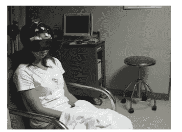 |

从第三列最左边第一张图来看，是眼睛闭上（EC，eye closed）的状况，其中红色的α波非常强，与一般人相同。第二张图是眼睛闭上在算数（EC，cal），例如计算二十七乘以三十五时，α波受到打扰稍微下降一些。第三张图是眼睛闭上在想风景（EC，image），例如想日月潭风景，红色α波受到打扰再稍微下降一些。

第四及第五张图是眼睛打开注意看外面景象（EO，focus）或随意看看（EO，nofocus），红色α波振幅受到严重干扰几乎消失。第六张图是眼睛打开一点点勉强看到外面的字或景象（EO,smalleyes），α波也受到严重干扰消失。第七及第八张图，只要戴上眼罩，则不管是闭眼或张眼都看不见外面景象，α波变得很强。

图 2-13　手指识字时，在不同状况下的脑波分布和频谱图

| 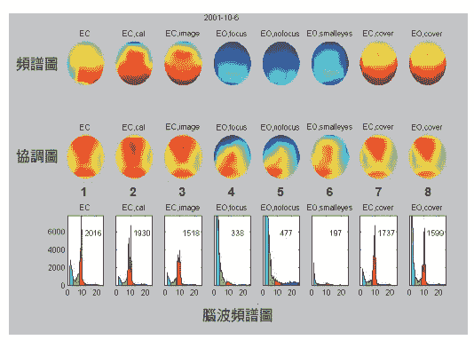 |
| 从最下列第 7、第 8 张图中可看出，当高桥用手指识字看到纸上的文字或图案时，眼睛并没有打开，看不到外面景象，因此α波会变得很强。 |

**这些现象告诉我们，α波是一个严格的生理指标，可以让我们辨认受试者有没有看到外面的景象**。我们想证明的是当高桥用手指识字看到纸上的文字或图案时，眼睛并没有打开，因此α波会变得很强。

左图 2-14 就是实验的结果，为手指识字时大脑枕部 O1、O2 及顶部 T5、T6 脑波频谱图，每一条线为十秒钟的数据，红色尖锋为α波振幅，黄色区间为酝酿期，双手有电压出现，紫色为开天眼区间。很明显的是，开天眼时，她脑中的α波振幅仍然很大没有变小，表示眼睛是闭着没有看到外界的文字或图案，但是天眼却能看到正确的图案。

##### 测量高功能人的大脑各部位活动

一九九八年，我们也用功能性磁造影（functional magnetic imaging，简称 fMRI）技术测量了高桥小姐手指识字时大脑各部位的活动情形（如一○四页图 2-15 所示），并将大脑切割成十二条细长紫色线分隔的区间，包括视丘、松果体、胼胝体等部位。

图 2-14　手指识字时的脑波频谱图

| 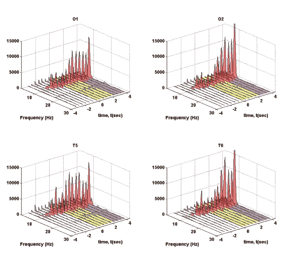 |
| 红色尖锋为α波振幅，黄色为酝酿期，紫色为开天眼期。从图中可看到，开天眼时，高桥的大脑α波振幅仍然很大，表示眼睛闭着，但天眼却能看到正确图案。 |

图 2-15　手指识字时，用 fMRI 测量大脑各部位活动情形

| 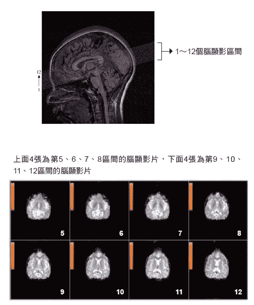 |
| 红色部位是开天眼前后信号变化较大的部位。从第 7 张脑显影片可看到，左脑听觉部位有变化，第 8 张起，脑中央部位一些区域有很大的变化。 |

高桥一手操控按钮，开天眼时按一下作为信号，帮助分析数据。

如右图 2-15 下方显影图所示，上排是第五、六、七、八的四片区域；下排是第九、十、十一、十二的四片区域，以及开天眼前后信号变化图，红色部位是较大的变化。很明显的是，从第七张左脑听觉部位有变化，第八张起中央部位一些区域有很大的变化。

下图 2-16 中，大脑蓝色区块内显示的是第八片红色区域实际信号的变化图，右图中的橘色是高桥舞小姐开天眼时按下的信号，总共开了两次天眼，纵轴是 fMRI 信号在天眼打开时变化的百分比。

图 2-16　大脑蓝色区块内，开天眼前后的 FMRI 信号变化百分比

| 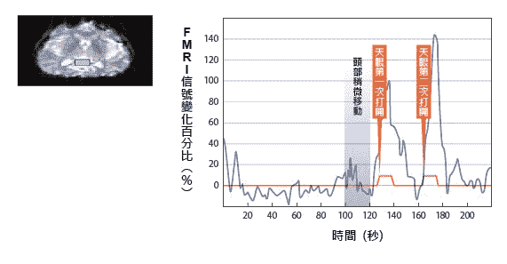 |
| 图表中蓝色区间为头部稍微移动的区间，但与第一次开天眼时间无关。第二次开天眼时信号变化达到 140%。 |

第二次开天眼时，她信号变化竟然达到百分之一百四十，远高于一般正常信号变化百分之一到三的五十倍。第一次测量时，所有专家没有人相信这个数据，都认为头有动。但是经进一步分析发现她头稍微移动的时间并非第二次开天眼的时间，如蓝色区间显示。后来第二次作实验时，信号反应还是一样巨大，才说服大家这是真的信号。一○四页图 2-15 第九、十片脑区虽然信号变化较小，但是还是比一般信号要大得多，所以我们初步判定天眼开的部位是在下图 2-17 红圈的位置，很接近大脑中后扣带皮层（posterior cingulate cortex，简称 PCC）部位。

图 2-17　开天眼时，fMRI 信号反应最强区域

| 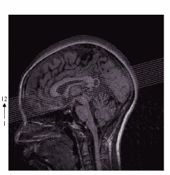 |
| 红圈位置，为开天眼时的反应部位，似乎很接近大脑中的后扣带皮层。 |

## 手指识字能力，可经训练开发

我自己在一九九六年七月第一次开了一个儿童潜能训练班，想要验证大陆研究单位所声称的儿童可以训练出手指识字功能，有七到十三岁间的十五位小朋友报名参加。经过四天，每天两小时的训练，结果真的有三位小朋友出现了手指识字的功能，占全部儿童的两成，包括同时有识字和念力功能的王小妹妹。

随后我每年暑假开训练班，以四天每天两小时的时间训练小朋友。一直开到二○○四年总共开班九次，二○○五年六月我因接任台大校长，为避免争议就从此不再开班，由我指导过的硕士学生担任宜兰松山国小的邱老师继续下去，直到去年仍然每年暑假开班。

我从一九九六年到二○○四年九次开班中，总共有一百七十六位小朋友完成四天的训练，其中有四十一位出现显着的手指识字能力（统计出错机率 P＞0.05），大约有百分之二十三的儿童出现功能较高的表现。其中三十三位儿童，约百分之十九的儿童出现了高功能能力（统计出错机率 P＞0.001）。其年龄分布如左图 2-18 所示，八到十一岁的孩子出现高功能的比例都很高，十二岁以后就不行了，人数较少。

**这些事实显示，经过短时间训练，有相当比例的一些小孩能把识字时的手指触觉的信号送回大脑视觉区，重组成有意义的影像。这些现象对现代脑功能的认知提出了严峻的挑战。**

图 2-18　9 次训练班中，出现手指识字功能的 41 位小朋友的年龄分布

| 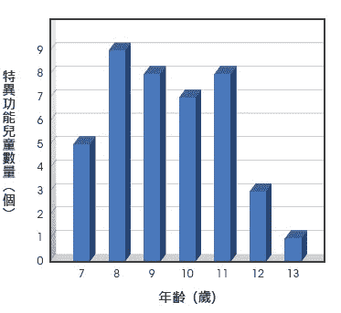 |
| 8∼11 岁的孩子出现高功能的比例很高，12 岁以后就不行了，人数较少。  |

##### 获得手指识字实验成果的回应

我在一九九三年发现高桥小妹妹具有手指识字功能以后，华视的电视节目「早安今天」曾到我的实验室来拍实验过程，在电视上播了两集；我常想是否有哪个国小老师看了影集后会受到启发在自己班上试了试小朋友的能力，然后把结果告诉我。直到二○○二年十二月，那时我正在美国史丹福大学休假进修，有一天打开电子邮件看到下面这封来信：

> 李教授您好：
> 
> 我是一位小学老师。八年前，偶然机会得知教授从事人体潜能的研究。于是，我大胆地请班上的学生（五年级生）一同实验以「耳朵听字」。果然，有令我讶异的情形出现。有一些同学，真的能做到以耳朵听字。
> 
> 八年之后，我又进行同样的实验（大约十五分钟）。这次，我带的班级是六年级生。同样的，有些许的同学（六到七人）可以猜出塞在耳朵中的纸条的文字。可是这些孩子都未曾接受过任何人体潜能训练，却也能有同样的能力，个人感觉相当的有趣。心血来潮之余，特别写封信与您分享。耽误您宝贵时间阅览这封信，实属不该，恳请海涵。
> 
> > 敬祝　平安
> > 
> > 一个小小的小学老师　敬上

**我当场热泪满面，真的有一位「大大」的小学老师在一九九四年看了电视节目后，做了这个实验，获得了正面的结果，八年后重复实验仍然获得正面的结果。大自然展现了祂的真面目给认真求道的信仰者。**

从美国回来以后，我找到了这位老师，是台北市百龄国小的赖俊贤老师，我把他班上出现功能的四位小朋友带到我的实验室测试，果然都有不同程度的识字功能，这些小朋友都是天生的，没有经过任何的训练。

##### 超过十五岁，仍能开发潜能

手指或耳朵识字能力主要集中在十三到十五岁以下的儿童，一般认为这是因为大脑松果体在十三到十五岁开始钙化的缘故。**问题是天眼似乎并不是在松果体，而是在松果体后方的五到十公分处，这似乎暗示年轻人仍有机会开发出手指或耳朵识字功能**。我在二○一六到二○一七年也在台湾大学电机系尝试开发约一百位二十多岁的台大大学生及研究生，只用了两次每次半小时的训练，加上课余的影像视觉自我训练，也有百分之三的同学出现了耳朵识字的功能，令人兴奋。原来年纪超过十五岁还是有机会开发出耳朵识字功能。

手指识字及耳朵听字在人体科学上是很大的突破，例如：一个盲人如果能教会他用手指或耳朵来「看」，用触觉来取代眼睛，则人类社会中将不再有「盲」这种残疾。如果我们能找出触觉信号传递及重新组织机制而改以机器来做，则这部机器将是新一代最具威力的医学检验仪器，可以轻而易举地看到身体内部器官表面的影像。

## 发现念力的存在

王小妹妹是我亲自训练出来，具有手指识字功能的小朋友之一，也是唯一一位训练出念力的小朋友。

一九九六年七月，她报名参加儿童手指识字训练班，结果在第一天历经一个小时、三次实验后就出现了功能反应；在接下来三天的实验中，识字正确率高达百分之七十以上。

为了找出练习的频率对识字功能的影响，我安排了每个月训练一个半天约三小时的计画，请王小妹妹的母亲带她来训练，结果发现在训练完的第一个月，正值八月时，她兴致很高又逢暑假，所以常常练习功能，识字正确率可以维持在五成以上。但是九月开学以后，她上了国小五年级，除了念书以外，又参加了许多活动，没有时间练习手指识字，功能大幅衰退，到了十月时识字功能完全消失。

为了恢复她的功能，我利用一九九七年二月寒假期间，又集训四天，结果王小妹妹的功能在第一天就恢复了，识字正确率高达七成以上。这样的状态保持了两个月，到四月中，又由于疏于练习而衰退到一成的正确率，我只好在暑假七月底，再度以集中训练让她恢复，并跟她父母商量，让她每天练习半小时，当作是练习弹钢琴或绘画一样，作为一种技艺来培养她；并要求她改正姿势，以往是趴着头闭眼来识字，要矫正成抬头睁眼，结果经过一段时间的练习，她不但矫正了姿势，识字功能也越来强。**这里阐明了，一般小朋友「不练习会退化」的现象。但是对天生有功能的小朋友如高桥小妹妹则不适用**。

##### 第三眼，是超出五感之外的感知能力

这种手指识字的生理过程，到底是不是经由触觉传递到大脑，再经过边缘系统渗入视觉中枢转换为视觉的呢？我们把折叠的纸条封入一个完全不透光的底片盒，让王小妹妹摸着盒子练习，一开始她「看」不到，但是经过四、五次的训练，她可以逐渐看到模糊的影像，但是好像有一层雾挡在前面。随着训练次数的增加，雾也逐渐消散，看得越来越清楚了。接着我把纸条折叠后，外面再包一层铝箔并放入底片盒，王小妹妹也是一开始看不见，经过几天的训练后就逐渐看到了。

经过底片盒、铝箔层层的阻挡，触觉早已与纸张失去直接的联系，但是大脑感知的透视力仍然能穿透重重障碍，在没有光线的环境下把纸上讯息撷取出来，**它必然是超出五种正常感觉能力（视觉、听觉、嗅觉、味觉、触觉）之外的另一种感知能力。由于识字时脑内会出现屏幕，打开天眼，表示这是双眼之外第三只眼睛的功能，可以称之为「第三眼」**。

##### 念力，心想事成的惊人力量

根据大陆各研究单位训练儿童手指识字的经验，当儿童训练到天眼可以穿越重重障碍，甚至离体不碰纸条都可以建立联系管道把纸上信息调入天眼，就可以开始训练把信息管道反向，用意念操控信息产生变化，再送回物体产生念力。

一九九八年一月，王小妹妹的天眼已经可以穿透底片盒、铝箔纸、把包在铝箔里纸条上的文字信息撷取出来。因此我就开始训练她的念力，把一段铁丝放入底片盒，她用手握住盒子，把铁丝调入天眼中，用意念把铁丝折弯，不会弯的话就在天眼上想像用手、剪刀或钳子等工具来折弯。

一九九八年五月十七日，在严格的实验条件下──包括把已放入铁丝的底片盒贴上封条、还让实验者签上名字。结果，王小妹妹在十九分钟内尝试把一小段铁丝折成一个三角形，最后打开底片盒一看，如左图 2-19 箭头处所示，铁丝的确折了两个弯；但因念力控制还不够好，两个弯不在同一平面上，有一些离开平面。这个力量显然不是牛顿力学的力量，而是意念的力量，大自然再一度地显示祂的神祕力量。

中国大陆云南大学物理系的朱念麟教授与罗新教授自一九七九年就开始训练儿童手指识字的能力，待手指识字能力纯熟以后，就开始训练他们念力，是特异功能研究的先驱者。一九九九年法轮功事件以后，停止训练超过十年；二○一○年后，朱教授逐渐恢复训练工作。

记得在二○一三年六月，我从台大校长卸任后，十月去云南大学参加「人天观研讨会」，听到朱教授发表论文，报告儿童念力训练的成果，令人叹为观止。如左图 2-20 所示，朱教授所训练的一位儿童，把放在不透明塑胶盒内的火柴，以意念想像用剪刀剪成五到六节，全程录影监控；做完后，打开一看果然被剪成一节节小火柴棒，断面有剪刀剪过的痕迹。所谓心想事成，念力惊人的力量由此可见。

图 2-19　王小妹妹使用念力

| 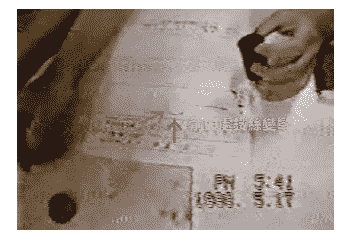 |
| 如箭头处所示，王小妹妹用念力将一小段封在底片盒内的铁丝折弯。 |

图 2-20　云南大学朱念麟教授的念力实验

| 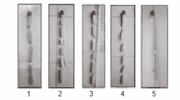 |
| 高功能儿童将放入不透明塑胶盒的火柴用意念剪断成 5∼6 节。 |

## 美国的绝地武士营──六成儿童潜能被开发

二○○二年九月，我利用半年休假的时间到美国史丹福大学电机系进修半年，当了半年客座教授，不但享受了加州温暖的阳光、和煦的气候，还看到了好些二十多年没有见过面的朋友及学生。想当年大学毕业以后，大部分的同学都出国深造，各奔东西散居在美国各地，见面并不容易，不像现在的学生刚好颠倒，大部分留在台湾。此一时也彼一时也，也见证了台湾这二十年来的经济成长与进步，大幅缩短了与美国的差距。

我一九八二年学成归国，回到母系台大电机系任教，当时出国风气仍盛。刚开始几年所教导的学生，也大部分出国了，有很多在美国已有很好的事业与成就。就在我客座的史丹福大学电机系里，就有一位我过去教过的女学生在当教授，这位孟教授的研究室和我在同一栋大楼，每个星期都碰得到面。

这些朋友、学生知道我在做一些「特异功能」的研究，愿闻其详，因此在湾区安排了两场公开的演讲，谈谈气功、手指识字、念力、信息场与神灵。每场都是在中国餐馆举行，先吃饭再演讲，每次席开十多桌，有上百人参加，许多多年未曾谋面的朋友、学生就在这些场合碰面，事后的反应大致良好。

孟教授和她同班同学 KC 显然被「手指识字」现象迷住，一直要我在湾区也办一场手指识字训练营。她们同学的小孩年龄差不多就在六到十三岁之间，正是最容易练出功能的年龄。老实说我的兴趣不大，因为这些小孩的家庭背景太一致了，不像在台湾受训练的小朋友来源广泛，我认为这些孩子开发出功能的比例恐怕不高。KC 锲而不舍，不断以电子邮件打动我，并准备好大部分的后勤工作，终于在预定开始的前一个星期，我正回台主持一个国际会议时，才敲定了之后训练营的地点──在史丹福大学电机系的会议室。

KC 的同学中和负责找小朋友报名，结果他动员了同学的小孩、他夫人音乐班的学生，加起来共二十一名来参加训练营，这些小朋友全部在美国出生，大部分学过中文，不过所学有限。有些小朋友像凯文一样，一听内容觉得无聊不愿意来参加，他妈妈好说歹说均不为所动，结果妈妈心生一计，告诉凯文这是「绝地武士营」（Jedi Camp），凯文是电影《星际大战》（Star War）迷，一听是训练绝地武士，马上欣然同意，高高兴兴、满怀希望地来到训练营。

我的训练有一套标准程序，先花半小时向家长及小朋友介绍「手指识字」的现象，加强他们的信心，接着打坐十分钟让小朋友心静下来，尝试脑中成像以确定他们的幻想能力，然后就开始了训练。

出乎我的意料之外，包括凯文在内，第一天就有五位小朋友开发出了功能。湾区消息传播得很快，接下来几天，有的家长闻风而至带小朋友加入，有的有事退出，四天下来只有十五位小朋友从头到尾全勤。其中有九位小朋友显现出了手指识字的能力，比例高达六成，远高于我在台湾训练最高三成五的纪录，令我难以置信。家长们更是议论纷纷，惊叹不已，原来手指识字是真的。我也突然了解到，原来我就像是星际大战争中绝地武士的师父尤达（Yoda）。

## 磁场，对手指识字的影响

二○○三年二月，我结束史丹福大学的客座回国以后，KC 继续利用周末训练功能最强的小朋友凯文（Kevin），三月中 KC 寄了一封电邮给我，告诉我他发现了一个奇特的现象，**当凯文手指识字时，如果手中握了一块磁铁，脑中看到的图像会被放大**。我看了以后觉得很惊奇也很兴奋，我从事手指识字研究近十年，完全没有想到特异现象会和物理性的磁场产生交互作用。

为了证实这项观察，我于二○○三年四月二十日及二十三日分别请了 T 小姐及徐小妹妹来重覆这项实验。T 小姐的实验结果如下页图 2-21 所示，果然没有磁场时，天眼所看到的字与正常的字大小感觉差不多，但是当把样本压在 S 极上，天眼所看到的字会被放大，压在 N 极的样本的字会稍微缩小；当磁场达到 4KG（四千高斯），透视的数字会胀大到超出天眼的屏幕范围。如一二三页图 2-22 显示的是徐小妹妹的实验结果。果然不错，在没有磁场时，天眼所看到的字与正常的字大小差不多，但把样本压在 S 极上，天眼所看到的字会被放大，压在 N 极字会稍微缩小。这项实验证实南极 S 极会把天眼的字放大，这个现象的原理是什么呢？

图 2-21　T 小姐将样本压在磁铁 S 极、N 极的手指识字实验

| 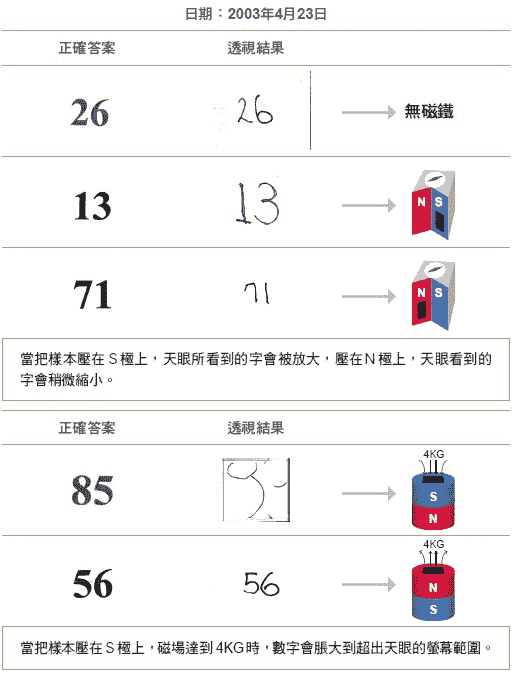 |

第四章中我会提出证据，证明天眼会钻入虚空扫描物体的虚像，因此磁场的 S 极磁场显然会钻入虚空，与在虚空的天眼产生交互作用。磁铁的磁场是磁性原子自旋所产生的，自旋角动量会在实数时空打洞，而基于「角动量守恒定律」，磁矩与自旋角动量方向相反，因此 S 极会面向孔洞而导致一部分磁场穿入虚空，N 极背对孔洞因此磁场大部分侷限在实数时空，以致与天眼的作用较小。

图 2-22　徐小妹妹手指识字时的磁铁效应

| 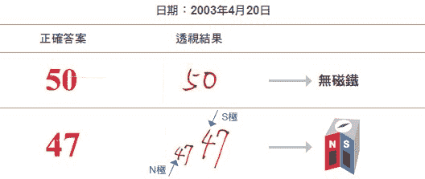 |
| 无磁场时，天眼所看到的字与正常的字大小感觉差不多，当把样本压在Ｓ极上，天眼所看到的字会被放大，压在Ｎ极上，字会稍微缩小。 |

# 第三章　发现虚数时空，探访神灵网站

三位小朋友透过手指识字，

在辨认佛字时都产生了异象，

在众多物理学者的见证下，

灵界的神祕面纱突然被打开了，

多么撼人心弦的戏剧效果。

## 面对物理学会的挑战

一九九七年，我的手指识字实验已经做了四年，也开班训练儿童手指识字成功，有几位儿童出现了手指识字功能，显示这个现象是一个普遍存在的人体潜在能力。

那时中国时报邀请我写一个专栏叫做「人身极机密」，每周一篇，于是我从西方的超心理学及东方的气功开始，写到现代所发现的耳朵听字、手指识字及特异功能，总共四十多篇。没想到触犯了一些物理界的学者，认为我公开散布怪力乱神现象，混淆社会视听，造成不良影响，导致后来很多年都会藉各种机会找我麻烦。

到了一九九九年，物理学会终于忍无可忍决定到我实验室亲自做手指识字实验。并且开出两项条件：第一，实验样本要他们准备，我说没有问题，只是样本要遵守一些规范；第二，要准备一间大教室，因为物理学会要在网站上公告周知，会有很多人来，这也没有问题，因为我通常使用的台大电机二馆的一四二会议室本来就很大，容纳三、四十个人本来就没有问题。

实验准备进行三天，从八月二十六日到二十八日。面对物理学会的踢馆行为，为避免实验当天小朋友临时生病或心情不佳、有状况而做不出来，我特别安排了三位小朋友应战，包含 T 小姐、王小妹妹及陈小弟弟，他们手指识字程度不一，有强有弱，只是没有想到第一天实验就出现了不可思议的现象，前所未见。

##### 发现佛字的殊胜

八月二十六日下午两点半钟左右，物理学会会长带着十多位物理教授及两位心理学教授，抱着一大箱约一百个样本，来到台大电机二馆的一四二会议室，根据定好的规则开始做实验。一开始 T 小姐实验进行得很顺利，大部分样本都看得见，就或然率来看，用猜的根本不可能，何况她根本没有看过任何样本，无从猜起，但是一些经过特殊处理的样本，像被包了铅盒的纸团，她就看不见了；其他两位小朋友有些字条也看对了，显示出手指识字功能有些普遍性，大家都被实验说服了，手指识字现象是真实存在的并没有骗人，大家都沉浸在一片欢乐的气氛中。

下午四点钟左右，在场的物理系陈教授突然给了 T 小姐他新写的一个样本，如左图 3-1 第一列所示。

结果 T 小姐看到蓝色的「光」字，打开一看，正确答案是「佛光」两个字，她漏看了一个佛字。

陈教授指着佛字说：「这个字很殊胜，她大概看不见。」我马上回答，她看字有时候会漏字，没有什么了不起，再试试看就好了。

过了一阵子，陈教授又给了她一个纸团，从下午四点二十九分开始做实验，如图 3-1 第二列所示。每一次她手掌出现电压，表示天眼打开一次，我们就记录时间及她看到的景象。

**她先看到有一个东西闪过去，在四点三十四分时，看到一个人在屏幕上闪闪发光；四点三十七分时，看到「发光的人好像在对我笑」，接着所有萤幕都消失了。**

我在旁边大惑不解，怎么会出现前所未见的景象，什么字都看不见，只看到亮光、亮人，赶紧把样本打开一看，原来是个「佛」字。一时全场观众为之沸腾，交头接耳，不知发生了什么事，我只感觉到震惊，极度的震惊，似乎一个神祕的世界在我们面前打开了。

图 3-1　Ｔ小姐第一次看见异象前后的纪录

| 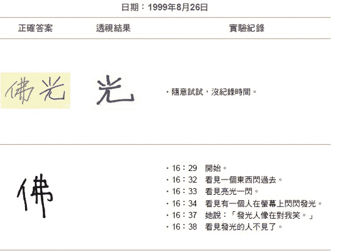 |

后来我常常在想，到一九九九年八月，我已经和 T 小姐做了六年、超过六百次的实验，竟然从来没有想到要试试宗教的字汇，当然也还好没有试过，才会造成物理学会来踢馆时，竟然帮我们证实灵界的存在，产生这么大的戏剧效果。

实验第二天从八月二十七日起，我决定把所有样本换成与宗教有关的字汇，看看还能找出什么有趣的结果。

上午的实验结果如左图 3-2 所示，做了三次实验，下午的实验如一三四页图 3-3 所示，也做了三次实验。上午第一个实验从十点半开始，如图 3-2 第一列所示。T 小姐在七分钟内画出了一排奇怪的符号；打开样本一对，除了前面三个符号外，其他完全正确，原来是藏文，只是反了过来。十点四十分开始，第二次实验如图 3-2 第二列所示。很快地，她脑中出现了很亮的萤幕，然后开天眼时除了亮萤幕外还听到声音，有宏亮的笑声，听起来非常开心的样子，最后剩下亮萤幕而结束。打开样本一看是个「佛」字，我感觉到非常高兴，因为实验可以重复，遇到佛字就会看见一片明亮而且出现异象，表示不是大脑天眼一时的失误，而是真的有奇妙的变化发生。十点四十九分开始了第三次实验，如第三列所示。她五分钟就写出了 E＝mc²，完全正确没有出现任何异象，表示这个公式不是神圣字汇。

图 3-2　8／27 上午的神圣字汇实验结果

| 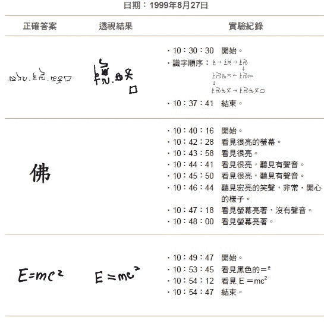 |

下午四点四十三分，我们开始了第一次实验，如一三四页图 3-3 第一列所示。她四分钟就画出了一条鱼，基本上正确，只是样本中鱼的嘴巴原来是尖的，她画成了圆弧状。四点四十八分开始了第二次实验，如第二列所示。很快地，三分钟后就出现亮的萤幕，我想大概又是神圣字汇。**接着出现了惊人的一幕，T 小姐抬头看了看前方三公尺外清大物理系的曾教授说，有一个亮人站在你身旁，手攀在你的肩膀**上。接着她又看看站在信号纪录器旁边的我说，那个亮人跑到我和陈教授中间，低头在看纪录器，在笑。我心里一惊，赶快看看旁边的纪录器，却什么也看不到。然后实验结束，我打开样本一看，又是「佛」字，我心里变得很笃定，神圣字汇必引发出异象。

第三次实验时，样本是由一位在场的物理学家给的，他闻风而来，看了一阵子觉得实验有些不严密，我们随机抽取的纸团放到 T 小姐手上，再到套上黑布套绑好带子约要二十秒的时间，他怀疑这时 T 小姐可以从折叠纸团的背面隐约看到文字，是偷看到的，不是真的有手指识字现象。当然我们通常都是用两张纸紧紧包扎，背面是看不见的，不过这是合理的怀疑，必须用严格的实验排除。过去我们用红外线摄影机观察过 T 小姐在暗袋中的手指识字过程，证明她只是抚摸摺叠字条边缘，没有打开字条就可以看到里面的内容。

这一次物理学家用费曼图[1]来验证，他画了很多圈，让摺叠过后的字条即使从背面看二十秒钟，绝对数不出来到底有几个圈，这是非常精彩的设计。T 小姐只花了五分钟就画了出来，物理学家一数说有九个圈，打开样本一看，说他自己画的只有八个圈，T 小姐多画了一个。旁边的陈教授仔细一看说不对，你也是画了九个圈，只是第一个红墨水太多变成了实心，空心八个加上实心一个也是九个圈，与 T 小姐画出的一样。两个人辩论了一阵子后获得共识，九个圈是对的。我惊出了一身冷汗，我知道 T 小姐那时天眼只能开两秒钟一闪而逝，怎么来得及数清楚到底有几个圈，我问她说，你真的有数吗？她回答说，我没有数，有个声音告诉我是九个。这个声音就是在灵界照顾她多年的师父，看到人间有人要欺负她，暗中帮了她一下忙。

> 编注 1 费曼图（Feynman diagram）
> 
> 美国物理学家理察‧费曼创立的一种形象化方式，方便将量子场中各种粒子相互作用的过程呈现出来。

图 3-3　8／27 下午的神圣字汇实验结果

| 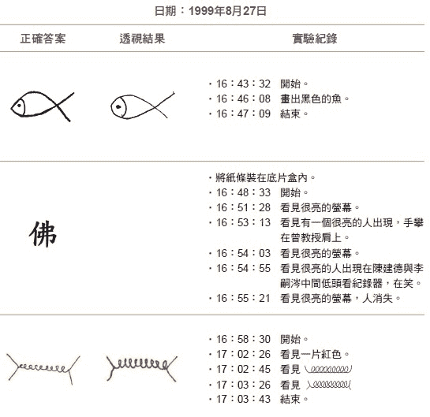 |

实验第三天，八月二十八日又有新的异象出现，一三六页图 3-4 展示的是上午所做的实验。第一次实验从十点二十六分开始，结果显示在第一列。起初，大脑天眼萤幕中出现一朵粉红色的花亮亮的，好像浮着像莲花比较大，有人站在莲花上，看起来很亮，像女生穿白衣，彷彿是观音菩萨。我打开纸条一看，是「菩萨」两个字，所以菩萨也是神圣字汇。

接下来，第二次实验从十点三十八分开始，结果显示在一三六页图 3-4 第二列。

三分钟后，天眼萤幕就出现白白亮亮的背景，接着佛教「卍」字符号出现，背景一片光亮，显示这是属于神圣字汇的样本。

我统整这三天有关字汇含佛字的结果，如一三七页图 3-5 所示。

用「佛光」实验，只看到光字；用「佛山」实验，只看到「山」字，都看不到「佛」字；我用「比佛利山庄」实验，只看到「比利山庄」，也看不到「佛」字；用「佛米级」实验，看到黑色的米字左边出现亮亮的；用「埃佛勒斯峰」实验，看到黑色的「勒」字及「斯」字，然后一片亮亮的。在天眼萤幕中，**其他字都看得见，但碰到「佛」字就一片亮光，显示「佛」字的殊胜性**。

图 3-4　8／28 上午神圣字汇实验结果

| 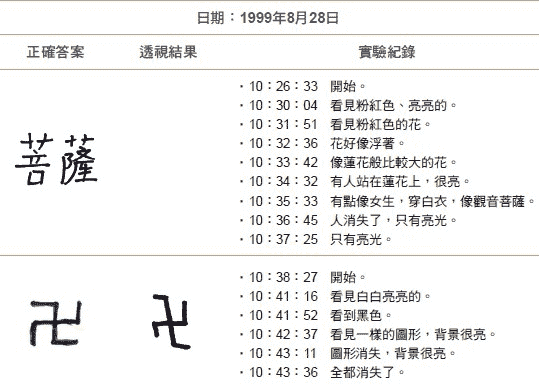 |

图 3-5　统整与佛字相关实验

| 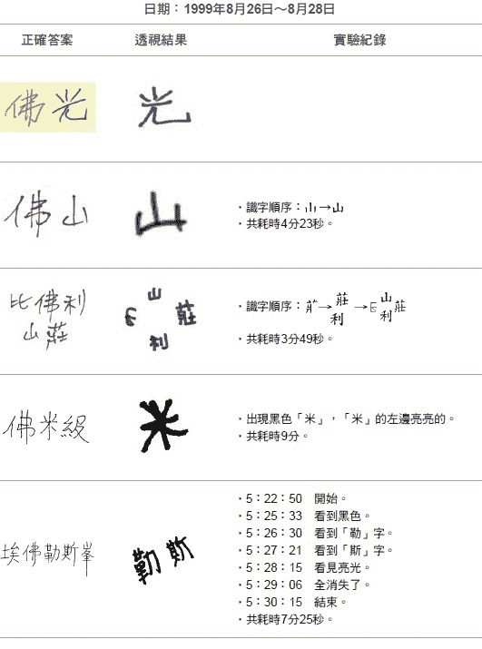 |

## 每个人潜在的「功能版本」都不同

在实验的八月二十六日到二十七日之间，除了 T 小姐外，其他两位小朋友──王小妹妹与陈小弟弟用手指识字看佛字的结果又是如何呢？

左图 3-6 显示的是王小妹妹的实验结果，她的手指识字能力已经纯熟到可出现念力了。在八月二十六日第一次测试佛字结果时，也出现了异象，如图 3-6 第一列所示。她看到了一间寺庙的大门口站了一个人。

第二天再试佛字，结果她看到一个模模糊糊的人操着台语口音，要她加油，她觉得好像看过他的样子，我们后来判断可能是她已经过世的外公。

一四○页图 3-7 显示的是陈小弟弟测试的结果。实验时，一开始用普通字测试，结果答案有对有错。除了蓝色「步」字错了，其他字都对了。陈小弟弟看佛字时，看到一位和尚穿着黑夹克走出来，内里的白衣上写了一个佛字。他看到了佛字时，感觉也看了一场电影。所以佛字会造成异象，对有手指识字功能的人来说是一个普遍的现象。

图 3-6　用「佛」字实验时，王小妹妹看见的异象

|  |

图 3-7　用「佛」字实验时，陈小弟弟看见的异象

|  |

二○一三年十月，我去昆明参加第二届「人天观学术会议」报告这些奇特的结果时，大陆的同行还不太相信，他们早我们十多年开始研究手指识字，怎么都没发现信息场或灵界，却让我们这些后进者给发现了？

不过，自二○一四年起，大陆昆明的云南大学及江苏的扬州大学训练孩童手指识字时，均看到了类似的现象。他们看佛字时，就出现了亮光菩萨；看「太上老君」时，出现一朵云上面站了一个仙人。这证实了我们的发现，也花了近十五年的时间。

**为什么同样的佛字，不同的人却看到不同的异象？后来大陆高功能人士孙储琳女士用佛字做实验时，我领悟到，这就好像网路的浏览器一样，与功能人的高低有关。**

功能高的人浏览器版本很新，可以看到比较新、比较深入的内容，比如孙女士有六十种以上不可思议的念力功能。她看佛字时会看到万道金光，像涡漩一样愈转愈亮；她看「佛山」时，会看到一座晶莹剔透的琉璃山，非常的漂亮。而 T 小姐看佛山两字只能看见山字，看不到佛及亮光，表示浏览器版本较旧。因此刚练出功能的小朋友看佛字是看不到异象的，必须等到功能较精进，达到某一程度之上，才能看到亮光、亮人等异象。

## 发现神灵的信息网站与网址

为了继续找出哪些字汇是神圣字汇，我们试了佛教的各种神祇，结果如左图 3-8 所示。第一列是试「阿弥陀佛」的字样时，看到亮亮的萤幕，有听见声音但听不清楚；第二列是试「药师佛」的字样时，不但看到亮亮的萤幕，还闻到中药的味道；第三列是把「佛」字删除变成「药师」，则异象消失，可以看到「药师」两个字；第四列是试「弥勒佛」的字样时，看到很亮的萤幕。

很显然的是，诸佛都是神圣字汇。因此高功能人可以看见很亮的萤幕、听到声音、闻到味道。

为了了解扭曲佛字的识字后果，我们把佛字破坏，如一四四页图 3-9 所示，从删除一笔或一画，到换部首，将字与偏旁分开，或加一撇改成「彿」字，结果所有的异象都消失了，高功能人只能看到被破坏后的字。

图 3-8　用「诸佛」做手指识字时，感受到的意象

|  |

图 3-9　佛字被破坏后的实验结果

| 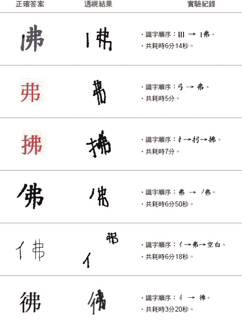 |

这个现象强烈暗示：「佛」字是一个网址，天眼可以扫描这个网址而连上佛的网站看到异象；一旦破坏网址就变成普通字，天眼就连不上网站，只能看到破坏的字。**好像这个物质世界之外还有一个信息场存在，或者说是灵界存在，里面充满了神灵及神灵的网站。利用手指识字辨识网址，我们就有机会连上网站参观其网页。二○一四年后，我把这个信息场或灵界称作虚数时空**。原来虚数时空如同一个网路的世界，其中充满了意识、神灵及祂们所创建的网站，而连结网站的网址就是神祇的圣名。

## 是大脑的幻觉，还是外界的信息场？

当然有人会质疑小朋友用天眼所看到的异象会不会只是大脑的幻觉？出于他们对神圣人物的崇敬，用天眼扫描这些字汇的时候，就像做梦一样产生各种幻觉以迎合崇敬之心。这种可能性必须用实验来排除，因此最简单的方法就是用小朋友不认识的文字来做实验。

##### 想连上外国神祉网站，须用原文

我们在做密宗神圣人物的实验时，就注意到一个现象，如左图 3-10 所示。不论是龙树菩萨或是莲花生大士这些创建密宗的圣者，以及二臂黑袍金刚等密宗的守护神，在手指识字实验时都会出现文字而不会出现异象。

图 3-10　用密宗中文神圣字汇的实验结果

|  |

这让我们困扰了相当久，不知道密宗的神灵为什么不让 T 小姐连上网站。

直到有一天，我忽然觉悟到密宗都是西藏人，他们不懂汉文，因此它们的网址必定是用藏文而不是汉文。于是我去请问藏文专家，取得藏文的写法，当然 T 小姐是不懂藏文的。左图 3-11 及一五○页图 3-12 就是实验的结果，图 3-11 的第一列是藏文的玛哈嘎啦，二臂黑袍金刚是密宗的守护神，结果 T 小姐没有看到字，而是脑中出现异象、看到发亮的萤幕。为了确定起见，我把最后三个字剪掉，如图 3-11 第二列所示，这不是对玛哈嘎啦不敬，而是做科学研究。结果 T 小姐没有看到异象，而是一笔一画地把藏文描出来了。**显然原来的藏文是网址，你认不认得并不重要，而是能让天眼直接连上玛哈嘎啦的网站；而破坏的藏文已经不再是网址，因此可以全部认出来**。一五○页图 3-12 三列都是藏文的莲花生大士，能让天眼连上了有亮光的网站。

图 3-11　用藏文玛哈嘎拉的实验结果

| 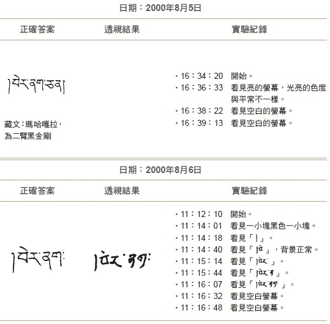 |

图 3-12　用藏文莲花生大士的实验结果

| 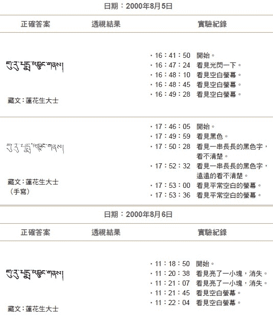 |

##### 用上帝之名，出现点点光亮

一五二页图 3-13 是 T 小姐用希伯来文神圣字汇的测试，当然 T 小姐不认识希伯来文。这是摩西当年在山上遇到上帝，要他带希伯来人出埃及时，他问上帝是谁？上帝用希伯来文的回答：「我是上帝。」

如图所示，二○○○年十二月二十九日的实验结果中，T 小姐看见萤幕的亮度非常强，接上了希伯来人的上帝网站。二○○二年重做一次实验，结果出现一点一点、小小的一排光亮。

**由这些实验很明确的证明，功能人认不认得神圣字汇并不重要，重要的是只要用神圣字汇就可以让天眼连上神圣的网站**。这表示异象并不是大脑的幻觉，而是有另外一个网路的世界存在，一个充满了信息的网站，这就是灵界，就是虚数时空。

图 3-13　用希伯来文的实验结果

| 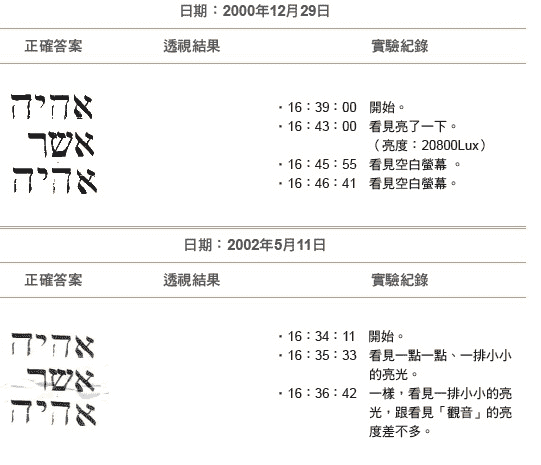 |

## 参观天堂与药师佛的网站

既然神灵在灵界都有网站，见诸一般人间的网站内容都很丰富，那么灵界的网站一切由心造，可能有更丰富的内容可供意识去参观，因此我们就想去神灵的网站游览一下。问题是所有神圣字汇都能接上神祕网站的首页，每次看到首页的亮光、亮人，看多了也没有意思，该如何进入其他网页呢？我认为可比照人间早有的写法，用首页的网址后面加一斜线，再写上次页的网址。

##### 看见光亮的十字架

二○○二年一月十三日，我们请 T 小姐用手指识字辨识「耶稣／SAM」，如一五五页图 3-14 第一列所示。

耶稣是天堂首页的网址，SAM 是 Samuel 的简写，根据韦伯氏（Websters）大字典解释，Samuel 在希伯来文的意思是「上帝的名字」。因此我们去天堂的目的是希望看到上帝。结果，她先看到一个绿色的十字架，十字架是空空的、后面很亮，看起来像个大门，应该是天堂的首页。

我请她尝试走进十字架大门，她走向十字架，十字架很大，但是她走不进去。我突然想到「阿里巴巴四十大盗」的故事，要说出密语如「芝麻、芝麻、开门！」才走得进去，我又不是基督徒，不知道什么是密语，但是基督徒祷告完毕后要说「阿门」，像是密语，于是我请 T 小姐说「阿门」，结果她一说「阿门」，所有亮光、十字架都消失了。原来「阿门」是结束语，与上帝沟通完毕，要结束的时候就说「阿门」。于是我去请教基督徒，我该说什么？他建议说「哈里路亚」，赞美主！

于是二月二十八日做实验时，我把「耶稣／SAM」后面再加一个「哈里路亚」。结果 T 小姐来到十字架大门前还是进不去，我请她唸「哈里路亚」，结果十字架绕过去穿过身体，全身浸在光芒中，她又从后门出来了。我就怀疑是不是要信了基督教，天堂才让 T 小姐进去？

五月十一日，我们再度用「耶稣」做识字实验，又连上亮亮的十字架大门，如上页图 3-14 第三列所示，但还是进不去。这问题要到两年后的二○○四年八月七日才获得解答，**别人的家园原来就不能随便去参观的，神灵的网站与人间一样，要先预约、挂号或请问，等到对方同意了才能进入参观**。

图 3-14　Ｔ小姐尝试连上天堂网站

| 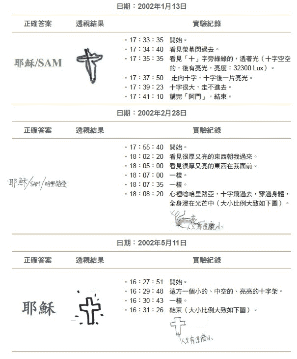 |

如下图 3-15 所示，我们在纸条写上「耶稣」，加上斜线，问了一句话「可以进入天堂？」，结果看门的亮人就让 T 小姐从天眼进入天堂，她看见一条发光的道路，后面有一群发光的人，看起来非常寂静安详，可能都是天使。

由此我们知道了参观神灵网站的规矩，从此就可以遨游诸神的网站。

图 3-15　Ｔ小姐第一次参观天堂网站的内容

| 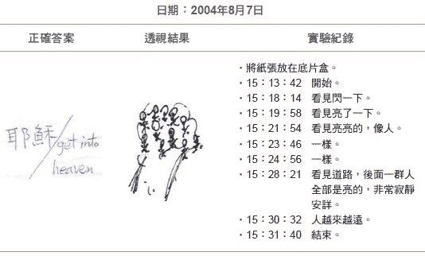 |

##### 参观药师佛的药园

二○○二年九月二十九日，我们就尝试去参观药师佛的网站。

T 小姐的天眼一下就连上了药师佛的首页，如下页图 3-16 上方的图 1 所示：有五个一排的亮圈，一排一排地往下方延伸，中间的圆圈亮度较弱，可能是从中间的光亮照亮外面。于是她心中默想：「我可以进去看吗？」此时一位高大的亮人出现（约比常人五到六倍大），祂问：「你要看哪一个？」我猜这位高大的亮人就是药师佛。T 小姐答：「第八个。」经由药师佛一指，T 小姐就看到一片植物园，金光闪闪，由图 3-16 中间的图 2 的植物组成。接下来，T 小姐再问：「可否再看一个（药园）？第六个。」药师佛说：「最后一个，不能再看了」，一指就看到另一片植物园，如图 3-16 下方图 3 所示。蔓藤般的植物由上垂下，软软的、半透明、飘来飘去，尖端发光，看了感觉非常美好。Ｔ小姐又问：「可否不摸字条，就进去看那些美好的景象？」药师佛回答：「可以，但我不一定在」，祂太客气了，客人来祂要亲自接待，其实我们希望祂不需亲自接待，有徒弟带我们就可以了。T 小姐又请教药师佛：「可否告诉我第六及第八个药园的名称？」药师佛答：「说了，你们也不知道，不说」，大概觉得我们层次太低，对灵界事务不熟，不想告诉我们。

图 3-16　第一次参观药师佛的药园

| 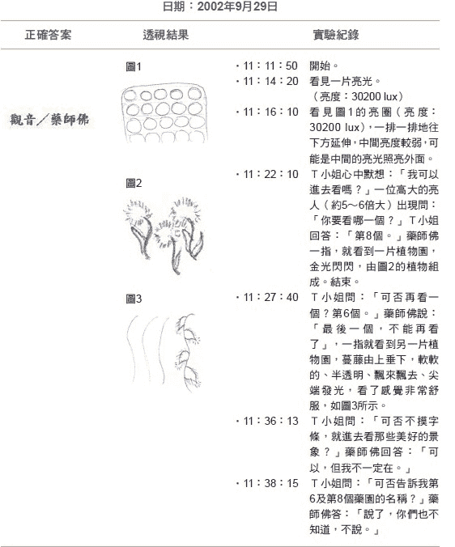 |

二○○三年三月三十日，我们又去参观了药师佛的第一个药园，实验结果如下页图 3-17 所示。

从大脑天眼萤幕中，只见一团光向着 T 小姐冲过来，一个一个的亮光排成五个各一排。

T 小姐要求看第一个和第三个药园，结果只有亮一下，什么也没看到。

T 小姐要求再看一次，结果从第一个亮光中出现一片都是绿的植物，如图 3-17 下方图 2 所画，生长着一大片很绿的植物，是有左右两个圈的蕨类植物，圆圈的形状右大左小，一排一排的整齐排列。

二○○三年十月二十八日，我们又去参观了药师佛的一个药园，如图 3-17 第二列所示。T 小姐先看到一片亮光，进去药园后，看到一点一点、一排一排的亮点，像蕨类植物，但是只有一个圈，圈下面有一个亮点，然后又见一片亮光。

图 3-17　参观药师佛不同的药园

| 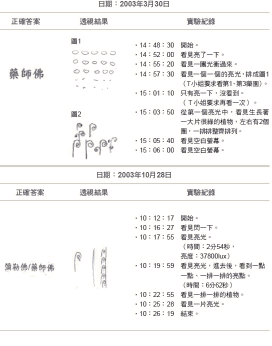 |

二○○三年三月二十八日，T 小姐又去了药师佛网站，这次去参访了药店，如下页图 3-18 所示。

T 小姐先看到亮光才进入网站，于是请问药师佛：「可否看第六排或第七排之药园？」，药师佛回答：「好啊！」

T 小姐再问：「可否采药？」，药师佛回答：「还不行。」

T 小姐再问：「可以看药店吗？」，药师佛回答：「可以啊！」

只见药师佛带着徒弟及 T 小姐走进药店，里面金光闪闪的，都是药柜及药瓶，放满了信息药。

T 小姐问：「可否拿药？」，药师佛回答：「你们现在不需要。」

T 小姐说：「陈教授生病需要药。」，药师佛回答：「这一颗你拿拿看！」

T 小姐说：「可是拿不下来。」

结果突然间我们在场每个人都闻到一股中药味在实验室瀰漫，这应该是来自药师佛网站的中药信息，经过 T 小姐天眼而散发出来。

T 小姐再试一次无奈地说：「太远了，拿不到」，我们想：「可能时候还未到」。

图 3-18　参观药师佛网站的药店

| 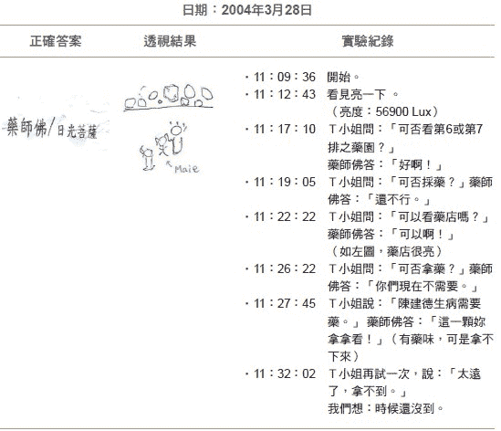 |

二○○四年八月八日 T 小姐去参观药师佛网站时，碰到了其他灵体，如下图 3-19 所示。首先她看到天眼萤幕亮了一下，接着看到一堆亮的植物，以及一个没有发光的人，很瘦、带着斗笠，正在采集植物，T 小姐问他：「你住哪里？」他没有回答。

T 小姐再问：「你为何来采药？」，那个人就摸肚子，表示肚子不舒服。接着萤幕闪了一下，T 小姐被赶出药园，进不去了，再试还是进不去，就结束了实验。显然那个灵不喜欢她问东问西，把她赶出了药园。

图 3-19　参观药师佛药园时，遇见其他灵

| 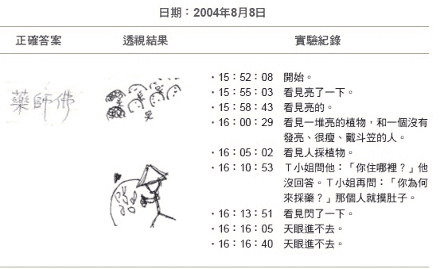 |

## 天堂庭园，用圣经中的圣名命名

我们做 T 小姐遨游神灵网站的实验时，用的是双盲实验。每次实验的主持人会制作十个样本，代表可各自到不同神灵的网站参观；正式实验时，由第三者任意抽出一个样本，因此没有人知道是去访问哪一个神灵的网站，T 小姐、主持人及选择样本的人都不知道。实验中只有记录 T 小姐看到的景象，实验完成后也不会马上打开样本，而是放在一边，直到十个样本完全做完以后，才逐一打开样本。

##### 无意中进入天堂网站

一六六页图 3-20 所展示的是二○○四年十二月二十四日时，一次很特殊的经验。

首先，T 小姐看到萤幕亮了一下，接着看到有一团人影，像是看门人。而且好像有听见声音，但听不太清楚。接着，她听到声音在问：「Which one?」用的是英语，我一看马上猜测是连到了药师佛网站。因为好像只有药师佛网站才有很多药园，需要问：「是哪一个？」T 小姐回答：「First!」，表示第一个药园。接着，看到有一个人摇头，表示不行，于是 T 小姐回答：「随便一个！」接着，听到那人生气地说：「No,you have to pick one.」，意思是不可以随便，你要选择一个。我在旁边建议选择第十个药园，没想到那个人回说：「No,it's wrong!You have to give a name.（你错了，你必须给个名字。）」，我心想上一次我们问名字，您也不告诉我们，我们怎么给名字？真是奇怪。

于是 T 小姐回答说她不知道，随便给她看一个好了，结果天眼闪了一下，听到一个声音说：「OK,maybe just a little bit.（好吧！就一点点吧。）」结果，T 小姐看到有一条亮亮的水流，岸边白白雾雾的，T 小姐问：「That's it?（就这样吗？）」那人回答：「A lot more,Today,That's it!（有非常多，但是今天就只有这样！）」

我打开样本一看，大吃一惊，原来这不是药师佛网站，而是天堂网站。**原来天堂是用名字来命名庭园，不像药师佛网站是用数目来命名庭园。我虽然不是基督徒，但是也至少知道天堂中有一个庭园那就是伊甸园（Garden of Edan）**。

图 3-20　Ｔ小姐访问某神灵网站之后才发现是天堂

| 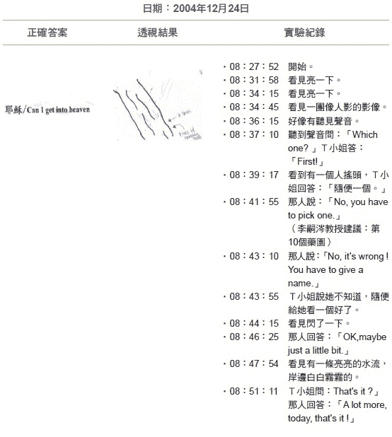 |

##### 重访伊甸园

不过再去伊甸园的经验，要等到十年以后才能实现，因为我从二○○五年当了台大校长，为了避免造成争议，只好等到二○一三年六月，我从台大校长卸任后才再度恢复了手指识字的实验。

二○一四年三月六日，T 小姐尝试去参观伊甸园，我用的样本是写「耶稣／Can I get into Garden of Edan」，这次很顺利没人阻挡，一次就进了伊甸园，如下图 3-21 所示。T 小姐看见一片景色，下半部整片很亮、非常漂亮的蓝绿混和色彩；上半部是淡金黄色，整个景象非常漂亮，接着就没有影像而结束了。

图 3-21　Ｔ小姐访问天堂的伊甸园

| 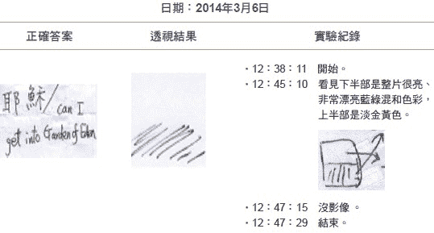 |

所以伊甸园还在天堂里，希望未来还可以去参观其他先知或天使的庭园。我们并非基督徒，但是只要有礼貌、客气地询问，得到允许，天堂守门人都会让我们进去参观天堂，不像人间的基督教有时会敌视非教徒，这应该不是耶稣本来的态度。

实验中发现很有趣的一件事是：用中文的「耶稣」，总是可以连上天堂，表示它是神圣字汇，我猜想这是因为「耶稣」的发音与原来的发音近似之故。耶稣用的母语是阿拉米文，现在叙利亚南部有些区域仍在用阿拉米文，阿拉米文「耶稣」的发音（Yeshua）与中文蛮接近的。

## 参观西方极乐世界诸佛的网站

##### 进入佛的国度

二○○四年十二月二十四日，我们请 T 小姐用手指识字实验尝试去参观阿弥陀佛的西方极乐世界，于是先去预约，如下页图 3-22 第一列所示。

我们用的样本是「阿弥陀佛／预约进佛国」结果阿弥陀佛的回答是：「明天」。第二天十二月二十五日，我们就依约进佛国，如图 3-22 第二列所示，用的样本是「阿弥陀佛／依约进佛国」，这样就不会冒昧突然闯入，引起阿弥陀佛不高兴。结果 T 小姐的天眼从九点零三分起闪了一下，九点零六分起一直闪一直闪，显示很不稳定，进不去佛国，直到九点零八分才成功进入佛国。

图 3-22　Ｔ小姐参观阿弥佛陀的网站

| 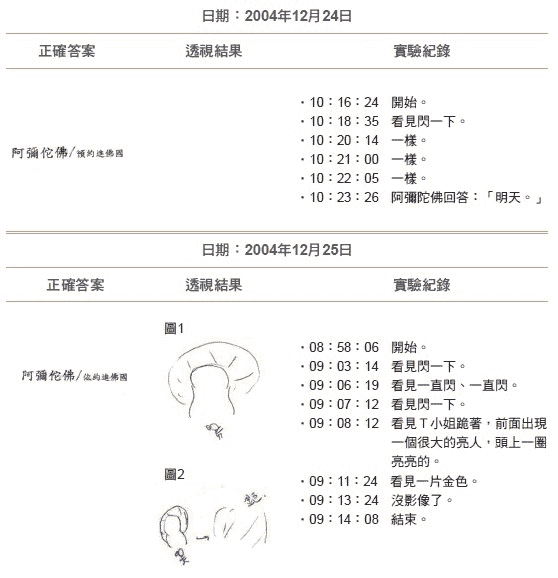 |

T 小姐在天眼中看到自己跪着，前面坐着一个很大的亮人（头的后方挂着一个亮亮的圆圈），就像我们常看到的阿弥陀佛画像，T 小姐的大小还不及亮人的脚趾头高；接着，高大的亮人站起来，带着小小的她走进佛国，然后佛国就变成一片金色的世界，整个过程就结束了。

**原来西方极乐世界是一个金色的世界，阿弥陀佛就坐镇在里面。**

##### 欲参观弥勒佛的网站

二○○四年八月六日，我们请 T 小姐用手指识字实验尝试去参观弥勒佛的网站，于是先去预约，如下页图 3-23 第一列所示。我们用的样本是「弥勒陀佛／预约进佛国」，结果弥勒佛的回答是：「Maybe」，好像不太欢迎我们的样子。

不过当天下午我们就再度试试看去连上弥勒佛网站，但是因为是双盲实验，我们并不知道是去弥勒佛的网站。

下午两点十分开始实验，但是七分钟内天眼萤幕都只是闪一下、闪一下，或亮一下，到了下午两点十九分时，才看见一个很大很亮的圆，接着看见数个发亮的圆，六个排成一圈，我以为是连接上药师佛的网站，才有几个小亮圈。四分钟后，T 小姐又再看见全部的亮圈随着顺时针转了一圈后就全部消失了。于是，我们讨论着药师佛的网站中这次看到的怎么跟以往不同。

图 3-23　Ｔ小姐参观弥勒佛的网站

| 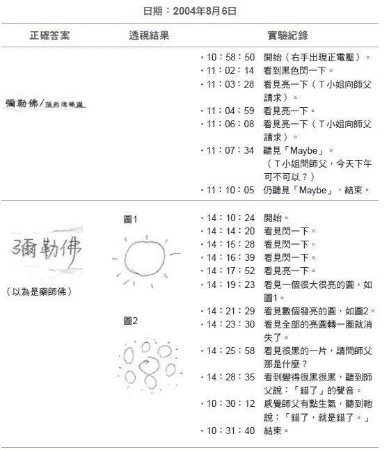 |

在下午两点二十五分时，在天眼萤幕上，T 小姐看到黑的一片。T 小姐请教天上的师父：「那是什么？」接着天眼萤幕变得很黑很黑，她听到师父说「错了」的声音，感觉有些生气；最后听到师父说：「错了，就是错了」，就结束了。

我们打开样本一看，原来是弥勒佛，不是药师佛。怪不得我们讨论药师佛，师父要生气地说：「错了」。

##### 参观观世音菩萨的网站

二○○四年十二月二十四日，我们想参观观音菩萨的网站，前去预约，T 小姐用的样本是「观音／预约进观音网站」，如一七五页图 3-24 第一列所示。

上午九点四十分开始做实验，八分钟后，她的天眼亮一下；九点五十三分时，她看到一个白白的、瘦瘦的又高高的人，站在某个东西上面说：「晚一点。」就飘走了，接着又补充一句：「今天晚一点。」就结束了。

显然来的是站在某个东西上面的观音菩萨（我猜应是莲花），但是今天太忙了，因此先去闻声救苦，我们做实验不是那么紧急，今天晚一点来就可以了。

我们第二天十二月二十五日依约用「观音／依约进观音网站」的样本，让 T 小姐进入观音的网站参观，如左图 3-24 第二列图所示。

上午九点十七分实验开始，在二十一分时，她天眼亮了一下；在二十三分时，T 小姐从天眼看见她跟着瘦高并身穿白衣的人，穿过莲花满布的地方，走到岸边，池塘里满是莲花。接着观音就飘身到莲花上打坐，与平日我们常看到的观音莲坐图类似。九点二十六分实验结束。所以在观音的国度里，不管陆上或水上都满布着莲花，是一个莲花的世界。

图 3-24　Ｔ小姐参观观音菩萨的网站

| 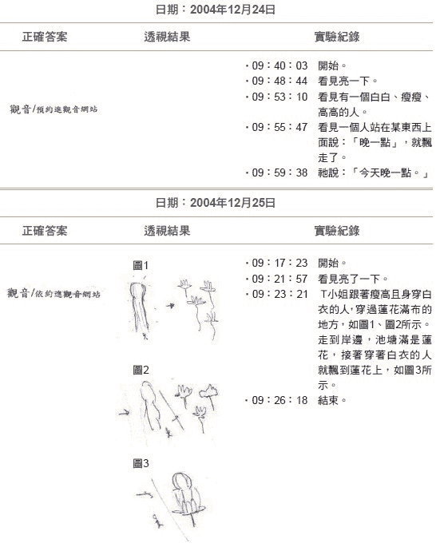 |

##### 参观文殊菩萨的网站

二○○四年十二月二十五日，我们也预约进了文殊菩萨的网站，如左图 3-25 所示。

实验从上午九点四十五分开始，在四分钟后，T 小姐天眼闪了一下，过了两分钟后，天眼又亮了一下，她看见一个亮亮的东西，但跑掉了；九点五十四分时，墙上有个微微发亮的东西，里面排得密密麻麻的，排列得很整齐；九点五十七分时，T 小姐看见一根手指指着墙上的字，应该是文殊菩萨的手指。接着，就冒出一串珠珠，每一颗珠珠中都有一堆字；十点零二分时，所有景象都没了，实验结束。

**所以文殊菩萨网站的墙上，所写的都是密密麻麻的佛经。文殊代表智慧，佛经都记录在网站中，因此高功能人是有机会把这些原始佛经下载到人间的。**

图 3-25　Ｔ小姐观文殊菩萨的网站

| 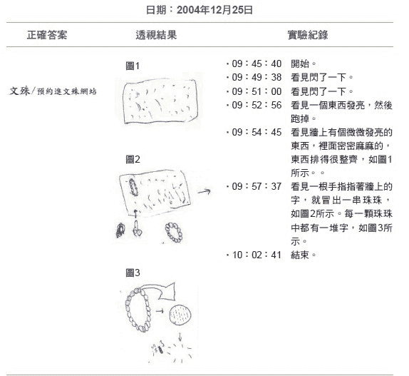 |

## 遇见圣贤──进入老子与孔子的网站

当我们于二○○○年八月五日的手指识字实验，第一次以「老子」一词给 T 小姐测试时，她在天眼中先看到了一个暗的人影，背景正常，接着人影消失，然后「老子」两个字出现。此后百试不爽，一碰到「老子」两字，都是先出现暗的人影，再出现「老子」两个字，如左图 3-26 第一列及第四列所示。由于看到异象，表示「老子」两个字是神圣字汇，我们可以藉由手指识字接上祂在信息场的网站。

其实老子在信息场有网站并不令人讶异，从《道德经》第二十五章的内容可以看得出来：「有物混成，先天地生。寂兮寥兮，独立而不改，周行而不殆，可以为天下母。吾不知其名，字之曰道……」老子知道，在天地出现之前，就有一种混合物的存在，非常的寂静不会改变，一直的运行不缀，是天下万物产生的源头。祂不知道这个混合物的名字，就把它叫做「道」。这个「道」，很像西方宗教里所信奉的「上帝」，是宇宙一切万物之母。我猜想，这就是我们所发现的「虚数时空」。

图 3-26　「老子」与「孔子」字汇的实验

| 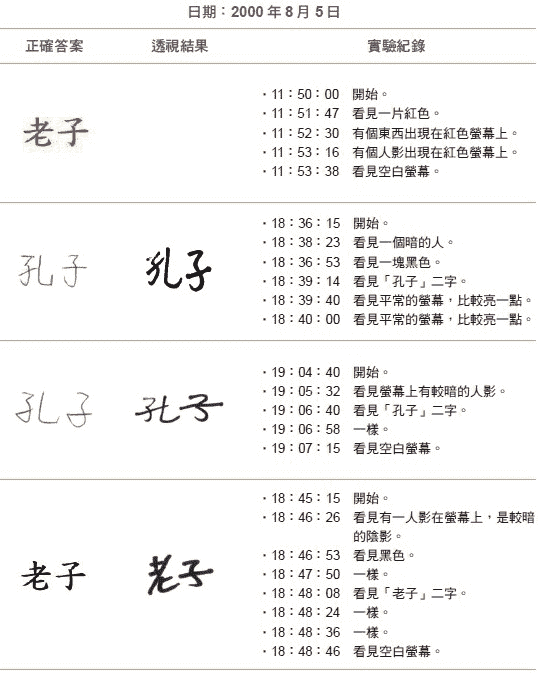 |

老子显然是有练功的，从《道德经》上「致虚极，守静笃……」的境界，就知道老子深得练功的精髓，因此他练到高深的阶段而能连上虚数时空是自然的结果，他能在虚数时空创造出一个网站似乎也不足为奇了。

只是他呈现在 T 小姐天眼上的影像是暗的人影，不像「佛」、「菩萨」、「济公」或「耶稣」等字汇会导致亮光、发亮的人影或亮光的十字架，好像境界上差了一些，比较接近人界，而不属于神佛的境地。

如果一个人修练自身的境界，以幼稚园、小学到硕士、博士的阶段来比喻，我猜想老子修练的境界可能到了高中、大学的阶段，比起神佛的硕博士境界可能还有一段距离，因此只出现暗的人影，而非亮的人影。

##### 意念摄影，照下天眼中的影像

北京中国地质大学人体科学研究所的沈今川教授及功能人孙储琳女士曾合作过一段时间的「意念摄影」实验。

他们把长方形的拍立得相纸放入相机，不用相机镜头，而是把向外曝光的一面用一片钢板挡住。做实验的时候，孙女士把手掌按在钢板上，把脑中天眼上的影像直接投射在相机中最上一张拍立得的相纸上。成功后，把相纸由相机抽出，等一分钟显影后，再把相纸上的护套撕开，影像就在相纸上出现。

五年来，他们已成功地拍下数百张的念摄照片，其中有一些是老子的照片。

根据孙女士的说法，她在心里呼喊「老子」这两个字后，天眼中就飞入一些影像，看得不是很清楚，隐约可见是一个老人，有胡须、头发稀疏，或站或坐，或是在练拳，或在打坐，有各种姿势。她选了一个打坐的姿势投射到拍立得相纸上。沈教授把这些念摄照片送给了我一份，如下页图 3-27 所示，我一看之下大为振奋，只见照片中一片黄色的光芒下，衬托出一个老人打坐的身影，这不就是 T 小姐藉由「老子」两字所看到的「暗的人影」吗？

孙女士藉由意念、T 小姐藉由手指识字，都经由关键字「老子」，而连上了信息场中老子的网站，看到了首页的内容。我们何其有幸，没有开发出功能，却能在有生之年藉由念摄的实验，看到信息场中老子网站的首页。

图 3-27　意念摄影下的老子打坐显影图

| 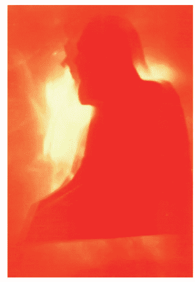 |
| 透过「意念摄影」，拍下的老子影像。隐约可见一个老人正在打坐。 |

##### 孔子的显像

老子自己练功，也在虚数时空建有网站，那孔子呢？

《论语‧雍也》篇第二十一章，子曰：「务民之义，敬鬼神而远之，可谓知矣。」《论语‧述而》篇第二十章，子曰：「子不语：怪力乱神。」一般人认为孔子是不相信有鬼神的。因此当二○○○年八月我们做手指识字实验，第一次以「孔子」一词给 T 小姐测试时，她竟然看到异象，让我们大为震惊。

她在天眼中先看到了一个暗的人影，接着人影消失，然后「孔子」两个字出现。没想到异象出现的过程竟然与「老子」两字实验的结果完全一样。此后百试不爽，一碰到「孔子」两字，都是先出现暗的人影，再出现「孔子」两个字。

**原来孔子在信息场中也建立了网站，其在信息场的地位似乎与老子完全一样。**

我们再试了「孟子」与「庄子」，结果没有产生任何异象，两个字汇都直接被写出来了，这表示亚圣就不行了。好像只有一个大门派的开创者，才有足够的力量在信息场创立网站。这到底是怎么一回事？是孔子自己也有修练到至高境界而能建立网站？还是如心理学家荣格所声称的「集体无意识」所造成，是中华民族对孔子的集体信仰与崇拜，在信息场中塑造了一个网站？

##### 孔子真的不信鬼神吗？

孔子真的不信鬼神吗？《论语‧述而》篇第三十三章中提到，有一次孔子生病，子路要替他祈祷，孔子反问：「你真的做了吗？」子路说：「我是向上下各方的鬼神祈祷。」孔子就说：「那我早就在祈祷了。」**显然在孔子那个时代，生病是要在上层的心性及信息层面下工夫，把不良的状况调整过来就能治病，他们似乎是相信有一个形而上的世界存在**。

孔子作《系辞传》有云：「形而上者谓之道，形而下者谓之器。」人体、器物、动植物属于形而下的容器界，容器之上还有一个形而上的世界（道）。

根据佛光大学宋光宇教授的新书《论语心解》，有更进一步的阐述。比如学《论语》都是由〈学而〉篇开始，但是要学什么？是学当时仅有的诗经及书经，还是学「圣人之事」？依照传统儒家的「内圣外王」理念，应该是学习圣人之事。内圣就是内心要像古代圣王一样的有敏锐空灵的知觉能力，外王就是要用这知觉能力去觉察外在宇宙的运行原则，也就是用「道」来治理国家。以现代的科学语言来说，儒家学习的方法是与信息场沟通，然后引天地的智慧来治理国家。

那么「敬鬼神而远之」、「子不语：怪力乱神」又是怎么一回事呢？

《论语》中各篇章节的安排，上下都有逻辑的关系，一句话有时会和上下文互相呼应。孔子说：「务民之义，敬鬼神而远之，可谓知矣。」指的是把该做的事做好，尊敬鬼神但是又不完全依赖祂，保持个人思考空间，就是「知」。整句话不但没有否定鬼神的存在，只是要不完全依赖祂。另外，「子不语：怪力乱神。」则是和上文呼应：「我非生而知之者，好古，敏以求知着也。」孔子说出他的特质：「我不是天生就懂那么多事，而是在心性安定和空灵状态下，敏锐地觉察各种事物及现象，才会知道这么多的事。」孔子是指在诉诸安定心性，并长时间的敏锐观察时，要特别的小心，不要妄言「怪力乱神」之事。是呼应上文的状况下，才需要不乱说怪力乱神，并没有否定鬼神的存在。

原来孔子所教导我们的，并不只有人间的王道，还有天人合一的学问、沟通信息场的学问。而且他似乎还能从信息场撷取资讯，自然他在信息场里拥有网站是水到渠成、理所当然的。

## 民间神明的启示

##### 神灵是出自集体潜意识，还是真的存在？

台湾各地都有庙宇，有大规模的佛寺、道观，也有在路边的一个小庙，供奉各式各样的当地神灵，接受成百上千的信徒长期的膜拜，祂们真的在信息场设有网站吗？我们可以经由手指识字辨识关键字，而连上网站的首页吗？祂们的网站有没有设密码或防火墙？经过 T 小姐的手指识字实验，我们获得一些初步的结果。

从天眼中可看到异象的神圣字汇如下：

关公：最先会有严肃的感觉，接着字汇就出现了。

玉皇大帝：会出现一点点亮的萤幕。

掌司人间禄籍的文昌帝君：看到有些暗、有些白的花纹出现在萤幕上。

妈祖：看到有一点亮的人。

济公：看到一个亮人或亮的萤幕，发亮的程度只比佛或菩萨略低。

禅宗初祖达摩：看到有一点亮的萤幕，和以往看到的都不一样。

在这些字汇中，「关公」是三国时代蜀国的大将，本身并没有修练成道的纪录，后来与吴国战争中被所吕蒙所执不屈而死。被后来的皇帝封为「关圣帝君」，建庙接受民间的祭祀与膜拜，至今有一千多年。祂在信息场的网站，不像是自己的功力所建造，倒像是由中华民族的集体意识所塑造。

「文昌帝君」原为梓潼帝君，姓张，名亚子，居四川七曲山。仕晋战殁，人为立庙，唐宋屡封为英显王。道家谓梓潼掌文昌府事及人间禄籍，故元加封为帝君，这均出于道家之附会。但是历史上文昌帝君甚受读书人的敬奉，至今仍受到许多考生的垂爱，每当联考季节来临，还是有很多考生纷纷前往文昌帝君庙祭拜，祈求考试顺利。看来「文昌帝君」的网站也是由民族的集体意识所塑造出来的。

**由此来推论，若是一些神灵像佛菩萨般神通广大，自己有能力建立网站，再加上人间大规模的祭拜，有可能形成滚雪球效应，塑造出超级网站。**

我们也注意到，T 小姐无法连到很多道家仙人或真人的网站，像八仙、张三丰、司马承桢[1]等，让我们困惑了一段很长的时间。慢慢地我觉得原因有两个：

第一，网站的照顾非常耗费人力，要有人修改版面、回答问题、更新资料。可是一般道家人士都是散仙，独善其身、离群索居，很少有大量徒弟，建立网站困难，维护更是困难，因此可能根本没有网站。

第二，经我询问一位真正的今之道士，W 先生得知有可能是我们不知道网站的密码之故。道家认为天地实像阴阳交错，微妙平衡得以永存，不是一般人应该知道的事情，否则容易扰动天地平衡恐有大灾难。因此不建网站，不能随便让开天眼却不具德性的人知道太多的天地祕密。

##### 与天沟通，务必诚意正心

我们也发现神明名字的撰写，一定要工工整整，不可乱写。像有一次，一位参与手指识字的研究员，写了「妈祖」一词，不过是大「妈」小「祖」，「妈」字比「祖」字大了六倍，结果 T 小姐看到的亮人长得和正常「妈祖」不一样。

原来神圣字汇的形状在连网时也扮演重要的角色，不同的字形显然在连网时重组了网页的内容，或扭曲了传输的资讯。

还好妈祖是海神，是救苦救难的菩萨，也许不太在意网址被故意扭曲。要是碰到一个魔头时，也许就会遭到不好的报应了。**与天沟通，务必诚意正心，规规矩矩地写神圣字汇，以保平安**。

> 编注 1 司马承桢
> 
> 道教上清派茅山宗第十二代宗师。

## 十年后，重游诸佛的网站

由我们的手指识字实验发现，虚数时空中充满了神灵的网站，只要找到正确的网址，就可以连上网站的首页；但是要进去网站参观其他网页则必须先预约，经过网主的同意，则可以按约定时间前去参观。网主有空还会亲自接待，有时还会碰到其他的灵也去参观。

我们与 T 小姐用手指识字实验游历诸神的网站实验，到二○○四年告一段落，因为我二○○五年六月接任台大校长，为避免造成外界争议，因此停止了实验。直到二○一三年六月，我卸任台大校长以后，才逐步开始恢复相关实验。不过要到二○一六年二月，经过了十二年之久，我才恢复拜访诸神的网站实验。

时隔十多年，T 小姐已经从美国普渡大学兽医医学院毕业，是美国加州正式执业的兽医师，可以与动物直接沟通，功力比十年前有大幅的增进，看到的景象以及与诸佛的关系已经与往日不同，我们就以去「药师佛」、「阿弥陀佛」及「观音」的网站来说明，如下页图 3-28 所示。

二○一六年二月二十二日下午十五点二十七分开始实验，如下页图 3-28 第一列所示。

T 小姐的天眼在两分钟及八分钟后各亮了一下，接着出现一片很深的光亮，但什么都没有，延续了两分钟，在十五点三十七分时还是看不到东西，这时 T 小姐听到药师佛用中文讲：「让你感觉」，六分钟后，她感觉头的左边麻掉、不舒服，我们决定停止实验。药师佛要 T 小姐用感觉的方式去感受，而不是让她去看药园。

隔天二月二十三日，则是去参访阿弥陀佛的西方极乐世界，如图 3-28 第二列所示。

实验在下午十六点九分开始。一分钟后，T 小姐看到很亮的影子；在十六点十二分时看到很亮、很大的一个形状，将整个萤幕占满，我们想应该是阿弥陀佛。一分钟后，看到亮人在很远的地方，T 小姐问祂说：「可以打招呼吗？」亮人缩小而去，实验就结束了。显然 T 小姐曾接近光亮而巨大的阿弥陀佛，但只看了一眼，阿弥陀佛就远去了。不像二○○四年（如一七○页图 3-22 所示），T 小姐是跪在阿弥陀佛面前，尚不及祂的脚趾高度，比较卑微。

图 3-28　Ｔ小姐再度访问诸佛的网站

| 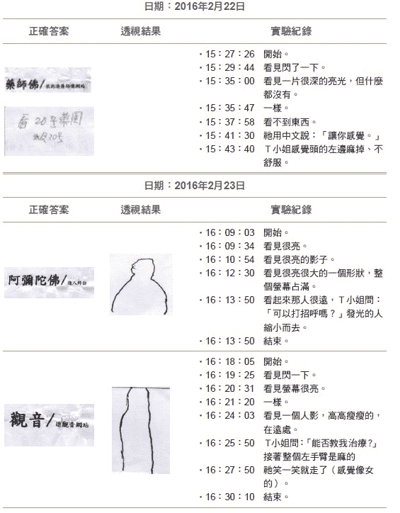 |

同日，T 小姐也去访问观音菩萨的网站，如右图 3-28 第三列所示。

实验从下午十六点十八分开始，两分钟后，她从天眼中看到萤幕很亮；在十六点二十四分时，看到一个人影，高高瘦瘦的，在远远的地方；一分钟后再看见祂，T 小姐问：「能否教我治疗？」接着就感觉到整个左手臂是麻的；在十六点二十七分时，亮人笑一笑就走了（感觉像是女的），实验就结束了。那位亮人高高瘦瘦的，应该就是观音菩萨。此时，T 小姐就用麻掉的左手抚摸在场背痛了超过一个月的陈博士。

第二天我问陈博士效果如何？他说昨天晚上背痛就好了、不痛了，被观音菩萨所施展的神奇力量治愈了，很显然的，T 小姐现在的地位较接近诸佛了，不像十年前比较卑微。

总之，从古至今不论东西方各种宗教都知道灵界的存在，我则在一九九九年八月二十六日起，从物理学会来踢馆的手指识字实验中，因为测试佛字才偶然发现了灵界的存在，创造出撼人的戏剧效果。当时我为了避免用「灵界」这个辞汇，会引起主流科学界反射式的反对，因此改用「信息场」（information field）来取代；直到二○一四年，为了架构宇宙的实像复数时空，我才把信息场改为虚数时空。

# 第四章　一物两象与特异功能原理

粒子自旋割裂时空的结果，

创造出「一物两象」的神祕现象。

原来任何物体在虚空还有一个一模一样的虚像，

天眼就是在扫描虚像。

## 探究特异功能的物理机制

我在第一章中提出新的宇宙模型，认为真实的宇宙是八度的复数时空，除了我们所熟知的四度实数时空（三度空间、一度时间），也就是「阳间」以外，还有一个四度的虚数时空在旁边，也就是「阴间」，是意识的世界。

我也提出意识的物理，认为心灵是量子现象，量子状态必须要用复数的函数来描述，虚数ｉ的出现代表意识的出现，因此量子态就是物质进入心物合一的状态。

由这个统一架构，我们可以去解释宇宙大尺度的谜团，例如暗质及暗能的本质，我们也可以真正了解宇宙小尺度量子力学的谜团，例如决定论的薛丁格方程式竟然会得出粒子或然率的分布，量子纠缠是以超光速方式在两量子间传递信息等等。至于宇宙中尺度的谜团，例如特异功能的手指识字、念力等不可思议的现象，要如何利用新的宇宙模型去解释呢？其中须先了解的关键步骤是：天眼要如何去搜寻纸条或要操作的物体，把这些外界的信息送回大脑，让大脑的意识去看或去操作呢？

##### 解开「一物两象」的神祕现象

二○一四年以前，我的猜想是天眼这个量子现象会穿出大脑，经过身体扩散到手握的纸条，或穿出身体到达离体的物体，把它们笼罩起来，强迫它们进入心物合一的现象，再把想要获得的资讯传递回来。但是如何强迫纸条或物体也进入量子状态，我则想来想去，找遍现有的科学论文，也找不出任何可能的物理机制来。

二○一四年我提出复数时空以后，为了找出实数与虚数时空沟通的管道，大胆假设两个时空是由无数大大小小的涡漩通道所联通，两个相邻的正反通道（一个由实到虚，另一个由虚到实）会形成立体的太极结构，其鱼眼部位就是通道，而最小的通道就是基本粒子的自旋。**所有在实数空间的物体由于都是由原子构成，原子中每一个基本粒子也都有自旋，都有通往虚数时空的通道，因此在虚数时空中皆会出现一个形状一样的虚像**。这虚像是自旋通道在虚空出口的组合，形状与实物是完全一样的，因此造成「一物两象」的神祕现象。任何一个实数时空的物体，在虚数时空都有一个形状一样的结构，后来我渐渐发觉这个虚空的结构竟然在手指识字及念力的作用上扮演了重要且关键性的地位。

左图 4-1（a）显示的是一个在实数空间的玻璃瓶，左图 4-1（b）显示的则是玻璃瓶构成的原子内自旋通道在虚空出口所组合成的虚像，两者形状一样或互补，因此「一物两象」表示：任何一个实数时空的物体在实虚两空间都有一个形状一样的结构。只有神圣字汇例外，如：「佛」、「观音菩萨」、「耶稣」、「药师佛」、「弥勒佛」等，其虚像已经被这些神圣人物在虚空的意识所修改成大圆、多排的小圆、十字架等不同结构。

同样的，我们要问：虚空中的物体或能量形式在实数时空也会产生实像吗？

我认为要看能量的结构形式，虚空中的能量形式如果不包含自旋通道，无法与实数空间沟通，则不会产生实像，是属于暗质及意识的纯能量。但如含有自旋时空结构，其通道出口则会在实数时空形成一个没有物质存在的影像（鬼影）而已。

做手指识字或念力实验时，当受试者打开天眼以后，天眼的量子状态进入虚数时空扫描字汇或物体的虚像，带回天眼形成影像，而被大脑觉知中心辨认出来。要想真正了解手指识字的物理机制，首先要了解接下来会谈到的正常双眼视觉的物理机制。

图 4-1　一物两象的虚实共存

| 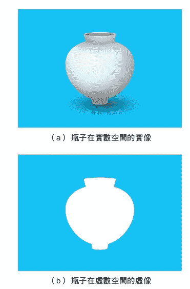 |
| 任何一个实数时空的物体，在虚数时空都有一个形状一样的结构。 |

## 正常视觉的生理机制

根据现代生理学，大脑看到外界景物的视觉过程中，首先需要光源。光源会发出的可见光光子（电磁波）打到景物后反射进入眼睛；或者景物本身会发光，发出光子或电磁波，不同的频率代表不同的颜色及能量，这些光子被视网膜的锥状或杆状细胞壁上的视紫质（rhodopsin）分子所吸收。视紫质分子吸收光子后，分子的形状会改变、弹离细胞壁，引发一个神经脉冲信号送往大脑，信号在眼睛正后方的大脑枕部做先期处理后，再送往大脑视觉其他部位处理，最后送进视觉中枢，被觉知产生视觉，如左图 4-2 所示。

锥状细胞有三种，各感知不同波段颜色的光子。一般神经生理学专家相信，大脑对颜色的感知就是由三种锥状细胞接收信号混合而成的。

图 4-2　产生正常视觉的生理机制

| 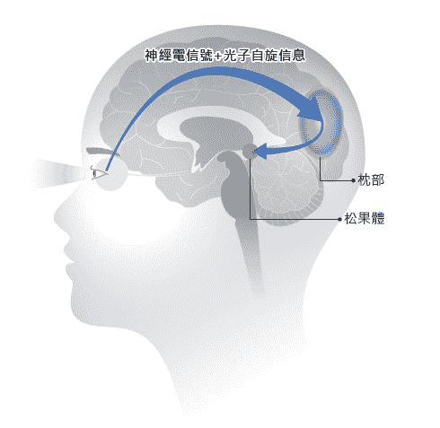 |
| 眼睛接收到景物的光子，引发一个神经脉冲信号送往大脑枕部，做先期处理后，再送往大脑视觉其他部位，最后送进视觉中枢，被觉知而产生视觉。 |

但是手指识字或耳朵听字实验的结果显示，天眼同样可以看见文字的颜色与形状，不过完全不需要经过视网膜上的锥状或杆状细胞来吸收光子导致神经电信号传导的过程。这项事实清楚的表示，即使是正常视觉，其颜色或是视觉的产生，其实是靠另外的管道，而非现代神经生理学所描述的神经电信号这唯一的传递机制。

也就是说，正常视觉其实靠两个管道传递视觉信号。其中一个就是现代神经生理学所描述的神经电信号管道；但是不幸的是，大脑中枢觉知部位并不是在解读大脑不同神经电流信号的组合，而是在解读神经电信号所携带的另一种信息「光子自旋残留信息」，而感觉出颜色产生视觉。

我在下一篇将提出另外一种信息的本质，这可以统一解释为何两种视觉都可以看到颜色及字形。

## 从手指识字实验所观察到的规律

根据过去大量文献记载，以及我们自己手指识字的实验结果，可以观察到实验成功的几项规律，任何理论想要解释手指识字现象，就必须先解释这些规律：

规律 1

大脑中天眼出现时，绝大部分会遮住正常视觉，也就是小朋友正在看的房间内正常的景象会被突然出现的天眼遮住，背景消失。其他少数几位小朋友有时发现天眼萤幕中的字会与正常视觉重叠，比如看见字似乎被贴在对面的墙上，或出现在做纪录的大哥哥、大姐姐脸上。

规律 2

如果字是彩色的，天眼打开时常常最先看到颜色。不同颜色可能会同时出现，排在同一个画面上，或会分几次在天眼中出现。每次会先出现一种或多种颜色，然后才是有颜色的字，一部分、一部分地出现在天眼上，如第二章图 2-6 所示（请见八十七页）。

规律 3

当受试者戴上眼罩遮住双眼时，虽然能看得见字的形状，但是会增加颜色辨识的错误率。在暗室做实验虽能看见模糊字形，但是都看不见颜色，这表示正常双眼看见亮光，并利用亮光信息来照亮天眼，是辨识颜色成功的必要条件。

规律 4

有时外灵会来到实验现场，干扰实验的结果，让受试者看到的字翻转、跳动、颠倒或缺少一部分。

规律 5

只有看神圣字汇时，是看不到字汇，而是看到亮光或亮人，并能连上虚空中神圣人物的网站首页。功能比较差的受试者会连到不同的世界，看到不同的景象，但是看不见神圣字汇。

规律 6

纸上如果挖了洞，天眼会在挖洞的位置看到一个黑框，如第二章图 2-8 所示（请见九十三页）。

## 开天眼，会遮住正常视觉

我们用功能性磁造影（fMRI）技术测量 T 小姐做手指识字时的大脑功能影像，发现天眼最可能的位置是位在大脑的后扣带皮层（Posterior Cigulate Cortex，简称 PCC），这是大脑处于静态下（resting state），其预设模式网络（default mode network，简称 DMN）的主要部分，也是负责大脑认知的一部分，如下页图 4-3 的红圈位置所示。

**此部位是位于大脑后方枕部与笛卡儿所认为掌管视觉的松果体之间**。这解释了天眼一开会遮住正常视觉的现象，因为枕部的正常视觉信息被 PCC 部位的天眼挡住，无法送进视觉中枢（也许是松果体）。

图 4-3　天眼在大脑的位置

| 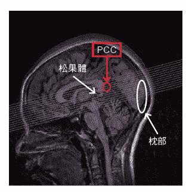 |
| 因天眼一开，枕部的正常视觉信息被后扣带皮层（PCC）部位的天眼位置（红圈所示）挡住，无法送进视觉中枢，所以天眼一开会遮住正常视觉。 |

## 天眼扫描虚像，而非实像

二○一五年以前，我一直认为天眼是扫描物体的实像；直到二○一四年提出复数时空的架构，而推导出「一物两象」的概念后，新的问题马上出现了。既然物体在实数及虚数时空的影像完全一样，天眼到底是在扫描纸上文字、图案的实像还是虚像？

##### 天眼是扫描虚像，才会被灵干扰

直到二○一五年一月二十日的手指识字实验，我才确定是扫描虚像。

如二○九页图 4-4 第一列所示，T 小姐于下午三点二十七分开始实验后，一直开不了天眼，看不到文字，但是感觉怪怪的；到三点三十五分时天眼打开了，但是萤幕晃得很厉害。T 小姐感觉她身体后面站有一个灵体在干扰她的实验，但是灵体处在虚空，我们什么也看不见，于是实验在下午三点四十四分结束。

接下来的实验于下午三点四十六分开始，如图 4-4 第二列所示。

在下午三点四十八分天眼打开时，萤幕仍受到干扰，但有好一点；三点四十九分时，天眼看到有个「J」字母到处晃，接着又看到有「E」和「V」两个字母乱晃，T 小姐觉得是现场观众中有人带来的灵所干扰。

很显然的是，灵体是处在虚空，只有当天眼穿入虚空扫描虚像时，才有可能被虚空的灵干扰。是灵体在拨动英文字的虚像，让「J」、「E」和「V」字乱晃。由这些实验结果，我们才确认天眼是穿入虚空扫描虚像，不是在实数空间扫描实像。

图 4-4　Ｔ小姐手指识字实验，受到外灵干扰

| 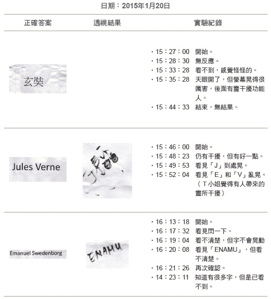 |

## 产生视觉的第二种管道──光子自旋残留信息

由于手指识字第三项规律所描述：让功能人正常双眼看到亮光，是手指识字辨识颜色成功的必要因素，这些双眼看到的亮光在大脑内可以照亮天眼的萤幕。因此光子本身必定带有与颜色相关的信息，可直接与天眼萤幕作用，让天眼亮起来，而不是间接经由神经电信号来照亮天眼。

我相信正常视觉的产生需要靠两种信号，如左图 4-5（a）所示，信号一实一虚。第一种实数的信息是现代神经生理学所熟知的神经电信号，但它只是扮演载体的角色，而是把另外一种更重要的虚像中的自旋挠场信息带入给大脑神经中枢觉知。

图 4-5　正常视觉的真正机制

| 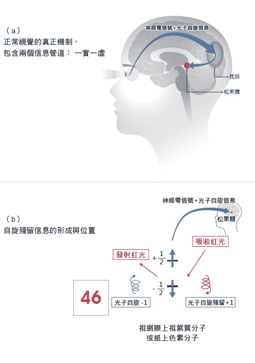 |

我认为大脑中枢觉知部位，也许就是笛卡儿所称的藏有灵魂的松果体，它是在解读另一种信息，也就是光子所携带的自旋挠场信息（自旋为 1）。这个自旋挠场信息是一个漩涡的时空结构，其挠率是由电磁波频率所决定的。光子信息中，其频率代表颜色及能量，这些光子被视网膜的锥状或杆状细胞内的视紫质分子自旋为-1/2 的轨道吸收变成+1/2，再让吸收的能量转换成神经电信号送往大脑。

当入射眼睛的光子被杆状或锥状细胞内的视紫质分子吸收消失后，自旋为+1 的挠场涡漩时空结构并不会马上消失，仍残留在当地视紫质分子附近，如上页图 4-5（b）所示。这个带有频率信息的自旋挠场所残留信息会跨越阴阳界，被接着产生的神经电信号带着送进大脑，最终送达视觉中枢觉知部位（松果体）。

所以，视觉意识中枢真正在解读的是自旋挠场的残留信息，不同挠率的自旋会被觉知成不同的颜色，这个机制就可以用来解释手指识字的原理，如左图 4-6 所示。

图 4-6　手指识字的物理机制

| 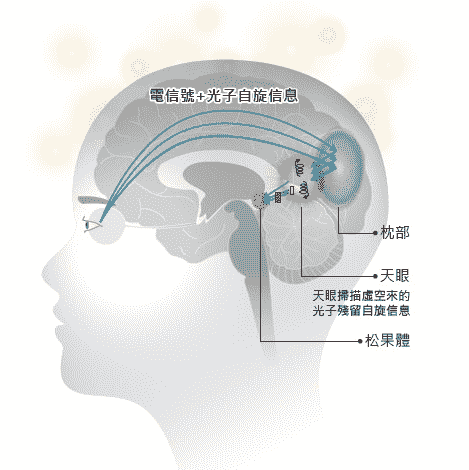 |
| 虚空中，不同挠率的自旋会被觉知成不同的颜色，意识中枢（松果体）真正在解读的是自旋挠场残留信息，才能感知颜色的存在。 |

我认为天眼是脑内生理食盐水溶液在大脑后扣带皮层（PCC）的局部地区进入了宏观量子状态，天眼遮住了正常视觉的信号，包括了双眼所送入的神经电信号及其所携带的自旋残留信息。而这时天眼所生成的复数量子波，则藉由分子自旋通道进入虚数空间，扫描纸上文字的虚像结构。

因此，彩色的字，如二一一页图 4-5（b）纸张中红色的数字 46，在实数空间由于其红色色素分子不断地吸收及放出红色的光子（自旋为 1）。每当放出一个自旋为-1 的光子（色素分子自己的自旋会从+1/2 变为-1/2），就会留下一个自旋为+1 的残留信息跨越阴阳界，留在色素分子附近，因此色素分子附近布满了红色光子的自旋挠场残留信息，此自旋划破时空仍然可与虚空沟通。

由于实验时会把折叠的纸张放入暗袋，此时光子已经消失，只剩下自旋残留信息能和虚空沟通，因此天眼量子波扫描虚空字形时，首先会把残留颜色自旋信息扫回天眼，因为实数时空中没有物质（光子已消失）可以羁绊住它，因此天眼第一次打开时，会出现一片单一颜色，或不同颜色排列在一个画面上，如第二章图 2-6 所示（请见八十七页）。有时一次扫回一种颜色，要开天眼几次，才把所有不同的颜色扫描传回。接着，才把字汇形状的时空结构信息一部分、一部分地扫描传回，而自旋颜色信息开始排列对应于形状信息的位置。

此时倘若正常眼睛没有看到亮光，天眼的字形是黯淡无色的。正常眼睛看到的亮光中所携带的大量、不同颜色的自旋挠场残留信息经过天眼送往松果体被觉知时，会被天眼挡住无法通过。这时神奇的事情发生了，也就是**天眼从摺叠纸张扫回的自旋信息，如果与正常眼睛看到亮光所送往松果体的自旋残留信息频率相同者会产生共振反应**。

例如外界景象中，红色亮光自旋信息在天眼部位碰到纸上残留的红光自旋信息，就会产生强烈共振，而可以通过天眼，让松果体的觉知看见一片红光；如果纸上有洞，天眼在此区域没有任何被扫描回来的色光残留信息，则正常双眼看到的亮光信息会被天眼挡住，而不会产生任何共振而通过，则松果体觉知部位只会看到一个黑洞。

当手指识字辨识神圣字汇时，如「佛」、「观音菩萨」、「耶稣」、「药师佛」、「弥勒佛」等，其虚像已经被这些神圣人物在虚空的意识所修改成大圆、多排小圆、十字架等不同结构，与神灵网站的首页一致。由于这些字汇的虚像已经被神灵改变，因此手指识字时，天眼扫描虚像时，看不见字汇，而是看到被改变的影像如圆形亮光、亮人，或是影像所联通的神灵网站的首页，或其他虚空的世界。

## 念力的运作机制

根据我们与高功能人士做念力实验的结果，可以得出下面一些规律：

> 规律 1
> 
> 念力成功的要件是要先把准备施作的物体信息调入天眼。例如做花生起死回生、返生发芽实验，先要把花生虚像信息调入天眼。此时花生意识出现，要征询它的意见是否同意做实验，如果花生同意就可以发出「返生」指令，花生内部分子就开始逆时针旋转，由外向内，直到转入中心，花生就返生了。接着下令「发芽」，花生内部分子就开始顺时针旋转由内而外，花生的芽就逐渐长出，长好以后再把天眼中的虚像送回实像的花生，让花生真的能发芽。
> 
> 规律 2
> 
> 用念力弯曲或剪断铁丝、火柴，或在火柴上写字时，都要利用工具，这些工具可以在天眼中用意念创造出来，再把完成的作品送回实物，则实物就开始变化，如第二章图 2-20 所示（请见一一七页）。云南大学朱念麟教授所训练的小朋友，把火柴封在不透明的塑胶盒，天眼把火柴虚像扫描入大脑，然后想像出一把剪刀，用剪刀把火柴剪成五到六段，再把天眼中剪断火柴的影像送回盒中的火柴，等到实验完成打开盒子，火柴果然已经被剪成五到六段。

**同样的是，天眼是先把物体虚像扫回大脑，物体虚像表示意识，当物体意识被唤醒，会进入心物合一状态**。这些心物合一的物体可以被意念在虚数时空做远距传送，叫做搬运功能，也可以被操作变化成各种不同型态。当功能人把物体虚像操作变化后送回实物，也就是心物合一状态崩溃回复物质状态，此时实物就会逐渐变化成天眼操作后的结果状态。

##### 所有实物，都有通往虚数时空的通道

所有在实数空间的物体由于都是由原子构成，原子中每一个基本粒子都有自旋，都有通往虚数时空的通道，因此在虚数时空中都会出现一个虚像，是自旋通道在虚空出口的组合，形状与实物是完全一样。因此「一物两象」代表任何一个实数时空的物体在实虚两空间都有一个形状一样的结构。虚空中的能量形式，如果不包含自旋通道，无法与实数空间沟通，则不会产生实像，是属于暗质及意识的纯能量。但如含有自旋时空结构，其通道出口则会在实数时空形成一个没有物质存在的影像（鬼影）而已。字汇及物体虚空的结构在手指识字及念力的作用上扮演了重要的地位。我们提出手指识字及念力的可能机制，可以解释宇宙中尺度的人体内所出现的特异功能谜团。

# 第五章　心灵与意识的科学奥祕

每个人都有「自我意识」，

每天睡觉时「我」就不见了，

每天早上醒来时，「我」又回来了，

好像没有太大的改变，

这个「我」的物理现象是什么？

## 探索科学的最后疆界──意识

每一个人都有自我的意识：「我」是和别人不一样的，每天睡觉的时候，「我」就不见了，但是每天早上醒来，「我」又回来了，好像没有太大的改变，这个「我」的物理本质到底是什么呢？

在唯物论的哲学笼罩在现代科学对宇宙解释的阴影之下，物理学家或者医师们对大脑心灵的物理解释都是敬而远之，认为意识是第二性的，只是第一性的物质里的大脑复杂神经网路所涌现的性质，并不具有独立性。比如：两个氢原子和一个氧原子化合成水分子，水是生命所需，但是其物理化学特性如沸点、凝固点、介质常数与氢原子或氧原子完全不一样，是复杂的三原子合成系统所涌现出来的新性质。而意识又比化学反应更复杂了，因此不属于物理研究的范畴。所以当人死了以后，当物质大脑毁坏了，意识也就消失了。因此科学家总是推托地说：意识是科学的最后疆界（The last frontier of science），而不去处理。因此在一九九○年以前，心灵与意识是属于心理学及哲学的研究范畴。

二十世纪初期，着名的心理学家荣格（Carl Gustav Jung）认为意识的核心是自我人格（Ego），并分成两种。第一人格就是灵魂，掌管五官的感觉、个性、七情六欲；第二人格为第六识，会受到教育、环境、文化及记忆的影响。佛教两千年来的唯识学就在分析大脑意识的结构，把它分成八识：包括色生香味触法六识、第七识莫那识及第八识阿赖耶识。

##### 意识的物理诠释

一九九四年起，意识的物理开始萌芽，英国的物理学家罗杰‧潘若斯（Roger Penrose）与美国亚历桑纳大学的骨科医师史都尔特‧汉默若夫（Stuart Hameroff）共同提出意识的物理，认为意识的基础不在神经活动电位上，而是发生在神经元内担任骨架功能之微管束（microtubule）的物质进入有序的量子状态。

脑神经细胞壁是由许多可形成量子穿隧效应[1]的微管束组成，当感官受到刺激输入时，便会产生有序的量子状态，而且是不同量子状态的叠加态（superposition state）[2]。当时间流逝，外在环境如重力会影响这些量子态之演化。不同状态之物质由于分布于不同时空，所以会导致引力能量差 E，等于两状态的时空间隔 S（物理常数如光速、万有引力常数令其为 1），则叠加状态会崩溃显现唯一确定的状态，意识就在客观缩陷（Objective Reduction，简称 OR）时产生。也就是当量子态扩散到重力之变化满足某些策画的条件下（orchestrated），宏观的量子波会客观地陷缩（Orchestrated Objective Reduction），简称为客观缩陷机制（Orch OR）。

在宏观量子态崩溃的一瞬间，大脑的意识就产生了，接着小部分的微管束又开始进入量子态，意识就逐渐消失了，等待下一次的客观缩陷机制再产生新的意识。因此大脑的念头是一波接一波，周而复始。

**我认为他们的模型已经接近意识的本质，不过相反的是，意识的产生是形成叠加的量子状态时产生，客观缩陷时消失。**

因为叠加的量子状态是复数状态，这时虚数意识可扫描进入量子状态的神经网路架构，产生意识的内容如：记忆、思想、判断、行动。有时埋藏在神经网路的经验会产生抑制力，让我们不要冲动，或给予建议、限制行动。有时量子波会钻入虚空，让我们在遨游宇宙时空时获得灵感，产生创新的思想。并在量子波客观缩陷以后，又恢复实数空间运作，等待下一次微管束的有序量子状态出现，也就是意识的出现。

这个模型经过二十多年的推展及实验的探讨，有越来越多的学者开始接受这个模型，当然也有一些反对的学者，比如纽约大学的哲学家戴维斯‧乔莫斯（Davis Chalmers）。在二○一八年四月于美国亚历桑纳州土桑市举办的「二○一八意识的科学」（2018 The Science of Consciousness）会议上，他以简单的逻辑挑战客观缩陷的机制，认为它用来解释意识并不完备、需要修正。

我的意识理论萌芽于二○一三年，如本书第一章所描述（请见三十六页）。二○一四年，我提出真实宇宙的两大假设，其中第二个假设是量子心灵，认为意识是一个量子现象，可以用复数函数来描述，虚数 i 的出现，表示意识出现了，所以我非常支持潘若斯及汉默若夫的假说──认为神经微管束会进入量子态，这也许是我提出量子心灵的生理基础。

只是我的理论认为物质在量子态才会产生意识，但是量子态的崩溃造成客观缩陷机制反而会导致意识消失，而不是产生意识。因此当我在二○一八年四月「意识的科学」大会上听到哲学家乔莫斯对客观缩陷机制的批评，非常兴奋，会后写了一封信给乔莫斯教授表达支持，并投稿了一篇论文。

不过意识只是一个抽象的概念，必须要有内容，比如说我会生气骂人、我懂慈悲爱人、我会理性思考、会计算、能记忆起以前发生的事情、决定下一步的行动，我个性倔强孤僻等等，都有其丰富的内涵，问题是这些意识的内容在物理上是以什么方式呈现？用复数波函数可以表达这些内容吗？荣格的第一、第二人格，佛教的八识如何以量子心灵的方式来呈现呢？且让我们先回顾一下哲学及心理学对意识的诠释。

> 编注 1 量子穿隧（Quantum Tunnelling Effect）
> 
> 根据量子力学，微观粒子具有波的性质，如电子等微观粒子能够穿过本来无法通过的「墙壁」的现象。
> 
> 编注 2 量子叠加（Superposition State）
> 
> 量子力学认为微观事物的运动和状态均是不确定的，如果将其推广到宏观世界，各种不确定的事物均可以被认为是处在多种状态的叠加状态。

## 西方哲学对意识的认知

西方心灵哲学的概念是从笛卡儿（RenéDescartes）的心物二元论（Mind-Brain Dualism）开始。

笛卡儿本人多才多艺，他出生于十六世纪末的一五九六年，去世于一六五○年，是法国着名哲学家、数学家、物理学家。他对现代数学的发展做出了重要的贡献，因将几何座标体系公式化，而被认为是解析几何之父；他留下名言：「我思故我在」，提出了「普遍怀疑」的主张，是西方现代哲学的奠基人，他的哲学思想深深影响了之后几代的欧洲人，开拓了理性主义哲学。

笛卡儿主张心与物为两种不同的实体。「心」指的是一种思维的主体，也就是藏在大脑的松果体中的「灵魂」，掌控日常生活中的思想、记忆、行动、情感等；「物」指的是日常接触到的一切占有空间、有形的外在事务，包含大脑。

但是此种说法很难解释心物的交互作用，比如心会影响身，可指挥行动，内心忧郁会导致身体的疾病。在这样的架构下，为了解决心会影响身的矛盾，又发展出心物同一论（Main-Body Identity Theory），认为心是大脑所产生的东西，因此本为同一种东西，但是又很难把心化约成大脑，比如爱、恨、思想、个性、要如何分解成神经网路的放电行为。

为解答这些疑难，有人认为心物虽然都来自于物质，但有完全不同且无法化约的性质，因此发展出性质二元论（Property Dualism）。更极端的则是发展出唯物论（Materialism），认为大脑才是实体、为第一性的，心灵是大脑复杂系统所衍生出的现象、为第二性的、不具根本性，人死了、大脑消失了，自然意识也就消失了；或唯心论（Idealism），认为心才是实体意识、是第一性的，物质是心灵造成的成品。只是唯心论很快就受到现实世界的检视，你心中想要一个苹果，当然不会无中生有出现一个苹果，纯粹的唯心论在物质世界中显然是讲不通的。当然，后来物质科学的发展逐渐把唯物论推上了哲学的高峰，似乎成为诠释这个宇宙的最高指导原则。

## 西方心理学对心灵的认知

现代科学对意识的探讨研究以二十世纪初心理学家荣格（Carl Gustav Jung）最为深入。他的博士论文是研究他会通灵的表妹，中老年后他自己也曾发生过通灵的体验，因此他对灵界或集体潜意识有特殊的感情。他所描绘人类心灵的广大内在世界，被誉为发现心灵世界的哥伦布。

就莫瑞‧史坦（Murray Stein）所着《荣格心灵地图》（Jung's Map of the Soul）所描述，人类意识中首要特征就是「自我」（Ego），意识是醒觉的状态，它的中心就是「我」，它是进入我们称之为心灵的辽阔内在领域的入口。

**荣格在他的作品《基督教时代》（Aion）对自我的定义如下：「它彷彿是构成意识场域的中心，就它构成经验人格这个事实而言，自我是所有个人意识作为的主体」。**

自我指涉的是，个人拥有一个展现意志、欲求、反思和行动中心的经验。心灵的内容与自我的关系形成了意识的标准。自我是代表心灵内容的主体，是一面心灵能自见自觉的镜子，心灵内容如感情、思想、知觉或幻想被自我掌握和反映出来的程度，就是它被意识到、归属于意识的程度。

意识之外的无意识不只是未知的事物，它更是「心灵层面的未知」，它一旦浮出意识，便与已知的心灵内容没有什么不同。**无意识包含所有意识外的心灵内容，自我是意识的特殊内容，也就是意识是比较宽广的范围，所含的内容不只自我而已**。

意识就是觉识，是一种清醒的状态，一种观察、纪录周遭和内在活动的状态。意识的内容如思想、记忆、情绪、熟悉的意象、人物与脸孔，事实上比意识本身更虚幻脆弱。比如一个人虽有意识，但是可能完全丧失记忆，意识就像一个房间，围绕着暂时停驻其中的心灵内容。意识先于自我，自我则变成它的终极中心。

##### 一号人格与二号人格

自我基本上不是由意识习得的内容，它一直是现成的、与生俱来的、不是滋养、成长或学习下所发展的产物，每个婴儿生下来就具有了，否则就是先天盲、先天聋或智障。

荣格对心灵的描述，认为在许多不同的意识内容之间，有一个连络的网路，它们都直接或间接地连结不同意识内容到自我这个中央机体上。

自我是决策及自由意志所在，它根据意识内容去安排优先顺序，产生行动。

当人类的自我与意识发展到一定阶段后，就逐渐由个人成长与教育的文化世界来定义塑造。这是一层环绕中央自我的自我结构，透过家族成员的互动与学校教育，小孩会逐渐融入文化之中，并学习它的形式与习惯，这层自我也就变得愈来愈厚。荣格称自我的这两项特征为「一号人格」与「二号人格」。

一号人格是天生的核心自我，比较静默，类似于道家所描述的「元神」，或是一般所称的「灵魂」。具有视觉、听觉、嗅觉、味觉、触觉五种基本觉知能力，以及个性、感情如七情六欲，也可控制身体简单的活动，像刚出生的婴儿所具有的能力。

现代的心理学把一号人格称之为「能知觉的」或「非凡的」意识（Phenomenal Consciousness）。一号人格比较是直觉的、有喜怒哀乐的、感性的、艺术性的，能总览全局，一号人格像是右脑的功能。

而二号人格的自我是大脑透过学习架构出来的。藉着大脑神经网路的生长与外界互动回馈，导致新的连结，产生对各种内在思想的觉知、记忆，并会随着时间演变。从出生到成长过程中经由文化、亲人、学校及环境所学习到的自我层次，比较活跃外放，是一号人格自我执行身体功能的一部分。二号人格无时无刻都在处里日常生活的现实如各种纷乱的思绪、记忆、解决问题、产生行动，类似于道家所描述的「识神」，逐渐裹着第一人格变为厚实。既计画未来也烦恼未来，追悔过去。二号人格的日常心灵会不断地判断、设想、记忆、回顾过去、受到各种文化、环境、规范所控制，以及对社会的配合等等，像是左脑的功能。现代心理学把它称作「可接近」的意识（Access Consciousness），像电脑一样有逻辑程序可循。

**自我意识是心灵的表层，会受到个人与外在环境撞击产生的干扰，以及情绪反应所制约**。但是还有许多干扰因素不是外在的，而是内生的冲击，也就是「无意识」或「潜意识」的干扰。无意识分成个人无意识及集体无意识，在个人无意识中充满了各式各样的情结。也许与前世的经验有关，经过催眠回溯可以浮现于意识中。集体无意识或本我（Self）是荣格有过通灵经验后逐步发展出来的理论架构。

## 佛教唯识学对意识的认知

佛教经典《杂阿含经》提出六根、六尘及六识的概念来理解意识。

六根是眼睛、耳朵、鼻子、舌头、身体、大脑，也就是六种觉知所使用的感官；六尘是六种感官接受到的物理及生理信号，如颜色（色尘）、声音（声尘）、香气（香尘）、味道（味尘）、压力温度（触尘）等，而产生六种意识，也意谓着由大脑来解读这些信号所产生的觉知。

法尘则由意根（大脑）来互动后产生，所以法尘即为前五种感官与前五种尘境，互动后产生的五种经验（佛教称之为「识」）。再经大脑整合后，产生的认知（为意识，或称为第六识）。因为各人长久以来经验习性认知的不同，使得遭遇同一情境，却每人个个感受不同。

唯识论认为心与物都不是唯一的实体，这个世界既不是唯物的、也不是唯心的。但也不是心与物皆为实体的二元论。唯识论认为这个世界唯一的实体是「阿赖耶识」，心灵及物都是由「阿赖耶识」所创造出来的，所以心与物是对等的，物并不比心更基础。但是「阿赖耶识」是否是一个纯粹的意识，如果答案是「是」的话，那就与唯心论没有分别，因此「阿赖耶识」是一种心物合一的状态，既非心亦非物。

## 意识的物理

我在第一章所提出的量子心灵模型如何用来解释这些哲学与心理学的历史上所架构出来的框架呢？

我认为意识在大脑里是一个量子现象，就像神经微管束耦合[1]进入宏观的量子状态，可以用复数函数来描述。虚数ｉ的出现，表示意识出现了，但问题是意识只是一个抽象的概念，实际上意识具有丰富的内容，比如说我会做逻辑性、理性思考、计算数学、记忆起以前发生的事情、决定下一步的行动，我个性倔强孤僻等等，都有丰富的内涵，这些内容在物理上是以什么方式呈现？复数波函数可以表达这些内容吗？

二○一四年，有一天我在仔细观察复数波函数Ψ（,t）在描述粒子在位置 r 及时间 t 的行为时，突然出现一个疑问：实数部分的函数 R 及虚数部分的函数 Im 到底在意识上扮演什么角色？

Ψ（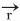,t）＝R（,t）＋i Im（,t）

由量子力学的哥本哈根诠释来看 R2＋Im2，代表粒子出现的机率，也就是粒子在实数空间出现机率的几何分布，似乎这个在实数空间的几何分布代表了意识的内容，也就是实数部分所导致的时空形变（弯曲或扭曲的几何结构）就是心灵的内容，虚数抽象意识扫描形变的实数时空形成的心物合一的复数量子状态就形成心灵的内容。神奇的是决定物体空间几何分布的是广义相对论，虚数的意识来自量子力学，所以结合量子力学与广义相对论的时空结构后所描述的物理现象竟然就是意识的内涵，原来科学的最后疆界就是在于结合广义相对论及量子力学。

##### 如何解释第一人格与第二人格？

每个人的自我意识（Ego）也就是第一人格是与生俱来的，可以称之为灵魂。它似乎与虚数时空的神灵一样，是量子心灵的虚数部分，没有实数物质的部分，所以在实数世界看不见、摸不着也量不到，但是灵魂仍有复杂的内涵，比如个性、嗜好、爱憎、欲望等等很多是与生俱来的。

我认为量子的灵魂实数部分并非由有质量的物质所构成，而是由许多微小的自旋涡漩时空组成的大型复杂时空几何结构，这个自旋时空结构被虚数意识扫描而产生个性、嗜好、爱憎等心灵内容。比如，**一个人性格非常固执不会转弯抹角，因为他的灵魂实数部分的自旋时空结构就像一棵松树不容易弯曲；一个人个性圆滑懂得随环境而变来变去，因为他灵魂的实数部分就像一棵柳树可以随风而倒**。这一部分其实也是佛教第七识莫那识（我识）的物理本质，莫那识躲藏在灵魂当中占了一个角落，随着灵魂而轮回转世，也属于潜意识的一环。

五官的感觉如视觉、听觉、嗅觉、味觉、触觉，是灵魂觉知的天生本能，不是可以学习而获得的技能，因此被称作「可觉知」或「非凡的」意识，婴孩一出生就具有这些能力，否则就是天生盲、天生聋等天生的缺陷。

这五种感觉到底怎么运作的，现代神经生理学有详尽的解剖及神经生理的推论。但是就像第四章所讨论的手指识字现象，为了解释神奇的手指识字现象，我们发现正常的双眼视觉其实包含了两个信号，一个是神经生理学所描述的神经电信号，但是不提供灵魂觉知的信息；其主要功能是负责运送另一个产生视觉的真正信号：光子被视网膜视紫质分子吸收而消失后残留的自旋挠场信息，挠场旋度决定灵魂看到的颜色。通常波长是在可见光范围，在四百五十到七百五十奈米之间，而自旋信息的空间分布决定了文字或图案的形状。

同理，嗅觉及味觉也是鼻子及舌头上受体分子向大脑传送了两种信号，一个是神经电信号，携带另外一个信号是造成味道分子的某个重要分子键振动的光子残留自旋挠场信息，波长属于红外线可测到的三到十微米范围。

听觉是耳朵的耳蜗内发毛（Hair Cell）细胞向大脑传送了两种信号，除了内发毛（Inner Hair Cell）传送的神经电信号以外，它也携带了第二种信号──是外发毛（Outer Hair Cell）内的马达蛋白分子（Prestin）高速机械伸缩运动所造成的时空扭曲信号。所以，灵魂听到的声音曲调来自后者，而非神经电信号。

触觉信号也来自两个管道，一快一慢。快的是神经电信号的传递，例如真皮内 A-β、A-δ、C 神经可以感觉温度的高低；毛囊、莫克尔细胞则可以感知触觉及压力的大小。

痛觉由粗神经传导，被脊椎内痛觉阀控制。但是由幻肢痛的研究发现，一个被截肢的病人在已经没有肢体的部位仍然会感受到剧痛。一般正统医学相信，这是大脑中枢神经系统感觉到神经信号因传递到不存在的肢体对应部位不顺畅而导致的疼痛。但是幻肢痛可以用红外线照射处理，并让不存在的肢体其剧痛部位而获得缓解。实际上，剧痛部位根本没有神经存在，结果用红外线照射这些部位竟然可以舒缓疼痛。这让我们了解到，痛觉有另外一个传递的管道，但是速度很慢，这个管道就是人体的经络体系。如果经络产生时空结构扭曲会导致慢性疼痛，其关键是人体二十四小时的节律所产生的「子午流注」现象所传递的信息，这个信息在中医称做「气」；在十二经络巡行每两小时走一经络时，把经络扭曲不顺畅的信息带入大脑灵魂，而感觉到疼痛。

我在《科学气功》一书第五章有详细介绍「南氏去过敏疗法」，一天二十四小时可以去除过敏，就是用到「子午流注」气行经络的现象。

由这些分析我们知道：**第一人格灵魂是一团量子意识，以虚数成分为主，实数部分充满了各种自旋残留信息所组成的几何结构，代表个性、七情六欲、五官所送进来不同的旋度自旋信息，它会产生视觉、嗅觉、味觉，扭曲震动的时空结构，让我们产生痛觉或听觉**。灵魂在婴孩时学习操控各种神经系统，其介面叫做「魄」。等技术纯熟后，魄落入潜意识，不再进入底下所讨论的第二人格（第六识）的范围，比如操控自主神经体系的交感及副交感神经，就不再是由第六识所能控制。

荣格的第二人格以佛教唯识论来说，就是第六识是学习得来的，大脑的神经网路连结随着时间从文化、教育、环境学习到的经验刺激逐渐增加或修改网路而变得越来越复杂，大量的记忆、逻辑、知识经验均埋藏在网路之中。每当外界对五官的刺激送入大脑，大脑开始理解思考与经验对比做出判断、付诸行动，这时大脑神经放电所形成的网路形成一个三度空间的几何架构。因此，网路中大量微管束形成的宏观量子心灵经过扫描这个复杂的三度空间几何架构，而产生了判断、行动，这就是第六识的物理及生理基础。读者正在读这本书用到的记忆、逻辑及判断也大部分是大脑内的第六识所掌控。

##### 如何解释潜意识、莫那识、阿赖耶识与天眼？

意识之外的潜意识或无意识不只是未知的事物，它更是「心灵层面的未知」，它一旦浮出意识，便与已知的心灵内容没有什么不同，无意识包含了所有意识外的心灵内容。一般而言，刚出生的婴孩灵魂必须学习处理掌握与生存有关的所有的神经系统，例如：饿的时候或不舒服的时候要哭、要表达出来引起大人的注意，才能解决切身的问题；慢慢的长大以后，要学习站立、走路、操作玩具、要学习发音说话、了解别人的意思、行为要被矫正。当灵魂要学习的、要掌控的事情越来越复杂、越多元，最有效率的做法是将灵魂划分成不同部门而分工。某一小块掌控四肢平衡与动作神经系统、某一小块掌握语言发音神经系统、某一小块掌控逻辑演算与认知。灵魂与不同功能的神经系统之间，必然形成了多个有效率的介面，我把这个介面叫做「魄」，也就是中国道家所称的「魂魄」是也。一旦「魄」的操控自如达到纯熟，就从意识落入潜意识，不再受到意识的关注，以减轻灵魂的负担。

比如骑自行车，一旦学会如何平衡身体，就一辈子不需要再关注这件事，一上自行车就可以骑了。潜意识可以自动平衡身体，操控脚踏踏板行进；开车也是一样，有时一边开车还可以做其他事，但分神很危险最好不要做，这也表示如果小时候的生活习惯不好，一旦落入潜意识要再改就困难了。

潜意识里最神奇的是第七识莫那识，是一个人个性的根源，来自前世的经验，要经过催眠或花精疗法才能引发出这些经验与情绪。其物理的基础是落在量子灵魂的实数部分自旋挠场的几何空间结构上。若这个人个性很扭捏，表示这个几何结构坑坑凹凹，不平滑也不漂亮。

**佛教常说人身难得，劝人要利用人身来修行，应该就是要利用修行反馈去修改量子灵魂的实数部分几何结构，修成漂亮圆滑的几何图形跳出轮回。**

之前曾提到特异功能要能成功的必要条件是大脑要开天眼。天眼既非第一人格的灵魂，也非第二人格的第六识，它是第三眼，属于另外一种量子现象，我相信它是大脑某部分的生理食盐水因刺激而进入的宏观量子状态，如第一章所说明。

天眼一旦形成，就可穿隧进入虚数时空，遨游有形及无形界，把虚空的景象带回来给灵魂看。因此若把唯识论的第八识「阿赖耶识」当作量子的复数心灵，也就是灵魂加上天眼，则一切心灵哲学所面对的心物二元论或一元论所产生的矛盾都能迎刃而解。

复数量子心灵既有「物」的成分（实数），也有「意识」的部分（虚数），两者合作构成心灵的内容。当物质进入物质波的量子状态，物质的虚数意识被唤醒进入心物合一的状态，也就是「阿赖耶识」的状态时，心与物是对等的，物并不比心更基本，当量子波塌陷又回到物质的状态，心灵收敛隐晦而消失，变成一个纯粹的物体。

**故唯心论的「一切为心造」只发生在充满意识的虚数时空，实数物质世界是一个唯物论的世界，只有物体进入量子态，发生心物合一现象时，心灵才会出现。**

图 5-1　心灵的结构

| 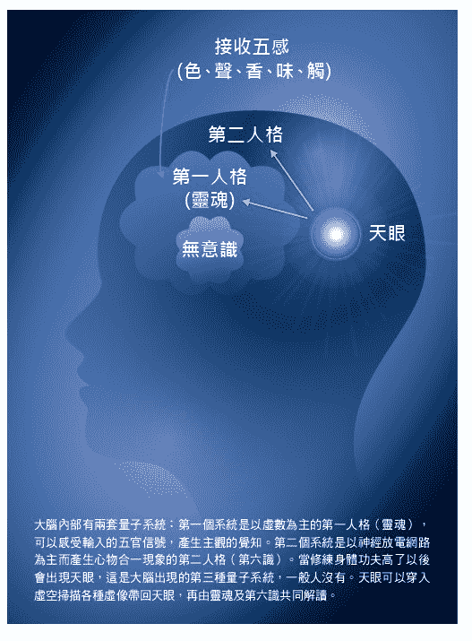 |

整个大脑心灵的结构，如下页图 5-1 所示。

因此我们大脑内部一般有两套量子系统：第一个系统是以虚数为主的第一人格（灵魂），可以感受输入的五官信号，产生主观的觉知，七情六欲，可以扫描内部的各种残留自旋几何结构，展现个性。第二个系统是以神经放电网路为主、能产生心物合一现象的第二人格（第六识）。当修练身体功夫高了以后会出现天眼，这是大脑出
现的第三种量子系统，一般人没有。天眼可以穿入虚空，扫描各种虚像带回天眼萤
幕，再由灵魂及第六识共同协调解读。

从第二章图
2-7
（请见九十一页）所显示的手指识字结果可以看出，样本上大写的
红色英文字汇如「HAPPY」其虚像被天眼扫描回去之后，灵魂看到颜色为红色。第六
识则根据过往学习的经验，把第一个英文字母保留为大写的 H，但是第二个以后的英文
字母则改成小写，结果看成红色的「Happy」。

> 编注 1 耦合（coupling）
> 
> 在物理学中，指两个或两个以上的体系或两种运动形式间，通过相互作用而彼此影响以至联合的现象。

## 催眠术或催眠疗法所显示的心灵结构

催眠术是由会催眠的施术者藉由语言暗示或手段诱唤受术者的精神，呈现一种特殊的状态。这时受术者消除了普通状态下种种自发杂乱的思绪，心境呈现一种寂静状态。此时如果施术者发出种种暗示，受术者会毫不犹豫忠实地执行，而出现种种被催眠的现象。

施术者所给予受术者的暗示，不只能一时影响受术者的精神和身体；待受试者清醒后，或醒后若干时日，还是会受到暗示力量的影响。因此，催眠疗法被一些精神科医师用来治疗精神疾病，例如美国魏斯医生（Brian L.Weiss）的《前世今生：生命轮回的前世疗法》及台湾陈胜英医生的《与灵对话：前世今生、梦境与潜意识的奥祕》，就是利用催眠带领病人回到前世，了解今生问题产生的根源，而使病情获得纾解。

##### 催眠，唤醒的是第一人格（灵魂）

催眠的原理有许多种理论，其中比较重要的是「第二人格说（潜在精神说）」。也就是运用荣格的理论，认为人除了第一人格（灵魂）外，还有第二人格（第六识）。第六识负责处理平日纷乱的思绪、解决问题、付诸行动等精神活动，催眠把第六识催入睡眠状态，让第一人格（灵魂）开始发挥作用，控制身体活动。由于第一人格负责五官的觉知，可以直接接受施术者下的语言指令，要求身体做出各种简单反应动作，像婴儿一样，但是不得醒来，只有当施术者下令醒来时，受术者才会醒来。醒来以后，受术者的第六识会完全不记得指令及身体活动，有时候在语言暗示下，甚至能产生遥视、遥感等特异功能，如果施术者要求其记得整个过程，醒来后就会记得遥视、遥感的内容。

这些催眠现象显示与生俱来的第一人格（灵魂）中隐藏了前世的记忆与经验，不会被第六识知晓，一般日常生活状态下不会出现在第六识的精神意识中，催眠者的暗示也躲在灵魂中，控制着第六识而不被其知晓。**睡觉时第六识的精神意识消失，让第一人格灵魂开始活动，所以做梦时也许会出现这些前世的记忆**。但是有些前世的创伤经验会逐渐引发身体或精神产生类似的问题。这些隐藏的记忆与经验很可能就是无意识的范畴，或无意识中所谓的「情结」。第六识从我们出生开始累积，随着文化教育、各种环境或情绪冲击而逐渐厚实。我们每天在处理的思绪、活动、情感、冲突等等，主要是靠第六识（相当于人体的执行长），第一人格的灵魂则隐身幕后（人体的董事长），只有碰到重大决策问题，才出面与第六识共同处理。第六识完全不知道躲在第一人格里的「无意识」的存在，但是他下很多决定时，却受到无意识的干扰，或间接经由第一人格灵魂的指挥。

催眠师利用语言暗示，让受术者安静下来，集中精神去压抑其他思绪感觉，放松全身肌肉，也就是减少大脑纷乱的量子场不断产生及崩溃过程，让第六识的精神意识从紧张状态松懈下来，进入休息入眠状态，但又没有真正的睡着，听觉还保持清醒，但这时是由第一人格灵魂掌控全局。

前世今生疗法就是催眠师用语言带着受术者的心灵时间倒流，由现在逐步回溯到婴儿、甚至妈妈的子宫内，此层意识是包裹着无意识中前世的记忆及经验，因此心灵再往前回溯，就可以回到前世找出问题，获得解答来调整无意识的结构而解决病症。

##### 五官感觉，可由灵魂感知

**五官感觉是可以直接与灵魂沟通的工具，所以我们常说「眼睛是灵魂之窗」，意谓着平常将五种感觉器官所接收到的「色生香味触」五种觉知经由灵魂来解读**。启动特异功能时，当功能人的天眼一开，会把正常视觉信号挡住，此时灵魂开始利用天眼进入虚空，扫描虚像带回天眼由灵魂解读。用脑造影技术（fMRI）可以看到功能人天眼打开时，听觉部位活化，可以听到虚空的声音。

我相信当催眠受术者进入催眠状态时，第六识会被关掉，灵魂可直接经过听觉与施术者沟通，但不像第六识会根据大脑网路所储存的经验，会逻辑思考而反驳、会反抗。灵魂没有反抗意识，会完全接受命令。灵魂可以直接控制身体，做出催眠师所要求的简单动作，接受施术者的暗示，而在第六识甦醒以后，还会干扰他的理性思考与判断。

##### 真正的觉知，来自灵魂

我们从分析五官的觉知经验与手指识字的物理机制中发现，五官各送出了一实一虚两个信号进入大脑，一个是实数的神经电脉冲信号，也就是现代神经生理学所描述的以为是产生觉知的信号。实际上神经脉冲信号与觉知没有直接关系，只是扮演载体的作用，把另外一个游走于阴阳介面的自旋挠场残留信息带到灵魂，由灵魂来觉知五官的感觉。

在复数时空的架构下，现代神经生理学只告诉了我们一半的故事，只有物质世界的故事，而另外一半的故事才是导致真正觉知的机制，却是摸不着、看不见地发生在另外一个虚空与实空交界的介面上。

# 第六章　星际通信新科技──寻找外星人

外星先进文明科技领先地球的关键，

是外星人掌握了意识的物理，

能够制造仿照天眼的仪器，

自由进出虚数空间遨游宇宙，同时创造出瞬间科技。

人类未来学习的典范，就在天上无数的外星先进文明中。

## 寻找外星智慧计画

外星文明是否存在，是每一个地球人心目中存在的疑问。银河系有上千亿的恒星，有为数更多的行星，要说银河只有地球是唯一有生命存在的行星，没有其他演化的生命存在实在是不合理。

近二十年来，天文学的巡天计画（Panoramic Survey telescope and Rapid Response System，简称 Pan-STARRS）的发展，更找出了越来越多类似地球环境的行星，有液态水、温度适当，可以孕育类似地球的生命系统。因此外星文明的存在，对一般人而言似乎愈来愈无庸置疑。

事实上好莱坞大导演史蒂芬‧史匹柏一九七七年执导的科幻电影《第三类接触》（Close Encounters of the Third Kind），就是与外星人接触的科幻电影的里程碑之一。不只是因为它特别的影响力，也因为《第三类接触》将外星人描述为温和友善的，这与其它早期的电影大不相同。一九八二年史蒂芬‧史匹柏执导的外星人来到地球的电影《E.T.》，更是轰动全球，也引发了科学家寻找外星人的热潮。

一九八○到一九九○年代，美国哈佛大学开始了寻找外星智慧计画（Search for ExtraTerrestrial Intelligence，简称 SETI）。一九九二年，美国政府曾经补助航空暨太空总署（NASA）做了一年 SETI 计画，后来被参议院砍掉经费。期间内，为了增加电脑运算的速度，还发展出网格计算（grid computing）的技术，号召所有对天文有兴趣的人士，在晚上睡觉时把个人电脑接上网路，让 SETI 总部可以将无线电望远镜所扫描到的天空资料分割开来，分别利用几十万、甚至上百万的电脑来各自进行计算，可以大幅提高分析数据的效率。我记得当时读高中的女儿就加入了这个计画，每天晚上打开电脑连上网路聊尽自己一份力量。不过这个计画以失败告终，因为找不到有意义的无线电信号。

二○一五年，俄国一位因投资网路成功的亿万富翁尤里‧米尔纳（Yuri Milner）为了纪念一九六二年他出生时第一位进入太空的俄国太空人尤里‧加加林（Yuri Alekseyevich Gagarin），捐款美金一亿元给英国剑桥大学物理学家霍金（Stephen William Hawking）来主导寻找外星人计画。其中包括设计一个奈米风帆，携带着微型摄影机，用雷射光加速航向最接近太阳的恒星──半人马座的α星，拍照传回地球，估计要花二十年的时间。**试想半人马座的α星距离地球四点三光年，用无线电波传送信号，就要花八点六年才能来回一次。更不要说更远的恒星了，耗时更久。也就是说用无线电波来与外星人通信是没有意义的事情，除非找到更快的方法**。

问题是爱因斯坦的相对论指出，我们宇宙中最快的速度是光速，若想超光速，看来问题是无解了。而我们所发现的虚数时空，也就是灵界，是没有时间、空间以及速度的限制，看来利用灵界是解决星际通信的唯一的办法。

寻找外星人计画的另一项工作，是用无线电望远镜搜寻太空中有意义的无线电波信号，类似三十多年前的 SETI 计画。问题是地球上人类的文明在一九○一年马可尼（Guglielmo Marconi）才发明用无线电波横越大西洋通信的技术，因此十九世纪以前的文明，是不可能用无线电波去联络的。一百多年后，也许人类又会发现更先进的通信工具，如量子或挠场通信这种可以穿越虚空作为星际通信的工具，而不再使用电磁波。因此使用无线电望远镜，只有可能找到与人类现在一样使用电磁波为主要通信工具的文明，比较先进或落后的文明都找不到。

## 运用天眼，寻访外星人

二○○二年六月，我们想到可以利用天眼穿越虚空，到远方的先进文明世界去参观，但是要怎么做呢？

我们想到可以恳请 T 小姐在灵界的师父帮忙，带领 T 小姐的天眼意识，去找到先进文明所在之位置，以及观察外星人生活的情形。于是在六月二日我们开始实验，用纸条写下问题，由 T 小姐以手指识字方式送给她的灵界师父，如下页图 6-1 第一列所示。

T 小姐问：「师父，你可不可以介绍一个外星人与我们联系？是不是要利用信息场作为媒介，再经过天眼？」

手指识字三分钟后，T 小姐天眼一开，把问题送出去了；再过三分钟后，师父在天眼出现，以「点头」表示同意，接着用英文抱怨我们：「Are you guys not satisfied?（你们这些家伙还不满意吗？）」表示我已经告诉你们那么多的祕密还来烦我。

图 6-1　以手指识字向Ｔ小姐师父提出访问外星文明的请求

| 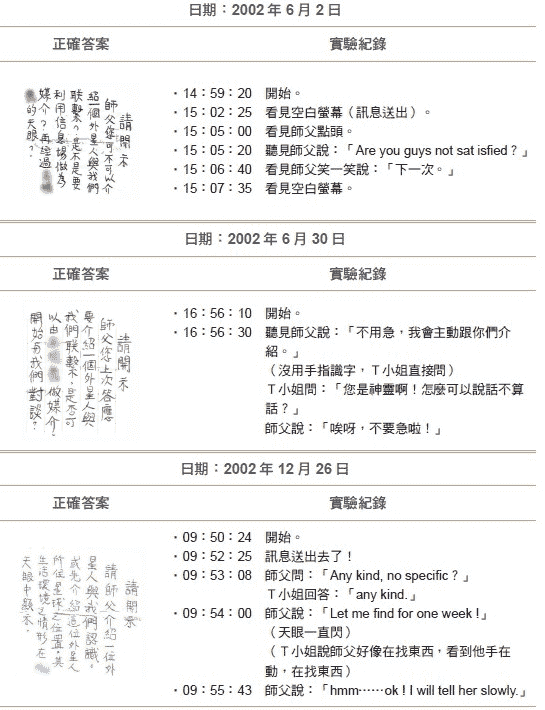 |

我赶紧捧师父说：「您大德大能、法力无边，我们有心求道寻访外星人，您就帮帮我们吧！」

一分钟后，祂笑一笑说：「下一次。」实验就结束了。

到了六月三十日，我们再次进行手指识字实验，在纸条上写下问题。

T 小姐问：「师父，你上次答应要介绍一个外星人与我们联系，是不是可以开始与我们对谈？」

师父说：「不用急，我会主动跟你们介绍。」

显然祂忘记了，我们开始责备师父。

T 小姐问：「您是神灵啊！怎么可以说话不算话？」

师父说：「唉呀，不要急啦！」

我听见祂有点生气了，不敢再逼，以免祂真正生气不带我们去联系外星人了。

等了半年，师父仍然没有主动介绍，于是在二○○二年十二月二十六日，我们再次进行手指识字实验，在纸条上写下问题。

T 小姐问：「请师父介绍一位外星人与我们认识，或先介绍这位外星人所住星球的位置，其生活环境情形在天眼中显示。」三分钟后，回答来了。

师父答：「Any kind?no specific?」

师父答应了！狂喜之下我马上回应：「no specific!」讲完后就后悔了，应该去看先进文明的星球，不需要再去看恐龙独大的世界。一分钟后，师父的回答来了。

师父答：「Let me find for one week!」他需要一个礼拜时间去找。

接着，我注意到 T 小姐手掌上量到的电压不停地出现一个又一个脉冲，表示天眼一直在闪，我问怎么回事？T 小姐说看到师父的手在动，好像在找东西，我猜祂是在虚空的触控平板上拨动银河星系图，找一颗适合我们去参观的星球，就像我们转地球仪一样，在找地球上某一国的位置一样。果然一分四十秒后，师父的回答来了。

师父答：「hmm……ok!I will tell her slowly.」

祂已经找到了，但是会慢慢地让 T 小姐看。

果然不错，二○○二年底，师父带 T 小姐的意识去看了一个外星文明，T 小姐把外星人画了下来，如左图 6-2 左方所示。她看到的外星人有两个眼睛、两个鼻孔、一个嘴巴、两个耳朵但没有耳廓，有双手双脚，但手只有三个手指，其中一个指尖硕大，就像好莱坞大导演史蒂芬‧史匹伯所拍的电影《E.T.》里面的外星人，我突然怀疑起史蒂芬‧史匹伯是否像我们一样也看过外星人。

T 小姐向我们这样描述她看到的外星人：「看不到脚」、「行动真的很快」、「皮肤很黑有些发亮、像是穿着一层外套」、「他头上像是有一根天线，因为我注意到外星人没有手机，但是自言自语，好像是在通信」。

到了十多年后，我才明白为什么看不到外星人的脚？为什么行动很快？因为他们脚上都穿了步行器，能快速来回摆动行进所致。

接着，T 小姐看到一颗时髦的树，上面挂满了闪亮的灯，如下图 6-2 右方所示。树的周边一片黑暗，没有阳光像是晚上。这倒很像地球人类文明中晚上在树上挂灯的习惯。

图 6-2　Ｔ小姐所看到的外星人及树

| 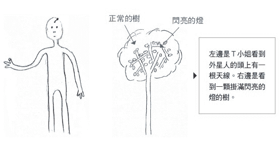 |

后来，T 小姐又看到一个像魔术盒的机器，如下图 6-3 左方所示。她看到外星人用手指在键盘上打字，突然有一个东西从魔术盒出来，外星人一下就把这个东西放入嘴巴吃掉，速度太快看不清楚。

于是我们请问师父这个机器有什么用途？师父回答：「这是他们所发明的，可以获得任何东西。」

哇赛！这不是哆啦 A 梦（机器猫小叮当）的任意机吗？我突然开始怀疑哆啦 A 梦的作者藤子不二雄是否也去过外星参观？显然外星人输入食物名称后，食物就送出来了，被外星人一口吃掉。

接着，T 小姐到了外面空旷的地方，又看到许多三只脚的机器，如下图 6-3 右方所示。于是我们请问师父这个机器有什么用途？师父回答：「交通工具。」像是小飞碟。

图 6-3　Ｔ小姐看到的外星机器

| 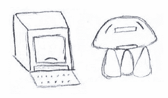 |
| 左边是魔术盒的机器，可让外星人获得任何东西。右边是如同小飞碟的交通工具。 |

参观完后，我开始透过 T 小姐，请教师父一些关于这个星球文明的问题。

我问：「这个外星人所居住的星球是在我们的银河系中吗？」

师父答：「YES!」

我问：「是在哪一个星座？」我摊开星座图。

师父接连回答：「Twenty,Thirty.Go up and little left.Pretty close.」

Twenty,Thirty.指的是天球上的赤经赤纬，如二六一页图 6-4 所示，此星球所在地在天鹅座（Cygnus）。旁边是织女、牛郎及天津四所组成的夏天大三角。后来我用天文物理界所用的 Sky-6 星座软体，不断放大附近的恒星群，再由师父经过 T 小姐天眼指认为一颗距离地球四百三十八光年的中等恒星的行星，也就是电磁波来回一次要八百七十六年。如果从宋朝时发射一个电波信号去打招呼，要到现在才能收到回音，再次表明用电磁波做星际通信是毫无意义的事情。

我继续经由 T 小姐请教师父问题。

我问：「他们的科技层次如何？可以进入信息场到地球来吗？」

师父答：「比你们好。是的！他们可以来地球，来过好多次了。」

我问：「他们吃的东西与我们是否不一样？」

师父答：「Yup!不同。」

我问：「他们的遗传基因是否也是 DNA？」

师父答：「他们也有这些东西。」

我问：「下次来地球时，我来接待可以吗？」

师父答：「哈哈！没那么容易，时间不对。」

我想了很久，为什么时间不对？后来终于想通了，如果今天有消息说外星人要来地球了，地球文明可能马上会崩溃。外星人能穿越时空阻隔而来，显然科技远比我们进步，地球人绝对不是对手，整个社会将因恐惧而迅速崩解。他们什么时候来地球不会造成恐惧呢？只有当人类的穿戴式科技发展到把手机淘汰，每人用头上一根或两根天线代替手机，这时天鹅座的外星人就可以来了，他们可以隐身人群之中，谁也不知道，就比较不会造成惊恐与混乱。

图 6-4　外星人所居住的星球位置

| 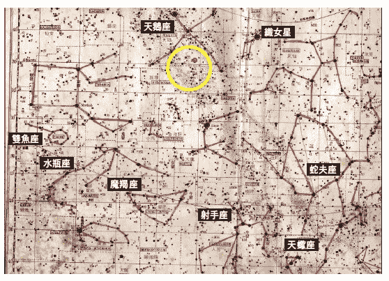 |
| 图中小红点为外星人星球的所在位置，该星球在我们银河系的天鹅座。 |

## 外星世界的独立验证

当然，T 小姐一个人用天眼所看到的外星世界并不能说服其他人，因此需要另外独立的验证，于是我前往北京中国地质大学人体科学研究所，找到沈今川教授及大功能人孙储琳女士重复这个实验。

孙女士的神奇且惊人的念力可以参考《是潜能？还是特异功能？》一书，她功能强大不需要师父协助，自己可以遨游宇宙。她也不认识 T 小姐，不知道我们曾经做过的实验。因此我带着星座图请她去天鹅座的外星文明去看看头上有一根天线的外星人。没想到她一转头停了两秒就说看到了，我一算两秒钟的天眼意识来回走了四百三十八光年一次，因此意识在灵界的速度至少是光速的三乘十的七次方倍快。

但是，孙女士说：「我看到的外星人头上有两根天线，不是一根。」

我说：「上次我们明明看到的是一根，怎么会变成两根，是不是看错了？」

只见孙女士回头一下，天眼意识又去了外星一趟。

孙女士说：「我去问了外星人，上次李教授看到你们是一根天线，为什么你现在是两根天线？」外星人跟我说：「你看，一根天线缩进头部就只剩下一根了」。

我问：「他们怎么沟通的，有用语言吗？」

她说：「没有，都是心电感应。」

这下出现新的状况了。虽然孙女士证实外星人头上是一根天线，但有时会有两根，这也需要重复验证；回到台北后，我也请 T 小姐再去天鹅座的星球看看，是不是真的像孙女士所讲的一样，外星人头上有时是两根天线，有时是一根？

二○○四年三月二十八日做手指识字实验时，T 小姐的天眼意识跟随师父一起去到天鹅座的外星，她发现师父可以跟外星人讲话。外星人一下子头上两根天线、一下子只有一根，表示外星人可以跟灵界师父沟通，比我们人类强太多了。后来到另一个地方，那里有一群外星人都是两根天线，抬头在看东西。后来又到一个有萤幕的房间，里头有三到四个外星人，但是看不清楚萤幕。于是我请 T 小姐问师父，外星人何时头上只有一根天线，何时有两根？师父回答说：「要接受信号时，就有两根天线。」

这下让我陷入极度困惑中，外星人科技远比人类高，干嘛多此一举用两根天线来一发一收，我们人类用的手机只要用一根天线既可发射也可接收，真是太奇怪了。

几个月后我突然了解到我搞错了，师父所谓的接收信号，是接收意识的信号，不是接收电磁波的信号，原来外星人早已了解意识的物理，因此制造出一根意识天线，插在头部直接与外星人意识沟通，可以做星际通信及与神灵沟通之用，功效强大。另外一根天线应该是普通的电磁波天线，是作为星球内部通信之用，这也解释了为何师父与外星人沟通的时候，有一根天线也就是意识天线要一伸一缩；不用意识的时候，就只剩一根电磁波天线。

二○○四年一月一日，我们去文化大学晓风纪念馆的八楼做手指识字实验，T 小姐的天眼意识又跟师父去参访天鹅座的外星文明，如二六六页图 6-5 上方所示。她看到一个大萤幕，外星人排列得整整齐齐在看萤幕上的红橘色球体，还在讲话，重要的是他们头顶上的天线顶端是亮着的，像一个圆球，如图 6-5 中间绘图所示。我请 T 小姐问师父。

T 小姐问：「萤幕在做什么？」

师父答：「可以看到宇宙中任一星球。」

哇！这可能是此星球的太空总署，外星人发展出的意识技术已经可以把宇宙中任一星球调到萤幕上，让外星人品头论足讨论是不是要去探险。我突然想到是不是可以把地球调上他们的萤幕，让他们看看地球的文明，引发他们兴趣来到地球探险。

T 小姐瞬间看到萤幕上出现蓝色的地球，外星人突然涌入，动作快速，瞬间排成一列列，头顶上的天线是亮着的。T 小姐问师父能否把萤幕拉近，师父瞬间消失。她看到地球景象不断拉近，外星人的说话声音越来越大，突然 T 小姐看到红色屋顶出现，是一根红色主梁由下方两根两根成三角的红色短梁架住，那就是晓明纪念馆的屋顶，如下页图 6-5 最下方照片所示。我意识到外星人的萤幕景象逼近我们实验室了，于是我马上命令所有在场的学生挥手向外星人打招呼，我相信外星人看到我们了，只是到今天已经十四年了，还没有丝毫迹象显示他们对地球有兴趣。

图 6-5　Ｔ小姐观察外星人聚集

| 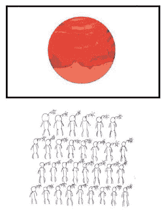 |
| T 小姐看到外星人排列得整整齐齐在看萤幕上的红橘色球体，重要的是，外星人头顶上的天线顶端是亮着，像一个圆球。 |

| 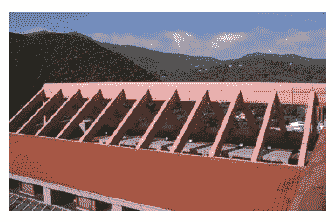 |
| Ｔ小姐从外星人萤幕上看到的红屋顶，就是文化大学晓明纪念馆的屋顶。 |

二○一四年年底，湖北省博物馆将镇馆文物运到台北历史博物馆来展览，叫做「武当山展」，展出湖北省出土中国历代历史文物及武当山道家传承各种文物。我找了一天下午与内人一同去参观，进门口的第一块石碑（如图 6-6 所示）吸引了我的注意，这块长方形石碑在湖北省秭归县（屈原的故乡）出土，是距今四千七百年至五千八百年，也就是黄帝之前两百年至一千三百年前的文物，被称为中国第一块先民祭拜太阳神的证据，因为石碑中央上方有一个像太阳之物，称为太阳神纹石碑。

图 6-6　中国出土的第一块太阳神纹石刻

| 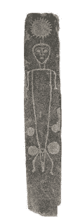 |
| 石碑中的太阳神很像人类，只是头顶有一个尖尖之物，就像识字实验时看到的天鹅座外星人。 |

**太阳神很像人类，只是头顶有一个尖尖之物，考古学家不知道是什么东西。太阳神脚上套有一个架子，头顶的火球还会落在身体四周，我仔细一看不禁大感振奋，这不就是天鹅座的外星人吗？**

头上尖尖之物就是天线，天线顶端还有火球，就是意识天线放电的现象，可以与星际通信或神灵沟通。

我回家后立刻请 T 小姐及孙储琳女士去看天鹅座外星人的脚到底长什么样子。两人都回报说外星人脚上穿了一个步行器，像节拍器一样快速地来回拍动，很难看清楚。我马上理解到这是考古学上极为重大的发现，证明了天鹅座的外星人在五千多年前曾来到秭归，显然把他们的科技成果传授一些给当地人民，从此融入中华文化的一部分，到底是哪一部分，未来可以详细研究。

而她们看到的外星人有两个天线、火球及步行器让我突然了悟到这就是《封神演义》中哪咤的原型，哪咤脚踏风火轮头上两个髻，原来早年传说的神仙，可能就是外星人的缩影，突然之间我对神话传说产生了无穷的敬意。首先进文明中的外星人到了地球，展示了他们的高科技，被先民视为神仙而留下了传说。

原来地球并不是封闭的生命体系，高科技的外星人也许早就来到了地球，做了许多实验，包括基因转殖的实验，就像我们人类现在所做的一样。这让我开始对达尔文的演化论产生了怀疑，演化论有一个基本的内在假设，这个假设就是：「地球是一个封闭的生命体系，没有外太空来的智慧体系干扰」，显然这个假设已经崩溃。

## 柏拉图《理想国》的外星文明

二○○四年，中国地质大学的高功能人孙储琳女士在她外星师父的带领下遨游了一些外星文明，其中一个文明竟然是柏拉图在他的着作《理想国》中所描述的世界，如左图 6-7 所示。这颗星是猎户座 SAO 100012 恒星的行星，离地球有一百九十七点七九光年之远。

外星人双手双脚都很短，脚是方形的，身体外套了金属壳，如图 6-7 左上方所示，中间为外星人所住房子，下面为他们的交通工具。由金属颜色判断，有金银铜三种金属，金壳人最少，似乎地位最高，银壳次之，铜壳人数最多，地位似乎最低。穿金壳的外星人似乎是国王贵族，穿银壳的像是武士及统治阶层，穿铜壳的像是百姓。为了验证这项观察是否确实，我请 T 小姐也去同一星球观察，的确她也看见到处穿着金属壳的外星人还在战争。生病的时候，外星人的铜壳还会变成绿色，好像生了铜绿。

柏拉图的着作《理想国》中有一段在描写理想的社会组成型态：社会必须有一些掺金质的、掺银质的及掺铜质的人组成，最好不要混杂。这一段话在一九八○年代美国史丹福大学校园中曾经引发文化论战，认为柏拉图提倡阶级主义，不适合现代社会，准备把《理想国》踢出校园，不得做为通识教育的教材。但是这段话显示出在两千四百年前柏拉图或许曾跟我们一样利用开天眼的人遨游外星文明，希望找出可以作为人类学习的社会型态，写入他的着作，影响西方文明高达两千年。

所以人类学习的典范在哪里？就在天上无数的外星先进文明中。

图 6-7　猎户座 SAO 100012 星系的外星人

| 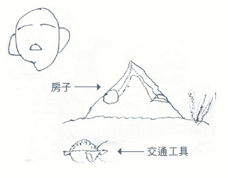 |
| 左上方是外星人，中间是外星人的房子，下面是外星人的交通工具。 |

## 外星的瞬间科技

孙储琳女士去访问的五个先进外星文明中，发现外星人都已经发展出「瞬间科技」，也就是用小杆子一挥，或是手指一弹，东西就瞬间出现了。孙储琳女士及 T 小姐的天眼都曾到后发座 SAO82313 星系去参观看到的外星人，头上都有一根天线，与天鹅座外星人很像，如左图 6-8 所示。她们要什么东西就用小杆子挥一下就可以了，就像西方神话中的小精灵一样，拿个仙女棒点一下，东西就出来了。原来中西的神话都在传述高科技外星人的先进科技，人类当时做不到，只能视为仙人。

图 6-8 在后发座 SAO 82313 星系的外星人，左方是孙女士所绘，右方是 T 小姐所绘

| 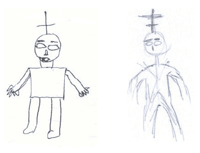 |
| 孙女士及Ｔ小姐到后发座 SAO82313 星系参观时看到的外星人，头上都有一根天线，与天鹅座外星人很像。 |

## 外星通信新科技

从外星人所发明的瞬间科技，我们了解到由于外星人了解意识的物理，因此可以做出意识天线，让意识穿入虚空，不仅可以遨游宇宙，与神灵沟通，在虚空中还可以「心想事成」，创造出任何东西，再把它物质化，瞬间在实数空间创造出物体，成就了瞬间科技。

我们人类要想与他们连系，至少要找到可以穿隧进入虚空的工具，很幸运的是，我们现代科技至少有两种工具可以用，一种是量子纠缠现象，另外一种是挠场，也就是时空扭曲的场，都可以穿入虚空。

量子纠缠不能用两光子纠缠，因为在虚空中它的速度仍然是光速，必须用两个原子纠缠，位在实数空间速度慢，其进入虚空的相对速度可远远超过光速，达成星际通信目标，当然通信前必须双方订定通信的标准，否则根本不可能传送或接收有意义的信号。

第一套通信的标准必须要靠像孙储琳女士一样的大功能人，直接与外星人沟通，建立如摩斯码一样的标准。有了标准就可以像四十年前我们留学美国时，都是以电报来快速与家里通信，电报用的就是摩斯码。等到星际通信技术成熟以后，逐渐发展出意识翻译器，就可以与外星人直接交谈。另外一种挠场通信，就必须等待我未来的书来解释如何达成。

##### 现代文明未来的发展方向

我提出的两个模型：复数时空以及虚数代表意识两个模型的提出，已经替宇宙大中小尺度的谜团架构出一个统一解释的平台。这本书中我尝试用这个平台提出谜团的解释，虽然不一定完全正确，但总是打开了一扇门。希望有兴趣的读者可根据这个平台来解释你工作领域碰到的难题。我相信这种理解已经指出现代文明发展的方向，并引领我们找到外星人。
