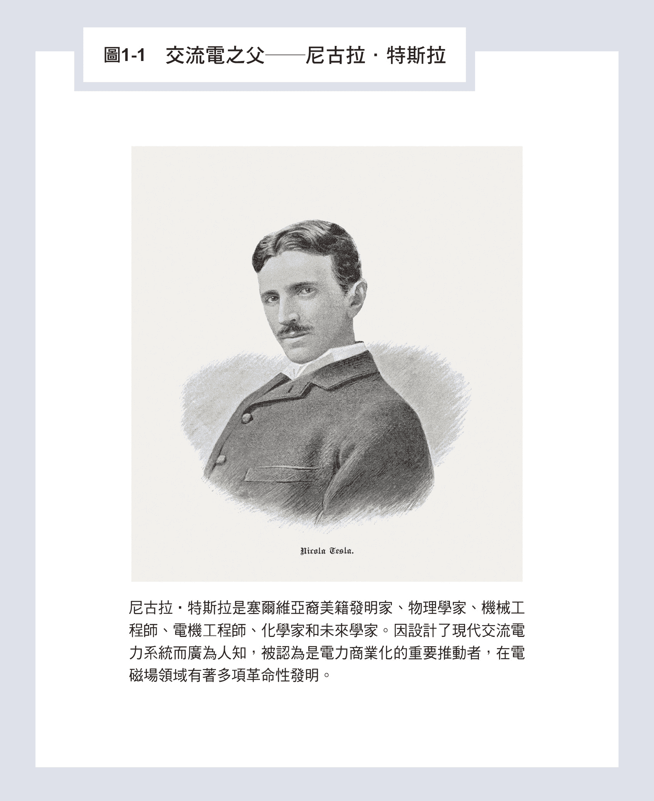
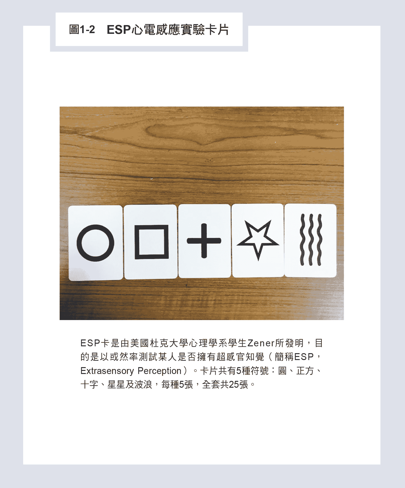

# 一、特斯拉的特异功能与电力产业的兴起

特斯拉于十九世纪末发明了多相交流马达，

导致了近代电力文明的兴起。

他不平凡的一生源于他不平凡的特异功能，

包括影像记忆与开天眼的能力，

他的创造发明有如天助，

实则来自另外一个世界——灵界。

## 世纪天才特斯拉的特异功能

尼古拉．特斯拉如图1-1所示，他于一八五六年出生于东欧奥地利帝国的一个小镇，在今天的克罗埃西亚共和国之内。特斯拉的父亲是一位东正教的牧师，也是作家，有一个哥哥、三个姐姐，而他对发明的兴趣也许是受到母亲的影响，因为在他长大的过程中，母亲在家事闲暇之余，常常会制作一些小小的家庭用品。

根据特斯拉的自传所述，他小时候很喜欢唸书，可以记下整本书的内容，主要原因是他大脑具有影像记忆的能力，看书时可以把每一页文字就像照相一样照下来储存在大脑记忆库里。当他需要背颂哪一页时，就可以从记忆库里抽出那一页来，像一般照片一样，呈现在大脑的视觉荧幕上，这样他只要看着照片就可以念出来了，而这种影像出现会让他体悟到一阵阵灵感。

特斯拉也说过，他小时候常常会生病，这种所谓的生病是他眼前常常会出现强烈到令人目盲的闪光，接着出现视觉影像。这些影像有时与他刚刚想到的字或想法有关，或是他碰到特殊的问题时，解答就突然出现在影像上，有时他甚至可以听到远方的声音，或只是听到一项物品的名字，物品实际详细的结构就出现在影像中。

这种现象在现代心理学研究的「联觉」（synesthesia）现象中有报告过类似的现象，也就是五官的感觉会互相转换的现象，例如，听到声音会看见颜色或影像；看见某些文字会闻到不同味道等等。更特殊的是，特斯拉可以把他设计的新机器在大脑以巨细靡遗的方式呈现在荧幕上，再用意念让机器转动起来。如果运转不顺利，例如机器卡住了，表示设计有问题，他再在大脑里更改设计，直到运转成功，再把机器结构画出来，开模做成实体的机器 ，通常是一次就成功了。

### 联觉，所展示的特殊才能

我一生中遇过几位具有联觉的人，其中两位非常特殊，也让我了解到具有这种能力的人会有哪些不可思议的表现，就像特斯拉一样。

第一位是科幻小说作家倪匡。二○○二年八月我从台大教务长卸任，六年的行政工作让我决定下半年去美国加州硅谷的史丹福大学休假进修充电。倪匡当时住在旧金山，离史丹福大学不远，经我台大电机系的学弟，也是科幻小说作家叶李华博士的介绍下，因此有一个机缘去倪匡家拜访。

他家面临旧金山湾，在金门大桥附近，房子的设计很酷，晚上屋顶可以打开看海湾夜景及天上星星，他号称是写过最多中文字（六千万字以上）的作家，从十七岁在香港投出的第一篇稿子开始，就从来没有被退过稿。他在写《卫斯理传奇》的系列小说时，可以一天写一本书，速度惊人，原因是他看任何小说时，大脑就会出现荧幕，把小说里文字描述的人物故事以电影方式在大脑呈现。反过来也是一样，当他大脑开始演一齣戏，他只要拿起笔来，把戏剧的剧情照样写下来就好了，因此一天可以写一本书，根本不需要自己花时间编剧情，这表示他的故事是天眼从另外一个世界下载下来的。所以，他曾跟我说过，他把金庸早期写的武侠小说改写过后比较好看，我们一般人却觉得修改以后，原来的记忆被打乱了，变得不好看了。这是因为金庸早年为了他每天发行的《明报》刊载武侠小说赶稿，很多场景情节没有注意时间先后，造成前后矛盾。当这些矛盾的剧情被修正了，倪匡大脑中的电影看起来顺畅多了、也合理多了。

第二位具有联觉的人士是修我课的学生，我二○一三年六月从台大校长卸任，没有压力以后，决定把我从事气功及特异功能研究三十年的成果开出一门课来供有兴趣的学生选修。经过两年多规画，到二○一六年，我在电机系及研究所开出了一门课「人体潜能专题」，由于要做实验，包括心电感应及透视力实验，受限于实验场地，每学期只能收三十六位学生。一开始的前两年，选课时预选同学都有几百位，也造成轰动，但是能修到课的人确实不多。

二○一七年，一位电机系的研究生林同学来修课，她一上课开始做实验时就显现出不凡的能力，心电感应实验的正确率很高，我从她写的作业中才发现她具有联觉的能力。原来她也是一听到音乐，脑中就会出现荧幕、开始演电影，随乐曲的不同，电影内容也变得多彩多姿。她过去曾修过音乐欣赏的课程，她对乐曲启发心智的分析之深入及细腻透彻，常让上课的老师惊为天人。她以为大家应该都跟她一样，直到修了我的课以后，才发觉自己是多么特殊、具有联觉的能力，与别人完全不一样。

在班上做心电感应实验时，我让每个人静坐放空一分钟感应，由同伴提供的五张ESP卡片（请见图1-2）随机抽出一张，发射信号给她。整学期一百次的实验中，她竟然对了四十九次，而一般同学平均猜对的机率是五分之一，为二十次。她统计的显著性超过七个标准差，也就是她具有某种跨越时空的心电感应能力。

这种特异功能让她在读历史或古文的时候，可以仅凭片段对话及场景的描述，就可以精准判断出这些历史人物心里在想什么，可能有什么情绪，会有什么作法，并能和以后历史发展的情节相符。所以她过去的国文老师特别喜欢她对古文的分析，除了能看到她解释文意，还能解释作者写作的心态和当下的情况，觉得是一种享受。

由于林同学拥有联觉功能，对人心的判断比较敏锐，所以在辩论赛，或和别人谈判时，她能够立即知道对方话中的意思，直接知道对方心里想什么，接下来会说什么，有时甚至能直接预测对方会拿什么当辩论的压轴、谈判筹码，接着直接打中对方弱点。因此不论在哪一种场合，她都会被推派为主讲人，或提供分析和拟定对策的副手。我相信特斯拉也多少具有类似的经验与能力。

### 如何知道自己有没有影像视觉能力？

对研究特异功能的我来说，在二十年前读到特斯拉的自传时，一看就知道特斯拉具有两种能力。第一种是「影像记忆」能力，可以把所看过的图片及文字，以照片方式记忆下来。第二种他所描述的闪光，加上随后出现的影像视觉，其实就是「开天眼」的现象。

如同我们在做手指识字实验时，小朋友必须要等大脑天眼打开后，才能在天眼中看见折叠纸条上写的文字，或画的图形。而且我们发现开天眼前几秒钟，从小朋友双手食指底端的手掌上可以量到几十毫伏的电压，表示大脑内部有放电现象，引发神经脉冲传到手掌上，同时这个放电过程也引发了天眼的形成，让一个像电视荧幕的画面在大脑中出现。

这与特斯拉先看到强烈闪光（大脑放电），再出现影像的过程非常类似，所以这种现象并不是生病，而是特异功能出现的前兆，是特斯拉自己误会了。至于具有影像记忆或开天眼的人在人群中普遍吗？要如何知道自己是不是有影像视觉？这种能力可以训练出来吗？

影像记忆在传统道家修练自身成仙的过程中，叫作「观想」，也就是在大脑中根据过去的记忆无中生有产生画面，比如，闭住眼睛想象一条鱼游来游去、一匹马在原野上奔驰等等。当一般人把眼睛闭起来，会有视觉暂留现象，等到视觉暂留现象消失以后，都是一片黑暗，什么东西也看不见，只看到环境中穿过眼皮微弱的光线。观想就是把存在于大脑神经网络记忆中的影像重新激发出来，栩栩如生地展现，就像张开眼亲眼目睹一样。这种观想能力一旦练成，就可以产生影像记忆的能力。

天生具有影像记忆能力的人，大量存在于画家或建筑师当中。其实一个画家要画好一幅画，除了纯熟的绘画技术外，影像记忆的能力也非常重要。他的大脑可以一边看记忆中的实景一边画，省了很多力气，光与影的布局直接用看的就好了。我认识很多画家都有这种能力。建筑师也是一样，他设计的建筑，如果能在大脑中成像，并且可以旋转，从上下左右不同角度来透视，自然设计会比较完美。当然也有少数人像特斯拉一样，是天生具有影像记忆能力。

二十年前，有一位美国杜克大学的客座教授来找我，他在台湾长大，当年是台大医学系毕业。考大专联考前两天，他梦见了一张数学考卷，花了两天把题目做完，结果进了考场一看，果然是他梦到的考卷，很快就把试卷写完了。由于要四十分钟才能缴卷，他就趴在桌上睡觉，结果监考老师还来推醒他，那年数学题目特别难，他考了九十多分。大一上微积分时，老师第一堂课就调查同学联考的数学成绩，结果发现即使是第一志愿的医学系，大部分同学的数学成绩都不及格，只有他一个是九十分以上。于是老师叫他出去，不必上微积分课了，结果他真的从此不去上课，学期成绩老师给他九十五分。

他说，他具有影像记忆能力，在医学院做实习医生的时候，只要看过的X光片，他都能记住。讨论案例时，他可以从记忆库里调出来，不必去查原始纪录，就可以解析得清清楚楚。

他到美国留学任教以后，在某一本医学期刊当了十多年的编辑，只要一有论文投稿进来，他可以在记忆库中搜寻可能的审查人选，完全不费吹灰之力，因此总编辑十多年不放他走。后来一家投资生医产业的基金把他挖去工作，替公司创造了很大的利润，因此派他担任亚太地区分公司的执行长，兼管台湾业务。他回到台湾时，特别来拜访我，分享他的传奇故事。

我在三十年的研究特异功能过程中，设计了一个简单的方法，实验一下就可以知道自己是不是具有影像记忆能力。

请你拿一个水果，例如苹果放在眼前凝视十五秒钟，然后把眼睛闭起来，等视觉暂留现象消失以后，再尝试把苹果想象出来，想象出来的苹果颜色与立体形状必须跟当初看的完全一样。如果你不确定是否完全一样，可以再张眼重新看苹果十五秒钟后再做一次。

我也发现从小有接受过速读或观想训练的小朋友，长大后影像记忆的能力仍然存在。在我的「人体潜能专题」课程中修课的同学，有不少位就是小时候的训练让他们现在二十多岁仍然保有影像记忆的能力。

### 开天眼的能力能否训练？[①](#foot-%E2%91%A0)

我自己在一九九六年七月第一次开了一个儿童潜能训练班，想要验证中国大陆研究单位所声称的儿童可以训练出手指识字功能。随后，我每年暑假开训练班，以四天每天两小时的时间训练小朋友，一直到二○○四年，共计开班九次，总共有一百七十六位小朋友完成四天的训练，其中有四十一位出现显著的手指识字能力，大约百分之二十三的比例出现了相当高的功能（统计出错机率P＜0.05）。其中三十三位 （约百分之十九）出现了大功能（统计出错机率P＜0.001）。其年龄分布从八到十一岁的功能都很高，十二岁以后就不行了，人数较少。

这些出现高功能反应的小朋友都会告诉你，他们脑中有一个电视荧幕会打开，文字或图案的颜色先在荧幕上出现，接着文字或图案再一部分一部分出现在荧幕上，直到最后正确答案出现为止。也就是小朋友要开了天眼，才会手指或耳朵识字，不开天眼是没有办法正确答对的。

过去几十年的经验显示，手指或耳朵识字能力主要集中在十三到十五岁以下的儿童，一般相信这是因为大脑松果体在十三到十五岁开始钙化的缘故。问题是，天眼似乎并不是位在松果体，而是在松果体后方五到十公分，这似乎暗示年纪超过十五岁的年轻人仍有机会开发出手指或耳朵识字功能。

我在二○一六到二○一七年，也在台湾大学电机系尝试开发约一百位二十多岁的台大大学生及研究生，仅仅只用了两次、每次半小时的训练，加上课余的影像视觉自我训练，也有百分之三的同学出现了耳朵识字的功能。这结果很令人兴奋，原来年纪超过十五岁，我们还是有机会经过训练打开天眼，开发出耳朵识字的功能。

二十五年的研究经验告诉我，任何人开了天眼，经过反覆的训练，熟悉怎么操纵天眼以后，就会开发出各式各样特异功能。就像小朋友的手指识字功能纯熟以后，就可以开发念力，不用接触就能把盒子中的铁丝折弯、火柴剪断，也可以开发出像五神通的能力，如「天眼通」，可以看到远方的景色或人物；「天耳通」，可以听见远方的声音；「他心通」，可以心电感应到他人的思维；「宿命通」，可以预知未来，回知过去；「神足通」，可以遨游大地、来去自如；「手指及耳朵识字」，五官可以互用；加上「念力」，可以用意念幻化万物、千里搬运等力量，令人目眩神移，不可思议[②](#foot-%E2%91%A1)。

然而有些特异功能人士却不必开天眼也可以做到，例如，民间很多灵疗者可以与病人身上的附灵沟通协调谈判，达成双方接受的条件，而请灵离开，以达到治愈疾病的目的。灵疗者并没有开天眼，但是他的灵魂好像容易脱体进入灵界，直接与附灵沟通，也可以查出病人过去的历史与附灵的恩怨。我认识一位北京的特异功能人士，他声称没有开天眼，但是能从灵界找出犯案者过去行动的蛛丝马迹而破大案，因此受到相关部门的重视。

### 拥有特异功能是福，还是祸？

一个人拥有特异功能，除了表演给一般普通人欣赏，获取报酬或赏识之外，到底还有什么用途？ 对功能人本身来说，是好事还是坏事？

我先举历史上三国时期的两位特异功能人士为例来做说明。第一位是曹操手下具有千里取物的大功能人左慈，第二位是具有小功能蜀汉的宰相诸葛亮。

《后汉书》第八十回《方术列传（下）》记录了不少东汉末年特异功能的方士，有些入朝为官，大部分为民间人士修练有成，而留下脍炙人口的事迹。

左慈，字符放，庐江人也，小时候就有神通，他从星象中预测出汉朝的气数将尽，国运衰落，天下将要大乱，于是开始学道，对「奇门遁甲」非常精通，能够驱使鬼神隔空千里搬运，后来他曾在司空曹操门下任职。

有一次曹操带文武百官出巡，到了吃饭的时候，他对部众说：「今天准备了佳肴招待各位，但是少了吴淞江的鲈鱼。」左慈应答：「这个事好办。」请人拿来铜盘装满了水，以竹竿上饵钓于盘中，不一会儿就钓出一条鲈鱼。曹操拊掌大笑，但其他在场官员均大为惊讶。曹操说：「一条鱼不够让大家吃，你还可以再钓些吗？」左慈乃换饵再度钓之，一会儿又钓出许多鱼，皆长三尺余，生鲜可爱，曹操叫人烹调来招待官员。

接着，曹操又出题目说：「既然已经有鱼，可惜的是没有蜀地的生姜。」左慈回答：「亦可得也。」语毕就取来生姜。曹操生性多疑，恐怕他是就近索取，结果后来证实是蜀国的生姜。

又有一次，曹操到都城近郊视察，跟随者有百余人。左慈带酒一升、肉一斤，亲自给大家斟酒夹肉，结果百官都吃饱也喝醉了，曹操觉得奇怪，派人到附近商家调查，结果发现所有商家的肉及酒都不见了，都被左慈用法术给搬走了，这引起了曹操的警惕，了解此人有大神通非常危险。加上左慈有一次劝曹操把宰相位子让给刘备，引起了曹操的杀机，但是左慈穿墙破壁，让人到处找不着，或在市集看到的所有人都变得像左慈；又或是躲在羊群中，让每只羊的姿势都变成一样，无法分辨他的位置，最后不知所踪。所以大的特异功能有时会为自己引来大祸，非常危险。

三国时，另一位有小特异功能的是诸葛亮 ，他熟读天文地理且精通奇门遁甲、阴阳八卦，不仅能运筹帷幄、三分天下，大展鸿图，在赤壁之战中还借东风打败了曹操，后来又布下八卦阵，困住东吴十万大军，无一不彰显其神乎其神的能力。

虽然有人声称《三国演义》是小说不是正史，陈寿写的正史《三国志》并没有记载这些事情，但是正史是胜利者写的，陈寿虽然是蜀国人，但是后来蜀国被灭以后，他在西晋当官，他写的历史必须配合西晋的观点。蜀汉是前朝魏国的敌人，怎么可以称赞敌人的智慧及骁勇善战，因为他们毕竟失败了，我们才是历史的胜利者及诠释者。我是相信民间的诠释，那才是真正没有被故意删除的历史。

所以综观历史以后的结论是：开发大功能，对功能人本身有危险性；开发小功能，若可运用在功能人的专业领域上，才能运筹帷幄，把专业领域提升一个层次，进入新的境界，对人类文明的提升才有真正的帮助。

就像特斯拉一样，他有小的特异功能，可以开天眼，在天眼里设计多相交流马达，还可以尝试转动马达来测试设计是否正确，结果他所发明的多相交流马达从此改变了人类的文明，进入了电力的时代，驱除了没有太阳的黑夜所带给人类的不便。

### 特异功能要从小训练吗？

小的特异功能既然对人类文明有提升的作用，那一个人到底要从小培养特异功能，像手指识字能力，还是长大了再想办法？这可以从历史的经验寻求解答。

中国大陆在一九七九年首先发现手指识字可以经过短期的训练开发出来，经过四十年来已有大量的实验证明，七到十五岁的小孩子有相当大的比例，经过训练可以开发出手指识字或耳朵听字的特异功能，但是要维持这个能力却相当困难，因为需要不间断的练习，而小朋友一旦升上国中或高中以后，在面对升学的压力下要持续不断的练习是相当困难的。我二十五年的特异功能研究经验发现，只有少数几位当年开发出手指识字等特异功能的小朋友，长大以后还能把特异功能用到他的专业上。一位是大陆当年「扁鹊工程」所培养的黄姓女士，她具有透视功能，目前在法国当医师（是西医师，而非中医师），她的医术可以直接看透人体，成就当然远远超过她的同侪医师。

「扁鹊工程」的目的，就是培养小朋友的特异功能，让他们将来长大以后去学医，成为像扁鹊一样的神医。黄女士的确做到了，但也是我所知大陆唯一成功的一个。

另一位是我培养近二十年的T小姐。她天生具有手指识字功能，灵界有一位师父从小在帮忙指导她，但是最后对她专业上有帮助的能力是可以跟动物沟通，这个能力却是她在台湾大学读大学时出现的第二位师父教导她的，过程离奇有趣，给我很大的启发。目前她在美国洛杉矶一家兽医院当兽医，她的医术当然远远超过她的同僚。

T小姐小的时候有一次去动物园玩，到了猴子的园区，突然听到一只猴子向另一只猴子说：「要不要到我家去玩？」另一只猴子回答说：「好啊！」只见两只猴子手牵手，一跳一跳地回到后面的山洞里。回家以后，她又听懂了鸟爸爸在教鸟小孩的一些事情。不过她这个与动物沟通的能力只维持了三个月就消失了，这次的经验让她非常的怀念，从此下定决心，长大以后要去做兽医，替动物解除病痛。

这就像在两千五百多年前的山东省，就有一位奇特的人物公治长，传说他能够听懂鸟语，并因此获罪入狱。后来，同样的也因为他懂鸟语而被无罪释放，甚至为国家立功。他深受老师孔子的赏识，并最终娶了孔子的女儿为妻。

二○○一年九月，T小姐从美国回到台湾读大学，她本来想申请就读台大兽医系，但是台大兽医系当时不收外国学生，她只好以美国公民身分去读台大畜产学系。不过因为回到台大，我可以每个月跟她进行一次手指识字实验，到了二○○四年六月，她离开台大回到美国加州大学戴维斯分校继续完成大学学业时，我已累积了大量的遨游灵界的数据，这些实验纪录都收录在《灵界的科学》一书中。

T小姐从小就有一位灵界的师父在照顾她、指导她，我们在二○○一到二○○三年间也经由手指识字实验与祂对谈，询问宇宙、人类文明、外星人的各种问题，并将答案收录在《难以置信Ⅱ：寻访诸神的网站》一书中。其中有一题就是问祂：「T小姐何时可以恢复与动物沟通的能力？」师父的回答是：「不要急。」当时的我可是急死了，她已经在读大学了，未来要去美国读兽医学院，到底什么时候才能恢复，听懂动物的话？

T小姐在灵界的第二位师父于二○○四年一月一日以不同凡响的方式闯入我们在台大电机系的手指识字实验现场，表明祂的身分，正式收T小姐为徒以后，T小姐开始每日勤练打坐与动物沟通的技术。到了当年底，她已经掌握了初步的技巧，可以和一些动物对谈了。

十年以后，二○一三年T小姐从美国普渡大学兽医学院毕业，考取执照成为美国加州正式的兽医师以后，我于二○一四年三月邀请她到台大兽医学院演讲，当年拒绝她入学的兽医系已经升格为兽医专业学院，她举出六个案例来说明她治疗动物所观察到现象，包括：狗吞下网球卡在食道，但是X光照不出来，经她问出来后，很快就解决了；猫咳嗽不止，正式检查却找不出原因，结果一问之下，发现是家里给牠玩的玩具，因为整理环境被扫进角落去，导致牠不爽的缘故。接着，动物医院及同学抱出宠物给T小姐看，其中一只土拨鼠已经一个星期不吃东西，令主人很担心，经过T小姐问诊后，才知道是土拨鼠嘴巴痛的缘故，因为牠的犬齿被磨短所造成的。

有一位同学带来家里的猫，最近每天一直叫，令主人很担心，结果她一问猫，猫说牠生了三只小猫，是在教小猫的缘故。主人马上证实，猫的确是刚生了三只小猫。这也表示猫有数字三的概念，令人震惊不已。小说中可以听懂动物说话的杜立德医生已经横空出世了，真让人期待未来兽医的发展，将呈现什么样新的面貌。

开天眼的能力，除了是天生的以外，有时候大难不死或大病不死也会开发出特异功能。

国内有一位大企业家，年轻的时候有一次被闪电击中，昏死过去半小时，醒来以后出现了开天眼能力，可以预知未来，做生意无往不利，常常作梦的时候像特斯拉一样，会有很多新观念、新机器设计出现，经过旗下工程公司验证以后，马上申请专利。他虽然在学校从来没有学过任何工程方面的相关知识，但是所获得的工程方面的专利超过七百个以上，任何学院派的教授都瞠乎其后。当然最容易开天眼的方法，就是经过打坐及相关训练，这也彰显我们训练方法的重要。

### 开发现代的诸葛亮或特斯拉

由于最近几年我从「人体潜能专题」的课程中发现，超过二十岁的成年人也可以开发出耳朵识字的小功能，就像T小姐一样，二十岁以后才开发出与动物沟通的能力。

因此我提出一项新的看法，直接训练有专业能力的成年人，开发出天眼能力，我把这项计划及企图称之为「诸葛亮工程」或「特斯拉工程」，也就是开发现代的诸葛亮或特斯拉，利用他们的天眼，提升他的专业领域水平，以进入人类新的文明。

* * *

[① ](#back-%E2%91%A0)请参考《灵界的科学》。

[② ](#back-%E2%91%A1)请参考《是特异功能？还是潜能？》。

## 特斯拉与电力产业

特斯拉在一八七五年十九岁时进入奥地利技术学院电机工程系，念了三年后离开学校，去一家公司当了一年助理工程师。在这段时间，他遭受神经崩溃的困扰，后来在父亲劝导下，一八八○年暑期去布拉格的查理费迪南德大学（Charles-Ferdinand University）就读，深受物理学家恩斯特‧马赫（Ernst Mach）的影响。

马赫因研究超音速运动而成名，他大力强调了经验主义和实证主义在科学研究中的重要性，为科学哲学的发展奠定了基础。特斯拉深受马赫的启发，他的天眼内在经验可以大大地帮助他做科学实证研究。但不幸的是，他只读了一学期，就因为父亲过世而离开学校，他找到一个工作，是在匈牙利首都布达佩斯的国家电话公司的电报部门工作。他的天才让他在一年中升为公司主要电机工程师，替国家发展第一个电话系统，也发明了现在叫做麦克风的元件。

一八八二年，特斯拉加入了美国发明家爱迪生在巴黎的分公司，主要业务是推展照明系统，包括了白炽灯及供电系统。当时爱迪生用的是低压（110V）的直流供电，特斯拉的天才让上司非常欣赏，于是把他介绍给爱迪生。一八八四年，特斯拉远渡大西洋到纽约向爱迪生报到，从此留在美国，直到五十九年后一九四三年他过世为止。

特斯拉仰赖他的特异功能，一向自负，碰上顽固权威的爱迪生坚信：「天才是百分之一的灵感，再加上百分之九十九的努力」，两人的冲突当然是免不了的。特斯拉曾说：「爱迪生如果能多想想，那么百分之九十的功夫是不必要的。」他以为别人跟他一样，也可以开天眼在大脑中创造新发明，所以这两人势必水火不容。

传说中，爱迪生曾答应特斯拉，如果他能改善公司的直流发电机，会给他二十五万美元的奖赏，当时特斯拉的薪水是每星期十八美元。后来，特斯拉认为他成功了，但爱迪生认为他只不过是说笑而已，何必当真？只把特斯拉薪水调升为每星期二十五美元，特斯拉一怒之下就辞职而去。有一年时间就靠在纽约街边挖地修电线为生。

就在这样困苦的生活之下，他的天眼传达了以旋转磁场为基础的多相位交流电马达的概念。他在大脑设计好并运转成功之后，说服朋友投资并申请了专利，最后也成功地示范了技术。这个突破性的发明很快地被企业家西屋电器公司的创办人乔治‧威斯汀豪斯（George Westinghouse）注意到了，他当时正在使用欧陆发展出来的交流电发电技术照明，与爱迪生直流电技术竞争。

交流电本来就占有优势，交流电可以用变压器先把产生的电压升高、降低电流作长距离的输送，减少电线电阻导致的电能损失，到用户端再把电压降下来使用，这样做可以很容易地扩大用户分布的区域、增加用户的数目，来降低发电的成本。西屋电器有了特斯拉的高效能交流电马达技术后，更是如虎添翼，用高效率马达驱动发电机可以把发电成本降得更低，很快就打败爱迪生的直流技术独占市场，成为电力企业的标准。

一八九五年，西屋公司承建了空前巨大的尼加拉瀑布水力发电厂，十座涡轮机推动的发电机可以发出五万匹马力，用变压器升高到两万两千伏特，运送到四十三公里外的水牛城。

到这一刻，交流电取得了决定性的胜利，特斯拉也因此获得很大的利润，可以进行他下一步的宏伟企图——无线电力传送。