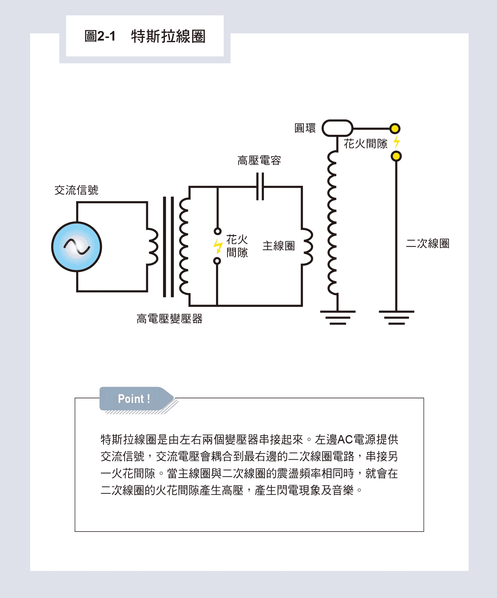

# 二、无线电力传送与特斯拉遗失的文件

在特斯拉过世后，曾记录他创新想法的笔记，

就被美国政府扣押而消失了，

在一九九○年代，

这些消失的文件突然出现在市面而引发轰动。

随着时代的进步，他当时的部分想法，

如温室效应等，已经被现代科学所证实。

## 电磁波的发现与应用

英国科学家马克斯威尔（James Clerk Maxwell）于一八六五年发表了他的「电磁场动态理论」，奠定了电磁波的理论基础，这些电场、磁场互相影响的方程式后来陆续被其他科学家整理成四条方程式，统称为马克斯威尔方程式。

在他的方程式中，预测了一种电磁互相激发振动的波动，叫做电磁波，他从方程式用到的物理量，如真空介质系数及磁导系数所计算出来的电磁波的速度，竟然与过去科学上所量到的光速是一样的，间接证明了光就是一种电磁波。这一石破天惊的发现引发了当时很多科学家的兴趣，开始去找频率比较低的光，也就是眼睛看不见的电磁波。

一八八八年，一位才三十岁的年轻德国教授亨利希‧赫兹（Heinrich Hertz）设计出一套火花间隙放电[①](#foot-%E2%91%A0)的发射器及接收器，用实验方法证明了电磁波的存在，并展示了发射及接收的方法。自从赫兹发现电磁波以后，欧洲及美国很多有创意的发明家开始探索电磁波的应用，其中比较有名的两位是意大利的马可尼及美国的特斯拉。

古列尔莫‧马可尼（Guglielmo Marconi）出身世家，家族拥有庞大的威士忌酒产业，他小时候就对电有很大的兴趣，二十岁时对应用电磁波更着了迷，开始用电磁波做无线通讯实验。后来，他说服父母的支持，带了他自己设计的无线电通讯设备到伦敦来发展事业。在一九○一年十二月，他终于成功地把无线电波所携带的摩斯密码，从英国西南部横跨了大西洋，送到了两千八百公里外加拿大纽芬兰岛圣约翰镇的接收站上，从此轰动全世界，展开了长距离无线电波通讯的世纪。

* * *

[① ](#back-%E2%91%A0)在电势差很高的正负带电区域间出现闪光并发出声响的瞬时气体放电现象。

## 醉心于无线电力传送的特斯拉

一八八八年，刚到美国几年的特斯拉知道了赫兹发现电磁波以后，也对电磁波着了迷，开始做研究，不过他走的方向与马可尼不一样，不是用在通讯，而是想用来传播电能，也就是无线传导电力。当时的电力产业刚刚萌芽，一般家庭开始使用电器，如电灯、电话就不需要大量投资建置有形的电网基础建设，让使用电的各种新兴产业可以降低成本，也更容易推展。

在今天一百多年后的二十一世纪我们所面对的新科技而言，这个概念仍是具有前瞻性的创意构想。

试想，现代科技中的行动装置最大的瓶颈就是电池不够力，当随身所携带的手机或计算机内电池没有电时，这些装置如同废物，呼天不应，叫地不灵，所有信息都被封锁在装置内，无法对外通讯。这时，最需要的就是无线传播电力的需求，可以直接替电池充电解决困扰。可惜的是，这个问题一百多年来仍然不能解决，也表示特斯拉在没有理论支持下，过早跳入一个需要百年以上才有希望解决的问题，自然会导致失败的命运。

一般电力的传送需要两条导线，电压一高一低让电流从高压流往低压，为了安全起见，现代的导线还加了一条接地的线，与电压较低的导线连在一起，所以插座会有三只脚，其中粗圆的一只脚就是接地。

特斯拉应该很早就知道地球可以导电，因此地面可以当作电的接地那一极，但是另外那一极该怎么办，是用电磁波送出吗？他也知道电力要转换为电磁波的效率并不高，很难做到大量电力的输送，因此在不建造基础电网设施之下，就需要以空气作为通道。他的构想是利用紫外光游离空气分子，在空气中打开一条离子导电通道，用高压放电把电能利用离子通道送出去，而不需要用到一般的电线，并利用地面作为接地回流，他设想用的是低频交流电，可以传递很长的距离。

一八九九年，为实现他的构想，他在美国科罗拉多州温泉市（Colorado Springs）建立了他的实验室，从六月一日起开始做实验，研究在空气中大规模导电的可能性，我们可从网络上看到他做实验时的示意图[①](#foot-%E2%91%A0)，放电现象打穿空气形成紊乱的闪电。

这个实验在半年后的一九○○年一月七日结束，他也离开科罗拉多州回到纽约，另起炉灶，开始进行真正的无线电力传送。这一年中，他募集到十五万美金，在纽约附近盖了一座巨大电塔，声称可以把电力直接从纽约送到法国巴黎。他仿照科罗拉州的实验，建立了一个横跨大西洋的沃登克里夫（Wardenclyffe）通讯设备，但是过了三年，没有做出什么研究成果、钱也用光了，计划无疾而终。

二十五年后，一九一五年特斯拉向美国法院提出诉讼，挑战马可尼的无线通讯专利，认为他比马可尼早一年就完成了无线电通讯，但是最后官司打输了，从此历史上无线电通讯的功劳就专属于马可尼了。

* * *

[① ](#back-%E2%91%A0)特斯拉在美国科罗拉多州温泉市的实验室研究导电性的示意图。

https://reurl.cc/OqQE37

## 特斯拉线圈的启示

### 特斯拉实验日志

特斯拉曾经声称就在科罗拉多州温泉市实验那段期间，他收到了许多来自外星人的信号及信息，引发了后来四十多年围绕着特斯拉的神奇传说与故事。他在这半年来的实验室日志上面记载了年月日，以及当天所做实验的详情，每天或隔几天就有纪录，记载得相当详细，由此可以知道他的进度。

在特斯拉过世后，因为他没有结婚没有儿女，由他的姪儿打官司取得了这些日志及一些专利文件，后来赠送给南斯拉夫政府，被放在首都贝尔格勒后来建成的特斯拉博物馆中。当然还有很多文件，象是记录他创新想法的笔记，就被美国政府扣押而消失了，在五十年后的一九九○年代，这些消失的文件中有一部分突然出现在市面上而引发轰动。

我记得二○○二年下半年，我从台湾大学休假，回到我念博士的母校——美国史丹福大学电机系进修。那时我正在做手指识字遨游信息场内不同神灵网站的实验，也去访问过具有瞬间科技的不同高等外星文明[①](#foot-%E2%91%A0)。因此对特斯拉在十九世纪末期就收到外星人的信号非常好奇，想知道其中的机缘及详情。

令我兴奋的是，到了史丹福大学不久，我就发现电机系隔壁的物理系图书馆竟然有一本特斯拉当年实验的日志，我马上借出来仔细地读了一两个礼拜，以为可以看到特斯拉记录下来的外星人送来的信号，结果让我大失所望。整本书都是在记录特斯拉调整电阻（R）、电感（L）、电容（C）组成电路所导致的不同频率的电磁震荡现象，相当于现在大学中电机工程系大二的必修课程「电路学」所学习的基本RLC电路。

当然，在十九世纪末期特斯拉的时代，这些电路可是最崭新、最先进的学问，但是这与收到外星人所送出的信号一点关系都没有，这些电路中最有名的就是「特斯拉线圈」（Tesla coil），如图2-1所示。各位如果上YouTube网站找特斯拉线圈的影片[②](#foot-%E2%91%A1)，可以看到各式各样不同的线圈，通常两个线圈工作时，它们互相之间不仅会发出闪电互相接通，还会激发大气产生音乐，大家可以听听看，非常有趣。

特斯拉线圈其实是由左右两个变压器串接起来，左边AC电源提供交流信号，是点火线圈经变压器把电压放大耦合到右边变压器主线圈电路。电路里放了一个可以耐受高电压的电容器用来储存电荷，把电压升高到可以打穿火花间隙（spark gap）的空气绝缘层而放电，产生LC电路震荡电流。这交流震荡的电流频率（f）是由电感（L）及电容（C）所决定的，大约是在几百赫兹（Hz）到几十千赫（KHz），属于可以听得见声音的范围（二十到二万赫兹）。交流电压会耦合到最右边的二次线圈电路，也就是RLC电路会串接另一火花间隙。当主线圈与二次线圈的震荡频率相同时，就会在二次线圈的火花间隙产生高压，打破空气绝缘产生闪电现象及音乐。特斯拉当年在科罗拉多温泉市的实验室内，可以产生一亿伏特的高电压，导致打破空气的绝缘产生紊乱而巨大的闪电现象。

这个高压线圈放电的现象其实产生了另外一种物理现象——挠场，不过这要到一百多年后的二○一三年，才由我的学生梁为杰博士从广义相对论推导出来[③](#foot-%E2%91%A2)，是特斯拉当年不能理解的物理现象。

后来，我又发现了挠场可以穿梭阴阳两个世界，把灵界的信息及能量带到物质的实数世界，破解了中国传统道家的风水与奇门遁甲之谜，这部分我会在第四章详细介绍。

### 特斯拉曾收到外星人的无线电信号？

十多年后，二○一四年我终于从网络上买到了特斯拉的日志，可以仔细研究他的笔记及后人的加注。

原来在科罗拉多的半年实验中，特斯拉偶然会从他的线圈接收器收到一组一组重复的脉冲信号，与地球上风暴或噪声所导致的杂乱信号完全不一样。这些信号有时是一个、两个到四个一组尖峰，有规律的信号。特斯拉当年强烈怀疑，这是金星或火星上发出来的有意义信号，他猜测这是当地的外星人尝试联络地球文明的证据。不过，后来科学家认为特斯拉可能是收到了木星上电浆环面所产生的无线电信号。

### 特斯拉生命中的最后三十年

一九一四年起，特斯拉已经五十八岁了，他慢慢显现出强迫症的病症，情形愈来愈严重，他痴迷于数字三，比如，要进一栋大楼前，他要先在附近街道走三圈；吃饭时，会要求放一叠三张折好的桌巾在盘子旁边。那个时代的医学不了解强迫症，也无法治疗，因此有些人认为特斯拉疯了，这当然也伤害到他残存的声誉。他没有结婚，一个人住在旅馆里，靠的是西屋公司延后付的专利权利金维生。

一九一七年八月，特斯拉建立了世界第一个雷达（radar）原型的功率大小与频率之间的关系，这个原理协助法国的工程师在一九三四年制造出法国的第一个雷达系统。

一九二○年代，特斯拉据说与英国政府谈判，要制造一个「死光」系统，但最后被特斯拉的政治态度所中止。

最后，特斯拉于一九四三年一月在纽约一家旅馆过世，享年八十六岁。那时正是第二次世界大战期间，他遗留下来的文件资料有几十箱，除了实验室日志及一些专利文件等资料，由他姪儿打官司获得转送给南斯拉夫政府以外，其他的文件经当时美国战争部联系联邦调查局后，宣布为极机密资料，将两卡车的资料完全扣押。直到三十年后，才有部分资料突然出现在市面上拍卖。又过了二十几年，这些资料才被整理成书籍上市，引起轰动。

* * *

[① ](#back-%E2%91%A0)请参考《灵界的科学》第六章。

[② ](#back-%E2%91%A1)特斯拉线圈激发大气产生音乐的影片，请见下方连结。

https://reurl.cc/ldnZjd

[③ ](#back-%E2%91%A2)参考资料：W. C. Liang and S. C. Lee, 2013,“Vorticity, Gyroscopic Precession, and Spin-curvature Force”, Phys. Rev. D. 87, 044024。

## 特斯拉遗失文件中的秘密

一九七六年，一个纽约书商柏奈斯（M. P. Bornes）在新泽西州的纽窝克（Newark）拍卖四箱文件，被戴尔．艾尔扶瑞（Dale Alfrey）以二十五元美金买下。

艾尔扶瑞回家后，稍微浏览了这些文件，发现是尼古拉‧特斯拉的个人文件，记录了他的很多想法。那个年代没有多少人晓得特斯拉是何人，他猜想大概是一个科幻作家的笔记，因为他所读到内容是如此不可思议，它们不可能是真的。他对这些科幻文件兴趣不大，因此把这四箱文件放在地下储藏室内，想说等他以后有时间的时候再来慢慢读一遍。

不幸的是，等到他有时间来看时，已经过了二十多年，这些文件在潮湿的地下室内已经严重地老化，纸张发黄、墨水退色。他决定把文件内容重新复制，以免来不及挽救，然后他惊奇地发现这些文件透露了科学家特斯拉从小到大的秘密生命历程，是他死后的传记从来没有记载过的内容。

一九九七年暑期，艾尔扶瑞已经读完了特斯拉的四箱文件，准备开始用电脑扫描文件，储存到计算机磁碟上。他注意到文件中没有特斯拉所设计机器的草图，纪录也不完整，但是文件里面有年、月、日的纪录，只是中间有很多跳页，因此他相信还有很多特斯拉文件可能被美国政府扣住，或遗忘在某些人家的地下室内。他因此上网发出信息，希望找到更多的特斯拉文件，这很显然的引发了许多对特斯拉文件有兴趣人士的注意，包含准备让文件消失的团体的注意。

一九九七年九月，某一天艾尔扶瑞的太太及小孩去纽约曼哈顿，他独自留在家里做研究，扫描特斯拉文件。当天晚上他接到一通电话，对方自称是Jay Kowski，对他拥有的文件有兴趣，不一会儿电话断线了，同时他听到门铃响了，他去应门时，却发现门早已打开了。有三个人站在门廊下，三个人穿着一样的黑色正装、白衬衫黑领带，很像殡仪馆的办事员。其中一位好像对他很熟，居然能直接叫出他的名字，希望他不介意让他们进屋。虽然这个人不断称呼他名字，似乎对他很熟，他却一点也不记得在哪里看过这个人，于是，他开始担心这三个人是否为犯罪集团。

那个人继续跟他说：「我们想买你拥有的老箱子及文件。这些文件不属于你，对你也没有用，反而会替你惹上麻烦。」

对此，艾尔扶瑞开始感到恐惧，这三人不是真的要买这些资料，他们是要拿走资料。

那个人继续用缓慢而清晰的话语告诉他：「不管你做什么，都挡不住我们拿走你的资料，你和你的家人最好把我们所需要的东西给我，否则人们会因此而失踪的。」这个人直接站在艾尔扶瑞面前，用他冷静而漆黑的眼珠凝视他，让他一动也不能动，也无法说话。这时，三人突然一起转身快步跑出门廊，消失于夜色中。

过一会儿，艾尔扶瑞从呆滞中突然惊醒，冲出门去找那三人，结果院子里既没有他们的汽车，外面的大街也是一片寂静，三个人就如此消失了。他急忙冲回房间工作室，结果发现放置特斯拉日志及文件的四个箱子、储存资料的磁碟全部都消失了，计算机的硬盘资料也全部被删除了，连他多年来所收集的特斯拉相关杂志资料也被一扫而空。显然那三个在门口的人只是诱饵，是为了把他调离工作室，其他人进了工作室，偷走了所有资料。

艾尔扶瑞在几个月后才恢复正常，他开始凭着过去研究的记忆，一点一滴地把他所记得的资料记录下来，成为后来几本书的题材，例如，Tim Swartz所着的《The Lost Journals of Nicolas Tesla》。

在这些文件中，特斯拉曾提到他发明的特斯拉线圈可以接收到外星人传来的讯息，如前面所描述的是有规律的脉冲信号，而非地球的噪声，甚至到后来，他可以听到传来的声音告诉他，地球的温度由于人造的污染物进入大气正在上升，最后会溶解北极的冰层，导致海水上升，淹没沿岸的城市如纽约，这就是一百年后二十世纪末大家所知道的大气温室效应。

这些警告也激发特斯拉去设想发明一种不用化石能源的能量，可以降低大气的污染程度。因此，在一八九○年代，他声称设计出一种马达，不用汽油，但可以驱动汽车，这部马达可以不用输入能源，而直接用汽车产生的电去操作和驱动汽车，违反了「能量不灭定律」。后来很多人尝试仿照，并申请美国专利，但因为不能说明能量来源，而被专利局拒绝。

另外，他逐渐怀疑外星人不但存在，也想来地球，因此他要发展死光武器以对抗外星人入侵，以避免人类被毁灭；他也曾提出反重力与飞碟的概念，如何用电力制造反重力……他的种种观念远远超前他的时代所能接受，而且他并没有留下实体完成的机器，如真空取能的马达或死光武器来验证他的观点，因此这些想法很多被世人视为科幻故事，并不当真。

不过，随着时代的进步，他的温室效应想法已经被现代科学所证实，其他如真空中存有巨大的零点能量（zero-point energy）[①](#foot-%E2%91%A0)，也被量子力学所预测，从真空零点能量取能的马达，也有少数一些专利及案例，我有亲自参与，知道真空取能是可以做到的事实。只不过要用到时空扭曲挠场的特性，这是特斯拉所来不及知道的物理。

至于与外星人通信的故事，我在《灵界的科学》第六章有详细的介绍，更提出考古学的证据，证明天鹅座的外星人在五千年到六千年前就来过地球，可以说特斯拉所记录下来的种种令当时人们不可思议的想法，有些已经逐渐被证实是正确的，有些还要等未来的研究成果来证实。而这些想法中，牵涉到一种物理的力场——「挠场」，是特斯拉时代所不理解的现象，也是本书所要描述的重点，看看挠场有什么神奇的特性，可以解答特斯拉的部分秘密。

### 与外星人语音通讯

在特斯拉遗失的文件中，提到他一八九九年在科罗拉多温泉市的实验中，他设计的接收线圈有时会收到有规律的脉冲信号，与地球上风暴或噪声截然的不同，让他怀疑是外星智慧生物送出来接触人类的电磁波信号。但是后来愈来愈多的文件却记录特斯拉收到了外星人的语音通信，告知他地球暖化的趋势，这一点却是有必要详细的分析，到底是怎么回事？

如果语音通讯是经过特斯拉的线圈收到的电磁波的话，就产生了一个技术上的难题，通讯需要有双方共同接受的编码方法，才能上传信号及下载译码。外星人在那个时代不可能与人类有共同商订的编码方式，但是先进的外星文明却可以用意识直接与其他意识沟通，没有语言、文字上的沟通障碍。

因此，我相信这是特斯拉天眼中所接触到的灵或外星人直接告诉他的，与线圈收到的电磁脉冲是没有关系的；而能够有先进科学知识的意识，不会是传统的高灵。根据我多年特异功能实验的结果判断，应该是高等文明的外星人，直接经由天眼告知特斯拉的。

### 从环境中撷取自由能量

在特斯拉年轻的时候，他一八八三年在巴黎工作时，就在思考如何从环境中抽取能量来工作。他读到了英国热力学大师凯尔文爵士（Lord Kelvin）的判断，不可能建立一个热力机制从环境中抽取热量来做功。于是他想了一个方法，可以用很长的金属线从地球伸向太空，由于太空比地球冷，温度之差会引起电流从热端流向冷端，他就可以利用地球热能创造出电流来做功，直到地球冷却到与太空温度一样才会停止。

不过，由于接着几年他忙碌于把自己发明的多相发电机及马达用于电力事业，直到一八八九年，他才有时间来思考如何抽取环境的能量。当时有不少专利也声称可以做到同样的事情，其能量的来源有的是来自太阳光转换为电能，现在这种转换器叫做太阳电池，有的专利是取自太空中的辐射能如宇宙射线等不同的能量。

特斯拉想的是不同的方法。一八九三年，他申请了一个电磁线圈（coil for electro-magnets）的专利用来抽取环境的能量。这个线圈设计非常特殊，不像一般线圈是一条电线绕着圆形长管缠绕，这个线圈是用两条电线并排绕着圆管缠绕，其中一条电线的尾端连接另一条电线的起始端，因此两条电线的电流是大小相同、方向相反。他声称这种设计可以储存比较大的能量，但是没有说明其物理的原理。

对我们做挠场研究的人来说，一看就知道这种设计其实是一种挠场产生器的结构，电流流经线圈产生的磁场会引发时空扭曲的挠场，挠场可以穿入虚数空间，把里面所储存的能量带出到实数空间，让一个发电机产生的能量大于输入的能量，因此这种发电机是不需要用燃料的。

能量不灭定律只适用于实数的物质世界，当有虚数世界的能量注入，当然可以打破实数世界的能量不灭，但是两个世界加总后的能量不灭定律仍然成立。

下一章，我们将开始介绍水晶气场，也就是挠场的物理特性，各种吸引子的穿透性质及气导现象。我们会证明挠场可以穿梭阴阳界，能把虚数时空里灵界的能量投射到实数时空，而产生放大的现象。

* * *

[① ](#back-%E2%91%A0)指真空中其实仍有能量存在。