# 三、特斯拉所来不及知道的「挠场」

挠场所产生之力，比万有引力还弱，却是神奇的力量。

它原属广义相对论的一部分，

但当年被爱因斯坦忽略，

直到一九二○年代被法国物理学家卡坦所加入，

补充成更完整的相对论。

一九六○年代以后，

被俄国科学家所重视而高度发展。

## 「挠场」名词的出现

### 一九九○年从神奇的气功观察到「外气」

我自己一九七○年代在美国史丹福大学念电机工程博士的时候，所研究的主题是半导体材料及元件，必须要熟悉量子力学、近代物理、固态物理及半导体元件物理。一九八二年我回到台大电机系任教的时候，也开这些课程给同学修习，努力多收集相关书籍资料以编写上课讲义，对相关理论非常熟悉。自己也写了一本中文教科书《半导体元件物理》，曾获得过第二十届金鼎奖，对这些物理知识运用自如。

到了一九八七年，为响应国科会当时主委陈履安先生之号召，我参加了国科会主导的气功研究计划。当时我就对气功的外气非常好奇，但是要到了一九九○年，才有机会与国科会所邀请的李师父做气功的外气实验。他用手掌对十五公分外的封闭试管发杀气两到五分钟，结果里面培养的纤维细胞竟然染色体纷纷断裂，蛋白质合成速率下降了百分之四十。这让我百思不得其解，外气里含有震波或紫外线吗？要不然能量怎么能够去打断染色体？可是紫外线也会让师父的手掌受伤啊，但是师父手掌毫发未伤，而且长波长的震波要伤到微米级的分子也是太困难了。那外气的物理本质到底是什么？是万有引力、电磁力、强作用力、弱作用力之外的第五种力场吗？就我当时的物理知识而言是一筹莫展、完全没有概念，就只能把疑问放在心里，等待机缘去了解。

### 一九九九年发现信息场（灵界）

我从一九九三年开始从事手指识字及念力等人体特异功能研究，培训出几位功能不错的青少年，如T小姐、王小妹妹等可以从事相当深入的手指识字现象研究[①](#foot-%E2%91%A0)。并自一九九六到二○○○年与大陆中国地质大学人体科学研究所的沈今川教授和功能人孙储琳女士展开多年的念力实验合作，例如让死亡的花生在三十六分钟内起死回生，返生发芽二‧八公分[②](#foot-%E2%91%A1)。

一九九九年，台湾物理学会会长带着十多位物理学及心理学教授到我实验室验证手指识字现象时，我认识了国家同步辐射中心的陈博士，他也是第一个用「佛」字去测试T小姐手指识字而发现异象的科学家。由此，我们共同发现除了我们所熟知的四度时空的物质宇宙外，还有另外一个充满意识的信息场（灵界）的存在，里面满布各种高智能意识及信息网站，各种宗教都有祂们自己的信息网站，内容丰富多采多姿。

原来物质世界之外，还存在一个灵界，是意识的世界，前者是硬件后者是软件，软硬合一才组成一个完整的生命。

当时，陈博士考虑要找出一种物理工具来跟灵界的神灵或师父沟通，把灵界纳入现代物理的范畴来研究。问题是，有什么物理工具可以跟灵界沟通？他从网站中找到一些信息，认为用强大的水晶气场就有可能打通两个世界的障碍，与另外一个世界通讯。

陈博士当时在国家实验研究院的同步辐射中心服务，擅长制作精密设备。从二○○○年起，他做了各种水晶气场产生器及气场侦测器，想要量出这些气场的强弱及形状，可是这些磁场、超导或电子侦测器怎么设计都量不到气的信号。T小姐有特异功能，手掌对气场敏感，可以感觉出水晶气场的强度及形状。因此，她成为我们实验水晶气场物理性质最好的侦测器。但是因为人的感觉只能凭主观的比较，而无法做客观的定量，因此结果只能当作定性的参考，指出一条研究的方向，未来做出侦测器能实际测量到信号时，可以迅速地予以验证。

### 二○○四年挠场突然现身

二○○四年一月，我与汉声出版社总编辑吴美云女士到北京去访问中国地质大学人体科学研究所的沈今川教授及孙储琳女士，共同以对话录的方式出书，讨论两位过去二十年所作的种种不可思议的特异功能的历史与成果，供世人参考。我与沈教授及孙女士之间的合作之前已于二○○○年终止，多年未见，沈教授一见面就给了我两篇文章，作者是北京航空航天大学江兴流教授，介绍前苏联过去五十年所研究的一个领域——「挠场」。天啊！这个名词我听都没有听过，不知道是什么东西。我们白天对谈，录下谈话，晚上休息。我就利用晚上抽空把文章读了一下，没想到越读越震惊、越读越兴奋，迫不及待连读了四、五遍，好像一个新世界在我面前打开。

原来挠场并不是新的观念，早在一九一五年爱因斯坦提出「广义相对论」，认为时间、空间的几何性质是由物体的能量、动量所决定，而质量的存在会造成时空的弯曲（curvature）；但是他为了简化数学，把时空的扭曲也就是挠场（torsion field）省略为零，因此广义相对论是一个无挠的重力理论。如果时空的弯曲等效于产生万有引力，那么时空的扭曲（如图3-1所示）当然等效于产生扭力，但是这个力场被爱因斯坦给丢掉了。一九二二年，法国的数学物理学家卡坦（Élie Joseph Cartan）把带有时空的挠率（挠场）的自旋角动量加入广义相对论，补充成更完整的相对论，但是并没有受到应有的重视。

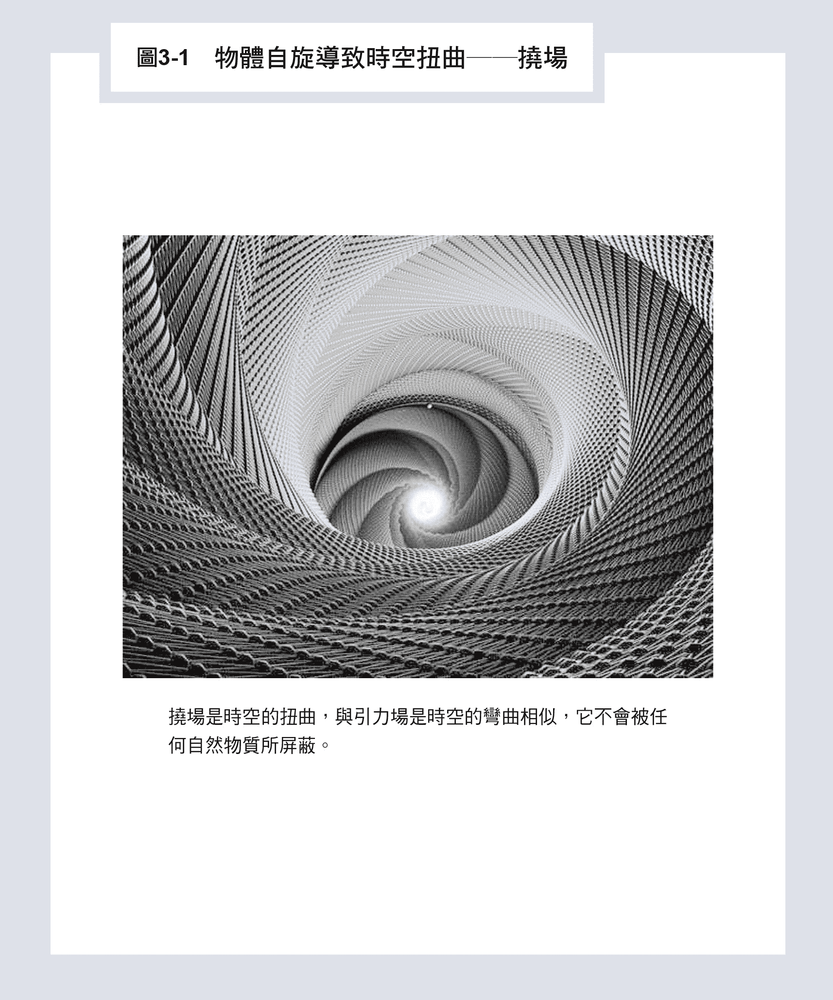

俄国科学家自一九六○年代起，对挠场做了深入的理论与实验研究，得出挠场的几个重要物理性质：

 挠场是时空的扭曲，与引力场是时空的弯曲相似，它不会被任何自然物质所屏蔽。比如，两物体之间有一堵墙，并不会屏蔽引力，应该也不会屏蔽挠场。因此它在自然物质中传播时，不会损失能量，但会被散射，它的作用只会改变物质的自旋状态。

 挠场在四度时空的传递，不受光锥的限制，也就是它速度超过光速，不但能传向未来，也能传向过去。

 挠场源被移走以后，在该地仍保留着空间自旋结构，也就是挠场有残留效应。

俄国科学家所描述的这些挠场物理性质，竟然与我们做了三年所了解的水晶气场完全一样。我马上就了解到，水晶气场就是挠场，第五种力场显身了，剩下的就是设计实验来证实了。

属于广义相对论的挠场名不见经传，却是最神奇的力场，会带出灵界的能量。

* * *

[① ](#back-%E2%91%A0)请参考《灵界的科学》。

[② ](#back-%E2%91%A1)请参考《是特异功能？还是潜能？》。

## 水晶气场就是挠场

我在二○一六年写了《科学气功》一书出版，对于一个人练气功时身体的生理现象做了大量统计，并予以分类成「共振态」与「入定态」两类，与大脑中的α波有密切关系。

我们发现，练功时脑α波会大幅增加的情况叫「共振态」，是脑α波与身体经络穴道产生共振的现象；练功时脑α波被抑制消失的情况叫「入定态」。我们也找出了如何用「快速打数」的方法，在几分钟内激发脑α波与身体经络穴道共振，产生「气集丹田」或「气走任脉」的效果。至于，气功中最令人困惑的「外气」或水晶的「气场」等，属于物理性的「气场」到底是什么物理现象？

我在《科学气功》第三章中做了介绍，提供两套实验数据作为比较来确认水晶气场就是挠场。

第一套实验方法，是用前苏联哈萨克共和国工程师Sphilman所设计的挠场产生器，以挠场照射去离子水三分钟后，用核磁共振仪（NMR）测量水分子团大小变化的数据，来探讨挠场穿越不同障碍物体所受到的影响（如图3-2所示）。

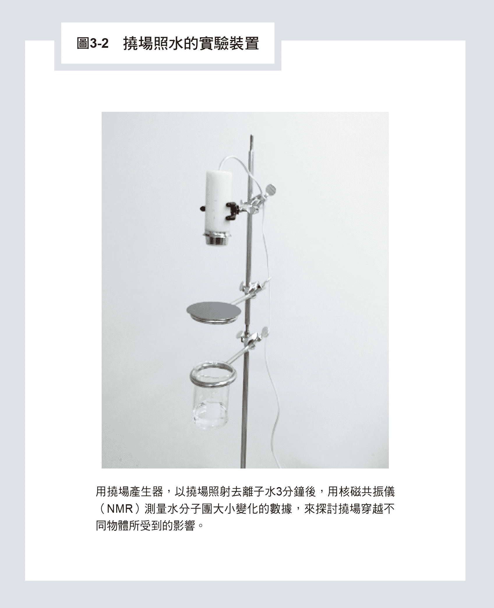

第二套实验是让水晶气场通过一个阻隔物，例如金属、纸、玻璃、半导体等各种不同物质，让T小姐感应，看看气场强度与形状在有阻隔物存在下与没有时所产生的变化。

很快的，我们就发现铝箔或两公分厚的铝板挡不住气场。气场穿越而过完全不受影响，表示气场不含电磁波，否则会被铝板严重衰减，含有铁原子的不锈钢（无磁性）或金属钼则会把气场从静态的小圆点变成刺刺的动态气场。

最不可思议的是，一张纸通常不会遮蔽气场，但是纸沾了水后湿湿的，就会把气场完全吸收。正符合了晋朝郭璞所说「气，界水则止」。若把一个风扇叶片拆掉，然后插电旋转，把水晶气场从旋转轴中心照射出去，结果气场会散开变得很长，也符合郭璞所说「气，遇风则散」。初步的实验，就证实了古人对气的描述。

从挠场照水的实验，我们也发现同样的现象，沾水湿透的滤纸可以阻隔挠场的通过，两公分厚的铝板对挠场毫无作用，不锈钢或金属钼都会影响挠场通过，造成水分子团一样的变化。

由于两套实验看到相同的穿透物体行为，因此我们判定水晶的气场就是广义相对论中所发现的挠场，是时空扭曲所产生的力场。

## 俄国挠场研究的两条路线——
Sphilman vs. Akimov

### Sphilman的挠场研究路线

二○○四年，我从网站上找到前苏联哈萨克共和国工程师Sphilman，买了他设计的挠场产生器，如图3-3所示，包括正面、侧面照片及核心的环形磁铁，并开始了挠场照射水的实验，慢慢地逐步了解挠场产生器的原理。我在二○一六年所写的《科学气功》一书也是基于这种挠场产生器所做出的实验结果。

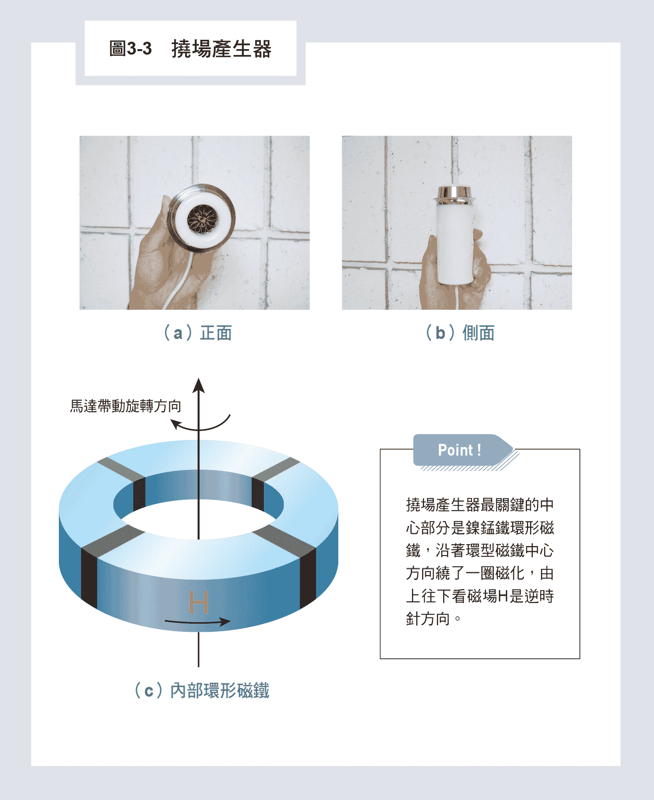

挠场产生器最关键的中心部分是镍锰铁环形磁铁，沿着环型磁铁中心方向绕了一圈磁化，如图3-3(c)所示，由上往下看磁场H是逆时针方向。如果磁环是由光盘机马达带动顺时针方向旋转，如图3-3(c)所示与磁场方向相反，称为右旋挠场，如果是逆时针方向旋转，与磁场方向相同，称为左旋挠场。这块旋转的磁铁在中心轴方向产生挠场的物理原理由我的学生梁为杰博士从爱因斯坦与卡坦的广义相对论推导出来，二○一三年初发表在国际著名的物理期刊《Physical Review D》，列在本书第二章的参考资料中。

这篇论文的重点是证明电子的自旋角动量如果与电子本身所做的大旋转轨道耦合就会产生可传播的挠场，在原子物理中有一个很有名的「自旋与轨道交互作用」（spin-orbit interaction）就是考虑电磁场在电子自旋与大旋转轨道耦合的效应。但是传统教科书不考虑广义相对论，因此都不知道这种交互作用还会产生另一个场，叫作挠场。

从直观来看，是磁铁中局部的磁性分子的自旋都排列整齐沿着磁铁中心形成一个大圆圈，根据我在《灵界的科学》第四章「一物两象」论述中，假设粒子的自旋是阴阳两个世界的通道，可造成实数时空的微破洞，这些微破洞在环型磁铁中心连起来会形成一个圆形破洞。当磁铁以每分钟三千转以上的速度快速旋转时，圆形微破洞撕裂的时空会扭转附近时空跟着旋转，形成一根轴向的扭曲时空之剑，影响可以长达两到三公尺，经络敏感型的功能人用手掌可以感受得到挠场所造成的刺痛。所以十多年的理论及实验研究，让我确信电子自旋耦合到电子的大轨道旋转撕裂时空是产生挠场的最基本物理。

### 见到Sphilman本人的感想

二○一八年十月，我受邀去河北省廊坊市（一座位于北京与天津中间的城市）参加能量医学与生命健康国际论坛会议，在会议上我第一次见到了挠场产生器的制造者——哈萨克的Sphilman。

他本人年纪已经很大了，很可惜的是，他只说俄文，不会讲英文，只能通过翻译沟通。原来他们古早一派的挠场研究者，都是俄国早年挠场研究代表性的人物柯易瑞夫博士（N.A. Kozyrev）的门徒。

柯易瑞夫认为，一个粒子的不变量通常都会伴随着物理场，比如，粒子的「质量」固定会伴随着「万有引力场」，「电荷」固定会伴随着「电磁场」，因此「自旋」固定也应该伴随着「自旋场」，也就是「挠场」。但是当挠场静止时，它的强度正比于万有引力常数G乘以普兰克常数h，因此比万有引力还弱1027倍。万有引力已经是最弱的力量，比万有引力还要弱1027倍的挠场很难测量。

但是电子及原子核的自旋所伴随的挠场会聚合成整个原子的挠场。分子中不同原子的挠场又会聚合成分子的挠场。固体中所有原子挠场的合成会形成固体的挠场。因此挠场虽然很弱，但是每个物体包括你我、用具、物品等，都有一个时空的大挠场结构，与物体的体积相当。

大部分状况下，原子与原子间的挠场相位没有一定的关系，大量原子的挠场会互相抵销，不会产生宏观的挠场，因此虽有挠场相随，但是测量不出来也很难感觉到，因此他认为他所制造的产生器所发出的场，他自己都可以感觉得到力量很强，不能叫做「挠场」，应该要叫做「轴场」（Axial field），是中心轴方向产生的场。

我告诉他，我们的理论已经从广义相对论证明电子自旋角动量加上大轨道转动可以发出挠场，就是他发明的设备所产生的场。因为会撕裂时空所以力道很强，而且照射水的实验也表明挠场很强，不是他们以前所认定的微弱的挠场。

从Sphilman的认知及反应，我深刻地感受到每个挠场专家受到过去经验及想法的侷限，看法有很大的不同。

### Akimov的挠场研究路线

我在二○○四年就注意到俄国的挠场产生器不只一种，除了Sphilman的旋转磁铁挠场产生器外，另外还有一种是俄国自然科学院院士A.E. Arkimov所设计的电磁震荡电路的挠场产生器，它比较简单、有固定的磁铁，但是没有旋转磁铁的部分，如图3-4所示的外观及内部线路照片。这也让我怀疑，难道挠场有不同的种类吗？

二○一六年，我完成用Sphilman挠场产生器照水的复杂而冗长三年的实验，证明挠场与水晶气场性质相同以后，写了《科学气功》一书，把实验数据在书上公布。我认为，挠场已经确定了要用电子自旋加上大范围高速旋转撕裂时空来产生，Sphilman的路线是正确的。

二○一七年，我有机会去北京开研讨会讨论挠场的种种物理性质，一位年轻的工程师高鹏跟随中国地质大学人体科学研究所沈今川所长，合作多年研制各种电子设备产生挠场及侦测挠场，他告诉我一个惊人消息，他说俄国每年都会开挠场的国际会议，召集主要是前苏联作挠场科学研究的专家来讨论挠场研究的进展。他去参加过，发现每次都是一样，分成两派吵成一团，吵了几十年了。

他属于Akimov那一派，因为设计电子电路对他相对简单，他很快就可以自己做出来。他也用Akimov挠场发射器与纽约市立大学的Mark Krinker教授做了从北京到纽约远距通讯几千公里的实验，两人都用同一张照片作为挠场发射起始位址，以及接收挠场的定位器之用，并在研讨会发表他们成功收到信号的结果。

我当时感觉有点震惊，如果这是真的话，难道产生挠场不需要撕裂时空吗？还是有一个新的我不知道的原理在作用？

这让我产生了一些危机感，这里面显然有些挠场的物理性质我还没有完全搞清楚，不过我也知道这篇论文如果属实的话，可能是人类用挠场通信的第一次实验，与马可尼用电磁波第一次横越大西洋通讯一样，是个不得了的成就。虽然电磁波早就在一九○一年就可以做到同样的事，但是挠场通讯可以是星际通讯的工具，未来将远远超过电磁波受限于光速的能力，这点我们在第五章会有比较详细的讨论。

### Akimov挠场产生器与特斯拉线圈相似

图3-4(a)、3-4(b)展示了Akimov挠场产生器的外观及内部电路图，主要包含一个静止的磁铁，磁场向上进入一电感器（L），与电容（C）串联耦合形成RLC震荡电路，和前面第二章所介绍的特斯拉线圈构造的第二线圈有几分相似性。

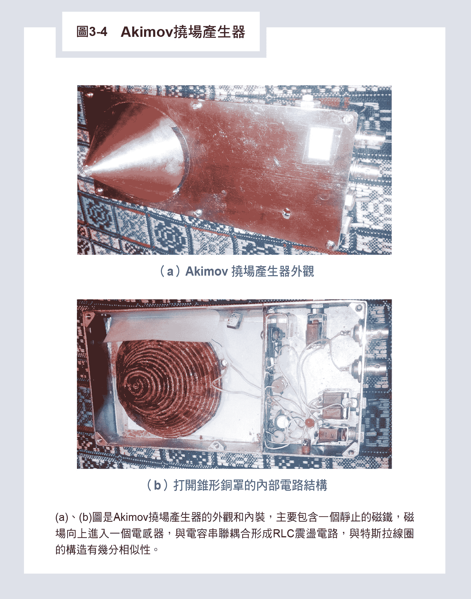

二○一九年四月，有一天我正在思考同类疗法的制剂，为何含病毒的水溶液，每次稀释成十分之一浓度，不断稀释十几二十次后，在地磁○‧五高斯磁场的作用下，溶液竟然会产生几十到几百赫兹的无线电波，然后病毒的信息就会留在水中以供同类疗法使用，可以作为信息水之用来治病[①](#foot-%E2%91%A0)。

无线电波的产生一定跟水溶液中的离子绕着磁场旋转有关，而旋转的频率决定了放出电磁波的频率。突然之间灵光一闪，我意识到磁场会对电子或离子作两件事情：

如图3-5所示，第一，电子（或离子）的红色自旋磁矩也就是自旋角动量Sp的相反方向会朝磁场方向倾斜或排齐；第二，电子会沿着磁场垂直方向旋转，也就是绕着磁场以一定频率旋转，如果旋转频率与磁场频率一样就会产生回旋共振，磁场能量会大量转移给电子。这个电子的运动不就是梁为杰博士理论推导出来挠场产生的机制吗？因为电子的自旋角动量加上大范围的轨道旋转运动就可以产生挠场。

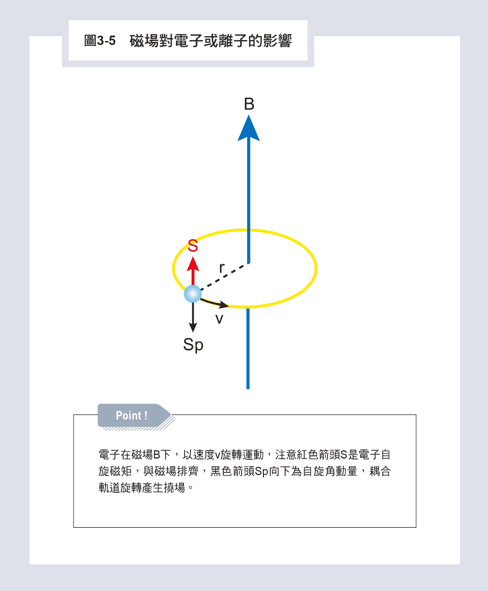

我恍然大悟，原来一个螺旋的导电线圈，也就是一个普通的电感器，经过好好的设计就可以作成一个挠场产生器，电流在线圈内快速旋转流动，不断沿线圈中心产生磁场，让流动的电子自旋排齐。如果在线圈中间加上磁铁效果更好，这些电子的自旋角动量会在实数时空切出无数的整齐微洞通道，再加上快速绕线圈旋转，撕裂出大块时空破洞，这就是挠场。

我松了一大口气，原来Arkimov 挠场产生器的原理与Sphilman 挠场产生器的原理完全一样，都是自旋排列整齐的电子作大轨道的快速旋转运动所产生，两者原理获得统一，不再有任何矛盾。

这也让我们想到特斯拉当年设计的线圈。一八九三年，他申请了一个电磁线圈的专利用来抽取环境的能量，基本上就是一个挠场产生器，可以产生挠场发射出去，穿梭阴阳界抽取灵界的能量，灌注入实数世界的发电机内，造成物质世界能量不灭定律的崩溃，因而被崇尚唯物论的现代科学所排斥。

* * *

[① ](#back-%E2%91%A0)请参考《科学气功》第四章，有关南氏去过敏疗法的内容。

## 水晶气场的神奇特性

水晶本身带有气场，是一般经络敏感型的人都能感觉出来，主要原因是水晶的晶体结构是三方晶系结构（如图3-6所示），具有三条螺旋（不同颜色四面体）互相缠绕而成。每一个有颜色的正四面体是SiO4小晶体，硅原子（Si）在中心，氧原子（O）在四个角落，整个石英晶体原子平均下来是二氧化硅晶体（SiO2）。这种螺旋规则的结构就有可能产生宏观的挠场。不过水晶本身产生的气场很弱，很难用来做实验，必须予以加强。

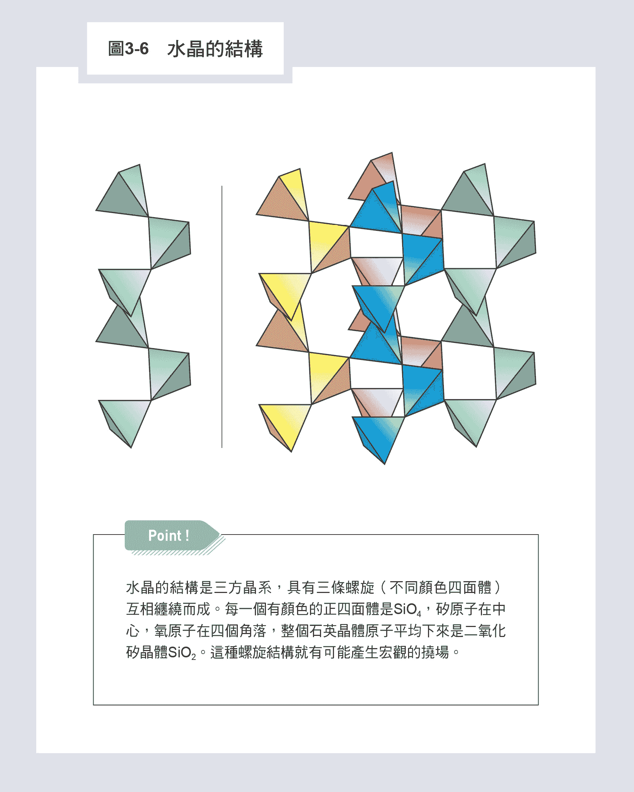

实验制作人选用气场很强但是散乱的捷克陨石作为源头，固定在削成十二面体的水晶尖柱顶较粗的一端，如图3-7(a)。气场经过水晶分子的螺旋结构会调变聚焦形成一束圆柱状的涡漩时空结构可射出晶体，被敏感的功能人感知到一个小圆点。

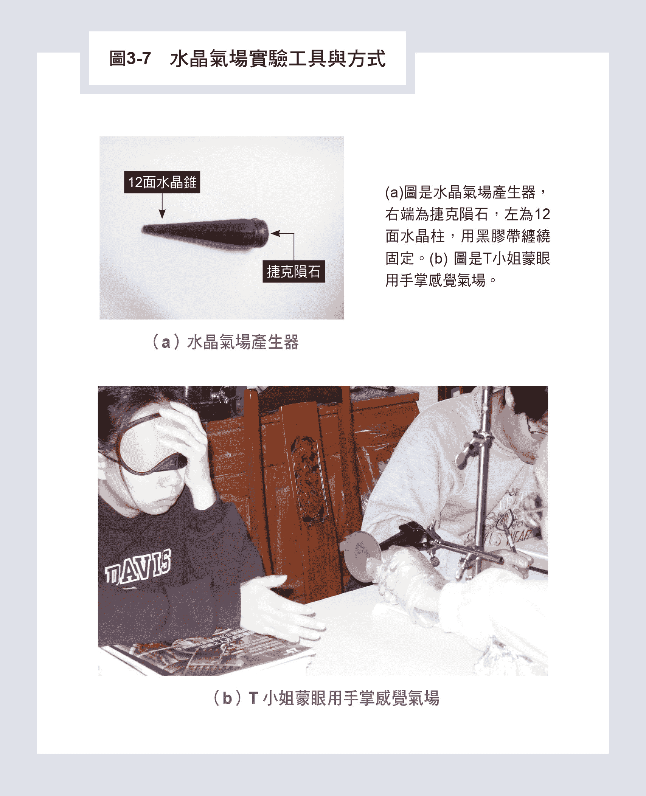

陨石为什么会产生散乱气场呢？这也是与粒子自旋有关。因陨石内部有磁性原子散乱的排列，在磁场互相抵销下而无法产生外面量得到的磁场，但是磁性原子的内部电子自旋排列整齐，过大的自旋角动量会撕裂时空形成涡漩的挠场，也就是形成散乱的气场。我们在《科学气功》一书第三章展示过大量挠场照水后水分子的核磁共振数据，已经推论出水晶气场就是挠场，这里不再重复。以下要展示的是，水晶气场的一些神奇的特性。

### 佛字对水晶气场的吸引与放大

水晶气场还有什么有趣的物理性质吗？这就要靠具有手指识字功能的T小姐来感应。

首先我们需要一个水晶气场产生器，这是由同步辐射中心陈博士所提供，他使用一粒捷克陨石作为气场发射源，用黑色胶带固定在切削成十二面锥状水晶柱的后方，如图3-7(a)所示。此水晶柱可以把捷克陨石发出的气聚焦，像雷射一样射出，气束的直径约为水晶锥口的大小为五毫米（mm）。

实验时，水晶气场产生器以水平方向，架在支撑架上，T小姐戴上不透光的眼罩，以右手掌距离产生器约三十公分远处，先感觉气场的形状及强弱，然后主试者将遮蔽物放入挡住水晶气场，如图3-7(b)所示。T小姐会说出气场强弱及形状的变化，有时感应若不确定，就会重复实验数次。

为验证T小姐对气场强弱变化的精准度，比如，气场穿过某一种物体的强度从十减弱为六，我们在做了很多次实验后，会再随机把同样物体重测一遍，不让T小姐知道，直到结果一样才能确认。

根据T小姐的感应，水晶产生器的圆柱型气场约有九十公分长，在九十公分内的气场强度很均匀。

T小姐过去在做手指识字实验时，发现某些宗教上的字汇象是佛、观音、菩萨、耶稣等字汇，会使她在大脑第三眼看到异像，例如亮光、亮人、十字架、听到笑声，我们称之为「神圣字汇」。

我们发现水晶气场穿过白纸，或穿过纸上写的普通字，都不会受到影响，可直穿而过，强度也没有减弱。但是当水晶气场穿过神圣字汇如「佛」字时，则会变成大圆，如图3-8(a)、3-8(b)所示，甚至感受到温温的，表示能量变强、范围变大。

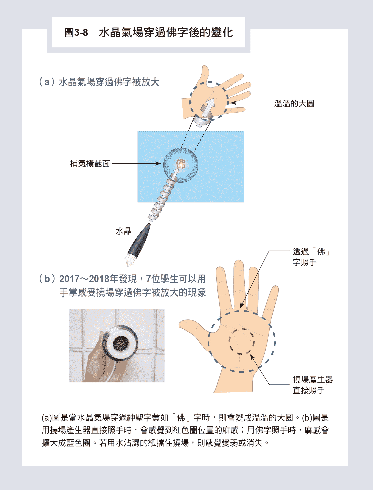

我们在佛字周围移动水晶作气场测试，发现在佛字四周，距离佛字一个字大小范围内，都有同样的效应，能感受到气场变成大圆、变强。也就是说，我们可以定义出佛字的捕气横截面，气场只要通过此横截面，就会被佛字捕捉住，产生同样的效应，这个原因到了第四章内我会清楚的说明。

这个放大效应其他人可以感受到吗？

我二○一六到二○一九年在台大电机系开的课程「人体潜能专题」就会测试修课同学对挠场的敏感程度，方法是让全部学生闭上眼睛，把左右手掌分别放在启动的挠场产生器下二十到三十公分约三十秒钟。如果有人感觉到任何特别的感受如麻、凉、风吹或任何动态的感觉，就选出来做更进一步的实验。

经过四学期约一百五十人的测试，大概有百分之十五到二十的同学对挠场敏感会有一些感受，约有百分之五的同学对挠场相当敏感，不但可以感受到挠场的范围大小强弱，还会引发麻感沿心包经从中冲穴一直走到手肘关节的曲泽穴为止（如图3-9所示）。

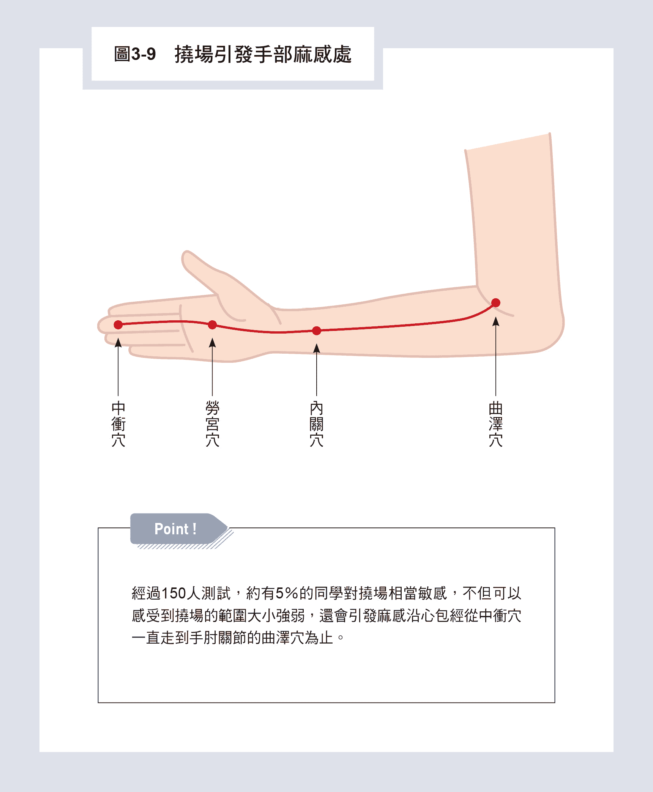

这让我了解到，原来人群中每个人对于经络被挠场扭曲的程度会有不同的反应，大部分人是经络不敏感型，有六分之一到五分之一的人是经络敏感型，仅二十分之一的人是经络极度敏感型。这也说明，感觉挠场需要靠经络敏感型的人来侦测才能得知，像T小姐就是。

我们两年中找出七位经络极度敏感型的同学，并发现只要把一张纸用水沾湿挡住挠场，对挠场的感觉就会变弱，甚至消失，也就是水会把挠场吸收。用挠场直接照手时，同学可以感觉手掌中有一圆圆的红圈区域发麻，如图3-8(b)所示，但是挠场经过佛字后（注意：同学已闭住眼睛，不知道我们做了什么事），他们会很惊讶，为什么红圈区域会被放大成蓝圈区域、超出手心范围，感觉也变强，完全证实了T小姐二○○○年初期用水晶气场所做实验的结果，再度证明水晶气场就是挠场。

最近两年经过北京大学任全胜副教授发现，水的第四相可以做为挠场侦测器，不需要依靠人的感觉。经过我们两年用水的第四相做侦测器来测量挠场，大量的实验已证实挠场通过佛字的确会被放大。

我在《科学气功》第四章有讨论过气导与吸引子现象，也就是当我们把佛字写在一狭长的纸条上，佛字大小超过纸条宽度的一半以上时，会发现很神奇的事，如图3-10所示。

佛字的捕气横截面会沿着纸条扩展到纸条另一端，使得整条纸都变成了气导，而佛字变成「吸引子」，其漩涡时空结构已被迫扩展到整个气导上，可以把远处通过气导上的气吸引过来，再垂直投射出去。

此刻马上出现了一个问题，哪些神圣字汇也会产生同样的现象？

### 佛字捕气横截面被破坏及复原后之放大能力

佛字的捕气横截面是佛字本身大小的九倍，长宽各三倍大，如果其中被其他文字图案破坏，或是剪断又再复原以后，对水晶气场的放大能力会造成什么变化？这是很值得研究的问题。

图3-11中显示的就是实验的结果。第一列是直接用气场照手写的佛字，感觉是变强、变大的圆，气场被放大了。第二列是在佛字下方用原子笔画了一条横线，长度比佛字稍大一点，结果气场通过后变成半圆，只有感觉到上半圆，下半圆被破坏掉了。第三列是如果用白色修正带把佛字下的横线涂去，纸上看起来又是一个干净完整的佛字，但是气场穿过的感觉仍然是半圆型，没有恢复成一个大圆，表示圆形气场已经被破坏掉了。这显示物质世界的修复遮盖，不能弥补佛字在虚数时空（灵界）的破坏，也表示气场可以侦测到灵界的时空信息。

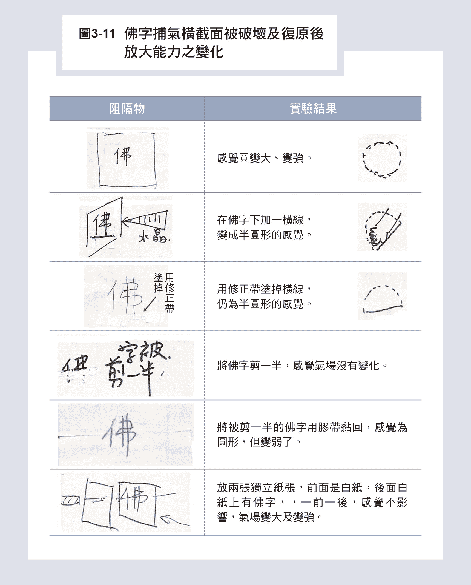

第四列是把佛字剪成一半，当然放大作用就消失了，气场穿越后没有变化。接着，第五列又把剪断的佛字用透明胶带重新黏合起来，看来与原来的佛字一样，结果水晶气场一照之下，感觉又变为圆形，但是强度比原来没有剪过要弱。表示佛字一旦被破坏过，有些伤害已经造成，不过这些伤害主要不在这实数的物质世界，而在另外一个世界，我在第四章会详细说明原因。第六列是在佛字前面加上另一张白纸挡住，结果没有发挥任何阻挡功能，气场还是能直接穿越，因第二张纸上写的佛字而感觉到变大、变强。

### 其他神圣字汇对水晶气场的吸引力

神圣字汇「佛」字是一个气场的吸引子，能够吸引经过气导的气场而趋向佛字向前喷出，如图3-12所示。

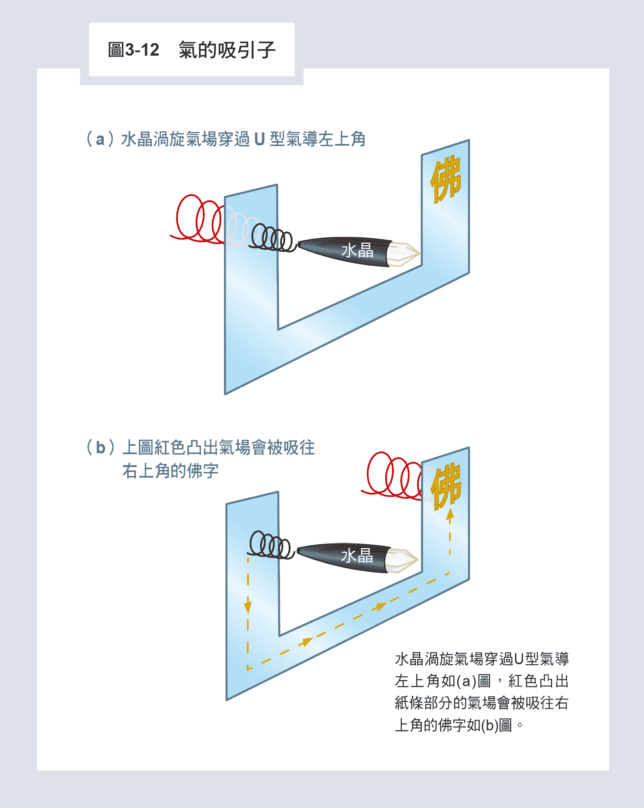

图3-12(a)是用一水晶气场指向U型气导的左上角，右上角写了一个佛字，因字大小超过气导宽度的一半，而形成了吸引子。图3-12(a)是涡旋气场刚穿出纸面左上角，穿出纸条的部分则用红色的螺旋表示，这一红色部分会如图3-12(b)所示，被右上角的佛字大涡旋挠场所吸引，而沿着U型气导运动走到佛字而向外喷出。这个运动过程会被功能人如T小姐手掌所感知。

看到这里佛字的反应，就引发出下一个问题，除了佛字以外，是否有其他的神圣字汇也有类似的放大及吸引气场的效应？

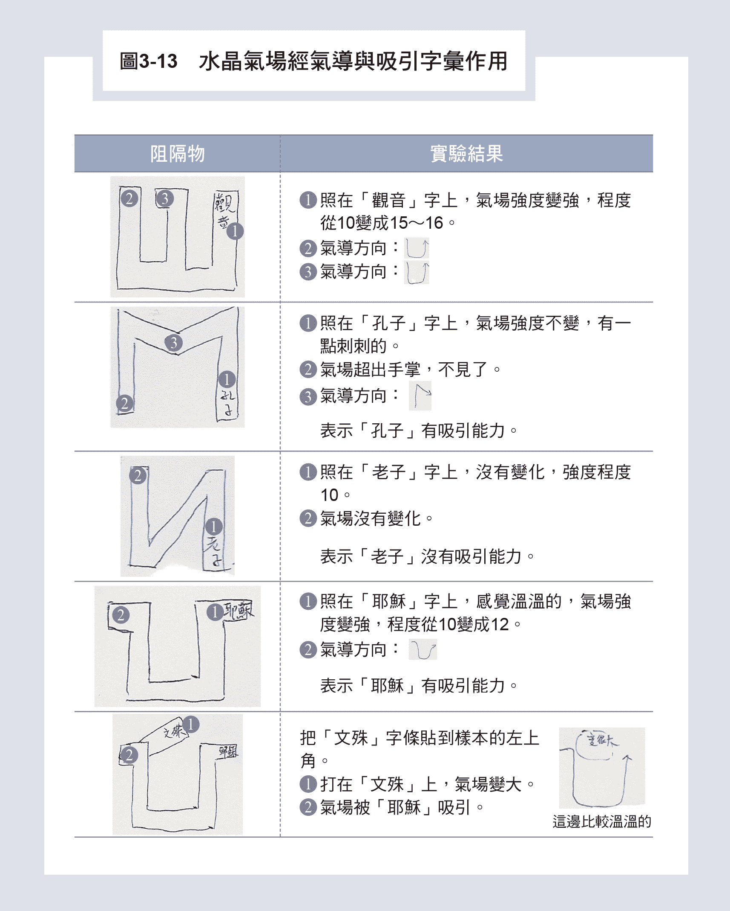

图3-13是正常山型、U形或M型气导。第一列的山型气导的右上角写了「观音」两字，大小超过纸条宽度的一半，形成吸引子，当水晶气场打在右上角「观音」两字的位置，气场变强，从原来强度十增加到十五至十六，表示「观音」两字也可以放大气场。如果打到蓝色圈或的位置，气场会被「观音」两字所形成的吸引子吸引，沿U型气导走向「观音」两字，实验结果和所示的U型轨迹即为T小姐手掌的感觉。

第二列的M型气导右下方写了「孔子」两字，如果直接用气场打向「孔子」两字，气场会变成动态、刺刺的感觉，但是没有放大的作用，只是由静态调变为动态气场。如果气场打向，气场感觉已超出手掌、不见了。如果水晶气场照到M型气导中间的位置，则气场会被「孔子」两字吸引，先上后下传到右下角。原来神圣字汇「孔子」也有吸引力。

但是第三列的「老子」两字却没有反应，不但气场照「老子」两字强度没有变化，也没有从静态调变为动态，表示这个字也没有产生吸引力。我怀疑是当天「老子」并不在他的网站中，因为T小姐手指识字辨识「孔子」及「老子」的反应几乎一样，都是有一个暗的人影出现在祂们网站的首页。

接下来，第四列的U型气导的右上角写了「耶稣」两字，对气场也有放大作用，可以吸引打在左上角位置的气场，沿U行通道运动走向右上角。

后来，我把写了「文殊」两字的小纸条贴在第四列U型气导的左上方，如第五列所示。结果「文殊」也可以放大气场，打在位置的气场被两个吸引子拉扯，「文殊」会拉一部分气场去放大；「耶稣」则拉一部分气场走U型气导到右上角。

所以，结论是凡是会引发气场变化的神圣字汇，例如把气场放大，或是把气场由静态条变为动态的字汇都是吸引子，会吸引气场经过气导趋向神圣字汇。

### 导致气场产生运动的图案

我们已发现神圣字汇所形成的吸引子可以吸引气场运动，接下来的问题是，有没有其他字汇或图案会引发气场的运动？后来实验发现的确有的，如图3-14所示。

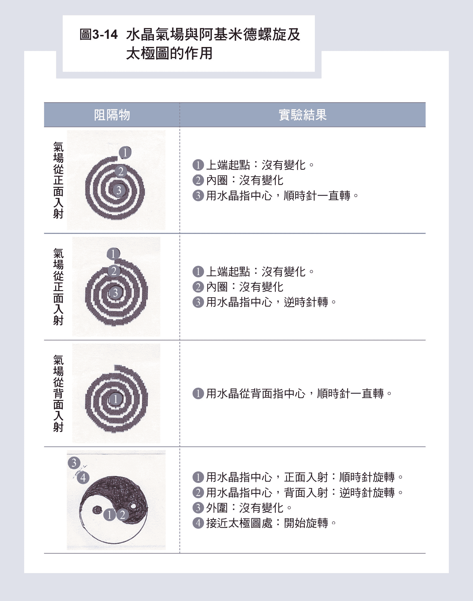

图3-14的前面三个图都是在纸上用电脑画出左旋及右旋的阿基米德螺旋，第一列实验是一个右旋的阿基米德螺旋，气场打在外围的位置、内圈的位置，气场都不受影响。但是，当气场打在中央的位置，气场就被螺旋带着由内向外顺时针方向一直旋转。

第二列实验是左旋的阿基米德螺旋，结果也是一样，只有当气场打在中央的位置，气场才会被螺旋带着由内向外逆时针方向旋转。

如第三列实验所示，若是改从背面中央入射，气场则会反转成顺时针旋转。但是如果气场打在三个不同半径的同心圆上，任何位置包括中央均不受影响不会旋转。

这表示气场与螺旋结构而非圆形结构有密切耦合作用，也暗示气场本身就是螺旋结构。

第四列实验的最后一个太极图也会引发气场旋转，当气场打到太极图中央时，会朝着阴或阳的鱼眼旋转，代表鱼眼是阴与阳的通道，而这个漩涡通道可以把气场吸引过去。

### 全世界第一台气的震荡器

由前面的实验我们可以看到如何利用神圣字汇把气场的放大、传导、被吸引子吸引的现象，因此可以仿照电子电路震荡器的原理，将气放大、反馈产生震荡，而做出气的震荡器。任何的电子电路包含计算机、手机、仪器都需要电子震荡器产生不同频率的信号。

图3-15就是全世界第一台「气的震荡器」，水晶气场经过三个佛字的连续放大，打在一个由纸条做成的环形气导，在水晶气场穿过气导的地方写了一个佛字，大小超过气导宽度的一半。这个佛字不但扮演第一级放大气场的作用，还扮演吸引子角色，把被佛字放大后，打到对面纸环的气场吸回产生反馈的作用。因此气场被连续佛字放大以后打到气导，又被吸回到第一个佛字，再喷出向前继续放大反馈过程，最终气被放大的程度超过了中途的损失程度，就会形成气的震荡，不再需要外面输入气源。

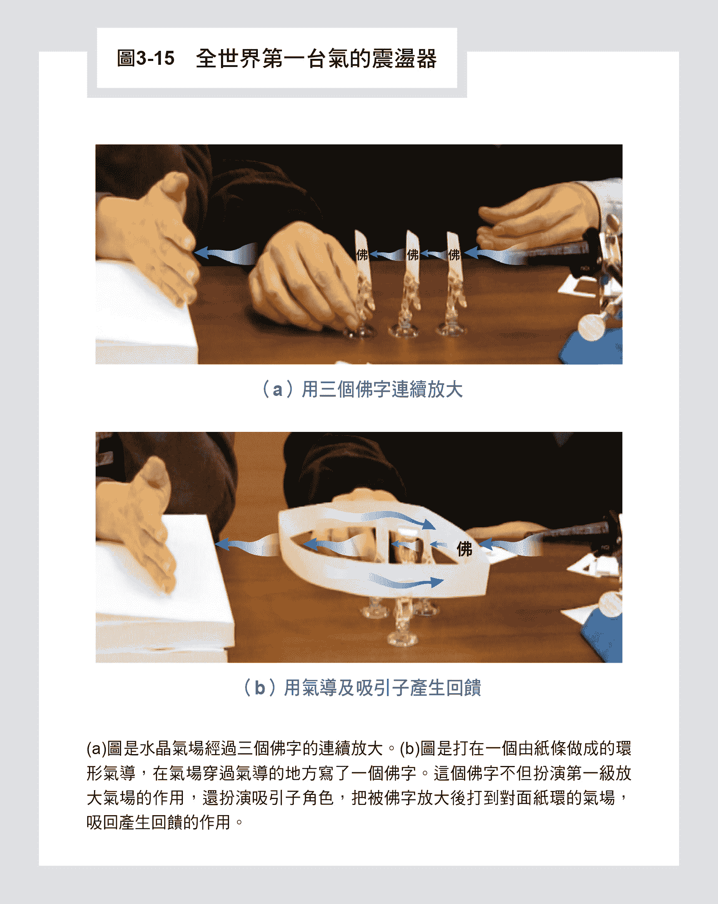

根据T小姐用手去接触气场的感觉，整个气场变得很大，被侷限于气导内圈几公分内及连续佛字的路径中，而气导外面的气场很小。我相信这是世界上第一台气的震荡器，以后就可以设计、控制气场做逻辑运算的仪器。问题是，被放大的气场能量来自哪里？

有一天，我在思考这个问题时，突然觉悟到这些能量显然来自虚数时空的灵界，我无意间发明了一个虚空取能器，打开了一扇门。虽然现在取出的能量虽然很小，但是技术愈来愈成熟以后，就可以像特斯拉所说的一样，达到真空取能的目的，一个新的文明、新的能源世界已经在我们面前展开。