# 四、穿梭阴阳的挠场——道家风水、八卦、布阵的解密

中国传统的风水，

就是在处理环境居家中物件的摆设所形成的几何结构，

并用风或水调整气场的位置与大小。

因为气场会钻入虚空，

因此挠场穿梭阴阳的气场行为，

就是中国传统风水的科学基础。

## 风水的起源

晋朝郭璞是中国历史上第一个提出风水的概念的人，他认为「气乘风则散，界水则止。古人聚之使不散，行之使有止，故谓之风水。」倡导天地之间存在一股气，遇到风就被吹散了，遇到水就停下来。因此风水就是在选择地形地势，比如，房屋背后要靠山，比较容易挡住风，不要散了气；屋前最好有水塘，利用水将气聚集在生活的空间。

晋朝道士葛洪：「人在气中，气在人中」正气歌：「天地有正气，杂然赋流形」。这种气如果存在的话，与人体的生理、心理状态无关，应该也是一种物理的力场。从此以后，中国人渐渐笃信风水，认为人的吉凶祸福、甚至仕途前程都会受到住屋或祖坟方位环境、规模和形式的影响。

随着历史的演进，风水的知识逐渐演化出了两种形式：

第一种是「环境风水学」，为聚气止气的环境地理学，比如，房子的门口要朝南方，有比较充足的日照阳光；房屋不可以在丁字型路口（路冲）；房子不可以夹在两个高楼之间；房子附近不可以有烟囱、电杆及招牌形成的尖角符号对着等等。

最好的居屋选择是「前朱雀，后玄武」，前面有池塘的叫朱雀，后面有丘陵的叫玄武；「左青龙，右白虎」，左边有流水的叫青龙，右边有长马路的叫白虎。其地形应该为东低西高、后高前低，符合以上条件者便是家居住宅的最佳选择；这种宅型代表出官出贵，为旺丁旺财，家门繁荣昌盛之宅。

这种环境风水学有部分规矩是现代科学可以解释的简单道理，例如，在居住地方聚气，会让居住的人健康有活力，自然事业学业容易发展，而获得荣华富贵；房子位于路冲容易发生交通事故；若位于两高楼之间会有风切现象等等，对居住者不利。但是大部分规矩还是无法用现代已知的科学解释。

第二种是「民俗风水学」，以住屋、祖坟方位环境、规模和内部形式及营造时日等的选择，来调控气，预测居住者的前程，这里面很大一部分是现代科学无法了解的原理。

科学昌明以后，风水被视为迷信而逐渐式微，像中医一样，大部分人都不相信了，只有少数人基于本身经验或祖传教导仍坚信不疑。郭璞所描述的气与我们第三章所讨论的挠场具有相似的性质，例如，挠场会被水吸收（界水而止），水晶气场通过旋转的电扇叶片会被拉长（遇风则散），因此，我知道要破解风水之谜的关键，仍有三个层面的问题要解决：

 要清楚了解挠场的科学性质。

 要了解这个宇宙的实像。

 要了解挠场在真实的宇宙扮演什么角色。

第三章中，我们已描述了挠场的一些科学性质，其他两方面的解答且听我一一道来。

## 八卦与布阵

孔老夫子曰：「五十以学《易》」，并作《系辞》上下二传来解释《易经》。易的境界在卦象与卦数，可以上通天文、下知地理，乃至算命看相、未卜先知。

孔子认为人要到了五十岁，才能累积足够的人生经验及智慧，可以开始学习《易经》了。孔子所讲的《易经》，一般认为是《周易》，是周文王被商纣王关在监狱时研究《易经》的心得纪录，春秋战国时代的诸子百家之说都源于这本书。

传说中，神农时代有《连山易》，皇帝时代有《归藏易》，这两种《易》已经失传很久了，据说中医药、堪舆，还有道家的东西可能是《连山易》与《归藏易》结合的产物。

《易经》里有一个符号体系就是八个卦象，八个卦象两两相配，生出六十四卦，它最令人称奇及津津乐道的是，可以用来算命看相，未卜先知。

我认识很多人去香港看过铁板神算董先生，回来后都跟我说铁板神算命算得极为准确，有一点恐怖的感觉，连几十年前、年轻时曾经交过的女朋友姓什么都算得出来。

在科学的时代，我们该如何去了解《易经》？八个卦象只是○与一的数位组合吗？就如同《道德经》第四十二章所说：「道生一，一生二，二生三，三生万物。」三个爻的八卦组合就可以产生万事万物吗？

在这一章中，我会提供证据，显示八卦的神奇性质不是在这个物质的实数世界，而是躲藏在另一个世界灵界的虚象，而连结两个世界的关键就是「挠场」，所以挠场就是打开易经秘密的钥匙。另外与《易经》八卦有关的谜团是道家的布阵，诸葛亮作八阵图见于《三国志蜀书诸葛亮传》：「亮性长于巧思，推演兵法，作八阵图。」八阵图是公认的极佳阵法，千百年来极受推崇。陆逊火烧刘备连营七百里，孔明巧布八阵图，用石头堆成石阵，再按照遁甲分成生、伤、休、杜、景、死、惊、开八门，吸收了八卦排列，兼容天文地理，其威力之大据传可抵挡十万精兵，被诸葛亮布在湖北入蜀之门户。据说八阵图最主要特点是每时每刻都在变化，这种变化的特征使得人走进去之后，会迷失于其中。

我们小时候读武侠小说常看到这种场景，非常羡慕及向往，但这里面学问太大了。我几年前到了六十岁，超过孔老夫子学《易》的年龄已经十年了，但是懵懵懂懂还没有任何头绪，不知要如何去布阵。直到过了六十四岁以后，用挠场作实验深入了解了八卦虚象在灵界的动态行为后，我的道家朋友才突然教我用八卦布了一个阵法，让我在阵法上的理解突飞猛进，开始理解了布阵的科学根据，并将在本章最后一篇介绍。

接下来，我们要先了解宇宙的实像，才能去了解挠场的神奇性质。

## 复数时空与量子心灵

请参考我二○一八年出版的《灵界的科学》一书，描述了我对真实宇宙提出了两项重大假设的经过与理论内容，当时，这两大假设是为了统一解释宇宙大中小尺度时空所出现的异常现象，例如，大尺度宇宙中竟然有百分之二十三的能量是暗质，百分之七十三的能量是暗能，正常物质世界仅占宇宙只有百分之四的能量；奈米小尺度量子物理中，量子纠缠之间信息传递超光速，违反爱因斯坦的相对论；中尺度的人体特异功能，如手指识字、念力等现象，完全不能用现代科学理解。

二○一四年，我提出一个统一的架构及两个假设作为基础，来了解真实的宇宙。这个统一架构的第一个假设就是：我们所处在的宇宙其实是八度复数的时空，除了我们一般感官能感觉到的四度实数时空，也就是传统所说的「阳间」之外，还有一个虚数的四度时空存在，这个就是传统所谓的「阴间」，里面充满了各种意识及信息网站。

实数、虚数之间虽然关系密切，却是同一复数的实部及虚部，但是其间存在实虚障碍（阴阳两隔），仅仅藉由许多不同尺度的特殊时空点连结，这些连结点都是漩涡状的时空结构，也就是三度空间太极图上的鱼眼结构，两个时空的联通要经过鱼眼的漩涡时空结构。

实数空间的物质要打破实虚障碍，进入虚数空间的关键就是：第一，其尺寸要远比漩涡口孔径小，而正好撞上连结点的通道口；第二个方式是，物质只要进入复数物质波或量子场状态，就可以穿隧进入虚数时空，这也解答了量子力学九十年来的谜团，为什么狄拉克（Dirac）方程式之解粒子的波函数或量子场论中的量子场都是复数函数，过去没有人了解复数的含意，只是把它与共轭复数的乘积解释为在位置r及时间t发现粒子或场的机率。

我认为这个复数的物质波，就是进入虚数时空的钥匙。此时物质的尺寸不再重要，量子波可以渗漏经过很小孔径的漩涡时空连结点（漏斗口）进入虚数时空。

我的第二个假设就是：复数量子场或量子波函数中虚数i就是「意识」，可以说复数量子场或量子波函数中虚数i的出现「把意识带进了物理学」，也告诉我们，物体只要进入量子状态「万物皆有灵」，这就是量子心灵的出现。

当物质如基本粒子、光子、物体进入微观或宏观量子状态，物质波出现，这时物质波会钻入虚数时空，在虚数时空中，量子的状态波速可以远高于光速，很快地传布广袤的空间，也可以撷取过去及未来时间的讯息。复数的波函数导致在实数空间无法确切地测量粒子的动态性质，如位置及动量，因为其游走于实数及虚数时空，只能得知其在位置r出现的或然率。可以说复数时空的概念彻底解决了近九十年来世人对量子力学本体论的迷惑，也就是量子力学所描述的「量子世界的本质到底是什么？」的问题。

## 手指识字与挠场感应，
是不同世界的物理机制

手指识字是天眼扫描灵界的虚象，挠场感应是感受到物质世界扭曲的时空。由于真实的宇宙是八度的复数时空构成，有实有虚，为各四度的时空结构，我认为实数时空与虚数时空中间的通道是经由粒子的自旋所形成的涡漩时空破口。由于所有在实数空间的物体都是由原子构成，原子中每一个基本粒子都有自旋，都有通往虚数时空的通道，因此在虚数时空中都会出现一破口形成的虚象，是自旋通道在虚空出口的组合，此形状与实物是完全一样，因此形成「一物两象」的现象。

任何一个实数时空的物体，在实虚两空间都有一个形状一样的结构，虚空中的能量形式，如果不包含自旋通道，无法与实数空间沟通，则不会产生实象，是属于暗质及意识的纯能量。但如含有自旋时空结构，其通道出口则会在实数时空形成一个没有物质存在的影像（鬼影）而已。

字汇及物体虚空的结构在手指识字及念力的作用上扮演了重要的地位。我们提出手指识字及念力的可能机制，所有特异功能要能做成功，功能人的大脑中必须出现「天眼」。根据判断，天眼是大脑某一部分的生理食盐水进入量子状态，产生自己的意识，并经过自旋通道渗漏到虚数时空，扫描文字或图案的虚像而非实像带回天眼。

当手指识字辨识神圣字汇时，如「佛」、「观音菩萨」、「耶稣」、「药师佛」、「弥勒佛」等，其虚象已经被这些神圣人物在虚空的意识所修改成大圆、多排小圆、十字架等不同结构。由于这些字汇的虚象已经被神灵改变，因此手指识字时，天眼扫描虚象时看不见字汇，而是看到被改变的影象，如圆形亮光、亮人，或是影像所联通的世界，如神灵网站的首页，或其他虚空的世界。所以结论是，手指识字时天眼所看到的影像是虚数时空的虚像。

功能人T小姐对于挠场或水晶气场的感应则有不同的机制。首先，她感应水晶气场时不用开天眼，因此是大脑感应挠场穿越阻隔物体所产生实数空间的变化，而非天眼扫描虚像所感到的虚空的信息。问题是，她的大脑用什么样的生理机制来感应这些实数空间被调变的挠场？

第三章中，我提到二○一六到二○一七年，我们发现几位对挠场产生器所产生挠场敏感的功能人，其中一位是硕士班的王姓研究生，他的手掌劳宫穴被挠场产生器所发出的挠场照射以后，会出现麻感，沿着心包经从中冲穴走向手肘的曲泽穴，然后停在曲泽穴上，有很强的残留效应，回家后要七、八小时才能完全消除麻感。另外用水晶气场照射劳宫穴也会产生麻感，但是因为强度很弱，只要约四十到五十秒钟就会消失。这表示挠场经过劳宫穴会扭曲心包经经络的时空结构，此扭曲的信息经过神经系统的电信号携带传入大脑，而被感知为麻感。因此，我们可以知道，经络是侦测挠场的主要侦测器，但是必须是经络极敏感型体质的人比较容易侦侧得到。

T小姐与王先生是属于经络极敏感型的少数人，而T小姐的劳宫穴被水晶气场照射后所产生的感觉只残留几秒钟就消失了，而王先生劳宫穴的残留效应会随着照射源的强弱而改变，用弱的水晶照射后的麻感为五十秒，用强的挠场产生器照射后的麻感则可以长到八小时。但是对大部分人而言，是无法感受到挠场与神经的作用的。

由此我们了解做手指识字实验时，功能人的天眼会打开扫描字汇的虚空影像，送回大脑由灵魂及第六识合作后看到虚像；而感受气场时，是经由功能人的手上经络探测到挠场扭曲的时空，与其神经系统交互作用后的结果。但是气场与虚像的关系又是如何？我们可以探索虚空的动、静态行为，或测量虚像吗？

## 发现挠场可以穿梭阴阳界

二○○○年，我们之所以开始用水晶气场来做实验，就是看到一个美国的网站声称：水晶气场够强的话，就可以打破物质世界与灵界的障碍，与灵界的师父沟通，因此气场是一个物理的通讯工具，可以沟通阴阳两个世界。可是做了十多年的实验，还是没有办法找到可靠的侦测器，来验证这个说法。没想到，在用水晶气场通过神圣字汇或神圣图案如传统的八卦时，却让我们找到了证据，证明气场不但能穿梭阴阳界，还可以把图案一物两象的虚像之静态或动态行为投射回实数时空的物质世界，被功能人感测到。

这个重大的发现让我们理解神圣字汇及《易经》中八卦的神奇特质，不是存在于物质的实数世界，而是躲在虚数时空灵界的虚像。

由此，我们可以开始了解风水的科学根据与物体虚像在虚空的动态行为有关；道家操控时空结构，以奇门遁甲布阵的秘密也被揭开神秘的面纱。用气场穿入虚空取出可用的能量，变成并不困难的科学操作，特斯拉在二十世纪初期所预测的一些神奇的科幻故事，似乎可以在二十一世纪中叶以前，慢慢地被科学所实现。

### 神圣字汇的启示

功能人T小姐用手指识字来看神圣字汇，如「佛」、「弥勒佛」、「药师佛」等字汇会产生异相。

如图4-1所示，T小姐看「佛」及「弥勒佛」时，会看到一个大亮圆，是各自网站的首页图像。而第二列是T小姐看到「弥勒佛」网站的第二页是六个小亮圆排成一个圆圈（如图1所示），第三页是小圆圈顺时钟转了一圈（如图2所示）。

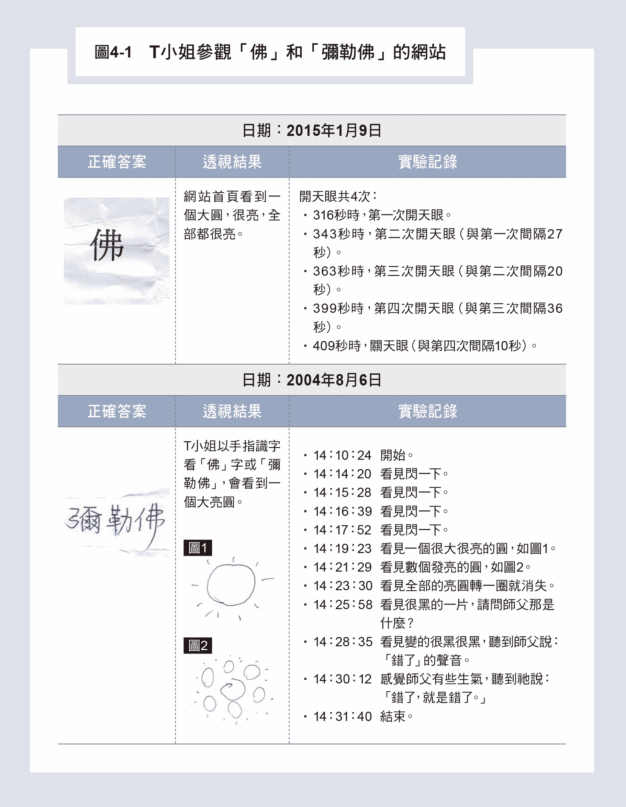

在看「药师佛」时，如图4-2所示，T小姐会看到五个一排，排列整齐一排排的小亮圆，每一个小亮圆是药师佛网站的一个药园，里面有各种不同的信息药草。

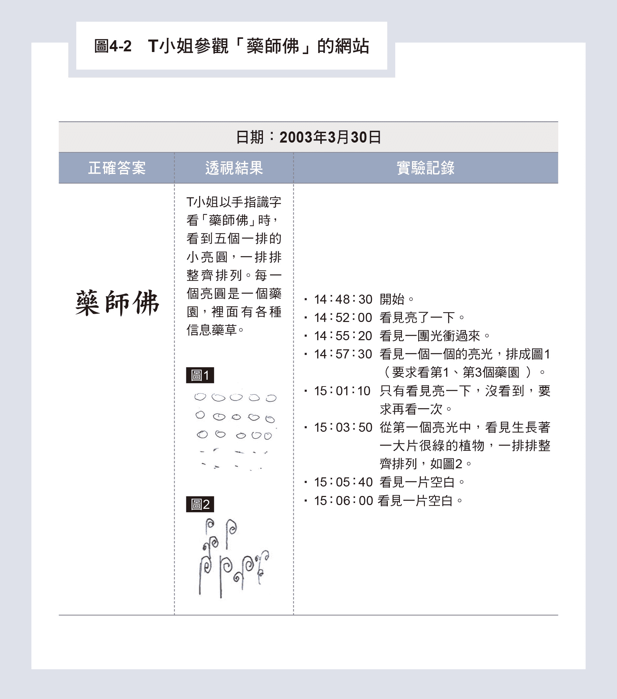

当T小姐来感应水晶气场穿越「佛」字时，如第三章的图3-8(a)所示，会感受到水晶气场变成一个大圆，而且力量变强，竟然与佛字在虚空的虚像完全一样，表示佛字在虚数时空中灵界的虚像已经不是「一物两象」，而被改成一个圆形的大漩涡，也是佛在灵界网站的首页图像。

看起来，挠场是被佛字的大漩涡圆形虚像放大，并且投射到了实数时空，被T小姐手掌的经络所感觉到。这表示水晶气场打到佛字时，部分气场穿入了虚空，剩下的部分仍然在实数空间传递；穿入虚空的部分因为被放大，经过实虚纠缠带动下，实数空间的气场也被放大。

当用水晶气场经过「弥勒佛」或「药师佛」两字汇照射T小姐手掌的劳宫穴时，其结果如图4-3所示。

当「弥勒佛」三个字中间没有空格，或只空一格，如图4-3第一、二列所示，则不论水晶气场照「佛」字或「弥」字，都感觉到变成一个大圆、有点温度，表示信号变大、变强。

但是，当「弥勒佛」三字中间空了两个空格，如图4-3第三列所示，只有照「佛」字时会变成大圆，照「弥」字时没有变化，表示这三个字的空间结构已经分离，「弥」字与「佛」字不再连结，变成普通字，不再影响气场。

这也表示每个字可以影响的空间范围，就在这个字的上下左右一个字的范围。

当水晶气场照到「药师佛」时，会感觉到刺刺的、一点点向右移动，如图4-4所示。

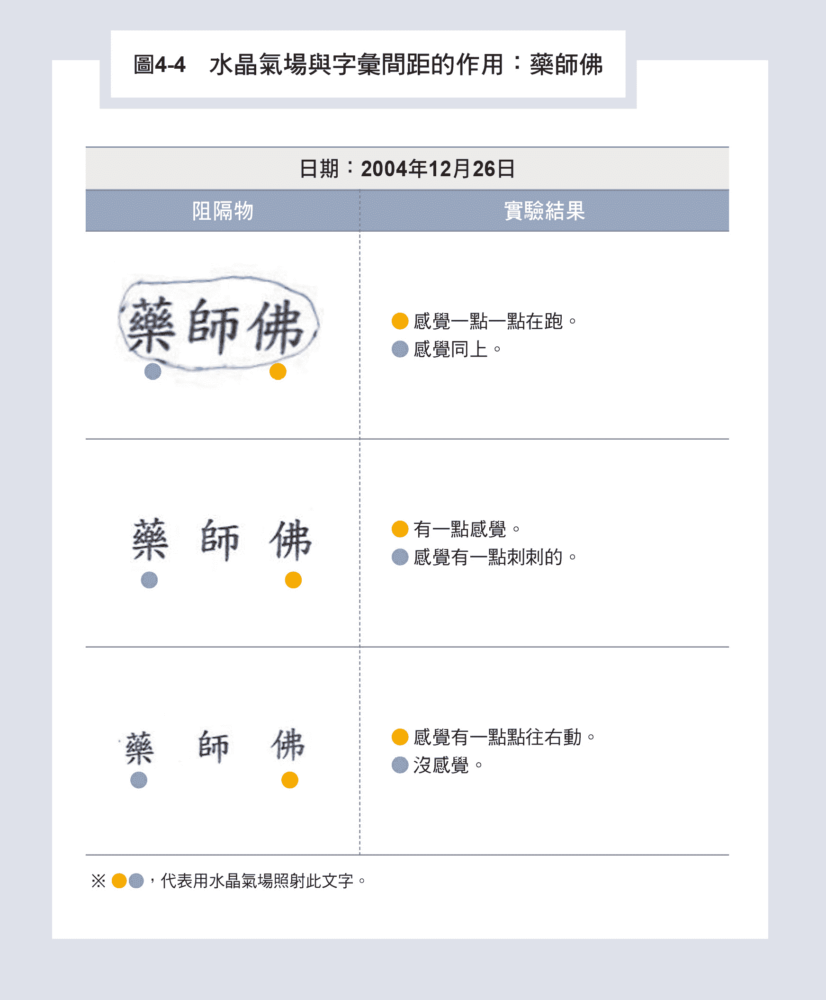

这个实验是二○○四年十二月完成的，当时我还不懂得这个实验的意义，直到二○一六年才突然领悟，这是气场在扫描虚空里药师佛药园内一排排整齐排列的一个个圆形小药园。由于每个药园都是旋转的小涡旋时空结构，如同一个个小吸引子，可以把气场吸过来，因此T小姐感觉到一点点刺刺的气场，是不断旋转的时空小锥子，而且会由一个小圆圈传向下一个圆圈而移动。

由这些神圣字汇的穿透实验，我们了解到水晶气场可以把神圣字汇的虚像，如大的圆形或一排排小圆排列的时空结构投影带入实数时空，被功能人用经络感觉到变化。这也显示气场在打到神圣字汇时，有部分气场可以藉由神圣字汇文字内的自旋通道穿入虚空，开始扫描神圣字汇中被神灵改变的虚像。若虚像有圆形涡旋结构，则气场会被涡旋加强，或被旁边另一圆型涡旋时空带动而移动位置。

这些穿入虚空的小部分气场与留在实数实空的气场，是紧密地纠缠在一起，同步变化、互相影响，可以称之为「实虚纠缠」的气场。

### 手写的神秘八卦图案

除了神圣字汇以外，有没有其他图案同样可以看到水晶气场穿越时产生类似的阴阳纠缠的现象？其实还有不少图案可以产生。

我们就以八卦图案来说明，二○一四年以前，所有实验用的八卦图案都是用手握原子笔在五乘五平方公分的白纸上，沿着尺画出，因此没有用电脑印字，也没有注意图案的大小与纸张大小的关系。图4-5就是其中一次用水晶气场穿越八卦图案，由T小姐来感应的结果。

很明显的是，图4-5中左栏第三列的震卦「」及倒过来的艮卦「」产生温温的感觉，表示信号增强，震卦与艮卦反应完全相同；甚至转九十度反应也是完全一样，这表示图案与角度无关。

图4-5右栏第三列的离卦「」则会产生凉凉的感觉，表示信号减弱外，其他的卦象都产生动态的感觉，比如，右栏第一列的兑卦「」与倒过来的巽卦「」，会产生一阵阵忽大忽小的感觉，同样显示兑卦与巽卦反应完全相同；甚至转九十度反应也是完全一样，表示图案与角度无关。

图4-5右栏第二列的坎卦「」，则产生一点点在刺的感觉。

其中，最值得注意的是红圈内左栏最后一列的干卦「」及右栏第四列的坤卦「」，也是往后研究的重点。干卦的感觉是刺刺的，气场位置原来在掌心，但是穿过坤卦后，气场会从掌心位置跑到食指尖端，当时我并不了解这些感觉代表的意义。

实验有时也不能重复，因为当时我们并不知道图案大小与背景纸张大小要有一定的比例之下，背景纸张虚像才不会干扰到八卦虚像的运动行为。直到二○一四年后的实验才慢慢厘清这些问题。

### 干卦「」的几何规范为何？

如何画三条直线才是干卦？为了确定干卦的几何规范，我们把干卦的三条阳爻的长度都固定为一公分，调整阳爻之间的距离为○‧三公分到一‧五公分，上下两爻与中央阳爻距离调整为对称或不对称，来测量T小姐对水晶气场穿越这些图案的反应，以此实验如图4-6所示。

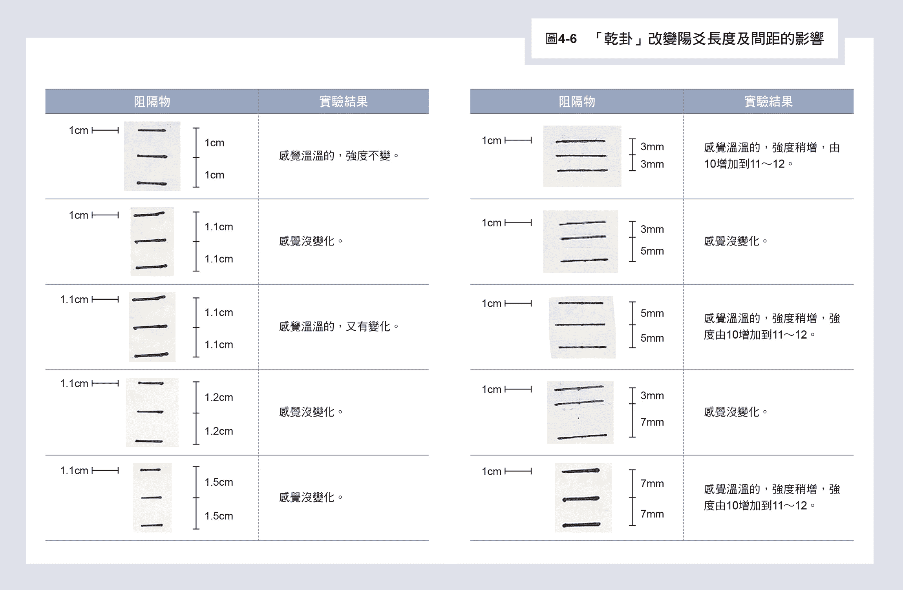

我们在二○一六年后发现不同年代实验所准备样本格式或大小不同，会有一些不完全一样的反应，因为样本背景纸张的大小会干扰到气场穿越八卦图形的行为。但是同一次实验的纸张及图形大小是固定的，因此实验是可靠的。

这一次实验结果，明确显示正常干卦会导致气场变强约百分之十到二十，强度由十增强为十一到十二， 气场也变得温温的，有放大的作用。只要上下两爻与中央阳爻距离为不对称如三毫米对五毫米，或三毫米对七毫米如右栏第二列及第四列，则气场增强效应消失，表示此两图案不再代表干卦。但是，一旦恢复对称如五毫米对五毫米，或七毫米对七毫米，如右栏的第三列及第五列所示，则气场增强效应恢复出现。

当上下两阳爻与中央阳爻距离为一公分，与阳爻长度一样长时，气场不再增强，但有一点温温的，表示这个图案正趋近干卦的几何界线，如左栏第一列所示。果不其然，当上下两阳爻与中央阳爻距离为一‧一公分时，气场增强效应消失，如左栏第二列所示。但是，当间距调整为一‧一公分，而将阳爻长度改为一‧一公分，如左栏第三列所示，则气场增强效应又恢复，由此我们可以下个简单的结论来定义干卦的几何结构。

假设放在邻近的三条等长的横线，其长度为D，若相邻两横线之间距离为S1及S2，若满足S1＝S2＜D；则这三条横线的几何结构就代表干卦，原来干卦是有几何结构的规范，不能随便画三条线。

### 坤卦「」的几何规范为何？

首先，我们可以将坤卦「」看成是两个干卦「」放在隔壁，因此判断两个干卦必须遵守自己的规范，如前面所讨论的，至于它们之间的距离扮演什么角色呢？

为了研究这个问题，我们把左右六根阴爻长度固定为五毫米，而改变左右或上下三根阴爻间的距离。图4-7显示的是用手握原子笔所绘不同几何形状的坤卦与水晶气场交互作用的结果。

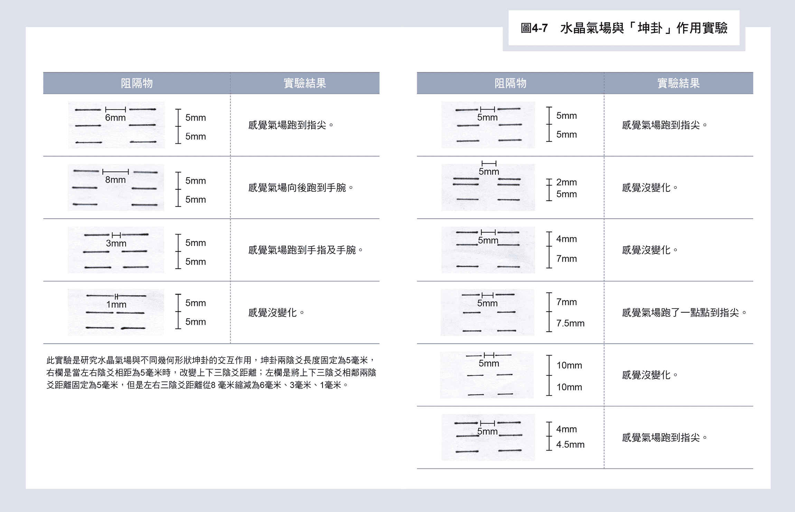

右栏的六列实验是当左右阴爻相距为五毫米时，改变上下三阴爻相邻两阴爻的距离为对称或不对称，或只是对称，但是距离比阴爻五毫米要长的结果。左栏其他列显示的是将左右三阴爻相邻两阴爻距离固定为五毫米，但是改变左右三阴爻距离从八毫米缩减为六毫米、三毫米或一毫米后的结果。

果然如我们所预料的，只要坤卦左右两个小干卦不对称，如图4-7右栏第二列（两毫米对五毫米）及第三列（四毫米对七毫米）所示。或者，对称的爻与爻距离等于或大于一公分，如第五列所示，则坤卦效应（气场跑到指尖现象）则会消失。

右栏第四列两个小干卦不完全对称，为七毫米对七‧五毫米，也超过单根横线长度五毫米，这时气场有一点点跑到指尖，表示还有些微的坤卦效应。

右栏第六列的两个小干卦不完全对称，为四毫米对四‧五毫米，则坤卦完全不受影响，气场还是向前跑到指尖。

从图4-7左栏第一列开始，两个小干卦距离改变成六毫米，则坤卦不受影响，气场仍然会往前跑到指尖。

左栏第二列中的两个小干卦距离增加为八毫米，气场变成向后跑，往后跑到手腕。

左栏第三列中的两个小干卦距离缩小成三毫米，气场跑到指尖与手腕，看来是分裂成两道气，一道气向前跑到指尖，另一道气向后跑到手腕。左栏第四列的两个小干卦的距离再缩小成一毫米，气场没有改变，坤卦效应消失。

整体看起来，坤卦中的两个干卦会随着阴爻之间的距离相互作用，而产生推挤。

### 气场与计算机印制的干卦、坤卦作用

从以上可实验得知，干卦、坤卦会与水晶气场产生很强的作用，但是用手画的卦比较不规则，重复性会有问题，于是二○一四年后我们改用计算机印制的干卦与坤卦来做实验。同时想到应该要了解干卦及坤卦的虚像为何？会产生动态行为吗？

我在考虑干卦间距必须对称问题时，正好碰到美国纽约大学的前校长提到：纽约大学要在上海设分校，根据法律，大学必修课程要有哲学课，可以选的内容包括《道德经》，他说《道德经》的四十二章有些说法没有道理，如「道生一，一生二，二生三，三生万物」，数位的世界是由○与一构成的，应该是二生万物，而不是三生万物。他的说法提醒了我干卦有三条直线，八卦生万像，为什么是三条而不是两条直线？

有一天早上，我睡醒了躺在床上思考干卦的规则，上下两条长度为L的阳爻，在时空创造了两条印痕间隔的距离是2L，如果第三条同样长度L的阳爻加上去，刚好在中间，它影响的范围是自己的长度：上下各L，刚好接触到上下爻。这样的影响拉动上下爻应该会让干卦旋转起来，如图4-8所示。

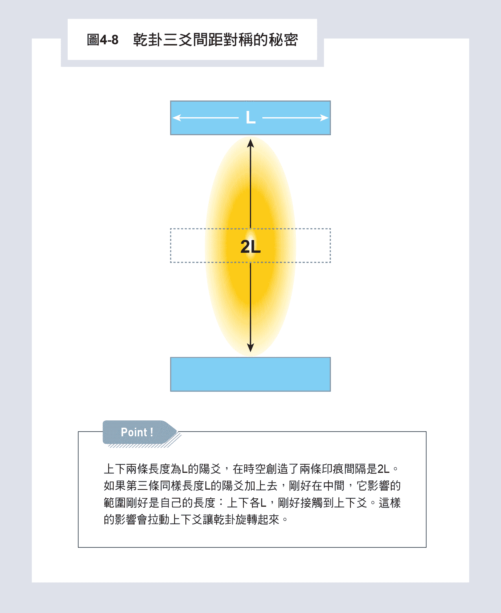

因此，我请T小姐用手指识字来辨识两卦的虚像，结果如图4-9及图4-10所示。

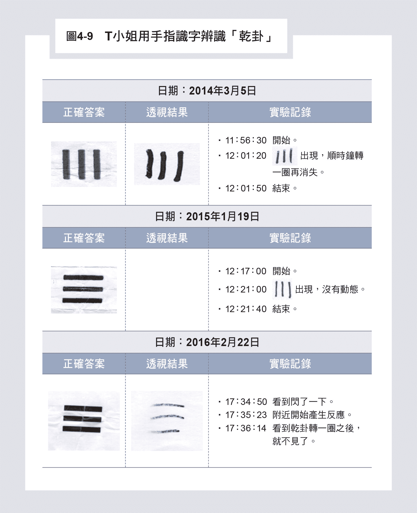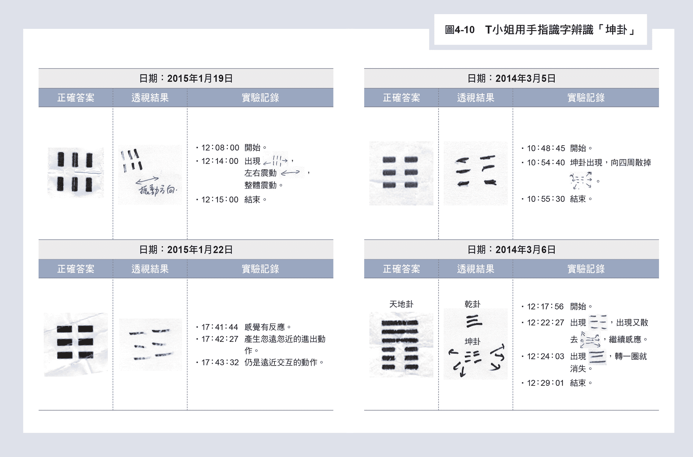

二○一四年，我们第一次做实验试干卦时如图4-9第一列所示，干卦的虚像在天眼出现后，真的顺时针转了一圈就消失了，我非常兴奋预言成真了。图4-10右栏第二列的天地卦中，干卦被扫描进天眼后，也是顺时针转一圈就消失了，这表示干卦的虚像有顺时针旋转的倾向。

但是，二○一五年做同样实验时，如图4-9第二列所示，干卦虚像并没有旋转，令人困惑不已。

后来，我注意到干卦图案似乎太大了，超过五乘五平方公分背景纸张大小的三分之一，表示干卦虚像大小可能超出背景纸张的虚像大小，让干卦虚象的旋转受到背景纸张正方形虚像的干扰。

果然，二○一六年我们缩小干卦在纸上的大小，如图4-9第三列所示，干卦虚像果然在天眼中转了一圈就消失了。这表示虚像的运动会受到背景纸张的虚像形状所干扰。

图4-10右栏第一列显示的是T小姐用手指识字来辨识坤卦时的实验结果，坤卦是两个相邻的小干卦组成，每个小干卦理论上都要各自顺时针旋转，此时六个爻的虚像会互相干扰卡住旋转，结果两小干卦互相推挤爆炸开来，第二列的天地卦下方的坤卦被天眼扫描进去以后，也是六根阴爻炸开。但是左栏第一列显示的是二○一五年一月十九日所作的手指识字实验，坤卦进入天眼后并没有炸开，而是左右震动，整体震动。

一月二十二日重复再做一次手指识字实验坤卦，这一次坤卦进入天眼产生忽远忽近的进出动作，好像六根阴爻本来要要炸开，但是碰到背景纸张虚像的边框又被弹回来，继续震荡。这个行为解释了图4-7水晶气场穿过坤卦的行为，打到坤卦的部分气场穿入虚空，被坤卦虚象的炸开行为，把实数时空气场向前带到了指尖，或向后带到了手腕部位。

水晶气场穿越计算机印制的干卦或坤卦会产生什么动态行为呢？

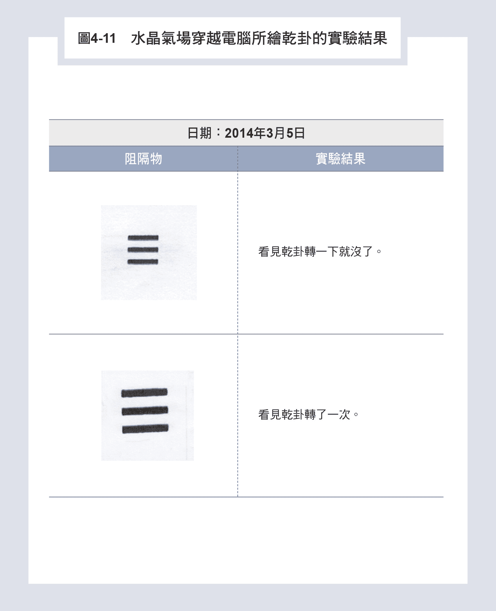

图4-11是二○一四年试验两个不同大小干卦的结果，都是顺时针转一圈，与手指识字结果完全一样。这表示水晶气场打到干卦后，一部分气场会穿入虚空，与干卦虚像作用，开始顺时针旋转，经过实虚纠缠带动实数时空的气场也顺时针转一圈，多么令人惊叹的结果，八卦神秘的面纱被我们掀起了一个角落。

二○一六年实验时，我们注意到背景纸张形状的影响，因此除了用正方形纸张外，也开始用五公分直径的圆型纸张，如图4-12所示。

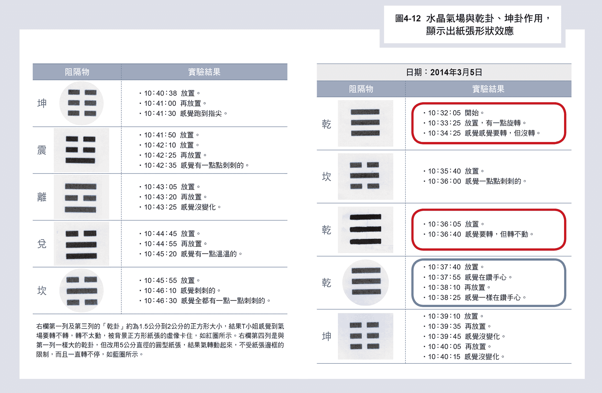

右栏第一列及第三列用正方形纸张，干卦约为一‧五公分到两公分的正方形大小，结果T小姐感觉到气场要转不转，转不太动，显然被正方形的背景纸张虚像卡住，如红圈所示。

右栏第四列是与上面第一列一样大小的干卦，但是改用五公分直径的圆型纸张，结果气转动起来，不受纸张边框的限制，而且一直转不停，感觉是在钻手心，如蓝圈所示。

右栏第五列为正方形上有坤卦，但没有任何反应，没有炸开的行为，但是左栏第一列改为圆形背景纸张时，气场向前跑到指尖。这表示边框效应一旦去掉，坤卦会炸掉把气场带往食指间。

这也解释了图4-5气场穿越用原子笔画的小干卦为何是刺刺的，因为干卦尺寸太小，不会碰到背景纸张，故气场穿入虚空带着干卦虚象一直在旋转而产生刺刺的缘故。

## 其他八卦图形所引发的动态行为

上面我们详细地研究了干卦及坤卦在虚空的动态行为，以及水晶气场穿过两卦后的变化，让我们知道八卦的神秘是隐藏在虚数空间中，而剩下的其他六卦有没有相似的行为呢？

首先，我们来看看手指识字中坎卦的实验结果，如图4-13所示，二○一四年的实验没有成功，坎卦的虚像在天眼中没有动作。但是二○一五年一月十九日的实验，坎卦出现后，以绕小圈的方式在动，象是在转圈子一样。

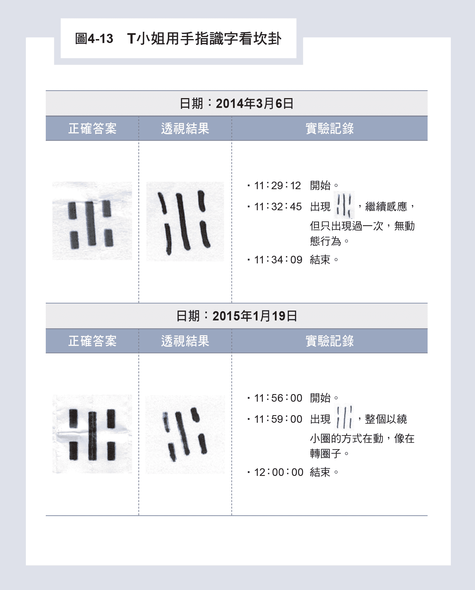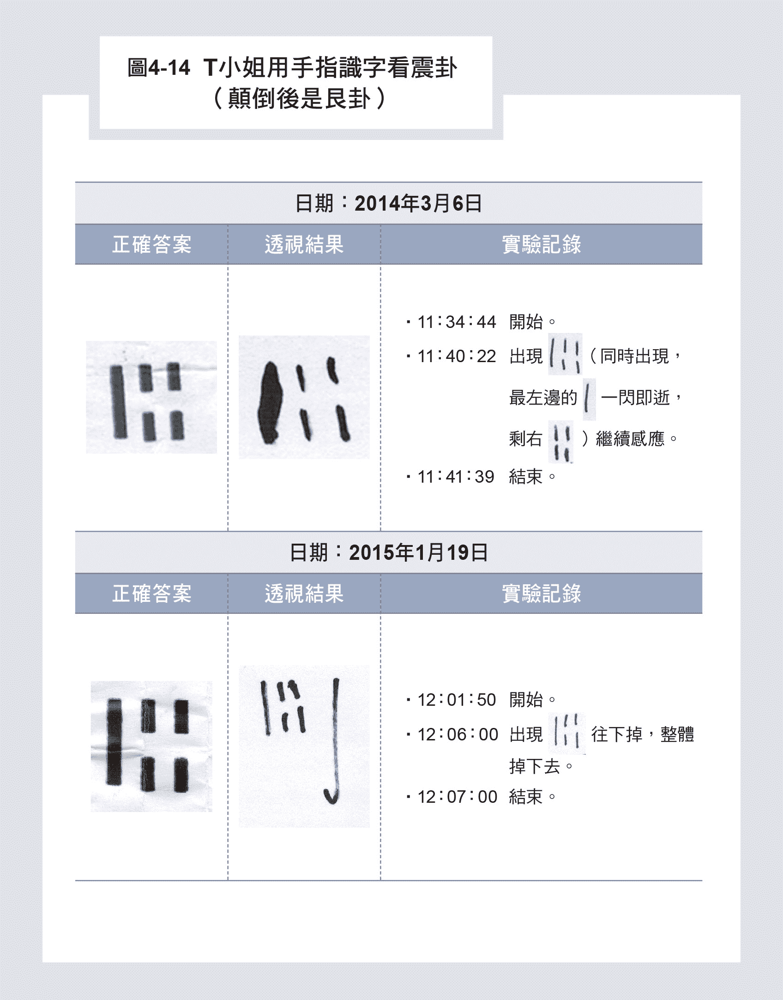

图4-14展示的是T小姐用手指识字看震卦（颠倒是艮卦）的实验结果。二○一四年三月六日第一次实验时的结果很特殊，震卦虚像在天眼出现后，左边的阳爻突然失踪跑掉了，只剩右边两根阴爻。

二○一五年一月十九日实验后终于搞清楚了，原来震卦的虚象会随阳爻一起运动，前一年的实验是阳爻动了，而旁边两个阴爻没有跟上的缘故。其他三卦「离」、「巽」、「兑」卦则无法在手指识字实验中成功看到动态行为。但是从水晶气场穿越这些卦象中，却全部看到了八卦虚象在灵界的动态行为。

例如，图4-5中右栏第一列中气场穿越「巽」卦，或转一百八十度的「兑」卦，会变成一阵阵忽大忽小的动态行为。右栏第三列穿越「离」卦，T小姐会感觉到凉凉的，都有变化。在图4-12中，也可以看到气场穿越「兑」卦会变成温温的，穿越「坎」卦会变成刺刺的，表示气场在旋转。

## 道家的布阵

由这些八卦在虚空的动态行为，我们就知道古代道家如何布阵来产生时空的动态行为，经过气场穿越阵法或空间物体的摆设，再投射到物质的实数空间，让经络敏感型的人能感受到，这就是风水的科学根据及奇门遁甲布阵的科学原理。

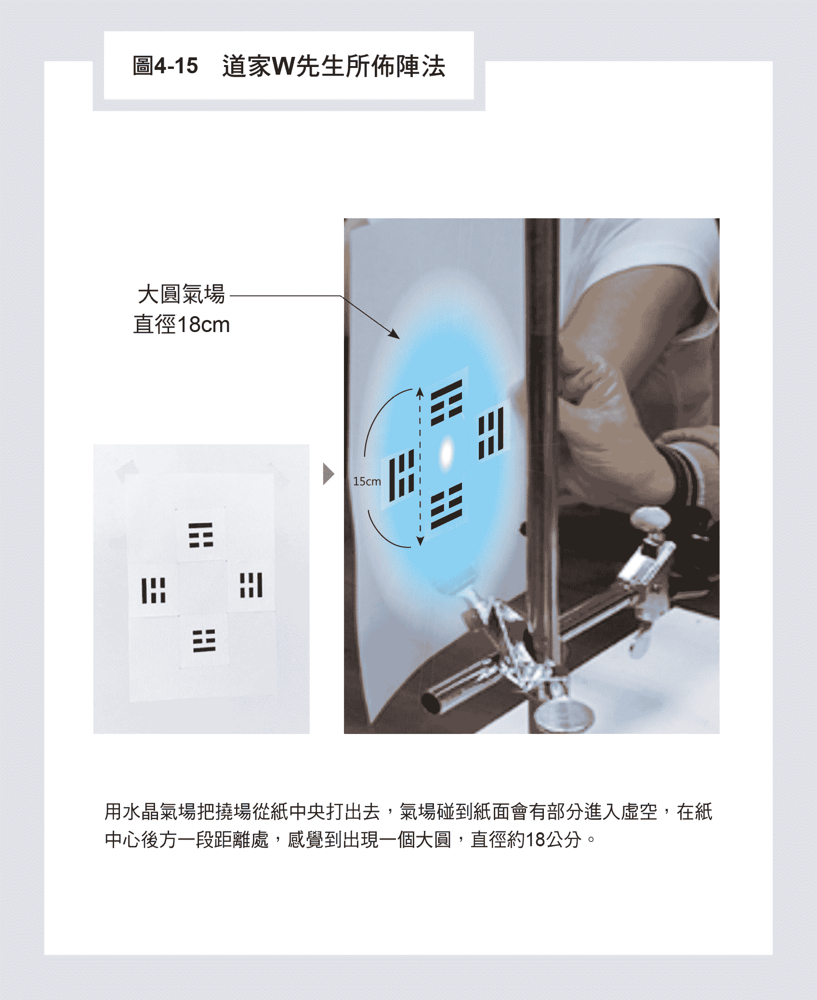

图4-15是我的朋友道家W先生教我所布的第一个阵法，在五乘五平方公分的纸上印着四张震卦，从上到下贴在十字型的角落，每张依序各转九十度，十字形的每条臂长十五公分。

我们用水晶气场或挠场产生器把挠场从纸中央打出去，气场碰到纸面会有部分进入虚空，被震卦虚像的阳爻带动一起运动，先向右、再向下、再向左，然后向上，等于转了一圈，在纸中心后方一段距离形成一个大圆气场，直径约有十八公分。经络极度敏感的人都能感觉到空间有这一团圆型的气场。这是我有生以来第一次实际观察及验证的一个时空阵法，打出去的气场产生了与理论相符合的气场结构，道家千年来操控空间的学问在此解密。

本章所提供的证据，我们很清楚地了解到，挠场也就是水晶气场，可以穿梭阴阳界，沟通两个世界。

由此，我们了解中国传统的风水就是在处理环境居家中物件的摆设所形成的几何结构，并用风或水调整气场的位置与大小。因为气场会钻入虚空，将虚空中物体虚象所形成几何结构的动态行为投影到物质的实数时空，我相信气场也将虚空的不同意识体或过去未来的信息带入物质世界的阳间，造成相关人士身体的不同感应，以产生吉凶祸福的结果。因此我相信挠场穿梭阴阳的气场行为，就是中国传统风水的科学基础。