# 五、二十一世纪的挠力文明

十九世纪末，特斯拉发明多相交流马达，

促成了二十世纪电力文明的开展，

他也提出几项当时认为科幻的创新概念。

这些基于挠场作用的概念，

及挠场侦测器的发明，

将会在二十一世纪促成挠力文明。

## 气场与分子模型及几何结构的交互作用

在第三及第四章中我们看到了水晶气场穿越神圣字汇、螺旋图及八卦图案后的结果，发现了气场可以穿梭阴阳界的神秘特质，原来气场打到纸上写的文字或图案后，会有部分气场穿隧进入灵界，引发这些文字图案的虚像产生动态行为。这些灵界动态的气场会与留在物质界实数空间的气场勾勾缠，物理上的术语叫做「实虚纠缠」，因此可以把灵界的行为投射回实数空间的气场，而被功能人感知，让我们可以了解这些几何图案的虚像在灵界的行为。

这让我们很好奇想去了解更多灵界的几何问题，例如，不同结构的分子模型，它们虚象的动态行为有什么不同？有没有遵循一些规则？同个分子的大小尺寸不同，它们的虚像会产生相同或不同的动态行为吗？

图5-1的是T小姐感受水晶气场穿越不同分子模型的实验照片。她带着眼罩，因此并不知道我们放在中间的分子模型是什么，同样的分子要重复放置两到三次，直到她确定感觉清楚以后才算完成。接下来，我们会一一讨论实验的结果，看看能不能归纳出一些共通的原则。

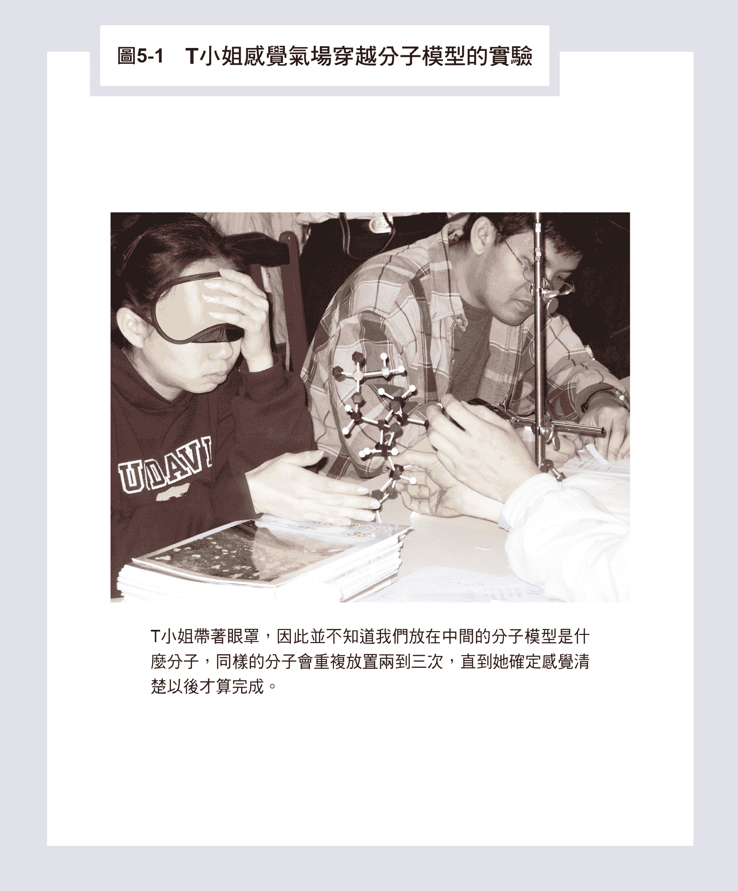

### 简单分子模型与金字塔结构

首先，我们尝试用简单分子模型如乙醇／酒精（C2H5OH）与甲烷（CH4）及纸做的几何结构如金字塔与大型DNA模型（长四十公分，直径十四公分），如图5-2所示。

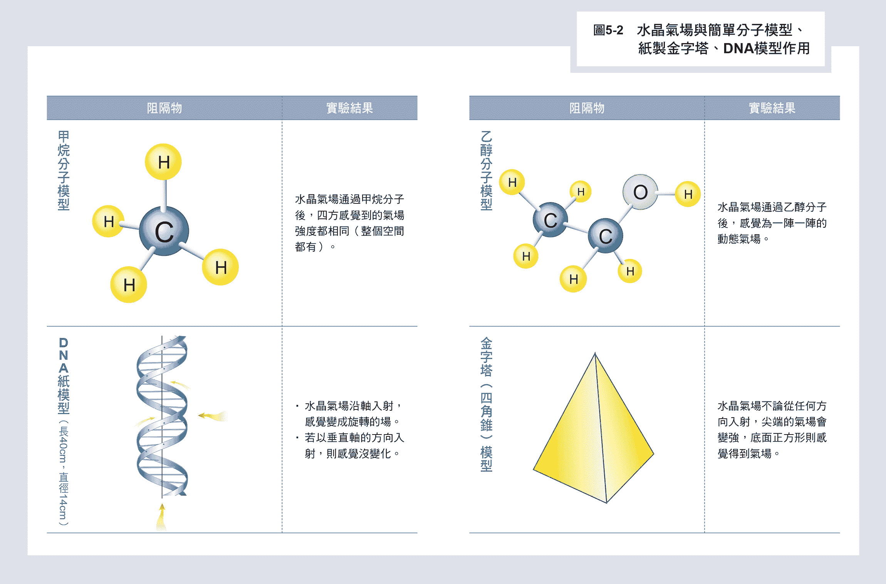

如图5-2右栏第一列所示，气场穿过乙醇分子会从静态的一个圆点，变成一阵一阵的动态气场；但是穿过左栏第一列的甲烷正四面体分子（碳原子在正四面体中心，四个氢原子在正四面体的四个角落），却是以碳原子为核心成球形向外扩散，她感觉气场向四周均匀的扩散强度相同。这表示球形对称的分子引发球形对称的气场分布；乙醇分子中，碳─碳─氧三个原子约略呈一百多度夹角的主轴化学键，加上五个碳─氢、一个氧─氢周边化学键的作用，导致气场被不同原子来回散射，变成一阵阵的动态气场，很明显的是，分子的几何结构就决定了气场在空间散布的形式。

图5-2右栏第二列是一个纸做的金字塔，几何上来说是一个四角锥，底部是一个正方形，我们发现用水晶气场，不管从哪一个方向入射金字塔，出来的气场方向只有两个，一个是从金字塔尖顶射出比较强，另外一个方向是从金字塔底面正方形均匀地射出来的气场比较弱。这告诉我们，金字塔顶尖的指向是有意义的，气场一旦穿隧入虚空灵界，就可以沿这个方向，以超越光速的速度射向宇宙深处。有一些研究金字塔秘密的书籍声称，金字塔尖端指向的星座，就是与这星座外星人通讯之用，看来有点道理。我也看过很多书籍，声称把食物放在金字塔中可减缓发霉或腐败的速度，我虽然没有做过类似的实验，但是看过一些中小学生的科展部分证实了这些现象，我猜想这跟金字塔内气场的分布有关。

图5-2最后一个实验是左栏第二列的纸做DNA模型直径十四公分，长度为四十公分，如果气场沿DNA轴方向入射，则气场会顺着DNA旋转方向旋转，类似第三章图3-14所示，气场顺着阿基米德螺旋旋转一样。如果气场是沿着垂直DNA轴方向入射，则完全不受影响，会直穿而过。

### 蛋白质分子模型

这一节内容中，我们考虑五个蛋白质分子模型与气场的交互作用，如图5-3所示。

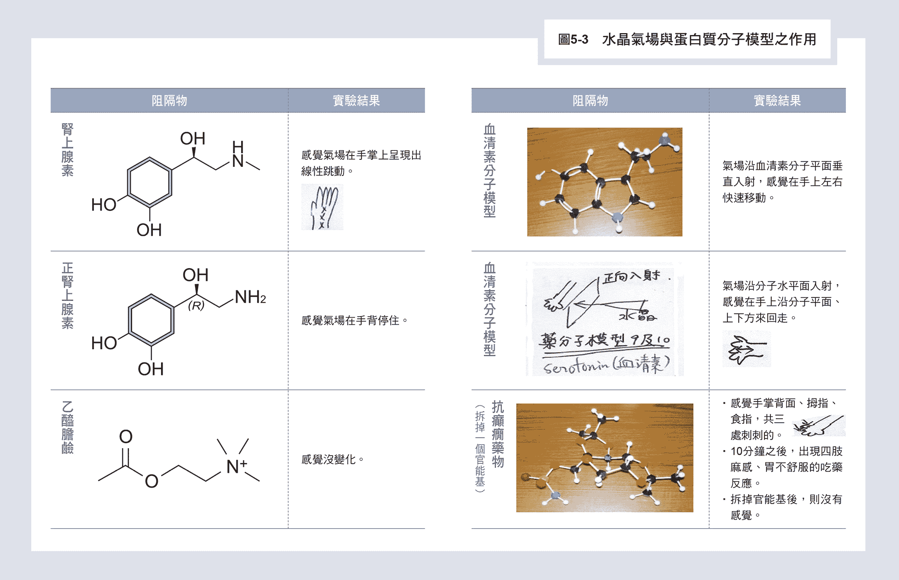

图5-3右栏第一列是血清素（Serotonin）分子模型，血清素为苯双环型神经传导物质，主要存在于动物的胃肠道、血小板和中枢神经系统中，它被普遍认为是幸福和快乐感觉的贡献者。如果气场沿着分子平面垂直入射，则气场被调成动态沿着平面来回扫描。如果气场沿着平面平行入射，结果变成气场在分子平面上下方来回走，都变成动态行为，如图5-3右栏第二列所示。

右栏第三列是抗癫痫药物Topiramate的分子模型，是一位神经科医师所制作的，也是他用来治癫痫病人常用的药物。T小姐的反应非常奇特，除了在拇指食指及手背有刺刺的感觉，在拔掉一个官能基以后，刺刺的感觉就消失了。实验十分钟后，她出现了四肢麻感、胃不舒服的反应，这位神经科医师在旁边马上说这是吃药反应！真令人震惊，我们只是把分子模型的信息用气场打在T小姐手掌上，她竟然出现了吃药反应。这个分子模型大小，是真的药分子一千万倍大，但是没有影响它对身体产生的作用。这告诉我们人体内一件重大的秘密，生理上生物化学的作用来自分子的几何结构信息，与分子尺寸的大小没有关系，药不一定要用吃的，只要药的空间几何结构信息被气场送入身体，就会发生吃药反应，这对我们以后用药治病有非常大的启发作用。

图5-3左栏第一列到第三列展示三个分子：肾上腺素、正肾上腺素与乙酰胆碱与气场的作用。

图5-3左栏第一列的肾上腺素是一种激素和神经传送体，由肾上腺释放。肾上腺素会使心脏收缩力上升，使心脏、肝脏和筋骨的血管扩张和皮肤、黏膜的血管收缩，是遭遇危难的人或动物会分泌的激素。肾上腺分子会造成气场在手掌到手腕上呈直线点状跳动；第二列的正肾上腺素是一种肾上腺素受体激动药，有收缩血管、升高血压的作用，它会让气场跳停在手背。第三列的乙酰胆碱是神经传导物质，由神经轴突末梢释出之后，会穿过突触间隙和突触后神经元或运动终板的细胞膜上之受体结合。从实验结果发现，乙酰胆碱对气场没有影响。看来扮演激素角色的分子结构，都会造成气场跳动，也许是沿氨环分子轴方向。

有关分子尺寸大小的作用，我们还有一组数据可以说明，如图5-4所示，多巴胺（Dopamine）分子模型，不论是用3D打印的小模型，或是塑胶球加杆子组成的大模型，形状完全一样，只是大小差了二十五倍以上。气场通过这两种分子后，都会在手掌上很多地方跳来跳去，反应完全一样。

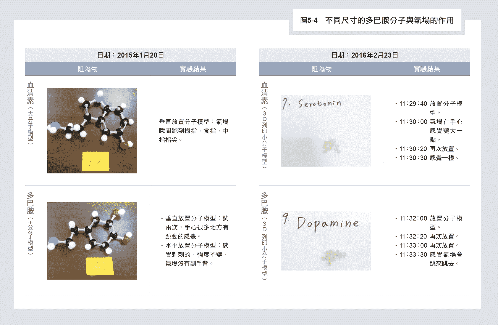

因此，几何结构才是生化反应的王道，跟尺寸大小没有关系，这也暗示在虚数时空中，气场与几何结构作用的原理是「形形相印」，只要几何结构相同，而非绝对尺寸相同，就会产生相同反应的规律。

我们尝试了许多胺基酸与蛋白质分子模型对气场的反应，最后可以归纳出三个结论：

 分子内苯环的胺基酸结构带有特别的讯息。

 单环硷基的多巴胺或肾上腺素类，带有引发气场跳跃的讯息（手指到手心感觉到气场跳动）。

 双环硷基类似嘌呤类分子的血清素、色胺酸、褪黑激素类，会扫描气场到指尖产生刺刺的感觉。这表示气场打到分子模型穿入虚空单苯环的虚像，导致跳跃的气场，而双环硷基的虚像导致扩大的气场，带动实数世界的气场来回走或扩大碰到手掌边界的指尖，而感到刺刺的。

### 晶体模型与实物有相同的反应

物质世界的固体都是由原子构成，如果固体中原子的排列有周期性则形成晶体，这些晶体与气场的交互作用又是如何呢？我们也作了一些实验来了解晶体的单位晶格模型与晶体本身，如图5-5所示。

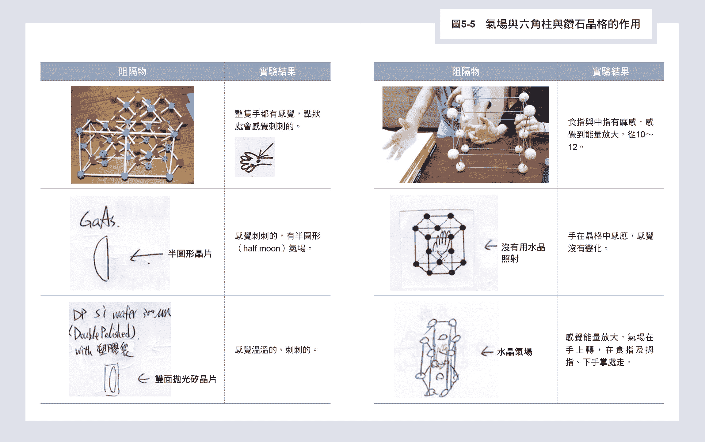

右栏是一个六角柱的单位晶格的反应，六角柱的底面是一正六边形，每边长度相同夹角为一百二十度，六边形中心有一原子，垂直底面的C轴长度较长。气场沿平行或垂直C轴方向入射，如第一列或第三列所示，气场强度都被放大，导致食指、拇指或中指麻，原来六角柱晶格也对气场有放大作用与神圣字汇一样。如果没有气场入射，如第二列图所示，感觉不变。这表示适当的3D空间几何结构也会散射气场来回震荡产生放大作用。

图5-5左栏展示的是以钻石结构为基础的重要半导体材料的晶格及实体。第一列是三五族化合物半导体材料砷化镓（GaAs）可以做高速及光电半导体元件，它的结构是以钻石结构为基础，每一晶格点放一对砷（蓝色）及镓（红色）原子做基底，当气场穿过晶格原子3D模型（红蓝相间）手上到处都有点状刺刺的感觉。如果气场穿越一片半月形的真正砷化镓芯片，如第二列所示，结果也是一样，手上感觉半月形刺刺的，反应完全一样，再度证实不论模型尺寸相差多大，相同的结构导致相同的气场分布。第三列是半导体硅双面抛光的芯片，硅是集成电路最重要的材料，是真正的钻石结构，把第一列红蓝相间的原子模型改成一样的颜色，就是硅的原子结构，结果气场穿过硅芯片也是感觉到刺刺的、温温的，好像还有一点放大作用。刺刺的感觉表示打到晶格原子散射的气场产生干涉的涡漩小气场，像小锥子一样刺到手掌。

接着，我们来看气场与体心立方晶格的交互作用，如图5-6第一列所示。体心立方是一个立方体晶格，长宽高一样长，两两夹角成九十度，正方体中心有一个原子，所以叫做「体心立方」。

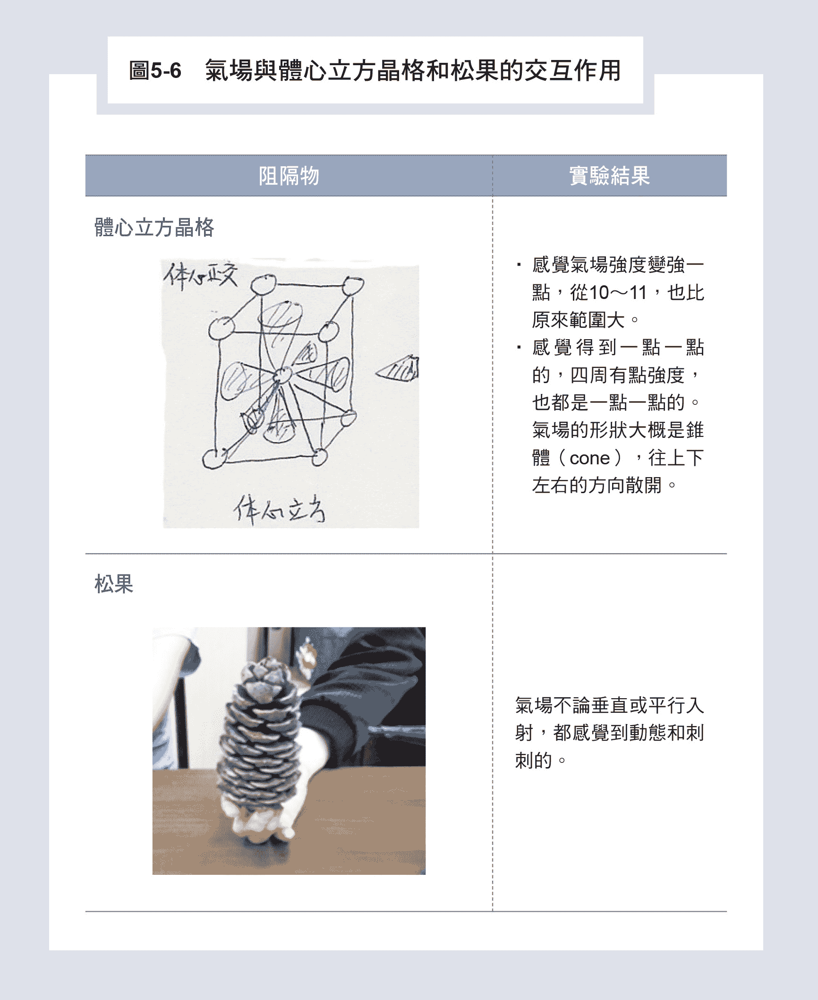

当气场打向晶格，中心原子上下、左右、前后的六个方向都会出现一个锥状气场分布，强度也稍微变强一些，约百分之十。

图5-6第二列显示的是气场穿过一个大松果的实验，松果就是大脑内松果体的替代模型，它的几何立体结构与松果体相似。结果，气场不论是垂直或平行松果轴向射入，都是变成动态且刺刺的感觉，这也告诉我们：大脑松果体会与穿梭阴阳的气场产生强烈交互作用。

### 药分子钥匙开锁治病原理

人体细胞内的遗传物质DNA是由四种分子：腺嘌呤（Adenine），胸腺嘧啶（Thymine），鸟嘌呤（Guanine）和胞嘧啶（Cytosine）组成，简称为A、T、G、C，其中AT与GC分子两两配对，分子形状会互补，如图5-7所示。

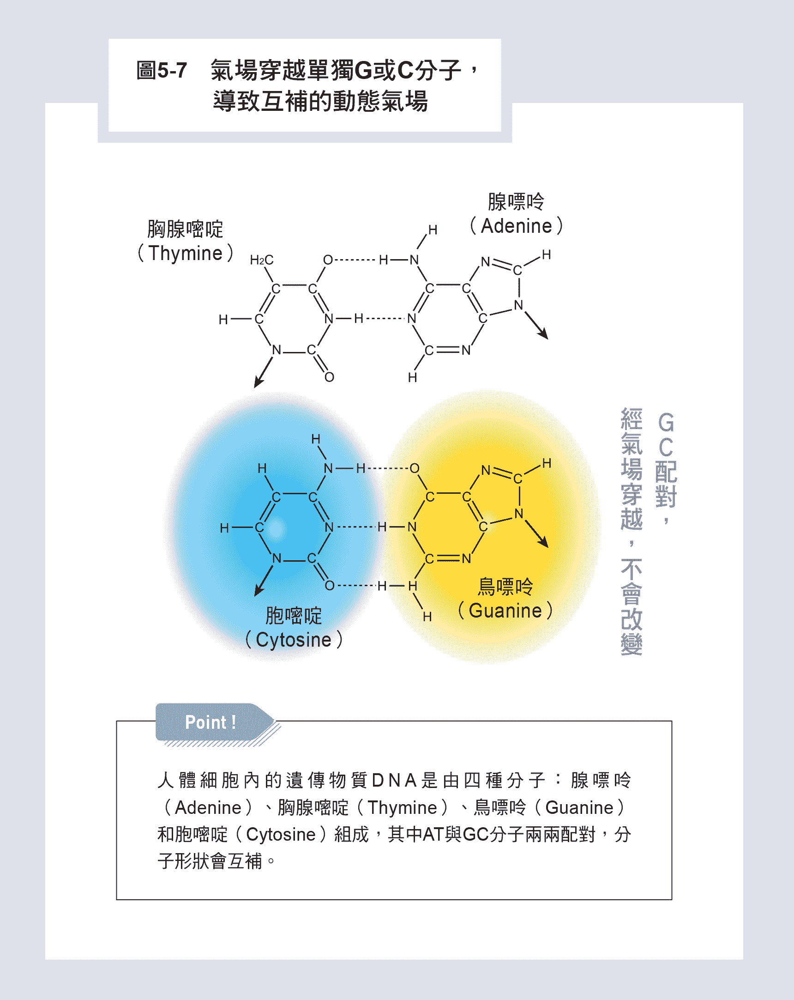

当我们用水晶气场穿越单个G分子模型（双环硷基分子），可以感觉手掌中心部位没有感觉，但是手掌周边五个指头会有感觉，好像气场范围扩大到周边；换成单个C分子（单环硷基分子），则气场穿过会导致手掌中心处有比较强的感觉。很明显的是，两者对气场的散射刚好互补，一个在手掌周边，一个在手掌中心。接着，我们把两个分子GC合并成DNA内相连的结构，结果气场穿越合并的分子并不是两者相加造成全手掌扰动，反而是风平浪静，完全没有扰动的感觉。这真是惊人的一刻，原来生物化学反应的钥匙开锁原理，是让两互补时空结构彼此结合，来抚平时空的缺陷，恢复完整平直的时空，而将时空缺陷所造成的动态时空所引起的系统运作问题解决，这也解释了药可以治病的原理。

我在《科学气功》一书中所提及的分子X信息，就是这种与分子时空互补结构的信息。至于单个A或T分子模型，则不会对气场有任何散射，A和T两分子合并结果也是一样，对气场没有散射能力。从水晶气场侦测结果，G和C分子似乎比A和T更有符号的威力可以散射气场，这可能与GC两分子中六环硷基一侧边有C＝O结构，另一侧边有C-NH2的特殊结构有关。事实上高GC含量的DNA段落也是高基因含量高转译的区段，也就是好的DNA段落。

由这些实验数据我们开始了解，气场打到晶体部分穿入虚空，会被周期性原子虚像散射重组，再钻回实数空间，被手掌的经络感知到。因此实数空间中物质世界不同物体的摆设都会影响气场的分布，进而影响到人体。

过去，我们大多数人并不相信风水，认为风水是迷信，也不重视办公室或家庭内家具的摆设位置，但是从我们的实验结果来看，家具摆设的几何形状与位置的对称或不对称，显然会影响气的运动，造成不同的气场分布，对人体健康可能也有不同的影响。那一般人怎么办？要到哪里去找可靠的风水师来办公室或家里看一看？其实人群中有百分之十五到二十的人是经络敏感型的人，对气场会有些感受，在自己的家里或办公室调整一下家具的位置，感觉舒服的气场就可以了。我相信未来随着挠场研究的深入，挠场散射问题，应该可以逐步用计算机模拟出来，也许未来计算机风水设计师会是一个很夯的行业。

### 气场「界水而止」的原因

我们从二○○○年开始做气场穿越不同物体的实验，马上就发现一张沾水的纸，就可以把气完全吸收，这个实验也被后来其他经络敏感型的修课学生及NMR的核磁共振实验所证实。但是我们一开始完全无法理解，水是如何把气场吸收藏在水中？以什么形式存在？

二○一三年，我们开始从事挠场照水的研究，用核磁共振技术来测量挠场照水三分钟后，来了解水分子团大小的变化。我们都是在化学系NMR实验室做实验每个星期做一次，总共做了两年多超过一百次的实验。我的合作伙伴蔡博士慢慢发现在实验时，挠场产生器的电线如果垂挂在实验铝架上与实验杯中水接近，与电线拉到墙边、远离杯中水的实验结果竟然会不一样。这让我们伤透脑筋，为什么水吸收挠场以后，会与附近环境的电线产生交互作用？

后来，与T小姐做气场实验时，我们才发现两杯水如果放得太靠近，在五公分以内，则两杯水似乎会交换气场信息，这表示被水吸收的气场，并不是侷限在水的内部，而会扩散到附近区域，这就解释了为何环境的摆设会影响水中分子团的大小变化。气会穿梭阴阳界进入虚空，因此我慢慢理解气场经过水就被完全吸收，是因为气场打到水就完全进入虚空的缘故。

由于水分子（如图5-8所示）是两个氢原子与一个氧原子化合（H2O），H-O化学键有两个自旋相反的电子，形成3D的太极结构，有两个鱼眼，挠场可以一进一出穿梭阴阳界。但是氢原子核只有一个质子自旋，只有一个阴阳界通道，因此它是单行道只出不进。就像顺向阀筛子一样，挠场打入水中，被单向阀管控全部进入虚空而消失了，自然进入虚空的挠场会与附近环境中物体虚象作用，而干扰实验的结果。由这些实验我们真正了解到「气界水而止」的物理原因，因为全进了虚空。

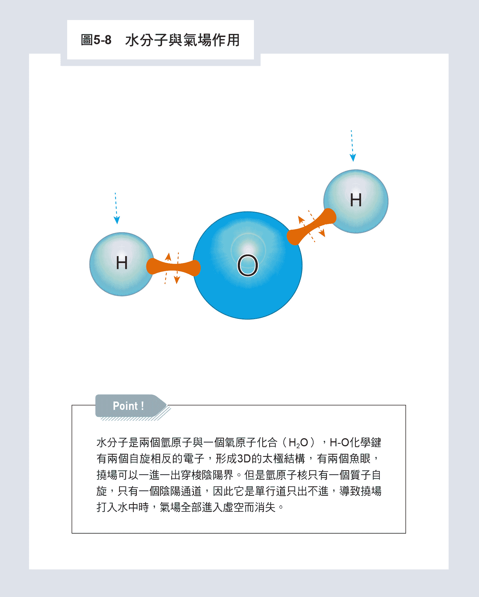

## 物理农业，取代化学农业的未来

农业是人类社会赖以生存的根本，十九世纪中叶以后，科技的发展促成工业革命，机器取代了人力，人类文明日益发展，但是环境却逐渐受到破坏。几千年来日出而作、日落而息的农业也碰到相同的问题，人类生存环境在数十年来的化学资材包括肥料、杀虫剂不当使用之下，受创至深，水质恶变，土壤缺乏生机。尤其不当施用化学农药，导致生态失衡、病虫草害失控与传粉蜜蜂不明原因死亡，恶性循环之下，人类继续不断开发与应用新型药剂，冀求掌控病虫草害，结果却适得其反。在此种无法依循生物共存的情况下，环境也更加快速恶化，可以说二十世纪是「化学农业」的世纪，也造成环境破坏的灾难。

目前农业正处于由「化学农业」向「生态、环保、健康农业」的过渡时期，应该思考如何在无污染的条件下达到增产、优质、减少病虫害的目标。最好能在不使用化学农药、肥料下降低病虫害之影响，同时维持环境与生态中有益微生物、益虫正常数量与活力，故可以开始考虑利用物理方法来聚气、集气达成此目标。

曾与我合作过的台大园艺及景观系的张景森教授把这种概念称之为「物理农业」，实在是一个了不起的创新方向，具体实现的方法是「利用风水布局达到作物健康管理」，研究不同几何图形之气场、风水布局，对其栽培环境中微生物相及益虫、害虫变化之相互关系。

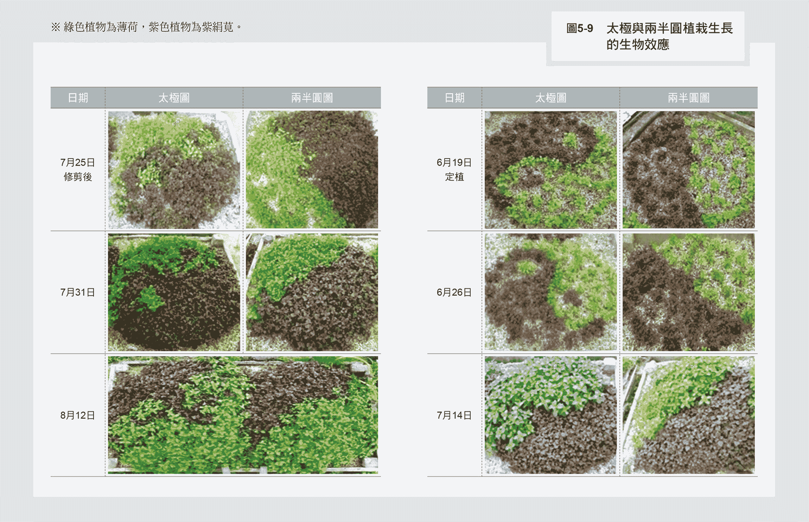

图5-9所展示的就是其中一项成果，张教授选择两种植物代表一阴一阳，阳的是绿色的薄荷，阴的是紫色的紫绢苋，分成两种方式合种成一样大的圆形，直径一样，面积固定，如右栏第一列图形显示。两植物于某年六月十九日定植，第一个是种成太极图，第二个是种成两半圆，绿色薄荷及紫绢苋各植一边，从图片由上到下的变化，可观察植物随时间过去生长的情形。七月二十五日修剪后，可看到七月三十一日成长的情形：种成太极图的两种植物维持饱满圆形，互不侵犯，小鱼眼圈中的植物，并没有被外围另一种大量的植物侵入；但是种成两半圆的两种植物则容易变形及缺角，有互相竞争的情形出现。

由于到了夏季的七、八月南向的薄荷成长在两种图形都比较旺盛，实验于八月十二日结束，由此可以看出太极的几何结构所创造的气场，有利于不同物种间的和谐相处。

张教授为了重复验证几何图形对植物生长的影响，曾以太极图、右螺旋或两半圆结合图案分别于冬季种植香草植物如柠檬罗勒、紫罗勒，或夏季种植绿薄荷、胡椒薄荷，结果都是以太极图和右螺旋图对香草植物的植株存活率、生长量、植株健壮表现有显著正向的效益。这也表示农业的栽植，最好不要用简单线条方式种植，而是要改用可以聚气、集气，或导致气场旋转的图案来栽植，可能收成会比较好。

若改以五行图形种植前述香草植物，则以五行金（半圆形）、五行木（细长方形）对植株存活率、生长状态、抗氧化有效成分，尤以三价铁的还原抗氧化能力（FRAP）表现最佳。而以五行火图形（三角形）种植者表现最差。

若利用五行色彩黏板（白、黄、绿、深蓝、黑、红、褐色）吸引茶园，也有益昆虫试验。因试验时，非小绿叶蝉活动旺盛期（五到七月），吸引效果不佳，但以黑色黏板处理时，吸引昆虫略多；黄色则对瓢虫吸引效果有显著性差异。

我与台大园艺及景观学系的张祖亮教授也尝试合作过，把植物种成不同的卦象，放在不同的方位，研究植物的生长状态及叶菜总量的变化。张教授设计出八卦阴阳爻的容器，如图5-10(a)所示，然后把阴阳爻的容器合组成八卦的卦象，放在园艺系的实验场，做实验培养莴苣，如图5-10(b)所示。

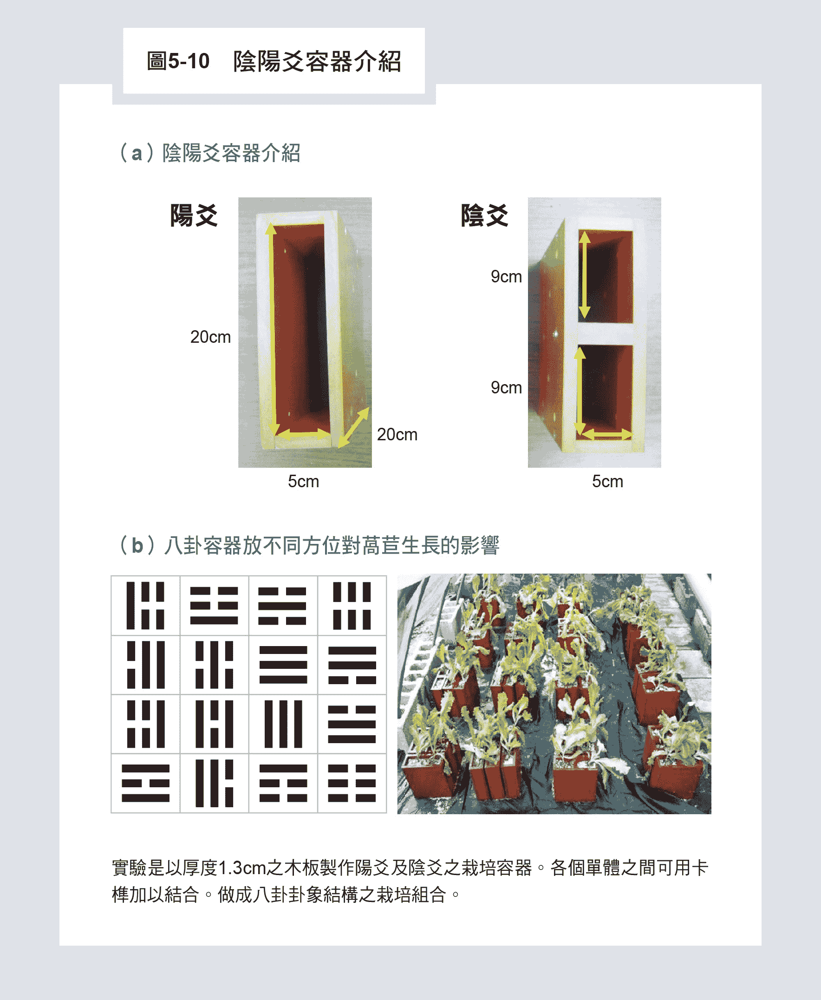

二○一四年十月，张教授种植一百五十六株皱叶莴苣穴盘苗定植于由阴爻及阳爻盆所组成之八卦几何图形。种植三十天后采收，调查叶片数、地上部[①](#foot-%E2%91%A0)长度及地上部鲜重[②](#foot-%E2%91%A1)。最后统计结果包括爻象（阴、阳）与方位（平、竖）的复因子试验分析显示，单一因子（如爻象或方位）对于莴苣地上部生长并无显著的影响。而爻象与方位组合后之互感作用，则对于莴苣的地上部的鲜种、干重具有显著影响。但卦象对于莴苣地上部生长，除叶数外，地上部长度、鲜重及干重皆有显著影响。

此一结果亦显示出卦象空间方位的组合，不是迷信，而确有其物理效应存在。而卦象与方位组合后之交互感应作用，则对于莴苣地上部生长之所有调查项目，皆具有显著影响，这告诉我们种植作物时，面对不同的方向，要用不同卦象的几何图形来种植。其他如茶树的种植、昆虫的防治，也让我们看到一些有趣的现象，我认为「物理农业」是二十一世纪农业科技值得参考的一个创新方向。

* * *

[① ](#back-%E2%91%A0)作物生长包括地上部及地下部。茎、叶、花、果、芽等位于地面上，为地上部；根深入土壤，为地下部。

[② ](#back-%E2%91%A1)鲜活的植物采集后立刻测出的重量。

## 挠场可作为星际通信的工具

第三章我已经介绍二○一八年北京的工程师高鹏用Akimov 挠场发射器与纽约市立大学的Mark Krinker教授做了几千公里从北京到纽约的远距通讯实验，两人都用同一张照片作为挠场发射起始位址及接收挠场的定位器之用。虽然电磁波的通信在一百年前就做到同样的事情，但是挠场有一个电磁波没有的特性就是：挠场会穿入灵界。一旦穿入灵界，就不受实数时空、物质世界中广义相对论对信息传递的光速限制，可以用远超过光速的速度在宇宙传播。

我在《灵界的科学》一书曾谈到功能人用意识到四百三十八光年外的外星文明去看外星人，只要一到两秒钟，表示她天眼意识的速度至少比光速快107以上，瞬间即至。剩下的问题是：通讯技术要有共同的标准。一开始当然是采用最简单的技术，就像当年发明电报一样，可以用摩斯码一长一短代表一与○，就像数位技术一样「二生三，三生万物」，就可以开始通讯了。但是问题又来了，谁可以去跟外星人谈判共同技术标准？很显然的，就必须找到有电子科技知识的功能人，开了天眼直接去外星用心电感应与外星人沟通，就不需要语言文字，否则还要先学外星语言，那可太难了。至于如何定位的问题，也就是浩瀚宇宙中我们如何互相瞄准集中能量，以免信号能量太弱、噪声太强而无法送去。还好灵界有一套自己的相应法则——「形形相印」，只要几何结构完全一样，或是互补结构，像钥匙与锁，不论尺寸大小都会互相吸引、找到对方，这也是高鹏与Mark Krinker教授用同一张照片来做挠场通信的原因。挠场打到发送者的照片后能穿入灵界，并带着这一张照片的虚像在灵界搜寻接收者相同照片的虚象，由于「形形相印」瞬间即至，几乎不用时间，然后挠场经过照片虚象穿回实数的物质世界，带着传送的信号就可以被侦测器侦测到。我相信二十一世纪四十年代以后，我们有机会开始利用挠场与外星文明展开通讯。

## 挠场侦测器，迎接挠力文明的到来

为了迎接挠力文明的到来，科学上最重要的关键就是找到挠场的侦测器，把看不见、不容易感受的挠场测量出来。俄国科学家花了几十年时间测量挠场，但是发现极度困难，他们主要以Akimov挠场产生器实验，我认为他们还是在测量伴随产生挠场的线圈电磁场大小，而不是直接测量挠场的强弱。

至于Sphilman挠场产生器产生的挠场在二○一六年有一项突破性的发现，北京大学的任全胜教授发现水的排斥区（Exclusion Zone，简称EZ） 似乎可以侦测到挠场的强弱。

大家都知道水有固体、液体及气体三相，二○○六年美国华盛顿大学G.H. Pollack教授提供令人信服的证据[①](#foot-%E2%91%A0)，认为水存在第四相，是一种有规则结构的水。虽然争议很大，十多年来也有其他模型被提出来，但是水的第四相仍然是主流看法。

Pollack教授发现，将表面带负电性亲水的高分子薄膜（Nafion film）插入去离子水中，水中浸泡有表面带负电的小奈米塑胶球（直径约五百奈米），很快地在几分钟之内，接近Nafion薄膜表面之奈米球会全部被排开，出现一个透明的排斥区，宽约几百微米，是一般人头发宽度的五到十倍，如图5-11上视图所示，光线是从白色铁氟龙奘水盒子下方往上照，黑色部分就是奈米球，黑压压的一片且不透光，微亮的排斥区在Nafion薄膜两测开展。

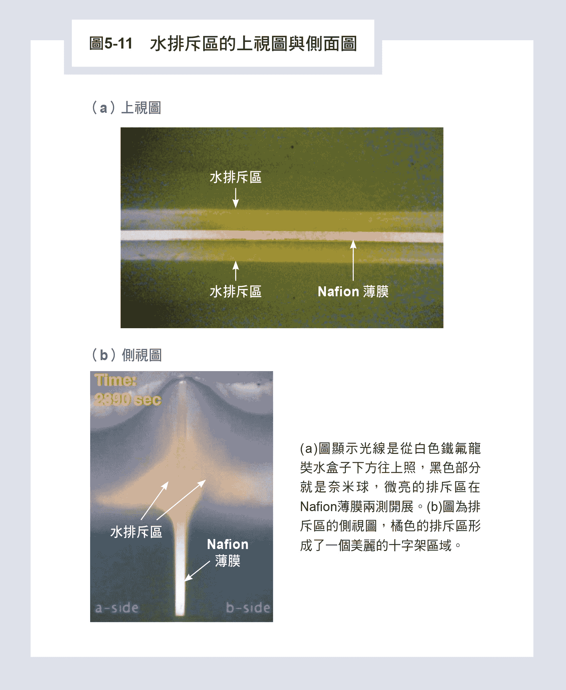

最神奇的是，根据Pollack教授的发现，水的排斥区会把氢离子赶出排斥区在外围，氢氧负离子（OH－）留在内，正负电荷被规则排列致密的排斥区水晶格阻绝，无法互相吸引接近而中和，正负电各自累积因此形成一个电池，可以外接导线到正负电荷区域用来发电。

功能人T小姐做手指识字实验时，大脑打开天眼时，左右手掌的食指底端会产生约二十到四十毫伏特（mV）的电压，有时电压会延续两分钟之久，好像整个大脑变成一个电池，把电压经过神经送到手上。这让我极度怀疑，大脑中的天眼就是脑中某个区域的生理食盐水被亲水性细胞膜引导，进入水的第四相产生电池现象，局部电压导致水排斥区密度增加到进入玻色─爱因斯坦凝态[②](#foot-%E2%91%A1)的量子状态（Bose-Einstein condensation）而产生天眼。

我的实验室在二○一八年开始研究水的排斥区，除了传统地用显微镜从液面上方观察水排斥区的宽度变化，如图5-11的上视图，我们也同时用第二个显微镜观察Nafion薄膜附近排斥区的侧面扩展情形，全部过程用电脑控制每秒同步拍照一次，然后相互比较。结果，我们发现排斥区的侧面图形展现出非常壮观的景象，如图5-11的侧视图所示，橘色的排斥区形成了一个美丽的十字架区域，橘色是Nafion薄膜内杂质在光照之下发出的颜色，本来橘色光被侷限在薄膜波导内传播，但是第四相结构水出现后有比较高的密度，导致光穿出薄膜射进排斥区，让我们看到十字架的排斥区。

果然没错，如北大任教授所发现，用挠场照射水排斥区四十分钟，排斥区会扩展百分之十到二十五，右旋挠场比左旋要强，造成的扩展比较宽。当左旋挠场先穿过佛字，再照向水排斥区，宽度甚至会增加到百分之三十左右非常惊人，也证实了前几章所描述的经络敏感型受试者会感觉佛字放大气场的现象。

未来如果能把挠场侦测器做成面板，像计算机液晶荧幕一样，就可直接看出挠场的强弱分布，风水布局将会简单到变为日常生活的一部分。

* * *

[① ](#back-%E2%91%A0)参考资料：Zheng, J.; Chin, W.; Pollack, G.H. Advancesin Colloid and Interface Science 2006, 127, 19-27.

[② ](#back-%E2%91%A1)是指玻色子原子在冷却到接近绝对零度时，呈现出的一种气态的、超流性的物质状态，于一九二○年代，由物理学家萨特延德拉‧纳特‧玻色和阿尔伯特‧爱因斯坦提出预测。

## 完成特斯拉未竟的理想——虚空取能

我在第三章最后一篇，介绍了我无意发明的「气的震荡器」，竟然是一个虚空取能器，只是能取出的能量非常有限，现在无法展现真正的用途。

二○一六年，我遇到高雄一家小电机公司的林总经理与中山大学陈教授，他们合作发展了一台转子为八个电极的发电机，设计非常奇特。林总经理过去因生病开始练气功、打坐，并且注意营养一段时间后就痊愈了，后来他继续打坐时，从灵界下载了这个发电机的设计。

一般发电机的定子上，每个沟槽绕线的圈数都相同，他却采用中国传统《洛书》的设计，相对两沟槽绕线的总圈数固定例如十圈，但是八极各相对沟槽分别为九加一、八加二、七加三、四加六圈依序排列；发电机由马达带动，产生的电力送往负载。神奇的是，在某种运转频率范围下，输出给负载的功率竟然高过输入马达的功率。

林总经理与陈教授遍访国内马达及发电机专家，甚至到国家负责科技发展的科技部，去报告成果，寻求支援，结果一句「这违反能量不灭定律」，只好灰头土脸而回。最后他们看到我是专门做怪力乱神实验的学者，心想也许可以谈谈，跑来找我评估。

我建议他们做一系列实际的路跑实验来验证，用现在的标准电池放在机车上，测试看看跑多少公里后电压会降到四十九伏特以下就要重新充电，结果路跑了四十公里以后就要充电。然后，我请他们把新发明的发电机串接上标准电池当作回充电力系统，应该可以提高电池的效率，然后再路跑一次。当时，我建议他们只要跑到八十公里就好，千万不要超出太多，以免其他人完全不信。

最后，他们将详细的实验结果拿给我看，并且重头到尾用仪表详细记录电池电压变化与里程关系。当车子跑到八十公里结束的时候，用气发明的发电机串接后的电池还有五十五伏特电压，表示还可以继续跑，但这已经是正常标准电池运作可能跑到的最大距离的两倍。这是我亲自参与实验后看到的实情，让我心情激动不已，可惜的是，林总经理二○一九年因病已经过世，他把从国内外获得的发电机专利，加上剩下的研发工作，交给他的家人及高雄市几个大学的三、四位教授继续发展，希望有一天这项技术能真正问世。

这种挠场撕裂时空所产生的力量，同时也是特斯拉一百多年前所「幻想」的世界，已经在我眼前呈现，显见二十一世纪新的挠力文明已经在我面前展开。