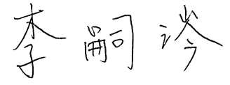

# 挠场的科学

作者：李嗣涔

## 自序：特斯拉没有说的秘密——挠场

台大前校长　

尼古拉．特斯拉（Nikola Tesla）于一八五六年出生于奥地利帝国的一个小镇，在今天的克罗埃西亚共和国之内。他于一八八二年受雇于美国发明家爱迪生（Thomas Alva Edison）在巴黎的分公司做工程师，由于表现杰出，被当地主管推荐到了纽约总公司追随爱迪生研究发电机技术。但是他很快与爱迪生闹翻离职而自谋生存，他所发明的多相交流马达配合交流发电机藉由西屋电气公司（Westinghouse）的推展及商业化，奠定了现代电力公司的基本发电模式，藉由交流发电及变压器升高电压，以低耗损方式传输到远方，再降压给用户使用，当然这也打垮了爱迪生所发展的直流发电机技术，导致两人结下很深的冤仇。

今天我们随时要用电灯、计算机、电视机、电冰箱、洗衣机等电器产品，只要插上电源插头，打开开关就可以享受电力文明的便利，这关键性的多相交流马达的发明要归功于特斯拉具有的一项神奇的能力。他从小在大脑中会产生影像视觉，我们现在叫做「开天眼」，也就是他有特异功能，可以听到远处的声音。当他遇到任何问题，比如设计新的马达，常常有如神助般会有答案，以影像方式呈现在他的天眼上面。更神奇的是，他还可以让马达运转。如果运转不顺利的话，表示设计有问题，他可以在天眼上更改设计直到运转成功。结果在天眼上运转成功的设计，一旦开模做出来，实体机器就一定会成功，这让他发明了多相位交流马达。

特斯拉成名以后，直到他一九四三年八十六岁时过世，这几十年的期间常常发表一些怪异的想法，超过当时世俗的理解。例如，他声称用他发明的特斯拉线圈可以接收到外星人传来的讯息，因此他要发展死光武器以对抗外星人入侵，以避免人类被毁灭；他也收到讯息——地球将会产生温室效应，北极融冰后洪水会淹没城市，因此应该从环境中提取自由能源，以解决燃烧化石能源所造成的大气污染。他的种种观念远远超前他的时代所能接受，而且他并没有留下实体完成的机器如死光武器来验证这些观点。加上他过世后，美国政府把他遗留下的大量文件扣留了很长的时间，而他商业上的对手爱迪生又不断地丑化、打压他，因此特斯拉的事迹逐渐为人们所遗忘。

直到上世纪九○年代，特斯拉遗留下来的部分文件重新出现于世间，并引发了一些神秘事件，由曾经拥有者凭记忆记录下一些断简残篇公诸于世，才再度引起了特斯拉风潮。

我研究特异功能超过二十五年，到最近十年为了解特异功能之谜，我发展出了复数时空的模型来解释宇宙的实像以及天眼等意识的物理。我在二十五年的研究过程中，也遭遇到像星际通信、寻找外星人、真空取能等现象，与特斯拉晚年一样，因此我可以体会特斯拉发现这些现象的激动与震撼。不过，由于要到他中老年以后，二十世纪两个最伟大的理论包括一九一五年的「广义相对论」及一九二○年代的「量子力学」才相继建立，他已经时不我予，无法理解这些新的理论，并应用到他所发现的神秘现象。

但是现在已经是二十一世纪，距离特斯拉当年的发现已经超过一百余年，科学上已经有很大的进步。有些当时感觉神秘的现象，现在已经可以用科学来解释了，因此我尝试在本书用近百年的科学，尤其是「广义相对论」中挠场的发现与物理性质，以及「量子力学」对意识的阐释，来解释特斯拉当年没有说也无法说的秘密。特别是发现挠场可穿梭阴阳界的特质，不但让人体会如何从灵界取能，以及揭露中国传统风水的科学根据，也开始了解了道家奇门遁甲及诸葛亮布八卦阵的原理。希望这些新知识能稍微弥补特斯拉迷过去的遗憾，也预告了二十一世纪挠力文明即将兴起的趋势。

我在另一本着作《科学气功》第三章已经对挠场的发现与历史作了详细的介绍，也提供挠场透过不同物体，如沾湿的滤纸、金属铝、钼、不锈钢等材料，照射去离子水后，水分子团内氧原子同位素O17核磁共振图谱的变化，由此证明物理挠场的存在及它的穿透性质，并判断它与水晶气场具有相似的物理穿透特性，从而认定中国传统气功中物理气场如外气的本质就是挠场。因此，在本书中我会交互使用气场或挠场，因为是同一种物理现象，也提出实验证据说明挠场的许多惊人而有趣的性质，可以说本书是挠场故事2.0版本。