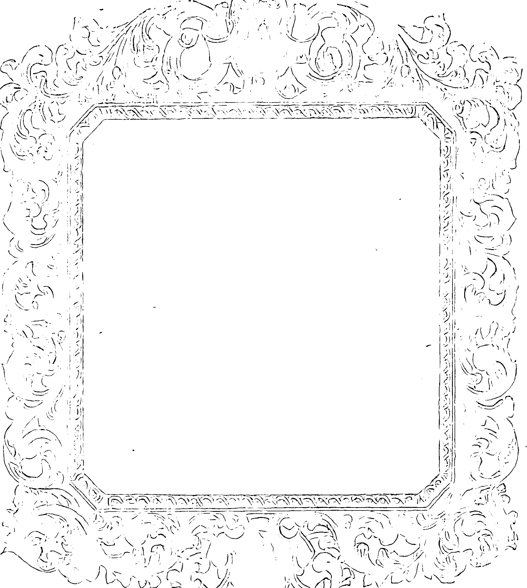
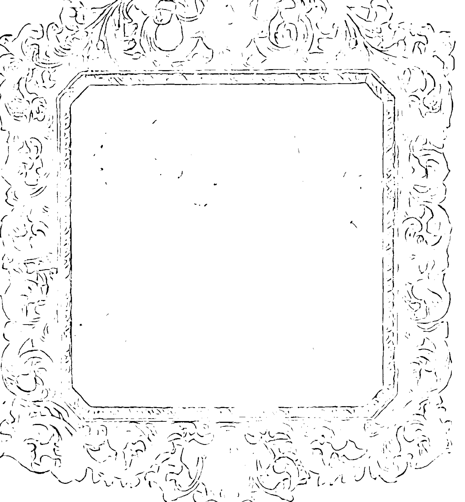

# 奥修故事

## 前言

奥修(1931～1990)，是印度著名思想家、演讲家。根据他的演讲，现已出版了650余种图书，并被译成32种文字，畅销世界各地。

奥修的演讲充满智慧、幽默，饱含哲理、灵性，特别是他演讲中的许多故事，生动活泼，平凡通俗，融入了他深刻的思想和智慧。

奥修在一次拜访佛寺时说：“我创造故事，如果它没有写在你的经文里，你可以加上它。我是我自己的圣贤。”

《奥修故事》一书即从其大量演讲集中，精选了他“创造的故事”数百则，奉献给读者。全书分为苏菲的故事、佛陀的故事、纳斯鲁汀的故事、禅的故事、寓言故事、幽默故事和哲理故事等7个部分。故事语言流畅、生动形象，娓娓道来，富有韵律，尤其是故事中蕴含的哲理，给人启迪，令人回味无穷，并具有趣味性、知识性、可读性强的特点。

《奥修故事》为读者敞开了一扇观察和认识奥修思想和智慧的窗口，对读者认识和体验真理，感受和思考人生，从而敲开智慧的大门提供一定的帮助。

一九九七年元月

# 苏菲的故事
# 一、苏菲的故事
### 启示来临
我曾经听说有一个政客，他去找一个师父，一个苏菲宗派的师父，他问师父说：“你叫我静心和祈祷，这样和那样，我都做了，但是并没有启示发生。”
那个师父看着他，然后说：“你到外面去，站在街上十分钟。”当时正下着很大的雨。
那个政客说：“雨下这么大，你叫我站在街上?”
师父说：“你就去吧！那个启示将会来临。”
那个政客想：“如果那个启示会来临，那么它值得一试，站在雨中十分钟并不是什么大不了的事。”
他站在那里的样子，看起来很愚蠢，当人们在路过时都在想：“我们的院长在做什么?” 于是他把眼睛闭起来，他一再一再地看着他的观照。十分钟是一个很长的时间，这时有一群人围了过来，人们一边笑，一边又都感到很疑惑：“院长到底怎么了?”
随后他冲进屋子里面去告诉师父说：“什么事都没有发生！你欺骗了我。”
师父说：“告诉我你的感觉如何?”
他说：“我觉得好像是一个傻瓜站在那里，笨死了!”
### 化敌为友
有一个苏菲的故事。它发生在欧玛尔的一生中——伟大的慈罕默德·卡利法，他与一名敌手争斗了30年，对手非常强大，争斗一直持续着，那是一生的战斗。
最后，有一天机会来了。敌人从他的马上摔下来，欧玛尔带着长矛跳在他身上。仅在一秒钟之内长矛就可以刺穿敌人的心脏，那么一切就结束了。但就在这一瞬间敌人做了一件事，他向欧玛尔的脸上吐唾沫——长矛停住了。
欧玛尔摸了摸他的脸，起身对敌人说：“明天我们再开始。”
敌人糊涂了，他说：“这是怎么回事？我等这一刻等了30年，你等这一刻也等了30年。我一直在等待，希望有一天我能持着长矛骑在你胸前，事情就了结了。那种机会从未光顾我，却给你遇上了。你可以在一瞬间就把我干掉。你这是怎么啦?”
欧玛尔说：这不是一场普通的战斗。我起了一个誓，一个苏菲的誓言，我将不带怒气作战。30年以来，我不带怒气作战，但只有一会儿愤怒来了；当你吐我的时候只有一会儿我感到愤怒，这成了私人性的了。我想杀了你自我进入了。30年来至今，我们为了一项目标而战，你不是我的敌人，它无论如何都不是私人性的，我对杀你这点不感兴趣；我
### 停止练习
有一次，一个苏菲教徒被带到我这里。30年以来他都在练习，他是真正练习过了，这个毫无疑问。他是近乎完全的，就像这只鸡。他有许多门徒，他们告诉我，无论他看哪里，树、岩石、星辰，他到处看见安拉——神性。
他来与我住了3天。
他不停地念诵——苏菲称作吉戈拉——安拉的名字，甚至洗澡时他也继续念诵。我问他：“为什么？如果你现在能够到处看见安拉，为什么不断地念他的名字？你在为什么而练习？如果安拉到处都在，神性处处都在，你在叫谁？这个念诵者的内在是谁？放下它！你与我在一起的3天里，放下你所有的练习。他能够懂得，他是一个谦虚的人。他懂得如果你仍然练习，那么就没有完成。”
他说：“我有绝对的自信它已经完成了。”于是我说：“那么放下它。”他说“绝对自信”的那一刻就很清楚，如果他放下它，他会有困难。他放下了它，他必须这样做。
### 只问不卖
在苏菲神秘家图能（Dhun－nun）那儿发生过这样的事。他有一个门徒，这个门徒一定和尹生一样。他固执地一次又一次地问。
有一天，图能给他一块石头，叫他去市场，先去蔬菜市场，并且试着卖掉它。这块石头很大，很美丽。
但是师父说：“不要卖掉它。只是试着卖掉它。注意观察，多问一些人，然后只要告诉我在蔬菜市场它能卖多少。”
这个人去了。许多人看着这块石头想：它可以作很好的小摆件，我们的孩子可以玩，或者我们可以把它当作称菜用的秤砣。于是他们出了价，但只不过几个小硬币，大概10个
派士。那个人回来，他说：“它最多只能卖到10个派士——反应是不一样的，从2个派士到10个派士不等。”
师父说：“现在你去黄金市场，问问那儿的人。但是也不要卖掉它，光问问价。”
从黄金市场回来，这个门徒很高兴，说：“这些人太棒了，他们乐意出到1000卢比。反应也是不一样的，从500卢比到1000卢比不等。”
师父说：“现在你去珠宝商那儿，但还是不要卖掉它。”
他去了珠宝商那儿，他简直不敢相信他们竟然乐意出5万卢比。他不愿意卖，继续抬高价格——他们出到10万卢比。但是这个人说：“我不打算卖掉它。”他们说：“我们出20万卢比、30万卢比，或者你要多少就多少，只要你卖！”这个人说：“我不能卖。我只是问问价。”他不能相信——这些人疯了。他自己觉得蔬菜市场的价已经足够了。”
他回来后，师父拿回石头说：“我们不打算卖了它，不过现在你明白了，这就要看你，看你是不是有试金石、理解力。如果你老是问问题，那么你是生活在蔬菜市场；如果你是生活在蔬菜市场，那么你只有那个市场的理解力。然后你就会要求得到珍贵的秘诀：你在要求得到钻石，首先要成为一个珠宝商，然后到我这儿来，我就会教给你。”
某种特殊品性的理解力是必需的，只有那时某种真理才会给你。
### 疯狂过度
有一个苏菲的故事：
有几个人经过一座苏菲的修道院，出于好奇，他们进去看看那里面在发生什么。里面的人正在宣泄，他们兴奋异常，又叫又跳，完全疯了。那些游客想：“这是一座疯子修道院。我们一直以为人们到这里来是达到开悟，但是这些人都已经发疯了。”他们的师父坐在宣泄的中间，疯狂的混乱包围着他。他在混乱的中间静静地坐着。
那些游客想：“为什么师父安静地坐着呢?”其中有一个人说他可能太累了，也可能已经发疯过度了。
过了几个月，当他们办完事情准备回家的时候，再次经过那个修道院。他们又去看看那些疯子的情况。但是现在每一个人都在静静地坐着，一句话也没有。
在他们接近修道院的时候，他们开始害怕：那些人都已经离开了吗？——因为里面听上去似乎什么人也没有。当他们进去以后，每一个人却都在那里，但是他们坐得很安静。
又过了几个月，他们又来出差。好奇心又把他们领到那座修道院。他们进去一看，里面没有人。只有师父坐在那里。于是他们问：“这是怎么了？”
师父说：“当你们第一次经过这里的时候，你们看到的是初学者。他们充满疯狂，所以我鼓励他们宣泄出来。当你们第二次经过这里的时候，已经明白了，他们已经平静下来，所以他们安静地坐在那里，没有什么事情要做。当你们第三次经过这里的时候，他们连待在这里也不需要了。现在他们在世界上任何地方都可以安静，所以我就把他们送回外面的世界了。我在等待新的一批人。当你们下一次经过的时候，这里又会出现疯狂。”
### 不为所动
我记得有一个西藏的神秘家，他的名字叫做马帕（Marpa），成道，当他变成一个佛，当他转向内在，接触到内在的空间，接触到那无限的时候，有人问他：“马帕，你现在如何?”
马帕的回答是很特别的，是料想不到的，没有一个佛曾经那样回答。他说：“跟以前一样地悲惨。” 那个人觉得很迷惘，他说：“跟以前一样地悲惨?” 马帕笑了，他说：“是的，但是有一个差别，而那个差别就是：现在那个悲惨是我自己能够控制的，有时候只是为了要尝一下世界的滋味. 我的头脑才向外移。现在我是主人，在任何时刻我都能够走向内在，而在两极之间移动是很好的。这样，一个人就可以保持活生生的，想移动到哪里就移动到哪里！”
马帕说：“现在我能够移动，有时候我进入悲惨，但是现在那个悲惨已经不是发生在我身上的东西，而是我发生在它们上面，但我保持不为所动。”
当你自愿地移动时，你就能够保持不为所动。
### 沉默祈祷
有一个苏菲的神秘家每天都到清真寺去，他会站在那里，一句话也不说。就这样年复一年，人们开始感到很奇怪。
有人问他：“你从来不说任何话，甚至没有看见你的嘴唇动过一下，我们仔细地注意过你，观察过你，我们甚至觉得
你在里面也不说任何话。你站在那里像一块石头，这是什么类型的祈祷呢?”
那个神秘家说:‘有一次,一个乞丐站在皇帝的王宫前面。皇帝出来,看着乞丐说:‘你要求什么? 你想要什么呢?’ 乞丐说: ‘如果你看着我还不能了解的话,那么就不需要说了。我去找另一家。看着我——赤裸裸地在寒冬里,浑身发抖。看着我的肚子——它已经贴在背上了。看着我的四肢——所有的肉都没有了。我只剩一副骨架,而你却问我想要什么? 我的人在这里还不够吗?’ 国王感到很害怕,那个乞丐是对的。后来国王给了他很多东西。’
神秘家说:‘当时我正好路过那里。从那一天起,我就停止祈祷了,因为我能对世界的皇帝说什么呢? 难道他理解不了我处于什么样的悲惨之中吗? 我还需要说吗? 声明吗? 我还需要跟他明讲吗? 如果他理解不了我的处境,那么讲又有什么用呢? 如果他理解不了我的处境,他就理解不了我的语言。沉默是我的祈祷,不问是我的问题,无欲是我的欲望。这就是我,这就是我的全部存在。’
### 爱丑恨美
这里有一个苏菲的故事：
有一个师父去旅行,他和门徒们来到一家客店过夜。客店的老板说他有两个妻子,一个很美,另一个很丑。
“不过的问题是,”客店老板说,“我爱那个丑的,而恨那个美的。”
师父问:‘怎么回事? 这是什么原因呢?’
那个人说：“那个美的太意识到她的类了，这使她变得很丑……” 当你过于意识美的时候，你当然会变丑，“……而另一个太意识到她的丑了，这使她变得很美。”
那个美的一直在想她是美的——她变得骄傲了。当你骄傲的时候，你怎么可能美丽呢？骄傲就是丑。
### 死后去处
有一个德国的神秘家，名叫爱克哈特（Meister Eekehrt），他快要死了。
有一个门徒——一个好奇的、多问的人，一个哲学系的学生——问他：“师父，我知道您快要过世了，但是在您离开肉体以前，我还想问一个问题，要不然它会纠缠我一辈子的。”
爱克哈特睁开眼睛说：“什么问题？”
那个人说：“当您过世以后，你将到什么地方去呢？”
爱克哈特说：“不需要到任何地方去。” 然后他闭上眼睛死了。
“不需要到任何地方去。” 他说。虽然那个人的问题并没有得到满足，但是爱克哈特提供了一个美丽的答案，它需要很深的悟性。爱克哈特说：“不需要到任何地方去。” 这意味着：我现在在每一个地方。还需要到什么地方去呢？
### 无欲无求
[PAGE 23]
# 奥修故事
家，他独自过着宁静的生活。有一天，他突然被上帝的一个信使吵醒了。
信使说：“你的祈祷已经被接受了。现在至上的存在——创造者——对你十分满意。你可以要求，你的任何欲望都会得到满足。你只要一要求，它立刻就会实现。”
神秘家有一点困惑，他说：“你来得晚了一点。当我需要东西的时候，当我有很多欲望的时候，你从来不来。现在我没有欲望了，我已经接受我自己了，我完全自在、安心，现在我甚至不在乎上帝是否存在，我不向他祈祷。我祈祷是因为感觉好。我已经完全停止思考他了。我的祈祷不再是针对任何人的讲话，我只是在我呼吸的时候祈祷.它非常美丽——上帝是否存在没有关系。你来得晚了一点，我现在没有欲望了。”
但是那个天使说：“这将是对神的一次冒犯，当他说你可以要求的时候，你就必须要求。”
那个人感到很为难，他耸耸肩说：“但是我能要求什么呢？你能提一点建议吗？——因为我已经接受每一样东西了，我觉得非常满足。最多你回去告诉上帝我很感激，替我谢谢他。每一样东西都各得其所，什么也不缺；每一样东西都是完美的；我很快乐，很喜悦。我对下一刻一无所知，这一刻就是全部。我十分满足，你去替我谢谢他。”
但是那个天使很固执，他说：“不，你必须要求点什么——仅仅作为一种礼貌。你要懂事一点。”
然后那个人说：“如果你坚持要这样，那么就请你要求上帝，让我保持像现在这样无欲。只要给我一样东西——无欲……
### 不辩而胜
一个苏菲庄内德（Junnaid）与他的师父一起生活，而师父是如此地好争论，无论你说什么他将立即否定。如果你说：“这是白天。”他将说：“这是晚上。”——而这却不是事实，因为确实是白天。
无论庄内德说什么，他总是发现师父要反对。而他只是低下头鞠躬，并说：“是的，师父，这是晚上。”
一天，师父说：“庄内德，你已经疯了，我无法在你的内在制造好争论之心，而我是如此明显地在弄虚作假，任何人都无可争辩地说：‘真鑫！这是白天，这无须争辩，这是如此明显。’而你却依然说：‘是的，师傅，这是晚上。’你的信任是深人的。现在我不再与你争论，现在我能讲真理了，因为你已经准备好了。”
### 无须再来
一个人去找贝兹德(Byazid)，一个苏菲神秘家，问他……他说：“一年后再来，因为你现在有病，你的内在是骚动不安的，我无法讲述真理，因为你会领悟它——你会误解它的。所以一年中你要尽量恢复健康、宁静、静心，然后再来。如果我感觉你能听时，我会告诉你，否则你就去找别人。”
那人听完，回去了。在一年中努力地恢复了健康、宁静、平和——但是再也没有返回。
后来贝兹德问：“那个寻求者怎么了？”
有人说：“我们问过他：‘为什么你不再来了？’他说：‘现在我不需要来，因为我能在我所在的地方，领悟贝兹德能说什么。’”
这是个悖论：当你没有准备好，你询问，

## 苏菲的故事

“从那天起，每天早上当我起床时，第一件事我要确定的是，在睁开眼以前，我对自己说：‘阿布杜勒’——那是我的名字——你想要什么？痛苦？喜悦？今天我要选择什么呢？然后结果总是我选择喜悦。”

这是一种选择，试试看。在早上你从睡眠中醒来的第一刻，问你自己：“阿布杜勒，又一天！！你的主意是什么？你选择痛苦还是喜悦？”

而谁会去选择痛苦？为什么呢？这是如此的不自然——除非人感觉在痛苦中是喜悦的，但那时你也会选择喜悦，而不是痛苦。

### 死神帮忙

我听说过一则古老的苏菲派寓言：

一个老人从森林里走来——他是个伐木工。他背着一大捆木头，已经很老了——70岁，或80岁，对生活感到厌倦了。有许多次他对天发问：“死神在哪儿？你为什么不来找我？我在这里没有什么可牵挂的了，我不过是在拖延时日！你想让我自杀吗？那是罪过。你干吗不轻轻松松地来呢？”

他一遍又一遍地祷告：“死神，来带我走吧，我完了。”

实际上老人是没有什么活下去的理由了。他老了，没人照看他，也没有积下什么钱。每天他得到林子里去，砍木头，卖木头，以此换口饭吃。

有一天死神刚巧路过。他突然问道——他扔下那捆木头——对天大叫：“死神！你在哪儿？你走向每一个人，我看到那么多人死了。你为什么对我生那么大的气？你为什么不到

# ——奥修故事——

我在这儿来？来呀，我等着你!

这是个偶然的机会，死神正好路过，所以死亡降临了。它来到他跟前，说：“好吧，你要怎么样?”

他开始颤抖了，他说：“没什么大事，只是我老了，没有力气把这捆东西搁到头上，又没有人帮我个忙。请帮我把它搁到我头上。谢谢你!”

### 一袋宝石

早上一大早，太阳还没有出来，一个渔夫到了河边，在岸上他感觉到有什么东西在他的脚下，后来找出来是一小袋的石头。他捡起袋子，将渔网放在一旁，坐在岸边等待日出。他在等待黎明，以便开始一天的工作，他懒洋洋地从袋子里拿出一块石头丢进水里。没有其他事可做，他继续把石头一块一块丢进水里。

慢慢地，太阳升起，大地重现光明，这时除了一块石头之外其他的石头都丢光了，最后一块石头在他的手里。当他藉着白天的光看到了他手中所拿的东西时，他的心跳几乎都要停止了，那是一颗宝石！在黑暗中，他把整袋的宝石都丢光了！在不知不觉当中，他的损失有多少！他充满懊悔，咒骂他自己，很伤心地哭得几乎失去理智。

他在无意间碰到的财富足够丰富他的生活好几倍，然而在不知不觉当中，在黑暗中，他又把它丢掉了。但是就某方面来讲，他还是幸运的：还有一颗宝石留下来，在他将那颗宝石丢掉之前，天已经亮了。一般来讲，大多数人甚至还没有那么幸运。

## 苏菲的故事

周围一片漆黑，而时间又过得很快，太阳尚未升起我们就已经浪费掉所有生命中的宝石。生命是一个大的宝库，人类没有好好利用它，只是白白地将它浪费掉，等到我们知道了生命的重要性时，我们已经将时光消磨殆尽。生活的秘密、奥秘、快乐、解放、天堂——一切都丢尽了，而一个人的一生就这样过去了。

### 朝圣途中

有一个苏菲的求道者，他后来变成一个伟大的师父——毕斯坦的拜亚吉德（Bayazid）。有一次他要去朝圣，在一个偶然的机会碰到一位师父——至少在他这一方面来讲是一个偶然的机会。就师父那一方面而言，它并不是一个机会。师父在等拜亚吉德，但是拜亚吉德并不知道。他刚好在师父的旁边过一夜，而师父坐在一棵树下。

到了早上，太阳正在升起，景色很美，天气很凉，鸟儿在歌唱，朝圣者开始动身，拜亚吉德也准备要动身，师父把他叫到身旁说：“洞察我的眼睛。”

他洞察了师父的眼睛，某种浩瀚的东西打开了，他被带到某一个不同的层面。当他回魂的时候，师父在笑，他说：“现在你可以在我的周围朝圣，然后回家。你已经来到了卡巴，没有其他的卡巴，忘掉所有关于那个黑石头的事。”

拜亚吉德能够了解，他在师父的周围走动，就好像人们在“卡巴石”周围走动一样，他向师父行顶礼之后回家。

当他跟他的村民们聚在一起时，村民们问他说：“你去过卡巴那里吗?” 他说：“是的，我去过了‘真正的’卡巴那里，我看到了那浩瀚的，我看到了那未被定义的。”

# ——奥修故事——

### 死亡影子

有一个苏菲的故事。一个国王梦见他的死亡来了。他在梦里看见一个影子站着，于是他问：“你是谁?”

影子说：“我是你的死亡，明天，当太阳落山时，我会来你这里。”

国王想要问是否有逃脱的途径，但他不能，因为他十分害怕，梦中断了，影子没有了。他大汗淋漓，索索发抖。

半夜里他召集了他所有的智囊人物并说:‘找出这个梦的意义。’如你所知，你不会发现比智囊人物更愚蠢的人了。他们跑到他们的房间里拿出了他们的经文，它们是很大很大的卷册。随后他们便开始磋商、辩论、探讨，互相论战和争辩。

听着他们的谈话，国王变得越来越糊涂。他们在任何一点上都无法达成一致，他们是属于不同的教派。聪明人总是如此，他们不属于自己，他们属于一些死亡的传统。一个是印度教的，另一个是伊斯兰教的，还有一个是基督教的。他们带着他们的经文试了又试。当他们讨论时，他们变得疯狂，争了又争。国王非常担忧，因为太阳升起了，当太阳升起时，离太阳落山也不远了，因为升起事实上就是下落，它已经开始了。旅程开始了，12 小时之内太阳将要下山。

他试图打断他们，但他们说：“不要干扰，这是个严肃的问题。”这时一个侍奉了国王一辈子的老人走近他，在他耳边轻声说:‘你最好逃走吧，因为这些人永远不会得出什么结论。聪明人从未得出任何结论。他们将讨论和争辩，他们的死亡将来临，但结论永远不会来。我的建议是当死亡警告你时，你最好至少逃离这个宫殿！随便去哪里！快走！”这个劝告打动了国王，它完全正确。当人不能做任何事时，他就想争斗，逃脱。

国王有一匹快马，他上马逃了。他对智囊人物说：“如果我活着回来，你们作出了决定，告诉我——但现在，我走了。”他非常快活，走得越来越快，因为这是生死存亡的问题。

他一次次地回头看影子是否来了，但没有影子。他很高兴，死亡没有了，他逃脱了。当太阳下山的时候，他离首都已经成百上千英里远了。在一棵榕树下他停住了，从马上下来，谢谢它说：“是你，是你救了我。”忽然，正当他与马交谈并感谢它时，他感觉到他在梦中感觉过的那只同样的手。他回头一看，同一个影子在那里，死亡说：“我也要感谢你的马，他跑得真是快。我在这棵榕树下等了一整天，我担心你是否到得了这里。距离是那么遥远，但这匹马真了不起。你来得正是时候，这里正需要你。”

### 神秘乞丐

有一个苏菲的故事：

一个伟大的国王经常去找一个托钵僧，一个神秘的乞丐。但是他感到非常惊讶，因为每当他来的时候，神秘家总是谈论金钱、王国和政治，而他在那里等若谈论上帝、静心和宗教。

所以有一天他说：“请原谅我，但是我无法理解这一点。我到这里来是要谈论上帝、宗教、静心和三昧的。但是这很荒唐——我，一个世俗的人，到这里来谈论三昧和开悟；而你，一个虔诚的人——听说是虔诚的，因为我现在有一点怀疑——每当我来的时候，你总是谈论王国、金钱、政治以及很多别的事情，但都是世俗的事情。您对此怎么解释呢？

托钵僧笑了，他说：“没有什么需要解释的，这很简单。你谈论你不知道的事情，我谈论我不知道的事情。这很简单，我为什么要谈论上帝呢？我知道上帝；你为什么要谈论王国呢？你是一个国王，你已经知道了。”

### 说了白说

据说有一个苏菲神秘家去旅行，他来到一个小镇上。在他到达以前，他的名字已经先到了，他的名字早就家喻户晓了。所以人们聚集起来说：“请给我们讲一些道吧。”

神秘家说：“我不是一个聪明的人，因为我也是一个傻瓜。你们会被我的教导弄糊涂的，所以最好还是让我保持沉默。”

然而他越试图回避，他们就越坚持，就越被他的人格所吸引。

最后他妥协了，他说：“好吧，星期五我到清真寺来……”那是一个伊斯兰教的村庄。“……你们希望我讲什么呢?”

他们说：“当然是讲上帝。”

于是他就来了——整个村庄的人全都聚集在那里，他引起那么大的震动。他站在讲台上，问了一个问题：“你们知道我打算对上帝说点什么吗?”

村民们当然回答：“不，我们不知道您打算说什么。”

“那么，”他说，“这就没有用了，因为如果你们一点儿也不知道的话，你们就无法理解了。需要一点准备，而你们完全没有准备。我说了也是白说，所以我不了。”他离开了清真寺。

村民都傻眼了，怎么办呢？他们请求他下个星期五再来。下一个星期五，他又来了。他又问了同一个问题，所有的村民都准备好了。他问：“你们知道我打算说什么吗？

他们说：“当然知道。”

所以他说：“那么就不需要再说了。如果你们已经知道了——那就结束了。何必再来麻烦我，又浪费你们的时间呢？”他又离开了清真寺。

那些村民完全糊涂了：到底要怎么对付这个人呢？但是现在他们的兴趣已经疯狂了。他肯定藏着什么东西！所以他们再一次想办法说服他。

他来了，他又问了同样的问题：“你们知道我打算说什么吗？

现在村民们变得聪明一点了，他们说：“我们有一半人知道，有一半人不知道。”

[PAGE 31]

# 奥修故事

他说：“那就更没有必要了，那些知道的人可以告诉那些不知道的人。”

## 神给予的

一个苏菲的神秘家非常穷困，饥饿，被人拒绝，旅途疲劳。在一天晚上，他来到了一个村庄，那个村庄不欢迎他。那个村庄属于那些正统的人们，当那些正统的回教徒在那儿的
时候，要说服他们是很困难的，他们甚至连镇上的可以庇护他的一点儿地方也不给他。

那晚很冷，他又饿又累，穿得又单薄，一直在那里颤抖。他坐在镇外的一棵树下，他的门徒也坐在那儿，非常悲伤、沮丧，甚至愤怒。

然后他开始祈祷，他对神说：“你真是太神奇了！你总是给予我，无论我需要什么。”这看起来有点太过份了。

一个门徒说：“等一下，现在你做得太过份了，特别在今天晚上，这些话是假的。我们挨饿，疲劳，没有衣穿，一个冰冷的夜晚正在降临，许多野兽在我们周围，我们被这里的人拒绝，我们没有避难所，为什么你还要感激神？当你说‘你总是给予我，无论我需要什么’，你这是什么意思？

那个神秘家说：“是的，我要再重复一遍：无论我需要什么神总是给予我。需要贫困，需要被人拒绝，今晚我需要饥饿、危险，否则他为什么要给我这些呢？这一定是需要的，这是需要的，而我必须感激，他如此美妙地顾及我的需要，他真是奇妙至极！

这是与境遇无关的一个态度，境遇是毫无关系的。庆祝吧，无论什么情况，如果你是悲伤的。那么你就去庆祝，因为你是悲伤的，试试看，给它一种尝试，你将会感到惊奇——它会发生，你是悲伤的吗？开始舞蹈，因为悲伤是如此之美，是一朵如此宁静的存在之花！

## 小小差别

我曾经听过一个古老的苏菲寓言：

# ——苏菲的故事——

大师的两个信徒在大师家的花园散步，大师让他们每天早上或晚上散步。散步是一种静心的方式，散步时的静心正如习禅的人做散步静心一样。你不能二十四小时都坐着，双腿需要一些活动，血液需要一些循环，所以在禅和苏菲教中都是如此，你在静坐了几个小时的静心后，你就得开始散步静心，但静心仍然在进行着。无论散步或静坐，内在的觉知是相同的。

他们俩都是吸烟的，他们都想请求大师允许他们吸烟。于是他俩决定：“明天，大师最多说不，但我们得去问一下，在花园里抽烟似乎也不是亵渎神的行为，我们并不在他的屋子里抽烟。”

第二天他们在花园里碰面，一个人非常愤怒，因为另外一个人在抽烟，于是他说：“怎么回事？我已经问过了，但大师很直率地拒绝了，他说不。你怎么还在抽烟呢？难道你不再遵守他的命令？”

他回答说：“但是大师对我说可以。”

这看起来很不公平，那么第一个人说了：“我要去而且马上就去问问，为什么他对我说不可以而对你却说可以？”

另外一个人说：“等一下，请告诉我你是怎样问大师的。”

他回答说：“我怎么问呢？我只是简单地问：‘当我在静心的时候能抽烟吗？’大师说：‘不行。’他看上去非常生气。”

另外一个人开始笑起来了，他说：“现在我知道是怎么回事了。我是问：‘在我抽烟的时候能不能静心？’大师说：‘行’。”

只有小小的一个差别，人生便完全因此有了很大的不同。生命既不是痛苦也不是幸福，生命是一张空白的画布，人必须非常艺术地画它。

# 奥修故事

### 疯狂女人

有一天，一个苏菲的女子拉比亚被发现在街上跑，大家都知道她是一个疯狂的女人。她一只手提着一壶水，另外一只手拿着一支燃烧的火把，人们聚集在一起，他们问她：“到底是怎么一回事？你要去哪里？为什么你手上拿着这支燃烧的火把和水？”

她说：“我要用这些水淹没地狱，而且要用这支火把烧掉你们的天堂。除非这两样东西全部都被摧毁，否则人类永远无法知道宗教是什么。”

### 圣人恶人

我听说：有一次，朱纳德（Junnaid），一个苏菲派的神秘主义者梦见他自己死了，镇上最大的恶人也死了，两个人都到上帝的门前去敲门。恶人被欢迎，而圣人却被忽视了。他感到自己受了很大很大的伤害，他一直希望自己会被接受，被欢迎，但发生了什么呢？——正好相反。他知道这个被以这样一种庆典迎进去的人。当庆典结束后，恶人被送到他的住所里。圣人说：“我只想问上帝一个问题：你在干嘛？我一直在不断地祈祷，二十四小时，白天，黑夜，呼唤你的名字，向你祈祷，即使我睡着了，我也一直在呼唤你的名字，颂扬你。”

上帝说：“对，就是因为这样——你把我折腾得太厉害了，我着实害怕你，现在你已到天堂。你会在这儿干什么？在地球上，你就二十四小时不让我有片刻的安宁！那个人很好，所
以我们要庆祝！从不烦我，从不纠缠我，他从不利用我的名字，从不给我添过任何麻烦。”

## 二、佛陀的故事

### 创造佛境

据说当佛陀第一次来到瓦拉那西时，他停留在瓦拉那西外面的一棵树下，那是一棵很大的榕树。当时已经是傍晚了，阳光从落日发出来，落日的光辉染红了云朵。那些红色的光线透过浓密的树叶射在佛陀的脸上，他很放松地坐在那里。

瓦拉那西的国王乘坐着他的马车来，无意间他看到了这个人坐在路旁，看起来是那么地美，散发出光辉。那个国王拥有每一样一个人可能会欲求的东西。你知道他要去哪里吗？他要去自杀！因为他觉得很疲倦，觉得精疲竭尽，而且非常挫折。他看到了一切的没有用，因此他决定说：“够了，太够了！”他坐在马车上要到山里去自杀。

然后他在路上看到了这个漂亮的人，这个乞丐，那么放开来地坐在那里，甚至连落日都无法跟他的美相比。他看起来是那么地金碧辉煌，有一个很深的宁静围绕着那棵树，当然，那并不是树的宁静，因为国王曾经看过很多的树。

当一个佛坐在那里，他会创造出他自己的空间。东方的经典说：不论一个佛住在什么地方，就会有某一个空间在他的周围被创造出来。那些住在那个空间里面的人会开始不由自主地成长，他们会被那个潮流带肴走，他们会开始乘坐着24
[PAGE 38]

# ——佛陀的故事——

那个佛的波浪，那就是“佛境”的意义。

它是全然地宁静!那个国王从来没有看过这样的宁静，这么有蕴涵的宁静，这么活生生的宁静。他看过存在于坟墓的宁静，因为他从来没有看过像佛陀这样的一个人，他没有任何概念说真正的宁静应该是怎么样。它首度出现在那里，几乎可以触摸得到，似乎可以去碰触它，似乎可以将它拿在你的手上，似乎可以去尝它，你似乎可以将它贴在你的脸颊去感觉它的宁静，它就在那里，是那么地看得见。

他叫马车停下来，告诉他的马车夫说：“停！我必须再思考一下，如果这个人能够这么喜乐，而且这么宁静，或许人生还有某些东西是我没有去找寻的，忘掉我的自杀！这个人改变了我的头脑，改变了我的存在，这个人的存在就足以证明生活也可以以其他的方式来过，虽然我还不知道它是什么样的方式……”

他告诉佛陀说：“我只有一个问题要问：我在你的周围并没有看到什么东西，只有一个乞丐碗。我拥有一个那么大的王国都还不快乐！而你看起来却那么地快乐，那么终极地快乐。”

佛陀睁开了他的眼睛，他那莲花般的眼睛……国王简直不能相信，他立刻弯下身来向他顶礼。有某种东西发生在他里面——只是那个看，那两只眼睛。在那两只眼睛的背后没有人，而只有“在”，只有一种发光。那两只有知的眼睛，但是却充满了存在。空空地没有自我，但是却充满了本性。那两只有知的眼睛一定是像两道光一样穿透了国王的整个人，他觉得被感动。

佛陀说：“你现在所处的情形，我也曾经处于过，我可以了解你，我本身也是一个伟大的国王的儿子，我曾经住在皇
[PAGE 39]

# ——奥修故事——

宫，享受尽荣华富贵，因此我知道，我知道拥有一切，但是却什么都没有的痛苦，我可以了解你——没有人能够了解你，但是我能够了解你，我以前跟你完全一样！我也曾经有很多次想自杀，很多很多次。

“但是我要告诉你：深入地看我的眼睛，从前有一天，我所处的状态跟你现在所处的状态完全一样，而我要告诉你，你有一天也可以处于像我现在一样的状态，每一个人都有一个内含的爆发、开花或者变成一朵莲花的可能性。”

### 两手空空

当亚历山大过世时，他告诉他的首相说：“当你扛着我的身体

## 佛陀的故事

菩提达摩把本质的佛教带到中国，因为那里出现了大乘气象。因为菩提达摩，老子的整个立场——老子的生活方式——和佛陀的了悟相会在一起，一个最美丽的东西诞生了。世界上任何地方都没有这样的东西——那就是禅。禅是一次相会，是佛陀和老子的一次交合。菩提达摩是助产士，他把佛陀的种子带进老子的子宫。

当他来到中国的时候，他是一个非常著名的神秘家，他的名字传遍整个东方。当他来到中国的时候，皇帝亲自在边界迎接他。皇帝向他问了几个问题。他问：“我造了很多寺庙——成千上万个。我有什么功德吗？”

如果他拿这个问题去问任何其他普通的和尚，他都会得到这样的回答：“皇帝陛下，您功德无量——您肯定要升天的，可以保证。”然而他问错人了。菩提达摩说：“功德？什么也没有，相反，你已经积累了很多罪恶。”

皇帝惊呆了，他简直不能相信。他说：“为什么？你在说什么？我造了很多寺庙，印了很多佛经，把它们分给千百万人。我每天都要养活成千上万的和尚，而你却说我在积累罪恶？你究竟是什么意思呢？”

菩提达摩说：“你这个积累功德的想法就是一种罪恶，它是非常自我主义的。你是肯定要下地狱的，皇帝，你将下到第七层地狱——第一层还不行。”

皇帝无法相信这一点。同时他也有点生气了。他说：“我有一个问题请教。谁在我的里面？我是什么？”

菩提达摩说：“一个广大的空，一个没有。”

这下皇帝真的生气了。他气呼呼地问菩提达摩：“那么你是谁呢？是谁站在我的面前呢？”

菩提达摩说：“我不知道，先生。”

## --奥修故事--

### 盲人逻辑

有一次，一个盲人，他不但瞎了，而且还是个大哲学家。整个村子都被他搅乱了，因为他逻辑地证明了没有光这东西。他说：“我有手，我能触摸和感觉，所以给我显示一下光在哪里。如果有什么东西存在，它就能被触摸到；如果什么东西存在，它就能被尝到；如果什么东西存在，你用什么东西敲打它时，我就能听见声音。”

村民们被搅得很心烦，因为他们不能收集到任何证据。他有4个感官，他说：“我有4个感官。你把光带到我面前，我能通过我的4个感官看见它是不是在那儿。”

村民们说：“因为你是瞎的，所以你不能看见。”

他大笑，说：“这看上去你们好像在做梦。眼睛是什么？你怎么能证明你有眼睛而我没有？你们告诉我你们的光，它是什么，解释给我听。”

他们不能那么做，因为这是不可能的。他们觉得很沮丧，这个人是瞎的，而他们有眼睛，他们知道光是什么。但是怎样跟一个瞎子解释呢？

后来，佛陀到了这个镇子。他们把这个疯哲学家，疯瞎子带到佛陀这儿，请求佛陀说：“你试着给他解释吧，我们已经失败了。这个人有两下子，他证明了光不在那儿，因为它不能被摸到，不能被闻到，不能被尝到，不能被听到。所以它怎么能存在？现在你来了，你能给他解释。”

佛陀说：“你们是大傻瓜！光是不能被解释给一个盲人听的。这个努力本身就是荒唐的。但是认识一个人，他是一个了不起的医生。你们把他带到他那儿，他会治疗他的眼睛的。

那人被带到了那个医生那儿，他的眼睛受到了治疗。他不是真瞎，6个月后，他开始看得见了。然后他跑到佛陀这儿来，佛陀已经在另一个镇子上了。他跪下来，说：“是的，现在我知道了，光存在。现在我知道了为什么那些可怜的村民们不能证明它，现在我也知道了，你做得很对，送我到一个医生那儿去。我需要治疗——而不是哲学，不是关于光的理论。”
### 无动于衷

佛陀经过一个村庄，有一些人聚集在那里，他们反对他、侮辱他。佛陀听完他们的话，然后说：“我必须及时赶到另一个村庄去，所以，我现在能够走了吗？如果你们已经说完任何你们所要说的，如果它已经结束，那么我就可以走了；或者如果你们还有更多的话要对我说，当我回来的时候，我会在这里等，你们可以再来告诉我。”

那些人感到很惊讶，他们无法了解，他们侮辱他、使用脏话辱骂他，而佛陀竟然无动于衷，所以他们说：“但是我们不是在告诉你什么东西，我们是在辱骂你、侮辱你。”

佛陀说：“你们可以这样做. 但是如果你们想要从我这里得到任何反应，你们来得太迟了。如果你们十年前对我说这些话，我一定会反应，但是现在我已经学会了如何自主地行动（不是反应别人之所为），现在我是我自己的主人，你们无法强迫我做任何事，所以你们必须回去，你们无法打扰我，现”

## ——奥修故事——

在已经没有什么东西能够打扰我，因为我已经知道了我自己的中心。”
### 芥菜种子

有一个妇人去到佛陀那里，她的小孩死了，所以她又哭又泣。她是一个寡妇，已经不能够再有另外的孩子，而她唯一的小孩死了，那是她所有的爱和所有的注意。她一直在佛陀的面前哭泣。

如果她去到耶稣基督那里，那么那个奇迹一定是：耶稣会碰他一下，而使他复活，就好像她使拉萨斯复活一样。

佛陀怎么做呢？佛陀笑着对她说：“你到镇上去，找到那一户人家，从来没有死过人的，向他们要一些芥菜籽。”

那个女人冲到镇上去，她来到每一户人家。不管她来到哪里，他们都说：“你要多少芥菜籽我们都可以给你，但是我们无法符合你所讲的条件，因为我们家曾经有很多人死过。女人，你不必发疯，佛陀在你身上耍了一招，你在整个地球上都无法找到一户人家从来没有死过人的。”

但她还是心存希望：“或许……谁知道？或许有某一个人家不知道死亡。”她整天绕来绕去，到了晚上，她终于领悟到：“死亡是生命的一部分，它一定会发生，不是某种私人的事，它不是某种发生在我身上的私人灾难。”她带着那个了解来到佛陀那里。

佛陀问说：“芥菜种子在哪里？”

她笑了……她说：“你成功了！”她叩在他的脚下说：“点化我吧，我想要知道那个永远不死的。我不希望把我的孩子要回来，因为即使我把他要回来，有一天他还是会死，那有什么用？教我一些东西，好让我能够在我自己里面知道那个永远不死的。

## # 神存在吗

有一天，一个人问佛陀说：“神存在吗？” 佛陀说：“不。” 当天下午，另外一个人问说：“神存在吗？” 佛陀说：“是。” 当天傍晚，第三个人问说：“神存在吗？” 佛陀保持沉默。

佛陀为什么会对三个人有三种不同的反应？他的弟子阿南达觉得非常困惑，他想不通，因为他听到三种不同答案。到了晚上，他问佛陀说：“请你告诉我为什么，否则我无法入睡。他们问了同样的问题，但是为什么你的回答都不同？对其中一个，你说不，对另外一个，你说是；对第三个，你什么都不说，只是保持沉默。你保持沉默，而且闭起眼睛，为什么呢？他们问的是同样的问题，完全相同的问题。”

佛陀说：“但是发问者不同，我是针对发问者来回答的。其中一个是无神论者，他不相信神，他来只是为了要加强他的信念。他希望我说：‘不’，好让他信念能够变得更强，而我不能够帮助任何人的信念，我必须摧毁信念。因此我对那个人说：‘是的，神存在。’ 因为除非你把信念放掉，否则没有人能够真正‘知道’。”

“另外那个人是一个有神论者，他相信神，他是要来寻求我的支持，而我在此不是要来支持任何人的信念，我在此是要摧毁所有的信念，它让头脑能够提升到信念之上而进入真知，因此我必须给他不同的回答，我必须说不！”

“第三个既不是有神论者，也不是无神论者，所以‘是’和‘否’都不需要，我必须保持沉默。我是在告诉他说：‘只要你变宁静，你就能够知道；只要做我正在做的，闭起你的眼睛而变宁静，你就会知道。’ 这是一个不能够用‘是’或‘否’来回答的问题。那个问题那么深奥，唯有当你达到一个很深的宁静，你才会知道；唯有当那问题消失，你才会知道。然后那个答案将会从你的本性升起。”
### 三个问题

有一个佛陀的弟子要离开，那个弟子的名字叫做普那卡西亚普，他问佛陀说：“我要去哪里？我要去哪里传你的道？"

佛陀说：“你可以自己选择要去哪里。”

所以他说：“我要去远方的比阿，我要迁到苏卡省去。”比阿就是苏卡省。

佛陀说：“如果你改变你的选择会比较好，因为那一省的人非常残酷、暴力、恶作剧，到目前为止，还没有人敢去那里教导他们非暴力、爱和慈悲。所以，请改变你的选择。”

但是普那卡西亚普说：“请让我去那里，因为没有人曾经到过那里。”

佛陀说：“在我允许你去之前，我要问你三个问题：如果那一省的人侮辱你、羞辱你，你会觉得如何？"

普那卡西亚普说：“如果他们只是侮辱我，我会觉得他们很好，如果他们没有打我，他们是好人，他们本来可以打我的。”

佛陀说：“第二个问题，如果他们开始打你，你会觉得如

何?

普那卡西亚普说：“我会觉得他们是非常好的人，他们本来可以杀我的，但他们只是打我。”

然后佛陀说：“再来第三个问题：如果他们真的杀你，真的谋杀你，那么，在你垂死的片刻，你会觉得如何?”

普那卡西亚普说：“我会感谢你，而且感谢他们，如果他们杀了我，他们将解放我，使我免于一个可能有很多错误的人生，所以我将会觉得感激。”

所以佛陀说：“这样的话，你可以去任何地方，整个世界对你来讲都是天堂，现在已经没有什么问题，整个世界对你来讲就是一个天堂，所以，你可以去任何地方。”
### 三度提水

佛陀旅行经过一个森林，那一天非常热，刚好在中午，他觉得口渴，所以他告诉他的弟子阿南达：“你回去，我们要跨过一条小溪，你回去帮我拿一些水来。”

阿南达回去，但是那条小溪非常小，有一些车子经过，溪水被弄得很污浊，本来沉淀的泥土都跑上来了，现在那个水不能喝了，阿南达想：“我必须回去。”他回去告诉佛陀说：“那个水已经变得很脏而不能喝了，请你允许我继续走，我知道有一条河就在离这里几里的地方，我将从那里提水来。”

佛陀说：“不，你回到同一条小溪那里。” 佛陀说了，阿南达就必须遵从，但是他的内心并没有完全遵从，因为他知道那些水不能拿来。时间不必要地被浪费，而他在感到口渴。但是当佛陀说了，他就必须去，然后他再度回来说：“你为什
么要坚持?" 佛陀说：“你再去。” 既然佛陀这么说，阿南达还是必须遵从。

他第三度来到那条溪流,那些水就像它原来那么清澈,泥沙已经流走了,枯叶也消失了,那些水再度变得很纯净。这时阿南达笑了,他提了水跳着舞回来，拜在佛陀的脚下说：“你教导的方法是奇迹般的,你给我上了伟大的一课：没有什么东西是永恒的，只需要耐心。”

这是佛陀的基本教导：没有什么东西是永恒的。每一样东西都是转瞬即逝的，所以为什么那么烦恼? 回到同一条河流去,现在每一样东西都变了,没有一样东西保持一样,只要有耐心,一而再一而再地去,只要几个片刻,那些叶子将会流走,那些泥沙将会再度沉淀,那些水就会再度变得纯净。

当他第二次回去的时候,阿南达曾问佛陀：“你坚持叫我去,但我是不是能做些什么来使那些水变纯净?” 佛陀说：“请你什么事都不要做,否则你将会使它变得更不纯净。不要进入那条溪流,只要在外面、在岸边等待,如果你进入溪流,你将会把水弄得更乱,溪流自己会流动,你要让他流。”
### 保持沉默

一天, 佛陀的大弟子, 摩诃迦叶正坐着, 他不曾问任何问题。他只是几个月前才来, 佛陀告诉他要保持一年的沉默, 不问任何事情。其他的几个门徒也在那里坐着。突然佛陀问: “摩诃迦叶, 你提问了?"

摩诃迦叶说: “我一句话也没有说。”

其他几个门徒也说: “他什么也没有说。”

佛陀说：“看内在，你已经提问了，已经违背了诺言。” 而摩诃迦叶看着，接着他鞠了躬并说：“对不起！” ——他已经提问了。
### 无可救药

当佛陀离开家，到了另一个王国，只是要回避亲戚和家庭，因为他们在那里干扰他，不断地来劝说他，试图要他回去。所以他离开了他的王国，到另一个王国去了，那时他才知道那些人到处都有——你无法逃避。

一个王子到了邻国的传言已经流传到了那里，甚至邻国的国王也来了，他说：“我的儿子，你年轻，不谙世事，你不成熟，我经历过，我是以我的经验来对你说．回家去吧。这真傻！这个年纪的傻念头迷住了心窍，人必须要忍耐住。这个年纪，当一个人年轻的时候，人总是理想主义的。但是以后经验会证明它是错的。不要做一个嬉皮士，回去吧！”

佛陀听了，说：“来自你自己的经验，你或许是对的，但是我在那个世界已经过了好几辈子了，什么也没有达成。好，足够了。我是根据这个经验离开的，不是根据一个年轻人的一些浪漫的理想主义。”

那个老人不会听进去，他说：“如果你不想回去，那我理解——或许有些麻烦，你或许与你的父亲、或与你的家庭感情不和，或有什么不对劲，那么就不回去，到我这里来，我有一个美丽的女儿，与她结婚，这个王国就是你的了。”

佛陀说：“我结婚了，已经离开了一个非常美丽的女人，不可能找到另一个像她那样美丽的人了，但是即使是美丽的

女人，她也不会给我那个终极——而我正在探寻那个终极。
那个老国王走了，说：“你疯了，真是不可救药的疯狂。”
### 鞭影催马

一天，一个哲学家来找佛陀，向他请教：“不用语言，也不用非语言，你告诉我真理好吗？
佛陀保持沉默。

那个哲学家向佛陀鞠了个躬，感谢佛陀，说：“你的慈悲使我清除了妄念，进入了真理之道。”
哲学家走后，阿难陀问佛陀，哲学家达成了什么。
佛陀答道：“一匹好马即使只是在鞭子的影子下也能跑。”
### 三个大臣

一次，伟大的蒙古皇帝阿克巴（Akbar）的三个大臣做错了一些事，犯了罪，所以他问其中的一个：“我应该做什么呢？用什么来惩罚你呢？” 那个人说：“你开口就足够了。” 然后就回家自杀了。第二个人被送进监狱，关了两年。第三个送上了绞架。

其他的大臣都非常困惑，因为犯的罪行是相同的，他们合伙犯了同一个罪，他们都已经承认了。所以他们问：“这是哪一种公正呢？一个人甚至什么也没说他就回家了，另一个人被判了两年，而第三个人却上了绞架。”

阿克巴说：“他们是三种不同类型的马。对第一种，只要鞭子的影子就足够了，我问他愿意用什么来惩罚他，他说这”

## ——佛陀的故事——

够了，他回家自杀了。这太过份了！已经给了足够的惩罚了。

‘第二个人已经被送进监狱，关两年，不能少关。现在他在不断地思考着：‘我做不好的事，一出狱就要好好地做出成绩，将功赎罪。’他没有任何内疚，只是想，要重新恢复，在思考着和计划着怎样出狱和怎样……’

‘第三个人——即使无期徒刑也不够，因为他一点也没有感到已经犯了罪，甚至正相反，他想，他还不够聪明，所以才被抓住，下一次他会更聪明些，要学会那些秘密，要学会那些诡计——越多越好——就是这样。他不感到内疚，没有一种刑罚能够帮助这个人，这个人必须被驱逐出这个社会。而第一个人他已经自我驱逐了，只是问也已经太过份了。’

佛陀说，一匹好马甚至只是在鞭子的影子里也能跑。
### 放下屠刀

佛陀刚好碰到有人在进行一项仪式，有很多人聚集在那里。他问：‘到底发生了什么？’他们说那个在祭拜的人对神要求了某种东西，因为他的要求应验了，所以他牺牲了一只公牛，他杀了一头牛，那是一个宗教的仪式。

佛陀说：‘但是那头公牛跟他有什么关系？如果那个人觉得神给了他某种东西，神有对他优惠，那么他应该牺牲他自己。’

佛陀走进群众里面，问那个人说：‘你在做什么？你为什么要对这只可怜的公牛使用暴力呢？而它什么事都没做！’

那个人是一个婆罗门，是一个学者，通晓经典，他引用

## ——奥修故事——

经典上面的话说：“你不知道，我并不是在对这只公牛使用暴力，经典上说，《吠陀经》上说，如果在宗教仪式里面，动物被牺牲了，被杀了，被宰了，那个动物的灵魂会直接上天堂，我并没有在对他残暴，它将会上天堂。”

听了他的话之后，佛陀说：“你为什么不杀掉你父亲，或是你母亲，或是你自己？你为什么要失掉这个上天堂的机会？这只公牛或许不想上天堂，如果确定可以上天堂的话，那么就杀掉你父亲，或是杀掉你母亲，或是杀掉你自己！最好是杀掉你自己！”

那个婆罗门仔细听着佛陀讲话，他的“在”使那个人变得很清楚：他放下了屠刀，放弃了所有的宗教仪式而问佛陀说：“那么请你告诉我，要如何成为具有宗教性的？因为我一生都在做这些事。你震惊了我，但是你同时也使我醒悟过来。”
### 人不离船

佛陀一再地讲过一个故事：

有五个傻瓜经过一个村子，人们看见他们感到很惊奇，因为他们将一只船顶在脑袋上。那船真大，他们几乎被它的重量压死了。有人问他们：“你们在干什么？”

他们说：“我们不能离开这条船，这是条帮助我们从对岸到此岸的船，我们怎么能扔掉它呢？因为有了它，我们才能够到这里来。没有它，我们会死在对岸的。夜近的时候，对岸有野兽，那么到了早上我们无疑就会死掉。我们将永远不离开这条船，永远欠它的情，我们将它顶在我们头上纯粹为了感激。”
### 佛陀演讲

一天，佛陀要作一次特别的演讲，成千上万个信徒不远万里地赶来。

佛陀出现的时候，他手持一朵花，时间一点点地流逝，但佛陀却什么也没说，他只是看着那朵花。人群开始骚动，而摩诃迦叶（Mahakashyap）则再也忍不住

## 佛陀的故事

### 独具慧眼

佛经里有一则古老的故事……

一个非常富有的人积聚了大量的财宝——他的黄金多得无处贮藏。可是有一天他一觉醒来忽然发现他的所有黄金都变成了灰尘。你可以想象他一定发疯了。

有人指点他去找佛陀——佛陀就在那座城里——他就去了。佛陀说：“你做一件事。把你的所有金子都拿到市场上来，如果有人认得出那是金子，你就把那人带到我这儿来。”

他说：“这对我有什么帮助呢?”

佛陀说：“会有帮助的，去吧。”

于是他带上所有的黄金——装满了无数辆牛车的灰尘，因为此刻他的黄金都是灰尘了。整个市场都挤满了他的牛车。人们纷纷过来问他：“这是什么乱七八糟的东西？你干吗把这么多的灰尘弄到市场上来？为什么?”

但那人一句话也不说。

然后来了一个妇人，她的名字叫基莎高塔米。她对那人说：“这么多的金子？你从哪儿弄来这么多的金子?”

他问那妇人：“你能看得见这儿的金子?”

她说：“是啊。这千百辆牛车里装的全是金子。”

他拖住那妇人追问她有什么秘法。“她怎么会看见的？因为没有人……甚至连我自己也看不见有什么金子，这全是些灰尘呀。”

他带那妇人去见佛陀，佛陀说：“你找对了人——她会教给你这门艺术。这只是个看的问题。世界就是你所见到的样子。它可以是地狱，也可以是天堂。黄金可以是灰尘，灰尘也可以是黄金。问题是你如何来看待它。这个人你算找对了，你做基莎高塔米的门徒吧，她将会教导你。你一旦学会了正确地去看，整个世界就化为黄金，这就是炼金术的秘密。”

在那个时候基莎高塔米是个难得的女人，那个人通过她学会了把整个世界变成黄金的艺术。

### 佛陀开悟

12年后，佛陀开悟了，他回到了家中。他父亲自然非常生气——这可以理解。他是独子，父亲老了，而儿子却成了放浪的游子。父亲年老体衰，却还要担负着治理整个王国的重担。当他开始考虑让儿子接过担子时，儿子却逃避了，他一句话也没留下就逃走了。一天夜里他突然就消失了，父亲很恼火。

儿子第一次与父亲见面是在城门口，父亲说：“儿子，虽然我生你的气，但我会原谅你的。你回家吧，把从前的事全都忘了。”

佛陀说：“先生，请你不要带着成见看待我，我不再是那个从你的王宫里逃走的人了，我不是你的儿子！”

父亲大笑起来，他说：“你在开谁的玩笑？你不是我的儿子？我认不出你了吗？我看不见我自己的血液吗？是我生下了你！你在说什么……你不是原来的你了？”

佛陀说：“先生，不要动怒。我通过你出生，但你并没有生下我。”

### 佛陀过世

佛陀过世的那一天，阿南达在哭。佛陀在早上的时候说：“今天是我最后一天，这个身体即将结束。”

阿南达就在旁边，佛陀是第一个告诉他的，佛陀对他说：“这是我的最后一天，所以，去告诉每一个人说，如果他们必须问一些事情，他们可以问。”

阿南达开始哭泣，佛陀说：“你为什么要哭？难道是为了这个身体？我一直在教导说这个身体是假的，它已经死了，或者是你为我的死在哭泣吗？不要哭泣，因为我在四十年前就死了，我在成道的那一天就死了。所以现在只是这个身体在消失，不要哭泣。”

阿南达说了一件非常美的事，他说：“我不是在为你或为你的身体而哭，我是在为我自己哭，我还没有成道，而要再等下一个佛出现，还不知道要多少世？而我或许不能够再认出你。”

### 觉知飞机

我要告诉你一个寓言。有一个苏菲的托钵僧曾经说过，有一个人，他有一个国王的朋友，那个国王的朋友送给他一架飞机，一架很小的飞机。

但是那个人很穷，他听说过有飞机，但是从来没有看过飞机，他只知道牛车，所以以为这是一个新的设计、一辆新型的牛车，他用他的两辆牛车将那一架飞机带回来，把飞机当作牛车使用，他觉得很高兴。当然，小飞机也可以当作牛车使用，但是之后，渐渐地，基于好奇，他开始学习它，然后开始了解，牛车已经不需要了，它有一个马达，自己能够走，所以他就将它加油，而把它当作汽车使用。

渐渐地，他开始觉知到机翼，他想：“它们为什么要在那里？”对他来讲，设计这个机器的人一定非常聪明、一定是一个天才，因此，他不可能不必要地加上某些东西，机翼表示说那个机器也能够飞。所以他就尝试了，然后飞机就恢复它原来的功能，它就变成垂直运动的。

### 世界尽头

一个猴子来到佛陀面前，他不是一只普通的猴子。他是一个国王，一个猴王——那意味着他绝对是一只猴子。

那只猴子对佛陀说：“我想成佛。”

佛陀说：“我从来没有听说过有谁在做猴子的时候就能成佛的。”

猴子说：“你不知道我的法力。我不是一只普通的猴子。”没有哪只猴子认为自己是普通的，所有的猴子都认为自己是不普通的，这是他们猴性的一部分。他说：“我不是一只普通的猴子。你在说什么？我是一只猴王。”

于是佛陀问：“你有什么特别的或者非凡的法力吗？你能向我展示一下吗？”

猴子说：“我能跳到世界的尽头。”他一直在树上跳来跳去。他知道怎么跳。

于是佛陀说：“好吧。你到我的手掌上来，然后跳到世界的另一头去。

猴子试了又试，他确实是一只神通广大的猴子，是一只非常厉害的猴子。他像箭一样地冲过去，他冲啊冲啊……他冲啊。几个月——故事说——几年过去了。最后，猴子来到了世界的尽头。

他笑了，说：“看！世界的尽头！”他往下看。下面是一片深渊：有五根柱子立在那里标明边界。现在他必须回来了。但是怎么证明他来过这里呢？所以他在一根柱子的旁边撒了一泡尿——在上面做了记号！

又过了几年，他回来了。当他回到佛陀身边的时候，他说：“我已经去过世界的尽头了，我在那里留了一个记号。”

而佛陀却说：“你往周围看一看。”

### 只有 5 岁

佛陀有一个门徒已经皈依很多年。有一天佛陀问他：“和尚，你有多大年纪了？”

和尚回答说：“5 岁。”

佛陀感到惊讶说：“5 岁？你看起来至少有 70 岁，你这是什么样的回答？”

和尚回佛陀的话说：“我这样说是因为静心之光 5 年前进入了我的生命，唯有在过去的 5 年以内，爱才在我的生命中开放出来。在那之前我的生命就好像是一个梦，我生活在睡梦里，因此当我在数我的年龄的时候，就没有考虑那些年数，我怎么能够考虑呢？我真正的生命在 5 年前才开始，所以我只有 5 岁。”

佛陀叫他所有的门徒要好好注意听这个和尚的回答。

“你们都应该以这种方式来计算你们的年龄，这是计算年龄的标准。如果爱和静心尚未在你里面诞生，到目前为止，你的生命是无效的，你尚未出生。但是从来不会晚到你不能开始尝试，我们都应该为一个更高的生活而努力，就这一点来说，永远都不会太晚。”

### 谁饶恕谁

有一次，有一个人去侮辱佛陀——他朝佛陀的脸上吐了一口唾沫。佛陀擦了擦脸，然后问他：“你还有什么要说的？”——好像他说过什么似的。这个人糊涂了，因为他从来没有料到会有这种回答，他走了。第二天他又来了——因为他整夜不能入睡，越来越感觉到他做了件绝对错误的事，觉得有罪恶感。第二天早上，他来了，跪在佛陀脚下说：“饶恕我吧！”

佛陀说：“现在谁来饶恕你？你对着吐唾沫的那个人已经不在了，吐唾沫的那个人也不在了——所以，谁将饶恕谁？忘了它吧，现在，什么事都无法做了，它也无法不做了——结束了！因为没有人了，两个人都已经死了，还能做什么呢？你是一个崭新的人，我也是一个崭新的人。”

这是赫拉克利特最深刻的启示：一切都流动着，变化着，一切都在运动中，没有什么是固定的。一旦你执著，你就错过了真实。你的执著成了问题，因为真实在变化，而你还在执著。

### 浪子回头

有一次，有一位大师，一位佛教大师，叫龙树 (Nagarjuna)。一个小偷到他那里。小偷爱上了师父，因为他从来没有看到过这样一个优美的人，这样的优雅。他问龙树：“我也有成长的可能吗？但我得先向你澄清一件事，我是一个小偷；还有一件事，我不能放弃它。所以请不要以它为条件，我将做到你所说的一切，但我不能停止做小偷。我试了很多次了——没有用，所以我放弃了所有的努力。我已经认命了，我将继续是个小偷，而且一直是小偷，所以不要谈这个。从一开始就把它挑明了。”

龙树说：“你为什么害怕？谁会谈论你是个小偷？”

小偷说：“但我不论什么时候去找和尚，找神父，或者宗教圣人，他们总是说：‘首先停止偷东西。’”

龙树笑了起来，他说：“你肯定是去找小偷了，否则，为什么，为什么他们会关心？我不关心！”

小偷很开心，他说：“太棒了，看上去我现在可以成为门徒了，你真是明师。”

龙树接受了他。他说：“现在你可以走了，做你喜欢做的事情，你得遵守一个条件：要觉知！去，闯入屋宅，进去，拿东西，偷；爱做什么就做什么，我不关心那些，我不是一个小偷——但是要带着全然的觉知去做。”

小偷不明白他正在中计，他说：“一切都好极了，我会试着做的。”

三星期后他来了，他说：“你真有诡计，因为如果我变得觉知，我就没法偷东西了。如果我偷东西，觉知就消失了，我陷入困境了。

龙树说：“不要再提你做小偷和偷东西了，我不关心这些。我不是一个小偷。现在你决定吧！如果你要觉知，那么你就下定决心；如果你不要，那你也要做出决定。”

那人说：“但现在还很难，我已经尝到了一点，它太美了，不论你说什么，我都会放下它。” 小偷说：“就在有一天晚上，我第一次闯入了皇宫，打开了珠宝箱，我本可以成为世界上最富有的人，但是你一直跟着我，我不得不保持觉知。当我变得觉知的时候，一下子，动机没有了，欲望没有了。当我变得觉知的时候，钻石看上去就像石头，普通的石头。当我失去觉知时，珠宝又出现了。我等着，这么做了许多次。会变得觉知，我会变得像佛陀一样。我甚至不去碰它，因为整个事情看起来又蠢又傻，只是石头而已。我在干什么？为了石头失去我自己？但是而后，我又失去了觉知，它们又变得漂亮了。真是幻觉一场。最终我决定了，它们并不值得。”

一旦你明白了觉知，什么都不值得了。你已经知道了生命中最伟大的祝福了。随后，突然间，很多事都完全放下了，它们变得又蠢又傻，动机没有了，欲望没有了，梦已经失落了。

### 蜡烛之光

佛陀一次又一次地碰到一个同样的问题——当一个佛死了，他到什么地方去呢？佛陀总是笑着，保持沉默。 最后，这个问题又被提出来了，佛陀说：“拿一根小蜡烛

来。

蜡烛拿来了，佛陀说：“把蜡烛点亮。”

蜡烛点亮了，然后佛陀说：“拿过来靠近我。”

蜡烛越来越靠近佛陀，然后他突然把它吹灭，说：“我问你们，这根蜡烛的光到什么地方去了，它的火焰到什么地方去了？” 门徒们都答不上来。

在梵文里面，火焰的熄灭叫做涅槃。所以佛陀说：“就像这样，当佛陀死了，他就消失了。他跟整体在一起。所以他到什么地方去没有关系，因为整体能到什么地方去呢？这朵火焰到什么地方去了呢？它跟整体在一起，现在它不再作为一朵个体的火焰而存在，个性消失了。”

### 谁也不是

佛陀弃绝过王国。然后他从一个森林到另一个森林，从一个静修处到另一个，从一个大师到另一个大师。他走啊，找啊。他以前从未赤脚走过路，但现在他只是个乞丐。他沿着河岸走，沿着沙地走，他的足迹留下来了。

在树荫下休息的时候一个占星家看见了他。占星家从喀西回来，从学习的地方回来。他已精通占星术，变得完善，既然他已变成了占星术的伟大博士，他就回他家乡来开业。他看了湿地上的脚印，变得激动了：这些脚印不可能是这样炎热的夏天、正午时分赤脚走在沙地上的普通人的脚印！这些脚印是一个伟大的皇帝、一个 chakravartin。chakravartin 是统治整个世界的皇帝。所有的征兆都表明这个人是伟大的皇帝，一个统治全世界六块大陆的皇帝。可是为什么一个伟
大的皇帝要在这样一个炎热夏天的中午赤脚走在沙地上呢?这是不可能的!

占星家带着他最有用的书。他想：“这要是可能的，我就把这些书扔在河里，永远忘记占星学，因为这是荒唐的。找一个有伟大皇帝的双脚的人是非常非常困难的。上百万年才有一个人变成伟大的皇帝，而这个伟大的皇帝在这里做什么?”

所以他跟着脚印走到它们的尽头，看到佛陀正闭着眼睛坐在一棵树下呢，他变得更激动了。这个占星家完全激动不安了，因为这张脸也是伟大的皇帝的脸。但这个人看起来像个乞丐，讨饭碗就在边上，衣服破烂。但是脸看起来像一个伟大的皇帝的脸，那么他要做什么呢?

他说：“我非常不安，让我安适些。我只有一个问题要问。我看到了你的脚印，还研究过。它们应是一个伟大的皇帝的脚印，一个统治全世界、全世界都是他的王国的皇帝，脚印是他的——而你却是乞丐。所以我应当把我所有的占星学书都扔掉吗?我在喀西12年的努力都浪费了，那些人都是蠢人。我已浪费了我生命中最重要的部分，所以让我安适些。告诉我，我该怎么办?”

佛陀说：“你不必担心。这不会再发生了。你收拾起你的书本，到城里去，去开业，不要担心我。我生来就是伟大的皇帝。这些脚印带着我的过去.

所有的脚印带着你的过去——你手上的、掌上的纹路带着你的过去。那就是为什么占星术、手相术关于过去总是对的，但对将来就没有这么灵验了。对佛陀而言，它就完全不对了，因为一个把他的整个过去都扔掉的人进入不为人知的状态，你不能预言他的将来.

佛陀说：“你不会再碰到这样一个惹麻烦的人了，不要担心，这不会再发生了，把它看作一个例外吧。”

但占星家说：“还有点问题。我想知道你是谁：我真的是看到了一个梦吗？一个伟大的皇帝像乞丐似的坐着？你是谁？你是化装的皇帝吗？”

佛陀说：“不是的。”

占星家又问：“但你的脸看起来这样美丽，这样平和，这样充满了内在的宁静。你是谁？你是天堂里来的天使吗？”

佛陀说：“不是的。”

占星家又问了一个问题：“好像问这个问题不太礼貌，但你创造了欲望和迫切的要求。你是一个人吗？如果你不是皇帝，如果你不是天堂来的天后，那你是人吗？”

佛陀回答：“不，我谁也不是。我不属于任何形式、任何名字。”

占星家说：“你现在更使我心神不宁了。你是什么意思？”

这就是佛陀的意思：最伟大的人是“谁也不是”。

## 三、纳斯鲁汀的故事

### 自娱自乐

有一次，穆拉·纳斯鲁汀到法国去。他跟妻子一起去看一场喜剧表演。他的妻子很惊讶，因为每当那个说笑话的人在舞台上说了一通笑话，或者做些什么动作，穆拉都会高声大笑，以至于他的声音压过全场观众，人们都朝他看。

他的妻子弄不明白，因为她知道穆拉不懂法语。所以她问：“穆拉，我跟你一起生活了30年，从来不知道你还懂法语。你怎么会听得懂台上的笑话？你为什么笑得那么厉害？”

摩拉说：“我相信那个人，他肯定在说什么好笑的事情。当一个人必须笑的时候，为什么要笑在最后呢？为什么不首先笑呢？当一个人必须笑的时候，他就应该大声地笑。这又不要花钱，而且我也能自娱自乐。”

### 不信预言

有一次，穆拉·纳斯鲁汀的妻子去看索诺——你知道索诺吗？他是用纸牌算命的人——她回来以后就心烦意乱。

未来使人心烦意乱，任何关于未来的事情都会使人心烦意乱。最好不要知道未来，因为你一旦知道关于未来的什么
事情，它就开始改变你的现在，然后就会使你心烦意乱。

她非常担心。穆拉·纳斯鲁汀问她：“你怎么啦？”

她说：“我去找过算命的人，她是一个非常好的女人，她对我说了一些未来的事情，我非常担心。”

穆拉·纳斯鲁汀说：“不要担心。生活当中没有什么事情是确定无疑的，所以不可能做出预言。我告诉你，只有傻瓜才会相信。”

他的妻子说：“你对此真的那么确定吗？”

他说：“绝对确定！”

### 医生处方

一次，穆拉·纳斯鲁汀去看医生——而医生已从僧侣那里学会了诡计。他们用拉丁文和希腊文书写，用这样的方法写，即使他们自己也必须再看一遍，这简直不让人理解他们在写些什么。

穆拉·纳斯鲁汀去看医生，他说：“听着，简单点，只要告诉我真相，不要用拉丁文和希腊文。”

医生说：“如果你坚持的话，请允许我坦率的说，你一点儿也没有病，你只是懒惰。”

纳斯鲁汀说：“好，谢谢你，现在你可以用希腊文和拉丁文写下来，好让我给我家里人看！”

### 骗子还钱

曾经有这样的事发生：有一个人来找穆拉·纳斯鲁汀，想要
些钱。纳斯鲁汀知道这个人，非常清楚这笔钱将不再归还。但他觉得这是笔很小数目的钱，心想：“给他吧，即使他不还也没有什么损失。为这样的数目，为什么说不呢？”所以他给了那个人钱。

三天以后，那个人来还钱。纳斯鲁汀很惊讶，这好像是不可能的。这个人还了钱，这真是奇迹。过了两三天，这个人又来了，要借一笔大数目的钱。纳斯鲁汀说：“老兄！上次你欺骗了我。”

他说：“上次你欺骗了我！——现在我不能再借给你钱了。”

他说：“你说什么啊？上次我把钱还给你了。”

他说：“对，你是还了，但是你骗人——因为我从来不相信你会还钱。但这一次，不！够啦，够啦！上次你的行为与我的期望正相反，所以够啦，现在我不打算把钱借给你。”

### 你相信谁

我曾经听说：有一次，穆拉·纳斯鲁汀晚上很晚很晚才回家

## ——纳斯鲁汀的故事——

那个女人说：“对，我听说过，我知道爱是盲目的，但它并不是完全瞎的。”

### 谁管商店

穆拉·纳斯鲁汀快死了，他睁开眼睛，看了看他妻子，他的妻子说：“我们在这里，穆拉，你静静地、平和地、祈祷着到神那里去吧，我们都在这里。”

穆拉·纳斯鲁汀看着那几张脸——他的眼睛模糊了，他快死了，很难看清楚，他又问：“拉汉曼在哪里？”——他的长子。

他的妻子说：“他正站在你的右边。”

然后，他问：“拉黑姆在哪里？”——另外一个儿子。

他的妻子说：“他在那里，正在你的脚的旁边。”

“那么阿布杜在哪里？法雷德在哪里？”他问。

所有的人都在，他的妻子说：“你休息吧，我们都在这里。”

纳斯鲁汀立刻变得担心起来，说：“那么谁在管理商店呢？如果每个人都在这里，那么谁在管理商店呢？”

他快死了，只有一会儿他就要死了。不，生命没有意义，死亡也没有意义——商店，谁在管理商店呢？甚至到了最终的时刻头脑中也没有寺庙——只有商店、市场、金钱。

### 胜似天堂

我曾经听说：穆拉·纳斯鲁汀死了，很快地去了，或者说很快地被送进了地狱。他到了那里，撒旦已经在那里等了。

# 奥修故事

他很久了——他正是撒旦要在那里久等的人。撒旦接待了他，欢迎他，纳斯鲁汀对这魔鬼说：“伙计，我在这个天堂里真快乐！”

魔鬼说：“纳斯鲁汀，你错了，这里不是天堂。”

纳斯鲁汀说：“那或许是你的想法，我是印度人——对我来讲，这就像一个天堂！”

### 八杯咖啡

我曾经听说：穆拉·纳斯鲁汀挡住正从办公室里出来的银行家，说：“一杯咖啡两个安纳斯怎么样？”

穆拉看起来那样的忧虑、那样的悲伤，以致于那个人有所感动了，他说：“这里是一个卢比，你拿着，可以喝八杯咖啡。”穆拉拿着就走了。

第二天，他又来到了办公室的楼梯口，当银行家出来时，他用拳头猛打他的脸和鼻子。

那个人说：“嗨，你这是干什么？这难道就是昨天我给你一个卢比的下场？这就叫感谢吗？”

穆拉说：“就因为你和你那倒霉的八杯咖啡，”接着他又朝他的鼻子猛打一拳说，“它们让我整夜清醒着！”

### 教我游泳

有一次，穆拉·纳斯鲁汀想学游泳，他到了一个老师那里，老师说：“跟着我，我要去河里，这不难，你会学会的，” 60

## ——纳斯鲁汀的故事——

这很容易，小孩子也能学会。

但是，当纳斯鲁汀到了岸边，突然滑了一跤，因为地面泥泞，他摔倒了。于是他变得非常害怕，就跑到离河边最远的一棵树下。老师跟过来，说：“你为什么逃跑？你要去哪里？”

纳斯鲁汀说：“现在你听着：首先教我游泳，只有那样我才会走近河边。这多危险！如果出了什么差错，谁来负责？只有当我学会了游泳，我才会走近河。”

但是，不进入河流，有什么办法能学会游泳呢？

所以，穆拉·纳斯鲁汀一直没有学会游泳。

### 梦醒之后

有一天晚上，穆拉·纳斯鲁汀很大声地惊叫起来，以至于邻居们也跑来问出了什么事。穆拉·纳斯鲁汀正坐在床上哭着，眼泪不住地往下流，他的妻子正安慰着他，说：“这只是一个梦，纳斯鲁汀，你为什么要搞出这么多的麻烦啊？——看邻居们都来了，有一大群人。”

纳斯鲁汀说：“可是那个梦是这样的……让我先告诉你那个梦。在梦中，我去了个妻子拍卖会——这样漂亮的女人啊！一个女人卖到了一万卢比，另外一个卖到五千卢比，很多人都卖到几千块！”

“我没有钱，找了又找，可是身上没有钱。我翻了所有的口袋，”——而只有一个口袋，他从来不翻——他说，“甚至我找了那个口袋。”

有一个特别的口袋，他从来不翻。如果有什么东西掉了，有人会问：“你找遍了所有的口袋，为什么不在这个口袋里找找呢?”

他会说：“因为那个口袋仍然给我希望，如果那个口袋我也找过的话，那么就没有希望了。因为我想，或许那儿仍然还有可能性——所以我从来不往那口袋里面看，因为我很清楚钱也不在那里。”

“在梦中甚至我找了那个特别的口袋——没有钱。于是我就流泪、哭泣。”

但是他的妻子对这些并不感兴趣，她问：“纳斯鲁汀，那儿的妻子们也都像我一样吗?”她愚蠢地发问，就像任何女人那样发问。因为没有女人对别的漂亮的女人感兴趣，甚至，她会感到嫉妒。她问：“像我一样的妻子们怎么样？她们卖到多少?”

纳斯鲁汀说：“那就是我为什么要惊叫的缘故，像你一样的妻子们，那些人将她们分成一堆、一堆，一打、两打，将她们以一卢比一串的价格拍卖——那就是我为什么要惊叫：没有钱来买，而那正是发生在我妻子身上的事啊!”

他甚至梦醒之后还在哭着，流着眼泪。

### 一条格言

有一次，穆拉·纳斯鲁汀在街上抓住一个人，说：“我处在一个非常困难的境地：我的妻子在挨饿，我的孩子在生病，能不能给我一点帮助？”

那个人看着纳斯鲁汀——他的确处在一种悲伤的困境中，他问：“为什么我应该帮助你呢？——我只想问你一件事：是什么让你处在这样悲伤的困境中？你怎么会变得这样痛苦呢？你究竟怎么了？”

纳斯鲁汀说：“这是一个很长的故事，但是长话短说。就在几年前，我也像你一样是一个生意人，乞丐们也常常在街上抓住我，一切都是那么好。然后发生一次大灾难……”

那个人变得很有兴趣，他问：“然后发生了什么呢？”

穆拉·纳斯鲁汀说：“我的生意做得很好，钱不断地流进来。我是一个非常勤劳的人，很投人地在做我的生意。我在桌上放了一条格言：‘创意地思想！果断地行动！’钱就不断地涌进来。后来，”穆拉·纳斯鲁汀说话的声音开始带有颤抖了，他说，“后来我的妻子烧掉了那条格言……那条格言：‘创意地思想！果断地行动！’——整个事业都有赖于那条格言，而我的妻子烧掉了它！那就是最大的灾难，那样就将我引导到这样悲伤的困境。”

### 在咀咒谁

有一天早上，穆拉·纳斯鲁汀很生气地沿街叫骂，并且咀咒说：“魔鬼将会占据你的心灵，甜菜将会长在你的肚子里。”——诸如此类的话说个不停。

有一个人看着他说：“穆拉，你这么一大早是在咀咒谁？”

穆拉说：“谁？我不知道，但是不必担心，迟早有人会出现。”

### 催眠魔术

听说，当穆拉·纳斯鲁汀变得非常老的时候，他罹患了失眠症，无法睡觉。每一件事都试过了——热水澡、药物、镇定剂、糖浆，但是没有什么东西有任何帮助，每一样东西都无效。小孩子们都受打扰，因为穆拉自己不睡觉，他也不让家中的任何一个人睡觉，所以，对整个家庭来说，每个晚上都变成一场恶梦。

他们不顾一切地寻找任何能够帮助穆拉睡觉的方法和医药，因为家里所有人都快要发疯了。最后，他们找来一位催眠师。孩子们都很高兴，他们告诉年老的穆拉说：“现在你不需要烦恼了，爸爸，这个人很神奇，他能够在几分钟之内使你入睡。他知道睡眠的魔术，所以，你不必烦恼，也不必害怕，你将能够入睡。”

那个催眠师拿了一个带着表链的手表给纳斯鲁汀看，然后说：“只要很小的信心就能够创造奇迹，你需要对我有一点点信任。只要信任我，你将会像一个婴儿一样地进入深深的睡眠。请注意看这只表。”

他开始将那只表左右移动，纳斯鲁汀注意地看着它。那个催眠师说：“左、右，左、右，你的眼睛变得很疲倦，很疲倦，很疲倦，你正在入睡，入睡，入睡，入睡。”

每一个人都很高兴，很快乐。穆拉的眼睛闭起来了，他的头低下来了，而他觉得好像一个婴儿一样地进入深深的睡眠，一个非常有韵律的呼吸产生了。

催眠师拿了他的费用，将手放在嘴唇上，告诉孩子们不要打扰，然后就偷偷溜出去。当他溜出去的时候，穆拉睁开一只眼睛说：“那个傻瓜！他走了没有？”

## ——纳斯台汀的故事——

### 困难问题

穆拉·纳斯鲁汀经过一条街，时间已经是傍晚了。黑幕正在低垂，突然间他觉知到那条街道是空的，没有交通，因此他变得害怕。有一群人正向他走来，而他刚阅读过关于土匪、强盗、谋杀者的书，所以他心生恐惧，开始颤抖。他感到这些谋杀者和土匪正在来临，而他们一定会杀死他，所以，要如何逃开他们？他向四周望了一下。

那里刚好有一块墓地，所以他就跳过那块墓地的墙，那是一座已经做好的坟墓。他想，在坟墓里面装死一定会比较安全，他们会觉得他已经死了，所以不需要再杀他。

于是穆拉躺了下来，那一群人只是一个结婚的行列，但是他们看到这个人也在颤抖和害怕，他们也变得害怕而怀疑这到底是怎么一回事，这个人到底是谁？他们想：“他似乎做了什么亏心事而躲在这里。”于是整个行列都停了下来，他们也跳过那道墙。穆拉变得更加害怕，当他们走近坟墓，然后问他：“你在这里干什么？为什么躺在坟墓里？”

穆拉说：“你在问一个很困难的问题，我在这里是因为你们，而你们在这里却是因为我。”

### 请帮帮我

穆拉·纳斯鲁汀到了医院，对医生说：“请帮帮我！我现在被惹得心烦乱乱，我妻子晚上说得太多了。”

医生说：“你妻子在哪里？带她来，我给她看看。”

穆拉·纳斯鲁汀说：“你没有理解我的意思，对她没什么可看的，还是给我看看，好让我保持清醒！这真有趣！我会睡着了……而她一直在说，这真有趣，她说着如此美丽的事，显示了这样美丽的事。当她醒着的时候，从来不会那样说。当她醒时，一直在讲些废话。所以，请帮帮我，好让我保持清醒，继续听下去。”

### 夫妻争斗

穆拉·纳斯鲁汀不停地与妻子争斗，妻子也毫不相让。有一天我对穆拉说：“你们吵了30年，没完没了，我看算了吧。”

他说：“怎么才能算了呢？”

我说：“只要你同意妻子的看法！下次再吵时，你只要同意她的话，看看会发生什么。”

他说：“好的。”

下次争吵时，在气头上他又全给忘了。吵了半小时后，他忽然想起我的话，于是跑到花园里冷静一下。他冷静了下来，平心静气了，就决定妥协。

他进屋对妻子说：“好吧，你是对的，我同意你的看法。”

妻子惊奇地望着他，说：“什么？可我已经改变了想法！”

争论又重新开始了，他们互换了立场，但还是同一个论点。

### 寡妇嫁人

一旦你作出区别，一旦你发生冲突，你将被一分为二。

## ——纳斯鲁汀的故事——

有一次我与穆拉·纳斯鲁汀在一起，一个非常漂亮的寡妇来向他求教。她说：“我遇到了麻烦，你得帮帮我。我爱上了一个十分英俊的男人，比我年轻，但他很穷。还有一个年长的人，他十分富有，但却很丑，他也爱上了我。我该怎么办呢？我应该和哪一个人结婚呢？”

穆拉·纳斯鲁汀闭上眼睛，想了一会儿，说：“嫁给那个富人，而对那个穷人要好。”

### 重大问题

有一次，我问穆拉·纳斯鲁汀：“你和你妻子的关系怎么样？我从来没有见过你们吵架。”

他说：“我们结婚第一天就做了一个决定，我们一直遵守它，所以一切都非常非常顺利。”

我说：“你告诉我，因为有很多人来找我，要我告诉他们怎么解决他们夫妻矛盾的难题，这样我就可以把你的方法介绍给他们了。”

他说：“这是一个很简单的法则。我们决定在终极的问题、最后的问题、重大的难题上，以我的建议为标准；在小事情、次要的事情上，以她的建议为标准。”

我说：“这是一个非常好的决定，那么你说说什么样的问题叫做次要的，什么样的问题叫做重大的呢？”

他说：“比如，我们应该看什么电影，我们应该吃什么东西，我们应该去哪家餐馆，我们应该去什么地方，送到哪所学院或者哪所大学去，他们应该接受哪种类型的教育，应该买什么式样的衣服、房子和汽车——这些都是次要的事情，都由她来决定。”

我问：“那么什么是重大的问题呢？”

他说：“上帝是否存在，这类重大的问题由我来决定！”

### 早起的虫

穆拉·纳斯鲁汀正在给他的孩子讲故事，那个孩子坚持要他再讲几个，于是他结了个故事。

他说：“有一条虫，它是一条早起的虫。一大早，它醒了，心想着宗教和道德老师老是说早起是美丽的。但它却被一只早起的鸟逮住了，这只鸟也是宗教箴言的信奉者：早起是有益的。”

那孩子很激动，说：“那另一条虫怎么啦？你说一条是早起的虫，那么另一条呢？”

穆拉说：“对，它是条睡懒觉的虫，很懒。但是有个孩子发现了这条熟睡的虫，弄死了他。”

孩子有点儿搞糊涂了，他说：“但是这个故事说明的道理是什么呢？”

纳斯鲁汀说：“你不能够嬴。”

不管你做什么，早起或不早起，最后每个人都被杀死了。对自我来说，确确实实是这样的——你不能够嬴。

### 自卑情结

有一次，穆拉·纳斯鲁汀来找我，非常激动地说：“现在你必须帮助我。”

我问他：“什么事?”

他说：“我感觉很糟糕，糟透了。最近我产生了一种自卑情结。请帮帮我！我要做些什么!”

于是我说：“再对我说得详细些，为什么你会产生一种自卑情结呢!”

他说：“最近我觉得每个人都像我一样好。”

### 最高侏儒

一次穆拉·纳斯鲁汀敲开一位大马戏团经理的门，他说：“你必须看看我，我会精彩的表演！我是一个侏儒。”

经理看着纳斯鲁汀，他有6英尺2英寸高，而他却说：“我是个侏儒。”于是经理说：“你在说什么？你看起来有6英尺2英寸高!”

纳斯鲁汀说：“是，那是对的，我是世界上最高的侏儒.”

### 不再消极

穆拉·纳斯鲁汀总是用消极的词语说话，于是奥修告诉他：“积极一些。为什么用这种消极的眼光看待生活？那样你发现的只是荆棘而不是花朵.”

于是他说：“好吧，现在我将立下条规定来保持积极.”

第二天，他妻子去市场买东西，她让他照看孩子。当她回家时她立刻感到有什么事不对劲。整个屋子是悲伤的，孩子们没有这里那里地跑来跑去——没有声音。她担心起来，当看到纳斯鲁汀坐在门边时，她立刻感到真的出了什么事.

她害怕地说：“纳斯鲁汀，请不要告诉我坏消息，只告诉我好消息。”

纳斯鲁汀说：“我已经起哲不再消极了，所以你不必提醒我，你知道我们的7个孩子——其中的6个没有摔在车下！” 他就是这样变得积极的。

### 骑驴问驴

有一次穆拉·纳斯鲁汀骑着他的驴到什么地方去，那只驴走得很快，一位朋友问道：“纳斯鲁汀，你去哪里？”

纳斯鲁汀说：“告诉你实话，我不知道，请不要问我，问这只驴吧。”

那人被弄糊涂了，他说：“你这是什么意思？”

穆拉·纳斯鲁汀说：“你是朋友，所以我必须诚实和坦率。这只驴既倔强又顽固，就像所有的驴子一样，它总是制造麻烦。当我路过一个市场或城镇时，如果我坚持应该走这条道，它就坚持要走另一条道。在市场里它变得滑稽而又可笑，我成了笑柄。人们说，甚至你的驴也不服从你！所以我立下了一条规矩，无论它去哪里，我都跟着它去。每个人都以为驴子跟着我，但那不是真的。尽管让驴子高兴，但我的声望是安全的。”

每一个伟大的首领都只是一直在追随他的追随者。

### 咨询原因

有一次，穆拉·纳斯鲁汀戴着一顶贝雷帽，穿着一件工
作服，留着一把飘动的胡须，去见一位心理医生。心理医生问：“你是个艺术家吗？”

纳斯鲁汀说：“不，根本不是！”

心理医生说：“那么这贝雷帽、工作服、胡须是为什么？”

纳斯鲁汀说：“那就是我要来这里咨询的原因，为什么？我从未要过它，这是我父亲的意思，他要我当一个画家，一位伟大的艺术家，这就是为什么我来这里咨询的原因。”

### 节省时间

有一次，穆拉·纳斯鲁汀走进了一所医院，将要施行手术的那个外科医生说：“我们这里最讲究效率，不浪费一点儿时间。手术后第一天，你必须在房间里行走5分钟；第二天，走半小时，走到医院外面去；第三天，一个小时的长长的散步。我们这里不浪费时间。生命是短暂的，时间就是金钱，必须节省它。”

穆拉·纳斯鲁汀说：“只有一个问题——你介意我躺下做手术吗？”

### 一个恶梦

穆拉·纳斯鲁汀有一次拜访他的心理医生，心理医生说：“这次又是什么问题？”

穆拉·纳斯鲁汀说：“我做了一个恶梦，每天晚上都重复。请帮帮我！我无法人睡，它成了我头脑中一个沉重的负担。我必须做点什么！”他看起来真的有麻烦，眼睛红肿，整个身体
看上去好像有许多个月没有睡觉了。

心理医生重视起来，他说：“告诉我，告诉我那个恶梦，它是什么？”

纳斯鲁汀说：“每天晚上我都做同一个梦，一个可怕的梦。这个梦就是我一个人与12个美女在一起。”

心理医生说：“我不明白，这有什么可怕的？12个美女，你又是一个人与她们在一起，这有什么可怕呢？”

纳斯鲁汀说：“你试过爱12个女人吗，独自一人？在一座岛上?”

### 我在说谎

穆拉·纳斯鲁汀病了，他到了医院，医生对他说，“纳斯鲁汀，你喝酒了吗?”纳斯鲁汀说没有喝——可他的手在颤抖，甚至就在这一刻他已经喝醉了——你能从他的呼吸中闻出酒气来。

于是医生说：“那好吧，你追逐女人吗?”

纳斯鲁汀说不。可他刚从妓院里出来——你能在他的脸上看见口红的印迹。

“那么你抽烟吗?” 医生又问。

“从不。” 纳斯鲁汀说——可你能看见他口袋里的烟，他的手指是褐色的。

“那么你做了什么呢?” 医生说

## ——纳斯鲁汀的故事——

盗的事全忘了。他对穆拉·纳斯鲁汀说：“你站在那个角落。” 然后他围着他画了个圆圈，并对他说：“不要跨出这个圈子——跨出一步你就没命了。” 随后他强奸了纳斯鲁汀的妻子。 盗贼走后，妻子说：“你算什么男人？站在圆子里看别人糟踏你的妻子。”

纳斯鲁汀说：“我可不是一个懦夫！” 他洋洋得意地说：“每当那人背过身去我就跨出圆圈，不是1次，而是3次。” 这就是自我如何维持它自身的，只是跨出圆圈。”

### 人的本性

有一次，穆拉·纳斯鲁汀被指定为治安官。这是必须的，因为总有些有害的人。如果他们非常、非常有害，你让他们当政府官员。如果他们更为有害，你把他们送往国外当大使。如果他们只是一般地有害，地方性的，你就让他们当治安官。他们必须有一些事情可做，这样他们就不会制造太多的危害。”

穆拉·纳斯鲁汀是一个有害的人，但不算太大，如果你允许我这么说，一个非常小的重要人物，不是大人物，只是个地方性的人物。于是他们就让他当治安官。”

纳斯鲁汀把客厅改装成一个法庭，雇用了一名书记员和一个警卫员，一大早就起床，等了又等可没有人出现。到了晚上他十分沮丧，他对书记员说：“一件案子也没有！镇上没有谋杀，没有抢劫，没有犯罪行为。如果事情一直这样下去，这将变成一种非常乏味的工作。我本来非常兴奋，但连一起交通事故都没有，什么事情也没有发生。”

书记员说：“不要那么沮丧，穆拉，要相信人的本性。有些事迟早总会发生。我对人的本性仍有足够的信心。”

那位书记员说的是怎样一种人的本性呢？他说他仍有足够的信心，有些事总会发生，你只是等待，事情将会发生。”

# 奥修故事

### 重复别人

我记得——我将永远不会忘记——穆拉·纳斯鲁汀第一次被介绍给我的情形。一个共同的朋友为我们作了介绍。朋友说：“除了别的以外，穆拉·纳斯鲁汀还是一个伟大的作家。”他会意地微笑着。”

于是我问穆拉·纳斯鲁汀：“你写了些什么?”

他说：“我刚写完了《哈姆莱特》。”

我简直不敢相信自己的耳朵，于是我再问他：“你曾听说过一个叫威廉·莎士比亚的人吗?”

穆拉·纳斯鲁汀说：“这就怪了，因为以前、当我写《麦克白斯》的时候，有人也问过我同样的问题。”

他又问：“这个叫莎士比亚的人是谁？看来他老是抄袭我的东西。我无论写什么，他也写什么。”

你以为每一个人都在重复你，而事实上是你一直在重复别人。”

### 押点现金

我曾听说，有一次，穆拉·纳斯鲁汀回家看到他的妻子和他的最好的朋友躺在床上。那朋友非常窘迫，非常恐慌。他说：“听着，我没什么可做的。我爱你的老婆，她也爱我。你 76 是个有理智的人. 我们应当商量个办法。为了这个打打闹闹是没用的。

纳斯鲁汀说：“你说说怎么个解决？”

他的朋友说：“我们该来玩牌，拿你老婆做赌注。我赢了，你就走；你赢了，我再也不见你老婆。”

纳斯鲁汀说：“好吧，就这样定了。”但他又说：“让我们押点现金做赌注吧，每点一个卢比，要不然这件事就没有多大意思了。只为了一个老婆，整个事就没什么意思了。不要浪费我的时间，也押点现金吧。”

### 无可抱怨

有人问穆拉·纳斯鲁汀：“为什么你看起来这样悲伤呢？”

他说：“我的妻子坚决要我停止赌博、抽烟、喝酒、玩牌。我已经全都戒了。”

那人说：“你妻子现在一定非常高兴。”

纳斯鲁汀说：“问题就在这里。现在她找不到什么好抱怨的，所以她很不高兴。她开始说啊说啊，但现在她找不到什么来抱怨，又不能让我对什么都负责了，我从来没有看到她这样不高兴。我本来想. 当我把这些全放弃时她会高兴起来，可是她反而变得比以前更不高兴了。”

### 别吹口哨

我曾听说穆拉·纳斯鲁汀对他儿子说：“没你的事，别问这些。你是谁，问我怎么碰到你妈的？但我会告诉你一件事： 77 她肯定治好了我爱吹口哨的毛病。”

然后他又说：“这就是故事的真谛：如果你不想像我这样不开心的话，记住千万不要对一个姑娘吹口哨！”

### 怎样甩掉

穆拉·纳斯鲁汀正在教他的小儿子——他才七岁——怎么样去追一个女孩，怎样请她跳舞，该说些什么，不该说什么，怎样说服她。

男孩出去了，半个小时以后他转回来说：“现在教我怎样甩掉她！”

### 你是对的

据说穆拉·纳斯鲁汀年老的时候被聘为名誉法官，他审理的第一件案子是抢劫案。纳斯鲁汀听了被抢人的申诉后说：“是的，你是对的。”但他还没有听另一方说些什么呢！

法庭书记员在他耳边小声对他说：“你是新来的，纳斯鲁汀。你不知道你在做什么。你在判决前应当听听另一方说的。”

纳斯鲁汀说：“好吧。”

另一方，那个强盗，讲了他的经历，纳斯鲁汀听了以后说：“你是对的。”

法庭的书记员弄糊涂了：“这个新来的法官不仅仅是没有经验，他简直是个疯子。”他又一次在他耳边小声说：“你在干吗？不可能两个都对。”

纳斯鲁汀说：“是的，你是对的。”

## 纳斯鲁汀的故事

### 不认家门

有一次，穆拉·纳斯鲁汀喝得醉醺醺地蹒跚而归，在他自家的门上敲了好多下。已经是午夜过后了，妻子回答了他，而他问她：“太太，你能告诉我穆拉·纳斯鲁汀住在哪里吗？” 妻子说：“这太过分了。你就是穆拉·纳斯鲁汀。” 他说：“是啊，我知道，但你还没有回答我的问题。他住在哪里？”

### 那是蚂蚁

曾经有这么一件事：穆拉·纳斯鲁汀在第一次空中旅行时感到害怕，但他又不想让别人知道。恰巧每个人都是第一次乘坐飞机，当然没有人希望这是第一次。他想要表现得若无其事，所以他走得非常勇敢。那种勇敢就是一种解释：我总是乘飞机旅行的。他坐到位置上想说什么放松放松，因为每当你开始说话，你就会变得勇敢；通过说话，你就觉得不那么害怕了。 所以纳斯鲁汀对边上的旅客说话。他向窗外看去，说：“看，多可怕的高度！人看起来就像蚂蚁。” 另一个人说：“先生，我们还没起飞呢，那些只是蚂蚁。”

# 奥修故事

### 不死不活

有一次，一个人对纳斯鲁汀说：“我非常穷，现在快要活不下了，我们应该自杀吗？我有老婆、六个孩子、一个守寡的妹妹，还有年老的爸爸妈妈，生活越来越困难了，你能帮忙出出主意吗？”

纳斯鲁汀说：“你可以做两种事情，都会有用的。一种是烤面包，因为人们得活着．活着就得吃饭，所以你就总会有活干。”

那人问：“另一种事情呢？”

纳斯鲁汀说：“那就是给死人做寿衣，因为活着的人总要死的，这也是一种好职业。这两种活都很好——烤面包，或者是做寿衣。”

过了一个月，那人又回来了。他看起来更沮丧、更悲伤了，他说：“看来什么都没用。就照你所说的，我已经把自己的一切都投入了，但看来什么都跟我作对。”

纳斯鲁汀说：“怎么会呢？人们活着的时候得吃面包、他们死了以后，亲戚要买寿衣。”

那人说：“但你不懂数，这个村子里没有人活着也没有人死去，他们完全是不死不活地拖下去。”

### 醉汉看人

纳斯鲁汀在一家酒吧跟他的儿子说话，他说：“你要记住什么时候停止喝酒，酒精是好的，但一个人需要知道什么时 80候停。我正要告诉你我的经验，向那个角落看——当坐在那里桌子旁的四个人开始看起来像八个人时，就不要再喝了。

他儿子说：“可是爸爸，我只看见两个人坐在那里。”

### 演员报酬

我听说穆拉·纳斯鲁汀有一次和他妻子一起去看电影。他们结婚至少有二十年了。电影是那种外国性爱片！他们离开电影院时，妻子说：“纳斯鲁汀，你从没有像那些演员在电影里那样地爱过我，为什么？” 纳斯鲁汀说：“你疯了？你知道他们那样做得到多少报酬吗？”

### 忍受痛苦

穆拉·纳斯鲁汀的妻子临终时，大夫说：“纳斯鲁汀，我必须坦率地说，在这样的时候说真话好一点，你的妻子没有救了，这病我们治不了，你自己应当有所准备。不要让你自己遭受痛苦。接受它，这是你的命运，你的妻子要死了。” 纳斯鲁汀说：“别担心。如果这么多年来我都能够忍受和她在一起的痛苦，我就不能再忍受几个小时吗？”

### 吹牛故事

穆拉·纳斯鲁汀正给他的弟子讲一个故事，突然开始下 81 雨了。有一个过路人为了躲雨，走到了纳斯鲁汀跟他弟子谈话的棚子下面。他只是在等待雨停，但却忍不住听了起来。

纳斯鲁汀正在讲一个吹牛的故事。他说的事情非常荒唐，那个人几乎好几次忍不住要打断他。但他一次又一次地想，并对自己说：“这不关我的事，我只不过是为了躲雨才在这儿的，雨一停我就要走的，没有必要打岔。”但纳斯鲁汀讲到一处时，那人实在忍不住了，他再也控制不住自己。打断了纳斯鲁汀的话：“适可而止吧。请原谅，这虽然不关我的事，但你现在已经说过头了！”

这时，纳斯鲁汀正说到：“我年轻时曾经在非洲，这是块黑暗的大陆。有一天在森林中旅行，一头狮子突然跳了出来，离我不过十五英尺。我没有任何武器，也没有任何保护，我是一个人在森林里的。狮子盯着我，而且开始走过来了。”

弟子们变得非常紧张。纳斯鲁汀停了一会，看看他们的脸。一个弟子说：“别让我们等了，后来怎么样了？”

纳斯鲁汀说：“狮子越走越近，只有五英尺了。”

另一个弟子说：“别停。告诉我们最后怎么了。”

纳斯鲁汀说：“多么简单，多么合乎逻辑，你们自己想想。狮子跳了起来，把我吃了！”

讲到这时，那陌生人觉得太过分了！他说：“你是在说狮子吃了你，而你还活着坐在这儿?”

纳斯鲁汀直视着那人说：“哈哈，你管这叫活着?”

### 宁为懦夫

一个马戏团乘坐火车巡回演出。一节车厢坏了，狮子跑  [PAGE 96] 出来。经理召来了他手下身强力壮的人，并说：“入夜之前，你们到林子里去找狮子，我会给你们一些酒，酒会给你们勇气的。”

所有二十个人都喝了好几口烈酒。夜很冷，又很危险，需要勇气——但穆拉·纳斯鲁汀拒绝了。他说：“我只要苏打水。”

经理反对说：“但你更需要勇气！”

纳斯鲁汀回答道：“这样的时候我不需要勇气，因为这些时候是危险的——黑夜和狮子。勇敢会有危险，我宁可做个懦夫，再醒着点儿。”

### 学者渡河

以前，穆拉·纳斯鲁汀有一艘渡船，时势不好时，他就来回摆渡旅客。

一天，有一个伟大的学者、语法学家乘他的渡船过河。学者问纳斯鲁汀：“你知道《可兰经》吗？你学过经文吗？”

纳斯鲁汀说：“没有，我没有时间。”

学者说：“你一半的生命浪费掉了。”

突然来了一场风暴，小船远离了河岸，随时都可能沉没。纳斯鲁汀问：“教师，你知道怎样游泳吗？”

那人非常害怕，汗淋淋的。他说：“不会。”

纳斯鲁汀说：“那你的整个生命都浪费了。我走了！”

# 奥修故事

### 先喝完茶

穆拉·纳斯鲁汀死了，有人通知了他的妻子。她正在吃午茶，已经喝掉半杯茶了。那个人说：“你丈夫死了，他被公共汽车压死了。” 但穆拉·纳斯鲁汀的妻子继续吸着她的茶。

那个人说：“什么！你居然还没有停下来！你听见我说的话了吗？你的丈夫死了，而你竟不说一句话！”

他的妻子说：“让我先喝完茶，然后——小伙子，我会放声大哭！只是要稍等一会儿。”

### 我想出去

曾经发生过这样一件事。有天早上三点钟，穆拉·纳斯鲁汀打电话问酒吧招待：“请问酒吧什么时候开门？”

酒吧招待说：“这不是问这件事的时候，你是个老主顾，纳斯鲁汀，你知道早晨九点钟以后我们才开门。回去睡觉，等到九点钟吧。”

但是十分钟以后他又打电话问：“我很急，请告诉我酒吧什么时候开门。”

酒吧招待有点生气，他说：“你在干吗？我告诉过你早一分钟也不开，不要老打电话给我了。”

但是十分钟以后他又打了电话，酒吧招待说：“你疯了？你要等到九点钟。”

纳斯鲁汀说：“你不知道，我被锁在酒吧里了，我想出去！”

### 不要轻信

有一次，穆拉·纳斯鲁汀的儿子回家说，他曾相信了一位朋友，并把自己的玩具给他玩，但现在这朋友不肯还了。“我该怎么办？”他问道。

穆拉·纳斯鲁汀看着他说：“爬到那个梯子上去。” 儿子照着做了，他信任他爸爸。当他爬到十英尺高时，纳斯鲁汀说：“现在，跳到我怀里来。”

儿子迟疑了一会，说：“要是我跌下来，会受伤的。”

纳斯鲁汀说：“如果我在这儿，你就不必担心。跳吧。” 儿子跳下来了，纳斯鲁汀却闪到一边。儿子跌在地上，哭了。

于是纳斯鲁汀说：“现在你知道了，决不要相信任何人，即使你爸的话也不要相信，连你爸也不要轻信。”

### 识时务者

曾经发生过这样一件事，穆拉·纳斯鲁汀走进一家咖啡屋，他看起来非常生气，他说：“我听说有人叫我妻子是又老又丑的巫婆。这个家伙是谁？”

有一个人站了起来，这是一个非常高大、强壮、巨人般的家伙。他说：“我说过有关你妻子的那些话，怎么样？”

看到这个人，纳斯鲁汀立刻和缓下来。他走近那家伙并说：“谢谢你，这也是我的感觉，但我一直鼓不起勇气这样说。你说了，真是个勇敢的人。”

# 奥修故事

### 忘记自己

有一次，穆拉·纳斯鲁汀坐在咖啡屋里，吹嘘着他的慷慨大方，就像大款一样。他吹得太过份，以至忘了他在说什么。于是有人说：“纳斯鲁汀，如果你真是这么慷慨的话，为什么你从不邀请我们去你家呢？你连一顿饭都没有请过我们，那么现在怎么样？”

他太兴奋了，以至于他把他的妻子完全忘了。所以他说：“走，就现在！”他离家越近，就变得越清醒。于是他想起了他的妻子，就害怕了——三十个人来了！到了屋外他说：“你们等着！你们都知道我有一个妻子，你们也都有妻子，所以你们都知道怎么回事。等一下吧，让我先进去劝劝她，然后我会叫你们进来的。”他走了，消失了。

他们等啊，等啊，等了老半天啊，但他还是没有出来，一直没有出现。于是他们就敲门了。纳斯鲁汀已经把所发生的事都告诉他妻子了。他说他吹嘘自己慷慨大方，于是被大家揪住了。他妻子说：“但是我们没有任何东西给三十个人吃，天这么晚了，这是不可能的。”

纳斯鲁汀说：“你做一件事，当他们敲门时，你就过去告诉他们纳斯鲁汀不在家里。”

所以，当他们敲门时，他妻子来了，她说：“纳斯鲁汀不在家里。”

他们说：“这就奇怪了，我们和他一起来的，他进去了，我们就再没有见他出来，我们一直等在石阶上，三十个人呢——他肯定在里面。你进去找他，他肯定藏在什么地方了。”

## 纳斯鲁汀的故事

他妻子进去了。她说：“怎么办呢?”

纳斯鲁汀兴奋起来了，他说：“等着！”他出去说：“你们什么意思？他可能已经从后门走了!”

### 问的代价

穆拉·纳斯鲁汀的妻子正对他说：“你怎么啦？刚刚我甚至大哭起来，泪流满面，而你连‘你怎么哭了?’都不问一下!”

纳斯鲁汀说：“够了，够了！问的代价实在太大了。过去我就已经犯过很多次那样的错误了，因为那些眼泪不止是眼泪——裙子、新房子、新家具、新车，那么多东西藏在那眼泪后面，那些眼泪只是个开始。”

### 停止节食

穆拉·纳斯鲁汀正在节食，医生说：“现在，这是最后一次。如果你不听我的话，你肯定要上西天。你要节食，因为你的心脏不能再承受这么大的负担了。”——他已经发作过两次心脏病了。

可是第二天，他又在吃东西，吃得也比四个人还多。他突然间看着他的妻子，说：“你在干什么，还坐在那儿？你再不吃掉那些东西，会使我停止我的节食的。”妻子！——甚至妻子也要负责任：她没有那么大的意志力来停止他节食。

没有人可以停止你，也没有人的意志会对你有任何帮助。

# 奥修故事

### 为何而来

法院里有个指控穆拉·纳斯鲁汀的案子。法官说：“什么？你又来了？这次我可没料到你。第一次你因为乱停车而来，然后你因为超速驾驶而来，然后你因为你的刹车失灵而来，然后你因为夜间未打开车灯而来，然后你因为酒后驾车而来。现在为了什么而来？——因为上一次我已经吊销了你的驾驶执照！”

纳斯鲁汀惭愧地看着地上说：“乱穿马路，阁下。”

### 快乐原因

穆拉·纳斯鲁汀有一次告诉我：“我对我妻子的快乐非常关心。”

我问：“你在做些什么？”

他说：“我已经雇了一个私家侦探来查找原因。”

### 世界纪录

穆拉·纳斯鲁汀病得很重，发高烧了，热度很高。医生量了他的体温后说：“一百零五。”

穆拉睁开他的眼睛说：“世界纪录是多少？”——因为自我总是惦记着世界纪录一类的东西。他正想着：“也许我在其它方面超不过任何人，但是我可能打破高烧的世界纪录”——

但高于一百一十就没有纪录了，因为那时人就消失了，你吸收不了那么多火。低于九十五你也消失了：这么冷，死亡进入了。

### 狗能看画

我听到过——我不能证实它，因为我只是听说——一个朋友告诉我，他正和穆拉·纳斯鲁汀坐在一起，他们正很高兴地谈论着很多东西。突然穆拉·纳斯鲁汀的狗进来了。

## ——奥修故事——

我是个年轻人，我和一个女人犯了罪。上帝做了什么？他那么生气，以至于他惩罚我，把我变成了马——你的马。教士，我侍候了你二十年，但看上去现在惩罚已经结束了，我又重新恢复做人了。

教士开始颤抖了，他看到一个罪人被惩罚了——谁不是罪人呢？教士自己也犯过罪，和许多女人，所以他看到这现象开始颤抖了。他跪下来，开始祈祷。但还是有个实际问题要解决。他说：“好吧。但我必须去另一个镇，怎么办？”

纳斯鲁汀建议道：“市场不很远，你可以另外去找到一匹马。”

于是教士去市场了——他自己的马正站在马贩子旁边！他又开始发抖了。他走近马，靠近它的耳朵，说：“怎么啦，纳斯鲁汀？那么快又……？”

头脑不断地玩弄把戏。创造一个神，然后祈祷，然后被惩罚，被送到地狱或天堂——整件事情只是个想象。

### 走向地狱

我曾经听说一个人，一个大恶人，死了。每一个人都知道他正在走向地狱。这是那么肯定，那么显而易见，毫无疑问。

当送葬的队伍——因为他是个大恶人，但又是一个大首领，一个很有钱的人，因为罪恶有许多成功之处，它在这个世界上兑付了，所以几千个人跟着，大家都很明白这个人在走向地狱，但是这个人仍然是很有影响的——当送葬的队伍正朝向墓地时，一辆装满煤的卡车，碰巧开到这路上，开始

## 纳斯鲁汀的故事

跟着送葬队伍。卡车正走它自己的路，但它恰好碰上……穆拉·纳斯鲁汀正在队伍中宣布说:‘我绝对肯定这个人正在走向地狱，但我从来没能设想到他还得提供他自己的煤!’ 地狱是热的、着火的，但我告诉你，你在提供你自己的煤。

### 大发牢骚

穆拉·纳斯鲁汀住院了——他病了。他在他周围创造了一个地狱，因为你不可能找到一个比穆拉·纳斯鲁汀更厉害的发牢骚的人，他简直就是一个不断的牢骚。整个医院都遭了殃——护士、医生就为了赶走他，他们尽可能小心地对待他，这样，他就会满意而离开。后来，他满意了，出院的那天到了，但他又在抱怨了。医生听到了他的嗓门，就问护士说:‘现在他在抱怨什么？现在没有什么好抱怨的——他今天要走了。’ 护士说:‘现在他在说:‘在药用完之前，我怎么能被治愈呢？在所有的药用完之前，我怎么能被治愈呢？肯定是出了什么错了。’’

### 不分性别

有一次，在一次本地的狗展上，穆拉·纳斯鲁汀正在颁奖，但他很担心一件事，担心人们的穿着。于是，他说:‘看!这世界上在发生什么？看那个剪短发的人，长裤、抽烟、带着两条小狗的人。现在，我可真不知道怎么辨别那人是男士还是女士，男孩还是女孩。

一个旁观者说：“她是个女孩，因为她是我女儿。”

穆拉·纳斯鲁汀说：“我非常非常抱歉，早知道您是她母亲的话，我就不会这么直言了。”

那个妇女说：“不，我不是她妈妈——我是她爸爸。”

现在，性的相遇正在发生。在穿着上，在生活方式上，相遇正在发生。那是非常好的征兆！没必要制造这些区别。无区别的整体才是现实。

### 再来一次

我曾听说：穆拉·纳斯鲁汀有一次醉醺醺地和他妻子走在一起。她发现了他躺在街上就把他带回家。当然，像往常一样，她吵吵嚷嚷，而且每次都赢了，因为她是独自一人。穆拉·纳斯鲁汀并不在，他只是和她走在一起。

后来，她突然看见一头疯牛正向他们逼近，没时间提醒纳斯鲁汀了，所以她跳进了一丛灌木中。疯牛过来了，把纳斯鲁汀在空中甩出去足有五十英尺。他掉进了沟里，爬起来时，他看着妻子说：“要是你再来一次的话，我就真的没脾气了，这简直太过份了。”

### 美妙广告

我听说穆拉·纳斯鲁汀一度有一幢漂亮的房子，但他厌倦了，就像所有的人一样，厌倦了。房子漂亮与否是无关紧要的，每天住在同一幢房子里他就厌倦了。

## 纳斯鲁汀的故事

房子美极了，有一个大花园，大片的绿地，有游泳池，什么都有。但他厌倦了，所以就叫了一个房地产代理人来并告诉他：“我想把房子卖了，我已经厌了，房子已经变成了地狱。”

第二天，一则广告刊登在晨报上，房地产代理人已经替他登了一则美妙的广告。穆拉·纳斯鲁汀读了一遍又一遍，他完全确信了，结果他给代理人打电话：“等等，我不想卖了。你的广告使我深深确信，现在我知道我整个一生一直想要这幢房子，我一直寻找的就是这幢房子。”

### 绝对戒酒

有一次，我看到穆拉·纳斯鲁汀在酒吧里喝酒，就问：“纳斯鲁汀，你在干什么？就在昨天，你还告诉我说你已经戒了所有的酒，你已经成为一个绝对的戒酒主义者，而你在干什么呢？”

纳斯鲁汀说：“是的，我是个绝对的戒酒主义者——但不是偏执的。”

### 下流图形

有一次，穆拉·纳斯鲁汀正在接受精神分析法治疗。当他被带到精神分析学家那儿时，精神分析学家问了几个问题：只是一个了解这个纳斯鲁汀是哪种人的测试。他画了一条直线问纳斯鲁汀：“它让你想到了什么？”

纳斯鲁汀说：“当然，一个漂亮女人！”—— 一条直线！精神分析学家有点纳闷了。

然后他又画了一个圆，问：“这让你想到什么了？”

纳斯鲁汀说：“当然，一个漂亮女人——光着身子。”

然后他画了个三角形。纳斯鲁汀闭上他的眼睛，说：“不，不，不。别这么做。”

精神分析学家说：“它又让你想到什么了？”

他说：“这个女人在干下流事。”

于是精神分析学家说：“看来你一心想着性。”

纳斯鲁汀说：“什么！我？我一心想着性——是我还是你？谁在纸上画这些下流的图形？——你还是我？”

你可以看到全世界，但是你看不到你自己。这是一个潮湿的状态；当一个人完全不觉知时，他就忘了他是谁，他在干什么，他为什么在干。

### 信仰拐杖

我曾经听说，大清早三点钟，穆拉·纳斯鲁汀敲着酒店的门。酒店主人从楼上窗口看出来，当然十分生气，他说：“滚开，不管你是谁！还不到时间呢，你别想喝到酒。”

纳斯鲁汀说：“谁来喝酒？我是来拿我的拐杖。关门的时候我把它们忘了，就像你所知道的，就像全世界所知道的，我走路不能没有我的拐杖。现在我要回家了，所以请把我的拐杖还给我！”

他一直靠拐杖走路，不知道他能不能够没有拐杖走路。

无意识地，他把拐杖留在酒店里了，整个晚上他都在镇上四处游走。现在，他正在恢复意识，他想要回他的拐杖，因为他说：“全世界都知道我走路不能没有拐杖。”

## 纳斯鲁汀的故事

### 练习咳嗽

一天，穆拉·纳斯鲁汀去医院看病，他一边咳嗽一边进去，医生说：“听上去好多了。”

纳斯鲁汀：“当然，听上去肯定好多了——我练了整个晚上。”

如果你一整天都在练习休息，到了晚上，你就会不得安宁。

### 你别担心

穆拉·纳斯鲁汀为了他妻子的气喘病已安排她去山里。但是他的妻子不愿意，她拒绝了，她说：“我怕山上的空气会不合适我。”

穆拉·纳斯鲁汀说：“亲爱的，你别担心。没有什么，山里的空气能这么勇敢以至于不同意你！别担心。”

### 再咬一次

一天晚上，穆拉·纳斯鲁汀的妻子说：“你不再爱我了，你不再吻我了，你不再拥抱我了，还记得你向我求爱的时候吗？——你总是咬我，我多么喜欢那样啊！你就不能再咬我一次吗？”

纳斯鲁汀翻身下床，往外就走，他妻子说：“你去哪儿？”

# 奥修故事

他说：“去浴室拿我的牙齿。”

### 妻子坟墓

有一次，穆拉·纳斯鲁汀走进墓区办公室向经理抱怨说：“我确实知道我的妻子被葬在你的墓区里，但我却找不到她的坟墓。”

经理查了他的登记簿后问：“她的名字是什么？”

穆拉说：“穆拉·纳斯鲁汀夫人。”

他又看了一遍，说：“穆拉·纳斯鲁汀夫人没有，倒是有个穆拉·纳斯鲁汀。” 他说：“我们很抱歉，看上去登记簿上有些搞错了。”

纳斯鲁汀说：“没有搞错，穆拉·纳斯鲁汀的坟墓在哪儿？ —— 因为一切都是在我的名下的。” 甚至他妻子的坟墓！

### 电梯会议

有一次，穆拉·纳斯鲁汀狂奔而来。他完全醉了，开电梯的人正要关门，但他不知怎地冲进来了。电梯里挤满了人。大家都注意到他醉醺醺的，他的呼吸充满酒气。他试图假装，他试图面对着门，但是却什么都看不见——他的眼睛也醉了，昏昏欲睡的。

他想试着站直了，但那也不可能。于是他感到很尴尬，因为大家都看着，大家都认为他完全醉了，他可能也感受到。然后他突然间忘了他在哪儿了，他说：“你们肯定奇怪为什么我要召集这个会议。”

## 纳斯鲁汀的故事

看到那么多人在周围，他以为他召集了一个会议，而大家都奇怪这是为什么。早上他就没事了。他会大笑，就像你们正在大笑。

所有的佛在他们醒来时，都曾大笑。他们的笑声就像狮子的吼叫。

### 无所不知

有个人到我这儿来，他很担心，他是个父亲，有一个漂亮的女儿。他十分担心地说:‘每天早上她都感到有点儿恶心，我去找了所有的医生，他们都说没事，这该怎么办?’

所以我告诉他:‘你去找穆拉·纳斯鲁汀，他是这儿的一个聪明的家伙，他知道每一件事，因为我从未听到他说:‘我不知道’，你去吧。’

他去了。我也跟着，就想听听纳斯鲁汀会怎么说。纳斯鲁汀闭上眼，把问题想了一会儿，然后他睁开眼说:‘晚上她睡觉前你是不是给她喝了牛奶?’

那人说:‘是的。’

纳斯鲁汀说:‘现在，我找到问题了，如果你给小孩喂奶的话，整个晚上小孩都会翻来覆去，从右到左，从左到右。通过剧烈的搅动，牛奶变成了凝乳，凝乳再变成奶酪，奶酪又变成奶油，奶油再变成脂肪，脂肪又变成糖，最后糖变成酒精——所以，理所当然，她早上会感到头痛恶心。’

所有的哲学都是这样：事情的一些解释，不可解释的事情的一些解释，假装知道那些不知道的事情。但是他们使生活方便了。你可以睡得更香，它们像是镇静剂。

# 奥修故事

### 最后一次

我有一次问穆拉·纳斯鲁汀说：“你和银行家的女儿的关系进展了吗？”——因为我认识银行家，也认识他的女儿。看上去这是件棘手的事，几乎不可能，但纳斯鲁汀却幸福地微笑着。

他说：“是的，最近有了暗示和表示的迹象，事情正一帆顺着呢。”

我问：“发生什么了？她已经开始朝你微笑了吗，或发生别的什么？”

他说：“不，并不是那样——但是昨天晚上她说：‘这是我最后一次对你说不！’” 当一个人被爱情麻痹了，他有他自己的理解。“我最后一次对你说不！”当你不在你的意识中时，你不知道“是”意味着什么，“不”又意味着什么。

### 瞥见快乐

我要告诉你一个故事。有一个非常富有的人，一个在他的国家里面最富有的人，他有心理困扰，有挫折感，觉得生命是毫无意义的。凡是能够买到的东西他都有，但是所有那些能够买到的东西都被证明是无意义的，唯有某种不能够买到的东西才可能有真正的意义。他拥有每一样他能够买到的东西，甚至能够买下整个世界。但是现在要怎么办呢？他遭受挫折，而且内在深深地不满足，所以他将他所有的贵重物品，首饰、黄金、珠宝，以及每一样东西都装入一个大袋子 100

## 纳斯鲁汀的故事

里，然后开始去旅行。为的是要去找一个能够给他某种有价值的东西的人，一个能够让他瞥见快乐的人，然后他就会将他一生所赚来的钱给他。他旅游又旅游，但是没有人能够给他即使只是一个瞥见，而他准备好要给出每一样东西，甚至给出他的整个王国。

后来，他到了一个村子，要求见一个叫做穆拉·纳斯鲁汀的人。一个村民告诉他：“穆拉·纳斯鲁汀就坐在市中心外面的一棵树下静心冥想。你去他那里，如果他没有办法让你瞥见快乐，那么你就算了吧！即使你到了天涯海角，也将永远无法得到它。如果这个人无法让你瞥见快乐，那么就没有其他可能性了。”

那个人非常激动，他到了坐在树下的纳斯鲁汀那里。太阳正要下山，那个人说：“我来是为了这个目的：我一生所赚来的都在这个袋子里，如果你能够让我瞥见快乐，我就将这些给你。”

穆拉·纳斯鲁汀听后，夜晚正在降临，天色正在变暗，没有回答他。穆拉·纳斯鲁汀突然从那个富人手中抓了那个袋子就跑，那个富人又哭又叫地尾随着他。穆拉·纳斯鲁汀对村子里的大街小巷都很熟悉，但是那个富人却不知道路，因为他是从外地来的，所以他找不到穆拉·纳斯鲁汀。整村的人都开始跟随着他们，纳斯鲁汀在村子里面绕来绕去，那个人简直疯掉了，他哭喊着：“我一生的财富都被抢劫了，我变成一个穷人！我变成一个乞丐！”他一直在哭，哭得死去活来。”

然后纳斯鲁汀跑回那棵树，他将那个袋子放在树的前面，自己躲在树的后面。那个人果然追来了，他松了一大口气地坐在那个袋子上，开始喜极而泣。纳斯鲁汀从树的后面看着他说：“先生你现在快乐吗？是不是有了一个小小的瞥见？”

# 奥修故事

那个人说：“我的快乐无与伦比。”

## ——禅的故事——

## 四、禅的故事

### 禅师悼母

曾经有一位禅师非常爱他的母亲。实际上，在他成为禅的门徒以前，他的父亲死了。他想成为禅僧，但是他的母亲说：“我很可怜，孤苦伶仃，你的父亲也死了。”

于是他说：“不要担心，即使我成了一个和尚，我仍然是你的儿子，你仍然是我的母亲。我不会遗弃你，你什么也没有失去。”于是母亲同意让他成为和尚。

他很爱他的母亲，常常到市场去给她买东西。人们嘲笑他说：“我们从来没看到过和尚买东西。”佛教的和尚只化缘，而他不但不化缘，而且又买鱼又买肉，人们常常取笑他，这太过分了。

当然，他买这些东西是为了他的母亲，而不是为了他自己。她喜欢这些东西，她又不是一个尼姑，或者信教的人。母亲看到人们嘲笑自己的儿子，整个镇子嘲笑一个和尚买鱼，于是她就成了一个素食者。因为人们嘲笑她儿子买东西，她说：“不要去了，我自己买。”他仍然是一个孝顺的儿子。

有一天，他去某个地方传道，母亲在他不在的时候去世了。他及时地赶了回来，尸体在那儿，人们正准备把它送到墓地去。

# 奥修故事

他走近尸体，说：“妈妈，你就走了吗？”他自己回答：“对，儿子，我离开了肉体。”接着他说：“不要太担心，因为很快我也要离开肉体了。”接着他从母亲的立场来回答：“好的，我会等你的。”然后他告诉人们：“我已经向我的母亲告别了。对话结束了。葬礼结束了。现在你们把尸体运走吧。”

有人问：“我们弄不懂，这是怎么回事？你在跟谁说话？”

他说：“跟我母亲的不在，因为这是她的存在的另一面。”

他们问：“但是为什么是你在回答？”

他说：“因为她不能回答，所以我得又问又答。不在不能回答，所以我得站在她的立场上回答。但是她在那儿，就像她以前的在一样，只是现在她在她不在的那一面。”

### 禅宗园艺

有一次，一个伟大的国王跟一个禅师学习禅宗的园艺。他学了三年，造出一座很漂亮的花园，雇用了好几千个园丁帮他工作。他从师父那里学习，使用了他所学来的每一样东西。

三年之后师父回来，那是一个测验。那个国王在颤抖，因为这三年以来他已经知道了这个人，他是很凶的，而你骗不了他。国王用尽了一切努力，任何师父所说的都被用上了，但他还是感到害怕，因为他还没有学到那个奥秘。还是很逻辑，他还是将事情系统化，虽然他造出了一座非常不对称的花园，但是个不对称本身还有一个逻辑，还有对称隐藏在背后。

师父来了，他往周围一看，一直都没有笑，他在花园里面走来走去走了好几个小时，很注意地看着整个花园，国王一直在流汗，他失败了。师父一句话都没说，到了最后他才

104

## 禅的故事

说：“我在花园里看不到一片枯叶，所有那些枯叶都跑到哪里去了？这么大的一座花园为什么会没有枯叶？”

国王说：“因为你要来，所以我叫我的仆人把所有的枯叶都拿走。”

他说：“叫他们把所有那些枯叶都拿回来！”

他们跑到花园外面，将所有的枯叶都拿回来，师父将所有的枯叶都丢在花园里。风开始跟那些枯叶在玩，它带着它们飒往各个角落，然后师父笑了，说“现在可以了，它变得很自然，但是你失败了，三年之后我再来。”

### 真正师父

临济禅师死了以后，他的门徒在一个寺院里演讲。有一个属于相反宗派的人站起来，他感到非常嫉妒，因为有这么多人来听演讲。

他站起来说：“有一个问题，先生，你说了那么多关于你师父的事情，但我的师父才是一个真正的师父，他能够做出成千上万种奇迹。我亲眼看见过：他站在河的一边，那时候正好是雨季，河水涨得很高。有一个门徒站在对岸，手里拿了一本复写本。我的师父在这一岸用铅笔写．字就写在对岸门徒的复写本上。你能说出你的师父做过什么奇迹吗？”

那个门徒说：“我只知道我的师父经常做一件奇迹——每天都做，每分钟都做。”

整个大厅顿时安静下来，人们都很好奇，想知道临济禅师究竟做了什么奇迹？

# 奥修故事

那个门徒说：“当他感到饿了，他就吃饭；当他感到困了，

他就睡觉。那就是他所做的唯一的奇迹。”

### 禅师讲道

临济禅师在讲道，有一个人从人群中说：“

## 禅的故事

凡俗的，它还是渎神的．但是在佛教里面你可以问，没有问题。

弟子问师父说：“狗具有跟佛同样的本性吗?”

师父的回答非常奇怪，而且非常令人困惑。好几世纪以来，人们一直都在沉思它，它已经变成一个用来静心冥想的公案。

师父回答说：“憩。”

### 和尚辩论

在一些日本的禅院中，有一个旧的传统，那就是一个流浪的和尚与一个当地的和尚要辩论有关佛教的问题。如果那人流浪者赢了，那么他就能住下过夜；如果输了，他就不得不继续流浪。

在日本的北方，有兄弟俩掌管着这样的一座寺院，哥哥非常有学问，而弟弟比较笨，并且只有一只眼睛。

一天晚上，一个流浪的和尚来请求住宿，哥哥学习了很久，感到非常累，所以他吩咐他的弟弟去辩论。哥哥说：“要在沉默中进行对话。”

过了一小会儿，那个流浪者来见哥哥，并且说：“你弟弟真是个厉害的家伙，他非常机智地赢了这场辩论，所以我走了，晚安。”

“在你走之前，”哥哥说，“请告诉我这场对话。”

“好，”流浪者说，“首先我伸出一个手指代表佛陀，接着，你的弟弟伸出两个手指，表示佛陀和他的教导；为此我伸出三个手指，代表佛陀、他的教导和他的门徒；接着，你聪明的弟弟在我面前挥动着他紧握的拳头，表示那三个都是来自一个整体的领悟。”随后，流浪者走了。

过了一会儿，弟弟带着一副痛苦的样子跑进来。

"我知道你赢了那场辩论。"哥哥说。

"没什么愿的，”弟弟说，“那个流浪者是个非常粗鲁无礼的人。”

"噢？"哥哥说，“请告诉我那场辩论的主题。”

"嗨，”弟弟说，“当他看见我时，他伸出一个手指头侮辱我只有一只眼睛。但因为他是一个新来的人，我想还是礼貌些，所以我伸出两个手指，祝贺他有两只眼睛。这时，这个无礼的家伙伸出了三个手指，表示在我们中间只有三只眼睛。所以我气疯了，威胁地用拳头打了他的鼻子——所以他走了。"

哥哥笑了。

# 奥修故事

### 禅师白隐

禅师白隐被他的邻居们尊奉为一个过着纯洁生活的人。

一天，住在白隐附近的一个美丽的女孩，被人发现怀孕了，父母亲非常生气。起先，女孩不肯说出那个孩子的父亲是谁，费了很多周折，她说出了白隐的名字。

父母亲很生气地去找白隐，但是他唯一的回答就是：“是这样的吗？”

孩子出生以后，就送去让白隐照看——这时他已经名誉扫地，尽管他并没有因此而受干扰。

白隐对那孩子非常照顾，他从邻居那里弄到了牛奶、食物和一切孩子所需要的东西。

一年以后，那个孩子的妈妈再也无法忍耐了，她终于将真情告诉了她的父母亲——孩子真正的父亲是一个在鱼市工作的年轻人。那女孩的父亲立即去找白隐，告诉他这件事，并表示深深的歉意，请求他的宽恕，将孩子领回去。

当禅师心甘情愿地把孩子送还给他们时，他说：“是这样的吗？”

### 间宫师傅

间宫以后成了有名的老师，但是当他跟一位师傅学习时，师傅要他解释一下一只手鼓掌的声音。

尽管间宫对此非常用功，但是一天，他的师傅对他说：“你还不够用功，你太执著于食物、财富，一些事物——和那个声音。如果你死了，那才会更好些。”

有一次，间宫来到师傅面前，师傅再次问他有什么可显示关于一只手鼓掌的声音。间宫立即倒下，就好像他已经死了。

“你真的死了，”师傅说，“但是那个声音呢？”

间宫抬起头来回答道：“噢，我还没有解答出那个问题。”

“什么？”师傅吼道，“死人不会说话，滚出去！”

### 德山学禅

德山宣鉴在龙潭崇信那里学习禅。一天晚上，德山来找龙潭，问了很多问题。

老师说：“夜很深了，你为什么还不休息?”

于是德山鞠了个躬，当他撩开门帘走出去时，他看到：外面非常暗。

龙潭给了德山一根点燃了的蜡烛来照亮他的路，可是正当德山接过蜡烛时，龙潭又吹灭了它。

当下，德山的头脑打开了。

### 禅师花园

有一件事，它发生在日本：有一个禅师是一个了不起的园丁，种花的热爱者，甚至国王也嫉妒他的花园。有一天，一个人来找国王，对他说：“现在你一定得去看看那个花园。”

日本人非常喜欢牵牛花，那个来找国王的人说：“我从来没有看到过这么多的花，几百万朵，禅师的整个花园里开满了花，那芳香是这样美，千万不要错过！你应该去。”

对国王而言，要看一个穷人的花园真是太过份了：他有一个大花园——数百英亩的青枝绿叶，数百个园丁在那里工作着——而他还要去看？

但是那个人说：“这或许再也不会发生了。”

所以国王说：“你去通知，明天早上我会来。”

禅师得到了消息。第二天早上，国王带着他的王室、官员、王后、王子一起来了，整个首都变得安静了。好几千人聚集在寺庙的周围。国王来了，他看看四周，说：“什么！我得知这儿有数百万朵花，而在花园里只看见一朵牵牛花。”

那个禅师说：“是的，是有数百万朵，但是晚上我们把它们都搬出去了，因为我们只信一朵，而这一朵是花丛中最美丽的，你会错过这朵，所以我们将那些花都搬走了。只有最好的，只有最美的为您留下了。”

国王变得有点儿悲伤，他说：“它看上去如此孤独。”

而那个禅师笑着说：“这不是孤独，这是单独。”

记住这点：当你到达最内在的中心时，你不是孤独，你是单独！而这个单独不是一种空——它是充实的；这个单独不是空的，它是满溢的；这个单独不是空缺，它是全部。

### 尼姑烧香

有一个寻求开悟的尼姑，雕刻了一尊木头的佛像，并且包上了金箔。佛像显得非常漂亮，无论她走到哪里，都将它带在身边。

很多年过去了，那个尼姑还一直带着她的佛像。她驻留在一个乡村的寺庙里，寺庙里有很多尊佛像，每尊佛像都有自己的神龛。

每天她都在她的金装的佛像前烧香，但是出乎她的意料，香气都飘向其它的佛像。于是她设计了一个漏斗，通过漏斗，烟只能飘向她的佛像，这样便熏黑了金装的佛像的鼻子，使佛像变得特别难看。

### 一休引导

就在蜷川快要去世之前，一休禅师来看望她。

“要我来引导你吗？”一休问。

蜷川回答道：“我独自一个人来，也独自一个人去，你能帮我什么忙呢?”

一休回答道：“如果你以为你真的来了又去了，那么这只是你的错觉。让我来指给你看没有来也没有去的路。”

一休的话已经很清楚地显示了那条路，以至于蜷川微笑着，然后去世了。

### 不再特别

有一个禅师，据说他的师父在找寻的时候，他变得非常有名。他的有名是因为小鸟会飞来栖息在他的肩膀上和他的头上。

有一次甚至当他在一棵树下静心的时候，有一只小鸟在他的头发上筑巢。于是他闻名全国，人们像一个佛一样地崇拜他。

很自然地，他的自我就变得很膨胀，因为自己有这么大的一个成就。他的师父来了，看了非常生气，他说：“这只鸟在你的头上干什么？抛弃所有这些无意义的东西！”他觉得委屈，但是很了解。自从那一天开始，小鸟就不再来了。

人们会跑来看，便是并没有小鸟来，他们都感到很惊讶。他们问师父说：“你的弟子到底怎么了？以前会有小鸟来，也会有动物来坐在他的旁边，可是现在它们已经不再来了。”

师父说：“现在他消失了，已经不再是特别的了。他已经达成了，现在小鸟不会注意他了，动物也只是从他旁边经过，他并不在那里！刚开始的时候，他有在那里，他变成一个特别的人，达到一种特别的自我，现在甚至连那个也被抛弃了，他以前正要成道！现在甚至连成道也被抛弃了，所以小鸟已经不再来找他。当没有一个人的时候，它们为什么要来？动物为什么要来坐在那里？它们可以坐在任何地方都一样，已经不再有一个人了。”

### 禅师拜佛

一个禅师在拜佛像，一个和尚来到他旁边说：“你为什么要拜佛？”

“我喜欢拜佛。”

“但是我以为你说过一个人无法借着拜佛而达到成道，不是吗？”

“那么你为什么要拜佛？你一定有原因！”

“什么原因都没有，我喜欢拜佛。”

“但你一定是在找寻什么，你一定有什么目的！”

“我拜佛并不是为了任何目的。”

“那么你为什么要拜佛？你拜佛的目的是什么？”

就在那个时候，师父跳上去给那个和尚打了一记重重的耳光！

### 早餐凉了

一个习禅的学生问：“师父，灵魂是不朽的吗？或者不是？我们在身体的死之后还能存活吗？或者我们会被化为乌有？我们真的会再来投胎转世吗？我们的灵魂会分裂成好几个部分，然后继续循环运转，或者我们会以一个单一的单位进入一个有机生物体？我们会不会保留我们的记忆？或者投胎转世的学说
是虚假的？或者，也许基督教生存的观念更正确？如果是这样的话，我们的身体会复活吗？或者我们的灵魂会进入一个纯粹的柏拉图式的心灵领域？”

师父说：“你的早餐已经变凉了。”

### 愚蠢问题

禅师说：“我在此有一样东西，但是我没有一样东西，你要如何解释它？”

犹太人的新手回答说：“我不要解释！”

师父说：“不得无礼！如果你真的如你所说的想要成道，你有义务要想出每一种可能的答案来回答这个问题。”

新手说：“好，我猜是从一边看起来你有一样东西，而从另外一边看起来你没有。”

师父说：“不，那根本就不是我的意思！我的意思是说你要从同一个方向来看。我有一样东西，同时我没有一样东西，你要如何解释它？”

新手说：“我放弃！”

师父说：“但是你不应该放弃！你必须竭尽所能来解开这个问题的奥秘。”

新手说：“关于我应不应该放弃这一点，我不跟你争论。存在的事实就是我已经放弃了。”

师父说：“但是你不想达到成道吗？”

新手说：“如果达达成道意味着去考虑这么愚蠢的问题，那么去它的！我很抱歉令你失望，再见！”

十二年之后。

新手说：“我回来了，喔！师父，我处于一种十二万分后悔的状态。有十二年的时间，我一直在四处徘徊，我觉得我的懦弱和没有耐心非常可怕。现在我已经了解我无法一直逃避生命，迟早我必须去面对宇宙最终的问题。所以现在已经准备好要强化我自己，试着去研究那个你以前给我的问题。”

师父说：“那个问题是什么？”

新手说：“你说你有一样东西，但是又没有一样东西，看看我要如何来解释它。”

师父说：“那真的是我曾经说过的吗？为什么？我是多么地愚蠢！”

### 弟子哭师

有一个师父过世了，他的弟子开始哭，有很多眼泪开始流出来。那个弟子本身也是成道的。别人说：“这是不对的，你不应该哭，你不应该流眼泪。人们会怎么想：一个成道的人居然还会哭，这样对吗？”

那个弟子说：“没有所谓对和错的问题，如果眼泪流出来，就让他们流出了，没有人可以阻止它们。”

他们说：“但是你一直都在告诉我们说只有身体会死，那么为了师父的身体之死，你为什么要哭呢？只有身体死掉，而身体只是物质，它本来就会死——尘归尘，土归土。”

他说：“你们在说些什么？我并不是在为灵魂而哭，灵魂从来不会死，好，所以我并不是在为灵魂而哭！我是在为身体而哭，因为他的身体是那么地美，我将永远无法再看到这么美的一个人的话，我将永远无法再听到他的声音。”

他们说：“但是你不应该执著！”

他说：“我并不是执著！只是一朵花凋谢了，然后眼泪就跑到我的眼睛来，我并没有执著，这些眼泪并不是来自执著。”

### 瞬间觉醒

在伟大的 Gizan 禅师的门下，经过 3 年严格的训练，Koshu 还是没有获得萨托历（satori，瞥见神性，明心见性）。

在一个为时 7 天的特别的修行课程开始时，他想他的机会终于来了。他爬到了寺庙大门的塔楼上，走到了阿罗汉塑像前，立下了这个誓言：要么我在这里实现我的梦想，要么他们将在这个塔底下发现我的尸体。

他不吃也不睡，完全沉入连续的坐禅，常常喊出这样的话：“我的宿业是什么，为什么尽管作了这么多努力，我仍然不能得道？

最后他承认了失败，并且决定一了百了，他走到栏杆前，慢慢地抬起腿跨过了栏杆，就在那个瞬间，他觉醒了。

他喜出望外地冲下楼梯，穿过大雨来到 Gizan 的房间。

没等他有机会开口，师父就喊道：“太好了！——你终于有了这一天。”

### 禅师说禅

有一个伟大的禅师，他坐在海边，刚好有一个国王经过。国王一直想要去看这个禅师，但是没有时间，因为国事
忙，而且有很多操心的事和战争……这是一个大好的机会。他停住了他的马车，下来问这个禅师说：“我没有很多时间，但是想知道你主要的教导是什么，我不想在死的时候还是无知的。”

禅师保持沉默。

国王说：“我可以了解，你已经非常老了，或许你的耳朵已经聋了。”

师父微笑。

国王大声往他的耳朵里面喊：“我想知道你教导的精髓！” 禅师用他的手指在沙滩上写：“禅”，他还是没有说话。

国王说：“但是那对我并没有太多的意义，我已经听过那个字很多次了，请再更详细说明一些。”

禅师回答：“我已经为了你的缘故而降低了，否则正确的答案是第一个——当我保持沉默的时候。但是或许你不知道那个存在于宁静之中的交流，出自慈悲，我写下了‘禅’这个字。现在你又要我更详细说明，我试试看。”他再度用更大的字写“禅。”

国王有一点生气，说：“这算是什么详细说明？它是同一个字！”

禅师说：“你必须原谅我，因为我已经不能够再降低了。只是为了你的缘故，我不想让世世代代的人都取笑我，没有人曾经对‘禅’说过 anything，也没有人能够对‘禅’说任何东西。”

### 白天点灯

亚历山大碰到戴奥真尼斯，他是一个光着身子的乞丐，只
有一盏灯，那是他唯一所拥有的东西，甚至在白天，他都点着灯。很明显地，他的行为举止很奇怪，甚至连亚历山大都必须问他：“为什么你要在大白天点灯？”

他提起他的灯看着亚历山大的脸，他说：“我日日夜夜都在寻找真正的人，但是我找不到他。”

亚历山大觉得很震惊，一个光着身子的乞丐居然会对他这个征服世界的人说这种话。但是他能够看出戴奥真尼斯的裸体呈现出非比寻常的美，他的眼睛很宁静，他的脸非常平和，他的话语具有一种权威，他的“在”非常冷静，非常具有安抚作用。虽然亚历山大觉得被侮辱，也无法反击。

那个人的“在”散发出如此的光芒，在他的旁边，亚历山大看起来就好像一个乞丐。他在他的日记上写着：“我首度感觉到丰富是某种跟有钱不同的一回事，我看到了一个丰富的人。”

### 柱子疲倦

有一次，一个师父问他的弟子说：“你很晚才来，你整天都跑到哪里去了？”

他说：“有一个马球比赛，一个很大的比赛在进行，我对它有兴趣，所以我跑去看。”

师父问说：“那些参赛者是不是都很疲倦了？”

他说：“是的，到最后他们都很疲倦。”

“那些马也很疲倦吗？”

他说：“是的，那些马也很疲倦。”

师父说：“那些柱子呢？那些柱子也很疲倦吗？”

那个弟子感到很困惑——那些柱子怎么会疲倦？因此他说：“先生，给我一些时间想一想。”

他整个晚上都在静心冥想它，到了早上，当太阳升起时，他才抓到了那个要点。

他冲到师父的房间里面说：“是的，师父，它们都很疲倦。”

师父：“所以你已经看到了那个要点。”

### 闻到佛性

有一个很有名的故事，那是关于一个孔夫子学派的学者，在向一个禅师找寻成道。那个学生经常不断地在抱怨说师父的解释不完整，师父有保留一些重要的线索，师父向他保证说他并没有保留什么东西。但是那个学生坚持说师父一定有保留一些东西不让他知道，而师父则坚持说对他毫无保留。

后来，他们两个人到山上小径去徼步。师父突然问道：“你闻到月桂树的味道吗？”

那个学生说：“有。”

师父说：“你看！我并没有保留什么东西不让你知道。就像你能够闻到月桂树的味道，你也能够在当下这个片刻就闻到佛性，就在月桂树里面，就在这个山上的小径上，就在小鸟里面，就在太阳里面；它就在我里面，就在你里面。你是在说什么钥匙和线索？你是在说什么秘密？”

据说禅没有秘密，禅的一切都是敞开的。

### 禅师过河

有一个禅师和他的弟子一起去旅行，他们碰到了一条小河，它并不很深，是一条浅的河流。他们开始涉水而过，那个师父一直都告诉他的弟子们说：“当一个成道的师父经过河流时，他的脚从来不会变湿。”他们都等机会要看，都感到很困惑，因为师父的脚变湿了，他们变得非常混乱：“是不是我们的师父还没有成道？”

当他们站在河流的中央，师父开始发出一个狂野的笑，一个捧腹大笑，他们都问说：“这到底是怎么一回事？”

他说：“你们这些傻瓜！我曾经说过，成道者的脚永远不会变湿，而我的脚并没有变湿，变湿的脚并不是我的脚。也不需要混乱，你们不需要那么困惑、那么疑惑，这些水并没有碰触到我！没有什么东西能够碰触到我的，因为我并不存在。这些河水并没有碰触到天空，它并没有使天空变湿，它怎么能够使我变湿？我是天空的一部分。”

### 石巩抓空

石巩对他的一个和尚说：你能抓住空吗？

“我来试一试。”这个和尚说。然后把他的双手在空中捧成杯状。

“那不太好，”石巩说，“你什么东西都没抓到。”

“那好，师父，”和尚说，“请你给我看看更好的办法。”

于是，石巩一把抓住和尚的鼻子，狠命地揪了一下。

“啊哟！”和尚大叫，“你弄疼我了！”

“这就是抓住空的办法。”石巩说。

### 最后机会

有一次，一个门徒准备去行脚，师父把他叫来，重重地打了他的头并且捆了他耳光。

这个门徒说：“这太过分了。我什么也没做，什么也没说。我一进你的房间你就开始打我，这太过分了。”

师父说：“不！你就要去行脚了，我能看出来你回来的时候，你会开悟。

## 禅的故事

不知道要做什么才好，也不知道怎么回答，他拼命地环顾四周，找他那两个不见了的代言人。

这个参拜者显然是心满意足，他谢过大师，又踏上了行程。

在路上，这个参拜者遇到了那两个正在往家走的侍从，他开始兴致勃勃地告诉他们说，这位静默大师是多么开悟的一个人。

他说：“我问他佛是什么，他马上把脸转到东转到西，暗示说人类老是在到处找佛，但实际上，佛是在任何这样的方向里都找不到的。啊，他真是一位开悟的大师，他的教导是多么意味深长啊！”

当侍从们回来后，静默大师这样责备他们：“你们到哪里去了这么久？刚才我尴尬死了，差一点被一个好问的参拜者弄得身败名裂。”

### 古多大师

一位先帝问大师古多（Gudo）：“一个开悟的人死后，什么会发生在人身上?”

古多回答：“我怎么知道?”

先帝说：“为什么？ ——因为你是一位大师呀。”

古多说：“是的，陛下，但不是一个死的啊!”

### 诗人拜师

蜷川新左卫门是一位写韵诗的诗人，也是禅的忠实的热爱者，他希望成为著名的大师一休的门徒。一休是坐落在紫野——紫罗兰色的田野——的大德寺的住持。

蜷川拜见了一休，下面是他们寺庙门口发生的对话：

一休：“你是谁？”
蜷川：“佛教的忠实信徒。”
一休：“你从哪里来？”
蜷川：“你的地方。”
一休：“这些天来那里正在发生什么？”
蜷川：“乌鸦呱呱呱，麻雀喳喳喳。”
一休：“你认为你现在在哪里？”
蜷川：“在一片深紫罗兰浸染的田野里。”
一休：“为什么？”
蜷川：“紫罗兰花，晨光青花，干红花，菊花，紫苑满天星花。”

### 一休烧佛

一休是最伟大的师傅之一，一个非常少有的、革命性的、不循规蹈矩的师傅。有一次，他在一个寺庙里，晚上很冷，寺庙里有三尊木头的佛像，所以他烧了一尊来取暖。有一个和尚知道了——他睡着了，这是在午夜，夜里非常冷——他感觉到有什么事正在发生，所以他看了看。

佛陀正在火中燃烧着！—— 这个人，一休正舒服地坐着，烤着手。那个和尚快疯了，他说：“你在干什么？你是不是一个疯子？——我还以为你是一个佛教的和尚，所以我让你呆在寺庙里，而你竟做了最亵渎的事。”

一休看着和尚说：“可是在我里面的佛陀感觉到非常冷，所以这是个问题，是用活的佛陀来供奉木头的佛陀，还是用木头的佛陀来供奉活的佛陀，我决定供奉活的。”

那个和尚当然是气疯了，一休在讲什么他根本听不进，他说：“你是个疯子，你从这里滚出去！你烧掉了佛陀。”

于是—休开始拨弄被烧着了的佛陀——只有灰了，佛像几乎完全被烧掉了，他开始用木棍来拨弄。和尚问：“你这是在干什么？”

说：“我正在找佛陀的骨头。”

那个和尚笑了，他说：“你不是个傻瓜就是个疯子，你完全是疯了！你在那里是无法找到骨头的，因为这是一个木头的佛陀。”

—休也笑了，说：“那么请拿另外两尊来．晚上还是非常冷的，离早上还早呢。”

这个—休是一个非常少有的人，他立刻走了出去，走出了寺庙。早上他只是坐在寺庙外的路旁——敬拜一块石碑，放上一些花，他祈祷着。那个和尚说：“你这傻瓜！晚上你对佛陀不恭敬，你干了什么？你犯了罪了，现在你又在对这块石碑做什么呢？它又不是一尊佛像。”

—休说：“当你想祈祷时，所有的东西都是佛像。在那个时候，内在的佛陀感觉到非常冷，在这个时候内在佛陀感觉到要祈祷。”

### 伟大射手

据说伟大的禅师林罙（Rinzai）从来没有成功过，从来没有在他的射艺上成功过，从来没有射中过红心，他的箭总是错失了，总是没有达到那个正确的点。而大家都知道他是一位伟大的射手，所以有人问：“林翟从来没有成功地射中任何目标，那个目标总是被错过，他怎么能够以一个伟大的射手闻名？他的箭从来没有达到正确的点，所以他怎么能够以一个伟大的射手闻名？”

林翟的追随者说：“我们所重视的是开始而不是结束，不顾虑那支箭会不会射到终点，所顾虑的是那支箭在何时开始它的旅程，所顾虑的是林翟本身。当箭离开弓，他是警觉的，我们所顾虑的就是这个而已，不是结果，那是不相关的。”

林翟有一个弟子，他本身也是一个伟大的射手，从来没有错过他的目标。他来到林翟那里学射艺，所以有人说：“你是要向谁学？他不是一个大师，甚至不是一个弟子，是一个失败者，而你是一位伟大的大师，竟然要向林翟讨教？”

那个射手说：“是的，因为我在技巧上是成功的，但是就我的意识而言，我是一个失败者。他在技巧上是一个失败者，但是就他的意识而言，他才是射手，才是大师。因为当箭开始离开的时候，他是警觉的，要点就在那里。”

这个射手，他技术上是一个大师，但是他必须在林翟的教导下学习好几年。而他每天的命中率都是百分之百，林翟会说：“不，你是一个失败者，就技术上而言，那支箭的离开是很正确的，但是你不在那里，你没有警觉，你是在你的昏睡当中射出那支箭。”

不要对焦虑做任何事，只要警觉，只要警觉！

## 禅的故事

### 请求宽恕

一个叫林才的禅宗大师正在打坐，这时来了一个人。他猛地推开门——他一定在生气——又砰地关上门。他的心情不好，所以就踢掉鞋子走进来。林才说：“等一下，不要进来。先去请求门和鞋子的宽恕。”

那人说：“你说些什么呀？我听说这些禅宗的人都是疯子，看来这话不假，我原以为那是个谣言。你说的话太荒唐了！我干吗要请求门和鞋的宽恕？这真叫人难堪……那双鞋子是我自己的！”

林才又说道：“你出去！永远不要回来！你既然能对鞋子发火，为什么不能请它们宽恕你呢？你发火的时候一点也没有想到对鞋子发火是多么的愚蠢。如果你能同愤怒相联系，为什么不能同爱相联系呢？关系就是关系，愤怒是一种关系。当你满怀怒火地关上门时，你便与门发生了关系，你的行为是错误的，不道德的，那扇门并没有对你干什么事。你先出去，否则你不要进来。”

在林才的沉默下，还有坐在那里的其他人，那种气氛……像一道闪电，那人终于醒悟了。他明白了其中的逻辑，它是那么清楚。“如果你能够发火，那么为什么不能去爱呢？你去。”

于是他去了。也许这是他一生中的第一次，他抚摸着那扇门，泪水夺眶而出，他抑制不住涌出的眼泪。当他向自己的鞋子鞠躬时，他的身上发生了巨大的变化。他转身走到林才面前，林才立刻伸开双臂拥抱了他。

# 奥修故事

### 两者之间

禅宗里有一段名言：
据说在我们修炼禅宗之前，山脉就是山脉，河流就是河流。然而在修炼禅宗之时，山脉不再是山脉，河流不再是河流。但修完禅宗之后，山脉复为山脉，河流复为河流。
“这是什么意思呢？”弟子问禅宗大师。
大师解释道：“它只是说最先的状态和最后的状态是相似的。只是在当中时……纷乱。起先山脉就是山脉，最后山脉又成为山脉。但在这当中，山脉不再是山脉，河流不再是河流——一切都被搅乱、混淆。阴云密布，那团云雾，那种混淆，那片混乱，只存在于当中。在沉睡中，一切都是其本原；在三昧中，一切又复其本原。两者之间是问题所在，是世界，是思想，是自我，是整个复杂的不幸、地狱。”
导师解释了一通之后，弟子叹声道：“唔，要真是这样，那么凡夫俗子和开悟者都没有什么区别了。”
“说得对，”导师答道，“实在并没有什么区别，只不过开悟者离地6寸。”

### 出乎意料

那是一个很严肃、很庄重的聚会，有一些深深关心的人聚集在一起学习真理。他们聚集在一起要听宇宙最终的奥秘，而且相信一定可以听到。等了很久，一直到了最后，他们终于要跟“那绝对的”和“那最终的”面对面，他们认为他们 130 可以听到那天子以至庶民从盘古开天地以来，一直在奋力以求的智慧宝石。

当师父走进来，你可以想象一切是那样庄严肃穆，期待的气氛充满了整个房间。全场鸦雀无声，整个房间变成一个大教堂。每一只眼睛都盯着师父看，有一些人认为他们看到了他的氛围；有一些人看到了天使在他的头顶上盘旋。

师父坐下来准备讲话，听众的身体都往前倾，屏住自己的呼吸，准备去抓住他的每一个字句。最后，似乎过了一段非常漫长的时间，那个择善固执的师父张开了他的嘴巴，教导他们说：“今天，就在当下这个片刻，我穿着有绒毛的内衣。”这就是他那一天全部的教导。

### 凉快一下

在一个夏天的日子里，一休禅师正在工作，或许是在清除杂草。他感到非常疲倦，而且天气又很热，因此他跑到那座庙的阳台上去吹凉风。

他觉得很舒服，所以他就跑进庙里，将佛像从宝座上拿下来，把它绑在外面的一根竹杆上，说：“现在你也使自己凉快一下！”

### 石头佛像

有一个年轻的和尚跑来看一休，一休师父问他说：“你对我有什么欲求？”

那个年轻的和尚说：“我来找寻成道。”

一休说：“你曾经去过哪里？你是否曾经找过别人？”

他说：“是的，我曾经跟过一个师父。”

“你在那里学到什么？”

那个和尚说：“我表演给你看，我学到了瑜伽的姿势。”他以佛陀的姿势坐着，眼睛闭起来，一动也不动。

一休笑了出来，重重地敲了他的头，说：“你这个傻瓜！我们不需要更多的佛，在这里我们已经有很多石头佛像，你走吧！在此我们不需要更多的佛像，你滚！”

他是说真的，因为他所住的那座庙有一万个石头佛像，他说：“我们照顾那一万个佛像已经够累了，现在我们已经不想要更多的佛像，你滚！”

### 怎样成佛

有一个人去拜访大禅师临济，说：“我很苦恼，我希望自己成佛。该怎么做？”临济挥动禅杖，追着打他，把他赶出了寺庙。

有一个旁观者说：“这太过份了，那个可怜巴巴的人又没问错什么，他只不过问了一个非常宗教性的问题，而且看上去很诚恳——你应该看看他的眼睛和他的脸。他长途跋涉来拜访你，而且只问了一个朴素、真诚的宗教问题：怎样成佛。而你对这个可怜人所做的太过份了，太没有道理了。”

临济说：“我把他赶出去，是因为他问的是荒唐的问题。他早就成佛了，如果他作出努力，他将错过。如果他能理解我为什么打他、驱赶他，那么他就会抛弃一切努力——不需要去达成任何事，他只要成为自己，原本怎么样，就怎么样。”

梯洛帕说：“变得放松、自然，佛早就坐在内殿中了。人没有必要成佛，人生来就是佛。佛性是你最内在的本性，你不需要去询问它，不需要为此努力。”

那个可怜的追求者又去了另一位大师那儿，心想这个临济一定是疯了：我问了个简单的问题，他却狠狠地揍我，然后把我赶出了寺庙，他完全是疯了。

他向一位反对临济的师父那儿走去。他们的寺院就在同一座山的附近。他到了那儿，心想：这个人反对临济，所以他一定是正确的。现在我知道他为什么反对临济了。

他到了那个大师那儿，问了同样的问题。大师说：“你在此之前去找过别的大师吗?”

他说：“是的，但我到那儿是一件傻事，我去拜见了临济，他狠狠地打了我，把我赶出了寺庙。”

突然，这位大师面露凶光，好像要把他杀了。他从刀鞘中抽出剑，那个人撤腿便跑。大师说：“你以为什么？你以为我是个无知的人吗？如果临济能那样做，我就完全能把你杀了。”

他又问一个过路人现在该怎么办。那人说：“你还是回到临济那儿去吧，他更有人情味。”那人照此做了。

他回来后，临济问：“你为什么又回来了?”

他说：“那个人很危险，比你更危险。他甚至要把我杀了。他好像是个疯子，异常凶猛。”

临济说：“我们相互协助，这是我们的合谋。现在你在这儿，再也不会问如何成佛了，因为你早就是佛了。人只要生活，像佛一样地生活，不要苦恼，不要想去成为佛。”

于是那个人开悟了。

# 奥修故事

### 马祖禅师

当马祖禅师达到了空，他跑到他的师父那里，向他鞠躬说：“师父，现在已经达到了空。”他已经等待这个片刻有好几年了，等着有一天要去告诉师父，现在那个片刻终于来到了，他已经达成了，但是师父却掴了他一巴掌。

他说：“你在胡说些什么？到外面去将你头脑里的那个空清掉。清掉你头脑里的空！出去！你怎么能够有空在你里面？要是这样的话，空不就变成了某种东西。”

马祖一下子了解了，就在那个片刻，那个启蒙发生了。他弯腰鞠躬说：“是的，我已经开始执著于空，我很珍视它，将它看成是某种伟大的东西，因此自我再度从后门进来，现在它在宣称说：‘我达成了它。’”

### 自问自答

我要告诉你一个古老的趣闻，那是关于另外一位禅师的故事，他的名字叫布克由。他单独住在一个山洞里，完全单独，但是在白天，甚至在晚上，他也会时常大声喊：“布克由。”——他自己的名字，然后他会说：“是的，我在这里。”而当时旁边都没有人。

他的弟子自豪问他：“为什么你要喊你自己的名字‘布克由’，然后说，‘是的，先生，我在这里’。”

他说：“每当我进入思想，就必须记住要警觉，所以我叫自己的名字布克由。当我叫自己名字布克由，接着说‘是的，先生，我在这里’的时候，那个思想和焦虑就消失了。”

然而在最近两三年，他又从来不叫他自己的名字，也从来不自问自答：“是的，先生，我在这里。”

弟子们问：“师父，为什么你最近都不这样做?”

他说：“现在布克由一直都在那里，他一直都在那里，所以没有需要。以前我常常错过他，有时候焦虑会占据我，笼罩着我，然后布克由就不见了，所以我必须记住‘布克由’，然后那个焦虑才会消失。”

### 庙宇设计

有个故事讲的是个禅师，他是一个画家，正在设计一座新的塔式庙宇。让他的大弟子站在身边是他的习惯，他总是把设计图画出来后，看着弟子问：“你觉得怎么样?”

弟子会说：“配不上你。”他就会立刻把这图甩掉。

这样有了九十九回。三个月过去了，国王一直在问什么时候能完全设计好，这样庙宇就可以开工了。

有一天，禅师正在画设计图时，墨汁用完了，于是他叫弟子出去准备一些墨汁。

弟子出去了，回来的时候，弟子看了看图说：“什么？你已经画好了！但因为这三个月里你没能做好呢?”

禅师说：“那是因为你。你坐在我边上，我就分心了。你在看着我，我被目标控制了，这就没有乐趣了。你不在这儿的时候，我就放松了。我感到没有人在边上看着，我就变得完整了。这个设计我没有做，是它自己来的。三个月里它一直没有来，是因为我有所为。”

# 奥修故事

### 我的方式

有人问一位禅师：“你的方式是什么?”

他说：“我是饿了就吃，困了就睡——这就是我的方式。我从不在不饿的时候吃东西，也从不在饿的时候禁食——这就是我的方式!”

那人说:‘但这种方式看上去没有什么了不起的——我们都这么做。’

禅师大笑，说:‘如果你们都这么做，那么就没有必要来见我了。’

你要么吃得太多，要么吃得太少，头脑有这样一种倾向，它总是要弄出一些使人痛苦的原因。

### 画中小路

据记载，一位禅师在国王的宫殿里画一幅画，国王一次又一次地问：“完了没有?”

他总是说:‘再等一下，再等一下。’

岁月流逝，国王说:‘你化的时间太多了，甚至不让我进那个房间，’——因为他锁上门，然后画——“我老了，我对你在房间里干什么越来越兴奋了。那幅画还没画好吗?’

大师说:‘画准备好了，但我在注意你——你没有准备好。画在很久以前就已经准备好了，但那不是关键。除非你准备好了，否则我将把它展现给谁?’

存在在那儿，总是拜着，做好了准备。在每时每刻，在136道路的每个转角上，就在角落旁，它一直等待着。它是一个无限的耐心、等待——但你没有准备好。

于是，听说国王准备好，画匠说：“好了，时间到了。”

他们进了房间——没有别的人被允许进入房间。那幅画的确是棒极了。很难说它是一幅画——它看上去像是真的。画家完成了一幅小丘、山谷的画，它们看上去几乎是三维的，好像它们存在着。山边是一条通向里面某个地方的小路。现在，故事中最难理解的部分来了。国王问：“这条路通向哪里？”

画家说：“我自己还没有在这条路上走过，但你等着，我去看看。”他走上了那条道路，在山上消失了，再也没有回来过。

# 奥修故事

## 五、奥修寓言故事

### 苦行之乐

有一个年轻人在找寻更大的苦行，因为他相信没有一样具有真实价值的东西能够很容易就得到。最后他在喜马拉雅山上找到一个古老的僧院，那里的和尚都立下了最严肃的誓言，要过贫穷和苦行的日子。这个僧院座落在一座雄伟的高山顶峰，和尚们上山下山必须拉着钉在山上的铁链。僧院里面不准有热水，和尚们必须睡在冰冷的石头地板上。为了维持生存，他们每天拉着铁链下山，撬开冰冻的地面找寻一些生长在那里的青苔。剩下的时间他们就静心、颂经，以及做一些供奉神的事。这些实践很合乎这个年轻人的胃口，因此他要求加入，他被允许跟他们生活在一起。

那些和尚静心的方式是去沉思各种谜。在那个年轻人到达之后不久，那个僧院的住持就提出这个问题

## 奥修寓言故事

### 两人爬山

有两个人去爬山，其中一个说：“我比你更有经验，我走在前面，你在后面可以看我怎么做。”于是他就走在前面，一不小心突然掉进了一个大约有两百五十英尺深的大洞，另外一个人向下面喊说：“你还好吗?”

“不！我的两只手都跌断了。”

“那么，用你的脚爬上来。”

“我的两只脚也跌断了。”

“那么就用你的牙齿爬上来。”

终于，他就用他的牙齿爬了上来，那花了他非常长的时间。当他快爬到顶端的时候，那个人又向下面喊说：“你还好吗?”

他回答说：“是……” 接着就又掉下去了。

“是”并非永远都是对的。

### 信任阿拉

信任阿拉，但是要先系好你的骆驼。

这个谚语来自一个小故事。

一个师父和他的弟子去旅行，他们的骆驼由那个弟子来照顾。到了晚上，他们已经很疲倦了，他们来到了一个旅店。把骆驼系好是那个弟子的职责，但是他不管，他将骆驼留在外面，而只是对神祈祷说：“请照顾我的骆驼。” 然后就睡着了。

到了早上，骆驼不见了，不知道是被偷了，或是被带走，或是不知道怎么样。师父问他：“骆驼怎么了？骆驼跑到那里去了？”

那个弟子说：“我不知道，你问上帝，因为我已经告诉阿拉，请他照顾我的骆驼，而我已经很疲倦，所以我不知道。况且我也没有责任，因为我已经跟他讲了，而且讲得非常清楚！并没有错过什么要点，事实上我不只讲了一次，我还讲了三次。你一直教我说‘要信任阿拉’，所以我就信任他。请你不要这样生气地看我。”

师父说：“信任阿拉，但是要先系好你的骆驼，因为阿拉除了你的手之外没有其他的手。”

### 真正知识

有一个很聪明的人，他是当代的奇人，当他在教导他的弟子时，他的智慧宝库似乎是无穷无尽的。

他将他的知识归功于一本很厚很大本的书，它被保存在他房间的上位。

那个圣人不允许任何人去翻那本书。

当他过世，他周围的那些人——他们自认为是他的继承人——跑去翻开那本书，他们很渴望想要拥有那本书的内容。

当他们发现那本书只有第一页写有字时，都感到很惊讶，很混乱，而且很失望。

当他们试图去深入了解他们所看到的那些句子的意义时，他们甚至变得更迷惘、更苦恼。

那本书上面写着：当你了解容器和内容物之间的不同，你

就会有真正的知识。

### 天堂之门

有一次，一个圣人敲天堂的门，与此同时，就在他的旁边，一个罪人也在敲。圣人很了解那个罪人。他是他的邻居，他们在同一个镇上，也在同一天过世。

门开了，守门人圣彼德看也不看圣人一眼，他欢迎那个罪人。圣人的感情被伤害了，一个罪人受到欢迎，这是出乎意料的。

他问圣彼德：“这是怎么回事？你伤害了我，侮辱了我。为什么罪人受到那样的欢迎，而我却不被接受呢?”

圣彼德说：“这就是为什么，因为你在期望，而他没有期望。他只是觉得感激，因为他来到了天堂。你觉得那是你挣来的，他认为那是上帝的恩典；你认为你之所以达到它，是因为你的努力。对你来说，那是一种成就，而所有的成就都是自我的。他是谦卑的，他简直不能相信自己已经来到天堂了。”

罪人能够达到，圣人却会错过，那是很可能的。如果圣人过于充满他的神圣，他就会错过。

### 最大难题

在印度的《奥义书》里有一个非常古老、非常美丽的寓言。

有一个伟大的圣人，尤多罗可（Uddalaka），他的儿子斯维特凯图（Svetketu）问他：“爸爸，我是谁？那个在我里面的又是什么？我试了又试，我静心又静心，但我还是找不到它。”

斯维特凯图是一个小孩，但是他提了一个非常非常困难的问题。如果是别人问这个问题，尤多罗可很容易就能回答，但是怎么才能帮助自己的孩子理解呢？他在问一个最大的难题。

尤多罗可不得不设计一个方法。他说：“你到那边去，从那棵树上摘一个果子来。”

孩子跑过去，他从那棵树上摘下一个小果子。

父亲说：“现在你把它切开，看看它里面是什么？”

孩子说：“很多很多小种子。”

父亲说：“现在你选一粒种子，把它切开，再看看它里面是什么？”

孩子说：“什么也没有。”

父亲说：“这棵大树就是从那个没有里面长出来的。在种子的中心有‘没有’。你切开它——里面什么也没有，而从那个‘没有’里面长出这棵大树。你也一样，斯维特凯图。”

人类所说出的最伟大的格言之一诞生了：“Tat－twam－asi, Svetketu.” ——“那个就是你，你就是那个，斯维特凯图。”

你们也是种子心里的那个无，除非你在你的里面找到这个无，否则你不会达到真正的真实。你可以进入理论，可以思考哲理，但是你不会明白。

那个男孩开始冥想他的无，他变得非常宁静。他沉思，享受这个无，并深深地感觉它。但是后来又出现一个问题。

几天以后，他又来找父亲，他说：“我能感觉到了，但是事情仍然不很清楚，它们很模糊，好像每样东西都包着一层雾似的。我可以看到每样东西都是从无里面诞生的，但是无怎么和物混在一起呢？有怎么和无混在一起呢？存在怎么和不存在混在一起呢？它们是矛盾的。”

父亲再次陷入困境——每当孩子提问题的时候，总是很难回答他们。成人给孩子的答案几乎百分之九十九都是假的——完全是挽回面子的诡计。你在骗他们。但是尤多罗可不想骗这个孩子，而且他的好奇并不只是一种好奇，它是深深的询问。他确实关心。他的身体或许是孩子的，但他的灵魂是古老的。他在前世肯定奋斗过，肯定努力想穿透那个奥秘。他并不只是好奇——他真的关心。它并不只是头脑里一个飘忽不定的问题，它有很深的根源。

父亲说：“你去拿一杯水来。”

男孩拿来一杯水。

然后父亲说：“现在你去拿一点糖来。”

他拿来糖，然后父亲说：“把它们倒在一起。”

糖在水里溶化了，父亲说：“现在，你能把糖和水分开吗？”

男孩说：“不可能。我甚至看不出糖跑到哪儿去了。”

父亲说：“你试试看。”

男孩往水里看，但是他看不到任何糖，它已经溶化了，它已经变成水了。

然后父亲说：“你尝一尝。”男孩尝了一口，它是甜的。父亲说：“看，就像这样。你也许不能决定什么是有、什么是无；它们彼此交融，就像水和糖一样。你可以尝一尝，然后你就能知道水里面有糖。你也许不能马上区分它们——事实上，从来没有人能够区分它们，因为它们不是分离的。”

### 自我品质

有一个朋友，他有一只小猫，一只非常漂亮的小猫，他问我应该给这只小猫取个什么名字。我把它叫做“自我”，因为自我非常狡猾，而猫当然是狡猾的，没有东西像猫那么狡猾。所以，他就把他的猫叫做“自我”。

但是渐渐地，他觉得腻了。他是一个孤独的人，一个单身汉，没有妻子，没有孩子。他总想一个人待着，而那只猫老是打扰他。他想睡觉，它就跳到他的胸上。有时候它进来，爪子上都是血迹，弄脏了坐椅和他的衣服，因为它一直在抓老鼠，所以它成了他的麻烦。对一个从来没有照顾过任何人的单身汉来说，它比一个妻子还要麻烦。他问我该怎么办，这个“自我”已经变成了一个麻烦。所以我就告诉他：“自我总是一个麻烦。你去把它扔了。”

他说：“但是它认识镇上所有的路。它会回来的。”

我告诉他：“你带它到森林里去。”

于是他就跑到森林里去，好让猫找不到回家的路。他一直往里面走、往里面走——后来他迷路了！看来只有一件事情可以做：他让猫走，然后跟着它回到家里。那是唯一的办法，那里没有其它人可以问路。那只猫像箭一样准确地回到家里，毫不犹豫应该走哪一条路。

于是我告诉他：“你的猫完美地具有自我的品质，你无法轻易地扔掉它。不管你跑到什么地方去扔它，当你回到家里的时候，它已经在那里了。或者有时候，你可以走迷了路，那么你还不得不跟着它，因为只有它认识路。”

### 茶的故事

茶是菩提达摩所发现的，他是禅宗的鼻祖。那个故事很美。

他面壁静坐九年，持续有九年的时间，只是面壁而坐，很自然地，有时候他会开始进人梦乡。他一直在跟他的睡眠抗争，记住，这里指的是玄学的睡觉，所指的是无意识。他想要在睡觉的时候还保持有意识，想要使意识持续——那个光应该一天二十四个小时日以继夜地燃烧，静心就是如此——觉知。

有一天晚上，他觉得不可能保持清醒，正在掉进睡眠里面，就割掉他的眼皮，将它们丢掉！如此一来，他就无法闭起他的眼睛。

要达到内在的眼睛，这些外在的眼睛必须被丢掉，这样的代价必须付出。

后来怎么样呢？几天之后，他发现那些他丢在地上的眼皮开始发芽，那些芽变成了茶。那就是为什么当你喝茶时，菩提达摩的某些东西就进入了你，你就不会睡觉。

菩提达摩在“塔”山静心，因此它才被称为“茶”。Ta 字在中国可以发成 Ta 或 cha 的音；在印度，它被称为 chais，在马拉提语里，它被称为 chah。它来自菩提达摩静心九年那座山的山名。

### 独一无二

在“小王子”一书里有这样的一个小故事：

小王子跟狐狸在一起，狐狸说：“我不能够跟你玩，我还没有被驯服。”

“嘿！请原谅我。”小王子说。但他想了一下之后又说：“‘驯服’是什么意思？”

“那是一种常常被忽视的行为。”狐狸说，“它意味着建立起那个联结。”

“建立联结？”

“只是这样，”狐狸说，“对我而言，你仍然只不过是一个小男孩，就好像其他千千万万个小男孩一样。我并不需要你，而你，就你那一方面而言，你也不需要我。对你而言，我只不过是一只狐狸，就好像其他千千万万只狐狸一样。但是如果你驯服我，那么我们将会互相需要。对我而言，你将是世界上独一无二的；对你而言，我也将是世界上独一无二的……”

“我开始了解。”小王子说。

### 政客头脑

有一个政客头脑长瘤，他接受手术。当把那个瘤切掉后，医生觉得整个头脑必须被清理，因为那个瘤影响了整个大脑系统，所以他们就将整个头脑取出来。那个清理工作必须花上几天的时间。这是一个古老的故事，在那个时候，麻醉剂148

的药效并没有现在那么强。

第二天，那个政客躺在床上，有一个人来对他说：“你还躺在这里干什么？你已经被选为我们国家的首相！”

他在昏睡中听到这句话。当听到说你已经变成首相，任何麻醉剂都会变成无效，他急急忙忙跳下床走出去。

医生说：“你要上哪儿去？你的头脑还没有放进你的头盖骨！”

那个人说：“现在我不需要头脑了，因为我已经变成首相了！”

如果你想要变成一个政客，你不需要很多聪明才智。事实上，你的聪明才智越少越好，这样你更容易成功。

### 水中之月

尼姑千代野学习了很多年，但仍没能开悟。一天晚上，她正提着盛满水的旧木桶。当她正走着，看着映照在水桶里的满月。突然，竹编的水桶箍断了，水桶散了架，水全跑了出来，水中之月消失了——而千代野开悟了。她写了这段诗：

这样的方法和那样的方法，

我尽力将水桶保持完好，

期望脆弱的竹子永远不会断裂。

突然，桶底塌陷，

再没有水，

再没有水中的月亮——

在我手中是空。

### 朋友之间

有两个政治家正在谈论第三个旅行伙伴。一个人说：“这个人这么不老实，这么狡猾，这么粗鲁，我从不知道还有像他那样的人，他是这里最不老实的人。”

而这个人说：“我感觉你并不像我那样了解他。”

另外一个人说：“不，你错了，我也非常了解他。”

第一个人说：“你怎么会非常了解他呢？我是他最好的朋友！”

只有朋友之间才会相互深入了解。

### 鹦鹉学舌

有一个船员已经在国外呆了很多年。有一次，他要回家度假，在等火车的时候有一些空档时间，所以他就进入附近的一个大厅，在那里有一个魔术师在表演。那个船员带着一只鹦鹉，他知道不能够逗留太久，所以就坐在大厅旁边靠近门的地方，开车的时间一到他就可以马上溜出去。

那个船员发觉魔术非常好玩，所以他不时地评论道：“那是一个很好玩的把戏，不知道下一步会怎样？”就在那个时候，船员想抽烟，所以他就点了一根香烟，点完之后将火柴丢出门外。

刚好大厅外面有瓦斯漏气，事情就发生了。接下来就是一阵很大的爆炸，大厅一片残骸。几分钟之后，在大约一英哩以外教堂尖塔的地方，一只羽毛褴褛的鹦鹉从它的栖木上150

发出评语：“那是一个很好玩的把戏，不知道下一步会怎样？”
知识丰富的人就好像那只鹦鹉：他只是在重复某种他不了解的东西。他在重复某种东西，因为他听过它被重复，所以他就一直毫无意义地重复它。

### 母猪吃草

有个人买下了一个农场和一头母猪，他叫妻子看着这头猪，他解释说如果她看到猪吃草的话，那么它就要准备交配了，那时就可以把它送到邻近的农场去。

几天以后，妻子告诉丈夫说猪开始吃草了，于是丈夫把猪放到手推车上，送到隔壁农场去交配。他回来后又让妻子看着那头猪。“如果猪再吃草，说明它还没有受孕。”他解释道。

几天以后，妻子报告说猪又在吃草了。于是它又被放到手推车上送去交配。农夫回来后又叫妻子注意观察。两天后他问妻子那头猪是不是还吃草。

“不吃了，”她说，“不过它正坐在手推车上。”

机械的思想、本能的思想、重复的思想——它们必须被打破、抛弃。

### 庄子梦蝶

老子的一个门徒，庄子，有一天晚上梦见自己变成一只蝴蝶，在花丛里飘飞。第二天早晨，当他醒过来的时候，非常难过。

他的门徒问：“怎么了，师父？我们从来没有见过您这么悲伤，发生什么了？”

他说：“我感到非常困惑，感到非常为难，这个问题似乎没有办法解决。”

门徒说：“我们从来没有见过任何您解决不了的问题。您说说看，到底是什么问题？”

庄子说：“昨天晚上我梦见自己变成一只蝴蝶，在花园里面从一朵花飞到另一朵花。”

门徒都笑了，他们说：“那只是一个梦，师父！”

庄子说：“等一下，让我把整个故事告诉你们。现在我是清醒的，但是觉得非常困惑。我的心里面产生一个疑问：如果庄子可以梦见他变成一只蝴蝶，反过来为什么不可以呢？蝴蝶也可以梦见她变成一个庄子嘛。那么到底谁是谁呢？是否我是一只蝴蝶，正在梦见自己变成一个庄子呢？”

### 法官革职

有一次，一个老子的信徒当上法官了。他在法庭上审理的第一个案子跟一个小偷有关。小偷承认自己偷过东西。案子很清楚——小偷已经承认，东西也找到了——但是老子的信徒对这个案子的处理方法和态度却非常奇怪。他把小偷关了6个月，把被偷的人也关了6个月。

当然那个有钱人无法相信这一点，这太荒唐了！他的东西被偷了，而他被判刑——这是为什么？

老子的门徒说：“因为你聚集得太多了，如果我现在追究问题的根源的话，那么是你招惹这个人来偷东西的。整个村152

里的人都很穷，几乎都在挨饿，而你却一直在积累财富。每件事情都有一个限度，所以依我来看，谁是真正的罪犯呢？——你才是真正的罪犯，整个事情是你起头的，那个小偷只是一个牺牲品。我知道他控制不了自己，那是他的错。但是你积累得太多了，而当财富过分被一个人积累的时候，那个社会就无法保持道德了。无法保持道德，小偷就会冒出来，就会发生抢劫，就会发生谋杀，就会发生各种各样不道德的事情——必然要发生。

他的话没有人听，法官被革职了。皇帝说：“这太过分了，这个人很危险，总有一天，他会把我也抓起来——因为如果他追究更深的根源的话，他就会找到我。这个人必须被撤掉！” 当每件事情都过分的时候，它必然要被取消。

### 庄子搬家

有一次，老子的门徒，庄子，在一个小镇上住了很多年。后来有一天，他突然告诉他的门徒说：“我们要搬家。”

他们说：“发生什么事情了，您为什么要搬家？我们看不出这有任何道理。我们为什么要搬到另一个镇上去呢？这里各方面都很好，各方面都很安定、很舒适。事实上，我们现在已经能把每样东西都弄得很舒适了，而您又要搬家，到底怎么了？”

庄子说：“现在这里的人已经开始知道我了，我的名声正在传扬出去。而当一个人有名声的时候，他就应该小心，因为这些人同样很快就会诽谤我。在他们诽谤我之前，我应该离开这个镇。”

名声必然有变成诽谤的一刻；成功必然有变成失败的一刻。

### 因果关系

有一次，一只小鸡蹲在鸡窝里面，神气十足地像一个佛，世界上没有一件令它担心的事情。后来突然出现了一个人，它感到很害怕，急忙逃跑了。当它回来的时候，那个人已经走了，但是就在鸡窝前面有一些玉米。它开始苦思冥想，脑子里产生一个好奇心，这些玉米是打哪儿来的呢？

第二天，那个人又来了。它又逃走了，然后再回来。那个人已经走了，但是玉米又出现在那里。那个人和玉米之间肯定存在某种关系。但是对于一个科学的思想家来说，要下结论还为时过早。它不想这么快、这么匆忙地就导出一个理论。因此它继续等待——它肯定是一个真正的科学家。它等啊等啊等啊，这件事情每天都会发生。

然后，这个因果关系的理论渐渐地在它小小的头脑里面成形了：每当那个人出现的时候，玉米就出现。那个人是因，玉米是果。

999次已经足够了，它现在断定存在一个必然的关系。当那个人出现的时候，玉米就出现。那个人是因，玉米是果。

999次已经足够了，它现在断定存在一个必然的关系。而且它已经等待得、实验得、观察得、研究得足够了——现在它可以说：这种情况一直在发生，没有例外。所以它非常高兴地

## ——奥修寓言故事——

国王大为震惊，他以为是误会了那个人，就拜在他的脚下说：“请你原谅我，我对你判断错误了。”

那个人说：“请你起来，骑着你的马回到皇宫去，因为我是一个很单纯的人……我可以再度穿上那些衣服，马就在那边等着。我可以回来，然后那个怀疑又会再度进入你的头脑。我不想制造任何怀疑，你就带走那匹马和那些衣服。以前我光着身子，现在我还是光着身子，周围有很多树，我可以站在任何地方。”

国王努力想要再说服他，但是那个人说：“我可以来，那没有问题，但是我知道你的头脑，它并不是……你是一个撒谎的人。那个怀疑并不是现在才升起的，它在六个月前我跳上你的马那个晚上就升起了。对我来讲并没有什么差别，我在树下跟在你的皇宫一样地宁静、和平、平衡和归于中心，周围的环境和气氛对我来讲根本没有什么差别，不论我在哪里，它都是我的王国。”

当你将所有的责任都扛在你自己的肩膀上，你就是世界上最自由的人。

### 适者生存

孔子正观看着吕梁的瀑布，它从200英尺的高处倾泻下来，泛出的水沫足有15英里那么远，没有一种披鳞带鳍的生物能在里面存活。

但是，孔子看见一位老者走了进去，孔子想，那老者可能遭遇了苦恼而想轻生，就差遣一名弟子沿着河岸跑过去救他。

# 奥修故事

那老者大约在百步以外出现了，头发松松地飘垂着，他沿着河岸边走边唱。

孔子跟着他走，当赶上他时，说：“先生，我原以为你是哪方精灵，不过我现在知道你是人。请你告诉我，你用什么方法对付这样的水流？”

“不，”老者答道，“我没有别的方法，我是随着旋涡进入，又随着旋涡出来。我让自己适应水流，而不是让水流适应我。就这样，我能够对付它。”

### 列子谈学

每当列子空闲的时候，尹生就利用这个机会向他乞求秘诀。列子一次又一次地回绝他，不愿意告诉他，直到有一天，他才说：

“我以前以为你很有才智——难道你就粗俗到这个地步？现在，我来告诉你我从我的师父那儿学到了些什么。”

“侍奉师父3 年之后，我的头脑不敢再去想到是非，我的嘴巴不敢再去谈到利弊。直到那时，我的师父才只不过瞥了我一眼。”

“5 年之后，我的头脑又想到是非，我的嘴巴又谈到利弊。师父的脸第一次绽开了微笑。”

“7 年之后，我想那些来到我头脑中的东西，不多加分辨是与非，我是说那些来到我嘴里的东西，不多加区分利与弊。第一次，师父把我拉过去和他同席而坐。”

“9 年之后，我毫无拘束地想我所想，毫无拘束地说我所说，不知道是或非、利或弊，不管是我的事还是别人的事，也不知道师父是不是我的老师，一切都是没有区别的。”

“现在你做了我的门徒，一年还没有过去，你就已经一次又一次地表现出愤慨和不满了！”

### 主人意愿

有一个美丽的寓言——一只鸟从海上来到鲁国的城外着陆，一只美丽的鸟。

国王下令隆重接待——因为国王就是国王，他以为是鸟国的国王来了，就像其他诸侯必须接待一样，这只如此美丽的鸟儿也必须按照同等礼仪接待。但怎么来接待一只鸟儿呢？国王有他自己的方式。

国王下令隆重接待，在神圣的庙堂里给海鸟献上美酒；召来乐师们演奏“九韶”乐曲，杀了牛给它吃。让交响乐搞得晕头转向，那只不快乐的海鸟绝望地死去。

虽然为接待客人做了一切，没有人在乎客人是谁。客人是按照主人的意愿被接待的，而不是客人的意愿，那就杀死了这只可怜的鸟。

### 3条忠告

我想告诉你一个犹太教的故事。基督一定听说过它，因为它比基督更悠久，当时每个人都知道这个故事。他一定是从他的母亲马利亚，或从他的父亲约瑟夫那里听说了这个故事。故事是美丽的，你可能也听说过它。

故事是这样的，一个所谓的聪明人，几乎是一个犹太教法学家……我说几乎，是因为他虽然是个犹太教法学家，但做一个真正的犹太教法学家是困难的。做一个真正的犹太教法学家就意味着你已经开悟了。事实上他只是个教士，什么也不懂。但人们知道，他毕竟是一个聪明人。

有一次，他从附近的一个村庄回家，路途中，他看见一个人带了一只美丽的鸟。他买下了鸟，开始想着：这只鸟如此美丽，回家后我要吃了它。

忽然鸟儿说：“不要动这样的念头！”

教士吓了一跳，说：“什么，我听见你说话？”

鸟儿说：“是的，我不是一只普通的鸟，我在鸟的世界里也几乎是个法学专家。我可以给你3条忠告，如果你答应放我并让我自由。”

法学家自言自语地说：“这只鸟会说话，它一定是有学问的。”

我们就是这么判定的——如果有人会说话，他一定明智！说话那么容易，明智则是非常困难的——它们互相毫无关联。你可以说话而不明智，你可以明智而不说话，没有关系。但对于我们，一个说话的人就成了明智的人。

法学家说：“好，你给我3条忠告我就放了你。”

鸟儿说：“第一条忠告——永远不要相信谬论，无论谁在说它。他可能是个伟人，闻名于世，有威望、权力和权威——但如果他在说谬论不要相信它。”

教士说：“对！”

鸟儿说：“这是我的第二条忠告——无论你做什么，永远不要尝试不可能，因为那样的话你就会失败。所以始终了解你的局限：一个了解自己局限的人是聪明的，一个试图超出自身局限的人会变成傻瓜。”

教士点头说：“对！”

鸟儿说：“这是我的第三条忠告——如果你做什么好事，不要忏悔，只有做了坏事才需要忏悔。”

忠告是精妙的，美丽的，于是那只鸟被放了。法学家开始高兴地往家里走，他脑子里想着：这是布道的好材料，在下星期的集会中当我演讲时，我会说出这3条忠告。我还要把它们写在房间的墙上，写在桌子上，这样我就能记住它们。这3条准则足以改变一个人。

正在那时，突然，他看见那只鸟飞到一棵树上，鸟儿开始放声大笑，法学家说：“怎么回事？”

鸟儿说：“你这个傻瓜，在我肚子里有一颗非常珍贵的钻石，如果你杀了我，你会成为世界上最富有的人。”

法学家心里后悔：我真愚蠢，我干了什么，我居然相信了这只鸟。

他扔掉他带着的书本开始爬树。他是个老人，一生中从未爬过树。他爬得越高，鸟儿就飞向另一条更高的树枝。最后鸟儿飞到了树顶，老法学家也是——然后鸟儿飞走了。

正当他就要抓住鸟儿的那一刻，它飞走了，他失脚从树上摔下来，血流了出来，两条腿断裂了，他濒临死亡。

那只鸟又飞到一条稍低的树枝上说：“看，首先你相信了我，一只鸟的肚子里怎么会有珍贵的钻石？你这傻瓜！你听说过这种谬论吗？随后你尝试了不可能——你从没有爬过树，当一只鸟儿自由时，你怎么能空手抓住它，你这傻瓜！你在心里后悔，当你做了一件好事却感到做错了什么，你使一只鸟儿自由了！现在回家去写下你的准则，下星期到集会上去传播它们吧。”

### 庄子避官

有一次，皇帝从某些渠道听说了庄子，传言说他是个非常聪明的人，于是他就派遣他的大臣去找他。但到哪里去找他呢？他没有家，没有地址，是一个流浪者。

庄子曾经说如果你住在一个地方就很难隐蔽，人们将开始怀疑。因为你本事，他们会怀疑，渐渐地他们会察觉。所以要在他们察觉之前离开，不然你就会有麻烦。所以他是一个不停地流浪的人——没有地址，没有家，到哪里去找他呢？

可是他们还是试图去找，一旦皇帝下令，就必须去找的。他们问了许多道家的师父：“我们在哪儿才能找到庄子？”

他们说：“非常困难，没人知道。他像风一样行走，没人知道；他像一片云，不知去向。但是，如果有村民说这里有一个十足平凡的人，就能找到他，他可能就是庄子。”他们用那种方式终于找到了他。

在一个村庄里有人告知：“是的，有一个人刚来过这个村子，他十足地平凡，你找不到一个比他更平凡的人了。”当问到他在哪里时，他说：“他正在河岸边钓鱼。”他们找到那里对庄子说：“皇帝问起你，我们正在找你。你想去朝廷吗？你想成为朝廷的一员——皇帝的顾问吗？”

庄子说：“等等，让我想一想。”

第二天，当他们再来问他时，那个村子里已经找不到他了，他避开了。

### 河泊望海

秋天的潮汐来了，成千上万支奔腾的水流湍急地注人了黄河。水涨河阔，隔河相望，看不清对岸的牛马。

河伯喜笑颜开，得意洋洋地想着，天下之美，已经让他占尽了。

他顺流东行，来到了北海，越过茫茫的波涛遥望东面无边无际的地平线，他的脸色变了。

望着汪洋大海，他回过神来对海神感叹道:‘俗话说得对，听了许多道理，就以为他比任何人都懂得多。我就是这样一个人哪。现在我才亲眼看到了他们所说的浩瀚无边!’

海神答道:‘你能对一只井底的背蛙谈论大海吗? 你能对一只蜻蜓谈论冰冻吗? 你能对一位哲学博士谈论生活方式吗?’

### 圣贤之书

齐桓公在堂上读书，造轮子的人扁在外面的院子里做一个车轮。

扁放下椎子和凿子走上堂来，对桓公说:‘冒昧地请问，大人，您所读的书是些什么呢?’

桓公说:‘是圣贤的话语。’

扁问:‘他们还在不在世上?’

桓公说:‘死了很长时间了。’

‘那么,’造轮子的人说,‘你所读的只是他们留下的糟粕’。

恒公答道：“你知道些什么？你只是个造轮子的人。你最好给我作一个合理的解释，不然你必死无疑。”

造轮子的人说：“我是根据我的观察来看这些事的。我做轮子的时候，做宽了它们就松散开来，做紧了它们又安不进去。但如果我做的既不太松也不太紧，它们就恰如其分，做出的东西正是我要的那个样子。”

“你无法把这个用话说出来，你只需知道它是怎么回事。我甚至无法把怎么做的技巧准确地告诉我的儿子，我儿子也无法从我这里学到它。所以我在这里已经70岁了，还在做轮子！”

“古人带着他们所有真正知道的东西一起进了坟墓，所以，大人，您所读的东西里只有他们留下的糟粕罢了！”

### 庄子谈龟

庄子拿着竹竿在濮水边上钓鱼。

楚王派出两位大夫带着诏书：我们特此任命你为国相。

庄子拿着钓竿，依然望着濮水说：“我听说有个神龟，死了已经3000年了，被楚王尊为圣物，用丝巾包起来，再装进一个珍贵的神龛里，放在庙堂之上。你怎么想？是放弃生命留下一副神圣的骨架，3000年来在敬香的烟雾中作为膜拜的对象好呢，还是像一只平常的龟那样，活着在泥上里拖着尾巴？”

“对于这只龟来说，”两位大夫说，“宁可活着在泥土里拖着尾巴！”

“回去吧!”庄子说.“让我留在这里在泥土中拖沓尾巴。”

### 身在其中

据说曾经有一条幼鱼非常担忧，它听说那么多海洋的事情，想知道海洋是什么。它去问了一条又一条聪明的鱼，去寻找一位师父。有许多师父——鱼有它们自己的师父.它们说了许多事情。因为当你去找一位师父，即使他不懂，他也要说些什么，只是为了保持他的师道尊严。它们说了许多关于海洋的事情，但那条鱼并不满足.因为它想要看看它。

--个师父说：“太远了，要到那里很困难，极少有人到达海洋，别傻了，你必须为此准备几百万世。首先要净化 yourself，做一些帕坦加利八重道瑜伽的正坐。”

有人是佛教徒，他说：“这没有用。走佛教的路吧，佛教的八戒会有帮助——首先完全地净化，没有不纯的东西留下，那时只有你才被准许去看海洋，”

然后另一个人说：“在加里约加，这个年头，只有念诵‘南无’的名字才有用。念诵‘南无’，‘南无’，‘南无’——只有靠他的恩典你才能到达。”

鱼总是在海洋里的。它找了又找，翻查了许多经文，许多教条，寻问了许多空谈家、医生.拜访了许多修行者，但是，什么地方也没有去成，它变得越来越困惑。

海洋在哪里? 它成了一种缠绕。然后有 -天它碰到--条鱼、一条非常普通的鱼——它一定像庄子那样，只是普通而已。没有谁会想到这条鱼会是一个师父，它只是过着--种平
常的鱼的生活。这条鱼说：“别疯了，别傻了。你已经在海洋里了，你在周围看到的一切就是海洋。它不是非常遥远，它就在近旁，那就是你为什么看不见它。因为要看一种东西，距离是必须的，要有一种透视，空间是必须的。它那么近，你无法看见它；它在你外部，它在你内里，你只是海洋中的一股波浪——一个部分，是它的能量的缩影。”

但寻求者不相信，寻求者说：“看来你是疯了。我拜访了许多师父，他们都说它非常遥远。首先你必须净化，做瑜伽，修炼戒律、性格、道德，有宗教信仰，通过许多仪式，那样在几百万世之后它才出现。如果你果真抵达了海洋，那也是神的恩典。”

但庄子是真实的，海洋就在你周围，你就在其中。

### 太空科技

有一个关于第一位太空人的故事，当他登陆到月球，发现有几个印度人坐在角落那里抽烟。他说：“我的天啊！你们是怎么来的？你们并没有足够的科技，尤其是太空科技，你们根本什么都没有，你们是怎么来的？而且还不只一个人，而是一群人。”

他们说：“非常简单，不需要任何科技，我们只是站在另外一个人的肩膀上，继续叠上去，最后我们就到达了月球。”

### 百足蜈蚣

你一定听说过蜈蚣的故事。蜈蚣是用成百条细足蠕动前行的。哲学家青蛙见了蜈蚣，久久地注视着，心里很纳闷：四条腿走路都那么困难，可蜈蚣居然有成百条腿，它如何行走？这简直是奇迹！蜈蚣是怎么决定先迈哪条腿，然后动哪条腿，接着再动哪条腿呢？有成百条腿呢！于是青蛙拦住了蜈蚣，问道：“我是个哲学家，但是被你弄糊涂了，有个问题我解答不了，你是怎么走路的？用这么多条腿走路，这简直不可能！”

蜈蚣说：“我一直就这么走的，可谁想过呢？现在既然你问了，那我得想一想才能回答你。”

这一念头第一次进入了蜈蚣的意识。事实上，青蛙是对的——该先动哪条腿呢？蜈蚣站立了几分钟，动弹不得，蹒跚了几步，终于趴下了。它对青蛙说：“请你再也别问其他蜈蚣这个问题了，我一直都在走路，这根本不成问题，现在你把我害苦了！我动不了了，成百条腿要移动，我该怎么办呢？”

### 谁的最好

有三家修道院，基督教的修道院，它们非常靠近，都在森林里。有一天，三个修道士在十字路口碰面，他们从村子要回到他们的修道院，他们每一个人都来自不同的修道院，他们已经很疲倦了，因此坐在树下休息，开始聊天来打发时间。

其中有一个人说：“有一件你们必须接受的事实就是：就学问来讲，我们的修道院是最好的。”

另外一个修道士说：“我同意，的确如此，你们那些人都很有学问。但是就修行来讲，就苦修来讲，就灵性的训练来讲，你们远不及我们的僧院。你要记住，学问无法帮助你达成真理，只有灵性的修行才能够帮助你达成真理，而就
这一方面而言，我们是最好的。”

第三个修士说：“你们两个人说得对，第一个修道院是学问最好的，第二个修道院是灵性的修行、苦修和断食方面最好的，但是就谦虚和无我来讲．我们是最好的。”

### 驯鸡之人

纪渻子是个为国王驯斗鸡的人，他在驯一只出色的鸡。国王一直在追问那鸡是否已作好了战斗准备。

还没有，

10 天之后他又回答道：“还没有，它一听到别的鸡叫就怒气冲冲。”

又过了 10 天：“还没有，它仍然怒目而视，抖动羽毛。”

再过 10 天，驯鸡者说：“现在它差不多准备好了，当另一只鸡叫时，它的眼睛眨都不眨，就像木鸡一样，一动不动。它已是个成熟的斗士，其他鸡一看到它就跑了。”

### 冒牌教师

从前有一个土耳其的老师，他并非真的是一个老师。他去到一个国家，开始教别人。当然，那些人都不懂土耳其语，但是这个冒牌教师讲话的样子好像很有权威，而且又很会表演，所以很快地就有很多追随者和献身者。后来有一天，一群土耳其人刚好经过，当他们听到他的谈话，了解他所说的——简直在瞎扯！因此他们就把他轰出城外。

当那个人回到了家乡，人们问他说这一趟旅行如何，他说：“很棒……直到那些土耳其人来，然后了解我所说的话之前。”

这个故事的教训是：有可能对人们讲一些他们不了解的话，但是当他们了解时，那些瞎扯的垃圾就永远停止了！

### 吴王射猴

吴王坐船到了猴山，猴子见了他都惊慌地四处奔逃，藏到树顶上。

有一只猴子却仍然置之不顾，在树枝间荡来荡去——拼命卖弄技巧。

吴王向那只猴子射了一箭，可是那只猴子敏捷地凌空抓住了飞箭。

这时吴王命令他的随从用箭一齐追射，顷刻间那猴子就死于乱箭之下。

于是吴王对他的朋友颜不疑说：“你看发生了什么？这只猴子卖弄技巧，它仗着自己的技艺，以为没人能够碰它。记住！当你与人打交道时，不要依仗自己的卓越和天赋。”

当他们回家之后，颜不疑成为圣贤董梧的门徒，以便摆脱一切令他出类拔萃的东西。他退避了一切享乐，学会了隐藏自己所有的出众之处。

不久，这个

## 奥修寓言故事

所以你们为什么只想到鸟呢？

### 现实主义

我听说有一个中国的国王，他想要在房间里挂一幅画。他在梦中看到一只白鹤飞越过满月，他想要那个。因此他开始找最伟大的画家。他们找到一个女人，她是最伟大的画家，国王说：“你尽管画，我会奖赏你，任何你所要求的，我都会给你，我需要这一幅画，我在梦中看过它——一只白鹤飞越过满月。”

那个女画家说：“你必须等待。”

一年过去了，国王一再地问，而那个女人也一再地回答：“等一等。”两年过去了，国王说：“它还需要多久？那只是一幅小小的图画，有一个满月，然后一只鹤经过它——它还需要多久？”

那个女人说：“每一个满月的晚上，我都注意在看，但是连一只鹤也没有飞过。在它飞过之前，我画不出来。我不是一个男人，我是一个女人，是一个现实主义者。”

### 朝三暮四

早上的这个“三”是什么？

说的是一个驯猴人，去对他养的猴子说：“至于你们的栗子嘛，早上三份，傍晚四份。”

听到这话，所有的猴子都怒气冲冲。所以养猴人说：“那好，我改成这样，早上四份，傍晚三份。”

猴子对这个方案都表示满意。

两种方案是一样的——栗子的数目并没有改变，但一种情况下猴子不高兴，另一种情况下它们就满意了。

为了配合客观的条件，养猴人愿意改变他个人的方案。他什么也没有失去。

真正的智者，不带偏见地考虑问题的两个方面，这两方面都用道的眼光来看，这就叫做一次走两条路。

### 三位一体

利奥·托尔斯泰曾写过一个小小的寓言。有一次，有个人来到一位牧师那儿，俄国最大的牧师那儿，他说：“我认识三个圣人，他们住在岛上，他们已经达成上帝了。”

牧师说：“这怎么会发生呢？我是全国的主教。他们不认识我，我也不知道这件事，这三个人怎么可能已经达成上帝了？我要去看看他们。”

他坐船去了，到了那个岛上，那三个单纯的人正坐在树下做他们的祈祷。他听了祈祷后大笑起来，说：“你们这些笨蛋！你们从哪里学的这祈祷？在我的一生中从来没有听到过这么荒唐可笑的事情，而我是全国最大的牧师，这算什么祈祷？”

三个人开始吓得发抖起来了，他们说：“饶恕我们吧！我们不知道，我们从来没学过，这个祈祷是我们自己创造的。”这个祈祷很简单，他们说，“我们是三个人”——基督教相信三位一体，所以他们说——“我们创造了一个祈祷：‘我们是三个人，你也是三个人——仁慈我们吧！’我们自己创造了它：

我们是三个人，你也是三个人——仁慈我们吧！我们一直这么做的，但是我们知道这是对的还是错的。

牧师说：“这完全是错的，我会教给你们正确的、权威的方式。” 它是教堂里很冗长的祈祷，那三个人听着，不停地发抖。牧师很高兴，他回去的时候想着他做了一件有德行的事，一件真正的好事，他把三个异教徒转变成基督徒了。“这些笨蛋！——他们已经出名了，很多人为了接近他们而去，抚摸他们的脚，崇拜他们。”

他回去的时候，很高兴他做成了这件事。突然间，他看见一个像风暴一样的东西从湖面上过来了，他变得很害怕。后来他看清楚了，那三个圣人正从水面上跑着过来。他无法相信他的眼睛，那三个圣人到了，他们说：“请再说一遍祈祷，因为我们已经忘了！它太长了，我们都是乡下人，没受过教育，就一遍……？”

据说，利奥·托尔斯泰写到，牧师跪在他们脚下说：“宽恕我吧！我犯下罪孽了。你们走你们的路吧，你们的祈祷是对的，因为它是从你们的心中来的；我的祈祷是没有用的，因为它是我学习得来的。不要听我的，原来怎么做，就怎么做吧。”

祈祷是学不到的，你必须带着睁开的双眼，带着领悟的心去经历生活，这样你才会到达祈祷。

### 沙的故事

有一条河流，它发源于一个很远的山区，流经各式各样的乡野，最后流到了沙漠。就如同它跨过了其他的每一个障

碍，这条河流也试着要去跨越这个沙漠，但是当它进入那些沙子里，它发觉它的水消失了。

河流被说服说它的命运就是要去横越这个沙漠，但是却无路可走。就在这个时候，有一个来自沙漠本身隐藏的声音在耳语：“风能够横越沙漠，所以河流也能够。”

可是河流坚决反对．它继续往沙漠里面冲，但是全都被吸收了。风可以飞，所以它能够横越沙漠。

“以你惯常的方式向前冲，你无法跨越，你不是会消失就会变成沼泽，必须让风带领你到达目的地。”

“但是这要怎么样才能够发生？”

“让你自己被风所吸收。”

这个概念无法被河流所接受，毕竟它以前从来没有被吸收过，不想失去它的个性。一旦失去了它，河流怎么知道它能否再度形成一条河流？

沙子说：“风可以来执行这项功能，它把水带上来，带着它越过沙漠，然后再让它掉下来。它以雨水的形式掉下来，然后那些雨水再汇集成一条河流。”

“我怎么能够知道它真的会这样呢?”

“它的确如此。如果你不相信，你一定会处于绝境，最多你只能够成为一个沼泽，而即使要成为一个沼泽也必须花上很多很多年的时间，而它跟河流绝对不一样。”

“但是我是不是能够保持像现在这样的同一条河流呢?”

那个耳语说：“在这两种情况下你都无法保持如此。”

“你本质的部分会被带走而再度形成一条河流。即使现在，你之所以被称为现在的你，也是因为你不知道哪一个部分的你是本质的部分。”

当河流听到这些，有某些回音开始在它的脑海升起。在朦胧之中，它想起了一个状态，在那个状态下，它或是一部分的它曾经被风的手臂拉着，的确有这么一回事吗？河流仍然不敢确定，它似乎同时想说这是一件它真正要做的事，虽然它不见得是一件很明显的事。

河流升起它的蒸气，进入了风儿欢迎的手臂．风儿温和地，而且轻易地带着它一起向前走。当它们到达远处山顶的时候，风儿就让它轻轻地落下来。

由于它曾经怀疑过，所以河流在它自己的头脑里能够深刻地记住那个经验的细节。

它想：“是的，现在已经学到了我真正的认同。”

河流在学习，但是沙子在耳语：“我们知道，因为我们每天都看到它在发生，因为我们沙子从河边一直延伸到山区。”

那就是为什么有人说：生命的河流要继续走下去的道路，就写在沙子上。

## 六、奥修幽默故事

### 富翁买画

有一次，一个美国人想让毕加索给他画一幅肖像画。他知道毕加索要价奇高，但是他给得起，他有足够的钱，所以他们一开始就没有定价。他请毕加索画，毕加索就画了，画好以后，毕加索真的开了一个极高的价钱。连那个美国人也无法相信，就这么一小幅肖像画，一小块画布上面涂了几笔颜色——就要1万美金！

那个美国人说：“就算对我来说，这好像也有点过分了，它里面有什么东西值1万美金呢？”

毕加索问：“你看见了什么？”

他说：“我看见一块画布和一点颜色。”

毕加索说：“那就行了，或者你给我1万美元，或者随便你想要什么。”

他说：“我给你5000美元。”

当他拿来5000美元时，毕加索并没有给他那幅肖像画，而是给了他一块画布和几管颜料。他说：“你拿着，这就是你想要的所有东西。”

### 恢复原状

有一个疯子，他被送进一家医院治疗，他的问题就是他相信自己是亚历山大大帝。经过了三年的治疗、心理分析、心理治疗、电击、胰岛素治疗和其他治疗等等。

有一天，医生来到病人的面前说：“现在你被治好了，你可以回家了。”

那个人开始哭，他说：“是的，我知道我被治好了，但这算是哪一种治好呢？当我来的时候，我是亚历山大大帝，现在我是一个无名小卒，只是一个无名小卒！这算是哪一种治好？当我来的时候，我是一个特别的人物，现在你把我贬成无名小卒！而你说它是‘治好’？请你再治疗我，使我恢复原来的状态，至少我又是一个赫赫有名的人。”

### 笑说总统

在被选为美国总统之后，里根回到了他家乡的小镇。他询问一个以前学生时代就在一起的老朋友说：“我想你们大家都已经知道了我所获得的这项殊荣，是吗？”

"是的。"他的朋友回答。

"他们都怎么说？"里根问。

"他们没有说什么，"那个人回答，"他们只是笑一笑。"

谁会去管你？人们只是笑说这个白痴当了总统。事实上，如果你失败了，别人可能还会同情你；但如果你是一个胜利者，你就无法得到别人的同情。

### 出色演员

有一次，我正好在一个人的家里，主人死了。他没有妻子，所以他的妹妹来为他料理后事。我呆在那儿，只是想看看会发生什么。只要有人来，他的妹妹就会探出头来，然后马上开始哭泣，并且念叨着亡人：他以前有多好，现在他走了，她伤心得要命，一盏明灯熄灭了——一切都随之消失了！她机械地重复着这一切，有人来了，就马上开始这样做。实际上她对我说：“你坐在外面的院子里，有人来就敲一下门提醒我。”

当来客离开后，她又恢复了常态。刚才眼泪还流淌在她的脸颊上，痛哭流涕，而一旦那人走出房子，背对着房子时，她的眼泪就立刻消失了。她又变得好像是什么事都没发生过似的，边说边聊边干活。

我真是大吃一惊，问道：“你这是怎么做到的？你简直可以成为一名出色的演员，表演得如此绝妙，眼泪都流出来了！”

### 纠缠不清

爱丽丝要去国王那里，当她来到国王那里时，国王问她：“我在等待一个传讯者，你在来我这里的路上，有没有碰到什么人？”

爱丽丝说：“没有人，先生。”

国王以为她碰到一个人，那个人叫做“没有人”。爱丽丝

只是说：“没有人，先生。”意思是：“我没有碰到任何人。”但是那个国王一定是一个伟大的语言学家或哲学家，他想：“她在路上碰到了‘没有人’。”

几分钟之后，国王问道：“但是似乎‘没有人’走得比你慢，否则他现在应该到了。”

爱丽丝想：“他说‘没有人走得比你慢’，这么说，他是在谴责我。”所以她说：“不，先生，没有人走得比我快！”

国王说：“但是这么说使我感到很困惑，如果那个‘没有人’走得比你快，那么为什么他还没有到呢？”

爱丽丝失望地说：“先生，没有人就是没有人！”

国王说：“当然，‘没有人’一定是‘没有人’，但是为什么他还没有到呢？”

### 绿色药丸

农夫吉姆非常担心他那只珍贵的公牛会表现得不好，那是他付了一笔天文数字的钞票买来的。每一次上街的时候，他就跟他的朋友谈起这件事。有一天，从他的一个表弟那里知道说有一个很棒的兽医住在很远的西村。因此他就远赴康尔城去找那个兽医。最后他找到了那个家伙，兽医叫他每天给公牛吃一颗很大的药丸。

几个月之后，他碰到了他的表弟，表弟问他说那件事怎么样了。“嘿！太棒了！”他说，“他给了我这些药丸要给公牛吃，我刚一给它吃，它就中奖了，事实上，”他说，“我从当地的农夫赚来一大笔钱，他们都来不及把他们的母牛牵到这里来！”

那些药丸是什么？" 他表弟问。
"噔！" 农夫吉姆说，"很大一颗绿色的东西，就好像炸弹一样——带有薄荷的味道！"

### 爽身女郎

有一个苏格兰人到伦敦去观光，他去伦敦有名的索和街找一个爽身女郎。在参加了她身体的喜悦之后，他给了她三百英镑。

"你为什么对我那么慷慨！"那个女郎很惊讶地叫了出来，"从来没有一个男人给我那么多。从你的口音听起来，你好像是苏格兰人，这使它变得更难以相信，你来自苏格兰的哪一个地方？"

"爱丁堡。"那个苏格兰人回答。

"太棒了！我父亲也在爱丁堡工作。"

"我知道，"那个苏格兰人说，"当你父亲听说我要来伦敦，他就托我带三百英镑给你。"

### 奇怪葬礼

有一个人类学家在爪哇发现了一个很少人知道的部落，他们有一个奇怪的葬礼。当一个人过世，他们将他埋葬六十天之后，再将他挖出来。他被放在一个黑暗房间的石板上，有二十位他们部落里最漂亮的少女，全身赤裸地在那个尸体的旁边跳色情舞跳了三个小时。

那个人类学家问部落的酋长说："你们为什么要这样做？"

酋长回答说：“如果他没有起来，我们就确定他是死的。”

### 见义勇为

有一次，雄纠纠的年轻人爱德华在一天下午走过公园，他听到有一个女人的声音在喊：“下来，你这个禽兽！如果你将你那肮脏的手爪再一次放在我身上，我以后就不带你到草坪来。”

他匆匆忙忙地跑到篱笆后面声音传来的地方，希望能够救出一个美丽的少女，使她脱离魔掌。但是，当他冲过去之后，发现了一个个子娇小、年纪很老的女人在她身边的那只狗说话。

### 女性之美

有一次，在一个男人的俱乐部，3位哲学教授在讨论，以小组方式讨论，女人中什么是最美丽的。

第一个哲学家说：“是眼睛——眼睛率领着女人的整体，它们是女性身体中最美丽的部分。”

第二位说：“我不同意，头发才是女性的脸和身体中最美丽的部分，它赋予女性美丽和神秘。”

第三位说：“我不同意你们的看法，你们两个都错了——是腿，女人走路的样子，她腿部的曲线，大理石般的腿，给了她整体的女性美。”

一个女人，一位年老的女士正非常严肃地倾听这次讨论，她抬起她的鼻子说：“在你们这些男孩子中的一个说出实情以前，我必须离开这里！

女人不是哲学家，她没有理论——她只是知道。

### 十条圣戒

一个基督教的教士正在将《圣经》作为礼物寄给一个朋友。他已经做好一个美丽的包裹，来到了邮局。窗口的营业员问：“里面有什么易碎品吗？”

教士笑着说：“有的，十条圣戒。”

### 市长问好

3个犹太教徒正在作一次早晨的散步。他们是老朋友，讨论过许多事情。这时他们看见市长的大轿车路过，市长挥挥手说：“你们好！”于是麻烦来了。第一个人说：“你们不要那么高兴，他对我说‘你好’——他必须。”

第二位说：“你是什么意思?”

第一位说：“我拿了他1万元，我借了钱，两年以来他等了又等，他必须对我说‘你好’。”

另一位说：“你错了，‘你好’是对我说的——他必须。原因是我借给他1万元，他欠我的钱，所以一直怕我。他见了我的那一刻，他害怕了——他必须对我说‘你好’。”

第三位笑了，其他两位转过去对他说：“你是什么意思？你笑什么?”

他说：“他必须对我说‘你好’，不是对你们——你们俩都错了。他既不欠钱，我也不欠他的钱。他为什么不给我—声干干净净的‘你好’呢?"

### 不帮自己

我听说有一次一个流浪者，一个乞丐，拦住了一个富人要一毛钱，只值一杯咖啡。

富人说：“你看上去很健康，为什么要浪费你的生命？为什么不去工作来帮助你自己?”

流浪者的眼里充满了自责，说道：“什么？去帮助一个像我这样的流浪汉?”

### 三个女人

有三个女人过世后到了天堂的珍珠门，圣彼得在那里接见她们。“你在地球上有没避开性呢?" 他问第一个女人。

“我完全避开它。”她回答。

“非常好，”圣彼得说，“这里是一支金钥匙，它能够打开天堂之门。”

然后他转向第二个女人，问她说：“你呢?”

“我嘛，”她回答，“一半一半。”

“好，”圣彼得说，“这里有一支银的钥匙，它能够打开炼狱之门。”

然后他又问第三个女人说：“你呢?”

“我?"她回答，“我做了一切你想象得到的，同时还做了很多你想象不到的!”

“太棒了!”圣彼得说，“这是我房间的钥匙，我等一下就
来。”

# 奥修故事

每个人都对你推崇备至。医生说：“但我无法尊敬自己，而那是根本的事情。我原想成为一个舞蹈家，可我父母不允许，我不得不服从他们。我是一个懦夫，虽然成了最优秀的外科医生，却并不快乐。我不快乐是因为我是这个世界上最糟糕的舞蹈家，我不能跳舞，这就是症结所在。”

### 角力比赛

有一个角力比赛，一个区域性的比赛，该区的学校都参加了。我的母校没有很好的角力选手，但是最后还是弄出一个年轻人，他说：“我并不是一个角力选手。” 但是我说：“你看看这件事，如果不参加会看起来很糟糕。”

他是一个非常单纯的人，他说：“既然你们这样说，既然你们都认为我去参加是好的……但是我根本什么都不知道，我从来没有去过体育馆，从来没有做过任何练习，你们却硬把我推上来。如果你们真的想要，如果你们实在找不到其他人，那么好吧！”

所以他就代表我们学校参加比赛。奇怪的是，因为他不紧张，随时都准备要被打败，所以他的心情很放松，居然打进了准决赛！我们学校的老师、校长和同学简直都不敢相信，这个人到底是从哪里冒出来的？

在最后一个回合，他的对手真的是一个壮汉，全身都是肌肉，他的确是一位受过训练的角力选手。后来我们才知道，他并不是一个学生，是某一个学校请来的角力选手。我们都替我们那个可怜的家伙担心，他站在那个人的旁边看起来就

觉得很小，我们都担心事情会变得怎么样，但是结果却出乎每一个人的预料。

我们那个角力选手在整个场地跑来跑去，在比赛之前先跳一阵子的舞，他的对手看到他的举动觉得有一点不安。然后我们那个角力选手就平躺在对手的前面，告诉他说：“请你坐在我的胸部上，成为一个胜利者，如果比赛下去有什么意义呢?”

## 奥修幽默故事

### 醉汉开锁

有一个人回到家里，他的手抖得很厉害，他已经喝得烂醉，所以无法打开那个锁。

最后，街上的警察看到这个可怜的人，就走过来对他说：“我能够帮你吗?”

那个醉汉说：“很好，只要把房子抓稳，似乎地震得很厉害。”

### 欠债还钱

有一次，一个人到一个心理分析学家那里，他非常担心，担心得发疯。那个心理治疗家问道：“你真正的问题是什么?”

他说：“我很担心，那个担心就是我必须付一万美元给我欠钱的那个人，似乎没有办法！我想要自杀，因为这件事变得太深重了，我没有办法带着这个深重的心情来生活。”

那个心理分析学家说：“不必担心，只要看看我，我必须付一千块给一个人，我只是将那个付钱的概念抛掉，所有的

烦恼也就消失了。”

那个人说：“我知道，这个我知道，你再告诉我其他的方法吧！”

那个心理分析学家说：“你怎么知道那件事?”

他说：“我就是那个你要付给我一千块的人，那也是我担心的一部分，你这个方法不会有所帮助！请给我另外的方法。”

### 品酒大师

我听说有一个了不起的鉴赏家，他是一名品酒师。一个朋友邀请他去他家，因为他有一些非常古老的有价值的酒，想给这个人看看他的收藏。他想得到这个人的赞赏，就拿出一种最名贵的酒。那人品尝了一下，却保持沉默。他没有说任何话，甚至不说它是好的。那个朋友觉得受了伤害，然后他又拿出一种非常粗糙的普通的酒。

那位朋友品尝了一下说：“非常、非常好，很好！”

收藏家糊涂了，他说：“我被搞糊涂了，我给你最稀有、最名贵的酒，你保持沉默；但对这种普通的酒，一点都不名贵、粗糙的酒你却说：‘非常、非常好！’”

鉴赏家说：“对第一种酒，没有人需要说什么，它本身已经说明；但对第二种，必须有人赞扬它，不然它会受挫！”

### 两个醉汉

在一个漆黑、多云的夜晚，有一个醉汉摇摇晃晃地走进墓地，掉进了一个洞，那个洞是挖来准备隔天埋葬之用的。那192个醉汉打了几个嗝之后就睡着了。

半个小时之后，另外一个醉汉摇摇摆摆地也走进了墓地。他唱歌唱得很大声，那刺耳的声音吵醒了在坟墓中的那个醉汉，他突然喊说他很冷。

那个唱歌的醉汉晃到坟墓的旁边，模模糊糊地往下看那个在抱怨的醉汉，“难怪你会觉得冷，”他对下面那个醉汉大声喊道，“你把所有的泥土都踢开了！”

### 父子同醉

提莫希到爱尔兰去度假，他住在一家乡间小旅馆。有一天晚上在一家酒吧里，他很惊讶地听到了下列的对话：

“你那顶帽子很漂亮，”一个老人对一个站在他旁边的年轻人这样说，“你在哪里买的?”

“在奥格拉迪买的。” 那个年轻人回答。

“我也去过那里，我怎么不知道呢?” 那个老年人解释，“那么你一定住在那附近。”

“是的，我住在墨菲街。”

“天啊!” 那个老年人大声叫出来，“我也住在那里!”

“太令人惊讶了，”提莫希对酒吧的侍者说，“在那里有两个家伙住在同一条街，但是刚刚才第一次碰面。”

“你相信吗，”那个酒吧侍者说，“事实上，他们两个人是父子，但他们总是喝得太醉了而无法认出对方。”

### 假牙假发

新郎：“如果我承认说我上面这一排牙齿都是假的，你会不会觉得很不舒服？”

新娘：“一点都不会，亲爱的，至少我可以放松下来脱掉我的假发、气泡胸罩、玻璃眼睛。”

### 加点什么

有一个美国的观光客去英国访问，他正在一家文契斯特的餐厅享受一顿美味的晚餐。

“先生，你要咖啡吗？”侍者问。

“当然。”那个美国人回答。

“要加奶油还是牛奶？”

“都不要，”那个美国人很确定地回答，“只要给我我在家里经常在用的东西：杀菌过的水、玉米糖浆、蔬菜油、酪蛋白钠、紫色海苔胶、豆类胶、磷酸钠、多乙二稀六十、乙二稀化钾和人工色素。”

### 何必如此

有一天，一个男人来到他同伴的家，看到他在吻他的太太，那个同伴很怕那个男人会找他麻烦。

但是那个人将同伴拉到一边说：“你令我感到困惑，我必”

## 奥修幽默故事

须去吻那个女人，但是你何必这样做？我看不出那个意义。我必须去吻那个女人，但是你何必这样做？你难道疯了还是怎么的?"

### 承认失败

有个夜晚两个流浪汉坐在一堆营火旁，其中一个很沮丧。“你知道，杰姆，”他沉思地说道，“流浪汉的生活并不如人们认为的那么好。夜晚得在公园里的长凳上或寒冷的仓库里度过。要徒步旅行，还总得躲避警察。被人从一个镇上踢到另一个镇上，吃了上顿不知下餐；还要被人嘲笑……”他的声音渐渐低了下去，重重地叹息着。“那么，”另一个流浪汉说，“要是你有那样的感觉，那你不为什么不去为自己找一份工作呢？”“什么？”第一个流浪汉疑惑地说，“去承认我是个失败者？"

### 富翁遗嘱

有一个不识字的亿万富翁决定将他的钱留给当地一家小型的专科学校。他儿子不想被排除在遗嘱之外，他知道他父亲是一个无知而且规规矩矩的人，所以有一天就告诉他老头说：“爸，我希望你知道你决定要将你的钱捐赠的那所专科学校是男女生‘兼收’的！”他父亲露出了惊讶的表情，听他儿子继续说：“不仅如此，而且男男女女都使用同样的‘课程’！"

现在他父亲的脸开始变黑，那个儿子靠过去，在父亲的耳边低语：“最糟糕的是，爸，在一个女孩可以毕业之前，她必须将她的‘论文’给教务长看！”

他父亲大声吼了出来：“好了！那个学校休想从我身上拿去一毛钱！”

### 同样问题

维旦特巴提说：“嘿！我漂亮的、甜蜜的爱人！我是你第一个上床的男人吗？”

那个美国女孩说：“当然是罗！为什么你们印度男人总是问同样愚蠢的问题。”

### 只是这样

有一天美国女孩去英国度假后回到纽约，跟她的好朋友聊天。

“玛贝儿，自从离开英国之后，我一直想着凯斯，现在我回到家之后，我不认为我应该写信给他，因为我们的友谊还是很浅。”

“但是，温蒂，你不是答应跟他结婚吗？”

“我知道，但就只是这样。”

### 借用房间

“我说，老朋友，”克里夫告诉宴会的主人说，“有一个长196

得蛮甜的年轻女子，我跟她处得很不错，你应该知道我的意思。”他使了一个眼色，然后继续说：“我不知道可以不可以用一下你那个空房间？

“可以，我不介意，”那个主人回答，“但是你太太要怎么办？

“喔！不要管她，”克里夫说，“我只会去一下子，我相信她不会想念我的。”

“我知道她不会想念你，”那个主人说，“因为就在五分钟之前，她才向我借用那个空房间！

### 食人肉族

有一个来自世界各地的传教士会议，每一个人都报告说如何用他激昂的演说、先驱的工作和模范的行为来使当地居民转变成基督徒。

在那些报告的人当中，有一个传教士来自非常的食人族区域，他也夸口他在当地的进展。在所有的报告都交出来之后，有一个问题指向那个来自食人族区域的传教士：“你是否停止那些食人族的人继续吃人肉？

那个传教士回答说：“我并没有停止他们继续吃人肉，但他们以前在吃人肉的时候是用他们的手，而我达成了一个伟大的目标——使他们用刀叉来吃。”

### 玩牌规则

我听说有一次，在一个避暑山庄大宾馆的草坪上，有3位197上了年纪的妇女在玩牌。第四个女人走近了，她问是否可以加入她们。她们说：“当然，欢迎你，但有几条规则。”

她们递给她一张印制的卡片，上面有4条规则。第一条是，不要谈论貂皮大衣，因为我们都有；第二条，不要谈论你的子孙，因为我们都是祖母；第三条，不要谈论珠宝，因为我们都有从最好的地方购得的珍贵珠宝；第四条，不要谈论性——因为它以前是什么，就是什么了！

可是后来每个女人都想谈论她自己：她的貂皮大衣，她的珠宝，她的孩子，她的性。每个女人又都使其他女人感到厌烦。

### 理论部分

有一对不无担心的父母问他们的儿子，那一天所上的关于性的课程进行得如何。他们希望那个老师没有太“超前”。

那个男孩给了一个蛮无聊的回答。“噎!”他说，“那没有什么用，今天我们只谈到理论的部分!”

### 捏她一把

法国印象派大师雷诺亚有一次被问到，他如何知道一幅裸体画在什么时候才算完成。

他回答说：“当我停止作画，而觉得想捏她一把的时候，我就知道它完成了。”

### 说谎被罚

3个政治家—— 一个英国人、一个德国人、一个印度人—— 死后同时到了天堂。他们到了天堂时，圣彼得问英国人在他的职业生涯里说过多少谎，英国人承认说过12次谎，因而被罚绕天堂跑12圈。被问及同样的问题时，德国政治家说他记得说过20次谎，他被罚绕天堂跑20圈。

圣彼得转过身来，正要问那个印度人，却发现他已经无影无踪了。“他跑到哪儿去了？” 他问站在一旁的天使。

“唔，他回去取自行车去了。” 天使答道。

### 不读历史

我听说在学校里老师在讲亚当和夏娃，有一个小男孩对这个故事感到很兴奋。那一堂历史课，老师从头开始讲历史，从亚当和夏娃讲起。她问那个男孩说：“小约翰，你看起来对那个故事很有兴趣，到底是怎么一回事？

小约翰说：“我喜欢成为亚当。”

老师说：“你对现在的你觉得不满意吗？为什么你会喜欢成为亚当？”

他说：“至少有一件事，如果我是亚当，我就不必读历史。”

# 奥修故事

### 百万美元

“太棒了，你进人这个市场才六个月，就已经有了一百万美元？你是怎么做的？”

“噁！”另外一个人说，“那很简单，我是由两百万开始的。”

### 两条毛虫

有两条毛毛虫正在爬行经过草坪，突然间有一只蝴蝶飞过它们。

它们两个都往上看，其中一条轻轻地推着另外一条说：“给你一百万元，你也无法使我像蝴蝶那样飞。”

### 七次忏悔

有一个女人第七次来到教堂里，在神父面前忏悔一个罪。连神父都觉得有一点惊讶，因为她一次又一次都是忏悔相同的罪——她跟一个没有跟她结婚的男人做过爱。

所以神父说：“那个罪你犯了7次，还是只犯了1次？”

她说：“只犯了1次。”

神父说：“那么为什么你还要继续忏悔呢？你已经忏悔7次了。”

她说：“我喜欢谈论它。只要想想它也觉得很美。”

### “吹气”服务

一个年轻涉世未深的牧师走路经过时报广场，有一位年轻的淑女走近他，对他说：“你想不想来一个‘吹气’的服务？十块钱。”那个牧师没有回答而继续走他的路。

走了几条街之后，另外一位少女逛到那个牧师的身边，用很甜的口吻问他：“要不要来一个‘吹气’，神父？十块钱。”那个牧师继续保持沉默。

当他走到了他的教堂，那个牧师碰到一个修女，他问她说：“嗨！姊妹，‘吹气’的服务是什么？

她直视他的眼睛说：“十块钱！"

### 无权怀疑

有一次，一个犹太教的牧师听说他的弟子在说一些讽刺神的存在和他的教导的话，就叫他来面谈，然后问他说：“告诉我，你彻底读过所有《圣经》的二十四本书吗？

那个人很诚实地回答说：“不，没有全部读，而且也读得不彻底。”

“那么犹太法典呢？”他再问，“你读过全部六十卷了吗？“不！”这是更加令人惊讶的答案。

“那么让我告诉你，我的儿子，”那个犹太教牧师下结论说，“你还读得不够也没有权利怀疑！

### 现代画展

俄国的赫鲁晓夫来到巴黎，去参观一个现代画展。他是一个没有艺术素养的人，没有任何美感，实际上，他很粗俗。但是他被邀请了，他必须去。

画展上展出很多名画，他看着一幅画，然后说：“我不理解，这幅画看起来很丑。”

那个带他参观的人，是一个大艺术评论家，说：“这是毕加索的画，这幅画是本世纪所产生的最美丽的东西之一，但是它需要领悟力。它并不是那么普通的，以至于任何人都能理解它。你必须提高你的美感，你的美的敏感性；只有这样，你才能看出来它是什么。”

他们继续往前走，赫鲁晓夫的心里觉得不太舒服。他从来没有想到……实际上，在俄国，这种事情永远不会发生。没有哪个评论家、没有哪个艺术家敢说他没有领悟力。

在下一幅画的前面，他站了几分钟，看得很仔细，然后说：“我想这也是毕加索的画。”

评论家说：“对不起，先生，这只是一面镜子，你在看你自己。”

他是一个很丑的人——也许对他来说，镜子里的他看上去很像毕加索的画——是一个变形。

### 新衣破洞

有一次，一个人去看苏格拉底。他是一个托钵僧，一个202十分谦卑的人，谦卑到从来不穿新衣服的地步。他是那么谦卑，以至于如果有人给他新衣服，他首先就会把它们弄烂、弄脏，然后才穿。

他去看苏格拉底，他的衣服上有很多破洞。苏格拉底审视着他，说：“你认为你很谦卑吗？但是我从你衣服的洞里面可以看到你的自我。”

### 并无两样

有一个人到他的心理治疗家那里说：“到底怎么搞的？我有了麻烦。就在一年前，当我结婚的时候，我太太总是会帮我拿拖鞋，而我的狗会汪汪叫。现在情形刚好相反：我的狗帮我拿拖鞋，而我的太太在汪汪叫！”

那个心理治疗家说：“我不了解，依我看来，你所得到的服务是一样的，这有什么问题呢？问题在那里？”

### 抽象喜欢

有一个人在铺一条新的水泥道路，他一转身就有一群小孩跑过来，在未干的水泥表面留下脚印。一个邻居在他咒骂的时候谴责他说：“乔治，我以为你是喜欢小孩的。”

“我是喜欢他们，”他回答，“但是是在抽象上，而不是在具体上（在水泥上）。”（注：英文字的concrert 具有“水泥”和“具体”双重意义。）

### 不想结婚

有一个小孩叫汤米, 他第一次参加婚礼。有一个客人问：“汤米, 你将来想和谁结婚? 在什么时候啊?”

汤米说：“不！我不想结婚.”

那人惊讶地问：“为什么啊?”

他说：“我已经和结过婚的人在一起生活得太久了, 他们是如此的虚假," 而他的爸爸和妈妈都在场, “我不要结婚, 因为我要成为我自己.”

### 一个富人

我曾经听说过有一个非常富有的人, 他坐车—— 甚至从门廊到房间, 他也要人用担架来抬他。他来到了一个新的城市, 一个新的、他不曾去过的饭店, 当他被抬到担架上时, 经理以为他是瘫痪的或有其它什么毛病, 所以便问富人的妻子: “他怎么了?” —— 经理感到很抱歉, “你的丈夫看起来相当不错, 他的腿是不是瘫痪或是有什么毛病?”

妻子说: “不! 他的腿完全没有问题, 只是他不想走路—— 他是一个富人.”

### 邀请谁来

有一个模特儿, 在开车开了很久之后, 停在一家汽车旅204馆。管理员告诉她说已经没有房间了，但是如果她不介意的话，有一个长椅在一个房间里，她可以使用，假如已经住进那个房间的男人不反对的话。

那个模特儿敲了门，告诉那个男人说：“我说，你不认识我，我也不认识你；我们不认识他们，他们也不认识我们，我能不能在你那个长椅上睡一会儿？

“没问题。”那个男人说完之后就又回到床上去睡。

过了一会儿，那个模特儿又把他叫醒，告诉他说：“我说，你不认识我，我也不认识你；我们不认识他们，他们也不认识我们，你介不介意我睡在你那张床的边上？

“好！”他说了之后又继续睡。

过了一会儿，那个模特儿又把他吵醒，告诉他说：“我说，我不认识你，你也不认识我；我们不认识他们，他们也不认识我们，因此我们来个联谊会如何？

那个男人回答说：“我说，如果我不认识你，你不认识我；我们不认识他们，他们也不认识我们，那么我们到底要邀请谁来参加这个联谊会？

### 搔痒疗法

有一个关于老医生的故事。一天，他的助手打电话给他，因为他的助手遇到了非常棘手的事：病人快要噎死了、一只弹子球哽在病人的喉咙里，而这个助手

# 奥修故事

### 赶上厕所

一个妇女驾车行驶在某个城区，车速大约是每小时60英里。忽然她从反光镜里看到有个摩托警跟着她。她不但没有减速，反而认为要是把车速加到70英里的话，就能甩掉他了。她又朝反光镜看去，这下看见有2个摩托警跟着她。她加速至80英里，再看看反光镜时，发现有3个警察紧追不放。她猛然看见前头有个加油站，就把车停了进去，跳下车冲进了女厕所。过了10分钟，她壮着胆走了出来，那3个警察正等着她呢。她不慌不忙，做出害羞的样子说：“我敢肯定你们还以为我赶来不及了呢。”

### 拐弯角处

两个波兰人坐在汽车前座上驾车行驶。当他们驶近一个拐角处的时候，其中一个驾车的人对他的朋友说：“你能不能盯住窗外，看看指示灯，转弯指示灯是不是亮了？”他的朋友迅速倾出窗外去那指示灯，并对他大声叫道：“亮了——没亮，亮了——没亮，亮了——没亮！”

### 观照别人

有个犹太人在火车上坐在一位神父的对面。“请问，阁下，为什么您把领子捂得严严实实的？” 208

“因为我是一个神父。”神父回答道。

“我也是一个人父的人，可我不会将衣领穿成这个样子。”犹太人说。

“嗯，”神父说，“但我是几千人的父亲。”

“那样的话，”犹太人答道，“也许你该反穿你的裤子。”

## 奥修幽默故事

### 伞全是洞

两个波兰人外出散步时，突然下起雨来。

“快，”其中一个人说，“快打开你的伞。”

“那也没有用，”他的朋友说，“我的伞全是洞。”

“那你为什么还要把它带来呢?”

“我没想到会下雨啊。”

### 和尚的手

我想起一个朋友，他是一个信佛的和尚，他在斯大林时代到了俄国。他告诉我，每当有人跟他握手时，突然之间，那个人会退缩，然后说：“你有一双中产阶级的手。”

他有一双很漂亮的手，身为一个和尚，他从来没有做过任何事。他的手非常光滑、非常漂亮、很女性化。在印度，每当有人碰到他的手，他们都会说：“好漂亮喔!”

在俄国，每当有人碰到他的手，那个人就会缩回来，然后露出谴责的目光说：“原来你有一双中产阶级的手、一双剥削者的手。”

他回来告诉我说：“我在那里备受谴责，我很想成为一个工人。”

### 三个儿子

我听过一个犹太人的笑话。两个老朋友在阔别多年之后相见，其中一个朋友告诉另外一个说：“我已经有二十五年没有看到你了，你的儿子怎么样了，你那个叫做哈利的男孩怎么样了？”

另一个说：“我这个儿子，他是一个伟大的诗人，到处都可以听到他的声音。他的诗歌到处都有人在唱，那些懂得诗的人说：迟早他将成为一个诺贝尔奖的候选人。”

另外一个朋友说：“太棒了！告诉我你的第二个儿子班尼，他怎么样了？”

那个朋友说：“我对我的第二个儿子感到很高兴，他是一个领导者，一个伟大的政治领导者，有千千万万的人跟随着他。我确信，迟早他将成为我国的首相。”

另外一个朋友说：“我的天啊！你是多么幸运！你的第三个儿子易如怎么样啊？”

那个朋友变得很伤心，然后说：“易如吗？他还是易如，他是一个裁缝师，但是我要告诉你，如果没有易如，我们全家一定都会挨饿。”

但是那个三个儿子的父亲却觉得很悲伤，因为易如只是一个裁缝师，而那个诗人和那个伟大的政治家、伟大的领导者，他们都是梦，易如——裁缝师才是真实的存在。他说：“如果没有易如，我们全家一定都会挨饿。”

## ——奥修幽默故事——

### 两性婚姻

在蒙特利尔发生过一件事——这事只能发生在蒙特利尔。

两个俊美的男子正走在街上，手挽着手。他们前面走着一对夫妻，正在争吵。一个男子捏了一下另一个男子的手说：“你瞧，亲爱的，我告诉过你两性婚姻行不通的。”

### 上帝和人

一位年迈的园丁正在整菜地，牧师走了过来。“乔治,"牧师说道，“上帝和人共同劳作时，所做的事真是妙极了。”

“是啊，先生，不过去年他一个人干时，你真该来看看这座园子！”

### 小小玩笑

赛伊叔叔和罗慈阿姨从年轻时就开始祷告，但他们现在每天夜里还在祷告。他们的祷文总是“主啊，你准备好了接受我们的话，就把我们带走吧。我们已经准备好了”。

一群顽皮的孩子听到他们的祷告，决定开个小小的玩笑。他们爬上屋顶，从烟囱口朝下面用低沉的音调喊道：“赛伊，赛伊……”

罗兹阿姨问：“你要什么?”

上面的声音答道：“我要赛伊。”

“你是谁？”

“我从主那儿来，我是来领赛伊的。”

“唔，他不在这儿，他出去了。”

“那么，如果赛伊不在的话，罗兹阿姨，我只好带你走了。”

“从床下面滚出来，赛伊，”罗兹阿姨厉声叫道，“你知道他知道你在那儿！”

### 新任牧师

一位新任的牧师第一次做弥撒时非常紧张，以至于连话也不会说了。做完弥撒，他问大主教他干得怎么样，大主教说还行，只不过下个礼拜他要在水杯里倒点伏特加或杜松子酒的话，也许能帮他放松一点。

下个礼拜天，牧师在杯子里倒上了伏特加，果然口若悬河。做完弥撒他又问大主教，大主教说不错，但有几个地方需要澄清一下：首先，是十诫，不是十二诫；其次，有十二个门徒，不是十个；第三，大卫是用弹弓杀死歌利亚的，并没有用驴的下巴骨揍扁了他；我们不称耶稣基督为“已故的J.C”；下个礼拜天在圣彼得教堂有一场“太妃糖大家拉”竞赛，不是在圣太妃教堂举行“彼得糖大家拉”竞赛；第六，圣父、圣子、圣灵不叫“老爸”、“小子”和“幽灵。”

“我是个醉汉……喝了太多的伏特加。所以如果我有时搞错了，请原谅我。”

### 孩子出生

事情发生在伯利恒。孩子刚刚出生，3个智者就来拜访，他们逐个鞠躬，献上礼物。

第一个人说：“真正的救世主。” 然后走了出去。

第二个人说：“他将影响整个世界。”

第三个人由于激动和敬畏而说不出话来，他默默地把礼物放在婴儿脚边，退了出来。当他跨出马厩的门时，头撞上了低矮的横梁，他大叫了一声：“耶稣！”

马利亚笑道：“很好！——我们原来打算叫他弗雷德。”

### 不肯放手

纳尔坦传上来一个很美的小故事：

一个登山者爬到了一座峭壁的半山腰，他突然脚底一滑，朝谷底跌去。落下数百英尺之后，他幸运地抓住一棵从笔直的山崖石缝里长出的小树。

他拼命抓住这根救命稻草，对天哀叫：“主啊，请救救我吧。”

一个隆隆的声音回答道：“放手吧，要信任！”

那人不肯放手，他想了一想，然后抬头问道：“上面还有别的人吗？”

### 迷恋逻辑

一个家庭主妇向心理学家抱怨道：“我丈夫出问题了，晚上下班回家，他总是先吻狗，后吻我。”

心理学家考虑了片刻，然后若有所思地提议：“您下次来的时候，是否能带一张你们家那条狗的照片？”

### 万分感谢

两个法国人站在火车的步梯上，火车正缓缓地开出巴黎站。其中一人朝站台上的一位朋友挥挥手，喊道：“万分感谢！过得很愉快！你妻子真是个有能耐的女人！”

然后他转身对站在身旁的男子说：“不是这么回事，她根本就不行。我只不过想让她丈夫感觉好一点。”

### 腾出一手

在西方某城驾驶员常有一种习惯：他们用一只手把握方向盘，另一只手献给照例坐在一旁的姑娘。

最近该市通过了一条法令，规定开车时必须双手把握方向盘。法令颁布后，一名警察拦下一辆迎面驶来的福特牌小轿车，并严厉地批评那对在车上动手动脚的男女：“年轻人，你们知道本城的法律吗？为什么不用双手？”

玩忽职守的驾驶员坦率地反驳道：“为什么，我还得腾出214一只手来开车哩!”

### 空中答问

奥尔佳在英国工作了一年之后，回到捷克斯洛伐克去。她在飞机上忽然开始扭动呻吟，同时揪扯着腹部。空姐赶紧过来询问：“你最近有没有检查过身体？”

“不，不是，”奥尔佳痛哭起来，“不是捷克人，是个苏格兰人。”

### 正做好梦

我很同情她的丈夫。那天夜里他躺在床上，睡得很熟。她突然察觉到他脸上含着笑。她想：“嘿，他又在做那种梦了。”于是她放下手中的炸薯片和啤酒瓶，把他推醒了。

他说：“哎呀！你干吗？我正在做好梦呢！我在拍卖场上，他们正在卖嘴巴。他们有玫瑰芽小嘴卖，1磅1个；啜着的伶俐小嘴2磅1个；微笑着的小嘴5磅1个。

她说：“嗬！他们有没有我这么大的嘴巴卖？” “有，他们就在它的里面拍卖。

### 我被圈住

一个醉汉撞上一块“停止”标志牌，他眼冒金星，不辨方向，向后退了一步，然后朝原来的方向跨出去。

他又撞上了标牌。他向后退了几步，等了片刻，然后向前走去，当他再次撞上路标时，便绝望地一把抱住它，说：“没用了，我被圈住了，我四面八方都行不通。”

### 这样行吗

我听说有一个自称福音传教士的人住进一家大宾馆，他在客房里读了一二个小时的书——读的是《圣经》，然后来到楼下的酒吧。两杯酒下肚后，他与红发女招待攀谈起来。他一直待到关门时间，等女招待收拾干净后，两人一同进了传教士的房间。

他开始拨弄女招待的衣服，她似乎有点迟疑。“你能肯定这样行吗?”她说，“你毕竟是个神职人员。”

“亲爱的，”他答道，“《圣经》上写着呢。”

她信以为真，这一夜他们过得很愉快。然而，第二天早上姑娘准备离开时却说：“喂，我怎么不记得《圣经》上有你昨天夜里说起的那句话。”

福音传教士从床头柜上拎起那本“基甸国际”赠阅的《圣经》，打开封面，给她看扉页，上面写着：“红发女招待卖淫”。

### 盲人赴宴

一个盲人应邀参加宴会，他吃了一些可口的布丁。美味的布丁使他着迷，于是他问邻座的客人布丁是什么样子的。

“白色的。”那人说。

“白色是什么?” 盲人又问。

“白色吗? ——像只鸭子。”那人答道。

“鸭子像什么样子?” 盲人追问道。

那人犹豫了一会儿，说：“喏，摸摸这儿。”他弯起胳膊和手腕，作鸭子状，另一只手拉起盲人的手顺着弯曲的胳膊摸了一遍。

盲人叫道：“噢，原来布丁是弯的!”

### 感谢上帝

一个妇人来到耶稣身边，碰了碰他的袍子，病就好了。妇人非常感激，她跪倒在耶稣的脚下，发自内心地感谢他。

耶稣说：“不要谢我，我什么也没有做，是你的信仰医好了你的病。你想感谢的话，就感谢上帝吧。我算不了什么，我只是一条通道，是工具。你把我忘了吧！是你的信仰和上帝的存在治好了你的病。即使我起过什么作用的话，我也只能算是一条纽带——一座桥梁。”

### 浴室奇闻

互不相识的施瓦茨和平克斯光着身子面对面坐在蒸汽浴室里。

“我以前从没有见过你，”施瓦茨说，“但我肯定你出生在布鲁克林。”

“是啊!”平克斯说。

“实际上，”施瓦茨对他的裸体同伴说，“你来自我的老街区本森赫斯特，你去的是第79街犹太教堂，你的拉比是内森·努斯鲍姆。

"真是奇了！"平克斯说，"你看着我就能说出这么多？" "当然啦,"施瓦茨说，"怒斯鲍姆拉比总是斜着裁剪。”

### 天主教徒

两个嬉皮士坐在教堂外面的花园里。忽然开来一辆救护车，牧师被担架抬了出来。那两个嬉皮士已在那儿坐了几个小时，干坐着，什么事也没干。这时他们来了精神，一个嬉皮士问另一个说："怎么啦？牧师出了什么事？" 另一个嬉皮士说："他们说他在浴缸里滑了一下，摔断了腿。" 前一个纳闷了一会儿说："什么叫浴缸？" 第二个嬉皮士说："我怎么会知道？我又不是天主教徒。"

### 能否走快

一个美国人从德里机场出发去德里城。出租车走得很慢，他有点耐不住性子了，变得焦躁不安起来……"浪费了这么多的时间！"于是他问司机："你不能走快点吗？" 司机说："是的，我能，但是我不允许离开这车子的呀。"

### 各有所难

一条蚯蚓遇见一条蜈蚣。"你好吗？"蚯蚓向它打听。

“不怎么好，”蜈蚣叹息道，“我的腿不如以前那么灵便了。你没有脚，真幸运。”

“哎，”蚯蚓叹口气道，“如果你也会得我的椎间盘突出症的话，你就不会说那种话了。”

### 车中男女

一个漆黑的夜晚，公路旁的停车道上停着一辆车，车窗玻璃上蒙着一层水蒸汽，车后座上的那对男女突然听到车外有警察在说话：“哦，哦，哦！怎么回事？”警察拉开车门，向这对男女宣讲了两分钟的本国法律，然后用手电筒照在他们的脸上，通知他们说他们将上报他们的情况。

“可是警官，”男人抗议道，“这位女士是我的妻子。我在瓢泼大雨中驾车行驶在这条路上，忽然看见她走在雨里，头上顶着雨衣，所以我就停下来让她上了车，开了一会儿之后我们停在这儿休息一下。”

“那么你为什么早不告诉我这是你的妻子，却让我向你们作演讲呢？”警察盘问道。

“唔，”男人说，“你不把手电筒照在她脸上，我还不知道她是我的妻子呢。”

### 未来汽车

一个汽车制造商设计了一辆全新的“未来汽车”，他登广告招聘一名司机，开6个月的车，对车进行全面的测试。

成功的求职者坐在驾驶座上，设计者坐在他身旁的乘客座上。

“你会发现这辆车与你以前开过的车完全不同," 设计者说，“它没有引擎，没有电瓶，没有排档，没有油门，没有刹车，实际上，根本就没有什么东西可以出错。唯一的机械装置——如果你要这么叫的话——是一只不超过火柴盒大小的黑盒子，装在驾驶座底下。它其实是一台电脑，能从司机的声音里接收声波，并作出反应。它还有一个优点：经设定它可以接收司机自己选择的密码词，因而没有人能偷走这部车子。现在要让车子走，你只要说一声‘去你妈的’，因为我已在厂里设定了这个词。”

于是司机说声“去你妈的”，汽车就开了起来。“我怎么让它停下来呢?”他问。

“用同样的原理," 设计者说，“只要说一声‘霍克斯波克思’。”

于是司机说声“霍克斯波克思”，车就停了。他试了10余次，非常灵。“去你妈的”，车就朝前开；“霍克斯波克思”，它就停下来。

开了几个星期的车后，司机带上女友去海边，她对这车感觉很好。夜幕快降临了，她很浪漫地轻轻对他说道：“让我们停在悬崖边上，那儿景色很美。”

车子开近悬崖边时，司机说：“霍克斯波克思。” 没有反应。“霍克斯波克思!” 他叫喊起来，但车继续朝悬崖边开去，峭壁下面就是海。“霍克斯波克思!” 他尖叫一声. 车就在离开悬崖边缘大约一英寸的地方停了下来。司机舒了一口气，说：“去你妈的!”

### 泳装好看

一家精神病院的两个病人清晨走过游泳池。一个护士赤身裸体地泡在水里，心想这时候不会有人看见。她爬上来的时候，一个病人对另一个说：“喂，老兄，她穿上泳装才好看呢!”

### 乘机示爱

“喂，”一个嬉皮士对另一个说，“打开收音机。” “好的。”另一个嬉皮士答应道。 他凑近收音机，轻声说：“我爱你。”

### 愚蠢答案

我听说曾任本国总统的拉达克里希南博士有一次到美国去旅行，他在许多地方作演讲。在某个大学演讲时他就像一个印度教徒在讲话——他们是世界上最高级的人，他们活着就是要为世界服务，就是为了改造全世界。 一个年轻人站起来问道：“先生，你说印度教徒那么伟大，他们能帮助全世界，那他们为什么不帮助他们自己呢？” 你知道拉达克里希南给的是什么愚蠢答案吗？他非常傲慢地说：“伟大的基督生来就是要帮助别人而不是帮助他自己的，印度生来就是要帮助别人而不是帮助它自己的。”

### 丛林探险

这个故事发生在一个丛林里。

一个男子——一个探险者迷路已经3天了，他饿着肚子，几乎疯狂了。

他从一个地方奔到另一个地方，怎么也出不去。

第四天一早，他看见一个人坐在树下。他喜出望外，忘记了前3天的所有痛苦：夜里由于害怕野兽而不能人睡；白天找啊找啊，怎么也找不到丛林的出路。好像没有尽头。

如果你是那个探险者，你自然也会欣喜若狂，见到另一个人时，你也一定满心欢喜。现在……

他冲过去，拥抱那个人，说：“我太高兴了！”

那个坐在树下的人说：“为什么?”

探险者说：“就是因为见到了你，我已经迷路3天了。”

那人说：“那又怎么样呢？我已经迷路7天了！”

### 谁在床上

一天晚上，丈夫意外地回到家里，发现床下有几件男人的衣裤。他问妻子这时候是谁在床上，那些衣服是从哪儿来的。妻子告诉他衣服是他自己的，她正打算把它们送到洗衣店去。他打开衣橱挂上外衣时，看见一个赤条条的男子。## 奥修幽默故事

### 司机蜜月

一个伦敦人驾车来到英国中部，没有出一点差错。但当他到达伯明翰地区时，发现自己彻底糊涂了。他弄不清新建的连接M1、M5和M6等公路的立交桥上那些下穿交叉道、上跨交叉道和环形匝道。最后，他把车停在一个男子的车旁，那人的车上还有一个女子和两个孩子。

“能帮个忙吗?”伦敦人央求道，“我花了2个小时想上伍尔弗汉普顿路，结果老是回到这里。”

“你问错了人，”另一个司机疲惫地回答，“我还没能从蜜月里回家呢。”

他已经有了两个孩子!

### 富翁尸体

列子讲了一个故事。有一次，在他所居住的小镇上发生一件事情：那个镇上最有钱的人在渡河的时候刚好碰到暴风雨，河水泛滥，船在中流翻了。不知怎么地，船夫逃生时，他没能救出那个有钱人，结果有钱人淹死了。有很多人去找尸体。

有一个渔夫找到了尸体——那个有钱人的死尸，但是他要价很高，而且不愿意还价。那家人不肯为一具尸体出那么多钱，所以他们去请教一个逻辑学家，也是一个律师，问应该怎么办，能不能采取什么法律行动。

律师说：“你们不必担心，先把钱付给我，然后我会告诉你们方法。” 律师拿了钱，然后说：“你们坚持住，他不能把尸体卖给任何别的人，他必然会妥协，因为没有人会买那具尸体——所以你们只要坚持住。”

2天、3天过去了，那家人遵照律师的建议按兵不动。渔夫开始担心，因为尸体开始发臭了，他觉得还是让步的好，他们能给多少就给多少吧。那具尸体成了他一个难题，没有别人愿意买它——他也感觉到这一点了。所以他怎么能够讨价还价呢？但是在他决定之前，他也去请教那个法律顾问——同一个法律顾问。”

法律顾问说：“先把钱付给我，然后我会告诉你方法。”他拿了钱，说：“你要坚持住！那家人无法从任何别的地方买到尸体——他们必然会妥协。”

### 旧有习惯

有一次，印度的国防部长杰格吉凡拉姆在南部的某一个地方演讲，他用了一个小时的时间批评国大党和甘地夫人。他本身一生都在国大党，同时也是甘地夫人政府底下的一个国防部长。后来他加入了另外的党，变成麦那塔党的一员。”

有一个小时的时间，他都在讲一些反对国大党的话，到了最后他向听众要求说：“请把票投给国大党。”

### 太太死了

我听说有一个人，他的太太死了，他在酒吧里面坐到很晚，有人问他说：“为什么你还是要坐到那么晚？你以前告诉” 226

那个人突然站起来，说：“谢谢你！我完全忘掉了，那只是旧有的习惯！”

### 房子失火

有一个人从市场回家，当他回到家时，突然看到他的房子失火了。他的小孩在里面玩耍，他叫他们，并且大声喊道：“房子着火了，你们赶快出去！”

但是小孩子们不了解房子失火是什么意思，事实上，他们反而变得很好奇，他们又跳又叫，享受着房子四周的火焰。他们从来没有看过这么美的景象。小孩就是小孩，父亲非常担心，但又无法进去，整个房子都被火包围住，他只能大声喊叫。

他设计了一个方法。小孩子们并没有准备好要去了解，他们不了解火是危险的，他们无法了解，他们对它没有经验。他想起他要到市场去的时候，他们曾说：“带一些玩具给我们。”

所以他也就大喊说：“我带回来一些玩具要给你们，你们赶快出来！”他们果然就都冲出来了。其实他并没有带玩具回来，但是孩子们却都跑出来了，那才是目的。

### 苹果游戏

一个小男孩看到一个小女孩带着一个苹果，他告诉那个女孩说：“你要不要跟我玩一个游戏？”

那个女孩回答说：“什么游戏?”
他说：“亚当和夏娃的游戏。”
那个女孩说：“好啊！要怎么玩?”
那个男孩说：“你吸引我，你说：‘不要吃这个苹果！’然后我就吃它。”

### 自欺欺人

有一个石油承租权的投机者死了，到了天堂，他发现那个地方非常拥挤，在门里面几乎找不到空间。那个投机者突然想到一个诡计，他希望能够舒解那个拥挤，就从他的口袋拿出一枝铅笔和一张纸，草草地写下一张便条：“在地狱发现石油。” 接着将那一张纸丢在地上。

不久那一张便条就被捡起来读，那个读到它的人偷偷告诉一些其他人，然后就溜掉了。那些被告知秘密的人也同样再偷偷告诉别人，然后大家都跟着他走。有一大批人涌向那个据说是新发现的油田方向。

看到那整排的人走了，那个发起谣言的人变得越来越不安，最后他也按捺不住了。“这件事里面或许有某些东西，我想我最好再去看一看。”他一面说着，就一面加人了那个大逃亡的行列。

### 消毒牛奶

有两只母牛在高速公路旁的牧场上吃草，有一辆运牛奶的卡车经过。那辆卡车的一边写着：消毒过的、均质的、A级 228

其中有一只母牛转向另外一只说：“让你觉得有点不足，不是吗？”

### 最后祈祷

有一次，一个巴尔·谢姆（Baal Shem）的门徒病了，快死了。当一个人快死时，必须做祈祷，最后的祈祷。在人离开他的身体之前，必须做最后的感恩和祈祷。他正躺在病床上，不住地翻着身，非常不安。所以巴尔·谢姆问——他来看他，并作最后的告别，他说：“有什么问题吗？”

他说：“是的，因为头脑说：‘做祈祷！’而我不能做它，除非那个动念离开了，当那个动念离开了我才会做祈祷，但是我不知道那时我是否是活著还是死了！所以我一再地翻着身，好让我能活着而那个动念离开。”

巴尔·谢姆对其他在场的门徒说：“看！这个人懂得什么是祈祷。”

### 自画肖像

我曾经听说有关毕加索的事：有一个女人，一个女欣赏者，毕加索迷，一次她来找毕加索，说：“我在艺术画廊里看到了你的自画像，它是这样美丽，我是这样地着了魔，以致于我忘乎所以地吻了那幅肖像。”

毕加索看着那个女人，说：“那幅肖像回吻了你吗？”

那个女人说：“你在问什么？肖像怎么会吻呢？”

毕加索说：“那不是我的肖像！”

### 新任司令

有一个法国外籍兵团基地的新任司令，上尉带他视察所有的建筑物。视察了各处以后，那个司令看了一下上尉说：“等一下，你没有让我看那边的那个蓝色的小房子，那是做什么用的？”

上尉说：“嗯，长官，您瞧，那是我们养骆驼的地方，无论什么时候，当男人感到需要个女人……”

“够了!”司令官厌恶地说。

两个星期以后，司令官自己开始感到需要一个女人，他就去找那个上尉，说：“上尉，请告诉我。”他压低了嗓音，偷偷摸摸地瞥了一下四周，问道：“骆驼是否很快就有一些空闲的时间？”

上尉说：“嗯，让我看一下。”他打开了他的本子，“是的，长官，骆驼明天下午两点是空闲的。”

司令官说：“把我的名字写在本子上。”

第二天下午两点，司令官到了那蓝色小房子，打开门，在里面找到了他曾经见过的最可爱的骆驼，他关上了门。

上尉听到了大声的咆哮和尖叫，因此他跑了过去，破门而入。他发现司令官光着身子，被骆驼的毛发和泥土所覆盖着。

“啊，长官对不起，”上尉说，“但是为什么您不像其它所有的男人一样去做，——骑着骆驼到镇上去找一个女人不是更好吗?”

### 独身男人

我曾听说有一个男人，他一辈子独身，因为他在寻找一个完美的女人。当他七十岁的时候，有人问他：“你一直在到处旅行，从喀布尔到加德满都，从加德满都到果阿，从果阿到普那，你始终在寻找，难道你没能找到一个完美的女人？甚至连一个也没找到吗？”

那老人变得非常悲伤，他说：“是的，我碰到了一个，有一次我碰到了一个完美的女人。”

那个发问者说：“那么后来发生了什么？为什么你们不结婚呢？”

他变得非常非常伤心，说：“怎么办呢？她也正在寻找一个完美的男人。”

### 社会礼仪

一个漂亮的纽约职业妇女，嫁给了一个名叫斯坦芬诺的英俊年轻的意大利农民，她对他的社会礼仪不太满意，于是便马上开始要去改进他。

整个婚礼的过程中，她都在不停地修正他的错误，告诉他该说些什么，在桌上要用哪把刀，以及怎样传递奶油。最后，仪式结束了，他们终于到了床上。

斯坦芬诺在被单上烦躁不安，无法安定自己。但是最后他转向他的新婚的妻子，结结巴巴地说：“能不能请你把你的私处递过来？”

### 糖果夹子

在伦敦．阿什克罗夫女士决定举办一个豪华的宴会，她雇用了一位新近刚刚移民到英国的斯凯比莎小姐作女仆。

“别忘了准备糖果夹子，”英国管家命令道，“当男人们走进洗手间，他们将他们自己拿出来又放回去，这不太好，然后他们不得不用手来放糖块。”

“是，女士！”意大利姑娘回答道。

那晚待宾客们都走了以后，阿什克罗夫女士说：“斯凯比莎小姐，我想我曾告诉过你关于那把糖果夹子的事！”

“我将它们拿出来了，女士，我发誓！”

“我没看见它们在桌上！”

“在桌上？我将它们放在了洗手间！”

### 结婚礼物

布瑞姆比拉给了他儿子阿尔多两百美元作为结婚礼物，两个星期以后他问他儿子：“你怎样花那些钱呢？”

“我买了一块手表，爸爸。”那男孩回答。

“笨蛋！”他父亲吼道，“你应该买一支来福枪！”

“一支来福枪？为什么？”

“假如某一天你回到家，发现一个男人和你的妻子睡觉，”父亲解释道，“你将会做什么呢？叫醒他并告诉他现在几点了吗？”

### 老板笑语

我曾听说过在一个很小的办公室里，老板正在讲他曾经讲了好几遍已经陈腐不堪的某件趣事，办公室里每个人都在笑——人们不得不笑！他们虽然已经对此厌烦透了，但是老板总归是老板，当老板讲笑话时，你就必须笑，这也是工作的一部分。只有一个女打字员没有笑，她坐得直直的，很严肃，老板问：“你怎么了？为什么不笑呢？” 她说：“我这个月就要离开了。” —— 那就没有必要再为了老板而笑了。

### 驴子兄弟

在圣弗兰西斯的一生中，有一段美丽的插曲。在他快死的时候，他总是骑着驴子从一个地方到另一个地方传播他的经验，他的所有的门徒都聚集在一起聆听他最后的遗言。一个人的最终遗言总是在他所有讲话中最重要意义的，其中包含着他整个一生的经验。但是门徒们听见的是什么，他们简直不能相信……

圣弗兰西斯没有对门徒说话，他却对驴子说话，他说：“兄弟，我对你深感歉疚，你驮着我从一个地方到另一个地方，从来不抱怨，不发牢骚。在我离开这个世界以前，我所想的就是得到你的宽恕，我没能善待你。” 这些就是圣弗兰西斯的最后的遗言，极其伤感地对驴子说“驴子兄弟”，并请求获得它的宽恕。

### 承办葬仪

一天晚上，有一群朋友在一起开一个盛大的晚会，吃吃喝喝的，他们大伙儿一起享乐直到破晓。当他们开始离去时，旅馆的主人告诉他太太要感谢神送来这么多的客人。如果这种盛况持续下去的话，他们一定会变得很富有。宴会的主人在付帐的时候请旅馆的主人也为他生意的兴隆祈祷，这样他们才能够再度光临。

旅馆的主人问：“顺便请教一下先生，请问您是干哪一行的？"

"我是专门承办葬仪的，"他说，"当人们死的时候，我的生意就兴隆了。"

### 人咬最毒

有一次我经过一家医院，看到一块招牌，上面写着："有一个人被毒蝎刺到，在此医治一天就出院了。"

另一块告示牌上面写着："有一个人被蛇咬到，医治之后回家，三天之内就康复了。"

第三块牌子上面写着："有一个人被疯狗咬到，在过去十天之内一直都在接受治疗，很快就会好了。"

然后还有第四块牌子上面写着："有一个人被另外一个人咬了，"告示牌上这样写："那是几个星期以前的事，他现在没有知觉，而且恢复的希望渺茫。"

我非常惊讶，难道一个人的咬有这么毒吗？

### 曾是太太

有一次卡斯特帕(Kasturba)和甘地以及他的同伴去锡兰访问，主人在他的欢迎词里面提到他们很荣幸能有甘地的母亲来到现场，她随行而来，现在就坐在他旁边。甘地的秘书被难住了，这是他的错，应该预先把团员介绍给承办人，但是现在已经太迟了。甘地已经面对麦克风开始演讲，秘书害怕甘地等一下可能会责备他。但是他不知道甘地对他一点都不生气，因为一个女人能够从太太变成母亲真的是很少有的。

甘在说：“这是一个令人高兴的巧合，那个介绍我的人因为犯了错误而说出了真相。在过去几年里，卡斯特帕真的是已经变成了我的母亲，以前她曾经是我的太太，但是现在她是我的母亲。”

### 林肯演说

林肯在参议院发表他的第一次演说时，有一个傲慢的有产阶级的人站起来，他说：“林肯先生，在你开始演讲之前，我希望你记住，你是一个鞋匠的儿子。”整个参议院的人都笑了，他们想要羞辱林肯。他们无法打败他，但是却能够羞辱他，其实你是很难羞辱一个像林肯这样的人。

他告诉那个人说：“我非常感激你使我想起我的父亲，他已经过世了。我一定会永远记住你的忠告，我知道我做总统永远无法像我父亲做鞋匠做得那么好。”

全场鸦雀无声——林肯面对这样的话所表现出来的方式

# 奥修故事

于胜了这个案子。

### 信仰上帝

有个人到舍利·奥罗宾多（Sri Aurobindo）那儿问：“你信仰上帝吗?”

舍利·奥罗宾多说：“不.”

那个人无法相信他自己的耳朵，因为他从很远很远的国度来问这个人，他想他肯定信仰上帝——而舍利·奥罗宾多却说：“不.”

那人说：“你在说什么？我无法相信自己的耳朵，我从那么远来就是为了想听听一个知道的人说.”

奥罗宾多说：“但关于知道我什么都没说过，我不相信，我知道.”

信仰是知道的可怜的替代品，但是根本没有替代品。不是你相信太阳——是你知道。我在这儿，不是你相信我，是你知道。你坐在那儿，不是你相信你在那儿，是你知道。你信仰上帝，但你却不知道.

### 谁懂德语

听说，一个德国人和一个英国人在谈话。德国人说：“我们做了种种计划，但因为每一次都是我们输呢?”

英国人说：“你们肯定得输，因为我们不论何时开战，我们都首先向上帝祈祷，他就照顾我们，你们当然得输啦，你们永远不会胜利.”

德国人说：“但我们也是这么做的，我们也祈祷。”

于是英国人笑了起来，说：“但是谁懂德语？”

对英国人来讲，上帝是英国人；对阿道夫·希特勒来讲，他肯定是个日耳曼人。他肯定是这样的，因为我们都在创造我们自己的形象。

## 奥修幽默故事

德国人说：“但我们也是这么做的，我们也祈祷。”

于是英国人笑了起来，说：“但是谁懂德语？”

### 小气女孩

在一家超市里，一个小孩死死地想要一个玩具，妈妈坚决地说：“不，我不会买的。你已经有足够多的玩具了。”

孩子怒气冲冲地说：“妈妈，我从来没有看到过比你更小气的女孩，你是最小气的。”

妈妈看着孩子，看着他的脸和脸上的怒气，她说：“等等，你肯定会遇到一个真正的小气女孩，等着吧！”

### 我不是他

在一所房子里，妈妈一定要孩子做家庭作业。孩子不听，还在玩玩具，所以她说：“你有没有在听？”

孩子抬头看看说：“你以为我是谁——是爸爸吗？”

### 三位老人

我听说过有三位老人坐在公园里讨论不可避免的死亡。一位七十三岁的老人说：“我死的时候，想要和亚拉伯罕·林肯这个最伟大的、受人爱戴的人埋葬在一起。”

另一位说：“我想要和阿尔伯特·爱因斯坦这个伟大的科学家、人道主义者、哲学家、热爱和平的人埋葬在一起。”

接着他们两个人都看着九十三岁的第三位老人，他说：“我想要和索菲亚·罗兰埋葬在一起。”

他们两位觉得又气又恼，他们说：“但她还活着。”

那位老人说：“我也活着!”

# 奥修故事

### 木匠治病

有一次，有一个人非常烦恼——他整夜整夜地梦魇，整个晚上都是挣扎，是那么痛苦。他总是害怕入睡，高兴起床。那些梦都是这个样子：他一睡着，就会在床底下看到成千上万的狮子、龙、老虎和鳄鱼，它们都坐在他的小床下面。他这样做梦，就睡不着了——他们随时都会攻击。

整个夜晚都是漫长的烦恼、折磨和地狱。他接受了医学治疗，但无济于事，一切治疗都失败了。他经心理学家、精神分析学家分析过，什么都不奏效。后来有一天，他走出屋子，大笑起来。

多年来没有人看到他笑过。他的脸已经变得可怕，总是悲伤、害怕、恐惧的。所以邻居问:‘怎么啦？你在笑？这么长时间我们没见过你笑了，我们已经完全忘了你曾经笑过。你的恶梦怎么啦?’

那人说:‘我对我的连襟说了，他治好了我。’

邻居问道：‘你的连襟是伟大的精神分析学家吗？他怎么把你治好的?’

## 奥修幽默故事

那人说：“他是个木匠，只不过把我的床脚锯掉了。现在底下没有空隙了，所以我第一次睡好了！”

### 医生看画

我曾经听说：有一次，一个非常了不起的画家，请一位医生朋友来看他刚刚完成的一幅画，这个画家想，这幅画是他曾经渴望的最伟大的作品，是他整个艺术创作的巅峰。所以，自然想要他的医生朋友来看这幅画。这医生看了好几分钟，从这边看到那边，十分钟过去了，艺术家有点担心，于是他问那医生：“怎么了？你认为这幅画怎么样？”那医生说：“看起来就像是双侧肺炎！”

### 不算什么

我听说过一个男演员，他的妻子死了。他号啕大哭，尖声叫喊，泪如雨下。一个朋友说：“我从来没有想到你这么爱你的妻子。”演员看了他朋友一眼，说：“这不算什么，我第一任妻子死时你就应该看到的。”

### 无能为力

曾有一次，有个女人正在海滩上走。她发现了一个瓶子，打开以后，一个魔仆出来了。像所有真的魔仆那样，那魔仆说：“你打破了我的监狱，让我自由了。所以你现在可以提出任何要求，我会满足你最热切而难以实现的欲望或希望。”

魔仆并不是每天、在每个海滨、在每个瓶子里都可以发现的，这样的事很少，而且只有在故事里出现。但那女人想也没想，她说：“我想变成一个美丽的人——头发像伊丽莎白·泰勒，眼睛像碧姬·芭铎，身材像索菲亚·罗兰。”

魔仆又看了她一眼，说道：“亲爱的，请把我再放回到瓶子里去吧！”

### 包容矛盾

有一次，有个人对惠特曼——有世以来最伟大的诗人之一——说：“惠特曼，你不断自相矛盾。今天你说了什么事情，换了一天你说的又恰恰相反。”

惠特曼笑着说：“我是宽广的，我包容了所有的矛盾。”

### 得不偿失

我曾听说，有一次，一个政治领导在群众集会结束后对他的总管喋喋起来，总管领会不了，领导说：“我给骗了！”

总管说：“我不懂，集会很成功，来了千百万人。看看你的花冠。他们用花把你盖起来了，数数看。”

领导说：“只有十一个，而我付了十二个的钱。”

## 奥修幽默故事

### 唯一听众

我曾听说，有一次，一个伟大的政治家，一个领袖正在讲演，他说呀说呀，快到半夜了。不久，大厅里的人走得只剩下一个了。领袖谢谢他，并说：“看来你是唯一热爱真理的人，唯一可靠的听众，我很感激，当其他人都已经离开时，你仍然呆在这儿。”

这个人说：“不要误会，我是下一个发言的。”

### 小孩画神

我听说：从前有一个小孩，他躺在一个火炉的旁边，在一张纸上乱涂乱画。他父亲来到他的身旁说：“儿子，你在画些什么？”

“神。”那个小孩回答。

父亲知识比较丰富，他告诉那个小孩说：“但是，儿子，没有人在任何时候看过神，世界上没有一个人知道它长得像什么。”

小孩回答说：“喔！我还没有画好。”

### 老师疯了

我曾听说，一个小男孩疑惑不解地从学校回家，他妈妈问道：“为什么今天你看起来不高兴？”

# 奥修故事

男孩说：“我被搞糊涂了，我想老师她准是疯了。昨天她说四加一等于五，今天她又告诉我三加二等于五。她大概病了，四加一已经是五了，三加二怎么能又是五呢?”

### 两条领带

有一个人六十岁生日，那天晚上，在一段几乎长达四十年的、充满争吵和冲突的婚姻生活之后，他回到家里。但当他回到家里时，惊奇地发现他的妻子准备了两条美丽的领带作为礼物等他回来。他从来没有指望妻子会这么做，她会准备两条领带作礼物等他回来，这简直不可能。他觉得很幸福，说：“别做晚饭了，我几分钟就好，我们一起到镇上最好的餐厅去吃饭吧。”

他洗了澡，准备好，系上了她给他的领带中的一条。妻子盯着他说：“什么？你的意思是不喜欢另一条领带？所以是不是另一条不够好?” 一个人一次只能系一条领带，但不管他选哪一条，都会发生同样的事情：“你是什么意思？另一条不够好吗?”

这是吵架、争斗的老习惯了，据说这个女子每天都要找出些事情来争，而她总是成功的，因为你搜索的时候，你就能找到。记住这一点：不管你找什么，你会找到的。世界是这样大，存在是这样丰富，如果你真的很想找到什么东西，你就会找到的。

有时她在丈夫的外套上发现有头发，她就会吵起来，说他与别的女人一起出去。但有一次发生了这样一件事：有七天了她没有找到什么碴。她找啊找啊，就是没有什么借口可

# 奥修故事

套，要最便宜的旅馆。

接待员说：“要是我没搞错的话，你就是亨利·福特先生。我记得很清楚，我看到过你的照片。”

那人说：“是的。”

这使接待员非常疑惑，他说：“你穿着一件看起来像你一样老的外套，要最便宜的旅馆。可是我也曾看到过你的儿子上这儿来，他总是询问最好的旅馆，穿的是最好的衣服。”

亨利·福特说：“是啊，我儿子的举止是好出风头的，他还没适应。对我而言没必要住在昂贵的旅馆里，我在哪儿都是亨利·福特。即使是在最便宜的旅馆里我也是亨利·福特，这没什么两样。我儿子还嫩，要是呆在便宜的旅馆，他怕人们会想什么。这件外套，是的，这是我父亲的——但这没有关系，我不需要新衣服。我是亨利·福特，不管衣服是什么；即使我赤裸裸站若，我也是亨利·福特。这根木没关系。”

### 各有所用

一个暴发户在他的花园里建造了三个游泳池。造好以后他把游泳池给一个朋友看。朋友有点疑惑，他说：“三个游泳池？干什么用？一个就够了。”

暴发户说道：“不，一个怎么行？一个热水的，一个冷水的。”

他的朋友说：“第三个呢？”

他答道：“给那些不会游泳的。所以，第三个游泳池将空着。”

## ——奥修幽默故事——

### 请别再来

穆罕默德的一个追随者跟他到清真寺去做晨祷。正值夏天，回来的路上他们看见许多人仍在屋中或在街上睡觉。这是在清早，一个夏天的早晨，许多人还在睡着。这人非常自大地对穆罕默德说：“什么会降临于这些罪人啊？他们还没有做早祷呢，他们是懒散的，还睡着呢。”

穆罕默德停了下来，说道：“你回去吧，我得再回清真寺去。”

那人说：“为什么?”

他回答道：“因为你，我的晨祷给浪费了，和你在一起把一切都搞糟了，我得再做祷告。至于你，记住请别再来，你还是和那些人一样睡觉的好，至少那时他们不是罪人。你的祷告只做了件事——给了你谴责他人的资本。”

### 哑巴开口

我曾听说，一个母亲非常担心她的儿子，他已经十岁了，还没有说过哪怕一个字。为了找出病因，他们作了种种努力，可是医生说：“没有什么毛病，大脑绝对正常，体格是强健的，孩子是健康的，不必进行什么治疗。如果哪里有毛病的话，那么还能进行一些治疗。”

但孩子仍然不说话。直到有一天早上，儿子突然开口说话了：“面包烤焦了。”

母亲不敢相信，她看看儿子，惊诧地说：“什么！你说话了？说得这么好！可你为什么一直沉默着呢？我们劝过，试过，可你从来没有开口。

孩子说：“从来没有过什么问题，这是第一次，面包烤焦了。”

### 嘴正张着

一个小孩回家了，他妈妈很生气地说：“我听邻居的孩子说你往一个小女孩的嘴里扔泥巴，你受到惩罚——在教室外站了整整一天！”

他说：“是的。”

他母亲惊呆了，她说：“为什么？你为什么要扔泥巴呢？”

小孩耸耸肩膀，说：“噢，那嘴正张着呢。” 那个为什么是毫无意义的。这就足够了：他手里有泥巴，那嘴正张着，做什么呢？它就是这样发生的。”

### 孩子祈祷

我曾经住在一个家庭，一个基督教的家庭。母亲对他儿子说：“这不好，你不需要这么大声地祈祷——你几乎是在喊，祈祷没必要喊出来。上帝能听到你，你不用这么喊。”

但是孩子说：“但它说：‘大声呼唤的是你的名字。’” 孩子活在别的什么地方。

妈妈十分生气。我告诉她：“别打扰他，别打扰他的童年，它太短暂了。让他用自己的祈祷方式——他喜欢它，那个喜欢才是真正的事情，不是形式，他跳跃，他大声呼唤上帝的名字，这很美！你为什么教他？……因为这是它应该成为的方式，如果你喜爱，它就成了祈祷。如果你不喜爱，如果它成了一个别人强加给你的戒律，你就会感到受监禁了。让他大声呼唤，让他跳跃——我可以为他作见证：上帝听到他了。关键不在于他是否呼喊，关键在于他是否喜爱。\n一个能够极乐的人不需要祈祷——祈祷是可怜的替代品。”

### 牢房主人

我曾听说一个犯人进了牢房，早就在那儿的另一个人问：“你得在这儿呆多久？” 他是这儿的老主人。\n那个年轻的新来者说：“只要十五年。”\n他说：“那么把你的床放在门边吧，你不久就要离开的，我还得在这儿呆二十五年呢！”\n如果你被判了二十五年的刑，那么你就是个了不起的罪犯。但只有十五年的呢？——你就只是个新手，是业余的。就连犯人也在吹嘘他们能干多少，他们已经干了多少。

## ——奥修故事——

## 七、奥修哲理故事

### 死而复活

拉撒路死的时候，耶稣不在那个镇上。但拉撒路是个信徒，他的两个姐妹也是耶稣的信徒，所以她们给耶稣捎去了口信：“请立刻赶来，你所钟爱的门徒死了。请教他，你能使他复活。”耶稣像往常一样不慌不忙地来了——不是那种美国式的匆忙——他从容地走来，他必然以这种方式走来，在路上花了4天。他离那个镇并不很远，也许就在附近，在邻村。

他终于来了，两个姐妹已经非常沮丧了。他到达的时候，尸体已经开始发臭。人们已把它放进了一个岩洞，因为有消息说耶稣已经上路了，“所以等着吧，不要埋尸体，留着它。”

耶稣一到，两姐妹就哭泣起来，她们说：“你来迟了……太迟了！现在该怎么办？尸体已经开始腐烂，已经发臭了！谁也无法走近尸体。现在非常难办了，怎么才能把它埋了？因为谁也不肯进洞去把尸体拖出来，甚至在外面都能闻到臭气!”

耶稣说：“不要担心，让我进洞去。”他们朝山洞走去，全镇的人都来了，尸体一定发出恶臭，因此耶稣也没有进去。”

他站在洞外呼唤。难道就这样呼唤吗？人死了，你却站在外面呼喊：“拉撒路，出来吧！”拉撒路是个奇人，他走了
出来！

他说：“是，先生，我来了。”

### 寻找上帝

让我给你们讲一段尼采写的小故事。

你们有没有听说过，有个疯子在一个明亮的早晨，打着灯笼奔到市场上，不停地叫喊：“我在找上帝！我在找上帝！” 当时四周站着许多不信上帝的人，于是他引来了阵阵嘲笑声。

“怎么啦，他是不是跑丢了？”一个人说。“他是不是怕我们？躲起来了？”另一个说。“他迷路了吧？或者出海去了？要不就是移居国外了？”第三个人说。于是他们怪叫、大笑。那个疯子跳到他们中间，用锐利的目光扫射他们。

“上帝到哪里去了？”他叫道，“我来告诉你们。我们杀了他——你们和我，我们都是他的谋杀者。现在我们不断掉进虚无之中，你们难道没有感觉到空虚在呼吸？难道没有变得越来越冷吗？难道没看见越来越多的黑夜在不断降临吗？早上难道不应该点灯笼吗？我们难道没有听见掘墓声吗？掘墓者们正在为上帝掘墓，把他埋了。我们难道还没有闻到上帝的腐尸气味？诸神也在腐烂。上帝死了，上帝没有活过来，是我们杀了他。”

说到这儿，疯子沉默了，他又看了听众一眼。他们也沉默了，惊讶地瞪着他。最后他把灯笼往地上一摔，灯笼破了，火熄灭了。“我来得太早了，”他对他们说，“我的时刻还没有到，那个重大的事件还在路上，还在游荡。它还没有到达人的耳畔。闪电和打雷需要时间，星光需要时间，行动需要时
间，即使干完了，在它被看见和听到之前也需要时间。那个行动离开人们比最远的星还要远——而他们自己已经干了这件事。”

### 特别的梦

列夫·托尔斯泰常常问他的朋友们——他对他们的梦很感兴趣——他问马克西姆·高尔基……他们坐在一起闲聊，他突然问高尔基：“你能不能给我说一个你还没有忘记的梦？一个你觉得在你一生所有的梦中最特别的梦。”

高尔基说：“行啊，有一个梦我怎么也忘… 它不止发生过一次，它以同样的方式发生了许多次。它在它的意识中不断加深印象。”

托尔斯泰兴趣大增，他说：“讲给我听听，赶快讲给我听。”

高尔基说：“梦是这样的，我看见一片辽阔的沙漠，没有树，没有人，没有动物，什么也没有，只有看不完的沙子。烈日炎炎，像一团火。我看见自己漫无目标地走着，没有什么地方可去，也没有目的地。不仅如此，奇怪的是我只看见我的脚和鞋子，看不见其余部分。我拼命地看呀看呀，简直疯狂了。我看不见我的脸，看不见身体，看不见双手——只见穿着双皮鞋的脚。我能听见它们发出的沙沙声，那双脚在沙漠中走呀走呀——走不到任何一个地方！这情形好像持续了很久很久！什么也没有发生，只有那两条脚，没有身体，没有灵魂，没有面孔。它们朝哪儿走？首先它们为什么要走？走的意义又是什么？它们为什么停不下来？——这些问题一涌而上，巨大的恐惧揪住我的灵魂。从这梦中惊醒时，我总是
在发抖，吓出一身冷汗。

### 抛弃念头

林才的一位门徒来到导师面前，说：“我已与整体合一了！接下来怎么办？

导师叫他走，并说：“抛弃这种你已与整体合一的念头，丢掉这个念头——它是最后一道障碍。”

另一位门徒对林才说：“我一事无成。”

林才对他说：“丢掉这个念头，这种念头也要抛弃！”

### 崇拜偶像

从前，有一个暴力、无知、以及崇拜偶像的国王。

有一天，他发誓说如果他个人的偶像能够给他某种生活上的利益，他就会抓住头三个经过他城堡的人，强迫他们对偶像崇拜。

果然灵验，国王的愿望被达成了，因此国王立刻派士兵到路上去抓头三个他们能够找到的人。

抓到的这三个人是：一个学者、一个先知穆罕默德的后裔和一个妓女。

士兵将这三个人丢在偶像的前面，那个内心不平衡的国王告诉他们的誓言，命令他们向偶像鞠躬。

那个学者说：“毫无疑问地，这个情形来自‘不可抗力’的教义，有很多先例让任何人在行为上遵循习俗。如果受到强迫的话，它不应该受到任何实际上或道德上的谴责。”因此
他就对偶像鞠躬，表示很深的敬意。

轮到那个穆罕默德的后裔时，他说：“身为一个特别受到保护的人，在我的静脉里流着神圣先知的血，我的行为本身就会纯化任何它所做的，因此这个人要求我做的行为没有障碍。” 然后他就向那个偶像鞠躬。

那个妓女说：“唉唷！我既没有受过理智上的训练，也没有什么特权，所以我恐怕——不管你对我怎么样——我无法崇拜这个偶像，即使在表面上我也做不到。”

因为这个评论，疯国王立刻觉察到他这乱来行为，就好像借着魔法，他看出这两个偶像崇拜者的欺骗，立刻将那个学者和那个穆罕默德的后裔斩首，然后释放那个妓女。

### 魔鬼逻辑

有一个教士去一个教堂，在路边，他看见一个人几乎到了死亡的边缘——流血不止，快死掉了，好像是被人打得很厉害，浑身是伤，一直流着血，浸在血泊中。

这个教士非常着急，他必须准时赶到教堂，人们一定在那里等着他。但是他是一个有道德的人——我不会说纯洁——他是一个有道德的人，他考虑着要做什么，他算计着，然后他想：“最好是帮助这个快死的人，这就是耶稣曾经说过的。最好是忘了教堂、做礼拜的人们，他们能够等一会，但是这个人必须马上得到救助，否则他会死掉。”

他走近这个人，当他看见那个人的脸时，他吓了一跳。这张脸看上去很熟悉，长相非常邪恶。于是他突然想起在他的教堂里的一张魔鬼的画像——就是这个人！这是魔鬼，不是268
别人！于是他拔腿就向教堂奔。

这时魔鬼叫起来，他说：“教士，听着！如果我死了，你会永远后悔的。因为，如果我死了，如果恶人死了，那么你的神又会怎么样呢？如果坏人死了，那么你又怎样知道什么是好的？你因为我而存在，仔细想想！”

教士停下了，那个魔鬼是对的。如果魔鬼死了，那就没有地狱了；而如果没有恐惧，那么谁又会去崇拜上帝呢？所有祈祷都基于恐惧，你害怕，你对上帝的热爱是基于对魔鬼的恐惧，你的好是通过恶被度量，上帝需要魔鬼。

魔鬼说：“上帝需要我！没有我，所有的教堂都将倒闭，没有人去做礼拜。如果我不在的话，你不会找到一个宗教的人。我诱惑他们，通过我的诱惑，他们成了圣人，你是否听说过，有哪个圣人没有受魔鬼诱惑过？你的耶稣、你的查拉图斯特拉、你的佛陀——所有的都曾被我诱惑过！是我使他们成为圣人，所以，回来吧！”

教士犹豫了一会儿，但是魔鬼是符合逻辑的——魔鬼总是符合逻辑的。他是逻辑的化身，你无法与他说理，无法争辩。如果你争辩，你就会失败，你不可能在与魔鬼的辩论中获胜。

教士不得不承认与赞同，他说：“你好像是对的，没有你我们会在哪里呢？”所以他背上魔鬼去了医院，一直等到能肯定那魔鬼已经没有危险了。魔鬼活下来，所有的教堂、所有的教士和所有的宗教才会生存下去。

### 顾此失彼

很多人来见我，他们说：“好危险啊！因为当我们静心和
放松时，许多以前已不再干扰我们的事又开始来干扰了。

就在几天前，一个结了婚的男人带着六个孩子来见我，他说：“我一辈子都从来没有去注视过其他女人，从来没有！但是现在发生了什么呢？我在静心，而第一次——我现在48岁，有六个孩子和妻子，一切都很好——突然有个女人变得非常吸引我，怎么办呢？”他在害怕，他一定一直压抑了48年，现在，他突然学会了怎样放松。但是当你放松时，你就全然地放松了，所以所有曾经被压抑的也都放松了。

他第一次变得再度年轻了。“事实上，”我告诉他，“你从来没有年轻过，现在你再次变得年轻了，所以女人也变得有吸引力了。但是不要害怕，现在一切都会变得有吸引力了：树看上去会不一样，花看上去会不一样——何况女人呢？一切将变得不一样。而如果你害怕这样，那么对你来说，存在决不会是美丽的。”

“而当整个存在已经变得美丽时，你已经来到了神之门，以前是决不可能的。而你害怕一个女人——当神来临时，你会怎么样呢？她会是如此的美丽，以致于你会完全忘记你的妻子！你会怎么办呢？你害怕一个小小的女人——当神来临时，你会怎样？所以不要封闭……”

但是他说：“你或许是对的，但我的家庭怎么办呢？我已经有了孩子。”

### 国王婚事

我曾听说，在古时候，有一个国王，他是一个非常有学270
问的人，想要与一个女孩结婚。但是普通的女孩是不行的，他想要一个完美的女人，从占星术上看是完美的。所以他问了许多占星家，这是非常困难的问题——很多年过去了，他的青春也将要消逝了，他已不再年轻了。因为这些占星家是些笨拙的人，而数学是要花时间的，有时是会找到一个女人，但仍然缺乏一种品质——并不全十美。

事实上，你不可能找到一个十全十美的人，因为完美总是意味着死亡。如果人还活着，那就意味着不完美——这就是为什么我们说当一个人完美时，那么他就不会再出生了。因为如果你是完美的，你怎么会出生呢？你已经经过了这个世界，你得到了，成长了，你是不允许返回。

那个国王对他的顾问说：“够了，如果没有完美的话，那么近似完美也可以。因为我的青春已过，我已经38岁了，就找个女人吧！”

女人找到了——并不百分之一百的完美，也有百分之九十九。而真正要探寻的是国王要与这个女人做爱的时间，因为国王他想要一个少有的、出众的孩子。这又是非常困难，他查询了《易经》和其它许多经典，又从很远的国家召集来很多聪明的人。他们查询、探讨——而国王已经是44岁了！

于是，有一天他厌倦了，将那些人统统赶走了，烧掉了所有的经典，并对他的妻子说：“够了！够了！现在我们必须做爱。”——他们到目前为止还没有做过爱。但是那个女人也老了，他也老了，而对做爱而言，就有了一个问题：如果你较早地开始了做爱，那么你就能一直做爱直到生命的终点；如果你不是较早开始做爱，那么不久你会无法做爱，因为做爱是一种机械的事。

### 谁该感谢

诚拙师傅要建造一个更大的房子，因为他讲道的场地非常拥挤。

有一个商人梅津决定捐送500块金子，用来建造新的房子。

梅津给了诚拙一大袋金子，但是他非常不满意老师的态度，因为他给了一笔很大数目的钱——一个人全年的生活只要用3块金子，而老师甚至没有谢谢他。

“那个袋子里有500块金子。”梅津提醒道。

“在此之前你告诉过我。”诚拙说。

“即使我是一个富有的商人，500块金子也是一大笔钱。”梅津说。

“你是不是想要我为此谢谢你?”诚拙说。

“你应该谢谢。”梅津说。

“为什么我应该谢谢呢?”诚拙说，“给予者应该感谢。”

### 耶稣走失

有一次，当耶稣还是个小孩时，父母亲来到了一个很大的犹太人的寺庙参加周年庆祝。在人群中，耶稣走失了，所以他们找啊，找啊，一直到了晚上——他们非常烦恼、担心——到了晚上他们才找到了他。耶稣与一些学者们一起坐着，他还只是一个孩子，正在与他们讨论着一些未知的事。所以他的父亲说：“耶稣，你在这里做什么？我们整天都在为你担
心。 耶稣说：“不要担心我，我正在处理我父亲的事。” 父亲说：“我就是你的父亲，你在这里处理什么样的事呢？我是一个木匠。” 耶稣说：“我的父亲在那里，在天堂上，你不是我的父亲。”

### 有求必救

有一次，一个人问斯里阿鲁宾多说：“你对事情那么冷淡，那么漠不关心，有时候我的脑海中会浮现出一个问题：如果你站在河岸旁边，有一个人快要淹死，你大概也不会去救他。” 斯里阿鲁宾多说：“是的，我不会去救他，除非他要求说要被救起来。” 那个人说：“这似乎太铁石心肠了，一点慈悲心都没有。” 斯

# 奥修故事

> “好，让我们来看看，你的小便怎样？”

> “每天早上七点，就像一个婴孩。”

> “很好，你的大便怎样？”

> “每天早上八点，就像钟一样准确。”

> “那么，问题是什么呢？” 医生问。

> “我不到九点不会醒。”

你睡着了，而这是你该醒的时候了。所有这些经验是一个沉睡着的头脑的经验，觉醒着的头脑根本没有经验。

### 三个笑佛

有三个和尚，没有人提起过他们的名字，因为他们也从不把名字告诉任何人，从不回答任何问题。所以在中国，人们只是简称他们为“三笑佛”。

他们只做一件事：他们每到一个村庄，就站在集市中，然后开始大笑。这一下子便引起了人们的注意，而他们则会全身心地大笑不止。于是别人也会受到感染，聚成一群看着他们笑，最后整个人群便也会开始大笑。怎么回事？于是全镇的人都会参与进来，那时他们便会转到另一个村镇。他们非常受爱戴，他们唯一的布道，唯一的启示——便是欢笑。他们从不去训导，只是营造这样一种情境。

最后他们名扬全国——“三笑佛”。全中国的人都爱戴他们，尊敬他们。没有人做过这样的布道——即生命必须只是一种欢笑，除此之外它什么也不是。他们并不是特别在笑某一个人，他们只是在笑，仿佛他们刚听明白了一个极大的笑话。他们不用一个词却在全中国范围内播撒了那么多的欢乐。

### 奥修哲理故事

人们会问起他们的名字，但他们只顾大笑，由此而得名——“三笑佛”。

后来他们老了，在某个村庄三个和尚中有一个死了。整个村庄的人都在热切地期待，都在满心地盼望，因为现在他们中有一个人死了，他们至少应该哭泣一下吧。这是很值得一看的事情，因为甚至没有人能够想象他们会哭泣，于是全镇的人都聚集到了一起。两个和尚站在第三个和尚的尸体边大笑，那简直是在捧腹大笑。于是村民们问道：“这至少要解释一下吧！”

终于，他们第一次开口说话了，他们说：“我们之所以在大笑，那是因为这个人赢了。我们总想知道谁会最先死去，现在这个人击败了我们。我们在笑我们自己的失败，我们在笑他的胜利。另外，他和我们一起生活了那么多年，我们一同欢笑，我们喜爱彼此的共处，彼此的存在，我们没有别的方式可以与他作最后的告别。我们只能欢笑。”

整个村庄的人都沉浸在悲伤之中，但当死去的和尚的尸体被抬上火葬用的柴堆时，村民们才意识到不仅这两个和尚在开玩笑——甚至连那个已死的和尚亦在大笑。因为这个已死的人曾对他的同伴们说过，“不要给我换衣服！”按照传统，一个人死了以后，会有人给他换衣服，洗身子，所以他说：“不要给我洗身，因为我从来就不曾脏过。在我的生命中有那么多的欢笑，所以任何杂质都无法在我附近堆积，都无法接近我。我不曾沾染过任何尘灰，欢笑总是使人蓬勃、年轻，所以不要给我洗身，也不要给我换衣服。”

于是，人们尊重他的意愿，没有给他换衣服。当尸体被安放在火堆上时，他们突然意识到他在他的衣服下面藏了许多东西，而那些东西开始……是中国焰火！于是全村的人都

# 奥修故事

大笑起来，而那两个和尚则说道：“你这个无赖！你虽然已经死了，可最终你还是再次击败了我们，真正笑到最后的还是你。”

当人们懂得了这个宇宙整个是个笑话时，便会有一个宇宙级的笑，那是最高的，只有一个佛才会这样大笑。这三个和尚一定都是佛。

### 宁死不从

亚历山大大帝正要从印度回来，有一些朋友请求他从印度带回来一个弟子。他们说：“当你带战利品回来，不要忘记，也带一个弟子回来，我们想要看看弟子是什么，是哪一类型的人会抛弃世界。我们想要知道一个抛弃所有欲望的人是什么样的，一个抛弃所有对未来以及对占有东西的饥渴和渴望的人会有什么样的喜乐？”

就在这最后的片刻，亚历山大记起来了。在最后一个村镇，当他要离开印度回到他的国家时，他叫他的士兵去找一个弟子。他们到镇上去，问镇上的一个老人，老人说：“是的，有一个弟子，一个伟大的弟子，但是那很困难，很难说服他跟亚历山大到雅典去。”

但是士兵就是士兵，他们说：“你不必担心，我们可以强迫任何一个人，只要你告诉我们他在那里，我们知道如何去强迫他，不需要去说服。如果亚历山大叫整镇的人都跟着他，你们也必须跟着他，更何况只有一个弟子。”

那个老人笑了，士兵们无法了解，因为他们从来没有碰见过弟子。他们到了那个弟子那里，他正光着身子站在河岸

### ——奥修哲理故事——

旁边，士兵们告诉他：“亚历山大命令你必须跟我们走，我们将会照顾你，对你来讲不会有不方便，你将成为皇室的客人，但是你必须跟我们到雅典去。”

那个弟子笑着说：“你们的亚历山大要带我跟他走，那是非常困难的，在这个世界上，没有力量能够强迫我跟他走。你们不能够了解，但是你们最好将你们的亚历山大带来。”

亚历山大觉得很不舒服，觉得受到侮辱，但是他还是想要去看看这个人。他带着一把赤裸裸的剑来，说：“如果你说不，我就马上要你的命，我会切断你的头。”

那个弟子的名字叫做丹达米（根据亚历山大的记录），他笑着说：“你来迟了一些，现在已经无法杀死我，因为我已杀死我自己。你来迟了一点，你能够切断我的头，但是你不能够切断我，因为我已经变成一个观照。所以当这个头掉到地上，你会看到它掉下去，我也会看到它掉下去。但是你不能够切断我，你甚至不能够碰到我，所以，不要浪费时间，你可以杀：举起你的剑，砍掉我的头。”

### 临终遗言

耶稣在十字架上，圣帕特里克在下面为他的灵魂祈祷，因为他的导师很快就要死了。

耶稣朝下对圣帕特里克喊道：“帕特里克，上来吧，我有件事得告诉你。”

帕特里克没有抬头，回答道：“主啊，我不能上去，我正在为你的灵魂祈祷呢。”

耶稣又喊道——声音稍大，带着一丝焦急：“帕特里克，

看在基督的份上，不要再胡言乱语了，上来吧，我要告诉你的事非常重要。

“主啊，我不能上去，我不是告诉你我在为你的灵魂祈祷吗，耶稣作证!”

耶稣几乎大叫起来：“帕特里克，我最后一次说，上来！这是最紧急的事情，你千万不能错过!”

帕特里克勉强答应了，他压着嗓子说：“该死的！这个人是个傻瓜！我在忙着替他的灵魂祈祷，他却叫我上去!”

他转身去找来了梯子，把梯子靠在十字架上，故意慢腾腾地一级一级爬到顶上。“哎，导师，我来了，现在请你告诉我你为什么一路把我叫上来?”

“你瞧，帕特里克，”耶稣说，“在远处那些树的后面，你可以看见我们的家。”

# 奥修故事

### 魔鬼门徒

有几个魔鬼的门徒非常担心地来到魔鬼的身边，对他说：“您为什么还坐在这里？我们的整个生意都要泡汤了，又有一个人成佛了，开悟了。我们必须做点什么，要不然他就会改变那些人——我们的世界将被抛弃，谁还会来地狱呢？我们要马上行动！不应该耽误时间。又有一个人成佛了！”

魔鬼说：“你们不用担心，我会通过他的门徒工作的。我已经送出一些门徒了，他们正在路上。他们将包围他，将创造一个组织。用不着担心，这个组织会做每一件我们做不到的事情，而且他们总是做得更好。我从历史中学到这一点。我将创建一个教会……而我根本不会卷进去。事实上，他们自己会做。我只是鼓励他们、帮助他们而已。

一旦教皇在那里。基督就被忘记了；一旦教会在那里，佛陀就被谋杀了。一种宗教总是站在一个佛的尸体上。

### 上帝面前

有一次，亚历山大大帝向印度进军，在路上遇到戴奥詹尼斯。戴奥詹尼斯是一个少有的人——如果戴奥詹尼斯遇到老子的话，他们两个人肯定会坐下来笑个不停。他们属于同一种品质。

亚历山大大帝经过那里，他听说戴奥詹尼斯就在附近，所以就去拜访他。即使亚历山大大帝也对这个人印象深刻，在他面前也觉得弱小。戴奥詹尼斯是一个裸体的托钵僧，他一无所有，然而他的存在是那么迷人、那么有力——以至于亚历山大大帝都感到非常钦佩。实际上，据说他再也没有钦佩过任何其他的人。

他向戴奥詹尼斯询问那个秘密：“你什么也没有，是怎么变得这么有力的呢？我是一个世界的征服者，几乎嬴得了整个世界，只剩下一点点，我很快就会完成。而你——一个裸体的人，一无所有——你快乐的秘密是什么呢？

据说戴奥詹尼斯说：“我放弃了希望，那就是秘密。我告诉你，你也放弃希望，否则你就会永远受苦。”

亚历山大大帝说：“我会跟你学这个秘密的，但不是现在。我正在征服——半个世界，我已经嬴得了半个多世界，但是还有剩下的一部分。我必须成为一个世界的征服者，然后我会来找你。”

### ——奥修故事——

戴奥詹尼斯说：“从来没有人成为世界的征服者，总有这样、那样的事情做不完。梦永远不完全，欲望永远不满足。如果你真的理解我，如果你真的领会我不费心嬴得整个世界就可以快乐，那么你也不必如此就能快乐。”

亚历山大大帝逻辑地、理智地理解了他的话。但是他说：“我以后再来。现在对我来说还不是时候。”

当他离开戴奥詹尼斯的时候，戴奥詹尼斯说：“记住，你将死在征服世界以前，每一个人都要死，你也不能例外。”

果然如此。亚历山大大帝再也没有回过家。从印度撤退的时候，他死在路上。在最后的时刻，他肯定想起戴奥詹尼斯，那个裸体的托钵僧。

后来又有另外一个故事，不知道是真是假。另外一个故事说，在亚历山大大帝死的那一天，戴奥詹尼斯也死了。在通向另一个世界的路上，他们相遇了。他们经过一条流在此岸和彼岸之间的河流，在河上相遇了。戴奥詹尼斯开始大笑，他说：“看，你还记得吗，你这个傻瓜？你死了，你在中途死了，那个胜利是不完整的。”

为了挽回他的面子，亚历山大大帝也试图笑，但是他笑不出来。为了挽回他的面子，他说：“是的，这很奇怪，一个皇帝和一个裸体的乞丐相会在这条河上，这种情况以前可能没有发生过，以后可能也不会再发生了。”

戴奥詹尼斯笑得更厉害了，他说：“你说得对，不过你不了解谁是皇帝，谁是奴隶。你知道得不确切。你错就错在那里，否则你就是对的。一个皇帝和一个乞丐的相会，但我是那个皇帝，你是那个乞丐。你乞讨整个世界——你是历史上最大的乞丐。我活得像一个皇帝，但是你看看你的王国怎么样……”

### 奥修哲理故事

现在，连亚历山大大帝也是裸体的——因为每样东西都必须留在此岸上——他感到非常害羞、窘迫和尴尬。但是戚奥詹尼斯并不尴尬，他说：“我很清楚，有一天人必须裸体，所以我自己把那些衣服扔掉了。现在你看，你在上帝的面前是多么尴尬。我会站着笑，而你会感到愧疚、尴尬等等等等，你浑身上下都不自在。”

不存在穷尽荒谬的可能性。即使亚历山大大帝也永远不会穷尽它们。如果你想穷尽它们，唯一的方法就是变得觉知。

### 贱民启蒙

据说商羯罗——印度历史上最伟大的哲学家——是被一个贱民启蒙的，这个贱民变成了他的古鲁。在那之前他一直是一个伟大的老师，一个有知识的人。他写过很多关于《奥义书》、《梵天经》、《吉它经》的论著，一直提倡一种哲学：Vedanta，advait vedant——真实是不二的，是一个。

有一天早晨，他洗完澡从恒河里出来，在走回茅屋的路上，有一个首陀罗，一个贱民，碰了他一下。

他生气地说：“你破坏了我的沐浴，我不得不重新再洗一次。”

那个首陀罗说：“等一等，我想问你——如果只有一个，如果整个存在就是一个，那么我和你怎么可能同时存在呢？你怎么可能因为我的碰触而变得不纯洁呢？是谁碰触你了？是谁碰触谁了？”

好像从沉睡当中，从一个有知识的人的沉睡当中——那是最深睡眠之一，几乎是一种昏迷——商羯罗被唤醒了。

### ——奥修故事——

那个人又问：“你以为怎么样？是我的身体碰触了你，还是我的灵魂碰触了你？是我的身体碰触了你的身体，还是我的身体碰触了你的灵魂？你认为两个身体是不一样的吗？——你的身体，一个婆罗门的身体，是纯洁的；而我的身体，一个首陀罗的身体，是不纯洁的？你认为组成身体的五大元素在婆罗门和首陀罗、贱民之间是不一样的吗？你认为如果我的身体碰触了你，碰触了你的灵魂而使它不纯洁了？或者说如果我的灵魂碰触了你，你能说那个灵魂也可以是一个贱民、一个首陀罗吗?”

一次转变——他的整个生命都倒转过来……商羯罗从此以后再也不去洗澡了。

他向那个首陀罗表示他的尊敬，然后说：“你是我的古鲁，你把我从沉睡中唤醒。我在谈论那个‘一’，但是我并不知道它。”

### 我不知道

苏格拉底快要死了。

有一个门徒问：“您为什么不怕死呢?”

死是肯定的，再过几分钟，他就要死了。他们正在准备杀死他的毒药。但是苏格拉底说：“我怎么能害怕未知的东西呢？我要看一看，只有当我死了，我才能看到。有两种可能，一种是：我将完全死掉，不会留下我的痕迹，所以也没有人留下来知道这件事，没有人为它受苦。所以不存在我要为它担心的问题——如果第一种可能会发生的话。第二种可能是：我或许会继续存在，只是身体死了，但是灵魂将保留 284

### 奥修哲理故事

下来，这样我看也没有什么需要担心的。如果我将继续存在，那么死也没有关系。只有这两种可能。至于将要发生什么，我什么也说出。因为我不知道，我还不知道。”

### 老人打水

有一个关于孔子的故事，这个故事跟老子一样古老。

孔子在旅行中经过一个村庄，他看到一个老人，一个很老的老人，从井里面打水浇地。那是非常辛苦的工作，太阳又那么烈。孔子以为这个人可能没有听说过现在有机械装置可以打水——你可以用牛或者马代替人打水，这样比较容易——所以孔子就过去对老人说：“你听说过现在有机器吗？用它们从井里打水可以非常容易，而且你做12个小时的工作，它们可以在半小时之内就完成。可以让马来做这件事情，你何必费这么大的力气呢？你是一个老人啊。”他肯定有90岁了。”

那个老人说：“用手工作总是好的，因为每当狡猾的机器被使用的时候，就会出现狡猾的头脑。事实上，只有狡猾的头脑才会使用狡猾的机器。你这不是存心败坏我吗！我是一个老人，让我死得跟生出来的时候一样单纯。用手工作是好的，一个人会保持谦卑。”

孔子回到他的门徒那里，门徒们问：“您跟那个老人谈些什么呢?”

孔子说：“他看起来似乎是老子的门徒。他狠狠地敲了我一棒，而且他的论点好像是正确的。”

# 奥修故事

### 列子门徒

据说老子的大弟子列子，他的社区里面有很多门徒。其中有一个门徒被人发现老是偷东西，很让人讨厌，然而师父总是原谅他。但是后来事情闹大了，500个门徒一起到列子那里说：“这太过分了，每件事情都有一个限度。你已经原谅这个人很多次了，但他似乎是无可救药的。现在已经不能再容忍了，得把他赶出去！”

列子说：“等一等，兄弟们，你们都是好人，有道德，有好的性格。无论你们走到哪里，都会被别人接受、尊敬、爱戴、服务。即使没有我，你们也非常有道德，你们将达到真理。但是这个兄弟能到哪里去呢？他除了我以外没有别的人，因为没有人会接受他。因此，所有认为无法跟这个兄弟一起生活的人，你们都可以走。但是我必须跟他在一起，因为他能到哪里去呢？谁会接受他呢？如果我拒绝他的话，那么他就被拒绝了，就没有人能够接受他了。”

### 谁陪我去

我想告诉你们一个古老的故事，它发生在斯里兰卡。

有一个伟大的佛教师父，他教导门徒几乎有80年的时间。当他120岁的时候，有一天他说：“现在，我再过7天就要死了。”所以几千个门徒聚集在一起，参加他最后的达圣——见他最后一面。

在瞑目和向内溶化之前，这个老人问他们：“有没有谁想

### 奥修哲理故事

陪我去的？如果有人想马上涅槃、开悟的话，那么他只要举手就可以了。”

大家知道他是一个说话算数的人，不是在开玩笑，他这一辈子从来没有开过玩笑，是一个严肃的人。大家你看看我，我看看你——好几千个人，居然没有一只手举起来。”

有一个人站起来说：“请不要误会我，我并不是想马上陪您去，因为我还有很多事情要做，还有很多事情要完成，很多事情要经历，很多业障要消除。因为我还没有准备好，但是总有一天我会想要开悟。您能提供一些关键性的忠告吗？——因为您就要不在了。”

### 面对记者

有一个人去跟戈齐福面谈，那个人是一个大记者。戈齐福的弟子们非常兴奋，因为现在他们师父的故事将可以刊登在大报上，他的照片和新闻将会被刊登。他们实际上已经忘了他们的师父，围绕在那个记者的周围。接着那个面谈开始了，但是事实上它从来没有开始过。当那个记者向戈齐福问一些问题时，戈齐福就说：“等一下。”

就在戈齐福旁边坐着一个淑女，戈齐福问她：“今天是什么日子？”

那个淑女说：“星期日。”

戈齐福说：“那怎么可能？昨天才星期六，今天怎么可能是星期日？就在昨天你说是星期六，而现在它是星期日，在星期六之后，星期日是怎么来的？”

[PAGE 301]

# 奥修故事

那个记者站了起来，他说：“我要走了，这个人似乎是发疯了。”

所有的弟子都不能够了解到底发生了什么。当那个记者走了，戈齐福大笑不已。不管别人怎么说都无关紧要，要很真实地面对你的感觉，要很真实！如果真正的宁静发生在你身上，你就能够笑。

### 罪人忏悔

有一天早晨，托尔斯泰到教堂里去。当时天还没有亮，教堂里面很黑，他吃惊地发现，这座城市里最有钱的人正在祈祷。他在上帝面前忏悔，说自己是一个罪人。当然托尔斯泰对此很感兴趣。那个人在数落自己的罪行：怎么欺骗他的妻子，怎么对妻子

## 奥修哲理故事

干净，另外一个很脏，他们两个都走向河流，哪一个人会下去洗澡?

“那个脏的。”农夫说。

“不，他为什么要洗？他已经习惯于他的脏，是那个干净的人想要保持干净。让我们再看一次。有两个人，一个脏的，一个干净的，他们走向河流，哪一个人会下去洗澡?”

“很简单，”农夫回答说，“那个干净的，因为他会想要继续保持他的干净。”

“不，”那个牧师说，“他为什么要洗，既然他已经干净了，是那个脏的人想要变干净。让我们再看一次。两个人走向河流，哪一个人会下去洗澡?”

“两人都会下去。”那个农夫说——他很有自信地说。他终于抓到了“辩证法”的要领。

但是那个牧师说：“两个人都不会下去，因为他们为什么要下去呢？那个干净的已经干净了，而那个脏的已经习惯于他的脏。”

故事就这样继续下去……

### 父亲忠告

一个父亲看到他的儿子接近成年。

他要如何忠告他的儿子呢?

“人生是艰辛的，要坚强，要如岩石一般。”

这句话或许能够支撑他渡过暴风雨，在他觉得人生单调乏味的时候慰藉他；在他碰到突如其来的不幸事件时引导他；在他情绪低潮的时候唤起他。

“人生是一块柔软的粘土，要很温和，顺势而为。”

这句话也可能对他有帮助。不用鞭打的方式反而可以使一个残暴的人变温和。

在小径上迸出来的一朵脆弱的花，有时候能够粉碎或裂开一块石头。一个坚强的意志是有用的，欲望也是有用的，一个柔软而丰富的希望也是有用的。

如果没有丰富的希望，没有一件事会被达成。

告诉他：太多钱会杀死一个人，使他在进棺材之前好几年就先死了。过分追逐金钱，超出了一些简单的需要，有时候会扭曲一个好人，使他变成一只干瘪的软虫。

告诉他：时间这个东西是可以浪费的。

告诉他：要常常作一个愚人，不要因为作为一个愚人而感到羞耻。要从每一个愚蠢的希望当中学些东西，而不要重复那些没有价值的蠢事，这样才能够更深入了解这个充满愚人的世界。

告诉他：要时常保持单独，回到他自己。尤其对本身的事情不要说谎，不论那个谎言是毫无恶意的，或只是在保护自己的面子。

告诉他：孤独是具有创造力的，如果他很强的话，最后的决定往往是在宁静的房间里达成的。

告诉他：要跟别人不同，如果那个不同来得很自然，而且很容易的话。

让他过着懒惰的日子来追求他较深的动机。

让他深入找寻他原来的真面目。

那么他或许就可以了解莎士比亚、莱特兄弟、巴斯德、巴夫洛夫、法拉第和什么叫做自由想象。那么他或许可以将改变带进一个憎恨改变的世界。

他将会很孤独，而有时间去从事他真正认为是他自己的工作。

### 屠龙魔剑

我听过一个故事：

这个故事是在说一个中古世纪的骑士，他参加当地一个“杀龙”学校的课程，其他也有几位骑士一起参加这个特别的课程，这个课程是由一个叫做“莫林”的魔术师上课的。

我们这位“反英雄”骑士第一天来到莫林那里，就承认说他在课程当中可能没有办法做得很好，因为他是一个懦夫，一定会因过分害怕而无法杀龙。莫林叫他不要担心，因为可以给他一支杀龙的“魔剑”。只要这支魔剑在手，任何人要杀任何一条龙都不可能失败。因为有了这个正式魔术师的支持，所以那个骑士感到非常高兴。魔剑在握，任何骑士，不管他是多么地没有用，都能够杀龙。从第一次的野外之行开始，有了魔剑在握，那个怯懦的骑士杀死了一条又一条的龙，解放了一个又一个的少女。

有一天，在这个“杀龙”课程快要结束的时候，莫林对他们作了一个小小的测验。那一天学生要到野外去杀龙。在一阵兴奋当中，当所有的年轻骑士都要冲到外面去证明他们的勇气时，我们这位“反英雄”骑士拿错了一把剑。很快地他已经来到了洞口要解救一个被绑的少女。那条口中喷着火、手里抓着少女的龙冲了出来，在不知道他自己抓错剑的情况下，这位年轻的骑士把剑抽出来准备要杀这条正在发威的龙。正当他要砍下去的时候，才发现他拿错了剑，这支剑并不是那支魔剑，只是一支平常骑士在使用的剑。

但是想要停下来已经来不及了，他用那只经过训练的手臂，以那支普通的剑挥了一下，出乎他的预料，也使他非常高兴，那条龙的头居然就这样掉了下来。

腰间系着那条龙的头，手中拿着那把剑，后面还拖着一个少女，他回到了班上，连忙将他的错误以及那无法解释的“勇气恢复”告诉莫林。

当莫林听完那位年轻骑士的故事之后，他笑了，他对那位年轻骑士的回答是：“我想你现在大概已经知道了，没有一支剑是魔剑，没有一支剑曾经是魔剑，唯一的魔术在于自信。”

### 特殊含义

在巴黎的一家酒吧，有一个美国人跟三个法国人在喝酒。他问他们说：“告诉我，什么叫做sang—froid？我知道，如果你要直译，它的意思是‘冷血’，但是我想知道这个名词的特殊含义。”

“嗯，”其中一个法国人回答，“让我来解释看看。比方说你去出差，然后提早回家，发现你太太和你最要好的朋友在床上，但是你并不变得情绪化，不变得过分心神不宁，而是对着他们两个人微笑，然后说：‘请原谅我的闯人。’这个我称之为sang—froid。”

另外一个法国人马上插嘴说：“sang—froid 似乎不完全是那样，我认为sang—froid 只是不寻常的圆滑。假定在同样的情况下，你跟床上的朋友和你的太太招手，说声‘哈罗’，然后非常冷静地说‘先生，请原谅我的闯人，不要介意我的存在，请你们继续。’这我才称之为sang—froid。”

‘嘿!’第三个法国人插进来说：‘但是对我来说，我的定义还想更进一步，如果在同样的情况下，你说：‘请原谅我的闯人，请你们继续!’而床上那个你最要好的朋友还能够继续，这我才称之为sang—froid。’"

真理只有一个，但解释却有很多个，这样很好，因为如此，世界才会变得更完美、更丰富。

### 人生如桥

有一个伟大的国王阿克巴，他在印度创造了一个小小的、很美的首都。那个首都从来没有被使用过，因为在它完成之前，阿克巴就过世了。因此他的首都从来没有从德里搬过去，那个地方的名字叫作费特普西克里，它是曾经被计划出来最美的城市之一，从来没有被任何人使用过。

每一个细节都被考虑到，那个设计师曾经咨询了当时伟大的建筑师和伟大的师父。阿克巴请教了当时印度伟大的导师，要他们给他一句话用来写在门上。有一座桥通往费特普西克里——有一条河横跨那里——阿克巴在桥上做了一个很漂亮的门。有一个苏菲徒建议用一句耶稣所说的话，他很喜欢。有很多人建议了很多其他的话，但是他最喜欢还是那一句话，所以那一句话就被写在门上。那句话很美，它虽然没有被记载在《圣经》里，它来自另外一个口头的来源，它说：人生是一座桥，经历过它，但是不要将你的房子盖在它上面。爱也是一座桥，要经历过它。

### 年老村夫

有一个年老的村夫坐在他家的围墙上看着交通。有很多轿车经过，也有卡车和巴士经过，他在享受着那个观看。

有一个司机看到这个老年人——他已经很老了，至少有八十岁——只是坐在围墙上就那么享受，因此他把车子停下来，对他说：“怎么回事，老阿公？你看起来非常快乐，我无法坐在围墙上超过几分钟，我会变得很浮躁。但是你看起来却是那么地快乐，那么地宁静。我一直在动来动去，从一个地方到另一个地方，从一个城市到另外一个城市。唯有如此，我才能够快乐。我是一个旅行者，一个天生的流浪汉，而你刚好相反。”

那个老年人笑了，他说：“孩子，这并没有太大的差别，你坐在你的车子里看着围墙在经过，我坐在围墙上看着车子在经过，这并没有太大的差别，它完全一样。”

### 爱的力量

有一个住在非洲的印度教圣人，他来到喜马拉雅山朝圣，那些是最难到达的地方。在那个时候，要去那些地方的确非常困难，有很多人一去不回——道路非常狭窄，而且道路的旁边是一万英尺的深谷，终年积雪，只要脚稍微滑一跤，你就完蛋了。现在情况比较好了，但是我所说的那个时候，它的确非常困难。那个印度教的门徒尝试了，他带很少的行李，因为要带很多行李在那些高山上行动非常困难，那里空气非常稀薄，呼吸很困难。

就在他上方，他看到一个女孩，年纪不超过十岁。她背着一个很胖的小孩，一直在流汗，而且喘气喘得很厉害。当那个门徒经过她的身边，他说：“我的女儿，你一定很疲倦，你背得那么重。”

那个女孩生气地说：“你所携带的是一个重量，但是我所携带的并不是一个重量，他是我弟弟。”他感到很震惊，那是对的，这之间有一个差别，在磅称上当然是没有差别，不管你背的是你弟弟或是一个背包，磅称上将会显示出实际的重量。但是就心而言，心并不足磅称，那个女孩是对的，她说：“你所携带的是一个重量，我可不是，这是我弟弟，而我爱他。”

爱可以化解重量，爱可以消除重担，来自爱的任何反应都很美，没有爱的责任是丑的，那只是表示你具有一个奴隶的头脑。

### 我在哪里

有一个古代的故事关于一个哲学家，他很容易忘记事情。因为他非常健忘，所以晚上他会穿上所有的衣服睡觉，甚至连鞋子都穿着。有人建议他说：“你不应该这样睡觉。一个人怎么可以穿着鞋子睡觉？怎么可以戴着帽子，穿着所有的衣服睡觉？”

但是他说：“事情非常难办，如果晚上睡觉的时候，我将那些东西摆在一旁，那么到了早上我就会忘记我的鞋子摆在哪里，我的外套摆在哪里。而什么是外套？什么是鞋子？什么是帽子？每一样东西都会变得一团糟，要费很大的力气来找出这些东西，并将它们理清。因此我决定永远不要这样做，因为那会浪费掉我大半天的时间。

那个人是一个很实际的人，他说：“这很简单，我知道你是一个非常健忘的人，但是你可以做一件事，你可以写下来，可以在每一样东西上面贴上一个小小的标签：‘这是我的外套’、‘这是我的鞋子’。你也可以记一本日记：看看你把鞋子放在哪里，比方说放在床下；你把外套放在哪里，内衣放在哪里……你可以作一些笔记。”

这种说法吸引了那个哲学家，因此他就按照这样去做。隔天早上他又是一团糟，他从来没有这样乱成一团。每一样东西都没有问题。他找到了他的鞋子，它就放在床铺底下；他找到了他的外套，它就挂在衣橱里；他也找到了衬衫。每一样东西都找到了，但是最后他望着天空大声喊出来：“我的天啊！现在我在哪里？因为我忘了把它记下来！”

他往床上一看，但他并不在那里。你可以想象那可怜的家伙有多么痛苦，他找遍了整个房子，翻遍了每一个角落，但是他都不在那里。他冲到房子外面去大声喊：“拜托，什么人来告诉我，我在那里，其他每一样东西我都找到了，只有一样东西我忘记，我没有写在笔记簿上说我要在那里找到我自己，我以为我在床上，但床上是空的。”

### 是谁在听

有一个伟大的心理治疗家被他的学生问倒……那个学生看着那个伟大的老年人从早工作到晚，一直在对疯子作心理分析。他面对各色各样的疯子，听他们讲话，到了晚上，他已经累垮了。而他是一个年轻人，但是那个老年人却跟他早上来的时候同样地新鲜。

有一天，他忍不住他的好奇，问道：“到底是怎么一回事？你是怎么工作的？整天都在听那些可怕的故事和恶梦，但是我看你从来不会疲倦。”

那个老年人回答说：“谁在听?”

### 8 只白象

威廉·詹姆斯来到印度，去拜访一个喜马拉雅山的圣人。他没有说出自己的名字，实际上，圣人是没有名字的，所以也没有必要。他去拜访那个圣人，问了一个问题。当时他正在读一本印度的经典，经典里说地球是由 8 只白象支撑着。

他很困惑——他是一个逻辑学家——所以就问那个圣人：“这看起来很荒唐，那 8 只白象站在什么上面呢？它们是怎么支撑的呢?”

圣人说：“站在另外 8 只更大的白象上面。”

威廉·詹姆斯说：“但是这也不解决问题呀，那些更大的白象站在什么上面呢?”

圣人笑了，他说：“大象站在大象上面，大象站在大象上面，就这样站下去。你可以继续问。”圣人说，“而我会继续回答你同样的话——一直到底。”

所以威廉·詹姆斯以为还有一个问题可以问：“那么谁在支撑那个底呢?”

圣人说：“当然是 8 只白象。”

就这样一直继续下去——当然必须是这样。如果你往回走，你将一次、一次又一次地找到你自己。

### 恶性循环

在印度，他们称之为99的恶性循环。他们有一个故事。

有一个穷理发师，他非常快乐、极其快乐，就像有时候只有穷人才能这么快乐一样，他没有什么可以担心的。他是国王的理发师，经常给国王按摩，修理他的头发，每天服侍他。

甚至国王都觉得嫉妒，总是问他：“你快乐的秘密是什么？你总是兴致勃勃的，好像不是在地上走，简直是在用翅膀飞。这到底有什么秘密？"

穷理发师说：“我不知道。实际上，我以前从来没有听说过‘秘密’这个词。您说的是什么意思呢？我只是快乐，我赚我的面包，如此而已……然后我就休息。”

后来国王问他的首相——一个有学问的人，一个学识非常渊博的人。国王问他：“你肯定知道这个理发师的秘密。我是一个大国王，我还没有这么快乐呢，可是这个穷人，一无所有的，就这么快乐了。”

首相说：“他一点也不了解99的恶性循环。”

国王说：“那是什么？”

首相笑了，他说：“您在这个循环里面，但是您不了解它。我们来做一件事情。今天晚上，我们把一个装有99块卢比硬币的袋子扔进理发师的家里，然后看看会发生什么。”

晚上，他们把一个装有99卢比的袋子扔进理发师的家里。

第二天，理发师掉进地狱里了。他忧心忡忡地来了，事实上，他整个晚上都没有睡，一遍又一遍地数着袋子里的钱——99块。他太兴奋了——当你兴奋的时候，你怎么睡得着呢？心在跳，血在流；他的血压肯定很高，肯定很兴奋，翻来复去地睡不着。他会再次起床，摸摸那些金币，再数一次……他从来没有数卢比的经验，而99是一个麻烦——因为当你有99的时候，你总希望它们变成100。所以他在计划第二天怎么样弄到一块卢比。

一块金币是一个很难弄到的东西。他只挣几个派沙，在当时它们是足够了。怎么弄到1卢比呢？——因为1卢比，一个金卢比意味着近一个月的收入。怎么办呢？他想了很多办法——一个穷人，对钱没有多少了解，他现在陷入困境了。他只能想到一件事情：他要断食一天，然后吃一天。这样，渐渐地，他就可以攒到1卢比。然后有100卢比就好了……

头脑有一种愚蠢：要把事情完成。头脑是一个完美主义者。99？它的着迷被引发了：它们必须变成100。

他很忧郁。第二天他来了——他没有在天上飞，他深深地在地上……不仅深深地在地上，还有一副沉重的担子，一个石头一样的东西挂在他的脖子上。

国王问：“你怎么了？你看起来很焦虑。”

他什么也不说，因为他不想谈论那个钱袋。但是他的情形每况愈下，他不能好好地按摩——他没有力气，他在断食。

于是国王说：“你在干什么？你现在好像一点力气都没有。你看起来这么忧郁、这么苦闷。到底发生了什么了？”

终于有一天，他不得不告诉国王。国王坚持说：“你告诉我，我可以帮助你。你只要告诉我发生什么了。”

他说：“我现在是99的恶性循环的受害者。”

### 平衡诀窍

有一次，一个伟大的国王必须做出一个违心的决定。他有两个部长犯罪了，而他非常喜爱这两个部长。即使他们犯罪了，他也想原谅他们，因为他太喜欢他们了。但是这不符合国家的法律，也不会是一个好的先例。所以他们必须受到惩罚。而且那个国家的法律说，像这样的罪只能判处死刑。怎么办呢？

这太难了，所以他找了一条出路。他说：“他们必须被判处死刑，但是我想给他们一个求生的机会。我要在两座山之间拉一条绳索。如果他们能活着走过它的话，我就原谅他们。”

这几乎是不可能的。因为他们从来没有走过任何绳索，更不用说在两座山之间，在一个大山谷上面了——到处都可能摔死。而且走绳索是一种很大的技巧，一个人必须学会它，它是一种伟大的训练。他们在一生中做梦也没有想到他们会变成走绳索的人。

其中一个人睡不着觉，整个晚上都在祈祷上帝帮助他。到了早晨，他茶也不想喝，就来到走绳索的现场，整个首都的人都聚集在那里。

另一个人清楚地知道，自己对走绳索一窍不通，无能为力，他几乎是死定了，所以为什么不好好睡一觉呢？——他就睡了。到了早晨，他像往常一样喝完茶，不慌不忙地来到现场。另一个人在发抖，焦虑不安。但是他却很平静、很镇定。他清楚地知道死亡是必然的——当死亡已经确定的时候，何必再为它担心呢？就静静地死掉吧。

他开始走上绳索，而奇迹中的奇迹——他竟然会走！

没有人相信这一点！甚至那些专门走绳索的人也来看了——他们也无法相信这一点。即使对于他们来说，这也是困难的——距离太远了，危险太大了。一步走错，太倾向左一点，或者太倾向右一点……你就完了。稍微有一点不平衡，死亡就在每一步中等着你。但是那个人在走，走得那么悠闲，就像他早晨散步那么悠闲，他终于走到了另一座山。

第一个人在发抖、冒汗，他从自己站的地方向另一个人大喊：“请你告诉我，你是怎么走的，好让我也能走！”

另一个人大声回答：“很难，因为我也不知道我是怎么走的。我只知道一件事情——我已经用这个方法走了一辈子了。我不是一个走绳索的人，但是现在我知道我是，我已经用这个方法走过一生了——平衡，永远不要走极端，或者说，如果我倾向左了，我马上就用倾向右来平衡它。除此以外，我没有做过别的事情。但是这对你不会有什么帮助，因为这不是一件你可以突然学会的事情。如果你用这种方法生活，那么你就会掌握它的诀窍。”

### 随缘飘流

有个基督教的故事。一个人以为上帝命令他杀掉他的儿子。他准备带着儿子去森林，儿子兴高采烈。一大早他们就得出发，而儿子半夜就醒了，说：“父亲，我们去

## ——奥修哲理故事——

走在路上，有很多车子来来往往，有很多噪音。突然间，他觉察到，他举起他的手到头顶上，然后那个梦就被打破了。就在梦消失的那个片刻，他突然首度看到他自己，那是一个转变，这件事发生在半夜，他觉得很高兴，就起床来跳舞。自从那一天之后，梦就消失了。

当梦消失，真相就一天比一天接近，就是梦在阻碍你去看“那个真的”。

当他早上去看戈齐福时，在他开口之前，戈齐福就说：“它终于发生了，因为我看到你的眼睛发出一种不同寻常的光，它们变得更清澈。那些以前在你眼睛背后移动的梦已经不复存在了，它的确发生了！所以你已经能够举起你的手！现在不必担心，每当它出现，你就再度举起你的手。很可能它不会再出现，因为至少你已经很有意识地做了一件事。即使在你的梦中——只是举起你的手这一件小事——你已经可以记住一件小事。那件事很小，但是那个记住是很了不起了，甚至在你的梦中你都可以记住，所以那个观照已经达到那里，现在已经不需要再担心。”

### 面对问题

有一天，一个人来找我，他说：“我有一个朋友突然变得性无能，我是为他来的，能不能给他一些帮助？”

我告诉那个人说：“为什么你不告诉你的朋友？他可以自己来告诉我说他的一个朋友突然变得性无能，因为我可以看得很清楚，你就是你的朋友。”

他变得很担心，开始冒汗，我说：“不必冒汗！何必呢？”

为什么你不能够去面对一件事？如果你变得性无能，也不要无能到甚至连问问题的勇气都没有，至少要保持那个能力，去面对问题。

### 拯救自己

我听过一个故事，有一个犹太教的律法专家常常到那个有名的被谴责的城市索顿的周围，从每一个角落、每一条街上对人们大声喊：“停止你们的罪恶！不要做这个！不要做那个！避开性，避开这个，避开那个……”他继续这样做有几年的时间。”

有一天，那个律法专家的一个弟子问他说：“你从来不会疲倦吗？没有人在听你讲，也没有人在注意你，但是你却继续不断地在城市周围呐喊。人们已经对你感到疲倦了，但是你却不疲倦？你从哪里取得这些能量？你是否仍然认为，你是否希望说你能够改变这些罪人？”

他说：“你在说什么？我并不担心他们，如果我继续大声喊叫来反对他们，至少我可以拯救我自己；如果我不大声喊叫，很可能他们会改变我。我会开始跟他们做同样的事情，那是我的恐惧，所以我继续呐喊！我喊得越多，我就越被说服，我并不担心他们是否被说服。我喊得越多，我就越能够说服我自己说我走在正确的路线上。我可以很容易压抑，那些欲望也在我里面。如果我不说一些话来反对他们，很可能我或许会变成跟那些人一样。”

## 奥修哲理故事

### 懊悔失言

我想起一个故事：

有一个星期天，一个贫穷的农夫正要出门的时候，在门口碰到他孩提时代的朋友，那个朋友正要来看他。

农夫说：“欢迎！这么多年了，你都在那里呢？请进！你看，我已经答应要去看一些朋友，想跟他们延期也很困难，所以请你先在我家休息，我大概一个小时以后就回来，我会很快回来，然后我们就可以促膝长谈。”

他的朋友说：“喔！不要，我跟你一起去不是更好吗？但是我的衣服很脏，如果你能够借我一些干净的衣服，我换好衣服之后就跟你去。”

前些时候，国王给了农夫一些贵重的衣服，农夫将那些衣服收藏起来，要等到比较盛大的场合才穿。这时，农夫很高兴地把那些衣服拿出来给朋友穿。

他的朋友穿上这些珍贵的衣服、头巾、腰巾和那双漂亮的鞋子，他看起来就好像国王一样。望着他的朋友，农夫觉得有点嫉妒，比较之下，他看起来好像是一个仆人。他开始怀疑自己是否做错了，把他最好的衣服拿出来。他开始觉得自卑，他想，现在每一个人一定都会只看他的朋友，而他却像一个陪侍，像一个仆人。

他试着将自已想成是他的好朋友，也想成是一个属于神的人，他下定决心只要想神和高贵的事情。“毕竟一件好的外套或一条昂贵的头巾又算得了什么呢？”但他越是用理智去告诉自己，那件外套和头巾就越占据他的头脑。

## ——奥修故事——

他们两个人走在一起，行人只看他的朋友，而没有注意到他。他开始觉得沮丧，表面上跟他的朋友聊天，但是内心里所想的却只有那件衣服和头巾！

他们到了所要拜访的朋友家，他介绍他的朋友说：“这是我的朋友，孩提时代的朋友，他是一个很可爱的人。” 突然间他迸出一句话说：“他穿的衣服是我的。”

他的朋友吓了一跳，主人也吓了一跳，他自己也意识到这句话不该说，但是已经太晚了，他懊悔他的失言，内心暗自责备。

走出那个朋友家的时候，他向他的朋友道歉。

他的朋友说：“我楞住了，你怎么可以说出这样的话？”

农夫说：“对不起，我的舌头不听话，我错了。”

但舌头是从来不撒谎的，如果有什么东西在一个人的头脑里，话就会脱口而出，舌头从来不会犯错。他说：“请原谅我，那句话是怎么讲出来的我自己也搞不清楚。” 但是其实他知道得很清楚，那个思想是由他的脑海 中浮现出来的。

他们又出发到另外一个朋友家去，现在他下定决心不要说那些衣服是他的，他已经封住了他的头脑。当他们走到门口的时候，他已经作了最后的决定，决定不要说那些衣服是他的。

### 神的门户

一个流浪的苦行僧在一个村落扎营，有一个人来告诉他说他要实现神。

苦行僧问他：“你是否曾经爱过任何一个人？”

“没有，我从来不犯这种世俗的事。”那个人回答，"我从来没有把自己降格到这么低，我要实现神。”

那个苦行僧再次问道："你从来没有感觉到爱的痛苦吗？"

那个求道者强调说："我所告诉你的是真话。"

那个可怜虫说的是实话。在宗教的领域里，曾经爱过是不合格的，他很确定地知道，如果他说他曾经爱过某一个人，那个苦行僧一定会要他除去爱——放弃情感的执着，脱离所有凡尘的感情，再来寻求他的指引。所以即使他曾经爱过某人，他也觉得必须回答没有。你在哪里可以找到一个从来没有爱过一些的人呢？

苦行僧第三次问道："仔细想想，告诉我，难道没有过曾经对某一个人或任何人有一点爱吗？你难道从来没有爱过一个人一些吗？"

这个追求崇高理想的慕道者说："请原谅，但是你为什么重复地问同一个问题呢？再给我一根十尺长的竿子我都碰不到爱，我要达到自我实现，我要神性。"

看他这个样子，苦行僧回答道："那么你必须原谅我，请你去找别人吧，经验告诉我，如果你曾经爱过某人，任何一个人都可以，只要你即使只是窥见过爱，我就可以帮助你将它扩大，我就可以帮助你使它成长——或许成长到可以达到神。但是如果你从来没有爱过，你里面没有东西，没有种子可以长成树，那么请你去找别人。朋友，在没有爱的情况下，我看不到进人神的门户。"

### 两张画像

很多很多年以前，在某一个国家，有一个很有名的年轻画家，他决定要创造出一幅真正伟大的画像，一幅活生生的画像，充满着神在喜悦的画像。他的眼睛发出永恒的和平之光。因此他就出发去寻找他的目标。

## ——奥修哲理故事——

他们寻找到了这三个人，并叫他们到首府去参加最后的评选。国王说：“你们有三天的时问休息和准备，第四天早上考试，最后的考试。在你们中间会被挑选出一位，他将成为我的大臣——他要被证明是最有智慧的人。”

他们开始以各自的方式准备了。三天根本不够！科学家不得不想出很多实验和做法——谁会知道会有什么类型的考试？所以，三天中他不能睡觉，没有时间。一旦他被选上，他可以睡一辈子，所以何必受睡觉的干扰呢？他将不睡，也不吃——没有足够的时间，在测试前有许多事必须去做。

哲学家开始思想，许多问题要去解决：“谁知道会有什么类型的问题？”只有宗教的人很舒服，他吃，而且吃得很好，只有宗教的人能吃得很好，因为吃是一种表示，是一件神圣的事。他睡得很好，他祈祷，坐在外面，散步，看着树，感谢神。因为对一个宗教的人来讲，没有将来、没有最后的考试，每一刻都是考试，所以你如何能为它作准备呢？如果是将来，你能够为它作准备；如果正是现在，在此，你能怎样准备呢？你不得不面对它，并没有将来。”

到了第四天的早上，当他们要去皇宫参加最后的考试时，那个科学家简直无法走路了，他做实验做得累极了，好像整个生命都流失了，他快累死了，好像随时都会倒下睡着，他睡眼蒙胧，头脑混乱，简直快发疯了！

那个哲学家呢？他并不那样累，但他要比以往更无法确定。因为他思考了再思考，辩论了再辩论，然而没能得出辩论的结论，他混乱极了，乱糟糟的，他变得一团糟。

只有宗教的人开心地走着、唱着，他能听见树上小鸟的声音，能看见日出，能看见露珠上的阳光，整个生命是如此地神奇！他不用担心，因为并没有考试，他会去面对，他只
是去，看看什么正在发生。他并不要求任何东西，也并不抱任何希望，他是新鲜的、年轻的、活生生的——就是这样。

他们到了，国王，皇帝，已经设计好了一个非常特殊的计谋。他们进入了一间房间，加上了一把锁，一个数学谜，有许多数字在这把锁上，但没有钥匙，那些数字是用了一种特定的方式组合在锁中，秘密就在那儿，但必须由人来探寻它并且找到它。如果那些数字能用一种特定的方式排列出，门便会打开。

国王进去，对他们说：“这是一个数学之谜，是一个至今人们所知道的最大的谜。现在你们必须去寻找线索，钥匙是没有的，如果你们能找到线索，回答出这个数学问题，锁就会打开。第一个从这间房间出来的人将会被入选。你们现在开始。”他关上了门，走了出去。

那个科学家立刻在纸上开始工作：很多实验，很多事情，很多问题。他看着，观察着锁上的数字，没有时间可以浪费，这是一个生死攸关的问题。

那个哲学家也闭上了他的眼睛，开始用数学的方式来思考，这个谜怎样才能被解开，这个谜完全是新的。

那个宗教的人从不去看锁，因为他能做什么呢？他一点也不懂数学，也不知道什么科学实验，他能做什么呢？他只是坐在角落里，唱了会儿歌，向神祈祷，闭上了眼睛，那两个人以为，他一点也不是竞争对手：“这倒是挺好的，因为事情不得不在我们俩中间决定。” 然而，突然间，他们意识到他已经离开了这间房间，他不在了。门开着！

国王跑进来，他说：“你们现在还在干什么？已经结束了！第三个人已经出来了！”

但是他们问：“怎么出来的？因为他从来没做任何事。”

所以他们问那个宗教的人。

他说：“我只是在坐着，我祈祷，而我只是坐着。在我内在有一个声音说：‘你真笨！只要过去看看，门没有上锁。’于是我便走到门那边，它没有被锁住，没有什么问题要解决的，所以我就走出来了。”

### 国王邀请

备受尊崇的那格森（Nagsen）和尚被马林德国王召见来荣耀他的朝廷。使者来到那格森面前说：“那格森和尚，国王想见你，我是特来邀请你的。”

那格森回答说：“如果你要我去，我会去的，但是，请你原谅，并没有一个所谓那格森的人在这里，那只是一个名字，只是一个暂时的代号。”

廷臣向国王报告说那格森是一个怪人：他回答说他要来，但是并没有一个所谓那格森的人在那里。国王惊讶地愣住了。

那格森乘着皇家的马车准时到来。国王在门口迎接他。国王喊道：“那格森和尚，我欢迎你！”

听到国王的话，那个和尚开始笑，他说：“我以那格森之名来接受你的款待，但是请你要记住，并没有一个叫做那格森的人。”

国王说：“你在说谜语吧。如果你不是你，那么是谁在接受我的邀请？又是谁在受到这个欢迎呢？”

那格森往背后看了一下，然后说：“这不是带我进来的马车吗？”

“是的，就是这个。”

# 奥修故事

“请将马移开.”

等他们将马移开之后，和尚指着马问说：“这是不是马车?”

国王说：“马怎么可以称为马车呢?”

依照和尚的指示，马被牵走了，用来拴住马的那些竿子也被移开了。

“这些竿子是不是你的马车?”

“当然不是，这些是竿子，不是马车。”

和尚继续叫他们一样一样地移开，对于每一个问题，国王都不得不回答说：“这不是马车。”

最后什么东西都没有了。

和尚问道：“现在你的马车在那里？对于每一样被拿走的东西，你都说‘这不是马车’，那么请你告诉我，现在你的马车在那里?”

这个启示使国王吃了一惊。

和尚继续说：“你有没有懂我的意思？马车是一个组合，它是某些东西的结合，马车并没有它自己本身的存在。请你向内看，你的自我在那里？你的‘我’在那里?”

你将无法在任何地方找到“我”，它是很多力量的一个显示，就是这样罢了。一个一个地想想你四肢的每一肢，一个一个地想想你自己的每个面，然后一样一样地除去，最后将不会有任何东西留下来，爱就是由那个空所产生出来的，那个空就是神。

### 死亡感觉

有一个年轻人，他的朋友们以为他死了，但是他只是处322

于昏迷状态。正好在未被埋葬之前，他出现了生命的迹象，朋友们都在问他死亡的感觉如何。

“死亡！”他大声说道，“我没死，我一直知道事情是怎样进行的。我也知道我没死，因为我的脚是冷的，我的肚子是饿的。”

“但是这些事是如何使你认为你仍然活着呢？” 有一个好奇的人问道。

“我知道如果我在天堂，我的肚子将不会饿；如果我在别的地方，我的脚将不会冷。”

人能肯定自己还没有死：你的肚子是饿的，你的脚是冷的。那么，马上站起来，稍稍跑动一下！

### 空白招牌

在一个村子里，有一个人开了一家鱼店，挂着一个大招牌：“新鲜的鱼在此出售。”

第一天，有一个人走进店里，看到“新鲜的鱼在此出售”这个大招牌，他笑了：“新鲜的鱼？难道有不新鲜的鱼在任何地方出售吗？写‘新鲜的鱼’是代表什么意思呢？”

店主认为他说的对。何况“新鲜”这个字眼会使人联想到“不新鲜”，所以他就把“新鲜”这两个字从招牌上拿掉，招牌上剩下“鱼在此出售”。

隔天有一个上了年纪的妇人来到店里，大声读道：“鱼在此出售？难道你还在其他地方出售鱼吗？”

于是，“在此”这两个字也被去掉了，现在招牌上只剩下“鱼出售”三个字。

第三天，另外一个客人来到店里，他说：“鱼出售？难道有人免费赠送的吗?”

"出售"两个字也被去掉了，只有"鱼"字被留下。

一个老人来到店里告诉店主：“鱼？一个瞎子甚至在远远的地方就可以闻出来有鱼在此出售。”

于是"鱼"字也被去掉了，招牌变成空白的，行人经过，问道：“为什么要用这块空白的招牌呢?”

因此，招牌也被拿掉了，经过剔除之后留下来的只是空，招牌上的字一个一个被去掉，留下来的什么都没有，只是一个空。

### 晕头转向

就在几天前，一个人到我这儿，他说——如同所有宗教者都会同意的，他说：“我一次又一次地成了外在事物的受害者．一次又一次地忘了内在。”

所以，我问他：“请你给我一个具体的例子——你是什么意思?”

他说：“例如，我的内在知道我应该对我的妻子保持忠诚，但是我一次又一次地爱上其他女人。”

所以我不得不告诉他：“看上去你是混乱的，你不知道哪个是内在，哪个是外在。妻子是外在的，而你认为那是内在的。你爱你的妻子吗?”

他说：“当然不。如果我爱她，为什么要爱其他女人?”

由此，妻子是外在的，被社会所强迫，被你自己的自我所强迫，你假装着要在社会中保持一个形象，你是个好丈夫。

32.1

## 奥修哲理故事

这是外在，他说这是内在。当你爱上其他女人——没有人在强迫你做，甚至正相反，每个人都在阻止你——那是内在！但社会已经完全把你搞糊涂了，它已经使你晕头转向了。外在，它说是内在——它已经完全把你骗了。内在，它说是外在。

### 物极必反

有一次，在一个伊斯兰国家里，国王爱上了一个女人，那女人却爱上了别人，她爱的人是一个奴隶，一个国王的奴隶。这对国王是很难理解的，那女人一点也不注意他，而他是国王——她在追求一个什么也不是的。国王可以马上杀了那个人，他只是像尘土一样！但事情就是这么发生的。生命是神秘的。你无法用数学的方式来对待它。没有人知道。你可能是个国王，但你却不可能强求爱；他可能是个奴隶，但是爱会把他制造成一个国王。没有人知道！生命是神秘的。它不是数学的，也不是经济学的。

国王试了又试，但是他越努力，他就越是个失败者。于是他非常非常生气。但是他是真正爱上了这个女人，所以他又不敢杀了那个奴隶。他本来可以杀了他，只要一个字就够了。但是这样，他怕那个女人会受到伤害。他真的爱着这个女人，所以这变得更成问题了——怎么办？她可能受伤害，可能会自杀，因为她爱的是那么的疯狂。所以，他问了一个智者。那智者肯定像一个赫拉克利特。所有智者都像赫拉克利特；赫拉克利特是个超级智者。那智者说：“你一直在那样做的是不对的。”——因为国王一直用每一种方式试图使他们分开。

他说：“这是不对的。你越是使他们分开，他们就越想在
一起。让他们在一起，很快就会结束的。让他们以不能分开的方式在一起。”

国王问：“那应该怎么做呢？”

他说：“把他们并在一起，强迫他们做爱，用链条拴住他们，把他们绑在一起。不要让他们分开。”于是，国王就这么办了。他们被拴在一根大柱上，相互光着身子做爱。但如果你被拴在一个女人身上，或和一个男人拴在一起，你能爱那女人或男人多久？那就是为什么在婚姻中爱消失了。你被拴住了，处在一种束缚里无法逃走。但那是个试验。

几分钟后，他们开始相互怨恨。几小时后，他们都弄脏了对方的身体——因为你不能等，肠子要运动……还要撒尿，怎么办？几个小时内，他们控制着自己，他们感到不能不这样，可是会有一个点，在此之后，你就无能为力了。他们也终究是憋不住了；他们都把对方给弄脏了，他们更恨了。他们合上眼，他们都不想看到对方。这样持续了二十四小时——一场马拉松！二十四小时后，他们被释放了。听说他们从来没有再看过对方的脸。他们刚从皇宫里放出来就都逃跑了，各自往不同的方向逃走了；他们从来没有再见过对方的脸。整件事情都变得极其丑陋。婚姻变得丑陋，是因为人们遵循了智者的这条规则。

应该有结合与分离的节奏，一起的和单独的节奏。如果你们能自由地在一起，又分开，那样就能产生饥饿和满足。

### 勺海填洞

听说，有一天，亚里士多德正在海边沙滩上走着，他看326
到有个人正在用勺子从海里舀水，然后把水倒在岸边他挖的一个小洞里。亚里士多德正在为自己的问题着急呢，他没有注意——一次，两次，当他走近了那个人时，那个人总是那么专注，以至使亚里士多德也好奇了：“他在做什么？”他没法控制自己，而那个人绝对地专注。他走到海边，舀满-勺水，带着水过来，把它倒到洞里去，再去海边……最后，亚里士多德说：“等一下，我不想打扰你，但你在做什么呢？你搞得我莫明其妙。”

那个人说：“我要用整个大海来填满这个洞。”

亚里士多德，即使是亚里士多德，也不禁大笑起来。他说：“你真笨！这是不可能的！你简直是疯了。你在浪费你的生命！只要看看海有这么大，你的洞这么小——而且就用一把勺子，你想把大海都勺到这个洞里去？你简直是发疯了！回家休息去吧。”

那个人笑得比亚里士多德还响，他说：“是的，我会走的，因为我的工作做完了。”

亚里士多德说：“你这是什么意思？”

他说：“你做的也一样——甚至更傻。看看你的头，它比我的洞还小。再看看神性、存在，它比这海洋还大。再看看你的思考——它们比我的勺子更大吗？”这人走了，大笑着走了。亚里士多德怔住了。没有人知道这是是否发生过，因为亚里士多德还是老样子。这个故事可能是赫拉克利特编的——我猜想。或者更有可能这个人就是赫拉克利特——那也是我猜想的。”

头脑能做什么？当你思考的时候，它看起来只能是荒唐的。你怎么可能通过头脑来理解这样的宽广性？所有的努力看上去都是徒劳无益的。放下头脑，然后看！不要通过头脑
来看，那样，你也是宽广的。

### 以疯治疯

我听说古时候，在一个不知名的国家里，一个王子突然发疯了。国王急死了，因为王子是他唯一的儿子，是唯一的王位继承人。所有的巫师都被唤来，所有能创造奇迹的人、医生都被召来，但一切努力都无济于事。没有人能帮助这个年轻的王子，他还是疯的。

王子变疯的那一天，脱了衣服，赤裸着身子，钻到一个大桌子下面过活。他认为他已变成了一只公鸡。最后，国王不得不接受这样的事实：王子无法恢复正常了。他已经永远地疯了，所有的专家都治不好他。

但是有一天希望突然降临。一个圣贤—— 一个苏菲神秘者——来敲皇宫的门，说：“让我试试，也许我能治好王子。”

尽管国王有点怀疑，因为这人看起来自己也是疯疯癫癫的，比王子还疯得厉害。但这个神秘者说：“只有我能治好他。治好一个疯子需要一个更疯的人。你的那些人，那些创造奇迹的人，那些医学专家，他们都失败了，因为他们对疯狂的ABC一无所知。他们从未经过疯狂之路。”

他说的话看来有点道理，国王想：“反正没什么害处，为什么不试一试？”所以他得到了这次机会。

国王刚说“好吧，你可以试试”，这个神秘者就脱掉他的衣服，跳到桌子底下，像一只公鸡一样啼叫。

王子怀疑了，说：“你是谁？你在干吗？”

这个老人说：“我是一只公鸡，比你资格更老。你没有什.
么，你不过是个新手，至多是个学徒。”

王子说：“那好吧，就算你是只公鸡，可你看起来像人。”

老人说：“不要看表面，看我的精神，看我的灵魂。我是像你一样的公鸡。”

他们成了朋友，彼此许诺要永远生活在一起，而且都认为整个世界是反对他们的。

几天过去了。一天，老人突然开始穿衣服，他穿上衬衫。

王子说：“你在干什么？你疯了吗？一只公鸡竟想穿人的衣服。”

老人说：“我只是想骗骗这些傻子，这些人。记着，即使我穿着衣服，事情也没有两样。我还是公鸡的本性，没有人能改变这个事实。难道你觉得穿得像人我就变了？” 王子不得不承认他说得对。

又过了几天，老人说服王子也穿上了衣服，因为人冬了，天变得很冷了。

后来有一天，老人突然向宫里要了吃的。王子非常警觉地说：“你这家伙，你在干吗？你也要像那些人一样、像他们一样吃饭？我们是公鸡，我们要像公鸡那样吃食。”

老人说：“就这个公鸡而言，没有什么两样。你可以随便吃什么，享用每一样东西。你可以像人一样过活而仍然忠于你的公鸡本性。”

过不多久，老人劝王子回到了人的世界，他变得完全正常了。

### 乞丐自荐

我听说有一次，一个乞丐到了犹太教堂，他告诉拉比说：

“我是一个伟大的音乐家，我听说这个教堂的音乐家过世了，你们在寻找一个接替的，所以我来自荐。”

拉比和教徒们很高兴，因为他们听不到音乐觉得很遗憾。然后这人开始演奏——真是可怕！没有他的音乐倒更像音乐，他简直造了个地狱。那天早上在那个教堂里不可能感受静谧。因此大多数教徒开始离去，所以必须打断他。他的音乐只能说是胡来，像疯了一样，而且开始影响人，人们都尽快逃离了。

拉比看到人人都要离开，他急忙走到那人跟前打断了他。那人说：“你如果不想要我的话，付了今天早上的钱我就走。”

拉比说：“给你钱是绝对不可能的，我们从来没有经历过这么可怕的事。”

那乐师就说：“那好，就算是我作贡献吧。”

拉比说：“可是你怎么能贡献你没有的东西呢？你根本就没有音乐——怎么能贡献？只有当你拥有什么的时候你才能贡献它。这不是音乐，相反，它更像是反音乐。所以请你把它带去，别贡献给我们，要不然它会老是来烦我们的。”

### 这是地狱

我听说过一个已故牧师。当然，他期待进人天堂。他到了那里，一切都是美丽的。他进去的房子是他梦见的最美丽的房子之一，富丽堂皇。他一有什么愿望，侍者就立即出现了。要是他饿了，侍者就带着食物来了，那是他能吃到的最好的东西。要是他渴了——甚至这愿望还没有变成想法的时候，还只是一种感觉的时候——就有一个人带着饮料出现在他面前。

这种情形持续着，头几天他非常快乐，但后来开始觉得有点不自在了，因为一个人总得做点事，你不能总是坐在椅子里。只有得道的人能只坐在椅子里，一直坐着坐着坐着，但是你是不能做到的。

牧师变得不自在了。两三天是行的，就像节日，就像休息。他曾是如此积极主动——

## 奥修哲理故事

快到他生日的时候，他又准备去赛马场了。而这是他的五十岁生日，所以他想：“我要全神贯注地试一试。”

他卖掉了所有的财物，凑成了不小一笔钱，这是他一辈子挣来的全部家当，是他拥有的一切，于是他说：“现在我必须决定走这条路还是走那条路，我要么成为乞丐，要么成为皇帝；没有第三条路，够了！”

他到了赛马场，在窗口看赛马的名字，看见一匹赛马名叫阿道夫·希特勒。他想：“它一定会有出色表现。这样一个狂人，他威胁过整个世界。这匹马一定又凶猛又强壮。”于是他投下全部赌注，可是他输了——就像所有把赌注押在希特勒身上的人一样，他们都将失败。现在他无处可去，甚至连房子也输掉了，所以除了自杀别无它法。

于是他去了悬崖，要跳下去了结一切。正当他要跳崖时，突然听见一个声音，而他不能辨别声音是从外面还是从内部来了。这声音说：“站住！下次我会给你胜者的名字——再试一次，不要自杀。”

希望重新点燃，他又回来了。那年他辛苦工作，因为这将是他一生中一直在等待的胜利，梦想一定要实现。他日日夜夜辛苦工作，又赚了很多钱。于是他带着颤抖的心来到赛马场的窗口等待。那个声音说：“好了，选丘吉尔马。” 没有论证，不加思索，也不用头脑，他押下了全部赌注并且赢了，丘吉尔跑了第一。

他回到窗口，又等待。那个声音说：“现在选斯大林。” 他又押下了全部赌注。斯大林跑了第一。现在他有了一大笔财富。

第三次他等着，而那个声音说：“不要再赌了。”

但他说：“请冷静，我正在赢，我福星高照，现在没有人能打败我。”于是他选了尼克松，而尼克松跑在最后。

他所有的财富失去了，他又成了乞丐。站在那儿，他自言自语：“现在我该怎么办呢？"

那个内部的声音说：“现在你可以到悬崖上跳下去！"

### 自我怀疑

巴尔·谢姆是一个神秘者，快要死去了。他的儿子名叫赫茨，是个非常呆滞的昏头昏脑的人。巴尔·谢姆临死之前告诉儿子，这是他最后一个晚上了。

但赫茨说：“没有人能知道死亡什么时候来临。”他怀疑了。巴尔·谢姆是他的父亲，千百万人相信他是弥赛亚——把千百万人引向救赎的人。但儿子怀疑了，并且那天晚上他睡着了。半夜他醒来的时候，他的父亲死了。而后他开始哭泣、流泪。他失去了一个重要的机会，而现在再也不可能看到他父亲活着的了。但他绝没有怀疑自己的头脑，他怀疑巴尔·谢姆。

他在绝望和懊恼中开始哭。他闭上了眼睛，现在父亲死了，他在生命中第一次对父亲说话。他父亲过去常常很多次地召唤他：“赫茨，跟我来。”而他常常说：“好，我要来的，但首先我要做别的更重要的事情。”

这就是你的头脑正在说的。我不停地召唤你：“跟我来。”你说：“现在有别的更重要的事情。过会儿我会来的，等着。”

但死亡打断了桥。所以赫茨哭着对他父亲说：“我现在该怎么办？我迷路了。我在黑暗中。现在我怎样才能放下这个欺骗了我的头脑呢？我从没怀疑过它，而我怀疑你，现在这使我我很悲痛。

巴尔·谢姆在赫茨里面出现了，他说：“看着我。我做什么你也做什么。”像个梦，又像是幻觉，赫蒋看到巴尔·谢姆走到一个小山顶上把他扔进了深渊。他说：“做同样的事。”

赫茨说：“我明白不了。” 真的，怀疑又产生了：这人说什么？这会是自杀。

巴尔·谢姆笑了，他说：“你还在怀疑我，没有怀疑你自己。那么做这个。”赫茨在幻觉中看到一座大山，到处都在燃烧，就像一座火山，到处都是火，岩石迸裂，整座山四分五裂。巴尔·谢姆说：“要么做这个。让头脑被扔进深渊，让头脑被完全烧掉。”

故事就是这样发展的。赫茨说：“我要仔细想想。”

不管你什么时候说“我要想想”，你就开始怀疑了，是怀疑在思考，不是你思考。没有怀疑的时候，是信念在行动，不是你行动。怀疑思考，信念行动。通过怀疑，你能变成一个伟大的哲学家；通过信念你会变成庄子那样的人，变成永生不老的风凰。通过怀疑，你能穿透时间的各种奥秘；通过信念，你会进人永恒之门。

### 错过机会

我曾听说关于两个迷路人的事。他们在一个很黑的夜晚，在森林里迷了路。这是个非常危险的森林，到处是野兽，树木非常茂密，漆黑一团。一个是哲学家而另一个是神秘者——一个是喜爱怀疑，另一个听凭信念。突然来了一场风暴，乌云里亮起了一道巨大的闪电。

哲学家看了天，神秘者看了路。在闪电的一刹那，路展现在他的面前。哲学家看了闪电，开始想：“怎么了？”他错过了那条路。

### 修士诡计

曾有一个伟大的武术禅大师。他八十岁了，按规矩，谁能够击败他，这弟子就可以接替他。所以，所有的弟子都希望有一天他会接受他们的挑战，因为现在他越来越老了。

有一个弟子最聪明、最有策略、非常有力量，但他不是武术禅的大师，他只是对这门艺术很熟练。虽然他是个好武士，有关剑术的一切他都懂，但他还不是能量之柱，打斗时他还害怕，rathata 还没有在他身上发生。

他一次又一次地到大师那里去说：“现在时间已经到了，你正越来越老。不久，你就太老了，根本不能应战了。我现在向你挑战，接受我的挑战吧，大师，给我个机会表明我向你学到了什么。”大师笑着避开了他。

弟子开始认为大师已经老弱得害怕，只想躲开挑战。所以有天晚上他一再坚持，还发火说：“你不接受我的挑战我就不走，明天早晨你必须接受。你越来越老，过不久我就没有机会表明我向你学到了什么，这一直是个规矩。”

大师说：“如果你坚持，那么正是你的坚持表明你还没有准备好。你还有太多的兴奋，你的自我想挑战，可是你还没有能力；但如果你一定要挑战，也可以。去做一件事，到附近的寺院里，那里有一个修士是我十年前的弟子。他在武术禅上已很有能力，结果他扔掉剑做了一名桑雅生。他是我最合适的接班人，却没有向我挑战过，而他是唯一能向我挑战以至打败我的人。所以先去向他挑战。如果你能击败他，那就到我来；如果不能失败他，那就丢掉这个念头。

那弟子马上去找那寺院，早上他就到了那里。他向那修士挑战。他不相信这名修士会是一个武术禅大师——单薄瘦削，不断地静心，每天只吃一顿。修士听了大笑，说道：“你来向我挑战？即使你师父也不能向我挑战，即使他也害怕。”

听到这里，弟子完全气疯了！他说：“马上站起来！这是我带给你的剑，我知道你是个修士，也许没有剑。出来到花园去。这是侮辱，我不会听。”

修士泰然自若地说：“你不过是个孩子，并不是武士。你马上就会被杀死的，你为什么要求不必要的死亡呢？

这使他更生气了，所以他们都出去了。修士说：“我不需要这剑，因为一个真正的大师从不需要它。我不会攻击你，我只是要给你个机会攻击我，好让你的剑折断。你不是我的对手，你只是个孩子，如果我拿起剑来对着你，人们就要笑话我。”

这太过份了！年轻人跳了起来——但那时他看到修士站着。一直到现在修士都是坐着的，现在他站起来了，闭上眼睛，开始左右摇摆——突然，年轻人发现修士已经消失了。只有一根能量的柱子——没有脸，只是一根坚固的能量的柱子，左右摇摆着。他害怕了并开始退缩，能量柱摇摆着，开始向他移动。他扔掉了剑，用最大的声音尖叫着：“救救我！”

修士又坐下来，开始大笑。他的脸回来了，能量消失了，他说：“我先前告诉过你：即使你的师父也不是我的对手，去告诉他。”

弟子汗水淋淋、瑟瑟发抖、神经紧张地回到师父那里，他
说：“我多么感激你对我的慈悲啊，我确实不是你的对手，即使那个修士也完全摧毁了我。但有一件事我不能容忍，所以我就牵扯上了。他说：‘即使你的师父也不是我的对手。’”

大师笑着说：“那家伙跟你耍了个诡计？你生气了？那他就能看穿你，因为怒气是存在上的一个洞。而那变成了他的基本的诡计。每当我送人到他那里去，他就开始冲着我来，我的弟子当然就生气了。当他们生气时，他就能发现他们有漏洞，当你有漏洞时，你就不能战斗了。”

### 不可领会

有一次，孔子去见庄子的老师老子。孔子是礼的化身。他是世界上最大的形式主义者，这世界还从未见过这样的形式主义的人。他简直就是规矩、礼节、文化和规范。他去见老子，另一个极端。

孔子非常老，老子却没有那么老。按规矩孔子进来的时候，老子应当起身迎接，但老子依然坐着。孔子简直不能相信这样一个以谦逊著称于世的大师竟会如此失礼，他不得不提一提这事。

孔子马上说：“这不好，我比你年长。”

老子大声笑着说：“没有人比我更老，我存在于事事存在之先。孔子，我们是同样的年纪，任何东西都是同样的年纪。我们已经存在了无穷年了，所以不要背这个年长的包袱，坐吧。”

孔子只好开始问一些问题。他说：“一个虔诚信教的人应当怎样做?”

老子说：“当‘怎样’出现的时候，宗教就没有了。‘怎样’不是一个虔诚的人的问题。‘怎样’表明你还不是虔诚的，但你想做得像一个虔诚的人那样——所以你问怎样。”

“一个在爱的人会问一个人该怎样去爱吗？他爱！确实，一个人知道他已经坠入爱河只稍晚一点儿。也可能只有当爱消逝的时候他才意识到他已爱上了。他只管爱，它发生了，这是一次发生，而不是一次做。”

不管孔子问什么，老子都用这种方式回答，结果孔子变得非常不安：“这人是危险的！”

他回来的时候，弟子问他：“怎么了，这个老子是什么样的人？”

孔子说：“不要靠近他。你们可能见过危险的蛇，但没有什么能跟这个人比；你们可能听说过凶猛的狮子，但与这个人相比也不算什么。这人像地上行走的龙，能在海里游，能到天空的尽头去——非常危险。他不适合我们这些小人物，我们是非常小的。他是危险的，非常像个深渊。别靠近他，否则你们会感到困惑，你们会掉落。即使我也感到困惑。我不能领会他所说的，他是不可领会的。”

### 土豆煎饼

我曾听说，有一个年轻的科学家，他的父亲反对他的科学研究。父亲总是认为科学研究没有用，他告诉儿子：“别浪费时间了，做个医生更好，更实际，对人也更有用。只有理论，抽象的理论或物理学，那是没有用的。”最后他说服了儿子，儿子成了一名医生。

第一个来的是个患有严重肺炎的病人，医生就去查书——因为他是个抽象的思考者，一个婆罗门。他查了又查，病人变得不耐烦了，说：“我得等多久？”

这个现在是医生的科学家说：“我认为一点希望也没有了，你会死的。这种病没有任何治疗方法，它已超出了可以治愈的范围。”病人是个裁缝，他就回家了。”

两个星期过后，医生路过那里，看到这个裁缝在干活，健康而有活力。所以他说：“什么，你还活着？你很久以前就应该死了。我已经查过书，还活着是不可能的。你怎么设法活下来的？”

裁缝说：“你告诉我一星期之内我就会死，所以我想那干吗还活着？我只剩一个星期了……而我爱吃土豆煎饼，所以我离开了你的诊所以后，就直奔那小店，吃了三十二个土豆饼，结果我立刻感到一股巨大的力量。现在我全好了！”

这位医生马上在日记上写下三十二个土豆饼肯定可以治愈严重肺炎的病例。”

恰巧下一个病人也得了肺炎，他是个鞋匠。医生说：“别急，现在良方已经发现了，马上去吃三十二个土豆煎饼，不能少于三十二个，你就会好的，否则你就会在一星期之内死去。”

过了一星期，医生去敲鞋匠的门，门锁着，邻居说：“他死了，你的土豆煎饼杀了他。”他马上又在日记上记下：三十二个土豆饼治好了裁缝，杀了鞋匠。”

这就是抽象的头脑，他不可能切合实际，这个婆罗门。”

### 国王宫殿

曾经有一次，一个国王造了一座大宫殿、一座有无数而镜子的宫殿——每一面墙都被镜子占满了。一条狗走进了宫殿，它看到周围有成千上万条狗。所以，作为一条非常聪明的狗，它开始吠叫，以保护自己不受周围无数条狗的侵害。它的生命处在危险之中，必定变得紧张了，它开始吠叫。而当它开始吠叫时，那成千上万条狗也开始叫起来。

早上，人们发现那条狗死了。只有它一条狗，只有镜子，没有人和它斗，没有人在争斗，但它看着镜子里的自己却害怕了。当它开始争斗时，镜子里的像也开始争斗。它是一条狗，周围有千千万万条狗。你能想象那天晚上它地狱般的经历吗？

### 射箭之术

有个德国哲学家E·黑里格尔到日本去学静心。在日本他们用各种各样方式教授静心——射箭术也是其中之一。黑里格尔是个绝佳的射手，百发百中，从未打飞过。所以他到一个师父那里通过射箭来学静心，因为他已经很熟练了。

三年的学习过去了，黑里格尔开始感到这是浪费时间。师父却仍然坚持认为他不应该射击，他告诉黑里格尔：“让箭自己离开，瞄准的时候你不应该在，让箭自己瞄。”

这是荒唐的，特别是对于一个西方人而言，这绝对是荒唐的。你说什么，让箭自己射出去？箭自己怎么会射？我得
做点什么。他接着射击，从不打飞。

但师父说：“靶子根本不是靶子，你是靶子。我没有看你是否打中了，那是个机械的技巧。我在看你，看你是否在那儿，为乐趣来射击！享受它，不要想证明你从来没有打飞过，不要想证明自我。它已经在那儿了，你在那儿，没必要证明。放松些，让箭自己射出去。”

黑里格尔领会不了。他试了又试，说了又说：“如果我百发百中，你为什么不发给我证书？”

西方的头脑总是关心最后的结果，而东方则总是关心开始而不是结束。对东方人而言，结束是没有用的，重要的是开始，是在射手而不是在靶子。所以师父说：“不！”

这样，黑里格尔完全失望了。于是请求离开。他说：“这样我就不得不离开了。三年是这样的长，可什么也没有得到。你总是说不……那我还是原来那样。”

他离开的那天去跟师父道别，发现他正在教别的弟子。这天早上，黑里格尔已经不在意了；他要走了，已经丢开了他的整个计划。所以他只是在等师父教完，以便告别离开。

他坐在一条长凳上，这时他第一次看着师父，三年里他第一次看着师父，真的，他什么也没做，就好像箭自己射出去一样。师父没有正儿八经的，他在玩，为了乐趣，没有旨在打中靶子的人。

自我总是注重目标的。乐趣没有要达到的目标，乐趣在于箭离弦而去的那个开始。箭射出不射出没有关系，打中打不中那也不重要，打中或打不中都不是要紧之点。但当箭离弦而去时，射手应当得到乐趣，应当享受，不应当是正儿八经的。你正儿八经就紧张了，你不正儿八经就放松了，你放松的时候你就存在，你紧张的时候，自我存在，你被遮住了。

### 把灯点亮

我曾听过一个故事。故事讲的是在一个村庄里有个贫穷的男孩，他是一个乞丐的儿子，年轻而又健康。他非常年轻而健康，以至有这样的人——当国王的大象经过村庄时，他
只要抓住象尾巴，象就挪不动了！

有时这会使国王很尴尬，因为那男孩会坐在大象身上，整个集市上的人都会过来大笑，而这一切只是因为一个乞丐的儿子！

国王叫来他的大臣说：“该采取点措施，这是一种侮辱。我已经变得害怕经过那个村庄了，而那个男孩有时还到别的村庄去！无论何时何地，他都会抓住大象的尾巴，而大象就动不了了。那男孩很有力气，所以要想想办法夺走他的力气。”

大臣说：“我得去请教聪明人，因为我不知道怎样夺走他的力气。他只是个乞丐，如果他有一家商店，那会消耗他的精力；如果他作为一个职员在办公室工作，那也会消耗他的精力；如果是小学校长，那他的精力也会消耗掉。但他没有什么事可做，只为好玩而过日子，人们热爱他，供他吃，所以他从来不缺吃的。他是快乐的，他吃饭睡觉。所以要剥夺他的力气很难，但我会去请教一下。”

他就到一位睿智的老人那里去。那睿智的老人说：“做一桩事情。去告诉那男孩，如果他愿意做一项小小的工作——工作真的很小——你就每天给他一枚金卢比。这工作就是到村庄的寺庙去把灯点亮。他只要黄昏时把灯点亮，那就够了，而你要每天给他一枚金卢比。”

大臣说：“但这有什么用？这可能会使他反而更有力。他会得到一个卢比，会吃得更多，甚至不要操心乞讨了。”

智者说道：“别担心，就照我说的做。”

事情就这样做了，第二个星期，当国王又一次经过的时候，那男孩试着去阻止那象前进，但他失败了。他被象拖着走了。

### 内外之别

有一次，有一个僧侣死了，他是个非常有名的僧侣，全国都知道。许多人都很崇拜他，认为他是开悟的。同一天，有一个妓女也死了，她恰好住在这僧侣的寺庙的前面，也是一个非常有名的妓女，像那僧侣一样有名。他们是相互为邻的两个极端，却在同一天死去了。

死亡天使把僧侣带到了天堂，另一些死亡天使把妓女带到了地狱。当天使到达天堂时，门紧闭着，守门人说：“你们搞错了。这僧侣得带到地狱去，那妓女该带到天堂来。”

天使说：“你说什么？这个人是个非常有名的禁欲者，不停地静心和祈祷。所以我们根本没问就把他接来。而那妓女一定已经在地狱里了，因为另一批天使把她带到那里去了。我们从没想到要问一问，因为事情看起来

## ——奥修哲理故事——

“我们应该怎么办?”

宰相说：“把上年的收成用到下年供应每个人是不可能的，但有桩事情可以做到。你可以靠上年的收成过活。可以把上年的余粮收集起来征用，没问题，咱们俩吃足够了。”

国王说：“我对这不感兴趣，如果所有忠诚的人都疯了，妇女、圣贤、忠心的仆人，我所有的子民，即使孩子，他们都疯了，我也不例外。救下我和你并不值得，那没什么用。我宁可和其他人一起发疯。但我有另一个建议。我要在你的头上做一个疯子的印记，你也在我的头上做一个印记。”

宰相说：“这怎样才能帮助别人呢?”

国王说：“我听说这是古代的智慧秘诀之一，所以让我们试一试。每个人都疯了以后，我们也疯了以后，每当我看到你的额头，我就会想起我疯了；每当你看到我的额头，记住你是疯的。”

宰相仍然疑惑不解，他说：“但那有什么用呢?”

国王说：“我听智者说，如果你能记起你是疯子，你就不再是疯子了。”

一个疯子不会记得他是疯子；无知的人不会记得他是无知的；一个梦中的人不会记得他在做梦。如果在你的梦中，变得警觉并知道你在做梦，梦就结束了，因为你是完全清醒的。如果你能理解你是无知的，无知就掉落了，无知的人总是相信他们是睿智的，疯子认为他们是唯一心智健全的人。当有人变得真正有智慧时，他是由于认识到自己的无知才有智慧的。所以国王说：“我们就要这样做。”

# 奥修故事

### 树与孩子

我听说从前有一棵古老的大树，枝叶向天空散布。当它即将开花的时候，各色各样的蝴蝶都会在它的周围飞来飞去；当开花结果的时候，鸟儿会从老远的地方飞来，在它周围歌唱。枝叶就好像向外伸展的手，祝福着所有来到它树下的每一个人。有一个小孩经常到树下来玩，因此大树已经发展出对那个小孩的关爱。

如果大的没有感觉到它是大的，那么大和小之间的爱是可能的。树不知道它是大的，只有人具有那种观念。大的总是有它的自我作为主要的考虑，但是就爱来说是不分大小的，爱拥抱着所有走近它的人。

所以，那棵树对这个经常来玩的小孩已经发展出爱。它的树枝很高，但是它们向下弯曲，好让小孩可以摘到它的花和果实。爱总是准备向下弯，自我则从来不准备弯曲。如果你接近自我，它的枝叶将会更向上伸展，它将会变得很坚硬，使你无法接近。

当那个小孩来玩耍的时候，树就会弯下它的树枝；当那个小孩摘下几朵花的时候，树就会感到很高兴，它的整个存在充满着爱的喜悦。当爱能够给予什么东西的时候，它总是很高兴；当自我能够得到什么东西的时候，它总是很高兴。

孩子一直在长大，有时候他会睡在树的枝干上，有时候他会吃它的果实，有时候他会戴上树花做的皇冠，扮演成丛林中的国王。当爱的花朵在那里的时候，一个人就变成好像是一个国王；但是当自我的刺存在的时候，一个人就变得贫乏可怜。看着那个小孩戴着树花做成的皇冠在那里跳舞，树就充满了喜悦，它抱着爱心在点头，在微风中轻唱。小孩子越来越长大，他开始爬到树上，藉着树枝摆动。当那个小孩在它的树枝上休息的时候，树就感到很高兴。当爱给予某人舒服的时候，它就感到很快乐；当自我给予不舒服的时候，它才会感到不快乐。

随着时间的流逝，那个小孩有了其他责任的负荷，他的野心也增加了，他必须通过考试，他有朋友要聊天，要一起闲逛，所以他并不常来。但是树渴望地等待着他的来临，它从心灵深处呐喊着：“来吧！来吧！我在等着你。”爱日夜都在等待，那棵树就是在等待。当男孩没有来的时候，树就感到伤心。当爱不能分享的时候，它是悲伤的；当爱不能给予的时候，它是悲痛的；当爱能够分享的时候，它是感激的；当爱能够完全臣服的时候，它是最快乐的。

男孩继续成长，他来到树旁的机会越来越少。当一个人变大，当他的野心增加，他就会发觉他留给爱的时间越来越少，男孩现在已经专注在世俗的事情之中。

有一天，当他经过这里的时候，树告诉他：“我在等你，但是你却没有来，我每天都在等待着你。”

男孩说：“你有什么东西吗？为什么我要到你这里来，你有钱吗？我在追求金钱。”自我总是要有动机来激发，唯有当有目的要达成的时候，自我才会来。但爱是没有动机的，爱就是它本身的报偿。

树惊讶地问道：“是不是当我能够给你什么东西的时候，你才会来？”拒绝给予并不是爱。自我总是在积聚，但爱是无条件地给予。树说：“我们没有那种病，我们很快乐，我们开花、结果，我们给予舒服的树荫，我们在微风中跳舞、唱歌，即使我们什么都没有，天真无邪的鸟儿也会在我们的树枝上吱吱喳喳地跳来跳去。当我们涉及金钱的那一天，我们就会像你们这些脆弱的人一样，也要到庙里去，去学习如何获得安宁，去学习如何找到爱，不，我们一点都不需要金钱。

男孩说：“那我为什么要到你这里来呢？我要到有钱的地方去，我需要钱。”

自我要求钱，因为它需要权力。

树想了一下，然后说：“亲爱的，请不要走开，摘下我的果实，将它卖掉，这样你就可以得到钱。”

男孩马上开朗起来，他爬到树上摘下所有的果实，甚至还没有成熟的果实也被摇了下来。树感到很快乐，虽然有一些树枝被折断了，也有一些叶子掉到地上。即使受了伤，爱还是会感到快乐。但是即使获得，自我仍然不会快乐，自我总是欲求更多。树没有注意到男孩甚至没有回过头来谢它一声。当男孩接受树的提议要摘下果实来卖，树就已经有了它的感谢。

男孩很久都没有回来，现在他已经有钱了，而他正在忙着用那些钱去赚取更多的钱，他已经把树全都给忘了。几年过去了，树感到悲伤，它渴望男孩回来——就好像一个乳房充满着奶的母亲，但是却失去了孩子。她的整个存在都在渴求她的儿子，疯狂地寻找她的孩子，希望他能够来点亮她。这就是树内在的呐喊，它的整个存在都陷人了极大的痛苦。

经过很多年，男孩已经长大成人，他又来到了树旁。

树说：“来吧，我的孩子，来拥抱我。”

那个人说：“停止那感情的沉溺，那是小孩子的玩意，我已经不再是小孩子了。” 自我把爱看成是疯狂，看成是幼稚的幻想。

但是树依然邀请他：“来吧，请在我的树枝上摇摆，来跳舞，来跟我玩。”

那个人说：“停止所有这些无聊的话！我要盖一座房子，你能够给我一座房子吗？”

树喊道：“一座房子！我没有房子。”只有人住在房子里，除了人类之外，没有其他动植物住在房子里。你有没有注意到当人被局限在四堵墙里面之后的情况，他的建筑物越大，他的人就变得越小。“我们不住在房子里，但是你可以砍断我的树枝，然后或许你就可以用这些树枝来盖房子。”

丝毫没有浪费时间，那个人就把斧头带来，砍下所有的树枝。现在树只剩下赤裸裸的树干，但是爱不会介意这些事情，即使它的四肢为了所爱的人而被砍下，它也不介意。爱是给予，爱永远都准备给予。

那个人甚至没有想到要感谢树，他盖好了房子。时光飞逝，又过了几年。

树干等待又等待，它想要去接他来，但是它既没有树枝也没有树叶可以给它力量。和风吹过，但是它甚至没有办法给风一个讯息，它的灵魂仍然只念着一个祈梅：“来吧，来吧，亲爱的，来吧。”但是什么事都没有发生。

随着时间的流逝，那个人已经变老了。有一次他从树那里经过，站在树的旁边。

树问道：“我还能为你做些什么？你过了这么久才来。”

那个老人说：“你还能为我做什么呢？我要到远方去赚更多的钱，需要一条船作为旅行之用。”

树很高兴地说：“那没有问题，我的爱人，砍掉我的树干，用它来造一条船。如果我能够帮助你到远方去赚钱，我会感到很高兴，但是请你记住，我会一直等待着你回来。”

那个老人带来了锯子，把树干锯下，做了一条船就航向远方了。

现在树只剩下个小小的树桩，而它还在等待着它的爱人归来。它等待、等待又等待，但是那个人一直都没有回来。自我只会到可以得到什么东西的地方去，而现在树已经没有什么东西了，完全没有东西可以再提供了。自我不会去没有东西可以获得的地方，自我永远都是一个乞丐，一直都处于需求的状态下。但爱是慈善的，爱是一个国王，一个皇帝！有比爱更伟大的国王吗？

有一个夜晚，我在树桩的附近休息，它对我喃喃低语：“我那个朋友还没有回来，我很担心他是否会被淹死，或是迷失了。他可能迷失在那些远方的国度里，他可能甚至已经没有活在人间，我是多么地希望有他的消息！在我接近生命终点的时候，如果至少有一些他的消息，我也会感到很满意，那么我就可以很快乐地死去。但是即使我能够叫他，他也不会来，我已经没有什么东西能够再给予了，而他又了解摄取的语言。”

自我只了解摄取的语言，而给予的语言就是爱。

## 主要参考书目

+   1. 《静心》 生活·读书·新知上海三联书店出版 1995.5
+   2. 《生命·爱与欢笑》 生活·读书·新知上海三联书店出版 1995.9
+   3. 《生存智慧》 学林出版社出版 1996.1
+   4. 《沙的智慧》 学林出版社出版 1996.1
+   5. 《智慧金块》 学林出版社出版 1996.1
+   6. 《生活智慧》 学林出版社出版 1996.1
+   7. 《智慧奥秘》 学林出版社出版 1996.1
+   8. 《到达真爱的旅程——从性到超意识》 生活·读书·新知上海三联书店出版 1996.1
+   9. 《没有水，没有月亮——禅的故事》 生活·读书·新知上海三联书店出版 1996.4
+   10. 《虚舟——谈庄子》生活·读书·新知上海三联书店出版 1996.6
+   11. 《隐藏的和谐》 生活·读书·新知上海三联书店出版 1996.6
+   12. 《春来草自青》 东方出版中心出版 1996.7
+   13. 《静心：狂喜的艺术》 东方出版中心出版 1996.7
+   14. 《生命的真意》 东方出版中心出版 1996.7
+   15. 《上帝唇边的长笛》 东方出版中心出版 1996.7
+   16. 《当鞋合脚时》 东方出版中心出版 1996.7

责任编辑 / 余明建

封面创意 / 如果

ISBN 7-80534-999-1

9 787805 349992

ISBN7 - 80534 - 999 - 1 

I · 894

定价:16.80元