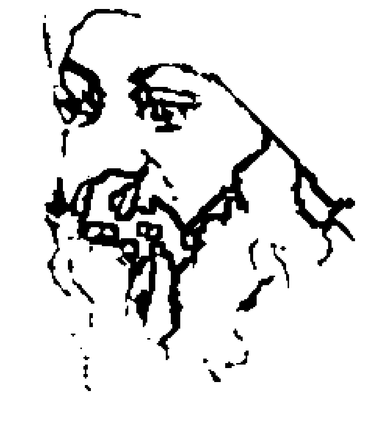
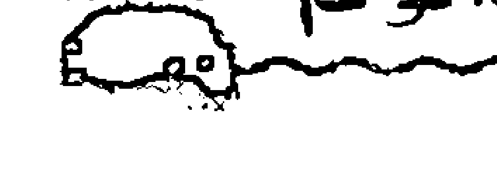
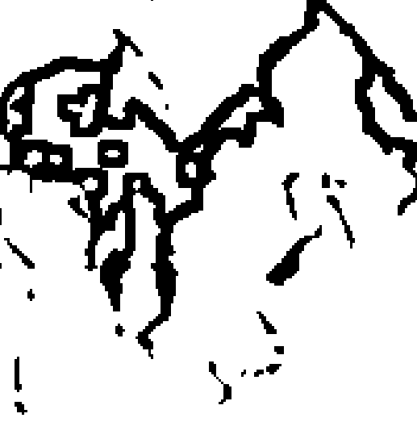
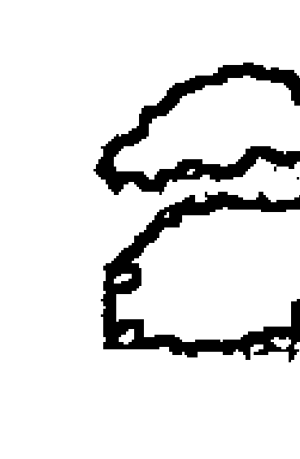
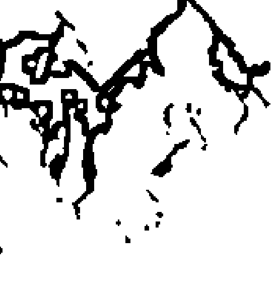
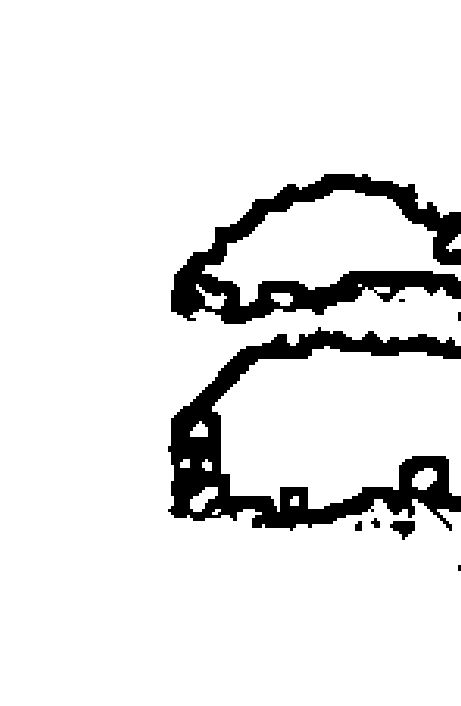
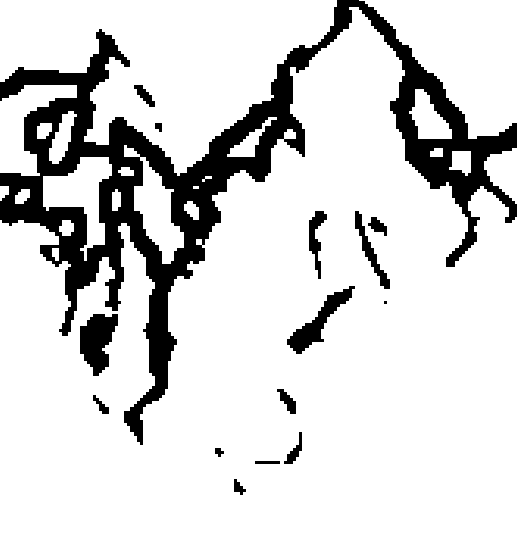

# 奥修：庄子心解

奥修给这个国家和这个世界带来一种眼光，任何人都可以为此感到骄傲。奥修给我们带来巨大的力量，我要向他顶礼以纪念他给我们的这种力量。
——印度前总理 钱德拉·谢卡尔

我非常高兴，奥修，我们印度的伟大的哲学家，一个以他强有力的哲学在这一生中获得成功的人，知识界很了解他，但是他的思想需要被所有的人进一步地接受。
——印度前总统 吉亚尼·宰尔·辛格

在哲学、艺术和科学的领域里，有一些人是碰巧成了天才人物，而这个世界也很偶然地给了他们荣耀；但奥修是独一无二的、无与伦比的。他是一个以他的存在给这个世界、这个国家带来荣耀的人。
——著名女诗人、印度议会上院议员 阿姆瑞塔·伊瑞蒂姆

在任何领域里，奥修都是一流的。在这种文化方面，奥修的思想早已成为国家的瑰宝，而且已经登上国际舞台。
——印度著名电影音乐导演、作曲家 卡尔亚吉

# 代序一 千年梦蝶一庄生

# 南怀瑾

关于《庄子》这本书，在整个中国文化的体系中，所占的份量非常之重，而且熟悉这本书的人也很多。历代对《庄子》的注解更是不胜枚举，不过，观点与解释各有不同。现在我们重新来研究的时候，首先要把《庄子》在中国文化历史上的位置以及它所占的份量，特别提出来，先作说明。

我们都晓得，战国的时候，所谓诸子百家的学术思想，非常蓬勃发达；有两个人物为代表，春秋末期是孔子，到了战国时代是孟子。当时的中国天下大乱，春秋战国先后乱了三四百年之久。这是我们历史上最混乱的时期，但是在学术思想方面却是最发达的时期。不过有一个观念，大家要搞清楚，所谓学术思想最发达，并不是说学术思想最自由；那个年代无所谓自由不自由，而是各种思想蓬勃的自由发展。

在春秋战国的时候，文化与文字没有完全统一，尤其政治体制所形成的诸侯各霸一方，造成了学术思想的歧异。但是不能否认的，这仍然属于一个中国文化系统的学术思想。

我们中国人都念过《四书》，为了要写好文章必须要背《孟子》，更要背《庄子》。苏东坡曾经说过，如要写好文章，《孟子》与《庄子》，及司马迁的《史记》，这三部书一定要熟背，才可以做大文章。《四书》的文章及它的文学境界，与《老子》、《庄子》是两回事，孔的文章孟的著作，敦厚严谨，也很风流。这个风流，不要搞错了，不是浪漫！《老子》、《庄子》是代表南方思想，是楚国的文化，它的文学境界是空灵洒脱的，后世认为，它又代表了道家。中国所谓道家的思想，同儒家思想，也是迥然有别的。

老庄之后，所谓南方楚国，在中国文学上极负盛名。代表性的作品有屈原的《离骚》、《楚辞》等。这一类的文章，与老庄都是同一系统，文章的气势与北方系统不同。表面上看来像是神经病说话，东一句西一句，像《庄子·齐物论》所讲的“吹”，这个字眼是庄子先开始用的。虽说是“吹”，但是他吹得非常有味道。千古以来，中国的大文学家，大思想家，表面上都骂《老子》、《庄子》，实际上，每个人的文章，都偷偷在学他们。只有清朝这位文学思想家怪人金圣叹，才公开提出来推崇，把《庄子》列入他的六才子书，就是《庄子》、《史记》、《离骚》、《水浒传》、《杜甫律诗》、《西厢记》。他认为这是中国六位大才子的著作。如果懂了六才子书，所有文章的技巧都学完了，这种说法也是很有道理的。

我们现在说回来，《庄子》的文章思想是那么汪洋博大，但当时被视为正统文化的是齐、鲁文化。不过在《孟子》一书里，却很少提到过孔子，而在《庄子》一书中，倒有很多提到孔子的地方。表面上看起来，庄子是在骂孔子，实际上规规矩矩，庄子都在捧孔子，捧得很厉害。要了解这一点，就要懂得文学的技巧了。

《庄子》这一部书，我们晓得它代表了道家，并且影响了中国几千年文化和知识分子。它内在潇洒，所讲的人生境界，形成了东汉到南北朝三四百年间特殊的文化思想境界。更有意思的是，直到现在我们仍然受到它很大的影响。

# 代序二 庄子之思,汪洋恣肆

# 冯友兰

庄子是先秦的最大的道家。他的生平，我们知之甚少。只知道他是很小的蒙国人，在那里过着隐士生活，可是他的思想和著作当时就很出名。《史记》上说：“楚威王闻庄周贤，使使厚币迎之，许以为相。庄周笑谓楚使者曰:……子函去！无污我……。我宁游戏污渎之中自快，无为有国者所羁，终身不仕，以快吾志焉。”(《老子韩非列传》)

《庄子》的开篇就是《逍遥游》，这篇文章纯粹是一些解人颐的故事。这些故事所包含的思想就是，获得幸福有不同的等级。自由发展我们的自然本性，可以使我们得到一种相对幸福；绝对幸福是通过对事物的自然本性有更高一层的理解而得到的。

这些必要条件的第一条是自由发展我们的自然本性，为了实现这一条，必须充分自由发挥我们自然的能力。这种能力就是我们的“德”，“德”是直接从“道”来的。庄子对于道、德的看法同老子的一样。所以我们的“德”，就是使我们成为我们者。我们的这个“德”，即自然能力，充分而自由地发挥了，也就是我们的自然本性充分而自由地发展了，这个时候我们就是幸福的。

万物的自然本性不同，其自然能力也各不相同。可是有一点是共通的，就是在它们充分而自由地发挥其自然能力的时候，它们都会感受到同等地幸福。《逍遥游》里讲了一个大鸟和小鸟的故事。两只鸟的能力完全不一样。大鸟能飞九万里，小鸟从这棵树飞不到那棵树。可是只要它们都做到了它们能做的，爱做的，它们都同样地幸福。所以万物的自然本性没有绝对的同，也不必有绝对的同。《庄子》的《骈拇》篇说;“凫胫虽短，续之则忧。鹤胫虽长，断之
则悲。放性长非所断,性短非所续,无所去忧也。

相对幸福是相对的,因为它必须依靠某种东西。这当然是真的:人在能够充分而自由地发挥自然能力的时候,就很幸福。但是这种发挥在许多情况下受到阻碍。例如死亡,疾病,年老。所以佛家以老、病、死为四苦中的三苦。是不无道理的。照佛家说,还有一苦,就是“生”的本身。因此。依靠充分而自由地发挥自然能力的幸福,是一种有限制的幸福,所以是相对幸福。

在庄子看来,圣人由于对万物自然本性有理解,他的心就再也不会受到世界变化的影响。这样一来,他就不会依赖外界事物,因而他的幸福也就不会受外界事物的限制。他可以说是已经得到了绝对的幸福。这是道家思想的一个方向,其中有不少的悲观认命的气氛。这个方向强调自然过程的不可避免性,以及人在自然过程中对命的默认。

可是道家思想还有另外一个方向,它强调万物自然本性的相对性,以及人与宇宙的同一。要达到这种同一,人需要更高层次的知识和理解。由这种同一所得到的幸福才是真正的、绝对的幸福。

事物永远在变化,而且有许多方面。所以对于同一事物可以有许多观点。只要我们这样说,就是假定有一个站得更高的观点。如果我们接受了这个假定,就没有必要自己来决定孰是孰非。这个论证本身就说明了问题,无需另作解释。

我们可以看出,庄子通过他的智慧最终地解决了先秦道家的许多固有的命题。这个问题就是如何全生避害。但是,在真正的圣人那里,这已经不成其为问题。庄子只是用取消问题的办法,来解决先秦道家固有的问题。这真正是用哲学的方法解决问题。哲学不报告任何事实,所以不能用具体的、物理的方法解决任何问题。例如,它既不能使人长生不死,也不能使人致富不穷。可是它能够给人一种观点,从这种观点可以看出生死相同,得失相等。从实用的观点看,哲学是无用的。哲学能给我们一种观点,而观点可能很有用。用《庄子》的话说,这是“无用之用”(《人间世》)。

# 目录

+   代序一 千年梦蝶一庄生 1
+   代序二 庄子之思,汪洋恣肆 3
+   第一章 无为之为 3
+   第二章 道中之人 35
+   第三章 取舍的尺度 69
+   第四章 至智不谋 91
+   第五章 朝三暮四 117
+   第六章 无执成其善 143
+   第七章 死生之辩 167
+   第八章 无用之为用 191
+   第九章 得鱼忘筌 213
+   第十章 大象无形 241
+   第十一章 心与物游 267
+   后 记 287

# 第一章 无为之为

天无为以之清,地无为以之宁。故两无为相合,万物皆化生。芒乎芴乎,而无从出乎！芴乎芒乎,而无有象乎！万物职职,皆从无为殖。

那个统治的人生活在混乱之中
那个被统治的人生活在悲痛之中
因此“道”希望不要影响别人,也不要被别人所影响
要理清混乱和免除痛苦就是要在空里面跟“道”生活在一起

如果一个人在跨越一条河
有一只空船撞到了他的小船
即使他是一个脾气很坏的人
他也不会生气
但如果他看到有一个人在船上
他将会对他大声喊,叫他驶开
如果那个喊叫没有被听到,他将会再度高喊
而且他还会开始大骂
这一切都是因为有人在那只船上
但如果那只船是空的
他一定不会大声喊,他一定不会生气

如果你可以空掉你自己的船
来跨过世界的河流
那么就没有人会来反对你
没有人会想要来伤害你

一根很直的树会最先被砍下来
最清的泉水会最先被榨干

如果你想要改善你的智慧来羞辱那些无知的人
想要培养你的个性来炫耀别人
就有一道光会照射在你的周围
就好像你吞进了太阳和月亮
你将无法避免灾难

有智慧的人说：
那个自满的人,他这样做一点价值都没有
成就是失败的开始
名誉是耻辱的开始

在众人之中
有谁能够不求成就和名誉
然后下降和消失?
他将会像“道”一样在流动,不被看见
他将会像生命本身一样地流动,没有名字,也没有家
他很单纯,不分别
他外表看起来好像是一个傻瓜
他的脚步不留痕迹
他没有权力
他不达成任何东西
他没有名声

因为他不评断任何人
所以也没有人会评断他
这就是完美的人
他的船是空的

你来到我这里，你已经踏上了危险的一步，这是一项冒险，因为靠近我，你可能会永远失去，接近将会意味着死亡，不可能意味着其他什么东西。我就好像是一个深渊，接近我，你将会掉进里面。我已经为此而邀请了你，你已经听到了，你也来了。

要小心，透过我，你将不会得到任何东西，透过我，你只会失去所有的一切，因为除非你失去了，否则神性不可能发生，除非你完全消失，否则那真实的无法产生，你就是那个障碍。

而你是那么地多，那么顽固地多，你内心充满着你自己，以至于没有东西能够穿透你，你的门关闭了。当你消失，当你不存在，那个门就打开了，那么你就变成好像宽广的、无限的天空。

那就是你的本性，那就是‘道’。

在我进入庄子这个很美的寓言——空船——之前，我想要告诉你另外一个故事，因为那将会为这个你来参加的静心营铺好那个趋势。

我听说有一次，在古时候某一个未知的国家，有一个王子突然发疯了，国王心急如焚，因为那个王子是他的独子，是该国唯一的继承人。所有的魔术师都被叫去了，所有那些能够创造奇迹的人和医疗人员都被传唤去了，他们做尽了一切努力，但是都无效，没有人能够帮助那个年轻的王子，他仍然继续发疯。

他发疯的那一天就将身上的衣服全部脱光而变成裸体的，然后开始生活在一张大桌子底下，他认为他已经变成了一只公鸡。到了最后，国王必须接受那个王子已经无法恢复的事实，他已经永远发疯了，所有的专家都宣告失败。但是有一天，那个希望再度燃起。有一个圣人，一个苏菲宗派的神秘者来敲皇
宫的门说:‘给我一个机会来治疗王子。’但是国王感到怀疑，因为这个人本身看起来就好像发了疯似的，比王子更疯，但是那个神秘家说:‘只有我能够治愈他，要治愈一个疯子需要一个更疯的疯子。你们那些什么赫赫有名的人，那些能够制造奇迹的人，你们那些医疗专家，他们都失败了，因为他们连疯狂的初步都不知道，他们从来没有走过那条路。’这听起来似乎合乎逻辑，国王想:‘反正也如此了，为什么不试试看？’所以他就给了他一个机会。

国王一答应说:‘好，你试试看。’那个神秘家就立刻脱光他的衣服，跳到桌子底下，发出类似公鸡的叫声。

那个王子变得怀疑，他说:‘你是谁？你以为你在做什么？’那个老年人说:‘我是一只公鸡，一只比你更老道的公鸡，你并不算什么，你只不过是一个新手，最多只能够算是一个学徒。’那个王子说:‘如果你也是一只公鸡，那很好，但是你看起来像一个人。’那个老年人说:‘不要看我的外表，要看我的精神，要看我的灵魂，我就像你一样是一只公鸡。’因此他们两个人成为朋友，他们互相承诺说虽然整个世界都反对他们，他们也要永远生活在一起。

经过了几天，有一天那个老年人突然开始穿衣服，他穿上了他的衬衫，那个王子说:‘你在干什么？你疯了吗？一只公鸡居然试着要穿人的衣服？’那个老年人说:‘我只是试着要去欺骗这些傻瓜，这些人。记住，即使我穿上衣服，也不会有什么改变，我的公鸡本质仍然保持，没有人能够改变它。就只是穿上人的衣服，你就认为我改变了吗？’王子只得让步了。

过了几天之后，那个老年人说服王子穿上衣服，因为冬天正在逼近，天气变得非常冷。

然后有一天，他突然从皇宫叫来食物，王子变得非常警觉，他说:‘你这个王八蛋，你在干什么，你要像那些人一样地吃东西吗？你要像他们一样地吃东西吗？我们是鸡，我们必须像鸡一样地吃东西。’那个老年人说:‘就这个公鸡而言，它不会有什么差别，你可以吃任何东西，你可以享受任何东西，你可以像人一样地生活，而仍然忠于你公鸡的本质。’一步一步地，那个老年人说服了那个王子回到人的世界来，后来他变得完全正常。

你跟我的情形也是一样。记住，你只是初学者。你或许认为你是一只公鸡，但是你才刚刚学字母，而我是一个老手，只有我能够帮助你。所有的专家都失败了，所以你才会来到这里。你已经敲过了很多扇门，好几世以来，你都一直在找寻，没有什么东西能够对你有所帮助。

但是我说我能够帮助你，因为我不是一个专家，我不是一个外来者，我曾经走过同样的路，同样的疯狂，我经历过了同样的事情——同样的悲惨、同样的痛苦、同样的噩梦。任何我所做的只不过是在说服，说服你走出你的疯狂。

认为自己是一只公鸡，这是疯狂的，认为自己是一个身体，这也是疯狂的，甚至比前者来得更疯狂。认为自己是一只公鸡是疯狂的，认为自己是一个人，那又是更大的疯狂，因为你不属于任何形式。不论那个形式是一只公鸡或是一个人，那是无关的，你属于那个无形的，你属于整体。所以，不论你认为你是什么样的形式，你都是疯狂的。你是无形的，你不属于任何身体，你不属于任何阶级、任何宗教、任何信念，或任何名字，除非你变成没有形式的、没有名字的，否则你将永远都不是健全的。

心智健全意味着来到那个自然的，来到那个在你里面最终的，来到那个隐藏在你背后的无。需要很多努力，因为要去除形式、要抛弃形式非常困难，你已经变得非常执著于它，你已经变得非常认同它。

这个静心营只不过是要说服你走向那个无形——要如何才能够不处于形式里。每一个形式都意味着自我，甚至连一只公鸡也有它的自我，人也有他自己的自我。每一个形式都停留在自我的中心。那个无形意味着无我，那么你就不会停留在自我的中心。那么你的中心就到处都是，或者到处都不是。这是可能的，这个看起来几乎不可能的事是可能的，因为它已经发生在我身上，当我这样说，我是通过我自己的经验来说的。

## 臣子之解

任何你现在所处的地方我都待过，任何我现在所在的地方，你也可能来过。尽可能深入地看我，尽可能深入地去感觉我，因为我是你们的未来，我是你们的可能性。

每当我说臣服于我，我的意思是说要臣服于这个可能性。你可以被治愈，因为你的疾病只是一个思想。王子发疯了，因为他和那个认为他是一只公鸡的思想认同。除非一个人能够了解而不与任何形式认同，否则每一个人都是发疯的。唯有当一个人能够了解而不与任何形式认同，他才是健全的。

所以一个健全的人并不是一个特别的人，他不可能是，只有一个发了疯的人才可能是一个特别的人——不论他是一只公鸡或是一个人，一个首相或是一个总统，或是任何一个人。一个心智健全的人会感觉到那个“没有人”？这是一个危险……

你以某号人物来到我这里，如果你允许我，如果你给我机会，这个某号人物可能会消失？你可能会变成无人，否则你不可能是狂喜的；除非你变成无人，否则那个祝福不会来到你身上，你将会继续错过生命。

事实上，你并非真的是活生生的，你只是拖着生命在走，你只是好像一个重担一样地携带着你自己。有很多痛苦发生、很多失望、很多忧伤，但是从来没有一丝喜乐，它不可能有。如果你是某号人物？你就好像一块坚硬的石头，没有什么东西能够穿透你。当你是“无人”，你就开始变成有很多孔。当你是无人，你就真的是一个空，是透明的，每一样东西都能够流经你。没有阻碍、没有障碍，也没有抗拒，你变成一个被动、一个门。

目前你就好像是一道墙，一道墙意味着某号人物。当你变成一个门，你就变成“无人”。一个门就只是一个空，任何人都可以通过，没有抗拒、没有障碍。但如果你是某号人物，那么你是疯狂的，当你是“无人”，你就首度变成健全的了。

但是整个社会、教育、文明和文化都在培养你，都在帮助你去变成某号人物。那就是为什么我说：宗教是反对文明的，宗教是反对教育的，宗教是反对文化的，因为宗教赞成自然、赞成“道”。

所有的文明都反对自然，因为他们想要使你成为某个特别的人。你越是结晶成某号人物，神性就越不能够穿透你。

你去到寺庙、去到教会、或是去到教士那里，但是在那里，你也是在找寻要在另一个世界变成某号人物的方式，在找寻要达成什么的方式，在找寻成功的方式。

那个想要达成的头脑就好像影子一样地跟随着你。不论你去到那里，你都带着那个利益、成就、成功，和达成的概念。如果有人带着这种观念来到这里，他应该尽快离开，他应该尽快地从我这里跑开，因为我无法帮助你变成某号人物。

我不是你的敌人，我只能够帮助你成为什么人都不是的人，我只能够把你推进深渊——无底的深渊。你将永远无法到达任何地方，你将只会融解。你将会往下掉、往下掉、又往下掉，然后融解。当你融解的时候，整个存在都会觉得很狂喜，整个存在都会庆祝这个发生。

佛陀达成这个，因为语言的关系，所以我说达成，否则那个字是丑陋的，事实上并没有达成，但是你会了解的。佛陀达成这个空、这个无物。有两个星期的时间，持续十四天，他都静静地坐着，没有移动，也没有说话，什么事都没做。

据说天上的神因此而受到了打扰，一个人变成这么全然的空，那是非常少发生的。整个存在都感觉到一个庆祝，所以诸神就来了，人们拜在佛陀的脚下说:‘你一定要说些什么，你一定要说你达成了什么？’据说佛陀笑着说:‘我并没有达成任何东西，相反地，因为有这个一直想要达成什么的头脑，所以我失去了每一样东西。我并没有达成任何东西，这不是一项达成，相反地，那个想要达成的人消失了，我已经不复存在了，看着它的美。当我以前存在的时候，我是痛苦的；当我不复存在，每一件事都是那么地喜乐，那个喜乐一直继续洒落在我身上，它到处都存在，现在已经没有痛苦。’

佛陀曾经说过：人生是痛苦，出生是痛苦，死亡也是痛苦，每一件事都是痛苦的。它是痛苦的，因为有自我存在，那只船还不是空的。现在那只船是空的，现在已经没有痛苦、没有忧愁、没有悲伤。存在已经变成一个庆祝，它将会保持是一个庆祝，直到永远。

# 第一章 无为之为

那就是为什么我说你来找我是危险的，你已经踏上了危险的一步。如果你很勇敢，那么就准备好来“跳”。

整个努力就是要如何把你杀掉，整个努力就是要如何摧毁你。一旦你被摧毁，那个无法被摧毁的就会浮现，它就在那里，它是隐藏起来的。一旦所有那些非主要的东西都被排除，那个主要的人就会好像一个火焰一样——活生生地，具有全然的光辉。

庄子的寓言很美，他说一个智者就好像是一只空船。

## 这就是完美的人

他的船是空的

没有人在里面。

如果你碰到那位庄子，或是那位老子，或是我，那只船就在那里，但是它是空的，没有人在它里面。如果你只是看表面，那么是有一个人在那里，因为那只船就在那里，但是如果你穿透得更深，如果你真的变得跟我很亲近，如果你忘掉了身体、忘掉了那只船，那么你就会碰到空无。

庄子是一个稀有的开花，因为变成“无人”是世界上最困难、几乎不可能的、最不平凡的一件事。

平凡的大脑渴望成为不平凡的，那是平凡的一部分，平凡的大脑想要成为某个特别的人物，那是平凡的一部分。你或许可以成为一个亚历山大，但是你仍然保持是平凡的，那么谁是不平凡的？唯有当你不渴求不平凡，那个不平凡才会开始，那么那个旅程就开始了，那么一颗新的种子就发芽了。

这就是庄子所说的“一个完美的人就好像是一只空船”的意思。它隐含很多事，首先，一只空船并没有要走到任何地方去，因为没有一个人可以来指引它，没有一个人可以来操纵它，没有一个人可以来将它开往什么地方。一只空船就只是在那里，它并没有要走到任何地方去，即使它在动，它也并没有要走到任何地方去。

当头脑不存在，生命还会继续流动，但是它将不受指引。你将会行动，你将会改变，你将会好像河流一样地流动，但是并没有要走到任何地方去，没有目标。一个完美的人没有任何目的地生活，一个完美的人会行动，但是没有任何动机。如果你问一个完美的人：“你在做什么？”他将会说：“我不知道，但事情就是这样在发生。””如果你问我说为什么我在对你讲话，我将会说：“你去问花说为什么它会开花。””这是一个发生，这并不是某一个人在操纵的，没有人在操纵它，那只船是空的。当有一个目的，你将会永远处于痛苦之中，为什么呢？

从前有一个人问一个守财奴，一个大守财奴：“你怎么能够很成功地累积了那么多的财富？”

那个守财奴说：“这就是我的座右铭：任何明天要做的事今天就把它做好；任何今天要享受的事，明天再享受。这就是我的座右铭。”他很成功地累积了很多财富，人们就是这样在很成功地累积一些无意义的东西！

那个守财奴也很痛苦。他的一只手很成功地累积了很多财富，但是另外一只手也很成功地累积了很多痛苦。累积金钱的座右铭和累积痛苦的座右铭是一样的：任何明天要做的事今天就做，立刻就做，不要延缓；而任何现在能够立刻享受的，永远不要马上享受，要将它延缓到明天。

这就是进入地狱的方法，它永远都会成功，它从来不会失败。试试看，你就会成功，或者，也许你已经成功了。你或许在不自知的情况下一直在这样做。延缓一切能够享受的，只是在想著明天。

耶稣被犹太人钉死在十字架上就是为了这个原因，而不是为了别的原因。并不是说他们反对耶稣，耶稣是一个完美的人，是一个很美的人，犹太人为什么要反对他？相反地，他们一直在等待这个人。好几世纪以来，他们一直在希望、在等待：弥赛亚（救世主）什么时候会来？

然后突然间，这个耶稣宣称说：“我就是你们 的弥赛亚来了，现在注意看我。”

他们受到了打扰，因为头脑可以等待，它一直都在享受等待，但是头脑不能够面对事实，头脑不能够跟当下这个片刻碰头，它可以一直延缓，延缓非常容易：弥赛亚将会来，不久他将会来……好几世纪以来，犹太人一直在想、在延缓，然后突然间，这个人摧毁了他们所有的希望，因为他说：“我就在这里。”

## 庄子心解

不只是耶稣，自从那时之后也有很多人宣称：“我在这里，我就是弥赛亚！”犹太人一直都否定，因为如果不否定，他们将怎么能够希望，他们将怎么能够延缓？他们非常热衷于跟这个希望生活在一起，那是你几乎无法相信的。有一些犹太人在晚上上床睡觉的时候就希望说这是最后一个晚上，明天早上弥赛亚就会来……

我听说有一个犹太教的牧师，他经常告诉他太太说：“如果他晚上来，一个片刻都不要浪费，立刻叫醒我。”弥赛亚一直在来临的途中，他随时都会来到。

我还听说有另外一个犹太教的牧师，他儿子即将结婚，所以他送出很多邀请卡给朋友，上面写著：“我儿子谨定于某某日子在耶路撒冷结婚，但是如果弥赛亚到那个时候还没有来，我的儿子将在科兹这个村子结婚。”谁知道，到了结婚那一天，弥赛亚或许就会来了，那么我就不会在这里了，我将会在耶路撒冷庆祝，所以，如果到了结婚那一天他还没有来，那么婚礼就在这个村子举行，否则就在耶路撒冷举行。

他们一直在等待又等待，并且做梦。整个犹太人的头脑都萦绕在即将来临的弥赛亚，但是每当弥赛亚来临，他们就立刻否定他，对这个必须要加以了解，头脑就是这样在运作：你在等待喜乐或狂喜，但是每当它来临，你就拒绝它，你掉头走去。

头脑可以生活在未来，但是无法生活在现在，在现在你只能够希望和欲求，你就是这样在制造痛苦。如果你开始生活在当下这个片刻，生活在此时此地，痛苦就消失了。

它如何跟自我相关联？自我是过去的累积。任何你所知道的、所经验到的、所读到的，任何过去发生在你身上的，所有那些东西都累积在那里，那整个过去就是自我，它就是你。

过去可以投射到未来，未来只不过是过去的延伸，但是过去无法面对现在。现在是完全不同的，它具有一种在此时此地的品质。过去一直都是死的？

现在才是生命，它是所有活生生的生命的源头。过去无法面对现在，所以它就移进未来，但这两者都是死的，这两者都是不存在的。现在是生命，未来不可能碰到现在，过去也不可能碰到现在。你的自我、你的某号人物，就是你的过去。除非你是空的，否则你不可能在这里，除非你在这里，否则你不可能是活生生的。

你怎么能够知道生命的喜乐？它每一个片刻都洒落在你身上，但是你却避开它。

庄子说：

+   这就是完美的人

+   他的船是空的

是什么空掉？“我”空掉，“自我”空掉，在里面的某一个人空掉。

+   那个统治人的人生活在混乱之中

+   那个被统治的人生活在悲痛之中

+   那个统治人的人生活在混乱之中

为什么？那个想要统治的欲望来自自我，那个想要占有、想要有权力、想要支配的欲望来自自我。你能够支配越大的王国，你就能够达成越大的自我。带着你的占有物，你内在的那个某号人物就变得越来越大、越来越大。有时候那只船变得非常小，因为自我变得非常大……

这就是发生在政客身上，以及发生在那些迷恋财富、声望、权力的人身上的情形。他们的自我变得太大了，以至于他们的船无法容纳他们。每一刻他们都处于快要被溺毙的边缘，因此他们会很恐惧，吓得要死。你越恐惧，你就变得越占有，因为你认为透过占有就可以达到安全。你越害怕，你就越认为如果你的王国能够再大一点，你就会更安全。

## 臣之心解

## 那个统治的人生活在混乱之中

的确，那个统治的欲望来自你的混乱，那个想要成为领袖的欲望来自你的混乱。当你开始领导别人，你就忘记了你的混乱，这是一种逃避，这是一个诡计。你在生病，但是如果有别人在生病，你就变得对治愈他有兴趣，而忘掉了你自己的病。

据说有一次萧伯纳打电话给他的医生说:‘我有了麻烦，我觉得我的心脏快要不行了，请你立刻来！’

医生立刻跑过去，他必须爬三个楼梯，他爬得满身大汗。他进来之后什么话都没说，只是坐在椅子上闭起他的眼睛，萧伯纳跳下床问他说:‘你怎么了？’

医生说:‘什么话都不要说，似乎我已经快死掉了，这是一个突发的心脏病。’

萧伯纳开始帮助他，他拿了一杯水来，又拿了一些阿斯匹林，所有他能够做的，他都做了。半个小时之后，那个医生恢复了，然后他说:‘我现在必须离开，请你把费用付给我。’

萧伯纳说:‘这就奇怪了！是你应该付我费用才对！在这半个小时里面，我在这里跑来跑去服侍你，你甚至没有要求，我就为你做了。’

但是那个医生说:‘我已经治好了你，这是一种治疗，你必须付我费用。’

当你对别人的病有兴趣，你就忘掉了你自己的病，因此会有那么多的领袖、那么多的宗师、那么多的师父。它让你的头脑被占据。如果你去顾虑别人，如果你是人们的仆人、是一个社会工作者，一直在帮助别人，那么你将会忘掉你自己的混乱、你自己内在的动荡不安，因为你太忙于他们的事了。

心理治疗家从来不会发疯，并不是因为他们对它免疫，而是因为他们非常顾虑到别人的疯狂，以及要去治疗和帮助，以至于他们完全忘掉他们也可能发疯。

我知道有很多社会工作者、领袖、政客和宗师，他们之所以能够保持健康就是因为他们都在顾虑别人。

# 第一章 无为之为

但是如果你从你的混乱去领导别人、去驾驭别人，你将会在他们的生活当中也制造出混乱。它或许是对自己的一种治疗，它对你来讲或许是一种很好的逃避，但它是在散布疾病。

## 那个统治人的人生活在混乱之中

不只是他自己生活在混乱之中，他也会继续将混乱散布给别人。来自混乱的，只会产生混乱。

所以如果你很混乱，请你要记住，不要去帮助任何人，因为你的帮助将会是有毒的。如果你很混乱，不要用别人来占据你，因为这样做你只是在制造麻烦，你的病将会被传染开来。不要给任何人建议，如果你的思想清楚一点，那么就不要从那些混乱的人听取建议。保持警觉，因为混乱的人一直都会想要给予建议，他们是免费给予的，他们很慷慨地给予！ 保持警觉！来自混乱的，只会产生混乱。

## 那个被统治的人生活在悲痛之中

如果你去支配别人，你就会生活在混乱之中；如果你让别人来支配你，你就会生活在悲痛之中，因为奴隶不可能快乐。

因此“道”希望不要影响别人，也不要被别人所影响

你不应该试图去影响任何人，你也应该保持警觉而不要被别人影响。自我能够做这两者，但是它不能够保持在中间。自我能够试图去影响，那么它就会觉得很好，因为它觉得它在支配。但是要记住，当自我被支配的时候它也会觉得很好。主人觉得很好，因为有很多奴隶在被支配，而奴隶被支配时也觉得很好。

世界上有两种类型的头脑：支配别人的头脑——男性的头脑，和喜欢被支配的头脑——女性的头脑。我说女性并不是意味着女人，男性也不是意味着男人。有一些女人具有男性头脑，也有一些男人具有女性头脑，它们并非永远都是一样的。

这是两种类型的头脑：其中一种喜欢支配别人，另外一种喜欢被支配。在这两种情况下，自我都被满足了，因为不管是你支配别人，或者是你被支配，你都是重要的。如果某人支配你，那么你也是重要的，因为他的支配要依靠你。如果没有你，会在那里？如果没有你，他的王国会在那里？他的支配和他的占有会在那里？如果没有你，他什么人都不是。

在这两个极端里，自我都可以被满足，只有在中间，自我才会死掉。不要被支配，也不要试图去支配别人。

只要想想，将会有什么事发生在你身上，你就任何方面而言都不重要，你既不是主人，也不是奴隶。主人没有奴隶无法生活，奴隶没有主人也无法生活，他们互相需要，他们是互补的，就好像男人和女人也是互补的，他们的满足需要别人。

不要成为这两者的其中之一，那么你是谁？突然间你就消失了，因为如此一来，你根本就不重要了，没有人依靠你，你是不被需要的。

有一个很大的被需要的需要。记住，每当你被需要的时候，你就觉得很好。有时候，即使它带给你痛苦，你也喜欢被需要。

一个残废的小孩只能待在床上，他母亲经常在担心说要怎么办：我必须服务这个小孩，这样我的一生都将会浪费掉，但如果## 第一章 无为之为

理清混乱和免于痛苦就是要在空里面跟“道”生活在一起。在中间，那个门就会打开，那是空无之地。当你不存在，整个世界就消失了，因为世界就悬在你身上，你在你周遭所创造出来的整个世界就附在你身上。如果你不存在，整个世界就都消失了。并不是存在会进入不存在，不是这样，是整个世界都消失，而存在出现。世界是由头脑所创造出来的，而存在（existence）是真理。这个房子将会在那里，但是如此一来，这个房子将不会是你的。花朵将会在那里，但是那个花朵将会变成没有名字的。它将既不是美的，也不是丑的。它将会在那里，但是不会有任何观念在你的头脑产生，所有的观念架构都将会消失。赤裸裸的、天真的存在将会保持在那里——很纯净地、如镜子般地存在。在空无之地，所有的观念、所有的想象和所有的梦都消失了。

- 如果一个人在跨过一条河，有一只空船撞到了他的小船，即使他是一个脾气很坏的人，他也不会生气，但是如果他看到有一个人在船上，他将会对他大声喊，叫他驶开，如果那个喊叫没有被听到，他将会再度高喊，而且他还会开始大骂，这一切都是因为有人在那只船上，但如果那只船是空的，他一定不会大声喊，他一定不会生气。

如果人们继续跟你碰撞，如果人们继续对你生气，那么你要记住，这并不是他们的错，是因为你的船不是空的。他们之所以生气是因为你在那里。如果那只船是空的，他们将会看起来很愚蠢，如果他们生气，他们将会看起来很愚蠢。

那些跟我很亲近的人有时候会对我生气，而他们看起来很愚蠢！如果那只船是空的，你甚至可以享受别人的愤怒，因为没有一个人可以让他们来生气，他们并没有在看你。所以要记住：如果人们继续撞到你，那表示你是一道过分坚实的墙。要成为一个门，要变成空的，让他们通过。

即使是如此，有时候人们也会生气，他们甚至会对一个佛生气，因为有一些愚蠢的人，当他们的船碰撞到一只空船，他们不会去看说有没有人在它里面，他们会开始大骂，他们会自己乱了阵脚，以至于无法去看有没有人在它里面。

但即使是如此，那只空船也能够去享受它，因为如此一来，那个愤怒永远不会打击到你。你并不在那里，所以谁能够被它打击？

这个空船的比喻的确很美。人们之所以生气是因为你过分地凸现自我，因为你太明显地在那里，你是那么地坚实，所以他们无法通过。生命跟每一个人都纠缠在一起，如果你太多了，那么到处都会有碰撞、有愤怒、有沮丧、有侵略、有暴力——那个冲突将会继续。

每当你感觉到有人在生气，或者有人撞到你，你总是认为他应该负责。无知的人就是这样在下结论，这样在解释。无知永远都说：“别人应该负责。”而智慧一直都说：“如果有人必须负责，那么我应该负责，而不要碰撞的唯一方式就是不要存在。”

“我应该负责”并不是意味着说：“我做了某些事，所以他们才生气。”问题不是这样。你或许并没有做任何事，但只是你的存在就足以让人们生气。问题并不在于你做好或做坏，问题在于你在那里。

这就是道家跟其他宗教的不同，其他的宗教说：要成为好的，要以某一个方式来躬行，使得没有人会对你生气。而道家说：不要存在。

问题并不在于你做得很好或做得不好，那不是问题之所在。即使是一个很好的人，即使是一个非常具有圣人风范的人，也会制造愤怒，因为他存在。

## 庄子心解

那些跟我很亲近的人有时候会对我生气，而他们看起来很愚蠢！如果那只船是空的，你甚至可以享受别人的愤怒，因为没有一个人可以让他们来生气，他们并没有在看你。所以要记住：如果人们继续撞到你，那表示你是一道过分坚实的墙。要成为一个门，要变成空的，让他们通过。

即使是如此，有时候人们也会生气，他们甚至会对一个佛生气，因为有一些愚蠢的人，当他们的船碰撞到一只空船，他们不会去看说有没有人在它里面，他们会开始大骂，他们会自己乱了阵脚，以至于无法去看有没有人在它里面。

但即使是如此，那只空船也能够去享受它，因为如此一来，那个愤怒永远不会打击到你。你并不在那里，所以谁能够被它打击？

这个空船的比喻的确很美。人们之所以生气是因为你过分地凸现自我，因为你太明显地在那里，你是那么地坚实，所以他们无法通过。生命跟每一个人都纠缠在一起，如果你太多了，那么到处都会有碰撞、有愤怒、有沮丧、有侵略、有暴力——那个冲突将会继续。

每当你感觉到有人在生气，或者有人撞到你，你总是认为他应该负责。无知的人就是这样在下结论，这样在解释。无知永远都说：“别人应该负责。”而智慧一直都说：“如果有人必须负责，那么我应该负责，而不要碰撞的唯一方式就是不要存在。”

“我应该负责”并不是意味着说：“我做了某些事，所以他们才生气。”问题不是这样。你或许并没有做任何事，但只是你的存在就足以让人们生气。问题并不在于你做好或做坏，问题在于你在那里。

这就是道家跟其他宗教的不同，其他的宗教说：要成为好的，要以某一个方式来躬行，使得没有人会对你生气。而道家说：不要存在。

问题并不在于你做得很好或做得不好，那不是问题之所在。即使是一个很好的人，即使是一个非常具有圣人风范的人，也会制造愤怒，因为他存在。

# 第一章 无为之为

有时候一个好人会比一个坏人制造出更多的愤怒，因为一个好人意味着一个非常微妙的自我主义者。一个坏人会觉得有罪恶感，他的船或许是充满的，但是他会觉得有罪恶感，他并不是真的那么满布在整只船上，他的罪恶感会帮助他收敛，但是一个好人会觉得他自己非常好，所以他会完全充满那只船，他会过度充满它。

所以每当你去接近一个好人，你一直都会觉得被折磨，并不是说他在折磨你，它就只是他的“在”。跟所谓的好人在一起，你会一直感到悲伤，你会想要避开他们。所谓的好人的确非常严苛，每当你跟他们接触，他们就会使你觉得悲伤，他们会压低你，你会想要尽快离开他们。

道德家、清教徒和美德至上者，他们都很严苛，他们携带着一个重担，以及黑暗的影子，没有人会喜欢他们，他们不可能成为好同伴，他们不可能成为好朋友，跟一个所谓的好人不可能有友谊，几乎不可能，因为他的眼睛一直都在谴责，你一接近他，他是好的，你就变成坏的，并不是说他会特别做什么，他的存在就会创造出什么，你就会觉得生气。

道家完全不同，道家具有一种不同的品质。对我而言，道家的思想是曾经存在于这个地球上最深邃的智慧，没有其他智慧能够跟它相比。在耶稣、佛陀、或克里虚纳（Krishna: 印度古神。）的话语里有一些瞥见，但就只是瞥见而已。

老子或庄子的讯息是最纯的，它是绝对地纯粹，从来没有被任何东西污染过。那个讯息就是：一切都是因为有人在船上。整个地狱都是因为有人在船上。

但如果那只船是空的，他一定不会大声喊，他一定不会生气。如果你可以空掉你自己的船，来垮过世界的河流，那么就没有人会来反对你。

- 没有人会想要来伤害你
- 一棵很直的树会最先被砍下来
- 最清的泉水会最先被榨干
- 如果你想要改善你的智慧来羞辱那些无知的人
- 想要培养你的个性来炫耀别人
- 就有一道光会照射在你的周围
- 就好像你吞进了太阳和月亮
- 你将无法避免灾难

这是独一无二的。庄子是在说，围绕在你周围的神圣光环表示你还在那里。“你是好的”那个光环一定会为你带来灾难，也会为别人带来灾难。老子和庄子——师父和门徒——从来没有人他们的照片上画出光环或氛围。不像耶稣、查拉斯图特拉、克里虚纳、佛陀、或马哈维亚，从来有人在他们的头部画上光环，“因为，”他们说，“如果你真的很好，没有光环会出现在你头部的周围，相反地，那个头会消失。”要在那里画光环呢？头已经消失了。

所有的光环多多少少都跟自我有关。并不是由克里虚纳自己来画他的自画像，它是由门徒们所画的，他们不能够想象不在他的头部周围画出一个光环，这样他才会看起来不平凡。而庄子说；成为平凡的就是成为圣人。没有人可以认出你，没有人会觉得你是某某特殊人物。庄子说：去到群众那里，跟他们混在一起，没有人知道有一个佛进入了群众，没有人会觉得某人是不同的，因为如果有人感觉到它，那么就一定会有愤怒和灾难。每当有人觉得你是某某显赫人物，他自己的愤怒和他自己的自我就会受伤，他会开始反应，他会开始攻击你。

所以庄子说：不要培养个性，因为那也是一种财富。而所谓的宗教人士一直在教导说：培养个性、培养道德、成为具有美德的。

但这是为什么呢？为什么要成为具有美德的？为什么要反对罪人？但你的头脑是一个做者，你仍然很有野心。如果你去到天堂，在那里看到罪人坐在神的旁边，你将会觉得非常受伤——你的一生都浪费掉了。你培养美德，你培

## 庄子心解

但是庄子说：他没有权力，因为使用权力永远都是自我的一部分。自我想要成为有权力的、有力量的。你无法说服一个智者去使用他的权力，那是不可能。如果你能够，它意味着有一些自我留下来被说服。他从来不会去使用他的权力，因为没有一个人可以来使用它或操纵它。那个自我、那个操纵者已经不复存在了，那只船是空的。要由谁来指使这只船？没有人。

一个圣人就是力量，但是他没有权力；一个圣人是强而有力的，但是他没有权力，因为那个控制者已经不复存在了。他是能量——洋溢的、没有指名的、没有指向的——但是没有一个人可以来指使它。你或许可以在他的“在”里面被治疗，你的眼睛或许可以打开，但是他并没有打开它们，他并没有碰触它们，他并没有治疗你。如果他认为他有治疗你，他本身就生病了。这个“我”的感觉——我在治疗——是一个更大的病，它是一个更严重的瞎眼。

- 他没有权力
- 他不达成任何东西
- 他没有名声
- 因为他不评断任何人
- 所以也没有人会评断他

这就是完美的人

他的船是空的

这将是你的途径——空掉你的船。继续丢出任何你在船上所找到的，直到每一样东西都被丢出去而没有什么东西被留下来，甚至连你自己都被丢出去，没有什么东西被留下来，你的存在变成只是空的。

最后一件事和第一件事就是成为空的，一旦你是空的，你将会被充满。当你是空的，一切都会降临到你身上，只有空能够接受一切，比这个更少是不行的，因为要接受一切，你必须成为空的，无限地空，唯有如此，一切才能够被接受。你的头脑非常小，它们无法接受神性。你的空间非常小，你无法邀神性

“空”将成为途径、目标和每一件事。从明天早上开始，试着使你自己空掉，一切你在里面所找到的——你的痛苦、你的愤怒、你的自我、嫉妒、受苦、你的痛苦、你的欢乐——任何你所找到的，你都将它丢掉。不要有任何分别，不要有任何选择，使你自己空掉，当你变成全然地空，突然间你就会了解到你就是整体，你就是一切，透过空，整体就达成了。

静心只不过是在使你变成空，变成“无人”。

在这个静心营里，以一个“无人”来行动。如果你在某人里面创造出愤怒，如果你跟别人碰撞，记住，你一定是在船上，所以它才会发生。不久之后，当你的船是空的，你就不会跟别人碰撞，那么就不会有冲突、不会有愤怒、不会有暴力，什么都没有。

这个空无就是祝福，你一直都是为了这个空无在找寻又找寻。

道中之人毫无障碍地行动
他的行为不会伤害到任何人
然而他并不知道他自己是仁慈且温和的

他不会奋力去赚钱
他也不会把贫穷当成美德

他走他自己的路而不依靠别人
他对他自己的单独行动也不引以为傲
道中之人保持不为人所知

完美的美德不去制造什么东西
没有自己就是真实的自己
最伟大的人是一个“无人”

对头脑来讲，最困难的事情，几乎不可能的事情就是停留在中间，就是保持平衡。从一件事走到它相反的极端是最容易的。从一极走到相反的那一极是头脑的本性，这一点必须要深入了解，因为除非你了解这一点，否则没有什么东西能够引导你到静心。

头脑的本性就是从一个极端走到另一个极端，它依靠不平衡而存在，如果你是平衡的，头脑就消失了。头脑就好像是一种病，当你是不平衡的，它就存在，当你是平衡的，它就不存在。

那就是为什么对一个吃太多的人而言，他很容易去断食，它看起来好像不合逻辑，因为我们以为一个执著于食物的人不可能进行断食，但你这样想是错的，只有执著于食物的人能够断食，因为断食也是同样的执著，只是以相反的方向，它并非真正改变了你自己，你仍然执著于食物。以前你吃太多，现在你很饥饿，但是头脑仍然保持集中在食物，只是从相反的那一极来运作。

一个过分放纵在性里面的人可以很容易地变成一个禁欲者，那是没有问题的。吃适量的东西对头脑来讲很困难，因为头脑很难停留在中间。

为什么它很难停留在中间？它就好像钟摆。钟摆走到右边，然后又移到左边，然后再度移到右边，又再度移到左边，整个时钟都依靠这个移动。如果钟摆停留在中间，那个时钟就停止了。当那个钟摆移到右边，你认为它只是移到右边，但是它同时在累积动量要移到左边。它越是移向右边，它就累积越多动量要移到左边，移到相反的方向。当它移到左边，它又再度累积动量要移到右边。

每当你吃太多，你就在累积动量要进行断食，每当你过分放纵在性里面，迟早禁欲就会吸引你。

同样的事会在相反的那一极发生。去问你们所谓的出家人，他们坚持保持禁欲，如此一来，他们的头脑会累积动量去进入性；他们坚持保持饥饿，因此他们的头脑经常会想到食物。当你过分去想食物，那表示你在为它累积动量。思考意味着动量，头脑会开始为相反的那一极作安排。

有一件事：每当你移动，你就同时移动到相反的那一极。相反的那一极是隐藏起来的，它是不明显的。

当你爱一个人，你同时也在累积恨他的动量，那就是为什么只有朋友会变成敌人。你无法突然变成一个敌人，除非你首先变成一个朋友。爱人会争吵、争斗，只有爱人会争吵和争斗，因为除非你爱，否则你怎么会恨？除非你移到了非常远的左边，否则你怎么会移到右边？现代的研究说，所谓的爱是一种亲密的敌意关系，你太太是你亲密的敌人，你先生是你亲密的敌人，既是亲密的，也是敌意的。它们看起来是相反的、不合逻辑的，因为我们会怀疑说一个亲密的人怎么会变成一个敌人，一个是朋友的人怎么会也是敌人？

逻辑是表面的，生命进入得较深，在生命里面，所有相反的东西都联合在一起，它们一起存在，这一点要记住。因为这样，所以静心才会变成具有平衡作用。

佛陀教导八种规范，每一种规范他都加上“正”字（八正道）。他说：正确的努力，因为很容易从行动进入到不行动，从清醒进入睡觉，但是要停留在中间是困难的。当佛陀使用“正”字，他是在说：不要走到相反的那一极，只要停留在中间。正确的食物——他从来没有说要断食。不要放纵在吃太多，也不要放纵在断食。他说：正确的食物。正确的食物意味着站在中间。

当你站在中间，你并没有在累积任何动量，这就是它的美，一个不累积任何动量要走到任何地方的人就能够很安然地跟自己在一起，就能够好像在家里一样。

你从来不能够好像在家里一样，因为不论你做什么，你都必须立刻做出它的相反来平衡。而那个相反的从来没有办法平衡，它只是给你一个印象说你在变平衡，但是你将必须再度走到相反的那一极。

一个佛既不是任何人的朋友，也不是任何人的敌人，他只是停在中間，那个时钟是不动的。

據說有一個哈希德派的神秘家，他的名字叫作木西德，當他成道的时候，牆上的时钟突然停止了，它或許發生了，或許沒有發生，因為那是可能的，但是那個象徵很清楚。當你的頭腦停止，時間就停止了；當鐘擺停止，时钟就停止了。從那個時候開始，它就一直显示出同样的时间。

时间是由頭腦的移動所創造出來的，就好像鐘擺的移動一樣。當頭腦移動，你就感覺到時間；當頭腦不移動，你怎么能够感覺到時間？當沒有移動，時間無法被感覺到。科學家和神秘家都同意這一點：移動創造出時間。如果你不動，如果你是靜止的，時間就消失了，永恆就進入存在。

你的时钟移动得很快，它的运作方式就是从一个极端走到另外一个极端。

关于头脑，第二件必须加以了解的事就是：头脑总是在渴望远处的东西，而从不渴望近处的东西。近处的东西使你无聊，你对它已经腻了，远处的东西能够给你梦、给你希望、给你欢乐的可能性，所以头脑一直都在想远处的东西，别人的太太总是比较漂亮、比较有吸引力，别人的房子总是比较让你想念，别人的车子总是比较吸引你。总是远处的东西，你对于近处的东西都看不见，头脑看不到那个非常近的东西，它只能够看到那个非常远的东西。

什么是最远的东西？相反之物就是最远的东西。你爱一个人，现在恨就是最远的现象；你吃太多东西，现在断食就是最远的现象；你是一个禁欲者，现在性就是最远的现象；你是一个国王，现在成为和尚就是最远的现象。

最远的东西最能够引人遐思，它具有吸引力，它令人想念，它继续在呼唤、在邀约你，然后当你到达了另外一极，你所走过的这个地方就再度变得很美。当你跟你太太离婚，几年之后，那个太太就再度变得很美。

有一个女演员来到我这里，她在十五年前跟她先生离了婚，现在她年纪大了，也没有像以前跟她先生分手的时候那么漂亮了。他们的儿子去年结婚，所以在婚礼的时候，她再度碰到她先生，他們必须一起旅行，她先生再度愛上她，所以她跑来这里问我说:‘我要怎麼辦？現在他再度向我求婚，他想要再跟我结婚。’

她也被他所吸引，她只是在等待我说好，我说:‘但是你們曾经住在一起，而一直都在吵架，我知道那個整個故事，我知道你們怎麼樣在吵架，怎麼樣在互相制造地獄和痛苦，而現在又……’

对頭腦來講，相反的东西具有吸引力，除非你可以通過了解而超越这一点，否則頭腦將會繼續從左邊移到右邊，再從右邊移到左邊，那個时钟將會繼續。

它已經持續了很多世，你就是这样在欺騙你自己，因為你不了解那個運作過程。遠處的东西再度變得有吸引力，然後你就再度進入同樣的旅程。當你到達你的目標，你以前所知道的事現在就變成遠處的，現在就變得有吸引力，現在就變成一颗星星，變成某種有價值的东西。

我在閱讀關於一個飛機駕駛員的故事，他跟一個朋友飛越加州，他告訴

## 庄子心解

说的是另外一件事，你所写下来的又是另外一件事。如果你去看那个意义，那个意义又是另外一回事。你永远都不会去做你所写下来的，你会做另外一件事，你是片片断断的，而不是一个整体的存在。

为什么会有这些片断存在？

你是否听过关于蜈蚣的故事？一只蜈蚣用它的一百只脚在走路，用一百只脚走路真的是一项奇迹，即使只是要安排两只脚就已经很困难了！要安排一百只脚几乎是不可能的，但是蜈蚣却能够操作得很好！

有一只狐狸变得很好奇，狐狸一直都很好奇。狐狸在民间传说里面是头脑、理智和逻辑的象征，狐狸是伟大的逻辑家。狐狸看到了，她观察，她分析，但是她无法相信，她说：“等一等！我有一个问题，你是怎么操作的？你怎么知道那一只脚要跟随那一只脚？一共有一百只脚呢！而你却能够走得那么顺，这个和谐是怎么发生的？”

蜈蚣说：“我一生都在走路，但是我从来没有想过这个问题，你给我一些时间。”

所以它就闭起它的眼睛，它首度感觉到内在的分裂：头脑是一个观察者，而它自己是被观察的。那只蜈蚣首度变成“二”。它一直都在生活和走路，它的生命是一个整体，没有一个观察者站在那里去看着它自己，它从来不分裂，它一直都是以一个整体存在着。现在，那个分裂首度产生。它在看着它自己，它在思考，它变成既是主体，也是客体，它变成了“二”，然后它开始走路，那个情况变得很困难，几乎不可能，它倒了下来，因为你要怎么去操作那一百只脚？

狐狸笑了，她说：“我知道它一定很困难，我本来就知道。”

蜈蚣开始哭泣，它含着眼泪说：“它以前从来不会有困难，但是你却制造出困难，现在我变得没有办法走路了。”

头脑进入了存在。当你是分裂的，它就进入。头脑必须依靠分裂才能够存在，那就是为什么克利虚纳姆提一直在说，当那个观察者变成那个被观察的，你就处于静心之中。

相反的那一极发生在蜈蚣身上，那个完整丧失了，它变成“二”——观察者和那个被观察的，分裂了；主体和客体；思考者和那个被思考的，如此一来，

每一件事都受到了打扰，那么喜乐就丧失了，那个流就停止了，然后它就被冻结起来。

每当头脑介入，它就以一个控制的力量介入，它是一个经理人。它不是主人，它是经理人。除非这个经理人被摆在一旁，否则你无法接触到主人。经理人不让你去接触主人，经理人会一直站在门口安排。所有的经理人都只不过是在作错误的安排，头脑很会作错误的安排。

可怜的蜈蚣，它一向都很快乐，它以前根本就没有问题。它生活、走路、爱，以及做每一件事，根本就没有问题，因为没有头脑。头脑会把难题带进来，把问题带进来，把发问带进来。在你的周遭有很多狐狸，要小心他们——哲学家、神学家、逻辑家和教授，全部都在你周围，他们都是狐狸，他们会向你问问题，然后制造扰乱。

庄子的师父老子说：没有哲学家，每一件事情都会被解决，没有问题，所有的答案都有。当哲学家一来，问题就产生了，而那些答案就消失了。每当有一个问题，那个答案就离得很远。每当你发问，你就永远没有办法得到答案，但是当你停止发问，你将会发现那个答案一直都在那里。

我不知道那只蜈蚣后来怎么样了。如果它跟人们一样愚蠢，它一定会住进医院，永远变成残废或瘫痪，但是我不认为蜈蚣会那么愚蠢，它一定会把那个问题抛开，它一定会告诉狐狸说：“把那些问题留给你自己，让我好好走路。”它一定会了解到分裂让它无法生活，因为分裂创造死亡。不分裂，你就是生命；分裂，你就变成死的。你越分裂，你就越死气沉沉。

喜乐是什么？喜乐是当那个观察者变成被观察者时来到你身上的感觉；喜乐是当你处于和谐之中，而不是片片断断时来到你身上的感觉；当你成为“一”而不分裂时的感觉。感觉并不是某种从外在发生的事，它是从你内在的和谐所产生出来的旋律。

庄子说：

# 第二章 道中之人

每一件事都受到了打扰，那么喜乐就丧失了，那个流就停止了，然后它就被冻结起来。

每当头脑介入，它就以一个控制的力量介入，它是一个经理人。它不是主人，它是经理人。除非这个经理人被摆在一旁，否则你无法接触到主人。经理人不让你去接触主人，经理人会一直站在门口安排。所有的经理人都只不过是在作错误的安排，头脑很会作错误的安排。

可怜的蜈蚣，它一向都很快乐，它以前根本就没有问题。它生活、走路、爱，以及做每一件事，根本就没有问题，因为没有头脑。头脑会把难题带进来，把问题带进来，把发问带进来。在你的周遭有很多狐狸，要小心他们——哲学家、神学家、逻辑家和教授，全部都在你周围，他们都是狐狸，他们会向你问问题，然后制造扰乱。

庄子的师父老子说：没有哲学家，每一件事情都会被解决，没有问题，所有的答案都有。当哲学家一来，问题就产生了，而那些答案就消失了。每当有一个问题，那个答案就离得很远。每当你发问，你就永远没有办法得到答案，但是当你停止发问，你将会发现那个答案一直都在那里。

我不知道那只蜈蚣后来怎么样了。如果它跟人们一样愚蠢，它一定会住进医院，永远变成残废或瘫痪，但是我不认为蜈蚣会那么愚蠢，它一定会把那个问题抛开，它一定会告诉狐狸说：“把那些问题留给你自己，让我好好走路。”它一定会了解到分裂让它无法生活，因为分裂创造死亡。不分裂，你就是生命；分裂，你就变成死的。你越分裂，你就越死气沉沉。

喜乐是什么？喜乐是当那个观察者变成被观察者时来到你身上的感觉；喜乐是当你处于和谐之中，而不是片片断断时来到你身上的感觉；当你成为“一”而不分裂时的感觉。感觉并不是某种从外在发生的事，它是从你内在的和谐所产生出来的旋律。

庄子说：

## 道中之人毫无障碍地行动

道中之人毫无障碍地行动，他的行为不会伤害到任何人。

他怎么会伤害？唯有当你已经伤害你自己，你才能够伤害别人。记住这一点，这是奥秘。如果你伤害你自己，你将会伤害别人，甚至当你为别人做好事，你也会受到伤害。除了伤害以外，其他没有什么事会透过你而发生，因为一个带着创伤在生活的人，一个生活在痛苦和悲惨之中的人，任何他所做的都将会替别人制造出更多的痛苦和悲惨。你只能够给出你所拥有的。

我听说有一次，一个乞丐到一座犹太教的寺院，他告诉那里的住持说：“我是一个伟大的音乐家，我听说你们寺院的音乐家过世了，你们正在物色另外一个，所以我来毛遂自荐。”

那个住持和那些会众们都很高兴，因为他们的确怀念那位音乐家的音乐，然后那个人开始弹奏，简直可怕极了！没有他的音乐会更舒服，他创造出一个地狱。那天早上根本就没有办法在那个寺院里感觉到任何宁静。他必须被阻止，因为大多数的会众都开始纷纷离开。人们都尽快逃掉，因为他的音乐简直就是一团混乱，它就好像发了疯似的，那个气氛开始去影响那些人。

当住持听到每一个人都纷纷离去，他就去阻止那个人，那个人说：“如果你不想要我，你可以付给我今天早上的费用，然后我就走。”

那个住持说：“我不可能付你钱，因为我们从来没有经历过这么可怕的一件事。”

然后那个人说：“好吧！那么就将它当成我的捐献吧。”

那个住持说：“但是你怎么能捐出你并不拥有的东西呢？你根本就没有任何音乐，你怎么能够捐献？唯有当你拥有什么东西，你才能够将它捐献出来。这根本就不是音乐，相反地，它就好像是反音乐，所以请你把它带走，不要将它捐献给我们，否则它将继续萦扰着我们。”

你只能给出你所拥有的，你永远都是在给予你的存在，如果你的内在是死的，你无法帮助生命，不论你走到什么地方，你都将会带着你的杀气。不论是有知地，或不知不觉，那并不是重点，你或许认为你是在帮助别人生活，但你还是充满了杀气。

一个伟大的心理分析学家威尔罕姆雷克(Wilhelm Reich)，在研究小孩子以及他们的问题时，有一次有人问他：“小孩子最基本的问题是什么？在他们所有的痛苦、问题和异常的根部你找到了什么？”

他说：“母亲。”

没有一个母亲能够同意这一点，因为每一位母亲都觉得她只是毫无任何私心地在帮助她的小孩。她为小孩生，也为小孩死，而心理学家竟然说母亲就是问题的根源，在不知不觉中，她们都在杀、在摧残，但是在有知的部分，她们认为自己是在爱。

如果你的内在是残缺的，你将会摧残你的小孩，你没有办法做任何其他的事，你不得不如此，因为你会给出你的存在，没有其他的方式可以给予。

庄子说：

道中之人……他的行为不会伤害到任何人。

并不是说他在培养非暴力，并不是说他在培养慈悲，并不是说他过着一
种很好的生活，并不是说他以圣人的方式来举止，不，他不可能伤害是因为他已经停止伤害他自己。他没有创伤，他是那么地喜乐，所以从他的行动或不动中都只有喜乐会流露出来，甚至有时候它或许会显得他是在做一些错误的事，但是他不可能如此。

它的情况刚好跟你相反，有时候它显得好像你是在做一些好事，但是你不可能如此。道中之人不会伤害，那是不可能的，因为他是不分裂的，他不是片断的，他不是一个群众，他不是多重心理的，他是一个和谐的宇宙，只有优美的旋律会发生在他的内在，只有这样的音乐会继续散布。

道中之人并不是一个有很多行动的人，他并不是一个行动的人，很少有行动透过他而发生，他的确是一个无为的人，他不会经常被行动所占据。

你被行动所占据只是要逃离你自己，你不能够忍受你自己，你不能够忍受跟你自己在一起，你继续去寻找别人来作为一种逃避，处于某种心神的占据之下，你就可以忘掉你自己，你就可以将你自己涉入它，你对你自己觉得很无聊。

一个道中之人，一个达到了内在本性的人，一个真正具有宗教性的人，并不是一个有很多行动的人，只有那个必要的会发生，那些不必要的都完全被排除，因为他没有行动也可以很安逸，他可以待在家里完全不做事，他可以放松，他可以陪伴他自己，他可以跟他自己在一起。

你不能够跟你自己在一起，因此经常会有想要去找同伴的冲动。去到一个俱乐部，去到一个会议，去到一个宴会，进入群众，去到你不会单独的地方。你非常害怕你自己，如果你被单独留下来，你将会发疯。只要三个星期的时间，如果完全单独，没有任何行动，你将会发疯，这并不只是宗教人士所说的，现在心理学家也同意这一点。只要三个星期，如果所有的行动和所有的同伴都从你身上被带走，如果你单独一个人被留在房间里，在三个星期之内，你将会发疯，因为你所有的行动都只是在丢出你的疯狂，它是一种发泄。

当你单独一个人的时候，你要做什么？在刚开始的三四天里，你会梦想，你会在内在谈话，你会有一个内在的喋喋不休，然后这个将变得很无聊。在第## 庄子心解

道中之人是一个内在世界的贵族，他非常融入于它，所以不会有什么展示，不仅不会展示给你，他本身也没有觉知到它。他并不知道他是聪明的，他并不知道他是天真的。你怎么能够知道你是不是天真的？你所知道的将会打扰到那个天真。

穆罕默德的一位跟随者跟着他到一个回教寺院去做晨间祈祷。那是一个夏天，在他们回家途中，他们看到很多人还在他们的屋子里睡觉，或者就睡在街上。那是一个清晨，一个夏天的早晨，有很多人还在睡觉，那个人很傲慢地问穆罕默德：“这些罪人将会怎么样？他们没有去做晨间祈祷。”

今天是他第一次去那个祈祷会，昨天他也是像这些罪人一样在睡觉。刚发了财的人会想到展示，他向穆罕默德炫耀说：“穆罕默德，这些罪人将会怎么样？他们没有去做晨间祈祷，他们还在那里睡懒觉。”

穆罕默德停下来说：“你先回家，我还得再回到寺院去。”

那个人说：“为什么？”

他回答说：“我的晨间祈祷就因为你而浪费掉了，跟你在一起让我毁了一切，我必须再去做我的祈祷。至于你，请你记住，永远不要再来，你最好跟别人一样，继续睡你的觉，这样的话，至少他们不会成为罪人。你的祈祷只做了一件事！它给了你一把钥匙去谴责别人。”

所谓的宗教人士之所以成为宗教的只是为了要用谴责的眼光来看你们，好让他能够说你们是罪人。去到你们的圣人那里，你们所谓的圣人那里，洞察他们的眼睛，你将无法找到应该有的天真，你将会发现有一个算计的头脑在看着你，然后想到地狱：你将会被丢进地狱，而我将会上天堂，因为我做了很多祈祷，每天祈祷五次；我也做了很多断食，就好像你能够买通天堂似的！这些是筹码——断食和祈祷——这些是一个人用来讨价还价的筹码。

如果你在一个圣人的眼光中看到谴责，那么你可以清楚地知道，他是一个刚发了财的人，但他还不是一个内在世界的贵族，因为他还没有跟它合二为一。他或许知道它，但是唯有当某件事跟你是分开的，你才会知道它。

有一件事在此必须被记住：因为这个，所以知道自己是不可能的。你无法知道自己，因为每当你知道它，它就不是自己，而是某种另外的东西，某种跟

你分开的东西。自己永远都是那个知者，从来不是那个被知的，所以你怎么能够知道它？你无法将它贬成一个客体。

我能够看到你，我怎么能够看到我自己？那么谁是那个看者？谁是那个被看的？不，自己不能够以其他事物被知道的方式来被知道。

以平常的意义来说，知道自己是不可能的，因为知者一直都是超越的。任何它所知道的，它并不是那个。优婆尼沙经说：不是这个，也不是那个。任何你所知道的，你并不是这个，任何你所不知道的，你也不是那个。你是知道那个的人，这个知者不能被贬为一个被知的客体。

知道自己是不可能的，如果你的天真来自你内在的源头，你无法知道它；如果它是你从外面加上去的，你就可以知道它；如果它像你穿的衣服，你便可以知道它，但它并不是你生命的气息，那个天真是培养出来的，培养出来的天真是丑陋的。

道中之人不知道他自己是仁慈且温和的。他是温和的，但是他不知道；他是仁慈的，但是他不知道；他就是爱，但是他不知道，因为那个爱者和那个知者并不是“二”，那个温和、仁慈、慈悲和那个知者并不是“二”，不，他们不能够被分裂成知者和被知者。当你变得非常富有，富有到你并没有觉知到它，这是内在的贵族。当你真的那么富有，那你并不需要展示它。

我听说：

有一次，亨利福特去到英国。在机场的询问台，他问城里最便宜的旅馆，那个职员看着他，他是举世闻名的人，前一天的报纸上就刊登了他的大张照片，他果然来了，但他却询问最便宜的旅馆，还穿着一件跟他自己的年纪一样老的外套。

所以那个职员说：“如果我没弄错的话，你就是亨利福特先生，我记得很清楚，我曾经看过你的照片。”

那个人说：“是的。”

这令那个职员感到非常疑惑，他说：“你在询问最便宜的旅馆，并穿着一件跟你的年纪一样老的外套。我也看过你儿子来这里，他总是询问最好的旅馆，而且他所穿的衣服也都是最好的。”

当你真的融入、当你的内在世界真的很富有，你就不会去顾虑到展示。当你第一次去教堂，你的祈祷声会比别人大一点，一定是这样，因为你想炫耀。

那个炫耀是自我的一部分，至于你炫耀什么，那并不是问题的关键。你炫耀、你展示，那么那个自我是存在的，那只船并不是空的，而道中之人是一只空船。他是温和的，但是他并不知道；他是天真的，但是他并没有觉知到；他是聪明的，因此他能够像一个傻瓜那样行动而不担心。不论他做什么都没有差别，他的智慧是完整的，他经得起成为愚蠢的人，但是你做不到。

你一直都在害怕别人或许认为你是一个傻瓜。你害怕如果别人认为你是一个傻瓜，你就会怀疑它。如果有很多人都认为你是一个傻瓜，那么你的自信心将会丧失。如果每一个人都一直重复地说你是一个傻瓜，你迟早会相信它是真的。

只有聪明的人才不可能被欺骗，他可以装作一个傻瓜。

我听说有一个智者，他的外号叫作“疯子”，没有人知道他真正的名字，或其他任何有关他的事，别人只知道他是一个“疯子”。他是一个犹太人，犹太人的确创造出了一些真正聪明的人，他们具有来自内在源头的某些东西，那就是为什么耶稣能够出生在他们之中。

这个疯子的行径非常愚蠢，以至于整个社区都受到了他的打扰，因为没有人知道他下一步要干什么。在一些宗教的纪念日或其他的祭典，整个社区的人都很担心，因为人们无法预测这个律法专家将会怎么做，他会怎样出现在那里，他会怎样行动。他的祈祷也很疯狂。

有一次，他主持了一个法庭，犹太的法庭，十个法官全部到场，那些法官的到来是因为这个律法专家的召集。他说:‘我有一个反对神的案件，所以我们要决定如何惩罚神这个家伙，我会提出所有的论点来证明说上帝是不公正的，是一个罪犯。’

那些法官变得非常害怕，但是他们必须听，因为他是律法专家，他是那座庙的头头，他就好像一个律师在法庭上一样。

他说:‘上帝，你创造了世界，现在你派遣一些传讯者来告诉我们如何抛弃它，这是多么地愚蠢！你给我们欲望，但是现在你所有的老师都一直来告诉我们:要成为没有欲望的人。所以，你以为你在做什么？如果我们犯下任何罪，事实上你才是那个犯罪者，因为你为什么要创造出欲望？’

法院应该怎么决定？他是对的，但是法院决定说这个人已经完全疯掉了，应该被逐出那座庙。

但这个人的确是在讲真理，他非常爱上帝，它是一个非常亲密的‘我和你’的关系。他说:‘你在干什么？够了，现在停下来，不要再愚弄了。’他一定非常喜爱神，所以他能够以那样的方式来做。

据说当他主持召开法庭的时候，上帝立刻停下来，必须听听这个人的话。天使们问上帝:‘你突然停下来，到底是怎么一回事？’

他说:‘那个疯子在祈祷，我必须听一听，因为他所说的一切都是真实的，他非常爱我，所以不需要什么客套形式……’在爱和恨之中，每一件事都是被允许的。

这个疯子走在路上，有一个女人跑来找他，她问道:‘四十年来，我一直在渴望有一个孩子，如果在三四年内小孩还不来，事情将会变得不可能。所以，请你帮助我。’

那个疯子说:‘我可以帮忙，因为我母亲也碰到过同样的问题。有四十年的时间里，她一直在等待、等待，但是都没有小孩，然后她跑去找一个叫作鲍尔仙姆的神秘家，她告诉这件事，他就出面协调。我母亲给了他一顶漂亮的帽子，鲍尔仙姆将那顶帽子放在他的头上，向上看告诉神:‘你在干什么？这是不公平的，这个女人的要求并没有错，所以请你给她一个孩子。’过了九个月后，我就被生下来了。’

所以那个女人脸上露出了光芒，十分高兴地说: “我将回家，我将会带给你一顶比你以前见到过的更漂亮的帽子，这样的话，我就会生小孩了吗？”

那个疯子说: “你错过了那个要点，我母亲从来不知道那个故事，你的帽子是不行的，你错过了，你不能模仿宗教，也不能模仿祈祷，你一模仿，你就错过了。”所以每当有人来找这个疯子，他就会说: “不要模仿，抛弃所有的经典。”

当这个疯子临终前，他将所有写他的书都烧掉。他所做的最后一件事就是告诉他的门徒: “在这个屋子里面再找找看，确定没有什么东西留下来，好让我安心地死去，甚至连我所写的任何一封信都不应该被留下来，否则我死后，人们将会跟随。当你跟随，你就错过了。”因此每一样东西都被搜集起来烧掉，然后他说: “现在我可以安心地死去了，我并没有留下任何痕迹。”

这种类型的智者并不会害怕。一个智者怎么会害怕任何人？他可以显得外表好像是一个傻瓜，他不需要去展示他的智慧。

你是否曾经观察过你自己？你一直都试着要去展示你的智慧，一直都在找寻一个牺牲者，好让你能够对他炫耀你的知识；你一直在找寻和猎取一个比你弱的人，然后你就会立刻不分青红皂白地向他炫耀你的智慧。

聪明的人不需要成为一个炫耀者。任何是的，就是。他并没有觉知到它，他并没有急急忙忙地想要去展示它。如果你想要找到它，你将必须做一些努力。如果你必须知道他是否温和，那就要由你自己去发现。

+   他不会奋力去赚钱
+   他也不会把贫穷当成美德

记住这一点，很容易会想去赚钱，也会很容易地把贫穷当成美德。但是这两种类型的人并没有什么不同。一个人继续赚钱，突然间他感到很受挫折。他成功了，但是并没有得到什么，所以他抛弃了。然后贫穷就变成了美德，他便过着穷人的生活，然后他说：这是唯一真实的生活，这是宗教的生活。这个人也是一样？并没有什么改变。钟摆移到左边，但是现在它走到了另外一个极端。

他不会奋力去赚钱

这个你会了解，另外一部分比较难了解。

他也不会把贫穷当成美德

他既不贫穷，也不富有。他没有做任何赚钱的努力，他也没有做任何努力去成为贫穷的人——任何所发生的，他就让它发生。如果在皇宫发生，他就在皇宫里；如果皇宫消失，他也不会去找寻它。一切发生的，他都随着它，他的喜乐不会被打扰。他不会奋力去赚钱，他也不会奋力去保持贫穷。

他走他自己的路而不依靠别人

这个你很容易就可以了解。

他走他自己的路而不依靠别人

他对他自己的单独行动也不引以为傲

你必须依靠别人，你的太太、你的小孩、你的父亲、母亲、朋友和社会，然后突然间，你抛弃了每一样东西，而逃到喜马拉雅山上去。你开始为你自己感到骄傲：我单独一个人生活，我不需要任何人，我可以免于这个世界。

即使到了那个时候，你仍然不是单独的，因为你的单独还要依靠世界。如果没有一个世界可以让你离开，那么你怎么能成为单独的？如果没有太太、小孩和家庭可以让你抛开，你怎么能够成为单独的？你的单独要依靠他们。如果没有钱可以让你离开，你怎么能够成为贫穷的？你的贫穷要依靠你的财富。

不，一个完美的人、一个真正的圣人、一个道中之人，走他自己的路而不依靠别人。如果你依靠别人，你将会受苦，如果你依靠别人，你将永远处于枷锁之中，你将会变成依赖和脆弱的人，但是那并不意味着你必须对自己的单
独行动引以为傲。单独一个人走，但是不要引以为傲，那么你就可以在世界上行动而不必成为它的一部分；那么你可以是一个先生，但是不成为一个先生；那么你可以占有而不要被你的占有物所占有；那么世界是在外在，而不是在内在；那么你就是在那里，但是不被它腐化。

这才是真正的单独——在世界上行动，但是不被它碰触。但是如果你引以为傲，你就错过了。如果你认为“我已经变成某号人物”，那么那只船就不是空的，你就再度沦为自我的牺牲品。

+   道中之人保持不为人所知
+   完美的美德不去制造任何东西
+   没有自己就是真实的自己
+   最伟大的人是一个“无人”

听着……道中之人保持不为人所知，并不是说没有人会知道他。但是能否发现他要依你而定，他不做任何努力去为人所知。想要为人所知的努力来自自我，因为当你不为人所知的时候，自我无法存在，唯有当你为人所知，自我才能够存在。当别人看着你、当他们注意到你、当你是某某重要人物，它才能够存在，它才会得到滋养。

如果没有人在知道你，你怎么能够成为重要的？当整个世界都知道你，你才是重要的，那就是为什么人们那么追求名声。如果无法获得好名声，他们也不担心恶名昭彰，但就是不能默默无闻！如果人们无法赞美你，那么你会不惜做出一些令人谴责的事，但是你无法忍受他们对你的漠不关心。

我听说有一个政客，他有很多追随者，有很多人赏识他，直到有一天他变得很有权力……

当你还没有当权的时候，你看起来非常天真，因为当没有权力的时候，你能够怎么样？所以真正的本性唯有当你得到权力的时候才会显露出来。

注意看独立之前印度的甘地派信徒，他们是多么的神圣。现在每一件事都走到了相反的极端，现在他们是最腐败的，到底怎么了？一个简单的法则：

权力会使人腐化，绝对的权力使人绝对地腐化。不，那是不对的，权力从来不会腐化，它只是将那个腐化带出来。权力怎么能够腐化？你已经腐化了，但是它找不到显现的出路。你已经很丑，但是你站在黑暗中。现在你站在光线之下，所以你会说是灯光使你变丑的吗？不，灯光只是显露出实际的情况。

这个政客备受爱戴，他具有很好的个人特质。但是在他当权之后每一个人都反对他，他被赶走了，他变得恶名昭彰，他到处都受到谴责，所以他必须离开他所住的那个城镇，因为人们不允许他住在那里，他做了太多的伤害别人的事。

所以他跟他的太太到新的城镇去寻找新的住处。他去了很多城镇，想去看看看和感觉一下那里是否适合居住。然后来到了一个城镇，人们竟然向他丢石头，他说：“这是适合我们的地方，我们应该选择这个城镇。”

他的太太说：“你疯了吗？人们在向你丢石头！”

那个政客说：“至少他们不是漠不关心的。”

漠不关心是最伤害你的，因为自我无法存在于漠不关心之中。赞成我或反对我，自我都能够存在，但是不要对我漠不关心，因为这样的话，我怎么能够存在？自我怎么能够存在？道中之人保持不为人所知，那意味着他不找人来知道他。如果他们想知道他，他们必须来找他。

# 第二章 道中之人

道中之人是一个内在世界的贵族，他非常融入于它，所以不会有什么展示，不仅不会展示给你，他本身也没有觉知到它。他并不知道他是聪明的，他并不知道他是天真的。你怎么能够知道你是不是天真的？你所知道的将会打扰到那个天真。

穆罕默德的一位跟随者跟着他到一个回教寺院去做晨间祈祷。那是一个夏天，在他们回家途中，他们看到很多人还在他们的屋子里睡觉，或者就睡在街上。那是一个清晨，一个夏天的早晨，有很多人还在睡觉，那个人很傲慢地问穆罕默德：“这些罪人将会怎么样？他们没有去做晨间祈祷。”

今天是他第一次去那个祈祷会，昨天他也是像这些罪人一样在睡觉。刚发了财的人会想到展示，他向穆罕默德炫耀说：“穆罕默德，这些罪人将会怎么样？他们没有去做晨间祈祷，他们还在那里睡懒觉。”

穆罕默德停下来说：“你先回家，我还得再回到寺院去。”

那个人说：“为什么？”

他回答说：“我的晨间祈祷就因为你而浪费掉了，跟你在一起让我毁了一切，我必须再去做我的祈祷。至于你，请你记住，永远不要再来，你最好跟别人一样，继续睡你的觉，这样的话，至少他们不会成为罪人。你的祈祷只做了一件事！它给了你一把钥匙去谴责别人。”

所谓的宗教人士之所以成为宗教的只是为了要用谴责的眼光来看你们，好让他能够说你们是罪人。去到你们的圣人那里，你们所谓的圣人那里，洞察他们的眼睛，你将无法找到应该有的天真，你将会发现有一个算计的头脑在看着你，然后想到地狱：你将会被丢进地狱，而我将会上天堂，因为我做了很多祈祷，每天祈祷五次；我也做了很多断食，就好像你能够买通天堂似的！这些是筹码——断食和祈祷——这些是一个人用来讨价还价的筹码。

如果你在一个圣人的眼光中看到谴责，那么你可以清楚地知道，他是一个刚发了财的人，但他还不是一个内在世界的贵族，因为他还没有跟它合二为一。他或许知道它，但是唯有当某件事跟你是分开的，你才会知道它。

有一件事在此必须被记住：因为这个，所以知道自己是不可能的。你无法知道自己，因为每当你知道它，它就不是自己，而是某种另外的东西，某种跟你分开的东西。自己永远都是那个知者，从来不是那个被知的，所以你怎么能够知道它？你无法将它贬成一个客体。

我能够看到你，我怎么能够看到我自己？那么谁是那个看者？谁是那个被看的？不，自己不能够以其他事物被知道的方式来被知道。

以平常的意义来说，知道自己是不可能的，因为知者一直都是超越的。任何它所知道的，它并不是那个。优婆尼沙经说：不是这个，也不是那个。任何你所知道的，你并不是这个，任何你所不知道的，你也不是那个。你是知道那个的人，这个知者不能被贬为一个被知的客体。

知道自己是不可能的，如果你的天真来自你内在的源头，你无法知道它；如果它是你从外面加上去的，你就可以知道它；如果它像你穿的衣服，你便可以知道它，但它并不是你生命的气息，那个天真是培养出来的，培养出来的天真是丑陋的。

道中之人不知道他自己是仁慈且温和的。他是温和的，但是他不知道；他是仁慈的，但是他不知道；他就是爱，但是他不知道，因为那个爱者和那个知者并不是“二”，那个温和、仁慈、慈悲和那个知者并不是“二”，不，他们不能够被分裂成知者和被知者。当你变得非常富有，富有到你并没有觉知到它，这是内在的贵族。当你真的那么富有，那你并不需要展示它。

你不会奋力去赚钱

你也不会把贫穷当成美德

记住这一点，很容易会想去赚钱，也会很容易地把贫穷当成美德。但是这两种类型的人并没有什么不同。一个人继续赚钱，突然间他感到很受挫折。他成功了，但是并没有得到什么，所以他抛弃了

## 臣子心解
是他的王国，而你却是一个乞丐，所以我要怎么办？我是否应该将我所有占星学的书都丢掉？我在卡西那十二年的努力都浪费掉了，在那里的那些人都是傻瓜，我已经浪费掉我一生中最宝贵的部分，所以请你平息我的心情，告诉我，我该怎么办？

佛陀说:‘你不需要担心，这种事将不再发生，你带着你的书到城里开始执业，不要管我，我本来生下来是要当世界国王的，这些脚印携带着我的过去。’

所有的脚印都携带着你的过去，你的手相也携带着你的过去，那就是为什么占星学家和手相学家对于过去的事都算得很准，但是对未来算得却不准，对一个佛则丝毫不准，因为对一个抛弃了他的过去而进入未知的人而言，你无法预测他的未来。

佛陀说:‘你将不会再碰到这么麻烦的一个人，你不必担心，这种事不会再发生，将它视为一个例外。’

但是那个占星学家说:‘可你的脸看起来非常美、非常镇定，极度充满着内在的宁静，你是谁？你是来自天堂的天使吗？’

佛陀说:‘不是。’

那个占星学家又问了一个问题:‘问你这个问题似乎不大礼貌，但是你挑起了我的好奇，你是人吗？如果你不是一个国王，一个世界的国王，如果你不是一个从天堂来的神，那么你是人吗？’

佛陀说:‘不，我是“无人”，我不属于任何形式，也没有任何名字。’

那个占星学家说:‘现在我的心情更受困扰，你这样说是什么意思？’

这就是佛陀的意思：

## 最伟大的人是一个“无人”
你可以成为某号人物，但是你不可能成为最伟大的人物。因为在世界上的某一个地方总会有人比你更伟大。谁是某号人物？你是那个量尺。汤匙是大海的量尺，你说:‘这个人很伟大。’同时也有很多像你一样的人

说:‘这个人很伟大。’他因为你而变得很伟大！

不,在这个世界里,凡是某号人物的人都不可可能是最伟大的,因为海洋无法用汤匙来衡量。你们却用茶匙来衡量海洋,不,那是不可能的。

所以,真正最伟大的将会是你们中的‘无人’。当庄子说‘最伟大的是‘无人’’,这意味着什么?这意味着:它是不可衡量的。你无法衡量,你无法给他贴上标签,你无法将他归类,你不能够说:‘他是谁。’他就是无法被衡量。他就是超越、超越、再超越,然后那个茶匙就掉到地上。

# 第二章 道中之人
说:‘这个人很伟大。’他因为你而变得很伟大！

不,在这个世界里,凡是某号人物的人都不可可能是最伟大的,因为海洋无法用汤匙来衡量。你们却用茶匙来衡量海洋,不,那是不可能的。

所以,真正最伟大的将会是你们中的‘无人’。当庄子说‘最伟大的是‘无人’',这意味着什么?这意味着:它是不可衡量的。你无法衡量,你无法给他贴上标签,你无法将他归类,你不能够说:‘他是谁。’他就是无法被衡量。他就是超越、超越、再超越,然后那个茶匙就掉到地上。

## 第二章 取舍的尺度
以道观之，何贵何贱，是谓反衍；无拘而志，与道大蹇。何少何多，是谓谢施；无一而行，与道参差。
——《庄子·外篇·秋水第十七》

# 第三章 取舍的尺度
惠子是梁国的首相，他有他所相信的内线消息说庄子在垂涎他的职位，而且设计阴谋要取代他。

当庄子走访梁国，首相派出一些警察要来抓他，虽然他们搜寻了三天三夜，但还是找不到他。

在那个同时，庄子自己跑去见惠子说: “你是否曾经听说过有一种生活在南方的鸟，叫作凤凰，它从来不会变老？”

“那种不会死的凤凰发自南海，然后飞到北海，除了在某些神圣的树之外，从来不栖息; 除了最精致、最稀有的水果之外，从来不碰任何食物，而且它只喝最清澈的泉水。”

“从前有一只猫头鹰在吃一只已经腐烂的老鼠，它看到了凤凰在头上飞过，它向上看，并发出惶恐的尖叫声，然后将那只死老鼠抓到自己身边，显得很惊慌。”

“首相，你为什么要那么狂乱，抓着你首相的职位，很惊慌地对我尖叫？”

庄子原文：

惠子相梁，庄子往见之。或谓惠子曰：“庄子来，欲代子相。”于是惠子恐，搜于国中，三日三夜。

庄子往见之，曰：“南方有鸟，其名为鹓雏，子知之乎？夫鹓雏，发于南海而飞于北海；非梧桐不止，非练实不食，非醴泉不饮。于是鹓得腐鼠，鹓雏过之，仰而视之曰：“‘吓’！今子欲以子之梁国而吓我邪？”

宗教的头脑基本上是没有野心的。如果有任何野心，那么成为具有宗教性就不可能了，因为只有优越的人可以成为具有宗教性的人。野心隐含自卑。试着去了解这一点，因为这是基本法则之一。如果无法了解这一点，你可以去寺庙、你可以去喜马拉雅山、你可以祈祷、你可以静心，但是每一件事都将会是徒然的。如果你没有了解你头脑的本质有野心，或没有野心，那么你只是在浪费你的生命。你的整个找寻将会是无效的，因为野心永远无法引导到神性，唯有没有野心能够变成那个门。

现代的心理学也同意庄子、老子、佛陀和所有为人所知的人的观点，认为自卑会产生野心，因此政客来自人类里面最差劲的东西。所有的政客都是最低阶级的人，它不可能不是如此，因为每当头脑觉得自卑，它就会试图去成为优越的——相反的东西会产生。当你感觉到丑，你就试图要成为美的。如果你很美，那么就不需要努力。

注意去看丑女人，你就会知道政客的本性。丑女人总是试图要去隐藏那个丑，总是试图要去成为美的。至少那张脸、那张画出来的脸、那些衣服和那些饰物，一切都属于那个丑。丑必须被克服，你必须创造出它的相反来隐藏它、来逃避它、一个真正美的女人不会担心，她甚至不会意识到她的美。唯有一个无意识的美才是美的。当你变得有意识，那个丑就进入了。

当你觉得你是低劣的，当你把你自己跟别人相比，然后了解到他们比你更优越，你要怎么办？自我会觉得受伤——你是比较低劣的。你无法接受它，所以你必须欺骗自己和别人。

你要如何欺骗？有两种方式，其中一种就是发疯，那么你就可以宣称你就是亚历山大、希特勒或尼克森，它会来得很容易，因为这样的话你就不必担心

别人说什么。去到全世界的疯人院,在那里你将会发现所有历史上的伟人都还活着！

当尼赫鲁还活着的时候,在印度,至少有一部分人相信他们就是尼赫鲁。有一次,他到一家疯人院去为一个新成立的部门剪彩。该疯人院当局安排了一些人由他来释放,因为他们已经健康、正常了。第一个人被他带到他面前介绍给他,所以尼赫鲁也介绍他自己给那个已经变得比较正常的疯子,他说:‘我是印度总理尼赫鲁。’

那个疯子笑着说:‘不必担心,在这里待三年,你就会变得跟我一样正常。三年前当我刚进这家疯人院,我也是相信我就是印度总理尼赫鲁,但是他们已经把我完全医好了,所以不必担心。’

这种事发生过很多次。洛依德乔治是英国的首相。在战争的时候,到了晚上六点钟,他们就灯火管制,没有人可以离闭自己的家,所有的交通都必须中止,不允许有任何灯光,每一个人都必须待在某个避难所里,洛依德乔治习惯傍晚散步,他忘了时间。

突然间警报响起,时间是六点钟,他家离他当时所在的地方至少有一英里远。所以他就去敲附近人家的门。他对来开门的那个人说:‘让我晚上在这里休息,否则警察将会来抓我,我是首相洛依德乔治。’

那个人突然抓住他说:‘进来,你来对地方了,我们这里已经有三位洛依德乔治！’那是一家疯人院。

洛依德乔治试着要去说服那个人说他是真的,但是那个人说:‘他们都会争辩,所以不必忙着这样做,只要进来,否则我会打人。’

所以洛依德乔治必须整晚都保持沉默,否则他真的会被打。他怎么能够说服他们？他们已经有三位洛依德乔治在那里,而他们都试图要去证明它。

其中一个方式就是发疯,你突然宣称你是比较优越的,你是最优越的;另外一个方式就是走政治路线。或者是发疯,或者是走政治路线。透过政治,你无法宣称,你必须去证明你真的是首相或总统,所以它是一条漫长的路。发疯是变成重要人物的一条捷径,而政治是一条漫长的路,但是它们都可以达到相同的目标。

71

如果这个世界变成一个健全的、正常的世界，那么这两种人都必须被治疗：疯子和政客。这两种人都生病了。一个是绕了很长的路，一个是抄捷径。记清楚：疯子比政客更不会伤害别人，因为他只是宣称他的优越，他并没有忙着去证明它；而政客会忙着去证明它，那个证明必须花很大的代价。

希特勒试图去证明什么？证明他是最优越的，是至高无上的阿利安族。如果他发疯，使用那个捷径，它对整个世界将会比较好，那么就不会有第二次世界大战。

政客更危险，因为他们是想要去证明的疯子，他们是一直工作、一直想要去达成目标的疯子，为的只是要隐藏他们内在的自卑感。每当有人觉得自卑，他就必须去证明，或者是催眠他自己去相信他并不是较低劣的。如果你是疯的，你不可能具有宗教性。我所说的并不是像圣法兰息斯那样的疯狂，他那种疯狂是来自狂喜，而这种疯狂是来自自卑感。圣法兰息斯或庄子的疯狂来自优越感，来自心，来自原始的源头；而这个另外一种的疯狂是来自自我。灵魂永远都是优越的，而自我永远都是低劣的。

所以一个自我主义者必须用某些方法去变成一个政客，不论他选择什么职业，他都会透过它而成为一个政客。

当我说政治，我是意味着什么？我是意味着自我与自我之间的冲突，想要活下去的奋斗。当你的自我和我的自我冲突，我们就是政客。当我不跟任何人的自我冲突，我就是一个宗教人士。当我不试图去成为优越的，我就是优越的，但这个优越并不是跟自卑相对的，它是自卑感的不在。

这个区别必须被记住。有两种优越感，其中一种你只是在隐藏你的自卑，你在掩盖它。你使用了一个面具，在这个面具背后，那个自卑感仍然存在。你的优越感只是表面上的，在内在深处，你仍然是自卑的，而因为你继续感觉到它，所以你必须戴上这个优越感的面具，这个漂亮的面具。因为你知道你是丑的，所以你必须想办法去成为美的，你必须展示，你必须秀出一张虚假的脸。这是一种优越感，它是不真实的。

还有另外一种优越感，那种优越感是自卑感的不在，而不是它的相反，你只是不比较。当你不比较，你怎么会自卑？看，如果你是世界上唯一的一个，没有其他人，你会自卑吗？你要跟谁来比较呢？你要跟什么来比较呢？如果你是单独一个人，你将会怎么样，自卑或优越？你将会两者都不是。你不可能自卑，因为没有人在你之上；你不可能宣称你自己是较优越的，因为没有一个人在你之下，你将会既不优越，也不自卑，而我要告诉你，这就是灵魂的优越，它从来不比较。比较，那么自卑感就产生了；不比较，那么你就只是存在，是独一无二的。

一个宗教人士是优越的，而那个优越意味着自卑感的消失。一个政客的优越是由于他克服了他的自卑感，它隐藏在那里，它仍然在里面，他只是打扮成一个优越的人，并戴上了优越的人的面具。

当你去比较，你就错过了，那么你就会一直去看别人；而没有两个人是一样的，他们不可能如此。每一个人都是独一无二的，每一个人都是优越的，但这个优越是不能比较的。你是优越的，因为你不可能是另外的东西，优越就是你的本性。树木是优越的，石头是优越的，整个存在都是神性的，所以，在这里的任何东西怎么可能是低劣的？它是神以无数的方式流露出来。在某一个地方，神变成一棵树；在某一个地方，神变成一颗石头；在某一个地方，神变成一只小鸟；在某一个地方，神变成了你。只有神的存在，所以不可能有比较。神是优越的，但这并不是相对于任何东西而言的，因为只有神存在，所以不可能有任何自卑。

一个宗教人士会体会到他的神性，透过了他的神性经验，他了解到一切的神性。这是非政治的，因为如此一来是没有野心的，你没有什么东西可以去证明，你已经被证明了；你没有什么东西可以去宣称，你已经被宣称了。你的存在就是证明，你存在……那就够了，其他不需要任何东西。

因此，记住这一点，将它视为基本法则。如果在宗教里面你还继续在比较，那么你是在政治里面，而不是在宗教里面，那就是为什么所有的宗教都变成政治的原因。他们使用宗教的语言，但是隐藏在背后的是政治。伊斯兰教是什么？印度教是什么？基督教是什么？他们都是政治团体、政治组识，以宗教之名行政治之实。

当你去庙里祈祷，你只是祈祷，或者你在比较？如果也有别人在那里祈
祷，在你的头脑里会有比较产生吗？你会怀疑说他是否做得比你更好吗？或者你做得比他更好？那么那个庙就不复存在了，那个庙就消失了，它变成了政治。

在宗教里面，比较是不可能的，你只是祈祷，祈祷变成你内在的本质，它并不是某种必须比较的外在东西。这种不比较的祈祷和不比较的静心将会引导你到一切存在所固有的优越。

佛陀说：不要成为有野心的人，因为透过野心你将会永远自卑。成为没有野心的，然后去达到你内在的优越，它是固有的，它不需要被证明，或是被达成，你已经拥有它，你已经得到它，它已经在那里，它也将永远跟你在一起，它也将永远跟你在一起。你的本质就是优越的，但是你不知道有什么本质，你不知道你是谁，因此你很努力去找寻你的认同，你想要找寻和证明你是比别人优越的，你不知道你是谁。

一旦你知道，那么就没有问题，你已经是优越的了。并非只有你是优越的，每一样东西都是优越的，整个存在都是优越的，没有任何一样东西是低劣的，因为神是“一”，存在是“一”，没有较低劣或较优越的东西可以存在。“没有野心”的头脑可以了解到这一点。

现在让我们来看看庄子的话语。这个很美的事件的确发生了。庄子要到首都去，那个首相开始害怕，他一定是透过秘密警察听到庄子要来的消息。政客一直都在害怕，因为每一个人都是他们的敌人，甚至连朋友也是敌人。一个人必须保护自己，使免于朋友的陷害，因为他们也是试图要把你拉下来。

记住，没有一个人是朋友，在政治里面，每一个人都是敌人，友谊只是表面上的，而在宗教里面没有一个人是敌人。在宗教里不可能有任何敌人；在政治里不可能有任何朋友。

那个首相变得害怕，因为庄子要来。庄子非常优越，首相认为他一定会想办法来当首相，那是一个令人不安的状况，当然，庄子是优越的，他的优越并不是跟任何人相比而来的，他本来就是优越的，那是固有的。

当一个像庄子这样的人在行动，他是一个国王，不管他是否像一个乞丐一样地生活，那都没有差别。不论他走到什么地方，他都是一个国王。他的国

## 庄子心解

存在反映或反应，他没有固定的住所，他没有家，他没有脸，他没有名字，他不是一个过去，他永远都是一个现在，而所有的照片都属于过去。

这是很美、很有意义的，虽然它看起来很荒谬。据说一个像佛陀那样的人你无法拍取他的照片。并不是说你无法拍取他的照片，而是你一拍取他，他又变动了，所以照片永远都属于过去，而没有办法属于现在。你没有办法抓住佛陀现在的脸，你一抓到它，它就已经过去了；你一了解它，它就已经走掉了。

佛陀的名字之一就是“塔沙嘉塔”，这个字真的很棒，它意味着，就像风一样，来了又去。你没有办法拍取风的照片，在你还没有抓住它之前，它就已经走掉了，它就已经不在那里了。

庄子无法被找到，因为警察在找他的过去，而他生活在现在，他是一个存在，而不是一个头脑。头脑可以被抓住，但是存在无法被抓住，没有这样的网可以网住它。头脑很容易就可以被抓住。就某方面而言，你们都被抓住了，因为你有一个头脑，一位太太或一位先生将会抓住你；一家店、一个宝物、一个职位，任何东西都会抓住你。有很多网，有无数的网，你无法成为自由的，除非你能够免于头脑。你将会一再一再地被抓住。如果你离开这个太太，另外一个女人将会立刻抓住你，你是逃不掉的，你可以逃离这个女人，但是你无法逃离所有的女人。你可以逃离这个男人，但是你要走到哪里去？你还没有离开前一个，下一个就已经进入你的生命。你可以离开这个城镇，但是你要到哪里去呢？另外一个城镇将会抓住你。你可以脱离这个欲望，但是另外一个欲望将会变成你的枷锁。头脑总是处于枷锁之中，它已经被抓住了，当你抛掉了头脑，警察就抓不到你。

这个庄子是没有头脑的，他是一个没有头脑的乞丐，或是一个皇帝，它的意思是一样的，他无法被抓住。

当庄子走访梁国，首相派出一些警察要来抓他，虽然他们搜寻了三天三夜，但还是找不到他。

同时，在第三天或第四天，庄子自己出现在惠子的面前说：“你无法抓到我像庄子这种人？他总是自己出现，那是他的自由，你不能够去抓他，你只能邀请他，要不要出现是他的自由。

当有一个头脑，你总是会被抓住，头脑会强迫你，你是它的囚犯。当没有头脑，你就自由了，你可以按照你自己的意愿出现，也可以按照你自己的意愿消失，那是你自己的自由。

如果我对你们讲话，那并不是因为你们问了一个问题，那是出自我自己的意愿。如果我跟你们一起下功夫，那并不是因为你，而是出自我自己的意愿。当没有头脑，就有自由。头脑是所有奴役的基础。

庄子自己出现，并且讲了一个很美的寓言。从你内心最深处的核心来听。

你是否曾经听说过有一种生活在南方的鸟，叫作凤凰——是一种神话中的鸟——它从来不会变老？

这是一个中国的神话，它非常美，而且含有很多意义。神话并不是真实的事情，但是它比真实的事情来得更真实。神话是一种寓言，它指出某种以其他方式无法被指出的事。唯有透过寓言或透过诗，它才能够被说出来。神话是诗，它不是一个描述。它指出真理，不是外在世界的一个事件，它属于内在。

你是否曾经听过有一种生活在南方的鸟？

对中国来讲，印度是南方，那种鸟就生活在那里。据说当老子消失，他消失进入南方，他们不知道他什么时候死去……他从来没有死去，这样的人永远不会死，他们只是到南方去，他们消失进入印度。

据说菩提达摩来自南方，他离开印度去找寻门徒，要将佛陀的宝物传递给他。在等待了九年之后，他终于能够将它传递出去，据说在那之后他又消失进入了南方。对中国来讲，印度是南方。事实上，印度是所有神话的源头，世界上没有一个神话不是发源于此。

科学发展源于希腊人的头脑，而神话发源于印度人的头脑。只有两个方式用来看世界，其中一个是科学，另外一个是宗教。如果你透过科学来看世界，它就是透过分析、数学和逻辑来看。

雅典人和希腊人的头脑将科学给予这个世界，将苏格拉底分析、逻辑和怀疑的方法给予这个世界。宗教看世界是一种完全不同的模式，它透过诗、透过神话和透过爱来看世界，当然，它是浪漫的，它无法给你事实，它只会给你虚构的事情；但是我说虚构之事比任何事实更确实，因为它们给你最内在的核心，它们不去管外在的事件，因此印度没有历史，它只有神话，而没有历史。

拉玛(Rama)并不是一个历史上的人物，他或许存在过，或许不曾存在过，那是无法证明的。克里虚纳(Krishna)是一个神话，而不是一个历史上的事实，他或许曾经存在过，或许不曾存在过，但是印度人不去管克里虚纳和拉玛是不是历史上的人物，他们是有意义的，他们是伟大的史诗。对印度人来讲，历史是没有意义的，因为历史只包含赤裸裸的事实，它从来不显露出最内在的核心。我们所顾虑的是最内在的核心，是轮子的中心。轮子继续在转动，那是历史，但是那个轮子的中心，那个从来不动的，是神话。

庄子说：

你是否听过有一种生活在南方的鸟，叫作凤凰，它从来不会变老？

一切被生下来的都会变老。历史无法相信这种鸟，因为历史意味着有开始、有结束，历史意味着生和死之间的这一段，而无生和无死之间的这一段是神话。

拉玛从来没有被生下来，也从来没有死去；克里虚纳从来没有被生下来，也从来没有死去，他们一直都在那里。神话不会顾虑到时间，它顾虑到永恒。历史随着时间而改变，而神话一直都是相关的。不，神话永远不可能过时。新闻是历史，昨天的新闻已经过时了。拉码并不是报纸的一部分，他不是新闻，他永远都不会过时。他一直都是在现在，一直都是有意义的、相关的，历史一直在改变，而拉玛则停留在轮子的中心，一动也不动。

庄子说：

……生活在南方的鸟，叫作凤凰，它从来不会变老？

你是否曾经看过拉玛或克里虚纳老年的照片？他们永远都是年轻的，一点胡须都没有。你有看过拉玛长胡须的照片吗？除非他有某种荷尔蒙失调，否则一定会长胡须。如果他真的是一个男人——他的确是——那么一定会长胡须。如果拉玛是历史性的，那么一定会有胡须，但是我们把他画成没有胡须的，因为胡须一长出来，他就已经开始变老了。迟早它将会变白，死亡就接近了，但是我们无法忍受去想说拉玛会死，所以我们把他的脸洗得完全没有死亡的痕迹。我们不只是对拉玛如此，所有耆那教的二十四位大师都是没有胡须的。佛陀和所有印度神的化身都没有胡须，它只是在指出他们永远年轻，指出那个永恒性、那个无时间性和那个遥远性。

……凤凰，它从来不会变老。

有时间，在时间当中，每一样东西都会改变，也有永恒，在永恒当中，没有一样东西会改变。历史属于时间，神话属于永恒；科学属于时间，宗教属于非暂时性的、属于永恒。

在你里面也是一样，时间和永恒两者都存在。在表面上是那个轮子、时间：你被生下来，你将会死，但这只是在表面上。你是年轻的，你将会变老；你是健康的，你将会生病。现在你充满生命，迟早每一样东西都将会衰退，死亡将会穿透你，但这只是在表面上，这是历史之轮。现在这个片刻在你的内在深处存在着永恒，存在着无时间。在那里没有什么东西会变老——凤凰、南方、印度和那永恒的，没有一样东西会变老，没有一样东西会改变，每一样东西都是不动的。那个南方就在你里面。

那就是为什么我一直在说印度并不是地理的一部分，也不是历史的一部分，它是内在地图的一部分，它并不存在于德里，它从来不存在于那里。政治不属于它，它也不属于政治，它是内在的，它存在于每一个地方。

不论在什么地方，只要一个人深入他自己？他就到达印度，这就是印度具有永恒的磁性和永恒的吸引力的原因。每当一个人对他的人生觉得不舒服，他就会走向印度，这只是象征性的。透过身体的移动，你将不会找到印度。他所需要的是一种不同的移动，在那里你会开始从外在走向内在，走到南方，走到神话之地，以及那个不死的、长生不老的风凰——那个永远不会变老的风凰。

那种不会死的风凰发自南海，然后飞到北海，除了在某些神圣的树之外，从来不栖息；除了最精致、最稀有的水果之外，从来不碰任何食物，而且它只喝最清澈的泉水。

这个灵魂，这个你存在最内在的核心，除了在某些神圣的树之外，从来不栖息，这只内在的鸟，这是你的本性，它只栖息在某些神圣的树上。

除了最精致、最稀有的水果之外，从来不碰任何食物，而且它只喝最清澈的泉水。

从前有一只猫头鹰在吃一只已经腐烂的老鼠，它看到了凤凰从头上飞过，它向上看，并发出惶恐的尖叫声，然后将那只死老鼠抓在它自己身边，显得很惊慌。

庄子说：我就是那只凤凰，你只是一只猫头鹰，在吃一只死老鼠。你惟恐我会来取代你，你的职位和你的权力对我来讲只不过是一只死老鼠，这不是我要的食物。野心并不是生活之道，它只适合那些已经死掉的人。我已经洞察了野心，我发觉它是没有用的。

从前有一个女人哀声叹气哭着来找一个牧师，但是那个牧师正在祈祷，所以她告诉他的秘书：“进去，即使他的祈祷必须被打断，你就打断它。我先生离开我了，我希望牧师为我祈祷，让我先生回来。”

秘书进去打断了那个祈祷，那个牧师说：“告诉她，不要担心，她先生不久将会回来。”

[PAGE 89]

# 第三章 取舍的尺度

那个秘书回来告诉那个女人：“不必担心，不必伤心，牧师说你先生不久将会回来，你先回家好好休息。”

那个女人高高兴兴地在离开说：“神将会报酬你的牧师一百万倍，他是那么的仁慈。”

但是当那个女人离开，那个秘书变得很伤心，她告诉她身边的人说这是不会有有所帮助的？她先生不可能回来，可怜的女人，她离开这里的时候竟然还那么高兴。

她身边那个人说：“为什么呢？你难道不相信你的牧师和他的祈祷吗？”

那个秘书说：“我当然相信我的牧师，我也相信他的祈祷，但是他只看到那个女人的恳求？而我是看到了她的脸，她先生一定永远都不会回来。”

一个看过野心的脸的人、一个看过欲望的脸的人、一个看过色欲的脸的人，一定不会再回到那些事情上面。那是不可能的，那个脸是那么的丑。

庄子看过野心的脸，所以他说：你的权力、你的位子、你首相的职位对我来讲只不过是一只死的老鼠。不要尖叫，不要惊慌。

那种不会死的风凰发自南海，然后飞到北海，除了在某些神圣的树之外，从来不栖息；除了最精致、最稀有的水果之外，从来不碰任何食物，而且它只喝最清澈的泉水。

从前有一只猫头鹰在吃一只已经腐烂的老鼠，它看到了凤凰从头上飞过，它向上看，并发出惶恐的尖叫声，然后将那只死老鼠抓在他自己身边，显得很惊慌。

首相，你为什么要那么狂乱，抓着你首相的职位，很惊慌地对我尖叫？

这是事实，但是唯有当你知道它，你才能够了解。听佛陀的话语，或是听耶稣的话语，或是听查拉斯图特拉的话语，你一直都得到这样的讯息：停止欲求，你就会有喜乐，但是你无法抛弃它，你无法了解当 you 抛弃欲望，喜乐要如何发生，因为你只尝过欲望。它或许是有毒的，但它一直都是你唯一的食粮。你一直都在喝有毒的泉水。当有人叫你抛弃它，你会害怕说你将会渴死。

你不知道有纯净的泉水，你不知道有些树木会长出稀有的水果。你只透过你的欲望来看事情，所以你看不出那些水果和那些树木。

当你的眼睛充满着欲望，它们就只能够看到死的老鼠。拉码和克里虚纳以前常说：有一些人除了他们贪欲的标的物之外无法看到其他东西。这只猫头鹰可以栖在一棵大树的顶端，但它只是在寻找死的老鼠。每当它看到一只死老鼠在街上，猫头鹰就变得很兴奋。如果你丢给它精致的水果，它并不会兴奋，它甚至不会去看它一眼，它不会觉知到它。那个讯息永远不会传达到它身上，因为欲望会加以筛选，进入到你身上来的一直都是你欲望所允许的东西。你的欲望就好像门房，站在你存在的门口，它们只允许那些吸引你的东西进入。

改变这个门房，否则你将会一直依靠死老鼠过活。你将会保持是一只猫头鹰，那就是不满足的地方，那就是为什么你永远没有办法感受到安然，那就是为什么你永远没有办法感觉到喜乐。一只凤凰对一只死老鼠怎么会觉得喜乐？它对死老鼠非常陌生，这并不是他所要的食物。

这种事你也曾经有过很多次的经验。跟一个女人或一个男人做爱，你常常会感觉到，对方并不是你所要的。凤凰会主张它自己，但是猫头鹰远比它来得更吵闹。凤凰的声音无法被听到，它的声音非常细微、非常宁静、不积极。在和平与静心的状态下，凤凰说：“你在干什么？这并不是你要的。你在吃什么？这并不是你要的。你在喝什么？这并不是你要的。”

但是猫头鹰非常吵闹，你已经相信猫头鹰有很久的时间，因此你继续遵循它，就好像一个习惯一样，它已经变成一个死的习惯。你只是遵循着它，因为那是阻碍最少的一条路线，那个轨迹就在那里，你不需要做任何事，你只要走在那个轨道上，你继续绕着圈子在跑——同样的欲望、同样的色欲、同样的野心。难怪你会生活在极度的痛苦之中，难怪你会生活在噩梦之中。

让内在的庄子来主张它自己，让内在的凤凰来主张它自己。注意去听它，它是一个非常小的声音，你必须镇定下来，你必须使这只猫头鹰睡觉，唯有如此，你才能够听。这只猫头鹰就是自我，就是头脑，这只凤凰就是灵魂。它出生在南方海上，它并不是陆地的一部分，它并不是来自污泥，它出生在广大的海洋，它从来不变老，它从来不会死，它只栖息在稀有的、神圣的树上，只吃最精致、最稀有的水果，只喝最清澈的泉水。那些泉水就在那里，那些神圣的树就在那里，但是因为猫头鹰的缘故，你一直在错过它们，那个猫头鹰变成了领导者。

所有的静心只不过是一种努力，要使这只猫头鹰静下来，好让那个非常小的声音可以被听到，那么你就可以看清你一直在做的！一直在嚼着死老鼠。

庄子说得对，那个首相的惊慌是完全没必要的。当你内在的凤凰活过来的时候，那个猫头鹰、那个首相就会开始变得非常惊慌。你的头脑会创造出各种对静心的反对，因为头脑会害怕。首相害怕说这个庄子、这个静心者将会来取代他。

你的头脑会抓住死老鼠，会尖叫、恐惧，好像有人要抢走你的食物。在刚开始的时候，这种事将会发生，你必须很警觉地去觉察它，只有你的觉察能够一步一步地帮助你。

每当一个人开始静心，头脑就会反抗，它会发动各种争辩：你在干什么？你为什么要浪费时间？好好地利用这些时间！你可以用这些时间做很多事。你的欲望已经等了一段很长的时间没有被满足，现在你居然浪费时间在静心，将它忘掉，那些说静心可能的人是在欺骗你。这些佛陀、这些庄子，不要相信他们。相信头脑，相信头脑所说的。它对每一个人都产生各种怀疑，但是它从来不会对它自己产生任何怀疑。

我听说，有一个人在跟他的小孩讲话，那个小孩写了一封信作为家课，然后拿给他爸爸看，里面有很多拼错了的字，几乎写了多少字就拼错多少字，甚至还更糟，所以父亲说：“你的拼字简直糟透了！你为什么不查字典？当你觉得怀疑，你就要查字典。”

那个小孩说：“但是，爹，我从来不觉得怀疑。”

你的头脑就是这样在做，它告诉佛陀：“但是，爹，我从来不觉得怀疑。”

头脑从来不会怀疑它自己，那就是问题之所在。它怀疑每一个人，它甚至会怀疑一个佛。即使克里虚纳来敲你的门，它也会怀疑；即使耶稣来，它也会怀疑，它一直都是如此，你一直都是这样在做。

你怀疑我，但是你从来不会怀疑你自己，因为一旦头脑开始怀疑它自己，它就已经脱离存在了。一旦自我怀疑产生，那个基础就被打破了，头脑就失去了它的信心；一旦你开始怀疑头脑，迟早你将会掉进静心的深渊。

一个叫作鲍尔仙姆的神秘家快要过世，他的儿子赫兹是一个非常昏睡、非常无意识的人。在他过世之前，鲍尔仙姆告诉他说这个晚上是他的最后一个晚上。

但是赫兹说:‘没有人能够知道死亡什么时候来临。’他怀疑。鲍尔仙姆是他的父亲，有千千万万人相信他是救世主，相信他可以拯救无数的人，但是他自己的儿子却怀疑，因此那天晚上他也是照常睡觉，他在半夜醒来，他父亲过世了，然后他就开始哭。他错过了一个很大的机会，现在已经不可能再看到他爸爸活着了，但是他从来没有怀疑他的头脑，他怀疑鲍尔仙姆。

在绝望和惊慌之中，他开始哭，他闭起他的眼睛，生平第一次对他父亲讲话，既然父亲已经死了。以前他父亲叫过他很多次说:‘赫兹，来我这里。’他就会说:‘好，我会来，但是首先我有更重要的事要做。’

你的头脑也是这样在说，我一直叫你说:‘来我这里。’但是你说:‘现在有其他更重要的事要做，稍后我就来，再等一阵子。’

但是死亡打断了那个连结。所以赫兹哭了，他开始跟他父亲说话，他说:‘现在我该怎么办？我迷失了，我处于黑暗中，现在我要怎么样才能够抛弃这个欺骗我的头脑？我从来不怀疑它，我怀疑你，现在它令我非常伤心。’

鲍尔仙姆出现在赫兹的内在说:‘看着我，跟着我做。’赫兹看到了，就好像在梦中的一个洞见，他看到鲍尔仙姆走到山上？然后就跳进一个深渊，他说:‘跟着我做。’

赫兹说:‘我不了解。’怀疑再度产生:这个人在说什么？这样做不就等于自杀吗？

鲍尔仙姆笑了，他说:‘你仍然在怀疑我，而没有怀疑你自己。现在做这个。’在他的内景里，赫兹看到了一座大山，全部都燃烧起来，就好像一个火山一样，到处都是火，石头在爆裂，整座山都破成碎片。鲍尔仙姆说:‘或者是做这个，将头脑丢进深渊里，让头脑完全烧掉。’

[PAGE 95

# 第四章 至智不谋

出怒不怒，则怒出于不怒矣；出为无为，则为出于无为矣！欲静则平气，欲神则顺心。
> ——《庄子·杂篇·庚桑楚第二十三》

如果一个人在街上踩到了一个陌生人的脚，他会很礼貌地道歉，并且加以解释说:‘这个地方太挤了。’
如果哥哥踩到了弟弟的脚，他会说声对不起，就这样而已。
如果父母踩到了他小孩的脚，他根本不会说什么。
最好的礼貌就是免于所有的客套，完美的行为就是免于顾虑，完美的智慧就是不计划，完美的爱就是没有任何展示，完美的真诚不提供任何保证。
庄子原文：
> 踹市人之足，则辞以放骜，兄则以妪，大亲则已矣。故曰，至礼有不人，至义不物，至知不谋，至仁无亲，至信辟金。
一切伟大的、一切美好的、一切真实的，永远都是自发性的，你不能够计划它，你一计划它，每一件事都会变得不对劲。那个计划一进入，每一件事都会变得不真实。
但是这种事却发生在人类的身上。你的爱、你的真诚和你的真理，每一样东西都变得不对劲，因为你去计划它，因为你被教导不要成为自发性的。你被教导去操纵你自己、去控制、去驾驭，而不要成为一个自然的流。你已经变得很僵硬、很冻结、死气沉沉。
生命不知道有计划，它本身就足够了。树木会去计划要如何成长、如何成熟、如何开花吗？它们只是成长，而甚至没有意识到那个成长，没有自我意识，没有分裂。
每当你开始计划，你就分裂了你自己，你变成了“二”——一个控制者和一个被控制者，然后就会有冲突产生，你将永远无法和平。你或许控制得很成功，但是将不会有和平；你或许控制得并不成功，这样的话也不会有和平。不论你是成功或失败，到了最后你都将会了解到你是失败的。你的失败是一个失败，你的成功也将会是一个失败。不论你做什么，你的人生都将会是痛苦的。
这个分裂造成丑陋，你并不是“一”，而美属于“一”，美属于一个和谐的整体。所有的文化、所有的文明和所有的社会都使你变丑。所有的道德律都使你变丑，因为它基于分裂和控制。
我听说有一次鲍尔仙姆乘坐一辆很美的三匹马的马车在旅行。但是他一直在怀疑，因为在他开始旅行这三天以来，他的马从来没有发出一声嘶叫，那些马到底怎么了？然后突然在第四天，一个路过的农夫对他大喊，叫他把那个缰绳放松一点。他放松那个控制，突然间，所有那三匹马都开始嘶叫，它们变得很活，持续三天的时间，它们都死气沉沉，好像快要死掉一样。
这就是发生在你们身上的情况，也是发生在整个人类身上的情况，你无法发出嘶叫声。除非一匹马能够嘶叫，否则它是死的，因为嘶叫意味着它在享受，它的能量在洋溢，但是你无法发出嘶叫声，你是死的。就任何一方面而言，你的生命都不是一首洋溢的歌，或是一支能量洋溢的舞，因为那只有在能量太多的时候才会发生。
开花永远都是一种奢侈，它并不是必然需要的。没有一棵树说一定需要花，只要根就够了。开花永远都是奢侈的。唯有当树木拥有太多，它需要给予，它需要分享，花朵才会出现。
每当你拥有太多，生命就变成一支舞，或是一个庆祝，但是社会不允许你跳舞或庆祝，所以社会必须留意不让你有比需要更多的能量，你只被允许生活在一种饥饿状态，你不被允许拥有太多，因为一旦你拥有太多，你就无法被控制，而社会想要控制你，它是一种驾驭，一种非常微妙的驾驭。
每一个小孩被生下来的时候都是能量洋溢的，然后你必须切断那个能量的源头，你必须将那个小孩修修剪剪，好让他变得能够被控制。所有控制的基础就是要将小孩子分裂成“二”，那么你就不需要再麻烦了，他本身就会去控制；你不需要再麻烦，他本身就会成为他自己的敌人。
所以他们告诉小孩：这是错的，不要做这个。突然间，那个小孩子就分裂了，现在他知道什么是错的，现在他知道他存在的那一个部分是错的，他的头脑变成了控制者。
透过分裂，理智会变成控制者、变成主人。如果你是不分裂的，你将不会有任何头脑，并不是说头脑将会消失，或者是头脑将会掉落，而是你将不会是头脑导向的——你将会是你的整个存在。
目前你只是头，而身体的其他部分都只是在支撑那个头，头变成了剥削者，或是独裁者，这种情形是透过冲突而来的，是透过在你里面创造出冲突而来的。你被教导说这是好的，那是不好的。理智学习到它，然后理智继续在谴责你。
记住：如果你谴责你自己，你将会谴责每一个人，你将会谴责整体。一个谴责他自己的人不可能爱，一个谴责他自己的人不可能祈祷，一个谴责他自己的人，对他来讲没有神，也不可能。一个谴责的头脑永远无法进入神性的殿堂。唯有当你能够欢舞，唯有当你是狂喜的、不谴责的，唯有当你是能量洋溢的，而没有人控制，没有人在操作，生命才会变成一种放开来。它并不是正式的，它是自然的，那么你就可以进入，那么到处都是门，那么你可以从任何地方到庙堂。
但是目前就现在的你而言，你是精神分裂的。不只是心理分析学家说你 有精神分裂，你才是精神分裂的，不需要任何心理分析学家来分析你，社会本身就会创造出精神分裂的人，性格上的分裂就是精神分裂。你并不是“一”，你
生下来的时候是“一”，但是社会会立刻在你身上运作，他们会对你做很多主要的手术，你一直因被动手术而成为分裂的。如此一来，社会就会变得比较放心，因为你在跟你自己抗争，你的能量就在内在的抗争当中发散掉了，它从来不是一个能量洋溢的状态，那么你就没有危险性。
洋溢的能量会变成叛逆，洋溢的能量一直都是叛逆的，洋溢的能量一直都处于革命状态，它就好像河流泛滥，它不相信河岸，不相信规则，不相信法律，它只是继续横溢——走向大海。它只知道一个目标——如何变成大海，如何变成那无限的。
洋溢的能量一直都是在走向神。神之所以在我们这个世界上消失并不是因为科学，也不是因为无神论者，而是因为所谓的宗教人士。他们造成你的极度分裂，以至于那个河流一直在跟它自己抗争，没有什么东西被留下来而可以去动，没有能量被留下来，你跟你自己抗争已经变得疲惫不堪，你怎么能够走向大海？
道或老子或庄子最基本的法则之一就是：如果是自发性的，它是最高的祈祷，你不可能错过神，不论你做什么，你都将达到它。所以庄子从来没有谈到神。谈论是无关的，它是不需要的，他只谈论如何将你内在的完整带出来。“那神性的”是无关的，当你变成完整的，你就是神性的。当你的片片断断融解成“一”，你的生命就变成一个祈祷。他们从来不谈论祈祷，那是不需要的。
自发性，以一个整体来生活……如果你想要以一个整体来生活，你就不能够计划，要由谁来计划呢？你不能够为明天决定，你只能够生活在此时此地。要由谁来决定呢？如果你决定，分裂就进入了，那么你就必须去操纵。要由谁来计划呢？未来是未知的，你怎么能够为那个未知的计划？如果你为那个未知的计划，那个计划将会来自过去，那意味着死的将会控制活的。过去是死的，而过去一直在控制着未来，因此你变得非常无聊，那是自然的结果，它一定会发生。无聊来自过去，因为过去是死的，而过去一直试图要控制未来，因此才会有无聊产生。
未来一直都是一个冒险，但是你不允许它成为一个冒险，你会去计划它，
一旦你去计划它，你的生命就走在-个固定的轨道上，它就不是一条河流。
当你走在-个固定的轨道上，你知道你要去哪里，你知道什么事在发生，每一件事都只不过是一个重复。要由谁来计划呢？如果是由头脑来计划，头脑一直都属于过去。生命无法被计划，因为透过计划，你是在自杀。
生命只能够是没有计划的，一个片刻接着一个片刻去进入那未知的，但你的恐惧是什么？你将会在那里反应，不论那个情形是怎样，你都会在那里反应，你的恐惧是什么？为什么要去计划？
那个恐惧之所以产生是因为你不确定你是否还会在那里。你是那么地无意识，那就是不确定，你不够警觉。
比方说你要去应征一个工作，所以你就一直在你的头脑里计划说要回答什么，要如何回答，要如何走进办公室，要如何站、如何坐，这是为什么？你将会在那里？你可以反应。
但是你对你自己不确定，你非常不警觉，你非常无意识，你不知道——如果你不计划，某些东西或许会弄错。如果你是警觉的，那么就没有问题。你将会在那里，所以不论那个情形需要什么，你都会反应。
记住，这个计划将不会有所帮助，因为如果你不能成为有意识的，不能够在你计划的时候有觉知，那么那个计划也是在昏睡状态下所做的。但是你可以重复它很多次，使它变成机械式的，那么当那个问题被问出来的时候，你就可以回答。那个回答是准备好的，所以不需要你，它是一个固定的模式，你只是在重复它而已，你变成一个机械装置，你根本就不需要在那里。那个回答能够被给出来，它来自记忆，如果你已经重复它很多次，你知道它是可靠的。
透过计划，生命会变得越来越无意识。你越是无意识，你就越需要计划。在真正死亡之前，你就已经死了。活着意味着有反应能力、很敏感，活着意味着：不论发生什么事，我都将会在那里反应，而那个反应将会来自“我”，而不是来自记忆，我不会去准备它。
当一个基督教的传教士，或是一个基督教的牧师，或是一个教士在准备那个讲道，你可以看出那个不同。
我曾经造访一个神学院，该校在培养他们的牧师和他们的神职人
员——五年的训练，所以我问他们说耶稣是在那里被培养、被训练的，谁教他如何讲道？
当然，这些基督教的牧师是死的，他们的每一件事都是经过计划的。当你说出这句话，你就必须做出某种动作，甚至连姿势都不被允许成为自发性的。当你说出那句话，你就必须## 第四章 至智不谋

有一个最近发了财的人去到一个海滩，那是最贵的一个专用海滩，他花钱不眨眼，为的只是要向他周遭的人炫耀。第二天，在游泳的时候，他太太溺水了。她被抬到岸边，有一堆人围在那里，他问说:‘你们现在在做什么？’

有一个人说:‘我们要对你太太做人工呼吸。’

那个富有的人说:‘人工呼吸？不要用人工的，给她真实的，我会付钱。’

不论你做什么，不论你不做什么，不论你说什么，不论你不说什么，都会显露出你。在你的周遭到处都有镜子，每一个别人都是一面镜子，每一个情况都是一面镜子，你以为你在骗谁？如果欺骗变成一个习惯，最终你将会骗到你自己，而不会骗到别人，被浪费在欺骗里的是你的生命。

庄子说:解释表示你并不真实。

如果哥哥踩到了弟弟的脚，他会说声对不起，就这样而已。

两个兄弟……当那个关系更亲密、更亲近，对方并不是一个陌生人，那么就不需要解释，哥哥只要说声对不起，他接受了那个过失，他说:‘是我不小心，我是无意识的。’他并没有把责任推到别人身上，他接受了那个责任，就这样而已，那个关系是更亲近的。

如果父母踩到了他小孩的脚，他根本不会说什么。

那是不需要的，因为那个关系甚至更亲密、更亲近，他们之间有爱，那个爱就够了，不需要什么代替品，不需要解释，也不需要道歉。

最好的礼貌就是免除所有的客套，完美的行为就是免除顾虑，完美的智慧就是不计划，完美的爱就是没有任何表露；完美的真诚不提供任何保证。

但是所有这些完美都需要一件事，那就是自发性的觉知，否则你将会变成虚假的，你将会变成戴上一个假面具。你可以很真诚，但是如果你必须做任

何努力，那么那个真诚只不过形式上的。

你可以爱，但是如果你的爱需要努力，如果你的爱是属于戴尔·卡耐基在“如何赢取朋友和影响别人”一书中所说的那一类型，如果是那种类型的爱存在，那么它不可能是真实的，你一直在操纵它，那么甚至连友谊都是一项生意。

要小心戴尔·卡耐基，这些人很危险，他们摧毁了一切真实的。他们告诉你要如何赢取朋友，他们教你一些技巧或诡计，他们使你变得很有效率，他们给你方法。

但是爱没有方法，它不可能有。爱不需要训练，友谊并不是某种你必须去学习的事。一个学来的友谊并不是友谊，它只是一种剥削，你在剥削别人，并且在欺骗他，你并不真实，这是一种生意关系。

但是在美国，每一件事都变成了生意，友谊和爱都变成了生意。戴尔·卡耐基的书销售了好几百万册，再版了好几百次，它的知名度仅次于圣经。

现在已经没有人知道要如何交朋友，它必须被学习。迟早将会有教导爱的学校，有一些训练课程，甚至通过函授的课程，你可以去申请和学习那些课程。问题在于，如果你将这些事做得很成功，那么你就永远迷失了，因为那真实的将永远无法发生在你身上，那个门已经完全关闭起来了。一旦你对某件事变得很有效率，头脑就会抗拒，头脑会说：这是捷径，你知道得很清楚，所以为什么要选择另外的途径？

头脑总是喜欢最没有抗拒的路线，那就是为什么“聪明”的人从来不能够爱。他们太聪明了，所以他们会开始操纵。他们不会说出他们心中的话，他们会说好听的话，他们会看着别人，看看他喜欢听什么样的话。他们不会说出他们的心，他们只会创造出让别人受骗的情况。

先生欺骗太太，太太欺骗先生，朋友欺骗朋友……整个世界都变成只是一群敌人。只有两种类型的敌人：那些你无法欺骗的敌人和那些你能够欺骗的敌人。这是唯一的差别，这样的话，狂喜怎么能够发生在你的生命当中？

所以这并不是一个学习的过程。真实无法通过学校教育而产生，真实是通过觉知而产生的，如果你很有觉知，如果你以一种有意识的方式来生活，你

就会变得很真实。注意看那个差别：很有意识的生活意味着很敞闭地生活，不要隐藏，不要耍花招。“成为警觉的”意味着“成为敏感的”，不论发生什么事，就让它发生。你接受它，但是你从来不妥协，你永远不放弃你的意识来换取任何东西，即使它意味着你会完全单独被留下来，你也接受，而你还是一直保持有意识地警觉和觉知。唯有带着这个警觉，真实的宗教才会开始发生。

我要告诉你一个故事。古时候，有一个国王，他本身也是一个占星学家，他对研究星象有很大的兴趣。突然间他的内心觉得很恐慌，因为他觉知到说吃这一年的农作物会有危险，吃了它的人一定会发疯，所以他就把他的首相兼顾问叫来，告诉他说这件事一定会发生，那些星星很清楚地显示，由于宇宙光线的组合，这一年的农作物一定会变得有毒，这种事很少发生，几千年才会发生一次，但是今年将会发生，任何吃下这一年的作物的人都一定会发疯，所以他就问他的顾问说：“我们要怎么办？”

那个首相说：“去年留下来的农作物一定不够大家吃，但是有一件事可以做，你可以和我可以吃去年留下来的农作物，可以将去年留下来的农作物搜集起来或征收过来，那么就没有问题，一定够你我两个人吃。”

国王说：“这种说法不吸引我。如果所有效忠于我的人都发疯了，所有的女人、圣人、忠诚的仆人，以及所有的子民，甚至连小孩都发疯，那么叫我成为一个局外人这种说法并不吸引我，只拯救我和你，这样是不值得的，那是行不通的，我宁可跟着大家一起发疯。但是我有另外一个建议，我会在你的头上盖一个疯子的印，你也在我头上盖一个疯子的印。”

首相问说：“这样做对所有人有什么帮助？”

国王说：“我听说这是一支古老的智慧的钥匙，所以让我们来试试看。在每一个人都发了疯之后，在我们都发了疯之后，每当我看到你的额头，我就会想起我是发疯的，而每当你看到我的额头，你也可以想起你是发疯的。”

首相仍然觉得很迷惑，他说：“但是这样有什么用？”

国王说：“我从智者那边听到说，如果你能够知道你是发疯的，你就不再疯了。”

一个疯子无法知道他是发疯的，一个无知的人不知道他是无知的，一个

处于梦中的人不知道他在做梦。如果在你的梦中你有觉知到你在做梦，那个梦就会停止，你就会完全清醒。如果你能够了解你是无知的，那个无知就会消失。无知的人一直都相信他们是聪明的，疯子认为他们才是真正聪明的人。当一个人变得真正聪明，他是借着认出他的无知而变聪明的。所以国王说：“我们就是要这样做。”

我不知道那件事后来变得怎么样，这个故事就在这里结束了，但这个故事是有意义的。

当整个世界都发疯，只有警觉能够有所帮助，其他不能够有所帮助。使你自己保持置之度外，或是逃到喜马拉雅山上去，这样做将不会有太大的帮助。当每一个人都发疯，你也会发疯，因为你是大家的一部分，它是一个整体，一个有机的整体。

你怎么能够使你自己分开？你怎么能够逃到喜马拉雅山上去？在内在深处，你将仍然保持是整体的一部分。即使住在喜马拉雅山上，你也会想起你的朋友，他们将会出现在你的梦中，你将会想到他们？你将会想知道他们怎么想你！你会继续跟他们保持有连结。

你无法走出这个世界，没有这个世界以外的地方，世界是一个大陆，没有人能够成为一个孤岛，所有的岛屿在深处都跟大陆有连结，你只能够在表面上认为你是分开的，但是没有人能够真正是分开的。

那个国王的确很聪明，他说：“这将不会有帮助，我不想成为一个局外人，我要成为局中人，我就是要这样做。我会试着去记住我是发疯的，因为当你忘记你是发疯的，你就真的是疯了。事情就是要这样做。”

不论你在那里，你都要记住你自己，记得你的存在，这个“意识到你存在”应该是持续的。并不是要记住你的名字、你的阶级或你的国籍，那些是没有用的事，完全没有用。只要记住：我存在。这个一定不可以忘记，这就是印度人所说的“记住自己”，也是佛陀所说的“正念”，或是戈齐福所说的“自我记忆”，或是克利虚纳姆提所说的“觉知”。

这是静心最主要的部分——记住“我存在”。不论是在走路、坐着、吃东西，或讲话，都要记住“我存在”。永远不要忘记这个，它将会很困难、很费力，

刚开始的时候，你会一直忘记，只有片刻的时间你会觉得被照亮了，然后它又会失去，不要觉得难过，即使只有片刻也算是很多了，继续，每当你能够再度记住，你就再度去抓取那个线。当你忘掉，不必担心，再度记住，再度去抓取那个线，渐渐地，那个空隙将会减少，那个间隔将会开始消失，持续就会产生。

每当你的意识变成持续的，你就不需要使用头脑，那么就没有计划，你就由意识来行动，而不是由你的头脑来行动，那么就不需要任何道歉，不需要给予任何解释。你是怎么样就是怎么样，没有任何隐藏。不论你是什么，你就是什么，你不能够做任何其他的事，你只能够处于一种持续记住的状态下。透过这个记住、这个经常的有意识，就会产生出真实的宗教，就会产生出真实的道德律。

## 臣子心解

最好的礼貌就是免于所有的客套。

如果你不来客套，那么没有人是陌生人，不论你是走在市场上，或者是走在拥挤的街道上，没有人是陌生人，每一个人都是朋友。不只是一个朋友，事实上，每一个人都只是你的延伸，那么就不需要客套。如果我踩到我自己的脚，可能很难有这种机会——我不会对自己解释说：“这个地方很挤！”当我踩到你的脚，我是踩到我自己的脚。

一个全然觉知的头脑知道说意识是“一”，生命是“一”，本性是“一”，存在是“一”，它不是片断的。在那里，开花的树木是我，只是以不同的形式，在地上的石头是我，只是以不同的形式。整个存在都变成一个有机的统一体——有机的，生命流经它，而不是机械式的。一部车子是一个机械的统一体，在它里面没有生命，所以你可以换取它的零件，每一部分都是可替换的，但是你能够替换一个人吗？不可能。当一个人过世，一个独特的现象就消失了，完全消失了？你无法替换它。当你太太或者你先生过世，你怎么能够替换他们？你或许可以再娶另外一个太太，但这将会是另外一个太太，而不是一个替换。第一个太太的影了永远都会存在，第一个

无法被忘掉，它将会永远都存在，它或许会变成一个影子，但即使是爱的影子也是非常重要的。

你无法替换一个人，没有办法这样做。如果它是一个机械的统一体，那么太太是可以替换的零件，你甚至可以有备用的太太。你可以将她们储存在你的仓库里，每当你太太过世，你就可以替换她！

这就是发生在西方的情形，他们已经开始以机械装置来思考，所以现在他们说任何事都没有困难。如果一个太太死了，你就娶另外一个，如果先生不在了，你就再去找另外一个……所以婚姻在西方是一个机械的统一体，那就是为什么离婚是可能的。东方拒绝离婚，因为婚姻是一个有机的统一体。你怎么能够替换一个活生生的人？它将永远不会再发生，那个人就这样消失而进入最终的奥秘。

生命是一个有机的统一体，你无法替代一棵植物，因为每一棵植物都是独一无二的，你无法找到另外一棵，完全同样的一棵树是找不到的。生命具有一种独特的品质，甚至连一颗小石头都是独一无二的，你走遍天下也无法找到一颗类似的石头。你怎么能够替代它？这就是有机统一体和机械统一体之间的不同。机械统一体依靠零件，那些零件是可以替换的，它们并不是独一无二的；有机统一体依靠整体，而不是依靠各个部分。部分并非真的是部分，它们跟整体是分不开的，它们是一，它们不能够被替换。

当你对你内在本性的内在火焰变得很警觉，突然间你就会觉知到你并不是一个孤岛，它是一个广大的大陆、一个无限的大陆。没有界线可以将你跟它分闭，所有的界线都是虚假的，都是伪装的，所有的界线都只是在头脑里，在存在里面是没有界线的。

那么谁可以被称为陌生人？当你踩到了别人的脚，那是你自己的，你踩到了你自己的脚，不需要道歉，也不需要解释。没有别人，只有“一”，那么你的生命就变成真实的、自发性的，那么它就不是形式化的，你不遵循任何规则。你已经知道了最终的法则，现在已经不需要任何法则了。你已经变成了法则，现在已经不需要再去记忆法则。

# 第四章 至智不谋

最好的礼貌就是免于所有的客套。

你有没有注意看那些有礼貌的人？你无法找到比他们更自我的人。注意看一个有礼貌的人，看他站的方式、讲话的方式、看东西的方式和走路的方式，他安排使每一件事看起来都很有礼貌，但内在是自我在操纵。

注意看所谓谦虚的人，他们说他们是无名小卒，但是当他们这样说的时候，你去洞察他们的眼睛，你去看他们的自我在断言，这是一种非常狡猾的自我，因为如果你说：“我是某号人物。”每一个人都会反对你，每一个人都会试图要把你压下来。如果你说：“我是无名小卒，”那么每一个人都会赞成你，没有人会反对你。

有礼貌的人非常狡猾，非常“聪明”，他们知道要说什么或是要做什么，他们才能够剥削你。如果他们说：“我是某号人物。”每一个人都会反对他们。然后就会有冲突产生，因为每一个人都认为他是一个自我主义者，这样的话，就很难去剥削别人，因为每一个人都会封闭起来对抗你。如果你说：“我是无名小卒，我只是你脚上的灰尘。”那么那个门就打开了，你就可以剥削。所有的礼节和所有的文化都只是一种老练的狡猾，事实上你是在剥削。

## 臣子心解

最好的礼貌就是免于所有的客套。

有一次，孔子跑去看庄子的师父老子。孔子是正式礼节的形象，他是世界上最大的形式主义者，世界上从来没有一个比他更大的形式主义者，他就只是礼节、客套、文化和礼貌。他跑去看老子，老子是最不拘形式的，刚好跟他相反。

孔子已经很老了，而老子并没有那么老。那个客套是当孔子进来，老子必须站起来迎接他，但是他仍然坐着。孔子简直不能相信，这么伟大的一个师父，他的谦虚是举国皆知的，他竟然会这么没有礼貌，因此他必须提出来讲。他立刻说：“这样不好，我比你更年长。”

老子大声地笑着说：“没有人比我更年长，我在每一样东西进入存在之前就存在了。孔夫子，我们的年纪是一样的，每一样东西都是同样的年纪。从恒久以来，我们就一直都存在，所以，不要携带着这个老年的重担，坐下来。”

孔子是要来问一些问题的，他说:‘一个宗教人士要如何躬行？’

老子说:‘当那个‘如何’进入，就没有宗教了，对一个宗教人士来讲，并没有‘如何’的问题，那个‘如何’表示你还不是具有宗教性的，但是你想要像一个宗教人士一样地躬行，所以你才会问‘如何’。’

‘一个爱人会问说一个人应该如何去爱吗？他直接就爱！事实上，唯有到了后来，一个人才会觉知到他在爱，或许唯有当爱已经消失，他才会觉知到他曾经爱过，他就只是爱，它就这样发生了。它是一个发生，而不是一个作为。’

任何孔子所问的，老子的回答都令孔子觉得很困惑，因此孔子说:‘这个人是危险的！’

当他回去，他的弟子问他说:‘事情怎么样？老子是一个怎样的人？’

孔子说:‘不要接近他，你或许看过危险的蛇，但是没有什么东西能够跟这个人相比；你或许听过凶猛的狮子，然而在这个人的面前，它并不算什么。这个人就好像一条龙，可以在地面上走，可以在海里游泳，也可以飞到天空的尽头，非常危险。他不适合我们这些渺小的人，我们太渺小了。他是危险的，就好像深渊一样地广大。不要接近他，否则你将感到头昏，而且或许会晕倒，甚至连我都会感到头昏，我无法了解他所说的，他超出了所有的了解。’

如果你试图透过客套和形式来了解老子，他一定是超出了了解的，否则他是简单的，但是对孔子来讲，他是困难的，几乎不可能了解，因为他透过形式来看，而老子没有形式，也没有形式的概念。没有名字，也没有任何形式，他生活在无限之中## 第四章 至智不谋

婚，好让他能够创造出一个权力关系的链锁。如此一来，跟他女儿结婚的那个人就会变成你的朋友，他将会帮助你。

在佛陀的时代，印度有两千个王国，所以最成功的国王就是一个有两千个太太的人，每一个王国都有一个太太。这样的话，他就可以过着太平的日子，因为如此一来他就没有敌人了，如此一来，整个国家都变成好像一个家庭，但是在这种顾虑之下，爱怎么能够存在？爱从来不会去想结果，从来不会去渴望结果，它本身就足够了。

完美的行为就是免于顾应，完美的智慧就是不计划。

一个有智慧的人会一个片刻接着一个片刻去生活，从来不会计划，只有无知的人会计划，而当无知的人计划，他们能够计划什么？他们是由他们的无知来计划。如果不计划，他们一定会比较好，因为来自无知，只有无知会产生，来自混乱，只有更大的混乱会产生。

一个有智慧的人会一个片刻接着一个片刻去生活，他没有计划，他的生活很自由，就好像一朵云飘浮在天空，没有要去到哪的目的地，也没有什么决定。他没有未来的蓝图，他不用蓝图而生活，他不用蓝图而行动，因为真正的事并不是目标，真正的事是那个行动之美。真正的事不在于到达，真正的事是那个旅程。记住:真正的事是那个旅程，是那个旅行，它是那么的美，所以为什么要去烦恼目标？如果你过分担心目标，你将会错过旅程，而旅程就是生命，目标只可能是死亡。

旅程就是生命，生命是一个无止境的旅程。你从最开始就一直在行动——如果有任何开始的话。那些知道的人说没有开始，所以，从没有开始以来，你就一直在行动，直到没有结束，你也会一直在行动，如果你是目标导向的，你将会错过。整体就是那个旅程、那条道路，那条无止境的道路，从来没有开始，也从来没有结束。真的是没有目标，目标是由狡猾的头脑所创造出来的。这整个存在要走到哪里？它并没有要走到任何地方。它只是在走，那个走非常美，那就是为什么存在是没有负荷的，没有计划、没有目标、没有目的，它

完美的智慧统是不计划，完美的爱就是没有任何展示。

因为爱不存在，所以展示是需要 的。爱越少，你就会展示得越多，当它存在，你不会展示。每当一个先生回家带着一个礼物给他太太，她就会知道有什么事不对劲。他一定是走出线外，他一定是碰到了另外一个女人。现在这是一个解释，这是一个代替品，否则爱是如此的一个礼物，所以不需要其他的礼物。并不是说爱不会给予礼物，而是爱本身就是这么棒的一个礼物，你还能够给什么其他的礼物？还可能有什么其他的礼物？

但是每当先生觉得犯了什么错，他就必须将它纠正。每一件事都必须重新被安排、被平衡。困难在于：女人非常直觉，她们会立刻知道，你的礼物无法欺骗她们。那是不可能的，因为女人仍然用她们的直觉在生活，用她们非逻辑的头脑在生活，她们会立刻跳到结论，她们会了解一定有什么不对劲，否则为什么要有这个礼物每当你展示，你是在展示你内在的贫乏。如果你的成为门徒变成一项展示，那么你就不不是一个门徒；如果你的静心变成一项展示，那么你就不是静心的，因为每当“那个真实的”存在，它是如此地一道光，所以不需要去展示它。当你的屋子被点亮了，当你的屋子里面有一个火焰，你不需要到你的邻居那里去告诉他们说：“看！我们家有一盏灯。”它很明显地就在那里。但是当你是暗的，你会试图去说服你的邻居说有光在那里。借着说服他们，你也是试着在说服你自己，这就是为什么你会想要展示。如果别人被说服了，他或她的信念将会帮助你被说服。

我听说有一次木拉那斯鲁丁拥有一栋很美的房子，但是他感到厌倦了，就好像每一个人都会感到厌倦一样，它美不美并没有什么差别，每天住在同一个房子里，他感到很厌倦。那个房子很美，有一个很大的花园，有好几英亩的绿地，还有游泳池，每一样东西都有，但是他感到很厌倦，所以他就叫一个不动产的经纪人来，告诉他说：“我想要把这个房子卖掉，我已经腻了，这个房子已经变成一个地狱。”

隔天有一则广告出现在早晨的报纸上，那个不动产的经纪人登了一则很美的广告。木拉那斯鲁丁一一再地读它，他觉得非常有说服力，所以他打电话给那个经纪人说：“等一等，我不想卖了，你的广告深深地说服了我，现在我才明白我一生都在想要这样的房子，都在找寻这个房子。”

当你能够说服别人来相信你的爱，你自己也会被说服。但是如果你有爱，那么就不需要，你已经知道了！

当你有智慧，那么就不需要去展示它。但是当你只有知识，你就会去展示，你会去说服别人，当他们被说服，你也同时被说服说你是一个博学多闻的人。当你有智慧，就没有这个需要，即使一个人都没有被说服，你仍然可以确定说你单独一个人就是足够的证明。

完美的真诚不提供任何保证。

所有的保证都是因为没有足够的真诚。你保证、你承诺，你说：这是保证，我将会这样做。当你给予保证，就在保证的那个片刻就有不真诚存在。

完美的真诚不提供任何保证，因为完美的真诚是那么地觉知，觉知到很多事情。首先，未来是未知的，你怎么能够给予保证？生命每一个片刻都在改变，你怎么能够承诺。所有的保证和所有的承诺都只能够为这个片刻，而不能为下一个片刻。对下一个片刻是没有办法的，你将必须等待。

如果你确实很真诚地爱一个女人，你不会说：“我将会一生都爱你。”如果你这样说，你是一个撒谎者，这个保证是虚假的，但是如果你真的爱，这个片刻就足够了。那个女人不会要求你的一生。这个片刻，如果真爱存在，它是那么地令人满足，只要一个片刻就够你享受很多世了。一个片刻的真爱就是永恒，她将不会有额外的要求。但是现在她在要求，因为这个片刻没有爱，所以她问说：“有什么保证？你会一直都爱我吗？”

这个片刻没有爱，所以她在要求保证，这个片刻没有爱，所以你在保证未来，因为唯有透过那个保证，你才能够在这个片刻欺骗。你可以创造出一个未来很美的憧憬，借此来隐藏丑陋的现在。

你说:‘是的，我将永远永远都爱你，甚至连死亡都不会拆散我们。’这是多么地荒谬！多么地不真诚！你怎么能够这样做？

你可以这样做，你很容易就这样做，因为你并没有觉知到你正在说什么。下一个片刻是未知的，它将会走到哪里，没有人知道，将会有什么事发生，没有人知道，没有人可以知道它。

不可知性是未来游戏的一部分，你怎么能够保证？最多你只能够说:‘在这个片刻我爱你，在这个片刻我觉得——这是这个片刻的一个感觉——即使死亡也无法拆散我们，但这是这个片刻的一个感觉，这并不是保证，未来会怎么样没有人知道。我们从来不知道这个片刻，所以我们怎么能够知道另外的片刻？我们将必须等待，我们将必须祈求它的发生，好让我永远永远都爱你，但这并不是一个保证。’

完美的真诚无法给予任何保证。完美的真诚是那么地真诚，它不可能承诺，它只给出任何在此时此地它所能给出的，完美的真诚生活在当下这个片刻，它没有未来的概念。

头脑会进入未来，本性则生活在此时此地。完美的真诚属于本性，而不属于头脑。爱、真理、静心、真诚、简单和天真，这些都属于本性。这些东西的相反之物属于头脑，为了要隐藏相反的东西，头脑就创造出虚假的东西：虚假的真诚——可以给予保证和承诺的虚假真诚；虚假的爱——它只不过责任的代名词；虚假的美——它只不过是内在丑陋的一个外表。头脑会创造出虚假的东西，记住，除了你自己之外，没有人会被骗。

# 第五章 朝三暮四

什么是‘朝三’？它是关于一个猴子的训练师，他去到他的猴子那里告诉它们说：“关于你们的栗子，我早上会分给你们三升，晚上分给你们四升。”

在听到了这些话的时候，所有的猴子都变得很生气，所以那个养猴子的人就改口说：“好吧！那么就早上四升，晚上三升。”然后那些猴子就觉得很满意。

其实这两种安排是一样的，栗子的总数量并没有改变，但是在第一种情况下，猴子们都觉得很不高兴，而在第二种情况下，它们就觉得很满意。

那个养猴子的人很愿意改变他个人的安排，以便去适应客观的情况，他这样做并不会有任何损失。

真正的智者会去考虑问题的两面，没有任何偏好，在道的光之下来看两者，这个被称为同时遵循两种路线。

庄子原文：

何谓朝三？狙公赋芧曰：“朝三而暮四”。众狙皆怒。曰：“然则朝四而暮三”，众狙皆悦。名实未亏而喜怒为用，亦因是也。是以圣人和之以是非而休乎天钧，是之谓两行。

"朝三"的法则。庄子非常喜欢这个故事，他常常提起这个故事，这是一个很美的故事，它具有很多层面的意义，它在表面上看起来很简单，但是却深深地指向人类的心灵深处。

第一件必须加以了解的事是：人类的头脑就好像猴子一样。并不是达尔文发现说人来自猴子，长久以来，人们就观察到：人类的头脑跟猴子的头脑以同样的模式在运作，只有在少数情况下，你可以超越你的猴性。当头脑静下来，当头脑变宁静，当真正没有头脑的时候，你就超越了猴子的模式。

什么是猴子的模式？有一件事，头脑从来不会静止。除非你是静止的，否则你无法看到真理，你在摇晃和颤抖得很厉害，以至于什么都看不到。清晰的知觉是不可能的。当静心的时候，你是在做什么？你是在将那个猴子放在静心的位置，因此静心会有各种困难。你越是试着去使头脑静止，它就越会反抗、越会陷入混乱、越会变得浮躁。

你曾经看过一只猴子静静地坐着吗？不可能！猴子总是在吃些什么，做些什么，晃来晃去，喋喋不休，这就是你在做的。人发明了很多东西，如果没有什么事可做，他会嚼口香糖，如果没有什么事可做，他会抽烟！这些只不过是无用的被占据，就好像猴子一样，总是要有事忙。总是要一直做些什么事，好让你的心神能够保持被占据。

你非常浮躁，坐立不安，你的浮躁需要忙东忙西，那就是为什么，不论你说什么反对抽烟的话，它都无法被停止。唯有进入静心的世界，抽烟才能够停止，否则没有办法。即使有死亡的危险，或者癌症和肺病的危险，它也无法被停止，因为问题并非只是在于抽烟，问题是要如何释放掉那个坐立不安。

那些颂念咒语的人可以停止抽烟，因为他们找到了代替品。你可以继续颂念阿弥陀佛、阿弥陀佛、阿弥陀佛，这变成了另外一种抽烟。你的嘴唇在动，你的嘴巴在动，你的不安就被释放掉了，所以，持咒可以变成一种抽烟，它是更好的一种，对健康比较没有伤害。

但基本上它是一样的，你的头脑无法休息，你的头脑必须做些什么，不仅

# 第五章 朝三暮四

他们说有一种类型的工人——首陀罗，他们将永远都是被支配者。如果没有人来支配他，他就会感到失落，他就不会快乐，他需要有人来指使他，他需要有人来让他服从，他需要有人来为他负起一切的责任，他并没有准备好要自己来负起责任，这是一种类型。唯有当经理人在旁边，这种类型的人才会工作，如果经理人不在，他将会只是坐在那里。

经理人可以是一个微妙的现象，甚至是看不见的，比方说，在资本主义的社会里是由利润动机在支配。一个首陀罗之所以工作并不是因为他喜爱工作，并不是因为工作是他的嗜好，并不是因为他具有创造力的，而是因为他必须喂饱他自己和他的家人。如果他不工作，谁要来养他？是利益的动机、饥饿、身体、和肚子在支配。

在共产主义的国家里，这个动机并不是支配者，在那里，他们必须用看得见的经理人或管理人。据说在斯大林时代的苏联，每一个公民都有一个警察在管，否则很难管理，因为利益的动机已经不复存在了。一个人必须强迫，必须命令，必须时常唠叨，唯有如此，首陀罗才会工作。

总是会有像生意人这一类型的人，他们喜欢金钱、财富、和囤积，他会去做那样的事，至于他以什么样的方式去做都没有差别。如果有金钱，他就会累积金钱，如果没有金钱，他就会搜集邮票，不论在什么样的情况下，他都会去搜集。如果没有邮票，他会去聚集一些跟随者，反正他就是会去聚集、搜集、或囤积！他一定要去做一些跟数目有关的事。他将会有一个、两万个、或一百万个跟随者，这跟他会聚集一千万或一亿是一样的。

去到你们的圣人那里，他的跟随者越多，他就越伟大，所以，跟随者只不过是银行存款。如果没有人跟随你，你就是默默无闻，那么你就是一个穷师父。如果有很多人跟随你，你就是一个富有的师父。不论情形怎么样，生意人都会去聚集，他会去算，有时候他所聚集的东西是精神上的。

有一种战士型的人，他会战斗，任何借口都可以，他就会去战斗，战斗已经深入了他的血液，深入了他的骨头。就是因为有这一类型的人，所以世界永远没有和平，那是不可能的。每十年就一定会有一次大的战争，而如果你想要避免大的战争，那么就必须有一些小的战争，但是那个总数会保持一样。因为

为现在有原子弹和氢弹，所以大型的战争已经变得几乎不可能，那就是为什么世界上到处都有很多小的战争：在越南、在克什米尔、在孟加拉、在以色列，有很多小的战争，但那个总数是一样的。在五千年里面，人类打了一万五千次战争，平均每年有三次战争。

有一种类型的人就是必须去战斗，你可以改变这个类型，但是那个改变将会是表面上的。如果这个战士不被允许在战争中战斗，他将会以其他的方式来战斗，他会去打选举战，或者他会变成一个运动员，他或许会在篮球或足球上战斗。不管怎么说，他就是会去战斗，他会去竞争，他需要有人来让他挑战。一定得在某一个地方有战斗来满足他。那就是为什么随着文明的发展，人们必须被提供越来越多的游戏。如果你不将正式游戏给那些战士类型的人，他要做什么？

当篮球赛、足球赛、或曲棍球赛在进行，你去看一看，人们简直疯了，好像某种非常严肃的事在进行，好像真正的战争在发生！选手们非常严肃，而周围的球迷在发疯，战斗如火如荼地展开，有时候会有暴乱发生。比赛场上一直都很危险，因为聚集在那里的人也是属于战士型的人，任何事情随时都可以有不对劲。

有一种婆罗门型的人，他们总是生活在文字里，或是生活在经典里。在西方并没有婆罗门，但是那个名字并不要紧，婆罗门型的人到处都存在。你们的科学家、你们的教授和大学，到处都充满着这一类型的人，他们继续在文字和符号上面下功夫，或是创造理论、辩护、和争论等等。他们继续这样在做，有时候是以科学的名义，有时候是以宗教的名义，有时候则是以文学的名义，那个名义可能改变，但是那个婆罗门仍然继续存在。

有这四种类型，你无法创造出一个没有阶级的社会，这四种类型的人将会持续下去，但全部的安排将会是一样的。片断的部分可能改变。你可以在早上做一件事，在晚上做不同的事，但整天看起来是一样的。

我听说有一位年轻的科学家，他父亲反对他的科学研究，他父亲一直认为那是没有用的。他告诉他儿子说：“不要浪费你的时间，最好是去当医生，那将会比较实际，而且可以帮助人。只是一些理论，一些抽象的物理理论是不会

有所帮助的。”最后他终于说服了他的儿子，因此他成为一个医生。

第一个来找他看病的人患了严重的肺病，那个医生开始翻书，因为他是一个抽象的思想家，一个婆罗门。他翻了又翻，那个病人变得很不耐烦，他说：“我还要等多久？”

那个科学家医生说:‘我不认为有什么希望，你将必须一死，这种病没有办法治疗，它已经超出可以治疗的范围。’那个病人是一个裁缝师，因此他就回家去了。两个星期之后，那个医生路过，看到那个裁缝师在工作，他显得很健康，而且充满活力，所以他说:‘什么！你居然还活着？你应该早就死了。我已经翻过书，你的病不可能医好，你是怎么弄的？怎么还可以活着？’

那个裁缝师说:‘你告诉我说在一个星期之内我就会死，所以我想:那么为什么不好好活一下？只剩下一个星期……马铃薯煎饼是我最喜欢吃的东西，所以在我离开你的诊所之后，我就直接去餐厅，吃了三十二张马铃薯煎饼，然后我立刻觉得精神百倍，现在已经完全好了！’

那个医生立刻在他的日记簿上记下说:三十二张马铃薯煎饼是严重肺病的最佳良药。

第二个病人刚好也患了肺病，他是一个鞋匠，那个医生说:‘不必担心，现在你这种病的最佳良药已经被发现了，你立刻去吃三十二张马铃薯煎饼，不要低于三十二张，这样你就会好了，否则你将会在一个星期之内死掉。’

一个星期之后，医生去敲那个鞋匠的门，它已经被锁起来了，邻居说:‘他已经死了，你的马铃薯煎饼杀死了他。’他立刻在他的日记簿上记下:三十二张马铃薯煎饼帮助了裁缝师，但是却杀死了鞋匠。

这是抽象的头脑，他不能够成为实际的，他是婆罗门。

你可以改变表面，你可以化装脸部，但是内在的类型仍然保持一样，因此东方不会麻烦它自己去革命。东方在等待，那些东方的智者，他们看着西方，他们知道你们在玩玩具，你们所有的革命都是玩具，迟早你们将会了解‘朝三’的法则。

这个‘朝三’是什么？一定是有一个弟子问了庄子，因为每当有人提到革命或改变，庄子一定会笑，然后说:‘朝三的法则。’所以，一定是一个弟子问

了庄子:‘你一直在谈论的朝三是什么？’

庄子说:

它是关于一个猴子的训练师,他去到他的猴子那里告诉它们说:‘关于你们的栗子,我早上会分给你们三升,晚上分给你们四升。’

在听到了这些话的时候,所有的猴子都变得很生气……

因为在以前,它们都是早上拿四升,晚上拿三升。很明显地地,它们都生气了!‘你这是什么意思?我们以前都是在早上拿四升,而现在你只给

# 第五章 朝三暮四

但是我们有一个不同的字：那就是“莫克夏”或“涅槃”——绝对的自由，它既不是地狱，也不是天堂。

如果你的外在生活是地狱，而你对它感到忏悔，你将会到天堂去，就好像那个妓女，她经常在欲求静心和祈祷的世界里。如果你的外在生活是天堂，而你的内在生活是地狱，就好像那个和尚，在欲求那个妓女，那么你将会到地狱去，但是如果你不选择、不后悔，如果你是无选择的，你将会达到“莫克夏”。

无选择的觉知就是“莫克夏”——绝对的自由。地狱是一个枷锁，天堂也是一个枷锁。天堂或许是一个漂亮的监狱，而地狱或许是一个丑陋的监狱，但两者都是监狱，基督徒和回教徒都没有办法同意这一点，因为对他们来讲，天堂是最终的。

如果你问他们说耶稣在那里，他们的回答肯定是错的。他们说：在天堂，就会跟神在一起。这是完全错误的。如果耶稣在天堂里，那么他还没有成道。天堂或许是黄金般的，但它仍然是一个监狱。或许它是好的、令人愉快的，但它仍然是一个选择，是相对于地狱的一个选择。那个相对于罪恶所选择的美德是一个多数的决定，但是那个少数就在它的后面等待着它可以决定的机会。

耶稣处于“莫克夏”之中，那是我所说的，他不在天堂里，他也不在地狱里，他完全免于所有的监禁，不管是好的还是坏的，不管是美德的还是罪恶的，不管是道德的还是不道德的。他没有选择，他过着一种无选择的生活，那就是我一直在告诉你们的：过着一种无选择的生活。

但是一个无选择的生活要怎么样才可能？唯有当你能够看到全部，它才可能，唯有当你能够看到那个七，它才可能，否则你将会去选择。你会说这个应该在早上发生，那个应该在晚上发生，你认为只是借着改变那个安排，你是在改变整体，但是整体是无法被改变的，整体仍然要保持一致，每一个人的整体都保持一样。

因此我说在一个乞丐和一个国王之间没有差别。在早上，你是一个国王，可能在晚上，你将会是一个乞丐；在早上，你是一个乞丐，在晚上，你将会是一个国王，那个整体保持一样。注意看那个整体，成为全然的，那么所有的选择就会消失。

## 臣子心解

那个猴子的训练师只是看到整体了，然后说：好，你们这些愚蠢的猴子，如果你们高兴这样，那么就这样安排。”但如果他也是一只猴子，像别人一样，那么就会有争斗，那么他一定会坚持说：“事情必须这样安排。是谁在下命令？是谁在作决定？你认为谁是主人？你或我？

自我总是会选择、决定、和强迫。猴子们是叛逆的，如果这个人也是一只猴子，它们一定会把他逼疯。他一定必须花很大的力气来平息它们，他会坚持说：“从今以后早上不再给四升，我已经这样决定了。”

那是一个人的六十岁生日，在经过漫长的四十年充满了吵架和冲突的结婚生活之后，那天晚上他回到家。但是当他回到家，他感到很惊讶，他太太居然拿着两条漂亮的领带作为礼物在等他，他从来没有想到他太太会做出这样的事。她太太拿着两条领带作为礼物在等他，那简直是不可能的事，他非常高兴，他说：“不必准备晚餐，我们准备一下，去城里最好的餐厅吃饭。”

他洗了澡，准备好了，并戴上了太太送给他的另一条领带。他太太注视着那条领带说：“什么？你的意思是说你不喜欢另外一条领带吗？另外一条领带不够好吗？”一个人在一个时间里只能戴一条领带，但是不管他选择了哪一条，同样的事也一定会发生：你这是什么意思？另外一条领带不够好吗？

那是旧有的吵架和争斗的习惯。据说那个女人每天都会找一些事情来吵架，而她总是会成功，因为当你去找寻，你就会找到。记住：不论你找寻什么，你都会找到。世界非常大，存在非常丰富，如果你真的很热衷去找一样东西，你肯定会找到它。

有时候，她在她先生的外套上面发现一根长头发，然后她就会跟他吵，说他去找别的女人，但是有一次，连续七天，她都找不出有任何不对劲，她一直努力尝试，但是都没有可以挑毛病的借口，所以到了第七天，当她先生回到家，她就开始尖叫，并且捶胸。他说：“你在干什么？这到底是怎么一回事？”

她说：“你这个卑鄙的家伙，你跟上次那个女人分手了，现在竟然爱上一个光头的女人！”

头脑总是会找麻烦，不要笑，因为这是关于你的头脑。借着笑，你或许只是在欺骗你自己，或许会认为它是关于别人，但它是关于你的，任何我所说
的，它永远都是关于你。

头脑会选择，而且它总是选择麻烦，因为随着选择就会有麻烦产生。你不能够选择神，如果你选择了，那么就会有麻烦。你不能够选择门徒，如果你选择了，那么就会有麻烦。你不能够选择自由，如果你选择了，它将不是自由。

那么它是怎么发生的？神是怎么发生的？门徒是怎么发生的？自由是怎么发生的？莫克夏是怎么发生的？当你了解了选择的愚蠢之后，它就发生了。

它并不是一个新的选择，它只是抛弃所有的选择。只要去看这整个事情，你就会开始笑，没有什么好选择的，那个总数是一样的，到了最后，到了晚上，那个总数将会是一样的。那么你就不会去担心说在早上你是一个国王或是一个乞丐。你会很快乐，因为到了晚上每一件事都会变得一样，每一件事都会被轧平。

死亡会使一切都变的平等。在死亡当中，没有一个人是国王，也没有一个人是乞丐。死亡会显露出全部，它一直都是七。

两种安排都一样。记住：栗子的数量并没有改变，但是在第一种情况下，猴子们都不高兴，而在第二种情况下，它们都很满意。

那个养猴子的人很愿意改变他个人的安排，以便去适应客观的情况，他这样做并不会有任何损失。

一个具有了解性的人总是会去看客观的情况，而不会去看他个人主观的感觉。当那些猴子说不的时候，如果你是那个猴子的训练师，你一定会觉得被冒犯了。这些猴子试图要反叛，它们不顺从，这是不能忍受的，它一定会伤到你。

你甚至会对死的东西生气。如果你试着要开门，而门打不开，你就会生气。如果你试着要写一封信，而那支笔出水不顺，你就会生气，你会觉得受伤，就好像那支笔故意在跟你过不去，就好像有人在船上，你甚至会觉得有人在笔里面试图要打扰你。

这不仅是小孩子的逻辑，这也是你的逻辑。如果一个小孩撞到了桌子，他就会打它，为了矫正那个错误，而且以后他会永远成为那个桌子的敌人。你也
一样，你也会对死的东西生气！

这是主观的，一个智者从来不会主观，一个智者永远都会去看客观的情况。他会去看门，如果它打不开，他会试着去将它打开，但是他不会对它生气，因为那只船是空的。并没有一个人在那里试图关起那个门，或是抗拒你的努力。

为了要符合客观的情况，那个训练师改变了他个人的安排。他看着猴子和它们的头脑，他并没有觉得被冒犯，他是一个猴子的训练师，而不是一只猴子。他看到了那个情形，他一定暗中在笑，因为他知道那个总数，他让步了，只有智者会让步，愚蠢的人总是在抗拒，愚蠢的人会说：宁愿死也不屈服，宁愿被折断也不愿意弯下来。

老子和庄子一直在说：当强风吹过来，愚蠢的自我主义的树木会抗拒而死，但是聪明的草会弯下来，当暴风雨过后，草会再度站直，在那里笑着享受。草是客观的，大树是主观的，大树考虑它自己太多了：“我是某号人物，谁能够使我弯曲？谁能够强迫我让步？”大树会跟暴风雨抗争。跟暴风雨抗争是愚蠢的，因为暴风雨并不是冲着你来的，它并没有什么特别，暴风雨只是经过，而你刚好在那里，它是一种巧合。

猴子认为它们自己是非常优越的动物！它们并不是故意要冒犯那个猴子的训练师。猴子就只是猴子，它们就是这个样子，从来都无法看整体，也无法加总，它们只能够看到近处，而不能够看到远处，远处对它们来讲太远了。对它们来讲，去想象晚上是不可能的，它们只知道早上。

所以，猴子就是猴子，暴风雨就是暴风雨，为什么要被冒犯？它们并不是在跟你抗争，它们只是遵循着它们自己的方式，或是它们自己的习惯。因此那个猴子的训练师并没有被冒犯，他是一个智者，于是他让步了，他就好像草一样。每当你开始觉得很主观，你就要记住这一点。如果有人说了些什么，你就立刻觉得很受伤，好像直接就指明是针对你说的。你太过于在船上了，那些话或许根本就不是针对你在说的，别人或许只是在表达他或她主观的看法。当有人说：“你侮辱了我。”事实上他这样说是意味着另外的事。如果他聪明一点，他一定会以其他的方式来说，他一定会说：“我觉得被侮辱了，你或许并没
有侮辱我

如果你很聪明,当别人说:‘你侮辱了我。'你就会很客观地去看那件事,然后你会想:‘为什么对方会觉得受到了侮辱?'你会试着去了解对方的感觉,如果你能够将事情纠正,那么你将会让步。猴子就是猴子,为什么要生气,为什么要觉得被冒犯?

据说当木拉那斯鲁丁年老的时候,他当上了荣誉推事,第一个摆在他面前的案子是一个遭到抢劫的人,那斯鲁丁听了他的故事之后说:‘是的,你说得对。'但是他还没有听另外一边的故事!

法庭的办事员在他的耳边低声说:‘您是新上任的,那斯鲁丁,您不知道您在做什么,在您下判断之前,你必须听另外一边的说法。'

于是那斯鲁丁说:‘好！'

另外一边那个抢劫的人讲出了他的故事,那斯鲁丁听了之后说:‘你是对的。'

法院的办事员理不清头脑:‘这个新的推事不仅没有经验,他简直就是疯了。'他再一次低声问他说:‘您在干什么? 不可能两边都对啊。’

那斯鲁丁说:‘是的,你说得对。'

这就是智者,他会去看客观的情况,他会让步,而且总是在让步,他总是说‘是',因为如果你说‘不',那么你的船并不是空的。“不”一直都是来自“自我”,所以如果一个智者必须说“不”,他会使用“是”的词句,不会直接说“不”。如果一个愚蠢的人想要说“是”,他会觉得不说“不”很困难,他会使用“不”的辞句,如果他再让他让步,他会很不心甘情愿地让步。他会觉得被冒犯,或是带着抗拒的心情而让步。那个猴子的训练师让步了。

那个养猴子的人很愿意改变他个人的安排,以便去适应客观的情况,他这样做并不会有任何损失。

经由对愚蠢的人说“是”，没有一个智者曾经损失过任何东西，没有一个智者曾经因为让步而损失任何东西，他会得到每一样东西。因为没有自我，所以不可能有任何损失。损失永远都是自己所感觉到的：我在损失。为什么你会觉得你在损失？因为你从来不想输。为什么你会觉得你是一个失败者？因为你一直都想要成功。为什么你会觉得你是一个乞丐？因为你一直都想要成为一个国王。

一个智者只是接受任何“是”的，并且接受它的全部。他知道！早上是乞丐，晚上就是国王；早上是国王，晚上就是乞丐。哪一个是较好的安排？

如果一个智者被强迫去选择和安排，他一定会喜欢在早上成为一个乞丐，而在晚上则成为一个国王。一个智者从来都不去选择，但是如果你坚持，他会说最好在早上成为乞丐，而在晚上成为国王，为什么呢？因为先在早上成为国王，然后在晚上成为乞丐，这样将会很困难，但这就是选择。

一个智者将会选择开始的时候痛苦，结束的时候快乐，因为开始时的痛苦可以给你一个背景，相对于在那个背景之下的快乐将会更令人愉悦。如果以快乐作为开始，它将会给你一个柔软的背景，然后那个痛苦将会觉得太过分，并且无法忍受。

东方和西方有不同的安排。在东方，人生开始的二十五年当中，每一个小孩都必须经历过艰辛，那是直到西方文化传入东方并开始支配东方之前好几千年以来所遵循的原则。

小孩必须到师父在丛林中的屋子里，他必须去经历每一种可能的艰辛。就好像乞丐一样，他必须睡在地上，用一块垫子垫着，没有舒适可言。他像乞丐一样地吃东西，并且到城里去为师父乞讨，砍柴，赶着家畜到河边去喝水，或是到森林里去喂它们。

在二十五年的时间里，他必须过着最简单、最严苛的生活，不论他生下来是一个国王，还是一个乞丐，都一样，没有差别。甚至连国王的儿子都必须遵循同样的模式，不可以有等级和差别，然后当他知道了世界上的生活，人生就会变得很喜乐。

如果东方人的生活过得非常满足，这就是诡计，这就是安排，因为任何再
来的人生所给予的,它总是比刚开始的时候来得多。当小孩子生活在茅屋里,对他来说那简直就是一个皇宫——如果跟躺在又拥挤、又没有任何庇护的地上相比,当他拥有一张普通的床的时候,他简直就像天堂里一般。平常的食物、面包、奶油、和盐,这些都是高级享受,因为在师父的家里没有奶油。任何生命所给予的,他都会觉得很高兴。

现在西方的模式刚好相反。当你是一个学生,每一种舒适都给了你。

青年招待所、漂亮的大学、舒服的房间、宽敞的教室、和蔼的老师,你的医药设施、食物、和卫生,每一样东西都被安排得很好,都被照顾得很好,然后在这种环境之下经过了二十五年之后,你就开始了自己的人生奋斗。你已经变成一棵温室的植物！你不知道奋斗是什么！你在一家办公室当职员,或是在小学当老师——人生是地狱。那么你的一生都将会发牢骚,你的整个人生将会成为一个漫长的抱怨,连续不断的抱怨,每一件事你都觉得不对劲,它将会如此。

> 那个猴子的训练师说:‘早上三升,晚上四升。’

> 但是猴子们坚持说:‘早上四升,晚上三升。’

早上四升,晚上三升,那么晚上将会变得很抑郁。你会将它跟过去相比,跟早上相比。国王在早上,乞丐在晚上……那么晚上将会很悲惨,晚上应该是高潮,而不是悲惨。

猴子们并没有选择最聪明的安排。首先,聪明的人是从来不选择的,他无选择地生活,因为他知道说不论什么样的事情发生,那个总数都将会是一样的,再说,如果因为客观的情况使得他必须选择,那么他也会选择早上三升,晚上四升,但是猴子们会说:‘不,我们要选择,我们要在早上拿四升。’为了要符合客观的情况,那个训练师、养猴子的人都很愿意遵照猴子的意思,反正对他来说根本没有任何损失,但是对猴子们来讲呢? 他们损失了某些东西。

所以每当你去接近一个智者,你就让他来安排,不要坚持你自己的主张。一开始,去选择就是错的,再者,任何猴子所选择的都将会是错的。猴子的头脑只是在找寻那个立即的快乐,并且不担心后来的发展,它不知道,因为它没有整体观,所以,最好让智者来选择。

## 庄子心解

但是整个安排都已经改变了，在东方，智者在决定，在西方是民主：由猴子们投票选择。现在他们已经使整个东方都变成民主的了，民主就是意味着由猴子来投票和选择。贵族政治意味着由智者来选择那个安排，而猴子们必须让步和遵循。如果贵族政治运作得很适当，其他没有任何一种政治能够产生出比它更好的效果。民主政治一定会陷入混乱。猴子们会很高兴，因为是由他们来选择那个安排的，但是当那个选择是由智者来做的，那么世界将会比较快乐。

记住，关于重要的事务，以前的国王总是会去请教智者，请他们来做最后的决定。但智者并不是国王，因为他们不喜欢那么烦琐的生活，他们通常住在森林中的茅屋里。每当有难题产生的时候，国王不会跑到他的选区问他的选民：“要怎么办？”他会到森林里去问那些已经抛弃了一切的人，因为他们有一个整体的看法，他们不执着，头脑不会陷住在某种思想里，他们没有自己的选择，也就是无选择的，他们会去看整体，然后来做出决定。

真正的智者会去考虑问题的两面性，没有任何的偏好，在道的光之下来看两者，这个被称为同时遵循两种路线。

看整体意味着同时遵循两种路线，那么就不是早上四升、晚上三升的问题，而是整个人生里都是七的问题。

安排并不重要，可以遵循客观的情况，但总数还是七，两种路线在一起。智者对于每一件事都用整体去看待。性能够给你欢乐，但是也会看到由它所产生的痛苦。财富可以给你欢乐，但是也会看跟着它一起来的噩梦。成功使你快乐，但是他知道随着高峰而来的深渊，他知道失败将会变成非常强烈而无法忍受的痛苦。

智者会去看整体，当你看整体的时候，你就没有了选择，那么你同时遵循了两种路线。现在早上和晚上是在一起的，四加上三是在一起的，没有什么东西是片断的。每一件事都变成一个整体。遵循这个整体就是道；遵循这个整体就具有宗教性；遵循这个整体就是瑜伽。

## 第六章 无执成其善

古之所谓得志者，非轩冕之谓也，谓其无以益其乐而已矣。 ——《庄子·外篇·缮性第十六》

## 第六章 无执成其善

本原因是什么？那个根本原因就是你的欲望。

试着去了解欲望的本质吧。

欲望是酒精般的，欲望是最强烈的药物，大麻烟并不算什么，迷幻药并不算什么，欲望是最强的迷幻药，是最终的药物。

欲望的本质是什么？当你在欲求的时候，有什么样的事发生？当你在欲求的时候，你在头脑里面创造出一个幻象；当你在欲求，你已经从此处移开，现在你已经不在这里，你从此处缺席，因为头脑创造出一个梦，这个不在就是你的酒醉。要在就在当下这个片刻，天堂之门是开的，甚至不需要去开门，因为你并不是在天堂的外面，你已经在里面。只要保持警觉，往四周看，眼睛不要充满欲望，你将会捧腹大笑，你将会去笑这整个玩笑，笑这整个一直在发生的，它就好像一个人在晚上做梦。

以前有一个人，他非常被打扰，他的夜晚简直就是漫长的噩梦，他的整个晚上都是一个奋斗。那个情况非常痛苦，所以他总是害怕去睡觉，而起床就很高兴。他所作的梦是：当他一睡下去，他就开始看到有无数的狮子、龙、老虎、和鳄鱼，全部都挤在他的床下，所以他会做梦，并且他根本睡不着，他感到它们随时都会来攻击他。

他的整个夜晚是一个漫长的挣扎，是一个折磨，是一个地狱。他接受了医药的治疗，但是都没有什么帮助，每一种尝试都失败了，他接受了心理分析学家和心理治疗家的分析，都没有效果，然后有一天，他笑着走出他的家门。

好几年以来都没有人看见他笑过了，他的脸以前如地狱般的，他一直都很悲伤、很害怕。所以邻居问他说：“到底是怎么样一回事？你为什么在笑？很久以来我们都不曾看见你笑过，我们已经完全忘记你曾经笑过，你那些噩梦到底怎么了？”

> 那个人说：“我将我的情形告诉我姊夫，他治好了我。”

> 邻居问：“你姊夫是某某伟大的心理学家吗？他是怎么把你治好的？”

> 那个人说：“他是一个木匠，他只是把我的床脚锯掉，现在我的床底下已经没有空间了，所以我第一次可以睡得如此好！”

你创造出一个空间，欲望就是创造出空间的方式，那个欲望越大，就有越

[PAGE 154]

## 庄子心解

多的空间被创造出来。一个欲望或许在一年之内可以被满足，那么你就有一年的空间，你可以进入它，那么你就一定会碰到很多爬虫或野兽。这个你借着欲望所创造出来的空间，你称之为时间。如果没有欲望，那么就不需要时间。

只有一个片刻存在，它甚至不是两个片刻，因为只有欲望需要第二个片刻，它不被你的存在所需要。在一个片刻里，存在完全被满足，那么存在就意味着很完整。

如果你认为时间是某种外在的东西，记住，你弄错了，时间并不是某种外在的东西。

如果人类从地球上消失了，那么还会有时间吗？树木将会生长，河流将会流动，云将会在空中飘浮，但是我要问，会有时间吗？不会有时间。会有一些片刻，说得更精确一点，将会有一个片刻——当一个片刻消失，另外一个片刻就会进入了存在，然后以此类推，但是没有像我们所知道的时间，只有非常微小的片刻存在。

树木并不会欲求任何东西，它们不会欲求开花，花朵将会自然来临。开花是树木本性的一部分，但是树木不会做梦，不会动弹，不会思考，更不会欲求。

如果人不在的话，将不会有时间，只有永恒的片刻。你借着欲望来创造出时间，那个欲望越大，就需要越多时间。

但是就物质欲望而言并不需要太多的时间，那就是为什么在西方，他们说只有一生。在东方，我们欲求莫克夏（最终的解脱），这是最大的欲望，其他没有任何欲望可以比这个来得更大。你怎么可能在一世里面就达到莫克夏？一世是不够的。或许你可以得到一个皇宫，或许可以建立一个王国，或许你可以变得非常富有、非常有权力，像希特勒、福特，或许你可以变成这个世界上某种东西，但莫克夏是这么大的一个欲望，一世是不够的。

所以在东方，我们相信有很多世，相信轮回，因为要满足莫克夏的欲望需要很多时间，需要很多世。唯有如此，那个欲望才有希望可以被满足。重点不在于是否有很多世，或是只有一世，而是因为在东方，人们相信很多世，因为他们欲求莫克夏。

如果你只有一世，那么你怎么能够达成莫克夏？只有物质的东西能够在

[PAGE 155]

## 第六章 无执成其善

一世里面达成，心灵的蜕变是不可能的。那个欲望是那么地巨大无比，所以需要好几百万世，那就是为什么在东方，人们生活得很慵懒，不必匆匆忙忙，因为时间并不短缺。你将会一次又一次地被生下来，所以为什么要匆匆忙忙？你有无限的时间。

所以如果东方是懒惰的，没有感知到时间，而且事情进行得非常缓慢，那就是因为有轮回的观念。如果西方是那么地有时间意识，那就是因为只有一世，每一件事都必须在它里面完成。如果你错过，那么你就永远错过了，不可能有第二次机会！因为这个时间的短缺，导致西方的时间变得非常紧张。有那么多事情要做，而要用来做这些事所剩下的时间又是那么地少，时间永远都不够，而欲望又是那么地多。

人们总是匆匆忙忙，跑得很快，没有人慢慢走，每一个人都在跑步，所以需要更快的速度。所以西方继续发明更快的交通工具，而对于他们所发明出来的东西永远不会满足。西方继续延长人类的寿命，只是为了要给你更多一点时间来满足你的欲望。

但是为什么需要时间呢？你难道不能够就在此时此地而不需要时间？这个片刻，只是坐在我的附近，没有过去，也没有未来，这样还不够吗？这个介于过去和未来之间的片刻，这个极其微小的片刻，它事实上就好像不存在一样，这个片刻还不够吗？这个片刻是那么地小，你无法抓住它。如果你抓到它，它就已经过去了。如果你去想，它就是在未来，你可以处于它里面，但是你无法抓住它。当你抓到它，它就走掉了；当你去想它，它就不存在了。

当它在那里，只有一件事你可以去做，那就是去体验它，仅此而已。它是那么地小，所以你只能够生活在它里面，但是它非常重要，它能够给你生命。

记住：它就像原子一样，小到看不见。没有人曾经看过它，甚至连科学家都不曾看过它，你只能够看到结果。他们能够引爆它，广岛和长崎就是那个结果，我们有看到广岛在燃烧，超过十万人丧生，这就是结果，但是没有人看过在原子里面所发生的爆炸，没有人用他们自己的眼睛看过原子，目前还没有仪器可以看到它。

时间如原子般，这个片刻也是如原子般，没有人能够看到它，因为你一看

[PAGE 156]

## 庄子心解

到它，它就已经消失了。在那个所需要的时间里，它就已经消失了，河流继续在流，箭继续在穿梭，没有人曾经看过时间。你一直在使用时间这个字，但是如果有人坚持要你下定义，你将会不知所措。

有人要求圣奥古斯丁说:‘定义神。当你使用神这个字，你是意味着什么？’

圣奥古斯丁说:‘它就好像时间，我可以谈论它，但是如果你坚持要对它下定义，我就不知道要怎么办了。’

你一直在问别人:‘现在是什么时间？’他们会看他们的手表，然后告诉你，但是如果你真的要问:‘时间是什么？’如果你非要定义，那么手表并不能够有所帮助。

你能够定义时间吗？从来没有人看过它，没有办法看到它。当你去看，它就消失了；当你去想，它就不在了。当你不想，当你不看，当你只是存在，它就在那里，你只能去体验它。圣奥古斯丁说得对：神只能够被体验，而无法被看到。时间也是只能够被体验，而无法被看到。时间并不是一个哲学性的问题，它是存在性的，神也不是哲学性的，神是存在性的。人们可以体验到它，但是如果你坚持要他们下个定义，他们将会保持沉默，他们无法回答。如果你能够处于当下这个片刻，所有奥秘的门就被打开了。

所以，抛掉你所有的欲望，从你的眼睛抹去所有的灰尘，要很安详地停留于内在，不要去渴望什么东西，甚至不要去渴望神。每一种渴望都一样，不论你是渴望一辆大车，一间大房子，还是渴望神，都没有差别，因为那个渴望是一样的。不要渴望，只要存在。甚至不要去看，只要存在！不要想！让这个片刻存在，而你处于它里面，突然间你就什么都有了，因为生命就在那里。突然间，每一件事都会开始洒落在你身上，然后这个片刻就变成永恒的，那么就没有时间了，它一直都是现在，它是无始无终的，但是这样的话你是在它里面，而不是一个局外人，你已经进入了整体，你已经认出你是谁。

现在试着来了解庄子的经文，这一段是关于胜利的需要。这个胜利的需要是从哪里产生出来的？每一个人都在追求胜利，都想要赢，但是为什么会有这个胜利的需要产生？

[PAGE 157]

## 第六章 无执成其善

你并没有在任何方面觉知到你已经是胜利的，生命已经发生在你身上，你已经是一个胜利者，不可能再有更多，一切所能够发生的都已经发生在你身上，你已经是一个国王，没有其他的王国需要被赢得。但是你并没有认出它，你并不知道已经发生在你身上的生命之美，你并不知道那个已经存在的宁静、和平、喜乐。

因为你并没有觉知到你内在的王国，所以你总是觉得还需要更多的东西，还需要某种胜利，来证明你不是一个乞丐。

有一次，亚历山大大帝来到印度，当然，是为了要来争取胜利。如果你不需要胜利，你就不会去到任何地方，为什么要麻烦呢？雅典非常美，并不需要那么麻烦去长途跋涉。

在途中他听说河边住了一个神秘家，戴奥真尼斯。他听过关于他的很多故事。在当时，尤其是在雅典，只有两个名字会被谈起，一个是亚历山大大帝，另外一个是戴奥真尼斯，他们是两个相反的极端。亚历山大是一个国王，他试图要去创造一个王国，从地球的这一端延伸到另外一端。他想要占有整个世界，他是一个征服者，他是一个追求胜利的人。

戴奥真尼斯刚好跟他相反，他光着身子在生活，他不拥有任何东西。刚开始的时候，他用一个乞丐碗来喝水，有时候也乞讨食物。有一天他看到一只狗在从河里喝水，他立刻将他的碗丢掉，他说：“如果狗可以不要用碗，我为什么不能？狗非常聪明，它们可以不要用碗，我一定很愚蠢，还带着这个碗，这是一种负担。”

他视那只狗为他的师父，并邀请那只狗来跟他在一起，因为它非常聪明。那只狗对他说，他那个碗是一个不必要的负担，那是他以前所没有觉知到的。自从那个时候开始，那只狗就跟他在一起，他们经常睡在一起，一起吃东西，那只狗也成了他唯一的伴侣。

有人问戴奥真尼斯：“你为什么要跟一只狗在一起？”

他说：“它比所谓的人还更聪明，在我碰到它之前，我还没有那么聪明，注意看着它可以使我变得更警觉，他活在此时此地，不被任何事所打扰，也不拥有任何东西。它非常快乐，虽然什么都没有，但是它却拥有一切。我还没有那

[PAGE 158]

## 庄子心解

么满足，还有一些不安停留在我里面，当我能够变成像它一样，我就达到目标了。”

亚历山大听到戴奥真尼斯之后，他狂喜般的兴奋，他那宁静而像镜子一般的眼睛，就好像蓝色的天空没有任何云。这个人光着身子在生活，他甚至不需要衣服。然后有人说：“他就住在附近的河边，我们经常经过那里，我们离那里不远……”亚历山大想要去看看他，所以就出发了。”

那是一个冬天的早晨，戴奥真尼斯在沐浴日光，他光着身子躺在沙滩上享受着早晨的阳光，每一样东西都是那么地美，那么地宁静，河流在旁边流着……

亚历山大看到他之后感到很惊奇，不知道该说什么。一个像亚历山大这样的人只会想到东西和占有物，所以他看着戴奥真尼斯，然后说：“我是亚历山大大帝，如果你需要什么，你就告诉我，我可以给你很大的帮助，我很乐意帮助你。”

戴奥真尼斯笑着说：“我不需要任何东西，往旁边靠一靠，因为你挡住了我的阳光，那就是你所能够为我做的。记住：不要挡住任何人的阳光，那就是一切你所能够做的。只要不挡住我的路，其他你不需要做任何事。”

亚历山大看着在他的面前的这个人，他一定觉得他像是一个乞丐。他什么都不需要，而我需要整个世界，而且甚至当我拥有整个世界，我还不满足，甚至连这整个世界都不够。亚历山大说：“看到你，我觉得很高兴，我从来没有看过这么满足的一个人。”

戴奥真尼斯说：“没有问题！如果你想要跟我一样满足，你可以过来躺在我旁边做日光浴，忘掉未来，抛掉过去，没有人会阻止你。”

亚历山大笑了，当然那是一个表面的笑，他说：“你说得对，但是时机还没有成熟，有一天我一定会喜欢像你一样放松的。”

戴奥真尼斯回答说：“那么那一天将永远不会来到，你还需要其他什么东西才能够放松呢？如果连我这个乞丐都能够放松了，其他还需要什么呢？为什么要有这些努力、这些奋斗、这些战争和这些征服？为什么要有这个胜利的需要？”

亚历山大说：“当我获胜，当我征服了整个世界，我将会来跟你学习，并且

[PAGE 159]

## 第六章 无执成其善

跟你一起，然后坐在你的旁边。

戴奥真尼斯说:‘但是如果我现在就能放松地躺在这里，你为什么要等到未来？为什么要跑遍整个世界为你自己和为别人制造痛苦？为什么要等到你人生的终点才来找我？才能够在这里放松？我现在就在放松了。’

胜利的需要是什么？你必须去证明你自己。你觉得内在很自卑、很空虚，你觉得内在是一个无名小卒，所以才会有那个证明的需要产生，你必须去证明你是某号人物，除非你证明了它，否则你怎么能够安心？

有两种方式，试着去了解，这是仅有的两种方式，其中一个方式就是走出去证明你是某号人物，另外一个方式就是走进内在去了解你是什么人。如果你向外走，你将永远无法证明你是某号人物，那个需要将会继续存在，或许还会增加，你越证明，越会觉得自己是一个乞丐，就好像亚历山大站在戴奥真尼斯的面前。向别人证明你是某号人物并不能使你变成某号人物，在内在深处，那个无名小卒仍然存在，它会刺痛你的心，在那里，你知道自己是一个无名小卒。

王国并不能够对你有所帮助，因为王国不能够进入到内在来充满你里面的空隙。没有什么东西能够进入到内在，外在的东西仍然停留在外在，内在的东西仍然停留在内在，他们不会会合。你或许可以拥有世界上所有的财富，但是你怎么能够将它带到里面去充满那个空虚？不，即使当你拥有一切的财富，你仍然会觉得很空虚，也许会更空虚，因为现在又加上了一个对照，那就是为什么佛陀离开了他的皇宫：看到了所有的财富，但是仍然感觉到内在的空虚，他觉得这一切都没有用。

另外一个方式就是走入内在，不要试图去赶走这个无名小卒的感觉，而是去了解它，这就是庄子所说的：变成一只空船，只要进入内在去了解你什么人都不是。当你了解到你什么都不是的时候，你就会爆发而进入一个新的层面，因为当一个人了解到他是一个‘无人’，他同时了解到他是一切。

你并不是某号人物，因为你是一切，“一切”怎么可能是某一个人物？某一个人物一直都只是一部分，神不可能是某一个人物，因为神是一切，神不可能占有任何东西，因为神就是那个整体。只有乞丐才会去占有，因为占有有一个

[PAGE 160]

## 庄子心解

限度，它们不可能变成无限。某号人物有一个界线，但不可能没有界线，它不可能是无限的。“什么人都不是”是无限的，它就好像“一切”。

事实上，这两个方式是一样的。如果你向外走，你将会把你内在的本质感觉成“无人”或“什么人都不是”，如果你向内走，你将会把同样的“无人”感觉成一切。那就是为什么佛陀说“尚雅”——绝对的空——是梵天。成为什么人都不是就是了解到你就是一切，比这个更少是不行的。

所以另外一个方式就是走入内在，不要跟这个“无人”抗争，不要试图去充满这个空，而是要去了解它，与它合二为一。成为空船，那么所有的海洋都是你的，那么你就可以进入那个没有航海图的海洋，那么对于这只船来说就没有障碍，没有人能够挡住它的路线。不需要地图，这只船也会进入那无限的，如此一来，每一个地方都是目标，但是一个人必须走进内在。

胜利的需要是为了要证明你是某号人物，而我们所知道的唯一证明方式就是在别人的眼光中取得证明，因为他们的眼睛可以变成反映。

借着洞察别人的眼睛，亚历山大可以看到他是某号人物，但是站在戴奥真尼斯的旁边，他觉得他什么都不是。戴奥真尼斯不会去承认外在的伟大，在他面前，亚历山大一定觉得自己很愚蠢。据说，他告诉戴奥真尼斯说，如果神能够允许他再出生，他会想要成为戴奥真尼斯，而不成为亚历山大——下一次！

头脑总是走向未来的！就在当下这个片刻，他就可以变成戴奥真尼斯，没有人阻止他，也没有障碍。要变成亚历山大大帝会有无数的障碍，因为每一个人都会试图来阻止你。当你想要证明你是某号人物，你会伤到每一个人的自我，他们都会试图来证明你并没有什么。你认为你是谁？你必须去证明它，这是一条非常艰难的路，非常暴力、非常具有破坏性。

要成为一个戴奥真尼斯根本没有障碍。亚历山大能够感觉到这个人的美和优雅，他说：“如果神再给我一次出生的机会，我喜欢成为戴奥真尼斯——但是是下一次。”

## 庄子心解

出一个形象，这个形象就是自我，它并不是你真实的自己，它是由别人反映出来的光辉，而不是你自己的，它是由别人的眼光里搜集起来的。像亚历山大这样一个人将会永远害怕别人，因为他们可以收回任何他们所给予的。一个政客永远都害怕群众，因为他们可以收回任何他们所给予的，他的自己只不过是一个借来的自己。如果你害怕别人，那么你是一个奴隶，而不是一个主人。

戴奥真尼斯不会害怕别人，因为你无法从他身上带走任何东西，因为他并没有向别人借任何东西。他有“自己”，而你只有“自我”。这就是“自己”和“自我”之间的差别：“自我”是借来的“自己”。

自我要依靠别人，要依靠大众的意见，而自己是你真实的本质，它并不是借来的，它是你自己的，没有人能够将它收回去。

看，庄子说得很对：

当一个弓箭手在射箭是为了好玩，他拥有他一切的技术。

当你在玩的时候，你并没有要试着去证明你是某号人物，你很安然，就好像在家一样。当你在玩的时候，只是为了乐趣，你不会去担心别人对你怎么想。

你是否曾经看过一个父亲假装跟他的小孩在打仗，他会被打败。他会躺下来，然后小孩会坐在他的胸膛上大笑说：“我赢了！”然后父亲很高兴，它只是好玩。在游戏当中，你可以被打败而觉得很高兴。游戏并不是严肃的，它跟自我没有关联。自我总是严肃的。

所以要记住，如果你是严肃的，你将会一直处于动乱之中——内在的动乱。一个圣人一直都在游戏，就好像是射着玩一样，他对射中某一个特定的目标没有兴趣，他只是在享受他自己。

有一个德国的哲学家叫海德格尔，他去到日本学习静心。在日本，他们使用各种借口来教静心，弓箭术就是其中之一。海德格尔是一个完美的弓箭手，他百分之百地准确，从来没有错过目标，所以他去到--个师父那里透过弓箭术来学习静心，因为他已经精通它。

经过了三年的学习，海德格尔开始觉得他是在浪费时间，师父一直坚持说“他”不应该射，他告诉海德格尔说：“让那支箭自己离开，当你在瞄准目标的时候，你不应该在那里，让那支箭自己瞄准。”

这是荒谬的，尤其是对一个西方人来讲，这是绝对荒谬的。你这是什么意思？让箭自己射？箭怎么能够自己射？他继续射，从来没有错过目标。

但是师父说：“那个目标根本就不是目标，“你”才是目标，我不是在看你有没有射中目标，那是一种机械式的技巧，我在看你，看看你有没有在那里。以游戏的心情来射！享受它，不要试图去证明说你从来没有错过目标，不要试图去证明自我，它已经存在，你已经存在，不需要去证明它，要很安然，而让箭自己去射。”

海德格尔无法了解，他一次又一次地尝试，而且一次又一次地说：“如果我的瞄准是百分之百地准确，你为什么不给我证书？”

西方的头脑一直都对最终的结果有兴趣，而东方一直都对起点，而不是对终点有兴趣。对东方的头脑来讲，终点是没有用的，重要的是在起点，是在那个弓箭手身上，而不是在目标，所以那个师父说：“不行！”

然后在完全失望的情况下，海德格尔要求师父准许他离开，他说：“那么我必须离开，三年是很长的时间，而我并没有得到什么，你一直都说不行……而我还是一样。”

他要离开的那一天，他跑去跟师父说再见，当时师父正在教其他的门徒。那一天早上海德格尔没有兴趣，他要离开了，他已经放弃了整个计划，所以他只是在那里等师父忙完就要跟他道别，之后就离开了。

坐在一张长椅上，他首度真正去看师父，三年以来的第一次，他真正去看师父，的确，他什么事都没有做，它就好像那支箭自己在射。师父并不严肃，他在玩，他在享受那个乐趣，没有一个人在那里对射中目标有兴趣。

自我总是目标导向，而乐趣并没有要达到什么目标，乐趣在于那个箭刚开始离开弓的时候。如果它射了，那是不经意的，如果它射中了目标，那是无关的，它是否射中或射不中并不是要点，但是当那支箭离开弓的时候，那个弓
箭手应该去享受那个乐趣，不严肃。当你严肃的时候，你是紧张的，当你不严肃，你是放松的。当你放松的时候，“你”存在，但是当你紧张的时候，是“自我”存在，而“你”被遮蔽了。

海德格尔首度真正地看……因为现在已经没有兴趣了，现在那已经是不关他的事了，他已经放弃了整个事情，他要离开了，所以也就没有严肃的问题，他已经接受了他的失败，所以已经没有什么事要被证明，他看着师父，他的眼睛首度没有执着于目标。

他看着师父，就好像那支箭自己从弓射出去一样，师父只是给它能量，他并没有在射，他什么事都没做，整个事情是不努力的。海德格尔看了，他终于第一次了解了。

就好像被迷惑了一样，他走到师父旁边，将弓拿在他的手上，并且往后拉，师父说：“你达到了，这就是我三年来一直在告诉你的。”那支箭还没有离开弓，但是师父说：“好了，目标已经达到了。”现在他在享受那个乐趣，他并不严肃，他并没有指向目标。

这就是差别：乐趣并不是目标导向的，它没有目标，乐趣本身就是目标，是本身固有的价值，除了它之外没有什么东西存在，你享受它，就是这样而已，它没有什么目的，你用它来玩，就是这样而已。

当一个弓箭手在射箭是为了好玩，他拥有他一切的技术。

当你是为了好玩而射，你就不会有冲突，没有“二”，没有紧张，你的头脑并没有要到任何地方去，你的头脑根本就是不动的，所以你是完整的，那么那个技术就存在。

有一个关于一位禅师的故事，他是一个画家，他设计了一个宝塔，他习惯于把他的门徒叫在他的身边，当他画好了一个设计，他就会看着他的门徒，然后问说：“你认为如何？”

他的门徒会说：“还没有达到你真正的水准。”然后他就会抛弃它。

这样的情形发生了九十九次。三个月过去了，国王一直在问说那个设计什么时候可以完成,好让盖宝塔的工程可以开始。然后有一天,当师父在弄那个设计的时候,刚好油墨没有了,师父叫他的门徒出去买。

当那个门徒从外面回来,他看到了师父所画的图说:‘什么?你做到了!为什么在这三个月里面你都做不到呢?’

师父说:‘是因为你,你坐在我旁边使我分心,你在看着我,使我有一个目标导向,它变成不是一个乐趣,当你不在,我就放松下来,我感觉到没有人在看,所以我变成完整的,这个设计并不是我做的,它是自己呈现出来的。三个月以来,它一直没有呈现,因为我是做者。’

当一个弓箭手在射箭是为了好玩,他拥有他一切的技术。

……因为他的整个存在都可以被取用。当整个存在都可以被取用的时候,你就具有一种美、一种优雅、一种完全不同的存在品质。当你是分裂的、严肃的、紧张的,你是丑的,或许你会成功,但你的成功将会是丑的。你或许可以证明你是某号人物,但是你并没有在证明任何事,你只是在创造一个假象,但是当你是全然的、放松的、完整的,或许没有人知道你,但你是真实地存在。这个完整就是祝福、就是至福、就是天福,这样的事会发生在一个静心的头脑,这样的事会发生于静心之中。

静心意味着完整。

所以,要记住:静心应该成为乐趣,它不应该像工作一样,你不应该像宗教人士一样地来对待它,你应该像一个赌徒一样地来对待它。玩它,为乐趣而对待它,要像一个在做休闲运动的人,而不要像一个生意人! 它应该是有趣的,然后所有的技术都可以被取用,然后它将会自己开花。你是不需要任何努力的,只要你的整个存在都可以被取用,你的整个能量都可以被取用,那么花朵就会自己绽放出来。

如果他是为了一个黄铜做的带扣而射,他已经会紧张了。

如果他处于竞争之中，为了要赢得黄铜做的带扣，如果有某种东西要被达成，或是某一个结果要被达成，他就已经有了紧张和害怕。恐惧会介入：“我会不会成功？”他头脑开始分裂。头脑的一部分说：“或许你会成功。”而另外一部分说：“或许你会失败。”如此一来，他的整个技术就没有办法全部被用上，如此一来，他的思想变成了一半的一半。每当你是分裂的，你的整个存在就变成病态的了。

如果他为了一个黄金做的奖牌而射，他的眼睛就会因此而瞎，或是会看到两个目标，这时他已经心神错乱了。

去到市场，看看那些在追求黄金的人，他们是瞎了眼的，黄金比其他任何东西都更能够使人变瞎，黄金会将你的视线完全遮住。当你过分渴望成功，过分渴求结果，过分野心太大，过分渴望金牌，那么你的眼睛会变瞎，而开始看到两个目标。因为你醉得太厉害了，所以你会开始看到重叠的影像。

哪斯鲁丁在一间酒吧里跟他的儿子在谈话，他说：“永远都要记住什么时候不该喝酒。酒是好的，但是一个人需要知道什么时候该停止，我是透过我的经验来告诉你的。你看看在那
[PAGE 164]

## 庄子心解

个角落，当坐在那张桌子旁边的那四个人开始看起来好像八个，你就要停止。”

儿子说：“但是爹，我只看到两个人坐在那里。”

当头脑醉了的时候，影像就变成双重的。黄金会使你变成无意识的，它会使你醉，如此一来，就会有两个目标，你会匆匆忙忙想要去达到它们，因此你会变得很紧张。

这就是庄子所说的状态，他说：

……他已经心神错乱了。

每一个人都是心神错乱的，不仅仅是疯子才心神错乱，你也是心神错乱的，差别只是在于程度，而不是在于品质，只要再加多一点点，随时你都会越
过那个界线。

它就像你正处于九十九度的时候，到了一百度你就会沸腾，就会越过了那个界线。那些住在疯人院里面和那些在外面的人之间的差别只是在于量，而不在于质。每一个人都是心神错乱的，因为每一个人都在追求结果、目标和目的。某种东西必须被达成，如此一来，就会有神经质，就会有内在的颤抖，那么你的内在就无法平静。当你的内在在颤抖，那个目标就会变成二，甚至四或八，那么就不可能成为一个弓箭手。

一个完美的弓箭手一直都是那个在享受乐趣的弓箭手。

一个完美的人把生活当成乐趣，当成游戏。

看克里虚纳的生活，如果庄子知道他，克里虚纳的生活是一个乐趣。佛陀、马哈维亚和耶稣看起来多多少少都有一点严肃，就好像有某件事又须被达成——莫克夏、涅槃、和无欲等。但克里虚纳是完全没有目的，他是一个笛子手，只是为乐趣而活，他跟女孩子一起跳舞、唱歌、享受生活。对他来讲，没有什么地方要去，每一样东西都在这里，所以为什么要担心结果，每一样东西在现在就有了，为什么不去享受它？

如果乐趣是一个完美的人的象征，那么克里虚纳是一个完美的人。在印度，我们从来不把克里虚纳的生活叫做他的德性，我们称之为他的游戏，它不是一个德性，它也不是有目的的，其实它是完全没有目的的。

它就好像一个小孩，你不能够问：“你在做什么？”你不能够问：“它是什么意义？”只是在那里追逐蝴蝶，他是在享受他自己。只是在阳光下跳跃，他能够达成什么？这个努力能够引导他到那里？哪里也没有！他并没有要到任何地方去。我们称他为幼稚，我们认为我们是成熟的，但是我要告诉你，当你真的很成熟，你会再度变成好像小孩子一样，然后你的生活又会再度变成乐趣，你将会去享受它，一点一滴地享受它，你将不会是严肃的。一个很深的笑将会遍布你的生命，它像是跳舞，而不像是在做生意；它像是歌唱，或是在浴室里面哼歌，而不像是在办公室里面计算。它不会是数字，它只是在享受。

他的技术的并没有改变，但是那个奖品使他分裂，他会介意，他会把更多
的心神放在想要胜利上去，而比较忽略那个射箭，并且那个想要胜利的需要会耗掉他的力量。

如果你觉得很无能、很没有力量、很无助，那是因为“你”，因为其他没有人在消耗你的力量。你有无限的力量泉源，耗用不尽，但是你看起来好像是枯竭的，好像随时你都会因为没有能量而倒下来。

你所有的能量都跑到那里去了，虽然你的技术是一样的，但是你在你自己里面创造出一个冲突。

他的技术并没有改变，但是那个奖品使他分裂，他会介意。

我听说有一个故事，在一个村子里有一个穷男孩，他是一个乞丐的儿子，他非常年轻而且健康，所以当国王的大象经过那个村子时，他会抓住大象的尾巴，然后大象就动不了！

那件事对国王来讲变得很尴尬，因为他就坐在大象的上面，整个市场上的人会聚集起来，人们会笑，就因为一个乞丐的儿子！

国王把他的首相叫过来说：“必须想点办法，这是一种侮辱，我开始害怕走过那个村子，而且那个男孩有时候也会跑到别的村子去！任何地方，任何时间，他都可以抓住大象的尾巴，然后它就动不了。那个男孩力气很大，所以要想办法来耗掉他的能量。”

首相说：“我必须去请教一个智者，因为我不知道要如何耗掉他的能量。他只是一个乞丐，如果他有一家店，那就会耗掉他的能量；如果他在一家办公室里面当职员，那也会耗掉他的能量；如果他是一个小学教师，那么他的能量也可以被耗掉，但是他无事可做，整天都在玩乐，人们喜欢他，都会给他东西吃，所以他从来不缺食物，他日子过得很快乐，吃饱了就睡，所以事情变得很困难，但是我会去办。”

所以他就跑去请教一个智慧老人。那个智慧老人说：“只要做一件事，你去告诉那个男孩说，如果他做一件小的工作，你就会每天都给他一个金币，那
件工作的确很小，他必须去到那个村子的庙里去把灯点亮，他只要在天色变暗的时候去把灯点亮，就这样而已，你就每天给他一个金币。

首相说:‘但是这个怎么会有帮助？这或许会使他变得更充满活力，他会拿了那个金币之后去吃得更多，他甚至不必麻烦去乞讨。’

那个智者说:‘不必担心，只要照着我的话去做。’

这件事就这样去执行了，后来，当国王再度经过，那个男孩试着要去让那只大象停止，但是他失败了，他被那只大象拖着走。

到底是怎么一回事？顾虑进入了，焦虑进入了，他又须记住，一天二十四小时他都记着他每天傍晚到庙里去点灯，那变成一个焦虑而分裂了他的整个存在，即使在他睡觉的时候，他也会开始去做梦说：已经傍晚了，你还在这里干什么？赶快去点灯，并且去拿你的一块钱金币。然后他开始搜集那些金币，他已经有七个了，现在是第八个，然后他开始计算说再多久他就会有一百个，然后又会变成两百个。算术进入，那个乐趣就丧失了。他所必须去做的只是-件很小的事——点灯。只要花一分钟就可以做好，甚至连一分钟都不要，只要一下子就好了，但是它变成一个担心，它耗掉了他所有的能量。

如果你是很枯竭的，无怪乎你的生命不是乐趣。你有很多庙，有很多灯要点，或是要熄掉，而且在你的生活当中有很多事必须去计算，它不可能是一个乐趣。

弓箭手的技巧并没有改变，那个技巧是一样的，但是弓箭手，当他是为了乐趣在射时，他拥有一切的技术。现在虽然他的技术并没有改变，但是那个奖品分裂了他，他会有所顾虑，因此焦虑就进入了，神经质就进入了，他会把更多的心神放在求胜利，而变得比较忽略射箭，现在问题在于如何求得胜利，而不是如何去射。他已经从起点走到终点，如此一来，手段并不重要，目的是重要的。每当那个目的是重要的，你的能量就分裂了，因为一切所能够做的就是在手段上面做，而不是在目的上，目的是你无法掌握的。

克里虚纳在吉踏经里面告诉阿朱纳说:‘不要去顾虑结果，只要做任何在此时此地必须做的，然后把结果留给我，留给神。不要问说将会发生什么，没有人知道，要去关心手段，而不要去想结果，不要成为结果导向的。’

这个情形很美，值得跟庄子的这一段话连结起来，因为阿朱纳是一个弓箭手，是印度历史上最伟大的弓箭手，是完美的弓箭手。

但是目的进入了他的头脑。他以前从来不担心，它以前从来没有发生过，他的弓箭术是完美的，他的技术很全然，很绝对，但是当看到了战场，看到了两支军队在交战，他变得担心起来。他在担心什么？他在两边都有朋友，那是一个家族冲突，是一场表兄弟之间的战争，所以每一个人都跟他有关系，交战的双方都是亲戚。整个家族都分裂了，那是一个稀有的战争，一个家庭战争。

克里虚纳和阿朱纳在一边，而克里虚纳的军队在另外一边作战。克里虚纳说：“你们双方都爱我，所以你们必须分一半一半，其中一边可以有我，另外一边可以有我的军队。”

另外一边的领袖是杜里欧达那，他很傻，他想说：“只有克里虚纳一个人有什么用？但是他有一支强大的军队……”因此他选择了克里虚纳的军队。

所以克里虚纳就跟阿朱纳在一起，阿朱纳感到很高兴，因为一个克里虚纳比整个世界来得更多。军队能够做什么呢？尽是一些无意识的、昏睡的人。一个醒悟的人可以抵得过一切。

当阿朱纳陷入混乱或是头脑分裂的时候，克里虚纳是非常有效的帮助。在吉踏经里面说：看到了双方的军队，他变得很困惑。这些是他告诉克里虚纳的话：“我的能量枯竭了，我觉得很不安，我感到无能，我的力量已经离开了我。”而他是一个拥有完美技术的人，一个完美的弓箭手。

他的弓被称为“甘迪瓦”，他说：“甘迪瓦对我来讲觉得太重了，我变得很没有力量，我的身体麻木了，我无法思考，也无法看，每一件事都变得很混乱，因为这些都是我的亲戚，而我又须去杀了他们，那个结果将会是怎么样？谋杀，那么多人被杀死，我能够从它得到什么？一个没有价值的王国吗？所以我对打仗没有兴趣，那个代价似乎太高了，我想要逃走去成为一个门徒，到树林里去静心，这个战争不适合我，我的能量已经枯竭了。”

克里虚纳告诉他说：“不要去想结果，它是你无法掌握的，不要把你自己想成一个做者，因为如果你是一个做者，那么结果是在你的掌握之中。“做者”一直都是“神性”，你只是一个工具，要顾虑到此时此地，以及那个手段，而将
结果留给我。我告诉你，阿朱纳，这些人已经是死的

## 庄子心解

那个技术是一样的，没有什么改变，但头脑是分裂的。每当你是分裂的，你就变得没有力量；当你没有分裂，你就是强有力的。欲望会使你分裂，而静心使你不分裂；欲望引导你到未来，而静心带领你到现在。

记住这一点，将它作为一个结论：不要进入未来。每当你觉得你的头脑进入到未来，就要立刻跳回现在，不要试图去完成它。当你开始思考，当你觉知到头脑已经进入未来、进入欲望，你就要立刻跳回现在。要在家。

你将会失去现在，你将会一次又一次地错过它，因为它已经变成了一个长久以来的习惯，但是迟早你会越来越能够保持在家。那么生活就是乐趣，它是一个游戏，你就会非常充满能量，你会能量洋溢，生命力洋溢，那个洋溢就是喜乐。

无能、枯竭，这样的话你不可能狂喜。你怎么能够欢舞？要欢舞的话，你需要无限的能量。能量枯竭，你怎么能够歌唱？歌唱一直都是一种洋溢。像你这么死气沉沉的，你怎么能够祈祷？唯有当你是全然活生生的，有一种感谢由内心升起，一种感激，那个感激就是祈祷。

# 第七章

## 生死之辩

鱼相造乎水，人相造乎道。相造乎水者，穿池而养给；相造乎道者，无事而生定。

> ——《庄子·内篇·大宗师第六》

有三个朋友在讨论人生，其中一个说：“人能够生活在一起而对它一无所知吗？或是一起工作，但是不生产什么吗？他们能够在空中飞翔而忘掉存在，直到与穷无尽吗？”

三个朋友互相看着对方，然后喷出笑声，他们没有解释，从此他们成为比以前更好的朋友。

然后有一个朋友过世，孔子派一个门徒去帮助另外两个人料理丧事。

那个门徒去那里发现有一个朋友在编曲，而另外一个朋友在弹琴。

他们唱说：“嘿！桑户，你去那里了？嘿！桑户，你去那里了？你已经去到了你以前真正所在的地方，而我们还在这里，真该死，我们还在这里！”

然后那个孔子的门徒突然插嘴说：“请问你们是在那一本葬礼的规章里找到这个的——在死人面前很轻浮地欢唱？”

那两个朋友互相看着对方，然后笑着说：“这个可怜的家伙，他不知道新的祭奠仪式！”

庄子原文：

子桑户、孟子反、子琴张三人相与友，曰：“孰能相与于无相与，相为于无相为？孰能登天游雾，挠挑无极，相忘以生，无所终穷？”三人相视而笑，莫逆于心，遂相与为友。

莫然有问而子桑户死，未葬。孔子闻之，使子贡往侍事焉。或编曲，或鼓琴，相和而歌曰：“嗟来桑户乎！而已反其真，而我犹为人猗！”子贡趋而进曰：“敢问临尸而歌，礼乎？”二人相视而笑曰：“是恶知礼意！”

第一件关于人生的事：它是无法解释的。它以十足的光辉存在，但是它无法被解释。它的存在是一个奥秘，如果你试图去解释它，你将会错过它。它无法被解释，透过你的解释，你会变得盲目。

哲学是生命的敌人。发生在人类身上最有害的事情就是执着于解释，你一认为你有了解释，生命就已经离开你了，你也就死了。

这似乎是一个似非而是的真理。死亡或许可以被解释，但是生命无法被解释，因为死亡是某种结束的东西、完成的东西，而生命一直都是一件正在进行的事。生命一直都在旅途当中，而死亡已经到达了。当某件事已经到达而结束时，你可以解释它，你可以定义它；当某件事还在进行，它意味着那个未知的还须被经历。

你可以知道过去，但是你无法预测未来。你可以将过去放进一个理论里，但是你怎么能够将未来放进一个理论里？未来一直都是一个敞开的地方，一个无限敞闭的地方。它一次又一次敞开，所以当你解释，那个解释总是指那个死的。

哲学有解释，所以它不可能非常活，你找不出有什么人比哲学家更死气沉沉的，生命已经从他们的身上流出，他们是萎缩的头，就好像死的石头，他们发出很多噪音，但是没有生命的音乐。他们有很多解释，但是他们已经完全忘掉他们的手中只有解释。

解释就好像是一个握紧的拳头，而生命就好像是一只张开的手，它们是全然不同的。当拳头完全握紧，在里面是没有天空、没有空气、没有呼吸的空间。你无法将天空抓在你握紧的拳头里，拳头将会错过它，天空就在那里，

如果手是张开的，它可以被享用。解释是一种抓住、关闭、或限定——生命会因此而流出。

甚至连一个笑都比任何哲学来得更伟大。当某人对生命一笑置之，他是了解它的，因此所有那些真正知道的人都会笑，他们的笑声甚至在好几个世纪之后都可以被听到。看到佛陀手上拿着一支花，摩诃迦叶笑了，他的笑声甚至到现在都还可以被听到。那些有耳朵可以听的人，他们可以听到他的笑声，就好像一条河流从好几个世纪以来一直在流。

在日本的神寺里，门徒们还在问师父说：“师父，请告诉我们，摩诃迦叶为什么笑？”而那些更警觉的人说：“师父，请告诉我们，为什么摩诃迦叶还在笑？”他们使用现在式，而不是过去式。据说唯有当师父感觉到你能够听到摩诃迦叶的笑声，他才会回答。如果你听不到它，关于它也没有什么可以对你说的。

诸佛一直都在笑。你或许并没有听到他们在笑，因为你的门是关闭的。当你有机会看到一个佛，你或许会觉得他是严肃的，但这个严肃是被投射上去的，它是你自己的严肃，你使用佛作为一个银幕，因此基督徒说耶稣从来没有笑过，这似乎是绝对地愚蠢。耶稣一定笑过，而且他一定笑得很全然，以至于他的整个存在都变成笑声，但是门徒们听不到它，那是事实。他们一定都封闭起来，他们将他们自己的严肃投射在他身上。

他们能够看到耶稣被钉在十字架上，因为你们都生活在受苦之中，所以你们只能够看到受苦。如果他们有听到耶稣在笑，他们一定会将它省略掉，它跟他们的生活是那么地矛盾，所以它不适合。一个在笑的耶稣跟你不搭配，他会变得很奇怪。

但是在东方的情况有所不同，在禅和道里面，笑达到了它的顶峰，它变成跟哲学相反的那一极。

一个哲学家是严肃的，因为他认为生命是一个谜，它的答案可以被找到。他用他的头脑来研究生命，他变得越来越严肃。他越是错过生命，他就变得越来越严肃，越来越死气沉沉。

道家——老子和庄子——说：如果你能够笑，如果你能够感觉到来自你存在的最核心的发自肚子的笑，而不只是表面的笑，如果你能够感觉到来自你存在最深中心的笑，让它遍布你的全身，并且洋溢到整个宇宙，那个笑将会让你首度瞥见，生命是什么，它是一个奥秘。

在庄子的眼里，这样的笑是神圣的祈祷，因为这样的话，你就接受了生命，你不会去渴望解释。一个人怎么能够找到解释？我们是它的一部分。部分怎么能够为整体找到解释？部分怎么能够去看整体？部分怎么能够分割和划分整体？部分怎么能够走在整体的前面？

解释意味着你必须超越那个你试图去解释的，在它存在之前你必须存在，而当它停止存在的时候，你必须在那里。你必须在它的周围移动，这样你才能够定义它；你必须解剖，这样你才能够到达心脏。一个外科医生能够找到解释，不是为生命找到解释，而是为一个尸体找到解释。所有对生命的医学定义都是愚蠢的，因为外科医生用的是解剖，当他下了一个结论，生命已经不复存在了，它只是一具尸体。所有的解释都是死后的，生命已经不在那里了。

现在甚至连科学家都觉知到那个现象说，当你去测验人的血液，那个血液不可能跟它在那个活人的静脉里流动时一样。当它还在流动的时候，它还是活的，它具有一种不同的品质，现在当它在试管里，它是死的。它已经不是同样的血液，因为那个基本的品质——生命——已经不在它里面了。所有的解释都跟这个情况类似。

一朵树上的花是不同的，因为有生命在它里面流动。当你将它从树上剪下来，把它带到实验室去研究它的时候，它已经是不同的一朵花。当你将它从树上剪下来，把它带到实验室去研究它的时候，它已经是不同的一朵花。不要被它的外表所欺骗，现在生命已经不再在它里面流动了。你或许可以知道那朵花的化学组成，但那并不是解释。

诗人有不同的方式，不是透过解剖，而是透过爱；不是透过花朵树上剪下来，而是透过跟花朵融合，在很深的爱当中跟它在一起，处于一种加入的神秘之中。他加入了它，然后他就知道某些东西，但那并不是一个解释。诗不可能是一个解释，但是它对真理有一个瞥见，它比任何科学都来得更真实。

注意看：当你爱上某人，你的心会有不一样的跳动。你的爱人、你心爱的人会去听你的心——它有不一样的跳动。你的爱人会拉住你的手……那个温

# 第七章 死生之辩

一点薪水都没有拿，那是一种剥削。

结婚以一个剥削的机构存在，它并不是在一起，那就是为什么在它里面没有快乐的开花，它不可能有，在剥削的基础上，狂喜怎么可能诞生？

有一些所谓的圣人，他们一直在说你之所以痛苦是因为你生活在家庭里，是因为你生活在世界里，他们说：“离开每一样东西，抛弃俗世！”他们的逻辑看起来好像是对的，并不是因为它是对的，而是因为你错过了在一起，否则所有那些圣人一定会看起来完全错误。一个知道在一起的人就知道了神性，一个真正结婚的人就知道了神性，因为爱是最大的门。

但是那个在一起并不存在，你们虽然住在一起，但是不知道在一起是什么，你们以那种方式生活了七、八十年，但是仍然不知道生命是什么。你在生命中漂浮，没有任何根。你只是从一个片刻走到另外一个片刻，而从来没有尝到生命所给你的。它并不是在出生的时候就给了你，生命并不是由上一代遗传下来的。

生命来自出生，但是智慧、经验和狂喜必须被学习，因此静心是有意义的，你必须去争取它，你必须成长而走向它，你必须达到某一个程度的成熟，唯有如此，你才能够知道它。

唯有在某一个成熟的片刻，生命才能够为你敞开，但是人们很幼稚地生活，死的时候也还是很幼稚，他们从来没有真正成长，他们从来没有达到成熟。

成熟是什么？只是开始性成熟并不意味着你是成熟的。问心理学家，他们说成人的平均心理年龄大概维持在十三、四岁。你的身体继续成长，但是你的头脑停留在大约十三岁左右，难怪你的行为是那么地愚蠢，而你的人生变成一连串的愚蠢！一个没有成长的头脑一定会让每一个片刻都做一些错事。

不成熟的头脑总是将责任推到别人身上。你觉得不快乐，然后你就认为那是因为其他每一个人都在为你制造地狱，“别人就是地狱。”我说沙特的这个断言是非常不成熟的。如果你是成熟的，别人也可以变成天堂。别人就是任何你所是的，因为别人只是一面镜子，他反映出你。

当我说成熟，我是意味着内在的完整，这个内在的完整唯有当你停止说

别人负责，当你停止说别人在制造你的痛苦，当你了解到你就是你痛苦的制造者，才会呈现。这是走向成熟的第一步：我必须负责，不论发生什么事，那都是我的作为。

你觉得悲伤，这是你的作为吗？你将会觉得非常受打扰，但是如果你能够跟这个感觉在一起，迟早你将能够停止做很多事。“业”(Karma)的理论就是关于所有这些。你必须负责，不要说社会、父母、经济情况必须负责，不要将责任推到任何人身上。你必须负责。

在刚开始的时候，这看起来好像是一个重担，因为现在你已经无法将责任推到其他任何人身上，你要承担起来……

有人问木拉那斯鲁丁说：“你为什么看起来那么悲伤？ ”

他说：“我太太坚持说我必须停止赌博、抽烟、喝酒和打牌，我已经将那些事都戒掉了。”

所以那个人说：“现在你太太一定觉得非常高兴。”

那斯鲁丁说：“那就是问题之所在，现在她找不出任何可以抱怨的事情，所以她变得非常不快乐。她开始讲话，现在她不能够叫我为任何事负责，但是我从来没有看过她那么不快乐，我以为当我放弃了所有这些事情，她就会高兴起来，但是她却变得比以前更不快乐。”

如果你继续将责任推到别人身上，而他们都做到了所以你叫他们做的事，到了最后你将会自杀，将没有任何地方可以再让你推卸责任。

所以，有一些缺点是好的，它可以帮助别人快乐。如果有一个非常完美的先生，太太将会离开他。你怎么能够驾驭一个完美的人？所以，即使你不想这么做，你也要继续做一些错误的事，好让太太可以来驾驭你而觉得高兴！

每当有一个完美的先生，就一定会有离婚。找到一个完美的人，你们就都会反对他，因为你们无法谴责，你们无法挑他的毛病。我们的头脑喜欢将责任推到别人身上，我们的头脑想要抱怨，会使我们觉得比较舒服，因为如此一来，我们都不必负责任，我们都能够卸下重担，但是卸下这个重担必须付出很大的代价，你并不是真的卸下重担，因为你的担子变得越来越重，只是你并没有觉知到。

人们活了七十年，或是活了很多世，但是仍然不知道生命是什么。他们并不成熟，他们并不完整，他们并没有归于中心，他们只是生活在外围。

如果你的外围碰到别人的外围，就会有冲撞发生，如果你继续去说别人是错的，你将仍然停留在外围。一旦你了解到：“我必须为我的存在负责，不论发生什么事，我都是原因，是我做出来的。”突然间，你的意识就会从外围移到中心，你首度变成你的世界的中心。

那么就有很多可以做的地方……因为任何你不喜欢 的，你可以抛弃；任何你喜欢的，你可以探纳；任何你觉得真实的，你可以遵循；而任何你觉得不真实的，你就不需要去遵循，因为现在你已经归于你自己的中心，你已经根入你自己。

有一个朋友问说：

> “人能够生活在一起而对它一无所知吗？或是一起工作，但是不生产什么吗？他们能够在空中飞翔而忘掉存在，直到无穷无尽吗？”

三个朋友互相看着对方……

只有朋友会互相看着对方。当有一个人你觉得很讨厌，你从来不会去看他，你会避开他的眼睛，即使你必须去看他，你的看也是空的，你不会让你的眼睛去吸收他，他是陌生的、被拒绝的。

眼睛是门，你只需要看着一个人，你就可以吸收他，让他融解在你的里面。

三个朋友互相看着对方……

其中一个朋友提出问题，另外两个人并不急着回答，他们在那里等着，他们很有耐心。如果在他们的头脑里有任何结论，他们一定会立刻说出来，但是他们互相看着对方。他们感觉到了那个情况、那个问话、那个问话的核心、那个问题的意义，以及那个问题的深度。记住，当你能够感觉到那个问题的深度，那个答案几乎就已经被找到了，但是没有人有那个耐心，没有人准备去深入一个问题。你问问题，但是你从来没有真正进入那个探询，你会立刻要求回答。

三个朋友互相看着对方，然后发出笑声。

那个事实、那个问题、那个对问题的穿透、那个深度、那个真相，很清楚地显示出不需要回答。任何回答都将会是愚蠢的，任何回答都将会是肤浅的。

据说有无数次人们问佛陀问题，他都没有回答。如果那个问题强力要求一个肤浅的回答，他就不回答。如果有人问说：“有一个神吗？”他会保持沉默，而人们非常愚蠢，他们会开始去想说他不相信神，否则他一定会说有，或是他们会认为他不知道，否则他一定会说有或没有！

当你问类似“神存在吗”这样的问题，你并不知道你在问什么。你认为这是一个可以回答的问题吗？那么你是愚蠢的，这么重大的问题可以被回答吗？那么你并不知道它的深度，这是一个好奇，而不是一个探询。

如果那个问佛陀的人是一个虔诚的求道者，那么他一定会跟着佛陀一起保持宁静，因为那个宁静就是答案。在那个宁静当中，他就会感觉到那个问题，在那个宁静当中，那个问题就会很强烈地声明它自己，面对着那个宁静的背景，它就会变得更清楚，那么就有一种清晰会来到他身上。

每当你问一个很深的问题，其实不需要回答，一切所需要的就是保持跟那个问题在一起，不要跑来跑去，保持跟那个问题在一起，然后等待，那个问题就会变成答案。那个问题，如果你去深入它，将会引导你到源头，答案也会从那个源头流出来，它就在你里面。

佛陀并没有回答任何真实的问题，对我来讲也是一样，这一点要请你们记住。我继续回答你们的问题，但我也是无法回答你们真正的问题，然而你们也还没有问出真正的问题。每当你问了真正的问题，我将不会回答，因为真正的问题无法被回答，它不是一件理智上的事，只有从心到心，那个传递才会发生，没有办法从头到头。

三个朋友互相看着对方……

在那个看当中有什么事发生？在那个看当中，他们并不是头，他们变成了心。他们互相看着对方，他们去感觉，他们尝到了那个问题，而它是那么地真实，因此对它来讲没有答案。

是的，我们生活，但是不知道生命是什么；是的，我们生活在一起，但是不知道“在一起”是什么；是的，我们生活在一起，但是完全忘掉我们存在。我们在天空中飞来飞去，但是不知道我们要飞到哪里，或者是为了什么。

那个问题是那么地真实，如果有任何答案被给予，那个答案将会是愚蠢的，只有傻瓜才会去回答这样的问题。他们互相看着对方，他们真正洞察了对方，然后发出笑声，为什么要发出笑声？因为整个情况是那么地荒谬。事实上，我们生活，但是不知道生命是什么，我们存在，但是并没有觉知到那个存在，我们一直在人生之道上前进又前进，但不知道我们是来自哪里，或是要去到什么地方，或是为什么。

人生是一个奥秘。每当你面对一个奥秘，就会有笑产生，因为你怎么能够回答一个奥秘呢？在你里面最奥秘的事情是什么？笑是在你里面最奥秘的事情。没有一种动物能够笑，只有人能够笑，那是人类至高无上的荣耀。没有动物会笑，没有树木会笑，只有人能够笑，笑是人类最神秘的要素。

亚里斯多德把人类定义成理性的动物，这并不是一个很好的定义，因为理性也存在于其他的动物，那个差别只是在于程度，而那个差别也并不是那么大。人只能够被定义成笑和哭的动物，其他的定义是不行的，因为没有其他动物能够哭，也没有其他动物能够笑。这些属性只存在于人类，这是在人类里面最奥秘的部分。

愤怒到处都存在，它并不算什么；性到处都存在，它并不算什么，它并不那么神秘。如果你想要了解性，你可以去了解动物的性，而一切能够适用在动物的性的也能够适用在人类，在那一方面，人类并没有更高明之处。

愤怒、暴力、侵略性、占有和嫉妒，每一件事都存在，而且它存在于动物里面比存在于你里面来得更纯粹、更单纯。每一件事在你里面都变得很混乱，那
就是为什么心理学家可以透过研究老鼠来研究人。它们很单纯、很清楚，比较不混乱，任何他们从研究老鼠所得到的结论对你来讲也是对的。所有的心理学实验室都充满着老鼠，对心理学家来讲，它已经变成了最重要的动物，因为它们在很多方面跟人很像。

老鼠是唯一跟着人类的动物，不论他去到哪里，它是全球性的。如果你在西伯利亚找到一个人，那么在附近的某一个地方--定会有一只老鼠。不论他去到哪里，老鼠都会跟着去，我在怀疑老鼠也已经去了月球。没有其他动物能够像老鼠一样到处都存在，而且它的行为跟人很像。了解老鼠的行为，你就了解人类了。

但是老鼠不能够笑，老鼠也不能够哭。笑和哭是两种只存在于人类的属性。如果你想要了解笑和哭，你必须去研究人类，没有其他方式可以研究，那就是为什么我称之为人类头脑最明显的品质。

每当你感觉到奥秘，你就有两种选择：或者是你哭，或者是你笑，它依你的人格或你的类型而定。如果那三个朋友是不同类型的人格，他们也有可能会哭。当这样的奥秘围绕着你，当你碰到这么一个不可知的奥秘，又不可能有解释，你能够怎么样呢？你要怎么反应呢？

但是笑比哭来得更好，因为当死亡的奥秘围绕着你的时候，哭会来临，你会哭，但现在是关于生命的问题，所以它跟笑有关。每当你碰到了死亡的奥秘，你就会哭，每当死亡存在的时候，你就会感觉到那个相关性。

那个问题是关于生命，而不是关于死亡，所以他们互相洞察对方、互相洞察在每一个人里面的生命——那个在脉动的生命，那个到处在舞动而无从解释，也没有秘密的书可以显露出那个钥匙的生命，那个全然奥秘，而且全然不可知的生命——似乎是切题的。

在这种情况下能够怎么样呢？他们并不是哲学家，他们是很真实的人，他们是神秘家，因此他们笑了，他们没有解释。

从此他们成为比以前更好的朋友。

这是很美的！每当有一个解释，就会有敌意产生，每当你相信某种东西，你就分裂了，信念造成冲突，整个世界就是因为信念而分裂的。你是一个印度教教徒，而某人是一个回教徒，你们就变成了敌人。为什么你们会变成敌人？因为你们的信念，信念创造出冲突，愚蠢的解释和意识形态创造出冲突和战争。

让我们来看看：如果没有解释，那么谁是印度教教徒？谁是回教徒？你们怎么会争斗？为什么？人们一直在为哲学争斗、流血和互相残杀，只是为了一些愚蠢的信念。如果你真正去洞察那些信念，你就会了解那个愚蠢——不是你的信念，而是别人的信念！你的信念是神圣的，但是别人的信念看起来都很愚蠢！

所有的信念都是愚蠢的，你看不到你自己的，因为它是那么地近。事实上，解释是愚蠢的、愚笨的。

我听说有一群鸟往南方飞，要去避冬，有一只飞在后面的鸟问另外一只说：“为什么我们总是跟随这个白痴的领袖？

另外一只说：“首先，所有的领袖都是白痴……”否则谁会想要去领导？只有愚蠢的人会一直想要去领导，聪明的人会迟疑。生命是那么地神秘，它并不是一条既定的路线，你怎么能够领导？聪明的人会迟疑，而白痴永远都准备要领导。

“……第二，他有地图，所以我们每年都必须跟随着他。”

人生没有地图，不可能做出一个地图，它是一条无路之路。如果没有解释，你怎么会分裂？如果没有解释，世界将会成为“一”，但是现在的情形是有无数的解释、无数的片断。

庄子真的说出了了一句非常有洞见的话：

他们没有解释，从此他们成为比以前更好的朋友。

不需要成为敌人，没有什么好争斗的。他们笑，然后那个笑声使他们合而为一；他们笑，然后那个笑声引导他们进入一种“在一起”。解释，那么你就分
裂了;变成哲学的,那么你就跟别人分开了;变成一个基督徒、一个回教徒、或是一个佛教徒,那么所有其他的人都变成了敌人。

看着奥秘,然后笑,整个人类是一体的,然后就不需要说基督徒和佛教徒是兄弟,佛教徒和回教徒是兄弟。首先使他们分裂,使他们都带着信念而生病,然后再提供给他们这个医药:你们都是兄弟,你看过兄弟吗? 他们争斗得比敌人来得更厉害! 所以使他们成为兄弟有什么用?

人会为他的解释而争斗,所有的争斗都是愚蠢的。人会为他的旗子而争斗,你看看那些旗子!存在于世界上的是哪一种愚蠢?哪一种疯狂?为了旗子、为了象征符号、为了信念、为了意识形态?

庄子说:他们没有解释……他们笑了。在那个神秘的片刻,他们变成一体,变成比以前更好的朋友。

如果你们真的想要成为朋友,不要有解释,也不要有结论,不要相信任何东西,那么你就不是分裂的,那么人类是一体的,那么就没有障碍。

爱不是透过头脑而存在,它透过感觉而存在。

他们笑了,笑来自心,笑来自肚子,笑来自整个存在。当三个人笑,他们就变成了朋友;当三个人哭,他们就变成了朋友;当三个人辩论,他们就变成了敌人。

然后有一个朋友过世,孔子派一个门徒去帮助另外两个人料理丧事。

孔子是一个礼节非常周到的人,没有人能够超越他,所以他一直都是庄子和老子嘲笑的对象,他们将孔子带进他们的故事里只是要取笑他的愚蠢。

他的愚蠢是什么?他用一个系统来生活,他用一套公式来生活,他用理论和信念来生活。他是一个很完美的文明人,是整个人类历史上最完美的绅士,他按照规则来行动;他按照规则来看;他按照规则来笑。他的行动从来不超出界线,他一直生活在一个他自己所做出来的枷锁里,所以他是他们的笑柄。庄子和老子很喜欢将他带进他们的故事里。

然后有一个朋友过世，孔子派一个门徒去帮助另外两个人料理丧事。

对他来讲，生命和死亡都不是一个奥秘，它只是一个系统之下的一件事，某种仪式必须被遵循，所以他派他的门徒去看说那个死人有没有按照规则被料理，有没有用正确的祈祷和正确的唱颂来对待，就好像礼节的书上所写的一样。死人应该受到尊敬。

这就是差别：一个透过礼节来生活的人一直都会想到尊敬，而从来不会想到爱，尊敬和爱比较起来是怎么样呢？爱是活的，而尊敬是完全死的。

那个门徒到那里发现有一个朋友在编曲，而另外一个朋友在弹琴。

这简直难以相信！这样做对一个死人是尊敬的！尸体躺在那里，而其中一个朋友在编曲。他们爱另外一个人，当你爱一个人，你会想要透过你的爱来跟他作最后的道别，而不是透过书，也不是透过已经有很多人唱过的歌，因为那些都已经被用烂了。他们编出他们自己新鲜而有活力的歌，当然，它是自制的，而不是在工厂里面大量制造出来的。只是自制的，当然它并不很精美，因为他们不是诗人，他们是朋友，他们不知道诗歌是如何被创造出来的，那个节拍或许是不对的，那个文法或许并不正确，但是爱不会去管文法，爱不会去管节拍，爱不会去管韵律，因为爱具有它本身很有活力的韵律，它不需要去管其他的东西。当没有爱，每一件事都必须被照顾得好好的，因为你必须用照顾来代替爱。

其中一个在弹琴，我知道他也不是一个琴师，但是你要怎么跟一个朋友道别呢？它必须来自你内心的、自发的，它不可能是已经做好的，那是要点之所在。

他们唱说：“嘿！桑户，你去哪里了？”

奥秘！他们没有说：“你会上天堂。”他们不知道，否则当有人过世，你会
说：“他已经上了天堂。”那么谁会下地狱？似乎没有人会下地狱。

在印度，他们称死人为“史瓦吉亚”，它意味着一个去天堂的人。那么谁要去地狱？他们不知道，所以，说假话有什么意思？谁知道桑户这个人去到哪里了？去到地狱或天堂？没有人知道，它是一个奥秘，一个人不应该亵渎一个奥秘，一个人不应该使它成为世俗的，一个人不应该讲假话，它是这么神圣的一件事，一个人不应该说任何他没有直接知道的东西。

“嘿！桑户，你去哪里了？

那是一个问号。

“嘿！桑户，你去哪里了？你已经去到你以前真正所在的地方，而我们还在这里，真该死，我们还在这里！

他们说：“你已经去了你从哪里来的地方。”这是一个秘密的法则：那最终的只能够是起点。那个圆圈绕了一圈而变完整，它到达了它的起点。终点不可能是其他的，它只不过是起点；死亡不可能是其他的，它只不过是出生。那个最终的应该是源头，应该是那个原始的。一个人由空无生出来，然后死掉而再度进入空无。当你生下来的时候，那只船是空的；当你死的时候，那只船再度成为空的。只是一道闪光，有几个片刻，你在身体里，然后你消失。没有人知道你来自哪里，去到哪里。

他们不说他们知道，他们只是说：“我们这样感觉：桑户，你已经去了你从哪里来的地方，真该死，我们还在这里！”所以他们并不是为桑户难过，他们是为

## 庄子心解

孔子的门徒无法了解他们，对他来讲，他们看起来是轻浮的、不尊敬的。这算是哪门子的歌？你们从哪里得到它的？它并没有被授权，它并不是来自吠陀经。请问你们是在哪里找到这个的？

每一件事都必须按照书本、圣经、吠陀经来做，但是生命无法按照书本来做，生命永远都超越书本，它一直都是超越的，生命总是将书本摆在一边，向前走。

你是在哪里找到这个的，这个在死人面前很轻浮地欢唱？你应该很尊敬。有人离别了，有人死了，而你们在干什么？ 这是大不敬！

那两个朋友互相看着对方，然后笑着说：‘这个可怜的家伙，他不知道新的礼拜仪式！’

他不知道新的经典，他不知道新的宗教，那就是每天都在这里发生的！新的礼拜仪式！

几天之前，有一个人在这里，他是一个历史教授，他问我说：‘你属于哪一个传统？’

我说：‘我不属于任何一个传统。’

他从美国来到这里要制作关于静心技巧、静心营、我的演讲以及关于这里各种活动的影片，当他听到说我不属于任何传统，他的人就不见了，那么，很明显地，我也不属于历史。

可怜的家伙，他不知道新的礼拜仪式！

# 第八章

## 无用之为用

周将处乎才与不才之间。材与不材之间，似之而非也，故未免乎累。若夫乘道德而浮游则不然，无誉无訾，一龙一蛇，与时俱化，而无肯专为。
——《庄子·外篇·山木第二十》

惠子告诉庄子说:‘你所有的教导都集中在那个没有用的。’

庄子回答说:‘如果你不知道那个没有用的,你就无法开始谈论那个有用的。比方说,大地是那么地宽广,但是在这么宽广的大地上,人也只不过是使用其中的一小部分来站着而已。’

“现在,假定你突然拿走所有那些他实际上并没有使用的地方,使得除了立足之地以外都变成了深渊,这样他还能够使用他所使用的地方多久?’

惠子说:‘那么那些本来有用的也就变得没有用了。’

庄子下结论说:‘这表示那些没有用的是绝对需要的。’

生命是正反两极交互运作行进的,那就是为什么它不是逻辑的。逻辑意味着相反的那一极就真的是相反的那一极，而生命本身一直都隐含着相反的那一极。在生命里面，相反的那一极并非真的就是相反的那一极，它是互补的，如果没有它，一切都会变得不可能。

比方说，生命存在是因为有死亡，如果没有死亡，就不可能有任何生命。死亡并不是终点，死亡也不是敌人，相反地，因为有死亡，所以生命才变得可能。所以死亡并不是在终点的某一个地方，它涉入在此时此地。每一个片刻都有它的生和它的死，否则存在是不可能的。

有光，也有黑暗，对逻辑来讲，它们是相反的东西，逻辑会说：如果它是光，那么就不可能有任何黑暗；如果它是黑暗，那么就不可能有任何光，但是生命的说法跟这个完全相反，生命说：如果有黑暗，那是因为光；如果有光，那是因为黑暗。当它就隐藏在周围的角落，我们或许看不到另外一个。

因为有声音，所以有安静，如果根本就没有声音，你可以是安静的吗？你怎么可能是安静的？需要相反的东西来作为背景。那些遵循逻辑的人总是会走错，因为他们的生命变成偏颇的。当他们想到光，他们就会开始拒绝黑暗；当他们想到生命，他们就会开始跟死亡抗争。

那就是为什么在世界上没有一个传统说神既是黑暗，也是光。有一个传统说神是光，不是黑暗。在神里面没有黑暗，因为那些相信神的人是光；有另外一个传统说神是黑暗，对他们来讲没有光。但这两者都是错的，因为这两者都是逻辑的，他们拒绝相反的那一极。生命是非常宽广的，它本身就携带着相反的那一极，相反的那一极并没有被拒绝，它被包含了。

惠特曼(Walt Whitman)是历史上最伟大的诗人之一。有一次，一个人问他说：“惠特曼，你讲的话一直是矛盾的。有时候你说了一件事，然后在其他时候，你又说了跟它相反的事。”

惠特曼笑了，他说：“我是非常宽广的，我包含了所有的矛盾。”

只有渺小的头脑是前后一致的，头脑越狭窄，它就越前后一致。当头脑非常宽广，每一样东西都被包括进去了：光存在，黑暗也存在；神存在，魔鬼也存在——以他全然的光辉存在。

如果你了解这个生命的奥秘过程——它透过相反的两极来前进，它是相反的两极交互运作行进的,在那里,相反的那一极会有所帮助,会给予平衡,给予色彩,给予背景,唯有如此,你才能够了解庄子,因为整个道家的洞见就是基于相反两极的互补。

他们使用两个字:阴和阳。它们是相反的两极——男性和女性。只要想一想,如果整个世界完全都是男性,或者整个世界完全都是女性,它将会是死的,它一生下来就会是死的,在它里面不可能有任何生命。如果它是一个女性的世界——女人、女人、再加上女人,而没有男人,女人将会自杀。相反的那一极是需要,因为相反的那一极具有吸引力。相反的那一极会变成磁铁,它会拉你,相反的那一极把你从你自己带出来,相反的那一极会打破你的监禁,相反的那一极会使你变得更宽广。每当相反的那一极被拒绝,就会有麻烦,那就是我们一直在做的,因此世界上有那么多麻烦。

男人试图去创造一个基本上只有男人的社会,那就是为什么有那么多麻烦——女人被拒绝了,她被丢出去了。在过去的世纪里,女人从来没有在任何地方被看过,她被隐藏在房子的后室,她甚至不被允许来到客厅,你无法在街上碰到她,你无法在店里碰到她,她不是生活的一部分。世界变得很丑,因为你怎么能够拒绝相反的那一极?世界变得偏颇了,所有的平衡都丧失了,世界发疯了。

女人仍然不被允许进入生活,她还不是真正的一部分,她还不是生活重要的部分。男人在男人导向的团体里活动,比方说男人专属的俱乐部、市场、政治和科学团体。在每一个地方,它都是偏颇的。男人控制着整个世界,因此才会有那么多的痛苦。当两极当中的一极在支配着全局,就会有痛苦,因为另外一极会觉得受伤而探取报复。

所以每一个女人都会在她的家里报复,当然,她无法出去到外面世界去对整个人类报复,她会对她先生报复,因此会有经常的冲突。

我听说木拉那斯鲁丁在告诉儿子说：“不要问我这样的事情,这不关你的事,你是何许人,怎么可以问我说我怎么样认识你母亲?但是我要告诉你一件事:她的确治好了我吹口哨的毛病。”

然后他又说:“这个故事所得到的教训是:如果你不想要像我一样地不快
乐，千万不要对女孩子吹口哨。

为什么太太总是会跟你冲突？问题并不在于那个人，它并不是一件私人的事，它是女人的报复，是女性的报复，是被拒绝的那一极的报复。家里的这个男人、这个先生是她所抗争的整个男人世界或男性导向世界的代表。

家庭生活非常糟糕，因为我们没有听庄子所说的话。有很多战争，因为我们没有去听：相反的那一极必须被融合。透过拒绝它，你是在引来麻烦，在每一条途径上，在每一个层面上，事情都一样。

庄子说：如果你拒绝那个没有用的，那么世界上就不会有有用的。如果你拒绝那个没有用的——游戏或乐趣，就不可能有任何工作或任何责任。这个非常困难，因为我们整个强调的都是那个有用的。

如果有人问你说一个房子是由什么所组成的，你将会说是墙壁。而庄子一定会说——就好像他的师父老子说的那样：一个房子并不是由墙壁所组成的，而是由门和窗子所组成的，他们的着重点在于另外的部分。他们说墙壁是有用的，但是它们的用处要依靠背后那个没有用的空间。

一个房间是一个空间，而不是墙壁，当然，空间是免费的，但是墙壁必须购买。当你购买一个房子，你买到了什么？墙壁、材料、那个看得见的，但是你能够生活在材料里面吗？你能够生活在墙里面吗？你必须生活在房间里，生活在空的空间里。你买了一条船，但是你必须住在那个空里面。

所以，事实上，什么是房子？房子是那个被墙壁所包围的空，而什么是门？什么都没有。门意味着什么都没有，没有墙，只是空，但是如果没有门，你就无法进入到屋子里；如果没有窗子，阳光就不会进来，风就不会流动，你将会死掉，你的家将会变成一个坟墓。

庄子说，记住：房子是由两样东西所组成的！墙壁、材料——那个可以在市场上交易的、那个具有实际价值的，以及被墙壁所包围的空，它是没有实际价值的，它无法被购买，无法被出售，它不具经济价值。

你怎么能够出售空？但是你必须住在空里面。如果人只能够住在墙壁里面，他将会发疯，不可能这样做，但是我们却试着在做那个不可能的。在生活当中，我们选择了那个具有实际价值的。

比方说，如果一个小孩在玩，你会说：“停！你在干什么？这是没有用的，做一些有用的事。学习、阅读，至少要做你的家庭作业，做一些有用的事，不要闲逛，不要成为一个流浪汉。”如果你继续对一个小孩这样坚持，渐渐地，你将会扼杀掉那个没有用的，那么小孩将会变成只是有用的。当一个人只是有用的，他是死的。你可以使用他，现在他是一个机械化的东西、一个工具，而不是他本身的目的。

当你去做一些没有用的事，你是真正的你自己，比方说画画，不是要去卖的，只是在享受；园艺，只是纯粹的享受；躺在沙滩上，什么事都不做，只是享受，没有用的，只是乐趣，或是静静地坐在一个朋友旁边。

在那些片刻里，有很多事可以做。你可以到店里，或是到市场，或是赚取某些东西，你可以把时间变成金钱。你可以得到更多的银行存款，因为这些片刻将不会再回来，而且愚蠢的人说时间就是金钱，他们只知道时间的一个使用方式，那就是如何将它转变成更多的金钱，更多的金钱，又更多的金钱，到最后你死的时候，你会有很多银行存款，但内在是完全的贫穷，因为内在的富有，唯有当你能够享受那个没有用的才能够产生。

静心是什么？人们来到我这里说：“它有什么用？我们能够从它那里得到什么？它有什么利益？”

关于静心……你在问说它有什么利益？你无法了解，因为静心是没有用的，我一说它没有用，你就觉得不舒服，因为整个头脑都已经变得很功利、很商品导向，所以你会要求一个结果，你无法容许说某种东西只是一种享受。

没有用意味着你享受它，但是你无法从它那里得到什么利益。你深深地融入它，然后它就给你喜乐，但是当你深入它，你无法累积那个喜乐，你无法从它那里得到什么财富。

世界上有两种类型的人存在：实用的——他们变成科学家、工程师、医生；还有另外一支，是互补的——诗人、流浪汉和门徒，他们是不实用的，他们不做任何有用的东西，但是他们能够给予平衡，他们将优雅给予世界。想象一个充满科学家的世界，连一个诗人都没有，它将会十分丑陋，不值得住在里面。想象一个世界，每一个人都在店里、都在办公室里，连一个流浪汉都没有，
它将会是地狱，流浪汉能够给予一种美。

有一次，两个流浪汉被抓去了……法庭推事和警察是实用事物的监护人。他们之所以要保护，是因为这个没有用的部分是危险的，它可能会散布开来！所以流浪汉和没有用的人在任何地方都不被允许。如果你只是站在街上，有人问你做什么，而你回答说：“什么都没做。”警察就会立刻把你带到法院去，因为什么事都不做是不被允许的！你必须做些什么。你为什么站在那里？如果你只是说：“我站着是在享受它。”那么你是一个危险人物，是一个嬉皮士，你会被抓起来。

所以那两个流浪汉就被抓起来，那个法庭推事向第一个人问道：“你住在哪里？”

那个人说：“整个世界是我的家，天空是我的庇护所，我到处都去，没有障碍，我是一个自由人。”

然后他问另外一个人：“你住在哪里？”

他说：“我就住在他的隔壁。”

这些人给予世界一种美，他们是香水。佛陀是一个流浪汉，马哈维亚是一个流浪汉。这个人、这个流浪汉回答说：天空是他唯一的庇护所，那就是“迪坎伯”(digamber)这个字的意思，耆那教的最后一位大师马哈维亚就是被认为是“迪坎伯”。“迪坎伯”意味着裸体的，只有天空是衣服，其他什么也没有。天空是庇护所，是家。

每当世界变得过分功利，你就会去创造很多东西，你就会去占有很多东西，你会变得执着于很多东西，但是那个内在已经丧失了，因为当没有外在的紧张，内在才能够开花；当你并没有要去到任何地方，只是休息，那么内在才开花。

宗教是完全没有用的，寺庙有什么用？寺院有什么用？教堂有什么用？在苏联，他们把所有的寺庙、寺院和教堂都改成医院和学校，都改成有用的东西。为什么寺庙可以存在而没有任何用途？因为宗教让那个没有用的存在，那些东西无法以任何方式被剥削，那些东西无法成为其他任何东西的工具。你可以享有它，你可以在它里面变得很喜乐，你可以感觉到最高可能的狂喜，但是是你无法操纵它,它是一个发生。当你什么都不做的时候,它就发生了。那个最伟大的一直都是在你什么都不做的时候发生,而当你在做些什么的时候,只有一些微不足道的事会发生。

丹麦哲学家齐克果写了一些非常深入的东西，他说:‘当我开始祈祷，就会到教会去跟神讲话……’这就是全世界的基督徒在做的，他们很人声地跟神讲话，就好像神是死的，就好像神只是一个愚蠢的实体，他们可以叫神做什么，或不要做什么。或者，就好像神只是一个愚蠢的帝王，他们可以说服神或贿赂神去满足他们内在的欲望。

但是齐克果说:‘我开始谈话，然后突然间我了解到这是没有用的，你怎么能够在神面前谈话？一个人必须保持沉默，有什么好说的呢？我能够说什么去帮助神知道得更多吗？神是全知全能的，神知道一切，所以我告诉神是什么目的呢？’

齐克果还说:‘我对神讲话已经有很多年了，然后突然间我了解到这是愚蠢的，所以我就停止讲话，我变得很沉默，在经过很多年之后，我了解到甚至连沉默都不行，我采取了第三步，那就是倾听。一开始我是讲话，然后我变得不讲话，最后我开始倾听。’

倾听与只是保持沉默是不一样的，因为只是保持沉默还算是负向的，而倾听是正向的。只有保持沉默是被动的，而倾听是一种警觉的被动，是在等待某些东西，但是是什么话都不说，而用整个人的存在来等待。它具有一种强度，然后齐克果说:‘当这个倾听发生，祈祷就发生了，这是它第一次发生。’

但是倾听似乎是完全没有用的，尤其是去听那个未知的，你不知道神在哪里。沉默是没有用的，而谈话似乎是有用的。透过谈话能够做些什么，你可以用它在世界上做很多事，所以你认为如果你想要变成具有宗教性的，你也要做些什么。

但是庄子说:唯有当你了解了所有作为的无用性，宗教才开始，然后你会走到另外一极——无为、不活动、变成被动的、变成没有用的。

现在让我们来进入经文,‘那个没有用的’。

惠子告诉庄子说: “你所有的教导都集中在那个没有用的。”

这个教导似乎并没有什么太大的价值, 但是庄子和他的师父一直都在谈论那个没有用的, 他们甚至赞美那些没有用的人。

庄子谈到一个人, 一个驼背的人, 镇上所有的年轻人都被强迫入伍, 因为他们是有用的, 只有一个人, 那个驼背的人, 因为他是没有用的, 所以他被留下来了。庄子说: 要像这个驼背的人一样, 变得很没有用, 你才不会在战争中被杀死。

他们一直赞美那个没有用的, 因为他们说那个有用的将永远会陷入困难之中, 世界将会使用你, 每一个人都准备要使用你、要驾驭你、要控制你。如果你是没有用的, 没有人会看你, 人们将会忘掉你, 他们将会让你很平静, 他们不会去烦你, 他们不会觉知到你的存在。

这种事也曾经发生在我身上, 我是一个没有用的人。在我的孩提时代, 我会坐在我母亲的旁边, 然后她会看着四周说: “我想要找一个人帮我到菜市场去拿蔬菜, 但是我看不到有什么人可以去。”而我就坐在她旁边。她会说: “我看不到有任何人在这里! ”我会暗自窃笑——她没有办法让我到菜市场去, 我是那么地没有用, 所以她并没有觉知到我在那里。

有一次我阿姨来住我家, 她并没有觉知到我的没有用。我妈妈在说: “没有人在家可以到菜市场去, 所有的小孩都出去了, 而佣人又在生病, 该怎么办? 一定要找一个人去。”

所以我阿姨说: “为什么不叫拉贾(奥修的乳名)去? 他就坐在那里, 没有在做什么。”

所以我我就去了, 我告诉菜市场那个卖菜的说: “给我最好的蔬菜、最好的香蕉和最好的芒果。”他看到我, 以及看到我讲话的方式, 他一定是认为我是一个傻瓜, 因为从来没有人说要最好的, 所以他就算我两倍价钱, 然后给我一些烂货, 我很高兴地回家了。

我妈妈将那些东西都丢掉说: “你看! 那就是为什么我说没有人。”

庄子非常坚持: 要很警觉, 不要变得非常有用, 否则人们将会剥削你。然后他们会开始驾驭你，那么你就有麻烦。如果你能够生产东西，他们将会强迫你一生都生产。如果你能够做某些事情，如果你技术很好，那么你的才能不可以被浪费掉。

> 他说:‘没有用’具有它本身固有的用处。如果对别人来讲你能够成为有用的，那么你就必须为别人生活，除非没有人看你，除非没有人注意你，没有人被你的存在所牵动。你被单独留下来。你生活在市井之间，但是你就好像生活在喜马拉雅山上一样，在那种孤独的状态下，你会成长，你的整个能量会走向内在。

> 惠子告诉庄子说:‘你所有的教导都集中在那个没有用的。’

> 庄子回答说:‘如果你不知道那个没有用的,你就无法开始谈论那个有用的。’

他说:那个没有用的在另外一方面是有用的。只是因为有那个没有用的，所以才你才能够谈论那个有用的，它是一个重要的部分。如果你完全抛弃它，那么就没有什么东西是有用的。就是因为有一些没有用的东西，所以才有一些东西是有用的。

但是这样的事经常在世界上发生:我们削掉所有游戏的活动，以为这样的话，我们所有的能量都能够用在工作上，但是这样的话，工作会变得很无聊，一个人必须走到相反的那一极，唯有如此，一个人才会再度被赋予活力。

整天你都保持清醒，晚上的时候你睡觉，睡觉有什么用？它是浪费时间，

# 第八章 无用之为用

间每一样东西都会安静下来，突然间你就处于所有生命的源头。

但是它在市场上没有价值，你无法到市场上去出售它，你不能够说:‘我有伟大的静心，有没有人要买它?’没有人会买它，它并不是一件商品，它是没有用的。

> 庄子说:‘如果你不知道那个没有用的，你就无法开始谈论那个有用的。比方说，大地是那么地宽广，但是在这么宽广的大地上，人也只不过使用其中的一小部分来站着而已。’

> ‘现在，假定你突然拿走所有那些他实际上并没有使用的地方，使得除了立足之地以外都变成了深渊，这样他还能够使用他所使用的地方多久？’

这是一个很美的比喻，他抓到了那个要点。你坐在这里，你只是使用一小块地方，二英尺见方，你并没有使用整个地球，整个地球是没有用的；你只使用一小部分，二英尺见方。庄子说:假定整个地球都被带走，只有二英尺见方的土地留给你，你站着，每一只脚只使用一小块地方。假定只有那一小块地方被留下来，其他整个地球都被带走了，你还能够使用你现在正在使用的这一小块地方多久呢？

一个海湾，一个无尽的深渊，在你的周围突然断裂下来，你将会立刻晕眩，你会掉进深渊里。没有用的土地支持着那个有用的，而那个没有用的是非常宽广的，那个有用的只有很小的一块，这在所有存在的层面都是对的:那个没有用的非常宽广，而那个有用的非常小。如果你试图去留下那个有用的，而忘掉那个没有用的，迟早你将会晕眩，这种事已经发生了，你已经晕眩而掉进深渊里面去了。

全世界用思想的人都有一个难题:人生没有意义，生命似乎是没有意义的。问沙特、马歇耳(Marcel)、雅斯培(Jaspers)和海德格，他们会说生命是没有意义的。为什么生命变得那么没有意义?它以前从来不会如此，佛陀从来没有这样说过，克里虚纳能够唱歌、跳舞、享受自己，穆罕默德能够祈祷和感谢神——为了神以生命洒落在他身上的祝福。庄子活得非常快乐，一个人能够

怎么快乐,他就怎么快乐,他们从来不说生命是没有意义的。现代人的头脑到底怎么了? 为什么生命似乎是那么地没有意义?

整个大地都被带走了，而你被留在只有你站着或坐着的那一小块地方，你觉得晕眩。在你的四周，你都看到了深渊和危险，现在你已经无法使用那块你站在上面的土地了，因为唯有当那些没有用的也加进来，你才能够使用它。那个没有用的必须存在，它意味着什么? 你的人生变成只是工作而没有游戏，游戏是没有用的，是广大的，而工作是有用的，是渺小的、微不足道的。你使你的人生完全充满着工作，每当你开始做些什么事，第一件你所想到的事就是：它有什么用？如果有一些用处，你就会去做它。

沙特说了一个再来的二十一世纪的故事。有一个非常富有的人说:‘爱不是我要去做的事，只有穷人才做这样的事，对我来讲，我的仆人可以去做它。’

当然，一个福特为什么要浪费时间去爱一个女人？一个廉价的仆人就可以去做它，福特的时间比较宝贵，他必须将它使用在更有价值的事情上面。

那是可能的！按照人现在的头脑来看它，很可能在未来只有仆人会做爱，当你可以指派一个仆人，为什么要麻烦你自己？当每一件事都以经济的观点来思考，当一个福特或是一个洛克斐勒能够更有效地利用他们的时间，他们为什么要将时间浪费在一个女人身上？他们可以派一个仆人去，这样比较省事。

这样的事听起来很荒谬，但是它已经发生在我们生活的很多层面上。你从来不去玩，你叫你的仆人去做，你从来不是任何乐趣的主动参与者，都是别人为你做的。你去看一场足球赛，那是别人在做，而你只是在看，你是一个被动的旁观者，你并没有涉入。你去电影院看一场电影，别人在做爱、在战争、在做出暴力的动作——每一件事，你只是一个旁观者。它是那么地没有用，你不需要麻烦去做它，其他任何人都可以来做它，你可以只是看。工作由你来做，但是有趣的事由别人替你做，既然如此，那么爱为什么不能够也是这样？使用同样的逻辑，爱也可以由别人来做。

人生似乎是没有意义的，因为那个意义系于有用和无用之间的平衡。你已经完全拒绝了那个没有用的，你已经把门完全关起来，现在就只有那个有用的存在，而你已经被它压得透不过气。

如果你在四十岁的时候得了胃溃疡，那表示你做得很成功，那是一个成功的象征。如果你已经过了四十岁，而现在已经五十岁，但是胃溃疡还没有出现，那么你是一个失败者。你一生都在做些什么？你一定是在浪费时间。

到了五十岁，你真的应该患有心脏病。现在科学家已经计算出：到了四十岁，一个成功的人必须有胃溃疡；到了五十岁，第一次心脏病；到了六十岁，他就走了，他从来没有活过。没有时间去生活。他有那么多重要的事情要做，所以没有时间去生活。

注意看你周遭所有的人，注意看那些成功的人——政客、有钱人、或是大企业家——有什么事发生在他们身上？不要看他们所拥有的东西，直接看他们，因为如果你去看东西，你将会被骗。东西不会有胃溃疡，车子不会有心脏病，房子不会住院。不要去看东西，否则你将会被骗。注意看那个人，当他没有任何占有物的时候，直接看他，然后你就会感觉到对方的贫乏，那么，甚至连一个乞丐或许都是一个富有的人；就生命而言，甚至连一个贫穷的人或许也是比较富有的。

成功失败，没有什么东西像成功那么失败，因为一个成功的人丧失了他对生命的掌握！对每一样东西的掌握。一个成功的人真的是将自己廉价卖出，他为了那个不真实的而抛弃真实的；为了岸边一些彩色的石头而抛弃了内在的钻石；为了搜集一些小石头而丧失了钻石。

一个富有的人是一个失败者，一个成功的人是一个失败者，但是因为你用带着野心的眼光来看事情，所以你会看到那些占有物。你从来不会去看政客本人，你会去看他的职位，看他的权力。你从来不会去看他本人——毫无权力地坐在那里，错过了每一件事，甚至从来没有瞥见过喜乐是什么。他买到了权力，但是在购买它的同时，他丧失了他自己，在这一切当中，他把自己廉价地卖了出去。

我听说有一次，在一个大规模的造势大会之后，一个政治领袖对他的经理大吼，那个经理不了解，那个领袖说：“我被骗了！"

经理说：“我不了解，我认为造势人会进行得非常成功，有好几千人来，看
看他们献给你的花圈，他们简直用花把你给盖住了，你数数看。

那个领袖说:‘我数过了，只有十一个花圈，但是我付了十二个花圈的钱。’

到了最后，每一位成功的人都会觉得他被骗了，那是一定会发生的，那是不可避免的，因为你给出了什么？而你又得到了什么？为了一些没有用的占有物，你内在的自己丧失了。你可以欺骗别人，但是你怎么骗得了你自己？到了最后，你会环顾你的人生，然后你将会了解，你为了那些所谓有用的东西而错过了你的人生。

那些没有用的必须存在。那个有用的就好像是一座花园，很整洁、很干净，而那个没有用的就好像是一片广大的森林，很自然，但是不可能那么整洁、那么干净。自然有它本身的美，而当每一样东西都很整洁、那么干净，它就已经是死了。一座花园不可能非常富有生气，因为你会一直去修剪它、安排它。而一座广大的森林具有一种活力，它有一个非常强有力的灵魂。进入一座森林，你就会感觉到受了冲击；迷失在一座森林里，你就会看到它的力量。在花园里，你无法感觉到那个力量，它不在那里，它是人造的，你可以去看它，它很美，但是它是刻意培养出来的，它是经过安排的，它是人为操纵的。

的确，花园是一个虚假的东西，真正的东西是森林。那个没有用的就好像是一座广大的森林，而那个有用的就好像是你在你家周围所开辟出来的一座花园。不要继续侵蚀森林。没有问题，你的花园没有问题，但是让它成为广大森林的一部分，那个广大的森林不是你的花园，而是神的花园。

你可以想出有任何东西比神更没有用的吗？你可以以任何方式来使用神吗？那是一个困难，因此我们无法在神里面找到任何意义。那些非常意义导向的人会变成无神论者，他们说没有神，不可能有。当神似乎是那么地没有用，那么怎么可能会有一个神？

最好是将神排除在外，然后整个世界就可以让我们来安排、来控制。那么我们就可以使整个世界变成一个市场，我们可以将寺庙变成医院，或是变成小学。然而神的无用性是一切正在进行的有用的事情的基础。如果你能够游戏，你的工作将会变成乐趣。如果你能够享受简单的乐趣，如果你能够像小孩
子一样游戏，你的工作对你来说将不会成为一个重担，但那是困难的，因为你的头脑一直以金钱来思考。

我听说有一次木拉那斯鲁丁回到家发现他太太跟他最好的朋友在床上。那个朋友觉得很尴尬，而且很害怕，他说:‘听着，我没有办法，我爱上了你太太，你太太也爱上了我。你是一个有理性的人，我们应该来找出一个合理的安排，为这件事争吵是没有用的。’

所以那斯鲁丁说:‘你建议什么样的安排？’

他的朋友说:‘我们来玩牌，然后将你太太作为赌注。如果我赢，你就离开；如果你赢，我将永远不再见你太太。’

那斯鲁丁说:‘好，就这么决定。’但是他又说:‘让我们也下一点现金的赌注，一分一百块，否则这整个事情是没有用的。只是为了一个太太，这整个事情是没有用的，不要浪费我的时问，让我们也下一些现金赌注。’

如此，那个事情才变得有用。金钱似乎是唯一有用的东西。所有那些功利主义的人都疯狂地追逐金钱，因为金钱能够购买，金钱是所有功利的要素，所以，如果佛陀或是像佛陀一样的人弃俗，那并不是因为他们反对金钱，而是因为他们反对功利，反对那个有用的，所以他们说：把你的钱全部拿去，我要到森林里面去，这座花园已经不适合我，我要进入那个宽广的、那个没有地图的、那个会迷路的地方。这条既整洁又干净的碎石小路，每一件事都是已知的，都有地图可循的地方，已经不适合我了。

当你进入那个没有用的宽广，你的灵魂就会变得宽广。当你进入没有地图的大海，你就变得好像大海一样，随后那个未知的挑战会创造你的灵魂。

当你是安全的，没有难题，当每一件事都是经过数学计算而安排得井井有条、都被定下来的，你的灵魂就会萎缩。它没有被挑战，那个没有用的会给予挑战。

“现在，假定你突然拿走所有那些他实际上并没有使用的地方，使得除了立足之地以外都变成了深渊，这样他还能够使用他所使用的地方多久呢？”

如果没有神，世界就无法再继续。尼采在一百年前就宣布上帝已死。他并不知道，但是当他宣布的同时，我们也无法再生活了。他从没有想到那样，他所想的刚好相反。他说：上帝已死，现在人已经可以自由去生活。但是我要告诉你：如果上帝死了，人也死了。那个消息或许都还没有传到他身上，他就死了，因为神是那广大的“无用”。

人的世界是有用的世界，如果没有那个无用的，那个有用的就无法存在。神是游戏，而人是工作，如果没有神，工作将会变得没有意义，变成一个必须以某种方式来携带的重担。神是乐趣，而人是严肃的，如果没有乐趣，那个严肃将会变得过分，就如同一项疾病。

不要摧毁寺庙，不要摧毁寺院，不要将它们改建成医院，你可以盖另外的医院，你可以盖另外的建筑物来当作学校，但是要让那个没有用的继续存于你生活的中心，那就是为什么寺庙被放在市井之间，被放在城市的中间，它只是在显示说那个没有用的必须停留在中心，否则，所有那些有用的都会失去。相反之物必须被纳入考虑，那个相反之物是比较伟大的。

人生的目的是什么？人们一直在问我这个问题。没有目的，不可能有任何目的，它是没有目的的，只是乐趣，你必须去享受它，你只能够享受它，你无法对它做任何其他的事，它是不能够拿到市场上去卖的。如果你错过了一个片刻，你就永远错过了，你无法退回来。

宗教只是一个象征。有一个人告诉我说：“在印度有五十万宗教门徒，这是非常不经济的，这些人在做什么呢？他们依靠别人的生产来生活，他们不应该被允许存在。”

在苏联，他们是不被允许存在的，一个宗教门徒都没有，整个地方变得如同一座监狱，你不被允许成为没有用的。

但是人具有一个心，人有一个本性，它完全不是目的导向的，人想要毫无理由、毫无原因地享受；人想要成为喜乐的，没有为什么。

那个人问：“你什么时候废除这些印度的宗教门徒？”他非常反对我，他说：“你在增加门徒的数目，停止这样做，这些门徒有什么用？”

他所提出来的问题似乎是切题的。如果他去别的地方，如果他问其他的
宗教领袖，他们一定会回答他说那些门徒是有用的，但是当我说他们根本就没有用，他觉得心理很不平衡。

但生命本身是没有用的。它的目的是什么？你要走到哪里去？那个结果是什么？没有目的，没有结果，没有目标。生命是一个经常的狂喜，一个片刻接着一个片刻，你都可以去享受它，但是如果你开始想到结果，你就错过了对它的享受，你的根就被拔起来了，你就不再在它里面，你已经变成一个局外人，然后你就会要求意义和目的。

你是否曾经观察过，当你很快乐的时候，你从来不问：“快乐的目的是什么？”当你在爱的时候，你是否曾经问过：“这一切的目的是什么？”当早上你看到太阳在升起，有一群小鸟像箭一般地飞过天空，你会问“它的目的是什么”吗？一朵花在夜晚单独开花，用它的芬芳充满了整个夜晚，你会问“它的目的是什么”吗？

没有目的。目的是头脑的一部分，而生命的存在是不用头脑的，因此而有对于那个“没有用的”的坚持。如果你过分去追寻那个有用的，你就无法抛弃头脑。如果你在找寻用途和结果，你怎么能够抛弃头脑？唯有当你了解到没有目的，而且头脑是不需要的，你才能够抛弃头脑。你可以将它摆在一旁。它是一件不需要的东西。当然，当你去到市场，你可以带着它去；当你坐在店里，你可以使用它，它是一个机械的设计，就好像电脑一样。

现在科学家说：迟早我们可以提供给每一个小孩一个他可以放在口袋里的电脑，他不需要携带太多的算术在他的头脑里，他只要按一些按钮，电脑就可以帮他做。你的头脑是一个自然的电脑，为什么要经常被它压得透不过气？当它不需要的时候，将它摆在一旁。但是你认为它是需要的，因为你必须做一些有用的事。是谁告诉你什么是有用的，什么是没有用的？头脑经常在分类：这是有用的，做它；那是没有用的，不要做它。头脑是你的经理，头脑代表有用的，静心代表没有用的。

从有用的移到没有用的，使这个移动变成自发性的，变成自然的，而没有奋斗、没有冲突。使它变得跟你进出你的房子一样地自然。当需要头脑的时候，以一个机械设计来使用它；当不必使用的时候，将它摆在一旁，忘掉它。然
后成为没有用的，做一些没有用的事，你的生命将会被充实，你的生命将会在有用和没有用之间取得一个很好的平衡，那个平衡超越了两者，那是超越的——既不是有用的，也不是没有用的。

> > "他还能够使用他所使用的地方多久？"
惠子说:"那么那些本来有用的也就变得没有用了。"
庄子下结论说:"这表示那些没有用的是绝对需要的。"

如果没有那个没有用的，甚至连那个有用的都无法存在。那个没有用的是基础。我要告诉你，你的头脑不能没有静心而存在，如果你试图去做那个不可能的，你将会发疯，那就是发生在很多人身上的情况，他们都发疯了。发疯是什么？发疯就是一种没有静心的努力，只用头脑去生活，没有任何静心。静心是基础，甚至连头脑都不能没有它而存在。如果你试着不要静心，那么头脑将会发疯，这太过分了，它是无法忍受的。一个疯子是一个十足功利的人，他去尝试那个不可能的，他试着不要静心去生活，所以他会发疯。
心理学家说，如果你三个星期不睡觉，你将会发疯。为什么呢？睡觉是没有用的，为什么如果你三个星期不睡觉，你就会发疯？一个人三个月不吃东西还可以活，但是三个星期不睡觉就活不了了。三个星期是极限，它不是对你而言，对你而言可能三天不睡觉你就会发疯。如果那个没有用的被抛弃，你就会发疯。

疯狂每天都在增加，因为静心被认为是没有价值的。你认为，可以被定出价格的才是有价值的吗？只有那个可以被买卖的才有价值吗？只有可以在市场上出售的才有价值吗？那么你就错了。那个没有价格的才是最有价值的，那个不能够被买卖的远比所有那些能够被买卖的都来更有价值。
爱是性的基础。如果你完全剥夺了人们的爱，性将会变得异常。静心是头脑的基础，如果你拒绝静心，头脑将会发疯。乐趣和游戏是工作的基础，如果你拒绝乐趣和游戏，工作将会变成一种重担，一个死的重量。
看那个没有用的天空，你的房子或许是有用的，但是它存在于这个没有
用的广大天空里。如果你能够感觉到这两者，如果你能够毫无困难地由一个走向另外一个，那么完美的人就在你里面首度诞生。

完美的人不知道什么是内在，什么是外在，两者都是他的；完美的人不会去管说什么是有用的，什么是没有用的，两者都是他的翅膀；完美的人用他的两只翅膀在天上飞——头脑和静心两只翅膀，物质和意识，这个世界和彼岸，神和无神两者。他是相反两极一个更高的和谐。

庄子特别强调“无用”，因为你过分强调“有用”，那个强调是不需要的，它只是给你平衡。你太过于偏到左边去了，就必须被拉回到右边。

但是要记住：由于这个过分强调，你可能会再度走到另外一个极端，这种事发生在很多庄子的追随者身上，他们变得沉溺在那个没有用的，他们变得疯狂追求那个没有用的。他们太过于走向那个没有用的，那并不是要点之所在，他们错过了它。

庄子之所以强调这个，只是因为你过分沉溺在那个有用的，所以他才强调那个没有用的，但是我必须提醒你——因为头脑可能会移到另外一个极端而保持一样——真正的事是要超越。你必须达到一个点，在那个点上，你可以使用那个有用的，也可以使用那个没有用的；你可以使用那个有目的的，也可以使用那个没有目的的，那么你就超越了两者，它们两者都能够为你服务。

有一些人无法去除他们的头脑，有一些人无法去除他们的静心。记住，那是相同的毛病：你无法去除某些东西。首先你无法去除头脑，然后你总算可以驾驭它，现在你变得无法去除静心，你再度从一个监狱跳进另外一个监狱。

一个真实而完美的人，一个道中之人，没有执著，没有沉溺，他可以很容易

# 第九章 得鱼忘筌

动以不得已之谓德，动无非我之谓治，名相反而实相顺也。——《庄子·杂篇·庚桑楚第二十三》

渔网的目的就是要捕鱼，当鱼被捕到，渔网就被忘掉了。话语的目的是要传达概念，当概念被抓到，话语就被忘掉了。我在哪里可以找到一个忘掉话语的人？他就是我想要跟他讲话的人。要忘掉话语很困难，它们黏住头脑。很难把渔网丢掉，因为不仅有鱼被网在里面，那个捕鱼的人也被网住了。这是最大的难题之一。用文字工作是在玩火，因为文字会变得很重要，以至于丧失了真正的意义。那个象征符号变得非常重要，以至于完全丧失了内容；那个表面催眠了你，所以你就忘掉了中心。

这种事全世界都在发生。基督是内容物，基督教教义只是文字；佛陀是内容物，法句经只是文字；克里虚纳是内容物，吉踏经不过是一个陷阱。但是吉踏经被记住了，而克里虚纳却被遗忘了，或者如果你记得克里虚纳，你之所以记得他只是因为吉踏经。如果你谈论基督，那是因为教会、神学、圣经——因为那些文字。人们携带着网好几世，而没有了解到它只是一个网、一个陷阱。

佛陀以前常常提到一个故事：有一些人跨过了一条河，那条河非常危险，河水都溢出了河岸，那一定是雨季，那只船救了他们的生命。他们一定是非常非常聪明，因为他们想：“这只船拯救了我们，现在我们可以将它弃置在那里？它是我们的救命恩人，将它弃置在那里太不懂得感激了！”所以他们就扛着那只船入城。有人问他们：“你们在干什么？我们从来没有看过任何人扛着一只船。”他们说：“现在我们毕生都必须扛着这只船，因为这只船拯救了我们，我们不能不感激它。”那些看起来很聪明的人一定很笨。感谢那只船，但是要将它留在那里，不要扛着它。你一直都扛着各种类型的船在你的头里面——或许不是在你的头上，而是在你的头里面。向内看，梯子、船、途径、文字——这些就是你头里面的内容物，或是你头脑里面的内容物。

容器变得太重要了，工具变得太重要了，身体变得太重要了，然后你就变成一个瞎子。工具只是在给你讯息，接受讯息而忘掉工具；那个传讯者只是在给你讯息，接受那个讯息而忘掉那个传讯者。感谢他，但是不要将它携带在你的头脑里。

在穆罕默德的有生之年，他几乎每天都一再地坚持：“我只是一个传讯者，不要崇拜我；我只是从神性那边带来一些讯息，不要看我，只要看那个讯息给你的神性。”但是回教徒忘掉了那个源头，穆罕默德这个工具对他们来讲变成重要的。

## 庄子说：

我在哪里可以找到一个忘掉话语的人？他就是我想要跟他讲话的人。一个忘掉话语的人，值得跟他讲话，因为在他里面有最内在的本性，有存在的中心，他有来自彼岸的讯息，他的宁静是有蕴涵的。你的谈话是无能的。当你在讲话的时候，你是在做什么？你并没有特别说出任何事情，你没有讯息，没有什么东西被传递。你的话语是空的，它们并不包含任何东西，它们并不携带任何东西，它们只是象征符号。当你正在谈话，你只是在将你的垃圾丢出去，它对你来讲或许是一个很好的发泄方式，但是它对别人来讲可能非常危险。你怎么能够跟一个充满话语的人讲话？不可能。话语不会留给你空间，话

# 第九章 得鱼忘筌

系，所以德国人才会在第一次世界大战被打败，那是全然地荒谬。有一次他在一个聚会里面演讲，他问说：“德国被打败应该由谁来负责？”有一个人站起来说：“骑自行车的人。”希特勒感到很惊讶，他说：“什么？为什么？”那个人说：“那么为什么是犹太人？”他是一个犹太人。为什么是犹太人？甚至当希特勒快要死的时候，德国再度被打败，而且完全被摧毁，他也不相信那是因为斯大林、丘吉尔和罗斯福。他不相信说他之所以被打败是因为他的敌人比较优越，他的敌人比他更强而有力。他最后的认定仍然是一样的：那是因为犹太人的阴谋，是因为有犹太人在背后运作，所以德国人才会被打败。整个德国都相信他……德国人是世界上最聪明的民族之一，而他们居然都相信他！

但是聪明的人有可能是愚蠢的，因为聪明的人一直都相信话语，那就是问题之所在。德国人、高度聪明的人、高度学者型的人，他们产生出最伟大的教授和哲学家，整个国家都是聪明的。一个像希特勒这么愚蠢的人怎么能够说服他们说他的论点是合乎逻辑的？但是这种事能够发生在那里，因为一个有很多教授和很多知识分子的地方总是会沉溺于话语中。如果你一而再，再而三地重复一句话，一再地灌输，那些一再听到的人会开始觉得那是真的。如果你继续去重复它们的话，真理可以由谎言制造出来。重复就是将谎言转变成真理的方法，但是你能够将谎言转变成真理吗？你只能够改变它的表面。试试看，继续重复某种东西，你就会开始相信它。真实的情况或许并没有像你想象的那么痛苦，但是因为你一直在重复说“我很痛苦、我很痛苦、我很痛苦”，所以当你重复那么多次之后，你就会看起来很痛苦。

只要洞察你的痛苦，你是真的痛苦吗？真的像你脸上所表现出来的那么糟糕吗？再想一下，你就会立刻觉得没有那么痛苦，因为没有人能够像你看起来那么痛苦，那是不可能的，神不允许那样！它是一种重复，它是一种自我催眠。

有一个法国的心理学家叫做爱米力库，他常常在治疗别人，他的方法就只是重复、建议和自我催眠。你可以去到他那里说：“我头痛，一个经常性的头痛，没有一种医药能够有所帮助，我已经尝试了各种疗法，甚至包括自然疗法，但是没有一样能够有所帮助。”他一定会说，不需要治疗，因为根本就没有头痛，你只是这样去相信它。当你去找这个医生又找那个医生，所有这些都会帮助你去相信说：是的，头痛是存在的。因为如果他们不相信你的头痛，他们就没有办法生活了。医生们不能够说你没有头痛。当你去找医生，即使你并没有什么不对劲，他也会找出一些毛病，医生就是靠这个在生活的。

跟爱米力库谈话会立刻对你有所帮助，只是借着跟他谈话，几乎有百分之五十的头痛就会消失，不必使用任何医药。他会感觉到来到你脸上的放松表情，然后他就会知道那个诡计应验了。接着他会给你一个“处方”，你必须日夜重复地念，每当你想起来，你就说：没有头痛。每天早上当你醒来的时候，你就必须重复说：“我每天都变得越来越好。”在两三个星期之内，头痛就会消失。

然而真正的头痛无法以那样的方式消失。首先，那个头痛是由话语创造出来的；其次，你催眠自己说你有头痛，然后你解除你对自己的催眠。真正的疾病无法消失，但是你的疾病有百分之九十是不真实的，你是透过话语将它们创造出来的。只是借着创造出你没有生病的感觉，爱米力库帮助了千千万万的人，梅斯默帮助了千千万万的人。它并不表示自我催眠能够治疗疾病，它只是表示你已经是一个很大的自我催眠者，你会创造疾病！你相信那些被你创造出来的病是真的。

医生不能够说你的疾病是心理的。如果有人说你的疾病是心理的，你会觉得不舒服，你会觉得很不好，然后立刻换医生。每当医生告诉你说你患了很大的病、很严重的病，你就觉得很好，因为像你这样一个人，那么伟大，是一个显赫的人物，一定会有大病！小病是为小人物准备的，一般的病是为一般人准备的。当你得了癌症、肺痨，或是某种危险的病，你就觉得比较优越，你是某号人物，至少就疾病而言，你是不平凡的。

有一个医生刚从学校毕业，回到了他的家乡，他父亲也是一个医生，他因为一直工作而觉得非常疲倦，所以他想去度假，他说:‘我至少需要三个星期的休息时间，我要到山上去，所以你可以接手我的工作。’当那个父亲三个星期回来之后，他的儿子说:‘有一件让你惊喜的事情，你一直帮她治疗了很多年而治不好的那个小姐，我在三天之内就把她给治好了。’那个父亲打了他的头说:‘你这个傻瓜，那个小姐是你学费的来源，我希望所有的小孩都可以透过她来完成大学的学业。她的头痛是不真实的，当我在山上的时候，我就担心，因为我忘记告诉你不要去碰她。她非常有钱，她需要一个胃痛，而我一直在帮助她。好几年来，她一直都是我收入的来源。’

所有的疾病有百分之九十是来自心理，它们可以借着咒语来治愈，它们可以借着建议来治愈，它们可以被沙提亚赛巴巴(Satya Sai Baba)所治愈，因为一开始你已经完成了一个真正的奇迹将它们创造出来，现在任何人都可以治愈它们。

不断重复一句话会创造出真相，但这个真相是幻象。它是一个幻象，除非所有的话语都从你的头脑消失，否则你无法达到真相。即使只有一句话也可能创造出幻象。话语是很大的力量。即使只有一句话在你的头脑里，你的头脑也不是空的。任何你所看到的或者感觉到的都是透过话语，而那个话语会改变真相。

你必须成为完全无语的、无思想的，你必须成为只是意识。

当你只是意识，那么那只船是空的，所以真相就会显露给你，因为你并没有在重复任何东西，或者你并没有在想象任何东西，你并没有在自我催眠，唯有如此，真实才会出现，才会显露出来。

庄子说得对，他说:

我在哪里可以找到一个忘掉话语的人?他就是我想要跟他讲话的人。渔网的目的就是要捕鱼……

你已经完全忘掉了那个目的。你搜集了很多渔网，而且经常在担心它们——或许有人会偷了它们，或许它们会破掉或者烂掉——以至于你完全忘掉了那个鱼！渔网的目的就是要捕鱼，当鱼被捕到，渔网就被忘掉了。

如果你无法忘掉渔网，它意味着鱼还没有被抓到。记住，如果你的心神经常执著于渔网，那表示鱼还没有被抓到，你已经完全忘掉了它们，而变得跟那些渔网纠缠在一起，以至于你已经爱上了它们！

从前我有一个邻居，他是一个教授，一个使用话语的人。他买了一部车子，每天早上他都在整理那部车子，因此它一直都保持好像摆在橱窗里面的状态，他从来没有把车子开到路上，我一直这样看着他好几年，每天早上他都会费很大的力气清洁它，并且打蜡。

有一次，我们刚好坐在同一列火车的车厢旅行，所以我问他：“你的车子有什么毛病吗？你从来都没有开出过，它一直都停在你的私用车道。”

他说：“不，我已经爱上它了，我非常爱它，所以我一直都在害怕，如果我将它开出去，或许会出什么差错！一个意外或一个刮伤，任何事都可能出错，甚至只是去想它都觉得不能忍受。”

一部车子、一句话或是 一个渔网，它们是工具，而不是目的，你可能会爱上它们，然后你就永远不会使用它们。

我曾经待在一个人的家里，那户人家的小姐有三百条印度大围巾，但是她一直都只使用其中的两条，剩下的她保存起来，要等到特别的场合才拿出来。那个特别的场合要什么时候才会到来？就我所知，我已经认识她有十五年了，那个特别的场合还没有到来。它将不会到来，因为她每天都在变老，迟早她将会死掉，而那三百条大围巾还会继续活下去。

这到底是怎么一回事？爱上了那些大围巾吗？你可能会爱上东西，但是却很难爱上人。爱上东西非常容易，因为东西是死的，你可以操纵它们。大围巾永远都不会说：“戴上我们！我们想要出去到处处看看。”车子永远都不会说：“赶快把我开一开，我已经觉得很无聊了。”

对人来讲就比较困难，他们会要求，他们会想要出去，他们有他们的欲望要被满足。当你爱上一个人，总是会有冲突，所以那些“聪明”的人永远不会去爱人，他们永远都会去爱东西：一间房子、一部车子，或是一件衣服。它们总是很容易，可以操纵，你一直都是它们的主人，而对方永远不会制造麻烦。或者，如果你爱上一个人，你会立刻试着去将它转变成一样东西、一样死的东西。一个太太是一样死的东西，一个先生是一样死的东西，他们互相折磨对方。他们为什么要互相折磨对方？这样有什么意义？透过折磨，他们使对方成为死的，因此对方就变成一样东西，可以被操纵，那么他们就不担心。

有两位女士在看着一个书店的橱窗，其中一个告诉另外一个：“看，那里有一本书叫作《如何折磨你的先生》。”

但是另外一个并没有兴趣，她甚至不看那本书一眼，她说：“我不需要它，我有我自己的一套系统。”

每一个人都有自己一套折磨别人的系统，因为唯有透过折磨和破坏，一个人才能够被改变成一样东西。

有一次，木拉那斯鲁丁走进一家咖啡店，他看起来很生气、很有侵略性、很危险的样子，他说：“我听说有人称我太太为丑老太婆，那个家伙是谁？”

有一个人站起来，一个非常高大强壮的巨人，他说：“是我说的，你要怎么样？”

看着那个人，那斯鲁丁立刻镇定下来，那个人很危险。他走到他面前说：“谢谢你，我也这样觉得，但是我无法凑足勇气这样说，你真勇敢。”

在一个关系里面到底是怎么样？为什么它总是会变得很丑陋？为什么那么不可能去爱？为什么每一件事都被毒化了？因为头脑总是很喜欢去操纵东西，因为东西从来不会反叛：它们总是很顺从，它们从来不会不顺从。一个人是活的，你无法预测他将会做什么，而且你无法操纵……别人的自由会成为难题。

爱是那么地困难，因为你无法允许别人自由存在。记住：如果你真正地爱，真正的爱只有当你允许别人全然的自由去成为他自己或她自己才可能。但是这样的话，你就不能够占有；这样的话，你就不能够预测；这样的话，你就无法安全。那么每一件事都必须一个片刻接着一个片刻去移动。然而头脑想要计划，想要成为安全而有保障的。

头脑想要生命沿着一个轨道走，因为头脑是你里面最死的东西。这就好像你是一条河，而那条河的一部分是一座冰山。你的头脑就好像那座冰山，它是你冻结的部分，它想要使你变得完全冻结，好让你不会有恐惧。每当有新的东西，就会有恐惧，对旧有的东西就不会有恐惧。头脑总是喜欢跟旧有的东西在一起。

那就是为什么头脑总是传统的，它从来不会是革新的，从来没有一个头脑可以被称为革新的，头脑不可能是革新的。佛陀是革新的，庄子是革新的，因为他们没有头脑。列宁并不是革新的，斯大林也绝对不是革新的，他们不可能是如此。用头脑的话，你怎么可能是革新的？头脑总是传统的，头脑总是在遵循，因为头脑是你里面死的一部分，这一点必须被了解。

在你里面有很多死的部分必须被身体丢出。你的头发是死的，那就是为什么你很容易就可以将它剪掉而没有疼痛，也不会受伤。身体继续将它们丢出，意识也必须将很多东西丢出，否则它们将会累积。头脑就好像头发一样，是死的部分。这是象征性的。佛陀叫他的弟子剃头，那是一个象征，就好像你必须完全把头发剃掉，你也必须将内在的意识刮干净，你将头脑完全由内在的意识剃掉。

头发和头脑两者都是死的，不要携带着它们，那是很美的！不要让死的部分累积。头脑是什么？你过去的经验、你的学习、一切以前曾经存在的。头脑从来都不是现在，它怎么可能是现在？头脑无法存在于此时此地。

如果你只是看着我，头脑在哪里？如果你只是坐在这里听我讲话，头脑在哪里？当你开始争论，头脑就介入了；当你开始判断，头脑就介入了。但是你要怎么判断？你将过去带到现在，过去变成现在的判断。你要怎么争论？你将过去带出来作为一个争论。当你将过去带出来，头脑就介入了。

头脑是你死的部分，它是排泄物，就好像有便秘的人，他们非常受苦，同
样地，也有头脑的便秘——累积排泄物，你从来不将它丢出去。在你的头脑里，东西只是被纳入，而从来不被丢出。

静心就是将头脑丢出去，卸下自己的担子。排泄物不应该留在身上，否则你将会变得越来越迟钝。那就是为什么小孩子有一个新鲜的头脑，因为它没有累积。所以有时候小孩子能够说出一些哲学家所无法说出来的事。有时候他们能够穿透真相，而那些有知识的人却错过了。小孩子非常具有穿透力，他们有一种清晰的鉴别力，他们的眼光很新鲜，他们的眼睛尚未塞满杂质。一个圣人再度成为一个小孩，他已经挪空了他的船，他的船上已经没有任何货物，排泄物已经被丢出，他是没有便秘的，他的意识是一个流，它没有冻结的部分。

渔网的目的就是要捕鱼，当鱼被捕到，渔网就被忘掉了。话语的目的是要传达概念，当概念被抓到，话语就被忘掉了。

如果你真的了解我，你将无法记住我所说的。你会抓住那条鱼，而将渔网丢掉。你将会成为我所说的，但是你将不会记住我所说的。你将会透过它而被蜕变，但是你将不会透过它而成为一个更有学问的人。你将会透过它而变得更空、更不充满，你将会在离开我的时候变更新鲜，没有任何负担。

不要试着去搜集我所说的话，因为任何你所搜集的都将会是错的。搜集就是错的，不要累积，不要用我的话语来填满你的珠宝箱。话语是排泄物，它们是一文不值的，将它们全部都丢出去；然后那个意义就会出现，意义不需要被记住，它从来不会变成记忆的一部分，它会变成你整体的一部分。唯有当一件事是你记忆的一部分，只是属于理智，你才必须去记住它。你从来不需要去记住发生在你身上的真实事件。如果它发生在你身上，它就在那里——有记住的需要吗？不要重复，因为重复会给你一个虚假的概念。

听，但不是听话语，就在话语的旁边，有一些无言的东西在传达给你。不要过分集中在话语上面，只要往旁边看一下，因为那个真实的事情就在那里被传递出来。不要听我所说的，要听我！不仅我的话语在这里，我也在这里，一旦你去听我，那么所有话语都将被忘掉。

佛陀过世，他的弟子们都很困扰，因为当他还活着的时候，他的话语都没有被搜集起来。他们完全忘了要去记录他的话语，同时也没有想到他会死得这么快、这么突然，弟子们从来没有想到师父会这么快就突然消失。

突然有一天，佛陀说:‘我要走了。’已经没有时间了，而他一直讲了四十年。当他死后，他的话语要怎么样才能够被搜集起来？宝物一定会丧失，但是要怎么办呢？

摩诃迦叶没有办法重述佛陀的话语，那是很美的，他说:‘我听到他，但是我记不住他所说的，我非常融入他，所以它从来没有变成我记忆的一部分，我不知道。’而他最后成道了！

舍利子和目犍连，所有那些成道的人都耸耸肩说:‘很困难，他说了很多，但是我们记不住。’这些就是已经成就了的弟子。

然后他们去找阿南达(阿难)，当佛陀在世的时候，他还没有成道，佛陀过世之后，他才成道，他能够记住每一件事。他一个字一个字地口授他在四十年里跟佛陀在一起时的说话内容。他一个字一个字地口授——他是一个没有成道的人！他看起来好像很矛盾，那些已经成就了的人应该记住，而不是这个尚未到达彼岸的人应该记住，但是当彼岸被达到，此岸就被忘掉了。当一个人本身变成一个佛，谁会去管要去记住佛陀说什么？

渔网的目的就是要捕鱼，当鱼被捕到，渔网就被忘掉了。

佛陀的话语是渔网，摩诃迦叶抓到了鱼，现在谁会去管那个渔网？船跑到哪里去，谁管它？他已经跨过了那一条河。摩诃迦叶说:‘我不知道这家伙说了什么，你不能依靠我，因为对我而言，很难去分辨什么是他说的，什么是我说的。’

当然，它将会是如此，当摩诃迦叶本身也变成一个佛，那些话怎么能够被分辨？他们两个人所说的话并不是‘二’。但是阿南达说:‘我将叙述他的话。’

他很忠实地将佛陀的话讲出来。人类受惠于阿南达这家伙很多，而他还是无知的，他还没有抓到鱼，所以他记得渔网，他仍然想要带着渔网。

话语的目的是要传达概念，当概念被抓住，话语就被忘掉了。

记住这一点，将它当成生命的基本法则——那个没有用的、那个没有意义的和那个外围的看起来很重要，因为你并没有觉知到中心。这个世界看起来很重要，因为你并没有觉知到神。当神被知道，世界就会被忘掉了，它从来不可能是其他的情形。

人们试图去忘掉世界，好让他们能够知道神，它从来没有发生，它也将永远不会发生。你可以继续试着去忘掉世界，但是你做不到，你想要忘掉的每一个努力都将变成一个持续的记住。唯有当神被知道，世界才会被忘掉。你可以继续努力去抛弃思想，但是除非意识被达成，否则你无法抛弃思想。思想是一个代替品。当鱼还没有被抓到，你怎么能够抛弃渔网？头脑会说：“别傻了，鱼在哪里？”

当你还没有了解到那个意义，你怎么能够抛弃话语？不要跟话语抗争，要试着去抓住那个意义。不要试着去跟思想抗争，那就是为什么我一再地坚持，如果思想困扰你，不要跟它们抗争，不要跟它们拼斗。如果它们来临，就让它来临；如果它们走掉，就让它们走掉。什么事都不要做，只要成为漠不关心的，只要成为一个关照者、一个旁观者，不要顾虑，这就是目前你所能够做的一切：不要顾虑。

不要说：“不要来。”不要邀请、不要拒绝、不要谴责、也不要赏识，只是保持漠不关心。看着它们，它们的来临就好像云在空中飘浮，然后它们会走掉，就好像云消失一样。让它们来了又去，不要阻挡它们，不要去注意它们。如果你反对它们，那么你就会开始去注意它们，然后你就会立刻受到打扰：“我的静心丧失了。”并没有什么东西丧失，静心是你固有的本性。并没有什么东西丧失。当云来临的时候，天空会丧失吗？没有什么东西会丧失。

成为漠不关心的，不要被思想所困扰，这样或者那样。迟早你将会感觉到，而且你将会了解到，它们的来和去都变得慢下来。迟早你将会看到，现在它们来了，但是并没有那么多，有时候交通会停止，路是空的。一个思想过去了，另外一个还没有来，有一个空隙。在那个空隙当中，你

# 第九章 得鱼忘筌

最谦虚的人是最有智慧的人，所以他以逻辑推论并下结论说，那个老年人一定是叫他们去找最谦虚的人。

然后那个替国王找寻的人来了。木拉斯鲁丁非常富有，但是当他们看到他这个城里最富有的人，他正带着一个渔网从河边回来。抓鱼是城里最谦卑的工作，所以他们想：“这个人似乎非常谦虚。”他们问木拉斯鲁丁：“为什么你带着这个渔网？你已经那么富有，根本不需要去捕鱼。”

那斯鲁丁说：“我是透过捕鱼才变得这么富有的，我以一个渔夫作为我人生的开始，现在我变富有了，但是为了要对原来给了我那么多的职业表示尊敬，我总是将这个渔网带在我的肩膀上。”

一个真正谦虚的人。通常当一个穷人变得富有，他会开始将他的整个过去都抹得一干二净，好让没有人知道他曾经是一个穷人。他会切断显示出他曾经是一个穷人的所有联系，他会完全把过去抛掉，他会创造出一个新的过去，好像他是一个天生的贵族。但是这个人很谦虚，所以那个传讯者通知国王说木拉斯鲁丁是他们所看过的最谦虚的人，因此他就被指派为智者。

就在他被指派的那一天，他把渔网丢掉了。那个推荐他的人问道：“那斯鲁丁，你的渔网呢？”

他说：“当鱼被捕到，渔网就被丢掉了。”

但是你不能够在它之前抛掉，那是不可能的，你必须携带着它，但是要漠不关心地携带着它，不要执著，不要爱上它，因为有一天它必须被丢掉。如果你爱上它，那么你或许永远无法抓到那条鱼，你将只会害怕说如果你抓到了鱼，你就必须将渔网丢掉。

不要爱上头脑。它必须被使用，它之所以存在是因为你还不知道“没有头脑”(no-mind)，你还不知道你存在最内在的核心。那个外围存在，你必须携带着它，但是要漠不关心地携带着它，不要变成它的牺牲品。

再一个故事：

从前有一个人，他在每年生日的时候都会到赛马场去，他一整年所省下来的钱就是为了要在他生日的时候一次下注。好几年以来，他每年都输，但是生日一到，他又再度燃起希望！他每次回来都决定说永远不要再去了，但一年是那么长的时间！有几天的时间他会记住，但是之后那个希望就又恢复了。他想：“谁知道，今年我或许就会发了？为什么不再试一次？”

在他生日到来的时候，他又再度准备好要去赛马场，那是他的五十岁生日，所以他想：“我必须全心全力去尝试。”

所以他就卖掉他所有的家当，聚集了一笔小财富，那是他一生所赚来的钱，那是他所拥有的一切，他说：“现在我必须决定看是要这样还是要那样，要不然就是我变成一个乞丐，要不然就是我变成一个国王，不要再停留在中间，我已经受够了！”

他去到赛马场的窗口，他看着那些马的名字，他看到其中一匹马的名字叫作希特勒，他想：“它一定会跑得很好，如此的一个伟人，如此的一个胜利者，他威胁到整个世界，这匹马一定很勇猛、很强壮。”所以他就将身上的钱全部赌下去，但是他输了，就像所有那些押希特勒的人都输掉一样。现在他已经走投无路了，甚至连他的家都输掉了，所以现在只剩下自杀一途。

他来到一个悬崖，想要跳下去来结束一切，当他要跳的时候，他突然听到有一个声音，他分不出那个声音到底是来自外在还是来自内在，那个声音说：“停！下一次我将给你那个胜利者的名字，你再试一次，不要自杀！”

希望再度复苏，他回来了。他那一年很认真工作，因为那将会是他毕生一直在等待的胜利。那个梦必须被满足。他日夜勤奋地工作，赚了很多钱，然后带着一颗颤抖的心，他去到了赛马场的窗口等着。那个声音说：“好，选择丘吉尔这一匹马。”没有任何争论，毫不考虑，完全没有头脑的介入，他将全部的钱都押下去，然后赢了，丘吉尔跑第一。

他再度回到窗口去等着，那个声音说：“现在回到斯大林。”他又全部押下去，斯大林跑第一，现在他已经有了一大笔财富。

第三次他又去那边等，那个声音说：“没有了。”

但是他说：“不要说话，我的手气正好，我的福星高挂，现在没有人能够打败我。”所以他就选了尼克松，而尼克松跑最后一名。

他所有的钱都输得精光，他再度成为一个乞丐，站在那里，他喃喃自语：“现在我要怎么办？”

那个内在的声音说:‘现在你可以去到那个悬崖，然后跳下去！’

当你要死的那几个片刻里，头脑会停止，因为已经没有什么东西可以让它来运作。头脑是生命的一部分，它不是死亡的一部分，当前面已经没有生命，头脑就停止了，已经有工作可做，它立刻失业。当头脑停止，内在的声音就进来了，它一直都在那里，但是因为头脑创造出很多噪音，所以那个内在细小的声音无法被听到那个声音并不是来自彼岸，并没有一个人在彼岸，每一样东西都是在内在。神并不是在天空，它是在你里面。他即将要去死，那是头脑所作的最后决定。但是当头脑退休下来，因为现在已经不再有工作，突然间他听到了声音，这个声音来自他最内在的核心，来自最内在核心的声音总是对的。

然后有什么样的事发生？那个声音应验了两次，但是之后头脑再度进入，头脑说:‘不要听那些胡说八道，福星正高挂在那里，我们手气正好。’

记住:每当你赢，你之所以赢是因为内在的声音，但是头脑总是会进来掌管。每当你觉得快乐，它总是来自内在，然后头脑会立刻跳进来控制说:‘它是因为我。’当你处于爱之中，爱变成好像死亡一样，你觉得很喜乐，然后头脑会立刻进来说:‘好，这是我，这是因为我。’

每当你静心，然后有一些瞥见，头脑就会进来说:‘要高兴！看，我做到了。’然后那个联系就立刻丧失。

记住:用头脑，你将永远都是失败者，即使你是胜利的，你的胜利也只是失败。用头脑就没有胜利；用‘没有头脑’，就没有失败。

你必须将你的整个意识从头脑转变到没有头脑。一旦‘没有头脑’存在，每一件事都是胜利的；一旦‘没有头脑’存在，没有一件事会走错，没有一件事能够走错。当没有头脑的时候，每一件事都完全按照它所应该是的那样。一个人是满足的，没有一丝的不满足存在，一个人好像完全在家里一样。你之所以成为一个局外人是因为头脑。

唯有当你变得漠不关心，这个转变才可能，否则这个转变永远都不可能。即使你有了一些瞥见，那些瞥见也会丧失。你曾经有过瞥见，不只是在祈祷和静心当中，那些瞥见发生了，而且也发生在平常的生活里。当你跟一个女人做爱的时候，头脑停止了，那就是为什么性有那么大的吸引力，它是一种自然的狂喜。有一个片刻，突然间头脑不存在了，你觉得很喜乐、很满足，但只是一下子，头脑会立刻介入而开始看看如何得到更多，如何停留得更久一些。计划、控制和操纵介入了，然后你就错过了。

有时候莫名其妙地，你走在街上，在一棵树下，突然间一道阳光射在你身上，一阵微风吻着你的脸，突然间，好像整个世界都改变了。然后一下子，你变得很狂喜，到底发生了什么？你在走路，没有烦恼，没有什么想去的地方，只是在散步，一个晨间或晚间的散步。在那个放松的片刻，突然间，在你不知道的情况下，意识会从头脑转变到没有头脑，然后就会立刻有一个祝福，但是头脑会介入说：“我必须得到更多像这样的片刻。”然后你可以站在那里好几年、好几世，但是它将永远不会发生，因为头脑的缘故，所以它永远不会再发生。

在日常生活里，不只是在庙里，在店里或办公室里也是一样，那些片刻会出现——意识会从外围跳到中心，但是头脑会立刻再度控制，头脑是一个大控制者。你或许是主人，但他是经理，而那个经理已经吸收了那么多的控制和权力，所以他认为他就是主人，而真正的主人却完全被忘记了。

要对头脑漠不关心，每当有一些无言或宁静的片刻来临，如果头脑介入，不要去帮助，也不要去跟它合作，只要看，让它说出任何它所说的，不要太去注意它，它将会退回去。

在静心当中，那样的片刻每天都会发生在你身上，有很多人来到我这里说：“它发生在第一天，但是自从那一次以后就没有再发生了。”

为什么它会发生在第一天？现在你更有准备，而在第一天，你并没有那么有准备。为什么它会发生在第一天？它之所以发生在第一天是因为那个经理并没有觉知到将会有什么事发生，他无法计划。第二天那个经理已经很清楚地知道要做什么：快速呼吸，然后哭和尖叫，然后喊：“护！护！护！”现在那个经理已经知道，经理会去做它，然后那个片刻就不会发生，因为经理已经接管了。

记住：每当有一个喜乐的片刻发生，不要再要求它。不要求它再重复，因为所有的重复都属于头脑，不要再要求它的出现，如果你要求，头脑就会说:‘我知道那个诡计,我将为你做它。’

当它发生,你要觉得高兴和感激,然后忘掉它。鱼已经被抓到了,将渔网忘掉。意义已经被抓到了,将话语忘掉。

最后一件事:每当静心很完整,你将会忘掉静心。唯有当你忘掉静心,它才会达到满足,那个顶点才会被达到。如此一来,你就是一天二十四小时都处于静心之中,没有什么事要去做,它就在那里,它是你,它是你的本性。

如果你能够这样做,那么静心会变成一个持续的流,而不是你必须去做的一种努力,因为所有的努力都属于头脑。

如果静心变成你自然的生活、你自发性的生活,或是你的道,那么我告诉你,某一天庄子将会抓住你,因为他问说:

我在哪里可以找到一个忘掉话语的人?他就是我想要跟他讲话的人。

他在找寻,我有看到他在这里很多次,在你的周围徘徊,只是在等待、等待。如果你忘掉话语,他将会跟你讲话。不只是庄子,克里虚纳、基督、老子和佛陀,他们都在找你,所有成道的人都在找寻没有知识的人。但是他们不能讲话,因为他们知道一种属于宁静的语言,而你知道一种属于疯狂的语言,它们无法引导你到任何地方去。他们在找寻,曾经存在过的诸佛都在找寻。每当你是宁静的,你将会感觉到他们一直都在你的周围。

据说每当门徒准备好,师父就会出现。每当你准备好,真理就会被传递给你,甚至连一个片刻的空隙都没有。每当你准备好,它就会立刻发生,没有时间差。

记住庄子,他随时都可能会开始跟你讲话,但是在他开始讲话之前,你的讲话必须先停止。

# 第十章 大象无形

故曰:其动也天,其静也地,一心定而王天下;其鬼不祟,其魂不疲,一心定而万物服。

> ——《庄子·外篇·天道第十三》

真实的道中之人如何穿过墙壁而不会受到阻碍？如何站在火里而不会被烧到？

并不是因为狡猾或勇敢，并不是因为他学习很多，而是因为他脱掉所学习的。

他的本性沉入到它在“一”里面的根，他的活力和他的力量隐藏在奥秘的“道”里面。

当他的全部是“一”，在他里面就没有裂缝可以让一个楔子塞进去。

所以一个喝醉了酒的人从车子上滚下来时会有瘀伤，但是不会骨折，他的骨头跟别人的骨头是一样的，但他滚下来的方式是不一样的。他的心神是全然的，他并没有觉知到他坐上了一辆马车，连滚下来的时候也不知道。对他来讲，生和死并不算什么，他不知道警讯，他碰到障碍的时候没有思想，也没有顾虑，他去面对它们的时候也不知道它们的存在。

如果在酒里面有这样的安全，那么在“道”里面有比这个更多多少的安全呢？智者隐藏在“道”里面，没有什么东西能够碰触到他。

这是最基本和最奥秘的教导之一，平常我们透过狡猾、“聪明”和策略而生活，我们不像小孩子一样天真地过活。我们计划、我们保护，我们尽可能做出所有的安全防护措施，但是结果呢？到了最后是怎么样呢？所有的安全防护都被打破了，所有的狡猾都被证明是愚蠢的，到了最后，死亡会将我们带走。

"道"说：你的狡猾无法帮助你，因为那是什么呢？只不过是在跟整体抗争。你是在对谁狡猾？对自然、对道或是对神？你认为你在欺骗谁？你在欺骗那个你从那里生出来的源头，以及你到了最后将会去到那里的源头吗？波浪试图要去欺骗海洋吗？树叶试图要去欺骗树木吗？云试图要去欺骗天空吗？你认为你想要骗谁？你在跟谁玩？

一旦它被了解了，一个人就会变成天真的，抛弃了他的狡猾和所有的策略，而只是接受。除了按照自然本来的样子来接受它并且跟着它流动之外没有其他的方法，那么就没有抗拒，那么他就好像一个小孩在深深的信任当中跟着他的父亲走。

有一次，木拉那斯鲁丁的儿子回家，他说他信任一个朋友，而把他的玩具给他玩，但是现在那个朋友不将玩具还给他。“我要怎么办？”他问。

木拉那斯鲁丁看着他，然后说：“爬到这个梯子上。”男孩照着他的话做了，他信任他的父亲。当他爬到十英尺高，那斯鲁丁说：“现在跳进我的怀里。”

男孩犹豫了一下，说：“如果我掉下去，我会受伤的。”

那斯鲁丁说：“有我在这里，你不必担心，尽管跳。”男孩就跳了下去，那斯鲁丁站在旁边，男孩跌倒在地上，开始哭。

然后那斯鲁丁说：“现在你知道了，永远不要相信任何人，甚至不要相信你父亲所说的话。”

不要相信任何人，否则你的一生都会被欺骗，这就是每一位父亲、每一位母亲、每一个学校、以及每一位老师所教你的。这是你所学习到的，不要相信任何人、不要信任，否则你将会被骗。你变得很狡猾，在“聪明”的名义之下，你变得很狡猾、不信任，一旦一个人变得不信任，他就丧失了与源头的联系。

信任是唯一的桥梁，否则你的整个生命就都浪费掉了，你在打一个不可能胜利的仗，在那个仗里面，挫败一定会发生，那是绝对确定的。最好是现在就了解它，因为在死亡的时候，每一个人都了解它是一个挫败，但是到了那个时候已经没有办法再做什么了。

真正的聪明才智并不是狡猾，它是完全不同的，真正的聪明才智是洞察事情……每当你深入去洞察事情，你将会知道你只是一个波浪，这个整体是海洋，不需要去担心。整体产生出你，它将会照顾你。你来自整体，它不是你的敌人，你不需要担心，你不需要计划。当你不担心、不计划，生命才首度开始，你首度感觉到免于烦恼，然后生命就发生在你身上。

这个聪明才智就是宗教，这个聪明才智给你更多的信任，到了最后是全然的信任。这个聪明才智引导你走到最终的本性！接受，这也就是佛陀所说的“塔沙塔”(tathata)。佛陀说：不论发生什么，它就发生了，其他没有什么事能够发生，没有什么事是可能的，不要求它成为另外的情况，要处于放开来的状态，让整体来运作。当你让整体来运作，你不是一个障碍，你不是一个抗拒，那么你就无法被打败。

在日本，透过佛陀、老子、和庄子，有一种特别的艺术被发展出来叫做“禅道”(Zendo)，禅道意味着剑术的禅，是武士的艺术，没有人像他们那么知道它，他们所发展出来的方式是至高无上的，它需要花上好几年的时间，甚至一生的时间，来学习禅道，因为那个学习系于接受。在日常生活当中你无法接受，那么当一个战士站在你的面前等着要杀你，你怎么能够接受？当那支剑举起来反对你，死亡在每一个片刻都随时可能发生，你怎么能够接受？

“禅道”的艺术说，如果你能够接受那支剑和那个敌人——那个想要杀你的人，在你里面没有不信任，如果甚至连敌人都是朋友，你并不害怕、也不颤抖，那么你就变成一个能量柱，是攻不破的。那支剑会在你身上被摧毁，但是你不可能被摧毁。你甚至没有任何可能性被摧毁。

从前有一个伟大的禅道师父，他已经八十岁了，在传统上，那个可以打败他的门徒就能够继承他的位子，因此所有的门徒都希望有一天他可以接受他
们的挑战，因为现在已经变老了。

有一个门徒非常“聪明”，是最好的策略家，很有力量，但不是一个禅道的师父，只是技术很好。虽然他是一个很好的武士，他知道武士道的种种事情，但他还不是一个能量柱，当他在跟别人比武的时候？他还是会害怕，“塔沙塔”尚未发生在他身上。

他一而再地去到师父那里说：“现在时机已经到了，你已经变老了，不久你将会变得太老而根本无法接受挑战，我现在就挑战你，请接受我的挑战，师父，给我一个机会表现我从你那里所学来的。”师父笑一笑就避开他。

那个门徒开始认为师父已经变老了，而且很虚弱，因此他害怕，想要逃避那个挑战，所以有一天晚上他一再地坚持，而且生气地说：“除非你接受我的挑战，否则我不离开，明天早上你必须接受。你已经变老了，不久就没有机会让我表现从你那里所学来的东西，而这一直都是一个传统。”

师父说：“如果你坚持，你的坚持就表示你还没有准备好，在你里面还有太多的兴奋，你的自我想要挑战，你还没有变成有能力的，但是如果你坚持，那也可以。你去做一件事，去到附近的僧院，在那里有一个和尚，他是我十年前的门徒，他已经非常熟悉禅道，所以他已经把他的剑丢掉而成为一个门徒。他是我当然的继承人，他从来没有来挑战我，他是唯一能够挑战我，甚至能够打败我的人，所以你先去挑战那个和尚，如果你能够打败他，那么才来找我；如果你无法打败他，那么你就放弃那个想法。”

那个门徒立刻出发到那个僧院去，隔天早上他就到了。他挑战了那个和尚，他简直无法相信这个和尚会是一个禅道的师父，他又瘦又单薄，一直在静心，每天只吃一餐，那个和尚听到他的话之后笑了，他说：“你来向我挑战吗？连你的师父都不敢向我挑战，连他都怕我。”

听到了这些话，那个门徒简直疯掉了！他说：“马上给我站起来！这里有一把剑，是我带来给你的，因为我知道你是一个和尚，可能没有剑。我们到花园去！你的话太侮辱了，我不想听。”

那个和尚看起来完全不受打扰，他说：“你只是一个小孩，你不是一个武士，你将会立刻被杀掉，你为什么要来寻不必要的死呢？”

这些话使他变得更生气，

## 庄子心解

多欲望。你被打败，并不是因为别人比较狡猾或者比较聪明，你之所以被打败是因为你有很多能量的漏出。

"塔沙塔"——接受、全然的接受——意味着没有欲望。欲望的产生是由于不接受。你无法接受某种情况，所以才会产生欲望。你住在茅屋里，但是你不能接受它，这对自我来讲太过分了。你想要一个皇宫，那么你就是一个穷人，但那并不是因为你住在茅屋里，不是这样。有很多国王住在茅屋里。佛陀住在一棵树下，但他不是一个穷人，你无法在任何地方找到一个比他更富有的人。

不，你的茅屋并不会使你贫穷。当你欲求皇宫，你就是一个穷人。你并不会因为别人住在皇宫而贫穷，你的贫穷是因为那个想住在皇宫的欲望制造出一个跟茅屋的比较，你变成嫉妒的，因此你是贫穷的。

每当有不满足，就会有贫穷；当没有不满足，你就是富有的。你拥有很多财富，那是小偷无法偷走的；你拥有很多财富，那是政府课不到税的；你拥有很多财富，那是别人无法以任何方式从你身上带走的。你有一个本性的堡垒，那是攻不破、穿不透的。

一旦有一个欲望在移动，你的能量就开始下降，你就会因为欲望而变得很虚弱，你因为渴望而变得虚弱。每当你不渴望，你就是满足的；每当没有什么东西在移动，当你的整个存在都是静止的。那么，庄子说，你就是一个穿不透的堡垒，火烧不到你，死亡是不可能发生的。那就是“火烧不到你，死亡是不可能的，你不可能死”的意思，你已经得到了生命永恒的秘密钥匙。

有时候这样的事也会发生在平常的情况中。一个房子失火了，每一个人都死掉了，只有一个小孩还活着；有一件意外的事情，老年人都死了，只有小孩活着，人们说这是一项奇迹，这是神的恩典。不，事情并不是那样的，那是因为小孩也接受了那个情况。那些狡猾的人会开始跑，试图要去拯救自己，结果使自己陷入了麻烦；而那个小孩在那里安息，他甚至没有觉知到有什么事发生，而他将会死。小孩因为他的天真而被拯救。

这种事情每天都在发生。晚上到酒吧附近去看看，醉汉倒在街上，躺在排水沟里，人还挺高兴的，到了早上，他会醒来，他们或许会有一些瘀伤，但是却

没有伤及身体，他们的骨头还是好好的，没有骨折。

如果你学醉汉的方式倒在地上，你会立刻骨折，而他每天都在跌倒，每个晚上都在跌倒，跌了很多次也没怎样。这到底是怎么一回事？那个秘密是什么？当他喝醉酒的时候，他没有欲望的，他非常放松，完全陷在此时此地。当他喝醉酒的时候，他并不害怕，没有恐惧，当没有恐惧时，就没有狡猾。

狡猾来自恐惧。所以一个人越恐惧，他就越狡猾。一个勇敢的人并不狡猾，他可以依靠他的勇敢；但是一个恐惧的人或是一个懦夫只能依靠他的狡猾。一个人越自卑，他就越狡猾；一个人越优越，他就越天真，狡猾是一种代替品。当一个人喝醉酒，完全醉了，那么对他而言，未来消失了，过去也消失了。

我听说，有一次，木拉那斯鲁丁跟他的太太走在一起，他喝得烂醉，她发现他躺在街上，她正要把他带回家里去。当然，跟平常一样，她会争辩，所有的争辩她都会赢，因为就只有她一个人，木拉那斯鲁丁的心神并不在那里，他只是跟她在一起。

然后他突然看到有一只发了疯的公牛在向他们靠近，已经没有时间警告那斯鲁丁，所以她就跳进一个树丛，那只公牛跑过来，将木拉那斯鲁丁向空中举起几乎有五十英尺高，他掉进了一个排水沟，当他爬出排水沟，他看着她太太说：“如果你再这样对我，我真的会发脾气，这太过分了！”

当一个人喝醉酒的时候，一般的酒就能够给予那么多的力量，那么那个绝对喝醉的“道”是怎么样？最伟大的醉汉！克里虚纳或者佛陀！他们是那么地醉在神性里，甚至连一丝的自我都没有留下来，他们怎么样呢？你无法伤害他们，因为他们并不在那里，你无法侮辱他们，因为没有一个人会在那里抗拒那个侮辱而产生的创伤。你的侮辱将会通过他们，就好像在通过一个空的房子，他们的船是空的，一阵微风进来，毫无阻碍地通过。当微风走掉，那个房子甚至没有觉知到微风曾经到过那里。

酒的吸引力真正是因为你非常自我主义，它把你压得透不过气，所以有时候你想要忘掉它，所以世界必须遵循酒精或道，这是两种选择，只有一个宗教人士，一个真正具有宗教性的人，才能够超越酒精、大麻、迷幻药、以及各种药物。只有宗教人士能够超越它们，否则你怎么能够超越它们？自我非常受不
了，那个担子太沉重了，它经常压在你的头上，因此你必须试着去忘掉你自己。

但是如果酒已经有这么好的功用，你无法想象神性的酒的功用能有多少。酒能够做什么？在一段时间内，透过头脑里或身体里的化学变化，你可以忘掉自己，但这是短暂的。在内心深处，你仍然在那里，几个小时之后，当那个化学效应消失，你的身体已经将酒精排出，自我就会再度主张它自己。

但是有一种酒，我要告诉你——神就是那种酒，你也可以称之为“道”，或者你要怎样称呼它都可以。一旦你尝到了它，自我就永远消失了，从来不曾有人从那种酒醉中回来。

那就是为什么苏菲宗派的人总是谈到酒和女人。他们的女人并不是你所知道的女人，他们的女人是指神。他们的酒也不是你所知道的酒，他们的酒是指神。奥玛凯岩一直被误解，大大地被误解，因为费兹古拉德的关系，所以他在全世界都被误解了。奥玛凯岩所写的“鲁拜亚特”似乎是在写一些赞美酒和女人的事，但它根本不是这样。奥玛凯岩是一个苏菲宗派的神秘家，他是在谈论那个透过“道”而来的酒，他是在谈论那个你永远都可以消失在它里面的酒，这个酒精饮料，这个神圣的酒精饮料并不是短暂的，它是非短暂的，它不是瞬问的，它是永恒的。

苏菲宗派的人将神讲成女人，那个拥抱是永恒的，它是最终的，那么就无法分开。如果你能够了解这个，那么你是聪明的，但并不是透过你的策略、狡猾、算术和你的逻辑。

如果你能够，深入去洞察存在，你来自哪里？你要去到哪里？你在跟谁抗争，为什么？这些你在抗争当中所丧失的同样片刻可以变成狂喜的。现在让我们来看这段经文：完整。

你把你自己想成个人，你是错的，只有整体存在。这个“我认为我存在”的表象是虚假的，这是世界上最虚假的东西。因为有了这个“我存在”，所以就会有抗争产生。如果我存在，那么这个整体似乎是敌意的，那么每一样东西似乎都在反对我。

并没有什么东西在反对你，它不可能如此！这些树木帮助了你，这个天空
帮助了你，这个水帮助了你，这个地球创造了你，那么自然就是你的母亲，母亲怎么可能反对你？你来自她，但是你认为我是一个人，然后抗争就产生了，它是单向的。你开始抗争，然后自然就继续笑，神就继续享受。甚至连在一个小孩里面，他一开始感觉到我，那个抗争就产生了。

在一个超级市场里，一个小孩坚持要一个玩具，母亲很坚决地说：“不，我不会买，你已经有太多玩具了。”

那个小孩很生气地说：“妈，我从来没有见过哪个女人比你更卑鄙，你是最卑鄙的。”

母亲看着那个小孩的脸，以及他脸上的愤怒，她说：“只要等一下，你就会碰到一个真正卑鄙的女人，只要等一下！”

在一个家庭里，母亲坚持说小孩必须作他的家庭作业。他并没有在听，而是继续玩他的玩具，所以她说：“你到底有没有在听我的话？”

那个小孩抬起头说：“你认为我是谁？是爸爸吗？”

还只是一个小孩，抗争就已经开始了——自我已经产生了。他知道爸爸可以被管得死死的，但是他可不行。当小孩子感觉到他是分开的，那个自然的一体就被打破了，然后他的整个人生就变成一场奋斗和抗争。

西方心理学坚持说自我必须被增强，这就是东方的态度与西方的态度之间的不同。西方的心理学坚持说自我必须被增强，小孩必须有一个很强的自我，他必须奋斗、抗争，唯有如此，他才会成熟。

小孩子在母亲的子宫里，他跟母亲成为一体，他甚至没有觉知到他的存在——他存在，但是没有任何意识。在一个很深的意义上，所有的意识都是疾病。他并不是无意识的，他是有觉知的。他的本性存在，但是没有任何自我意识。“存在”已经产生，但是“我”还没有诞生。那个小孩会感觉、会活着，他是完全活生生的，但是从来没有感觉到他是分开的。母亲跟小孩是一体的。

小孩被生了下来，第一个分开发生了，同时他也第一次哭。现在他开始会动，那个波浪从海洋移开。西方心理学家说：我们将训练小孩成为独立的，成为个人。容格的心理学被认为是个人化的方式。他必须变成一个人，完全分开。他必须抗争，那就是为什么西方的年轻一代有那么多叛逆。这个叛逆并
不是由年轻的一代所创造出来的，这个叛逆是被佛洛依德、容格、阿德勒、以及他们那些人所创造出来的。他们给了那个基础。

抗争将会给你一个较强的自我，它将会使你成形，所以要跟母亲抗争，跟父亲抗争，跟老师抗争，跟社会抗争。生命是一场奋斗。当达尔文说适者生存时，他开始了那个趋势，生命意味着适者生存，所以自我越强，你就会有越多的生存机会。

西方透过政治来生活，东方有一个完全不同的态度……“道”是他们的核心，那是东方意识最主要的部分。它说：没有个体性、没有自我、没有抗争，跟母亲成为一体，没有敌人，问题不在于征服。

甚至连一个像罗素这么博学多闻、这么具有穿透力、这么具有逻辑的人也以征服来思考——征服自然。科学似乎是一种跟自然的奋斗和抗争：如何打破那个锁？如何打破那个奥秘？如何从自然抓取奥秘？

东方的意识是完全不同的，东方的意识说：自我是问题之所在，不要使它变得更强，不要制造出任何抗争，并不是适者生存，而是最谦虚的人生存。

那就是为什么我一再地坚持说耶稣来自东方，那就是为什么他在西方无法被了解的原因。西方误解了他，但是东方可以了解他，因为东方知道老子、庄子、和佛陀，而耶稣属于他们。他说：那些最后的人在我神的王国里将会是第一的。那个最谦虚的、最温顺的将会占有神的王国。心灵的贫穷是目标。心灵的贫穷是什么？就是空船，就是那个他根本就不存在的——不宣称任何事情，不占有任何东西，没有自我，他以一个“不在”生活着。

“自然”会给出她的奥秘，不需要去抓，不需要去杀，不需要去打破那个锁。爱自然，自然就会给你她的奥秘。爱就是那个钥匙。征服是荒谬的。

所以，发生在西方的情形是怎么样？这个征服已经摧毁了整个自然，所以现在开始叫喊着要重视环保，要如何恢复那个平衡。我们已经完全摧毁了自然，因为我们已经打破了所有的锁，我们已经摧毁了整个平衡，透过那个不平衡，人类迟早将会死掉。

现在庄子可以被了解，因为他说：不要跟自然抗争。要处于很深的爱之中，变成跟自然合一，透过爱，从心到心，那个奥秘就会显露给你，而那个奥秘
就是：你并不是个人，你是整体，为什么要满足于只是一个部分？为什么不成
为整体？为什么不拥有整个宇宙？为什么要占有小东西？

拉玛替尔沙曾经说过：“当我闭起我的眼睛，我看到星星在我里面移动，
太阳在我里面升起，月亮在我里面升起，我看到了海洋和天空，我就是那个广大的，
我就是整个宇宙。”

当他首度去到西方开始讲这些事情，人们认为他已经发疯了，有人对他说：“是谁创造了这个世界？”

他说：“是我，它在我里面。”

这个“我”并不是“自我”，并不是个人，这个“我”是宇宙，是神。他看起来很疯狂，他的宣称听起来太过分了，但是你去洞察他的眼睛，在那里面没有自我，他并没有主张任何事情，他只是在陈述一个事实。

你是世界！为什么要成为一部分？为什么要成为只是一小部分？当你可以成为整体，为什么要去制造不必要的麻烦？

这些经文关系到整体。不要成为个人，要成为整体，不要成为自我。当你可以成为神性，为什么要满足于这么小、这么微小、这么丑陋的东西？

真实的道中之人如何穿过墙壁而不会受到阻碍？如何站在火里而不会被烧到？

有人问庄子：“我们听说一个道中之人可以穿过墙壁而不会受到阻碍，这是为什么？”如果你在你自己里面没有障碍，那么就没有障碍能够阻碍你。这是一个通则。如果在你里面、在你的内心没有抗拒，那么整个世界都会为你敞开，没有抗拒。

世界只是一个反映，它是一面很大的镜子，如果你有抗拒，那么整个世界都会有所抗拒。

从前有一个国王盖了一座很大的皇宫，里面安装了无数面镜子，所有的墙壁都装上了镜子。有一只狗走进了那个皇宫，它看到有无数只狗围绕在它的周围，所以这只非常聪明的狗就开始吠，来保护它自己，抗拒周围那些狗的
威胁。它的生命处于危险之中，它一定变得很紧张，它开始吠。当它开始吠，周围那千千万万只狗也开始吠。

到了早上，发现那只狗已经死掉了，它只是单独在那里，那里只有镜子，没有人跟它战斗，但是它在镜子里面看到它自己而变得害怕，当它开始争斗，那些镜子的映像也开始争斗，它只是单独在那里，但是在它却看见周围有无数只狗，你能够想象它那天晚上所经历的那个地狱吗？

目前你就是生活在那个地狱里，有无数只狗在你的周围对你吠。在每一面镜子里，在每一个关系里，你都看到了敌人。一个道中之人能够穿过墙壁，但是他的心中没有墙壁。一个道中人在任何地方都没有敌人，因为他的内在并不是敌人。一个道中之人会发现所有的镜子都是空的，所有的船都是空的，因为他自己的船是空的。当他被照镜子，他没有自己的脸，所以你怎么能够照到他，你怎么能够反映出一个道中之人？所有的镜子都变成静止的。一个道中之人经过，没有留下任何足迹，没有留下任何痕迹，所有的镜子都保持静止，没有什么东西能够反映出他，因为他不在那里，他不在。

当自我消失，你就不在了，那么你就是完整的；当自我存在，那么你就在，而你只不过是一个极其微小的部分，你的存在非常丑陋。部分永远都是丑陋的，那就是我们为什么必须以很多方式来试着让它美丽，但是一个自我的人是不可能美丽的。美只发生在那些没有自我的人身上，那么美具有一种未知的东西在它里面，具有一种无法衡量的东西在它里面。

记住：丑是可以被衡量的。它有一个限度。美，所谓的美，也可以被衡量，它是有限度的，但真正的美是无法被衡量的，它没有限度，它是神秘的，它是一直持续着的。你无法跟一个佛了结，你可以进入他，但是你将永远出不来，那是无止境的！他的美是无止境的。

但是自我一直试图要成为美的，你多少总是记得整体的美，你多少总是记得子宫的宁静，在你的内在深处，你多多少少知道跟存在成为一、跟存在结合、跟存在合一的喜乐，因为那样，所以会有很多欲望产生。你知道成为一个神的美，但是你必须像乞丐一样生活着，所以你会怎么做？你会去制造各种脸，你会去画出你自己，但是在内心深处，那个丑仍然存在，因为所有那些画
出来的都只不过是人

## 庄子心解

经再度变成一个小孩子，他的眼睛再度充满着惊奇，他往四周看，到处都是奥秘。

自我会扼杀奥秘，不论它是科学家的自我，或是学者的自我，或是哲学家的自我，都没有差别。自我说：“我知道。”自我说：“没有什么东西是不可知的。”

自我有两个范畴：已知的和未知的。已知的是自我已经走过的那个部分，未知的是自我将要去走的那个部分，自我觉得有可能去走，没有什么东西是不可知的。

自我在世界上没有留下奥秘，当在你的周围没有奥秘，在你里面就不可能有奥秘。当奥秘消失，所有的歌就都消失了；当奥秘消失，诗就是死的；当奥秘消失，神就不在寺庙里，在那里面的只不过是无的雕像；当奥秘消失，就不可能有爱，因为只有两个奥秘能够互相爱上对方，如果你知道，那么就不可能有爱——知识是反对爱的。爱总是亲睐那些丢开知识的人。但是因为他已经脱掉所学习的，所以：

他的本性沉入到它在“一”里面的根，他的活力和他的力量隐藏在奥秘的“道”里面。

他的本性沉入到它的根……自我存在于大脑里面，记住，你把你的大脑放在很高的地方，那个根只是在你存在的另外一端。

庄子和老子时常说：专注在脚趾头上。闭起你的眼睛，进入脚趾头，然后停留在那里，那将能够给你一个平衡，头已经给了你太多的不平衡，至于脚趾头，它看起来好像他们在开玩笑，但他们是说真的，他们并不是在开玩笑，他们说得对。从头部移开，因为头并不是根，我们太过于停留在头脑里面了。

他的本性沉入到它的根，到它的最源头。波浪深入到海洋，进入那个“一”。记住，源头是“一”，波浪或许有很多，有无数个，但海洋是“二”。你在那里是分开的，我在这里是分开的，但是只要再深入一点去看那个根，我们是“一”，我们就好像同一棵树的树枝，注意看树枝，它们是分开的，但是在深处，

它们是“一”。

当你走得越深入，你将会发现多样性越来越少，而统一性越来越多，在最深的地方那是“一”，那就是为什么印度人谈论“非二”——那个“一”。

他的活力和他的力量隐藏在奥秘的“道”里面。

任何来到道中之人的活力都不是人为操纵的，都不是由他所创造出来的，它是由根所给予的。他很有活力，因为他根入在“道”里面，他很有活力，因为他跟海洋连结在一起，跟那个“一”连结在一起，他回到了源头，他回到了母体。

当他的全部是“一”，在他里面没有裂缝可以让一个楔子塞进去。

每当一个人根入在他存在最深的核心，根入在那个“一”，那么就没有瑕疵。你无法穿透这么样的人。剑无法进入他，火无法烧到他。你怎么能够摧毁那最终的？你可以摧毁那个短暂的，你怎么能够摧毁那个最终的？你可以摧毁波浪，你怎么能够摧毁海洋？你可以摧毁个体，但是你无法摧毁灵魂。形式可以被杀死，但是那个是无形的……？你要怎么去杀死那个无形的？你要在那里找到那支可以杀死无形的剑？

克里虚纳在吉踏经里面说：“没有剑能够杀掉它，没有火可以烧到它。”并不是说如果你去杀庄子，你无法杀死他，你能够杀死那个形式，但那个形式并不是庄子，而他将会笑。

有一次，亚历山大从印度要回去，他突然想起他的老师亚里斯多德——最伟大的逻辑家之一。

亚里斯多德是所有西方愚蠢最原始的源头，他是西方的愚蠢之父，他创造出逻辑的头脑，他创造出分析，他创造出剖析的方法，他创造出自我和个人，他是亚历山大的老师。

他告诉亚历山大说当他回来的时候，顺便带一个印度的神秘家或一个门徒回来，因为相反的那一极总是有趣的。他一定对于知道这个印度的神秘家是什么有很深的兴趣。一个超越逻辑而生活的人究竟是怎么样的一个人？一个说只有“一”而没有“二”的人，一个将所有的矛盾和似非而是的东西都结合在一起的人，一个他的整个态度是综合，而不是分析的人，究竟是怎么样的一个人？一个从来不相信部分的人，一个总是相信整体的人，可能是那一种类型的人？所以他告诉亚历山大说：“当你回来的时候，顺便带一个印度的神秘家——一个门徒——回来，我想要看看。一个超越头脑而生活的人，一个说有某种东西超越头脑的人，是一个稀有的现象。”亚里斯多德从来不相信可能会有什么东西超越头脑，对他来讲，头脑就是一切。”

当亚历山大要回家的时候，他突然想起，所以他就叫他的士兵去找一个伟大的印度神秘家、一个伟大的门徒，或是一个圣人。他们跑到城里去问，人们告诉他们说：“有，有一个全身赤裸的人就站在河边，他站在那里已经有好几年了，我们认为他是一个神秘家。我们无法确定，因为他从来不讲太多话；我们无法确定，因为我们不太了解他，他所说的话似乎非常不合逻辑，或许它是真的，也或许它不是真的。”

亚历山大说：“这就是我要的人，我那个创造出逻辑的师父一定会想要看这个不合逻辑的人，去告诉他说亚历山大在邀请他。”

士兵们去了，他们告诉这个裸体的人说亚历山大大帝在邀请他，他可以成为皇室的贵宾，每一种舒适和方便都会提供给他，所以他不必担心。

那个人开始笑，他说：“那个称呼他自己为大帝的人是一个傻瓜，去告诉他说我不跟傻瓜为伍，那就是为什么好几年来我一直都是一个人站在这里。如果我想跟傻瓜为伍，你认为印度会比他们国家更缺少这样的人吗？城里到处都充满着傻瓜。”

那些士兵们觉得很困扰，但他们还是必须回去报告，亚历山大问说那个人怎么说……那个人的名字叫做丹达米，亚历山大在他的报告里使用了丹达玛斯这个名字。听完了士兵的报告，亚历山大也觉得很恼怒，但这已经是边界的最后一个村庄，不久他就要离开印度了，所以他说：“最好我亲自去看看他到底是哪一种类型的人。”

他或许还记得戴奥真尼斯，或许这个人是同一类型的人，光着身子站在河边。发生在戴奥真尼斯的情况也是一样，他也是笑了，而认为亚历山大是一个傻瓜。

所以亚历山大拿着一把赤裸的利剑靠近丹达米说：“跟我走，否则我将立刻砍下你的头，我不相信讨论，我只相信命令。”

那个人笑着说：“你砍吧！不必等！你要砍的那个头我老早已经把它砍下来了，这件事并不是新的，我已经没有头了。将它砍下，我要告诉你，当头掉到地上，你将会看到它掉下去，我也会看到它掉下去，因为我不是头。”

道中之人可以被燃烧，但是你烧不到他。那个形式一直都在燃烧，它已经在燃烧了，但是那个无形的……那个无形的永远无法被任何火碰触到。力量来自哪里？这个生命力来自哪里？它们隐藏在奥秘的“道”里面。“道”意味着伟大的自然，“道”意味着伟大的海洋，“道”意味着伟大的源头。

所以一个喝醉了酒的人从车子上滚下来会有瘀伤，但是不会骨折，他的骨头跟别人的骨头是一样的，但他滚下来的方式是不一样的。

因为自我不在那里……

他的心神是全然的，他并没有觉知到说他坐上了一辆马车，连滚下来的时候也不知道。对他来讲，生和死并不算什么，他不知道警讯，他碰到障碍的时候没有思想，也没有顾虑，他去面对它们的时候也不知道它们的存在。

如果在酒里面有这样的安全，那么在“道”里面有比这个更多多少的安全？智者隐藏在“道”里面，没有什么东西能够碰触到他。

注意看一个醉汉，因为道中之人在很多方面都跟他类似。他走路，但是没有走稳，那就是为什么他看起来是不平衡的，是摇摇晃晃的？他走路，但是没有方向，他并没有要到任何地方去；他走路，但那只船是空的，只是暂时在走，但它是空的。

注意看一个醉汉,跟在他后面,然后看看有什么事发生在他身上。如果有人打他,他也不会恼怒。如果他跌倒,他也会接受那个跌倒,他不抗拒,他跌下来好像死掉一样。如果人们笑他,或是拿他开玩笑,他也不担心。他或许甚至会跟他们一起开玩笑,他或许会开始跟他们一起笑,他或许会开始笑他自己,到底是怎么一回事? 透过化学物质的作用,他的自我暂时不在。

自我是一个架构,你也可以透过化学物质来抛弃它。它只是一个架构,它不是一个真实的存在,它在你里面并没有实质。它是你从社会学来的,酒精将你抛出社会,那就是为什么社会总是反对酒精,政府总是反对酒精,大学总是反对酒精,所有的道德家总是反对酒精,因为酒精是危险的,它让你瞥见到社会的外面,那就是为什么在美国以及在西方便有那么多反对药物的宣传。

政府、政客、教会和教皇,他们都变得很害怕,因为新的一代过分涉入在药物里。他们对社会是非常危险的,因为一旦你瞥见到超出社会的东西,你就无法变成真正适应它的一部分。你将永远保持是一个局外人。一旦你瞥见过非自我,社会就无法很容易地驾驭你。如果一个人太深入药物,那么自我有可能完全被粉碎掉,那么你将会变成像发疯一样。

嗑一两次药会给你一个瞥见,它就好像窗子打开又关起来,如果你持续下去而变成沉溺于它,自我将会突然消失。但这就是难题之所在:自我将会消失,但是非自我并不会产生,你将会发疯,你将会变得精神分裂。

宗教从另外一个角度来运作,从另外一端来运作:它试着先将非自我带出来。非自我越出现,整体越伸张,自我就会渐渐自动消失。在自我消失之前,整体已经接管了,你将不会发疯,你将不会变得不正常,你将会变得只是很自然,你将会退出社会而进入自然。

通过药物,你也可以退出社会,但是会进入发疯,那就是为什么宗教也反对药物。社会给了你一个自我的工作安排,你可以透过它来支配,你可以透过它来引导你的人生。但是如果由整体来接管,那么就没有问题,你会变成一个道中之人,那么这个自我就不需要了,你可以将它抛弃。

但是你也可以以另外的方式来做,你可以只是透过化学药品来摧毁这个自我,你可以这样做,那么就会有一个难题,因为你会变得不正常。你将会感觉到有某种力量，但那个力量是假的，因为整体并没有来接管你。

有很多这样的个案被报道出来。有一个女孩在纽约，在迷幻药的作用之下，从十三楼的窗户跳下来，因为她认为她能够飞。在药物的作用之下，如果有“你能够”的思想产生，那么是不会有怀疑的，你会全然相信它，因为那个怀疑者——那个自我——已经不在了。有谁可以在那里怀疑呢？你会相信它，但是“整体”并没有呈现出它自己。

庄子或许能够飞，庄子或许能够像小鸟一样从窗子飞出去，但是在迷幻药的作用下，你做不到。自我已经不在那里，所以你无法怀疑，但是整体并没有接管，所以你并没有那么强而有力，那个力量并不存在，只有力量的幻象存在，那个幻象产生了麻烦。

在酒精的作用之下，你可以做某些事情……

有一个马戏团乘坐一列特别的火车从一个城镇跑到另外一个城镇，其中有一个笼子被损坏了，狮子跑了出来，所以那个经理召来旗下所有强壮的人说:‘在你们夜里进入丛林去找狮子之前，我会给你们一些酒，它将能够给你们勇气。’

那二十个人都大杯大杯地喝下去，那天晚上很冷，而且很危险，所以勇气是需要，但是木拉那斯鲁丁拒绝，他说:‘我只要喝汽水。’

那个经理抗议说:‘但是你需要勇气！’

那斯鲁丁回答说:‘在这种情况下我不需要勇气，这种情形是危险的，天色很暗，又有狮子，有勇气可能会很危险，我宁愿成为一个懦夫，而且警觉一点。’

当你没有力量，而药物能够给你勇气，那是危险的，你可能会在某一个路线上疯狂地前进，这就是药物的危险。

但是社会的害怕并不是因为这个。社会的害怕是：如果你有了一个超出社会的瞥见，那么你将永远无法去适应它。而社会是如此的一个疯人院，要去适应它你必须不许有任何除了它之外的瞥见。

宗教也是反对药物和酒精，但是是为了不同的理由。他们说：要成为一个醉汉，成为一个神性的醉汉，因为这样的话你就根入了，你就归于中心了，那么你就是强而有力的。

如果在酒里面有这样的安全，那么在“道”里面有比这个更多多少的安全？智者隐藏在“道”里面，没有什么东西能够碰触到他。

绝对没有什么东西能够碰触到他，为什么呢？如果你正确地跟随着我，只有自我能够被碰触到，它非常容易被触怒，如果有人只是以某种方式来看你，它就被触怒了，他并没有做什么。如果某人笑一笑，它就被触动了；如果某人转过头去而不看你，它就被触动了。它非常容易被触动，它就好像一个伤口，那个伤口永远都是未愈合的、新的。你一碰到它，那个痛就产生了。一句话、一个姿势，别人或许甚至没有觉知到他对你做了什么，但是他已经触犯了你。你一直都认为别人应该负责，认为他伤害到你。不，是你自己携带着你的创伤。带着自我，你的整个存在都是一个创伤，你携带着它到处跑。没有人对伤害你有兴趣，没有人故意等在那里要伤害你，每一个人都致力于保护他自己的创伤，谁有那个能量？但它还是会发生，因为你是那么地准备好要被伤害，你就在那个边缘等着，随时准备有什么事会发生。

你无法碰触到一个道中之人，为什么呢？因为没有一个人可以被碰触到。没有伤口，他是健康的、完整的、被治好的。“完整”(Whole) 这个字很美，“治好”(heal) 这个字来自“完整”，而“神圣”(holy) 这个字也是来自“完整”他是完整的、被治疗好的、神圣的。

要小心你的伤口，不要帮助它成长，要让它被治好，唯有当你走到根部，它才会被治愈。头脑越少，那个伤口就越会被治好。当没有头脑，就没有伤口。过一个没有头脑的生活，以一个全然的存在来行动，并接受所有的事情。只要二十四小时，试试看，不论发生什么事，你都要全然接受。有人侮辱你，接受它，不要反应，然后看看会有什么样的事发生。突然间，你将会感觉到有一股能量在你里面流动，那是你以前从来没有感觉过的。某人侮辱你，你就觉得虚弱，你就觉得受到打扰，你就会开始想要如何报复。那个人坑了你，那么你就在那里绕来绕去，有几天的时间，几个晚上，几个月，甚至几年，你都无法安
眠，你都会有噩梦。人们可能会在一些小事情上面浪费掉他们的整个人生，就因为有人侮辱了他们。

只要回顾一下你的过去，你就会想起一些事情。从前你是一个小孩，班上的老师把你喊作白痴，这件事你到现在还记得，你觉得怨恨。你的父母曾经对你说了些什么，他们已经忘了，即使你提醒他们，他们也已经记不得了。你的母亲以某种方式看着你，自从那个时候开始，那个创伤就--直存在，它到现在还是活生生的，如果有人碰触到它，你就爆发。不要去帮助那个伤口成长，不要使它伤到你的灵魂。要进入根部，跟整体在一起。用二十四小时的时间，只要二十四小时，不论有什么样的事发生，试着不要去反应，不要去拒绝。

如果有人推你，而你跌倒在地，那么就让它跌倒！然后起来回家，不要对它做任何事。如果有人打你，弯下你的头，带着感激来接受它，回家，不要探取任何行动，只要二十四小时的时间，你将会发现有一股新的能量升起，那是你以前从来不曾知道过的，有一股新的生命力从你的根部升起。--旦你知道了它，--旦你尝到了它，你的生命将会变得不一样，然后你就会笑你一直在做的所有那些愚蠢的事，你就会笑所有那些怨恨、反应和报复，你就是--直用这些东西在摧毁你自己。

除了你自己之外，其他没有人能够摧毁你；除了你自己之外，其他没有人能够拯救你。你既是犹大，你也是耶稣。

# 第十章 大象无形

当你走得越深入，你将会发现多样性越来越少，而统一性越来越多，在最深的地方那是“一”，那就是为什么印度人谈论“非二”——那个“一”。

他的活力和他的力量隐藏在奥秘的“道”里面。

任何来到道中之人的活力都不是人为操纵的，都不是由他所创造出来的，它是由根所给予的。他很有活力，因为他根入在“道”里面，他很有活力，因为他跟海洋连结在一起，跟那个“一”连结在一起，他回到了源头，他回到了母体。

当他的全部是“一”，在他里面没有裂缝可以让一个楔子塞进去。

每当一个人根入在他存在最深的核心，根入在那个“一”，那么就没有瑕疵。你无法穿透这么样的人。剑无法进入他，火无法烧到他。你怎么能够摧毁那最终的？你可以摧毁那个短暂的，你怎么能够摧毁那个最终的？你可以摧毁波浪，你怎么能够摧毁海洋？你可以摧毁个体，但是你无法摧毁灵魂。形式可以被杀死，但是那个是无形的……？你要怎么去杀死那个无形的？你要在那里找到那支可以杀死无形的剑？

克里虚纳在吉踏经里面说：“没有剑能够杀掉它，没有火可以烧到它。”并不是说如果你去杀庄子，你无法杀死他，你能够杀死那个形式，但那个形式并不是庄子，而他将会笑。

道中之人可以被燃烧，但是你烧不到他。那个形式一直都在燃烧，它已经在燃烧了，但是那个无形的……那个无形的永远无法被任何火碰触到。力量来自哪里？这个生命力来自哪里？它们隐藏在奥秘的“道”里面。“道”意味着伟大的自然，“道”意味着伟大的海洋，“道”意味着伟大的源头。

# 第十一章 心与物游

庄子即将要过世，他的弟子们开始计划一个盛大的葬礼。

但是庄子说:‘我有天和地作为我的棺材，太阳和月亮作为翠玉的象征，悬挂在我的旁边，天上的星星会好像珠宝一样，在我的周围闪耀着，所有的万物众生都会在这里作为我的送葬者，我还需要什么呢？’

但是他的弟子们说:‘我们怕乌鸦和鸢鸟会来吃师父。’

庄子回答说:‘在地面上，我会被乌鸦和鸢鸟所啄食，而在地下我会被蚂蚁和虫子所吃，在这两种情况下我都会被吃，所以为什么你要有所偏袒呢？’

头脑会使每一件事都成为一个难题，否则生命其实很单纯，死亡也很单纯, 根本就没有问题。但是头脑欺骗你, 认为每一个片刻都是一个难题而必须被解决。一旦你走上了第一步去相信说每一个片刻都是一个难题, 那么就没有什么事可以被解决, 因为第一步就全部错了。

头脑无法给你任何解决的办法, 它是一个制造难题的机构, 即使你认为你已经

## 庄子心解

一样，他的心理分析师叫他去休息一阵子。

隔天有一封电报被送到心理分析师那里，那个人在电报上说:‘我在这里觉得非常快乐，为什么？’

你甚至无法接受‘快乐而不要问为什么’，头脑无法接受任何事情，那个‘为什么’会立刻出现，那个‘为什么’会摧毁每一件事，因此所有的宗教都非常坚持要有信心。这就是信心的意思:不要让头脑问为什么。

信心并不是相信，它并不是相信某一个理论，信心是相信生命本身。信心并不是相信圣经、可兰经或吉踏经。信心并不是相信，信心是一种信任，一种没有怀疑的信任。只有那些有信心的人，那些能够信任的人，才能够知道生命是什么、死亡是什么。

对我们来讲，生命是一个难题，所以死亡也一定是一个难题，我们经常试图要去解决它，然后把时间和能量浪费在解决它上面。它已经被解决了，它从来不是一个难题，是你在制造难题。看看星星，它们没有问题；看看树木，它们也没有问题。往四处看一看……如果人不在那里，每一件事一定都已经被解决了，问题在哪里？树木从来不会去问：是谁创造了这个世界？谁创造出这个世界有什么差别吗？甲、乙、丙、丁，有什么差别吗？它是被创造出来的或不是被创造出来的，有什么差别吗？如果是甲创造出这个世界，或是乙创造出这个世界，或是没有人创造出这个世界，它对你有什么影响吗？你将会保持一样，生命将会保持一样，所以为什么要问一个不必要的、不相关的问题，然后纠缠在它里面？

河流继续在流，它们从来不问自己将要流到哪里，但它们还是会到达大海。如果它们开始问，它们或许就无法到达大海，它们的能量一定会在途中就耗尽了，它们一定会很担心说它们要流到哪里——目标在哪里，目的是什么——它们一定会萦绕在那个问题上面，以至于它们很可能会发疯。但是它们继续流，不担心要流到哪里，而它们总是会到达大海。

当树木和河流都能够做到这种奇迹，你为什么不能？这就是庄子的整个哲学，这就是他生命的整个方式。当每一件事都在发生，你为什么要担心？让它发生。当河流能够到达，人也会到达；当树木到达，人也会到达。当这个存在

都都在移动，你是它的一部分，不要成为一个思考的漩涡，否则你将会一直在那里绕圈子，然后就无法继续流动，那么到了最后就没有海洋般的经验。

生命对你来讲是一个谜，因为你透过头脑来看。你透过头脑来看，生命已经死了；如果你没有透过头脑来看，生命从来不会死。头脑无法感觉那个活的，头脑只能够碰触那个死的、那个物质的。生命是那么地细微，而头脑是那么地粗糙——那个工具并没有像生命那么细微。当你用那个工具来碰触，它无法抓到生命的脉动，它会错过。那个脉动非常细微，你就是那个脉动。

庄子躺在床上，即将过世。像庄子这样的人躺在床上即将过世，弟子们应该完全沉默，这个片刻不应该被错过，因为死亡是一个高峰。当庄子死，他是死在高峰。意识达到它绝对的满足，那是非常少发生的。弟子们应该保持沉默，他们应该注意看有什么事在发生，他们应该深入去洞察庄子，而不应该让头脑来干涉，也不要开始问一些愚蠢的问题。

但是头脑总是会开始问，他们在担心葬礼。而庄子还活着，但头脑并不是活的，它从来就不是活的，头脑一直都以死亡来思考。对弟子们来讲，师父已经死了，他们在想葬礼，要怎么办，或怎么不办。他们在制造一个根本就不存在的难题，因为庄子还活着。

我听说有三个老人坐在公园里讨论那个不可避免的死亡，其中有一个七十三岁的老人说：“当我死掉，我想跟伟人林肯埋葬在一起，被大家所喜爱。”

另外一个说：“我想跟爱因斯坦埋葬在一起，他是一个伟大的科学家、人道主义者、哲学家以及和平的爱好者。”

然后他们两个人都看着第三个人，他已经九十三岁了，他说：“我想跟索非亚·罗兰埋葬在一起。”

他们两个人都觉得很恼怒、很生气。他们说：“但是她还活着。”

那个老人说：“我也还活着！”

这个老人一定是非常稀有的，已经九十三岁了，他还说：“我也还活着！”生命为什么要担心死亡？生命为什么要去想到死亡？当你还活着，问题在哪里？但是头脑会制造难题，然后你就觉得很有困惑。

苏格拉底快要过世，跟发生在庄子身上的情形一样，弟子们在担心葬礼，

他们问他说:‘我们应该怎么做？’

据说苏格拉底这样回答:‘我的敌人给我毒药来杀死我，而你们计划要埋葬我，所以，谁是我的朋友？谁是我的敌人？你们两者似乎都在关心我的死亡，而似乎没有人在关心我的生命。’

头脑多多少少都执着于死亡。庄子的弟子在想说他们应该怎么做，而师父快要死了，一个伟大的现象正在那个时候发生。

在那里，一个佛——庄子——正在到达最高的顶峰，它是非常少发生的，在千千万万年里面才发生一两次。那个火焰正在燃烧。他的生命来到了一个绝对纯粹的点，在那个点上，它是神性的，而不是人性的；它是全然的，而不是部分的。在那个点上，起点和终点会合，所有的秘密都敞开了，所有的门都打开了。整个奥秘都在那里，而弟子们却在想葬礼——瞎了眼，完全瞎了眼，没有去看什么事正在发生，他们的眼睛是闭着的。

但是为什么它会这样发生？这些门徒，你认为他们知道庄子吗？他们怎么可能知道庄子？如果他们在庄子至高无上的光辉时错过了庄子，我们怎么能够相信当他在跟他们一起工作时，当他在他们的身上下功夫时，当他跟他们在一起活动时，在花园里挖土时，在花园里种花时，在跟他们讲话时，他们不会错过他？

我们怎么能够感觉到他们知道这个庄子是谁？当他全部的光辉都被错过，不可能叫人不怀疑他们一直都错过了他，他们一定错过了。当他在谈话的时候，他们一定还在想：他在谈些什么？他是意味着什么？

当一个成道的人在讲话，那个意义并不是要由你去发现的。它就在那里，你只要去听它，它不需要被发现，因为它并不是隐藏起来的，它不是要被解释的，他不是在谈理论，他是在给你单纯的事实。如果你的眼睛是睁开的，你将会看到它们；如果你的耳朵能够听，你将会听到它们，不需要更多的东西。

那就是为什么耶稣一直在说：如果你能够听，那么就听我；如果你能够看，那么就看 me。他并没有期待更多，只要睁开眼睛，打开耳朵。

佛陀、庄子或耶稣，他们不像哲学家黑格尔或康德。如果你读黑格尔，那个意义必须被发现，那是很费力的，好像黑格尔作尽一切努力要使它对你来讲变得尽可能困难，一层又一层的文字，编织得很复杂，使每一件事看起来都好像谜一样，所以当你首次碰到黑格尔，他将会看起来很宏伟，好像是一个非常高的高峰，但是你越穿透、越了解，他就变得越少。到了你全部了解他的那一天，他只不过是没有用的。

他的整个诡计就是你无法了解他，所以你才会觉得他很伟大。因为你无法了解，所以你的头脑被困住了；因为你无法了解，所以你的头脑无法理出头绪。那件事似乎非常神秘，无法理解。其实不是那件事无法理解，它只是语言上的问题。他试图去隐藏，他并没有在说什么，他只是在使用文字而没有任何实质。

所以像黑格尔这样的人会立即被赏识，但是随着时间的经过，对他们的赏识就会消失。像佛陀这样的人并不会立即被赏识，但是随着时间的经过，你就会赏识他们更多。他们总是领先他们的时代。经过了好几个世纪，然后他们的伟大才开始浮现，然后你就可以感觉到他们，因为他们的真理非常简单，在它的周围没有垃圾。它是那么明显的事实，所以如果你去思考它，你可能会错过。

当你去听一个庄子，你就只要听就好了，在你这一方面不需要做任何事，只要被动的接受，只要欢迎它，每一件事都很清楚。否则，你可能使它变成一团糟，然后你就会被你所创造出来的东西弄得很混乱。这些弟子们一定是错过了庄子——他们再度错过他，他们在担心下一步该怎么做。

这个要点必须要加以了解：一个有智慧的人总是顾虑到本质，而一个无智的人总是顾虑到做的问题——要做什么？本质对他来讲不是一个问题。

庄子顾虑到本质，而弟子们顾虑到作为——如果死亡正在来临，那么要怎么做？我们应该做什么？师父即将要过世了，所以葬礼要怎么办？我们必须计划一下。

我们非常热衷于计划。我们计划生命，我们计划死亡。透过计划，那个自发性就被摧毁了，那个美就被摧毁了，整个狂喜就被摧毁了。

我听说有一个无神论者即将要过世，他并不相信天堂或地狱，但他还是认为在要死的时候穿得整整齐齐是最好的。他不知道他会去到哪里，因为他

不相信任何事情，但他相信他会去到某一个地方。而在要去一个地方之前，一个人必须穿得整整齐齐的。

他是一个很重视礼节的人，所以他就穿上西装，打好领带，做好一切的打扮，然后他死了。家人请牧师来替他祝福，那个牧师说:‘这个人从来不信神，但是看他计划得好好的！他不信神，他没有地方可以去，但是他穿得多么漂亮，而且准备得好好的！’

即使你觉得你并没有要去到任何地方，你也会去计划它，因为头脑总是想玩未来的游戏。当它在计划未来的时候，它就觉得很高兴；当它生活在现在，它就非常不高兴。为未来计划似乎是很美的。每当你有时间，你就会为未来计划，不管是这个世界或是彼岸，总是未来。头脑享受计划，而计划只不过是幻象——像是在做梦，白日梦。

像庄子这样的人会顾虑到存在的本质，而不是‘想要变成什么’。他们不会去顾虑‘做’(doing)，也不会去顾虑未来。他们不需要计划，存在会照顾它本身。

耶稣告诉他的门徒说：看那些百合花，它们是多么地美，多么地光辉灿烂，甚至连所罗门王都没有那么美，而它们并没有计划，它们也没有去想未来，它们不担心下一个片刻。

百合花为什么那么美？它们的美在于什么？它隐藏在哪里？百合花存在于此时此地。为什么人的脸那么悲伤、那么丑？因为它从来不在此时此地，它总是在未来，它是一件像鬼魂一样的事。如果你不是在此时此地，你怎么可能是真实的？你只能够是一个鬼魂，或者是拜访过去，或者是进入未来。

庄子即将要过世。在庄子要过世的时候，门徒们应该保持宁静，那才是最尊敬的，最有爱心的。师父快要死了，他们从来没有去听他的生命，但现在他们可以去听他的死亡，当他在有生之年对他们讲话的时候，他们无法保持宁静，现在他要透过他的死亡来给出他最后的讲道。

当一个智者即将要死的时候，一个人应该注意关照，因为他会以一种不同的方式死。一个无知的人无法以那种方式死。你有你生活的方式，你也有你死的方式。如果你在你的有生之年都很愚蠢，在你死的时候，你怎么可能是聪明的？死亡是结果，是一切的结果，是结论。在死亡当中，你整个生命的主要部分都在那里，所以一个愚蠢的人会以愚蠢的方式死。

生命是独一无二的，死亡也是独一无二的，其他没有人能够过你的生活，其他也没有人能够以你的方式死，只有你，它是独一无二的，它从来不会再度发生。不仅在生命里面，在死亡里面也是一样，那个方式都是不一样的。当庄子要死的时候，一个人必须完全宁静，这样你才不会错过它。

生命是一个漫长的事件，七十年、八十年或甚至一百年，而死亡只是发生在一个片刻之中，它是一个极其微小的现象，它是非常浓缩的，它比生命来得更有活力，因为生命是分散开来的。生命永远无法像死亡那么强烈，生命永远无法像死亡那么美，因为它是一件分散开来的事，它一直都是温啮的。

在死亡的那个片刻，整个生命都到达了沸点，每一样东西都从这个世界蒸发到另外一个世界，从有体到无体，那是所发生的最大的蜕变，一个人应该保持宁静，一个人应该很尊敬，一个人不应该摇晃，因为它将会发生在单一片刻之中，而你或许会错过它。

那些愚蠢的弟子却在谈论葬礼，在想说要办得盛大一点！殊不知最盛大的事已经在发生。当最盛大的事正在发生，他们却在想要展示，头脑总是会想要展示，它是炫耀主义者。

木拉那斯鲁丁过世，有人去通知他太太，她正在喝下午茶，已经喝了半杯。那个人说：“你先生死了，他被一辆大巴士压死。”但是木拉那斯鲁丁的太太继续喝她的茶。

那个人说：“等一等！你甚至没有停止喝茶！你有听到我的话吗？你先生死了，而你甚至连一句话都没说！”

他太太说：“先让我把茶喝完，然后，我的天啊！你要我尖叫吗？稍等一下好不好。”

头脑是炫耀主义者，她将会尖叫，但是要给她一点时间来安排和计划！

我听说有一个演员，他太太死了，他哭得心都快要跑出来了，而且他还尖叫，泪流满面。

有一个朋友说：“我从来没有想到你会那么爱你太太。”

[PAGE 284]

## 庄子心解

那个演员看着他的朋友说:‘这并不算什么,你应该看看我在第一个太太过世时的情形。’

即使当你在表现你内在极度的痛苦,你也在看别人,看看他们怎么想。为什么要去想盛大的葬礼,为什么要盛大?你也要借着死亡来展示。这是真正的尊敬吗?或者死亡也是某种市面上的商品?

我们的师父死了,所以有一个竞争,我们必须证明说他有最盛大的葬礼,其他师父从来没有过像这样的葬礼,将来也没有一个师父能够再有像这样的葬礼。即使在死亡当中,你也会去想到自我,那些弟子们就是这样,他们跟随,但是他们从来没有真正跟随,因为如果他们有真正跟随庄子,他们就不可能提出盛大葬礼的问题,他们在那个片刻一定会很谦虚,但是自我很想主张它自己。

每当你说你师父非常伟大,你就往你自己的内在看,你是在说:‘我非常伟大,所以我跟随这个伟人,我是一个伟大的追随者。’’每一个追随者都会宣称他的师父是最伟大的——但并不是因为师父,你才这样说的。如果你的师父并不伟大,你怎么可能成为一个伟大的追随者?如果有人说它并不是如此,你就会觉得很恼怒,你会开始争辩和抗争,那是自我存活的问题。

自我到处都在主张它自己,它是狡猾的,而且非常微妙,难以觉察,即使在死亡当中,它也不会离开你,即使在死亡当中,它也会在那里。师父即将要过世,弟子们在想葬礼,他们根本就没有跟随师父,像庄子这样的师父,他的整个教导都在于要成为自发性的。

庄子即将要过世,他的弟子们开始计划一个盛大的葬礼。

他还没有死,他们就已经开始在计划了,因为问题不是庄子,问题是弟子们的自我。他们必须给他一个盛大的送行,必须让每一个人都了解到以前从来没有这样的事发生。

但是你骗不过庄子,即使当他快要死了,他也不会让你单独;即使当他快要死了,他也无法被欺骗;即使当他要离开了,他也会把他的心和他的智慧给

你, 即使在最后的片刻, 他也会去分享任何他所知道的, 或是他所了解到的, 甚至连他的最后一个片刻也是一个分享。

但是庄子说:

> “我有天和地作为我的棺材:……”

所以你为什么要烦恼？你怎么能够安排一个比它更大的棺材？让天和地作为我的棺材——它们将会是如此。

> “……太阳和月亮作为翠玉的象征，悬挂在我的旁边……”

所以你们不需要在我的周围点蜡烛，它们是短暂的，不久它们就会熄掉。让太阳和月亮作为生命的象征，围绕在我的周围，它们是如此永恒。

## 庄子心解

"天上的星星会好像珠宝一样，在我的周围闪耀着，所有的万物众生都会在……"

这是一件必须加以了解的事：所有的万物众生都会在。据说发生在佛陀和马哈维亚的情形就是如此。但是没有人相信它，因为不可能去相信它。耆那教教徒读过它，但是甚至连他们也不相信它；佛教徒也读过它，但是怀疑进入了他们的头脑。

据说当马哈维亚过世的时候，所有的万物众生都在那里，不只是人，连动物、树木、天使、诸神以及来自存在各个层面的所有万物众生都在那里。他是那么地灿烂，那么地至高无上，所以存在的各个层面都认识他。据说当马哈维亚在讲道的时候，天使、诸神、动物、鬼魂以及所有的万物众生都在那里听他讲，不只是人而已。它看起来好像是一个故事，或是一个寓言，但是我要告诉你，这是真的，因为当你达到越高，你的本质就成长得越高，其他层面的存在对你来讲就变得可以接触得到。

当一个人到达了最高的点——耆那教教徒称之为“阿里班塔”，佛教徒称之为“阿罗汉”，庄子称之为“完美的道”或“道中之人”——那么整个存在都会来听。

## 庄子说：

"……所有的万物众生都会在这里作为我的送葬者……"

还需要什么呢？你还能多做什么呢？你还能在它上面多增加些什么呢？你不需要做任何事，你不需要担心。

"每一件事都已经充分被照顾到了。"

这是一个已经成为宁静的人的感觉：

# 第十一章 心与物游

> “每一件事都已经充分被照顾到了。”

生命和死亡，每一件事都被照顾到了，你不需要做任何事。每一件事都已经或正在发生，你不必要进入它，否则你将会制造出混乱。没有你的存在，每一件事都很完美，按照事情本然的样子，一切都很完美。这是一个宗教人士的态度：就事情本然的样子，一切都很完美，对它不能够再做什么。

在西方，据说莱布尼兹曾经说过，这是所有可能的最完美的世界。他被批评，因为在西方你不能够主张这样的事情，这个世界怎么可能是最完美的世界？这似乎是最不完美的、最丑的、最病态的，有不等、受苦、贫穷、疾病、死亡和恨，每一样东西都有，而这个莱布尼兹却说这是所有可能的最完美的世界。

莱布尼兹被批评得很厉害，但是庄子一定能够了解他的意思，我了解他的意思。当莱布尼兹说：“这是可能的最完美的世界。”他并不是在评论政治或经济情况，他并不是在评论平等、不平等、社会主义、共产主义或战争。那个评论并不是客观的，那个评论并不是顾虑到外在，那个评论是顾虑到内在的感觉，它来自本质的核心。

每一件事都是完美的意味着不需要烦恼。

> “每一件事都已经充分被照顾到了。”

你无法使它变得更好。如果你去尝试，你或许会使它变得更糟糕，但是你无法使它变得更好。很难让科学头脑了说谎你无法使它变得更好，因为科学头脑必须依靠这个观念——事情可以变得更好。但是你做了什么？

自从亚里士多德以来两千年，我们在西方一直试着要使这个世界成为一个更好的地方，它有在任何方面变得更好吗？人有更快乐一点点吗？人有更喜乐一点点吗？根本就没有，事情变得更糟糕。我们越是去治疗病人，病人就越接近死亡，根本没有什么帮助，人根本就没有比较快乐。

我们或许有更多的东西可以让我们觉得快乐，但是那个能够快乐的心已

失去丧失了。你或许有皇宫，但是那个可以成为皇帝的人已经不在这里了，所以皇宫变成了坟墓。你们的城市变得更美、更富有，但它们就好像是墓地一样，没有活的人住在那里，我们做了一项错误的决定——试图要使世界变得更好，但是它并没有变得更好，或许还更糟糕。

回顾一下以前……那时候的人是完全不一样的，那个时候比较贫穷，但是也比较丰富。这看起来很矛盾，那个时候他比较贫穷，没有足够的食物，没有足够的衣服，没有足够的房子，但生命却是如此丰富，他能够唱歌，他能够跳舞。

你的歌丧失了，你的喉咙被东西哽住了，没有歌曲能够来自你的心，你无法跳舞，最多你只能做一些运动，但那些运动并不是跳舞，因为跳舞并非只是一种运动。当一种运动变成狂喜的，那么它就是跳舞，当那个动作非常全然，没有自我，那么它就是一种跳舞。

你应该知道，跳舞是作为一种静心技巧而来到世界的。刚开始的跳舞并不是为了跳舞，它是要去达到一种狂喜，在那个当中，舞者消失了，只有舞被留下来——没有自我，没有人在操纵，身体很自然地流动。

你可以跳舞，但它只是一种死的移动，你可以操纵身体，它或许是一种好的运动，但它并不是狂喜。你们可以互相拥抱对方，你们可以接吻，你们可以做出各种做爱的动作，但是那个爱并不存在。只有动作，你做出了那些动作，但是你感到挫折；你做出了那些动作，但是你知道并没有什么事发生。你已经什么都做了，但是一个经常性的挫折感仍然像影子一样地跟随着你。

当莱布尼兹说“这是可能的最完美的世界”，他是在说出庄子所说的话：

> 每一件事都已经充分被照顾到了。

你不需要担心生命，你也不需要担心死亡，跟照顾生命同样的源头也会照顾死亡。你不需要去想盛大的葬礼，那个让我出生的同样源头将会吸收我，那个同样的源头就足够了，我们不需要在它上面增加什么东西。

弟子们听了，但是他们无法了解，否则就不需要再说什么了，但弟子们还
是说：

“我们怕乌鸦和鸢鸟会来吃师父。”

如果我们不作任何准备，如果我们不计划，那么乌鸦和鸢鸟将会吃我们的师父。

庄子回答说：“在地面上，我会被乌鸦和鸢鸟所啄食，而在地下我会被蚂蚁和虫子所吃，在这两种情况下我都会被吃，所以为什么你要有所偏袒呢？”

所以，为什么要作某种选择？不管怎么说，我都会被吃掉，所以为什么要选择？庄子说：无选择地生活，死的时候也是无选择，为什么要作选择？

你试图去操纵生命，然后你也试图去操纵死亡，因此人们会写遗嘱，会准备法律文件，所以当他们不存在的时候，他们仍然可以操纵。死了，但他们还是要操纵。操纵似乎非常迷人。当一个父亲过世，他会在他的遗嘱里面写出一些条件：唯有当他的儿子能够履行这些条件，才能够继承他的遗产，否则那些钱必须捐给慈善机构。这些条件必须被履行……死人还在控制。

在伦敦一家医院信托机构的创办人兼总裁写下他的遗嘱说：在我死后，我的身体不要被毁掉，它必须被保持，而且我将继续坐在主席的位子上。他仍然坐在那里，每当那个信托机构在开会，他的尸体就坐在主席的位子上，他坐在桌子的前端，仍然在控制。

你的人生是一个对别人的控制，你想要你的死亡也成为一个控制。庄子说：没有选择。如果你将我的身体留在地面上，很好，它将会被吃掉；如果你将它埋在地下，它还是会被吃掉，所以，为什么要偏袒小鸟或虫子？它会怎么样发生就让它发生，让源头来决定。

决定会给你自我：我将决定。所以，让源头来决定，让那最终的来决定，看看它要如何来处理这个身体。我从来没有被问及源头要如何构成这个身体，我为什么要决定说它应该如何被处理？为什么要害怕说它会被吃掉？被吃掉
是很好的。

我们害怕被吃掉，为什么？这件事必须被加以了解，为什么我们那么害怕被吃掉？我们终其一生都在吃，我们透过吃在摧毁生命。不论你吃什么，你都要去杀。你必须去杀，因为生命只能吃生命，没有其他的方式。所以，没有人能够真正成为一个素食者——没有人。每一个人都是非素食者，因为任何你所吃的都是生命。你吃水果，它是生命；你吃蔬菜，蔬菜也有生命；你吃小麦和米，它们也是可以发芽而产生出更多生命的种子……任何你所赖以为生的都有生命。

生命吃生命，每一样东西都是其他东西的食物。所以，为什么你要保护你自己，而试图去确保你不会被吃？这简直是愚蠢！你一生当中都一直在吃，现在给它一个机会来吃你，让生命来吃你。

那就是为什么我说祆教徒有最科学的方法来处理尸体。印度教教徒将它烧了，这是不好的，因为你在烧食物。如果每一棵树都烧它自己的果实，而当每一只动物死掉的时候，其他的动物都来烧它，那么将会怎么样？他们都将会是印度教教徒，但是将不会有人在这里。为什么要焚烧？你一直都在吃，现在让生命有一个机会来吃你。要对此感到高兴，因为被当作食物吃掉意味着你被吸收了，没有什么不对，它意味着存在将它收回——河流回到了大海。

这是被吸收回去最好的方式——被吃掉，好让任何在你里面有用的东西仍然在某个地方的某个个体里面活着。透过你的生命，某一棵树，某一只鸟，或某一只动物将会活着。你的生命被分配出去了，你要感到高兴，为什么要觉得这样有什么不对呢？回教徒和基督徒将他们的死人用棺材埋在地下来保护他们，这是很不好的，这根本就是愚蠢，因为我们无法保护生命，所以我们怎么能够保护死亡？我们无法保护任何东西，没有什么东西能够被保护。

生命是脆弱的，而我们甚至试图要使死亡变成不脆弱的。你想要保护，想要拯救。

祆教徒有最好的方法，他们只是把身体放在墙上，然后兀鹰和其他鸟类就会来吃它。每一个人都反对祆教徒，甚至连祆教徒本身都反对这种作法，因为整个事情看起来是那么地丑陋，但是它并不丑陋。当你在吃东西，那是丑陋的吗？如果不是，那么为什么当一只兀鹰在吃你，它就是丑陋的呢？当你在吃东西，那么它是一顿晚餐，当一只兀鹰在吃你，那么它也是一顿晚餐。你一直在吃其他的生物，让其他的生物也来吃你，你要被吸收。

所以庄子说：没有选择，为什么要偏袒这个或那个？让生命做任何它选择要做的，我不作决定。真的，庄子过着一种无选择的生活，所以他也准备一个无选择的死。唯有当你是无选择的，你才存在，当你有了一个选择，头脑就存在了。头脑是选择者，本性永远都是无选择的。想要做什么是心中所想，而本性只是让事情发生，本性是一种放开来。如果你不选择，你怎么会痛苦？如果你不要求一个特别的结果，你怎么会痛苦？如果你不走向一个特定的目标，你怎么会痛苦？没有什么事能够使你痛苦。你的头脑要求目标、要求选择、要求决定，然后痛苦就进来了。

如果你无选择地生活，让生命自然发生，那么你只是变成一个场地，生命发生在你身上，但你不是安排的人，你并没有去安排它，你并没有去控制它。当你不是控制者，所有的紧张就都消失了。唯有如此，你才会全然放松，那个放松是最终的点，是起点和终点。不论它是生命或是死亡，你都不应该采取任何观点。

这就是这个故事的意义：你不应该采取任何观点。你不应该说：这是对的，那是错的。你不应该划分，让生命成为一个不分裂的整体。

庄子说：如果你分裂，即使只有一英寸的分裂，天堂和地狱就会分开，那么它们就无法被连结起来。

从前我认识一个年轻人，他时常来找我，他总是在担心一件事，他想要结婚，但是不论他带什么样的女孩回家，他母亲总是不答应，结婚已经变得几乎不可能，所以我告诉他说：“试着去找一个几乎就像你母亲的女孩——容貌、身材、走路的样子和穿着等都要像你母亲。找到一个你母亲的镜中映像。”

他找了又找，最后找到了一个女孩，他跑来告诉我说：“你说得对，我母亲立刻就喜欢上她了，她真的就像我母亲，不仅她的穿着像我母亲，她走路和讲话的方式也像我母亲，甚至连她煮菜的方式都像我母亲。”

所以我问他说：“后来怎么样？”

他说:‘没怎样,因为我父亲恨她。’

两极性——如果你头脑的一部分爱一样东西,你就可以立即找到另外一部分的头脑来恨它。如果你选择了 一样东西,那么只要向后看,另外 -个恨的部分就隐藏在那里。每当你选择,那么透过你的选择不仅是世界成为分裂的,你也是分裂的。你并不是完整的,当你不完整,你就无法让生命发生。所有来到生命中的祝福都是存在的恩典、存在的礼物,它并不是透过努力而达成的。

所以,不要选择宗教来反对世界,不要选择善来反对恶,不要成为一个好人来反对坏人,不要刻意区别魔鬼和神之间的差别,这就是庄子所说的。他说:不要在生命和死亡之间作选择,不要在这种类型的死亡和那种类型的死亡之间作选择。不要选择,保持完整。每当你是完整的,就会有跟整体会合的可能,因为只有类似的东西会去会见它的同类。

好几个世纪以来,神秘家--直都在说:因为有上,所以有下。我想要再加一点:因为有内,所以有外。如果你的内在是完整的,外在的整体就会立刻发生在你身上。如果你的内在是分裂的,外在的整体也会是分裂的。

是你在变成整个宇宙,是你投射到它上面,那是你——每当你选择,你就会分裂,选择意味着分裂,选择意味着冲突,赞成这个,反对那个。

不要选择,保持是一个无选择的关照,那么就不缺任何东西,那么这个存在就是可能的最完美的存在。没有什么东西能够更美,没有什么东西能够更喜乐,它就在那里,就在你的四周,等待着你。每当你变得觉知,它就显露给你,但是如果你的头脑继续在里面运作,划分、选择和制造冲突,它将永远不会发生在你身上。

好几世以来,你一直在错过它,不要再错过了。

今天到此为止。(全文完)

# 后 记

玫瑰花有玫瑰花的娇艳，康乃馨有康乃馨的清秀，莲花有莲花的挺拔和脱俗，大自然的美是那么地多样化，那么地丰富，就好像奥修的话语，他的终极智慧在每一本书里面都有不同的呈现。当他在谈论佛陀，那是佛陀在开花；当他在谈论耶稣，那是耶稣在散布他的芬芳；当他在谈论庄子，那是庄子在跟我们分享他的生命，我所得到的启示是多层面的，它们从各个不同的角度穿透进入我的存在。

我本来以为奥修的话语对我已经不能够再像以前那么震撼了，但是当我在翻译庄子的时候，我仍然不时可以找到许多以前从来没有看过的花朵在沿途开放著。

“无用之用”，这个观念我曾经知道过，但是这一次我有了更深入的了解。对我而言，这是我在奥修的庄子里面找到的一朵崭新的智慧之花。我不知道要如何来传达给你这一句话对我的意义，但它真的是再度赋予我的生命一道新的光……我们都一直在追求那个有用的，而忽略掉那个没有用的……我愿意在这个点上去静心冥想我的人生、去调整我的人生……或许你也可以偶尔停下脚步，看看你的作为，也看看你的无为，它们可以平衡地存在吗？它们可以很活生生、很喜乐地存在吗？

虔诚地希望庄子的生命能够融入你的生命，那么你也可以成为古人，而不只是效法古人。

奥修的著作很多都是从他的演讲中整理出来的，在这些演讲当中，人类的头脑史无前例地被放在显微镜底下分析到最细的皱纹。被当作心理学的头脑，被当作情感（情绪）的头脑，被当作"头脑+身体"的头脑，被当作道德主义者的头脑，被当作信念的头脑，被当作宗教的头脑，被当作历史的头脑，被当作政治和社会进化的头脑！全部都被检视、被研究、被整合，然后很慈悲地被
留在追求超越的探寻之中。

那么我们要怎么样来描述奥修呢？最终的解构者吗？或是一个已经成为洞见的洞见者？然而他的确是一个对存在的建议：每一个人与生俱来的权利就是去享受真实的个体性所带给你的同样的海洋般的经验。为了这一点，奥修说：“只有一条路，那就是向内走，在那里你连一个人都找不到，在那里你只能够找到宁静与和平。”

要下一个结论吗？奥修的洞见是无止境的，它是一个强有力的帮手，帮助我们走向了解我们自己。当然，我们也应该清醒地认识到，奥修思想中也存在一些需要批判的地方，所以我们要加以甄别和思考，有选择的接受和吸收他思想中的精华。

奥修说过：“我想要告诉你们，科学是最终的价值，科学只有两种：第一种是客观的科学，它决定关于外在世界的事；第二种是主观的科学，直到目前为止，它被称为宗教，但是最好不要称之为宗教，最好称之为内在的科学。将科学分为外在科学和内在科学！客观的科学和主观的科学。但是使它成为一个坚实的整体，科学仍然保持是最终的价值，没有什么东西比它更高。”