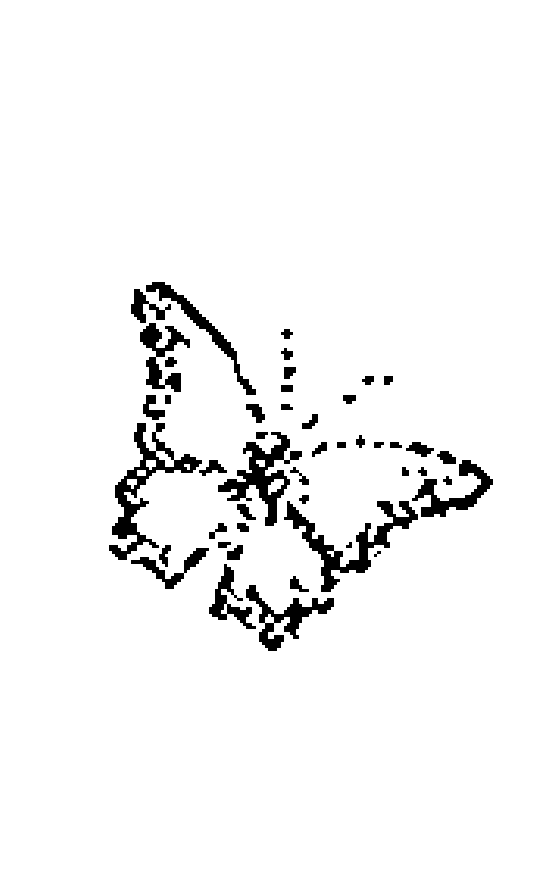

# 奥修：梦幻泡影

## 作者介绍

## 奧修OSHO

一九三一年出生於印度，學業於印度沙加大學哲學系，並在倫波普大學擔任了九年的哲學系教授，之後周遊印度各地。一九七四年 在印度孟買東南方的普那（Pune）創建了「奧修國際靜心中心」，吸引了大批的西方年輕人及世界各國的求道者前來體驗靜心與轉化，一九九O年逝世於普那。

奧修對門徒及求道者的演講已被錄製成六百多種書，翻譯成三十多國文字。你無法歸類奧修無所不包的教誨，從個體對意義的探尋，到當今所面臨最迫切的社會與政治議題。他述而不作，所有的書都是以他的聲音與影像記錄寫而成，是他三十五年來對來自世界各地的聽眾之自發性演說。印度的《週日午報》將他與甘地、尼赫魯、佛陀等人並列為改變印度命運的十位人物之一。

奧修國際資訊中心網址：www.osho.com

## 譯者介绍

## 陳伊娜 Prem Vanita

主修電子資訊卻一頭栽入文字世界。認識奧修後打開對自我探索與靜心分享的世界。目前專職提供「靈性按摩」身體能量個案，分享與帶領靜心課程團體。

個人臉書網址：www.facebook.com/premvanita?ref=ts

## 這是奧修所寫的一百封短信，寄給一位女門徒——尤伽索菡 （Ma Yoga Sohan）

當奧修在馬泰蘭（Matheran）結束靜心營要離開時，女門徒

索菡一直在哭。因為他身上沒什麼東西可以回報這份眼淚，所以

承諾每天寄一封短信給她……。而她該保留著這些信，或許有一

天這些親筆信能夠付梓出版。

## 序言

我要你們記得：去愛，然後盡力去了解什麼是生命。不要為死亡、天堂和地獄，還有那該死的神而煩惱。只是跟這個在你身上舞蹈、呼吸、活生生的生命待在一起，你必须更靠近自己一點來了解它，或許你站得離自己太遠了，你的擔憂已經把你帶到很遠的地方，你得要回家了。所以記住，當你活著的時候，它是如此的寶貴，不要錯過任何片刻。擠出生命全部的汁液，這汁液會讓你嚐到存在的滋味，且它將會揭開所有隱藏在你身上和持續在隱藏的一切。尊重生命，敬畏生命。沒有比生命更神聖的事，没有任何事比生命更具有神性。生命不是由偉大的事物所組成。那些宗教白痴一直在告訴你們：「要做偉大的事。生命卻是由一些微小事物所組成。那個策略很清楚，他們說：「做點大事，一些豐功偉業，做一些讓你的名字以後會被記住的事，去做點重要的事吧。」～而這理所當然吸引了自我（ego），自我是教士的媒介，所有的教會、猶太會堂、寺廟都只有一個媒介，那就是自我。只有唯一的代理人而那正是自我～去做點重要的事、偉大的事吧。我要告訴你，沒什麼大事，也沒什麼重要的事，生命由非常微小的事所組成。所以，如果你開始對所謂的大事感興趣，你會錯過生命。生命是啜飲一杯茶，和朋友閒聊八卦；早上去散個步，沒特別要去哪兒，只是走走，沒有目標，沒有終點，在任何地方你都你可以折返；為某個你愛的人煮一餐，為你自己煮一餐，因為你也愛你的身體；洗自己的衣服，掃掃地，給花園澆澆水。這類微小

事物，非常小的事……像和陌生人打招呼這種完全沒必要的事，

因為跟陌生人一點關係也沒有……。

一個能和陌生人打招呼的人，也會和花朵、樹木打招呼，會對小鳥唱歌；牠們每天都在哼唱，而且你完全不用擔心哪天你必須要回應。就只是些小事，非常微不足道的事情。

> ——奧修《從潛意識到意識》（From Unconsciousness to Consciousness）

## 1

人們生於奴役中，我們生來把自己當成奴隸，我們進入這個被欲望之錘所禁錮的世界，被這些隱約細微的鎖鍊給緊緊纏住。我們從出生就像這樣被奴役，某些事是天生就有的，我們不需要做什麼來得到它。人們發現到自己是一個奴隸，自由是必須爭取來的，且只有為它在努力奮鬥的人才會發現到，自由是要付出代價的，生命中沒有任何事情是可以免費的。天生的奴隸身份不是一種不幸，只有在我們沒有為自己爭取自由時，才是真正的不幸；生為一個奴隸沒什麼不對，但到死時還是奴隸的話，那就絕對的錯。除非你找到內在的自由，否則在生命中将不会有任何意義或

滿足。你也许已經獲得生命，但如果你還是待在欲望的牢籠裡，假如你不曾了解到覺知的自由天空，那麼你將不會知道生命。一個人被禁錮在欲望中，跟一隻鳥被關在籠子裡是完全一樣的，當你的覺知脫離欲望時，你才算是進入真實生命的世界。如果你想要知道真理，就成為你自己的師父。那些被自己所打敗的人是無法贏得真理的。

## 2

你必須努力不懈且專注在追尋真理上，只有在你為每一口氣奮鬥時，才值得找到真理。對真理的渴求不應該只是你眾多欲求的其中之一，那些半心半意在追求真理的人完全不是真的想要它。對真理的渴望必須是全心全意且全然地，當你的心全然百分之百地渴求真理，那個飢渴變成了道路。記住，一個火熱的真理渴求本身就是到達的途徑。只有當你的本質有一個極大的真理渴求，祈禱才會出現，而你的心只為發現到未知而跳動。當你只為真理而活而呼吸時，那麼你會朝向那同樣的寧靜渴望踏出第一步。只有愛——帶著渴求火熱的愛，才值得且擁有權利到達真理。

## 3

真理只有一個，會有很多扇門可以找到它。如果你變得留戀於這扇門本身，就會駐足於這扇門，那麼真理之門將永遠不會為你而開了。真理無所不在，所有這一切都是真理。它有無數的形式，就像是美的事物，美以許多方式展現它本身，但並不表示美本身是許多不同的事物。那些在夜晚星空中發亮、在花朵中散發芬芳的、以及那些在眼中流露的愛意——它們彼此有什麼不同嗎？形式或許不同，但它們全都展現了最主要的共同點。只是那些執著於形式的人從來不曾了解心靈，且那些停在美麗表面的人永遠無法體驗到美的本身。同樣的，那些執著於文字上的人也將無法觸到真理。

## 4

知道這些道理的人，把路上的障礙物轉變成踏腳石，對於那 些不知道的人，即使是踏腳石也會變成障礙。

## 5

自知之明是僅有的學問，有什麼可能的價值會存在於那些不瞭解自己、卻知道其他事的人身上呢？人類最大的難題在於對自己的無知，正如燈火下的黑暗；同樣地，人們在處於他自己靈魂實相周圍的黑暗中，當我們連自己是誰都不知道時，如果我們整個人生出了什麼毛病那一點都不奇怪。沒有自我認知，生命就像一艘船的船長神志不清，只是不斷地駕著船漫無目的地航行，自我覺察是把生命帶向正確的動力與目的地最基本的要素。在我能夠知道應該要做什麼之前，最重要是去知道我是誰。只有在我知道我是誰之後，才能立下在自身裡潛在未來的基礎；唯有在我知道我是誰之後，我內那未出生的地方能降生。假如如你的生命要具有意義，你的船要抵達實現的岸邊，那麼在知道 其他事之前，你應該先盡全力來認識你自己。只有在那時候學問才能派上用場，否則在無知所掌管下的學問，只不過是自我毀減。

## 6

第一個想要了解的渴望就是知道你自己。如果黑暗在那裡，黑暗就無所不在；假如光在那裡，那麼就會是一片光明。

## 7

人必須開始對自己不滿足，只有如此他才會移向神性，那些 開始對自己感到滿足的人摧毀了自己。 我教導人不要滿足，我教你不要對只是當一個人而感到滿 足；人的一生只是整個生命旅程中一個暫時的歇腳處，而不是最 終目的地。把它當成最終目標的人，浪費了一個寶貴的機會來提 升超越人類。在漫長的進化過程中，我們處在一個中介點上，我 們的過去與未來都是這旅程的一部份。進化並不會在我們身上停 止，它也將會超越我們。 如果我們真的看著自己，就會很容易明白，因為證據就是我 們在每一方面都還是不完整且未得到的。我們還沒到達那個 自然該停下來的點。進化——如果真的確實有進化——在達成神 性前無法停下來，沒有體驗到全部的神性，對進化來說是沒有意 義的終點，也沒有任何目的或重要性。 人是到達神性的通道，放棄目標且滿足於通道的人真是可 惡！我們已經超過動物了，而我們必須向前進到達神性，我們只 是一座介於動物和神性之間的橋樑。那就是爲什麼我會這麼強調 超越人類。我們必須越過人類，就像蛇脫去他的皮繼續前進。超 越人類的狀態才是你生命正確的用途，除此之外，其他一切都是 滥用。通道不是用來逗留的，它的意義在於走過並超越它。 現在別只是停留在如何找到你自己，這不是通道的終點，而 只是它的起點。你要了解，在成爲整體之前，你並未抵達通道的 終點。

## 8

不去擔憂黑暗的問題，而該去點燃光亮。只考慮到黑暗的人 永遠找不到光。 在生命中有很多的黑暗，還有邪惡與不道德。有些人就此任 由黑暗擺布，然後他們那份去碰觸光、想要找到光的內在動力， 就逐漸變得越來越微弱。我稱這份對對黑暗的「無可奈何」為最大 的罪（sin）。這是人類所犯下對抗自己的罪行，所有反對其他 事的罪，都來自於這個反對自己最基本的罪。 始終牢記的是，不對自己這樣做的人並不會犯下反對任何人 的罪。在避開黑暗所做的努力中，有些人開始一心只想著拒絕 它，然後他們的生命變成只是一連串在拒絕黑暗的抗爭，這也是 不對的。任黑暗擺布的人和與其抗爭的人都是錯的，你不需要順 從黑暗也不需要對抗它，兩者都是無知的。

## 9

聰明的人會儘可能地帶來光亮，黑暗本身不存在，它只是沒 有光，光出現的刹那，黑暗就消失了。邪惡、不道德、無宗教性也是一樣，只要點燃良善、道德與宗教性的燈就夠了，宗教性的光就是無宗教性的殆盡。對抗黑暗就是在跟一個「不存在」對抗，這是愚蠢的。如果 你必須抗爭，那就為了迎接光而戰鬥。帶有光的人會本能地摧毀黑暗。

## 10

透過平衡與和諧會找到生命的真相，那些在任何方向都走到極端的人偏離了正道。

極端的人偏離了正道。

頭腦總是在極端中擺盪運作，它很容易從一端擺到另一端，

那就是它的天性。有些非常依戀自己身體的人在反彈之下，會非
常嚴厲及殘忍地對待自己的身體。

同樣的感情藏在这份嚴厲與残酷裡，他還是依戀著身體，一
如往昔，但現在是以一種完全相反的方式。身體以前是注意力的

焦點，而現在還是注意力的焦點。保持它原來的情感態度，頭腦

透過擺盪到另一端來蒙蔽我們，這就是頭腦總是在兩端中運作的原因。頭腦移到相反兩端的這種態度，我稱之為不協調。

那什麼才叫協調呢？我認為找到一個介於兩端之間的中點，

然後在那個中間點上保持穩定；而內在和諧所在之處，生命就充
滿了樂章。生命的樂章是內在和諧的副產品，藉由尋找以及安頓在對身體愛恨之間的中

## 18

漸地、漸漸地，你的頭腦會變得完全沒有灰塵。對一個旅館主人來說，持續注意到這點絕對是最基本的。頭腦的每日清理是最基本的，你生命的清新與潔淨，完全視你的頭腦是否已經清理好而定。忽略這點的人那就要自行承擔風險了。

永恒蘊藏在刹那間，無垠的廣闊蘊含在微物中。忽視微小事物、認為這只不過是一件小事的人，錯失了無垠本身。只有在那最低的裡面深入挖掘，你才能找到那最高的。

生命所有的每一個片刻都是具有意義的，沒有一刻比另一刻有更高或較低的價值，為了找到至喜而等待一個特別的時刻，是毫無意義的。了解這點的人會把每一刻變成至喜，那些一直在等待正確時機的人則錯失了生命本身真正的良機。生命的實現並不是一步登天，它是在每個單獨的片刻中一點一點地發現。

從前，某位大師過世後，他的門徒被問道：「你們師父最重要的教導是什麼？」

他們回答：「每個片刻，師父所參與其中的任何事，都是重要的。海洋是由許多單一的水滴所形成，而生命是由許多獨一無二的片刻所組成。開始了解到水滴的人就會知道整個海洋，而體驗到那一刻的人就體驗到了整個生命。

沒有比「我」（I）這個想法更大的錯誤了，這是在通往真理的路上最大的障礙。沒有辦法克服這道障礙的人，在真理的路上將不會有任何進展。這，所以他想在前往下一個目的地之前，去拜訪這個朋友。即使已經是大半夜了，他還是去了朋友家。看到燈還亮著，他敲了窗，一個聲音從裡面傳來：「是誰啊？」

他認為自己的聲音足以被認出來，就只回答說：「是我。」但裡面沒有人應答，他又敲了窗户好幾次，但都沒有回應，他開始懷疑房子裡是否有人。他大聲地說：「朋友，你為什麼不替我開門？為什麼你不回應？—從裡面傳來的聲音說：「那個叫自己是『我』的笨蛋是誰？除了神，沒有人有權利說『我』。」我們的「我」是通往真理那道門上唯一的枷鎖，如果你打破那道鎖，刹那間你會了解到，門總是開著的。

真理存於我們真正的本我（self）裡，它甚至沒有那麼難 找，但我們必須遊歷內在去尋求。當有人走進他自己內在，在生 命呼吸的最深核心裡，他同時找到了真理也找到自己。

二次大戰期間，火車站內有位受重傷的法國士兵，他的臉受了 太多傷以致於很難辨認出原來的容貌；由於他額頭所受的傷，使 他忘記了自己是誰，要辨認出他的身份變得更加地困難。他失去 了記憶。當有人問道，他說：「我不知道我是誰或是哪裡人。」接 著他便開始痛哭流涕。最後，有三個家庭宣稱他是他們的家人。 當然，他不可能屬於三個家庭，所以他們帶他逐一去到這三個城 鎮，然後把他一個人留在那裡。 在其中的兩個城鎮裡，他只是很困惑地站著，且不知道要做什麼。但是當他到了第三個城鎮，原本呆滯的眼神頓時為之一亮，而且面無表情的臉上開始出現情緒。他自己走向一條街道，看到一棟特定的房子，開始跑向它，彷彿某種力量突然間進入了他沉睡的靈魂。他認出某些東西，他記起了他的家，帶著一種十足喜悅的感覺說著：「這是我的家，現在我記得我是誰了！」 同樣的事發生在我們所有人身上，我們已經忘記自己是誰，因為我們早已忘了我們的家在哪裡。一旦我們能夠看見自己的家，那就會很自然地認出真實的自我。一直在外面徘徊的人，永遠找不到他真正的家所在的城鎮，假如他沒有去到那裡，便無法找到他自己。有個帶你走向自己也走向真理的旅程，不只遊歷於外在，也帶你進入內在。

在真理和自己之間選擇：假如你選擇真理，你不只會找到真理，也會找到真正的自己；如果你選擇自己，那麼你兩者都會失去。理，自我是蓋住真理的面紗，那個從「我」的觀點在看世界的態度，成了障礙。只因為把人跟真理分開的「我見」（I-sight），人漸漸變成「我」而從神性上墜落，這是那個讓他墜落的「我」的自然本質；而失去「我」，他便提升到無形且到達神性的狀態。這個「我」意味著墜落，「無我」（no-I）則意味著提升；所以，那個個看似要失去但其實並沒有失去的——它是一種獲得。那個你必須要喪失的「我」的存在並非真的存在，而是場夢。藉著失去所找到的才是真理。只有當種子在土裡完全的失去它自己，才能發芽成為一棵樹。

生命是一種藝術，它不僅是以某種方式活著。有目的而活著的人才是真正地活著。

生命的意義是什麼？我們存在的重點在哪裡？目的是什麼？我們想成為與達成的是什麼？如果你沒有最終目的地的察覺，所走的每一步怎麼可能是對的？假如你沒有目標，你怎麼會有全然的成就感或滿足感？沒有覺察到整體生命意義的人，就像是一個人擁有很多花，然後想把它們做成花環，卻沒有線可以把它們串起來。最後他會發現，這些花無法做成花環，而他的生命裡沒有方向或整體的意義。

義。他所有的經驗會是殘缺的，不會提升到真知（true knowing）的能量；他會處在不完整的經驗中，在那裡不是活著都一樣；他的生命會像一棵永遠不會開花結果的樹，他會知道歡樂與悲苦，但永遠不會嚐到至喜，因為至喜只有在經歷過整個生命旅程後才會出現。如果你想找到至喜，就把生命做成一串花環，用一條目的之線串起你所有的生命經驗。不這麼做的人將找不到生命的意義與滿足。

如果你渴望真理，別讓你的頭腦受限於任何意識形態，真理不會來自任何意識形態，真理與思想觀念是水火不容的。在追尋真理上，第一步就是自由及開放的探詢。在親自體驗它之前，就讓頭腦加載任何信條或觀念的人，將會嚴重破壞與阻礙自己的探詢。探詢是追尋真理的生命力與動力，唯有透過探詢，聰明才智才會覺醒，意識才能提升。但是探詢是來自懷疑，而不是信仰；那就是為什麼我認為懷疑對在真理之路的旅人來說，是最基本的工具，而非信仰。懷疑是一個健康思想的徵兆，唯有當它被正確的使用，那層覆蓋真理的面紗才會開始掉落消失。當真理被揭開的瞬間，可清楚地了解到信仰者與非信仰者基本上都是信仰之人。正面與負面兩者都是信仰，懷疑是第三種完全不同的頭腦狀態，它既不是相 信也不是不相信，它是一種自由的探詢，獨立於兩者之間。

一個已經受某種意識形態束縛的人怎麼能繼續追尋真理？只有那些把信念與非信念的鎖鍊從觀念之錨上解開的人，他們的船 才能航向真理之洋。

要找到真理，全然自由的頭腦是必要的。依賴某些信條的头 腦沒有辦法看到真理的太陽。

假如你的眼睛是打开的，那生命中的每件事都是一所学习的 學校；假如你求知若渴，你會從每個人 和每個情況中學習。記住，如果你不這麼學，你無法在生命中學到任何事。愛默生（Emerson）曾說過：‘每個我所遇見的人都有某些特點比我優秀，而我從中向他們學習。’我記得一個故事：
在麥加，一位理髮師正在替某人剪髮，就在那時，一位蘇菲神 秘家朱奈德（Junnaid）走進來說：‘以阿拉之名，你也可以替我 修剪一下嗎？’
在他聽到‘阿拉’這個字的那一刻，這理髮師對他的顧客說： ‘朋友，現在我不能替你剪了，你看，以阿拉之名，我應該要先 服務這位大師，阿拉優先。’—然後他帶著極大的愛與虔誠替這位 大師理髮，他向大師行禮，然後大師離開了。

過了幾天，當有人給了朱奈德一些錢，他回去理髮師那裡要付 錢，但是這個理髮師不收。他說：‘你不覺得懺愧嗎？你要我以 阿拉之名替你理髮，而非錢！’

在他的餘生，這位蘇菲神秘家經常告訴他的同伴說：‘我在一 位理髮師身上學到對神的無私奉獻。’

即使在最微不足道的事情中，也隱藏著偉大的訊息，知道如 何揭開訊息的人會找到智慧。藉由帶著覺知過生活，每個體驗就 成為了他聰明才智的一部份；而那些處在無意識階段的人，即使 榮耀可能就在外面敲門，他也会轉身離去。

人的腳朝向地獄，而頭向著天堂，天堂與地獄都是他的潛能，這兩個種子哪一個能開花結果完全由他決定。

性。他的結局不是事先預設好的，是靠自己創造出本身的價值，這是續紛煉爛的自由：但假如我們想要，我們也能讓它成為災難。對多數人而言，這自由最終成為一個不幸，因為就在那個創造的潛能中，破壞的潛能與自由也藏在其中。而大部分的人選擇了第二種，因為破壞比創造容易多了，還有什麼比摧毀你自己更容易？要摧毀你自己，只要不去自我創造就夠了，不需要其他東西。如果有人不在生命中向上提升，那麼他就不自覺無意識地開始往後掉下去。

我聽說……

從前，有一群人在討論，是否人類是所有生物中最強大的，因爲人可以掌控其他所有的物種；但是也有一些關於人類甚至比狗還低等的想法意見，因爲他們比起人類更能自我控制得多。胡賽因（Hussain）剛好出現在辯論現場，兩邊都請他投下決定性的票。他說：「我會告訴你們我的想法，那麼你們就可以得到自己的一點；但當我的頭腦和生活變得有罪時，即使是一條狗也比上千個胡賽因偉大。」一點；但當我的頭腦和生活變得有罪時，即使是一條狗也比上千個胡賽因偉大。

人類是必死與不朽的綜合體，無法擺脫身體和其欲望的人會繼續墜落，而致力於追尋不朽的人，最終他自己將成爲他所找到的真理——意識——至喜（sat-chit-anand）。

的生命只有在領悟到你的內在是什麼才算達成，不知道這點的人，總會被死亡以及對死亡的恐懼所包圍。

從前，有一位修行僧被幾個朋友問道：「假如有人攻擊你，你會怎麼辦？」他說：「我會進去我的堡壘然後坐在裡面。」這話被他的仇敵聽到。

有一天，這些仇敵把在他包圍在一個廢棄之處，問道：「先生，現在請告訴我們，你的堡壘在哪裡？」修行僧盡情地狂笑之後，把他的手放在心口說：「這就是我們的堡壘，從來沒有人可以攻擊它！肉體可以被摧毀，但毀不掉這裡面的。」

裡面的。這是我的堡壘，我的安全感在於知道怎麼到達那裡。

對某些不知道這堡壘存在的人而言，他整個人生命是不安全的。不知曉這堡壘的人，他一輩子都會被敵人包圍，他還沒找到寧靜的庇護與安全，而想要找到這個地方的人，從外面看是徒然的，因為安全出現在內在。

當你安定在你自己的本質的時候，才能開始了解生命；偏離了那一点，就只剩下死亡了。

那些沒有需求的人是富裕的，欲望會使你貧窮，而頭腦被欲 望所包圍就成為了一個乞丐，它持續不斷地在要求這個或那個，你只有在沒有任何要求的時候，才是富裕的。 偉大的聖者卡納德（Kanad）因為經常住 在卡納（Kana）—— 農夫收割後掉落在地上的微量穀粒——而得此名。有誰能比他更窮？ 國王聽說了他的困苦，派了大臣帶著大筆的財富要提供給他，當大臣抵達時，這位偉大的聖者說：我什麼都不缺，把這些財富分給有需要的人吧。 他拒絕了三次，國王終於親自去見聖者，帶了很多的財富給他，他請求聖者接受，但是聖者說：把它給那些一無所有的 人，你看看，我所需要的一切都在這裡。」國王四下看看，他很 納問一個人身上除了一條腰布別無他物，怎麼能說他什麼都有？

當國王回宮後，他把整件事告訴皇后，她說：「你錯了，你不 應該給聖者東西，你應該去接受一些東西，只有那些內在擁有某 些東西的人才能拋棄外在的一切。」

當天晚上國王回去見這位聖者並要求原諒，卡納德對他說： 「你看，誰才是貧窮的？看著我然後再看看你自己——不是外在 而是在內在，我並沒有要求任何事，沒有欲求任何東西，且這就 是為什麼我自然而成了一個帝王。

外在有財富，但內在也有一種財富；外在的那些遲早會被拿 走，那就是為什麼那些知道的人不稱它們為財富，反而是災難； 他們的追尋是為了那個內在的，一旦找到了，便永遠不會失去，這才是唯一真正的成就。至於其他的東西，即使當你擁有它們，要求只會越來越多且永無止盡；不過一旦你找到了內在的財富，就再也沒有什麼要去達成了。

那些尋找神的人就像某些很明顯無知的事物，神不是一件東 西，它是有關光明、至喜與不朽的最终體驗之名；它也不是一個 你在外面某處可以找到的人，它只是你自己意識的最终淬煉。 曾經有人問一位大師說：“如果有神，那為什麼我們看不到祂？ 大師說：“神不是一個物體，而是一種體驗，我們沒有辦法看 到祂；但是去體驗它的话，沒錯，絕對有神。”但這回答似乎無 法讓詢問者滿意，他的眼神顯示出這問題仍然在他心中。看到這 點，大師拿起一塊附近的大石頭砸向自己的腿，他的腿上出現一 道很大的傷口，血開始流出來。 這人問：“你在做什麼？那一定很痛，這是什麼瘋## 奧修寫給門徒的700封信 61

直到你脫離機械化的思路之前，無論坐在寺廟和禮拜會堂裡做什麼，都沒有任何價值，且你握在手上的祈禱念珠全都是假的。已經脫離思緒波動的人不管他走到哪裡都是廟宇，而無論他在做什麼都是祈禱。

曾經有人對一位大師說：「我妻子沒有追尋任何宗教信仰，如果能請你讓她明白，那一定驚好的。」第二天早上，大師去那個人的家，他發現那位妻子在外面的花園裡，就問她先生在不，她回答說：「就我所知，這時候他一定在某個鞋匠的店裡爭吵不休。」當時黎明前的晨霧還未散去，丈夫正在隔壁的廟裡忙著擺他的祈禱念珠。他不能忍受這麼明顯的謊話，立刻跑出來說：「妳完全說錯了，我剛剛在我的廟裡。」

連這大師也覺得很驚訝，但妻子說：「你剛才真的在廟裡嗎？」那念珠是在你手裡，你的身體是在廟裡，但你的意念沒有去別的地方嗎？丈夫清醒過來。沒錯，當在撥著念珠時他飄到了鞋匠的店裡；他需要買鞋子，而他已经在前一天晚上告訴他妻子，早上第一件事就要是去買鞋。在他的腦海裡，他已經開始為鞋子的價格在討價還價、爭論不休了。

放掉思想，成為沒有思想的，那麼無論你在哪裡，神都與你同在；你要去哪裡找祂呢？你要如何找尋連你自己都不知道的東西？這不是透過尋找而發現的，而是透過自身來創造寧靜；目前為止，從沒有人找到過，只要以正確的方式邀請它，它會自己主動出現。去廟裡是没有用的，了解這道理的人，他們自己便是廟宇。

「我是誰？」智慧之門會對任何不問自己這問題的人保持關閉，這句話是打開那道門唯一的鎘匙；問你自己：「我是誰？」帶著強烈與全然問自己這個問題的人，會從他自己的內在得到答案。

蘇格蘭作家卡萊爾（Carlyle）已經老了，他的身體歷經了八十個年頭，這個曾經非常健美的身體現在已經變得殘花敗柳，年老的微兆明顯易見。以下是在他老年時某個早上所發生的事。卡萊爾有次在浴室裡，當他洗完澡正要擦乾身體，突然想起這個他自認為是自己的身體，其實早就不見了！他的身體已經完全走樣，那個他曾經非常喜愛的身體去哪兒了？那個他曾引以為豪的身體現在已經破敗不堪。但同時，他有一個全新的覺察：「雖然這身體不再一樣了，但我還是一樣的，我並沒有改變。然後他問自己：「啊！那我究竟是誰？」每個人都必須問自己這個絕對的問題，這是個真正的问题；它是所有問題的疑問，不去問這問題的人，並不真的想詢問任何事，而連問都不問的人，他們又怎麼能期待有個答案？

> 問吧！讓這個問題在你內心深處發出回響及反射：「我是誰？」——當有人帶著所有生命力詢問的時候，他絕對會得到答案。那個答案會改變他整個生命的方向與意義。在得到答案之前，人是盲目的，只有在獲知答案後他才能看見。

即使有一絲真理也就足夠了，只要瞥見了一點真理，就已擁有所有經典無法達到的份量。即使有一大堆關於光的經典，也無助於把光帶進黑暗，你只需要點起一小盞燈就夠了。

一位年老的洗衣女工經常去聽愛默生（Ralph Waldo Emerson）的演講，人們看到她在那裡都非常訝異——一個又窮又不識字的女工聽得懂愛默生嚴肅的演講嗎？終於，有人問她到底聽懂了什麼。

老女工的回答確實令人驚訝，她說：「我怎麼能告訴你我不懂的嗎？我倒是挺了解一件事，但是我不知道別人是否了解。我是文盲，但是有件事對我來說相當足夠——它已經改變我整個人

生，那是什么呢？即使是像我這樣一個貧窮又不識字的女人，離

神也不遠。神就在附近，不只在附近，實際上就在我們裡面。我已經了解到這點小小的真理，我無法想像還有什麼會比這個真理還要偉大。還要偉大。

生命並非透過知道很多事實而蛻變，反而只是透過一點真理的小小體驗；那些忙著想要知道更多的人，經常發現自己找不到那個帶來真正蛻變、且在生命裡揭開智慧新向度的微小真理跡象。

我聽說基督讓死人從墳墓裡復活，給他們生命。人以為自己
只是那個留在墳墓裡的軀體，沒其他地方了。只有當他了解到靈
魂高於身體，他才能從墳墓裡出來，然後開始生活。

在埃及一個古老的修道院裡，有一位僧侶過世了，他被放置在
一間蓋在地底深處的地下墓室。但是，不知是幸或不幸，他並沒
有死；過了一會兒之後他在墓室裡恢復意識，光是想像他精神上
的痛苦與難過都很不容易了，在那個黑暗的地方充滿著死亡與惡
臭，那裡有上百具屍體逐漸在腐爛，而他卻活著！沒有出口，甚
至連任何聲音傳到外面的絲毫機會都沒有。

他做了什麼？他就此渴死或餓死嗎？他放下對這幾乎比死還慘
的生命依戀，而不試著救他自己嗎？不，我的朋友，人對生命的

貪求是非常深且強烈的。這個僧侶開始活在這些環境中，他吃蠕
與昆蟲，他喝從墓室牆上滴下的聯水，靠著蟲子存活下來。他 從其他屍體身上取下衣服當做自己的衣服和床，且不斷地祈求其 他的同修死掉，因為只有當他們死去的时候，他這黑暗的家門才 會打開。 就這樣過了幾年。對他來說，早已失去了時間的軌跡。有一天 某個人死了然後門被打開，他被發現還活著，此時他的白鬍子已 經長到及地。但當他要被帶離地下墓室時，還不忘帶走那堆他從 屍體上取得的衣服，以及從死者口袋裡收集來的錢幣。 

別。」

世界就是一面鏡子，我們在別人身上所看到的，就只是我們自己的反射。除非有人能夠在每個

人身上看到善與美，否則他應該要知道自己身上還是有些缺點存在的。

試著要從生命中拿開黑暗是徒勞的，因為黑暗無法被拿走，知道的人不會試著要擺脫黑暗，他們就只點起一盞燈。有一個古老的民間傳說，講述當人們還沒有燈、沒有火，晚上很不方便的年代，人類想了各種方法要擺脫黑暗，沒有一個成功。有人說：一吟誦真言吧。所以他就吟誦真言；有人提議祈禱，所以人們就向天空舉起雙手祈禱；但是黑暗並沒有消失，它依然還在。終於，有個年輕的思想家及發明家說：一讓我們把黑暗放進籃子裡，然後埋在地下，這樣的話，黑暗就會漸漸地變虛弱，最後一定會消失無蹤。一這聽起來很有道理，所以人們花了好幾晚把籃子裝滿黑暗然後倒進溝渠裡。但當他們仔細看，發現那裡什麼

也沒有，他們開始感到無聊與不耐煩；但此時扔棄黑暗已成了習俗，所以大家還是每晚繼續地埋掉至少一籃的黑暗。後來有位年輕人與一位仙女相愛並且結了婚，就在新婚之夜，家裡的長輝要這個新娘至少扔掉一籃黑暗到溝渠裡，仙女一聽到這個就笑了；接著她用一些白色物質作了一條燭芯，倒一些奶油到土陶碗裡，然後摩擦兩顆石頭。人們對於他們所見到的啞口無言——火被創造出來，燈火在燃燒，而黑暗已經消失在遠方！從那時起，人們停止埋藏黑暗，因為他們已經知道如何點亮一盞燈了。但是當黑暗來到生命時，大部份的人還是不知道怎麼點亮一盞燈，反而因為對抗黑暗而浪費了一個機會——個可以轉變為神

聖之光的機會。讓自己充滿渴望地去找尋找神性，黑暗將會自動離開你； 假如你一直跟黑暗對抗，你會在裡面越陷越深。讓生命成為積極的 主動力量，而不是消極的逃避，這是成功的黃金關鍵。

眼睛的存在是用來看見真理。醒過來，並且看著。擁有雙眼卻始終閉上的人，正播下自己痛苦的種子。

在生命中，朝向真理的革命很快就发生了，即使只是洞察到真理在那裡，改變會同時發生，不是逐漸地，平面性的改變只存於沒有自我覺察之處；否則生命是垂直地被轉變，是一個跳躍，就像一道閃電。

曾有一些人帶著一個男人來見我，他養成了一個壞習慣，他周遭的親朋好友要他戒掉，因為那個習慣正在摧毀他的生活。我問 他：「你認為呢？」 他說：「慢慢地…我會慢慢地放棄它。」 聽到他這麼說，我開始笑然後對他說：「慢慢地放棄沒有意義，假如你掉進一個火堆，你會慢慢地爬出來嗎？如果你說會漸 渐地試著出來，那是什么意思？難道它還不夠清楚到讓你看見那是火嗎？」然後我告訴他一個故事。

一個富有的年輕人因為坐在羅摩克里希那（Paramahansa Ra-

makrishna）身旁而深受感動。有一天，這年輕人帶了一千個金幣

要獻給他，羅摩克里希那說：「把這些垃圾獻給恆河吧。」現在他能

怎麼辦呢？他必須把這些金幣丟進恆河裡。但是他去了很久才回

來，因為他在丟之前仔細地數著每一枚金幣！一個……二個……三

個……一千個——理所當然他要花這麼久的時間。聽到這件事，羅

摩克里希那對他說：「你一步就能到達的地方，沒有必要走一千步。」

如果你已經知道且體驗到真理，你不需要聲明逐漸放棄什麼

東西；正是那個真理的體驗讓你自然地放棄。「無知」即使走了

一千步也抵達不了真理，而「體驗」走一步就到了。

如果有⼈透過在協議中失去他自己來實現一切，那他就做了

一項代價非常高昂的交易，他在把鑽石拿去換石頭。一個想辦法

保有自己的⼈——即使他必須失去一切，還是比較聰明的。

從前，一個有錢人的宅邸著火了，藉著僕人們的幫忙，他非常

小心地從房子裡救出所有東西——椅子、桌子、裝滿衣服的衣

櫥、所有的存摺和帳簿、保險箱等等，還有房子裡的其他一切東

西。在同時，火勢佈滿整個房子，屋主和其他人站在外面，眼中

帶淚處於茫然，他看著鍾愛的房子正論為一片灰燼。火終於停

了，他問僕⼈說：「還有什麼東西在裡面嗎？」

他們回答說：「沒有了吧，但為了確認我們會進去裡面再查看
一下。」當他們進去，發現主人的獨生子躺在自己的房間，這房

間幾乎完全被火燒盡，獨生子也死了。他們看到此景大吃一驚，匆忙地跑出去，捶打自己的胸口悲痛地嚎啕大哭：「噢！我們多麼愚蠢啊，顧著挽救房子的財產，卻完全忽略了那些家當的主人；我們挽救了物品，卻失去這一切所屬的主人。」

這聽起來是不是跟我們每個人很像？會不會有一天我們都必須說同樣的話：「多可惜啊！當我正忙著想挽救不知道是什麼、

一些無用的東西時，我已經失去了這些事物的主人——我已經失去了我自己。一個人的生命中沒有比這個還要大的災難了，只

有一些極少數受到祝福的人想辦法避開了。

記住，沒什麼比你更高的東西，達到這點的人，就是達

到一切；失去這點的人，不論他可能獲得什麼，那些東西都不具任何價值。

生命中的至喜在於你的態度，在你身上，由你決定。它不在於你所得到的，反而是在你怎麼看待它，那就是它所藏之處。我聽說……

個旅人問說：「你們在做什麼？」

第一個人回說：「我正在弄碎石頭。」他沒說錯，但在他這麼說的聲音裡，有一種沉重痛苦的感覺。當然了，打碎石怎麼可能會是愉快的經驗？回答完之後，他繼續帶著沉重的心情打碎石頭。」

旅人看著第二個人，他回答：「我正在賺錢維生。」而他說的也是真的，雖然他看起來並不難過，但在他眼裡也没有喜悅的

頭。

他看向第三個正在唱歌的人，他停下哼唱說：「我正在蓋一座 寺廟。」他的眼裡有著光采且心裡唱著歌，正在建造一座寺廟必 定是受祝福的感覺！還有什麼能比創造有更大的喜悅？ 這三種回答也是生命的真相，要選哪一種完全取決於你， 你的生命意義與重要性取決於你選哪一種。生命是一樣的，但每件 事會隨著不同的態度而改變；隨著不同的態度，花朵變成荊棘而 荊棘變成花朵。 至喜無所不在，但不是每個人都有所需的勇氣去體驗它；除 非他已經先準備好勇氣去體驗，否則無人能找到至喜；這並非是

擁有一個特別的地方或者境遇，更確切的說，是達到情感的正確
心態來體驗狂喜的人，在任何境遇與地方都能找到至喜。

在這個世界誰不想要平靜？但是人們沒有注意到這點，他們不去尋找帶來平靜的源頭。我們內在的本質渴望平靜，但我們所做的一切只是讓自己更加坐立不安。記住，野心是心神不寧的根源，不論誰在尋求平靜，都必須放下野心。平靜從野心結束的地方開始。

約書亞·李普曼（Joshua Liebman）曾經寫到：「身為一位充滿豐富想像力的年輕人，我列下在世俗裡值得去找到成就的清單：健康、愛、美貌、才能、權力、財富、以及名望——跟幾個我所認為人的完美部份之次要的因素加在一起。」他把這張清單遞給一位長者，對他說：「如果有人具備了這## 奧修葛倫門徒的100封信 91

每個人都要創造自己的生命，就像一個人學會跳舞。它不像畫畫或雕塑，在生命中，創造者和作品是共同體，所以你無法把生命送給任何人，也無法向別人借用。生命是不可轉讓的。

要是我們能變得寧靜，讓所有內在的話語與回音安靜下來，我們可以看到在生命中最重要的是什麼。要看到真相，我們需要寧靜之眼。尋找真理的人，在找到寧靜之眼以前皆是徒勞無功。

有一天臨濟禪師（Rinzai）在講道，他說：「在每個人內在，每個身體裡，藏著一個無法形容、沒有狀態或者無名的本質，這就是那個透過身體之窗閃耀的無題本質。那些還不曾見過的人現在微博就要這麼做，他們應該去看。看著吧！朋友們，注意！看著！」

聽到他這麼說，一位僧侶站起來問：「誰是這個真實的本質？誰是這個無題的存在？」

臨濟從講道壇上爬下來，穿過一大群僧侶走到發問者的面前，大家都目瞪口呆：他不回答問題要做什麼？他緊抓住這個僧侶說：「再問一次！」那僧侶噤得說不出話來。

臨濟說：「往內看，在那裡的寧靜與無聲，就是真實的本質。那就是你，只要認出它。要是你認出它，所有的真理之門將為你而開。」

在滿月的夜晚看著湖面，如果湖是平靜的，它會反照出月亮。頭腦正是如此，當沒有波動時，它會反映出真理；頭腦充滿混亂的人會把真理推開。真理總是在身邊，但由於我們的心神不寧，總是無法靠近它。

生命是個肥皂泡泡，不做如此理解的人，會在其中全軍覆沒，而注意到這個真相的人們，則開始找尋永恒不朽的生命。

從前有位大師被監禁，他講了一些國王完全不喜歡的事實。一個朋友去探監並且問他：「為什麼你要替自己惹來這些沒必要的麻煩？假如你不說那些事，那會有什麼損失？」大師說：「一現在我只會說事實，我連想都不會想要留半點假話。自從我在生命中體驗到神性的瞥見，真實是我唯一的選擇。而且這監禁只會一下子而已。」有人告訴國王這件事，國王說：「一去告訴這個瘋子大師，他的監禁不會是一下子，而是一生。」當大師聽到這些，大笑說：「一請告訴親愛的國王，這位瘋子大師問他：「那裡的一生有比一會兒更久嗎？」」

想要找到真正生命的人，必須要了解有關我們這所謂「生」的真相；而那些努力去了解真相的人，發現生命的事實與意義只不過是場夢。

奧修寫給門徒的100封信 95

我在教導什麼？我只教一件事：除了聽從你內在的本質，其他都不值得跟隨。在那裡找到光的人，他整個人生命開始充滿光，然後他就不需要外在燈火的幫助，也不需要跟隨其他人火矩上冒煙的尾巴。只有當人開始擺脫對這些的需求，他才會找到心靈的崇高與宏偉。有一位學識非常淵博的人，他是所有《吠陀經》（Vedas）及其他經典的專家，對於他在智性上的成就充滿自大。他手上經常拿著一把燃燒的火把走著，不管白天或夜晚，總是帶著火把。只要人們問他原因，他會說：「這世界是如此的黑暗，我帶這火把好讓人們至少能有點亮光，除了這把火以外，在他們生命的黑暗之徑還有其他的光嗎？」之徑還有其他的光嗎？

有一天，一個和尚聽到這些話就開始大笑，他說：「我的朋
友，即使你的眼睛瞎了看不到太陽——宇宙賜予的光，至少不要再說這世界充滿黑暗了。在太陽恆在的偉大裡，你的火把還能增
添什麼光明呢？你真的以為連太陽都看不到的人，會有辦法看到
你那微弱的火把？」佛陀曾經講過這個故事，而我希望再說一次。現在有很多火
炬在空中閃耀著，不止一個。到處——在每條路上，都有各種宗
教、學派、意識型態，各種主義的火炬，而且他們全都宣稱同一
件事：除了他們以外，沒有其他的光。他們全都渴望點亮你的黑
暗之路，但事實是：這是他們妨礙人的眼睛看著太陽的冒煙火
炬。這些火炬全都要被熄滅，好讓人可以看到太陽。唯一真正的
光是存在所創造的太陽，不是任何人造的火炬。

把眼睛轉回來看著你內在的太陽，除了那個光沒有其他的
光，只在那裡尋求庇護；找到其他不同庇護的人，只是侮辱了住
在內在的神性。

什麼是喜樂無比？快樂是一種興奮，煩惱也是一樣；我們喜歡的那個興奮，就稱為快樂；我們不喜歡的那個，就稱為煩惱。喜樂完全不同於這兩者，它不是一種興奮的狀態，而是平靜。想要幸福的人總是掉進不幸——因為接在一種興奮之後，相反的，與奮就像山連著山谷、夜晚接著白天一樣地不可避免。但已經準備好要放掉幸福與不幸這兩者的人，找到了永恒的喜樂。

黃檗禪師常說一個故事。有一個男人的獨生子失蹤了，他已经消失了十二年，甚至男人自己都試過尋找兒子。漸漸地，男人忘記這件事了。過了許多年，一個陌生人來到他家並說：‘我是你兒子，你不認得我了嗎？’父親非常高興，辦了一場大盛宴來歡迎兒子回
家，邀请了所有的朋友，還舉辦了好幾場盛大的慶祝與喜慶活動。但是他已經完全忘記他的兒子，所以他認不出這個宣稱是他兒子的人。過了幾天，他確實想起來了，然後認出那個人並不是他兒子。一逮到機會，那個人就帶著男人所有的家當逃跑了。黃檖曾說，這樣的宣稱者去到每個人的家裡，卻很少人能夠認出他們，大部份的人會上當且失去一生的財富。將那些從愉快的活動或物體所得到的悅悅，代替真正從本質出現之喜樂的人，會親手破壞生命的無價之寶。永遠記得不管你從外得到什麼，也一定會被拿走。認為它是你的這就不對了，只有從你自本質裡出現的才是你的，那是真
正的財富；尋找其他東西來代替的人，不論他們可能得到什麼，最終會發現他們根本什麼也沒達成，他們已經在一個瘋狂的競爭中浪費了整個人生。

# 41

假如你想要找到神性，就要先知道怎麼死去。難道你沒看見

當種子死去之後，接著變成了樹？

有人曾去找過一位蘇菲派吟遊詩人（Baul），他沉浸在吟唱

中，他的眼睛似乎沒在看這世界，甚至連他的靈魂似乎也不在，

他在別的地方——在其他世界，某些其他的狀態中。

當他停止吟唱，且看起來回到這世界了，這位訪客問他：「你
怎麼看待莫克夏（moksha）——最終的解脫？它能達成嗎？

這位有著迷人聲音的神秘家回答：「只有透過死亡。」

我昨天跟某個人這麼說，他問說：「透過死亡？」我說沒錯，

在你還活著的時候透過死亡，只有捨棄所有一切的人才會真正的
活著且對真理覺醒。

在你還活著的時候透過死亡，只有捨棄所有一切的人才會真正的
我昨天跟某個人這麼說，他問說：「透過死亡？」我說沒錯，

這位有著迷人聲音的神秘家回答：「只有透過死亡。」

怎麼看待莫克夏（moksha）——最終的解脫？它能達成嗎？

當他停止吟唱，且看起來回到這世界了，這位訪客問他：「你
他在別的地方——在其他世界，某些其他的狀態中。

中，他的眼睛似乎沒在看這世界，甚至連他的靈魂似乎也不在，

有人曾去找過一位蘇菲派吟遊詩人（Baul），他沉浸在吟唱

當種子死去之後，接著變成了樹？

当你還活著時，沒有比知道如何死亡還要更偉大的藝術，這
是唯一我稱為「瑜伽」的藝術。一個帶著死亡覺知而活著的人，

一定會了解在生命裡最重要的每件事。

當他正準備要離開，我想起一些事。我說：聽好！有一個和尚 叫趙州（Joshu），有人問他：「有沒有一個可以代表宗教的單字？一趙州說：「若真的問起來，它會是兩個字。一但發問者非 常堅持，所以趙州說：一這個字是「是」（yes）。一 要全面性與全然地接受生命，就是到達內在和諧的狀態，那 就是三摩地（samadhi）或者無念（no-mind）的意思，只有在那 個狀態裡一我一才會消融，與整體合而為一。去體驗對整體說 「是一，這是在生命中最大的革命，因為它消去了自我，且引導 我們通往真正的自己。 我已知內在和諧的狀態是最偉大的財富。內在和諧是前所末有的，只有當你在自己身上發現這個狀態，才是找到喜樂與不
朽：這是一個你自己就是最終真實的宣告。克里希那的保證是：內在和諧本身就是最終的真實。

# 奧修寫給門徒的100封信 103

当你還活著時，沒有比知道如何死亡還要更偉大的藝術，這
是唯一我稱為「瑜伽」的藝術。一個帶著死亡覺知而活著的人，

一定會了解在生命裡最重要的每件事。

別浪費生命於只是建立世俗的家園，要記得那已被你丟在背後、未來你要回去的永恒之家，一旦你想起那個地方，你將再也不認爲世上的家是你的家了。有幾個孩子在河岸玩沙，他們建了一些沙堡，且每個人都宣佈：～這是我的房子，我的是最棒的，沒有人可以擁有它。～他們繼續這樣玩著。如果有人因某種原因破壞了另一個人的房子，他們就會爭吵打架。暮色漸暗，他們想起該回家了，就這樣，他們丟下了那些房子和宮殿，再也没有人去想關於「我的」和「你的」。我在某處讀到這篇寓言，我覺得這個小故事講得真是太好了

了，我們不是也都像小孩一樣在沙上建城堡？當看到日落時，幾乎很少人想起要回家！而且大部份人離開這世界時，對他們的沙堡不是還帶著「我的」跟「你的」的感覺？記住，成熟與年齡絲毫沒有關係，我認為不再對世俗的家有任何信念的人是成熟的，其他人只是像孩子在玩沙堡而已。

愛與祈禱的至喜存於內在——不是外在，想要透過愛與祈禱得到其他東西的人，並不知道這其中的秘密。沉浸在愛中才是愛真正的結果，而融入祈禱中的喜樂正是祈禱的報償。

上，他做了個夢，夢裡他聽到某人對他說：「尋找神不是你的使命，所以沒有必要浪費你的時間與努力了。」他告訴朋友們這個夢，但這個夢並沒有令他難過，他沒有停止祈禱。

朋友對他說：「當你已經被告知命運之門對你關閉，爲什麼你還要做這些不必要的祈禱？」

虔誠的信徒說：「不必要的祈禱？你這個笨蛋！祈禱本身就是喜樂，這跟有沒有得到任何東西有什麼關係？再說，對於想要某
些東西的人在一扇門得不到他想要的，他可以再敲另一扇；可是 對我來說，哪有第二扇門？我唯一所知道的就只有走向神的這一 扇門。～那天晚上他看見神擁抱著他。 對那些一心渴望神的人，是不可能不去尋找的。將所有欲望 融合爲一，這會賜予人力量，使他能夠超越自己並且進入宇宙性 的意識。

我見識過許多種財富，但到最後我發現它們全都是損失。然後我尋找自己內在的財富，所找到的是神性。我了解到失去神性才是真正的損失，而找到它是唯一的財富。

從前有一個人對國王說了許多讚美的話，他為國王的光榮事蹟唱了許多美妙的歌，期待著能得到些什麼當做回報。國王對所有在他身上的讚美開懷大笑，然後送給這男人很多金幣。

當男人注視著金幣，他的眼睛充滿了異常的光芒並抬頭向上看，金幣上寫了些什麼，他扔掉金幣並開始舞蹈；他的狀態很戲劇性地改變了，讀了金幣上所看到的之後，他發生了一种內在驚人的革命性變化。多年以後，有人問他金幣上寫了什麼，他說：“金幣上寫著：“神已足夠。”

的確，神已足夠，已知者全都同意這個真理。我看到了什麼？我看到擁有一切的人是貧乏的；我見過非常富有的人實際上一無所有。我偶然發現到這個關鍵——想要達到一切的人必須要放掉一切。那些勇於放掉一切的人值得擁有神性。

生命是什麼？進入生命的奧祕，僅僅透過活著你可以耗盡生 命，但你無法了解它；讓你的能量不僅只是用來活命，而且還要 了解它。一個了解它的人也就能夠夠活出生命。 昨天晚上，有幾個陌生人來，我問他們有些什麼問題要請 教。有人問道：「什麼是死亡？」我有點吃驚，因為問題是關於 生命，關於死亡能有什麼疑問？然後我告訴他們一段孔子和子路 之間的對話。

子路在孔子臨終前問：「一個人應該要如何尊敬與對待死去的 靈魂？」 孔子說：「當你不能照顧活人時，你怎麼有辦法去照顧死去的 靈魂？」
靈魂？

然後子路問：我可以問一些關於死亡本質的事嗎？

孔子——他已經很老且正瀕臨死亡——回答：當你甚至還不
知道生命是什麼的時候，你怎麼能知道死亡？

這個回答非常的有意義，唯有了解生命的人才能了解死亡。

對那些已經知道生命奧祕的人來說，死亡再也不是一個奧祕，因
為它僅僅是錢幣的另一面。

只有那些不知道生命的人才會害怕死亡，對死亡的恐懼已經
消失的人才會認識生命；他們是否真的了解生命，只有在某人死亡
去時才會立即顯露出來。檢視你自己的內在：如果你發現死亡的
恐懼還逗留在那裡，就知道你還沒有了解到生命。

當內在狀態是沉靜的，眼光是和諧的，所出現

## 什麼是自我紀律？

當你不被觸動的感覺所影響時，那就是自我紀律；一種中立觀照的感覺就是自我紀律；「待在「世界裡的 同時又不在」世界裡，就是自我紀律。

有一次顏回問孔子：「我該做些什麼來達到內心的自我紀律？」 孔子說：「你從不用耳朵聽，你用頭腦在聽，事實上甚至不用頭腦，你完全以所聽到的來看待你自己。試著只用耳朵來聽，不需要讓頭腦來幫忙，在那個空的狀態，你的心靈只是以一種被動的方式來接收外在影像。自我紀律存在於像這種三摩地（samadhi）或無念（no-mind）的狀態，而神性也只存在於這種狀態。

顏回說：「但是這樣的話，我的人格將會喪失！這就是空的狀態所指的意思嗎？孔子說：「是的，就是這個意思。你看到前面那扇窗户嗎？這房間能照進美麗的自然景色，是因為窗户的存在讓此變得有可能，但景色完全在外面。如果你想要，你可以用類似的方式透過眼睛及耳朵照亮你的內在。讓感官知覺成為你的窗户並且清空。這就是我為自我紀律的狀態。」我用眼睛看，用耳朵聽，用腳走路——但我仍然與它們保持距離；我所在之處，不看，不聽，不走；學著站在一旁，保持中立，不論有什麼感官出現的都不受影響。像那樣安定下來，處在不受影響的狀態中，這就是自我紀律，而自我紀律是通往真理的大門。

## 光對於黑暗一無所知，光只知道光。那些心裡純淨充滿光的
人，看不到其他人心裡的雜質與黑暗。只要我們看到雜質，可以
肯定的是，有些殘餘的雜質還留在我們裡面，那只是顯示我們還
不純的跡象而已。

## 早晨祈禱的音調在廟裡繞著，拉瑪努賈（Acharya Ramanuja）
正在外團走著，專注在向神禱告，一個賤民女人突然擋在他面
前，他看著她覺得心煩，他所謂的專注祈祷被打斷了，然後從他
嘴裡說出很難聽的話：「你這個女賤民，滾開別擋路，也不要玷
污了我的路。」前一刻還在祈禱的眼神現在充滿怒意，口出惡言
的嘴唇剛剛還在歌頌讚美主。

但這個女人沒有走開，她反而雙手合十問道：「大師，我該往
哪裡走？神的純潔遍及各地！所以我該帶著我的不潔往哪個方向？—

拉瑪努賈注視著這女人，他眼底彷彿有一層面紗被掀起，她說
的這些話一捲他臉上的嚴肅，他心存敬意地鞠躬並說：「女士，
請原諒我，這是我們自己內在從外在所看到的污泥。有人塗上內心純淨的眼墨，那麼他四處所見的皆是神聖。」

## 我知道沒有其他途徑可以看到神，唯一之路就是去體驗無所不在的神性，開始在每件事上見神的人，他——而且只有他——會有神大門上的那把鑰匙。

他——會有神大門上的那把鑰匙。

## 不在的神性，開始在每件事上見神的人，他——而且只有
一個年輕人問說：～什麼是值得留在生命裡的？～我說：你自己的熱情還有生命的音樂。留住這些的人能夠留住一切，而失去這些的人就失去一切。

## 有位老音樂家，帶著許多金幣經過一座森林，被一群山賊團住，不但搶走他所有的錢，還拿走他的小提琴。没有人能比得上這位音樂家的小提琴演奏，更沒有人有權利奪取那個樂器。老人非常有禮貌地要求拿回他的小提琴。這群山賊很驚訝——這老人怎麼會要求拿回這支沒什麼價值的平凡小提琴，而不是要回他的錢？他們了解到小提琴對他們而言沒有用處，所以就還給老人。一拿到它，音樂家開心地跳著舞，然後就在那裡坐下來開始演奏。

奏。

## 那是個漆黑無月的夜，一個荒涼的森林。在這個寧靜的黑森林中，小提琴的迴音彷彿超脫凡世。一開始這些山賊不太有興趣地聽著，但漸漸地他們的眼神變得柔和且淚水迷濛，然後他們開始跟著音樂的旋律搖擺；最後他們被他的音樂所征服，並撲倒在他腳下請求原諒。他們不僅歸還他所有的金錢，還送給他更多的錢，且護送他平安離開森林。每個人不在同樣的情況下嗎？每個人不是天天都被搶劫嗎？但有多少人會想到要救他們的音樂及樂器，而不是救他們的財富？丟下其他的一切，留下你的音樂以及讓生命之音誕生的樂
器；只了解這一點點道理的人都這麼做了，沒有這麼做的人，即 使他們獲得了全世界的財富也沒有價值，要記住，沒有什麼比擁 有自己內在的音樂還要更大的財富了。

器；只了解這一點點道理的人都這麼做了，沒有這麼做的人，即 使他們獲得了全世界的財富也沒有價值，要記住，沒有什麼比擁 有自己內在的音樂還要更大的財富了。

## 當我看到某人過世，我體驗到在他的死亡中我也死了。毫無疑問的，每個死亡都帶來我自己死亡的消息。對我來說，無法理解這道理的人就像是瞎了。我從世上所發生的一切學習，我越是深入地去看它們，就有越多的不執著（non-attachment）自然而然而地發生。假如我們的眼睛在世上是睜開的，那會帶來智慧。而當智慧出現，不執著便隨之而來。

## 我聽說有一個很老的乞丐一向坐在路邊乞討，他的身體癱瘓，瞎眼又全身帶有痲痺病，當人們經過他的時候都會把頭轉向另一邊。有一個每天經過時也是這麼做的年輕人覺得很納悶，這麼一個殘敗不堪、半死不活的老人，怎麼會有如此求生欲？為什麼即使當一個乞丐他也想要活下去？

## 終於有一天，他上前問這老人心中的疑問。聽到這個，老乞丐大笑著說：‘年輕人！同樣的問題也困擾著我，然後當我問神，我從祂那邊也沒有得到任何答案。所以我想或許神要我繼續活著是爲了讓其他人可以看見我，然後領悟到我曾經也跟他們一樣，而他們有一天也會變得像我一樣！在这个世上，美貌、健康與青春只是一個自我的計而已。’ 身體是一種不斷在改變的流動，頭腦也是，把它們當成是河岸的人會淹沒在其中。身體不是彼岸，頭腦也不是。唯一真正的彼岸是意識，是觀照，觀照者就在這二者後面——那個永恆不變的覺知，就像把他們的船繫在這河岸的人，到達了不朽。

## 欲望令人變成乞丐。慫望帶來奴役和乞求，而且還永無止盡。盡。它們越是消退，就有越多更豐富更獨立的人出現，對無所欲求的人來說，他的自由是無止盡的。

## 有位修行僧擁有一些錢，他宣布要把錢送给窮人。許多窮人圍著他開始乞討，他說：「我會立刻给你们，我會給這世上最飢餓且最貧困的人！說完之後，便走進他的房子。

## 忽然間人們看到國王的大隊人馬經過，且全神貫注地在看著這個過程。在這同時修行僧走出來，看著坐在大象上的國王，然後
把錢扔給他。國王很驚訝地問他爲什麼要這麼做，人們也上前問
修行僧：「你說要把錢給最貧困的人啊！」

## 修行僧笑著說：「沒錯，我已經把它給了最貧困的人了。最窮
困的人不就是對財富的渴求超越所有人的那個人嗎？

## 什麼是不幸？不幸是一個想要得到某物且變成某物的欲望。

## 沒有人想要不幸，但是只要你有了欲望，你就有不幸；已經明
白欲望本質的人不會從不幸中找尋自由，而是從欲望本身。然後
前往不幸的大門就會自動地關上。

## 無法從他們的生命裡有所作為的人，通常會成為批評者：無
法走出生命之道的人，通常會站在路邊向別人丟石頭，這是一種頭腦的病態。只要你腦海裡出現一種想要譴責別人的感覺，要小心你已經被同樣的病給抓住了。身心健全的人從不責怪別人，且當其他人責備他時，他只是為他們感到遺憾，不僅是生理上的病也值得同情。

## 諾曼·文生（Norman Vincent Peale）在某處曾寫道：‘我有個朋友是知名的社會工作者，他總是被強烈地抨擊與批評，但沒有人看過他沉不住氣的樣子。當我問他那個訣竅是什麼，他說：‘麻煩請讓我看看其中的一根手指頭。’帶著驚訝，我伸出一指給他看，他開始笑說：‘看到了沒？你
的手指其中一根指著我，但剩下的三根指著你。事實上，任何人不管何時舉起一根手指對著別人，都沒有注意到其他三根手指開始指向自己。所以當有人嚴厲地抨擊我時，我的內心反而同情他，因為比起他能傷害我的，他把自己傷得更深。「」只要有人批評你，永遠記得亞里斯多德這句不朽的格言。他聽到某些人公開批評說他是個非常糟糕的人，他說：「我會一直試著以這種方式活著，那麼將沒有人會相信他們所說的。」奧修寫給門徒的100封信 135

## 找到愛，沒有什麼比這個更優先。提魯瓦魯瓦（Tirvallu-
var）曾說：「愛是生命真正的靈魂。心中沒有愛的人只是一堆包覆著肌肉的骨頭。」

## 昨天有人問我：「愛是什麼？」我說：無論愛可能是什麼，都沒有辦法用言語描述，因為它不是一個想法，愛是一種體驗。你可以沉浸在裡面，但你無法理解它；別去想愛的事，停止思考並看看世界，到時候你所體驗的——在那個寧靜的狀態——就是愛。

## 然後我說了一個故事：以前有一個梵學家問一位蘇菲吟遊詩人：「你知道所有愛的形
式，它們都被描寫在經典中嗎？」

## 這位蘇菲神秘家回答：「像我這麼無知的人怎麼會知道經典中寫了什麼？」一聽到這個，這個學者就向蘇菲神秘家詳盡地描述了在經典中所有談到的愛的種類，接著問他對這些有什麼想法。

## 神秘家開始大笑，然後說：「聽你這麼說，我漸漸感覺到彷彿一位金匠進入了花園，正使用他一向用來檢測黃金的試金石，來摩擦及檢查花的美麗。」

## 別去想關於愛的事，要去經歷它。但記得在經歷的過程中，你勢必會失去你自己；自我是愛的另一面，你越是失去自我，你越會被愛充滿：當自我消失了，愛就是一切。愛就是那個通往神之門的階梯。

## 花開花謝，惱人的事來來去去，快樂與痛苦起起伏伏；了解在宇宙中這個變化的永恆法則之人，其生命將不會受到限制。在一個漆黑的夜晚，有個人站在河岸邊正打算要跳河自殺。當時是雨季，所以河的水位是滿漲的，天空烏雲密佈且不時有閃電。這個人曾經是這國家最有錢的人之一，但由於突如其來的一連串失敗，他所有的財富都沒了，他的運氣似乎隨著日落西沉，前方除了一片黑暗什麼都看不到，所以他下定了結自己。但當他走到岩石的邊緣正要跳進河裡時，一雙年老但強壯的手拉住了他。此時正好有一道閃電出現，他看到一位老和尚抓住了他。老人問他為什麼如此絕望，聽完他的故事，老人開始笑說：

## 所以你認為在這一切發生之前，你是快樂的？

## 那人說：「沒錯，那當然！我的運勢如日中天，而現在我生命
中只剩下一片漆黑。」

## 老人又開始笑起來，並說：「日隨著夜來，而夜隨著日而來；
## 當白天無法停留時，夜晚又怎麼能呢？變動是自然的法則。仔細
## 聽好：假如好日子不能長久，那麼苦日子也不會；懂得這個道理
## 的人，既不會隨著快樂而興高采烈，也不會跟著痛苦而心灰意
## 冷，他的人生變得像是一座屹立的磐石，無論日曬雨淋都不會改
## 變。」

## 帶著平靜沉著接受快樂與痛苦這兩者的人，已經找到了他的
## 靈性核心——因為這是處在超脫悲喜所帶來的平靜覺知。快樂與
## 痛苦來了又走，那個既不會來也不會走的是人的「本然」（is-\nness），而跟那個本然一起安在的，就是平靜。

## 忘掉「我」提昇到「我」之上是最偉大的藝術，只有藉由超
## 越它，人才能跨越成為人的門檻而與神性連結。那些一直封閉在
## 「我」之中的人，無法體驗到神性。除了這個限制，人與神性之
## 間沒有任何障礙。

## 莊子曾說過一個木匠的故事：

## 這個木匠在創作上是個天才，他所做的東西是那麼地美，以致
## 人們經常讚美他的作品簡直就是鬼斧神工，不像出自人間。國王
## 曾問他：「你的技藝裡到底有什麼神力？」

## 木匠回說：「陛下，根本就沒有什麼神力！只是一件很小的
## 事：不管我在做什麼，在進行的時候，我會把「我」放在一邊。

## 首先，我會停止浪費我的生命能量，讓頭腦完全地平靜；這樣過
## 了三天之後，我會忘了這個作品的利潤與財務方面的事；五天之後，我完全忘記這物品會為我帶來有關名聲的事；七天之後，我甚至開始忘卻我的身體，這樣我所有的技巧便得以全神貫注——所有內在與外在的妨礙跟選擇都消失了。接著，除了我正在創作看的，就什麼也不剩了。甚至連我都不在，這就是為什麼這些作品看起來如此神聖。

## 這是把神性帶進你生命的秘密

## 奧修寫給門徒的100封信

### 愛與恐懼

的劍感到害怕！年輕人說：“自從我對存在有過一點理解之後，我對此有同樣的感覺。當愛存在，恐懼就不在了。愛是無懼的，無愛就是恐懼，想要超越恐懼的那些人，必須對整個存在充滿愛。愛從意識的一道門進入，恐懼就會從另一道門離開了。”

生命不是隨著欲望就是伴隨覺知，欲望向你承諾會給你滿足，但它們實際上卻令你更不知足；那就是為什麼必須閉上眼睛追逐欲望，打開眼睛而且看著的人，得到了覺知；在覺知之火中，所有的不滿足就像陽光下的露珠般消融。有一位叫法布爾（Doctor Fabre）的生物學家談到一種昆蟲——像是某種毛毛蟲，他們總是跟著前面那隻走。他抓了一群來，把它們放在一個圓盤，一旦他們開始走就停不下来——他們一直繞著圓圈走，由於這條路是圓的，所以它沒有終點。但是他們似乎不了解這點，一直走到精疲力竭而死。只有死亡可以讓他們停下來。他們永遠不會了解，他們走的其實不是一條路，而是一個圓圈。

一條路徑能帶你抵達某處，但一個圓圈去不了任何地方——

它只會讓你在那裡繞圈圈：當我環顧四周，發現這正是人類的情況。他也是不停地走，且似乎沒想要停下來想想，是否他在走的這條路是一個圓型的溝槽！欲望的道路是圓的，我們一再不停地回到同樣的欲望，那就是為什麼欲望是永不滿足的；無人能藉著跟隨它們抵達任何地方，想在那條路上獲得滿足是不可能的。但有一些受祝福的人們，能夠在死亡追上他們之前，從這個無知無益的旅程清醒。

當我看到人們踏上欲望之路，我的心為他們啞泣悲嘆，因為他們走在一條哪也去不了的路上，到最後，他們會發現自己浪費了整個人生在追逐幻夢。穆罕默德（Mohammed）曾說：「有誰會比追求欲望的人失去得更多？」

### 野心

有人問道：一你對野心有什麼看法？一我說：只有少數人是真的野心勃勃。容易被無價值的事所滿足的人，不算真的野心勃勢。只有繫往進入無垠的人，才是真正有野心。我們一般都認為野心是一件壞事，我說不是，真正的野心一點也不壞，因為它是那個帶你朝向神性的野心。

幾天前，我對一個年輕人說：在生命裡立個目標，在你內心升起野心，讓你自己充滿令人與奮的夢想；沒有目標，你無法成為一個完整的人；沒有它，你不会完整，能量也會潰散。把所有不同能量集中且導向一個目標的人，才能成為一個健全的個體。其他人就像混亂的群眾，他們內在的聲音全都在反駁彼此，悅耳的音樂不曾在他們生命裡響起過，一個不能讓自己聽到悅耳之音的人，永遠找不到平靜與力量。平靜與力量是一體兩面。

他問說如何做到這點，我說：看著一顆種子埋在土裡，觀察它如何集中自己所有能量，然後破土而出！令它發芽與成長的就不是它對太陽的那個渴望，只因為那個強烈的欲望，所以它可以衝破外殼、超越一切無意義的事。就像那樣，變成一顆種子，對無邊無際感到渴求，接下來，專注你的能量，向上移動。當你能夠衝破自己且找到真實的本質，那一刻就來臨了。持續記住這最終生命目標的人，他對自己與真理的探求將不會再被任何事滿足，這種不滿足是一個祝福，因為只有穿越它才能找到最終的滿足之地。

### 生命的歡樂

看看所謂生命中的歡樂有多麼短暫，假如你能了解這點，你將會不再受限於它們。

有人講了一個民間故事：
一隻鳥在天空飛翔，在他的正上方，有一朵白色的雲在這處發著光。牠自言自語：“我想要飛去碰觸那朵白雲！”帶著這個想法，牠把那朵白雲設為目標，用牠所有的力氣往那方向飛去。但雲有時候會突然東飄西移，有時候又會突然靜止並開始旋轉，然後開始蔓延散開來。
當它突然瓦解又完全消失的時候，小鳥都還沒飛到雲那裡；靠
著不屈不撓與努力不懈，小鳥到了那朵雲曾經在的地方，卻發現
那裡什麼都没有。看到這樣，小鳥對自己說：“我錯了，我不應
該把飄忽不定的雲設為目標，而應該是那些永恆不變的宏偉高山 才對。” 這故事說得多麼正確！而我們有多少人沒有犯下這種把浮雲 當做生命目標的錯誤？但是聽著，就在不遠處也有永恆不變的高山— 把它們當成生命的目標，我們會找到滿足感與喜樂。

### 痛苦與感恩

泰戈爾（Rabindranath）曾在某處說過：“雨滴在茉莉花的 耳邊細語：「親愛的，請將我永留在心。」在茉莉花欲語之前， 雨滴已墜落於地。

昨天晚上，一位老人來找我，他的內在充滿著抱怨，抱怨著生命。我對他說：生命的路上有很多荊棘這是真的，但它們只被那些看不到花朵的人看見，假如你知道如何看到花朵，那麼即使是荊棘也會變成花。

阿塔爾（Farid uDin Attar）常對人們說：「神的子民啊，如果是
生命裡有什麼痛苦不堪的事，請想想那位親愛的奴隸。」

他們問：“哪一位？”他就說了以下這個故事：

從前有位國王給了他的奴隸一個非常罕見且美麗的水果，在品
嚐的時候，奴隸說這水果非常甜，在他一生中從未看過或嚐過這
樣的水果；聽他這麼說，國王開始感到垂涎欲滴，要奴隸切一片
給他。但是他看到奴隸對於只要分出一片也在猶豫，這令他的
欲望更強烈了。終於這位奴隸還是給了他一片，但國王把水果放 進嘴裡的瞬間，他發現這簡直苦得不得了，他很驚訝地看著他的 奴隸！ 奴隸回答說：“陛下，您給過我許多珍貴的禮物，它們的甜美 難道還抵不過這顆小小果實的苦澀嗎？我該為這麼小的事抱怨而 感到不高興嗎？既然如此，您已經賜給我這麼多祝福，對我來 說，甚至沒想過要為這小小的苦而不知感恩。”

生命的味道在絕大的程度上是依我們如何看待它而定，如果 有人想要在兩個黑夜之間看到一個小小的白天，又或者如果他想 要的話，也可以在兩個充滿光亮的白天之間，看見一個小小的黑
夜。第一種方式讓白天看起來陰暗，而第二種呢，甚至連夜晚都不算夜晚了。

### 理想的力量

什麼叫做沒有理想的生命？它就像是一艘沒有船夫的船，或者就算有的話，那他也是睡著了。要永遠牢記，在生命之海裡許多的暴風雨，所以沒有理想的話，你這艘生命之船就會沉沒——它也控制不了自己。史懷哲（Schweitzer）曾說：‘理想的力量無法被衡量，我們看不到在一滴水中的力量。但是讓同樣的水滴在岩石的裂缝中結成冰，它會碎開這塊石頭；只是在水滴身上做點小小的改變，就能讓它啟動蘊藏的力量，帶來如此驚人的結果。完全相同的道理應用在理想上，只要它們仍是個想法，它們的力量就沒有作用。但當它們聚集在某人的人格與行為上，就會造成巨大的力量與強大的結果。’理想是從黑暗移向光的欲望，不具有這個欲望的人會繼續活
在黑暗中，但理想不僅僅是欲望，它們還帶著一份堅決——因為它本身有一種渴望，在它背後沒有一個強烈決心的話，就完全沒有意義了。理想也不只是決心而已，還涉及到很多不間斷的努力。一顆種子若是不努力生長，是不可能長成一棵樹的。我曾聽說：一沒有同時藉由行為的努力來證實的理想，是無用的，而沒有藉由理想所啟發的行為，則是非常危險的。—

### 真理的尋找

人的頭腦就是一切，它想要知道一切，但是真正的“知道” 只有那些明白頭腦本身的人才能找到。 有人問：“我該怎麼才能找到真理？”我說：“進入你自己 的本質，這只能藉由把頭腦連根拔起才做得到。去擔憂它的枝葉 是沒有用的，要把頭腦連根鏟除，閉上你的眼睛，靜靜地觀察這 些思緒。從任何思緒開始，然後看著它從出現到消逝。 Lu kwan Wu曾說：‘抓住思想就像貓在等著撲向老鼠。’ 他完全說對了，你必須像貓一樣熱切地、強烈地、警覺地等著， 不該有半點不經意的失誤，甚至是一刻。當一個思緒出現，你必須撲上去抓住它，然後徹底地檢查它，觀察——它從哪裡來且在 哪結束？當你繼續觀察下去，忽然間你會發現它已經像個水中泡 泡般消失了，或者像個夢突然不見。你應該對每個出現在腦中
的思緒這麼做。

這個練習會大大地減少思緒的來臨，假如你持續地用這樣來
攻擊它們，它們會自然地停止出現。當沒有思緒時，頭腦就變得
完全地平靜。且頭腦安靜之處就是它的源頭所在之處。抓到的人
就是握住了這個進入他自己本質的源頭；已經進入了本質就是找
到了真理。

真理就藏在通曉者本身，它不是經由知道其他事而發現的，
只有了解這個通曉者本身的人才能達到真理。不要追求那已知的
目標，如果你想要知道，那就必須追尋那個通曉者。

### 自我與簡單

要探尋真理，你將必須轉變你自己，事實上，它比較不像是
找尋而更像是自我轉變。已經完全準備好要改變的人，真理本身
會前來找他。

件：

我聽說先知易卜拉欣（Ibrahim）講述過這個在他生命中的事
在他出家以前，他是巴爾克（Balkh）的國王，有天晚上，大
約午夜時分，他聽到有人在他皇宮寢室的屋頂上走動，他赫一跳
大喝：「誰在上面？」

有人應聲：「我不是敵人。」

他再問：「那你在上面做什麼？」

那聲音說：「我正在找我遺失的駱駝。」

### 梦想與現實

與修寫給門徒的100封信  169

易卜拉欣聽到這話很驚訝，但他也忍不住對這句話的愚蠢大
笑，他說：「一隻駱駝掉在這麼高的宮室屋頂很奇怪，朋友，你
沒搞錯吧？」

那個陌生人也開始大笑作為回應，他說：「你很天真，在你尋
找神性的那個頭腦狀態，不是比在宮室高頂上找駱駝更奇怪
嗎？」

每天我都有機會遇到那種想要找到神性卻不改變他們自己的
人，這絕對是不可能的——它不會發生。神性不是某些外在的事
實，它只是我們自己意識最後的精煉狀態。找到它僅意味著
變成我們自己。

我去過一個村莊，那裡的人問我：你教什麼？我說：我 教夢想。一個不慫往到彼岸的人，永遠不會把他的船從此岸下水 敗程。這是個是賜予勇氣航向那看似無盡之海的夢想。 有幾個年輕人也靠過來，我對他們說：不要只是考慮生計， 也要思考一下生命。不僅是世界間的事物存在，永恆也存在；不了解這點的人，就只是無謂地浪費他的生命。 他們開始說道：「哪有時間管這些事？反正，你所談的真理 和永恆似乎不也只是個夢想嗎？」我聽他們說，然後回答：各位，今日之夢會成為明日的真理，不要害怕夢想，而且千萬不要 藉著稱它們只是夢來暗中摧毀它們，因為沒有一個真理一開始不 是從夢想裡誕生的，真理總是以夢想的形式產生。 而那些活在山谷裡能夠夢想著山峰的人是受祝福的；正是
那些以渴望來激發他們的夢想，讓他們充滿力量與堅毅登上頂峰。想一下，在某些單獨的時刻，暫停且反思一下。也試著去看我們手上所擁有的只有今天——我們只擁有當下的權利，了解到生命的每一刻孕育著許多可能性，而這些將永遠不再回頭。要說你沒有其他時間來夢想是非常自我毀滅的，你沒有必要親手綁住自己的腳，這樣的感覺會把你束縛限制在一個固定的範圍裡，而你將失去夢想原有的美好自由。也想想這個——你花了大把的時間在完全無益的投機冒險上，那永遠不會有結果；你浪費了多少時間在為瑣事爭吵？引發從自我（ego）而來的爭論，只是虛擲在詬毀與批判上。用許多這樣的方式在浪費時間與能量，這些珍貴的時間可以被轉變成學習生命，進入反思、反省與靜心；它是從花朵的精緻芬芳以及非
凡之音中誕生的。

觀察你的夢想並分析它們，因為明日你將成為什麼的景象，
一定就藏在這些夢想裡面。

### 自我觀察能培養出對蛻變的深切渴望，而這深切的渴望可以轉變
你。

### 真理之路

想要找到真理的人需要确认他所正在做的每一个片刻，是否会成为真理之路上的绊脚石。

有一个故事說：

一個馬戲團裡有位老藝人，他讓他的妻子站在一塊木板前，然後向她擲刀。每一刀都擦身而過，絲毫不差地擲向她身上不同的部位——她的喉嚨、肩膀、手臂以及腿——在射入木板前，只要有一半點差錯她就会死。

他表演這個節目已有三十年了，他開始變得十分厭煩他的妻子，也對於她的怨言與惡毒的本性忍無可忍，他對他老婆的積怨已深。有一天，他的心念已經完全被她的行為所腐化，所以他擲起刀打算要殺了她。他非常仔細地瞄準目標——他直接對準心
臟，所以一切都會在一瞬間結束。然後他全力擲出刀子，充滿著

看起來協調，還不如此，連房子外的花園也必須有所改變！這個事件非常具有意義：在生命裡亦如是。生活中，真善美的單一經驗轉變了一切，因為它，你必須轉變自己。能讓生命平靜與美麗的人，即使只是一小部份，都能很快地會體驗到自己的生命將全然地不同，他較高的層次開始轉變成那較低的，較高的轉變成較低的；記得，一小滴真相比一片謊言之海更加地強而有力。

死亡只會對相信自己僅是血肉之軀的人造成驚恐，進入自己深一點點，會發現到一個完全沒有死亡的地方，只有透過了解那個不朽之處，生命才會為人所知。

從前，有位公主為一個年輕僧侶的身體而傾心，於是國王要求他要娶公主，這僧侶說：「我不會娶她的。所以誰要娶她？」國王把這當成是一種侮辱，下令要砍下僧侶的頭。

僧侶說：「親愛的國王，從一開始我就將生死置於度外了，您誤會了，您的劍怎麼能斬斷那早已分離的東西？但是我準備好了，非常歡迎您的劍來砍我所謂的頭，就像春風把花朵從樹上吹落下來一樣。」

事實上當時正是春天，花朵紛紛從樹上掉落，國王看到花落續紛又看到僧侶的眼中，盧管他正面臨到死亡的事實但還是喜悅的。他想了一下然後說：「殺死一個不怕死、且接受死亡如生命的人是没有意義的。甚至連死亡也無法殺死這樣的人。」

任何會來到盡頭的事物都不是生命，任何會被死亡抹殺且被火燒盡的東西不叫生命，把這樣的事情當成生命的人，永遠不會真正的了解生命，他們只是活在死亡中，而那就是為什麼他們害怕死亡，找到與知道生命的徵兆就是對死亡的無懼。

對生命而言，最大的神秘關鍵是什麼？只要有人問我這個問題，我會說：活著的時候死去。有位國王想要嘉獎一位年輕人，他非凡的功勞與勇氣讓國王很滿意。國王發布公告說將會把在這國家裡最大的榮譽與官位頒給他。然而，漸漸有消息傳出這年輕人對此並不高興或滿足，國王召喚他來並問說：「你想要什麼？我願意給你任何你想要的，你的功勞絕對大過任何獎賞。」年輕人說：「偉大的王，我的請求非常卑微，我只要一樣東西。我不要財富、官位或名譽地位，我要的是頭腦的寧靜。」當國王聽到他這麼說，安靜了一會兒，然後說：「我怎能給我自己都沒有的東西？頭腦的寧靜——連我都没有這樣的資源。」

當國王聽到他這麼說，安靜了一會兒，然後說：「我怎能給我自己都沒有的東西？頭腦的寧靜——連我都没有這樣的資源。—他帶年輕人去山裡找一位已得到寧靜的聖者，年輕人對聖者表達了他的請求。聖者身上有一種平靜喜樂的飄逸氛圍，但是國王注意到，一聽到年輕人的請求，聖者也開始變得安靜，正如他自己一樣。國王對聖者說：—這也是我的請求，請您把寧靜贈予這年輕人。這是以功勞與奉獻向我要的獎賞。我自己並不平静，又怎能能給他寧靜？所以我帶他來找您。—聖者說：—嗅，陛下，寧靜不是那種可被別人拿走或給予的財富，你必須自己找到它；你從別人那裡所得到的，也會被別人拿走。最後死亡一定都會帶走，唯一死亡帶不走的財富就是你找到了自己，那是不會被任何人拿走的。寧靜比死亡更偉大，這也是為什麼沒有人可以給你。」

一位神秘家告訴我這個故事，聽到這裡，我說：死亡當然不 能奪走寧靜，只有那些知道在死亡來臨之前如何死去的人，才能找到如此的寧靜。

你曾有過死亡的經驗嗎？如果還沒有，你就是在死亡的爪牙中；每個人總是感到缺乏平靜，那只是處於死亡手中的焦慮；然而、親愛的朋友，有一種在死亡來以前死去的方法，就是即使活著時也不與生活認同。以這種方式過日子的人，會漸漸了解死亡，並且超越死亡。

真理不是在言辭與經文的範圍中找到的，實際上，只要哪裡有界限，真理就不在那裡。真理是無邊無際的。為了要認識真理，你需要粉碎思想的界限，只有成為無限才能了解無限。在意識脫離了思想界限的那一刻，就變成了無限。那就像當一個陶鍋破裂後，裡面的天空與無限的天空就融為一體了。

日正當中，一隻美麗的天鵝正要從一處海洋飛到另一處。由於長途飛行與炎日所帶來的疲倦，牠停在一個水井邊小憩。才一落定，就有一隻青蛙的聲音從井裡傳來：「嘿，朋友，你是誰？你從哪裡來？」天鵝回答說：「我是隻可憐的天鵝，我家就是海洋。

這是青蛙第一次遇到知道海洋的人，牠問道：「海有多大？」」

天鵝說：「無邊無際。」

聽到天鵝這麼說，青蛙在井裡跳了一下然後說：「這麼大嗎？」"

天鵝大笑著說：「親愛的，不，海洋比那個還無止盡地大。」

青蛙比剛剛又跳了更大一步然後說：「這麼大？」"

發現答案還是否定時，青蛙跨越整個井然後說：「一定是這麼大了，還有什麼能比這更大？」"

在他眼裡有一絲希望，這次他確信答案不會是否定的了。

但是天鵝再一次地說：「不，我的朋友！不，沒有辦法用你的井去測量海洋。」"

聽到這個，青蛙嘲諷地說：「先生，吹牛也要有個限度，海洋不可能比我的世界還大！」

跟真理的追尋者說了什麼呢？我說：假如你想要認識真理之海，就走出你思维能力的那口井。真理無法透過智力去尋得，真理是廣大無邊的。只有瓦解自己所有障礙物的人才能找到。思維的框架是唯一的障礙，在它們消失的瞬間，不僅僅是知道了真理，也與它合而為一；與它合而為一就是明白真理。

你是個一人-嗎？你的仁慈會像你的愛一樣深，你的占有欲越高，你的仁慈就越低；愛與占有是生命中兩個不同的方向。當愛是全部，佔有就消失了。且愛從不會出現在那些腦海裡充滿佔有的人身上。

有的人身上。

一位皇后生前留下指示，在她死後的墓碑上要刻著以下字句：

「無數的金銀財寶埋於此，任何貧困或無助的人可以挖掘此墳並擁有它。」許許多多的窮人與乞丐經過這個墓，但沒有人窮困到會為了財富去挖亡者的墳。

有一個年老又貧困的乞丐，已經住在這墓附近很多年了，他會替經過的每個窮人指出那個墓碑。終於，有人來了，他是個窮到非得要掘這個墳不可的人，他是誰呢？他是一個剛剛才攻打完這個墓所在之國的皇帝，而他所做的第一件事就是來挖這個墳，他一點都不浪費時間，但是他在墓裡找到什麼？他只找到一片上面刻著：「朋友，你是個人嗎？」的石板，而不是無盡的財富；這是一定的，怎麼會有一人準備好要去打擊死者呢？但這和某人為了財富更樂於殺人有什麼不同呢？

當這皇帝準備要離開墳墓時，感到非常地沮喪與丟臉，人們看到那位住在附近的老乞丐哈哈大笑，說著：「我已經等了這麼多年，終於讓我遇到地球上最貧窮、最虛弱，又最可憐的人了！」"

沒有愛的人，他的內心是可憐、貧窮、無助與虛弱的，愛是力量，愛是財富，愛是神；尋找財富勝過愛的人，有一天將會發現他自己的財富在問他：「你是個人嗎？」"

我在世界裡，也可說不在世界裡。─ 唯有當人們能夠體驗到這點，他才能體悟到生命的奧秘。從外在看見處在世界裡是一回事，但是活在世界裡就完全是另一回事了。從外在看起來處在世界裡是一種物質的現象，但「活」在世界裡就是一種心靈上的不幸了，只要有生命，身體就會待在世界裡，但渴望了解其他不朽生命的人，將必須讓自己與世界保持距離。有個修行僧聽說這國家的國王已經成道了，他驚訝到啞口無言─一個沒有拋棄任何世俗的人怎麼可能找到神性？他去首都拜訪國王，他看到國王穿著華服，吃著盛在金盤上的佳餚美食─晚上他看到國王享受音樂、慶典與舞蹈。當修行僧看到這一切，他更加懷疑到底國王是不是真的成道了。他完完全全地目瞪口呆！夜晚不知不觉地过去了，但他辗转難眠，因為腦海裡充滿了疑問與不安。 一大清早，國王邀他一起到河裡沐浴，他們倆都進入河中才正要開始洗的時候，一陣刺耳的尖叫聲劃破了沉靜的氣圍，到處都有人在喊著：「失火了！失火了！」那座靜靜矗立在河邊的雄偉宮殿著火了，被熊熊烈火包圍，而且火勢很快地就要往河岸撲來。 忽然間，修行僧發現自己正衝上河岸要搶救他的橙黃色僧袍，他完全忘記國王與他在一起，當他回頭一看，發現國王仍然站在河裡並且說：「噢，和尚啊，即使是整個王國都被燒毀，仍然燒不掉我所擁有的。這國王的名字叫賈那克（Janak），和尚叫蘇克德夫（Sukhdev）。」"

人們問我：「瑜伽是什麼？」我告訴他們是一種持續不被打擊的智慧，生活在世界裡，但不屬於世界；當意識不會被外在所動搖，它便在自己身上安定下來了。

奧修寫給門徒的700封信 197

記住一點，你會被貢識不是由於你所擁有的，而是因為你所是的樣子，只有這樣才是你的財富，只有這樣才是真正的你。假如你已經覺察到這點，那麼你已經注意到每件事了。

有個關於一位瞎眼老神秘家的故事，當皇家的隊伍即將經過時，他站在路的正中央；首批來的是步行士兵，他們的工作就是清空隊伍前面的路面，好讓隊伍可以不受阻礙地前進。他們要趕走這位老人，對他說：「你這個傻子，快點離開這條路，你瞎了嗎？難道你沒看到皇家的馬車就要到了？

老人笑著說：「果然如此。」"

然後他繼續站在同樣的地方。

接下來另一群騎馬的士兵來了，他們說：「離開這裡，皇家馬車馬上要來了。老人還是站在他原來的地方說：「果然如此。」 接著國王的大臣們到了，他們沒對老人說什麼，安靜地避開 他，讓馬兒繞過其他方向，老人還是那句話：「果然如此。」 開始笑說：「是國王來了嗎？果然如此。」然後馬車便繼續上路 了。 人們看見這老人大笑且聽到他重複著「果然如此」，問他為什麼要這麼說。 他回答：「每個人都因他們的行為而為現在所是的樣子。」"

我看起来就是我所想的一切、所说的一切、所做的一切。而能夠不斷地看與檢查自己所有面向之人，會一直不斷地提昇。

有誰會想要故意地留在梯子的最底層呢？

生命中的緊張與進退兩難來自於「我」（I）和「非我」（no I）的衝突，這是焦慮和痛苦的基本起因，只要超越了這個二元性，就進入了神性。

一個年輕人問道：「我該怎麼做才能找到神性？」"

我說：「讓「我」變成要不是空就是滿。他聽不懂，所以我說了"

一個故事。

從前，有兩位神秘家相遇，彼此的數百位門徒也都同在，跟所"

皆知的是，這兩位大師持著完全相反的觀點。第一位大師問另一"

位：「朋友，你從生命追尋中找到了什麼？就我而言，我已經失"

去我的「我」，它漸漸地變少，如今它完全消失了。現在我不在，"

只有「那神聖的」在：一切都再，但我不在；"

[PAGE 205]

一切都是存在的意願，就只是在它的當下順流而走——"

僅像空無般地生活著——多麼喜樂！無論我必須找到什麼，我"

已經找到了；且無論我必須成為什麼，我已經是了。啊！在放下"

「我」之後有多少的力量、多少的平静與美！"

聽到這位大師如此說，另一位則說：「朋友，我就只是變成了"

「我」，現在只有「我」在，沒有其他東西在，「我」就是整體。"

無論「我」外在有什麼那都不是，我即是梵天（Ahambrahmasmi），"

「我」就是整體。這是可以移動星星和月亮的「我」，是那個創造與毀滅萬物的"

「我」，這整個宇宙的遊戲只有「我」的意志。而在这個"

「我」的成就當中，是如此地喜樂平靜、如此地美！」"

聽著這場對話，兩邊的門徒都非常地驚訝，當他們準備要互相"

道別，二位大師互相擁抱並說：我們的體驗是多麼一致！儘管走的是"

這麼相反的途徑，我們還是到達了同樣的真理。～門徒們又更加地困惑了。假如"

「我」遞減到空，它就變成了滿；或者，假如"

「我」被擴展到滿，它就變成了空。空與滿是一體兩面的同質，從空開始前進的人達到涅槃（nirvana）——最終的空。從滿開始前進的人來到梵天（brahman）——絕對的整體。然而，涅槃與梵天不就 是同樣狀態的兩個名字嗎？

又更加地困惑了。假如"

「我」遞減到空，它就變成了滿：或者，假如"

「我」被前進的人達到涅槃（nirvana）——最終的空。從滿開始前進的人來到梵天（brahman）——絕對的整體。然而，涅槃與梵天不就 是同樣狀態的兩個名字嗎？

在以神的名義中，被灌輸了許多幻想，但是真理的領悟不是透過想像出現的，它只有在放下所有想像後才會出現。活在想像中的人是在做夢，他只看到他所想看的，而不是實際上真正存在的。

一位蘇菲神秘

上，那樣只會讓衣服變舊。對他來說，他的擔憂是情有可原的，因為他的衣服正是他的人生！但衣服畢竟是衣服，最後它們終於變得破舊不堪了。看到它們破成那樣，這人開始傷心欲絕地哭泣，因為他以為他死了。看他哭得這麼傷心，人們問他怎麼了，他說：「我已經死了，我的衣服已經變得破爛不堪。」這個事件看起來不可思議與難以想像，但試問：每個人不是都像這樣，當他們衣服破舊時也認為他們被毀了？身上除了衣著還有什麼？認為自己只是副軀體的人，正在把他的衣著當成自己生命，然後，當衣服破爛不堪時，他就覺得自己的生命來到盡頭了。但是生命是没有起點也沒有終點的。

只有軀體會出生，且只有軀體會死亡；在我們裡面的並不是軀體，而是生命。不明白生命的人會被死亡圍繞，甚至以為他是活著的，而明白生命的人即使在死亡裡亦能找到生命。

有人問說：「什麼是天堂與地獄？」我說：「就是我們自己。」

從前有一個門徒問師父：「我想知道天堂和地獄長什麼樣子子？」

他的師父說：「閉上你的眼睛然後看。」門徒閉上眼睛進入到一個平靜的空間，師父說：「現在看到天堂。」接著他說：「現在想地獄。」在換地獄。

當這門徒睜開眼睛，眼裡充滿了詫異，師父問：「你看到了什麼？」

門徒回答說：「我並沒有在天堂裡看到人們經常說的任何東西，我看不到黃金宮殿或流蜜之河——那裡一樣都没有；而在地西，我看不到黃金宮殿或流蜜之河——那裡一樣都没有；沒有熊熊烈火，也沒有尖叫的人被焚燒或

獄裡也是什麼都没有。沒有熊熊烈火，也沒有尖叫的人被焚燒或

被折磨著，這是什麼意思？我看到了天堂和地獄嗎？還是沒 有？—

他的師父笑說：「你當然已經看到了天堂與地獄，但至於黃金

宮殿、流蜜之河、地獄烈焰、被折磨之人的尖叫……你必須自己

把這一切帶到那裡，這些本不在那裡；我們自己所攜帶的就是我

們所找到的。我們是天堂，也是地獄。」—

不論一個人的內在有什麼，同樣也是他在外在所找到的；外

在只是內在的投射，假如內在是天堂，那麼外在也是天堂；假如內

在是地獄，那麼外在也是地獄。一切都躲在你裡面。

# 89

經典所論述的並不是真相，而是愛。有任何的經典大過愛 嗎？

有一次，摩西（Moses）正經過河邊，他聽到一個牧羊人在自 言自語。牧羊人說著：「噢，主啊！我聽過許多關於你的事｜ 像是你很美，很有愛，且非常仁慈；如果你願意對我顯現，我會 給你穿我自己的衣服，並且日夜保護你遠離野獸。我會在河裡每 天替你洗澡，還給你好東西吃——我會給你牛奶、麵包和奶油。 你知道我是多麼地愛你，主啊！請你對我顯靈，假如我能夠見到 你一次，我會給你我所有一切。」 當摩西聽到這些話，對牧羊人說：「笨蛋！你在說什麼？你會 保護那個守護一切的神？你要給祂食物還要讓祂穿你脫辦的衣 奧修寫給門徒的100封信 217

# 89

經典所論述的並不是真相，而是愛。有任何的經典大過愛 嗎？

有一次，摩西（Moses）正經過河邊，他聽到一個牧羊人在自 言自語。牧羊人說著：「噢，主啊！我聽過許多關於你的事｜ 像是你很美，很有愛，且非常仁慈；如果你願意對我顯現，我會 給你穿我自己的衣服，並且日夜保護你遠離野獸。我會在河裡每 天替你洗澡，還給你好東西吃——我會給你牛奶、麵包和奶油。 你知道我是多麼地愛你，主啊！請你對我顯靈，假如我能夠見到 你一次，我會給你我所有一切。」 當摩西聽到這些話，對牧羊人說：「笨蛋！你在說什麼？你會 保護那個守護一切的神？你要給祂食物還要讓祂穿你脫辦的衣

服？你要在河裡替神聖的神洗澡？口中說著你會給祂你所擁有的 一切，就想來吸引掌管這一切的主？

當牧羊人聽到摩西這麼說，他難過與自責地發抖著，他的眼裡 充滿淚水，立刻跪在地上乞求神的原諒。但是摩西才剛走沒幾 步，就聽到一個來自他心底最深處的聲音：「你這個白痴！你做

了什麼好事？我派你去是要讓你帶來一些真心愛我的信徒，你現

在反而把一個愛我的信徒從我身邊趕走了。」

「我們應該去哪裡找神？」我說：在愛裡。如果有愛，那麼

要記得，祂也會在石頭裡。

218

發現！發現！新的發現！每天有多少的新發現問世，然而，生命卻一天一天變得越來越痛苦，要說明地獄，再也不需要用你的是什麼造成這樣的情況呢？原因就是人們一直沒發現自己。是什麼造樣子。就糾了。

我看到了人類打開了往外太空的門，且為了進入天空的遙遠旅程做準備；但是，對於通往自己內本我的門卻一直是關著，這不是很奇怪嗎？他已經完全忘了能夠前往自己內本我的旅程。我問：這是一種收獲還是損失呢？即使他透過失去自己而找到了其他一切，那會有什麼價值與意義呢？就算赢得了全宇宙也不能療癒失去那個「一點」的創傷，那是他自己，也是他真正存在

的核心。

就在昨天晚上有人問我：「我該做些什麼？我會達成什
[content]
么？～我說：找到你自己。永遠記住不論你做什麼，都應該是要幫助你找到自己，任何帶你遠離自己的事物就是反宗教的，而任何帶你找到自己的事物，據我所知就是宗教性。即使只有一點點火焰的餘光存於你內在，它便戰勝了全世界 的黑暗；如果在你中心有黑暗，那麼即使外面有百萬顆太陽也無法照亮它。

我的訊息非常簡短：愛。愛每個人，記住一點，沒有任何訊息能夠或是曾經比愛還強大。

我聽說……

有天晚上在一個小鎮上，有一隊送喪行列經過，有很多人陪伴在死者身邊。而且它不像是一個國王的葬禮——只是一個普通的乞丐過世。人們很驚訝看到這麼多人來替一個身無分文的乞丐送行。

一座大宅第的女僕衝進來告訴女主人：‘一位乞丐死了而且上天堂了。’

女主人對死人已經上天堂這麼篤定的宣告嗤之以鼻，問女僕：

「你有看到他走進天堂？」

[PAGE 225]

女僕回答：「當然啊，太太！這很容易看出來啊，你看，所有

來參加葬禮的人都很傷心地哭著，這不就證明了這個離開的靈魂

在有生之年，在人们心中留下了永久爱的印记了吗？」

愛的印記——當我仔細想想，我看见愛的印記也正是前往神
之門的階梯，除了透過愛還有其他方法可以找到神嗎？除了某人
在地球上已找到愛，有什麼獲得神性的證據？愛在这世界所呈現
的，就是神在其他世界的作為。

愛是完整的，那就是為什麼愛是最終的體驗，某些分裂的東
西怎麼可能是最終體驗？當這個體驗者與體驗的主體分離，就
只存在著無知。

[PAGE 226]

有人問：「人是善還是惡呢？」我回答：本性上是善的。讓這個事實於內在變得越來越紮根，因為對於生命的成長而言，沒有比這點更重要的了。

有個關於某個國王的故事，他對三位犯了同樣罪的朝臣，作了三種不同的處分；第一位，把他關在監獄裡好幾年；第二位，把他逐離出境；但對第三位只有說：「我真的很驚訝——沒想到你會做出這樣的事。」

你知道這三種不同的處分所造成的結果是什麼？第一個人非常地後悔，第二個也是，而第三個也是，但這三位有相當不同的責原因。三個人都因為羞辱與不光彩而感到難過，但是前二個現自己是在他人面前覺得丟臉，第三個則是在自己眼裡覺得丟
[content]
脸。

這是很大的差異性。第一個人很快地和其他獄友及職員成為朋 友，在監獄裡活得很快樂；第二個呢，離開國家後，開始做起興 旺的事業，很快地賺了不少錢。但這第三位能做什麼？由於他在 自己眼裡一直覺得很後悔，所以他想要悔改的感覺非常深。他已 經被公認是好人且正如所期待的善良。當初那確實就像一根刺刺 中了他，而這根內在的刺迫使他恢復自己的名譽，他開始渴望那 些別人對他所期待的，因而轉變自己。

信任善良是善良出現的開端，信任真理就像雨所做的，讓真 理的種子發芽與茂盛；而信任美的事物就像黎明所做的，喚醒沈 睡的美麗事物。

睡的美麗事物。

[PAGE 228]

記住，千萬別讓你的眼睛去看任何人本性中的惡，因為沒有什麼比那個更加惡毒；在別人身上看到惡只會在他們身上強化它；罪惡不是一個人的本質，它是一個意外，那就是為什麼在己身上發現罪惡的人，在自己眼中感到丟恥。太陽並沒有變成雲，只因為它暫時被雲遮住而已。在任何情況下，絕對不要把你 的信任放在雲上面；假如你把注意力放在太陽，那麼它將會更快地升起。

[PAGE 229]

那些出於恐懼而己經成為宗教人士的人，欺騙自己說他們已經是具有宗教性的，恐懼與宗教性是背道而馳的，無懼才是通往宗教性的唯一之門。有人問：「你說神性在內在，但我在那裡沒有看到任何東西。我對他說：朋友，你所說的算是沒錯，不過看不到它並不表示它不存在；如果有雲，就看不到太陽，若是眼睛閉起來也看不到。我研究過數以千計的眼睛，搜尋過無數的心，但我只看到恐懼。記住一點，只要有恐懼所在之處，你便無法看到真相。恐懼就像是烏雲遮住了太陽，恐懼的煙幕讓眼睛無法睜開。想要找到真相的人，必須先解除恐懼。假如你要看見最終的事實，你必須拋棄所有的恐懼。帶著恐懼顫抖的頭腦永遠無法冷靜，那就是為什麼它甚至看不見身邊有什麼，看不清你真正是誰。恐懼是顫抖，無懼是平靜；恐懼是不穩固的，無懼是三摩地（samad-hi）——是在你的本質中深遠的根植大地。恐懼對頭腦做了什麼？就跟盲目對眼睛所做的一樣，在追尋真理上一「恐懼」無容身之處，恐懼就是恐懼，關於什麼的恐懼那並不重要。絕對的無懼才能打開通往真理之眼。

[PAGE 231]

當你選了一個理想典範千萬不要吝嗇，它應該要是最優先考慮的；事實上，任何低於真理的事根本不能算是理想典範，理想是將來你最終所要成為的那個預言，它是在宣告自性（self-na-ture）的最終表達。從早到晚，有許多人來找我。我經常問他們：你的生命熱情在哪裡？突然間，他們無法理解。然後我告訴他們：每個人的熱情是放在他的人生理想中。他想成為什麼、想達成什麼，那裡就是他的熱情所在。而他所不想成為的、不想達到的，就沒有生命可言。我們所投入熱情的地方由自己決定，而一個人放置熱情的位置——高或低——影響著他當下的生命是否向上或向下移動，你的眼光會定著在你熱情所在的地方，且跟著每個吸氣與吐氣，你的記憶會一直回到它身上，漸漸地，你思想的種子會被灑在你記

[content]
憶所跑的路上。思想是行動的種子，今天所想的，只要有適合的機會，明天就變成你的行動。這就是為什麼在生命中最重要的事，是要為你的熱情選對地方。沒有做這個選擇而活的人，就像是把船放到海裡不知道要去哪裡，這樣的船就跟沉了沒兩樣。那些沈浮在無知無明中的人，他們的生命將會團繞在物質的欲望上打轉，永遠無法知道任何高於身體物質的真相，依舊喪失了那最終隱藏在自己裡面的寶物。從無知和無明中醒來吧！打開你的雙眼注視著那高大、白雪覆蓋、在陽光下閃耀著、召唤著你的生命山頂，如果你能在內心產生到達山頂的渴望，它們就一點也不遠。

[PAGE 233]

當我聽到人們在辯論真理，我總是感到驚訝，人們的爭論一定是愚蠢的，因為你無法爭論真理。真理沒有 任何的陣營或陣地，所有的陣營或派別是屬於無知的，真理不屬於任何陣營，它是沒有偏見的。那些陷入可爭辯的意識形態與偏見的人，親手築出自己與真理之間的高牆。我的忠告是：放掉所有的思想，待在一種非思考的狀態裡；放下所有的立場，處於無意見的狀態，只用這種方式，那揭露真理的光才會是有效的。從前，有一種過去不曾為人所知的動物被帶到一個又暗又靜的籠子裡，很多人來看他，但由於人們在那片漆黑中看不到牠，就用自己的手去摸牠，然後試著辨別出牠長什麼樣子。有人說：‘這動物像在皇宮裡的一根柱子。’

[PAGE 234]

另一個人描述說：～不，它像一台大風扇。～第三個人說了一個別的東西，然後第四個也是；在那裡的人群對於這動物真正的

## 奧修寫給門徒的100封信 243

你想要寧靜？你要滿足？那麼就讓你的心願宣告：我唯一想要的就是神性。

- 神在哪裡？人們來我這裡尋找神，而我告訴他們神在當下無所不在，無時無刻。不需要去任何地方找它，醒來——然後看。當你清醒時，不論你看到什麼就只有神。蘇菲詩人哈菲茲（Hafiz）有次在他師父的僻靜住所，許多其它的門徒也在那裡。有一晚，師父要所有門徒靜坐靜心。大約到了午夜，他小聲地叫著：‘哈菲茲！’聽到這個，哈菲茲馬上站起來走過去師父那邊，師父對他說了想說的。過了一會兒，師父叫了其他人的名字，但是去的人是哈菲茲；師父像這樣叫了十次，但每次只有哈菲茲過去，因為其他人全都在睡覺。神也會呼叫每個人，在每一個片刻，從四面八方以各種可能的方式，這是充滿回響的神之聲。但是我們在昏睡中，只有清醒的……人才聽得見那個聲音，只有清醒的人才能找到神。那就是我說不 要憂慮神的原因，擔心它是沒有用的，要擔心的是能否把自己喚 醒。在睡覺時不論我們知道了些什麼，那只是一個曲解神的形 式，這個扭曲的體驗是你的世界；在你清醒的那一刻，所找到的 神無所不在，實際上，只有神存在，沒有別的。但我們一直 在做夢，所以看不見真正所存在的。放掉那些夢。離開你的夢， 而不是離開世界——桑雅士（sannyas）或是臣服所成為的世 界。而丟下夢的人會發現，他自己就是神。

## 更多資訊請瀏覽：

www.OSHO.com

這是一個多國語言的網站，內容有雜誌、奧修的書籍、奧修的影音與聲音的演說、英文與印地文（Hindi）的奧修文字資料庫，以及大量的奧修靜心資訊。你也能找到奧修多元大學（OSHO Multiversity）的課程表，還有奧修國際靜心勝地（OSHO International Meditation Resort）的資訊。

網站：

+   - http://OSHO.com/resort
  - http://www.osho.com/allaboutOSHO
  - http://OSHO.com/shop
  - http://www.youtube.com/OSHOinternational
  - http://www.oshobytes.blogspot.com
  - https://twitter.com/osho
  - https://www.facebook.com/osho.international
  - http://www.flickr.com/photos/oshointernational

與奧修國際基金會聯繫請至：www.osho.com/oshointernational
oshointernational@oshointernational.com

## 生命潛能出版圖書目錄

|健康種子系列|作者|譯者|定價|
|---|---|---|---|
|ST9002|同類療法I---健康新抉擇|維登·麥凱博|陳逸群|250|
|ST9003|同類療法II---改善你的體質|維登·麥凱博|陳逸群|300|
|ST9005|自我健康催眠|史丹利·費雪|季欣|220|
|ST9010|腦力營養策略|藍格&席爾|陳麗芳|250|
|ST9011|飲食防癌|羅伯特·哈瑟瑞|邱淵|280|
|ST9019|巴哈花療法，心的解藥|大衛·威奈爾|黃寶敏|250|
|ST9021|逆轉癌症——恢復生命力的九大自療療程（附引導式自療冥想CD）|席瓦妮·古曼|周晴燕|250|
|ST9022|印加靈魂復元療法——跨越時間之河修復生命、改造未來|阿貝托·維洛多博士|許桂綿|280|
|ST9023|靈氣108間——以雙手傳遞宇宙生命能量的新時代療法|萊絲蜜·賽拉·賀倫|欣芬|240|
|ST9024|印加巫士的智慧洞見——成為地球守護者的操練與挑戰|阿貝托·維洛多博士|奕闈|280|
|ST9025|靈氣為你帶來豐盛——遼離貧乏、體驗豐盛的42天靈氣方案|萊絲蜜·賽拉|胡澤芬|220|
|ST9026|不疼不痛安心過生活——解除你的疼痛|克利斯·威爾斯&葛瑞姆·諾恩|陳麗芳|280|
|ST9027|印加能量療法（新版）——一位心理家的薩滿學習之旅|阿貝托·維洛多博士|許桂綿|300|
|ST9028|靈氣心世界——以撫觸與覺知開展生命療癒|賽拉·賀倫博士|胡澤芬|280|
|ST9029|印加大夢——薩滿顛化夢想之道|阿貝托·維洛多博士|許桂綿|320|
|ST9030|聲音療法的7大秘密|強納森·高曼|奕闈|270|
|ST9031|靈性按摩——品嚐靜心與能量共鳴的芬芳|莎加培雅|沙微塔|450|
|ST9032|肢體療法百科——身心和諧之旅的智慧導航|瑪加·奈思特|邱淵|360|
|ST9033|身心合一（新版）——探索肢體心靈的微妙互動|肯恩·戴特活德|邱淵|320|
|ST9034|療癒之聲——探索聲音共鳴的力量|強納森·高曼|林瑞堂|270|
|ST9035|家族排列釋放疾病業力|伊絲·庫什拉博士&克里斯帝·布魯格|張曉餘|320|
|ST9036|與癌細胞和平共處|麥克·費斯坦博士&派翠西亞·芬黎|江孟蓉|320|
|ST9037|創造生命的奇蹟：身體調適A-Z|露易絲·賀|張學健|280|
|ST9038|身心調癒地圖|藍比·夏比洛|邱淵|360|

| ST9039 | 靈性治療的藝術——連結療癒的能量成為治療者 | 凯思·雪伍 | 林妙香 | 300 |
| --- | --- | --- | --- | --- |
| ST9040 | 當魔滿巫士遇上腦神經醫學 | 阿貝托·維洛多博士&蒲大衛醫師 | 李育青 | 380 |
| ST9041 | 零癌症——呂應鎮教授的身心靈完全健康之道 | 呂應鎮 |  | 320 |
| ST9042 | 沒有治不好的病：學會身體系統，活出一切都能癒癒的實相 | 馬汀·布洛夫曼 | 林群華 | 320 |
| ST9043 | 22篇名人大腦故事，帶你遊逛神秘的腦神經世界 | 羅伯·卡普蘭 | 楊仕音&張明玲 | 380 |
| ST9044 | 零疾病：劉時代的八識健康法，讓你輕鬆實現無癒的奇蹟 | 呂應鎮 |  | 280 |
| ST9045 | 花之療法：88種花朵的療效與訊息 | 朵琳·芙秋博士&羅伯·李維 | 陶世惠 | 360 |
| ST9046 | 班傑的奇幻漂浮——從明星到成為漂浮大使 | 班傑Benji |  | 280 |
| ST9047 | 身心靈完全療法——醫學、肯定語與直覺的東西方會診 | 露易絲·賀&蘿娜麗莎·舒茲 | 張明玲 | 360 |
| ST9048 | 神奇的植物靈療癒法：運用植物意識療癒你的身心靈 | 潘·薩哥馬利 | 丘羽先 | 350 |
| ST9049 | 靈氣與七大脈輪 | 理查·艾理斯 | 黃春華 | 280 |

| 奧修靈性成長系列 | 作者 | 譯者 | 定價 |
| --- | --- | --- | --- |
| ST6012 | 森菲靈性之舞——讀自我死去的藝術 | 奧修 | 沈文玉 | 320 |
| ST6013 | 道——順隨生命的核心 | 奧修 | 沙微塔 | 300 |
| ST6016 | 欲慾生死 | 奧修 | 黃瓊瑩 | 300 |
| ST6022 | 自由——成為自己的勇氣 | 奧修 | 林妙香 | 280 |
| ST6023 | 奧修談師馬祖道——空無之鏡 | 奧修 | 陳明堯 | 280 |
| ST6024 | 奧修談師南泉普願——靈性的轉折 | 奧修 | 陳明堯 | 280 |
| ST6026 | 女性意識——女性特質的慾視與提醒 | 奧修 | 沈文玉 | 220 |
| ST6027 | 印度，我的愛——靈性之旅 | 奧修(附「學靜乍現」VCD ) | 陳明堯 | 320 |
| ST6028 | 奧修談師趙州從諷——以獅吼喚醒你的自性 | 奧修 | 陳明堯 | 250 |
| ST6029 | 奧修談師臨濟義玄——超脫理性的師父 | 奧修 | 陳明堯 | 250 |
| ST6030 | 熱情——真理、神性、美的探尋 | 奧修 | 陳明堯 | 280 |
| ST6032 | 靜心春與夏——奧修與你同在 | 奧修 | 陳明堯 | 220 |
| ST6033 | 靜心秋與冬——奧修與你同在 | 奧修 | 陳明堯 | 220 |
| ST6034 | 蓮花中的石——寂靜之聲與覺醒之鐘 | 奧修 | 陳明堯 | 320 |

| ST6035 | 男人，真實解放自己 | 奧修 | 陳明荊 | 300 |
| ST6036 | 女人，自在平衡自己 | 奧修 | 陳明荊 | 300 |
| ST6037 | 孩童，作自己的自由 | 奧修 | 林群華 | 320 |
| ST6038 | 愛、自由與單獨 | 奧修（附演講 DVD） | 黃瓊瑩 | 350 |
| ST6039 | 奧修談禪 | 奧修（附演講 DVD） | 陳明荊 | 280 |
| ST6040 | 奧修談情緒 | 奧修（附靜心音樂 CD） | 沈文玉 | 280 |
| ST6041 | 奧修自傳：叛逆的靈魂 | 奧修（附演講 DVD 及典藏卡） | 黃瓊瑩 | 450 |
| ST6042 | 奧修談身心平衡 | 奧修（附靜心音樂 CD 及典藏卡） | 陳明荊 | 300 |
| ST6043 | 靈魂之藥——奧修教你最簡單有效的103種身心放鬆法 | 奧修（附演講 DVD 及典藏卡） | 陳明荊 | 280 |
| ST6044 | 與先哲奇人相遇 | 奧修（附演講 DVD 及典藏卡） | 陳明荊 | 320 |
| ST6045 | 奧修談瑜伽——提升靈魂的科學 | 奧修（附演講 DVD 及典藏卡） | 林妙香 | 280 |
| ST6046 | 奧修談勇氣——在生活中冒險是一種喜悅 | 奧修（附演講 DVD 及典藏卡） | 黃瓊瑩 | 300 |
| ST6047 | 奧修談自我——從幻象遠向自由 | 奧修（附演講 DVD 及典藏卡） | 莎薇塔 | 380 |
| ST6048 | 奧修談成熟——重新看見自己的純真與完整 | 奧修（附演講 DVD 及典藏卡） | 黃瓊瑩 | 280 |
| ST6049 | 奧修談覺察——品嘗自在合一的佛性滋味 | 奧修（附演講 DVD 及典藏卡） | 黃瓊瑩 | 280 |
| ST6050 | 奧修談直覺——超越邏輯的全新領悟 | 奧修（附演講 DVD） | 沈文玉 | 280 |
| ST6051 | 奧修談恐懼——了解並接受生命中的不確定 | 奧修（附演講 DVD） | 陳伊娜 | 300 |
| ST6052 | 奧修脈輪能量全書——靈妙體的探索旅程 | 奧修（附演講 DVD） | 莎薇塔 | 450 |
| ST6053 | 奧修談創造力——釋放你的內在力量 | 奧修（附演講 DVD） | 莎薇塔 | 300 |
| ST6054 | 奧修談親密——學習信任自己與他人 | 奧修 | 陳明荊 | 280 |

| 心靈塔羅系列 | 作者 | 譯者 | 定價 |
| --- | --- | --- | --- |
| ST11009 | 聖者天使神諭卡（44張聖者天使神諭卡+書+絲綢袋） | 朵琳·芙秋博士 | 林素綾 | 850 |
| ST11010 | 白鳥醫藥秘輪卡（46張白鳥醫藥卡+書+絲綢袋） | 瓦納尼奇&伊莉阿娜·哈維 | 邱俊銘 | 850 |
| ST11011 | 生命療癒卡（50張療癒卡+書+絲綢袋） | 凯若琳·密思博士&彼德·奧奇葛羅藥 | 林瑞堂 | 850 |
| ST11012 | 天使療癒卡（44張天使療癒卡+書+絲綢袋） | 朵琳·芙秋博士 | 陶世惠 | 850 |
| ST11014 | 神奇美人魚與海豚指引卡（44張指引卡+書+絲綢袋） | 朵琳·芙秋博士 | 陶世惠 | 850 |

| ST11015 | 亞特蘭提斯神論占卜卡（44張亞特蘭提斯卡＋書） | 黛安娜·摩柏 | 羅孝英 | 780 |
| --- | --- | --- | --- | --- |
| ST11016 | 聖地國度神論占卜卡（44張聖地國度神論占卜卡＋書＋絲綢袋） | 柯蘭·龐陸瑞 | 王培欣 | 850 |
| ST11017 | 守護天使指引卡（2012年新版）（44張守護天使卡＋書＋絲綢袋） | 朵琳·芙秋博士 | 陶世惠 | 850 |
| ST11018 | 女神神論占卜卡（2013年新版）（44張優美女神卡＋書＋絲綢袋） | 朵琳·芙秋博士 | 陶世惠 | 850

## 當與修在馬泰爾（Matheran）結束靜心營要離開時，女門徒索菡一直在哭。因為他身上沒什麼東西可以回報這份眼淚，所以承諾每天寄一封短信給她……

《夢幻泡影》是奧修為女門徒尤伽索菡（Ma Yoga Sohan）親筆寫下的一百封短信。有別於演講的集結，這一百封珍貴的親筆信，每一篇都藉由淺顯易懂的寓言故事，深刻地討論人生的種種面向，為生命、死亡、真理與愛，帶來透徹的領悟。

本書分享了100種看待生命的方式。任何會來到盡頭的事物都不是生命，它沒有起點也不會有終點，而人們之所以恐懼死亡，只因為我們不曾真正地了解生命。