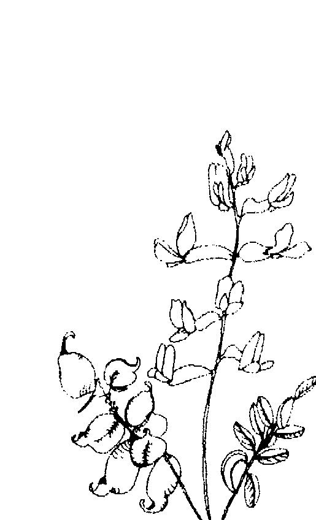
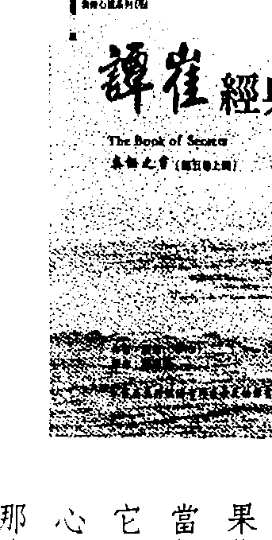
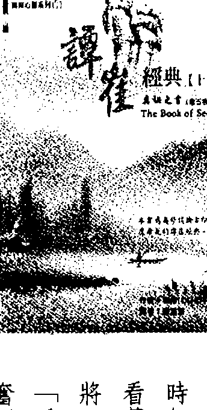
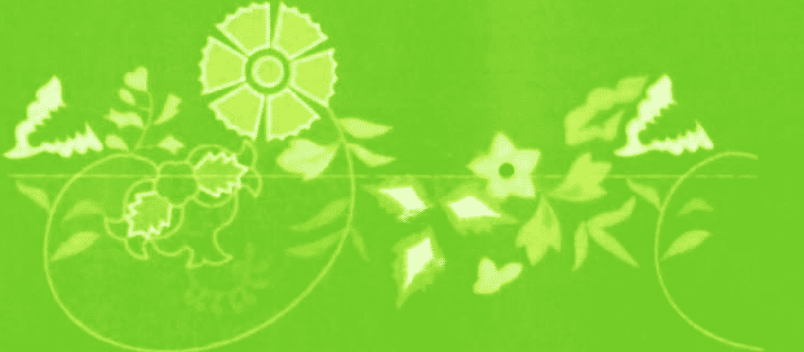

# 奥修：谭崔经典05

# 譯者序

献给
探討人生最終究真理的人
想要透過技巧而成就人生最終究真理的人
这是本人翻译奧修大師著作的第六本上册，奧修（OSHO）从来不写书，
他的书都是以英文即席演讲所记录下来的。「奥秘之书」是密宗最原始的经典，
共有五卷，本書是第三卷，分上下两册。
本人对这一书有特别深厚的感情，因为这是我接触奧修的第一本書，当我由這一本書进入奧修的世界時，我发现了無數的寶物，虽然如今那些寶物似乎
渐渐離我遠去，而以另外一種形式呈現在我的存在裡。

## 譚崔經典（五）006

读书可以作为求道的开始，但绝不是求道的结束。

一奥秘之书一，它还需要我去形容它吗？当一顆閃閃發亮的「東方之星」鑽石擺在那裡，它还需要我替你去形容它的美嗎？它还需要我去告诉你它的價值吗？

本序文言盡於此，剩下的你自己去探討。

謙达那 一九九〇年四月 於台北

# 007 引言

我几乎不了解这些演講裡面的一個字，并不是因爲它們很困難，而是因爲每一句話都把我弄糊塗了，它們使我感觉好像喝醉了酒，它們就好像我青少年時期所讀的詩一樣地使我激動，它們使我退回到青少年時代，那個時候，我的整個頭腦和整個身體都在欲求完美和欲求人生的絕對真理而幾乎要爆炸。有好幾年的時間，我已經把那一切給忘了，當我回顧的時候，我以一種好玩的放縱心情來看它，當然，那是不可能的，那些慾望都是不可能的，那只是因爲我非
# 引言

## 谭崔經典（五）

获取更多好书，请加微信号：strcdts

店铺：http://strc.cr.cx

## 諺崔經典（五） 008

常不快樂、神經病的、憂鬱的、自殺傾向的。几年的心理分析和小團體治療解除了我的憂鬱。我以为在佛洛依德裡面、在婦女運動、在馬克斯主義、在良好不再好奇地尋求其他任何東西了。我聽到關於奧修的事，但是並不太注意，認為我不想成為跟隨他的那一種人，也不想與跟隨他的那一種人在一起，但是几年之後，我有了一些錢，同時也有幾個星期的時間，然後就想到，或許我可以看看它到底在幹什麼，我來到了普那的聚會所待了三個星期，經過那三個星期之後，我人生的焦點整個改變了。当我在青少年的時候，我似乎感觉到，人生一定有一個奧秘，而一旦我了解那個奧秘，它就能夠改變一切，就好像一個魔術配方能夠使賤金屬變成黃金。奧修使我了解，如果要改變一切的話，那個配方一定要能夠在我这个感知的人身上產生作用，而不是在我感知的對象產生作用。奧修在這五卷「奧秘之書」裡面所談論的靜心技巧是两千年前由希瓦（印度三大神之一）在一味格揚·拜拉·譚崔」（Vigyan Bhairav Tantra）一書當中所描述的。希瓦在談論
# 009 引言

此書時是跟他的配偶戴維躺著，以愛擁抱在一起，此書裡面所談論的是所有靜心技巧的基礎，而它們尋求去達成的就是覺知。賤金屬就是我們的意識，黃金也是我們的意識，但是是充分覺知的意識，当 you 有了觉知的強度，一切都會改變。—这些靜心技巧—「譚崔」（Tantra）这个字的意思就是「技巧」—使用最平常的人生活動，例如吃、睡、祝賀一個朋友、性、感覺憤怒、和打嘯嘯等。有时候那些听起来是荒謬的，是對我們聰明才智的一種侮辱，是對我們自己觀念的一種侮辱，是對我們嚴肅而重要的靈性追求的一種侮辱，只要想想，我們要排除多少困難，才能夠來到這裡，而他卻繼續在談論打嘯嘯！奧修说：「譚崔是對生命深入而完全的接受，它有它獨特的方法，在整個世界上，在過去的世紀裡，譚崔就是技巧。—对很多西方人而言，它的獨特似乎存在於它对性的方法。使用「性」作為宗教的靜心似乎是非常完美的一個方法，它就好像你可以擁有蛋糕，同時又可以吃它。在紐約，一個男人來到一個女門徒的旁邊说：「嘿！让我们来做一些譚崔的性。—是的，譚崔是有谈到到性，但它并不是在「做」爱。他說：「譚崔并不是为了
## 010 谭崔經典（五）

性，譚崔是为了超越，但你只能夠透過经验、透過存在性的经验，而不是透過意识形态来超越。— 奥修并没有告诉我们要去改变，奥修并没有告诉我们要做得很脏，或者是拋棄任何東西，他告诉我们要漂浮、要放鬆、要成为本然的我，而且要全然地成为本然的我。如果我们是懒惰的、忧虑的、贪婪的，但是要觉知到我们是這樣。作为一個西方人，已经習慣于罪惡感、應該和不應該等心理，如果允許自己只是存在，而不要有這些杂念，這真是令人人宽心。譚崔说：没有什麼東西是壞的，也没有什麼東西是好的。这对我来说就好像被開了好幾年之後从監獄被釋放出來，太棒了！但同時也是完全无所適從。当有那麼多年的時間被制約在鎖鏈和鐵窗之中，我怎能夠觉知到自己？在西方的心理治療或機構性的宗教之中，总是在某個地方有著一個人應該變成怎樣的理念或理想。奧修告诉我们只要成为我们自己，不論当我孤单而且忧郁，或是当
# 011 引言

我快樂而且具有爱心時，我都能夠觉覺到他同樣深度的、具有爱心的接受。他就好像
一个站在山頂的人，看著我們所有的人都徘徊在迷宫裡，他能夠看見我們在什麼地方。除非我們能夠走出迷宫，否則只要是還在迷宫裡，哪裡都一樣。我們終身都被監禁在深深的無意識狀態之中，很難去了解自由是什麼，但是有時候，当我在奧修面前，或者是在讀他的書、聽他的话，我感覺到有一個瞥見，非常微弱地瞥見到他所說的是什麼。我们每天都沈浸在很短的字句裡，我们使用那些字句，就好像我们使用其他的東西一樣，来保持無意識，但是奧修以不同的方式來使用它們。因為他是醒悟的，他能夠使用它們来搖醒我們。
## 女門徒：波蕾姆·潘卡賈

## 013 原編輯者言

## 原編輯者言

当閱讀奧修在談論「味格揚．拜拉．譚崔」，一個新的讀者一定會感到驚訝，奧修的演講從來不準備，門徒讀一段經文或是一個問題給他，他神聖的智慧就自然地流出，來作為反應。所有已經出版的奧修的書，都是這些自發性的演講，逐字賜出，編輯而成，幾乎不改一個字，編輯者的功能只是加標點符號、分段，以及按照文法来排列那些來自智慧泉源的字句。對編輯而言，那真的是一項神聖的工作。奧修除了寫信之外，從來沒有寫過其他任務，語言一直都是他的媒介，因此，讀者將會發現這些演講非常活，因為他們最初的呈現是透過一個活生生的媒介。我们生活在這个有錄音機的時代是很幸運的，想一想，如果我們在佛陀、
## 014 諫崔經典（五）

基督、或馬哈維亞的時代有錄音機，而能夠將他們真正的話語和聲音的抑揚頓
拶保存下來給后代，那將是一個多麼大的祝福！那麼，我们所保留的是他們原
始的語語，而不是由他們的門徒所流傳下來的、具有偏見的解釋。
但是对於奧修，未来的后代將能夠知道有一位罕見的、活的成道大師曾經
走过地球。由于这些錄音带和書都將会被保存下來，他们將能夠知道他所讲
的智慧、他所教的靜心方法，以及他具有安撫力量的聲音。
所以，我们不仅受惠于現代的發明，我们同时受惠于像一味的格揚·拜拉·
諫崔一一般的古代教導，我们尤其受惠於奧修，他不斷地流露岀他的慈悲，不
厭其煩地喚醒和教導著我们這么一個痛苦、緊張、和過度焦慮的文化。

## 女門徒：阿南達·波蕾姆

## 第三十三章 譚崔性行為的靈性

# 經文：

48、在開始性結合的時候，保持注意著最初的火，继续维持这種狀态，避免結束時的餘火之灰。（在性行为當中不要尋求發洩。）

49、当處於這樣的擁抱之中，你的感官像葉子一樣地震動，进入这個震動。（在性當中震動。）

一九七三年二月二十二日於印度孟買

## 譚崔經典（五） 016

50、甚至沒有擁抱，你也可以記住那個結合，這就是蛻變！
51、在很高興地看著一個閑別已久的朋友時，要瀰漫著這個喜悅。
52、當在吃東西或喝飲料的時候，變成那個食物或飲料的滋味，而且被那個滋味所充滿。（有意識地吃和喝。）
（當喜悅產生，變成它。）
佛洛依德在某個地方曾經說過，人一生下來就是神經病的，這是一個一半
真理一。人並非生下來就是神經病的，但是他生在一個神經病的人類裡、周遭
的社会遲早會把每一個人逼成神經病的。人一生下來是自然的、真實的、正常的，但在
新生兒變成社會一部分時，神經病就開始運作了。
就我们目前的情況而言，我们是神經病的。神經病包含一個分裂，一個很
深的分裂。你不是一個整體，你分裂為二，或是分裂為很多部分，这
## 譚崔經典（五） 020

一點必須深入了了解，唯有如此，我们才能夠進入譚崔。你的感覺和思想已經變成兩個不
同的東西，这就是基本的神經病。你思考的部分和你感覺的部分已經分裂為二。你跟思考的部分認同，但是卻不跟感覺的部分認同，然而感覺比思想更真實、比思想更自然，你一生下來就帶著一顆感覺的心，而思想是後來才培養出來的，它是社會所給予的，你的感覺已經變成一個被壓抑的東西，即使当 you 說發生有幾个原因 。当一個小孩被生下來，他是一個感覺的個體，他能夠感覺事情，他還不是一個思考的個體，他是自然的，就好像自然界裡面任何自然的东西，就好像一棵樹或一隻動物，但是我們開始塑造他、培養他，他必須壓抑他的感覺，因

## 譚崔經典（五）022

性可以是一個非常深的滿足，性可以將你且回到你完整的狀態，且回到你自然的、真實的存在，它之所以能夠如此是有很多原因的，那些原因必須被了解。首先，性是一個全然的行為，你被丟出你的頭腦，你被弄得不平衡，因此大家對性有很多恐懼：你跟頭腦認同，而性是一個沒有頭腦的行為，你變成用頭腦的，在那個行為當中你没有任何頭腦、沒有心理的過程。如果有任何心理的過程，那麼它就不是一個真實的、真正的性行為，那麼就沒有性高潮、沒有滿足，那麼性行為本身就變成一個局部的事情，變成某種頭腦的事情，它「已經」變成如此。整個世界都對性有那麼多渴望、那麼多色慾，這並不是因為整個世界都變得更具有備性，而是因為你甚至無法以一個全然的行為來享受性。以前的世界更具有備性，所以並沒有那麼渴望性，這個渴望顯示出：那個真實的已經喪失了，而只剩那個虛假的。整個現代的頭腦都已经變得更朝向性，因為真正的性行為本身已經不復存在了，即使性行為也被轉移到頭腦，它已經變成心理的。我們用頭腦來想它。

## 023 第三十三章 護崔性行為的靈性

有很多人來找我，他們說他們一直在想性，他們藉著思考它、閱讀它，以及看春宮照片來享受，他們在享受這些事情，但是當真正的性行為來臨時，他們突然覺得不感興趣，他們甚至覺得自己變成了性無能。當他們在思考的時候，他們可以感覺到生命的能量，但是當他們要進入真正的行為時，他們反而覺得沒有能量，甚至沒有慾望，他們覺得他們的身體已經死了。他們到底怎麼了？甚至連性行為也變成心理的，他們只能夠去想它，而不能夠去做它，因為一做就涉及他們的整體存在。每當涉及整體的時候，頭腦就會變得不安，因為它就不再能夠是它的主人，它就不能夠再控制。護崔使用性行為來使你完整，但是你必須非常靜心地進入它，你必須忘掉所有你曾經聽過的關於性的事情，你必須忘掉所有你曾經體過的關於性的事，情，你必須忘掉所有社會、教堂、宗教、和老師所教給你的關於性的事情而進入它。忘掉一切，全然地進入它。忘掉控制，控制是障礙，要被性所占有，而不要去控制它。瘋狂地進入它，沒有頭腦的狀態看起來好像是發瘋。變成身體、變成動物，因為動物是完整的。就現代人而言，似乎只有性能夠最容易使你完整，因為性是你裡面最深的生物中心，你是由它所生出來的，你的每一個細胞都是性細胞，你的整個身體都是性能量的現象。

### 第一段經文說：「在開始性結合的時候，保持注意著最初的火，繼續維持這種狀態，避免結束時的餘火之灰。」這會使整個事情都變得不同。對你而言言，性行為是一種發洩，所以當你進入它的時候，你是急忙忙的，你只求發洩，過多的能量被發洩出來，你就覺得比較鎮定，然而這個鎮定只是一種虛弱。過多的能量創造出緊張和興奮，你就覺得必須去做什麼。當能量被發洩出來，你覺得虛弱，你或許會把這個虛弱看成是放鬆，因為你已經不再興奮，過多的能量已經不復存在，你可以放鬆，但是這個放鬆是一個負向的放鬆。如果你只能藉著丟出能量而放鬆，它的代價是非常高的，而這個放鬆只能紉是身體的，它無法進入更深，也無法成為靈性的。

### 這個第一段經文說：不要匆忙，不要渴望結束，停留在最初的階段。性行為有兩個部分：開始和結束。停留在開始的階段，開始的部分更放鬆、更溫暖，不要急急忙忙地走到終點，一在開始性結合的候，保持注意著最初的溫暖，不要急急忙忙地走到終點，一在開始性結合的候，保持注意著最初的

### 當你能量洋溢的時候，不要想發洩它，要保持能量洋溢，不要尋求射愛人在一起，就好像你們已經成為一體，創造出一個圓圈。有三個可能性，兩個愛人會合可以創造出三個圖形，三個幾何圖形，或許你已經讀過或甚至看過古老的煉金術圖畫，在那個圖畫裡，一個裸體的女人站在三個幾何圖形裡，一個是正方形，另一個是三角形，第三個是圓形。這是性行為的古老煉金術和譚崔分析性行為的一種方式。一般而言，當你在性行為裡，有四個人，而不是兩個人，這是方形：有四個角，因為你本身被分裂為二，被分為思想的部分和感覺的部分，你的同伴也被分裂為二，你們變成了四個人。這不是兩個人的會合，而是四個人的會合，它是一個群眾，所以很可能並沒有真正深刻的會合。有四個角，那個會合是虛假的，它看起來好像是一個會合，但其實不然。在那裡面很可能沒有深層的溝通，因為你較深的部分被隱藏起來了，而你所鍾愛的人較深層的部分也被隱藏起來了，只有兩個頭在會合，只有兩個思考的過程在會合，而不是兩個感覺的過程在會合，感覺的過程被隱藏起來了。

### 第二種形式的會合可以像一個三角形，你是其中的兩個角，你是三角形基端的兩個角，偶而你變成一體，好像三角形的第三個角，偶而你的二分性喪失而變成一體，這比四方形的會合還好，因為至少有一個片刻你是一體的，那個一體給你健康和生命力，你再度感覺活生生和年輕。

### 第三種是最好的，第三種就是譚崔的會合：你們變成一個圓圈，沒有角，那個會合並非只是一下子，那個會合真的是非暫時性的，在它裡面沒有時間，這種情形只有當你不尋求射精的時候才能夠發生，如果你尋求射精，那麼它就變成一個三角形的會合，因為你一射精，那個接觸點就喪失了。

### 停留在開始的階段，不要走到終點，要怎麼樣才能夠停留在開始的階段呢？有很多事必須記住，首先，不要把性行為看成是要去達到任何地方的一個方法，不要將它視為一個手段，它本身就是目的，它沒有終點，它不是一個手段，第二，不要想到未來，要停留在現在，如果你無法在性行為開始的時候段。第二，不要想到未來，要停留在現在，如果你無法在性行為開始的時候

段。第二，不要想到未來，要停留在現在，如果你無法在性行為開始的時候

停留在現在，你就永遠無法停留在現在，因為那個行為的本質就是你被丟入現在。停留 在現在，享受兩個身體和兩個靈魂的會合，互相沒入對方、融入對方，完全拋開你要 去哪裡的觀念，停留在當下這個片刻，不要去到任何地方，只要將自己融解，兩個人在溫暖和愛的氣氛之下互相融入對方。那就是為什麼，如果没有愛，性行為是一個匆忙的行為，你是在使用對方，對方只是一個工具，如果沒有愛，對方也在使用你，你們是在互相剝削，而不是互相沒入對方。如果有愛的話，你們就可以合併，這個在開始階段的合併將會給予很多新的洞見。如果你不是匆匆忙忙地去完成那個行為，那個行為為性的成分就變得越來越少，而靈性的成分就變得越來越多，性器官也互相融入對方，一個深的、寧靜的溝通發生在兩個身體的能量之間，然後你們兩個就能夠維持在一起好好幾個小時。隨著時間的經過，這種「在一起」可以進入更深、更深，但是不要去思考，停留在那個片刻，深深地融入，它會變成一個狂喜、一個三摩地。如果你能夠知道這個，如果你能夠感覺和了解這個，你性的頭腦將會變成

### 非性的，一個非常深的無慮就可以被達成，無慮可以透過它來達成。這看起來似非而是，因為我們一直都認為，如果一個人要保持無慮，他必須不看異性，他必須不跟異性會合，他必須避免或逃避，如此一來，就會產生一個非異性，他必須不跟異性會合，他必須避免或逃避，如此一來，就會產生一個非常虛假的無慮，頭腦會一直想到異性。你越是逃開異性，你就想得越多，因為這是一個基本的、深刻的需要。譚崔說：不要試著去逃避，那是不可能的，反之，可以使用自然本身來超越。不要爭鬥，接受自然，這樣你才能夠超越它。如果這個跟你所鍾愛的或是你的愛人的深層結合被延長了，而頭腦不要想到任何終點，那麼你就能夠只是停留在起點。與奮就是能量，你可能会丧失它，你可能在達到一個頂點之後就喪失了能量，這樣的話，沮喪將隨之而來，虛弱將隨之而來，或許你可以將它視為放鬆，但那是負向的。譚崔給你一個更高層次的、正向的放鬆。兩個同伴互相融入對方，互相給予對方生命力，他們變成了一個圓圈，他們的能量開始在一個圓圈裡移動，他們互相給予生命、更新生命，沒有喪失能量，反而得到更多的能量，因為透過

### 跟異性的接觸，你的每一個細胞都被挑戰、被激動。如果你能夠融入那個興奮，而不要將它引導到頂點，如果你能夠停留在起點而不要變熱，只要保持溫暖，那麼兩個—溫暖—就能夠會合，而你就能夠將那個行為延得很長。沒有射精、沒有將能量丟出，它就變成一種靜心。透過它，你就變成完整的；透過它，你分裂的人格就不再分裂，它就被連接起來了。

### 一個小孩—天真的。一旦你知道了這個天真，你就可以按照社會的需要，繼續在社會裡面行動，但是如此一來，那個行為就只是一齣戲，或一個表演，你並沒有涉入它裡面，它是一個需求，所以你做它，但是你不在它裡面，你只是 在演戲 。

### 你必須使用不真實的面目，因為你生活在一個不真實的世界，否則世界將會壓扁你，而且扼殺你。我們已經扼殺了很多真實的面目，我們將那絲釘在十字架上，因為他以一個真實的人來行動，而不真實的社會無法忍受他的行為。我們毒死蘇格拉底，因為他以一個真實的人來行動。要按照社會的要求來

### 行動，不要為你自己或其他人創造出不必要的麻煩，一旦你知道了你真實的

### 存在，以及你的完整性，不真實的社會就無法把你逼成神經病，它無法使你

### 發瘋。

### —在開始性結合的時候，保持注意著最初的火，繼續維持這種狀態，避免

### 結束時的餘火之灰。—如果有射精，能量就發散了，那麼就不再有火了，你只

### 是將你的能量釋放出來，而沒有得到任何東西。

## # 第二段經文：

### 當處於這樣的擁抱之中，你的感官像業子一樣地震動，進入這個震動。

### 當處於這樣的擁抱之中，當跟你所愛的或是你的愛人在深深的溝通之中，

### 你的感官像業子一樣地震動，進入這個震動。我們甚至會變得害怕：當做愛的

### 時候，你甚至不讓你的身體移動太多，因為如果你讓你的身體移動太多，那個

### 获取更多好书，请加微信号：strcdts

### 店铺：http://strc.cr.cx

[PAGE 35]

## # 033 第三十三章 護雀性行為的靈性

### 震動是很好的，因為當你在性行為當中震動，能量就開始全身震動，身體的每一個細胞都涉入，每一個細胞都變成活生生的，因為每一個細胞都是性細胞。

### 當你被生下來的時候，兩個性細胞會合在一起，你的存在就被創造出來了，你的身體就被創造出來了，那兩個性細胞存在於你身體裡面的每一個地 方，它們一直複製、再複製，但是你的基本單位還是那個性細胞。當你全身震動，它並不只是你跟你的愛人會合，同樣地，在你的身體裡面，每一個細胞都 跟相反的細胞會合，這個震動可以將這種現象顯示出來，它將會看起來像動物一樣，但人是一種動物，而動物並沒有什麼不對。

### 第二段經文說：「當處於這樣的擁抱之中，你的感官像葉子一樣地震動……」一陣大風在吹，然後樹木在震動，連根也在震動，每一片葉子都在搖 動，要像一棵樹。一陣大風在吹，而性就是一陣大風，一個很大的能量吹透了
你，搖動！震動！讓你身體的每一個細胞跳舞，兩個人都必須如此，愛人也在
跳舞，每一個細胞都在震動，唯有如此，你們兩個人才能夠會合，那麼那個會合就不是心理的，那是你們生物能量的會合。
### 進入這個震動，當震動的時候，不要保持疏離，不要成為一個旁觀者，因
### 为頭腦是一個旁觀者。不要保持冷漠！要成為那個震動，變成那個震動。忘掉
### 每一件事，變成那個震動。並不是你的身體在震動，那是一「你」，你的整個人
### 在震動，你變成那個震動本身，那麼就不再是兩個身體、兩個頭腦。在開始的
### 時候，有兩個震動的能量，而在結束的時候就只是一個圓圈，而不是兩個。
### 在這個圓圈裡將會發生什麼呢？第一，你將會成為一個存在性力量的一部
### 分。不是一個社會的頭腦，而是一個存在的力量，你將會成為整個宇宙的一部
### 分。在那個震動之中，你將會成為整個宇宙的一部分，那個片刻是屬於偉大的
### 創造，在融入之前，你是一個固體狀的身體，但是之後你變成液體狀的，互相
### 流進對方，頭腦消失了、分裂消失了，你們成為

## 譚崔經典（五） 040

所有的宗教都反對性、害怕性，因為它是這麼強大的一个能量，一旦你進入它裡面，你就不見了，然後那個「流」就會帶領你到任何地方，因此會有恐懼產生，所以，要創造出一個障礙，使你和那個「流」變成兩者，而不要讓這個生命的能量來操縱你，你要成為它的主人。只有譚崔說：這個控制是假的、有病的、病態的，因為你無法真正跟這個「流」一分開，你就是它！因此，所有的劃分都是假的、都是任憑私意的，基本上是不可能劃分的，因為你就是那個「流」，你是它的一部分、是它裡面的波浪，你可以變成凍結的，你可以將你自己跟那個「流」分開，但那個凍結是一種死亡。人類已經變得死氣沈沈，沒有一個人真是真正活生生的，你只是一個死的重量，在潮流裡漂浮。融解！譚崔說：要試著去融解，不要變成好像冰山一樣，要融解而與河流成為一體。與河流成為一體，感覺與河流合而為一，併入河流裡，要覺知，那麼就會有蛻變——那就是蛻變。蛻變不是透過衝突，而是透過覺知。這三個技巧是非常非常科學的，但如果依照這三個技巧的話，性就變成某種異於你所知道的東西，那麼它就不是一個暫時的解脫、不是將能量丟出去，那麼它就是沒有結束的，它變成一個靜心的圓圈。再一些相關的技巧：

在很高興地看著一個閒別已久的朋時，要灑漫著這個喜悅。進入這個喜悅，與它成為一體——任何喜悅、任何快樂。這只是一個例子：一在很高興地看著一個閒別已久的朋友時……當你突然看到一個閒別多日或多年的朋友，就有一股突然的喜悅抓住了你，但是你的注意將會放在那個朋友身上，而不是放在你的喜悅上面，那麼你就錯過了某些東西，而這個喜悅將只是暫時性的。你注意的焦點會放在朋友身上，你會開始談話、回憶，那麼你就錯過了這個喜悅，這個喜悅就離你而去。當你看見一個朋友而突然感覺到一陣喜悅在你的內心升起，這個時候要集中精神在這個喜悅上，去感覺它，而且變成它，帶著覺知，而且充滿著喜悅來會見那個朋友，讓那個朋友只是在周圍，而你保持停留在你快樂的感覺之中。這在很多其他情況下也可以做。當太陽升起的時候，你突然感覺到某種東西在你裡面升起，那麼，你要忘掉太陽，讓它停留在周圍，你要停留在你自己上升能量的感覺裡。當你注意看它的那個片刻，它將會散播開來，它將會變成你的整個身體、整個存在。不要只是成為它的觀察者，要溶入它。你感覺到喜悅、快樂、或喜樂的情況是很少的，但你卻又一直在錯過它們，因為你變得集中在客體上。每當有喜悅，你覺得它是來自外在。你碰到一個朋友，當然，那個喜悅似乎是來自你的朋友，來自你看到他，但那並不是實際的情形，那個朋友只是幫助你的喜悅浮現、是在你裡面，那個朋友只是變成一個情況，那個朋友只是幫助你的喜悅浮現、幫助你去發現它的存在。

## 041 第三十三章 護崖性行為的靈性

不懂喜悅如此，其他每一件事也都是如此，其他每一件事也都是如此：憤怒、悲傷、不幸、快樂、以及每一件事都是如此，其他事情都只是一些情況，在那些情況裡，隱藏在你的裡面的東西被表現出來了。它們並非致因，它們並沒有導致你裡面的某些東西。任何正在發生的都已在 你身上，它一直都在那裡，跟朋 — 都表現出來。它從那個隱藏的泉源變成可見的、明顯的。每當這種情況發生的時候，要停留在內在的感覺，那麼你對生命裡面的每一件事都將會有一個 不同的態度。 即使對負向的感情，你也要這樣做。當你生氣的時候，不要把注意力放在 那個引發你生氣的人身上，讓它停留在周圍，而你只要變成憤怒，全然地去感 覺那個憤怒，讓它發生在你裡面，不要作合理化的解釋，不要說是那個人創造 了它，不要譴責那個人，他只是變成那個情況，要對他感激，因為他幫助你將 某些隱藏在裡面的東西顯現出來，他打擊到你某個隱藏傷口的地方，他讓你覺 知到它，所以你就變成了那個傷口。 不論是正向的或負向的，不論是任何感情，都要使用這個，這樣做將會在 你裡面產生很大的改變。如果那個感情是負向的，當你覺知到它存在你裡面， 你就能夠免於它；如果那個感情是正向的，你將會變成那個感情本身；如果它
是喜悦，你將會變成喜悦；如果它是憤怒，憤怒將會瓦解。正向的感情和負向的感情之間的不同就是：如果你覺知到某一個感情，當你變覺知的時候，那個感情就瓦解掉，那麼它就是負向的；如果變成覺知到某一個感情，你就變成了那個感情，然後那個感情就散佈開來而變成你的存在，那麼它就是正向的。覺知在這兩種情況下的運作是不一樣的。如果它是一個有毒的感情，你會透過覺知而擺脫它；如果它是好的、喜樂的、狂喜的，你就會變成與它合而為一。覺知會加深它。所以對我來說，原則就是：如果某種感情藉著你的覺知而加深，那麼它就是好的；如果某種感情透過你的覺知而瓦解，那麼它就是壞的。那個無法在覺知的觀念，而是內在的了解。使用的覺知，它就好像你把光帶進黑暗之中，黑暗就不復存在，只要把光帶進來，黑暗就不復存在，因為事實上它只是「不是」，它是負向的，它是光的不在。只要把光帶進來，就有很多存在的东西會被顯現出來。在黑暗當中，它們—不是—，你無法看到它們。如果你將光帶進來，黑暗將不復存在，而那個真實的將會被顯現出來。透過覺知，所有像黑暗一般負向的東西：恨、憤怒、悲傷、或暴力都將會瓦解，那麼愛、喜悅、或狂喜將會首度顯現給你，所以，—在很高興地看著一個閒別已久的朋友時，要瀰漫著這個喜悅。—

當在吃東西或喝飮料的時候，變成那個食物或飲料的滋味，而且被那個滋味所充滿。—當在吃東西或喝飮料的時候，變成那個食物或飲料的滋味，而且被那個滋味所充滿。—我們一直在吃東西，沒有那些東西，我們不能夠生存，但是我們非常無意識地、自動地、就好像機器人一樣地在吃東西。你並沒有去嘗那個滋味所充滿的味道，你只是在填塞食物。要慢慢地，要覺知食物的滋味。唯有当你慢慢地吃，你才能夠覺知，不要只是繼續吞食，要不慌不忙地品嚐它們，而變成那個滋味本身。當你感覺到甜，要變成那個甜，那麼你的整個身體都可以感覺到它，而不只是在嘴裡或是舌頭上感覺到它，整個身體都可以感覺到有一種甜以微波的方式散佈開來，或者，任何其他的東西也都可以，不論你在吃什麼東西，你都可以去感覺那個滋味，而且變成那個滋味。

就因為譚崔是如此，所以它顯得跟其他傳統背道而馳。耆那教說：一沒有滋味|阿蘇瓦德（Aswaa） 。一甘地將它看成他緊會所的一個規則：一阿蘇瓦德：不要去嚐任何東西。吃，但是不要嚐，忘掉那個滋味。吃是一個必要，但是要以一種機械式的方式來做它，嚐是慾望，所以不要嚐。一譚崔說：盡可能去嚐它，要更敏感、更活生生地，不僅要敏感，而且要變成那個滋味。如果用阿蘇瓦德|不嚐滋味，你的感官將會死掉，它們將會變得越來不敏感。當你的敏感度降低，你將無法感覺到你的身體，你將無法感覺到你的感覺，那麼你會只停留在你的頭腦裡，這個停留在頭腦是一種分裂。譚崔說：

## 第三十三章 護雀性行為的靈性

不要在你自己裡面創造出任何分裂，去品嘗是美好的，敏感是美好的。如果你變得更敏感，你將會變得更活生生，如果你變得更活生生，就有更多的生命會進入你內在的本性，你將會更敞開。它，那並不困難，我們已經這樣在做了。你可以不用的嘯而吃東西，那並不困難，你可以碰觸某人而沒有真正碰觸到碰觸到他的手，因為要真正碰觸的話，「你」必須來到你的手，「你」必須移到你的手，你一必須變成你的手指、變成你的手掌，就好像你或你的靈魂來到了你的手，唯有如此，你才能夠真正碰觸。你可以握住某一個人的手，但你 是退縮的。當你退縮，那麼就只有一隻死的手在那裡，它看起來好像是在碰觸，但事實上並沒有真正在碰觸。我們總是害怕去碰觸別人，因為碰觸被認為與性有關。你或許站在人群裡、在電車裡、或是在火車上，碰觸到很多人，但是你並沒有真正碰觸他們，他們也沒有真正碰觸你，只有身體在接觸，但你是退縮的。你可以感覺到那個不同：如果你在人群裡真正碰觸到別人，他將會覺得被冒犯。你的身體可以碰觸，但是「你」不應該移入身體，你必須保持冷漠、保 持超然，就好像你不在身體裡，就好像只有一具屍體在碰觸。這種不敏感是不好的，它之所以不好是因為你透過保護你自己來對抗生 命。你非常害怕死亡，但是你已經死了，你不需要真的害怕，因為沒有人會 死，你已經死了。那就是為什麼你在害怕——因為你還沒有活過。你一直在錯 過生命，而死亡正在來臨。 一個活生生的人將不會害怕死亡，因為他有真正在生活。如果你真正在生 活，你就不會害怕死亡，你甚至可以活過死亡。當死亡來臨的時候，你將會對 它非常敏感，以致於你將會去享受它，而它將會成為一項偉大的經驗。如果你 是活生生的，你甚至可以活過死亡，那個死亡就不存在了。如果你甚至能夠活 過死亡，如果你甚至能夠在你退縮到你的中心而溶解時對你垂死的身體很敏 感，如果你甚至能夠活過這個，那麼你就變成不朽的。 一當在吃東西或喝飲料的時候，變成那個食物或飲料的滋味，而且被那個滋味所充滿。一當喝水的時候，感覺那個清凉，閉起雙眼，慢慢喝，品嘗它，

## 049 第三十三章 譚崔性行為的靈性

感覺那個清涼，而且感覺你已經變成了那個清涼，因為那個清涼正在從水被傳遞給你，它正在變成你身體的一部分。你的嘴巴正在碰觸，那個清涼就被傳遞了。讓它發生在你的整個身體，讓它的微波散佈開來，你將會感覺到全身有一股清涼。以這方式，你的敏感度將會成長，你將會變得更活生生、更被充滿。我們遭到挫折、感覺空虱，而且一直在說生命是空虱的，然而我們本身就 是它為什麼空虛的原因。我們並沒有去填滿它，我們並沒有讓任何東西來填滿它，我們有一道裝甲圍繞著我們——一道防衛的裝甲，我們害怕變成易受傷的，所以我們維繫在防衛，使外在的東西無法侵入，然後我們就變成墳墓、變成死的事物。

譚崔說：要活生生的、更活生生的，因為生活就是神，除了生活以外沒有其他的神。要變成更活生生的，那麼你將會更神聖，要成為完全活生生的，那麼，對你而言就没有死亡。

## 051 第三十四章 透過譚崔而達到「宇宙的性高潮」

# 第三十四章

# 透過譚崔而達到「宇宙的性高潮」

在我回答你們的問題之前，有某些要點必須先澄清，因為那些要點將會幫助你更加了解譚崔的意義。譚崔不是道德觀念，它既非一道德的，亦非一不道德的，它是一非道德的，它是一種科學，而科學與道德無關。對譚崔而言，道德的，它是一非道德的，它是一種科學，而科學與道德無關。對譚崔而言，你的道德以及有關道德行為的觀念與它無關，譚崔並不顧慮一個人應該如何躬行，它也不顧慮理想，它基本上所顧慮的是一什麼是，以及一你是什壓一，這個區別必須被深入了解。道德顧及理想——你應該如何、你應該是什麼。所以，道德基本上是譴責的，你從來不是那個理想，所以你就被譴責，每一種道德都會創造出罪惡感，你從來無法變成那個理想，你總是落在理想之後，差距永遠存在，因為理想就是那個不可能的，而透過道德，它就變得更不可能。理想存在於未來，而你就像你現在這樣在這裡，因此你会繼續比較，你永遠無法成為那個完美的人，總是會缺少某些東西，那麼你就覺得有罪惡感，你就覺得自我譴責。有一件事情：譚崔是反對自我譴責的。因為自我譴責永遠無法改變你，譴責只能夠創造出偽善，那麼你就試著偽裝，表現出不是你的你。偽善的意思想是說：你是真實的人，而不是那個理想的人，但是你假裝，你試著去表現出你是那個理想的人，那麼你就在你裡面產生出一個分裂，你就会有一張虛假的臉，於是一個不真實的人就產生了。基本上譚崔是在找尋真實的人，而不是在找尋不真實的人。每一種道德都必然會創造出偽善，那是不可避免的。偽善會跟道德一起存
在，它是道德的一部分，是它的影子，這個將會看起來似是而非，因為道德家就是那些譴責偽善譴責得最## 譚崔經典（五）060

能夠幫助別人成為快樂的；如果你是悲傷的、不快樂的、痛苦的，你將會對別人使用暴力，你將會幫別人製造痛苦。你可以變成一個所謂偉大的聖人，那並不很困難，但是看看你們所謂偉大\的聖人，他們試著以各種方式去折磨每一個來找他們的人，他們的折磨是以一種非常欺騙的方式，他們是為了你才來折磨你，他們折磨你是為了他們也在折磨他們自己，所以你不能夠對他們說：「你在教導我們一些你自\己沒有實踐的東西。」他們已經在實踐它，他們在折磨他們自己，因此他們能夠折磨你。當折磨是為了你好，那是最危險的折磨，你無法逃離它。享受你自己有什麼不對嗎？快樂有什麼不對嗎？如果有任何不對的話，那一定是在於你的不快樂，因為一個不快樂的人會在他的周遭創造出一個不快樂的微波。而性行為、愛的行為可能是最深的工具之一，透過那些工具，喜樂可以\被達成。\譚崔不是在教導性意念，它只是在說：性可以成為喜樂的泉源。一旦你知道了那個喜樂，你就可以向前邁進，因為現在你已經根植於真實的存在。一個

## 第三十四章 透過韃崔而達到「宇宙的性高潮」

人不會永遠跟性停留在一起，但是你能夠使用性作為跳板，譚崔的意思就是如此：你可以使用性作為跳板，一旦你知道了性的狂喜，你就能夠了解神秘家一 直在談論的——一個更偉大的性高潮、一個宇宙的性高潮。 密拉（Meera）在跳舞，你無法了解她，你甚至無法了解她的歌，它們是 性的，它們的象徵是性的，它一定是如此，因為在人類的生活裡，性行為是唯 一你能夠感覺到非二分的行為，是唯一你能夠感覺到一個很深的一體的行為。 在那個感覺當中，過去消失了、未來也消失了，只有現在這個片刻存在，而只 有現這個片刻是唯一真實的片刻。所以那些真正知道跟神性成為一體、跟存 在本身成為一體的神秘家，他們總是使用性的字眼和象徵來表達他們的經驗， 沒有其他象徵能接近那種經驗。 性只是開始，而不是結束，但是如果你錯過了那個起點，你也將會錯過終 點，你無法逃開起點而到達終點。 譚崔說：要自然地生活，不要不真實。性是一個很深的可能性，一個很大 的潛力，使用它！在它裡面享受快樂有什麼不對嗎？真的，所有的道德規範都 在反對快樂。某人是快樂的，那麼你就覺得有什麼不對勁；而當某人是悲傷的，每一件事就都很好，我們生活在一個每一個人都悲傷的神經病社會裡。當你是悲傷的，每一個人都能夠同情你；但是當你很快樂，每一個人都變得惆然若失，該對你怎麼辦！當某人同情你，注意看他的臉，他的臉會發生，有一些微妙的閃光會來到他的臉上。他在同情的時候會感到到快樂，而你的不快樂在別人裡面產生快樂，這是神經病！它的基礎似乎是瘋狂的。論崔說：要對自己真實。你的快樂並不是不好的，它是好的，它不是惡；唯有悲傷才是罪惡，唯有變成悲慘才是罪惡；成為快樂是一種美德，因為一個快樂的人不會為別人製造不快樂，只有一個快樂的人能夠幫助別人快樂的基礎。第二，當我說論崔既非道德，亦非不道德，我的意思是說論崔基本上是一種科學。它注意看你，注意看你是什麼，它的意思並不是說論崔不想去改變你，而是它透過真相來改變你。那個差別就跟魔術和科學之間的差別一樣。魔術也是試著去改變事情，但它只是透—道德和論崔之間的差別也一樣。

## 第三十四章 透過譚崔而達到「宇宙的性高潮」

過文字，而不知道真相。魔術師可以說：現在雨將要停。但是事實上他無法使雨停，或者他可以說：雨將會下。但是他無法使雨開始下，他只能繼續使用語言。有時候會有巧合，那麼他就會覺得非常強而有力，而如果事情沒有按照他的魔術預言發生，他總是可以說：到底是什麼地方弄錯了？那個可能性總是隱藏在他的職業裡。就魔術而言，每一樣東西都可以從「如果」開始，他可以說：「如果每一個人都好的、美德的，那麼在某一個特定的日子將會下雨。如果有下雨，那很好，如果没有下雨，那麼並非每一個人都是美德的一，有一個人 是罪人」。即使在这个世紀裡，在这个二十世紀裡，像甘地這樣的人也會說，当比阿（Bîho）有一个饥荒，「那是因为住在比阿的人的罪恶，所以才会有饥荒」。好像整个世界，除了比阿以外都没有罪恶！魔術由「如果」開始，而且它是一個很大的「如果」。科學從來不由「如果」開始，因为科學首先會試著去知道什麼是真實的 真正的存在是什麼、真實的是什麼，一旦那真實的被知道，它就能夠被改變。

## 譚崔經典（五） 064

一旦你知道電是什麼，它就能夠夠被改變、被變形、被使用。一個魔術師不知道電是什麼，他不知道電，他就要去改變，他就想要去改變！那種預言是假的、 是幻象的。

道德就好像魔術一樣，它一直在談論完美的人，而不知道人是什麼、真正的人是什麼。完美的人是一種夢想，它只是用來譴責真實的人，人從來無法達到它。

譚崔是科學，譚崔說：首先要知道真實的存在是什麼、人是什麼，不要創造出價值判斷，不要創造出理想，首先要知道「什麼是」，而不要想到「應該一，只要想到一是一什麼。一旦那個一是被知道了，你就改變了它，你就 掌握了那個奧秘。

比方說，譚崔說：不要試著去反對性，因為如果你反對性，而試著去創造出一個無慾的狀態、純潔的狀態，那是不可能的，它只不過是如魔術般的。不 知道性能量是什麼、不知道性由什麼所組成、沒有進入性真實的存在、沒有進 入性真實的存在、沒有進 入性的秘密，你竟然可以創造出一個無慮的理想，那麼你將會怎麼做？你只能壓抑。一個性壓抑的人比一個性放縱的人更有性慾，因為透過壓抑，那個能量已經被釋放出來了；而透過壓抑，它仍然存在，繼續在你的系統裡移動。

一個壓抑性的人到處都看到性，每一樣東西都變成性的，並不是說每一樣東西都是性的，而是現在他會投射，如此一來，他會投射！他自己隱藏的能量被投射出來了。所到之處他都會看到性，而因為他在譴責他自己，所以他將會開始譴責每一個人。你無法找到一個沒有暴力地譴責的道德家，他譴責每一個人，對他來講，每一個人都是錯的，然後他就覺得很好，他的自我就被滿足了，為什麼每一個人都是錯的？因為他到處都看到跟他的壓抑同樣的東西。他自己的頭腦將會變得越來越具有性慾，因此他會越來越害怕，這種假的無慮是一種性格異常，它是不自然的。

在譴責的信徒身上所發生的是一種不同的品質，是一種不同形式的無慮，它的過程是完全相反的，是一百八十度相反的。譴責首先教導你如何進入性、如何去知道它、如何去感覺它、如何來到隱藏在他裡面最深的可能性、如何達 到頂點、如何找出那個隱藏在那裡的最主要的美、最主要的快樂和喜樂。一旦你知道了那個奧秘，你就能夠超越它，因為，事實上，在一個很深的性高潮當中，並不是性在給你喜樂，而是另外的東西。性只是一個情況，是另外的東西在給你幸福感、給你狂喜，而那個另外的東西可以分成三種要素，但 是當我談論那些要素，不要認為我們只是從我的話語就能夠了解它們，它們必須變成你經驗的一部分，只有觀念 是沒有用的。性裡面的三項基本要素使你達到喜樂的片刻，那三項要素是：第一，無時間性（timelessness）。你完全超越時間，沒有時間，你完全忘掉時間，時間對你來講停止了，並不是時間停止，而是它對你來講停止了，你不在它裡面。沒有過去，也沒有未來，就在當下這個片刻，就在此時此地，整個存在都集中，當下這個片刻變成唯一真實的片刻。如果你能夠不用性而將當下這個片刻變成唯一真實的片刻，那麼就不需要性，它也能夠透過靜心而發生。第二，在性裡面，你首度失去了你的自我，你變成無我的，所以，所有那些非常自我主義的人，他們總是反對性，因為在性裡面，他們必須失去他們的 自我。你不存在，别人也不存在，你和你的愛人兩者都失去，而進入某種另外的新東西。一個新的真實的存在被發展出來，一個新的東西進入了存在，在那個新的東西裡，兩個舊的都喪失了，完全喪失。自我會害怕，因爲你不復存在。如果你能夠沒有性而達到一個你不存在的片刻，那麼就不需要它了。

## 譚崔經典（五） 064

第三，在性裡面，你首度變自然。不真實喪失了，假面具喪失了，社會、文化、和文明喪失了，你變成了自然的一部分。就像樹木、動物、和星星一樣，你變成了自然的一部分。你存在於某種更偉大的東西裡，你存在於宇宙裡。裡、你存在於道裡，你在它裡面漂浮，你甚至不能在它裡面遊，因爲「你」不存在，你只是在漂浮，你只是被那個流帶著走。這三樣東西給你那個狂喜。性只是一個情況，在那個情況裡，它能夠自然發生。一旦你知道，一旦你能夠感覺到這些要素，你不要有性也能夠創造出這些要素，所有的靜心主要都是不用性，而在經驗性，但是你必須經歷過它，它必須變成你經驗的一部分，不只是作為觀念、概念、或思想而存在。

譚崔並不是爲了性，它是要去超越，但是你只能透過經驗而超越，你只能 透過存在性的經驗而超越，你不能透過意識型態而超越；唯有透過譚崔，真正 的無慫才會發生，它看起來似是而非，但其實不然，唯有透過真知，超越才會 發生，無知不能幫助你走向超越，它只能幫助你走向偽善。

現在我要再來回答問題，有個人問：

為了要對靜心的過程有幫助，而不要有阻礙，一個人放縱在性裡面應該多 久一次？

這個問題的產生是因為我們一直在誤解。你的性行為和譚崔的性行為基本 上是不同的，你的性行為是為了要得到舒解，它就好像打了一個過癮的噴嚏，能量被丟出了，而你卻下了重擔。它是破壞性的，而不是創造性的；它是好 的、治療性的，它幫助你放鬆，但是沒有其他更多的東西。

譚崔的性行為基本上跟它是截然不同而且相反的，它不是舒解，它不是將 [content]

## 再一个问题：

昨天晚上你說整個行為必須緩慢而不匆忙，但是你又說一個人對性行為不應該有任何控制，而應該變成全然的，這使我混亂，請你解釋這兩件事。

它不是控制，控制是不同的。控制與放鬆是完全不同的，你放鬆在性裡面，而不是去控制它。如果你控制它，你將不會放鬆；如果你控制它，遲早你會趕忙去結束它，因為控制是一個拉緊，而每一個拉緊都會產生緊張、緊張會創造出一個必然性、一個去釋放開來的需要。它不是一個控制，你不是在抗拒什麼東西，你只是不匆忙，因為性的發生並不是為了要移向某一個地方，你並沒有要去某一個地方，它只是一种遊戲，沒有目標，不需要去到達什麼地方，所以為什麼要匆匆忙忙？但是一個人 在每一项行為裡都全然地在，如果你每一件事都匆匆忙忙，你

沒有要去某一個地方，它只是一种遊戲，沒有目標，不需要去到達什麼地方，所以為什麼要匆匆忙忙？但是一個人 在每一项行為裡都全然地在，如果你每一件事都匆匆忙忙，你

## 第三十四章 透過譯崔而達到「宇宙的性高潮」

在性行為裡也會匆匆忙忙，因為一你一會在那裡。一個非常具有時間意識的人咖啡或立即的性。對咖啡來講，它是好的；但是對性來講，它簡直是無稽，不可能有立即的性。它不是一項工作，它不是某種你可以匆忙的事，匆忙的話，你將會破壞它，你將會錯過那個要點。要享受它，因為透過它可以感覺到一種無時間性。如果你匆匆忙忙，你就無法感覺到無時間性。譯崔說：不匆忙不忙地進行，慢慢地享受它，就好像你早晨在散步，而不像你要去上班那個樣子，那是不同的。當你要去上班，你是急急忙忙地要到達某一個地方，而當你早晨在散步的時候，你是不慌不忙的，因為你並沒有要去到任何地方，你只是在走，既不匆忙，也沒有目標，你可以從任何點退回來。這個不匆忙就是去創造出谷底的基本條件，否則頂峰將被創造出來。當這些話被說出來，它並不意味著你必須控制，你不能控制你的興奮，因為那是矛盾的，你不能夠控制興奮，如果你控制它，你是在創造一個雙重的興奮。只要放鬆！把它當成一種遊戲，不要做出任何結果，只要一開始一就足夠了。

## 諸崔經典（五）080

在那個行為裡，閉起你的雙眼，感覺別人的身體，感覺別人的能量流向你，而你要沒入它裡面、融入它裡面。它將會來臨，舊的習慣可能會持續一些日子，然後它將會走，但是不要強迫它走，只要繼續放鬆、放鬆、放鬆，而如果果沒有射精，不要覺得不對勁。如果没有射精，男人會覺得不對勁，他傾向於去感覺有什麼不對勁，沒有什麼不對勁！不要覺得你錯失了某些東西，你並沒有錯失。

在開始的時候，你會覺得好像你錯失了某些東西，因為那個興奮和頂峰將不會存在。在谷底來臨之前，你會覺得你錯失了某些東西，但這只是一個舊有的習慣，在一段期間之內，在一個月或三個星期之內，那個谷底將會開始出現，當那個谷底出現，你將會忘掉你的頂峰，没有任何頂峰能夠像谷底那麼有價值，但是你必須等待，不要強迫它，也不要控制它，只要放鬆。

放鬆是一個困難，因為當我們說：「放鬆」，它在頭腦裡似乎被翻譯成要做某些努力，我們的語言給予這個外貌。我在讀一本書，那本書的書名叫做：「你一定要放鬆！你一定要！那個一定要」將不會讓你放鬆，因為當

## 第三十四章 透過譚崔而達到「宇宙的性高潮」

它變成一個目標，你就「一定要」，而如果你辦不到，你將會感到挫折，那個「一定要」的方式來思考，你就無法放鬆。「一定要」的方式來思考，你就無法放鬆。語言是一個困難，語言對某些事總是表達錯誤。比方說放鬆，如果說：「放鬆。」那麼，那也變成一種努力，你會問：「要如何放鬆？」 有了「如何一，你就錯過了那個要點，你不能問「如何」，因為這樣做你是在問一個技巧，而技巧將會產生努力，努力將會產生緊張，所以，如果你問我要如何放鬆，我會說：不要做任何事，只要放鬆，只要躺下來等待，什麼事都不要做！所有你能夠做的都將會是一個障礙，它將會產生阻礙。如果你開始從一數到一百，然後從一百往回數，數到一，那麼你將會整個晚上都保持醒著，如果有時候你因為數羊而進入夢鄉，那並不是因為你數它的關係，那是因为你數了又數，然後你變得無聊，因為那個無聊，你才進入夢鄉，它不是因為你數它的關係，它只是因為無聊，之後你會忘掉你在數，然後睡意就來臨了。但是，唯有當你什麼都不做的时候，睡意才會來臨，放鬆才

## 譚崔經典（五） 082

會來臨，問題就是在這裡。 當我說一性行為一，它看起來好像你需要努力，你不要！只要開始跟你所 愛的，或是你的愛人玩，只要繼續玩，互相感覺對方，要互相對對方敏感，就 好像小孩子在玩，或是好像狗在玩，一般的動物都會玩，只要繼續玩，根本不 要去想關於性行為的事，它或許會發生，或許不發生。 如果它透過只是在玩而發生，它將會更容易引導你到谷底，如果你去想 它，那麼你已經走在你自己之前，你在跟你所 愛的人玩，但是你同時在想性行 為，那麼那個玩是假的，你不在此地，你的頭腦在未來。 當你處於性行為之中，頭腦就會想，要如何結束它，它總是走在你之前， 不要讓它這樣！只要玩就可以，忘掉任何性行為。如果它發生，就讓它發生， 那麼就很容易放鬆。當它發生時，只要放鬆。要在一起，要處於相互的「在」 之中而感覺快樂。 你可以被動地做一些事，比方說，當你興奮的時候，你的呼吸會加快，因 為興奮需要快速呼吸。就放鬆而言，如果你呼吸得很深是比较好的，比較有幫助的，不是快速的呼吸，而是緩慢的、非常舒服、非常安逸的呼吸，那麼性行為就可以延長。不要講話，不要說任何話，因為那會產生打擾。不要用頭腦，而要用身體。只要用頭腦去感覺正在發生什麼，不要想，只要感覺正在發生什麼——正在流動的溫暖、正在流動的愛、遭遇到的能量，只要去感覺它。只要覺知，而覺知也不能造成一個緊張。要毫無努力地漂浮，唯有如此，那個谷底才會出現，一旦那個谷底出現，你就超越了。一旦你感覺到和了解到那個谷底、那個放鬆的性高潮，它就已經超越了，那麼性就不存在了，它已經變成了一個靜心或一個三摩地。

## 085 第三十五章 轉向內在、朝向真理

## 第三十五章

## 轉向內在、朝內真理

# 經文：

53、喔！具有蓮花眼的，碰起來多麼甜蜜，當唱、看或嚐時，要覺知你的存 在，發現那永生的。（記住自己）

54、不論在什麼地方、在什麼行為裡找到滿足，要去實現它。（感覺那個滿足。）

一九七三年二月二十四日於印度孟買

获取更多好书，请加微信号：strcdts

店铺：http://strc.cr.cx

## 譚崔經典（五） 086

55、在睡眠的那個點，當睡眠還沒有來臨，而外在的醒已經消失，「本性」就

56、幻象會騙人，顏色會劃出界限，即使可分的也是不可分的。（覺知清醒和睡覺之間的空隙。）

（將世界想成一個幻象。）

文明是一項如何變成不真實的訓練，而譚崔是一個相反的過程——如何防 止你自己變成不真實的。如果你已經變成不真實的，那麼譚崔會教導你如何去 碰觸隱藏在你裡面真實的存在，如何再度與它接觸，如何再度變成真實的。第 一件必須了解的事是：我們如何繼續變成不真實的，一旦這個過程被了解，有 很多事會馬上改變，那個了解就會成為突變。

來是不分裂的，是一個個體，他是身體和頭腦兩者，但即使說他是兩者也是錯 的，他是一「身體頭腦」，身體和頭腦是他存在的兩面，而不是兩個分隔，它是某種或許你可以稱之為生命、能量、或任何其他東西的兩極，但是身體和頭腦

## 第三十五章 转向内在、朝向真理

並非兩樣東西。文明、教育、文化、和制約的過程都從分裂開始，每一個人都被教導說他是一二一，而不是一一一，這樣的話，一個人當然會開始去跟頭腦認同，而不跟身體認同，那個思想的過程就變成你的中心，而思想的過程只不過是外圍，它是存在的必要條件，如果你能夠不要思想而存在，一旦你没有思想而存在……思想不變成無意識的，你將會存在，但是將會沒有思想。進入很深的睡眠當中，你將會存在，但是將會沒有思想。進入很深的睡眠當中，你將會存在，但是將會沒有思想。進入很深的睡眠當中，你將會存在，但是將會沒有思想。會存在，但是將會沒有思想，思想只是在外圍，你的存在是在另外某個地方——比思想更深，但是你一直被教導說你是「二一」——身體和頭腦，你被教成你是頭腦，而你佔有身體，頭腦變成主人，而身體變成奴隸。你繼續跟身體抗爭，這會產生一個縫隙、一個差距，那個差距就是問題之所在，所有的神經病都是由那個差距產生出來的，所有的煩惱都是由那個差距產生出來的。你的本性根入你的身體，你的身體跟存在並不是分開的，它是存在的一部分，你的身體是整個宇宙，它並不是某種有限的東西，你或許沒有觀察過它，

## 譚崔經典（五） 088

但是，試著去觀察你的身體真正是在哪裡結束，哪裡？你認為你的身體是在你 皮膚結束的地方結束嗎？ 如果那遙遠的太陽死了，很快地，你也會死在這裡，如果陽光停止來臨， 你將不復在此，沒有那遙遠的太陽存在，你的身體無法存在，太陽和你以某種 方式深深地關連著，太陽一定是包含在你的身體裡，否則你無法存在，你是陽 光的一部分。 早晨的時候，你看到花朵綻放，它們的綻放實際上是太陽的升起；晚上的 時候，它們合起來，它們的合起實際上是太陽的下山，它們只是散開來的陽 光。你存在於此，因為在遙遠的地方有太陽存在。你的皮膚事實上並不是你的 皮膚，你的皮膚繼續散開來，甚至太陽也被包括進去。你在呼吸，你能夠呼吸 是因為有空氣存在，是因為有大氣存在，每一個片刻你都將大氣吸進和呼出。 如果有一個片刻沒有空氣，你將會死，你的呼吸是你的生命。如果你的呼 吸是你的生命，那麼整個大氣是你的有一部分，你不能夠沒有它而存在。所以， 你的身體真正是在哪裡結束？極限在哪裡？沒有極限！如果你仔細觀察，如果

## 第三十五章 转向内在、朝向真理

你進入深處，你將會發現沒有極限，或者宇宙的極限就是你身體的極限，整個宇宙都涉入你裡面，所以你的身體並非只是你的身體，它是你的宇宙，而你根植於它，同樣地，你的頭腦也不能夠沒有身體而存在，它是身體的一部分，是它的一個過程。 分裂是具有破壞性的，有了分裂，你一定會變得跟頭腦認同。你用思想，而如果没有思想，就没有分裂。你思考，然後你變成跟你的思考認同，那麼你就像沒有思想，就覺得好像你佔有身體，事實上這完全跟真理相反，你並沒有佔有身體，身體也沒有佔有你，它們並非兩樣東西，你的存在是一體的，是一個相反兩極很深的和諧，但相反兩極並不是分開的，它們聯合在一起，唯有如此，它們才能夠變成相反的兩極。那個對立是好的，它給予挑戰、給予生命力，它創造出能量，它是正反兩極交互運作前進的。 如果你是真正的「一」，裡面沒有相反的兩極，那麼你一定會很無趣，而且死氣沉沉，這相反的兩極——身體和頭腦——給你生命。它們是相反的，但它們同時也是互補的。基本上言之、終究言之，它們是一體的，一道能量之流 在它們兩者裡面流動，但是一旦我們跟思想的過程認同，我們就以為我們集中 在頭部。如果你的腳被切斷，你不會覺得你被切斷，你會說：「我的腳被切斷了。」但是如果你的頭被切斷，你就被切斷了，你將立刻會感覺到你在你的頭部。你不 在那裡，因為當你在你母親的子宮進入生命的第一個片刻，當雄性因子和雌性因子會合，那個時候是沒有頭的，但是生命開始了，你在那裡，但是沒有頭， 在兩個活細胞第一次相會的時候，你被創造出來，頭是稍後才成型的，但是你 的本性（being）已經先有了，那個本性在哪裡呢？它並不是在你的頭，事實上，它什麼地方都不在，或者我們可以說，它在你身體的每一個地方。它什麼地方都不在，你無法指出它在哪裡，當你指出它的那個片刻，你就錯過了整個 事情。它到處都是，你的生命到處都是，它遍佈你的全身，不但遍佈你的全 身，如果你跟隨著它，你將必須走到宇宙的最盡頭，它到處都是！

實的，因為這個認同是虛假的，這個認同必須被打破，譚崔的技巧就是要瓦解實的，因為這個認同是虛假的，這個認同必須被打破，譚崔的技巧就是要瓦解

## 第三十五章 轉向內在、朝向

## 譚崔經典（五）098

產主義者、一個無神論者、或一個有神論者的你，都將必須一死。如果你執著於名字和形式，很明顯地，那個對死亡的恐懼將會來到你身上，但是那真實的、那存在性的、那在你裡面基本的，是不朽的。一旦形式和名字被忘掉，一旦你向內看那無名的和無形的，你就進入了那永恒的。要覺知到你是，發現那永生的，這個技巧是最有幫助的技巧之一，它已經被很多老師和大師使用了好幾千年，佛陀使用過它、馬哈維亞使用過它、耶穌使用過它、現代的戈齊福也使用過它，在所有的技巧裡面，這是最具潛力的技巧之一，當試它，它需要時間，幾個月很快就會過去。當駱斯賓斯基（Ouspensky）跟著戈齊福在學習，有三個月的時間，他必須很努力、非常辛勤地努力，為的是要瞥見到記住自己是什麼，所以持續三個月，駱斯賓斯基生活在一個隔離的房子裡，只做一件事——記住自己。有三十個人參加那一項實驗，第一個星期之後，有二十七個人逃掉，只剩下三個人，他們整天都試著去記住，其他什麼事都不做，只是記住說：‘我是’，其中二十七個人覺得他們快要發瘋了，他們覺得在逼近瘋狂，所以他們逃掉了，他們永遠不再回來，他們永遠不要再碰到戈齊福。為什麼呢？就我們現在這樣，事實上，我們是瘋的，但這個瘋狂卻被認為是心智健全的。一旦沒有記住我們是什麼，我們是瘋的，沒有記住我們是誰，你試著還原、一旦你試著去接觸那真實的，它將會看起來好像是瘋狂，它將會看起來好像是發瘋。跟「我們是什麼」來作比較，它只是反面、只是相反之物，如果你覺得這個是心智健全，那個將會看起來像發瘋。但是有三個人堅持，他們其中之一是勞斯賓斯基，他們堅持繼續三個月，到了第一個月之後，他們才開始瞥見到簡單的存在，瞥見到「我是」，第二個月，月之後，甚至那個「我」也拋棄了，他們開始瞥見「是」，或只是一個標籤，純粹的本性既非性）——，甚至「我」也有了，因為「我」也是一個標籤，純粹的本性既非「我」——，亦非「你」，它只是「是」。到了第三個月，甚至連那個「是」的感覺也消失了，因為那個「是」的感覺也消失了，因為那個「是」的感覺仍然是一個字，即使那個字也消失了，那麼你就是，然後你就知道你是什麼，在那個點來臨之前，你不能夠問： 我是誰？ 或者你可以繼續一直問： —我是誰？ —只要繼續問： —我是誰？ 我是誰？ —所有由頭腦所提供的答案都將會被發現是假的、是不相關的。你繼續問： —我是誰？ 我是誰？ 我是誰？ 然後你會走到一個點，在那個點上，你不能夠再問問題，所有的回答都垮了，然後問題本身也垮了、消失了，當甚至連 —我是誰？ —這個問題也消失，你就知道你是誰。

## 第三十五章 轉向內在、朝向真理

知道你是誰。 戈齊福從一個角度來嘗試，只是試著去記住「你是」。拉曼·馬赫西（Raman Maharshi）從另外一個角度去嘗試，他把去問「我是誰？」當成一個靜心，不要相信任何頭腦所能夠提供的答案，頭腦會說： —你在問些什麼無意義的東西？你是這或你是那；你是一個男人或你是一個女人；你受過教育或未受教育；你是富有的或貧窮的。 —頭腦會提供答案，但是你要繼續問，不要接受任何答案，因為所有頭腦給予的答案都是假的，它們來自你不真實的部分，它們來自語言文字、它們來自經文、它們來自制約、它們來自社會、它們來自別人，繼續問，讓這支「我是誰？」的箭貫穿得越來越深，有一個片刻會來臨，到那時將不會再有答案出現。

那就是正確的片刻，現在你已經在接近答案，當沒有答案來臨，你就接近答案了，因為頭腦變寧靜，或者可以說你已經遠離頭腦；當沒有答案，一個真空將會在你的周圍被創造出來，到了那個時候，你的發問將會看起來很荒謬，你在問誰？沒有一個人來回答你，突然間，甚至連你的發問也會停止，隨著發問的停止，你頭腦最後的部分也會消失，因為這個問題也屬於頭腦，那些回答屬於頭腦，而這個問題也屬於頭腦，兩者都消失了，所以現在「你是」。嘗試這個，如果你堅持的話，這個技巧非常可能可以讓你瞥見那真實的，而那真實的是永生的。

## 第二個技巧：

不論在什麼地方、在什麼行為裡找到滿足，要去實現它。

## 譚崔經典（五） 100

一不論在什麼地方、在什麼行為裡找到滿足，要去實現它。你感覺口渴，所以你喝水，一個微妙的滿足就達成了，忘掉那個水、忘掉那個口渴，停在留在你所感覺到的那個微妙的滿足，被它所充滿，只是感覺滿足。

意、從來不感覺滿足。如果你不滿足，你將會感受到它，你將會被它所充滿。當你口渴，你會感覺到它，你充滿口渴，你在你的喉嚨裡感覺到它，如果它加重，你會全身都感覺到它，然後有一個片刻會來臨，到那時候它就不是一你是口渴的～，你會感覺到你變成了那個口渴，如果你在沙漠裡無法得到水，你將不會感覺到你變成了那個口渴。

不滿足被感覺到了、悲慘被感覺到了、痛苦被感覺到了，每當你受苦，你就變成那個受苦，那就是為什麼整個人生命變成一個地獄，你從來不去感覺那正向的，你總是去感覺那負向的。人生並不像我們所製造出來的那麼不幸，不（Krishna：印度神）在跳舞和吹笛子，就在這一生的此時此地，就在我們悲慘的地方，克里虛納正在跳舞，生命既非悲慘，亦非喜樂，喜樂和悲慘是我們的解釋、是我們的態度、是我們的處理方式、是我們如何去看它的方式，它是你

的頭腦，是頭腦如何去看它的方式。

記住上述的話，然後分析你自己的人生，你曾經記下你快樂的片刻嗎？你曾經記下滿足、滿意，以及喜樂的瞥見（瞥見神性）的片刻嗎？對於這些，你都沒有記下來，但是你卻記下你的每一筆痛苦、你的受苦、你的不幸，而你繼續在累積那些東西，你是一個累積的地獄，而這是你自己的選擇，其實採用那負向的，累積它，然個人逼你進入這個地獄，這是你自己的選擇。頭腦採用那負向的，累積它，然後變成負向本身，這是一個自我延續的不幸，當你的頭腦裡有更多負向的東西，當你變得越負向，就有更多負向的東西會被累積起來，同類吸引同類，這種情形的發生已經有好幾世、好幾世了。由於你懷著負向的態度，所以你就錯過了每一樣東西。

這個技巧給你一個正向的方法，這是跟一般的頭腦以及它的過程完全相反的。不論在什麼地方、在什麼行為裡找到滿足，要去實現它、感覺它，與它成
為一體，不要將它視為只是一個經過的階段，那個滿足能夠變成瞥見一個更偉大的存在。

每一件事都只是一個窗户，如果你變成與痛苦認同，你是從一個窗户在看。痛苦或受苦的窗户只向地獄敞開；如果你跟一個滿意的片刻成為一體，跟一個喜樂的片刻、狂喜的片刻成為一體，你是在打開另一個窗户。存在是一樣的，但你的窗户是不一樣的。

不論在什麼地方、在什麼行為裡找到滿足，要去實現它——不論在什麼地方！沒有條件，不論在什麼地方。你看看一個朋友，你覺得快樂；你碰到你的愛人或是你所鍾愛的，你覺得快樂，要去實現它，在那個片刻裡，成為一個快樂一，使那個快樂成為一個門，那麼你就是在改變頭腦，你將會開始累積快樂，你的頭腦將會變成正向的，同樣的世界將會看起來不一樣。

有一個禪宗的和尚，名字叫做布克由（Bokju），據說他曾經說過：‘世界是一樣的，但没有東西是一樣的，因為頭腦在改變，每一件東西都維持一樣，但是沒有東西是一樣的，因為我不一樣。’

界是一樣的，但没有東西是一樣的，因為我不一樣。

你繼續試著去改變世界，不論你做什麼，世界都將會保持一樣，因為你保持一樣，你能夠得到一個更大的房子、你能夠得到一個更大的房子、你能夠得到一個更漂亮的太太或先生，但是沒有東西會改變。更大的房子將不會是更大到一個更漂亮的太太或先生將不會更漂亮、較大的車子將會仍舊是較小的那一個，因為你是一樣的。你的頭腦、你的方式、你的看法都是相同的，你繼續改變東西，而沒有改變你自己；所以，唯有可憐的人才會離開小茅屋而搬到皇宫去，但是即使這樣做，那個可憐的人還是維持一樣，他在茅屋裡是可憐的，現在他在皇宫裡也將會是可憐的，這個可憐或許是堂皇的，但他將仍是可憐的。你繼續攜帶著你的悲慘，不管你走到哪裡，你都跟著你自己，所以任何改變基本上都不是改變，它只是一個外表，你只是感覺有一個改變，但是事實上並沒有改變。只有一個改變、只有一個革命、只有一個突變能夠存在，那就是：你的頭腦從負向的變成正向的。如果你的展望集中在快樂上，地獄就變成天堂。試試看！這將會改變你生命的品質。

但是你興趣於數量，你興趣於如何變得更富有——在數量上，而不是在品質上。你能夠有兩個房子、兩部車子、一個更大的銀行帳戶、很多很多東西。數量改變，它變成更多、更多，但是你的品質仍然維持一樣，然而，富有並不
在於東西，富有是你頭腦的品質、是你生命的品質。就品質而言，一個窮人也
能夠是一個富有的人，而一個富有的人也能夠是一個窮人，事情幾乎總是如
此，因為一個願慮到東西和數量的人完全不知道有一個不同的層面存在他裡面
——品質的層面，唯有當你的頭腦是正向的，那個層面才會改變。

從明天早上開始，你要整天記住這個：每當你感覺某種東西是美的、滿意的、喜樂的——在一天二十四小時裡面有很多這樣的片刻——要覺知它。在很
片刻裡，天堂很接近你，但是你太過於執著在地獄，你太過於牽扯在地獄，
因此你一直錯過它。太陽升起、花朵盛開、小鳥歌唱、微風吹過樹木，它正在
發生！一個小孩以天真的眼神看著你，然後有一個微妙的、喜樂的感覺進入了
你，或者，某人微笑，而你覺得喜樂。

環顧四周，試著去找出那喜樂的，讓它充滿你，在那個片刻，忘掉每一樣
東西，讓它充滿你，品嚐它，讓它發生在你的整個人，與它合而為一，它的芬
芳將會跟隨著你，它會整天一直在你裡面回響。那個回響、那個回音的感覺將
會幫助你變得更正向。

這是具有累積效果的，如果你從早上開始，到了晚上你將會對星星、對月
亮、對夜晚、對黑暗更加敞開，試驗性地做它二十四個小時，只要去感覺它是
什麼，一旦你能夠感覺到那個正向的引導你到一個不同的世界——因為你已經
變得不同，你就不會離開它，整個重心將會從負向的改變到正向的，那麼你就
會以一種不同的、新的方式來看這個世界。

我想起一則逸事。有一個佛陀的弟子要離開，那個門徒的名字叫做普那卡
西亞普，他問佛陀說：—我要去哪裡？我要去哪裡傳你的道？—佛陀說：—你
可以自己選擇要去哪裡。—所以他說：—我要去遠方的比阿（Bihār），我要還
到蘇卡省去。—比阿就是蘇卡省。

佛陀說：—如果你改變你的選擇會比較好，因為那一省的人非常殘酷、暴
力、惡作劇，到目前為止，還沒有人敢去那裡教導他們非暴力、愛、和慈悲。

所以，請你改變你的選擇。但是普那卡西亞普說：「請讓我去那裡，因為沒有人曾經去過那裡。佛陀說：「在我允許你去之前，我要問你三個問題：如果那一省的人侮辱你、羞辱你，你會覺得如何？」普那卡西亞普說：「如果他們只是侮辱我，我會覺得他們很好，如果他們沒有打我，他們是好人，他們本來可以打我的。」佛陀說：「第二個問題：如果他們開始打你，你會覺得如何？」普那卡西亞普說：「亞普說：「我會覺得他們是非常好的人，他們本來可以殺我的，但他們只是打我。」一然後佛陀說：「再来第三个問題：如果他們真的殺了你，真的謀殺你，那麼，在你垂死的片刻，你會覺得如何？」普那卡西亞普說：「我會感謝你，如果他們殺了我，他們將解放我，使我免於一個可能有很多錯誤的人生，所以我將覺得感激。」所以佛陀說：「這樣的話，你可以去任何地方，整個世界對你來講都是天堂，現在有什麼問題，整個世界對你來
講都是天堂，所以，你可以去任何地方。」有了這種想法，世界就沒有什麼不對的了。用你們的想法，可能沒有什麼地方，整個世界對你來
講都是天堂，所以，你可以去任何地方。」有了這種想法，世界就沒有什麼不對的了。用負向的頭腦，每一樣東西都是錯的，並不是說它是錯的，它之 所以錯是因為一個負向的頭腦只能夠看到錯的東西。

一不論在

最大的罪恶？它之所以是最大的罪恶是因為每一個人對他的母親都有一個很深敵意的感覺。它是最大的罪恶，社會這樣教你，你的頭腦就被制約了，所以，即使只有想到要傷害你的母親就是一項罪恶。她生了你，在全世界，在所有的社會裡，他們都同樣是這樣教的，世界上沒有一個社會不同意這一點，不同意說殺死母親是最大的罪恶，她生你，而你卻殺她？但是為什麼要有這個教導？在內心深處有一個可能，每一個人都反對他必需要的母親，因為母親不但生你，她也是將你虛假化的一个工具，她是強迫你變得不真實的工具，她塑造了你；如果你是一個地獄，那個地獄裡面有她的部分、最大的部分，如果你是悲慘的，你的母親也在某個地方隱藏在你裡面；因為母親生你，把你帶大，或者，實際上，她從你真實的存在把你一往下帶一，她將你虛假化，第一個不真實是發生在你和你的母親之間，第一個謊言！發生在你和你的母親之間——第一個謊言！即使沒有語言，小孩子還不會說話，他也會撒謊，小孩子還早會覺知到，他的很多感覺不被母親所贊同，她的臉、她的眼睛、她的行為、她的心情、她的每一樣東西都顯示出，在他裡面的某些東西是不被接受的、不被贊識的，那壓他就開始壓抑，有某些東西是錯的，當時還沒有語言，他的頭腦還沒有開始運作，但是他的整個身體就開始壓抑，然後他開始感覺，有時候某些東西不被母親所贊識；他依靠母親，他的生命依靠著母親，如果母親離開他，他就完了，他的整個人都在母親身上。

每一樣母親所表示的、所做的、所說的、所行動的，都具有意義，如果小孩子微笑，然後母親就愛他、給他溫暖和牛奶，而且抱他，這個時候他就在學習一些外交手腕，他會在不想笑的時候笑，因為他知道這樣做，他能夠說服他自己的混亂，他將會發現他的母親隱藏在某一個地方。

學來的，這是他跟世界的第一個關係。當他開始覺知到他的悲慘、他的地獄、他的混亂，他會笑一個虛假的笑，然後那個謊言就誕生了，那個搞外交手腕的政客就誕生了，現在他已经知道如何去虛假化，而這是他從他和母親之間的關係學來的，你或許會覺得對母親有敵意，這是非常可能的，那就是為什麼每一個文化都堅持：殺死你的母親是最大的罪恶，即使在思想裡、或是在夢裡，你都不能殺死你的母親，我不是在說你應該殺死她，我只是在說你的夢也是假的、象徵性的、不真實的，你是那麼地虛假，以致於你甚至無法做一個真實的夢。這是我們兩個虛假的臉：一個是當你醒著的時候，一個是當你在睡覺的時候。在這兩個虛假的臉之間，有一個非常小的門、一個間隔，在那個間隔當中，你能夠瞥見到你真實的面目，那個面目是你不跟你的母親關連在一起，不透過你的母親跟社會關連在一起；那個面目是你不跟你自己在一起，當「你是一」不是這個，也不是那個：沒有分裂，只有那真實的，沒有不真實的，你能夠瞥見那個面目，那個在這兩個醒與睡的運作過程之間天真的面目。平常我們不會顧慮到夢，我們顧慮到我們醒著的時候，但是心理分析比較顧慮到你的夢，比較不顧慮到你醒著的時候，因爲它覺得在醒著的時候，你比較沒有一個大謊言家，而在夢中可以抓到某些東西。當你在睡覺的時候，你比較沒有覺知，你不会強迫事情，你没有在控制，那麼就可以抓住某些真實的東西。你或許是一個無慾的人，醒著的時候，你是一個和尚，但是你壓抑了性衝動，那麼慾性就會將它自己壓進你的夢中，你的夢將會有性慾。很難找到一個不做性夢的和尚，事實上那幾乎不可能，你能夠找到一個沒有性夢的罪犯，但是你找不
到一個沒有性夢的宗教人士。一個淫蕩的人或許不會有性夢，但是一個所謂的聖人會有性夢，因為不論在你醒著的時候壓下什麼東西，它都會在你的夢中迸出來，而染上你的夢。

心理分析學家並不顧慮到你清醒時的生活，因為他們知道那完全是假的，如果他們想瞥見某些真實的東西，他們只能夠透過你的夢來瞥見，但是譚崔說：即使夢也並不那麼真實，它們只是更真實。這看起來似非而是，因為我們認為夢是真實的。它們比你醒著的時候更真實，因為在夢中你比較沒有防衛，

## 117 第三十五章 轉向內在、朝向真理

檢查員在睡覺，事情可能會出現，那個被壓抑的可能会表現出它自己，當然，它是象徵性的，但是象徵符虛能夠被分析。

夢的語言是一致的，但是在夢中仍然會有困難，因為它是象徵性的。佛洛
伊德或許會以不同的方式來解釋它們，而容格會以另一種不同的方式來解釋它們，阿德勒又會以另一種不同的方式來解釋它們，家分析，將會有一百種解釋，你會變得比以前更混亂，更混亂的原因是因為一種東西有一百種解釋。

譚崔說：在醒著或睡覺的時候你都是不真實的，只有在這兩者之間你才是真實的，所以不要顧慮到醒著的時候，也不要顧慮到做夢和睡覺的時候，要顧慮到那個空隙、要覺知到那個空隙。當你從一個狀態轉變到另一個狀態，你要瞥見它，一旦那個空隙來臨，你就能夠知道，你就變成它的主人，你已經有了那個鎗匙，你在任何時間都能夠打開那個空隙而進入它，一個不同的存在的層面、真正的層面，就打開了。

第四個技巧，最後一個：

## 第三十五章 轉向內在、朝向真理

幻象會騙人，顏色會劃出界限，即使可分的也是不可分的。

拉，曾經使用過它，山卡拉的整個哲學就是以這個技巧作為基礎，你知道他—馬亞—（maya）的哲學——幻象的哲學。山卡拉說：每一樣東西都是幻象
的，任何你所看到的、聽到的、感覺到的，都是幻象，它不是真實的，因為那
真實的無法被感官所觸及。你在聽我講話，我在看著你聽我講話，它或許只是
一個夢，你無法判斷它是不是一個夢，我或許只是夢見你在這裡聽我講話，我
怎麼知道這是真實的，而不是一個夢？這是沒有辦法的。

據說莊子有一天晚上夢見他變成一隻蝴蝶，早上時候他非常傷心，他的門徒集合起來說：「莊子，他是
不輕易傷心的，人們從來不知道他会傷心，他的門徒集合起來說：「莊子，師
父，你爲什麼傷心？

莊子說：「因為一個夢。」門徒們笑了，然後說：「你竟然因爲一個夢而
傷心，你一直在教導我們說，即使整個世界都引起你的傷心，你也不要傷心，
而單單一個夢就使你傷心？你是在講什麼？一莊子說：「它是如此的一個夢，它引起我非常非常深的混亂、傷心、和痛苦，我夢見我變成一隻蝴蝶。這樣的：如果莊子能夠夢見他變成一隻蝴蝶，那麼相反的情況不是也能夠夠成立這樣的：如果莊子能夠夢見他變成一隻蝴蝶，那麼相反的情況不是也能夠夠成立嗎？那隻蝴蝶或許會夢見牠變成一個莊子。這麼一來，我就很困擾，到底什麼是對的，什麼是錯的？什麼是真實的？什麼是不真實的，是莊子夢見他變成一隻蝴蝶是真的，或是蝴蝶是真的，或是蝴蝶進入睡眠而夢見牠變成一個莊子是真的？如果其中一個是可能的，那麼另外一個也是可能的。一據說莊子從來沒有克服這個困惑，終其一生，這個困惑都被保留著。要如何來決定我不是在夢中跟你講話？要如何來決定你不是夢見我在講話？用感官不可能作決定，因為當你做夢的時候，夢看起來是真實的，跟任何東西一樣的真實。當你做夢的時候，你總是覺得它是真實的，當夢能夠被感覺成夢？山卡拉說，用感官不可能知道面對著你的東西是真的，或是假的，而如果
不可能知道它是真的，或是假的，山卡拉稱它為「馬亞」：它是幻象，幻象並不是意謂不真實，幻象意味著不可決定它的真假——記住這一點。在西方的語言裡，「馬亞」被翻譯得非常不對，在西方的文辭裡，它給予一種感覺說「幻象」意味著「不真實」！「幻象」意味著沒有能力去決定事情的真假，這個混亂就是「馬亞」，它不是！整個世界是一個馬亞、是一個混亂，你不能夠決定，你對它不能下決定，它總是躲開你，總是在改變，總是在轉變成另外的某種東西，它是一個想像的東西，一個類似夢的東西，這個技巧所顧慮到的就是這個哲學。「幻象」會騙人，或者我們可以說：那個會騙人的是幻象。「顏色會劃出界限，即使可分的也是不可分的。在這個幻象的世界裡，沒有一樣東西是確定的，這整個世界就好像彩虹，它們好像有，但其實沒有。如果你走得比較近一點，它們就消失了；你走得越近，它們就越不存在；如果你走到你看到彩虹的地方，它已經不在那裡了。整個世界就好像彩虹的颜色，它的確是如此，當你離得很遠，每一樣東西
### 第一個問題：
### 從幻象到真相

人沒有在他自己裡面歸於中心。他生下來的時候是歸於中心的，但是社會、家庭、教育、文化等都將他推離中心，不論是故意的，或是無意的，他們以一
「記住自己」的練習以什麼方式能夠改變人的頭腦？

一九七三年二月二十五日於印度孟買

### 第三十六章 從幻象到真相

試著去了解這個：我或許會在晚上夢到我變成一隻蝴蝶，在那個夢裡，我不能夠決定這是真的或是假的，早上時候，我或許會像莊子一樣地困惑，事情是不是剛好相反，或許是蝴蝶在做夢，這是兩個夢，我們無法比較那個是
真的，那一個是假的。但是莊子錯過了一樣東西—— 那個做夢的人，他只是想到夢，他只是在比較夢，而錯過了那個做夢的人，那個夢見莊子變成一隻蝴蝶的人，那個在思考事情或許是相反的人，那個在思考說蝴蝶正在做夢，而他變成了莊子的人。誰是這個觀察者？是誰在睡覺，而現在是醒的？對我來講，你或許是不實的，你或許是一個夢，但是一「我」對我自己不可能是個夢，因為即使做夢要存在的話，也需要一個真正做夢的人，即使是一個虛假的夢，也需要一個真正做夢的人。如果没有一個真正做夢的人，那麼，連一個夢也無法存在，所以，把夢忘掉。這個技巧說：把夢忘掉，整個世界都是幻象，而你不是，所以，不要追逐世界，在過去的三個世紀裡，科學是確定的，現在，即使科學研究也似乎可以證明這一點。腦，它是富有詩意的。有三個世紀的時間，科學是確定的，但是在这最後的二十年裡面，科學已經變得不確定，現在，最偉大的科學家說：沒有一樣東西是確定的。對於物質，我們永遠不能夠確定，每一樣東西都再度變得不確定，

每一樣東西都看起來好像是一個流動，一個一直在改變的流動，只有外觀看起來是確定的。你越深入，每一樣東西就變得越不確定、變得越模糊。

譚崔就在教導一個技巧，說整個世界是幻象的，所以，將它想成一個夢。如果
你能夠將它想成是一個夢（只要你去想，你就會了解它是一個夢），那麼你整
個意識的焦點將會轉向內在，因為有一股很深的衝動要去找到真理、找到那真
實的。

如果整個世界是不真實的，那麼你在它裡面就無所庇護，那麼你是在追逐
和追隨影子，你是在浪費時間、生命、和精力，那麼你就移向內在。有一件事
是確定的：一我是。一即使整個世界都是幻象，也有一件事是確定的：有一個
人知道這是幻象。那個知識或許是幻象，那個被知者或許是幻象，但是那個知
者不可能是幻象，這是唯一的確定，這是唯一你可以站在它上面的岩石。

這個技巧說：注意看世界，它是一個夢、它是幻象，沒有一樣東西是它所
表現出來的那樣，它只是一道彩虹，深入這個感覺，你將會被丟回你自己。當
你回到你自己的本性，你就來到了一個確定的真理，來到了某種不容置疑的、
絕對的東西。
科學永遠不可能是絕對的，它一定是相對的，只有宗教能夠是絕對的，因
爲它不是在找尋夢，它是在找尋那個做夢者、它不是在找尋那個被觀察者，而
是在找尋那個觀察者——那個看的人、那個覺知的人。## 譚崔經典（五） 138

人、那個兒子在哭泣，突然間，他吻了他父親屍體的額頭，然後說：—既然你死了，我就能夠這樣做，我一直想吻你的額頭，但是當你活著的時候，那是不可能的，我很怕你。—你只能夠吻一個死了的父親，而即使活的父親讓你吻，那個吻也將會是虛假的，它不能夠是自發性的，一個年輕的男孩甚至不能夠自發性地吻他的母親，因為性的恐懼一直都在那裡，即使跟母親，身體也不能夠太密切接觸，總是有恐懼和虛假，沒有自由、沒有自發性，而真正的中心唯有當你是自發性的是有恐懼和虛假的，而且是自由的，它才能夠運作。現在你能夠了解我對這個問題的態度：—「記住自己」的練習以什麼方式能夠改變人的頭腦？—它將會使你重新奠基於你自己的中心，它將會使你再度根入你自己的中心。藉著記住自己，你就忘掉了你自己以外的每一樣東西，西，社會、你周遭的瘋狂世界、家庭、以及各種關係，每一樣東西你都忘記，而只記住—你是—。這個—記住—並不是社會所給你的，這個—記住自己—將會使你從所有周團的東西抽離。如果你能夠記住，你將會轉回你自己的本性、轉回你自己的中心，自我將會只是在周圍，但是如此一來你將能夠觀察去看它，就好像你在看其他心，你將永遠不會再虛假。
任何東西，你能夠去觀察它，一旦你變得能夠觀察你的自我、觀察你虛假的中
心，你或許還需要你虛假的中心，因為你生活在虛假的社會裡，但是如此一
來，你將能夠用它，而不會跟它認同，現在它將只是工具性的，你會靠你的中
心來生活，你會生活在你的中心，你將能夠使用那虛假的來作為社會的方便和
習慣，但是你不會跟它認同，現在你知道你夠是自發性的，你知道你是自由的
，一記住自己一能夠改變你，因為它給你機會，使你再度成為你自己，而成
為自己就是最終的、成為自己就是絕對的。
一切可能性以及一切潛力的頂點就是一那神聖的一，或者你要怎麼稱呼它
都可以，神並不是在過去的某一個地方，他是你的未來，你已經聽過人家一再
一等地說：神就是父親。比這個更有意義的，他將是你的兒子，而不是父親，
因為祂將由你發展出來，所以我說：一神一兒子一因為父親是在過去，而兒子
你能夠變成神聖的，神能夠由你生出來，如果你成為真實的你自己，你已經踏出了最基本的一步，你已經在走向神性、走向完全的自由。作為一個奴隸，你無法走到那裡；作為一個奴隸、作為一個虛假的人，沒有路會引導你朝向一那神聖的、朝向那最終的可能性、朝向你存在最終的開花。首先你必須歸於你自己的中心，—記住自己—能夠有所幫助，而唯有記住自己能夠有所幫助，其他沒有什麼東西能夠改變你，帶著一個虛假的中心，帶著一個虛假的中心將不會有成長，只有累積，記住累積和成長之間的差別。帶著虛假的中心，你能夠累積，你能夠累積，你能夠累積知識、你能夠累積任何東西，而沒有成長，成長只發生在積財富、你能夠累積知識、你能夠累積任何東西，而沒有成長，成長只發生在真實的中心，成長不是一個累積，你不会被成长所重负，但累積是一個重擔。你能夠知道很多事情，但是事實上卻什麼都不知道，你能夠知道很多關於愛的事，但是卻不知道愛，那麼，它就是一個累積。如果你知道愛，那麼，它就是成長，你可以用虛假的中心去知道很多關於愛的事，但是你只能夠用真實的中心來愛，真正的中心會成熟，而那個假的只能夢變得越來越大而沒有任何
成長、沒有任何成熱，那虛假的只是癌性的成長、只是累積，就好像疾病一樣，它使你背負一個重擔。

但是你能夠做一件事，你能夠完全改變你的焦點，你的眼睛能夠從那虛假的轉移到那真實的。這就是「記住自己」的意義：不論你在做什麼，你都要記住住你自己，記住「你是」，不要忘記它，那個記住將會給予任何你正在做的事一個可靠的實體。如果你正在愛，首先要記住「你是」（你存在），否則你將會從那個虛假的中心來愛，從那個虛假的中心，你只能夠假裝，你無法愛，如果你在祈禱，首先要記住「你是」（你存在），否則那個祈禱將會變得沒有意義，只是個欺騙而已；你不是在欺騙其他人，你是在欺騙你自己。

首先要記住「你是」，而這個記住「我是」必須變成很基本的，就好像一個影子跟隨著你，甚至在睡覺的時候，它也會進入，而你會記住。如果你能夠整天都記住，漸漸地，它甚至會進入你的夢、進入你的睡眠，而你將會知道說「我是」。

當有一天，甚至在你睡覺的時候你也能夠知道你是，你就已經奠基於你的
中心，現在，那虛假的就沒有了，它對你來講就不是一個重擔，現在你就能夠使用它，它是工具性的，你不是它的奴隸，你變成了主人。克里虛納曾經在吉踏經（Gita）裡面說：當每一個人都在睡覺，瑜伽行者並沒有在睡覺，他是醒的。它的意思不是說瑜伽行者可以不要睡覺而過活，因為睡覺是生物性的需要、是身體的需要，它的意義是說甚至在他睡覺的時候，他都能夠記住「他是」。睡覺只是在周圍，而在中 心，那個「記住」還是存在。瑜伽行者甚至在睡覺的時候也能夠記住，而你甚至在醒著的時候也沒有記住，住你自己。你在街上走路，但是你並沒有記住「你是」，試試看，你將會感覺到某種品質的改變；試著記住「你是」，突然間有一個新的輕飄飄會來到你身上，那個厚重的感覺消失了，你變成沒有重量的，你被丟出虛假的中心，而再度回到真實的中心，但那是困難而且費力的，因為我們是如此地奠基於那虛假的中心，因此它需要時間，但是如果記住自己對你而言沒有變成不需要努力 的，那麼，變是不可能的。你要開始記住你自己，否則變是不可能的。

## 第三十六章 從幻象到真相

# 第二個問題：

昨天晚上你说一个應該總是看生命正向的層面，而不應該著重在那負向的，這不是一種選擇嗎？這不是違背了面對全部真實的存在——那是的——嗎？
它是一種選擇，但是一個負向的人不能夠跳到不選擇，如果他能夠這樣做，那很好，但是不可能的，從負向不可能跳到無選擇，因為負向的頭腦意味著你只能夠看到醜陋的一面，你只能夠看到死亡，你只能夠看到不幸，你不夠看到人生裡面任何正向的元素，記住，要放掉悲慘是很困難的。
當我這樣說，它或許會聽起來很奇怪，但是要從悲慘當中去跳是很困難的，從快樂當中去跳比較容易。當你快樂的時候，去跳是比较容易的，因為快樂會產生勇氣；有了快樂，一個較高的喜樂的可能性就會打開；有了快樂，整個世界都會看起來好像是一個家。帶著悲慘，整個世界就好像一個地獄而沒有
希望，每一樣東西都是無望的，那麼你就不可能去跳。在悲慘當中，一個人會變成懦夫，一個人會執著於悲慘，因為這個悲慘至多是為你所知的。當不快樂的時候，你不能夠冒險，冒險需要一些微妙的快樂在你裡面，那麼你就能夠離開那為你所知的。你那麼快樂，所以你並不害怕那未知的，快樂對你來講已經變成如此深刻的一個現象，因此你知道，不管你去到哪裡，你都將會快樂。帶著正向的頭腦，你知道沒有地獄，不管你去到哪裡都將會是天堂，你能夠進入那未知的，因為你知道天堂就在你裡面移動。你聽說過天堂或下地獄之類的事，這是荒謬的，沒有人進入天堂，也沒有人進入地獄，你自己帶著你自己的地獄或天堂。天堂和地獄並不是門，它們是重擔，你隨身帶著著它們。唯有帶著一顆跳舞的心——快樂的、喜樂的、正向的，你才能夠跳進那沒有地圖的領域，那就是為什麼我說，你無法從那負向的變成無選擇。你執著於你的悲慘，它是為你所知的，你已經熟悉了它，你與它關連。保持跟已知的
悲慘在一起，比跟未知的在一起還來得好，至少你已經習慣於它，你已經知道它的方式，你已經創造出某種防衛機構——一個團繞著你的裝甲，它使你在悲慘之中還能夠保持安全。一個未知的悲慘將需要你去創造出新的防衛機構，跟已知的悲慘在一起總比跟未知的悲慘在一起來得好。

快樂，因為那已知的已經變得無聊，你從來不會對已知的悲慘感到無聊，你會享受它，注意看人們在談論他們的悲慘，他們在享受它，他們誇大他們的悲慘，他們有一個微妙的快樂。

帶著快樂，你會感到無聊，你能夠進入那未知的，那未知的在誘惑，對於那未知的，無選擇是一個門道，一個人就是必須這樣去進行：從負向到正向，從正向到無選擇。首先，使你的頭腦變成正向的，從地獄進入天堂，從天堂，
你能夠進入莫克夏（Moksha）——進入一那最终的，那最终的既不是天堂，也不是地獄。從悲慘進入喜樂，唯有如此，你才能夠進入那超越的，它超出這兩者之外。那就是為什麼經文說，要先改變你的頭腦，使它從負向的變成正向
（Zoksha）——進入一那最终的，那最终的既不是天堂，也不是地獄。從悲慘進入喜樂，唯有如此，你才能夠進入那超越的，它超出這兩者之外。那就是為什麼經文說，要先改變你的頭腦，使它從負向的變成正向

从悲慘進入喜樂，唯有如此，你才能夠進入那超越的，它超出這兩者之外。那就是為什麼經文說，要先改變你的頭腦，使它從負向的變成正向

从悲慘進入喜樂，唯有如此，你才能夠進入那超越的，它超出這兩者之外。那就是為什麼經文說，要先改變你的頭腦，使它從負向的變成正向

从悲慘進入喜樂，唯有如此，你才能夠進入那超越的，它超出這兩者之外。那就是為什麼經文說，要先改變你的頭腦，使它從負向的變成正向

从悲慘進入喜樂，唯有如此，你才能夠進入那超越的，它超出這兩者之外。那就是為什麼經文說，要先改變你的頭腦，使它從負向的變成正向

从悲慘進入喜樂，唯有如此，你才能夠進入那超越的，它超出這兩者之外。那就是為什麼經文說，要先改變你的頭腦，使它從負向的變成正向

从悲慘進入喜樂，唯有如此，你才能夠進入那超越的，它超出這兩者之外。那就是為什麼經文說，要先改變你的頭腦，使它從負向的變成正向

从悲慘進入喜樂，唯有如此，你才能夠進入那超越的，它超出這兩者之外。那就是為什麼經文說，要先改變你的頭腦，使它從負向的變成正向

从悲慘進入喜樂，唯有如此，你才能夠進入那超越的，它超出這兩者之外。那就是為什麼經文說，要先改變你的頭腦，使它從負向的變成正向

从悲慘進入喜樂，唯有如此，你才能夠進入那超越的，它超出這兩者之外。那就是為什麼經文說，要先改變你的頭腦，使它從負向的變成正向

从悲慘進入喜樂，唯有如此，你才能夠進入那超越的，它超出這兩者之外。那就是為什麼經文說，要先改變你的頭腦，使它從負向的變成正向

从悲慘進入喜樂，唯有如此，你才能夠進入那超越的，它超出這兩者之外。那就是為什麼經文說，要先改變你的頭腦，使它從負向的變成正向

从悲慘進入喜樂，唯有如此，你才能夠進入那超越的，它超出這兩者之外。那就是為什麼經文說，要先改變你的頭腦，使它從負向的變成正向

从悲慘進入喜樂，唯有如此，你才能夠進入那超越的，它超出這兩者之外。那就是為什麼經文說，要先改變你的頭腦，使它從負向的變成正向

从悲慘進入喜樂，唯有如此，你才能夠進入那超越的，它超出這兩者之外。那就是為什麼經文說，要先改變你的頭腦，使它從負向的變成正向

从悲慘進入喜樂，唯有如此，你才能夠進入那超越的，它超出這兩者之外。那就是為什麼經文說，要先改變你的頭腦，使它從負向的變成正向

从悲慘進入喜樂，唯有如此，你才能夠進入那超越的，它超出這兩者之外。那就是為什麼經文說，要先改變你的頭腦，使它從負向的變成正向

从悲慘進入喜樂，唯有如此，你才能夠進入那超越的，它超出這兩者之外。那就是為什麼經文說，要先改變你的頭腦，使它從負向的變成正向

从悲慘進入喜樂，唯有如此，你才能夠進入那超越的，它超出這兩者之外。那就是為什麼經文說，要先改變你的頭腦，使它從負向的變成正向

从悲慘進入喜樂，唯有如此，你才能夠進入那超越的，它超出這兩者之外。那就是為什麼經文說，要先改變你的頭腦，使它從負向的變成正向

从悲慘進入喜樂，唯有如此，你才能夠進入那超越的，它超出這兩者之外。那就是為什麼經文說，要先改變你的頭腦，使它從負向的變成正向

## 在他自己的世界，有多少種頭腦就有多少種世界，因為每一個頭腦都創造出它的世界，而太太也生活在她自己的世界，這兩個世界每天都在互相碰撞，它們從來不相會，它們只會相撞，而不可能相會。帶著頭腦不可能有相會，只有碰撞和衝突，當頭腦不存在，才可能有相會。太太生活在她自己的世界、生活在她自己的期望裡，先生對她來講並不是真正的先生，他只是她自己的想像；先生生活在他自己的世界裡，真正的太太並不是他的太太，他有一個太太的想像。每當這個太太達不到他的想像，就有一個奮鬥、衝突、憤怒、和恨，他喜愛他自己想像中的太太，而太太喜愛她自己想像中的先生，這兩者都是幻象的，它們是不存在的。真正的太太在那裡，真正的先生也在那裡，但是他們不能夠相會，因為在這兩個真實的人之間有著不真實的太太和不真實的先生，他們一直都在那裡，他們不讓真實的人相會。每一個人都生活在他自己的世界裡，生活在他自己的夢、期望、和投射裡，有多少個頭腦就有多少個世界，那些世界是幻象的、是馬亞。當你不真實的就東西本然的样子來看它，那麼就沒有悲慘，因為期望會隨著幻象而消失。生活在真實裡就不可能有悲慘，那麼一個人就會感覺：「它是如此！事實就是事實！—唯有帶著虛構的東西才會有問題，虛構之物永遠不讓你知道事實，這些頭腦的虛構之物就是馬亞。師父的角色就是去粉碎這些虛構之物，好讓你可以看到事實，而事實也可以進入你，那個事實就是真理，一旦你知道了那個「事實」，即使師父也會變得不一樣。如果現在你去到一個師父那裡，你是帶著你自己對他的想像而去。有一個人來到我這裡，他帶著他自己對我的想像而來，然後，如果我沒有按照他的想像，他就覺得很難過，但是我怎能夠按照他的想像呢？如果我試著去按照每一個人的想像，我將會弄得一團糟，每一個門徒都認為我應該按照這樣或那樣。他有他自己對師父的概念，如果沒有滿足他的觀念，他就感到挫折，但是事情本來就是會這樣。一個門徒帶著一個頭腦來，這就是問題之所在，我必須改變他的頭腦、摧毀他的頭腦。他帶著一個頭腦來，而他用他的頭腦來看我。

### 第三十六章 從幻象到真相

我去看我。

那個家庭的老人——祖父——非常喜歡我的書，他從來沒有看過我，愛書是容

易的，因為書是死的東西。他來看我，他已經很老了，對他來講，甚至要走

出他自己的房間都很困難，他已經九十二歲，而他來看我，我告訴他，我要到

他的房間去，但是他說：—不！我非常尊敬你，所以我要來。—因此他就來了，

他非常讚美我。

他說：—你就好像是一個耆那教的大師，就好像是耆那教神話裡地

位最高的馬哈維亞。—在耆那教裡面，最偉大的老師被稱為提爾山克。—他一直在

讚美我、（Teethankar），所以他說：—你就像是一個提爾山克。—他一直在

讚美我。到了晚上，黑夜降臨，屋子裡有一個人來說：—現在已經晚了，來

吃晚餐。—所以我說：—為了這個老人，我們等一下，讓他說完，然後我就

來。—那個老人說：—你在說什麼，你要在晚上吃東西嗎？—我說：—我沒有

關係。—所以他說：—我要收回我的話，你不是提爾山克，一個不知道在晚上

吃東西是最大罪惡的人，他還知道些什麼呢？ 如此一來，這個人已經無法跟我有任何會合，不可能！如果我我不在晚上吃東西，我是一個提爾山克，一個偉大的師父。我還沒有吃，我只是說我會在晚上上吃，突然間我就不再是一個提爾山克，那個老人告訴我：我來向你學習的，但是現在已經不可能了，現在我覺得我必須教你一些東西。 當這個世界變成一個幻象，你的師父也將是它的一部分，也將會消失，那就是爲什麼，當門徒醒悟，就没有師父，這聽起來似非而是，當門徒真正醒悟，就沒有師父。有一些薩拉哈（Saraha：佛教神秘家）優美的歌曲，每一首歌的結尾都是：「薩拉哈消失了。」他教了一些東西，他給予一些教導，他說：「世界不是，涅槃也不是，不是好，也不是壞，要超越，薩拉哈消失了。」它一直都是一個謎，爲什麼薩拉哈一直在說「薩拉哈消失了」？ 如果你真正達到歌曲中所描述的，達到任何他說的：「沒有好，也沒有壞，既不是世界，也不是涅槃」，如果門徒真正能夠悟到這個，薩拉哈將會消失，師父將會在哪裡呢？師父是門徒世界的一部分，等到你醒悟，就沒有如師

父和門徒般的實體，他們已經成爲一體。當門徒醒悟，他就變成師父，薩拉哈
幻象的世界，但是因爲有很多問題產生。
克利虛納姆提一直在說沒有老師，而他是對的，這是最終的真理。當你醒
悟，你就是老師，沒有其他的老師，但這是最終的真理，在這個發生之前，老
師是存在的，因爲門徒存在。門徒創造出老師，那是門徒的需要。
所以，要記住這一點：如果你碰到一個錯誤的老師。一個錯誤的學生無法碰到一個正確的老師，你創
造你的老師、你的師父。是一個渺小的老師，或是一個偉大的老師，那要依你
而定，你將會碰到你應得的人，如果你碰到一個錯誤的人，那是因爲你的緣
故，你要爲它負責任，而不是那個錯誤的人要負責任。師父也是你頭腦的一部
分，它是夢幻世界的一部分，但是除非你醒悟，你將需要某人來打擾你、來幫
助你。如果某人給你方法，那麼他是一個師父。如果他只是給你教條、原則、
教導，那麼他只是一個老師，但是你或許現在需要他。

### 以這樣的方式來思考它：即使在一個夢裡，也有某些東西能夠幫助你走出夢境，當你正在掉進睡眠的時候，你可以試試看，繼續在你的頭腦裡重複：一句話，按照這樣做三個星期：一句當有一個夢，我的眼睛將會張開。正當在你掉進睡眠的時候，繼續重複：間，我將會醒來。你將會醒來，即使是從一個夢，你也能夠藉著某種方法而醒來。正當要掉進睡眠的時候，告訴你自己——如果你的名字是南無，說：一南無，早上五點鐘醒來。重複念兩次，然後靜靜地進入睡眠，遲早你將會學到那個窺門。剛好在五點鐘，某人將會叫醒你，即使在夢中，即使在睡眠當中，會叫醒你的方法也可以被使用。對於你目前靈性的睡覺，情形也是一樣。師父能夠給你一些對這個有幫助的方法，然後，每當你正要掉進一個夢裡，那些方法將不會讓你掉進去，或者每當你已經掉進一個夢裡，突然間你將會被喚醒，當這個喚醒對你來講變成自然的，就不需要有師父，當你已經醒悟，師父就消失了，但你還是會感激師父，因為他曾經幫助過你。舍利子是佛陀最偉大的門徒之一，他本身成道、成佛，然後佛陀告訴他：

### 第三十六章 从幻象到真相

現在你可以走了，現在我的存在對你來講已經不需要了，你自己本身已經變成一個師父，所以，你可以離開我去幫助別人走出他們的睡覺。

當舍利子離開佛陀的時候，他向佛陀頂禮，有人問舍利子：你自己已經成道，爲什麼還要向佛陀頂禮？舍利子說：現在已經不需要再向他頂禮，

但是能夠這樣是因爲他的緣故。「舍利子離開了佛陀，但是早上的时候，不論佛陀在什麼地方，他一定會朝向佛陀的方向頂禮，傍晚，他也一定會頂禮。大家會問：你正在做什麼？你
在向誰頂禮？因爲佛陀離得很遠，在幾百哩之外。他会回答：我在向我的師父頂禮，他现在已经消失了，现在我自己是一個師父，但是在他之前，那是不可可能的，它之所以變得可能是因为他的緣故。所以，即使當老師消失，當師父消失，門徒也會感到一個很深的感激，也會感到一個可能的最大的感激。

### 當你在睡覺（靈性在睡覺）的時候有一個人來打擾你是有需要的，臣服的意思就是你讓某人這樣做。如果你說：好，我讓你來打擾我。「那就是臣服

的就是臣服的意思，那是一種信任。信任意味著：現在如果這個人引導你朝向悲慘，你也

準備好要這樣做，你不再對他有任何疑問。不論他引導你到哪裡，你都信任
意味著：現在如果這個人引導你朝向悲慘，你也
準備好要這樣做，你不再對他有任何疑問。不論他引導你到哪裡，你都信任
他說他不會傷害你。如果你不信任，那麼就不可能有進步，因為你覺得他會傷
害你，你以你自己的想法覺得他會以很多方式來傷害你，而如果你信任你認為：
我
要保護我自己。～那麼就不可能有進一步的工作，如果你不信任你的外科醫
生，你將不會讓他使你變得無意識，你不知道他要做什么，你會說：～幫我手
術，但是讓我保持意識，好讓我能夠看到你在做什麼，我不能夠信任你。～
你信任你的外科醫生，他使你變得無意識，因為在你有意識的狀態下，外
科手術無法進行，你的意識會干擾。所以，信任是盲目的，它意味著你甚至準
備好要變成無意識的、要變成盲目的。不論他引導你到哪裡，你都準備好要跟
隨他，唯有如此，一個深的、內在的手術才有可能，它不僅是一個身體的、生
理的手術，它也是心理的。你會感覺到很多痛苦，你會感覺到很多身心極度的
痛苦，因為需要有鬱積的傾濃，而你必須被丟回你自己的中心，那個中心你已
經完全忘記，你必須再度被拉回你的根，那個根你已經離得很遠。
這是費力而困難的，它甚至要花上好幾年的時間，但是如果門徒已經準備

好要臣服，它甚至能夠在幾秒鐘之內發生，它依臣服的強度而定。不必要的時間被浪費了，因為師父必須慢慢進行，慢慢地，好讓你準備好去信任更多，他必須做很多不必要的事，只是為了要讓你產生信任，只是為了要讓你產生信任。他必須不必要地創造出很多事，那些事本來是可以不要的，不需要浪費時間和精神性在那些事上面，而他之所以要這樣做，只是為了要讓你產生信任，但是即使如此也會有問題產生，因為每一個來的人都有他自己的期望：一師父必須像這樣，或是像那樣。

### 我引用薩拉哈的话，薩拉哈是八十四個成道的佛教神秘家之一，薩拉哈告訴那些已經成為師父的门徒們：「要以別人能夠信任你們的方式來躬行，我道現在你们已經不需要道德律，我知道現在你們已經不需要規則，你們已經越了，你们能夠做任何你们喜歡做的，你们能夠成為任何你们喜歡的，现在，對你们而言，已經没有任何系統，也没有任何道德律存在，但是要以門徒們能夠信任你們的方式來躬行。」所以，偉大的師父以社會允許的方式來躬行，並夠信任你們的方式來躬行。」所以，偉大的師父以社會允許的方式來躬行，並不是因為他們需要以那種方式來躬行，它只是為了要產生別人對他們的信任，

否則是不必要的，所以，如果馬哈維亞以著那教教徒所訂的模式來躬行，那並不是因為有任何內在的必要，他之所以這樣做只是為了要讓他們能夠跟隨他

而變成他的門徒，只是為了要讓他們能夠信任。所以每當一個老師以一種新的方式來躬行，就有很多問題會產生，耶穌以一種新的、不為猶太圈所知的方式來躬行，那並沒有什麼不對，但是卻變成了難題。猶太人不能夠信任他，他們古時候的師父以不同的方式來躬行，而這個人的行為是不一樣的，他並沒有遵照遊戲規則，所以他們不能夠信任他，因此，他們必須將他釘在十字架上。耶穌為什麼要以這樣的方式來躬行呢？那是因为有印度在它的背後。在他出現在耶路撒冷之前，他有很多年在印度，他在一個佛教的僧院裡接受教導，他試著在沒有佛教的社會遵循佛教的規則，在猶太人的圈子裡，他的行為就好像他生活在佛教的圈子裡一樣，那產生了整個難題，他被殺害了，由於被誤解，他被謀殺了，而原因只是在於：猶太人不能夠信任他。一個老師、一個師父不必要地在他的周圍創造出很多事情，做很多事情，只是為了要產生信任，但是即使如此也會有問題產生，因為每一個來的人都有他自己的期望：一師父必須像這樣，或是像那樣。

### 第三十七章 觀照人生流動影片的技巧

59、喔！所鍾愛的，不要注意在歡樂上，也不要注意在痛苦上，而要注意在這

60、目標和愁望存在於我裡面就好像存在於別人裡面一樣，所以，接受，讓它們被轉變。（接受。）

原始的頭腦就好像是一面鏡子，它是純潔的，它保持純潔，但是灰塵可能堆積在它上面。那個純潔不會喪失，灰塵無法摧毀那個純潔，但是那個純潔可能能被覆蓋起來，這是一般頭腦的情況——被灰塵所覆蓋，隱藏在灰塵後面的那個原始頭腦仍然保持純潔，它不會變成不純潔，如果它可能變得不純潔，那麼就沒有辦法再度得到那個純潔，它本身是純潔的，只是被灰塵所覆蓋。

我們的頭腦是原始的頭腦加上灰塵，是佛的頭腦加上灰塵，是神聖的頭腦加上灰塵，一旦你知道如何移去它的覆蓋，如何從灰塵當中恢復過來，你就已經知道瞭所有值得知道的，你就已經達成了所有值得達成的，所有這些技巧所

### 觀照人生流動影片的技巧

顧慮

## 第三十七章 觀照人生流動影片的技巧

到客體。

在一般情况下，你都一直走到客體。如果你走到客體，你頭腦的灰塵部分就受到打擾，然後你將會感覺「我」受到打擾。如果你向內移，移到你自己本性的中心，你將能夠觀照那個灰塵的部分，你將能夠看到那個頭腦灰塵的部分受到打擾，但是「我不受打擾」，你可以用任何慾望或任何打擾來試驗這個。一個性的慾望來到了你的頭腦，你的整個身體都被它所佔據，你可以移到那個性的目標、移到你慾望的目標，那個目標或許在，或許不在，你也能夠移到想像的目標，但是如此一來，你將會越來越受到打擾。你越偏離你的中心，你就越受打擾，真的，偏離的距離總是和所受的打擾成正比，你離中心離得遠，你就越受打擾，你越靠近中心，你就越少受打擾。如果你停留在中心，就沒有打擾。在一個飆風裡，有一個中心是不受打擲的——在一個憤怒的飆風裡、性的飆風裡、任何慾望的飆風裡，就在中心的部分，沒有飆風。如果没有一個寧靜的中心，飆風是無法存在的。如果你在你裡面沒有某種超越憤怒的東西，憤怒是

飆風裡、任何慾望的飆風裡，就在中心的部分，沒有飆風。如果没有一個寧靜的中心，憤怒是

無法存在的。 記住：如果没有相反之物，任何东西都无法存在，相反之物的存在是需要 的，如果没有相反之物的存在，它就不可能存在，如果在你裡面沒有不動的中 心，那麼就不可能有任何移動，如果在裡面沒有不受打擾的中心，那麼就沒 有打擾能發生在你身上，分析它，而且觀察它，如果在你裡面沒有絕對不受 打擾的中心，你怎能夠感覺到你正在受打擾？你需要一個比較，你需要兩個點 來比較。 比方說一個人生病，他感覺生病是因為在他裡面的某一地方、某一個點、 某一個中心，有絕對的健康存在著，所以他能夠比較。你說你的頭在痛，你怎 压知道這個頭痛？如果你就是頭痛，你是無法知道它的，你一定是某一個其他 的人、其他的東西，或是那個觀察者、那個觀照，而它能夠說：「我的頭在 痛。」 這個痛只能夠被某種不是這個痛的東西所感覺到，如果你生病、發燒， 你能夠感覺到，因為你不是那個發燒，那個發燒無法感覺說有一個發燒，某一

個超出它的人是需要 的，一個兩極性是需要 的。當你處於憤怒之中，如果你感覺你在憤怒，它意義著有一個點存在你裡面，它仍然是不受打擾的，它能夠成為一個觀照，或許你沒有注意看那個點，那是另外一回事，或許你沒有看到你自己在那個點上，那是另外一回事，但它還是存在，它永遠都以原始的純淨存在著。

這段經文說：「在極端慾望的心情之下，要不受打擾。—你能夠做什麼呢？這個技巧不是贊成壓抑，這個技巧不是在說，當處於憤怒之中，要壓抑它呢？保持不受打擾，不！如果你壓抑，你將會創造出更多的擾亂。如果有憤怒存在，在，而去壓抑的努力也存在，擾亂將會加倍。當憤怒產生，闢起你的門，靜心冥想那個憤怒，讓那個憤怒存在，而你保持不受打擾，但不要壓抑它，壓抑是容易的，表現也是容易的，這兩種我們都會做，如果情況允許，我們就表現，如果它是方便的，而且對你不会有危險，我們就表現，如果你能夠傷害別人，而別人不能傷害你，你就会表現憤怒，如果它是危險的，如果別人能夠傷害你，更多，如果你的老闆，或是任何你對他生氣的人比你更強，你就壓抑它。表現

和壓抑都是容易的，而觀照是困難的，觀照是兩者都不是，它既不是壓抑，也
不是表現。它不是表現，因為你不是將它表現給憤怒的目標，它也不是壓抑，
你讓它表現出來，表現在真空中，你靜心冥想它。
站在鏡子前面表現你的憤怒，而成為它的一个觀照。你是單獨的，所以你
能夠靜心冥想它，做任何你想做的，但是是在一個真空當中做，如果你想要打
某人，那麼你就打天空；如果你要生氣，你就生氣；如果你想要尖叫，你就尖
叫；但是要單獨做它。記住你自己，你是看著這一切和這一切夢的一個點，那
麼它就變成一個心理劇，你可以笑，它對你來講將會成為一個很深的鬱積之傾
瀉，之後你將會感覺到從它解脫出來，不懂從它解脫出來，你將會透過它而得
到某些東西，你將會變成熟，成長將會來到你身上，如此一來，你將會透過知
道，
即使當你處於憤怒之中，在你裡面也有一個不受打擾的中心，現在試著越來越
揭開這個中心，處於慾望之中時更容易去揭開它。
那就是為什麼譚崔並不反對慾望，它說：要處於慾望之中，但是要記住那
個不受打擾的中心。譚崔說：甚至性也能被使用，進入性，但是要保持不受打
擾，成為一個觀照，繼續當一個深入的觀看者，不論發生什麼，它都是發生在周圍，你只是一個旁觀者。這個技巧可以非常有用，透過它能夠產生很多利益，但它將會是困難的，因為當你受到打擾，你就忘掉一切。你或許會忘掉你必須靜心冥想，那麼，就以這樣的方式來試試看：不要等待憤怒發生在你身上的那個片刻，不要等待那個片刻！只要關起房間，想一些你以前憤怒的經驗，回憶它，重溫它，回憶當某人侮辱你的時候，你說了些什麼，你對它如何反應，重新反應、重新表演。你或許不知道，頭腦只是一個錄音裝置，現在科學家說——它是一個科學的事實——如果用電極來刺激你的記憶中心，它們就開始重新憶起。比方說，你經歷生氣，那個事件就以發生的前後順序被記錄下來，就好像在你腦裡的錄音，如果它被電極所碰觸，它將會開始重新放出，你將會再度有同樣的感覺，你的眼睛將會變紅，你的身體將會開始顫抖而發熱，整個事情將會重新演
出，當電極拿開，它就停止了，如果你再度給它能量，它就再度從最初開始。

憶，要重新活過，開始再度感覺那個經驗，頭腦會再度取得那個概念，那個事
件將會來到你身上，你將會重新活過它，在重新活過它的時候，要保持不受打
擊。從過去開始，這是容易的，因為現在它已經變成一個遊戲，真正的情形已
經不存在了，如果你變得有能力做這個，那麼，當憤怒的情形真正發生的時候，當真正的情形發生的時候，你就能夠夠去做它，對於每一個慾望都可以這樣
做，對於每一個慾望都要這樣做。

這個過去的重新演出有很多作用，每一個人在他的頭腦裡都有傷痕，都有
未經治療的創傷，如果你重新演出它們，你將會釋下重擔，如果你能夠進入你
的過去而做那些未完成的事，你將能夠免於過去留下來的重擔，你的頭腦將會
變得更新鮮，灰塵將會被拋開。回憶過去某些你仍然覺得懸而未決的事情：你
想要殺死某人，你想要愛某人，你想要這個和那個，而那些事情至今仍未完
成，那些未完成的事情就像雲一般地籠罩著你的頭腦。

[content]
[PAGE 175]

# 第三十七章 觀照人生流動影片的技巧

到客體。

在一般情况下，你都一直走到客體。如果你走到客體，你頭腦的灰塵部分就受到打擾，然後你將會感覺「我」受到打擾。如果你向內移，移到你自己本性的中心，你將能夠觀照那個灰塵的部分，你將能夠看到那個頭腦灰塵的部分受到打擾，但是「我不受打擾」，你可以用任何慾望或任何打擾來試驗這個。一個性的慾望來到了你的頭腦，你的整個身體都被它所佔據，你可以移到那個性的目標、移到你慾望的目標，那個目標或許在，或許不在，你也能夠移到想像的目標，但是如此一來，你將會越來越受到打擾。你越偏離你的中心，你就越受打擾，真的，偏離的距離總是和所受的打擾成正比，你離中心離得遠，你就越受打擾，你越靠近中心，你就越少受打擾。如果你停留在中心，就沒有打擾。在一個飆風裡，有一個中心是不受打擲的——在一個憤怒的飆風裡、性的飆風裡、任何慾望的飆風裡，就在中心的部分，沒有飆風。如果没有一個寧靜的中心，飆風是無法存在的。如果你在你裡面沒有某種超越憤怒的東西，憤怒是

飆風裡、任何慾望的飆風裡，就在中心的部分，沒有飆風。如果没有一個寧靜的中心，憤怒是

無法存在的。 記住：如果没有相反之物，任何东西都无法存在，相反之物的存在是需要 的，如果没有相反之物的存在，它就不可能存在，如果在你裡面沒有不動的中 心，那麼就不可能有任何移動，如果在裡面沒有不受打擾的中心，那麼就沒 有打擾能發生在你身上，分析它，而且觀察它，如果在你裡面沒有絕對不受 打擾的中心，你怎能夠感覺到你正在受打擾？你需要一個比較，你需要兩個點 來比較。 比方說一個人生病，他感覺生病是因為在他裡面的某一地方、某一個點、 某一個中心，有絕對的健康存在著，所以他能夠比較。你說你的頭在痛，你怎 压知道這個頭痛？如果你就是頭痛，你是無法知道它的，你一定是某一個其他 的人、其他的東西，或是那個觀察者、那個觀照，而它能夠說：「我的頭在 痛。」 這個痛只能夠被某種不是這個痛的東西所感覺到，如果你生病、發燒， 你能夠感覺到，因為你不是那個發燒，那個發燒無法感覺說有一個發燒，某一
一个超出它的人是需要 的，一個兩極性是需要 的。當你處於憤怒之中，如果你感覺你在憤怒，它意義著有一個點存在你裡面，它仍然是不受打擾的，它能夠成為一個觀照，或許你沒有注意看那個點，那是另外一回事，或許你沒有看到你自己在那個點上，那是另外一回事，但它還是存在，它永遠都以原始的純淨存在著。

這段經文说：「在極端慾望的心情之下，要不受打擾。—你能夠做什麼呢？這个技巧不是贊成壓抑，这个技巧不是在说，当處于憤怒之中，要壓抑它呢？保持不受打擾，不！如果你壓抑，你將會創造出更多的擾亂。如果有憤怒存在，在，而去壓抑的努力也存在，擾亂將會加倍。当憤怒產生，闢起你的門，靜心冥想那個憤怒，讓那個憤怒存在，而你保持不受打擾，但不要壓抑它，壓抑是容易的，表現也是容易的，這兩種我們都會做，如果情況允許，我們就表現，如果它是方便的，而且對你不会有危險，我們就表現，如果你能夠傷害別人，而別人不能傷害你，你就会表現憤怒，如果它是危險的，如果別人能夠傷害你，更多，如果你的老闆，或是任何你對他生氣的人比你更強，你就壓抑它。表現
和壓抑都是容易的，而觀照是困難的，觀照是兩者都不是，它既不是壓抑，也
不是表現。它不是表現，因為你不是將它表現給憤怒的目標，它也不是壓抑，
你讓它表現出來，表現在真空中，你靜心冥想它。
站在鏡子前面表現你的憤怒，而成為它的一个觀照。你是單獨的，所以你
能夠靜心冥想它，做任何你想做的，但是是在一個真空當中做，如果你想要打
某人，那麼你就打天空；如果你要生氣，你就生氣；如果你想要尖叫，你就尖
叫；但是要單獨做它。記住你自己，你是看著這一切和這一切夢的一個點，那
麼它就變成一個心理劇，你可以笑，它對你來講將會成為一個很深的鬱積之傾
瀉，之後你將會感覺到從它解脫出來，不懂从它解脫出來，你將會透過它而得
到某些東西，你將會變成熟，成長將會來到你身上，如此一來，你將會透過知
道，
即使當你處於憤怒之中，在你裡面也有一個不受打擾的中心，现在試著越來越
揭開這个中心，處于慾望之中时更容易去揭開它。
那就是為什麼譚崔並不反對慾望，它说：要处於慾望之中，但是要記住那
个不受打擾的中心。譚崔说：甚至性也能被使用，进入性，但是要保持不受打
擾，成為一個觀照，继续當一個深入的觀看者，不論發生什麼，它都是發生在周圍，你只是一個旁觀者。這个技巧可以非常有用，透過它能夠產生很多利益，但它將會是困難的，因為当你受到打擾，你就忘掉一切。你或許會忘掉你必須靜心冥想，那麼，就以這樣的方式來試試看：不要等待憤怒發生在你身上的那個片刻，不要等待那個片刻！只要關起房間，想一些你以前憤怒的經驗，回憶它，重溫它，回憶当某人侮辱你的時候，你說了些什麼，你對它如何反應，重新反應、重新表演。你或許不知道，头腦只是一個錄音裝置，现在科學家说——它是一個科學的事實——如果用電極来刺激你的記憶中心，它們就開始重新憶起。比方說，你經歷生氣，那個事件就以發生的前後順序被記錄下來，就好像在你腦裡的錄音，如果它被電## 191 第三十七章 觀照人生流動影片的技巧

樂的任何方法，將這整個生命看成一個神秘、看成一個故事。它是一個故事，一旦你以這樣的方式來看它，你就不會不快樂，不快樂是由於太過於嚴肅的緣故。用七天的時間去嘗試，用七天的時間，只要記住一件事：整個世界只是一個劇，這樣做之後，你將會有所改變；你將不會再一樣；只要七天！你會損失很多，因為你沒有任何東西可以損失。這七天將會使你瞥見你的佛性，以及你內在的純淨，一旦有了那個瞥見，你就不再一樣了，你將會很快樂，但是你無法想像什麼樣的快樂會發生在你身上，因為你從來不知道任何快樂，你只知道各種不快樂。有時候你不快樂的程度比較淺，有時候比較淺；當你不快樂的程度比較淺的時候，你就稱它為快樂，你不知道快樂是什麼，因為你無法知道。當你把世界看得很嚴肅，你就無法知道快樂是什麼，唯有當你莫基於「世界只是一個遊戲」這個態度上，快樂才會發生。所以，試著以一種非常歡樂、慶祝的方式來做每一件事，試著去「表演

—不是真的。如果你是一個先生，你就—扮演—一個先生；如果妳是一個太，妳就成為劇中的太太，使它成為一個遊戲，當然，這個遊戲是有規則的，任何遊戲都需要規則。結婚是一個規則，離婚也是一個規則，但是不要對它們

太嚴肅，它們都是規則，而一個規則產生出另外一個規則，但是不要將它們看得太嚴，然後看看你的生活品質如何很快地改變。

一個角色，然後欣賞它的美。如果你扮演一個角色，你會試著把它做好，但是你不受打擾，因為那是不需要的，你會扮演你的角色，然後去睡覺，但是要記住，那只是一個角色。用七天的時間，繼續遵行這種態度，那麼快樂就會發生在你身上，一旦你知道快樂是什麼，你就不需要進入不快樂，因為你可以選擇。

你的不快樂是因為你選擇了一個錯誤的態度來面對生命，如果你選擇了一個正確的態度，你就能夠夠快樂。佛陀非常注意—正確的態度—，什麼是正確的

個正確的態度，你就能夠夠快樂。佛陀非常注意—正確的態度—，什麼是正確的

態度？原則在哪裡？對我來說，原則就是：使你快樂的態度就是正確的態度，開於這一點沒有客觀的原則。使你不快樂和悲慘的態度就是錯誤的態度，這個原則是主觀的，你的快樂就是原則。

第三個技巧：

喔！所鍾愛的，不要注意在歡樂上，也不要注意在痛苦上，而要注意在這兩者之間。

兩者之間。

～每一樣東西都有極性，頭腦由一極移到另一極，它從來不停留在中間，你曾經知道任何既非快樂亦非不快樂的片刻嗎？你曾經知道過任何既非這個亦非那個，當你只是在兩者之間，當你只是在中間的片刻嗎？頭腦很快地由一端移到另一端。如果你是快樂的，遲早你會移到不快

非這個亦非那個，當你只是在兩者之間，當你只是在中間的片刻

## 譚崔經典（五） 192

—不是真的。如果你是一個先生，你就—扮演—一個先生；如果妳是一個太，妳就成為劇中的太太，使它成為一個遊戲，當然，這個遊戲是有規則的，任何遊戲都需要規則。結婚是一個規則，離婚也是一個規則，但是不要對它們

太嚴肅，它們都是規則，而一個規則產生出另外一個規則，但是不要將它們看得太嚴，然後看看你的生活品質如何很快地改變。

## 第三十七章 觀照人生流動影片的技巧

一個角色，然後欣賞它的美。如果你扮演一個角色，你會試著把它做好，但是你不受打擾，因為那是不需要的，你會扮演你的角色，然後去睡覺，但是要記住，那只是一個角色。用七天的時間，繼續遵行這種態度，那麼快樂就會發生在你身上，一旦你知道快樂是什麼，你就不需要進入不快樂，因為你可以選擇。

你的不快樂是因為你選擇了一個錯誤的態度來面對生命，如果你選擇了一個正確的態度，你就能夠夠快樂。佛陀非常注意—正確的態度—，什麼是正確的

態度？原則在哪裡？對我來說，原則就是：使你快樂的態度就是正確的態度，開於這一點沒有客觀的原則。使你不快樂和悲慘的態度就是錯誤的態度，這個原則是主觀的，你的快樂就是原則。

### 第四個技巧

目标和慾望存在於我裡面就好像存在於別人裡面一樣，所以，接受，讓它們被轉變 。 

## 譚崔經典（五） 196

一 目標和慾望存在於我裡面就好像存在於別人裡面一樣，所以，接受，讓它們被轉變 。 這個技巧能夠非常有幫助，當你在生氣，你總是認為你有正當的理由；但是當別人生氣，你總是在批評。你的瘋狂是自然的，而別人的瘋狂是一異常的，任何你所做的都是好的，而即使它不是好的，它也是一需要去做的，你總是會為它找到某種合理化的解釋 。 别人也是這樣做，但是當別人這樣做的時候，你就不會給他同樣合理化的解釋 。如果你生氣，你說那是為了要幫助別人；如果你不生氣，別人一定會被解釋 。如果你生氣，你說那是為了要幫助別人；如果你不生氣，別人一定會被

## 第三十七章 觀照人生流動影片的技巧

毀滅，他一定會養成一個壞習慣，所以懲罰他是一「好的」，那是為他「好」；但是當某人對你生氣，同樣的合理化解釋就不適用了，他的生氣是「瘋的」，他是一壞的。我們採用雙重標準：一個標準給自己，另一個標準給其他每一個人；這種雙重標準的頭腦將會永遠處於很深的悲慘之中，這種頭腦是不公正的。除非你的頭腦是公正的，否則你無法瞥見真理，唯有公正的頭腦能夠脫離這種雙重標準。耶穌說：「不要對別人做你不喜歡別人對你做的事。」這意味著需要一個類似的標準，這個技巧是基於一個標準的概念：「目標和慾望存在於我裡面，就好像存在於別人裡面一樣……你並不是例外，雖然每一個人都認為他是例外外。如果你認為你是例外，那麼你要知道每一個平凡的頭腦都這樣認為，一知道一個人是平凡的，是世界上最不平凡的。有人問史史關於他的老師：「史史，你的老師有什麼特別？」史史奇是一個禪師，所以他說：「唯一我永遠不能忘記的是：我從來沒有看過一個認為他自己很平凡的人，他只是很平凡，而那就是最不平凡的事，因為每一個平

## 譚崔經典（五） 200

為他自己很平凡的人，他只是很平凡，而那就是最不平凡的事，因為每一個平

### 第五個技巧

接受形成轉變，這是難以了解的，因為我們總是在拒絕它，沒有人會認為他自己是貪婪的。你有慾望，但是你拒絲它，沒有人要去感覺他自己是有性慾的。你在生氣，你有憤怒，但是你拒絕它，你創造出一個假面具，而且你試著去為它辯護，你從來沒有感覺你是憤怒的，或者你就是憤怒。然而拒絕從來不會改變任何事情，它只是壓抑，而那個被壓抑的就變得更強而有力，它進入到你的根部，進入到你深處的无意識，然後它開始從那裡產生作用，從那個無意識的深處，它變得更強而有力，如此一來，你就變得更無法接受它，因為你甚至沒有意識到它。一接受一把每一样东西帶上來，不需要壓抑。

事實來接受它們，不要有任何譴責，不需要壓抑它們，它們會來到頭腦的表面，而它們可以很容易從頭腦的表面被拋棄，當它們在表面，你總是會覺知到它們，但是當它們在潛意識裡，你就不会覺知到。一個你有覺知到的病是可以

## 第三十七章 觀照人生流動影片的技巧

治癒的，一個你沒有覺知到的病是無法被治癒的。將每一樣東西都帶到表面來，接受你的人性，也接受你的獸性，任何存在的東西都要毫無謹責地接受它，它在那裡，要覺知到它。貪婪存在，不要試圖使它變成非貪婪，你無法做到這樣，而如果你試圖使它變成非貪婪，你將只是在壓抑它，你的非貪婪將只是另外一種形式的貪婪，而不是其他的东西。不要試圖將它改變成其他的東西，你無法改變它，如果你試圖改變貪婪，你會怎麼做呢？唯有當透過非貪婪的理想能夠達到進一步的貪婪，一個貪婪的頭腦才能夠被它所吸引。當某人說：如果留下所有的財富，你將會被允許進入我神的王國。那麼你將甚至可以拋棄你所有的財富，那麼，進一步的貪婪就變得可能，這是一項交易，貪婪不必去變成非貪婪，貪婪是要超越的，你無法改變它。一個暴力的頭腦怎能夠變成非暴力的？如果你強迫你自己變成非暴力

的，這將是對你自己的暴力。你無法將一個改變成另外一個，你只能覺知和接受。按照貪婪本然的樣子來接受它，接受並不是意味著不需要改變它，接受只
是意昧著你接受事實，接受自然的事實，按照事情本然的樣子來接受，然後進入生命，清楚知道貪婪是存在的，做任何你在做的，記得很清楚說貪婪是存在的，這個覺知將會改變你，它能夠改變你是因為當你有覺知，你無法貪婪；當你有覺知，你無法生氣。要憤怒、要貪婪、要暴力的話，不覺知是一個基本需要，就好像你不會有覺知地服下毒藥，就好像你不会覺知地將你的手放在火焰上，如果是如果你知道火會燒人，你就不會將你的手放進它裡面，如果是如果你知道火會燒人，你就不會將你的手放進它裡面。你的覺知越成長，貪婪就越變成是一個火，憤怒就越變成是毒素，它們就會變得不可能，不必有任何壓抑，它們就消失了。當沒有任何非貪婪的理想，而貪婪能夠消失，它就有它本身的美；當不必使你變成非暴力的，而暴力能夠消失，它就有它本身的美。否則一個非暴力的人具有深度的暴力傾向，那個暴力是隱藏的，從他的非暴力，你也可以瞥見他的暴力，他會以一種極為暴力的方式將他的非暴力強加

暴力，你也可以瞥見他的暴力，他會以一種極為暴力的方式將他的非暴力強加

## 第三十七章 觀照人生流動影片的技巧

在他自己身上，以及強加在別人身上，這麼一來，那個暴力就變成另外一種比較微妙的形式。這段經文說：接受就是蛻變，因為透過接受才可能有覺知。

## 譚崔經典（五）

是灰尘，所以，首先要试著去分析你是什么？何變得跟過去、跟記憶、和跟灰塵認同。你是什麼？就在現在，如果我問你：你是什麼？你能夠用兩種方式來回答，一個是言辭的回答，在那個言辭的回答，你將會敘述你的過去，你會說：一我的名字是「這個」，我屬於「這個」家庭或「那個」家庭；「這個」宗教或「那個」家庭；「這個」國家或「那個」國家，我是受過教育的，或是未受教育的，或是貧窮的。這些都是過去的經驗，它們都不是你，你一直透過它們，你經歷過它們，它們是通道，但是你的過去繼續在累積。這是言辭的回答，而不是真正的回答，这是你的頭腦在爭論，这是虛假的自我。就在現在，如果你離開你所有的過去，如果你忘掉你的父親、你的雙，親、你的家庭、你的宗教、你的國家，忘掉那一切附帶的，而只是保持跟你自己已在一起，那麼，在此时此地，你是誰？沒有名字會來到你的意識，沒有形式，只是一個簡單的覺知說「你是」。你將不能夠說你是誰，你將只會說：

## 第三十七章 觀照人生流動影片的技巧

获取更多好书，请加微信号：strcdts

店铺：http://strc.cr.cx

## 第三十八章 朝向真實的本性

「我是。」「當你回答『你是誰』的那個片刻，你就進入了過去。」你是一個簡單的意識、一個純粹的頭腦、一面天真的鏡子。就在現在，「就在這個片刻，你是。你是誰？只是一個簡單的覺知說『我是』，即使那個存在是純粹的頭腦，但是這個存在沒有形式，它是無形的（niakar），這個存在沒有名字，它是無名的（anam）。

以這個真正的你來作為介紹將會是困難的。在社會裡，跟別人關連，你將需要某個名字、某個形式，你的過去提供你名字和形式，那個名字和形式是有用的，沒有它們將會很難存活，它們是需要，但它們不是你，它們只是冠上去的名稱，由於實用上的需要，原始的頭腦就變成與名字和形式認同。

一個小孩被生下來，他是一個單純的意識，但你必須叫他，你必須給他一個名字，開始的時候，小孩子會使用他自己的名字，他不會說：「『我覺得餓。』」「他會說：「『南無』覺得餓。』」「南無」是他的名字，他會說：「『南無』覺得非常餓。』」「到了稍後他才知道他不能這樣用，他不能紉稱自己為『南無』，南無是別人稱呼他的名字，然後他將會學習使用『我』。」首先他會跟別人稱呼他的名字「南無」認同，然後他會變成跟「我」認同，這是實用性的，你需要它，沒有它，存活將會有困難。由於這個實用性的需要，一個人就會去找到認同，然而，你可以超越這個認同，當你開始實用性的重新取回你原始的意識，你就已經開始靜心了。唯有當你對你的名字、形式，以及屬於它的世界失望，你才能夠開始靜心。當你變得失望，完全對名字和形式的世界失望，當整個事情看起來是無意義的，宗教才會開始。它的確是如此！最終來講，名字和形式的世界是無意義的，這個感覺到圍繞在名字和形式周圍的世界的無意義會使你不安，那個不安是宗教追求的開始，你變得不安是因為用這個標籤（冠上去的名稱）你變得無法完全認同，那個標籤還是一個標籤，而你是什麼你就保持是什麼，這個標籤可以蓋住你一些，但是它無法變成你的全部，遲早你將對這個標籤感到厭，你會想要知道真正的你是誰，當你真誠地問：「我是誰？」你就進入了一個不同的旅程，你就已經在超越了。

這個認同是自然的，爲什麼它那麼容易認同，這還有另外一個原因。這是一個房間，如果我告訴你：「注意看這個房間。」你會看哪裡？你會看牆壁，牆壁並不是房間，房間是「空間」，而不是牆壁，牆壁只是空間的界限，那個空間我們稱之爲房間，但是如果我叫你看房間，你將會看牆壁，因爲你無法看空間。你只是那個內在的空間，你的名字和形式是那個牆壁，它們給你一個界限，它們給你一個定義，它們給你一個確定的地方，你可以跟那個有限的認同，否則你只是一個零、一個空。那個空存在，那個內在的空間存在。以這種方式來看它：你吸氣，你呼氣，如果你靜靜地吸氣和呼氣而頭腦裡沒有思想，如果你只是坐在一棵樹下吸氣和呼氣，你會感覺到什麼？你會感覺到有一個外在的空間，同時有一個內在的空間，那個氣進入內在的空間，那個氣吐出到外在的空間，但是你在哪裡？只有兩個空間，你的喉嚨只是一個門、一個搖擺的門。當氣進入，那個氣就壓迫那個門而進入，當氣出來，它就再度壓迫那個門而出來，你的喉嚨只是一個搖擺的門，而兩個空間——外在的和內在的，如果這個門被打破，那麼就没有兩個空間，只有一個空間。能夠定義的、有限的、內在的空間也是無限的，所以佛陀堅持說沒有靈魂、沒有自己，你只是一個空的空間——無限的。很難把自己感覺成是這個無限的空間，除非你做了很費力的努力。一個人會變成與界限認同，以那樣的方式感覺自己是比較容易的，以有界限的方式來感覺自己是比較容易的，你的名字只是一個界限，你的身體只是一個界限，你的思想只是一個界限。為了外在的效用，同時也為了你自己的方便，你就變得與界限認同，而一旦你變得與界限認同，累積就一直一直續下去，有了那些累積，你就會感覺到一個自我的滿足。你跟你的財富認同，那麼你就繼續累積財富，你有一個感覺，你成長得更偉大、更大，你有一個大房子，然後有一個更大的房子，所以你覺得你變得更大更大，貪婪就是這樣產生的。

貪婪只不過是一個擴張，或是一個擴張自我的努力，但是不論你的自我變得多麼大，你都永遠不能夠變成無限的，而你的內在是無限的。如果你能夠洞察那個空無，你的內在就變成無限的，這就是為什麼自我從來不會滿足，最後它還是會遭到挫折，因為它不能夠變成無限的，它會保持是有限的。

將不會對你有所幫助，比這個更少將永遠無法滿足你。但是每一個界限都將會是有限的，它是需要的，就某方面而言，它是必須的、有用的，但它不是真的，它不是一個真理。這個內在的鏡子、內在的頭腦是純粹的意識，只是意識。

只要注意看光，你說房間充滿著光，但你是怎麼看到光的？你從來沒有看到過光本身，你無法看到它，你總是看到某重被點亮的東西。光照在牆壁上，照在書本上，照在別人身上，它被反映在那些物體上，因為你能夠看到那些物體，所以你說光存在，當你無法看到物體，你就說那是黑暗的，你從來沒有看過純粹的光本身，它總是被反映在某個物體上。

意識甚至比光還純，它是存在裡面最純的。如果你變得完全寧靜，所有的界限都會消失，而你將不能夠說你是誰，你只是存在，因為沒有客體讓你跟它對照。你不能夠說你是一個主體、靈魂，或甚至是意識，由於這個意識的純淨，你總是透過某種其他的东西來知道自己，你無法直接知道自己，所以以當你創造出界限，你就覺得你知道你自己，知道你自己。有了名字，你就覺得你知道你自己，某種圍繞著你的東西變成了界限，而己，有了財富，你就覺得你知道你自己，某種圍繞著你的東西變成了界限，而純粹的意識就被反映回來。當佛陀成道的時候，他說：—我已經不復存在了。—當你達到了那個狀態，你也會說：—我已經不復存在了。—因為如果没有一個界限，你怎麼能夠存在？當山卡拉（Shankara）成道，他說：—我就是一切。—這兩者意味著同樣的情況，如果你是「一切」，你就不復存在了。一切或空無—只有兩個可能的性存在，但是在這兩個可能性裡，—你—是不存在的。如果你是一切，如果你是婆羅門，那麼你就不存在，因為這個緣故，去認同變成了生命必須的一部分，然而，這是好的，因為除非你先認同，否則你就不能變成不認同，除非你變得認同，否則你一無法一變得不認同！一個人至少必須認同一次。

知到你的健康，因為要覺知到健康，你需要有疾病來作為背景，你必須生病才知到你是健康的，或者健康是什麼，另外一端是需要的一，東方的神秘科學說，世界之所以如此，為的是要讓你能夠經驗到你是一「神性的」，世界給予一個對照。

去到一個學校，你將會看到老師用白色的粉筆寫在黑板上，他也可以寫在白板上，但那是無意義的，因為它會看不岀來，它會看不岀來，只有用白色的粉筆寫在黑板上才看得到。要看得到白色的書寫，黑板是必要的。

世界就好像是一塊黑板，有了它，你才能夠夠被看得到，這是一個固有的兩極性，而這是好的，那就是為什麼在東方我們從來不說世界是不好的，我們把
它看成一所學校，看成一種訓練，這是好的，因為唯有在對照之下，你才能夠知道你的純淨。當你進入世界，你會認同，你以認同進入，然後世界就開始了，所以，你必須生病才知道你內在的健康。

在全世界，這一直都是一個基本的問題：爲什麼有這個世界，爲什麼要有它？關於這個問題，有很多答案被給予，但那些答案都是多餘的，唯有這種態度似乎是深具意義的：世界只是一個背景，沒有它，你無法覺知到你內在的意識。我要告訴你一個故事。有一個非常富有的人，一個在他的國家裡面最富有的人，他有心理困擾、有挫折感，他覺得生命沒有意義，凡是能夠買到的東西的人，他有心理困擾、有挫折感，他覺得生命沒有意義，凡是能夠買到的東西他都有，但是所有那些能夠買到的東西都被證明是無意義的，唯有某種不能夠買到的東西才可能有真正的意義，他擁有每一樣他能夠買到的東西，他甚至能夠夠買下整個世界。但是現在要怎麼辦呢？他遭受挫折，而且內在深深地不滿，所以他將他所有的貴重物品、首飾、黃金、珠寶，以及每一樣東西都裝入一個大袋子裡，然後開始去旅行，爲的是要找到一個能夠給他某種有價值的東西的人，一個能夠讓他瞥見快樂的人，然後他就會將他一生所賺來的錢給東西的人，一個能夠讓他瞥見快樂的人，然後他就會將他一生所賺來的錢給他。他一個老師找過一個老師，他旅遊又旅遊，但是沒有人能夠給他即使只是一個瞥見，而他準備好要給出每一樣東西，給出他的整個王國。

然後他到了一個村子，要求要見一個叫作木拉那斯魯丁的人，一個村民告
訴他：─木拉那斯魯丁就坐在市中心外面的一棵樹下在靜心冥想。你去他那裡，
裡，如果他没有辦法讓你瞥見快樂，那麼你就算了吧！那麼即使你去到天涯海
角，你也将永遠無法得到它，如果這個人無法讓你瞥見快樂，那麼就沒有其他
可能性了。─

所以那個人非常激動，他去到坐在樹下的那斯魯丁那裡，太陽正要下山，
那個人說：─我來是為了這個目的：我一生所賺來的都在這個袋子裡，如果你
能夠讓我瞥見快樂，我就將這些東西給你。─木拉那斯魯丁聽了。夜晚正在降
臨，天色正在變暗，沒有回答他，木拉那斯魯丁從那個富人的手中抓起那個袋
子就跑，當然，那個富人又哭又叫地尾隨著他。木拉那斯魯丁村子裡的大街小
巷都很熟，但是那個富人不知道路，因為他是外地來的，所以他找不到他，整
村的人都開始跟隨著他們，那斯魯丁在村子裡面繞來繞去，那個人簡直瘋掉了，他哭喊著：─我一生的財富都被劫走了，我變成一個窮人了！我變成一個
乞丐了！─他一直在哭，哭得死去活來。

然後那斯魯丁跑回那棵樹，他將那個袋子放在樹的前面，自己躲在樹的後面。然後那個人來，他鬆了一大口氣地坐在那個袋子上，開始喜極而泣，那斯魯丁從樹的後面看著他說：「先生，你現在快樂嗎？你是不是有了一個小小的瞥見？」那個人說：「我的快樂無與倫比。」到底發生了什麼？要有一個山峰，山谷是需要的；要覺得快樂，不快樂是需要，要知道一個神性，世界是需要；世界只是一個山谷。那個人還是同一個人，那個袋子還是同一個袋子，沒有什麼新的事情產生，但是如此一來，一個人，那個袋子還是同一個袋子，沒有什麼新的事，就在幾分鐘之前，他是悲慘的，什麼事都沒有改變，那個人還是同一個人，那個袋子還是同一個袋子，那裸樹還是同一棵樹，什麼事都沒有改變，但是現在那個人快樂的、歡舞的，因為對照產生了。意識會認同，透過認同，世界就存在了，而透過世界，你就能夠重新拾回你自己。當佛陀成道的时候，有人問他：「你達成了什麼？」他說：「什麼都沒有，相反地，我失去了很多，我沒有達成任何東西，因為現在我知道，任何我都
[PAGE 223]

所達成的一直都在那裡，那是我的本性，從來沒有人將它從我身上拿開，所以 我沒有達成任何東西，我所達成的是那個已經在那裡的，是那個已經被達成 的，我只是失去了我的無知。— 認同就是無知。它是這個偉大遊戲的一部分，是這個宇宙遊戲的一部分：

你將必須失去你自己，才能夠再度找到你自己。這個失去你自己只是一個方式，是重新得到你自己的唯一方式，如果你已經失去太多，你就能夠重新獲得；如果你失去你自己還失去得不夠，你就必須再失去更多，在這之前你是無能為力的，在這之前什麼人都幫不上忙，除非你完全喪失在黑暗裏、在山谷裏，在世界裏，否則是沒有辦法的。失去，好讓你能夠獲得，這個看起來似是而非，但世界就是如此，那個過程就是如此。

# 第二個問題：

如果一個人開始覺得生活是一個心理劇，那麼他也會覺得疏離和寂寞，這
樣的話，生活的強度、真誠和深度就喪失了，請你建議，在這種情況下應該怎麼做？面對生活，正確的態度是什麼？

寞。—那麼，就去感覺它！為什麼要把它當成一個心理劇，那麼他也會覺得疏離和寂
寞，那麼，就去感覺它！但是我們繼續在創造難題，不論發生什麼，我們都會
從它創造出一個難題。去感覺寂寞和疏離！如果你能夠泰然自若地跟你的寂寞
在一起，它將會消失，如果你開始對它做某些事，想要去超越它，它將永遠無法消失，它將永遠停留在那裏。目前，現代的心理學和心理分析有一個趨勢
說：如果你停留在任何事上面而不要創

## 第三十八章 朝向真實的本性

如果你將生活看成是一齣戲，那個虛假的將會消失，而那個真實的將會首度出現在你身上。等待！讓那個虛假的消失，然後等待！在那個虛假的消失而真實的來臨之前，將會有一個空隙、一個間隔。當那個虛假的影子完全消失，而你的眼睛不被它們所充滿，你的眼睛完全脫離那虛假的影子，到了那時候，你將能夠看到那真實的，它一直都在那裏，但是你必須等待。\n—請你建議，在这种情況下應該怎麼做？—什麼事都不要做！不要做任何事，由於你太多的作為，你已經將事情弄得一團糟，你是這麼好的一个一，你將你周圍的每一件事都複雜化了，不僅對你自己，對別人也是如此。要成爲一個無為的人，那將是對你自己的慈悲。要成爲慈悲的，什么事都不要做，因爲帶著一個虛假的頭腦、混亂的頭腦，每一樣東西都會變得更混亂，帶著一個混亂的頭腦，最好是等待，什麼事都不要做，好讓混亂消失。它將會消失，世界上沒有一樣東西是永恒的，你只需要一個很深的耐心，不要匆匆忙忙。\n我要告訴你一個故事：佛陀旅行經過一個森林，那一天非常熱，剛好在午，他覺得口渴，所以他告訴他的門徒阿南達說：—回去，我們有跨過一條小溪，你回去幫我拿一些水來。—阿南達回去，但是那條小溪非常小，有一些車子經過，溪水被弄得很污濁，本來沉澱的泥土都跑上來了，現在個水經變得不能喝了，阿南達想：—我必須回去。—他回去告訴佛陀說：—那個水經變得不很辭而不能喝了，請你允許我繼續走，我知道有一條河就在離這裡幾里的地方，我將從那裏提水來。—佛陀說：—不，你回到同條小溪那裏。—佛陀說了，阿南達就必須遵從，但是他的內心並沒有完全遵從，因為他知道那些水不能拿來。時間不必要地被浪費，而他在感覺口渴，但是當佛陀說了，他就必須去，然後他再度回來說：—你為什麼要堅持？—佛陀說：—你再去。—既然佛陀這麼說，阿南達就必須遵從。當他第三度去到那條溪流，那些水已經變成像原來那麼清澈，泥沙已經走了，枯葉也消失了，那些水再度變得很純淨，那個時候阿南達笑了，他提了水跳著舞回來，拜在佛陀的腳下說：—你教導的方法是奇蹟般的，你給我上了偉大的一課：沒有什麼東西是永恆的，只需要耐心。這是佛陀的基本教導：沒有什麼東西是永恆的。每一樣東西都是轉瞬即逝的，所以為什麼要那麼煩惱？回到同一條河流去，現在每一樣東西都變了，沒有一樣東西保持一樣，只要有耐心，一再一再去，只要幾個片刻，那些葉子將會流走，那些泥沙將會再度沉澱，那些水就會再度變得純淨。當他第二次回去的時候，阿南達也問佛陀：「你堅持叫我回去，但我是不是能做些什麼來使那些水變得純淨？」佛陀說：「請你什麼事都不要做，否則你將會使它變得更不純淨。不要進入那條溪流，只要在外面、在岸邊等待，如果你進入溪流，你將會把水弄得更亂，溪流自己會流動，你要讓它流。沒有什麼東西是永恆的，人生是一個流動。赫拉克賴脫說過，你無法踏進同一條河兩次，因為那條河續在流，每一樣同一條河兩次，踏進同一條河兩次是不可能的，因為那條河續在流，每一樣東西都改變了，不僅是河流在流，你也在流，你也會變得不同，你也是一條在流動的河。了解每一樣東西的不永恆，不要匆匆忙忙，不要試著去做任何事，只要

等待！完全無為地等待。如果你能夠等待，將會有蛻變，這個等待就是一個 蛻變。

# 第三個問題：

觀照的練習使我變得安靜、静止、寧靜，但是在我周遭的朋友都說我變嚴 肅了，他們所說的似乎也具有某些意義，請你解釋一個人要怎麼樣變寧靜，而 同時又具有遊戲的心情。

 如果你真的變寧靜，你將不會注意別人所說的，如果別人的意見仍然重 要，那麼你就不 是寧靜的，事實上你是在等待他們來說些什麼，等待他們來贊成或欣賞你已經變寧靜，你的寧靜需要他們的認可嗎？你需要他們來證明它 嗎？那麼你對你的寧靜還沒有自信。

 因為你什麼事都不知道，所以別人的意見才會具有意義，意見從來不是智 慧。你續積別人的意見，因爲你不知道你是什麼，你不知道你是誰，你不知道什麼事發生在你身上，你必須去問別人。如果你真的很寧靜、安靜、靜止，那麼，沒有朋友、沒有意見是具有意義的，那麼你就能夠夠笑，他們愛說什麼就說什麼。但是你會受影響，任何他們所說的都深入你裏面，你變得受打擾，你的寧靜是假的、是強迫出來的、是製造出來的，它不是你裏面的自然開花，或許你是強迫你自己成爲寧靜的，但是內在卻在沸騰，那麼那個寧靜只是表面上的，如果有人說你不寧靜，或者如果有人說這樣不好，或者如果有人說這是假的，那麼你就受打擾，那個寧靜就消失了，就是因爲那個寧靜消失，所以你才問我這個問題：一他們所說的似乎也具有某些意義。一你變嚴肅，變嚴肅有什麼不對嗎？如果你生下來就是嚴肅的，那麼你就是嚴肅的，你不能夠強迫遊戲的心情將會是嚴肅的，這樣你將會摧毀整個遊戲。有一些嚴肅的遊戲者，他們在他們的遊戲裏變得很嚴肅，因此他們使它產生更多的焦慮。我在讀一個人的回憶錄，他是一個偉大的工業鉅子，他過度煩惱於每天

所發生的事，所以有人建議他去打高爾夫球：～打高爾夫球將會減少你的焦 處。～因此他就開始打高爾夫球，但他還是同一個人，他對他的高爾夫球覺得很興奮而不能入眠，他整個晚上都在打高爾夫球，而打高爾夫球變成第二個負擔，而且比第一個負擔更重。他打高爾夫球，但是帶著一個嚴肅的頭腦、帶著同樣的頭腦。如果你是嚴肅的，那麼你就是嚴肅的，你對它不能夠做什麼，如果你是嚴肅的，那麼你就是在跟你的嚴肅遊戲，而不是對它嚴肅，你將它視為一個遊戲，所以你說：～好，神給我這個角色，所以我將成為一個嚴肅的人，我將跟我的嚴肅遊戲。～那麼它將會在深處消失。你了解我嗎？你可以從你的遊戲產生嚴肅，或者你可以從你的嚴肅產生遊戲，如果你是個悲傷的人、一個嚴肅的人，那麼你就告訴每一個人：～我生下來就是嚴肅的，我將會保持如此。～但是不要對它覺得嚴肅。存在！只要存在，然後你就能夠笑它，那麼它就會消失，當它消失的時候，你將甚至不會覺知到。

不要注意别人所说的，这是一种病，他们会把你逼疯，「别人」会把你逼疯，因為这些人是谁，你为什么那有兴趣於他們？他們把你逼疯，而你把他們逼疯，因為你來講就是別人，為什麼要那麼重視別人的意見呢？注意你自己的經驗，對你自己的經驗保持真實的態度。如果你覺得嚴肅是好的，那就是要的！如果你覺得透過觀照的練習而變得安靜、寧靜、和靜止，那麼為什麼要對別人所說的感興趣呢？為什麼要被別人所說的擾亂呢？

但是我們沒有自信，所以我們必須搜集別人的意見，我們必須發動一項名運動：「如果你認為我已經成佛，請簽名。當每一個人都簽名，而你已經搜集了很多簽名，至少大多數的人都簽了名，那麼你就認為你是一個佛，但成為一個成道的人並不是以這種方式而來的。

一請你解釋一個人要怎麼樣變寧靜，而同時又具有遊戲的心情。一個人的寧靜和遊戲的心情會同時成長，但會成長！這種事從來沒有例外過，一個人的寧靜和遊戲的心情會同時成長，但如果是你的寧靜是假的，那麼問題就會產生。所有那些知道寧靜的人，他們一直都是遊戲的、不嚴肅的，他們能夠笑，他們不僅能夠笑別人，他們也能夠笑 他們自己。 一千四百年前菩提達摩從印度進入中國，他將一雙鞋放在他的頭上。一雙穿在腳上，另一雙放在頭上，梁武帝前來迎接他，他的心情受到打擾，當然有很多很多謗言說這個人是一個怪人，但他是一個成道的人，而國王要來接他到他們的王國裏。國王覺得心情受打擾，他的廷臣也覺得心情受打擾，這個人屬於哪一類型的人？而他還在笑！在別人面前不好意思說，因此當所有的人都走了，只有菩提達摩和國王在菩提達摩的房間裏，國王問：「請你告訴我，你為什麼要這樣愚弄你自己？你為什麼要將一雙鞋放在頭上？」菩提達摩笑著說：「因為我能夠笑我自己，而我將我自己真實的存在顯示給你是好的，我就是這樣的一個人，我對我的腳和我頭一樣重視，兩者對我來講都一樣，較高和較低消失了，而且，我要告訴你，我不重視別人怎麼說我，這是好的，當我進入的第一個片刻，我就要讓你知道我是哪一類型的人。」這個菩提達摩是一顆稀有的寶石，人類歷史上曾經存在過的，很少有人能 知道我是哪一類型的人。

他只是在顯示：在這個靈性之道上，你必須成 為一個人，單獨行走，社會是無關的。 有一個人去跟戈齊福面談，那個人是一個大記者，戈齊福的門徒們非常興 奋，因為現在在他的故事將可以刊登在大報上，他們非常關心，他們很注意那個大記者，他們實際上已經忘了他們的師 父，他們圍繞在那個記者的周圍，然後那個面談開始了，但是事實上它從來沒有開始過，當那個記者向戈齊福問一些問題，戈齊福就說：「等一下。」 說：「星期日。」戈齊福說：「那怎麼可能？昨天才星期六，今天是什麼日子？」那個淑女 星期日？就在昨天你說是星期六，而現在它是星期日，在星期六之後，星期日是怎麼來的？」那個記者站起來說：「我要走了，這個人似乎是發瘋的。」所 有的門徒都不能夠了解到底發生了什麼。當那個記者走了，戈齊福大笑。不管 別人怎麼說都無關緊要，要很真實地面對你的感覺，要很真實！如果真正的寧 靜發生在你身上，你就能夠笑。

據說有一個禪師叫作道元，當他成道的时候，有很多人問他：「在成道之後你做些什麼？」他說：「我叫了一杯茶。」接下來還有什麼事可做呢？事情就結束了。道元對他的遊戲是嚴肅的，對他的嚴肅是遊戲的，真的，還有什麼事可做呢？

不要太過於注意別人說什麼，只要記住一件事：不要強迫和製造寧靜。製造出來的寧靜將會是嚴肅的、病態的、緊張的，但是一個真正的寧靜要怎麼樣才能夠來到你身上？試著去了解這個。你是緊張的，你是不快樂的，你是沮喪的、生氣的、貪婪的、暴力的，有一千種病存在，但是你仍然能夠練習寧靜，這些疾病將會在你裏面，而你能夠創造出一層寧靜，你能夠做超覺靜坐，你能夠使用一個咒語，那個咒語將不會改變你的暴力，它也不會改變你的貪婪，它將不會改變任何深處的東西，咒語只能給你一個鎮定的效果，只有在周圍的地方，你會覺得更寧靜，這只是一個鎮定劑，一個聲音的鎮定劑，而事實上透過很多方法都能夠達到鎮定。當你繼續重複一個咒語，你就變得昏昏欲睡，任何聲音的繼續重複都會產生無聊和睡意，你會覺得放鬆，但是那個放鬆只是表面

上的，你裏面還是保持一樣。每天繼續練習一個咒語，你將會感覺到某種寧靜，但那不是真正的寧靜，因為你的病還是没有改變，你的人格結構還是維持一樣，它只是被粉飾了，當那重複的咒語一停止，當那個練習一停止，你所有的疾病就會再度出現。這種事到處都在發生，追求者從一個老師換到另一個老師，他們續還移、續練習，當他們的練習停止，他們就發覺自己還是一樣，沒有什麼事發生。以這樣的方式進行是不會有什麼事發生的，這些是刻意培養的寧靜，你必須繼續培養它們，當然，如果你繼續培養它們，它們就會好像習慣一樣地跟著你，但是如果你打破那個習慣，它們就消失了，一個真正的寧靜不能夠只是藉著使用表面的技巧而達到，它必須藉覺知到你所有的存在，不僅要覺知，而且還要停留於你是什麼的那個事實之上。保持跟實在一起，這是非常困難的，因為頭腦想要改變——如何改變暴力、如何改變沮喪、如何改變不快樂？頭腦尋求改變，它想要用什麼方法在未來創造出一個更好的形象，因為如此，所以一個人就繼續尋

## 249 第三十九章 從波浪到宇宙的海洋

說的，它不是一個隱喻，就好像你在呼吸空氣，你也能夠呼吸意識，一旦你開始將意識吸進和呼出，你就不再只是肉身的身體。有了那個開始，以一個更高不同的領域、不同的層面，那個層面是生命本身的呼吸來開始，你就進入了一個不同的呼吸來開始，以一個意識的呼吸或生命本質的呼吸來開始，你就無法使你生命的一部分成為靜心的，你不能夠在早上靜心，然後忘掉它。你不能夠去到一座廟或一間教堂，在那裡靜心，然後走出你的靜心，就好像走出那座廟一樣，那是不可能的，如果你嘗試它，那麼你將是在嘗試一件虛假的事。你能夠進入一間教堂，然後後出來，但是你不能夠進入靜心，然後出來，當你進入，你就進入了，不管你去到哪裡，現在靜心就是你，這是基本的、初級的、初步的事實之一，你必須永遠記住。

第二，你可以從任何一個地方進入靜心，因為整個生命都處於一種很深的靜心之中。群山是靜心的，星星是靜心的，花朵、樹木、風、和雨等都是靜心的，這個地球是靜心的，整個生命都是靜心的，你可以從任何一個地方進入靜心，任何事都可以成为一个入門，這樣的方式被使用過，那就是為什麼有那麼多宗教，那就是為什麼一個宗教無法了解另外一個宗教，因為它們的入門是不同的。有時候一些宗教甚至不以宗教的名字為人所知，你無法認出某些人是具有宗教性的，因為他們的入門是那麼地不同。比方說一個詩人，一個詩人不必去找任何老師、不必去到任何廟宇、不必以任何方式成為宗教的——成為所謂宗教的，他就能夠進入靜心。他的詩、他的創造力就能夠變成一個入門，他能夠透過它而進入靜心；或者一個陶藝家，他只是在創造陶罐，他也能夠藉著陶罐而進入靜心，那個手藝就能夠變成一個入門；或者一個射箭家能夠透過他的射箭術而變成靜心的；或者一個園丁，或者任何人都能夠從任何地方進入靜心，任何你所能夠做的都能夠變成一個入門。如果當你在做某事的時候，那個覺知的品質有改變，它就變成一個技巧，所以，你能夠想像多少，就有多少技巧，任何行為都能夠成為一個入門，所以，行為、技巧、方式、方法都不是主要的，你帶給那個行為的意識品質才是基本的東西。

印度最偉大的神秘家之一卡比兒（Kabir）是一個織工，即使在他成道之後，他仍然保持是一個織工，他有千千萬萬個門徒，他們會來，而且他們會用各種方法來照顧你。—卡比兒會笑，而且他會說：—這個織布不只是織布。我在製造布，那是外在的行為，但是同時有某種東西在我裡面進行，那是你們看不到的，那是我的靜心。—一個織布者怎能夠透過織布而 成為一個靜心者呢？如果用在織布的頭腦品質是靜心的，那麼那個行為是無關緊要的，它是不相關的。另外一個神秘家是一個陶藝家，他的名字叫作戈拉（Gora），他在做陶罐，當他在做罐子時，他會跳舞和唱歌，當他在輪子上做罐子，當那個罐子集 中在輪子上，他也在他自 己裡面集中。外面的人只會看到一件事：那個輪子在移動，那個陶罐在成型，而他在使那個陶罐歸於中心，你只看到一個歸於中心。當他將那個罐子歸於中心，當他在幫助那個罐子成型，他也同時在內在意識看不見的世
心，但另外一個歸於中心也同時在發生：他自己也同時在歸於中心。當他將那

界裡成型。當那個罐子被創造出來，那並不是他真正在做的东西，事實上，他
同時也是在創造他自己。

任何行為都能夠變成靜心的，一旦你知道一個行為如何變成靜心的，你就
能夠將你所有的行為都變成靜心的，那麼整個生命就變成瑜伽。在街上走，或
是在辦公室工作，或者只是坐著而什麼事都不做，只是閒著，或不管怎麼樣，
你都能夠變成靜心的。所以，記住：靜心不屬於行為，它屬於你帶給那個行為的品質，現在我們來進入這些技巧。

# 第一個技巧：

就好像波浪跟著水，火焰跟著火，同樣地，宇宙的波浪跟著我們。

一就像波浪跟著水，火焰跟著火，同樣地，宇宙的波浪跟著我們。一首
先試著去了解波浪是什麼，然後你就能夠感覺到這個波浪的意識如何幫助你進
入靜心。你看過海洋中的波浪，它們出現，就某種意義而言，它們是不存在的，這就是關於波浪第一件要了解，但是就更深一層的意義而言，它是存在的，但以一個更深的意義而言，只有海洋存在。沒有海洋，波浪無法存在，即使當波浪在那裡，也只有海洋存在，波浪只是一個形式，而不是實質，海洋才是實質，波浪只是一個形式。因為語言的緣故，所以產生了很多問題，因為我們說「波浪」，所以波浪看起來好像是某種東西，如果我們不使用波浪，而使用「波動」，那一定會更好。沒有波浪，只有波動，波動只是一個活動，而不是一樣東西；只是活動，而波浪只是形式，而不是實質；只是一個過程，而不是物質。那個物質是海洋，而波浪只是形式，海洋可以是寧靜的或是移動的，或是有很多活動，或是沒有活動，但是你
海洋可以是寧靜的或是移動的，或是有很多活動，或是沒有活動，但是你無法找到寧靜的波浪，波浪是活動的，而不是實質，當那個活動在那裡，那個波
但是寧靜來浪就在那裡，它是一個波動、一個運動、一個簡單形式的運動，但是寧靜來
臨，當不活動來臨，那個波浪就不復存在了，而海洋仍然存在，在兩種情況失，但是海洋都是真實的存在，波浪只是一個遊戲的形式，波浪發生了，然後消失，第二，波浪看起來好像是個體，每一個波浪都有它自己的人格——獨特的，不同於任何其他的，沒有兩個波浪是類似的。某些波浪是大的，某些波浪是小的，它們有它們自己獨特的特性，每一個波浪都有它自己的特性，當然，每一個波浪都跟其他波浪不同，或許一個波浪會升起，而另一個波浪會消逝。當一個波浪在升起，另外一個就在消失，但是在它們兩者背後真實的存在是一樣的，它們看起來不同，它們看起來是分開的，它們看起來是個別的，但那個外觀是騙人的。在深處，只有海洋存在，不管它們看起來是如何地不相關，事實上，它們還是相關的。當一個波浪在升起，而另外一個波浪在消逝，你或許看不到它們之間有任何關係，那個關係或許不出现，因為一個上升的波浪怎麼會跟一個正在消逝的波浪相關呢？

一個老人在垂死，而一個小孩被生下來，他們怎麼關連呢？如果他們是相關的，他們兩個會一起死，或者他們會一起被生出来。小孩子被生下來，而老個人死了；一個波浪在消失，而另一個在升起，但是那個上升的波浪或許是從那浪升起，那個消失的波浪或許是那個上升波浪的原因。在深處，它們都跟同一個海洋相關連，它們不是不同的，它們不是不相關的，它們不是分開的，它們的個體性是虚假的、幻象的，它們是「非個體」，它們的二分性使它們看起來好像是兩個個體，但是事實並非如此，它們的非二分性才是真理。現在我要再讀那段經文：「就好像波浪跟著水，火焰跟著火，同樣地，宇宙的波浪跟著我們。一我們只是宇宙海洋裡的波浪，靜心冥想它，讓這個感覺深入你裡面，開始感覺你的呼吸像一個波浪的上升，你吸進，你呼出，進入你裡面的那口氣在一個片刻之前是某一個别人的氣，而離開你的氣在下一個片刻將會變成某一個别人的氣。呼吸只是生命海洋裡的波動，你不是分開的，你並
非只是波浪，你們在深處是一體的，我們是在一起的，個體性是虚假的、幻象的，因此，自我就是唯一的障礙。個體性是虛假的，它看起來好像存在，但它不是真實的，那真實的是非個體的、是海洋的、是一起的。不是非宗教的，那真實每一個宗教都反對自我主義的態度，那個說沒有神的人或許不是非宗教的，但是那個說一我是一的的人是非宗教的。佛陀是一個無神論者，他不相信任何神；馬哈維亞是一個無神論者，他不相信任何神，但是他們都達成了，他們都達到了，他們實現了全然性和完整性。如果你不相信任何神，你或許不是非宗教的，因為神不是宗教的基本要素，一非自我一才是宗教的基本要素，而即使你帶著一個自我主義者的腦來相信神，你也是非宗教的，帶著一個非自我主義者的頭腦是不需要去相信神的，你會自然落入神性。沒有自我的話，你無法執著於波浪。你必須掉進海洋。帶著自我，你就繼續執著於波浪，將生命看成是一個海洋，而感覺你自己就像是一個波浪，讓這個感覺進入你裡面。你可以用很多方式來使用這個技巧，當你在呼吸的時候，感覺海洋在你裡
面呼吸，海洋來到你身上，走出、進入、走出，隨著每一個吸氣，感覺一個波浪在上升，隨著每一個呼氣，感覺一個波浪在消失，而在這兩者之間，你是誰？只是一個空無、尚雅（shunyo）、一個空，有了那個空的感覺，你就變了，有了那個空無的感覺，所有你的悲慘都會消失，因為悲慘需要一個中心——一個虛假的中心，而那個空是你真正的中心，有了它的存在，就没有悲慘，你就處於一個很深的安逸之中，因為你是不存在的，誰來緊張呢？你是充滿喜樂的，並不是說你是充滿喜樂的，因為你不存在，所以只有喜樂存在，如果沒有你的話，你能創造出悲慘嗎？那就是為什麼佛陀從來不說：在那個狀態裡，在那個最終的狀態裡，將會有阿南達（ananda）——喜樂。他從來不這樣說，他說：不要要求喜樂，只要試著去了解你如何能沒有悲慘而存在，那個意思就是說：你如何能沒有你自己而存在。

我們的問題在哪裡？問題在於：波浪以為它自己跟海洋是分開的，那麼就
會有問題，如果一個波浪認為它自己跟海洋是分開的，對於死亡的恐懼將會立刻進入，那個波浪必須消失，而那個波浪可以看到在它的周圍都是正在消逝的波浪。你無法欺騙你自己太久，那個波浪看到其他的波浪正在消逝，因此那個波浪知道，即使它正在上升，死亡也是隱藏在某一個地方，因為那些其他的波在一個片刻之前正在升起，而現在卻在往下掉、在消失，所以你終究不免一死。如果波浪認為它自己跟海洋是分開的，那麼那個對死亡的恐懼遲早一定會出現，但是如果波浪知道它不存在，而只有海洋存在，那麼就没有對死亡的恐懼。只有波浪會死，海洋是不會死的。我會死，但是生命不會死。你會死，你將會死，但是宇宙不會死，存在不會死，存在繼續在波動，它在你裡面波動，它將會在別人裡面波動，而當你的波浪要消失的時候，藉著你的消失，其他的波浪將會升起，海洋就繼續下去。一旦你從波浪把自己分離出來，而跟海洋、跟那無形的合一，感覺合一，而且達到跟它的一體，那麼就有死亡，否則對死亡的恐懼將會產生悲惨。在每一個痛苦裡，在每一個極度的痛苦裡，在每一個焦慮裡，基本的恐
[content]

## 譚崔經典（五） 268

腦和漫步；頭腦裏面的客體和頭腦本身；漂浮在天空中的雲和天空本身。有兩樣東西：雲和天空。

不到天空，但即使你看不到它，它也沒有消失，它不可能消失，沒有辦法使天空消失，它是存在的，不管它是隱藏起來的或是沒有隱藏起來的，看得見的或是看不見的，它一直都在那裡。

但是雲也在那裡，如果你注意雲，天空就消失了，如果你注意天空，那麼雲就只是偶發性的，它們來了又去，你不必太擔心它們，它們來了又去，它們一直在來，也一直在去，它們絲毫都沒有摧毀天空，它們絲毫都沒有使天空變髒，它們甚至沒有碰觸到天空，天空依然保持處女狀的。

外一個是意識，是頭腦本身。如果你太過於注意那些雲、那些客體、那些思想、那些意象，那麼你就忘記了天空、忘記了主人，而變得過分注意在客人身上。那些思想、意象、或漫步等都只是客人，如果你將自己集中在客人身上，

## 第三十九章 從波浪到宇宙的海洋

你就忘掉了你自己的本性。改變你注意的焦點，從客人轉到主人，從雲轉到天空，很實際地去做它。

是一個雲，你的心神會變得被它所佔有，以致於你完全忘記它是對誰升起的，這也是一個性慾昇起，這是一個雲，或者想要有一個更大房子的貪慾昇起，這也是對誰發生的、是誰在它的背後？這個雲是在什麼天空中移動？記住那個天空，突然間，那個雲就會消失，你只需要改變你的焦點，從客體轉到主體，從外在轉到內在，從雲轉到天空，從客人轉到主人，只要改變焦點。

臨濟禪師在講道，有一個人從人群中說：「只要回答我一個問題，我是誰？一臨濟停止說話，每一個人都很警覺地在注意，不知道他將會給予什麼樣的答案！但是他沒有回答，他從他的椅子上走下來，走到那個人的耳邊，所有的群眾都非常警覺地注意著，他們甚至不敢呼吸，他到底要做什麼，他本來應該可以從椅子那邊回答，而不需要走下來。那個人變得害怕，臨濟禪師帶著一副穿透的眼睛走向他，他抓住那個人的領子，使他震擊了一下，然後告訴他：

一閉起你的雙眼！記住，是誰在問這個「我是誰」的問題？一那個人閉起眼睛，

## 第四十章 立即成道以及它的障礙

當然他是害怕的，他向內走去找尋是誰問了這個問題，然後他就不回來了。

完全靜止，然後臨濟禪師就必須再度搖撼他：～現在走出來，然後告訴每一個人～我是誰！～那個人開始笑，然後說：～這是一個多麼神奇的回答方式，但是現在如果有人問我，我也会這樣做，我不能夠回答。

那只是一個焦點的改變，你問～我是誰？～這個問題，你的頭腦集中在問
題上面，而答案就隱藏在那個問題背後的發問者裏面，改變那個焦點，回到你自己。

這段經文說：～不論你的頭腦向內或向外漫遊到哪裏，就在這個地方，這
個！～從客體移到頭腦本身，那麼你就不再是一個平凡的頭腦。因為客體的緣
故，所以你才變得平凡，當你回到頭腦本身，突然間，你自己就變成一個佛，
你已經是一個佛，只是被很多雲所覆蓋，你不僅被那些雲所覆蓋，你還執著於
你的雲，你不允許它們移動，你認為那些雲是你的財產，你以為你有越多越
好，你以為你有越多，你就越富有，而你的整個天空、整個空間都是隱藏起來
的。就某種方式而言，它已經消失在雲裏面，而雲已經變成了你的生命，屬於這個焦點的改變甚至可以立刻發生，它一直都是立即發生的。我不是說你不需要做任何事，然後它就會突然發生，你必須做很多，但是它從來不是漸漸發生，你必須做了又做，做了又做，然後有一天，突然間，有一個片刻會來臨，當你就處於那個要蒸發的温度上，突然間，水就不見了，它已經蒸發了。突然間，你就不在客體裏面，你的眼睛並沒有集中在雲上面，突然間，你已經轉向內在，而進入了內在的空間。它從來不會漸漸發生，它從來不會說你眼睛的一部分已經轉向內在，而另外一部分跟著外在的雲，不是以百分比來發生的，它不會說：現在你已經變成百分之十的內在和百分之九十的外在，或是百分之二十的內在和百分之八十的外在，不！當它發生，它就是百分之百的發生，因為你的焦點集中是無法分開的，要不然就是你看到客體，要不然就是你看到你自己；要不然就是世界，要不然就是婆羅門。你能夠回到世界，你也能夠再度改變你的焦點，你是
## 第三十九章 從波浪到宇宙的海洋

主人，真的，唯有當你能夠如你喜歡地改變你的焦點，你才是主人。我記得有一個西藏的神秘家，他的名字叫作馬帕（馬帕），當他成道，當他變成一個佛，當他轉向內在，當他接觸到內在的空間，接觸到那無限的，有人問他：「馬帕，你現在如何？」馬帕的回答很特別、使人料想不到，沒有一個佛曾經那樣回答，馬帕說：「跟以前一樣悲慘？」跟以前一樣悲慘？但是馬帕笑了，他說：「是的，但是有一個差別，而那個差別就是：現在那個悲慘是我自己能夠控制的，有時候只是為了一個差別，下世界的滋味，我的頭腦才向外移，但是現在我是主人，在任何片刻我都能夠走向內在，而在兩極之間移動是很好的，這樣，一個人就可以保持活生的，我想移動到哪裡就移動到哪裡！」馬帕說：「現在我能夠移動，有時候我進入悲慘，但是現在那個悲慘已經不是發生在我身上的東西，而是我發生在它們上面，但是我保持不為所動。」當然，當你自願地移動，你就能夠保持不為所動。一旦你知道如何改變你的焦點到內在，你就能夠回到世界，每一個佛都曾經回到世界，他也會集中在外在，但是如此一來，那個內在的人已經有了一個
## 譚崔經典（五） 270

不同的品質，他知道那是他的焦點集中，這些雲都被允許去移動，這些雲不是滿了雲，那是很美的，雲的移動是很美的，如果天空保持它本身，它可以讓雲移動。唯有當天空忘掉它自己，而只有雲存在，問題才會產生，那麼每一樣東西都變成醜陋的，因為那個自由己經喪失了。

這段經文很美，—不論你的頭腦向內或向外在漫遊到哪裏，就在這個地方，這
個！—這段經文在禪的傳統裏被使用得很深入，禪說：你平凡的頭腦就是佛的頭腦，當你在吃東西的時候，你是一個佛，當你在睡覺的時候，你是一個佛，當你在從井裏提水，你也是一個佛，你是一個佛！當你在從井裏提水，當你在吃東西，當你躺在床上，你是一個佛，簡直不可思議！它看起來令人迷惑，但它是真理。

如果當你在提水的時候你只是在提水，如果你不會從它產生出任何問題，而只是提水，如果你的頭腦沒有被雲所覆蓋，而天空是空的，如果你只是在提水，那麼你就是一個佛。吃東西的時候就只是吃，而不要做任何其他的事。當
## 273 第三十九章 從波浪到宇宙的海洋

我們在吃東西的時候，我們在做千千萬萬件事，頭腦或許根本就不在這裏，你的身體或許就像機器人一樣地在吃，而你的頭腦或許在其他某一個地方。前幾天有一個大學生在這裏，他的考期快到了，所以他來問我：我非常混亂，而我的難題就是：我愛上了一個女孩，當我跟那個女孩在一起，我就想到我的考試，當我在讀書的時候，我並不在那裏，我在我的想像中跟我女朋友在一起。要怎麼辦？當我在讀書的時候，我並不在那裏，我在我的想像中跟我女朋友在一起。而當我跟我的女朋友在一起的時候，我從來沒有真正跟她在一起，我一直在想我的問題，一直在想著即將來臨的考試，所以每一件事都變得一團糟，這種情形不僅發生在那個男孩身上。當你在辦公室的時候，你就想到家裏；當你在家裏的時候，你就想到辦公室。你不可以做這麼一件魔術般的事。當你在家裏的時候，你只能在家，你不能在辦公室，如果你在辦公室，你是不健全的，你是發瘋的，那麼每一樣東西都會進入每一樣另外的東西，那麼就沒有一樣東西是清楚的，這樣的頭腦是一個難題。當你從井裏打水，當你從井裏帶水出來，如果你只是在做這個單純的行
## 譚崔經典（五） 274

為，你就是一个佛。有很多次，如果你去到禅师那裏問他們：—你是怎麼做 的，你的實踐是什麼？你的練習是什麼？你的靜心是什麼？—他們會說：—當 我們覺得想睡，我們就睡，當我們覺得餓，我們就吃，一切就是如此，沒有其 他的練習，但這是非常費力的，它看起來很簡單，如果當你吃東西的時候你能 狗只是吃，當你坐著的時候，你能狗只是坐著，其他任何事都不做，如果你能 狗停留在那個片刻，而不要從它移開，如果我们能狗融入那個片刻而沒有未 來、沒有過去，如果現這個片刻就是唯一的存在，那麼你就是一個佛，這個 頭腦就變成一個佛的頭腦。 當你的頭腦在漫游，不要試圖阻止它，而要覺知到那個天空，當頭腦在漫 游，不要試圖阻止它，不要試圖將它帶到某一個點，帶到某一個集中的點， 不！讓它漫游，但是不要太過於注意那個漫游，因為不管你贊成或反對，你都 是在顧慮那個漫游。 記住天空，允許漫游，而只要說：—好，它只是一個路上的交通。—有很
## 279 第三十九章 從波浪到宇宙的海洋

很多人在走這條路或那條路，在頭腦裡也有同樣的交通在繼續著。—我只是天

## 譚崔經典（五） 282

空，而不是雲。——感覺它，記住它，停留在它裡面，遲早你將會感覺到那個雲流動的速度緩慢下來，而雲與雲之間的距離加大，它們將會變得沒有那麼暗、那麼濃。當那個速度已經降下來，它們之間的距離就可以被看到。繼續把你自己感覺成天空，而不是雲，遲早有一天，當你的焦點真正向內，雲將會消失，那麼你就是天空，永遠純淨的天空，永遠都是處女般的天空。一旦你知道了這個處女性，你就能夠回到雲，回到雲的世界，然後那個世界就有它本身的美，你可以進入它，但是，如此一來，你是一個主人。世界並不是不好的，世界成為主人，那才是問題，如果你是主人，你可以進入世界，那麼世界有它本身的美，它是美的、它是可愛的，但是你必須成為一個內在的主人才能夠知道它的美和它的可愛。第三個技巧：

當透過某一特定的感官活生生地覺知時，保持停留在那個覺知當中。「當透過某一特定的感官活生生地覺知時，保持停留在那個覺知當裡。」你透過你的眼睛來看，記住，你透過你的眼睛來看。眼睛是不能夠看的，是你透過它們來看，那個「看者」隱藏 在背後，眼睛只是一個開口、一個窗户，但是我們一直認為我們是藉著眼睛在看，我們一直認為我們是藉著耳朵在聽，而不是藉著耳朵在聽，那個「聽者」一隱藏在背後，耳朵只是接受器官。我碰觸到你，我給你一個愛的碰觸，我打你一下，手並沒有在碰觸你，是 我透過手來碰觸你，手只是工具性的，所以可能有兩種形式的碰觸：當我真正碰觸你，或者我只是避免那個碰觸，我能夠以避免碰觸的心情來碰觸你的手，我或許不在我的手裡，我或許在退縮。當試這個，你將會有一個不同的、遠遠的感覺。將你的手放在某人身上，然後縮回你自己，一隻死的手會在那
## 277 第四十章 立即成道以及它的障礙

裡，但是你不在那裡。如果別人是敏感的，他將會感覺到一隻死的手，他會覺得被侮辱了，你在欺騙。如果別人是在碰觸，但是你並沒有真正在碰觸。女人的敏感度，所以他們知道。或許先生正在談論一些很美的事，他或許買了花回來，然後說：「我愛你」，但是他的碰觸可能顯示出他的心並不在那裡，對於你的心有沒有跟她們在一起，女人有一個直覺，要欺騙她們是困難的，除非你是一個主人，除非你是你自己的主人，否則你無法欺騙她們，但是一個主人不會想變成一個先生，困難就在這裡。任何你所說的都將會是假的，你的碰觸會將它顯示出來。小孩子非常敏感，你無法欺騙他們，你可以拍拍他們，但是他們知道，他們知道這是一個沒有用心的拍打，如果你的手不是一個流動的能量、一個愛的能量，他們會知道，那麼它就好像一個死的东西在被使用。當你完全在你的手裡，當一「你」在移動，當你存在的核心來到了你的手，當你的靈魂有在那裡，那麼那個碰觸就會有不同的品質。這段經文說：感官只是門，只是接收站、媒介、工具、或接收器，你隱
## 譚崔經典（五） 284

藏在後面。—當透過某一特定的感官活生生地覺知時，保持停留在那個覺知當裡，記住那個隱藏在背後的覺知，不要把你自己忘在耳朵裡，不要使你自己喪失在耳朵中。—當聽音樂的時候，不要把你自己忘在耳朵裡，不要使你自己喪失在耳朵中。—當試這個：你現在就可以嘗試它，注意看著我，什麼正在發生？你可以用眼睛注視著我，當我說「用眼睛」，它意味著你沒有覺知到你隱藏在眼睛的背後，你可以透過眼睛來看我，當我說「透過眼睛」，那麼眼睛只是介於你和我之間，你站在眼睛的背後，透過眼睛來看我，就好像一個人透過窗户

## 譚崔經典（五）

是水，要不然它就是蒸氣，突然間，那個水跳到蒸氣的狀態。這是一種跳躍，度、達到沸點，這是一個自然的成長，直到沸點之前，那些水將會以變得越來越熱而成长，然後蒸發就會立即發生。所以有很多大師，他們非常聰明而且慈悲，他們使用人類頭腦的語言，那些些語言是能夠被瞭解的，他們告訴你說：「是的，有漸進的成長。」這種說法，給你勇氣、給你信心、給你希望，而且給你一個它能夠發生的可能性。你無法在一個立即的爆發當中達成，但是漸漸地、一步一步地，帶著你的限制、帶著你的柔弱，你也能夠成長而達到它，它或許需要花很多世，但仍然有希望，你會藉著你所有的努力而變熱。

第二件要記住的事是：即使熱水也還是水，所以即使你的頭腦變得越清楚，你的知覺變得越純淨，你變得更道德、更歸於中心，你還是一個人，而不是一個佛，你還是没有成道，你變得越寧靜、越安詳、越鎮定，你感覺到一個很深的喜樂，但你仍然是一個人，而你的感覺實際上是負向的，而不是正向的。

## 287 第四十章 立即成道以及它的障碍

你覺得鎮定是因為你比較不緊張，你覺得喜樂是因為你比較不執著於你的痛苦。你不製造痛苦，你覺得鎮定，並不是說你已經達成了那個「一體」，而只是說現在你比較不分裂。記住：你的成長是負向的。你只是熱水，任何片刻你都可能達到沸點，當它發生，你將不會感覺到鎮定，你甚至不會感覺到喜樂，你不會感覺到寧靜，因為這些屬性跟它們「相反的極端」是相對的。當你 是緊張的，你就能夠感覺到寧靜，當你感覺到嘈雜，你就能夠感覺到一體；當你處於受苦之中、處於極度的痛苦之中，你就能夠感覺到喜樂。那就是為什麼佛陀是沉默的，因為語言無法表達那超出兩極的事，他不能 約說：「現在我充滿喜樂。」因為即使這個「現在我充滿喜樂」的感覺也必須 要有痛苦來作為背景才可能。唯有當生病和疾病的背景存在時，你才能夠感覺 到健康，唯有當死亡的背景存在時，你才能夠感覺到生命。佛陀不能夠說： 「現在我是不朽的。因為死亡已經完全消失，所以不朽無法被感覺到。」

如果痛苦完全消失，你怎能夠感覺到寧靜？如果沒有相反的極端，它們是無法被感覺到的；如果黑暗完全消失，你怎麼能夠感覺到光，那是不可能的。佛陀不能夠說：—我已經變成光！—他不能夠說：—現在我充滿了光。—如果他這麼說，我們將會說，他還沒有成佛，他不可能說出這樣的事。如果你想要感覺到光，黑暗必須存在；如果你想要感覺到光，黑暗必須存在；如果你想要感覺到不朽，死亡必須存在；你無法避開相反之物。任何經驗要存在的話，這是一個基本的需要。所以，佛陀的經驗是什麼？任何我們所知道的都不是那個，它既不是負向的，也不是正向的；既不是這個，也不是那個；任何能夠被表達的都不是那個。那就是為什麼老子那麼堅持說真理是不可言說的，你一說出它的那個片刻，你就已經將它虛假化了，它就己經不真實了。真理沒有辦法被說出來是因為它不能夠被分成相反的兩極，唯有當相反的兩極成為可能，語言才具有意義，否則語言會變成沒有意義的，如果没有相反之物，語言就喪失了意義。所以有一個傳統說成道是漸進的，但是那個傳統並不是真正的真理，它是
一個半真理，它被說出來是為了同情人類的頭腦。成道是立即的，它不可能由其他方式而來，它是一個跳躍！它跟你的過去是不連續的！試著去了解：如果某種東西是漸進的，過去就繼續停留在它裡面；如果某種東西是漸進的，那麼無知就有一個連續，而沒有空隙；如果無知到有知是一個漸進的成長，那麼無知所不可能完全消失，它將會停留、它將會連續，因為沒有不連續、沒有空隙，所以那個無知或許會變得更洗練，那個無知或許會變得更無知或許會變得更更有知識，那個無知或許會變得更洗練，當然，更洗練之後也更具危險，當它更具有知識，它就更狡猾、更能夠欺騙自己。

裡，過去完全溶解，老的已經走了，它已經不復存在，而新的還沒有出現，那個新的是以前不曾存在過的。據說佛陀曾經講過：我已經不再是以前在追求的那個人，現在的我是以前從來沒有存在過的。這種說法聽起來很荒謬、不合邏輯，但它是如此，它的確如此！佛陀說：我不是那個以前在追求的人，我不是那個在欲求成道的 成道和無知是完全分開的、是完全不連續的、是一個跳躍，在那個跳躍也更具危險，當它更具有知識，它就更狡猾、更能夠欺騙自己。

人，我不是那個無知的人，舊有的那個人已經完全死了，我是新的，我已經不存在於那個舊的人，有一個空隙，舊的已經死了，而新的被生出來。頭腦要設想這個是困難的，你怎麼能夠設想它呢？你怎麼能夠設想一個空隙呢？一定有某些東西必須繼續，怎麼可能說某些東西完全消失，而某些新的東西出現？在二十年前，這對邏輯的頭腦來講是荒謬的、對科學的頭腦來講是荒謬的，但是現在，對科學來講，它已經不是荒謬的了，現在他們說，在原子兩者之間，它是不存在的，它出現在A點，然後消失而重新出現在B點，在那個空隙裡，它是不存在的，它不在那裡，它變成完全不不存在。

此：不存在也是一種存在，就好像某種東西從可見變成不可見，從有形變成無形。當奮達摩·希達多——那個消失而成為佛陀的人——在追求的時候，他是
一個看得見的形體；當成道發生，那個形體完全溶解而為無形，在某一片刻
有一個空隙，在那個空隙裡沒有人，然後從那個無形產生出有一個新的形體，這個新的形體就是佛陀。因為身體以同樣的方式續，我們以為有一個連續，但我們說一喬達摩佛——那個一喬達摩·希達多——現在已經變成一悟道的喬達摩一，我是一個完全不同的人。一摩一，他已經成為一個佛，而佛陀本身說：一我已經不是那個以前在追求的頭腦很難去設想這個，對於頭腦而言，有很多事是困難的，但是它們不能夠只是因為對頭腦而言是困難就被拒絕，頭腦必須對那些它不能夠夠的性不能夠對頭腦讓步，頭腦必須對性讓步。這是內在最基本的能的事讓步。性不能夠對頭腦讓步，頭腦必須對性讓步。這是內最最基本的實之一：成道是一個不連續的現象。古老的只是消失，而新的被生出来。

有另外一個傳統，一個比較後來的傳統，在那個傳統裡，他們一直都堅持成道是立即的——不是漸進的，但是屬於那個傳統的人非常少，他們執著於真理，但是他們的人數一定非常少，因為如果成道是立即的，那麼就無法產生出很多跟隨者，你無法了解它，怎麼跟隨它？它對邏輯的結構而言是震憾的，而 且它似乎是荒謬的、不可能的，但是，記住一件事：不管是屬於物質或屬於頭腦，你將必須遭遇到很多膚淺的頭腦所無法想像的事情，然後你會進入更深 的領域。腦，你都将必須遭遇到很多膚淺的頭腦所無法想像的事情，然後你會進入更深 的領域。特圖里安（Tertullian）——最偉大的基督教神秘家之一——曾經說過：一我相信神，因為神是最大的荒謬；我相信神，因為頭腦不能夠相信神。一去相信神是不可能的：沒有證明、沒有論點、沒有邏輯能夠幫助我們相信神，每件事都反對祂、反對祂的存在，但是特圖里安說：一那就是為什麼我相信，因為唯有藉著相信一個荒謬的東西，我才能夠從我的頭腦移開。一這是很美的，如果你想要從你的頭腦移開，你將需要某種你的頭腦不能夠想像的東西。如果你的頭腦能夠想像它，它會將它吸收進它自己的系統，那麼你就無法超越你的頭腦，所以每一種宗教都堅持某一個荒謬的點，沒有某種荒謬，就沒有宗教能夠存在，荒謬的存在只是作為宗教裡面的一個基礎。你或者可以從那個荒謬轉回來，然後說：一我無法相信，所以我將要走開。一那麼你就可以從你的頭腦轉開。除非你的頭腦被 殺掉，否則成道不可能發生。 你的頭腦就是難題、你的邏輯就是難題、你的爭論就是難題，它們存在於表面上，它們看起來是真實的，但它們是騙人的、它們不是真實的。比方說，注意看頭腦的結構如何運作，頭腦將每一樣東西都分成兩個部分，但事實上東西是不可分的，存在是不可分的，你不能劃分它，然而頭腦卻一直在劃分它，它，它說一個一是生命，一個一是死亡，然而真正的事實是兩者都是一樣的。就在這個片刻，你是活的和死的兩者，你正在活也正在死，你是生命和死亡兩者都是。

頭腦會劃分，它說：一個一是死亡，一個一是生命，它不僅劃分，它還說那兩者是相反的、是敵人，而且它說死亡試著去摧毀生命，一死亡試著去摧毀生命一這種說法好像沒有問題，但是如果你進入更深，進入到比頭腦更深，那麼死亡就不是試著去摧毀生命！你不能夠沒有死亡而存在，死亡幫助你存在，它每一個片刻都在幫助你存在，如果有一個片刻，死亡停止運作，你將會死。

深，那麼死亡就不是試著去摧毀生命！你不能夠沒有死亡而存在，死亡幫助你存在，它每一個片刻都在幫助你存在，如果有一個片刻，死亡停止運作，你將會死。

死亡每一個片刻都將你裡面很多已經變得沒有作用的部分丟棄。有很多細胞會死掉，它們被死亡所除掉，當它們被除掉，新的就生出來。你在成長：某些東西一直在死，而某些東西一直在生，每一個片刻都有生和死，兩者都在產生作用。在語言上，我必須稱它們兩者爲「二」，但它們不是「二」！它們是一個現象的兩面，生和死是一體的，「生死」是一個過程，但是頭腦會劃分，一個劃分對我們來講好像沒有問題，但那個劃分是假的。那個劃分對我們來講好像沒有問題，但那個劃分是假的。你說這是光，而那是黑暗，你劃分，但是黑暗從哪裡開始，而光從哪裡結束？你能劃分它們嗎？你無法劃分它們，事實上，黑和白是漫長的灰色之兩端，而那個灰色就是人生。黑色出現在一端，而白色出現在另一端，但真實的存在是灰色的，而在那個灰色本身裡面包含了兩者。頭腦會劃分，所以劃分之後每一樣東西看起來都是輪廓分明的。生命是非常混亂的，那就是爲什麼生命是一個奧秘，就是因爲這樣，所以頭腦無法了解生命。創造出輪廓分明的觀念是有幫助的，你能夠很容易地、很方便地去想，但是這樣的話，你就錯過了人生真實的存在，生命是一個奧秘，而頭腦揭開每
一樣東西的奧秘，那麼你所得到的是一些死的片斷，而不能夠設想你將会如何消失，或某種你以前從來不知道的新東西將會如何出現在那裡，不要試圖透過頭腦來瞭解，而要去練習某些使你變得越來越熱的事情，試著去得到某些使你變得越來越熱的火，然後，突然有一天，你將會知道那舊有的已經消失了，水已經不復存在，那是一個新的現象，你已經蒸發了，每一樣東西都完全改變了，水總是往下流，然而在蒸發之後，那個新的現像是往上升，整個法則都改變了，牛頓的地心引力法則說地球將每一樣東西都往下吸引，但是地心引力法則只是一個法則，還有另外一個法則，這個法則你或許還沒有聽過，因為科學尚未發現它，但是瑜伽和譚崔在很多世紀以前就知道它，他們稱它為「上一，地心引力是往下拉，而「上提」是往上拉。地心引力如何被發現的故事是眾所周知的，牛頓坐在一棵蘋果樹下，然後有一顆蘋果掉下來，因為這樣，所以他開始想，覺得有某種東西將蘋果向下
拉，而譚崔和瑜伽在間：一開始蘋果是怎麼往上長的？它是怎麼往上的？這個必須先解釋：蘋果如何達到那個向上的位置？樹木是如何向上長的？蘋果本來不在那裡，它隱藏在種子裡，然後它經歷了整個旅程，而到達了上面的位置，唯有如此，它才能夠掉下來，所以地心引力是第二個法則，一上提一才是第一個法則，有某種東西將蘋果往上拉，那是什麼？在日常生當中，我們很容易就知道地心引力，因為我們都被往下拉。水往下流，它受地心引力的法則所支配，當它蒸發，突然間，那個法則也蒸發了，如此一來，它就受一上提法則一所支配而往上升。無知受地心引力的法則所支配，你總是往下走，不論你做什麼都一樣，你必須往下走，在每一方面，你都必須往下走，而只有奮鬥是不会有很幫助的，除非你進入一個不同的法則一上提一的法則。三摩地就是如此，它是上一上提一之門，一旦你蒸發了，一旦你不再是水，每一樣東西都是如此，並不是說如此一來

## 諾崔經典（五） 304

師父一定不會笑了，現在那個片刻已經來臨，他將會告訴我：『睦州，你已經成道了。』
那一 day 師父來，手中拿了一塊磚，他開始將那一塊磚往睦州所坐的那塊石頭磨擦，他非常寧靜，而磚和石頭的磨擦產生噪音，他變得受打擾，最後他無法忍受，所以他打開眼睛問師父說：『你在做什麼？』師父回答：『我試著要把這一塊磚變成一面鏡子，我這樣一直磨，我希望有一天這塊磚會變成一面鏡子，你再怎麼磨，它也不會變成一面鏡子。你這樣做太愚蠢了，這塊磚怎麼能夠變成一面鏡子，你再怎麼磨，它也不會變成一面鏡子。』
師父笑著說：『那麼你在做什麼？這個頭腦永遠沒有辦法成道，而你還一直磨它。你在磨光它，而你覺得很好，當我笑你，你就覺得受打擾。』突然間，當師父把那一塊磚丟掉，睦州就覺知到了，當師父丟掉那一塊磚，他突然覺得師父是對的，那個頭腦就被打破了，從那天開始，就沒有頭腦，也沒有靜心，他成道了。
師父告訴他：『現在你可以到任何地方去，去教導他們，首先教導他們靜心，然後教導他們非靜心，首先教導他們如何使頭腦變清晰，因為唯有一個非常清晰的頭腦才能夠了解：甚至這個非常清晰的頭腦也是一個障礙；只有一個非常深的靜心的頭腦才能夠了解：甚至這個非常深的靜心也必須被拋棄。但是他不了解。克利虛納姆提一直在說不需要任何靜心，而他是對的，有考慮聽話的對象。那些甚至無法了解靜心是什麼的人，他們也是錯的，因為他沒需要任何靜心？這對他們將會是有害的，因為他們將會執著於那個概念，他們會覺得那個概念非常好，不需要任何靜心，他們會覺得：我們已經成道了。一聽克利虛納姆提演講，有很多人覺得不需要靜心，不需要靜心，而且他們會覺得那些靜心的人是愚蠢的。他們可能會因為這個觀念而浪費了他們的整個人生，而這個觀念是對的。靜心必須被拋棄的那個點會來到，靜心變成一個障礙的那個點會來到，但是你必须等待那個點的來到，你無法拋棄某種你沒有的東西。克利虛納姆提說：一不需要靜心，不要靜心。但是你從來沒有靜心，你怎能說一不要

靜心～？ 一個富有的人能夠拋棄他的財富，但是一個貧窮的人不能夠，因為要拋棄的話，你首先需要有某些能夠拋棄的東西。如果你靜心，有一天你能夠拋棄它，而那是最後的拋棄，也是最偉大的。財富能夠被拋棄，那是容易的；家庭能夠被拋棄，因為每一樣東西都是外在的、外在的、外在的。最後的一樣東西就是靜心，它是最內在的財富，當你拋棄它，你就拋棄了你自己，然後沒有自己存在，甚至沒有一個靜心的自己～ 存在，沒有偉大的靜心者存在，連那個意象也被打破了，那麼，你就進入了空無，唯有在這個空無裡面才會有不連續！那個舊有的消失了，而新的發生了，你透過靜心而變得有機會。 任何透過靜心而被感覺到的東西，不要以為那就是成道，那些只是瞥見到疾病的減少、疾病的消散，你覺得很好，疾病減少了，所以你覺得比較健康，真正的健康尚未出現，但是你比以前更健康，而比以前更健康是好的。

## 第四十章 立即成道以及它的障礙

### 第二個問題：

你說生命存在於相反的兩極裡面，就好像愛和恨；吸引和排斥；美德和
罪惡等等，但是當一個人進入了那個觀照的意識，這些相反的兩極將會變得
怎麼樣？
不要問，只要等待那個發生，等待那所發生的。你可以問，而某一種答案也可以給你，但是那個答案對你來講無法變成一個真實的答案。永遠不要跳向前，不要問說一個人死後會怎麼樣。到底會怎麼樣？任何被說出來的都是沒有
意義的，因為你仍然活著。當某人死了之後會怎麼樣？你將必須去經歷它，除
除非你死，否則你無法知道，任何被說出來的可以基於信任而被相信，但那是沒
有意義的。
寧可問：如何去死，好讓你能夠知道會發生什麼。沒有其他任何人能夠為
你死，沒有其他任何人的經驗能夠成為你的經驗，你將必須去死，別人不能夠
為你經驗死亡，它必須是你自己的經驗。你所問的問題也是類似的情形，當兩極消失之後會怎麼樣？就某方面而言，沒有什麼事會發生，「發生」會溶解，（它們真的會溶解），因爲所有的發生都是極性的，當爱和恨兩者都溶解（它們真的會溶解），那個時候會怎麼樣？當你愛的時候，你也恨，你恨那個你所愛的同一個人，恨只是隱藏起來的，當恨上升，愛就下降。耶穌說：「愛你的敵人。」而我說你無法不愛你的敵人，你的確愛你的敵人，你如此地恨他們，如果没有愛，那是不可能的。愛只是錢幣的另一面，愛結束而恨開始的那個分界點在哪裡？只是灰色的一片（不是黑的也不是白的一）。你什麼時候恨某人而什麼時候愛？你能夠劃分它嗎？你愛和恨同一個人，任何片刻，恨能夠變成愛，而愛能夠變成恨，這是頭腦的兩極，頭腦就是這樣在運作的，不要爲它擔心，如果你知道，你將永遠不會擔心；如果你愛某個人，你知道恨將會存在；如果某人愛你，你將可以預期到兩者——爱和恨。但是在一個像佛一般的意識裡，當爱和恨兩者都消失，在那種情況下會怎麼樣？很難去表達會怎麼樣，但是任何在佛周圍被感覺到的比較像是沒有恨的
愛，它在佛陀周圍被感覺到，而不是佛陀感覺如此。佛陀無法感覺到愛，因為他無法感覺到恨，所以他無法感覺到愛，但是在他周圍的每一個人都感覺到愛，因為一種很深的爱在流动著，我們可以將它形容為沒有恨的愛，那個品質是不一樣的。

對於你的爱而言，恨不可避免地一定會存在，它會給爱染色，它改變了爱的品質，恨給爱熱情、給爱力量，它給予一個強度、一個匯集的品質、一個集的中，而佛的爱變成一個分散的現象，強度並不存在，它並不能夠燃燒你，它只能夠溫暖你，它不是一把火，它只是一道發熱的光，它不是一個火焰，它就好像早晨的光，當太陽還沒有昇起而夜晚已經消失，它就像那個時候的光，它是夜晚和白天之間那個間隔的片刻，它是沒有任何火，也沒有任何火焰的光，我們將它感覺成愛，感覺成最純的愛，因為那是一種沒有恨的愛，即使要去感覺這一類型的愛，你也必須是一個非常深入靜心的頭腦，你需要一個能夠靜心的頭腦，否則一個這麼細膩的、擴散的現象將不會被感覺到，你必須具有非常的深入的敏感度。

### 覺這一類型的愛，你也必須是一個非常深入靜心的頭腦，你需要一個能夠靜心的頭腦，否則一個這麼細膩的、擴散的現象將不會被感覺到，你必須具有非常的深入的敏感度。

### 你只能夠感覺到粗糙的愛，而那個粗糙是恨所給予的。如果某人只是愛你而沒有任何恨，那麼你將很難感覺到他的愛。你必須成長而變得更透明、更細膩、更敏感，你必須變成一個非常敏感的樂器，唯有如此，那個和風有時候才會吹到你身上，而那個和風是那麼地非常敏感的樂器，它將不會打擊你，它只是一支細的火把，如果你非常非常地覺知，你就能夠感覺到它，否則你將會錯過它。但這是我們在佛周圍的感覺，而不是佛本身的感覺，佛無法感覺到愛或恨，真的，那個相反的兩極已經消失，而只有簡單的「在一」，被留下來。佛是一個「在一」，而不是一個心情；你是心情，而不是一個「在一」，有時候你恨——一種心情；有時候你愛——另一種心情；有時候你生氣——又是另一種心情；有時候你貪婪——又是另一種心情；你從來不是一個純粹的「在一」，而你的意識繼續被你的心情所修飾，每一種心情都變成主人，它修飾了意識，它使意識殘缺，它改變了意識，使它染色、使它變形。佛是没有心情的，恨已經消失了、愛已經消失了、情怒已經消失了、貪婪已經消失了，而且非貪婪和非憤怒也已經消失，它們都消失了！它們兩者都消失。

### 失去了，他只是一個單純的「在」。如果你是敏感的，你將會感覺到愛從他身上流露出來，你將會感覺到慈悲；如果你不敏感、如果你是粗糙的、如果你的靜心尚未發展，你將會根本不會感覺到它。如果佛在你們之中移動，你們甚至不會覺知到有某種現象在經過，某種稀有的、好幾個世紀才有一次的現象在經過，你將不會覺察到！或者如果你是非常粗糙的、反靜心的，你甚至會被他的「在」所激怒，因為他的一在」是微妙的，你甚至會因為他的「在」而變成暴力的，因為他的一在」是非常粗糙的，你甚至會變成佛的敵一在一或許會擾亂你。如果你是非常粗糙的、反靜心的，你將會變成一個愛人，而人，而他將不會怎麼樣。如果你是敞開的、敏感的，你將會變成一個愛人，而他不會做什麼，記住這一點。當你變成一個敵人，那是因为你的緣故；當你變成一個朋友，那也是因為你的緣故。佛只是一個單純的「在」，他是隨時可取用的，如果你變成一個敵人而掉頭就走，你就錯過了某種要等待好幾世才會再來的機會。佛陀過世的那一天阿南達在哭，佛陀在早上說：「今天是我的最後
一天，這個身體即將結束。—阿南達就在旁邊，佛陀第一個告訴他，佛陀對他說：—這是我的最後一天，所以，去告訴每一個人說，如果他們必須問一些事情，他們可以問。—阿南達開始哭泣，佛陀說：—你爲什麼要哭？難道是爲了這個身體？我一直在教導、教導、又教導說這個身體是假的，它已經死了，或者是你爲我的死在哭泣嗎？不要哭泣，因爲我在四十年以前就已經死了，我在成道的那一天就死了，所以現在只是這個身體在消失，不要哭泣。—阿南達說了一件非常美的事，他說：—我不是在爲你或爲你的身體而哭，我是在爲我自己哭，我還沒有成道，而要再等下一個佛出現，還不知道要多少世？而我或許無法再認出你。—除非你成道，否則你清晰的頭腦在任何片刻都可能被雲遮住，在你成道之前，你會一次又一次地退回來，沒有一樣東西是確定的，所以阿南達說：—我是在爲我自己哭泣，我還沒有成道，還沒有達到目標，而你要進入空無。—有很多人，甚至連佛陀自己的父親也無法認出他的兒子已經不再是他的兒子，有某種東西已經發生在這個身體上，那是非常少發生的。黑暗已經消
失，而永恒的光正在那裡燃燒，但是他無法認出它，有很多人反對他，有很多人個殺他，但是這一切都依你而定，你是否變成一個朋友、一個愛人，或是一個敵人，那都依你而定、依你的敏感度而定、依你的頭腦而定、依你的頭腦如何感覺而定。

### 一個佛什麼事都沒做，他只是一個「在」，只是藉著他的在，就有很多事會在他的周圍發生，那些能夠感覺到愛的人，他們會覺得他深深地愛著他們，當你能夠感覺得越深，你將更能夠感覺到他對你的愛也在加深，如果你能夠變成一個真正的愛人，你將會感覺到佛陀對你是一個愛人。如果你變成一個敵人，而你感覺到恨，你將會覺得佛陀是一個敵人，而你需要覺得他必須被殺死、被摧毀，他依你而定，佛是一個「無為者」，他只是存在，他在那裡，所以會發生什麼是很難說的，因為任何我們說的都是一個心情，如果我們說
他變成一個愛人，他有一個偉大的愛，那是假的，那只是我們的感覺。

### 耶穌的跟隨者感覺到祂只是愛，而耶穌的敵人認為祂必須被釘死在十字架上，所以它依你而定，它依你怎樣來看它而定，它依你有多少能力來接受它
而定，依你有多敞開而定，但是從一個成道的人這邊來看是没有什麼可以說的，他只能夠說現在「他是」，什麼事都不必做，他是——只是一個「在」、一個存在。

### 你说，當一個人完全在當下這個片刻，而頭腦裡面沒有任何思想，那麼他就是一個佛的頭腦，但是即使當我裡面沒有思想，而我就在这個片刻，全神貫注地，沒有過去或未來，我也並沒有感覺到佛的本性，請你解釋：在这个沒有思想的覺知裏，佛的頭腦什麼時候才會被顯現出來？

第一件事：如果你覺知到在你的頭腦裡沒有思想，那就是有思想。即使這也是一個思想，說現在在你裏面沒有思想，這也是一個思想，這個思想是最後一個思想，讓它也消失。你為什麼在等待佛的本性什麼時候會發生在你身上
我要告诉你一个故事。有一个国王来到佛陀那裹，他是一個獻身的人、一個偉大的獻身者，他第一次來到佛陀與門徒的聚會，他是來聽道的。在他的左
手，他拿了一個非常漂亮的黃金飾物，那個飾物是無價的，上面鑲有很多珠
寶，那是他所擁有的最寶貴的東西，是一件稀

## 奧修國際靜心休閒度假中心

奧修國際靜心休閒度假中心（pune），離孟買車程約四個半小時。普那本來是印度國王和富有的英國殖民的避暑勝地，如今已經發展成一個現代的都市，孕育著幾所大學和一些高科技工業。該度假中心佔地三十二英畝（約四萬坪），該區被稱為可利工公園（Kor-egaon Park）。每年大約有來自一百個不同國家的一萬五千人參訪這個度假中心，他們可以住在附近的旅館或私人公寓。度假中心節目的安排是根據奧修對有品質的新人類的洞見，訪客可以在高高興興地參加每天的活動，或是放鬆進入寧靜和靜心。大多數的活動都是在有空調的現代建築設施裡進行，活動內容包括靜心、個案、短期工作坊、和長期訓練課程。有很多治療師都是他們個別領域的世界領導者。課程內容從創造藝術到完整的健康治療、個人成長、奧祕科學、以及帶有一「禪」一味的運動和娛樂，課程中還會討論到男女關係和重要的人生轉變過程。整年都有課程在進行，同時每天都有密集的奧修動態靜心活動在進行，你也可以選擇在青翠的熱帶花園裡放鬆休息，或是在靜心娛樂部裡游泳、打網球。

度假中心內的餐廳和咖啡屋提供傳統的印度食物和各國的食物，由社區自已栽種的有機蔬菜所做成。度假中心裡面所飲用的水是經過自己過濾的，可以安心飲用。

閣下如果有興趣前往參訪奧修國際靜心休閒度假中心，可以上網查資料www.osho.com，或是來電奧修中心。

關於靜心，請參看「靜心觀照」一書，奧修心靈系列之五十六。

# 奧修連絡地址

(1) 奧修資料中心(奧修出版社www.osho-publishing.com.tw)
10062台北市臨沂街33巷4號2F
(捷運忠孝新生站, 2號出口——忠孝公園)
電話：(02)2395-1891；聯絡人：塔棒(Tabaan)
傳真：(02)2396-2700
流通項目：原文書、中文書、CD(音樂、演講)、
DVD、奧修照片、Aura-Soma(靈性彩油)
上班時間：10:00 a.m. ~ 18:00 p.m (星期一 ~ 星期五)

(2) 奧修台北靜心中心
10557台北市延吉街50巷6號1樓
電話：(02)2577-8655
連絡人：巴克提(Bhakti)

(3) 奧修資訊中心(創見堂)
10045台北市重慶南路一段75號11樓
(離台北車站不遠)
電話：(02)2375-1471; 連絡人：李瑪琍(Vismaya)
上班時間：14:00 ~ 21:30 p.m.
每三個月有創見雜誌，歡迎索取

(4) 奧修花園靜心中心
25155 台北縣淡水鎮沙崙路156巷6號1F
電話：(02)2805-7959
傳真：(02)2805-4822
e-mail : osho@oshogarden.org

(5) 浴光身心靈成長中心
10845 台北市昆明街142號4樓之B室
電話 : 0956-041-520 ; 連絡人 : 蔡嘉家(Medhavi)
網址 : http://www.light4u.com.tw

(6) 耕心文教中心
30041 新竹市中央路267號3樓
電話 : (03)535-7546 ; 連絡人 : 吕秀珍(Anurag)
網址 : www.osholove.idv.tw

(7) 秘密花源
35341 苗栗縣南庄鄉東村中正路3巷2號
電話 : (037)822-325 ; 連絡人 : 飛 魚
網址 : www.mysticgarden.tw

(8) 蘇克拉奧修靜心中心
40359台中市美村路一段462號B1
電話 : (04)2375-5350 ; 連絡人 : 瑪格亞(Marga)
行動電話 : 0952-657-646

(9) 聖風靜心教學中心
40254台中市南區仁和路258號2F
電話 : (04)2280-5866 ; 連絡人 : 巫秀卿(Pavanee)
行動電話 : 0939-754-247

(10) 沙緹亞台中靜心中心
40349台中市中美街22號13F之1
電話 : (04)2378-5158 ; 連絡人 : 荷田(Jila)

(11) 奧修台中資訊中心
40763台中市西屯區福雅路111巷32號
電話 : (04)2462-6692 ; 連絡人 : Parjata 帕兒佳塔

(12) 還原身心靈工坊 (www.hwanyuan.com)
60042 嘉義市國華街123-10號3F之2
電話 : (05)222-0905 ; 連絡人 : 吳心論

(13) 奧修台南靜心中心
70460台南市北區北成路80巷22弄19號4F
電話 : (06)251-0026 ; 連絡人 : 陳珍漢 教授(Namito)

(14) 奧修身心靈工作坊
81357 高雄市左營區大順一路314號3樓
電話 : (07)550-6625 ; 連絡人 : 阿嘉娜(Agyana)

(15) 蘇菲色彩能量工作室
80043高雄市新興區金門街107號3F之5
電話：(07)223-4626；連絡人：李德榮(Gunja)

(16) 奧修新好命藝術工作室
網址：www.osho-dynamic-zen.com.tw
電話：0911-176-409；連絡人：陳 靓(Lonica)

(17) 奧修資訊中心
80457高雄市鼓山區美術東二路60號1F
Tel：(07)553-4321；連絡人：郭秀櫻
手機：0931-832-789

(18) 奧修全然靜心舍
香港灣仔駱克道68號，偉信商業大廈602室
電話：852-2528-0678；傳真：2528-0627
e-mail：oshohk@yahoo.com
連絡人：Amira雅美娃，Sakshin悉善

(19) 奧修禪意間
香港中環擺花街40號2字樓
電話：852-8104-0822；傳真：852-2964-9483
e-mail：flowwithu@hotmail.com
連絡人：林森(Surdham)

(20) 香港新時代中心
香港鯡魚涌英皇道1065號東達中心9樓906室
電話：852-3184-0974
e-mail: info@hknewage.hk
網址：http://www.hknewage.hk/

(21) 香港清水觀 Shimizu Meditation Center
香港九龍鑽石山大有街2-4號，旺景工業大廈B座9/F, 9室
電話：852-3853-1990
連絡人：Miss Sea

(22) Osho International
410 Park Avenue, 15th Floor
New York, NY 10022
TEL: +1 212.231.8437; FAX: +1 212.658.9508
Mobile: +1-347-210-1492(worldwide)
e-mail: Klaus.steeq@oshointernational.com
www.osho.com/oshointernational

# 奧修心靈系列

www.osho-publishing.com.tw

1. 道之門 定價 280 元

3. 沙的智慧 定價 350 元

6. 草木自己生長—禪的真髓 定價 300 元

8. 橘皮書—奧修的靜心技巧 定價 240 元

9. 女人與婚姻 定價 250 元

12. 智慧金塊 定價 200 元

13. 當鞋子合腳時—莊子的故事 定價 350 元

14. 生命、愛與歡笑 定價 200 元

15. 靜心冥想—狂喜的藝術 定價 300 元

17. 信心銘—禪宗三祖僧璨真言 定價 360 元

18. 般若心經 定價 360 元

19. 老子道德經（第二卷） 定價 350 元

22. 白雲之道 定價 360 元

24. 金錢與工作—新人類的生活觀 定價 200 元

25. 老子道德經（第一卷） 定價 350 元

27. 死亡的幻象 定價 200 元

28. 金剛經 定價 360 元

32. 莊子—空船 定價 400 元

33. 老子道德經（第三卷） 定價 360 元

35. 奧修禪卡—禪宗超凡的遊戲 定價 650 元

36. 36 & 38靜心與健康（上、下冊） 定價300 & 320 元

37. 老子道德經（第四卷） 定價 360 元

39. 禪宗十牛圖—找尋 定價 360 元

41. 醒悟的話語 定價 250 元

42. 靜心之路 定價 300 元

44. 46. 找尋奇蹟（上、冊） 定價 380，400 元

45. 生命的遊戲—奧修禪卡手冊 定價 320 元

47. 蜕變占卜卡——洞見與寓言 定價 600 元

48. 花落綻紛——禪宗小故事，人生大道理 定價 380 元

49. 瑜伽之書(上冊)(瑜伽始末1至5卷濃縮版) 定價 380 元

获取更多好书，请加微信号：strcdts

店铺：http://strc.cr.cx

# 奧修演講DVD

非暴力哲學
The Philosophy of nonviolenc
（相關說明文字）

非暴力這個字並不吸引我，那不是我的品味。我的用語是：對生命的崇敬。當你對生命崇敬，非暴力就會自動發生。如果你感覺到對生命的崇敬，你怎麼可能是暴力的？但你可能是非暴力，而仍然對生命沒有任何崇敬。甘地以為他在教導非暴力，但是事實上他是教導人們對他們自己施以暴力。生命是同一個流，有一些看不見的線把我們連結在一起，如果我傷害你，我就傷害了我自己。

定價：350元

# 奧修心靈系列 69

靜心是我整個努力的核心。靜心就是那個新的宗教會從它誕生出來的子宮。靜心不是專注，專注是意識的窄化；靜心不是沈思，沈思是一種邏輯的做夢；靜心也不是冥想，冥想必須有一個客體。靜心是什麼都不做，不用身體做，也不用頭腦做，你就只是在這裡，只是存在，即使只是一個短暫的片刻，你什麼事都不做，就只是在自己的中心裡，全然地放鬆，那就是靜心。

定價：350元

# 奧修心靈系列 70

耶穌說：如果你想要避開地獄，跟著我來，我將會帶你到天堂，那是避開地獄唯一的方式，而尼采說：如果你避開地獄，天堂已經被避開了，因為天堂是第二步，你錯過了第一步。在另外一個類似的章節裡，尼采說：在你能夠達到樹木的頂端，能夠了解花朵在那裡開放之前，你必須先深入到樹木最黑暗的地下的最根部，而那個方式就只有一個，你可以稱之為靜心，或稱之為覺知，或稱之為觀照。

定價：350元

# 奧修心靈系列 71

愛和恨只不過是同一個錢幣的兩面。到底是什麼擊毀了愛？就是那個持續地對愛的教導擊毀了它。恨仍然是很純的，但是愛則不然，當你恨的時候，那個恨具有一種真實性，而當你愛的時候，它只是虛假的。愛會使你變得叛逆，虛假的愛則會使你變得順從。

定價：350元

# 奧修演講DVD

# 奧修心靈系列 72

「破碎的家庭」這個句子被用來使你想起一個悲傷的孩提時代的本質。在我上大學的時候，我有兩個父親和三個母親。如果你將祖父母也包括進去，因為他們有好一陣子也發揮了父母的功能，那麼一共有七個，而不是一般傳統的兩個。一開始，不知道為什麼，我似乎覺得滿自由的，而且適應得很好，反而我的很多那些更「幸運的」朋友們，他們擁有正常穩定的家庭，但他們在生活上卻有無盡的麻煩，家庭的要求一直束縛著他們，直到進入成年。一個破碎的家庭事實上不是一個偽裝的祝福嗎？ 定價：350元

# 奧修心靈系列 73

我教你们心靈的羅曼史，那是永恒的，但是唯有當你向內走，這才可能，向內走就是向神走，向內走就是所有內在本質蟲變的煉金術奧秘。逃離自己只是在浪費那個非常寶貴的時間和生命，而生命本來可以是一首很棒的歌，一席無與倫比的光的饗宴。你越是遠離你自己，你的生命就會變得越黑暗，但是如果你進入正確的靜心的道路，你就能夠找到回家的路，你就能夠看到內在的光輝和爛爛。 定價：350元

# 奧修心靈系列 74

美有什麼意義？你看到一個日落，你愣住了，它是那麼地美，但是任何白痴都可能會問：它有什麼意義？讓我再重複一次：生活只是由那些根本沒有意義的事所組成，而所謂的意義是以沒有任何目標來說的，它們無法引導你到任何地方，你無法從它們得到任何東西。換句話說，生活本身就是有意義的，手段和目的是在一起的，不是分開的。 定價：350元

# 奧修心靈系列 75

非暴力哲學
The Philosophy of nonviolenc
（相關說明文字）

非暴力這個字並不吸引我，那不是我的品味。我的用語是：對生命的崇敬。當你對生命崇敬，非暴力就會自動發生。如果你感覺到對生命的崇敬，你怎麼可能是暴力的？但你可能是非暴力，而仍然對生命沒有任何崇敬。甘地以為他在教導非暴力，但是事實上他是教導人們對他們自己施以暴力。生命是同一個流，有一些看不見的線把我們連結在一起，如果我傷害你，我就傷害了我自己。

定價：350元

# 奧修心靈系列 76

如果聰明仍然保持天真，那是最美的，但是如果它違反天真，那麼它就只是狡猾而已，它不是聰明。當天真消失的時候，聰明的靈魂就消失了，它就只剩下屍體，最好

## 奧修心靈系列

## 譚崔經典 (九)
- 奧秘之書(第五卷，上冊) -

## 譚崔經典 (十)
- 奧秘之書(第五卷，下冊) -

譚崔說，不要跟慾望抗爭，但那並不是意味著你就變成了它的受害者，那並不是意味著你就放縱在它裡面。譚崔給你一個非常微妙的技巧，當慾望升起的時候，就在那個最起點，要很全然地警覺，全然地看著它，變成那個「看」，不要保留任何「看者」，將你全部的意識都帶到這個升起的慾望，那個「看」會變成如火一般的，將那個種子燒掉，沒有奮鬥、沒有衝突、沒有敵意，只是用全部的你深入個非常微妙的方法，但是很棒，它的效果是奇蹟般的。工作是時間，遊戲是沒有時間的。靜心必須就像是遊戲，而不是目標導向的。你不可以為了想要達成什麼而靜心，因為這樣的話整個要點就喪失了。如有果你的靜心是為了什麼，你就根本無法靜心。唯有當你用它來遊戲，當你在享受它，當你並沒有想從心。為靜心而靜心……那麼它就變成沒有時間的，那麼自我就不會升起。那麼自我就不會升起。

譚崔給你一個更高層面的、正向的放鬆，兩個同伴互相融入對方，互相給予對方生命力……因為透過跟異性的接觸，你的每一個細胞都被挑戰、被激動。如果你能夠融入那個興奮，而不要將它引導到頂點，如果你能夠停留在起點而不要變熱，只要保持溫暖，那麼兩個「溫暖」就能夠會合，而你能夠將那個行為延得更長。沒有射精、沒有將能量丟出，它就變成一種靜心，透過它，你就變成完整的；透過它，你分裂的人格就不再分裂，它就被連接起來了。

