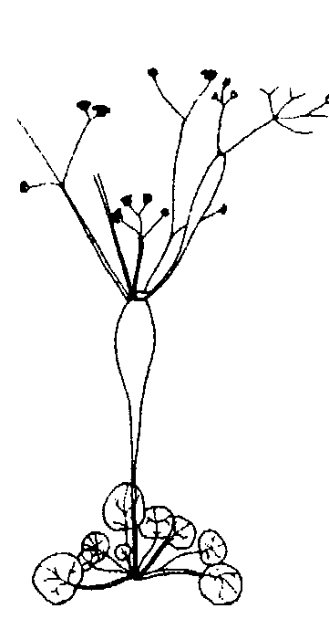

# 奥修：谭崔经典07

# 第四十九章 有意識的作為

## 經文：

> 73、在夏天的時候，當你看到整個天空是無盡地晴朗，進入這個清晰。

> 74、夏克提，看所有的空間，就好像已經在光亮之中被吸收到你自己的頭裡面。

> 75、清醒的時候，睡覺的時候，或做夢的時候，把你自己當作光。

當我洞察你的眼睛，我從來沒有看到你在那裡——就好像你是不在的。你不在地存在著，這就是所有受苦的核心。你一點都不在也可以活著，而如果你
不在，你的存在將會變成一個無聊，目前所發生的情况就是如此。所以我洞
察你的眼睛，我發覺你並不在那裡，你還沒有來，你尚未存在。那個情況就在
那裡，那個可能性就在那裡，你隨時都可以在那裡，但是你還沒有在那裡。

覺知到這個不在就是走向靜心旅程、走向超越的開始。如果你覺知到，不
不知道怎樣，你不在見了……你存在，但是你不知道爲什麼，你不知道怎樣，
你甚至不知道誰存在於你裡面。這個不覺知產生出所有的受苦，因爲，沒有
知覺的當中，你所做的任何事都將會帶來痛苦。重要的並不是你做什么，重要
的是你是用你的一在一来做，或是用你的一不在一来做。

不論你做什么，如果你能夠用你全然的一在一来做它，你的生命將會變成
狂喜的，它就會是一個喜樂。如果你做一件事，而你的一在並沒有在那裡，
你不在那裡，那麼你的生命將會變成一個受苦——它一定會這樣。地獄意味著
你的不在。

所以有兩種類型的求道者：其中一種類型的求道者一直都在尋求要做什
么。那種求道者是走在錯誤的道路上，因爲那個問題根本就不是在於作為，那
個問題是在於存在的狀態——有什麼存在，如何存在。

所以，永遠不要以行動和作為來思考，因為不論你做什麼，如果你不在，它將會是沒有意義的。

搬到喜馬拉雅山上一個與世隔絕的地方去住，不論你是在人群裡面行動或是
不在，你在那裡也會不在，不論你做什麼——在人群裡，或是在與世隔絕的地
方做——都將會帶來痛苦。如果你不在那裡，那麼不論你做什麼都是錯的。

第二種類型的人，正確的求道者類型，並不是在尋求要做如何存在。第一件事就是要如何存在。

有一個人來到佛陀面前，他充滿著慈悲和同情，他問佛陀說：「我能夠做什麼來幫助這個世界？」

據說佛陀在那個時候笑了，他告訴那個人說：「你什麼都不能做，因為你不存在。當你不存在，你怎麼能夠做任何事？所以不要去想世界，不要去想如
何服務這個世界，如何幫助別人。—佛陀說：「首先要存在，如果你存在，那
麼不論你做什麼都將會成為一種服務，它變成一種祈禱，它變成慈悲。你的
「在」就是轉捩點，你的「存在」就是革命。」

# 第四十九章 有意識的作為

通停止了，沒有一個人在移動。在開始的時候，它將只是幾個片刻，但即使只是那幾個片刻也具有蛻變的力量。漸漸地，頭腦將會慢下來，更大的空隙將會出現。將會有好幾分鐘沒有思想，沒有雲。當沒有思想，沒有雲，外在的天空和內在會變成一，因為只有思想是障礙，只有思想會創造出隔離的牆，就只是因為思想的緣故，所以外在是外在的，而內在是內在的。當思想不存在，外在和內在就失去了界線，它們變成一。事實上，界線從來不存在，它們的出現只是因為有思想，有障礙。靜心冥想天空是很美的，只要躺下來，忘掉地面，在任何孤獨的海灘上或任何地面上，用背部躺下來，只要看著天空，但是晴朗的天空將會是有幫助的——沒有雲的，無盡的天空。然後就只是看，注視著天空，感覺它的清晰——那個無雲，那個沒有界線的廣大一片——然後進入那個清晰，跟它合而為一。感覺好像你變成了天空，變成了那個空間。在開始的時候，如果你只是靜心冥想敞開的天空，不做其他任何事，那麼那些間隔將會開始出現，因為任何你所看的都會進入你，任何你所看的都會在內在擾動你，任何你所看的都會被照相起來、被反映。

## 內在

你看到一個建築物，你不可能只是看它，有某些事會立刻開始發生在你的非只是外在，有某些東西會在內在起動，那個映象，然後你就可以看到什麼，它並應，所以任何你所看到的东西都會塑造你、做成你、修飾你、創造你。外在經常跟內在關連著。

洞察敞開的天空是很好的，光是那個浩瀚的一片就很美了，完全沒有界線。你自己的界線將會消失，因為那個沒有界線的天空將會反映在你裡面。如如果你能夠注視而不要眨眼睛，那將會很好。如果你注視著，而不眨眼睛……因為你如果眨眼睛，你的思想過程將會繼續。只要注視，不要眨眼睛，注視著那個空，進入那個空，感覺你跟它合而為一，那個天空隨時都會進入你的內在。

首先你進入天空，然後天空進入你，有一個會合：內在的天空跟外在的空會合，在那個會合當中就是達成。在那個會合當中是沒有頭腦的，因為唯有當頭腦不存在，那個會合才可能發生。在那個會合當中，你首度不是你的頭腦。沒有混亂，如果沒有頭腦，混亂不可能存在。沒有痛苦，因為如果沒有頭腦

腦，痛苦也不可能存在。你是曾經觀察過這個事實——如果没有頭腦，痛苦也不可能存在？如果沒有頭腦，痛苦不可能存在。你是曾經觀察過這個事實——如果沒有頭腦，痛苦不可能存在？如果沒有頭腦，你不可能是痛苦的。那個源頭不在，要由誰來提供給你這個痛苦？如果有頭腦，你不可能是痛苦的。那個源頭不在，要由誰來使你痛苦？要由誰來使你痛苦？從相反的方向來說也是對的：如果沒有頭腦，你不可能是痛苦？要是沒的，如果有頭腦，你不可能是痛苦的，頭腦永遠不可能是喜樂的源頭。所以如果有頭腦，你不可能是痛苦的，頭腦永遠不可能是喜樂的源頭。充滿著新的生命，那個生命的品質是完全不同的，它是永恆的生命，不會被事情所污染，不會被任何恐懼所污染。在那個會合當中，你將會處於此時此地，在現在，因為過去屬於思想，未來也屬於思想。過去和未來是你頭腦的一部份。現在是存在，它不是你頭腦的一部分。這個片刻不屬於你的頭腦，那個走掉的片刻屬於你的頭腦，那個將會來臨的片刻屬於你的頭腦，這個片刻從來不屬於你，反而是你屬於這個片刻。你存在於這裡，就在現在這裡，你的頭腦存在於其他的地方，一直都在其他某一個地方。在於這裡，就在現在這裡，你的頭腦存在於其他的地方，一直都在其他某一個地方。卸下你的重擔。

### 諫崔經典（七） 18

我在閱讀一個蘇菲的神秘家，他走在一條孤獨的道路上，那是一條被遺棄的路，他看到一個農夫和他的牛車，那部牛車陷住在泥土裡，那條路崎嶇不平，那個農夫載著很多蘋果在他的牛車上，但是在那個崎嶇道路的某一個地方，那部車子後面的那一塊板子鬆掉了，然後那些蘋果就掉落滿地，但是他並沒有覺知到它，那個農夫並沒有覺知到它。

徒然，所以他想：一現在我們必須將牛車的擔子卸下，這樣的話也許我就能夠將它拉出來。一他往後一看，那些蘋果已經所剩無幾，那個擔子已經卸下。你可以感覺到他的痛苦。那個蘇菲徒在他的回憶錄中描述到，那個既生氣又苦惱的農夫作了評論，他說：一卡住了！有夠倒楣的，卡住了！而且居然沒有鬼東西可以卸下來！一唯一可能的是，如果他能夠將車上的東西卸下來，但是現在已經沒有東西可以卸下來！

很幸運地，你並不是以這樣的方式卡住，你可以卸下擔子——你的車子裝太多東西了，你可以將頭腦卸下，當頭腦不存在，你就飛起來了，你就會變得能夠飛翔。

## 這個技巧

這個技巧——洞察天空的清晰，然後跟它合而為一——是最常被練習的技
巧之一。有很多傳統都使用這個方法，尤其對現代的頭腦來講，它是非常有用 的，因為在地球上已經沒有什麼東西，在地球上已經沒有什麼東西可以被用來 靜心冥想了，只有天空。如果你看著我們的周遭，每一樣東西都是人造的，每一 樣東西都是有限的，都有一個界線、一個限制。只有天空，很幸運地，仍然可被用來 靜心冥想。 當試這個技巧，它將會有幫助，但是要記住三件事。第一：不要眨眼睛， 要注視，即使你的眼睛開始覺得疼痛不舒服，流眼淚，也不必擔心。甚至連那 些眼淚都將會是卸下重擔的一部分，它們將會有幫助，那些眼淚將會使你的眼 晴變得更天真、更新鮮——被洗濟了。你只要繼續注視。 第二個要點：不要去想關於天空的事，這一點要記住。你可能開始去想 關於天空的事，你可能會想起很多詩，有關天空的很多很美的詩，那麼你就會 錯過那個要點，你不可以去想它，你是要進入它，你是要跟它合而為一的，因 為如果你開始去想 關於天空的事，那個障礙就再度被創造出來了，你就再度錯過天空，你 就再度封閉在你自己的頭腦裡。不要想關於天空的事，要成為天空，只要注 視，同時進入天空，也讓天空進入你。如果你進入天空，天空也會立刻進入你。你要怎麼樣才能夠做到？你要怎麼做——這個進入天空？只要續注視，越來越遠、越來越遠。繼續注視，就好像你試著要去找到那個界線，深入它，盡可能地深入，那個深入將會打破障礙，這個方法至少必須練習四十分鐘，比它更少是不行的，比它更少將不會有太大的幫助。當你真的覺得你們已經變成一—，那麼你可以閉起眼睛。當天空進入了你，你就可以閉起眼睛，你將能夠在內在也看到它，那麼就不需要了，所以唯有在四十分鐘之後，當你覺得那個符合一發生了，你們之間有一種交融，你已經變成了它的一部分，而頭腦已經不復存在，那麼就閉起眼睛，停留在內在的天空。那個清晰將能夠幫助第三點：進入這個清晰。那個清晰將會有所幫助——那個沒有被污染的、無雲的天空。只要覺知那個清晰、那個純粹、那個天真。那些話語並不是要被重複的，你必須去感覺它們，而不是去想。一旦你往天空裡面注視，那個感覺將會出現，因為它們並不是由你來想像這些東西——它們就在那裡。

## 天空是純粹的

天空是純粹的，是存在裡面最純粹的東西，沒有什麼東西能夠使它變得不純。世界來來去去，土地出現，然後消失，但是天空依然保持純淨。那個純淨就在那裡，你不需要投射它，你只要去感覺它——你必須對它有接受性，這樣你才能夠感覺到它——而那個清晰就在那裡，讓天空在你身上發生，你無法強迫它，你只能讓它發生。 所有的靜心事實上都是讓事情發生，永遠不要以積極或帶有侵略性的態來思考，永遠不要以強迫事情來思考，你無法強迫任何事，事實上，因為你試著一直要強力介入，所以你創造出了所有的痛苦。沒有什麼事是可以被強迫的，但是你可以讓事情發生。要成為女性化的，讓事情發生，要成為被動的。 天空是完全被動的，根本不做任何事，只是停留在那裡。只要成為被動的，停留在天空底下——具有接受性、敞開、成為女性化的，在你的部分不能有積極的心態，那麼天空將會穿透你。 在夏天的时候，當你看到整個天空是無盡地晴朗，進入這個清晰。

## 但如果它不是夏天

但如果它不是夏天，你要怎麽辦？如果天空有很多雲，不晴朗，那麼就閉起你的眼睛，進入內在的天空。閉起你的眼睛，如果你看到某些思想，只要看它們，就好像它們是在空中飄浮的雲，要覺知那個背景，那個天空，不要去關心那些思想。

我們太過於關心思想了，而從來沒有覺知到那些空隙。一個思想經過，在另外一個思想進入之前有一個空隙，在那個空隙當中，天空就在那裡，然后，每當沒有思想的時候，有什麼東西在那裡？空在那裡。所以，如果天空有雲，它不是夏天，天空並不晴朗，那麼就閉起你的眼睛，將你的頭腦集中在那個背
景，集中在那個思想在裡面來來去去的內在天空，不要去注意那些思想，要意它們在裡面移動的那個空間。

## 比方說

比方說，我們坐在這個房間裡，我可以以兩種方式來看這個房間，我可以看著你，這樣我就會沒有注意到你所處的空間——那個寬敞的空間——我看著你，我將我的頭腦集中在你身上，而沒有集中在你所處的房間，或者，我可以
改變我的焦點：我可以看著那個空間，而不看你。你在那裡，但是我的著重
不需要等待夏天，因為我們的頭腦可能會找任何藉口，它們可能會說：「現在並不是夏天，即使現在是夏天，天空並不晴朗。」在裡面。

## 第二個技巧：夏克提

第二個技巧：夏克提，看所有的空間，就好像已經在光亮之中被吸收到你自己的頭裡面。 看所有的空間，就好像已經在光亮之中被吸收到你自己的頭裡面。在開始的時候它將會很困難，它是進階的技巧之一，所以，如果按部就班來進行是比较好的。做一件事：如果你想要做這個技巧之首先，當你要睡覺的時候，當你準備好入睡的時候，躺在床上，閉起你的的眼睛，感覺你的腳在哪裡。如果是六英呎高，或是五英呎高，只要感覺你的腳在哪裡，那個分界線。然後想像一件事：你變成比原來高六英吋，你的高度加高了，它多出了六英吋，閉著你的眼睛來感覺這個。在想像中，感覺你的高度變成多了六英吋。然後第二步：在內在感覺你的頭，它在哪裡，然後感覺你的頭也高出了六英吋。當你能夠感覺到這個，每一件事都將會變得很容易，然後你可以使它變得更多，你可以感覺你變成十二英呎高，或者你充滿了整個房間。现在，在你個屋子都進入你裡面，一旦你知道了那個感覺，它是很容易的。如果你能夠感覺你並不是五英呎高六英吋，那麼每一件事都會變得很容易。如果你能夠感覺並不是五英呎
高，而是五英呎六英吋，那麼就不會有困難，這個技巧做起來將會是容易的。它只是一種想像的訓練，然后再三天，感覺你再三天，感覺你充滿了整個房間，天，你已經變成了天空，那麼這個技巧將會變得非常容易。面。夏克提，看所有的空間，就好像已經在光亮之中被吸收到你自己的頭裡然後你可以開起你的眼睛，感覺整個天空、整個空間，都被你的頭所吸收。當你能夠感覺到這個，頭腦就消失了，因為頭腦需要一個非常狹窄的空間。在這麼寬廣的地方，頭腦無法存在，它會消失。在這麼寬廣的地方，頭腦是不可能的。頭腦只能是狹窄的、有限的，在這種無限的空間裡，頭腦沒有地方可以存在。這個技巧是很好的，突然間，頭腦會爆炸，那個空間就出現了，在三個月之內，你就可以感覺到這個。你的整個生命將會變得不同，但是要一步一步地
成長來成爲這樣，因爲有時候透過這個技巧，人们可能會發瘋，他們會失去平
衡。它是那麼地無與倫比，那個衝擊是那麼地無與倫比，突然間，如果你覺知
到你的頭吸收了整個空間，然後你看到星星和月亮在你裡面移動，整個宇宙，
你可能会變得暈眩。在很多傳統裡，這個技巧很小心地被使用著。

## 這個世紀的一個印度神秘家

這個世紀的一個印度神秘家，拉瑪替爾沙，曾經使用這個技巧，有很多人
在懷疑，有很多知道的人在懷疑，就是因爲用了這個技巧，所以他才自殺。對
他來講，它並不是自殺，因爲對他來講——對一個知道整個空間都進入到他裡
面的人來講，自殺是不可能的，它不可能發生。沒有一個人會在那裡自殺。但
是對別人來講，對那些從外在看的人來講，它是一種自殺。

## 他開始感覺

他開始感覺整個宇宙都在他裡面移動，在他的頭部裡面移動。他的門徒以
爲他在討論詩，然後他們

# 第四十九章 有意識的作為

它將需要花一些時間，但是如果你繼續想它、感覺它、想像它，在一段時間之後，你將能夠整天都記住它。在清醒的時候，走在街上，你是一個火焰在移動。在開始的時候，沒有人會覺知到它，但是如果你繼續做它，三個月之後，別人也會覺知到，唯有到那個時候，當別人也覺知到，你才會覺得安然。不要告訴任何人，只要想像一個火焰，而你的身體就只是圍繞著它的氣圍，不是一個實質的身體，而是一個電的身體，繼續做它。

有某些事發生在你身上。他們將會感覺到一種不同的溫暖。如果你碰觸他們，他們將會感覺到一種微妙的光圍繞著你。當你接近他們，他們，他們將會感覺到一種不同的溫暖。如果你碰觸他們，他們將會感覺到一種微妙的光圍繞著你。當你接近種好像火一般的碰觸，他們將會覺知到有某種奇怪的事發生在你身上。不要告訴任何人，當別人覺知到，你就可以覺得安然，然後你可以進入到第二步，在這之前是不行的。

第二步就是將它帶進夢裡，現在你可以將它帶進夢裡。它已經變成一個事實，現在它並不是一個想像。透過想像，你已經揭開了一個事實，它是真實的，每一樣東西都是由光所組成的，你就是光，因為每一個物質的微粒都是光，只是你並沒有覺知到那個事實。 科學家說，它是由電子所組成的，它是同樣的東西，光是一切的源頭，你 也是濃縮的光，透過想像，你揭開了一個事實。吸取它，當你變得非常充滿 它，你就能夠夠將它帶進夢裡，在這之前是不行的。 然後，當你進入睡眠的時候，繼續想著那個火焰，繼續看著它，感覺你就 是那個光。記住它……記住……記住……然後進入睡眠。那個記憶還持續著。 在一開始的時候，你會做一些夢，在那些夢裡面，你會覺得你的內有一個火 焰，你是光。漸漸地，在夢中你也会以同樣的感覺來行動，一旦這個感覺進入 到夢裡，夢將會開始消失。夢將會開始消失：夢將會越來越少，然後睡眠會越 來越深。 當在你的夢中，這個事實都被顯現出來——你就是光，是一個火焰，一個 燃燒的火焰——所有的夢都將會消失。唯有當夢消失，你才能夠將這個感覺帶 入夢裡，在這之前是不行的。現在你已經在那個門口。當夢消失，你記住你自 己是一個火焰，那麼你就在睡眠的門口，現在你可以帶著那個感覺進入。一旦 你帶著你是一個火焰的感覺進入睡眠，你在它裡面將會是覺知的——現在睡眠
只會發生在你的身體，而不會發生在你。這個技巧是要幫助你超越這三種狀態，如果你能夠覺知到你是一個火焰，一個光，那個睡眠並不會發生在你身上，你是有意識的。你攜帶著一個有意識的努力，現在你在那個火焰的周圍結晶起來，身體在睡覺，但是你沒有在睡覺。這就是克里虛納在吉踏經裡面所說的：瑜伽行者是從來不睡覺的。當別人在睡覺，他們是清醒的。並不是說他們的身體從來不睡覺，他們的身體會睡覺，但就只是身體在睡覺。身體需要休息，意識不需要休息，因為身體是運作機構，而意識並不是一個運作機構。身體需要燃料，它們需要休息，所以它們被生下來，它們是年輕的，然後它們變老，然後它們死掉。意識從來不出生，從來不會變老，也從來不會死，它不需要燃料，不需要休息，它是純粹的能量，永續的、永恆的能量。如果你能夠攜帶著這個火焰和光的形象穿過睡眠的門，你將永遠不會再睡覺，只有身體會休息。當身體在睡覺，你將會知道它，一旦這樣的事發生，你就變成了那個「第四的」，如此一來，清醒、做夢、和睡眠都是頭腦的一部份。它們是部分，而你變成那個「第四的」——一個經歷過所有它們，但不是
它們其中之一的。

事實上，這是非常簡單的，如果你處於清醒的狀態，然後你進入夢裡，你
不可能是其中之一。如果你是清醒的狀態，那麼你怎麼可能做夢？而如果你是
做夢的狀態，你怎麼可能進入一個沒有夢的睡眠？你一定是一個遊走的人，這
些狀態一定是據點，所以你能夠從這裡移到那裡，然後再回來。然後在早上的
時候，你又会再度進入清醒的狀態。
這些是狀態，而那個在這些狀態裡面遊走的人是你，但那個「你」是一「第
四的」，那個「第四的」就是你所說的靈魂。那個「第四的」就是你所說的神
性，那個「第四的」就是你所說的不朽的元素，永恒的生命。
清醒的時候，睡眠的時候，或做夢的時候，把你自己當作光。
這是一個很美的技巧，但是首先要清醒的狀態嘗試它。記住，唯有當別
人覺知到，你才能夠算成功。他們將會覺知到，然後你就可以進入夢裡，然後
進入睡眠裡，然後你會醒悟而成为那個你所是的一那個「第四的」。

# 第五十章 移到根部

## 問題摘要：

完全忽視外在是不是一種錯誤？所有的靜心技巧不都是一個為「嗎？頭腦的成長不是會導致清晰嗎？為什麼我們繼續在製造痛苦？

## 第一個問題：

昨天晚上你說，藉著改變外在的，那個內在的仍然保持不被改變，不被蛻
變，但是正確的食物、正確的勞動、正確的睡眠、正確的行動和行為對內在的 蛤變不也是重要的因素嗎？完全忽視外在是不是一種錯誤？ 外在的無法改變內在，但是外在的能夠有所幫助，或者它有可能會阻礙。 外在的能夠創造出一個情況，使得在那個情況下，那個內在的能夠更容易爆 發。必須記住的事是：外在的蛻變並不是內在的。即使你做盡每一件事，而那 個情況就在那裡，那個內在的也不會爆發。那個情況是必要的，它是有幫助的，但它並不是蛻變。那些涉入外在的人…… 外在是一個廣大的現象，你可以繼續改變好幾世，但是你永遠不會滿意， 總是還有一些東西可以被改變，因為除非內在改變，否則外在的永遠無法完 美。你可以繼續改變它、磨光它、制約它，你還是永遠不會覺得滿足，你還是 永遠不會來到一個你可以覺得一現在那個場地已經準備好了一的情況。有很多 人就是這樣浪費掉了他們的生命。 如果你的頭腦執著於外在——食物，衣服，行為……我並不是說要忽視它 們，不，我要說的是，不要執著於它們。它們能夠有所幫助，但是如果你的頭
腦執著於它們，它們可能會變成很大的障礙。那麼它就變成一種逃避，那麼你觸，內在仍然保持一樣。你可以繼續改變外在，但是內在甚至不被它所碰有一隻老鼠非常害怕貓——經常處於恐懼和焦慮當中。牠會睡不著，牠會夢到貓，然後會顫抖。有一個魔術師基於憐憫，將那隻老鼠蝕變成一隻貓。外在改變了，但是那隻在貓裡面的老鼠變得害怕狗。那個顫抖仍然持續著，那個痛苦仍然存在在，牠所做的夢仍然是恐懼的夢。所以那隻魔術師將那隻貓變成一隻狗，那隻狗立刻變得害怕老虎，因為那個內在的老鼠仍然保持一樣。那個老鼠並沒有被改變，只是外在的身體被改成一隻老虎，那隻在老虎裡面的老鼠立刻變得害怕獸人，所以那個魔術師告訴那隻老鼠：—現在再變成一隻老鼠，因為我可以改變你的身體，但是我無法改變你。你具有一隻老鼠的心，所以我能怎麼辦呢？——一隻老鼠的心！

你可以繼續改變外在，但是那顆老鼠的心仍然保持一樣，那顆心產生難題。形狀將會改變，形式將會改變，但是本質將會保持一樣。你所害怕的是貓、狗、或老虎都沒有差別，問題不在於你是害怕的。那個重點是——我所要強調的是——你必須覺知到，你外在的努力不可以變成內在的代替品……這是一件事。取得你所能夠取得的每一種幫助，吃正確的食物是很好的，但是執著於食物是沒有意義的、瘋狂的；有正確的行為是好的，但是執著於它是神經症的，你不可以瘋狂地追逐任何事物。在印度，有很多宗派的門徒執著於食物，整天他們就只是在想食物，要吃什麼，不吃什麼，要由誰來準備食物，而不可以由誰來準備食物。有一次，我跟一個門徒一起旅行，他只喝牛奶，而且必須是白色乳牛的牛奶，否則他就不喝，這個人 是瘋狂的。記住，內在是重要的，有意義的，外在有幫助的，它是好的，但是你不可以集中焦點在它上面，它不可以變得太重要而使得那個內在的被遺忘。那個內在的必須保持是內在的，而且是中心的，而外在的，如果可能的話，必須被改變來作為幫助。

不要完全忽視它，不需要忽視它，因爲事實上外在也是內在的一部分，它並不是跟它對立的，它並不是跟它相反的，它並不是某種強加在你身上的東西，它就是你。但是內在是中心，外在是外圍，所以視那個外圍的需要，或是那個界線的需要給予足夠的重視，但界線並不是你的房子，所以要照顧它，但是不要瘋狂地追逐它。我們的頭腦一直都想要逃避。如果你能夠涉入食物、性、衣服、或身體，你的頭腦將會比較安然，因爲這樣你就不必走向內在，如此一來就不需要改變頭腦，如此一來就不需要摧毀頭腦，不需要超越頭腦。食物改變了，但是同樣頭腦可以存在。你也许會吃這個或吃那個，同樣的頭腦可以存在。唯有當你走向內在……你越深入到內部，你所擁有的這個頭腦就越必須停止。向內的路是走向沒有頭腦的路。頭腦會害怕，它會試圖找出一些逃避的方式，找出某些跟外在有關的事，然後頭腦就能夠以它現在的方式存在，不論你做什麼都没有差別，你做什麼是無關的——這個頭腦還是能夠存在，這個頭腦還是能夠找出如何能夠保持跟原來一樣的方式。有時候，當你在跟自然的出口抗爭，你的頭腦將會找到一些異
常的出口，那是更危險的。沒有成為一個幫助，它們將變成障礙。

我聽說木拉那斯魯丁從樓梯上掉下來，他的腳骨折了，所以裏上石膏，他
被告知有三個月的時間，他不可以上下樓梯。三個月之後，他去找醫生，將石
膏拿掉，木拉說：—現在我可以上下樓梯了嗎？—

醫生說：—現在你可以了，你完全沒有問題。—

木拉說：—現在我覺得非常快樂，醫生，你無法相信我有多快樂，我整天
在上下排水管的時候非常笨拙。有三個月的時間，我每天都在排水管上上下
下，非常笨拙，所有的鄰居都笑我，但是因為你叫我不要上下樓梯，所以我必
須找其他的方法。—

這就是每一個人在做的，如果一個出口被堵住了，那麼異常現象一定會發
生。你不知道頭腦的方式，它們非常狡猾、非常微妙。人們帶異常現象的問題來
找我，那個問題似乎很明顯，但是其實不然。所有的问题似乎都很明顯、很清
楚，但是其實不然。在內在深處隱藏著其他的東西，除非其他的那個東西被知
道、被拋棄、被超越，否則那個問題還是會存在，它會改變它的形式。

有人抽煙抽得很兇，他想要戒煙，但抽煙本身並不是問題之所在，那個問
題是其他的。你可以停止抽煙，但那個問題還是會存在，而它會透過其他的方
式來呈現。你會在什麼時候抽煙？當你焦慮緊張的時候，你就開始抽煙，抽煙
能夠幫助你，你會覺得更有自信、更放鬆。

只是藉著停止抽煙，你的神經系統將不會改變，你還是會覺得緊張，你還是會覺得焦慮，焦慮的心境還是會出現，然後你會去做其他的事，你可以找到
一個很美的替代品，它看起來非常不同，你可以做任何事，你可以只頌念一
個咒語而不抽煙，每當你覺得緊張，你就開始唸：「南無、南無、南無……」

任何可以持續的事。

你用抽煙在做什麼？它是一個咒語，你將煙吸進來，然後吐出去，吸進
來、吐出去，它變成一件重複的事，因為重複的緣故，所以你覺得放鬆，你重
複任何事，同樣的情況都會發生。但是如果你使用一個咒語說：「南無、南
無、南無……」沒有人會說你做錯事，但那個問題是一樣的。

現在你用念咒在做它。重複能夠有幫助，任何無意義的事都會有所幫助，你
只要持續地重複它。當你重複一件事，它會讓你放鬆，因為它會產生無聊，而
[PAGE 48]

# 譚崔經典（七） 44

著重在內在就是著重在那個主要的。那個內在的仍然是自由的，它是自
由。那個外在的是一種奴役，因為唯有當那個外在的發生，你才能夠知道它，
然後你已經無法對它做什麼。你能夠對你的過去做什麼？它無法不被做，你無
法往回走，你無法對過去做任何事，它是一種奴役。

如果你正確地了解它，那麼你就能夠了解一業一的理論，行動的理論。這
個理論──印度的成就最主要的部分之一──就是，除非你超越了了，現在要記住：這就是你要坐的方式。但是要達到不努力需要耐心和漫長的努力。在開始的時候會有努力，會有作為，但只是在開始的時候，那是一個必要的罪惡，但是你必須經常記住，你必須超越它，有一個片刻必須來到，到時候你在靜心當中並沒有做任何事，只是在那裡，它就發生，只是坐著或站著，它就發生，什麼事都不做，只是覺知，它就發生。所有這些技巧都是只要幫助你達到一個不努力的片刻。內在的蛻變，內在的達成，無法透過努力而發生，因為努力是一種緊張，有了努力，你就無法全然地放鬆，那個努力將會成為一個障礙。有這個背景在你的頭腦裡，如果你做努力，漸漸地，你將會變得也能夠離開它。它就好像游泳一樣，如果你會游泳，你知道在開始的時候你必須做一些努力，但只是在開始的時候，一旦你知道了它的感覺，一旦你知道它是怎麼樣，那個努力就消失了，你可以不努力地游泳。即使一個很好的泳將也無法說出游泳是什麼，以及很精確地說出他是怎麼做的。事實上他並沒有做什麼，他只是讓他自己處於一個很深的對水和對河流反應的關係，他事實上並沒有做任何事，如果他仍然在做，他還不是一個游泳專家，他還是一個業餘的，他還在學習。

廟，尤其是那個門。所以，做出了很多設計，他有一個佛教的和和尚受命去設計一座新的以他叫那個門徒來到他的身邊。當他在設計的時候，那個門徒就只是在旁邊看，如果他喜歡它，他必須說那沒有問題，那很好。如果他不高歡，他就必須反對。那個師父說：一唯有當你說好，我才會把那個設計送出去，如果你繼續反對，我就会將那個設計拋掉，然後再創造出一個新的。在這種方式之下，有好幾百個設計被丟棄了，三個月過去了，即使師父本身也開始害怕，但是他的話已經講出去了，所以他必須遵守它。那個門徒就在那裡，師父會作出新的設計，然後那個門徒會說不好，師父就會再開始另外一個設計。有一天，那個墨水快要沒有了，所以師父說：一去幫我找一些墨水來。一那個門徒出去了，師父忘了他，忘了他的一在，所以變得毫無努力，他的那個門徒在那裡判斷的概念經常在他的腦海裡，他經常在懷疑，他是否會喜歡它，他是不是會再度將它丟棄，這產生出一种內在的焦慮，師父就無法成為自發性的。那個門徒不能這樣做了，那個設計完成了，那個門徒回來，他說：「太棒了！之前你為什麼不能這樣做？——師父說：「現在我已經知道為什麼，因為你在這裡。因為你，我一直在努力想要得到你的認可，那個努力摧毀了整個事情，我無法成為自然的，我無法流動，因為你，我無法忘掉我自己。」每當你在做靜心的時候，那個你在做它的努力，那個你想要在裡面成功的概念，就是障礙。要覺知到它，繼續做，要覺知到它。有一天將會來臨……透過耐心，有一天將會來臨，到時候那個努力就不在了。事實上，你不在那裡，只是靜心在，它也許需要花一段很長的時間，它無法被預測，沒有人能夠說它什麼時候會發生，因為如果某件事是要藉著努力來達成的，它是可以預測的，如果你做這麼多的努力，你將會成功。但是唯有當你變得不努力，靜心才會成功，所以它是不能預測的，無法說你將會在哪裡時候成功，你也許在這個片刻就成功了，或者你也許很多世都不能成功。整個事情就繫於一件事：當你的努力消失，你就變成自發性的，當你的靜心就只是像愛一樣……假化了，它將會變成人造的，它將不會進入很深，你將不會在它裡面，它將會變成一個演戲。愛存在——你無法對它做什麼。你也無法對靜心做什麼，但我並不是意味著不要做任何事，因爲這樣的話，你將會停留在你原來的狀態。你必須做些什麼，但是你要很清楚地意識到，只是藉著作為，你將無法達成。在開始的時候，作為是需要的，一個人人不能就讓它這樣，一個人必須經歷過它。一個人一定要經歷過它，一個人必須超越它，一種不努力的飄浮必須被達成。那個途徑是費力的，而且非常矛盾，你無法找到任何比靜心更矛盾的事，它的矛盾是因為它必須以努力作為開始，但是在結束的時候必須成為不努力的面，它會發生，你也許無法邁轉地構思它是怎麼發生的，但是在存在裡消失了的。它以這樣的方式發生在佛陀身上，有六年的時間，他做盡了每一種可能的

面，它會發生。有一天會來臨，到時候你對你的努力已經覺得非常夠了，它就
# 第五十章 移到根部

## 心的點：自我的執行，自我的發展，一個堅強自我的達成，這一直 是整個西方的努力。在東方，它一直是如何達成無我，如何成為一個非自我，如何忘掉，臣服，將自己完全融解掉，好讓你成為無我。東方一直在試圖達成無我，而西方一直在試圖達成完美的自我，但事情的矛盾就是：如果你沒有一個發展得很好的自我，你你就無法臣服。唯有當你有一個非常完美明確的自我，你才能夠臣服，否則你無法臣服，因為要由誰來臣服？

服，否則你無法臣服，因為要由誰來臣服？所以對我來講，這兩者都只是一半，這兩者都會處於痛苦之中——東方和西方都是如此。因為東方採用了無我，那是最後的部分，開始的部分缺失了。

要由誰來交出自我？要由誰來臣服？那個山峰不在那裡，所以要由誰來創造那個山谷？唯有在一個山峰的周圍才能創造出山谷，那個山峰越高，山谷就越深。如果你沒有一個自我，或者你的自我只是溫溫的，臣服是不可能
的，或者你的臣服將會是一個溫溫的臣服，就只是馬馬虎虎，從它不會有什麼
事發生，不會有爆發。
在西方，他們強調開始的部分，所以你可以繼續滋長你的自我，它將會產
生出越來越多的焦慮，當你真正創造出它，你不知道要用它來做什麼，因為那
個終點的部分不在那裡。
對我來講，心靈的找尋是兩者。創造出一個很高的頂峰，創造出一個完美
的自我，只是為了要來融解掉它。那似乎是荒謬的——只是為了要來融解掉
它，只是為了要來達到一種很深的臣服，只是為了要在某個地方失去它。你無
法失去你所沒有的東西。所以，就我的看法，人類必須就這兩件事一起被訓
練：幫助每一個人創造出一個完美的自我，一個己經被達成的自我——但這只
是旅程的一部分——然後幫助他們臣服，將自我交出來。
那個山峰越高，那個山谷就會越深。自我越高，當你臣服的時候，你就会
進入越深，每一件事物都是這樣。在心靈的道路上，記住這個持續的矛盾，甚
至一個片刻都不要忘記它，成為一個完美的自我主義者，好讓你能夠臣服，好
讓你能夠融解掉，做盡一切你所能夠做的努力，只是為了要達到一個努力會離

開你，然後你成為完全不努力的點。 第三個問題： 昨天晚上你說頭腦越成長，你就越會知道頭腦的本質就是混亂，但頭腦的成長不是也會導致清晰嗎？ 我剛剛所說的也是跟這個有關。 是的，它會導致清晰，但是唯有當你有一個非常成熟的頭腦，你才會覺知到你是混亂的。即使要覺知到頭腦是混亂，也需要一個高度發展的頭腦，那些沒有覺知到他們的頭腦是混亂的人事實上並不是成熟的頭腦，他們是孩子氣的、幼稚的，還在發展之中。只有非常成熟的頭腦能夠覺知到頭腦的品質，能夠知道它是混亂。唯有當你的頭腦已經發展過了，靜心才可能，因為靜心是相反的目標。 靜心意味著沒有頭腦，但是如果你沒有先達成一個頭腦，你怎能夠達到
沒有頭腦？所以，達成一個頭腦只是為了要失去它。不要以為，如果到了最後
人們必須達到沒有頭腦的狀態，那麼達成一個頭腦有什麼用？——因為如果你
沒有達成一個頭腦，那個最終的將不會發生在你身上。唯有當有頭腦存在，它
才能夠發生，所以我並不反對頭腦，我並不反對理智，事實上，我並不反對任
何東西，我贊成每一樣東西，因為每一樣東西都可以被利用來達到相反的那一極。
有正反兩極，如果正反兩極不存在，相反的那一極無法被達成。一個瘋子
無法靜心，為什麼？因為他没有頭腦，但是這個沒有頭腦可以有兩個層面：在頭腦之下和在頭腦之上。在頭腦之上是沒有
腦。沒有頭腦之下也是沒有頭腦。你可以從頭腦掉下來，頭腦變得不在，但它
頭腦，在頭腦之下也是沒有頭腦。你可以從頭腦掉下來，頭腦變得不在，但它
不是靜心，你甚至喪失了那個將會變成走向靜心的一步的頭腦。所以我並不反對頭腦，發展頭腦，發展理智，但是要好好地記住，這只是一個手段，手段是必須被拋棄、被
- 你可以掉到頭腦之下，那麼沒有頭腦也會發生，但它並不是靜心，你甚至喪失了那個將會變成走向靜心的一步的頭腦。所以我並不反對頭腦，發展頭腦，發展理智，但是要好好地記住，這只是一個手段，手段是必須被拋棄、被
- 永遠都要記住，因為它們非常類似，所以你可能會誤解整個事情，它們真的非常類似。比方說，一個小孩是天真的，一個聖人也是天真的——一個耶穌或一個克
里虛納——但他們的天真並不是幼稚的，它是像小孩一般的，不是幼稚的，因
为小孩的天真只是因為他的無知，他的天真是一種負面的現象，只是那個不

在，遲早每一件事都會爆發，他是一個等著要爆發的火山，那個天真只是火山
為小孩的天真只是因為他的無知，他的天真是一種負面的現象，只是那個不

- 一個聖人是一個超越頭腦的人，那個爆發已經發生了，那個火山再度變寧靜，但這個寧靜是不同的。第一種寧靜很有內涵，有某樣東西在那裡，那個寧靜只是表面上的，在內在深處，那個小孩準備要被打擾，而聖人已經經歷過那個很深的差别。 個打擾，那個飆風已經走掉了，這個寧靜和天真看起來很類似，但是有一個很深的差别。 所以有時候一個白痴看起來好像是聖人。白痴很像聖人，他們不狡猾，要狡猾的話需要聰明才智；他們不算計，算計需要頭腦。白痴是單純的、天真 的、不狡猾的、不算計的，他們不可能欺騙任何人，並不是說他們不喜歡這樣做，做，而是他們沒有那個能力。他們看起來像聖人一樣，而有时候聖人看起來就像白痴一樣，因為同樣的事再度發生了，只是在一個不同的，全不同的層面。 你可以掉到頭腦之下，那麼沒有頭腦也會發生，但它並不是靜心，你甚至喪失了那個將會變成走向靜心的一步的頭腦。所以我並不反對頭腦，發展頭腦，發展理智，但是要好好地記住，這只是一個手段，手段是必須被拋棄、被
- 永遠都要記住，因為它們非常類似，所以你可能會誤解整個事情，它們真的非常類似。
- 比方說，一個小孩是天真的，一個聖人也是天真的——一個耶穌或一個克
里虛納——但他們的天真並不是幼稚的，它是像小孩一般的，不是幼稚的，因
为小孩的天真只是因為他的無知，他的天真是一種負面的現象，只是那個不

在，遲早每一件事都會爆發，他是一個等著要爆發的火山，那個天真只是火山
為小孩的天真只是因為他的無知，他的天真是一種負面的現象，只是那個不

- 一個聖人是一個超越頭腦的人，那個爆發已經發生了，那個火山再度變寧靜，但這個寧靜是不同的。第一種寧靜很有內涵，有某樣東西在那裡，那個寧靜只是表面上的，在內在深處，那個小孩準備要被打擾，而聖人已經經歷過那個很深的差别。 個打擾，那個飆風已經走掉了，這個寧靜和天真看起來很類似，但是有一個很深的差别。 所以有時候一個白痴看起來好像是聖人。白痴很像聖人，他們不狡猾，要狡猾的話需要聰明才智；他們不算計，算計需要頭腦。白痴是單純的、天真 的、不狡猾的、不算計的，他們不可能欺騙任何人，並不是說他們不喜歡這樣做，做，而是他們沒有那個能力。他們看起來像聖人一樣，而有时候聖人看起來就像白痴一樣，因為同樣的事再度發生了，只是在一個不同的，全不同的層面。 你可以掉到頭腦之下，那麼沒有頭腦也會發生，但它並不是靜心，你甚至喪失了那個將會變成走向靜心的一步的頭腦。所以我並不反對頭腦，發展頭腦，發展理智，但是要好好地記住，這只是一個手段，手段是必須被拋棄、被
# 最后一個問題：

我們常常覺得我們創造出我們自己的痛苦。儘管如此，為什麼我們還繼續在創造它們？一個人什麼時候以及要如何才能夠停止製造自己的痛苦？第一個而且是非常基本的要了解的事是：每當你說：我們常常覺得我們創造造出我們自己的痛苦，事情並不是這樣

## 譚崔經典（七） 72

所引起的，只有宗教說痛苦是由你自己所引起的，所以宗教使你成爲你自己命運的主人。你是你痛苦的原因，因此你也可以是你喜樂的原因。

## 73 第五十一章 回到存在

## 回到存在 第五十一章

## 經文：

76、在下雨的黑夜，進入那個黑暗，將它視為所有形式中的形式。77、當不是無月的雨夜，開起眼睛，找到在你面前的黑暗。睜開眼睛，看黑暗。就這樣，過錯就永遠消失。78、在你注意力所及的地方，就在這個點上，經驗。有一次，一個doctor（醫生或博士），一個非常有名的歷史學家同時也是一個著名的學者，待在一個村子裡。那個郵政局長，那個村子裡面年老的郵政

局長，對這個老年人、這個醫生很好奇。他很想要知道他是一個什麼樣的醫生，所以有一天他問說：「先生，你是哪一種doctor？」那個人說：「我在这裡從來沒有聽過這種疾病的個案。」他說：「我在这裡從來沒有聽過這種疾病的個案。」不要笑它，因為就某方面而言，那個年老的郵政局長是對的，哲學是一種疾病。當然，哲學博士並不是醫生，它們是一種疾病的個案來想它。它是人類天生就有的，它跟人類或人類的頭腦一樣地古老，而每一個人或多或少都是一個受害者，因為思想無法引導到哪裡，或者，它會引導你進入惡性循環。你會移動得很快，如果你是專家，你會移動得很快，但是你哪裡都到不了。」這必須被深入了解，因為如果你無法了解，同時感覺到這一點，你就無法「跳」進靜心。靜心意義著非常相反的作法——跟哲學相反。哲學意味著思想，而靜心意義著一種不思想的狀態，它們是相反的兩極。這是人性——思考問題，同時試圖找出答案。但透過哲學是不會有答案的。科學會來到某種答案，因為科學依靠思考，也依靠實驗。思考只是用來作為一個幫助，但那個基礎是實驗。那就是為什麼科學給出了某些答案。哲學家，不論是知名的或不知名的，好幾世紀以來都一直在下功夫，但是從來沒有達成一個答案或一個結論，它無法被達成。思考的本質就是，如果你用思考作為幫助來走向實驗，那麼有一些事可以被達成，所以科學會得到一些答案。但是宗教也會得到一些答案，因為宗教也是實驗。科學是用客體來作實驗，而宗教則是用主體來作實驗，這兩者都是實驗，這兩者都依靠實驗。在這兩者之間是哲學——只是純粹的思考，抽象的思考，沒有實驗。你可以一直一直繼續下去，但是哪裡都到不了。抽象的思考，純理論的思考，是一種可以無限延伸的思考。你可以享受到它，你可以享受那個旅程，但是沒有目標。

無限延伸的思考。你可以享受到不了。抽象的思考，純理論的思考，是一種可以就某方面而言，宗教和科學是類似的，它們兩者都相信實驗。當然，宗教

的實驗比科學的實驗來得更深，因為在科學裡面，實驗者本身並沒有涉入，他的實驗比科學的實驗來得更深，因為在科學裡面，實驗者本身並沒有涉入，他

用一些工具在做，用一些東西在作實驗，他用客體在做，他本身則保持超然，

他停留在那個實驗之外。宗教是一種更深的科學，因為那個實驗者本身變成了

實驗的對象，除了他之外沒有其他的工具，除了他之外沒有其他的客體。他兩

者都是，既是他的工具，也是他的客體和他的方法，他什麼都是，他必須在他

自己身上工作。

它是辛苦且費力的，因為你必須涉入，它是辛苦且費力的，因為你涉入

了，所以那個實驗變成經驗。在科學裡面，實驗就是實驗，那個科學家不會被

它所碰觸到，不會被它所蛻變，那個科學家將會保持一樣，但是在宗教裡面，

在經歷過實驗之後，你將會成為一個完全不同的人，你不可能在出來的時候還

是一樣，你一定會改變，那就是為什麼宗教的實驗變成經驗。

記住，你可以繼續想關於神、靈魂、和彼岸的事，你也可以假装藉著想

神，你就知道一些關於神的事，但那將會是虛假的。你不可能知道任何關於神

的事，一關於一這個字眼本就是荒謬的。你可以知道神，但是你不可能知道

一關於一，那個一關於一創造出哲學。

你怎麼可能知道關於神的事？或者，你怎麼可能知道關於愛的

事？你可以知道愛，但是你無法知道關於愛的事，因爲「關於」意味著別人知道，而你相信他的知識。你搜集意見，你說：「我知道一些關於神的事。」所有哪些一關於一的知識都是虛假的、危險的，因爲你可能會被它所騙。你可知道神，你可以知道愛，你可以知道愛，你可以知道愛，你可以知道神，你可以知道愛，你可以知道你自己，但是忘掉那個一關於一於一，那個一關於一是哲學。優婆尼沙經說了一些事，吠陀經說了一些事，聖經說了一些事，可蘭經說了一些事，但是對你來講，所有那些都將會變成一關於一，除非它變成你的經驗，否則它是沒有用的、浪費掉的。以開始想關於靜心的事，你可以使任何事成爲思想的客體，甚至連關於靜心的事，你開始想關於靜心的事，你可以繼續想關於它的事，但是將不會有什麼事發生。我談論很多方法，這有一個危險：你可能会開始想這些方法，你也會變成知識豐富的，那是不行的，那是有用的。它不僅沒有用，它也是危險的，因爲靜心是經驗，而不知道一關於一什麼是没有價值的。記住一經驗一這個字，生命的問題，所有生命的問題，都是存在性的，它們不是理論性的，你無法藉著思考來解決它們，你只能藉著經歷它們來解決它

們。透過經歷，未來就打開了；透過思考，未來從來不會打開，相反地，甚至連現也在關閉了。

你也许沒有觀察到：每當你思考的時候，會有什麼樣的事發生？每當你思考，你就關閉了，所有那些現在的都消失了，你進入了你腦裡面一個做夢的路線，一句話產生出另外一句，一個思想產生出另外一個思想，然後你就繼續移動。你越是在思想裡面移動，你就越遠離存在。思考是一種離開的方式，它是一種做夢的方式，它是在觀念裡面做夢。回到地面上來，就這個意義來講，宗教是非常著根於地的，不是世俗的，而是非常著根於地的、有實質的，回到了存在。

唯有當你深深地著根於存在，生命的問題才能夠被解決。在思想裡面飛翔，你就離開了根，你離根離得越遠，你就越不可能解決任何事。相反地，你將會混亂每一件事，每一件事都將會變得更糾纏不清。當它變得越糾纏不清，你就又想得更多，然後你就越離越遠，對思想要小心！現在讓我們來進入這些技巧。

76、融入黑暗。

第一個黑暗的技巧：在下雨的黑夜，進入那個黑暗，將它視為所有形式中

的形式。

曾經有一個非常古老的奧秘學校，你可能沒有聽過。那個學校被稱為亞森

尼斯（Essenes）。耶穌是在那個學校被教導的，他屬於亞森尼斯的團體，那個

團體是世界上唯一認為神是絕對的黑暗的團體。可蘭經說神是光，優婆尼沙經

說神是光，聖經也說神就是光。亞森尼斯是世界上唯一說神是絕對的黑、絕對

的暗、無限的黑夜的傳統。

這是非常美的，很奇怪，但是非常美，而且非常有意義，你必須了解那個

意義，那麼這個技巧將會非常有幫助，因為這是亞森尼斯所用來進入黑暗變成

跟它合而為一的技巧。

想想看，為什麼神到處都被比喻為光？並不是因為神是光，而是因為人們

害怕黑暗，這是人類的恐懼——我們喜歡光，我們害怕黑暗，所以我們不會把

[content]
神想成黑暗。這是人們的觀念，我們把神想成光，因為我們害怕黑暗。我們的神是由我們的恐懼所創造出來的，我們給祂們形狀和形式，那個形狀和形式是由我們所給予的，它顯示出某些關於我們的事，而不是關於我們的神，祂們是我們所創造出來的。我們在黑暗中會害怕，所以神是光，但是這些技巧屬於另外的學派。亞森尼斯說神是黑暗，這種說法有其意義。第一，黑暗是永恆的。光來了又去，黑暗仍然保持，早晨的時候，太陽會升起，然後會有光，到了晚上太陽下山之後就變成黑暗。黑暗不需要有什麼東西的升起，它一直都在那裡，它從來不升起，也從來不落下。光來了又去，黑暗仍然保持。光一直都有一個源頭，頭，黑暗是沒有源頭的。那個有源頭的不可能是無限的，只有那個沒有源頭的可以是無限的和永恆的。光有某種打擊，所以你無法在光裡面睡覺，它會創造出緊張。黑暗是放鬆，全然的放鬆。但是為什麼我們害怕黑暗？因為光在我們看起來好像是生命——它是如此。生命是透過光而來的，當你死掉，它看起來好像是死亡——它是如此。生命是透過光而來的，當你死掉，它看起來好像是你掉進了永恆的黑暗。那就是為什麼我們將死亡畫成黑色的，

[content]
黑色也變成了哀悼的顏色。神是光，而死亡是黑色的。但這些是由我們的恐懼所投射出去的。事實上，黑暗具有無限性，而光是有有限的。但黑暗似乎是子宮，每一樣東西都從它產生出來，然后再度进入它裡面。亞森尼斯採取這個觀點，它非常美的，而且也非常有幫助，因為如果你能夠爱黑暗，你就不會對死亡有害怕。如果你能夠進入黑暗——唯有當沒有害怕，你才能夠進入——你將可以達到全然的放鬆。如果你能夠跟黑暗合而為一，就融解了，它是一種臣服。如此一來你就沒有恐懼，因為如果你跟黑暗合而為一，你就跟死亡合而為一，如此一來你就不會死，你變成不朽的。黑暗是不朽的。光誕生，然后死掉，黑暗只是存在，它是不朽的。對於這些技巧，首先你必須記住，在你的頭腦裡，你不可以有對黑暗的害怕，否則你怎么能夠做這個實驗？首先，那個恐懼必須被拋掉，所以，在準備動作的時候先做一件事：坐在黑暗裡，将燈光熄掉，感覺那個黑暗。對它抱持一種爱的態度，允許黑暗来碰觸你。看著它，在一個黑暗的房間裡或是黑暗的夜晚啟開你的眼睛，跟它在一起，跟它交融，融入那個關係。如果你變得害怕，那麼這些技巧將不能夠有任何幫助，你就無法做這些技巧。

首先，跟黑暗產生一個很深的友誼是需要的。有時候，在晚上，當每一個人都睡著了，你就跟黑暗在一起，什麼事都不要做，只是跟它在一起。只是跟它在一起將能夠給你一個對它很深的感覺，因爲它非常令人放鬆。你之所以不知道它只是因爲恐懼。如果你睡不著，你會立刻將燈關掉，你會開始閱讀或做些什麼，但是你將不會跟黑暗在一起。要跟它在一起，如果你能夠跟它在一起，你將會對它有新的敞開、新的接觸。人完全封閉他自己來反對黑暗，這是有原因的，歷史的原因，因爲夜晚常危險，以前的人生活在洞穴或叢林裡。在白天的时候，他比較安全，在白天的时候，他比較安全，在白天的时候到處都看得見，野獸不會攻擊他，或者他可以作一些安排、一些防衛，至少他可以逃走。但是在夜裡，到處都是黑暗，他是無助的，所以他變得恐懼，那個恐懼已經進入到無意識，至今我們仍然在害怕。我們，但是我們並沒有住在洞穴裡，我們也不會受到野獸的侵襲，沒有人會攻擊我們，但是那個恐懼還在。它已經深入到我們裡面，因爲好幾百年以來，人類的頭腦都在害怕，你的無意識並不是你自己的，它是集體的，它是遺傳下來的，它被傳到了你身上。那個恐懼存在，因爲有那個恐懼，所以你跟黑暗無法

[content]
交融。還有一件事：因為這個恐懼，人們開始崇拜火。當火被發現，火變成一個神。並不是說火是一個神，而是因為對黑暗的恐懼。在白天的时候有光，沒有恐懼，人們受到比較好的保護。在夜晚的時候，到處都是黑暗，所以，當火被發現的時候，火就變成神——最偉大的神。拜火教仍然繼續在崇拜火，他們之所以崇拜火的存在是因為害怕黑暗。在夜晚的時候，火變成朋友、保護者、和神聖的安全力量。那個恐懼仍然存在，你也许並沒有覺知到它，因為沒有一個情況可以讓你覺知。但是找一天，在夜晚的時候，将燈光熄掉，然後坐在那裡，那個原始的恐懼將會在你身上浮現。在你自己的家裡，你將會開始覺得有一些野獸——周遭有一些危險。那個危險並沒有真的在周遭，它是在你的無意識裡。所以，首先你必須克服你無意識的恐懼，然後你才能夠進入這些技巧，因為這些技巧跟黑暗有關。希瓦給我們所有可能的技巧。如果你能夠做它們，它們是很對於這些技巧，我自己的經驗是非常美的。

[content]
好的，以下是我根據您的要求處理後的文本：

## 譚崔經典（七） 72

所引起的，只有宗教說痛苦是由你自己所引起的，所以宗教使你成爲你自己命運的主人。你是你痛苦的原因，因此你也可以是你喜樂的原因。

## 73 第五十一章 回到存在

## 回到存在 第五十一章

## 經文：

76、在下雨的黑夜，進入那個黑暗，將它視為所有形式中的形式。77、當不是無月的雨夜，開起眼睛，找到在你面前的黑暗。睜開眼睛，看黑暗。就這樣，過錯就永遠消失。78、在你注意力所及的地方，就在這個點上，經驗。有一次，一個doctor（醫生或博士），一個非常有名的歷史學家同時也是一個著名的學者，待在一個村子裡。那個郵政局長，那個村子## 第五十一章 回到存在

的瘋狂。試試看，即使在你自己的家裡，你也可以試試看。每天晚上，有一個小時的時間跟黑暗在一起。什麼事都不要做，只是注視著黑暗，你將會有一種融解的感覺，你將會感覺到某種東西進入你，而你也進入了某種東西。

覺，那麼你就不再是一個孤島，你將會變成海洋，你將會跟黑暗合而為一。黑暗是那麼地海洋般的，沒有什麼東西是那麼地浩瀚、那麼地永恒，沒有什麼西是那麼地靠近你，對於這個空的黑暗，你竟然那麼害怕。它就在角落那裡，一直在等著。

在下雨的黑夜，進入那個黑暗，將它視為所有形式中的形式。

注視，好讓它進入你的眼睛。

第二，躺下來，感覺好像你很靠近你的母親。黑暗是母親，是一切的母親。想想看，當什麼東西沒有的時候，有什麼在那裡？除了黑暗以外，你無法想到任何東西。如果每一樣東西都消失，什麼東西仍然會在那裡？黑暗將會在那裡。黑暗是母親，是子宮，所以，要躺下來，感覺你躺在你母親的子宮裡，它將會變成真實的，它將會變成溫暖的，遲早你將會開始感覺到那個黑暗、那個子宮從每一個地方圍住你，你在它裡面。

第三：行動、工作、談話、吃東西、做任何事，在你裡面擁帶著一塊黑暗。那個進入你裡面的黑暗，就帶著它。就好像我們在討論擁帶著一個火焰的方方法一樣，擁帶著黑暗。就好像我告訴過你們的，如果你擁帶著一個火焰，同時感覺你是光，你的身體將會開始放射出某種奇怪的光，那些敏感的人將會開始感覺到它，當你帶著黑暗的時候，同樣的事也會發生。如果你擁帶著黑暗在你裡面，你的整個身體將會變得很放鬆、很鎮定、很冷靜，它將會被感覺到。就好像當你擁帶著光在你裡面，有一些人將會被你所吸引，當你擁帶著黑暗在你裡面的時候，有一些人會逃離你，他們會變得害怕，他們無法忍受這麼寧靜的一個人，它對他們來講將會變得無法忍受。如果你擁帶著黑暗在你裡面，那些害怕黑暗的人將會試圖逃離你，他們將不會接近你。每一個人都害怕黑暗，你將會開始感覺到朋友在離開你。當你進
入的時候，你的家人會覺得被打擾，因為你會像一池冷冷的东西進入，而每一變得像山谷或深淵一樣地深。如果有人深入去看你的眼睛，因為你的眼睛將會他將會覺得好像看到一個很深的深淵。但是你將會感覺到很多事，你將會變得無法生氣。

## 77、將內在的黑暗帶出來。

黑暗充滿著你，你充滿著它，然後看看事情會有什麼樣的改變。你不可能變得非常活躍，你不可能緊張。你的睡眠將會變得很深，夢將將會消失，整天你都會好像喝醉酒一樣在行動。

蘇菲徒曾經使用過這種方法，一個特別的蘇菲宗派，那些蘇菲徒被稱為喝酒的蘇菲，他們帶著這個黑暗而醉。他們在地上挖洞，他們每天晚上都躺在洞裡，他們躺在洞裡靜心冥想——靜心冥想黑暗，變成跟它合而為一。他們的眼睛會顯示出他們是喝醉酒的，你可以從他們的眼睛感覺到很深的放鬆，有一種非常放鬆的震動，那是唯有當你深深地喝醉酒，或是覺得很想睡覺的時候才會有的現象，只有在那個時候你的眼睛會表現出那樣。他們被稱為喝醉酒的蘇菲特，他們帶著黑暗而醉。暗。睜開眼睛，看黑暗。就這樣，過錯就永遠消失。

這就是那個方法。首先在內在感覺它，在內在深深地感覺它，好讓你能夠在外在感知到它，然後突然睜開眼睛，在外在感覺它，它將需要花一些時間。

就這樣，過錯就永遠消失。 如果你能夠將內在的黑暗帶到外在，過錯就永遠消失了，因為如果內在的黑暗被感覺到，你變得很冷靜、很寧靜、不興奮，那麼過錯無法停留在你身上 上。

## 78、發展純粹的注意。

記住，唯有當你傾向於興奮的時候，過錯才會存在。它們並不存在於它們自己裡面，它們存在於你變興奮的能力。某人侮辱你，你的內在沒有黑暗可以吸收那個侮辱，你變得發火，你變得生氣，你變得火爆，然後每一件事都可以能。你可能成為暴力的，你可能殺戮，你可能会做出一個瘋子可能做的事。任何事都可能，因為你已經瘋了。有人讚美你，你就再度瘋到另外一個極端。 周遭有很多情況，你無法吸收。侮辱一個佛，他可以吸收它，他可以將它吞下去，消化它，是誰在消化那個侮辱？內在的那個黑暗的部分，那個寧靜。 你拋開了任何被毒化的東西，它被吸收了，你不對它反應。 當試這個，當某人侮辱你，只要記住，你充滿著黑暗，突然間，你將會感覺到你沒有反應。你經過一條街，你看到一個漂亮的女人或男人，你變得興奮。

感覺你充滿著黑暗，突然間，那個熱情將會消失，你試試看，這完全是實驗性的，不需要去相信它。

當你覺得你充滿著熱情、慾望、或性，只要記住內在的黑暗。有一個片刻，閉起你的眼睛，感覺那個黑暗，然後看，那個熱情消失了，那個慾望不復存在，那個內在的黑暗吸收了它。你變成一個無限的真空，任何東西都可以掉進它裡面，然後回不來，現在你就像是一個深淵。

那就是爲什麼希瓦說：就這樣，過錯就永遠消失。這些技巧看起來很簡單，它們的確是如此，但是不要因爲它們看起來很簡單而沒有嘗試就將它們擺在一旁。它們也許無法挑戰你的自我，但你還是要去嘗試它們。我們一直都不想去嘗試簡單的事情，因爲我們認爲它們非常簡單，所以不可能是真實的。真
理一直都是簡單的，它從來不複雜，它不需要成爲複雜的，只有謊言是複雜的，它們不可能簡單，因爲如果它們很簡單，它們就會立刻被抓到。

因爲某一件事看起來很簡單，我們就認爲不可能有什麼東西會從它產生，而是因爲我們的自我唯有在某件事非常非常困難的時候才會被挑戰。有很多學派和很多系統只是因爲你而將他們的方
法弄得很複雜。那是不需要的，但是他們必須創造出那個複雜性，設下不必要
的障礙，使它們變得很困難，這樣你才會覺得很好，因為你的自我被挑戰了。

如果某一件事非常困難，而只有很少數的幾個人能夠做它，那麼你就會覺得很
> > 「現在，這就是我要做的事，因為只有少數人能夠做它，很少有人能夠做它。」
>
> 這些方法非常簡單，希瓦並沒有把你考慮進去，他只是很精確地描述那個
> 方法，盡可能簡單，盡可能像電報一樣，只是赤裸裸的重點，所以不要尋求任
> 何自我的挑戰，這些技巧並不是要把你送進自我的旅程。它們也許不會挑戰
> 你，但是如果你能夠嘗試它們，它們將會蜕變你。挑戰是不好的，因爲有了挑
> 戰，你會變得火熱，你會變得瘋狂。

## 第三個技巧：在你注意力所及的地方，就在這個點上，經驗。

什麼？什麼經驗？在這個技巧裡，首先你必須發展注意力，你必須發展出
一種注意的態度，唯有如此，這個技巧才會變得可能，這樣的話，在你注意力所及的地方，你就可以經驗你自己，那麼看著一朵花就不只是看著一朵花，同時也是看著那個就可以經驗你自己，那麼看著一朵花就不只是看著一朵花，同時也是看著那個看者，但是這唯有在你知道注意的奧秘之後才可能。朵花的事，然後那朵花就被錯過了。你已經不在那裡，你已經去到了其他的地方，你已經移開了。注意意味著當你在看著一朵花，你就只是看著那朵花，其他任何事都不做，就好像頭腦已經停止了，就好像現在已經沒有思想，只是單純地經驗著那朵花。你在这裡，那朵花在那裡，在你們兩者之間沒有思想。突然間——如果可以這樣——突然間，你的注意力將會從那朵花退回來，跳回到你自己，它將會變成一個圓圈。你將會看著那朵花，那個看將會跳回來，來，花將會反映它，彈回它。如果没有思想，這個將會發生，那麼你就不在看著花朵，你也在看著那個看者。然後看者和花朵變成了兩個客體，而你變成了這兩者的一个觀照。

力在閃爍，從這裡移到那裡，從那裡又移到另外的東西，你沒有一個片刻是注意的。即使我在這裡談話，你也從來沒有聽到我所有的話。你聽到了一句話，然後你的注意力就跑到其他的地方去了，然后你再回來，你聽到了另外一句話，然後你就認為你聽到了我講的話。

隙，然后你就認為你聽到了我講的話。任何你帶在自己身上的，它是你自己的東西，它是你自己所創造出來的，就只有幾句話是你從我這裡所聽到的，然后你填補了那些空隙，任何你在空隙中所填補的東西改變了每一樣東西。我說了一句話，你開始去想它，你無法保持寧靜。如果你在聽我講的時候能夠保持寧靜，你就能夠注意。

注意意味著寧靜的覺知，沒有思想的干渉。發展它，你只能藉著做它來發展它。在任何地方做任何事的時候，試著去發展它。

你坐在一部車子或火車裡面旅行，你在那裡做什麼？試著發展你的注意力，不要浪費時間。有半個小時的時間你會在火車裡，發展你的注意力。就只是在那裡，不要想。看著某人，看著火車，或是往外看，但是要成為那個看。

不要想任何事，停止思想，就只是在那裡看，你的看將會變得很直接，具有穿透力，然後你的看將會從每一個地方反映回來，然后你的看將會觉知到那個看者。會改變你的看，它們會給予它們自己的色彩，然后那個看去到了那朵花，它退回來，然后你的思想又再度給它一個不同的色彩。但是它退回來的時候，它從來無法找到你在那裡，你已經去到了其他的地方，你已經不在那裡。每一個看都會退回來，每一樣東西都會被反映回來，或是被反應回來，但是你並沒有在那裡接收它，所以，要在那裡接收它。在一天裡面你可以在很多東西上面嘗试它，漸漸地，你發展出注意力，帶著那個注意力來做這个：

在你注意力所及的地方，就在這个点上，经验。 然后看著任何地方，就只是看，那个注意力已經落在某一样东西上面，你將会经验到你自己，但是第一個要求就是必须要有注意的能力。你可以练习它，不需要额外花时间去做。

不論你在做什麼——吃東西、洗澡、站在莲蓬头底下，只要注意。但是困难在哪里？困难在於我们做每一件事都用头腦，他們持續地在计划著未來。你也許是在一輛火车裡面旅行，但是你的头腦可能在安排另外的旅程，在做另外的計劃。停止這个。

有一個禪宗的和尚，布克由，曾经说過：「这就是我所知道的唯一静心，當我在吃東西的時候，我就吃；當我在走路的時候，我就走路；当我想睡的時候，我就睡。不論發生什麼，就發生，我從來不干涉及發生什麼，就讓它發生，你只是在那裡，那將能夠給你一個注意，當你能夠一個注意，你就可以掌握这個技巧。

在你注意力所及的地方，就在这个点上，经验。

你將會经验到那個经验者，你將會退回到你自己身上。你將會从每一个地方方彈回來，从每一个地方反映回來。整個存在將會變成一面鏡子，你將會到處都被反映，整個存在將會反映你，唯有如此，你才能夠知道你自己，在這之前
是不行的。 除非整個存在變成了一面鏡子，除非每一部分的存在都透露出你，除非每一個關係都打開你……你是如此的一個無限的現象——一般的鏡子是不行的 。你的內在是如此浩瀚的一個存在，除非整個存在變成了一面鏡子，你才會被反映。在你 將無法得到一個瞥見。唯有当整個存在變成了一面鏡子，否則你
裡面存在著那神聖的。 使存在成為一面鏡子的技巧是：创造出注意，變得更警觉，然后任何你注 意力所及的——不論是什麼地方，在任何你所看到的客體——突然间经验你自己。這是可能的，但是目前不可能，因為你並沒有满足基本的要求。你可以看 著一朵花，但那並不是注意，你就只是在那朵花附近跑步，绕来绕去，你在跑 步的時候看到那朵花，但是你一个片刻都沒有在那裡。 那么整个生命就变成静心的：在你注意力所及的地方，就在这个点上，经 驾。只要记住你自己。 

为什么这个技巧能夠有所幫助，這有一個很深的理由。你可以對牆壁投一 颗球，那颗球將會彈回來。当你看著一朵花或一張臉，有某種能量被投出——
你的看是能量。你並沒有觉知到，当你看，你是在投資一些能量，你在丟出一一些能量。你的某些能量，生命的能量，被投出了，那就是為什麼在看著街道一整天之後你會覺得精疲力竭：有人會經過，有一些廣告、群眾、和商店。看著每一樣東西，你覺得精疲力竭，然後你想要閉起你的眼睛放鬆。到底發生了什麼？為什麼你會覺得精疲力竭？因為你一直在丟出能量。佛陀和馬哈維亞兩個人都堅持他們的和尚不可以看太多，他們必須集中注意力在地上。佛陀说，你只能看前面四英呎的地方，不要到處看，只要看著你要走的路。看著前面四英呎的地方就足夠了，因為当你走了四英呎，你就会再看著前面四英呎，不要看比那個更多，因為你不可以不必要地浪費能量。再看著前面四英呎，## 第五十一章 回到存在

你應該很久以前就需要戴眼鏡了。你可以閱讀，但是如果你靜靜地讀，沒有思想，那個能量將會回來，它從來不會被浪費掉，你從來不會覺得疲倦。在我的一生當中，我一直都一天閱讀十二個小時，有時候甚至一天十八個小時，但是我從來不會覺得有任何疲倦。在我的眼睛裡面，我從來沒有覺得怎麼樣，從來不會有任何疲倦。如果不用思

想的話，那個能量會回來，沒有障礙。如果你在那裡，你就會再吸收它，這個再吸收能夠使你恢復活力。不但你的眼睛不會覺得疲勞，它們反而會覺得更放鬆、更有活力，充滿著更多的能量。

# 111 第五十二章 進入這個片刻

## 問題摘要：

+ 哲學結構不是反靜心的嗎？
+ 問題能夠透過思考來解決嗎？
+ 在凝視當中，客體會造成不同嗎？
+ 科學和宗教能夠會合在一起嗎？
+ 要如何克服沒有耐心？
+ 關於黑暗這個主題，請你再透露一些光。

## 進入這個片刻

## 第五十二章

获取更多好书，请加微信号：strcdts

店铺：http://strc.cr.cx

## 第一個問題：

前天晚上，你說哲學是反靜心的，但是在另外一方面你同意說東方的哲學，比方說譚崔、瑜伽、和吠檀多是成道的聖賢所寫的。如果哲學是反靜心的話，為什麼那些成道的聖賢會留給後人一個很強的哲學沈思的結構？學，比方說譚崔、瑜伽、和吠檀多是成道的聖賢所寫的。如果哲學是反靜心的顯意味著知覺，哲學意味著思考。赫曼·赫塞創造出了一個新的字來將達顯翻譯成西方的語言，他稱之為philosia——sia這個字根來自sō（看）。

哲學意味著思考，達顯意味著看。這二者基本上是不同的，不僅不同，而且是完全相反的，因為當你在思考的時候，你無法看。你無法看。你太充滿著思想，所以知覺就被模糊掉了，知覺就被蒙上一層雲。當思考停止，你才變得能夠看，然後你的眼睛就睜開了，它們變得沒有被雲遮蔽。唯有當思考停止，知覺才能夠發生。

對蘇格拉底、柏拉圖、亞里斯多德、和整個西方的傳統來講，思考是基礎，對於卡納德（Kanaa）、卡皮爾（Kapi）、派坦加利、佛陀、和整個東方的

傳統來講，看是基礎。所以佛陀並不是一個思想家，根本就不是，派坦加利、卡皮爾、或卡納德也不是。他們不是哲學家，他們看到了真理，他們並不是思

想關於真理的事。記清楚，唯有當你無法看的時候，你才會思考。如果你能夠看，就沒有理

由要思考。思考一直都是在無知之中。思考並不是知識，因為當你知道，就不需要思考。當你不知道，你就用思考來填補那個空隙。思考是在黑暗中摸索，

所以東方的哲學並不是哲學。對東方的達顯使用哲學這句話是完全錯誤的，達顯意味著看，達到那個眼睛，了解，知道——立即的、直接的，沒有思考和思

想介於其間。思考永遠無法引導到那個未知的，它怎麼可能引導到那種？不可能。思考的過程必須被加以了解。當你思考的時候，你真正是在做什麼？你繼續在重複

舊有的思想和記憶。如果我問你一個問題——神存在嗎？——你可以思考它。你會怎麼做？你會重複所有那些你所聽過的，你所讀過的，和你所累積的關於

神的知識。即使你到了一個新的結論，那個新也只是看起來是新的，而不是真的是新的，它將只是那些舊有思想的組合。你可以結合很多舊有的思想來創

造出一個新的結構，但那個結構將只是看起來是新的，而根本不是新的。思考從來無法來到任何原始的真理，思考從來無法是原創的，它不可能的是，它一直都屬於過去，屬於舊有的，屬於已知的。思考無法碰觸到那個未知的，它重複地在已知的部分繞圈子。你不知道真理，你不知道神，你能怎麼做呢？你可以思考它，你將會在那裡繞圈子，繞來繞去，你永遠無法對它有任何經驗。

所以東方並不是強調在思考，而是強調在看。你無法想神，但是你可以看，你無法達到任何關於神的結論，但是你可以了解，它可以變成一個經驗。你無法透過訊息、知識、經典、理論、和哲學來達到它，不，你無法達到它。唯有當你拋棄了所有的知識，你才能夠達到它。一切你所聽到的、讀到的、和搜集到的，一切你的腦腦所搜集的灰塵和整個過去，都必須被擺在一旁，那麼你的眼睛才能夠成為新鮮的，那麼你的意識才不會被遮蔽，然後你才能夠看它。

真理，它就在此時此地，但是你被遮蔽了。你並不需要去到其他地方去找神性或了，你的眼睛封閉了。所以問題不在於要想得更多，問題是如何達到一個不思

真，它就在這裡，它就在你所在的地方。它一直都是如此，只是你被遮蔽

了，你的眼睛封閉了。所以問題不在於要想得更多，問題是如何達到一個不思

真，它就在這裡，它就在你所在的地方。它一直都是如此，只是你被遮蔽

了，你的眼睛封閉了。所以問題不在於要想得更多，問題是如何達到一個不思

真，它就在這裡，它就在你所在的地方。它一直都是如此，只是你被遮蔽

了，你的眼睛封閉了。所以問題不在於要想得更多，問題是如何達到一個不思

真，它就在這裡，它就在你所在的地方。它一直都是如此，只是你被遮蔽

了，你的眼睛封閉了。所以問題不在於要想得更多，問題是如何達到一個不思

想的意識，那就是為什麼我說靜心和哲學是互相對立的。哲學思考，靜心則是達到一種不思考的意識。東方的哲學事實上並不是哲學。在西方，哲學存在，在東方，只有宗教的達成。當然，當一個佛陀發生，或是一個卡納德，或是一個派坦加利發生，當某人不達成了那絕對的，他就會對它加以陳述。那些陳述跟亞里斯多德式的陳述是不同的，跟西方的哲學結論是不同的。那個不同是：一個卡納德或一個佛陀先達成——那個達成是第一件事——然後他才陳述它。經驗是主要的，然後他將它表達出來。亞里斯多德、黑格爾、和康德，他們思考，然後透過思考和邏輯論證與辯證，他們達到了一些特定的結論。那些結論是透過思考或透過頭腦而不是透過任何靜心的實踐而達到的，然後他們開始陳述或斷言，那個來源是不一樣的。對佛陀來講，他的陳述只是溝通的一個工具。他從來沒有說，透過他的溝通，你將會達成真理。如果你能夠了解佛陀，那並不表示你已經達成了真理，那只是意味著你累積了知識。你將必須經歷過靜心、很深的狂喜、很深的頭腦的匯整，唯有如此，你才能夠夠達到真理。

真理是透過一種存在性的經驗而達到的。它是存在性的，它不是心理的。你必須改變才能夠知道它或成為它。如果你保持一樣，然後繼續累積資訊，你將會變成一個偉大的學者或哲學家，但是你將不會成道。你將保持是同樣的那個人，將不會有什麼突變。那就是為什麼我說哲學是一個層面，而靜心是跟它完全相反、完全對立的層面。所以，不要去想生活，而要深入去經歷它。不要去想關於最終的問題，而是要在當下這個片刻進入那個最終的。那個最終的並不是在未來，它一直都都在那裡，永遠遠遠都在那裡。在那裡，永遠遠遠都在那裡。其他有人問了一個類似的問題，他問說：難題能夠透過思考而被解決嗎？是的，某些難題能夠透過思考而被解決——只有那些由思考所創造出來的難題能夠被它所解決，但是真正的難題無法被它所解決，存在性的難題無法被

它所解決，它並不是由它所創造出來的，它就在生命本身裡面。思考無法有太多的幫助。思考只有在一個方面能夠幫助你，那就是，透過思考、思考、和思考，你會碰到那個認為思考沒有用的真理。當你了解到思考對於存在性的問題是没有用的，它在某方面已經幫助了你。你是透過思考才達到這個了解的。的難題，它能夠藉著思考來解決，因為整個數學都是由思考所創造出來的。比方說，如果地球上沒有人，那麼會有數學嗎？將不會有數學。隨著人類頭腦的消失，數學將會消失。在生命和存在裡面是沒有數學的。在花園裡，樹木在那裡，但是當你數一、二、三，三棵樹並不在那裡，因為那個一、三一是心理的東西。樹木在那裡，但是那個三的數目是在你的頭腦裡。如果你不在那裡，那些樹木將會在那裡，但是不會有三棵樹，只有樹。三是由頭腦所給的一種品質，它是一個被投射出來的品質。頭腦創造出數學，所以任何頭腦的問題都可以被頭腦所解決，它可以被思考所解決。記住，你無法不透過思考而解決一個數學的問題，但是沒有一種靜心能夠有所幫助，因為靜心會融解掉頭腦，而有了頭腦，所有數學的問題都可

以被解決。所以有一些問題是由頭腦所創造出來的，它們可以被解決，但有一
些問題並不是由頭腦所創造出來的，而是存在性的，那些問題無法被頭腦所解
決，你將必須深入存在本身。

決，愛，它是一個存在性的問題，你無法用思考來解決它，藉著思
考，你反而會變得更困惑。你想得越多，你就越無法碰到那個問題的源頭。

靜心能夠有所幫助，它能夠給你洞見，它會引導你到那個問題無意識的根。如
果你去想它，你將會停留在表面。

所以要記住，生命的問題無法藉由思考來解決。相反地，事實上是因為太
多的思考使你錯過了所有的答案，同時有更多的問題被創造出來。比方說，死
亡。死亡並不是由思考所創造出來的一個問題，你無法藉由思考來解決它。不

論你想什麼，你怎能夠解決它？你可以安慰，你可以認為那個安慰是一個解
決，但它並不是。你可以欺騙你自己，那透過思考是可能的。你可以創造出一
些解釋，而透過那些解釋，你可以認為你已經解決了它。你可以透過思考來逃
避那個問題，但是你無法解決它。清楚地看那個差別。

比方說，死亡就在那裡，你的愛人死了，或是你的朋友，或是你的女兒

——死亡就在那裡，現在你能做什麼？你可以想，你可以說靈魂

是不朽的，因為你讀過它。在優婆尼沙經裡面說靈魂是不朽的，只有身體會死，然而你並不知道它。如果你真的知道，那麼就沒有問題，或者有什麼問題

嗎？如果你真的知道靈魂是不朽的，那麼死亡並沒有發生，根本就沒有問題，根本就沒有什麼問題

但是那個困難就在那裡：死亡發生了，你受到了打擊，而且處於很深的憂傷之

中。現在你想要逃離這個憂傷，現在你想要用某種方法來忘掉這個憂傷。

你可以採用靈魂不朽的那個解釋，如此一來，這變成一個計，並不是說

靈魂不是不朽的，我不是這樣說，但是對你來講，這是一個計，你試圖欺騙

你自己。你處於憂傷之中，現在你想要逃離這個憂傷，所以這個解釋將會有所

幫助。現在你可以安慰你自己說靈魂是不朽的，沒有人會死，只有身體會死，

就妤像一個人換衣服或換住處一樣，所以靈魂只是從一個屋子換到另外一個

屋子。你可以繼續思考，但是你對它根本一無所知。你說過，你累積了一些

資訊，透過這些解釋你覺得比較安心，你可以忘掉死亡。

事實上這並沒有解決那個問題，沒有什麼事必須被解決。明天有另外一個人將會死，然後同樣的問題將會存在。然後又會有人死，同樣的問題也存在，

[PAGE 124]

在內在深處，你知道你也会死，你无法逃離死亡，那個恐懼就在那裡，但是你可以繼續延緩，你可以繼續透過解釋來逃離，這樣做是不行的。死亡是一個存在性的問題，你無法透過思考來解決它，你只能創造出虛假的答案。那麼要怎麼做？有另外一個層面，靜心的層面，不是思考，也不是心的層面，你就只是去跟那個情況面對面。死亡發生了，你的愛人死了，不要進入思考，不要將優婆尼沙經、吉踏經、或聖經帶進來。不要問基督和佛陀，抛開他們。死亡就在那裡：面對它，跟它碰頭。完全跟這個情況在一起，不要去想它，你能夠想什麼呢？你只能夠重複舊有的垃圾。死亡是這麼新的現象，它是那麼未知，你的知識將不會有任何幫助。所以，將你的頭腦擺在一旁，在面對死亡時要處於一種很深的靜心狀態。什麼事都不要做，因為你能夠做出什麼有幫助的事呢？你不知道，所以，承認你不知道的，不要將任何虛假的知識或是借來的知識帶進來。死亡就在那裡，你就跟它在一起。用你全然的「在」來面對死亡。不要進入思考，因爲這樣的話，你就逃離了那個情況。你會變得不在這裡。不要想，要跟死亡在

將會有悲傷存在，將會有憂傷存在，將會有一個重擠壓在你身上，讓它存在一起。它是有一部分——生命的一部分，成熟的一部分，最終達成的一部分。跟它在一起，全然地一在，這將會是靜心，你將會深深地了解死亡，那麼死亡本身就變成了永恒的生命。但是不要將頭腦和知識帶進來。跟死亡在一起，那麼死亡將會在你的面前展露它自己，那麼你就会知道死亡是什麼。你將會進入它內在的殿堂。那麼死亡將會帶你到生命的你曾經說過，科學是用客體來實驗，而宗教是用主體來實驗，但是現在有
一種新興的科學、心理學，或者講得更精確一點，深層心理學，它採用客體和
主體兩者，所以科學和宗教在深層心理學裡面會合了。

它們不可能會合。深層心理學，或是通靈現象的研究，也是客體導向的，
而深層心理學所用的方法是客觀科學的方法。

試著來看那個差別。比方說，你可以以科學的方式來研究靜心，你可以觀
察某人在靜心，但是這樣的話，這對你來講就變成客觀的。你靜心，我觀察，
我可以帶進所有科學的儀器來觀察你身上的發生，但是那個研究仍然是客觀
的。我在外面，我沒有在靜心，你在靜心，對我來講，你是一個客體。

然後我可以試著來了解什麼事發生在你身上。即使是透過儀器，對於你也可以知道很多，但那將是客觀的、科學的。所以，事實上任何我所研究的並非
真的是發生在你身上的事，而是你身體所記錄的效果。

你無法穿透一個佛而看到什麼事發生在他身上，因為事實上並沒有事
在那裡發生。一個成道者最深的核心是空無，並沒有什麼事在那裡發生。如果

# 第五十二章 進入這個片刻

沒有什麼事在發生，你怎麼能夠研究它？你可以研究一些東西，你可以研究阿爾法波，看看有什麼發生在頭腦或發生在身體，或是它的化學反應，這些你可以了解，但是事實上，在深處，當某人成道，並沒有什麼事在發生，所有的發生都停止了。這就是它的意思——世界停止了。如此一來已經沒有輪迴，沒有發生。就好像他不存在一樣，那就是為什麼佛陀說：「現在已經變成一個沒有阿特瑪，沒有自己。沒有一個人在我裡面，我就是只是一個空。那個火焰已經消失，那個屋子是空的。～沒有什麼事發生，你能記錄什麼呢？最多你只能夠記錄沒有什麼事發生。如果有什麼事發生，它可以被客觀地記錄下來。科學的方法意味著客觀的，科學非常害怕主觀的，這有很多原因。科學和科學的頭腦無法相信主觀的，因為，第一，它是私人的、個人的，沒有人能夠進入它，它無法變成公共的和集體的，除非某件事是公共的和集體的，否則你無法對它說什麼。那個說它的人可能被騙了，或者可能是騙別人。他也許是一個說謊者，或者他也許只是處於幻象之中，而不是一個說謊者。他也許是在想，同時相信這件事已經發生在他身上，而這可能只是一個幻象，一種自我

無法對它說什麼。那個說它的人可能被騙了，或者可能是騙別人。他也許是一個說謊者，或者他也許只是處於幻象之中，而不是一個說謊者。他也許是在想，同時相信這件事已經發生在他身上，而這可能只是一個幻象，一種自我

欺騙。 所以，對科學來講，那個真理必須是客觀的。別人必須能夠參與它，這樣我們才能夠判斷它是不是真的發生了。第二，它必須能夠重複，它必須是可重複的。所以複的。如果你將水加熱，它將會在某一個溫度蒸發，它必須是可重複的。所以當我們一再一再地重複，它還是一樣會在某一個溫度蒸發，它必須是可重複的。如果它只有在一百度的時候蒸發一次，以後就不再重複了，或者有時候在九十度蒸發，有時候在一百八十度蒸發，它就無法變成一個科學的事實。它必須是可重複的，同樣的結論必須透過很多重複的實驗來達成。但主觀的達成是不可重複的，它甚至是不可預測的，你無法邀它來，它會自己發生。你無法強迫它，你也許已經有了一個非常驚喜的高峰經驗，但是如果有人說：「在這裡重複它。」你也許無法重複它。相反地，因為有人這樣說，而你做了一些努力想要重複它，這個努力可能變成了障礙。甚至連觀察者的一「在」也可能使你分心，你可能就無法重複它。法重複它。相反地，因為有人這樣說，而你做了一些努力想要重複它，這個努力可能變成了障礙。甚至連觀察者的一「在」也可能使你分心，你可能就無法重複它。科學需要客觀的、可重複的實驗，而心理學，如果它想要成為一門科學的

# 第五十二章 進入這個片刻

話，也必須遵循科學的規則。然而宗教是主觀的，它跟證明任何事實無關，它須保持是私人的，它無法變成集體的。因為除非每一個人都達到了成道者的狀態，否則它無法變成集體的，你必須成長才能夠達成它。所以科學和宗教事實上是無法會合的，因為它們的做法是不同的。宗教是完全私人的，它關係到個人本身。因為這樣，所以那些在過去比較具有宗教性的國家都比較是個人主義的，有時候它是比較自私的，每一個人都只關心他自己，關心他自己的成長，他自己的開悟，而不關心別人，對別人沒興趣，對社會、社會的情況、貧窮、和奴役漠不關心。每一個人都只關心他自 己，都只關心要如何成長到最終的頂峰，它看起來很自私。西方的國家比較社會化，比較沒有那麼個人主義，所以共產主義對印度人的頭腦來講是不可能的。存在給了我們一個佛陀和一個派坦加利，但是它不可
能給我們一個馬克斯，它一定是來自西方，在那裡，社會和集體比個人來得更重要；在那裡，科學比宗教來得更重要；在那裡，客觀的發生比完全私下的發 生來得更重要。對西方人來講，那個發生在私下的像是做夢一般。

讓我們來看一下這個觀念：那個在公共的狀態下發生的，我們稱之爲馬亞
——幻象。山卡拉說整個世界是幻象，只有那個發生在你內在深處的，那個最
終的，那個發生在那裡的梵天，才是真實的，其他每一樣東西都是不真實的。

西方的科學態度跟這個完全相反：那個發生在你裡面的是真實的，而那個發生
在外在的才是真實的。那個在外在的是真實的，而那個在內在的是幻象的，而那個發生
在內在的是夢的世界。

這些是兩種態度——非常不同，那個做法完全相反，它們不可能會合，它
們也不需要會合，它們的層面是不一樣的，它們的領域是不一樣的。它們從來
不互相侵犯，它們之間沒有衝突，不需要有衝突。科學在外在世界下功夫，宗
教在個人主觀的世界下功夫，它們從來不互相跨越，因此不可能有任何衝突。

對我而言，當你在外在世界下功夫，那麼你就用科學態度，而當你在你自
己身上下功夫，你就用宗教的態度。不要製造任何衝突，不需要，不要將科學
帶進內在世界，也不要將宗教帶進外在世界。

如果你將宗教帶到外在世界，你將會製造混亂。在印度，我們已經創造出
它，它變得一團糟。如果你將科學的態度帶到內在，你將會製造發瘋——西方
已經製造出這種情況。現在的西方已經變成完全神經症的，這兩者都犯了同樣
的錯誤。不要將兩者混在一起，不要試圖將外在的帶到內在，或是將內在的帶到外在。讓主觀的歸主觀，客觀的歸客觀。當你向外走的時候，要成為科學的和客觀的，而當你向內走的時候，要成為宗教的和主觀的。不需要製造任何衝突，可以不衝突。衝突的產生只是因為我們想要強加一種態度在兩個領域裡面。我們想要完全科學的，或是想要完全宗教的——那是對的。對於那個客觀的，主觀的方法將成為虛假的、危險的、有害的，反之亦然。

# 第五個問題：

你要如何克服這種嚴重的沒有耐心？你曾經談到很多方法和技巧，那個渴望在它們裡面成功的動力非常大，我
是有兩件事必須被記住。第一，靈性不可能成為一種慾望的克服，因為慾望是我們所有焦慮和痛苦的根本原因。你無法將你的慾望導向靈性的領域，但是
它會發生，那是自然的，因為我們只知道一種動作，那就是慾望。我們欲求世 界上的東西，有人欲求財富，有人欲求名聲，有人欲求聲望和權力，或其他的 東西。我們欲求世界上的東西，透過這些欲求，我們變得很挫折。 我們一定會覺得挫折，慾望有沒有被滿足跟挫折無關。如果它沒有被滿足，很明顯地，我們將會感到挫折，如果它被滿足了，那麼我們也會感到 折，因為每當一個慾望被滿足，那個慾望是被滿足了，但是那個希望並沒有被 滿足，你可以決定你所欲求的財富，但是事實上你真正欲求的並不是財富本 身，你所欲求的是想要透過財富所達到的其他事物，而那個事物永遠無法被滿足。 你可以變得很富有，但是那個徘徊不去的希望——對於快樂、喜樂、和狂 喜的生命的夢想——並沒有被滿足。如果財富沒有被達成，你會感到挫折；如 果財富已經被達成了，那麼你也會感到挫折，因為那個希望並沒有被滿足，那 個夢想並沒有被達成。每一樣東西都有了，那個工具已經有了，但是那個結果 卻逃離了，那個結果一直都很難捉摸。 透過慾望，一個人會達到很深的挫折。當這個挫折發生，你會開始找尋一 些完全跟這個世界不一樣的東西——宗教的渴望就誕生了，一個對宗教的慾往
……但是你又再度開始欲求。你變得沒有耐心，你想要達成這個和那個。那個頭腦並沒有改變。慫望的客體變得不同，以前是財富，現在是靜心。以前是權力和聲望，現在是其他的東西。但是那個頭腦，那個運作機構，以及你整個人
的運作，都是一樣的。以前你欲求A，現在你欲求B，但那個欲求還是存在。
那個欲求就是問題之所在，而不是你欲求才 是問題。現在你又再度欲求，然後你會再度挫折。如果你達成了，你將會挫折；如果你沒有達成，你也會挫折。同樣的情況將會發
生在你身上，因為你沒有能夠看清楚那個要點，你錯過了那個要點。
你無法欲求靜心，因為靜心只能在沒有欲求的時候發生。你無法欲求解脫
或涅槃，因為它只能在沒有欲求的狀態下發生。所以對我來講，或是對所有那
些知道的人來講，欲求就是世界。並不是說你欲求世俗的東西——欲求，那個
欲求的現象，就是世界。
當你欲求，就一定會變得沒有耐心，因為頭腦不想要等待，頭腦不想要延
緩，它是沒有耐心的。沒有耐心是慫望的影子，那個慫望越強烈，你就越會越
有耐心。沒有耐心將會產生打擾，所以你要如何達成靜心？慫望將會產生頭腦
打擾。的活動，然後那個欲求會使你變得沒有耐心，然後沒有耐心又會帶給你更多的
所以，就我每天所觀察到的，一個過著非常世俗的生活的人一般而言並沒有那麼被打擾，而當他開始靜心，或是追尋宗教的層面，他就變得比以前更被
打擾。那個理由是，現在他的慾望變得更尖銳，因此他變得更沒有耐心。對於世俗的東西，那些東西很真實、很客觀，你可以等待它們，它們總是可以得
到。現在在心靈的領域，那些東西非常捉摸不定，而且離得很遠，似乎從來都
沒有辦法得到。生命似乎非常短，而那個欲求的目標似乎是無限遠的，因此那
個沒有耐心變得更嚴重，所以打擾也加劇。帶著一個被打擾的頭腦，你怎麼能
夠靜心？

所以，這是一個謎，試著來了解它。如果你真的挫折，然後你覺得所有外
在的東西都沒有用——金錢、性、權力、或聲望，這些都沒有用——如果你已經達到了這個了解，那麼你也需要有一個更深的了解。如果這些東西都沒有
用，那麼欲求甚至更沒有用，你欲求又欲求，但是並沒有什麼事發生，你的欲
求就會產生痛苦。

仔細看欲求會產生痛苦這個事實。如果你不欲求，就沒有痛苦。所以，放
將要達成真理。—不要創造出新的慾望。如果你創造，那表示你並沒有了解你
的痛苦。
仔細來看慾望所產生的痛苦。感覺慾望就是痛苦，然後拋掉它，不需要做什麼努力來拋掉它。記住，如果你努力，你將會創造出另外一個慾望。那就是為什麼你需要另外一個慾望，因為這樣的話你就可以離開它。你可以執著於新的慾望，而離開舊的。如果能夠得到新的，要離開舊的是容易的，但是這樣的話你就錯過了整個要點。只要單純地離開慾望，因為它是痛苦，不要再創造出新的慾望。
那麼就不會有耐心的問題。那麼靜心事實上是不需要被練習的，它將會開始發生在你身上，因為一個沒有慾望的頭腦就是處於靜心之中。那麼你可以用這些技巧來玩，我說玩……那麼你就可以用這些技巧來玩，沒有所謂的練習，練習並不是一句好的話，那個話本身是錯的。那麼你可以用這些技巧來
玩，你可以享受那個遊戲，因為沒有慾望想要達成什麼，也沒有想要達到某一個地方的沒有耐心。你可以玩一玩，然後透過遊戲，當靜心成為一種遊戲，每一件事都可能每一件事都立即可能，因為你没有受打擾，你不会有耐心，你没有任何匆忙，你並沒有要去到某一個地方，或是要達到某一個地方，你就在此時此地。如果靜心發生，那很好；如果它不發生，那也很好。你並沒有什么麼不對，因為沒有欲求、沒有期望、沒有未來。記住，當靜心或沒有靜心對哪一种你會覺得比較舒服，然後就開始。然後你就必須忘掉所有的，因為並不是這一百一十二種方法都適合你。即使你只是選擇一種方法，它對你來講也就夠了，你不需要一百一十二種方法都做，一種方法就夠了。所以，要成為具有接受性的和覺知的，好讓你可以抓到那個適合你的方法。你不需要擔心其他每一种方法，那是不必要的。選擇一種方法，用它來玩，如果你覺得很好，然後有一些事發生，那麼你就進入它，忘掉所有其他的一百一十一種。如果你覺得你選錯了，那麼就拋開它，選擇另外一種，用它來玩。如果你以這樣的方式嘗試了四種、五種、或六種方法，你將會碰到那個正確的，但是不要太嚴肅，只要玩一玩。

# 147 第五十三章 從死亡到不朽

## 經文：

79、集中精神在那個火，它從腳升起，透過你的形式，直到整個身體都被燒成灰，但不是你。

80、靜心冥想虛構的世界，想像它被燒成灰，然後變成在人類之上。

81、當，主觀地，字母流進文字，然後文字進入句子，然後當，客觀地，圓圈流進世界，然後世界進入原則，最後，在你的存在裡面找到這些會合。

## 從死亡到不朽

## 第五十三章

所有的成道者，所有的宗教，只有一件事是一致的，他們的不一致很多，

流進世界，然後世界進入原則，最後，在你的存在裡面找到這些會合。

但是在所有的事裡面，就只有一件事是大家都同意的，那就是人，因为他的自我，所以封閉起來而看不到事實。自我是唯一的障礙，那個「我是」的感覺。在這個點上，佛陀、基督、和克里虛納都同意，而因為他們都同意，所以對我來講，這似乎是有宗教上的努力基本的事。所有其他的都是偶發的，這一點是最主要的——因為你自己的自我，所以你被阻止了。這個自我是什麼？它是由什麼所組成的？它是怎麼產生的？它為什麼變得那麼重要？注意看你的頭腦，因為你無法用理論來了解自我的現象，你只能存在性地來了解它。注意看你的頭腦，觀察它，你將會達到一種很深的了解。如果你能紉了解自我是什麼，那麼就沒有問題，它可以很容易被拋掉，其實，並不需要拋掉它，如果你能紉了解它，那個了解就會變成拋掉，因為自我是透過你的不了解而被創造出來的，它是透過你的昏睡被創造出來的。如果你變得對它很警覺，如果你將你的意識集中在它上面，它就消失了。它會消失，就好像當你將光帶到房間裡，黑暗就消失了。即使你將光帶來看黑暗，帶來看黑暗是什麼……如果你將光帶來，它就消失了。自我之所以存在是

因為你對你的存在從來不警覺，它是你不警覺的一個影子。所以事實上並不需要拋掉它，如果你能夠看著它，它就會自己消失。

它是什麼？你是否曾經感覺過任何沒有自我的片刻？每當你是寧靜的，自

我就不存在了。每當你的頭腦在動盪、喋喋不休、很不安，自我就在那裡。每

當你很放鬆，很寧靜，很鎮定，自我就不存在。就在現在，如果你是寧靜的，

自我在哪裡？你將會在那裡，但是不會有一「我」的感覺，所以試著以存在性的

方式來了解它。

現在，當我在跟你們講話，你可以觀察那個事實：如果你是寧靜的，完全

警覺，你會在那裡，但是沒有一「我」的感覺。而它的相反會發生：如果你是煩

亂的、衝突的、焦慮的，你就會在裡面感覺到一個集中的自我。當你在生氣，

很熱情、很暴力、很積極，你就會在你裡面感覺到一個結晶的自我。每當你處

於愛和慈悲之中，它就不在那裡。

那就是為什麼我們不能愛，因為有了自我，愛是不可能的。那就是為什麼

我們繼續討論很多關於愛的事，但是我們從來沒有處於愛之中。任何我們稱之

為愛的或多或少都是性，它並不是愛，因為你無法失去你的自我，除非自我消

失，否則愛無法存在。愛、靜心、神，它們都需要一件事——自我必須不在那裡，那就是爲什麼當那絲說—神就是愛—，他是對的，因爲唯有當自我不存
在，這兩種現象才會發生。
如果你知道愛，那麼就不需要知道神，你已經知道祂了，愛只是祂的另外一個名字。如果你知道愛，那麼就不需要進入靜心，你已經進入了。愛只是它的
另外一個名字。需要很多靜心技巧，需要很多老師和很多靜心的學校，因爲沒有愛。如果愛存在，那麼就不需要練習任何事，因爲那件事已經發生了，而
那件事就是自我的消失。
所以第一件必須加以了解的事是：每當你是寧靜的，你的自我就不存在。
不要相信我，我並不是在講一個理論，這是一個事實。你不需要聽取我的意見，你可以自己觀察它。不需要將它延缓到未來，現在你就可以觀察那個事
實，如果你是寧靜的，那麼你存在，但是沒有界線，沒有中心。你沒有中心而存在，沒有一個結晶的「我」。那個「在」存在，意識存在，但是沒有一個人可以
說—我是—。

## 就是那個病，所有的病都結合在一起，所以要強調交出自我，那個強調是要將疾病交出去。

第二，如果即使只是一個片刻，你能夠處於寧靜之中，你就能夠瞥見到你存在是無我的，那麼你可以分析它，那麼你就能夠進入自我的現象，那麼你就能夠知道它是什麼。頭腦是累積的過去，頭腦從來不在這裡，它從來不在現在，它一直都是來自過去，它是累積。

頭腦是最大的累積者，它繼續在累積，即使當你沒有意識到，它也是繼續在累積，甚至當你在睡覺的時候，頭腦也是在累積，你也許並沒有覺知到它。

當你在睡覺的時候，路上有噪音，頭腦也是在累積。當你在早上的時候被催眠，然後催眠師問你，你會說出每一件事，你會敘述每一件事——任何在夜裡頭腦所累積的。即使你陷入昏迷，或是變成無意識，或是你突然昏倒，頭腦
也是在累積。頭腦的累積不需要你的意識，它會繼續累積。甚至當你在你母親的子宫

裡，頭腦也是累積。透過催眠，那些你在母親子宮裡的記憶可以被喚醒。你已經不記得任何關於出生的事，但是那個時候頭腦也是繼續在累積，現在他可以再度被喚醒。透過催眠，那個累積了，這個累積就是頭腦。記憶就是頭腦。這個我，這個自我，是怎麼被創造出來的？意識在你裡面，而所有的記憶都累積起來圍繞在意識的周圍。它們是有用的，如果没有它們，你無法存活，它們是需要，但是如此一來，有一個新的現象會發生在這兩者之間，一種副現象。意識在裡面，你在裡面，是沒有我的。在裡面沒有我，你存在，但是沒有一個中心。在外圍，知識、經驗、和記憶每一個片刻都在累積，這就是頭腦。每當你看世界，你就透過頭腦來看。每當你碰到一個新的經驗，你就透過記憶來看，你會透過記憶來解釋它，你透過過去來看每一件事，過去變成了一個居間者。經常透過過去來看，你就變得跟它認同——那個認同就是自我。讓我以這樣的方式來說：因為跟記憶認同就是自我。你說：我是一個印度教教徒。

或者一我是一個基督徒。一或者一我是一個耆那教教徒。一你是在做什麼？沒有一個人生命下來就是一個基督徒、一個印度教教徒，或是一個耆那教教徒，這是一個記憶。你被教導說你是一個基督徒，這是記憶，如此一來，每當你透過這個記憶來看，你就覺得：一我是一個基督徒。一你的意識並不是基督徒，它不可能是，它就只是單純的意識。你被教導說你是一個基督徒，這個教導累積在外圍，如此一來，你就透過那個眼鏡來看，然後整個世界就被染色了。那些眼鏡深深地黏著你，你從來就離不開它們，你從來不會將它們擺在一旁，你變得非常習慣於它們，以致於你忘了它們是擺在你眼睛上面的眼鏡，然後你說：一我是一個基督徒。一每當你跟任何記憶、任何知識、任何經驗、任何名字和形式認同，那個「我」就誕生了。那麼你就是年輕的，你就是年老的；你是受過教育的，或者你是沒有受過教育的，或者你是美的，或者你是不美的；你就是受過教導的，或者你是不受過教導的——教導的；你是受人尊敬的，或者你是不受人尊敬的——周圍的東西認同，自我就誕生了。自我就是跟腦的認同。那就是為什麼當你是寧靜的，自我是不存在的，因為當你是寧靜的，腦腦
是不運作的，那就是寧靜的意思。每當頭腦在運作，你是不寧靜的。你不可能寧靜，頭腦的運作是內在的噪音，是那個噗噗不休，經常在你的內在噗噗不休。當那個噗噗不休停止，或者當它不存在，或者你已經超越了它，或者你已經進入內在，然後變得很寧靜，在那個寧靜當中是沒有自我的。發生的時候很美，所以你就開始欲求那些情況，你是寧靜的，你覺得當這個情況起的時候，你看著它，突然間你的內在浮現了喜悅，你覺得很喜樂，有一種幸福感降臨到你身上。事實上到底發生了什麼？因為那個寧靜的早晨，太陽靜靜地升起，周遭的綠色植物，以及那個山，突然間，你內在的噗噗不休停止了。那個現象很棒，周遭的一切都很美、很和平、很安靜，你停止了一下子，在那個停止當中，你到達了一種沒有自我的狀態，當然，那只是一下子。這可以透過很多情況發生，在性當中，它也發生，在音樂當中，它也會發生，在任何很棒的情況下，當你被壓服了，你那經常的噗噗不休被擺在一旁，被迫放在旁邊一下子，它就會再度出現。每當你是無我的，偶然的或是透
過某種練習，你就會感覺到一種微妙的喜樂，那是你從來沒有感覺過的。那個喜樂並不是來自外在，它並不是來自山上，或是來自上升的太陽，或是是來自漂亮的花朵，它也不是來自外在，外在只是創造出一個機會，它來自內在。所以如果你一再一高地重複外在的情況，它將不會來臨，因為你會變得對它免疫，你會習慣於它。同樣的山上，同樣的早晨……你再去那裡，但是你並不會感覺到它，你覺得某些東西不見了，因為在第一次的時候它非常新，所以它完全使你的頭腦停正。那個驚奇是那麼地大，那個奇蹟是那麼地新，使得你無法延續過去的噗噗不休。它停止了，就在那個驚奇當中，它停止了。但是下一次你去到那裡，你可以繼續。對於每一個經驗都有這樣的情況發生。在任何經驗裡，如果你覺得很喜悅，當你重複它的時候，它就被摧毀了，因為在重複經驗當中，你無法將頭腦擺在一旁。所以，第二件要記住的事是：頭腦是累積。你的意識就只是隱藏在這個累積的過去的背後，而你跟它認同了。每當你說：「我就是這個，我就是那個。」

你是在創造自我。
第三，如果你能夠了解這個，那麼第三點並不困難，那個第三點就是頭腦
必須被使用。不需要認同，你可以將它當成一個工具來使用它，而它的確是一
個工具。不需要跟它認同，永遠都要保持在他之上。
事實上你一直都是在它之上，因為你就在這裡，在現在，一直都是現在，而頭腦一直都是過去。你一直都在它之前，而它只是落在你後面，它是一個影子。當下這個片刻是一件新的事，你的頭腦無法擁有它。一個片刻之後，
它將會被吸收到記憶裡，然後頭腦就能夠擁有它。每一個片刻，你都是自由的。
那就是為什麼佛陀非常強調當下這個片刻，他說：「停留在當下這個片
刻，那麼將不會有頭腦。」但是當下這個片刻是極其微小的，它非常精微，你
很容易就會錯過它。頭腦一直都是過去——任何你所知道的——正在經過的這
個事實並不是頭腦的一部分，在一個片刻之後，它將會變成頭腦的一部分。
如果你能夠覺知到此時此地這個事實，你將永遠都在頭腦之上。如果你能
夠停留在頭腦之上——一直都它在之上，永遠不捲入它裡面，使用它，但是不
涉入在它裡面，以一個工具來使用它，但是永遠不跟它認同，那麼自我將會消

失。你將會成為沒有自我的，當你是無我的，那麼其他就不需要做什麼。那麼所有其他的都會發生在你身上，你就能變得很有接受性，你就会變得很敞開，那麼整個存在都會發生在你身上，那麼所有的狂喜都是你的，那麼痛苦是不可能的。痛苦來自自我，喜樂是透過無我的門而來的。現在我們將進入這些技巧——因為這些技巧是跟無我有關的。非常簡單的技巧，但是如果你了解這個背景，那麼你就可以做它們，透過它們，有很多事會成為可能。

第一個火的技巧：集中精神在那個火，它從腳升起，透過你的形式，直到整個身體都被燒成灰，但不是你。一個非常簡單的技巧，非常棒，非常容易做，但是有一些基本的要求必須

先被滿足。佛陀非常喜歡這個技巧，他點化他的門徒進入這個技巧。每當有人被佛陀所點化，第一件事就是：他會叫他去火葬場觀察屍體在被焚燒。有三個月的時間，他什麼事都不必做，就只是在那裡看。所以那個求道者會去到當地的火葬場，然後停留在那裡三個月，日以繼夜地，每當有屍體被送來，他就会坐在那裡靜心冥想，他就只是看著那個屍體，然後火被點燃，然後那個屍體就會開始焚

## 第五十三章 从死亡到不朽

躺下来，首先，把你你自己想成是死的，身体就好像是一具尸体。躺下来，然后将你的注意力放到脚趾头。闭上眼睛向内走，将你的注意力带到脚趾头，感觉那个火从那里上升，每一样东西都被燃烧。当那个火上升，你的身体就渐渐消失，从脚趾头开始，然后往上移。

自我——非常远。你的自我存在于头，你无法从头开始，它将会很困难，所以从最远的点开始。脚趾头是离自我最远的点。从那里开始燃烧，感觉脚趾头被烧毁了，只剩下灰，然后慢慢移动，燃烧每一样火所经过的东西。每一个部分——小腿、大腿——都将会消失。

了，它们已经变成灰。继续往上走，到了最后头部也消失，每一样东西都变成灰……尘土归尘土……直到整个身体都被烧成灰，但不是你。

你将保持是山上的观看者，身体将会在那里——死的，被烧成灰——而你将会是那个观看者，你将会是那個观照，那個观照是没有自我的。

这是一個达到无我狀态很好的技巧，爲什麼？因爲有很多事隱含在它裡面。它看起來好像很簡單，但其实並不是那麼簡單，那個内在的運作過程非常複雜。第一件事：你的記憶是身体的一部分。記憶是物質，所以它能夠被記錄，它被記錄在腦細胞裡。如果某些腦細胞被拿掉，有一些記憶就會從你身上消失。記憶被記錄在腦細胞裡。記憶是物質，它能夠被摧毀。現在科學家說它可以被移植。選早我們將會找到一些方法，好讓一個像愛因斯坦這樣的人死掉的時候，我們能夠保存他的腦細胞。那些腦細胞能夠被移植到一個小孩裡面，那個小孩就會擁有愛因斯坦所有的記憶，而不必經歷所有那些經驗。它是身體的一部份，記憶是身體的一部分，如果整個身體都被燒成灰，你將不會有任何記憶。記住，這是一個必須被加以了解的要点：如果記憶仍然存在，那麼身體仍然保持，你是在耍詐計。如果你真的深入那個感覺，覺得身體是死的，被燒掉了，那個火已經完全摧毀了它。在那個看著它的片刻，將不會有頭腦，每一件事都將會停止——沒有思想的活動，就只是看，只是看著那個在發生的。一旦你知道了這一點，你可以持續地停留在這個狀態裡。一旦你知道了，你就能夠夠將你自己跟身體分開……這個技巧只是一個使你跟身體分開的方法，

只是爲了要創造出你跟身體之間的空隙，只是爲了能夠逃離身體幾個片刻。如果你能夠做到這樣，那麼你可以停留在身體裡，但是你將不會在身體裡。你可以繼續像以前一樣生活，但是你將不會再一樣。這個技巧將至少花三個月。繼續做它，它將不會在一天裡面發生，但是如果 you繼續做它，每天做一個小時，在三個月之內，突然間有一天，你的想像將會有所幫助，那個空隙將會被創造出來，你將會真的看到身體變成灰，然後你就能夠觀照。在那個觀照當中，你將會了解一個很深的現象——自我是一個虛假的實體。它之所以在那裡是因爲你跟身體認同，跟思想認同，跟頭腦認同，但你並
不是它們，既不是頭腦，也不是身體。你跟所有那些圍繞著你的東西都不同，你跟你的外圍是不同的。在表面上，這個技巧似乎很簡單，然而它能夠帶給你一個很深的突變，但是首先要去到焚化場靜心冥想，這樣你才能夠看到身體如何被燃燒，身體如何再度變成塵土，這樣你才能夠很容易地想像。然後從腳趾頭開始，慢慢移動。在做這個技巧之前，要更注意呼氣。就在進入這個技巧之前，用十五分鐘的時
間呼氣，然後閉起眼睛，讓身體吸氣，然後呼開眼睛。用十五分鐘的時間感覺一種很深的放鬆，然後再進入它。80、想像整個世界在燃燒。

第二個火的技巧：靜心冥想虛構的世界，想像它被燒成灰，然後變成在人類之上。

如果你能夠做第一個，第二個將會很容易。如果你能夠想像你的身體在燃燒，那麼想像整個世界在燃燒就不困難，因爲你的身體是世界，你透過你的身體跟世界連結。事實上，只是爲了你的身體，你才跟世界連結，世界是身體的延伸。如果你能夠思想和想像你的身體在燃燒，那麼想像整個世界在燃燒並不困難。而經文說，它是一個虛構的世界——就只是因爲你相信，所以它才存在。整個世界在燃燒、在消失。但是如果你覺得第一個非常困難，你甚至可以從第二個開始。如果你能夠
做第一個，第二個就非常容易，而如果你已經做了第一個，事實上也不需要做第二個。每一樣東西都會隨著你的身體自動消失，但是如果第一個非常困難，你也可以直接做第二個。

不喜歡從腳趾頭開始，那麼你可以走到更遠：從世界開始，然後再越來越靠近你自己。從世界開始，然後再靠近你。當整個世界在燃燒，那麼在那個燃燒的世界裡，你被燃燒就會變得很容易。第二個是：靜心冥想虛構的世界，想像它被燒成灰，然後變成在人群之上。如果你能夠看到整個世界在燃燒，你已經變成了超人，你已經知道了一個超人的意識。你可以想像它，但是一個想像的訓練是需要我們的想像力並沒有受到很好的訓練，它們並沒有被訓練得很好，因爲沒有訓練想像力的學校。理智有被訓練，有很多學校或大學存在，而人生主要的部分都花在理智的訓練。想像力並沒有被訓練，而想像力具有它本身很棒的層面。如果你能夠訓練你的想像力，你可以透過它做出不可思議的事。

從小的事情開始，因爲一下子要跳到大的事情比較困難，你可能會失敗。比方說，這個想像整個世界在燃燒，它無法進入到很深。首先，你知道它是想的像，而即使在想像當中，你認爲到處都是火焰，你也会覺得世界並没有被燃燒，首先你去感覺它。在你進入這個技巧之前先嘗試一個簡單的實驗。將你的雙手交叉合掌，閉起眼睛，開始想像你的手無法張開，它們已經死掉了，被鎖住了，你無法做任何事來打開它們。在開始的時候你將覺得你只是在想像，然後你可以打開它們，但是用十分鐘的時間，繼續想著你無法打開它們，你一點辦法都没有，你的手無法打開。十分鐘之後，試著去打開它們。在十個人裡面，有四個人會立刻成功，有百分之四十的人會立刻成功：在十分鐘之後，他們無法打開他們的手——那個想像已經變成真實的。不論他們多麼努力……他們越努力想要打開它們，它就變得越困難。你將會開始流汗，你看著你自己的手，但是你打不開它們，它們被鎖住了！但是不要害怕，只要再開起你的眼睛，再度想像，現在你可以打開它們，
然後你就能夠打開它們。有百分之四十的人會立刻成功，那百分之四十的人可以很容易進入這個技巧，對他們來講沒有問題。對於其他的百分之六十，它將會很困難，它將需要花時間。那些非常敏感的人可以想像任何事，然後它就會發生。一旦他們覺得那個想像可以變成真實的，那麼他們就會有一個感覺，然後他們就可以行動。然後你可以用你的想像力來做很多事。你已經在做了，只是你沒有覺察到，你已經在做了，但是你並沒有覺知到。有某種疾病來到了你所住的城市——一個法國的流行性感冒——你變成它的受害者。你從來不會想到，在一百個個案裡，有百分之七十的人只是因爲想像。因爲那個感冒在那裡，你開始想像現在你將成爲它的受害者，然後你就真的感冒了。有很多疾病的罹患只是透過你的想像，你所創造出來的很多問題都是因爲你的想像。一旦你知道是你創造出它們，你也可以解決它們。訓練一下你的想像力，然後這個技巧就會非常有幫助。

## 81、每一樣東西都在你的存在裡會合。

第第三個技巧：當，主觀地，字母流進文字，然後文字進入句子，然後當，客觀地，圓圈流進世界，然後世界進入原則，最後，在你的存在裡面找到這些會合。

這也是一個想像的技巧。自我一直都在害怕，害怕成爲容易受傷的，害怕敞開，害怕可能會有什麼東西進入來摧毀它，所以自我在它的周圍創造出一個城堡，你就開始生活在一個有圍牆的監獄裡。沒有什麼東西可以被允許進入你。你在害怕，如果有什麼東西進入，然後打擊，那麼要怎麼辦？所以最好不讓任何東西進入。所有的溝通都停止了，即使是跟你的愛人，或是你認爲你愛的人，也不會有溝通。

注意看一個太太和一個先生在談話，他們並沒有在跟對方談話，沒有溝通，相反地，他們是透過話語在避開對方。他們談話，好讓那個溝通可以被避開。在寧靜當中，他們將會變得有接受性，在寧靜當中，他們將會比較接近，

因爲在寧靜當中，那個自我，那個牆將會不在。所以先生和太太，他們將永遠不會寧靜。他們將會談論一些什麼事，只是爲了要填補那個時間，只是爲了不要對對方敞開，我們非常害怕別人。

你是否忘了今天是什麼日子？—

我聽說，有一天，木拉那斯魯丁剛要走出家門，他太太說：—那斯魯丁，

道，我知道得很清楚。—

那斯魯丁知道，那是他們結婚二十五週年的紀念日，所以他說：—我知
他太太堅持：—那麼我們要怎麼慶祝它？—

所以那斯魯丁說：—親愛的，我不知道。—然後他抓抓他的頭，很困惑地
說：—如果我們保持沈默兩分鐘來慶祝它怎麼樣？—

你無法靜靜地跟別人在一起，你會開始覺得不安。在寧靜當中，別人會進入你，你是敞開的，你的門是開的，你的窗户是開的，你會害怕，你會繼續講話，你會繼續創造出一些設計來保持封閉。

自我是一道圍牆，它是一個監獄，那個監獄是被接受的，因爲我們覺得非常不安全。監獄給予一種安全的感覺，你是受到保護的，你是受到護衛的。要
做這些技巧，這個第三個技巧，第一件最基本的事是：要知道得很清楚，生命是不安全的，沒有辦法使它成爲安全的。不論你做什麼都不會有幫助，你只能創造出虛假的安全，但生命仍然保持是不安全的。它是它的本性，因爲死亡一定會介入，所以生命怎麼可能是安全的？想一下，如果生命真的是安全的，它將已經是安全的，它將已經死掉了。一個絕對安全的生命無法是活的，因爲那個冒險性已經喪失了。如果你受到保護而沒有任何危險，你將會是死的。生命的本質就是有冒險、危險、和不安全，死亡一定會介入。我愛你：：我已經進入了一條危險的路。現在沒有什麼事可以是安全的，但是現在我將試圖使每一件事成爲安全的。爲了明天，我將扼殺每一件活生生的事，因爲唯有如此，我明天也才能夠覺得安全。愛被轉變成婚姻，婚姻是一種安全。愛是不安全的，下一個片刻，每一件事都可能改變，而你已經投資了很多，下一個片刻，你的愛人可能離開你，或者朋友會離開你，然後你就被留在一個真空裡。愛是不安全的，你無法固定未來，你無法預測。所以愛被扼殺了，而一個安全的代替品被找到了，那就是婚姻。對婚姻來講，你可以是安全的，它是可以預測的。太太明天還會是你的太
太，先生在未来还是你的先生，但那只是因为你把它弄得很安全。如此一来就没有危險，它是死的，如此一来，那個關係是死的，因爲死的東西可以是永久
的，活的東西一定會改變。改變是生命的品質，而在改變當中是不安全的。那些想要進入生命深層領域的人必須準備好成爲不安全的，必須準備好處於危險之中，必須準備不以任何方式來固定未來，那個努力會扼殺每一件事。

而且要記住這一點：不安全不僅是活生生的，它也是很美的。安全是無趣的、醜陋的；不安全是活生生的、美的。如果你關閉你的門、窗戶、和每一樣東西，你可以成為安全的，光既不會進入，空氣也不會進入，沒有人會進入，就某方面來講，你是安全的，但是你並沒有真正在生活，你已經進入了你的墳墓。

如果你是具有接受性的、敞開的、不害怕的，這個技巧是可能的，因為這個技巧是讓整個宇宙進入你。

當，主觀地，字母流進文字，然後文字進入句子，然後當，客觀地，圓圈流進世界，然後世界進入原則，最後，在你的存在裡面找到這些會合。

[PAGE 180]

# 諸崔經典（七） 176

每一樣東西都在我的存在裡會合……我站在敞開的天空底下，整個存在從每一個地方、每一個角落會合在我裡面——你的自我無法存在。當整個存在會合在你裡面，在那個敞開當中，你無法以一個「我」存在。你將會以一個敞開的空間存在，但不是以一個結晶的「我」存在。做這個技巧要從小小的一步開始，坐在一棵樹下，微風在吹著，樹葉在沙沙作響，那個風碰到你，在你的周圍移動，然後經過，但是不要讓它經過你，當它經過樹木，藥子沙沙作響的時候，感覺你也好像是一棵樹，敞開的，那個風吹過你——不是在你的旁邊吹過，而是穿透你而吹過。那個樹木的沙沙聲將會進入你，你將會覺得那個空氣從你身體的每一個毛孔孔經過。它真的是穿透你而經過，他不只是想像，它是一個事實，只是你忘了。你不僅過鼻孔呼吸，你透過整個身體在呼吸——從它的每一個毛孔，從無數個毛孔。如果你被允許透過你的鼻孔呼吸，但是你身體其他的毛孔都是關閉，你將會在三個小時之後死掉。你無法只是透過鼻孔呼吸而活。你身體的每一個細胞都是一個活的有机体，每一個細胞都在呼吸。空氣真的## 諾崔經典（七） 186

到靜心，你尚未知道它，你只是在想，而那個想法只是一個假設。你假設說：“如果你靜心，然後變得敞開，那麼我要怎麼護衛我自己？這是一個假設性的問題，不要將假設性的問題帶到我這裡來，它們是沒有用的，不相關的。個敞開當中，那個負向的就會消失，那麼就沒有什麼東西是負向的。如果你認為某種東西是負向的，你就無法變得敞開，那個對負向的恐懼會使你封閉，你將會封閉起來，你無法敞開。當你害怕某件事會傷害你……你怎麼可能變得有接受性？那就是為什麼我強調，除非對死亡的恐懼從你身上消失，否則你無法成為具有接受性的，你無法成為敞開的。你的頭腦將會保持封閉在你自己的禁錄裡。但是你可以繼續假設事情，而任何你所假設的都是錯的，因為頭腦無法知道任何關於靜心的事，它無法穿透那個領域。當它完全停止，靜心就發生了。所以你並不能假設任何事，對它你無法用想的。或者是你不知道它，或者是你不知道它，但是你無法想關於它的事。

# 187 第五十四章 覺知的火

要敞開，在那個敞開你自己的當中，所有存在裡面負向的東西都將會消失，那麼即使是死亡也不是負向的，沒有什麼事是負向的，是你的恐懼創造出那個負向。在內在深處你是恐懼的，因為那個恐懼，所以你創造出安全措施而產生了。

注意看這個事實——敵人是你創造出來的。存在對你並沒有敵意，它怎麼可能有敵意呢？你屬於它，你只是它的一部分，一個有機的部分，存在怎麼可能對你有敵意呢？你你就是存在，你並不是分開的，在你和存在之間沒有空隙。每當你覺得那個負向的、死亡、敵人、或恨，就在那裡，而如果你是敞開的，沒有防護的，存在將會摧毀你，你覺得你必須防衛你自己，不只是防衛，因為最佳的防衛方法就是主動出擊。你無法只是成為防衛的，當你覺得你必須防衛你自己，你就變成具有侵略性的，因為攻擊和侵犯是最佳的防衛方式。

恐懼創造出敵人，然後敵人創造出防衛，然後防衛創造出攻擊，你就變成暴力的。你經常都在防衛，你反對每一個人。這一點必須被加以了解：如果你處於恐懼之中，你是在反對每一個人。那個程度也許會有所不同，但是這樣的話，你的敵人和你的朋友兩者都是你的敵人。對朋友的防衛比較少一點，就這樣而已。那麼你的先生和你的太太也是你的敵人，你做了一個安排，就這樣而己，你已經變得適應了。或者也許你們兩個人都有一個共同的和更大的敵人，你們兩個共同的和更大的敵人，你們兩個人變成了一個黨，但那個敵人是存在的。如果你是封閉的，整個存在都是有敵意的，並不是說它是如此，它只對你來講好像是有敵意的。當你是敞開的，整個存在都會變成你的朋友。現在意，當你是封閉的，甚至連朋友也變成敵人，它不可能不是這樣。在內在深處，你也害怕你的朋友。在某一個地方，亨利·梭羅或其他人曾經寫過，他對神祈祷：我將會處理我的敵人，但是請你保護我，使我免於朋友的傷害。表面上是友誼，內在深處是敵人。你的友誼也許只是一個隱藏敵人的表面。如果你是封閉的，你只能創造敵人，因為唯有當你敞開，朋友才能夠顯露出來。當你對某人完全敞開，那個友誼就發生了，它不可能以任何其他的方式發生。

## 第五十四章 覺知的火

當你是封閉的，你怎能夠愛？你住在你的監獄裡，我住在我的監獄裡，每當我們會面，就只有監獄的牆會互相碰觸，而我們就隱藏在它們的背後。我們帶著我們的囊來移動，那個囊互相碰觸，身體互相碰觸，但是在內在深處，我們仍然保持是隔離的。即使在做愛的時候，當你們的身體互相進入對方，你們並沒有真正進入，只有身體在會合，你仍然停留在你的囊裡面，停留在你的密閉室裡面。你們只是在欺騙你們自己說有一個交融。即使在性當中，那是最深的關係，也沒有交融。它不可能發生，因為你們是封閉的。愛已經變得不可能，而這就是原因——你們在害怕。所以不要問這樣的問題，不要將虛假的問題帶來。如果你知道敞開，你不會覺得什麼事會傷害你，如此一來，就沒有什麼東西是會傷害的，那就是為什麼我說，甚至連死亡都是一個祝福，你的做法已經變得不同，現在不管你往哪裡看，你都是帶著一顆敞開的心在看，那個心的敞開改變了每一件事的品質，你就不會覺得什麼事會有傷害，你不可能問要如何防衛，那是不需要的，那個需要之所以產生是因為你是封閉的。

## 諾崔經典（七） 188

但是你可以繼續假設問題。人們來到我這裡說：—好的，如果我們已經達成了神，然後要怎麼辦？—他們從—如果？—的問題開始。沒有—如果—，在存在裡面，你不能提出這樣的問題，它們是荒謬的、愚蠢的，因為你並不知道你在說什麼。—如果我達成了神，然後要怎麼辦？—那個—然後要怎麼辦？—從來不會產生，因為在達成的时候，你就不復存在了，只是神存在。隨著那個達成，就沒有未來，只有現在。隨著那個達成，就沒有煩惱，因為你已經跟存在合而為一。所以那個—然後怎麼辦？—的問題從來不會產生。這個問題之所以產生是因為頭腦經常在煩惱，經常在爭門，經常在想著未來。

## 第二個問題：

當我變得越來越覺知，我的注意力發展了，然後有一個感覺，覺得我存在，我在，我是覺知的。請你解釋這個感覺要如何融解成只是覺知的無我狀態。

態。

## 第五十四章 覺知的火

這也是一個假設性的問題。當我變得越來越覺知，我的注意力發展了，然後有一個感覺，覺得我存在，我是覺知的。這樣的事從來不會發生，因為當覺知成長，「我」就減少了。在全然的覺知當中，你存在，但是沒有那個「是」，但是沒有「我」。

「我是」的感覺。換句話說，它最多只能這樣說——你覺得有一種微妙的「我」，但是沒有「我」。

你會感覺到存在，你會感覺到它的豐富，會有一個滿足的片刻，但是那個「我」並不在那裡，你不可能覺得「我存在」；你不可能覺得「我在」；你不可能覺得「我是覺知的」。那是不覺知和沒有注意的一部分，那是你昏睡狀態的可能覺得「我是覺知的」。那是不可能存在，當你真的很警覺、很覺知、很有意識，它不可能存在。

假設性的問題就是這樣在產生，你可以繼續想它們，但是沒有什麼事會被解決。如果這個情況發生——你覺得「我是，我是覺知的」——那麼你只要注意一件事，那就是你是不警覺的，你是不覺知的。這些感覺——「我是覺知的，我是有意識的，我存在——這些是思想，你在想著它們，它們並不是達成的片刻。你可以想「我是覺知的」，你可以繼續重複「我是覺知的」——那

## 諾崔經典（七） 192

是不行的。覺知並不是這個重複。當你是覺知的，那麼就不需要重複「我是覺知的」，你就只是覺知，那個「我」没有了。試著覺知，現在就覺知，那個「我」没有了。存在——但是那個「我」或「自我」在哪裡？在哪裡？你存在——你反而更強烈地不復存在了。稍後，當你失去了覺知而開始思考，你就能夠感覺到「我是」，但是在覺知的那個當下是沒有一「我」的。現在就經驗它，你靜靜地坐在這裡，你可以感覺到你的「在」，但是那個「我」在哪裡？那個「我」從來不會產生。唯有當你在回想的時候，它才會產生。當你失去了覺知，那個「我」就立刻產生了。即使你只能經驗到單純的覺知一下子，你也能夠經驗到你存在，但是那個「我」不存在。當你失去了覺知，當那個片刻溜掉了，走掉了，然後你在思考，那個「我」就立刻回來，它是思想過程的一部分。那個「我」的觀念就是一個思想，它屬於思考。「我是」是一個思想。當你是警覺的而沒有思想，你怎麼會覺得「我是」？那個「是」存在，但是那也不是一個思想，它不是思考。它是存在性地在那裡，它是一個事實，但是

## 第五十四章 覺知的火

你可以將那個事實立刻轉變成思考，你可以去想那個沒有一「我」存在的空隙，而當你開始想，那個「我」就回來了。自我會隨著思考而進入，思考就是自我，當沒有思考，自我就不存在了。

所以每當你想要問一個問題，首先要使它成為存在性的。在問我那個問題之前，要測試一下你所問的問題是相關的，或是無關的。這樣的問題看起來並不相關，只是語言上的，但它們就像是這樣：我說燈已經被點上了，然後我不相關，只是語言上的，但它們就像是這樣：我說燈已經被點上了，然後我問：一燈已經被點上了，但是黑暗仍然存在，所以對那個黑暗要怎麼辦？一如果黑暗在那裡，那麼光就不在那裡，而如果光在那裡，那麼黑暗就不在那裡，

## 195 第五十四章 觉知的火

覺知和自我不可能在一起。如果覺知出現，如果它在，自我就消失了，這是同時發生的，甚至沒有一秒鐘的空隙。當燈光被點亮，黑暗就消失了，它並不是漸漸消失或一步一步消失的，你看不到它出去，你不能夠說，現在黑暗出去了。

光一出現，黑暗就立刻消失，連一個片刻的空隙都沒有，因為如果有一個片刻的空隙，那麼你可以看到黑暗出去。如果有一個片刻的空隙，那麼就没有理由

## 諾崔經典（七） 194

說爲什麼不能有一個小時的空隙。沒有空隙，那個行爲是同時的。事實上，光的來臨和黑暗的出去是同一個現象的兩面。同樣的情況也發生在覺知：當你是覺知的，自我就不存在，但是自我可以繼續要詐計，自我可以說：「我是覺知的。」自我可以說「我是覺知的」，然後就可以愚弄你，然後那個問題就會產生。自我想要搜集每一樣東西，甚至連覺知也想要搜集。自我不僅想要財富、權力、和聲望，它也想要靜心，它也想要三摩地，它也想要成道。自我什麼都要，那個可能的必須被佔有。自我想要佔有每一樣東西——甚至至連靜心、三摩地、和涅槃都要，所以自我可能會說：「現在我已经達成靜心了。」然後那個問題就會產生。靜心已經被達成了，覺知已經出現了，但是自我仍然保持，痛苦仍然保持，整個過去的重擔仍然保持，沒有什麼改變。自我是一個非常大的自誇者，要覺知它，它可能會欺騙你。它可以使用語言，它能夠將事情化為語言，它能夠將任何事化為語言，甚至連涅槃也能。我聽說有一次，兩隻蝴蝶飛過紐約的峽谷。正在經過帝國大廈附近的時候，那隻公蝴蝶告訴雌蝴蝶說：「你知道嗎？」

## 第三個問題：

有一天你解釋到以客體為中心的西方文化和以主體為中心的東方文化的不平衡，你同時提到在任何文化裡面全然的人都是不被接受的。你是否預見未來會有這樣的文化出現，它能夠接受和發展全然的人——客觀的，同時是主觀的。這種偏頗的發展的發生是一種自然的錯誤，一種非常自然的錯誤。試著來了解那個自然的錯誤，因為有很多事要依靠它。每當一件事被說出，它相反的部分就被拒絕了。每當一件事被說出，就有另外的事同時被拒絕。如果我說「神是內在」，那麼「神是外在」就被拒絕了。我根本沒有提它。但是如果我說「神是外在」，那麼「神是內在」就被拒絕了。絕了。如果我說「要成為寧靜的」，你必須走向內在」，它隱含的意思是，如果你向外走，你就永遠無法成為寧靜的。所以任何在語言上被說出的一直都會否定什麼東西。

## 第五十四章 覺知的火

這意味著語言永遠無法涵蓋全部的生命。或者，如果你想要涵蓋全部的生命，語言就變成非邏輯的、非理性的。如果我說「神是內在，神也是外在」，它就變得沒有意義。如果我說「每一樣東西都是神」，它就變得沒有意義。如果果我說「不論你往外走或往內走，寧靜都可以被達成」，那麼它就具任何意義，因為我兩者都說，同時兩件相反的事都說。我將它們放在一起，它們會互相抵銷，然後就跟沒有說一樣。它曾經被嘗試過，它曾經被嘗試過很多次，想要由語言的表達來涵蓋整個生命，但是它從來沒有成功過，它不可能成功。你可以這樣做，但是這樣的話，你的說詞就變成神秘的，它們將不具任何意義。邏輯有一些必要的條件必須被滿足，而語言是邏輯。如果你問我：「你在這裡嗎？」然後我說：「是的，就某個意義而言，我在这裡，但是另外一個意義而言，我不在這裡。」或者我說：「是和不是兩者。一那麼如果你愛我，你就會稱我為一個神秘家，而如果你不愛我，你就會說我是一個瘋子——因為怎麼可能兩者同時存在？或者是我在这裡，那麼我必須說在；或者我不在这裡，那麼我必須說不在。但是如果我說在和不在兩者在說，或者說我是，或者說我不是，那麼我必須說在，或者說我不在。

## 語言一直都是一個選擇，因為這樣，所以所有的文化，所有的社會，和所有的文明都變成偏頗的，沒有一個文化能夠沒有語言而存在。事實上，語言創

造出文化。人類是唯一使用語言的動物，其他沒有任何動物能夠創造出文化、文明、和社會。而隨著語言，選擇就進入了；隨著選擇，就會產生不平衡。沒有一種動物是不平衡的，記住。只有人是不平衡的。所有的動物都存在於很深的平衡之中，只有人是不平衡的，問題在哪裡？因為人類透過語言而生活，語言產生選擇。

## 如果我告訴某人說他既美又醜，那句話就不具任何意義。既美又醜？你是

意味著什麼？如果我說：‘你很美。’它是有意義的；如果我說：‘你很醜。’

那也是有意義的。但是如果我說：‘你兩者都是，你既聰明又愚蠢。’它不可

能具有任何意義。

## 但真實的存在就是如此，事實上，沒有一個人只是很醜，也沒有一個人

就只是很美。在任何美存在的地方就會有醜存在；在任何醜存在的地方就會有

美存在，它們是一個整體的部分。智慧存在的地方就有愚蠢存在。你無法找到

一個智者，他不是同時也是一個愚者，你也無法找到一個愚者，他不是同時是一個智者。這對你來講也许很難想像，因為每當你說：「這個人是一個傻瓜。」你就停止找尋，你就封閉了，你就把門關起來。你說：「這個人是一個傻瓜。」你說：「這個人是一個傻瓜。」

此一來，你就不再去找尋他的智慧。即使他的智慧顯露給你，你也不會聽它。你會說：「這個人是一個傻瓜，他怎麼可能是一個智者？那是不可能的，一定是什么麼事弄錯了。他一定是以一種愚蠢的方式做了它，這一定是偶然的，他不可能是聰明的。」如果你認為這個人是一個聰明的，然後他做出了一些愚蠢的事，你會無法相信，或者你將會有一些解釋，你會將它合理化，你會認為他這樣做

一定是聰明的。生命是兩者在一起，但是語言會劃分。語言是一種選擇，因為這樣，每個文化都創造出它自己的選擇模式。在東方，他們發展科技，他們發展科學研究，他們在發展所有目前西方在發展的東西。五千年以前，他們發展每一樣東西，然後他們覺得它沒有意義，現在的西方也是一樣，他們覺得那是沒有用的。

## 當他們覺得那是沒有用的，他們就轉向了另外一個極端。他們說：—現在轉向內在。任何外在的東西都是幻象的，它無法引導到任何地方，轉向內在。任後科學停止成長，然後科技停頓—不僅停頓，當他們轉向內在，他們就開始譴責所有那些外在的。—只要去經歷內在的生活！離開所有外在的！—他們變成反對世界，否定生命，否定所有物質的東西……只要那個心靈的，純粹心靈的。生命是兩者。事實上，說生命是兩者是不對的，生命是—，那個我們稱之為物質的只不過是心靈的一個表達，而那個我們稱之為心靈的只不過是物質的一個表達，生命是—。內在和外在並不是兩個對立的东西，它們是同一個存在的兩端。但是每當一個社會走到了一個選擇的極端—因為一個選擇一定是極端主義者—你立刻會錯失了另外一個，而那個你所錯失的，你將會有更多的感覺。那個你所擁有的，你可能会忘記，但是那個你所錯失的，你會有更多的感覺。所以東方，在科學和科技發展的頂峰，感覺到了它的荒謬，覺得它是沒有用的，你無法透過它而達到寧靜，你無法透過它而達到喜樂，所以，將它丟

## 拒絕。掉，拋棄它，向內走，走向內在在世界，然後這個走向內在就自動成為對外在的現在的西方正是這樣在發生，現在西方已經達到了科技的高處，現在他們已經覺得沒有意義。現在印度已經進入到貧窮的深處，它一定會發生，因為印度的頭腦開始走向內在。當你走向內在而犧牲掉所有的外在，你將會變窮，你將會處於枷鎖之中，你將會生病和受苦，它一定會如此。現在印度已經對靜心沒有興趣了，印度已經對內在的世界沒有興趣，印度已經對涅槃沒有興趣。現在的印度對現代科技有興趣，印度的學生對工程和醫學有興趣。印度的天才去到西方學習科技和原子能，而西方的天才則來到東方想要知道靜心是什麼，想要知道如何進入內在的空間。他們已經達到了。在人的歷史上，他們首度知道如何進入外太空，他們去到了月球，既然他們已經去到了月球，事情就變得很荒謬。現在他在問：從它能夠得到什麼？即使我們去到了月球，那又怎麼樣？人類還是停留在同樣的痛苦裡。一月球將不會有所幫助，因為你可以將人運到月球去，但他還是同樣的那個人。所以進入外太空似乎沒有用，是在浪費能量，要如何進入內在

## 現在它們轉到東方來，而東方轉向西方——這再度是一種選擇。如果西方完全轉向東方，在兩、三個世紀之內，西方將會變窮。注意看那些嬉皮，他們已經這樣在做。如果西方新的世代完全變成嬉皮，那麼誰要來為科技工作，誰要來為工業工作，誰要來為西方已經達到的文明工作？要達到那個成就需要花費好幾個世紀的時間，但是你可能會在一個世代裡面就失去它。如果這個世代拒絕，然後說：‘我們將不上大學。’你能怎麼辦？舊有的世代，他們能夠撐多久？二十年後，每一件事都可能消失，就只是透過新世代 的拒絕——‘我不要上大學。’然後他們離開，他們輟學，他們說：‘當沒有愛的時候，大車子、大房子、大科技有什麼用？當頭腦不平静的時候，所有這些財富有什麼用？當沒有真實的、快樂的生命的時候，這個高水準的生活有什麼麼用？所以，離開它！’在兩個世紀之內，西方可能會進入到貧窮的深處，它已經發生在東方。在古時候的印度，馬哈巴拉塔（Mahabharata）的時代，在東方已經發展出幾乎同樣的科技，然後人們發覺它沒有用。如果印度的頭腦轉向科技，那麼在兩

## 的空間？

## 現在它們轉到東方來，而東方轉向西方——這再度是一種選擇。如果西方完全轉向東方，在兩、三個世紀之內，西方將會變窮。注意看那些嬉皮，他們已經這樣在做。如果西方新的世代完全變成嬉皮，那麼誰要來為科技工作，誰要來為工業工作，誰要來為西方已經達到的文明工作？要達到那個成就需要花費好幾個世紀的時間，但是你可能會在一個世代裡面就失去它。如果這個世代拒絕，然後說：‘我們將不上大學。’你能怎麼辦？舊有的世代，他們能夠撐多久？二十年後，每一件事都可能消失，就只是透過新世代 的拒絕——‘我不要上大學。’然後他們離開，他們輟學，他們說：‘當沒有愛的時候，大車子、大房子、大科技有什麼用？當頭腦不平静的時候，所有這些財富有什麼用？當沒有真實的、快樂的生命的時候，這個高水準的生活有什麼麼用？所以，離開它！’在兩個世紀之內，西方可能會進入到貧窮的深處，它已經發生在東方。在古時候的印度，馬哈巴拉塔（Mahabharata）的時代，在東方已經發展出幾乎同樣的科技，然後人們發覺它沒有用。如果印度的頭腦轉向科技，那麼在兩

## 當你走向內在而犧牲掉所有的外在，你將會變窮，你將會處於枷鎖之中，你將會生病和受苦，它一定會如此。現在印度已經對靜心沒有興趣了，印度已經對內在的世界沒有興趣，印度已經對涅槃沒有興趣。現在的印度對現代科技有興趣，印度的學生對工程和醫學有興趣。印度的天才去到西方學習科技和原子能，而西方的天才則來到東方想要知道靜心是什麼，想要知道如何進入內在的空間。他們已經達到了。在人的歷史上，他們首度知道如何進入外太空，他們去到了月球，既然他們已經去到了月球，事情就變得很荒謬。現在他在問：從它能夠得到什麼？即使我們去到了月球，那又怎麼樣？人類還是停留在同樣的痛苦裡。一月球將不會有所幫助，因為你可以將人運到月球去，但他還是同樣的那個人。所以進入外太空似乎沒有用，是在浪費能量，要如何進入內在

## 現在它們轉到東方來，而東方轉向西方——這再度是一種選擇。如果西方完全轉向東方，在兩、三個世紀之內，西方將會變窮。注意看那些嬉皮，他們已經這樣在做。如果西方新的世代完全變成嬉皮，那麼誰要來為科技工作，誰要來為工業工作，誰要來為西方已經達到的文明工作？要達到那個成就需要花費好幾個世紀的時間，但是你可能會在一個世代裡面就失去它。如果這個世代拒絕，然後說：‘我們將不上大學。’你能怎麼辦？舊有的世代，他們能夠撐多久？二十年後，每一件事都可能消失，就只是透過新世代 的拒絕——‘我不要上大學。’然後他們離開，他們輟學，他們說：‘當沒有愛的時候，大車子、大房子、大科技有什麼用？當頭腦不平静的時候，所有這些財富有什麼用？當沒有真實的、快樂的生命的時候，這個高水準的生活有什麼麼用？所以，離開它！’在兩個世紀之內，西方可能會進入到貧窮的深處，它已經發生在東方。在古時候的印度，馬哈巴拉塔（Mahabharata）的時代，在東方已經發展出幾乎同樣的科技，然後人們發覺它沒有用。如果印度的頭腦轉向科技，那麼在兩

## 那個在內在世界，然後這個走向內在就自動成為對外在的現在的西方正是這樣在發生，現在西方已經達到了科技的高處，現在他們已經覺得沒有意義。現在印度已經進入到貧窮的深處，它一定會發生，因為印度的頭腦開始走向內在。當你走向內在而犧牲掉所有的外在，你將會變窮，你將會處於枷鎖之中，你將會生病和受苦，它一定會如此。现在印度已经對靜心没有興趣了，印度已经對内在的世界没有興趣，印度已经对涅槃没有興趣。现在的印度對现代科技有興趣，印度的学生對工程和醫學有興趣。印度的天才去到西方学习科技和原子能，而西方的天才则来到东方想要知道静心是什么，想要知道如何进入内在的空间。他们已经达到了。在人的历史上，他们首度知道如何进入外太空，他们去到了月球，既然他们已经去到了月球，事情就變得很荒謬。现在他在問：从它能夠得到什么？即使我們去到了月球，那又怎樣？人類還是停留在同樣的痛苦裡。一月球将不會有所幫助，因為你可以將人運到月球去，但他還是同樣的那個人。所以进入外太空似乎沒有用，是在浪費能量，要如何进入内在

## 現在它們轉到東方來，而東方轉向西方——這再度是一種選擇。如果西方完全轉向東方，在兩、三個世紀之內，西方將會變窮。注意看那些嬉皮，他們已經這樣在做。如果西方新的世代完全變成嬉皮，那麼誰要來為科技工作，誰要來為工業工作，誰要來為西方已經達到的文明工作？要達到那個成就需要花費好幾個世紀的時間，但是你可能會在一個世代

## 223 第五十五章 只有那個不真實的會融解掉

了宇宙的整體，而自我並不在那裡。到了早上，你覺得更有活力，你覺得很新鮮、很年輕，能量從很深的源頭來到你身上，你再度變成活生生的。但是如果 在晚上你做了很多夢，到了早上你就會覺得很疲倦，因為在做夢當中，自我是持續的。在做夢當中，自我是持續的，它是存在的，所以它不讓你進入原始的 源頭，所以到了早上你會覺得很疲倦。 在很深的睡眠當中，自我是不存在的。當你處於很深的爱之中，自我是不存在的。當你很放鬆、很寧靜，自我是不存在的。當你完全投入一件事，以致 料你忘了，那個時候自我是不存在的。聽音樂，你渾然忘我，那個時候自我是不存在的。事實上，那個來到你身上的和平並不是來自音樂，它的來臨是因為 你忘了自我。那個音樂是一個工具。 看著一個很美的日出或日落，你忘了你自己，然後突然間你覺得某件事發生在你身上，你不在那裡，某種比你更偉大的東西在那裡，這個偉大的「在」 耶穌稱之為神，那個字只是象徵性的；穆罕默德稱之為神，那個字只是象徵性的。一神一意味著比你更偉大——當你覺得有某種比你更偉大的東西發生 在你身上。唯有當你不存在，你才能夠感覺到這個。當你在那裡，那個更偉大徵性的。

的無法發生在你身上，因為你是障礙。 在任何片刻，如果你不在，你不在，神就在。你的不在就是神性的在。永遠都要記住：你的不在就是神性的在；你的在就是神的不在，所以事實上那個問題並不是如何達到神，那個問題並不是如何達成神性，那個問題是如何成為不在的。 你不需要去擔心神性，你可以完全忘記它。甚至不需要記住「神」這個字，它是無關的，因為基本的事並不是神，基本的事是你的自我。如果它不在，神，神就會發生在你身上。如果你嘗試，如果你努力想要達到神，或是達成神性，或是被解放，你將會錯過，因為這整個努力可能是以自我為中心的。那就是心靈追求者的問題，它也許只是自我想要達成神。你無法被你世俗的成功所滿足，你已經達成了，在外在世界你已經達到了某一個地位和聲望，你很有權力，你是富有的，博學多聞的，備受尊敬的，但是你的自我並不滿足。自我從來不會滿足，什麼原因呢？——同樣的，一個真正的飢餓可以被滿足，但自我的飢餓是虚假的，它無法被滿足。不論你做什麼都將會徒勞無功。因為那個飢餓是假的，沒有一種食物能夠滿足它。如果那個飢餓是真實的，它可以被滿足。

所有的飢餓都可以被滿足，它並沒有什麼，它根本不是問題，但是不自然的
飢餓無法被滿足。首先，它們並不是飢餓，你怎麼能夠滿足它們？它們是不
真實的，在那裡就只是存在著空。你繼續將食物丟進一個深淵，一個無底的深淵，你將無法去到任何地方，自我無法被滿足。
我聽說當亞歷山大大帝來到印度，有人告訴他說：「你是否曾經靜心冥想
過那個事實，就只有一個世界，如果你贏得了它，那麼再來你要做什麼？
據說當聽到了這些話，亞歷山大大帝變得非常傷心，他說：「我還沒有去
想它，但是它使我變得非常傷心。事實上，就只有一個世界，而我想要贏
得它，當我贏得了它，再來我要做什麼？
甚至這整個世界也無法止你的渴，因為那個渴是虛假的、不真實的。那個
飢餓不是自然的。

我都在找尋。那個我尋從一開始就註定會失敗，因為自我無法跟神性會合，而
自我卻做了一切的努力想要達到它。記清楚，你的靜心、你的祈禱、和你的崇
拜不應該是一個自我的旅程。如果它是，你是不必要地在浪費你的能量，所以

要完全覺知。

這只是一個覺知的問題。如果你是覺知的，你就可以找出你的自我是如何在活動，如何在運作。它並不困難，不需要特殊的訓練。你閉起眼睛就可以看到那個我尋是什麼。你可以問那個問題：你是真的在我尋神性嗎？或者它只是個自我的旅程——因為它可以得到尊敬，因為人們會認為你是具有宗教性的，因為在內在深處你認為：「除非我擁有神，否則我怎能夠滿足？」神將成為你的擁有物嗎？優婆尼沙經說，那個說他達成神的人並沒有達成，因為那個「我達成神」的宣稱是一種自我的宣稱。優婆尼沙經說，那個宣稱他知道的人是不知道的。光是那個宣稱就表示他是不知道的，因為那個「我知道一的宣稱來自自我，而自我是無法知道的，自我是唯一的障礙。現在我們來進入這些技巧。

## 82、感覺，不要思考。

第一個：感覺：我的思想，我（I-ness），內在的器官——真實的我

## 感覺，不要思考。

一個非常簡單，而且非常美的技巧。感覺：我的思想，我（-ness），內在的器官——我（me）。
面。我們已經變得很理智導向，即使當我們說我們在感覺，事實上我們也並沒有在感覺，我們是在思考。感覺已經完全停止了，它在你裡面已經變成了一個死的器官。即使當你說：「我愛。」它也不是一個感覺，它也是一個思想。
感覺和思想之間有什麼差別？如果你感覺，你將會發覺你自己集中在靠近心的地方；如果我說：「我愛你。」這個愛的感覺將會從我的心流出，那個中心將會靠近我的心。如果它只是一個思想，它將會來自我的頭。當你愛一個人，試著去感覺看看它是來自你的頭，或是來自你的心。
有。心變成了你的整個存在，就好像頭消失了。在感覺當中，存在的核心是心；當你在思考的時候，存在的核心是頭。但思想對生存是非常有用的，所以我們停止了其他每一件事。我們

## 感覺，不要思考。

們就只是頭，身體只是讓頭存在的一個情況。我們繼續在用思想，即使是關於感情的事，我們也是繼續在用思想。所以試著去感覺。你將必須在它上面下功夫，因為那個能力、那個品質已經停止成長了，你必須下一些功夫來重新打開那個可能性。實，不要急急忙忙給出一個判斷。等一等，然後看看它是否只是來自頭，然後你說它，或者你是真的有感覺到它。是否它只是一件例行事務，因為你知道玫瑰花是美的，應該是美的？人們說它是美的，你也說過很多次說它是美的。當你看到玫瑰，頭腦就立刻將答案提供給你，頭腦就說它是美的，結束了。如此一來，你跟那個玫瑰沒有接觸的，因為不需要，你已經說了它，然後你就走到其他的事上面，而跟那個玫瑰没有任何交融……頭腦甚至不允许你瞥見一下玫瑰。頭腦介於其間，心無法碰觸到那個玫瑰。只有心能說它是美的，因為美是一種感覺，而不是一個觀念。你不能再頭腦說它是美的，你怎麼能說呢？美並不是數學，它是不衡量。那個美事實上並非只是在那個玫瑰裡，因為對別人來講，它可能一點

- 美並非單純地存在於那個玫瑰裡，那個美存在於心跟玫瑰的會合。當心跟玫瑰會合，跟美麗的花朵會合，當心深深地接觸到任何東西，它就是一個偉大的現象。如果你深深地接觸到任何人，那個人就變得很美。那個接觸越深，美就越被顯露出來，但美是一個發生在心，而不是發生在頭的現象，它不是一種計，它沒有判斷的準則，它是一種感覺。所以如果我就：一這朵玫瑰是不美的。一你不能夠跟我爭論，不需要爭論，你可以說：一那是你的感覺，但是我觉得玫瑰是美的。一沒有爭論的問題。頭腦可以爭論，心無法爭論。當一個感覺被說出，它就結束了，它是一個句點。如果我說：一這是我的感覺。一那麼就沒有爭論的問題。用頭腦的話，爭論可以繼續，然後我們能夠達到一個結論。用心的話，那個結論已經發生了。用心的話，沒有走向結論的過程，那個結論是立即的、瞬間發生的。用頭腦的話，它是一個過程，你會爭論、討論、分析，然後你會達到一個結論關於它是不是如此。用心的話，它是一個立即的現象——結論先出
- 現。注意看：用頭腦的話，結論是到了最後才出現；用心的話，結論是先出
- 現。然後你可以再去找那個過程，但那是頭腦的工作。
- 所以當這樣的技巧被練習的時候，第一個困難就是你不知道感覺是什
- 么。試著去發展它，當你要碰觸到某一樣東西，閉起你的眼睛，不要想，只要感
- 觉。比方說，如果將你的手拉在我的手中，然後我告訴你：“閉起你的眼
- 眼睛，感覺看看有什麼發生。”你立刻就会說：“你的手在我的手中。”但
- 這並不是一個感覺，這是一個思想。
- 這如果你再告訴你：“感覺，不要思考。”那麼你就会說：“你在表達你的
- 愛。”一那也是一個思想。如果我再度堅持說：“只要感覺，不要用頭腦，你現在
- 的感覺是什麼？—唯有如此，你才能夠夠感覺，然後說：“是溫暖。”一因為愛
- 是一個結論。—你的手在我的手中——這是一個頭腦導向的思想。
- 实际上的感覺是有某種溫暖從我的手流入你的手中，或者是從你的手流入
- 我的手中。我們生命的能量會合，而那個會合的點變熱了，它變温暖了。這就
- 是那個感覺，真實的感覺。但是我們繼續在用頭腦，它已經變成了一個習慣，
- 我們被訓練成那樣，所以你將必須重新打開你的心。

## 感覺，不要思考。

試著用感覺來生活。有時候當你没有特别在做什麼事的時候，因為在做事當中，一開始它就很難用感覺來生活，在做事的時候，頭腦是非常有效率的，你不能夠依靠感覺。當你在家裡跟小孩玩的時候，頭腦也是在那裡也是在使用頭腦。跟你的小孩在玩耍，或者只是跟你太一項工作，但是你在那裡也是在使用頭腦。跟你的小孩在玩耍，或者只是跟你太個椅子的質地。你的手在觸摸著椅子，你感覺怎麼樣？風在吹著，有微風進來，它觸觸到你，你感覺如何？有一些氣味從廚房傳來，你感覺如何？只要感覺，不要去想它們，不要開始去說這個氣味表示有人在廚房煮東西，然後你就会開始去夢想它。不，只要感覺那個事實。停留在那個事實上面，不要進入思考。你被周遭的一切所團繞著，周遭的一切都匯集在你身上，整個存在都從周遭來會見你，你，它從你所有的感官進入你，但是你停留在你的頭腦裡，你的感官已經變成死的，它們已經不會感覺了。在你能夠做這個技巧之前，有一些成長是需要，因為這是一種內在的實驗。如果你無法感覺外在，那麼要感覺內在將會非常困難，因為內在的部分更

## 感覺，不要思考。

精微。如果你無法感覺那個粗鄙的，你就無法感覺那個精微的。如果你無法聽到聲音，那麼對你來講要聽到內在的無聲將會非常困難，它是那麼地精微。

你要閉起你的眼睛，試著找出你周遭最精微的聲音。一隻鳥鴉在叫，只要集中精
- 精神在那個鳥鴉的叫聲。整個交通的噪音都在進行著，那個聲音非常精微，除非
- 你將你的覺知集中在它上面，否則你無法覺知到它。但是如果你將你的覺知集
- 中起來，整個交通的噪音將會遠離，而鳥鴉的叫聲將會變成中心，然後你就会
- 聽到它，聽到它細微的部分，它非常精微，但是你將能夠聽到它。

## 感覺，不要思考。

在敏感度方面成長。當你在碰觸，當你在聽，當你在吃東西，當你在洗
- 澡，讓你的感覺敞開，不要想，只要感覺。

你站在蓮篷頭底下，感覺那個水的清涼掉落在你身上，不要去想它，不要
立刻說：一好涼喔！好冷喔！或是好涼！一什麼話都不要說，不要將那個感
- 觉化為語言，因為當你將它化為語言，你就錯過了那個感覺。當話語介入，頭
- 腦就開始運作了。不要將它化為語言，感覺那個清涼，但是不要說它是清涼
- 的，不需要說什麼，但是我們的頭腦真的瘋了，我們一直都想要說些什麼。
- 我想起，當我在一個大學工作的時候，有一個女教授，她總是要說些什麼，在任何情況下她都不可能保持安靜。有一天我站在那個學校的陽台，太陽正要下山，當時的景色非常美，而她剛好就站在我的旁邊，所以我告訴她說：「看！她正在說一些有的沒的
- 的，所以我說：「看！多麼美的一個日落。」所以，她非常不情願地讓步了，她說：「是的，但是你不認為應該有更多一點的紫色在左邊嗎？」它並不是一幅畫，它是一個真實的落日！我們繼續在說一些事，甚至沒有覺知到我們在說什麼。停正將它化為語言，唯有如此，你才能夠深入你的感覺。如果感覺被加深，那麼這個技巧在你身上能夠做出奇蹟。感覺：我的思想……

## 感覺，不要思考。

閉起你的眼睛，感覺那個思想，有一個持續的思想流在那裡，一個連續，一個流動，一條思想的河流在流動。感覺這些思想，感覺它們的「在」。你越是去感覺，就有越多的東西會顯露給你——好幾## 第五十五章 只有那個不真實的會融解掉

你存在，那是不用爭論的，你的存在已經被視為理所當然，而唯一的問題是你 是「誰」。那個認同必須被知道，那個臉必須被認出，但它就在那裡—沒有被 認出，它也是在那裡。西藏的方法進入到更深，他們說，要成為寧靜的，然後在內在找尋你在哪裡。 進入內在的空間，進入到每一個點，然後問：「我是誰？」或者「我在哪裡？」—然後有一個片刻會來臨，到時候你會來到一個你存在，但是沒有「我」 的點—一個單純的存在已經發生在你身上，但是唯有當思想不是你的，它才 會發生，那是一個較深的領域—「我」（-ness）。 我們從來沒有感覺到它，我們繼續說「我」，「我」這個字繼續在被使 用，最常被使用的就是「我」，但是你並沒有感覺。當你說「我」的時候，你 是意味著什麼？透過這個字，你隱含著什麼意思？什麼東西被表達了？我可以 做出一個姿勢，然後我可以说：「我意味著這個。」我可以秀出我的身體— 「我意味著這個。」但是你可以問：「你是意味著這個？」你是意味著你的手嗎？你是意味著你的 脚嗎？你是意味著你的胃嗎？—然後我必須否定，我將必須說「不是」，然後 整個身體都被否定了。那麼當你說「我」的時候，你是意味著什麼？你是意味 者你的頭嗎？在內在深處，每當你說一我一，它是一個非常模糊的感覺，而那個模糊的感覺是屬於你的思想。確立在感覺裡，從思想抽離，面對一我一（I-ness），當你去面對它，你就會發覺它是不存在的。它只是一個有用的文字，一個語言上的象徵符號，它是必要的，但不是真實的。甚至連一個佛也必須使用它，甚至在他成道之後也必須使用它，它只是一個語言上的設計，但是當一個佛說一我一，他從來不是意味著一我一，因為沒有一個人在那裡。當你去面對這個一我一，它將會消失。在這個時候，恐懼可能會抓住你，你可能會感到很害怕。有很多進入這個技巧很深的人，他們變得很害怕，所以他們逃離了它。所以要記住，當你去感覺和面對你的一我一，你將會處於好像要死掉的時候同樣的情況，因為那個一我一在消失，你會覺得死亡正發生在你身上。你將會有一種下沉的感覺，你將會覺得你一直往下沈。如果你害怕，你將會出來，然後你將會執著於思想，因為那些思想將會有所幫助。那些雲將會在那裡，你可以執著於它們，然後那個恐懼就會離開你。

記住，這個恐懼是非常好的，是一個非常有希望的跡象，它表示現在你已經深入了，而死亡是最深的點。如果你能夠進入死亡，你將會變成不朽的，因爲一個進入死亡的人不可能死。那麼死亡也只是在周圍，從來不會在中心，只是在外的團。當「我」消失，你就像死掉一樣。那個舊有的已經不復存在了，那個新的出現了。

個新的出現了。 這個將會出現的意識是完全新的、沒有被污染的、年輕的、處女般的。舊有的已經不復存在了——那個舊有的甚至沒有碰觸到它。那個「我」消失了，你處於你原始的純潔當中，你處於你絕對的新鮮當中，那個最深層的存在已經被碰觸到了。 所以，以這樣的方式來想它：思想，然後在他們之下的「我」，然後第三：感覺：我的思想，我（I-ness），內在的器官——真實的我（me）。

當思想消失，或者你已經不再執著於它們——如果它們經過，那沒有你的事，你是漠不關心的、超然的、沒有認同的，那個「我」消失了，然後你可以
看著內在的器官。這些內在的器官……這是最深的東西之一。我們知道外在的器官：我用手碰觸你，我用眼睛看你……這些是外在的器官。別人的——我透過外在的器官來知道你。我要怎麼知道我？即使我存在，我要怎麼知道它？要由誰來給我那個我自己的存在在本質的感覺？這些是內在的器
官。當思想停止，當「我」不復存在，唯有如此，在那個純粹當中，在那個清
晰當中，你才能夠看到內在的器官。意識，聰明才智，它們是內在的器官。透過它們，我覺知到我自己的存在本質，我自己的存在。那個你開起你的眼睛，你可以完全忘掉你 的身體，但是你自己的那個你存在的感覺仍然存在。當一個人死掉的時候，它
是可以想像得到的……它是一個事實，當一個人死掉，對我們來講，他是死的，但是對他來講需要花一些時間來認出他是死的這個事實，因為內在存在的感覺仍然保持一樣。

在西藏，他們對死亡有特別的練習，他們說一個人必須為死亡作準備。其
中一種練習就是：每當有人快要死掉，師父或教士或一個知道巴豆（bardo）
儀式的人會繼續對他說：—記住，保持警覺，你正在離開身體。—因為即使當
你已經離開身體，它也需要花一些時間來認出你是死的，因為內在的感覺仍然
保持一樣，沒有改變。
身體只是用來碰觸和感覺別人，你從來沒有透過它來碰觸你自己，你從來
沒有透過它來知道你自己。你透過其他某些內在的器官來知道你自己，但是很
不幸地，我們並沒有覺知到那些內在的器官，我們在我們自己眼裡的形象是由
別人所創造出來的。任何別人所說的關於我的事就是我所對我自己眼裡的了解。如果
他們說我很美，或者如果他們說我很醜，我就相信它。任何我的感官透過別人
來告訴我的，透過別人所反映出來的，就是我對自己的信念。
如果你能夠認出內在的器官，你就能夠完全免於社會。古老的經典裡面
說，一個門徒並不是社會的一部分，它就是意味著如此，因為他透過他自己內
在的器官來知道他自己。他對他自己的了解並不是基於別人的意見，它並不是
由別人反映出來的東西。他已经找到了內在的鏡子，他透過那個內在的鏡子來
知道，而唯有當你來到了內在的器官，內在的事實才能夠被知道。
內在的器官：……那麼你就能夠透過那些內在的器官來看，然後——我

的，用我（me）這個字也是錯的，但是我（me），用任何字都將會是錯（me）。它很難用文字來表達，所以才用「我」（me），用我（me）這個字也是錯的，但是我（i）已經消失了。所以要記住，這個真實的我（me）跟我（i）並沒有任何關係。當思想被拔除，當我（i-ness）已經消失，當內在的器官被知道了，那個真實的我（me）就出現了，然後，首度地，我真正的本質就顯露出來了，那個真正的本質被稱為真實的我（me）。（me）。

外在的世界已經不復存在，思想已經不復存在，自我的感覺已經不復存在，在，我已經認出我自己內在知道的器官、意識、和聰明才智——或者不論你要怎麼呼它——覺知，警覺。然後藉著這個內在的器官，真實的我（me）就被顯露出來了。

這個真實的我（me）並不屬於你，這個真實的我（me）是你最內在的中心，是你所不知道的。這個我（me）並不是自我，這個我（me）並不反對任何你。這個我（me）是宇宙的，這個我（me）沒有界線。在這個我（me）裡面隱含了每一樣東西，這個我（me）不是波浪，這個我（me）是海洋。

裡面隱含了每一樣東西，這個我（me）不是波浪，這個我（me）是海洋。感覺：我的思想，我（i-ness），內在的器官。然後會一個空隙，突然間，

那個真實的我（me）就被顯露出來了。當這個真實的我（me）被顯露出來，那麼一個人就知道「我就是神」。這個知道並不是任何自我的宣稱，自我已經不復存在了。你可以透過這些技巧來使你自己突變，但是首先要確立在感覺裡。

83、改變你的焦點，將它擺在空隙。

第二個技巧：在慾望之前和知道之前，我怎麼能夠說我存在？考慮（觀照），在那個美當中融解。

個慾望，那個「我是」的感覺就產生了。一個思想升起，隨著那個思想，那個「我是」的感覺就產生了。一個思想升起，隨著那個思想，那個

前，是沒有自我的。

靜靜地坐著，向內看，一個思想升起，你就跟那個思想認同；一個慾望升起，你就跟那個慾望認同，在那個認同當中，你就變成了自我。然後想一想：

没有慾望、没有知識、沒有思想，你無法跟任何東西認同，自我無法產生。佛陀曾經使用過這個技巧，他叫他的門徒什麼事都不要做，只要做一件事：當一個思想產生，注意它。佛陀常說，當一個思想升起，注意有一個思想升起，現在有內在注意它：現在有一個思想正在升起，現在有個思想已經升起，現在有有一個思想正在消失，這樣你就不會跟它認同。它非常美，而且非常簡單。一個慾望升起，你走在路上，一輛漂亮的車子經過，你看著它，你甚至都還沒有看，那個想要擁有它的慾望就升起了。做它，在開始的時候只要將它化為語言，只要慢慢地說：「我看到了一輛車子，它很美，現在有一個想要佔有它的慾望升起了。只要將它說出來。在開始的時候這樣是好的，如果你能夠將它大聲說出來，它是非常好的。大聲說出：「我只是注意到有一輛車子經過，頭腦說它很美，現在慾望升起來了，我一定要擁有這輛車子。」將每一件事都化為語言，對著自己大聲說出來，然後你就會立刻覺得你是不同的。注意它。當你的注意變得很有效率，那麼就不需要將它大聲說出來，只要在內在記下有一個慾望升起了。一個漂亮的女人經過，慾望產生了，只要記下它，好像
你是不關心的，你只是記下那個發生的事實，然後突然間，你就會從它抽離。
佛陀說：記下任何發生的事，繼續記下來，當它消失，再度記下，現那個慾望消失了，你將會覺得跟那個慾望或是跟那個思想有一個距離。
這個技巧說：在慾望之前和在知道之前，我怎能夠說我存在？
如果没有慾望，如果没有思想，你怎能夠說一我存在一？我怎能夠說我存在？
我存在？那麼每一件事都是寧靜的，連一個微波都没有。如果没有任何微波，我可以執著於它，然後
我怎能夠創造出一我一這個幻象？如果有一些微波，我可以執著於它，然後
透過它可以感覺到一我存在一。當意識裡面沒有微波，就沒有一我一。
所以，在慾望之前，記住；當慾望進入，記住；當慾望出去，繼續記住。
當一個思想升起，記住，看著它，只要記下，一個思想已經升起。遲早它將會走掉，因為每一件事都是短暫的，將會有一個空隙，在兩個慾望之間會有一個空隙，在那個空隙裡面是沒有一我一的。
記下腦裡的一個思想，然後你會覺得有一個間隔，不論它是多麼地小，還是有一個間隔，然後有另外一個思想會來，然后又會有一個间隔，在那些间隔当中是沒有一我一的，在那些间隔当中，你是你真實的本質存在。思想

在天空移動，在那些间隔当中，你可以从两朵云的中間看過去，天空就顯露出來了。

考慮（觀照），在那個美當中融解。

如果你能夠考慮（觀照），有一個慾望升起，然后一個慾望走掉，而你停留在那個空隙裡，那個慾望並沒有打擾到你……它来了，然后去。之前它在那裡，现在它已经不在那裡，你保持不被擾亂，你保持跟在它之前一樣，在你裡面並沒有什麼改變。它出現，然后它像一個影子一樣地經過，它並沒有碰觸到你，你，你還是跟原來一樣，沒有留下任何它的痕跡。

考慮（觀照）这个慾望和思想移動的片刻，但是在你裡面是不动的。考慮（觀照），在那個美當中融解。那個间隔是很美的，融解在那個间隔當中。掉進那個空隙，并成为那個空隙，它是美最深的經驗，不僅是美，也是善和真。在
那個空當中，整個著重點必須从被充滿的空間去到那個沒有被充滿的空間。你在讀一本
書，書上有文字，有句子，但是在這些文字之間有空隙，在這些句子之間有空隙。在那些空隙當中，你真正存在。觀照著那個纸，你真正存在，而那些黑點只是在 你身上移動的思想和慾望的雲。改變那個著重點，改變那個意識形態，不要看著那些黑點，看著那些白色的部分。在你內在的存在裡，看著那些空隙。對那些被充滿、被佔據的空間漠不關心，興趣於那些空隙和间隔，透過那些间隔，你就可以融入最終的美。

## 發現空 第五十六章

## 問題摘要：

## 第一個問題：

要如何學習跟空在一起？以存在性的方式蛻變不存在的自我？蛻變的過程是否也是一個夢？要如何知道心靈的找尋是否真實？

在靜心當中，当那個「我」暫时被拋棄，然後有一個空在內在被創造出來，在它之後，当那個空沒有被「那未知的」的進入所充滿，就會产生一個挫折感。一個人要如何學習跟那個空在一起？

果你正在等待、希望、欲求，那麼你就不是空的。如果你在等待某種東西，某種未知的力量，將會降臨到你身上，你就不是空的——這個希望在那裡，這个欲求在那裡，这个渴望在那裡。所以不要欲求某種東西来充滿你，只要成為空的，甚至不要等待。

空就是那個未知的。当你是真正的空，那個未知的就已经降臨在你身上。並不是說你先變成空的，然後那個未知的才進入。连一個片刻的空隙都没有，空和那個

## 第五十六章 發現空

真實的，如果你開始去想它，甚至連那個不真實的也失去了。在那個當下不去想需要很大的勇氣，那是我所知道的最大的控制。當頭腦變寧靜，當你掉進空，機構都會說：～現在開始想！以一種微妙的方式，間接的方式，你過去的記憶會強迫你去思考，如果你思考，你就退回來了。如果你能夠在那個片刻保持寧靜，如果你不被你的記憶和頭腦的運作機構所誘惑：…這的確是撒旦——那個會誘惑你的你自己的頭腦。每當你掉進空，頭腦就會誘惑你，它會創造出一些東西來讓你思考，而如果你開始思考，你就退回來了。據說當偉大的禪師菩提達摩去到中國，有很多門徒聚集在他的周圍，他是第一位禪師，有一個門徒，他要變成他的大弟子，來到他的面前說：～現在我已經變成完全空了。～菩提達摩立刻摑了他的臉頰說：～現在去將這個空丟掉！現在你充滿著空，將這個也丟掉。唯有如此，你才能夠成為真正的空。你了解嗎？你可能會充滿著空的概念，然後它就盤旋在你身上，它會變成一片雲。他說：「將這個空也丟掉，然後再來找我。」如果你說你是空的，那麼你並不是空的。現在「空」這個字已經變得有意義，而你充滿著它。我也要告訴你同樣的話：將這個空也丟掉。

## 第二個問題：

你曾經談論到關於將人類的頭腦和無意識蛻變成超意識，你也說過靈性是一種存在性的實驗，但是昨天晚上你說自我是一個虛假的實體，它不具實質和真實性，那麼它是否意味著整個靈性的實驗是那個不存在的自我的存在性蛻變？不，靈性的蛻變並不是自我的蛻變，它是自我的融解。你不是要蛻變自我，因為不管如何蛻變，自我將保持是自我，它也許會變得比較優越，更精銳，更有文化，但是自我仍將保持是自我，當它變得更有文化，它就變得更有毒。它變得更精微，你就會越被它所掌握，因為你將無法覺知到它。你甚至沒有覺知到這麼粗鄙的自我，當它變精微，你將無法覺知到它，不可能覺知到它。

## 第五十六章 發現空

有一些方式可以精錦自我，但那些方式不屬於靈性的範疇。道徳律靠那些方法存在。這是道徑律和宗教之間的差別，道徑律靠精錦自我的方法存在，道徑律靠受人尊敬存在，所以我們會對一個人說：「不要做這個，如果你做這個一個，你可能不會受到尊敬。不要做這個，如果你將不會被榮耀。做這個，然後每一個人都會榮耀你。」——別人會怎麼想你？不要做這個，你整個道徑律都依靠你的自我，一個微妙的自我。宗教並不是一種自我的蛻變，它是一種超越。你就只是離開自我。並不是說它是錯的，所以你離開它。記住這個差別。道徑律一直都說：「離開那個錯誤的，做那個對的。宗教說：「離開那個虛假的。不是錯誤的，而是虛假的。離開那個錯誤的，做那個對的不真實的，進入那個真實的。對靈性來講，真理才是價值，而不是對不對的問題，因為那個一對一本身可能是虛假的，在一個虛假的世界裡，我們需要虛假的「對」來反對一錯。靈性並不是自我的蛻變，它是一種超越，你超越自我，而這個超越事實上是一種醒悟，它是一種很深的警覺去看自我是否存在。如果它存在，如果它是有一部分，是你存在的一個真實的部分，你無法超越它。唯有當它是虛假的，才可能超越。你可以從一個夢醒過來，但是你無法從一個真實的狀態醒過來，你能嗎？你可以超越一個夢，但是你無法說自我是一個虛假的實體，當我們說自我是一個虛假的實體，我們是意味著什麼？我們是意味著它的存在只是因為我們沒有去跟它面對面接觸，如果我們跟它面對面接觸，它就不會存在。它存在於你的無知裡，因為你不覺知，所以它才存在，如果你變覺知，它就不會存在那裡。如果你變覺知，有某些實體就被顯露出來，而那個虛假的將會消失。
只是因為你變覺知而消失，它意味著它是虛假的。那個真實的將會在覺知當中
所以，事實上說離開你的自我也是不對的，因為每當它被說出，它給予一
種感覺，好像自我是一樣東西，而你可以離開它，你甚至會開始奮鬥去拋掉這
個自我。那整個努力將會是荒謬的，你無法拋掉它，因為只有一個真實的東西
能夠被拋掉。你無法跟它抗爭，你怎麼能夠跟一個影子抗爭？如果你抗爭，記
住，你將會被打敗。並不是說那個影子非常強而有力，而是因為影子不存在，
你無法打敗它，你將會被你自己的愚蠢所打敗。
跟影子抗爭，你無法勝利，那是可以確定的。你將會被打敗，那也是確定

## 第五十六章 發現空

的，因為在抗爭當中，你將會耗掉你自己的能量。並不是說那個影子非常強而有力，而是因為影子不存在，你在跟你自己抗爭，你在浪費你的能量，然後你將會精疲力竭，然後你就会倒下來。你會認為影子勝利了，而你被打敗了，然而影子根本就不在那裡。如果你跟自我抗爭，你將會被打敗，你可以進去試著找出它在哪裡。據說梁武帝問菩提達摩：「我的頭腦非常焦躁不安，我的內在經常都在動盪。讓我平静，給我一把秘密的錘匙，看我要怎麼樣才能夠進入內在的寧靜。」所以菩提達摩說：「你在我茅屋裡的時候你來，記住，要帶著你那焦躁不安的頭腦來，不要將它留在家裡。—梁武帝覺得備受打擾，認為這個人瘋了，說：「將你那個受到打擾的頭腦帶來，不要將它留在家裡，否則我要怎麼使它變安靜？我將會使它變安靜，但是你要將它帶來！記清楚。」梁武帝離開了，但是變得比以前更被打擾。他本來以為這個人是一個聖賢，一個智者，他會給他一把鎚匙，但是他竟然說出這種似乎是愚蠢的話—

## 第五十六章 發現空

一個人怎麼可能將頭腦留在家裡？他變得睡不著。菩提達摩的眼睛，以及他看著他的方式……他被催眠了，就好像有一個磁鐵在吸著他……他整個晚上都睡不著，在四點鐘的時候，他準備好。他實在是不想去，因為這個人可以為所欲為。還要那麼早就去，天色還很暗，而且旁邊都沒有人，這個人可以為所欲為。但是儘管他有這些想法，他還是去了，因為他非常被吸引。菩提達摩所問的第一件事是……他坐在茅屋的前面，手上拿著一根棒子，他說：‘很好，你來了，你那焦躁不安的頭腦在哪裡？你有沒有將它帶來？我準備要使它變安靜。’梁武帝說：‘你在說什麼？一個人怎麼可能忘掉頭腦？它一直都在。’菩提達摩說：‘在哪裡？它在哪裡？將它顯示給我，這樣我才能夠使它安靜下來，然後你可以回去了。’梁武帝說：‘但它並不是一樣東西，我無法將它顯示給你，我無法將它放在我的手中，它在我裡面。’所以菩提達摩說：‘好的，閉起你的眼睛，試著找出它在哪裡。當你抓到它，就睜開你的眼睛告訴我，我就會使它靜止。’在那個寧靜當中，跟這個瘋
## 第五十六章 發現空

狂的人在一起，梁武帝閉起他的眼睛。

他試了又試，他其實也很害怕，因為菩提達摩拿著一根棒子坐在那裡，他
隨時都可能會敲他。他試了又試、試了又試，他到處找，他往他存在的每一個
角落看——那個焦躁不安的腦在哪裡？

他越看，他就越了解到那個焦躁不安消失了。他越是試著去找尋……就像
是一個影子，它並不在那裡。

兩個小時過去了，他甚至沒有覺知到到底發生了什麼。他的臉變寧靜了，
他變成好像是一座佛陀雕像，然後隨著上升的太陽，菩提達摩說：「現在睜開
你的眼睛，它已經紮了，兩個小時已經太紮了，現在你可以告訴我它在哪裡
嗎？」

梁武帝睜開他的眼睛，他已經變得非常非常寧靜，他向菩提達摩頂禮，然
後說：「你已經使它安靜下來了。」

梁武帝在他的自傳裡面寫道：「這個人奇蹟般的、魔術般的，他什麼事
都没有做就能夠使我的頭腦安靜下來，我也是沒有做任何事，我只是進入我自
己，試著去找出它在哪裡。當然，他是對的：首先要找出它在哪裡，就只是那
個想要去找它的努力，它就不見了。你將無法找到自我，如果你進入內在去找尋它，你將無法在內在找到它，它從來不曾存在過，它只是一個虛假的代替品，它具有一些實用價值，所以你才將它發明出來。因為你不知道你真正的存在本質、真正的中心，而如果没有一個中心，事情將會很難運作，你創造出了一個虛構的東西，一個虛構的中心，一個虛構的心，然後你透過它來運作。那個真正的中心是隱藏的。你創造出了一個虛假的中心——自我是一個虛假的中心，一個代替的中心。如果没有一個中心會很難存在，很難運作，你需要要一個中心來運作，而你不知道你真正的中心，所以頭腦就創造出一個虛假的中心。頭腦對於創造出代替品很在行，如果你無法找到那個真實的，它總是會給你代替品，因為不然的話你會發瘋。如果你沒有一個中心，你將會發瘋，你將會變得支離破碎，將不會有統一，所以頭腦就創造出一個虛假的中心。它就好像在夢中，你夢到你覺得口渴，現在，如果這個口渴變得很嚴重，你的睡眠將會被打擾，因為如此一來你將必須起床來喝水。在這個時候，你的
## 第五十六章 發現空

頭腦會給你一個代替品：頭腦會創造出一個夢，你不需要起床，那個睡眠不需要被打擾，你就做夢說你在喝水。你會從冰箱裡面拿水出來喝，頭腦給了你一個代替品，如此一來你就覺得沒有問題。真正的渴並沒有被止住，只是被欺騙了。但是如此一來你會覺得你已經喝了水，這樣你可以繼續睡覺，那個睡眠可以持續，不被打擾。

在做夢當中，頭腦經常在給你代替品，只是爲了要保護你的心智健全，否則時候，同樣的事也在發生，頭腦給你代替品，只是要保護睡眠。當你清醒的時候，你將會散成碎片。

除非那個真正的中心被知道，否則自我必須運作。一旦那個真正的中心被知道，就不需要做喝水的夢。當你有了真正的水，你可以喝它，不需要去夢想它。靜心能夠把你帶到真正的中心，隨著那個發生，那個虛假但實用的東西就消失了。

自我並不是你真正的中心，但是這必須被記在你的意識裡，唯有如此，你才能夠開始去找尋那個真正的。靈性並不是在蛻變它，它無法被蛻變，它是不真實的，它就只是不存在，你不能夠對它做什麼。如果你是覺知的、警覺的，

## 第三個問題：

如果你在你自己的內在看著它，它就消失了，只是你覺知的火焰，它就消失 了。靈性是一種超越。

如果自我是不真實的，那麼它是否意味著無意識的頭腦，那個累積在腦細胞裡面的記憶，以及靈性的主題——蛻變的過程，也是不真實的，也是一個夢的過程？

不，自我是不真實的，但腦細胞並不是不真實的。自我是不真實的，但記憶並不是不真實的。思想的過程是一個事實，記憶是真實的，腦細胞是真實的，你的身體是真實的。你的身體是真實的，你的靈魂是真實的，這是兩個事實，但是當你的靈魂跟身體認同，自我就形成了——那是不真實的。

## 第五十六章 發現空

它就好像是，我站在一個鏡子的前面：我是真實的，鏡子也是真實的，但是那個在鏡子裡面的映象是不真實的。我是真實的，鏡子也是真實的，但是鏡
子裡面的映象是一個映象，它不是一個真實的存在。腦細胞是真實的，意識是 真實的，但是當意識涉入、執著，跟腦細胞認同，自我就形成了，那個自我是 不真實的。所以當你醒悟，當你成道，你的記憶將不會消失，那個記憶將會存在，事 實上它將會變得更清晰，然後它將會運作得更精確，因為將不會有來自那個虛 假的自我打擊。你思想的過程將不會消失，反而你將首度能夠思考。在那之後， 前你只是從外面借來東西，在那之後， 你將真正能夠思考，但是在那之後， 前你， 不是那個思想的過程，將會成為主人。在那之前，那個思想的過程是主人，你無法對它做任何事，它會自己續，你只是一個受害者。你想要睡覺，但是頭腦一直 在思考。你想要停止它，但是它不停止。事實上，你越是試著想要停止它，它就 變得越頑固，它是你的主人。當你成道之後，它還是會在那裡，但是如此一來， 它將會是工具性的。每當你需要它，你就能夠使用它；每當你不需要它，它就 會不會佔據你的意識，那麼它可以被叫來，它也可以被停止。腦細胞會存在，身 體會存在，記憶會存在，思想的過程會存在，只有一樣
## 第五十六章 發現空

東西會不存在──那個─我─的感覺將會不存在。這是很難了解的。
佛陀走路，佛陀吃東西，佛陀睡覺，佛陀記憶，他有記憶，他的腦細胞運
作得很美。但是佛陀說：─我走路，但是沒有一個人我在我裡面走路。我講話，
但是沒有一個人我在我裡面講話。我吃東西，

## 第五十六章 發現空

所以我说：「是的，所以我來見你。不要害怕那些傻瓜，因為像你這麼偉大的人總是會受苦。」他說：「是的。他覺得很高興，他說：「你是唯一能夠了解我的人，偉人必須受苦。」 在外在世界，如果你試圖欺騙你自己，你將會被認為是發瘋的，但是在靈性世界，它是很容易的。你可以說你的亢達里尼已經升起，就只是因為你的背部有一些疼痛，你的亢達里尼就升起了。因為你的腦部覺得有一點不平衡，所以以你就認為中心打開了。因為你經常會有頭痛，所以你就認為你的第三眼在打開。你可以欺騙，別人不能說什麼，别人也不会有興趣，但是有一些虛假的老師會說：「一是的，就是這樣。」然後你就会覺得很高興。一個自我的旅程意味著你對真正的蛻變你自己是沒有興趣的，你可以用廉價購得，这是一件相互的事。當一個古魯，一個所謂的古魯，說你是一個開悟的人，當然，是他使你開悟的，所以你必須尊敬這個古魯，这是一件相互的事。你尊敬他，所以你無法離開那個古魯，你的開悟和你的亢達里尼會變得怎麼樣？你無法離開。那個古魯依靠你，因為你尊敬他、榮耀他，然後你也依靠他，因為其他沒有人相信你是開悟的。你無法離開，那是一個互相吹噓。費力的，它甚至必須花上好幾世的時間，而且它是痛苦的，它是一個漫長的受苦，因為有很多必須被摧毀，有很多必須被超越，長久以來所建立的鎖鏈必須被打破，它是不重要的，它並不是一個小孩的遊戲，它是費力的，一定會有受苦存在，因為每當你開始改變你的模式，所有那些舊有的都必須被拋棄，而因為你所有的投資都是在那個舊有的，所以你將必須受苦。當你開始向內找尋你的自我，而你找不到它，那麼你跟它生活在一起的形象將會怎麼樣？你一直都認為你是一個非常好的人，是有道德的，這個和那個—那些將會怎麼樣？當你發覺你在任何地方都無法被找到，那麼那個好人在哪裡？你的自我隱含一切你對你自己的想法，每一樣東西都隱含在它裡面，它並不是某種你很容易就可以丟掉的东西。它就是你，是你的整個過去。當你拋掉它，你就變成好像是一個零，就好像你從來沒有存在過。你首度被生出來，沒有經驗，沒有知識，沒有過去，就像是一個天真的小孩。勇敢是需要，氣是需要 的。真實的找尋是費力的，而一個自我的旅程是非常容易的，它很容易就可以發生在你身上。你只是在浪費時間、能量、和生命。所以如果你真的跟一個師父父在一起，他將會經常從你自我的旅程把你拉回來。他將會注意使你不要變瘋，使你不要開始在夢中思想，他將必須把你拉回來。它是一件非常非常困難的事，因為每當你被拉回來，你會對師父報復。「我已經變得很高昂，就在爆炸的邊緣，而他說：並沒有什麼事發生，你只是在想像。你就被拉回到地面上。跟一個真正的師父在一起，你很難成為一個門徒。門徒幾乎總是會反對他們的師父，因為他們走在他們自我的旅程上，而師父試圖將他們帶出那個。這些門徒會創造出虚假的師父，他們有一個需要，一個很大的需要，任何滿足他們需要的都將會變成他們的師父。要幫助你的自我成長是很容易的，因為你偏好它，要幫助你的自我消失是非常困難的。記清楚，每一天，每一個片刻都要檢查，看看你的找尋是不是一個自我的旅程。續續檢查，它是非常微妙的，自我的方式是非常非常狡猾的，它們並不
是在表面上。自我從內在駕馭著你，從無意識深處駕馭著你。但如果你是警覺
的，自我無法欺騙你。如果你是警覺的，你將會知道它的語言，你將會知道它
的感覺，因為它一直在追逐經驗——這是關鍵字。
自我一直在找尋經驗——性的或心靈的，它沒有什麼差別。自我很貪婪地
要經驗這個和經驗那個，要經驗亢達尼和經驗第七體。自我一直都在追逐經
驗，真正的找尋並不是對任何經驗的貪婪，因為任何經驗的貪婪，因為任何經驗都將會是重複的。然後你將會使你感到貼，然
折，都一定會挫折你，因為任何經驗都將會是重複的。然後你將會感到貼，然後你將會再度要求一些新的經驗。
自我會一直去找尋新的東西。你會靜心，如果你靜心只是要得到新的刺
激，因為你的生命已經變得無聊——你已經對你平常的例行生活感到貼，所以
你想要找一些刺激……你可能會得到它，因為人會得到他試著去找的東西。這
就是那個不幸——任何你所欲求的，你將會找到，然後你會懊悔。你會得到刺
激——再来呢？然後你也會對它感到貼，然後你會想要吃迷幻藥或其他的東
西，然後你會從這個師父轉到那個師父，從這個社區轉到那個社區，只是為了

要找尋新的刺激。
自我會貪求新的經驗，而每一個新的經驗都會變舊，因為任何新的都將會
變舊——然後再度……靈性事實上並不是在找尋經驗，靈性是在找尋一個人的
本性。不是為任何經驗——甚至不是為喜樂，甚至不是為狂喜……因為經驗是
外在的事，不論它是多麼地內在，它還是外在的。
靈性是在找尋你裡面真實的本性：我必須知道我真實的存在或我的真相是
什麼。有了那個知道，所有對經驗的貪婪都會停止；有了那個知道，就 不會有
衝動——不會有想要去找到任何新的經驗的衝動，知道了那個內在真實的存
在、真實的本性，所有的找尋都會停止。
所以在不要為經驗去找尋，所有的經驗都只是頭腦的詭計，所有的經驗都只
是逃避。靜心並不是一個經驗，它是一個達成。靜心並不是一個經驗，它反而
是停止所有的經驗。因為這樣，所以那些真正試圖表達他們內在發生的人，比方說佛陀，他們說：“不要問在那裡有什麼樣的發生。”或者，如果你堅持，
他們將會說：“在那裡沒有什麼事發生。”
如果我告訴你說，在靜心裡面將不會有什麼事發生，你會怎麼做？你會停
止靜心。如果在那裡將不會有什麼事發生，那有什麼用？——那表示你走在一個自我旅程上。如果我說在那裡將不會有什麼事發生，而你仍然說：——好的，我已經知道過很多發生，我已經知道過很多經驗，每一個經驗都被證明是的，令人挫折的……—你經歷過它，然後你知道它並沒有什麼，然後你又有一個衝動想要重複，然後那個重複也變成一個無聊。然後你移到另外的事上面……多少世以來，你就是一直這樣在做，已經有千千萬萬世了，你都一直在走向經驗。如果你說：—我知道過經驗，現在我不想要任何新的經驗，我想要知道那個經驗者。—那麼整個著重點就改變了。經驗是外在於你的東西，經驗者才是你的本性。這就是真正的靈性和虛假的靈性之間的差別：如果你追求經驗，那個靈性是虛假的；如果你想要知道經驗者，那麼它就是真實的。但是這樣的話，你就不會去顧慮到亢達里尼，不會顧慮到能量中心，不會顧慮到所有這些事。它們將會發生，但是你不去關心，你對它們沒有興趣，你不会走到这些旁门左道。你會續走向內在的中心，在那裡除了你完全的單獨之外沒有其他的東西。只有意識會留下來，沒有內容物。

內容物是經驗，任何你所經驗到的都是內容物。我經驗到痛苦，那麼那個痛苦就是我意識的內容物；然後我經驗到歡樂，那麼歡樂就是內容物；然後我經驗到無聊，那麼無聊就是內容物；然後你可以經驗到喜樂，那麼喜樂就是內容物。所以，繼續改變那個內容物；然後你可以經驗到喜樂，那麼喜樂就是內容物。所以，繼續無限地改變下去，但這並不是真實的事。真實的就是那個這些經驗在它上面發生的那個——無聊發生在誰上面，喜
樂發生在誰上面。靈性的追求並不是發生什麼，而是它發生在誰上面，那麼自我就不可能產生。（結束）

奧修國際靜心休閒度假中心（pune），離孟買車程約四個半小時。普那本來是印度孟買東南方約一百英哩處的普那的避暑勝地，如今已經發展成一個現代的都市，孕育著幾所大學和一些高科技術業。

該度假中心佔地三十二英畝（約四萬坪），該區被稱為可利工公園（Kor-egaon Park）。每年大約有來自一百個不同國家的一萬五千人参訪這個度假中
心，他們可以住在附近的旅館或私人公寓。度假中心節目的安排是根據奧修對有品質的新人類的洞見，訪客可以高高與奧地參加每天的活動，或是放鬆進入寧靜和靜心。大多數的活動都是在有空調的現代建築設施裡進行，活動內容包括靜心、個案、短期工作坊、和長期訓
練課程。有很多治療師都是他們個別領域的世界領導者。課程內容從創造藝術到完整的健康治療、個人成長、奧祕科學、以及帶有一「禪」味的運動和娛樂，
課程中還會討論到男女關係和重要的人生轉變過程。整年都有課程在進行，同
時每天都有密集的奧修動態靜心活動在進行，你也可以選擇在青翠的热帶花園裡放鬆休息，或是在靜心娛樂部裡游泳、打網球。度假中心內的餐廳和咖啡屋提供傳統的印度食物和各國的食物，由社區自己栽種的有機蔬菜所做成。度假中心裡面所飲用的水是經過自己過濾的，可以安心飲用。閣下如果有興趣前往參訪奧修國際靜心休閒度假中心，可以上網查資料www.osho.com，或是來電奧修中心。關於靜心，請參看「靜心觀照」一書，奧修心靈系列之五十六。

奧修心靈系列

www.osho-publishing.com.tw

+   - 1. 道之門 定價 280 元
+   3. 沙的智慧 定價 350 元
+   6. 草木自己生長—禪的真髓 定價 300 元
+   8. 橘皮書—奧修的靜心技巧 定價 240 元
+   9. 女人與婚姻 定價 250 元
+   12. 智慧金塊 定價 200 元
+   13. 當鞋子合腳時—莊子的故事 定價 350 元
+   14. 生命、愛與歡笑 定價 200 元
+   15. 靜心冥想—狂喜的藝術 定價 300 元
+   17. 信心銘—禪宗三祖僧璨真言 定價 360 元
+   18. 般若心經 定價 360 元
+   19. 老子道德經（第二卷） 定價 350 元
+   22. 白雲之道 定價 360 元
+   24. 金錢與工作—新人類的生活觀 定價 200 元
+   25. 老子道德經（第一卷） 定價 350 元
+   27. 死亡的幻象 定價 200 元
+   28. 金剛經 定價 360 元
+   32. 莊子—空船 定價 400 元
+   33. 老子道德經（第三卷） 定價 360 元
+   35. 奧修禪卡—禪宗超凡的遊戲 定價 650 元
+   36. 36 & 38 靜心與健康（上、下冊） 定價 300 & 320 元
+   37. 老子道德經（第四卷） 定價 360 元
+   39. 禪宗十牛圖—找尋 定價 360 元
+   41. 醒悟的話語 定價 250 元
+   42. 靜心之路 定價 300 元
+   44. 46. 找尋奇蹟（上、冊） 定價 380，400 元
+   45. 生命的遊戲—奧修禪卡手冊 定價 320 元
+   47. 蜕變占卜卡——洞見與寓言 定價 600 元
+   48. 花落綺紛——禪宗小故事，人生大道理 定價 380 元
+   49. 瑜伽之書(上冊)(瑜伽始末 1 至 5 卷濃縮版) 定價 380 元

获取更多好书，请加微信号：strcdts

店铺：http://strc.cr.cx

+   51. 先知的愛-- 奧修談論季伯倫的「先知」 定價 350 元

+   52. 瑜伽之書(中)(瑜伽始末 6 至 8 卷上半部) 定價 300 元

+   53. 瑜伽之書(下冊)(瑜伽始末至第 10 卷結束) 定價 300 元

+   54. 54 至 55. 譚崔經典(一) & (二) 每冊 定價 300 元

+   56. 靜心觀照—修行的指引(修訂一版) 定價 360 元

+   57. 57 至 58. 芥菜種子(上、下冊)耶穌說 定價 350 & 380 元

+   59. 了解性、超越性——從性到超意識 定價 380 元

+   60. 佛卡——發現佛陀 定價 600 元

+   61. 61 至 68. 譚崔經典(三) ~ (十) 每冊 定價 300 元

+   69. 奧修演講 DVD 主題：靜心是什麼？ 定價 350 元

+   70. 奧修演講 DVD 主題：觀照、覺

## B. CD 靜心音樂
+   1. 動態靜心 Dynamic 早上六點的靜心音樂
+   2. 亢達里尼靜心 Kundalini 下午五點的靜心音樂
+   3. 亢達里尼靜心／動態靜心 Kundalini／Dynamic 二合一包裝，雙 CD 820 元
+   4. 能量中心的呼吸 Chakra Breathing
+   5. 能量中心的聲音 Chakra Sounds
+   6. 那達布拉瑪靜心 Nadabrahma
+   7. 那塔拉吉舞 Nataraj 跳舞的靜心
+   8. 無邊無際 No-Dimensions
+   9. 金色花的奧祕 The Secret of the Golden Flower 奧修世界非常有能量的靜心音樂
+   10. 曼達拉靜心 Mandala
+   11. 戈利仙卡靜心 Osho Gourishankar

## C. 奧修演講 CD（附英文原稿）
+   1. 靜心與喜悅 Meditation and Joy
+   2. 靜心—唯一的藥方 Meditation : The Only Medicine
+   3. 生活的藝術 The Art of Living
+   4. 無選擇的覺知 Choiceless Awareness
+   5. 情緒(喜怒哀樂等) Emotions
+   6. 譚崔 Tantra (雙 CD)

获取更多好书，请加微信号：strcdts 店铺：http://strc.cr.cx

## 丹麥進口心靈音樂 CD
1. 內在的收穫 Inner Harvest – 滋潤身體和靈魂的優美音樂
2. 吻著森林 Kiss the Forest – 將你帶入神秘夢境的音樂
3. 禪的升起 Zenrise – 吉他音樂，心靈提升
4. 按摩的音樂 Music for Massage – 靜心和按摩用的音樂
5. 旅程 Journeys – 進出生命和創造力的音樂
6. 內在的心流 Notes from the Inner Stream – 柔和、漂浮，深深地放鬆
7. 森林散步 Forest Walk – 安撫和放鬆的音樂
8. 溫和的火 Gentle Fire – 柔和音樂，適合睡前聽
9. 森林小溪 Woodland Stream – 水聲、鳥叫聲、大自然的聲音
10. 海浪聲 Ocean Waves – 回歸自然、舒緩神經
11. 自然之道 Nature’s Way – 以大自然聲音爲背景的特別推薦曲
12. 來自彼岸的歌 Songs from the Beyond – 優美的旋律、聲波、吉他獨奏
13. 心之光 Light at Heart – 吉他音樂，將喜悅、快活和無爲帶入心田
14. 心靈 Spirit – 帶你進入放鬆的親密氣氛，紓解工作壓力
15. 飛翔的夢 Flying Dreams – 喜悅、提升精神、新時代的古典音樂
16. 太陽之旅 Journey towards the Sun – 溫和而有力、心靈治療、擴展愛和提升覺知
17. 手 Hands – 最佳的心靈治療音樂
18. 廖祝的時光 Times of Celebration – 輕快、高雅的鋼琴獨奏
19. 歸於中心 Centering – 靜心、漂浮於柔和的氣氛之中
20. 一個晴朗的早晨 One Fine Morning – 非常柔和、溫馨的音樂
21. 更遠的路 Wayfarer – 彷彿有著神仙故事般的神奇和芬芳
22. 蝴蝶門 The Butterfly Gate – 讓人感覺很好而能恢復冷靜的聲音從蝴蝶門傳出
23. 和諧的回音 Harmonic Resonance – 水晶清脆的聲音和水晶錘的共振
24. 風中美樂 Music for Mother & Child, Wind Chimes – 爲孕婦、胎兒和嬰兒所創造出來的輕盈、旋律優美的音樂
25. 海洋的故事 Music for Mother & Child, 0 – 1 Year, Tales of the Ocean – 海豚之歌和澎濟海浪聲，是 0 – 1 歲嬰兒反應最正面的聲音
26. 催眠曲 Music for Mother & Child, 1 – 2 years, Lullabies – 這是爲 1 – 2 歲嬰兒所全新製作的催眠曲，父母也很適合欣賞
27. 放鬆1 Relax I – 丹麥心靈音樂精選，第一集
28. 放鬆2 Relax II – 丹麥心靈音樂精選，第二集

## 奧修連絡地址
(1) 奧修資料中心(奧修出版社 www.osho-publishing.com.tw) 10062台北市臨沂街33巷4號2F (捷運忠孝新生站, 2號出口——忠孝公園) 電話：(02)2395-1891；聯絡人：塔棒(Tabaan) 傳真：(02)2396-2700 流通項目：原文書、中文書、CD(音樂、演講)、 DVD、奧修照片、Aura-Soma(靈性彩油) 上班時間：10:00 a.m. ~ 18:00 p.m (星期一 ~ 星期五)
(2) 奧修台北靜心中心 10557台北市延吉街50巷6號1樓 電話：(02)2577-8655 連絡人：巴克提(Bhakti)
(3) 奧修資訊中心(創見堂) 10045台北市重慶南路一段75號11樓 (離台北車站不遠) 電話：(02)2375-1471; 連絡人：李瑪琍(Vismaya) 上班時間：14:00 ~ 21:30 p.m. 每三個月有創見雜誌，歡迎索取
(4) 奧修花園靜心中心 25155台北縣淡水鎮沙崙路156巷6號1F 電話：(02)2805-7959 傳真：(02)2805-4822 e-mail : osho@oshogarden.org
(5) 浴光身心靈成長中心 10845 台北市昆明街 142 號 4 樓之ー B 室 電話：0956-041-520；連絡人：蔡嘉家(Medhavi) 網址：http://www.light4u.com.tw
(6) 耕心文教中心 30041 新竹市中央路 267 號 3 樓 電話：(03)535-7546；連絡人：呂秀珍(Anurag) 網址：www.osholove.idv.tw
(7) 秘密花源 35341 苗栗縣南庄鄉東村中正路 3 巷 2 號 電話：(037)822-325；連絡人：飛 魚 網址：www.mysticgarden.tw
(8) 蘇克拉奧修靜心中心 40359 台中市美村路一段 462 號 B1 電話：(04)2375-5350；連絡人：瑪格亞(Marga) 行動電話：0952-657-646
(9) 聖風靜心教學中心 40254 台中市南區仁和路 258 號 2F 電話：(04)2280-5866；連絡人：巫秀卿(Pavanee) 行動電話：0939-754-247
(10) 沙緬亞台中靜心中心 40349 台中市中美街 22 號 13F 之 1 電話：(04)2378-5158；連絡人：荷田(Jila)
(11) 奧修台中資訊中心 40763 台中市西屯區福雅路 111 巷 32 號 電話：(04)2462-6692；連絡人：Parjata 帕兒佳塔
(12) 還原身心靈工坊 (www.hwanyuan.com) 60042 嘉義市國華街 123-10 號 3F 之 2 電話：(05)222-0905；連絡人：吳心諭
(13) 奧修台南靜心中心 70460 台南市北區北成路 80 巷 22 弄 19 號 4F 電話：(06)251-0026；連絡人：陳珍漢 教授(Namito)
(14) 奧修身心靈工作坊 81357 高雄市左營區大順一路 314 號 3 樓 電話：(07)550-6625；連絡人：阿嘉娜(Agyana)
(15) 蘇菲色彩能量工作室 80043 高雄市新興區金門街107號3F之5 電話：(07)223-4626；連絡人：李德榮(Gunja)
(16) 奧修新好命藝術工作室 網址：www.osho-dynamic-zen.com.tw 電話：0911-176-409；連絡人：陳 靓(Lonica)
(17) 奧修資訊中心 80457 高雄市鼓山區美術東二路60號1F Tel：(07)553-4321；連絡人：郭秀櫻 手機：0931-832-789
(18) 奧修全然靜心舍 香港灣仔駱克道68號，偉信商業大廈602室 電話：852-2528-0678；傳真：2528-0627 e-mail：oshohk@yahoo.com 連絡人：Amira 雅美娃，Sakshin 悉善
(19) 奧修禪意間 香港中環擺花街40號2字樓 電話：852-8104-0822；傳真：852-2964-9483 e-mail：flowwithu@hotmail.com 連絡人：林森(Surdham)
(20) 香港新時代中心 香港鯽魚涌英皇道1065號東達中心9樓906室 電話：852-3184-0974 e-mail: info@hknewage.hk 網址：http://www.hknewage.hk/
(21) 香港清水觀 Shimizu Meditation Center 香港九龍鑽石山大有街2-4號，旺景工業大廈B座9/F, 9室 電話：852-3853-1990 連絡人：Miss Sea
(22) Osho International 410 Park Avenue, 15th Floor New York, NY 10022 TEL: +1 212.231.8437; FAX: +1 212.658.9508 Mobile: +1-347-210-1492(worldwide) e-mail: Klaus.steeg@oshointernational.com www.osho.com/oshointernational

## 關於奧修
奧修從未被生下來也從未死去，只是在一九三一年十二月十一日至一九九〇年一月十九日這段期間拜訪了這個地球。奧修口授了這段不朽的墓誌銘，同時省下了他的自傳。先前他將他的名字全部去掉，最後他同意接受「奧修」，他解釋說這是源自威廉詹姆斯的 oceanic 這個字。他说：「这不是我的名字，这是一個具有治療作用的聲音。」在二十年的期間，他面對來自世界各地的人所作的千千萬萬個小時的即席演講全部都被錄了下來。其中有一部份是錄影帶，任何人在任何時候都可以聽或看這些錄音帶和錄影帶。奧修說：—那個同樣的寧靜將會在那裡面。—奧修的演講已經被出版成好幾百本的英文和梵文的書，同時被翻成四十幾種語言，其中數種語言的譯著都已經超過一百種。在這些演講當中，人類的頭腦史無前例地被放在顯微鏡底下分析到最細的纖紋。被當作心理學的頭腦，被當作情感的頭腦，被當作一頭腦／身體一的頭腦，被當作道德主義者的頭腦，被當作政治和社會進化的頭腦——全部都被檢視、被研究、被整合，然後很慈悲地被留在追求超越的主要探詢之中。在演講過程當中，每當奧修看到僞善和謊言，他就將它們暴露出來，就如作家湯姆羅賀斯所說的：—當翡翠般的微風吹響了我的百葉窗，我立刻就可以認出它。奧修就像陣很強、很甜的風，圍繞著這個星球，刮走了教士和教會的僞善，並將謊言擲在官僚的桌子上，赫走了那些當權的笨驢，掀起那些病態地過份守禮的人的裙子，而且幫那些心靈死掉的人搖癢，使他們恢復生命。—耶穌有他的寓言，佛陀有他的經典，穆罕默德有他阿拉伯之夜的幻想，奧修所有的則是更適合那些被貪婪、恐懼、無知、和迷信所摧殘的人種—他有宇宙的喜劇。—對我而言，奧修所做的事似乎是在拆穿我們的偽裝，粉碎我們的幻想，治療我們的沈溺，以及暴露出我們把自己弄得太嚴肅的那種自我設限而且常常是悲劇的愚蠻。—所以，要怎麼樣來描述奧修呢？最終的解構者（deconstructionist）嗎？或是一個已經成爲洞見的洞見者？然而他的確是一個對存在的建議：每一個人與生俱來的權利就是去享受真實的個體性所帶給你的同樣的海洋般的經驗。爲了這一點，奧修說：—只有一條路，那就是向內走，在那裡你連一個人都找不到，在那裡你只能夠找到寧靜與和平。—要下一個結論嗎？奧修的洞見是無止境的，它是一個強而有力的幫手，幫助我們走向了解我們自己。

## 譚崔經典（七） 300
> 奧修說：「我想要告訴你們，科學是最终的價值，科學只有兩種：第一種是客觀的科學，它決定關於外在世界的事；第二種是主觀的科學，直到目前爲止，它被稱爲宗教，但是最好不要之爲宗教，最好稱之爲內在的科學。將科學分爲外在科學和內在科學——客觀的科學和主觀的科學。但是使它成一個堅實的整體，科學仍然保持是最终的價值，沒有什麼東西比它更高。」