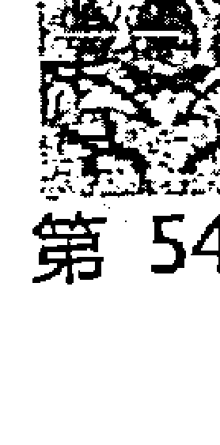
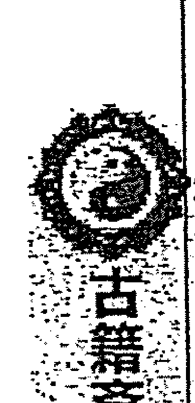
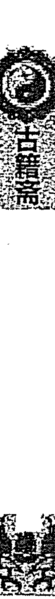
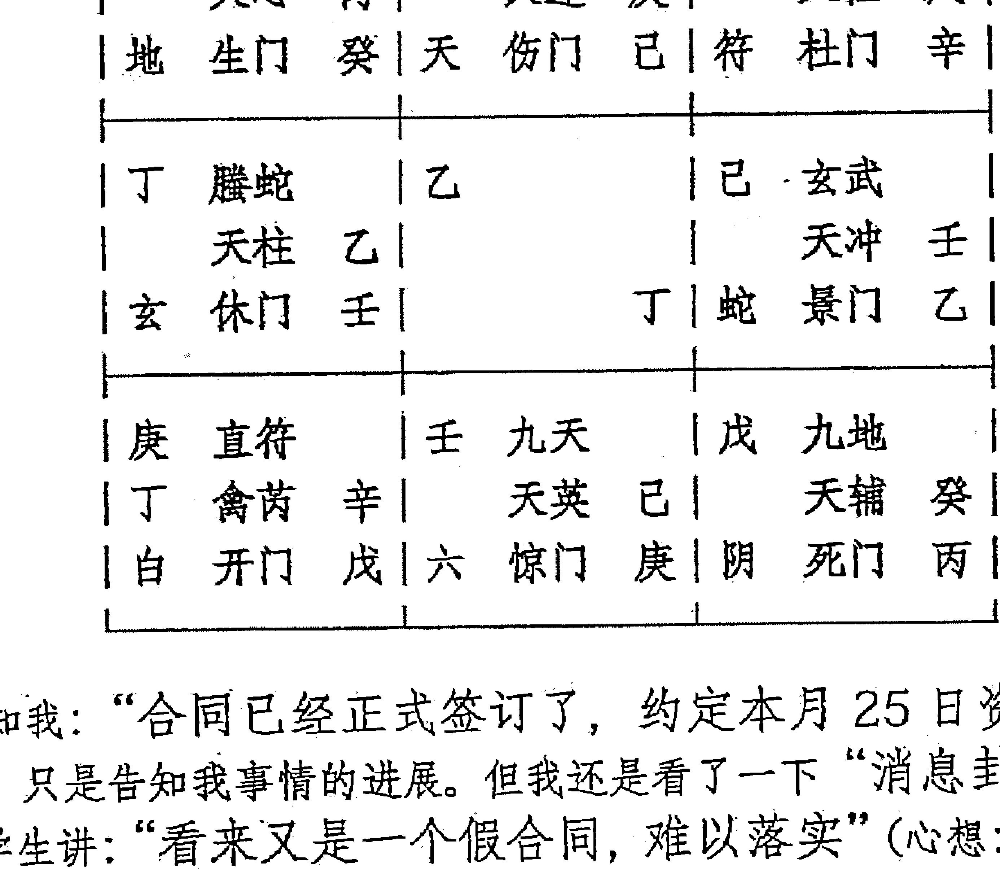

# 不吹牛奇门遁甲教案第六版

# 第一部分 星门神仪宫信息象意的精确解读与能量旺弱的精确把握

我们对奇门遁甲局的认知，很大程度上在于对奇门符号的解读与理解。通常我是把奇门遁甲符号从代表人、代表物、代表事三个方面来理解的，这样容易形成连贯的思路与准确的把握，而不致混乱。我们结合九宫、九星、八门、八神、十天干的具体象意，给大家引引路子。

## 一是关于九宫八卦。

我们知道时家奇门起局是以年月日时为立极点的，因此有人错以为奇门遁甲就是“时间学”，其实，任何事物既有时间载体又有空间载体，奇门遁甲是个“时空学”。九宫八卦里就包含着时间与空间的概念在里面，我们不能孤立的看待问题。我们给人断局要首重九宫八卦。九宫八卦反映的是人、事、物处在一个什么样的区域、什么样的平台、什么样的基础面、什么样的时间点上，不同的落宫反映的事物是不相同的。

乾宫。从方位上讲是西北区域，时间点上是戌亥年月日时。从五行上讲为阳金。乾为天、乾为首，人事物落乾宫就会有乾宫的“烙印”。落乾宫的人，一般说来社会地位较高或在所在圈子里有一定的位置，心高气傲，不服软，境界高，又有“目中无人”的特点。落乾宫的物，多是贵重的、圆形的、白色的、坚硬的、金属的物品。落乾宫的事情，多是举足轻重、重要、需要领导参与、难度较大的事情。我们在前几期的教学中，对每个宫的具体象意都做过详细的阐述，还没有学过的，请课后参阅，好好的理解一下。我们举一个例子，康泰易友曾在论坛发一八字，问此人1985年（后更正为1987年）上小学期间得一奖品，问是什么奖品。我用其在论坛发帖子的时间，起局做出了准确的判断。

公元：2010年6月26日9时23分48秒 阴6局
干支：庚寅年 壬午月 丁未日 乙巳时
旬空：午未空 申酉空 寅卯空 寅卯空
直符：天芮 直使：死门 旬首：甲辰壬

| 癸 六合 | 戊 太阴 | 丙 螺蛇 |
| 天冲 辛 | 天辅 庚 | 天英 丁 |
| 阴 休门 庚 | 蛇 生门 丁 | 符 伤门 壬 |
| 丁 白虎○ | 壬 | 庚 直符 |
| 天任 丙 | | 己 禽芮 壬 |
| 六 开门 辛 | | 己 天 杜门 乙 |
| 己 玄武○ | 乙 九地 | 辛 九天 马 |
| 天蓬 癸 | 天心 戊 | 天柱 乙 |
| 白 惊门 丙 | 玄 死门 癸 | 地 景门 戊 |

此例，我断为“瓷器，奔跑的马”，反馈为：“太神了！太神了!!! 谢谢不吹牛老师！奖品就是瓷器，就是奔跑的马，是仿制的唐三彩。看了不吹牛老师的这一断例，令我激动不已!”

其实，这不神，我们研究奇门遁甲的人只要认真解读一下，你们也可以看得出来。时干为其所问之事，为奖品，落乾宫“就不会很普通”，乾为金主坚硬，戊主胖，大肚子，乾又主圆，临天柱星有支柱有腿脚的含义，临景门主漂亮，亦主红色，九天、马星均是奔跑之象，乾宫又为马，戊又代表瓷器，乾宫又代表孤老的，来自西北流域的，暗干辛主修饰装饰的、精工细琢的，大家看一下“瓷器，奔跑的马”这一情景不就出现了吗？(从时间点上来说，丁亥年，亥正是乾宫的地支)

坎宫。坎主北方，时间点在子年月日时，五行为水。坎主低、主陷，主动荡。落坎宫的人，就心里不踏实、不安宁、患得患失，多愁善感，劳心劳力、有心无力，辛苦、坎坷。落坎宫的物品，多为水性的、低陷的、不稳定的、流动的。落坎宫的事情，就没有一个坚实稳定的基础，不确定因素就多，成功率就低。

艮宫。艮主东北方，时间点在丑寅年月日时，五行为阳土。艮为山艮为止，有阻隔之意。落艮宫的人，慢性子，但讲诚信、守信用，一步一步的去办，任劳任怨，墨守成规，发展慢。他常常自己给自己过不去，明明马上可以突破的事情，他也磨磨唧唧，不敢越雷池一步。落艮宫的物品，主稳定的、不动的、岩石、山坡、有阻隔的。事情落艮宫，多主遇到了阻力而停滞不前。事情落艮宫了，你着急也没有用，要循序渐进、一步一步的发展，前面的事情没办完，后面的事情就不好发展。但如果此宫临马星或逢冲，说明还有点劲，能行动。

震宫。震主东方，时间点在卯年月日时，五行为阳木。震为雷震主动，有突然突发之意。落震宫的人，容易起伏大，大起大落，周期性快，具有突发性，突然间来了好机遇或突然受到了打击，容易冲动，一鸣惊人，但休囚无力的状态下多是“瞎嚷嚷”，“叫唤猫不抓老鼠”。落震宫的物品多与林木、声音、震动有关。事情落震宫最容易出现突发性事件或产生突然的变故，一般影响挺大的。震宫的事情常常是雷声大雨点稀，也可能正噼里啪啦的，突然间就偃旗息鼓了。

巽宫。巽主东南方，时间点在辰巳年月日时，五行为阴木，巽为风为神经。落巽宫的人、事、物，就有飘摇不定的特点。落巽宫的人，常常神经兮兮、没有主见、进一步退两步，处于犹豫不决、不落实，尚在变化中的状态、徘徊、胡思乱想、进退维谷，很明朗的事情也被他想得特别复杂。物品落巽宫，多与草木、家禽、鸟类、富变幻的物品有关。事情落巽宫，主这事牵连精力大、缠手、摆不脱、甩不掉，事情还在飘摇不定，没有结果、尚在变化、忽好忽坏之中。注意这里与落坎宫的差别：落坎宫，是曲折劳心、艰辛但还是能向前走的；而落巽宫，是徘徊，是时好时坏、进退维谷，走一步退两步，左思右想，有时就是后退。事情落巽宫，这也表示事情就处在一个虚无缥缈的平台上，成功率较低。

震巽同为木，但两木的性质不同，震为雷，是大的转折性的、根本性的变化。用神落震宫，影响大、动静大、有根本性转折的事情发生。用神落巽、巽为风，飘忽不定，进退不果，但本质并没有改变。巽官也叫执法之宫，多与执法部门或被执法有关，包括思想被“执法”，如受困扰，受打击的状态。测运气，常常是好一段歹一段，半死不活，左右为难。

离宫。离主南方，时间点在午年月日时，五行为火。离中虚，离为虹，有光明、美丽、引人注目的特点。落离宫的人，爱面子、重礼节、虚荣、爱美、爱打扮，有名望，虎头蛇尾、好形式主义、表面文章，缺乏持之以恒的精神。落离宫，心里总是心急火燎的，难以沉稳、麻烦不断。物品落离宫，漂亮的、中空的、宣传品、电视。事情落离宫，主不持久、短暂性、事情忽左忽右、引人注目、开局好，但红火一阵子就不行了，有始无终。落离宫，事情也主急进。大项目落离宫，很难干下去。落离宫还主名声大。离宫的事情遇到的困难，多是外界影响导致的自己控制不了。而坎宫的事情，多是自己的内患，是自己不能自拔。

水火本是无情物，水火不能多，多则出灾难。用神落在离宫，办什么事都是不稳定的、假繁荣、内向焦着不安，是非麻烦不断，如果宫中符号都是火，那就更乱了。用神落在坎宫，事件可能是社会方面的，困境、劳累、消极、有风险、有可能会形成纠纷。如果宫中的符号水的性质越多，事情的成功率就越低。

坤宫。坤主西南方向，时间点在未申年月日时，五行为阴土。坤主大地，主孕育和包容，是基层，是广阔的、大众的、陈旧的。落坤宫的人常具有包容性、是随和的、平易近人，脚踏实地，但有时候也不切实际，常常是想得远、想的细、想的多，大事也处处从小处着眼，因而导致一些事情难以落实。坤为大众、为平民、为社会、为农业工作者。落坤宫的很少有政府要员，多是一些做具体工作的人。落坤宫的人最适合做人的工作、因其人际关系广、接触面广、好交友，而且细心。坤宫之物，多是常见之物，土生之物等。事情落坤宫，主这是平常的事情、常见的事情、牵连人多或牵连面广的事情（坤宫有寄官符号），需要从小处着眼、不能急于求成。落坤宫的事情并不是不重要，也不意味着做不成，而是必须脚踏实地、一步一步的去办。要慢而稳，从小处着手成大事，于无声处听惊雷。

艮坤同为土，要注意的是坤与艮两个平台，基本上都是平稳的，艮略有阻隔之意，而坤是自己散漫不积极。艮，有进取心，但会遇到阻力。坤宫的土是表面的，具有一定的“流动性”，但这种流动引不起巨变，没大事，但联系广、影响面大。而艮是阻隔，地域性较强。师父曾讲：同样的格局戊+丁，落坤的演员全国知名，而落艮只是地方名人。幺老师经典：“量变是环境造成的。事物发生发展的位置不同，量也就不同。人是环境的产物，运气不好时就赶紧动，别死守着，要到适合你发展的地方去。”

兑宫。兑主西方，时间点在西年月日时，五行为阴金。兑为泽兑为口，主口舌、毁折，主缺陷。人落兑宫，常常预示着胆战心惊，有口舌是非，不利索，有缺陷等。他干啥事都担心、都不安、不踏实、反复琢磨、也主忧郁，光说不练，只有语言，没有行为、言行不一，说得多做的少。兑宫之物主开口的物品、有缺陷的物品等。事情落兑宫，不会很利索。兑宫又主口舌是非。经常开会、争来争去，不解决实质问题，谈判也不会一次成功。落兑宫常常是唇枪舌战的事。光说不干，缺乏行动。还有一个特点：兑宫的事情，好事、坏事来的都意外。因为兑宫的事情，有原则、有框架，所以也就有缺陷。这常常是因为某些局部的因素产生的破坏性造成的。坏事落兑宫，也可能因为一件意外事件导致峰回路转又一春。

乾宫兑宫同为金，但两金的性质也不一样。兑宫是有缺陷的，不完美的。乾宫是超前的、意外的、超出想象的。就九宫相比较而言，用神落乾、震、离的，事物的重要性相对较大，落坎、兑的一般有消极的一面，落其他宫的状态一般。

奇门遁甲中每个符号都有自己的内容，这如同人的名字一样，我们对一个熟悉的人，只要点到了这个人的名字，你就能勾勒和回想起他的一些特征，因此对各类符号必须反复的研读与认知。认识奇门所反映的事物是通过符号来看待的，但这个符号所代表的事物的旺弱成败，就必须通过能量的强弱来判断。奇门遁甲中有九宫八卦、九星、八门、八神、三奇六仪、十二地支等符号，符号体现的是现象和行为，能从盘面上看的见，是“阳”；而能量体现的是本质，能量产生变化，没有能量事物就没法发展，是“阴”。要透过现象看本质，才能真正掌握事情的来龙去脉。符号所代表的现象，是靠隐形的看不见的能量来支撑的，没有能量事物的发展就会停滞前

## 提供的是一个思路，其实，能否把握准能量的旺弱，是吃准所预测的事体，做出正确判断、细致判断与策划指导的关键。大家要在实践中多注意一下。

## 二是关于九星、八门、八神。

不少同学说，学奇门遁甲最难的是需要记的东西太多。其实，学习奇门遁甲还要重视方法。有些符号，是具有一些相似性特征的，我们可以把其归类。从五行上来说天心星、开门、乾宫同为阳金，性质象意都有一些类似的特点，大家可以放在一起记忆。同理：天柱星、惊门与兑宫；天芮星、死门与坤宫；天英星、景门与离宫；天辅星、杜门与巽宫；天冲星、伤门与震宫；天任星、生门与艮宫；天蓬星、休门与坎宫，也可以这样类比看待。这次来的朋友多数都是有一定的奇门基础的，因此，我们这次就不细讲九星、八门、八神、十天干的信息象意了。基础差一点的朋友，课后自学一下前几期的教案，有时间后我也可以通过网络给大家辅导一下，大家也可以互相交流。我们本次班上，提示一下要点：事物的发生发展变化，受到天、地、人、神、“我”（格局，用神）五个方面的影响，天地人是外因，“神”与“格局”更多的是内因。马克思主义辩证法告诉我们：外因要通过内因产生作用。我们前面分析了“地”。现在看看其他因素：

九星---蓬任冲辅英禽芮柱心。九星是指的天体的能量，是这个时间点这个空间点是哪个“天体”在影响我以及影响我的程度，是不是“天助我也”还是“天要灭我”。九星影响到了用神“本性”的东西。

人临天蓬星，有冒险心理，胆大敢干。这并不是说他就不害怕，通常恐惧心理还是有的，这要看整个宫的状态与配合。事临天蓬星，风险大，主破财或伤人，亦有“富贵险中求”的情况出现。

人临天任星，固执、任性、实在，任劳任怨、老黄牛、憨厚。事临天任星，事不大，慢，让人感觉精神上累，磨叽。

人临天冲星，冲锋陷阵、敢打敢拼、有闯劲、有战斗精神、情绪主义。事临天冲星，这事看起来是一时冲动、突发事件、令人着急、不踏实。

人临天辅星，有涵养、文人雅士、胡思乱想、摇摆不定，想一些不切实际的东西。事临天辅星，与教育相关的、传播、传言、还不确定的、还在变化的等。

人临天英星，好面子、虚荣、礼节重、脾气急、喜欢听好话，特别旺时也烦恼、自寻烦恼。事临天英星，面子工程、挺热闹的、挺叫人瞩目的、现在热门的、有始无终的。

人临天禽星，厚道、老好人、怕事、迂腐。事临天禽星，顾东又顾西，牵连面广，伴随问题的。

人临天芮星，爱交友的、考虑问题细腻的让人腻歪、爱学习的、学生、生病。

的、有缺陷的、小心眼、自私自利的、想法多的。事临天芮星，有问题、牵连面广、有缺陷的。

人临天柱星，自信心强，中流砥柱，有做骨干力量的想法、不服管教。事临天柱星，容易毁折、破坏，不合常规、不能按常规出牌。

人临天心星，管理人才、医生、心计重、心里不踏实、想当官、孤高自傲。事临天心星，起点高的事、心理层面的事、难以集中精力的事情。

九星是天体，只能是它影响你，而不能是你影响它。九星能量的讲法是：“与我同行即为相，我生之月诚为旺。废于父母休于财，囚于鬼兮真不妄。” 有旺、相、休、囚、废五个等级。这是就九星作为天时而言的。如果我们拟人化，用九星作为一个用神时，那就具有了人性化的特点，就受五行的制约，就要按人的规则来走，按正五行来对待。比如，你测一个老师，以天辅星为用神，是拟人化的取用，天辅星落在了坎宫，逢生“这老师在那里的水平是比较高的”，而不能说“落宫废了.”，其他也如此。比如值符是八神之首，本来“跳出三界外，不在五行中”，但你以值符为原告、以值符为债主、以值符为顶头上司等人格化用神后，它也必须按人的规则来走，就有了旺相休囚死，就有了“入墓”“空亡”。这点我们在后面的例子中有应用，大家要认真体会。用神与能量是不同的。

八门——开休生伤杜景死惊。八门来源于八卦、它描述的是事物的变化轨迹，所含的信息是模拟自然，用神所临之门，表示现在的阶段处于什么状态，是变化途径，又具有想法、思维和意识的特点，反映着用神的一些轨迹性的东西，“方法”“路线”。代表“人和”，人际关系等。

人临开门多开朗、关心工作、认真负责，开心、办点什么事别人都知道，保不住密。事临开门，多是公开的事、要开始的事、工作或事业上的事等等，是积极的、动态的。

人临休门，利于学习、吸收、储备，善于沟通，善于调理，在机关工作、有贵人帮助，在休息、退休了、懒惰等。事临休门，可能与政府有关、需要找贵人、事情在退缩等。

人临生门，天真、积极、快乐、生机盎然，但还幼稚，不够成熟，常常是非理性的，而临开门的人理性思维。事临生门，可能是生意上的、房子的事情，新生事物、有希望等。

人临伤门，有闯劲、有能力、伤感、受伤、感情用事，说话直，也容易伤人。事临伤门，与车有关的事，不完善、交通运输、出行、有缺陷、容易挫折的事情等，含有破坏的因素。

人临杜门，爱研究、保安、公检法司的工作、技术人员、不爱言谈、窝心赌气、消息闭塞等，自我阻隔。事临杜门，不通畅、问题复杂了、是技术问题、质量问题、与司法有关的事情等。

人临景门，消息灵通、等待消息、漂亮、爱美、好面子、多虚华、乐观、有希望、富于幻想。事临景门，事情有了局面、漂亮、喜庆的事情，图画、电脑、血光之灾等。

人临死门，死板机械教条、心灰意冷、郁闷、寻死觅活、心思沉重、固执、不讲理，有死结、消极、难事愁眉，看消极面比较多。事临死门，希望小、不成功的事、难办的事、方法路子不对头、死伤之事等。

人临惊门，对理性的东西考虑多（与伤门对立），能说，要求完美但总是遗憾、不安、惊恐、忧患意识强。事临惊门，是非事、有缺陷的、官司、令人震惊的事情等。

八门的能量体现用的是正五行，也有时间、空间两个方面的能量体现。八门入墓：开门、惊门落艮宫；伤门、杜门落坤宫；景门落乾宫；休门、生门、死门落巽宫为八门的五行入墓，入墓也是受困之象。注意：是落宫入墓，而没有时间入墓之说。

门迫：门克宫为门迫。“吉门门迫吉不就，凶门门迫事更凶”。我们说，八门是方法，是你想走的路子，吉门门迫是你想的方法看起来挺好，但不适合那块地，如同“资本主义不适合中国国情”一样，我们必须走“有中国特色的社会主义”，吉门门迫主别扭、难受，方法还是不对路，所以“吉不就”，也就是达不到理想效果。而凶门，本来就是个馊主意，坏方法，又到了一个更不好的地点来实施，那只能凶上加凶了。

门受制：“吉门受制吉利减，凶门受制凶不起”。

门宫和义：门生宫为“和”；官生门为“义”。吉门逢生吉、凶门逢生凶。

八神--值符螣蛇太阴六合白虎玄武九地九天。是精神层面的东西，亦代表一些神秘气场神秘力量的影响，八神也通常反映性格特征中的一些成分。在对事物的影响上，八门是一个大阶段、八神是阶段性的短暂的影响，是对精神意识造成的影响，从而产生事物变化。

值符，东方木（亦有讲：中央土）。“天乙贵人”，重要的、高贵的、有身份的、有贵人帮的、在圈子里有影响的、有职位的、事物的核心。用神临值符了，主大事件、重要事件，起决定命运的东西，“所到之处，百灾消除”。值符怕逢空，“年命不保”，“过期了”“失效了”“假皇帝”“现在没在位”。幺老师经典：值符类似于圣旨、通行证、批准文书。值符临六仪击刑，类似于有通行证，但还是受查了。

螣蛇，南方火，虚诈之神，惊恐怪异、性柔而口毒、虚华、不真实、不靠谱、多疑、变来变去、没有一定之规、超出你的驾驭能力、狡诈。以假乱真，把假的

说成是真的。

太阴，西方金，荫佑之神，性阴匿暗昧，有隐患的、有缺陷的、考虑缜密，善于思考、策划，理性思维、地下活动、隐私、隐瞒、阴谋、沉稳、平静、私处，见不得光的、不暴露的，爱琢磨，是下沉之金（九天是上扬之金）。太阴亦主权谋。太阴是暗中相助之贵人（值符是公开面的贵人）。

六合，东方木，护卫之神，性平和、司婚姻、交易、中间介绍之事、合作、证据、箱子、群策群力。

白虎，西方金，凶恶刚猛之神，性好杀、司兵戈争斗杀伐病死。强大、实力雄厚、压力大、凶伤孝服、盛气凌人、霸主。测事遇白虎为阻隔，出行遇白虎，多为遇警察。

玄武，北方水，好谗小盗之神，性好阴谋暗害，司盗贼逃亡、口舌暗昧之事。迷茫不清、雾里看花，稀里糊涂，聪敏诡异。说是不知道，其实他很清楚。

九地，坤土之象，万物之母，坚牢之神，性柔好静。低调的、消极的、被动的、地下的、暗藏的、地下党、迟缓的、不开化的、落后的、矮的、旧的、老实诚实的、守规矩的、外表平静内心丰富的、慢的、循序渐进的。

九天，乾金之象，万物之父，威悍之神，性刚好动。高的、快的、动的、张扬的、大张旗鼓的、高调的、好高骛远的、有名望的、利于传播的。

任何符号就其含义来讲，都有吉凶两个方面。如何区分，这里的关键还是在于用神的能量以及格局之间的配合。比如，你临伤门，能量弱则被伤害，能量强，则竞争力强，对对手构成威胁。你临白虎，能量强（指用神自身的能量），就是有能力，能量弱则是压力大。其他也都如此。我们这次要交流和学习的重点在于“理清思路”，针对预测中容易混淆的一些问题进行探讨。

三是关于十天干。戊己庚辛壬癸丁丙乙----遁甲。天于是拟人化的，模拟万事万物。表示人的行为、举动、举止。奇门遁甲中顺布六仪、逆布三奇，奇就是转折的意思，丁、丙、乙，逆布三奇是有道理的。三奇就是转化、突然转机的意思。六仪代表群众。六仪都有阻隔的含义。

戊己都是土，戊为阳土，己为阴土。戊是高起的、突出的、多肉的、墙体、房子、土丘、是钱财、憨厚、诚实、阻隔、肿大、良性瘤。己是低陷的、丑陋的、消瘦的、蜷缩的、畏畏缩缩的、空想的、幻想的、下沉的、小心眼、算计的、自私的，囊肿、凹槽、坟头、地下室、防空洞。用神临戊，事情就有阻隔，大多停滞不前，要花钱办事，用钱疏导开路，戊代表思想不开化。己也有障碍阻力之意，但是是陷阱，不是明面的。遇戊直接破财，遇己间接破财。

庚辛都是金，庚为阳金，辛为阴金。庚是铁疙瘩、是凝聚的、是抱团的、有攻击性、难题、硬茬子、恶性肿瘤、压力、白虎，大矛盾、丈夫、公安、仇人。辛金是修饰之金，散乱，犯错的、过失的、爱打扮的、罪人、某个环节某个细节出问题了、小颗粒、小果实、精子。

壬癸都是水，壬为阳水，癸为阴水。壬是变化、动态的、分解的、多形态的、可变的、不稳定的、有重叠的、多出来的、河流、道路、管道、门、门户，也表示女人的意思。壬有收藏、孕育的意思，而癸主储备、吸收。癸是天网，主闭塞、收缩。癸专指女性、月经（中医：天葵）；封闭。测事：自我封闭，难以突破；抑郁症、自闭症、两性关系。壬变化比较大，多是外因的影响。癸多是内因的影响。

丁丙都是火，丁为阴火，丙为阳火。丁主喜庆、奇迹直达、小女孩、女情人、星星、士兵、钉子、蜡烛。丙主积极过头的、画蛇添足，没事找事、麻烦是非不断、乱套了。代表孩子、小男孩、男青年、男性情人。事物中代表乱子、悖：有悖常理。临丙，乱中取胜。

乙甲都是木，乙为阴木，甲为阳木。乙代表女性、妻子；在物体中代表修饰类、装饰类、桌椅。在事物中代表委屈的、曲折的、不情愿的、消极的。办事遇到乙，不痛快、不舒服的。甲是值符，在奇门遁甲中是隐藏的，因为甲是核心是目的是中心思想，这是不能暴露的。甲的象意参见值符。

关于十天干落官的状态是按长生、沐浴、冠带、临官、帝旺、衰、病、死、墓、绝、胎、养十二状态来判断能量休囚的。这一点，我们放在第二部分做专题讲述。就时间点上来说，十天干不按这十二状态来判断旺弱，而是按正五行区分时间阶段上的能量。比如戊土在寅卯月受克为死；辰戌丑未月同我为相；巳午月生我为旺；申酉月我生为休；亥子月我克为囚。时间点上不讲墓库。

注意点：在各类用神以及相关符号的能量判断上都有时间与空间两个层面：测长久的事情，落官是第一位的。短暂的事情，时令状态是关键。这个时令是取年令、月令、日令、还是时令，要看事件本身，过去生活交际节奏较慢，月令是主要判断依据。现在节奏快了，很多事情，如竞技比赛，时间点就很重要了。年内的事情、几个月的事情，还是以月令为重。

这一节我们探讨了星门神仪官各自表示的是什么以及它们间的相互关系。九宫是区域，是个范围，基础面，是指的“地利”方面，这是指落到了哪个地盘上。而九星是天时，是趋势，是本性，是有无持续能量的“充电器”“加油站”，也可以说是储备，“兵马未动，粮草先行”，你有没有保障，这个能量是否与你匹配等。八门是道路，是方法，是心态（你有什么样的心态常常决定了你选择什么样的道路）。八神主不确定性因素，亦主心态、方法。三奇六仪多表示的是行为因素。一般说来：九星主天时；落官主地利；八门和三奇六仪代表人的因素，主人和层面；八神代表

神助，是意识和精神的产物。但我们在预测中一定不要孤立的、机械的理解这些内容，因为“天地人神我（格局）”相配，才组成了一个“完整的你”，事物之间是相互联系的，星门神仪之间常常具有相互交融的信息。事物本就是复杂体，古人之所以设置了这么多符号，就在于反映事物的复杂性、客观性。还要注意的是当你选择了用神后，我们本来是基于某种含义与代表性来选择来确定的用神，那么在判断该用神的状态时，就不用考量该用神自身的象意，而是要围绕该用神所在的周围符号来判断该用神的状态。比如说，乙奇在判断事物时有委屈的、曲折的特点，当以乙奇作为妻子的代表符号时，我们不能说任何妻子都是委屈的、曲折之类，但是当该宫中的符号如乙奇入墓、乙+癸，临死门等，则可讲妻子受到了委屈。再如，我们用值符代表债主，天乙代表欠债人，有个易友准备索要欠款，他讲：“老师，我临值符啊，临值符百灾消除，为什么对方就是不给我呢？”---这个易友就是把用神与其含义混为一谈导致的错误认识。关于用神以及星门神仪宫之间的关系，我们在后面内容的讲解中会经常应用，希望大家认真领会。这里举一个小例子。

公元：2011年5月10日14时30分46秒 阳4局
干支：辛卯年 癸巳月 乙丑日 癸未时
旬空：午未空 午未空 戌亥空 申酉空
直符：天禽 直使：死门 旬首：甲戌己

| 壬 九天 马 | 戊 直符       | 庚 螣蛇○ |
|    天英

## 质与变化来确定好与坏，灵活运用，不能机械地生搬硬套。比如，测疾病，天芮星所带的三奇六仪落长生，那就不利，很可能是疾病在该符号所代表的方面扩散发展的信息。

落沐浴之地，犹如小孩出生后的洗浴阶段，“以万物始生，形体柔脆，易为所损，如人生后三日，以沐浴之，几至困绝也”。主欲望，想美事，想入非非，问题多多，容易暴露、曝光，目标短浅、思想简单等。如果年轻人测婚恋、情欲，则代表其桃花要开了，有桃花等。测事情，主这事情还在美妙的想法阶段，测事业是败地，容易挫折。老年人落沐浴，则不理性，“老花心”。

落冠带之地，如小孩可以穿衣戴帽阶段，“万物渐荣秀，如人具衣冠也”。好面子，“打肿脸充胖子”，外强中干、华而不实，做表面文章，实际是“窝囊废”“草包”、虚伪、遮盖、隐藏真相、包装自己、伪装等。冠带也是一种旺的状态，如测学历、文凭，则容易得到。

落临官之地，比喻人可以出任做官，有收入了，“如人之临官也”。是一种比较旺相的状态，也叫“禄地”。正处在收获的时期，事业兴旺，有财路，有收入，吉利。这就是当官的、做管理的，是和领导在一起的等等。一般说来处在官禄之地是最好的，能量最强大。找工作落官禄地，是找对了路子，就是你要干的事。

落帝旺之地，极旺盛阶段，“万物成熟，如人之兴旺也”。表示此人正在最旺盛期，眼下是顺利的。是鼎盛，是壮大。但孕育着以后将走下坡路，容易受挫折。“老怕帝旺”，那是“回光返照”，快玩完了。

落衰地，中年之后，“万物形衰，如人之气衰也。”则表示此人走上了下坡路，有气无力，缺乏自信心，是一种衰退、脆弱、软弱可欺的状态。也代表此人无能为力，比较孤独。“少怕衰”，青少年正该长生、沐浴阶段，充满好奇、充满活力的时期，你却跟老头一样衰了，这就难于成事，是不正常的表现。

落病地，此谓更衰弱阶段，“万物病，如人之病也。”代表此人有问题发生、有毛病、缺点，做事漏洞多。时干落病地，这事有问题。

落死地，气尽身亡，“万物死，如人之死也。”是一种消极状态、自己没有信心、看不到希望、做事不灵活、死板教条、停止、不可调和等情况。甲子戊落死地，也是缺钱或钱财受困之象。

落墓（库）地，像尸体入土，又称为库，“以万物成功而藏之库，如人之终而归墓也。”“入库”就是暂时放在仓库里，还有出来的时候。“入库”代表隐藏、储藏、掩盖、伪装，是暂时失去了原来的作用，暂时力不从心，入库实际是在暗中积蓄能量。而“入墓”是指事物受到了限制。日干入墓，如同手脚被捆住了，

在奇门凶格中有一个提法叫“时干入墓”，其实有两层含义：一是时辰的地支是时干的墓库之时，如戊戌时、己丑时、壬辰时、癸未时、丁丑时、丙戌时、乙未时，这类时辰内通常举事不顺。二是时辰的天干加临地盘所在之宫正是它的墓地。《烟波钓叟歌》讲：“三奇入墓好思推，甲日哪堪相见未，丙奇属火火墓戌，此时诸事不须为。更兼六乙来临二，月奇临六亦同论。又有时干入墓官，课中时下忌相逢。戊戌壬辰兼丙戌，癸未丁丑亦同凶”。时干入墓凡事不成之象，不利举事，不利求财、办事、婚姻嫁娶、建筑营造、出行等。如果既是“入墓”的时辰，又入落官之墓，事情成功的希望就更渺茫了。

落绝地，气已绝尽，“以万物在地中，未有其相，如母腹空，未有物也。”绝望、孤立、入绝境了、到了尽头、没了希望、走到了极端，断绝了。一般落绝地不是好现象，但是如果其星门神旺相逢吉格，亦有绝处逢生、东山再起之象。

落胎地，此为受胎之状态。是一种在孕育、酝酿，计划刚刚有点雏形。表明求测人正在酝酿要做的事，自己感觉还不成熟等。“中年最怕死绝胎”。

落养地，此为成形，“万物在地中成形，如人在母腹成形也。”就是正在筹备力量、积蓄力量、孵育、修养。表面上看什么也没有干，实际上内心已经活动了。

在判断十二状态时，会遇到一个问题。即四维宫中有两种状态，如丙火在乾六宫有“墓”“绝”两种、在巽四宫有“冠带”和“临官”两种状态。这该怎么看待？有两种讲法：一是这个时侯一般遇旺以旺为主，遇墓以墓为主。比如当“长生”和“养”在同一宫时，以“长生”为主。“冠带”和“临官”在同一宫时，以“临官”为主。“帝旺”和“衰”同宫时，以“帝旺”为主。“沐浴”和“冠带”同宫时，以“沐浴”为主。“死”和“墓”同宫时，以“墓”为主。二是以时辰的阴阳五行，来定用神对应的是阳支还是阴支，来确定其十二长生状态。

这里我们是以天干用神所在之宫的状态来看该用神的，是该用神在此空间的状态。但我们知道事物是相互联系的。用神的其他状态所在的宫一定也会与该用神存在某种联系，从不同的侧面来反映用神的状态。张松老师讲：长生之处可以财源情况与新生事物；沐浴之处可看其情欲、败露；冠带之处可看其学历、名气；临官之处，看其工作、职务、女人之丈夫；帝旺之处，看比赛、争夺、顶级等；衰地看其缺点、退处；病地，看其问题、疾病；死地看其终结；墓地，可看其归藏、暗昧之事；绝地，可看其绝断之事；胎地，看孕育之事；养地，看其培训、计划之类。我们在预测实践中，可以作为参考。比如求职到日干的临官之地，比较好。求财利于去长生地或临官地。求偶到沐浴地比较好。比赛到自己的帝旺之地比较好。

# 不欠十二〇二一年第八版

## 古籍斋

关于十干克应关系、八门克应关系多数奇门类书籍都有介绍，我在第一期、第二期教学资料中也做了较为详尽的注释说明，请课后再做研读。我认为记忆这些条款还是必要而有用的，但重点在于理解。我们的先人费尽心机的给我们留下了这些内容，是宝贵的遗产，不是有人说没有用就没有用的东西，关键是如何用。今天，我给大家讲一点我的应用体会：

天盘干表示的是事物本身，地盘干表示的是影响该事物的因素。十干克应主的是行为因素，既有行动的行为，也有心理的行为。三奇多为事物遇到了机遇，六仪多是阻碍事物发展变化的因素。八门克应是指人盘变化后与地盘八门、天干六仪重叠所产生的某种生克制化关系及所提供的某些吉、凶、悔、吝的信息。天地人神十干克应共同组成了一个官的“小格局”，整个局盘是一个“大格局”。这就是事物的模型。用神所落之官是他信息的“集中点”，其他官位是用神官信息的“关联点”。克应关系反映的是事物的复杂性，不是独立存在的，象征人的多面性、延续性，这些东西都有时间因素串联起来。格局组合代表的是能力，事情的成败不仅要看能力，更要看能量。高能量+高能力，事情的成功机率就大。有能量的人，高于有能力的人，能量重于能力。三奇六仪是事物变化的一个核心过程。

常用吉凶格点评：任何格局都是有条件的，吉格也不一定真正应吉，凶格也不一定面临大凶。这里起决定作用的还是能量，同时，还必须通过符号的延伸和关联性来综合分析。又必须与所预测的事体相结合。对于每个格局，你理解的越深，你就能在预测与策划中发挥的更好。比如：

戊+丙：青龙返首，第一吉格，测事遇此格多为吉象，宜求财、就职、诉讼、建造、迁移等，但若逢墓迫击刑吉事成凶，也就是说虽然遇到了这样的吉利格局，但落乾宫入墓了，它没有能量回来了；落震宫击刑了，它受伤了，即使回来也是遍体鳞伤了；遇到门迫了，它用处了方法，走错路了，也不好办。即使没有遇到墓迫击刑，但预测的事情不一样，结局也是不一样的。一个做石雕贸易的朋友，要去东北卖一条“龙”，时干就是“戊+丙”落艮宫，我说你卖不出，“青龙返首”啊，还要带回来之意。到展会后，确实有人想留下这件商品（子丑合），但是不愿意拿现钱，价格也不合适，没办法只好又带了回来。再如测疾病，遇此格，可能是旧病复发之象，并不吉利。”

戊+丁：青龙耀明，谒贵求名吉利，若逢入墓、门迫，惹事招非。测运气主人生出现了重大机遇。测攻关，需要动用少女。这虽然是个吉格，但外力很重要。临凶门，是外力破坏了这个机遇。戊入墓，是你自己没力量把握这个机遇。丁入墓，是这个机遇条件还没有成熟，就像你家安装了电灯，但没有送电一样。六仪下临之干是三奇的情况，还要特别注意此奇落宫的状态。比如戊+丁，不仅要看地盘丁奇在所在之宫的状态，更要看天盘丁奇所在的状态。比如你用神临上的戊+丁，你遇到了机遇，但是这个机遇产生的条件不好，会导致这个机遇无法实现。你要处理问题，还需从实现这个丁奇能发挥作用，丁奇所在之宫来入手。还有用神宫与三奇宫的生克关系问题。比如你戊+丁，但丁奇落宫是克制你这用神宫的情况，这说明了什么？说明你在使用这个三奇时，也会给你带来一些压力和风险。翻宫又代表下一步，你要实现奇的作用和目标，眼下的难关要解决，看着是奇，你现在不一定能真正拿到手。曾经有个网友，对奇门一知半解，他在外地出差，遇到了一个“丁”，心里痒痒，就自己起局看看如何？戊+丁，天辅星，值符（想不起来是什么门了）落坎宫，一看格局大吉，就更动心了，给我打电话说：我想找个丁，你看如何？我一看：丁临玄武，天蓬星，丁+壬己，落坤宫，又克日干宫，就对他说，“千万别，我看这是个陷阱，你做这事，可能被敲诈，是人家合伙骗你的”。他表面说，不做了，但最终没抵住诱惑。结果第二天给我回话说：“这个值符真坑人，一点也没保佑我”。”

## 三奇得使：就是天盘乙、丙、丁加临地盘值使门。测事遇奇多有奇迹发生或有转机之意，再加上有值使门护卫，主“百无禁忌”。这里也要考虑其他条件，如果是大凶格局，或者凶门值使，这吉利也常常并不应验。”

## 玉女守门：门盘值使门所落之宫正遇地盘丁奇，经商、求谋、饮宴等事为吉，但测婚姻有妻随人行之象。”

## 天显时格：六甲旬首值班之时。天显时格，利收敛钱财、静候佳音，但不利出行举事。如果遇到六仪击刑、死+死、蓬+蓬、辛+辛、庚+庚之类，则为凶不为吉。”

## 奇仪相合：甲己、乙庚、丙辛、丁壬、戊癸落同宫得吉门，宜与人合作。测婚姻有男女同居之意，事情有被绊、牵连面广之象。”

## 三诈五假：三诈，即真诈、重诈、休诈。五假，即天假、地假、人假、神假（物假）、鬼假（神假）。”## 真诈  
乙、丙、丁三奇合开、休、生三门，临太阴为真诈。宜于施恩、隐遁、求仙、利于出师、招抚、设运机谋。  

### 重诈  
乙、丙、丁三奇合开、休、生三吉门，临九地为重诈，宜于进人口、求财、拜官投爵，利出师、设计埋伏。  

### 休诈  
乙、丙、丁三奇合开、休、生三吉门，临六合为休诈，宜合药治疫、一祛邪祈祷。  

以上真诈、重诈、休诈统称为“三诈”，嫁娶、远行、上官、赴任、商贾求财都吉利。三者中，以门为上，奇在其次，诈再次，奇门皆合者为上吉。  

### 天假  
景门合三奇临九天为天假，宜于干贵进谒，上书献策，扬兵颁号，申明盟约。  

### 地假  
杜门合丁、己、癸，临九地为地假，宜于潜伏、捕捉、修炼，临太阴宜派人搞间谍、侦探等事。临六合宜逃亡、躲灾避难。  

### 物假  
伤门合丁、己、癸临六合为物假。宜于埋藏、祈祷、索取、捕捉、交易、伏藏。  

### 鬼假  
死门合丁、己、癸临九地为鬼假，又为神假。有利于超荐、破土修茔、伐邪、狩猎。  

### 人假  
惊门合六壬临九天为人假，有利于捕捉逃亡、搜擒匿寇。  

以上天假、地假、物假、鬼假、人假统称为“五假”。所谓假，是指借锐气来用事，事情符合其气则用起来得利，否则谋为必凶。五假忌迫墓，这一点须慎记不忘。看日干、年命是否临上了三诈五假，临上你就可以设计。如果对方临上三诈五假克你，你明知道对方是假，但你破不了，你就“信以为真”了。逢三诈五假格在商战时，应制定计谋才可以取得胜利。测婚姻遇到三诈五假格，古代婚姻中称为“填房客”，所寻找的配偶必是有过婚姻史或同居史、有过性关系的人。  

## 九遁  
就是天、地、人、风、云、龙、虎、神、鬼这九遁。逢九遁格，在商战中要见机行事、灵活机动、变换阵式，才可取胜。  

#### [天遁]  
丙奇、生门（开门、休门）合地盘丁奇为天遁（丙+丁）。这一方位得月精所弊，宜于祈祷求福，利于征战使敌人自败，上书献策、求官进职、修身隐迹、剪恶除暴、买卖、出行、婚姻、入宅往来大吉。经云：天遁生开合丙奇，六丁相会是佳期，月精所弊逢祥曜，万使为福皆可宜。乘天遁利于竞争、策划、建议、晋职、隐蔽企图、生意、出行，往来此方大吉。但要注意：若乘螣蛇，则主疑惑；临玄武、白虎，有可能出现灾难、疾病。破财。测房子风水时干或生门临天遁，主宅舆高大。  

#### [地遁]  
乙奇、开门（生门、休门）会地盘六己为地遁（乙+己）。这一方位得日精所弊，宜于藏兵、立寨、安营、建置仓库、修造、修道求仙、出阵攻城、出行、埋葬、婚娶、求财等。经云：开门地遁大吉昌，乙奇合己正相当，人间百事皆宜举，大将屯营杀气刚。遇此格利隐藏企图、建立营业网点、造房、谋为百事比较吉利。若乘螣蛇，宜实行蛊惑人心之计；乘太阴，则有酒食饮宴之事；乘白虎，则斗打胜利；乘玄武，利取财物和探查隐私。测风水遇地遁，主房宅坚固稳重。  

#### [人遁]  
丁奇、休门合太阴为人遁。这一方位得星精所弊，可以隐形保身、受道成功、说敌和仇、偷营劫寨、密探设伏、上官谒贵、婚姻、交易等。经云：人遁休丁合太阴，星精所弊月华新，外兵探贼知原委，万事谋为总称心。遇此格，利于调查研究、隐蔽企图、和谈、招聘、经营等。乘天辅星、天英星要下雨；乘天冲星，打雷；乘天英星，主有闪电、病人危机等。  

#### [神遁]  
丙奇、生门临九天为神遁。这一方位宜于祭祀祈神、建置坛场庙宇、塑画神像，求佛拜仙、许愿、利于攻伐、阴谋密计，以应神候。经云：格中神遁最难逢，大将行兵立见功，祭祀鬼神极灵验，人间百事福无穷。宜声东击西、商业策划、开路、塞河、培训等。  

#### [鬼遁]  
丁奇、杜门（开门）临九地为鬼遁。这一方位可以探机、偷营劫寨、设伏攻虚、暗伺动静、超亡荐孤、镶镇灾邪、治疗不详。经云：局中鬼遁用非轻，所用谋为主建功，大将若能知此诀，万人头上逞英雄。逢鬼遁，宜于出其不意、调研、设伏、攻虚、探查对方虚实、散布谣言、实施反间计等，对方不宜察觉。测阳宅风水，宅中有鬼。  

#### [风遁]  
乙奇合开、休、生三吉门，下临巽宫为风遁。这一方位宜于祈祷风雨、行垒战、立旌旗以应风侯，行兵利于火攻，用飞砂走石来对付敌军。经云：局中风遁可生风，赤壁鏖兵用火攻，藏遁设伏机密事，交头接耳总相通。亦做两全其美、顺水推舟之事，利出行、迁移。如风从西北方来，宜顺风击敌。如风从东南方来，敌人在东南方，则不可交战。  

#### [云遁]  
乙奇合开、休、生三吉门，临地盘六辛为云遁。这一方位利于求雨泽，助禾稼、建营寨、修仙炼道、云游。大将遇云遁，宜于遁藏、埋伏、掩袭，以应云候。经云：云遁三门合地辛，日奇到此被云遮，祈祷雨泽极灵应，大将值此可伏兵。遇此格，在不墓迫的情况下，宜隐蔽企图、临事不宜强求，要暗中算计对方而不被对方发现。  

#### [龙遁]  
乙奇合开、休、生三门，临坎一宫或加地盘六癸为龙遁。这一方位，可以演练水军，把守河渡，密送机谋，造置水器，祈求雨泽，填堤塞河，修桥穿井、开渠放水，以应龙候。经云：龙能变化最为先，六乙休临坎水边，用此只宜操水战，满天雷震法中传。宜掩捕敌人、水战、修桥、打井。如打井，此处必有甘泉。临玄武主大雨成灾。要防奸细和贼盗。  

#### [虎遁]  
乙奇合休门（生门）加地盘六辛临艮宫或庚金临开门落兑官，都称为虎遁。这一方位可以招安设伏、据险守隘、建立营寨、捕捉射猎、演武大战、祭风镇邪、驱除魔鬼，以应虎候。经云：虎遁原来在艮中，将军用此显英雄，探围突阵宜扬武，万里威风不暂停。测阳宅遇虎遁，家中出公检法司武职人才。遇此格，最宜隐蔽扩张销售渠道，宜于修筑建造、镇邪驱鬼、安宅出行等事。  

格局很多，我们不一一点评了，对于凶格也要这样看待，有时候凶中是有吉利的。比如你临乙+辛龙逃走凶格，但辛+丙落宫临吉生你，这说明你虽然是无奈的逃走了，但逃走后会遇到好的机遇。我们分析案例：  

公元：2011年6月6日19时21分55秒 阳9局 干支：辛卯年 甲午月 壬辰日 庚戌时 旬空：午未空 辰巳空 午未空 寅卯空 直符：天辅 直使：杜门 旬首：甲辰壬  

| 癸 九地 | 己 九天 | 辛 直符 马 |  
| 天任 乙 | 天冲 辛 | 天辅 壬 |  
| 符 惊门 壬 | 蛇 开门 戊 | 阴 休门 庚 |  
| 壬 玄武○ | 丁 | 乙 螣蛇 |  
| 天莲 己 | | 天英 戊 |  
| 天 死门 辛 | | 癸 六 生门 丙 |  
| 戊 白虎○ | 庚 六合 | 丙 太阴 |  
| 天心 丁 | 天柱 丙 | 癸 禽芮 庚 |  
| 地 景门 乙 | 玄 杜门 己 | 白 伤门 丁 |  

朋友请我和韩老师在一个餐馆用餐，入座后讲还有一个朋友要来，说话间此人到了，30来岁，坐在坤位。坤位背后就是大门。略作介绍后，边用餐边聊天。新来的朋友说：两位老师，能不能看看我的情况？  

我说：你不错嘛！在政府部门做副职吧？你是文员吧？（日干以及坐宫临值符、休门、天辅星、壬水长生在坤，天辅星旺相，坤宫主副职。休门主公务员。天辅星主辅助性的工作、助理。对冲之地临景门、丁+乙，主文。天心星主管理）  

反馈：是的，我在XX局工作，是副职（地盘日干壬临天任星，九地）。是文职。老师厉害，还能看出什么不妨直说，我很喜欢易学，我看过八字的书，但谈不上研究。  

我说：你现在因为感情问题很纠结，坐卧不安。依我看，你们夫妻已经分居好长时间了，你眼下就有外遇。——反馈：老师说的太对了，我们分居一年半了，你看看我夫人的情况（欲言又止）。  

为什么断他们夫妻感情不好，分居好长时间了？日干壬落坤宫，格局是壬+庚：“太白擒蛇，刑狱公平、立判邪正”——怎么理解这个格局？在于他想辨明是否，还想给人一个公正正义的形象。壬+癸：“幼女奸淫，家有丑声”——怎么理解这个格局？说明家里有丑事发生了。是谁的丑事？休门+壬癸，古人提示：“阴人词讼牵连”，阴人指小人指女人。又他坐在虚地，逢虚看孤，对冲是丁+乙，丁是他老婆。丁在艮宫入墓，主还在家，入墓又主有棘手事。逢空，夫妻又落艮坤对冲之地，说明二人已经分居了。丁+乙“人遁吉格：另续相亲”，这就出现了“要换妻”之象。日干、时干都在外盘，主这事时间已经很久了。六合主婚姻，临丙主婚姻上有了乱子，一般代表有其他男性闯入。  

为什么断他有外遇？时辰在庚戌时，看乾宫，庚为男性的符号，庚+丁金屋藏娇之格。  

我说：你不肯原谅妻子，是因为她做了出格的行为，这点让你最担心，也最震惊。他非常激动，说：是的，我们是初恋，但没有想到她竟然和我一个同姓的本家搞上了，那人还长我两辈，真是窝囊。为什么断他妻子有出格的事情？日柱是壬辰，日支为自己的心里状态，临惊门主担心主惊恐。乙奇为妻子，因为妻子的事情而担心忧心。这还是格局的提示：乙+壬“日奇入地，长幼悖乱，奴欺主或官诉是非”。壬癸为水，乙在沐浴桃花地，壬癸击刑，临九地，有暗地里跟人淫乱之意。为什么我说天干主表象？你看日干壬水在长生之地，临休门吉门，天辅星吉星，值符至吉之神，一幅君子状态，没能真切的体现出心灵所思，而日支反映的就更确切一些。  

他问：老师，你看我们能离婚吗？我与那个女孩能成吗？我说：你就是不确定那个女孩能否与你结婚，以及再婚的情况，才没有下定与老婆离婚决心的吧？韩老师，这时插话说：“那个女孩是个母老虎”（丁临白虎）。  

很多朋友都经常被婚姻中如何取用神搅得晕头转向，这个问题也困扰了我很长时间。实话讲：至今还没有完全把握准脉络，希望以后跟大家一块探讨。比如此例：我们以日干壬永为求测人，则合干丁代表此人的老婆。这是第一层关系，很明显的也反映出了他们婚姻关系上的一些特征，丁反映了其老婆的一些特点。日干与其合干的关系，反映的是现阶段的状态。还有乙庚关系，这是指的婚姻关系的用神符号，是第二层关系。庚为夫、乙为妻。此局通过这层关系能很清晰的看出他们夫妻间各自存 在的问题，如庚下临丁，男方有外遇；乙+壬，女方出格。乙庚对冲，夫妻关系对立等等。乙庚关系，是夫妻关系中较为持久的状态。再就是六合落官，六合是婚姻的符号，它的吉凶也表示的是现在婚姻关系的状态，它不能代表人一生的婚姻状况。这里的合干丁、乙奇都代表妻子，日干壬、庚都代表该求测的男子，但是是从不同的侧面和不同的角度来反映的事情。  

我为什么说，他是不确定那个女孩能否与她结婚，才没有下定与老婆离婚的决心的？庚落官冲克妻子乙奇落官，对老婆已经“绝情”了，但庚下临丁，又临太阴，太阴主隐藏，天芮星主有问题，与癸同宫，癸主性，这说明该男子是有情人的。但这种组合，也是有缺陷的（天芮星）、不好见光的（太阴）、容易受伤的（伤门）、错综复杂的（癸庚同宫，宫中地支寅申戌亥，又合又冲有刑有害）、不稳定的（癸+丁，螣蛇天矫）。他顾忌什么？庚下丁，看丁。这里就出现了一个问题？我们说看这个情人看丁，看他老婆也是看的丁，岂不是这女人与他老婆具有了同样的信息？！其实，这点正反映出了求测人的顾虑，他最担心的是那女孩会不会跟她妻子一样“景门”（游戏）一把，会不会再“另续相亲”（丁+乙），使自己再受伤（庚+丁临伤门）。又丁奇空亡，空亡主不稳定，入墓主让人捉摸不透。虽然丁落宫生庚落宫，表明看起来这女孩对他不错，但因为上面的因素，还是令求测人心里不够踏实。  

我说：你是想玩的很稳妥，怕人家说你是因为有了外遇才跟老婆离婚？他说是：你能看得出来，是老婆先对不起我，发现她的劣行后，我才碰上了现在的女朋友。（日干临值符是领导，壬+庚，保持公正的形象，不想让人说三道四。丁+乙，妾幸夫心，乙下丁上，符合他说的因为妻子的问题，导致了自己的外遇）。  

我们看，他们的婚姻关系究竟能否持久维系，会不会离婚？其实，这才是求测人最为关心的。就乙庚关系来讲，首先乾宫与巽宫是对冲位置，金木相战，矛盾不好化解。就六合宫来讲，落坎宫就主波折主不平静，也就是说婚姻建立在一个不稳定的平台上。丙+己：“火悖入刑、囚人刑仗”有被囚刑罚之意，是个陷阱，又临天柱星是个破坏之象，杜门走不动了，其如何发展？看六合所临干的翻宫，到震宫，己+辛“游魂入墓”，临死门，逢空，这婚姻迟早会解体。（后续：7月14日16:34分反馈：已经离婚了）  

第三者女孩如何？我说这女孩是你的部下吧。反馈：是的，是考试进来的，我很喜欢她，感觉她也喜欢我，她是81年的。（时干主事体，亦代表所关心的人物，庚+丁同宫，时干代表下属。还有一点，81年辛酉，辛金临开门主有工作，辛金又是月干为同事）。我断与这个女孩能成。为什么？丁虽然空亡，但午月旺相，丁+乙，丁会取代妻子的位置。  

另：该男子78年戊午、妻子77年丁巳、有一女儿三岁了。男方的情人81年辛酉。相关信息请大家自行分析。  

交谈中还提到了他的工作情况，我说你在单位的为人不错（年干、月干都生日干落宫），你的工作有可能发生变动，依我看该是职务的提升（开门辛+戊逢冲，又临九天，生日干，日干临马星、临值符）。他当时说：我上上下下的关系都不错，

## 相破

子酉相破；丑辰相破；寅亥相破；卯午相破；巳申相破；未戌相破。地支相破，为互相破坏；亦战克之意。为破坏、破产、捣乱、内部矛盾冲突。甲子戊落兑宫（子酉相破）；甲辰壬落艮宫（辰丑相破）；甲寅癸落乾宫（寅亥相破）、甲午辛落震宫（卯午相破）；甲申庚落巽宫（巳申相破）、甲戌己落坤宫（未戌相破）。相破在奇门中应用较少，但如果仔细断局还是有用处的。有资料对相破的情况做了分类：

“A/子酉相破，卯午相破：这种破本来是相生的关系，协调合作天经地义的事，但双方都是帝旺，旺而不生，原因是都认为自己厉害（帝旺），又得不到好处（泄）。不去履行自己的职责，好比应该为你提供服务的只能部门，就是不为你服务，不给你办事，如去办执照、物业公司的服务等，社会中这样的例子很多。

B/辰丑相破，未戌相破：辰中乙木破坏丑中的己土，丑土中的辛金破坏辰中的乙木；未中的丁火破坏戌中的辛金，戌中的辛金破坏未中的乙木！这两种破是同行内部矛盾的破坏，一般是隐藏的，不容易被人觉察的！

C/寅亥相破，巳申相破：寅亥相破是生中带破，亥中壬水克寅木中的丙火，寅木中的甲木脱亥水中的壬水；巳申相破是合中带破，巳火中的丙火和戊土克申中的庚金和壬水，申中的壬水克巳中的丙火！这两种破，是很隐蔽的小矛盾，一般不会轻易的觉察出来，只有双方力量悬殊较大的时候，这中破的矛盾才会显实出来！”

## 三会局

寅卯辰三会木局，巳午未三会火局，申酉戌三会金局，亥子丑三会水局。三会局的力量最大，不容易被攻破，我们在奇门策划中可以注意借鉴会局的力量。

## 三刑与六仪击刑：

在地支的作用关系中有子卯相刑、寅巳申相刑、丑未戌相刑、辰午酉亥自刑几种说法。相刑就是互相伤害、互相刑罚的意思。只要涉及到刑的，就不是一种事物的产生，因素就复杂、联系的人多、参与的条件多。

日干遇击刑说明了什么呢？说明这人极度难受、不安、压力大、疲劳、损失、受伤、辞职、为有问题，为受到了迫害，多与疾病或刑伤有关，测运气是低谷。事体遇击刑，则遇事别扭、拧劲、难办，阻隔。击，就是受打击。刑，就是刑伤刑罚。用神临击刑，这人思维方式给人不一样，阿凡提的驴，你让它往东它朝西。甲子戊落震宫，形成子卯相刑，这是个无理之刑，不讲道理，多因投资或桃色事件破财。（落沐浴地，沐浴为水，泥菩萨过河自身难保）甲戌己落坤宫，形成未戌相刑，这为持势之刑，依仗权势造成的伤害，多表现为窝火和赌气。（沐浴地）甲申庚落艮宫，形成寅申相刑，这为无恩之刑，多恩将仇报，容易引起争斗、受伤。（墓地。铁疙瘩，只能强制关到墓里。是妄动造成的灾难）甲午辛落离宫，形成午午自刑，因为自己的原因而受到责罚，容易破财、犯错误，犯罪，头部受伤、亲人离别等。（病地，生锈了）甲辰壬落巽宫，辰辰自刑，也是因自己的原因受到责罚，自己伤害自己。（墓地）甲寅癸落巽宫（胎养），巳寅相刑，也是无恩之刑，恩将仇报。若日干（年命）壬癸落巽宫，一般都有腿脚容易受伤之象。再临杜门主牢狱。临惊门，有官司。临伤门，有伤灾等。再如：庚+癸、癸+庚落巽宫、寅巳申三刑，则一定有三个以上的条件产生或三个以上的人参与，出车祸也是多车事故。

## 关于奇门中地支的运用

关于奇门中地支的运用，我还处于实践和研究阶段，还不太成熟、不够全面，下面我通过实例给大家介绍一下我在这方面应用中的体会，希望大家共同探讨。

### （一）时支落宫通常反映所求测的事体，日支落宫多反映自己的心态（干支配合断事）

公元：2011年5月6日11时22分28秒 阳七局
干支：辛卯年 癸巳月 辛酉日 甲午时
旬空：午未空 午未空 子丑空 辰巳空
直符：天蓬 直使：休门 旬首：甲午辛

| 庚 六合○ | 丙 白虎 | 戊 玄武 马 |
| 天辅 丁 | 天英 庚 | 丙 禽芮 壬 |
| 六 杜门 丁 | 白 景门 庚 | 玄 死门 壬 |
| --- | --- | --- |
| 己 太阴 | 辛 | 癸 九地 |
| 天冲 癸 |  | 天柱 戊 |
| 阴 伤门 癸 |  | 丙 地 惊门 戊 |
| --- | --- | --- |
| 丁 螺蛇 | 乙 直符 | 壬 九天 |
| 天任 己 | 天蓬 辛 | 天心 乙 |
| 蛇 生门 己 | 符 休门 辛 | 天 开门 乙 |

这是某学校保卫处长在QQ上问我：“杨老师，你看看今天有什么事？”。
按正常思路来看年日时同宫，涉及领导，涉及很多人（伏吟局，牵连面广），是个大事（符使同宫），不安的事情（坎宫），有问题的事情（辛+辛）。反馈：这些都对，能看出具体是什么事吗？

我说：是不是来了警察到你们学校进行安全检查，检查的重点是防火。查出的问题不少，你担心被罚款？

他说：“对，是消防队对我们学校剧场进行消防安全检查，提出了很多问题让整改”。大家看看是怎么断出来的？

时辰是甲午时，离宫庚+庚，临白虎，主遇到了一群警察（实际是两个警察），暗干庚临天辅星，天辅星主学校，警察到了学校，杜门主检查。离宫暗干丙、景门、天英星都为火，丙临天芮星死门主隐患。由此看，时支午反映了发生的事体。时干辛金反映了存在问题。干支配合，才能做出较全面的判断。

为什么说他担心被罚款呢？日支酉落兑宫，见戊+戊，子酉相破，临惊门，又临天柱星主破耗。（实际后来被罚款5000元）

说来也巧，就在我整理这个案例时，这个学友又问我：“杨老师，刚才我的同事告诉我一件事，你看是什么事？”

公元：2011年7月4日14时35分56秒 阴6局
干支：辛卯年 甲午月 庚申日 癸未时
旬空：午未空 辰巳空 子丑空 申酉空
直符：天禽 直使：死门 旬首：甲戌已

| 丁 玄武 马 | 己 白虎 | 乙 六合○ |
| 天莲 癸 | 天任 丙 | 天冲 辛 |
| 阴 杜门 庚 | 蛇 景门 丁 | 符 死门 壬 |
| 丙 九地 | 癸 | 辛 太阴○ |
| 天心 戊 |  | 天辅 庚 |
| 六 伤门 辛 |  | 己 天 惊门 乙 |
| ——|——|——|
| 庚 九天 | 戊 直符 | 壬 螺蛇 |
| 天柱 乙 | 己 禽芮 壬 | 天英 丁 |
| 白 生门 丙 | 玄 休门 癸 | 地 开门 庚 |
| ——|——|——|
| 辛 六合○ | 癸 太阴 | 己 螺蛇 马 |
| 丁 禽芮 辛 | 天英 己 | 天辅 癸 |
| 天 休门 戊 | 地 开门 庚 | 玄 惊门 丙 |

我说：是邀你看房子去吧？他说：对，怎么能看出是房子的信息呢？时支主事情的本质，未在坤宫，辛为年月辛金主领导与同事，六合主合作，空亡了，对冲生门，主房产。时干癸又临马星，有动态的信息。他说：是同事邀我到新校区看房子，但能不能具体一点是干什么事？

我讲：乙+丙，丙+丁，临景门，主文书，时干癸临杜门，我说你们是不是去检查工作，看看文书之类的事情。他说：沾边了，同事说邀我看看新校区监控设备（景门、天任星、白虎、丙+丁）如何安装，造个计划（景门，文书、计划）。

我说：这件事你心里并不踏实（日干临惊门），不想去（日支临死门），怕犯是非（时干临玄武、击刑）。他说：是啊，我担心这不是好事。

### （二）不要忽视六仪所带地支的作用，不可忽视地支间的相互作用关系

在地支的运用上，大家还要注意官与官之间的地支纽带。比如，矛盾双方分落离宫和乾宫，表面看两宫相克，矛盾不可调和，实际上这矛盾并不是完全对立的，这里既有乾宫与离宫之间先后天的联系，也有午戌之间的半合联系，如果在加入艮宫“寅”的成分，很可能就化干戈为玉帛。巽宫与兑宫，内有辰酉合、巳酉半合，如果加
入“丑”的成分，很可能出现意想不到的好效果。(这方面的例子，在后面的教学中会涉及)。现在再举一个时支反映事体的例子：

公元：2011年5月22日10时20分29秒 阳八局
干支：辛卯年 癸巳月 丁丑日 乙巳时
旬空：午未空 午未空 申酉空 寅卯空
直符：天冲 直使：伤门 旬首：甲辰壬

|乙 玄武 |壬 九地 |丁 九天 |
|天心 丙 |天莲 庚 |天任 戊 |
|蛇 伤门 癸 |阴 杜门 己 |六 景门 辛 |
|——|——|——|
|丙 白虎○ |戊 |庚 直符 |
|天柱 乙 | | 天冲 壬 |
|符 生门 壬 | 丁 | 白 死门 乙 |
|——|——|——|
|辛 六合○ |癸 太阴 |己 螺蛇 马 |
|丁 禽芮 辛 | 天英 己 | 天辅 癸 |
|天 休门 戊 | 地 开门 庚 | 玄 惊门 丙 |

这天我正在北京跟朋友开车去办事，反吟局，走过了路，来来回回绕圈子。这时候，接到了北京一家具厂老板的电话，他很焦急地说：“我们厂一个职工凌晨起来加班，不慎从二楼摔了下来，头被撞了，腿上也有伤。现在正在医院抢救，还昏迷着。请看有没有生命危险？”

巳时问事，看巽宫，临伤门值使，与天心星同宫，天心星主医生，反吟主紧急，这里反映出了伤者已经送往医院接受救治的信息。乙、丙、癸有输血、输液的信号，也有流血的信息。临玄武主昏迷。也反映了伤者是在看不清的情况下摔下楼受伤的。巽在上部，丙、癸，有脑出血的信息。

时干乙为下属为职工，乙落震宫，临白虎，主突发事件突发意外。白虎主刑伤。但乙落震宫是临官旺地，又临生门吉门，此宫看似空亡，实则旺不真空。此宫形成的格局是土生金、金生水、水生木，落脚点是乙木用神上，因此说这个员工的生命力还是很强的。

又天芮星为疾病，局中天心星、乙奇都克制天芮星，说明医生能控制住疾病的发展。大局反吟，主快，亦主很快能控制病情。第二天是寅日、第三天是卯日，断卯日好转。事实上寅日就脱离了生命危险，卯日转到了普通病房护理。2011年

7月4日我询问事情进展时，老板给我回信说：“全好了，一点问题没有了，谢谢关心。”

# 第五部分 值符值使 伏吟反吟 五不遇时 主客动静 五阴五阳 空亡

任何事物都有一个核心，事物的发展要靠核心，核心的变化，是决定性的变化。奇门遁甲中值符就是核心的体现。而这个核心思想能否实现，值使门是实施的主体。值符、值使门在奇门预测和策划中格外显得重要！什么时候看符使？用神临上值符值使了，那这事就一定有符使参与。牵连值符的，值符定成败；牵连值使门的，值使门定成败。与值符、值使都有联系的，符使都参与，缺一个也不行，这时的符使之间的关系就重要了。没有符使参与的，那就是用神定成败。

用神临值符了，这事是大事（并不是说以值符作用神的债主、原告、银行之类），是分水岭，事物要到洗牌的时候了，但一般主有平息，没太大的问题。现阶段做事看开门，整体趋势看符使。

用神临值使门，这事情正在办着，而且是他亲历亲为，自己为主导。月干、年干临值使门，说明有别人办着，他是参与者，别人是主导。值使门临时干，说明这个事情马上就要有结果了，临上值使门，这事肯定干着。值使门临开休生，事情大多积极。值使门临空亡，这事好多有始无终、不了了之，有心无力，难以运作。值使门逢击刑、死门，一般做不成事。值使门在预测连续性的事情中，常常起决定性的作用。

一般来说重大事情由值符决定，一般的事情由值使参与。如预测整体，未来发展则值符、值使共同参与；如预测局部，则值使较为重要。大事看值符就是这个道理。值符是核心，是领导人，是头领。其他的事物都要听值符的话，随着值符的更换，就要听新值符的。值符是事物的总纲，如果值符空了，就像没有头头了，底下就是一盘散沙。兵熊熊一个，将熊熊一窝。要养成看值符的习惯。而值使门是八门的头，发生大事，就看当官的能力行不行了。值使是推动事物发展的能力。值使落宫，相当于批条领导。值使是事物的统领，是一个事成功失败的最重要因素。值使空，死，都不吉。值使临开门，问工作事宜。值使门管满盘。值符是大的引领方向，趋势潮流。在有些特殊情况下，值符也参与具体事件。天显时格就是这样。这时符使都在同一官里，说明最高的

领导直接参与了。

## 伏吟

主符号重叠，但它的信息含义却不尽相同。如戊+戊伏吟，事情会接二连三的产生障碍，比如测出行堵车了，有障碍了；测事件的进展，这事停滞了。伏吟，相同属性的信息含量也增加。本来是一个人干的事，伏吟了，我一个人干不成了，需要与人合作才能突破。所以遇到伏吟局，又多主合作。遇伏吟局就主多，主牵连，至少有两个事，这是它的性质决定的，所以伏吟局中的事情其实很复杂。已+己也是这个道理。已为地户为陷阱，脑子里充满了幻想，一个不行再来一个还不行，“地户逢鬼”，别弄。庚+庚是战格，打吧，重重阻隔，是排斥，是混战，测婚姻丈夫以前做过别人的“庚”。辛+辛，主有过失，还不是一个过失，很多过失会出现。壬+壬麻烦一大堆，事情搅在一块理不清了。癸+癸处处碰壁，“天网四张不可挡，此时用事有灾殃。若是有人强出者，立便身躯见血光”。乙+乙：委屈的很，以前做过人家的“乙”。丙+丙：引火烧身，大乱子。只有丁+丁“星奇入太阴，文书即至，喜事遂心”。伏吟局，还表示这事不是现在发生的，主时间长了。伏吟局，旺相主持久，衰退主难受。（伏吟局，测事主纠缠，各说各的理，谁也不服谁。主重复、主合作。） 几种伏吟的形式：

## 几种伏吟的形式：

星门俱伏吟---主事物由内到外、由外到内，整体举步维艰，内因停止了，外因也不作为了，是一种最不利的状态。

门伏吟，星不伏吟---说明事物的外部形式、行为事件已经停止了，不往前走了。但不能说，永远停滞不前了，过了这段时间它就动起来了。这段时间，就是其时的值使门所限定的时间。它是表面停止了，但内部还在运行之中。星主内，是事物的内因，事物还在运动之中。门主外，体现在表面行为上。

星伏吟，门不伏吟---是主大的趋势，指这个事情在不久的将来就会停止或

## 遇到刑冲墓迫则利于静。不动，则不会受到刑冲墓迫。遇到合格比格则宜动不宜静。合则和谐，动则顺利。只有动才能把牵绊甩掉。用神遇到空亡，是等待的意思。空亡、孤虚，一般是不吉不凶，不了了之，中间派。空亡，大多是中间派。逢空亡，一般都是要等待时机，你动也没有结果。

五不遇时，一般说宜静不宜动，但还是要做具体分析的。逢五不遇时，大多会在某个环节出岔子，不顺利。但大局整体上不一定有事。如果整体格局好，那就只是在某个环节要留心，会出现一些瑕疵和缺陷。时干入墓，宜静不宜动，你干事时，正在墓里，这事干不好。

天网四张，天网四张不利于合作做事，不利于成群结伴。如果是自己单独行动或独立做事则没有关系，反而有利，乘其不备。庚格，主阻隔，有人给出难题，难度大，但不一定不成功。悖格，主出乱子，出现意外，但并不意味着做事不成功。

掌握了上述知识，再分清主客关系。主客是与人本体联系的。动静是与行为联系的。要分清谁是主谁是客的问题。你去求人，人家是主，你是客。人来找你，人家是客，你是主。利客时，你要主动进攻。利主时，就要静守待机而动。还有一些常用的格局，如：

伏吟利于买货，反吟利于卖货。庚加丙(贼必来)必须积极进攻，这种情况的出现就是商机来了，应立即抓住，否则就会丧失商机。丙加庚(贼必去)则要采取消极退守或迅速放弃的策略，如遇投资时应退出。

天盘与地盘奇仪的关系是以五行生克为依据判断的：天盘奇仪克地盘奇仪，或者地盘奇仪生天盘奇仪利客。如癸+丙、丙+乙等。但是丙加庚实际是利主，应退却、防守。地盘奇仪克天盘奇仪或天盘奇仪生地盘奇仪则利主，如壬+己、己+庚等。但是庚加丙实际是利客的，应进，具有特殊性。八神当中，九天利客，九地利主；八门当中，伤门利客，休门利主；九星当中，天冲星利客，天辅星利主。

在确定主客的过程中，首重大局，次重八门，再看奇仪，最后看八神。

在八门、九星天地盘生克关系上，地盘宫生天盘星门者则利客；地盘宫克天盘星门者，则利主；若天盘星门克地盘宫者利客；天盘星门生地盘宫者利主；天盘星门与地盘宫比和，主客皆有利。

奇门遁甲格局中八门、九星、九宫、八神、三奇六仪在一定的时空，相互搭配形成的固定格局，反映了事物发展的规律和必然结果，根据这些格局的含义可以在商战中采取趋吉避凶的战略战术。下面列出一些在商战中常用的格局供大家参考：

反吟利客，遇事应先行动、先发制人，主进攻，宜乱中取胜，也主反复；卖货时，要抓紧卖。若时干克日干，日干旺相，就价格高一点卖。伏吟利主，遇事应后行动、后发制人，主不动，主待机而动，也主迟慢；日干戊加丙（龙回首），丙加戊（鸟跌穴），利求财，商战必胜。辛加丁，经商获倍利，利行动。日干乘值使门，中介人效力，向着自己，相关办事机构（政府部门）支持。丁奇与值使门同宫，为玉女守门，本地经商获利，不宜异地经营。

辛加乙（虎猖狂），乙加辛（龙逃走），凶格，合作双方及竞争双方互不信任。

癸加丁（蛇夭矫），反复无常有口舌。丁加癸（雀投江），有货卖不出，有口舌，生是非。庚加癸（大格），庚加壬(小格,移荡格)，求财难以得利。

庚加己（刑格），丙加六仪（悖格），逢之早抽身走人，尽快躲避开，也指企业内部混乱不团结。遇到刑格、悖格、不宜投资。日干入墓，或者加壬、癸，纵见利而不能得手，宁可不赚钱也不能去投资。庚加戊（伏宫格），戊加庚（飞宫格），此地不如他地，即不能在此地做生意，要换地方（可灵活运用，如临开门可让商场、工厂换门）。庚加日干（伏干格），日干加庚（飞干格），此人不比他人，即不宜和此人做交易，防备遭人暗算（白虎凶神，防白虎咬人）。五不遇时，白费力(空费心力)。三奇入墓，或受制(如乙木落兑七宫受制)、受刑，企业内部不协调，不团结。日干、时干逢冲，应当立即行动,也主行动迅速。要遵守事物运行规律。日干、时干逢合，被事情绊住了，主不动或因事动不成。六仪击刑，求财不得，主受损，极度难受。日干庚加丙，主进攻，买货有利。月干庚加丙，是对方攻我，对我方不利。九天之上好扬兵，利进攻，产品则远销他方；九地之下好伏藏，主迟缓，利囤积货物；乘太阴利策划，也主有小人陷害；乘六合利谈判或退却；丙加庚或临休门利退守，利卖货；逢九遁格，在商战中灵活机动才能取胜，要见机行事，变换阵式。逢诈格，设计而动，要运用计谋取得成功，要出鬼点子、使诈。

孤虚之地：空亡宫为孤，空亡对冲之宫为虚。空亡的第一个意思是没有、缺少了。还有一种情况是暂时没有，但后来能填实或冲突。逢用神临空亡，但旺、动，都为不真空，而是暂时的空亡。旺，就是有能量，只是暂时的短缺。空就是不实，去给人谈判，对方用神逢空亡，不成，不实在之人。对方逢空是对方不实，我方逢空是我方不实只要用神逢上空亡，就是不存在或不踏实或心里没底、空的意思。孤为没有或孤独，或者是单一的意思。所以说用神空亡（处在孤地），就是没有或独立的意思，或孤立、没人帮助或信息条件比较单纯，为孤。空亡就是报警器，就是人或事的缺陷点。空亡，既表示事情的时空点还没有到，又表示为是曾经的事，或者昭示此事将来要落空、空忙活一场等。在具体的应用中要灵活掌握，加以区别对待。有时候，测老人的情况，遇到空亡，常含有人已不在了的信息。

事物临空亡了，说明隐藏着问题和隐患，是现在必须要面对和解决的问题。

在八门、九星天地盘生克关系上，地盘宫生天盘星门者则利客；地盘宫克天盘星门者，则利主；若天盘星门克地盘宫者利客；天盘星门生地盘宫者利主；天盘星门与地盘宫比和，主客皆有利。

奇门遁甲格局中八门、九星、九宫、八神、三奇六仪在一定的时空，相互搭配形成的固定格局，反映了事物发展的规律和必然结果，根据这些格局的含义可以在商战中采取趋吉避凶的战略战术。下面列出一些在商战中常用的格局供大家参考：

反吟利客，遇事应先行动、先发制人，主进攻，宜乱中取胜，也主反复；卖货时，要抓紧卖。若时干克日干，日干旺相，就价格高一点卖。伏吟利主，遇事应后行动、后发制人，主不动，主待机而动，也主迟慢；日干戊加丙（龙回首），丙加戊（鸟跌穴），利求财，商战必胜。辛加丁，经商获倍利，利行动。日干乘值使门，中介人效力，向着自己，相关办事机构（政府部门）支持。丁奇与值使门同宫，为玉女守门，本地经商获利，不宜异地经营。

辛加乙（虎猖狂），乙加辛（龙逃走），凶格，合作双方及竞争双方互不信任。

癸加丁（蛇夭矫），反复无常有口舌。丁加癸（雀投江），有货卖不出，有口舌，生是非。庚加癸（大格），庚加壬(小格,移荡格)，求财难以得利。

庚加己（刑格），丙加六仪（悖格），逢之早抽身走人，尽快躲避开，也指企业内部混乱不团结。遇到刑格、悖格、不宜投资。日干入墓，或者加壬、癸，纵见利而不能得手，宁可不赚钱也不能去投资。庚加戊（伏宫格），戊加庚（飞宫格），此地不如他地，即不能在此地做生意，要换地方（可灵活运用，如临开门可让商场、工厂换门）。庚加日干（伏干格），日干加庚（飞干格），此人不比他人，即不宜和此人做交易，防备遭人暗算（白虎凶神，防白虎咬人）。五不遇时，白费力(空费心力)。三奇入墓，或受制(如乙木落兑七宫受制)、受刑，企业内部不协调，不团结。日干、时干逢冲，应当立即行动,也主行动迅速。要遵守事物运行规律。日干、时干逢合，被事情绊住了，主不动或因事动不成。六仪击刑，求财不得，主受损，极度难受。日干庚加丙，主进攻，买货有利。月干庚加丙，是对方攻我，对我方不利。九天之上好扬兵，利进攻，产品则远销他方；九地之下好伏藏，主迟缓，利囤积货物；乘太阴利策划，也主有小人陷害；乘六合利谈判或退却；丙加庚或临休门利退守，利卖货；逢九遁格，在商战中灵活机动才能取胜，要见机行事，变换阵式。逢诈格，设计而动，要运用计谋取得成功，要出鬼点子、使诈。

# 第五部分 怎样选取关键用神（兼谈婚姻预测之要点）

人家测什么事，选什么用神，这很关键。当你选定用神后，用神是作为一个基本条件出现的。有时候用神会出现结果。时干大多反映的是事物目前的状态和将来发展的趋势趋向，它与用神是不一样的。当用神确定好后，我们就分析用神周边的事物的信息符号。周边事物的信息符号所落的状态反映事物的变化结果。取用神，实际上就是对号入座。预测时，用神大多是过程，未必是结果。如果选了专业用神，则日时是参考。在没有专业用神时，看日时。

一是人物方面的用神。测长辈的事、领导的事，在我之上的人的事，那就是“年干”，你去城管去要被他拉走的三轮车，那城管就是“年干”。与你水平相当的、同事、朋友、同学、邻居、同车人，还有与你毫无关系的人，那就是“月干”。比你低的你的部下、子女、你的财产物资，那就是“时干”。你求测与你相关的事，你就是日干。你的朋友想找我求测，但他不认识我，让你代替求测的，我用了你找我的时间起局，那这个“日干”就是你的朋友，除非是你想测人家，那才看月干。你想测老婆，第一位的用神就是日干的合干。你想测老婆的弟弟，就直接看月干。幺老师经典：我要预测一个与我不相关的人，不好找用神，比如测本拉登，你这个模型就是他，在模糊的状态下，都是以年月日时为主体，此时日干就是本拉登，月干“萨达姆”，时干“基地战士”。测一个事物，找不到用神时，也用年月日时归类，比如要测这个“打火机”，则日干是这个打火机，年干是生产厂。但要注意：如果我是测，这个打火机对我怎么样？那么，日干就是你，时干就是打火机。

二是代表事物本质的专用用神。人家问婚姻，你就先看六合。人家一上来就问病情，天芮星就是疾病的代表符号。人家问广告怎么样，你就直接看景门。人家问电脑生意能不能做，你也直接看景门。人家问生意如何，你也直接取生门。人家问，你看看我的技术部门，你就直接取杜门。人家说我爸爸属猴，你直接看坤宫的信息就比较准。人家说你看看我家的狗哪去了，你找甲戌己就应验。人家问小乌龟逃到

[content]
了哪里，看玄武就比较准。人家看工作调动，你就直接看开门。今天有人来访，就看时干的天地盘（即天盘时干以及其下临的地盘干），天盘为客，地盘为主。做一次性的买卖（倒腾、交易），不是看生门，而是看日时关系。如果此人是经商的问财运、问运气，就直接看生门。如果用神临空亡，主这事已经发生了。

但很多事情，如何取用神却很难吃准，特别是有的求测人一连问几件事的情况下，更使人“眼花缭乱”。但对这类事情，并不好一概而论，我们只能“具体问题具体分析” :

公元：2011年6月2日11时40分18秒 阳二局
干支：辛卯年 癸巳月 戊子日 戊午时
旬空：午未空 午未空 午未空 子丑空
直符：天柱 直使：惊门 旬首：甲寅癸

| 乙 九地 | 壬 九天 | 丁 直符 马 |
| --- | --- | --- |
| 天英 丙 | 禽芮 戊 | 天柱 癸 |
| 玄 景门 庚 | 地 死门 丙 | 天 惊门 戊 |
| 丙 玄武 | 戊 | 庚 螣蛇 |
| 天辅 庚 | | 天心 壬 |
| 白 杜门 己 | | 符 开门 癸 |
| 辛 白虎O | 癸 六合O | 己 太阴 |
| 天冲 己 | 天任 丁 | 天莲 乙 |
| 六 伤门 丁 | 阴 生门 乙 | 蛇 休门 壬 |

这天我与韩老师正在汽车站排队等候上车，去徐州。（有兴趣的易友可以断一下我们出行的目的是什么？）

我收到了贵州省一个易友的信息，她讲：“杨老师您好，您能看出我们小区最近发生的一件大事吗？”

因为正要上车时间紧，我瞄了一眼手机上的奇门盘，见日时同宫，时支又落离宫，临九天，戊+丙，青龙返首之格，临死门，就边走边回信：“是不是有人从楼上掉下来了，死人了？” 上车后，收到她的反馈说：“是坠落，但没死人，您再看看”。我与韩老师正在研究这个局，逢虚看孤，对冲是生门，坠落的东西可能与房子有关事，还没来及给她答复，她就来信息讲了：“我们小区地下修了隧道，5月30日隧道塌陷了，形成了一个大坑，有6辆小车陷到了坑里，我们的住房出现

[content]
了大裂缝。住的心里很不踏实。现在居民在联合要求搬迁和补偿，你看能答应我们的要求吗？

这里能否看出有车辆跌到坑里的信息？地盘时干主已经发生的事情，临值符、惊门值使，是大事，癸+辛、癸+戊，辛是年干、癸是月干，是牵连领导重视、牵连面广的事情，对冲就是伤门门迫，己+丁，门迫、入墓，伤门主车，己土主陷阱，因此是能看出车辆掉到坑中的信息的。(请有兴趣的易友把本例中的用神取用方法讲一下)。

公元：2011年6月2日18时40分18秒 阳二局
干支：辛卯年 癸巳月 戊子日 辛酉时
旬空：午未空 午未空 午未空 子丑空
直符：天柱 直使：惊门 旬首：甲寅癸

|癸 九地 |己 九天 |辛 直符 |
| 天英 丙 |辛 禽芮 戊 | 天柱 癸 |
| 玄 景门 庚 |地 死门 丙 | 天 惊门 戊 |
| | | |
| 壬 玄武 |丁 | 乙 螣蛇 |
| 天辅 庚 | | 天心 壬 |
| 白 杜门 己 | 辛 | 符 开门 癸 |
| | | |
| 戊 白虎O | 庚 六合O | 丙 太阴 马 |
| 天冲 己 | 天任 丁 | 天蓬 乙 |
| 六 伤门 丁 | 阴 生门 乙 | 蛇 休门 壬 |

这个局就符号而言，和上个局几乎一样。安徽的一个求测者在《不吹牛预测网》上发帖子求测：“我是一名公务员，单位马上要竞聘基层副职干部，28人报考，录取4人，我

是非的女人了！我真怀疑，日干落巽宫，临天芮星，年命丁临螣蛇，是不是神经出现了问题？乙+己，充满幻想的女人。

我们分析一下她这一段自白与问话，看看奇门局上能否显示和解答这些问题。

男朋友有没有卖情人的信息？庚+己、乙+己，已+癸，临生门，暗干见戊，说明有利用女人谋私利的信息。

男朋友有没有牢狱之灾？庚+己为官府刑格，官司被重刑，又临杜门主执法，被开门克制，说明有受到制裁和倒霉的时候。但从年命戊的落宫看，没有明显的牢狱之象。

男朋友倒霉会与她有关吗？乙庚同宫，有一定的关系。

男朋友会对她女儿不利吗？她女儿是89年人，现在还在上大学，女儿称其为“舅舅”，她感觉男朋友看她女儿的眼神不对，而且后来发现女儿躲着这个男人。我没有正面回答她的问题，我说：你做为一个母亲一个女人，你应该是敏感的，千万别让她再趟这汪浑水。你应该远离这个男人。我实在不明白你既然现在看清了你所谓老同学的真面目，为什么还不尽快的离开她，还想给他生个孩子，你想拴住他？舍不得他？

女人说：我还是想给他生个孩子，这样他将来不能不管他的孩子吧。我现在离开他，我的工作怎么办？只是他为什么要我做他的精神情人呢？你看我能怀孕吗？我离开他我以后还能结婚吗？和我结婚的人会对我好吗？两个月前，我老同学给我介绍一个70年的，会是他吗？又是一连串得问题。。。。。

碰上唠叨的女人，令人动气，但绝对“练你的技术”。这里我们单就“我能跟他能怀孕吗？”的提问进行分析。我说：你自己就有毛病，调理好身体再说怀孕的事情吧。她说：奇门遁还能看出我的病？我说你好像是子宫囊肿肌瘤之类，输卵管不畅通，可能还有硬块（巽宫符号）。她说：是你所说的病，是子宫腺肌瘤，有硬块。老师，我的病能治好吗？我想早点治好，我想要孩子。医生说，我这病生孩子时，就能把疾病给带跑。

（后续反馈：4月与男朋友有过性生活，但没怀孕。后来，男朋友不想要孩子，也不想给她同居。与那个70年的没成。老给我打电话：“我怎样才能让我老同学跟我老同学跟我怀孕？” 真有点神经了！）

现在的婚姻问题越来越复杂了，一男多女，一女多男，非婚同居，网络交友，令人眼花缭乱，已经搞不清谁是乙谁是庚谁是丙谁是丁了，我想这是大家在婚姻预测中遇到的最头疼的事情。比如此局：我们已经验证，这里的“乙”确实与求测人的情况十分吻合，“庚”与她的所谓老同学，情人的情况相吻合，在求测人的心目中对方就是自己的“老公”，这里的乙庚关系确实反映了他们俩现在的状态。但是，我们要判断男朋友是否会离婚，他们能否结婚，则必须转换角度来看待。

## 从旁观者的角度来看：以乙、庚、六合三个符号落宫的生克来判断。男方求测情妇能否离婚，以乙代表其情妇，庚代表情妇的原配丈夫。女方求测情夫能否离婚，以庚代表其情夫，乙代表情夫的原配妻子。乙庚两宫中带吉星、吉门、吉神、吉格，两宫相生或与六合宫相生、比和，则离不成婚。乙庚两落宫中带凶星、凶门、凶神、凶格，两宫相冲克且其中的一个宫与六合宫相冲克则能离成婚”（杜新会老师所讲）。那么此局中，庚是求测人的情夫，乙是情夫的老婆，乙庚同宫，虽然格局不好，但都生六合落宫，对方不会离婚。

## 从情人的角度来看：女方测情夫能否离婚，丙代表情夫，辛代表情夫的原配妻子。男方测情妇能否离婚，丁代表情妇，壬代表情妇的原配丈夫。丙、辛（丁、壬）两落宫中带吉星、吉门、吉神、吉格，或两宫相生、比和则离不成婚。丙、辛（丁、壬）两落宫中带凶星、凶门、凶神、凶格，且两宫相冲克则能离成婚”（杜新会老师所讲）。那么此局，丙就代表她的情夫，辛代表情夫的老婆，两宫虽然空亡，反映了他们的婚姻中存在问题，但两宫相生，也断对方不会离婚。

三是要参考日时关系。日干为求测人，时干为事体，时干又常常代表所问的对方。此局首先是“癸未时”，这是时干入墓之时，所求事项多难成。又该局时干落宫正冲克日干落宫，因此断对方不会离婚。

既然我们断对方不会离婚，那么就不存在她和情人结婚的可能性。但是，我们看他们是否会分手，还是保持“二奶”关系一个长久状态？我对该女说：“你同学想与你分手，但是你自己执迷不悟，心存幻想。你已经依赖他了。这样下去，对你而言不是好结局。我是建议你早点走出这个误区，你们不可能结婚。”但我知道：这人会不会不撞南墙不回头，撞了南墙也不一定就回头。从后来的发展看，确实如此。这里又涉及到用神取用的关系，如何看她与这个同学情人的关系：

### 一是本局的乙庚关系最能体现她二人之间的关系（日干乙、月干庚）。我们分析：庚在巽宫是长生之地，这表明人家有了新想法，庚+己是官府刑格，刑格就是难受啊，人家认为和你在一起已经不舒坦了，临马星，想离开，乙庚合在巽宫，巽宫主精神，“想做精神情人”。但这个女人呢？乙在巽宫是沐浴，乙+己，乙入戌土之墓，想入非非，临天芮病星，是自己不能自拔。乙木寅月旺，自认为还有能力“合住庚”，来了分手的机会（马星），自己也不愿意走（巽宫就犹豫不决）。想法归想法，就二人的现状看，同宫逢合，这种关系会保持相当长的一个时期（伏吟局）。

### 二是既然人家已婚，乙庚就是对方夫妻，她就是小三，看丁。丁落震宫，为病地（真“病”的不轻），临螣蛇主纠缠，丁+戊，暗干见壬，壬丁是隐匿之合，壬+丁临六合宫。我说：你说不图他的财，其实我看你还是图他的财，你是想如果能给他结婚那更好，即使不结婚也希望他能养着你（丁+戊，戊+丙生日干丁所在之宫。又丁是该女年命，戊是对方年命）。她讲：“哪个女人不想过好日子啊，他只要”

## 情人是否真心对她？除了我们前两条的分析外，我们还可以参考杜新会老师在婚姻预测中的经验。“女方测，以乙为自己，丙为情人。当丙落宫中带吉星、吉门、吉神、吉格，与乙落宫相生比和，则表明情人是真心实意与其相爱。丙落宫中带凶星、凶门、凶神、凶格，与乙落宫相冲克者，则不是真心相爱。”此局丙落兑宫临玄武克乙所在的巽宫，空亡看对冲，只不过把她看成一个“丁”罢了。丙的桃花地在震宫，又丙下壬，壬在兑宫是桃花地。这表明该女在这男人心里只是一个桃花，不是真心相爱。但要说一点感情没有也不对，为什么呢？兑宫与巽宫是先后天的关系，辰酉合、巳酉丑合，艮宫临己+癸，生门，二人还是有一定的利益纽带与感情的。虽然克制乙落宫，但空亡，还没有真正“克”到位。

情人会在经济上给她帮助吗？就客观现实看，如果没有帮助，她也就不会“舍不得“离开这个情人了。从局上分析：一是日干为求测人，临沐浴地，乙+己，己临生门，本人有图财的欲望。二是“日干宫克生门宫，需主动索要才会得到帮助”（杜新会老师语）。三是丁下临戊，戊生丁所在之宫。但戊击刑，又坎宫与震宫实际上存在子卯相刑的关系，得财有限而且别别扭扭。

关于该女人与另一个70年的男士能否成婚的判断？通常对这类问题，我是以两个人的年命以及日时关系做比较的，而不能再看乙庚关系或乙丙关系了。但这个局，我是灵机取用的。她说：这个人是他“老同学”（就是现在的情人）给她介绍的，是他这同学的战友，我同学说他已经离婚了。因此，我这里先看了“介绍人”的情况，“六合”为介绍人，临景门壬+丁，我说：他是想让他的战友玩玩你，那人也是有婚姻的（壬丁合、乙庚合）。后来验证：这个男人与她交往不久后，就分手了（说，我老同学又不让我与他交往了，看来我同学还是在意我的！）。从时干主事体的角度看，癸+辛，这是一个错误，辛空亡，临死门，该事“不了了之”。

关于她将来会不会再婚，再婚对象如何，会不会幸福之类的判断？六合落离宫，临景门，壬丁是合格，合格主多，无疑这女人是多婚之命。一般说来，用神或用神下临之干、时干或时干下临之干落桃花地，主有桃花。此局，乙在桃花，年命丁下戊在桃花，时干癸下辛在桃花，情人丙下壬在桃花，六合宫又落在男人庚的桃花地（庚沐浴在午），又是壬+丁之合干，壬为年命丁之合干，又乙庚合，因此我说：你的异性缘挺旺的，有桃花运，将来还会有婚姻。你会喜欢你将来的先生的（丙+壬，现在的情人看丙，将来的看壬，丁落宫生壬）。

## 对于求测者询问我将来会找个什么样的人为妻子这一类的问题，我没有多少研究。有的老师是看乙的落宫，有的看日干之合干落宫，有的看年命之合干落宫，幺老师讲看六合落宫，我是以六合落宫来看的，实践中大致是准确的。比如此例：六合宫中戊癸合、戊+乙，会有多次恋爱。宫中临开门，女方有工作。天心星、乙奇，乙临天芮星，在一开始看此局时，我对求测人讲：“你很可能找的是医院的护士，但不一定成”（他反馈：我曾经谈过一个护士，分手了。后来知道又联系上了，但最终没成）。后来与一个小他6岁的在矿上工作的女孩订婚了，原局能否体现出这样的信息？我们以后通过大量的实践共同研究吧（这类问题需要跟踪）。

## # 第六部分 关于事物链、宫内关系、宫官关系

## 这些问题其实并不复杂，也不难理解。同宫，并不意味着关系一定好。相生，并不代表真感情。相克也未必就是你的敌人。这里面的关键是看符号内容的吉凶。

## 首先要注意年月日时事物链，任何一个事情的过程，由年开始到月到日到时。年时同宫，年前的事，到了要结果的时候，事件从开始要到结果了。日时同宫，这个事情正在发生着或已经发生，一定会有结果，临凶表示出事了。用神与年月日时同宫，说明这件事情正在进行着。临年了，事件就以年为单位，不是今年的。如我测一件物品，用时干代替，如时干与年干在一起了，就有可能是跨年度的，或者说这物品与长辈有关联等。临月了，就以月为单位，不是这月的。临日时为条件的，是本日或本时，就以日为单位或以时为单位。年日同宫、月日同宫，也常常表示已经发生过的事情，年日同宫，年内发生的事；月日同宫，月内发生的事。

## 年月日时也是事物的关系链，这种关系是错综复杂的。日时同宫，本人亲自参与了，而且办着。月时同宫，你本人不一定参与，但肯定牵连他人他事。年月日时同宫，参加的人物特别多。一旦任何一件事物遇到了时间条件，这事情是已经发生或正在发生，比较明确了。没遇到年月日时，可能是妄想，可能并没有这事。

## 值使门与年干同宫，一般说来是将来要发生的事。日干临值使门，表示亲历亲为，具体执行这件事了。时干临值使门，事情必有结果，事情正在进行。值使门落内盘的，大都是正在发生或已经发生的事。值使门落外盘的，一般这事要在将来发生。内盘代表事物现在发生的过程及结果。外盘，代表事物将来发生的过程与结果。

## 这是某县中学的老师，求测婚姻的一局。82年入，讲过去一直没有过实质关系的女朋友，现在在追求一个84年的女孩，问能否成功？如果不成，会什么时候遇到正缘，对象如何，什么时间能结婚等等？

求测人既然只是在追求人家女孩，说明还不是恋爱关系，你取用神就不能按乙庚关系来看待。这种情况下，最直接的就是比较日时关系。这是一个五不遇时局，逢五不遇时就是一个不顺利的表现。日干辛落震宫，辛+丁“欲神得奇”，说明他有了“机遇”，但这个机遇能否实现呢？这需要追踪看丁的落宫，丁落坎宫又逢丁+壬合格，日干宫中间暗干壬，坎宫生震宫，表面看这个女孩对他是有好感的。但子卯相刑，这种关系是别扭的。事未起逢合静而不起，这个事情启动不了。再说，丁壬是合格，壬落宫生丁奇落宫，人家是有男朋友的。再从年命的角度分析：女方年命甲子戊，戊在坤宫虽然生该人的年命壬落宫，但宫中逢戊+癸、戊+乙合格，也表明对方有男友。戊是月干戊，临开门，我断这个女孩是他的同事。他说：“对，也是我们学校的老师，她是有男朋友，听说他们的关系不好。老师，你看我们之间有机会。”

## 基于先前的分析，我说：不是完全没有机会，但成功的可能性很小。他说：“老师，要是这个不成，我今年还有没有认识女孩的机会，能结婚吗？” 今年是庚寅年，寅木正冲六合宫，庚是男性的符号，又对冲虚地乙奇逢空沐浴，六合为介绍人生庚落宫，会有人介绍，但庚+戊，临马星，折腾。因此，我说，你今年还会认识女孩子的，但结婚的概率不大。我看结婚要到2010年阴历十月或十一月

## 了。为什么断2010年成不了婚？六合宫中逢合格，合以冲为应，流年庚为甲申庚，有冲癸之象，但坤宫还有乙，戊+乙，这个合格并没有被冲掉。而2011年辛卯，辛金是甲午辛，冲戊，解戊癸合，辛金又冲乙木，解戊+乙之合。另外，断此局的应期我结合了八字和此人的生日奇门命盘。就此局看，庚年落宫冲乙奇落宫，在“庚”这个时间点上是难以成婚的。

## 2010年2月25日给我反馈：“我今天去接那个女孩子，感觉对我很冷淡”。

## 2010年3月7日巳时（己卯月丙辰日）：“别人又给我介绍了一个女友，也是84年的，我们相互感觉不错”。我让其报点（19）起了新局：断不成（大家可以自行起局分析）。

## 2010年3月29日亥时（己卯月戊寅日）：“准备这个星期去她家一趟，女孩子对我还是持观望态度”；4月23日亥时（庚辰月癸卯日）：“就像你说的那样拖拖拉拉，没什么实质进展，虽然去了一次她家，但是我也在徘徊，因为她的心比较高，对我说过有房有车的人追过她，我的条件差些”。

## 2010年9月3日亥时（甲申月丙辰日）：“我想买座房子，你看能不能买成。买了房子，女朋友会好找吗？”（我在断其第一局时就说，你应该买个房子，这样对于你找对象是有帮助的。原局庚+戊，临生门，与乙奇处于孤虚之地。说明女友会在意他的经济状态和房子。）

## 2011年1月16日酉时（乙丑月辛酉日）：“我与09年谈过的一个医院的女孩子在阴历十月又接触了，感觉我们俩在磕磕绊绊中前进。”（我用新局给他做了分析，大家可以自行分析此局）。1月27日戌时（乙丑月壬午日）：“她没有拒绝我，但是由于她妈妈在2010年9月去世了，所以情绪很糟糕，对我有些冷淡。不知道我们的感情什么时候能有突破？”（5月3日反馈：过两年就没有与医院的女孩见过面）。

## 2月20日午时（辛卯年庚寅月丙午日）：“19号别人给我介绍了一个88年的女孩，小我6岁，在矿上上班，感觉挺好，不知道有没有希望？”（我其新局分析，断能成，让其大胆追求。请大家自行分析。有了新变化的情况下，可以起新局）。

## 2011年7月7日戌时（辛卯年乙未月癸亥日壬戌时）反馈：“杨老师你好，在你的帮助下，昨天终于订婚

# 不火十二〇二一年第八版

| 壬 太阴       | 乙 螣蛇       | 丁 直符 马  |
|   天蓬 丁     | 天任 乙       | 天冲 壬       |
| 天 惊门 辛     | 地 开门 丙    | 玄 休门 癸    |
| 癸 六合       | 辛           | 己 九天       |
|   天心 己     |             | 天辅 辛       |
| 符 死门 壬     |             | 庚 白 生门 戊 |
| 戊 白虎       | 丙 玄武       | 庚 九地       |
|   天柱 戊     | 庚 禽芮 癸    | 天英 丙       |
| 蛇 景门 乙     | 阴 杜门 丁    | 六 伤门 己    |

公元：2010年9月29日19时29分54秒 阴7局
干支：庚寅年 乙酉月 壬午日 庚戌时
旬空：午未空 午未空 申酉空 寅卯空
直符：天冲 直使：伤门 旬首：甲辰壬

一老板求测：她的企业能否获得本年度的‘领军企业奖’（政府部门评定）。就这个问题她连续求测了三局，这是第一局。第二局是：2010年10月29日13:04分；第三局是：2010年11月29日9点32分，每月一问，她说并非刻意所为。我们分析第一局。

对这类问题，我没有预测经验，我是参考体育竞赛中‘辛金主金牌’来分析的。

日干壬永为求测人，落坤宫是长生之地，‘看到了希望’，临天冲星，有闯劲，临值符、休门，有人帮助，有一定关系，临马星，说明在积极活动，但处于虚地，说明心虚，本人也没有把握。

辛金为奖牌，临九天、生门、戊、天辅星，说明得到这个奖项会有很好的效益与口碑（辛在兑宫临官，亦主官方，兑主口碑，天辅星主传播。生门主利润，九天主远主广主多）。日干宫生辛金落宫，说明求测人很想得到这个奖项。但能否得到呢？我断得不到。判断依据：

一是从日干自身落宫来讲（日干又可代表本企业的状态），壬+癸，主家丑外扬，这说明自己单位的一些问题会暴露出来；壬+庚，庚为阻隔，说明这件事会遇到阻隔；庚为年干，说明这事会被上级领导给阻隔住。休+死：文印官司事不吉。虽然暗干见丁，似乎有丁点希望，但丁+辛宫人失位，这表明这个希望会失位会错位。辛为奖牌，失去获得奖牌的机会。

2010年12月22日（戊子月丙午日）反馈：申报失败，第一轮就遭到淘汰。

下面我把第二局、第三局也列出来，请学友们自行分析（课堂提问）：

## 第二次求测局：

公元：2010年10月29日13时4分30秒 阴5局
干支：庚寅年 丙戌月 壬子日 丁未时
旬空：午未空 午未空 寅卯空 寅卯空
直符：天蓬 直使：休门 旬首：甲辰壬

| 戊 九地 马 | 壬 玄武       | 庚 白虎 |
|             | 天冲 庚 | 天辅 己 | 天英 癸 |
| 玄 死门 己 | 白 惊门 癸 | 六 开门 辛 |
|             |         |         |
| 己 九天     | 乙       | 丁 六合   |
|             | 天任 丁 | 戊 禽芮 辛 |
| 地 景门 庚 |         | 戊 阴 休门 丙 |
|             |         |         |
| 癸 直符     | 辛 螣蛇   | 丙 太阴   |
|             | 天蓬 壬 | 天心 乙 | 天柱 丙 |
| 天 杜门 丁 | 符 伤门 壬 | 蛇 生门 乙 |

## 第三次求测局：

公元: 2010年11月29日9时32分53秒 阴5局
干支: 庚寅年 丁亥月 癸未日 丁巳时
旬空: 午未空 午未空 申酉空 子丑空
直符: 天英 直使: 景门 旬首: 甲寅癸

|乙 九地 |辛 玄武 |己 白虎 |
| 天柱 丙 | 天心 乙 | 天蓬 壬 |
| 蛇 休门 己 | 符 生门 癸 | 天 伤门 辛 |
|----------|----------|----------|
| 戊 九天 | 丙 | 癸 六合 |
| 戊 禽芮 辛 |  | 天任 丁 |
| 阴 开门 庚 |  | 戊 地 杜门 丙 |
|----------|----------|----------|
| 壬 直符   | 庚 螣蛇   | 丁 太阴 马 |
| 天英 癸 | 天辅 己 | 天冲 庚 |
| 六 惊门 丁 | 白 死门 壬 | 玄 景门 乙 |

+   - 1、三个局中日干都临值符，这说明了什么？
+   - 2、三个局都是日干+时干，这说明了什么？

## 第七部分 工作预测要点

关于工作预测，最常见的有以下几个方面：能否找到工作，找什么样的工作，什么时间找到、应聘能否成功、工作调动、职务升迁、犯官灾等等。预测方法我在第一届、第二届经验交流班上都有讲述。这次我不准备重复，我想把理论部分以及取用经验都放在实例中来研讨。

公元: 2010年10月17日10时20分24秒 阴9局
干支: 庚寅年 丙戌月 庚子日 辛巳时
旬空: 午未空 午未空 辰巳空 申酉空
直符: 天任 直使: 生门 旬首: 甲戌己

| 戊 百虎 | 壬 六合 | 庚 太阴 |
| 壬 禽芮 丙 | 天柱 庚 | 天心 辛 |
| 地 景门 癸 | 玄 死门 戊 | 白 惊门 丙 |
| 己 玄武 | 乙 | 丁 螣蛇 |
| 天英 戊 | | 天蓬 乙 |
| 天 杜门 丁 | 壬 | 六 开门 庚 |
| 癸 九地 | 辛 九天 | 丙 直符 马 |
| 天辅 癸 | 天冲 丁 | 天任 己 |
| 符 伤门 己 | 蛇 生门 乙 | 阴 休门 辛 |

一87年女孩（年命丁卯）护理专业毕业，求测时，正在某事业单位上班，坐办公室，工作清闲体面（工资不高），但她还处在试用期，这单位留人有限，“四选一”（四个试用生中留一人），于是心里始终不踏实。这时，通过长辈的关系，联系上了另一家医院，如果考试和体检合格，被录用后能“人事代理”。但工作辛苦。特别是她当时患有甲亢，正在治疗。很担心不被录用，又担心录用后工作太忙对身体不利。这种情况下求测：能否留在现单位？去另家单位应聘能否成功？在哪家单位工作更好？

关于工作调动的取用经验: 只要主题就是问工作的，你就直接看开门。伏吟局，不好调动。临九地、太阴、六合的不好动。逢合格，不好动。落艮宫不好动。反吟局，折腾，但不一定成。临马星、九天、冲格、动格的容易动。临螣蛇，主动但纠结，最好是动。落震宫，容易情况突变。开门逢空亡的，工作可能保不住，要想办法动。

调动好不好？可从两个方面分析：一是看值使门是谁以及值使门所在宫的状态。值使门临开门、休门、生门、景门调动较好。临死门，调动后也好不了多少。临杜门，不容易动成。临伤门，调动的事情容易夭折。临惊门，提心吊胆的去了也未必是好事，总有缺陷。二是看开门宫的状态与格局，遇到合格、比和、伏吟的，安稳比较好。逢冲格的，在这里不安稳，调走比较好。临马星、螣蛇，主变化，最好是调走。六仪击刑的，不走就难受，就要走。临九天的可能高升。开门宫中都是阳性符号的动了多有利如丙+庚，戊+庚之类；都是阴性符号的多动了不利，如乙+辛、丁+癸之类；阳上阴下的，如戊+辛、庚+癸，动为吉。阴上阳下的如辛+戊、癸+庚，多别扭。有时还要结合日干或年命来看，日干或年命休囚入墓，正走背运，调走也不是好事。但很多事情不能一概而论，因为吉凶、动静的信息常常交织在一起，在取舍上是有难度的，必须具体问题具体分析。

如何看新工作？一般是看时干，表示未来趋势和状态。时干翻官的情况多与新工作的信息有关（仅供参考）。

我们分析这个局，这个局不是严格意义上的工作调动。现今社会，那种人事档案关系调动的事情越来越难、越来越少了。更多的问题是，我不想在这里工作了，能不能找到更好的工作之类。

我们先来分析她能否留的在现在的单位？开门代表工作，一般说逢合格不好动，但该官空亡了，书云：“空亡必革职”，又临螣蛇主变动，这说明她眼下从事的工作会变动，留不下。为了好区分哪个是老单位，哪个是新的选择，此局让她给两家单位各报数字，她报老单位1980（看离宫），新单位1999（余数1，看坎宫）。

离宫庚+戊，主换地盘，又是日干、年干，主长辈、自己都倾向于换地盘，离宫又主表现虚荣，不持久。我说：这份工作你干不住，很可能你自己就不干了（日干克开门）。后续反馈：2010年11月19日（丁亥月癸酉日）自己先辞去了现在的工作。

如何看第二家单位是否录用她？按她的报数看坎一宫，坎一宫临生门、天冲星、九天，丁+乙吉格，生门又是值使门，主调动好，动后有利。但坎宫冲克日干所在之宫，未必就能录用你。生门门迫，丁+乙虽然是人道吉格，但亦主“另续相亲”，乙主曲折，乙+庚临开门，说明去这家单位工作是有可能的，但过程有波折。开门在兑宫逢空亡，以填实或冲实为应期，断可能要到明年的阴历二月（卯月冲实开门）才能去工作。

后续反馈：2010年11月8日（丁亥月壬戌日）参加第二家单位的招聘体检未通过，但告知：抓紧治病，等身体康复后复检合格，即可来参加工作。2011年3月7日（辛卯年辛卯月辛酉日）复检合格，同日正式参加了工作。

公元：2009年3月20日12时30分31秒 阳1局

干支：己丑年 丁卯月 甲子日 庚午时 【五不遇时】

旬空：午未空 戌亥空 戌亥空 戌亥空

直符：天蓬 直使：休门 旬首：甲子戊

|乙 螣蛇 |壬 太阴 |丁 六合 马|
| 天任 丙 | 天冲 庚 | 天辅 辛|
|六 死门 辛 | 白 惊门 乙 | 玄 开门 己|
|---|---|---|
|丙 直符 | 戊 | 庚 白虎 |
| 天蓬 戊 | | 天英 乙|
|阴 景门 庚 | 壬 | 地 休门 丁|
|---|---|---|
|辛 九天 | 癸 九地 | 己 玄武|
| 天心 癸 | 天柱 丁 | 壬 禽芮 己|
| 蛇 杜门 丙 | 符 伤门 戊 | 天 生门 癸|

浙江一72年女子求测，讲“由于我在工作中出现了失误，担心工作变动。能看看我下步的工作情况吗？”

直接问工作情况，首看开门。开门临辛，击刑，主工作难受，工作中出现了失误。开门临辛+己：入狱自刑，奴仆背主，讼狱难伸，说明了她因为工作问题很难受，想离开雇主（年干己），辛+壬：凶蛇入狱“两男争女”，说明了思想在斗争，壬主流动，临马星亦主动，壬己同宫是冲格亦主动，但上乘六合，我们讲临六合不好动。暗干见丁，丁为月干，说明她想跳槽。此官的信息，反映了她现在还有矛盾心理，但开门遇击刑，临马星、冲格，动态信息还是很明显的。

再看日干宫的信息。戊落震三宫，击刑，呆在这个地盘上难受了。戊+庚，庚为时干，“日时同宫”，换地方换地盘已经提上了“议事日程”。日支主心灵，丁+戊“青龙转光，升官晋职，宏图大展”，丁为月干为同行，说明她心理就是想去更好的地方，去同行那里，大展宏图。日干击刑克开门、开门击刑，表明很可能是自己辞职。

动好不动好？值使门休门，格局乙+丁“奇仪相佐，文书吉，百事可为”；开门临刑临马；日干临刑临飞宫，不动不安心啊。由此看，动了为好。

能否跳槽成功？月干为她要跳槽的单位，丁+戊在坎宫，生日干宫，说明她早就与人家有联系，对方对她还是欣赏的。但两宫有个子卯刑的问题，就是说还有些事情没解决好。我断是工资问题（戊击刑），断她在等消息（日干临景门）。丁卯月，

# 甲子戊落震宫，是最不安最难受的时候。

断工作变动的应期：开门落坤宫，临马星，应在马动。断未申月工作变动。实际是：庚午月新单位的老板主动要她过去，7月10日（辛未月丙辰日）正式到了新单位。新工作性质与原来相同，干得很顺心。（庚午月，时干庚应事之月，干支同冲坎宫，又冲日干甲子戊。辛未月解时干之合格，又开门临马星。）

公元：2010年4月7日11时30分3秒 阳l局

干支：庚寅年 庚辰月 丁亥日 丙午时

旬空：午未空 申酉空 午未空 寅卯空

直符：天禽 直使：死门 旬首：甲辰壬

| 壬 太阴       | 戊 六合       | 庚 白虎 马   |
| 天心 癸       | 天蓬 戊       | 天任 丙       |
| 地 伤门 辛     | 天 杜门 乙     | 符 景门 己   |
| 辛 螣蛇       | 癸            | 丙 玄武       |
| 天柱 丁       |              | 天冲 庚       |
| 玄 生门 庚     | 壬            | 蛇 死门 丁   |
|                |              |              |
| 乙 直符       | 己 九天       | 丁 九地       |
| 壬 禽芮 己     | 天英 乙       | 天辅 辛       |
| 白 休门 丙     | 六 开门 戊     | 阴 惊门 癸   |

陕西一辛亥年男子问今年工作能变动吗？这是一个网友发在《不吹牛预测网》上的帖子。我当时并没有正面回答他的提问，而是根据这个奇门盘想验证一些过去的信息，积累经验。原始回复及反馈如下：

+   一、日干丁火落震宫，开门落坎宫，心中不安，想变动工作之象。（正确）
二、地盘日干在兑宫临死门玄武、天冲星、玄武、庚敌罩顶。05年大动荡、乱子、工作变动（对），犯官灾、是非、生死劫难（正确）.
三、丁火落震宫，为病地，主不得地利，说明现在所在的环境不利于自己（很对）。天柱星落宫为休，月令为废，不占天时。天柱星为破军星，心里七零八落的（正确）。生门虽然是吉门，但落宫受制又逢空亡，吉利程度降低，人际关系方面还是欠缺的，主要是缺少人脉（正确）。螣蛇临宫，主迟疑、犹豫不决（正确）、遇有麻烦事，亦

## 不吹牛二〇一一年第八版
## 古籍斋

公元：2011年3月4日22时39分24秒 阳6局
干支：辛卯年 庚寅月 戊午日 癸亥时
旬空：午未空 午未空 子丑空 子丑空
直符：天芮 直使：死门 旬首：甲寅癸

|壬 九地 马|戊 九天 |庚 直符 |
|天辅 丙|天英 辛|乙 禽芮 癸|
|地 杜门 丙|天 景门 辛|符 死门 癸|
|辛 玄武 |癸 |丙 螣蛇 |
|天冲 丁 |  | 天柱 己 |
|玄 伤门 丁 | 乙 | 蛇 惊门 己 |
|乙 白虎O |己 六合O |丁 太阴 |
|天任 庚 |天蓬 壬 |天心 戊 |
|白 生门 庚|六 休门 壬|阴 开门 戊 |

问事时在福建省漳州市。一个很久没联系的朋友，本身也不是很熟，忽然间加我QQ，说要给我介绍工作，想问问，这事情是真的吗？1、这个事情真实嘛？ 2、公司可靠不，工资能不能出的起？ 待遇怎么样？ 3、这朋友很久没联系了，怎么会突然想起我了？（《不吹牛预测网》案例）

日干戊落乾宫，临开门，时干癸+癸，暗干戊临景门，自己原来开着一个网店。伏吟，效益不景气。这个事情真实吗？景门主消息，落离宫，不能说假，但临辛+辛；问题不少，临九天有夸张的成分。月干庚为朋友，入墓击刑空亡，临白虎朋友自身的状态也不够好，庚+庚，大概是帮其朋友找员工。开门伏吟，生门空亡，这个公司的待遇不好。戊入墓，工资不高，会拖欠。时干癸+癸，天网四张，又入墓，伏吟，建议不去。

3月6日反馈：“她说，她朋友，要搞个办事处，叫我去帮忙，待遇一般吧，不吹牛老师，您指的问题不少，是指什么方面，是说那个办事处是假的，是传销吗？还是那个公司效益不好，工资不能对现？” 我回复后，此人说：“那还是不去了”。但3月8日（壬戌日）又讲：“不吹牛老师，如果过去的话，会不会出什么问题？那个城市，我以前在那呆过”。看IP地址，问此话时已在广东东莞，说明他已经去了，我就没有理他。”

3月12日（丙寅日）反馈：“条件确实是差的要命，待遇也不咋的，老板有点小气，老板不敢对朋友说的条件做出承诺，我这朋友还拼命打电话给我，叫我去上
班，郁闷，看来是走错步了”。

3月13日问：“有没有什么转机，我不想放弃我的网店”。“选择失误

3月17日（辛未日）继续反馈：“老板小气，居然没有月假（谈了也没有），更别提周末了… 刚开始说是每月发工资，我怕他到时候拖欠工资，不知道在这前景如何，是不是陷入绝地了？这样下去，网店估计开不成了，人生真是迷茫啊，本来以为可以兼职的，现在看来是行不通了。”

3月19日14点反馈：“朋友公司在招人，而且是网络公司，B2C网站，去那边工作，不知道会不会好一点，而且对我的网店有帮助，不知道能不能进去，主要是去学习东西的，他们公司感觉很有实力”。不吹牛断：新机遇与其擦肩而过。”

3月20日（甲戌日）反馈：“不是吧，我的命运，怎么这么背啊，这几年没什么顺心的，我是看到这家公司有前景，能学东西 我星期一过去上班（乙亥日），还要7天考核期，被安排的部门是冷门，不是公司主力产品，原本是要去主力部门的，郁闷。那天，没准备，状态不好，还有就是，没做过那一行业，那一岗位，与机遇擦肩而过，有没办法改运？ 或者，我要求调去主力部门，其他岗位？”

3月22日反馈：“不吹牛老师，真是不出你所料，都准了”。3月22日17点55分问：“不知道我该回去，还是在继续找工作呢，回去继续我的网店？”

由此可见，这人在去朋友所讲的办事处的时间应该是3月8日--3月20日，共十多天的时间就不干了。这次找工作是劳民伤财，得不偿失。”

## 二〇一一年第八版

公元：2011年3月14日17时35分1秒 阳1局
干支：辛卯年 辛卯月 戊辰日 辛酉时
旬空：午未空 午未空 戊亥空 子丑空
直符：天心 直使：开门 旬首：甲寅癸

|庚 直符 |丙 螺蛇 |戊 太阴 |
| 天心 癸 | 天蓬 戊 | 天任 丙 |
| 白 开门 辛 | 玄 休门 乙 | 地 生门 己 |
|-------|-------|-------|
|己 九天 |辛 |癸 六合 |
| 天柱 丁 | | 天冲 庚 |
| 六 惊门 庚 | | 壬 天 伤门 丁 |
|-------|-------|-------|
|丁 九地○ |乙 玄武○ |壬 白虎 马 |
| 壬 禽芮 己 | 天英 乙 | 天辅 辛 |
| 阴 死门 丙 | 蛇 景门 戊 | 符 杜门 癸 |

求测人是一女性，讲：丈夫是1971年人，年命辛亥，在某银行工作。现在单位进行干部应聘。他想竞聘所在科室的副科长，看能否成功？并说丈夫是单位的先进工作者，技术上很过关。

## 我断丈夫竞聘不上。判断依据：

日干戊，则合干癸为丈夫。癸水落巽宫，入墓击刑，是受困之象。癸+辛“网盖天牢：占病占讼，罪人难逃”，格局不好。虽然临开门吉门，开门是值使门，但开门落巽宫反吟又门迫，“吉门门迫吉不就”，开+杜：主失脱刊印。刊印主文书，失脱就得不到任命书。开+癸：阴人失财；开+辛：阴人道路。暗干见庚，庚为阻隔。开+庚“道路词讼，谋为两歧”，也就是所想与结果是不同的，事不遂。虽然临天心星吉星，但天心星落宫为休，又休于年月，废于日令，天时不利，发挥不出能量。虽然临值符至吉之神，但临着六仪击刑、门迫，则值符的能量也发挥不好。这里的值符，又表示银行。反映了丈夫在银行工作的状态。

月干辛为竞争对手，年干辛为上级领导，时干辛为事体，同落乾宫。从月干与年干同宫来看，竞争对手与领导关系好。临杜门，对方有秘而不宣的内情。临天辅星旺于年月，临白虎，对方能量很强，亦是厉害的角色。辛为年月时，说明参与竞争的人比较多。反馈说：另有三个人竞争这个职位。乾宫临太岁冲克丈夫所在的巽宫，月干为同事、年干为领导、时干为群众为选票，同克巽宫，丈夫必然落选。同冲开门，
# 不火十二〇二一年第八版

## 二〇二一年第八版

# 不吹牛二〇二一年第八版 古籍篇 第70页

说明竞争对手中有人征服此职位。

从时干主事体来看，辛+癸‘天牢华盖：日月失明，误入天网，动止乖张’，说明这件事不会按常理出牌，不按常理发展，有误区，辛为年干为领导为月干为竞争对手，说明这件事本身就是领导们设计成的一个网，临杜门是秘而不宣的‘网’。杜+辛：主打伤人、词讼，阳人小口凶，丈夫是阳人，不吉。杜+癸：主百事皆阻。‘白虎加杜必死亡，六畜相争坟道桑，五里逢人相斗讼，求谋谨慎莫轻信’。又庚为丈夫，庚+丁亭亭之格想得任命书，但丁+庚文书阻隔，得不到。又反吟局主求谋不得反失财，说明丈夫落选。

公元：2010年9月12日21时13分43秒 阴9局 干支：庚寅年 乙酉月 乙丑日 丁亥时 旬空：午未空 午未空 戊亥空 午未空 直符：天柱 直使：惊门 旬首：甲申庚

| 丁 九天 马 | 己 九地○ | 乙 玄武○ |
| --- | --- | --- |
| 天心 辛 | 天蓬 乙 | 天任 己 |
| 六 惊门 癸 | 阴 开门 戊 | 蛇 休门 丙 |
| 丙 直符 | 癸 | 辛 白虎 |
| 天柱 庚 |  | 天冲 丁 |
| 白 死门 丁 |  | 壬 符 生门 庚 |
| 庚 螺蛇 | 戊 太阴 | 壬 六合 |
| 壬 禽芮 丙 | 天英 戊 | 天辅 癸 |
| 玄 景门 己 | 地 杜门 乙 | 天 伤门 辛 |

四川某县政府一工作人员问事，讲：现在正进行人事调整，我可能任下面三个职位中的其中一个：政府办副主任、督查室副主任、机关支部书记。请看看能当选哪一个？

这类问题最好是区分三个职位各用什么来代表，我是这样看的：办公室是综合事务，用‘六合’代表比较恰当。督查室具有保密、纪检的性质，用‘杜门’较合适。机关支部是比较清闲的，用‘休门’表示比较贴近。

‘六合’落乾宫，临天辅星，做辅助性工作，临伤门管车，癸+辛，‘网盖天牢’，癸主卫生间，辛金主修饰，乾宫地位又较高，不是典型的办公室形象吗！但日干所在宫克乾宫，两宫没有接符号链，因此，不会当选办公室副主任。

## "休门"落坤宫，天任星主"山头"，休门又主人事，临玄武，不是人人都明确的，空亡，有人进不来，己+壬，己+丙，有权威，有斗争，坤宫主基层，这不就是"机关支部"的象意吗？日干生"休门"，但两宫没有符号链接，因此，不会当选机关支部书记。

"杜门"落坎宫，太阴、杜门主秘密，主侦察，戊+乙，青龙和会，戊为经济，乙是月干是同僚，对冲"开门"，督察单位的事情，正是"督查室"的象意。与日干宫是孤虚之地，反吟，又有符号链，因此断会当选督查室副主任。后来反馈：实际当选督查室副主任。

## 公元：2011年5月22日18时22分38秒 阳8局
干支：辛卯年 癸巳月 丁丑日 己酉时
旬空：午未空 午未空 申酉空 寅卯空
直符：天冲 直使：伤门 旬首：甲辰壬

| 丁 九天 | 庚 直符 | 壬 螺蛇 |
| 天任 戊 | 天冲 壬 | 天辅 癸 |
| 蛇 景门 癸 | 阴 死门 己 | 六 惊门 辛 |
| —— | —— | —— |
| 癸 九地○ | 丙 | 戊 太阴 |
| 天蓬 庚 | | 天英 己 |
| 符 杜门 壬 | 丁 | 白 开门 乙 |
| —— | —— | —— |
| 己 玄武○ | 辛 白虎 | 乙 六合 马 |
| 天心 丙 | 天柱 乙 | 丁 禽芮 辛 |
| 天 伤门 戊 | 地 生门 庚 | 玄 休门 丙 |

还是上一位，此时来信息讲：“有个局长，明天竞争副县是否有希望，他是我的朋友，66年的。要民主推荐，是否能过关？还有我们主任，明天竞争人大的，如何？

我断：局长过不去，主任能过关。

2011年5月26日21:32反馈：“主任过关了，局长没过关，我们县长下属犯事，是否会牵连他？

这个局的关键还是用神的把握问题，以用神的状态来判断。先说局长，既然算是他的朋友，那就取月干为该局长，癸水入墓，临螣蛇，主忧疑，临惊门，很惊恐，临天辅星（符合其文化局身份），癸+辛网盖天牢，癸+丁螣蛇天矫，又是虚地，年
[PAGE 72]

命丙火处孤地逢空，临玄武伤门迫官，两个官都去生开门，主想升职，但自身运气不好，升职无门。

再看“我们主任”，该如何取用，他这样表述，无疑“我们主任”就是求测人的上级领导，当以年干辛来取用。居乾宫，地位高，临休门，有贵人帮，临六合，人缘好，“休门+丁奇+六合”是休诈格局，善于计谋，局中临丁奇、丙奇、暗干乙奇，又临马星，马星亦主升迁，并且与开门比和，因此断“我们主任”能过关。

## # 第八部分 疾病预测与健康策划

天芮星是疾病的代表符号，得的什么病，病在哪个部位主要看天芮星的落宫（要参考地盘天芮星即坤宫的信息）。天芮星表示的是疾病的综合状态，是病的严重程度。

天芮星虽然反映病况，但它不决定病人的生死。时干是疾病的现状与发展趋势，是这个疾病现在处于什么状态之中，在一定层面上也反映一些病况，但它也不决定病人的生死。用神或年命代表病人自身的生命力，病是好是坏，人是生还是死，起决定作用的还是用神本身。天芮星在代表疾病时，它的能量强弱按拟人化正五行来判断。

当求测人直接提到求测疾病或健康这个概念时，直接看天芮星。天芮星是疾病的用神。要结合病人的落宫（如日干、年命、年干等）以及时干落宫的情况来进行分析。讲天芮星落宫、时干落宫与病人落宫的生克制化进行比较后综合判断疾病的性质、部位、内外、程度、病因、病程等。需要注意的是，求测人问到多个他人的健康问题或病情时，此时很难通过天芮星来判断了，用神临天芮星或落病地的则有病，其他的则按其用神落宫的情况来断。在本人没问病的情况下，日干官的组合象意也能代表疾病，如丁+癸眼睛近视、心脏不好等。用神克病星，主病易好。病克人，对人不利，则不容易好。有没有生命危险，主要看年命落宫。

关于得的是什么疾病以及疾病部位的问题？一般以天芮星所落之宫为主要判断依据，包括内外盘、不同的官、所临八门、八神、三奇六仪、格局等，都对疾病有所反映。判断时，还要结合时干落宫、值使门落宫来定具体的疾病性质与部位。

首先是采用比类取象的方法，以九宫八卦摹拟人体。一般说：内外盘是体内和体表的代表，内盘则为体内脏腑、血液、脑内、神经、内分泌等等。外盘则为体表四肢、头、背、胸、腹等部位。不过要提醒大家注意：落内盘的主内部的病因多一点，是五脏（心、肝、脾、肺、肾）；外盘主表，六腑的问题多一些（胃、大肠、小肠、三焦、膀胱、胆）。三焦：三焦是中医藏象学说中一个特有的名词,是上焦、中焦和下焦的合称，即将躯干划分为3个部位，横膈以上为上焦，包括心、肺；横膈以下至脐为中焦，包括脾、胃；脐以下为下焦，包括肝、肾、大肠、小肠、膀胱。表不一定就是体表，表主六腑，里主五脏。还有落内盘，主新添疾病；落外盘主旧疾、老毛病等。

又以离宫、巽宫、坤宫代表上部，包括头、肩、双耳。震、兑、中五宫代表
中部，包括胸、背、腰、腹、肋部位。艮宫、坎宫、乾宫为下部包括左右腿、脚、生殖器官、腹部。

依据八卦五行属性，奇门内外盘的结合，来占测是什么病症？

离宫：代表头部、眼睛、面部、嘴、五官，有时也代表脖子。离为火，主心脏血液、心脑血管、脑组织、精神疾病。于病症为火、为热、为燥。值得注意的是：离宫还通常表示人的心胸部位。当遇到冲格等变化的信息时，有时反而体现的是腿脚或下身。男性离位代表头部、大脑的问题多一些。女性不尽管，有时就是胸部问题。壬、癸、己，壬为胫、癸为足、己为皮肤，落离宫（主两头的），有时疾病反映在腿脚或皮肤上；但落坎宫，很少见头上的疾病（孤虚之地除外）。

坤宫：代表上右侧肢体、肌肤、右肩、右耳、腹部。坤为土，为肌肤、脾胃、食道、胰脏等消化系统。于内为

## 二〇一一年第八版

艮宫亦主大腿静脉曲张，也代表脾胃、左侧结肠。临震宫主肠胃、腰椎增生、乳房问题、乳腺。临巽宫主胸大肌问题、乳房问题。戊在离宫多主头部循环系统包括神经（临癸、螣蛇）受阻出现脑血栓、偏瘫；鼻炎、鼻癌等；落坤宫为胃、腹肌、消化系统。落兑宫，亦主肠胃、腰椎增生、后背酸痛、肺上页肿大等。

已为面部，如临壬癸多主浓疮、粉刺，临离宫多主头上有浓疮、长疙瘩，在体内则主脾脏的问题，体表也代表口腔、肛门。已一般是囊肿（内有水分），也有肿块、堵塞之意。给女性预测时，当癸已遇到一起时，多是泌尿生殖系统的堵塞，如卵巢囊肿、子宫腺肌瘤、输卵管堵塞之类。壬己同宫，又常见免疫系统疾病。给老年人预测遇己，常见：脑血栓、心肌梗塞、冠心病、嘴歪眼斜等。（男性的疾病大多发生在胸和头部、女性多在腹部）从落宫状态来看：已落乾宫代表嘴、脚筋等；落坎宫主阴部、肛门、前列腺；落艮宫主脾、肠；落震宫主脾脏、腹部；落巽宫，主三角肌；落离宫主头上脓疮、小脑；落坤宫主脾、肠、小腹、女性生殖器；落兑宫主肺下页、肛门、口腔溃疡等。戊+己、己+戊，有可能前期是囊肿、后期发展成了肿瘤。

庚为大肠、筋骨，有时也代表腿、肋骨、韧带、拉伤、受伤。奇门遁甲中庚为阻隔之神，代表肿块，如庚临壬、癸落离宫多主血栓、脑瘤、血脂瘤，临坎宫多主腹部肿胀子宫肌瘤，庚临死门、伤门主癌症，如庚临死、伤落乾离两宫多主脑癌、骨癌、血癌（临壬癸）。临震巽多主肝癌，临艮宫则主结肠癌，坤宫则主食道癌，兑宫多主肺或支气管癌，中宫或兑宫又主腰椎增生，巽宫又主淋巴肿块或癌、脖子肿块。庚落乾宫又主头骨、股骨；落坎宫又主骨盆、大肠；落艮宫又主大肠、手臂骨等；落震宫又主肝癌、肱骨；落巽宫又主肩胛骨；落离宫主头骨；落坤宫主胸椎；落兑宫主大肠、气管等。庚代表的是恶性肿瘤，是不断繁殖、具有极强破坏力的、不可转化的。庚的含义就是难以解决的矛盾，不做手术解决不了，但做了手术也不一定就解决。庚临杜死伤，刑格，很严重、恶性。临六合、合格、九天，主扩散。己+庚、庚+己，以前是囊肿，变成恶性了。（幺老师经典：破坏性永远大于建设性）。

辛主肺部、支气管、骨骼、呼吸系统、腹部，辛也代表精子、卵子。辛是微小的颗粒，肾结石、胆结石，也有阻隔之意。辛+丁，骨刺、颈椎问题。辛+戊、戊+辛，骨质增生、脂肪瘤。（据说测孕产，女临辛，容易双胞胎）如辛在兑、乾、离宫多主支气管肺部的疾病，临中宫则主腰椎，临戊己多为骨刺或脊椎增生，临丙、丁多主肺炎、支气管发炎、肺结核等病，受伤部位则主胸、腹部。辛多为独立的小颗粒，如淋巴肿块等。辛金落乾宫，又主膝盖骨、下颌骨等；落坎宫又主睾丸、腰椎；落艮宫也主手骨；落震宫主肋骨；落巽宫主锁骨；落离宫颈椎、牙齿、鼻骨；落坤宫主胸骨；落兑宫主肺、支气管等。

壬为水主血液，主动脉、心脏、膀胱、泌尿系统、腿。又为眼睛、头发、腋下（因水主黑色）。壬癸都与血液、泌尿、神经、微循环、生殖系统有关。临动态信息

如庚+壬、己+壬、庚+癸之类多是血液流动出现异常。落乾宫多为腿脑头部，动脉血管；落坎宫多为生殖泌尿、膀胱、子宫之疾，特别男性、青年人，壬临坎宫则主糖尿病、膀胱，肾功能的问题；落艮宫主小手臂、腿脚问题；临震、巽多为肝胆心脏、腿脚，四肢，壬癸在震，女性子宫或膀胱疾病，男性外伤或腿、肝胆疾病。特别壬落巽宫为六仪击刑必有腿脚之伤，看乾艮两宫哪宫临伤门、白虎或景门凶格则必伤哪条腿。壬临离宫多为心脑之疾，如脑动脉、眼疾等。壬癸临坤宫则为食道、支气管疾病，耳朵、脖子以及腹腔动脉。落兑宫，亦指生殖泌尿之疾、肺动脉、腹水等。

癸为水主肾、泌尿、输卵管、尿道、静脉、神经系统、足部、四肢、循环系统、中枢神经、性病。癸落乾宫，代表足，也代表头部血管；临坎（兑）宫多主生殖泌尿之疾、肾脏、阴道、睾丸。落艮宫代表手部；落震宫代表神经、血管。临巽宫则主腿脚伤灾（六仪击刑），静脉炎症。临离宫多主神经、脑血管。落坤宫主皮肤病，腹腔静脉。落兑宫主肺静脉、生殖泌尿系统等。

这里需要注意的是：天芮星落宫上乘两个干（因为禽芮同宫，天禽星亦带有一个干），并且还有一个地盘干，究竟哪个干显示疾病的特征？有资料讲：“上乘于谁旺就显示谁的特征。如果遇到天芮上乘六合，则两个元素都可以考虑。”实践看，也不都是这种情况。通常病的特征还是体现在天芮星所带之干为主，天禽星所带之干为次，地盘干如果落宫休囚亦常体现出疾病的特征。天盘逢合、天地盘干逢合，就有综合症或多种病的疾病。逢冲格，多为不协调之症。三奇六仪的组合基本能反映病理情况，一般情况下，要把宫中涉及的符号都要考虑进去。

八门的落宫状态也是预测疾病时的重要参考因素。但是要区分开病星（天芮）所临八门与用神（病人）所临八门的状态要做不同的表述，因为他们代表的事物是不一样的。八门在预测疾病中，有时表示的是疾病的来源、治病的方法、病因、疾病的现状，以及病者的心态、状态、趋势等。一般说：临凶门，主有后遗症或缺陷。

很多资料上讲：“天芮得生门者吉，得死门者凶、余六门其病缠绵”；而《遁甲元灵经》占疾病篇所讲是：“以天芮为病神，以生死两门看。再审病者本命年干落宫，得生门不死，死门难愈。若年干休囚废没，再有凶星、凶格，大凶。即得其余六门，亦主缠绵。”前者讲的“天芮星得生门为吉”的讲法有误，病星临生门主病有生长之意，应不为好事。详细区分八门测病象意如下：

开门：用神临开门，主病人的行为性情开朗、思想开放、配合治疗等。病星临开门代表疾病处在性质特征明显、清晰、易于判断的状态。亦主积极治疗，宜到医院或外面去治，不宜在家中，主要开放式治疗，也主病人已经知道此病了，对自己的病情比较清楚；开门又主开刀、做手术治疗。开门为金，落艮宫入墓则开刀治疗不理想，落乾兑吉，离宫凶。开门为病又代表肺痈、喉舌。

休门：用神临休门，代表病人善于调理或行为懒散、倦怠、萎靡不振，则主休息、静养，不宜四处跑动求医药。休门为病则主泻痢、伤寒。芮星临休门，代表疾病处在修复期、慢性病、调理状态、休眠潜伏状态或停止状态，也可能是休息不好造成的。

生门：用神临生门代表病人行为朝气蓬勃、充满活力，主愈合较好，治疗有望，有生机，不会死去，起死回生之意。芮星临生门，主疾病处在活跃状态、发展状态。生门为病则主痈毒、伤目。

伤门：用神临伤门主病人行为果敢，主动出击，也主伤心难受。伤门亦主伤灾、受伤部位，肿块、抽风、寒症、伤灾造成，比较难治，伤心过度。天芮星临伤门，主疾病创伤面大、处在损害、消耗、妨碍状态。临伤门容易开刀或发生意外。伤门为病又代表拘挛、风寒。

杜门：用神临杜门代表病人不愿多讲、先思后行、稳重等。天芮星临杜门主阻隔、难度，治疗难度大，不顺利，堵塞之症，代表疾病处在隐藏、堵塞、性质不明、不顺畅的状态，常主脑血栓、脑梗塞、半身不遂。宜于保守性治疗。天芮星临杜门，与治疗的技术质量有关。杜门为病，又代表脾胃虚寒。天芮星+乙奇+杜门，用中药保守治疗。

景门：用神临景门代表病人行为虚幻、暴躁、急迫、爱打扮等。天芮星临景门则为血光之灾，受伤流血，心脑血管疾病，血压头晕等症，也代表疾病处在活跃、发热、发烧、烫伤或烧伤状态。表面现象比较突出。景门为病，又代表伤食疽疗。

死门：用神临死门，主病人行为安静、死板、不变通、心情压抑、想不开。天芮星临死门代表疾病处在功能丧失、性质转变的状态，一般病情较严重，主大凶或死亡，无药可救，治疗灰心，伤疤（死去的部位）、尸体腐烂的组织，肌肉坏死的部位。临死门治疗效果不明显。死门主肿块。一般有后遗症。死门会螣蛇+天芮星，疾病可能与阴气有关。

惊门：用神临惊门主病人担心害怕，心惊肉跳，天芮星临惊门代表疾病处在阵痛、抽搐、放射性酸、麻、胀、咳嗽、气喘等状态。主心慌、心律不齐，脉膊跳动不稳、失眠，多做恶梦惊醒，痨病，担心不能治疗等情况，大多反映病人心理状况。天芮星临惊门+螣蛇，很可能因为惊吓引起的疾病。惊门主缺陷、残缺，临惊门亦主容易后遗症。

八神也反映着疾病的一些信息，主要体现的是疾病的总体状况（所患病状态），偶然性因素特别大、多主意识层面。

用神（病人）临值符多得名医、名院、贵人、长辈、领导从中救治帮助，治疗环境好，医疗护理均为一流高档次的。一般说明遇病能由凶转吉、逢凶化吉；而值符逢空则不吉。而天芮星临值符，代表的是病情明朗、易于辨别治疗，但并不一定就是好事，常常是病的程度高、知名度高的病以及富贵病等。天芮星临值符，病情表现痛苦、难以忍受。天芮星临值符，如果宫内吉利符号多，则疾病向好的方向发展；凶的符号多，则疾病有加重的趋势。

天芮星临螣蛇有三个方面可以考虑：一是螣蛇主变化，主疾病转移了；二是主惊恐，惊疑扰乱、病情变化不定，时好时坏，疾病缠身，夜里多梦，失眠、惊悸、遗精，中枢神经有问题；三是主受到怪异之物影响等，代表怪异的病、精神方面的病。如狐仙、黄仙、野鬼、蛇怪、山精之类灵异附体造成神经意识模糊等。死门+螣蛇，与神鬼有关；天芮星+生门+螣蛇，房子中家仙作祟，与风水有关。治疗手法要高明才行。（意识层面）

临太阴代表阴症、病在内部、久病、肺症、虚弱无力，精神萎靡、昏迷、昏沉。也代表不易察觉的病、隐私部位的疾病、疾病隐藏的深、以及难以启齿的病等。临太阴，亦多与阴气、鬼神有关。临太阴，病因多不好查证，用药效果较慢。临太阴容易与呼吸系统疾病有关。（意识层面，太阴为游魂、九天上天了，九地入地了）

临六合主综合症，多种病，又代表扩散部位，麻疯症，多种疾病缠身，病变等；表现为头晕、身痛、呕吐、麻木等多种疾病。需要多方治疗。（外界条件造成，人为因素多）

临白虎主伤病很重，多主重症，看起来严重（实际死亡的少），又主容易遭意外伤害。白虎亦代表受伤部位，如日（时、年命、病神天芮星）落官乘白虎大多发生伤亡、疾病或亲人去逝之事。如临伤门、马星，则主车祸引起；临景门则主刀光血影或道路上发生；临开门则可能发生在工厂、企业、门面店铺之中；临死门则主身体留下了伤疤或受灾之时又死了人。白虎落官可能是受伤部位，例如白虎临乾宫可能头部受伤或脚上受伤，又可能为父亲去逝而戴孝。白虎+庚+死门+天芮星，一般主癌症。白虎表示的是伤、病、灾难，治疗难度大。白虎还代表手术信息。（压力大、突发事件造成）

玄武主暗疾，诊断不明确、病因不详。玄武还代表头晕、昏迷、眩晕、糊涂，以及与流动状态有关的疾病如血液病、泌尿系统疾病等。玄武也代表怪异之物作怪。玄武又代表呕吐，伤或死于路上。多治疗不对症。

九地为阴症，表示病情稳定，不扩散发展，但又有入地死亡之象。还代表血压偏低，不精神，昏沉、寡言少语。代表老毛病、慢性病、病程长、先天性疾病、以及下肢疾病、老病等。

九天则主阳症，血压高，升天之象，病灶在上部，九天为丧魂落魄，从高处摔伤之象。也代表急症、兴奋、多动，病情逐渐加重等。突发疾病、扩散快、传染、发炎、发热、心脏病、头晕等。

格局的克应变化，天地盘上下相加也反映病情病因。

《诸葛武侯千金决》（疾病占）讲：

“虎狂龙走，凶中有吉，若再刑迫符使便作凶推。” 就是讲，辛+乙白虎猖狂，乙+辛青龙逃走，虽然是凶格，但天芮星临之，可能是病神离去之象。如果是遇到辛+乙、乙+辛，临六仪击刑、门迫的情况下，即使临着值符值使，也做凶来推论。另实践看：辛+乙虎猖狂，多为病情加重之象，要格外注意。乙+辛测近病没事，主好的快；但测久病则凶，有死亡之象。

“地遁临命，已作黄泉正客；鬼假当权，定知冥府追呼。” 地遁：开休生遇乙+己格局为地遁。天芮星临地遁，主病隐藏的深，诊断不明。用神（年命、日干）遇地遁，“已作黄泉正客”，“其人必死”。鬼假：死门合丁、己、癸，上乘九地。病神临鬼假，是阴曹地府在招人。

“鬼遁人遁，似非吉兆；鬼假人假，非是休征。” 鬼遁：丁+杜门（开门）+九地；人遁：丁奇+休门+太阴。鬼假：死门+丁（己、癸）+九地。人假：惊门+壬+九天。这些都不是好现象。

“三诈在病反复，遁假贵辩阴阳。” 遇三诈格，主病情反复不定。逢遁格假格，要注意分清是阴症还是阳症。

“得使而制鬼为利，守门而旧病不详。” 遇三奇得使，对病情有利，特别是丁奇、乙奇为解救之神。而逢玉女守门，久病是很难治愈的。

“三门四户最忌刑墓，年干那堪丧吊重逢。” 天三门、地四户最忌遇到击刑与入墓。年命用神遇到丧门、吊客，两煞重逢，就没有活路了。（丧门、吊客：太岁前后二辰，前为丧门，后为吊客。干支上逢丧吊，主年内有丧事。丧吊逢年命之上，为人披麻带孝也。类神并丧吊，占病必死。）

“天马私门岂宜击破，符使更嫌空亡刑陷。” 天马方和地私门不能击刑迫宫；值符、值使更不能空亡、击刑、入墓。

“天矫鬼怪近，投江魂魄扬。” 癸+丁螣蛇天矫，易见鬼怪。丁+癸朱雀投江，魂飞魄散，人大凶之象。

“伏干、飞干，医不明而药味反症。” 即诊断不明、药不对症。

“飞宫、伏宫，人不安而宅舍惊惶。” 主病人不安、家人惊恐。

“大格小格，胸膈便道不利；刑格悖格，肢体脉络相妨。” 遇大格小格、胸闷而大小便不畅、病情不稳定。刑格

## 二〇二一年第八版

哪个能量大，其影响就大。九星能量大，可能是气运阶段造成的；八门的能量大，主心理影响大；八神能量大，意识层面的因素比较多；三奇六仪的能量大，多是行为因素导致的。如果九星克门、门又克宫，多是破坏性的能量，能量越大，破坏性就越大。如果九星生门，门又生宫，则是积极性的能量，能力越大，对促进康复就越好。

总之测病时，一定要多角度、多方面综合分析，充分采用象数理中的比类取象，思外揣内，由此及彼，内外相应的方法和原则，如测病时除选用神天芮落宫状态分析外，还要看日时落宫的星门奇仪，上下盘格局变化，旺相休囚状态，同时兼看本人年命，所在方向等因素，例如测父母，除看天芮落宫外，同时兼看年干、时干、乾坤二宫、父母年命宫、父母所在方位等。测兄弟姐妹、亲朋好友则要兼看月干、时干。测小弟还要兼看艮宫，测大姐则兼看巽宫，测小辈及儿女要兼看时干等等。总之要灵活取用，才能一箭而中。

关于定应期的问题也要视情况而定，如测本人则要看日干及年命的状态，先看其旺相休囚，是否逢空，逢空者冲实填实为应期。六仪击刑逢冲者则以合为应期。入墓者出墓冲墓为应期。临马星者逢马星或冲动马星为应期。病星落内盘主近期为应，外盘则久远，远则断他年月，近则断他日时。反吟则合为应期，伏吟则冲为应期，以值使门断期限。例如值使临生门落兑宫主2、7之数远断则7个月，200天，近断则2个月70天之内为应期，根据日干宫年命宫及用神所落位置综合评断应期。

| 丙 九地 马 | 辛 九天 | 癸 直符O |
| --- | --- | --- |
| 天任 癸 | 天冲 戊 | 天辅 己 |
| 符 生门 己 | 蛇 伤门 丁 | 阴 杜门 乙 |
| 丁 玄武 | 乙 | 已 螣蛇O |
| 天蓬 丙 |  | 庚 六 景门 壬 |
| 庚 白虎 | 壬 六合 | 戊 太阴 |
| 天心 辛 | 天柱 壬 | 庚 禽芮 乙 |
| 地 开门 癸 | 玄 惊门 丙 | 白 死门 辛 |

3月5日上海一女士，给我QQ留言讲: “我丈夫病了，（在我我工作的）那几天到现在有十天左右他就从一个感冒逐渐加重成了肺炎。三号那天在我逼迫下去看专家门诊留住院了。大概是肺炎有点耽误了，他缺氧严重吧？怎么觉得他象老人了还有点痴？你看看什么时间能医好？”

天芮星落乾宫，丈夫看庚，与天芮星同宫，又庚落乾宫为病地，乾为金，有胸肺之应。庚+辛，都是筋骨肺疾之类，太阴亦主肺疾、呼吸系统疾病、昏沉，就天芮星落宫的信息来看，严重肺炎的信息是存在的。但这个局的信息，还是让人看起来有些恐怖：关键是天芮星临死门、逢庚，会不会是癌症呢？又是“五不遇时人将逝”，让我挺纳闷。但仔细分析：天芮星在落宫中泄气，在月令中受制，又庚临的是天禽星而非天芮星，参考时干乙临天芮星，乙+辛“龙逃走”，有疾病会走开之象，乙奇在月令旺相，用药会有效果，寅月死门受制，因此看：癌症的可能性不大。但临死门，主顽固。临太阴，主深入。就时干翻宫看，辛+癸，临白虎，好像还会更严重。辛+癸“误入天网，动辄乖张”，此宫临天心星，天心星主医生，很可能医生有误诊，临白虎，可能会“夸大其词”“说的严重”（虚地）。

大事看年命，年命戊申，戊落离宫帝旺，临戊+丁吉格，临天冲星旺于月令与落宫，又克制天芮病星。申在坤宫，临值符甲（日干己，甲为丈夫），寅月甲旺，又天辅星旺相。因此不会有生命危险。我见天心星主医院，落艮宫入墓（以天心星为拟人化用神，就应有墓库之说），未申日冲墓，因此断3月17日或18日出院。

不吹牛二〇一一年第八版 古籍斋

第85页

我分析局后，对求测人讲：你丈夫是肺炎，要注意一下，可能这几天病情还会加重一些。但没有生命危险。有可能医院的治疗方案不太对路吧。能不能换家医院？我看很可能要到3月17或18号才能出院。

她说：没大事就好，听医生的吧。

3月6日20点反馈：他的喘还没见好，只是没有那么烧了。医院要给他输入血白蛋白。大夫说：化验显示肝损伤严重。（局上看，乙木落乾宫受制，应是肝损伤的信息）。

公元：2011年3月8日19时8分47秒 阳4局
干支：辛卯年 辛卯月 壬戌日 庚戌时
旬空：午未空 午未空 子丑空 寅卯空
直符：天任 直使：生门 旬首：甲辰壬

|己 白虎 |丁 玄武 |乙 九地 马|
|己 禽芮 丙| 天柱 辛 | 天心 庚|
|阴 开门 戊| 六 休门 癸 | 白 生门 丙|
|戊 六合○ | 庚 | 壬 九天 |
| 天英 癸 | | 天蓬 丁 |
| 蛇 惊门 乙 | | 己 玄 伤门 辛 |
| 癸 太阴○ | 丙 螣蛇 | 辛 直符 |
| 天辅 戊 | 天冲 乙 | 天任 壬 |
| 符 死门 壬 | 天 景门 丁 | 地 杜门 庚 |

求测人讲：“今天他（丈夫）的主治大夫让我签了病重通知，意思是他有危险，呼吸衰竭是中度了，上了呼吸机。更麻烦的是他的核磁影像有很大一团实体病变，希望那团东西是脓肿脓疡都可以就不要是癌，没告诉他我只跟他说的是重症肺炎。”---这还是上一个求测人3月8日发来的信息。因为情况变得严重了，不能掉以轻心，我立即又起了新局看事情的变化。

八门反吟，病情出现反常或反复。芮星临白虎，看起来严重了。巽为风，丙+戊“飞鸟跌穴” 己+戊“犬遇青龙”，病情发展之象。但宫中凶险符号少，又“新病反吟则生”，没有恶性的信息。

年命戊申，戊+壬“青龙入天牢”暂时受困之象（被马星冲），戊在艮宫长生，天辅星旺相，死+生“死而复生”，因此说：不是癌症，丈夫能躲过劫难。

3月11日亥时（乙丑日）反馈：“病情的确有好转，化验指标都在一点点趋向正常虽然慢但是算控制住了” “今天他妹在那陪着，我就带着片子去肿瘤门诊找专家看了下基本排除了癌”。 3月17日未时（辛未日）反馈：“他的肺部炎症消散了，那个实体病变也吸收了，周一要出院咯，谢谢这些天你给的支持”。周一是3月21日（乙亥日），比我最初的推算推迟了4天。

## 这个局我断错了，错在哪里？

背景：和我同在外地出差的某公司老板K总打电话给我，讲：他接到了公司的电话，Z经理的爱人经医院检查，怀疑是胃癌。是1979年人，问是否如此，严重吗？

当时，我看天芮星落震宫（古语讲：不药而愈），临丙丁奇，又年命己、日时己在长生地，临吉门吉星吉神，冲克病星，就断不会是癌症。但经过医院的反复检查以及6月29日（乙卯日）手术看：确实是胃癌，而且是中晚期，而且是两种比较罕见的胃癌中的恶性癌。这个局错在哪里？值得反思！以下启示：

## 胃癌的信息从何而来？

一是年命己、时干己，落兑宫，己+庚“刑格返名”，有刑伤之信息，庚为肿瘤，己为脾胃，长生，庚在兑帝旺，身体里长出了旺盛的硬块（己+庚，前期是囊肿，变恶性了）。临六合，主多，临天任星主凸出物，开门主要手术。这里我忽视了已+庚，是日格（伏干格，日干+庚）、时干+庚，“伏干、飞干，医不明而药味反症”，年命临庚为凶相。（用神自身以及时干的信息是不能忽视的）。

二是景门主消息，庚+癸“大格”，“大格小格，胸膈便道不利”，“行人不至，官司破财，生产母子俱凶”，又寅巳申三刑，景门主血光，说明有受刑伤手术之象（巽宫又是时干的翻官，主事情的下步趋势）。

三是天芮星落官的信息。我们已经习惯性的用天芮星来解读疾病，这没有错，但值得注意的是一旦人家明确提出了某个部位有疾病后，天芮星所代表的信息，就应该是这个局部信息的反映。此局，人家讲“胃癌”，那整个震宫的符号就是“胃”的信息：临杜门，主不畅通，有堵塞物。壬水主血脉、管道，壬+丁，是合格，亦主有堵塞。临丙火主创伤面大，九天，还在发展，暗干见庚，地盘庚是过去已经有的信息，庚为癌，天盘庚，是即将透出的信息。庚临景门主血光。由以上的信息看：胃癌的信息还是比较明显的。

我们要问这人有没有生命危险，这是要以年命为主线的。年命己落长生之地，说明还是有活力的，天任星落宫旺相，过去眼下的阶段，是有能量供应的，临六合吉神，并且克制天芮星，因此手术后，会有不错的康复效果。但己下庚，又年命己（甲戌己）与明年的太岁壬辰（甲辰壬）相冲，落官又相冲，明年秋天的状态不会太好。（手术后，我已经建议病人搬出了原来居住的环境，新换了住房。祝愿病人早日康复！）。

## 第九部分 财运预测中的若干问题

每个人都关心财运，这也是在给人预测中必须经常要回答的问题。我在第一期、第二期的教学讲义中做了比较详细的讲述，大家课后可以参阅。一般情况下，为人测近期运气我们以日干落官为主，测长运以年命为主。

+   常见的能得财的情况有下面几点：
一是日干（年命）用神落长生、临官、帝旺之地，容易得财。长生的力量最大，得财比较平稳。而上班族落临官不叫得财，这只表示稳定的工资收入。上班族落长生，是涨工资了、有外快了；上班族落帝旺，也得意外之财。做生意的落临官，天天有生意、细水长流；落长生、帝旺，生意好。帝旺是能量的极限，但并不表示得财特别大。落长生、临官、帝旺的，即使临惊门、死门、杜门等，也得财，只是得财的形式不同。

+   二是日干（年命）临生门，即使没落长生、临官、帝旺之地，也得财。静态的求财宜合格，动态的求财宜动格。

+   三是日干（年命）落胎养、衰病之地，但其地盘干生天盘，而地盘干落在长生、临官、帝旺之地的，也能得财。这种财，常常是别人赋予我得财。

# 四是日干（年命）下临之干在临官禄地，也主有收入。

# 常用求财吉凶格分析：格局的变化也反映求财的过程，甚至可以体现出一些结果

求财、交易、营谋、坐地经营如遇戊+丙青龙返首、丙+戊飞鸟跌穴，则主得大利且资本利润巨大丰厚，求财垂手可得，商战必胜。

求财临庚+丙，丁+戊青龙转光，则主财不求自到。日干庚+丙主进攻，且利买货。而月干庚+丙是对方功我，对我不利。

丙+庚贼必去或临休门，主利于退守，利于卖货。

临辛+乙白虎猖狂，乙+辛青龙逃走，丙+庚贼必去，若与甲子戊或生门相临则主必破财无疑，切莫投资取财。辛+乙；乙+辛，也主合作双方及竞争双方互不信任。

开店经营如临玉女守门（丁奇+值使门）则发财称情，特别是经营娱乐场所、饭店、服务业，更是日进斗金。逢玉女守门，主在本地经商获大利，而不利于去外地求谋。

辛+丁，经商获倍利，利于行动。

日干乘值使门中介人效力，又主相关部门支持。如临三奇得使则求托贵人从中帮助求财，中间人效力。

临癸+丁螣蛇夭矫则主买卖不成，反出口舌是非，事情反复无常。

丁+癸朱雀投江，对方答应再好也会沉大海，无有头绪，如卖货求财则卖不出去，还易招惹口舌是非。

临伏官（庚+戊）、飞宫（戊+庚），此地不比他地，说明此地人情、社会、市场环境复杂，不利求财，需换地方经营。戊+庚也主破财。

伏干（庚+日干）、飞干（日干+庚）此人不比他人，说明合伙之人非善辈，早分开另与人合谋，尤其要防遭人算计。

大格庚+癸、小格庚+壬均主求财反复变化，不会称心，且奔破劳累，难以求利。

刑格（庚+己）、悖格（丙与六仪相配）恐出意外之灾，应及早脱身（尽早撤出），又主企业内部不团结。

求财遇五不遇时，多反复不顺，费尽心力也难求到（空费心力）。

用神入墓或临癸+癸天网四张，纵见利而不能得手。日干逢壬癸，主遇罗网，亦是获利艰辛。日干+癸，主天网、阻力大或有不正当行为。日干+壬，主有行动、变化或遇有阻力。

## 日干+乙奇，主文雅，入墓主犹豫。日干+丙奇，主霸气、有乱子。日干+丁奇，主温和、灵活，有奇迹。日干+戊，一般与钱财有关。日干+己，贪利、暗中行事或不正当。

## 日干+庚，凶狠或有大阻力。日干+辛，不择手段或有错误、违法。

逢空亡则眼看山而伸手则无。三奇入墓与刑制，主内部不协调。

## 日干、时干逢冲，主速行动。日干、时干逢合，主不动或因事动不成。

## 六仪击刑主受损，主极度难受，此桩生意求财难得。

## 九天之上好扬兵，利进攻，产品则远销他方。九地之下好伏藏，主迟缓，利囤积货物。乘太阴利策划，也主有小人陷害。乘六合利于谈判或退却。

## 逢九遁格在商战中要灵活机动、变换阵势才能取胜。临天道则应扩展市场，向外发展。人遁则靠朋友社会关系从中帮忙得财。地遁则应坐地求财。云遁、风遁，则大力宣传扩展声名，动用广告的利处。龙遁则依托大市场、大企业，领头人随声附和中渔利。神遁则虚虚假假，真真实实，不得让人知晓商机。

## 逢三诈五假之格，应精心策划设计求财，做得到欲擒故纵，反败为胜。

## 反吟主时好时坏反复不定，反吟利客，遇事应先行动、先发制人，主进攻，宜乱中取胜。伏吟则主事无头绪，或稳重求利，伏吟利主，遇事应后行动，后发制人，主待机而动，也主迟慢。

## 求财应分清所求测事情的性质，不同的性质，则有不同的预测原则，经常遇到的情况：

+   （一）买货求财（贸易求财）、投资求财

人们为什么要买东西？无外乎一是自我消费，包含自用、收藏、送人等；二是买进就是为了卖出，为了赚钱，就是贸易。因为目的不同，我们的预测重点预测方法也是不同的。

先说买货自用的情况：首要的就是要看你买的这个商品合不合你的胃口，对于你有没有实用价值，求测人很少考虑能不能赚钱，而是考虑这个东西值不值售货人要的价钱？以及这个商品的质量之类。当然，知假买假、故意买盗

## 投资求财

不住资金，有资金逢冲则散的说法；逢己使用不当；击刑主损失；逢庚，主资金缺乏。甲子戊临天蓬星，此谓风险投资，要格外慎重，很可能破大财。特别要注意：入墓、击刑、空亡和逢冲的问题：

甲子戊入库，则主资金暂时短缺。而入墓，未投资者主拿不出来资金；已投资者，预示着投入的资本拿不回来。（甲子戊在乾六宫）。

甲子戊击刑，击刑为资金受损伤。（甲子戊在震三宫）。入墓、击刑的情况下，但如果与生门同宫，再临戊+丙这样的情况，通常会出现先赔后赚的情况。但击刑，即使发财，也有一些散失，不能尽得利。

甲子戊空亡。未投资就遇空亡为没有资金或资金不够。已投资又遇空亡，还有可能是把钱给了人家没音了。

甲子戊逢冲。资本遇冲则散。遇到戊+辛、戊+庚最严重，容易亏本，投的项目不对。戊+辛，资金链条会断档。戊+庚，钱财遇白虎，资金被转移了。遇到戊+壬、戊+己也不好，但常常体现为资金回转困难的情况。

二是看生门落宫的状态。生门落旺地或所临之星旺相，又这个九星得时令是最重要的，这就叫“财星旺相”。即使生门逢空，但所临财星旺相，也能有利。最忌逢空，又所临之星废囚，则无利甚至赔本。生门逢击刑、门迫，入墓，凶格、冲格，赚钱的过程曲折，难以得到预期的效果。

三是看甲子戊与生门的关系（见前面“投资求财的一般原则”）。生门与甲子戊有符号链接的，说明这生意的赔赚是与投资行为密切相关的。没有符号链接的，这生意的赔赚，多是受到了其他因素的干扰。生门与甲子戊同宫一般有盈利，但如遇戊+壬、戊+己、戊+辛、戊+庚或临击刑、凶神，常常也是如同“鸡肋”，让人纠结，取利困难。

四是要看日干自身状态、日干与时干、日干与甲子戊、日干与生门、所去求财的方位等来综合评判。为什么这么复杂？因为事体本身就复杂，做生意想赚钱，也涉及到很多方面。

日干是求测人，如果自身落宫休囚无力、入墓、击刑、空亡、门迫、凶神凶格，又没有“吉星高照”，本身就是个“倒霉蛋”，得财就不容易甚至得不到财反而破财败财，“身弱不胜财，见财反起祸”。落沐浴之地也难得财，这表示的他只是幻想，是败地。入库地是能得财的，但也比较麻烦，常会招惹一些是非。对于自身就没有实力，求亲靠友借点钱想投资做生意的人，你给他预测更应慎重，他赔不起。同样做一件事，有的赚了，有的赔了，这与个人的运气和个人的能力有关。

时干是你要投资这件事的状态，在一些方面也反映了你要买进的货的状态，

贸易中又通常反映着与你要打交道的对方的情况。所以时干宫不可不察，时干宫与日干宫的关系不可不看。从时干是这件事的状态来说：如果时干宫临凶门凶星凶神凶门迫空亡入墓之类的，表明这件事不是一件理想的事，做起来别扭或做不成。如果时干临吉，克日干，说明做这事有压力。时干临凶克日干，说明做这件事，有凶险或不利。从时干代表买进的货的情况来说，其质量、状态等，均可从时干宫中反映出来（参见“买货自用”一段）。从时干宫代表与你打交道的对方来看，对方是诚信还是使诈，是公平还是阴险，从时干宫亦能反映出来。比较日时关系，就可以断出对你还是对他有利，还是公平交易。掌握了对方的心理，你也能制定出理想的购买和谈判策略。

甲子戊是你的本钱，甲子戊临吉生比日干，主你的本钱没有大的散失。甲子戊临吉克日干，主你会遇到资金压力。但甲子戊临凶冲克日干，则你的本钱出问题了，就要慎重了。日干克甲子戊，自身旺相主你能控制住局面。自身凶败，甲子戊再凶，这个局面难控制。日干生甲子戊，主你关注着资本的状态，一般为吉。但甲子戊落宫凶时，并不因为你生甲子戊，它就不出问题。

生门是你追求的利润，生门生比日干，主有利。日干落官禄地，临生门，定得利。生门克日干，主财来克你，要小心，你日主旺相，还能承受的起，但这财来的艰难，也无大利。如果你日主休囚则无利或亏本。日干生生门，你需努力才能获利。日干克生门，你日主旺相，主你有这个求财能力。如果自身无力，你也求不得这个财。生门宫逢空，无利润或减半。

所去方位，这并不表示你赚不赚钱的问题，而是从一个侧面反映了到哪里顺不顺利的问题。一般说，所去之宫，临吉格、合格，吉门、吉星、吉神，地盘干生天盘干或地盘干与天盘干比和，则所行较顺利，利于谈判。如果所去之方空亡、入墓（包括为日干之墓地）、击刑、刑格，地盘干克天盘干、临凶门门迫之类，必有不顺的事情发生，生意就不容易成，具体什么事，可以宫中的信息来参断。

五是事关值符值使的要看符使。特别重大的投资，要看符使。值符是当前事物的主流发展趋势，值使门是这个主流趋势的执行者与方法，代表的是执行力度。值符值使通常是必然要发生的事情。值符与日干相冲克，常意味着此人的想法与做法不合主流。如果值使门逢凶，或值使门冲克日干，则主这件事难以成功。

我们话题回到买货求财（贸易求财）中来，主题思路：一是按投资求财来判断；二是参照买货自用的方法。

除此之外，《道甲元灵经》求财篇还介绍了一种判断买货贸易的方法：以值符为买物之人，以生门为所买之物，以生门落宫为物主。如门来生值符，其物得买，有利益（生门落宫生值符落宫）；如门与本落宫相生，为物主相恋，其物难买（生门与生门所在宫，门宫相生）；相克则双方难以成交（指生门宫与值符宫之间）。如值符得旺相来生生门宫，利卖者；或生门宫来生值符宫，利买者。凡欲买物，看卖主之方得吉格者有利，得凶格者其物不堪。看买主之方，得吉格者相安，得凶格者尚有烦恼。

## (二) 卖货求财

奇门遁甲预测卖货求财，以日干为卖方，时干为货物。

日干落官生时干落官为人恋货，多不易卖出。为什么人恋货？一是价格不合适，不肯卖；二是没人要。

日干落官与时干相比和或同宫，不是太好卖，逢冲能出手，但不太乐意。

日干落官克时干落官，虽然着急想早卖出，但成交不易，较为迟缓。

时干落官克日干落官，则卖出必速。但‘偿时干落官乘凶神凶格来冲克日干宫者主折耗’（亏损）。

时干落官生日干落官，为货恋人，脱手不易（需要冲时干时才能卖掉）。

时干宫中逢冲格，主销得快。时干宫中格局逢合，主货物积压或受阻。

时干乘九天，货可销往远方，亦主容易销。时干临九地，亦主积压，不好销。

时干丙+庚利卖货。丁+癸，卖不出去。死+癸：卖货易出凶事。

玉女守门（值使门+地盘丁；或丁+值使门，本地经商获大利）。

注意：只要日干、时干，有符号链接，就不太容易卖出。时干入墓，不好卖。

卖货有利无利，只要时干宫（货物）生甲子戊或生门之宫则有利，与两官比和也盈利。时干官不生甲子戊或生门，或时干与生门或戊二者相冲克，则难以获利。日干落临官禄地亦得财。

# 特殊推法：

当已经知道要卖的商品是什么，明确专有用神的，直取用神。如卖电脑看景门，逢冲格，好卖，反吟利卖。逢合格、比和、伏吟，不好卖。卖房子，生门落巽官入墓，就不好卖，主持久。

还有一种预测卖货求财的方法：以值符为卖方，以值使门为买方。值使乘奇门吉格生值符或二者比和，可以卖出。值符生值使，或二者相克，则卖不出去。

# 卖货所去方位参考：

方位从一个侧面反映了到哪里顺不顺利的问题。一般说，所去之宫，临吉格、合格，吉门、吉星、吉神，地盘干生天盘干或地盘干与天盘干比和，则所行较顺利，利于谈判。如果所去之方空亡、入墓（包括为日干之墓地）、击刑、刑格，地盘干克天盘干、临凶门门迫之类，必有不顺的事情发生，生意就不容易成，具体什么事，可以宫中的信息来参断。

[content]
## (二) 卖货求财

奇门遁甲预测卖货求财，以日干为卖方，时干为货物。

日干落官生时干落官为人恋货，多不易卖出。为什么人恋货？一是价格不合适，不肯卖；二是没人要。

日干落官与时干相比和或同宫，不是太好卖，逢冲能出手，但不太乐意。

日干落官克时干落官，虽然着急想早卖出，但成交不易，较为迟缓。

时干落官克日干落官，则卖出必速。但‘偿时干落官乘凶神凶格来冲克日干宫者主折耗’（亏损）。

时干落官生日干落官，为货恋人，脱手不易（需要冲时干时才能卖掉）。

时干宫中逢冲格，主销得快。时干宫中格局逢合，主货物积压或受阻。

时干乘九天，货可销往远方，亦主容易销。时干临九地，亦主积压，不好销。

时干丙+庚利卖货。丁+癸，卖不出去。死+癸：卖货易出凶事。

玉女守门（值使门+地盘丁；或丁+值使门，本地经商获大利）。

注意：只要日干、时干，有符号链接，就不太容易卖出。时干入墓，不好卖。

卖货有利无利，只要时干宫（货物）生甲子戊或生门之宫则有利，与两官比和也盈利。时干官不生甲子戊或生门，或时干与生门或戊二者相冲克，则难以获利。日干落临官禄地亦得财。

# 特殊推法：

当已经知道要卖的商品是什么，明确专有用神的，直取用神。如卖电脑看景门，逢冲格，好卖，反吟利卖。逢合格、比和、伏吟，不好卖。卖房子，生门落巽官入墓，就不好卖，主持久。

还有一种预测卖货求财的方法：以值符为卖方，以值使门为买方。值使乘奇门吉格生值符或二者比和，可以卖出。值符生值使，或二者相克，则卖不出去。

# 卖货所去方位参考：

方位从一个侧面反映了到哪里顺不顺利的问题。一般说，所去之宫，临吉格、合格，吉门、吉星、吉神，地盘干生天盘干或地盘干与天盘干比和，则所行较顺利，利于谈判。如果所去之方空亡、入墓（包括为日干之墓地）、击刑、刑格，地盘干克天盘干、临凶门门迫之类，必有不顺的事情发生，生意就不容易成，具体什么事，可以宫中的信息来参断。

[content]
## (三) 中介求财（一手牵两家，从中牟利的行为）

中介求财的基本原则：以六合为中介人，以日干为买方，时干为卖方。中介人间中介的业务能否成功，则首取六合，能不能赚钱亦首看六合落宫，格局好，落在临官禄地、能量强的容易赚钱。此时，我们是把六合拟人化来看的，这是要看六合的五行属性，是有旺相休囚死的，六合五行为东方木，落震巽坎旺，落离宫泄气，落艮坤为囚（落坤宫入墓），落乾兑受制多不利。如果六合入墓（包括所临天干）、刑冲格局或落衰死之地休囚无力，这不行，可能是人家甲乙方有能力，而你没有一手托两家的本事，这时候即使临上合格也不行。六合落宫九星旺相、落官旺相，就容易成功。

在这里日时关系，我们可以从两个角度来理解：

一是日干代表求测人，时干代表他要做的中介这件事。日干反映的是他本人的状态，时干反映的是这件事的状态（六合通常反映这件事的结果）。时干克日干，这件事就不顺，临凶克日干，则难成甚至有损。六合临凶克日干，此人不太善于做中介，至少此笔生意做的不顺。

二是以日干为买方，时干为卖方，六合为中介人。六合宫生日干宫，中介人偏向预测人或买方。六合宫生时干宫，中介人偏向对方或卖方。日干宫和时干宫的生克决定生意能否成交，若日干、时干落宫相比和，则双方公平交易，主成。二干有一方落空亡主交易不成。日干、时干二者谁生六合者，中介人则得谁的报酬。六合宫中的奇仪或门入墓或该宫空亡，则小心欺诈隐瞒之事发生。

[content]
## (四) 合伙求财

我说的合伙求财，是指双方或多方为了一定时期内的“共同求财”目标，而“共同投资”或“各出所长”形成的“利益共同体”。但现在不少求测者，“概念糊涂”，常常把他的供货商或者销售商或者加工商或者技术商或者分销商等统统说成“合伙人”或“朋友”，有的确实“合作”，有的并不是合伙人而是客户。我们在给人实际的预测中要注意区分。

一般原则：日干为求测人，时干为合伙人。二者诚信程度，应以各官的星门神仪、格局吉凶来分析，二者能否合作成看两官生克来决定，相生比和则成，相克不成（但必须做详细分析），二者一方空亡也不成。

[content]
## 求测人是做石雕工艺品贸易的，这天问我，近期XX有个展销会，让我给看看能不能卖出一些东西？有没有赚？要是不合适，就不去了（展会费用高）。

动则专择方向。他说去XX，XX在求测地的北方，我看坎宫。坎宫空亡，但坎宫正临日干戊，辛戊同宫，子午冲动格，又是午日冲坎宫冲日干，临九天，惊门又是值使门。（景门临玄武），我说：这次你已经决定要去了？是不是展位已经预定了？他说：我委托朋友与他一起定的展位（戊+乙：青龙和会），但还没有给他钱。你如果说，这次去不好，我就提早告诉他，把展位给别人，展位每次都很紧张。

坎宫虽然地盘乙奇克天盘戊，主不顺当，但戊+乙“青龙和会，逢门吉事吉，门凶事凶”，临惊门不是吉门，顺当不了，不过惊门与坎宫相生，也就会出现一些令人担心与不安或紧张的事情。惊门是值使门，“日干乘值使门中介人效力，又主相关部门支持”。由此看，此次去XX虽然不顺，但不会有大麻烦，说不定还能遇到老客户（暗干见时干丁，日干与年干辛同宫）。

能否卖货？“日干落宫克时干落宫，虽然着急想早卖出，但成交不易，较为迟缓”。我断5月9号（癸巳月甲子日）冲动时干所在之宫时能卖出一些。甲子戊为成交额，我说，很可能能买到6万。（空亡，我没断10万）

能否有利？生门生时干，日干戊+乙，而乙临生门，天蓬星旺相，我说看来能赚点，不会赔钱。

[content]
## 这是易海扁舟网友发在《不吹牛预测网》上的一个帖子。“一女甲寅年生，

问他壬子年生的丈夫想入股工作的公司，不知后果如何。”9月6日反馈“已经入股，效益很好”。据此我们分析一下：

此入股为投资求财。测投资求财：甲子戊为资本，生门为利润。预测时，主要看二

## 对方‘欺瞒’他什么，我却没有分析出来。

时干主事体，主对方。辛金落长生之地，得‘地利’；临天心星旺于落宫，有‘天时’；临生门吉门，‘人和’也不错（虽然生门门迫），辛下临丙奇，辛又为月干、年干，看着实力也不差，怎么能断‘凶’呢？我注意点集中在‘螣蛇’和‘辛+丙’这个格局上。辛+丙：干合悖师，荧惑出现，占雨无，占晴旱，占事必因财致讼，我理解这个格局就是‘事与愿违’，而这是个合格，必牵连多人多事，难尽人意。对方临螣蛇，则对方‘狡诈善变’，容易反复无常，说了不算定了不干。但就此就说对方是‘骗子’，显然证据不足。对方临生门，目的在获利，但谁投资不是为获利啊！不难断对方是骗子，但‘螣蛇’不守信用，辛+丙，不能正常运作的信息还是有的。

分析此局时，我并没有忽视‘六合’和‘值使门’。“六合”是合作的符号，逢空亡，给人一种不吉利的提示，官中临杜门，癸+戊：天乙会合吉格，他们当时说：是我方出技术，对方出资金，我见六合落宫旺，月令旺，癸水长生，就没有从这个方面再深入分析。看值使门是惊门，又在虚地，“惊+死：主因宅中怪异而生是非，凶”；“惊+丁：词讼牵连”，暗于见戊，我就提示了一下：“要注意：说不定还会出现是非官司之类的”。他们说：“是非麻烦肯定是有的，我们注意一下就是。”

公元：2011年4月10日17时25分13秒 阳四局【第二局】 干支：辛卯年 壬辰月 乙未日 乙酉时 旬空：午未空 午未空 辰巳空 午未空 直符：天心 直使：开门 旬首：甲申庚

| 癸 螣蛇       | 己 太阴O   | 辛 六合O   |
|                |            |            |
| 天蓬 丁        | 天任 壬    | 天冲 乙    |
| 白 景门 戊     | 玄 死门 癸 | 地 惊门 丙 |
|                |            |            |
| 壬 直符        | 丁         | 乙 白虎    |
| 天心 庚        |            | 天辅 戊    |
| 六 杜门 乙      |            | 己 天 开门 辛 |
|                |            |            |
| 戊 九天        | 庚 九地    | 丙 玄武 马 |
| 天柱 辛        | 己 禽芮 丙 | 天英 癸    |
| 阴 伤门 壬     | 蛇 生门 丁 | 符 休门 庚 |

2011年4月10日17:25分，求测人给我打来电话，讲：“好消息！我们已于前天（癸巳日，原局临景门的日子）草签了合同，约定对方给我们投资2000万美金（但对方要提走一半，运作上市的事情），资金两周后到位。近日，对方要带人再来考察。”我问：“给你定金了吗？”，说：“还没有，等正式签订合同后，再付”。我心想，我原局是不是断错了，于是又用这个时间点起局察看：

日时同宫，临六合，逢空，“合同草签”之象。乙落地宫入墓，“双方都有受困之象”，乙+己：日奇入墓，被土所昧，门凶必凶，今惊门凶门临宫，惊+乙：谋财不成，己在坤又击刑，这事情难以实现之象。虽然地盘还有丙奇：乙+丙“奇仪顺遂”，但需要注意的是：当吉凶同官之时，破坏性的力量永远大于建设性的力量，并且辰月丙火泄气，而已土旺。该官空亡，对冲辛+壬：凶蛇入狱，两男争女，诉讼不息，先动失理，亦说明这件事不会正常运作。又说已经草签了合同，我看景门，景门临螣蛇，合同不切实际之象，临天蓬星主有风险，景+杜：失脱文书，散财。由此看，这份合同缺乏效力。再从值使门值符的角度看，值使门开门与值符形成对冲之势，值使冲克值符，也就是说这件事的执行力度是有违事情的核心意图的。因此断这件事还是不能正常运作，提醒求测人：“千万不可大意，这事不会这么乐观。要防上当。”说：“我们没有什么投入，没风险，现在就是万事俱备只欠东风了”（天蓬星会景门，主万事俱备只欠东风--只是临螣蛇，假象变象）。

公元：2011年4月21日21时9分35秒 阳8局【第三局】 干支：辛卯年 壬辰月 丙午日 己亥时 句空：午未空 午未空 寅卯空 辰巳空 直符：天芮 直使：死门 旬首：甲午辛

| 丙 九天○马 | 辛 直符 | 癸 螣蛇 |
| 天英 己 | 丁 禽芮 辛 | 天柱 乙 |
| 地 伤门 癸 | 天 杜门 己 | 符 景门 辛 |
| 丁 九地 | 乙 | 己 太阴 |
| 天辅 癸 | | 天心 丙 |
| 玄 生门 壬 | | 丁 蛇 死门 乙 |
| 庚 玄武 | 壬 白虎 | 戊 六合 |
| 天冲 壬 | 天任 戊 | 天蓬 庚 |
| 白 休门 戊 | 六 开门 庚 | 阴 惊门 丙 |

这是他就这个合作所问的第三局，讲：对方资金一次到位有些困难，说是先给300万美金，余下的陆续到位，你看看资金什么时候能到位？另外，我的一
个朋友说是想给我融资1000万，请看一下能成吗？（此局请学友们自行分析）。

## 提示：

+   1、景门临螣蛇，原来协议的内容，能落实吗？现在的承诺能否兑现？
2、时干己+癸，马星、九天，合作对方的情况如何？
3、日干临值使门死门，这死门表示的是什么？
4、丙+乙：日月并行，公私谋为皆吉利。此局能否应吉？
5、朋友看月干，他所讲的融资如何？
6、与这个朋友的合作能不能成？

2011年4月27日21点30分，求测人再次咨询：

公元：2011年4月27日21时30分51秒 阳5局（第四局）

干支：辛卯年 壬辰月 壬子日 辛亥时
旬空：午未空 午未空 寅卯空 寅卯空
直符：天英 直使：景门 旬首：甲辰壬

|戊 太阴 马|癸 六合 |丙 白虎 |
| 天柱 庚 | 天心 己 | 天蓬 癸 |
| 天 生门 乙|符 伤门 壬| 蛇 杜门 丁 |
|--------|--------|--------|
| 乙 螣蛇○ | 己 | 辛 玄武 |
| 戊 禽芮 丁 | | 天任 辛 |
| 地 休门 丙 | 戊 | 阴 景门 庚 |
|--------|--------|--------|
| 壬 直符○ | 丁 九天 | 庚 九地 |
| 天英 壬 | 天辅 乙 | 天冲 丙 |
| 玄 开门 辛 | 白 惊门 癸 | 六 死门 己 |

讲：上次说的资金的事情，都有眉目了，但我心里还不踏实。请看一下：是东南方向的资金能到，还是西面的资金能到？（此局请学友们自行分析）。

## 公元：2011年5月14日11时50分5秒 阳1局（第五局）
干支：辛卯年 癸巳月 己巳日 庚午时
旬空：午未空 午未空 戊亥空 戊亥空
直符：天蓬 直使：休门 旬首：甲子戊

|乙 腾蛇 |壬 大阴 |丁 六合 马|
| 天任 丙 | 天冲 庚 | 天辅 辛|
| 六 死门 辛 | 白 惊门 乙 | 玄 开门 己|
|-------|-------|-------|
|丙 直符 | 戊     | 庚 白虎|
| 天蓬 戊 |       | 天英 乙|
| 阴 景门 庚 | 壬 | 地 休门 丁|
|-------|-------|-------|
|辛 九天 | 癸 九地 | 己 玄武○|
| 天心 癸 | 天柱 丁 | 壬 禽芮 己|
| 蛇 杜门 丙 | 符 伤门 戊 | 天 生门 癸|

求测人讲：上次说的关于合伙人给投资的那个事情，原定昨天正式签订合同的，但因事对方没来，现在联系不上对方了，看看什么时间能联系上，什么时间签合同？

这个局，我因为其他的事情要做，当时未作答复。酉时反馈：未时，给对方联系上了。双方约定下周二（5月17日壬申日）：签订正式合同。

## 提示：

+   1、合同能否如期签订？能否落实？
2、六合宫辛+壬、辛+己，反映了什么问题？

## 公元：2011年5月21日19时46分25秒 阳8局（第六局）

干支：辛卯年 癸巳月 丙子日 戊戌时

旬空：午未空 午未空 申酉空 辰巳空

直符：天芮 直使：死门 旬首：甲午辛

求测人告知我：“合同已经正式签订了，约定本月25日资金到位。”他没让我分析局，只是告知我事情的进展。但我还是看了一下“消息卦”，对和我一起用餐的师弟、学生讲：“看来又是一个假合同，难以落实”（心想：千万别应局！）。此局请学友们自行分析。

## 公元：2011年5月31日13时24分11秒 阳2局（第七局）
干支：辛卯年 癸巳月 丙戌日 乙未时
旬空：午未空 午未空 午未空 辰巳空
直符：天禽 直使：死门 旬首：甲午辛

| 丁 六合○马 | 庚 白虎 | 壬 玄武 |
| 天蓬 乙 | 天任 丁 | 天冲 己 |
| 地 生门 庚 | 天 伤门 丙 | 符 杜门 戊 |
| --- | --- | --- |
| 癸 太阴 | 丙 | 戊 九地 |
| 天心 壬 | | 天辅 庚 |
| 玄 休门 己 | | 辛 蛇 景门 癸 |
| --- | --- | --- |
| 己 螣蛇 | 辛 直符 | 乙 九天 |
| 天柱 癸 | 辛 禽芮 戊 | 天英 丙 |
| 白 开门 丁 | 六 惊门 乙 | 阴 死门 壬 |

求测人告知我：“原来说的25号到位，因为手续问题耽搁了，明天就会到账了。现在的一切都进展顺利。我正招兵买马，寻找房子，准备搬迁到一个大地方去。原来的办公地点不能适应新形势的发展了。”提示：

时干入墓之时（乙未），落巽宫：休门、六合、乙奇组成“休诈格”，又逢空亡。我劝其等资金真正到位后，再找房子、再招人。他说：来不及阿。

请学友们自行分析：资金能到位吗？现在租房子、招人，有没有问题？

## 不吹牛二〇一一年第八版

## 公元：2011年6月15日18时51分54秒 阳3局【第八局】
干支：辛卯年 甲午月 辛丑日 丁酉时 【五不遇时】
旬空：午未空 辰巳空 辰巳空 辰巳空
直符：天心 直使：开门 旬首：甲午辛

| 癸 九天○ | 己 直符 | 辛 螣蛇 |
| 天柱 壬 | 天心 辛 | 天蓬 丙 |
| 白 惊门 己 | 玄 开门 丁 | 地 休门 乙 |
|----------|----------|----------|
| 壬 九地 | 丁 | 乙 太阴 |
| 庚 禽芮 乙 |  | 天任 癸 |
| 六 死门 戊 |  庚 | 天 生门 壬 |
|----------|----------|----------|
| 戊 玄武 | 庚 白虎 | 丙 六合 马 |
| 天英 丁 | 天辅 己 | 天冲 戊 |
| 阴 景门 癸 | 蛇 杜门 丙 | 符 伤门 辛 |

讲：“真是纠结，说是今天资金一定到的，但还没有来，真不知道他们搞什么名堂”。“新办公区，找好了，已经付了5万的定金，想让我去看一下风水。”我还是力劝，别先搬家，这件事还很悬。（请学友们自行分析）

## 公元: 2011年6月20日16时24分58秒 阳9局【第九局】 干支: 辛卯年 甲午月 丙午日 丙申时 旬空: 午未空 辰巳空 寅卯空 辰巳空 直符: 天冲 直使: 伤门 旬首: 甲午辛

| 丁 玄武○ | 庚 九地 | 壬 九天 |
| 天心 丁 | 天蓬 己 | 天任 乙 |
| 蛇 休门 壬 | 阴 生门 戊 | 六 伤门 庚 |
| —— | —— | —— |
| 癸 白虎 | 丙 | 戊 直符 |
| 天柱 丙 | 天冲 辛 | 
| 符 开门 辛 | 癸 白 杜门 丙 |
| —— | —— | —— |
| 己 六合 马 | 辛 太阴 | 乙 螣蛇 |
| 癸 禽芮 庚 | 天英 戊 | 天辅 壬 |
| 天 惊门 乙 | 地 死门 己 | 玄 景门 丁 |

这是到他新租的房子去看风水时，我起的局。勘察完后，戌时，竟“所有的下楼门路”都关闭了，“困”住了我们，这外应说明了什么？

我问他合伙人的资金到位了没有，说是还没有，讲肯定能来。我再三劝其慎重，资金未到位之前，不要改造这里的新办公区（他原计划大装修），另外，千万不要急于付房租。最好别先搬过来。搞不好，会被困在这里。他讲：如果现在不租了，就要赔偿房东违约金40多万。我还是再三建议：不要先搬过来。

2011年7月4日巳时给我讲：“对方今说明明说后，资金始终没到位，我听了你的话，没敢搬到新房子里去，招来的员工也只好先放假了。老店也退了。真不知道下步该怎么办了，新房东很可能会因为违约金的问题跟我打官司。”请易友们自行分析，从第一局中能否看出后来的事情发展。

## (五) 关于经济交往中的谈判问题

这类情况经常遇到，比如人家问：我要去某地做笔交易，能否成？要去某地谈个项目，能否成？已经同对方联系多次了，你看最后合同能否签订？等等。这类预测的一般程序如下：

一是如果只是听到某个信息，则要去寻找“对方”谈生意的。就要首先确定信息的真假情况。如景门上乘螣蛇、玄武，遇壬+辛、庚+壬、丁+辛等，这消息要是假的，要么就不确切，道听途说。空亡，为没消息。因此，要首先建议求测人对这个信息再加以核实与考察，慎重行事。

二是以日干为求测人为我方，时干为对方，时干亦代表所谈的业务。这是最根本的判断方式。日干生时干，我要多与对方言好。日干克时干，-若旺相相克，主我能制住对方；休囚相克，我对对方不满意。时干生日干，对方对我有诚意，买卖易成。时干临凶克日干，对方对我不满，买卖不成。日时比和，公平交易，一般能成。时干空亡、临凶星凶神凶门凶格，多不成。对方逢开门，事情易成。时干逢冲格，亦难成。

三是看所去之方的格局。看六仪是利主还是利客。如去北方，看坎宫庚+壬，则为客不利。宫中逢凶门凶星凶格凶神亦主此行不顺。

四是看值使门。值使门逢死门、空亡事不成。逢杜门，不顺。逢惊门，有口舌。值使门克日干或克时干，都主这事不容易办妥。值使门临冲格、刑格、凶格、门迫，也常常是无法达成共识之象。

五是看合同。以景门

## 子或压力能给一些。休囚克地盘星，借贷不遂。地盘星克制天盘星，借贷不成，反遭羞辱。如天盘星所临之干入地盘墓库者，虽上下相生，但物主吝啬、不肯借。所去之方，如所去之方遇空亡，则说明物主无钱或人不在，去了也借贷不成。反吟，主事情有反复变化。临玄武、螣蛇，主虚假不实。另外，所去之宫的格局也反映了一些状态。如遇到辛+戊，他想借给你但没钱或钱少。

三是要多角度来判断。比如时干主事体，如时干临死门，时干克日干，都主求事难成或不顺。如果是找亲戚朋友借贷，还要看六亲用神的状态，比较与日干之间的关系等。

## 讨债：以值符为债主、伤门为讨债人、天乙为欠债人。要注意：这里出现了值符与伤门的区别，并不是每笔债务都有伤门出现的。通常情况下，都是债权人（值符）和债务人（天乙）之间的关系。而伤门，是债权人委托去要账的人或机构。

预测收贷款。值符为银行或放贷人，天乙为借贷之人，生门为利息。值符落宫克天乙落宫或天乙生值符落宫，贷款能收回。生门与天乙同生值符落宫，本息全还。值符生天乙落宫或天乙克值符，贷款收不回。生门与天乙同克值符落宫，本息全亏，一无所获。生门与天乙一生一克值符落宫，贷出之款还不全或退还。而天乙落休囚之宫，虽生值符落宫，但无力偿还。我们在民间经济交往中遇到的讨债（要账）与此收贷款的预测方法基本一致。

一是看天乙落宫的情况，看对方有没有还款的能力。天乙落宫格局好，临吉门或临甲子戊旺相，表明欠债人有钱。如果天乙落宫休囚或天乙落宫临甲子戊击刑、逢庚、逢合，表明无资金、资金少或资金被占压。天乙若乘吉神、吉星，则人性情好、讲信誉；乘玄武为赖账，乘螣蛇为狡诈，乘白虎为直爽或凶神气。天乙官临开门，能找到欠债人或同意还债，临死门不同意还债，临杜门为躲藏不愿见讨债人。空亡找不到人，临马星主外出。遇天干逢合，主不想还债。

二是比较值符与天乙之间的生克关系。（1）天乙落宫得旺相之气临吉格，来生值符者，债必还。但天乙休囚落死墓绝，格局再差，他就没能力给你，即使生你也没钱给你。天乙临六合或合格生值符，主分多次还你的钱。天乙临冲格生值符，多数情况下也是只给你一部分。（2）值符与天乙同宫，这种情况下就是伏吟局，虽然利于讨债，但也主慢，主需要软磨硬缠。（3）值符与天乙两宫比和，说明双方关系还不错，一般先能给一部分。（4）值符克天乙落宫，债权人迫使对方还债，一般能收回。（5）天乙落宫不管旺弱克值符，对方都是不还帐。临天蓬、玄武，来克值符落宫者，故意不给、赖账。临螣蛇，诈格之类，也主对方不诚信。（6）古人讲：若天乙临庚、辛克值符，必有经官之事。或值符克天乙乘六丁或景门落巽四宫，亦有经官之事。即这个讨债，很可能需要打官司。

三是看伤门与天乙、值符间的关系。伤门做为‘讨债人’，是一个专有用神。你派人要账或委托了他人去要账，这个被值符（债权人）委托或派出的人，就是‘伤门’。如果你没有委托别人也没有派人去要账，就不用去看伤门。有人认为，你债权人自己去要账，也看伤门。这显然是没有正确的理解伤门在要账中的含义。

伤门官克值符宫，讨债人不愿意去讨。伤门空亡，主讨债人没去讨要。（这种情况不如不派人去要）。伤门官克天乙落宫，讨债人心急并实心实意去讨。伤门克天乙，并生值符宫，主讨债能成。伤门、值符同克天乙，欠债人还债。伤门官克天乙落宫，同时又克值符落宫，为讨债人虽然能讨来债务，但向债权人一方挟持好处费。伤门生值符宫，又同时生天乙宫，为讨债人两边做好人，谁也不得罪，但讨债无力。天乙落宫克伤门落宫，彼此争斗不服，欠债人不还钱，讨债人要不回。天乙落宫休囚生伤门，虽然有心还，但无力量，还亦不全。

伤门与天乙同生值符，本息全还。伤门与天乙同克值符，本息不还。伤门生天乙，克值符，也讨不回，有时候指讨债人吃里扒外，追款不遂，反害其主。伤门官既被值符克又被天乙克，主讨债人两边受气，讨债不遂。伤门与天乙同宫，主讨债人能与欠债人协商，这种情况下能要回款，但要比较和值符之间的关系，看看是否能到债权人手里。

另外，伏吟局利于讨债，但须软磨硬缠；反吟局需要反复讨要。值符、伤门乘庚辛、惊门克天乙或天乙乘庚辛、白虎、惊门冲克值符的，都有可能形成官司。还有一些策略性的东西，如果对方临螣蛇，你就向蛇一样的去死缠他；对方临玄武，你就想法去骗他，“借”他的东西，以毒攻毒。如果对方临白虎、庚金，他的理由比你还强硬，两强相遇猛者胜，你只有更厉害才行。甲子戊会开门落内盘宫，还债较快。还有，给人策划时：如果天乙克值符，但伤门克天乙，或天乙生伤门，你债主就不必要亲自去讨债，你就可以选派别人去要账。理解了值符、门、天乙三者之间的关系，就便于判断与策划如何要账了。

## 被讨债：

被人借钱不安，欠人家钱心里也不安。有时，会有人问：“我该别人的钱，你看看最近会来要账吗？”之类的问题。这时候，主要看伤门和日干之间的关系，只要有符号连接的，就来索债；伤门克日干，是逼债。二是时干为所问之事，亦代表对方，要参看日时关系以及符号连接。

## 担保人的求测：

以值符为放款人、值使门为借款人、六合为担保人。值使门克六合，欠款人对你不利。值符克六合，放款人将来会找你。只要有符号连接，你就脱不了干系。六合与值使门同宫，逢凶格、冲格，难以摆脱债务纠缠。

## 二〇一一年第八版

公元：2011年1月10日10时10分43秒 阳2局

干支：庚寅年 己丑月 乙丑日 辛巳时 【五不遇时】

旬空：午未空 午未空 戌亥空 申酉空

直符：天冲 直使：伤门 旬首：甲戌己

|丁 九地 |庚 九天 |壬 直符○|
|天蓬 乙|天任 丁|天冲 己|
|蛇 死门 庚|阴 惊门 丙|六 开门 戊|
|癸 玄武 |丙 |戊 螣蛇○|
|天心 壬 | |天辅 庚|
|符 景门 己 |辛 |自 休门 癸|
|己 自虎 |辛 六合 |乙 太阴 马|
|天柱 癸 |辛 禽芮 戊 |天英 丙|
|天 杜门 丁 |地 伤门 乙 |玄 生门 壬|

此案例来自元亨利贞网，一76年男性问：“年初替他人担保的钱，近期他能还上吗？” 。看反馈：求测的当天，还了一半。2月13日反馈：“说好过年前还的，但还是没有还上，这个月希望能还上，他说把房子卖了还。” 5月10日反馈：“已还上”。(此局请学友们自行分析)

## (七) 开店求财

一般原则：主要看开门与日干的关系。开门官乘旺相带三奇、吉星、吉神、吉格，生日干官者则大吉大利；比和，也吉利。开门官临休囚状态，又凶星、凶神、凶格来冲克日干官者，必破耗赔本；开门逢空，可能中途关张。伏吟，不利。反吟，可能半途而废。开门入墓（落艮宫），可能未开的开不成，已开的停产或关门。同时兼看日干时干，日干为人，时干为工厂（企业、公司、店铺），以二者的生克关系定结果。

常有学友问：开店求财看不看投资？我说，你是投资取财，就应该看投资的盈亏。开店只是一种你求财的方式方法问题，而“投资求财”是本质。

## (八) 买卖房地产皮求财

房子、土地也是商品，在交易中也是“货”，因此，买房买地要按“买货求财”，卖房卖地要按“卖货求财”，倒买倒卖要按“交易求财”的要点来判断。能否买上和卖出，要看日干官和时于官的生克关系。是否赚钱，必须考虑：投资求财的判断原则。如果是买房买地自用，最好还要考虑风水因素。除此之外，买卖房地产还有其特殊的取用判断方法：

一般以生门为住宅，以死门为地皮，以值符为买方或卖方。生死二门乘三奇吉格，说明房屋和地皮质量好，反之质量差，生门官空亡可能没竣工，死门官空亡主没地气。如果生死二门宫乘吉格生值符官，对买主有利，买后可发达、升值快。二门官不得吉格，但生值符宫，中吉。生门、死门，与值符比和，也主升值、盈利、平安。二门乘休废之气，再有凶神凶格来冲克值符官者，主买后或卖后破财。值符官若生此二门，主将来会因房地产遇到麻烦事。又可以日干为买主或卖主，以生门为房屋、以死门为地皮，看其二者之间的生克关系。还可以日干为买主或卖主，以时干为房屋或地皮，来看其二者之间的生克关系。

生门是房子的专有用神，死门是地皮的专有用神。卖房卖地时，生门、死门逢冲格，好卖，逢合格不容易出手，落巽官入墓不容易出手。买房买地时，生门、死门逢冲格，要注意质量问题，逢合格亦主有牵绊之事。

## (九) 竞标（招投标）

一般判断原则：日干为预测人或投保者，时干为标，月干为竞争对手（有些资料讲：天蓬星亦代表竞争对手）。值使门为招标具体负责人。

+   1、时干落宫旺相，宫中有奇、吉格，生日干宫，表明能中标；
+   2、时干落宫旺相，宫中有奇、吉格，与日干同宫，表明能中标；
+   3、时干落宫旺相，宫中有奇、吉格，与日干比和，表明能中标；
+   4、日干落宫旺相，克时干宫，表明能中标；
+   5、时干落宫处死、墓、绝状态，逢空亡，宫中又无奇，是凶格，克日于宫，表明不能中标。
+   6、时干、日干宫中有死加壬，表明求事不成，表明不能中标。

招标中有无暗箱操作现象，要对奇门格局全盘分析，才能得出结论。预测中还要比较月干竞争对手的落宫状态，以及月干与时干之间的关系。又值使门代表招标具体负责人的情况，实际应用中还要比较值使门与日干、值使门与月干之间的关系。

幺老师经典断法：卖产品的，多家指定的一个单位，包括争标，去求人家的，人家就代表上级。年干代表甲方，日干为我方。年日同宫，年日之间有信息符号相生的，得到的希望就大。两宫之间，没有特别联系的，得到的可能性就少。月干代表竞争同行，月干与年干同宫，你得到的可能性就小。判断标的数，因各行业性质不同，数不好定。如果月干能量强，人家的标可能比较高。时干表示底数---时干临九天、格局好，多报一些。值使门代表标的，落坤宫，可能与2有关。工程总量或报的单价、指标以什么为判断标准？要看甲方临螣蛇，六仪击刑，入墓---虚假、打折扣。

## 第116页

一个男青年讲：他刚投资开了一家服装店，现在亏本，问何时能有转机？

一般说来，如果是测运气，遇伏吟局，下半年好于上半年。但本局是测店铺，小店铺遇伏吟，就很不好，你发展不起来。遇伏吟局，也表示现在的状态是不死不活、骑虎难下。

从投资的角度看，生门官伏吟，又克甲子戊落宫，这个店铺确实会赔本。而大局伏吟，想转机都困难重重。

从开门代表门面的角度看，临玄武、天网四张格局，亦是前景不佳之象。日干虽然落在长生之地，但天英星能量废，又是孤地（有孤独无援助之象），被甲子戊冲克，实为因资金困扰无法运转之象。

从时干庚主事体的角度看，时干临伤，庚+庚“战格，官灾横祸，兄弟失和”，亦是难有兴旺。暗干见戊，戊+庚“值符飞宫”，戊击刑，定然是赔钱走人之象。

2010年7月21日（癸未月壬申日）反馈：“上半年你的预测现在已经全部应验。5月确实有转机。6月认识一女的，破了不少才。现在生意比以前要相对来说稳定点。”

2010年8月11日（甲申月癸巳日）反馈：“我现在的生意总是好一天，坏两天。这样算下去根本就是亏损啊！

2010年12月18日（戊子月壬寅日）反馈：“现在生意好不稳定，已经亏损不少了。”此店干了一年，房租到期，经营不善，只有关张了。

## 第117页

## 第118页

## 第119页

馈说：这个项目能赚10个亿。

这个局关键点：丁虽然落艮宫，但卯月旺为入库，死+生，能起死回生，又丁+乙人遁吉格。2011年7月18日石版主对我说：“去年帮朋友测搞地皮的哪个是最成功的，这个项目原来一点希望都没有，后来他相信预测，就找人去整，结果成功了。”

## 第120页

## 第121页

## 第122页

## 第123页

## 不吹牛二〇一二年第八版

## 古籍斋

公元：2010年7月25日11时50分26秒 阴4局
干支：庚寅年 癸未月 丙子日 甲午时
旬空：午未空 申酉空 申酉空 辰巳空
直符：天蓬 直使：休门 旬首：甲午辛

| 壬 玄武○ | 乙 白虎 | 丁 六合 马 |
| 天辅 戊 | 天英 壬 | 乙 禽芮 庚 |
| 玄 杜门 戊 | 白 景门 壬 | 六 死门 庚 |
|——|——|——|
| 癸 九地 | 辛 | 己 太阴 |
| 天冲 己 |  | 天柱 丁 |
| 地 伤门 己 | 乙 | 阴 惊门 丁 |
|——|——|——|
| 戊 九天 | 丙 直符 | 庚 螣蛇 |
| 天任 癸 | 天蓬 辛 | 天心 丙 |
| 天 生门 癸 | 符 休门 辛 | 蛇 开门 丙 |

此局来自于《龙隐论坛》，帖子中讲：“星期一早上9点投标，看这回我能不能中标，26号下午必反馈。这次共6家投标，沈阳两家，济南，上海，鞍山，天津。我是济南的，看我这回能不能中？”。7月26日反馈“中标了”。转载论坛易友的精彩点评，供学习：

> “六合标的，庚战格，竞争激烈。日开心，入墓临蛇，丙丙悖师，巳时冲墓。符使时同官，得日来生，旺地，丙辛暗合，乙庚又合，庚丙必来，我认为能中。只是价低，挣钱费劲。”

> “我看此局为中标之象。。。首先为大局伏吟，说明为主有利，也就是你对比较有利！符使同宫，落坎，说明上下一致，休+天蓬，说明你们花了不少心思在这个项目上。辛+辛为变革之象，暗合丙，为变革后的希望。。。而且这个项目的公司应该跟你们关系也不错吧。。。日干丙虽落乾宫入墓，而且上有腾蛇说明此事难缠反复，但是9点投标，落宫为巽坐击乾宫，所以说乾宫被冲合，有事领导都已经解决了。。。综合看，是中了”。

公元: 2007年9月6日11时26分31秒 阴4局
干支: 丁亥年 戊申月 癸卯日 戊午时
旬空: 午未空 寅卯空 辰巳空 子丑空
直符: 天任 直使: 生门 旬首: 甲寅癸

| 己 直符 | 癸 九天 | 辛 九地 马 |
| 天任 癸 | 天冲 己 | 天辅 戊 |
| 地 生门 戊 | 玄 伤门 壬 | 白 杜门 庚 |
| 庚 螣蛇 | 戊 | 丙 玄武 |
| 天蓬 辛 |  | 天英 壬 |
| 天 休门 己 | 乙 | 六 景门 丁 |
| 丁 太阴O | 壬 六合O | 乙 白虎 |
| 天心 丙 | 天柱 丁 | 乙 禽芮 庚 |
| 符 开门 癸 | 蛇 惊门 辛 | 阴 死门 丙 |

此案例来自于《龙隐论坛》，讲: “明天上午和经理一起参加我区域内的一个小型投标，做的是换热站的水泵！能否成功？”。

9月7日反馈: “昨天下午老总谈话说这个项目合同款不多，却要很多的投标保证金，不做！后来我和经理申请他才同意！今天上午去送的标书，本来说当场开标，但是招标方领导不在所以只能在接下来再通知!”

9月9日反馈: “昨天中午经理打电话通知我，竟标成功!成交价在10W多点。”

此局，请大家自行分析学习体会。

## 第十部分 经济纠纷与民事诉讼

一般原则：以值符为原告，天乙为被告，开门为法官，景门为诉状，六合为证人证据，惊门为律师。主要是看其相互间的生克、能量、以及关系链。

如何判断官司的大小？官司大小看惊门，但官司的胜败并不取决于惊门。如果惊门落旺地如乾宫坤宫、临九天、白虎、冲格、六仪击刑，而且有年干或值符参与了这个条件，说明这官司就大了。临合格，主涉及的事情多。如果是惊门所落之官的星、神休囚无力，这个官司不大。惊门落在艮位上入墓，一般说官司小，打不起来。惊门逢空亡，一般的官司都是不了了之。

如何看诉状和答辩状的情况？景门既主诉状也主答辩状。以景门落官与值符原告、天乙被告落官的生克，判断诉状或答辩状对双方的影响。

若景门宫中有吉星、吉神、三奇、吉格，说明诉状言辞写的真切、文雅、诚恳。若逢凶星、凶神、带己、庚、辛、癸以及凶格，多言辞凶恶。乘螣蛇的有虚假或与别人有牵连。乘玄武，主诉状颠倒黑白、瞎话连篇。逢丁+辛、庚+壬、-壬+辛，亦主言辞不实。景门临天芮星，起诉书写的有毛病。景门落坎宫为火入水乡，也说明诉状写的好。但要注意的是，即使景门所临格局很凶，但有力生某家的落宫，那对这家就是有益的。

看递交没递交诉状？景门宫逢空亡，常主没递交（已递交的，如临螣蛇、玄武，表示言辞不实）。景门宫中天干逢冲则主递交，逢合则因事而被合住没递交。值符原告落官逢空亡，也常为没起诉，说明状没递交。

看能否立案或法院是否受理？因为景门为起诉书，若景门落官乘旺相之气，再有三奇吉格、吉星、吉神，主诉状情词恳切，不被开门落宫冲克者，主能立案成讼，被法院受理。景门官克开门官、开门官生景门官，主会被法院受理。景门落官不得奇仪吉格，又被开门官冲克，主诉状有漏洞、或证据不足，难以立案，如立案则反招罪责。景门入墓，也主诉状情词不明、不能立案。景门落空亡，又乘玄武、螣蛇者，主诉状凭词捏造，不能立案。开门官空亡、天干逢合，也常主法院因事不理会或不立案。开门官克景门官、景门官生开门，也常主法院不受理。景门空亡，亦指不诉或还没有诉至法院。（景门亦代表诉讼事）。问去法院告状能否受理，开门克时干，法院可能不受理。

如何看待律师在本案中的作用？看惊门，这里的惊门表示的是律师行为，而不单独表示是原告方的律师或被告方的律师。比较惊门与原被告的关系来区分所请律师的效果，比较惊门与开门法院的关系来看待律师对判决的影响力。惊门克用神，说明律师不尽心或没有起好的效果。惊门生助、比和值符，律师对原告有利（说明双方律师的较量，有利于原告，这也说明原告的律师能力强），再遇惊门冲克天乙，则原告方应托请律师最有利（未打官司前）或原告的律师比被告的律师强。惊门生助、比和天乙，律师对被告有利，再遇惊门冲克值符，则被告方应托请律师而有利或被告方的律师比原告方的律师强。惊门临螣蛇，律师狡猾，顾虑多。惊门与被告同宫（临玄武）克原告，可能你的律师与被告同穿一条裤子。如果惊门落空亡之宫，主没有律师或律师心有余而力不足。如果开门官生助惊门官，说明法官会支持或认同律师的辩护意见。开门克惊门，法官不认可律师的辩护意见。惊门克开门，律师的意见会对判决产生影响。

如何看待证据、证人？看六合，这里的六合表示的是证据行为，而不单独表示是原告方提请的证据证人或被告方提请的证据证人。比较六合与原被告的关系

来区分证据证人对哪方有利。比较六合与开门法院的关系，来看证据证人对判决的影响力。六合生助、比和值符宫，证据证人对原告有利；六合生助比和天乙宫，证据证人对被告有利。六合冲克值符落宫，证据证人对原告不利；六合冲克天乙落宫，证人证据对被告不利。六合逢空亡，证据不足或没有证人证据。六合临螣蛇，证人忧疑、变化与担心或证据不实；六合临玄武，主做假证、伪证。六合临合格主证人多、证据充分或证人不愿开口、不愿多讲。六合临杜门、死门，证人不肯作证或不高兴、心里压力大、不愿多讲。六合所临天盘干入墓主证人遇有棘手事，地盘干入墓主证人犹豫不决等。六合克开门，证据会影响法院。开门冲克六合落宫，主法院不认定证人证据，证人被责。开门生六合，法院重证据。

如何看法院法官（仲裁或评理机构）？看开门。

开门临吉神吉星吉格三奇，法院正直，多公平裁决。开门入墓，法院在判决尺度等方面拿捏不准。开门逢空亡，主未到开庭之时或法院不受理。开门遇伏吟，则一时难以有结果，审理时间较长或法官不审理。开门反吟，须另换法院或法官来审理，也主需要二审或经两个执法部门审理。开门临天蓬星，可能是贪官或冒险。开门乘玄武，法官徇私情或有无理要求。开门逢庚、逢冲法官很快就判决。开门带丙主有权威，逢合因事不会立判，逢螣蛇或符号与原被告相连，主法院中有人与案子有牵连。

诉讼成败判断：值符宫克天乙宫，原告不让被告；天乙宫克值符宫，被告不让原告。值符、天乙两落宫比和者，双方可能言好，可能协商解决。值符落宫生天乙落宫，主原告有撤诉的可能，或主动求和。值符逢空亡，亦有撤诉之可能或原告心里底气不足。天乙落宫生值符落宫，主被告求和。值符、天乙两落宫相生，主有可能和解。

有一种断法：“值符落旺相之宫，临吉门、吉格、吉星，有力冲克天乙落宫，则原告胜。但如果值符宫虽然冲克天乙宫，而不临旺相之宫，又不得吉门吉星吉格者，也难如愿。天乙落旺相之宫，临吉门、吉格、吉星；有力冲克值符落宫，则被告胜。但如果天乙宫虽然冲克值符宫，而不临旺相之宫，又不得吉门吉星吉神吉格者，也难遂意。” 实践看，还不够确切，此法则主要在于能量，能量是第一位的。又：开门宫对原被告的关系，是判断诉讼胜败的关键。开门宫生值符宫，原告胜诉；开门宫生天乙宫，被告胜诉。开门宫克值符宫，原告败诉；克天乙宫，被告败诉。开门宫克值符宫和天乙宫，原被告各打五十大板，也主公平判决。开门宫生值符宫和天乙宫，且两者不相克，调解可成。开门与原被告都比和，说明法官会主持调解，双方有可能协议解决问题。

如何看判决以后的执行力度？一般看值使门。如果值使门逢空，临凶格、休囚无力等，执行起来也是有难度的。很多情况下，赢了官司，但执行难，就是遇到了值使门不力的问题。

在官讼预测中有些信息和格局是需要注意的：如日干入墓或逢罗网最好私下

协商，以不打官司为宜。五不遇时测官讼，有理也难伸，被人诬陷。伏吟局，拖拖拉拉，令人筋疲力尽，实在不宜打官司。

时干落官，亦代表所问的打官司这件事，下列格局可做参考：

遇戊+丙青龙返首打官司对原告不利；逢丙+戊飞鸟跌穴对被告不详。逢辛+乙，乙+辛，主审判不公。临九遁格局，通过行贿可以获胜，逢三诈五假走后门托关系一定能起到好作用。

逢三奇得使，司法机构的工作人员能给你帮忙，遇到玉女守门，会碰到阴险小人从中作梗。最忌日干、时干逢悖格，否则，灾殃祸事要很多年月才能消除。遇到六仪击刑主精神彷徨，还有可能受到刑伤。逢三奇入墓、天罗地网（乙+壬日奇入天罗、乙+癸日奇入地网、丙+壬火入天罗、丙+癸月奇地网、壬+壬蛇入地罗、癸+癸天网四张）主不宜打官司。反吟、伏吟、门迫，都会出现案子反复，一时难以定论的情况。又“符使休囚，虽讼而无益”。

公元：2010年5月24日11时35分7秒 阳8局 干支：庚寅年 辛巳月 甲戌日 庚午时 【五不遇时】 旬空：午未空 申酉空 申酉空 戊亥空 直符：天任 直使：生门 旬首：甲子戊

| 己 六合 | 丁 白虎 | 乙 玄武 马 |
| 天英 己 | 丁 禽芮 辛 | 天柱 乙 |
| 阴 开门 癸 | 六 休门 己 | 白 生门 辛 |
| --- | --- | ---
| 戊 太阴 | 庚 | 壬 九地 |
| 天辅 癸 |  | 天心 丙 |
| 蛇 惊门 壬 | 丁 | 玄 伤门 乙 |
| --- | --- | ---
| 癸 螣蛇 | 丙 直符 | 辛 九天○ |
| 天冲 壬 | 天任 戊 | 天蓬 庚 |
| 符 死门 戊 | 天 景门 庚 | 地 杜门 丙 |

求测人是南方某城市一女性“房虫”，她在4月份通过中介公司与一卖房户签订了购房协议，并已经支付了对方定金30万元，以及部分中介费5万。但五一后由于国家房产调控新政的出台，房价开始走低，到她求测时的5月24日按市价，她购买的这套房子就比合同约定价低了45万多元了。于是，她想退掉这套房子，索回已经支付的定金。人家当然不干，要求她必须履行合同，如果退房就必须再支付

合同约定的违约金50万元。她不愿意“吃亏”，又不甘心买个“赔钱房”，就找人用六爻算了一下，说她做原告能赢，但又担心这事情会败露，对方可能指认她做假证，中介商有可能给对方作证，而引火烧身，担心“牢狱之灾”。她讲如果她不起诉，对方就会起诉她。她求测：自己有没有牢狱之灾？要不要打官司？是做原告好还是被告好？何时能结案？本案整个具体运作优势？

这个局，我首先建议她不宜打官司，在有双方和解可能性的情况下，“和为贵”。第一，此局为五不遇时，“五不遇兮讼直而遭屈断”，即使有理都难伸冤，何况她这本就无理。第二，时干临年干庚，冲克日干，主打官司这件事对她并没有多少好处。第三，从官司角度讲，天乙落官生值符落官，有和解的可能性。第四，这是八门反吟局，反吟主反复，折腾，一时难有定论，势必牵连精力，影响其他的经营运作。第五，日干己下临癸，又是虚地，虽然没有牢狱之灾，但自己为此事心里不安、难受、神经质，做亏心事的感觉应该也不好受，己下癸，癸临惊门，岂不一直提心吊胆！

5月25日她按我的建议去找对方协商，26日告知协商结果：“我留下房子，对方同意降价17万，但我的目标是降25万。我现在倒是想打官司，因为最坏的打算我来承担违约责任也就30万都给他，但是现在的房价差价有45万。”

我依原局分析说：“你告人家，也不一定能赢，即使赢了，执行也是个问题。”值符为原告，落坎宫，生开门，你要求法院。而被告，冲开门，并不畏惧法院。所以你不见得就能赢。即使赢了，值使门克原告，也不好办。何况这反吟，肯定要折腾，一审弄不完。因此我还是建议她继续同对方再协商一下。

5月27日午时反馈说：“对方同意降25万了，但打2万的欠条，一年内给，房子再给我每月2700的房租，什么时候搬走就不租了。”她自己也说这是“比较完美”的解决方法。

然而，反吟局，反复折腾的特点很快就又体现出来了！

5月27日酉时来电讲：“出新问题了，我哥不同意买。我哥说宁愿舍掉35万，也不能买一个贬值的房子。”我说，“你哥的决定是错误的”（月干辛临天

## 辛临六仪击刑含辛+辛，主罪责加重。上乘白虎或伤门者，则可能被公安、检查机关拘押。其中，临白虎、庚、伤门一般主羁押在派出所，临杜门主在检察院或纪检机关，临开门在法院或法院已经受理，临休门可能在停职状态。辛金上乘螣蛇，则可能是诈骗犯罪，上乘玄武或临天蓬星则为抢劫或偷盗、贪污。六仪击刑临伤门、景门上乘白虎者，则可能是打架斗殴，辛+戊、戊+辛，则可能因财致讼或经济犯罪；上乘六合或与月干同宫者，则可能有同伙参与或受人指使。

甲午辛上乘值符或临休门，或得值符、太岁相生者，必得贵人帮助。甲午辛被玄武临月干时干冲克，可能是遭人陷害。遇伏吟，常主羁押时间长。反吟指案子反复，有时亦指能被释放（需结合其他信息综合判定）。

关于刑期的长短，一般以值使门落宫数为应期，又有以时干落宫数为刑期者，需综合评定。

下面的讲法供学习参考：注意在判断罪行轻重、有无牢狱之灾时，不仅要看天盘辛，而且地盘辛金的落宫也必须察看。古籍讲：“如果开门宫克地盘辛金落宫，辛上又有壬水临之，防有牢狱之灾；二者缺一无害”。“以地盘六辛为罪人，看得星何干，旺不旺。如上乘吉星、吉门、吉格，或克开门落宫，与开门宫相生相合者，其开释必速。不备者，少迟。若开门落宫克地六辛官，再得休囚者，主牵缠又网低，则不开释；网高则开释。”（不吹牛注：癸+癸，落六七八九宫为网高，其余为网低，不管阴阳遁，网低为凶）。壬也为被判刑的标志，在辛官格局凶，又没有其他被释放之意象时，地盘壬克天盘辛，也能被判刑。

辛金落巽宫入墓、临白虎主正被羁押审查。辛金虽落巽宫入墓，但下临己，己为甲戌己，辰戌冲，又被马星冲，断没有牢狱之灾。又年命丙落临宫帝旺之地，被太岁生助，临丁奇，没牢狱。辛金落宫克庚、开门、杜门落宫，又六合证据落宫与辛金嫌疑人比和，克庚、开门、杜门落宫，主不会有牢狱之灾（没有证据）。大局九星反吟，主去而复返之象，也是指能放出。

杜门值使落坤宫，外盘，卯月杜门旺相，断2个月。马星在乾宫，巳月马星动，断很可能要到阴历四月才能放出。实际是阴历的四月十八日（癸巳月乙亥日）放出的。

开门入墓主丢官罢职，宫中逢击刑主难受，断回来后工作不舒坦，但反吟，应该还能官复原职（当时说，没撤职）。实际是：放出来后,自己心灰意冷不想再去原单位上班了，但工资照发着。正活动调往其他的单位。

辛临马星，辛+丁欲神得奇，“因人逢天赦”，无罪释放之象。断何时放出？因时干亦为辛，也就是说在辛卯月这个时间段不会放。马星在巽，应在辰巳月。实际是4月6日（壬辰月辛卯日）放出。

辛金落巽宫，临六合，年月时都是辛，又是被牵连进去的。辛临马星，辛+丁欲神得奇，“因人逢天赦”，无罪释放之象。断何时放出？因时干亦为辛，也就是说在辛卯月这个时间段不会放。马星在巽，应在辰巳月。实际是4月6日（壬辰月辛卯日）放出。

## 古籍斋

## 二〇二一年第八版

公元: 2011年7月5日8时21分18秒 阴6局
干支: 辛卯年 甲午月 辛酉日 壬辰时
旬空: 午未空 辰巳空 子丑空 午未空
直符: 天辅 直使: 杜门 旬首: 甲申庚

| 癸 太阴 | 戊 螣蛇○ | 丙 直符○ |
| 天任 丙 | 天冲 辛 | 天辅 庚 |
| 符 生门 庚 | 天 伤门 丁 | 地 杜门 壬 |
| 丁 六合 | 壬 | 庚 九天 |
| 天蓬 癸 |  | 天英 丁 |
| 蛇 休门 辛 |  | 玄 景门 乙 |
| 己 白虎 马 | 乙 玄武 | 辛 九地 |
| 天心 戊 | 天柱 乙 | 己 禽芮 壬 |
| 阴 开门 丙 | 六 惊门 癸 | 白 死门 戊 |

## 不火十二二〇一一年第八版

## 古籍斋

早晨起来看腾讯新闻，读到了云南高院改判杀人犯李昌奎死缓的消息，非常气愤。报道称: “被害人家属已经在提起申述，希望能够启动审判监督程序重审案件”。我以看到新闻的时间起局，看看事情会如何发展。

以甲午辛为犯罪分子李昌奎，“辛+丁: 欲神得奇，囚人逢天赦”，这家伙真是遇到了奇迹，云南高院竟然给他搞了个“免死牌”！逢孤看虚，坎宫临惊门，惊门主舆论，引起了人们的震惊与愤怒。舆论哗然！

开门主法院，落艮宫入墓。古籍讲: “开门入墓，法官糊涂”，这一次真叫我们领教了古人的智慧——什么是糊涂。某副院长（呵呵，落艮宫处维地，也就是做个副职罢了!）6日（壬戌日）抛出了什么: “李昌奎案属民间矛盾，社会危害相对较小；慎杀、少杀甚至最终废除死刑，符合司法文明进步的大趋势”等错误逻辑，更在7月12日（乙未月戊辰日）大言不惭说胡话: “社会需要更理智一些，绝不能以一种公众狂欢式的方法来判处一个人死刑，这是对法律的玷污。这个案子10年后会是一个标杆” --真是“白虎”啊！开门临戊+丙，暗干戊飞到了“辛”罪人的落官，这人应该有点“猫腻”。可惜，开门处虚地，估计自己说这话时也有点底气不足吧。好在对冲的杜门（检察院）还重法律听民意: “云南省人民检察院向云南省高院提出检察建议，认为高院对原审被告人李昌奎的量刑偏轻，应当予以再审”。怪不得开门戊+丙“青龙返首” --重申之象！

这次希望辛+丁，这丁是个子弹，送其到“九天”去长生去吧（丁长生在兑）。

不，其人年命壬戌，落死门九地，应该下地狱！

## 第十二部分 考公务员、考学、考博、考研、考雅思、考驾照中的若干问题

占考公务员能否成功? 有资料称：考公务员类同于工作求职，与开门有直接联系的一般能考上。实践看，这不够确切，不少情况下用神就临着开门，而且是吉格吉神也没有考上，这里常常是反映的是该人已经有工作，而并非是能得到他所求的“公务员”。

我们从实例中来领会该如何判断公务员考试的成败?

公元：2011年4月28日14时30分42秒 阳5局 干支：辛卯年 壬辰月 癸丑日 己未时 【五不遇时】 旬空：午未空 午未空 寅卯空 子丑空 直符：天蓬 直使：休门 旬首：甲寅癸

| 戊 白虎 马 | 癸 玄武       | 丙 九地 |
| :--------- | :------------ | :---------- |
|            | 天英 壬       | 戊 禽芮 丁  | 天柱 庚 |
| 六 景门·乙 | 白 死门 壬    | 玄 惊门 丁  |
|            |               |             |
| 乙 六合     | 己            | 辛 九天     |
|            | 天辅 乙       |            | 天心 己 |
| 阴 杜门 丙 |               | 戊 地 开门 庚 |
|            |               |             |
| 壬 太阴○   | 丁 螣蛇○      | 庚 直符     |
|            | 天任 辛       | 天蓬 癸     |
| 蛇 伤门 辛 | 符 生门 癸    | 天 休门 己  |

求测人，男性，81年人，说已经参加过考试了，看看能不能考进公务员?

如果按日干用神与开门之间的关系，想比和，而且符号相连，又日时比和，日干落帝旺之地，时干在长生之地，临吉门吉星吉神，日干临值符、休门贵神值使，冲克月干壬水竞争对手，又与太岁辛相生相连，怎么能断考不上呢？实际上“考试失误，成绩不理想，差一分没进面试”。(5月23日反馈)

分析：景门、丁奇代表试卷、文章，分数。景门临壬水击刑、丁奇临玄武、死门，这都是考试成绩不好的标示。五不遇时，徒劳献策。

公元：2010年10月14日13时21分18秒 阴6局

干支：庚寅年 丙戌月 丁酉日 丁未时

旬空：午未空 午未空 辰巳空 寅卯空

直符：天芮 直使：死门 旬首：甲辰壬

| 己 螣蛇 马 | 癸 直符 | 辛 九天 |
| 天英 丁 | 己 禽芮 壬 | 天柱 乙 |
| 阴 开门 庚 | 蛇 休门 丁 | 符 生门 壬 |
| 庚 太阴○ | 戊 | 丙 九地 |
| 天辅 庚 | | 天心 戊 |
| 六 惊门 辛 | | 己 天 伤门 乙 |
| 丁 六合○ | 壬 白虎 | 乙 玄武 |
| 天冲 辛 | 天任 丙 | 天莲 癸 |
| 白 死门 丙 | 玄 景门 癸 | 地 杜门 戊 |

一男，也是81年人，问考公务员能否考上？如果按日干临开门，日时同宫，又与太岁相连并比和，也是考上的希望大。实际2011年4月14日反馈：“没有考上”。

分析：反伏門迫虽入試，而未免浪蕩。景门为试卷，火入水乡，临白虎，丙+癸“华盖悖师”考不好；日干时干丁奇加庚，为飞干格，庚为阻隔，文书阻隔、行人必归，临螣蛇，成绩不好。年干庚空亡，不录取。“伏干飞干只疑场屋生变”；“格隔進呈有阻”。

公元: 2009年10月15日13时30分51秒 阴3局
干支: 己丑年 甲戌月 癸巳日 己未时 【五不遇时】
旬空: 午未空 申酉空 午未空 子丑空
直符: 天柱 直使: 惊门 旬首: 甲寅癸

| 庚 太阴 马 | 丁 螣蛇 | 壬 直符 |
| 天英 辛 | 丙 禽芮 己 | 天柱 癸 |
| 六 景门 乙 | 阴 死门 辛 | 蛇 惊门 己 |
| 辛 六合 | 己 | 乙 九天 |
| 天辅 乙 | | 天心 丁 |
| 白 杜门 戊 | 丙 符 开门 癸 |
| 丙 白虎○ | 癸 玄武○ | 戊 九地 |
| 天冲 戊 | 天任 壬 | 天蓬 庚 |
| 玄 伤门 壬 | 地 生门 庚 | 天 休门 丁 |

一85年男想参加年底的公务员考试，问能过吗？此局如果按日干与开门、日干与太岁的连接关系，应该能过之象。但实际在月底反馈：“因此人所学专业与此次招收公务员所列各专业不对口，放弃了报考公务员事宜。”

分析：五不遇时，徒劳献策。日干入墓击刑落虚地，击刑反惹惊惶，入墓遁入罗网，虚地自己就是不确定之象。时临死门、螣蛇，己+辛游魂入墓主惊怪之事，虚地，事情落空。

公元: 2009年10月22日0时22分0秒 阴9局
干支: 己丑年 甲戌月 庚子日 丙子时 【五不遇时】
旬空: 午未空 申酉空 辰巳空 申酉空
直符: 天任 直使: 生门 旬首: 甲戌己

| 戊 太阴       | 壬 螣蛇       | 庚 直符○ |
| 天心 辛 | 天蓬 乙 | 天任 己 |
| 地 死门 癸 | 玄 惊门 戊 | 白 开门 丙 |
| --- | --- | --- |
| 己 六合       | 乙           | 丁 九天○ |
| 天柱 庚 |       | 天冲 丁 |
| 天 景门 丁 | 壬 | 六 休门 庚 |
| --- | --- | --- |
| 癸 白虎 马 | 辛 玄武       | 丙 九地 |
| 壬 禽芮 丙 | 天英 戊 | 天辅 癸 |
| 符 杜门 己 | 蛇 伤门 乙 | 阴 生门 辛 |

一女性，“想报名参加今年公务员考试，请老师看看能否通过？需到外市参考”。分析:

五不遇时，又九星反吟，丁、景门均遇庚主阻隔。日干克开门太岁，逢空，没成。日干庚落胎地，庚+丁“亭亭之格”，虽临丁奇，但丁奇翻官是克日干的，这种情况就是，看似来了机遇，但这个机遇反而会给你带来不利。丁+庚文书阻隔，行人必归。去外地参考，遇反吟，主无功而返之象。

## 二〇一一年第八版

公元：2010年3月13日12时30分39秒 阳4局

干支：庚寅年 己卯月 壬戌日 丙午时

旬空：午未空 申酉空 子丑空 寅卯空

直符：天任 直使：生门 旬首：甲辰壬

| 己 九地 | 丁 九天 | 乙 直符 |
| 天心 庚 | 天蓬 丁 | 天任 壬 |
| 阴 景门 戊 | 六 死门 癸 | 白 惊门 丙 |
| 戊 玄武○ | 庚 | 壬 螣蛇 |
| 天柱 辛 | | 天冲 乙 |
| 蛇 杜门 乙 | 己 | 玄 开门 辛 |
| 癸 白虎○ | 丙 六合 | 辛 太阴 |
| 己 禽芮 丙 | 天英 癸 | 天辅 戊 |
| 符 伤门 壬 | 天 生门 丁 | 地 休门 庚 |

一82年女性（与上例印象中是同一人）求测报考今年的公务员考试，问有没有好运气？反伏門迫虽入試，而未免浪荡。年干克日干，时干空亡，景门临庚+戊，丁奇临死门丁+癸，“飞宫伏宫又惧试後興殃，投江而卷或漏遺”，反馈是：“自然是没考上啦，继续在本单位混”.

## +   不吹牛二〇一一年第八版

## 古籍馆

## 第141页

## 二〇一一年第八版

## 不吹牛二〇一二年第八版

| 癸 螣蛇○ | 戊 直符 | 丙 九天 |
| 天冲 壬 | 天辅 辛 | 天英 丙 |
| 符 生门 辛 | 天 伤门 丙 | 地 杜门 癸 |
| 丁 太阴 | 壬 | 庚 九地 |
| 天任 乙 | 庚 禽芮 癸 | 蛇 休门 壬 |
| 庚 玄 景门 戊 |
| 己 六合 马 | 乙 白虎 | 辛 玄武 |
| 天蓬 丁 | 天心 己 | 天柱 戊 |
| 阴 开门 乙 | 六 惊门 丁 | 白 死门 己 |

求测人讲：“呵呵，刚跟弟弟说了几句话，他请我来咨询一下老师，他参加的11月29日的国家公务员考试结果如何？他自己觉得没戏。（注：年命庚申；去年成绩合格，面试出了点儿猫腻。）”

日干临值使门但门迫，丙+庚“荧入太白，利退不利进

## 值符：值符代表主考官或监考官。也有资料讲：值符亦代表录取学校。但实践中多不应验。实践看：若值符与天辅星或年干同宫，多为重点学校或名牌学校。

### 值使门：代表副主考官或副监考官。值使门亦常主事体的状态以及执行情况。

天辅星、值符、年干落宫生助考生落宫，而且考生落旺相之宫，又得吉门、吉格、吉星、得三奇，能考入理想的学校。考生落旺相之宫，得三奇、吉门吉星吉格，克天辅星、值符、年于落宫者，也可考入理想的学校。考生落宫休囚或虽然无吉门吉星吉格相助，但得天辅星、值符、年干落宫生助，也能被录取，但若年干落休囚之宫，又不得吉门吉星吉格者，则不是好学校。如果考生落宫入墓、逢空、处死绝之地，遇凶门凶格凶神，再被天辅星、值符、年干落宫所克者，必名落孙山。

景门：关于景门的讲法很多：一是讲景门为录取学校（尹锋著《掌上乾坤》）；二是讲“因景门在离宫，代表文学类，故景门为试卷”（杨易营著《奇门遁甲实例精讲》）；三是景门为理科试题（杜新会《奇门遁甲现代实例精解》）；四是景门就代表试卷、试题（刘文元《启悟之门》）；五是“景门为试卷，试卷答的乱，不等于理科不好；壬代表理科”（孟凡宸老师课堂讲解）。还有一些其他讲法，不再多讲了。我们采用一般的讲法，景门为试卷、试题。若需要区分文理科时，以景门为理科试题、丁奇为文科试题。

丁奇：关于丁奇的讲法也很多：最主要的是“丁奇为考生文章”和“丁奇为考生”、“丁奇为文科试题”三种。我们结合应用，以丁奇为文章。

景门、丁奇落宫旺相，又得吉门、吉星、吉格，主文章写得好，试卷分数高。考生落宫生助景门、丁奇落宫，代表考试尽心尽力去答卷。若天辅星、值符、年干落宫生助景门、丁奇落宫，则表示考试成绩，已被有关学校认可，通过了考试关。若景门、丁奇落休囚之宫又不得吉门、吉星、吉格，且临天芮星或落墓绝、空亡之地，则说明试题错误太多，若再被天辅星、值符、年干落宫所克，则考试成绩更不好，有关部门通不过。

《奇门捷径》讲：测考学以丁奇为用神，坐标宫临吉门被丁奇生助主考中，被丁奇克泄主落榜；坐标宫临凶门被丁奇生助主落榜，被丁奇克泄主考中；但丁奇临凶格或庚癸即使坐标宫临吉门被其生助，坐标宫临凶门被其克泄也很难考中。至于考上什么学校以其宫八卦所主而论，动占应天盘静占应地盘。

一般说景门、丁奇代表考试成绩。以景门落宫为百位数，以丁奇落宫为十位数，结合不同考试总分不同的情况来断考试分数。

天芮星：天芮星是泛指的学生。有资料讲：考生就看天芮星。测考学就看天芮星与天辅星的关系。对此，我们可以在实践中加以验证。理论上来讲，如果是求测学校的升学率之类，应该如此看。但对于一个具体的考生来讲，能否用天芮星来代表，我的实战应用少、经验少，只能是以后多学习实践了。

关于科目符号的代表，从不同的侧面看，也有一些不同的讲法。

王凤麟老师讲：壬是数学、庚是物理、辛是化学、丁是语文、癸是生物、戊是（经济）地理、己是历史、乙是美术（艺术）、丙和值符代表政治；庚金落外盘也代表英语；马星、天冲星、壬都能代表体育。这里王老师讲的是学生学习的科目用什么来代表。

刘文元老师讲：休门代表数学；生门代表生物学、生理学；伤门落官代表体育、运动类学科，又代表音乐、舞蹈、歌唱类学科；杜门代表物理、化学、气象等门类的学科；景门代表美术、摄影、文化类学科；死门落官代表地理、历史；惊门落官代表语言类专业学科：惊门落内盘，代表播音、主持人、演讲等学科及专业；惊门落外盘，代表外语类学科及专业。开门代表政治类专业。这里刘老师讲的是考学的专业选择。对于各个老师们的研究成果，我们要学习借鉴。博采众长，才能更好的提高自己的预测水平。

## 《诸葛武侯千金决》（科试占）对格局的吉凶做了一些说明，介绍如下：

返首跌穴，无疵方得成名。（戊+丙，丙+戊，没有墓迫击刑，方能求得功名）虎狂龙走，有伤那能进步。（辛+乙，乙+辛，再临凶门凶星，哪有进取的好事。）天遁人遁，际会风云之客。虎遁龙遁，蟾宫折桂之人。俱要填合年命用于，始可断其天衢得路。三詐五假，從前折挫始亨通。得使守門，旁求公荐方得意。矯而文不入式，投江而卷或漏遺，伏干飛干只疑場屋生變，飛官伏官又惧試後興殃，格隔進呈有阻，刑悖字號宜防，熒入白令不第，白入熒令不揚，不遇徒勞獻策，擊刑反惹驚惶，入墓網羅，年命吉而言中。反伏門迫雖入試，而未免狼嘗。天乙禒馬乘吉，時來生命自飛黃。

## 二〇一一年第八版

公元：2009年5月20日17时33分32秒 阳4局 干支：己丑年 己巳月 乙丑日 乙酉时 旬空：午未空 戌亥空 戌亥空 午未空 直符：天心 直使：开门 旬首：甲申庚

| 癸 螣蛇 | 己 太阴○ | 辛 六合○ |
| 天蓬 丁 | 天任 壬 | 天冲 乙 |
| 白 景门 戊 | 玄 死门 癸 | 地 惊门 丙 |
| 壬 直符 | 丁 | 乙 白虎 |
| 天心 庚 | | 天辅 戊 |
| 六 杜门 乙 | | 己 天 开门 辛 |
| 戊 九天 | 庚 九地 | 丙 玄武 马 |
| 天柱 辛 | 己 禽芮 丙 | 天英 癸 |
| 阴 伤门 壬 | 蛇 生门 丁 | 符 休门 庚 |

此案例来自于《不吹牛预测网》，天地玄黄术易友的帖子：母亲求测“1、儿子今年能否考上本科大学，哪个方向好？ 2、儿子患有皮肤奇痒症能否影响高考，能否治好？儿子年命庚午”

日干时干同宫，母亲测儿子看时干，乙+丙奇仪顺遂，又乙下己，己为太岁，也就是说乙入己土的戌墓，主能录取。但己吉星不是很好的学校。乙临天冲星旺相克年干己落宫，能录取，生门门迫，一般学校。内盘，九地。当地学校。景门丁奇临吉格，螣蛇，考试成绩一般。（此局天辅星生天芮星，可供参考）。实际被本市一二类本科学校录取。

## 不火十二〇一二年第八版 古籍斋

## 不火牛二〇二一年第八版

| 丁 太阴       | 己 螣蛇O   | 乙 直符O   |
| 天辅 辛       | 天英 丙    | 庚 禽芮 癸 |
| 阴 杜门 辛    | 蛇 景门 丙 | 符 死门 癸 |
| 丙 六合       | 癸         | 辛 九天    |
| 天冲 壬      |           | 天柱 戊    |
| 六 伤门 壬    |           | 庚 天 惊门 戊 |
| 庚 白虎       | 戊 玄武    | 壬 九地 马 |
| 天任 乙      | 天蓬 丁    | 天心 己    |
| 白 生门 乙    | 玄 休门 丁 | 地 开门 己 |

公元: 2010年12月17日10时0分11秒 阴7局
干支: 庚寅年 戊子月 辛丑日 癸巳时
旬空: 午未空 午未空 辰巳空 午未空
直符: 天禽 直使: 死门 旬首: 甲申庚

求测人讲：“我是1980年出生的男，考研，现在联系了两个老师，一个1955年的男老师，一个1960年的女老师，问能考上那个老师？谢谢。”

对这类提问方式我们常常受到误导。此局日干入墓伏吟，景门临螣蛇逢空，丁奇临玄武，时干空亡凶格凶门，就是考不上之象，找谁也不行。2011年3月24日反馈：“因为考试的原因，失败了。”

## 古籍馆

## 公元：2011年4月8日11时24分11秒 阳7局

干支：辛卯年 壬辰月 癸巳日 戊午时
旬空：午未空 午未空 午未空 子丑空
直符：天冲 直使：伤门 旬首：甲寅癸

| 乙 玄武  | 壬 九地  | 丁 九天 马 |
| 天心 乙  | 天蓬 辛  | 天任 己 |
| 蛇 开门 丁 | 阴 休门 庚 | 六 生门 壬 |
| 丙 白虎  | 戊       | 庚 直符  |
| 天柱 戊  |          | 天冲 癸 |
| 符 惊门 癸 |          | 白 伤门 戊 |
| 辛 六合O  | 癸 太阴O  | 己 螣蛇 |
| 丙 禽芮 壬 | 天英 庚  | 天辅 丁 |
| 天 死门 己 | 地 景门 辛 | 玄 杜门 乙 |

江苏徐州一男士讲：“她女儿参加了考研，成绩295分，省内大学是没希望的，但超出西部边远地区的录取线10分，她不想去，问报考河北的院校行吗？那里的熟人关系能否帮上忙？”

大局反吟，不利。日时相冲不利。值符值使克时干，难成。月干朋友空亡，无力生日干，帮不上忙。河北在徐州的西北，看乾宫临杜门但克时干，又没有符号关联。结果是没被录取。

关于考驾照、会计证、司考等方面的预测。这类考试预测，也很常见。参考考学之类的断法断成绩。注意丁奇为证书。年干为发证机关。要看一下专有用神。

## 公元: 2010年2月24日9时19分59秒 阳3局

干支: 庚寅年 戊寅月 乙巳日 辛巳时 【五不遇时】

旬空: 午未空 申酉空 寅卯空 申酉空

直符: 天辅 直使: 杜门 旬首: 甲戌己

| 癸 白虎   | 己 玄武   | 辛 九地○ |
| 天心 辛   | 天蓬 丙   | 天任 癸   |
| 符 生门 己 | 蛇 伤门 丁 | 阴 杜门 乙 |
| 壬 六合   | 丁        | 乙 九天○ |
| 天柱 壬   |          | 天冲 戊   |
| 天 休门 戊 |          | 庚 六 景门 壬 |
| 戊 太阴   | 庚 螣蛇   | 丙 直符 马 |
| 庚 禽芮 乙 | 天英 丁   | 天辅 己   |
| 地 开门 癸 | 玄 惊门 丙 | 白 死门 辛 |

此案例来自于《周易天地》，求测人讲: “后天丁未日去许昌考三科，是路考，不知能否顺利通过。许昌在我居住地南方25公里左右。请各位大师指教！我对奇门不太懂，汽车考试是不是看伤门，伤门在离宫，生我，又是到南方考试，是不是一定会通过？” 2月28日反馈: “考过了”。(留存案例，自行分析。此局要点是给出了方向，离宫临伤门丙丁证书生日干，年干与日干同宫，临开门吉门，太阴吉神)

## 公元：2010年5月30日20时50分21秒 阳五局

干支：庚寅年 辛巳月 庚辰日 丙戌时 【五不遇时】

旬空：午未空 申酉空 申酉空 午未空

直符：天柱 直使：惊门 旬首：甲申庚

| 庚 螣蛇       | 丙 太阴○  | 戊 六合○马 |
| 天心 己 | 天蓬 癸 | 天任 辛 |
| 玄 死门 乙 | 地 惊门 壬 | 天 开门 丁 |
|---------|---------|---------|
| 己 直符  | 辛      | 癸 白虎  |
| 天柱 庚 |       | 天冲 丙 |
| 白 景门 丙 |       | 戊 符 休门 庚 |
|---------|---------|---------|
| 丁 九天  | 乙 九地  | 壬 玄武  |
| 戊 禽芮 丁 | 天英 壬 | 天辅 乙 |
| 六 杜门 辛 | 阴 伤门 癸 | 蛇 生门 己 |

此案例来自于《奇门遁甲论坛》，发帖人讲：“我朋友考驾照，61去考文化课，能通过吗？” 6月1日回复：“考了89分，没有通过”。（案例留存，自行分析。此局也是五不遇时，又反吟。上例过了，本例就没过。朋友虽辛下临丁，但丁+辛失位。又年干庚、景门克用神辛月干）。

## 二〇一一年第八版

## 不火牛二〇一一年第八版

公元：2010年9月24日18时3分6秒 阴4局
干支：庚寅年 乙酉月 丁丑日 己酉时
旬空：午未空 午未空 申酉空 寅卯空
一直符：天英 直使：景门 旬首：甲辰壬

| 已 九天 | 癸 九地 | 辛 玄武 |
| 乙 禽芮 庚 | 天柱 丁 | 天心 丙 |
| 蛇 景门 戊 | 符 死门 壬 | 天 惊门 庚 |
| 庚 直符○ | 戊 | 丙 白虎 |
| 天英 壬 | 天蓬 辛 | 阴 杜门 己 |
| 乙 地 开门 丁 |
| 丁 螣蛇○ | 壬 太阴 | 乙 六合 马 |
| 天辅 戊 | 天冲 己 | 天任 癸 |
| 六 伤门 癸 | 白 生门 辛 | 玄 休门 丙 |

此案例来自于《龙隐论坛》，发帖人讲：“本人79年男，29号去考驾照，看能否通过？” 9月29日15:22反馈：“考试科目是驾照的项目，今天顺利通过。因为是长时间没有摸车，有点吃力，但牵扯员很照顾，还是顺利通过了。”（案例留存，自行分析。此局日干丁落旺地，被值使景门、年干庚生助）。

## 古籍斋

## 公元: 2008年4月24日7时14分40秒 阳1局

干支: 戊子年 丙辰月 甲午日 戊辰时

旬空: 午未空 子丑空 辰巳空 戌亥空

直符: 天蓬 直使: 休门 旬首: 甲子戌

| 乙 六合       | 壬 白虎       | 丁 玄武       |
| 天辅 辛      | 天英 乙      | 壬 禽芮 己   |
| 六 惊门 辛   | 白 开门 乙   | 玄 休门 己   |
|               |              |               |
| 丙 太阴       | 戊           | 庚 九地       |
| 天冲 庚      |              | 天柱 丁       |
| 阴 死门 庚   |              | 王 地 生门 丁 |
|               |              |               |
| 辛 螣蛇 马   | 癸 直符      | 己 九天O      |
| 天任 丙      | 天蓬 戊      | 天心 癸       |
| 蛇 景门 丙

## 不火千二〇一一年第八版

公元：2010年9月10日18时9分24秒 阴6局
干支：庚寅年 乙酉月 癸亥日 辛酉时
旬空：午未空 午未空 子丑空 子丑空
直符：天蓬 直使：休门 旬首：甲寅癸

|壬 九天 |乙 九地 |丁 玄武 |
| 天任 丙 | 天冲 辛 | 天辅 庚 |
| 玄 生门 庚 | 白 伤门 丁 | 六 杜门 壬 |
| | | |
| 癸 直符 | 辛 | 己 白虎 |
| 天蓬 癸 | | 天英 丁 |
| 地 休门 辛 | 己 | 阴 景门 乙 |
| | | |
| 戊 螣蛇○ | 丙 太阴○ | 庚 六合 马 |
| 天心 戊 | 天柱 乙 | 己 禽芮 壬 |
| 天 开门 丙 | 符 惊门 癸 | 蛇 死门 戊 |

一妇人通过我的一个易友转问，她的儿子（1988年人）能否通过司法考试？11月20日反馈：没有过。（此案例系马后炮）

分析：时干为儿子，落离宫处于病地击刑，又是虚地，被惊门法律克制，断不利因素不少。时干辛+丁，欲神得奇，丁+乙，临景门，考试成绩还算理想，但乙为月干为竞争对手，临惊门冲克时干，竞争者会给他构成很大的威胁。年干为录取单位，被日干生，主本人想得到，但临杜门门迫，虚地，得不到。又外应：接电话时，我正走在路上，遇到了红灯。又通过别人转问，实际就是一种曲折复杂不顺之象。

## 古籍斋

公元：2009年9月20日18时39分31秒 阴9局
干支：己丑年 癸酉月 戊辰日 辛酉时
旬空：午未空 戊亥空 戊亥空 子丑空
直符：天辅 直使：杜门 旬首：甲寅癸

|壬 白虎 | 乙 六合 | 丁 太阴 |
| 天心 辛 | 天蓬 乙 | 天任 己 |
| 符 开门 癸 | 天 休门 戊 | 地 生门 丙 |
| 癸 玄武 | 辛 | 己 螣蛇 |
| 天柱 庚 | | 天冲 丁 |
| 蛇 惊门 丁 | 壬 | 玄 伤门 庚 |
| 戊 九地○ | 丙 九天○ | 庚 直符 马 |
| 壬 禽芮 丙 | 天英 戊 | 天辅 癸 |
| 阴 死门 己 | 六 景门 乙 | 白 杜门 辛 |

此案例来自于《元亨利贞》，一男求测司法考试能否？11月29日反馈：“已通过，而且分数较多”。（案例留存，自行分析。值符值使门生日干，日干临景门，得丁奇生助。）

## 第十三部分 出行预测

奇门遁甲讲：动则专择方向。你无论是在国内出行、还是去国外出行，都有个目的地方向。所不同的仅仅是出国需要签证，有个手续问题（签证主要看丁奇落宫）。

首看所去方向：不管你到那里是干什么去，这个方向所在宫的情况，就反映了你到那里顺利与否。所往之方临吉门吉星吉神吉格，办事顺利。地盘六仪生天盘六仪利客，或者逢合格，多顺遂。地盘六仪克天盘六仪，或者逢冲格刑格，多不顺。落宫逢空亡，一般表示去后无结果或无功而返，但临吉门吉星吉神吉格，并不凶，一般还有好事。如果所去之方三奇六仪入墓，则主麻烦和受困之象。所往之方是值符所在地，一般有意想不到的好事，但值符逢空，则常扫兴。所往之方临玄武，容易被盗、丢东西或被骗；临天蓬星主破大财；临甲子戊，肯定花钱；临击刑，容易出刑伤和别扭事。临伤门，主会有磕磕绊绊的事情不顺当。临白虎，主有阻隔，会遇到警察等。在所往之方会发生什么事，要根据宫中的星门神仪格局来综合判断。所去之方所临之门与所办事的性质相符，为吉。

对于日干（用神）与所去之方的关系，也不可轻视。出行之方得吉门吉格吉星生日干落宫，出行大吉。出行之方不得奇门吉格，但生日干落宫或与日干落宫比和，出行也为顺利。但要注意的是若出行之方临大凶格局、凶神凶星，即使生比日干，也必有不顺心的事情发生。如日干落宫得吉门吉星吉格，克所往之方之宫，也可前往。所往之方得吉门吉格吉星，但克日干落宫，虽然也可以去，但亦不顺利。所往之方遇凶神凶格凶门冲克日干，主出行大凶之兆。所往之方落空亡之地或临凶神凶格凶门又是日干的墓地，出行不利，不可去。若所往之方临吉门、吉星、吉神、吉格的，即使日干到此为入墓，虽然也主不顺当，但亦无大碍。如果日干逢空亡、入墓、击刑以及凶神凶格，出行也不顺。如果日干正落在所去方位之宫，若是墓地或击刑之地，更主麻烦缠身。

可以参看日干与时干的关系，来判断出行吉凶与顺利与否。日干为求测人，时干代表所行之地。日干克时干，则所去之地无害。如时干克日干，则所行之地多有不利。如时干临空亡，日时临击刑、入墓，则所行不吉或大凶。

必须要看交通工具以及路途是否安全。

出行乘车：以景门为道路，伤门为车。景门乘三奇，道路吉；如逢庚+丙，路上宜防失盗，丙+庚要防火灾惊恐；临玄武、天蓬，亦主失盗。景门入墓，主关梁阻隔，行动艰难。休加景上，主泥泞难行。景门临螣蛇，主换几次道。景门临己+己，一个坑接着一个坑，临庚+庚主路堵。临六仪击刑，主路上有别扭事发生。临白虎，主路遇警察。伤门代表车。伤门所落之宫，一是不能临天芮星，若临天芮星表示车有病了。二是不能六仪击刑，主车有破损。三是不能临白虎，主有意外事件在车上发生。

出行乘船：以休门为水路，伤门为船只。休门乘三奇，水路吉。若逢“乙+辛”“辛+乙”主有风暴；“癸+丁”主凶灾，“丁+癸”主沉溺。伤加休上，为浮；休加伤上，为舟行水底，主沉溺。若休门入墓，则主阻隔难行。

出行乘飞机：以九天为航线，以开门为飞机。看其落宫状态，格局吉凶。

几个重要格局：伏吟主拖拉，晚点或走不了，或去了这事办的不痛快、不顺当。反吟：第一，此行不成。第二，路线变化。反吟，你本来从这里走，但遇反吟，你必须变化一次才能出去，常常走回头路。出行遇到戊+戊、庚+庚有两种情况：一种是落在你的本位宫里，即出发地，表示你一出门就受阻隔。二是如果落在你的目的地宫里，就是说你接近目的地时就受到了阻隔或者是你接近目的地时就受到了阻隔。出行一般比较忌讳戊+戊和庚+庚。遇到辛+辛，肯定是连续出现错误、犯错。遇到其他比劫格局，我体会没大事，就上面三个特别厉害。己+己就是办不成事的意思，但不会有太大的问题。癸+癸这个格局如果落在日干或时干上或目的地的位置上，不能结伴而行。只要不结伴而行就没事，就不会出问题。如果结伴而行，就会出现如下信息：第一，你不生病，别人就生病。第二，会失散，因其他原因不能同

行前往或不能同时回来。日干宫或出行地遇合格，多一开始遇到牵绊。

天矫防口舌，投江莫长驱。伏干飞干，途中前后有变；伏宫飞宫，早晚旅宿多殃。大隔小隔，舟车宜有防；刑格悖格，盗劫斗伤。荧入白而火盗留意，白入荧而辎重提防。不遇何劳远去，击刑莫京行装。入墓罗网，切莫轻身险地；反伏门迫，进退受困奔忙。必求符使协吉，助元无碍起行。

## 关于行人归期的预测

若尚未动身出行，而预测外出归来之期：一般以出门之日的日干落宫下临地盘之干为归来日期。《遁甲元灵经》上还讲：“占未出先定归期：看天蓬星落宫，如阳局，天蓬在内四宫，上半年回；在外四宫，下半年回。阴局亦然。又看所落何官，即以本宫所得十二支位以定应期。”

## 预测行人的归期，一般以‘庚格’来判断。

逢年格（庚+年干）年内归；逢月格（庚+月干）月内还；逢日格（庚+日干）当日来；逢时格（庚+时干）本时到。不格者，则不归。何谓不格？乙庚合为不格，庚金入墓或临空亡，亦不为格。

又：一般以用神生合日干则归来；用神临马星冲或逢马星则归来；用神临丙+戊、戊+丙、庚+丙，都预示着行人要归来。临九遁，马上要回家。癸+丁，行人在路上有灾难。丁+癸，音信全无。临天芮星主生病在外。临景门、丁奇，必有书信电话而来。用神临驿马宫，为身动。用神伏吟为不动；用神反吟者，必归。三奇吉门，临于行人年命上，即到。凶星凶门临行人年命上，必有妨碍不来。飞干、伏干，不想归来；伏宫飞宫，亦不归。大格小格行程会有拖延。五不遇时人不归。天网四张亦不归。

古籍还有下列讲法：行人在千里之外，若时干临天蓬星，则时干为归期；行人在千里之内，若时干临天芮星，则时干为归期。

## 第十四部分 失物预测

预测财物丢失，一般以日干为失主，以时干为失物，兼看值使门，又可以九宫八卦、三奇六仪的万物类象为具体丢失的物品。如伤门为车，丁奇为手机、照相机等。

通常的讲法是：

日时同宫，容易找到，但落衰地又逢空亡的难找回，落衰地又逢刑冲害的也不好找回。如果日时同宫，落旺地，即使遇到刑冲、空亡、入墓，一般也能找回。

时干落官乘旺相之气生日干落官，能找回，但最忌时干入墓之时以及时干落墓地之宫，能量弱，不好找回。时干遇到：丙+庚、乙+辛、乙+己、癸+癸、壬+

[PAGE 162]

壬、辛+癸、癸+辛等，即使时干生日干也难找到。

时干克日干，一般不好找回。但二宫如果有符号链接，不遇刑冲害的，一般也能找回。时干临戊+丙，丙+戊，庚+丙，丁+庚、戊+丁，丁+戊这类格局，即使时干不生日干，也有找回的可能。

时干与日干缺乏符号联系，再落空亡、墓绝之地难找回。但虽然入墓，却遇到了吉门吉星，主失物被丢在某个角落，仔细找能找回。时干入墓，有时是被他人收存之象。日干与时干逢合格（包括出现在日干宫或时干宫中的合格），容易找回，但时干克日干不好找回。

刚丢不久遇返吟局，主好找，时间很久了，遇反吟瞎折腾不好找。刚丢的，遇伏吟局为没丢；时间长了遇伏吟，难找。本来不应该丢，如个人的有效证件、存折等，原来放在某地未动的，现在找不到了，此时若遇伏吟，主物品在原地，只是未被发现而已；遇反吟主换了地方。

日干乘螣蛇，为失主自己遗忘，不是失盗，多能找回。日干下临辛，主物件是自己丢失，不是被盗。时干（或类象用神）落官临玄武，可能被人偷去或自己忘记；被玄武或天蓬星落官所克，也有可能是被人盗走。时干（或类象用神）生玄武落官，亦为物被人盗。时干不见玄武，多为自己丢失。

日干、时干同落内盘，主财物丢失在近处，如家里、单位里。日干、时干同落外盘，则丢失在远处或外边。日干在内盘，时干在外盘，主丢失在外边；日干在外盘，时干在内盘，则丢失在近处或家中。参看日干有没有破财的信息：若破财，则难找回；若不破财，则可能找回。

时干落在旺相之地，东西在表面；落在死墓绝地的，被包裹着或者在下面。时干是阳干，下临干是阴干的，在表面放着；时干是阴干，下临干还是阴干的，在下面放着。时干乘阳星的白天容易发现；时干临阴星的大多在黄昏或晚上找见（幺老师经验）。

又：预测财物找回的时间，如原局是时干生日干的，则以时干生日干之时日为应期。如日时同宫、逢空亡，则以填实或冲实为应期。又多以庚格来断，阳日看庚下之干，阴日看庚上之干。入墓库者，以冲出墓库为应期。

当用神比较明确，如找身份证看丁奇，找自行车看伤门，找电脑看景门等。用神与失物人有直接联系，不临凶格、不逢空亡的，一般也能找到。

## 第十五部分 行人走失

若以走失时间起局，则以日干为走失之人，兼看行人年命。如以问事时间起局，则以六亲关系取用神，兼看走失之人年命。与求测人没有六亲关系的就直接取行人年命为用神。找回找不回看用神，是死是活还要看年命。

预测行人走失方向：一般以六合为开始出走的方向，如果是刚刚走失的，要抓紧去六合宫所在的方向去找。丢失时间长的，六合之方没有用。以值符落官、值使门落官，为途中落脚点。用神（或年命）的落宫，常常是最后找回的方向。如果行人是有意躲避，则杜门为躲藏的方向。遇到返吟局或用神逢空亡，常常是对冲之宫为走失方向。另外，“又有小孩走失看六合落宫，女性走失看太阴落宫，阳遁看天盘，阴遁看地盘，若二神落日干之墓库者，远近难寻；落空亡者，又往他方而去，再以干合神之落宫寻之。”

## 行人走失的远近:

一般说来以用神落内盘主近，落外盘主远。具体距离要具体分析，如老年人、儿童出走与中年人出走不同；步行出走与乘车出走不同。遇到返吟局，刚走失的很快能回；时间长的，遇反吟，亦主能回，但要具体分析，很可能若干年后回。遇到伏吟局，刚走失的走不了，走失时间很长的，则不会回来。有亲情关系的求测，用神与日干有符号连接的一般能找回。

## 行人在外安危吉凶:

以用神落宫天地人神格局组合情况综合判断。如果用神旺相，星门奇仪组合良好，则平安无事。用神落宫得年干、月干、日干或时干落宫相生，为有人帮助。用神落休囚之宫，又遇凶门凶星凶神凶格或入墓、逢空、六仪击刑，则不吉或大凶。用神落墓绝之地就是个危险信号，死亡或受困之象，如何区分？九星是否旺相是关键。虽然落墓绝之地、休囚或临死门，但九星旺相、吉星高照，则能逢凶化吉、遇难成祥。如果用神落死墓绝地，临死门、再九星囚废，临太阴、九地、九天之类的符号，则危险系数就非常高了。临白虎常主刑伤、压力，不一定是凶死之象。临值符，只要

## 二〇二一年第八版

到宅，罗网相格莫断回乡，返伏门迫须分行人远近，若合驿马临官，反主去客登堂。

有些格局，即使时干或用神，不生日干，也易归来或找到。如用神临戊+丙龙返首，庚+丙贼必来或临庚格（庚加年月日时）均是易于归来之象。有的格局即使用神生合日干也不易归来，如乙+辛、丙+庚、庚+癸、庚+壬或用神临马星等。飞干、伏干，行人不想归来；飞宫、伏宫，必是客居他乡。刑悖格，则易有伤病之灾；六仪击刑又入墓主大凶死亡之兆。癸+癸，天网四张，行人刚走的则走不远，若走失时间很长了，则不易找回。

判断行人在外有无音信，主要看景门落宫情况，景门临丁+癸、己+壬、丁+辛、庚+壬、辛+壬，或临螣蛇、玄武、九地，要么无消息，要么消息不实在。

找到或自己回来的时间：一般说来，逢庚格能找到或人能自己回来，逢年格年内归，月格月内归，逢日格当日归，逢时格本时辰内归，但这不是绝对的，要结合其他情况来综合判断。还有日干为用神时，阳日看庚下之干，阴日看庚上之干；若时干为用神的，时干临阳星看庚下之干，时干临阴星看庚上之干。其他还有如下要点：用神旬空，则填实或冲实为找回时间。用神临马星则马星动或冲马星的年月日时为应期。用神临六仪击刑或冲格，则遇合用神之时为应期。逢合格，则遇冲为应期。用神入墓，则冲墓为应期。又有“天蓬、天芮二星俱主行人，千里外者看天蓬，千里内者看天芮。得蓬芮者为来。又以时干为来期，伏吟不来，反吟为来。三奇合吉门于行人本命年干之上，即到。凶星凶门，其人必有妨碍。”

### 公元: 2011年2月12日12时40分5秒 阳8局
干支: 辛卯年 庚寅月 戊戌日 戊午时
旬空: 午未空 午未空 辰巳空 子丑空
直符: 天辅 直使: 杜门 旬首: 甲寅癸

|乙 太阴 |壬 六合 |丁 白虎 马|
|丁 禽芮 辛 | 天柱 乙 | 天心 丙 |
|符 死门 癸 | 蛇 惊门 己 | 阴 开门 辛 |
|丙 螣蛇 | 戊 | 庚 玄武 |
| 天英 己 |  | 天莲 庚 |
| 天 景门 壬 |  丁 | 六 休门 乙 |
|辛 直符○ | 癸 九天○ | 己 九地 |
| 天辅 癸 | 天冲 壬 | 天任 戊 |
|地 杜门 戊 | 玄 伤门 庚 | 白 生门 丙 |

求测人给我打电话来，说：她的一个女性朋友，是79年人，昨天晚上与母亲吵架后，说是不想活了，就开车出去了，现在怎么也联系不上，手机关机。问去了哪里？有没有生命危险？

我当时判断人没有生命危险，但是遇到了麻烦，很可能与她男人有关。判断理由：一是月干庚为朋友落兑宫帝旺，临乙奇，休门吉门，没危险。但临玄武、天蓬星，有暗昧不明的事情，庚乙合，说明被牵绊着，庚乙合是感情之合，可能与男女之事有关。二是年命己落震官是病地，己+壬，地网高张，说明有争讼，临景门，螣蛇，主有麻烦事，被缠住了。三是时干主事体，临生门吉门，戊+丙，青龙返首能回来之象，但戊丙入墓，主暂时被困。四是杜门为故意出走方向，落艮宫癸+戊是合格，对冲逢开门吉门丙辛合，丙丁奇、辛为太岁。因此，我还是断为，她可能奔男性朋友那里去了。

求测人讲：“她与前夫早就离婚了，第二任丈夫出车祸死了，她现在有一个男朋友，人家没离婚呢，不过她怀孕8个月了。是去了前夫那里还是男朋友那里？”

我见地盘庚空亡，而杜门对冲方向临丙，天盘庚暗干又见庚，断是去了男朋友那里。（现在想来地盘庚逢空、死地、天冲星、九天，此局能反映出第二任丈夫车祸死亡的信息）。

求测人讲：“她应该不敢去男的家里去，既然没事，我就给她母亲说，别担心了。你看什么时间能有消息？在什么方向？”

六合为出行方向，又是伤门（车）孤虚，断先去了南部。杜门为多次，但艮空，断去了西南。景门主消息，落震官，逢冲格，辰戌冲合为应，应在酉时；月干庚+乙逢合，冲为应，辛酉时符合这些条件，断今天晚饭前，应该能得到消息。

当晚19点多，求测人给我打电话说：“人是联系上了，打通了电话。是准备找她男朋友去的，但是出门不久，就被计生委会合公安把她拦下带到了附属医院里，准备强行流产。现在被看管起来了。她拒绝签字，想让男朋友补偿她100万元后再流产，你看她的孩子能保住吗？是那人的老婆举报的。”

我说：“都被抓到医院去了，哪能保得住。”从局上看，天芮星为孕妇，辛+癸误入天网（就是误投罗网之象啊！）癸击刑，辛入墓，丁主手术，又临太阴、死门，是保不住的。又年命临景门，景门主血光，看来“血光之灾”是难免了。”

回过头来再看局中是否有被抓去医院之象？辛+癸，误入天网，这天网临值使门杜门，临值符，杜门主执法，正是钻进了执法的网，空亡对冲白虎、开门、天心星，正是“医院”警察之象。只是事情特殊，不往上面想。2月16日（壬寅日）被强制人流了。”

## 第十六部分 奇门检视阳宅风水

风水学是独立的学科，用奇门测风水，不代表奇门能代替风水学。我们用奇门遁甲模拟风水模型，它确确实实能反映出所处环境的优劣，也能体现出问题所在。但风水调整，必须有风水学的知识，两者相结合，才能达到比较好的效果。这就像我们通过奇门遁甲来预测疾病一样，你可以判断出疾病的部位、发展趋势等，但你却不能靠这给人治病，真正要治病还得找医生。不要神化自己，不要神化奇门，是我们研究与使用的态度。奇门给出的是参考条件，严格意义上说不是调理手段。

通常的情况下，求测人对于阳宅的求测，主要集中在两个方面：

一是要新买或租赁某处的房子，让你看看风水是否适合他居住、办公或经商之类。要注意风水的好坏，与该房产是否能够增值是两码事。这一点在帮人选房时，要给人家讲明白。我就因为这事被人抱怨过。求测人说是看中了一套房子，让我去参谋参谋。我到后起奇门局，并且用风水勘察等手段都发现这房子不适合他们，而且不好调整，建议不买。他们没有买下，就继续选择其他的房子，就这样一拖就是几个月，房子涨价飞速，几个月后他们已经买不起房子了。原来的那套房子也已经每平方升值了2000多元，他们很是懊恼，当然认为是我的预测为人家造成了损失。至于我们所预测的住进去后的种种不利，人家无法验证，但房价上涨为人造成的损失却是实实在在的了，我们“有口难辩”，不是住进去破财的问题了，而是没买才破的财！风水不好的房子，不一定不赚钱！

二是求测人对自己正在使用的房子进行的求测，让你找找房子的毛病，进行“体检”，提出一些调理意见等。这类问题因为不涉及房屋是否增值之类的经济问题，我们可以纯粹从技术角度来分析判断。我们今天重点讲述的就是关于第二类问题的预测，至于第一类求测大家除从风水角度来考察外，还要结合买货买房的原则来判断。

阳宅风水检视的第一原则是应该看日时关系。《诸葛武侯千金决》家宅占中讲到：“日干为人时干宅，人宅相生多利益。人若克宅庶可居，宅若伤人住不得。” 日干代表的是使用此阳宅环境的人，时干代表的是此阳宅的地理环境和状态，代表该阳宅现阶段的情况。时干所落之官的符号为内部因素，逢六仪击刑、刑格、冲格、螣蛇、空亡、墓绝之地，说明此房现在的状态不佳。但究竟对居住者有多大影响，要看时干和日干的关系、时干和居住者年命的关系。

如果时干生日干，时干又临三奇、吉门、吉星、吉星、吉神，旺相生助日干为最佳环境。如果时干落官虽不带奇门吉格但乘旺相之气吉神吉星来生日干落官者，亦为吉宅。如时干所临的星、门、神、格局吉凶不一，但生日干宫，这只说明此宅风水条件差，但产生的气场总体上对人没有坏的影响，只不过吉的程度相对较小而已。

如果日时比和，说明人与此宅的气场比较协调，但日时所临星、门、神、格局不好，说明此地理环境潜在着危机、隐患。

日干克时干，居住的人能镇住这个房子，主住宅平安，居住亦无妨。

日干生时干，说明人对使用的地理环境精力、钱财等投入大，泄财气、精力，使居者感到累。虽然不是理想的选择，但也可以居住。

时干克日干，说明此宅的风水对人不利，人不适应此间的风水气场，即使所乘的星、门、奇仪、格局再好，也会对使用者造成一些不良的影响，主住不踏实。如果时干临凶门、凶星、凶格、凶神冲克日干，则为大凶之宅。具体的问题，要通过宫中的符号等来综合判断。如时干临玄武、天蓬星克日干，主遭贼或出现一些莫名其妙的风险事、暗昧事；临天芮星克日干，闹病；临死门白虎凶格凶星冲克日干，主意外之事甚至死亡之灾；临螣蛇死门太阴冲克日干，出怪异之事。

关于时干空亡的情况，空亡就是报警器。时干逢空，表示现阶段有些问题，现在的气场处于枯竭或断档状态。时干临值使门空亡，事情已经发生或正在发生了（测事也如此）。时干临值符空亡，出大事了。孤虚之地要参看。下面是幺老师的经典论述：

一是日时随鬼入墓的房子不好调。比如日干时干己土落在艮八宫，己+己伏吟，临天任星，白虎，死门或伤门，又或空亡，日时落在墓地，又临衰死时，时令在午月，这就不好调。因为午月，天任星处废地。还有即使是在丑月，己在墓地，而丑月为墓时，冲开了也没有能量支撑，也不好调，不能调。

二是日时（用神）虽然不同宫，但临衰死之地或俱逢空亡，俱空亡又衰死，测事也如此。这样的房子不可调。如甲辰旬寅卯空，日干戊落震三官击刑，时干庚落艮八宫击刑入墓，都空亡。测事事不成。测风水，风水不可调。日干衰---则顾头顾不了尾。

三是日时同宫（用神逢旺相之地）逢空，是可调的。如乙日庚时，乙庚天盘同落在艮八宫，临禽芮、六合、空亡。虽然庚金击刑，但乙奇帝旺，有乙奇帮助，则填实或冲空时，给其化解是能起到作用的。

时干所临八门很重要，它体现着住宅以前或现阶段要发生的事情和问题。

时干临开门，旺相代表房子气宇轩昂、光线好、形胜高亢、住名人。休囚住打工族、普通工作者。生比日干（年命）说明此处风水对事业前程有帮助。

时干临休门，旺相代表屋宅清新宁静，出达官贵人、贤人隐士。休囚出懒汉、游手好闲之人。生比日干（年命），利于休养生息、安居乐业。（度假村、政府机关临休门吉；商场、公司临休门则不利。）

时干临生门，旺相代表新房子、财运好。休囚死墓，则屋宅破败，无生机。生比日干（年命）利于居室之人的财运与健康，事业发展、生意好。

时干临伤门，旺相代表室内多出军警武职、运动员，死囚房屋破损、多出意外之灾、残疾人。生比日干（年命）利于居室之人的运动、没伤灾、利于开车乘船。冲克日干易出伤灾。（交通运输部门临伤门吉）

时干临杜门，旺相主宅宇错落有致、门户严谨。休囚，主闭塞、缺乏生机。生比日干（年命）利于从事科研、技艺、信仰、武职人员。冲克日干，主气场涣散，不利于事业前程。（科研单位、教育、学校、医疗单位临杜门比较好）

时干临景门，旺相装修华丽、色彩斑斓、现代气息浓郁，格局不好主嘈杂、血光。生比日干（年命）利于宣传、广告人、演艺界人士、文化人。乘白虎，冲克日干，主出血光之灾。（夜总会、商场、酒店、演艺界临景门比较好）

时干临死门，无论旺相休囚多主不利，气场有问题，死气沉沉。生比日干（年命）出信佛信教之人、屠夫、丧葬工作者、风水师。冲克日干（年命）主晦气、死伤之事、阴邪怪异。（寺庙、教堂、火葬场、宗教场所临死门不为凶）

时干临惊门，无论旺相休囚多主不利，环境噪音杂乱。生比日干（年命）没有事，主出教师、律师、演讲人才、歌星、牙医、巫师等。冲克日干（年命）则多主口舌官非、家宅不宁、出怪声。（法院、律师事务所、演艺界、动嘴的行业等临惊门不凶）

生门是阳宅的专用用神，反映房子的质量、结构、整体状态或综合情况。生门落宫情况好，所临之星旺相，则房子的整体状态就好。时干不吉，但生门逢吉，说明房子现阶段的状态不是很好，将来会好。生门落官情况差，但时干落官好，则说明房子的风水不好，但现阶段还不错，现在住着挺舒服，但将来可能出问题。时干主现阶段，生门主长久，更长远的看值符。使用情况首看时干、风水好坏首看生门，大环境发展吉凶看值符。房子好到什么程度、坏到什么程度，会发生什么事，-主要以时干来体现。

生门落官的情况，也能反映居住者的吉凶。一种说法是看生门所在宫的天地盘九星之间的生克。天盘星代表居住者的能量，地盘九星代表房子在此地域的气场能量。若地盘星克天盘九星，地盘星泄天盘星，为气场不协调，对居住者有消耗。二是以天盘的三奇六仪为居住之人，生门代表房子。落官代表地理，比较生门与官的关系，官生门、官门比和、门生官，都主房子所在的地理位置比较好，相协调。所临九星代表天时，看是否吉星高照，还是凶星临房。八神主神助、神灵，也在一定程度上反映出房子的状态，与对居者的影响，当然临值符、九天、六合等吉神为吉，临螣蛇主怪异连绵，临玄武易出是非口舌、被盗等。天地盘三奇六仪，以相生比和、相合、吉格为吉，说明居住者内部比较协调，邻里关系较好等。

生门与日干（年命）间相互的关系也是评判地理环境风水优劣的主要依据。例如，生门落官受制乘凶神如白虎、玄武，凶格如击刑、刑格、悖格等克伤日干则对人不利。生门生日干（年命），与日干（年命）比和比较好。日干（年命）克生门、生生门，也可以居住。预测时，时干克是暂时的，时干克往往还能够解决；生门克他是比较长久的相克。时干和生门都克日干（年命），这样的风水不好调，如果临凶克，则更凶。

生门官空亡的情况也应引起重视。生门逢空，主地气不足、生机不足。对于尚未入住、尚未使用的房子，生门逢空，一般属于正常，而对于已经使用中的房子遇空亡，则不是好信号，容易出现较大的问题。生门逢空，未必现在发生事，但

## 不火千二〇二一年第八版

久力。小环境好，但大环境不好，也不能很持久。值符空亡，主大环境有事，主有问题发生。但所临九星旺相，则逢空也没有事。空亡，只是说明现在有些问题和隐情。如果所临九星旺相，冲实、填实时，还是旺的。如果逢衰败的，冲实、填实时，还是衰的。如果大环境很好，但时干克日干（年命），也不适合此人居住。如果值符逢凶门凶神凶格冲克日干（年命），大环境就对你不利。日干主现阶段，年命主长期的影响。

值符代表坐山的状况，又通过值符落宫中的天地盘奇仪，配合时干，来判断住宅的坐山朝向，其中：时干往往代表向方。比如值符临癸+丁格局，时干为丁，则房子可能是癸山丁向（或丁山癸向）。格局逢地支相冲，如壬+己，辰戌冲，则可能是兼向。值符临反吟或空亡，山向的位置可能正好相反的方向。临六仪击刑，山向不在一条线上。临门迫，山向也可能错位。临庚+癸，可能是甲山庚向、庚山甲向，或癸山丁向、丁山癸向，亦可能是兼向。具体的判断，要结合区域环境、建筑条件的不同来判断。当然，有条件的话，还是用罗盘实地测量为准。如果是正在选地，准备建房的情况下，以地盘值符所临奇仪来看山向。山管人丁水管财。如果坐山逢空、击刑、入墓、逢水性符号过多、临白虎、玄武、刑格、冲格等，常常是坐后无靠，不利人丁，即人口不旺、容易产生疾病刑伤等灾殃以及缺少靠山等。逢冲格，常常主遇到了冲煞。向首逢空、入墓击刑等，常主财运不好、事业不稳定。符使都空亡的房子，财丁都不旺，不好，留不住人，风水不好。具体的是坐山问题，还是向上的问题，如子山午向的房子，值符落坤宫，有可能是向的问题，落乾宫可能是坐山问题，具体是什么原因造成的，要看宫中的符号，如临癸+壬之类，可能是卫生间或上下水的问题造成的。辛+戊，可能是对上了邻家的墙角之类。

值使门代表门户和房屋的使用情况。在奇门阳宅预测中，代表入户大门。值使门非常重要，它反映门的位置是否得当，起什么作用，也反映了门周围环境的一些信息。

时干与值使门同宫，事情正在发生。生门就是值使门的情况下，也代表正在发生事情。

又：值符为新宅，值使为旧宅。古籍云：“值使得来怕悖迢，克仪落宅及反伏”。

> 古籍云：“值使得来怕悖迢，克仪落宅及反伏”。

值使门临悖格，主乱子上门、麻烦缠身；临门迫，主门不正、破门，问位不对或门向不好等；值使门克生门住宅，主门与房子不协调；遇到伏吟局，主旧门、气场不旺、缺少生机、双门等。反吟也主问题，门老开动或气场乱、气流对冲，不利于聚财。民宅逢反吟，居住者常事业波动、烦躁不安。

如果值使门落旺地又得吉神吉星吉格组合，则门气旺，人口平安、事业兴旺；落休囚死墓之地，又遇凶神凶格凶星，主住宅门户气场不良，纳入的不是吉气。

值使门是个枢纽，房子好好多久，坏坏多长，大致期限是有值使门来界定的。值使门所临九星旺，时间长。衰，时间短。

值使门临值符为新门，纳入吉气。临螣蛇，进门要拐弯抹角，或者门口有怪异之事。临太阴，门口光线不好。临六合，主复式门、多门或新门。临白虎，遇吉格

## 古籍斋

![img/f96f06fa422dd7545b1c9ae45b3de150_176_0.png]

## 二〇一一年第八版

## 不凶十二〇二一年第八版

## 吉籍斋

主门阔达，遇凶格主门里或门外有煞气出现，容易引发凶灾意外。临玄武，主是非门，有无形煞气、犯小人或遭贼。临九地，主门低矮或陈旧。临九天，主门楼高大、有气势。

值使门遇空亡，主这门曾经出过事，将来还可能出事。空亡，也是一种折射现象，要看对冲之宫的信息，一般与外界有联系或与对门邻居家的改造信息相关。孤虚之地要参看。值使门临天芮星亦主门有问题，容易引发居住人的疾病。遇六仪击刑、刑格，主扭曲变形、破损；临庚或临辛也代表问题，临庚可能有门口冲着大路、铁塔、屋脊、别人家楼顶的太阳能热水器；临辛可能对着墙角、小路、支架之类或门位不好，辛能产生有害气场。

值使门落官乘六合、旺相、临合格比较好，主门户森严。值使门休囚遇合格，也常主门不经常开动，临六合也代表大门紧闭。值使门遇到一些凶格，特别是凶的冲格，也主大门存在问题，不少情况下是门外有动态性的东西，犯冲射煞。如值使门临天蓬星或天柱星休囚再遇辛+戊、戊+辛、戊+壬、戊+己、庚+丙、丙+庚则为破财门。临辛+乙、乙+辛，庚+丙、丙+庚，容易引起婚姻不顺、婚变。已+壬、壬+己，引起斗讼官非。有时时干格局组合很好，整个住宅的风水不错，但值使门出现凶相，亦说明房屋存在着隐患，到值使落官为应期时，就有可能发生凶事。

要注意的是虽然格局克应能体现出一些大门吉凶的信息，但门开的是否正确，要看所临之星的能量旺衰来体现。风水上讲：“向首一星富祸乖”，值使门所临九星旺相，说明门开的是正确的，受的是当旺之气。所临九星休囚无力废，说明大门开在了休囚无力的气场上，纳入的是衰竭或不利之气，门开的不正确。具体是什么原因导致的旺或衰，会发生什么具体的应事，则要通过宫中的符号所体现的信息来做出判断。

值使门作为大门来看时，只是作为一个门的代表符号，与其自身性质自身的吉凶没有关系。但看值使门所在官位对居住者的影响时，它的性质吉凶与旺衰是都需要考虑的。旺衰需从落官和时令两个方面来考量。但秉入气场的能量决定因素是其所临九星的旺衰。

值使门的重要性还在于它有多层含义：一是值使门代表门所开的位置；二是通常还代表门向；三是代表门周围的环境；四是值使门所含的符号，也代表家里或门里所发生的事情。这几层含义，解读时要分开解读。

关于值使门代表门位的情况：比如值使门落坤宫，可能是大门开在西南这个位置上；落离宫，可能开在正南方。这种情况并不考虑是什么门做值使门，只看其落在什么宫位来定大门所在的位置。逢空亡、反吟，很可能在对冲的方位上。如景门值使在艮宫，但九星反吟，门可能开在了西南方，如是伏吟局，门可能开在西北方（艮宫的先天位）。但这也不是绝对的，要与当地的风俗以及建筑特点相结合来判断。

关于值使门反映门向的情况：古籍中有：开门值使为乾宅西北门路；休门值使为坎宅正北门路；生门值使为艮宅东北门路；伤门值使为震宅正东门路；杜门值使为巽宅东南门路；景门值使为离宅正南门路；死门值使为坤宅西南门路；惊门值使为兑宅正西门路。-门的位置与门向不是一回事。比如大门开在东南方巽位，但门向可能朝东或朝南，这不能混为一谈。如朝南开门前正对一个变压器或大烟囱，则此门会受到煞气的影响而产生不利；而往东开门，门前“水外有山，朝拜有情”，则这大门很吉利。

房屋吉凶格参断。临戊+丙青龙返首，主住宅气宇轩昂、财官生旺。临丙+戊飞鸟跌穴，主房子雕梁画栋、藏风聚气。逢天遁（开休生，丙+丁）主宅宇高大雄伟或是高层建筑、住在高层等。逢地遁（开休生，乙+己）主住宅坚牢稳固，或是低层建筑。逢人遁（天盘丁奇、休门、太阴）主家庭和谐、邻里和睦。逢云遁（开休生，乙+辛）主高层建筑，视线开阔。逢风遁（开休生，乙奇在巽宫）主通风好。逢龙遁（开休生，天盘乙或癸落坎宫）多身心舒畅，适合政府人员。逢虎遁（开门临庚落兑宫）主庄严肃穆，适合司法干警居住。逢神遁（生门，丙奇，九天）器宇不凡，高层建筑，适合文化人、宗教人士。逢鬼遁（丁，杜门，九地或生门，丁奇，九地）主家宅不宁、闹鬼。逢乙+辛龙逃走房子有缺角、破损或院墙残缺。辛+乙虎猖狂，主白虎位过于高大或有煞气冲射。癸+丁厨房、厕所、下水道有问题，丁+癸容易出现鬼怪之患，阴气过重，外面有水塔等。癸+丁、丁+癸，灯易坏，容易眼疾、心脏不好。时干临丁+癸，再遇阴星，主有阴魂，死过人等。庚+日干为伏干格，住在这样的宅子里不顺当。日干+庚为飞干格，宅基有问题，容易招灾殃（地下有古坟或不清净），住着不安宁，会换地方。-庚+戊伏官格，居者容易找人诬陷迫害。戊+庚，容易出现意外祸端，祸起萧墙（祸乱因为内部原因而起，家庭矛盾突出）。逢伏官飞官表示选错地方了，住不安稳，会换地方。庚+癸大格、庚+壬小格说明房子犯冲煞、射煞、尖角煞、割脚煞等，有不良气场。逢庚+己刑格、六仪击刑、悖格（丙+丙、己、壬、癸或己辛壬癸+丙）不利人丁家眷、婚姻不和、容易出现刑伤意外。庚+丙太白入莹又叫贼必来，要放置火灾发生，又要防盗防贼。丙+庚荧入太白，要防怪异之事，也主火灾。五不遇时人丁有损、事业不兴，主气场不顺，房子布置和结构有问题。逢癸+癸天网四张格局举止乖张，容易犯法，又癸+癸等主漏水、漏雨、潮湿。六仪击刑则潜藏着凶灾的危险；逢三奇入墓主房子幽暗、光线不好，人丁不旺，太幽静落寂。六仪击刑亦主朝向不正，位置不对，气场乱。

十天干、九星、八门、八神在阳宅风水中都能体现一些信息象意。

甲是值符。房子临上值符一般说房子比较大，或者是新房，而且规格比较高、比较好。代表室外环境中的大树、粗柱子、高大建筑物、名胜地、领导办公场所等；室内中的水泥横梁、支柱、栋梁、高大的家俱等。值符空了，大梁不行，此房根基不行。风水中对居住者是产生好的影响还是坏的影响，就看其与日干（或居住者）的年命之间的生克。如时干临六甲值符乘凶门，凶星、凶格，或生门乘六甲临凶星、凶格冲克日干（年命）落官则可能是住宅中的柱子、横梁、大家俱对人构成了不良气场。

乙奇，在内代表床、家具、木门窗、木制家具、花草，有时代表的是通道。乙在室外代表树木、花草、电线、绳索、弯曲的小路。乙奇逢击刑、入墓、冲格等，椽子烂了，“出头的椽子先烂”，主破财、有忧愁之事，家眷名声不好，家丑外扬。乙代表房檐、房檐破损，亦主有羞于人知的丑事。乙临死门、螣蛇，睡在这样的床上做怪梦或恐怖。

丙在室内代表灶、镜子（大衣镜）。丙临天芮星主家中的镜子，有毛病或厨房有毛病、食物容易引起疾病。在室外代表的是烟囱、电力设施、玻璃幕、广告屏、大广告招牌。另外，丙也代表明堂、空旷的地带，如操场、停车场等。丙火逢衰、休囚入墓，以及太旺都不好。丙休囚入墓临死门，不常做饭、冷锅冷灶。值使门临丙，大门对着厨房或对着烟囱或对着楼梯道。丙+辛，厨房有问题，灶有问题，烟囱堵了。丙火临天冲星、丙+丙、九天、景门、丙+戊、白虎、丙+庚、天英星等来冲克日干（年命）室外可能有通信塔、变压器之类对居室的人产生不利影响，临值使门，可能冲着大门。丙火为凶时，容易引发的是意外事件、乱子、血光之灾。

丁在室内代表灯、香火、手机、电子产品。有时候丁还代表中宫、中间的位置，是房子的心脏。有时候，丁也代表窗户（丁为眼睛）。丁在室外代表路灯、丁字路。丁临螣蛇、死门、天辅星天芮星、太阴等，家里供着神佛；落死墓绝地主香火不旺或没有供奉。

戊在室内代表房子的水泥横梁和立柱、陶瓷制品、古董、瓷器。在室外代表山、建筑物、楼房、水泥电线杆、柱子、院墙、邻居家的房子时干或生门临戊，多为高大建筑物或房屋地势较高，有水泥横梁、住宅旁有电线杆、桥梁等。戊+庚辛多为电线杆、戊+壬癸多为桥梁，戊+丙丁临景门天英星等可能是变压器、通信塔，烟囱，若冲克日干（年命）对人不利，容易产生肿瘤与血光意外。有院落的戊代表院墙，戊逢死墓绝地、击刑、空亡或乘白虎、玄武主院墙破损、残缺或无院墙。

已在室内外都可代表下水道、低洼的地方、地下室、储藏间、阳台。在室外代表大水坑、垃圾场、下水道或某种隧道、坟地、地下室、人为修的池子、井、井眼。阳台为小天井，宜清洁明朗，不宜堆放杂物。测天井有没有问题，就要看已落官的情况，落旺地临吉星吉门吉格吉神，主气场好，聚气存财。天井破烂主漏财。已+戊临九天，主天井宽敞，光线好。已临六合、值符，主藏风聚气结构严谨；临螣蛇，天井不方正，出怪异；临九地，主低矮、亦主地下室。临白虎主阔大。已+己、已+辛、已+庚，主不平整、坑坑洼洼，产生有害气场，临太阴、玄武等，主低矮潮湿。时干或生门临己，再临阴星、太阴等，则可能房下有暗沟、坟墓等没有处理好。

庚在室内代表房梁、房脊（庚为脊梁）、立柱、金属器。庚在室外代表高大的铁架子、马路、铁路、桥梁。庚落在哪个官，此方位就有大道。值使门临庚，则门前有大路，再遇庚+辛、庚+己，主道路崎岖不平。庚+癸临值使门，路冲门。庚临凶门凶星凶神凶格冲克日干（年命）容易引起伤灾车祸；时干（生门）遇庚临玄武、庚+丙贼必来主房子遭贼。庚临值使门击刑、空亡，屋脊塌了，主门前道路破损，“寡妇房”，不利于男性。

辛在室内代表锅碗瓢盆、餐具、装饰物，有时候代表地下的尸骨。在室外代表小路、墙角、电线杆。生门、时干临辛，一定有问题，主要看看是什么产生的有害气场。辛也代表尸骸骨骼，临辛主有尸骨，临己不一定还有尸首；时干（生门）临辛+己，己+辛，再临螣蛇、玄武，“凶神凶鬼”。

壬代表小门（室内的内门），也代表自来水上水、鱼缸、饮用水、纯净水。室外代表马路、大河、水池、池塘。在看厨房（灶）丙火主人丁，壬水则是主财运。壬水不旺，则财源不利；壬落官旺相，则财源好。水能化解阳气煞，如外面煞气重，有电线杆、变压器冲散等，可在阳台养鱼，化解不利之气。地盘壬水

## 风水煞气与化解

冲：“横来插穴前，灾情自连绵”。主路冲、水冲等，冲左边腰疼，冲右，腰椎增生；冲后边，腿上有问题，冲乾头部出问题。冲巽，脖子不好。直着过来，压过来，容易得精神病。奇门对官为相冲，对官如果有不好的信息冲克自己，容易受伤，办事半途而废。

插：“穴前崛起插，奴仆常反主”，主穴前出现高耸直立的物体，包括树、电杆、高楼、铁架子、电网、塔、柱子等，朱雀山高于开帐，小人暗害，是非不断。克谁就对谁不利，如克年干则危害父母。奇门符号中的天柱星、值符、庚金等配合不好，常反映的是插煞的信息。

反：“屈身去向朝，跳返水飘摇”，这是指的反弓路、反弓水也叫反跳水，主钱财不聚，来财就出祸，也主后人不务正业，身体有疾患。反弓水是有壬癸玄武，反弓路是有庚辛，克谁谁出事，落震宫，注意脚和腿。临桃花，犯桃花劫。

断：指割脚水，割脚煞。“脑下自枕浪，斩首无人葬”，主意外横祸，腿腰受伤，不利子嗣。也表示路和河流到这里没有了，外面的路断了，或者一条路很直忽然不平了，一条河流中间有个坝，树断了，空亡之官为断，空亡藏玄机，克谁谁不好。

走：“顺水不求万脉，逆水只需一滴，斜伸顺水飞，游荡不思归”。流去了，不是向我流来。例如一个房子，一条水过来之后不是环绕着流，而是流去、流走，就是消耗泄气，如果走的含义出现了就是消耗虚弱的含义。由前到后为来，由后到前为走。泄用神之官为“走”，消耗能量。

风水调理必须结合风水学手段、如八宅风水、玄空风水等知识的综合运用。

左青龙右白虎前朱雀后玄武。砂穴龙水向。而风水有个原则：有山的地方就应该见水；有水的地方就应该见山。山与水是对立统一的。如后面见山，前面就应该见水。如果这边是水外见山，那边一定要山外见水，永远要求平衡，第一个原则就是平衡的原则。我们用奇门来判断调理风水，也要遵循这个原则。形法上阴阳失调采取“补”。比如缺山的补山，缺水的补水。人工制造山的形态，如假山石、土类装饰物、水晶柱、水晶石、瓷器、古董。老风水先生用的最多的是瓷器，也有用青砖绿瓦的。名人的山水画。使用树木：乔木为山、花草灌木为水。小石榴树、丁香、紫薇、枸杞子、紫藤、草皮为草。杨树、榆树、槐树为山。比如坐山上没山的，反而有高架桥之类的，就要人为的制造山。要因地制宜。如果后面是停车场、空地、池塘，你放个水盆就不管用。分两大类：院落式的，在院落外制造；楼房内、没有院子的，只能在室内。补山也要适合，因地制宜。如果你家里有个后院，就适合制造高大的假山或土坛，或制造后影壁，在影壁前种点竹子，竹子为水，起疏导作用。也有放花坛的。用砖瓦砌个后墙，也起一定的作用。后面植树也为山。如果是楼房怎么办？可以摆放一些瓷器、古董、山的字画或坐山上摆水晶球、水晶柱、盆景、假山之类的来补山。补山的原则，以自然为真，取土取石头都可以。如你的楼房是癸山丁向的，为了提高能量就到

癸方取石头或取土填到自己的山上（砖瓦也行），摆在地下解灾。这种方法被广泛的应用在民间。现在还可以使用砖雕。缺水就调水、补水。喷水的水晶、养鱼、荷花缸。小四合院可以把地面做平而中间洼下去，类似于金水桥。过门石两边洼下去三寸，一下雨有一点积水，周围有花草非常好看。养鱼池也可以。如不是在向首缺水，最好的办法是买个荷花缸，放几个铜钱，放点水草，哪里缺水就放哪里。

## 一些煞气的化解知识，也要掌握。

如对于道路等冲煞（庚），可用乙奇来合，即用花草、藤蔓植物、葫芦、鲜花、丝绸等，辅以乙奇神咒来调理。对于墙角之类的破煞（辛）可以用丙奇来合，这包括八卦镜、铜镜。方的、圆的水晶球是戊可以做坐山（有资料讲玻璃也为戊）。对于插煞（丁）如辛丁，戊丁、戊辛组合，这类插煞容易导致老年人得心脑血管疾病，一般用水来化解，如养鱼、放荷花缸、养龟等比较有利。但对于大烟囱则不能用水来化解，也不能用养龟来化解，可以用六棱或三棱水晶柱来化解（不能用水晶球）。还有凸透镜是扩散的，对于外面来的冲射，用凸透镜比较好。如对着射过来的墙角、胡同悬挂。对于插煞可以选用凹透镜，使它倒立。悬挂凸透镜、凹透镜有一定的作用，但不能盲目夸大。如同盾牌与箭的关系。盾牌可挡箭，但抵挡不了大炮的射击。外面环境的东西，必须从外面处理。

煞有分类，还要知道煞的五行性质。金木水火土，形状主要是冲插角煞，要看是金形煞，还是火形煞，如何区分？一般说：形态决定性质，是有什么形的形态，就有什么样的性质。柱形的为木形煞。△、带尖的为火形煞。方形的为土形煞。圆形的为金形煞。平面的、玻璃幕为水形煞。

## 化解的原则：宜泄不宜斗。

金形煞用水形物来泄；水形煞用木形物来泄；木形煞用火形物来泄；火形煞用土形物来泄；土形煞用金形物来泄。怎样区别？

第一类火形煞：烟囱、教堂、清真寺的屋顶（尖）、电器、电厂、变电站、通讯设施、变压器、电信设施等。化解的物品：用瓷器；用带口的瓷器化解变压器最好（吸收内敛）。对于烟囱、屋顶尖角，用圆形的水晶球或圆形的石球来化解也行。分散这些实心的煞气。白色、黄色的水晶球。

第二类是水形煞。镜子、玻璃幕墙、屏幕、大广告牌子等。对此，一般是用藤蔓植物来化解，或用窗帘来化解。用葫芦、兰花、花草。

第三类是金形煞。灯塔，建筑物上盖是圆形的，圆形的发射塔、水塔。圆形的路灯不属于火形煞而是金形煞（要注意分类）。一般用水盆或镜子来化解，镜子为水。用插花花瓶也行（要放点水）。

第四类是木形煞。如不是电力设施的铁塔（带电力设施的铁塔是火形煞）、梯子、楼梯属于木形煞。但电梯属于水形煞。一般用电灯、蜡烛或灯泡来化解木形煞；也可以用红色窗帘、挂红色丝带、红葫芦之类。

第五类是土形煞。凡是属于不美观的建筑物，方形的、长方形的还有城墙都属于土形煞。古代城墙死人太多，是煞。用挂铜钱、金元宝来化解。

## 外盘为外明堂。明堂即坟前的空地。进山寻永口，点穴观明堂。明堂亦开阔，明堂外有案山（关榄）为宜。内明堂发福速，外明堂发福远。值使门又是个时间枢纽，内明堂前30年得力，外明堂后30年得力。

另有玄武代表明堂或己代表明堂的讲法：玄武所落之宫为明堂，明堂好，则财源好，明堂分为内明堂和外明堂，外明堂为案山以外的空地，内明堂主外福愉，但发福不长久，外明堂慢，但发福久远。地盘的玄武代表外明堂，明堂逢空，反吟，击刑，则散气不聚之象，主财来财去。（见网传《幺老师奇门课堂笔记》）

关于阴宅明堂的讲法还有：“在奇门中以直符对宫为明堂，看其生旺格局，以生旺为先，格局为后。以全局天盘乙奇为龙砂，以辛奇为右砂，以阳宫论砂，阴宫论水，如果乙在阳宫则为龙砂，在阴宫则为左水，辛金类似。”（见《奇门阴宅风水》）

值使门代表门户，向首，代表坟墓风水的运作能力，用来察看坟墓是否还有能量以及能量的大小。值使门所临九星决定其能量的旺衰。地盘值使门主过去吉凶好坏的时间，天盘值使门掌管现在和未来一个事情内的吉凶好坏。值使门生谁的落宫，则对谁有利。值使门逢空、六仪击刑，冲格、刑格、悖格都不好，主门户遭到了破坏。值使门所临格局也很重要。如值使门逢丙+戊飞鸟跌穴吉格，主财源好。值使门临庚+癸、庚+壬，向首犯冲射，留不住财。己+壬、壬+己，可能是被他人家的坟包“劫”去了财。值使门逢空亡，主没有明堂或虽有若无。考察时，看向首明堂的情况，不仅要看值使门落宫，而且真正的向首所在宫位也要看，有关情况同论。门户不能被破坏，烧化祭祀最好是在门户的位置。奇门盘中值使门的位置就是门户的位置。如值使门在震宫，则其门户就在东边3 - 13米之间，这个位置最忌讳动土，适宜种花草或小树，3米内最忌讳种庄稼（因为需要耕作而动气）。值使门落在那个官里，就是用哪个宫的后天数。

又有以值使门定山向的说法，比如休门值使，坟山可能是壬子癸山向。又如值使门落乾宫，则乾山巽向；落坎宫，则子山午向等。还有一种讲法是：“以值使落宫为墓之坐向（风水中的玄武方），以值使对冲之方为朝山（风水中的朱雀方），值使左宫为青龙方，值使右宫为白虎方。以九宫中各宫位所临星门神仪来断阴宅之周围环境”。这里又把值使门看成了“坐山”（玄武山）。（见网传《刘文元阴宅预测资料》《诸葛武侯千金决》讲：值使分占山舆向，其中转折多情况---通过值使门可以看坟墓的坐山与朝向，其中的变化要详细考察。休囚飞旺可立莹，旺飞休废莫交创----如休囚的值使门落入旺地，可以立坟；但旺相的值使门落到休废的地方不可立莹。好将飞伏两参详，彼此无伤宜山向----如果遇到飞官格、伏官格，只有没有刑伤的情况下，才能立坐山朝向。所忌煞耀时日逢，端的其中有此状---忌讳煞星凶神碰到日干、时干，这样的话就会出现这类凶神恶煞带来的灾殃。更忌此使入此宫，宜速改迁方无忌----更忌讳值使门逢煞星凶神，应尽快迁坟才能平安。

# 十天干、九星、八门、八神在阴宅风水预测中的信息象意。

阴宅多在田间、郊外、山坡之中，环境相对简单。甲为大树、乙为小树为庄稼草木，甲乙逢伤门、杜门为树林；丙、丁为高岗、砖窑；戊土为大地、田野、山岗、房子；己土为他人之坟头、菜园子、塌陷地；庚为大公路、铁架子；辛为小路、尖角、骨骸；壬为大水渠，癸为小水沟等。 -

天蓬星主“水形方”，房屋、亭子、水塘、沼泽地、泥石、蓬状的树、塑料大棚、污泥等。天任星主“土形曲尖”，道路、高岗、丘陵、山峦、斜坡、桥梁。天冲星主“木形长斜”，大树、棺木、车辆、木形山、大柱子等。天辅星主“木形秀丽”，小树、草木、楼台亭阁、绳索、鼎、筐、木形山峦等。天英星主“火形尖虚”，主砖窑、冶炼厂、化工厂、变压器、开采放炮、火形山峦等。天芮星主“土形偏侧”，主道路、水井、庙宇、小溪等。天禽星主“土形方正”，土形山、溪沟交汇。天柱星主“金形仰缺”，桥梁、柱子、曲径、金银首饰。天心星主“金形门窝”，寺观、园林、玉器珠宝、他人坟墓等。

休门代表水池、水景、泉、河流、海滨等有水的场所、车站、码头等运输地方，广场、公园、酒吧、娱乐厅等休闲的地方，黑土地、青紫色的土壤等。

生门代表房屋、桥梁、街道、公园；生产的地方，如工厂、农场、渔场、商品交易场所、砖瓦、古坟、浅黄色土地等。

伤门代表破坏的道路、危险的环境、树木、亭子、车辆、悬崖、屠宰厂、医院、化工厂、兵工厂、残损的物品、煤坑、庭院、黄土、青土、木鱼、家俱等。

杜门代表树木、堤坝、围墙、隔离带、绿篱、通道、闸口、门槛、闭塞之地、交通拥堵之地、青松翠柏、古石碑、黄青色土质。时干临杜门代表石碑，白虎也代表石碑。杜门临庚辛代表古鼎。

景门代表花卉、旅游景区、公园、繁华街道、山窝子、干燥的土、粘土、红黄色土质等。景门临庚有头盔、匕首等。

死门代表阴宅、雕塑、地皮、屠宰厂、玩具厂、不住人的空房、停尸间、医院、阴森之地、恐怖的气氛、骨骸、骷髅、山野、林木、堤坝、枯死的树、牛角、红黄色土质。

惊门代表噪音、惊恐、沼泽地、残缺物、开采、土沟、石墙、瓦砾、灰坑、窟窿、土质坚硬、白色土质等。惊门临庚辛为瓷器。

开门代表圆形物品、工厂、商铺、高亢之地、石灰坑、贵重器物、水渠、沟壑、器皿、烟雾水气、水晶、红黄色土质等。开门临庚辛，主刀枪剑戟。

# 假格各有区别，鬼假逢之大吉利----遇到假格的情况也要区别对待，逢鬼假是很吉利的。（鬼假：死门和丁、己、癸，临九地）

三诈之格犷(kuang)当论深浅，三胜之官临山城为妙地----逢三诈格，墓穴的深浅要适中；逢三胜临山脉是立穴的好地方。（三胜：值符官、九天官、地盘生门会三奇之宫）

得使而气脉远布，守门而拱护森严----三奇得使，气脉布的远，是立坟的好地方。玉女守门这样的地方拱湖森严，也是宝地。

天门四户切莫刑伤直使与时元日元----天三门地四户，不能刑克值使门以及时干、日干。

天马私门要值六合九天与值符值使----天马、地私门，与六合、九天或值符、值使门同宫为宜。

蛇妖矫而穴情不实，须防道路穿伤----癸+丁螣蛇天矫，墓穴情况不明不安稳，应当防备有道路从此穿过造成伤害。

雀投江而案山低陷，还疑元神直流----丁+癸朱雀投江，穴前案山太低或塌陷，还疑是元神直接流走了（可能是指不聚气、不聚财）。

伏干飞干，此地必有更变，犹恐日后作场边----庚+日干、日干+庚，此地将来有变动，恐以后会作为打场的地方，不宜设穴立坟。庚+年月日时都不吉，若坟山（坐山）逢庚格，主气场受阻，后代容易出现脑血栓、腿瘫、心肌梗塞等阻塞型疾病或事业受阻。

飞宫伏宫，此地必见凶咎，待看蚁屯与风透----戊+庚、庚+戊，这样的地方一定会出现灾祸，日后会成蚂蚁窝、透风、塌陷。

大格小格，水不朝而反射----庚+癸大格、庚+壬小格，主不是来朝的友情水，而是凶的反弓水、冲射煞、割脚煞。其他的冲格如癸+庚、己+壬、壬+己、戊+辛、辛+戊等，也主有路冲或水冲、田埂冲射、大山、桥梁冲射等。庚+癸、癸+庚，在山区可能遇到瀑布。

刑格悖格，砂不合而门伤----遇到刑格、悖格，主山水不协调，后人容易受到刑伤祸乱。逢悖格（丙+年月日时）或坟山遇到悖格，主气场乱套了，主后人神经衰弱或精神病。己+庚、庚+己，还有六仪击刑，都是被破坏之意，需要修复了。

荧入白兮丑声官非造出，白入荧兮尸麋棺烂遭殃----丙+庚荧入白，出丑闻官非；庚+丙，主尸骨腐烂，殃及后人，贼必来，遭盗墓贼，或有怪兽住进来，如果再临螣蛇必有蛇，临玄武主有刺猬、獾。

# 五不遇令人丁不旺，六仪刑兮财帛分张----逢五不遇时，不旺人丁；遇到六仪击刑，主财帛散失。

# 入墓罗网拱护皆带刑煞，反伏门迫山向哪得祯祥----三奇入墓或遇到癸+癸凶格，主有刑煞出现，遇到反吟、伏吟、门道，主所立的坐山朝向不正或不吉祥。反吟主地下气场波动大，伏吟主气场衰竭，空亡主没有地气。

# 符使休囚纵葬而不发----值符值使休囚废，葬下去，后人也不能发家。

# 时日刑害虽用而丧亡----如果时干、日干遇到刑害，时干克日干，这样的时辰下葬，用了还会出现丧亡之事。

# 两元纳音无刑陷，符使生旺葬之良----日元纳音与时元纳音不相刑陷，又值符值使生旺之时，是举葬的好时机。

# 第十八部分 奇门检视企业经营管理中的若干问题

为企业预测，你首先要了解该企业的性质、组成结构，以及求测人在该企业中的地位，以及所测的事情与他有没有关联等。

如果只是一般的企业员工求测，那么开门代表的是其所在的公司、工厂，年干是老板、月干是同事、日干是本人、时干是部下或其所问的事情。值符为顶头上司、主管，值使门为顶头上司中的副职等。

如果是国企中的副总求测与总经理之间的关系或总经理求测与书记之间、与副总之间的关系等，日干代表求测人，年干代表上级主管部门，月干代表的是他要问的这个“同事”，虽然有权力大小之分，但他们是同级别的干部，甚至是“竞争对手”。如果形成直接的对手时，可用“日干代表求测人，时干代表对方”来直接参断。预测中，视具体情况，还可以用符使关系来评判。

如果是私企或个体企业聘请的总经理求测与总裁或董事长的关系，那么日干就是求测者，年干就是老板（总裁、董事长），这里存在着隶属关系。如果是老板求问他与某总经理的关系，那日干就是老板本人，时干就是这个总经理，年干是上级主管部门，月干是同行。须注意：如果是合伙人的情况，月干也代表合作者。但当一对一的矛盾出现时，就以“日干代表求测人，时干代表对方”来直接参断。预测中，还可以以值符为董事长、值使门为总经理来判断。

断合伙生意，还有几种讲法：一种是以日干为我方，时干为合伙之人。时干乘奇门吉格来生日干官者，对我方有利；日干官生时干官者，对他方有利；日干与时干比和者，公平；时干官克日干官对我不利；日干官克时干官者，对他不利。同时，生门宫生我则吉，反之，克我为凶。二是以地盘日干为我方，以上乘天盘之干为合伙之人。天盘之干生地盘日干者，对我方有利；地盘日干生天盘之干者，对他方有
利；比和者公平；二者相克则不成，成则不顺利。三是以日干代表求测人，日干下临之干代表合作对象（下临之干的天盘干所落之宫），看他们落宫的状态以及相互关系。（提请注意：这类断法中，当以我为立极点时，如占出访等，则天盘日干代表自己，天盘日干下临之干的天盘干代表对方，这是需要翻宫看的，比较的是宫与宫之间的生克关系。但当以对方为立极点时，如占访客，则以天盘时干代表对方，下临之干代表我方，这比较的是时干落宫中的天地盘干之间的生克关系，不需要翻宫。）

关于企业的预测要首重值符，值符代表该企业的核心力量，代表战略思想，经营方针。

如果值符休囚、六仪击刑、空亡，则此企业像无头的苍蝇，核心能力不行。临六仪击刑，目标混乱、难受、左右为难。值符遇到反吟和冲格，表示目标的不确定性、变来变去（但九星旺相的反吟主跳板，有可能出现飞跃）。遇到伏吟，主没有积极性，思想保守，没有进取心，陈旧落后（但旺相的伏吟意味着在孕育与等待）。值符最怕空亡，脑子一片空白，没有目标、方略，甚至是“群龙无首”。如果只是休囚无力还好一些。如月令旺相但落宫休囚，这没有关系，说明现在还是不错的。小企业看眼前，大企业看未来。小企业最重要的是看天时，月令旺相最重要。大企业则要落宫旺相。如果落宫不旺，时令旺，则要抓住时机，在能量最好时实现目标。如果时令不旺，落宫旺相，表示天时不利，表示现在不能盲目的制定目标，要等待时机，待机而动。

值符代表老板，代表董事长，亦代表这个团体的核心层（班子）。我们为什么说值符代表董事长，这是基于他在该企业该团体中的核心地位来讲的，任何事物都有一个核心，核心出现了问题，那么事情就严重了，就要“腐烂变质”了。火车跑得快，全靠车头带。老板就是车头，就是核心。值符九星的旺弱体现的是这董事长或者说是这个班子的能量，宫中的三奇六仪体现的是能力是行为，八门体现的是他们重视的部门以及心态与实现目标的方法渠道。能量无形，能力有形。先看能量，再看能力。能量旺，能力再强，这家公司的发展前途就好。如果值符逢空，又处衰死之地，格局组合又不好，再临凶门之类，则这家公司前景好不到哪里去。

值符九星有时可以体现出老板的创业史：临天芮星、天任星的多是辛苦创业积累得来的。临天蓬星、天心星的多是冒险得来的，多成多败。临天冲星、天英星的多是暴发户。临天辅星的多是有起伏，借他人之手发家。临天柱星的多先是其他单位的骨干力量，后打拼出来的。

值使门代表的是企业的执行与运作能力，是企业落实核心目标的状态，亦是现阶段必须面对和解决的问题。值使门代表总经理，亦代表高层经营管理人员。一是看落宫；二是看九星；三是看三奇六仪、人和状态；四是看神助。五看是那个门值使。

如果落宫得令、有力，九星再旺相，三奇六仪配合得当，又得神助，则得心顺手，执行能力强。如果门迫、九星无力、格局不好、不得神助等，则该企业的执行能力不强，发挥不出来，受制是有力使不出来，企业发展中有挫折。究竟是什么原
因，就要看符号。九星弱，是执行的能量不行。落宫不行，则代表执行者管理

## 注意开门是判断企业现状的重要符号，还要特别注意甲子戊的落官状态。

在企业的内部管理中，人财物信息技术等因素至关重要，预测中要详察各类信息，找准主要矛盾和突破口。一般情况下用八门表示相关部门。

### 休门代表的是人事管理部门、人员编制，使用人是否合理等，后勤供应、材料供应、办公室、机关。人的因素很重要，休门所在之宫出现问题，常常指人员队伍出现问题、不稳定。

### 生门代表的是生产部门，如有形产品的生产车间、加工厂，无形产品的开发、研发部门等。生门临白虎，生产压力大；生门会甲子戊，生产部门需要花钱了。生门临冲格、螣蛇之类，主生产不稳定。遇到庚+辛，辛+戊，戊+辛等，生产有问题。遇到合格比较好。生门空亡，生产不足或停产等。生门落巽宫，临白虎是重大结构出问题；临辛，是小环节、小细节的问题，局部影响全局。生门又代表利润。生门宫生日干官或与日干宫比和则得利，日干位于临官禄地也得利。日干宫生生门宫务力才获利。生门宫天地人神合适获利较易，格局不好获利较难。生门宫空亡，无利润或减半。生门宫中的九星为财星，财星是衡量得财的尺度，旺为财厚，衰为财薄，得财数目参照宫中的先天八卦、后天八卦及五行数确定。

### 伤门代表的是安检部门、运输部门、司机、车队，也代表隐患、事故、安全问题、突发意外灾害。伤门又常常是竞争力度的表现。

### 杜门代表的是技术保障部门、质量质检部门、保安部门、纪委监察。杜门临白虎主技术一流；临值符说明是此行业的前沿技术。临螣蛇、玄武，技术不过关，质量有问题。临六仪击刑、空亡等，也表示技术环节存在问题。产品质量的好坏，重点看杜门。

### 景门代表的宣传、广告、计划规划部门，也代表企业的决策状况。景门宫旺相遇吉星、吉神、吉格，门宫相生主计划缜密、完善；反之计划杂乱、不完善、缺陷大。旺相计划周密（凶神旺相不好），衰主计划不严谨。景门会甲子戊，表示实施这个计划费用高或需要大量的资金（但也未必就能实现）。临值符，主策划计划比较完善，主领导重视。临螣蛇，变来变去，要修改。临太阴，计划缜密，未公开等。临六合，计划过多。临白虎，计划仓促、有漏洞等。临玄武，弄虚作假、胡编乱造。临九地，格局好主稳妥、保守，格局差主老套子，落后了、陈词滥调。景门会九天，格局好，则主具有开拓性，格局差，则主目标高，难实现。要注意越是大企业，计划越重要。景门又代表市场，临螣蛇主市场多变。临六仪击刑，计划也难以实现。景门空亡，主没计划或规划制度等形同虚设。景门临辛，主错误，逢庚有阻力，逢悖格主混乱，逢已主暗地、隐讳。逢合格主受制约牵绊落实难度大；逢冲格，主计划不协调，内部有矛盾，但常常能加速落实；景门生日干、或与日干比和，利于计划的实现；日干克景门，

### 死门代表的是库房、保管部门，也代表意外事故、难以解决的困难和问题；后勤保障部门，还代表遗留问题和缺陷、问题处理部门、售后服务。

### 惊门代表的是法制宣传、保障、律师部门，代表口舌、官司、诉讼等。

### 开门代表的是销售部门、市场部，开门入墓市场销售不好。临辛、临天芮星斗主销售中有问题。临九天，多是外地市场。临九地，销路不畅。临螣蛇，主有变化等。

在企业预测中开门还有其特殊的意义：开门又代表企业的整体状态，开门旺相带奇、吉星、吉神、吉格，企业规模大而效益好，处于健康向上的状态。反之，就差一些。开门遇空亡，主企业停产，再遇天蓬加凶格为破产，如果格局好可能是半停产。开门乘马星或逢冲格，企业迁址。开门遇反吟，有时也表示为企业要迁址。开门遇到击刑，表明有难题，要改制等。开门中的格局，通常表示的是经营状况，遇到戊+庚、庚+戊，乙+辛、辛+乙、丙+庚，己+壬、戊+辛等，通常经营困难、管理混乱、遇有矛盾、摩擦，难以经营下去。开门临合格比较好，越合越壮大、越发展。开门生日干宫者大吉、相比和不克制者次之，如开门入墓或反吟不利，开门落官乘凶神凶格来冲克日干宫者则主凶。

八门是部门区分的主线，阴盘奇门中还用十天干作为部门的划分手段，应用中可以参考。即：甲（值符）代表高层管理机构；乙代表文化宣传部门、工会；丙代表广告部；丁代表技术部；戊代表财务部门；己代表策划部门；庚代表攻坚部门；辛代表改革、技术革新部门；壬癸水代表营销和运输部门。

另外，还有六合代表综合办公室等协调部门，亦有用值使门代表行政办公部门的说法。天芮星代表会议室、会议中心。天英星代表接待室。天心星代表企业管理的具体情况等。又时干代表产品，其墓库代表的是库房。一般用地盘时干代表供应部门、原材料的好坏、产品来路等。

特别注意甲子戊作为财务部门这个符号很重要。它还代表的是资金的运行以及资金状况。天盘甲子戊代表现在的资金运作情况，地盘甲子戊代表原来的资金状况，表示过去的投资收回来没有，比如地盘甲子戊逢空，说明外面没有欠款；地盘甲子戊遇到合格，指有外来投资等。天盘甲子戊临天芮星，或戊+辛主资金有问题。戊丁辛同宫，或临玄武，财物管理有漏洞、手续账务有问题等。空亡，资金短缺。伏吟，投出去的资金回不来，周转慢。戊+己，戊+壬也主资金回笼渠道不畅，钱上有流失。戊+庚，资金被挪用了，没有使用在正确的科目上。甲子戊击刑主资金受损和短缺，投资有散失。甲子戊入墓主没钱或有钱也拿不出来（收不回来）。地盘甲子戊入墓，主有老账收不回来。甲子戊落兑宫，也主钱财有闪失。

如何区分是哪个部门引起的资金问题。在资金有问题的情况下，戊所在之宫临到哪个部门哪个部门的资金问题就比较突出。比如临杜门，可能是因为技术层面的原因引起；临开门可能是因为销售方面而引起；临景门，可能是因为规划或宣传部门引起的等。

八门之中要着重看看哪个门是值使门。谁做值使门，说明现在的重点问题就在哪个门上。如生门为值使门，重点放在了生产加工环节；杜门值使，说明要在技术革新、科研开发、质量监督上下功夫。休门值使，说明当前的重点是在人事管理与体制改革上。开门值使，公司的重点是市场营销与开发。惊门值使，说明当前担心的事情多或有口舌诉讼案件。伤门值使，要防止突发意外事故，强化安全措施。景门值使，注重宣传，要完善计划。死门值使，现在死气沉沉，有难以处理的事情等。

售后服务、问题保障部门，看天芮星的落宫。有什么问题，看此宫的三奇六仪与门神状态。三奇六仪是人行为上的问题。八门是人的思想活动和制定的目标出现的问题。还要特别引起注意的是，天芮星代表企业的病，也是目前要解决的问题。天芮星临甲子戊，说明要首先解决资金问题。天芮星临开门，一是整个企业的状态有问题，二是要突出解决销售市场问题。天芮星代表会议，问开的什么会？临杜门，技术质量会议。临生门，生产会议。临时干，也可能是研究产品问题。天英星为接待室，临值符主接待领导。

还有一个翻官预测法，我们要注意应用。比如生门所落之宫反映的是现在的生产加工管理情况，如临天芮星辛+乙落乾宫，这个宫的状态，体现的是现状生产上存在一些问题。如何看待这一问题的隐患和以后生产中的某些情况呢？则看其地盘干的翻官，如此例天盘乙奇的落宫，就代表这家企业生产中存在的隐患、未察觉的因素以及一些后续情况。其他各部门亦可以采用这一方法来预测该部门存在的隐患与问题。

## 分清事物的轻重缓急，找问题，找隐患

临上值符的部门是重要部门或说老板最关注的环节，比如临死门，说明企业眼下遇到了一些难以解决的困难与问题。值使门所在的部门，常常是最先要干的事情，是这个值使门所代表的方面，是当前领导正在执行的着力点。如休门值使，突出的是人事工作。时干所临之门，常常是当务之急，必须面对的问题。

值符落外盘，企业的重点要放在外部市场上，落内盘要把重点放在内部管理上。

天芮星落在哪一官，此宫所在的部门就有问题。临杜门，主技术问题。临开门，销售中有问题。临生门，生产环节有问题。临时干，产品质量有问题。

辛落哪一宫，那个部门，就容易出现错误或失误。临景门，主计划有误。临开门，销售有错。临杜门，老出技术问题。时干临辛，产品出错。

庚落哪一宫，那个部门就有难以解决的难题、阻隔和压力。而这个问题是难以解决的，是不确定因素。庚落外盘还代表外部市场上有难以解决的问题。落内盘，主内部管理上有难以解决的难题。逢庚+庚，竞争激烈，在乱中解决问题。

白虎落哪一官，那个部门就有特别的压力。杜门临白虎，如果所临的九星旺，为技术过硬，若格局不好则为有难以攻克的技术问题。对于其他部门来讲，均主压力大。又白虎的落官，表示的是阻隔企业发展的信息，是干扰因素。虎强龙弱就会制约企业的发展。

玄武所在的部门，是暗昧不明、容易出是非、故弄玄虚、“忽悠人”，糊弄老板。

螣蛇所在的部门，不实在、狡诈、虚情假意、说了不算、定了不干、变来变去、应付差事。

太阴所在部门，考虑问题比较细致、认真，但格局不好，就是瞎琢磨、胡思乱想、心思重。

六合所在部门，多有合作之事，八面玲珑，老好人。如格局不好克日干，要防他们拉帮结伙，搞小团体。

九地所在部门，多踏踏实实，求稳怕乱，但缺乏闯劲。

九天所在部门，干劲足、表现欲强，爱张扬。若格局不好，要防他们吹牛。

空亡在哪个部门，此部门就有问题。落在空亡对冲之官的部门，也存在问题。空亡之宫代表的是隐患、混乱、被疏忽的地方，容易出现后遗症。老板问我还需要注意什么，就看空亡官。逢孤看虚、逢虚看孤，两个官要相互参考。孤虚之地的两个部门，相互影响。

入墓的部门主有棘手事。开门、惊门落艮；杜门、伤门落坤；生门、死门、休门落巽；景门落乾。如杜门落坤，则主技术老套落后，不适应市场了。

时干的多重性：代表员工、代表产品、代表顾客、代表直接竞争对手、代表所问之事、代表所问之人（对方）。值使门可代表中层干部。

事物之间是相互关联的，员工的素质决定产品质量，而产品质量也能反映出员工的素质。适销对路的产品，才能得到顾客的购买（但要注意：时干不是判断产品质量的唯一要素，判断产品质量，应参考杜门）。

从时干代表员工队伍的角度（看人员组合构成等方面要结合休门）讲：（此处参考了杜新会老师的教学内容整理）

时干乘值符、员工正直、素质高。临螣蛇，员工易变动。临太阴，员工善思

考、有思路。临六合，员工众多或善谈判。临白虎，员工直爽，格局凶则易出意外伤灾。临玄武，员工中有偷摸、贪占或有不合道理的行为，也主管理有缺陷，犯是非。临九地，人员臃肿、拖拉、办事效率低。临九天，旺为创新向上、主动性强，格局差好高骛远、人员不稳、不留人。

时干临开门，员工素质高，能胜任所负责的工作。临休门，格局好则吉，若格局凶主员工工作量不饱和、闲散或懒惰。临生门，员工素质高，收入好。临伤门，格局好主员工工作积极，格局差易出凶事、爱挑剔。临杜门，格局好，主技术性员工多，格局差主工作不主动。临景门，主员工有点子、消息灵通，格局凶要防血光之应。临死门，员工情绪低落。临惊门，主员工忧虑、惊恐或有官诉事。

时干临天心星，员工正直、工作善动脑筋。临天蓬星，格局好主员工志向大，格局差易因工作失误造成损失。临天任星，主员工宽容、任劳任怨、勤恳工作。临天冲星，工作雷厉风行、效率高。临天辅星，员工文化程度高、文雅。临天英星，员工活跃或性急。临天芮星，新员工多或要求不合理、欲望太高尤其是待遇问题、贪婪。临天禽星，员工做事正派、遵纪守法。时干临天柱星，格局好，骨干力量强，格局凶员工易发生口舌、工伤事故。

时干乘禄位，员工收入高。时干逢己、逢天芮，逢辛，员工有不合理的要求。逢地盘己，员工有不合理的要求或不当行为。时干临地盘辛,员工有错误想法或行为。时干临地盘庚，有阻碍。临地盘壬，有流动之象。临地盘癸，有要求或有阻碍事。时干逢地盘乙或丁，员工素质高，吉利之象。时干逢地盘丙，格局好则吉，格局差则员工厉害、无序、乱。时干遇到击刑，员工劳累或极度难受。时干天盘入墓，主员工无作为或能力得不到发挥。时干旺衰：逢旺则吉，逢衰则凶。时干逢空亡，缺少企业人员等。

从时干代表产品状况的角度（应参考杜门）来讲:（此处参考了杜新会老师的教学内容）

时干官旺相，逢吉门、吉神、吉格，产品好。反之，表明质量有问题或产品不符合市场需求。时干乘旺星或落旺地，说明产品好、零库存。时干临休囚衰死之地又临衰囚之星，你产品生产不出来或合格的产品出不来。

时干代表产品，是大众化产品还是高端产品，看落官与格局，落坤是大众产品；落乾宫又临九天，是高科技产品、高端产品。时干落离宫，宣传、形象、包装，特别重要。落坤宫，普及推广最重要。落乾宫，技术最重要。

时干逢值符，产品高级、完美。时干逢腾蛇，产品变质，质量不保。时干逢太阴，产品内在质量好。时干逢六合，品种多或货多。时干逢玄武，假货。时干逢白虎，残次品，损耗大。时干逢九地，存货多，存放时间长。买货逢九地，有利于存货

(时干生日干临九地，买进来有利)。时干逢九天，主畅销、远销、名气大。

时干旺相逢空，是销售比较好，而休囚逢空，是生产不出产品来。时干入墓，主产品质量差，变质、积压。时干逢合，主产品积压或受阻。时干逢冲，主产品生产快或销售快。时干逢天芮星（纸张、棉麻品除外）时干逢庚、辛、己亦主产品质量有问题。时干逢击刑和刑格主质量有重大问题。时干落官的地盘干飞宫的天盘干落官表示产品存在的隐情或未察觉到的因素。

一般用地盘时干代表供应部门、原材料的好坏、产品来路等。对于中间商企业，地盘时干就是原材料。天盘时干就是产品。地盘时干代表产品原料的储备情况，空亡代表没有货源。天盘时干的墓库代表仓库，时干入墓了，产品积压。时干的墓库空亡，主没存货。

月干是同行，虽然是非直接竞争者，但也有“同行是冤家”之象。市场的波动通过月干可以看出来。直接的竞争对手看时干。

时干作为竞争对手的概念，应用于有明确的竞争对手或谈判对方之时。判断月干同行是否对我构成了危害，月干克日干，同行对我构成了竞争与压力。月干生我，同行对我有益处。月干临白虎、伤门，这表示人家的能力强，只有克你才是找你的麻烦，对你构成威胁。

时干（或月干—下同）乘值符，主对方气宇轩昂，处事爽快;。乘腾蛇，对方诡诈，变化多端，缠绕，人不可交。乘太阴，暗地里行事，也为诡诈，爱算计，你斗不过人家。临六合，对方是谈判高手、主多、主灵活、善谈判。乘白虎，格局好为直爽，格局不好，为

路上下雨。天辅星主风，临动格必刮风，落哪官就刮什么风。临景门，有时是出彩虹的象征。天柱星乘壬癸落乾宫或天心星乘壬癸落兑宫主雪，以天柱、天心二星落官的地盘奇仪而定应期。天辅星乘旺相之气落离、坤、艮宫，或日、时之干为戊、己者，天气必会起风放晴。天英星乘旺相之气落震巽二宫或日、时之干为庚、辛，天气也会晴。至于何日可晴，则以天英星所落之宫的奇仪来判断。

四是要看当事人的年命，尽量避开当事人年命与太岁、月建相冲相刑相害的日子，避免天克地冲（注：出行、开业可用与年命相冲的日子），选择年命当令旺相的日子或与年命三合六合的日子比较稳妥。

## 奇门择方

奇门择方也要根据不同的事体不同的情况来区别对待。比如求测人询问近期或现阶段我去哪里求财有益、去哪里工作有益、去哪里发展更好等等，其时间概念是个不确切和模糊的。再如不同的方位都有“展会”，我去哪里更好之类。这类问题，应以问事局来判断：

(1) 选择最佳方位，应避开三奇入墓、六仪击刑，年月日时格和大格、小格、刑格及飞干格、伏官格、飞官格等凶格，选择乙丙丁三奇与开休生三吉门相会的方位，这是最佳的方位。如果只有奇而没有吉门，这叫得奇不得门，还不能算吉利方位。如果只有吉门而没有奇，叫作得门不得奇，也算吉利方位，可用。可见吉门比三奇还重要。如果不得奇，又不得吉门，那就不是吉利方向，但如果逢吉格，也可用；如遇凶格，则不可用。同时还要看神盘，太阴、六合、九地、九天为四个吉利之神，在门、星、神、三奇中，吉门最重要，吉星、三奇次之，吉神起辅助作用。

(2) 选择方位必须与所要从事的事情，信息要对应，最好要有符号连接。

> 《烟波钓叟歌》讲：“八门若遇开休生，诸事逢之总称情；伤宜扑猎终须获，杜好逃遮及隐形。景上投书并破阵，惊能擒讼有声名；若问死门何所主，只宜吊死与行刑”。

> 《统宗大全》有“八门主事歌”：“欲求财利往生方，葬猎须知死路强；征战远行开门吉，休门见贵最为良；捉贼惊门无不获，杜门无事好逃藏；索债须知伤上去，景门饮酒好思量”。

张志春老师做了这样的解释：“不论别人还是自己，如果问求财之事，起出奇门局后，看生门落在哪个官内，该官所在方向就是做生意求财的方向；要问丧葬和打猎，则死门落宫方向就是最有利的方向。如果要行军打仗、出门远行，则开门落宫方向最吉；如果要拜见贵人和上级领导，以休门落宫方向最佳。惊门落宫方向一般官讼是非多。杜门落宫是躲灾避难最好的方向。伤门落宫的方向适宜搏斗、讨债、捉贼。如果要饮酒聚会，商议谋财，最好到景门落宫的方向。”（见《神奇之门》）

我的理解是：当所往方向与你有符号联系，并且与你要求的信息同步时，则为选对了路子，利于你所办的事情。比如你要去南方做生意，南方恰好临着生门，又与你日干宫有符号连接，则利于去南方求财。其生门宫所临的三奇六仪、八神、九星、格局状态，则反映了到这里求财的过程顺不顺利、会发生什么事等等。如果该宫是日干的墓地，或该宫的三奇六仪击刑入墓，则求财不顺，临凶星凶神冲格悖格之类的，或临凶再冲克日干落宫，则即使能求到财，但也难避免凶事。如果该方位与你没有符号联系，即使那里是吉门吉星吉神吉格，你到了那里去也不一定能有收获。

(3) 可以根据日干的十二状态来做参考：比如求财选择长生、临官之地；求婚选择沐浴之方；求职选择官禄之地；竞技选择帝旺之地等等，一般说来也是比较有益的。这些如果有符号联系的则效果大。所往之方的地盘六仪生合天盘六仪“利客”的格局比较好。

(4) 涉及地理择吉时，如阳宅起造、阴宅动土等，要考虑民俗民情。比如“太岁头上不能动土”之类。

(5) 急则从神缓从门，动静先后分主客。“急则从神”（神，值符被称为天乙之神）是指在危机时刻，没有余地选择三奇和吉门，则可从天盘值符之宫或地盘值符之宫而去，可保平安。“缓从门”，指事缓从容，可选三奇吉门之方而往。又讲：缓从门，是从值使门之方。

(6) “孤虚法”，讲“此法背孤击虚，一女可敌十夫，取击对冲之方是也，万无一失”。此法古时用于出征，现今一般用于战斗、博戏，如各类比赛、牌局，均能“百战百胜”。即，将自己的军队安排在“孤”的方位上去攻打处于“虚”的方位上的敌人。同样，按照古人的观点，如果是谈判，就可以事先把谈判时辰的孤虚推算出来，尽量把自己的座位安排在“孤位”，把对方的座位安排在“虚位”，这样就可以“背孤击虚”，可以大大增加胜算。旺气十倍，相气五倍，休气如数，死气减半。春天宜坐东方寅卯，夏天宜坐南方巳午，秋天宜坐西方申酉，冬天宜坐北方亥子之地而击其冲百战百胜。有奇门配合更灵。若以天时中的旺、相之孤去攻打对方的休、囚、死之虚，则胜利几乎可待。（我现在对此还没有研究，仅附录参考）

## 奇门择日择时

奇门择日择时，有明显不同的两种说法：一是只看问事局来选择；二是排用事局。说起来都有道理，前者强调的是个体时空；后者选择的是那个用事时辰是否吉利。我在实践运用中，是“兼收并用”的。当以问事局给人预测策划的项目，比如风水的调整时辰、出行时间的选择等，就必须用他的问事时辰奇门来选择，这样才能有效果。但对于开业、庆典、婚日、动土、择葬、上房、搬家之类的择日，则以问事时辰为主做选择，用所选的时间局做核对校验。如果所选之局，在用事局上，遇到五不遇时、时干入墓之时，特别是落宫再遇时干临凶冲克日干、时干入墓的日子与时辰。

问事局奇门择日择时，一般优选门，八门是通道是路子，也就是你要做的事。干什么事，选什么门。搬家选生门、求人办事选休门（或值符）、剪彩庆典、酒席宴请选景门、公司厂企开业选开门或生门、酒店电台开业选景门、搏击讨债选伤门、打官司选惊门、技术研发选杜门、躲灾避难选杜门（或墓库）、谋划私密选杜门（或太阴或九地）、出行选开门（或马星）、下葬选死门、结婚选六合、合作之事选六合、谈判选伤门、办学看天辅星等等。从问事局来看，是选择其中的天于日子，还是选择所在官的地支日子？我在第一期教学中，讲“择日首重天干、择时首重地支”，研究看，这还是不够完善与确切。天干表示的是事物的状态，地支表示的是时间因素与空间因素，宫中的星门神仪共同体现着该事物的方方面面，十干克应体现行为因素。该宫的符号，首先体现的是这件事会出现什么情况。比如人家问开业开工厂之事，开门落艮宫，入墓，再逢空亡、击刑、凶神凶星凶格，首先就反映的是他开公司这件事就不是好事、就问题很多、就可能“未开者开不成、已开者可能关停”之象，这不是你一个单纯的“择日”所能解决的，过分夸大择日的作用是不正确的。但任何事物的形成都与时间、空间、人物等条件相关，同一空间不同的时间、不同的人物参与，结果不同；同一时间内，在不同的空间事情也不一样。因此说，在不同的时间、不同的空间，即使同一人办同一件事，效果也不一样，择吉的作用也是不能否定的。因为择日，多是空间、人物已经确定，只有时间是不确定的，因此，这里时间就是关键因素了，择日能对“趋吉避凶”起到一定的好作用。鉴于以上情况，我认为奇门择日，应从以下几个方面着手：

一是专用用神宫吉利的，就首选专用用神宫所代表的时间点（以地支来论）。这种吉利包含用神落宫旺相、吉神、吉格、吉星、没有门迫、击刑、入墓、刑格等不利因素，生、比日干（人物）宫等条件。用神宫临吉，即使克泄日干（人物）宫，也不怕。这种情况，我们应从信息的层面尽量加强该用神宫的力量。

二是专有用神宫半吉半凶的，也以该宫所在的时间点为主。有利的因素要突出，不利的因素要尽量消除。如开业问事局，开门落艮宫入墓，戊+辛之格，艮宫中有丑貔，则不宜选丑日（子丑合、又开门入墓），应选寅日（戊长生）。但寅日不宜选择巳时，因为寅巳相刑，可以选择午时。这戊+辛，青龙折足要处理，要去掉“辛”这个问题，可以用天干丙辛合，挂大红灯笼，找丙年生人来做这事，也可以从地支的角度来处理，午未合，用只羊的装饰物或者找个属羊的来做这事等等。

三是专有用神宫中的凶险符号太多，或者没有条件化解的话，那就要避开这个时间点，另选日子。我们为人择日，不要指望通过一个日子，就能使一个没有前景的企业起死回生；也不要指望通过一个日子，就能使一对注定离婚的夫妻就和和美美（别吹牛，不要给人家求测人太高的期望值！），但你至少要保证在你所给人择日的用事时段“圆圆满满”，这就“万事大吉”了。我刚才说过，专有用神宫的符号大凶，意味着这件事情很可能会往凶的方面发展，这种情况下我们应给求测人讲明将来有可能出现的问题，并尽量帮人家解决（如行为因素、风水因素等）。我在05年替人择婚日时，就遇到过一件“稀罕事”，某农场袁某要给他儿子择一个结婚的日子，无论是从男女双方八字合婚，还是从问事局上看，还是从婚书上查，在他所讲的时间段都没有一个“好日子”，就看不到“能成婚”之象，因此我建议他给儿子推迟婚期。他说：“不能推迟了，你选不出来，那就用女方讲的x月x号吧”。事情过后，此人又来告诉我：“让你说对了，儿子结婚那天，新媳妇半路上逃跑失踪了，至今也没有找到。那天我们准备的婚礼宴席，到了2点多才让亲朋好友吃饭，婚礼没办成，丢大人了。婚结不成了，你看女方能退给我们彩礼吗？

四是学会变通、灵活取用。当专有用神宫所表示的时间点因为种种原因无法选择时，就可以选择临吉生比日干（当事人）的日子，或其他吉门吉星吉神吉格生比日干（当事人）的日子。如果地支上选不到，那就从三奇生比日干、值符值使生比日干、吉格生比日干中来选择。具体情况因事体不同、局盘不同，选择时要具体分析。

# 用事局择日择时（日课），也有几点需要注意：

一是要避开五不遇时、时干入墓之时，特别是落宫再遇时干临凶冲克日干、时干入墓的日子与时辰。

二是要避开专有用神落官临凶神凶格门迫击刑的日子。避开专有用神冲克日干的日子。开业最好选择开门生日干的时辰；搬家选择生门生日干的时辰；结婚选择乙庚相生的时辰。

三是择吉中，还要看值使门。如果是死门值使，则不适合从事结婚等喜庆之事。如果是生门值使，打猎则不宜等等。

# 四是阴阳宅动工、改造日课还有一些特殊要求。

阳宅的开工动土、起基、补山等涉及坐山方的择吉，应首重坐山方的组合吉凶。山管人丁，坐山方临吉门吉星吉格吉神三奇生、比日干（年命）为最吉。若吉门被迫或受制，吉利程度有减。特别忌讳坐山方天盘临白虎、玄武、螣蛇为凶，不可选（未开工而寻阳宅之地，用地盘八神）。坐山逢空亡，击刑，亦为不吉。击刑容易受到刑伤凶祸，应避免选择。坐山临凶门，特别是死门、伤门，景门，亦容易多灾多难。坐山出问题，人丁不旺，疾病、凶灾。

如果是入宅、开业以及向首方修建、修大门、门楼等日课，奇门择日则要以向上为主，要向上得奇门吉格之助。

对于阳宅其他方位的修建等，则要以修建之方为重，如修造巽方，则巽方必须吉利，但亦不能把坐山朝向置于凶地。修灶，则以灶向之方为重。

阳宅日课，用事日干为人口，时干为宅，时干落宫冲克日干落宫，为宅伤人。时干逢空不可用，日干逢空难应吉。时干生比日干为吉。选择阳宅日课，不宜出现反吟局、伏吟局。

阴宅的破土、安葬时须以坐山为用神，而修墓台、竖立墓碑（于墓前的向方立），则以向方为用神，择日时这些用神方就须得奇门之助（吉门、吉星、吉神、吉格、三奇飞到该方），而不能临凶神恶煞（白虎、螣蛇、玄武、击刑、空亡等）。

死门落官，天盘星代表生人，地盘官代表死人，天地盘五行要相生、相比和为吉，相克为凶。用神官和死门落官要不能空亡，如死门落官空亡，轻则生灾，重则家败人亡。

凡是涉及人数多的修建庙宇祠堂葬祖日课，通常影响牵头人或其家属为主。阴宅日课时干亦不能冲克日干（或年命）。死门落官生日干落官为宜。

在阴宅安葬、破土、启攒、动土、起基等的奇门择日时，要以地盘八神为主。而对于已经存在的阴宅进行修缮、立碑等，需要看天盘八神。

## 第二十部分 奇门取数与奇门断应期

## 奇门定数字

| 五行数: 3、8 五行数: 2、7 五行数: 5、10 |
| 后天数: 4 先天数: 5 | 后天数: 9 先天数: 3 | 后天数: 2 先天数: 8 |
| 五行数: 3、8 | 五行数: 5、10 五行数: 4、9 |
| 后天数: 3 先天数: 4 | 后天数: 7 先天数: 2 |
| 五行数: 5、10 五行数: 1、6 五行数: 4、9 |
| 后天数: 8 先天数: 7 | 后天数: 1 先天数: 6 | 后天数: 6 先天数: 1 |

先天八卦：乾一、兑二、离三、震四、巽五、坎六、艮七、坤八

后天八卦：坎一、坤二、震三、巽四、中五、乾六、兑七、艮八、离九

五行数：一六同宗（水）；二七同道（火）；三八为朋（木）；四九为友（金）、五十同途（土）。在河图中，1，6合为水在北方，2，7合为火在南方，3，8合为木在东方，4，9合为金在西方，5，10合为土在中央。在洛书中，八个方位的数，对宫合十，对宫加中宫合成15。

九宫八卦及河图五行的含数，就是奇门遁甲宇宙象、数、理模型中数的来源和依据。这些含数表示事物和现象中的量，在奇门遁甲预测中极为重要。奇门数据判断中最常出现的是后天数，其次是先天数。主要根据用神的旺相休囚和所临星、门、神的象和理来综合判断。相对静态的事物，如测身高等，在预测时遇到格局比较旺时，用比较大的数，比较衰时用小数。而在一个宫里预测动的事物，通常取宫内所属五行的生数或成数，

## 第三类是关于成功类事物的定应期法则。见《开悟之门》

张志春老师讲：“对奇门格局依据天、地、人、神、主客状况以及生克制化、旺相休囚等分析，首先判定事物可以成功，诸如婚姻可成、学校能上、工作能就、职务可升、求财有益、疾病能愈，则可按远、慢断年、月，近、快断日、时的原则，依靠下列方法来定具体的应期：(1) 以用神旺相、当令之时为应期。(2) 用神需生者，以能生之时为应期。(3) 用神需克者，以克住之时为应期。(4) 用神旬空，以填实或冲实之时为应期。(5) 用神入库者，以冲库之时为应期。(6) 用神逢刑、冲者，以合时为应期。(7) 马星当令或被冲时为应期。(8) 值使门落宫或时干落宫，该宫所含的数，往往是事物成败的期限，即所需的时间，比如几年、几月、几日、几时等。值使门或时干落宫所临之干，有时也是应期。”

## 第四类是关于失败类事物的定应期法则。见《开悟之门》

张志春老师讲：“对奇门格局依据天、地、人神、主客状态以及生克制化、旺相休囚等分析，判定事物不能成功、必然败亡，诸如恋爱不成、考试落榜、升职无望、求财亏本、病重不治等等，需要断应期者，也可按远、慢断年、月，近、快断日、时的原则，通过下列方法确定应期。(1)用神休、囚、死、墓、绝之时为应期。(2)忌神旺相、当令，用神受克之时为应期。(3)用神旬空，以填实之时应空、失败之期。(4)用神被合者，以刑、冲时为应期，用神逢刑、冲者、以合时为应期。(5)马星当令或被冲之时为应期。(6)值使门或时干落宫，该宫所含的数，往往的事物成败的期限，即所需的时间，比如几年、几月、几日、几时等。值使门或时干落宫所临之干，有时也是应期”。”

## 第五类是破获、找寻、阻止类事物定应期的方法---庚格。见《开悟之门》

张志春老师讲：“在奇门中甲与庚是一对主要矛盾，庚被称为阻隔之神，换句话庚是表示事物受阻的主要符号，好事受阻自然不吉，比如血管受阻为中风，脑血管受阻为脑血栓、脑梗阻，心血管受阻为心梗，食道受阻为食道瘤，胃受阻为胃瘤，肠受阻为肠梗阻、肠癌；事业受阻，难以升职；经商受阻，难免破财；年干受阻，流年不利；月干受阻，当月不顺；日干受阻当日不顺；时干受阻，当时不顺；等等。而坏事，需要拦截、阻挡、阻止的事，遇到庚，自然就成为好事了。所以，在奇门中遇庚并非都是凶，都不吉，需要发挥庚的阻隔作用时，庚就是吉的符号了。这就是事物的辩证逻辑思维。由此哲理决定了，凡需要破获、截获、阻拦、阻止一类的事物，定应期的方法就要用庚格的方法，这类事物诸如刑侦破案，抓捕逃犯，找寻走失的行人，”

寻找丢失的财物，等等”。古人的经验，有三种庚格用法：

（1）庚临年、月、日、时干、即天盘为庚，地盘为年干、月干、日干或时干者，一般情况下，奇门局中出现年格者，表示当年内刑侦破案，逃犯能抓获，行人能找回，失物可寻到，出现月格，当月内为应期；出现日格者本日为应期；出现时格者，本时辰内即为应期。

（2）如果没有第1类这样的庚格出现，日干为用神者，可按阴日看庚上之干，阳日看庚下之干为应期，即日干为阴干者，可在奇门局中找到地盘是庚这一官，看庚所在地盘之上的天干是什么，该天干往往就是应期之年干、月干、日干、或时干。如果日干为阳干，可在奇门局中找天盘是庚的这一官，看天盘庚之下的地盘上是什么天干，往往该天干就是应期之年干、月干、日干、或时干。

（3）如果没有第1类这样的庚格出现，用神是时干者，则可以根据时干所临九星来用另一种庚格法定应期，即时干临阴星，看庚上之干；时干临阳星，看庚下之干为应期。

在上述三种庚格方法中，还需要注意一点：这就是一般情况下，空亡不为格，乙庚合不为格。这就是，如果庚格所在某一官逢空亡，这个庚格就不成立了，就不起作用了。如果庚格所在某一官，乙与庚同时出现在天盘之上或地盘之上，由于庚与乙合，贪合忘克，就难以发挥它的阻截作用了，所以此庚格也就不成立了。

恩师幺学声老师对庚格的讲述是：“奇门中对庚很重视。甲、庚是对立面。特别是谈判、合作、团体与团体之间的关系，不用看日时，看甲庚就能确定。因值符是核心，但庚是克甲的，所以不管测什么，庚都代表难以解决的问题。庚+年月日时为庚格，但庚格定应期不太准，要取决于用神的能量大小。但测破案，庚格定应期准。这时用神临辛，为惯犯”。（见《网传幺学声教学资料》）又“关于庚格，我实践看不够准确。只有当用神遇到庚，而且此事为一年内要办的事逢年格；当用神遇到庚，而且此事为当月要办的事逢月格，这样的情况才准。否则，一点也不准。有人书上讲：刑侦、破案、遇到庚格必破案，这是胡说八道。只有这个事遇到了庚格，而且是在时效内才准确。这是有条件的，任何一个断语定下来都有它特定的条件。”（见网传《幺学声资料》）

定应期中最重要的是“用神宫”，要明确这个应期是针对什么来断的，找准立极点才能谈应期、找准事物成败的关键点才能谈应期。

在上述断应期的方法中，都强调了“用神宫”这个字眼，但奇门局盘错综复杂，用神层面很多，年月日时、值符值使、人物用神、专有用神、勾连之宫，空亡、马星、墓库等等，都可能成为应期的判断标准。

我的体会要点是：要求测人要求应期的对象是什么，这样才能找准用神。

以用神为主线，从求测人、专有用神、值符、值使、时干、相关联符号等多角度来考察这个事物，看这个事物在局盘上体现出来的发展轨迹、来龙去脉，找出决定这件事情成功或失败的关键点在哪里，以此关键点为立极点才能相对准确的判断应期。用神所在之宫的时间点，常常就是应事点。

比如我去办某事，日干克时干，我有能力去解决这个事，但我现在休囚无力，那只有我本人旺的时候克他才能成功，这个应期的关键点就在于我自身。再如，我托人办事，虽然对方生我，但主动权在对方，这就需要对方旺时才能给我办，这个应期的关键点就在于对方。事物常常是复杂的、相互联系的，做事常常会涉及到很多人物以及不同的环节，有时候一个看似偶然的小因素可能改变整个事情的进程，因此细断还需要找到勾连之事，因此应期还有着阶段性的特点，就是说应在事情发展过程的那个环节上，应期不一定代表最后结果。

又如，人家问我近期的运气什么时间好转？这是以日干（长久看年命）为立极点的，这里我们把他所在落宫的信息设定为了“静态的”（相对稳定的），那么时间因素则起着“主导作用”了，他的运气也有方方面面，我们可以给他分解来看。日干在不同的月份，其旺衰是不一样的，也就是说她自身的能量是不一样的，逢生助的月份，他自己的能量就强一些，干事的主动性就高一些。所临九星代表天时，天时旺相的月份，说明天时有利，这时候有了“干大事”的时机或“心境”。所临八神，一般不讲其旺衰，但我们把其拟人化看问题时，则可考量其旺弱。你临白虎，申酉月金旺，你的压力会更大一些。亥子月，白虎金泄气，那时你的压力就会小一些。八门是渠道是方法是想法，所临吉门旺相的月份，你的路子就顺一些，你的渠道就广一些，你的心境就更活泛一些；所临凶门旺相的月份，你的路子就更不顺。日干下临之干，是影响他的直接因素，这个干在月令中旺，如果是好的影响，则好力量加强；如果是坏的影响，则凶力增加。日干所落之官在不同流月中的旺弱，表示的是其所在地域环境得势与否的状态。日干落官旺相，是他适合这片“土壤”，当这片土壤强壮时，他是“锦上添花”。本身日干就是落败地，当这个官旺相时，对于他就是“雪霜”。综合信息就是他在某个阶段的运气。事物都是一分为二是辩证的，人的运气好转或坏转，也体现在不同的方面，这些方面好，可能另一些方面就差，要分层次给人表述，并不是笼统的一个时间点“什么都好了”.

又如，人家问你看我妹妹什么时间能对我好一些。这立极点则是“月干”，是月干与日干之间的生克关系。“月干”在其所在宫的状态，反映的是妹妹自身的状态，是她的“天时地利人和神助格局”；“月干宫”与“日干宫”的生克，反映的是他们兄妹之间外显出来的关系。那么妹妹落宫生我落宫，则妹妹所在宫旺相时，外显出她对我更好一些；妹妹落宫克我落宫，则妹妹落宫休囚死时，外显出对我好了一点（克不动我了）。这是讲的表现现象（至于深层次的关系，还可以通过星门神仪来剖析。比如虽然妹妹的落宫克你所在的宫，但妹妹所临之星生你所临之星，

主心灵深处对你牵挂、两人的品德性情还能协调；所临之门克你所临之门，表示的是你们之间相处的方式方法不协调等）。这是我们讲的落宫相克，是妹妹所在的整体环境对我所产生的影响，这与妹妹自己在所在宫内的旺弱是不一样的。月干落宫休囚，但到了宫更旺的时候，妹妹自身倒霉，但她的宫克我，说明的是她越倒霉对我越不利。

又如，人家问何时有可能受伤灾？那就要看伤门宫、白虎宫、马星宫是否冲克日干，如果临凶冲克日干，则该用神宫当令（所在的时间点）和旺相的月份，就容易受伤；如果日干自身所在的状态击刑，临冲格、刑格，这也是容易出现伤灾的信息，也要从自身落宫来分析。

公元：2011年6月27日11时30分7秒 阴9局
干支：辛卯年 甲午月 癸丑日 戊午时
旬空：午未空 辰巳空 寅卯空 子丑空
直符：天辅 直使：杜门 旬首：甲寅癸

|已 螺蛇 |癸 直符 |辛 九天 马|
|  天冲 丁 |  天辅 癸 |  天英 戊|
|符 伤门 癸 |天 杜门 戊 |地 景门 丙|
|  庚 太阴 | 戊 | 丙 九地 |
|  天任 己 |  壬 禽芮 丙|
|蛇 生门 丁 |  壬 玄 死门 庚|
| 丁 六合O | 壬 自虎O | 乙 玄武 |
|  天蓬 乙 | 天心 辛 | 天柱 庚|
|阴 休门 己 |六 开门 乙 |白 惊门 辛|

一人问何时能找到工作？（案例来自于《龙隐论坛》）。此局日干癸临值符、值使门，天辅星旺，又癸+戊“天乙会合”吉利之象，戊为时干，日时相生，主动求工作之象。但开门代表工作，落坎宫逢空，对冲日干，事情的关键点在于“开门”。开门天盘六仪是辛，辛在坎宫子午冲，逢冲以合为应期，实际应在未日。值使门限定范围，日时同宫。符使同宫，又都落内盘主快，实际应在了7月27日（乙未月、癸未日）正式上班，计30天（离宫数）。

必须准确把握事情脉络，知道此事情的时间节奏，才能定准应期。

一定要清楚所测的事是以什么为时间单位进行的，掌握这个事情的概念，知道这个事情的时间节奏，则定应期就好掌握一些。“远慢断年月，近快断日”

## 古籍斋

# 不吹十二 〇二一年第八版

[PAGE 219]

时”。要在这个最基础的时间表上断事，最普遍的方法是看用神落在哪一宫，看这一宫所在的时间。用神落坤，应未申；落巽，应辰巳。但是还要结合一些特殊情况以及具体事件来考察。比如用神落巽宫逢空，现在是申月，这件事必须在今年办，你就不能等明年的辰巳月，有可能就在今年的戌亥月为应，逢冲就产生变化。再如：用神落巽宫，现在预测时间是寅月，时间尚未到达辰巳月，则有可能应期就在辰巳月填实之时。由于时间参考因素的不同，应期会体现出不同的状态。

# 通过内外盘以及伏吟反吟等格局，分辨事物在方位上的远近，在时间上的快慢。

奇门在阳遁格局中，以一、八、三、四宫为内盘，在空间上表示近，在时间上表示快；以九、二、七、六宫为外盘，在空间上表示远，在时间上表示慢。奇门在阴遁格局中，与阳局正好相反，即以九、二、七、六宫为内盘，在空间上表示近，在时间上表示快；以一、八、三、四宫为外盘，在空间上表示远，在时间上表示慢。

还要分伏吟局与反吟局，凡星门伏吟局，在空间上主近，在时间上主慢；凡反吟局，在空间上主远，在时间上主快。这一点，又与内外盘不完全一样。

还有一点，日干为求测之人，时干为求测之事，这是二个纲领性的用神。如果日干、时干均落外，则主远，主慢；日干、时干均落内盘，则主近、主快；如果日干和时干一内一外，也表示空间上比较远，时间上比较慢。

# 再谈定应期法则——看影响事物成败的关键点（关键用神宫）的状态

一是关键用神宫逢空亡时以冲空和填实为应，先遇为应。此种情况下，无论用神是否临马星、刑冲、生旺、墓绝、庚格，均用冲空、填空为应期。注意：也有出空为应的情况。以预测时的时间为依据计算点，用神宫为应期点，按九宫八卦中的地支排列顺序先遇到冲空时间，就按冲空时间来定应期，先遇到填实时间就按填实时间为应期。比如某人问工作调动，开门落艮八宫逢空、庚+癸格局。现在是子月，当时间走到丑、寅月填实，则应丑、寅月。但究竟是丑月还是寅月？这要看用事时间是那一个。怎么定用事时间？有这么三组：子午卯酉四正、寅申巳亥四马、辰戌丑未四库三组。如果起局的用事时间在寅申巳亥时上，则应寅月；在辰戌丑未时上，则应丑月；用事时间在子午卯酉时上，则应在丑寅之间。这就是同气相求的原则，这也是一种非常强的规律。同一种气场，要应在同一种气场的时间。比如用神落坎一宫，而测事时间为子午卯酉，则应子年子月子日子时。如果预测时间是辰戌丑未，则应期会推迟到子月月末、交接丑月之时；如果预测时间是寅申巳亥，则应期会提前在子月月初、亥月月末。其他类推。。。时间永远顺时针转动，一旦求测时间条件往前移，则应期信息也往前提；一旦求测时间条件往后推，则信息也滞后。

还有一点大家要留意一下，这种空亡定应期的方法；对于“顺转”的盘很准确；但对于“逆转”、“反跳”的局盘应用起来发现并不太准确。何谓“顺

转盘”？比如巽宫是辛+戊，离宫是戊+癸，坤宫是癸+丁，兑宫是丁+庚，这类符号有规律顺时针变化的这类局盘，用神逢空亡，用空亡定应期“顺理成章”是准确的。何谓“逆转盘”？

## 张志春奇门测终身方法

（一）奇门与四柱结合；（二）奇门出生时间局与问事局同参；（三）严格按照拆补法定局，同时中五宫阳遁寄八宫，用生门；阴遁寄二宫，用死门。总体思路：

+   1、首辨男女与阴阳二遁：男命阳遁为顺，女命阴道为顺，否则就有可能不顺。
+   2、看何星值符、何门值使：①看是吉星照命，还是凶星、门值班；②看日干所临之星的生克关系，就是看日干所临之星与值符的生克关系；③再比较值使门与日干所临之门的生克关系。比如毛泽东的八字奇门格局是天禽值符照命，天柱为日干所临之星，天禽土生天柱金，天禽为百官之首；生门值使生日干所临之惊门。. 蒋介石是天任吉星照命，生日干所临之天柱星；但生门值使照命克日干所临之休门，人事上不行。值符、值使生日干所临之星、门，成功机遇较多；日干所临之星、门生值符、值使，则一生付出较多。

+   3、看大局：①天显时格，六甲之时生人都是天显时格，一生较平稳；②星门伏吟；③星门反吟，星反吟天时不利，门反吟人事不利，反吟起伏大。4、竖看日干落宫的状况：①完全合局：就是日干得天时、地利、人合、神助、时干等吉格，此为大富大贵之人；②基本合局：天时、地利、人合、神助五个方面得多数比较好的格局，为富贵人；③半合局：五个方面占一半左右，一半吉、一半凶，这样可以为社会中层人士；④失局但有气：上述五个方面都不太好，但有气，这样可以是下等穷人中的脑力劳动者，如农村教书先生；⑤完全失局：格局都不好，且日干在死墓绝之地或逢空，就为穷苦之人。

+   5、由开休生三吉门，断其一生发展方向，如果一方为空，对冲之宫为方向。

+   6、以日干所临之星门的阴阳五行属性，断其适宜从事的职业和工作，因为星为上天赐给你的天时、天赋。毛泽东、蒋介石都是临天柱星，适合从事打破旧世界，建立新世界的工作。

+   7、由生门落宫与日干落宫的生克关系判断其财运。

+   8、由开门落宫与日干宫的生克关系判断官运与事业的情况，还要看杜门情况。

+   9、由休门落宫、六合落宫、乙与庚、日干与相合之干的落宫及其关系判断婚姻家庭状况，休门是休息的港湾，也就是家庭。

乙与庚同在内盘为早婚，一内一外基本是晚婚，都在外盘为晚婚。

10、由天辅星、天蓬星所落官与日干官之间的关系判断受教育情况。天辅星主文化，天蓬星主智慧，根据这两个星判断文化程度。

11、由天芮星、死门、伤门落官与日干落官的状态及关系判断身体状况。

12、由年干落官和乾坤二宫的状态判断父母。

13、月干落官、时干落官判断兄弟姐妹和子女情况。

14、由值使门落官，参照日干、年干、时干落官的旺衰判断寿限，年干为根，年干旺了为有根，寿自然也就长了。

刘文元所讲测运方法 摘引，供参考。

以求测人的出生时间年月日时来起局。日干为我，生我者为父母，我生者为子孙，我克者为妻财，克我者为官鬼，与我五行相同者为兄弟。如此形成六亲体系，则可占断。

对男性而言：正印为母亲、偏印为父亲，食神为儿子、伤官为女儿，比肩为兄弟、劫财为姐妹、正财为妻子、偏财为情人、正官为祖母、偏官为祖父。

对女性而言：正印为父亲、偏印为母亲、食神为女儿、伤官为儿子、正官为丈夫、偏官为情人、比肩为姐妹、劫财为兄弟、正官为祖父、偏官为祖母。

以求测人年命地支官起1岁，逐一推测2岁、3岁、4岁。。。等。若此任何一年都可推出。

另一种方法：以求测人前来求测的时间起局，以求测日日干为我，男性以正印为母、偏印为父、食神为儿子、伤官为女儿，比肩为兄弟、劫财为姐妹、正财为妻子、偏财为情人、正官为祖母、偏官为祖父。对女性而言：正印为父亲、偏印为母亲、食神为女儿、伤官为儿子、正官为丈夫、偏官为情人、比肩为姐妹、劫财为兄弟、正官为祖父、偏官为祖母。

以求测人本命地支位置起一岁，顺时针逐宫断流年。如一个甲午年出生的人，以前来求测的时间起局，形成六亲体系，以午为1岁，未为2岁、申为3岁、酉为4岁。。。如此，任何一年的运气皆可推出。需要说明的是，由于六亲体系的引入，有些六亲符号是重复使用的。比如：对于女性正官为丈夫，又为祖父，如何区分？如果既问丈夫，又问祖父：经验是：外盘正官代表丈夫，内盘正官代表祖父。又可以天盘正官代表丈夫，地盘正官代表祖父。其他的遇有类似情况的均仿此类推。

还有一种方法：男性艮宫主少年运、坎宫主中年运、震宫主长年运、乾宫主老年运。当求测者年命进入艮宫时或求测者坐落在艮宫时，则以艮宫之星、门、神、格局论其少年运。当求测者年命进入坎宫时，或求测者坐在坎宫时，则以坎宫的
星门格局论其中年运。当求测者年命落入震宫时，或求测者坐在震宫时，则以震宫的星门格局论其中年运。当求测者年命落入乾宫时，或求测者坐在乾宫时，则以乾宫的星门格局论其长年运。

对于女性而言，兑宫主少年运，离宫主中年运、巽宫主长年运、坤宫主老年运。具体方法参考上面男性的判断方法。

## 我对奇门命盘的应用体会

（一）就按正常年月日时的拆补局来起命盘，中五官不管男女都还是寄于坤二宫。日干临天禽星的，重点按禽星所带的三奇六仪来判断，参考天芮星的奇仪。日干临天芮星的，重点按芮星所带的三奇六仪来判断，参考天禽星的奇仪。

（二）不拘泥“男命阳遁为顺，女命阴道为顺，否则就有可能不顺”的说法，如果依此之说，似乎从夏至到冬至（阴遁）之间的男性，从冬至到夏至（阳遁）之间的女性，就“不顺”了，范围过广，很可能“以偏概全”。顺与不顺，主要看命盘组合。

（三）大致遵循《奇门秘笈大全》关于人生命运的解读方法。

（四）日干落宫的星门神仪格局组合，是命格信息的重点。