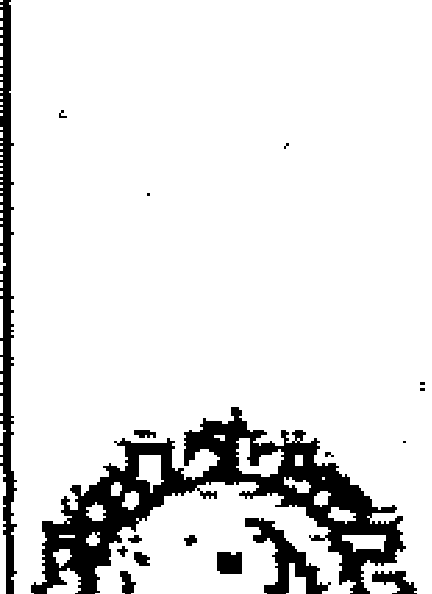
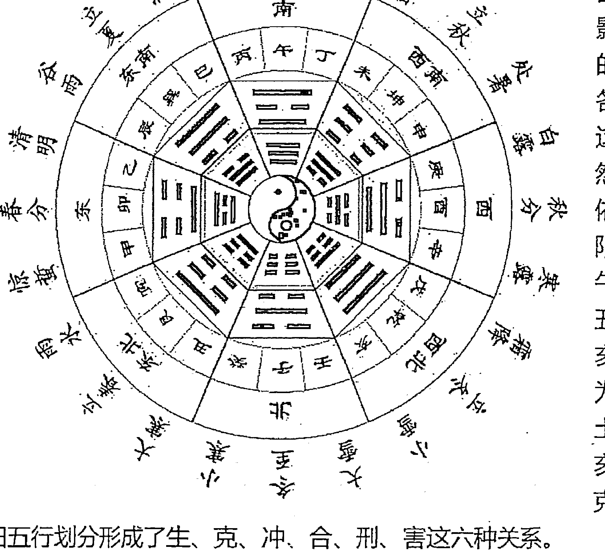
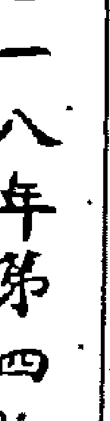
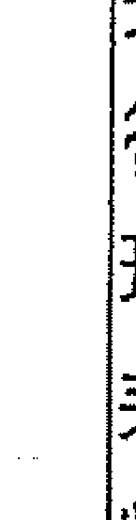
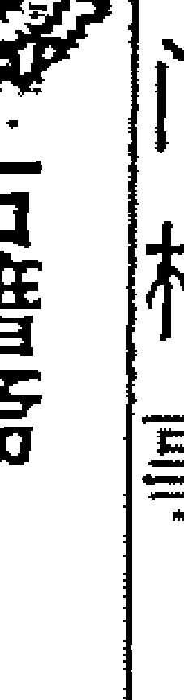
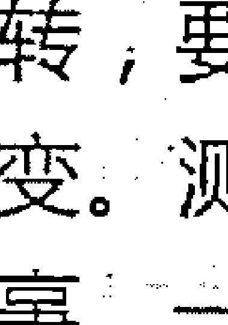
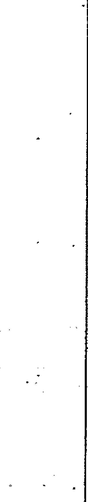

# 不吹牛奇门遁甲讲义一

## 第一章 阴阳学说与五行学说
## 一、阴阳学说
任何事物和现象都具有阴阳两方面，如黑夜白天、男女、冷暖、主客、动静、粗细、夫妻、雌雄、高低、大小、生死、内外、贫富、贵贱等等。宇宙一切的事物的形成、变化和发展，全在于阴阳二气的运动。我们奇门遁甲预测术也离不开阴阳。九星之中：天蓬星、天任星、天冲星、天辅星是阳星；天英星、天芮星、天柱星、天心星是阴星。天禽星比较特殊，位居中宫，是中性之星，但在奇门遁甲中把五官寄于坤二宫，故在实践中有阴阳同论之说（一般看做阳星）。八门之中：休门、生门、伤门、杜门是阳门；景门、死门、惊门、开门是阴门。

八卦中，以乾、坎、艮、震为阳；以巽、离、坤、兑为阴。十天干中：甲木为阳木、乙木为阴木；丙火为阳火、丁火为阴火；戊土为阳土，己土为阴土；庚金为阳金，辛金为阴金；壬水为阳水、癸水为阴水。十二地支中：子为阳水、亥为阴水；寅为阳木，卯为阴木；午为阳火，巳为阴火；申为阳金，酉为阴金；辰戌为阳土，丑未为阴土。八神中值符为土、螣蛇为火、太阴为金、六合为木、白虎为金、玄武为水、九地为土、九天为金。八神属于阴性物质，通常情况下我们不按阴阳划分，预测中也不按五行属性参与生克制化，只代表它自身的信息含义。在奇门遁甲中对于十天干还有一个特殊的划分方法，其主要用于出行和举事，即时干甲乙丙丁戊为五阳时，己庚辛壬癸为五阴时。五阳时利客，打仗宜主动出击，日常生活宜远行、求财、上任、迁徙、嫁娶、举事；五阴时利主，商战上宜采取守势，等待时机，军事上宜按兵不动，后发制人。奇门遁甲中又分阳遁几局或阴遁几局。“冬至—阳生”开始用阳遁；“夏至—阴生”开始用阴遁。每个局中又分内外盘，阳遁之局将一、八、三、四左边的四个宫称为内盘；九、二、七、六右边的四个宫称为外盘。阴遁之局，将一、八、三、四左边的四个宫称为外盘；九、二、七、六右边的四个宫称为内盘。通常内盘为内、为近、为快，代表事物现在发生的过程及结果。外盘为外、为远、为慢，代表事物将来的发生过程及结果。内盘为阳面，外盘为阴面。

阳性的事物，具有积极、进取、活跃、刚健、外放、强盛的一面。阴性的事物，具有消极、退守、呆板、柔弱、吸纳的一面。用神都落在阳面（内盘），这个事情就快、就积极。用神都落在阴面（外盘），这个事情就慢，就消极。奇门预测中，凡用神临阴性符号多的，他多消极、动作慢悠悠、发愁而不想动，我们在决策思路上，就要促其动起来，加快进度。凡阳性符号多的，他多主动，常常操之过急，我们在决策思路上，就要建议他把问题考虑周密，稳稳当当，不要把事情做过头。要把阴阳思路贯彻到所有的事情与预测当中去，才能做好预测。

对于阴阳的变化规律，也要深入掌握。主要是五个方面，即：阴阳对立；阴阳互根；阴阳消长；阴阳交媾；阴阳转化。

阴阳对立，是指自然界的万事万物，其内部都同时存在着相反的两种属性，即阴阳两个方面。

阴阳互根，是指这对立的两个方面具有互相依存、互相为用的联系。互为因果，没有阴，阳不能存在；没有阳，阴也不能存在。

阴阳消长，是指这对立的两个方面始终处在彼此消长、此进彼退的动态平衡之中，这样才保持了事物的正常发展变化。如果这种变化出现了反常，也就是阴阳消长的异常反应。

阴阳交媾，说的是对立的双方，一方进入另一方的内部，相吸引和联结，这是产生新事物的前提条件。

阴阳转化，事物的阴阳两方面在一定状态下，向其对立面转化。这推动了事物的变化和发展，阴阳才能长期共存。

在奇门遁甲中，阴阳的划分开始时是在巳亥的位置，后来改为子午。但是，凡是在巳亥的位置时，时间点就具有了变化性，有时提前，有时滞后。子午卯酉四正位，气场纯清，是用一个地支表示的。而四隅位，则气场混乱，用两个地支来表示求测比较杂乱。所以奇门遁甲中就出现了一个特点：用神落在四隅位的，则事情不明确、牵连的事情多、摇摆性、波动性就大；而落四正位的比较单纯、单一、明确，这些都是宇宙的能量场造成的。

阴阳是事物的两大统领。凡是阳干与阳干的碰撞，多是冲突性的、动态性的。凡阴干与阴干的碰撞，多是被动的。这里需要说明的是两个有特性的东西，即火和土。天干里面火土是一家。火是不持久的，最终要变成土，所以说：己和丁到一块，出事也不大；丙戊在一起也是这个道理，还应吉。除此之外，你看阳配阳、阴配阴的有几个好的？因为阳配阳、阴配阴，不是正配，就相互排斥。（异性相吸、同性相斥）

凡阳干都是积极的、乱的、躁动不安的。阴干是消极的、被动的、不情愿的。凡阳的都是在此基础上凸起的、裸露的或突出的。凡阴的都是凹陷的、塌下去的，这些都是它们的特性。比如测坟地遇到己，就表示有坑洞之类。凡阳的大多是干脆的、
## 二、五行学说
五行，就是指金木水火土五种基本的物质元素。奇门遁甲中乾兑两宫五行为金；震巽两宫五行为木；艮中坤三宫五行为土；坎宫五行为水；离九宫五行为火。九星中：天柱星、天心星五行为金；天冲星、天辅星五行为木；天任星、天芮星、天禽星五行为土；天蓬星五行为水；天英星五行为火。八门中：开门、惊门五行为金；伤门、杜门五行为木；生门、死门五行为土；休门五行为水；景门五行为火。甲乙木、丙丁火、戊己土、庚辛金、壬癸水。寅卯木、巳午火、申酉金、亥子水、辰戌丑未土。

我们在学习中要注意归类，比如对天冲星、天辅星、伤门、杜门、震宫、巽宫、甲乙木等先把他们统统归于“木”类，它们就首先具有木这一五行的特性与象意。在掌握了它们共性的基础上，再细分，如天冲星、伤门、震宫、甲木又具有相似、类同的特性与象意；天辅星、杜门、巽宫、乙木具有相似、类同的特性与象意。然后再分析它们的差别，就便于记忆与应用了。

五行木：名曰曲直，能屈能伸之意，具有生发、条达的特性，反映了事物曲直向上的过程。对应方位：东方；对应季节；春天（寅卯辰月）；数目：三、八；对应人体：肝胆、四肢、毛发、神经系统等；对应事物性质：曲直向上，有条达、恻隐、善良、仁慈、倔强之性等；对应五味：主酸；对应五常：主仁；对应五色：绿色、青色。气候：主风。木主人物修长、眉清目秀、肤色清白、坐立身多倚侧、说话畅快、声调高。主人性情仁慈、忠厚、理智、有主见，举止稳重端庄、潇洒。木所代表的职业大多为种植业、医药、文教、印刷、纸张、书籍、木材、园艺、司法、布匹、纺织、装饰、装潢等等。

五行火：名日炎上，具有火热、向上、发光、温暖的特征。火主礼，与人代表文明，好礼，文采好。性格还代表热情、奔放、性情活跃、开朗大方、作风严谨、有奋发精神、尊长爱幼、有创造力、爱打扮、不畏艰辛等。主人面貌上尖下阔、肉多、印堂窄。多动少静、肤色红黄、话多语快。于季节为夏天。方位：南方；数目：二、七。颜色：赤色、红色。气候：热。五脏：心。行业是：美容化妆、照明灯饰、电子电器、易燃品、加油站、高温行业、消防、摄影、化工等。

五行土：名日稼穑，具有生化万物、长养、化育的特性。于季节是四季之末，即阴历的三、六、九、十二月，具有养育、包容、慈爱、主诚实、守信、踏实认真、主静、有信仰、忠厚、朴实、心胸宽广、安静耐心。土主人鼻子肉多、口方、头圆面阔、声音重浊、多静少动、举止缓慢、话语迟钝等。在身体代表皮肤、肌肉、脾胃。对应方位：为内地、本地、中心地带、在四面八方方位上居中；对应人体：皮肤、肌肉、脾胃、消化系统等；对应着事物：厚重、容纳、承载。五味：主甜；五常：主信；五色：黄色。数目：五、十。行业：土地种植、养殖、矿产、房地产、建筑、水泥、石器、丧葬、基础设施、建筑材料等。

五行金：名日从革，具有清净收杀、变革的特性。金主义，于人代表果断、勇敢、坚韧、客观、冷静，多才多艺、好酒好饮、宁折不弯、仗义、通情达理、重名声、善交际、重感情、好管事。配合不好则固执强硬、冷酷、杀戮。季节是秋天。于身体代表骨头、钙质、骨髓、肺、呼吸器官。物质代表金属、矿石等。方位：西方。五味：主辛辣；五常：主义；五色：白色。数目：四、九。金主人：皮肤白皙、眉目英俊、圆脸尖下巴、鼻直口正、说话清亮、骨肉匀称、多短发、胡须少。行业：金属器材、冶炼、金银珠宝、金融、铸造、钟表、钢铁、汽车等。

五行水：名日润下，具有滋润万物、寒冷向下的特性。水主智，于人表示聪明、灵活、善变、流动、润下、胆大、智慧、胸怀广阔、目光远大、学识俱佳。方位：北方；对应着季节：冬天（亥子月）；人体：耳部器官、血液循环系统、肾脏泌尿系统等。五味：主咸。五常：主智；五色：黑色。数目：一、六。水主人皮肤黑细、圆脸、瘦肩、骨骼不壮，身体柔弱、眉清秀美、大眼睛、语调清和、抑扬顿挫。行业：水产、餐饮、运输、娱乐界、渔业、水利、旅游、服务性行业、商业等。

我之所以要大家从五行本质上来把握其性质，这是我们能有效深入学习的方法。奇门遁甲中的星门神仪除具有自身的五行性质和自有特点外，它落在哪个宫，就又具备了这个宫的性质以及其五行属性所反映出来的特征和象意。大家从易理上来理解，从源头上来把握，就能一通百通、融会贯通、熟能生巧、应用自如了。

奇门遁甲是将阴阳五行的生克制化作为预测判断事体过程与结果的主要依据的。实际上生克制化，就是五行学说用以概况和说明事物联系和发展变化的基本观点。相生，含有互相滋生、促进助长的意思。相克，含有互相制约、克制、抑制的意思。

相生一般表示做事能成，一方喜欢另一方。木生火、火生土、土生金、金生水、水生木。相克一般表示做事不成，一方对另一方不满意。木克土、土克水、水克火、火克金、金克木。相生相克是一切事物维持相对平衡不可缺少的条件，是正常现象，如同阴阳一样，也是事物不可分割的两个方面。没有生，就没有事物的发生和成长；没有克，就没有维持事物在发展变化中的平衡与协调的条件。这种生克也是生中有克、克中有生、相反相成、相互为用的关系。

在对五行生克的把握上，还要注意五行亢乘与五行反悔的问题。所谓五行亢乘：就是物极必反的道理。物盛极为亢为过。凡事物亢极则乘，强而欺弱叫乘。事物亢极、太过，往往易折。所谓五行反悔，就是说五行生克中，并不只存在顺克，如旺克衰、强克弱，有时也会出现逆克，衰克旺、弱克强的现象。如土旺木衰，木则受土“反悔”，正如“木能克土，土重木断”的道理。

至于相生相克的情况在什么时候是吉，什么时候是凶的看法，宋朝徐子平所著的[元理赋]就——解释得非常清楚。

| 金赖土生土多金埋 | 土赖火生火多土焦 | 火赖木生木多火炽 | 木赖水生水多木漂 | 水赖金生金多水浊 |
| 金能生水水多金沉 | 水能生木木盛水缩 | 木能生火火多木焚 | 火能生土土多火

种判断不够准确甚至是错误的。为什么？如果时令在午月，时干宫处于死地又入墓或逢空，能生得起来吗？再如春天木旺，时干在震三宫为旺，日干在兑七宫为囚，日干克时干，经过努力可成之象，但要注意休囚的金可能会被旺相之木反悔，事情也难成。要成也要等待到金旺木衰之时。大家在预测中一定要注意各用神的旺相休囚状态，才能做出细致的分析与准确的判断。

五行旺相休囚死状态：同我者为旺、我生者为相、生我者为休、克我者为囚、我克者为死。

春天：木旺、火相、水体、金囚、土死。

夏天：火旺、土相、木休、水囚、金死。

秋天：金旺、水相、土休、火囚、木死。

冬天：水旺、木相、金休、土囚、火死。

四季月：土旺、金相、火休、木囚、水死。

注意：九星的旺衰有独立的法则。我们再讲九星时再做论述。

## 第二章 十天干的信息特性与基本含义

| 1 | 2 | 3 | 4 | 5 | 6 | 7 | 8 | 9 | 10 |
| --- | --- | --- | --- | --- | --- | --- | --- | --- | --- |
| 甲 | 乙 | 丙 | 丁 | 戊 | 己 | 庚 | 辛 | 王 | 癸 |

天干读音：甲（jiǎ）、乙（yǐ）、 丙（bǐng）、丁（dīng）、戊（wù）、 己（jǐ）、 庚（gēng）、辛（xīn）、 王（rén）、 癸（guǐ）。

## 天干的含义

甲是拆的意思，指万物剖符甲而出也。

乙是轧的意思，指万物出生，抽轧而出。

丙是炳的意思，指万物炳然著见。

丁是强的意思，指万物丁壮。

戊是茂的意思，指万物茂盛。

己是纪的意思，指万物有形可纪识。

庚是更的意思，指万物收敛有实。

辛是新的意思，指万物初新皆收成。

壬是任的意思，指阳气任养万物之下。

癸是揆的意思，指万物可揆度。

天干在奇门遁甲中占据着十分重要的地位，有人将奇门遁甲称为天干学。天干作为信息语言符号，基本体现了阴阳五行的特性，但其内涵和外延更深入更广泛涵概了万事万物。幺学声老师和王凤麟老师等在象意解读上做的很细，我这里综合了一下老师们的研究成果。

十天干，由于甲木被遁起来了，余下的九干被称为“三奇六仪”。三奇即乙丙丁，六仪即戊己庚辛壬癸。三奇六仪被赋予了人的形式，着重于人的肢体、器官、行为、精神意识活动的研究，模拟人的内在和外在的各种因素、行为与精神意识形态方面的东西，代表的事物最多，解读起来比较复杂。组合多、联系就多，人的存在不是孤立的，做任何事情也不是孤立的行为，用天人合一的观点来预测事物。

1、表示自然环境(天)时：甲—宇宙的核心、耶和华。乙—日奇、太阳。丙—月奇。丁：星奇。戊：天武。己：明堂。庚：天刑。辛—天狱。王：天牢。癸：天网。解释：甲就是宇宙的核心；乙就是太阳；丙就是月亮；丁就是星星。戊，天武，就是武力、动态性的，能够调动天上的日月星，代表的是阴云密布。己是明堂，讲的也是天体而不是讲的地理，明堂是开阔、平坦的意思，代表的是晴空万里。庚，天刑，就是刑罚之意，以天喻地、以地喻人；有时候，可以理解成彗星、陨石、流星招灾了、冰雹之类。辛为天狱，这个天狱不是牢房的意思，而是是储备和隐藏，主隐患或储

（1）外在的：乙：脖子,膝盖,肩,肘,拐弯处,头发；丙：肩,额头,脑门,嘴,嘴唇,；丁：眼睛,牙齿,指甲；戊：鼻子,乳房,肌肉，代表屁股；己：皮肤,鼻孔,耳孔,肚脐,肛门,；庚：前胸,肋,筋骨,后背；辛：臀部,腋下,肋骨；壬：大腿,耳孔,耳道；癸—四肢,手,手掌,脚,也代表胡须和隐私之处。

（2）内在的：甲：心脏、心里行为；乙—肝胆；丙：小肠；丁—心；戊—胃；己—脾，也代表肌肉、小肉；庚—大肠；辛—肺与骨骼；壬—膀胱；癸—子宫、肾。王—动脉血管、心脏。癸代表静脉、神经系统。

（3）意识思维层面：乙：委屈，曲折，萎靡不振，消极，艰辛；丙—急躁，忙乱，烦恼，是非，动乱；丁：清晰，明确，临丁的人点子多，悟性好，急中生智；戊：迟钝，缓慢，阻塞，愚昧；己：阴险，自私，幻想，暧昧，迷惘；庚：固执，任性，倔犟，阻碍，执迷，具有破坏性；辛—自私，细腻，消极，私欲，过失，错误，幻想；王：不安，惊恐，不专—动荡；癸：变化，伤心，难受，阻碍，迷惘，幻想.眼泪为癸水。人对自己不了解的事物，看不清的事物都容易幻想。

需要说明的是，当三奇六仪中任何一个符号出现时，以上所说的各项含义都会同时出现。天上的景物、地上的事物、人的行为、内脏、思维都会同时发生变化，这是统一信息场，不是孤立的某一项变化。只是要强调的有一个侧重点，有一个核心的东西。实际上这些含义是一个整体的东西，所以，外应也是准确的。一连串的都会有像出现，在天应景、在地成形、人内心就会发生变化、并有肢体行为。我们在实际的应用中，要先认识符号。符号的含义是多重，不是单一的，那么我们如何准确的判断符号的象意呢，这里就要分清“剧情”，看是预测什么事，比如乙奇代表医生，又代表老婆，究竟是医生还是老婆，你不能因为乙奇代表老婆，就说老婆是医生。要分清所测的事，比如预测婚姻，这乙奇可代表妻子；预测疾病，这乙奇则代表医生、中药等。但是你如果预测一件事情，临乙奇，你不能说让老婆吃点药、或找了你老婆就好了，那是不对的，它代表的是事物发展的比较曲折、迂回等。

## 下面对十天干做进一步的深化讲述：

（一）甲为阳木，名为大林木，有参天之势，性坚质硬，栋梁之材。主人体形长方，皮肤青白，筋骨强健，国字脸，浓眉秀发，为人清洁，过于自负，不能娴于事故。奇门中称甲为天福为贵人，代表首领、主要领导人、大人物、将帅，隐遁于六仪之下。因为奇门遁甲甲是隐遁的，我们在判断时，六甲以值符为代表，无论六甲谁出现，都代表同一种象意。六甲是头，测企业是企业领导；测家庭是长辈，是中心。测疾病，也是病的头。对于甲最重要的是记住：甲木正直，以值符为代表，在职业上多为领导，是核心，是重要的。

概念：高贵的、有名望的、第一的、首领。

人物：领导人、经理、董事长、将军、元帅、名人。

形态：直、方、高。主人体形长方、皮肤青白、筋骨强健、国字脸、浓眉秀发。

性情：威严、正直、愉快、独断、心高、清洁、浪费。

人体：头、指甲、大脑、肝、胆、筋 感觉：酸胀。

动物：穿山甲、玳瑁、龙虾、乌龟、鳖、贝壳、螺类、螃蟹。

植物：大树、带壳的果实、花生、核桃、松子、粟子、棱角、瓜子。

静物：金、玉、珠宝、古董、文物、帽子、甲胄。

地理：无烟烟囱、粗柱子、房梁、棺材、高亢之地、省会、首都、领导办公室、名人居所、高大建筑物、机关、办公室。

方位：东方。天时：风、春天、早晨。食物：馐珍、美味、高档食品。色彩：青色、绿色。

在奇门预测中，遇到六甲年月日时或年命甲的人求测时，怎么看？阴盘奇门是逢甲就看值符。我们传统奇门，一般是遇到甲申，就看庚；遇到甲戌，就看己；遇到甲午就看辛；遇到甲子就看戊；遇到甲辰就看壬；遇到甲寅就看癸。幺老师在实践中给我们讲过：年上遇到甲年，以值符为主，参考所遁六仪。如甲申年，以值符为主，次看庚金落宫。月上遇甲，就看所遁六仪，如甲子就看戊。日上遇甲，以所遁六仪为主，参看值符。时干遇甲，一定是天显时格，就看值符落宫。我实践，以年命为主线，预测出行方向等是否是墓绝之地时，要以甲来判断，参考所遁六仪。

（二）乙为阴木，名为花草之木，有装扮人间之美，质软柔弱，情满人间。主人身材苗条，男子微驼身，皮肤白嫩，骨肉松弛，瘦长脸。为人性情柔顺，重情仁慈，爱打扮，依附世情。奇门中称乙为天德，为仁德之君。代表日奇、女人、妻子、象是人在爬、头发、眉毛、耳朵、舌头、大脑的神经、血管、肠子、肩膀、胳膊、脖子、肩、腿、脚、手、手指、弯曲的东西。乙落离宫为头、临天芮星，脑血管有毛病。为护士、肝脏、月亮、艺术品、男性生殖器、蚯蚓、胡子、画、神经、木制的桥、小树木、木制的门窗、桌子、椅子、床柜、弯曲的河流、床、领带、输卵管、中药、中医、草地、花草、蝴蝶、蔬菜类的食品、多足的动物、长大的希望、歌女、水果、腰身、柔软的身材、茶叶等。对于乙，测婚一般为妻子的代表符号。性格忧郁、柔弱、逆来顺受、身体微驼。

概念：希望达成、质软、转机、艺术、文化、柔弱、弯曲、曲折、依附。

人物：中医、医生、女人、妻子、艺人、画师、作家。

形态：苗条、微驼身、皮肤白嫩、骨质松弛、瘦长脸。

性情：仁慈、柔弱、仁爱、柔情、善人、依赖、柔顺、忧郁、敏感、自私、逆来顺受。人体：肝、胆、肠、发、神经、淋巴、输卵管、输精管、阴道、阴茎、手、足、肩、颈、臂、腿。

感觉：酸胀。

动物：蚯蚓、蛇、天鹅、龙、海参、海肠、蚕虫、鸟类。

植物：中草药、花草、小树、水果树、藤蔓细嫩植物、牵牛、黄瓜、柳枝、爬山虎、龙爪槐。

静物：漂亮的雕梁画柱、美丽的艺术品、葫芦、木雕、油画、椅子、办公桌、床、装饰性强的物品、漂亮的房间、门、窗、藤椅、管道、拐弯之处、楼梯、面条。

地理：草地、花园、果林、菜园、艺术馆、美容院、漂亮的建筑物

## (九)壬为阳水

壬为江河湖海之水，通天河而周流不息，性猛而不收，难以回头。主人皮肤稍黑，大眼睛，走路摇摆，长发秀眉，为人性情柔顺而阴险，勇敢多智，纵欲任性，可共忧患难以同乐。奇门中称壬为天牢，代表不稳定的事物、牢狱、流动的东西、装在什么里就是什么东西、什么事情往回一想就是好事、变动、大水、自来水、热水器、瀑布、迷糊、迷茫、柔性、智慧、动脉、血液、血管、流动的车、膀胱、风流、船、海边、码头、海港、海滩、海军、黑色的、怀孕、娱乐的地方、聚众、驾驶员、司机、运输行业、流动的云、门扇、养殖业、海产品、水上运动、鱼类、小孩、小偷、眼睛、演员、邮电行业、道路、腿、飘动等。对于壬水，旺相指有智慧、勇敢；衰则任性。

概念：孕育、蕴藏、流动、迷惘、迁移、变化、智慧、困境。

人物：孕妇、水产者、养殖者、旅游者、航海者、海员、风流、流氓、渔猎者。

形态：皮肤稍黑、大眼睛、双眼皮、走路摇摆、长发秀眉。

性情：柔顺、阴险、勇敢、多智、纵欲、任性、热情、威严、容纳。

人体：发、眼、动脉、心脏、膀胱、宫胞、小腿。

感觉：胀痛。动物：水中物、鱼、虾、蟹、龟等。

植物：荷花、菱角、海带、海草等。

静物：被子、窗帘、灯罩、水池、自来水、洗手间、厨房、水管、水仙、消防用品。

地理：江、河、湖、海、道路、人流、电影院、娱乐场所、礼堂、饭店、车站、码头、机场、监狱等。

方位：北方。天时：雨天、冬天。色彩：黑色、蓝色。

## (十)癸为阴水

癸为雨露之水，性发生至静至弱，滋润万物。主人矮小黑丑，圆脸瘦肩，声调不高，为人性情阴柔怕事，多伤感，不能自主。奇门遁甲中称癸为天网，代表性及性生活有关之事、牢狱、小水、淋浴、饮料、咖啡、可乐、眼泪、哭泣、奶、尿尿、厕所、（癸加辛水珠）汤粥、污水、眼睛（水汪汪的大眼睛）、湿度大的雾气、（戊加癸是钱财都流了）洗浴用品、鞋子、头发、油类、鱼缸、下雨、

子宫、足、女性用品、便池、鼻涕、蛋、黑色的发、黑色的眼睛、困难、静脉、血液、酒、（癸加己酒鬼，丁加己烟鬼，在坎宫女人来例假了）色情、肾、神经系统、化妆品、精液。对于癸，旺则有悟性、有灵性；衰则淫荡，好饮酒，穷困。测婚，多和淫秽有关。

概念：制约、管束、艰难困苦、跋涉、流动、变动、变化、性、淫。

人物：瓜农、菜汉、茶农、酒鬼、淫荡之人、囚犯、被困之人、穷困潦倒之人等。

形态：矮小黑丑、圆脸瘦肩、声调不高。

性情：阴柔怕事、多愁善感、不能自主。

人体：足、私处、静脉、肾脏、眼球、精液、痣、口水、眼泪、鼻涕、汗液、尿溺。

感觉：麻凉。

动物：水鸟、鸭、鹅、雁、鹤、鹭、黑蝇等。

植物：水稻、蔬菜、水果、水仙、喜水植物。

静物：酒、醋、盐、茶、饮品、油漆、汤、液体、物品水具、鞋。

地理：湿地、池塘、水塔、地沟、地井、地下水、污水、粪池、污秽场所等。

方位：北方。天时：雨天、深夜、冬天。色彩：黑色、玄色。

在对十天干象意的解读中，有一点要引起重视。比如在测婚姻中，乙为妻，庚为夫，丙丁火为情人。我们选取了其中的某一符号为用神来看时，就不能以其符号本身的象意为解读重点。如乙奇为妻子，岂不所有的乙奇都一样的信息了。这时，应以她的落宫状态，所临星门神仪格局组合等状态来综合判断。其他天干的落宫，也都有类似的情况。

## 第三章 十天干的作用关系与十二状态

十天干之间有相合、相冲的关系，即异性相吸、同性相斥。天干自身还有十二状态。

在奇门遁甲里，天干的相合代表了事物的发展变化规律。比如甲己为中正之合，就像君子间一样的情谊。乙庚为仁义之合，就像桃园三结义一样的情谊。丙辛为威制之合，就像军队中的将军与部属间的关系。丁壬合为淫荡之合，就像西门庆与潘金莲，有见不得人的勾当。戊癸为无情之合，就像陈世美休妻一样，无情无义。如，开门代表法官，如果临丁+壬的格局，则表明法官与原告或被告某一方有见不得人的事。

天干五合在奇门中我们有两种使用方法：一是如判断配偶的情况时，比较自身落宫与相合之干的落宫状态以及关系。如甲己合、乙庚合、丙辛合、戊癸合、丁壬合。二是我们通常把一个宫内遇合的情况称为“合格”。如值符（甲）己同宫；庚+乙，乙+庚；丙+辛，辛+丙；丁+壬，王+丁；戊+癸，癸+戊。古人在论冲合动静时有一个讲法：“凡事在尚未发生的时候，遇冲则发生变动；在已经发生的时候，遇冲则冲散。事未起而遇合，结果是静而不起；事已起而遇合，则事成。” 奇门遁甲中又把这类格局称为“奇仪相合”吉格：乙庚、丙辛、丁壬为奇合；戊癸、甲己为仪合。若得吉门，凡和解事吉利。一般说来，逢合格利于合作，并且逢合格必牵连他人或他事。测出行，遇合格，多牵绊，难出行。

关于天干相冲，在奇门遁甲里一般遇到相冲的格局，都是不太好的格局，被定为凶格。这个相冲关系有：甲与庚；乙与辛；丙与壬；丁与癸四组。其中：乙遇辛，丙遇壬，丁遇癸三奇失灵。冲格中还有一些地支相冲的格局如戊+辛，辛+戊；己+王，王+己；庚+癸，癸+庚；主动或主散，更重要。戊辛相遇破财；己王相遇争讼；庚癸相遇官司走动等。我们在详论格局时再做具体分析。

以判断求测人状态为例：天干落宫的旺衰状态就反映了被测人的吉凶状态。天

| 干支表 |
| --- |
| 阳干 | 甲 | 亥 | 子 | 丑 | 寅 | 卯 | 辰 | 巳 | 午 | 未 | 申 | 酉 | 戌 |
|     | 丙 | 寅 | 卯 | 辰 | 巳 | 午 | 未 | 申 | 酉 | 戌 | 亥 | 子 | 丑 |
|     | 戊 | 寅 | 卯 | 辰 | 巳 | 午 | 未 | 申 | 酉 | 戌 | 亥 | 子 | 丑 |
|     | 庚 | 巳 | 午 | 未 | 申 | 酉 | 戌 | 亥 | 子 | 丑 | 寅 | 卯 | 辰 |
|     | 王 | 申 | 酉 | 戌 | 亥 | 子 | 丑 | 寅 | 卯 | 辰 | 巳 | 午 | 未 |
| 阴干 | 乙 | 午 | 巳 | 辰 | 卯 | 寅 | 丑 | 子 | 亥 | 戌 | 酉 | 申 | 未 |
|     | 丁 | 酉 | 申 | 未 | 午 | 巳 | 戌 | 亥 | 子 | 丑 | 寅 | 卯 | 辰 |
|     | 己 | 酉 | 申 | 未 | 午 | 巳 | 戌 | 亥 | 子 | 丑 | 寅 | 卯 | 辰 |
|     | 辛 | 子 | 亥 | 戌 | 酉 | 申 | 未 | 午 | 巳 | 辰 | 卯 | 丑 | 寅 |
|     | 癸 | 卯 | 寅 | 丑 | 子 | 亥 | 戌 | 酉 | 申 | 未 | 午 | 巳 | 辰 |

盘日干状态代表求测人现在或将来的情况。地盘日干状态代表求测人过去的情况。

## [日干落长生] 长生就是这人正处于新的增长点，是正在蒸蒸日上的上升阶段，因此是一种吉利的征兆。代表生长、生活品位高、有根基、有靠山，慈爱，享受。长生之处可看其财源情况与新生事物。

## [日干落沐浴] 凡预测人处在沐浴状态时，如果是测事业，我们常常说他处于败地，这时的“沐浴”就是指“私欲”，欲望，想美事，想入非非，问题多多。容易

## [日干落冠带]凡被预测人落冠带状态时，指此人好面子，“打肿脸充胖子”，外强中干、华而不实，做表面文章，实际是“窝囊废”“草包”。虚伪、遮盖、隐藏真相、包装自己、伪装等。冠带之处，看其学历、名气。

## [日干落临官]这是一种比较旺相的状态，也叫“禄地”。此人正处在收获的时期，事业兴旺，有财路，有收入，吉利。这就是当官的、做管理的，是和领导在一起的等等。临官之处，看其工作、职务、女人之丈夫。

## [日干落帝旺]则表示此人正在最旺盛期，眼下是顺利的。是鼎盛，是壮大。但孕育着以后将走下坡路，容易受挫折。帝旺之处，看比赛、争夺、顶级等。

## [日干落衰地]则表示此人走上了下坡路，有气无力，缺乏自信心，是一种衰退、脆弱、软弱可欺的状态。也代表此人无能为力，比较孤独。衰地，看其缺点、退处。

## [日干落病地]代表此人有问题发生、有毛病、缺点，做事漏洞多。落病地，可看其问题、疾病。

## [日干落死地]是一种消极状态、自己没有信心、看不到希望、做事不灵活、死板教条、停止、不可调和等情况。落死地，可看其终结。

## [日干落墓地]墓地，有“入墓”和“入库”之说。什么情况下叫入库？什么情况下叫入墓？这是由其天干在月令（时令）中的状态判断旺弱来确定的。比如丙火在乾六宫为入墓库。现在时令是午火月，丙火在月令中旺，则它在乾宫为入库。“入库”就是暂时放在仓库里，还有出来的时候。再如现在是子月，丙火在月令中死，则它在乾六宫为“入墓”。“入库”代表隐藏、储藏、掩盖、伪装，是暂时失去了原来的作用，暂时力不从心，入库实际是在暗中积蓄能量。而“入墓”是指事物受到了限制。日干入墓，如同手脚被捆住了，发挥不出来。入墓的人，常常内向、不爱多说话。日干入宫墓，表明无作为、遇事束手无策、能力得不到发挥或遇有棘手事、求财不得。日干下临的地盘干入墓，主有志难伸、犹豫不决等。落墓地，可看其归藏、暗昧不明之事。

## [日干落绝地]绝望、孤立、入绝境了、到了尽头、没了希望、走到了极端，断绝了。一般落绝地不是好现象，但是如果其星门神旺相逢吉格，亦有绝处逢生、东山再起之象。落绝处，可看其绝断之事。

## [日干落胎地] 有了新的想法还不完善，还没有对外讲。是一种在孕育、酝酿，计划刚刚有点雏形。表明求测人正在酝酿要做的事，自己感觉还不成熟等。落胎地，可看孕育之类的事。

## [日干落养地] 就是正在筹备力量、积蓄力量、孵育、修养。表面上看什么也没有干，实际上内心已经活动了。落养处，可看其培训、计划之类。

以上十二状态，其中死、墓、绝、胎、养，属于地下的状态。长生、冠带、临官、帝旺属于地上的状态。沐浴、衰、病，属于地上弱的状态。沐浴、冠带为脆弱、残缺。衰墓死绝，什么事都难干成。胎、养，只是想法，有待实施。把握好十二状态，可以进一步的分析这个人的特征与心态。细节决定成败，通过细致的分析，你能把事情预测的更准确。

在判断十二状态时，会遇到一个问题。即四维宫中有两种状态，如丙火在乾六宫有“墓”“绝”两种、在巽四宫有“冠带”和“临官”两种状态。这该怎么看待？这个时候一般遇旺以旺为主，遇墓以墓为主。比如当“长生”和“养”在同一宫时，以“长生”为主。“冠带”和“临官”在同一宫时，以“临官”为主。“帝旺”和“衰”同宫时，以“帝旺”为主。“沐浴”和“冠带”同宫时，以“沐浴”为主。“死”和“墓”同宫时，以“墓”为主。以上是一般书籍上的讲法，实践看不够科学。以时辰的阴阳五行，来定用神对应的是阳支还是阴支，来确定其十二长生状态，实践看比较准确。

以上是十天干在落宫中的旺衰判定，这叫“地利”情况。在预测中落宫是主线，但也必须参考时令。关于十天干在时令中的旺衰，不是按这个十二长生表来看的，而是按照的在月令中的生克来断的。甲乙木旺于寅卯亥子月、丙丁火旺于巳午寅卯月、戊己土旺于巳午和辰戌丑未月、庚辛金旺于辰戌丑未和申酉月、壬癸水旺于申酉和亥子月。其他情况为衰弱。

在我们的判断中，如果用神落宫十二状态旺相，该用神又在月令中旺相的话，则为锦上添花、好上加好。如果落宫十二状态死墓绝败，又逢月令休囚无气，则是雪上加霜倒霉之至。当落宫不好，而月令中旺相之时，眼下还不至于很凶。当在月令中休囚，而落宫旺相时，等时令旺时，更会春风得意。在关于求测人落宫状态与月令状态的判断中，以空间为主，以时间为辅。即落宫十二状态是第一位的，月令中的旺弱是第二位的。但十天干在时令中的旺弱也不能忽视，比如，乙木落乾宫在死墓之地，但月令在寅卯月或亥子月（入库），时间有利，虽然落宫不好，麻烦缠身，但要在现在有利的时间内把麻烦来处理掉，不然等乙木衰弱的月份，就更不行了。所以最佳时间点，也是特别重要的。你能量再大，没有很好的时机也不行。久远之事落宫最为重要，办理短暂的事情，则时间因素最为重要。

## 第四章 十二地支的基本特性与信息含义

十二地支源于木星围绕太阳运转对地球的影响，形成十二种不同的能量场，从而产生了各种生克制化的关系，这也是易学描述推演自然规律及事物和现象的依据。十二地支根据阴阳划分为子、寅、辰、午、申、戌为六阳；丑、卯、巳、未、酉、亥为六阴。依五行划分为寅卯木；辰戌丑未土；巳午火；申酉金；亥子水。根据五行的生克制化关系和十二支阴阳五行划分形成了生、克、冲、合、刑、害这六种关系。

## 一 子 五行：阳水

概念：首领、名人、智慧、聪明、豪奢、隐私、奸邪、暗昧、色欲、悲泣、丢失。

人物：女人、儿童、艺人、书画者、盗贼、好色之人、旅游之人、科学研究者、文化事业、化学行业、秘书、会计、水上工作者、运输者、从事液体物质经营者、黑衣人、混血人、淫乱人。

形态：面黑或眼大、大头、身体圆润、皮肤光滑。

性情：可圆可方、处事圆滑、上善若水、聪明吉祥。

人体：肾、膀胱、精神、血液、血管、大脑、卵子、脚趾、生殖系统、内分泌系统、精液、经血。

动物：老鼠、田鼠、鸟类、蝙蝠、鱼类、喜水动物。

植物：蔬菜、水果、水草、芦苇、荷花、棱角、水稻等一切水中生长的植物。

## 二丑 五行：阴土

概念：忠厚、正直、贤良、福德、职称、难堪、丑陋、田宅、房屋、财产、院落、争斗、诅咒、冤仇、告状、官司、举荐。

人物：领导、房地产经纪、种植者、

## 六巳五行：阴火
概念：信息、惊扰、怪异、争斗、口舌、流血、变化、乞索、讨债、赏赐、奖赏、聪明、狡诈、虚伪、忧愁、文艺、轻狂、谩骂、犯法。
人物：精神病患者、经常做梦的人、怪人、流血受伤的人、爱打架者、讨债者、文艺工作者、犯法者、虚伪狡诈者、厨师、歌手、少女、美人、乞丐、妇人。
形态：红脑门、大嘴、头发黄、眼目不整、水蛇腰、哈腰、走路摇摆。
性情：狡猾善变、神经质、虚伪怪异、精神恍惚。
人体：血液、心、面部、口腔、喉咙、齿、唇、左肩小肠、眼睛、肛门。
动物：蛇、蚓、蝉、萤火虫、飞虫、飞鸟、蜥蜴、鳝鱼。
植物：植物的尖部、藤萝、瓜秧、牵牛、蒺藜、爬山虎等蔓状类植物。
静物：文字、文件、文书、书画、证件票据、砖瓦、花果、烟囱、电视机、灯、手机、电话、电器类、发热物体、火光、烟雾、火灾。
地理：热闹向阳质地、供喚那个娱乐场所、砖厂、化工厂、弯曲的河流、弯曲的小路、长城、电器店。
方位：南偏东。天时：炎热、星星。色彩：红色。

## 七 午 五行 : 阳火
人物：富商、名人、经理、第三者、善良的人、教徒、爱骑马的人、纺织者、胆小者、惊恐者、胎孕、爱骂人者、文化人、广告经营者、导演、演员、制片人、工矿冶炼、电业、兵工、烧伤者、烫伤者、发烧者。
形态：目圆、面赤、身体高大。
性情：脾气急躁、点火就着。
人体：心、口、目、血液、神经、小肠、头、舌、肚脐。
动物：马、鹿、獐、麝、漂亮的鸟类。
植物：花、盆景、绿篱、观赏树。
静物：电话、信息、手机、文章、电视机、书画、旌旗、裤子、枪炮弹药、烟花爆竹、丝绸、布料、棉麻织品、锅炉、暖气。
地理：漂亮壮丽的建筑物、客厅、大厅、厨房、窑燥、窗户、电影院、山岭、娱乐场所、电站、电子设备厂、商店、炉冶、高岭、田园、道路、鸟窝、鸡窝、鸟笼子。
天时：闪电、太阳、炎热。色彩：红色。

## 八 未 五行 : 阴土
概念：口味、味道、酒食、宴会、婚姻、喜庆、拜神、召见、会见、小的收获、否定。
人物：丰满之人、胖人、喜食者、好打扮着、经营酒水者、厨师、调酒师、茶师、经营食品者、父母、老人、姑嫂、姨妹、教徒、寡妇。
形态：肥胖、丰满、肉多、皮肤干燥、唇厚。
性情：豪爽好饮、乐观性直、知书达理。
人体：头、胃、肝、脊柱、右肩、腹腔、手、口舌。
动物：海鲜、河虾、养、鹿、驴、骡等一切能提供人们饮食的动物。
植物：农作物、蔬菜、果树、等一切能提供人们饮食的植物。
静物：盘子、碗、帽子、衣裳、印信、酒器、用最嘴的乐器、医疗器械、药品、窗帘、食品。

## 九 申 五行 : 阳金
概念：运动、传递、道路、疾病、精神、意识、交易、失脱、问题、阻隔、困难。
人物：军人、公检法、猎人、恶人、旅游者、首饰加工者、冶炼者、金属加工、汽车制造者、财务、经商、医生、屠宰、穿孝的人。
形态：圆脸、圆眼、脖子粗短、脑门后平、身材肥大。
性情：严肃、急躁、不怒而威。
人体：大肠、右胸、右臂、骨、肺、食道、气管。
动物：狮子、老虎、猴子、猿、猩猩。
植物：大麦、坚果、榛子、核桃、栗、松子、胡桃。
静物：刀、剑、武器、绢帛、经文、羽毛、药物、金银、铁器、汽车、飞机、石制品、金属制品、水泥制品。
地理：道路、关口、路障、悬崖、湖、池、河水之发源地、灵枢、神堂、佛堂、麦地、机械场、金属加工冶炼厂、水泥厂、首饰厂。
方位：西偏南。天时：霹雳、闪电。色彩：白色、金色。

## 十 酉 五行 : 阴金
概念：密谋、筹划、策划、缜密、精致、细节、完美、金融、经济、市场、交易、买卖。
人物：经商人、策划人、总经理、细致完美的人、资助自己的异性朋友、女人、女友、第三者、戴金银首饰的人、歌星、律师、教师、从事说教工作的人、金融工作者、经纪人、银行工作者、刀伤的人。
形态：形貌端庄、面色黄白、声音清脆圆润。
人体：右肋、手臂、口、耳、目、嘴、鼻、肛门、尿道、手、骨骼、经血、小肠。
动物：鸡、鸽、鸭、鹅、羊、善鸣叫的鸟类。
植物：葱、姜、辣椒、大蒜、小麦、辛辣植物。
静物：金银、首饰、皮革、玻璃制品、金属制品、玉石制品、镜子、玻璃、宝剑、小刀、手术刀、钱币、信用卡、珠宝、首饰、洗衣机、瓜果、口罩、石柱、石碑、酒制品、菜食。

## 十一 戌 五行：阳土
概念：欺诈、虚伪、虚耗、虚假、思考、空虚、伪装、虚幻、缥缈、茫然、不切合实际、深邃、精神、宗教。
人物：军人、狱警、门卫、长者、教徒、猎人、恶人、黑社会、强盗、乞丐、善人、小孩、舅舅、妹妹、建筑者。
形态：方脸、眼泡大、嘴唇厚、手掌松软、皮肤干燥。
性情：慈祥、宽厚、态度安然。
人体：命门、膀胱、腿足、腹部、胃、脾、臀、胸。
动物：狗、豺、狼、鹰、大雁。
植物：红柳、甘草、枸杞、枣树、仙人掌、地黄等沙漠或抗旱的植物。
静物：服装、鞋履、刀剑、手铐、刑具、农具、钥匙、锁头、碾磨、瓦器、石块、出土文物、佛珠、坛子、坚硬之物、干燥之物、炉子、燥、变压器、瓷器、锁、药箱、钥匙、尸骨。
地理：高岗、高坡、山岭、寺观、学校、牢狱、冶炼厂、化工厂、堂屋、坟墓、墙垣。
方位：西偏北。天时：云、阴天。色彩：黄色。

## 十二 亥 五行 : 阴水
概念：惊讶、胆怯、流动、光明、召见、隐私、脏脏、偷盗、目眩、恍惚、困难、疑惑、争斗、沉溺、索取。
人物：儿童、军人、酗酒人、乞丐、艺人、盗贼、产销饮品者、风流淫荡之人、下流之人、阴谋之人、哭泣之人、腹泻之人。
形态：长脸、黑面、手脚也黑、大头。
性情：精神恍惚、神经衰弱、聪明伶俐、风流淫荡。
人体：眼、头发、毛发、肾、膀胱、血液、体液、分泌物、肛门、脚。
动物：猪、熊、鱼虾等水中生长的动物。
植物：梅花、葫芦、水草、海带、荷花、水稻、菱角、芦苇等水中生长的植物。
静物：笔墨、布匹、毛皮、帐子、麻布、图画、幔帐、伞、雨具、斗笠、圆环、酱油、醋、糖、盐、饮料。
地理：庭院、菜园、墙角、低洼地、江河、湖海、仓库、寺院、楼台、饮料、酒厂、盐场、酱油厂、浴场等。
方位：北偏西。天时：云、阴天。色彩：黑色、蓝色。

关于十二地支信息象意的运用，经常被我们所忽视。其实，如果要想做更深层次的预测，运用和解读好十二地支的象意也很有益处。如在预测中，地支的象意是隐藏的事物发生的先机条件；代表着事物发生的地理环境；影响着事物的成败和应期。比如在分析一个人的性格和外貌时，通过星门神仪等做出判断后，也可以用地支来补充他周围的环境、爱好以及他目前的状态。比如丁到丑为入墓，但看丁火是看不出这个人的形态的，但结合地支就好判断。丁落丑，女性其身躯就会稍微前探，男性很可能驼背。用神入墓，还常常代表一些坏的信息，如丁入丑墓，代表爱骂人、爱告状、爱诽谤别人等。地支的作用还表示为外来因素的干扰，是你想象不到的意料之外的因素。

天干代表的是动的、明的、看得见的；而地支代表的是静的、暗的、看不见的。地支代表着时间概念和方位。地支的影响，再如：甲子戊落艮宫，子丑合，你要账，这个钱就不好拿出来，有别扭事，不好动；测投资，则有别的事勾连。甲子戊落离宫，子午冲则财散。甲子戊落震宫，子卯刑，破财。甲子戊落坤宫，子未相害，可能有人在财上捣鬼等等。

地支也代表着一些类象，比如甲子戊落艮宫，临玄武，小人可能是属牛的；落震宫，小人可能是属兔的等。对于这些问题，我们将在实战预测中结合实例再做讲解。

## 第 五 章 十二地支之间的作用关系
# 一 六仪击刑
|已 午 未 申辰 酉 戌 寅|巳 午 未 申辰 酉 戌 寅|巳 午 未 申辰 酉 戌 寅|巳 午 未 申辰 酉 戌 寅|
顺转 恃势之刑|逆转 无恩之刑|相对 无礼之刑|自刑 自 刑|

在地支的作用关系中有子卯相刑、寅巳申相刑、丑未戌相刑、辰午酉亥自刑几种说法。相刑就是互相伤害、互相刑罚的意思。日干遇击刑说明了什么呢？说明这人极度难受、不安、压力大、疲劳、损失、受伤、辞职、为有问题，为受到了迫害，多与疾病或刑伤有关，测运气是低谷。事体遇击刑，则遇事别扭、拧劲、难办。击，就是受打击。刑，就是刑伤刑罚。用神临击刑，这人思维方式给人不一样，阿凡提的驴，你让它往东它朝西。甲子戊落震宫，形成子卯相刑，这是个无理之刑，不讲道理，多因投资或桃色事件破财。甲戌己落坤宫，形成未戌相刑，这为持势之刑，依仗权势造成的伤害，多表现为窝火和赌气。甲申庚落艮宫，形成寅申相刑，这为无恩之刑，多恩将仇报，容易引起争斗、受伤。甲午辛落离宫，形成午午自刑，因为自己的原因而受到责罚，容易破财、犯错误，犯罪，头部受伤、亲人离别等。甲辰壬落巽宫，辰辰自刑，也是因自己的原因受到责罚，自己伤害自己。甲寅癸落巽宫，巳寅相刑，也是无恩之刑，恩将仇报。若日干（年命）壬癸落巽宫，一般都有腿脚容易受伤之象。再临杜门主牢狱。临惊门，有官司。临伤门，有伤灾等。

# 二 相生
寅卯木生巳午火；巳午火生辰戌丑未土；辰戌丑未土生申酉金（注：新派八字中论未戌土脆金）；申酉金生亥子水；亥子水生寅卯木。

# 三 相克
金克木、木克土、土克水、水克火、火克金。

# 四 相冲
子午相冲、丑未相冲、寅申相冲、卯酉相冲、辰戌相冲、巳亥相冲。相冲为散的意思，同性且方位相对的两个地支即为相冲。相冲者有身心不安、出行、变化、财产耗散等信息。我们要密切注意：一是六仪所含地支，与所到之宫所形成的“相冲”，如甲子戊在离宫子午冲；甲戌己在巽宫形成的辰戌冲；甲申庚在艮宫形成的寅申冲（又击刑）；甲午辛在坎宫形成的子午冲；甲辰壬在乾宫形成的辰戌冲；甲寅癸在坤宫形成的寅申冲（又入墓）。二是天地盘六仪所含地支之间相互形成的“冲格”，如辛戊组合；庚癸组合；己壬组合。凡事在尚未发生的时候，遇冲则发生变动；在已经发生的时候，遇冲则冲散。冲，就是矛盾。逢冲就不协调。

# 【地支六冲】：
撞击力，播种，很会做事，有执行力，有冲劲。冲动，意见不合，反目。走运逢冲则发，不走运逢冲则坠。太岁流年冲向命盘较严重，命盘冲向流年太岁则较轻。根忌冲，逢冲小心「财」。

| 巳 | 午 未 | 申 |
| --- | --- | --- |
| 辰 |  | 酉 戌 |
| 卯 |  |  |
| 寅 丑 子 |  | 亥 |

+   ※子午冲： 水火不容，情绪不稳定，脾气不好，个性极端。人缘很好，异性缘佳。较有发疯机率，脑神经衰弱的现象。子午的人通常都很漂亮。

+   ※丑未冲： 爱追根究底，打破砂锅问到底，主观意识强烈。易赔钱，财库冲开，开销大。爱问，钻牛角尖。较会跟邻居吵架，女命易流产。

+   ※寅申冲： 忙碌，閒不住，劳碌命。开车很快，较会走大马路。有车关，易生车祸。六亲较无缘，一辈子靠自己。（同伤官见官，一生大起大落）

# 五 相害
※卯酉冲： 做事俐落，很敏锐，有第六感，眼睛锐利，人缘好，异性缘佳，心性不定（桃花冲），阴易近身。

※辰戌冲： 辰与戌属现金，库冲库，撞到事业宫的话，投资会失败。不服输，自圆其说，自找台阶。喜做老大，脾气不好，理由多，会将错就错，归错於别人，做事野心大，开销大。须主意婚姻问题。

※巳亥冲： 辩才无碍，口才佳；很会辩，爱聊天，常常祸从口出。追根究底，较会钻小巷，有车关。

子未相害、丑午相害、寅巳相害、卯辰相害、申亥相害、酉戌相害。相害是受害、被害和相克制之意。凡受害如气旺无制易出凶灾、轻则破财，重则损伤人口；如气弱受制处休囚又有相冲者，多为出行走动或工作调动、职业变化、环境变化。测婚遇相害，可能有第三者插足。奇门中注意：甲子戊落坤宫子未相害；甲戌己落兑宫，酉戌相害；甲申庚落乾宫，申亥相害；甲午辛落艮宫，丑午相害；甲辰壬落震宫，卯辰相害；甲寅癸落巽宫，寅巳相害（又六仪击刑）。

【地支六害】： 分离（指人的生离死别），变卦，聚少离多，同床异梦，要收成时，会收不到。

辰相害；甲寅癸落巽宫，寅巳相害（又六仪击刑）。

# 六 相合
个性极端，容易犯小人，易换工作。貌合神离，无话可说，会要求对方。（最严重的害，又称天地害，南北害）

耐性差，容易生气，貌合神离。

是非多，无恩情（人情），易犯小人，冷眼旁观的态度，属驿马害，辩才无碍。如果离婚，也可能同住一屋檐下。

是非多，无恩情，易犯小人。（比喻相见不如怀念，相见就吵，不见又怀念）属驿马害。

本身要注意，易遭周边亲人相害，杀伤力很大，好朋友扯后腿，兄弟无缘，手足无助，要他好，反而害他，愈亲近的人，反驳力越大。

与卯辰害相似，容易被近亲戏弄。（鸡犬不宁，哭笑不得，离婚率高）

相合者为和好之意。合中相生者，越合越好；合中相克者，事情先好后坏。相合多贵人相助。奇门中甲子戊落艮宫，子丑合；甲戌己落震宫，卯戌合；甲申庚落巽宫巳申合；甲午辛落坤宫，午未合；甲辰壬落兑宫，辰酉合；甲寅癸落乾宫，寅亥合。逢合以冲为应期。在奇门预测中我们要考虑相关因素才能准确把握事物的状态。

[地支六合]： 有计划能力，合得

## 九宫的性质与象意

关于九宫的性质与象意等，具体阐述如下：

### （一）乾卦：为天，为太阳，为主宰万物，积极主动，遇事稳妥，不焦不躁有威严，统率决断之意，具有刚健的特性。大部分人落此宫，有头脑。具有高、广阔、华丽、精美、震撼、荣誉第一、物性突显等特征的人、事、物。

#### 1 象义：圆、原始，向上，本源，高亢，核心，傲慢，精华，健全，有创造性、活动力、统帅，扩大，只争朝夕、有威严、权力、战争、竞争、胆量、优胜、充实、满足、模范、正直、尊敬、喜悦、健壮、圆满、收获、永久、法则、核心、长辈、父亲、坚固、激烈。

#### 2 性情：刚健勇猛，重情讲义，多动少静，威严豁达，正直勤勉，自尊高傲、严正威武。

#### 3 形态：高档的，精致完美的，高的，大的，坚硬的，圆滑的，趾高气昂的，金黄色的、贵重的、白色的等。

#### 4 天时：代表天，冰，雹，雾、晴天、晴空、太阳、寒气、雪、霜。

#### 5 地理：西北方，京都，大城市，形盛高亢之所，大饭店，名盛古迹，大会堂，圣地，寺院，高级住宅，大厦，金属工厂，配件商店、广场、繁华地、首脑集中地、银行、警察局、机关、武馆、博物馆、邮局。

#### 6 人物：主席，总统，一把手，主要领导人，总经理，老板，祖父，名流，专家，厂长，寺院主持、元老、高贵的人、长辈人、大人、老头、公门人、宦官。

#### 7 静物：金玉珠宝，圆珠，木果，高档用品，金钱，钟表。圆形金属，帽子，神佛，物品，手饰，飞机，高大物、火车、轿车、刀剑、贵重物品。

#### 8 动物：马、天鹅、狮子、大象、老虎、熊、龙、鹰、鲸鱼、猪、狗、鹅、凶猛的动物。

#### 9 人体：头，面部，肺部，右腿，骨骼，男性生殖器官，胸部、肋骨、指甲、大肠、皮毛、精液、右下腹。

#### 10 植物：秋花、菊花、大树、能结果的树、药草。

### （二）坎（水）：有危险，掉进陷井的含义，假象，表示艰难险阻的状态，具有曲折多变，永不止息的特性。与液体或影像有关、流动性或柔韧性强、有凹槽承载水的人、事、物。

#### 1 象义：心急好动，不规则形，仁慈义气，愁闷，苦难，劳苦、险阻、烦恼、陷落、沉溺、色情、诱惑、交际、交往、关系、结合、悲哀、哭泣、毒害、灾难、踌躇、缺陷、失败、困难、思考、暗昧、滋润、沉默、狡诈、漂泊、隐伏、追求时尚，聪明智慧，外柔内刚，漂泊不定，沉论隐浮。

#### 2 性情：外柔内刚，随波逐流，善谋多智，多心计，城府深，善算计，奸诈。多变的性格。旺相则有独立的见解、创新思维。

#### 3 形态：劳碌的，辛苦的，忍耐的，流动的，暗昧的，不成形状的，寒冷的，变化的

#### 4 天时：雨，雪，露，霜，水、寒风、深夜、月

#### 5 地理：北方的，江河湖海，溪涧，泉井沟渠，洼地，下水道，鱼池，浴池，酒吧，消防队，妓院，洗头房，地下室，水库、车站、码头、医院、电影院、俱乐部、渔场、洗手间、厨房、水库。

#### 6 人物：中男，江湖之人，匪人，盗贼，娼妇，医生，逃亡者，黑社会人物，劳务打工人员，心理学家，酒鬼，吸毒者，诈骗犯、船员、驾驶员、水产经营者、流动性强的职业、旅游家、

#### 7 动物：猪，鼠，水鸟，鱼类，水中动物、狐狸、四足动物、夜行动物。

#### 8 静物：液体，饮料，油，酒，涂料，黑色的，冷藏设备，潜水艇，浮瓶，汽车的轮子，墨水，带核的果品、带子、绳子、裙子、汤具、水具、渔具、音像制品、文具、毒药、消防设备、浮萍。

#### 9 食物：水果、糖果、蛋糕、年糕、豆腐、冰激凌、鸡蛋、高级食品、香肠、干肉、马肉、米、麦、豆类、花生、辣味食品。

#### 10 疾病：头痛、脑淤血、心脏病、肺部疾病、神经病、肋膜炎、发肿、扭伤、皮肤病、骨折、骨病、硬化性疾病、老病、旧病、伤寒、急性暴病、结肠疾病。

#### 11 时间：秋天，戌亥年月日。

#### 12 颜色：大赤色，玄色，金黄色，白色，强烈耀眼的颜色。

#### 13 姓氏：带金属旁的。在兄弟中排行老大，老四，老九。

### （三）艮（土）为土，为阻隔，艰难之意。有静止和安定的特性。（不是绝对的停止）。从硬到软，有阻隔性，从大向小延伸，有纽带连接的人、事、物（如漏斗、显示器）。

#### 1 象意：静止，呆板，稳定，固守，慎重，等待，困难，迟滞，诚实守信，主观任性，沉着固执，中止、独立、艰难、安定。

#### 2 性情：保守，固执，憨厚，诚实守信，稳重，谨慎迟缓，安静笃实，任劳任怨。

#### 3 形态：坚硬的，顽固的，或与腿有关的，向下发展，或是上硬下软，停止不前，独立存在，静止、保守。

#### 4 天时：云，雾，山峦、阴天。

#### 5 地理：山径路，丘陵，坟墓，山地，高坡，堤坎，休息室，大楼，仓库，宗庙祠堂，矿山，采石场，监狱，派出所，银行，桥梁、东北方。

#### 6 人物：少男，山里人，童子，宗教人员，土建人员，警卫，矿工，贵族，法官，房地产商，犯人，保守者，学生，信徒、家具商、孤独人。

#### 7 动物：虎，狗，鼠，狐狸，喜鹊，啄木鸟，爬虫，有尾巴的动物、有牙有角的动物。

#### 8 静物：岩石，山坡，石碑，土坑；桌子，床，瓜果，土中之物，木生之物，石块，门户，门槛，台阶，座位，屏风，墙壁、瓷器。

#### 9 人体：鼻子，背部，手指，关节，左腿，脚趾，乳房，脾胃，结肠、男性生殖器。

#### 10 食物：牛肉、兽肉、根类食物、山蘑菇、汤圆、甘薯、糖果。

#### 11 疾病：筋骨酸痛、脾胃病、消化不良、虚弱、小儿麻痹症、疮肿、瘤、结石、皮肤过敏、疑难杂症、虚胀、麻木、痘类疾病。

#### 12 时间：冬春之交，丑寅年月日时

#### 13 颜色：黄色，棕色，咖啡色，棕黄色

#### 14 姓名：土旁的，排行5、7、10、8

### （四）震卦：为雷，使万物运动勇敢直前，具有震动，奋起，惊动的特征。蓄势震动、瞬间突发声音、出现动态效果的人、事、物。

#### 1 象意：奋进，上升，躁动，积极，性急，冲动，兴起，显现，影响大，迅速，喧哗、争论、转移、旺盛、发育、果断、生长、妄动。

#### 2 性情：易怒，性急，多动少静，勤奋直爽，自尊心强，心烦易乱，倔强、宁死不屈、意气风发、积极果断、刚愎自用、独断专行、冲动鲁莽。

#### 3 形态：震动的，激烈的，急躁的，华而不实的，有声有响的，高速的，勇敢的，竞争的，吃惊的，外虚内实的，上虚下实的，好看而无内容的、粗糙的、移动的。

#### 4 天时：雷雨，地震，火山喷发，雷鸣、大冰雹、闪电、海啸、东风。

#### 5 地理：东方，树木，竹林、草木繁茂、闹市，广播电台，歌舞厅，公安机关，军队，机场，战场，运动场，菜市场，停车场，花店，乐器店，游乐场，公园，夜总会、音乐厅、商店、噪声大的场所。

#### 6 人物：长男，长子，名人，将帅，驾驶员，运动员，军人，飞行员，说大话的人，音乐家，易发怒的，壮士，精神过敏，警察，法官，社会活动家、歌手、吵架者、木匠、旅行者、狂人、足球爱好者、名医、学生。

#### 7 动物：龙，蛇，百虫，鲤鱼，善鸣之物，昆虫、蜈蚣、燕子、蜘蛛、蝉、蜂。

#### 8 静物：木、竹，鲜花、芦苇，乐器，电话，飞机，汽车，火车，鞭炮，闹钟，音响，手机，裙裤，电器，铃铛、麦克风、武器、鼓、腰带、绳子、箱子。

#### 9 食物：醋、酸的食物、樱桃、柠檬、凤梨、橘子、蜜柑、梅子、海藻类、蔬菜类、筋、蹄。

#### 10 疾病：神经病、足疾、扭伤、脚气、发狂、歇斯底里、恐惧、精神失常、癫痫病、心悸、关节炎、肝脏疾病、气喘、喉咙疾病、手足麻痹、毛发病、神经衰弱、神经过敏、妇科病、腿痛、多动症、强迫症、碰撞性伤。

#### 11 时间：春二月，卯年月日时

#### 12 颜色：绿色，碧色

#### 13 姓名：带“木”的人，排行3、4、8

### （五）巽宫：为风，使万物消散，其好动而慢，进退无常，具有自由活动和渗透的特性。归纳为：飘动、巧妙、三教九流、缺乏针对性的，条、藤、管、任意状、外实内虚，具散发、传播性质的人事物。

#### 1 象意：自由运动，流动徘徊，不稳定，渗透，忙碌奔波，轻浮，空虚，随声附和，基础不稳、顺从、疑惑、轻快、深入浅出、高度、货运、迷途、谦逊、荣誉、普遍性、摸不着边际。

#### 2 性情：进退不果，柔和谦虚，心情不定，虚情假意，没有主见，超俗世外，华而不实，反复不定，难以决断、优柔寡断、心情徘徊、狡猾市侩。

#### 3 形态：基础差的，外实内虚，外刚内柔，轻浮，忙碌，波动，神奇的、烟状气态、向下向里发展、上实下虚、游动传播。

#### 4 天时：刮风，巨风，龙卷风、臭气。

#### 5 地理：东南方、花木茂盛之地，草原，寺观楼台，洞穴、山林之地，邮局，过道，长廊，升降机，传送带，工艺厂，码头，商店，电梯，各种管理处，通风道、直升机、索道、盘山公路、出入口、芦苇荡。

#### 6 人物：长女，科技人员，教师，僧尼，仙道之人，商人，尼姑，狡猾者，流浪者，优柔寡断者，文质彬彬者，新闻人员，公安人员，能工巧匠或自由职业者、寡妇、秃头、木匠、有狐臭、营销员、

#### 7 动物：鸡，鸭，鹅，蝴蝶，蚯蚓，蜻蜓，蛇，带鱼，鳝鱼等。（长条类）

#### 8 静物：树木，木制品，纤维品，竹木品，香烟，水果，丝绳，药材，汽艇，帆船，宣传品，各种票据，下面有口之物、草鞋、椅子、风筝、床、毛巾、抽屉、化妆品、雕刻物、有香味的东西。

#### 9 食物：鸡肉、泥鳅、鲤鱼、大蒜、有刺激味的、胡萝卜、芹菜、韭菜。

#### 10 人体：大腿，胆，肝，气管，神经，左肩，耳

#### 11 疾病：伤风、感冒，气管阻塞，哮喘、支气管炎、中风、肋骨神经痛、内脏疾病、肝脏损害、脱肛、胆结石、脱发、食道疾病、痔疮、狐臭、发恶臭的病、毛发病、动脉硬化、骨折、受风寒、疥癣、胆类疾病、传染病、坐骨神经痛、淋巴疾病、抽筋、强直强硬症，病情不稳定、左肩疼、胀气、忧郁症、血管病等。

#### 12 时间：辰巳年月日时

#### 13 颜色：绿色，碧绿，洁白。

#### 14 姓名：草木旁，排行4、5、3、8

### （六）离卦：外刚内柔，离为火，其性好动而躁，具有光明，美丽，变化，迅速等特性。归纳为多彩、散发热量、外显、出众、深度内涵、求真的人事物。

#### 1 象意：光明，文明，前进，上升，华丽鲜艳，光彩照人，显示轻浮，流动，时尚，枯燥，空虚，装饰，文章，文学，巧言聪明、尊敬、化妆、警惕、文采、远见、洞察、判断、鉴定、餐馆、暴露、虚伪。

#### 2 性情：重礼节，爱美，喜欢装扮，虚心好学，知书达理，易冲动，性急暴躁，内心虚荣、聪敏、名誉、色情。

#### 3 形态：鲜明的，明亮的，发光的，美丽的，可燃的，冒火的。

#### 4 天时：晴天，热天，干旱，彩虹，光，闪电，云霞

#### 5 地理：南方，朝阳的场所，电影院，图书馆，印刷厂，冶炼厂，电视台，火车站，火山，教堂，华丽街道，学校，电厂，广告牌、美容院、画廊、殿堂。

#### 6 人物：中女，文人，目疾人，中层干部，漂亮的人，美容师，作家，画家，编辑，纪检员，白领，艺术家，多情的人，幻想者、摄影者、影视工作者、通信行业、侦查员、博学者、虚伪的人。

#### 7 动物：龟，带壳的蚌类，蟹，鸟，凤凰、孔雀，萤火虫、硬壳虫。

#### 8 静物：报刊，图书，字画，文件，证件，电话，广告，打火机，手机，电动机，锅炉，玻璃门窗，电脑，电视，复印机，化妆品，电气焊工具，电子，电器产品。

#### 9 食物：烧烤类、味苦的食物、贝类、虾蟹、红色食物。

#### 10 人体：眼睛，头部，血液，心脏、乳房、小肠、女人私处。

#### 11 疾病：心脏病、眼疾、视力减退、近视、色盲、头疼、精神疲劳、神经错乱、耳疾、失眠、幻觉症、烫伤、热症、面部疾病。

#### 12 颜色：红色，紫色，花色

#### 13 姓名：火字旁的，红，赤，紫。

### （七）坤卦：为地，有生化万物之功，平稳发展，动静有序而安稳，具有潜意识和柔顺的特性。归纳：乡土气息，可见花草、厚胖、粗糙、内部、第二位有关的人事物。

#### 1 象意：大地、方形、平安、开阔、稳健、文雅、柔顺，平衡，包容，含蓄，勤俭、谦卑、依赖、迷惘、忧虑、慈悲、伏藏、消极沉默，优柔寡断；懦弱迟缓，卑贱丑陋，逆来顺受，敬奉神佛。

#### 2 性情：温厚柔顺，行动迟缓、吝啬消极、感情暖昧，守信诚实，卑贱狭小，固执，保守、多重性格。

#### 3 形态：、方形的、粗笨的、柔软的，平常的，普通的，共用的，虚空的，包容的，黄色的，粉状的，平整的，多数的。

#### 4 天时：阴天，雾气，冰霜、多云、露水、低气压、温暖

#### 5 地理：西南方，田野，乡村，农村，民房，农贸市场，故乡；矿野，原籍，矮屋、平地、盆地、空地、仓库、肉联厂、鸡窝、兔圈、庄稼地。

#### 6 人物：母亲，妇人，农民，群众，房地产，农牧业经营者，体胖，大腹人，忠厚之人、副手、书商、寡妇、建筑工人、胆小的、丑陋的、女领导、奶奶、领导夫人、皇后。

#### 7 动物：牛，百兽，母马、乌鸦、鸽子、海鸥、夜行动物。

#### 8 静物：方柔之物，水泥，砖瓦，五谷，布帛，丝棉，土中之物，食物，大车，衣服，药品、箱子、农具、日用品、书包、妇女用品、

## 第七章 九星的特性及信息含义

一般来讲，天心星、天任星、天禽星、天辅星为四吉星；天冲星次吉；天英星中平；天蓬星、天芮星、天柱星为凶星。古人有歌云：“蓬任冲辅禽阳星，英芮柱心阴宿名。辅禽心星为上吉，冲任小吉未全亨。大凶蓬芮不堪使，小凶英柱不精明。”

九星为天盘，代表的是人的先天秉性、长相及脾气性格。九星的旺相休囚废又反映着被预测人是否得天时。天时是指时间、政策、大趋向、人生际遇等因素。临吉星旺相为最好。而凶星越衰是越不利。九星旺相为得天时。九星一般反映的是事物最初成像的一些情况，事情开始时，是因为什么原因引起的，或者因为什么原因发生了这件事等。古人强调大事看星，事情的起因就是因为九星的作用而产生的。我们前面讲的九宫，就是指因为九星的起因，这个引起的变化，落在了那个基础面上。

# 一、日干所临九星体现出的状态

【日干临天心星】旺相此人有管理能力，多才多艺、有心计，做事周全，心高气傲、正直、善良。衰弱，则歪心眼多、工于心计。貌美清秀、皮肤较白。一般说来，天心星临宫，有才华，能治病救人。策划周密、进退自如。

【日干临天蓬星】旺相能做大事情，敢冒险、敢作敢为，也可能破大财。衰弱，则为游荡之人、胆大好色。浓眉、脸微黑、络腮胡子。一般说来，天蓬星临宫，经商破财、出行遇盗。只宜安分守己。

【日干临天任星】旺相为人厚道、宽容心强，做事任劳任怨。衰弱则任性、固执。身材矮胖、或有点驼背、面色发黄、相貌平平。一般说来，天任星临宫，经商嫁娶，百事皆吉。

【日干临天冲星】旺相做事雷厉风行，敢说敢干，特性是大慈大悲、助人为乐。衰弱，主鲁莽，爱冲动。个高好动、声音洪亮、语速快。一般说来，天冲星临宫，宜于出征交战，摇旗呐喊。

【日干临天辅星】旺相文化程度高、有涵养、文雅，知识渊博、言行高雅。衰弱，为学究、没主见或有隐藏之事。身材高挑、才貌出众，说话柔声细语。一般说来，天辅星临宫，百事皆宜，更宜升学考官，发展文化教育事业。

【日干临天英星】旺相有名望，要面子，做事光明磊落，宜于谋划策略。衰弱，主办事急躁、脾气暴烈。面色微红、声音响亮。有的面部有雀斑或麻点。一般说来，天英星临宫，宜于谋划策略、面君竭贵，不宜求财嫁娶。

[日干临天芮星] 旺相爱学习，善于思考，爱结交朋友。衰弱、格局差，则表现为贪婪或身体有病等。身材矮胖、面色发黑或有黑痣斑点，容貌较丑。出身农村或现为学生。一般说来，天芮星临官，不宜主动谋吉事，只宜坐待时机。

[日干临天禽星] 旺相处事稳重、正直大方、有帅才、循规蹈矩、为人诚信、按制度办事。衰弱，则死板、办事缺乏灵活性。面貌端庄秀丽，脸型为方脸型或圆脸型。一般说来，天禽星临官，百事皆吉。

[日干临天柱星] 旺相能言善辩，为中流砥柱，能独当一面。衰弱则性格叛逆。面白清瘦、俊丽，嘴巴灵巧或声音突出，旺则骨架宽大。一般说来，天柱星临官，有意外伤灾、官司牵连，求财赔本，出征、远行车破马伤。只宜固守本分。

通常情况下，我们说天心星、天禽星、天辅星、天任星为四吉星。天冲星为次吉；天英星中平。天蓬星、天芮星、天柱星为三凶星。日干逢吉星相助“吉星高照”为得天时。天时有利，则求谋较顺遂。天时是第一位的，时势造英雄。

# 二、九星旺弱

关于九星的旺弱判断《烟波钓叟歌》中讲：与我同行即为相，我生之月诚为旺。废于父母休与财，囚于鬼兮真不旺。九星的旺衰评定有两种情况：一是指九星落宫的状态，即九星与地盘九宫的关系。一是指九星在特定时间内的状态。就是说，也是有空间上的旺衰和时间上的旺衰两种情况。一般以九星的落宫状态为主，兼看在月令中的旺衰。两项都旺，这人运气正好，下步也不错。两项都衰，这人运气正背，下步也好不了。落宫衰月令旺，眼下还有点能量，要抓紧时机办。落宫旺月令衰，暂时不行，很快就有转机。长久的落宫状态是主线，短期的月令状态是主线。

幺学声老师在08年元旦奇门高级培训班上，对九星的来历以及特性做了深入的剖析，附录如下：

星相分野，在天划分九个区域，在地划分九州。在天成像，在地成形，形是像的表现。古人用井字格和方位学来划分和表示其属性。北极星是永远不变的，指南针应该叫“指北针”。阳主动，阴主静。（太阳是动的，北极星是静的），以不变应万变，要理解易与不易的道理。奇门遁甲就是用不变的理论，模拟事物发展的规律，事物受着天体的影响而变化。最初，是感应学说，天地感应、天人感应，人根据天的变化，提前防范地上的变化。如雨天不方便出行，则做伞避雨、造屋而居等。对于地上的河流、洪水，人们可以造桥、造船来防范、通行。这就是人参与了天地的变化，产生了天地人三者之间的感应与关系。现在科技能力非常高了，可以改变“天”了，但是天地人三才这种现象是不会改变的。夏商周三代前，人们很聪明，人人观天象，知天文。商朝的社会结构，已经比较完善了。人们发现，天上九个区域的任何变化都会影响到人，继而影响到人类社会，因此，就由研究自然转到了人类社会的研究。九星变化的影响：

(1) 天篷星(坎一宫)出现异常(隐晦/明暗)，人类就会出现影响安定团结的问题。天篷星主黑社会、土匪等。如83年严打；风水学上是6,7运交接，7为晦折口舌，此年，国家地痞流氓最猖獗，国家不得不开展严打。此年天篷星就出现了异常，坎为水，主江湖人物、黑社会老大。落坎宫，身心劳累、动荡不安，即使是大老板，也是心神不宁、忧心忡忡、劳累艰辛。

(2) 天芮星(坤二宫)如潘多拉的盒子，出现异常，则人类有大的瘟疫、疾病流行。如03年出现的非典。03/04在坤未申之年出现非典、禽流感等，是天体作用造成的。社会的大变化，会影响到每一个人。用神有个主次与重点，核心只有一个，坤宫的星体就是病的象征。

(3) 天冲星(震三宫)叫“河北”（用河来阻断兵戈），所以有护城河。震宫的星体一旦变动，就有兵戈之事。如89年“六四暴乱”。天冲星主兵戈，军人，冲动，鲁莽。

(4) 天辅星（巽四宫）出现异常，则人事管理制度出问题，管理层就出现贪污腐败；科技出现不进步；教育不等等等问题。此宫叫“四辅”，辅佐朝纲之人。一是道德文化修养比较高的圣人来辅佐帝王；二是巫师，宗教之人。“政教合一”。科学家/宗教团体/星象学家。伏羲氏/姜子牙/三皇五帝，都是修道之类的人。所以，天辅星，也代表宗教信仰。佛教来自于印度，过去是死门之地。现在，奇门遁甲文化的发展。

(5) 天禽星（中五宫），万物之宗，中性之数。和合。

(6) 天心星（乾六宫），是管理者，主才华能施展。天辅星与天心星是相通的。天辅星是大学学府，天心星是应用机构。天辅星主文化，但渊博的知识，不一定能得到展露和应用。天心星是“皇帝”，天辅星是老师。天心星是领导，天辅星是谋士。此宫星体发生异常，国家的管理体制就有变革。而天辅星值事，国家的科技就进步；天心星值事，国家的政策，法规发生变化（年家奇门测国运）。天心星也代表心理学，医生，医药。也代表管理学。

(7) 天柱星（兑七宫），出现星体异常，则口舌是非多，诉讼多，社会秩序受到破坏，小人当道，谣言四起。七运，冷战/骂街。（二次世界大战，五黄入中，确实凶）。

(8) 天任星(艮八宫)，出现异常，贸易、流通、农业、经济就会出现问题。“贫”字就是把贝克分了。

（9）天英星（离九宫）出现异常，表示自然灾害、旱灾多。9也代表火患，9与瘟疫也有一定的关系.终生局，日干临天英星旺相的，一般能出点小名气。

九/八二：表示的是自然现象.这些都是相对固定的.

星体是运动的，地球也在运动。以地球为参照物，古人用九宫为模型，每个时辰都在变化.所以我们有时临上了天芮星，指此时受到了天芮星的影响，会生病等。有时天蓬星，会作用到你的身上，做冒险的事情，或破财等。不管怎么变化，星体的布局组合结构没有变化。这里也有符号的延伸，扩大。人是被宇宙能量控制的。这些含义，不是人发明的，而是人发现的。比如，我们要测这个“杯子”，恰巧代表它的符号临天芮星，我们就可以说这个“杯子”有“病”。

# 三、九星的具体象意与特性

# （一）天蓬星

原名贪狼星。与北方一宫坎卦相对应。“讼庭争竟遇天蓬，胜捷名威万里同。春夏用之皆为吉，秋冬用之半为凶。嫁娶远行皆不利，修造埋葬亦间空。须得生门同丙乙，用之万事皆昌隆”。天蓬为水贼，所入之官不宜嫁娶，营造，搬迁等，但如遇生门并合丙奇，丁奇，乙奇，则可用无妨。春夏可用，秋冬助水之势，不可用。理解天蓬星重点，它是凶星、盗星、破财之星。在奇门遁甲中，代表大盗、抢劫犯、杀人犯，又是贪淫好色之星。胆大妄为、敢于冒险、喜欢暗中行事，亦代表黑势力黑社会。但天蓬星旺相，格局好，也有吉利的象意。如镇守边关的大将、敢于做风险投资的大企业家、商人、做投机生意的人。天蓬星格局好旺相临宫，亦修造家居、买房购物、兴做土木工程。不利于经商、出行，如临凶格、凶门，容易遭盗贼或破财、生病。测人为胆大妄为、机智过人，皮肤黑、眼睛大。测事，为风险投资、水产品、海上物品、贩毒走私、娱乐业、餐饮业、养殖业、不正当行业等。天蓬星象意细化如下 :

+   概念：聪明智慧、大胆妄为、心狠手辣、贪恋酒色。

+   人物：妓女、盗贼、乞丐、头发蓬松的人、黑社会、猎鱼者。

+   形态：庄严、威猛、彪悍、精干、面黑或眼大。

+   性情：圆融果敢、大胆妄为、贪婪、敢于冒险、喜欢暗中行事、多情多欲、贪酒恋花。

+   人体：耳、肾、膀胱、生殖系统、排泄系统、头发、眼睛、足部。

+   动物：猪、鼠、蝙蝠、多毛多厚的动物、水生物等。

# （二）天任星

植物：磨菇类、菌类植物、树冠大的树、大叶植物、蓬草类、刚出土的植物、水果、蔬菜、水中生长的植物。

静物：伞、雨具、渔具、船、车。

地理：宫殿、亭子、庙宇、茅屋、简陋的房屋、四面通风的房子、破了门窗的房子、房顶、三角状的建筑、桥等。

天时：阴天、雨天、多云的天气、黑夜、冬天。色彩：黑色、蓝色、玄色。

原名左辅星。与东北八宫艮卦相对应。“天任吉星事皆通，祭祀求官嫁娶同。斩绝妖蛇移徒事，商贾造葬喜重重”。求官，嫁娶，迁徙，百事皆吉，四时皆宜。天任星临宫，人物上多代表农民、开矿的人、种植业者、任劳任怨的老实人、驼背人、辛勤劳碌之人。测事多与矿产、田地、种植、房产、土地有关。经商求财虽然见天任星不凶，但一般收获并不大。因为临天任星的人温和、忍让、慈善，不会投机取巧，所以难挣大钱。具体象意如下。

概念：担当、承受、任劳任怨、任重道远。

人物：驼背人、怕老婆、老实人、长者、寿星、地产商、农业生产者、种植业者、矿山开采者、登山者、建筑者、辛苦劳碌之人。

形态：弯腰驼背、胸部丰满、方脸重眉。

性情：忠厚老实、任劳任怨、倔强、勤奋，有韧性但固执、保守、小气、缺乏开拓精神。

人体：手、腰、脊椎、鼻、胃、脾、腿、腹部、男性生殖器、乳房。

动物：牛、骆驼、虎、豹、狗、狼、猪、山中的动物。

植物：谷穗、稻子、黍子、葵花、山里红、桃李梨杏荔枝等山果。

静物：桌子、椅子、床、被子、车子、柜子、鞋子。

地理：桥、山丘、土包、丘陵、梯田、台阶、门槛、起伏不平的路等。楼梯、斜坡。

天时：云、雾、风沙。色彩：黄色。

# （三）天冲星

原名禄存星。与东方三宫震卦相对应。“嫁娶安营产女惊，出行移徒有灾难。修造葬埋皆不利，万般作为且逡巡”。天冲为雷神，天帝，武士，宜出军报仇雪耻，征伐交战，鸣金击鼓，摇旗呐喊。不宜嫁娶，修造，迁徙，经商。有慈心造化助人为乐之德，并与农事活动有关。天冲星是次吉之星。奇门中多代表军人、武警、武术爱好者、拳击散打、运动员。也代表雷管、炸药、子弹等武器。天冲星临宫，宜于选将出师、鸣金击鼓、争取市场、开拓事业、任人唯贤、主动采取行动。测人一般性子急、雷厉风行、好出风头、工作麻利、敢打敢冲、冲锋陷阵、有勇气、骨气。如休囚，格局不好，则为不稳重、好冲动、鲁莽、欠考虑。具体象意如下：

概念：冲动、直往前闯、冲击、猛烈、鲁莽。

人物：警察、军人、报复者、证人、挑起事端者、田径运动员、武术爱好者、拳击者、性格直爽、说话速度快者。

形态：直、高、长方脸、长发、梳抓髯的人、身体瘦长。

性情：性子急、工作麻利、为人爽快、敢打敢冲、好出风头、不稳重、好冲动、做事多为欠思考、不顾后果、意识冲动、也表示有闯劲、开拓性、办事不拖泥带水、雷厉风行、有勇气、积极进取。

人体：肝、筋骨、发、大腿、神经、气管。

动物：兔子、天鹅、燕子、蛇、鹰鹫、跳蚤、蟋蟀、蝗虫、蚱蜢。

植物：竹、树、高粱、玉米。

静物：乐器、音响、钟、铃、枪炮、剑、汽车、飞机、弹药、鞭炮、电动玩具。

地理：高大建筑物、交通枢纽、交通要道、机场、车站、公安局、派出所、公园、噪音大的场所。

天时：雷电、冰雹、海啸、地震。 色彩：碧绿。

# （四）天辅星

原名文曲星。与东南四宫巽卦相对应。“天辅之星远行良，修造埋葬福绵长。上官移徒皆吉利，喜溢人财百事昌”。天辅为草为民，宜远行，起造，移徒，婚娶，埋葬，请客。特别利于升学考官，发展文化教育事业。奇门中多代表老师、文化教育、学校、大文豪、有文化之人等。为人文雅、有风度。求学之人临之，学业好。休囚，老学究、迂腐或有隐藏之事、墙头草、没主见、随波逐流。天辅星有看官之意，比如监狱

## 古人在判断九星天时旺弱时，强调的是时间因素。与我同行即为相，我生之月诚为旺，废于父母休于财，囚于鬼兮真不妄。这里古人强调的是时间，而没有强调落宫。时间是第一位的，时间对人也是最重要。第二个因素，才是空间因素。

时间单位有年月日时，为什么古人偏偏重月令？这是根据人类活动的常理来说的，是人类生活的一个习惯。随着社会的发展，节奏的加快，我们应该与时俱进，适当调整。一年发生的事情：以月令为主；一月发生的事情：以日建为主；一天发生的事情：以时辰为主。

关于空间因素，就是方位和区域环境的影响。天辅星作用在震巽离宫旺，作用在兑乾宫，则受制；作用在坎宫则废了，作用在坤艮宫为休，这样怎样判定时间、空间的矛盾方面？根据不同的事情、重点不同，有一个原则：办短暂的事情，以时间为第一位的；办长久的事情，以落宫为第一因素；长久规划、连续性的事情看落宫。一次性的事情，以时间为主。但是，这两个因素都要考虑，只是有侧重点的区别。

关于九星旺衰理论的应用，我们还是以天辅星为例，一月所办的事情，要看哪个日子好。天辅星代表天时，如午月，天辅星旺，但并不是天天都旺，虽然午月利于我办这件事，但今天是申日，天辅星不旺，后推酉日、戌亥子日天辅星都不旺，不利。而寅卯日天辅星旺了，则此时行动比较好。注意：当然还要考虑其他因素。再就是，假如此月虽然不利，但可以选择此月中有利的日子。择日就是选择最佳的时间和空间。

# 第 八 章 八门的特性及信息含义

| 杜门：在人事上多主公检法安全等性质的单位。杜门为藏形之方，适宜于躲灾避难、捕盗剿贼、防洪筑堤、判决隐狱等，余事皆不利 | 景门：宜于献策筹谋，选士荐贤，拜职遣使，火攻杀戮，余者不利，谨防口舌及血光、火灾。景门多主文书之事。 | 死门：为凶门，不利吉事。只宜吊死送丧，刑戮争战，捕猎杀牲。 |
| 伤门：凶门，适宜于索债、捕盗、渔猎、赌钱等。但不利于：经商、出行、赴任、修造、嫁娶，经商易破财，出行易有灾。 |  | 惊门：凶门，主惊恐、创伤、官非之事。适宜斗讼官司、捕捕盗贼、蛊惑乱众、赌博游戏，余事不利。 |
| 生门：大吉，利于求财，特别是搞房地产、种植业、养殖业等。征战出行、嫁娶建造也为吉利。但不利埋葬治丧。 | 体门：吉门，利于谒贵求见，上官赴任，嫁娶迁徙，经商建造。但不利行刑断狱。 | 开门：大吉，利于开业经商，征战远行，考学参军，婚娶乔迁，建筑贸易，添人进口，治病求医。 |

八门即开门、休门、生门、伤门、杜门、景门、死门、惊门。八门是由八卦衍生而来的，同样具有八卦的一些属性。同时八门又代表八个方向、八个区域。八门又反映了事物和现象，从生长到衰弱的变化过程，在奇门遁甲四盘（即天、地、人、神）中代表人和，即人事这一事物因素。而所有的预测学都是把人这个主题作为研究对象，所以八门的作用在奇门遁甲中极为重要，特别是值使门（即值班的门）和用神所临之门基本上反映所求测的事物的信息含义。古人有歌诀云： 欲求市价出生方，捕捉须经死路强。要问远行开户去，休门最好谒君王。索债伤门多称意，杜门有事可潜藏。捕捉惊门宜词讼，献策酒食出景乡。见贵参官须用休，求财觅利奔生来，避难求官开上去，伤门索债可相催。寻人觅故须逢景，钓鱼猎射死门该。擒贼捕盗伤门好，杜门走失不能回。

这就是说，如果求测生意、市价、财利之事，看生门所落宫位，该宫所代表的方向便是求财、经商之地。例如生门落乾宫，如求财则要向西北方，综合星神格局辨其优劣。要问埋葬、阴宅风水的优劣及钓鱼、打猎所往之方，便要看死门所落何宫。如果远行、出国、旅游、出差办事，用神临开门则一路顺畅无阻。求人办事、拜见上级领导即求谒贵人则看休门所落之宫对用神的影响，如临用神则所求有望。惊门临用

神或所在之宫多惊恐怪异，是非官讼。杜门所落宫位之方是最好的躲灾避难的场所，但捉捕贼人却不宜。伤门方向适宜讨债、搏斗、捉贼、赌博，但伤门临用神也易出现伤灾车祸不吉之事。如果饮酒作乐、消遣、朋友聚会、商议谋划，最好到景门所落之宫的方位。这只是大致的比附，判断求测格局时则要相对来看。如出行的方位正好赶上死门时，也不一定非要死人，大多则为有不顺利、不愉快的事情发生、或办事不成功等等，要综合各种因素分析判断。

八门为人盘，代表人事活动，代表“人和”，一定程度上表示了被预测人的心情心态心理活动情况以及人际关系等特征，又反映了一些职业特征的信息。八门也能体现一些人的长相信息。八门是由八卦衍生出来的，具有八卦的一些属性。以日干为例，日干所临八门体现的状态如下：

# 一、日干临八门体现的状态

[日干临开门] 多从事政府机关或有公职的工作；又代表正关心工作或办公司、开店、经商或关心事业情况等。多表示事业顺利、利办企业，事情已经进行，遇事表示同意。长相白净、貌美，开朗、做事保不住密。开门临宫，开业经商、婚娶、建造、参军考学、治病求医、利于求官求财，百事称心。

[日干临休门] 职业多为公务员、机关类人员，善做经纪人。旺相会自我调理，但应加强竞争意识。长相英俊，性格多迟疑和懒惰、休闲好玩。休门临宫，宜上官见贵、嫁娶经商。攻防时利退却，不宜用武力解决问题。不利于急进，不利于行刑断狱。

[日干临生门] 职业为生意人、有财路的人、多从事银行、金融、房地产行业、养殖业、种植业。有财气、才貌出众、性格敦厚。生门临宫，利于办吉事，如求财、养殖、土建、嫁娶等。不宜于埋葬治丧、捕猎、求问阴宅风水。

[日干临伤门] 如论职业多从事军警、车辆运输、机器、竞技方面的工作。来人临伤门多有伤感、伤心、伤脑筋的事情。旺相容易对别人造成伤害，休囚容易被伤害。女人临伤门爱挑剔。男人临伤门，容易改变主意。性子直、身材高挑、相貌一般。伤门临宫，经商破财、出门有灾，但旺相利于讨债、捕捉、戏耍、赌博等。利于竞争意识，应注意防受损。

[日干临杜门] 论职业多从事保密性的工作，如军警、纪检、保安、技术人员等。来人临杜门，多心思重，窝气、不愿多说、不轻易暴露自己的意图。性格内向、身材高挑、相貌一般。测婚，女方临杜门易失约、不同意或男女方保密等。临杜门，自己不想行动。杜门临宫，只宜藏身避难、捕盗、防洪、搞技术工作、修炼等。测病，中风、脑血栓等。

[PAGE 66]

[日干临景门] 论职业多从事策划、信息、电器、通讯、文化、广告、书籍、美容院、酒店、图画、娱乐、繁华场所的工作等。较漂亮、聪明伶俐、虚荣、多爱好喝酒、唱歌、电脑游戏等娱乐活动。日干临景门，多信息灵通或正在等待某方面的信息，并多主文书方面之事。临景门旺相宜谋划、选贤、派遣、宣传、聚会等。要防口舌及血光之灾。

[日干临死门] 论职业多从事执法部门工作、屠户、殡葬、救死扶伤等部门。论性情，死板、固执己见、教条、想不开。来人临死门，心里不愉快，烦闷、不同意，死门的特性就预示着死伤、争战。死门临宫，不宜吉事，只宜吊死送丧、捕猎。相貌丑、个矮、心境压抑。要防口舌是非。

[日干临惊门] 论职业多从事说教、律师、宣传、教师、歌星等工作。来人临惊门，多有惊恐、担心、争讼、犹疑、创伤、官非口舌、不安等事。论相貌主清瘦、多忧疑。惊门临宫，不宜吉事，但宜于蛊惑乱众、设疑伏兵、赌博游戏。

我们生活的世界以人为核心，天和地发生的任何一种事物都与人这个主题有关，一定有人的参与，没有人参与就构不成社会。而人是比较复杂的事物现象，既有行为又有心理活动。人的行为用三奇六仪十干克应能够体现，而心理活动用八门来体现。前者是肢体行为，后者是心理行为。三奇六仪是表示外在的，行为上的，而八门表示的是内在的、心理上的。任何一个事物都有此两个层面，不管你高兴不高兴，事物都是朝前走的。临死门，也不意味着就不能成功。虽然临生门、开门，但遇到六仪击刑、入墓等，就是能得点小钱，但也会遇到很大的麻烦。要抓主要矛盾和本质性的东西，每一层有每一层的含义，不是单纯的解释符号。八门与三奇六仪二者有时候是和谐统一具有协调性的；有时候并不统一，而是背道而驰。比如看格局丙+戊飞鸟跌穴，丙+丁星奇朱雀，丁+丙星随月转，看起来很高兴，跟在领导后面屁颠屁颠的，但是一看所临之门，临伤门或惊门、死门之类，又门迫，就是说他表面高兴，而内心并不高兴。三奇六仪与八门的关系也很重要：一个是行为，一个是心理活动。有时候门特别好，门宫相生又临三吉门，内心想的特别好，但格局不好，六仪击刑又逢冲格，想的挺好但是做不到、事与愿违，好心办坏事，越做越糟糕。三奇六仪和八门是事物变化的一个核心，这也是一个基本面。

# 二、八门的特性与象意：

# (一) 开门

开门位居乾宫，五行属金。乾为天门又为八卦之首，乾纳甲、王，甲又为十干之首，乾位有亥水，为资生万物之初，又是甲木长生之地，有万物开始之意。古人称之为开门为大吉之门。在中国的历史中，几乎所有开国之君均从西北开门（乾位）创立基业。古代三国之诸葛亮孔明六出祁山，姜维九伐中原，近代毛泽东领导红军二万

[PAGE 67]

五千里长征到延安，均为夺取乾位（君王之位）开门。临开门就是开始之意，如预测一个事情临上了开门，首先有一个基本面，即这个事情马上要做了或已经开始做了，或者说公开了。开门有动态的信息，临开门都是有些事情要行为了，但这并不是说临开门就能做好。如果开门门迫、入墓，只能是开始了，并不一定做得好。而且开门利客不利主，代表积极的、主动的信息，要主动的寻求最佳的时机。幺老师讲：前段有个易友为得财，整天去生门方向转悠，但也没有得到财。其实，我们做预测的人，这是一个职业是工作，你应该往开门方向去转悠。做生意、贸易的去生门方向比较好。开门有开创，公开之意。临开门的人，心里藏不住事，开放式的，不能保密。大方，公正，有什么说什么，有什么事做什么事。临开门，最基本的性质要从事业上着手。开门属金，乾为天，所以，开门也可以代表飞机。开门代表手术，开刀，隐私的地方被公开。开门还代表工作，公检法，政府部门。

开门利于坐地求财、开业经商、出行旅游、升学考试、婚嫁乔迁、建筑贸易、治病求医、庆典赏功、惩恶伐异、谋求大计、举事皆顺利通畅、官讼得理、寻人得见、利于求民求财、百事称心。

奇门遁甲中开门代表公门人、有公职之人、公司企业、厂矿、工作单位、文官、领导、创业者、店铺、门市、法院、法官、检察院、审判庭、出行为飞机、家宅为西北门路、开学典礼、开会、开工厂、名人、白领、暴露、创业、打开分离、开机、开商店、开店铺、开公司、舒展、开花、开放、张开、警察、开车、开船、开刀、开窗、做手术、开洞、开朗、开水、开心、开展工作、开始。具体象意如下：

概念：公开、暴露、舒展、宽广、开放、开创、开始、开明、公开、开朗、打开、手术、驾驶、顺利、通畅、经营、经济、升迁、出行、学业、婚嫁、贸易、庆典、谋求。

人物：领导、公务员、白领、名人、公司企业老板、文官、创业者、法官、检察官、司机、生意人、外科医生。

形态：脸方顶圆、鼻正口方、上身长直、不怒而威。

性情：豁达爽朗、谈吐不凡、坦诚无私、性情愉快、无所拘束、意志活跃、思想开放、通情达理、容易沟通、讲情重义、自尊心强、勤奋好学。

人体：头、肺、大肠、脊椎、骨骼、皮肤。

动物：虎、狮、豹、马、天鹅、龙。

植物：高大之树、结果实的植物。

静物：金银饰品、贵重物品、圆形物品。

[PAGE 68]

地理：高亢之地、开阔之地、高大建筑物、名人居所、领导办公室、矿场、工作单位、店铺、门市、法院、检察院、审判庭、飞机场、这站、码头、又代表公司的大门。

天时：晴空万里、天高云淡、傍晚、秋天。色彩：白色、金色。

# (二) 休门

休门位居正北坎宫，五行属水。坎宫处冬月最寒冷之季，万物休息冬眠，又坎水乃滋生万物之源。且坎水是一阳复始的起点，草木遇此萌动，故称为休门吉门。如历代帝王均建都于休门北京，解放后中国将首都定于北京，中国正北方休门之位不无道理。（旧中国千疮百孔，百业待兴，亦要休养生息）。

休门：代表从容、稳定、休闲、清闲，还有持之以恒的意思，不能中断。只要不断的寻求最佳的行为和方法就能成功。休门并不代表不积极，而是不急不躁、始终如一的做一件事，就能成功。临休门的人，主清闲，富贵。休门代表政府中人，琐碎的事情缠身，政府部门的事务与水一样不会平息。休门做贵人时，一定是权贵之人。而值符做贵人的，可能就是临时帮你一把的人。做事临休门，你有贵人相帮，可以找政府部门的人帮忙。

休门利于求见领导、谒见贵人、托人办事、上官赴任、嫁娶出行、经商建造，但不利于急进，不利行刑断狱。奇门遁甲中休门代表休养生息的场所、贵人、有人相助、离退休人员、公职之人、事务工作者、轻闲之人、美容、美容器材、美容装饰、人流、人多的地方、睡觉休息、调试调理、修饰。求见领导选择在休门最好，追求时尚、工作轻闲、休闲、安静、休养、临水的场所、按摩、过度了就是懒散退废，（休门的美容是内部调理，景门的美容是外表涂抹）、脑子、河流、水上运动、死亡、不动、娱乐场所、修理、夜晚、音乐会、电影院、月亮、火车、运输、漂亮的男子、安静的场所、休闲的服装。具体象意如下：

概念：休养生息、休闲、懒散、旅游、休息、漫不经心、调养、调理、整理、美容、美发、死亡。

人物：品质高贵之人、美容美发、修理工、营养师、白领、近领、护士、护理人员、离退休人员、清闲休闲之人、懒散之人、睡觉者、死人。

形态：漂亮、美丽、气质好、语音偏低、语速偏慢、着装宽松、休闲、半睁着眼的人、不慌不忙。

性情：安然、漫不经心、懒散倦怠、性情温顺、没有活力。

人体：生殖系统、泌尿系统、循环系统。

[PAGE 69]

动物：金鱼、毛虫、蜗牛、水牛、黄牛等性情温顺、动作缓慢的动物、水中动物、栖息在沼泽中的动物

## 册一 二〇一八年第四版

以突破伏吟的这种状态。杜门是保守的、封闭的，但如果你凝聚很大的能量来突破这个屏障，就能成功。而大多数事物都是在突破性发展和变动的情况下，才产生的机遇和发展。所以说，临上消极信息时，储备力量突然一击是比较好的策略，而且杜门还有一个特性，临杜门要寻求策略性、密谋策划，要想方法。杜门：是从空间、环境方面来说明影响事物的因素。杜门为堵住的意思。画地为牢。引申为现在的公检法司等限制人身自由的部门；也代表消息不灵，保密，闭塞，阻塞等。古人讲：“杜门无事好逃藏”。杜门也代表技术。也代表房屋，楼房，桥梁，隧道。杜字就是土木工程。

奇门遁甲中杜门代表公检法、保安、部队服役之人、武官、军队、警察、退伍转业军人、具有保密性质的学位、技术人员、修炼之人、气功师、僧道。测病为中风、血栓。测人为性格内向、不爱言语。测出行闭塞不通。代表隐藏、摭盖、掩盖、堵、技术、不爱说话、不情愿、不同意、技术性工作、公检法工作、不高兴、大坝、花草、武术、哑巴、绿地、行走不通、书包、伪装、太阳落山（万物渐渐隐藏在夜幕中）、化妆美容、隔离、面具、隐居、大雪遮盖了、技术性的、学习性的、隐蔽性的、僧道、修炼、血的脂肪。具体象意如下：

概念：阻塞、阻止、困难、限制、闭塞、隐藏、覆盖、遮掩、关闭、断绝、技术、艺技、体会到的、感觉到的、意识到的、想象到的。

人物：技术人员、理论工作者、心理学者、管理学者、佛教徒、基督徒、从事神的工作、气功师、僧道、公检法、安全保密人员、狱警、军人、聋哑人、中风者。

形态：晦涩、呆滞、深色安然。

性情：不爱言语、心平气和、文静内向。

人体：呼吸系统、肝、胆、筋、大脑、神经、循环系统不畅或被堵塞的部位。

动物：夜行动物，如：黄鼠狼、老鼠、猫、狗、猫头鹰、蚊子。

植物：小草、庄稼、树木、苔藓植物。

静物：书籍、报刊、门窗、瓶塞、瓶盖、衣物、被子、窗帘、内衣、胸罩、电子芯片。地理：堤坝、围墙、隔离带、绿篱、通道、闸口、门槛、闭塞之地、交通拥堵之地。

天时：风、空气、气流、气旋。色彩：绿色。

## (六) 景门

景门位居南方离宫，五行属火。正值夏日景色怡人之时，又烈日难耐。南方一年四季草木繁茂，故古人将位居南方离宫之门称为景门。景门多主血光、口舌、流血事件，但亦为小吉，宜建议献策、选用人才、获取信息、宣传、广告、探寻市场、扩大声名、饮酒游乐、朋友聚会。

景门：表示信息、计划、渠道、宣传；遇到景门要多沟通才比较好。自己的能力达不到，哪怕这个人无用，也要想尽办法与人沟通。遇到景门要多沟通、多宣传、多自我表现。

景门：景色宜人。也代表血光。南京大屠杀等3次大流血事件（建文帝，太平天国，南京大屠杀）。景门，代表通讯，音讯，消息；信息传递的所有东西，旅游。景门如果落在巽，坤，艮三个宫，最容易出现血光之灾。景门不可旺，旺则有血光。因为这三个位置，都能发挥景门凶的作用。

奇门遁甲中景门所代表娱乐场所、繁华地带、电影、电视、电话、电子产品、手机、图画、文书、书籍、美容院、酒店、通信设施、起诉书、考卷，测人为漂亮爱说、能歌善舞、从事文艺之人。测事多与血光之灾和婚姻、饮乐有关、与火有关、发热的东西、晚霞、景色的东西、用眼看的东西、饱眼福的东西、刺眼睛、美丽的花、鲜艳的、辩论、景色、演戏、数码、花店、导演。具体象意如下：

## 概念：文化、文书、漂亮、火光、流血、风景、旅游、远景、前程。

人物：文化人、作家、文学家、诗人、漂亮的人、美容美发师、美容者、旅游者、烫伤者、烧伤者、电信类工作者、电子产品生产经营者、广告人、策划人、影视行业仁、信息行业仁、文秘、图书管理等。

## 形态：漂亮、红脸、脸尖形、身体偏瘦。

## 性情：心直口快、脾气急躁、虚心处事、知书达理。

## 人体：血液、心脏、小肠、眼睛。

## 动物：雉鸡、孔雀、雄鹰、鸟类、观赏鱼、观赏动物等一切漂亮的生物。

## 植物：漂亮的花卉、植物、盆景。

## 静物：图书、图画、照片、图片、灯光、艺术品、首饰、时装、文件、合同、证书、颜料、油漆、美容美发用品、书画用品、书籍、烟火爆竹、霓虹灯、电影机、电视机、投影机。

## 地理：旅游景区、公园、繁华街道、电影院、戏院、歌舞厅、美容院、娱乐场所、酒吧、歌厅、电视制作发射中心、美容、装饰、风景区、为风景、烟花、爆竹、霓虹灯、灯光。

## 天时：太阳、晴天、炎热、中午。色彩：红色、赤色。

## （七）死门

死门位居西南坤宫，五行属土。正值秋季来临，万物春种秋收，春生秋死，又死门与艮宫生门相对，故为死门。死门为凶门，不利吉事，只宜吊死送丧，刑杀征战，捕猎杀牲。

死门：“蜀道难，难于上青天”，鸟无人烟，是难以生存之意。也有闭塞的意思。死门临白虎，来测命（不是测事），则命上有凶丧孝服之事，有亲人去世。凶门都有两种性质。死门，也代表没有希望，缺少生机，也代表神佛，死人。释迦牟尼也临死门。死门也代表神秘信息。如果测风水，时干临死门，则房子有神秘物质或阴性信息。死门也代表垃圾、废旧物品等。死门：是最不好的，代表消极的，没有希望的事物。但是临死门，可以多拜神佛、烧烧香，能缓解一下心理压力。民间的烧纸钱，也能得到心理安慰或得到死人的帮助。有一次有人想送礼临死门，幺老师让他送神佛比较好。死门也代表身上的瘊子、伤疤之类。

奇门遁甲中死门代表死人、死尸、地皮、坟墓、疤痕、死肉、锁、屠户、行刑之人、救死扶伤等。测病临庚多为癌症、一切不动的东西、雕塑、大地、没人住的地方、活佛、宇宙、子弹、殡葬用品、木偶、死心眼、冷酷的。具体象意如下：

概念：执着、不灵活、没有变化、丧失生命、没有生命、不可调和、固定不变、不可周转、断了念头、鬼神。

人物：故去的人、执着的人、不灵活的人、死板的人、不能变通的人、固执的人、无药可救的人、行刑之人、屠夫、救死扶伤的人。

形态：脸色呆板、木纳、不灵活、死板。

性情：固执迟钝、稳重保守、死心眼、死气沉沉、死不认账、一条路走到黑、不灵活。人体：一般指没有活力的部位、病灶部位、死疤、死肉、癌症、肿块、肿瘤等部位。

动物：牛、羊、动物的尸体。

植物：松树、柏树等生长缓慢的树、有病的植物、干枯的植物。

静物：雕塑、神佛、偶像、木偶、玩具、死人照片、锁、凶器、刀、枪、剑、炸弹、绳索、枷锁、医疗器械、墓碑、俑。

地理：地皮、坟墓、屠宰厂、玩具厂、雕塑厂、不住人的空房、停尸间、医院、刑场。

天时：云、雾、雨。色彩：灰色、黑色、蓝色。

## （八）惊门

惊门位居西方兑宫，五行属金。正当秋分，寒露霜降值时，金秋寒露肃杀，草木面临凋蔽，一片惊恐萧瑟之象，又兑为泽、为破损、为口舌是非，故名为惊门。

惊门：如官鬼爻持世一样，再有把握的事情，也难免惊恐不安、犹豫，忐忑不安。惊门主口舌是非、害怕、担心，主争讼、议论纷纷。人逢惊门心不安。惊门主争讼、惊恐、担心、犹疑、创伤、官非口舌，忐忑不安之事，适宜斗讼官司、掩捕盗贼、蛊惑乱众、设疑伏兵、赌博游戏，其余事不可为。

奇门遁甲中惊门代表官司口舌是非缠绕，诉讼律师，教师、歌星、唱歌、演说、播音员、音响、唱片、心惊肉跳、心律不齐、担心的事、说的、乐器、喊叫、惊讶、惊叫，吃惊打架，发声的器物、钟、打电话、纪检监察人员、专家、公安局、法院、教室、军警、冷酷、叫喊、狼嚎、喇叭、辩论、舌战、乐队。具体象意如下：

概念：惊恐、奇怪、刺激、吃惊、诧异、惊慌、恐慌、声音、官非、口舌是非、抖讼、犹疑、音乐、响声。

人物：律师、教师、歌星、纪检监察人员、心律不齐之人、哮喘之人。

形态：瞠目结舌状、大眼睛、嘴闭不上、呆若木鸡状。

性情：能说会道、声音宏亮、惊恐不安、担惊受怕、忐忑不安、心事重重、心惊肉跳。

人体：心脏、喉咙、声带、肺、肠。

动物：蝉、蛙、蝈蝈、蟋蟀、黄鹂、麻雀、等一切善于鸣叫的生物。

植物：白杨（沙沙）、松树（松涛阵阵）。

静物：风铃、钟、音响、电视、电话、钟表、乐器、鞭炮、一切能发声的物体。

地理：闹事、汽车噪声的街道、公安局、检察院、法院、歌厅、影院、娱乐场所、球场、草场、乐器厂、兵工厂、炸药厂、一切能够发声的场所。

天时：雷电。色彩：白色。

上面我们具体讲述了八门的特点和象意。奇门中讲趋三避五，即趋三吉门：开休生。避：伤杜景死惊。而杜景不算太凶，特别是临伤惊死为凶。伤门、死门、惊门—最怕门迫！如果门迫并在月令上旺相，则凶力巨大。遇到门迫，主要要考虑时间上的能量旺衰，如惊门落震巽门迫，假如时间能克制门，则事态不严重。如果时间再生扶凶门，则事态严重。这是死惊伤三门的特性。

还有景门不能旺，火不能旺，旺则出灾。休门不能旺，旺者出祸乱。如景门落震巽为旺，一般落本宫(如景落离，休落坎)不考量。休门落乾兑宫不见得是好事，容易出口舌和祸乱。景门落震巽，容易出血光之灾和意外灾害。水火无情，五行中水火是最不安定的，最容易产生吉凶变化的信息。所以说信息千变万化这体现在景门上；老百姓说当官的说话不算数，这是休门的信息。

我们已经强调过，有时候人的行为和想法并不一致。我明明不想干，但有时还表现的愿意干。有时候能够协调一致，有时候是矛盾的。有时候内心也愿意做，行为上也想做，但是做不到，受到了客观原因的制约。如叫你去抢100万，你巴不得抢100万呢，但是你的能力达不到也不行。以上这些情况都有，这体现在八门和三奇六仪之间的作用关系上。

八门也不是单纯的，八门表示的是心理活动。如开门落震三宫，有时候格局状态很好，表示行为上能够支撑，但是开门门迫，他的内心是不情愿做的或是内心是矛盾着的。这就要分析深层次的状态。再如开门落坤宫，遇到己+癸的格局，开门落宫，门宫和义，心里非常积极，也想办这件事，但是地刑玄武又甲戌己六仪击刑，也做不成或做不好。就如同让一个瘫痪的人去跑田径，他心里也想跑，但能力不行啊！这就是门的反映。八门落宫不同，体现出的吉凶信息是不同的。

八门以其五行所属在预测时常以它们的落宫情况及与所落之宫的五行生克和旺相休囚来定应期吉凶，另外古人把门在本宫不动叫做门伏吟，门到对冲之宫叫做反吟。吟指调，反吟则指唱反调。把门克宫叫门迫，古歌云：吉门被迫吉不就，凶门被迫事更凶。实际就是说，吉门克宫，吉事不吉，凶门克宫，事情更凶。又云：吉门受克吉不就，凶门受克凶不起，就是说吉门受到地盘宫的制约吉的成分就会减弱，凶门受到地盘宫的制约，相对说凶的力量也会减弱，凶事也就闹不起来了。古人又将门生宫叫做和，宫生门叫作义。门宫相生对于吉门自然是好事情，但对于凶门如果受生，更旺相那就更凶了。所以不能认为相生就是好事，相克就不好，一定要具体情况具体分析，同时要结合时令季节论其旺相休囚。

关于日干所临之门，什么情况下才算得人和？人和是指临八门的状态及吉凶，也包括人际关系、上下级、同事间的关系相处能否融洽，能否被接受或能否接受的问题。前面说过：吉门被克吉不就，凶门被克凶不起；吉门相生有大利、凶门得生祸难避；吉门克宫吉不就，凶门克宫事更凶。不少人在讲，日干落宫临凶门旺相，也是得人和，如日干临死门落离宫为得人和。我实践中认为这种“得人和”是特定条件下的得人和，如此人就是个屠户，或问殡葬等事等，在我们一般的预测中我们不能把它看
为得人和，而是应该看为‘凶门得生祸难避’。因此，真正意义上的得人和，是逢吉门生助为得人和。

关于门迫、入墓等问题，我们下面的章节中还有专题讲述。

关于八门的旺弱也有时间因素和空间因素两种情况。在时间上、空间上都是同我为旺、生我为相、我生为休、我克为囚、克我为死。比如开门在申酉月‘同我为旺’、在兑乾宫‘同我为旺’；在辰戌丑未月‘生我为相’、在坤艮宫‘生我为相’等。八门能量的旺弱是以落宫为主，月令中的旺衰做辅助参考（也有资料讲：以月令为主，以落宫为参考的）。究竟该怎样看？我实践看，这里还是要具体问题具体分析。比如，你在判断日干所临之门时，如果他临开门落坤宫，开门落宫旺相，则表明他有不错的工作，但月令在巳午月，开门受制，这时表明他的工作还没有到达最好的阶段；等未申酉月开门月令中旺，则此人工作成绩更加突出。再如，判断此人找工作，以开门为用神，开门落震三宫门迫，落宫不好，去东边找工作不好；但现在时令是申酉月，开门旺于月令，可去西南或西方开门旺的地盘去找工作。落宫旺，时间休囚时，要选择有利的时间，等待机会。时令旺，落宫不好，就要在有利的时间内，去选择好的空间。八门主人事活动，所以时间因素也是很重要的。

张松老师对于用神在时令和落宫状态的旺弱的讲述，非常精辟：关于用神得时令旺弱。有一个原则，便是在象、理、数三者中被取用一方，不计与时令之旺弱，旺弱全有其他两个条件来定。如预测生意取生门为用，看生门的旺弱，以生门所落宫来衡量其生门用神的旺弱，如现在时令为秋天，生门落6，7金宫为旺，落3，4木宫为死。而不能以生门为土来与秋令金泄土气为弱来论，若如此论生门在春天为死气，难道春天就不能做生意吗？又如取方为用，看求谋如何，所去为东方3宫的方位，3宫里是开门，看此事与时令的旺弱不以3宫木气取，而以3宫里的开门秋天金气旺来论。此也是主客之理，用客看主，用主看客。主客是一个相对的关系，在现实中的求谋，对方的旺弱则是事情成败的关键。（不吹牛注：关于用神的旺相休囚按此原则比较准确。）

八门主人事活动，八门与日干以及八门与日干下所临地盘干，组成的克应关系常常更确切地反映着求测人面临的活动状态，提示着事物的原因，预示着一些结局。大致是：三奇加三吉门为上吉。各教科书上都有这方面的内容，但大家在预测中却常常忽视了八门与不同的天干组合所形成的差别。这里再强调一下，学会古人关于门干克应的组合关系，也是很有益处的。

[乙+八门] 开门：小财可求。休门

## 值符

值符是八神之首，又叫天乙贵人。古籍云：“天乙在前，太乙在后”。天乙指值符之神，太乙指太乙神数是最吉之神煞。由于它与地盘值班大将和天盘值班星球相对应，故叫值符。预测时一般代表领导、顶头上司、贵重高档物品、贵人相助、银行部门等。《奇门遁甲大全》云：“值符禀中央之士，为贵人之位，能育万物，大将利居其下，为人性清高而厚重，为仙佛、为尊贵，失令则为牙保媒医，于物为印缓、文章、金银首饰、丝麻布帛、珍宝、谷、鳖之类；变异则为水木之精，鳞鱼之怪。于事旺相则为吉庆、诏书、宴会、酒食，休囚则为哭泣、愁闷。为黄白，其形端方，其数八。”

临值符是头等大事，重要的，有贵人相帮助的。但这个贵人能不能帮上你，一是取决于值符是不是旺相；二是落宫的三奇六仪是否旺相；有时候值符虽然帮你，但弱就不明显。三是古人讲，临值符百灾消除，临值符千灾万祸化为尘，一般说来，临上值符就没有大的问题，不会出大凶事，因为基础有保障。值符是是保护伞，预测用神临值符，则凶事也有惊无险。临值符代表有一定的社会地位，有贵人相帮，有靠山、救星。但是，值符不可空。测命，值符逢空、年命不保。树倒猢狲散，爬的高摔的很。树大招风，靠山完了，则人人喊打。一般说来：六仪击刑最凶，说连值符都救不了。其实从我们实践来看，六仪击刑没有那么凶。六仪击刑临值符，最多也就是小灾小难，没有大事。值符最大，值符是中央戊己土的性质，比较稳定。

## 具体象意如下：

概念：高贵的、高档的、稀有的、有组织能力的、名牌的、重点的、高尚的、有影响力的、服众的、威严的、德高望重的。

人物：名人、明星、领袖、领导、教授、老板、经理、管理者、负责人、宗教领袖。

形态：方脸、粗眉、重发、鼻子直大、嘴唇方而有棱角、唇线清晰、身材长直、敦厚。性情：气概雄伟、文韬武略、品质高雅、态度安然、庄严矍铄。

人体：头、面、心脏、手。

动物：名贵稀有的动物，如藏鹫、老虎、熊猫、狮子、天鹅、金龙鱼、燕鱼。

植物：名贵稀有的树种和花木，如金丝楠木、红木、君子兰、玫瑰花。

静物：贵重高档物品、钱币、珠宝首饰、名贵股东、钻石、名人字画、名贵艺术品、高档家具、印章、玉玺、符、国旗、帽徽、领徽、委任状、证书。

地理：首都、首府、古建筑、庙宇、高档场所、首饰店、古董行、金矿、珠宝、煤矿、油矿。

方位：中央地带。天时：晴朗、风和日丽。色彩：绚烂、五彩缤纷。

## (二)螣蛇

螣蛇为虚诈之神，具有南方火的性质，性格虚伪，口舌毒辣。专管惊恐怪异、虚华不实之事。测人主虚伪无有诚信，多猜疑善呻吟之辈或由有宗教如佛道仙的信仰。测病易反复转移或有精灵阴邪之物作怪。奇门遁甲大全云：“螣蛇禀南方之火，为虚耗之神，为人性虚伪而巧诈，为公吏为妇女，失令为市井人为奴婢牙婆，于物为光亮为丑陋为歪斜破损，为花梨为绳为蛇，其于事为胎产婚姻文契钱货，变异为光怪火烛惊疑为恶梦缠扰为污秽臭气之类。其色红白，其形虚幻。”

螣蛇是没有固定形态，是盘旋的、逶迤曲折、不实的、不好扑捉的。蛇是最神秘的，是不确定、模糊的，预示人的思想行为没谱、虚伪、谎言、不靠边、不切实际。临螣蛇的人，精神方面与正常人不同，也主精神病、怪异等。也主具有宗教思想的、神秘思维的人。测风水临螣蛇，房子里肯定有怪异的东西。测阴宅临螣蛇，可能有蛇鼠、黄鼠狼等东西或一些怪异的事情发生。螣蛇，还代表梦一梦的性质就是蛇的性质，是意识和精神的产物。螣蛇临死门，梦到了以前的死去的亲人朋友，赶紧拜佛、烧香磕头，圣灵赐福，能发财。螣蛇代表绳子、缠绕、丝绸、彩带、也代表花篮、口袋、麻袋等。螣蛇临生死二门，主有怪异的事。临别的门，就不能这样断。特别是在判断疾病时，有时螣蛇代表的是转移和变化；而有时代表的是异病。但究竟是什么？一般说，时干临生死二门乘螣蛇或天芮星临生死二门乘螣蛇，多为外邪侵扰(异病)。一般说来，不管测什么事，临螣蛇，都主虚假、不真实。

螣蛇，代表火光的、变来变去的、心性不定、惊疑扰乱、花里胡哨、眼花了乱、加戊好打扮、小孩、美女、弯曲的东西、长城、徘徊的东西、烟火、烟雾、转来转去的东西、蜈蚣、灯光、幽灵、恶梦、龙、妖怪、精神有病的人、斑马、虚幻的东西、弯曲的小路、花布、花纹、绳子、网状的衣服、网络、海岸线、彩绘、线、脑电波、演出、缠绕。

## 具体象意如下：

概念：惊恐、虚惊、怪异、虚幻、梦境、变来变去、反反复复、虚诈、虚伪、华而不实、闪烁不定、光怪陆离、耀眼、妖艳、.猜疑、狠毒、纠缠、变化、拐弯抹角。

人物：委屈婉转、狡猾之人、善变之人、虚诈之人、变化无常之人、死缠烂打之人、漂亮妖艳之人、口舌毒辣之人、呻吟之人、疑心之人、做梦人、精神病患者。

形态：水蛇腰、驼背、头发黄或稀少、大脑门。

性情：虚伪巧诈、奸佞心毒、惊恐不安、心口不一。

## (三)太阴

太阴为荫护之神，具有西方阴金的性质。性格阴匿暗昧。太阴所临之方可密谋策划，避难藏兵，善作祯祥吉祥的好事。测人品质优良，正直慷慨，助人为乐，或过于自信或自私。测事件有忧愁，思虑之事。奇门遁甲大全云：“太阴禀西方之金为荫佑之神，为祯祥护持为人正直无私性为文人，失令为婢妾，为物为雕琢金银、羽毛精洁、阴霖露雨冰冻，佛寺，字迹，其于事旺相则为喜庆婚姻胎产。休囚则为淫乱犹疑、欺诈阴私、口舌诅咒、哭泣、暗谋密约、私通走失。其色白，其体柔，其数九”。

太阴：表示事物的阴暗面，心里的想法。心细、善于策划和营谋，善于琢磨事。有时候太阴也有小人的含义。临太阴的人，性格上善于思考。测合作谈判，对方如果临太阴，你就要更加注意了，对手是个很会算计的人，说不定还是小人。.临太阴的人，利于暗中谋事，是地下党、探子、特务、私家侦探，也代表保姆、佣人。太阴也代表玉器。

太阴代表隐藏、周密、有秩序、液下、隐私的部位、哭泣的含义、暗暗的、雕刻、内衣、看不见的地方、欺诈、少女、收获、首饰、怀孕、阴宅，淫乱、诅咒、金属、当兵。

## 具体象意如下：

概念：护佑、隐避、藏匿、喜庆、贞详、淫乱、阴私、隐私、密谋、缜密、诅咒、哭泣、忧疑、欺诈、口舌、私通、策划、遮盖、暗处、雕刻。

## 人物：保姆、女友、二奶、女人、私通者、少女、歌手、雕刻师、裁缝、策划师、书画家、秘书、文人、暗中行事者、隐居者、巫师、祷告者、哭泣者。

## (四)六合

六合为护卫之神，具有东方木的性质。性格开朗平和，荐贤不妒，喜做好人说合之事，身份多为贤士、医生、教师文艺等，专管婚姻交易中介之事，六合所在之方利于谈判、交易、婚姻嫁娶。奇门遁甲大全云：“六合禀东方之木为护卫之神，能飞腾变化，为人好贤乐善，为贵族高隐。失令则为工巧技艺、僧道术士、医生书客，其于事旺相则为爵禄荣庆，婚姻和合；胎产，休囚则为媚女、口舌、争财、致疾、胆怯、同谋、求降、勾引。其色黄，其形光彩，其数六与七。”

六合代表合作，团结力、凝聚力、和气。临六合的人，最适合做中层管理人员和做生意的人。和则利。六合，一般代表事物的和谐。六合代表婚姻。六合代表和事佬。测人性格，临六合，此人和气、善于团结、左右逢源。六合代表中介、媒婆、婚介机构、中间人，也代表投资公司、代理商等。还有一条特别重要，看合作的事情，要取六合为关键的用神。日时只是反映了双方的心态、立场，而六合才是最终结局。六合逢空的，没有一个能合作成功的。即使日时相生，最终也会分道扬镳。另外，六合主多，12地支两两相合正好6对，逢合必多。测什么事逢六合，该事物必被其他事物牵连、具有复杂性。测房屋临六合，四世同堂或居住的人多。

六合代表众多的、合作、人缘好的、慈善、小孩、能合上的、婚姻、小形的花草、娃娃、搞文字工作的、兔子、树林、花草、竹笋、胎儿、亲吻、怀孕、亲善力很强、母子关系、握手、拥抱、清纯、蔬菜、伞、魔术师、子孙、化妆品、白糖、盐。

## 具体象意如下：

概念：欢乐、祥和、仁慈、包容、合作、联合、交易、谈判、结婚、众多、收拢、关闭、平和、共同、适合、合抱、重叠、相聚、聚集。

## 人物：乐善好施之人、医生、人缘好的人、组织能力强的人、中介人、儿童、幼儿、教师、僧道、基督徒、信教人、艺人。

## 形态：圆脸、兔牙、一团和气、笑容可掬、点头哈腰、缩头耸肩。

## 性情：开朗和平、仁慈谦让、荐贤不妒、喜做说合之事。

## (五)白虎

白虎[下隐勾陈]为凶煞之神。具有西方金的性质。性格凶猛好斗，专管兴兵打仗、凶杀打斗、疾病死伤、交通事故等，测人性直威雄，有一定权力，讲义气，从事技术过硬的职业。测事多与公安捕盗、犯罪重病、凶伤孝服有关。奇门遁甲大全云：“白虎禀西方之金为刚猛之神，主兵戈战斗，为人性猛烈威、雄威、权官、使者、侍卫，失令则为军卒、丑妇、工匠、农夫、牧童、捕役、屠宰凶人、孝服病人、于物为金银、刀剑、财帛、鱼鳖蛟龙，失令则为朽铁、瓦石、网罗，变异则为水雹狂风、迅雷害物，于事为争讼、疾病、死伤、道路跌伤、流连、遗失。其色青白，其形锐利、其数七与五。”

白虎：也代表阻力和压力，代表阻隔。但是，测疾病临白虎，未必就很严重。白虎代表突发性的、突然的，突然产生的压力。测病临白虎，严重是严重，但一般并没有死人。临白虎，也代表此人有能力，伴君如伴虎。首先是因为你有能力才能伴君，你有虎的才能，有能力的人压力才大，所以白虎代表压力。白虎代表阻隔，但是这个阻隔与庚所代表的阻隔是不一样的。白虎的阻隔，是通过自身的努力和行为能够突破的；而庚的阻隔不能突破和逾越，只能搁置和保存。如同台湾问题、南沙群岛问题就是庚；港澳问题是白虎。对于白虎，只要有能力降伏它，它就为你所用。要注意：有些符号有相类似的信息，但他们的性质和含义是不一样的。如果一样就没有必要用两个符号了。白虎、伤门都代表警察。白虎是正在执行、正在工作的警察。而伤门一是代表职业是警察，但未必正在执行警察的权力；二是伤门代表警察机构，并非是指一个人。另外临白虎，也代表是重要的、有价值的、重大的事件。白虎也代表权势，武力。穷兵黩武，穷文富武。政权，财富都是武力解决的。以文治国的几乎全部完蛋，如南宋。临白虎，也代表财富聚集，聚积。风水学上，青龙代表权势，白虎代表财富。有一个经验：预测时，发现大老板一般临凶格多。相安无事的人，挣10元钱，高兴得一夜不睡的人吉格多。这个世界是弱肉强食，财富的取得就是掠夺。而奇门的信息，表现得就是现实，凶多吉少。

白虎代表技术过硬的、威严的、白色的脸、姓白的名字、凶猛、骨骼、锁、大灰狼、刺猬、武器、石狮子、军人、一切能伤害人的、冰雹、车祸、疾病、仿生武器、女人、关口、恐怖的东西、爆炸、刀剑、石制品、口红(把男人战胜了)、武士、死亡。

## 具体象意如下：

概念：凶猛、威严、阻隔、斗争、权力、刚毅、冷库、严肃、艳丽、强硬、官司、伤灾、牢狱、疾病、死亡、技术过硬、道路。

## 人物：技术过硬之人、好斗之人、黑社会之人、威猛之人、权力之人、讲义气之人、高科技人员、为公安、军警、捕盗人、罪犯、重病人、凶杀人、孝服人、恐怖人、死亡者、侍卫、军人、工匠、屠夫。

## 形态：圆眼、虎头虎脑、面部表情严肃或死板、身体多肌肉、强健。

## 性情：凶猛刚毅、大义凛然、残暴易怒、决断冲突。

## (六)玄武

玄武[下隐朱雀]为奸馋小盗之神，具有北方水的性质。性格爱偷[如偷情]喜盗，专管贼盗，逃亡、口舌之事，爱偷摸拐骗，阴谋诡计也好争斗。测人聪明多智、能言善辨、文艺人才，但也主诚信不高，爱说谎话，虚伪不实等。奇门遁甲大全云：“玄武禀北方之水为形戮奸谗之神，为人聪明而躁急巧辩而反复为文士、醉客、孕妇。失令则为牙伶、书吏、盗贼、娼妇、买渔人，于物为文章、印信、敕令、服物、鱼蛇、蛋、卤油、酒、伞、碳之类，变异则为妖魔鬼魅，于事则为谒官求望，失令则为口舌、玄武临六合，因怀孕打官司。啼哭、梦想、离别、惊恐、遗失、逃人、奸邪、色情。其色赤黑、其性缺、其数四九。”

临腾蛇与临玄武是有区别的。临腾蛇、不真实、假的多；而玄武，不一定是的，而是指不清楚的、不明确的、暗昧不清的。测信息临玄武，主道听途说。测疾病临玄武，主不确定和模糊。测具体事，临玄武主事件不清楚、状态模糊。奇门中，水、火为两个不稳定的因素，排列规则很有趣，土最多，双金双木是对称的。只有水与火各占一宫。水多泛滥，火多，出灾。所以：丙+丙，乱套了，引火烧身。王+王，一百个兔子拉车，乱套了。癸+癸，也不是好格，难上加难。但水，火的性质有本质区别。火，不计后果，如临腾蛇，说了谎话，做了见不得人的事，但他不管这些，他不计后果（火向上来），最后不承认。而临玄武，偷偷摸摸的做事，说了就后悔，做了也后悔，但还是做。水往下流，主退缩。背后说闲话。犯小人，害怕人家知道，暗昧不清。临玄武，背后一定有小人。

玄武代表稀里糊涂、玄学、不明白、玄晕、黑暗、哭泣、鼠、有好色的信息、演员、会表演的人、玄天玄色、变天的含义、偷情、暧昧、小孩、影子、胎儿、酒鬼、醉鬼、乞讨、怀孕、偷看、穿着少、图片、把事情说得很玄、不切实际、胡说八道、演员表演、头晕

## 具体象意如下：

概念：深奥、玄虚、不可靠、不可捉摸、玄妙、神秘、幻想、领悟、理解、智慧、小偷、偷盗、偷情、谎言、

## 不吹牛二〇一八年第四版

## 册— 二〇一八年第四版

（在符号的解读上,要遵循其原始的信息含义来联想，重点围绕三奇六仪再参考其他因素。）九天、九地都要特别注意。临九天，在格局好，能量大的情况下，则起点高、进步大、成绩大等。如果能力弱，则是好高骛远，不切实际的幻想。

九天代表不切实际、很高的地方、理想、思想境界高、天空、天上飞的东西、活泼可爱、宇宙、天涯海角、风车、屁股、贝壳、刚健的男人、高高的大厦、圆形的水果、跳跃的动作、空姐、天堂、理想高远。

## 具体象意如下：

概念：高大、天空、虚无、高处、极端、重要、主宰、意志、灵魂、自然、高大、聪明、光明、恩赐、幸福、豪放、美丽。

人物：领导、首脑、长辈、父辈、长官、僧道、神甫、牧师、有威望之人。

形态：高大、魁梧、威严、脸方正、手绵软、言语掷地有声。

性情：不怒而威、高强好动、志向远大、有时好高骛远、不切实际。

人体：头、额头、肺、大肠、皮毛。

动物：马、龙、飞鸟、虎、狮、天鹅。

植物：高大的树、高粱、果树、高山或高原植物。

静物：金玉、宝石、高耸、剑戟、刀枪、钱、镜子、铜铁、帽子、眼镜、水果、天马、光亮玲珑物、旋转或动物、直升飞机。

地理：天井、天车、开阔地、高原、高空、高大建筑、首府、办公室、经理室、豪华地方、楼房最高层。

方位：西北。天时：蓝天、雷电、秋天。色彩：白色、青色。

八神的排列次序从值符到九天，无论顺逆，位置不变，其运行规律是阳顺阴逆即阳遁顺时针行，阴遁逆时针行，又分为天盘八神和地盘八神两种。随天盘九星运行的叫天盘八神，随地盘六甲值符运行的叫地盘八神。天盘八神每个时辰随天盘九星的值符星转动一次。地盘八神转动较慢，每十个时辰随旬首六甲值符转动一次。测风水及择日择吉常用地盘八神，测事测运常用天盘八神。

八神性质的划分与能量有很大关系：因为八神的性质是不够稳定和模糊的，时吉时凶。而其他符号性质相对稳定和明晰。比如一个大领导临腾蛇，他今天说的和明天做的不一样，但这没什么，没有影响到他做领导。他体现在能量上，能量大时，往吉的方面发展。

## 第十章 十干克应信息解读与象意联想

三奇六仪分天盘三奇六仪和地盘三奇六仪。天盘三奇六仪一般表示事物的本身，而地盘三奇六仪表示事物本身以外影响事物本身的因素。这是一个基本概念，还有特殊的，如辛+乙虎猖狂格局。辛在天盘，乙在地盘，我们预测现在的状态以天盘为主，辛金的本义是犯错误、过失，是没有任何理由就犯错误或出现过失吗？肯定不是，肯定是有其他因素的影响造成的。辛+乙虎猖狂，土话说急眼了、惹急了。为什么急眼？是因为地盘三奇六仪影响了他。乙木主委屈，是因为受了委屈才急眼的，是地盘三奇六仪影响了天盘三奇六仪。乙+辛龙逃走也是这个道理，为什么要逃走？是因为辛，他犯错误了，出现过失了，呆不住了才逃的。所以说，三奇六仪天地盘之间是相互影响的，但影响力多大，却要看哪个的能量大。

一是要看落宫能量的比较。比如辛+乙：落坤宫，辛金在坤宫为帝旺，而乙木在坤宫为胎养，辛金旺，他闹腾的大。乙木胎养，他只受了一丁点的委屈，就急眼了，大喊大叫的。而同样是辛+乙落艮宫，辛金在胎养之地，而乙木在帝旺之地，他受的委屈很大，却不敢大声伸张，只能像阿Q一样偷偷的骂一句。由此看：辛+乙虎猖狂落坤宫，他是得理不饶人；落艮宫，却是敢怒不敢言。这就是奇门遁甲最本质的东西，能量大小强弱，这是落宫情况的反映，是环境因素。我们在预测中还要考虑时间因素。

二是三奇六仪能量强弱的时间因素。比如辛+乙落坤宫，但预测此事时正好是巳午月，辛金虽然落在帝旺之地，但时令不佳，正是火克金，虽然他能闹得起来，闹得也很大，但是他闹不持久。因为时间对他不利。就像一个犯了错，被抓到了派出所，一开始他的劲头挺大，大喊大叫的，但等所长一来，他不喊了。因为这个时间变了，他的能量弱了。如果是处在申酉月，辛金当旺，他的劲头就大了。辛+乙落艮宫也是同样道理，本来像个阿Q似的，但时令正好是辛金旺的申酉月，他也敢闹腾一阵子，等时间一过又傻眼了。所以说格局的变化、落宫的不同以及时间的不同，都会出现不同的反映。

十干克应具体信息阐述如下：

## (一) 乙木

1、乙+乙：日奇伏吟，不宜见上级领导、贵人；求名求利及进取事不可求，只宜安分守己。为什么呢？乙木为希望，乙木又主曲折，都是阴干，相互排斥啊，所以这类伏吟，就是曲折更多了。乙是日奇，是太阳，太阳不能有两个。测事，进度不大，拐弯的事情多啊。乙多出
来一个，那么庚肯定也要多出来一个，所以伏吟主多婚或二婚。测人事方面，这事不是自己一个人干的，因为多出来一个，是和别人合伙的，而且参与人多，伏住了，进展就慢。遇此格，测出行走不了或曲折多发。测出国，走不动，被缠住了。“道路曲折，但并不是前途光明”。：-逢乙+乙，利主，宜静不宜动，宜守不宜进。

大家在实际的运用中，可以就象意组合展开形象的思维与联想。比如乙+乙，看成牵手、握手（乙为手）；亲吻（乙为嘴）；头发厚长（乙为发）；两个老婆（乙为妻）；戴着项链、打领带（乙为脖子、乙为弯曲缠绕）；这个方位有花草、草坪、庄稼、植被等；有花卉或艺术品、绳子等。再如，测人，他走路不直，是罗圈腿等。测疾病，乙+乙落乾宫，可能是腿部血管或神经相缠，腿部不能伸直；落坎宫，男性阳痿、输精管狭窄或阻塞，女性输卵管狭窄或阻塞等；落艮宫，手关节酸疼、变形，腿不直，结肠重叠等；落震宫，胆管狭窄；落巽宫食道不畅、神经错乱、血管缠绕等；落离宫，脑血管狭窄；落坤宫，食道不畅、颈部神经、淋巴等病症；落兑宫，气管狭窄等。

2、乙+丙--奇仪顺遂，吉星加官尽职，凶星夫妻反目离别。星代表一个人的先天秉性，这个格局是吉还是凶，取决于所临之星是吉星还是凶星。乙木为阴木，丙为阳火：一阴一阳，绝妙搭配。乙/委屈，丙火/乱子。一个想出头/一个怕出头--二人融合，则奇仪顺遂了。我们中国人讲究的就是个度。乙+丙，丙为权威啊，就是贵人多的意思，公开做有公开的贵人，暗中做有暗中的贵人。木火通明之象，就是有贵人扶持。但是女人测，特别是摊上凶星，第三者就要来了，这女人作风不好。这里可以从丙的特征来联想。男人测，则他可能成为第三者。乙+丙--有好事；但这个好事是伴着乱子麻烦来的。：-再次强调，乙+丙，临吉星谋事多吉；临凶星求谋不顺，特别是不利于婚姻。

如果展开联想，象意也是无穷无尽的。如：床上铺的是红被单（乙为床，丙主红色）；找的老婆是带小孩的（丙也为小男孩）；头发乱了，头发染红了；拐弯的路上有红灯（乙主弯曲）；女警察（丙有权柄，为警察）等。这个位置有开红花的植物、有化工厂、热电厂；有炉灶、暖气片、火炕等。测疾病，乙+丙落乾宫，脚后跟疼；落坎宫，外生殖器畸形；落艮宫，背酸、消化不良；落震宫，心脏动脉狭窄；落巽宫，眼部中风、鱼尾纹；落离宫，嘴歪眼斜；落坤宫，贲门或幽门狭窄；落兑宫，气管狭窄。

3、乙+丁：奇仪相佐，最利文书、考试，百事可为。为什么？丁主文书/证件/希望/机遇/奇迹，乙也是希望--三奇占了两奇，而丁是希望直达，所以测事会有奇迹发生，有好的机遇。测年运，此年机遇多，希望大，易成功。当然，测婚姻就有第三者了。女人测表示她可能成为别人的第三者。男人测，他有第三者或老婆不是原配。

《奇门遁甲秘笈大全》讲：“丁乙同宫，另续相亲。乙奇在上，妻妾和谐；丁在乙上，妾幸夫心”。：-遇此格，主有新的机遇，有新的选择。

象意联想，如抽烟的女人、老婆抽烟、桌子上有烟；发信息、打电话；台灯；修家电；红领巾；文字键盘；女人流产、来例假了；此方位有红花、有玫瑰、有电子产品、有电器等。测疾病，乙+丁，落乾宫，被锐器扎伤了、烫伤了、腿部疾病；落坎宫，尿血炎症、性器官炎症；落艮宫，肠炎、手上有刺；落震宫，肝炎、胆囊炎；落巽宫，胆管炎症、神经炎；落离宫，脑血管堵塞；落坤宫，食道炎、扎伤；落兑宫，气管炎、阴道炎。

4、乙+戊--阴害阳门，利于阴人阴事，不利于阳人阳事，就是说不利于公开的事情，利于女人/利于暗中行事。对于男人来讲，如果遇到吉门尚可谋为，门凶/门迫--则破财伤人，此局，不利于做表面文章。当然，乙+戊/戊为财，测来意等可以看做为财而来啊或者为合作融资的事情而来等。要是测离婚--这个钱归老婆了[乙木为女人/利阴害阳]--为什么叫阴害阳门？因为戊土为阳门/天门，乙木来克制戊土，起坏作用。：-遇此格，要看门，门逢凶迫，财破人伤。遇到了这样的格局怎么办？可以委托女人去办；白天不做晚上做。男命遇到这样的局，就不宜主动的去做，要等事情发生以后再出击。

象意联想：挖土；挖掘机；子宫增生；女人是管钱的、女会计；戴手套；该出钱了（用手拿钱）；土炕、火炕；屋顶上有草等。此方位有绿色植物的庭院、墙头不直、墙上有爬山虎、墙面上有艺术品等。测疾病，乙+戊落乾宫，腿肿胀、血管有增生物；落坎宫，前列腺增生、子宫肌瘤；落艮宫，肠梗阻、手脚麻木；落震宫，脂肪肝；落巽宫，气管食管瘤、胆息肉；落离宫，脑神经麻痹；落坤宫，食道堵塞、麻痹；落兑宫，气管增生物。

5、乙+己--日奇入墓，被土暗昧、门凶事必凶。为什么叫日奇入墓？甲戌己啊，乙木入戌墓啊，这样乙奇就发挥不出它的作用了啊。己为坟地、为陷阱，这样是把希望掉到陷阱里了，做什么事情就都不好成功了!乙+己--己是被窝，是私欲，是幻想，就是躺在被窝里想好事，真的让他干，他干不成，也不去干，是空想。遇此格，希望渺茫，也是希望不明确的含义。查病，病因不明。测事，希望渺茫。这个格局与刚才的乙+戊不利男人相反，是不利于女性做事，女性去了就倒霉。这个格局适合男性做事、白天做事。：遇开门，为地遁吉格。（乙+己遇开门为地遁：利隐蔽企图、建立网点、策划谋为、设计行事。探秘、伏藏、和谈、求贤、交易、婚育吉。）测风水，遇地遁，主坚固稳重。测疾病遇地遁，病潜藏的深，有死亡的可能。

象意联想：坐沙发的女人、老婆不检点、捡垃圾、戴胸罩、做雕塑的、搞策划的、写信（己为信件）、小树要死了、给庄稼施肥等。此方位有杂草或垃圾、有盆景

## (三)丁火

1、丁+乙：人遁吉格，贵人加官进爵，常人婚姻财帛有喜。

丁乙同宫，另续相亲” ., 乙主曲折变化，丁、乙都是阴干，此格表明事物会有新的变化或者转化。测婚姻，有新的变化，那可能是离婚了，或者在外面有新的女人了。测生意，可能有新的生意或者选择新的合作伙伴。丁奇在天盘，乙奇在地盘，则必然是小妾受到丈夫的宠爱，在家中说了算，此格有焕然一新的新奇感觉。测婚姻不吉，不要老婆了。要注意，实际上此格有点消极，但对于文书、合同方面的事情比较有利。测工作，为要调动、原来的工作不理想或保不住。丁 + 乙叫人遁吉格。在九遁中还有一个 “人遁”，即天盘丁奇加休门加太阴，那个格局，也是谋为吉利。

# 象意联想：情人想结婚，拐弯的丁字路，小姐在床上，艺术灯。此方位有开红花的草、小树；有首饰、造型漂亮的灯具、电话。测疾病，丁+乙落乾宫，脚趾弯曲或酸痛；落坎宫，阳痿、性冷漠；落艮宫，指甲变形；落震宫，舌头中风、流口水；落巽宫，牙齿不齐；落离宫，冠心病；落坤宫，肚脐部位酸痛；落兑宫，说话不利索，牙齿不齐。

2、丁+丙：星随月转，贵人越级高升，常人乐极生悲，要忍、不然因小的不忍，而引起大的不幸。表示这个事情很难驾驭，星星想支配月亮，那哪行?一个老百姓是享受不了这个福分的。这就是小马拉大车，能力不够，乐极生悲，这事看着挺好，但你如果不是有能力的贵人或有大贵人帮助的人，你驾驭不了，好事就变成坏事了，因此老百姓遇此格，还是要保持冷静、收敛一下为好，不要做过头的事，慎防物极必反，造成不幸。

# 象意联想：文章乱了，票据出麻烦了，情人还有他人。此方位有锅炉、热电厂、地势高，有炉灶、电气设备。测疾病丁+丙落乾宫，脚趾炎症；落坎宫；外阴红肿瘙痒；落艮宫，指甲炎症；落震宫，舌头发炎；落巽宫，牙龈出血；落离宫，心肌炎；落坤宫，肚脐部位炎症；落兑宫，口腔炎、牙龈炎。

3、丁+丁：星奇入太阴，文书证件即至，喜事从心、万事如意。星星之火可以燎原，群星点缀天空。丁+丁也表示幻想太多。测婚姻男朋友或女朋友多。测疾病不吉，有重复多次手术之象。其他格局伏吟，主不宜动，唯独丁奇伏吟，仍然为吉。

# 象意联想：节日灯，组合灯，转盘道，经常做第三者女人。此方位有尖状类建筑物、有灯具、电气设备、香火等。测疾病：丁+丁落乾宫，脚气、脚丁、有刺；落坎宫，外阴湿疣、刺痒；落艮宫，指甲够有倒刺；落震宫，舌头溃疡；落巽宫，牙结石、牙周炎；落离宫，心肌梗塞；落坤宫，肚脐长疮；落兑宫，口舌生疮、牙龈肿痛。

4、丁+戊：青龙转光，官人升迁，常人威昌。无论遇到多大困难，将来都会出现转机。开始不好，后来好。诸如求婚、求学、求官等好事会更加顺利。此格如果遇到入墓或凶门迫其吉利的程度会大减，甚至招来是非。命盘日干丁+戊“青龙转光，邑长县令”，官运好。

# 象意联想：桌子上有台灯、方形灯箱、裸女，牙龈肿胀。此方位有墙角、墙面反光、墙上有灯、路灯、电线杆。测疾病：丁+戊落乾宫，脚趾肿胀、发麻；落坎宫，外阴麻胀、肥厚；落艮宫，指尖发麻；落震宫，舌头增厚；落巽宫，牙龈肿；落离宫，心脏肥大；落坤宫，脐部麻胀；落兑宫，牙龈肿。

5、丁+己：火入勾陈，奸私仇怨，事因女人。星星掉到井里了，看不到希望了。测事要小心女人或遭到女人/小人/暗中做事之人在背后的捣鬼。看婚姻，可能是男性外面有女人引起了感情不和。遇此格，常常因个人的事情或私人的事情，出现意外或问题。

象意联想：证件过期了，灯泡坏了，做美容的（己为皮肤），阑尾手术、伤口、不检点的女人。此方位有塑料、玻璃、瓷片、有垃圾、物品凌乱。测疾病，丁+己落乾宫，脚趾不干净；落坎宫，外阴不洁；

6、丁+庚：星奇受阻，文书阻隔，行人必归。测去干事，停滞不前又回到了起点，就是这个事情不太好成，有阻力。测婚姻，有情人，但难以离婚，因为行人必归，又回来了。此格，会回到起点上来。遇事，有需要回避或退守之意。测信息，主文书阻隔、消息不通。

象意联想：十字路口、女人遇到了小偷、房间被隔开了。此方位有路口、铁塔、有高楼、炉灶、电器等。测疾病丁+庚落乾宫，脚趾折断了；落坎宫，外阴萎缩、硬皮症；落艮宫，手指疼痛；落震宫，舌硬、舌癌；落巽宫，牙结石、口腔病；落离宫，心脏病；落坤宫，脐部白斑；落兑宫，口腔病变。

7、丁+辛：朱雀入狱，罪人失囚，官人失位。这个格表明干事容易犯错误、出现问题。实际上，测领导是在其位不谋其政。丁为希望，辛为错误，希望变成错误了。对于当官的和我们一般的人求事而言，这个格不好，希望被转化了，当官的要下台了。对于已经处于极地的人或地位极低的人，本来就在低谷，一转化反而会好了，失囚，倒是好事。(可见丁+丙—利贵人；丁+辛—利罪人)。07年一朋友找我测办文凭的事情，遇丁+辛，临玄武的格局，我说你是办假文凭吧，他说是的。我说别办了，你会上当的。他不信，讲是他姐夫的一个大学老师帮助办，关系很硬。我说那也不行。结果他又邀请了其他2个朋友，共缴费5万多去办证。结果那老师跑掉了，打官司都无门。测消息是否属实，景门宫中逢丁+辛，这个格说明消息失位，也不准确。

象意联想：小蜜出错了；阳痿；爱花钱；手术有问题；眼疾。此方位有岔路或道路不平；有小型电器、金银首饰、灯具等。测疾病，丁+辛落乾宫，脚趾骨刺；落坎宫，外阴湿疹；落艮宫，手指尖畸形；落震宫，舌疮；落巽宫，牙结石；落离宫，心率不齐；落坤宫，脐部麻疹；落兑宫，舌部溃疡。

8、丁+王：奇仪相合，贵人恩诏，诉狱公平。测婚姻多为苟合/媾和。逢合格，测出行或者合作都是有牵连。此格测婚姻，未婚先同居，是淫荡之合，表明肉体上的感受比较敏感一些，肉体享受比较多。测合作也非道义的合作，是不正常的合作，将来会出事。但一般说来，这还是吉格，主事情能成，有贵人辅助，讼狱公平。

[PAGE 101]

象意联想：暖水瓶、洗浴室、水塔，门上有灯、情人要走。此方位有河口、温泉、有电动设备等。测疾病丁+王落乾宫，脚趾发胀流血；落坎宫，小便失禁；落艮宫，指骨错位；落震宫，舌肿；落巽宫，牙龈出血；落离宫，高血压、心脏病；落坤宫，腹胀；落兑宫，口腔出血。

9、丁+癸：朱雀投江，文书口舌是非，经官动府、词诉不利，音信沉溺不到。如果测出行坐飞机，可能飞机会出事故。测疾病，要命了。测房事男上女下。测什么都是办事难成，手续办不下来。乘船，翻船。测卖货，主货物卖不出去，再便宜也没人要，还招惹口舌是非。测风水生门时干临此格主家中口舌频多。“朱雀投江，刀笔书吏”命盘日干临此格可能做法官、调解员。测婚姻，遇丁+癸，主婚后夫妻双方易发生口舌，还要防媒人居心不良。

象意联想：暖水瓶、洗浴室、水塔；性关系；女人洗澡；上厕所；近视眼。此方位有污水。电动设备等。测疾病丁+癸落乾宫，脚趾发炎；落坎宫，遗精盗汗、淫荡；落艮宫，烂指甲；落震宫，舌溃疡；落巽宫，牙龈感染；落离宫，心脏病；落坤宫，脐部湿疹；落兑宫口腔溃烂。

# (四)戊土

1、戊+乙：青龙和会，门吉事吉，门凶事也凶。这是一个合格，必有他人他事牵连。遇到好的中间人（门），事情就吉，反之则凶。测投资代表股份制、合作等。测办事有人帮。测病，多种病。遇到此格，要特别注意门的影响。凶门或吉门门迫，应吉的效果就很不理想。此格利于合作和聚集，不利于一个人独立做事或独立出行。戊+乙，乌云遇到日头，云开雾散。乙是日头，作用在人事上事情明朗，贵人相帮。作用在地理上主清风和煦，鸟语花香。从神助上讲，花点钱敬神：乙奇神咒。

象意联想：墙头起伏不平；墙头草；有钱多次花；鼻炎。此方位有牛圈、猪圈；陶制的艺术品。测疾病戊+乙落乾宫，腿肚子酸痛；落坎宫，腹股沟部酸胀；落艮宫，胃胀胃酸；落震宫，乳房、腹部问题；落巽宫，胸大肌酸胀；落离宫，脑中风；落坤宫，胃痛、痉挛；落兑宫，肺上页扩张困难。

2、戊+丙：青龙返首，动作大吉，但若逢门迫、入墓、击刑，则吉事成凶。测投资，投进去的资本又回来了，发财啊。但就怕入墓和击刑：戊落乾宫入墓了，破财。落震宫击刑了，损财。戊落巽宫最吉。门迫不好，主会遇到人事上的变化，戊想回来，但门被锁死了，回不来。此格，测疾病一坏了，旧病复发，主反复。测要债，很好，要回来了，但有乱子。打官司，还得重审。测出行，打架妻子失踪了，还会回来。但我遇到多次，去异地卖货，遇此格卖不了，龙返首，货又回来了，但钱却花费了。“青龙返首，鳌头独立” 命盘临此格，主金榜题名。测婚姻戊+丙，男方为百里挑一的女婿、女方为华贵娇娘。青龙返首就是往返照耀之意。丙是月亮，开始时是乌云遮月，后来是月出云没。喻人事，开始时挺难的，一片混乱，后来有眉目了，见到光明，事物必有转机。

象意联想：得到钱了；交罚款；变压器。此方位有窑灶炉冶、热力塔、电饭煲。测疾病戊+丙落乾宫，腿肚子发炎流血；落坎宫，腹股沟部炎症；落艮宫，胃炎、胃出血；落震宫，乳腺炎；落巽宫，胸大肌酸胀；落离宫，脑炎；落坤宫，胃炎；落兑宫，肺上页炎症。

3、戊+丁：青龙耀明，宜见上级领导、贵人，求功名，为事吉利.，若值墓迫，招惹是非。丁主希望、机遇、奇迹，一般说来是好事，但如果一个男的来求测，那他可能外面有女人。测公关，需要动用少女。测病，需要动手术。测运气，主人生有重大机遇。命盘“戊加丁奇，富贵荣耀”。 青龙耀明，即闪耀着一点光明，一丝丝的光线，代表希望和奇迹。这个光明也受到外力的影响，门吉则吉；门凶，则枉费心机。门吉，一点点光明，再加上人为的助力，则希望加大。而门凶，刚有一点希望又被外来因素破坏了。

象意联想：壁灯、鼻炎、花钱找情人、小姐爱财、胃开刀、乳腺手术；有墙角、电线杆、路灯。测疾病戊+丁落乾宫，腿肚子被叮咬；落坎宫，腹股沟部刺痒红肿；落艮宫，浅表性胃炎；落震宫，乳腺增生；落巽宫，胸大肌长疮或手术；落离宫，脑出血；落坤宫，浅表性胃炎；落兑宫，肺上页炎症、钙化点。

4、戊+戊—名为伏吟，凡事不利，道路闭塞，以守为好。测投资，资本难以周转，要双倍的投。测出行，戊就是山，阻隔重重，会堵车。测婚姻，没有动向，难变。测疾病，有肿胀的地方、胃胀难受、不想吃东西、混混沌沌、想睡觉.。测办事，一次办不成，需要不断的完善和补充才能办成。.戊+戊—作用在人身上，主愚钝、无知、不转弯、死心眼。作用在人事上，闭塞不通，推行不开，迟缓。

象意联想：双倍的投资；梯子；傻子；双份收入；背靠背。此方位有土丘、高岗、食品店。

测疾病戊+戊落乾宫，腿肚子肿胀；落坎宫，腹股沟部肥厚或失去知觉；落艮宫，胃瘤、胃动力不足；落震宫，乳房肥大；落巽宫，胸大肌麻木；落离宫，脑痴呆；落坤宫，胃蠕动差；落兑宫肺上页肥厚肿大。

5、戊+己：贵人入狱，公私皆不利。己为陷阱；戊为钱，钱掉到陷阱里了，主破财。测投资为合伙投资、各怀鬼胎，钱不到位。己是私欲，想美事。打官司，有好事也实现不了。贵人入狱，测牢狱，出不来。找贵人，此人帮不上忙。逢这种格局，就是能力不足的问题，只有等待冲出墓库之时，才能有转机，一般说来还能挺得过去，困难是暂时的。而戊+王青龙入天牢，却是长久的困惑之象。在人事上，看起来有人帮你这事可行，但贵人的能力不足；又戊为钱，你可能经济实力不行。

# 古籍斋

[PAGE 103]

象意联想：老板的想法、墙边有垃圾。此方位有土丘、坟墓、冈陵。测疾病戊+己落乾宫，腿肚子长瘤；落坎宫，腹股沟部增生；落艮宫，消化不良；落震宫，乳房瘤；落巽宫，胸大肌长瘤长疮；落离宫，脑瘤；落坤宫，胃癌、胃结石；落兑宫，肺结核。

6、戊+庚：值符飞宫，吉事不吉，凶事更凶，求财没利益，测病也主凶。同时，甲庚相冲，飞宫也主换地方。这是一个动格，肯定动，不会安份的。测工作，肯定要换。临生门，换房子，改生意，换地方。临开门，工作调整。测投资，钱换主人了。开店要迁址，选房子，住不长。测什么，什么都呆不住。经商遇到戊+庚或庚+戊，主此地不如他地，即不能在此地做生意，有时候可以转换门庭就好了。命盘“庚+戊，戊+庚，多成多败，此地不比他地”；必然遇到反复较量的斗争局面，最好是避开对手，换地经营。如果是合作或做事，主不是一路人，你所说的事和他做的事不是一回事，合作不到一块去。测运气，为事业的转成，换行业或换单位。测病，为转移。测坟地，景+戊+庚+腾蛇，不能用，主坟换地方，因景为路，故以后这地方要修路。测什么换什么，代表转移，走。

象意联想：拉砖的车；钱丢了；交罚款了。此方位有桥梁、水泥路，水泥柱子、横梁。测疾病戊+庚落乾宫，腿肚子肌肉萎缩；落坎宫，腹股沟部有癣、白斑；落艮宫，胃癌；落震宫，乳房肿块；落巽宫，胸大肌肌肉硬化；落离宫，脑梗塞；落坤宫，胃癌；落兑宫，肺上页恶性病变。

7、戊+辛：青龙折足，吉门有生助，尚能谋事；若逢凶门，主招灾，失财或有足疾、折伤。如果是年轻人求测，

## （六）庚金

1、庚+乙：-刑格返名，词讼先动者不利，如临阴星（凶星）则有谋害之情。庚为阻隔之神，所以不宜谋事。为什么遇阴星有谋害之情？己为阴，本身就是阴谋，再遇阴星这个事情就更不透明了，被人暗中算计了。遇到庚，大多都是刑格。因为庚为天刑，是破坏性的。己+庚，就是破坏平静的气场。遇庚就是破坏性的。遇此格，测事，你不能先动。因为你先做，才出事。你不做则没事。测疾病，多为受伤之意，有时皮肤受伤，有时精神受伤。是难受、别扭、受伤害。遇此格想办的事办不成，那条路走不通，还得回来。

象意联想：想阻止而没有阻止；装垃圾的车；有不健康的想法；此方位有弯曲的大路；马桶；路旁有垃圾堆等。测疾病落乾宫，跟腱受伤；落坎宫，便秘、阴部不洁；落艮宫，肠梗阻，肠癌、脾脏病变；落震宫，脾裂、腹癣；落巽宫，三角肌癣、萎缩；落离宫，脑梗阻；落坤宫，小腹白斑、念珠菌；落兑宫，肺癌。

2、庚+丙：-太白入荧，贼必来，为客进利，为主破财。占贼贼必来，需防敌人来偷营，盗贼入室来抢劫，所以要固守为好。但在实际运用中如果求测之日干或年命即为庚，庚就是我方，当然此格就变为吉格了，必然为客进利，为主破财了。只要主动进攻、先发制人，就会有利于自己。测财，财来。临生门会有钱送上门来。女性遇此格，外面必有情人，有男人主动追你。测客人来不来，遇此格客人必来。测官司，官司要来了。测疾病，病来了。测店铺，遇此格再遇玄武，易失窃。测婚姻遇到庚+丙、丙+庚：同床异梦、情感表里不一，常常是三角恋爱或有情人牵连的符号。命盘“太白入莹者，进，主先贫后富”，日干逢此格，只要积极主动去谋事，会先贫后富，逐步改变贫穷的状态，富裕起来。

象意联想：丈夫做第三者了；锅炉工；开车遇到了红灯；贼来了；车祸；矿难；此方位有锅炉、有化工设备、化工厂；窗子明亮。

3、庚+丁：-亭亭之格，因私匿或男女关系起官司是非，门吉有救；门凶，事必凶。此格，就是金屋藏娇、包二奶、关系不正常。男性来测，是引诱小姐找三陪去了，有情人。女性来测，主此人是第三者。测事业，主因为一己私利出是非，损公肥私，被人告状了，出事了。

命盘.“星逢太白，惟薄丑声” 是说命盘遇丁+庚或庚+丁，会出现婚外恋，使家中名声不好。

象意联想：监视器；丈夫有情人；丁字路口；有危险了；持枪的警察；停电了；电磁炉坏了；此方位有大型的金属电力设备；有耀眼的刚性建筑；窗子上有灯泡或电子设备。

4、庚+戊：天乙伏宫，百事不可谋，大凶。唯一出路，也是换地方、换人。古人云：庚+戊、戊+庚，多成多败，此地不比他地。但是，由于甲与庚相冲，在甲当令旺相之时，庚金难免被囚，成多败之势，所以还是换地方、换人为好。(不吹牛注：此段话引自张志春老师的《神奇之门》一书，是把戊，一律看成甲子戊来解释的）。遇到此格，主客不利，求人不在，等人不来。不是伤人就是伤钱。最怕测合作之事，测合作，准有倒霉事，谁测谁倒霉。因为这是个动格，不完善、不完美。最忌讳坐地求财，开公司、店铺、当口，与伙伴搭档干不到一块去，有小人，分赃不均，因钱的问题打仗，见利忘义。测婚姻逢庚+戊、戊+庚，主夫妻品行不佳，如：不讲道理、有外遇、道德品质差等。

象意联想：路上有土堆；路断了；换地方了；要换人了；面目全非；胃癌。此方位有铁塔、墙角、铁栅栏、钢强、水泥墙、有横梁等。

5、庚+己：-官府刑格，主有官司口舌，因官讼被判刑，住牢狱更凶，百事不利。庚为阻隔、己为地户，为丑土，即庚金的墓地，所以两者相遇无论为主为客都不吉利。刑格就是难受、别扭、心灵或肉体上受到伤害。己为私欲，想暗中伤害。这个难受是不情愿的，是被别人拖累的。测婚姻为婚姻受伤；测合作，为互相伤害；官灾横祸。测身体身体受伤。测什么，什么受伤，什么就起争执。经商破财，出行患病；做事受阻、拧劲。求财遇到刑格和悖格，要尽早撤出，又主企业内部不团结。测婚姻遇到庚+己刑格或者悖格（天盘丙+地盘丙、己、王、癸组合在一起，或天盘己辛壬癸+地盘丙，形成悖格，悖格就是做事无顺序、出乱子），夫妻双方脾气暴烈，做事不计后果，易发生家庭暴力。

象意联想：水泥路面、路上有垃圾、路上遇到一条狗；床下很乱、环卫车；道路不平、路面有坑；此方位有废铁堆、废水泥堆、门窗旁垃圾多。

6、庚+庚：太白同宫，又名战格，官灾横祸。兄弟或同辈朋友相冲撞，意见不一。这个格，伏不住，打仗，仇人相见分外眼红。测工作，遇到此格，肯定动，他坐不安稳的。逢庚就打架、争执、争斗。测合伙，干不成，打的头破血流。测婚姻；两男争女。测求财，竞争激烈。测公司，主内部乱套，内忧外患，要重组了。要注意这个格局却是利客不利主，不利于呆着静守，而是要积极行动、敢于战斗和攻击，才能克敌制胜。谁先动谁有利。命盘庚+庚，主兄弟雷攻，必主客相斗，与兄弟姐妹同事合伙人争斗、相互攻击。冲格，战格。最不利合作，合作必打架。老人测，时干见庚+庚，两儿子打架，不合。

象意联想：两车相撞、车祸、警匪片、两个丈夫、上下铺、骨头断了；此方位有两条路、路上有关卡、收费站；此方位有两个窗子。接起来的房子。一次我去郊区给人看风水，在去的路上我起局见生门临庚+庚，我说你家的房子是后来接起来的两层小楼吧，他很吃惊，说正是，前年接上第二层后，运气就背了。

7、庚+辛：-白虎干格，不宜远行，远行车折马伤，求财更为大凶，诸事有灾殃，时间越长越凶。庚辛金都是虎，一山不容二虎。这个格局最怕动，一动就出事。但是，他很少能听进你的话，非动不可。测出行要小心伤灾。办事容易摔跟头。遇此格为主没事，不妨以静待劳观其变。此格，也主打架受伤，因冲动打斗之事。

象意联想：骨裂；拉肚子；车出问题了；床坏了；关节炎；丈夫老出错；仇人失误了。此方位的大路路不平、有坏损；一条大路，一条小路；路边堆放着碎石块；门窗一大小。

8、庚+王：移荡格，上格又名小格。金化水流，主远行迷失道路，男女音信难通、变动、外出。王水主流动，庚金为阻隔，故远行道路迷失，男女音信难通。但如果站在庚的角度，庚若为用神，遇王水流动，又有变动、变化之意，所以叫移荡格。从主客关系来讲，利于客。逢此格必动。测工作，有变动之象，但是一般是岗位的调动、单位内部的调整。测运气，身心不安、劳心劳力，是来回的跑，谈业务的。庚+王为小格，小在哪里？是指这个变动的范围不大，是本地。此格主忧患，主奔波劳累，不安定、求谋不遂。出行有阻，但堵车堵不住。测婚姻，遇庚+王，庚+癸：婚后分居，常常配偶一方在家，独守空房，如两地分居或配偶经常出差不回家等，因而也代表鳏寡孤独。若庚处衰地，再逢凶星凶神凶门，则夫妻一方可能早亡，无法白头偕老。测消息是否真实，如果景门遇庚+王，也为消息不真实。命盘遇庚+王“小格者，暂时清贫”，如果能审时度势，及时改变自己的处境，经过奋斗也能富裕。

象意联想：丈夫要出差了、翻车了、车掉水沟里了、贼跑了、仇人遛了、此方位有车站港口、码头；此方位有水管、窗帘。

9、庚+癸：大格，因寅申相冲，庚为道路，故多主车祸，行人不至，官司不止，生育母子具伤，婚姻易鳏寡孤独。此格为什么主大动？冲的力量大。比如从河南去了广东…大格者,萍迹四害，就是跑到外地去了。如果格局组合好，为去外地创业，到外地发展去了或为高官、为大领导服务的人。若格局衰，是给人打工的。测工作，不是经常出差跑业务的，就是要调动工作了。等人不来，求人不在，经商破财，出行车毁马死，只宜扑捉罪犯。命盘“大格者，萍迹四海”，主一生漂泊不定，四海为家。

象意联想：车陷到坑里了；丈夫是酒鬼；丈夫上厕所了；此方位有储运罐、水管、金属管道、下水道等。

# （七）辛金

1、辛+乙：白虎猖狂，家败人亡（分家、婚散、破产），出行有惊恐，远行多灾殃，尊长不喜，车船俱伤。测婚姻，离散，主因男人，是男人主动离婚，把家拆散。测疾病，病更猖狂了。测求财代表小问题，惹出了大麻烦。但测投资、举事，是可以做的。此格是个动格，利主不利客。修造、交易大凶。命盘遇“白虎猖狂，凶顽之辈”，说明此人凶狠顽固，不是善良人。

象意联想：歪点子；挑老婆的毛病；为女人犯罪；此方位有铁丝网、小树结果实了、开花了、有手镯、项链发在了这里。

2、辛+丙：干合悖师，荧惑出现，占雨无，占晴旱，占事必因财致讼。门吉则无事；门凶，则事凶。测事，是在合作中出现乱子。本来两个人关系好，是合作伙伴，但后来打官司出现纠纷了。遇此格，只要合作，肯定出口舌官司是非。

象意联想：同谋犯罪；被警察抓了；闯红灯、此方位有饭店、厨房、电厂、金属加工厂、电热器等。

3、辛+丁：狱神得奇，经商求财获利倍增，囚人逢天赦释免，办其他事，也会有意外的收获。如果犯了错误，也会免于处分。坐牢狱的囚犯，也会获得赦免。此格，不利于婚姻，主第三者插足或是犯错误。辛想犯错误，丁给他纠正。男的是个败家子，女的给他把持，浪子回头金不换。丁有希望、解救之意，遇此格，被绊之事获得释解。

乙、丙、丁都是奇，都是希望，但它们的层次是不一样的。临乙，受委屈才能成功；临丙，是乱中取胜；临丁，是直达的希望。

辛+乙：此人进去了，判缓刑，表示有奇迹，但未能完全解脱，还得判刑。

辛+丙：也进去了，虽然没被判，但被打的腿断胳膊折，因为乱子出来了。

辛+丁：双规进去了，但没事，出现了奇迹，很快就被释放了。

象意联想：找小姐、卖淫女、近视眼、肺部手术、食管开刀、此方位是个小路口、此方位有电话、电器等。

4、辛+戊：-困龙被伤，主官司破财，屈抑守分尚可，妄动则带来祸殃。但是如果用神是天盘的辛，那就不仅不凶，反而为吉，也可以说为客无害了。当然，由于子午相冲，挣到的钱，也容易花掉，所以也有不吉的一面。只要辛与戊在一起必破财。测运气，不好，正身陷困境之象，没钱了。测什么事，这事受伤、受困，不能自拨。此格，为没事找事，妄动必破财，不动就不破财。此格，是因为自己的错误导致的经济危机或事情的失败。

注意：庚金一般代表的是外界带来的不良后果与影响；而辛金则是自己内部或因为内因造成的不良影响。

# 象意联想：靠足疗挣钱；经济问题；墙坏了；罚款；二手房；墙面不平、墙上镶的是瓷砖等。

5、辛+己：-入狱自刑，辛为罪人，成为午火之墓，故为入狱自刑，主奴仆背主，有苦诉讼难伸。就是说遇此格，错误都是因为自己的私欲造成的，是自己找的麻烦事，自酿的苦酒自己喝，有理也难辨。遇此格千万别帮人，帮了变仇人。别与人合作，主心里有苦难言，受委屈却无处发泄。为什么有理难辨？本来他是小人，是毒蛇，是中山狼；可你非去救他，他恩将仇报，是你自己的错误造成的，因此是奴欺主。测坟地风水遇此格，前面有更大的坟山或建筑物离坟头太近了。

# 象意联想：青春痘、皮肤病、粉刺、皮肤粗糙、错误的想法、坟地、口误；小路上到处是垃圾；路过菜园子；窗子旁是垃圾桶。

6、辛+庚：白虎出力，刀刃相交，主客相残，逊让退步则安，强进血溅衣衫。就是两个老虎栓在一起，没好事、主伤灾、斗打。遇此格，宜静不宜动。逢动必出灾。此格不利合作，不利主动去做，越强行去做越倒霉。此格是因自己的错误，引来了外界的影响导致更大的问题发生。

# 象意联想：路上遇阻；车祸、锁坏了；小路连接大路；丈夫犯罪；路上有障碍物、此方位有门窗，门上锁了等。

7、辛+辛：伏吟天庭，公废私就，讼狱自羅罪名。此格主为事自破，进退不果，是一大堆错误在一起，这些错误都是自己造成的，怨不得别人。主毛病多多、漏洞百出。测罪人，是惯犯、二进宫。

# 象意联想：二进宫、自责、同样的问题一再发生、门窗有毛病、此方位是一条崎岖的小路等。

8、辛+壬：-凶蛇入狱，因为壬为凶蛇，辛为牢狱，故名。两男争女，一货售两家、讼狱不息，先动失理，利主不利客。此格主犯罪、犯错误。遇此格最容易出现婚外恋、三角恋，而且是被两者同时发现了，引起争斗。王水主缠绕，多数是两男争一女，多指男女关系引起的口舌是非。如果是女的来测，肯定是脚踩两只船。男的来测，则是破坏人家的家庭。测事，则表示发生三角连锁官司，牵连多人多面，是因为自己的过失，导致的竞争或同时受到了多方面的影响。

# 象意联想：一座小桥、花钱如流水、流动资金、因贪污而入狱、风流成性。此方位有车站、码头等。有钟表、手表、玩具模型等。

9、辛+癸：天牢华盖，日月失明，误入天网，动止乖张。辛为白虎、癸为地网，此格又叫虎投地网格。遇此格是指走错路了，是自己判断失误造成的。一失足成千古恨，牢狱是非，倒霉事就出来了。遇此格，测生意，不能干，判断失误。

# 象意联想：性病、卖淫赚钱、腿脚出问题、强奸犯罪；此方位有沼泽地、有坑、有地位低、湿地、池塘、有酒瓶子、厕所、下水道等。

# (八)壬水

1、壬+乙：小蛇得势，女人柔顺，男人通达。测孕育生子、禄马光华，出门有车坐。是在忧愁之中突然遇到了别人的帮助。遇此格，宜曲中求，不能直截了当的去办，要以柔克刚就好，别急躁。

象意联想：拐弯的河流、道路曲折、门变形了、人流很多的街道、漂亮的窗帘、艺术大门、长发飘逸等。

2、壬+丙：-水蛇入火，因为壬丙相冲克，故主官灾刑禁，络绎不绝，主两败

## 册一 二〇一八年第四版

# (九)癸水

1、癸+乙：华盖逢星，贵人禄位，常人平安。癸为地网，但高者可为华盖。癸水虽然多为凶的符号，但现在癸为用神又得日奇相助，故对癸水来说为吉。如果得吉门，则贵人禄位，常人平安。如果得凶门，自然就又凶了。遇此格，性格含蓄，做事内敛好，别太露锋芒，要悄悄的办。此格，也主希望被网罩住了，有才难伸。

象意联想：洗头房、洗头、老婆性欲强、此方位有池塘、水草、低洼地、煤气管线、淋浴器、水龙头、下水道拐弯了。

2、癸+丙：华盖悖师，贵贱逢之皆不利，唯上人见喜。只有修养高超，能屈能伸，善于因势利导的上等人物才能变不利为有利，反怒为喜。遇此格，易犯小人，忌讳女人参与。遇此格，利主不利客，一动就有乱子事。

象意联想：和别的男人睡觉、红眼病、热水器、脚发炎。此方位有圆形水池、热水管线、消防系统、地下热能、暖气、灭火器等。

3、癸+丁：腾蛇天矫，文书官司，火焚也逃不掉，虚惊不宁。合作必散伙，主口舌官司、争斗。测出行、合作，有是非，非打架不可。乘船、坐车有船翻车毁之险。测病，问题重了。测女人，一母老虎。测男人，不讲理，阴毒小人。测水，水开了。测风水：家宅不宁。测婚姻，是一个吵闹的天干组合。男子预测，妻子絮叨吵嚷。女子预测，丈夫口舌是非多。命盘遇“腾蛇天矫，毒心小人”此人心底贪毒。“失时者目盲耳聩，乘气者火焚伤身”是说命盘遇丁+癸，癸+丁的格局，处死墓绝的状态，前者（丁+癸）眼睛不好，如近视眼、青光眼、失明等；后者（癸+丁）耳朵不好，如耳聋、耳背等；如果格局特别旺相的状态，还要防止火灾、水灾等损伤身体。

象意联想：近视眼、性生活、此方位有星罗棋布的池塘或污水遍布、水道纵横、下水井、阴沟、厕所等。

乙、丙、丁三奇遇到六仪，都为凶中有吉之象，但各有缺陷：丁遇到癸，就完了。丙遇到壬，力量马上消失。乙遇到辛，最凶。这些大凶之格，不能化解。

4、癸+戊：天乙合会，吉门宜求财，婚姻喜美，吉人赞助成合。若门凶迫制，反祸官非。此格也是个合格，有投资、钱财方面的合作之事。临惊门，合作打官司。遇此格，与他人他事有牵连。

象意联想：子宫增生、靠卖淫挣钱；做足疗的。墙边有污水池、污水井、酒坛子、汤盆、水缸等。

5、癸+己：华盖地户，男女测之，音信皆阻，躲灾避难方为吉。这是一个小冲格，不利于客，私欲幻想多。你安静、等待、退守、观看、等待就没有事，就应吉。但不管做什么事，只要动了，都有不利。纯阴不生，纯阳不长。单相思，办不成。

象意联想：垃圾、发酵了、酒箱子、醋坛子、淫欲。此方位有垃圾、脏水、湿地、发酵物、厕所等。

6、癸+庚：太白入网，主以暴力争讼，自避罪责。由于寅申相冲相刑，所以凡事无成，吉事也易成空。遇此格，主打争斗之事，相冲突，是因冲突、冲动造成的。庚是仇人，逢冲必乱，干什么都有难度，有别人来捣乱、破坏。

象意联想：路遇劫色的男人；要打架了。道路不平、路积水了。门窗脏了。窗台上有水珠。

7、癸+辛：网盖天牢，主官司败诉，死罪难逃。测病，亦大凶。落巽宫，易出牢狱之灾。遇到六仪击刑，主牢狱或伤灾。小孩遇此格，犯错误，不爱出门。遇此格最好不要动，你不动网就下不来，因此利静不利动。

象意联想：性犯罪、肾结石、吸毒、此方位有酿造厂、小路积水、变质的饮料等。

8、癸+壬：复见腾蛇，癸水、王水均为水蛇，主嫁娶重婚，后嫁无子，不保年华。遇此格，主此事一再不成功。以前做过这事，现在又去想，但实现不了，表示重复之象，老想不能实现的事，“这张旧船票，还能否登上那条旧船”涛声依旧，没有结果。

象意联想：流窜犯、跑业务的、卖淫的、小雨转大雨。此方位河流纵横、街道车水马龙、此方位黑暗、漏雨、双层窗帘、洗手间等。

9、癸+癸：天网四张，主行人失伴，病讼皆伤。天网四张不可谋事，只宜退避。如果强行谋事，不仅无成，还会带来凶灾。古人讲：“天网四张不可当，此时用事有灾殃。若是有人强出者，立便身躯见血光”。又说：如果落入1,2,3,4宫为网低，受困更重，最好退避忍耐为上，以等待时机。如果落6,7,8,9宫为网高，可匍匐而出，故尚可小心谨慎谋事，以逐步改变受困之境遇。遇此格—利静不利动。出行结伴主失散，还容易得病。遇伏吟，不宜动。一动，就出事。如果此格临火星或九天，你不让他动，他肯定也动，一动就倒霉，然后他后悔。此格，遇到击刑，也主牢狱、伤灾。实践中发现，遇此格，自己独立出行、独立行事，一般没有大问题。就怕多人出行以及合作做事，则必然出问题。庚+庚，癸+癸，一合作就出事。么学声老师

讲：遇到此格，切忌结伴出行，若结伴出行：一是自己生病；二是与同伴失去联系或分道扬镳。二者必应其一。

象意联想：大眼睛、性生活频繁、阴雨连绵、此方位是湿地、黑暗潮湿、霉气味、厕所等。

## 第十一章 八门克应的信息象意

门克应是指人盘变化后与地盘八门、天干六仪重叠所产生的某种生克制化关系及所提供的某些吉、凶、悔、吝的信息。

开加开 : 主贵人、宝物、财喜、官运、事业皆吉。

开加休 : 主见贵人、财喜、开张店铺、贸易大利。

开加生 ; 见贵人，谋望所求遂意。

开加伤 : 主变动、更改、移徙等事，皆不吉。

开加杜 : 主失脱文印、书契等，小凶。

开加景 : 见贵人，因文书事不利。

开加死 : 官司、惊忧、恶事，先忧后喜。

开加惊 : 词讼、惊疑之事。

开加甲 : 财名俱得。开加乙 : 小财可求。 开加丙 : 贵人印绶。 开加丁 : 远信必至。 开加己 : 事绪不定。开加庚 : 道路词讼，谋为两歧。开加辛 : 阴人道路。开加壬 : 远行有失。

开加癸 : 失财小凶。

# ( 二 ) 休门加八门和奇仪主应

休加休 : 求才进人口，谒贵吉，朝见上官，修造大利。

休加生 : 得阴人财物 ; 于贵谋望，虽迟应吉。

休加伤 : 上官主喜庆 ; 求财则不易得 ; 其它分产、变动等事亦不吉。

休加杜 : 主破财、失物难寻。

休加景 : 主谋望文书印信等事不成，反招口舌。

休加死 : 主文印官事不吉，远行，僧道事不吉，占病凶。

休加惊 : 主损财、招非并疾病惊恐事。

休加开：主开张店铺及见贵，求财等事大吉。

休加甲（戊）：财物和合。休加乙：求谋重，不得；求轻，可得。休加丙：文书和合喜庆。 休加丁：百讼休歇。休加己：暗昧不宁。 休加庚：文书词讼先结后解。 休加辛：疾病退愈，失物不得。休加壬、癸：阴人词讼牵连。

# (三) 生门加八门和奇仪主应

生加生：主远行，求财，吉。

生加伤：主亲友变动，道路不吉。

生加杜：主阴谋、阴人损财，不利。

生加景：主阴人、小口不宁及文书事。

生加死：主田宅官司，病则主难救。

生加惊：主尊长财产、词讼，病迟愈，吉。

生加开：主见贵人，求财大发。

生加休：主阴人处，谋财利。

生加甲（戊）：嫁娶、谒贵，求财皆吉。生加乙：主阴人生产迟，吉。生加丙：贵人，印绥、婚姻、书信等喜事。 生加丁：词讼、婚姻、财利，出行大吉。生加己：得贵人维护支持，吉。生加庚：财产争讼、破耗遗失。生加辛：主产妇疾病，后吉。生加壬：遗失财物，后得，捕盗易获。生加癸：主婚姻难成，余事皆吉。

# (四) 伤门临八门和奇仪主应

伤加伤：主变动、远行皆主折伤。

伤加杜：主变动、失聪、官司、刑狱、百事凶。

伤加景：主文书、印信、口舌、惹是生非。

伤加死：主官司、印信凶，出行大忌，占病凶。

伤加惊：主亲人疾病、惊忧，谋为不利，凶。

伤加开：主见贵人、开张、走失、变动等事不利。

伤加休：主男人变动或托人谋事，财名不利。

伤加生：主房产、种植业等变动。

# （五）杜门加八门和奇仪主应

杜加杜：主因父母疾病、田宅出脱事，凶。

杜加景：主文书、印信阻隔，阳人小口疾病。

杜加死：主田宅、文书失落，官司破财小凶。

杜加惊：主门户内忧疑、惊恐、词讼事。

杜加开：主见贵人、官长谋事，先破财后吉。

杜加休：主求财小益。

杜加生：主阳人小口破财，田宅求财不利。

杜加伤：主兄弟田产破财。

杜加甲（戊）：主谋事不易成，密处求财可得。杜加乙：主暗求财物，后则不明至讼。 杜加丙：主文契遗失。杜加丁：主阳人讼狱。杜加己：主私谋取、害人、招非。杜加庚：因女人词讼被刑。杜加辛：主打伤人至词讼，阳人小口凶。杜加壬：主奸盗事凶。杜加癸：主百事皆阻；病者不食。

# （六）景门加临八门和奇仪主应

景加景：主文状未动，有预先见之意，内有阳人、小口忧患。

景加死：主官讼，争田宅事，多啾唧。

景加开：官人升迁，求文印事皆吉。

景加休：主文书遗失，争讼不休。

景加生：主阴人生产大喜，更主求财旺利，行人大吉。

景加伤：主亲眷口舌，败财后平。

景加甲（戊）因财产至讼，远行则吉。景加乙：讼事不成。景加丙：文书急迫、火速不利。景加丁：主因文书、印状招非。景加己：官司牵连。景加庚：讼人自讼。景加辛：阴人词讼。景加壬：因贼牵连。景加癸：因奴婢受刑伤。

# （七）死门加临八门和奇仪主应

死加死：主官事，无气、凶。

死加惊：因官司事不结，忧疑患病凶。

死加开：见贵人求文书、印信事利。

死加休：主求财物事不吉，向僧道求方吉。

死加生：主丧事，求财则得，占病死者复生。

死加伤：官司变动遭刑杖凶。

死加杜：破财，妇人风疾，腹肿。

死加景：因文信、书契、财产事见官，先怒后喜不凶。

死加甲（戊）：主作伪财。死加乙：求事不成。死加丙：信息忧疑。死加丁：老阳人疾病。死加己：主病讼牵连凶。死加庚：主女人生产、子母并凶。死+壬：主讼人自讼自招。死加癸：主妇女嫁娶事凶。

# (八）惊门加临八门和奇仪主应

惊加惊：主疾病、忧虑、惊疑、惊恐。

惊加开：主忧疑，官事惊恐，见喜贵则不凶。

惊加休：求财事或口舌事，迟吉。

惊加生：主因妇人生产或求财而生惊忧，皆吉。

惊加伤：主因商议同谋害人事泄，惹讼凶。

惊加杜：失脱破财事，惊恐，不凶。

惊加景：主讼词不息，小口疾病，凶。

惊加死：因田宅中怪异而生是非，凶。

惊加甲（戊）：损财、信阻。

惊加乙：主谋财不得。惊加丙：主文书印信惊恐。惊加丁：词讼牵连。惊加己：恶犬伤人成讼。 惊加庚：道路损伤、遇盗贼，凶。惊加辛：因女人成讼，凶。惊加壬：官司囚禁、病者大凶。惊加癸：主被贼盗，失物不获。

## 第十二章 八神与八门组合的信息象意

古人将八神和八门用歌诀的形式揭示其组合后所产生的各种信息象意。为了学者有形象的认识，便于记忆，幺学声老师将其整理在了九宫八门之中。

值符

值符+杜门：值符杜门艳阳天，主客相交两不欢。往来只为酒食事，相见不曾露良言。

值符+景门：符景相会云雨收，谋望多依小人筹。文章异彩衣丝缕，君子嘉爵亦封侯。

值符+死门：符死相见阴雨加，秋风习习路难拔。来问只为灾祸事，为谋多被小人辖。

值符+伤门：值符伤门卦象阴，险途不测莫寻人。如问居家多不利，换庄移家须急论。

值符+惊门：符惊相会两难晴，天盘逢英利出行。惊虚多因子女起，交易败于露言行。

值符+生门：符会生门两相宜，兄弟二人悦财喜。文书应侯逢酒色，禄马相逢定不移。

值符+休门：符会休兮昼见晴，时有财帛到门庭。壮汉携妇并见齐，虚情假意辩详情。

值符+开门：值符开门两相排，相约不见有人来。空谈几多虚空事，捕贼需求术士猜。

螣蛇

螣蛇+杜门：蛇遇杜兮莫捕贼，贼已远去不可追。仪见戊己官司起，不见天蓬不息宁。

螣蛇+景门：蛇遇景兮远信来，火光惊忧惧官灾。路遇矮人并雀叫，少报喜来多报灾。

螣蛇+死门：蛇会死兮病面容，居家有人外逃行。灶上炊烟断已久，铁器时时自发声。

螣蛇+伤门：蛇遇伤兮飓风狂，门上不安有纷张。阴人于家多邪事，盗心不息恶名扬。

螣蛇+惊门：蛇会惊兮隐私多，遇己方才凑三合。不然多生暧昧事，桃花从中起风波。

螣蛇+生门：蛇会生兮两相刑，来人必定有威名。遇奇方知贤人至，见英可断公事兴。

螣蛇+休门：蛇会休兮晴见少，妇人有灾是非忧。问病多是眼目疾，近水河边难匿逃。

螣蛇+开门：蛇遇开兮祀神坛，路遇常是妄论仙。不然多遭小人戏，时结冤仇夜难眠。

# 太阴

太阴

## 第十三章 奇门预测中的常用吉格

## （一）三奇得使

关于三奇得使《烟波钓叟歌》是这样说的：“三奇得使诚堪使，六甲遇之非小补，乙逢犬马丙鼠猴，六丁玉女骑龙虎。” 对此，历代研究者解说不一。因为“乙逢犬马”就是乙+己、乙+辛之格局；“丙鼠猴”就是丙+戊，丙+庚之格局；“六丁玉女骑龙虎”就是丁+王，丁+癸之格局。除丙+戊、丁+王外，其余四格均为凶格，怎么得到了值使门就是吉格了呢？对此问题的解释也是众口不一。我们在此不做探讨，附录一部分老师的观点，供实践中参考：

张志春《神奇之门》：“三奇得使就是天盘乙、丙、丁加临地盘值使门，具体而言，就是天盘乙奇加临地盘甲戌己或甲午辛，天盘丙奇加临地盘甲子戊或甲申庚，天盘丁奇加临地盘甲辰王或甲寅癸。也就是说，地盘在甲戌旬或甲午旬，天盘乙奇得使；地盘在甲子旬或甲申旬，丙奇得使；地盘在甲辰旬或甲寅旬，丁奇得使。得使可以用事，若无吉门亦有小助。”

幺学声《奇门遁甲预测学》：“三奇得使就是天盘乙、丙、丁加临地盘值使门。奇就是神奇、奇迹之意。测事遇奇多有奇迹发生或有转机之意，再加上有值使门护卫则是百无禁忌，自然吉利。宜求财、拜官，出行、上任，交易、合作等。”

石建国《奇门遁甲最新实例解析》：“三奇得使就是天盘乙、丙、丁加临地盘值使门。”

杜新会《周易与婚姻》：“三奇得使：天盘三奇乙或丙、丁之一与值使门同宫，女方嫁妆丰厚高档。”（注：杜老师在这里看的是值使门，而不是地盘值使门。）

尹锋《掌上乾坤》：“天盘乙奇加地盘值符甲戌己为乙奇得使。天盘丙奇加地盘值符甲子戊为丙奇得使。天盘丁奇加地盘值符甲辰王为丁奇得使。得使之格，百事大吉。”（注：尹老师索性不提乙+辛、丙+庚、丁+癸三个大凶之格了。并且指出的是加在特定值符身上。）

杨易营《奇门遁甲实例精讲》讲的是乙+己、乙+辛，加地盘值使门；丙+戊，丙+庚，加地盘值使门；丁+王，丁+癸，加地盘值使门。特别指出：“三奇得使虽为吉格，但是它只能是在事物大凶时，稍向好的方向转化，而不至大凶。在事物大吉时，锦上添花。如果说事物大凶时，只一个三奇得使便转成太吉，这是不可能的。我们提倡全盘看问题，因此既不能遇到一个吉格就断吉，又不能遇到一个凶格就断凶，要综合判断，全面分析。

> 刘文元《奇门启悟》：“天盘乙、丙、丁加临值使门所临暗干，称之为三奇得使。三奇得使为大吉之格，利出行，战阵、上官、修造、嫁娶、商贾等，百事皆宜。通常代表人才得以重用，或人才真正找到展示才华的平台、岗位。这个与其他书籍所讲不同：假如开门为值使门，若开门所带的暗干是乙丙丁，因为开门是值使门，是代表值符来行使某项权力的，而他本身又临着三奇之一，这说明人才能以重用。把他放在值使门这个位置上，是非常吉利的事情。”

我比较赞同杨易营老师对三奇得使“要综合判断、全面分析”的观点。但我认为，这个值使不仅包含三奇加临地盘值使门，从《烟波钓叟歌》原文分析，也包含三奇加临天盘值使门落宫，更重要的是再遇到六甲即值符星的情况下，才是三奇得使。具体地说：就是乙+己，这个己是值符星甲戌己、乙+辛，这个辛是值符星甲午辛，同时再得到天盘或地盘值使门的情况下为乙奇得使。丙+戊，这个戊是值符星甲子戊、丙+庚，这个庚是值符星甲申庚，同时再得到天盘或地盘值使门的情况下为丙奇得使。丁+王，这个王是值符星甲辰王、丁+癸，这个癸是值符星甲寅癸，同时再得到天盘或地盘值使门的情况下为丁奇得使。三奇得使如所临值使门是吉门，则应吉大；临凶门，应吉小。具体问题要具体分析。

## (二) 玉女守门

天盘值使门加临地盘丁奇所在之宫位，为玉女守门。利于嫁娶、建造、宴会、经商、行军、埋伏、女人当家等。通常代表酒食、宴会、喜乐之事，亦代表女领导、女强人等信息。测婚姻时，值使门是婚姻关系的值班员，若与地盘丁奇同宫，就为玉女守门，遇此格则女人当家。古人有“切忌玉女守门，妻随人行”的说法，是说在终身局中出现了这个格局，男主人的小妾红杏出墙、跟人私通、私奔等。现代指情人、二奶、小蜜的情况，不要看到这个格说人家的老婆跟人跑了。

## (三) 三奇贵人升殿

乙奇临震为日出扶桑，有禄之乡是贵人，升于乙卯正殿；丙奇到离为月照端门，火旺之地是贵人，升于丙午正殿；丁奇临兑为星见西方，天之神位是贵人，升于丁酉正殿。以上三奇贵人升殿格局，乙丙丁三奇到而无开、休、生三吉门者，不可用，三奇升殿的宫门无迫、奇无墓才可用。三奇升殿宜于出师、远行、征讨、嫁娶、上梁竖柱、修造、埋葬、交易、求财、迁移等，凡事吉利，会吉门尤其吉祥。三奇贵人升殿特别利于上官、谒贵，生活中可代表人才得以重用，人才得到高层领导的接见等。

## (四) 天显时格

甲己之日的甲子时、甲戌时，乙、庚之日的甲申时，丙、辛之日的甲午时，戊、癸之日的甲寅时，丁、王之日的甲辰时。以上均是值事的六甲透出显现之时。顾名思义，就是天子（领导）出现之时。凡得天显时格者，大利谒贵，极容易见到高层领导、上司，又利敕免之事。一些资料上讲，天显时格“求财、远行、战事、上官、行兵等百事皆利”。但值得注意的是，天显时格在遇到六仪击刑、死+死、辛+辛、蓬+蓬等格局时，为凶不为吉。并且天显时格只是利收敛钱财、静候佳音等方面比较好，对于出行举事之类还是不利的。

## (五) 奇游禄位

乙奇到震宫、丙奇到巽宫、丁奇到离宫，此三者为奇游禄位吉格。若再合三吉门则大吉大利。凡得奇游禄位者，上官赴任、求财、谋为皆大利。可代表有才华之人找到了施展抱负的岗位、平台。

## (六) 欢怡

乙、丙、丁三奇临六甲值符之宫为欢怡。值符宫本是全局的核心与主宰，现在再加上三奇来助，如虎添翼，人神喜乐。凡事谋为皆有利，抚恤将士，众情悦服。凡得欢怡者，必是人才得以重用之象。可代表有才华之人找到了最佳的展现个人能力的重要岗位。或者是高层领导得到了有真才实学的人来相佐。

## (七) 交泰

乙奇加丁，丁奇加丙，遇吉门主客都吉，所谋所为百事皆利。

## (八) 相佐

本旬值符加在地盘三奇之上为相佐。凡事有利，调兵派弁，军士效力，吉。假如说本轮值符为天任星落坤宫，若坤宫中地盘有乙奇。地盘主暗中，值符为说了算掌权的，又地盘有奇，有个有才华的人暗中助你，凡事有利。这时候容易遇见意外的惊喜和贵人相助，属于不期而遇的那一种或者说有外来的帮助的力量。地盘属于相对静止的，是你遇上他了。

## (九) 天运昌气

天盘六丁加地盘六乙为昌气。遇吉门则主客皆有利，凡事为吉。木火通明，都是辅佐甲木的。三奇中丁奇最灵，现在又有乙奇给她能量，并肩作战，若再临上一个吉门，真是妙不可言，即使不遇到吉门也是很好的。

## (十) 奇仪相合

乙庚、丙辛、丁壬为奇合，戊癸、甲己为仪合，得吉门凡事有和合之象。行兵宜激励士气，申盟约、招抚纳降，吉。有和平、和解、平分之意义。乙+庚、丙+辛、丁+王共三组奇合。逢合，宜与人合作，讼事得和解，测婚姻有男女同居之意。测出行，则有被绊住之象。

## # (十一) 门宫和义

和指的是门生宫，遇吉门凡事都吉。如开门落坎宫。宫生门为义，如开门落坤宫，为得地利。关于吉门，无论是宫生门（义）还是门生宫（和），凡事都是吉利的，是好上加好。对于凶门来讲，我们需要推敲一下了，比如死门落离宫，宫生门，“死+景：因文信、书契、财产事见宫，先怒后喜，不凶”。惊门落坤宫：“惊+死，主因宅中怪异而生是非，凶”；惊门落艮宫：“惊+生：主因妇人生产或求财事惊扰、皆吉。” 由此可见凶门被宫生，也不一定就大凶，也不一定就是“义”万事大吉了。再如，死门落乾宫，门生宫“死+开：见贵人、求印信文书事大利。” 而落兑宫，也是门生宫却“死+惊：因官司不结，忧疑患病，凶。”，由此可见凶门生宫，不一定就“和”万事大吉，也不一定就大凶。我在实践中，是以门门克应，参考需要判断的事情来使用这些格局的。

## (十二) 天辅吉时

甲己日的己巳时，乙庚日的甲申时，丙辛日的甲午时，丁壬日的甲辰时，戊癸日的甲寅时。以上为天辅大吉时。宜远行、迁移、求官、嫁娶等，百事皆可用。行兵征战必获大胜，即使刀斧在前，亦无危险，非常奇异。凡遇天辅吉时，敕免、避难、避兵均有利。

## (十三) 三诈五假

三诈，即真诈、重诈、休诈。五假，即天假、地假、人假、神假（物假）、鬼假（神假）。

[真诈] 乙、丙、丁三奇合开、休、生三门，临太阴为真诈。宜于施恩、隐遁、求仙、利于出师、招抚、设运机谋。

[重诈] 乙、丙、丁三奇合开、休、生三吉门，临九地为重诈，宜于进人口、求财、拜官投爵，利出师、设计埋伏。

[休诈] 乙、丙、丁三奇合开、休、生三吉门，临六合为休诈，宜合药治疫、祛邪祈祷。

以上真诈、重诈、休诈统称为“三诈”，嫁娶、远行、上官、赴任、商贾求财都吉利。三者中，以门为上，奇在其次，诈再次，奇门皆合者为上吉。

## 【天假】景门合三奇临九天为天假，宜于干贵进谒，上书献策，扬兵颁号，申明盟约。

## 【地假】杜门合丁、己、癸，临九地为地假，宜于潜伏、捕捉、修炼，临太阴宜派人搞间谍、侦探等事。临六合宜逃亡、躲灾避难。

## 【物假】伤门合丁、己、癸临六合为物假。宜于埋藏、祈祷、索取、捕捉、交易、伏藏。

## 【鬼假】死门合丁、己、癸临九地为鬼假，又为神假。有利于超荐、破土修莹、伐邪、狩猎。

## 【人假】惊门合六王临九天为人假，有利于捕捉逃亡、搜擒匿寇。

以上天假、地假、物假、鬼假、人假统称为“五假”。所谓假，是指借锐气来用事，事情符合其气则用起来得利，否则谋为必凶。五假忌迫墓，这一点须慎记不忘。看日干、年命是否临上了三诈五假，临上你就可以设计。如果对方临上三诈五假克你，你明知道对方是假，但你破不了，你就“信以为真”了。逢三诈五假格在商战时，应制定计谋才可以取得胜利。测婚姻遇到三诈五假格，古代婚姻中称为“填房客”，所寻找的配偶必是有过婚姻史或同居史、有过性关系的人。

为便于记忆，我编有“三诈五假歌”：

设诈总有乙丙丁，人盘吉门开休生。真阴重地休六合，天假三奇九天景。

地假九地丁己癸，巧遇杜门设伏兵。死门九地癸与己，鬼假神假索债行。

六合丁己伤物假，人假九天王水惊。

## (十四）九遁

九遁，就是天、地、人、风、云、龙、虎、神、鬼这九遁。逢九遁格，在商战中要见机行事、灵活机动、变换阵式，才可取胜。

【天遁】丙奇、生门（开门、休门）合地盘丁奇为天遁（丙+丁）。这一方位得月精所弊，宜于祈祷求福，利于征战使敌人自败，上书献策、求官进职、修身隐迹、剪恶除暴、买卖、出行、婚姻、入宅往来大吉。经云：天遁生开合丙奇，六丁相会是佳期，月精所弊逢祥曜，万使为福皆可宜。乘天遁利于竞争、策划、建议、晋职、隐蔽企图、生意、出行，往来此方大吉。但要注意：若乘螣蛇，则主疑惑；临玄武、白虎，有可能出现灾难、疾病。破财。测房子风水时干或生门临天遁，主宅舆高大。

【地遁】乙奇、开门（生门、休门）会地盘六己为地遁（乙+己）。这一方位得日精所弊，宜于藏兵、立寨、安营、建置仓库、修造、修道求仙、出阵攻城、出行、埋葬、婚娶、求财等。经云：开门地遁大吉昌，乙奇合己正相当，人间百事皆宜举，大将屯营杀气刚。遇此格利隐藏企图、建立营业网点、造房、谋为百事比较吉利。若乘螣蛇，宜实行蛊惑人心之计；乘太阴，则有酒食饮宴之事；乘白虎，则斗打胜利；乘玄武，利取财物和探查隐私。测风水遇地遁，主房宅坚固稳重。

[人遁] 丁奇、休门合太阴为人遁。这一方位得星精所弊，可以隐形保身、受道成功、说敌和仇、偷营劫寨、密探设伏、上官谒贵、婚姻、交易等。经云：人遁休丁合太阴，星精所弊月华新，外兵探贼知原委，万事谋为总称心。遇此格，利于调查研究、隐蔽企图、和谈、招聘、经营等。乘天辅星、天英星要下雨；乘天冲星，打雷；乘天英星，主有闪电、病人危机等。

[神遁] 丙奇、生门临九天为神遁。这一方位宜于祭祀祈神、建置坛场庙宇、塑画神像，求佛拜仙、许愿、利于攻伐、阴谋密计，以应神候。经云：格中神遁最难逢，大将行兵立见功，祭祀鬼神极灵验，人间百事福无穷。宜声东击西、商业策划、开路、塞河、培训等。

[鬼遁] 丁奇、杜门（开门）临九地为鬼遁。这一方位可以

## （五）悖格

悖格有三种情况：一是天盘六丙加年、月、日、时干者为悖格。二是天盘六丙加地盘值符之上。三是天盘值符加在地盘丙奇之上。这三种均为悖格。因丙为天威，性格威猛，过于急躁、暴躁，容易出乱子，把好的事情搞乱，故为悖格。悖格之时举事，多倒行逆施，纲纪紊乱，易出乱臣贼子、叛逆之人。此时宜固守，不可轻动，利为主不利为客，做任何事都主紊乱，大凶。逢悖格时，得三吉门为有救。测婚姻遇到悖格或庚+己刑格，夫妻双方脾气暴烈、做事不计后果、易发生家庭暴力。经商求财遇悖格，也亦及早抽身，免得造成更大损失。但是，如果星门配合得当，即使出点乱子、出点意外，并不意味着逢悖格，就做事不能成功。

## （六）伏吟

伏吟指的是星伏吟、门伏吟、值符伏吟这三种情形。凡九星落在本宫不动，称为星伏吟。八门落在本宫不动，叫做门伏吟。六甲值符落本宫不动，叫做值符伏吟。

伏吟之时，一切事情主迟、主慢。不宜用兵，诸事不遂心，进兵必遭围困，只宜收敛财货，讨债催款。逢伏吟，一般不宜采取主动，利主不利客、利静不利动，要积蓄力量、待机而动，宜迟亦慢主远。天显时格也是伏吟局，我们前面讲过，一般不为凶，但虽吉也迟。测生意，主利润迟到。伏吟中遇到蓬+蓬，死+死，辛+辛，为大凶，多遭盗贼、遗失、破财、死伤人口之事。

测事遇到伏吟局，第一，说明这个事不是现在发生的，是早就发生了。第二，伏吟主多，主联系面广，参与的人多。测婚姻遇八门伏吟，未婚者婚姻不顺。已婚者一般有二婚之象。闹离婚，遇到伏吟局，有可能是因为“多”而引起的，但一时半会还离不掉，因为伏吟主牵绊，主停滞不前。第三，伏吟就是主事物停滞不前、拖拖拉拉、拖泥带水。短暂的事情遇到伏吟局不吉，想动动不了，举事不成。测病，主病程长，缠绵、好的慢。第四，大公司、大企业、国家伏吟为吉，主稳步发展，最怕折腾。小单位、个体户最怕伏吟，发展不起来。第五，测运气，逢伏吟，上半年不好、下半年好。第六，测阴宅风水，要是老坟地遇到伏吟则吉，新选坟地就遇到伏吟，主没有地气，不吉。

还有一点要特别注意：如果在事情尚未开始或刚刚着手之际，就遇到了伏吟局，这时候你就尽量不要动了。如果是在事情进展之中，遇到了伏吟局，这要分两种情况：如果是星门神仪宫位休囚废死，索性就停下了另谋它策或苦练内功，以图东山再起；如果是星门神仪宫位旺相有力格局又好，则停滞不如孤注一掷，突然反戈一击，则能出现出乎意料的好效果。

星门俱伏吟：主事物由内到外、由外到内，整体举步维艰，内因停止了，外因也不作为了。是一种最不利的状态。

门伏吟，星不伏吟：说明事物的外部形式、行为事件已经停止了，不往前走了。但不能说，永远停滞不前了，过了这段时间它就动起来了。这段时间，就是其时的值使门所限定的时间。它是表面停止了，但内部还在运行之中。星主内，是事物的内因，事物还在运动之中。门主外，体现在表面行为上。

星伏吟，门不伏吟：是主大的趋势，指这个事情在不久的将来就会停止或慢下来，但不是现在。表面看起来，这事还在运作谋划之中，但内部已经产生了停下来的因素，这表示暗藏时机或者预测的这个事情快到收获时，有可能达不到你预期的效果。

关于伏吟局的断法，为了多获得信息，“阴盘奇门”多采用“翻宫”法：即人在现场预测的，日干遇到伏吟，可看此宫先天八卦中是什么宫位，“用深挖法翻宫”，翻到此宫，即为此人下一步的信息或现在信息的拓展，如日干在坎宫，则坤宫为其下步的信息。看不到求测人的预测以月干为用神（分阴阳），如月干伏吟，则“用飘移法翻宫”，则看所落宫宫名在先天八卦中的那个位置，如月干落坎宫伏吟，则翻到先天坎宫位，即后天的兑宫来获取信息。对于这些方法与探讨，我们可以参考学习。

我是以网络和电话预测为主开展的预测业务，实践中发现，对于这类预测，以日干为用神，是非常准确的，同现场预测没有原则的差别。因此，我认为没有必要区分什么人在现场、不在现场的情况。但有一点需要说明的是：假如你与母亲正在一起，你想问问你母亲的情况，你母亲也知道，这时，你给预测师打电话，预测师也知道你母亲就在现场的情况下，该预测可以以日干为用神。如果你问母亲的情况，没有讲清是否与母亲在一起，我们预测师就看年干。如果你问一个还不懂事的孩子的情况，不管他和你在一起不在一起，就看时干。一个妇女，抱着孩子来求测，问问孩子将来发展如何，你不能因为就在一个“共有时空”内就用日干代替这个孩子。如预测师与好几个人都在一个屋内，张三偷偷找我测测李四的情况，这时看月干就准，就不能看日干。如果是，张三公开的喊，你看看李四吧，李四也知道要测他，这时就看日干。关于如何取用神的问题，我们下步还有专门的章节来讲述，这里就不多说了。回到伏吟局的断法上来。

关于伏吟局的断法，首先是根据他现在的状态以及各相关宫位的生克制化与旺衰，来断定所测事物的结果。其次，可根据暗干之间的联系，去找事物的关联因素，但暗干并不代表事情的结果。其三，深挖此宫先天八卦的信息（如落坎宫，参看坤宫），可反映一些事情的溯源。先天卦反映着一个人原本的意图和思想。当你对一个事物把握不清时，可追其先天本位，把握其本质。其四，飘移此宫到其宫名的先天位（如落坎宫，参看兑宫），可反映一些事物将来有可能的走势，而不是必然走势。断

关于伏吟局的断法，为了多获得信息，“阴盘奇门”有反吟要“跳宫”的讲法。比如现场有多人求测，日干庚+辛，落坎宫，第一个求测的人看坎宫；第二个求测的人翻宫后的离宫辛+庚；第三个求测的人则深挖离宫看其覆盖的先天卦是什么，即看乾宫的信息；第四个求测的人则从乾宫翻到巽宫；第五个求测的人，则深挖巽宫，即看兑宫；第六个看震宫。。。 （看不见求测人的预测，用“飘移”）。。。对于遇到返吟局求测运气的预测，也是采取的这种“一翻一跳”的办法。这些方法我们可以学习与借鉴。

## （七）反吟

九星、八门、值符加临对冲之宫为反吟。其中九星加对冲宫为九星反吟；八门加对冲之宫为八门反吟；值符加对冲宫为值符反吟。反吟利客不利主。反吟主速度快，又主事有反复。

还有返吟局，常常是遇到了突发事件或突然出现了新机遇之类。虽然一般说来，利客不利主，认为主动出击好。但在自身有实力即自身星门神仪宫位好，格局好的情况下，亦可以采取突然停下来的策略，以免随波逐流，常常能收到意想不到的奇效。自身实力不行，你主动出击，也常常大败而归的。比如，自身实力差，又遇反吟，你测投资求财，不能因为反吟利客，你就主动的投，拼命的投，这样的结果只能是败阵。利客利主，常常是力量相当的情况下要做出的选择。实力差，遇反吟，你不如不做，退出来，另谋它测。对于主客关系的判断，我们将有专门的章节讲述。

星门俱反吟：这是事物的内外因素都发生了变化，事物正处于大动荡时期。

星反吟、门不反吟：表面看起来没事，而实际内部已经产生了剧烈变化，不久的将来就会有巨大的变革，山雨欲来风满楼。

门反吟、星不反吟：表面看起来有大变革，实际内部平静，是表面化文章，谣言四起，但雷声大雨点稀。

门伏吟、星反吟：表面看起来乱糟糟的、不安、着急、紧张，其实大局是稳定的。假有事、瞎忙活。是事物的局部变化，没有动其根本，这件事情还能推动下去。

门反吟、星伏吟：外部看起来风平浪静，实际内部已经危机四伏，酝酿着大的变革。比如测打官司遇到这样的格局，看起来官司要结束了，实际上还有大的波折与变动。

关于返吟局的断法，为了多获得信息，“阴盘奇门”有反吟要“跳宫”的讲法。比如现场有多人求测，日干庚+辛，落坎宫，第一个求测的人看坎宫；第二个求测的人翻宫后的离宫辛+庚；第三个求测的人则深挖离宫看其覆盖的先天卦是什么，即看乾宫的信息；第四个求测的人则从乾宫翻到巽宫；第五个求测的人，则深挖巽宫，即看兑宫；第六个看震宫。。。 （看不见求测人的预测，用“飘移”）。。。对于遇到返吟局求测运气的预测，也是采取的这种“一翻一跳”的办法。这些方法我们可以学习与借鉴。

## （八）六仪击刑

六仪击刑，指的是天盘六仪加在与地盘相刑的宫位，即天盘甲子戊加在地盘震三宫（子刑卯）、天盘甲戌己加在地盘坤二宫（戌刑未）、天盘甲申庚加在地盘艮八宫（申刑寅）、天盘甲午辛加在地盘离九宫（午午自刑）、天盘甲辰壬加在地盘巽四宫（辰辰自刑）、天盘甲寅癸加在地盘巽四宫（寅刑巳），以上六组为六仪击刑。古人讲：六仪击刑极凶，即使临值符亦不可用，出行有大灾，多与疾病、刑伤有关；遇癸+癸天网四张，必有牢狱之灾。实际上，要区别对待，如果其他组合吉利，只是一个六仪击刑的情况下，并没有那么凶。

六仪击刑就是事物在最脆弱时，又遭到了攻击，屋漏偏遇连阴雨，破船碰上顶头风。凡六仪击刑，倒霉事就至少有两件，这就叫“祸不单行”。测运气，遇六仪击刑，此人处在低谷；主做事别扭、拧劲、难受、难成。求财，遇六仪击刑主受损，主极度难受，此桩生意求财不得。遇击刑，表现在人身上，一是身体容易受伤；二是精神受到摧残；三是这人的思维方式与别人不同，或处在一种自我矛盾、自我斗争的过程。如自刑的情况，就常常是自己给自己过不去，或因自己的失误导致了损失而不断的自责，严重者有自残、自虐、自杀现象。在婚姻关系中遇到六仪击刑和庚+己刑格，常常表现为性情暴躁，容易发生家庭暴力行为。一般说来，六仪击刑临上旺相的值符，就没有多大问题，临值符为可解“所到之处，百恶消除”。具体的讲：

甲子戊落震宫，子卯相刑，腿部或胃容易受伤、疾病；多因投资或桃色事件破财。

甲戌己落坤宫，未戌相刑，胳膊、皮肤、腹部容易拉伤、出毛病；窝火、赌气，腰部或两肋受伤。

甲申庚落艮宫，寅申相刑，筋骨、左腿容易受伤；临马星容易出车祸；容易引起争斗而受伤。

甲午辛落离宫，午午自刑，容易犯错误、犯罪、破财、疾病、头部受伤，骨折；亲人离世，生离死别等。

甲辰壬落巽宫，辰辰自刑，腿、胳膊、胯骨，容易受伤。容易神经出问题。

甲寅癸落巽宫，寅巳相刑，小腿、脚伤；临杜门主牢狱；临伤门出伤灾；临惊门，有官司；格局不好，再临辛金，则问题严重。

## （九）五不遇时

五不遇时指时干克日干，而且必须是同性相克，即阳时干克阳日干、阴时干克阴日干，此为五不遇时，具体而言，就是指甲日庚午时，乙日辛巳时，丙日壬辰时，丁日癸卯时，戊日甲寅时，己日乙丑时，庚日丙子时，辛日丁酉时，王日戊申时，癸日己未时。凡遇五不遇时，纵得奇门亦不可用，兵家尤忌。奇门遁甲中时干主事体，日干为人事代表，事克人，则主事情不顺，被事压头，有压力。古人讲：“五不遇时人将逝，损其日月不堪观，纵有奇门皆不利，遇事多阻断人行。” 五不遇时，是事情向坏处发展的符号，测婚姻要当心婚姻会有变化；测疾病，病情有恶化的趋势；求财，“空费心力”。要注意：在五不遇时局盘或其时辰测事，虽然指此事做起来不顺，但并不就表示为这事做不成，还是要看格局的好坏、星门神仪的吉凶等来综合判断。但用事时辰，最好避开五不遇时为稳妥。

## （十）时干入墓

关于时干入墓，不少人理解成了就是时干坐墓支的时辰，如见到丙戌时，不管丙火落在那个宫里都认为是时干入墓，其实这种理解是错误的。正确的概念是：用事时辰的天干加临地盘所在之宫正是它的墓地。 例如：丙戌时，时干入墓于乾六宫。王辰时，时干入墓于巽四宫。癸未时，时干入墓于坤二宫。戊戌时，时干入墓于乾六宫。己丑时，时干入墓于艮八宫。丁丑时，时干入墓于艮八宫。资料上讲：“时干入墓凡事不成之象，不利求财、办事、婚姻嫁娶、建筑修造、出行等。” 这类时间，本身时干坐下是墓库，落宫又是墓库，是“双入墓”，所以显得凶一些。具体的应用中，并不局限于只是在这六个时辰有时干入墓的情况，其他时辰时干也有落到墓库的时候。遇时干入墓，多指事情没头没尾，不顺当。在具体的应用中，还需根据时干的旺衰分辨是入墓还是入库。入墓，则凶的程度大，事情难以成功。入库，为暂时受阻。待冲出之时，还可成事。

## （十一）三奇入墓

天盘乙奇加临乾六宫、天盘乙奇加临坤二宫为乙奇入墓；天盘丙奇加临地盘乾宫，为丙奇入墓；天盘丁奇加临地盘艮八宫，为丁奇入墓。凡得三奇入墓，百事不宜，忌行军，凡事吉的不吉，凶的不凶，无力之象。测企业入墓与刑制，主内部不协调。

## （十二）门迫

八门克宫为门迫，宫克八门为宫迫。其中休门落离宫，开门落巽宫、震宫，惊门落巽宫、震宫，生门落坎宫，伤门落坤宫、艮宫，杜门落坤宫、艮宫，景门落乾宫、兑宫，死门落坎宫。这些都为门迫。一般书籍都讲：“吉门门迫吉不就，凶门门迫凶不凶。”

迫事更凶” “吉门克宫吉事不吉，凶门克宫凶上加凶”。“阴盘奇门” 讲：门迫的概念，能量损失50%，即要付出双倍的努力才能达到效果。关于门迫的概念，我在实践中，以“八门克应关系”来对待，发现反映的状态，比较贴切。例如：

开+伤：主变动、更改、移徙，事皆不吉。开+杜：主失脱，刊印书契小凶。休+景：主求望文书印信事不至，反招口舌小凶。生+休：主阴人处求望财利吉。伤+生：主房产、种植事业，凶。伤+死：主官司印信凶，出行大忌，占病凶。杜+生：主阳人小口破财及田宅，求财不成。杜+死：主田宅文书失落，官司破财，小凶。景+惊：主阳人小口疾病事凶。景+开：主官人升迁，吉；求文印更吉。死+休：主求财物事不吉，若问僧求道方吉。惊+伤：主因商议同谋害人，事泄惹讼，凶

## 册一 二〇一八年第四版

就要面对，这个隐患现在还没有影响到事情的发展。用神落空亡，是直接影响。用神不空，其他空亡宫是间接影响。

空亡有真空和假空之说。凡是用神在长生、冠带、临冠、帝旺之地，或者用神落在旺相之宫，都称为假空。太岁空不为真空。如果用神临死、墓、绝之地则为真空。所谓假空就是天时未到，时机还不成熟，一旦时机成熟，事情仍然可以成功。如果是真空，事情将一事无成，填实、冲实也难应。我在实践中还注意到：空亡宫临马星或被马星冲，一般不为真空；而日、时干、用神落衰死之宫又受旺宫所克则可视为真空。也有人指出：当空亡之地，遇到年月日时支所冲，则不为真空（要看事情本身是应年还是应月应日应时来做判断）。就落宫来讲真空：春土、夏金、秋木、冬火、四季水是真空，此时无论填或冲均无效。

空亡，为没有，就没有所谓生克、旺衰、吉凶，所以空亡时吉事不吉、凶事不凶。当假空时，逢冲实或填实，生克、吉凶均应验。当真空时，无论填或冲均无效。这里易友们会有一个疑惑，比如用神本身就休囚无力，格局又凶，是真空，是不是当逢冲或填实时，会应大凶呢？其实不然，真空了，凶事也凶不起，凶事空亡反为吉利。

在对空亡的判断上，如果需要分主客时，应分清是为主空亡，还是为客空亡。为客空亡，是有天气而无地气，即有名而无实，有机遇没位置，有职而无权、有想法而无行动等。为主空亡，指有地气而无天气，有实而不显，有位置没机会，有行动而没目标等。下步我们再讲奇门主客应用中再做细致的讲解。

王凤麟老师在阴盘奇门中，实行的是空亡转宫法。即：1．当看到预测者时，预测者空亡了，就要深挖，如落巽宫空亡，巽宫本位先天为兑，就看后天兑宫。2．看不到人或物的时候预测，比如狗丢了要预测，此时如用神宫空亡，则飘移，看此宫名的先天卦位，如震空则震的先天卦位在艮，则看艮宫。3．伏吟与空亡同断：伏吟局不管空亡与不空亡，为了多看信息，也和空亡一样转宫参看，全伏吟这样看，星伏吟看星代表事物时转宫，门伏吟看门代表事物时转宫，反吟局也是这样看的。这些方法，我们可以参考学习。

实践看：用神落宫反映了其现在的状态，其先天宫位（深挖）反映的是其溯源，当用神宫空亡时，也意味着现在的事物还没成型，深挖其先天宫位的信息是必要的。即使不空亡，也可以到此宫去寻找一些溯源性的信息。而对于已经存在而不空亡的实体宫，其后天位（飘移）能在一定程度上预示着事物的演变规律（如用神在巽宫，看以后的发展可以参考坤宫，因为后天的坤宫是先天八卦的巽宫）。这些只是参考信息。事物成败判断的决定因素还是在于本宫的信息以及与相关用神之间的生克作用。深挖、飘移、逢孤看虚、逢虚看孤等，是多获得信息，为更好的分析事情的来龙去脉所应用的手段，它不是事物的主体。

## 第十六章 暗干、八门含干、星门携支的用法

暗干的排法：采用“飞宫法”把时干加到值使门上，阳遁顺排、阴遁逆排。如果值使门落宫地盘干与时干相同时，就把时干入中宫后，按阳顺阴逆的方法飞宫排布。

暗干的用法：其一，暗干反映了用神之间的暗中联系，显示出的是一些暗中的信息，隐藏和潜在的信息。其二，暗干在一定情况下，可以参与天地盘干的时干克应。如某男问婚姻，庚+乙落乾六宫，暗干见辛金。我断他，你现在有个错误的想法（暗干辛），是想休妻（辛+乙），他说：完全正确。关于暗干的使用，非常重要。我们在下步的预测实例中，都涉及到暗干的使用，请用心体会，学会应用。

## (二) 八门含干

刘文元先生，把此也称为暗干。为了同我们上面所讲的暗干加以区别，更好的表述其内涵，我把八门所携带的暗干，叫八门含干。关于八门含干，相关资料做了如下表述：“奇门既分三盘，上下盘内都有一个天干，地盘宫中有一个奇仪，天盘星上也带一奇仪，上下相对，一照成格，是显然易见可知的。然人盘（门盘）内藏着玄微，名曰暗干暗奇，却鲜有人知。常人只看天地盘中的庚与奇，带奇为吉，带庚为凶，着重看主星下的门中有没有，暗庚、暗奇落在余宫就不论了。其实奇门妙在暗干玄微，凶中藏吉，吉内有凶。假如值使门既生主星，但门内忽有庚到，则各种事情外面虽然美好完善，内中却蹭蹬得很。又如值使门既克主星，凡占各种事情都为其凶，而值使门内忽有奇到，则百事外观虽凶，内中实在多有暗护。经云：若隐若现，若有若无，这便为暗干。其实暗干之查法十分简单，八门地盘本位所藏地盘三奇六仪即为该宫位之门所带暗干。如阳遁一局，震三宫地盘落有庚，则伤门所带暗干为庚，余仿此。”：-因为八门主人事，主人的心理活动，它从其原地盘宫，飞到某宫位，除表现有此门的自身性质的特点外，它所含之干，亦体现了一定的信息。在预测中可以参考，把事情断的更细化、更精确。

## (三) 星门携支

星门携支，这是固定的因素。即都带有其园地盘宫中所含的地支。如天蓬星、休门携有子水的信息；天芮星、死门携有未申的信息等。不常使用，了解一下就可以了。没有必要把简单的问题复杂化。

## 第十七章 奇门预测的两大系统（总复习）

九宫、九星、八门、八神、十干、十二地支等是符号系统；而每类符号，都需要能量供应，即如何判断各符号的旺衰问题。而能量系统取决于两个方面，即时间和空间。这些内容，在我们前面的讲述中，已有涉及。这里再系统的讲一下各自的用法。

奇门遁甲是一个符号系统，它是用符号表示事物发展变化规律的。在奇门遁甲局里，人的先天长相、高矮胖瘦、脾气秉性、经济条件、工作状态、婚姻状态等全是用符号代表的，即把符号人格化，应用的理论就是天人合一的理论。不同的人、不同的事，有不同的状态，符号的状态就是人的状态，就是事的状态。判断事物的状态，主要的就是六大类符号，也可以说是六要素：九星、八门、九宫、八神、天干、格局。我们也可以称为天时、地利、人和、神助、时令、格局等方面。在这些因素中，天时：天时是第一位的，时势造英雄；九星是能量的供应器。如生门所临之九星为财星，此星的旺衰，看得财的多少等。地利：即区域。任何人、事，都受着区域的影响。人和：是社会关系、人事关系。神助：宗教信仰、思维，意识形态等。格局：一是与天地人神共同的组合，就像一个领导班子；二是内在的自我状态.假如某运动员各方面的条件都具备了，偏偏关键时刻闹肚子，则也难取得好成绩。

而用神，就是演员，就是符号。用神的特性：就是与事物的对应性。取不准用神，就测不准。易学符号不是单一对应，而是一个范围对应，但要求事物的性质和属性相同，即同样的范围。古人有：取类比向、同声相应、同气相求：就是要先找普遍性，然后再找特殊性。

天地人神四层符号，不管你用什么做用神—记住：人的因素永远是第一位的。预测不同的事物，你所取的用神符号和重点是不一样的。预测自然的状况，肯定用天地的因素。预测人事，用三奇六仪。预测精神层面、宗教方面、意识形态的用八神；预测心理活动用八门。如果你测天气，则八门的作用并不大。易学都有这种特性，形式不同、本质相同。

所有的易学有两个系统，一个是符号系统，看事情的表象，行为，让我们了解事物；一个是能量系统，决定事情的成败和最终结果。断事看符号意象，结局看能量大小。能量系统：决定吉凶、成败、事物发展的方向，即旺衰，旺能量大，衰能量小。能量：通过时间、空间因素体现。九星、八门、十干、九宫的能量旺衰我们在前面的章节中已经做了细致的讲述，大家要在实践中学会应用。奇门符号具有多重性；符号还会无限延伸和变化。任何一个符号的活动变化，都需要能量支撑。重申：

看一件事物如何发展，先要认识符号。符号的含义是多重性的，不是单一性的，如何准确的判断符号的象意，要先分清剧情，比如：乙代表医生，老婆，先要分清是预测疾病还是婚姻，如果清楚预测的是什么事，就能很好的把握象意。如乙：测一事情，乙是中医、中药、老婆，吃点药就好了，那就不对了，是表示事情发展的比较曲折。

功用和功能不一样，符号分工很明确。星、门、神、仪代表一件事情，分工是不一样的，但有相同点，比如一个省长或书记调动工作，他不可能去当农民，他在一个系统里运行，好比值符代表高档，不可能是垃圾。所有的符号有自身的特性。

符号的关联性：即事物链，符号与符号之件有相连性，符号与符号的相遇是有必然性，而不是偶然性。事物的认知是通过事物链来认识的，事物不是孤立存在的，确立太极点来认识事物，由太极点追索，深入分析，横向宫与宫之间的关联，横向符号与符号之间的对比。

符号的分工：预测一种事物时，符号的分工是不同的，如何认识事物？

天时：狭义：宇宙、天体对某事物的影响。“易”是由日与月组成，受太阳和月亮的影响，天时影响事物的力量占综合力量的50%以上，（天时：）如03年、04年的非典和禽流感的爆发，天体的影响是人力不能抗拒的。

地利：区域、地域的影响，一个在山区生活的人到平原生活，就会产生不适应，比如人的饮食习惯是受地哉影响。

人和：心情状态，人际关系，民俗等，人和很重要。

神助：宗教意识以及偶然性的因素，是不可控制的因素，比如七运和八运交接时，会发生重大的事件。

格局：格是格定，是事物的某一部分，局是整体，事物的整体，比如中国是一个格，美国是一个格，格与格组成地球一个局。

天、地、人、神都不错，但自身状态不行，比如一个运动员各方面的情况都表示他参加比赛可以得冠军，但比赛这天，他却拉肚子，没法参加比赛了，他也就没办法得第一了。天、地、人、神是是外因，格局是内因，预测一件事物的成败要通过外因与内因进行综合的判断，好的因素多，则成功的希望就会大。

认识事物是通过符号，而事物的成败是由能量决定，外因具备能量，内因也具备能量。事物的成败是由能量决定的，而不是符号，所有的预测学都一样。

时间、空间决定能量。

时间：即年、月、日、时。把握时间，测几年的发展，则年这个因素很重要；测一年之内的事情则月这个因素很重要；如一件事情要在一个月内完成，则日这个因
素非常重要；如要测的是当日这事，则时这个因素非常重要。根据预测事物的不同，取不同的时间因素，传统以月令为主要因素，这个是不够准确的。

空间：即九宫，看落在九宫中的哪一宫。同样一个格局，落宫不一样，出现的情况和结果就会不一样，空间指地域和方位，比如布什在美国能量很大，如果他来中国，就不行了，即落宫不一样。有时就会出现矛盾，时间不利，而空间有利，或时间有利而空间不利，这时要看具体是测什么事情，如测一件事情要三、五年才可以完成，则空间因素很重要，即在不利的时间可以采用蛰伏，而等到有利的时间再出击，即久远之事落宫最为重要，现在可能不行，但将来行，办理短暂的事情则以时间因素最为重要。

## 九星要点：

天，是指天体能量对地球上事物的影响。这是第一影响。天为大。不可能百分之百的准。这是由宇宙的周期性，相似性的特性所决定的。是有概率的。所以会有误差。

大事看星。重大的事受天体的影响最大。天芮代表疾病，天柱为口舌和破坏性，天心为国家管理，官僚；天蓬为社会治安，动乱，天任农业和自然灾害，天冲为军队，天辅为科技教育，天英为国家声誉。这些都是古人在占星术上的发现。把握了原理，就可以延伸象意。

比如，房子为天任，因天任为山，为人居住的地方。问事临天任，事往下做不太大。因任为山，山为止。又比如，任何事物都有毛病，想知道一个笔有没有毛病，看天芮。不找毛病时，这支笔正好临上天芮，说明毛病已经影响到笔的使用了。

天柱，一个企业临天柱，说明组织构架出问题了，要垮台了。

天心，过去专指皇帝管理国家，现在好比总理。天心出问题，国家政府腐败的事就出来了。

天蓬，盗星，也就是现在的北极星。异常时，社会治安出问题，动荡。

天任，代表庙宇。任劳任怨、山丘、斜坡、止步。

天冲，代表军队。异常时，会有动用军队的事。冲锋陷阵，临天冲，这人性格直爽，敢说敢做，雷厉风行，具有破坏性，做事不计后果。天逢是地痞无赖。天冲是正规军。

天辅，辅佐皇帝的人，现在代表老师，有知识有文化的人，还代表信佛信道。

天英，代表名声，声望。终生局临天英旺，都有名声。学易的天英和天柱旺相，都能出名。

天心，旺相，真才实学。天辅旺，不一定有真才实学。

所有的符号都具有双重性。

天辅～性格仁慈，有教养，有内涵，有风度。但多愁善感，易反复，没有主见。因巽为风，风为变化。

天英～性格彬彬有礼，但急躁，易发脾气。但与天冲不一样。天英急躁发牢骚，但不一定有行为。但天冲易冲动，容易有行为。

天芮～性格细心，仔细，认真，全面，一个细节都不放过，一丝不苟。但贪婪，爱占小便宜。

天柱～国家柱石，到哪儿都能成顶梁柱，没了他就不行。但具有破坏性，排他性。

天心～高瞻远瞩，看的全面，有才华，有组织和管理能力，能屈能伸。但攻于心计，有时有自私心理，爱算计别人。

天蓬～盗星，胆大妄为，富于冒险。天冲也敢冒险，但天蓬更富于变化，果断机灵。多成多败。

天任～为山，不动，固执，听不进别人的意见。诚实，守信，任劳任怨。

天冲～为人爽快，说到做到。但冲动，莽撞，做事不计后果。

天禽～中立，中正中厚，明辨是非。

如何区分九星的双重性？这时要看其他符号的属性。即周围符号对九星的影响。比如天蓬+玄武，肯定不是好东西。

符号的旺衰受时间，空间这两因素制约影响的。会出现四种情况：

1、空间因素好时，时间因素不好。落宫在旺相之处，但月令衰。空间因素好，会影响到长久的，是一个长期影响。月令不好，只是短期行为。如果我做的事需要三年完成，而这时星落宫旺相，则长期是有利的。但月令不吉，则现在不能做，要等到有利的时间再做，最终结局是好的。而一件三天就完成的事，落宫不好，时令好，只需在三天内做完就行。

2、空间因素不好，时间因素好。落宫不好，但月令得令而旺。给人测运气，一看月令衰，落宫旺，说明此人运气暂时不行，将来肯定会发达。

落宫不好，时令也不好，此人运气起不来。

落宫好，时令也旺，大吉。

比如天蓬落巽宫，落宫旺相，空间因素好，但现在是未月，处囚地，说明时间因素不好。能量不够，不足以支持。月令不是绝对的时间参考标准。比如测几年以后，要以年为标准。比如测事，以五年完成。如果是在一年之内要完成的事，以月令为参照。如果一月之内要完成的事，要看时辰。

## 九宫要点：

以上讲的是天的因素，现在讲地的因素。奇门中地就是九宫。八卦代表九宫。

地理环境，自然环境，居住环境都是建立在地的基础上的。区域对人的影响是最直接的。一件事物在哪个区域发生，由于区域不同，产生的结果也不相同。天干主外向，肉眼所见的。地支主内在，消极的，看不见的。也参与事物发展变化，潜力、## 三奇的区别
三奇性质不同。乙为花草之木，月亮，妩媚、柔弱、随风倒、表示奇迹，希望曲折、不痛快、别别扭扭的、不情愿的、不高兴的发生，有点受委曲。临乙受委曲才能成功。丙：太阳、乱子、麻烦、过头了、冒进。丁：主意想不到的好事。举例说明：
辛+乙，在巽宫，此人进去了刚出来，判缓期执行。表示有奇迹，但未完全解脱，还得判刑。
辛+丙，在巽宫，进去也出来了，本来5年刑，但没判刑，出来了。但见丙，出乱子，结果被打了一顿。
辛+丁，此人双规，出来了没事。主出现奇迹，没想到出来了，一点儿没事。
乙、丙都不能多，一个最好。遇伏吟，表示希望多，贵人太多，反而乱，消减了力量。
乙+乙，没好事，判的重。丙+丙，大麻烦。只有丁+丁，主好事，顺利，星星越多越好。

## 六仪要点：
戊己庚——戊己庚都为肿块，戊为多余肉，不分裂，良性的肿瘤。己为囊肿，有水。庚是恶性肿瘤，肿瘤，具有破坏性。测事遇到戊己庚时，都会遇到阻力。但阻力大小不同。遇到戊，事堵住了，用钱能解决。遇到己，还是用戊去办，因己+戊；为有贵人来了。遇到庚，也用戊，戊+庚，庚就换地方了。
戊—高岗、山、财物、钱财、田地、房屋、资本、停滞不前、阻隔、阻力、有钱人。格局好为诚信之人，格局不好为痴呆之人,不爱动脑筋,不灵活。在人体上为鼻子、乳房、胸、肋骨。戊 + 癸，女测，乳房化脓长疮。己 + 戊在坤，肋有毛病。阻塞、增生、多余的土。戊在离宫，脑血栓。戊在兑，腰有问题。戊 + 辛在兑，腰椎增生。代表资本，临戊一般主事迟缓，需用钱去办。
己—地户，私欲，想美事。阴暗面。陷井。空想。己 - 井底之土、陷井、坟墓。测房子见己，以前可能有古井，或地下工事，或以前是坟墓。测事遇己，要小心陷阱。主幻想多、自私心、欲望、私欲。测人主长的难看、丑陋。代表鼻孔，体内为脾胃。代表小的阻力、小的阻隔，轻微的增生。癸 + 己，己 + 癸在兑宫或坎宫，女性测为输卵管或子宫阻塞，在离宫，为脑血栓。
庚：白虎、警察、仇人、难以解决的问矛盾。见庚为遇到难题了，难受，有难以解决的问题、疙瘩。代表丈夫、男朋友、筋骨、肿瘤、肿块。
辛—装饰之金，金银珠宝，罪人，犯错误，过失。戊己庚辛一样也是肿块，但是小的肿块，颗粒。辛代表问题、小颗粒、骨骼、骨头、肺、颗粒性的东西、小的阻力。
王—水，心脏，膀胱，肠子，大肠，癸是小肠。管道。变化。王 - 主变化、江河之水、富于变化、不定型、转折。王生人，可忧患难共富贵。为血液、动脉、膀胱、心脏、腿。
癸—泌尿生殖系统，与性有关的。庚 + 癸 + + 景 + 艮，断腿上受伤了，因踢球受伤的，是撞到网的栏杆上了。因癸为天网，癸也为足球，为脚上的东西。庚癸冲，景主玩。遇手机打不通，一看临癸，网络有问题。癸 - 也主变化、微小的变化。王为自来水，为上水。癸为下水道的水，下水、脏水、阴水、性。测运气见癸，为难以突破。因癸为天网，不好冲破。无形的网，也代表静脉、脚、子宫、生殖、泌尿系统。
遇到丙，小心有麻烦事。遇到丁，有意外的好事发生。见戊，有钱财上的事。见己，想美事呢。遇庚，有难度阻隔。遇辛，这事有错，得变。遇癸，私欲。

## 十干克应要点：
十天干组合只是一种信息的提示，但不代表最终的结果：比如，王+戊 小蛇化龙，王主变化，但戊不变。二者到一起，可能是钱财遇到变化了，二者的本性没有变。十干克应的名字应该记住，有助于断事。乙 + 辛和丙 + 庚测工作也都变动。但乙 + 辛，阴配阴，主消积，被动。自己不想走，但犯错误了，不得不走。丙 + 庚阳配阳
主积极，主动。自己不想干了，要走。逢合格，一般是此人和气。逢冲格，一般是麻烦事，动荡之事。比和格，不太好，主中庸。逢合格，一般不是问自己的事，看合到谁，合到四时（年月日时）上就是问谁。

1.合格：戊癸/乙庚/丁壬/丙辛/甲己—还有戊+乙青龙和会等。合格的特点：第一，就是事有牵绊，有他人他事牵连。逢合必多，具有复杂性，不是单一的，肯定牵绊、勾连到方方面面的事情。第二，宜静不宜动，宜守。动则必被牵绊，需要守着或联络其他的事物或人去行为。事未起遇合，静而不起。事已起逢合，则事易成。

2.冲格：就是动态的，逢冲必动。这种动体现在两方面：一是体现在行为上；一种是体现在思维精神上。人的行为与思维是两层含义。有的人表面稳如泰山，而心里却不断变化。有的体现在内部，有的体现在外部；有的内外同时动。怎么把握？周围的其他因素，会给你以提示。凡事在尚未发生的时候，遇冲则发生变动；在已经发生的时候，遇冲则冲散。

3.比劫格：是内外排斥，自我矛盾。明合心不和，也是纠缠、烦乱，事物具有双重性。乙+乙、己+己、戊+戊……都称为比劫格。

4.十干克应中也有刑冲合害四个字，造成了克应的变化。这个刑冲合害，体现在天干里面所藏的地支上，自己碰到自己时，内在的动力还是有地支产生的。如戊+辛青龙折足，是戊动态的、突发性事件。甲子戊与甲午辛—子午冲，这种冲击力，不是缓和性的，而是无意识突然出现了失误或意想不到的事情。

5.刑格：比如辛+辛，午午自刑，是自己的错误造成的。庚+癸，寅申冲。大格者，萍迹四海，寅申为马，四海为家，要不就是业务员，要不就是打工者。癸+庚，小格者,暂时清宁。如果加上和落宫中的地支之间的作用，就更复杂了。

6.关于害：害是有基础的，主要体现在宫内的相害，叫暗害。比如甲子戊落坤宫，这就是一个害格，子未相害，就是有意外害之事。不管是测事还是求人、合作，要小心地方有人迫害、相害的事情发生。幺老师讲：他去山东烟台一物流公司，老板办公桌在坤位，桌上放着三阳开泰的装饰品。逢此格，正在想这个格的形成时，一推门来一女人进来汇报工作，这是外应。女人走后，老板问你看这个人怎样？老师说，她现在正在递材料告你呢？老板说：对，我正不知道怎么处理她呢？【十二地支相害：子未相害、丑午害、寅巳害、卯辰害、申亥害、酉戌害】

## 格局组合要点
格局代表事物的状态。奇门中格局是指天地人神十天干共同组合的格局。比如辛+戊，困龙被伤，一看就知道状态陷入低谷或被不利因素困扰，虽然不代表结果，但也代表发展方向。比如乙+辛，要动，要离开。比如庚+丙，代表有事物要进入，
临惊门，口舌是要来。临生门，要来财。吉凶格不是绝对的。测病临乙+辛，病好了。

## 奇门中的特性要求 :
一、空亡。事物隐藏，潜藏的隐患。测事，正好临上空亡，隐藏的问题要马上面对或解决。这是直接影响到了。测的事没临上空，但局里有空亡，空亡也能反映事情存在的问题，但是不是要马上面对，不一定。可能不足以影响事情的发展。这是间接影响。要看重点落在哪儿。即用神落在哪儿。用神对面宫空亡，也是直接影响。

二、五不遇时。时干同性而克日干。都不是好事。事体克主体。都是自己难已解决的，不顺。测病最忌。

三、六仪击刑。最弱的时候受到攻击，最易受伤。刑易引起意外伤灾，病灾，难受的事，破财。

王癸在巽宫，多和伤灾，牢狱之灾有关，没有辛，多是伤灾，应在腿脚，四肢。如果遇到辛，绝大多数都是牢狱之灾。戊在震宫，多因桃色事件而破财，或因投资而破财。辛在离宫，易有亲人去世，生离死别的事，或疾病，骨折。己在坤宫，有别扭堵气，窝火的事，容易两肋受伤，腰疼。庚在艮宫，多是腿脚受伤，或是发生争斗的事。

四、十天干的能量特性。
能量强的有长生，临官，帝旺这三个。但不代表不出事。长生说明这人运气不错，源源不断，力量最大。帝旺，能量到了极限，会有些烦恼麻烦，不如长生。大老板多临长生或帝旺。落临官，一般是公务员或白领，有工作之人，但不是发财之人，只是表示现在衣食住无忧。

死，墓，绝力量最小，运气最差。墓有时候代表结果，有时是烦恼麻烦。衰则为墓，旺则为库。要看时间因素，月令。比如，王在巽宫入墓，但在亥子月，王水当旺，则为库。在未月，则为入墓。墓和库是两回事。墓是时间空间都没能量，彻底不行。库在时间上有能量，但落宫没有能量，说明有能力但目前无法实展，等冲墓时就能发挥能量。

落胎养之地，也不是坏事，但要和事情本性结合起来。比如一个大企业，落胎养之地，是好事。越是大的越要平稳。越是小的越要寻求突破。测运气，50、60岁的人落胎养，是好事，平稳。年轻人落胎养不太好。

沐浴，也不都是败地。年轻人来测，走桃花运了。年纪大的来测，就是败地了。

五、门迫，都不是好事。八门主人事，事情破败不好。门受制，吉门受制吉不就，凶门受制凶不起。被周围环境压制。开门在巽，金克木，要看门产生的能量。若是在寅卯月测，比较严重。在七八月测，开门在巽迫，问题可能不太大，会有阻力，能度过。事物的成败完全取决于能量。

六、时干入墓，也没好事。单事来测，成功的机会很小。丙戌时，戊戌时，壬辰时，丁丑时。表示这事本身自然瓦解。特别是办理文书，证件，求人办事等，很难成。

七、伏吟局。事物停滞不前。一是测事为久远，长久了，以前发生的。二是多，事物复杂。测婚姻，都有二婚之象。测离婚，离不了。没离婚，测婚姻，说明多了。

门伏吟，八门主人事，主外在的形式，说明外在的形式已经停止了，但不一定是永远。

星伏吟，星主大趋势，这事过不了多久，会停滞不前，但不是现在，星主长久。

八、反吟局。朝相反的方向发展。测婚姻，说明婚姻出问题了，朝相反的方向发展了。问打离婚，不一定能打成。出行遇伏吟，易受阻力。测反吟，易半路折回。测疾病，伏吟不一定死人。伏吟只是慢，反吟只是波动多，烦恼多。测终生局，反吟局为急性子。

门反吟，星伏吟时，说明这事表面看起来乱套了，实际上是暂时的，慢慢会好。事件局部暂时出现了变化。测工程，可能现在看起来马上要结束了，实际还要拖拉。

门伏吟，星反吟，测官司，表面看着结束了，实际上还要二审。门为人事，表面看起来的情况。星为趋势，为以后会再出现的情况。

九、暗干。暗干：代表人的信息，三奇门仪代表人。一是直接参与事物。二是间接参与事物。比如：暗干乙，辛+戊+开，测工作，乙是月干，工作有困境，谁引起的？可能是同事。若不是月干，则可能是女人或妻子。是隐藏的，日主自身不知道的。又如，暗干乙，看所落之宫，这个宫位发生的事就是间接影响日主的。三是暗干也参与事情的过程和发展。上例，可能由于妻子的影响，造成乙+辛，日主要辞职，这样就变成乙+戊，利阴害阳，对她有好处了。

十、阴阳。阴成形，阳外放。阳性符号多，事情还没发生或即将发生，或结束。阳主外放。时干遇五阳干，事情大多已发生过了。阳主外放。时干遇五阴干，大多是刚开始发生或正在发生，没发生的事。

## 第十八章 专论值符、值使门
学习奇门要理清主次、脉络。《奇门大全》曰：“凡奇门占法，静则只查值符值使，动则专看方向。盖动者机之先见者也。”

奇门中先看值符，值使。这是纲领性的东西。大的方向，大的发展。用神只是事态的一个点。测很多事情都要看值符、值使。有些小事不用通过符使，用神就可解决。凡是临着值符、值使，或与值符、值使有符号连接、暗干联系、间接联系以及存在先后天宫位关系、星门相通的，都要看值符、值使。与值符联系，则值符的影响力大；与值使联系，则值使的影响力大。

大的事情必须是由符使引领的。：用神与值使门落同宫，一般指这个事情已经开始发生了。值使门就是执行的意思，除非值使门逢空或入墓了。预测时，如果用神虽然遇到值使门，但逢空入墓，这个事不一定已经开始了。还有一种情况，人家要做事，问选择什么时间有利，遇到用神临上值使门，现在做最有利。如果用神遇到值符和值使了，定定期就要看符使的作用关系，这一点也很重要。

值符、值使：定范围（所发生的一件或多件大事，都在这个范围内），是事物的核心，引领事物的趋势。值符在决定事物的成败吉凶的角色类似国家的总统，国家单位的局长，企业公司的董事长，而值使在决定事物的成败吉凶的角色类似国家的总理，国家单位的办公室主任，企业公司的总经理。值符就是头。值使就是使臣、大使、使者、执行者，就是代表值符执行的信息因素，是执行值符命令的代表者。符使之间的作用关系是非常重要的。有时候符使不协调，值符发出的命令，值使在执行时却出了问题；有时候符使相应，高度统一。注意：符使之间是具有克应关系的。每看一个局，还要看符使之间的横向联系。

事物的吉凶成败，有些是值符、值使共同参与，有些是值符不参与，值使参与。一般来说重大事情由值符决定，一般的事情仅由值使参与。如预测整体，未来发展则值符、值使共同参与；如预测局部，则值使较为重要。

大事看值符：也是这个道理。值符是核心，是领导人，是头领。其他的事物都要听值符的话，随着值符的更换，就要听新值符的。值符是事物的总纲，如果值符空了，就像没有头头了，底下就是一盘散沙。兵熊熊一个，将熊熊一窝。要养成看值符的习惯。

而值使门是八门的头，发生大事，就看当官的能力行不行了。值使是推动事物发展的能力。值使涉及、影响到具体事件，一件事情的成败往往是值使所决定的。值使落宫，相当于批条领导。值使是事物的统领，是一个事成功失败的最重要因素。值使空，死，都不吉。值使临开门，问工作事宜。值使门管满盘。

值符是大的引领方向，趋势潮流。在有些特殊情况下，值符也参与具体事件。天显时格就是这样。这时符使都在同一宫里，说明最高的领导直接参与了。

在关于企业的预测中，大企业的值符旺相有力，这是指的企业的核心竞争力，即凝聚力、团结力、核心动力，是发动机。首先就要看值符，尤其是大公司，首先看的就是值符。有的企业看起来矛盾重重，但值符旺，企业发展的能力就强。有的企业外表轰轰烈烈，但值符处于废地、休囚无力，则好景不长、昙花一现。有家企业，值符处废地，临惊门门迫、刑格，逢空，非常不好，不到两年这个企业就倒闭了。企业越大，值符就越重要。就三个人的小买卖，你不用看值符，散兵游勇没值符。一支军队你必须看值符，值符不行，则核心动力不行。

值使是执行能力。值符是董事长，值使就是总经理。有时候，值符挺好的，但值使门破败不堪、逢空、击刑、门迫，这样也不行，说明执行能力不行。

有时候值符不行，休囚无力，但值使门旺相有力，

## 册一 二〇一八年第四版
## 不吹牛二〇一八年第四版

一片光明，但前面这个难关你难以渡过去。如天芮星值符旺，生用神，说明前景不错。但现在这事是值使门死门而且逢空，这个难关你过不了，得跳过这个难关往前走才行。这段时间这件事你不行。虽然整体上行，前景行，但你要测的是这件事，值使门为具体的事，不行。如果是值符落废地，值符不行，但值使门格局还不错，这表示大前景虽然不太妙，但现在这个阶段，你可以充分利用现在这个阶段去把握一下，弄完后马上收手。

+   如果用神生值使，值使生值符，值符又生用神，这个通过活动也可以成。
+   如果用神生值符，而被值使门克制，这也不行，很难成。

14、用神(不一定是日干，投资的话就是甲子戊；做生意就看生门)同值符、值使连续相生就好；连续相克，就不成事。

15、大事，足以影响命运的事，值符落休囚之地，最终结局不好。

来测的人不同，所取的用神也不同。给大人物，省长，市长测，直接看值符就行。

符使定应期：奇门中用值使来决定。事物是有时间段的，这个时间一般是规定在值使范围内的。值使决定一件事从始至终的范围。何时开始，何时结束，都是由值使去决定的。

# 古籍斋

## 第十九章 日干（用神）所落宫的组合信息

每个落宫中都有一个（坤宫有两个：中五宫寄坤二宫）地盘干。日干加临地盘干上，就形成干与干的克应关系。天盘干为客，这个地盘干实际就是他所落之宫对他的“接待人员”。

我们前面讲过日干落宫的旺衰状态反映了求测人的旺衰状态。其实，日干下临之干的十二状态，也反映求测人的状态。例如：

日干下临之干处于临官禄地状态，说明收入高或富有。

日干下临之干处于入墓状态时，则犹豫不决。

日干下临之干处于沐浴状态时则有欲望，如桃花欲、财欲、官欲等。

日干乘值使门，主相关部门支持，也主中介人效力等。

日干加于太岁之上或与太岁同宫，表明被预测人和领导关系好或有靠山、后台（相生比和更吉；若组合成凶格要综合分析）。日干加年干也常常表明他现在的事情与领导或长辈有关。

日干+月干，事情可能牵连到兄弟、朋友、姐妹或有合伙人之类。

日干+时干（也叫日时同宫），事情正在进行，这个时干就是他关心的事情，一般事情较急。

日干加乙，主文雅，入墓则犹豫。有曲折等。

日干加丙，主有权威或霸道，属集权式管理者。

日干加丁，主温和、灵活，有机遇。

日干加戊，可能与钱财的事情有关。

日干加己，主逢地户，表示隐讳、有私欲、多小恩小惠、办事手段不正当等。

日干加庚，主逢白虎，表示急躁。也为飞干格，说明有阻力、与人打交道要防人暗算。

日干加辛，主罪错，表明他的设想、所办的事不正确、不择手段或有问题或以前曾犯过罪错。

日干加壬癸天网地网，主难以发挥。加地盘壬，可能有出行、调动事，也主遇有阻力。

日干加癸，阻力大或有不正当行为。受委屈或无地位、无能力。

日干遇刑格（庚+己），主事业上不顺利、遭损失、受伤害等，类似于六仪击刑。

日干遇悖格，做事无序，易遭受损失。

日干与地盘天干逢合，主因事被阻拦，暂时行到不成。遇合格，还多与合作有关。

日干与地盘天干逢冲，主预测人想行动或正在行动。

以上是日干加临地盘天干的基本情况。当然，十干克应每个干与干的组合又不同，还必须结合十干克应关系来做详细的分析。时干克应我们在前面的章节中已经做过全面的讲述，请大家要不断的复习，掌握其规律要领，熟练了就能应用自如了。一般情况下遇吉格状态好。遇凶格状态差。对于常用的吉凶格，更要熟练应用。

## 第二十章 论奇门遁甲中的主客动静

主客关系是奇门应用中的精髓部分，只所以这样说，是因为任何事物的发展与变化，都是主客这对关系推动的。主客的关系可以说成是动与静的关系，主是相对的静的状态，客是相对的动的状态。动与静是相对的，没有绝对的，人在社会形态中，不是处于动的位置就是处在静的位置，并且根据立场的不同，会同一时间里处在既是动也是静的位置。主客是以事物为载体以时间为条件而存在的。

主客是相对的。主与客的关系做以下的列举：时间为动，空间为静。争取为动，等待为静。上为动，下为静。前为动，后为静。来为动，去为静。外为动，内为静。无形为动，有形为静。行动为客、静守为主；先动为客，后动为主；先声为客，后声为主；天盘为客，地盘为主等。

幺学声老师有过如下讲述：判断主客动静，不仅是关系到事情的成败，而且这是我们预测师如何给人家求测人进行有效策划的关键所在。而怎样策划指导人的行动趋吉避凶才是根本。奇门遁甲策划也是有规律可循的。大多数事情无外乎三种状态：好、坏、中间状态。中间状态就是中间派，不了了之，或拖拖拉拉不明确。

人家来找你策划的，奇门格局好的，人家要求好上加好；格局坏的人家要求抑制坏事的发生或制止正在发生的不利因素。中间派最不好办，说好不好，说坏不坏，有时就是停滞状态。所以一件事情出来后，你要分析这个事最好能到什么程度，最坏能坏到什么程度。好、坏、中间状态，事物的结果肯定会出现这三种选择，在奇门遁甲中的体现也是不一样的。这主要体现在主客动静上。比如好的结果，你预测这个事情成功率高，做起来有利，这就要积极主动的去做，是利客的。利客就要积极主动的去做。好的东西都利客；坏的事情才利主。既然是坏的，再发展下去就更坏了，这样就要抑制它，消弱他，等待或主动人为的停止它。好的利客则利动；坏的利主则利静。不好不坏的是停滞不前，是等待。任何一件事情，都可能是以上三种状态下的一种。你在分析应该采取什么策略时，以上的要求是大原则。

当然也有一些特殊的。有些坏事，提前发生可能变成好事。注意：大原则就是坏事动则无利；好事动则得利。我们准备出门做趟生意，一测很好，就要主动积极的做；一测不好，你还硬去做肯定出问题。明知山有虎偏向虎山行，不出事才怪啊。

那么，怎样区分主客动静呢？

常理上讲：伏吟局利主不利客，利静不宜动；反吟局利客不利主，利动不利静。这是一个大的局势，但这不是绝对的。

尤其是遇到伏吟局，你在条件成熟时，一下子做到反主为客，是有可能取胜的。伏吟局，本身就停了很久了。你突然举事，这反而是有利的。

还有反吟局，如果你正在动态之中，遇到了反吟局，而且这件事正动态的往前走着，这样你突然停下来，突然静止反而是有利的。

伏吟、反吟在什么情况下不利呢？在事物尚未开始之前，你还没有干呢，就遇到反吟局了，那时利动不利静，我要干，利于主动进攻。在尚未干之前，就遇到了伏吟局，你就尽量不要动。如果你已经在这个过程中了，遇到伏吟局，停滞不如反戈一击；遇到反吟局，前进到不如立马站住不动，看看静下来会出现什么效果。实践看，常常会出现比较有利的结局。（不吹牛注：采取反常规的行动，应该看九星的能量。旺则可反常行动；衰，你想扭转也扭不动局面的！）

五阳时利客，利于主动进攻。（甲乙丙丁戊）

五阴时利主，利于等待保守。（己庚辛壬癸）

遇到刑冲墓迫则利于静。古人遇此大多选择在家闭关。不动，则不会受到刑冲墓迫。

遇到合格比格则宜动不宜静。合则和谐，动则顺利。只有动才能把牵绊甩掉。

用神遇到空亡，是等待的意思。空亡、孤虚，一般是不吉不凶，不了了之，中间派。空亡，大多是中间派。逢空亡，一般都是要等待时机，你动也没有结果。这也是奇门遁甲的特点。

还有一些特殊格局大家也要知道：五不遇时、天显时格、时干入墓、天网四张、庚格、悖格。

五不遇时】一般说宜静不宜动，但还是要做具体分析的。逢五不遇时，大多会在某个环节出岔子，不顺利。但大局整体上不一定有事。如果整体格局好，那就只是在某个环节要留心，会出现一些瑕疵和缺陷。

天显时格】有时候星门神仪格局组合的非常差，但也不要过于担心，即使是凶格，也常常有惊无险。

时干入墓】宜静不宜动，你干事时，正在墓里，这事干不好。

天网四张】天网四张不利于合作做事，不利于成群结伴。如果是自己单独行动或独立做事则没有关系，反而有利，乘其不备。

庚格】主阻隔，有人给出难题，难度大，但不一定不成功。

悖格】主出乱子，出现意外，但并不意味着做事不成功。

掌握了上述知识，再分清主客关系。主客是与人本体联系的。动静是与行为联系的。要分清谁是主谁是客的问题。你去求人，人家是主，你是客。人来找你，人家是客，你是主。利客时，你要主动进攻。利主时，就要静守待机而动。

还有一种情况，比如我要去求人办事，遇到了利主不利客的时间，如果我不动人家不给办啊。这怎么做？这就如刚才讲的事体进行中的伏吟局一样，要反戈一击才行。这种情况下你可以先去找此人办事或先去求他，办完后你就等待，不要接二连三的去求。先去求，再等待。

当利客时，我应该主动进攻，但有时候很明显我先做就会吃亏。这种情况，你可以间接性的采取措施，做完后就等待；等一段时间后再做，这样也是有利的。

注意：时间要把握好。时间在奇门策划上是第一位的。什么时间最佳，一定要做好日课。

你在给人家谋划时，先采取哪些行动，也要根据局像来指导。逢空亡了，你就不要让人家玩命的做。这没用，得等着。等到冲实或填实的时候，有动态的信息时再做。遇到墓迫击刑，你一办就出事，你还办个啥？！遇到合格，你需要马上解决；不然越拖越受牵制，纠缠的事情会越来越多。

最终的原则是：好事往前推，利于动；坏事就刹车，利于静。对于很坏的事情，你给人家调整，也取得不了好的效果，最好的办法就是静。

杜新会老师对于主客关系也有讲述（附录如下）：“

伏吟利于买货，反吟利于卖货。

庚加丙(贼必来)必须积极进攻，这种情况的出现就是商机来了，应立即抓住；否则就会丧失商机。

丙加庚(贼必去)则要采取消极退守或迅速放弃的策略，如遇投资时应退出。

天盘与地盘奇仪的关系是以五行生克为依据判断的：天盘奇仪克地盘奇仪，或者地盘奇仪生天盘奇仪利客。如癸+丙、丙+乙等。但是丙加庚实际是利主，应退却、防守。

地盘奇仪克天盘奇仪或天盘奇仪生地盘奇仪则利主，如壬+己、己+庚等。但是庚加丙实际是利客的，应进，具有特殊性。

八神当中，九天利客，九地利主；八门当中，伤门利客，休门利主；九星当中，天冲星利客，天辅星利主。

在确定主客的过程中，首重大局，次重八门，再看奇仪，最后看八神。

## 第二十一章 关于起局中的若干问题

奇门遁甲局，现在有转盘奇门、飞盘奇门；又有阴盘、刻盘；拆补局、置润局等很多种，我实践看，我们不必要被用什么局而困扰。现场求测的求测者，他一般不会指令你用什么局的，这种情况下，你熟练什么局，就用什么局。我就比较习惯用拆补局，用幺老师的那个带有暗干的排盘软件，很好用，很准确。如果是网络预测，求测人一般都发出了个求测局（帖子），这就什么样的都有了。这里其实是人家给了你一个外应，指定了就用这个模型。甚至有些人明明是还在阴遁的时候，他却用这天的年月日时发个“阳遁几局”，这种情况下，你就用他的局盘来断，很鲜明的一个特点，这些人的事情多是“阴差阳错”。有人09年敢发11年的局，有的还发08年的局，等等，你不用管他，就给他用他提供的模型来断。有人发八字求测，我们不看八字，用他发帖子的时间起奇门局断事，也很准确，特别是对于具体的事情，这方面我的例子特别多。

还有一种情况是，在现实生活中，你作为一个预测师，会有很多并不是真心求测的人或者朋友来找你“闲谈”、“问事”，他们会抢占你的局盘信息，这样一旦此时辰内如有真正的客户来求测，第一个心慌的就是你预测师，因为信息被人先占了，你就可能不敢用此时辰的奇门盘起局给人家预测了，拿不准了。事实上，信息也确实受到了干扰。要不然，就不会有第一个人该怎么看、第二个人该怎么看等等说法。也许高明的预测师，人家能分得开，可是我做不到这一点，我想很多朋友也做不到这一点。这个信息肯定会乱的。遇到这种情况该怎么办？第一，就是少与那些不想干、扯闲谈的人用即时局；第二，实在推脱不掉的就让他报数、报时辰，起活盘。我实践看，在某个时辰内诚心问事的人，这个即时奇门局是很准确的，特别是你根本不了解此人的情况，这样的局，你可以一下子就把握清其来意，让你一下子就抓到客户。第三、这局确实用过了，或者同时辰内确有多人求测，这时候让求测人报数或报时辰，起活局来预测。

## 第二十二章 关于取用神中的若干问题

奇门用神很多，判断时可以多用神，多角度，依据象、数、理、意去分析局中的用神，以求得正确的判断结果并给求测人指导性的建议和策划。用神是代表求测人和所测事情及与其相关联的人和事的符号。找准用神就抓住了事物的主要矛盾，才能断准确。用神取错，可能导致全盘皆输。在这里大家要注意一点，奇门中所讲的用神与我们在八字分析中的用神、忌神是不一样的。在奇门预测中，没有“忌神”一说。这里的用神就是人和事的代表符号。

# (一) 奇门用神的主要特性

一是奇门用神符号多，要掌握其预测要领

张志春老师讲“奇门用神多达64个”，即十天干、十二地支、八门、八神、八卦、九星、九宫。又有人加上天地盘的概念，如十天干既在天盘出现，又在地盘出现，讲奇门遁甲应该有74个用神。如果再加上年命、报数等等，初学者很容易眼花缭乱。其实，符号虽然非常丰富，只要大家掌握了我们前面所讲的各个符号的概念、象意、用法，先掌握其内涵，再拓展其外延，这样在实际的预测中也就不难运用了。比如从四柱（四值）天干来讲：以年干为父母、为最高领导、上级单位；以月干为兄弟姐妹、为中层领导或同事；以日干为求测者本人；以时干为子女、为下属、下级或基层群众等。再如八门上，以开门为公职、为工作、为文官、为单位、为领导、为店铺、为销售部门。以休门为离退休、为公门人、为事务工作者、为休闲人、为人事部门等；以生门为生意人、为老板、为财会人员、为生产部门、为房屋、为阳宅、为利润、为活人等；以伤门为公安捕盗人员、为讨债人、为竞争对手、为汽车、为司机、为船只、为身体受伤部位、为安检、保安、运输部门等；以杜门为武官、为军警单位、为技术部门、为保密单位、为躲藏之处、为闭塞不通、为血栓、为中风等；以景门为试卷、为文章、为图画、为计划、为规划、为行情、为起诉书、为宴席、为饮酒作乐、为酒店、为电视、为通讯、为火器、为道路、为枪支、为血光、为计划部门、为宣传部门等。以死门为阴宅、为地皮、为死人、为疤痕、为锁、为屠户、为行刑之人、为库房、为保管部门、为固定资产管理等。以惊门为官司、为口舌、为诉讼、为律师、为外交官、为口舌是非、为教师、为歌星、为音乐、为惊吓、为法律咨询部门等。其他的九星、八

## 要看酉金所在的兑宫，和地盘乙奇所落之宫（有时候天盘年干、以及暗干也要参考）；测以后的年份比如测2011年的情况，要看地支卯所在之宫，还要看天盘辛金所在之宫的情况（有时候地盘年干、以及暗干也要参考）。

### 二是奇门用神具有多义性，在预测不同的事物时，用法不同

在预测不同类别事物时，奇门符号有不同的含义。奇门中是以这些符号类象万事的。比如十天干中的“乙”，在五行上属阴木，在时间上属阳时，在人体体表代表脖颈和肩，在体内主肝脏，在三奇中为日奇，在测婚姻中代表女子一方，在测病中代表医生，医药、代表中草药，如果男性求测日干为“乙”还可表示该男性具有女性阴柔的特点；在风水预测中又可以表示为庄稼、花草小树、弯曲；室内代表床、椅子、低矮的家具、木窗子等等。你必须要看你是预测的什么人、什么物、什么事，才能做出正确的使用。比如测事情，时干临乙，意味着这事是委屈的、曲折的、难走直线的，你不能说这事是中药，是床。测阴宅死门临乙奇，坟包上长草了，你不能说妻子站在了坟头上，不过倒是有可能坟里埋葬的是女性死者。每个符号都有它特定的比类取象范围。再如：生门，预测生意为利润，预测疾病主能愈，预测职业为生意人，预测居所为房屋，预测行人为平安，预测遇难之人为能生还等；六合在测婚中代表媒人、代表婚姻的总体情况；在交易中代表中介、经纪人、代表合作；在诉讼中又代表证人、证物、证据等；在人物走失中又代表走失之方；在刑侦中代表逃犯；在胎产预测中代表胎儿；通常还代表多，有勾连等等。乾宫代表首都、大城市、领导、父亲、老头儿、名人、圆形和金属器具、良马、西北方、在人体代表头部、右腿、骨骼；在数字上代表1，6，4，9等等。天芮星在测胎产中代表孕妇，在测疾病中代表疾病，在测走失六畜中又代表牛羊猪狗等。应用中一定要看所预测的是什么事情，再来看其具体的含义。

### 三是奇门用神具有多重性，但预测中必须分清主次

这一点是奇门预测突出的特征，也就是说，奇门预测同一事，具有多重用神，可以让你从多角度观察判断同一事物，故而准确度更高。奇门遁甲的预测思路与其他预测门类有所不同，奇门遁甲讲究宇宙全息论和天人合一论为总原则。奇门用神只是作为整体事物的一个焦点，好像蜘蛛网上的一个结，我们还要看网的整体。我们预测一个事物时可以选择多个用神作为参考，从多角度、多层次去观看分析同一事物，来提高预测的准确性和全面性。比如测人体疾病，首先从九宫格和内外盘展示疾病的部位，宫中的符号，特别是天地盘干反映疾病的情况。同时，八门中的伤门、死门、杜门、景门等也与疾病有关；八神中的白虎、玄武、螣蛇等也与疾病有关；而所落宫位的十干克应、八门克应也能进一步向你提供疾病的部位、特征、吉凶程度等。天心星和乙奇代表医生和医药，由此判断治疗效果等。同时，时干代表所测的事情，测病则时干代表了疾病现在的状态，这也要考察。还要看，你所要测的这个人自身的状态如何。如是患者本人求测，则日干为求测人，要看日干落宫是旺还是衰，是否休囚入墓、六仪击刑，得奇不得奇，得吉门与否等。重大的疾病还要看年命落宫的情况。

但是这里很多初学者都反映一个问题，如此众多的用神，复杂繁琐，而且不少情况下看起来信息还矛盾究竟该怎样来区分呢？这就要求我们要分清主次，明确哪个才是重点，某个用神它体现的是什么方面，这样才能做出真正准确的判断。我们还是以测疾病为例。某人求测其母亲的健康情况，要看天芮星、凶门、凶神、时干、年干、坤宫、母亲的年命、天心星、乙奇等一大堆信息符号，怎样判断？人们都讲天芮星是疾病的用神，这没有错，但这里也有误区，天芮星代表的是病情、病况、病的形成、病的部位等，关于未来的结局并不是看的天芮星。你预测的病人是谁，这才是人的用神，测长辈看年干，测兄弟看月干，这个用神与天芮星是有区别的。天芮星是病的情况，但得癌症的人，也不一定就死。而有人得的病不重，却可能丢了性命，这人自身的用神是否旺相是最要的。而大的事情，看其年命才是否当绝是锁定能否逃脱重大疾患恶魔的最重要判断依据。大事看年命，母亲的年命为最主要的。如果不知道母亲的年命则年干落宫是第一选择。坤宫为母亲，此处只是作为参考，是指区域环境对其是否适应，对他会造成哪些影响等，是一个次要因素。年月日时作为用神时，是正在发生的事情，是现在被测人的状态。年命是其有没有大凶的关键，也指相对长久的状态。时干是所问事，常常代表的是疾病的现状与发展趋势，但它并不是疾病的用神。就是说：这个人得了什么病看天芮星落宫，这个人是生还是死，看的是这个人的用神，尤其是年命落宫；这个病的发展趋势如何，看的是时干落宫。三位一体，分开层次，就好断了。还有，并不是天心星、乙奇不克天芮病星，这个病就治不好了。治愈不了的病很多，并不一定死人，比如慢些气管炎、类风湿之类的疾病现在都没有很好的治疗手段，但也很少因此而死的。我们学习奇门遁甲要从人性化的角度来研究，以人间的常理来推断万事万物，把规律性的东西找出来，学习才能举一反三、触类旁通。

### 四是奇门预测中有多重符号表示类似事物的特性，要区分其在不同条件下的使用原则

比如奇门预测中景门代表道路、庚金代表道路、壬水代表道路、辛金代表小路等，其实它们是有不同的使用条件的。景门是专指你问出行时的路上情况。庚金是你室外环境中的大路。壬水本主河流，因为现在的道路上车水马龙，因此也泛指道路了。辛金一般是指室外的小路。有时候乙木也主路，它常常是配合庚金、壬水来使用的，指向路是弯曲的，是拐弯处等。

再如伤门代表警察、白虎、庚金也代表警察，这也是有不同的。伤门是指的他的职业是警察，是警察机关；而白虎是正在执勤的警察；庚金在破案预测中作为警察的一个符号。你不能见到庚金就说人家是警察，这样岂不丈夫都是警察了！还有庚金又是仇人，是在敌我双方或对立双方的条件下使用的，你不能看到庚，就讲仇人来了。不同的象意，有不同的使用原则。

再如生门代表房子，甲子戊也代表房子，买卖或看房子风水时，很多人又讲时干也代表房子；还有的讲值符代表新宅、值使门代表旧宅等。究竟该怎样判断？这也是有不同的使用条件的。比如当你问现在正住着的房子时，这里的生门是第一用神，即房子的整体状态、质量等；而时干代表的是房子现在的情况。生门落宫好，则代表房子的整体状态好，时干不吉，则说明现阶段不好。生门落宫情况差，但时干落宫好，则表明房子的风水不好，而眼下问题还不会发生等。甲子戊是你这房子周围人家的房子或山头、建筑、墙壁等。值符代表的是大环境的状态。值使门代表的是大门的情况。而生门临着值符的一般为新宅，本身是值使门的常常是旧宅。对于拥有新旧两套住宅的可以用值符代表新宅、值使门代表旧宅来区分。还有当你要买一套房子时，这时时干是你问的事，实际就是这房子的第一用神。这时的时干克你，这房子就不是好房子。其生门也代表这房子，是第二用神，它代表的还是房子的整体状态。现在就不好的房子不如不买。

### 五是把握奇门用神的纲领性，提纲挈领，就能选准预测的切入点

奇门用神虽然有很多，但绝非杂乱无章，而是有序有类、有纲有领的。原则上，测天时以九星为主，如测下雨则专看天柱星、天蓬星所落宫的情况；测人事以八门为主，如测工作则专看开门所落宫的情况；测地理、方向以九宫为主；测六亲以年、月、日、时为主。预测一般事物，以日干、时干为主要纲领，日干为求测之人，时干为所测之事。看两宫的旺相休囚、五行的生克制化推演事情顺利与否。然后再按你所测事物的不同类别，去寻找与该类事物对应的特殊用神（专用用神），如此，从多角度观察，进行综合分析，就能得出比较准确的结论。准确的把握切入点，从深度上来理解奇门局，我们学习的效果就能事半功倍。比如：预测求测人现在的运气，主看日干；预测未来的运气，主看年命。要测脾气性格，主看八门；要测其本质的人品，主看九星。要知身体状况，则看病星与用神的状况及关系；要知文化程度及修养，可以看天辅星与用神的状态和关系。要知求测者适合的工作，重点看用神落宫及本宫星门神仪的五行生克情况。要知求测人与周围人的关系，可以以年干为领导为长辈，月干为同事、同辈，时干为下级、晚辈，来比较各自的状态与相互关系。

### (二)奇门用神的取用方法

一是干支系统，即年月日时。这是最常用的判断法则。以日干为求测人；问父母、长辈、领导的事情取年干为用神；问兄弟姐妹、同事、朋友、同辈的事情看月干；问子女、下属、晚辈的事情看时干。看其配偶，则看合干。比如年干为父母，究竟是代表父亲还是母亲？这里有如下经验：人家只问你看看我父亲或我母亲、我岳父、我岳母、我奶奶、我爷爷、我三舅、我四姑某单一个人的情况时，你就直接取年干为用。如果人家笼统的讲：你看看我家父母的情况吧，这样则取年干与日干同阴阳的为同性别长辈，如女性求测日干是己土，年干丙火，则丙火为父亲，丙辛合，辛金为母亲；如年干是丁火，与己土同性，则丁火年干代表的是母亲，丁壬合，王水代表父亲。再如，人家直接就问，你看看我二嫂的情况，你就看月干就是了。如果人家问哥嫂的情况的情况，则月干为哥哥，合干为其嫂子。为什么这个不分阴阳？因为六亲最直接的反映的是直系，而嫂子则看月干的合干。假如人家先问了二嫂的情况，然后又问二哥，你此时就用月干代表嫂子，用月干的合干代表二哥。

二是主客系统。先者为客、后者为主。假如求测人先问了父亲的情况，你看了天盘年干；人家又问你看看我岳母吧，这你可不能取年干的合干为用，后声为主，你看地盘年干就是；如果人家问完岳母又问岳父，则你看地盘年干合干的地盘落宫。如果人家先问父母，按我们刚才讲的第一套干支系统来断；又问岳父、岳母则看地盘系统。如果人家问了大姐，你看了月干；又问三妹，你看了地盘月干；接着客户没完没了的问他四表兄、八表妹等，你索性就让他报出各自的年命来断就是了。

三是年命系统。这个系统也是非常重要的。一般情况下是看出生年的天干，参考其地支落宫。如果求测人求测时首先报出了年命，则预测时，要以年命天干落宫为主线。如果人家没报年命，但求测的是关系重大的事情，你也必须问清其年命。还有问父母、朋友、子女等大事时，也要看其年命。问多个人的事情时，就用年命落宫加以区分。当两个人年命相同时，比如都是戊寅年，第一个测的为客看天盘戊土落宫，第二个看地盘戊土落宫。当出现相同的天干时，也可以以属相的不同来加以区分。

四是宫位系统。乾宫为父、坤宫看母、巽宫长女、离宫中女、兑宫少女、震宫长男、坎宫中男、艮宫少男。预测中，可以作为辅助，以多掌握信息。

五是方位系统。这是以求测者所处的方位（如来后坐坤宫、震宫等）、举事的方向、占据的空间（如多人之间的比较、不同地点的选择等）等，看其落宫的情况，揭示事物的内在特性与规律。再如人家问南方的事情，你可以直接看离宫。听到西方的消息，你可以直接看兑宫的格局等。

六是六亲系统。在预测中有时候还会遇到一些复杂的情况。如某人分别报出了几个男孩子的年命，他问你给看下庚寅年这个男孩子的父母情况，这时可以以其六亲关系来论，生庚金的戊土同性为父，己土异性生庚金为母。若问看看83年某女的父母，83是癸亥年，则同性生癸水的辛金为母；异性生癸水的庚金为父。

七是要特别注意日干为求测人，时干为对方，又为事情的状态。我们经常会遇到求测人问：“你看XXX对我如何？”“我与XXX的关系如何”这类的一对一的问题时，以日干为求测人，以时干为对方。日时关系还体现着事情是否顺利。有六亲关系的对方，要结合六亲来综合断定。

八是要特别注意不同事物中的专用用神。如婚姻预测中乙代表女方、庚代表男方，丙代表女方的情人，丁代表男方的情人，六合代表婚姻，值使门代表父母或婚姻批准机关等；官司预测中值符代表原告、天乙代表被告、景门代表诉状、开门代表法官、丁奇代表传票、惊门代表律师等等。这些取用神的方法，我们将在事物的分类预测中做专门的讲述。

九是翻宫取用神。如女性求测看现在的情人，看天盘丙火的落宫；再看下一个情人时，则看天盘丙火落宫的下临地盘干其天盘干所在之宫的状态，如丙+癸在乾宫，这是现在情人的状态；癸+戊在震宫，这是下一个情人的情况；戊+辛在离宫，这是再下一个情人的状态。如果问过去的情人的状态看地盘丙火落宫，如辛+丙在坎宫，这是先前情人的情况，翻看地盘辛金的落宫，则是再早的情人状态，如壬+辛坤宫；再往前翻，丁+王落巽宫，是再早的情人状态等。

十是报数或编号取用。在有多个同类事物而不好区分，可以采取分别报数或者编号的方式来加以区分。

[content]

## 第二十四章 奇门判断的主要思路

奇门遁甲断卦的根本原理，还是阴阳五行的生克制化。对于奇门断卦的诀窍，张志春老师有很精辟的概括。他讲：可以用宋代大文学家苏轼的一首诗概括，这就是：“横看成岭侧成峰，远近高低皆不同；不识庐山真面目，只缘身在此山中。”我们要看清庐山真面目，必须从山中跳出来，坐上直升飞机，高屋建瓴，从上到下，从前到后，从左到右，从远到近，绕着庐山多转几圈，从不同角度，多侧面多层次地全面观察分析，才能得出题正确的结论。意思是，要看清奇门格局中隐藏的该时空中立体的全方位的信息，必须竖看天、地、人、神四层盘；横看用神与周围有关事物的生克制化关系；还要通过内盘与外盘来分辨事物在空间上位置是近是远，在时间上是快是慢；还要以时令为主，看用神与有关事物各自的旺相休囚，从而决定事物是成是败，成于何时，败于何时。我一般采取如下思路来断卦：

第一项是看被测的人所落宫的状态，即看其天时、地利、人和、神助、格局、宫利六个要素。旺相得奇临吉门这人的运气好，反之，则悖。运气好、实力强的人，则其求事容易成。运气差、实力薄的人，则其求事难成，并容易出现祸端。用神落宫的八门、九星、八神、奇仪及宫的旺衰、吉凶就代表了该用神的吉凶状态。比如：求财和商战应先细察日干落宫格局。了解其旺衰，旺则利求财，衰则不利求财；坐开休生吉门宫或相生比和利求财，凶门宫相反；格局好有财，格局凶无财。这些在前面的章节中，我们反复阐述过，这里就不再展开讲了。

第二项是看其他相关人的落宫状态以及与被测人所落宫的生克关系。这主要是在人与人之间的关系预测中来应用。也就是明确状态，知已知彼。一般是看对方宫中天盘、地盘、人盘与神盘之间符号的旺衰及与求测人所落宫的生克关系。比如：你要预测与领导的关系，就要看年干落宫的情况。预测与同事的关系，要看月干的落宫情况。若求测人和对自己相助的用神宫旺相、得奇、得吉门、吉星、吉格则吉，反之；对手和自己不利的用神宫旺相、得奇、得吉门、吉星、吉格则凶，对预测人的影响，应尽力做到知己知彼，百战不殆。比如竞争对手冲克你，他的状态越好，则对你越不利。但需要指出的是如果对方临凶门凶格凶神凶星旺宫来冲克你，为坏人整你，是恶毒的整，这个整治可能是残忍的。如果对方临的是吉门吉格吉神吉星，虽然也克你；但对方并不是坏人，这主要表示对你不满意，不帮你，不给你办事，虽然对你不利，但其心态不会把你往死里整。一般就要以宫的五行看求测人与其他用神宫的生克关系即宫与宫的五行关系，但重大商业活动和其他大事则要兼看求测入的年命(出生年的年干)落宫。日干为主线，五行生克决断，假如日干或年命居震三宫克时干坤二宫时，则求测人伤他；时干艮八宫生日干乾六宫，是他来求我，事情易成；日干在兑七宫，时干在乾六宫，二者均属金，则公平相处，公平合理，其他用神之关系道理相同。这里还需要注意的是如果用年命来比较时，就都用年命落宫来比较，要同一层次化。你不能用对方的年命来与你日干比较；也不能用你的年命去同月干、年干做比较。不把这些问题搞清，对方年命克日干，但生你的年命，信息出现了矛盾，就不知该怎么判断了。

第三项是看人与时干之间的关系，时干的状态以及日时关系常常决定着事情的成败与顺利与否。时干一般代表的是所求之事，多数情况下代表的是事情现在的状态。这里不仅要比较日时两宫的生克关系；而时干宫自身的符号格局状态等，通常就体现了事情的成败，因为它本身就代表着这件事，在求测具体的事情成败中，时干宫是非常重要的。如果时干宫本身临凶门、凶格、凶神、凶星、六仪击刑、门迫、入墓、真空亡等，就意味着这事成功的机率就不大，甚至就是不成。一般情况下，日干落宫克时干落宫，主被测人有能力办成此事；时干生日干、日时比和，办事比较顺利；日干生时干，主自己想促成此事，是一种追求。时干克日干，一般事情难办成。时干临吉克日干，虽然不成，但无凶。时干临凶克日干，不仅不成，还可能有后患祸害。

第四项是看专有用神的落宫，以及与被测人之间的生克关系。比如预测提升，值符生用神，开门逢吉格生用神，方可提升。值符代表的是领导的态度，值符生你领导对你不错，有提拔你的想法和趋势；开门代表的是职务，开门生你主这个工作需要你，你有可能得到此职位；时干是这事眼下的状态，日时关系表示这事的进展顺不顺利。开门生你用神，但时干克你用神；你能得到职务，但现在这个节骨眼上不行，眼下的形势对你不利。过了这一段，你还有机会。时干生你，但开门克你，眼下看起来行，呼声挺高的，但这个职务终究还是难以得到的。你日干生开门，这说明的是你迫切希望提升；你生值符，是你巴结领导。这样的相生并不意味着你就能得到。在这类在比较专有用神与被预测人的关系中，专有用神的落宫状态也要考量。还以预测提升为例，开门落宫代表的是这个职务的状态，落宫状态好，是个好职位。状态差，是个差职位。但不管孬好，开门所在宫克你，你就难以得到这个职位。再如预测财运，财星落宫生用神落宫，财运好。财星落宫克用神落宫，则无财可求。

第五项是根据不同的预测事项，看不同的预测符号，并比较相关落宫之间的生克

所求测的事情不同，判断方式也不一样。比如测卖货时，日干为卖货方，时干为货物。时干宫克日干宫或逢冲货销的快，日干宫克时干宫主货主想尽快把货销出去，但成交迟缓，日干宫生时干宫货主不肯卖货，时干宫生日干宫货物卖不出去，日、时干二宫比和或同宫货能卖出。时干宫中格局逢合主货物积压。时干宫生门宫可盈利，与生门宫比和也盈利，若相克则不盈利，乘九天货可销往远方；死加癸卖货易出凶事等等。如果是测买货，日干为买货方，时干为货物。时干宫旺相，又遇吉门、吉星、吉神、吉格者表明货的质量上乘，反之质量差。时干宫克日干宫货买不进来，

第六项要看预测之事是吉事还是凶事，以及其可能发生的转化。我们说相生为吉、相克为凶，这都是在一定条件下的定义。比如预测婚姻事时，乙庚相生为吉，但乙丙相生、庚丁相生就不一定是吉事。预测病情，天芮星生用神、克用神都不为吉。相生、相克关键是看谁生谁、谁克谁，生克没有绝对的吉凶。而吉事和凶事也不是一成不变的，物极必反、乐极生悲，事物发展到一定的程度就会向相反的方向转化。这实际上还是我们在第一章中关于五行生克所讲的内容。比如乙在坎一宫生巽四宫庚金落宫，但时令是未月，坎宫空亡，又处月令处死，根本生不起来。如巽宫空亡处死令，即使坎宫旺相的申月庚金也难受生。能生与否、能克与否，主要看的是虚实（虚为空，又有真空、假空之说）、旺衰。旺衰，主要是以人或事的落宫状态及五行得不得令来判断。得令则旺、失令则衰。旺克衰有力，旺被衰克无妨。衰无力克旺，衰怕被旺克。如预测购房，房屋旺相生用神为吉，用神旺相克房屋也吉。但房屋旺相克用神则凶。人与事的旺相即为高潮，休囚死墓绝即为低潮

第七项就是远看、近看、内外看、快慢看。指预测之事所发生的时间、地点的远近快慢。阳遁以一、八、三、四宫（指用神宫或时干宫），为近为快。以九、二、七、六宫为远为慢。阴遁则正好相反，以一、八、三、四宫为慢为远，以九、二、七、六宫为近为快。反吟局在空间上主远，在时间上主快。伏吟在空间上主近，在时间上主慢。日格、时格快，年格、月格则慢。这个问题将在《奇门定应期》一章中在具体讲述。

第九项就是环顾全局，制定策略，权衡利弊。奇门遁甲局的九宫不是孤立的，它们是相互联系的，而且是运动的。如甲子戊为资本，其多少既要看天盘戊，又要看地盘戊，还要看旺衰、空亡、相遇之天干。如商战中的战略战术制定，要仔细推敲各用神格局，全面环顾九宫局象，权衡各方利弊。奇门遁甲有“急则从神缓从门，动静先后分主客”的原则，就是说在事情危难时间紧急的情况下，来不及从容选择有利的时间和方位（即没有选择三奇和吉门的充足时间），就可以从天盘值符所在方位或地盘值符所在之宫而去或来采取行动，就会比较吉利，没有大的危险。缓从门，就是事情不太紧急、比较从容时，可以预先选定吉利的时间和吉利的方位去办。在策略的制定上主客动静关系是很重要的。如伏吟利客、反吟利主、乘九天则应采用进攻之策略，乘六合则利谈判。遇悖格即使赔钱也应迅速退出等等。判断时切不可“瞎子摸象”、“井蛙观天”，要依据实际情况，提出切合实际的建议，指导预测人在激烈的市场竞争中规避风险，运筹帷幄之中，决胜千里之外。

## 第二十五章 外应在奇门预测中的体现

遁甲玄妙，应知三要，耳之于听，寂闻其音，目之于视，祥察其形，心之于思，澄虑感悟，融会妙用，可通鬼神。

# 天字诀：

开云见日，事必争辉。烟雾遮月，物当失色。彩虹瑰丽，好景难久。丹霞绚烂，繁荣不畅。霜蒙秋草，挽回乏力。露滋靡苗，转危为安。细雨沾衣，恩光流泽。清风拂面，怡情攸悠。雨过天晴，难关已度。风止浪静，险途已平。流星散落，震雷虚惊，飓尘风险，沱坨艰辛。

# 地字诀：

层峦叠嶂，业必跟屯。深峡悬崖，事有阻隔。康庄大道，显达适宜。崎岖小径，曲折劳心。茂林之下，心力俱盛。枯木之旁，相貌皆衰。石坚始得，沙散难成。泉流事通，土积事滞。

# 人字诀：

逢人之来，为事之应，荣宦显官，宜见其贵。富商大贾，可问乎财，青岁壮汉，旺盛之象。暮龄朽人，衰落之忧，二女三男，争居其位。一僧一道，独处之端，邋遢夫到，得野外财。忽鱼翁来，获水边利，逢妊娠妇者，事萌育内。遇瞽盲者，虑根乎心。

# 身字诀：

掉头不就，摇手莫为，动足将行，交臂有失。屈指阻节，嘘气因忧，背行闪失，露舌讼非。停步后望，平庸之客，阔行仰视，非凡之辈。举首搁额，必有欣庆，拭目喷嚏，定生悲哀。正冠纳履，谨慎从事；搔首掸垢，困厄忧心。偶尔攮肩，争夺乃得，忽然曲膝，屈卑以求。

# 人事决：

童子授书，避忌词讼。主翁答仆，提防责罚。凡遇题写，宜文从事。若见赌博，忌险争财。论经史者，谋为虚脱。奏歌舞者，事必悠扬。抱贵器者，非凡之用。负大木者，不小之才。动升斗者，考量而效。拿剪尺者，裁度难成。锁门箱者，途阻事碍。解系结者，厄除怨消。补器皿者，终究不坚。裁衣服者，破损方成。洗壶觞者，恐有饮宴。持斧锯者，防有伤害。麽刀斧者，迟钝可得。铸铜镜者，麽练始明。放风筝者，仕途通达。买猪蹄者，金榜题名。

# 诸物决：

车马登途，负载以往。舟楫在水，接引而来。抛石落河，音信渺然。煮茧抽丝，事物翻沉。窗户糊纸，终易破落，窑缸植秀，必难成才。冠冕落地，败落之兆。刀斧破木，损财之忧。妆花刻果，终非结实。画影描形，徒负虚名。纬帻将成，宜求官职。笔砚俱在，可问文书。偶倾盖者，恐退权位。忽提柄者，防有持胁。

# 花草决：

芳雅致兰，物之象瑞。碧翠松柏，寿之遐坚。竹笋出土，日旺一日。绽蕾吐艳，红火一阵。枝叶飘零，业将衰落。根苗继接，事有牵连。硕果饱穗，丰绩在望。奇葩异卉，浮利清高。

# 禽兽决：喜鹊庆喜，乌鸦灾非，牵羊吉祥，骑马顺利。鹏皓翱翔，志在千里。燕雀栖息，安逸眼前，犬吠鼠窜，恐招贼盗。猴攀树枝，事心不安。鼠齿衣服，防口起祸。鸡立石者，家宅清吉。禽陷笼者，困境难脱。

# 音义决：复指物句，以叶音义。见鹿问禄，见蜂问封。梨主分离，桃主逃走。李则得理，桂则得贵。盒为事合，瓶为平安。佛手福寿，青莲清廉。见鲤鱼者，得利有余。见芙蓉者，富贵荣华。

# 字理决：瓜子主孤，女子为好。三牛奔走，三女奸私。石逢皮破，主事必破。人旁木者，为事将休。刀割禾者，可许顺利。口咬衣者，恐生悲哀。火入山林，焚形可见。笠漂水畔，泣字分明。一水四鱼，鳏寡志向。一木两火，荣耀之端。一人立门，凡是有闪。两人夹木，所问必来。人继牛倒，防有损失。人言犬中，避招狱灾。鸡立水旁，酒食之隙。木挂白丝，欢乐之事。

# 杂见决：顺风张帆，通亨如意。逆流行船，艰难劳辛。耕田锄地，事主翻转。破竹剖竿，事必顺畅。泡影电光，虚幻难信。衣架饭囊，庸碌平反。蚁蝇附檀，无耻之客。鸡鹜争食，卑劣之人。鲤鱼跳跃，变化不凡。金鱼嬉游，财富勿忧。

# 己心诀：夫我之身，为事之应，我心忧者，彼事亦忧。我心乐者，彼事亦乐。我适问者，彼当从容。我适忙者，彼当窘迫。难以详尽，在于通变。

# 附录：外应善通神

+   一、俯身观察 地理的形貌来测度人事

+   1、云开见日，事必争辉。2、烟雾障空，物当失色。3、遇颠风而飘荡。4、遇震雷而虚惊。5、月忽当面，宜近清光。6、雨乍沾衣，可蒙恩泽。7、遇到重重山峦为事有阻隔不顺的象征。8、遇到大泽大沼为事有深厚浸润之力的象征。9、遇到水流则所测之事亨通顺利。10、遇到土丘则所测之事迟滞难办。11、遇到坚石则只有坚定信念才能成功。12、遇到散沙则只有将所行之事放手去干才能干好。13、波浪激荡主行船办事有

## 六、根据观察到一些外物而联系到与人事吉凶的关系进行预测

106、若遇飞禽隐入木笼之中，主受困之人没脱窘境。

107、酒杯忽破，当有乐极生悲之事。

108、路逢医生，则主所测之事在危难中有救解。

109、遇藤之类的东西，主求测之人有可以依靠的人。

110、见到虎豹之类凶威的物兆，则主可施展威力。

111、见有人耕田锄地，所测之事必然翻腾。

112、见有人正剖破竹竿，所测必遂心顺意。

113、春花秋月，主所测事没有结果，有可欣赏之景。

114、夏见棉衣，冬见葛席，主所测之事已过时而无用。

115、凉天见扇子，主所测之事已弃损过时。

116、晴天见到雨伞，主所测之事已被搁置而废弃。

117、见到泡影电光，主虚幻难信。

118、见到蛛丝蚕茧，需用计巧才能成功。

## 七、根据拆字的道理，来说明人事变化的吉凶进行预测

119、石头旁有皮衣，“破”字。

120、人在树木之旁，“休”字。

121、斗笠在水中飘浮，“泣”字。

122、山林中有火，“焚”字。

123、三女相聚，“吕吕”，私之事相扰。

124、三头牛碰在一起，则有奔走的忧虑。(吕吕)

125、一木加两火，则有“吕吕”耀之光。

126、一水中有四鱼，则有“鳏”寡孤独之象。

127、人继牛倒，防有失脱之事发生。

128、人在狗群中说话(言)，则防有牢狱之灾。

129、一个斗进入空门的，主有“斗争”之事发生。

130、一条白木杆上挂着两缕白丝，主有喜“吕吕”之事。“吕吕”。

131、一人立在空门之中，防诸事有“闪”失。

132、二人中间有树木或木材，则主所问之人必然到“吕吕”。

## 八、下面是事物谐音与人事祸福的关系

133、见到鹿，可以动问财禄。

134、见蜂可问封官授职之事。

135、见梨主分离。

136、见桃主逃走。

137、见李可诉讼。

138、适逢帽子，求功名可得官。

139、见鞋主事和谐。

140、见盒主和好。

## 家传外应歌诀：

占断先须看神将，森罗万象细推寻；眼前见物分凶吉，耳内闻声辨浅深；竹下犬行应喜笑，人依木畔事须休；见桃可说人逃走，遇李当云得理宜；事成当反锄翻地，破而复合剪衣时；虚声恐怖闻雷震，深计思维看弈棋；乐事雨丝同桂木，破机一石又逢皮；坐卧立分迟与速，圆缺兴衰判合离；带花带酒忧还退，遇酒遇盐事可悲；鸟鹊鸣时分善恶，云渥指处说高低；男抱女孩新燕喜，女人抱子叶熊罴；阳人抱着阳人看，必有争喧早晚期；若是女人抱是女，断他奸巧惹官非；丝麻孝服应须见，跛足前行事有疑；丹青画轴宜求祷，钟鼓弦音信必移；鱼雁必知来远信，脍腑当忧骨肉亏；砚水干枯谋不顺，笔头脱落事无成；墨断定知田土散，纸破须防不正人；犬吠一声防哭泣，鼠来又忌贼相侵；赤朱写字红光动，叶上书文有怨盟；忽听鸡鸣真可喜，人惊梦觉事通灵；马嘶必有行人至，猫过须防毒害人；船上不宜书火字，楼头宜忌有官刑；有时喜笑歌呼语，类聚占之课有灵。

## 第二十六章 奇门遁甲定应期的方法及运用经验

（一）必须准确把握事情脉络，知道此事情的时间节奏，才能定准应期定应期是最难的学问，经常是断对了事情，但断不准应期的时间，令人困惑。为什么会这样？这跟我们了解这个事情的清晰度有关，没有把握准这事是以什么为时间单位的。本来是很近的应事，却可能断到了月份上去了。因此一定要清楚所测的事是以什么为时间单位进行的。如果是以年的单位的，就定年。如果是以月做的事情，就以月来定应期。有的是日，则定日。要掌握这个事情的梗概，知道这个事情的时间节奏，则定应期就好掌握一些。“远慢断年月，近快断日时”。

应期就是个时间问题。奇门遁甲的排列是有规则的，地支表示了年月日时四个时间单位。你测一年之内发生的事、一月之内发生的事、某日、某时发生的事都好定；但对于不知道要发生在何年何月要发生的事情，就不是特别准。有时候你定某月，却是在隔年的这个月出现了；有时候，你定的这个日子却是在下个月的这个日子出现的。这是由于年月日时的重叠导致的错误判断。

要在这个最基础的时间表上断事，最普遍的方法是看用神落在哪一宫，看这一宫所在的时间。用神落坤，应未申；落巽，应辰巳。但是还要结合一些特殊情况以及具体事件来考察。比如用神落巽宫逢空，现在是申月，这件事必须在今年办，你就不能等明年的辰巳月，有可能就在今年的戌亥月为应，逢冲就产生变化。再如：用神落巽宫，现在预测时间是寅月，时间尚未到达辰巳月，则有可能应期就在辰巳月填实之时。由于时间参考因素的不同，应期会体现出不同的状态。

（二）值使门落宫，该宫所含的数，往往是事物成败的期限，即所需的时间。值使门所临之干有时也是应期

一个事物不管长短，都有起始和终止。任何事物都有其核心，所以古人强调以值符、值使定应期是有道理的。值符是核心，如果核心停止了，则这个事物也结束了（关于值符定应期后文再讲述）。而值使门的作用是运转能量、控制事件长短的。是一个范围性的概念，执行事物的能量输送问题，当它消除了能量，这个事情就结束了。所以定应期必须要考虑值使门。值使门所在之宫，控制这个事件的整体长短。落宫之数，一般是后天数。定应期多不考虑先天数和五行数。先天为体后天为用。人做的事，所以用后天的数。先根据事体确定是应年月日时的情况，然后再看值使门所落之宫锁定大体的范围。如值使门落兑宫，人家说是以年断的，就要结合情况来断。伏吟，取的数延长一点；反吟，提前一点。以年定，伏吟可能8年，反吟可能3年半或4年。以月断，伏吟可能7 - 8个月，反吟可能3 - 4个月；如果以日断，本月完成的事就不能断70天，可断17天或27天。

值使门定应期，有一种情况非常灵验。就是当天或瞬间发生的事情，用值使门定应期特别准确。师父幺老师在这方面积攒了大量的例子，如：关于天气的：03年10月课堂上，外面雷声大作，有学员问测测下雨吗？是个反吟局，值使门落震三宫，你不能断3天后下雨，也不能说3小时后，那就到夜里了，师父断30分钟内下雨，结果29分钟下雨了。还有一次，师父要了出租车，司机说30分钟到。我们等了50分钟还没有到。这时起局看是反吟局，值使门落坎一宫，师父断:1分钟内就到，结果话音刚落就到了。因为他原来说的30分钟这个前提条件。所以，值使门对当时场面发生的事情，定应期非常准确，而不用考虑其他的因素。但是，对于大事件就不能这样断。如伏吟落坎一宫，以年断的则需要1年或1年半的时间。当你知道这个事件的时间是几年、几月...就用后天数。本时辰内的事情就以值使门定应期。“关于值使门所临之干有时也是应期”的讲法，仅作参考，我的经验不足。

还有一种情况，连求测者对这件事需要的多少年或多少月都不知道，此时采用先后天数并用，即先天八卦数和后天八卦数。先天八卦数：乾1、兑2、离3、震4、巽5、坎6、艮7、坤8。先天数是起点，后天数是作用力。知道了事情的脉络，但是也不知道何年何月完成，就需要先后天数并用，是个约等值。所以用什么数，是有次序的。这个数限定了某个事物的范围、大小、多长、多重等。

如果他关注的不是一件事，而是一个综合卦、杂七杂八的，则用的数更多。还有先后天八卦合成的暗数。先天八卦相当于三奇六仪中的天盘，后天八卦三奇六仪中的地盘，暗合数相当于三奇六仪中的暗干。先天数、后天数、基本数都用。有的人还使用五行之数，即河图数：一六共宗、二七同道、三八为朋、四九为友、五十同宿。河图产生于伏羲氏时代；虽然有争议，但在风水中经常使用。风水中的借气法都用河图数。2不足用7补、7不足用2补。河图数实际是个时间数。水星每年的1月和6月出现在北方；火星每年的2月和7月出现在南方；木星每年的3月和8月出现在东方；金星每年的4月和9月出现在西方；土星每年的5月和10月出现在中央的天空。此数在奇门遁甲中使用较少。

（三）要明确这个应期是对什么事来断的，看的是哪个“用神宫”，这样才能去根据断应期的规则来把握应期

要看预测的是哪一类事情，预测的事件不同，则其时空点也就不同。有人讲“定应期非冲即填”，其实哪有这么简单？！，就是“非冲即填”，还需要看是冲谁填谁吧？因为我们在预测中会出现几类相关联的符号，如代表求测人的符号、时干代表这件事现状的符号、专有用神、以及值符、值使门等，在定应期时，是以谁为基点来定呢？

一是要明确所测的是什么事，如果是测天气情况，就应用值符九星去定应期，因为下雨不是人间所能掌握的事。测地理风水就应用九宫中的地支去定应期，因风水
的吉凶优劣要在地理上体现。测工作、测人事，就要看八门、值使门，因八门代表人事。测终身运气，就以年为应期；测一年的事情，就以月为应期；测月内的事情，就以天为应期；测一天内的事情，就以时辰为应期。

二是定应期必须弄清楚你要测的那件事情的落宫状态以及这个落宫与被预测人所在宫的关系。比如被预测人日干落震三宫，时令未月，兑七宫是白虎、伤门、庚+癸冲克日干；坎一宫是生门戊+丙生助日干，他问什么时间可能出现伤灾，什么时间能得财？你不能以日干的落宫断卯月伤灾、卯月得财；而是兑宫旺相的酉月伤灾、坎宫旺相的子月得财才准确。而其中的干，比如兑宫的庚+癸，可能意味着是因为车掉到路沟里发生的伤灾等，干只是表示的一种状态。坎宫戊+丙，假如这个丙是月干，反映的是你子月得的这个财与你的朋友或兄弟姐妹有关；如果是女性求测，则这财可能是情人给的。这里的应期第一位的还是应在“应事用神”所在宫位当旺之期。

三是有些不好区分具体用神或没有具体用神的事体，是以时干为用的。常以时干宫的当令、冲填等来断应期的。另外还有“时干所落之宫数为应期，时干所临之干为应期”的说法，可以作为参考，多在事件中探讨一下。

四是用神分好几类，就拿找工作来说，人家问：我什么时候能找到工作啊？就有以下几种情况：

开门是工作的情况，即你会找到什么样的工作看开门，但是你找到找不到工作却与开门没有关系。开门是我要找到或我选择工作的标准，至于能否找到这个标准，那与开门没有关系，而是与哪个是求测者的用神有关系。比如，你问朋友何时能找到工作？月干就是朋友的用神，而开门只是工作的用神符号。何时找到工作看开门没有用，开门只是表现的这个工作是否适合他以及这份工作的情况，这时月干往往才是找到工作的时间表。例如：

月干丙火落巽四宫，现在是辰月，临丙+戊飞鸟跌穴吉格，是有个机遇的意思，临生门，也代表希望和机会。开门落艮宫空亡，这种情况就是他自己准备好了，但目前还没有出现工作的机会。如果以月为时间单位的话，需要待开门冲实或填实为应，先遇为应，则在未申月能找到工作。

如果月干丙火还是落巽四宫丙+戊、临生门，但空亡了。开门在坤二宫，这表示开门的状态挺好，但你的朋友还没有准备好。如果是卯月求测，当时间走到辰巳月时，他准备好了，这种克应关系才能出现。如果现在是午未月，虽然未申月临开门，表示有好工作的机会，但是用神空亡，说明他还没有准备好，要到戌亥月冲实用神宫才行。

由于奇门遁甲的特性，所以选择用神时要衡量，不能单一的看某一种用神，而必须结合连贯因素，不然定应期就会出错。

（四）通过内外盘以及伏吟反吟等格局，分辨事物在方位上的远近，在时间上的快慢。

奇门在阳遁格局中，以一、八、三、四宫为内盘，在空间上表示近，在时间上表示快；以九、二、七、六宫为外盘，在空间上表示远，在时间上表示慢。奇门在阴遁格局中，与阳局正好相反，即以九、二、七、六宫为内盘，在空间上表示近，在时间上表示快；以一、八、三、四宫为外盘，在空间上表示远，在时间上表示慢。

另外，还要分伏吟局与反吟局，凡星门伏吟局，在空间上主近，在时间上主慢；凡反吟局，在空间上主远，在时间上主快。这一点，又与内外盘不完全一样。

还有一点，日干为求测之人，时干为求测之事，这是二个纲领性的用神。如果日干、时干均落外，则主远，主慢；日干、时干均落内盘，则主近、主快；如果日干和时干一内一外，也表示空间上比较远，时间上比较慢。

（五）区分事物的性质，比较成功类事物定应期、失败类事物定应期以及破获、找寻、阻止类事物定应期方法的不同

# 一是成功类事物定应期的方法

对奇门格局依据天、地、人、神、主客状况以及生克制化、旺相休囚等分析，首先判定事物可以成功，诸如婚姻可成、学校能上、工作能就、职务可升、求财有益、疾病能愈，则可按远、慢断年、月，近、快断日、时的原则，依靠下列方法来定具体的应期：

+   （1）以用神旺相、当令之时为应期。（2）用神需生者，以能生之时为应期。（3）用神需克者，以克住之时为应期。（4）用神旬空，以填实或冲实之时为应期。（5）用神入库者，以冲库之时为应期。（6）用神逢刑、冲者，以合时为应期。（7）马星当令或被冲时为应期。

[PAGE 199]

(8) 值使门落宫或时干落宫，该宫所含的数，往往是事物成败的期限，即所需的时间，比如几年、几月、几日、几时等。值使门或时干落宫年临之干，有时也是应期。

# 二是失败类事物定应期的方法

对奇门格局依据天、地、人神、主客状态以及生克制化、旺相休囚等分析，判定事物不能成功、必然败亡，诸如恋爱不成、考试落榜、升职无望、求财亏本、病重不治等等，需要断应期者，也可按远、慢断年、月，近、快断日、时的原则，通过下列方法确定应期。

+   (1)用神休、囚、死、墓、绝之时为应期。

+   (2)忌神旺相、当令，用神受克之时为应期。

+   (3)用神旬空，以填实之时应空、失败之期。

+   (4)用神被合者，以刑、冲时为应期，用神逢刑、冲者、以合时为应期。

+   (5)马星当令或被冲之时为应期。

+   (6)值使门或时干落宫，该宫所含的数，往往的事物的成败的期限，即所需的时间，比如几年、月、日、几若时间是午月，有可能在未申月就应此事了；如现在是丑月，则可能寅月就应这件事。

甲辰王落巽宫六仪击刑入墓并存，有时候也是入墓为应，往往等不到辰酉合的酉月。

（3）天地盘六仪所带暗支所形成的冲（冲格）：如形成子午冲的戊+辛，辛+戊；形成辰戌冲的王+己，己+王；形成寅申冲的庚+癸，癸+庚共三组。要注意这种格局的冲格，不少情况下是以天干遇合为应的。如辛落坤二宫与地盘甲子戊形成子午冲，逢丙的年月日丙辛相合为应。有时应的是地支相合。如王+己，问打官司或打架，什么时间才能解决？冲以合为应，辰戌相冲，卯戌合，可能定在卯月。但预测时间是午月，辰酉合，则可能应在酉月结束。就是说逢冲，要把双方的其中一个拉走，看时间能拉走谁，就先应谁。

（4）六仪所带暗支与落宫中的地支所形成的冲：如甲子戊落离宫，形成子午冲；甲戌己落巽宫，形成辰戌冲；甲申庚落艮宫形成寅申冲；甲午辛落坎宫，形成子午冲；甲辰王落乾宫，形成辰戌冲；甲寅癸落坤宫形成寅申冲。这里甲申庚落艮、甲寅癸落坤为入墓，按入墓冲墓来断。（3）（4）两条其他的冲的情况，以合来定应期时，要注意下面的情况：

比如：甲子戊落离九宫子午冲，冲以合为应，但有子丑合，午未合两种合法，是应丑还是未？这还是要看用事时间的时间点。比如说，现在是巳月预测的，预测你要破财，什么时间破？则先应在未。如果你是酉月测的，由于时间是不可逆转的，你则应在丑月。如果你是以日来断的事；你预测时是酉日，则破财可能在丑日。因为到丑日时，你的时间点就与你所测的信息碰撞了，可能事情就发生了。

五是用神宫在不逢空亡、不临马星、不临墓库的情况下，逢合则以冲为应期。

（1）天干相合的情况，就是天干逢合格如戊+癸、癸+戊，庚+乙、乙+庚，辛+丙，丙+辛，王+丁，丁+王。这里又有不同的应期情况：一是用对冲之宫来冲，比如丁+王落震三宫，逢兑宫年月日时当令为冲之时为应，这是最常见的情况。二是地支相冲为应，如戊+癸，子午冲应午，寅申冲应申，究竟应午还是应申？这里也是先遇为应。你求人办事，给人家钱，选午日午时或申日申时，看哪个先来，可先选那个日期。师父幺老师讲过一个例子：一个小孩偷东西被抓到了派出所，时干辛金，辛+癸，伤门、天任星，暗干戊。辛为罪人，癸为天网，伤门为公安干警。需要用戊去捞，戊癸合，合的是天网，把癸合走，则辛就没有事了。这里有戊癸合，还有子午冲，需要选在什么时间上？戊癸合，合以冲为应，午冲甲子戊，选择午日午时请派出所所长吃饭并送礼2000元，第二天这孩子给放出来了（偷了500块钱）。

## (七)关于值符定应期、值使门定应期的一些问题

关于奇门预测如何判断应期，清代锡孟樨所着《奇门法窍》一书有一段论述，可供我们借鉴，这段话的大意是：

奇门一盘，星门生克，奇仪吉凶，固然是确定的，但是应验的年、月、日、时，事情的远近，或应年月、或应时日，从星门奇仪衰旺而断，须神而明之，不可执泥。先定地支，后配天干，得干支的方法，只在正时确定。

假如，甲子值符加离九宫，为子午相冲，子与丑合，应验应当在丑年、月、日、时；甲午值符加坎一宫，也是子午相冲，午与末合；必然应在未日；甲寅值符加坤二宫，为寅申相冲，寅与亥合，应验在亥日；甲申值符加艮八宫，也为寅申相冲，巳与申合，应在巳日；甲戌值符加巽四宫，为辰戌相冲，卯与戌合，应验在卯日；甲辰值符加乾六宫，也是辰戌冲，辰与酉合，应验在酉日。这是值符相冲法，相刑也是如此。：-由此大家可以看出逢冲以合为应，这个合是合去的外来的这个地支，而不是本宫的地支。

六是用神宫在不临以上情况下，则依据所测之事，按用神长生、生旺、墓绝，生逢生日、克逢克日来断应期。就是：旺逢旺时，衰逢衰时。

七是伏吟局，以冲为应期；反吟局，以合为应期。

八是其他情况，如日支、时支三合局、六合局为应期，日支、时支刑冲克害为应期等，可以作为参考。

九是庚格断应期。关于庚格，在前面已经讲过了，多用于破获、找寻、阻止类事物定应期。其他类如果用神正好临庚格，应期准。如找工作，开门临庚+癸，癸为月干。庚格，则此月可以找到工作。再如，你找人，正好用神遇到了庚格，这人能找到。除此以外，其他时间出现庚格，没有多少准确度。

## 第二十七 奇门定数字

世界万物皆有数。数术的数字繁多，比较难以掌握，要根据事物的动静与旺衰确定数字的大小。定数字的基本依据是先天八卦数、后天八卦数及五行数。

九宫蕴含着河洛与先后天八卦。河图与先天八卦为先天之体，在九宫里隐而不显，洛书与后天八卦为用，在九宫里显而为用。

| 五行数：3、8       | 五行数：2、7       | 五行数：5、10      |
| 后天数：4          | 后天数：9          | 后天数：2          |
| 先天数：5          | 先天数：8          | 先天数：8          |
| 五行数：3、8       | 五行数：5、10      | 五行数：4、9       |
| 后天数：3          | 后天数：7          | 后天数：7          |
| 先天数：4          | 先天数：2          | 先天数：2          |
| 五行数：5、10      | 五行数：1、6       | 五行数：4、9       |
| 后天数：8          | 后天数：1          | 后天数：6          |
| 先天数：7          | 先天数：6          | 先天数：1          |

先天八卦：乾一、兑二、离三、震四、巽五、坎六、艮七、坤八

后天八卦：坎一、坤二、震三、巽四、中五、乾六、兑七、艮八、离九

五行数：一六同宗（水）；二七同道（火）；三八为朋（木）；四九为友（金）、五十同途（土）。在河图中，1，6 合为水在北方，2，7 合为火在南方，3，8 合为木在东方，4，9 合为金在西方，5，10 合为土在中央。在洛书中，八个方位的数，对宫合十，对宫加中宫合成15。

九宫八卦及河图五行的含数，就是奇门遁甲宇宙象、数、理模型中数的来源和依据。这些含数表示事物和现象中的量，在奇门遁甲预测中极为重要。奇门数据判断中最常出现的是后天数，其次是先天数。主要根据用神的旺相休囚和所临星、门、神的象和理来综合判断。相对静态的事物，如测身高等，在预测时遇到格局比较旺时，用比较大的数，比较衰时用小数。而在一个宫里预测动的事物，通常取宫内所属五行的生数或成数，当宫内利客时取生数，利主时用成数。利客就是天盘受生不受克，利