# 九宫奇门2：六次元改运术

藉調座位、擺物品、拆東西、走吉方、做動作、煉自身，天時地利人和六秘技翻轉人生，如願以償！

子奇老師的九宮奇門系列之二：六次元改運術，簡易、快速、犀利、有效，轉勢改運也可以很簡單！

- 調座位
- 擺物品
- 拆東西
- 走吉方
- 做動作
- 煉自身

六秘技翻轉人生曲折，讓您事事如願以償！

## 謝詞

此書能順利完成，首要感謝老天及我的家人，沒有他們的加持與背後的支持，這一路走來，不會如此順利。其次要感謝子奇團隊的老師們，在他們於本書文字內容與圖檔的協助校正之下，此書才能順利付梓。

我也特別感謝，心語身心靈顧問中心的張淑瑤老師及我的好夥伴鍾維麒老師，要不是他們倆不斷地在我背後諄諄教誨及督促，也沒法這麼快催生出此書。

特別要感謝春光出版社編輯團隊的 Sherry小姐及何寧小姐，在她們的建議與指導下，使本書更臻完善，及春光出版社對筆者的信任與支持，在如此不景氣的今天，此書才有機會問市。

最後要感謝在我這幾年的教學期間，教學相長，給我非常多寶貴意見及觀點啟發的命理風水五術先進，形家長眼法風水陳義霖大師，形家手面相風水名師李淑貞老師，台中市五術教育協會黃恒堉創會長，高雄市五術教育協會李羽宸理事長，紫微斗數名師范振木老師，道家九天奇門遁甲易經學會劉家豐創會長。

期許每位讀者讀了此書後，都能夠深得其用，助己助人，助大家身體健康、一切順利、心想事成，謝謝大家，感恩！再感恩！

子奇
二〇二二年八月

## 寫在前面

### 奇門遁甲如何開運，如何幫你翻轉人生？

筆者上一本由春光出版社所出版的《九宮奇門：做決策·卜運勢·看風水·催桃花，人人都可用奇門遁甲助自己心想事成》，整本書的內容主要著重在“預測”，書中揭露了一個重要的觀念及主張：“大道至簡，預測其實可以很簡單！”因此上一本《九宮奇門》可說是史上最簡單的奇門預測方法，只要十分鐘，就能學會斷一件事情的吉凶成敗，一學就會，一用就準！而且會一個單宮斷，就可延伸應用於看手機號、算命、甚至看房子的風水等等。

本書延續上一本書的精神：“大道至簡，當然，改運其實也可以很簡單！”所以本書的內容主題著重在“改運”，可以稱之為一門《九宮奇門改運學》，是一本“開運寶典”，讀者若能搭配上一本書一起看，觀念更清楚，效果更加倍。這本書自用送人兩相宜，因為送人的禮物，可以是一盒高級的水果禮盒、一枝名貴的筆、一個名牌的包包，但都不如咱們送的這本書，是可以幫人家“開運、改運”，既特別、又受人歡迎。

我們常聽人說：“一命、二運、三風水、四積德、五讀書”，好像除了積德、讀書之外的改運方式，就只有換房子或改風水了。但有的改了風水可以解決，有的卻找了很久才找到滿意的房子可以換，且換了之後，外部環境一改變，莫非又要再換房子了？換房子是個大工程，而且很多情況之下條件允許，也不是說換就能馬上換得成的。難道，我只想解決個問題，增加個運勢，除了改風水、換房子之外，沒有別的辦法了嗎？

當然，想“改運”，不一定得換房子、移門換牆大興土木，也不一定要去買老師加持過很貴的風水物，其實，“改運”可以自己DIY，改運也可以很簡單！

因此，子奇老師在本書裡提出一個新的思維，一門全新的改運術，稱之為“奇門遁甲六次元改運術”。只要能掌握“調座位、擺物品、拆東西、走吉方、做動作、煉自身”六個簡易、快速、犀利、有效的方式，就能讓你這輩子有翻身的機會、改變自己的運勢、創造自己的幸福人生！六項一起做，常常做，就能全方位明顯地感受到運勢的提升與改變！

這是真的嗎？只要“調座位、擺物品、拆東西、走吉方、做動作、煉自身”就能改變運勢嗎？這裡，我們來看一個實例，如何只選了一個吉時，調整了總經理辦公桌的位置及朝向，就改變及提升了公司的生意。

圖1：奇門遁甲六次元改運術。

二〇一五年，我一個認識很久的學弟，成立了一家專做手機APP開發的新創公司。我找了個時間去他新租的公司拜訪他，在他的總經理辦公室裡閒聊了一陣子之後，我忍不住開口道：“學弟，你知道我在教奇門遁甲，我不知道你會不會排斥風水，或不太相信這套中國人的玩意兒？”我學弟隨即回應道：“不會呀，我OK呀，學長，你為什麼會這樣問呀？”我說：“你要不要試一試，因為你現在主管室辦公桌的擺設，使你剛好坐在門沖的位置，而且剛好座位的左邊是龍邊，代表自己，也是風水的貴人方，空蕩蕩的，做事會沒有貴人幫扶；而右邊是虎邊，代表員工及客戶，有實牆，強於龍邊，這樣形成了龍弱虎強的形勢格局，員工及客戶壓過自己，大大不利你的事業啊！”

圖2：左邊龍邊空，造成自己弱勢；右邊虎邊有靠，員工及客戶反而強勢。

我解釋道：“奇門遁甲源於兵法，打仗時講求地利，兩軍對戰，要搶佔有利的地勢，得機得勢，方能克敵致勝。中國人談風水，也常講‘左青龍，右白虎’，在辦公桌坐下來後，你所坐位置的左手邊稱為青龍方，代表我方、自己；而右手邊稱為白虎方，代表對方、客戶或員工下屬。如果你坐的位置，白虎方強於青龍方，則員工下屬或客戶強於我這個老闆，不僅員工不聽話或與自己唱反調，客戶氣勢也會壓過我，砍我價格，不利談合作談生意。”

圖3：辦公室格局調整後示意圖。

我接著說道：“你現在辦公桌的座位及擺設，正好左邊、代表自己的龍邊空，沒有著力點，左邊空為地板，地勢低，低為弱勢；而右邊，代表對方、客戶或手下員工的白虎方有實靠，有牆壁（或高櫃），高為強勢，正好呈現虎強龍弱的形勢格局，這會使得你在帶領員工或與客戶談合作或談判時處於弱勢，不僅做事沒人幫，一切只能靠自己（龍邊空不得助力、處於弱勢），不免辛勞，更甚者，員工不聽話，計劃客戶不採納，對生意實在不利呀！” 學弟聽完，驚訝問道：“學長，那該怎麼辦呀？您快說說，那有啥法子可以改變呀？” 我隨即回道：“其實，那也不難，只要稍微調整你辦公桌的位置，將咱倆的位置互換，就可將你的弱勢轉為優勢，整個情勢扭轉，提升運勢，而且能幫助你與客戶的合作都能進行順利，老闆員工皆能齊心合力，事業大展鴻圖！”

### 要訣一 空間上要占地利

作法 找到進門斜對角的聚氣位（財位），坐下後調整座向，使門口落在你的右前方處，符合風水上“龍強虎弱、龍過堂”的形勢格局。

學弟一臉不可置信地問道：“就這麼簡單？” 我正色回道：“是呀，沒錯，就這麼簡單！” 正所謂“江湖一點訣，說破不值錢”，我故作神秘說道：“別瞧就這麼輕輕一挪，其實這裡面還隱藏著奇門遁甲或風水高手堅決不肯透露的秘密。” 聰明的學弟聽出弦外之音，抓緊機會問道：“什麼秘密？” 我喝了一口茶，緩緩說道：“你若照我跟你的建議，辦公桌這樣一擺，剛好整個房間的氣場形成了順時針‘龍過堂’的形勢格局，能讓老闆跟員工上下一心，相處和睦，齊心協力，你談的案子能快速成交，開發客戶能左右逢源，與客戶之間合作愉快，專案項目能進行順利。來，我畫在白板上跟你解釋一下......”

圖4：左青龍、右白虎、前朱雀、後玄武，龍虎四勢示意圖。

如果我們把這個座位當作一間房子來看，在風水中，我們以房子為中心點，房子前面稱為“朱雀方”，又稱為“明堂”（明代表光明），代表未來，象徵事業未來；房子後面稱為“玄武方”，代表過去，象徵有祖蔭，有背景，背後有人給你撐腰。而房子左邊稱為“青龍方”，代表我方、代表我自己；而房子右邊代表對方，可代表員工下屬或客戶，稱為“白虎方”。

假如座位的左邊有靠，且高於右邊（例如座位左邊有實牆或高的書櫃，而右邊啥都沒有，或是櫃子的高度矮於左邊），高為強勢，低為弱勢，這就屬於“龍強虎弱”的室內格局，這將會使得我的氣勢強於客戶，大過下屬，猶如兩軍對峙時，我方軍隊的士氣強於敵軍，我所率領的部隊能效力於我、聽從我的指揮。

> **龍強虎弱**：會使得你在帶領員工、或與客戶談合作、談判時，處於較有利的一方，不僅做事有貴人幫，事半功倍，而且員工能聽話，計劃得客戶採納，對生意大大有利!

更厲害的是，‘龍強虎弱’除了左右的形勢對我有利，如果你辦公室進出的門口，剛好在你坐下來後的右前方，還可形成‘龍過堂’的漂亮格局，有利於老闆與員工的上下和諧，士氣凝聚，齊心合作，我的公司與客戶的合作進展順利，關係融洽，水乳交融，客戶不容易被人搶走。

> **龍過堂**：由座位的左手邊（龍邊）沿著牆壁，貼著牆壁延伸往前走，右轉後繼續往前走，若能穿過了‘座位的正前方’（明堂），就叫跨過了明堂。然後再往前走到房間的門口，這叫做‘龍過堂’，反之則稱為‘虎過堂’。

也就是說，你在房間找個角落擺放辦公桌，坐下來以後，若門口在你的右前方，就是“龍過堂”；相反地，若門口在你的左前方，則是“虎過堂”。

### 龍過堂
室內炁場形成炁流順時針旋入，主合、主聚、主得，能使青龍與白虎，老闆與員工、企業與客戶，彼此凝聚、和睦、有向心力、有共識。

### 虎過堂
室內炁場形成炁流逆時針旋出，主分、主散、主失，使得青龍與白虎，老闆與員工、企業與客戶，彼此意見分歧、矛盾衝突、離心離德、沒有共識。

這道理很簡單，但隱藏著天地運行的玄機，我們生活中也可見到符合大自然規律的現象，好比一個飲料瓶子的瓶蓋，我們將瓶蓋順時針旋轉，則瓶蓋越旋越緊，順時針主合主聚，而逆時針旋轉，則瓶蓋會跟瓶身分離，逆時針主分主散。

雖然室內環境調整成“龍強虎弱”，使得我方氣勢壓過對方，但畢竟我們是在開公司做生意，生意以和為貴，除了員工客戶能順我的意，更重要的是要籠絡員工的心、客戶的心，讓上下一心，左右逢源，才能生意興隆，大展鴻圖。而這“龍過堂”正是風水學裡的秘中之秘，是風水佈局中的高層技法！所以，對所有修習風水的人來講，無不視其為至寶，絕不輕易傳之！

當我在白板畫下室內格局圖解釋說明完後，學弟張口驚歎道：“哇！原來這裡面還有這麼大的學問，今天我真的遇到貴人了！學長，我現在就移，你幫我一起把辦公桌移到對面。”我連忙說道：“等一下，別急，還沒完！我現在只說了一半，這在奇門稱為‘占地利’，另外還有‘得天時’之法。”

### 要訣二 時間上要得天時

作法 在室內中心點量此角落的方位，然後打開奇門盤，鎖定對應該方位的宮位（空間），撥動奇門盤的時辰一直選到某時辰（時間），在對應方位的宮位裡有大吉的奇門符號（能量）。

我接著說道：“中國人常講，做事要成功，必須‘天時、地利、人和’的配合，你知道為什麼結婚要挑一個好日子？”學弟回道：“因為是習俗，大家都這麼做，而且挑個好日子結婚，有個好彩頭，有個好的開始，感覺婚姻就會很幸福，像極了愛情！”

我正色說道：“你知道結婚一定要挑一個好日子，它真正的原因是……因為結婚後，你就沒有好日子過了！”學弟本來湊過身來，很正經地想聽我的答案，結果一聽之後，大聲說道：“學長，你別鬧了，我很認真地在聽你講，結果你在開玩笑！”我大笑說道：“哈哈，這裡要透露的第二個秘訣，是我們還要得天時，借時間的力量。”

我回頭面向學弟說道：“真正精彩的來了！第二個步驟，我們要打開奇門盤，依據你選定好的座位的方位，挑選一個有利的時辰，將桌椅搬挪至我們選定好的位置，調整好座向。也就是利用‘奇門遁甲’擇吉時，來啟動及催發我為你所調整的座位。”說完，我從包包裡拿出我的羅盤測量方位，同時打開手機裡的奇門排盤軟件。

圖6：座位在“西南方”，連續按“下一时辰”鍵，直到“坤2宮”出現大吉的奇門符號。

“根據你房間的中心位置下羅盤測量，你辦公桌要移動到的位置，剛好落於西南方位。我依照此方位，鎖定奇門盤裡對應西南方位的坤2宮，今天是星期三。”我繼續撥著奇門盤，看著坤2宮一直往下一個時辰選，一直選到這個星期五，也就是後天六月十九日下午一點至三點，這時坤2宮內出現“六合+開門+戊+丙”，是為大吉的符號，則此時即為大吉時。

我接著說道：“八門主人事，‘開門’是個大吉門，最有助於工作事業的開拓發展，公司企業能越開越大，經營得有聲有色，正所謂‘開門大吉’，舉凡開店面、開公司、開工廠的選‘開門’所坐落的宮位最棒了！天干中的‘戊+丙’為青龍返首格，在奇門中列為第一吉格，最宜求官、求財、出行、遷移、開店等，均大吉大利。此宮位中又臨八神中的‘六合’吉神生助，六合是一種貴人，六合代表媒合，合作，團結，它可以主導事物的興盛和前進。如果有六合的助力，事情合作便很容易溝通和順暢。”我邊說，學弟越聽越樂，彷彿看到未來的事業將蓬勃發展，前景一片光明，嘴巴笑得越來越開（不過我覺得，嘴巴最好閉起來，不然，看起來真的有點像白痴。）

結果不到兩個禮拜，馬上聽到學弟傳來的好消息，說他一移完辦公桌的下個禮拜，就接到一家台灣最大商業媒體的專訪，讓公司知名度大開，之後生意越做越大，合作案接連不斷，員工越請越多人，創業第四年，就與一家全球最大的廣告公司談合作、談合併，當然，我也為他感到非常開心！

在正確的時間，開始做一件事是非常重要的，太早或太晚都不恰當。奇門盤裡的符號，象徵著天上日月星辰的能量，會隨著時間而變動。當我們已經選好了擺放辦公桌的位置、方位及朝向，下一步就是挑選一個吉時來催發或啟動這個座位的作用。

除了將我們所處的一方天地，打造成一個對我們有利的形勢格局之外（空間），我們還需要為它貫注或接收一股對我們有利的能量（生炁）。舉例來說，任何的裝置，實體要動起來，除了要有那個裝置實體（體），還必須有一個作用力加之於這個裝置。好比推動一台汽車，不管你是在車後推車，還是啟動發動機發動它，都需要有一個作用力或能量，才能使汽車動起來或運轉起來。

圖7：懂得趁機（掌握時機）跳上車的奇門犬，花比較少的時間力氣就能到達目的地。

所以我們先以“形家風水”找到有利的室內位置，形成“左有靠、後有靠、龍過堂”的格局形勢，再根據奇門遁甲找到對應方位的時辰，趁一股吉炁（吉門）即將要在該方位發動的時間點，搭上車，將辦公桌擺上。又因這個形勢格局為“龍過堂”，能將此股吉炁收攏聚合，助我事業順利，與員工、客戶，上下一心、左右逢源，自然能得機得勢，事半功倍，生意興隆，財源廣進。

運用奇門開運，轉變運勢就是這麼簡單！只要簡單二個要訣、二個步驟，就可以借天地之炁為我所用，助您提升運勢，事半功倍，心想事成。

更進一步，除了藉用“天時、地利”，若能再加上“人和”，讓人的努力及行為做事能順應時空，與天地相應共振，自己與宇宙時空合為一體，我即是宇宙，宇宙即是我，就能直接獲取天地宇宙的訊息與能量，使得宇宙高層次的能量源源不絕地融於我體內，助我們辦事事半功倍，心想事成！

這就是本書所要傳達的奇門遁甲“六次元改運術”，從六個面向（調座位、擺物品、拆東西、走吉方、做動作、煉自身）、三個角度（天時、地利、人和），三百六十度全方位的改變您的運勢。

所以本書共分七堂課，第一堂課是屬於基礎理論部分，後面六堂課分別介紹奇門遁甲“六次元改運術”，包含：1調座位、2擺物品、3拆東西、4走吉方、5做動作、6煉自身。對於沒接觸過東方玄學的朋友們，強烈建議先從此章讀起，雖然風水及奇門的專有名詞、觀念，對大多數人來說有點陌生、艱澀，但只要細細研讀、對照圖片，一定能看得懂的！看完後，對於“風水”及“奇門擇吉”必有所得。

### 第一堂課：“形家長眼法”風水與“奇門遁甲”帝王之術。
主要介紹重要的基礎理論，介紹近年來風行於中、台之間的風水秘法“形家長眼法”風水（空間占地利）及“奇門遁甲”帝王之術（時間得天時），後面的六堂課皆以此為延伸擴展。

而接下來的第二、三、四堂課，主要是介紹奇門遁甲“靜態的地利”方面的應用，跟“房子的風水”有關的改運法，包括“調座位”、“擺物品”及“拆東西”，屬於比較持續性、長期性的運勢改變。

例如想提升這段時間或今年的感情、工作、錢財方面的運勢，是一種能量位階的提升，我們可以用“調整座位”及“擺吉祥物佈局”這兩種方式來改變運勢。不僅如此，坐對位置，擺對物品，固然可以提升運勢，但在房子的方位裡擺了錯誤的物品，也可能影響運勢及健康。家裡的方位裡若有擺設不對的東西，也應丟棄、拆除或移走至別的方位，才不會造成不利的影響。

### 第二堂課：家居、店面、公司擺設開運法。
介紹如何運用上述二個要訣“占地利，得天時”於家居、店面、公司的擺設，只要移動一下家居物品的擺設，就能達成家居生活的健康和諧、店面生意的興隆，公司企業能鴻圖大展，包括居家臥室的床位擺設、書房書桌的擺設、公司辦公桌的擺設及店面收銀台擺設等室內佈局。

### 第三堂課：風水佈局開運法。
除了床位、書桌、辦公桌、收銀台的挪移擺設，我們還可更進一步的在家裡、店面或辦公室裡擺風水物佈風水局，來增進夫妻的感情，或催文昌、催官、催財，這是一種定向的開運方法，擺特定的風水物、佈特定的風水局，以達成心想事成，自己想要什麼自己催，自己DIY佈風水局。在子奇老師上一本書《九宮奇門》裡，約略談到桃花局的風水佈局法，這堂課我們將完整揭露“夫妻感情和睦、考試金榜題名、事業官運亨通、財富豐足滿盈”四大局的佈局方法。

### 第四堂課：斷舍離改運法。
想要運勢順利、心想事成，還必須進行減法生活，將家裡、店面、辦公室裡，造成心想事不成的阻礙物品挪開、丟棄，進行一番整頓及清理。不能只吃補藥，還得去病，否則虛不受補。這堂課要介紹哪些物品擺在家裡不對的地方會影響家庭或事業的運勢，東西舊、髒、雜亂，擺錯東西、擺錯位置，也會影響運勢，造成我們精心佈置打造的環境事倍功半，功虧一簣。

基本上，奇門遁甲“六次元改運術”改變運勢的方式可以分為三大類型，除了上述三堂課是屬於“靜態的地利”方面風水的應用，第二種類型是屬於“動態的人和”方面的應用，跟“人的行為”有關，屬於比較臨時性的、短期性、或一次性的運勢提升。

例如：明天約客戶談保險想成交，後天要考試了想考好，下個月有一場重要的新產品發表會想要產品賣得好，約了個女孩想告白成功，這筆生意想談成……等等。這是針對短期的或一次性的特定事項，想要事半功倍，快速達成目標的方法，我們可以用“走吉方”及“做動作”這兩種方式來改變運勢。

因此在本書的第五、六堂課，則專門介紹奇門遁甲“動態的人和”方面的應用，包含“走吉方”及“做動作”，跟“人的行為”有關的改運法。

### 第五堂課：出行辦事開運法。
這堂課延續子奇老師上一本書《九宮奇門》裡談到的大名鼎鼎、赫赫有名的“奇門遁甲出行訣”又名“大氣造運術”。除了家居、店面、或公司靜態的奇門風水應用，奇門還有動態的出行應用，舉凡接洽客戶、銷售談判、開市開工、考試面談、投資買賣、相親結婚、求醫祛病、拜拜祈願，出差旅遊等等，奇門遁甲還可以幫助您選擇有利的時間及方位出門辦事，讓您提升運勢，辦事事半功倍，心想事成。

我们在这本书里，不仅会深入介绍，举更多实际应用例子，让读者彻底掌握“奇门遁甲出行诀”的应用，还会介绍依办事所需时间的长短，如何来选取“时盘、日盘、月盘、年盘”奇门四盘的应用时机。除了有特定的事项要出门办理，可以用“奇门遁甲出行诀”来选择吉时吉方办事；平时没事时，本堂课还特别介绍神奇的三大应用，包含“跑步散步增运法”、“喝水纳吉法”、“度假改运法”。运动、喝水、度假就能改运增运，这个，这也太神奇了吧！

## 第六堂课：行为风水开运法。

为了提升出行办事的效果，这堂课将首度对读者公开，子奇老师在“奇门遁甲大师研究班”上课时的大绝招——行为风水改运法。行为风水是当我们起出特定的奇门局后，让办事者在特定的时间、特定的方位或地点，去做符合宫内符号象意的行为方法（行为、动作、声音、心念、想法）。方是方向，也就是空间；法则则是行为，也就是心里与意念、与自身、与外在的行为。奇门携带着天上日月星辰，地上山川大地的能量，如果我们的身口意，能与之相应共振，则将大大地提升自己的能量，攻无不克，战无不胜，增加办事成功的胜算。

第三种类型也是属于“动态的人和”方面的应用，也跟“人的行为”有关，不过是属于长远地、彻底地改变命运，从自身的改变做起。人除了靠自己的努力（人助），再加上高我（神助）的提拔，才能改变得快，改变得彻底。奇门是一门修炼学，奇门修炼以人体为奇门盘，把人体视为一个小宇宙，在做人体的改造，借由改变“自身的行为”（身）、“情绪的平衡”（心）、“认知的提升”（性），与“外在大宇宙”（神）相应共振，从而汲取天地的讯息与能量为己所用，根本彻底地造命改运，以达成人生幸福的终极目标。

因此在本书的最后一堂课，第七堂课中，则专门介绍“炼自身”方面的应用，跟人的“觉醒与开悟，蜕变与扬升”有关的改运法。

## 第七堂课：造命改运法。

真正要改变命运，根本解决之道还是要从自身的改变做起，奇门不仅可以借由外在形势的改变，来提升自己的能量，还可以彻底造命改运。人体为一个小宇宙，外在的天地为一个大宇宙，本堂课程首度公开释出天人合一，以人体为奇门盘，如何在地盘、人盘、天盘与神盘相应共振，汲取宇宙的讯息与能量为己所用，达到“宇宙在我心中，我在宇宙之中”，我与宇宙同体同源，息息相通，和宇宙万物共振、共鸣，交流能量与讯息。

## “形家长眼法”风水与“奇门遁甲”帝王之术

#### 第一节

#### “形家长眼法”风水

在前一章“写在前面”中，我们介绍了办公室的座位如何摆放，而这套学理及方法，实取自于近年来风行于中、台之间的风水秘法——“形家长眼法”。“形家长眼法”又称“形家长眼法”，顾名思义，也就是这派风水的堪舆秘法，只靠风水师的一双眼睛就可以依房子的形势格局，龙虎边的强弱、前后的高低，来断阴阳宅分别所住之人的财、丁、贵、寿。世界上所有风水门派，只有“形家长眼法”最重视峦头，深谙形势之道，不用罗盘就可以论断，极其神准。我们这个单元要先来介绍有关“形家长眼法”风水的一些重要名词及应用的观念。

#### 龙虎四势

所谓龙虎四势，就是“左青龙、右白虎、前朱雀、后玄武”。在形家风水中，我们以房子（论外格局时）或座位（论内格局时）为中心点，房子或座位的前面称为“朱雀方”，又称为“明堂”代表未来，象征事业前程的未来发展；房子后面称为“玄武方”，代表过去，象征长辈、祖荫、上司、支援、背景，背后是否有人给你撑腰。而房子左边称为“青龙方”，代表我方、代表我自己；而房子右边代表对方、可代表配偶、员工下属或客户，称为“白虎方”。

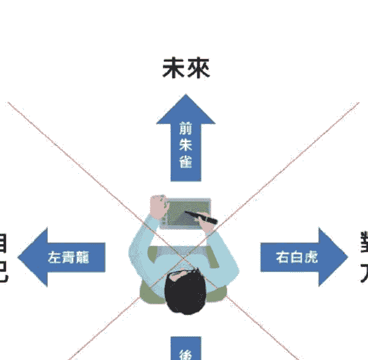

## 形家风水形势格局的要求

形家风水要求房子后边玄武方要有靠山，左边龙边的地形地势长而高，而且往前方延伸，环绕过正前方的朱雀方（明堂），右边虎边则略低而短于龙边，最后在右前方形成一个缺口，这种左右环抱的形势，正是“形家长眼法”最基本最核心的形势格局：“后有靠，龙强虎弱（龙边高且长于虎边，高长曰强，短低曰弱），龙过堂（由龙边延伸绕过明堂）”。

这样的形势格局是用来能顺利地纳入因地球倾斜23度半，以及地球自转自然形成的右旋气流，而且由于左边龙边较高较长，环抱右边较低较短的虎边，龙虎有情，又能将右旋气凝聚于明堂，使之不会离散。

这就是形家风水标准形势格局的要求：“前有照，后有靠，左右有抱，龙强龙过堂。”

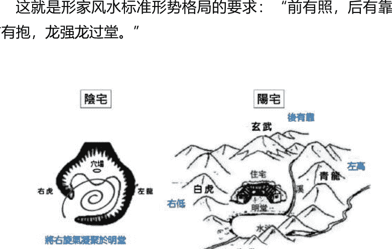

图9：形家风水的形势格局要求：玄武方有靠，龙强虎弱（左龙高环抱较低的右虎），龙过堂（由龙边延伸绕过明堂），能将右旋气凝聚于明堂，故风水云：“藏风聚气，使之不散。”

### 格局要求一：玄武方有靠

玄武方有靠，即房子或座位的后边要有得靠，在形家风水的形势上，这是很重要的一环。在外格局上，阳宅房子的后面代表后援、依靠及支撑，是否能有祖荫，得到祖先、父母、长辈、贵人的庇荫及帮助，也象征后代子嗣，一家人丁是否兴旺。

如果后方玄武有靠，代表家大业大，家族面临大变动时，能有后援，或有贵人相助；角逐大位时，能从中胜出；晚年有依靠，子孙满堂，老有所养。若无后靠，代表家族没有人事背景，凡事得靠自己努力，没有人帮，若事业有成，则是白手起家。

如果选房或选店面，若以图10为例，以大马路及大楼的大门为向，选“A、B、C、D”宅较好，因为前方靠马路的“A、B、C、D”每一户宅，后面分别有“E、F、G、H”的房子为靠，而“E、F、G、H”宅的后方是空荡荡的一片，没有其他建筑或房子可以依靠，称之为玄武空，后无靠。

### 大马路

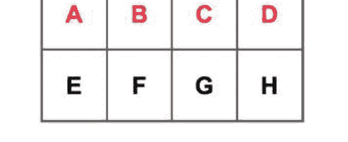

图10：如果选房或选店面，“A、B、C、D”宅后有靠，优于“E、F、G、H”。

以内格局而言，当人坐在桌后或躺在床上，座位或床位的后面要有房间（实靠），且紧临实墙或高的家具（如书柜、衣柜），这称之为后有靠，或玄武方有靠。在工作上，办公桌座位的后方有靠很重要，因为，后靠就是有依靠、支援、支撑、有靠山的意思，想当主管、老板、或坐大位，都须后座有支撑才坐得稳，后援源源不绝，立于不败之地。在家里，床位的后方，床头也要有靠，因为后靠也象征人丁、后代子嗣，如果后有靠，这一家族人丁兴旺，晚年有依靠；床位后方没有靠、或床位后方还有冲射，女人生不出男孩，或怀孕易流产。

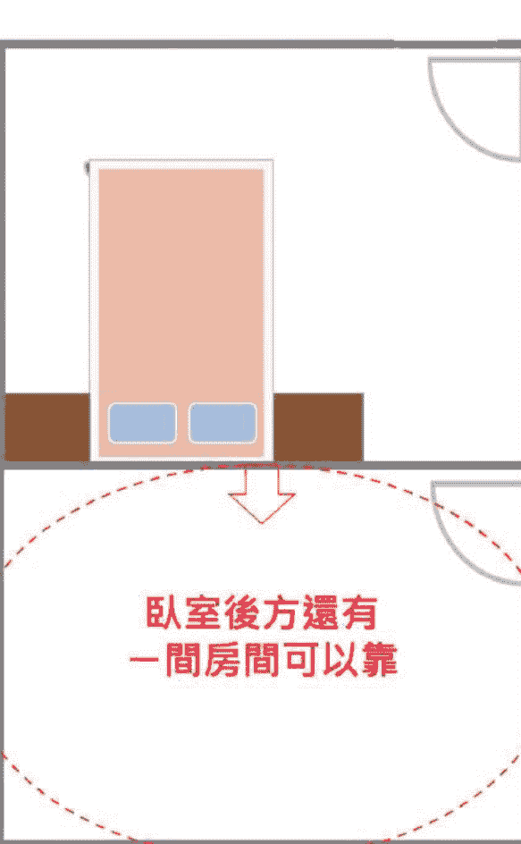

图11：床位的后方玄武方有靠，卧室的后方还有一间房间可以靠。

当人躺在床上，床头的后方，就为玄武方，以图11为例，床位紧临后方实墙，床的后面还有一间房间，这称之为“实靠”。

如果卧室后方没有任何房间，而且床后方是窗户，或外面就是庭院或马路了，化解的方法就是自己在床后加一堵墙，把窗户给封起来（还有别的方法，课堂上另外教授），让床头紧临实墙，或者简单一点，在床的后方加个高的家具，如书柜或衣柜。这虽不像有个房间可以实靠，但也比床后方没有任何后靠来得好。

### 格局要求二：龙强虎弱、亲龙疏虎

除了“玄武方有靠”，形家风水还非常注重龙、虎二边的形势变化以及相对的强弱，要求符合“龙强虎弱、亲龙疏虎”的大原则。要求“龙强虎弱、亲龙疏虎”，是因形家风水里，龙边象征男性，虎边象征女性，龙虎边也象征行动力及意志力，龙边强势，男人则气势强旺，有自信、态度积极，负责任，在外有担当，能专心打拼事业，有成就。反之，龙边弱势，则男人没自信，消极懒散，没有担当，不负责任，得过且过，难有成就。

如果龙边空而弱，而虎边又强势，则女性具有阳刚男人的特性，夫妻之间，女强男弱，妻子气势凌驾于丈夫之上，在家女人说了算，甚至在外女人成就高于男人，这种女强男弱，一面倒的形势，阴阳颠倒，长期下来，很容易演变成夫妻失和，造成离异。

在工作关系里，龙边象征老板主管，虎边象征员工下属或客户，若龙边强势，老板有气势，有创意，态度积极负责，员工听老板的，老板有自信，有决断力；与客户的关系上，我方气势能压过客户，掌握客户，我方处于优势，谈判合作时对我有利，企业易赚到钱。

反之，如果龙边空而弱，而虎边又强势，则老板管不动员工，员工强势，与老板唱反调，抗上忤逆；在企业经营上，客户气势压过公司，砍公司价格，客户说了算，我方处于弱势，委曲求全，企业不易赚到钱。

那什么叫强势？什么又是弱势呢？只要是长、高、近，皆称之为“强势”；反之，短、低（或空）、远，称之为“弱势”。

强与弱也是相对的，形家风水在都市的阳宅里，如果我们所居住或工作的房子，其左右两边的地形地势或建筑符合以下的情况，则房子的外格局称之为“龙强虎弱”的形势格局。

- 我房子左龙边的建筑物或房子要“高”于右虎边的，或；
- 我房子左龙边的建筑物或房子要“长”于右虎边的，或；
- 龙边的地形地势要高于虎边的。

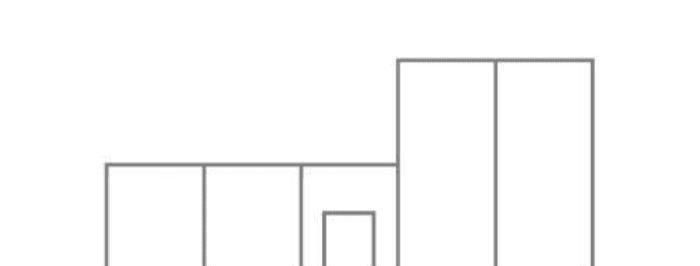

图12：左手龙边的住宅高于右手虎边的住宅，龙高虎低，形成龙强虎弱的格局。

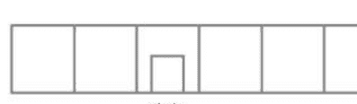

图13：左手龙边的住宅户数多于右手虎边的住宅，龙长虎短，形成龙强虎弱的格局。

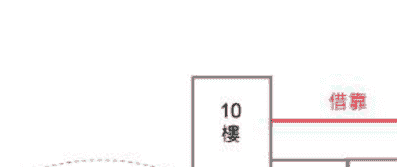

图14：左手龙边隔两户就有同样高的大楼当借靠，而右手虎边空荡荡一片或是临马路，龙边有靠虎边空，空论低，也一样形成龙强虎弱的格局。

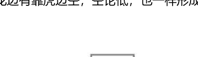

图15：左手龙边的地形地势要高于右手虎边的，龙高虎低，形成龙强虎弱的格局。

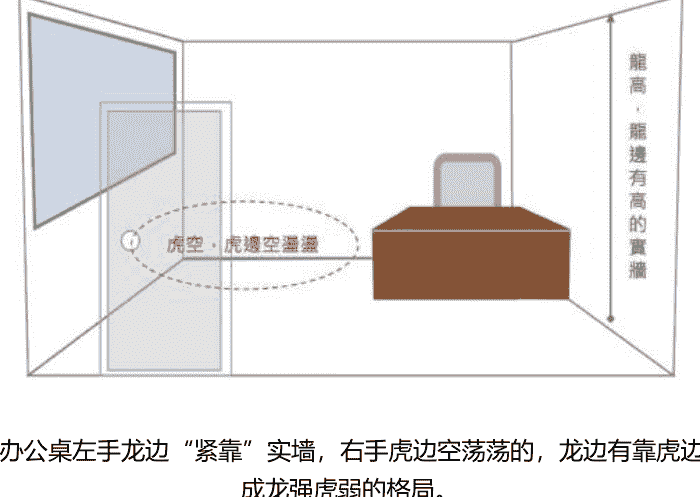

图16：办公桌左手龙边“紧靠”实墙，右手虎边空荡荡的，龙边有靠虎边空，形成龙强虎弱的格局。

在内格局上，跟外格局同样的原理，只不过外格局是以我们的“房子”为太极点，比较左右的房子或建筑物的“高低、长短、近远”；而内格局则换成以我们的“座位或床位”为太极点，一样比较“座位或床位”左右的“高低，近远（或亲疏）”来论强弱。有墙壁论高，空空的或有窗户则论低；或比较左右边家具的高低大小多少，家具“高、大、多”论“强势”，家具“矮、小、少或空”论“弱势”。

若我们房间内的座位或床位符合以下的情况，则房间的内格局也称之为“龙强虎弱、亲龙疏虎”的形势格局。

- 当人坐在桌后或躺在床上，左手龙边有实墙且没有开窗，或左边有家具（如书柜、衣柜）高于右边，然后座位及床位“紧靠”强势的龙边，或离龙边“近些”，而离弱势的虎边“远些”（称之为“亲龙疏虎”），无论是“紧靠”或“靠近”强势的龙边，这两种情况也都属于“龙强虎弱”的形势格局。

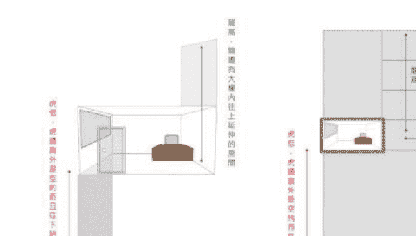

图17：以房间为单位来看，龙边靠着实墙，龙边墙外有往上或往左延伸的房间可靠，而虎边窗外是空的且往下陷（有开窗论低），内墙论高、外窗论低，形成龙强虎弱的格局。

以内格局而论，房间里有墙的一面论高，有窗的一面可论低。座位或床位的摆放就要靠有实墙的龙边近些，而离虎边远些，形成“龙强虎弱”、“亲龙疏虎”的形势格局。

结论是，形家风水要求符合的第二个重要原则就是，①不仅龙边要强于虎边，而且②座位或床位要尽量靠近强势的龙边，达成“龙强虎弱”、“亲龙疏虎”的形势格局。

### 格局要求三：龙过堂

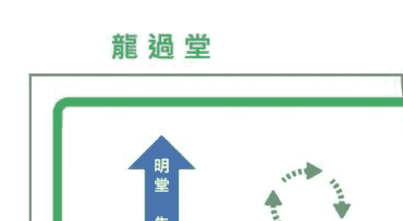

图18：由左手龙边开始，墙壁若能以顺时针方向，环绕越过座位前方的明堂再出门口，这房间的形势格局就是“龙过堂”。此时炁场被包覆，造成顺时针旋转，而门口恰会出现在座位的右前方。

“龙过堂”是形家长眼法最最重要的形势格局，不仅在外格局，自己的房子（太极点）与周遭四面八方的建筑物、地形地物，最好都能形成“龙过堂”的形势格局。而在内格局，办公室里的办公桌、卧室的床位、书房的书桌、店面的收银台，它们的位置在房间里或房子里，最好也要能形成“龙过堂”的形势格局。

以内格局而言，当人坐在办公室的办公桌后、躺在卧室的床位上、坐在书房的书桌后、人站在店面的收银台后，便以此为基准点（太极点）。所谓“龙过堂”就是以人为中心点，由左手龙边开始，墙壁能从顺时针方向，环绕越过座位前方的明堂再出门口，而门口恰出现在坐下、躺下、站着的朝向的右前方处。

形家风水在观察房子左右、龙虎边的地形地势之间的比较变化，就是太极图里阴阳二炁在风水上的应用。龙虎边比对强弱、高低、长短、胜负，是二元对立竞争式的，但阴阳二元论，既存在二元对立矛盾，也存在着万事万物难以分割的一体两面，是共生且相依存的，是阴阳需平衡的。

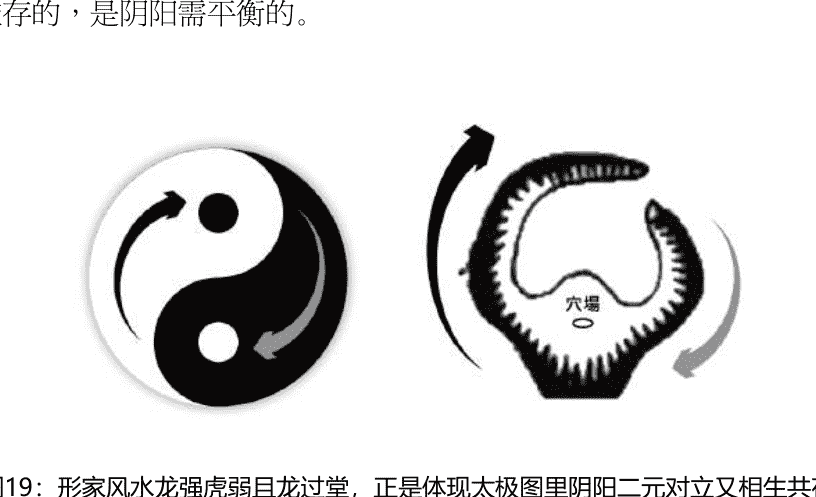

图19：形家风水龙强虎弱且龙过堂，正是体现太极图里阴阳二元对立又相生共存的平衡之道。

为什么“龙过堂”在形家风水里这么重要呢？因为“龙过堂”就是体现阴与阳的相异而共存、相生而流变、阴阳之间的平衡，并体现传统社会人际关系的互动常态。

在夫妻关系上，龙边象征男性，虎边象征女性，男主外，女主内，男性阳刚，女性阴柔，为男女之本性，乃天地阴阳之道。所以龙边形势比虎边的要强，较高的左龙又要能越过前堂环抱较低的右虎，犹如男人左手臂将女人环抱搂在怀里护卫，男女有情，阴阳协调。这样男在外能安心打拼事业，负责经济来源，女在家能专心持家教养，照顾儿女，夫妻各尽其责，互相扶持，和睦相处，在风水上又能藏风纳炁，聚之使不散。

在工作上，龙边象征老板或主管，虎边象征员工、下属或客户，若办公室老板主管的房间能摆设或调整成“龙过堂”的形势格局，则老板主管与员工能上下同心合力，团结一致，无往而不胜，使客户与公司之间，能关系和谐，合作良好。

这种空间上的形势造局（我们将形家风水应用于房子内格局，诸如办公室、书房桌位的摆设、卧室床位的调整、店面收银台的设置），若能再加上时间的催发启动（使用奇门遁甲计算时空能量，了解吉炁于何时在该方启动），透过这两者的结合，在正确的时间把桌位、床位、收银台摆放于对的地方，以搭上这股生发之炁，并将它包覆围绕于我工作，休息，生意的地方，聚之使不散，就能够大幅度的改善及提升我们在工作事业、夫妻感情、店面生意方面的运势！

### 格局要求四：朱雀方（明堂）开阔明亮

朱雀方又称之为“明堂”，“明堂”是一个广义的名词，代表着房子前方的区域。

居家风水基本上有“内明堂”及“外明堂”的分别，“内明堂”指的是你家的院子，楼房的话就是指玄关或前阳台。外明堂则是指房子外面的空地；而在以房间为单位时，例如办公桌、书桌、或床位前面的“空间或区块”，也是“明堂”。

在“龙过堂”的外格局上，“朱雀方（明堂）开阔”，即阳宅房子的正前方开阔无阻挡、地势平坦有空地，可使得入堂的气旋，得以凝聚堂前而不去，又可兜收吉炁，进而引至阳宅房子里，与地炁交汇融合。

在居家，尤其是公司或店面风水中，“明堂”又象征着赚钱与存钱能力，且主掌全家人或企业的运势、事业、前程，象征未来的发展潜力。所以“明堂”宜开阔明亮，若明堂狭窄闭塞，势必象征此家人或企业的前途有限，阻碍众多，开发艰难。所以朱雀方又称之为“明堂”，若朱雀方开阔明亮，可称之为“明堂”；反之，若朱雀方暗淡杂乱，那反而应该叫做“暗堂”。

最后，我们总结一下这个单元所介绍的“形家长眼法”风水，在形势格局的要求上有以下这四点：

- 1. 玄武方有靠。
- 2. 龙强虎弱、亲龙疏虎。
- 3. 龙过堂。
- 4. 朱雀方（明堂）开阔明亮。

若此四点不能完全符合，当优先考虑至少能符合第一或第二点，即“玄武方有靠”或“龙强虎弱、亲龙疏虎”二择一，当然两者皆具则更佳，倘若又能形成“龙过堂”的形势格局那就好上加好。最终，再于朱雀方（明堂）前留有一块明亮干净的“空间或区块”，那就非常完美了。

#### 第二节

#### “奇门遁甲”帝王之术

“奇门遁甲”号为“帝王之术”，其中最厉害、最神奇的应用，就属赫赫有名的“奇门出行诀”！这在古代本是应用于战事，选择什么时间出兵、在哪儿排兵布阵，以期得机得势，攻无不克，战无不胜！

大家耳熟能详的三国演义里，诸葛孔明在赤壁之战中，特意选在公元二〇七年某天的夜半子时，向曹操发动攻击，除了推算天气借东风，最主要的就是在出兵进攻的方位上，选对了吉时发动攻击，借助“奇门出行诀”提升胜算，因而战胜了这千古一役！难怪孔明在三国演义里说过：

> “为将而不通天文，不识地理，不知奇门，不晓阴阳，不看阵图，不明兵势，是庸才也。”

根据“方位”选择“吉时”去做事，不管做任何事，想要增加胜算，都可以选择有利的奇门时空（选择有利的时间，往有利的方位去做事）来提升运势，助己心想事成。“奇门出行诀”（又名大气造运术）流传至现代的应用，最适合用于商战，举凡商务接洽谈判、销售简报、公司会议、年度计划发表、新产品上市……等等，只要会用奇门盘选择有利的时间及方位，去进行这些重要的商业活动、业务，都能帮助您提升运势，达成目标，完成使命！（可参考笔者的上一本著作《九宫奇门：做决策·卜运势·看风水·催桃花，人人都可以用奇门遁甲助自己心想事成》，作者子奇老师〔2021〕，春光出版社。）

“奇门出行诀”不仅可应用于“人”在出行办事的运势提升（属于在“人”方面的“动用”），亦可应用于“阳宅”风水方面的改运（属于在“房子”风水方面的“静用”）。在上一节中曾提到一个概念，火车要发动了，如果我们知道它在哪里发动、何时要发动，我们就可以把握时机，在对的地点、对的时间，搭上它，这就叫借力使力，得机得势。我们可以预先规划好办公桌、书桌、沙发、炉灶、神位、床位、收银台等等，在房子里最佳的位置，然后运用奇门遁甲计算吉炁，也就是这股生发之炁发动的时间，然后在该吉时将桌子、炉灶、神位、床位、收银机等安置上去，就可以打开事业、学业、感情、财富的运势！

接下来，我们就来认识有关“奇门遁甲”的一些重要观念及应用的方式。首先介绍在运用“奇门遁甲”时最重要的一项工具——奇门盘。

#### 奇门盘

“奇门盘”的三大组成部分：时间、宫位、符号。

“奇门遁甲”其实是一门“时空能量学”，借由“奇门盘”的排盘可以计算出在什么时间（时间）、什么样的炁（能量）、会在什么方位（空间）运行或启动。如此一来，我们便可以依方位，选择正确的时间，得到该方位好能量（吉炁）的相助，达到提升运势，身体健康，家庭和谐，升官进爵，发财致富，心想事成的目的。

## 时间

图20：“奇门盘”基本上包含三大组成部分：时间、宫位、及符号。

所以每一张“奇门盘”，基本上包含三大组成部分：时间、宫位、及符号，奇门盘的“宫位”代表“空间”、“方位”，里面的“符号”代表“能量”。

每一张奇门盘，上面都会标注着一个开盘时间，奇门遁甲依据开盘的时间，是在哪一年、月、日、或时，可以分别起出“年盘”、“月盘”、“日盘”或“时盘”。其中应用最多的为“时盘”，例如要安床位、桌位、神位，或出门赴约谈事办事，想选个吉时，多半用的都是“时盘”。

奇门遁甲的“时辰”是以两个小时为单位，从“子时”开始，子时就是23:00~01:00，丑时是01:00~03:00，寅时是03:00~05:00，依此类推。

在同一个时辰内起出的奇门盘都是一样的，宫位内的符号皆不会变动，“时盘”是每两个小时，等于一个时辰才会换一张奇门盘，同理，“日盘”是一天一换，“月盘”是一月一换，而“年盘”是一年一换。

## 宫位（方位）

在最底层的一张奇门盘像一个“棋盘”，有九个格子，每个格子称为宫位，整张奇门盘的盘面像小时候我们玩○×游戏的九宫格，除了中宫为立极点，其余周围的八个宫位，分别代表八个方位，这就是空间。

这八个方位上下左右的位置与对应的八卦，是永远不会变动的，不会随着奇门盘的排盘或开盘时间而改变，而且这方位跟我们现在看地图的习惯刚好相反，是上下颠倒、左右相反的。也就是说，九宫里的上面为南，下面为北，左边为东，右边为西，则左上为东南，右下为西北，左下为东北，右上为西南，共有八个方位。

图21：奇门盘有九个宫位，分别对应八个方位。

| 巽4 东南方 | 离9 南方 | 坤2 西南方 |
| :--- | :--- | :--- |
| 震3 东方 | 5 | 兑7 西方 |
| 艮8 东北方 | 坎1 北方 | 乾6 西北方 |

## 符号（能量）

#### 八门

奇门盘的九宫格里，还有像“棋子”一样会随着开盘时间而移动的符号，分别代表着日月星辰的能量或炁流，而其中最为重要的符号类别为“八门”。

“八门”主人事，是我们在奇门应用于人事上最为重要的一类符号，包含：休门、生门、伤门、杜门、景门、死门、惊门、开门，分别代表吉凶炁，而八门中以“休门、生门、开门”为三大吉门，“景门”为小吉门。

-   休门：休闲和谐，气氛轻松，休解排解，与婚恋家庭、贵人相助有关。
-   生门：蓬勃发展，生生不息，与生意、求财、健康、活力有关。
-   伤门：狩猎追捕，与竞技、争夺、讨债有关。
-   杜门：沉潜蛰伏，与隐匿、躲藏、技术学习有关。
-   景门：光明亮丽，与考试、功名、前景、广宣、喜宴有关。
-   死门：除吊丧、殡葬之外，其余诸事不宜。
-   惊门：突发惊疑，与口舌、争讼、演说有关。
-   开门：开拓发展，与事业、开创有关。

我们最主要会用到的好的能量，主要是“休门、生门、开门、景门”。

-   休门（家庭婚恋）：代表休息、休闲、休养，和谐轻松没压力，心情处在休闲愉悦的状态，纳了这种吉炁，婚姻感情和谐，气氛轻松，家庭生活圆满。
-   生门（财运健康）：代表生财、财运、身体健康、生气蓬勃有活力，纳了这种吉炁，能带来财运，身体健康，一家子充满了生气。
-   开门（官禄事业）：代表开拓发展、乐观开朗，积极向上，最利事业与官运，尤其利于开公司、开店面，整个阳宅纳了这种吉炁，能带来事业与官运顺遂，开拓发展，事业越做越大。
-   景门（文昌考试）：代表前景光明，未来充满了机会与希望，尤其最利考试，整个阳宅纳了这种吉炁，能带来光明的前程，充满了希望，事业学业步步高升。

“九宫”称为地盘，像棋盘一样永远不动，奇门符号“八门”属于天盘，象征日月星辰所带来的能量炁场，随时间而流转。太极点坐中宫，整个奇门盘像古代磨米、麦、豆等粮食的石磨一样，有上下两盘，通常石磨下盘静止，而上盘转动，粮食缓缓入磨眼被磨成粉末，从夹缝中流到磨盘上，过筛去麸皮之后便可得到面粉。

## 时间

西元：2022年04月22日20时58分 (五)
农历：2022年03月22日20时
天干：壬 甲 乙 丙
地支：寅 辰 巳 戌

奇门九宫盘（包含时间、能量、空间标注）：

| 宫位 | 卦象 | 卦名 | 门 |
| :--- | :--- | :--- | :--- |
| 4 | 巽 | 巽 | 伤 |
| 9 | 离 | 离 | 杜 |
| 2 | 坤 | 坤 | 景 |
| 3 | 震 | 震 | 生 |
| 5 | - | 中宫 | - |
| 7 | 兑 | 兑 | 死 |
| 8 | 艮 | 艮 | 休 |
| 1 | 坎 | 坎 | 开 |
| 6 | 乾 | 乾 | 惊 |

*标注：能量：符号代表炁(能量)，空间：宫位代表方位*

> 图22：奇门盘最重要的符号类别“八门”：休、生、伤、杜、景、死、惊、开，代表吉凶炁。

#### 八神、九星、十天干

奇门盘的天盘上，除了有随着时间流转的“八门”符号之外，其他也会随着时间转动的，是象征日月星辰炁场能量的“八神、九星、十天干”三大类符号。

图23：天盘九宫配八门，象征日月星辰，随时间而流转；地盘九宫配八方，象征大地，永远不动。

图24：奇门五大符号类别：宫、神、星、门、干。

“八神、九星、八门、十天干”这四大类奇门符号，对应着银河系的恒星系统（十二星座、二十八星宿）、太阳系的行星系统（太阳、金木水火土天海冥等等）、及地月系统，代表天上日月星辰的星体，随着时间的递进，发射着“天气”旋而下降（象征日月星辰的能量），九宫里又隐藏着“八卦”，释放着“地磁”而上升（象征山川大地的能量），天分春夏秋冬，地分东西南北，时空于焉有了冷热干湿的变化。人居天地之间，就受着天上日月星辰星体的“天气”，以及地上山川大地的“地磁”，天气与地磁、阳与阴、时间与空间所带来的能量影响，进而产生了吉凶祸福的运势变化。

所以整张奇门盘，其实是一张捕捉在宇宙时空中运行的天体，其能量场作用于地面上万事万物的平面投影，奇门遁甲实际上是“上古文明”或“地外文明”所创建的一个模拟宇宙全息场的三维动态象数模型，蕴含着宇宙时空的奥义。

## 用“奇门盘”选择吉时的三大步骤

选择吉时的目的，一、是为了将我们所规划好位置的办公桌、书桌、床位、或收银台等等安置上去；二、在吉时出门赴约时，能提升运势，帮我们办事顺利成功。

传统在奇门遁甲里，选择吉时的方法是徒手排出每一个时辰的“奇门盘”，然后一个一个时辰排，一张一张奇门盘找，除了排盘方法非常的复杂，宫位里吉凶判断的规则限制又多，所以光要挑到一个好的用事时辰，就得旷日费时，因此奇门遁甲很难普传，光排一张盘就令人止步了，更何况去用它。

还好现在拜电脑、手机所赐，很多“奇门盘”的排盘程序被开发出来了，所以我们可以在手机的应用程序商店App Store或网络上找到线上排盘程序，打开电子版“奇门排盘程序”来选择吉时。

不过，即使有“奇门盘”的排盘程序，但一个一个时辰，一张一张奇门盘找，判断吉凶宫位及时辰的规则限制又多又繁复，既然有电脑有手机，难道不能写一个程序，把所有规则交给电脑去判断筛选，让它帮我找出所有的“吉时”吗？

坊间的排盘程序或多或少都有错误，而且大多都只具排盘功能，子奇老师听到学员的声音了，于二〇二一年开发了目前市面上唯一的电子版“奇门历程序”，只要输入条件，轻轻一按，可依年、月、日、时，将设定的时间范围内所有吉时吉方全部显示出来。

接下来，笔者将介绍如何使用传统的“奇门盘”选择吉时的三大步骤，口诀是：辨方位、选吉门、择吉时。

读者只要耐心看完，一定可以明白如何用“奇门盘”来选择吉时的三个步骤。如果真的觉得太复杂，不用担心，下个单元将接着介绍“奇门历”，只要一个步骤，就能简单、方便、快速、正确，一步到位、一键搞定如何选择吉时。

以下是“奇门遁甲辨方择时”三步骤：

### 步骤一：测量“目标位置”的方位 (辨方位)

### 步骤二：锁定宫位，选用吉门 (选吉门)

-   “休门”：休憩、感情和睦、贵人（床位）。
-   “生门”：生财、生意财运、健康活力（收银台）。
-   “开门”：开业开店、事业升迁（办公桌）。
-   “景门”：前景光明、考试学习文昌（书桌）。

## 步骤三：开“奇门盘”选择吉时（择吉时）

1.  打开“奇门排盘”程序（时家置闰），设定“日期时间”后开盘。
2.  看“奇门盘”里锁定的宫位里，是否有我们想要的“吉门”，若有，则进行下步骤，若没有，则往下一个时辰找，一直找到有为止。
3.  宫位内虽有“吉门”，但若有下列情况之一，该时辰也应舍弃不用。
    -   宫位内有符号“白虎”或“空亡”，不能取用。
    -   宫位内有对应的天干“击刑”（戊己庚辛壬癸），不能取用。
    -   “奇门盘”的时辰若恰巧是“五不遇时”，不能取用。

（请参考下面“‘奇门遁甲辨方择时’速查表”，取红色的吉门，避开所有代表不吉的绿色。）

接下来详细示范说明，如何藉“奇门排盘程序”开“奇门盘”，应用此三步骤来找到吉时。

## 步骤一：测量“目标位置”的方位（辨方位）

首先，用罗盘测量“目标位置”在房子里的方位，所谓“目标位置”，就是办公桌、书桌、沙发、炉灶、神位、床位、收银台等等计划要摆放的位置。例如图26，想要安床位，而床位是位于房子中的西北方。

图25：“奇门遁甲辨方择时”速查表。

| (巽)东南 | (离)南 | (坤)西南 |
| :--- | :--- | :--- |
| 景 | 休 | 生 |
| 杜 | 中宫 | 伤 |
| 死 | 惊 | 开 |

-   休：休息、睡眠和隐，贵人
-   生：生财、生意财源、主生健康
-   伤：谋划刑伤、工作事业
-   杜：隐藏、避免冲突
-   景：光明、文化、考试
-   死：死亡、终结、不利
-   惊：惊恐、口舌、是非
-   开：开始、开放、机遇
-   宫位内有对应的天干【甲丙】，则不宜取用【戊己庚辛壬癸】
-   宫位内有刑及【忌庚】及【空亡】，也不宜取用
-   【五不遇时】，也主凶时，不宜取用

图26：第一步骤，先测量“目标位置”的方位（卧室的床位是位于家里的西北方）。

如果卧室房间够大，也可直接以卧室为范围，在房间的中心下罗盘，看床位在卧室的哪一个方位也行。两者的差别在于一个是“大太极”（整个房子），另一个是“小太极”（整个房间），都行，安办公桌、书桌、收银台等等，一体适用。

如果要出门办事，就打开 Google Map，事先在地图上查找计划前往办事的地点，是位于我出发地点（例如从家里或公司里出发）的哪个方位。例如图27，从地图上看，目的地位于我公司的西方。

图27：第一步骤，先测量“目标位置”的方位（办事地点位于我公司的西方）。

罗盘可自行从手机App Store应用程序商店下载，简易能显示八个方位的罗盘程序App即可，不要下载指南针，因为指南针最多在方位上只标示出一条线。一定要是罗盘，因为罗盘才能清清楚楚划分出八个方位，以及每个方位包含哪些范围。“指南针”只能指出方位南北的度数，每个方位从几度到几度，还得自己推算，太麻烦了！

图28：从手机App Store下载一个简易的能显示八个方位的罗盘App，不要下载指南针。

宫位的范围其实是一个左右各涵盖22.5度，总共涵盖45度夹角的扇形空间，像切一片蛋糕似的形状。下载的罗盘，最好是只标示八个方位、越简单越好的罗盘，因为一般专业的罗盘有多至几十层，没学习过风水的朋友通常会看不懂。罗盘可以标示出方位45度角的范围，一个罗盘为360度，划分整个圆为八个方位，东、东南、南、西南、西、西北、北方、东北，每个方位为45度，像切蛋糕般，可把一个布局场地（太极场）划分为八等分。

| 方位 | 卦象 | 角度范围 |
| :--- | :--- | :--- |
| 正北 | 坎卦 | 337.5~22.5 度 |
| 东北 | 艮卦 | 22.5~67.5 度 |
| 正东 | 震卦 | 67.5~112.5 度 |
| 东南 | 巽卦 | 112.5~157.5 度 |
| 正南 | 离卦 | 157.5~202.5 度 |
| 西南 | 坤卦 | 202.5~247.5 度 |
| 正西 | 兑卦 | 247.5~292.5 度 |
| 西北 | 乾卦 | 292.5~337.5 度 |

然后在房子的中心点（或房间的中心点）打开罗盘，测量“目标位置”（要摆放床位的位置）在房子（或房间）里的哪一个方位。

房子的中心点很好抓，最简单的方法就是：数房子长与宽地板上磁砖的数目有多少个？或用走步的方式，计算房子长与宽地板上要走几步？可以用“走几步”或“数地砖”的方式大约丈量，然后长与宽各一半的磁砖数或步数的位置，就是房子的中心点了。接着在此处打开罗盘，测量“太极点”在房子的哪个方位就行了。

例如房子的长度为30步（30块地砖），宽度为20步（20块地砖），分别除以2，再走一遍或再数一遍，“长15步及宽10步”的地方，就是房子的中心位置了。

如果是出行办事，那就在Google Map地图上，看要“赴约的目的地”是位于“出发地”的哪一个方位。

##### 步骤二：锁定宫位，选用吉门（选吉门）

以图26为例，床位在家中“西北方”，也就是“目标位置”在房子里的西北方，接着查看图29的“奇门遁甲辨方择时”速查表，先看宫位里是否有吉门可用，依据“西北方”锁定“乾宫”，看该宫位有何吉门，选用适合的吉门。

例如床位在西北方，乾宫里有“休门”及“生门”可选用，安床位首选“休门”，因为最利休憩、感情和睦。

-   “休门”：休憩、感情和睦、贵人（床位）。
-   “生门”：生财、生意财运、健康活力（收银台）。
-   “开门”：开业开店、事业升迁（办公桌）。
-   “景门”：前景光明、考试学习文昌（书桌）。

图29：“奇门遁甲辨方择时”速查表（先只看宫位里是否有吉门可用）。

如果该宫位里没有“休门”，可以改选其他吉门，基本上，吉门都是好的，皆可用，但床位更适合选用“休门”。

另外补充说明：“休门、生门、开门、景门”不是在每个宫位都能发挥作用，若位于不对的宫位里，有时甚至不吉反凶，有“门伏／门反、门迫／门制”等限制须排除。为了让读者易于使用，所以在“奇门遁甲辨方择时”速查表中，将宫位里的“门”与“宫”没有矛盾的才列出，方便读者查询。

## 步骤三：开“奇门盘”程序选择吉时（选吉时）

接下来，打开奇门排盘程序，选吉时来摆设或调整桌位、床位的朝向。

1.  打开“奇门排盘”程序（时家置闰），设定“日期时间”后开盘。

先确定自己的时间，看哪天有空可以调整桌位或床位，然后打开奇门排盘程序，设定开始查找的日期时间后，开始排盘。奇门时盘是以时辰为单位，每个时辰是两个小时，一天有十二个时辰，用十二地支表示，每个时辰一律以单数小时起算，例如“巳时”是从9:00 am开始直到11:00 am。

要使用“奇门排盘”程序，有两种途径：

A.  读者可自行从手机上的 App Store应用程序商店下载一款“奇门排盘”程序，或找网络上免费的奇门线上排盘程序，但请读者特别留意，奇门排盘方式众多，五花八门，
    -   起局一定要选“时家（置闰）”起局法。
    -   排盘一定要用“转盘”法。
    -   勾选“时家”或“时盘”。
    用“时家（置闰）”起局，“转盘”用排盘法，才是同时考虑太阳与地球公转的二十四节气及天干地支时间系统，自古以来这也是最正统的奇门遁甲排盘法。

B.  读者也可使用子奇老师所开发的电子版“奇门排盘”程序，先输入网址：[app.tzchimen.com](http://app.tzchimen.com)至“子奇门商品服务页”，按“奇门排盘线上服务”的“开始使用”，就可以打开程序。

> 子奇老师所开发的电子版“奇门排盘”程序，除了有上一本书《九宫奇门》里红吉绿凶计算好分数的“九宫奇门”排盘，还有“阴盘奇门”排盘，以及本书会用到的“时家（置闰）”，“日家、月家、年家”等所有“年月日时”的排盘。

这个电子版“奇门排盘线上服务”程序是采“付年费的订阅制”，如果有兴趣购买订阅的读者，可自行上网刷卡购买，

或洽询台北市 “心语顾问”：

-   联络电话：(02) 27775716
-   电子信箱：info@shinyu.tw。
-   LINE 官方帐号：[https://page.line.me/?accountId=shinyu.tw](https://page.line.me/?accountId=shinyu.tw)

图30：电子版“奇门排盘”程序（网址 app.tzchimen.com）。
图31：排盘系统要勾选“时家（置闰）”。
图32：设定“日期时间”，排盘系统是“时家（置闰）”，最后按“开始排盘”。

2.  看“奇门盘”里锁定的宫位中，是否有我们想要的“吉门”，若有，则进行下一步骤；若没有，则往下一个时辰找，一直找到有为止。

结果运气太好了，一打开奇门盘，就看到乾宫有“休门”，bingo中了！不过，我们还要再检查下面第3点，如果通过了，就可以在二〇二二年六月二十六日早上9:00~11:00am安床，将床位挪动至我们先前在卧室里规划的位置，并调整好坐向，就大功告成了！

图33: 6月26日 9:00~11:00 am的奇门盘，刚好‘休门’在西北方乾宫启动。

3.  宫位内虽有‘吉门’，但若有下列情况之一，该时辰也应舍弃不用。
    -   宫位内有符号“白虎”或“空亡”（空亡），不能取用。
    -   宫位内有对应的天干“击刑”（戊己庚辛壬癸），不能取用。
    -   “奇门盘”的时辰若恰巧是“五不遇时”，不能取用。因为“白虎”为煞神，“空亡”没能量，天干在不对的宫位里形成“击刑”为刑伤，“五不遇时”，时天干去冲克日天干，不是好时辰。若有上列情况任一种发生，就得放弃，继续找下一时辰的奇门盘，一直找到有吉门，又没刑煞的时辰为止。

在图34中，二〇二二年六月二十六日 9:00~11:00 am的奇门盘里，西北方对应的干宫里，恰好此时“休门”在西北方干宫启动，为大吉时，而且：

- 干宫里没有“白虎”、“空亡”。
- 干宫本来就不会有天干的“击刑”。
- 同时这时辰也不是“五不遇时”。

我们就可以在此时辰内安床，将床位搬动至卧室里预定的位置并调整座向，就能有利休憩、增进夫妻之间感情的和睦了！

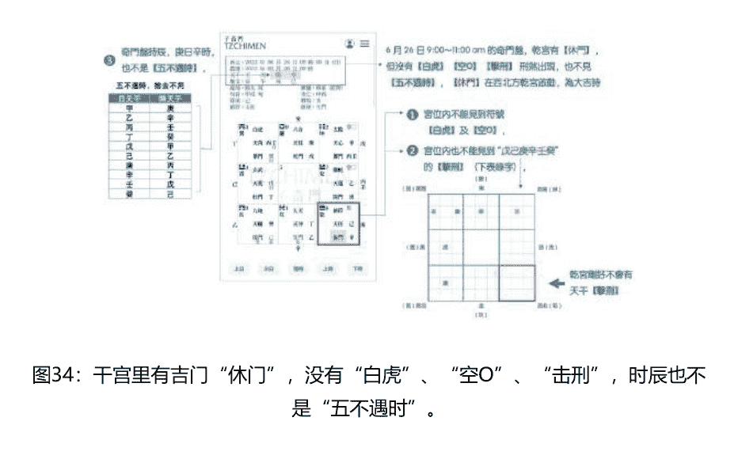

图34：干宫里有吉门“休门”，没有“白虎”、“空亡”、“击刑”，时辰也不是“五不遇时”。

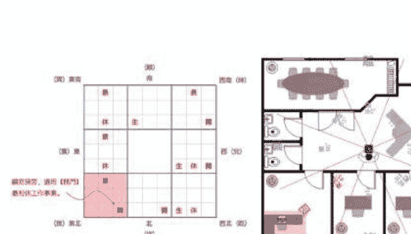

图35：总经理办公室的座位在整间公司的东北方艮宫，刚好有“开门”最利工作事业。

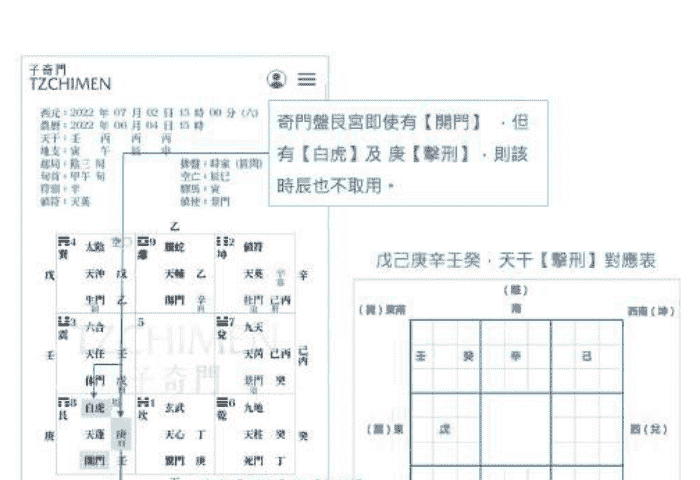

图36：艮宫有吉门“开门”，但逢“白虎”及庚“击刑”，也不能取用。

相反的，如果一个时辰的奇门盘里，在锁定的宫位中即使有吉门，但宫位内只要见到“白虎”、“空亡”、“击刑”或时辰为“五不遇时”任何一个特征，这个时辰就得放弃不用，往下一个时辰去找了。

例如，想在公司的东北方艮宫安办公桌，锁定艮宫的“开门”。但从图36可见，此时辰的奇门盘里，艮宫即使有“开门”，但见“白虎”及庚“击刑”，则该时辰也不能取用。

## 用“奇门历”程序选择吉时

简单、方便、快速、正确，一步到位！

子奇老师在教学期间发现，择时规则繁复，看盘看多了眼花，还容易疏漏看错，与其让每位学员重复一个又一个奇门盘查找所要的吉时吉方，还不如请一个人，根据办事目的，将一整年四千三百二十张奇门盘所有的吉时吉方找出来，供所有学员或有需要的人使用。所谓“一家烤肉，万家香”，“一人得道，众犬升天”。

更胜一筹，现在拜电脑及手机所赐，干脆一不做二不休，子奇老师于百忙之中抽空开发出电子版“奇门历”程序，这样一来，只要打开电子版“奇门历”程序，设定好可能要办事的时间区间、方位、目的，按一个“确定”键，所有在此期间的吉时就全部筛选出来了，岂不美哉？岂不是功德一件？简单、便利、快速、正确，一步到位，一键搞定！

奇門遁甲權威子奇老師最新力作《九宮奇門》

奇門遁甲權威子奇老師最新力作《九宮奇門》

- 1. 預測占卜：自己就能判斷事情成功機率
- 2. 團隊共力：約會、合作、團隊謀判事半功倍
- 3. 落手順慮：快速掌握對方性格走向及應對
- 4. 改變心態：扭轉劣勢、掌握己心態完成

本書以七個常見快速閱讀者常使用奇門遁甲於生活中，不論是預測占卜、團隊共力、落手順慮、改變心態，人人都可以用奇門遁甲讓自己心想事成！

子奇老師最新力作《九宮奇門》，請洽心靈客服02-27771714
子奇老師《九宮奇門》購書訊息 我要去購買

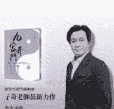

## 奇門曆 線上服務

奇門遁甲是一門「時」空氣學，「時」代表時間，「空」代表空間，也就是方位，它能有效的計算地球磁場在時間與方位的運行對我們產生的吉凶變化。

選擇有利的奇門時空去辦事，以提升優勢、心想事成，稱之為【奇門出行法】（又名「大張旗鼓術」），是一種簡單、實用、規利又效果顯著的奇門遁甲改運的應用！

這個奇門曆是一個實用的網路軟體，方便使用者搜尋有利的時間與方位出行去「辦事」或「來吉氣」，以提升及改變自己的運勢。

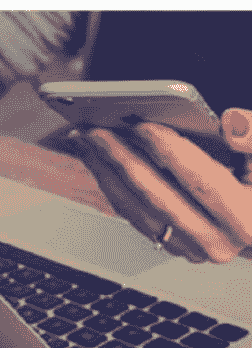

图37：电子版“奇门历”程序（网址app.tzchimen.com）。

设定好可能要办事的“时间区间”（例如：二〇二二年六月二十二日～六月二十九日）、“方位”（例如床位在西北方），以及“目的”（休门：最利休憩、感情和睦），然后按“确定”键。

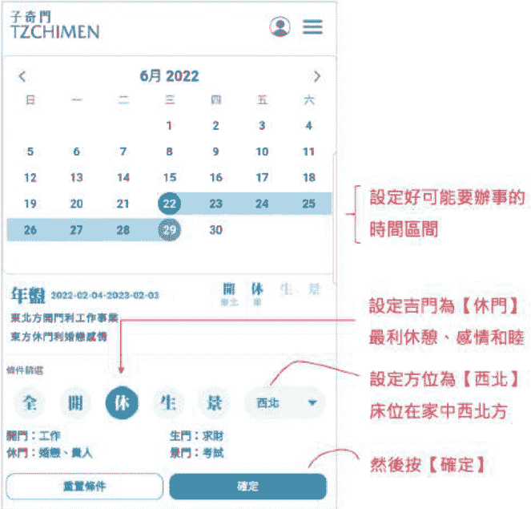

图38: 设定好条件，时间区间、方位、吉门，“奇门历”程序就能把所有的“吉时”找出来。

设定好时间范围，“奇门历”程序就会把这段时间内所有西北方是“休门”的吉时全部挑选出来，你可以轻松地从中挑选一个方便的吉时安置床位。例如选在二〇二二年六月二十六日的早上9:00~11:00 am来安床或调整床位的位置。

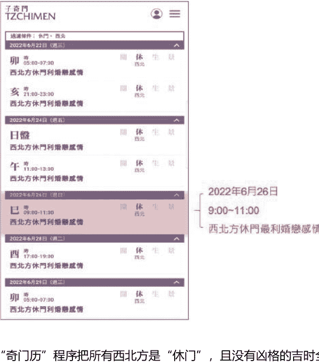

图39：“奇门历”程序把所有西北方是“休门”，且没有凶格的吉时全部挑出来。

更棒的是，所有宫位里有“门伏/门反、门迫/门制”、“白虎”、“空亡”、“击刑”，时辰是“五不遇时”等限制的、不利的等状况全部都排除了，既省下大量的时间又避免弄错看错！

最后，我们总结一下“奇门遁甲”起“奇门盘”选择吉时的三个步骤：(或直接改用“奇门历”来选择吉时会更有效率，更正确！)

**步骤一：测量“目标位置”的方位 (辨方位)**

**步骤二：锁定宫位，选用吉门 (选吉门)**

- “休门”：休憩、感情和睦、贵人（床位）。
- “生门”：生财、生意财运、健康活力（收银台）。
- “开门”：开业开店、事业升迁（办公桌）。
- “景门”：前景光明、考试学习文昌（书桌）。

## 步骤三：开“奇门盘”选择吉时（择吉时）

1. 打开“奇门排盘”程序（时家置闰），设定“日期时间”后开盘。
2. 看“奇门盘”里锁定的宫位里，是否有我们想要的“吉门”，若有，则进行下一步骤，若没有，则往下一个时辰找，一直找到有为止。
3. 宫位内虽有“吉门”，但若有下列情况之一，该时辰也应舍弃不用。
    - ❌ 宫位内有符号“白虎”或“空○”（空亡），不能取用。
    - ❌ 宫位内有对应的天干“击刑”（戊己庚辛壬癸），不能取用。
    - ❌ “奇门盘”的时辰若恰巧是“五不遇时”，不能取用。

（请参考“奇门遁甲辨方择时”速查表，取红色的吉门，避开所有代表不吉的绿色。）

| 方位 | 宫位内容 |
|------|----------|
| 東南 (巽) | 景、王、癸、体 |
| 南 (離) | 辛、生 |
| 西南 (坤) | 景、己、開 |
| 東 (震) | 景、戊、体 |
| 中 | 空 |
| 西 (兌) | 生、休、開 |
| 東北 (艮) | 景、庚、開 |
| 北 (坎) | 開、生、休 |
| 西北 (乾) | 空 |

- 体：休憩、感情和睦、貴人
- 生：生財、生意財運、生氣健康
- 開：開業開店、工作事業
- 景：前景光明、考試學習文書
- 干：宮位內有對沖的天干【革刑】，則不宜取用（戊己庚辛壬癸）
- ◦ 宮位內有符號【白虎】及【空O】，也不宜取用
- ◦ 【五不遇時】，也非吉時，不宜取用

| 日天干 | 時天干 |
|--------|--------|
| 甲     | 庚     |
| 乙     | 辛     |
| 丙     | 壬     |
| 丁     | 癸     |
| 戊     | 甲     |
| 己     | 乙     |
| 庚     | 丙     |
| 辛     | 丁     |
| 壬     | 戊     |
| 癸     | 己     |

图40：“奇门遁甲辨方择时”速查表。

## 第2堂课

### 家居、公司、店面摆设开运法

#### 第一节

##### 家居卧室摆设开运法

##### 增加夫妻感情和睦，精神能量提升

卧室是居家风水阳宅三要中的一大重点。人的一天有二十四个小时，其中约有三分之一的时间是在床上度过，因为我们必须休息，借由睡眠来补充能量，储备隔天所需要的活力，所以卧室及床铺的摆设及格局的规划非常重要。更加重要的是，卧室风水不但关系着主人的身体健康，亦会影响夫妻的感情、家庭的和睦。

###### 1.卧室床位的摆设要形成“龙强虎弱、龙过堂”的格局形势

当我们躺在床上，床头后方是玄武方，又称为后山，床尾前方是朱雀方，又称为明堂；左手边是青龙方，象征男性，家中的男主人；右手边则是白虎方，象征女性，家中的女主人。床位摆放，最好挨靠龙边（左边），稍远离虎边（右边），“亲龙疏虎”形成“龙强虎弱”的形势。在中国传统观念中，男主外、女主内，男阳刚、女阴柔，一阴一阳为夫妻之道，而男生最好睡在龙边左手边，女生则睡在虎边右手边。

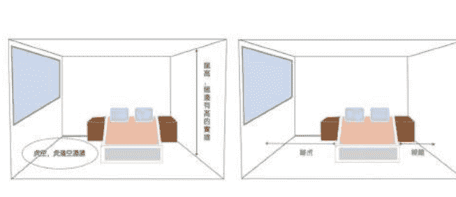

圖 41：床位擺放，最好挨靠龍邊，稍遠離虎邊，男睡左邊，女睡右邊，形成親龍疏虎、龍強虎弱的形勢格局。

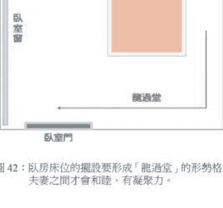

圖 42：臥房床位的擺設要形成「龍過堂」的形勢格局，夫妻之間才會和睦、有凝聚力。

更进一步，由于卧房床位的摆设，是影响夫妻和合的关键因素，除了要将卧室床位的摆设调整为龙边高强、虎边较低弱，还要形成“龙过堂”的形势格局。因为龙边高强才能环绕过前面明堂，形成“龙过堂”的形势格局，进而在我们用奇门遁甲选择有利的吉时来安床位时，能让有利夫妻感情的“休门”吉炁，围绕在卧房内不离散，使得夫妻之间彼此和睦、凝聚、对家庭有向心力、有共识。相反的，若虎边高强，又环抱过堂，“虎过堂”的形势不仅不能围护炁场，反而散炁，主分主离；在男女关系上，虎强龙弱，终会导致夫妻失和，造成离异。

###### 2.床头后方一定要有靠山

床头后方一定要有靠山，所谓“靠山”，并不是要有一座山，或床头上方挂着有假山的一幅画。“靠山”是指床头后面的床头板或床头柜，要牢牢实实的靠着实墙，或有另一间房间。后山要稳、不动，例如床头墙后的房间不要是走道、厨房或是厕所，没有“靠山”的床，睡不安稳。

“后靠山”顾名思义就是后座、依靠的意思，后座有实墙、房间、不动，才有支撑，有依靠、后援，才能睡得安稳。“后靠山”也代表后代子嗣，象征人丁，所以没有后靠，或玄武方有冲破，则老婆容易流产，生不出男生，没有子嗣，晚年没有依靠。

- ✗床头后方不要开窗，不仅炁流不稳，造成精神不安，容易伤神，会有脑神经衰弱、偏头痛的问题，还易犯小人。床头靠窗，头上有空气流动，睡觉时经常会觉得头部有凉意，也会影响睡眠品质，导致上呼吸道疾病的发生。窗户有光线直射进来，会干扰人的睡眠品质，且靠窗处隔音差的话，会有噪音，比较吵杂。从风水角度看，容易漏财、犯小人。

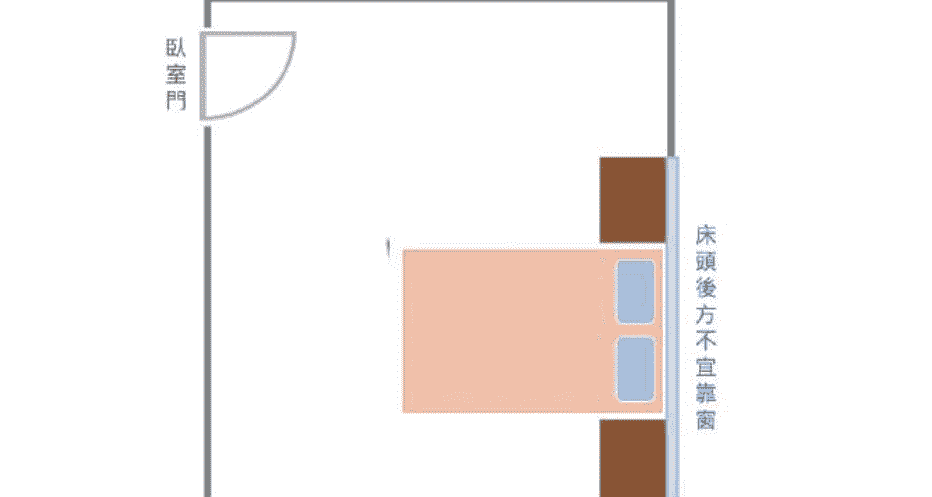

圖 43：床頭後方不要開窗，易造成精神不安、傷神、犯小人，會有腦神經衰弱、偏頭痛。

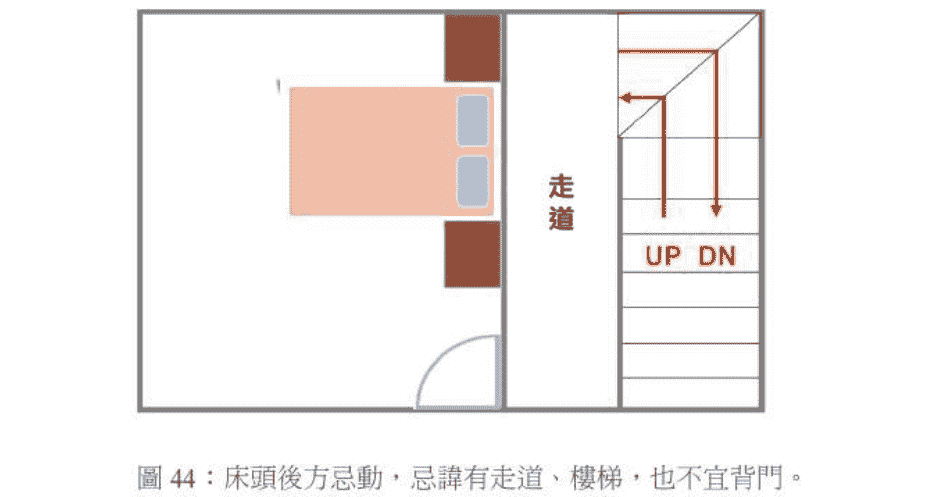

圖 44：床頭後方忌動，忌諱有走道、樓梯，也不宜背門。

解决的辦法：可以调整床位，或是将窗户用木板封住，用厚窗帘遮住也是一种办法。

❌床头后方忌动，忌讳有走道、楼梯，尤其是电梯，还会发出声响，睡到一半被惊醒，打扰睡眠品质，容易受到惊吓。床头也不宜背门，睡不安稳，心神不宁，也容易犯小人。

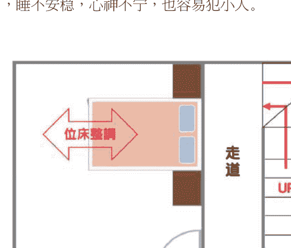

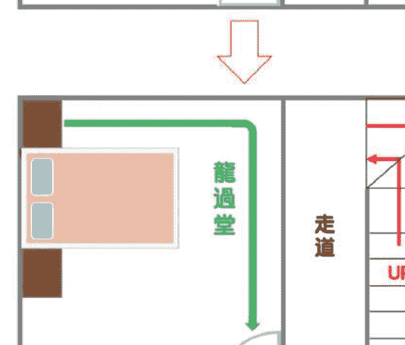

图45：床头背门或有走道、楼梯，最好的调整方法就是调整床位。

✖ 床头背门摆放，躺在床上无法看到房门出入之情形，心理上会无安全感，导致心神不宁，而且如果有人在门口窥视也无法马上知道，所以容易犯小人，被小人背后中伤陷害而不自知。

解决的办法：床头背门或有走道、楼梯，最好的调整方法就是调整床位，调整床位才可以彻底化解。

✖ 床头位置后方更不可与厕所或厨房共靠一座墙，容易烦躁，引起夫妻口角，犯小人，人际关系变差。

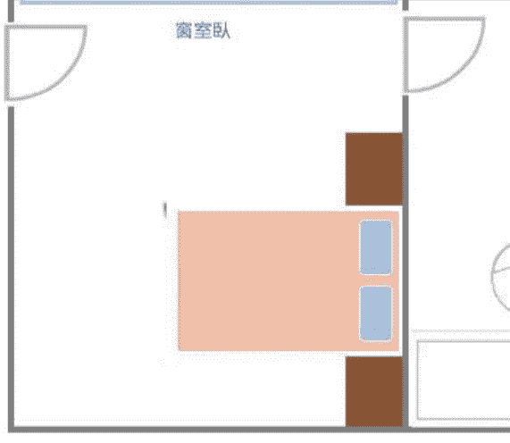

图46：床头位置后方不可紧邻厕所，容易遭人背后说嘴，犯小人，人际关系变差。

厕所墙面湿秽之气若过重，会耗神，影响身体健康；墙面内若还有水管的管线经过，会引起墙面震动、噪音也会影响睡眠品质。

卧室与厨房相邻，卧室的气场会过于燥热，对身体健康大不利，还易引起脾气暴躁，夫妻间口角不断，气氛紧张。

###### 3.睡床与梁柱的关系

卧房床位被横梁所压，压到哪就伤到哪，容易有意外、血光，以及运气不顺。如果横梁压在床头的位置，克服的方法是加床头柜，让头部和横梁的直线距离加大，避开被横梁所压，或移动床位，或用装潢将天花板包覆，遮住横梁。

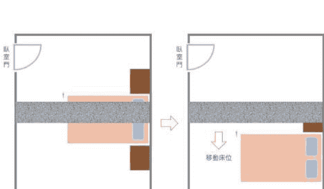

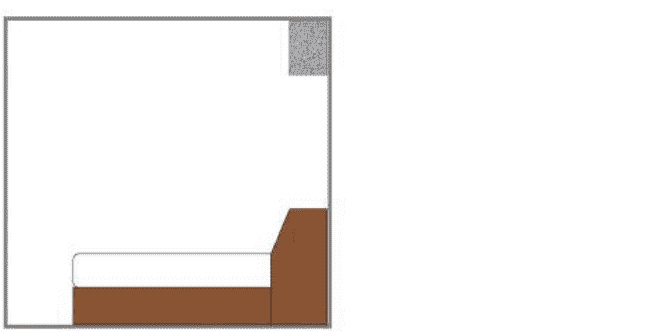

###### 4.睡床与厕所门之间的关系

除了床头后方位置不可与厕所或厨房共靠一座墙之外，厕所门也不可对着床位。跟横梁一样，厕所门对到哪，哪就容易有问题，容易造成生病、事业不顺。如果厕所门对到睡觉的头部，不仅睡不好，还容易引起脑部病变；床位侧边对到厕所门，容易有胸、腹部的疾病；对到脚则容易发生脚部的疾病。厕所门对到胸部，女性需特别注意乳癌的发生；厕所门对到腹部，女性需特别注意子宫癌及卵巢癌的发生。年轻人身体健康，体力好还挡得住，尤其老年人，身体虚弱，不可不慎！

厕所门对着床冲床，因为空气对流，污秽及潮湿之气直冲身体，日久就会有病兆出现，还会睡不安稳。

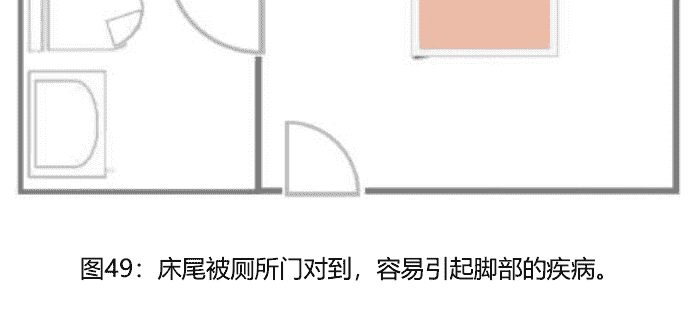

###### 5.门直冲睡床

同样的道理，房间的床位如果在门冲之处，门冲到哪，就会伤到哪。化解的方式以移动床位的位置最佳，其次就是在床与门的中间放置屏风阻挡，或在门上加门帘以减低煞气。

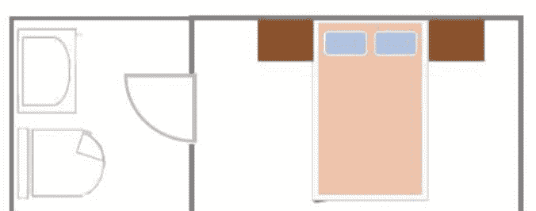

图 50：床位侧边被厕所门对到，容易引起胸腹部的疾病。

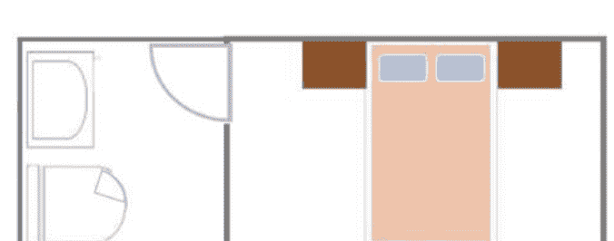

图 51：床头被厕所门对到，易引起脑部的疾病，这最不利，因为头部是人体最重要的部位。

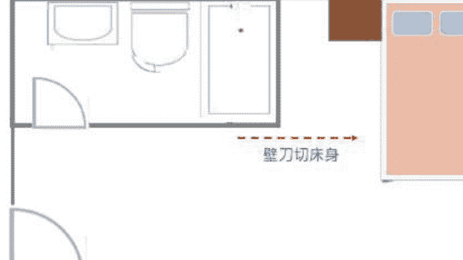

图52：房间内若有壁刀切床身，被切到之处，就易有开刀血光、意外伤害、病痛的现象发生。

###### 6.壁刀切床身

房间如果格局不方正、或是因为房间内有浴室、更衣室或衣柜，会有室内壁刀的形成。睡觉时身体部位对应到壁刀切到之处，就易有开刀血光、意外伤害、病痛的现象发生，切到哪就会伤到哪，须特别留意。

壁刀切床，就犹如一把刀切在人身体上，墙面会导引气流冲射床位，短时间可能没感觉，但长期下来，人躺在床上被切到之部位就容易有意外伤害、病痛、开刀血光。

最好的化解方式，就是调整床位避开壁刀，或用柜子将形成壁刀的位置补齐。

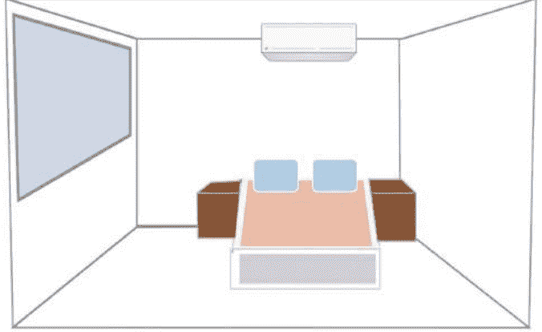

图53：床头上方不要装冷气，会有压迫感，造成神经紧张，做恶梦。

###### 7.卧房中的冷气安置、灯具安装、镜子摆设、与电视机音响

床头上方不宜装冷气，易造成神经质，还会有压迫感。床位的上方也忌讳有大灯直接照射，容易精神亢奋而影响睡眠。灯具除了会散发光和热，特殊形状的灯具也会造成形煞，所以床位的正上方不宜安装灯具。

任何一个夫妻房，因为需求，不免会有“化妆镜”或“穿衣镜”的存在。镜子除了有肉眼看得见的光线，还会有肉眼看不到的光线。如果直接反射而照到床铺，时间一久，容易有心神不宁、失眠的现象。实际上克服的方法是在位置上做调整，将镜子贴在床位侧边的墙上，或平时用布幔遮住，要用时再打开便可。

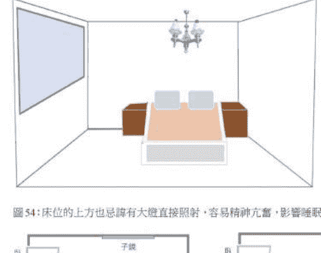

图54：床位的上方也忌讳有大灯直接照射，容易精神亢奋，影响睡眠。

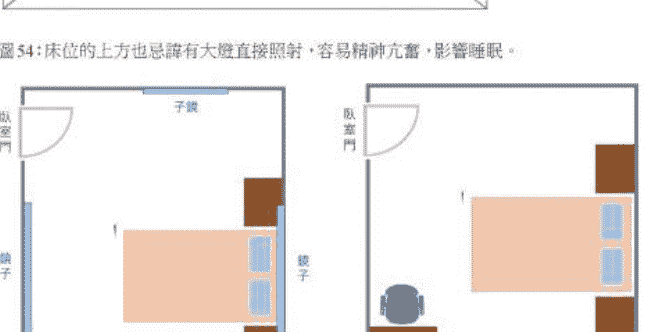

图55 ：（左）镜子侧面或正面照床，易导致精神不宁、失眠；床位后方用镜子装潢，也是非常不利。

图56 ：（右）克服镜子照床的方法是在位置上做调整，或将镜子贴在床位侧边的墙上。

电视机、音响也不宜摆放在卧室内，除了影响睡眠作息，因有发出声响的特性，易引起夫妻口角。很多人喜欢在睡觉前躺在床上看电视，甚至看到深夜不睡觉，除了影响睡眠作息，更会造成新陈代谢混乱、脾气暴躁、夫妻口角不断，对家庭和谐、身体健康造成威胁，夫妻容易同床异梦。

### 家居书桌摆设开运法

##### 提升学习思考效率，增加学业、事业运势

居家摆设中，书房的佈置十分关键，关系着居住者的学习思考状态，影响着学业运、事业贵人运等，如果书房的风水好，书桌摆设正确，对于提升仕途功名有正面的帮助。

书房的摆设在于创造良好的学习思考环境，首重宁静整洁、空气流通、光线充足。书房的风水会影响求学孩子的读书、考试或大人的事业运势，想要孩子书念好、考高分，或大人事业能出色，书房的风水、书桌的摆设就很重要。

如果书房风水的规划摆设不对，将会造成小孩学习成绩的退步，大人事业上容易做出错误判断，导致事倍功半。

###### 1.书桌位置的摆设，最好形成“龙强虎弱、龙过堂”的格局形势

书房里的书桌，跟卧室里的床位一样，摆设最好也要形成“龙强虎弱、龙过堂”的格局形势。因为龙边代表我们的脑，代表思考逻辑，虎边代表我们的行动，龙强虎弱、亲龙疏虎，能帮助我们头脑清明，注意力集中，专心看书，让心能安定下来。

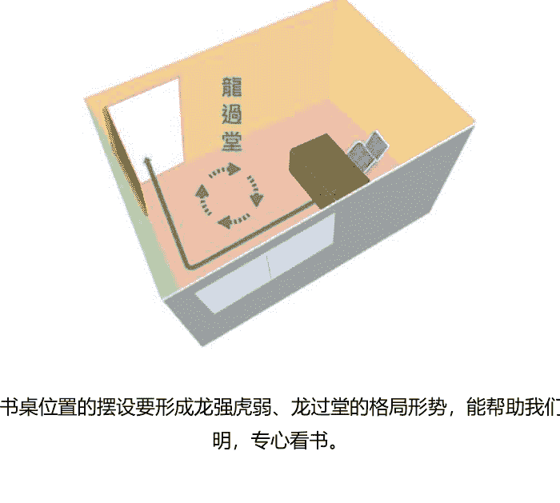

更进一步，书房里书桌的摆设，除了要将书桌的摆设调整为龙边高强（左边靠着实墙或高柜）、虎边较低弱（虎边空），还要形成“龙过堂”的形势格局，进而在我们用奇门遁甲选择有利的吉时来安桌位时，能让有利读书学习的“景门”吉炁，围绕在书房内不离散，使得我们能心无旁鹜，专心读书思考，事半功倍。

###### 2.书桌座位椅背后要有实墙可靠

书桌椅背后要有靠，主要是指书桌椅背要靠实墙，靠实墙气场才会稳，且不容易背后出现干扰。以风水学来说，“椅背后有靠”表示有靠山，主贵人、官贵，学途或仕途上比较容易受到肯定，有贵人扶持、得到提拔。若椅背后没有实墙可靠，气场会较乱，相对影响贵人运跟财运，容易受到干扰，遭小人背后计算。

### 3.书桌前最好留有明堂

书桌前面称之为明堂，明堂象征学业事业前程，要尽量留空间在书桌前面，明堂开阔亮丽代表有前途，未来前景一片看好，成绩亮眼。最忌讳直接面壁，书桌前面直接靠着墙壁，这样学业事业比较容易撞墙，导致发展受限、处处碰壁，绑手绑脚压力大，且容易目光短浅，前途受阻。

### 4.书桌勿正对及背对门，或左右靠近门，尤其是门冲

书桌正对门冲，会使气场不稳，气场不稳，心不定就会坐不住，老想往外跑，自然成绩运势也会跟着起起伏伏，不管是门在前后左右，只要正对着书桌座位的地方，都算是门冲。

书桌也勿背对门或左右靠近门，因为有人经过时的声音、光影还是会透过门钻进来，影响注意力。其中最严重的就是门开在背后，书桌背门，因无法看到房门出入情况，一有家人出现或突然背后喊你，就会受到干扰，门口一有风吹草动就容易被吓到，心不安，无法专心念书思考，那种随时有人会进来的紧张感，对于学习的影响最大，也代表读书学习、事业工作上容易受干扰，会常常犯错。

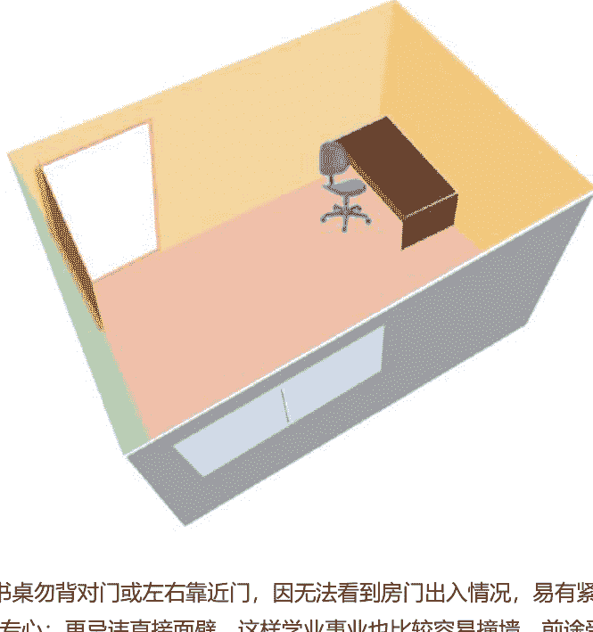

图58：书桌勿背对门或左右靠近门，因无法看到房门出入情况，易有紧张感且会影响专心；更忌讳直接面壁，这样学业事业也比较容易撞墙，前途受阻。

### 5.书桌上方不宜有梁

如果书桌位置的上方有梁，对于读书学习或事业发展，都是很不利的情况，容易思绪不清、做出错误判断。而且书桌压梁，会使人压力过大，运势被压，难以升迁、前途受阻。横梁压到座位甚至比压到书桌严重，情绪会受到影响，造成思绪混乱，工作才能无法发挥，事业不顺。

如果横梁压在书桌的位置，克服的方法是移动座位，或用装潢将天花板包覆，遮住横梁。若是压到座位，椅子背后可加书柜，让座位和横梁的直线距离加大，避开被横梁所压。

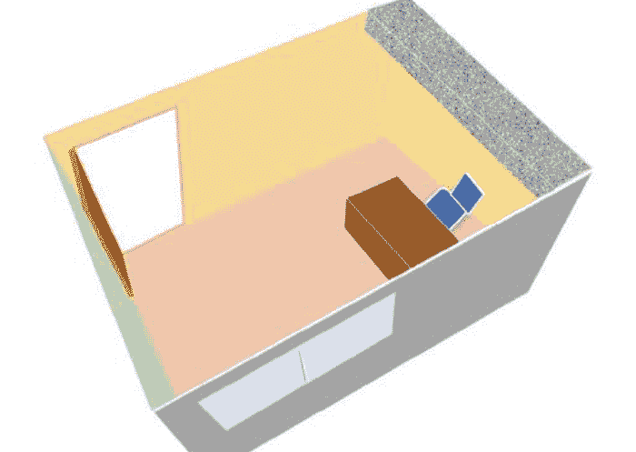

# 图 59：书桌上方有梁，情绪会受到影响，造成压力大，思绪混乱。

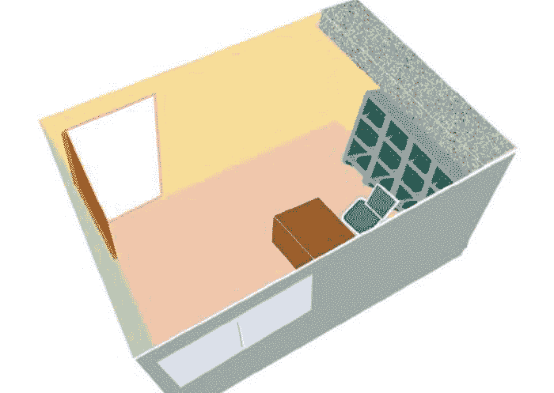

# 图 60：横梁压到座位，椅子背后可加书柜，不只后有靠，还可避开被横梁所压。

### 6.书桌勿朝向厨房、厕所，也不宜背靠厕所

厨房与厕所一是油烟气、一是污秽气，面对污秽潮湿气，会影响到学习效率，造成心情低落，对健康也不好，连带影响学业运、事业运，还会容易受到干扰，遭小人背后算计。

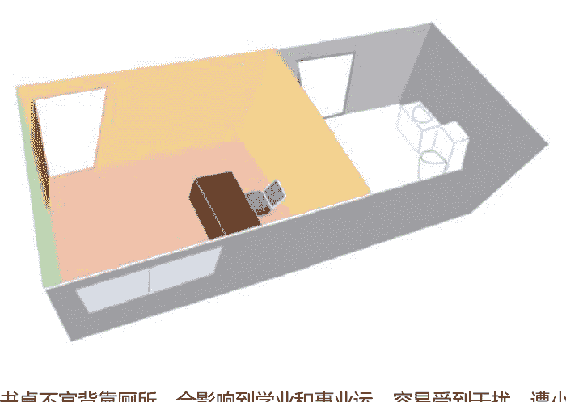

图61：书桌不宜背靠厕所，会影响到学业和事业运，容易受到干扰，遭小人背后算计。

#### 第三节 公司办公桌摆设开运法

##### 事业蒸蒸日上，上下一心，客户左右逢源

每天在公司工作，与办公桌相处的时间，或许比自己家里的书桌还要多，因此想在职场上如鱼得水，办公室的风水佈置就成为风水学重要的一环。人人都希望拥有舒服的工作环境，想要在职场上有好的运势及发展，能够升官发财，那么，办公室的佈置有什么风水讲究呢？

###### 1.办公桌的摆设，要形成“龙强虎弱、龙过堂”的格局形势

我们在前面已提过办公桌摆设的概念，如同居家床位及书桌的座位，办公桌座位的摆设也要形成“龙强虎弱、龙过堂”的格局形势。

在工作上，办公桌座位的左边龙边象征我方、自己；右边虎边象征对方、也就是同事或客户。办公室里自己的座位若能摆设或调整成“龙强虎弱、龙过堂”的形势格局，则不仅工作运势顺遂，负责的项目能顺利完成，同事在工作上能积极配合，同事之间也能相处和谐、合作愉快。

以一般员工来说，公司不是自己的，很难想怎么摆就怎么摆，但就算不能形成“龙过堂”的格局，也最好能挑选“龙强虎弱”的座位。

什么是“龙强虎弱”呢？就是在一排座位中，你的座位左手边要比右手边的座位还多，也就是龙边长于虎边，或左手边尽量靠着高柜或实墙，而右边低于左边，也就是龙高虎低。所谓龙强虎弱，即是比较座位左右两边的长短或高低，长或高的叫“强”。

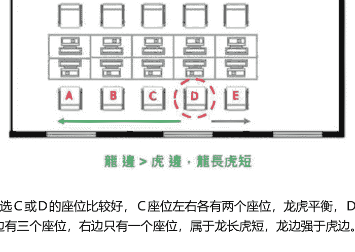

# 图62：选C或D的座位比较好，C座位左右各有两个座位，龙虎平衡，D座位左边有三个座位，右边只有一个座位，属于龙长虎短，龙边强于虎边。

另一种情况是，如果白虎方强势，不是座位长短，也不是地形高低问题，而是比如他的办公桌比你大，他处的位置或职位占上位等，那么你的青龙位必然受压迫，造成同事之间关系多竞争及紧张。

如果自己是主管或老板，则右边虎边就象征着员工、下属，也代表客户。办公桌座位若能摆设或调整成“龙强虎弱、龙过堂”的形势格局，则老板、主管与员工能上下同心合力，团结一致，客户与公司之间，能关系和谐，合作良好。

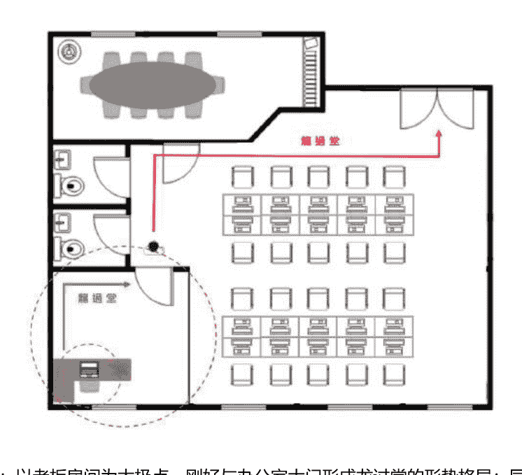

图63：以老板房间为太极点，刚好与办公室大门形成龙过堂的形势格局；同时，老板房间内座位的朝向也与房间门形成龙过堂，则主管与员工能上下同心合力，客户与公司之间关系和谐。

龙边强势，老板有气势、有创意、有自信，决断力佳，态度积极负责，员工听老板的。龙边也代表思考与创意，龙边强，有利于公司经营的决策与创新，与客户的关系上，我方气势能压过客户、掌握客户，处于优势，谈判合作时对我有利，企业易赚到钱。反之，如果龙边空而弱，而虎边又强势，则老板管不动员工，员工强势，与老板唱反调，抗上忤逆；在企业经营上，使得客户的气势压过公司，砍公司价格，客户说了算，而我方则处于弱势，委曲求全，企业不易赚到钱。

其实这样的布局也暗含了古代作战的排兵布阵。元帅（老板）坐镇在后，指挥调度前方士兵将领（员工主管），众将士在前围护后方元帅，后有玄武山险可依靠，当敌军（客户）从右前方率大军袭来（客户来访），元帅可纵观全局，运筹帷幄，排兵佈阵，进可攻退可守。

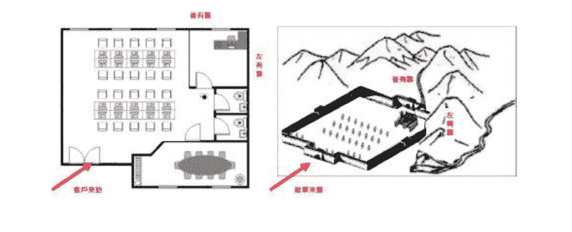

# 图64：办公室的布局其实与古代作战的排兵布阵原理相同。

这道理也很简单，就好比在道路上开车，如果是左驾，靠左行驶，与前方及右前方保持车辆间的安全距离，驾驶员只要专心留意看前方及右前方路况，一有风吹草动，一有什么突发状况，就可立即反应，少了一分危险，多了一分安全。如果行驶道路中间，四面八方皆可能有车窜出，尤其专心开车时，一般皆会专注看前方及右前方路况，当左后方突然有车窜出，驾驶员势必会被吓一大跳。所以图64的办公室摆设及佈置，是最标准也最佳的典范，既符合了风水之理，也暗合了兵阵之法。

公司老板或主事者的办公桌座位，如果摆设调整成“龙强虎弱、龙过堂”的形势格局，不仅能藏风纳气，倘若能再加上我们用奇门遁甲来选择有利的吉时安置办公桌，让有利工作事业的“开门”吉炁，围护住顺时针的官禄之炁聚集而不离散，必能帮助公司营运顺利、开拓发展、事业兴隆、声名远播。

###### 2.座位后方要有靠山

谁不希望自己在职场上可以背后有靠山，做什么事情都可以无后顾之忧地往前冲呢？座位后方靠墙，等于有靠山，利于事业拓展，聚集人脉，稳固地位。如果不想事业不顺，犯小人，或因业务繁忙不常在办公室，而想要让自己背后有靠山的话，建议座位的背后最好要有墙壁或高柜；而背后是楼梯、电梯、走道、大门的话则是禁忌，容易扰乱心神，小人趁虚而入！

办公桌座位的后方有靠很重要，有靠才坐得稳，后靠就是有依靠、支援、支撑、有靠山的意思，想当主管、老板、或坐大位，都须后座有支撑才坐得稳，后援源源不绝，立于不败之地。

###### 3.办公桌前明堂要开阔

办公桌前明堂尤其要开阔，明堂不宜窄小过逼，明堂开阔才能眼界开阔、胸襟宽广，心情上不会憋闷，气流畅通，前途有发展。若办公桌前空间过于狭窄，则容易使人目光短浅，凡事只想得到眼前的好处。要是桌子前面紧邻墙壁，形成“明堂高逼”格局，甚至就容易产生郁郁不得志的感觉，在工作上自然难有良好的表现与发展。

若真有这现象，可以在墙壁前面贴张开阔的风景图，营造出视野宽阔的感觉，也象征着前景一片看好。

###### 4.办公桌及座位切忌门冲

办公桌不管是门在前后左右，只要正对着座位的地方，都算是门冲。门冲会坐不住，老想往外跑，还容易与同事或客户引起冲突，自然业绩运势也会跟着起起伏伏，严重一点，工作还做不长久。

办公桌也勿背对门或左右靠近门，因为容易有干扰，影响工作情绪及注意力，还常常犯错。

###### 5.办公桌上方也不宜有梁柱

长时间待在梁柱下方，以风水来说会有事业、财运不利的问题，会使人压力过大，且运势被压，前途受阻。但办公室的位子可能不好说换就换，如果发现自己座位上方有梁柱，可透过摆放“水晶柱”来化煞，尤其是白色、黄色的水晶，有开运、招财的效果，如果是业务的话，粉红或紫色的水晶则象征人缘，并能带来好业绩。

如果能够移动座位，或用装潢将天花板包覆，遮住横梁更好，或在椅子背后加书柜，让座位和横梁的直线距离加大，避开被横梁所压。

###### 6.电脑荧幕的桌布、或前方隔板上宜挑选美景图片

现代人的工作少不了与电脑为伍，甚至盯着营幕看一整天。电脑荧幕会影响我们的心理状态，也关系着我们的运势。办公桌前方的电脑荧幕也代表了方位中的“朱雀方”或“明堂”，象征事业前景。所以电脑荧幕的桌布或前方隔板上可以摆放风景图片，不要选择枯树、凄凉或冬天萧瑟的景象，最好是绿意盎然、充满无限希望的风景，象征着前景无限。

当我们眼前充满一片美景，心情好之外，还会有一股达成愿望的灵动力，也具有提醒激励，未来一片光明的功效。

### 7.办公桌盆裁

在办公桌上摆放一些绿色植物，可以抒解压力、放松心情。摆放开运竹、发财树、金钱树、多肉植物都很适合，但尽量避免仙人掌等有刺的植物，会把贵人刺走。

### 第四节 店面收银台摆设开运法

### 增加店面生意，财运提升，业绩碌碌来

收银台是收入钱财的位置，是一个店面的核心部位，一个好的收银台风水，可以为一家店面带来很大的利益，带来很多的财富。因此在开店面的时候，必须选择一个比较好的财位来摆放收银台，才能聚集财富。我们一定要了解，若是懂得收银台的风水事项，好好地佈置、摆放收银台，还可因此提升店面的财运，有利于店面的生意发展！

那么，怎样才能设计一个好的收银台呢？接下来，就让我们一起从店面风水的角度，一起来看看收银台风水摆放的位置以及讲究都有哪些吧！

- 1. 收银台的位置要设在财位，形成“龙强虎弱、龙过堂”的格局形势

传统上一般风水里的“财位”，是指进门斜对角的聚气位（财位），具体是左边还是右边，要看开门的方向和其他的因素。如在左边进门，收银台可设在右斜对角的位置，如在右边进门，收银台可设在左斜对角的位置，但也须调对朝向，才能形成龙过堂的形势格局。

但在“形家风水”里，与前面单元中提到的床位、桌位的摆设形势格局一样，是要求将收银台摆设成龙边长、虎边短的“龙强虎弱”格局，同时还要造成“龙过堂”的形势。“龙强虎弱、龙过堂”的形势格局不仅能藏风纳气，还能在我们用奇门遁甲选择有利的吉时来安置收银台时，让有利财运生意的“生门”吉炁，围护住顺时针的财炁聚集而不离散。

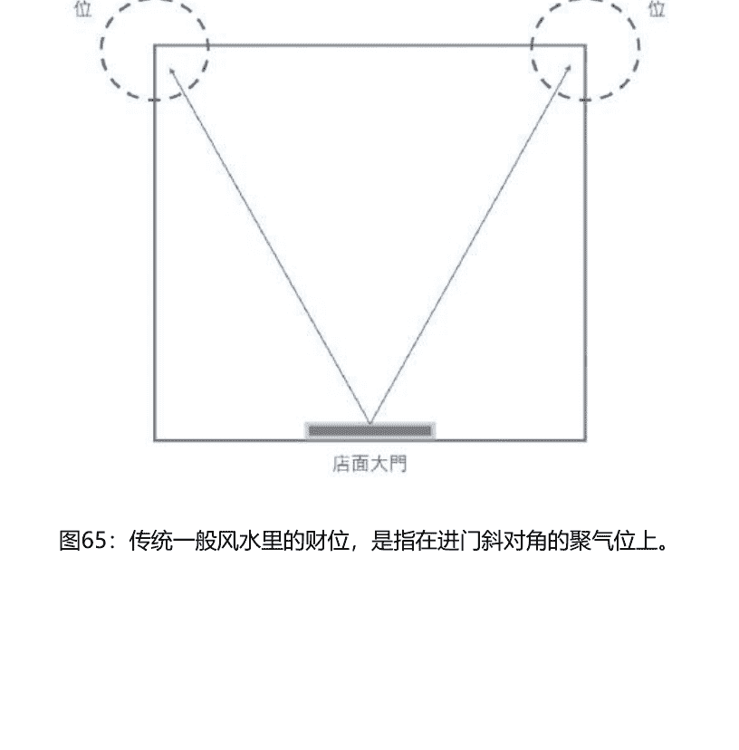

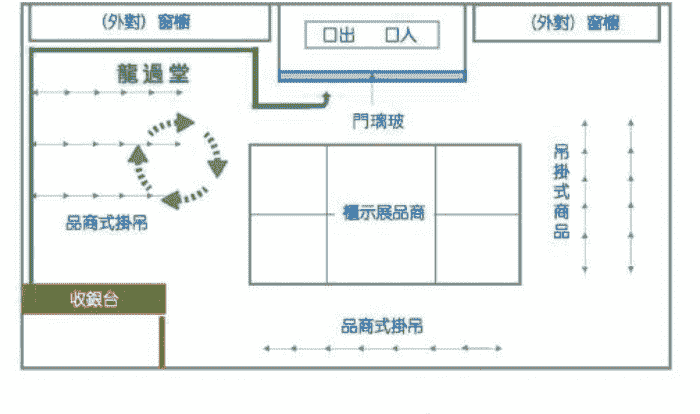

# 图66（A）：收银台要摆设成龙长虎短的“龙强虎弱”格局，同时还要造成“龙过堂”的形势。

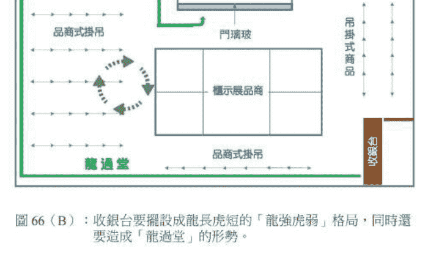

# 图66（B）：收银台要摆设成龙长虎短的“龙强虎弱”格局，同时还要造成“龙过堂”的形势。

###### 2.收银台位置的后方也要有靠山

收银台必须靠墙，背后忌讳无靠山，不可让收银台孤立无靠。

其实收银台后面忌空，与理气上的收气有关系。因为财气一般从前面来，所以前面宜空，后面宜实。收银台的背后最好是墙壁，不可有人走动的信道，这样才有利于财运的集聚。

###### 3. 收银台的摆放不宜正对大门

收银台的摆放不宜正对店铺大门，收银台是店面中的财库，财库不易外露，否则有破财之嫌，如此摆放收银台，会导致收银台受到门外气流直冲，冲散了财气，反而影响了店铺的聚财风水。总而言之，收银台宜静不宜动，更不宜受冲。收银台正对大门，属于门冲、也易发生漏财、损财是非，甚至员工私吞，中饱私囊或侵占公款状况的发生。

这样摆在进门斜对角的聚气位（财位）上，形成龙边长、虎边短的“龙强虎弱”格局，同时还是“龙过堂”的形势，不仅能藏风纳气，围护住顺时针的财炁聚集而不离散，还比较安静、不受冲；又能纵览全局，易于招呼客人，将自己置于风水的主位上，将客人安于客位。

###### 4. 收银台的柜台不宜过高，也不宜过低

必须留意柜台是否过高，收银台的柜台若太高，会挡住财运进来，太低则会让财运流走，尤其最忌收银台太高。一般店面的风水，都有一个很大而且很普遍存在的毛病，就是店铺里的收银台都很高。原因一般多是为了安全，也是因为保密性，因为收银台高，财就不会露白。收银台高了，别人虽然看不见你的钱，但是你想看到别人的钱，也难了。因为收银台高了，会挡住旺气、挡住“财路”，如果财路、旺气都没有了，就不用再谈什么露财、泄财了。

一般来说，收银台高度可在一百一到一百二十厘米左右，这个高度是适合亚洲人的高度，也比较适合操作。店面收银台是钱财进出之地，是店面财运的重中之重，其位置及摆放，直接影响到店面风水的聚财和散财，要想店面生意好，财源滚滚来，选择一个好的收银台位置，再挑一个好的时辰来安置收银机，是提升店面生意的关键因素之一。

###### 5.收银台最忌面对镜子

同床位一样，虽然很多人知道用镜子可以用来化煞，但其实镜子本身也会带来煞气。收银台对着镜子的时候，不论你店铺里的生意多好，盈利都不多，财运都一般般，赚不了大钱。

###### 6.收银台四周最忌堆放杂物、脏乱

财库四周堆放杂物、脏乱，你想财神会想来吗？收银台正前方应视野开阔，不可有障碍物，四周不可杂乱、肮脏，否则容易杂事多，杂事多就容易损财，进而影响收益进财。

###### 7.财库上方有梁柱，进财受阻

收银台上方有梁柱，梁压财库的话，进财受阻，不仅事业推进很困难，还使事业推展受局限压制。

## 第3堂课 风水布局开运法

在上一堂课中，第一步，我们运用“形家长眼法风水”，在居家卧室调整床位以增加夫妻的感情和睦，在书房调整桌位来增加学业、事业的运势，在公司办公室调整办公桌座位来提升工作事业运势，在店面调整收银台的摆设，来增加店面生意，提升财运。

第二步，我们接着得运用“奇门遁甲择时”，依据床位、桌位或收银台在住家、办公室、店面里的方位所对应奇门盘的宫位，挑选吉时，也就是找对应宫位里有出现利于婚恋感情的“休门”、利于学习考试的“景门”、利于事业开展的“开门”以及利于生意发财的“生门”，然后在该吉时，将桌、床、收银台，搬挪至吉方位，并调整座向。

这一堂课，我们将更进一步，为感情和睦、学习考试、事业开展或财运亨通，运用奇门时空来加佈风水局，佈一个感情和睦局（情）、文昌局（名）、官禄局（官）或生财局（财）。

读者可参考我的上一本书，由“春光出版社”所发行的《九宫奇门》，在书里面我已揭露了如何运用奇门佈风水局催旺桃花，而在这个单元中，我将完整公开如何运用奇门遁甲佈风水局，来催旺你的感情和睦、读书考试、工作事业及生意发财的运势。

我们只要心有所求，例如想要提升感情和合、催财、催官、催文昌等等，就可选定好对应所求的八门符号。

- 休门——感情
- 生门——财运
- 开门——事业
- 景门——学习考试

然后在家里、公司里、或店面里，选择一个吉方位（房子或房间的“财位”），接着：

- 打开“奇门历”，依方位挑选吉时，方法如同为床位、桌位、收银台挑选吉时一样。
- 再开“奇门盘”，输入吉时，找到宫位，最后根据宫位里，将与你心中所求的奇门符号所象征的风水吉祥物品，放在对应的方位上，便能提升运势，心想事成。

奇门遁甲是一门时空能量学，它是一个时空计算器，它无时不刻的在计算日月星辰、山川大地天地的能量如何运行，在什么时间、什么星体、运转至何方。借由奇门遁甲，我们在住家、公司或店面里选择某一个特定的位置，找到吉时摆上奇门符号象征的物品，就能接纳此股能量，与之共振。这就像在家里安装了一个接收器与发射站，将我们所求，对我们有利的日月星辰的能量投射到我们所在的地方，帮助且提升我们的财运、感情运、官运等等。

奇门佈风水局，方法简单，收效快速，最有奇效，自己也可以DIY为自己佈一个风水局，为自己开运！为自己安好床位，桌位或收银台，若能再加上一个风水局，效果更大，更有令人意外的惊喜与转变！

### “奇门遁甲佈风水局催旺运势”的七大步骤及流程如下：

- 步骤一：选择房子里的布局空间及位置。
- 步骤二：测量太极点在房间里的方位。
- 步骤三：根据方位锁定宫位，检查该宫位里是否有对应所求的“吉门”。
- 步骤四：先开“奇门历”程序选择吉时。
- 步骤五：再依吉时开“奇门盘”程序，看宫位是否有对应所求的“神／星”。
- 步骤六：风水物的准备及净化加持。
- 步骤七：在吉时摆放风水物及祈愿。

### 佈感情和合局

促进婚姻感情和谐，家庭生活圆满

**步骤一：选择房子里的布局空间及位置**

感情是很私密的东西，我们一般佈感情和合局，首选位置是佈在卧室里，其次可以考虑以客厅为范围（太极场）来挑选布局位置。卧房或客厅的吉方位，就是传统上一般风水里的“财位”，在进门斜对角的聚气位（财位）上。如果卧房的一边角落已摆放了卧床，则可在另一个角落佈有利感情和合的风水局，若没得摆，其次再选择卧房的其余两个角落佈局。

**步骤二：测量太极点在房间里的方位**

如果布局空间是在卧房，就以整个卧房为范围（卧房为太极场），在卧房的中心点打开罗盘，测量布局位置的方位；若卧房太小或卧房里找不到合适的空间位置，可选择布局空间为整个房子或客厅，那么就以整个房子或客厅为范围（房子或客厅为太极场），在房子或客厅的中心点打开罗盘，测量布局位置的方位。

假设我们要在卧房里佈感情和合局，如图68所示，以整个卧房为范围（太极场），在卧房的中心点用罗盘测量布局位置的方位，而它是座落在此卧房的“东南方位”里。

###### 步骤三：根据方位锁定宫位，检查该宫位里是否有对应所求的“吉门”

接着查看“奇门遁甲辨方择时”速查表，此表中对应的“东南方位”在左上角，显示为“巽宫”，适合的吉门有“休门”及“景门”。因为我们要布的是促进夫妻感情和谐、生活圆满的感情和合局，所以选用“休门”最有利于“休憩及感情和睦”。

图68：布局空间若是在卧室里，就以卧室为范围，在卧室的中心点打开罗盘，测量布局位置的方位。

图69：“奇门遁甲辨方择时”速查表（先只看宫位里是否有吉门可用）。

但是，如果布局位置的方位里，没有直接对应所求事项的吉门该怎么办？这时可以选其它吉门，因为“休门”、“生门”、“开门”及“景门”皆为吉门，都可用。例如，如果布感情和合局的位置是在卧室的“南方”为“离宫”，查表得知“离宫”只有“生门”可用，那也没事，就取“生门”大吉门为用也很好。

#### 步骤四：先开“奇门历”程序选择吉时

接下来，就是选择吉时。

我们在第一堂课提过，选择吉时有两种方式，一种比较简单的巧便法，就是借助“奇门历”程序，“奇门历”程序已将可能对符号与宫位产生不利作用的情况都排除了，包括门伏／门反、门迫／门制、白虎、空亡、天干击刑，还有“五不遇时”等不利的时辰避开了，只要设定好你预计要布局的时间范围，然后勾选“休门”及“东南方”，奇门历就会列出所有的吉时，就这么方便简单。

例如我们设定好时间的范围，是从二零二二年七月三日（日）至二零二二年七月十日（日）一个星期的时间，同时勾选“休门”及“东南方”，最后按“确定”键，这时程序就会把可以布局的吉时都排列出来。

图70：设定好条件，时间区间、方位、吉门，“奇门历”程序就能把所有的“吉时”找出来。

#### 步骤五：再依吉时开“奇门盘”程序，看宫位是否有对应所求的“神/星”

“休门”+“六合”：布感情和合局，宫位内的首要重点符号在“休门”，其次最好还要有代表月下老人的八神符号“六合”，它是媒合之神，主婚恋感情，多喜欢从事婚姻介绍工作。

> 古书有云：“六合，木神，其神性和平，专司交易、和合、婚姻、牙媒之事。所临之宫，主有会合之事”。

所以为了挑选更佳的吉时，接着我们可以打开“奇门排盘”程序，记得要选择的“排盘系统”为“时盘（置闰）”，输入由前面“奇门历”程序选择的三个吉时（参见图70），分别一一打开奇门盘，盯着看左上角的宫位，巽宫，看有没有出现“六合”这个符号，宫位里如果有“休门”+“六合”，那就对了，就是它了！

结果我们找到二零二二年七月八日（五）巳时，也就是早上九点到十一点这个时辰，宫位里同时出现“六合+休门”，把这个时辰记录下来，整个选择吉时的步骤就完成了。

如果没有使用“奇门历”程序，而是直接使用“奇门排盘”程序，那就先确定自己的时间，看看哪天有空可布局，然后再打开奇门排盘程序，设定查找的日期时间后，打开奇门盘，检查对应“东南方”巽宫里的符号有没有“休门”+“六合”，而且不能有“门伏／门反、门迫／门制、白虎、空亡、天干击刑、五不遇时”，如果不符合，那就按下一时辰，检查下一时辰的奇门盘，一个一个往下找。

图71：时辰2022年7月8日9:00~11:00 am，宫位里同时出现“六合”+“休门”。

###### 步骤六：风水物的准备及净化加持

接着，挑选及准备象征感情和合的摆饰品。

主要有二项，就是一对甜甜蜜蜜的“天鹅”及一颗象征爱情的“粉红色水晶球”（七星阵粉红水晶球也行），任何材质、颜色的天鹅摆饰皆行，只要你自己看了喜欢，有象征婚恋感情增温意义的都可以。

在布局前，我们必须先将准备好的这些吉祥物先进行净化及加持。净化及加持的目的，是为了消除物品原本不好的磁场，并同时赋予物品特殊的灵气或能量，成为可以护佑或提升自己运势的法物。具体的做法是：

- 净化：先用干净的水帮风水物洗净，把吉祥物当宝宝一样帮祂洗澡。放在水龙头下从头冲到底，帮祂用手洗三、六或九遍。净化后拿毛巾擦拭干净，其意义是擦去吉祥物过去旧的讯息，达到净化作用，为下一步注入能量做准备。

不能用水净化的，也可以用点香来净化吉祥物品。透过点燃的香传导能量，以承接天地自然高能量的磁场，借以清除吉祥物原本的杂气、浊气。基本上可以选用檀香、沉香，楠木等木质作基调的香，或选用西方常用的精油类植物如鼠尾草、迷迭香、乳香、杜松等也很好，室内焚香时要保持通风才好，并注意用火安全。

图72：净化吉祥物。

- 加持：在净化后，我们再帮吉祥物进行加持。加持的方法就是心中默念六字大明咒：“嗡嘛呢叭咪吽”三、六或九遍，再次净化吉祥物，并赋予吉祥物灵气和能量。如果是信奉其他宗教的，也可呼唤自己的主神为吉祥物加持，最重要的是心诚则灵，保持一颗敬天畏地虔诚的心就对了，心意心念最重要。

然后，将吉祥物收好放好，在布局前最好不要让外人去摸或玩弄，免得又影响了吉祥物的净化。

###### 步骤七：在吉时摆放风水物及祈愿

最后，等吉时一到，先到布局场地位置，扫地擦桌、清洁干净。提醒各位朋友，吉祥物绝不可摆放于地板上，因地气混杂，位置的高度至少也需在膝盖以上为宜。

- 选定的吉时一到，将净化加持过的吉祥物两手捧起，一一置于胸前画横向的8字形∞（无穷大符号）三次后，再摆上。若吉祥物太沉重，不便举起在胸前画8字形∞，可改为点一炷香，拿香在吉祥物的周边或上方画横向的∞字形三次。

- 布局物品放好后，最后最重要的，是“祈愿”！

许下心愿，贯注自己的心念于风水物上。许愿不要用“我想要……”，而是代之以“感谢……”或“感恩……”。例如，不要说：“我想要跟老公感情融洽，一辈子幸福，甜甜蜜蜜！”而是要说：“感谢您，让我跟老公感情都很融洽，一辈子幸福，甜甜蜜蜜！”然后用心、用感受、用一种沉浸于甜蜜幸福的感觉，去取代只用脑想“我想要有甜蜜幸福的感情生活”的念头。

- 摆上后，就大功告成了！布局后一般三个月内会有奇效，布局的位置平常要保持干净整洁，吉祥物摆久了可拿干净的毛巾轻轻擦拭。布局的吉祥物千万不要去动他或让别人去玩他、抚摸他，影响了风水局的成效。

以上程序、原则最好全部遵守，若真的无法完全符合，请记得一句话：“心诚则灵”，心念心意心诚最重要！只要你相信，就一定有效果，即使仪式规矩也是一种仪轨助您心诚！

#### 第二节

#### 佈学习考试局

##### 提升学习思考效率，增加学业、事业运势

学习考试，一直是父母有了孩子之后最关心、也最有挑战的课题之一。古书有云：“奇门遁甲源自于兵法，最利考试”，举凡跟竞争有关的类别，例如考试面试、运动比赛、招标竞标、官司、讨债、竞选等等，奇门遁甲的布局收效最快，每有奇效。因为奇门本来就是用在战场上，竞争输赢的。

子奇老师在两年前，虽然教学非常忙碌，还是在两个月之间受朋友之托一口气布了七个文昌考试局，令人开心的是七个局全部成功，全部考上了理想中的学校！令人更加开心的是，其中有一位朋友的女儿，参加了学校老师的甄试，连续五年都没有甄试上，在她爸爸的请求下，我亲自到她家为她布局。要知道，现在台湾少子化，纷纷减少老师的聘用，在外的流浪教师一堆，僧多粥少，当老师不仅辛苦，想挤进学校当一名专职的教师，更是竞争激烈！还好，不负她父母所托，布了奇门局，成功如愿地通过甄试，挤进学校当上了专职老师。她的父母除了给了我二个大大的红包（前金＋后谢），还宴请了众多亲友分享这个好消息。父母也从眉头深锁，转为笑逐颜开，满脸掩不住的喜悦，真是天下父母心呀！

就正在写书的当下，刚刚还传来了几个因布了文昌考试局之后，孩子学习进步了、考上了的学员反馈。除了替他们开心，也再次证明了奇门遁甲布局的成效，奇门遁甲诚不欺人也。人不努力，不会成功；但有时努力了，也不一定能成功，因为缺了一个机运、一分运气。奇门遁甲虽然不能让你从零分变成一百分，但他真的能增加考运，运气好的话，还能增加个几十分呀！很多小孩，因为布了奇门遁甲的文昌考试局，成绩进步了，受到了肯定激励，小孩反而开始变得爱学习，成绩突飞猛进，布一次局，改变了小孩的未来！

所以我们除了在家里调整书桌、座位，还可以为自己或小孩用奇门布一个文昌考试局，帮助学习及考试。方法基本上跟布感情和合局一样七个步骤，只是挑选的场地、选择的奇门符号，及摆放的吉祥物有所不同。

##### 步骤一：选择房子里的布局空间及位置

我们一般布文昌考试局，首选布在书房里；若书房太小或没有书房，小孩常常在餐桌上或客厅桌上读书做功课，也可以将文昌考试局布在餐厅或客厅里（以餐厅或客厅为范围，为太极场）。总之，原理就像在家里装Wifi网络，越靠近接收及发射网络Wifi讯号的地点，越能接收到讯号。

书房、餐厅或客厅的吉方位，就是传统上一般风水里的“财位”，在进门斜对角的聚气位（财位）上。如果房间的一边角落里已摆放了书桌，也可以布在书桌上（只要布好了之后，小孩别再去动到或碰到吉祥物）；亦可在另一个角落布有利学习考试的风水局，若两个角落真没得摆，最后再考虑选择房间的其余两个角落布局。

#### 步骤二：测量太极点在房间里的方位

如果布局空间是在书房里（餐厅、客厅同理），就以整个书房为范围（书房为太极场），在书房的中心点打开罗盘，测量布局位置的方位。

如图73所示，我们要在书房里布文昌考试局，就以整个书房为范围（太极场），在书房的中心点用罗盘测量布局位置的方位。以图73为例，挑选的布局位置是座落在此书房的“东北方位”里。

图73：布局空间若是在书房里，就以书房为范围，在书房的中心点打开罗盘，测量布局位置的方位。

###### 步骤三：根据方位锁定宫位，检查该宫位里是否有对应所求的“吉门”

接着查看“奇门遁甲辨方择时”速查表，对应的“东北方位”在左下角，显示为“艮宫”，因为我们要布的是提升学习思考效率、增加学业、事业运势的文昌考试局，所以选用“景门”最有利于“考试学习”。

但是，如果布局位置的方位里，没有直接对应所求事项的吉门又该如何？这时可以选其他吉门。例如图74，在东北方的“艮宫”里也可以挑选“开门”，“开门”也为大吉门。如果一定要选“景门”，那山不转路转，就改变自己布局的位置及方位，选表中有“景门”的方位角落来布考试文昌局。在图74中，景门适合的方位有四个，分别为东北方的“艮宫”、东方的“震宫”、东南方的“巽宫”及西南方的“坤宫”。

图74：“奇门遁甲辨方择时”速查表（先只看宫位里是否有吉门可用）。

| 方位 | 宫位 | 吉门 |
| :--- | :--- | :--- |
| (巽) 东南 | | 景、休 |
| 南 | (离) | 生、开 |
| 西南 (坤) | | 景、开 |
| (震) 东 | | 景、休 |
| 中宫 | | （空） |
| 西 (兑) | | 生、休、开 |
| (艮) 东北 | | 景、开 |
| 北 (坎) | | 开、生、休 |
| 西北 (乾) | | （空） |

图例：
- 休：休憩、感情和睦、贵人
- 生：生财、生意财运、生气健康
- 开：开业开店、工作事业
- 景：前景光明、考试学习文昌

#### 步骤四：先开“奇门历”程序选择吉时

接着同样是选择吉时来布局。为了让读者能更熟悉掌握如何选出吉时，我在这里再示范一次。

例如，我们设定好时间范围是从二零二二年七月十日（日）至二零二二年七月十七日（日）一个星期的时间，同时勾选“景门”及“东北方”，最后按“确定”键，这时程序就会将可以布局的吉时都排列出来。

图75：设定好条件，时间区间、方位、吉门，“奇门历”程序就能把所有的“吉时”找出来。

##### 步骤五：再依吉时开“奇门盘”程序，看宫位是否有对应所求的“神 / 星”

“值符” / “九天” + “景门”：布学习考试局，宫位内的首要重点符号在“景门”，其次最好还要有代表名列前茅的八神符号“值符”，或能提升分数考高分的“九天”。

“值符”是值掌符令的头儿，代表第一、代表甲，是八神中的领袖之神，居八神的首位，在奇门遁甲的演局中，起到引领诸神的作用。甲是十天干的第一个，小时候，作业成绩如果得到甲，就代表成绩很优秀，如同外国学生成绩拿到A或A+，排名是排前面的；而奇门八神之中“九天”为高，“九地”为低，要想学习考试拿高分，“九天”意如其名，代表“高”，考试“高”中榜首、考取“高”分，不都是“高”吗？

为了挑选更佳的吉时，再来我们可以打开“奇门排盘”程序，记得选择“排盘系统”为“时盘（置闰）”，输入由前面“奇门历”程序挑选出的吉时（图75）。然后从第一个吉时开始，打开奇门盘，盯着左下角的宫位，艮宫，看有没有出现“值符”或“九天”的符号。宫位里如果有“景门”+“值符”或是“景门”+“九天”，那就对了，就是它了！

结果运气真好，第一个吉时就找到了！在“二零二二年七月十二日（二）申时下午三点到五点”这个时辰，就可以选来布我们有利于“考试学习”的文昌局。最后把这个时辰记录下来，整个选择吉时的步骤就也就完成了。

西元：2022年07月12日15时00分 (二)
农历：2022年06月14日15时
天干：壬 丁 丙 丙
地支：寅 未 寅 申
起局：阴八局
排盘：时家 (置闰)
旬首：甲午 旬
空亡：辰巳
符头：辛
驿马：寅
值符：天芮
值使：死门

| | 巽 | 离 | 坤 |
|---|---|---|---|
| **戊** | 4 巽 玄武 空○ 天蓬 丙 惊门 壬 | 9 离 白虎 天任 戊 开门 乙 制 | 2 坤 六合 天冲 癸 墓 休门 丁辛 制 墓 |
| **丙** | 3 震 九地 天心 庚 死门 癸 | 5 | 7 兑 太阴 天辅 壬 生门 己 |
| **庚** | 8 艮 九天 驿 天柱 己 墓 景门 戊 | 1 坎 值符 天芮 丁辛 杜门 丙 | 6 乾 螣蛇 天英 乙 墓 伤门 庚 制 |

图76：时辰2022年7月12日15:00~17:00 pm，宫位里同时出现 “景门” + “九天”。

特别提醒朋友的是，奇门遁甲在安桌位、安床位，或是布风水局时，挑选的吉时，指的都是“时辰”。

因此图75中的第一列时间，日盘，是代表当日“二零二二年七月十一日（一）”一整天在东北方有好的“景门”吉炁；但我们要找的是时辰，布局是“择时”不是“择日”，所以第一个“东北方”有“景门”的吉时，应该是第二列的时间“二零二二年七月十二日（二）申时”这个时辰。

同之前布感情和合局一样，如果没有使用“奇门历”程序，而是直接使用“奇门排盘”程序，那就先确定自己的时间，看哪天有空来布局。然后再打开奇门排盘程序，设定开始查找的日期时间后，打开奇门盘，检查对应“东北方”艮宫里的符号有没有“景门”+“值符”或“九天”，而且不能有“门伏／门反、门迫／门制、白虎、空亡、天干击刑、五不遇时”，如果不符合，那就按下一时辰，看下一个时辰的奇门盘，一个一个往下找。

###### 步骤六：风水物的准备及净化加持

再来便是挑选象征增进学习考试的摆饰品。主要有二项，“景门”就是“图画”，可以是一张类似春联的红纸，上面写着帮助孩子学习顺利或考试成功的吉祥话，也可以是用图画的形式。另一项，则是摆一条“龙”造型的饰品，象征“九天”，任何材质、颜色的字画或饰品皆行，然后摆在高处，象征学业成绩高或考试分数高；“值符”也一样是摆龙。如果更考究一点，可以加摆文昌笔、文昌塔或开运竹，三选一即可。

然后在布局前，将准备好的这些吉祥物先进行净化及加持，方法同上节所述。

###### 步骤七：在吉时摆放风水物及祈愿

最后，等吉时一到，先于布局场地位置，扫地擦桌，一画8字形∞，然后摆上风水吉祥物并祈愿，步骤原则同布感情和合局一样，请参照上节所述，至此大功告成了。

#### 第三节

#### 佈事业官禄局

##### 提升工作运势，升官加薪，事业鸿图大展

一般说来，做生意的、做业务的、接案子的，需要额外财源、客源的，皆以“求财”为主，可布“财运亨通局”；当官的、管人的、上班族以事业管理、工作顺遂、能升官晋爵为主，适合布“事业官禄局”。当然所有人都想发财，但一般上班族财源固定，领的是固定薪水，布财局的效果可能没有做生意的效果来得大。反而是上班族或是企业专业经理人，应以力求工作表现、管理完善，受老板提拔器重为要。

布“事业官禄局”的方法与布“学习考试局”基本上是完全一样的，差别在于选取的八门，除了适用“景门”之外（事业前景看好、一片光明），更佳的选择是取用“开门”，因为“开门”象征事业，代表开拓、发展，也代表公司企业。

利事业升官的八神，也跟布“学习考试局”一样，选取“值符”或“九天”，值符就是值掌符令的主管或老板，就是“官”，而九天为“高”，人往高处爬，有“升官”的意象。

##### 步骤一：选择房子里的布局空间及位置

布局的场地，如果自己是企业主，可布局在公司里；如果不是的话，可布局在家里。

在公司里布局，最佳的布局范围（太极场）是以整个公司为范围，以公司单位的大门为主，在进门斜对角的聚气位（财位）找布局位置，且最好挑选角落的两边有实墙可做靠的那个为主。如果老板有自己的办公室，而办公室够大的话，也可以布局在自己的办公室里。

图77：在公司里布局，可以整个公司为范围，以公司单位的大门为主，在进门斜对角的聚气位（财位）找布局位置，最好挑选角落的两边有实墙可做靠的那个为主。

图78：在公司里布局，如果老板有自己的办公室，也可以布局在自己的办公室里。

如果是一般上班族，想提升工作运势、升官加薪，可在自己家里布局。布局范围（太极场）可以整个房子或以客厅为范围，以住家单位的大门为主，在进门斜对角的聚气位（财位）上，找布局位置，最好挑选角落的两边有实墙可做靠的那个为主。

#### 步骤二：测量太极点在房间里的方位

以图77、78为例，在进门斜对角的聚气位（财位）上，方位落在公司或办公室的“东北方位”里，另一个角落就不考虑了，因为刚好位于“门冲”的位置上，尽量避免。

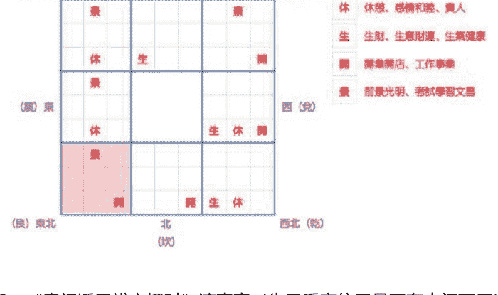

###### 步骤三：根据方位锁定宫位，检查该宫位里是否有对应所求的“吉门”

接着查看“奇门遁甲辨方择时”速查表，对应的“东北方位”在左下角，显示为“艮宫”，因为我们要布的是提升工作运势、升官加薪，帮助事业宏图大展的事业官禄局，所以选用“开门”最有利于“工作事业”。

但是，如果布局位置的方位里没有直接对应所求事项的吉门又该如何？这时可以选其他吉门，例如在东北方的“艮宫”里也可以挑选“景门”，“景门”也为吉门。

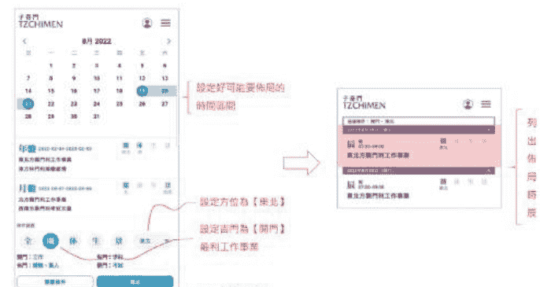

图80：设定好条件，时间区间、方位、吉门，“奇门历”程序就能把所有的“吉时”找出来。

#### 步骤四：先开“奇门历”程序选择吉时

接着一样是选择吉时来布局，假设今天是二〇二二年八月十八日，我们就设定好时间范围是从二〇二二年八月十九日（五）至二〇二二年八月廿一日（日），同时勾选“开门”及“东北方”，最后按“确定”键，这时程序就将可以布局的吉时都排列出来了。

###### 步骤五：再依吉时开“奇门盘”程序看宫位是否有对应所求的“神/星”

**“值符” / “九天” + “开门”**：布工作事业局，宫位内的首要重点符号在“开门”，其次最好还要有代表值掌符令的八神符号“值符”，或能更上一层楼的“九天”。

为了挑选更佳的吉时，再来我们可以打开“奇门排盘”程序，记得选择的“排盘系统”为“时盘（置闰）”，输入由前面“奇门历”程序挑选出的吉时（请参看图80）。从第一个吉时开始，打开奇门盘，盯着左下角的宫位，艮宫，看有没有出现“值符”或“九天”的符号，宫位里如果有“开门” + “值符”或是“开门” + “九天”，那就对了，就是它了。

结果第一个吉时就找到了！“二〇二二年八月十九日（五）辰时早上七点到九点”这个时辰，可以选来布有利于“工作事业”的官禄局。如果买布局吉祥物品时间上来不及，也可以挑第二个吉时，八月二十日（六）辰时早上七点到九点再来布局。

- 西元: 2022年 08月 19日 07时 00分 (五)
- 农历: 2022年 07月 22日 07时
- 天干: 壬 戊 甲 戊
- 地支: 寅 申 辰 辰
- 起局: 阴八局
- 排盘: 时家 (置闰)
- 旬首: 甲子旬
- 空亡: 戊亥
- 符头: 戊
- 驿马: 寅
- 值符: 天任
- 值使: 生门
- 星伏

| 巽4 九地 天辅壬 生门壬 | 离9 玄武 天英乙 伤门乙 | 坤2 白虎 天芮丁辛 杜门丁辛 |
|------------------------------|------------------------------|----------------------------------|
| 震3 九天 天冲癸 休门癸 | 5 | 兑7 六合 天柱己 景门己 |
| 艮8 值符 天任戊 开门戊 | 坎1 滕蛇 天蓬丙 惊门丙 | 乾6 太阴 天心庚 死门庚 |

图81: 时辰2022年8月19日7:00 ~ 9:00 am, 宫位里同时出现 “开门” + “九天”。

宫位还有一个特殊符号，称之为“马星”，就是标示在宫位里右上角的一个“马”字。“马星”代表“速度快”，代表“马上”。布局时选择的吉时若恰巧出现“马星”，还可加码，加布一匹“马”的吉祥物，象征“马上升官”，“马上发财”等等，同理可推。

###### 步骤六：风水物的准备及净化加持

接着准备象征增进工作事业的摆饰品。主要有一项，就是摆一条“龙”造型的饰品，象征“值符”或“九天”的权贵，任何材质、颜色的饰品皆行。然后在布局前，先将准备好的这些吉祥物进行净化及加持，方法同上节所述。

###### 步骤七：在吉时摆放风水物及祈愿

最后，等吉时一到，先于布局场地位置，扫地擦桌，一一画8字形∞，摆上风水吉祥物后祈愿，步骤原则同布感情和合局一样，至此就大功告成了。

### 第四节

#### 布财运亨通局

##### 增加店面公司生意，提升个人财运

没有一个人不想发财，尤其是经营公司、开店做生意，财乃养命之源，更是企业的血脉，为了理想而奋斗，做自己喜欢做的工作固然很棒，但推展事业、做生意没有赚钱，又何谈理想？何谈成就？精神与物质的需求若不能平衡或有缺，则个人的快乐不会持久，企业也只会昙花一现。

奇门遁甲的催财局，正式名称为“奇门天星催财局”，乃我在二〇一六年于台湾教授奇门遁甲时首度释出。推出之后，一时洛阳纸贵，造成轰动。当时，台湾冒出了很多打着奇门教学的课程，很多教授奇门遁甲的老师，多以此为标榜，开课来吸引大量学员学习奇门遁甲。“奇门遁甲天星催财局”一时闹得沸沸扬扬，炙手可热，因为利益所趋，没有人不想赚钱的，搞得学习奇门遁甲只剩下学到如何催财，实非我本意。

**奇门遁甲催官重八神（神助），催财重九星（天时），办事重八门（人和）。**

因为仕途想顺利，自己努力也要有人提拔，正所谓“朝中有人，好办事”，神大于人，奇门遁甲的八神，讲白话一点就是地位高于自己、比较有办法的贵人。想在仕途上快速发展，有所成就，能升官晋爵，除了自己的努力，也要有机运遇到愿意拉你一把的贵人，所以什么叫做“神助”，就是有贵人帮，助你一臂之力，这也是形家风水里的左青龙，左边要有靠，要有靠山，帮扶，给你撑腰提拔。

而奇门遁甲的九星，代表的就是“天时”，天时，狭义的讲就是季节气候，种蔬菜水果，重在对的季节里，才能种出肥美饱满的果实，大丰收！种错了季节，太早太晚，不仅收成不好，还卖不出去。天时，广义的讲就是趋势与潮流，选对了时机、搭上了趋势与潮流，未来才能事半功倍、水涨船高，才有大的发展性。

所以奇门遁甲的九星布财催财，其实催发的、或带来的，是一种发展性，是一种机会，它不是催了财后，就每天躲在家里喝可乐、看影片，不去工作，不去找客户，财就会从天上掉下来，让你可以不劳而获。即使黄金搬到你家门口，你也得花力气把它从门口扛进家里。

好比一个推销保险的业务人员，原本邀约时都没啥客户愿意见你，现在催了财了，邀约机会变多了，甚至客户还帮你转介绍，这时你反而要更加努力的销售、创造业绩，期使这一波的努力，能大大的增加客户数，然后更尽责的做好服务，就能跃升一个等级，成为百万或千万金牌业务员。所以只要布了奇门九星催财局之后，第一个明显的现象是，你会开始变得忙碌，做店面生意的客人变多了，做生意的，生意订单变多了，做业务的，邀约变多了，开始忙碌起来了。以前到处邀约、抢订单、拉客人，都没什么成效，现在机会变多了，成交率变高了，甚至多年未见的朋友、同学、客户都跑出来找你谈生意了。

奇门催财，催的是生意的机会，不是催了财后突然中乐透，突然有意外之财，此其一。上班族应着重于催官，因为上班族领的薪水，财源是固定的；开公司的、做业务的、搞生意的、弄店面的，比较需要有客户、生意机会的、要多点财源财路的，着重于催财，此其二。还有，常说自已没有机运，没有客户订单，现在催了财，好比鸟在天上飞，遇上顺风，反而更应努力，振翅飞翔，把距离拉大，把握机会，赚饱赚足人生的第一桶金，不要浪费了人生难得的好机运，此其三。

“奇门遁甲布天星催财局”的布局方式与上述略有不同，考量较多，具体的步骤及流程如下：

##### “奇门遁甲布天星催财局”的七大步骤及流程

###### 步骤一：选择店面、公司、或住家里的布局空间及位置

一般布天星催财局，做店面生意的、开公司经营企业的，可以直接布在店面或公司里，以整个店面或公司为范围（太极场）找财位布局。

如果没有自己的店面或公司，也可以布在家里的客厅，或以家里整个客厅为范围（太极场）找财位布局。店面、公司、或家里客厅的吉方位，就是传统上一般风水里的“财位”，在进门斜对角的聚气位（财位）上。

###### 步骤二：测量太极点在店面、公司、或住家里的方位

以整个店面、公司、或家里为范围（太极场），在其中心点打开罗盘，测量布局位置的方位。如图82所示，假设我们要在店里布天星催财局，挑选的布局位置刚好是座落在店面西方的“兑卦”里，则可以将象征财星的水晶球及聚宝盆，直接放在收银台上。

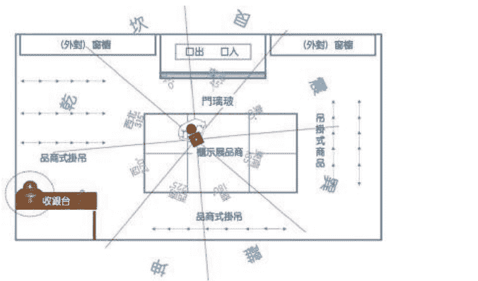

图 83：“奇门遁甲辨方择时”速查表（先只看宫位里是否有吉门可用）。

（巽）东南 （离）南 （坤）西南 （震）东 （兑）西 （艮）东北 （坎）北 （乾）西北 休 休憩、感情和陆、贵人 生 生财、生意财运、生气健康 开 开业开店、工作事业 景 前景光明、考试学习文昌 景 休 生 开 景 休 开 生 休 景 开 开 生 休

###### 步骤三：根据方位锁定宫位，检查该宫位里是否有对应所求的“吉门”

布财局，主要是找“生门”，“生门”就是奇门时空下的财位或财方。

接着查看图84的“九星为财星”速查表，可见只有三个宫位有生门，分别是南方的“离宫”、西方的“兑宫”及西北方的“干宫”，我们所选的财位刚好对应的是“西方”的“兑宫”。因为我们要布的是增加店面公司生意、提升个人财运的天星催财局，所以得选用“生门”，才能有利于“生财及财运”。

必须特别提醒的是，如果所选布局位置的方位里没有“生门”又该如何？这时不宜像布感情和合局、考试文昌局或事业官禄局一样可以选其它吉门，因为只有“生门”的宫位在奇门里才能称之为“财位”，而“生门”宫位里的九星才可以称之为财星。当然还有其它的财位可以选择，但因为跟择日有关，随时间而变动，也比较复杂，得另外参加奇门课程学习。

除了选用对应所求的奇门符号“生门”，还须选用对应宫位里“得地”的“九星”，即所谓的“财星”（例如在图84的“九星为财星”速查表中，西方兑宫只有天柱、天芮、天心、天任星才称为“得地”的财星，除了这四颗星，其余的九星在兑宫无法发挥其催财的效果）。

- 南方“离宫”：选用“天英星”、“天冲星”或“天辅星”。
- 西方“兑宫”：选用“天柱星”、“天心星”、“天芮星”或“天任星”。
- 西北方“干宫”：选用“天柱星”、“天心星”、“天芮星”或“天任星”。

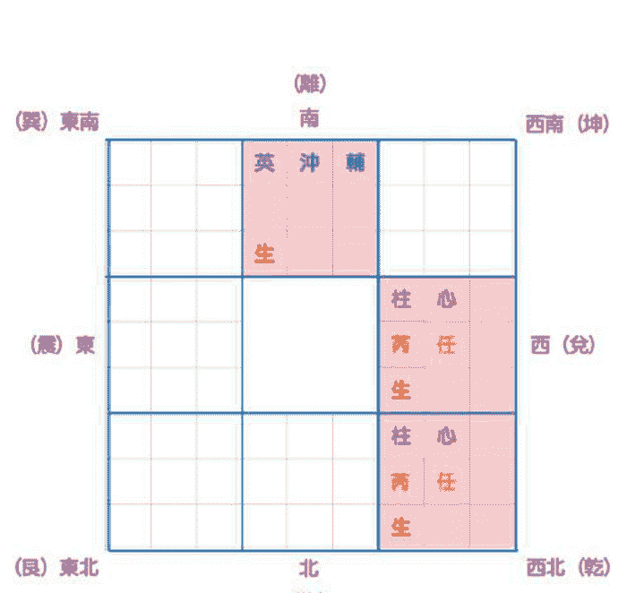

图84：“九星为财星”速查表。

###### 步骤四：先开 “奇门历” 程序选择吉时

接着同样选择吉时来布局。假设我们设定好时间范围是从二〇二二年七月十日（日）至二〇二二年七月十七日（日）一个星期的时间，同时勾选“生门”及“西方”，最后按“确定”键，这时程序就把可以布局的吉时都排列出来了。

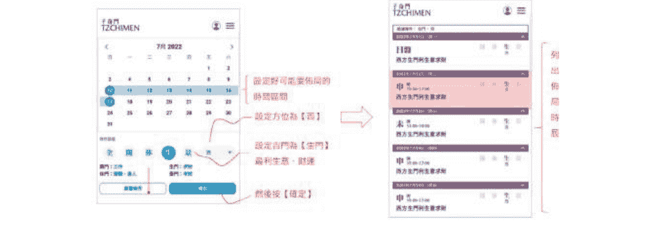

图85：设定好条件，时间区间、方位、吉门，“奇门历”程序就能把所有的“吉时”找出来。

###### 步骤五：再依吉时开“奇门盘”程序看宫位是否有对应所求的“神/星”

从第一个吉时开始，打开奇门盘，盯着右边中间的宫位，兑宫，看看有没有出现“天柱星”、“天心星”、“天芮星”或“天任星”的符号，结果第一个时辰的奇门盘里，西方“兑宫”里的九星是“天辅星”，兑宫虽有“生门”，但天辅星没有出现在图86右方表格的兑宫中（因为天辅星在兑宫中不得地），所以“二〇二二年七月十二日（二）申时下午三点到五点”这个时辰就不能用。

接着输入下一个由奇门历所挑选出来的吉时，继续往下找，结果在第二个时辰“二〇二二年七月十三日（三）未时下午一点到三点”，找到了西方“兑宫”里的九星是“天任星”，这个时辰就可以选来布有利于“生意及财运”的催财局！

最后把这个时辰记录下来，整个选择吉时的步骤就完成了。

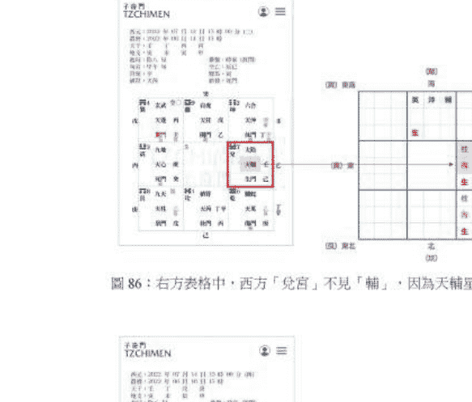

圖86：右方表格中，西方「兌宮」不見「輔」，因為天輔星在兌宮沒得地就不能用。

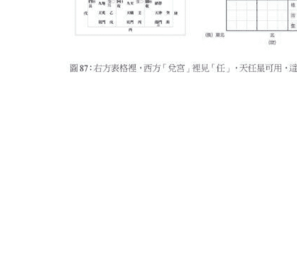

圖87：右方表格裡，西方「兌宮」裡見「任」，天任星可用，這時辰為吉時，可用來佈財局。

| 宫位 | 天星 | 选用水晶球 |
|------|------|------------|
| 南方「離宮」 | 天英星（火） | 紅色、紫色或粉紅色水晶球 |
| 南方「離宮」 | 天冲星（木） | 綠色水晶球 |
| 南方「離宮」 | 天輔星（木） | 綠色水晶球 |
| 西方「兌宮」 | 天柱星（金） | 白色水晶柱 |
| 西方「兌宮」 | 天心星（金） | 白色水晶球 |
| 西方「兌宮」 | 天芮星（土） | 黃色水晶球 |
| 西方「兌宮」 | 天任星（土） | 黃色水晶球 |
| 西北方「乾宮」 | 天柱星（金） | 白色水晶柱 |
| 西北方「乾宮」 | 天心星（金） | 白色水晶球 |
| 西北方「乾宮」 | 天芮星（土） | 黃色水晶球 |
| 西北方「乾宮」 | 天任星（土） | 黃色水晶球 |

###### 步骤六：风水物的准备及净化加持

再来准备布局物品。主要是将一颗对应九星五行颜色的“水晶球”（天柱星可用水晶柱），置于摆满“五色石或水晶（紫黄白黑绿）”的“聚宝盆”里。

布奇门天星催财局，最重要的是要摆一颗对应财星五行颜色的水晶球，这是必备的。至于“聚宝盆”，则是视个人情况添加上去的，即使只摆一颗水晶球也可以。“聚宝盆”可自行制作，一般可于其内摆放五色石（紫黄白黑绿）或五色碎水晶，其上可再加上钞票、元宝等象征金钱财富的物品，若在店面里布局，也可加摆发财树、招财猫等吉祥物。

在布局前，我们我们将准备好的这一颗“水晶球”、“五色石或水晶”及“聚宝盆”先进行净化及加持，方法同上节所述。

###### 步骤七：在吉时摆放风水物及祈愿

最后，等吉时一到，先于布局场地位置，扫地擦桌，一一画8字形∞，摆上装上水晶球的聚宝盆及其他招财吉祥物后祈愿，步骤原则同前述布局一样，至此就大功告成了！

接着就努力赚钱等着发财啰！通常三个月内会有明显的效果。

## 第4堂课

### 断舍离改运法

#### 第一节

##### “断舍离” 让你的生活出现全新的改变

“断舍离” 这个名词源自于日本，意为 “断绝不需要的东西、舍去多余的物品、脱离对物品的执着”。从心灵层面来看，可以透过断舍离方式，借由整理物品、舍弃无用之物，还以干净整洁场所，让心情舒畅愉悦并期待会有好事发生。正所谓 “坏的不去，好的不来”，丢掉物品，除了心会变得清爽，运势也会跟着提升。因此，当你因为失恋或工作失误、人际关系的龃龉而纠结的时候，这时最好马上进行断舍离。

丢掉东西、整理环境，就开运的观点来看，是为了 “让气场更好”。丢掉东西的房间更通风，让气场更好。当你觉得烦恼、迷惘，迟迟无法前进的时候，就进行断舍离吧！当你的内心和房间都处于通风良好的状态，运气也就会随之上升。

其实，也不一定只丢掉房子里的东西会转运，很多女孩子失恋了、遇到挫折心情不好了，常常会去理发店剪个头发、换个发型。因为换个发型，换个心情，重新出发。这在奇门遁甲里称之为 “置换法”，尤指除了奇门遁甲 “乙丙丁三奇” 之外的 “第四奇”——“辛”天干的用法。

十天干中，辛天干五行属金，金为刀、为剪、为革除，“辛”发音又与“新”、“心”音同，代表改革自新、创新，代表心想事成，所以“辛”可以置换，也就是“去掉不好的”，“换成好的”，重新做人、重新出发，改变新的心态、新的行为作法，焕然一新，重新开始，摆脱掉霉运，迎向崭新、充满契机好的未来。不要再跟不好的人事物纠葛牵扯不清，把不好的移开，别在那挡路，好的人事物、好的运势才有机会进来！

在股市里这叫“换股操作”，换掉长期被套牢的股票，改买有潜力的、准备上涨的潜力股。这道理其实很“简单”，但做起来很“难”，为什么？因为舍不得、放不下、忘不了、不甘心，甚至往往安慰自己，我这是“投资”，长期抱着、守着，等待一个未来不会有太大机会翻转的股票，长期持有，等着“解套”。其实，这跟遇上了一个渣男，不愿离开他一样；跟待在一份未来不会有发展的工作一样；跟环境变了，但仍坚持死守着一个赔钱的店面生意，道理都是一样的。只要停损了，断了他、离了他、换了它，就有机会改变，就有可能转运！趋吉前须先避凶，避开一切不好的人事物，别老跟它们搅和在一起、纠缠在一起，结果导致被拖累了、或阻挡了你追求幸福的未来！

##### 什么叫“断舍离”？（不只是东西，人事物都是一样的）

- ×断：断绝不需要的东西（人事物）！
- ×舍：舍弃多余的废物（人事物）！
- ×离：脱离对物品的执着（人事物）！

但是突然要你“丢掉东西”，不习惯丢东西的人、对物品的执着过于强烈的人也许会感到烦恼。“舍不得”、“太浪费”、“好可惜”，这些都是造成住家与办公室堆积如山的致命想法，有的人甚至不知道要丢掉什么、丢掉多少，才算得上是断舍离。其实“断舍离”很简单，只需要以“自己”而不是“物品”为主角，去思考什么东西“最适合现在的自己”以及“让自己感到最愉快也最常用”，只要不符合这个标准的物品就请淘汰，送人或远离。

要想达到断舍离的效果，在某种程度上，必须有“我丢了好多东西”、“我丢得很彻底”、“真是太清爽了”的实际感觉。“狠下心丢掉”的感觉，正是让你的屋子与内心通风良好的感觉，那是种难以言喻的爽快感。对，就是这种感觉，一种爽快、一种轻松、一种卸下重担烦恼的感觉！好像剪头发，剪掉一头三千烦恼丝的舒爽感！透过“断舍离”的实际操作，让你整个人焕然一新！

“断舍离”并不是主张简朴或清贫的生活，而是借由对物品进行“减法”来为自己的生活加分。在每个当下都只使用最少量，但最好、最适合自己的东西，如此一来，不仅周围的环境变得清爽，连带也会改善我们的心灵层面。更奇妙的是，“断舍离”是个自动机制，只要一旦开始行动，这个过程就会不断循环，从外在到内在，有重获新生的感觉！

你的房子应该是住家，而不是仓库；收纳不必要的物品，即便花很多力气整理归纳，也只是在家里做垃圾分类。能被使用的物品才有它的价值，否则都只是不同材质的垃圾罢了！

一个居家环境空间是非常需要新陈代谢的，不只窗户要打开，让空气流通，不需要的物品也不应该占用空间、占用走道，不要的就是该丢掉。如果因为很多的顾忌，而无法丢掉根本不需要的物品，那你就算打扫整理再多次，其实也只是把家当成一个大的垃圾场，不断地把垃圾搬过来搬过去而已。整理分类得再好，只是在家把垃圾分类做得很棒，但那不算是“断舍离”。

住家就跟肠道一样，堆满废物就会产生影响心灵的废气，让自己陷入中毒状态，只有对现在的自己来说最必要、最适合，仍有存在价值的物品，才值得被保留。

###### 分清楚NEEDS、WANTS，买东西只买必要的，想买房买车就不是问题

断舍离就是教你切断生活中不需要的物品、舍去不必要的东西、从对某些事物的执着中离开。所以当你习惯这一切之后，你在购物时会先思考，什么是必要的？什么只是想要的？有办法选择自己真正必要的、需要的东西之后，自然就会排除购买不需要的东西回家，也因此减少了乱花钱的机会。

###### 居住空间主角，是人不是物

“断舍离”主张人们应该对一切不需要、不适合、不愉快的人事物都断绝离舍，像是许多人的住家中，充满了用不到、舍不得丢的东西，宛如住在仓库里，造成活动的动线狭窄，可能连做个伸展操的空间都没有。

在CD全盛的年代，听过热爱音乐的朋友竟然CD多到摆满床的周边，只能蜷缩在一角睡觉，不知不觉间，卧室的主角是CD而不是人。

想要拥有清净舒爽的空间，必须在物欲、购买欲发作前，创建“断绝带任何用不到的东西回家”的概念。例如家中已经有无数用不上的环保袋，就不需要大排长龙去领百货公司的来店礼购物袋，任何带回家的东西都要使用，备品不必存货太多，否则也只是在家中堆积垃圾。

###### “懂得离手”是为了身心健康

东方人讲究风水、气场，就科学的角度来看，必是空气流通、光线充足、空间宽敞、收纳整齐。“断舍离”的概念是东西越少，人的身心才得以充电；东西过多，人的精力就会漏电；越是乱七八糟的屋子、桌面就越懒得整理。就心理层面而言，从对物的执着中抽离，清爽的空间与思绪，会让人变得更优游自在。

###### 断舍离会改变你的生活

当进行了断舍离之后，你会发现家中忽然变得干净俐落，而环境的改变，也会间接地影响到心境的转变！

-   时间会变多：因为家中物品减少了，再也不用花费大量时间整理家务。
-   可以好好享受生活：以前碍于家中拥挤无法好好享受生活，现在无论在家中哪一个角落，都很干净清爽，可以尽情的享受生活。
-   居家环境变得时尚高雅：Less is more，东西少，但低调高尚有品味，就算环保朴实也可以很时尚。
-   不再与他人比较：施行断舍离生活后，会发现“简单就是美”，不是“多”才叫“丰盛”，可以再也不用跟别人比较，不再在意别人目光，享受做自己的单纯快乐。
-   专注力会跟着提升：断舍离后，东西变少了，更能提升“专注”与“聚焦”。
-   做事也会变得主动积极：对于习惯简单的生活之后，主动积极的态度已成为习惯。
-   活在当下：只保留仅需物品，而不因回忆或对未来的不安囤物，这就是活在当下的最佳表现。
-   感恩惜福：对于保留下的物品，充满着感恩与珍惜的观念，间接也会养成感恩惜福的习惯。

我们生活中已经背负了太多责任与心烦的杂事，回到家里，就把这些烦恼、负担、压力，通通留在外面，好好在家享受轻松，干净，轻爽，舒适，有品质的生活！

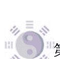

###### 奇门遁甲的“万物相干论”

在前几堂课，主要谈的是“趋吉”，不管是在房子、店面、公司里“调座位、床位、收银台”或“摆吉祥物佈风水局”，抑或是“走吉方”、“做行为风水”，都是透过奇门择时空汲取天地之间的能量以提升自己的运势，这都算是一种外加、补充好的能量的方式。

另一方面，运势不好、做事不顺，也可能是因某些因素的影响，阻碍了自己的运势，使得运势或办事时有了阻碍或困难，造成了事倍功半或做事不顺利。有了好的人事物的加持及护祐，运势顺利，事情的进行如有神助，未来前景一片光明；相反的，遇上了不好的人事物的阻碍或困扰，运势不顺，功败垂成，未来前景一片黑暗。

所以，在房子或店面公司里“坐错位置”、“摆错东西”，或是“走了凶方”、“做错行为”，也有可能形成不利的影响，造成我们运势的不顺，譬如夫妻失和、学业事业不顺、财运不佳、生病开刀、犯小人等等，状况连连。

要运势好，既要“趋吉”也要“避凶”，除了不要跟不好的人事做牵扯，房子或店面公司里的物品如果摆错东西或摆在不对的方位，也会影响居住人的运势。古人讲：“有其形，必有其灵”，这里的“灵”不用说的太玄幻，“灵”就是一种能量，一种振动，一种频率，就是一种作用力。正所谓：“有一物必有一象，有一象必有一事，观物定象可以知吉凶”。

奇门遁甲在改变或调整运势的一条重要法则，称之为“万物相干论”，也就是万事万物之间，无论是天象（日月星辰）、地象（山川大地）、人象（接触的人）、物象（一幅画、一个鱼缸）、意象（自己或他人的意念、想法）等，彼此是互相关联、相互作用的，而且都可能会影响或作用于人。

美国著名的大卫·霍金斯博士（David R. Hawkins）在他的著作《心灵能量：藏在身体里的大智慧》一书中曾提及，他运用“肌肉动力学”的原理，经过近三十年的临床实验研究，累积了几百万笔数据资料，发现人类各种不同的意识层次，都有其相对应的能量振动频率。

“肌肉动力学”，一般称之为“肌肉测试”，用来测试肌肉本身是否能够在瞬间正常启动。进行肌肉动力测验时，指导员会请受测者将其中一只手臂伸直，与肩同高，之后指导员会施力在受测者的手臂上，将它往下压，此时会要求受测者抵抗指导员的施力，以维持住手臂的高度。除非受测者的肩膀有受伤或异常，大部分受测者都能将其手臂保持于原位，并感到能“扎实稳固”地抵抗指导员的施力。

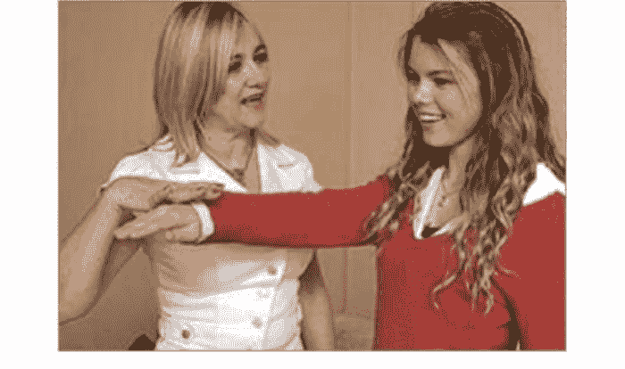

图88：进行肌肉测试时，受测者将其中一只手臂伸直，指导员会施力在她的手臂上，将它往下压。

结果很惊讶的是，当受测者将喷洒过农药的苹果拿在一只手上，而另一只手臂伸直，指导员施力在受测者的手臂上，将它往下压时，受测试者皆表现为肌肉无力，即使将喷洒过农药的苹果藏在盒子里，让受测者拿着，受测者在不知情的情况下也都表现为肌肉无力。拿着“对人体有利”相关的物品，例如圣经、佛经、优质的书籍等，受测者的手臂会呈现“有力的模式”；相反的，拿着“对人体不利”相关的物品，例如喷洒过农药的苹果、香烟等，受测者的手臂会呈现“无力的模式”，指导员只要压一下受测者的手臂，受测者的手臂都会轻易的被压下去。

更神奇的是，让其他人站在受测者的背后，心中默念着或是想着一些负面的字眼，受测者的手臂会呈现“无力的模式”；若是正面的字眼，受测者的手臂则呈现“有力的模式”，也就是说，每一个想法、情绪、词语和行动，也都有对受测者产生相干的模式，即使在受测者没有听到、看到，在受测者不知情的情况下，也会受到影响。

所以下一次你到超市里买苹果，就可以一手拿着苹果，由老婆或老公帮你做一下肌肉测试，就可以知道这苹果新不新鲜，或是有有没有过量的农药残留。

结论是，所有存在的一切，都有一定的意识和能量层级。不论是书籍、食物、水、衣服、人、动物，或是建筑、汽车、电影、运动、音乐等等，统统都有一个确定的能量层级，而且会对人体作用。“对人体有利”相关的物品，会对人产生好的作用；而对“对人体不利”相关的物品，会对人产生不好的作用。所以居家或工作环境里的所有物品，也会直接或间接对人产生有利或不利的作用。

中国人有一种习俗，就是农历年节前夕免不了除旧布新的大扫除，除了维护居家环境整洁，减少孳生病媒蚊或虫害，打造焕然一新的舒适氛围常保健康，更重要的是家里摆得久的、旧的、脏的东西，会对人在运势及健康方面产生不好的影响。只要每一年，至少做一次大扫除，运势至少改善一半！

###### 奇门遁甲的“拆物开运法”

居住的房子可以对应人的运势及健康，房子的风水至少可以对应人的八大生活领域以及人的身体部位，读者可参考我的上一本书，由“春光出版”所发行的《九宫奇门》。房子尤其不要买“缺角屋”，哪个方位有“缺角”，哪个方位就有“破”，对应该方位所主人事及健康就会有影响。不仅如此，在宫位、方位里摆了错误的物品，也可能对宫位造成破坏，时间一久，难免也会形成不利的作用。

| 4 感情宫 | 9 名聲宮 | 2 家庭宮 |
|----------|----------|----------|
| 3 事業宮 | 5        | 7 社交宮 |
| 8 實產宮 | 1 疾厄宮 | 6 權貴宮 |

| 4 左肩頸 | 9 頭 | 2 右肩頸 |
|----------|------|----------|
| 3 左手 左胸腹 | 5   | 7 右手 右胸腹 |
| 8 左足 | 1 生殖 泌尿 | 6 右足 |

| 4 股 | 9 目 | 2 腹 |
|------|------|------|
| 3 足 | 5    | 7 口 |
| 8 手 | 1 耳 | 6 首 |

| 4 肝 | 9 心·小腸 | 2 脾 |
|------|-----------|------|
| 3 腎 | 5         | 7 肺 |
| 8 胃 | 1 腎·膀胱 | 6 大腸 |

图89：房子的方位所对应的人事及健康。

###### 各宫位（方位）不适宜摆放的物品

###### 坎1宫（北方）：

-   ❌厨房调料、生活、浴室用品。
-   ❌医疗器材、遗照、遗物、玩偶、木偶、人物雕像、雕塑品、绳索、刀剑。

###### 坤2宫（西南方）：

-   ❌金银珠宝、贵重物品、财字、福字。
-   ❌雨具、鞋、水、茶、饮料、醋、油。
-   ❌线圈（电线圈）、垃圾、杂乱肮脏、洗手间、厕所。
-   ❌利器（如剪刀）、破损或残缺物品。
-   ❌内衣、口罩、书籍、报章、杂志。

###### 震3宫（东方）：

-   ❌古董、旧物、陶瓷锅碗瓢盆。
-   ❌音响、电视、乐器、会发出声响的物品。
-   ❌钱包、珠宝、保险箱、时钟、球类。

###### 巽4宫（东南方）：

-   ❌贵重金属（戒指、项链、手镯、金银珠宝、手表、小刀、钥匙、钱币）、水晶、刀具。
-   ❌饮水机、洗衣机、跟水有关的图片、茶、酒、油、醋、鞋、雨具。
-   ❌音响、电视、乐器、会发出声响的物品。
-   ❌钱包、珠宝、保险箱、时钟、球类。

###### 干6宫（西北方）：

-   ❌木雕、艺术品、葫芦。
-   ❌灶、火炉、红色物品、圆形物、眼镜。
-   ❌古董、旧物、陶瓷锅碗瓢盆。
-   ❌手机、电脑、电视机、照片、证书、合同、电器。
-   ❌鱼缸、饮水机、洗手间、厕所。

###### 兑7宫（西方）：

-   ❌手机、电脑、电视机、照片、证书、合同、电器。
-   ❌灶、火炉、红色物品。

###### 艮8宫（东北方）：

-   ❌灯、刀、尖锐的物品、手机、首饰、花。
-   ❌线圈（电线圈）、垃圾、杂乱肮脏。
-   ❌金属制品、大型石制品、健身器材。
-   ❌利器（如剪刀）、破损或残缺物品。
-   ❌内衣、口罩、书籍、报章、杂志。

###### 离9宫（南方）：

-   ❌贵重金属（戒指、项链、手镯、金银珠宝、手表、小刀、钥匙、钱币）、水晶、刀具。
-   ❌水、液体、钟表、马达、电风扇、休闲器材、休憩的床、椅、松软物。

应用此奇门遁甲的“拆物开运法”有二个诀窍：

-   一、即使在居住房子的某个方位，刚好有对应的物品，也不用太紧张，一样物品摆在该方位，基本上也需要一段时间才会产生影响，通常是三个月至一年以上才会发生作用。如果运势OK，没发生啥不好的事，或身体也没什么毛病，也不必杞人忧天，自己吓自己。人自己有自己基本的运势及抵抗力的，只要家里常打扫、保持整洁，不要堆积旧的、脏乱的物品太久，也不用过于担心。
-   二、拆走，就是送走它，若讲究点，拆的日子，可以用最简单的方式，就是“建除十二神”来择日。“建除十二神”依次为建、除、满、平、定、执、破、危、成、收、开、闭。在农民历上有一字段，叫“值星”栏，栏内即以此十二字为序，周而复始。

其中“除日”，顾名思义，除日为除旧佈新之意，有扫除之意，扫除恶煞、去旧迎新的日子。为扫除恶照之日，宜沐浴、求医、疗病、摆放化煞风水用品、入宅、动土、开光、交易，开除员工、治理恶人吉利。忌：嫁娶、探病。“建除十二神”择日办事，各有妙用，兹列于下，提供给读者参考，若能配合奇门遁甲出行办事，效果更佳。

###### ○“建日”

建日为与该月的月建地支相同之日，代表君主的意思，主健壮、旺相，万物生育、强健、健壮的日子。

此日气势初启，利于祈福、求神、置产、招募人力、开办事业、出行办事。利于公务、利上官赴任、临政亲民、亦宜招贤，即是招请工作职员。

×忌：上梁、嫁娶、安葬。

###### ○ “除日” （可选此“除日”用做打扫或拆除之日）

除日为除旧佈新之意，为扫除恶煞、去旧迎新的日子。

吉日，为扫除恶照之日，宜沐浴、求医、疗病、摆放化煞风水用品、入宅、动土、开光、交易，开除员工、治理恶人吉利。但追捕盗贼或搜寻失物则不利。

×忌：
-   嫁娶
-   探病

###### ○ “满日”

满日为丰收圆满之意，意丰足充盈，丰收、美满的日子。

算是吉日，宜开市、嫁娶、祈福、安床、立约、交易、求财、开仓库、出货财、补垣塞穴。

×忌：
-   造葬
-   赴任
-   求医

###### ○ “平日”

平日为平常平稳之意，意为普通的日子。

平常日，宜修饰垣墙，也宜拜神、祈祷、款待客人。

×忌：
-   出行

###### ○ “定日”

定日为月令三合的日子，具有吉祥的意义。

吉日，宜祭祀、祈福、嫁娶、造屋、求嗣、纳财、栽种、搬迁、动土、开井、购置不动产、入户。

×忌：
-   诉讼
-   出行
-   交涉

###### ○ “执日”

执日为固执之意，固执、执着；品格操守，重视权威。有守成的意思。

宜补造，捕贼擒凶，纳采、嫁娶、动土、入殓。

×忌：入宅、开市。

###### ○ “破日”

凶日，宜求医、疗病、破屋坏垣，忌动土。

破日为刚旺破败之意，凶日，破败，忌办吉事。

###### ○ “危日”

危日为危险之意，危机、危险，诸事不宜的日子。

宜：入殓、破土、火化、进塔、安葬。

×忌：登山涉险，诸吉不利。

###### ○ “成日”

成日为成就之意，也为月支三合的日子，主成就、成功、完成，万物成就的大吉日，凡事皆顺。

吉日，宜开市、宴会、结婚、赴任、求医、疗病。修造、动土、安床、破土、安葬、搬迁、交易、求财、出行、立契、竖柱、栽种、牧养。

×忌：诉讼。

###### ○ “收日”

收日为收成之意，收成、收获之意，办事的好日子。

平常日，宜纳财、捕捉纳畜。

×忌：破土、安葬。

###### ○ “开日”

开日为开放之意，为开始、开展的日子，适合各种各样事情，办之可成。

吉日，宜祭祀、祈福、嫁娶、求嗣、赴任、动土、开市、裁动、安葬。

×忌：诉讼、安葬。

###### ○ “闭日”

闭日为坚固之意，关闭、紧闭之意，是日事务宜闭不宜开，宜收不宜放。

平常日，宜筑堤防，补垣塞穴、安门、伐木、修造、动土。

×忌：出行、嫁娶。

## 第5堂课

### 出行办事开运法

#### 第一节

##### 奇门遁甲改变运势的方式类型

奇门遁甲改变运势的方式可以分为三大类型：
第一种类型：属于“静态的地利”方面的应用，跟“房子的风水”有关，属于比较持续性的、长期性的运势改变。

例如想提升这段时间或今年的感情、工作、钱财方面的运势，是一种能量位阶的提升，前面三堂课的“调整座位”、“摆吉祥物佈局”及“拆东西”就属于这个类型。

“调整座位”：它其实就像请风水师观星斗堪地形，找到藏风聚气的风水宝地，定位房子的座向，然后盖房子，让人住在里面，透过天地吉气的汇聚，提升住在这房子的人的运势。

而我们的“调整座位”，其概念原理是一样的，只不过是将常常出没活动的地域空间，缩小了换成自己的房子、公司或店面为空间的范围（不用搬家，在自己可以掌握的空间范围里），从中找个能藏风聚气的好位置，选择吉时调整床位、桌位或收银台（机）的朝向，让人坐着、躺着、站着时能纳到吉气，提升个人的感情、工作、学业、赚钱的运势。

一个是以地理区域为太极场，另一个是以房子为太极场，原理方法相同，一样的。

所以传统的阴阳宅风水，称之为“大风水”，十年寻龙，三年点穴，选址定向，找到龙穴，造建阴阳宅，其目标是希望能出皇帝宰相，能出官贵发大财，旺三代的；但奇门可以“补不足”，补什么不足？补大风水的不足。升斗小民的祈求没那么大，一来没时间等，二来也买不起福地，只希望这阵子或这几年生意能好点，财能发点，工作能顺利点，感情能好点。因此奇门又可称之为“小风水”，专门补大风水的不足，它机动性强，收效快，符合现代人普罗大众的需求，不需满山遍野找宝地，不需旷日费时的等待，不需旺三代，能旺个三年就满足了；不需出官贵，能工作顺利，升个职，就很高兴了。

## 大風水：堪輿

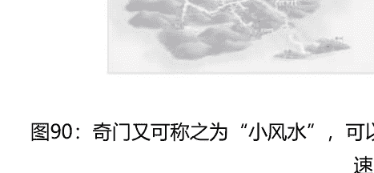

## 小風水：奇門

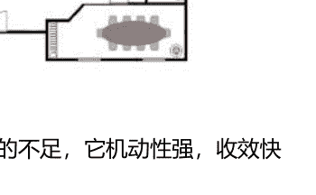

图90: 奇门又可称之为“小风水”，可以补大风水的不足，它机动性强，收效快速。

“摆吉祥物布局”：就像在家中安神位，你也可以视“神像”为人格化的吉祥物。各位可以看到很多店面、公司或住家会安神位，其目的就是希望能借由神祇的力量，保祐自己的生意能财源磙碌、鸿图大展。基本上所谓的神祇，祂就是一种没有形体、但具有能量的意识团，只是我们将祂拟人化，给了个名字好称呼祂。

中国人常讲一句话：“有其形必有其灵，以形补形。”具有相同几何结构（同构）与形状，象征讯息所对应的两方，互相之间能产生联系、传递能量与讯息，彼此共振，这其实是一种量子物理所谈的“量子纠缠效应”（quantum entanglement，这部分子奇老师在课堂上会讲解得更详细，还有解密的影片，说明到底为何会产生量子纠缠，量子彼此之间是如何纠缠在一起的）。

在上一堂课里，我们在住家、办公、做生意的地方，摆上对应奇门符号象征的吉祥物品，例如“值符”摆“龙”，“天任星”摆“水晶球”，其原理就像是安神位般，只不过链接的对象不是特定的神祇，而是宇宙里日月星辰的能量，让它与这风水物发生相应共振，是一种“引炁入宅”的方式。就像在家里安装了一个接收器与发射站，将我们所求、对我们有利的日月星辰的能量，投射到我们所在的地方，帮助且提升我们的财运、感情运、官运等等。日月星辰也都具有意识与能量，像古埃及的太阳神，甚至有名字的，称呼为：拉（Ra），从第五王朝（公元前二千四百九十四年至公元前二千三百四十五年）开始，成为古埃及神化中最重要的神，被看作是白天的太阳。

“拆东西”：同样道理：“有其形必有其灵”，好的物品能招来好的能量，带来好的运势；脏的、旧的、不好的东西、摆不对地方也会引来不好的能量，带来坏的运势。这在奇门风水佈局里是最基本的两个手法：“拆法”及“补法”。

对我们不利的、我们不想要的、想要避开的人事物，如小人、疾病、官司、灾祸等等，在房子里找到对应的物品将它拆了，这叫“拆法”，是“有中化无”、是“避凶”；对我们有利的、我们想要的人事物，如升官、加薪、伴侣、财富等等，生活中没有却想要有，就补上它，也就是找到对应的物品（吉祥物），将它摆在房子里，这叫“补法”，是“无中生有”、是“趋吉”，而发生改变的关键在于“时间”及“空间”。

第二种类型是属于“动态”方面的应用，跟“人的行为”有关，属于比较临时性的、短期性或一次性的的运势提升。

例如明天约客户谈保险想成交，后天要考试了想考好，下个月有一场重要的新产品发表会想要产品卖得好，约了个女孩想告白成功，这笔生意想谈成等等。只要出门办事，不管是什么事，想多几分胜算，提升运势，心想事成，都能应用得上，而且收效快速，常有惊奇。这是针对短期的或一次性的特定事项，想要事半功倍，快速达成目标的方法，这堂课及下一堂课的“走吉方”及“做动作”就属于这个类型。

“走吉方”：其实就是奇门遁甲里赫赫有名的“奇门出行诀”（又名大气造运术）。

> 奇门出行诀（又名大气造运术）：选择有利的时间与方位去出行、办事、或沐吉气，让我们办事可事半功倍或提升运势。如接洽客户、销售谈判、开市开工、考试面谈、投资买卖、相亲结婚、求医祛病、出差旅游、拜拜祈愿等，“奇门出行诀”搭配“行为风水”，效果更佳。

我在上一本书里曾用了一堂课的篇幅来说明“奇门出行诀”的应用，读者可参考笔者的上一本著作《九宫奇门》，里面有更详细的介绍。

“奇门遁甲”号称为“帝王之术”，其中最厉害、最神奇的应用，就是根据“方位”选择“吉时”去做事，不管做任何事，想要增加胜算，都可以选择有利的奇门时空去做事来提升运势。历来据称兵事专家如姜子牙、范蠡、张良、诸葛亮、刘伯温等人都曾使用过奇门遁甲，所使用的主要就是“奇门出行诀”的应用。

奇门遁甲在中国古代主要用于国事、兵法方面，而流传至现代，“奇门出行诀”最适合用于商战，举凡商务接洽谈判、销售简报、公司会议、年度计划发表、新产品上市等等，只要会用奇门盘选择有利的时间及方位，去进行这些重要的商业活动、业务，都能帮助您提升运势，达成目标，完成使命！

第一堂课曾提到，“奇门遁甲”是一门“时空能量学”，我们可以借由奇门遁甲的计算（开奇门历或奇门盘），事先在地图上找出预计要前往办事的方位，锁定对应奇门盘的宫位，然后选出该宫位内有“休门”、“生门”、“开门”或“景门”吉门的时辰，约定对象在该时间内碰面，等吉时一到，再前往有吉门的方位去办事，例如谈生意或约会等，事情往往进行得非常顺利，且常常会有意外的惊喜。

简单举几个之前的应用实例，我有一位学生的朋友是个博士，五年来一直想挤进大学担任教授，却总不如愿。好不容易得了个面试的机会，刚好我这学生习得了“奇门出行诀”，就想试试帮他取得这份教职。因为这学校在台北县，面试当天从台北市前往该学校是往北方行进，而当天的奇门盘（选用日盘，日盘一天内有效），北方“坎宫”却不得吉门，但南方却有“生门”是个大吉方。山不转路转，大山不向我走来，我自向大山走去。我告诉学生，请他的这位友人，前一天先于此学校的北方找个民宿或饭店住一晚，隔天再往南方行进去参加面试，可大大提升他的考运及面试成功的机会。结果，果不其然，初试通过了，复试如法炮制用“出行诀”择吉方，同样也通过了，一路过关斩将，最后如愿以偿，给他拿到了这份教职！

再一个案例，同一位学生，他要租附近大楼的停车位，因为台北闹区很难租到一个适合的停车位，他租了半年都租不到，找不到合适的。后来依“奇门出行诀”选择吉时吉方去找，虽然找到了便宜又适合的停车位了，但排队等候的人有十多个（waiting list），结果在跟这栋大楼管理员斡旋的时候，刚好有一位大楼的住户来退租，因为这停车位还没正式登记，不在账上，见我学生一腔热血、一片真诚，反正没人知道，时也运也，就把这位置给了我学生承租，运气就是那么好。所以我上课时常说，“奇门出行诀”屡建奇功，常有意外奇迹，多不胜数，不怕你用，只怕你不用！还在等什么？心动不如马上行动！

这样的案例实在太多了，只要你出门办事，不管想办什么事，即使去庙里拜拜祈愿，只要你依奇门的吉时吉方前往进行，其他人许愿不一定成功，但你会多一分机会，心想事成。只要会使用奇门盘，它可帮您计算这股吉炁，在对的时间，往对的方位去办事，就能得机（时机、天时）得势（地势、方位、地利），掌握天时地利，让您无往不利，战必胜、攻必克！

什么叫“合于道”？这就是“合道”，道就是“道路”，什么的道路？就是天地之间一股炁，一股能量行走的道路。炁像风、炁像水，会使用奇门遁甲计算时空之中能量走向的人，称之为“窃天地之炁的异人”，窃天地之炁为我所用的特异人士。你就像是一只奇门鸟或奇门鱼，掌握了风向及水流的行进的方向，然后等待时机，搭上它、跳上它，这股顺流的风或水，就会帮您用最少的时间、最轻松的方式送你抵达目的地，把事情办成！

“奇门出行诀”为什么是属于“动态”方面的应用呢？“**调整座位**”是在我们居住及工作的地方，造出一个藏风聚气的形势，然后根据位置方位，在吉时去安床、安桌，以便收纳汲取这股吉炁，让我们在一天的工作办公时、休息睡觉时，能借由这股吉炁，帮我们加持或补充能量。这是一种“静态、被动”的笼罩于宇宙日月星辰的能量，就好比一棵树，树一旦种植于一方水土，它就不能再动了，所以得找到好的地方、好的土壤、好的空气、阳光、水的地方（地利与环境），然后再选择对的季节、气候及时间（天时）把它种下去，这棵树就能成长茁壮，长得又高又大又健康。

人一天的活动有静有动，像子奇老师现在坐在桌前写书，如果书房及座位调整为“龙强虎弱、龙过堂，玄武有靠，前有明堂”，再挑个吉时安上书桌，让自己这几个小时沉浸在吉炁环绕的氛围之中，写起稿来自然就能文思泉涌、下笔如有神助，甚至灵感源源不绝，很多好的教学内容就因此而生。

但我不是树，我是动物，有时我也得出门办事，例如每年年底会举办的新年讲座、不定期的说明会、新书或新产品的发表会，甚至与别人谈合作。这时“奇门出行诀”就派上用场了，我只要根据中心或活动要举办的方位，选好方位里有“**休门**”、“**生门**”、“**开门**”或“**景门**”吉门的时间，然后吉时一到，尽情表现，则活动进行顺利圆满，来参加新品或新课程讲座的人源源不断，推广活动自然水到渠成，非常成功。这是一种奇门“**动态**”方面的应用，也就是知道何时会有吉炁往哪方位行进，人自己主动迎向吉方，主动汲取正能量，然后自然办事顺利，多了几分胜算及好运，助己心想事成。

“**做动作**”：就像把自己这个“人”当作吉祥物，以奇门盘宫位里的符号为行为指导准则，为自己开光加持，让自己的这个“人体肉身”直接无缝接轨地接收、汲取宇宙里日月星辰的能量，与之发生相应共振，是一种“引炁入体”的方式。只不过不是开光于“神像”上，或加持于“吉祥物”上，而是直接开光加持于自己的人体上。这在奇门遁甲里，正式名称为“行为风水”，有别于前面第一类所提的“吉祥物布局”，这是直接以人自身与天地感应，从而直接获取天地宇宙的讯息与能量，不需再透过风水、吉祥物这种间接的方式。

> “行为风水”是当我们起出特定的奇门时空局后，在特定的时间、特定的方位或地点，去做符合宫内象意的行为方法（身口意，身：行为、动作、穿衣、喝水、吃东西、或写字；口：讲话、唱歌、持咒或念经；意：思惟、心念、想法、或祈愿）。方是方向，也就是空间；法则是行为，也就是心里的意念，与自身、外在的行为。

“奇门遁甲行为风水”本是我在“大师研究班”里上课的内容，自古以来就是奇门大师们秘而不传的最高技法之一。今为飨读者，特在本书里公开释出，我在下一堂课里，将会正式介绍，如何运用奇门遁甲中最神秘的行为风水，帮助自己达成所愿，心想事成，希望读者珍之惜之，用以助己助人！

第三种类型也是“动态”方面的应用，跟“人的认知、情绪、行为”有关，但是属于长远的、彻底的改变命运，从自身的改变做起。

人除了靠自己的努力（人助），再加上高我（神助）的提拔，才能改变得快，改变得彻底。奇门是一门修炼学，奇门修炼以人体为奇门盘，把人体视为一个小宇宙，做人体的改造，借由改变“自身的行为”（身）、“情绪的平衡”（心）、“认知的提升”（性），与“外在大宇宙”（神）相应共振，从而汲取天地的讯息与能量为己所用，根本彻底的造命改运，以达成人生幸福的终极目标。

**“炼自身”**：奇门遁甲的行为风水再上一层，就不是只停留于外表的“做动作”了，而是直接进入修炼自身的阶段，往“人神一体、天人合一”的高功状态境界迈进。所谓人身难得，人秉天地之炁而生，人体里面藏有所有宇宙时空的知识，可以与宇宙洞连，人体肉身就是一个小宇宙，一艘法船，正所谓道以器为用，人体也是一个法器，透过特殊的方法，人体可以更有效率的与大宇宙的讯息与能量作交换。

**大道至简，天人合一**。当我们放下了自己的私心杂念，超出了自我欲望的牢笼，忘记了自己的想法念头，进入物我两忘的状态，就能沟通宇宙中的能量和信息，达到“宇宙在我心中，我在宇宙之中”，我与宇宙同体同源，息息相通，和宇宙万物共振、共鸣，能量、讯息交流。

当我们处于这种状态，所有的秘法都可以不要，所有的理论都可以忘记。大道至简，大道无形，大道无法。这是一种大道自然，返璞归真的高级状态。在这种清净无为，忘我无私，天人合一，人神一体的状态，不求讯息，讯息自来，不求功能，功能自现，便可“不出户，知天下”。

图91：人体为一个小宇宙，外在的天地为一个大宇宙，修炼己身，与大道合一（合太极）。

所以真正要改变命运，根本解决之道还是要从自身的改变做起，人体为一个小宇宙，外在的天地为一个大宇宙，以人体为奇门盘，对自己的“想法、认知”（天盘）、“情绪、感受”（人盘）、“作息、行为”（地盘）三方面，进行“拆、补、移”，不好的认知、情绪、行为，要把它“拆掉”，“补上”好的，或作“转移、转化”。

也就是让“人身”的天盘、人盘、地盘，与神盘相应共振，与大道合一（合太极），并借由汲取宇宙的讯息与能量为己所用，助我提升，达到“宇宙在我心中，我在宇宙之中”，我与宇宙同体同源，息息相通，和宇宙万物共振、共鸣，交流能量与讯息。

###### 奇门遁甲依办事时间的长短，可分为：时盘、日盘、月盘及年盘

##### “时盘”

若是一个时辰至两个时辰之间的事情，可依据用事的“时辰”来挑选有利的“方位”去办事。如接洽客户、销售谈判、开市开工、考试面谈、投资买卖、相亲结婚、求医祛病、出差旅游、拜拜祈愿等。若平常没事，还可利用当天有吉时，往吉方去散步、跑步沐吉炁或纳吉水。

##### “日盘”

如果是超过一至二个时辰以上，或需要花上一整天的事，如开整天的会议、客户拜访、升学就职考试、重要的产品发表会等，可依据用事的“日子”挑选有利的“方位”去办事。

##### “月盘”

如果是需要花上好几天到外地、远地出差、办事或旅游，时间长达一两个月内，或数天以上的事，则可依据用事的“月份”挑选有利的“方位”去办事，甚至还可以运用月盘挑选吉方到外地旅游，吸纳满满的吉炁，这称之为“渡假改运法”。

##### “年盘”

若要出国留学、搬迁、设厂、开公司、移居外地等必须待在别地或外地好几个月或数年的事，则可依据用事的“年份”来挑选有利的“方位”去办事。

### 奇门遁甲出行诀——“时盘”的应用

时盘的应用重点，在于有特定的事项要进行，若是一个时辰至两个时辰之间的事情，可依据用事的“时辰”来挑选有利的“方位”去办事。如接洽客户、销售谈判、开市开工、考试面谈、投资买卖、相亲结婚、求医祛病、出差旅游、拜拜祈愿等。若平常没事，还可利用当天的吉时，往吉方去散步、跑步沐吉炁，或纳吉水。

√有特定的事项要进行：方位固定，则找吉时。
有特定的事项要进行，若是办事地点的方位已固定，则依据“方位”挑选“吉时”去办事，方位固定，找吉时。

基本上，用奇门遁甲选择吉时或吉方的方法，与前面第三堂课中，根据床位、座位在家里的哪个方位，然后用“奇门历”或“奇门排盘”程序，选择吉时或吉方的方法是一样的。只不过是改成在地图上先查找要办事的地点，位于我出发地点（也许是从家里或公司地点出发）的哪个方位，然后再打开程序选择吉时，等吉时一到再往该方位赴约。

##### 案例1：想另起炉灶，如何能顺利谈得成？

有一天，子奇老师接到好多年没见的前公司同事的电话，说他现在在他岳父的家族企业当副总，待了好多年后，还是因为企业文化的不同，再加上家族企业原有的人情包袱，使得他施展不开，无法发挥，因此想要带一些自己培养的员工，脱离老东家，在外另起炉灶。不过他又很担心岳父及股东董事的反对，所以求助于我。

#### ## 步骤一：在地图上先查找要办事的地点，是位于我出发地点的哪个方位（辨方位）

第一个步骤就是利用 Google Map，查看要办事的地点或目的地，位于我当天出发地点的哪一个方位。假设当天出发地是从台北汐科火车站出发，到台北火车站换捷运到古亭站，那么从地图上可以看到，整个路线（蓝色）几乎是往“西”行进，办事地点也落于西方“兑宫”内。

#### ## 步骤二：锁定宫位，选用吉门（选吉门）

接着查表（请参看图93），对应“西方”的是在右边中间的“兑宫”，适合的吉门有“休门”、“生门”及“开门”，无论谈生意或协调事情，这三个吉门都适用。工作开会最适合选用“开门”；“休门”除了利于婚恋感情，也代表休弭纷争，促进和谐，还有“谒贵”的意思，也就是请托、拜访贵人，所以除了“生门”及“开门”，“休门”也可以。

图92：在地图上先查找要办事的地点，是位于我出发地点的哪个方位。

##### 步骤三：根据方位开“奇门历”程序选择吉时

下一步骤就是根据当天的出行方位来选择吉时，选择吉时有两种方式，比较简单的巧便法就是借助“奇门历”程序，只要设定好预计要谈事情的时间范围，然后勾选吉门及方位，奇门历就会列出所有可能的吉时，我们就再挑选一个双方都OK的时间就可以了。

当时，他打电话给我的时间是二〇二二年五月十二日（四），明天太赶，星期六、日没上班，所以我们就设定时间范围是从二〇二二年五月十六日（一）至二〇二二年五月二十日（五）的时间，同时勾选“全部吉门”及“西方”，最后按“确定”键，这时程序就可以把出行谈事的吉时都排列出来了。

图93：依据出行方位“西方”，锁定宫位“兑宫”，再选“吉门”，工作开会最适合选用“开门”。

所以安排下星期一，二〇二二年五月十六日（一）早上十点这个时间开会谈事！早上九点过后从台北汐止出发，一路纳着“开门”吉炁，结果整个会议谈得非常顺利，我这朋友如愿以偿，得其所愿！

接着开始找新公司地点，又请我帮他看办公室风水，规划办公室格局，这时第二堂课教给各位的“公司摆设开运法”就派上用场了。等办公室装潢好，再帮他佈一个催财局，这时第三堂课教给各位的“奇门天星催财局”又派上用场了，助他生意兴隆，财源滚滚，开张大吉。以后安排重要会议、谈生意合作，又可以应用本堂课所教的“出行办事开运法”，帮他择吉时或选吉方。

图94：设定好条件，时间区间、方位、吉门，“奇门历”程序就能把所有的“吉时”找出来。

如此提供一条龙total solution的整套服务，只要他的生意大发，他的朋友客户一询问，一转介绍，你不是又有新案子了吗？这样子又生孙，孙又生子，子子孙孙无穷尽也！客户又转介绍客户，口碑就起来了，口耳相传，你以后就可以靠这份技艺养家糊口，自己当老板，不怕没收入，再也不用看老板脸色了。

所以学会了“奇门遁甲”，退可以安居乐业，进可以治国平天下，进退自如，可攻可守，自己有了安身立业的本事，到哪里人家都尊称你一声老师，岂不美哉，岂不人人称羡。老师传授的不只是一般的卜卦算命风水，是可以翻转人生的，是一门技艺，可以安身立命的千年绝技“奇门遁甲”。

古时“千里访明师，万里求口诀”，历尽千辛万苦花了大把银子，往往被拒于门外，学不成或学到假的，学不到真功夫，甚至不肯传。像太极拳宗师杨露禅，三入陈家沟想学得太极拳绝技，但陈家拳只传陈家人，不传外人，为什么？这种可以立身养家，甚至可以扬名立万的家传绝技，凭什么人家要无条件传给你？尤其有的人自己也是走过这条辛苦的路，又怎会随随便便轻易传予他人。现在忘本的人太多，感恩的人太少了，一旦传给了外人，倘若所传非人，徒弟忘恩负义，回头还倒打师父，咬你一口，自己引狼入室，岂不冤哉！所以有此机缘学得奇门遁甲这千年绝学，还望读者珍之，惜之！

#### “奇门出行诀”应用诀窍：

奇门出行走吉方，其效果的大小决定于，在时辰之内于吉方行进时间的长短。譬如以上例而言，二〇二二年五月十六日巳时早上九点至十一点，西方有“开门”吉炁，在这个时辰内，欲往西方行进，则时间越长，吸纳的吉炁越久，效果越好！所以关键在两个要点：行进的方向及持续的时间！如以“时盘”为例（时辰为两个小时），建议应持续行进至少十五至三十分钟为宜。简而言之，最重要的是：要在吉时内出发，于行进中沐得吉炁，行进时间不可太短。

如果办事地点在西方，吉方也是在西方，但行进路线却是先往西南，再往西北，整个行进期间几乎脱离了西方这四十五度范围，或行进时间太短，不到五分钟就到目的地了，那效果也是有限（如图95所示）！

如案例一，西方有“开门”吉炁，时间范围为五月十六日早上九点到十一点，所以安排在早上十点开会谈事，早上九点过后出发，有约莫一个小时的交通时间在行进中沐着“开门”吉炁，然后在吉时内还有一个小时左右可以进行会议的商谈。如果会议时间谈很久超过了吉时的时辰，像是超过十一点，那也没关系，最重要的是“行进时间”及“开始开会的时间”要落在吉时的时辰内。

###### √有特定的事项要进行：时间固定，则找方位。

有特定的事项要进行时，若是办事时间已固定，则依据“时间”来挑选“吉方”去办事，时间固定，找方位。

图95：如果吉方在西方，但行进路线几乎脱离了吉方，那效果就大打折扣了。

#### 案例2：女友约我星期五晚上用餐，想趁这时机跟相恋多年的女友求婚，如何能求婚成功？

女友已约好了星期五晚上用餐，在二〇二二年七月廿九日晚上六点，我想趁这时机，找个灯光美、气氛佳的餐厅向她propose求婚，这时约会时间已固定了，那我们就在吉方位里，挑选一家高级的餐厅跟她告白。

#### # 步骤一：根据时间开“奇门历”或“奇门排盘”程序，选择吉方（择方位）

时间固定，则找方位。有特定事项要办，而约会时间已经固定了，前面提到比较简单的巧便法就是借助“奇门历”程序，设定好那一天要办事的日期，然后依事项的目的勾选吉门，如婚恋、贵人请托找“休门”、工作找“开门”、求财找“生门”、竞试找“景门”，方位就勾选“所有方位”，最后再按“确定开盘”键，“奇门历”就会列出当天所有可能的吉时以及吉方位了。

正如案例二，预计在二〇二二年七月廿九日向女友求婚，时间就设定好七月廿九日，吉门选定“休门”，利婚恋，方位选“所有方位”，然后一按“确定”键，当天所有是“休门”的吉时吉方就列出来了。因为是约晚上六点碰面，刚好当天晚上五点到七点往西方行进可以沐得“休门”吉炁，如此便可选择在当天出发点的西方找一家好的餐厅，届时，五点吉时一到，就可往吉方“西方”出发赴约。

但如果用的是“奇门排盘”程序找方位，就会比较复杂一点。打开“奇门排盘”程序后，须先设定好出发时间，以案例二来说，是二〇二二年七月廿九日晚上五点之后出发，因是要约会告白，所以须先查看“休门”在哪些方位可用。查找“奇门遁甲辨方择时”速查表得知，休门在干宫“西北方”、兑宫“西方”、巽宫“东南方”及震宫“东方”这四个方位可用。

图96：设定好赴约时间，吉门、方位为“所有方位”，“奇门历”程序就会把所有“吉时、吉方”找出来。

最后锁定奇门盘，看该时辰的这四个宫位是否有出现“休门”，而且宫位内不能有白虎、空亡、天干击刑等，时辰不是“五不遇时”。像此例，二〇二二年七月廿九日晚上五点的奇门盘，兑宫“西方”有“休门”，八神是“玄武”，不是白虎，不见“空亡”，天干在兑宫不会有“击刑”，时辰的日、时天干不是“五不遇时”。所以时间固定，找方位，在此时辰往西方前进是吉祥的，可以沐得“休门”吉炁。

> 特别提醒的是，“休门”只能在这四个宫位：干宫“西北方”、兑宫“西方”、巽宫“东南方”及震宫“东方”这四个方位可用。前面章节曾说明过，因为“休门”只有在这四个宫位，不会与宫位形成“门迫、门制、门伏或门反”的不利情形。

##### 步骤二：在地图上查找吉方内适合的办事地点（找地点）

接着在地图上的吉方位范围里，事先挑选一个约会的地点及餐厅，届时吉时一到，准时赴约就行了。

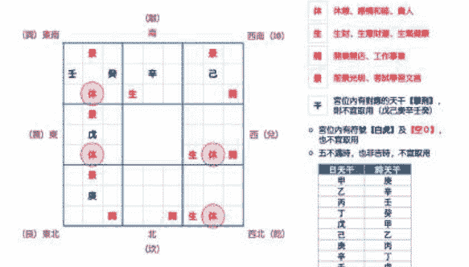

| 日天干 | 时天干 |
| --- | --- |
| 甲 | 庚 |
| 乙 | 辛 |
| 丙 | 壬 |
| 丁 | 癸 |
| 戊 | 甲 |
| 己 | 乙 |
| 庚 | 丙 |
| 辛 | 丁 |
| 壬 | 戊 |
| 癸 | 己 |

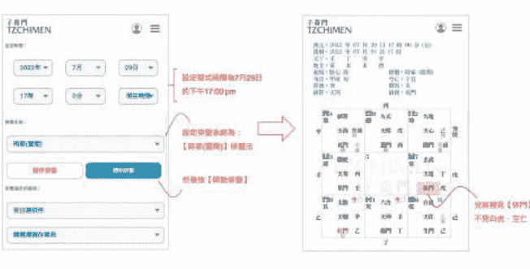

再次提醒两个关键要点：行进的方向及持续的时间！若是‘时盘’，应持续行进至少十五至三十分钟为宜，因此找的餐厅不要距离自己出发点太近，路上行进时间不要太短，这样才能于行进中沐得足够的吉炁。

###### ✓有特定的事项要进行：若时间、方位皆已固定（死盘）。

如果时间已由对方决定，连地点也设定好，没法变了，这在‘奇门出行决’里有个术语，称之为‘死盘’，也就是时间、方位皆固定死了，没得选了；而相对于活动时间可由自己决定，地点也可由自己决定，则称之为‘活盘’！

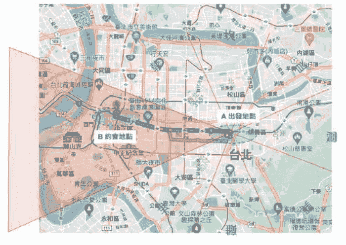

图99：在地图上查找吉方内适合的办事地点，时间一到，前往吉方赴约。

一般说来，参加由对方所决定主导的活动，如考试、面试、竞赛或会议，通常竞试或会议的时间与场地，主办方或对方都已先决定了，如果时间已经固定，我们可以打开‘奇门历’或‘奇门盘’程序，先设定好当天参加竞试或会议的出发时间，然后依据竞试或会议地点在出发地的哪个方位，查看开出来的“奇门历”或“奇门排盘”程序对应方位的宫位，是否有出现“休门”、“生门”、“开门”或“景门”，如果运气好，欲前往的方位，刚好在出发时辰内有吉门为吉方，则应试当天依时前往即可。

-   如果运气不好，刚好那天的出发时辰内，欲前往的方位里没有对应的吉门，又或有吉门但宫位里却有不利情况（有门迫／门制、／门伏／门反，见白虎、空亡、天干为击刑，时辰为五不遇时），那么应对的方法有三种：
    一、改用其他吉门（换门）；
    二、往前找时间，换一个时辰提前出发，而选用时辰的方位里需有吉门（换时间），且宫位或时辰没有不利情况；
    三、更换路线，改由吉方进入办事地点（换方位）。

在此补充说明第三种方式，在时间、方位皆固定下，如何更换路线，让死盘变活盘：

###### 如果想出行办事，但时辰方位已固定，办事地点恰好又不在吉方位，该怎么办？

这时可提前半小时出发，以办事地点为中心，在该时辰所示吉方位的相反方位，找个地方先停留十五至三十分钟创建新的出发点（太极点），等到一进入吉时，再依吉方位行进，进入办事地点（也就是改变出发地，以便由吉方进入办事地）。

假设时辰所示吉方为东方，可提前半小时到办事地点的西方，先找个地方停留十五至三十分钟，等吉时一到，就可由新的出发地点启程，由吉方东方行进至办事地！这叫“山不转路转”，“大山不向我走来，我自走向大山”，办事地点不在吉方，那我就自己改变出发地点，使办事地点变成在我的吉方位。

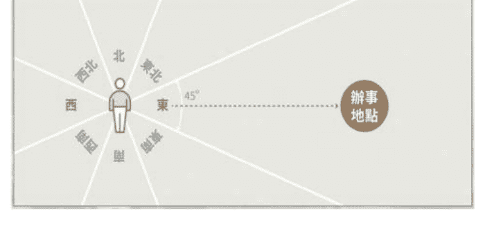

图100：若时辰方位已固定，而地点又不在吉方位，可事先改变出发地以便由吉方进入办事地点。

当然还有别的方法，不过较复杂，这得参加子奇老师教授的奇门课程才能学得会。换句话说，时运不好，就“换”、就“变”，“山不转路转”，“大山不向我走来，我自走向大山”。奇门、奇门，奇门贵在用“奇”，用“变”。

这道理很简单，当你打牌时，若运气不好，连续输，一直输，一个晚上输多赢少，该怎么改变运势？很简单，要“改”、“变”运势，要嘛起来动一动去上个厕所，要嘛换别个位置坐（换座位），不然休息一下换人打或改天再打（换时间），总之有动、有变、有换才有机会改变运势。

-   -   √没有特定的事项要进行：若平常没事，可利用当天的吉时，往吉方去散步、跑步沐吉炁，或纳吉水。

跑步散步增运法：若平日无特定事项要进行，我们可用“奇门历”程序查找当天何时有吉方位，在正确的时间及大吉的方位，朝着该方向行走或路跑十五至三十分钟，查“奇门历”的“走吉方”吸收天地正能量磁场，提升运势。

想要增加感情运势的，可以连走一个月的“休门”吉方；想要增加生意财运的，可以连走一个月的“生门”吉方；想要增加工作运势、想升官的，可以连走一个月的“开门”吉方；而想增加学习效率、考试分数的，可以连走一个月的“景门”吉方。

“奇门出行诀”中的“走吉方”改变运势，贵在执行，只要持之以恒，每天有吉时吉方就去散步、跑步，不仅可以增加身体的健康，还可提升运势。

喝水纳吉炁法：若平日无特定事项要进行，又或刚好下雨不方便出门，可用“奇门历”查找当天何时有吉方位，在家里的对应方位放一杯水（最好瓶口打开），放三十分钟纳吉炁后，把它喝掉。

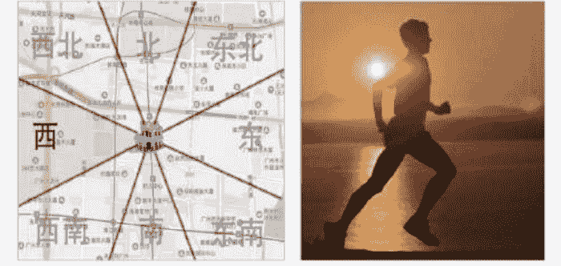

图101：平日可用“奇门历”查找吉时吉方，往吉方行走或路跑，吸收天地能量磁场，提升运势。

在日本学者江本胜博士所著的《生命的答案，水知道》中，证明了水会阅读、会听音乐、记忆并传递讯息。水可以忠实反映看不到的波动和振动频率。我们在家里的吉时吉方放一杯水，神奇的水与奇门时空产生共振，并吸纳了时空中的吉炁，人体平均百分之七十由水构成，人是水做的，我们再把这吉水的波动、频率、与讯息全部喝到身体里，就可以让宇宙中高维的能量与我们共振、融入我们的体内、提升我们的能量与运势。

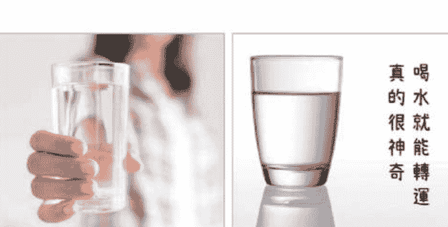

图102: 平日也可用“奇门历”查找吉时吉方，在家里的吉方放一杯水纳吉炁后，把它喝掉。

水是百药之王，“没事多喝水，多喝水没事”，只要将一杯水于奇门吉时指示的方位上，放置三十分钟之后把它喝了，就能提升运势，这“喝水纳吉炁法”我又称它为“懒人增运法”，我想应该没有比这更简单的方法来改运了吧！而且几乎不花钱，只要喝水就能改运，自己DIY自制能量水，喝水纳吉炁。

相同道理，“奇门出行诀”平日用来改运的应用，不管是“走吉方”或“喝水纳吉炁”，贵在执行，只要持之以恒，每天有吉时吉方就去散步，就去喝水，不仅可以增加身体的健康，还可提升运势，一举两得。

#### 第三节

### 奇门遁甲出行诀——“日盘、月盘、年盘”的应用

#### “日盘”的应用

日盘的应用重点，在于如果是超过一至二个时辰以上，或需要花上一整天的事，如开整天的会议、客户拜访、升学就职考试、重要的产品发表会等，可依据用事的“日子”来挑选有利的“方位”去办事。

“日盘”其实应用得很广，而且很有弹性，因为很多的会议、约会、洽商、活动，甚至考试、面试，往往超过两个小时，搞一上午或一下午，甚至得弄个一整天，而且客户有可能迟到，或者会议活动也会延迟，错过最佳吉时。而奇门遁甲“日盘”所起出的吉方，代表一日有效，最适合进行一天或半天的活动，最有弹性。

例如“新产品发表会”要在哪天举行、哪个饭店举办、哪个时间正式开始？这就可以先用“日盘”看某日的吉方位在哪，来决定在该方位挑选饭店。因为“新产品发表会”的活动时间通常会搞个一整个上午或一整个下午，一个时辰的“时盘”恐不敷使用。如果能用“日盘”再加个“时盘”，也就是选一个“吉日+吉时”，皆指向某一方位有吉门，那就可在该方位挑选活动场所，定那个时辰为新产品发表会的正式开始时间，如此举办活动或会议，岂不是顺利圆满，大大的成功！

我们举个“日盘”的应用例子，看看“日盘”该怎么使用？

##### 案例3：小孩参加全台湾音乐比赛，如何能顺利赢得冠军？

二〇二〇年的某一天，子奇老师接到一位朋友的电话，说他的小孩参加全省音乐比赛，而且很厉害的是已经进入决赛，目前是台湾前十名！之后预定在二〇二〇年十一月廿一日（六）比赛，下午一点前要报到，下午两点到五点进行比赛，爸爸希望他能拼冠军，他的小孩只有十五岁，是所有参赛者中年纪最小的，要击败那些有多年经验的叔叔伯伯是很大的挑战呀！他去年也参加，但没有得名，所以希望这次一举成名，得个冠军，天下父母心呀！

##### 步骤一：在地图上先查找要办事的地点，是位于我出发地点的哪个方位（辨方位）

因方位已经固定了，首先就是利用 Google Map，找出竞赛地点位于我当天出发地点的哪一个方位。将出发及目的地输入Google Map后，从地图上可以看到，整个路线（蓝色）几乎是往“西南方”行进，奇门盘对应的是“坤宫”。

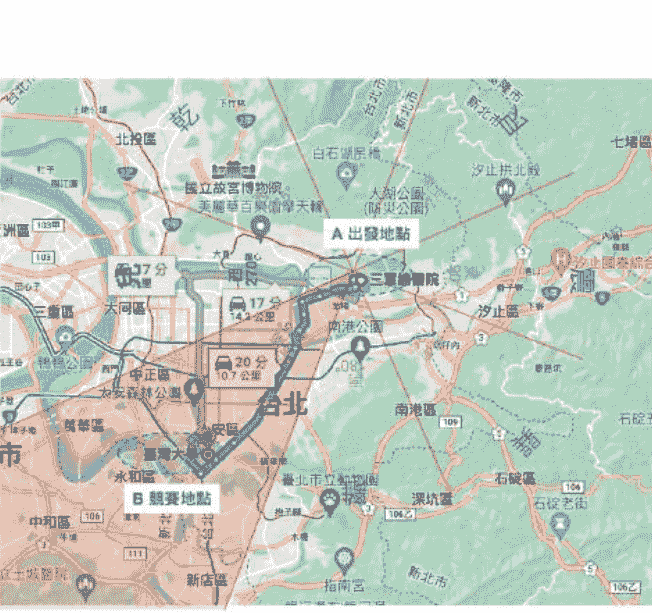

##### 步骤二：开 “奇门历” 或 “奇门盘” 程序选择吉时 (择吉时)

接着我们直接打开 “奇门历” 程序，将日期设定在比赛那天二〇二〇年十一月廿一日（六），方位勾选 “西南方” ，同时勾选 “全部吉门” 。勾选所有吉门是为了给自己多留一些弹性，怕只选一个有利竞试的 “景门” 时，若刚好那个时间、那个方位没有可用的 “景门” ，还有其他吉门可用。最后按 “确定” 键，这时程序就会把当天西南方所有的吉时都排列出来了。

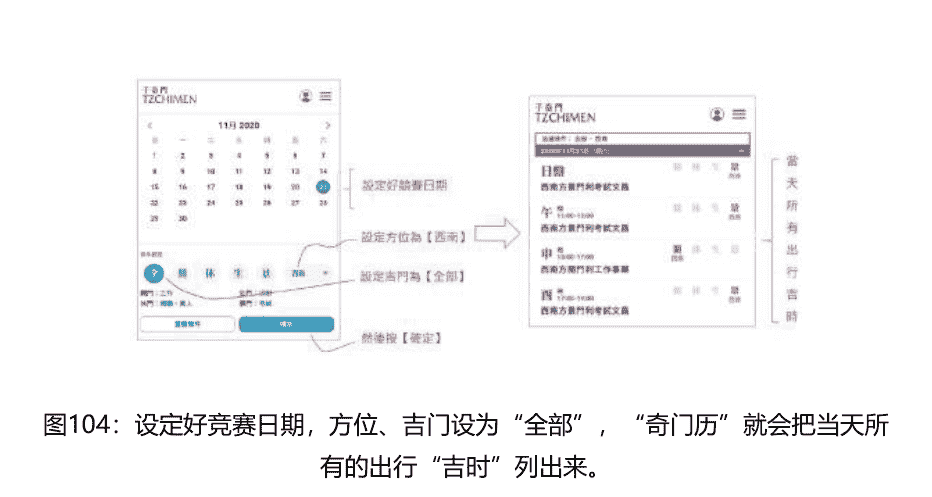

图104：设定好竞赛日期，方位、吉门设为“全部”，“奇门历”就会把当天所有的出行“吉时”列出来。

结果运气太好了，当天日盘显示“西南方”，有最利竞赛的“景门”吉炁，而且十一月廿一日的“日盘”代表当天一整天有效。更棒的是，十一月廿一日当天下午一点前要报到，刚好在报到前，可以选在早上十一点到下午一点往西南方行进，“时盘”也是显示西南方“景门”。换句话说，日子大利西南方，时辰也大利西南方，好日子又好时辰，吉上加吉，往西南方行进的人，最利于参加考试竞赛这类事情。比赛时间是一整个下午，因日盘是整天有效，所以可以整个下午都沐浴在“西南方景门”的吉炁之下，可说是运气太好了！

果不其然，这小孩硬是要得，打败了一干经验老到的叔叔伯伯，拿下了有史以来该音乐比赛的全省冠军，当天晚上就上了节目，接受知名电台的专访，全家开心，我也为他小孩开心，当然，免不了又是一顿请客，又有好吃的了！

> 若使用“日盘”，但当天办事地点恰好又不在吉方位，该怎么办？

> > 这时可提前一天，以办事地点为中心，在该时辰所示吉方位的相反方位找个饭店住宿一晚，“日盘”创建新的出发点（太极点）必须至少待在那儿六小时，然后等到隔天，再依吉方位行进，进入办事地点（改变出发地以便由吉方进入办事地）。

读者可参考我的上一本书《九宫奇门》，其中曾提及我在一九八四年参加台湾的大学联考时，自己手排出七月二日奇门遁甲的“日盘”，结果七月二日当天从我家出发去考场的方位竟是个大凶方。那怎么办？没事，山不转，路转，因人是活的，人是可以动的，我就是在前一天晚上，七月一日，先在考场大吉方的相反方位找家饭店住一晚（睡一晚就至少在出发地待了六个小时了），改变了出发点的太极点，等到第二天考试当天早上，再由大吉方前往考场，那不就是当日最有利的方位了吗？这就把“死盘”变“活盘”了，时间方位是“死”的，但我的人是“活”的。考试时间、位置、方位皆非我所能决定，而是由对方决定，那么改变出发地的太极点，就可将“死盘”变“活盘”了。

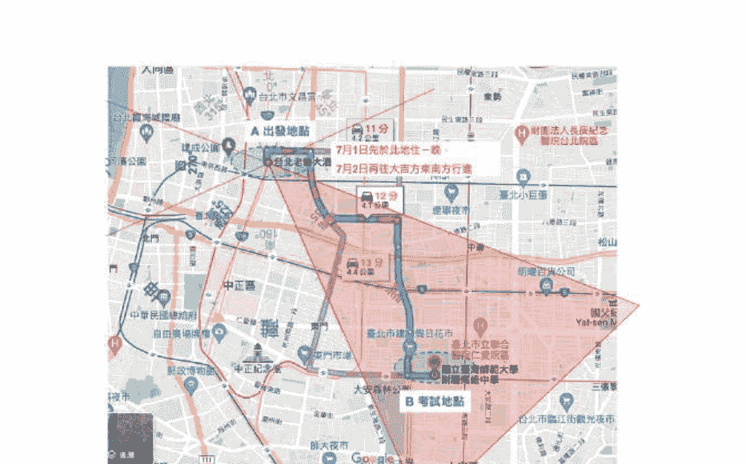

图105：使用“日盘”，若办事当天的地点不在吉方位，可提前改变出发地，以便隔天从吉方前往。

结果考英文时，一九八四年台湾大学联考英文作文题目是“联考前的一夜”，刚好是我在考前背的那一篇，哇靠！可不可以再巧一点？真的太夸张了！而且我英文不好，最后一大题的英文阅读测验五题选择题根本来不及写，只好乱猜，没想到考完后对答案，竟然五题全猜对！

奇迹还没结束，最后一堂考三民主义，最后有两题申论题，一题十五分，一般一题能得个七、八分就不错了，因为不可能写得比国父孙中山先生还要好，结果我第一题竟然得了十四分，为什么？因为我昨晚在饭店里背过这题！

这就是“奇门遁甲”的神奇之处，也许它不能让你从零分考到一百分，但他真的可以帮助你提升运势，带来不可思议的奇迹！

#### “月盘”的应用

月盘的应用重点，在于是如果需要花上好几天到外地、远地出差、办事或旅游，时间长达一两个月内，或数天以上的事，则可依据用事的“月份”挑选有利的“方位”去办事，甚至还可以运用月盘，挑选吉方到外地旅游，吸纳满满的吉炁，这称之为“渡假改运法”。

“月盘”的应用，主要是用于外地出差办事或旅游时，须待在当地好几天，甚至超过一星期，选择时间及方位的方法与“时盘”或“日盘”一样，只是时间单位改以“月”为单位。奇门遁甲“月盘”所起出的吉方，代表一个月有效，如果出发日的选择，能再加上一个与“月盘”同吉方的日子来出发，等于吉上加吉，最适合商务人士事先安排客户或厂商的拜访、海外会议，或安排旅游活动。

“奇门渡假改运增运法”，这也属于奇门遁甲的一种“动态”的应用。风水是用来寻找一块宝地，于其上造葬“阳宅”或“阴宅”，期许能够“丁财两旺”，但一般人很难找到好风水的地方，即使找到也未必能取得，更别说搬家、造葬也是一个大工程。

> “奇门渡假改运增运法”的应用方式，是在新的一年之始，提早规划心想事成的开运旅游，查找有利的时间与地点去旅游（查每月时间区段里的吉方位在哪）、去接纳吉气，让自己及全家人在新的一年里财运磙磙、官运亨通、家庭和谐、感情如意、旺旺一整年！（建议选取月盘。）

“奇门渡假改运增运法”就是运用奇门遁甲的“月盘”，事先规划心想事成的开运旅游，想要提升财运的，就看今年哪个月盘的吉方有“生门”，在那个月的“生门”吉方，找个想旅游的地点，去那儿玩个几天，沐浴环绕在“生门”吉气的环境里，然后带回满满的财气，提升自己的财运。生意不好、想发财、提升财运的，不一定要搬家，可以自己迎向财方、待在财地，提升自己的财运，这就是“奇门渡假改运增运法”。

同理，想增进夫妻、家人感情、想找男女朋友的，可以找“休门”吉方；想工作顺利、升官晋职的可以找“开门”吉方；想提升考试学习效率的可以找“景门”吉方。既然每年春节、暑假、中秋、圣诞这种长假要去玩，何不同时利用此机会，玩的开心，又可以增添运势！

如果学习过子奇老师的奇门遁甲课程，熟悉奇门符号的学员，想要有男朋友的女生，还可找个月盘是“休门”吉方，再挑个吉日出发，也就是“日盘”吉方宫位里有“六合+天英星+休门+乙奇”的符号组合，或是有“玉女守门”格局的，没准一去玩回来之后，就交了男朋友了。

在此举一个实例来说明，如何运用奇门遁甲的“月盘”来进行“奇门渡假改运增运法”的应用。

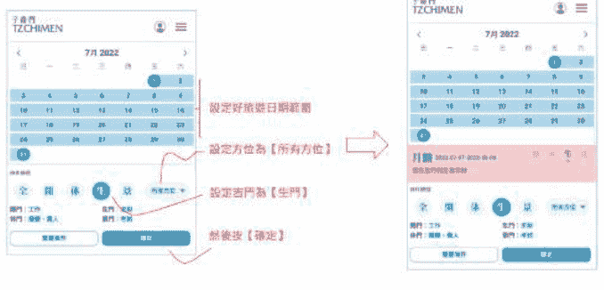

图106：同择时、择日一样，设定好时间区间、方位、吉门，“奇门历”就把月盘的吉方列出来了。

##### 案例4：想趁暑假带全家人去旅游，该如何利用这趟旅程提升财运？

每年放暑假大概都落于七至九月，假设预定七月安排个渡假旅游，首先打开奇门历，设定日期区间为“七月一日至七月三十一日”，吉门勾选“生门”利财运，方位选“所有方位”，然后一按“确定”键，则那个月“月盘”的开始及结束日期，以及“生门”的吉方就列出来了。从图106可看到，二〇二二年七月七日至二〇二二年八月六日这段期间，“月盘”显示在南方有“生门”，利生意求财。

下一步，打开Google Map，看往南方想要旅游的景点有哪些。例如住家是在台中市，暑假刚好可以带全家去垦丁游玩，从地图上可以看到，垦丁刚好位于台中市的“南方”。

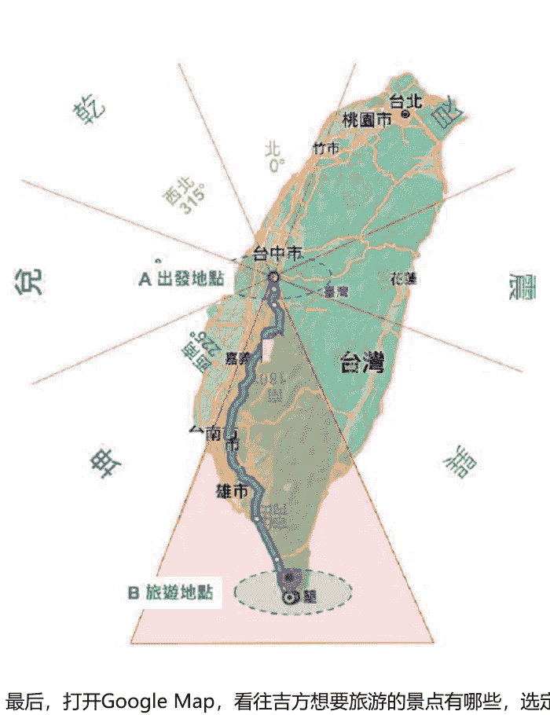

图107: 最后，打开Google Map，看往吉方想要旅游的景点有哪些，选定渡假地点。

如果想要更进一步，挑个好日子出发，则可再次使用奇门历，设定日期区间为“七月一日至七月三十一日”，吉门勾选“生门”利财运，方位选“南方”，然后一按“确定”键，则从“七月一日至七月三十一日”那个月所有南方有“生门”的“日子”及“时辰”就都列出来了。参看图108可知，七月十三日及七月十四日的日盘，刚好“南方”有“生门”，最利财运，可选择这两日出发，一箭双雕，既开开心心出游，又可带着满满财炁回家，岂不美哉！

所以，有了这“奇门历”等于拥有了一部“开运宝典”，可以自己择吉时吉方，挑选好的奇门时空，为自己或亲友调座位、布局、出门办事或旅游，改运增运自己来！

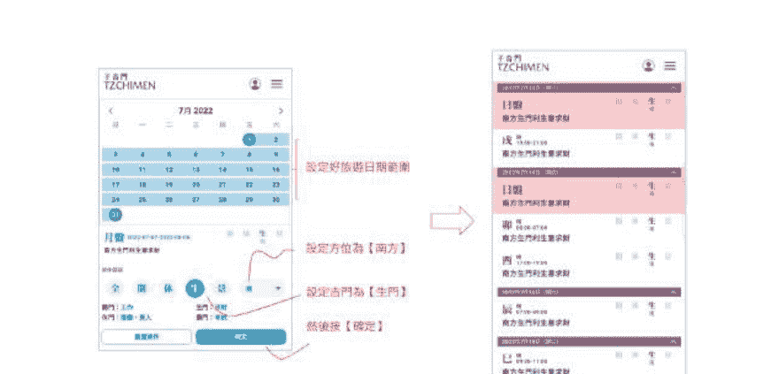

## 图108: 如果想要更进一步，挑个好日子出游，则可再次使用奇门历挑选吉日出发。

#### “年盘”的应用

年盘的应用重点，在于若要出国留学、搬迁、设厂、开公司、移居外地等必须待在别地或外地好几个月或数年的事，则可依据用事的“年份”，来挑选有利的“方位”去办事。

奇门遁甲所起出的“年盘”是一年一张盘，“年盘”主要是用于以后长时间都要在外地，也就是选择要在哪一年、或在该年往何方去出国留学、搬迁移民、创业、开公司或设厂比较好。

“年家奇门”的第二种应用，是用来调一年的风水及布局，“年家奇门”定一年的兴衰作用；“时家奇门”是时间，“年家奇门”是空间；年家奇门是果，时家奇门是看因，时间与空间互相作用，年家奇门与时家奇门一起合用效果最大。

“年家奇门”的第三种应用，是用来预测一年的吉凶兴衰，所以年家奇门既是预测学，也是风水学。这两种应用在子奇老师教授的奇门课程内，或每年的新年讲座中，有机会再做进一步讲解说明。

例如二〇二二年的“东北方”为“开门”大吉方，想要创业、开公司或设立分公司的，或想去日本留学的，则今年往东北方去就是最佳的时机，正所谓“万事贵乎始”，万事万物的开始，都对其发展和走向，有着至关重要的作用，是故“君子慎始”，好的开始就是成功的一半。

## 第6堂课

### 行为风水开运法

##  第一节

##### 什么是奇门遁甲的“行为风水”？

在上一堂课，我曾提及奇门遁甲改变运势的方式可以分为三大类型。第一种类型是属于“静态的地利”方面的应用，跟“房子的风水”有关，例如“调整座位”、“摆吉祥物佈局”及“拆东西”，这是属于比较持续性、长期性的运势改变；第二种类型是属于“动态”方面的应用，跟“人的行为”有关，例如“走吉方”及“做动作”，这是属于比较临时性、短期性或一次性的运势提升。第三种类型跟改变“自身的行为”（身）、“情绪的平衡”（心）、“认知的提升”（性）有关，是属于长远的、彻底的改变命运。

“行为风水”其实跟我们在居住、办公、做生意的地方，摆上对应奇门符号象征的吉祥物品来佈局的原理很像，只不过不是间接地由吉祥物来链接宇宙里日月星辰的能量，而是把“人”直接当“吉祥物”一般，让人直接与宇宙的日月星辰相应共振，这是一种“引炁入身”的方式，让自己与宇宙时空合为一体，我即是宇宙，宇宙即是我，让宇宙高层次的能量源源不绝地融于我体内，提升自己的能量，以期办事能事半功倍，心想事成！

那要如何做“行为风水”呢？在布局时，所挑选的吉祥物的形状、象征含义、性质、摆放方式，要能符合宫位里奇门符号的象征，还要摆对时间与方位。而做“行为风水”时，“人”的行为、动作、语言、观想，要能做出符合宫位里奇门符号的象征，当然也要在对的时间与方位去做，目的就是要让两者之间能形成共振，达成讯息与能量的同步与传递。

时空是奇门局所决定的，人的行为及意念，则是根据奇门宫位里的神、星、门、干等符号含义为“指导”去做的行为。

共振的定义是当两个振动频率相同的物体，当一个发生振动时，会引起另一个物体振动的现象。共振的实例很多，例如十八世纪中叶，法国昂热市一座一百零二米长的大桥上有一队士兵经过。当他们在指挥官的口令下迈着整齐的步伐过桥时，桥梁突然断裂，造成二百二十六名官兵和行人丧生。究其原因就是共振造成的。**因为大队士兵迈正步走的频率，正好与大桥的固有频率一致，使桥的振动加强**，当它的振幅达到最大以至于超过桥梁的抗压力时，桥就断了。所以，现代阿兵哥班长，都要懂得这个科学常识：带兵过桥时，千万不可齐步走！

共振的有名例子也发生在中国。唐朝开元年间，洛阳有一个姓刘的和尚，他的房间内挂着一个磬（一种乐器）。有一天，刘和尚没有敲磬，磬却自动响起来了，这让他吓出一身病来。他的一位好朋友曹绍夔是宫廷的乐师，精通音律（即乐理），前来探望刘和尚。经过一番观察，他发现每当寺院里的钟响起来时，和尚房里的磬也跟着响了。于是曹绍夔拿出铁锉来把磬磨去几处，从此以后就不再自鸣了。他告诉刘和尚，这磬的音律（即现在所谓的固有频率）和寺院的钟的音律一致，敲钟时由于共振，磬也就响了。将磬磨去几处就是改变它的音律，这样就不会引起共鸣。和尚恍然大悟，病也随之痊愈了。

我们也常看到，一对夫妻相处久了，会有夫妻脸，如果长期相处和谐，甚至他俩的行为、表现、喜好、习惯、想法也会有越来越像的感觉。这在易经里称为：“同声相应，同气相求。” 你可以观察日常生活中感情很好的情侣或夫妻，会发现他们似乎长得越来越像，连行为举止也是，包含笑的方式、变换同一种动作的时机也都会很类似。这就是在亲和感状态中，人不自觉会产生一种和谐的频率，而这种亲和感可以透过“同步”的技巧制造出来。

在NLP神经语言学中，有一项运用的技巧叫做“同步”（pacing），简单说就是配合或模仿对方以取得或创建亲和感。如果我们也透过不经意地模仿、配合对方步调，去创造这种同步，这对于刚开始创建合作关系的双方，都是一种温和与隐约展现善意的一种方式。目的在让对方知道，我正感受着你，传递出一种尊重，创建起彼此的亲和感。

而这种“同步”的运用方式有两种，分别是“语言的同步”以及“非语言的同步”，而我们奇门遁甲则称之为“行为风水”，透过身口意的方式，与大自然时空同步共振，达成和谐的状态，借由共振的行为，让大自然的能量（振动）来提升我们的能量（振动），使我们能量大增，超越自我，达成心灵深处的梦想。

> > “行为风水”是当我们起出特定的奇门时空局后，在特定的时间，特定的方位、或地点，去做符合宫内象意的行为方法（身口意，身：行为、动作、穿衣、喝水、吃东西、或写字；口：讲话、唱歌、持咒或念经；意：思惟、心念、想法、或祈愿）。方是方向，也就是空间；法是行为，也就是心里的意念，与自身、外在的行为。

接下来，同样用上一堂课的例子来说明如何应用“行为风水”，尤其是将“行为风水+出行诀”综合使用，效果更立竿见影。

##### 案例1：想另起炉灶，如何能顺利谈得成？

子奇老师前公司同事想要脱离老东家，在外另起炉灶，想约他的岳父及股东董事谈此事，希望能谈得圆满顺利。

我们第一步已在地图查找了公司地点，是位于他家的西方。

第二步查表（请参看图110），对应“西方”在右边中间的“兑宫”，适合的吉门有“休门”、“生门”及“开门”，谈生意或协调事情，可以先选“开门”，没有再选“休门”及“生门”也OK。

图109：在地图上先查找要办事的地点，位于我出发地点的哪个方位。

第三步，根据当天的出行方位来选择吉时，所以安排二〇二二年五月十六日下星期一早上十点开会谈事，早上九点过后从台北汐止出发，走“开门”吉方。

接下来第四步就是要做“行为风水”了！尤其是将“行为风水＋出行诀”综合使用，效果更明显，更立竿见影。此时我们可以再打开“奇门盘”，将时间设定为二〇二二年五月十六日早上九点，看奇门盘的西方“兑宫”有什么奇门符号。

图110：依据出行方位“西方”锁定宫位“兑宫”，再选“吉门”，工作开会最适合选用“开门”。

结果“兑七宫”里有奇门符号：腾蛇（八神）＋天任（九星）＋开门（八门）＋丙（天盘天干）＋丁（地盘天干）＋乙（引干）。

图111：设定好条件，时间区间、方位、吉门，“奇门历”程式就能把所有的“吉时”找出来。

图112：打开“奇门排盘”程式，选择时间，可以查看宫位里的奇门符号。

宫位里的符号就像是演戏时的剧本，我们可以在早上九点过后，于出发前，在家里的西方（兑七宫），做宫位里奇门符号所指示的行为动作以与之共振。

怎么做呢？早上九点一到，在家里（或出发地点）的西方，用手（乙）打开（开门）打火机（丁）点火（丙）或点香（丁），打火机点七下或点七只香（兑七宫数字为七），然后弯腰像拜拜一样连拜七次（天任）。在家做完这些“行为风水”之后，再往西方出行沐吉气去开会，必能顺利成功，马到功成！

图113：设定好条件，时间区间、方位、吉门，“奇门历”程序就能把所有的“吉时”找出来。

##### 奇门符号在“行为风水”方面的象征

“行为风水”施作的要诀，就是当我们起出奇门盘后，于奇门盘的时间，在宫位所对应的方位或地点，去做符合宫位内符号象征的动作及行为。说白话一点，就是把宫位当作剧场（对应空间，如家里的某一方位），把奇门符号当作是演戏的脚本，依这脚本把符号所提示的动作（身）、声音（口）、想像（意）给演出来，角色演得越像、越彻底、越忘我、越投入、越融入情境、越有感受，效果就越大。

换句话说，关键在于用生命去演这场戏，用感觉去演这场戏，这场戏就会成为你的未来！想有什么样的未来，就演什么样的戏，人生未来的剧本，可以由自己创造！这里面其实隐含着创造未来生命中你想要的状态与事物的重要法则！也契合了曾流行一时的“吸引力法则”及“梦想板”，帮助创造生命中你想要的事物及状态的最佳工具。

“吸引力法则”可以简单定义为：“你关注什么，你就会吸引着什么”，“在生命中，你会吸引到你所注意、关心的东西”。

“梦想板”则是一种“预见未来画面”的方法，把自己心中的梦想或目标，化作情境相似的具体图像，并贴在一块板子上，放在每天生活环境中显眼的地方，当你每天看见梦想，就能集中专注力在上面，并按部就班地去实践梦想与目标！

但“吸引力法则”及“梦想板”为什么很多人施行起来却没有效果？或换个方式问：“要如何才能提升它的效果，帮助你心想事成？” 我在这先透露要强化其效果，其中最主要的三个秘诀：第一、要在对的宇宙时空之下；第二、要将“你所想要的”与“宇宙所对应的标的物”做正确的链接与共振；第三、要用“心”，不是用“想”的而已。

奇门遁甲宫位里的符号包括**八神、九星、八门及十天干**，但因“遁甲”，所以盘内只看到九个天干，而且中宫不用，所以九星我们只用到八星，天禽星不用。在做“行为风水”时，要把每个符号，当做动作（身）、声音（口）或想像（意）来看，我们接下来一一来说明每个符号所对应的特质、行为或物品。

###### 1. "八神"

###### 值符（土、木）
- 特质或形状（形容词）：名贵的、贵重高档的、权力象征的。
- 象征物品：名贵的物品、贵重高档物品、钱币、珠宝首饰、钻石、名贵古董、名人字画、名贵艺术品、高档家具、印章、玉玺、令徽、委任状、证书、符等。
- 行为动作：穿着配戴名贵、说话权威。

###### 腾蛇（火）
- 特质或形状（形容词）：属火的、鲜艳的、五彩斑斓的、引人注目的、弯曲的、条状的。
- 象征物品：香火、灯、蜡烛、鲜艳的衣服或物品、带花纹的布和衣服、丝巾、腰带、鞋带、领带、项链、手链、发辫绳子。
- 行为动作：穿着、配戴要鲜艳、花色多、或带有花纹的服饰，戴上丝巾、腰带、鞋带、领带、项链、手链、或发辫，说话巧变圆融、机智圆滑。

###### 太阴（金）
- 特质或形状（形容词）：精致艺术的、精雕细琢的、女人的、阴暗的、低调不引人注目的。
- 象征物品：精致艺术品（雕塑品、玉器、珠宝、工艺品、图画、服饰品、字迹墨迹、字画）、印章、女人用品、化妆品、仙佛观音瓷像。
- 行为动作：穿着打扮力求精致典雅、行事低调不引人注目。

###### 六合（木）
- 特质或形状（形容词）：不止一样的、多数的、多次的、多样的、一对的、组合拼装的、盒子状的、开心欢笑的、和气的、能言善道的。
- 象征物品：多数的、多样的、组合拼装的物品、盒子、箱子、低矮柜子、合约、证书、证物、印信、契约、心形物、一对天鹅、百合花。
- 行为动作：合上（阖上、关起来）、心情表情开心欢笑、口若悬河。

###### 白虎（金）
- 特质或形状（形容词）：金属的、石制品的、强硬的、坚硬的、白色的。
- 象征物品：坚硬的、玻璃杯瓶、石头、石制品、金属制品、金银铜器、锁、玩具刀枪器械、汽车。
- 行为动作：态度强硬、表情威严、穿白色衣服。

###### 玄武（水）
- 特质或形状（形容词）：黑色的、悬挂的、装水的、文书的、暗地里的、风水玄学的。
- 象征物品：水、饮料、风水物品、水中之物（鱼、虾）、乌龟、图片、图画、文章、印信、文章、伞、瓶、罐、瓢、缸等容器。
- 行为动作：暗中行事、偷偷摸摸的（像猫走路）。

###### 九地（土）
- 特质或形状（形容词）：地下的、低处的、矮的、低调的、土制的、收藏储藏的、动作小的、动作缓慢的、被动的、音量小的、保守的、本地近处的、年代久远的。
- 象征物品：沙石、古董、五谷、布帛、缸、瓦盆、瓦罐、土制品、储存粮食的器皿、储存衣物的柜子、首饰盒。
- 行为动作：低调保守行事、态度被动、摆低姿态、音量小、坐着、蹲下、趴着、躺着。

###### 九天（金）
- 特质或形状（形容词）：天上的、高处的、高的、高调的、金属制的、动作大的、动作快的、主动积极的、音量大的、高调的、外地远处的、年代久远的。
- 象征物品：金玉、宝石、剑戟、刀枪、钱、镜子、铜铁、帽子、光亮玲珑物、旋转活动物。
- 行为动作：高调行事、态度积极主动、摆高姿态、动作大、音量大、讲话快、站高处、站起来、站着。

###### 2. “九星”

###### 天蓬星（水）
- 特质或形状（形容词）：蓬状的、蓬松的、黑色的、多毛的。
- 象征物品：伞、雨具、黑色或蓬松、宽松的衣服、头发或胡子浓密蓬松。

###### 天芮星（土）
- 特质或形状（形容词）：有问题的、包容收纳的、土制的、布做的。
- 象征物品：药水药丸、医药用品、书籍、仙佛神像（菩萨、观音）、瓦罐、瓷器、包包、布包、背袋。

###### 天冲星（木）
- 特质或形状（形容词）：高大挺直的、快速敏捷的、果断的、会动的、发声的、会跳的、会冲的。
- 象征物品：竹、乐器、音响、钟、铃、火箭、烟花、鞭炮、汽车、兔子。
- 行为动作：走动、跑、冲撞、跳跃、发声、唱歌、弹或吹奏乐器、念经。

###### 天辅星（木）
- 特质或形状（形容词）：跟风有关的、柔软的、木制的、布质的、条状的。
- 象征物品：空调、风扇、窗口、窗帘、绳子、桌椅、板凳、床、家具、衣服、棉被。

###### 天心星（金）
- 特质或形状（形容词）：贵重高档的、金属制的、医药的、心形的、圆形的、心态心情。
- 象征物品：金、银、珠宝、贵重物品、金属制品器皿、医药、草药、仙佛神像（菩萨、观音）、心形相框、圆形物品。

###### 天柱星（金）
- 特质或形状（形容词）：发声的，柱状的，金属制的。
- 象征物品：发声的物体，如电视、乐器、音响喇叭、钟表，或柱状物，如木棒、筷子、笔，及金属制品等。
- 行为动作：发出声音、讲话、直立。

###### 天任星（土）
- 特质或形状（形容词）：负重承受的、弯腰驼背的。
- 象征物品：桌子、椅子、床、柜子、桥、楼梯阶梯等。
- 行为动作：背上背东西、弯腰拜拜、爬楼梯、走在桥上。

###### 天英星（火）
- 特质或形状（形容词）：漂亮的、发亮的、与火有关的、电器的、与文件有关的、表演展现的、影视的、虚荣浮夸的、开花的。
- 象征物品：亮丽发亮之物或与火有关的事物或物品，萤光棒、灯具、炉灶、爆炸易燃物品如烟花爆竹、家用电器、影视用品、证件、图片、图书、开花的植物、盆景、花卉等。

###### 3. “八门” （仅介绍常用的吉门：休门、生门、开门及景门）

###### 休门（水）
- 特质或形状（形容词）：液体的、松软的、运输的、流动的、悠闲懒散的、轻松愉悦的、动作慢的、态度语音温和的、衣着宽松的。
- 象征物品：饮料、酒、水等液体物质；布、绳索、衣物、棉花等松软物质；船、汽车、摩托车等运输工具；钟表、风扇、洗衣机、空调等能动的家电。
- 行为动作：休息、躺着、放松、冥想静坐、动作悠闲懒散、心情轻松愉悦、态度语音温和、衣着宽松。

###### 生门（土）
- 特质或形状（形容词）：生长的、生活的、活的、活跃的、有生气的。
- 象征物品：人们生活所需的一切物品，如柴、米、油、盐等、活的生物。
- 行为动作：种植、养殖、放生、生产制造。

###### 开门（金）
- 特质或形状（形容词）：打开的、有开口的、贵重高档的、圆形的。
- 象征物品：门、金银珠宝饰品、贵重物品、圆形物品、飞机。
- 行为动作：打开（抽屉、柜子、盒子、箱子、盖子、门、窗、水龙头、锁、瓶子）。

###### 景门（火）
- 特质或形状（形容词）：有画面的、赏心悦目的、华丽亮丽的、美貌漂亮的、化妆打扮的、表演展现的、有愿景理想的、想像未来画面的、文书的、发亮的、电器的、喜庆的。
- 象征物品：图书、图画、照片、艺术品、时装、美容美发用品、文件、合同、证书、颜料、油漆、灯光、霓虹灯、电脑、电视机、投影机等。
- 行为动作：绘画、挂画、化妆打扮、穿着漂亮、展现表演、祈愿观想、开灯、点香、打火机点火。

###### 4. “天干”

###### 乙（阴木）
- 特质或形状（形容词）：花草的、木制的、条状的、文化艺术的、质软、柔弱、依附、弯曲、曲折、委婉、文化艺术。
- 象征物品：弯曲的、艺术精致的、木制品、花草、植物、盆栽、茶叶、葫芦、天鹅、龙、桃木、如意、铲子、绳子、项链、领带、衣架、桌椅、头发毛发。
- 行为动作：手、脚、弯曲、蹲坐、勾子、爬行、游动、打坐、牵手、握手、双手合十祈福、戴项链、打领带。

###### 丙（阳火）
- 特质或形状（形容词）：发亮的、火热的、电器的、热情的、急躁的、红色的、圆形的。
- 象征物品：圆形的、发热的、光亮的、红色的、暖热的、西瓜、苹果、灯、灯笼、电器、水晶球、镜子、玻璃、眼镜、红色中国结、猪、圆饼。
- 行为动作：圆形（画圆、走圆等）、火烧、戴眼镜、用圆型杯子喝水、吃圆形的饼干。

###### 丁（阴火）
- 特质或形状（形容词）：发亮的、温暖体贴的、亮丽的、吸引目光的、带刺尖锐的、丁字形的。
- 象征物品：尖状的（勾、针、刀、钉、带刺的花、高跟鞋）、香、打火机、香烟、灯、电器、手机、拐杖、衣架、细长的（吸管）、证件、铃铛、红色中国结、钥匙、首饰。
- 行为动作：点香祈福、点灯、抽烟、手机打电话、吸管吸饮料、挂衣架、钉钉子、挂钩子、红色中国结、发声响的、挂铃铛、唱歌、念经、弹奏乐器、叮、钉、咬、吸、勾。

###### 戊（阳土）
- 特质或形状（形容词）：金钱的、土地的、土制的、肉多的、方形的、诚实可靠的、速度慢的。
- 象征物品：沙土、土制品、陶瓷品、陶瓷碗盘、碗公、聚宝盆、花盆、盐灯、砖瓦、钱（纸钞）、钱包、方形物（箱子、盒子）、肉、肉多的（猪、大象）、肉包、鼻子、桌子、墙壁。
- 行为动作：吃肉（肉包）、肉多、拿陶瓷碗盘、烧纸钱、翻书、数钱。

###### 己（阴土）
- 特质或形状（形容词）：有主意想法的、拐弯抹角的、能屈能伸的、有欲望的、邪念、形状弯弯曲曲的、卷曲的。
- 象征物品：卷曲的（卷好的棉被、折好的纸钞）、开口的（瓶口）、有嘴的（茶壶壶嘴）、陶瓷品、有收口的花瓶、花盆、聚宝盆、貔貅、信封（有封口）、绳索、食物、陶磁做的蛇、卷曲睡觉的猫狗陶制品、沙土、勾子、折扇。
- 行为动作：吃、吸、喝（用嘴用口）、拉、撒、盘腿（腿卷起来）、折叠衣服或叠棉被、折纸钞。

###### 庚（阳金）
- 特质或形状（形容词）：金属的、石制的、坚硬的、强硬的、威严的、有气概魄力的、霸道武断的。
- 象征物品：坚硬的、玻璃杯瓶、石头、石制品、锁、玩具刀枪器械、汽车、金属制品、铜制麒麟、金刚经、金光神咒。
- 行为动作：发声、念经、敲打出声。

###### 辛（阳金）
- 特质或形状（形容词）：颗粒的、小型金属的、创新改革的、贵气的、亮丽物质的。
- 象征物品：颗粒状的（大豆、玉米）、水晶球、小型金属（戒指、项链、手镯、金银珠宝、手表、小刀、钥匙、铜钱、钱币、五帝钱）、心经。
- 行为动作：念心经或抄写心经、忏悔许愿（心想事成）、改变、吃辛辣的食物。

###### 壬（阳水）
- 特质或形状（形容词）：管状的（水管）、波浪状的（窗帘、棉被）、弯曲蛇形的、水中的、流动变化的、善变的、运输的、任意的。
- 象征物品：水管、波浪状物品、窗帘、棉被、船、运输工具、流通的物品、水、海、河、江、湖、水池、水管、饮料瓶、水管、污水、鱼缸、下水道、肾脏、膀胱、生殖系统、性器官。
- 行为动作：流动、任意走动、坐船、坐车、运输、流通、上厕所、排尿、喝水、游泳。

###### 癸（阴水）
- 特质或形状（形容词）：变化的、流动的、行动走动的、与水、液体有关的。
- 象征物品：液体物品（水、饮料、茶、酒、墨水）水龙头、饮料瓶、雨水、露水、水池、湿地、痣、图片、鞋子、化妆品、乌龟。
- 行为动作：走、动、足、来回走动、喝饮料、喝酒、点痣除痣。

#### 第三节 “行为风水”的运用

“行为风水”的主要指导原则，是以“天干”为主，“神、星、门”为辅。以“天干”为行为动作，“神、星、门”为行为动作的形状、姿态、或物品，做为行为动作的补充或形容。

接下来，举几个案例说明，看看如何运用“行为风水”在我们去面试、约会或去谈生意时，提升我们的运势，增加胜算，得其所愿。

##### 案例1：今天下午两点要去一家公司面谈，如何才能应征得上？

首先打开“奇门历”程序，设定面试前两到三天的时间区段，点选“所有方位”，八门可选取“开门”或“景门”，因为“开门”利工作事业，而“景门”利考试面试。

假设面试时间是二〇二二年七月廿九日下午两点，而今天是二〇二二年七月廿八日下午四点廿三分，时间已经很紧迫了。幸运的是，面试当天二〇二二年七月廿九日早上七点到九点，就有“开门”吉门在西方，虽然七月廿八日还有另一个时辰，但时间已过去了，我们就不用它了。所以，最好在办事前的前的两到三天的时间去做“行为风水”，时间会比较充裕。

用奇门历就有这个好处，可以快速地将所有吉方吉时找出来，而且避开吉门在宫位里的所有不利情况，包含“门迫/门制、门伏/门反”、“白虎、空亡”、“天干击刑”及“五不遇时”。

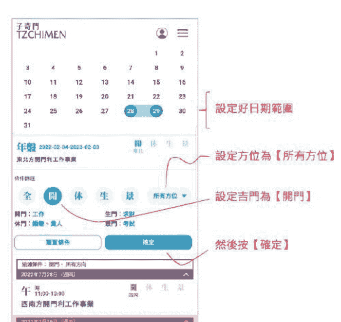

## 图114：设定好条件，时间区间、方位、吉门，“奇门历”程序就能把所有的“吉时”找出来。

因为“行为风水”得依宫位内的奇门符号去做行为，所以我们接着打开“奇门排盘”程序，设定好时间，点选“时家（置闰）”法排盘，然后按“开始排盘”就可起出奇门盘了。

为何要做此宫位的行为风水？因这个宫位内有吉门“开门”最利工作事业，可以在工作面试前，在奇门盘所示的时辰内，于家中的西方“兑宫”，坐在低处（矮凳上）上，开心地吃着肉包，分七口吃完，然后演练及想像着今天下午的面试能圆满顺利成功！

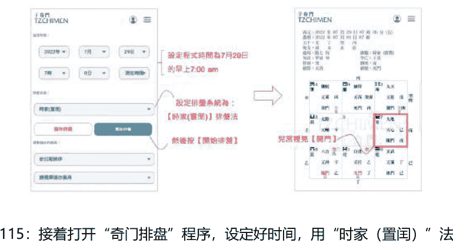

图115：接着打开“奇门排盘”程序，设定好时间，用“时家（置闰）”法排盘，然后按“开始排盘”。

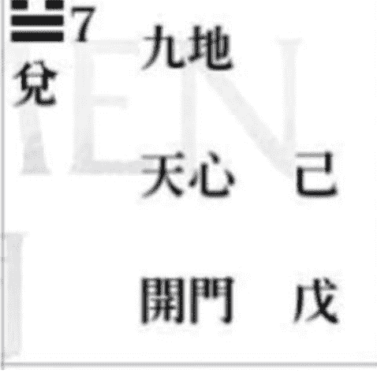

## 图116：“兑七宫”符号为：九地+天心+开门+（己+戊）。

要点在于，先从天盘天干及地盘天干两个天干之中，找一个有“行为动作”象征的天干当动作，以那个天干为主。例如“己”为口、为嘴，代表“吃”这个动作；而“戊”就可当作“物品”，戊为“肉”；而“己+戊”在兑七宫，兑宫方位为西方，数字七，就可形成“吃肉包，分七口吃完”这个行为。

“神、星、门”为行为动作的形状、姿态、或物品，做为行为动作的补充及形容。所以“天心”为心态心情，“开门+天心”就是“开心愉悦”的心情，“九地”为低处，可拿张矮凳坐着吃。

所以施做第一要点就是：以“天干”为主，“神、星、门”为辅。以“天干”为行为动作，“神、星、门”为行为动作的形状、姿态、或物品，做为行为动作的补充及形容。“行为风水”最重要的是要“动”，“动则应”。也就是说，“人”要有动作，去做（身）、去说（口）或去想（意），从天干入手，至少找一个天干来做行为动作，不管是锁定宫位里上面的“天盘天干”，抑或下面的“地盘天干”，至少找到一个天干去做动作，则剩下的另一个天干，及其他的“神、星、门”符号，就可以为辅，当作“做这个行为动作”的形状、姿态、物品的性质补充或形容。

如果真的找不到或想不到天干可以做什么行为动作，其次，也可从“神、星、门”下手，锁定一个或两个符号做动作，其余的就做为“该行为动作”的形状、姿态、物品的性质补充或形容。接着我们再举一个案例看看。

##### 案例2：中午餐厅生意不好，没啥客人，晚餐时间快到了，怎样能让客人上门？

“行为风水”最厉害的地方，就是做起来简单，但收效快速！假设开的是餐厅，中午客人很少，晚上希望能多些客人上门，现在已经下午四点多了，要怎样做“行为风水”能让晚上多一些客人？

正所谓开门做生意，开门大吉，客人就是我们的财源，想要让客人多一些，这时我们可以在店面里立即打开“奇门排盘”程序，看看有没有机会做个“行为风水”，让晚餐时间能有多一些客人上门。结果艮八宫里，刚好见到代表店面的“开门”，而且开盘时辰是“丙申”时，时天干“丙”代表客人。客人“丙”与店面“开门”同宫，那不就是代表客人上门了吗！

虽然东北方的“艮八宫”里有“开门”，但我们还要检查一下“开门”在“艮八宫”里可不可用？有没有“门迫/门制、门伏/门反”、“白虎、空亡”、“天干击刑”及“五不遇时”等情况。

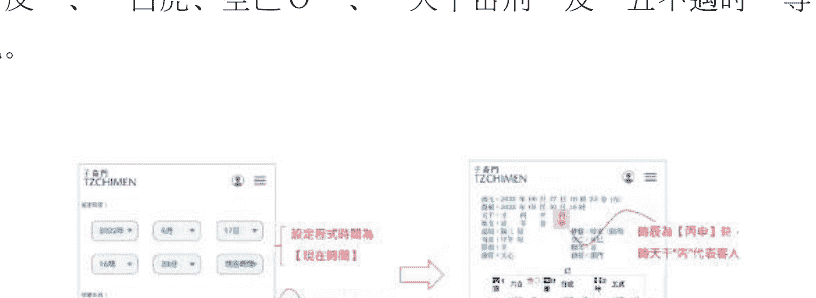

图117: 打开“奇门排盘”程序，时间为现在，设定“时家（置闰）”法排盘，然后按“开始排盘”。

结果运气真好，“艮八宫”里“开门”不会与宫位造成“门迫/门制、门伏/门反”，也不见“白虎、空亡”，更没有“庚”的“天干击刑”，时辰也不是“五不遇时”，在这时辰之下，“艮八宫”是安全有利的。

要做此宫位的行为风水，可在下午五点前，于店面里的“东北方”，拿把雨伞（“天蓬星”代表雨伞），最好是带有条纹或颜色鲜艳的雨伞（“腾蛇”代表条纹的、颜色鲜艳的），然后做打开雨伞这个动作（“开门”代表打开），做几次？做八次（“艮八宫”数字八），然后想像着晚餐时间一到，客人就上门了！

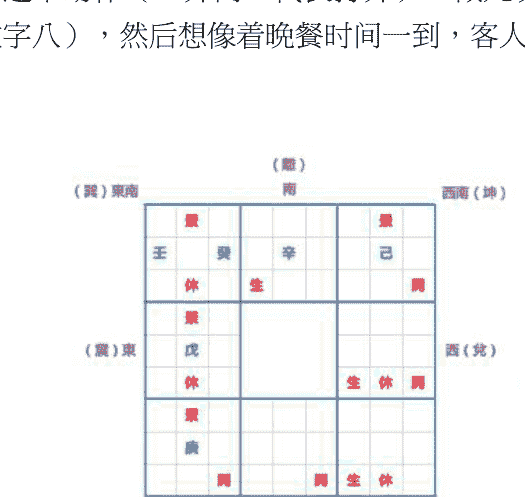

- 休 休憩、感情和睦、贵人
- 生 生财、生意兴旺、生气健康
- 開 開張開店、工作事業
- 景 前景光明、考試學業文書
- 干 宫位内有對應的天干【擊刑】，則不宜取用（戊己庚辛壬癸）
- ○ 宮位内有符號【白虎】及【空亡】，也不宜取用
- 【五不遇時】，也非吉時，不宜取用

| 日天干 | 时天干 |
|--------|--------|
| 甲     | 庚     |
| 乙     | 辛     |
| 丙     | 壬     |
| 丁     | 癸     |
| 戊     | 甲     |
| 己     | 乙     |
| 庚     | 丙     |

图118：用“奇门遁甲辨方择时”速查表，找出“开门”在哪个宫位可用，而且宫位内是否有“白虎、空亡”、“天干击刑”及“五不遇时”等情况，若有，则该宫位或时辰当舍去不用。

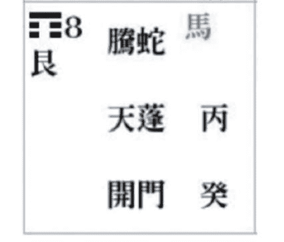

图119：“艮八宫”符号为：腾蛇+天蓬+开门+（丙+癸）。

这就是抓住一个带着动作的符号，如此例的“开门”，以它为主，其他的符号可视作该行为动作的形状、姿态、物品的性质补充或形容。如果要加强的话，还可以接着原地走圈，走八圈，因为“癸”为足、为走，“丙”为“圆形的”，“癸+丙”就可以“走圆”或“走圈”。这就是“行为风水”，把人当吉祥物，去做奇门符号所指导的行为动作，与奇门符号所象征的日月星辰的能量做共振，为自己加持，提升能量，以期达到人们心中所愿。

做完“行为风水”后，这些物品如雨伞等，就可收起来了，“行为风水”不是布局，最重要的是那个“动作行为”、“动而感应”，所以只要做了“动作行为”就可把相关的物品收起来了。

##### 案例3：如何用“行为风水”增加财运？

想增加财运，第一、除了用第三堂课所教的“吉祥物布局”；第二、还可每天开“奇门历”在吉时走“生门”吉方，连走它一个月；第三、也可以开“奇门历”选“生门”，挑吉时，再开“奇门盘”锁“生门”宫位做“行为风水”。

例如现在是二〇二二年六月廿三日下午两点廿三分，开了“奇门历”后，显示当天“生门”所有的吉时吉方，因当天日盘有“生门”在“西方”，而时辰晚上七点到九点在“西方”也有“生门”，因此我们就可在这时辰做“行为风水”。

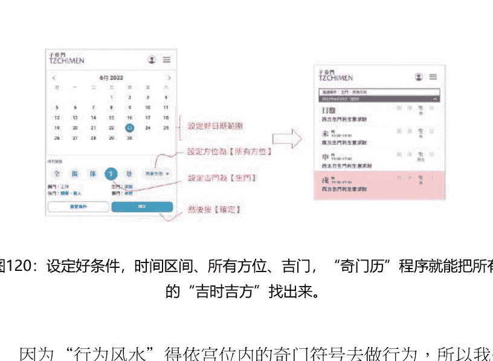

因为“行为风水”得依宫位内的奇门符号去做行为，所以我们接着打开“奇门排盘”程序，设定好时间，点选“时家（置闰）”法排盘，然后按“开始排盘”就可起出奇门盘了。

要做此宫位的行为风水，可在晚上七点到九点，于家里的“西方”，拿个红色的纸箱（“丙”火为红色的、“戊”为土、为方形、主收纳，“戊”也为钱，可以是纸钞）或红色圆形的陶瓷碗，然后将红色的纸钞一张一张放进去箱里或碗里，想像这是个聚宝箱或聚宝盆，能生出财来（“生门”为生财）。

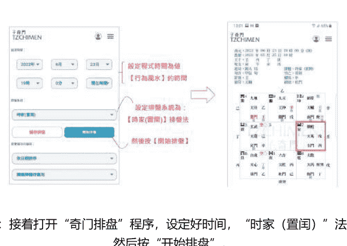

图121：接着打开“奇门排盘”程序，设定好时间，“时家（置闰）”法排盘，然后按“开始排盘”。

纸箱或陶瓷碗如果是带有条纹的、颜色鲜艳的，或带有花的图案更好（“螣蛇”代表条纹的、颜色鲜艳的；“天英星”为漂亮的，也代表“花”）。

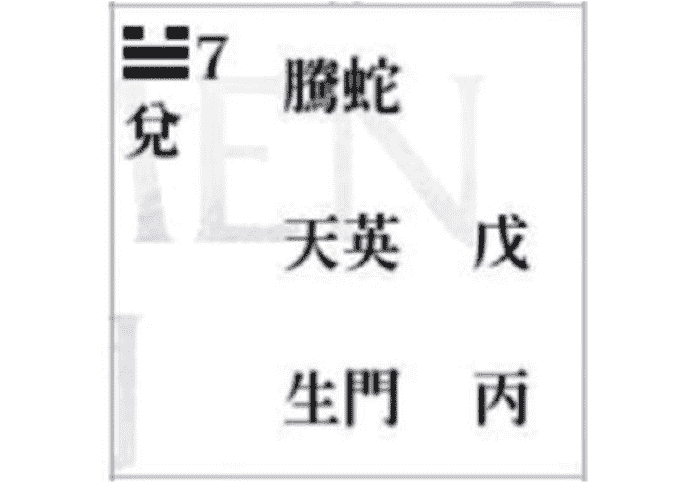

图122：“兑七宫”符号为：腾蛇+天英+生门+（戊+丙）。

如此一来，则近日内财运必然提升，就等着进财吧！

做完“行为风水”后，这些物品如纸箱、瓷碗或纸钞等，就可收起来了。“行为风水”不是佈局，最重要的是那个“动作行为”、“动而感应”，所以只要做了“动作行为”就可把相关的物品收起来了。

## 第7堂课

### 造命改运法——开悟之道

#### 第一节

##### 为何要努力及改变？努力及改变为何不成功？

为何要努力及改变？努力及改变是为了要过更好的生活！

如何努力及改变？努力及改变的方向在于“升维明觉，降维打击”！

世界上有两件有价值的事：第一件，自己好好的活着；第二件，帮助更多人好好的活着。

我们所有的努力及改变，都是在让我们比一般人有更清晰的视角，有更好的身体去驾驭和活出快乐、健康、幸福、和谐及丰盛！

当你在书店里拿起这本书，甚至看到这最后一堂课时，我要恭喜你，因为这代表你有福报，有非常大的机缘，因为在这堂课里，你将有机会见闻流传于很多成功人士，他们如何翻转人生，改变命运的秘密。

> “普通老师教给学员的，是各种方法、技巧和成功的经验；大师则是直接破译宇宙最核心的规律，打开众生进入宇宙频率级别，”使众生在自性轨道中游刃有余。

笔者去年二〇二一年写了第一本由“春光出版社”所出版的《九宫奇门》，因应很多学员的要求，在新书签名题字，当时我灵感一来，写下了八个大字：“升维明觉，降维打击”。在那时候，我也不知道为什么要写这八个字，只能说是“高我”给我的提示吧。而现在比较清楚明白了，原来这是揭示或者预告未来我该往哪个方向去教学及努力。因为“我们所有的努力及改变，都是在让我们比一般人有更清晰的视角，有更好的身体去驾驭和活出快乐、健康、幸福、和谐及丰盛！”

- 升维（体）：进入宇宙频率级别，破译宇宙最核心的规律（底层规律）。
- 降维（用）：在自性轨道中游刃有余。

“道”以“器”为用，什么是“道”？“道”就是宇宙运行一切的底层核心规律，什么是“器”？“器”就是法，“器”就是术，就是方法、法则、途径、手段及工具。

###### **要彻底的“造命改运”得从“自身的改变”开始**

奇门遁甲在前面五堂课所谈的方法，“调座位、摆物品、拆东西、走吉方、做动作”基本上属于外加的方法，是运用奇门时空助你提升运势或扫除阻碍的方式，是一种借助外力（宇宙时空的能量）来帮自己心想事成，让本来没有的东西能多几分胜算、多几分机会得到手，无论是得官、得财、得事等等。但真正要将得手的人事物，能长期拥有，维持在自己身边，真正要改变命运的根本解决之道，还是要从自身的改变做起。也就是奇门遁甲可以帮助你在人事物方面的“可得性”，但奇门遁甲并不能保证其“维持性”。

人都有困难的时候，比如开面店，在疫情期间，生意不好，没客人，运用奇门遁甲可以帮你催客人或佈财局增加客人及店面生意。但如果面煮得难吃，服务态度又差，店面环境脏乱不堪，即使用奇门遁甲催来了客人，但光临了你的店面一次，下次也不会再来了，这样用奇门一次又一次地改运或佈局，效果也会越来越差，最后又回到了原来的惨状。又好比，佈了增加学习考试的文昌局，但如果每天待在家打电动、上网络、看YouTube，不念书，那成绩也不会进步，考试一样分数乱糟糟。

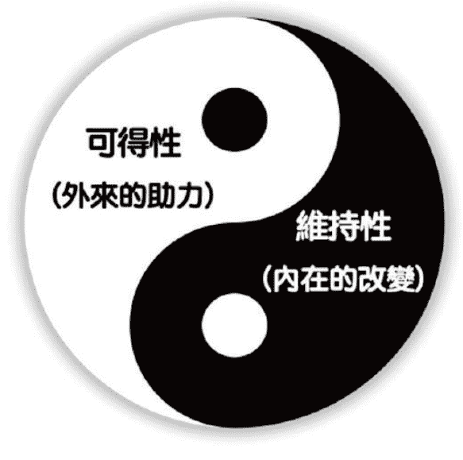

## 图123：外来的助力vs内在的改变。

在我教学期间，也有很多外在条件很不错的女学员想催桃花，想找条件好的男朋友，结果一佈完桃花局，效果还不错，陆续开始有了不错的约会对象。但很奇怪的是，过了半年、一年，怎么又要佈局催桃花了。追究其症结点，不是对男方诸多挑剔，就是出在自己的个性、心态、行为上有很大的问题。有些人在观念上甚至有很大的偏差，佈局催桃花总想催个又高、又帅、又有钱的男朋友，以为凭着自己外貌佳，身材高挑，有本钱，就可以任性而为，但个性或心态行为上却跟人难以相处，即使一时得手，也会留不住，最后镜花水月，空忙一场。然后，变成无尽的轮回，催桃花佈局，约会谈恋爱，吵架分手，再佈局，再来一次，又分手，又来，还来……人际关系如此，学习、工作、生意、金钱、健康也如此，道理都相通的。

所以，真正要改变自己的命运，拥有长久的幸福，除了要有“外在的机缘”（可得性），还得要有“内在的努力与改变”（维持性）。

##### 为何尝试努力改变，无法成功反而陷入了迷茫与焦虑？

随着去年二〇二一年《九宫奇门》一书的出版，世界突然发生了巨变，一场疫情，加上这两年的天灾人祸，天地否变，正应了奇门遁甲圣典《黄帝阴符经》里所讲的一句话：“天发杀机，移星易宿；地发杀机，龙蛇起陆；人发杀机，天地反复。”

所有人因为这场疫情，生活起了天翻地覆的变化，很多人因此失去了工作，生意没了，家庭也失和了，人际关系、婚姻感情、工作事业、金钱生意及健康都出了问题，产生了极大的变化！

新冠肺炎疫情肆虐全球至今，不只染疫后身体健康受到影响，疫情也恶化了整体人类的心理健康状况！根据世界卫生组织（WHO）统计，COVID-19大流行的第一年，全球焦虑和忧郁的盛行率就大幅增加了百分之廿五。根据 WHO分析，造成这些心理状况的原因，可能是疫情大流行让社会面临前所未有的压力，且因为疫情关系，也让民众更难寻求亲人、社工的帮助，甚至也没办法参与群体活动。此外，对感染的恐惧、面对染疫者的死亡、经济上的担忧，也都成为压力的来源，整个社会及世界，弥漫着一股焦虑的氛围。

人在焦虑的时候，就很容易联想到负面情绪，因为会有很多“万一”、很多“如果”，越想情绪就越低，它们是难兄难弟，常常会一起出现。而导致焦虑，其背后的最大原因来自于没有“安全感”。

对于未来的不确定性，一般人会抱着鸵鸟心态，选择以不变应万变，讲白一点就是期待疫情赶快过去，明天会更好，结果没想到疫情还没结束，战争又开始，通货膨胀、能源危机、天气遽变、粮食危机，一波未平，一波又起，生活过得像温水煮青蛙，坐以待毙。

另一方面，听人家说：“危机即是转机”，有志之士则积极地寻求调整、转型、应变，随着疫情越来越严峻，快递外送，视讯会议，应声而起，线上取代线下，网络教学时代来临，网络上到处充斥着如何变网红，如何变成Youtuber、Podcaster（播客），如何直播带货，如何制作影片短视频、一页式网页，如何开网络商店，尤其是如何投资股票、虚拟货币、元宇宙、NFT的教学课程大量地涌现在网络社群里。尤有甚之，看准大家想急于求成，快速变现，不劳而获的心态，诈骗集团应运而生。

然后买了很多书，到处报名参加很多课程，渴望能快速改变自己，赚快钱，结果经过一阵子的瞎忙及努力之后，发觉自己仍然无所适从，未来也没有看到任何变化与转机，内心又迫切的希望改变，但更感到非常浑沌及迷茫，随之更焦虑，更迷茫，更挫折，感到更没希望。

不努力未必成功，但努力了就一定能成功了吗？如果努力的方向不对，不得其法，那反而更糟。有一句话说：

> 偏离方向的箭，会离目标更远。

就好像要往北去，却搭上了一辆往南的高铁，速度越快，反而会离目标更远。

想学想做的事太多，面对多元及不确定性，选择太多，看不清楚方向，搞不清楚什么是最重要的，然后又急于求成，静不下心来，每一件事做起来都跟大家差不多，很难做到深入；或是碰到困难时，无法突破，始终在外围打转，打不进核心。

总结归纳起来，一般人想尝试努力改变，而没法成功的主要原因如下：

- 从众心理：只看表面眼前，见到别人做啥，就跟着做啥，跟着一窝蜂。
- 急于求成，不劳而获：求快，不愿付出太多努力，就想立即看到效果。
- 欲望大于能力：欲望与能力之间差距过大。
- 避难就易：碰到困难，就想放弃，给自己找借口。
- 失焦：不够专注，没有耐心，心不定，不聚焦，想同时做很多事。

虽然下定决心想要彻底改变，想要努力，但明明知道，就是做不到；特别想要，但就是得不到！结果怎么办？来学“奇门遁甲”呀！想要借由“奇门遁甲”外来的助力，不劳而获，立即见效。

其实，归根究底就只有一个原因，那就是因为“人性”使然。其实你没有错，只要是“人”，是人就有“人性”，是“人性”造成我们的命运很难改变！因为“人性”本就是“避难就易”，只做简单和舒适的事，喜欢在舒适区域里打转，逃避真正的困难。因为“人性”本就是“急于求成”，凡事希望立即看到结果，对不能马上看到立即结果的事，往往缺乏耐心，非常容易放弃。因为“人性”很容易失焦，想太多，“不易专注”。

因为天底下最难的事之一，就是克服人性！

明明知道，但就是做不到；特别想要，但就是得不到！其实，这不是你的错。很多人并不了解我们这个“人”，不知道“人”的想法跟行为是怎么来的？甚至也从来没有尝试去了解过。

###### 奇门遁甲对应人体的四层盘

让我们进一步的来深入了解，在奇门遁甲里，到底是怎么看待“人体”的。

“奇门遁甲”造式四层盘，上层象征“天”，代表天时，置“九星”（天盘九星），反应太阳系及宇宙星辰相对于天球移动时，其光能辐射周期等变化与对地球的作用；中层象征“人”，代表人和，佈“八门”（人盘八门），以八门（人盘八门）反映地球上气候随节气相对太阳公转时的运转变化；下层象征“地”，地之八方加中央为“九宫”（地盘九宫），代表地利，地盘九宫方位座标是用来确定不同时间内，九星八门所在方位的基准。最后还有更高层的第四层盘象征“神”，代表神助，为“八神”（神盘八神），是古人在天人感应中发现的八种神秘力量。所以可以这么说，一张奇门遁甲盘，是呈现宇宙的星体，在多维度时空中运动的平面全息投影图。

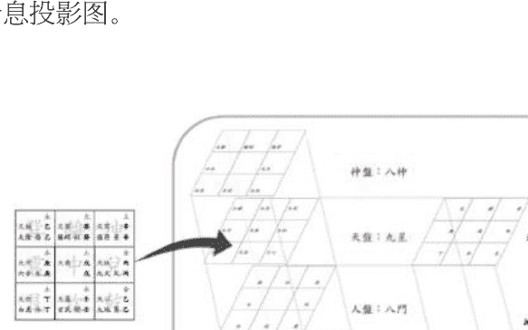

图124: 奇门遁甲造式四层盘，地盘、人盘、天盘、神盘，分别对应人体的身、心、脑、灵。

其大无外，其小无内，奇门遁甲不仅可以模拟整个宇宙时空，它还可以对应人体这个小宇宙，人体不仅有九宫，也分天地人神四层盘：

- 神盘　灵　觉察与自控三界之外
- 天盘　脑　性格与想法第三界
- 人盘　心　情绪与感受第二界
- 地盘　身　作息与行为第一界

举人体天盘九宫为例，道家把人脑分为九宫，这是修炼的秘密，在奇门遁甲中，天盘象征人的脑，人脑有九宫、称之为泥丸九宫，泥丸就是上丹田，又叫松果体。

> 《黄庭内景经·至道章》说：“房有一寸，故脑有九宫。而此九宫之部位名称：两眉间却入一寸为明堂宫，却入二寸为洞房宫，却入三寸为丹田宫，也名泥丸宫，却入四寸为流珠宫，却入五寸为玉帝宫。明堂上一寸为天庭宫，洞房上一寸为极真宫。丹田上一寸为玄丹宫，流珠上一寸为太皇宫。通过一定的功夫修炼，大脑九宫的深层功能会得到激发。”

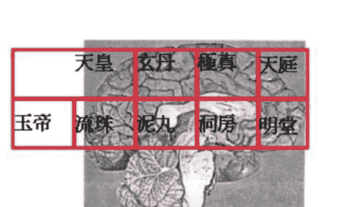

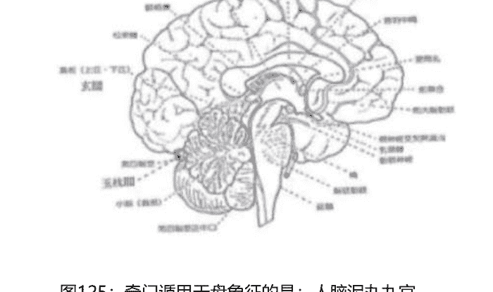

图125：奇门遁甲天盘象征的是：人脑泥丸九宫。

我们可以用奇门盘来象征人体，进行人体的修炼，追求人神一体，天人合一的境界。当我们放下了自己的私心杂念，超出了自我欲望的牢笼，忘记了自己的想法念头，进入物我两忘的状态，就能沟通宇宙中的能量和信息，达到“宇宙在我心中，我在宇宙中”，我与宇宙同体同源，息息相通，和宇宙万物共振、共鸣，能量、讯息交流。

当我们处于这种状态，所有的秘法都可以不要，所有的理论都可以忘记。大道至简，大道无形，大道无法。这是一种大道自然，返璞归真的高级状态。在这种清净无为，忘我无私，天人合一，人神一体的状态，不求讯息，讯息自来，不求功能，功能自现，便可“足不出户，知天下事”。

但是，“我们要如何放下自己的私心杂念，超出自我欲望的牢笼，忘记自己的想法念头呢？”或者反过来问：“我们为何放不下自己的私心杂念，超不出自我欲望的牢笼，忘不了自己的想法念头呢？”

###### 人体生命机器人

人的身体上的管理机制，可以分成三个，第一个是主管我们的“生理本能”；第二个是主管我们的“情绪控制”；第三个是主管我们的“思考认知”。这三个管理机制或能量中心，在道家又称为三个丹田，分别为下丹田、中丹田、上丹田。

这三个管理机制，随着时空的演化，为了适应生存环境而逐一演化发展而成，其基本目的只有一个：“让自己活着”。以进化的角度来说，主管“思考认知”的中心最为高级，它是在地球文明里我们人类所独有，也因此让人类在地球上成为万物之灵，成为地球的霸主，占据了统治地位。

这三个管理机制也组成了“我”，因此，所谓的“我”是指什么？就是可再拆分成三个“我”，这三个既独立又协同作战的“我”，其存在的最重要目的，就是确保“我的生存”。而这个我又可称之为“小我”，它具有“保护性”，保护我的生存；它具有“排它性”，当面临生存竞争时，会以自己的生存利益为先，排挤、排除别人。

那是不是具有“思考认知”功能的最高管理中心，他的权力就最大了呢？管“情绪控制”及管“生理本能”的就会听老大的话了吗？嘿嘿，那可不，有没有听过：“将在外，君命有所不受”、“天高皇帝远”、“上有政策，下有对策”？

记得我以前在看“康熙王朝”电视剧时，清顺治十八年，顺治遁入空门。危急之际，孝庄皇太后力挽狂澜，将大病初愈年仅八岁的小康熙玄烨推上龙座，成为康熙皇帝。康熙即位后，鳌拜等权臣威迫有加，连孝庄皇太后也只好含辱。鳌拜亲政开始，康熙改归皇权，权臣竟图谋废君改朝，康熙被迫殊死相争，最终智擒鳌拜，肃清政敌。

不是你地位高，下面的都听你的！在远古时代，为了生存，人类必须借助本能及情绪的力量，面对机会时做出快速的反应，实时享受捕捉到的猎物；同时面临危险感到恐惧时，立即逃跑，才不至于被吃掉、被饿死（急于求成）。为了生存，还要尽量节省能量，像思考这种耗能高的行为，也都会被视为对生存的威胁，会被管“情绪控制”及管“生理本能”的排斥（避难就易、不劳而获）。

因此，就像小熙一样，虽然“思考认知”中心最高级，但比起鳌拜这些辅佐大臣，“情绪控制”及“生理本能”中心，他的力量实在太弱小了，而且：

- “思考认知”中心是二百五十万年前才开始出现，而“情绪控制”及“生理本能”中心至少有两亿年以上的进化了；小熙才八岁，鳌拜这些老臣在他爷爷时就已经在带兵打仗了。
- “情绪控制”及“生理本能”中心掌管着潜意识和生理系统，运算速度可达一秒一千一百万次；而“思考认知”中心最快运行速度为一秒四十次，两者速度差了快三十万倍，这也是我上课常讲的，“潜意识”是“意识”力量的三十万倍，简直是小巫见大巫！
- “思考认知”中心虽然较有远见，善于权衡判断，能延迟享受以获得更大的满足，但他的力量实在是太小太弱了，“情绪控制”及“生理本能”可以不接受“思考认知”的管控，并在不告知它的情况之下，直接决定及行动。

我们的大脑里大约有八百六十亿个神经元细胞，受“情绪控制”及“生理本能”中心管控的就有将近八成，因此他们对大脑的掌控力更强，而且离心脏更近，一旦紧急状况出现，可以优先得到供血。这也是为什么我们当处于极度的紧张时，大脑会缺血，感觉一片空白。

“情绪控制”及“生理本能”中心还管理着我们的生理系统及潜意识，时时刻刻调控我们的血液、呼吸、心跳、视觉、听觉。可以说我们生活中大部分的决策，其实来自于“本能”及“情绪”，而非源于“理智”，或是来自于“冲动性”的决定。

“情绪控制”及“生理本能”中心的性质比较像“动物性”，好像小狗在吃饭时，你一抢它的食物，它马上咬你；“思考认知”中心的性质比较像“人性”，会先思考判断，然后再采取适当的行动。虽然进化使得我们人类拥有高级的大脑，但这拥有智慧能思考的大脑才刚具雏形，功能非常简陋阳春，像半成品，还没成熟到足以号令指挥人体这身精密的机器。

这也好像我们才刚从企管学院毕业刚进入职场，是职场新鲜人，距离掌管一家大型的企业还很遥远，更甚者还想对这庞大的组织进行改革重整，你说，这不是要逼死宝宝了吗？想想小康熙，再想想自己。

我们要认清的真相是，虽然我们成为人类，是地球上的万物之灵，但我们只是人类1.0版，非常低阶，还没改造完成，还没进化完成！我们其实只是一个“生命机器人”，身体内有很多很多不同的小程序（程序）掌管着我们身体的功能与想法，而当我们即使有那么一丝丝自由意志出现的时候，虽然下定决心想要彻底改变、想要努力，有很多的想法、梦想要去实现完成，但明明知道，就是做不到，特别想要，但就是得不到！

你现在明白了，这不完全是你的错。因为人类的天性：在欲望上急于求成，在行动上避难就易，这就是人性。

因为这改变、改革的任务以及必须为此所付出的努力、决心、毅力与时间，实不亚于小康熙想改革及创建康熙王朝。现在你也知道了，为什么有成就的人少，大成功的人也很少，能真正改变命运的人也很少，大部分的人都是平凡人，多是选择逆来顺受！

我再告诉你一个更残酷的事实，如果连你那唯一的、仅存的“思考认知”中心也选择放弃了，那就没有翻身改变的机会了！

一个人的性格是怎么形成的？一个人的性格是由先天的性格加上后天的际遇所形成的一种固定的、习惯化的思维方式和行为风格，而性格决定选择，选择决定了命运！面对相同的处境，不同的人会选择不同的方式应对，选择及应对方式的不同，除了决定了他未来面对相同事情及处境的发展的不同，也同时造就、强化及巩固了这个人未来面对相同情境时，他会做如何的选择及应对！

马戏团中通常最受欢迎的大明星，是他们的大象，巡回到每个地方总是吸引无数的孩童注意，有一位少年为了想更接近地看看大象，特意跑到马戏团的后台，最后，他很惊讶地发现那几头大象只是被普通的绳子绑在一根木头上而已。

> 先生，为什么你们只用一条绳子就能制伏这么巨大的象，难道不怕它们用力一拉便能逃走吗？

> 你不了解吧！这些象是我们从小养大的，当它还小时，我们用大铁链把它锁着，每次它想逃走，只要一拉便痛得动弹不得，久而久之，只要它想到用力拉就有痛的经验后，最后便放弃逃跑。现在，我们虽然只用一条绳子绑着它，但它也不再相信自己是可以逃走的。

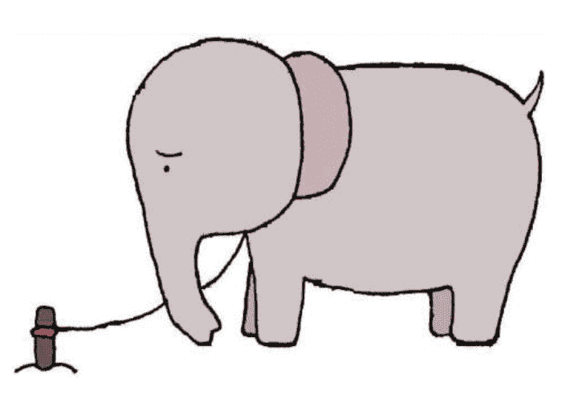

## 图126：一条绳子为何能轻易拴住一头象？你被经验绑住了吗？

现在你就像是那头大象，曾经你也是小象，你曾尝试过挣脱，你也曾经有过梦想，但当你一次又一次的努力、尝试及为了改变而努力，最后却一次又一次的失败了，你内心的信念、认知形成了，巩固强化了，那条无形的绳子紧紧地限制了你、绑住了你，让你不敢对自由的追求再抱持着任何的希望了。你那心中的小火几乎已经熄灭了，甚至完全没了！跟那头大象一样，只要每天有吃有喝，能不打我，要我做什么就乖乖地做什么，表演什么就顺从地演什么，因为连你最后的一点可以自由运用的，可以掌握的“思考认知”管理中心，也臣服了生活，也向命运低头了！

江山易改，本性难移，习惯之所以改变不了，是因为它是自我巩固的，越用越强、越强越用！

兵败如山倒，我们成为一个“生命机器人”了！由性格、情绪及本能，全权掌握了我们的人生！更糟的是，我们拥有地球上经过了几亿年才进化出这么高级的大脑，却被我们用来懊悔过去，担忧烦脑未来，搞得现在很烦恼、痛苦、焦虑，生活过得很浑沌、迷茫。面对困境时，最高级的“思考认知”中心被用来“自我解释，找借口”，被用来“担忧明天，懊悔过去，当下在焦虑”！

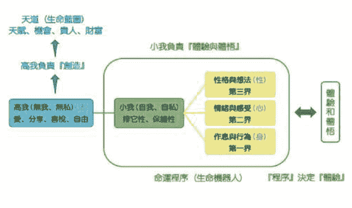

## 图127：我们的命运程序由性格、情绪及本能所掌握，成为了一个生命机器人。

你可以选择这样过生活，那没问题。但是如果换做是你的小孩呢？他还是一头小象，他还有机会呀！

难道我们就要这样放弃了吗？你要当“小象”？还是“小康熙”？

如果你现在是只有八岁的小康熙，面对这种处境，你会怎么选择？你会怎么做？To be or not to be？改变命运及翻转人生不用等下辈子的轮回，不用等重新投胎期望有一个好的八字，改变就从现在开始，你从现在、当下，就有机会改命造运！

但这要怎么做呢？要如何开始呢？这就要有方向、有方法，要有策略，不能再像过去一样，急于求成、从众，心不定、失焦、想同时做很多事！

> 别让你爱的人等太久！

找到自己最热爱、又最擅长的工作！

让自己的改变与成长成为这一生最重要的事业！

我们要打开我们的天赋，拿回自己的力量，活出生命的意义，创造一个快乐、健康、幸福、和谐及丰盛的人生！

#### 第二节

如何努力及改变？觉醒与开悟，蜕变与扬升！

想要改变就必须升维，培养用全局的视角及未来的视角，观察看清整个局势及未来的发展，然后降维分析找出事物运作的底层逻辑与规律，找到正确的方向与目标，专注于学习、加强自己的能力，冷静、有耐心的面对前期缓慢的成长，并坚持到转折点、突破点，在积累的实践过程中遵循“刻意练习”的原则，由舒适区的边缘一点一点往跨出舒适区移动，以扩展自己的能力范围。

##### 讓自己的改變與成長成為這一生最重要的事業！

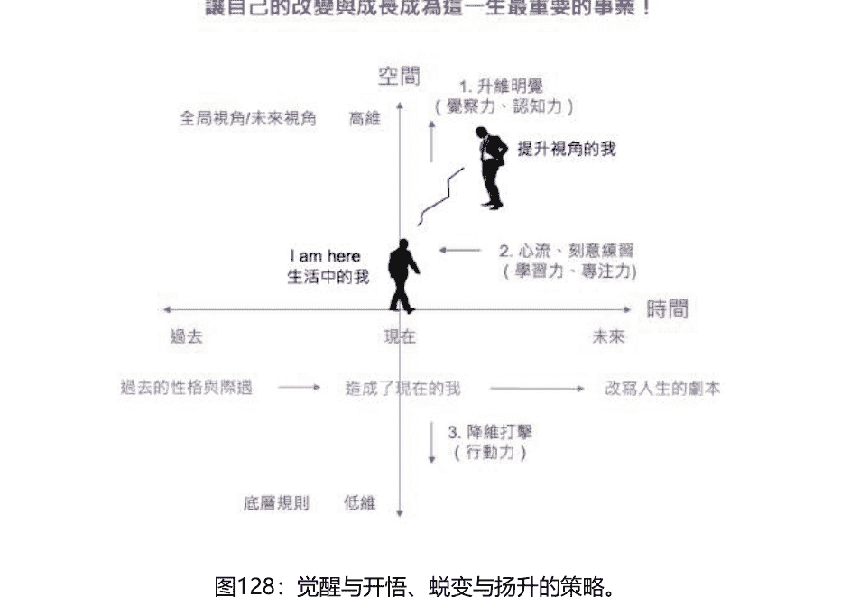

图128：觉醒与开悟、蜕变与扬升的策略。

##### 升维明觉（觉察力、认知力）

想要改变的第一步，也是最重要的一步，就是要“升维”，提升、提高自己的维度！因为当你的维度提高了，视角也就提高了，觉察力及认知力都会大大地改变，会用一种全局的、未来的视角观看你的世界，你的世界也就会变得不同，你的眼界决定你的世界。

想像你是一只蚂蚁，眼前看到一块糖，如果你发现得早，抢得够快，那你可以独吞；但若这块糖在很显眼的地方，很多其他的蚂蚁们也都看到了，你还不是先发现的，甚至更多蚂蚁听到了，还纷纷赶来想分一口糖，你还不一定分得到，那怎么办？这块糖可以是消费者，可以是市场，也可以是众多竞争企业想抢夺的客户，但最后谁可以搬走那块糖呢？（当然“蚂蚁”还好不是“人”，因为它们最后会齐心合力一起努力搬走那块糖。）

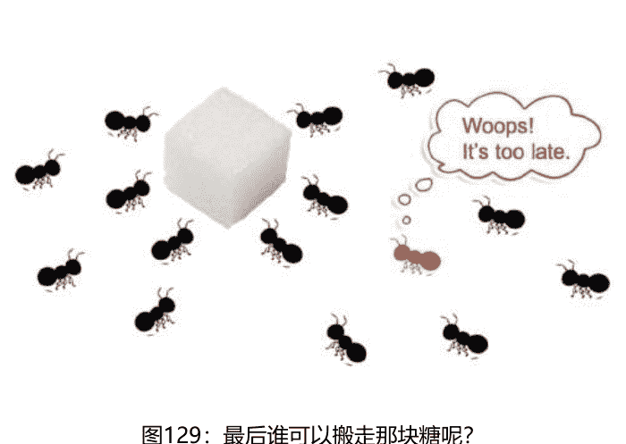

## 图129：最后谁可以搬走那块糖呢？

最近网络上有一个特别流行词叫“内卷”，一般用于形容某个领域内发生了过度的竞争，导致人们进入了互相倾轧、内耗的状态，也是我们过去常讲的“红海”。简而言之，在有限的市场下，过度同质化竞争，导致每个个体都付出更多时间精力，但最后并没有提高产出和所得。

随着自媒体的兴起，近几年来网络已经大幅取代传统媒体，尤其是这几年来随着YouTube观看人数的增加，人人都想当YouTuber！不论是小学生写“我的志愿”或是大学生回答偶像是谁，Youtuber的排名都正在急速窜升当中。

笔者在写稿时，谈话型YouTuber老高的频道刚突破五百万订阅。老高以睡前故事的方式，为老婆小茉讲述幽浮、大洪水、未来预言等都市传说，短短四年内人气狂飙。随着“老高现象”的兴起，继而出现了“马脸姐”、“你可敢信”、“barry看世界”、“文昭思绪飞扬”、“脑洞乌托邦”、“飘飘然飘哥”等等，两年之内出现大量的Youtuber都在讲都市传说，越发感受到越来越多人正投入到一种同质性的激烈竞争当中。你看看，一则阿南德的预言，一个推背图，有多少个Youtuber重复地在讲。这就是在有限的市场下，过度同质化竞争，导致每个个体都付出更多时间精力，但最后并没有提高产出和所得。

而历史会重演，在二〇二〇年，除了YouTube之外，以声音为主轴的网络节目型态“Podcast”（播客）更是异军突起。Podcast与过去的广播节目相当类似，只是把媒介平台换成网络，但却在二〇二〇年成为最受瞩目的自媒体模式，截至二〇二〇年九月，台湾已经有一千三百多档节目，其中光是在二〇二〇年上半年就增加了八百七十档，不少名人如星座专家唐绮阳等人，也都纷纷开设自己的Podcast节目，更占据在排行榜前列。

在一窝蜂盲目的跟风下，大多数的YouTuber视角局限于“都市传说”的题材，你看到了，别人也看到了，而且你还不是第一个看到的，谈的内容又没法跳脱既有的题材及模式，导致全部的人内卷到同一个困境之中。

在河里，我们看到漩涡该怎么办？赶快游开远离它呀，别被漩涡内卷进去呀！但大家为何往内跳呀？因为只看到了漩涡中心的那块“糖”呀，甜滋滋的“糖”呀！

这就是视角维度受限，只能看到眼前的，没法用全局的、未来的视角看事情！明明知道，就是做不到；特别想要，但就是得不到！不是不够努力，而是粥多僧更多，全部的人花了大量的时间精力都在抢食同一块市场，导致一个和尚有水喝，三个和尚没水喝！

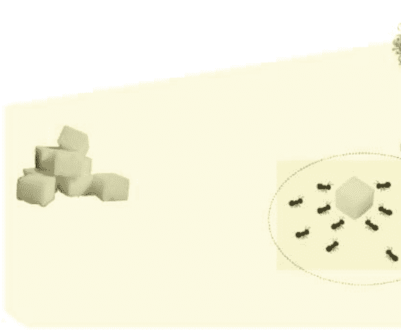

## 图130：“升维”可以提升你的视野，看到其他机会与可能性。

但那该怎么做呢？答案就是“升维”，提升你的视角，用一种全局的视角、未来的视角重新“俯视”整个市场！

在这时候，你就有机会发现其他蚂蚁没有注意、没有看到的，在不远处的地方有“糖”，有别的机会，而且还可能有更多的糖！转身即看见，退后即向前，慢即是快，能舍才能得！

当你陷于一个困境时，为什么无法脱困？因为看不到其他的可能性，为什么看不到其他的可能性？是因为人性，人性使你舍不得、放不下、忘不了、看不见、走不开，是因为你的“本能中心”及“情绪中心”的欲望及需求吸引了你的注意，让你只看到眼前，而不愿移开你的目光。

记得我三十岁时刚进入行销职务，这是我老板所推荐的、我认为最棒的行销书之一：《行销大师法则——永恒不变22诫》，作者是AL RISE & JACK TROUT。它是我进入行销领域真正改变我的第一本书，对我后来的工作及创业产生了很大的帮助！在这本书里，它揭露了市场竞争及市场行销的“底层规则”，尤其是第一条及第二条法则，那更是重中之重，彻底地颠覆了我对行销的认知！

“第一条 ‘领先法则’：指出行销的重点在于创造一个抢先进入的产品类别。说明：与其求你的产品比人家好，不如抢先进入某个市场。领导品牌几乎都是第一个进入潜在顾客脑海的品牌，例如：租车业赫兹、可乐市场的可口可乐。

第二条 ‘类别法则’：指出无法抢先进入某个产品类别，就必须抢先进入另一个新的产品类别。例如：IBM是第一个进入电脑市场者，迪吉多则是第一个进入迷你电脑市场者。”

这两条法则简单用一句话说就是：“不能成为第一，就要创造第一，或是要和竞争者有不同的差异化定位”。

而这条金科玉律的底层认知就是：“行销就是一场消费者‘心智’的战争”（Share of Mind，心智市占率）。

台湾最高的山是什么山？玉山，大家都知道，那第二高的山是什么山呢？大概很多人就不知道了。美国第一任总统是谁呢？是华盛顿，那第二任呢？Youtuber里讲都市传说最有名的是谁呢？老高，那第二有名的呢？第三呢？台湾最有名的小笼包是鼎泰丰，那第二名是谁呢？

人们倾向于只会购买他脑中所认知的第一品牌的产品或服务！但如果你不是第一个进入这个品类市场，或你不是第一名呢？那你又该如何与它竞争，或抢得一席之地？答案就是，我若不能创造一个能抢先进入的产品或服务品类，成为该品类的第一名，那就自己创造一个新的品类，然后抢先进入。

举例来说，如果你要与一个“世界上最好吃的牛肉面”竞争，大多数人已经都知道，而且心中已认定它就是世界上最好吃的牛肉面，那么你就不能强调你是“最好吃的”，因为要改变一个人已有 的既定认定或认知，所花的努力及时间，是要比改变一个人还没有任何认定或认知要多十倍的力量！

所以，定位上就要改成：“我是这条街上最好吃的牛肉面！” 我不是直接硬碰硬跟你“比好吃”，而是跟你比“离家近”。如果你想要吃一碗牛肉面得开一个小时的车程，再花一个小时的排队等叫号，it's ok，没问题；但如果你只是想吃一碗好吃的牛肉面解解馋，那很好，我的牛肉面店就是你最佳的选择。

关键，就是要不同、要区隔、要定位清楚，要在消费者或客户的脑中抢占一个“最”字，最好吃、最近、最便宜、最新、最…… 而高维的视角能让你有清晰的视角（全局视角及未来视角），帮助你看清全局，找到消费者或客户，他们心里底层还没被满足的需求，市场又还没被其他竞争者发现介入，而你是第一个抢先切入的。

举我自身的例子来说，我本是一个外商的高阶主管，跟命理风水圈半点关系都没有，没有任何命理风水的背景。二〇一〇年我离开了美商强生公司（Johnson & Johnson），决定不再回到传统企业里工作了，我开始思考我的未来，想找一个自己最热爱、又最擅长的工作！因为做最热爱的工作，我才会快乐；做最擅长的工作才能有竞争力。在几年的省思及研究过程中（还好没有急于求成），决定投入玄学、命理风水产业（一只小蚂蚁开始升维，转头看向其他的市场）。

我在没有任何的玄学背景与相关的知识经验下，该如何切入这个命理风水产业呢？我用升维的角度及高度观察整个命理风水市场，发现：在台湾学习八字的人大概占百分之廿一，学习紫微斗数的百分之十八，姓名学大约百分之十二，卜卦占卜类的大概占百分之十，手面相的百分之八，风水的百分之八，几乎七成左右都着重在“预测”类，每个类别所从事个案或教学的老师如过江之鲫，而且非常竞争（读者可到书店的书架上看一看就可明白），每类玄学领域好比一群蚂蚁围绕着那块糖，甚至后起之秀还如雨后春笋，前仆后继的投入。

同时，我也观察中国市场（另外一大块、一堆糖）自改革开放以来，在易经玄学市场的发展。结果赫然发现，中国自改革开放以后，首先出现的是卜卦预测，接着是八字命理的热衷，随后兴起了一股奇门遁甲的学习热潮，而奇门遁甲除了自古以来名声很大，具有“预测”的功能之外，更棒的是还有最犀利的、收效快速的“改运”之法。

而台湾却鲜少有人教授“奇门遁甲”，所以我开始研究中国所有奇门遁甲老师的教学内容（几乎所有，真的是几乎所有），二〇一四年除夕，我趁着过年期间在家研究五天，进入心流状态，五天之后出关，我搞懂了奇门遁甲是怎么一回事了，开始编写讲义、收集个案，先私下预教一年（刻意练习），然后一年之后，正式对外公开教学，走入江湖！

所以，我不是因为“会奇门遁甲才教奇门遁甲”，我是因为“奇门遁甲有市场（一大堆糖），我才去研究奇门遁甲，教奇门遁甲！”表面看起来一样，看似幸运，但是是有其底层的逻辑及策略！

那我在哪里教？台湾呀！我跟他们中国的奇门遁甲老师比什么？比“离家近”呀！

再由于我是从高维的视角，俯视所有的奇门派别及教奇门遁甲的老师，我就可以以一种“全局的视角及未来的视角”看清每一位优秀的老师，他们怎么教？有哪些特色的手法？吸引了哪些类型的学生？摸清了“奇门遁甲这门数术”及“奇门遁甲市场”的底层逻辑与规则，更重要的是深刻清楚地知道了每位老师及派别之间的特识别差异，从而明确地定位了我的产品与服务。所以关键在于“俯视”而不是“仰视”，因为“俯视”：

+   - 可以全局的了解有多少主流的、关键的“玩家”（Key Players）。
- 看到彼此之间的差异、缺口（或称之机会点），消费者还没被触及或满足的需求。
- 找到自己的定位及优势点。
- 甚至清楚知道未来可能的发展方向（未来视角）。
- 还可以超前布局，提前规划产品服务，提供未来市场所需。

这是破除“人性的惯性”、“单一视角”、“同质性产品及服务”、“跳脱内卷市场”的核心策略及方法！要把原本“旧有的知见”和“惯性的思维”彻底拿掉、拆掉，转换成升维后的全局视角及未来视角，才有机会翻转人生，改变未来！

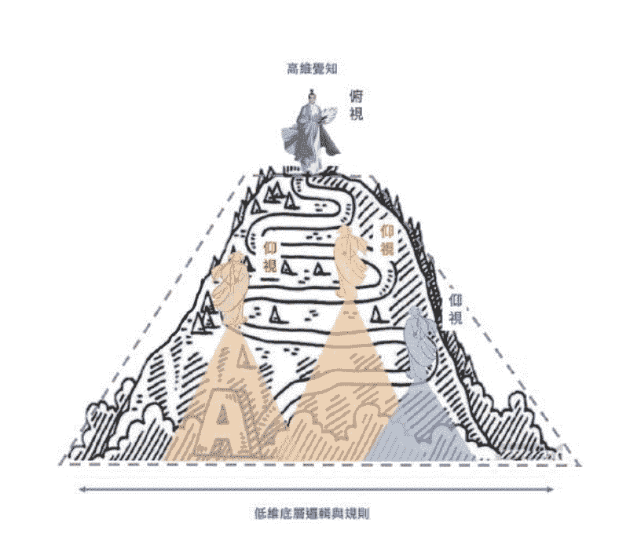

## 图131：俯视可以看清全局，了解彼此之间的差异或缺口（机会点）。

越焦虑、越急于求成，越不想改变及下深的工夫，只会让翻转的时间越拖越久，越没有机会！

如果你用过去十年旧的方法，去过你未来的十年，那你的未来不就变成你的过去了，你还有未来吗？我们如何能用不对的方法得到正确的结果？如何用旧的地图去找到新大陆？又如何用既有的方法去做事，并期望未来会有改变，会有所不同？

子奇老师非常诚挚地公开我这七年来的心得与领悟，期望这对大家能有所帮助，哪怕是只有一点点，那在疫情结束后，我们就可以一起有信心地迎向一个崭新的未来！当然，如果您不认同，或有别的想法，或觉得没什么用，那也OK，因为就是多元的社会，有不同的见解，大家可以彼此比较、交流、学习、成长，社会才会进步，才会有更不一样、更好的未来！

##### 心流、刻意练习（学习力、专注力）

要想改变，第二个关键的步骤就是“刻意练习”，全面改造自我，提升自己的能力（赋能）。与其说是“改变”，不如说是一种“蜕变”！提升自己的什么能力呢？除了上述所提及的能力：升维提升视角的“觉察力”与“认知力”，还有接下来要谈的“学习力”与“专注力”！

《刻意练习》一书的作者安德斯·艾瑞克森（Anders Ericsson）被誉为“研究世界专家的世界专家”，根据他三十年的研究发现，所有领域的“天才”发迹和成长过程，全都可以归纳成“刻意练习”的产物。

“天才与庸才之间的差别不在基因、不在天分，而在刻意练习！”难道我们比别人优秀的那些事情，不就是因为自己比较“聪明”一点吗？努力练习真的可以战胜天赋异禀？

作者说：“我从未见过有人不经长期密集练习就发展出超凡能力。”这些所谓拥有“天赋”的佼佼者们，只是比其他人更善于改善“大脑”和“身体”的适应力，采用正确的方式学习跟训练而已。

如果这又是自己本来最擅长的、又最热爱的工作，那练习的过程，你将会如鱼得水，乐不思蜀，事半功倍，发生惊人的改变！

“刻意练习”的目标并不是“发掘”潜能，而是“打造”潜能，让以前不可能的事情变得可能。而这需要改变现况，也就是脱离舒适圈，并强迫自己的大脑和身体去适应新的行为和技能。

“刻意练习”具体的方法是三个步骤：设定明确目标、高度专注、意见反馈。

这套方法的顺序是：决定要达成的结果，并且“拆解”这项技能，把技能学到可以自我纠正的程度，移除任何会对练习造成障碍的事情，反复练习跟改善累积到二十个小时。

而“拆解”的核心关键是：慢就是快！要比你平时所看到的至少要再放慢十倍，甚至一百倍！这是对治“急于求成”的人性弱点，对症下药最重要的一帖良方。

太极拳大师郑曼青并非传统的武人，他有“五绝老人”的称誉，五绝所指的是诗、书、画、中医和后来所创立的“郑子太极拳”等五种绝艺。在他收其中一位入室弟子时，曾要求该名弟子于半夜来找他，弟子于室外久候多时之后，郑曼青的房门突然打开，开口慢慢吐出几个字：“太极拳的心法在于：‘慢就是快’，‘拆开来练’。”笔者无意中得悉这句话，才能在短时间内突破我太极拳的瓶颈，领悟太极拳劲的奥义，功夫大为精进！这与“刻意练习”一书中所强调的观念不谋而合。

“刻意练习”不仅适用于技能的训练，同样也适用于行为的改变、人际关系的改善，事业、感情、家庭关系、金钱、健康的大幅提升，所有皆一体适用！

> > 成就卓越需要的是努力、有计划、难度渐增的刻意练习。

###### 1. 设定明确的目标

一旦确认自己对这件事抱持兴趣，就往前设定更明确的目标，最好是有十足的挑战性。很多人有运动的习惯，例如练习长跑时，当身体习惯了十公里的距离，就设定更高目标在十五公里，又或者培养出阅读习惯之后，就设定每年要读十二本书。

###### 2. 高度专注

笔者在教授奇门遁甲时，会一再反复强调，心要定、心要专、不要想太多，大道至简，简单就是硬道理，心乱盘就乱，奇门遁甲本来是很简单的，是人心不定，人心乱，人心舍不得、放不下、忘不了，奇门才学得慢。

作者提到，无论是目标练习或者刻意练习，都必须投入百分之百的“专注”。投入练习的时间必须先重“质”再重“量”，要尽可能排除一切会致使分心的事情。要让练习发挥百分百效用的方法，就是在练习时段里只专注做“一件事”。

换句话说，在练习或做事时，要让自己进入一种近似“开悟”、“心流”的状态！

“心流”，是一个人全神贯注于某件事而浑然忘我的境界。像笔者现在写书，头脑清明、文思泉涌，就是让自己先进入一种“心流”的状态！

《心流：高手都在研究的最优体验心理学》的作者米哈里·契克森米哈伊（Mihaly Csikszentmihalyi），在四十年前，他观察到超过需求门槛以上的物质条件，再多也不会让人感到快乐。于是，他开始研究拥有创造力或卓越表现的人们，像是艺术家、科学家、运动员等，试图理解是什么驱使他们不以获取名声或财富为目的，而为生命意义与价值感行动。

研究中发现，当他们在从事为人称颂的事务时，都进入了另一种现实，一种有别于日常活动的精神状态，在这种状态中，时间感、存在感皆仿佛暂时消失了，人们专注并从中获得喜悦与满足感，如同进入了一种“自动运转”的模式中。这种体验像是自动流发而来，故称之为“心流”。

在心流中，人们拥有最佳的内在感受。专注，让他暂时忘却其他事情，借以创建意识秩序，自身技能与行动契机得以互相配合；而努力克服挑战，更往往是充满乐趣之刻。

认识意识的运作，并学会驾驭之；控制经验反应在大脑里的信息，进而决定自我人生的模样；最终结合所有经验，打造一个有意义的模式，让一个人可以驾驭生命，并感受到它的意义。

最美好的幸福时刻，往往发生在一个人有意地将身体或心智能力发挥到极限，进而完成某件具有难度或有价值之事的时候；而真正能够满足人心的，是对自己的生命真实感到满意。最优体验需要个人的努力与创造力，以及随时随地掌控意识的能力。让更多日常生活进入“心流”，你将拥有更快乐的人生。

+   所以，人生有三件重要的事：
* 跟自己喜欢的人
* 做自己喜欢的事
* 跟对老师、跟对人

“找到自己最热爱、又最擅长的工作”是进入“心流”状态最快速、最容易的方法。

###### 3. 寻求意见反馈

重复同一件事，又不知道是否做得正确，很可能得不到正确的结果。重复的目的在发现自己的弱点，并聚焦加强改善弱点，直到找出最佳策略为止。每次练习都要找出自己哪里不足，透过“回馈”来寻求改善的方向，订定改善计划并持续执行。

最好的方式是找教练或老师，监测自己的练习状态并给予实时回馈。次好的方式则是找到最佳范本进行模仿和重现，最佳典范（Best Practice）或好榜样（Role Model），在自己与典范或榜样的差异之间寻求回馈并改善。

任何没有“回馈”的练习，都可能导致事倍功半或偏离了方向！

而且实时的、持续的正向回馈，能激发你强大的学习力及行动力，使得学习过程变得快乐、有趣。因为人类的“情绪控制”及“生理本能”中心，它们超强的欲望及情绪能量是非常珍贵的行动力来源，如果能够让它们感受到学习的乐趣与成就感，它们会展现强大的行动力，让自己像沉迷于游戏一样沉迷于学习。

重点要把“学习”看成像玩打怪闯关的手机游戏一般，当破关升级获取回馈时，驱动“情绪控制”及“生理本能”中心去“玩、再玩、继续玩”，而不是一味的努力坚持，让“思考认知”中心苦苦地去“学、再学、继续学”，要用“玩”的心态取代“学习”。

这里，我摘录一篇网络上的文章给读者们做参考，文章的作者自己回顾自己如何用“刻意练习”的方式学习国标舞的过程（Waki瓦基更新于2022-04-18）：

> “大四时加入社团，半年内成为副教学，一年内跟资深舞者同台演出，出社会后常驻公司社团教学长。陡峭且快速的学习曲线，让我常被称赞有跳舞的‘天赋’，但拆解自己的学舞过程后，发现跟天赋没什么关系，重点在于刻意的练习。”

> 曾经，身为内向者的我，从不认为自己是块‘跳舞的料’。自有记忆以来，跳舞跟肢体不协调几乎是画上等号。那种在舞台上展露笑容、摆动肢体的事情，光想就令人浑身不对劲。

> 我之所以对国标舞产生兴趣，是受到真人真事改编电影‘独领风潮’的启蒙。主角皮耶·杜兰自愿到纽约公立学校，指导一群留校察看的问题学生国标舞。当他被学生的家长们质疑，为何要浪费课后辅导的时间在这种舞蹈上面，而非指导学业？他答道：

> > 如果你的女儿相信我的带领，也代表她相信自己。如果你十六岁的女儿既坚强又有自信，她怎么可能随便让个白痴搞大她的肚子？如果你的儿子学会触摸一个女孩的时候带着尊敬，那么在他一生当中又会如何对待其他的女人？

就是这段话，让我义无反顾地踏上学习国标舞这条路。对我来说：国标舞就是一门探究人与人之间沟通与尊重的艺术。我的学舞方式，跟书中医界外科之父威廉·豪斯泰德的法则很像：看一次，做一次，教一次（See one, do one, teach one.）。

###### 看一次

正式参加社团前，为了能比较快进入状况，我在网络上不停欣赏过去十年，国际顶尖选手的比赛影片。透过反复地观摩和欣赏，大致掌握了国标舞的情境跟感觉。虽然肢体还没开始学习，但大脑已经植入了这种舞蹈的印象。

加入社团后的课堂之余，特别去找国际Top 3选手的基本步教学影片，把课堂上老师教过的步子，都透过影片再重现一次，自己分解每个步子该怎么运用身体。透过影片的记忆，把许多基本动作的模样烙印在脑中。

###### 做一次

由于自己是从零学起，在课堂上不熟练的部分，得额外花时间找镜子继续练习。我尽可能地把自己在镜中的动作，做到跟脑中影片的模样一致。不停地模仿，不停地尝试。

课堂上只要有空档，就缠着学长姐们问东问西。这部分是书中的意见反馈，透过别人对自己的回馈，快速改进不足的地方，走到正确的修正方向。

###### 教一次

透过影片和练习的累积，渐渐地熟练不同的舞步。到了这个阶段，我把懂的部分转化成自己的语言，主动去教导还不熟练的同学。偶尔还会被问到很难的问题，也激发我再尝试新教法或者改变自己跳舞方式。

在教学的过程中，建构出自己运用肌肉的逻辑系统，不断修正跟提升技巧。很深刻的感触是，当你可以教别人的时候，才代表自己真的懂了。因此，教学也成了我乐此不疲的事情。

虽然从不以职业舞者为目标，但长年累月下来，在舞技上的持续进步，以及从舞蹈上实践的自我探索，让我到现在仍然保持热忱，继续维持跳舞的习惯。

> > 如果你不把自己推出舒适圈，你永远不会进步。

专注于学习、加强自己的能力，冷静、有耐心地面对前期缓慢的成长，并坚持到转折点、突破点，在积累的实践过程中遵循“刻意练习”的原则，由舒适区的边缘一点一点往跨出舒适区移动，以扩展自己的能力范围。

##### 降维打击（行动力）

最后补充一个要点，想要成长及改变，除了学习，还需要学习之后的思考，思考之后的行动，行动之后的改变更加重要，如果不能真正的发生改变，而且关注改变量，那么投入再多表层的学习量也是事倍功半。所以要发生真正的改变是：改变量＜行动量 ＜思考量 ＜学习量。

行动需要耐心、坚持与毅力，从长远的角度来看，毅力不是耐心与坚持带来的结果，而是一种认知，一种具有长远目光与认知的结果，不是不享受，只是延迟享受，享受因长期付出所得到的更大、更甜美的果实。

> > 辛苦一阵子，快乐一辈子！

> > 一千个冬天，换来一万个春天！

#### 第三节

##### 觉醒与开悟的七个层次

当你开始觉醒并下定决心，运用上面所述的观念及方法，你将渐次进入开悟的七个阶段。

决定一个人命运的不是性格也不是努力，而是一个人的心智。心智才是拉开我们人与人之间距离的核心观念，你如果想改变命运，那就一定要从提升心智开始。

如何开始心智的提升呢？分为以下七个阶段，你可以看看现在自己处于哪个阶段：

**第一阶段**，你对自己的言行毫无觉察，一切行为完全依附本能，这个阶段我们把它叫做动物本能阶段，对自己完全不自知，俗话说就是说话办事不过脑子（由“生理本能”中心掌控）。

**第二阶段**，你开始关注自己行为背后的原因，会思考自己为什么会这么说，为什么会这么做？凡事懂得思考，我们把这个阶段叫自我反思阶段。处在这个阶段的人呢，他不会再抱怨外在的人和事，而开始全方位的反思。当一个人学会反思时，他将步入一个伟大的开始（进入觉察与反思，由高我的视角反观自己）。

**第三阶段**，逐渐接纳自己，减少内耗。心态趋于平和，稳定自我与本我没有对抗，我们管他叫做掌控情绪阶段。这个阶段的人基本不会由情绪控制，自己会变得非常理性，一些外界的干扰评价嘲笑讽刺都不会对他产生任何的影响，他只专注做好自己（掌控“情绪控制”中心）。

**第四阶段**，经过长期的自我觉察和自我反思以后，行动力开始越来越强，加上时间管理和心态，管理会变得越来越自律，由大脑意识来控制行为，异常的专注；而在行动时，会有行动来验证他的思想，执行力超强，我们把这个阶段叫知行合一（“思考认知”中心、“情绪控制”中心、“生理本能”中心，三个中心完美平衡，和谐的同步运作）。

**第五阶段**，进入极致专注的状态，对要达成的目标和结果进入完全的疯狂痴迷状态，我们把这个阶段叫专注忘我。进入这个阶段的人呢，会迸发出超强的领袖智慧和魅力（进入“心流状态”）。

**第六阶段**，生命力和创造力逐渐增强。内心呢，会不断涌现出慈悲，这个阶段我们称之为“利他之心”涌现。进入这个阶段的人呢，开始真正明白诸恶莫作、众善奉行，利众者众人利之，身边的一切资源呢，都将会源源不断地向他靠拢（究竟利他，宇宙的讯息与能量源源不绝流入你体内，开始进入与道合一、天人合一阶段）。

**第七阶段**，最后一个阶段，我们称之为开悟觉醒。到了这个阶段的人，他会找到他自己人生的使命和目标，然后专注恒久，为之奋斗一生。我们把这个阶段的人呢，叫找到自己，他也真正知道了，我是谁，明白了我从哪里来，想好了要到哪里去（遇见真正的自己，开悟）。

七个阶段讲完了，自我觉察、自我反思、掌控情绪、知行合一、专注忘我、无我利他、找到自己。

这一段话，建议各位读者反复多看几遍，好好地领悟一下，期望所有读者都能把自己的改变与成长，成为这一生最重要的事业，打开自己的天赋，拿回自己的力量，活出生命的意义，创造一个快乐、健康、幸福、和谐及丰盛的人生！

我们所有的努力及改变，都是在让我们比一般人有更清晰的视角，有更好的身体去驾驭和活出快乐、健康、幸福、和谐及丰盛！

人最大的运气，不是捡到钱，而是某天你遇到一个人，他打破了你原来的思维，提高了你的认知，进而提升了你的境界，带你走上更高的平台，这就是你人生的贵人。

## 附录

若对于奇门有兴趣，想更进一步学习奇门遁甲，子奇老师目前提供的奇门课程系列有二大类：“九宫奇门”及“阴盘奇门”共五套课程。

### 1. “九宫奇门”预测学

针对没有任何东方命理玄学基础的奇门入门课程，入手简单、一眼立判。

“九宫奇门—预测学”是史上最简单、最易入手的预测术，如果您想快速地学会一个可以帮您做决定、判断事情吉凶成败、预测未来发展的好方法，子奇老师所开发的“九宫奇门—预测学”课程，完整而有系统的教学，绝对是您的最佳选择。

+   - “九宫奇门—预测学”是九宫奇门系列课程的首开篇（预测学、数字学、开运学等等）。以“单宫占卜”为核心基础，专门针对没有任何东方命理玄学基础的朋友所设计的奇门遁甲预测术，其最大特色是：简单、犀利、快速，吉凶成败一眼立判、论断准确。
- 学会了“九宫奇门—预测学”，终身可以帮助自己、家人与亲朋好友，做为预测未来与决策运用的最佳预测占卜工具，以收趋吉避凶的效果。

每期还会加码释出命理风水师不外传的绝技，奇门金口诀、奇门演卦、奇门透易等等。一个奇门的单宫，就能断得比八字多，却比八字简单易学，从一个单宫就可以像八字或紫微斗数论命，可以看出一个人的个性、能力、事业、财运、健康、疾病、住家环境、婚姻感情、儿女与父母的关系，还有流年及大运等等。“九宫奇门预测学”能预测也能论命，简单入手，威力强大。

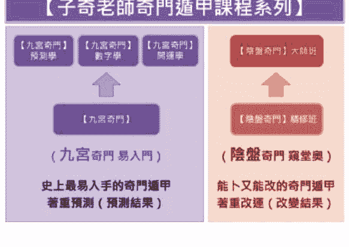

图132：子奇老师奇门遁甲课程系列。

#### “课程内容单元” ：

+   - 单元01 奇门单宫占三步骤
- 单元02 奇门五大符号类别介绍
- 单元03 符号精解·八卦九宫
- 单元04 符号精解·八门、九星
- 单元05 符号精解·八神、十天干
- 单元06 奇门单宫高阶段法（诸多不传密法释出）

### 2. “九宫奇门” 数字学

九宫奇门手机号，针对没有任何东方命理玄学基础的奇门入门课程。

你知道每个人的手机号码中都藏着“奇门遁甲”的秘密吗？奇门盘中有八卦九宫、八神九星、八门以及十天干。我们将手机号码转换成一个由奇门符号所组成的宫位！从这串数字中就能看出使用者个性脾气、外型气质等。

最重要的是简单、好学、马上能用！这堂九宫奇门手机号课程“无需任何基础”也能快速学会！欢迎完全不懂命理玄学的新手们！

这门课让你用最快速的方式去判断使用者的性格，想了解奇门遁甲的神奇，不用一开始就进入繁杂的解盘过程！

#### 适合对象：

+   - 纯粹好奇！想了解什么是九宫奇门手机号。
- 有兴趣想要学奇门遁甲，但完全没经验。
- 觉得直接参加阴盘奇门遁甲课程太复杂。
- 学过奇门遁甲，但是想增加熟读奇门符号技巧的学员！
- 希望提升社交话题的业务，想要跟闺蜜聊点新话题的你！
- 热爱学习新事物的你。

### 3. “九宫奇门”开运学

针对没有任何东方命理风水基础的奇门入门课程，奇门遁甲六次元开运术，二〇二三年起开始招生。

“改运也可以很简单！” 只要能掌握六个简易、快速、犀利、有效的方式，就能让你这辈子有个翻身的机会、改变自己的运势、创造自己的幸福人生！

“九宫奇门——开运学”又名“奇门遁甲六次元改运术”。以“奇门遁甲择时空”为核心，由两个重要的要诀：“占地利，得天时”贯穿所有改运术，从六个面向、三个角度（天时、地利、人和），三百六十度全方位改变您的运势，只要掌握“调座位、摆物品、拆东西、走吉方、做动作、炼自身”六个简易、快速、犀利、有效的方式，就能让您这辈子有翻身的机会、改变自己的运势、创造幸福的人生！

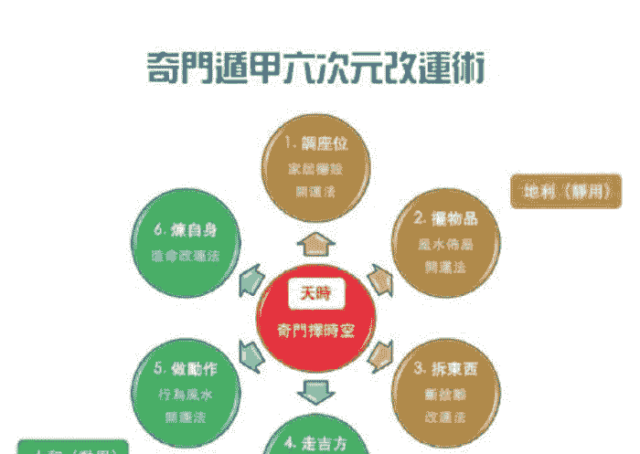

图133：奇门遁甲六次元改运术。

### 4. “阴盘奇门”精修班（初中高三阶课程）

着重在改运化解、布局调理，小白可学。 “阴盘奇门”融合了诸多“阳盘奇门”、“紫微斗术”的技法与心法，主要断法及应用的是传统奇门所用的“满盘（或多宫）”断法。课程由浅入深，从入门到精修，系统化地带领学员掌握阴盘奇门的核心精髓，应用于实际生活中的决策与调理。

在预测占卜方面，“九宫奇门”主要的诉求，在于直接给个吉凶成败的结论，及提供可能的基本原因。但在“阴盘奇门”里，可以了解一件事情的来龙去脉，追踪未来发展变化，可以探究小到一个、或二个人事物之间关系的对待、缘分的变化（我的宫位及他／她的宫位）；大到一个企业的各类商业问题、企业诊断、内外各个单位的利害关系，竞争对手、客户市场、广告销售。

这些问题都可在“阴盘奇门”里得到答案，因为“阴盘奇门”的满盘多宫断法，把“奇门式盘”视为古代打仗用的“沙盘”，使用多个宫位，可以模拟真实世界的人、事、物、或组织单位，犹如战场上的我军、友军、敌军，把这些置于奇门盘里（沙盘里），进行沙盘推演，了解彼此的竞合、利害关系，模拟可能的未来发展，找出机会威胁，小到两个人的恋爱关系，大到商场上的竞争，都可以预测推演！

例如感情问题，“阴盘奇门”可以很细腻、深入地探讨两人彼此之间的“吉凶、得失、对待、过程、进退”等问题。

他／她的心里到底有没有我？
我俩有没有缘分在一起？还是有缘无分？
他／她除了我，还有没有有别的情人？
什么时候，对象会出现？
他／她对我的付出是真心的吗？
我俩到底会不会分手？

在风水布局的改运方面，“阴盘奇门”与“九宫奇门”课程设计里最大的不同，在于“阴盘奇门”可以针对个人目前遭遇处境中所碰到的矛盾、障碍及不利因素一一化解，而这是“九宫奇门”里较少涉及的。

例如，店面生意不好，想提升店面生意，在“九宫奇门”固然可以催财局，但应当先开奇门盘，用“阴盘奇门”的预测诊断，找出生意不好的原因，再对症布局调理，这样才有比较好的效果。

例如客人少（客人的宫位空亡），就布局增加客人；员工离职多、不和睦（调整员工的宫位），就调整员工向心力等。这样矛盾、障碍及不利因素化解了，再佈财局，佈的财局才比较有效果。

否则根本问题没解决，即使佈了财局，要嘛，前面进财，后面漏财，不然就是根本没有财源或财源出问题了，这样问题没解决，即使佈了财局，财局恐不持久或效果差。

在催运布局方面，“阴盘奇门”的布局主要是针对个人时空，调理风水，提升运势（改变奇门局），尤其“阴盘奇门大师班”的进阶技法“移神换位”技法，还可变换宫位的结构、改变宫位间的关系来布局，以达成心中的期望。

结论：“阴盘奇门”着重于多样化的布局运筹调理（改变未来）；“九宫奇门”则着重于多样化的预测占卜（预测未来）。一个着重“改变”，一个着重“预测”。

想学阴盘奇门遁甲，却没有任何命理风水基础的朋友不必担心，因为子奇老师擅长于教“小白”（指白的像一张纸，没有任何命理风水基础的人）。有学员曾说过：“想学奇门遁甲就得跟子奇老师学习，因为子奇老师很会教，如果跟子奇老师学奇门遁甲还学不会，大概也就没什么老师可以教会你了！”

### 5. “阴盘奇门” 大师研究班课程

欲参加大师研究班的学员，必须先上过子奇老师的“阴盘奇门”精修班（初、中、高级班）。

“阴盘奇门”大师研究班课程，是针对给上过子奇老师“阴盘奇门”精修班（初中高三阶课程），对奇门很有兴趣，想更进一步深造，或是想成为一位专业的执业命理风水师的朋友所设计的。

课程里会释出更多高端的预测与化解催运的技法与心法，包含奇门高层断局中的高层技法，秘传占断二十法诀，它是奇门断法的秘中之秘，古代所有修习奇门的人无不视其为至宝的！

- 取用神心法：天机藏于动处，动处有玄机，介绍奇门七动。一局到手，先分动静。无极生太极，一动而分阴阳动静，有动静而后有损盆冲合，最后便有了吉凶祸福。动静是因，损盆冲合是象，吉凶是果。
- 象法心要：介绍象意六法——取象直读、象意定位、交叉取象、寻象应数、象意组合、重复取象，及奇门五大类象系统：奇门符号、四柱、十二长生、六亲类象。
- 秘传占断二十法诀：奇门遁甲因为自古为帝王之学，不让民间老百姓学习，历经几千年，已面目全非，原因在于理法不明，断了传承，导致各门各派，各说各话，南辕北辙，此臧彼否，互相矛盾，众说纷纭，莫衷一是。而“阴盘奇门”大师研究班课程里所教授的“秘传占断二十法诀”，正可以解决上述的问题。对于涉略奇门遁甲多年，很多问题苦思不解的朋友，在这二十法诀里，都可以找到明确的答案。有学员反馈说：“光听这二十法诀，缴的学费就太值得了！”。秘传占断二十法诀，是奇门高层断局中的高层技法，也一直是奇门断法的秘中之秘！全面揭露奇门高层断局二十法诀，动、静、旺、衰、生、克、进、退、冲、合、连、属、刑、空、墓、破、夹、照、伏、反。
- 天地人神化解增运秘法：目前坊间所传奇门遁甲的化解方法，基本上停留在“解四害”，而它只是奇门布局调理中点、线、面里“点”的解法。奇门佈局调理除了“移星换斗”大法，还有佈局最高层次的“九宫运筹”之法、“移神换位”大法以及“行为风水调理大法”。尤其“环境风水＋行为风水＋奇门出行诀”结合使用，处理更为灵活，达到更大效果。

课程详细内容，可上子奇老师官网查询：www.tzchimen.com。

如果想订阅子奇老师所开发的电子版“奇门排盘”或“奇门历”程序，或有兴趣参加奇门遁甲课程的学习，可洽询台北市“心语顾问”：

联络电话：（02）27775716
电子信箱：info@shinyu.tw
LINE官方帐号：https://page.line.me/?accountId=shinyu.tw
