# 于城道人天目奇门


> 圣洁天池水
> 洗涤凡体尘
> 日月同辉照
> 北斗七星临
> 寻时借贵运
> 助我上青云

寻时借运奇门运筹

## 前言

五千年前，西王母派九天玄女授天书给黄帝，帮助他打败蚩尤。黄帝立为天子十九年，令行天下，闻广成子隐居甘肃崆峒山石室之中，得仙成道，便专程前往崆峒请教。广成子送他“自然经”一卷，黄帝便以天书中一部“阴符经”相赠。在“阴符经”中就有“天目奇门”一卷。后被广成子弟子们秘室传承，“阴符经”又分阳盘与阴盘，因传承的弟子不同，阳盘传出较早，阴盘近几年才公布于世。“天目奇门”是阴盘奇门的一种，这“天目奇门”就起缘于天下道数第一山的崆峒山。

佛教讲解脱放下，道教讲实修。凡是道家的东西，都是讲实际运用与修炼的。故“天目奇门”也不例外，从起局入局、布局、调理、化解等都离不开天目功法，为你开启有灵性的第三只眼，从而改变你的人生，走向一个玄妙通灵的世界。

窥名，是本门之术语，窥探天机时用的假名，弟子们在设局、移星、换斗时必会泄天机、犯鬼神，就是窥名也要犯灾折寿，故为每个学员都起窥名后不会再犯灾折寿，无窥名者看此书，学习天目奇必犯灾折寿，凡学员拿出去泄露资料内容者，皆万劫不复！

道教的思想核心，便是顺应世间阴阳秩序，所谓‘替天行道’的成语，便派于道教的最初宗旨，给人化灾解难是我们的本份，但要注意能量交换，替人设局，让其拿出钱财来交换，否则不与设局，道哥们切记。

与世无争，旁观时局，洞察阴阳，移星换斗，让我们去演绎这神话般的人生吧！ 于城道人于苏州玄妙观 2010年3月19日

## 第一章 天目

### 第一节 天目

天目，称为慧眼，又叫天聪，在人的两眉间，人长到7岁以后就开始退化了，因为世代相承一直均未曾使用，根据“用进废退”的规律，再几代人不去开发利用，它会永远地泯灭了。宇宙中的规律，阴永远大于阳，阴是看不到的东西，阳是表面所能看到的东西。看阴的东西，只有用“阴”看，农村叫“过阴”，也就是经过修炼把阳气下降阴气上升，天目才能显像，人阳气旺，有些东西是看不到的，但如果体弱或濒死之前，阳气大衰时，便能看见很多只有用慧眼才能看见的东西。

天目看见的东西并不是透视、隔物看物，而是看气，看见的气共有三种：生气、阴气、煞气。正常人与一般小动物在慧眼中是枯红色，阳气重的人或动物，例如得道高僧，真人以及各种灵兽显火红色或紫色。修仙的畜牲在天目中也会呈桔红色，但暗淡没有光晕，野鬼无恶意白色，恶鬼显灰色。

#### 开慧眼在天目奇门局中有何作用呢？

- 1. 第一. 入局. 在入局中，直接用天目看出宅中的气色，是吉是凶，天目了然，调理化解更加准确。
- 2. 第二. 找到阳宅中的七阳，何谓七阳就是宅中生气的走向，也称脉眼. 如宅中七阳被阻，运气阻滞，宅运不佳，七阳通畅，运气旺盛. 如在七阳中插入生鸡骨即可锁宅，让宅运衰败极点家败人士. 鸡对阳气特别敏感，雄鸡报晓，鸡血鸡骨也是道家在施法最常用的材料. 道家的东西从古传承至今只有效仿，没有发扬，甚至可以说只有失传的东西没有自创。
- 3. 第三. 找到阳宅的七阴，看清龙脉走向，寻龙点穴更胜一等。

七阳七阴是道家风水术中的七关，所谓七关，即云垦关，尚门关，紫晨关，上阳关，天阳关，玉宿关和太游关，分别与北斗七颗星，贪狼，巨门，禄存，文曲廉贞，武曲，破军，相相对应，七关代表着任何一个城市农村或人口集居地的生气流向，生气大体上代表阳气，但比阳气涵盖的范围更广，传统意义的阳气即指人身上的气息，尤其指男人，更尤其指处男，女人身上也有阳气，但结了婚的女人阳气要比处女强很多，这与男女阴阳中和有关，但生气则是所有生物身上的生命气脉走向。在城市，由于建筑混杂以及无线电波等因素干扰，像老鼠、麻雀这类小动物对生气的敏感度已经被完全打乱了，但如果到农村，仔细观察便不难发现，所有邻近的老鼠洞、兔子洞、蚂蚁洞，都会朝着一个方向挖。即使洞口不在一个方向，只要深挖下去，就不难发现其实洞内的走向都一样，都挖向生气流动的方向。找出地阴阳，就是道家阴阳风水的秘旨所在。有缘会与各学员共同分享。

#### 第三．天目功法

- 1. 采自然坐，或莲花坐、盘坐、躺在床上皆可，全身放松，手成大日印（右手在下握拳食指伸直，左手在上握住食指，两食指尖相抵，刚好留一洞隙，此洞隙叫天眼），把天眼对准两眉心，宇宙之暗能量会源源不断注入眉间。
- 2. 口唱‘阿乌摩’，‘乌’发鼻音。
- 3. 口唱时观想眉间有一能量团聚集，好象有神灵在此坐镇。
- 4. 每天观想半小时。
- 5. 不要硬要去观看，无意之中会开天目。
- 6. 天目开后要不断修炼。

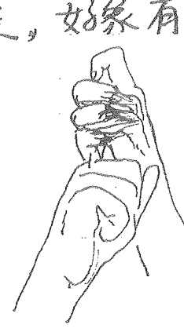

### 第二节. 天目奇门局及其能量来源

毛泽东在他的一首诗中写到：“坐地日行八万里，巡天遥看一千河”。地球自转一天可以运动80/50里，但如果站在北极点和南极点上运转的距离为零，原来地球是围绕着一个轴在转动，称作地轴。北极星就处在地轴的延长线上，地球转动时，地轴始终倾斜着指向北极星。这就是北极星终始在北方不动的秘密。古云“认得北斗，天下好走”，只要能找到北斗星，才能找到北极星，北极星在正北方，为迷失的人点燃导行的希望之光。

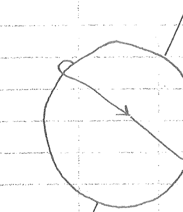

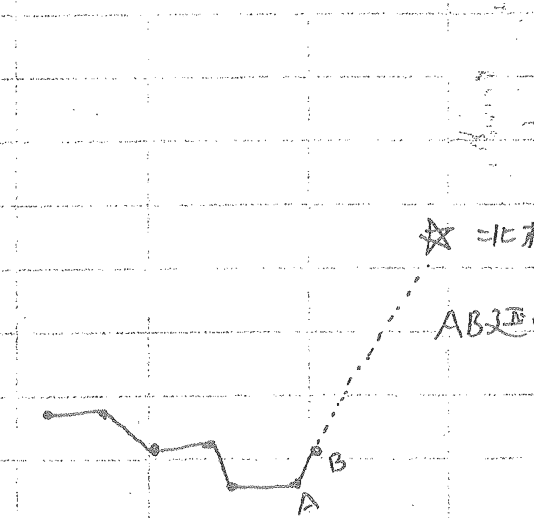

北斗七星围绕着北极星一年四季变化，好像春夏秋冬交替的指挥棒，斗柄指东，天下皆春，斗柄指南，天下皆夏，斗柄指西，天下皆秋，斗柄指北，天下皆冬。地球与北斗七星信息同步，人也与地球信息同步，也就是历代道家重视北斗七星的秘密所在。

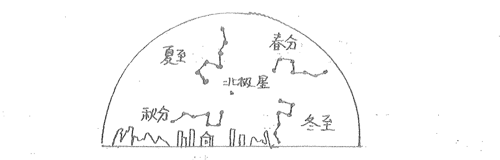

#### 一年四季与北斗七星

以北极星为中宫各个星体就象一个个棋子，就是奇门局它中的星门神干.年月日时是星体变化的产物，重新相加除九，也就是把能量重新平均分化九宫，也就等于把这个时空中的星体重新排列。就象现在照相合影，大领导坐在前排中间，矮个站前面，高个站后面，这样才能清楚清晰地看清每个人的位置面貌。奇门局也就是对所测事情的一个瞬间抓拍的图象。为了能看得更清楚明白，把星门神作了一次重新排列，我们反过来注重思考一下，能把满天星斗移来移去，能把坏的星斗折去，能把好的星斗增加，能做到这一切的只有是神，所以我们起局的人都是神的化身。这是奇门用神的第一条件，没有这个思想与心法，就没有灵验的布局，学员们要牢记，这也是方法之源，要明白老师的一片苦心。

茫茫星空，星体都在不停地运转变动，把相互之间距离保持不变的星分成一群，划分不同区域，以北极星为皇星，坐于中宫天龙星之背。

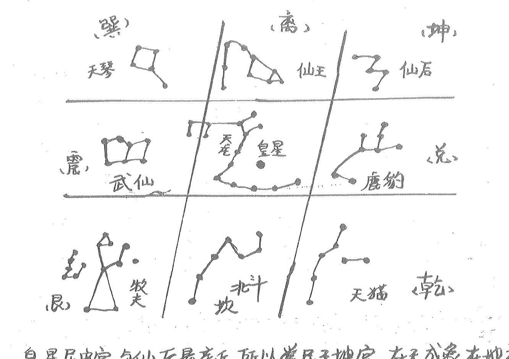

皇星居中宫，与仙后最亲近，所以常居于坤宫，在天成象在地成形。地上的物与天上的星象相对应。人是小宇宙，天是大宇宙，小宇宙和大宇宙同呼吸共脉搏，息息相关。什么象对应什么气，气就是能量，能量足了即可改变周围的空间状态。风水环境随能量变而改变。居住环境中的人也会受到影响。这就是奇门处理风水的奥妙所在。就是应用局中的各种变化，设定风水物品摆放在最佳方位，接收宇宙间特定的能量气场，提升环境的能量层次，使环境中居住者的运气得到有效改善。此图每位学员都要牢记，在大脑中成象，是入局调理大法的总图。
天目奇门入局调理大法，是本门上乘秘法，不易轻传于人故书此图

北斗七星绕北极星而行，一年转一周，每天的位置都会有微小的变化，但幅度非常小。9天中北斗星的变化，就是肉眼能够看出位移幅度的最小限度，所以在天目奇门局中，九天布一局，隔九而行之，一局管九天，这与北斗七星有着不可分割的联系。天目奇门是一门决策学，永不言败不谈吉凶，如果设的局达不到愿景，是我们做的还不够，不是奇门局不难，而是我们处理的还不协调，永不言败是天目奇门的精神所在。

## 第二章. 天目奇门局的基础知识

一、天干地支.天干地支简称地支，它是我国古人用来记录年月日时的符号可在万年历中查出。

十天干：甲 乙 丙 丁 戊 己 庚 辛 壬 癸

十二地支：子 丑 寅 卯 辰 巳 午 未 申 酉 戌 亥

地支与月份对照表：

| 月建 | 正 | 二 | 三 | 四 | 五 | 六 | 七 | 八 | 九 | 十 | 十一 | 十二 |
|------|----|----|----|----|----|----|----|----|----|----|------|------|
| 地支 | 寅 | 卯 | 辰 | 巳 | 午 | 未 | 申 | 酉 | 戌 | 亥 | 子 | 丑 |

地支与小时对照表：

| 时间 | 23-1 | 1-3 | 3-5 | 5-7 | 7-9 | 9-11 | 11-13 | 13-15 | 15-17 | 17-19 | 19-21 | 21-23 |
|------|------|-----|-----|-----|-----|------|-------|-------|-------|-------|-------|-------|
| 地支 | 子 | 丑 | 寅 | 卯 | 辰 | 巳 | 午 | 未 | 申 | 酉 | 戌 | 亥 |

### 二、符号象意：

把宫中符号分成三层：上层精神：八神。中层物质：十天干。下层意识：九星。读符号顺序是：神、干、星、门。神大于一切。

#### 1. 八神讲解：

- ①直符：高贵的、高档的，在调理化解时，直符+癸，可用名贵的酒，如一瓶酒五元，你给他六元，这也算名贵。宫位临直符的人一定是领导、老板、名人。如空亡了，曾经是，现在不是了。物品：贵重的，金、银手饰、钱等。直符又为符咒，可用符咒处理。测疾病，此病名贵如：癌症、难症；测婚姻直符的男人情人一定多，女人性硬婚不顺。又为高高在上。
- ②螣蛇：缠绕、怪异、幻觉、变来变去、吸引眼球。聪明、五光十色，物体：象蛇一样的动植物，如精神病。落宫有螣蛇，把螣蛇代表的东西拉直了就能减轻症状了。
- ③太阴：阴暗、隐私、遮盖、精细、提升。太阴的人都细心、缜密。把学生、当官人调至太阴宫会更上一层楼。如婚姻，女的临太阴，可能是第三者；男的临太阴是喜庆，女的则是哭泣、阴私之事、见不得人的事。
- ④六合：欢乐、祥和、合伙、儿童、人缘好、花草树木。六合还代表两物的结合。六合也有关闭的意思：门窗。测男女之事，六合临年月日时的天干时，可断某年某日在一起，六合十乙是长头发，在测婚时六合遭破坏，婚姻也会遭破坏，头发剪了，妻宫开了。
- ⑤白虎：凶猛、伤人的、争斗、伤灾、官司、疾病、道路、煞气。白虎临官克用神时，灾祸要来。
- ⑥玄武：玄学、神秘的、偷情、宫中有玄武测物连物主也不清楚，测病医生也查不出来，曾经做过风水处理的地方，聪明爱偷的人，忽悠人，见到玄武就是不清楚，黑夜之事。
- ⑦九地：地上、地下、低处、阴暗潮湿、慢、消极不发展，测病则为慢性病，发展缓慢，性格低沉。
- ⑧九天：高大、光明、志远大积极、高升、与飞鸟、测官上升，测病：发展快急病。

#### 2. 九星：

- 1. 天蓬星：水、胆大好色、头发蓬松、尖顶房子、雨具、宽松衣服：酒色，男的基本上都好色，女的喜欢找情人，性欲强。如调理中，把自己调到天蓬宫中，会得到女人缘，性能力极强。但人犯聪明，有智慧，善于冒险。
- 2. 天任星：性格：忠厚老实，任劳任怨，任重道远。形态：拱形，弯腰驼背，胸部丰满。勤奋的人，骨干的人，老实的人. 哈腰，驼背的形态. 木马形建筑，起伏不平的道路，山包土包. 符号不好时，人死板，固执，保守，小气不灵活。
- 3. 天冲星：急性子，雷厉风行，动作快，说干就干，好冲动. 敢打敢冲，高材，天鹅，兔子.
- 4. 天辅星：文雅，有修养，有风度. 辅佐别人，不是一把手，助理之类. 代表教师，策划人，导师，文化人，有教养的人，孔子.
- 5. 天英星：漂亮，风度，英雄人物，有文化，有礼貌，讲文明. 但脾气火爆. 花卉，电子，红色.
- 6. 天芮星：传授知识，交朋好友. 桃源三结义，联合之意. 天芮星有佳道的精神，代表女神，菩萨，医院，学校，药品，书报，指病火土.
- 7. 天柱星：顶天立地，能独挡一面. 毛泽东式的人物. 官有毛病反断. 口舌是非，搞破坏. 在物体上，能发响声的东西. 颈椎，大腿.
- 8. 天心星：圆形，精明机智. 有领导才能. 中心人物，核心人物. 医生医药. 占卜相学之人，心脏果树.

#### 3. 八门：

- 1. 休门：休养休息，休闲，调养，调理，没有活力. 与水相关行业，娱乐场所，运输，美容美发.
- 2. 生门：生长，增长，发展，生意生存，有利润，效益.
- 3. 伤门：损害，受伤，伤心，伤痛，捕捉，赌博，索取，挑逗，寻找目标. 宫内有伤门，不伤别人，也伤自己，有门迫来刑：伤自己，无病伤别人. 带刺的植物. 汽车，驾驶员也是伤.
- 4. 杜门：技术，堵塞，遮掩，关闭，不爱言语.
- 5. 景门：文化、漂亮、火光、血液、红色、太阳。
- 6. 死门：不灵活，固定不变，死神，死板，死心眼，没有活力。
- 7. 惊门：惊恐，口舌是非，响声。
- 8. 开门： (原文此处八门描述不完整，但根据上下文及常识，应补充为“开门”)

#### 4. 十天干象意：

- 甲：第一、有名望、首领。指甲（直符）是当官的、领导、老板。人体：头、指甲、头发。植物：大树。
- 乙：希望弯曲着达成、质软、艺术、文化、柔弱、曲折，艺术品。人体：肝、胆、发、神经。动物：蛇、天鹅、龙、鸟。植物：中草药、花草、小树。
- 丙：希望发着乱子达成，热烈、急速、圆状、性急、太阳、红色。人体：眼、血液、心脏。动物：马、牛、猪。
- 丁：希望一下达成，带刺、快的。人体：眼、牙、心脏、血液、骨刺、男性生殖器。动物：蚊子、蜜蜂、刺猬、蛇、红色。
- 戊：资本、金融、宽厚。人体：鼻、胸、乳房。动物：牛、猪、骆驼。
- 己：策划、创意、拐弯抹角、杂乱、主意。人体：嘴、乳头、肛门、耳垂。动物：蜗牛、貔貅、张嘴的。植物：菊花。
- 庚：阻隔、打斗、魄力、凶恶、技术过硬。动物：凶恶的动物、虎、狮子。
- 辛：革命、错误、问题。人体：牙骨、肺、皮毛、疮、瘩子、粉刺、痘痘。动物：寄在人或动物身上的生物或病毒。
- 壬：流/动、迷茫、迁移、变化、困境、生产。人体：发眼、动脉。植物：水草。动物：水中物。
- 癸：艰难困苦、流动、变动、性生活、鞋。人体：足、私处、静脉、肾、泪、尿。动物：水鸟、鸭、戎鸟。

#### 五、天三门象意

- 1. 登明：害怕、胆怯、隐私、有水的地方、雨具、酒具、茶具、圆状物（亥）
- 2. 河魁：戌、虚无飘渺、欺诈、牢房、陶瓷、坛缸、佛像
- 3. 从魁：西、交易、金融、门窗、钱币、水晶、镜子
- 4. 传送：传递、运动、道路、车、飞机（申）
- 5. 小吉：未 食品、酒食、喜庆、印、信
- 6. 胜光：光亮、华丽、吸人眼球、怀居、炉灶、灯、书画（午）
- 7. 太乙：变化、光、网格、性感迷人、电子、讨债、争斗、娱乐场（巳）
- 8. 天罡：辰 官司、死丧、凶恶、打斗、瓶子、盆、碗、军人
- 9. 太冲：卯、急、快、偷、文化、车、船、冲动的人
- 10. 功曹：寅 欢乐祥和、领导
- 11. 大吉：丑、忠厚、丑陋、孔子、珠宝、首饰、收获
- 12. 神后：子、名人、女人、女神、三可水，和水有关的，水具、书画、艺人

#### 六、地四户象意：

- 1. 建：建立，开创，开始
- 2. 除：消除，除旧迎新
- 3. 满：满意
- 4. 平：摆平，解决，压制
- 5. 定：建立新的体系
- 6. 执：执行
- 7. 破：破费
- 8. 危：权危
- 9. 成：成功
- 10. 收：收拾，收复
- 11. 开：开业，开始
- 12. 闭：关闭

#### 七、太乙十六神：

- 1. 地主：子水. 阳气始生. 万物在下. 物受滋润. 故名地主. 动摇言谈事。
- 2. 阳德：丑土. 阳气渐生. 见龙在田. 二阳用事. 布育万物. 主施恩百物事。
- 3. 和德：艮土，冬尽春来，寒往和生，万物方生，主和集成就事。
- 4. 吕申：寅木，天气始温，万物生长，阳气大申，主运用主军事。
- 5. 商从：卯木，阳气始旺，万物丛生，主发挥事。
- 6. 太阳：辰土，雷行方威，五阳得位，主厄运兵龙事。
- 7. 大昊：巽木，春夏相交，光明发挥，太阳盛极，万物结齐，故名大昊。主申命号令事。
- 8. 大神：阳德已极，火神震威，万物盛茂，主毁折破废事。
- 9. 大威：午火，火炎，阳神，威德乃行，主光明威烈事。
- 10. 天道：未土，二阴用事，阴气渐长，天道不逆，主阴私事。
- 11. 大武：坤土，夏秋气交，炎火退避，金神司权，阴气施扬，杀伤万物，主刑罚事。
- 12. 武德：申金，金气益旺，万物欲死，荠麦将生，主传送迁徙事。
- 13. 太簇：酉金，万物成熟，大有品簇，主更易杀事。
- 14. 阴主：戌土，五阴得位，万物凋零，故名阴主，主厄期兵丧事。
- 15. 阴德：乾金，秋冬气交，阴气退避，阳气将生，以乾为始，主命令事。
- 16. 大义：亥水，天地气周，万物资始，主计谋度干事。

## 第二章 起局

一、排四柱
排四柱在奇门局中非常重要，是宇宙能量的表达，排好四柱要诚心念一句：‘让苍天为我聚能量’，也就是请神，把宇宙之气请到四柱上落到局中。

1、排年柱：以立春为年分界线，立春前为上一年，立春后为本年。
例如：2010年2月5日，农历则为2009年12月22日，已是立春后，则用庚寅，不用己丑。年干支固定的，可在万年历中查出。

2、排月干支：月干支的支以月令为准。

- 寅正月：立春 — 惊蛰
- 卯二月：惊蛰 — 清明
- 辰三月：清明 — 立夏
- 巳四月：立夏 — 芒种
- 午五月：芒种 — 小暑
- 未六月：小暑 — 立秋
- 申七月：立秋 — 白露
- 酉八月：白露 — 寒露
- 戌九月：寒露 — 立冬
- 亥十月：立冬 — 大雪
- 子十一月：大雪 — 小寒
- 丑十二月：小寒 — 立春

每年每月的地支都固定不变的，天干不是固定的，在知道了年干支、月令后可以推算出月干。

| 年\月 | 寅 | 卯 | 辰 | 巳 | 午 | 未 | 申 | 酉 | 戌 | 亥 | 子 | 丑 |
| :--- | :--- | :--- | :--- | :--- | :--- | :--- | :--- | :--- | :--- | :--- | :--- | :--- |
| 甲己 | 丙丁 | 戊己 | 庚辛 | 壬癸 | 甲乙 | 丙丁 | 戊己 | 庚辛 | 壬癸 | 甲乙 | 丙丁 | 戊己 |
| 乙庚 | 戊己 | 庚辛 | 壬癸 | 甲乙 | 丙丁 | 戊己 | 庚辛 | 壬癸 | 甲乙 | 丙丁 | 戊己 | 庚辛 |
| 丙辛 | 庚辛 | 壬癸 | 甲乙 | 丙丁 | 戊己 | 庚辛 | 壬癸 | 甲乙 | 丙丁 | 戊己 | 庚辛 | 壬癸 |
| 丁壬 | 壬癸 | 甲乙 | 丙丁 | 戊己 | 庚辛 | 壬癸 | 甲乙 | 丙丁 | 戊己 | 庚辛 | 壬癸 | 甲乙 |
| 戊癸 | 甲乙 | 丙丁 | 戊己 | 庚辛 | 壬癸 | 甲乙 | 丙丁 | 戊己 | 庚辛 | 壬癸 | 甲乙 | 丙丁 |

如 2009年 12月22日，年干为庚 立春后 正月定 查表 戊寅

三、排日干。日干支从万年历中查得。以子时为分界线，一入子时便是第二天的干支

四、排时干：时支是固定不变的，时干可据日上起时表查出。 如2009年12月22日午时，则是庚寅年戊寅月 丙戌日 甲午时。

| 时\日干 | 甲己 | 乙庚 | 丙辛 | 丁壬 | 戊癸 |
| :--- | :--- | :--- | :--- | :--- | :--- |
| 子 | 甲子 | 丙子 | 戊子 | 庚子 | 壬子 |
| 丑 | 乙丑 | 丁丑 | 己丑 | 辛丑 | 癸丑 |
| 寅 | 丙寅 | 戊寅 | 庚寅 | 壬寅 | 甲寅 |
| 卯 | 丁卯 | 己卯 | 辛卯 | 癸卯 | 乙卯 |
| 辰 | 戊辰 | 庚辰 | 壬辰 | 甲辰 | 丙辰 |
| 巳 | 己巳 | 辛巳 | 癸巳 | 乙巳 | 丁巳 |
| 午 | 庚午 | 壬午 | 甲午 | 丙午 | 戊午 |
| 未 | 辛未 | 癸未 | 乙未 | 丁未 | 己未 |
| 申 | 壬申 | 甲申 | 丙申 | 戊申 | 庚申 |
| 酉 | 癸酉 | 乙酉 | 丁酉 | 己酉 | 辛酉 |
| 戌 | 甲戌 | 丙戌 | 戊戌 | 庚戌 | 壬戌 |
| 亥 | 乙亥 | 丁亥 | 己亥 | 辛亥 | 癸亥 |

二、定局。
- 阳遁：冬至后夏至前的这段时间为阳遁
- 阴遁：夏至后冬至前的这段时间为阴遁。

局数 = 年支序数 + 月数 + 日数 + 时支序数 ÷ 9 之余数

例如：2010年正月1日午时 庚 戊 乙 壬 寅 亥 未 午 年支序数为3. 正月1. 日为1

时为7. (3+1+1+7)÷9=12÷9 --- 3 冬至后为阳三局。

### 三.画九宫格.

+   1. 无极生太极. 2.太极 生两仪 3两仪生四象. 4.四象生八卦. 5.八卦定乾坤. 6.乾坤 生大业. 7.大业趋向吉.

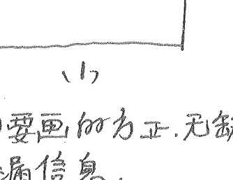

1. (1)要画的方正.无缺， 防漏信息。

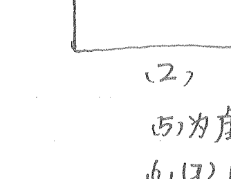

(2)为虚画用手指图住信息.

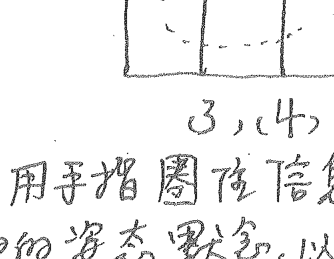

3,(4) 以神的姿态默念,以便输入好的信息.便于调理。

### 四 布地盘三奇六仪：

戊己庚辛壬癸丁丙乙 排列顺序永不变. 是几局戊就落几宫. 阳顺阴逆.按固定的九宫数：

| 4 | 9 | 2 |
| 3 |   | 7 |
| 8 | 1 | 6 |

固定局数.

| 辛 | 乙 | 己壬 |
| 亥 |   | 丁 |
| 丙 | 戊 | 癸 |

阳一局

| 丁 | 己 | 乙癸 |
| 丙 | 癸 | 辛 |
| 庚 | 戊 | 壬 |

阴一局

中宫不写寄坤二宫。

### 五 找句首：以时柱来找。

时 甲乙丙丁戊己庚辛壬癸 戊为句首的时柱.甲戊 柱：子丑寅卯辰巳午未申酉

甲乙丙丁戊己庚辛壬癸 甲戊己，己为句首。 戊亥子丑寅卯辰巳午未

甲乙丙丁戊己庚辛壬癸 甲申庚，庚为句首。 申酉戌亥子丑寅卯辰巳

甲乙丙丁戊己庚辛壬癸 甲午辛，辛为句首 午未申酉戌亥子丑寅卯

甲乙丙丁戊己庚辛壬癸 甲辰壬，壬为句首 辰巳午未申酉戌亥子丑

甲乙丙丁戊己庚辛壬癸 甲寅癸，癸为句首 寅卯辰巳午未申酉戌亥

### 六 定直符直使。

直符是这局中值班的星，直使是值班的门，用神临之，吉凶力量亦大。句首落在地盘哪个宫，那个宫的星和门就是。

| 天辅 杜门 4 | 天英 景门 9 | 天芮 死门 2 |
| 天冲 伤门 3 | 5 | 天柱 惊门 7 |
| 天任 生门 8 | 天蓬 休门 1 | 天心 开门 6 |

如阳一局，甲戌己旬，己落 2宫 天芮星，直使门：死门

如阴一局 甲子旬，戊句首落四宫 天柱，惊门为直符直使

### 七：布天盘三奇六仪和九星八神：

例如 2010年正月戊午时，旬首加在时干上布天盘
干 支 庚 戊 乙 壬
寅 戌 未 午      3+1+1+7=12÷9...3  阳三局  甲戌己

| 己 | 丁 | 乙亥 |
| 戊 |   | 壬 |
| 癸 | 丙 | 辛 |

布地盘（1）

第3宫写戊
4宫写己
顺排（1）

| 丙己 | 癸子 | 戊乙亥 |
| 辛戌 |   | 己壬 |
| 壬癸 | 乙丙 | 丁辛 |

布天盘（2）

旬首己
加在时
干上（壬）
布天盘（2）

旬首己落4宫，则天辅为直符杜门直使，直符（天辅）随着
旬首也加在兑宫（3） 无论阴阳局永远顺转。
记住是转不是排。

| 天蓬₁ | 天任₂ | 天冲₃ |
| 天心₈ |   | 天辅₄ |
| 天柱₇ | 天芮₆ | 天英₅ |

（3）

八神随旬首天盘
宫，阴逆阳顺转。
排局时要在天
地干盘后排
八神，然后九星
八门。因为神大
于一切。

| 玄₆ | 地₇ | 天₈ |
| 白₅ | （阳） | 直符₁ |
| 六₄ | 阴₃ | 蛇₂ |

（4）

+   八神顺序：符蛇阴六白玄地天。

### 八、定八门

旬首地盘在哪宫，那宫的门便是直使门，旬首在巽宫，杜门直使。
把门加在时辰宫，阴逆阳顺排。注意是“排” 甲戌己，戌
时在巽宫，亥时排中五宫，子在乾六宫，丑在兑七宫，寅在艮八
宫，卯在离九宫，辰在坎一宫，巳在坤二宫，午在震三宫，午时起局，
把杜门写在震三宫，顺时针转，无论阴阳皆顺转。

| 景 | 死 | 惊 |
|----|----|----|
| 杜 | ○ | 开 |
| 伤 | 生 | 休 |

| 玄武 蓬 景 | 地 任 丁 死 | 天 冲 乙 惊 |
|------------|------------|------------|
| 白 心 戊 杜 |            | 符 己 壬 开 |
| 六 壬 禽 伤 | 阴 乙 庚 芮 丙 生 | 蛇 丁 辛 休 |

### 九．排隐干

隐干的排列：时干加在值使门上，然后按照天盘或地盘的顺序转一圈。一圈，时干壬加在杜门宫，壬后辛(天干壬在艮，辛在震转过去)排丙。

### 十．排空亡：甲子旬中 戌亥空 即戌亥在乾宫，即乾宫空。

+   - 甲子旬中 戌亥空
- 甲申旬中 午未空
- 甲辰旬中 寅卯空
- 甲戌旬中 申酉空
- 甲午旬中 辰巳空
- 甲寅旬中 子丑空

### 十一．排马星：亥卯未时 马在巳。寅午戌马在申

申子辰 。马在寅，巳酉丑 马在亥。

起局要常练，几天后便熟练。九星八门、引干都要按上边所写的位值。重神、神最上，星在神与干中间，门在景下。调风水时别用电脑起局，要划破气场，用笔起局，调理才灵。

### 十三．门迫，就是八门克所落之宫叫门迫，遇到门也容易起

损减弱。门迫是自己拆自己的台，内讧、窝里反。能量只有5%

| 开惊 | 休 | 伤杜 |
|------|----|------|
| 开惊 |    | 景   |
| 伤杜 | 生死 | 景   |

| 壬癸 | 辛 | 己 |
|-----|----|---|
| 戊  |    |   |
| 庚  |    |   |

| 辛壬 |    | 甲癸 |
|------|----|------|
|      |    |      |
| 丁庚 |    | 乙戊 |

十四: 击刑. 就是十干与所落之宫构成三刑. 别扭. 拧劲. 力量减 5%. 受刑. 难受. 伤害.

十五: 入墓. 百分之八十失去能量. 入库了. 不用了. 发挥不了能量了. 如对宫冲起来, 能量则会发挥出来, 把四刑人, 对手调入墓, 则四刑人会死跟著你, 对手斗不过你。

十六 转宫: 如宫中空亡了, 伏吟了. 空亡则事情变了, 转化了, 空亡之后, 只存在20%的信息, 转移宫有80%的信息, 则要转宫.

下面有上中下三盘: 当一个人问预测师: 当面问, 人在面前, 往深处挖, 由中间盘挖到下一个盘, 如用神落坎宫空亡, 则看坤宫, 当通过电话问不在当面则是虚象是月亮反射的太阳之光是虚的, 要上飘看上盘. 如落坎空亡转兑7宫. 当面问别人的事, 别人不在面前, 也要上飘.

研究3D的学员可用此图得到启发

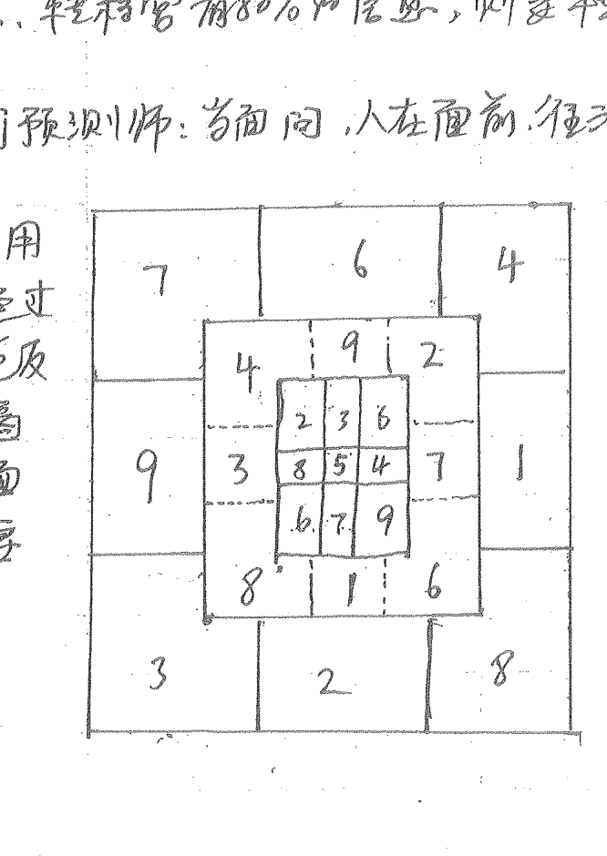

# 第五章、取用神与三才用法

## 一、取用神

天目奇门取用神要求从四柱上取用，四柱是总纲，用神在纲上处理风水比较灵验，离开了四纲，处理风水能另会低，学员们要切记，取用神按空间论，从四个层次中定下来，然后一一预测。

```
庚 戊 乙 壬
寅 寅 未 午
```

男当面问，日干乙是问测人，月干戊为平辈异性，己为平辈同性。己也为预测师<男>，年干庚为母亲，取合干乙为父亲，时干壬与乙相异为女儿，癸则为儿子或晚辈同性。大家在例子中慢慢分清楚。

#### 取用神的四个层次：

+   - 四柱为第一层次
- 宫位为第二层次
- 地盘为第三层次
- 六亲为第四层次

## 二、三才心法：

三才即天地人，天地人代表了世界上一切事物。

| 戊丁 | 乙庚 | 辛壬癸 |
| 壬癸癸 |  | 己戊 |
| 庚己 | 丁辛 | 癸乙 |

如用神为庚、三才定位

+   - **乙 天**: 乙为头为头发、庚克之、断脱发。乙为人的财、脱发后财运大落。什么原因套治了脱发、己生庚、己为地
- **庚 人**: 庚为人、是地风水助庚克了乙、无论问何事、万举
- **己 地**: 一反三、快速断之。

## 三、用神运行：

凡外出求财，少观动后所去之地是否适宜。看地盘干到天盘干运动过程的生克情况。如例：地干庚在离为火，行至天盘庚艮为土，行至泄地，少为失财。求测后告诉其人结果，但其人去还是不去。一看十二生落宫状态是进行气，还是退气，进行少干，退气必休。如例：庚在午为沐浴，行至墓绝为退气故不去了。死墓绝胎养沐浴衰病为弱。长生冠带临官帝旺为旺。弱到旺为进气，旺到弱为退气。

## 四、天气与地气

‘气’这个字的含义，在中国的文化中代表的很多。气是一种看不到，确实存在在的一个东西，它是宇宙能量核心的东西。气的能量是大的惊人，秋天的气一到草木就凋零了，春天的气一到万物就开始生长。气的这种力量是人力所不能及的，我们人只能来用它，不能来抵抗它。

天有天之气，地有地之气，在用于人生命运中，天气就是人生的机遇方面的能量，也就是天时，地气就是人生所在位置方面的能量，也就是地利。天地之气平衡了就会成功，一个人得到天气就是有了机会，而无地气则是有机会无能力，反之则有

能力而无机会，在现实生活中比比皆是，也在工作招聘等门远酬中会用到。

地气：是用神落宫十二长生的表现形式，是能力，位置内环境。 长生：财源情况，新生事物。

+   - 沐浴：情欲、败落
- 冠带：劳动、力气
- 临官：工作、职务、女人之丈夫
- 帝旺：比赛、争夺、顶点
- 衰：缺点、退处
- 病：病伤
- 死：终结
- 墓：隐藏、暗昧不明
- 绝：绝断之事
- 胎：孕育
- 养：培育、计划

天气：用神得令的旺衰，是外环境，机会。

得令以所落宫的时令来论、不以坐克来论、如坐门来讲、现在是秋天，落6、7（兑乾）金宫为旺，落3、4木宫为死。在取方向上，所去东方3、4木宫，为死。

空亡：十天干是天将在巡逻十二地支十二个地方，自然总有2个地方空出来。10个天将在按着规律在换岗，每个换出空的地方都在变换。这个地方，如此难到此是好，用于成事则空喜一场。空亡实则是天空地土，天空是有实力无机会，地亡是有机会而无实力。用神在空亡宫。天盘为天空，地盘为地土。

## 第六章 疾病

### 第一节.疾病象意

健康对人类来说是最重要的，对疾病类象预测调理

+   共分五种方法：一是拆移。二是入局意念调理。三是打开天目能男化解。四是山向调理。五是法术调理。

#### 一、八宫落干疾病状态：

+   1. 乾宫：头面、指甲、右腿、男生殖器

+   - 乙：右腿右脚的神经血管。也代表头部的神经血管
- 丙：脚或头部的血液或眼睛
- 丁：脚部、血管、血液
- 戊：腿肚子．鼻子
- 己：脚筋．嘴
- 庚：大骨头．头骨
- 辛：膝盖骨．牙齿
- 壬：小腿骨．腿部动脉血管、脑动脉
- 癸：足骨．足部

+   2.坎宫：肾、膀胱、泌尿、生殖血液、阴部 子宫 肛门

+   - 乙：阴道 输卵管、卵巢、尿道、阴茎、精子、卵子
- 丙：外生殖器血液
- 丁：外生殖器
- 戊：屁股、腹股沟
- 己：前列腺、肛门阴唇龟头
- 庚：骨盆、大腿
- 辛：睾丸、腰椎
- 壬：膀胱、女性子宫
- 癸：肾尿道

##### 3. 艮宫：手指、左腿、脚趾、脾胃、鼻子 背部、关节

+   - 乙：左腿、神经 血管。
- 丙：背部，小肠
- 丁：手指尖、男性生殖器
- 戊：胃 罩
- 己：脾、肠
- 庚：尺骨
- 辛：手骨
- 壬：小手臂
- 癸：手部

##### 4. 震宫：肝胆发喉咙 左肋 左手臂、足

+   - 乙：肝胆
- 丙：心脏 小肠
- 丁：舌头、心脏
- 戊：乳房，腹部
- 己：腹部、脾脏
- 庚：大臂骨
- 辛：肋骨
- 壬：大胳膊
- 癸：神经、血管。

##### 5. 巽宫：肝胆、呼吸系统、食道、神经、头发、左肩、腋下、耳。

+   - 乙：胆、气管、神经、血管
- 丙：眼睛、血液
- 丁：牙齿、心脏、血液 眼睛
- 戊：胸大肌
- 己：三角肌
- 庚：肩胛骨
- 辛：锁骨
- 壬：动脉
- 癸：静脉。

##### 6. 离宫：眼睛、乳房、头部、血液、心脏 女人私处

+   - 乙：脑神经、脑血管、头发。
- 丙: 眼睛, 嘴唇 (外眼角)
- 丁: 心脏, 牙齿, 眼睛 (内眼角) 舌头
- 戊: 大脑
- 己: 小脑
- 庚: 头骨
- 辛: 下动椎, 牙齿
- 壬: 脑动脉, 眼睛<瞳孔><眼里>
- 癸: 脑静脉, 眼睛 <瞳孔>

##### 7. 坤宫. 腹 脾 胃, 肚脐 右肩. 女性生殖器, 脑

+   - 乙: 食道, 十二指肠, 动神经
- 丙: 胃的贲门和幽门
- 丁: 肚脐
- 戊: 胃
- 己: 脾. 小腹. 肠, 女性生殖器
- 庚: 胸椎
- 辛: 胸骨
- 壬: 腹腔动脉
- 癸: 腹腔静脉

##### 8. 兑宫. 口舌.牙.气管 咽喉. 肺右肋. 胸, 大肠 肛门

+   - 乙: 气管 肺部神经
- 丙: 肺支气管
- 丁: 口舌牙齿
- 戊: 肺上叶
- 己: 肺下叶
- 庚: 大肠. 左上叶气管
- 辛: 肺. 下支气管
- 壬: 肺动脉
- 癸: 肺静脉.

#### 二、九星疾病特性.

+   - 天蓬: 变化、转化、转移、肿胀
- 天任: 发展慢. 疼痛速度慢. 时间长
- 天冲: 发展快, 爆发, 治疗也要快速
- 天辅：传染
- 天芮：病灶.病的部位.病因
- 天柱：外因.致病的条件
- 天心：根源、因素、内因

#### 三、八神是疾病的亢体状态

+   - 值符：病情明朗.表现痛苦.易于治.
- 腾蛇：病情变化不定、表现失眠、怪异.治疗手法高明.
- 太阴：病在内部、表现虚弱无力 无精神.治疗效果慢.
- 六合：多样病.多方法疗.
- 白虎：病重、伤灾、治疗难度大
- 玄武：眩晕、呕吐怪异 治疗多不对症、查不出病因。
- 九地：病情稳定、血压低
- 九天：病情加重、高血压、多动.

#### 四 八门的疾病状态

+   - 休门：疾病处在修复期，调理期或潜伏状态。肾虚、血液生殖.
- 死门：严重.癌症、半身不遂、植物人昏迷.
- 伤门：疾病处在损害、消耗状态、意外受伤.
- 杜门：隐蔽、治疗不见效果、不顺利的状态、身体内部.
- 开门：病情明显、清晰、手术
- 惊门：阵痛、危险
- 生门：疾病处在发展的状态.
- 景门：疾病处在活跃、发热、发烧状态.

### 第二节 测病选用神。

人当面求测时，日干是求测者，首先看日干落宫，对日干落宫的神干、星、门的组合做一番全面的分析，得出比较明确的结论，宫内有门迫、击刑、入墓、空亡则产生疾病。

当求测是电话问测，以月干定坐标来判断求测人的身体情况，
当求测者化问别人的病，根据六亲四柱来定，问长辈以年干、平辈月干、晚辈时干。

当遇到落宫空亡或伏吟时说明原来的病转移了，应用空亡转宫法来看，但处理还是以空亡宫为准。

自己问测时，全盘九宫都是病，那么怎样全面判断身体的状态呢？

从年月日时四柱的天干入手，先看日干，之后再看年干、月干、时干，哪个宫位有问题，那个部位就有病。

引干是查病的引子，是打开信息的钥匙。

### 第三节 测病心法

看病要看三宫：用神宫、时干宫和天芮宫。

+   1. 用神宫:看落宫的能男高低、病的性质。
2. 时干宫:日为人、时为事、时干落宫反映的是疾病目前的状态。将用神宫与时干宫的生克制化作用关系进行比较之后综合判断疾病的性质、部位、内外、程度、病因、病理发展状况等等。
3. 天芮宫:天芮是病名。当本身有病、用神宫无病时,则以天芮为重。
4. 病设局只拆不补,拆是去掉、除去,用补则病会加重,移则转移转移身体部位或是转移六亲家人之中。但也有例外,如保胎出血要流产,只能补、宫肯定为坏,但坏也要补,一拆就保不住,还有重病不能拆、本身已无能量、一拆命就完,给病人设局,此心法弟子们切记。
5. 在调理疾病时要先调主要的,先保住命。如心肌炎引起的高烧,是先治心脏还是先退烧保命?首先要先退烧、把病打拆掉。
6. 四柱透干比较重要,调理上效果大与时间有一个共振的磁场,调病要先从四纲上入手。
7. 当一个人病伤重、处于昏迷状态或非常弱有生命危险时,千万不要去拆。
8. 离宫为头、巽为左肩、坤为右肩、震兑为胸腹部、坎宫下阴、乾宫代表右腿、艮宫为左腿、人卧于宫中之象。
9. 宫与数字:从中可以看出排行老几,也可以看出病的部位。如测病在脊柱,宫中有九天,在上三宫看大数:7节、9节、8节有病。九地则1节、3节、2节取最小数,不九地九天取中间数、4.6.5曾有一拔牙的测病、落兑宫、他说三棵牙拔掉了,我说4颗,他张开嘴让我看确实少了三颗,但他回到家拿少存的牙帽一看确实4颗,原来一颗牙成了两块。
10. 主刑主灾病、不舒服，掉动、门迫主破损。在外则肢体伤残在

| 147 | 369 | 258 |
| 369 | 147 |     |
| 258 | 147 | 369 |

内是脏腑组织坏死，入墓是没有活力，无生气昏迷无精打采。反吟代表急性病，病情反复。伏吟则为久病，慢性病，得病时间较长，短时期难以治愈。

## 再讲一下：处理病从四纲上入手，如用神在四干上灵验度100%，在四支上80%，不在干支上，能量低。下面举例细说疾病调理化解。

##### 例1. 都是巫师惹的祸：

古语云：不孝有三，无后为大。但现在是新时代了，如果一个家庭没有小孩会少了许多生机，失去欢乐。远在甘肃早阳寺的释会灯大师正在为一老太太家现场起局，老太太儿子结婚四五年了，就是不生育，故请大师相助。大师现场起局后打电话让我帮老太太求子。

> 古语云：不孝有三，无后为大。

农历：2009年 11月 12日 5点45分
干支：己丑 丙子 庚午 丁酉 甲午年 阳八局 辰巳空
值符：天芮，值使：死门。

┌───┬───┬───┐
│庚 │癸 │丁 │
│辅 │英 │芮 │
│杜 │景 │死 │
├───┼───┼───┤
│壬 │ │乙 │
│冲 │ │柱 │
│伤 │ │惊 │
├───┼───┼───┤
│戊 │庚 │丙 │
│任 │蓬 │心 │
│生 │休 │开 │
└───┴───┴───┘

注：此局大师起错，发过来。但错局只有错断，都是神的安排，也许是巫师的磁场干扰了大师的思维。

凡生育看三宫，一生二、二生三、三生万物。三是道家思想的典范。一看辛，辛为精子、卵子，是受孕的主体。根据多年的经验，测怀孕大多辛入墓击刑，或门迫空亡，临天芮星问题之星。二看癸，癸为性生活，受孕与性生活也有很大关系，如性生活不和谐也不宜受孕。三看丁，丁为男孩。布好的局叫胎神局，一旦布好局，放上风水物就别动，直至小孩生下来，一动则动了胎气容易流产。上局大趋势为伏吟局，局一伏吟说明时间长发展慢，慢性病不容易觉察出来，但伏吟局也有好的一面，就是潜力大，一旦布好局，放上风水物，则能量非常大。

首先看辛，辛临直符入墓，则没有活力，天芮星是问题，死门为不活，在坤宫，则说明受精卵没有活力、生命力入墓只有20%的精子是活的，但还不活动，所以受孕困难。一怕玄武或天芮，大家记住，就与风水玄学神佛有关，也就是做了风水或布过局。

老太太答曰：“请一个巫师在儿子结婚时布过局、说是能生贵子。”听她一说，我心中明白了大半，忙问：“是否03年年中布的局？”“是，03年7月的后半月。03年末年刚好落坤宫。”

坤宫为西南角，直符为上边，戊为墙，辛为颗粒、花朵，古时“几日得辛，几龙吸水、几日耕田”，辛指花。丁为红色，死门是无生命假的，打开了引干宫内为白虎为白色，我说巫师在你家房西南角墙上挂了东西。老太太急道：是的，那巫师在西南角墙上挂了一朵白色的纸花！”我又补充道：“花心有一点点红”（丁为红）。老太太惊讶道：“是的、是的，花蕊是红色的！”

巫师当年布的也是胎神局，只是放错了位置。未申年结婚，酉年得子，应挂于西方酉位，但当时巫师肯定放了罗盘，西方在罗盘上的方位是西南方。但在布局中弟子们记住，千万别按罗盘看方位。要以肉眼四面墙为准。因为人生在屋内，常记住了东墙西墙大体方向就行了，意识改变了小宇宙，所以巫师被一罗盘套住，一个纸花害的人家六年不育。

再看癸宫性生活，癸落巽宫击刑又空亡，九地慢，举不起，杜门又难言之隐，辅为辅助，中药、性生活是几乎没有成功过，吃的中药也不管用。是什么地理风水引起的呢？地为地下，空亡为洞，杜、杜塞，癸水为脏水，打开癸，为2+乙为弯曲，综合是宅内东南角有个地下道杜死了引起的毛病。

再看丁，丁与辛同宫落坤入墓。

调理：此局先别布胎神，先治病要紧，本来打算用艮宫冲开坤宫，但坤临直符，那巫师肯定下了咒语力男极大会反伤艮宫。只有置换，弟子们注意，见辛见丁都可置换。直符、高的、贵重的，辛+丁水晶串，天芮、死门、佛、女神，在未日未时拿掉假花放上一串带有佛观音的水晶串，同时东南角的水沟地下道也要畅通，则此局可解，半月之后再布胎神局，一切如愿，艮坤对冲，2010年庚寅年定会怀孕生子。

在入局或开慧眼中可以感受坤宫气场强弱，能化解方可操作，不能千万莫去动，防伤了自己。人外有人，天外有天，好多能人异士，都还没有穿世。

##### 例2. 世间生灵莫伤害。

09年11日晚上七点多，正准备回家，一女士急匆匆走进玄妙观：“大师！请快看看我弟弟的病，我弟弟刚从农村老家来，得的病大小医院都看过了，都说没事，但我弟弟老感觉不舒服，特别晚上难受的厉害。”我急忙起局：

09年11月10日戊时
己 丙 甲 甲 戊 己<申酉空>
丑 子 辰 戌 2+11+10+11=34÷9=3—7 值符：天心
值使：开门

| 白 辛 辅 杜 | 六 丙 蓬 景 | 阴 癸 良 癸 良 |
| 玄 壬 冲 壬 伤 | 三 | 蛇 戊 柱 戊 惊 |
| 地 乙 任 乙 生 | 天 蓬 丁 休 | 符 心 己 己 开 |

注 此局一起，在一边的弟子就提醒说师父你起错局了，是阳七局，我当时心中咯噔一下，就知此局有灵异，因无错局是循天道，起错局定有灵异干扰，神也逆天而解它，神是伟大的，他会根据不同的场而起不同的局，而降之。起错局一样能调风水，一切都是神的安排。

此局一出，看伏吟定知此病已有时日，延绵难愈，人不在看月干丙，丙无病，但问病看天芮宫，空亡，入墓有毛病，太阴、天芮、死门一路阴神阴气定知此病由怪气怪事引起。坤为腹部，便代表难治，打开庚（乙+乙）艮宫看，拐着弯慢慢生长，坤宫是现象，艮宫是性质，断：“你弟弟腹部长了东西，黑斑之类，已五六年了！”女士当时很惊讶，“对，我弟弟腰上长了黑斑，几个医院都看了，医生说没事，但我弟弟特别难受。”为何不断肠胃之病呢？因为坤宫空亡，病的现象要转宫看，转坎宫丁+丁，丁为眼睛看，休为暴露，也就是说此病用肉眼能看得见。我接着又问：“此斑长的是否象蛇一样？”打开庚<乙+乙>蛇象。“是！是！大师说的对！”我心里当时就咯噔一下，是“蛇缠腰”。此病是一种怪病，是一条象蛇状的黑斑围腰缠一圈，一头象蛇头，还有两只眼，一头象蛇尾，一旦蛇头尾相连，性命不保。于是问女士：“你老家西南方是否有个大坑，坑内青蛙特别多。”“是呀！我弟弟小时候常去抓青蛙玩。”调先查病因，坤宫是癸+太阴+死门是一个死水坑，离宫为弟之宫，六合是多，丙是圆的，英景是吸引人眼球的，引干己是突出一个嘴巴。那么到底是啥？看对宫补充，九天是一冲一冲的，丁是快马，跳的快，蓬休在水里，青蛙是也。引干是引起病的原因，坤宫引干乙癸在一起，定然是把青蛙喂了蛇，庚又克乙，庚为石头，最后又用石头把蛇打死。第二天女士带其弟来一问，正是这个情况，看其腰间黑斑果然是蛇缠腰。打死了蛇就莫名其妙长了黑斑。化解：末日丑时，用刺猬身上的刺对着其腰间黑斑蛇眼处一扎即流出黑色的血水。同时老家此西南角的粪池连黑泥一并挖出，填上新土，因大坑难以去掉，只有去掉同一类象的东西。可见万病皆有因，有因必有果，世间生灵莫去伤害呀！

上边两例有点复杂，现下面举两例简单的供学员们参考。

##### 例3. 多年鼻炎察风水

例3是陈先生远在湖北打来电话，说是患鼻炎多年，中西医都看了就是不见效，来求助天目奇门。起局如下：

2010年1月12日 10:10分
庚 寅 亥 丙 寅 癸 巳 (午未空) 3+1+12+6=22÷9=2……4+
符:天心.使:开门 阳四局

| 位置 | 内容 |
|------|------|
| 天芮 柱 | 符 庚 心 癸 景 |
| 蛇 丁 蓬 丙 己 死 | 丁 戊 杜 |
| 阴 壬 任 辛 惊 | 玄 癸 英 壬 生 |
| 白 戊 辅 丁 休 | 六 乙 冲 庚 开 |

解：天目奇门局很奇怪，只要知道得什么病，就不会太显示病灶了，只显示治疗过程。用神戊在坎宫，宫内无毛病看天芮是病灶所在，也可以这样，当明知有病，宫内无病看引干，引干丙己落震宫，九地为地上，丙为圆，己为土堆为坟，直断你宅西方有座坟，天芮为朋友，也是多的意思，不止一处。答：'对，离宅50米有几座坟。'震宫数为3.6.9我说'不对，实际是60米'，他一量刚好60米，不禁惊叹万分。看震宫也无病，但天芮落宫就有问题，凡天芮无病就可把外面的引进来，也就是宅内摆个风水与外面有煞气的风水象意一致即可。天芮为佛、女神，可摆个观音，因是天干并排两个再放个猪有丙己之象意。九地是放在地上。时间选择：放东西用本宫时间，卯时东方地上放一个观音、一个猪即可。无论调什么都要调三局，九天一局。

##### 例4. 肝腹水原是粪池来逞凶。

李先生是个医生，也是多年的好友，经常介绍病人让我用天目奇门局调理疾病。午饭后他从医院打来电话碰到一个棘手的病人，这个病人多年来得了肝病，经李先生开药医治大有好转，不知怎么春节一过突发严重，加重为肝腹水，于是打电话来求助。由于隔一层信息怕不准，让那个病人打电话来，测病求治。

| 庚 | | |
|---|---|---|
| 白 戊任 癸死 | 玄 壬冲 己惊 | 地 癸辅 轩开 戊 |
| 丙 | | |
| 六 庚蓬 壬景 | | 天 己英 乙休 壬 |
| 乙 | | |
| 阳 丙心 戊杜 | 蛇 乙柱 庚伤 | 符 辛芮 丙生 癸 |
| 轩 马 | 己 | |

解：此局反应的信息非常明显。戊为用神，(电话看月干，日干为风水师)在巽宫击刑，巽为木为肝胆，戊为大肉，肉多的当然是肝，癸为水，是肝内有水，白虎天任非常难治，死门，是有死的细胞晚期之象。空亡为转化，是东南的东西有变化，病情才转化，那么东南是什么环境引起此病的呢？癸为液体、脏水、戊为垃圾、死为死水不流动，必是粪池。
答：'是粪池一个'。
空亡是转化之象，粪池怎样转化。'是把粪池改了？'我问。
'是的，在春节前改的，向一边移了一点，就得了此病。'他肯定地说。

于是我让他戊日戊时，<拆掉东西一定要在对宫相冲的时间做>连夜把粪池挖掉，此病可解。

注意：和他通话时，感觉他力气还可以，折腾能受的了。如他力已无，衰极时，就不能再折，只有补，一拆必死。拿这例来讲：补用神宫，戊无病，补一个牛。但不能带一点水，也不能用黑色，把黑色的牛眼也涂上白色，因为癸为黑色，主刑。此心法最重要弟子们常去悟。

## 第七章 婚姻

婚姻是人一生中最重要的环节，一旦出错会影响一生的幸福，美满的婚姻是所有人共同的心愿。

### 一、选取用神.

- 1. 选取用神以合干来定。当面预测时，日干为预测人，与日干相合之干为配偶，如果是电话问测，月干为预测人与月干合干为配偶。
- 2. 如预测者问兄弟、朋友的婚姻。则月干为兄弟、朋友。月干的合干为配偶。
- 3. 当问父母长辈的婚姻时，以年干为父母长辈。其合干为他们的配偶。
- 4. 时干为子女，以时干的合干为其配偶。
- 5. 通过电话求测。预测师为日干，月干为用神。以日干的阴阳来定月干阴阳。
- 6. 求测者相合之干的地盘六仪是求测者的第二个婚恋对象。
- 7. 如用神为甲，就找值符落宫。

### 二、婚姻预测心法.

- 1. 预测婚姻恋爱，不论男女，也不论是已婚还是找对象一旦确定用神，都以相合之干为其配偶，男女所落之宫所临的八门、八星、八神及组合，代表男女各方的性格、身材、长相、身体条件，及职业状态。
- 2. 有共同符号，是两人之间的红线。如两宫之间相生，有符号连接，说明生的一方对被生的一方是一种奉献的爱。如果没有符号相连，表示生的一方费力不讨好，被生的一方不领情。
- 3. 两宫相克，有共同符号，说明是一种负责的爱，如无共同符号表明克的一方约束不了对方，被克方怨恨克方。
- 4. 两宫相比，有共同符号，说明两人比翼双飞，如无共同符号表示双方同床异梦。
- 5. 两宫相冲相克，只要保持一定的距离，过着牛郎织女的生活就能维持婚姻关系。如双方在一起就会生离死别。
- 6. 伏吟局，呻吟不安，有重叠之意，表示婚恋不利，未婚者找对象曲折，阴差阳错，晚婚之象。已婚者必为二婚或多婚。
- 7. 反吟局，反复不定，孤独之意，表示婚姻反复不定，无所依靠。
- 8. 空亡，虚无缥缈，捉摸不定。有一人落空亡，不管生克，均可断婚恋不利。
- 9. 寄宫、寄人篱下，被人为奴，有一个遇寄宫，都代表对方有双妻或双夫。
- 10. 当有一方地盘或隐干遇乙、丙、丁时，婚恋也会出现三角问题，乙的年岁大，丁的年岁小。

### 三、断局技巧：

婚姻系统共分为配偶系统和情人系统。

```
          配偶 <合干>
      /\
婚姻     引干
      \/
          情人 -----> 看相关的宫位 ----> 击刑.想但达不到
                         地盘干 -----> 不击刑.有可能达到
```

- 2. 情人：可设局找到，也可设局拆掉，如在四柱上透出，一定有，是公开的。
- 3. 离婚：如合干在四柱上，没离婚，两宫相克，无相同符号，冷处理状态，癸空亡了，无性关系了，两宫有相同符号，暂时离不了。
- 4. 测婚顺序：首先确定用神，看合干配偶宫，看地盘干引干情人宫，看癸→婚后的主体性生活，最后看时干。时干为天时，看老天助不助。

### 四、婚恋实例策划精解。

#### 例1. 留住妻子，用天目奇门设局。

将近吃饭，手机铃声又响起，是湖北曹先生求测婚姻
2010年1月11日酉时. 阳七局
庚 戊 乙 乙 午未空
寅 亥 巳 酉 甲申庚.符:荧.使:景门.

| 白 辛 丁 开 | 乙 任 庚 休 | 地 癸 壬 冲 生 庚 |
| 六 心 癸 惊 | | 天 辅 戊 伤 丙 |
| 阴 龙 柱 己 死 | 蛇 芮 辛 景 | 符 英 乙 杜 戊 |

电话预测以日干预测师的阴阳定打电话的阴阳. 日干为乙为我为阴, 则曹先生为己, 己落离宫空亡门迫. 配偶为甲乾宫入墓. 从这两宫可直读婚姻非常不顺.

庚在年干出现且入墓杜门有隐迹之意. 故妻子为直符的女人为金, 曹先生在离火宫想去管妻子, 但能量低管不住, 妻又临马星, 引干戊为钱, 妻子为了钱要走之意. 妻下压乙第三者出现. 两宫又无共同符号. 婚姻关系危险到极点. 又看癸落宫入墓空亡, 性生活又没有了. 乙庚合, 证明与乙有夫妻关系.

曹先生说: 我找的对象是二婚, 刚结婚不久, 她还恋着前夫, 基本不和我同床, 最近闹着要6万元钱, 我没给就跑回娘家去了, 咋叫都不回. 请老师设局, 拉回妻子的心, 拆掉她心中的人.

纵观此局, 相当复杂. 首先主要问题是把妻子拉回来, 移到宫位相生的宫, 只能移星换斗, 不能补, 也不能拆, 一拆会把妻子拆掉. 电话也可以移, 但能量低也会起到质的变化. 把离宫移到乾宫, 把朝宫移到震宫, 这样乾克震, 能管住妻子, 把坤移到坎宫, 是死门门迫, 性生活有点强迫比没有强！

调理：午日午时，客厅西方放一对貔貅（辛+庚），东方放一条龙（庚+乙）。坎宫放一坛酒（癸+壬丙），放时用水交流，放在自来水下冲洗口中念六字大明咒。转个8字放上去。8字是宇宙的运行轨迹，会与宇宙的信息同步，增加效果。

#### 例2. 接上例遁甲设局妻子回，天目奇门显神通。

半月之后，曹先生又打来电话，上次设局后七天，妻子就回来了，现在感情好了，还要请老师设局加固感情，百年和好。

2010年 2月 28日 戌时
庚 己 壬 庚 寅申空 甲辰壬 阳八局。
宫 卯 戌 戌 天冲、伤门

| | | |
|---|---|---|
| 芮 芮 丙 癸 生 | 符 柱 己 伤 | 玄 心 辛 杜 |
| 阴 己 英 丙 休 | 地 庚 蓬 乙 景 | 壬 |
| 蛇 癸 辅 戊 开 | 符 壬 冲 庚 惊 | 天 戊 任 丙 死 |

从这两局中，大家可以看出有何变化，用神落乾宫入墓，妻子落艮宫空亡，你们会说没有变化呀？上面心法我说过共同符号最重要，乾宫引干为癸，艮宫地盘为戊，心中已经接受他了，再移星换斗一局，即可搞定。

戊日戊时客厅西方放一只猪饰品，坎宫放一瓶药酒，天辅为补药、药酒。[乾→兑 艮→坎。（移星换斗）]

此例再延伸一下，怎样去做行为风水，妻子才能对自己有好感。丙在乾入墓，只有冲开，用巽宫，丁为希望，常在客厅东南角抽烟，但不能喝水。因为癸在巽宫去刑。这样做了几天，曹先生打来电话，'妻子说特别喜欢我吸烟的样子，现在两人好的分不开了。'

#### 例3. 找心目中的对象，也可用天目奇门设局。

这个例子是08年的一个刘小姐来测婚姻，经过天目奇门细致的策划，现在已经有了一个温暖的家庭。此局策划的很成功，故拿出与弟子们详解。

戊 辛 己 己 天芮 戌亥空 甲子戊（向前）
子 己 未 己 生门 阴五局

| 左 | 中 | 右 |
|---|---|---|
| 符 戟 己 景 | 天 芮 杜 癸 死 | 地 心 乙 辛 戊 惊 |
| 蛇 癸 更 庚 杜 | | 玄 壬 蓬 丙 开 |
| 阴 辅 己 丁 伤 | 六 庚 冲 壬 生 | 白 丁 任 乙 休 |

#### 女面测：

- ①日干己. 宫内有问题，婚必不顺，又临太阴. 太阴为二婚命，刘小姐点点关说：现在想通了，想找人成家过日子。
- ②配偶宫为甲为直符，在巽宫主刑又害宫，也有问题。
- ③流年在坎宫也门迫不好。

学员们要记住：找对象，每个宫都是自己的对象，那个好挑那个，然后设局达到自己的愿境。

- ④已先找甲，辛戊都临直符找哪一个？甲子戊，先找戊，戊前见辛排行老二，我哪个老公是二婚的，也可能是有妇之夫，如排在第一，爱你也爱别人还带一个。
- ⑤刘小姐说：这个我想退出，你看我现在想的一个能给我结婚吗？地盘为心中想的，看丁，丁在乾宫空了，心转化了压着乙，临马星走了，断，丁想着的是别人，跟人走了。
- ⑥刘小姐说：大师，你给我挑一个吧，我的条件也不高，能真心对我好，能过日子就行。

找丁还是找戊，看哪个好处理，戊在四纲上，丁不在纲上，只有找戊把辛拆掉，拆哪里？直符辛+戊，屁股上的小磨磨掉，天芮也有不平的信息，为仍不断脸上，引干庚，落坎下身，去掉辛，戊只想着己了，这是拆第三者。

- ① 从风水上处理，辛窗户，戊为墙，东南墙上窗户边上不平，弄平直符用最贵的料抹平。
- ② 处理好风水再处理自己，自己宫己丁入墓，己+丁伤门下身有痣但处理的太慢，壬为毛发，伤毛发，看不见的地方把毛发剪掉。
- ③ 巽宫与艮宫有相同的符号，建立一个完美的关系，直符有钱有官，找戊最好！

### 例4 拆掉第三者，找回花心的老公

午饭刚过，甘肃一王女士打来电话测婚。
2009年.9月.8日.未时。

己 甲 癸 己 (子丑空) 甲寅癸，值符：辅，值使：杜
丑 戌 卯 未 阴九局

戊 | 戊 | 丙 壬
---|---|---
地 芮 丙 癸 乙 | 天 任 癸 庚 戊 | 白 心 辛 丙 壬
丁 萸 丁 癸 景 | | 六 蓬 乙 庚 休
己 符 辅 癸 己 | 蛇 冲 丁 乙 伤 | 阴 任 己 辛 生
0 0 | 乙 | 辛

- ① 打电话看月干甲落艮宫，空亡入墓，门迫，婚定不顺，癸又为性生活，于是我说，你们性生活很不好，她讲：基本上没有。
- ② 看老公戊，落震宫，压住了，必有第三者，看了落坎宫，蛇缠人丁为漂亮年龄小，与艮宫很近。王女士应与了认识，王女士讲：是的。但管不了，也不敢管。看戊落十二长生，在震宫为沐浴败露之意，一接确了就被发现了。
怎样把第三者拆掉？震宫戊为墙，九天为上边，丁+癸+景为灯。

当天酉时把东边墙上的灯拆掉，老公便不想了，回心转意了。月干宫用不用处理？与风水师同宫，处理好她对自己也好！因为自己已经入局了，在局中，受局气影响。王女士下身必有病，是妇科病，阴部必有疾、酉时挑去，病会减轻变好，运气也会变好！以上一例在调理上学员要注意，如两宫有联系，调一宫，那么另一宫更坏，会出大事故，调过就出事了，所以两宫要一起调，坏人多了就不显坏了，如只剩一个坏了则更加显出坏的性质。婚姻上，最好男为阳干女为阴干，如阴阳相反则不顺，九宫都是对象，宫中会告诉你怎样去做，先去改变自己，然后去选对象，百天之内有效果。

## 第八章 生育

关于生男生女，因牵连国家计划生育政策，保持男女平衡。在此不多说，仅举一例供学员们参考。

- 凡局中见丁为男，见癸为女，如丁癸同宫，阴大于阳，看下面的。
- 用时干宫所在的时间，做环境风水、行为风水，则心想事成。
- 时干和用神相比，同性是同性、异性是异性。
- 女用神为壬，阳干，时己+乙、己、辛、阴生男。时丙+丙、戊、庚、壬阳生女。

设局时，丁、癸在纲上设局，不在纲上不能设局。

例：想生个男孩：2009年2月10日亥时 己 丁 庚 丁 甲申庚 {莲 休 阳八局 丑 卯 戌 亥

| 地柱 乙癸休 | 天心 丙己生 | 符直 庚丁伤 |
| 玄武 丁壬开 |            | 蛇任 戊乙杜 |
| 白英 己戊惊 | 六辅 癸庚死 | 阴冲 壬丙景 |

- 想生男孩先找丁，落震宫去刑，一个落坤宫入墓，空亡，门迫，宫内有毛病生出的小孩不好，最好不要设局，九天后再调，如还不好，移星换斗。如丁在四纲上可以移，震移乾，坤移震。
- 用卯日卯时，在北方放一个送子观音。辛丁壬，水晶，芮女冲，在北方放一个水晶送子观音，最好观音抱着的小娃震着丁，东方放一个水晶佛，庚为佛。
- 怎样做行为风水呢？在戊日戊时做爱，亮个弯曲的灯。辛丁是牙，开是开放，用牙咬，开放着做。如甲震宫的时间，卯日卯时，你是挑逗，庚为背，从背后做，先造相后造物。
- 想生女孩，设坎宫，死门门迫，不行，移，移兑宫，女孩生出来漂亮，子日子时，兑宫放一瓶补酒，最好助兴性的，酉日酉时做！兑宫2.5.8，每人喝2口补酒，进行“六合”，癸在上，庚在下，女上男上，男的不动女的动。记住别在坎宫设局，生出的小孩也站不住。

例2. 想生个男孩。此例从网上摘录，启发性很大，供学员参考。

| 地 丙壬 芮 癸水 | 玄 庚 柱 戊惊 | 白 辛 心 丙壬 开 |
|-----------------|---------------|-----------------|
| 天 戊 英 丁景   |               | 六 乙 蓬 庚休  |
| 符 癸 辅 己杜   | 蛇 丁 冲 乙伤 | 阴 己 任 辛生  |

- 想生男孩先找丁，落坎宫空无，另一个丁落震宫去刑，坎震两宫生出的小孩都不好，有毛病最好不要设局，九天后再起局。一旦抓住好局，即可操作。
- 假如坎不空亡，生男孩没问题，怎样布局呢？
  先布环境：卧室北方子时放一盏灯。
  行为风水：把大腿扎一下冒点血，子时用冲的动作做爱，在卧室内，先造相后造物。
- 想生女孩，也不行要击刑在巽宫。

只有处理巽宫：入墓门迫拆不行造物不能拆. 补也不行宫内有病不能补. 只有移, 移到别宫, 用一杯酒放到枕边, 先进行口交, 寅时做, 只要癸在年月日时上就是, 叫做有气。

- 移震到离宫, 用卯日卯时. (1) 放一个亮丁的胖娃娃, (2) 排一个带尾巴的小王八或龟, (3) 一个裸体的男人铜像, 三样放一样都行。但要注意：如要放一个滴水观音就应局了出了大问题. 为啥? 水在离宫休门门迫。 13092615368. 于城道人.

## 第七章 事业与财运

奇门遁甲创制时期正处于农耕时代, 那时土地是最重要的资本, 所以经常以戊代表资本, 但不等于说只有戊才是财, 遁甲中的所有符号都可以是财。

- 首先看用神落宫(求测者). 适应干什么. 应该选什么职业, 往哪些方面去发展, 奇门就已经给人指出了方向. 当问测人当面向自己的事业时, 日干落宫就代表问测者本人, 也代表他所应该从事的职业或行业. 当问测者电话问测时, 月干落宫代表问测人, 以此类推。

- 日为人而时为事, 时干事体, 为求测者所问之事, 是事物发展的趋势, 是未来. 时干是事的唯心, 成不成就的重大标志, 是年月日之产物, 测某件事情, 成与不成, 要看用神与时干宫内符号是否相同, 这是重中之重。

测事时, 用神宫与时干宫相克, 调理用通关易成, 但这不是唯一的成功关系。

- 时干宫与用神宫相生, 相比有相同符号无病有发展前景.
- 时干宫与用神宫相克, 有相同符号. 通过努力可以成.
- 相同符号除外, 还有宫与宫位. 如用神在巽, 时干在乾, 不易成功, 如反过来易成.
- 时干在离, 用神在兑, 无共同符号. 要在衣服上, 行为上去创造共同符号. 用坤艮宫时间, 在东北, 西南方向做能成功。

- 选定一个用神, 便于细断. 比如到医疗, 卫生, 教育等部门求职, 看天芮星. 炒地皮, 房产看死门. 金属业, 财务看戊, 庚辛。

### 二、遁甲符号求财象意.

### 1. 八卦宫位所主事业求财信息

- 坎宫: 餐饮、洗浴 饮料、茶馆、鱼塘、酒饮料有关.
- 艮宫: 田地, 石刻、玉器、矿产、房产、种植.
- 震宫: 竹木, 乐器、汽车、运输、动处求财.
- 巽宫: 木制制品, 蔬菜、纤维品、报业、股票、电器、设备维修.
- 离宫: 画廊、影剧院、娱乐场、广告、电工、电器店、
- 坤宫: 妇女用品、日常生活用品、建筑、房产、农业.
- 兑宫: 金属、乐器、五金、珠宝
- 乾宫: 金属加工、五金商店、金融、机械、金玉之物.

### 2. 十干所主事业求财信息:

- 甲乙: 木制品有关、家具、种植、中药、文化、艺术
- 丙丁: 电子, 烟酒、化学、文化、网络、摄影、火电有关.
- 戊己: 土建、地皮、房产、金融、中介、策划、矿石、陶瓷、肉类.
- 庚: 冶炼、矿山、桥梁、道路、机械、金属、车船.
- 辛: 首饰、金银制品.
- 壬癸: 水产、养殖、餐饮、娱乐、酿酒、海洋运输、液体物流、流通性质.

### 3. 八星所主事业、求财信息.

- 天蓬星: 表示求测人机智大胆, 敢于冒险, 做风险生意或非正道之财, 捞偏门, 搞水产品、洗浴中心、酒吧妓院.
- 天任星: 诚恳、老实, 不敢放手大干, 安于现状、农民、经营土地, 农产品、矿石、土地建筑.
- 天冲: 直来直去、不拖泥带水, 求财急切, 电器、花店、游乐场、鞭炮、音响、木器、电话、手机、
- 天辅: 有文化之人, 行业为文教卫生用品, 服装、工艺厂、设计规划、科技公关、木材商.
- 天英: 脾气大, 性子急, 求财行业为电子电子产品、灯具、电视、音响、灯光、道具、电工、火柴、打火机、液化气
- 天芮: 救死扶伤人, 扶危济困用品、医药用品、肉类、农贸
- 天柱: 能说会道、歌手、中介、娱乐、影视、废品、修理厂、金属制品厂.
- 天心星：医药、管理有关。
- 值符: 为高档物品、高级产品、名牌产品、昂贵、回家、货真价实的物品。
- 腾蛇: 变来变去, 生意不正道, 大多为曲物、长物、柔物、电线、卷尺、围绳、丝巾、腰带、磁带、领带。
- 太阴: 私下交易, 物品雕琢雕刻, 玉器, 珠宝, 装饰品, 小商品, 女人用品。
- 六合: 办公设备求财, 中介, 经纪人, 多样性, 家具布帛, 烟酒。
- 白虎: 大件物品, 重要物品, 凶灾刀剑, 体育用品, 金银, 医药, 死丧物品, 机械, 违规施工, 军火。
- 玄武: 策划, 玄学, 演艺, 假货, 从事不正当职业, 如小偷盗贼。
- 九地: 衣服, 种植, 培草具, 各种走兽, 不公开的, 地下经营。
- 九天: 主动中求财, 远方交易, 跨国经营, 名声在外, 积极主动, 交通, 航空, 空中作业。

### 5. 八门所主事业、求财信息.

- 休门: 主有贵人扶持成就生意, 水类, 休闲娱乐, 修理业, 美容, 暗箱操作。
- 生门: 主做生意求财, 买卖人, 养殖业, 种植业, 房地产开发。
- 伤门: 车船生意, 司机, 驾驶员, 运动员, 军警, 捕猎, 财务, 讨债公司, 危险品, 爆炸, 木业, 蔬菜, 苗圃。
- 杜门: 技术行业, 保密, 公检法, 科学技术, 木业, 草业。
- 景门: 美容, 装饰, 化妆用品, 影视, 广告, 通信, 画面创作, 电子产品, 计算机, 表演, 饮食, 娱乐。
- 死门: 神佛用品, 各种肉类, 宰杀, 书包, 锁业, 地皮, 土地。
- 惊门: 求财之道大多与口舌, 饭店, 娱乐, 歌手, 教师, 律师, 宗教物品, 金属类。
- 开门: 工厂, 店铺, 五金, 公开做事。

### 六、十干所主事业为主，当天时、地利、人和、三者都共处于时，其结果最佳的。

天时即时运，地利是应该去什么方位。如用神落宫没有门迫、克刑，是求测者适合的方位。如落乾宫应该去西北方求职。如门迫克刑不行，看九宫中哪个宫无问题，就去哪。

在选择行业或职业时，要参考用神落宫的符号组合，只有选择的行业或职业与宫里的内容相吻合时才是最佳的，见火多可以选择电子、照明、电脑等，见水多可以选择物流、水运运输业酒也等。

下面把心法再讲一下：

- 事业要看三官：①用神官，是干何职业的。②时干宫，是事件、平台也是用神的舞台。③看戊，戊是财，看财流怎么样。如何问今年怎么样：看流年宫好坏。忌吟、空亡、年宫求变。戊克我，我借钱。时干空、平台空。起局宫有滚落子门上，改门即转好。
- 工作调动：看用神宫，时干宫，临马星、壬被马星冲，对宫有壬，空轻害。
- 有没有工作：时干空，玉刑，克用，戊，刑空。看时干宫有无问题，看戊，戊是工资，无工资肯定无工作。
- 有克是变动，处理、克有相同符号，运能成功。（须努力成）日干与时干有相同符号，但那个符号坏，就坏在这个符号上！
- 日时同宫：生意一开始好，可现在只能维持。
- 时干是事业的核心，成与不成的标志，是明的事物。生克，可通关解决。
- 单位关系：①看大领导：年干 ②直接领导：直符 ③同事：月干或日干 ④下属：时干 与用神关系。
- 选职业：看与用神相生、生用神的宫好，有毛病的不行，克不行。日干落宫是你信息最集中的体现，找不到好的宫用神多！

事业与财运，也是人生最重之课，多举几例，认真思考：

例1：黄先生这几年生意都不太好，故前来求测，职业定向。看看做什么生意赚钱，好多来职业定向的，不告诉你他现在干什么？让你测，所以学员们象意要滚好！

2009年6月19日3时
己 壬 丙 戊   阴一局   甲申庚   午未空.
丑 申 戊 子   值符:天任 值使:生门

| 列1 | 列2 | 列3 |
|-----|-----|-----|
| 玄 己 丁 生 | 白 乙 癸 己 伤 | 六合 辛 乙 癸 杜 |
| 地 辅 丁 丙 休 | 空 | 阴 壬 辛 景 |
| 天 冲 丙 庚 开 | 符 任 庚 戊 惊 | 蛇 蓬 壬 死 |

那晚我都休息了, 他一直在外等. 我只有起床帮他起局. 用神落坤宫入墓, 现在干的行业只有20%的能量, 似马星要想转行.
看他干什么职业, 九天: 有空间的, 丙: 阳光, 打开看丙引干所引的宫, 六合: 开合. 空亡: 有洞, 杜: 堵上, 辛金属, 癸: 动, 乙: 手. 合起来: 丙是用手一开可动.
庚: 是阻隔, 开门, 是门. 是做玻璃门的.
他说是的, 但生意不好, 请大师指点.
怎样处理: 用坤宫冲, 但坤宫门迫, 入墓, 空亡, 一冲会出大的灾难. 丙在九天为眼, 一冲变庚, 眼瞎了, 或马星, 天冲, 车祸头盖骨开了, 九天又是从高处摔下之意.
所以一定不能去冲, 只能去移; 为何不去拆? 因四柱中, 壬、丙、戊, 都有病, 一宫拆, 其它宫会出问题. 拆不能超过三宫, 移也一样, 在处理中记住, 疾病最好拆, 拆不好会出问题.
艮移离宫, 壬移艮宫, 为何移壬? 壬为风水师, 别忘了自己的位置, 壬在兑门迫, 入了局不稳会出事. 移星换斗, 原先的生意会变好, 丙长生在寅, 移离为帝旺.

如提行业选哪一宫？生用神宫，宫中无伤，不用生宫，须有共同符号。

- 震宫：克艮，但有共同符号，可以做，电子，电器行业。
- 巽：克艮，无共同符号，不用。
- 离：生艮，但空亡不用。
- 坤：比，但空亡门迫不用。
- 兑：门迫不用。
- 乾：入墓，不用。
- 坎：有共同符号。庚为路，任为不平，为桥，可做桥路不平为天任台阶，建筑之类。

### 二 例2、小姐无奈选斜径，天目奇门指正路。

午饭刚过，上海的姜小姐打电话来测财运。

2009年9月1日未时
己 甲 丙 乙 甲午辛 任 阴二局 辰巳空.
丑 戌 申 未

| 0 天 冲 丙 惊 | 地 芮 辅 庚 开 | 天 英 戊 丁 休 |
| 符 任 辛 己 死 |  | 病 门 芮 壬 生 |
| 蛇 己 蓬 辛 景 | 阴 癸 心 己 杜 | 六 壬 杜 癸 伤 |

- 姜小姐为乙，空亡门迫，能量低，证明财运也不好，事也不顺心。临马星、癸，想鞋行业。
- 财运不好先找原因，是什么风水环境引起的呢？看用神宫。
- 巽宫为东南方，冲惊会有响声，这个响声为惊门门迫不利。九天为高一点，乙打开在说：戊+丁，一块一点的东西，天芮是多，生为生活用品，丙为电器，一定是冰箱。
- 一宫中像有千像，可再看。乙为水，乙+丙为花草，丙打开为水是圆的盛水的，但它是木质的瓶子。姜小姐说是一个藤条的花瓶，放在冰箱上。
- 再看她自身风水，九天为上、为头、乙为头发、马星空亡、拿走的意思，是剪头了。姜小姐回答是。马星+空亡，就是此宫拿走什么东西了，她把花瓶的一枝花也拿了。看什么时间拿的，剪的头发？今天申日，巽宫辰巳日，前3、4天中。时间，年、月、日、时，都从宫位看。三、四月份，换了一台新冰箱，财运就不好了。
- 姜小姐说，想转行，你看财运好否？
  临+空亡+转，到艮宫，已入墓，只能达到所希望的20%。
  蛇是变来变去，缠人，天蓬、色情，景漂亮，已为偏财。
  一看姜小姐想卖肉身赚钱，但不尽人意。
- 看正财戊行不行？
  为生门，天芮合从，白虎为路，戊丁+壬，一块块的流动。
  是与人合从修路工程。
  姜小姐答：是有朋友拉她合伙投资公路工程。
  我说：你干这一行吧，肯定挣到大钱。
- 年底，姜小姐再一次打来电话、表达感激之情，说是大师拯救了她的人生。我说是天目奇门拯救了你。
- 先选了歌业还不中，因为她宫中没有能量，移星换斗。
  电话怎样移，一般不能移，电话起局是虚像，是月亮，只是反射太阳之光。只有用入局、进入局中，才能移。后面会详细介绍入局大法。
  把癸移艮，兑移离，因为有“乙”共同符号，乙在纲上。
  九天+乙+丙，冲：常娥奔月塑像或画像，画像要开光。
  放东北角上一点。什么时间，巽宫时间，辰巳时。选辰巳日，超过九天就不管用了，故可用戊亥日辰巳时放。
  离宫放一个武财神，也在辰巳时放。
- 离宫生艮宫，姜小姐可养一条狗“戊”，狗越肥财越旺，
  狗生小狗了，生意会再上一个项目“戊丁”。一个奇门局，可以讲上半天。戊为钱，丁为卡，银行卡的钱，天芮为多，多办几张银行卡，放一个白色的钱包内，带在身上，到处跑生意，财会旺旺的。丁也为希望。南方挂一个“召”形的白炽灯，也会来财。“白+戊丁+壬”的象意，学员们要活用。
- 此局再延伸.看坟帮不帮她.坟为七杀.为辛在震.比和对她好.符为高.辛+乙+天任为一条高而弯曲的小路在坟东方是青龙砂.姜小姐可埋三串上好的水晶坟东可吸龙砂之气.深挖看坟内.轻禽宫.丙+庚.红骨铺地.穴为上等之穴.更为骨.丙为红.如壬癸+庚辛.死不好了.是进水了.骨头发生了。
- 还可以看出坟西方.七杀.开外.兑为七数.有一老鼠洞.芮为粮食.壬跑的快.生为活养的.戊+丁肉多.牙尖.乙为尾巴.阴阳同信息.阳宅西边一定放着带尾巴的物件.学员们.只要你想到.说对了就对。

### 例3、朋友小江在公司上班，也很喜欢玄学，有次来我这里让我布局财运。

2009年，7月11日辰时 己 壬 丁 甲  甲辰壬. 阳七局 杜 惊 宫印空.
丑 申 未 辰

| 天 辅 苦 辛 杜 | 地 芮 丙 丙 景 | 玄 芮 茴 葵庚死 丙 |
| 符 冲 壬 伤 | 空 | 白 戊 杜 戊 惊 庚 |
| 蛇 乙 任 乙 生 | 阴 丁 蓬 丁 休 | 六 己 一 己 开 |

- 如现场起局.求测者财很稳定.没有大发大紧.催戊就可以了.比较直接灵验.如求大的财源则处理偏.正财。
- 小江公司职员.把戊宫下点心思就行.此例加密法术.请学员举一返三。
- 每日酉时.让小江在西方念黄财神心咒：嗡针巴拉渣冷渣那耶梭哈.7遍.兑宫为七数.如求偏财.念黑财神心咒：嗡烟渣呢目抗渣妈咧梭哈.七遍。
- 再复杂一点可请风水师催戊仪筹.具体操作如下：
  三支香.戊筹一张.用朱砂黄表纸写好。
  卯时或酉时.面向西.沐浴更衣.会附身咒<参看大挪移>
  神人合一后.焚香拜曰：中华国土.神授天书.替天行道.
  操练神兵.辅正驱邪.按行遁甲。今日今时.甲子戊筹。
  天冲次舍、喜出开门、速为佳召，勿得停滞。假尔等跪，风火奉行。再拜、起立步罡、念天冲咒、焚天冲符。用剑指向空催符一道，掐甲子戊诀，念甲子戊咒。
  戊仪催符，须画熟，然后向空画之。掐甲子戊诀：用左手食指对无名指，二甲相并、中指高屈，而以二指紧夹、中甲不露，却将食名指甲、指大指下根，而以大指小指直伸、以袖掩之。
  甲子戊咒：又叫黄镇将军咒。首领乾坤、黄镇将军、须黄发赤，鼠首人身。统帅雄兵、起石扬尘、上帝敕旨，速来队伍，听令施行，急急如律令。念完，剑指向空催符一道。再念咒：黄镇将军，统帅雄兵，运财运宝，速速前来。不得久停，急急如律令。念咒完、火化戊符、再拜而退。

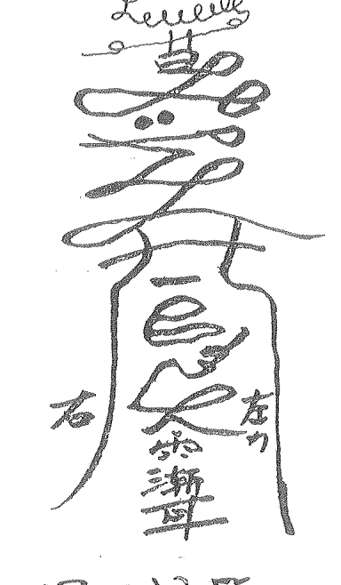

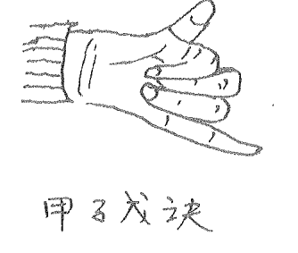

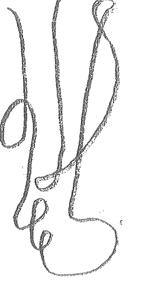

实际上《大挪移》句句是宝，只是好多学员不去悟用。如首先推出‘天目奇门’，学员们会急着学法术，而不布局的。先了大挪移、再学天目，就轻松多了。

### 四、例

秦州酒吧老板，打电话来说：大师布的局，半月已过，没见效果。我连忙起局，察看原因。
2009年、9月14日、申时
己 甲 戊 庚 甲寅癸。阴遁
丑 戌 申 申 天芮、死门

己
丁
丙
庚
┌─────┬─────┬─────┐
│ 阴 辛 辅 │ 蛇 丙 英 │ 符 癸 芮 │
│ 辛 杜 │ 丙 景 │ 癸 庚 死 │
├─────┼─────┼─────┤
│ 六 壬 冲 │      │ 天 戊 柱 │
│ 壬 伤 │      │ 戊 休 │
├─────┼─────┼─────┤
│ 白 乙 任 │ 玄 丁 蓬 │ 地 己 心 │
│ 乙 生 │ 丁 休 │ 己 开 │
└─────┴─────┴─────┘
戊
戊 癸 辛 壬

说明：伏吟局，以坤二宫癸入中求变。
芮二局，一排盘，我就发现原因，是有人把第一局放的风水物动了。

用神值符落坤宫，双入墓，入墓用冲，艮宫空亡无用。看艮宫，白虎，2+2，引干庚，是两条龙，上局我让他在大厅东北角放两条龙。临马星+空亡，拿动了。
老板说是一个顾客，喝醉了，动了龙。龙一动就没有能量了，冲不开用神。
怎么处理：用移，财为戊，值符有80%的甲其财为戊。把坤移乾，乾移乾入墓了，戊又为风水师、不行，学员们要想周全，别出叉子。

坤移乾，甲长生在亥，戊移坎，坎空亡。移过去填实了。
申日申时。马上做，乾宫放一个清水观音。坎宫放个财神。

还有一个处理方法，用艮冲，那么空亡咋办？先把坤拆掉一点，然后放艮宫，两条龙重新开光放上去。西南角铝皮饮料拿掉。丑寅时拿掉，放上龙即可。

## 第八章 催官

在传统观念里，官贵永远占第一位，只有当官才成功，才能光宗耀祖。有官就有钱。但做官是有前提条件的。如一个农民让他一下当上省长，这不可能，要一步步的升，先让他当支书，再当镇长，再当县长，需要时间来设局，所以我们在给人做官时要符合实际。

再一个要遵守为官之道，要牢记，处理这四层关系最重要：首先是上级，趣味相投，上级说什么你做什么，说对了说错了都是对的，上级永远是对的！与同事合好，与下级关系合好。一个人不懂得领会上司的意图，不能很好地执行上司的指示，处处和上司对着干，这样的人领导不喜欢，不喜欢怎么会提拔你呢？在局中、年干与日干相生，有相同符号，这样说明上下级之间水乳交融，互相信任，政治环境和谐，上升空间就大，反之就小，还有险恶的危险。

月干是竞争对手也是同级别或直接领导，他们之间的关系很重要，如果竞争对手的力量太强了，会对自己构成严重威胁，比较一下日干与月干的作用关系就会知晓。

时干是下属、员工，也是你事业的平台，比较一下日干与时干的作用关系，就能知道自己平台如何，时干来生员工拥护，服从你。

当月干或时干临玄武冲克日干时，有小人作祟，引起口舌官非；临腾蛇相克难缠，不好摆脱；怕白虎相冲克时，对方很厉害，气势汹汹，明目张胆；怕太阴相冲克时，暗中行事，不知不觉；怕六合成寄宫冲克日干，合伙聚众为难自己。伏吟新局面刚刚开始，反吟反复不稳定或调任、空亡意取革职、门迫、击刑、入墓不顺利。

当官的符号信息：九天、直符、太阳、丙。如果起局不值怎么办？九天后再起局。一旦抓住、是布局。时干是舞台，舞台不好，你再有本事也没用。年干大趋势，生你，重用你，提升你。

官要当的大，要调阴宅帮你，七杀为阴宅，让七杀生你，一切都会变好。用移星换斗。

- 测官能升还是到头了：直符，年干，时干和他的关系，未来地盘状态，临击刑还要降。测能否升官，看时干（天时）空亡不成，近期是不成。
- 直符催官：直符落宫位放：军人武官放狮子。
- 一般官：放大象
- 处厅级：放龙
- 取员：放五帝古铜钱
- 九天催官：在九天落宫位放马。一匹四平八稳的马，想调住放一匹腾飞的马。

### 一、例
远在新疆阿克苏健康路的袁先生，不远万里来到我处调官运，因前年他打电话来调过一局，上升了一个台阶，故又想再高一些，为了一个肥缺，不远万里前来。

己 庚 戊 庚 甲寅癸
丑 午 子 申 阳九局

| 左列 | 中列 | 右列 |
| --- | --- | --- |
| 地辅 杜 | 天英 景 | 符 丙癸 庚癸 死 |
| 蛇 丙 惊 |  | 蛇 丙 惊 |
| 白乙 任 生 | 六蓬 己休 | 阴丁 丁开 |

- ①用神戊顺九天在离宫有升官信息。大领导男性“戊”与自己同宫，直接领导在坤入墓不生自己，时干也在坤。
- ②周围的人都超不上劲，只有自己高高在上，九天十戊，抓住了经济实权，但这太孤立，看下一步，深挖顺乾宫，太阴，此事可成。但要处理坤宫让周围的人对自己好，处理好舞台。
- ③坤宫直符80%的甲水为七杀，七杀为坟，庚为骨，癸为黑，进水了，骨头黑了，庚为石头水泥，西南必有水池。
- ④袁先生讲：坟在老家泰州，西南角有水池。
- ⑤处理：午日午时，南方放一头大象，戊为大象，辰宫放一条龙，冲开坤宫，因为坤宫为风水师，如不处理，胃会出现大的毛病，学员在此注意。

催官先看自己落宫，临值符，九天，马星都是能发展，反之动不了。有了这个条件，还要看官星是否生自己，一定调七杀，七杀为故生你比你你生啥事都顺。如坏先调好它，耗你克你费劲。用拆补移让七杀最次的条件和谐：你坏他坏，你好他好。如七杀正在四纲，会很快发挥出来，没在，断远。可参考《大挪移》71页符咒处理。

## 第九章 学业

### 一、天干学业象意
- 甲：政治。
- 乙：艺术。
- 丙：政治。
- 丁：语文。
- 戊：地理。
- 己：历史。
- 庚：物理，英语。
- 辛：化学。
- 壬：数学。
- 癸：生物。

### 二、座位排次

|    | 西 |   |   |
|---|---|---|---|
|   | D<br>E | E<br>A | A<br>CF |
| E | D<br>D |   | CF<br>O |
|   | B<br>P | G<br>B | O<br>G |

学生B，问前面的为对宫A。问后面的看地盘P。左边的看引干D。右边的，坎宫G。
如在坎B，则后面的地盘，左边的为B，右边的为O，对前面为E。
如对宫空亡则排第一。

### 三、如有人问看我女儿学习怎样
看时干宫好坏。如在女儿房内起局布局，则看日干。

### 四、择校
- 先对所择的学校编号：①实验中学。②创新小学。③希望小学。
- 第一个找生她的宫。第二找相同符号的。

### 五、择校例
小王的儿子上中学了，想择一个好学校，故来找我一测：我让其对所想择的校随意编号。①向阳中学。②陆墓中学。

2007年6月29日 戌时

丁 丙 甲 乙 阴八局
亥 午 午 亥 天柱.惊门

戊

| 丙 | 己 | 癸 |
|---|---|---|
| 蛇 符 苏 | 符 柱 | 天 庚° 掉 景 |
| 丁 辛 壬 伤 | 己 乙 杜 | 掉 景 |
| 阴 | 地 丙 己° 景 | 金 |
| 乙 英 | 心 | |
| 庚 癸 生 | 任 | |
| 天 王 辅 | 白 癸 冲 | 玄 戊 任 |
| 戊 戌 休 | 丙 开 | 庚 惊 |

己 丁 辛 乙

- ①面测。看甲直符为己。择校与看座次一样排列。第一对宫。第二地干。第三。引干。则向阳中学为坎宫。陆基中学为震宫。
- ②震生离。有相同符号乙。首选。坎冲。不选。
- ③选震宫。

#### 例2. 2008年1月12日15时 阳历。一友测女儿学习。面测

丁 癸 辛 丙 阳2局 甲午辛
亥 丑 亥 申 天芮.死门.

己

| 丁 | 庚 | 丙 |
|---|---|---|
| 天 丙° 庚 伤 | 符 戊 辛 苏 丙 杜 | 蛇 癸 柱 戊辛 景 |
| 地 辅 | | 阴 壬 心 癸 死 |
| 癸 酉 生 | | 壬 |
| 玄 己 冲 | 白 丁 任 | 六 乙 蓬 |
| 壬 丁 休 | 乙 开 | 壬 惊 |

戊辛 癸

- ①面测女儿看丙。看丁？女辛为阴。看了。在坎宫。先定学习天干符号：语文 丁，数学 壬，物理 庚，英语 庚，辛：化学。
- ②对宫是面对的，也是本宫的补充，辛主刑、最头疼是化学不好。怎么回事呢？看离宫：符上边、天芮是女神、戊为玉石、辛为饰品、丙为心，杜为盖住。合起来：脖子上戴着玉石的观音。刚好杜住了心口，心为智、智慧被盖住了。
- ③丁为语文，无毛病，成绩好！
- ④看物理，英语度，无病。与老师天辅同宫生门。老师教的很生动，但她掌握的慢。九地，为木泄坎。费力学好，只能算一般成绩。
- ⑤看以后学习怎样？往下翻。乙到乾入墓，成绩会逐渐下降。
- ⑥怎样处理？先拆，把不好的拆掉。子日子时，把女儿脖子上的吊坠拿掉，把女儿房南面窗户打开，符为上边，戊辛为窗，丙为阳光，杜为杜上了、午时打开就好了。对于学业，学员们要举一反三。可用法术在坎宫布文昌，看《大挪移》符咒学业一节。

13092615368.于城道人。

## 第十章 阳宅

阳宅对于人的命运很重要。古人曾讲：一坟、二宅、三八字。山向奇门是八字、坟宅相结合，三者合一调理改运，怎样让坟宅专为自己的八字出力。在此不多讲了，大家要一步一步来，宅因人而立，人因宅而荣。

传统风水中，离宫有水为富宅，但离宫多为仇门之地，有水门迫，心脏易发病也。东方要有砂，但东方有砂挡住了木气，八字要木的用神，怎能为好。所以风水没有固定的模式，一固定就死了，所以我们家风水要活，别让金锁玉关锁住，也别让玄空玄住，要活用，看盘中显示，看神是怎样对咱讲的，要听神的话，尊守大自然的规律，多去实践，别自欺欺人。神总是对的，错的都是人做的，不去按照神的话去做。

阳宅风水是个大的系统，好多好多还值得我们去探讨和发现。阳宅在局中分内景和外景，也就是内环境、外环境。

- ① 风水师在现场，以日干落宫为阳宅，代表房子，日干又为人，就是房主，是重合的，体现房人合一。不在现场，来人问房，以日干的正印为房，是来人在现场。不在现场，来电话问房，看月干。如知道打电话的人，知道辈份，分别看，年干，月干和时干。以上各位要分清楚，一错万错。
- ② 看房子怎么样？看宫中状态，如果有门迫，击刑，空亡，入墓，那这房子不怎么样，有问题的房子落宫，克谁，对谁不利。
- ③ 看宅外局，也就是阳宅八法，插、反、断、射、破、探、冲、走。也许有些学员不太在意，可你每一局都去看这八法，定会处理好阳宅。

### 一、插
电杆，柱子，天线，高的东西，高楼，烟囱，大树，棍子。天柱，值符，伤门，乙、庚代表插。如不好会生哑巴，心脏病，结巴。看克谁，伤哪？天柱伤大腿，嘴，庚车祸，值符头，乙四肢。

### 二、反
反马路，反弓水，宫中刑冲克害的路，不能生我们的路和水都是。主刑，扭曲，能量不足，代表不聚财，反目成仇！壬癸、玄武水，庚辛为路。克谁谁出事。水旺桃花，桃花劫。庚辛克出车祸。震宫腿脚受伤。

### 三、断
奇门中从空亡显示出来。路突然断了，水突然断了。见空亡即是空亡断开，见吉不吉。住在巷头、路尾、桥边也是断。应在事情突然终止，突然巨变，做事有头无尾。

### 四、走
消耗，泄气，虚弱。日干用神所生之宫为走。顺路顺水是走，不知不觉并不是，而是看见的明明的消耗。

### 五、射
屋角，对着房子，射从高处。看年月日时四柱画出的四个宫，射谁就伤谁。

### 六、破
门迫，事物不完整，破损。破谁，谁难受。

### 七、探
探头，向上是探头。抬头看见。其它方不算。玄武是探，玄武加丁，十柱，十莲。主被偷、被盗、偷情、暗耗。不明不白的消耗。看不见的消耗。

### 八、冲
低处是冲，路冲。门冲。窗冲。有正冲、斜冲、冲是散了，散伙了。财散了，夫妻也散了。

当我们去现场看风水时，就这样布局，具体化解可能是挪斗，移到不克自己的宫里，最有效的还是移山换向，那是山向奇门的应用了。

### 四、房中内境
1. 水管、水：壬癸。2十癸乙已庚辛的组合。乙为弯的，已为盘的。
2. 横梁：戊庚。甲。
3. 灯：丙.丁英景./丁十癸十蛇灯夹了.闪了。
4. 家具：乙辅。床梯子。花草。
5. 客厅：天心。
6. 门：庚（阳隔）。驿马十玉癸。厕所门。
7. 天芮。菩萨。书经。女神。
8. 神佛：死门。死人照片。玩偶。
9. 窗：庚辛。十丙丁。
10. 厨房：丙丁/壬癸/戊已十生门。
11. 厕所：壬癸十休十冲。

2010年.2月15日申时 三测阳宅。

庚己己壬 寅卯卯申 甲子戊. 阳=局 {芮 死.

| 庚 | | 丙 |
| :--- | :--- | :--- |
| 导任 庚休 | 玄冲 丙生 | 地辅 戊辛伤 |
| 己 | | 戊辛 |
| 六蓬 乙己开 | | 天芮 癸柱 |
| 丁 | | 癸 |
| 阴心 壬丁惊 | 蛇柱 癸乙死 | 符芮 戊辛壬景。 |
| 乙 | 壬 | 癸 |

- ① 现场已为阳宅。先看浔宫。临玄武。己+丙为阳台。在他家南方阳台上看，对面屋顶上有一探头煞。卫生天线正对。但宫无毛病。无大障损失。
- ② 坤宫泄宅之宫，为走。庚为路。九地低。宅外有条路徒下去低下去“走”了。泄了财。是谁泄了财。庚为年干为母。母亲。伤为门迫又为破，有破的东西。庚为石头。戊辛。引干丙。圆的。戊为方的块状的破石头在路边。辅伤树木杂草。坤为腹。为胃。庚为大肠。戊辛长了东西他母亲得了肠癌。耗了他的财。坤又克坎宫，坎为儿子，蛇+癸+乙+柱。他儿子下身生殖器有毛病。死门门迫。实际坎宫的水管也堵了。有一个水沟扭着，反弓着。克离。
- ③ 乾宅宫。为妻子，景门门迫。戊辛为窗户。十壬罡了。芮为问题、景门门迫了。看不到风景了。窗外堵了。妻子直符的地方满了，看戊辛为什么？看引干兑宫：九天+丙+癸、英杜。眼睛出问题了。怎么出的问题是窗户（西北的）但克她之宫离丑星天线克的，再看父亲乙.庚母亲的合干。开门门迫。六合的地方。乙蓬为毛。乙+己为弯。左腋下天蓬肿了。己为增生物，看引干，白虎厉害。丁发炎。疮。庚难治。任突起。休是休息，腋下长了一个疮需要开刀了。怎样引起的病：丁为尖的东西，六合很多。乙为花草。己为弯的。蓬壮。伞状的树枝，东边有许多弯的带刺的花草。也克了母亲，也害了艮宫女儿壬。丁入墓，心+壬+丁。“心脏血管”这样不对，艮宫为手，女儿上学心神不定，多动症。马星。为动。乙为手。只能移星换斗处理。

此局看的太多，贪多会处理的不好，不会都处理的没有问题。坤母，移兑，乾（父）移坎，坎（儿）移艮，只有处理三宫，九天后再处理其它两人。或女儿，父亲屋内各立一太极化解。

调理：未日未时，在客厅西方地上放一尊佛像（九地），北方放一个观音。东北放一条水晶串，把水晶串放成“∞”字形，降蛇。

注：此宅克伤太凶，最好改山移向。用山向寄门，西南宫中无路的符号，此西南就没有能男子，为假路。依次类推，也是搬运大法的前提。把真的砂水，转为假的砂水，是山向中的一绝。学无止境，师傅研究多年奇门，也没有完全彻低搞懂。何况我们。所以我们要加倍努力，一步一个脚印走下去。

## 第十一章 阴宅

坟是祖先安身之地，阴阳相隔之所。对于祖先的坟，我们后人也要经常养护一下、养一养，多去祭祀、多沟通，会对你起好的作用。

> “葬经”曰：“人与父母之身体，皆为生气凝聚而成，子孙为父母所生，体气有相通之处，父母故后葬于灵气聚集之地，则父母之本骸体得气，其遗留之体——子孙则以体气相通之故而能感应生旺之真气，故发福发贵而受荫。”

### 一、寻龙
对于寻龙风水界至今还是争论不休，大至是山区看山阵走向，祖山、父母山一一寻来，平洋地寻水。但山区看山是正宗，平洋看水不太对，要看生气旺的地方，看村镇市县城，在地图上，从省城市县镇村看龙脉走向。

### 二、点穴
找到龙脉走向，然后走局，以某某村、镇为太极点，走局后，以宫位好坏定方位，找到穴的大体位置。

### 三、定向
以日干落那，那是山，对朝的宫为向。山管人丁，水管财。山旺，人旺；对宫旺，财旺。点穴、定向，走局要起刻局。15分钟一局，不同的地点、不同的方向起局，找一个完美的穴、向。然后看此穴益谁，分房。

13092615368，于城道人。

三、山向立好，日干宫为山，对宫为向，左为青龙，发男丁，右为白虎，发女丁，山旺人丁，对宫财。

| 147大 | 258 二 | 147 大 |
| :--- | :--- | :--- |
| 147 大 |  | 369 二 |
| 369 二 | 258 二 | 147 大 |

| 木 | 火 | 土 |
| :--- | :--- | :--- |
| 木 |  | 金 |
| 土 | 日干 | 金 |

### 人丁定位
如图，日干生谁益谁，克谁害谁。坎宫生老大，又对老大好。克老二，伤老二，耗老三。
- 如没有老二，伤20-40岁的人
- 定：10-20老三，20-40老二，40-60老大，60-80老人。

### 四、①不在坟地现场起局
看七杀，以七杀生用神调理，看坟内何人？
- 月干阴 日干阴，或月干阳 日干阳预测师的性别论。
- 月干阴 日干阳 或月干阳 日干阴，预测师相反的性别论。
- ②在现场：日干宫就是墓地，起局前，在坟四面顺时针转上三圈，把信息捕捉，进入场，再起局，面南背北！

性别：日干落宫有丁是男，见癸是女。如癸以男，妻论女。无癸可以领你进坟地人的性别。如2-3个人，计划的以说的性别论。
- ③排行（死人）：用神落 坎巽兑 1、4、7， 艮坤 2、5、8， 震离乾：3、6、9。
- ④死因：先看天芮，庚辛己壬十伤、辛是刀刑、庚是癌症，已是小病，太阴内脏，景门血光，以流病同看。
- ⑤穿衣服。用神宫，看天干象意，颜色以引干做为参考。
- ⑥外景。龙 砂。水、穴、向。龙是大趋势、看年干，看落宫好坏，花个左四纲上，砂、水。砂多以戊己代表。水为壬癸。青龙看左宫、白虎看右宫。
- ⑦看坟内骨头状态，深挖“七杀”、现场深挖“日干”。辛十癸壬，庚十癸壬，进水了，吊头发黑了，不好。庚辛十丙丁。红屑铺地好穴。

#### 例，王先生打电话求测。看看坟怎么样？
2009年8月5日 巳时

己 癸 辛 癸 甲申庚（值符）
丑 酉 未 巳 阴遁三局

| 己 丙（天） |  |  |
| :--- | :--- | :--- |
| **辛** | 六 己丙 芮 乙 惊 | 阴 癸柱 辛 开 |
| **乙** | 白 庚英 戊 死 | 符 庚蓬 癸 生 |
| **戊** | 玄 乙辅 壬 景 | 地 戊中 庚 柱 | 天 壬任 丁 伤 |

*注：表格外侧标注有“蛇”（右上）、“癸”（右侧）、“丁”（右侧）、“庚”（右下）、“马”（下方）、“壬”（下方）。*

- ①打电话。用神为癸，七杀为己落巽宫。七杀门迫又为年干龙，其穴点在龙身上，不吉。六合己丙，两村之间。对宫对砂的绝地，两村常不和发生争斗之事，在这种气场下怎能好！
- ②用神宫辛击刑。柱，颈惟病。七杀门迫生他，是不好的生。
- ③看向。向上有水主发财，壬十丁是三叉水口，临马星，庚为隐，搞运输。
- ④看青龙离宫。击刑，空亡不好，男丁都会身体不好！看白虎震宫，击刑，有隐，是条死路通不远，女丁也不好，有乱泉病死的年青女人。幸在四柱上，应验大一点。学员们记住，龙不好，点穴、龙白都不会好！如财旺、定人不旺、人旺定无财，不会两全其美。阴宅与阳宅不同，大家要多实践，多到现场起局，有好多心法是讲不出来的。
- ⑤、还有是去现场调理，要保护自己，我们面对的是‘庚辛’骨头。看自己落哪一宫，如上例风水师在震宫为1.4.7，丢四枚硬币在坟东方，处理完后再丢。以免走刑住。调理后，别一直回家，洗个澡或在另一个地方停停下，别把阴的磁场带回家中。用符咒处理也行，但我不主张，符咒一出对阴人不利。有空人家风水，首先烧点纸钱，勾通一下，然后再起局调理最好！

关于阴阳宅的问题，以后会有风水推出，望大家不要心急！13092615368 于城道人

- ⑥上例怎样调理，用移星换斗，有人说不在现场不能用移，但你试一下是否管用就知道了，如不能移坟，只有用山向奇门改向，或用风水物来提。把巽移兑宫，离移乾宫，与七杀比和，比和为助力。七杀为木克艮坤，伤大门和三门。调后为金，克木。兑宫辰日辰时，超过了九天。不行用酉日辰时。放和合二仙，坟西方，水晶串放西方，埋上。即可转接。

## 第十二章 伤灾车祸

一、看伤灾先看四纲，如有宫位顺、伤门，死门，惊门等门但在四纲上，你要注意了。还有伤落官入墓已没有能量了，而对宫来刑，冲过来，你要多大灾了。还要结合十二月将看：
- 神后、子 —— 车祸、水灾，水路出事、阴暗之事。
- 大吉、丑 —— 受贿，牢狱之灾。
- 功曹、寅 —— 表功，揭发，举报。
- 太冲、卯 —— 撞车、车祸。

## 第十三章 灵异

灵异是在宇宙中存在的，也经常在我们身边发生，在易界也常有法术教授，但那些法术有的一些小事都处理不好，还不如乡村妇女弄弄常用，为啥，只因无局，不设局法术无场不进场应能管用。

用天目寺门处理灵异，一是用法术，二是入局，三是用天目，四是把局中玄武、螣蛇太阴宫拆掉灵异的平台，遇到鬼用太阴，神附体用螣蛇宫，看到怪用玄武，下面举一例一一说明。

| 玄冲癸惊 | 地癸辅己开 | 天己英丁休 |
| 艮任壬死 |          | 穿丁芮生 |
| 六庚蓬戊景 | 阴丙心庚杜 | 螣乙柱丙伤 |

2010年2月22日未时，一男来，说他常在宫厅内感到有鬼，有时看到鬼的影子，一堆白骨，白骨精似的。蛇是幻觉，玄武是错觉。太阴为阳性的东西，据他讲，不是错觉、幻觉，而是真实看到的，鬼在给他要钱。

### ①

看用神宫丙，临太阴，是阴性物质，心里堵，为何事？丙为眼，加庚，庚为骨。看到鬼屋。

此鬼为何找他，前因看戊己。前棚庚丙，在乾宫为蛇，我问他，你是否打死过一条红花蛇→2+丙，柱+伤。

他说是的，在四五月份，非冲即填。

### ② 这蛇是哪来的，与鬼何关系？

乙丙 → 辛丁，临生门。辛丁为什么，打开在艮。庚+戊入墓，土中骨。

是坟里的一条蛇，被他打死，鬼来找他。找他干啥。后查明。丙庚 → 戊戊。庚为鬼，戊为钱，要钱。

### ③ 怎样处理：

1.  拆：天心为客厅，太阴为阴暗，丙为阳光，庚+戊为把阳光挡住了。丙+庚为窗，把窗帘都拉开，让阳光射进来。拆庚，庚为咱们风水师，一拆咱们会难受，所以不能拆。把客厅光线加亮就行了！要拆，拆什么？打开在离，九地，地上，盛水的东西。
2.  用天目，风水师在午时，阳气大的时候，在客厅打开天目，先用神附体，然后开天目。用天目看，在哪儿？化一道斩鬼符，贴位，用火化之。丙克庚，鬼即无踪《参看大挪移86页》
3.  入局：必须在客厅面南背北起局，然后入局，这样能量大，也可用这局入局。骑天龙背上到坎宫，把庚制服。参看《入局大法》。
4.  法术：酉时，去西边路口，辛丁为路口为蛇超度。等，为符咒。烧一道辛，一道丁符，再一道乙符。东北路上再烧些银钱给鬼，在客厅北方放一盒花草，花草为乙，合住庚！或烧一道乙符，催符念咒。参看《大挪移》。

灵异之法，处理多用拆，用其它方法须视自己能量，不要伤了自己！

13092615368. 干城道人.

## 第十四章 天气

天目奇门预测天气与天气预报不同，它是以人为本的，具体到某个人所处的空间，而不是大范围的空间。

-   一、1. 天干：
- 戊：水分少的白云，大朵云。
- 己：小朵云，水分多。
- 庚辛：雷电，雪花
- 壬癸：雨水
- 丙丁：阳光 晴天
- 乙：风

-   2. 八星：
- 天蓬：阴天
- 天任：云雾
- 天冲：大风
- 天辅：微风
- 天英：晴天
- 天芮：云、黑云
- 天柱：风雷声
- 天心：雷电

-   3. 八神：
- 值符：高贵稀少的天象
- 螣蛇：闪电
- 太阴：阴天
- 六合：和风日丽，加壬癸多雨天气
- 白虎：雷电、厉官
- 玄武：雨水
- 九地：云彩
- 九天：晴天

-   4. 八门：
- 开门：晴天
- 生门：云雾
- 休门：雨
- 伤杜：风
- 景门：晴天
- 死门：阴云
- 惊门：雷声

二、自己测天气，随便念在那个时空起局，起个局是结果，问当天局中是一天的天气情况...问午时看震宫，问三月后的午日、午时都是离宫，想知酉时，看兑宫。问一个星期是九天之中的天气。

有人在北京问，是北京的天气。有在南京问是南京的天气。当你问三个月后午日的天气，局中落宫反映三个月后午日的天气，远问远应，近问近应。

2010年，2月24日午时，一人打电话问他准备阴12月22日结婚，问当天天气如何？ 庚 庚 戊 戊 甲寅癸 阳九局。 宫 辰 子 午 3+2+24+7=36=9=4-9+

|      |      |      |
|------|------|------|
| 天任英休 | 符庚癸芮戊死 | 蛇丙柱庚癸惊 |
| 地壬辅辛杜 | 空 | 明丁心丙开 |
| 去辛中乙伤 | 白乙任己生 | 六己蓬丁休 |

① 先查 万年历 12月22日为庚辰日，看巽宫天气。九天、英、景都为晴天，成为朵朵白云，虽有壬水、主刑能雾不大，壬也为流动，白云飘动，故12月22日那天晴天，有白朵朵。

## 第十五章 择日

择日在玄学中是一个大的体系。有的易家去立了日课，花样繁多，咱们的课与其它不同，黄道吉日，是对某人个某个事来讲的，比如今天好，但对任何人就不准了，有捡钱的就有丢钱的，有哭的就有笑的，对于某人某事来讲，先月课，是专内的长处。

无论选何日课，都要应象，不应象去做，会不吉。如用神宫不好，可从年、月时干去选，择好的宫，不应象。九天后，再走局。

① 择日首先以用神宫位来定基调。一、宫无病。二、宫生用。

### 三、应象

满足这四个条件才完美，才对用神有利。但有时

### 四、在纲上

有一个条件，就行了。

2010年2月24日申时 一吉学易友为老母出殡，请我择日 庚 庚 戊 丑 甲寅癸 丑时 惊 阳二局。

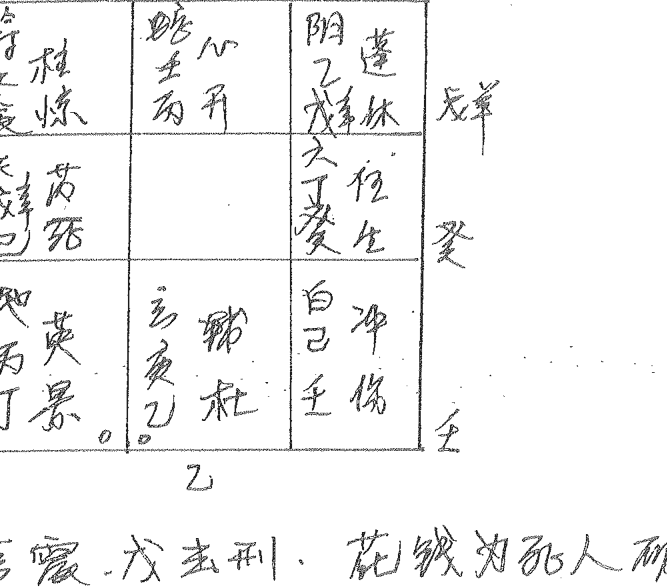

1.  用神落宫，戊主刑，花钱为死人破费是肯定的了。
2.  选癸宫，主刑不能用，甲又为七杀为坟，坟也不怎么好，坐山有死水坑，癸+庚，他说请一个风水大师点的穴。
3.  逃离，无病，但不应象。
4.  选坤：阴是地下，乙是艺术的骨灰盒，戊辛，骨灰休息了，此宫应象。
5.  乾宫：无病，也不应象。
6.  乾宫：白，为白色孝服，伤心，己为嘴也为鞠躬，也应象。
7.  坎宫：玄为玄学，庚为技术，辅为辅助，杜门也办技术。空亡了但四纲三庚一子填实，应他的事业之象。庚+乙为龙，又是年干，先子日助他事业，但过了九天了，只有选年日=冲子日，那天午时，穴周围莫名其妙地起了旋风，旋了几圈，向北而去。
8.  因穴不好，用择日来填补化解一下，选坤乾只是应象，选坎宫助了龙气助了他，用神，最好。

注：别的奇门用天三门地四户择日，但天门地户只是时空通道，上天入地无神鬼阻挡的通道，在法术中应用极广，但择日上却呈现的微乎其微，却显的碍手碍脚。大家可在实践中验证。

## 第十六章 天门、地户、十六神

天三门兮地四户，问君此法从何处
太冲小吉与从魁，此是天门和出路
地户除危定与开，举子皆从此中去。

-   一、天三门：
1、天门地户所到之处不好的神鬼都隐藏起来了，而留一个通道，这个通道谁能进去，进马能出的来？只是在六六壬中，月将极其重要，在奇门中，在预测处理风水中可应用一些，但最重要的是在入局中会用到。
2、十二月将，就是太阳过宫：
雨水 —— 惊蛰 亥 登明
春分 —— 清明 戊 河魁
秋分 —— 寒露 辰 天罡
谷雨 —— 立夏 酉 从魁
霜降 —— 立冬 卯 太冲
小满 —— 芒种 申 传送
小雪 —— 大雪 寅 功曹
夏至 —— 小暑 未 小吉
冬至 —— 小寒 丑 大吉
大暑 —— 立秋 午 胜光
大寒 —— 立春 子 神后
处暑 —— 白露 巳 太乙

-   未小吉：求医、生产、生活、求名、饮食、饭店
酉从魁：求利、求财 开店
卯太冲：急事、出行

-   二、地四户：
除：拆物、拿掉、清理、扫除
危：高升、求官、名升
定：定下、结婚
开：开业、开始

### 三、太乙十六神

《三命通会》中曾说：“古今高人达士，考天数，推阴阳，以太乙数而推天运吉凶，以六壬而推人事吉凶，以奇门而推地方吉凶。”

十六神，地盘是十二地支依次排列，丑与寅之间加艮，辰与巽巳之间，未申中，如图

| 位置1 | 位置2 | 位置3 | 位置4 |
|-------|-------|-------|-------|
| 大神<br>巽巳 | 大威<br>午 | 天道<br>未坤 | 大威<br>申 |
| 太阳<br>辰 |  |  | 咸池 |
| 高丛<br>卯 |  |  | 太簇 |
| 师申<br>寅 |  |  | 阴主 |
| 和德<br>艮 | 阳德<br>丑 | 地主<br>子 | 大义<br>亥 |

太乙运行八宫，不入中五宫，与奇门不同。乾为一宫，巽为九宫，也分阴遁阳遁。阴从乾至巽，阴从巽至乾。

太乙行宫是根据天文观测而来，太乙取象北极星，北极为体，北斗为用，北斗围绕北极而旋转，北斗为北极帝星所乘之车，北极帝星乘车临御八方，便能预知风雨水旱、兵灾饥荒、治乱兴亡。在此大家只作为了解，学会三式便成神，在实际操作中，一个人是很难精三式的。我一开始习奇门，刚入门又学大壬，学了大壬又学太乙，结果三式都不精，耗费了年华青春，学员们，一式精才算通。当下我又回到奇门，学了奇门一辈子都学不完，要牢记，一门已经够用了，别贪多。

### 四：天门、地户、太乙十六神之排列方法

-   天门是将本月将加在时支上、顺排（转）
-   地户是建加在时支上、顺排（转）
-   十六神以地主为头，阳局加于局数顺转，阴局加于局数逆转。

下面就举例说明其排法、用法。

### 一男打电话催官：

2010年2月22日.

亥 戊 丙 癸 甲申庚[任生] 阳六局。
辰 戌 巳 建 河魁 天德 陈 太武[丛魁] 清 满 截传 太簇。

| | 天 | 地 | 人 |
| :--- | :--- | :--- | :--- |
| **左** | 用癸明大神 戊<br>地心 戊丙 杜 | 天壬达 辛景 | 符庚任 癸乙死 |
| **中** | 开神后大炅 己<br>玄己柱 丁伤 | (空) | 蛇丁冲 己惊 |
| **右** | 收舍太阴 癸乙<br>白到丙 夜生 | 文英 辛壬 休 | 阴辅 丙戊 开 |

大威
阴主小吉 平 庚
阴德，胜光 定 丁
大义，太乙 执
昌功 申曹 成
辛和德 太冲 危
阴天 德罡 破 丙
地主

-   ①先排十六神，阳六局。在六局写地主。凡四角皆从中间写，顺转。
②排月将。2月22日是春分到谷雨之间。是戌加时来顺转。
③起地户：建加在时支上顺转。

此例可结合69页，加上天门地户十六神，解的更清楚，此局是此男催官不成功劝他先化解车祸。不听，而是又找另一位大师进行催官，却遭车撞之祸，于是又去给他化解灾后之病。

一、宫内有病，坤。看何灾？武德：主传送迁徙事、传送：运输行走，...满，太过了，开车太快了，值符十庚为好车，癸乙十死，轮子死了是刹车没刹住撞了。太簇：主肃杀、车太多，阴主：主厄期兵丧事，小吉是吃饭，平是摆平，是吃饭回来开车快没刹住车，路滑撞了。空亡转坎宫；和德：集和、太冲：是快，危是危险，交警集和处理，很快送进医院，伤势危险。

二、化解：因起局后化解不听招灾，月将、将来，天门地户相重合处，可处理灾后事。

见幸可置换，定性发生，其妻急忙打来电话，悔不听吾言。我当时没有起局。就让其妻在她房，南北方，各放一个水晶球，保住了她的命。
坎离之宫，是上天入地之通道，放上水晶球，会吸收天地之生气之聪慧，保护于他。
天门地户太乙十六神，在游嫖断局后用用，但不要太注重，丢了根本。

## 第十七章 奇门运筹

奇门运筹，也就是时空转换，在奇门中是一个大的体系，在此详细解说一下，因为我们在实际生活中常常用到。
天目奇门，可以达成各种立场所要获得的希望及目的。因此，天目奇门具有无往不利的力量。其功能特色乃在于使用的每一个瞬间中，都会出现一些独特效果，使自己的意向及期望，能出人意料地通行无阻达成目的。时空转换应用技巧注意如下原则。

1.  首先决定使用目的，因为根据目的及分类不同，则奇门所赋予我们的暗示也有所不同，而且有些法则是相冲突的。
2.  决定目标之后，再决定时间与地点。以自己起局的地方为中心，论四周方位。
3.  在局中，找出有利的时间和方位。

① 时间以行动开始为基准。
② 按照自己的目的，来确定行动方位。

如我在苏州市北陆墓镇到苏州市西边枫桥镇去谈生意，则好枫桥镇在陆墓西南方。坤宫对我来说不吉利，而兑宫吉利。那我先到市中心逗留一两个小时，然后再向枫桥出发。

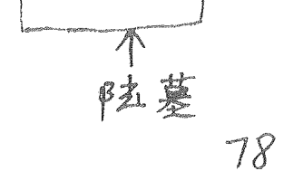

动应在奇门运筹、转换时空中非常重要。阴盘很多高手在运用中失败就是因为没有活用动应，动应是天时与空间的产物，老天不给你，再运筹也没用。掌握了奇门运筹，平时不要乱用，非我之物，不能乱取，当然在不伤害别人的情况下，也可以用用。

### 二、开门动应

-   开加开：见贵人及打斗者为应。
- 开加休：逢四足畜物相斗，妇人着皂衣，及女人言功名事。
- 开加生：逢阴人并四足物，阳人争钱财。
- 开加伤：逢女人开车，随行人点烟。
- 开加杜：逢阳人急唱，或僧道。
- 开加景：逢贵人开车。
- 开加死：逢老人啼哭，开土埋葬。
- 开加惊：逢兄妹同行。

### 三、休门动应

-   休加休：逢男女唱歌。
- 休加生：逢妇人在田，或黑衣公务员。
- 休加伤：逢匠人拿木棍，黑衣公务员。
- 休加杜：妇人抱小孩或拉小孩边走边唱。
- 休加景：逢政府人员开车，坐车。
- 休加死：逢老服人哭泣。
- 休加惊：妇人拉、抱小孩。
- 休加开：逢人打架叹气，畜牧争斗。

### 四、生门动应

-   生加生：逢红衣贵人。
- 生加休：逢黑衣人及打猎人。
- 生加伤：逢乞吏人持棍或栽树。
- 生加杜：拿彩色物品边走边唱并长吸气。
- 生加景：逢贵人开车，且多人相随。
- 生加死：逢老服人器泣。

生加惊：逢人赶畜，及有人讲诉讼事。
生加开：逢豪华汽车。

### 五、伤加伤：逢二车堵塞道路争行

-   伤加杜：逢木匠砍树，并有妇人抱小孩儿经过
- 伤加景：逢黑衣人骑车、坐车经过。
- 伤加死：埋葬及老服人哭泣。
- 伤加惊：逢人争斗及赶牲畜，并有妇人与少女同行。
- 伤加开：逢人拆墙挡门。
- 伤加休：老妇与少男同行。
- 伤加生：逢人伐树或培土。

### 六、杜加杜：逢妇人引孩童及绿衣。

-   杜加景：逢孕妇或红车。
- 杜加死：逢丧服人哭泣。
- 杜加惊：逢人唱歌、打锣。
- 杜加开：逢人唱歌及狗咬者
- 杜加休：逢唱戏或黑衣人抱小孩。
- 杜加生：逢人拿钱包或手拿食物并唱数。
- 杜加伤：匠人拿木棍。

### 七、景加景：逢人抱书，有火光惊恐。

-   景加死：逢孝服人哭泣，色衣人骑车或开车。
- 景加惊：逢争讼争斗，宜避之。
- 景加开：逢人成队行走，公务员开车。
- 景加休：逢女人哭泣，与卖鱼人并行。
- 景加生：逢小儿赶牛人拿钱包、提包。
- 景加伤：逢色衣女人坐车、骑车，
- 景加杜：逢老妇，少女领小孩行

### 八、死加死：逢妇人哭泣，凶。

-   死加惊：逢丧哭泣或死畜物类。

死加开：逢开坟、哭泣或见畜类争斗。
死加休：逢青衣妇人哭。
死加生：逢老子拿生物大恸。
死加伤：逢人抬棺材。
死加杜：逢埋葬及纸扎彩色物。
死加景：逢重老人哭泣，遇吉进凶。

-   惊加惊：逢二女吵闹、僧人说官司事。
- 惊加开：逢官吏役人争议。
- 惊加休：逢青衣妇人说官司。
- 惊加生：逢女人引孩童赶午、小儿拿吃的东西。
- 惊加伤：逢男女吵闹、打孩子。宜迟不进。
- 惊加杜：逢僧道同行或男女相商。
- 惊加景：逢红色衣说官司。
- 惊加死：逢女人哭泣及丧士事情。

### 九星值时动应

× 为凶 △ 半凶 ○ 吉

### 一、天蓬星：

-   ×子时：鸡鸣犬吠鸟叫。
- △丑时：有雷电大作风雨为应。
- △寅时：童子拿花。
- △卯时：黄云四起，妇人拿铁器，大蛇过路。
- △辰时：鼓声，女人红衣。
- ○巳时：驼背人，女人提酒至。
- ×午时：主有人持刀，妇人领小孩至。
- ×未时：童子推车至。
- ×申时：取水人，小儿拿饮料。
- ○酉时：西方有鸟飞来。
- ○戌时：老人挂杖至，西方来官雨。
- ○亥时：小儿成群至，女人着孝服。

### 二、天芮

-   △子：西方二人相逐。

X丑：有鼓乐声自西北方至。
O寅：瘦妇怀孕至。夏秋披雨衣至。春着皮衣来。
X卯：女人送物。贵人开车来。二犬相咬。
Δ辰：鼓乐鸣。女人着红衣。
Δ巳：有妇人少女同至。
O午：孕妇过。
X未：有捕鱼人。
X申：东方打伞人过。
O酉：西方车过。群鸟鸣飞。
O戌：有老人扶杖至。西方雷雨有人担物至。
O亥：有小儿成群。女人着老服至。

### 三. 天冲

-   X子：禽鸟叫。钟声鸣。
- O丑：云雾四起。小IV成队及妇人至。
- Δ寅：贵人坐车。及拿金银器至。
- X卯：女人穿色衣送物。及贵人开车。二犬咬。
- X辰：僧道相伴。
- O巳：小车争行。二女相骂。西方有鼓声。
- O午：东方人家起火。白衣人叫喊。山鸟鸣叫为应。
- O未：有鼓声。小IV着老衣。牛马成群过。西方人喊叫。
- O申：南方白衣人骑车过。吏卒争斗为应。
- O酉：有远方书信至。有喊叫。
- X戌：西方有三五人来寻物。
- O亥：有跛足青衣人至。东方人家起火。

### 四 天辅

-   O子：西方人着红衣大叫前来。
- O丑：有人持刀。犬吠为应。
- O寅：有人持铁器。及艺人送物来。
- O卯：有女人持伞至。
- O辰：行人相撞。小儿啼哭。孕妇至。小车相撞。
- O巳：有二人相打。女人抱布衣。风四起。小儿啼哭。
- O午：僧道拿物。女人红衣过。

五. 天心星
- ○子时：有争斗。鼓声西北。
- ○丑时：西。
- ○寅时：水鸟至。钟鼓鸣。青衣人抱包至。
- ○卯时：跛足妇人至。犬吠及鼓声。北方车至。
- ○辰时：云从西北起。人拿鱼至。
- ○巳时：主有人抱小儿至。紫衣人骑车过。
- ○午时：有风雨骤至。蛇、蛙、蛤。女人着红裙提酒至。
- ○未时：白衣老人至。江湖术士人至。
- ×申时：有僧道来。金鼓四鸣。百鸟齐鸣。红裙女抱酒至。
- ○酉时：北方钟鼓。尼僧西来。
- ○戌时：南方喊叫有贼。小儿牵牛至。
- ○亥时：鸡鸣犬吠。老人着皮衣至。手拿钱器。

六. 天柱星
- ×子时：有风雨从东方起。缺唇人至。
- ×丑时：北方木匠。树上开花。
- ×寅时：车鸣。有雷雨声。
- ×卯时：有人破树。男人拿鼓。黄衣老人过。
- ○辰时：有人自西方拿金器来。
- ○巳时：黑色货车。
- ×午时：有人骑车至。冬有雪。
- ×未时：女人与出家人过。东北方拿伞至。
- ×申时：鸟落地。青衣人打伞至。
- ○酉时：东方有大小车连数十辆行。
- ×戌时：女人抱白布至。西北方有鼓声。
- ○亥时：西方有钟鼓。山下人喊叫。

七. 天任星
- ×子时：主有风雨至。水畔鸡鸣。东南方有人带刀过。
- ○丑时：青衣妇人提酒至。西方鼓声。
- ×寅时：女人成队至。童子拍手大笑。
- ○卯时：主有老人持杖至。喜鹊鸣为应。
- ○辰时：白衣男女同行。马后抱小儿至。
- ○巳时：三犬相争。有人拿伞过。
- ○午时：西方黄色禽鸟飞来。
- ○未时：白鸟自西南方飞来。
- ×申时：风雨陡至。人打鼓。僧着衣至。
- ○酉时：西南方僧尼来。北方钟鼓声。
- △戌时：女人抱布来。西方鼓声。北方砍木做人。
- ○亥时：西方人声响。人拿火灯喊叫（可电灯手电）。

八. 天英星
- ×子时：钟声自西北来。三五人合火做事至。
- ×丑时：东北方僧道至。钟鸣为应。
- ×寅时：东方有车队来。及捕鱼人持网过为应。
- ○卯时：有人提灯笼过或拿米来。雀鸣为应。
- ○辰时：西北方女人携物来。鸡上树为应。
- ○巳时：有人抱书持伞至。抱食器为应。
- ×午时：有人至南方来。着红衣或骑马持文书。
- ×未时：有怀孕妇人过。西方鼓声。
- ×申时：西方有孕妇哭泣。
- △酉时：西方有人吵闹。白衣女人过。
- ×戌时：女人持瓦器或铁器。灶骂为应。
- ×亥时：有女人举火来为应。

奇门合应吉兆
- 乙十休：路遇车成群。
- 乙十生：微风细雨。彩云来迎。
- 乙十开：执杖老人。红衣女人。
- 丙十休：昭莲肥汤脚人。
- 丙十休：鼓声。
- 丙十开：携杖老人。
- 丁十生：路逢犬。
- 丁十休：路逢黑衣人或妇人。
- 丁十开：路逢小儿挑担。

三奇游八宫
- 乙到乾：着黄衣至。
- 乙到坎：黑衣至，有鼓声。
- 乙到艮：有人白衣至。
- 乙到震：并渔人、并小儿二人同来。
- 乙到巽：有白衣人骑车过。或小儿作戏。
- 乙到离：有人着色红至。
- 乙到坤：有三五女人至。
- 乙到兑：有三五少妇至或乌鸦成群。
- 丙到乾：有披衣人至、或乌鸦或群飞来。
- 丙到坎：有瞎眼人至。北方有鸟飞来。
- 丙到艮：有青衣人至。小儿哭泣。老人手拿铁器至。
- 丙到震：有军警至。
- 丙到巽：有音乐。
- 丙到离：有发色飞禽。
- 丙到坤：黑衣人至。鸟在南方鸣。
- 丙到兑：有人持杖并拿酒器及抱小儿为应。

丁奇
- 乾：有人持刀至，骑车过。
- 坎：有人抱小儿来。南方云雨至。
- 艮：有人与小儿耍抱。
- 震：二女至、双飞至、或黑白禽自南方来。
- 巽：小儿骑车过南方。
- 离：有跛足人或瞎眼人至。及小儿骑车过。
- 坤：女人着青衣至。
- 兑：有人抱文书至。

各位学员，也许你看到这里有点烦，我告诉你，这才是大法，以前跟师学艺时，师父为人改运开信，有时在人家门前放几只鸟，有时让一妇女打伞走过。后来才知这是借时改运、奇门运筹。

现在易学中，有许多改运的理论是正确的，为什么起不到作用呢？如六爻、八字，如金克木、我们补木，这样理论正确，但这木怎么能进入八字六爻的场中起作用？只有在特定的时间和空间，天人合一的时候，我们给人家放的花还是花、木还是木，它们没有灵性，没有与人产生信息沟通，所以放了也起不了作用，只有在特定的时间，在最利的空间去操作，就会产生灵性和强大的能量场来帮扶人。

一、例：在新区的汪先生，打电话给我想要上海发展，过两天去面试，请我用奇门运筹。

庚 庚 己 甲
寅 辰 丑 戌 甲己
2010年2月25日 戌时
3 + 2 + 25 + 11 = 41 ÷ 9 = 4……5 阳五局

| 巳 | 午 | 未 |
| :--- | :--- | :--- |
| 白 螣 乙
乙 乙 杜 | 天 英 壬
壬 壬 景 | 地 芮 丁
丁 丁 死 |
| 辰 | | 申 |
| 六 冲 丙
丙 丙 伤 | | 天 柱 庚
庚 庚 惊 |
| 卯 | | 酉 |
| 阴 任 辛
辛 辛 生 | 蛇 蓬 癸
癸 癸 休 | 符 心 己
己 己 开 |
| 寅 | 丑 | 子 |

1.  一看庚吟局，庚吟为不动，动则不利，空转宫，看乙，引干转癸，东南方为上海。
2.  学员注意，天空地亡用上了，去着为客，客为天气，主为地气，现在为客地亡，无地气，有能力，无位置。
3.  柱、惊都为说，但空亡为白说，看样子不会成功。
4.  那我们就用奇门运筹吧，借时改运，转换时空。

二、借时改运、转换时空

1.  时间确定
    ①从局中我们可以看到。巽宫、离宫、乾宫、坎宫、艮宫、震宫都可以，但乾、坎、艮，乾与兑比合，能帮他，可惜无引线人也就是共同符号、熟人。坎宫不可能晚上子时出发，泄他/金泄水也不利。艮宫虽生他，在后半夜，时间也不行，不合常规。只有取震、巽两宫。离宫为火克他，对他不利。
    ②取卯日辰时。卯日为震宫冲夬兑宫。辰时为巽宫，有乙相连，乙为介绍人，冲功乾宫，乾为直符为官，公司管理人员，与他比合，也就是乾会帮他说话。卯日辰时最好！

2.  方位确定
    既然已经确定了时间，那么就要看看卯日辰时从那个方位出发有利，要看卯日辰时的奇门局。
    2010年2月27日 辰时
    庚 庚 辛 壬 甲申庚（冲）
    寅 辰 卯 辰（伤）
    3+2+27+5=37÷9=4--1+ 阴一局

    | 九地 戊 蓬 辛 休 | 天任 丙 乙 生 | 0时 庚 冲 己壬 伤 己壬 |
    | :--- | :--- | :--- |
    | 玄武 癸 心 庚 开 | (空) | 螣蛇 辛 辅 丁 杜 丁 |
    | 白虎 丁 柱 丙 惊 | 九天 己壬 戊 死 | 太阴 乙 英 癸 景 癸 |

    ①从局上看，卯日辰时的方位只有兑宫。
    丁为丁奇、希望可直接达到，杜门无，痛苦为不堵，是技术也是能力发挥的好！天辅为辅助，辛在细上，蛇为变化，吸引面试人眼球。

    ②上海在苏州东南，如出行相反，这时，要转换方位了。

3.  转换方位
    辰时以前，要来到上海面试地点正东三里左右，等个半个时后，30分钟，吃点东西，喝点水，吸收一下当地时空的气场，然后8:00左右向西出发。

4.  动应
    开始出发，就让他打电话，报告一路上的情况：
    - （1）杜加惊：逢歌唱声。
    - （2）乙游兑宫：有三五少妇至。
    - （3）天辅值辰时：小车相撞或行人相撞。小儿遇孕妇至，二年内生贵子，财产大发。

5.  他的报告如下
    - （1）7:30出发，刚走几步，有一时尚少女，唱着歌走过。
    - （2）街边有一卖草莓的，看着很新鲜，驻足一看，有三个少妇结伴而来围着要卖草莓。
    - （3）快到面试门口时，一辆自行车与一辆电动车相撞，车上的小孩被撞哭了。

6.  结果
    汪先生找到介绍人去了老总办公室。刚好经理也在。经理帮他说了许多好话，轻松通过面试。

7.  汪先生去上海工作后，我又让他在客厅放了两辆小汽车，头对着头，两年内果然要妻生子，业务范围做到了国外，着实发了一笔。

二、下面再讲一下借时改运，来改变我们的运气
时者，天时也，天时，星辰也，星辰，九星是也。

九星动应随时有三，〇△×。只要局中九星随时带有〇的，都可借时来改变我们的运气。要自己去创造像出来，应像了，以后会朝着好的时机发展。

像要做的道真，要用心态好的去做，用爱心去做，有爱心了，好事也就来了。

2010年2月27日巳时为一男性人借时改运：
庚 庚 辛 癸 甲申庚（辅）
亥 辰 卯 巳 （杜）阳二局

| | 壬 | |
| :--- | :--- | :--- |
| 癸 | 玄乙蓬<br>庚杜 | 坎任<br>丙景 | 天冲<br>戊癸死 | 乙 |
| 戊 | 白心<br>壬己伤 | | 符辅<br>癸惊 | 丁 |
| 丙 | 天癸柱<br>丁生 | 阴芮<br>戊癸乙休 | 蛇英<br>丙壬开 | 己 |
| | 庚 | |

1.  借时改运首先要从纲上找，在纲上力大、灵验、天人合一。
2.  宫须与用神宫有联系，生用神宫，有相同符号。
3.  宫须无毛病。
4.  借运是给时空借运，不能乱用，以免好运借不来，借来坏运，预测师要认真思考找出一宫对用神起作用的，须在那个时空内完成。
5.  预测师在操作前，一定要念借时改运心咒，本道亲口相传。13092615368，于成道人。
6.  此局巳时局，9点-11点操作完成。
7.  用神辛在坎宫，无病之宫有震宫、巽宫、兑宫，但震有白虎不选，巽有乙庚相连，兑有庚相连都可以。首先选定：坎、巽、兑三宫，从中再选出一宫。
    1）先看坎宫：天芮值巳时，有妇人少女同至为应。作用后四日进绝户人家财，一年内因水大发财。乙奇到坎名玉兔饮泉，有人着黑衣至，或有鼓声为应，七日后得财。
    2）巽宫：天蓬值巳时，有二人相打，女人抱衣服，风四起，小儿啼哭为应，六日进东方财产，鬼神运来大发。
    乙到巽宫：王免乘风、月奇临乘风之地，有白衣人骑车过，或小儿戏耍为应。后三年内生贵子，进东方财产，东方人家失火心大发。
    3）兑宫：天辅星值巳时，女人拎酒至。作用后百日内大发横财，因武官得财。
8.  先生坎为金生水，用兑宫最好！
9.  宫位定下开始操作：直符为贵的，庚为金屋，癸水为酒，兑为少女。让一少女拎一瓶贵的酒从西方而来，进入家门，并说：酒来了，酒来了！
10. 此酒用神一次一次的引用，则愿望会慢慢实现，得天地人神四合一，好事即来。

第十八章 装局金口诀

一、奇门一术，分为四个层次，一是日常百事预测；二是奇门运筹。三是法术，四是道。

道是神龙见首不见尾，变化莫测，大道至简，不用起局，瞬间可移星换斗，法术调理，下面我就公布一点道上层次的金口诀，装局于周身万物，瞬间测事调理大法。

古人认为宇宙全息，有一个大宇宙，大宇宙中有千千万万个小宇宙，大小宇宙终始信息同步。看大宇宙信息难以观察，那么就观察小宇宙，将世上万事万物，都浓缩到身边一物一理中。古人随身带着罗盘，有事时，拿出罗盘只看一眼就能知其吉凶。有的看动，如一只鸟从南方飞过，只是一瞬间，便定了局，测了事。

奇门奇门，在此首重八门：八门是地，人在地球上生活，吃喝不断地从地球上吸取营养，人与地关系重大。

八门
- 休门：是一个吉门，宜休息聚会、经商、嫁娶、见官。
- 生门：也是一吉门，营造、谋事求财、出行。
- 伤门：是一个凶门，出入容易得病遇灾受伤，但收款索债很好，又宜于打猎和捕捉盗贼。
- 杜门：平门，也可出行，宜于躲避藏身，有阻滞之义。
- 景门：平门，宜游戏上书、博彩，诉讼无所得。
- 死门：凶门，百事为凶，但宜渔猎、行刑、吊丧。
- 惊门：凶门，不宜出行，必遇惊恐，宜录求走失，追捕逃士。
- 开门：吉门，宜出行、求财。

八门喜宜
休门宜出贵人留，杜门藏身可免忧；
景门求财多获利，伤门索债必得收；
生门嫁娶远行吉，惊门遇喜未必周；
死门捕捉并渔猎，开门顺利便九州。

八门总歌
开门吉利宜远行，休门上书并理讼；
生门婚姻堪入宅，伤门索债君必用；
杜门逃闪并塞穴，游戏博彩景门助；
死门捕猎又上阵，惊门祈雨并厌众；
欲求利市往生方，捕猎须知死门强；
索债但由伤门去，杜门有事好逃藏；
若要远行开门好，休门最吉见君王；
捕捉惊门宜得合，思量酒食景门香。

九星：象意同前。
八宫：象意同前。
十天干：象意同前。

三生局

1.  装入身体四周
    以本人所在为中宫，其它分八宫，如有人问测，抬眼看见一辆汽车，瞬间定汽车为何门，不要再看汽车驶向何方。吉门吉断凶门凶断。
    以人物车的性质来定事性的发展，以相反相乘的方法来化解事情：
    （1）如女人问测婚姻。我抬头看见一辆豪华汽车在生门，并且车跑的很快，于是说：“你的对象很有钱是个做生意的！”
    她说：“是的，身价有几百万，做生意，你看我俩婚姻发展如何？”我说，你要抓紧时间与他结婚。把东北角（家中）的灯再加亮一点，或换个大的、亮的，此事可完美。
    （1）车好坏定对象好坏。艮为龙门，做生意，车跑得快，后还有二个小红车相随，有女人。
    （2）怎样化解：时干刚好为丁在艮宫入墓。丁辛都可以置换，丁入墓了，肯定东北的灯不亮了，暗了，希望也灭了，把灯处理好，婚姻也好了。
    （2）一男的打电话问病：抬头看到一棵树在离宫，景门平门。主血光，见血保命，我说：开刀就好了，病在心脏，离为心脏，树为木，被人修过，没事。时干辛在离宫，让他在病人房南方挂一串水晶，可解。

2.  装入手表中
    圆形手表，就象一个八卦图，手表上的秒针、分针、时针，就象征天地人三才。三个指针在不停地走动，预示着天地、人在时空中不断变化。
    - 秒针：八门也代表人，一看指何门，吉凶一下说出，无须思考。
    - 分针：九星代表天，是天时，看九星吉凶，老天助不助。
    - 时针：八宫代表地，是地理条件。

（1）秒针预测方法
    秒针预测的时间十分短暂，往往就在一两秒钟之间。一看秒针所指的刻度在什么宫位，这个宫位的吉凶情况立即在大脑中闪现，不住任何分析，马上捕捉信息，不思索，不沉泛，张口就说。在一眨眼、一瞬间的功夫，就立即作出了吉凶祸福的判断！时间的短暂，关键要定宫中之位。
    秒针代表人，也代表所问之“事”。秒针指向哪一宫，属于哪个门，则以此宫和此门的含义去作出判断。按定八卦象数的原理，可以从该宫位上反复提取信息。
    例如，有人问：“今天我谈判会成功吗？”立即看表，如果秒针正指向伤门，或死门，或惊门。都是凶门。你立刻说：“肯定不会成功！”其结果，他一定失败。
    如果秒针正指向开门，休门，生门，都是吉门。你立刻说：“肯定会成功。”
    “成功”其结果，一定谈成。

（2）分针预测方法
    秒针为问事者本人，当询问到另一方时，则用分针表示：谈判对方、官司对方、合作对方、夫看对方……、天气等。
    例：有个男青年问：你看我做什么买卖的。
    测生男生女，只看秒针。指坤、巽、离、兑女；指乾、坎、艮、震男。
    测期货、股票及其他价格上升、涨幅、下降、跌幅。如有人问股市涨跌行情，秒针指从12到6向下走是降，从6到12向上走是涨。
    手表预测要非常虔诚认真，自测时要有非常的愿望再测，不要当儿戏。
    我一看手表，秒针正指向震宫，说：“你是从事家具与木有关的行业”。他说“对”。你看我女朋友是干什么的？我看了一下手表指向景门，说：“你对象干电子的！”“对对！太神了”。
    记住，分针是用九星来代替，看九星的含义去断，如在离天英星，代表漂亮、性急等；天芮，性子慢，不爱动。

（3）时针代表第三方
    地理位置、风水好坏、置身环境、第三者、情人等。

（4）如有人问我：想去北方发展，好吗？
    我一看手表，正指向坤宫，说不行，你去不了！结果没去成。
    坤为死门，为土，克北方水。

三针同看
- 秒针为问事人在巽：杜门不顺
- 分针是机会，在兑：为金克人
- 时针为地理在坤：为土死门
    凶门不吉。

三针结合预测时，一个人问看秒针，一个人问另一个人看分针，看三个人时时看时针，看去哪个地方时，看时针生不生秒针，看那个人那件事对自己好不好，看分针对不去自己，活学活用，则全通神。

（5）时干
    时干在化解中会用立：用日干推导来的：
    甲己还加甲，乙庚丙作初，丙辛戊为头，丁壬庚子居，
    戊癸何方发，壬子是真途。
    甲日、子时加甲，为甲子、乙丑，定时为丙寅...
    下面举一完整的例子：
    有位女士问：请看看我的婚姻。
    一看秒针在震为伤门说：你为婚姻而伤心，女士点点头，眼中有含泪问：“能看分明吗？”分针为她男人在兑宫，为金克木。“你老公很能说，常骂你”。女士流下了泪。为哈骂她，看时针，接着问就接着往下看，时针指坤、为土。土生金，是母，坤为母，老公听婆婆的话，骂她。
    怎样化解？时干为戊，在震去刑，是为了钱的事？女不愿说！戊为墙，东面墙上，日干丁、戊+丁，东面有个墙角冲着，宅内东面墙上必有灯，灯去刑了，坏了，墙也裂蓬了，修好，丈夫就不骂了。
    有时只看秒针就能化解：
    有一人说：我肚子胀，你看愿那里？
    一看表指坤宫（秒针），是西南角，时干己，在坤主刑，你家西南角有个盛水的凹的东西，破了，拿掉就好了。
    学员们要多多练习，把天目奇门中的要素都用上，会出口就二位，一用就灵的。手机预测：同上。

第十九章 入局大法

入局是天目奇门独有的，其它奇门绝没有，入局怎样入，首先公布我们的本尊，每一项预测都有本尊，他是灵魂，没有本尊，就不能活起来，就没有灵魂，灵气。
我们的本尊就是二郎真君、二郎神、三只眼的天神，相信他就是被道圣广、子在石屋中点化开了天眼，入局后，上了天庭，当了神将。所以我们要常勾通本尊，接受能量护体、入局、出局，来去自如！

一、起局分析：求测化解每一件事，认真分析局中的信息，怎样化解：是拆、补、移，定一个完整的调整计划。

二、入局：入局前写三遍咒名：我是xxx，坐在身下，隐藏真身，以免魂魄留在局中，留下后果。一旦入局，出局，能量便会加强，久而久之，会入局化解，调兵遣将，灵活无比。

三、宇宙同息：小宇宙与大宇宙是同息的。局是宇宙信息的缩影。要把局意念扩大，同宇宙一样大，无天也无地，身在局中，在宇宙中。

四、本尊合一：凡体不可入局，必须本尊附体；念本尊咒、结本尊天目印。咒：人在气中、气在人中、天人合一、为我所用，二郎真君，本尊来至、天目罩体、传我功法、是我恩师。入我天门、心莲化育、同体所长，与我合一，神刀兵器拿在手里、金弹金弓，挂于傍体、胯下天龙、神犬随行，上行天门、下入地户，替天行道，巡查天机，挪移神将、搬运地理。调理化解，灵活神奇！

五、天三门是上天的通道，入局调理，要从天门进入，否则会入不了局，入得局中，也会失去能量、无从化解。出局时，会从地户而出，地户是入地的通道。否则下不了局，即便下来，也会留下一魂一魄，留下恶果，切记，入局的法门毫无保留传出，学《乾坤大挪移》法术的弟子，入局施法也灵活无比。

入局
1.  大灾大难急事从太冲入局。
2.  求名求官吉利之事从从吉入局。
3.  求财求利从从魁入局。

出局
- 除：除去、拿掉、拆从除出局：官非、病灾。
- 危：官从危出：官贵、考试。
- 定：定下、定婚、从定出：不稳定的事等。

六、本尊三样法器
- （1）三尖两刃刀。
- （2）哮天犬。
- （3）金弹子。

在局中用哪一样，就念哪样法器心咒：## 宝刀咒

三尖两刃刀，杀气震云霄。
如若敢挡道，一刀斩断腰。
如二郎真君急急如律令！

### 哮天犬咒

天狗哮天犬，一路来当先，
见鬼咬鬼怪，见仙窜三窜，
灵异来作怪，定叫化灰烟，
如二郎真君急急如律令！

### 金弹丸咒

小小金弹丸，打神又打仙，
打鬼鬼必灭，打怪怪成烟，
如二郎真君急急如律令！

下面举一例，详细入局要全页：
有一男打电话来测病，听他说话很费力，就感觉他病很严重，就入局调理，救了他一命。
2010年2月28日戌时。

庚 庚 壬 庚 甲辰王 冲 阳入局 天门月将：戊
寅 辰 辰 戌 伤 地户：建

| 天盘 | 地盘 | 人盘 | 备注 |
|---|---|---|---|
| 危 太乙 | 巽 芮 苍 癸生 | 传送 开 戊 | |
| 成 庚 胜光 | 白 柱 乙 己伤 | 从魁 闭 壬 | |
| 收 小吉 马 | 玄 心 丙 针杜 | 河魁 建 癸 | |
| 破 天罡 丙 | 阴 英 己 壬休 | | |
| | | 地 蓬 庚 乙 景 | |
| 执 太冲 乙 | | | |
| 定 功曹 辛 | 蛇 辅 癸 戊 开 | 符 冲 壬 庚 惊 | |
| | 天吉 平 | 己 卯后 满 | 登明 隐 |
| 天 任 戊 丙死 | | | |

### 一、
（1）用神庚落兑宫。九地、内里、庚为肺。天蓬、肺了、景为门直。2为气为风。打开乙 己 壬太阴里面有水。打开庚 乙 己伤白虎。气把肺伤了。病是肺积水、肺气肿之类。
（2）看天芮。空亡到。生了癸水。也是此病。
（3）看时干：为庚 也是病

### 二、化解：

看兑宫。庚打开 乙 壬 惊。有根柱子不高不直。打开 乙 己 辛 景。弯的，主为动。地上有很多电线，有发光的，电线在一个小柱子上。他说是一团团的小彩灯。

酉日卯时拆掉就行了，但病重，如不好拆，入局化解。

### 三、入局：

写好窥名。坐下面南，宇宙周息。观想整个局一下了充满宇宙，无有天也无有地，只有我一人，要手印（据魂守魄）参看大挪移。念完本尊咒、自变成了三郎真君、天目洞开、闪闪发光，从东方太冲升空而起。（太冲事急，宦空乏、刚好天门洞开）。坐于天龙星背（去看第7页为入局总图。皇暑为本尊），手拿三尖两刃刀，坐下天龙，天狗在前。（诸位。狗肉不知之理在此），向兑宫进发。

兑宫原是一条火龙作恶害人。角大须长、十分凶恶。（天蓬、庚+壬+景）看此火气念金弹咒、先用金弹射瞎恶龙两眼。念天狗咒，天狗上去咬住恶龙七寸。再念宝刀咒。一刀斩断恶龙，坠入地狱。然后进发离宫，为白虎伤人。生克助纣为虐。同样杀死白虎。又到天芮宫，把癸水让天龙吸去。辛丁、丁不动，丁与壬合为预测师之妻，辛可置换，金弹子为辛，把一枚金弹子给辛将，让他一助人治涝不得久停。然后飞回中宫，下的飞龙，从乾宫而下。

下来坐在原位，意念天飞吸取天池之水。从天而降水，从头到脚清洗身体三遍。洗去一切尘污，脱胎换骨，成为三只眼的仙人。

入局之法要常常去练习。不单是化解，也日常游奇门九宫，按诀念咒，操练神兵，天龙戏水，清洗凡身。游各个星座。（7页）吸取能量，为开天目创造条件。入局多次后，天目可开。入局中，时常用天目发光观看，不能再用肉眼！

## 第十二章 打开天目

宇宙在没形成之前，是一个充满正负两种能量的混沌之体，叫做阴阳宇宙。其具体表现形式就是黑洞白洞。当这两种能量逐渐不能抗街、相互制约时，就产生了宇宙大爆炸，阴阳不平衡就毁灭，毁灭之后是再生。如今黑洞白洞依然在宇宙之中，这两种能量依然是宇宙的主宰。

宇宙中无论任何物质都离不开阴阳，无阴阳就不能存在，天目也如此，天目中黑白更是黑洞与白洞的全息。

无论任何事物开始形成都会经过一段孕育过程。正如宇宙形成相似，聚集能量，经过许多亿年形成了生命。一粒小小的种子经过孕育才能发芽，生长开花结果，开天目也是这样，也要去孕育、生长、发芽、开花结果。至此为止并没有一种快速的方法让人开了天目，如若按各种书上所谓的开天目大法，能开了天目，天下人都开天目了，那种方法只是把自身能量消耗殆尽，别无好处。

开天目之法，借助本尊，从宇宙中吸取能量，按照一定的次序，从育种到结果共分七步，一步七天，七七四十九天之中。思想平静，不淫不泄，作身按时，不酒不烟，定会打开天目。

### 一、育种：
天目育种反璞归真，回到宇宙大爆炸之前的状态。那时能量强大。
（1）择日，选初一、十一、二十一日，一为始、开始之意，取无人打扰的时间。

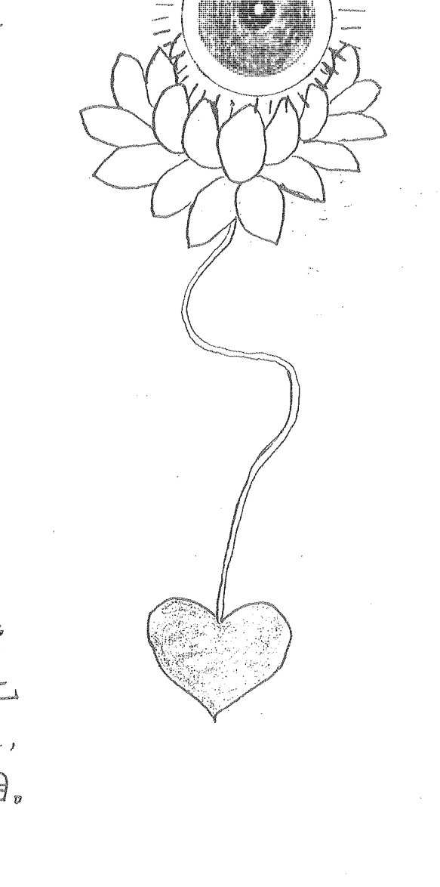

（2）静坐：自然而座，两手放膝盖上，闭目，舌顶上颚，全身放松，入静，心无所想。

（3）意念：意想周围都变成虚空，只有自己一个人，自己在宇宙之中。
本尊二郎真君降临，天目闪闪发光，自己也沐浴在二郎神的天目之光中，祥和、幸福、无忧无虑。本尊从王母瑶池，采了一朵银白色的莲花，此莲花吸天地之气，聚阴阳之灵，发着银白色之光。瑶池银莲能化育万物，起死回生。二郎真君手提莲花，天目运气，天目忽的一闪，从天目生出一个黑白分明的神珠，落在莲花中。从莲花底部，长出一条极细极细的银色天线，似有若无，一端连着莲花，一端连着你的印堂穴两眉之间上一点神命轮。本尊离去，莲花孕育着神珠天目在宇宙中吸收黑洞白洞之能量，闪闪发光。七天中无论走路、吃饭、睡觉，时时刻刻用印堂去看去想觉神珠天目之形意，如犯戒一次，重修七天。七天中，神珠变大变小，变大到整个宇宙都在装在里面，自己也在里面生活，小到小到如米粒一样在宇宙中飘浮……用天目穴去感觉。

### 二、种植：
七天后刚好是初八、十八、二十八，八是发的意思（按阳历）。八天后，神珠天目会吸收能量饱和，光彩变变，黑白分明，能量充足，所漂之处其光亮照射好远好远。

（1）平躺在床上，全身放松，身置宇宙之中。本尊二郎真君来临，整身又沐浴在天目之光的祥和幸福之中。本尊的三尖两刃刀能大能小，捏在手中，慢慢刺入天目穴中，刚好留下立着的一条裂缝，如眼睛一般，本尊拿下莲花神珠天目，先把银白色莲花植入天目穴刀口中，一放便吸了进去，然后放神珠天目，放上天目，神珠照亮整个头部，莲花生出一条粉红色的根，从印堂、鼻两端、人中会合，入舌下十二层楼往下生长。此时把心脏移到心窝正中，大小是自己的拳头那么大；形状象桃子形，尖端一头对着正中间，鲜红的颜色，尖尖正对下方。莲花之根与心相连。整个呼吸，忘掉鼻子，用天目吸宇宙之能量，由天目莲花经根进入心脏，心脏随着呼吸，也会闪闪发红光，照亮体内。

本尊种好天目神珠，用他的天目与我天目相对，刀口合上了一层如薄纱细细的一层嫩皮，天冲神珠凸出，黑白还隐约可见。一吸气，意念里白之洞能量也流回心脏，心脏闪闪发红光。意念七天后。

### 三、发芽：
天目无限生光，能量充足，撑开了一层细缝，如眼皮睁开，闪闪发光，所见之物，施掉双眼用天目去看一切，眼毛也生出，所看之处射穿物阵。看天上能看穿云层，看到星阵。七天后

### 四、生长：
天目能量越来越强，本尊经常降临为我加持发功，以他天目能量输送我的天目。

### 五、壮大：
此时天目能量已变的如同宇宙前身混沌之阵的能量一样，强大无比。闭目才见破王光点，不必去追求，随其自然，有时发光象极光一样，天目能量达到壮大到极点。

### 六、开花：
本尊又降临，从瑶池买了六朵莲花，分别放在自己除朵轮<喉轮>、心轮、脐轮、丹田、会阴、百会，七朵莲花从喉轮开始移动与心轮重合，莲花功能会加强一次。最后经会阴转入顶轮，能量巨大与天目之莲会合。发热发光，光照万里。

这七轮是三大气脉相互交叉连接的一个个交点，人体内的生命之气息在这七轮间游走。在一般人的体内，这七轮通常是关闭着的，生命气息从这仅有的间隙中游走，已足以维持生命的需要。但是，这是人体的一种低等和无能的状态。用七朵莲花打开每个轮，会开发出特异功能，开发人固有的潜力。

- 根特轮在会阴：开发后能看见残留信息。
- 已舍轮在下丹田：灵听、灵视、长寿。
- 圣居轮在肚脐：地下透视，意念移物。
- 无能轮在膻中：他心通、遥听、遥视。
- 除朵轮在喉咙：遥感、测、遥控。
- 千轮居会会：身体变大变小来去自如。
- 神命轮在眉间：天目成像，内视。

### 七、结果：
本尊降临，用天目看一朵莲花，花中即生出一神珠天目。黑白分明，神炁炎炎，闪闪发光。照亮七轮，一颗颗天目，从喉部开始逐一重合。最后合在百会。所走之处通光昭阵，阵内通明可视，最后一下与天目重合，天目象宇宙大爆炸之能量增加数万倍，发亮光极强。一下开了天目，不要心极。一下一下地开，也不要太追求，反复练习。

天目开了以后不要常用，要反复养护，壮大保真。

## 写在后面
到今天晚上十一点，这套天目奇门终于搁笔，约六万字，我希望各位学员不要急功近利，扎实走过每一步，只要你走进来，我告诉你，这是值得你终生去研究的一门易学宝典，不要再徘徊，扎下根来，从头开始，你会得到意想不到的收获。

记得我首次推出大挪移时，好多人不去悟，不知怎样去用，当然也有许多人开发的相当好，悟性强，是的，你把自己通神了，当成神了，用符肯定灵验了，大挪移法术你只要去修了，肯定好用，只怕你没有真的去做！学了天目奇门，你应该知道怎样去做了，如31页布桃花，局中四正方有水，无病放上肯定会有，把符压瓶下。有人问我有意中人了，可她不喜欢我，我说你变通一下，符左边写上女的名字，右边写上你的，不就成了，大家也要去开发想象，把我的东西只有变成你的，你就学成了。还有的说那个物体我用法术怎么挪不走，你起局呀，起局后把它按象意拆掉符号或转宫，把它设空亡中去，九天高的，我往九地，它变矮了，一下被别人拆除了，这就是变通要灵活。学这个时有人问山向奇门，我说不学这个山向白教你也不管学，因为这不是闹着玩的，门前一拉铜丝，移山改向，宅中人出啥事的都有，你测不准，象老看不准不能用！《大挪移》中有多少弟子能看出法术奇门的踪迹，很少吧，学了这个你就会明白好多.

资料中的功用真的能改变你的命运，非常神奇！妙不可言，但是你要认真去学去悟。只要你发信息，我定会回复，如当时没空，晚会定复。借时改运，寻时借运，一次用的好，就会改变你的现状！

金口诀局要常去用，熟能生巧，时间长了定会出神入化！大家记住，神助大于一切，只要你通神了，把自己当神了，那么一切都灵验而神奇了！

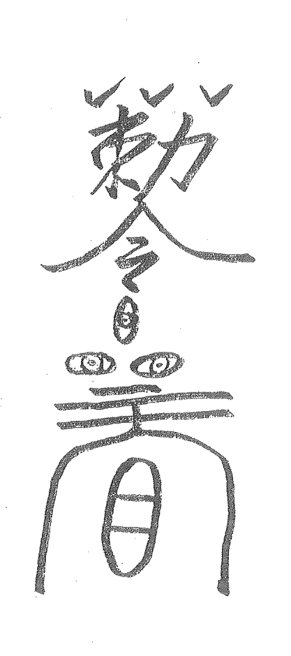

- 万事开头难
- 树人在百年
- 常安知寒暖
- 风雪来无变
- 景色自空前
- 蕴思巡南天
- 采枝盆中筌
- 独默也是甜
- 有乐即少烦
- 赏心冬花前
- 玄香九肠转
- 闻风动尘环
- 流层灰不染
- 水火亦相婉
- 处处乾坤显
- 形正影不弯
- 磊落出平凡
- 遍野生机然
- 人意得放宽
- 字态报平安。

## 第二十一章 延伸

### 一、人盘合一
记的曾有一个小姐找我求测说：我给一个老板做情人好多年了，现在想通了，找了个对象，准备结婚过日子，可那老板不肯放手，扬言要拆散我俩，我好害怕，你给我想个办法。我看了一下局说：我帮你拆掉，但你要做到决不再与他再来往，否则下一个知晓的是你未来的公公婆婆。小姐连连点头，表示下定决心，你那老板断绝。

半个月后，小姐又来了，哭着说：大师，我没听你的话，那老板放手之后我又主动联系了他，现在他真的给我对象的爸妈打电话了，这下完了……

事后，在旁的弟子问：老师，你是咋从局上下一个是她公婆知晓的？我笑着说：这不在局上，而在局外，这叫闪念断，是局的一种延伸。想用好盘，就与盘合为一体，盘我合一，与盘交朋友，那么奇门盘会毫无保留地把一些你看不出的事都会告诉你，起好局，不要感到生分，要感到盘的亲切，要去感受奇门！

### 1、感受奇门盘：
九宫画在地上，或画在布上、纸上经常感受奇门的气场：
① 子午卯酉、四正方是天体进入地球的门户，子午为门外，卯酉为门内。双脚落在子午上，面东，去感受盘的上下与旋转，然后再落于卯酉，面南，再去感受。
② 寅申巳亥为四生、为入关，新的事物生成而来。辰戌丑未为四墓、为出关，离我而去。又双脚踏艮坤、面东南，感受新的事物而来，将要发生的事来临。面西南，感受失去之气。

### 2、去感受各个符号：
晚上睡觉，把一个个符号装盘内去慢慢感受，从八神到八门一宫去吃：一天吃一个或转一个宫，去感受一面你就成功了！
如直符装坎宫是什么象，在人体、婚、是怎么样的，然后去配乙、丙、丁，再去配地盘干、九星，别急，慢慢去挨着去感受。

### 3、去组装故事：
把以前的例子拿出来，前推后推，一个奇门盘就是一个故事、一部小说。这样，一段时间过来，你就会发现，你上升的不仅仅是一个台阶，你会炉纯青，断局自如。

### 二、局的运行轨迹：
放风水物，是奇门布局的最后一道工序。如这个没做好，前边的许多努力几乎等于零。放风水物，要进入宇宙运行的轨道，不然你放的石头还是石头、花还是花，没有一点的能量的意义，是谈不到设局效果的。要与宇宙共振，跟着宇宙走。下面我们要弄清楚宇宙运行的轨迹。

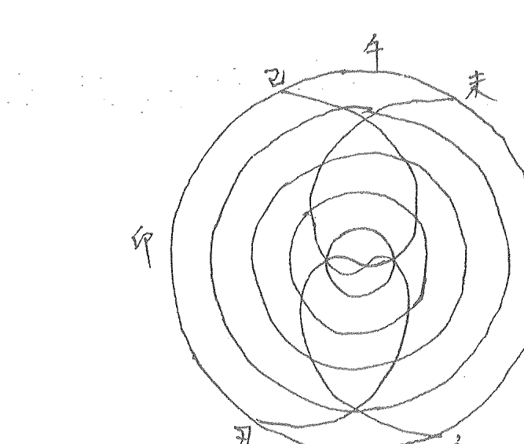

在太极宇宙模型中，亥是地道运行的起始，地道必须通过亥才能进入中宫。与地道相应，巳是天道的起始，天道必须通过巳才能进入中宫。已亥在中宫的相会，才能形成天地之道的相会和事物的形成。故我们可以理解成已亥是天地之道形成互通的门户。

从图中可以看到，子午卯酉正好处在天地曲线的四个交点上，它们构成了地球上南北东西四个正方向。一个纵8字，一个横8字，8字的纵横运动，就是宇宙的运行轨迹。

放风水物时，就这样去转一下，放上去，然后念咒：天地之间，吾命通仙，放上此物，镇守凡间，催财发财、催官升官、化灾化难，一切平安。吾奉二郎真君急急如律令。

如若在宅内供上二郎真君，放坛前开光更佳。

### 二、奇门与六壬：

### 1、师父讲的故事：
在云龙山跟师学艺时，总缠着师父教我法术奇门，师父却对我讲了一个祖师爷传下来的故事：
在以前盗墓虽然不是正道，却是一个一夜暴富的职业，有好多另习奇门的道士经不住金钱的引诱，加入了盗墓的行业，组成了“穿山派”。比起“发丘派”和“摸金派”，这“穿山派”不去找墓道与汽眼，而是利用五行规律来设置奇门遁甲和法术阵。他们不需动甲一锹一铲，只要找一个没人看见的地方，在地上画一个奇门局，按空方位一脚踩住一个位置，口中轻念口诀便可进入墓内。想出去时，再在地上画一个相反的奇门局，两脚踩住原来的位置，再念口诀就出来了。
后来一些王公大员设计墓穴都抓住了这个弱点。在正陵和衣冠家中建了很多层带夹层的空心墙，每堵墙之间只留一个空间的密度。穿山道人一旦传送进来就没有空间再挥剑画奇门局自然也就无法再施法，往往都活活地憋死在里头。只因那些穿山派弟子光秀视法术不太秀视预测了。前些年徐州郊区挖到了几个王公的大墓。我与师父也去观看，当看见几具卡在夹层的尸骨时，师父便说：这些都是通过法术奇门进来而卡死在夹缝里的穿山派弟子。
现在也是如此，一些学员连预测还不过关就去学山向法术，这是不行的。光一个预测能学好，就够用的了，预测学不好，去学山向，只有害人害己。大家切记。

### 2、一谈到法术，为何要谈到六壬呢？
六壬是专门研究世界上万事万物的生成运动，及其时空运转规律的。六壬重在一个“壬”字，因为壬者，妊也，妊娠之意。物到极则有新的东西在孕育生成，它是万物的延续，以及时空的周期循环和扩张。壬是运动，是通道。六壬是研究思维运动的学问，一件事的来临，因为出现了才会去演算，其演算的过程，就是对该事物而进行“观察”的过程。因为一件事物，如果没有一个思想的切入，它就会自然而然地进行对称与平衡的运转，而当发现某种思维的干扰，它就会形成“缩编”，产生一个变化的连接，事物的时空就会向新的领域扩展，这就是一个事物的变化运动过程，不过，思维的切入者，也会与该事物产生必然的联系，这就是佛家所谓的背负了因果，该因果会以各种方式由切入者承担。也就是讲，人的意识的切入，会改变事物的结构，改变事物的结果。这就是法术。

法术是通过什么来传递通过天地之道来改变物质事物结构的呢？是通过贵人十二神。

贵人十二神则全部代表了思想意识的运动，一个神加在了一个地支上，就把该地支变成了一个既带有形质又带有思想意识的具有生命力的完整形态。

贵人、从丑而始，它代表了事物的整个形态和想要达到的目的，十二神是以贵人的位置来确定的，故贵人的整个事物思想意识的统纲，或者叫主神。贵人十二神体系是对事物意识形态的高度凝聚，是粒子的重新组合。人是通过神进行改变或改造事物本质的。怎样与神勾通，这就是法术。

下面举一例子来说明。奇门与大六壬结合的局：

```
干 己 庚 戊 丙 甲寅癸{任 阴四局。 胶末
支 丑 午 申 辰 生 贵神:丑。
```

| 乙空辰 | 戊 | 自庚乙死 | 天丁壬惊 | 阴心丙庚乙开 | 庚乙 |
| :--- | :--- | :--- | :--- | :--- | :--- |
| 甲青午卯 | 己 | 玄辛己景 | | 螣蛇辛丁休 | 丁 |
| 癸勾巳寅 | 癸马 | 地戊癸杜 | 天己辛伤 | 符癸丙生 | 丙 |
| | | 辛 | | | |

这是测病的一个例子：艮宫 戊+癸，门破空亡，杜门。是什么？是胃。戊+癸拉稀了！我们不看奇门看六壬。戊寄在巳，癸在艮宫。癸勾巳寅 代表胃：

看六壬先看贵人。贵人的停留之位，是观察事态状态的关键的地方。贵人处辰戌网罗之中，说明人与事物处境凶险。或遭囚禁，事物陷入艰难而不可自拔。

再看六合：六合是有人开门之意，事物会顺利，但落空亡，则门不开。

再看勾陈，代表勾连迟滞、阻碍极不顺利，为土，堵塞通道。由此看八贵人与用神宫星所临之神六合勾陈都不利。

化解：
1. 先用奇门拆补移：东北角有阴沟不通，门迫有破烂之物。天辅为中药，有个熬药的沙壶烂了，把阴沟搞通，丢掉沙壶，胃病就好了。
2. 用六壬：看三传，戊申亥寅，戊的能量最后被寅泄尽，把寅去掉，课中寅月将在西北，主客腾炎，开红花硬的木，石榴树砍了！不想砍树，家中养了一只花猫，猫为寅，把猫赶走远点，胃病也轻了。
3. 用法术借助十二贵神中的吉神，六合在吉神之列，空亡门不开，从三合之处另找门，亥卯未，找太常。

太常在离，乙十常十西十午。酉为鸡，让太常附在一只红公鸡上。看奇门离宫：丁十壬，红的，跑动的，林加惊为啼叫，出震宫。可见奇门六壬信息同步。把红公鸡起名为太常神，午时放在东北角，叫上几声，一放它啼叫，门开了，胃病也好了。

如找不到红公鸡，到药店买中药鸡内金、鸡嗉子，午时吃下去也常用。

不去药店，让一个属鸡的童男，临时取名太常，在东北角学鸡叫几声，病也好了。

总之，一象多解，我们要变着法的达到原境。重病难治之病，我们可以用山向奇门，拉一条钢丝，移山改向，也灵验。

### 四、浅谈《乾坤大挪移》的用法。
自从“大挪移”开班函授以来，收到了许多学员的来电、来信。大挪移怎样去用，我在资料中说的很清楚。灵不灵验，只在你一念之中。有个学员外甥女摔伤了，他画了一道符咒，放在外甥女身上。外甥女顿感减轻。我说你用挪移，挪移大树上，她的病痛会减轻。如再在大树上砍一刀，大树受伤了，她的伤好了。挪移，让你去挪、你挪了，病就会好！你们要去找象，其中有个学员用的很好，用一段好的木头移走了骨癌的病。

《大挪移》中句句是宝，关键你有没有去做，有没有把自己上升为神。

有个学员身上长了一个毒疮，他打电话求助，我说《大挪移》要在挪移，移相同的象、把同样的像造出来，移走就好，他挺聪明，用土堆造了一个大“疮”，内里放点水像淤血，念咒画符后把土堆移走，疮果然消去！

道号越好，把你带进道场、与祖师爷沟通，但能有几人把自己看成道场中人，与祖师爷沟通后而开悟。

你有没有坚持去修炼，难道市面上教的符咒、画道符念几句咒语就能搬兵请神吗？大家不要自欺欺人。

学员们，不要太急功近利，先把自己的贫穷像移走，怎么移？看你家最代表贫穷的是何象何物，把它移走，相信《大挪移》句句是宝，去悟其中的玄妙，到一定时机，你会有收获的。

有的学员讲，我想把一个电杆移走，咋不见动静？你首先要看它的位置到底对不对？该不该移走，还要遵守天道，不要逆天而行，有的确实要移的东西，替天行道，你就会成功！

学习《乾坤大挪移》的高手，是能领悟移的天机，成不成功，只在你的一念之间！

## 后续

这部《天目奇门》写完，总觉得还有些东西没写出来，就回到山里拜见恩师。恩师说：你首先要弄清楚术数的目的是什么！我说：是让每个学员都能发达起来。恩师说：只有这些还不够，你要传授他们一种思想与之结合这是最关键的。要向历代祖师学习，同样也要向外国人物，看他们是怎样理解我们古人的玄学并实施应用的，比我们还要好！山向奇门是打开阴阳宅与某人的单一通道，其发力纯而能量大。法术奇门是沟通外界能量与自身能量改变事物的发展与结果的……。并送我一本师叔（远在美国）带回来的书。此书1912年公布于世，1973年被美国富人要求教会查禁，是不愿让更多的人看到此书担心更多的人致富。后来手抄本被炒到3000多美元。世界首富比尔盖茨在哈佛大学上学时有幸看到此书却弃学从商从而创造软件帝国的神话。此书中有一个人人运用的致富法则，也是对中国法术最好的诠释：[你关注什么就会吸引什么] 宇宙能量无限强大，人是一切能量的转化机器，要财富，人会把宇宙能量转化为财富。怎样转化，去关注，用思想，首先要抛弃一切：恐惧、烦事、消极因素。积极地思想与设局联系起来，如设局求财，设好局你就要洗脑，把求财充满体内，别想其它的事，转化无限财的能量，常去关注，想象。厦门一古董商学员运用此法已赚了八十万！学员们，在自己或帮别人布局时首先要去让他关注，布局风水，也要布局思想！

## 诚者第八