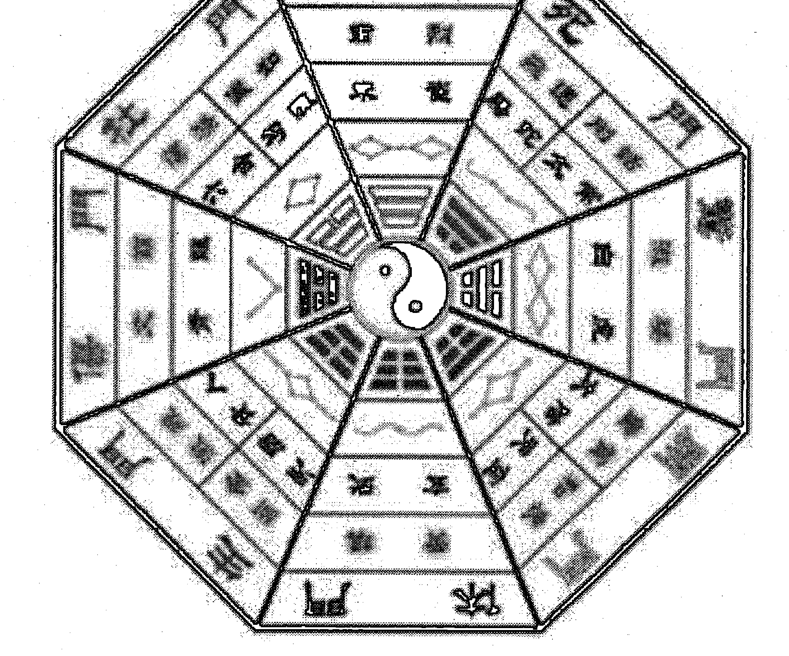

# 六事箴言

第一则　　勤

# 六甲法术奇门

# 基础篇

一妙山人 著

内部资料 · 严禁外传

# 目录

-   前言……………………………………………………………………3
-   一、六甲法术奇门概要…………………………………………………3
-   二、六甲法术奇门预测体系……………………………………………7
-   三、六甲法术奇门运筹体系……………………………………………8
-   四、六甲法术奇门的修炼体系…………………………………………12
-   第一章 符号象意…………………………………………………………15
    -   第一节 九宫八卦………………………………………………………15
    -   第二节 九星…………………………………………………………20
    -   第三节 八门…………………………………………………………24
    -   第四节 八神…………………………………………………………28
    -   第五节 三奇六仪………………………………………………………30
    -   第六节 象意运用法则…………………………………………………39
-   第二章 基本概念…………………………………………………………51
    -   第一节 四害…………………………………………………………51
    -   第二节 四纲、共振、同气、缘分、有根、有气……………………55
    -   第三节 日月同辉、天门地户、辛的置换…………………………56
    -   第四节 孤虚、驿马、伏吟、反吟、隐干、寄宫……………………58
    -   第五节 奇门的阴阳属性………………………………………………60
    -   第六节 奇门阴阳关系 63
-   第三章 起局 65
    -   第一节 起时局方法 65
    -   第二节 起刻盘方法 72
-   第四章 用神 73
    -   第一节 取用神 74
    -   第二节 用神转宫 84
    -   第三节 用神与预测的若干关系 88
    -   第四节 取用心法 94
    -   第五节 万象取用神 97
    -   第六节 应期 101
    -   第七节 护体法器 102
    -   第八节 奇门秘诀 104

# 前言

一妙山人，道号三城，河南天中人。早年师从知矶子，皈依于江西龙虎山天师府。山人自幼与名门道派渊源颇深，家学丰厚，研习道法数十载。时隐山野，时居闹市，来往于仙境地府，精进修行，深得个中三昧，颇有心得。虽心志淡泊，性如闲云野鹤，意在山水之间，但今秉师命，借缘入世，愿将平生所学〖六甲法术奇门三十六阵〗、〖奇门修仙术〗等真传绝学传与有缘，积功累德，济世度人。

# 一、六甲法术奇门概要

## （一）六甲法术奇门的概念：

六甲法术奇门，是依托阴盘遁甲模式建立起来的具有预测、运筹、修炼“三位一体”的系统法门；它包括“道、法、术”三个层面，是中国传统文化研究与传承中的玄学；在当今社会生活实践中，具有很强的实用性、准确性和有效性；不但可以用来预测人生吉凶，调理疾病，而且可以通过调遣六甲神将等特定的方式方法，巧取天机，进行商业战略决策、战术运筹和企业发展风水布局，以及修复人生能量、改变命运格局等，同时还可以通过修炼，培植道基，凝结金丹，归去蓬莱，以进仙业。

## （二）六甲法术奇门的传承：

六甲法术奇门为正一符箓法脉。太上老君是我派法门的道祖，祖天师张道陵是我派法门的本尊。

法无师父给予开窍传承，则法失灵验，鬼侵魔扰。凡习本门道法，需师父亲自过教、传功给予加持，用本门秘法种入“法苗”，接通历代祖师与修炼者的信息通道，方能与道合真。

## （三）六甲法术奇门的特点：

六甲法术奇门除具有实用性、准确性和有效性等特点外，还具有快速通神，最大限度地获取宇宙间良性物质加持与帮助的特点。目前社会上奇门教学很多，但很多人学了以后回去运用时却时验时不验，其根本原因就在于没有接通宇宙间良性物质与奇门运用者的信息通道，无法得到宇宙间良性物质的加持与护佑，使之预测没有灵感，运符缺少法力，调理达不到效果等，加之平时再疏于实践、修炼，能量提高不上去，不能达到天人合一，导致法令不畅，无法调动六甲神将切入时空为我所用，其效果自然大打折扣。

## （四）六甲法术奇门运筹方式：

六甲法术奇门运筹方式分为三种：第一种是借助六甲神将能量运筹布局；第二种是借助阴性信息场能来达到想要达到的愿景；第三种是借助时空、地势、气场及物体等改造来进行运筹布局，从而改变磁场和空间能量，达到在天成像，在地成形，在人应事的目的。

第一、第二种方法需要通过特殊修炼，使自身的场能达到一定量级，能够随意调动神将和阴性信息场波时方可有效使用，否则不宜使用。通常运用第一种、第三种奇门运筹的较多。第二种方法一般不用，因为空间的阴性信息有良性的也有恶性的，如果自身没有超强的能量场，最好不要借助阴性场波来进行奇门运筹。

## （五）六甲法术奇门运用范围：

六甲法术奇门的运用，涵盖了商业战略决策、战术运筹、企业最佳盈利模式风水布局和文化运营策划等，同时也包括人生运程、福祸、贵贱、兴衰、生死等许多社会生活方面的预测、调理和解灾。但是六甲法术奇门并不是万能的，世界上也没有万能的事物。道法自有道法的适用范围、适用对象和使用原则。在此前提下，我们将坚持“道商合一，造福于民”的理念，尽力为各位有缘之士提供预测调理、运筹策划和丹道养生等服务。

## （六）六甲法术奇门运用要求：

法门广大，不度无缘之人。希望寻求帮助的有缘之士，应一心向善，敬神灵，孝父母，广积功德，同时信守求法之时的承诺。有的人在求助时哭天喊地，下跪求救，但在调理策划成功、问题初步见效或解决后，又觉得自己本来就慢慢好转了，是其它因素的作用，未必是道法的功效和用法者的功劳；或明知施法有效，却有意拖赖已承诺的法资。俗话说：心诚则灵。信则求，求则信。用法本来就是一个同宇宙信息场能沟通和调整的过程，如此不敬重道法的言行，很有可能使已经调整、改善或解决的境遇、状况、病情，再度受到来自客户自身的负面信息场能的干扰和阻碍，出现反复，最后于己不利，而且出现反复后的情况将更难处理。所以要想真正解决问题，改善境遇，提升格局，需要有一颗虔诚恭敬之心加以积极配合，不可自误。

## （七）六甲法术奇门学习资格：

-   修习六甲法术奇门：
    -   一是必须尊师重道
    -   二是必须心术纯正，不任意伤害生灵
    -   三是必须有使命感，舍得付出
    -   四是必须严守门规
    -   五是必须修身积德。

> > 古人云：“奇门真机有，切莫胡乱走，修行非一日，道行岂轻就。”

这句话的意思是说，六甲法术奇门作为与宇宙能量场沟通的捷径之门，真传真法必然不在少数，但旁人若想不由师入门的方法，听到见到一招半式就妄自猜测，凭空想象，很可能会造成害人不成终害己的下场。正是因为六甲法术奇门的权威性和针对性，所以才一再强调“切莫胡乱走”，真心想学的人必须按照步骤方法技巧要求，从拜师授道一步步循序渐进，从而达到天人合一的最高境界。

# 二、六甲法术奇门预测体系

## （一）干星门神的信息特征：

十干、八神、八门、九星和八卦、九宫，它们都各自承载着相对独立的象意系统，同时这些象意之间更可以互相交叉组合，进而表示更复杂更多重的象意。这样它们就可以非常全面而立体的模拟我们这个多姿多彩的世界。

## （二）用神秘义：

神助大于一切！六甲法术奇门预测用神的选取，首要 是确定预测的范畴；用神与其它符号的相互关系则是用神运用的秘义。

## （三）预测心法：

预测是基础，也是运筹的前提，更是修炼的平台。它基本涵盖了奇门预测事项及符号共振、同气、有缘、通关、转宫与置换等等预测运用的所有心法。

## （四）健康预测：

干支、星门神的象意组合，是预测身体疾病的主要方法，用神宫的能量高低与否是判断身体是否有病的唯一标志。

## （五）婚姻预测：

世上流行奇门论婚恋，用神繁多，即看乙庚，又看年命，还看六合等等，令人无所适从。六甲法术奇门预测婚恋，只看相合之干，即简单明了，容易把握，而且准确无误，具有很强的实战性。

## （六）官运预测：

官之定位，起局后便可一目了然。岗位的升与降，动与止等等，皆在用神和平台的象意组合之中。

## （七）财运预测：

路路都生财，行行出状元。求财并非开、休、生才有财，六甲法术奇门所有符号均为财。

# 三、六甲法术奇门运筹体系

## （一）六甲法术奇门三十六阵：

此是借助天上神秘之『元北幹尊星』进行排局布阵的高级法门。布阵后，当天上这一神秘之星现身时，会使人身边的凶事、灾难和晦运，顿时一扫而空，同时，带来事业兴旺，子孙富贵，疾病消除，延年益寿等等。其威力、效果之大，令人惊异。

## （二）乾坤调理大法：

此是六甲法术奇门用于催官、催财、催婚以及治疗疾病等一切风水调理的高级运用原则，也是六甲法术奇门进行商业战略决策、战术运筹和企业发展风水布局，以及修复人生能量、改变命运格局的高级运筹法门。

## （三）六甲符法：

符咒之术，由来久矣。黄帝受之于西王母，而传之少昊，少昊传之颛顼，代广其意，而绵传不绝。李耳尽发其秘，仗符咒而开道教，徒者众矣。至汉顺帝时，有张真人名陵者出，得异书于石室，入蜀之鹤鸣山，息居修炼，以符箓为人治病，驱鬼役狐，无不立应，人乃尊之，后得天师封号。

## （四）六甲寻龙术：

用六甲法术奇门进行寻龙点穴是为神助！

## （五）六甲讨债术：

欠债还钱本是天经地义的事，但由于当今社会因素增多、复杂，人心不古，使本来天经地义的事情，变得更加复杂困难。因此，处理此事很多人求救于用超常规的手段也就不为奇了。

## （六）六甲招龙术：

地脉龙神入宅，百煞皆退，有回天之力。可使宅主人丁兴旺、财官双美；可扭转一切凶宅、败宅、绝宅、破宅、祸宅、废宅。解决阳宅问题。

## （七）五鬼运财术：

五鬼运财术是六甲法术奇门运筹布局秘术，不同于其它方法。其法简单、操作方便，密咒、灵符一道即可扭转人生命运。

## （八）六甲祝由术：

以丁甲神将为媒介，以符咒相辅佐，借以沟通、传输和调解天、地、人、神之间的五行炁场。达到凝聚真气、益智增慧、调理和治疗疾病的愿景。

## （九）六甲止遇术：

止外遇、斩桃花，防出轨，运用此术立显奇效。

## （十）六甲育儿术：

此术专门用于婚后不能生育或欲生男求女者。

## （十一）六甲催眠术：

咒曰：精神潜发，哲理显彰。灵性安息，嗜欲逃亡……

## （十二）六甲题名术：

用于招聘、考学和职场晋升、晋级等考试的一种有效运筹方法。

## （十三）六甲胜讼术：

诉讼、官司用此术运筹必显效果。

## （十四）六甲催婚术：

运用此术布局催婚，有情人自会缔结良缘。

## （十五）六甲阴阳阵：也称六甲八卦阵

六甲阴阳阵法，是调理有严重风水问题的阴宅、阳宅之大法。昔，轩辕圣帝，见下民修建宅舍、坟墓，或犯凶神恶煞、暗伤，折令子孙，六畜钱财失散，官灾口舌，乱患不止，疾病缠绵，诸事不顺。

圣人传教令问：三人仙长如何救解？

仙人答曰：老君、房仙长、张天师共一法可救解。

## （十六）六甲开运术：

人至穷途末路，运气不畅，运用此术布局开运，则可致富、荣华。

## （十七）六甲超度术：

调遣丁甲神将，超度未转世的三代宗亲、坠胎婴灵和冤魂野鬼等。

## （十八）六甲还债术：

调遣丁甲神将，偿还历劫所欠寿生债、杀生债、风流债、官利债、历劫冤久人命债、牢狱债等等。还债有秘法，并非现在流传的还阴债之法。

## （十九）童子解送术：

凡有童子命信息者，一般在婚姻、事业、身体方面多数都不会很顺利，但在送替身后命运会发生改变。

## （二十）五鬼解送术：

五鬼命者，其凶的程度不亚于童子命的人。面授班上将详细讲解五鬼的解送方法。

## （廿一）道家开光术：

详解神像、风水物品、罗盘等开光法。

# 四、六甲法术奇门的修炼体系

## （一）太极玄功：

太极玄功是六甲法术奇门的修炼法门之一。经过修炼，身体能量迅速提升，自有妙境显现，因人而异，各自不同，各有体会。不但能修复身体，又可达护体之效，防百邪之侵扰。具有简捷、快速、有效等特点。只有实证者，方知真实不虚。

## （二）通神大法：

通神大法是修炼成仙的一条捷径，是画符、催财、催官和开光及风水调理运筹等法事的方便法门。修炼通神大法需按本门秘法种下“法苗”，接通与历代祖师的信息通道后方可修炼成功。

## （三）太上通灵法诀：

本功法可行气血，营阴阳，决生死，处百病；可强肾固本，开慧增智，念呼显像，预测惩恶，金口渡人。本功法是太上仙师功态中所传的灵功大法，非常宝贵。简单易学，真实可靠。愿有缘之人珍之、惜之！精进修行，早成正果，以谢师恩！

## （四）六甲神将祭炼：

六丁六甲者，乃五行之祖。在清身、静心下修炼，炼之一月梦报；炼之二月耳报；炼之三月六甲显行。调遣役用，搬运财宝，所愿即至。常常炼之，有玉光百神护身，瘟病不染，逢凶化吉。贵在乎精炼之久，而后能行也。

## （五）召鹤飞升法：

人生富贵，如过眼云烟，转瞬既失。追求大道，长生久视，得道成仙才是修炼的终极目标。然道成即久，人将欲仙，须当割舍尘缘，才能上登仙路，至人生大快乐也。

## （六）太极延生功：丹道修炼法门

炼之半年，去除百病，一年之后精神陡增，长久行之返老还童，白发变黑，黑面上皱纹立退，四肢百骸轻灵百倍，羽化登仙无逾此也。昔长房留侯均行此法，后成地仙（200岁以下），非空谈也。有志之士，试之方知言之非谬。

## （七）太极安睡功：

此功行之既久，能却百疾，能强百骸，能驱百邪，能压百魔，有回天再造、惊神泣鬼之奇验。

## （八）太极还幼功：

此功行之既久，实能使人白发重乌，添精益神，有返老还幼之功效，为不可思议之神术。

## （九）太极美颜功：

人之面目美丑本生自先天，然神仙有夺造化之功能长生之术，且可遑论皮肤之美丑而不能奏功哉，故行此功可以使嫫化妍。

## （十）太极妍媸功：

行此功久之，实能使人形貌变易，媸者立化为妍，有左右造化之权，使人忘形。法于天德、月德日，炼气之后，诵桃花咒七遍，书符投盆中洗面有效。

## （十一）太极辟谷术：

人剑合一，左手雷掌，右手剑诀，虚空书“辟谷符”……

## （十二）奇门修仙术：



# 第一章 符号象意

符号是指奇门预测时所运用的各个神、门、星、干和九宫八卦等所有符号；象意则是指这些符号具有的属性、特征以及这些特征属性的所有外延对象。

## 第一节 九宫八卦

九宫代表地利。九宫是指把八卦按方位分布到先天八卦图或后天八卦图中。

乾宫、坎宫、艮宫、震宫、中宫、巽宫、离宫、坤宫、兑宫。其中，乾、坎、艮、震属四阳宫，巽、离、坤、兑属四阴宫，加上中宫共为九宫。

组成奇门的神星门干，就是组成人或事的要素。假如把每一宫比作一个人，则神为脑子；干是人的内脏，躯体，是实实在在的东西。不管你的神怎么样，缺了躯体怎么也不行。当然反过来也是，再漂亮的一个人神坏了就是神经病；星是性格，门是领域，范围。如惊门，说话的领域，杜门，躲躲藏藏的事，技术的事等。天地人神四合一，干为人，门为地，星为天，神为神！见下图：

这就是宇宙的特性在人事上留下的烙印。

星门是在神的带领之下修饰天地盘干的，辅助说明天地盘干的情况。没有天地盘干的话，神星门都失去了意义。一般说来，神星门只能通过天干反映自己的特性，而不能独立代表某种事物。

### （一）先天八卦

奇门预测以后天八卦图为主，但先天八卦图也离不开，这在空亡、翻宫等技术中显得特别重要。所以先天八卦图也要记熟。

**南**

| 兑二宫 | 乾一宫 | 巽五宫 |
| :--- | :--- | :--- |
| 离三宫 | | 坎六宫 |
| 震四宫 | 坤八宫 | 艮七宫 |

**北**

先天八卦图主要记熟各宫对应的卦就可以了，以便先天八卦各宫和后天八卦各宫转换时运用。

### （二）后天八卦

即是下面表格中标示出来的八个卦，即：乾、坎、艮、震、巽、离、坤、兑。此八卦按后天八卦方位排列，所以奇门遁甲的地盘是后天八卦方位。

九宫在奇门遁甲中代表地，大地，为奇门遁甲之基，是不动的，奇门遁甲分为天、地、人、神四盘，四盘之中唯有地盘是不动，为坐山。奇门预测主要用后天八卦图。如图：

后天八卦图（上南下北，左东右西）

| 巽四宫 | 离九宫 | 坤二宫 |
| :--- | :--- | :--- |
| 震三宫 | 中五宫 | 兑七宫 |
| 艮八宫 | 坎一宫 | 乾六宫 |

后天八卦图的方位是：上南下北，左东右西。这个排法和现代的地图正好相反。

-   1. 后天八卦的宫位数：后天八卦是根据洛书绘制而成。因此它也按洛书上的序数排列。口诀是：戴九履一，左三右七，二四为肩，六八为足。这个序数反映在九宫宫位上就是：离九宫（戴九）；坎一宫（履一）；震三宫（左三）；兑七宫（右七）；坤二宫巽四宫（二四为肩）；乾六宫艮八宫（六八为足）；五宫落中宫寄坤二宫。

-   2. 后天八卦九宫地支排序

    坎子支（年月日时，下同）；艮丑寅支；震卯支；巽辰巳支；离午支；坤未申支；兑酉支；乾戌亥支。四正卦各一个地支，四隅卦各两个地支。各宫地支表示该宫的时间空间顺序。同时，地支是奇门预测断应期的主要依据和标志。所以这个地支排列表非常重要，必须要烂熟于心。

| 巽 辰巳 | 离 午 | 坤 未申 |
| :---: | :---: | :---: |
| 震 卯 | 中五宫 | 兑 酉 |
| 艮 寅丑 | 坎 子 | 乾 戌亥 |

乾卦：五行为金。乾为天为圆，引申为老男，大都市，首领等的象意；方位为西北，时间为戌亥年月日时。还为人体的头部，骨，肺等象意。

坤卦：五行为土。坤为地为方，从土的滋生抚育引申为老母，农村，乡下等。方位西南，时间未申年月日时。还为人体的腹部、消化系统及女性生殖系统等象意。

坎卦：五行为水。中男，水多的地方。方位北边，时间子年月日时。还为人体的性和泌尿系统等象意。

艮卦：五行为土。艮为山，少男。方位东北，时间丑寅年月日时。还为人体的背为鼻子等的象意。

震卦：五行为木。震为雷，长男。方位为东方，时间为卯年月日时。也为动感强的和人多嘈杂之地等象意。

巽卦：五行为木。巽为风，长女。方位东南，时间辰巳年月日时。也为草木旺盛之所等象意。

离卦：五行属火。离为火，中女。方位南方，时间午年月日时。为人体的头等象意。

兑卦：五行属金。兑为泽，少女。方位正西方，时间酉年月日时。还为人体的嘴、接吻，声音等象意。

在奇门预测中，九宫的方位就是用八卦来代表的，所以八卦在奇门预测中实际应用起来和九宫是相同的。

## 第二节 九星

九星代表天时。九星在九宫中有一个原始不动的位置，这个位置叫地盘。地盘九星在起局时不标注。九星实际为八星，还有一个天禽星也为土，在中五官。只有其作为值班星出现时才用。其它情况天禽星可不予考虑。星只能寄符在天地盘干或门上，即通过门干反映自己的特性，而不能独立代表某种事物动物。

- 天蓬星：五行属水。猪八戒，脸皮厚，胆大妄为，多情好色，雄才大略等。代表大盗、破财，也代表能做大事业的人。篷子、四面透风的地方，地势低洼、房角、大眼睛、蓬松的，做风险生意、水产品、餐饮业、冷饮店、洗沐、养殖业、酒吧。引申为蓬状东西如蓬状房子；蓬状植物——蘑菇、树冠很大的树等；蓬状静物如伞等；引申为蓬状头发——烫发，蓬头垢面等。

- 天芮星：五行属土。第一信息是问题，临什么什么有问题了，天芮为结交朋友，为学生，为书籍，为女性神如观音菩萨，圣母、佛龛等。也是病星、测病要看天芮落宫。有了病就得治疗，故天芮也为医院。为教师、教学、为良朋益友。利交友、崇尚道德、尊师亲友。双重性格，懦弱、固执、迟钝、多温厚温顺、恭谨谦让。有问题、有病、访友、肚子、老母、女人（肚子大）、肥胖、街道、道观、寺庙、口袋、兜、兔子、梯田、走廊、地坑院。治病救人、救死扶伤用器、棉麻布帛、肉类加工、农贸产品、家畜家禽、农业。

- 天任星：五行属土。为富室、有钱人。代表吉利、厚道之人，谨慎、任劳任怨、任务、任重道远、骆驼、牛、老实、罗锅、农民、听话、脾气倔、山、爬山、桥梁、香炉、鞠躬、慢性子、诚恳、讲信用、实在坦白、做事不敢大手大脚、安于现状。经营土地、农产品、土地建筑、采矿石、机械加工、房地产、山林等。像桥一样不直，给人的感觉就是做事任劳任怨。基本含义是敬业和奉献。这类人都是鞠躬尽瘁，死而后已。任劳任怨、无怨无悔地干，累得时间长了就会驼背，所以罗锅也以天任星为用神；由此又引申为烧香拜佛者（躬着腰），驼背人；天任为土，所以为土地爷，神佛；天任星是任人踩踏的象征，故引申为楼梯，大桥，起伏不平的山丘等。丁+天任+太阴：拜神。丁为香火，太阴为佛寺，天任为躬着腰。

- 天冲星：五行属木。关键是冲，用神有向上的口子或尖，到底是尖还是口要结合天干定。冲星象征向上冲的事物和激烈的动作；性格就是雷厉风行；行为的打架斗殴类，工作时做的快；星不是代表哪样东西，而是修饰这个东西的。说话冲，不深思熟虑，直来直去，但有闯劲。看到天冲星就想到性子直，脾气暴，个性急。引申为做事麻利，有闯劲，雷厉风行，但过了就为鲁莽不记后果。天冲星也为速度快，所以火箭、兔子等象意也由天冲星代表。为雷祖、天帝，为武士、警察。果断、豪爽、自尊心强。司机、子弹、飞跑的东西、运动员、飞机、鲁莽、不动脑筋、天鹅、羚羊、火箭、飞船、关公神像、兔子、猫头鹰。木材加工、水果经营、园林。

- 天辅星：五行属木。为草为民，为文化、技术之人。代表文化、老师、漂亮。利教育、经商、婚嫁。有文化、有修养、内涵。心慈而善、礼貌待人、含蓄。辅助、老子、老实、孔子、大树、椅子、庄稼、水果、衣服、总理、政委、军师。学校、花园、蔬菜。表示儒商、有文化之人、文化卫生用品、工艺工厂、设计规划、科技攻关项目、经营木材生意等。基本属性是辅助别人、辅佐、助手的意思。测事业用神临天辅星，是个助手，二把手。也是甘当二把手的人。抚育本身就为教育，所以天辅星也为教师、文化、考试等象意；测官灾天辅星重要，辅为隔离阻断，它是形容人被捆起来的状态；只一个天辅星不能决定它自己代表什么，要根据象意组合法则定辅代表什么。

- 天禽星：为巫师、为法士。代表方正厚道之人，为中央之土神，有关农业、畜牧业、养殖业、建筑业、环保卫生部门。田地财粮、城隍社神、孕妇等，也代表安居一方或四处游走。

- 天柱星：五行属金。为隐士为修炼，能够独撑一面之人。代表凶灾、破败，利建造营垒、训练士兵。柱子、电线杆、电塔、柱状物、大腿、管子、筷子、手指、身躯、嘴、演员、能说会道、伶牙俐齿。从事与说教有关职业、娱乐界或破坏性有关的职业，宗教部门、金银珠宝行。如果本宫临柱击刑入墓门迫或对宫空亡时，临值时会表现出本宫不好的事或对宫凶事，容易惹官司。二是声音嘴巴说话。三是身体的脊柱，腿等。还有柱子高塔等。

- 天英星：五行属火。英的本义是花，如芳草鲜美，落英缤纷，所以为美丽，瓜子脸；为炉治人、为残患。代表烈性、砖窑等。注重形象、声明，有时过于急躁、易怒，沾火就着，聪明好学，重礼大方。锅炉、烟囱、炉灶、英雄、搞文化的、发展的，化工厂、娱乐、文化、音像、图书品、商店。灯火道具、照明器材、电器产品、电视、音响、电子产品。

- 天心星：心为金，在乾宫，乾为天引申为星象；圆形的；突出是心，如核心，中心。人物，企业老板等。地理是西面、教堂、影壁墙，大厅等。为高道、为名医。代表医生。有管理能力、能屈能伸、有心计、心眼多、有责任心、做事善谋划。政府机关、军队、银行、墙、西瓜、苹果、水晶、经理、主管、动脑行业、策划行业、医药行业、和尚、佛、道士、光盘、台球、轮胎。

## 第三节 八门

八门代表人和。八门和九星一样，在每一宫也有一个原始的地盘位置，同时地盘门的五行也和其原始宫相同。休门属水在坎一宫；生门属土在艮八宫；伤门属木在震三宫；杜门属木在巽四宫；景门属火在离九宫；死门属土在坤二宫；惊门属金在兑七宫；开门属金在乾六宫。地盘八门在起局时也不标注。

门在奇门中很重要。奇门遁甲，奇就是特殊，门就是领域，遁，就是逻辑推理，甲就是源头。遁有各个领域各个系统的遁，各个领域各个系统都有甲，就是都有源头。如用日干时日干就为阳的源头，用月干时月干就是阴的源头。如用对宫这个系统时，对宫的天盘干就是对宫这个系统的源头。门其实有这么两种基本含义，一是本身以自己为主，是什么状态是什么领域，如景门为红色漂亮文化等，二是去修饰限制补充本宫的天地盘干的，此时是引申的含义，如景门修饰人时则为漂亮的人，文艺的广告的人文化的人以及血光的人等。一般说来，星门都不能独立代表什么事物，而是修饰天地盘干的，通过修饰天干来表现人的性格和事物的性质。没有天地盘干，星门都没有了意义。在奇门预测中，干和门星比，还是以干为主，星门是对干的补充作用；门和星比起来，门的作用更大。

- 休门：五行属水。休闲，休息，引申为懒散，富贵；休闲过分就是邋遢；休息要在床上，所以休门也为床，为桃花；休闲没事就可以娱乐，所以休门也为酒吧，歌厅等。公务员、机关科室人员，修饰、装饰、调理调整、安静、客厅、平静等。

- 生门：五行属土。生长，发展，引申为利润增值，生孩子。见生门一定想到发展想到动，想到生长。所以在测事业时生门多代表生产部门。戊临生门，资本增值，所以测股票离不开生门这个用神；测病临生门，病还在发展；戊+辛+芮落震宫临生门，胃里（戊）长小瘤子（辛）了，并在发展。

- 伤门：五行属木。受伤，伤心；也为直来直去。挑逗，玩耍，斗殴等；也为使人或物受伤的人——猎手，公检法、车等。白虎+天柱星+伤门落艮宫，腿受伤了，腿病。伤门落艮宫为门迫，格局凶肯定有事；测身体艮宫为腿，是腿上出毛病了。白虎也为伤灾的象意信息，天柱星本身就为腿的象意，所以腿有毛病了。

- 杜门：五行属木。见杜门就想到阴藏和堵塞，也为不通和遮盖。杜门为技术，为什么？杜门就是关门，关起门来不和别人来往，干什么，在家研究技术啊。杜在家里不和人来往，就好比某个器官的功能坏了。人这个器官坏了，不能用了，那个器官的功能就特别强。比如失明的人听觉特别敏锐。这样的人一个心思钻研技术才能出成果啊。某宫临杜门，这个人肯定有一些特殊的想法特殊的意识。杜是严严实实的堵住，这和天辅星的覆盖不同。天辅星的覆盖隔离是轻度的堵。如林阴道，隔离带都为天辅星，它是仍然透光的堵。

测病，乙+戊+辛+杜门落离宫：脑血栓了。乙，血管；戊，增生物，辛，颗粒。杜门，堵了。辛落离宫击刑，格局又凶，肯定脑血栓。

测环境外景，庚+乙+九地+杜门：白白的雪把地上的小草给盖住了。庚，白色的，引申为雪；乙，草；九地，大地；杜门，遮盖。

乙+戊+杜门（手放在脸上），手把脸盖上了。乙，手；戊，脸；杜门，盖。

- 景门：五行属火。就是文化的漂亮的血光的这样一个领域。本身的含义就是鲜艳的光亮的；从鲜艳红色引申为血光的，漂亮的；火也为文化的内涵，好时前途光明，格局凶时反断。美丽，血光，繁华等；引申为电器类东西；文化类事物如书画，报刊等；

- 死门：五行属土。基本含义就是不动了，不灵活，死板，不变化，固执，到了极点就是死亡。心死就是没激情了；心眼死就是不灵活；要注意它的程度，层次。宫位不好时，程度要加重。皮肤死了为疤痕等等。和死有关联的人，如屠宰者，性格古板等等各个领域的“死”；人体上某部位某器官没有这个功能了就为死门。疤痕是这个地方的皮肤死了；乙+丁临死门，此类松树（乙为小树，丁，带尖的），处于不生长的边缘，长得极慢。锁上门，死门；使你不能动的，脚镣手铐等；可以致人于死地的，刀剑枪等；地理环境，坟地，火葬场等。还为死尸体，木偶，雕像，死人照片，男性神佛等。

- 惊门：五行属金。嘴巴里出来的声音。内涵与精神和嘴有关系。惊惶失措，惊恐万状，吃惊，惊惶等。和嘴巴或嗓子有关系的人事。如律师靠嘴工作；歌手靠嗓子工作；能发出声音的东西如电话，乐器等；也为口舌，官司的用神。

- 惊门+天辅星，教师
- 惊门+天柱星，律师等

- 开门：五行属金。（性格）开放，（穿着）暴露。开门临艮露背，临戊露胸露屁股，临乙露手臂，临己露肚脐等。开门还为（空间）开阔等，引申为开公司，开工厂，开店铺等经营活动。表示一个事物正在进行之中。开门门迫就是“开门”这个领域不正常了。

## 第四节 八神

八神没有固定的地盘，只在起局时按阳遁顺布，阴遁逆布的规则排布即可。值符属木；腾蛇属火；太阴属金；六合属木；白虎属金；玄武属水；九地属土；九天属金。

在道家奇门中，神是神助，是总纲，它决定一个宫的大方向。所以阴盘奇门认为，神助大于一切！此所谓神助并非仅指八神，也泛指奇门预测中的一切符号和象意。奇门的一个根本思想就是人要向神靠近。神是什么，你就变成什么。怎么变？让你自己完全符合局里的象意信息啊！局里的所有象意信息就是“神”，让自己完全符合局里的信息，就是一个“变神”的过程。靠近“神”是学“神”，变成神我就成了“神”。用奇门预测就是发现求测者现存的问题（借用医疗术语叫做 CT）并帮助解决。如果使他完全应了奇门局中的象则就变成了“神”。

- 值符：有名望的，高贵的，高档的，稀有的，少见的，名牌的，有能力的，众人关注的人和事，无形资产高的等等；值符主要用于象征比喻用神的状况。如测事业值符临用神，则求测者是个能人，或有名望的人；测身体值符临病的用神，则此病为少见的稀有的病；测身体值符临医生，则医生是个名医，是技术权威，是专家；测静物，值符临什么什么就是名贵的。

- 腾蛇：变来变去的，善变的，聪明的，不稳定的，花里胡梢的，虚幻的，会缠人的等；腾蛇临女友，此女友会缠人；临婚恋对象，则感情不稳定，变来变去；临病，病情反复等。

- 太阴：隐藏的，有秩序的，精致的，缜密的，阳光少的地方；暗中行事，也主阴谋等；测事业遇太阴格局吉时主提职。

- 六合：众多的，综合的，合作的等；用神临六合，此人人缘好，六合临病，综合症，并发症；测事业用神临六合也主此人在一个大的团队中或集团中；六合也为小孩，中介等。

- 白虎：和庚的意思相近。过硬的，凶猛的，残忍的，不可战胜的，掌生杀大权的，威严的，还为道路，关隘等等；临白虎时，你没问题，你威胁别人；你有问题，你有恶疾，很不好的。

白虎的性质取决于格局。白虎临医生，此医生技术一流；白虎临病，恶性的或要手术等；白虎还为道路，公检法人员等。

- 玄武：稀里糊涂的，不明白的，悄悄的（偷东西，偷情等），骗子，忽悠，眩晕，喜爱和研究与神相通的人如预测师等；演员导演都是玄武，因为他们都把假事做得和真事一样——骗子。

- 九地：空间狭窄的，低矮的，稳定的，保守的，墨守成规的，脚踏实地的，死气沉沉的，表示时间是长久的，表示速度是慢的等等。

- 九天：空间高大的，广阔的；表示为人豪放的，理想高远的，活跃的，激情四射的，好高骛远的；表示速度为快的等等。

八神，八门和九星的象意信息除了以上讲的之外，还有一些在预测实践中形成了一些固定的用神。这些用神大都仍然在用。这些用神包括：

- 伤门：汽车，司机等；
- 死门：死尸，地皮，坟墓，屠宰场，医院等；
- 休门：离退休人员等；
- 腾蛇：精神病人，五大仙等；
- 太阴：佛寺，地下室等；
- 六合：中介人，小孩等；
- 玄武：小偷，醉酒者等。

## 第五节 三奇六仪

三奇六仪就是甲、乙、丙、丁、戊、己、庚、辛、壬、癸十个天干。在奇门预测中，因为“遁甲”，甲是永远不会直接出现的。除甲之外，还有九个干。其中的戊己庚辛壬癸又叫六仪，是甲所遁藏的六个干。乙丙丁也叫三奇，合起来即为三奇六仪，也简称奇仪。甲遁在哪里呢？遁在值符之下。年月日时有甲时，就遁藏在值符之下。值符下临的天盘干就是甲遁藏之处。换句话说值符下的天盘干就是年月日时的甲。六甲所遁的具体天干是：甲子遁在戊；甲戌遁在己；甲申遁在庚；甲午遁在辛；甲辰遁在壬；甲寅遁在癸。所以平时我们也直接简称为甲子戊、甲戌己、甲申庚、甲午辛、甲辰壬和甲寅癸。三奇六仪的顺序是：戊己庚辛壬癸丁丙乙！一定注意，这个顺序起局时决不能变。无论阴遁阳遁都以这个顺序为准。在起局时，无论阳遁阴遁是几局就在几局地盘写上戊，然后再按阴遁阳遁的顺序依次写上己庚辛壬癸丁丙乙。

- 甲：奇门预测甲并不出现，而是遁在值符之下。值符下临的天盘干即为甲。此干有百分之八十的甲性，百分之二十的本性。

| 属性 | 内容 |
| :--- | :--- |
| 五行 | 阳木 |
| 概念 | 高贵的、有名望的、第一的、首领 |
| 人物 | 领导人、头、老板、名人 |
| 人体 | 脑袋 |
| 动物 | 名贵的动物，带壳的动物，如蚌类、螺类，蜗牛、穿山甲、王八等 |
| 植物 | 大树、名贵的花、名贵的植物；发芽的果实、绿豆芽；花生、核桃 |
| 物体 | 高楼大厦、有名望的建筑；甲板，头盔；名贵的东西，如珠宝玉器，名贵字画等 |
| 疾病 | 名贵的，难治的。甲+芮为牛皮癣 |

- 乙

| 属性 | 内容 |
| :--- | :--- |
| 五行 | 阴木，小木 |
| 概念 | 弯曲的，拐弯的，细长的，柔软的，柔情的、典雅的，还是艺术、文化等。所以乙为花草，小树；中医以草药为药治病，草药非花即草，所以乙也是中药的象意；花草为美的，因此乙又为艺术的象意；为女性身材苗条的象意；乙的形状是拐弯的，又引申为抽象的转机等象意，做事要拐个弯才能做成功，送礼物要送艺术品，送美女 |
| 人物 | 女人，演员，画家，文艺家，医生等 |
| 人体 | 头发、眉毛、耳朵、脖子、手、胳臂、肠子、腿、脚、手指、肝、神经，血管，输卵管等；乙+乙，握手（两只手相连之像）；乙+戊，摸胸膛 |
| 动物 | 虫子类、蛇类、龙类、弯曲的动物、柔软的动物，蝴蝶 |
| 植物 | 蔓藤植物，藤萝、牵牛花、爬山虎、葡萄、葡萄架、柳树、龙爪槐、不直的树，竹林，花草 |
| 环境 | 拐弯的东西，有艺术的东西，艺术品（窗子、画） |

- 丙

| 属性 | 内容 |
| :--- | :--- |
| 五行 | 阳火，大火 |
| 概念 | 光明，刚猛，暴烈，圆状，乱子，权柄，红色等 |
| 人物 | 心怀坦荡的人，心怀坦荡的人不忍事；情人，点火就着的人，掌权的人，有能力的人 |
| 人体 | 眼睛，心脏；发炎部位，浮肿部位；血液，发烧，烫伤，烧伤，古人还专门规定丙为小肠 |
| 植物 | 带柄的果实如苹果，梨等，开红色花的植物，向日葵，西瓜 |
| 静物 | 发光之物如灯，灶，火箭，大炮，门窗等；带柄的工具也为丙 |
| 动物 | 王八 |

- 丁

| 属性 | 内容 |
| :--- | :--- |
| 五行 | 阴火，小火 |
| 概念 | 细小，盯、瞪眼看，漂亮的。能吸引眼球的东西，异样的。红色的，小块的，小型的东西。顶尖，发热，尖锐的，带刺的，叮当响的，叮咬，叮嘱等。丁就是钉子，有韧劲，有挤劲，有钻劲，这都是丁的信息 |
| 人物 | 男孩，第三者、小蜜（女友）。男人看，是女人的第三者，女人看是男人的第三者。丁＋乙，打电话（乙为手，丁为电话。手拿电话的样子） |
| 人体 | 心脏，眼睛，血液，骨刺，牙齿，男性生殖器等 |
| 疾病 | 发炎 |
| 动物 | 一切叮咬人的动物如蚊子，跳蚤等；带刺的动物如刺猬，蜜蜂等 |
| 植物 | 玫瑰、枣树、槐树、月季 |
| 静物 | 发光的小东西如灯具，小门窗；叮当响的如铃铛；由火引申的电，香火，打火机等；由丁的形状引申而来的如针，钉子，小刀，剑等 |
| 环境 | 丁字路口 |

- 戊

| 属性 | 内容 |
| :--- | :--- |
| 五行 | 阳土，大块的土 |
| 概念 | 资本，钱财，金融，容纳，包容，守信，宽厚，诚实，诚实过分就是傻瓜等。土的属性是孕育万物，所以中正，包容，滋生是它的属性。由滋生引申为资本，再引申为钱财，钱是由银行管理的，所以戊也为金融证券业；由滋生还可引申为中介，土是建造房屋的原始材料，由此又把戊土引申为房地产等 |
| 人物 | 财会人员，房地产人员，银行人员，中介人，胖人等 |
| 人体 | 长着大肉的部位，戊落离宫为脸、鼻子，也为大脑；戊落震兑宫为胸部，乳房；落艮宫为屁股，肚子；落坤艮宫为脾胃等 |
| 植物 | 叶子大的植物如芭蕉等，肉多的果实如南瓜，地瓜，萝卜茄子，白菜，西瓜等 |
| 动物 | 肥胖的动物，大象，猪，沙皮狗，熊猫，走路缓慢的动物，如牛等 |
| 静物 | 大的粗的陶瓷制品，水泥制品，建材等 |
| 环境 | 墙面，横梁，庭院。也代表煤矿、铁矿、铜矿等矿产资源 |

- 己

| 属性 | 内容 |
| :--- | :--- |
| 五行 | 小土，阴土 |
| 概念 | 欲望，策划，创意，邪念，聪明，办法多，花花肠子等。己的形状是卷曲，盘旋等。在人身上具备小肉和卷曲两个特点的地方有脑子，肠子等；由此由引申为花花肠子，歪心眼多；也为创意策划等；花花肠子是欲望，所以己也为邪念，欲望，想（做某件事）。戊和己的差别：给一条腿，大腿为戊，小腿为己；给一只手，手心为戊，手背为己；东北人山东人上菜为戊，上海人杭州人上菜为己等等。戊为粗老笨重，己为小巧精致！己落宫格局吉为聪明，创意，策划，格局凶时为花花肠子，有心计，也为迷茫麻木，心灰意冷。己加庚落坎宫，格局凶时为直肠癌（己为小肉在坎宫为肛门，庚为恶性病） |
| 人物 | 小男孩，厨师，卖香肠的人。抱拳的人，盘腿的人，蜷缩在一起的人，陶艺工作者（己+乙是陶艺）。广告人，策划人 |
| 人体 | 嘴，乳头，肛门，脾，肠，耳垂，小脑等 |
| 动物 | 卷曲身子的动物如墨鱼、蜗牛、蚯蚓、冬眠类动物。猫、狗、狗熊蜷缩在一起，蛇盘在一起等 |
| 植物 | 卷曲身子没展开的如卷心菜，圆白菜，菊花等； |
| 静物 | 土制泥制陶制工艺品（和戊比己是更精致的陶制品）。土类脏物，食物，垃圾，大便等 |
| 环境 | 坑，沟，下水道，坟地，阳台等 |

- 庚

| 属性 | 内容 |
| :--- | :--- |
| 五行 | 阳金，大金 |
| 概念 | 坚硬，技术过硬，毁折，阻塞，坚韧，残暴，支撑，保护，还为非常漂亮等。金的属性之一为坚硬，所以庚的属性之一就为过硬的。如测病时病用神临庚则为病难治愈，医生临庚则为医术过硬，治病有方。人体中最坚硬的部分为骨骼，所以庚金也为骨，为大骨头 |
| 人物 | 黑社会，猛男，公检法，军人，炼钢工人，修道路的人，特别出众的男人、女人，技术特别过硬的人，表现突出的人，最漂亮的人，能力特别强的人，竞争对手，神佛等 |
| 人体 | 骨骼，大肠，肺，皮肤，人体硬的地方等 |动物：凶残让人害怕的动物如狮子，老虎，病毒等。
静物：石制品，大型金属制品，门、窗，枪、炮、子弹，一切起阻隔的事物等。
植物：带刺的，有毒的，能伤人的，如猪笼草等。
环境：道路，关卡、关口等。

庚在好的格局为支撑，保护；坏的格局为恶性，为毁折；一般说来，庚在模拟人的性格时，临庚的人性格非常狠，感情色彩太淡，很严肃。庚为保护人的东西，也为给人带来灾难的东西。

### 8、辛：

五行：阴金，小金。
概念：错误，变化、变革（想改变现状），问题，犯错误，金融业。
人物：罪人，犯法的人，改革者等。
静物：小石块类，颗粒类，如粮食；小金属品类，引申为小骨头，瘤，骨刺，粉刺，痘等。也为门窗（丙丁庚辛都为门窗。庚辛取阻塞像；丙丁取光亮像）。戊加辛落离，脸上（戊）长疙瘩（辛）了。
植物：花。

### 9、壬：

五行：阳水，大水。
概念：变化，流动，迷茫（一片汪洋都不见，知向谁边），壬通妊，怀孕，孕育，长长的头发像瀑布等。
人物：孕妇，和水打交道的人等。
人体：血液，动脉，头发，眼珠，膀胱，浅痣等。
动物：水中动物如鱼类等。
植物：水中生长的植物如藕、海带、莲花、水草、芦苇、水稻、菱角等。
静物：自来水，水管、灭火器等。
地理：水流的地方，江河湖海，道路，人来人往的地方等。临值符，是名贵的水，是农夫山泉，是崂山泉水；临太阴，地下水；临六合很多的水；临九地，不宽的小溪；临九天，很宽的河流等等。
行业：物流、批发、运输业。

### 10、癸：

五行：小水，阴水。
概念：困难，流动，变化，过分的，和性相关的属性。
人物：酒鬼，淫荡之人等。癸加己，酒鬼（癸为酒，己为想。总想喝酒自然是酒鬼）；癸+癸，色鬼。心里除了性还是性自然是色鬼了。
人体：黑的地方，头发、眉毛、眼睛。足，肾，女性私处，静脉，痣（颜色比壬黑，面积比壬小），人体所有排泄物分泌物等。
动物，喜欢水的动物，水鸟类（鱼是纯靠水活，所以为壬，水鸟不全靠水，所以为癸），乌龟，鸭，鹅，蜻蜓等。
静物：人们日常饮用水以外的液体类东西如酒，酱油，醋等，排泄物，分泌物，不纯的水如茶水，饮料，油漆等，癸也为鞋。
壬是干净的水，流动的水，纯水；癸是不纯的水。
植物：离不开水又不完全靠水生长的植物如水稻等，含水量多的植物如蔬菜等。
环境：湿地，沼泽，水地，地下水，粪池，污水，有水的地方等。

## 第六节 象意运用法则

奇门遁甲预测的基本象意系统包括九宫八卦，八神，八门，九星和十干等。它们都各自承载着相对独立的象意系统，同时这些象意之间更可以互相交叉组合，进而表示更复杂更多重的象意。这样它们就可以非常全面而立体的模拟我们这个多姿多彩的世界。如辛为小金属物件，生门是生机活力的意思，这样辛加生门就组成了钥匙这个象意。它的含义是小的，金属的，使死（死门）的东西（锁）变活的东西。这不是钥匙又是什么？

再如歌词：在那遥远的地方，有一个好姑娘！用符号象意表现这句歌词的意义就是九天（遥远）+乙（女孩）+天英星（漂亮）！

人们走过她的帐篷都要留恋得张望：马星（走，动）+天蓬星（帐篷）+己（想，留恋）+丙（眼睛，看）！

她那粉红的笑脸（丁+戊落离宫）。丁，粉红，微红；戊，丰满的肉加上离宫自然是粉红的笑脸！所以，学习奇门预测，从某种意义上说就说学习奇门语言，把奇门象意所代表的生活内容翻译出来。

任何奇门符号，不管是神、门、星还是干或卦宫，都含有多方面的象意信息。这可以从三个方面去理解掌握。

一是符号的五行属性即五行本义的象意信息。这是奇门预测的基础象意信息。一般说来，其它象意信息都是从这里直接或间接的引申出来的。如，天蓬为水，水主智，所以天蓬星为聪明的象意，引申为雄才大略。水的基本特征是流动，如果在感情上总不稳定则为水性杨花了。所以天蓬星也为好色多情。

再如腾蛇，属性之一为变来变去：蛇属火。明火从来不会完全稳定，时大时小。被风一吹更是这样。腾蛇的变来变去其实就是火特性的直接引申。火是有颜色，红色光亮的，所以腾蛇也为花里胡梢。腾蛇还代表失眠，还为精神病的用神。这是从离宫的属性引申而来。离宫为火，和腾蛇的五行性质相同。从九宫格说它是人体的头部，头上病，失眠精神类便是其一了。

二是各类符号本身的形状情状等特征方面的象意信息。这部分象意比较复杂，但也最容易出彩。如乙是个象形字，有弯曲拐弯之象，因此宇宙间一切弯曲的拐弯的细长的象意都可用乙木来模拟。再如丁，字型下面是一钩。所以凡是有钩有尖的象意都可由丁来代表；丁又像路口，老百姓不是经常用丁字路口来形容某个路口吗？所以丁又可以模拟路口；钩本身就是刺，刺是变形的钩。所以凡带刺的象意都可用丁来代表。动物类如刺猬、野猪等。植物类如月季花、玫瑰花、仙人掌等都可用丁代表。再就是一切象丁的东西，如针、小刀、钉子、注射器等也都可用丁来代表。

丁是火，火是红色的。因此，红色又是丁的一个情状。凡红色的象意大都可以用丁来代表（有的必须用丙）：如丁为血液（红色的），为红色的小花，为红色的衣服等等。丁是火，可以代表和火相关的象意。因丁是小火丙是大火，所以，一般情况下丁只能代表属于小火的象意，如打火机，小灯泡，火柴等等。

三是引申联想义。从符号的五行属性、特征引申联想出来的新象意。如癸的本义是小水，从小水引申为沼泽（是沼泽水就不会象湖海那么多），从沼泽联想到泥泞，从泥泞联想到困难，艰难等等。

再如戊为人身上的大块肉。怎么来的呢？戊的本义为阳土。那么土在比喻象征人身上的组织时，只有人的肉才象土的情状：松软厚实。戊为阳土，和己土这个小土比，自然是人的大肉了。戊为大块的肉，就是因为肉有厚实松软的特性而联想出来的。

解读象意要注意理解它的含义，不要死背。只有对它的本原本意有根本的了解，只有了解了象意的组合规则，只有掌握了你预测的那个系统如测病和测婚姻肯定不是一个系统等，才能对象意以点代面，举一反三的灵活运用。一个符号可以表示许多象意，同样多个符号也可以共同表示一个或多个象意。这主要取决于求测的具体内容和求测者本身的情况。如壬为水为流动，庚为阻碍阻力。在测病时，如果壬加庚落离宫，则此时壬的液体性流动特点能自然联想到血液了，也就是壬落离宫首先是血的指代。庚为阻塞，血被阻塞流通不畅了啊，如果再休门门迫，那就是血栓了啊。同样，壬加庚落坎宫。坎宫本身就属水，坎在模拟人体时代表人的下身。所以此时的壬就为原义膀胱了。庚为恶性病变，如果格局又凶，则可以铁口直断患了膀胱癌了。如测事业遇壬加庚落坎宫，庚为阻力，则当前经营有困难。

像是死的，关键是意。你把家里的东西都写下来，然后起局，看看这些象意是如何在局中表现的。比如牡丹象征富贵，如果把牡丹放在床前或写字台前，则自己的前途荣华富贵。如果把牡丹放在床后或写字台后，则他的靠山是荣华富贵的。这就是像和意的关系。

一是熟记象意。平时要多看、多想、多记象意，尽可能多的保存在记忆的仓库里。这就象盖房子预先要准备材料一样，仓库里有材料用的时候才能取出来。

二是大胆联想，善于联想。就是仓库里有了材料你还要会用，不会用还是盖不成好房子。所以平时一要注意积累象意，二要注意总结联想的规律，这两条做到了，象意关肯定就闯过了。如十干的象意使用就有这么个规律：天盘干和所临的地盘干组合到一起，一般的用法就像语法中的主语和谓语的关系。天盘干是被解释的对象——主语，地盘干是对天盘干的说明——谓语。如，戊＋己，戊为天盘干，己为地盘干。谁在前面谁是天盘干。乙＋戊＋杜门落离（加动作），手把脸捂住了。乙：手，戊，脸，杜门，盖。如果换成戊＋乙＋杜门落离宫，也是这个动作，则是脸被手捂住了。

在测人事时，天盘干为某人为阳，地盘干则为此人的阴为内心活动或性格特征。如男测婚，配偶用神是乙＋丁则乙是妻子，丁为妻子的性格。此人妻子的性格是，伶牙俐齿，说话带刺。丁为尖锐，逼人，刺啊。如果换成乙加丙，则妻子的个性还特别强悍，很有魄力，有男人性格。因为是丙啊，火大啊，暴躁啊。这样的组合如果不调理肯定要出乱子（丙为乱子，妻子就坐在乱子上，早晚要出的）；换成乙＋戊，则妻子会持家，管钱有方。乙为手，戊为钱啊。妻子天天把钱捂得紧紧的。乙+己，妻子点子多，办法多。己为策划创意啊。乙+辛，老婆口无遮拦，一说话就出错。辛为错误啊。这样组合的夫妻肯定爱打架，一打架妻子就回娘家。辛为变革，妻子不和老公过了回娘家自然就是婚姻的变革。过去用的乙+辛青龙逃走用在这里是很有道理的。换成乙+庚，你首先想到不管他们是否已经正式结婚，他们肯定同居了。凡是测婚姻测感情逢天盘干和地盘干相合的组合，肯定同居了。庚为刚健，妻子不仅脾气暴烈，甚至有些野蛮。乙+壬，妻子是闲不住的人。壬为流动啊。再就是，妻子可能怀孕了，壬通妊。壬为孕育，小孩意。

### 三是把握符号之间的规律。

象意的组合法则是进行象意定位的基本规则和方法。它的基本内容就是指奇门预测的宫与宫之间，干与干之间是有规律的发生联系的。这个规律就是：

-   1. 用神本宫和对宫是一对阴阳，对宫是对本宫的限制和补充；
- 2. 用神落宫的天盘干和地盘干是一对阴阳，它们之间也是互相说明和限制的关系；
- 3. 用神落宫的宫内符号和隐干是一对矛盾，隐干是宫内符号的标签和招牌，宫内符号是隐干的具体内涵；
- 4. 天盘干的隐干落宫是对此天盘干的具体说明，地盘干的隐干落宫就是此地盘干的具体说明。

用神天干和其它宫与自己相同的天干有着同源的关系，二者有着共同的基因共同的血缘关系。这就像人体，各脏腑就好比是各宫，这些联系就好比是经络气血。无形而有质的联系就是经络就是气，有形有质的联系就是血。用神的这些内在的联系就是象意的组合法则。根据组合法则读象才能读的准。所以读象意不能只读本宫，还要读出对宫制约本宫的特点。如测环境艮宫有乙+癸，可断为艮宫有水管；对宫是修饰限制本宫的，怎么修饰？艮宫有水管，则坤宫的符号组合就是说明这是个什么样的水管，干什么用的水管等。如坤宫有丙+戊，则可断艮宫的水管是热水管（丙），是圆的（丙）水管或靠在墙边的（戊）水管。就像语法中主语谓语的关系，本宫主语为阴，对宫为谓语为阳，象意的组合法则是以阴阳的理论为基础的。读象要有法则的读。就像人学习说话，幼儿牙牙学语，只会说单音节。只有学了语法，掌握了大量的词汇才会成句成句的说话。语法就是语言组合的法则。读象也是这么个道理。如乙+癸，天盘为阳，地盘为阴，阴是性质，通水的；露在外边的是弯的细的，即水管。再细看打开，就是看乙隐干的宫，癸隐干的宫。此宫会告诉你水管里是什么水是干什么用的等等。在盘中，经络和气就是隐干。当你读整个宫位时，对宫是修饰本宫的；当你读宫位的标题时，就读隐干，隐干是此宫的标签，是向外传播的通道。这些就是象意的组合法则，具体内容就是两个方面，一是合二为一（天地盘合着看，隐干和宫位内合着看，对宫与本宫合着看的方法），二是一分为二（把地盘天盘隐干打开的方法）。

### 四是准确象意定位。

象意定位就是根据象意的组合法则来确定某象意到底是什么具体内容的方法。象意定位原理来源于九宫，因为九宫模拟着宇宙。九宫各个宫位之间由多个交合点连接着，所以象意定位就是两个条件的交合点，参加这两条线的象意有谁，弄懂了这个问题，象意定位就没问题了。象意定位其实就是定位天干的符号。主要看本身的符号如何与其它符号相联系。例：

- 公历：2008年5月24日15时 农历：2008年四月二十日
- 四柱：戊子  丁巳  甲子  壬申
- 节气：小满～芒种     阳遁7局
- 值符天柱星落2宫  值使：惊门落6宫
- 时空亡：甲子旬  戌亥  空  马星  寅

### 癸

| 地 | 天 | 符 |
|---|---|---|
| 庚 英 丁 伤 | 壬丙 芮 庚 杜 | 戊 壬丙 景 |
| 玄 丁 辅 癸 生 |  | 蛇 乙 心 戊 死 |
| 白 癸 冲 己 休 | 六 己 任 辛 开 | 阴 辛 蓬 乙 惊 |

如本局给艮宫癸+己做象意定位。

第一步，确定象意的范畴。是测病还是问婚姻？是测官运还是测财运？测风水是房间内还是院子外边，是吃的东西还是用的东西等等，必须先要搞清楚定哪个范畴的位。一个象意可以代表无数的生活内容，不确定预测的哪个范畴是无法定位的。如问室内风水，则艮宫是东北的房间，房间当然放日常用品。这是第一步，这一步很关键！

第二步，确定给哪个字定位。定艮宫的癸+己，天地盘癸+己是主语谓语的关系。到底是以癸为主，还是以己为主语，这要定下来。一般的以天盘干为主定。房间内的生活用品已经定了，那癸+己，癸为水，己为陶瓷，二者做十字连接，合起来可能就是陶瓷的水杯子。

第三步，这个盛水的杯子是干什么用的，看对宫；和对宫做交合点；对宫坤宫是对本宫限制和补充。

坤宫天盘戊，戊为年干，是求测者长辈用的杯子。

第四步，癸是具体的什么水？打开癸，找天地的交合点。此宫说的就是里边就是装的什么水。打开癸在离宫。离宫壬丙+庚，芮为病也为医生，治病的水。丙为炎症，庚为疼痛，壬克丙，是消炎止疼的水。

其它象意的定位都这么定。如测病的部位等都是这么定。一切都离不开阴阳和交合点。

必须注意的是，象意定位首先要找相同符号，就是看此宫的符号和其他宫的符号有什么联系，根据基因血缘即相同符号看他们的联系，实际就是看这个符号和谁有关系。比如他的隐干是己，己又是代表小孩的符号，他宫里的这个符号的东西一定在小孩的房间。这是从人物方面的。再就是方位的符号代表的象意并不一定在所落之宫里，而是在隐干所指的宫内。如符号在巽，巽的隐干天盘干在坎，此物很可能就在北边房子的东南方位,这就是坐标定位。隐干是本宫的标签，它的表面是什么，骨子里想什么？要看宫内天地盘干。宫内的天盘干是表面的东西是阳的，地盘干是心里的是阴的。把天地盘干打开看其隐干所指宫就是天地盘干当时的情况。阴阳之中分阴阳。最重要的是看地盘，其次看天盘。看性格也是如此。看现在到底如何也是这样看。

四柱：丁亥 壬子 己卯 庚午 节气：大雪～冬至 阴遁5局
值符天禽星落3宫 值使：死门落8宫
时空亡：甲子旬 戌亥 空 马星 申

| 天<br>丙<br>柱<br>己<br>开 | 地<br>乙<br>心<br>癸<br>休 | 玄<br>壬<br>蓬<br>辛戊<br>生 |
| 符<br>辛戊<br>庚<br>惊 | | 白<br>丁<br>任<br>丙<br>伤 |
| 蛇<br>癸<br>英<br>丁<br>死 | 阴<br>己<br>辅<br>壬<br>景 | 六<br>庚<br>冲<br>乙<br>杜 |

癸

己

庚

丙

乙

壬

丁

> 【男面测，问过其他事情后又问母亲的身体情况】

单宫断时只读用神宫、隐干和它们的对宫。

壬为母亲，落坤宫。看隐干丙落宫，这才是病的状态。因为你翻戊辛就是看母亲以后的状态，翻壬就是看以前的状态，只有隐干丙才是现在的状态。所以单宫断病时必须打开隐干。本宫是阴，打开的隐干是阳。先看阴的：坤宫，临玄武，头晕；隐干丙为病，落到巽。巽宫柱为脊椎，癸是小洞，丙是圆是背，己是小肉类的椎间盘；九天，高处，上部；开门门迫，颈椎没有间隙了，不开了；对宫乾，庚为用劲，乙为手，六合为两只手；冲，很快的用劲，杜是最后达到的结果。就是用手使劲把椎间盘摁进去了。单宫断时就读用神本宫和隐干天盘本宫符号象意。再看这两个用神的对宫情况，最后结合在一起综合判断。单宫断什么时候看天芮星？本宫和天芮有相同符号延续时才看。如坤宫有戊辛，震宫也有戊辛，这样震宫的天芮星就可以是坤宫的信息了。如震宫没有戊辛和坤宫相通，则此天芮不是母亲的天芮，而是整个盘的天芮。母亲只占一个宫，如果用别的宫帮她断事，一定要有她的符号做延长线。就是用这个宫的某个符号和母亲宫里某个符号相同。否则不能用的。找到了这个相同符号，然后再和你想知道的内容如天芮时干等做延长线相交。比如测母亲有没有痣？痣看癸，就看母亲宫的符号和代表痣的符号癸能不能做相交的延长线。戊辛为原来母亲宫里有的，这样戊辛落宫和癸能连一起的宫就是痣所在部位。戊辛翻宫到震宫，临值符为头，戊可看作鼻子，戊辛落离宫做隐干，离宫地盘为癸。离宫为头，母亲痣在鼻子上。此时就像找电影票的排号一样，戊辛就是几排，地盘癸就是几号。先找几排，再找几号。看某个人有没有某方面信息，先找到代表这个信息的符号，然后看这个人落宫内的符号和这个信息符号能不能做延长线相交。能相交就有，不能就没有。

# 第二章 基本概念

## 第一节 四害

所谓“四害”就是局中的击刑、门迫、入墓和空亡。

### （一）门迫

就是天盘门五行克所落之宫的五行。如杜门天盘落坤二宫，杜门为木，坤宫为土，杜门之木克坤宫之土。其它依此类推。门是状态是领域。门迫就是此门领域状态出故障，表现为此领域的凶的方面。伤门门迫，公安交通领域出问题，受伤破损领域的问题；惊门门迫，出口舌是非官司等。击刑是自己的能力有问题，门迫是他从事这个领域有问题。就是他的能力在这个领域发挥有问题。门迫时能量只能发挥50%。剩余50%发挥不出。如某笔生意预计可赚一百万元，如落宫门迫则只能赚五十万。还有撒泼的、内心自己不愿意去干、内心有抵触情绪、自我否定、畏惧不敢的含义。

门迫图示：

| 惊开 | 休 | 杜伤 |
| 惊开 |  | 景 |
| 杜伤 | 死生 | 景 |

### （二）入墓

即根据十干生旺死绝表的规定，某干落宫正好落到自己的墓库位。具体规定见图示：

| 壬辛 |   | 甲癸 |
|------|---|------|
|      |   |      |
| 丁已庚 |   | 乙丙戊 |

入墓的含义就是被关起来了或被捆起来了，有劲使不出。入墓就像一个未出生的小孩，一切都靠母亲，本身没有任何能力。所以入墓时外界特别是对宫的条件对他很重要。此时如果入墓宫没病最喜对宫来冲。冲就是给他松绑，让他剑出鞘。但对宫击刑门迫来冲出大凶事。就像在母亲肚子里的孩子，被外力猛冲肯定出凶。用神入墓时只能发挥20%的能量，另外80%的能量发挥不出。只有冲墓时用神的能量才能正常发挥。

一个符号入墓，宫里其它符号全部入墓。入墓逢空或逢冲不为入墓。入墓临值不吉。双入墓能量只有4%。

### （三）击刑

六仪击刑就是戊如果落震则为击刑，这是因为：戊由甲子遁来，子与震宫的卯相刑；壬落巽宫为击刑，这是因为巽宫有辰，壬是甲辰遁来，为辰辰自刑；癸落巽宫击刑，是因为巽宫有巳，癸由甲寅遁来，寅巳相刑之故；辛落离宫为击刑，是因为辛由甲午遁来，离宫有午，为午午自刑；己落坤宫为刑，是因为己由甲戌遁来，坤宫有未，未戌相刑。

六仪击刑图：

| 壬癸 | 辛 | 己 |
|------|-----|-----|
| 戊   |     |     |
| 庚   |     |     |

击刑就是这个符号代表的事物破碎，能力变低。典型的事倍功半。别扭、拧劲、易受伤、疾病、犯错误，严重者触犯法律、牢狱之灾。用神击刑时，能量只能发挥50%，其余一半无法发挥，做事要用双倍力量才行。击刑在奇门预测中非常重要，求测遇击刑，大都应在身体伤病方面。阴永远比阳大，所以地盘击刑比天盘击刑力量要大的多。

### （四）空亡

起局后，以时柱为准查空亡。按各宫地支排序找出的空亡宫标上空亡就可以了。奇门预测是不用日柱空亡的。奇门局中，有时一个宫空，有时两个宫空。空亡不是没有了，而是能量转化了。空亡宫本身还有20%的信息，其余80%转到别的宫里去了，即转移之宫存在百分之八十的信息。空亡是能量转化的通道。问一件事落空亡一般说这件事做不成或做成的话还需要1-3倍的时间，因为它需要一个转化的过程。空亡也表示逃走、转移。

- (1) 看空亡宫，先看这个百分之二十信息空亡宫的情况，然后再看百分之八十的转宫的信息。转宫是时间的转换过程，是同一事物的两个不同阶段和两个不同状态。一定要把转宫的过程翻译出来。空的在先为阴，转的在后为阳。空亡是过去，是曾经。同宫转宫也是如此，在原宫是什么样，转了后是什么样。把这个过程翻译出来。

- (2) 空亡填实一是指空亡宫的地支临值，二是指空亡宫的地支逢冲，三是指宫中空亡的干支起局时在四柱都出现。除了第三者情况外，一般都无法全部填实。半填实就是指四柱有一个干或几个干落到空亡宫或四柱地支有一个支或两个支正好是空亡宫的支，此就为半填实。如戊子 癸亥 丙辰 乙未起的阴7局，巽四宫空亡，四柱天干的癸落巽，地支的辰也来填实，则此局的巽宫就为半填实。如果四柱天干地支的某符号在空亡宫有填实，就说明这个字有变化，说明空亡宫有这个功能存在，是已经发生过的事，有点此地无银三百两的味道。空亡没有填实，是只有形没有气，填实或半填实后就是有气了，有气就有功能了，就能发挥作用了。

- (3) 空亡是阴阳转化的通道。这是因为空亡转宫都是先后天转，先后天就是一对阴阳。先天为阴，后天为阳。转就是连接，连接就是让符号的形和气相通，让阴阳相通。

### （五）四害的几种状态

- 1. 门迫、击刑遇空亡更凶。门迫和击刑同时发生时能力剩下25%。
- 2. 当一个符号击刑和入墓同时出现在一个宫的时候只论击刑不论入墓。入墓、击刑同时发生时能力剩下10%；如果是不同的符号一个击刑一个入墓则重叠看，能量的损失是叠加的。
- 3. 入墓、击刑不论天地盘。入墓、击刑、只涉及宫中的符号，不涉及隐干。
- 4. 阴盘奇门注重自身宫的能量，当宫中遇到击刑、门迫、入墓、空亡这个宫能量就出现了问题。看一个宫能量的大小，看此宫如有击刑、入墓、空亡、门迫能量就小，反之就大。一个宫不见空亡、入墓、击刑、门迫就往好里断，否则反之。

## 第二节 四纲、共振、同气

### 缘分、有根、有气

- （一）四纲：四纲是指年月日时四柱的天干和地支。四纲天干是发射日月星辰能量的，地支是发射地气能量的。能量有好有坏（三奇六仪是接通能量场的传导线），人是通过能量的好坏成为获益或受害者。

调理时用神一定要在纲上，在纲上作用力大，成功率高，应事就快。如果天干上没有纲，就在地支中找。没有在纲上，这个事还没有发生；出现在纲上，这个事正在发生。

- (二) 共振：即两个宫要好都好，要坏都坏，能产生共鸣，才能协调一致。
- (三) 同气：即两宫内有相同符号，有相同符号才能产生共同语言。
- (四) 缘分：两宫互为先后天。先天代表前世、原因、以前。后天代表后世、结果、将来。
- (五) 有根：干支落宫在地盘宫内有相同的五行属性。
- (六) 有气：干支落的宫生比帮干支。

## 第三节 日月同辉、天门地户、辛的置换

- (一) 日月同辉：月干、日干相同，也包括日月落同宫。另一个含义就是当面求测，日干是求测人，月干和预测师是日干的竞争对手。处理时要把握一个原则，日月都好才是日月同辉，有日月不一致的时候，处理后要保持一致。若老想着把竞争对手治趴下，你也跟着趴下。所以，别想着整人，你好我好，大家好，才是真正的好。

### （二）天三门、地四户：

天三门是上天的通道，是查天上的事，起运、改运用的。地四户是入地的四条通道，用于查地下的事、阴间的事和过阴的事。

- 1. 天三门：卯（太冲）、未（小吉）、酉（从魁）。
  - 用法：将月将（月建的合支）加时上，月将是哪个支就从哪个支开始顺排子、丑、寅、卯、辰、巳、午、未、申、酉、戌、亥。卯、未、酉的落宫的方位既是天三门的方位。
  - 卯（太冲）：一般用于急事、出行等。
  - 未（小吉）：一般用于求医、生产、生活、求名、饮食、饭店等。
  - 酉（从魁）：一般用于求利、求财、开店等。
- 2. 地四户：除、危、定、开。
  - 用法：月建加时上，顺排建、除、满、平、定、执、破、成、收、开、闭。除、危、定、开的落宫方位既是地四户的方位。
  - 除：一般用于拆物、拿掉、清理、扫除等。
  - 危：一般用于高升、求官、名声等。
  - 定：一般用于定下、结婚等。
  - 开：一般用于开业、开始等。
- 3. 天门、地户都可以用来调理风水。天门能量第一，地户能量第二。如果天门地户落在同一个地支上能量最强。也即天门、地户在一条线上，上通下达，是通天达地的一个通道。
  - 天三门与地四户，问君此法何处。
  - 太冲小吉与从魁，此是天门和出路。
  - 地户除危定与开，举事皆从此中去。

### （三）辛的置换：

辛的置换是个特殊的情况。如果某宫击刑、门迫、入墓，这个宫若是有辛，用水晶串或小金属物品等放到宫里，见到辛就是置换。我们在给人调理时，手上带一串水晶串或带块手表，也可以起到置换的作用。不然，有些阴性的东西就会转化到你身上来。

## 第四节 孤虚、驿马、伏吟

### 反吟、隐干、寄宫

### （一）孤虚：

逢虚看孤，逢孤看虚。孤为空亡宫，虚是空亡的对宫。实战中运用孤虚咒，踏万字罡。

### （二）驿马：

驿马的概念是快、激烈、高效。预测时测人、事、物都主快，应期也快，非冲即填。如驿马临伤门，必须立即进行调理，否则会马上应伤门的事情。驿马的查法是以时支为准查驿马星，每局都有驿马，驿马都在四维。亥卯未马在巳；巳酉丑马在亥；申子辰马在寅；寅午戌马在申。

### （三）伏吟：

伏吟局是星门都在原局不动三奇六仪又重叠的局。凡六甲时及戊癸日的癸亥时等时辰起局都为伏吟局。伏吟局为天地盘干阴阳平衡，差别为零，重叠不动之象，整个盘气机凝滞，一般应事较慢较迟。伏吟局在测婚时为不吉的因素。伏吟是不动之意，实战中比较难操作，大多效果不太显著。处理伏吟局的最好方法是在马宫走罡步带动局的能量。走三步九迹或七星罡步，对应九宫。

### （四）反吟：

指八门九星及其所带的奇仪落到与其地盘宫相冲的宫内。反吟主做事反复、折腾，测婚也为不吉的因素。

### （五）隐干：

隐干也叫暗干、隐干，都是一回事。隐干是建立一个宫与另一个宫以及其它至少三个宫联系的方法。隐干是事物发展、发生的导火索，药引子；是事物的发端与肇始。隐干不参与门迫、击刑、入墓、空亡。

### （六）寄宫：

寄宫的含义有两个：一是指两干在一起落同宫天盘。二是指五官那个干“寄”在二宫（它没有自己的正地方）。这个干永远排在第二位。这个组合信息反映的是做事不是单独行动，还有别人。

## 第五节 奇门的阴阳属性

### 一、阴阳的无限可分性。

一局中可分内盘外盘；阳遁坎艮震巽为内盘，坤兑乾离为外盘。外盘为阳，内盘为阴。阴遁反之。奇门预测的天盘为阳，地盘为阴，乙+庚和庚+乙断人的长相有什么不同？庚是骨头，乙是瘦，庚+乙，骨头在外头，皮包骨头，露出来的都是骨头，阳庚在外全看到了啊；乙+庚，乙是瘦，骨头在内，反映的是骨骼大的信息，阴庚在内不明显啊。一宫中可分天地盘干，又可分成左右两部分；本宫内部符号和隐干也可分为阴阳，空亡与转宫，先天与后天，空亡与填实，本宫与翻宫，本宫与对宫等等都为阴阳关系。

阴阳理论和规范存在于奇门预测的全局以及所有细节中。隐干和本宫是一对阴阳关系。隐干在外为阳，本宫为内为阴。隐干为本宫的标签，包装，指向或概括，是房间与房间的通道；本宫里面的符号是标签所指的具体东西。宫位与宫位的连接必须用隐干。如隐干癸，测身体部位时癸为脚，那就是说此宫内容说的是脚，宫内符号说的就是这个具体的脚。看第三者时，隐干指向哪里，哪个宫就是第三者情况。隐干是形，了解它的气就要看宫内。宫内的内容就是气。把某个宫打包，打好了形就是隐干。包里边就是宫内的内容就是气。再如一个宫位，人家问你看看他主要的本领是什么？天盘干就是他的一般的性格特征，地盘干就是他最主要的本领和性格。这是因为阴阳之中再分阴阳，天盘干和地盘干是一对阴阳。你再把天盘干地盘干翻出来，落宫又分成天盘干和地盘干。阴阳无时无刻无处不在。

### 二、阴阳的系统性。

就是阴阳关系必须是同一个属性或同一范畴内的事物才行，也就是必须是相关联的事物才行。以奇门中的用神为例，求测不同的事有不同的系统，不能错了。如婚姻系统，由男女及其关系即配偶情人关系组成；测兄弟的系统就以兄弟系统展开，如测哥哥，月干为大哥哥，则月干的地盘为二哥，再翻为三哥。这就是用哥哥的系统。再如测家里养的狗，就用狗的系统展开用戌代表，则第二只狗也要戌的地盘翻宫，这就是狗的系统。有人问，庚金什么时候是道路？什么时候是阻碍？什么时候是骨头，预测时没法掌握。如果不理解奇门用神的系统性，确实是一团乱麻，永远也理不出头绪来。庚金什么时候是道路，完全取决于求测人问话这个无机混沌。他问母亲的身体如何？用神临庚金你可往骨头或和身体的系统上断，而决不能说母亲的道路出毛病了。测室内风水，用神临庚金，你可大胆断为是门，却不能断为室内一条大路等。其他都如此。

### 三、阴阳的顺序性。

就是按照事物发展的本来顺序依次展开。所谓道生一，一生二，二生三，三生万物。先有四柱才有九宫盘，先有老子后有儿子。所以选用神，先用四柱，四柱不够再用盘内的干或六亲十神等。一开始问的事必须从四柱上找用神。选用神一是要考虑求测人和被测者的关系，二是要按问话顺序。问话的顺序决定阴阳的次序。

取用神一是哪方面内容这个系统不能搞乱，二是问话顺序这个层次不能乱。要严格按照求测者求测的顺序依次找用神，依次展开预测。正因为奇门预测有这个特点，所以没有任何一个奇门预测过程可以复制。起的局可以相同，但是面测还是函测，测的什么内容，先测什么，后测什么等等不可能完全一样。

比如测孩子时。孩子在时干，孩子的事业就是日干。如果先问的是小儿子，再问我大儿子的怎样？则大儿子为小儿子的天盘干翻宫。如果先问的是大儿子，再问是小儿子，则小儿子为大儿子用神的地盘干翻宫等。

### 四、阴大于阳。

阴是内部的未知的未来的事物，阳是外在的表现出来的已知的现在的事物。在这个世界上，未知的事物永远比已知的事物多，未来的事物永远多于现在的事物，所以阴永远大于阳。在实际预测时就是一定要注意挖掘阴的事物，如地盘干和天盘干，地盘干往往更重要，对宫和本宫，本宫为阴，自然更重要。一是局中地盘干的能量大于天盘干的能量。二是地支的能量大于天干的能量。三是阴宅的作用大于阳宅的作用。阴宅若单埋，母亲坟的能量大于父亲坟的能量；奶奶坟的能量大于爷爷坟的能量。

## 第六节 奇门阴阳关系

第一，对立统一，互根互用。就是阴阳双方互相对立又互相依存。联系到预测，如奇门四柱和九宫，用神宫和对宫，天盘干和地盘干，宫内符号和隐干等等，它们都是共处在一个对立统一体内，互相依存，互相对立，失去了一方时，另一方也就不存在了。用神宫和对宫是阴阳关系，对宫是对本宫的补充限制和说明。如坤宫为用神宫，则艮宫为对宫为一对阴阳。如坤宫空亡，平时只有百分之二十能量。如果坤宫有击刑门迫等，那填实后艮宫被冲就倒霉了，要出凶事。因为本宫和对宫是一对矛盾，它们在时间和空间上都是对立的。它们相互有作用力和反作用力。所以对宫能够约束制约本宫。因此读象意不能只读本宫，还要读出对宫制约约束本宫的特点。如艮宫有乙+癸，可断为艮宫有水管；对宫是修饰说明本宫的，可说成艮宫有水管，则坤宫说明是什么样的水管，干什么的水管等。本宫主语阴，对宫谓语阳，这就是象意的组合法则！读象意首先看本宫，然后看对宫，接着看隐干，隐干和本宫内的符号也是一对矛盾阴阳。再要细读，再把天盘干打开地盘干打开读。因为天地盘也是一对阴阳。这就是象意的组合法则。如乙+癸，天盘为阳，地盘为阴，阴是性质，通水的；露在外边的是弯的细的，即水管。再细看打开，就是看乙隐干的宫，癸隐干的宫。此宫会告诉你水管里是什么水是干什么用的等等。这就是读像的法则。如，人体内部脏腑之间如何连接的，经络气血啊。有形的东西就是血，无形的东西就是气，就是经络。在盘中，经络和气就是隐干。

第二、平衡消长。阴阳的运动是促成事物发展变化的动力，它使这一事物处于一种动态的平衡中，同时阴阳双方的力量在这个发展过程中也会引起彼消此长的变化。所谓阴极而阳生，阳极而阴生。冬至一阳生，夏至一阴生即是此意。人为什么得病？也是因为阴阳不平衡了。比如宫位力量，时间到了坤宫，肯定坤宫的力量大于艮宫。时间到了坎宫，则坎宫力量加大。如坤宫和艮宫都克坎宫，坤宫离坎宫远，艮宫离坎宫近。远近距离也是能量大小的一个因素，所以此时坤宫肯定要比艮宫用的力量大。如在盘上看出两个男的的同时追一个女的，女的在坎宫，两个男的一个在艮宫一个在坤宫，双方格局相同都和坎宫有相同符号，那肯定和艮宫的关系好，因为艮宫离坎宫近。这就是道法自然！预测足球比赛，如时间宫位是坎宫，主客双方一个在坤一个在艮，双方格局都没病，那艮宫胜的可能性大，因为离坎宫近。竞标也是能量大小的较量，在竞争中宫位之间的距离也是很大的因素，也必须考虑到。

第三、阴阳双方互相转化。阴阳对立的双方不仅有对立依存的关系，而且互相转化。阳可转阴，阴可转阳。阴阳消长就是量变的过程，阴阳转化则是质变的过程。阴盘奇门的空亡是阴阳转化的典型。空亡宫还有百分之二十的能量，新转的宫有百分之八十的能量。能量肯定不同了。空亡为什么要转宫？因为空了，阴阳不平衡了才转。空亡宫和新转的宫是一对阴阳，能量转化了，阴阳转化了。本宫和对宫，天盘和地盘也都可以互相转化。用神落坎宫时，离宫为对宫，如果用神落离宫时，则坎宫又成了离宫的对宫。在此宫为地盘干，翻到另一宫时则成了天盘等等。

# 第三章 起局

## 第一节 起时局方法

### 注意事项：

- (一) 起局的时间以北京时间、真太阳时间或何地都可以，关键是预测师的意念，意念就是神。
- （二）不管是在现场起局还是不在现场起局，预测师最好是面向南方。起局前要求预测方和预测师位置要相对稳定，局起好后再有人走动对方向就没有影响了。
- （三）手工起局的同时有心灵层面的含义，比电脑起局能量大效果好。
- （四）道家交接的时间一般是提前5分钟进入下一个时辰。提前交接符合大自然的法则。还有，任何事情都是宁可提前，不可错后。
- （五）起局后，先对着盘看几分钟，看年、月、日、时干支各是什么，盘中透干的是那几个；绝对注意四个透干落宫情况，各是什么像以及求测者和四干是什么对应关系。
- （六）一般预测长远事情用时局，急事预测用刻局。

### 步骤一、排四柱：

四柱的作用是定局数、取用神。同时四柱的轮流更替也是定准用神临值或逢冲的依据。可查万年历。

### 步骤二、确定阴遁阳遁：

冬至--夏至，为阳遁的半年；夏至--冬至，为阴遁的半年。阴遁时，按逆时针方向排布；阳遁时按顺时针方向排布。

### 步骤三、定局数：

局数公式＝（农历年支序数＋月数＋日数＋时支序数）÷9，余数即为局数。其中年和时都用地支序数，就是子1丑2寅3卯4辰5等以此类推。月日都用实数，几月就加几，几日就加几。

加几，是多少就加多少。如农历丁亥年四月初四17时45分，则为12+4+4+10=30÷9余数为3；此时的季节属于冬至和夏至之间，所以属于阳遁，则此时起的是阳3局。

### 步骤四、画九宫格：先画大方格，再画小方格。方格要画严实。

同时心中默念九字真言：临、兵、斗、者、皆、阵、列、在、前。最后“前”字点到中宫内。

### 步骤五、排地盘天干：根据起局数按照用阳局顺布123456789宫，

阴局逆布987654321宫的规则，把戊己庚辛壬癸丁丙乙八个干以九宫数序排布。是几局就先把戊写在几宫的左下角；然后以阳顺阴逆排布己庚辛壬癸丁丙乙。要注意的是，一是奇门的九宫其实只用八个宫，中五宫永远闲着，所有落五宫的地盘干全部寄在坤二宫。二是戊己庚辛壬癸丁丙乙的顺序永远不变。

### 步骤六、确定旬首：以时柱来找的的旬首，确定时柱处在哪一旬

（查表），然后在九宫格的外右边写上本旬旬首六仪字，如甲子戊或甲寅癸等。旬首的作用，一是找出本旬六仪，以便查值班的星和门等。二是查空亡。

| 六十甲子 | 旬别 | 旬首 |
| :--- | :--- | :--- |
| 甲子 乙丑 丙寅 丁卯 戊辰 己巳 庚午 辛未 壬申 癸酉 | 甲子旬 | 戊 |
| 甲戌 乙亥 丙子 丁丑 戊寅 己卯 庚辰 辛巳 壬午 癸未 | 甲戌旬 | 己 |
| 甲申 乙酉 丙戌 丁亥 戊子 己丑 庚寅 辛卯 壬辰 癸巳 | 甲申旬 | 庚 |
| 甲午 乙未 丙申 丁酉 戊戌 己亥 庚子 辛丑 壬寅 癸卯 | 甲午旬 | 辛 |
| 甲辰 乙巳 丙午 丁未 戊申 己酉 庚戌 辛亥 壬子 癸丑 | 甲辰旬 | 壬 |
| 甲寅 乙卯 丙辰 丁巳 戊午 己未 庚申 辛酉 壬戌 癸亥 | 甲寅旬 | 癸 |

### 步骤七、确定值班星和值使门：旬首落在哪个宫，哪个宫的地盘之星和门就为值班星和值使门。地盘星和门是固定不动的。蓬任冲辅英芮柱心，休生伤杜景死惊开。

注意，如果天禽星为值班星时，其值使门虽为死门，但落宫顺序则必须从中五官开始数起。

### 步骤八、排布天盘干：在九宫图中，星、门和干组成的不动的图为地盘。根据运转规则，星、门和干飞转后形成的新布局叫天盘。地盘门和星因为是固定的，所以不再写到局里。

天盘干的排布有个规律，这就是“旬首值符随时干转”。旬首和值符随时干转的意思是：看预测时辰的时干地盘落在几宫，先把旬首字写到地盘时干的上面，然后再把值符写在天盘干的上面，把值班的星写在宫的右上角。

旬首飞布后，按阳遁阴遁的顺序，依次将旬首地盘落宫的下一宫地盘干飞布到旬首天盘落宫的下一宫天盘上。其它依次进行。

要注意的是，天盘排布时不再按宫的序数排，而是按宫的相邻位置飞转。如坎一宫左边的相邻宫永远是艮八宫，右边的相邻宫永远是乾六宫等。

### 步骤九、排布八神：值符和天盘干落到时干地盘宫后，以值符为起点，按阳顺、阴逆的规则和宫的相邻位置，而不是以宫的序数，依照值符蛇阴合虎玄地天的顺序依次排布。

### 步骤十、排布八星：值班的星和天盘干落到时干宫后，以时干宫为起点按顺时针方向和宫的相邻位置，而不是以宫的序数，依照蓬任冲辅英芮柱心的顺序依次排布。

### 步骤十一、排布八门：首先看旬首地盘干落在哪个宫，宫数是几，如（阳局）旬首甲辰壬落坤宫，宫数是二，即说明甲辰时，值班门在坤二宫，乙巳时（按照阳顺123456789，阴逆987654321原则）在震宫，丙午时在巽宫，一直排到时干支的宫，即使值使门所要落的宫。

值使门落宫确定后，以值使门为起点，按顺时针方向和宫的相邻位置，而不是以宫的序数，依照休生伤杜景死惊开的顺序排其它天盘门。

### 步骤十二、排隐干：

首先将时干的天盘干落在值使门宫上，其它按阳顺、阴逆的规则，依次将时干宫的下一宫天盘干落在值使门宫的下一宫即可。

排隐干按天盘为序还是按地盘为序结果肯定是一致的。熟了就行了，怎么方便怎么排。

隐干的排法还有个特殊规律需要掌握。这就是逢伏吟局（伏吟局必须是天地盘干星门全部重叠的局）时，要用飞宫法排布隐干。具体方法是：把值符下临的天干放在中五官位，其它宫再按阳遁顺飞阴遁逆飞的规则排布就可以了。这样，伏吟局的隐干就没有了寄宫的问题。因此信息更加全面。此时，隐干的排序不是按宫的相邻次序排，而是又变成了按宫的序数排。

- 公元：2007年10月18日15时39分 阴2局
- 农历：亥年09月08日15时39分
- 干支：丁亥 庚戌 乙酉 甲申 （午未空）
- 直符：天英 直使：景门 旬首：甲申庚

| 宫1 | 宫2 | 宫3 |
|-----|-----|-----|
| 蛇 丙 丙 心 杜 | 符 庚 蓬 景 | 天 戊丁 任 死 |
| 阴 乙 柱 乙 伤 庚 | 庚 | 地 壬 冲 壬 惊 戊 |
| 六 辛 芮 己 辛 生 己 | 白 己 | 玄 癸 辅 癸 开 己 |

本局就是一个典型的伏吟局。在排隐干时，先把值符下临的庚排到中五官，然后再依次排其它隐干。具体操作方法是：离九宫的庚排到中五官，则艮八宫的辛排到巽四宫；兑七宫的壬排到震三宫；乾六宫的癸排到坤二宫；中五官的丁排到坎一宫；巽四宫的丙排到离九宫；震三宫的乙排到艮八宫；坤二宫的戊排到兑七宫；坎一宫的己排到乾六宫。伏吟局隐干排起来有些麻烦，熟练了就没问题了。

步骤十三、查空亡和马星：以时柱为准查，查出后在九宫格的空亡宫标出。同样，查出马星后，也标在马星所在宫位外边。马星在宫中表示这个人一直在动、动荡不安、或到处乱跑。

例：公元：2007年3月26日10时11分 农历：亥年02月08日10时11
干支：丁亥 癸卯 己未 己巳 (戊亥空) 阳1局
直符：天蓬 直使：休门 旬首：甲子戊

| 天地人盘位 | 庚 | 丙 | 辛 | 戊 | 乙 | 癸 | 己壬 | 丁 |
| :--- | :--- | :--- | :--- | :--- | :--- | :--- | :--- | :--- |
| **上** | **地**<br>丁<br>辛 | **天**<br>癸<br>乙 | **符**<br>戊<br>己壬 | **惊** | | | | |
| **中** | **玄**<br>己壬<br>庚 | **芮**<br>杜 | | **蛇**<br>丙<br>丁 | **任**<br>开 | | | |
| **下** | **白**<br>乙<br>丙 | **英**<br>伤 | **六**<br>辛<br>戊 | **辅**<br>生 | **阴**<br>庚<br>癸 | **冲**<br>休 | **己壬**<br>□ | **马**<br>□ |

## 第二节 起刻盘方法

刻盘主要用于预测急需解决的问题或者现有时辰局不够用时可用刻盘测事。刻盘的起局方法是：

- 1. 每个时辰分成 12 刻，每刻 10 分钟。子刻从每个时辰的第 1 分钟到第 10 分钟；丑刻从每个时辰的第 11 分钟到第 20 分钟；寅刻从每个时辰的第 21 分钟到 30 分钟；卯刻从每个时辰的第 31 分钟到 40 分钟；辰刻从每个时辰的 41 分钟到 50 分钟；巳刻从每个时辰的 51 分钟到 60 分钟；午刻从每个时辰的 61 分钟到 70 分钟；未刻从每个时辰的 71 分钟到 80 分钟；申刻从每个时辰的 81 分钟到 90 分钟；酉刻从每个时辰的 91 分钟到 100 分钟；戌刻从每个时辰的 101 分钟到 110 分钟；亥刻从每个时辰的 111 分钟到 120 分钟。

刻的干支按日上起时的方法依据时辰定。如，戊辰时：子刻为壬子，丑刻为癸丑，其他依次类推。

> 口诀：甲己还加甲，乙庚丙做初，丙辛从戊起，丁壬庚子居，戊癸壬子途。

- 2. 刻盘定局数 = (年支数 + 月数 + 日数 + 时支数 + 刻支数) ÷ 9

如：戊子年正月二十酉时未刻起局，则：

```
1 + 1 + 20 + 10 + 8 = 40 ÷ 9 余 4
```

此刻的刻盘为阳四局。起了刻盘后，取六亲时以时干为求测人，日干为求测人的同辈朋友，月干为长辈；刻干为晚辈。年干舍去不用。

- 3. 其他起局方法和前述相同。

# 第四章 用神

## 第一节 取用神

用神是预测的关键，用神选错全盘皆错。奇门预测选取用神首先要编辑问话或意念，问话或意念顺序不能乱，阴盘奇门讲究神助大于一切！问话或意念就是神。要搞清楚求测者到底预测什么，然后确定预测的范畴，就是要确定预测的事情是在哪个领域和范围内，最后严格按照求测者求测的顺序和预测的范畴找出用神，依次展开预测。

奇门预测起局前要首先把当时的年月日时四柱干支排出来。这个年月日时四柱就是最基本的六亲用神体系。

### 一、四柱在一般情况下对应的用神

- 1. 年柱为父母等长辈六亲；
- 2. 月柱为兄弟、姐妹、朋友等平辈六亲；
- 3. 时柱为子女等晚辈六亲；
- 4. 日柱为求测者自己或预测师。
- 5. 所有六亲的婚恋关系全部以和此六亲相合之干为配偶或婚恋对象。

在给六亲定位时还需要注意两个方面，一是同性异性的问题，二是婚姻关系。

- 6. 除了以上六亲外，在预测事业时四干又有不同的指代：年干为领导；月干为同事对手；日干为自己；时干为下属。当和值符一起用时则值符为顶头上司(分管领导)，年干为能管着自己的最高领导。

### 二、用神定位和使用规则

一是指代是特定的，是有范畴的。年干并不是固定的长辈六亲。长辈就是年干、小辈就是时干的预测方法是极其错误的！他只是在特定的范畴时用此来指代。来人开口就问:你看看我姑姑的情况，姑姑不在，用神是月干，人在面前是日干;来人开口问:我的小孩情况:人在用日干，人不在用月干!完全不是以年龄大小来做用神决定的。

二是求测者是当面测还是通过电话等方式不当面测的规则。当面测为阳用日干，不在当面为阴用月干。如求测人当面测自己而且第一个测，以四柱天干定六亲。此时严格按年柱为父母等长辈六亲;月干为同辈六亲;日干为自己;时干为子女等晚辈六亲的规则。

不在预测师面前求测，一般都以月柱为第一个被测人,而不用管联系求测的是什么人。如某男电话上来就测母亲如何，则月干直接就是求测者的母亲。某女电话上来测自己的儿子如何，则月干就直接是求测者的儿子。

若同时来两个人面测、一个人问问题、后来另一个人出去了、此时第一个人又问他同来的人的情况、就按不在现场断，即使那个人回来了还按不在现场继续断。

三是阴阳的规则，内涵其一是男女之别，即同性异性的问题; 其二是在预测师面前与否;即当面测以求测者本人为准定阴阳，不当面测都以日干为预测师为准定阴阳;其三是婚姻关系。

四是宫位的使用。第一个被测者占天时得地利，整个九宫都是他的。一般按三点一线的原则取用神。后边的预测者仍用此局预测则必须用单宫断。

这四个规则在某些情况下是同等的，在某些情况下又是不同的。

在具体运用时根据如下原则处理：

- 1. 当面测自己或某六亲，而且第一个测，以求测者本人即日干为准定阴阳，以四柱天干定六亲。此时严格按年柱为父母等长辈六亲；月干为同辈六亲；日干为自己；时干为子女等晚辈六亲的规则。
- 2. 不在预测师面前求测，都以日干预测师为准定阴阳，一般都以月柱为第一个被测人,而不用管联系求测的是什么人。如某男电话上来就测母亲如何，则月干直接就是求测者的母亲。某女电话上来测自己的儿子如何则月干就直接是求测者的儿子。此时第一项的规则不再适用。
- 3. 求测者在预测师面前，被测亲属不在预测师面前，一律以求测者即日干为准定阴阳。如果是预测师自己想测一下某六亲，则日干为预测师，被测者按预测师的实际六亲关系选用神。
- 4. 月干为对手为朋友为同事，如果月干已经用过再问另一个对手如何就以对宫为用神。如测我的第一个朋友看月干，第二个朋友直接看对宫。单宫断时用神的地盘干翻宫为对手用神。
- 5. 在网上求测时，如果求测者已经起好局求测，则此时预测师帮助预测只是为求测者解盘而已。所以这种情况的预测日干为求测人。就是如果被测者不在预测师面前要以起局者为日干。
- 6. 预测不牵涉六亲之事时，如测车子丢了能找回否等等，全部以时干为这件事。有时还需再找一个更能体现这个事的具体用神。如测美容用玄武，就是制造假的漂亮；测开车看伤门等。
- 7. 人在、人不在是指被测的人，也就是说他要测的那个人。比如妈妈问：看看老师对我家的孩子怎么样？首先编辑问话，抓主要矛盾，他关心的是孩子，太极点是孩子，孩子不在预测师面前用神用月干，在预测师面前用神用日干（此种情况也可用孩子的年命落宫选取用神，其它类推）。如看看我能否升官？有几个用神？本人是一个，上级领导的态度，直接领导的态度，这个社会即时干运气和你日干是什么关系，还有同事对自己的态度等等都为用神。再如测婚姻，就必须看配偶系统与情人系统两个部分。其次要多看看癸，癸是性生活啊。第三是看时干阳的方面，这个婚姻在社会上是什么情况，老天是不是帮助他们婚姻美满。
- 8. 测不同的事用神数量并不完全相同，大部分是三点一线，也有的是四点，还有的是两点。如问我的这个事能不能成，就只看日、时干的关系就可以了。如我去找人办这个事能不能成，那就是看你找的这个人月干、日干和时干这件事三个点了。如问“我这次竞标能成功吗？”，编辑问话就是，我和一个或多个个人去竞标，我能把这个标争到手吗？则日干为自己，月干为对手，时干为标的这件事，三点一线。此外预测此类问题时还要考虑竞标的时间宫对谁有利,这很关键。
- 9. 一个符号包括干门星和对宫等在本局只能用于测同一范畴之内的事。如时干儿子，是日干或月干这个被测者第一次测儿子时的用神。这句话有两个含义：一是时干这个字是日干或月干的儿子，而不是所有人的儿子。别人用此局再测儿子必须用别的系统和层次定位他的儿子；二是时干是求测人第一次问的那个儿子。此时时干也可能是求测者的大儿子，也可能是二儿子或三儿子，而不是他所有的儿子；如果第一次测的是他的大儿子或三儿子，则测他的二个儿子要用第一个儿子落宫的地盘翻宫（第一个儿子的弟弟）或天盘翻宫（第一个儿子的哥哥）；月干为日干的第一个对手，第二个对手看日干落宫的对宫。年干如果你已经用作奶奶了，则决不能再在同一局作为妈妈的用神。妈妈的用神就要用十神关系来选。用神的层次是相对的，在此局是第一层次用神，在彼局则可能就是第二第三乃至第四层次用神了。
- 10. 预测师测自己的事以日干为用神，测自己某一个六亲或其他人的事时以月干为用神。
- 11. 阴盘奇门所取的用神在纲上发力特别大，如果不在年月日时上发力比较小。看一个重要还是不重要、要看这个问题在不在纲上，这个刚就是指年月日时。如果测一个事情能不能成、如果用神在纲上能成、如果用神不在纲上成功率就下减。而且任何一个事物都要和纲比较才能够确定一个事物的好坏。预测一个事情的成功与否遇击刑、门迫只是难度加大了。

一件事能不能成，若用神是日干，时干生日干则成，但日干状态不好也不成。若日干克时干时，是表明想办成这件事，但要看日干宫的能力和状态。若时干克日干则绝对不成。两宫相生也必须有相同符号。

### 三、用神的层次和定位顺序

- 1. 第一层次为四柱，就是四柱有的必须先找四柱。求测者一上来就问测的用神肯定在四柱上或是根据四柱来的；
- 2. 第二层次是用神宫位的对宫和天地盘翻宫，就是四柱没有的就从这里找；
- 3. 第三层次是根据和用神的生克关系产生的十神六亲系统，也叫一卦清纯法；
- 4. 第四层次是独立的门星系统，它在干以外的符号中产生，这类独立用神较少。如问那个唱歌的如何？如果月干已经用过则直接用惊门；企业策划时如果在预测中间问技术科工作如何直接用杜门等等。

用神层次的定位取决于被测事物的先后和前边已经使用过的用神。如前边讲过的技术科的定位，如果老板上来就问我公司的技术科如何？则整个盘都是技术科的信息，日干就是技术科。那技术科就成了第一层次的用神了。如预测整个公司情况，中间问技术科的情况那就直接以杜门为用，这就属于第四层次了。

### 四、其它取用神方法

其实，取用神时方法很多，要善于捕捉信息，灵活运用。

- 1. 方位取用神：如同时来了几个人，用同一个局来测，可根据求测人所在落宫位置选用神。在何宫，何宫的天盘干就是此人。
- 2. 年命落宫取用神：一个人或几个人来测，可根据求测人的年命落宫选用神。年命落在何宫，何宫的天盘干就是此人。方法是以自己的出生年命进行查找。

| 年命 | 甲 | 乙 | 丙 | 丁 | 戊 | 己 | 庚 | 辛 | 壬 | 癸 |
|---|---|---|---|---|---|---|---|---|---|---|
| 生年 | 4 | 5 | 6 | 7 | 8 | 9 | 0 | 1 | 2 | 3 |

凡是0结尾的年份出生的年命都是庚，如80年、90年等。凡是1结尾的年份出生的都是辛，以此类推……

- 3. 六亲取用法：

六亲取用法就是利用八字当中的六亲关系取用神。阴盘奇门预测非常细，比如说一人来测婚，你不能只看婚姻能不能成，若不成，还要看是谁阻碍他们的婚姻，是他妈？还是她妈？在中间起坏作用使得俩个人成不了，只看年干是无法分清是谁的妈妈的。还有月干是兄弟姐妹，还是同事朋友等等，都需要分清楚。在六甲法术奇门里利用六亲关系非常方便地解决上述问题。此法又叫一卦清纯法。

#### 以日干取用神：

- 生我者为印；我生者为食伤。
- 克我者为官；我克者为财。
- 同我者为兄弟姐妹。

男的母亲看正印，女的母亲看偏印。男的父亲看偏财，女的父亲看正财。找到一方，则这一方的合干既是另一方。兄弟看比肩，姐妹看比劫。男的儿子看食神，女儿看伤官；女的儿子看伤官，女儿看食神。

比如：男日干丙，则生他的乙为正印为母亲，乙的合干庚即为父亲。女日干丙，则生他的偏印甲为母亲，甲的合干己即为父亲。

看他们的生克关系，以他们的落宫状态来定，如果临四刚，信息量要加强。

- 4. 马星、时间宫取用神：

比较急的事可以用马星取用神，还可以用时间落宫取用神等等，善于捕捉，灵活运用。

找出用神后，预测任何事情都要分析一下内容：一是所有用神落宫的格局情况；二是各个用神落宫之间的生克关系；用神对宫对本宫补充的结果等等。在具体预测时，一定要注意辩证的看问题，不要把某一因素绝对化。如有人问朋友能不能把钱汇过来？起出的局离宫时干克兑宫日干，朋友临戊。时干宫和日干宫，日干宫和月干宫都没有相同符号。能不能汇来？何时能汇来？此时唯一条件就是看坤宫能不能通关了。只要有戊在坤宫，不一定是天盘，地盘也可以的。具备这个条件坤宫时间能通关肯定能汇来，时间通关啊。艮宫不行的，因为艮宫和兑宫离得太远，有变数的。事成与不成宫的距离也是一个因素。距离怎么算？对宫最近，邻宫次之，其它按实际距离算就可以了。事情成与不成关键在于用神宫位之间的生克关系，符号之间的联络关系。要善于寻找系统的联系，看用神天盘干下的地盘是什么，对宫是什么，它们又和什么符号在一起等等？如测夫妻吵架了，如果地盘是男女一方的兄弟姐妹符号或对宫是男女一方的兄弟姐妹符号，则可断其家里的兄弟姐妹都参与吵架了。这就是善于寻找系统，找到系统可以把这个事说的更清楚。

#### 取用神举例:男面测:

- 公历 :2008年11月12日8时
- 农历 :2008年十月十五日
- 四柱: 戊子 癸亥 丙辰 壬辰
- 节气: 立冬～小雪 阴遁4局

值符天芮星落9宫 值使:死门落3宫

时空亡:甲申旬 午未空 马星 寅

| 蛇<br>壬<br>戊 | 坤<br>英<br>惊 | 符<br>庚乙<br>壬 | ◎震<br>芮<br>开 | 天<br>丁<br>庚乙 | ◎坎<br>柱<br>休 | |
|---|---|---|---|---|---|---|
| 阴<br>戊<br>己 | 艮<br>辅<br>死 | | | 地<br>丙<br>丁 | 巽<br>心<br>生 | |
| 六<br>己<br>癸 | 乾<br>冲<br>景 | 白<br>癸<br>辛 | 兑<br>任<br>杜 | 玄<br>辛<br>丙 | 离<br>蓬<br>伤 | |
| 庚乙 | 壬 | 戊 | 丙 | 辛 | 癸 | |
| 丁 | | | | 己 | | |
| 马 | | | | | | |

此男先问自己的事业如何，日干丙为自己落兑，对宫震宫是对自己的补充说明和限制；时干壬为事业落巽宫，对宫乾宫是对自己事业的补充限制和说明；如接着问我的婚姻如何，则日干丙为自己，和日干相合的辛为妻子或女朋友；丙落宫的隐干辛和妻子是一个字不为外遇的用神，地盘丁为外遇的用神；如问我的姐姐如何则月干癸为姐姐落坎宫；再问我父亲如何则年干戊为父亲落震；如接着问我的儿子如何，时干没用过测儿子，则时干壬为儿子；

如接着问我的大领导如何，也看年干，虽然看父亲用过年干，但父亲是亲属关系，领导是事业关系，不是一个系统的六亲，仍可用；以上六亲都是都是从四柱上直接落宫的，是第一层次的用神。

如问我的直接领导如何则不管什么时候问都是值符;如接着问我的奶奶如何？年干是父亲，奶奶就不能从年柱系统产生，而是从十神六亲系统找。父亲是戊，奶奶就是生戊的又是和戊异性的丁；如接着问我的岳母如何？年柱此时已经用了，岳母只能从十神六亲系统定位。妻子是辛，生辛者戊己，己和妻子是同性，所以己是岳母；如果问我大领导的对手如何？则看戊土落宫震宫的对宫，大领导对手属于第二层次的用神，只能在盘里找；再问我的小儿子如何，则看时干壬的地盘翻宫，翻到震宫已经用过做父亲了，父亲和儿子属于一个系统的六亲，不能再用了，二儿子则按转宫的方法找用神，如人在现场深挖到离宫等。取用神总的原则一是道法自然，符合生活常理，二是符合阴阳关系。

## 第二节 用神转宫

转宫就是部分信息的转变，就是用神的状态方位时间发生相对的转变。但原来所在的宫位是他的种子。虽然转宫，他的基因还在原来的宫。预测时必须把原来的宫的基因读出来。把转宫的痕迹翻译出来。如你和配偶干落一个宫，可断你和配偶的关系原来是不错的。如果转宫以后日干克配偶，则为你现在想管束她，如你坐下临壬，就是你想离开她。你的隐干若符合外遇规则，那外边又有女朋友了。

### (一) 用神空亡后的转宫

空亡转宫分两种情况，深挖（从先天宫转往后天宫）和漂移（从后天宫转往先天宫）。

一个人在求测时，有时是当面问自己事，有时是通过电话信函网络等方式问自己事或在预测师面前问不在预测师面前人的事。这就出现了被测者在预测师面前和不在预测师面前两种情况。

- (1) 当面预测用神落宫空亡时，从先天宫转往后天宫。即先找出这个宫原来（先天）是什么？转到现在（后天）代表原来的宫位上。
- (2) 求测者不在预测师面前或在预测师面前问的是不在预测师面前人的事，遇到用神落宫空亡时，从后天宫转往先天宫。即找出现 在（后天）这个宫是什么？转到原来（先天）代表的宫位上。
- (3) 两个用神落同宫空亡时，人在，第一个为阴，先天转后天（深挖）；第二个为阳，后天转先天（漂移）。人不在，第一个为阳，后天转先天（漂移）；第二个为阴，先天转后天（深挖）。此时要一定注意求测者与被求测者的阴阳问题。

### (二) 多个用神落同宫时的转宫

同一范畴内，如两个用神落同宫，则看第二个用神时，第二个用神必须要转宫（包括两个人或人和事同时）。一律按后边转的必须和前面转的相反的规则处理。就是人在，第一个为阴深挖，则第二个为阳漂移。人不在，第一个为阳漂移，第二个为阴深挖。一阴一阳，……依此类推。

例：公历 :2010年4月19日20时，农历 :2010年三月初六日

四柱：庚寅 庚辰 己亥 甲戌

节气：清明～谷雨 月将：戌 阳遁5局

值符天心星落6宫 值使:开门落6宫

时空亡:甲戌旬 申酉 空 马星 申

| 马 | 癸 | | |
|---|---|---|---|
| 戊 | 白<br>乙<br>乙 | 辅<br>杜 | 玄<br>壬<br>壬 | 英<br>景 | 地◎<br>丁戊<br>丁戊 | 芮<br>死 | 丙己 |
| 乙 | 六<br>丙<br>丙 | 冲<br>伤 | | 天◎<br>庚<br>庚 | 柱<br>惊 | 辛 |
| 壬 | 阴<br>辛<br>辛 | 任<br>生 | 蛇<br>癸<br>癸 | 蓬<br>休 | 符<br>己<br>己 | 心<br>开 | 庚 |
| | 丁 | | |

男面测婚姻。此局伏吟，说明婚姻不顺。日干己落乾宫，老婆甲和自己同宫。看老婆时需要转宫，求测者人在为阴，老婆为阳，看老婆需要转宫则漂移到离宫克乾宫，说明关系已经很紧张了。乾宫隐干庚为外遇的符号落兑宫，虽空亡但年月填实，说明已经发生了的事，有点此地无银三百两。转宫到巽宫（漂移），离日干最近，是下一个要结婚的人。

### （二）日时一体的转宫

1. 日时或月时同宫且天地盘干相同时为事被压在人的下面，此时时干事转宫不管人在与不在一律深挖。（不管求测者人在不在，所预测的这件事（时干）和用神宫同宫时，看时干宫时都是用先天转后天的方法转宫，转宫后的宫就是（时干）这件事的宫。）
2. 日和时或者月和时同宫，时干为人的用神空亡时，转宫和日或月干用神的转宫方向必须相反。即前面的为阴深挖，则后面的为阳漂移，前面的为阳漂移，则后面的为阴深挖。
3. 时干为事体时，空亡转宫再落空亡就不再转。人的用神空亡转宫再遇空亡时也不需转，但象意是空的，读象意要转宫。

### （三）伏吟局的转宫

遇伏吟局时要转宫看，因为伏吟局本宫的力量只有20%，转宫后力量为80%。与空亡转宫相同，方法是：看以前的事，人在先天转后天（深挖），人不在后天转先天（漂移）；看以后的事，人在时后天转先天（漂移），人不在时先天转后天（深挖）。

人在深挖是结果，漂移是过程。人不在漂移是结果，深挖是过程。

### （四）翻宫

1. 奇门起局后，用神落宫反映的是当前的状态。用神此前和以后的状态又如何？这就需要用翻宫法来测查。用神天盘天干落宫翻为地盘落宫就为用神以前的状态；用神天盘天干所临的地盘天干翻为天盘天干落宫即为以后的状态。如此可向前翻三步，向后翻三步。但在实际预测中，一般只用一步，很少用第二步第三步的。
2. 当一个求测者先问弟弟、又问哥哥，还问姐姐、再问妹妹，就用月干的天地盘翻宫到地盘相同的符号的天盘宫去看。即第一个问的弟弟则月干就是弟弟，又问哥哥，弟弟的落宫天盘干翻宫落宫既是哥哥；还问姐姐，哥哥天盘干的异性就是姐姐；再问妹妹，姐姐落宫地盘干翻宫既是妹妹。以此类推，此时不分阴阳一个一个看。测朋友也是一样，往下翻可以测多个朋友，首个要分阴阳。
3. 反吟局在阴盘奇门里无特殊意义。遇反吟局如人在看日干，第二个人翻宫，第三个人深挖，第四个人再翻，第五个人再深挖。人不在面前测的就漂移。

## 第三节 用神与预测的若干关系

第一、用神和求测者问话的关系。求测者的问话是盘的来源，也是取用神的依据。问话就是混沌之气，就是无极。求测者问话的次序就是太极层次的次序。预测师必须编辑求测人的问话的重要性就在这里。他第一句话就问儿子如何，则整个盘都是儿子的信息；如果问了别的事再问儿子，则只能单宫断。所以一定要弄明白他问话的意思。第一个层次的用神从四柱来，然后根据他的问话依次排列。用神是预测的方向盘。预测师给神像开光后测神佛在位否，取日干为用神即可。用神错了整个预测都错了。又如预测想养鸭子，看今年能成否？找用神首先要编辑问话。问话“成”的编辑有两个概念，一是养鸭场能不能办起来，二是能不能赚钱。也就是第一层次和第二层次的用神。人在用日干，人不在用月干。

第二、用神和同宫的地盘干的关系。用神宫位的天地盘干就是一对阴阳关系，天为阳，地为阴。所以，能直接看到的表面现象就是天盘干，地盘干是天盘干的内涵，是对天盘干的修饰说明，做天盘干谓语的。大家都知道你的技能就是天盘干，但你真正的强项却是地盘，这是大家不知道的。天盘干可以打开看，地盘也要打开看。天盘干是事物的外在形式，地盘干是事物本质。他们之间互相补充说明。象意的组合法则也是这种关系。当说地盘时，天盘是修饰地盘的，当说天盘时，地盘是修饰天盘的，因为他们对立统一，互根互用。所以可以相互的读，相互的修饰。

第三、用神和对宫的关系。本宫和对宫是一对矛盾，本宫阴，对宫阳。阴阳互相说明补充的程度大于天地盘干。对宫击刑门迫临值时自己应凶，就是因为对宫是自己的一部分。象意也是如此，自己宫位的象意很好，对宫凶来冲时这个象意出问题了，也是这个道理。

第四、用神和隐干的关系。用神和隐干这对矛盾的范畴大小是介于天地盘干、对宫与本宫之间。在这几对关系中，最小的范畴是天地盘干，它们仅限于宫内而言，第二个是隐干和宫内的符号；第三个是本宫和对宫的关系，这都是合二为一的关系。还有是一分为二的关系，就是把天地盘干打开。单宫断时隐干也可打开看。

隐干是什么？就相当于人体连接脏腑四肢百骸以及皮肉的内部结构的经络，从九宫说它就是通道，从内向外的通道，也是从外向里的通道，同时也是一个宫位的标识。如一盒烟，外边写的牌子就是隐干，里边的烟就是宫位的符号组合。所以看了隐干就知道宫内的内容了。隐干的这些特性是并列的。为什么情人系统要看隐干和地盘？情人系统是家里有一份情，外边又有一份情即情人。和外边联系必须要有通道，这个通道就是隐干。地盘所以是情人是因为她深埋在心灵深处，不对外说的秘密，是天盘干的一份爱好。如果隐干地盘有这些因素，就具备了做这种事的内涵，再看网络因素：隐干或地盘干翻出来后和本宫相生或符号相通很多，或靠得很近，或没有空亡，有空亡就是暂时没有，有想法暂时没找到。没有击刑，有击刑就是有想法不灵。隐干和本宫比为阳，它的功能就是把阴的东西引出来。尤其测疾病，它是整个疾病包装后一个标志。

第五、用神和时干的关系。时干是由日月所生，是通向九宫的关卡。时干为什么是事业？因为它是你生的。是你的产品，你的策划，你的能力付出等等，这些都是你事业的标志，所以时干为事业。时干是表达事物发展的重要元素，是所有预测事物的准星。测一件事要三个点定一线。预测好比射击，那么用神宫位就是把手，预测的具体事物就是靶心，时干就是准星。用神宫位和时干是什么关系，用神为阴，时干为阳。先看用神宫有什么能力性格，再看他做时干宫的事是否符合，是否阴阳相合。就是看他们的生克关系和符号相同情况。如果时干宫克日干宫做起来就很难。这时的关键是看平衡点，就是两宫是否有相同符号，就是用神宫的性质去做时干宫这个事是否符合。相同符号越多，说明时干这个事越适合日干的性格能力，专业越对口，越容易成功。如果没有相同符号，时干又克你，那就说明你当前的工作你是外行，根本不熟悉这个工作或没有这个能力，根本干不好；时干克日干但有相同符号，那就是熟悉这个事，能干这个事，但运气不好；时干生日干没有相同符号说明虽然你不熟悉这个工作但还是能干的，运气好。用神宫位和时干宫位的生克关系是事情成功的重要因素，但不是唯一因素。时干是一种前景，得时干生比，或和时干宫有相同的符号格局又好，那就是有发展前途。宫是对用神宫本身的限制和说明修饰补充。时干和用神的关系就是对事物发展的前途做一个比较。一般的用神宫位是生时干的，所以时干表示用神今后发展的趋势如何。而对宫就是对用神宫位直接的补充限制说明，如行为举止等。如果时干生日干就是下坡，很好走；时干克制日干是上坡，很难走。就是说日干有没有这个能力走这个坡。

时干克日干，也可用泄时生日的宫位来通关。如兑克巽，用坎通关。

假如时干就在对宫，因为对宫和日干用神是人民内部矛盾，它和本宫可合在一起与时干形成阴阳关系。时干落对宫时，它和日干既是对宫关系，又是日时关系。此时断事往近的地方跑。对宫是最直接的。对宫无问题来冲肯定成；对宫有问题来冲，是对方拿着刀到家来杀我。因为有问题冲我我肯定受伤。

第六、和用神同干落宫的性质和时间的关系。用神宫和其他宫有相同天干时有什么联系？相同的干就是相同的基因，就是有相同的信息。如你在离宫是乙和辛，地盘乙在兑，同样在兑宫的时间你也会做离宫的事。再如戊，戊为赚钱能力，离宫有戊，戊为生意。兑宫地盘是戊，问这个生意什么时候能做？那也可以断兑宫，在兑宫的时间里你就能做财的事。因为兑宫有钱戊这个相同符号。相同字的落宫时间也会发生用神宫位相同符号的事情。如用神宫位的戊在巽宫，兑宫也有戌，尽管两个宫位相克，但照样在兑宫时间会有戌方面好事即得财，因为有相同符号。但是，如果这个符号击刑门迫，如戌在震在肯定会在此时间破财。如戌在兑宫，酉月也会破财；或在其他宫照样破财，为什么？因为格局凶，基因不好，遗传不好。地盘干有病了，相同的天盘干也会有病。所以我们在看相同符号时关键要看宫位的格局。

第七、用神和月干的关系。如果用神是日干，则日月就为一对阴阳。日月同辉，它们并起并作，互为对手，它们是兄弟姐妹，朋友，一对对立的矛盾体等。这个人到底当了多大的官，你要看他的月干怎么样才能定。因为月干是他的对手，也是对他能力的间接说明。自己宫位很好，月干很不好，就像一个大乞丐比一个小乞丐一样，哪能好到哪里去。能和布什闹一场的人绝对不是等闲之辈。这非常重要！宫位的比较是很厉害的。临九天本来高，但往往他很矮。错在哪里？你没有看参照物！如他的月干和对宫等。参照物——月干对宫！你如果克值符制约值符你就很厉害了。你把值符克住，说明直接领导听你的。值符生你是说明直接领导来帮你忙，但你没他大。你比他大和你没有他大是完全不同的性质。

第八、用神和年干的关系。如果说问话是无极的话，那年干是太极，是力量是源泉。年干的年龄比你高，官职比你高，资历比你高。如果年干宫位好，和你比合或生你，或你和年干宫有相同符号，则你今后就有发展的资本了。

第九、先后天的关系。先天为体为阴，后天为用为阳，是一对矛盾体。先后天是事物发生质变的两个端点，是事物发展的极限，是完全不同的两个范畴。奇门的伏吟反吟局中用神变化渠道很少，一般主要靠先后天宫位是变化。先后天可以看成两个世界。两个人同宫转宫要背道而驰，因为两个人肯定一个是阴一个是阳，所以她转阳，你转阴。空亡是先后天变化的通道，因为空亡转宫不是先天就是后天。

第十、用神和空亡的关系。空亡是阴阳能量转化的空间和通道。断空亡一定要看空亡宫是否有四柱上的符号在填实。空亡宫有四柱上的符号在填，一定会有此符号本宫方面的事情。如果没有，就可以把这个符号转宫描述。空亡还有一种形象的表达方式，那就是动。无论怎么转宫，都要把转宫这种像读出来。空就是曾经。如果测事业日时干都空肯定要干新事了。空亡转宫，空的宫是阴，转到的宫是阳。

## 第四节 取用心法

一、活变法：一女测婚姻问：“你看我和他能成吗？”此时看日干宫与合干宫，看两宫生克关系及宫内符号断成败，如两宫相克或有刑迫，宫内又没有相同符号，一般来说此婚配无望。然后问：“如果不能成为夫妻，那你看看我和他能成为好朋友吗？”这个“他”就不再看合干，因为“他”不在面前，月干就成了“他”。这就要对比日月两干落宫的情况，若两宫相生无病又有相同符号的话就能成为好朋友。在实际预测中，用神并不是一成不变的，需要根据问话的不同灵活调整用神，这就是奇门预测的高级技法。

二、锁定法：

奇门预测主要以干星门神定用神，比如十干中的“戊”，这个戊在奇门中代表钱、房子、车子，基本上相当于八字六爻中的印（但不代表学业）。但在实际预测中，它究竟是钱是房还是车呢？这就要结合星门神来具体锁定。如果戊+伤，为车；如果是戊+生或戊为日干之印，那么基本就可以断作房子；如果戊+死，可断地皮、土地等；如果戊为日干之正偏财，十有八九戊就是钱了。干星门神各自都有自己所代表的物象或象意，但它们所代表的象意会有一个交叉点，我们只有找准这个交叉点才能对具体事物作出比较准确的判断。不然的话，我们的预测如果像“扫荡腿”一样，一扫一大片：见到戊击刑就说“你破财了，不然就是房子坏了，再不然就是车子坏了……”。呵呵，从理论上讲，这样的预测也不能说你不对，但这毕竟多少有些“猜测”的嫌疑。何况戊击刑如果恰逢天芮，那就有可能你这个扫荡腿什么也没有扫到，也许人家说“我没有破财、房子也没坏，只是我的胃不太好”呢！

三、八宫法：假设某人预测的日干戊为用神落坤宫：戊+庚+蛇+芮+杜门门迫，在家住着一直感觉很烦闷不安，想调换一下住房看看是否能改变运气。到哪个方向买房好呢？一般来说八个方位都可以考虑。这时就要看看哪个宫位的信息好，不必考虑宫位之间的生克。用神在坤宫，说到震巽宫会受克是不对的。因为卦主要买新房子过去住，即便到了震巽宫那么目前的震巽宫在此人到那里安营扎寨久住之后就成为他的中宫了，方位上有了转变。但天干是载体，戊和庚是必须要考虑带过去的，这样他就不适合到震宫（戊击刑）和艮宫（庚击刑）的。人在心情不好运气很差的情况下如果给他起一个奇门盘，十有八九他的用神落宫会有刑迫墓空的情况，这种情况都是由于用神落在了不适合的宫位上造成的，这时如果本人不想进行风水调理却又想改变一下“状态”的话，也可以采取外出的办法到外面去散散心并住上一段时间。这也是调理的一种方法，拆补也好 移星换斗也好“动的是物”，人到一个新地方去“动的则是人”。有些情况下动人比动物的效果还要好。杜门在坤宫、艮宫门迫，不走出者这两个宫它永远是迫的一种状态，一棵树在这块地上总是长不好，移栽到适合它生长的地块上就能长好了。我们常说“树挪死、人挪活”，这不是绝对的，树也好人也好关键看是不是得地利。奇门的“刑迫墓空”四大病除空亡属于不得“天时”的因素外，刑迫墓都是不得地利造成的。

## 第五节 万象取用神

### 一、求事业

1.  当面问测：首看日干落宫——天时；次看时干落宫（平台）——地利；再看月干落宫（竞争者）——人和之外因；后看年干落宫（大气候）——人和之外因。
2.  电函问测：首看月干宫——天时；次看时干落宫（平台）——地利；再看日干落宫（竞争者）——人和之外因；后看年干落宫（大气候）——人和之外因。

### 二、求官

1.  当面问测：首看日干落宫——天时；次看时干落宫（平台）——地利；再看年干落宫（大气候）上级——人和。九天、太阴、值符有临则升迁，临马星则升迁速度快。
2.  电函问测：首看月干官——天时；次看时干落宫（平台）——地利；再看日干落宫（竞争者）——人和；后看年干落宫（大气候）上级——人和。

还要看日干与时干落宫是否九天、太阴、值符有临则升迁，临马星则升迁速度快。

### 三、阴宅

现场看日干落宫既是阴宅，不在现场看七杀落宫，有时兼看死门。

### 四、阳宅

现场看日干落宫既是阳宅，不在现场看正印落宫。

### 五、求财运

重点看三点：戊为现在的资产、资金状态，被日干克的正财、偏财为现在要求的财运。看与日干的关系，同时兼看时干平台。

### 六、看生男生女

男孩看用神宫的丁，女孩看用神宫的癸。若丁、癸同宫，则以地盘干定男女；若用神宫里没有丁或癸，则看时干和日干的阴阳，同者为同性别，异者为异性别；若丁、癸为四纲，则应期快，不在四纲或四支上，则应期慢；孩子数量是孩子落宫之数。

### 七、婚姻

先看双方落宫，是否为同气、是否有先后天关系、是否有相同符号、是否为寄宫符号，或临值符、丙、丁、乙、辛、庚（坏信息），是否临六合，相合的天干（好信息），后看各自的情人或恋人与自己的落宫是否有先后天关系、是否有相同符号、是否为寄宫符号，或临值符、丙、丁、乙、辛、庚。

### 八、看前世

将自己的落宫先天转后天，后天宫里既是前世的情况。

### 九、看调动及出国

看调动有两种情况，一是自己想调动，二是被上级调动。首先看用神落宫是否临马星、壬、癸，临之则动，不临则不动。临马星是自己想调动，临壬、癸则是被上级调动。

### 十、看开厂

找正财落宫。

### 十一、出行

看时干之平台落宫好坏，兼看是否临白+庚、白+伤，有者则祸，临马必动。

### 十二、疾病

先看六亲宫好坏，次看能反映疾病具体情况的宫，再看与疾病有关联的人体部位相对应的宫。医生为七杀。

### 十三、买房

长期住看正印落宫，租房短期住看偏印落宫。

### 十四、店铺

人进住后，看正财落宫，人没有进住看偏财落宫。

### 十五、测老板办公室的办公位置

看值符落宫。

### 十六、看学习好坏

先看日干宫，后看学科落宫，再看竞争者月干宫。

### 十七、人的寿数

看此人的落宫能量大小，能量小寿命短，反之寿命长。预测生死看年命，命入死慕入黄泉。死若克命泪涟涟。命克天芮病可医，生命同宫可回天。

### 十八、天气

首看所关心的这天日支落宫，后看这天某个时辰的落宫。

### 十九、行人走失

先看走失的六亲的落宫，后看走失之人的先天卦对应的后天宫。

### 二十、失物被盗

先看日干落宫，后看时干落宫，兼看玄武落宫。

### 二十一、赌博、讨账

先看月干（对方）落宫，兼看伤门落宫，后看日干落宫。

### 二十二、看票据

看丁或正印落宫。

### 二十三、看股票

先看日干（股票）落宫，后看时干（平台）落宫，再看年干（大趋势）落宫，看“戊”资金情况。

### 二十四、看晚辈

找时干，兼看六亲的食伤宫和丁的落宫，此时平台为日干。

### 二十五、看文昌

找食神。

### 二十六、职业八门

- 生门：养殖、自然生机产业。
- 死门：屠宰、不动产的（如房地产）、制止生机的产业。
- 惊门：声响、音乐、音响、声音、响动的产业。
- 杜门：技术、独一无二。
- 休门：美容、娱乐场所、休闲产业。
- 伤门：捕鱼、捕猎、公检法部门、获取的产业。
- 景门：表演、装饰、华丽产业。
- 开门：生产、开发产品、运动、运作产业。

## 第六节 应期

阴盘奇门应期非冲即填。但很多人学了奇门后并没有真正理解这句话的含义。

1.  空亡填实、冲实为应期，先遇为应。用神临空亡，则填实、冲实为应期，先遇为应。如用神落艮宫空亡，现在卯月预测，未申先冲为应。若是在酉月测，测丑寅月填实为应。
2.  临马星，则动为应期。若用神不空，临马星，则马星动为应，冲马星为应。如，在酉月测，用神落艮宫临马星，寅月可动。午月测，申月冲可动。
3.  逢墓，冲墓、入墓为应。用神不临空亡、马星，则看墓库，冲墓、入墓为应。如用神落艮宫入墓，未月冲可应。用神落乾宫入墓，申月测，戌月应事；寅月测，丙入墓，辰冲戌时应事。
4.  逢冲以合为应，逢合以冲为应。用神不临空、马、墓，则逢冲以合为应，逢合以冲为应。如，戊十辛，应在午与未合，子与丑合。庚十癸，巳合申为应。乙十庚，寅申相冲，应在寅。甲子戊在离，应在丑，丑合子。甲寅癸在乾，寅与亥合，申为应。
5.  刑以合为应。甲午辛在离，自刑，午与未合，应在未。甲寅癸在巽刑，亥与寅合，应在亥。

## 第七节 护体法器

做阴阳法事也可用法器进行护体。方法是以自己的出生年命进行查找。

| 年命 | 甲 | 乙 | 丙 | 丁 | 戊 | 己 | 庚 | 辛 | 壬 | 癸 |
| :--- | :-: | :-: | :-: | :-: | :-: | :-: | :-: | :-: | :-: | :-: |
| 数字 | 4 | 5 | 6 | 7 | 8 | 9 | 0 | 1 | 2 | 3 |

凡是0结尾的年份出生的年命都是庚，如80年、90年等。凡是1结尾的年份出生的都是辛，以此类推……

### 1、阴宅护体法器

特别是破阴时，要用法器护体，根据自己的年命，选择护体法器。

- 年命：
  - 庚：刀
  - 辛：小米 钱币
  - 壬：河水 自来水
  - 癸：尿
  - 甲：棍
  - 乙：棍
  - 丙：火
  - 丁：香
  - 戊：砖头 石头
  - 己：沙子 土

### 2、阳宅护体法器

在调理阳宅时，按自己的年命，选择好风水物，开光，与此法器合一，此是最好的法器。

- 庚：麒麟、狮子、龙
- 辛：五帝钱
- 壬：水晶球
- 癸：饮料、茶水
- 甲：龟甲
- 乙：桃木棍
- 丙：圆镜子
- 丁：电子灯
- 戊：大象
- 己：貔貅

## 第八节 奇门秘诀

阴盘遁甲无三奇，亦无吉凶与格局；取象直读藏功用，大易至简是玄机；阴阳通变为大道，天地人神四合一；转星换斗乾坤定，决策必用拆补移。阴盘奇门无生克，阳光起点来解说；击刑门迫墓空无，便是奇门真口诀；四柱排好定阴阳，日干定性真是绝；阴人来测日为阴，同性六亲要记清；阳人来测日为阳，六亲同性不要说；若是电话来求测，日干为主月为客；日干为主如是阳，一切同性阳干客；日干为主如是阴，一切同性阴干客；空亡转宫有妙法，如有用神落空无；就用转宫来解决，人在先天转后天；人无后天转先天，如有空亡又逢空；不必再转按实说，转宫方法最精确；伏吟反吟都用着，如遇伏吟要翻宫；

- 翻宫不成要转宫，转宫方法信息通；
- 反吟翻宫翻不成，转宫方法同样行；
- 翻宫方法真妙绝，宫位用过翻宫说；
- 前翻能知前边事，后翻能知后怎行；
- 凡事都要看隐干，安装隐干不能乱；
- 一切隐干时加使，唯有伏吟最难明；
- 时干加中为伏吟，就用符首镇中宫；
- 若是伏吟怎么行，同宫天干群运行；
- 局门排好要断事，用神选准要仔细；
- 若问婚姻合干看，不逢刑迫空可成；
- 若部外遇看隐干，隐干相生情不断；
- 若相断人吉与凶，月干是用要分明；
- 有人若问提升事，直符太阴九天行；
- 若是用神都得位，逢冲填实应期临；
- 若问坟墓好与坏，实地策划日干真；
- 局门排好要断事，用神选准要仔细；
- 若是虚局看月干，阴阳环境等同断；
- 男女断法有妙法，日干就是阴阳诀；
- 月干太极定阴阳，还看太极阴阳说；
- 行人走失看用神，没有刑迫安全论；
- 回归应用翻官法，翻到日干应期临；
- 刑侦破案日干真，月干便是代罪人；
- 日干临旺克月干，便是破案抓罪人；
- 赌博要看日干宫，月干便是对头兵；
- 谁输谁胜论吉凶，凡看对手月翻宫；
- 商战也同战场上，月为对手日为主；
- 运气如何看翻官，下步对策心理明；
- 官灾车祸要分明，全息理论要分清；
- 年月日时要细看，刑迫墓空有灾情；
- 奇门心法牢记清，真招能度有缘人。