# 六甲法术奇门法术篇


## 前言

一妙山人，道号三城，河南天中人。早年师从知矶子，皈依于江西龙虎山天师府。山人自幼与名门道派渊源颇深，家学丰厚，研习道法数十载。时隐山野，时居闹市，来往于仙境地府，精进修行，深得个中三昧，颇有心得。虽心志淡泊，性如闲云野鹤，意在山水之间，但今秉师命，借缘入世，愿将平生所学《六甲法术奇门三十六阵》、《奇门修仙术》等真传绝学传与有缘，积功累德，济世度人。

### 一、六甲法术奇门概要

#### （一）六甲法术奇门的概念：

六甲法术奇门，是依托阴盘遁甲模式建立起来的具有预测、运筹、修炼“三位一体”的系统法门；它包括“道、法、术”三个层面，是中国传统文化研究与传承中的玄学；在当今社会生活实践中，具有很强的实用性、准确性和有效性；不但可以用来预测人生吉凶，调理疾病，而且可以通过调遣六甲神将等特定的方式方法，巧取天机，进行商业战略决策、战术运筹和企业发展风水布局，以及修复人生能量、改变命运格局等，同时还可以通过修炼，培植道基，凝结金丹，归去蓬莱，以进仙业。

#### （二）六甲法术奇门的传承：

六甲法术奇门为正一符箓法脉。太上老君是我派法门的道祖，祖天师张道陵是我派法门的本尊。

法无师父给予开窍传承，则法失灵验，鬼侵魔扰。凡习本门道法，需师父亲自过教、传功给予加持，用本门秘法种入“法苗”，接通历代祖师与修炼者的信息通道，方能与道合真。

#### （三）六甲法术奇门的特点：

六甲法术奇门除具有实用性、准确性和有效性等特点外，还具有快速通神，最大限度地获取宇宙间良性物质加持与帮助的特点。目前社会上奇门教学很多，但很多人学了以后回去运用时却时验时不验，其根本原因就在于没有接通宇宙间良性物质与奇门运用者的信息通道，无法得到宇宙间良性物质的加持与护佑，使之预测没有灵感，运符缺少法力，调理达不到效果等，加之平时再疏于实践、修炼，能量提高不上去，不能达到天人合一，导致法令不畅，无法调动六甲神将切入时空为我所用，其效果自然大打折扣。

#### （四）六甲法术奇门运筹方式：

六甲法术奇门运筹方式分为三种：第一种是借助六甲神将能量运筹布局；第二种是借助阴性信息场能来达到想要达到的愿景；第三种是借助时空、地势、气场及物体等改造来进行运筹布局，从而改变磁场和空间能量，达到在天成像，在地成形，在人应事的目的。

第一、第二种方法需要通过特殊修炼，使自身的场能达到一定量级，能够随意调动神将和阴性信息场波时方可有效使用，否则不宜使用。通常运用第一种、第三种奇门运筹的较多。第二种方法一般不用，因为空间的阴性信息有良性的也有恶性的，如果自身没有超强的能量场，最好不要借助阴性场波来进行奇门运筹。

#### (五) 六甲法术奇门运用范围：

六甲法术奇门的运用，涵盖了商业战略决策、战术运筹、企业最佳盈利模式风水布局和文化运营策划等，同时也包括人生运程、福祸、贵贱、兴衰、生死等许多社会生活方面的预测、调理和解灾。但是六甲法术奇门并不是万能的，世界上也没有万能的事物。道法自有道法的适用范围、适用对象和使用原则。在此前提下，我们将坚持“道商合一，造福于民”的理念，尽力为各位有缘之士提供预测调理、运筹策划和丹道养生等服务。

#### (六) 六甲法术奇门运用要求：

法门广大，不度无缘之人。希望寻求帮助的有缘之士，应一心向善，敬神灵，孝父母，广积功德，同时信守求法之时的承诺。

有的人在求助时哭天喊地，下跪求救，但在调理策划成功、问题初步见效或解决后，又觉得自己本来就慢慢好转了，是其它因素的作用，未必是道法的功效和用法者的功劳；或明知施法有效，却有意拖赖已承诺的法资。俗话说：心诚则灵。信则求，求则信。用法本来就是一个同宇宙信息场能沟通和调整的过程，如此不尊重道法的言行，很有可能使已经调整、改善或解决的境遇、状况、病情，再度受到来自客户自身的负面信息场能的干扰和阻碍，出现反复，最后于己不利，而且出现反复后的情况将更难处理。所以要想真正解决问题，改善境遇，提升格局，需要有一颗虔诚恭敬之心加以积极配合，不可自误。

#### (七) 六甲法术奇门学习资格：

- 一是必须尊师重道；
- 二是必须心术纯正，不任意伤害生灵；
- 三是必须有使命感，舍得付出；
- 四是必须严守门规；
- 五是必须修身积德。

> > 古人云：“奇门真机有，切莫胡乱走，修行非一日，道行岂轻就。”

这句话的意思是说，六甲法术奇门作为与宇宙能量场沟通的捷径之门，真传真法必然不在少数，但旁人若想不由师入门的方法，听到见到一招半式就妄自猜测，凭空想象，很可能会造成害人不成终害己的下场。正是因为六甲法术奇门的权威性和针对性，所以才一再强调“切莫胡乱走”，真心想学的人必须按照步骤方法技巧要求，从拜师授道一步步循序渐进，从而达到天人合一的最高境界。

### 二、六甲法术奇门预测体系

#### （一）干星门神的信息特征：

十干、八神、八门、九星和八卦、九宫，它们都各自承载着相对独立的象意系统，同时这些象意之间更可以互相交叉组合，进而表示更复杂更多重的象意。这样它们就可以非常全面而立体的模拟我们这个多姿多彩的世界。

#### （二）用神秘义：

神助大于一切！六甲法术奇门预测用神的选取，首要是确定预测的范畴；用神与其它符号的相互关系则是用神运用的秘义。

#### （三）预测心法：

预测是基础，也是运筹的前提，更是修炼的平台。它基本涵盖了奇门预测事项及符号共振、同气、有缘、通关、转宫与置换等等预测运用的所有心法。

#### （四）健康预测：

干支、星门神的象意组合，是预测身体疾病的主要方法，用神宫的能量高低与否是判断身体是否有病的唯一标志。

#### （五）婚姻预测：

世上流行奇门论婚恋，用神繁多，即看乙庚，又看年命，还看六合等等，令人无所适从。六甲法术奇门预测婚恋，只看相合之干，即简单明了，容易把握，而且准确无误，具有很强的实战性。

#### （六）官运预测：

官之定位，起局后便可一目了然。岗位的升与降，动与止等等，皆在用神和平台的象意组合之中。

#### （七）财运预测：

路路都生财，行行出状元。求财并非开、休、生才有财，六甲法术奇门所有符号均为财。

### 三、六甲法术奇门运筹体系

#### （一）六甲法术奇门三十六阵：

此是借助天上神秘之【元北幹尊星】进行排局布阵的高级法门。布阵后，当天上这一神秘之星现身时，会使人身边的凶事、灾难和晦运，顿时一扫而空，同时，带来事业兴旺，子孙富贵，疾病消除，延年益寿等等。其威力、效果之大，令人惊异。

#### （二）乾坤调理大法：
此是六甲法术奇门用于催官、催财、催婚以及治疗疾病等一切风水调理的高级运用原则，也是六甲法术奇门进行商业战略决策、战术运筹和企业发展风水布局，以及修复人生能量、改变命运格局的高级运筹法门。

#### （三）六甲符法：
符咒之术，由来久矣。黄帝受之于西王母，而传之少昊，少昊传之颛顼，代广其意，而绵传不绝。李耳尽发其秘，仗符咒而开道教，徒者众矣。至汉顺帝时，有张真人名陵者出，得异书于石室，入蜀之鹤鸣山，息居修炼，以符箓为人治病，驱鬼役狐，无不立应，人乃尊之，后得天师封号。

#### （四）六甲寻龙术：
用六甲法术奇门进行寻龙点穴是为神助！

#### （五）六甲讨债术：
欠债还钱本是天经地义的事，但由于当今社会因素增多、复杂，人心不古，使本来天经地义的事情，变得更加复杂困难。因此，处理此事很多人求救于用超常规的手段也就不为奇了。

#### （六）六甲招龙术：
地脉龙神入宅，百煞皆退，有回天之力。可使宅主人丁兴旺、财官双美；可扭转一切凶宅、败宅、绝宅、破宅、祸宅、废宅。解决阳宅问题。

#### （七）五鬼运财术：
五鬼运财术是六甲法术奇门运筹布局秘术，不同于其它方法。其法简单、操作方便，密咒、灵符一道即可扭转人生命运。

#### （八）六甲祝由术：
以丁甲神将为媒介，以符咒相辅佐，借以沟通、传输和调解天、地、人、神之间的五行炁场。达到凝聚真气、益智增慧、调理和治疗疾病的愿景。

#### （九）六甲止遇术：
止外遇、斩桃花，防出轨，运用此术立显奇效。

#### （十）六甲育儿术：
此术专门用于婚后不能生育或欲生男求女者。

#### （十一）六甲催眠术：
> 咒曰：精神潜发，哲理显彰。灵性安息，嗜欲逃亡……

#### （十二）六甲题名术：
用于招聘、考学和职场晋升、晋级等考试的一种有效运筹方法。

#### （十三）六甲胜讼术：
诉讼、官司用此术运筹必显效果。

#### （十四）六甲催婚术：
运用此术布局催婚，有情人自会缔结良缘。

#### （十五）六甲阴阳阵：也称六甲八卦阵
六甲阴阳阵法，是调理有严重风水问题的阴宅、阳宅之大法。

昔，轩辕圣帝，见下民修建宅舍、坟墓，或犯凶神恶煞、暗伤，折令子孙，六畜钱财失散，官灾口舌，乱患不止，疾病缠绵，诸事不顺。

圣人传教令问：三人仙长如何救解？

仙人答曰：老君、房仙长、张天师共一法可救解。

#### （十六）六甲开运术：
人至穷途末路，运气不畅，运用此术布局开运，则可致富、荣华。

#### （十七）六甲超度术：
调遣丁甲神将，超度未转世的三代宗亲、坠胎婴灵和冤魂野鬼等。

#### （十八）六甲还债术：
调遣丁甲神将，偿还历劫所欠寿生债、杀生债、风流债、官利债、历劫冤久人命债、牢狱债等等。还债有秘法，并非现在流传的还阴债之法。

#### （十九）童子解送术：
凡有童子命信息者，一般在婚姻、事业、身体方面多数都不会很顺利，但在送替身后命运会发生改变。

#### （二十）五鬼解送术：
五鬼命者，其凶的程度不亚于童子命的人。面授班上将详细讲解五鬼的解送方法。

#### （廿一）道家开光术：
详解神像、风水物品、罗盘等开光法。

### 四、六甲法术奇门的修炼体系
#### （一）太极玄功：
太极玄功是六甲法术奇门的修炼法门之一。经过修炼，身体能量迅速提升，自有妙境显现，因人而异，各自不同，各有体会。不但能修复身体，又可达护体之效，防百邪之侵扰。具有简捷、快速、有效等特点。只有实证者，方知真实不虚。

#### （二）通神大法：
通神大法是修炼成仙的一条捷径，是画符、催财、催官和开光及风水调理运筹等等法事的方便法门。修炼通神大法需按本门秘法种下“法苗”，接通与历代祖师的信息通道后方可修炼成功。

##### （三）太上通灵法诀：
本功法可行气血，营阴阳，决生死，处百病；可强肾固本，开慧增智，念呼显像，预测惩恶，金口渡人。本功法是太上仙师功态中所传的灵功大法，非常宝贵。简单易学，真实可靠。愿有缘之人珍之、惜之！精进修行，早成正果，以谢师恩！

##### （四）六甲神将祭炼：
六丁六甲者，乃五行之祖。在清身、静心下修炼，炼之一月梦报；炼之二月耳报；炼之三月六甲显行。调遣役用，搬运财宝，所愿即至。常常炼之，有玉光百神护身，瘟病不染，逢凶化吉。贵在乎精炼之久，而后能行也。

##### （五）召鹤飞升法：
人生富贵，如过眼云烟，转瞬既失。追求大道，长生久视，得道成仙才是修炼的终极目标。然道成即久，人将欲仙，须当割舍尘缘，才能上登仙路，至人生大快乐也。

##### （六）太极延生功：丹道修炼法门
炼之半年，去除百病，一年之后精神陡增，长久行之返老还童，白发变黑，黑面上皱纹立退，四肢百骸轻灵百倍，羽化登仙无逾此也。昔长房留侯均行此法，后成地仙（200 岁以下），非空谈也。有志之士，试之方知言之非谬。

##### （七）太极安睡功：
此功行之既久，能却百疾，能强百骸，能驱百邪，能压百魔，有回天再造、惊神泣鬼之奇验。

##### （八）太极还幼功：
此功行之既久，实能使人白发重乌，添精益神，有返老还幼之功效，为不可思议之神术。

##### （九）太极美颜功：
人之面目美丑本生自先天，然神仙有夺造化之功能长生之术，且可遑论皮肤之美丑而不能奏功哉，故行此功可以使媸化妍。

##### （十）太极妍媸功：
行此功久之，实能使人形貌变易，媸者立化为妍，有左右造化之权，使人忘形。法于天德、月德日，炼气之后，诵桃花咒七遍，书符投盆中洗面有效。

##### （十一）太极辟谷术：
人剑合一，左手雷掌，右手剑诀，虚空书“辟谷符”……

##### （十二）奇门修仙术：
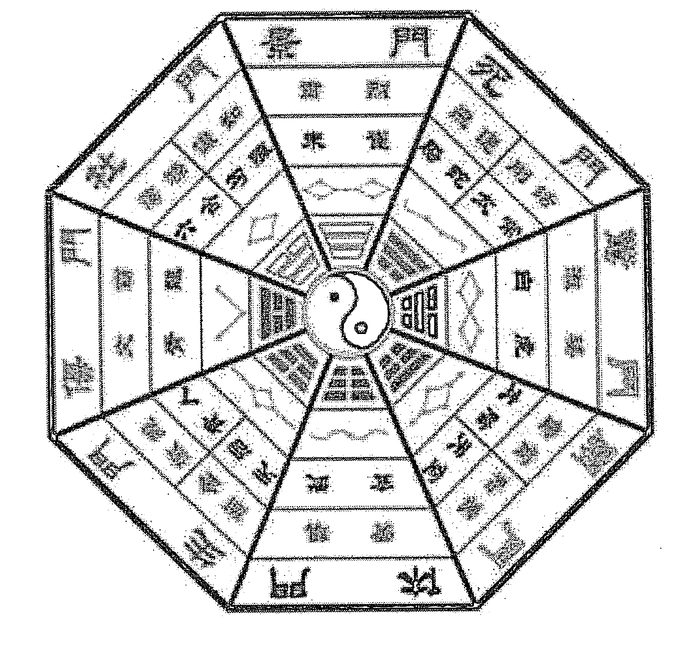

### （上）
### 六甲神法筑道基 太上符咒显神奇

### 第一章 六甲符法
道家符箓一派，形成于东晋南北朝时期，以专门传播《灵宝经》而得名。然符咒之术，由来久矣。黄帝受之于西王母，而传之少昊，少昊传之颛顼（Zhuan Xu），代广其意，而绵传不绝。李耳尽发其秘，仗符咒而开道教，徒者众矣。后当春秋战国之世，术者见世之终不为也，乃退隐严壑，以修养为事，符咒几于绝焉。至汉顺帝时，有张真人名陵者出，得异书于石室，入蜀之鹤鸣山，息居修炼，以符箓为人治病，驱鬼役狐，无不立应，人乃尊之，后得天师封号。今道教所以不衰者，良以有天师也，天师之所恃以役使鬼神之道，全仗符咒为之主。符咒之力，可见其伟也。

#### 一、符、咒、印
符咒即代表鬼神之语言文字，用之得当，能上格神明，下通幽府，有不可思议之神效。

- 1. 符：就是书符，代表灵界公文和法规。
- 2. 咒：就是咒语。代表灵界密码和歌颂号令，起到对鬼神的说服作用。
- 3. 印：法印代表着三界神灵职司的威权，作用很大。故行法用印，犹人间行政施行必用官印。一般加盖在符上以增强符的威力，或是加盖在向上呈递疏文、表文上。法印有石、玉、木、金等各种材料制成，雷击木最好，一般由师父开光后授予弟子。开光有秘符、秘法。

### 六甲法术奇门应用法印主要有：
- 六甲神印：是六甲法术奇门修炼的主要法印。用于召请六甲神将执行法令，治病，祈福，祛灾。
- 道经师宝印：简称三宝印，相当于国家或部门公章，籍三宝之力召役鬼神。可用于各类符咒，上章申表、发书遣文等。一般用于超度、还阴债及放生等化解因果法事。
- 太上老君印：老君乃万法至尊，老君做主，有灵有验。一般用于修炼、祈福、召役鬼神、通圣达灵、降妖制鬼等。
- 张天师印：天师乃降魔护道天尊。天师印主要用于制鬼降妖、驱邪治病、镇压诸煞、养身护体、调理气场等。
- 八卦印：调理阴阳，逢凶化吉。一般用于调理运气、和合婚姻、治病养神、定局等。催婚、治病、调理阴阳宅。

#### 二、符咒种类：共分五类。镇压、祈禳、请召和医治及修炼等。

#### 三、符咒用纸：五色纸都可以，门上、墙上、地上、空中、水里都可以画符。

#### 四、符水：
一般用朱砂（要用水飞朱砂）、白酒、白芨研磨即可，也可以掺雄黄、小孩胎毛、天未亮前到井里打的五更水与雨水掺和的阴阳水等，也可以用长江黄河的水，五岳之山上朝南一面的石头、长城上的古砖等等。

> 【催财、催官等凡是增加的，用黄纸红笔画符，凡是驱邪化煞等去掉消去的，用红纸黑笔画符。此乃天机，切记。】墨汁要加点朱砂。

#### 五、符笔
毛笔、剑指、香、舌尖、眼睛等，用舌尖和眼睛（意念）画符效果更好。砚笔等均宜整洁，符笔不可口中含之或吮之。

画符之用品不可经妇人（怀孕的、生理期的、哺乳期的妇女）之手，此为大忌！

提笔画符前先诵：

- 净口神咒：嗡！玉池涎净，罗千气凝，虎贲异香赦！
- 净身神咒：嗡！三华冲谷，五炁混凝，内外真白赦！
- 净心神咒：嗡！台光莹洁，神怡灵台，应变天真赦！

然后再咒笔：此笔非凡笔，精气神注成。一笔天地动，二笔雷霆响，三笔鬼神惊。笔笔万万灵，急急如律令！新毛笔第一次用时要咒。

（为客户服务时，到他家里，最好是让他去买笔、朱砂、白酒、墨汁，让他升起一颗恭敬之心。买的新笔要咒笔，等于开光。）

#### 六、结构：
- 1、符头：由于派别不同，符头也有也有所不同。最常见的是“三勾”符头，代表三清或三界公。三勾在整个符上面代表三清，在敕令及神名之下代表三界公（天、地、水）。在榔梅符法中，符顶“三勾”代表三味真火。
“符头也有敕令、雷令……等等作为符头，其种类繁多，因教派不同有所差异，一般请神，调兵遣将，多书以“敕令”为符头。
下笔书符头时应默念咒语：一笔天下动，二笔祖师剑，三笔凶神恶煞去千里外。一笔一句恰到好处，就是所谓踏符头。
如无“三勾”三清符号时，必须咒曰：天圆地方，律令九章，吾今下笔，万鬼伏藏。

- 2、符腹：符腹就好比一个腹部的肠胃，是我们书明符咒作用之地方。

- 3、符胆：符胆是一张符令的灵魂，是符的主宰。一张符充分发挥效验，在很大程度上取决于是否有符胆镇守其中。
书符一般都称为入符胆。入符胆的意思就是请祖师（神明）镇坐于这一张符令之内，把守此符的门户。

符胆是分别有一些密字所组合而成。一般常见的符胆是“罡”字，也有“井”字，也有“马”字、“化”字等不胜枚举。

### 符胆的顺序（见下图）
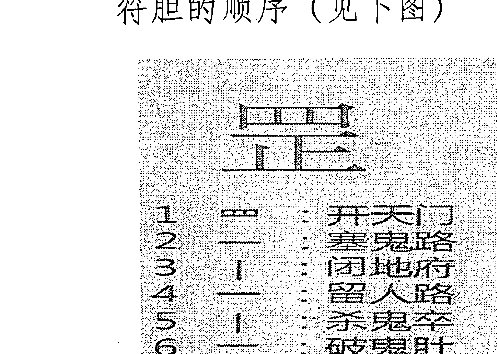
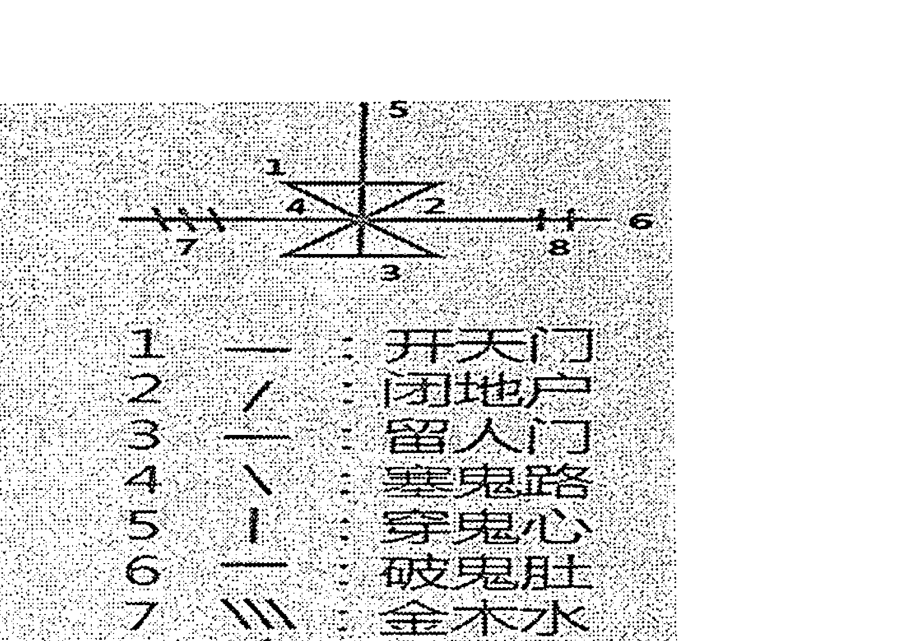

- 4、符脚：用于结束一张符的书写手续，它也有及其重要的地位。
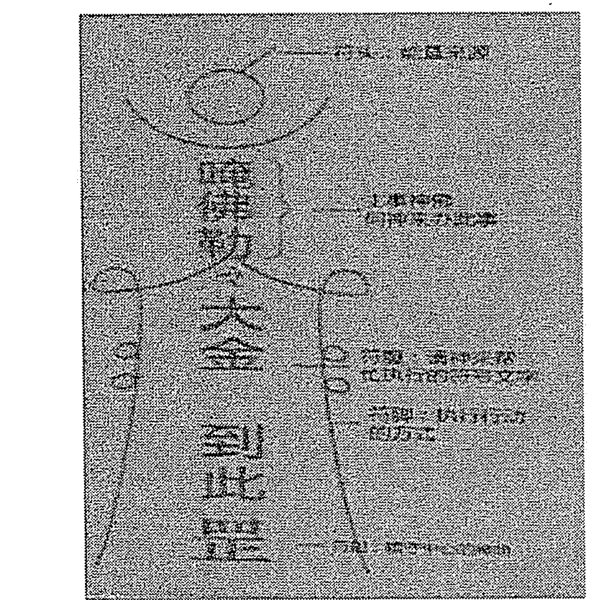
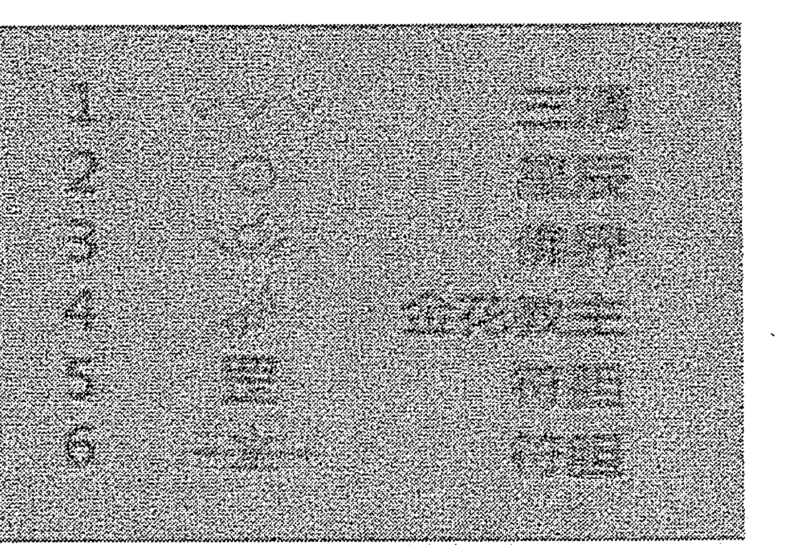

#### 七、启动能量：常言道，画符不知窍，反惹鬼神笑。天罡是奇门兵马所在之处，是符注入能量的密码，不知天罡，画符无用。启动符的能量就是向符注入天罡之气，只有这样画的符才有效力。

> 古云：
天罡之处有雷霆，便向此处役六丁。

##### 1、找天罡：
天罡有外天罡、内天罡之分。向符注入天罡之气一般用外天罡。方法是将月将加时上至辰止。

- (1) 伸出左手掌，无名指根部为地支子，从子顺排十二地支到小拇指根部。
- (2) 找出月将。当月的月建合支即是月将。如酉月合支辰，辰即是月将。
- (3) 伸出左手掌，将月将放在时的地支位置上顺排至辰止，辰所落的地支方向即是天罡的方向。如月将是巳，当时的时间是午时，将巳放在午上顺排至辰止，辰落在地支巳上，则天罡的方位就在东南方位。

> 古人诗日：
天罡之处天地开，出师行军任徘徊。
吾兵被困不要忙，加时出路是天罡。

| 月将 | 子 | 丑 | 寅 | 卯 | 辰 | 巳 | 午 | 未 | 申 | 酉 | 戌 | 亥 |
|------|----|----|----|----|----|----|----|----|----|----|----|----|
| 子 | 辰 | 巳 | 午 | 未 | 申 | 酉 | 戌 | 亥 | 子 | 丑 | 寅 | 卯 |
| 丑 | 卯 | 辰 | 巳 | 午 | 未 | 申 | 酉 | 戌 | 亥 | 子 | 丑 | 寅 |
| 寅 | 寅 | 卯 | 辰 | 巳 | 午 | 未 | 申 | 酉 | 戌 | 亥 | 子 | 丑 |
| 卯 | 丑 | 寅 | 卯 | 辰 | 巳 | 午 | 未 | 申 | 酉 | 戌 | 亥 | 子 |
| 辰 | 子 | 丑 | 寅 | 卯 | 辰 | 巳 | 午 | 未 | 申 | 酉 | 戌 | 亥 |
| 巳 | 亥 | 子 | 丑 | 寅 | 卯 | 辰 | 巳 | 午 | 未 | 申 | 酉 | 戌 |
| 午 | 戌 | 亥 | 子 | 丑 | 寅 | 卯 | 辰 | 巳 | 午 | 未 | 申 | 酉 |
| 未 | 酉 | 戌 | 亥 | 子 | 丑 | 寅 | 卯 | 辰 | 巳 | 午 | 未 | 申 |
| 申 | 申 | 酉 | 戌 | 亥 | 子 | 丑 | 寅 | 卯 | 辰 | 巳 | 午 | 未 |
| 酉 | 未 | 申 | 酉 | 戌 | 亥 | 子 | 丑 | 寅 | 卯 | 辰 | 巳 | 午 |
| 戌 | 午 | 未 | 申 | 酉 | 戌 | 亥 | 子 | 丑 | 寅 | 卯 | 辰 | 巳 |
| 亥 | 巳 | 午 | 未 | 申 | 酉 | 戌 | 亥 | 子 | 丑 | 寅 | 卯 | 辰 |

##### 2、赐符胆：赐符胆就是向符内注入天罡之气，这是符的效力大小的关键。其方法是：符画好后，将毛笔尖指向天罡方位，引入天罡之气下来，然后用笔的另一端在符胆上，由下至上用力点三下注入天罡之气。

##### 3、下印：画符后下印。下印时要念下印咒：
天圆地方，人遁九章。吾今下印，阴阳显藏。敬请仙师，赐福纳祥！吽 哈！

##### 4、熏符：上述程序完成后，持符在香上按顺时针方向转三圈，并默咒：道由心学，心假香传（假的意思是借）。通过熏符及心中默咒，而将信息传递与祖师。此是一大秘密也。（其实没有祭炼六甲神将之前，没有炼太极玄功之前，用这种方法，等到祭炼六甲神将成功之后，或太极玄功达到一定程度之后，这种方法根本不需要，因本身就具备了很强的能量，当你画好后，六甲神将会主动的给你加持能量，本身又具备了能量，所以根本不需要。但在没祭炼神将之前这几步是不可少的，要不符画出来没有用。）

##### 5、掐请神诀。
- 日君诀：拇指掐于食指第一节。画符时中指尖贴于符上，引太阳真气入符，借神灵助威，驱邪伏鬼，增加符的灵验性。
- 月君诀：拇指掐于无名指第一节。画符时食指、中指尖贴于符上，引月亮真气入符，借神灵助威，驱邪伏鬼，增加符的灵验性。
- 白天可用日君诀，晚上可用月君诀。
- 天罡诀：拇指掐食指指甲处。一般用于踏罡步斗。
- 剑指：踏罡步斗时，一般右手剑指。
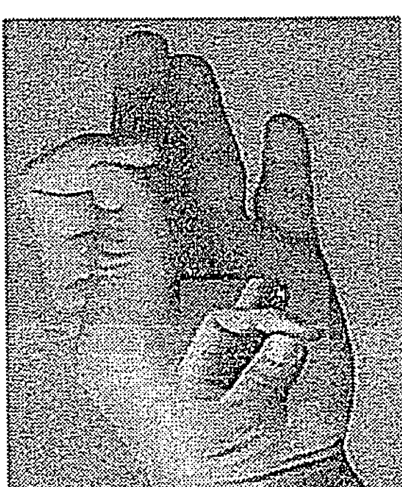
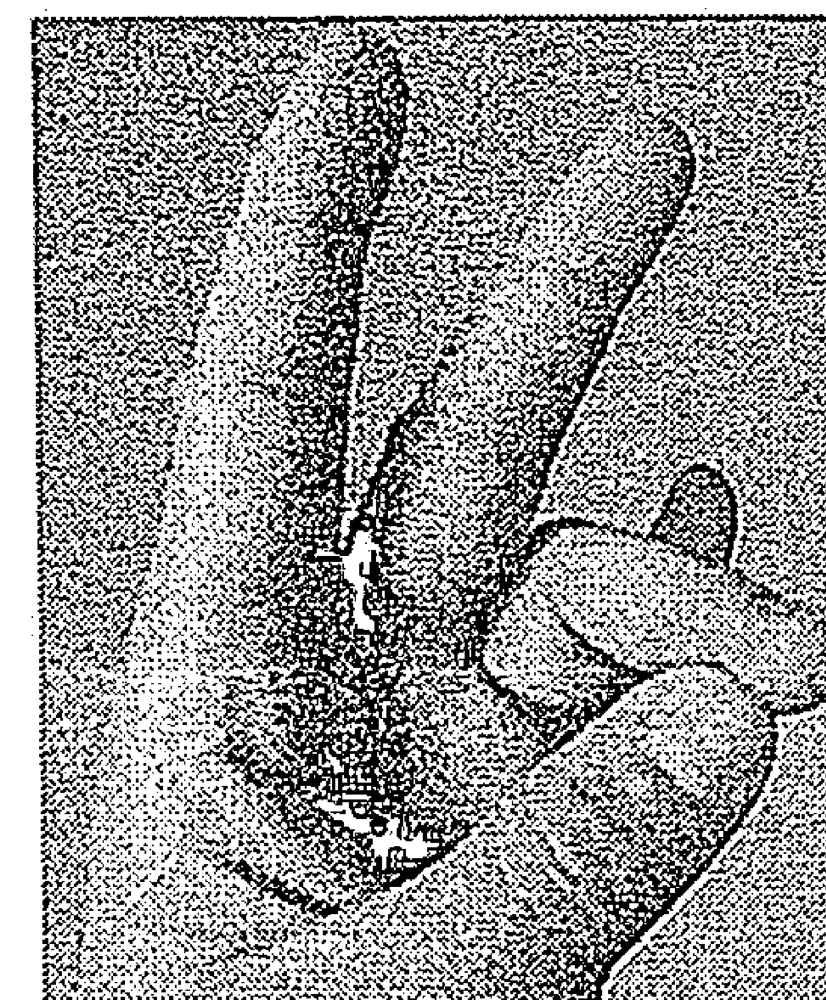
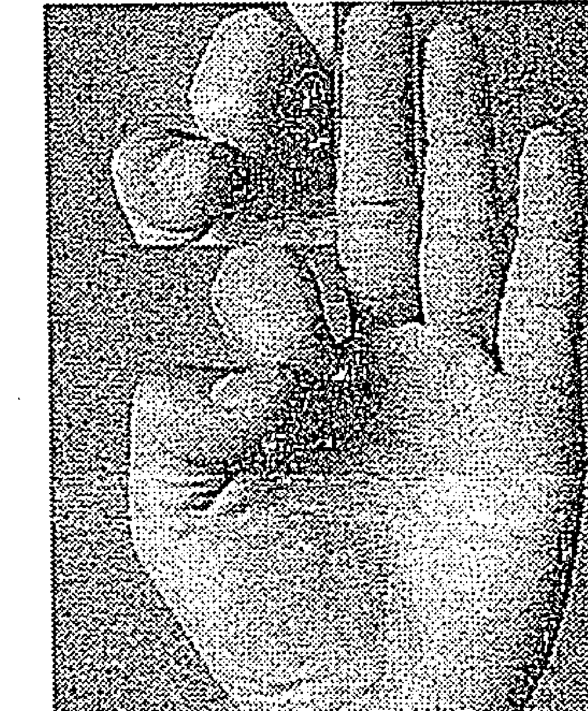
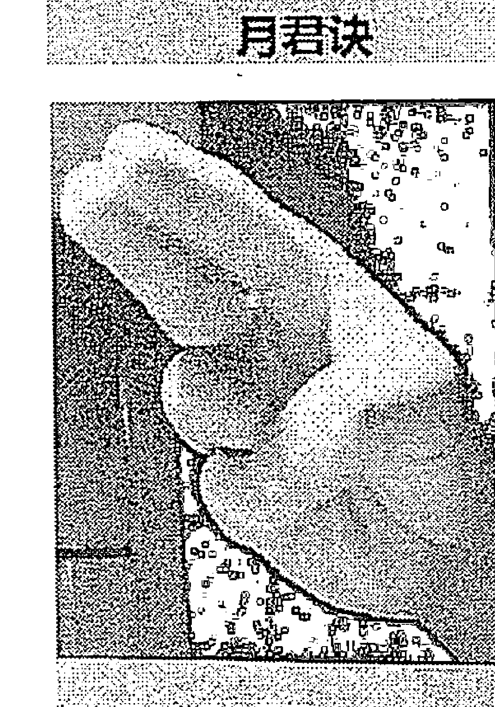

#### 八、书符七戒：心念不正；手口污秽；用品不洁；心口不应；方向不正；啖浑饮酒；复笔改写。

#### 九、书符五忌：孕妇手取；污秽者符；旁人扰乱；符咒不合；符坛污秽。

#### 十、书符要点：聚精会神；诚心诚意；清除杂念；思想专注；净身沐浴。

#### 十一、书符忌日：三月初九；六月初二；九月初六；十二月初二。修仙之人，这几日不可男女相见。

#### 十二、书符吉时：每日的丑时、寅时、辰时、申时、酉时，正月初一卯时、三月初三巳时，五月初五未时，九月初九戌时。

#### 十三、用符要诀
每道符因功用不同，用法则各有要诀，必须了解、掌握才可发挥功效。

- 1、吞符要诀：吞服之符大多为治病所用，画就之后，其一即以右手执符之上端，姿势既正，心口相对，即将符就鼻端口凑上、从下方吞下。吞符时，应空心肚，清晨日出时，最为适宜，完毕漱口三次。其二则将符书就之后，就香炉焚化之，取其灰，用檀香汤送下。
- 2、焚符要诀：焚符时一手执符上端，火从下往上烧；若诵咒则火着纸角口中即诵咒。须心口相应，焚完时，适咒亦诵毕，此第一要点。焚符所用之火，不可向灶中或他处取来，须新火为宜（坛上的蜡烛火可以），焚符用纸之大小，视所诵咒字句之长短为度，取其焚化时间与诵咒时间相等，则火熄时，咒亦能诵毕也，此为最要之点。
- 3、粘符要诀：镇压所用粘贴之符，如粘于室内，应粘在室内上限正中，粘于梁上的则须粘于最高正中之梁上，不可稍偏，偏则不验。当粘贴时，则须家主亲净乎执行之，切不可委托于妇女小儿等，如怪物出现等符，以夜半子时粘贴为宜，并不许四眼见（贴符时不要有第二个人在场），最为灵验。
- 4、祝符要诀：此祝符非祝由，不用笔墨纸现，即以右手指空书，也是解禳一种，随处随意可行。如夜行祛除鬼魅等类，口中诵咒时须口与指同时进行，与画符相同，但空书时脚跟应立定，心中别无他念，志诚出之，诵咒尤须口气出之，指法不能错乱。行之自有不可思议之效力。
- 5、埋符要诀：埋符主要用于镇压邪鬼或土地不吉等。符画在厚纸或画在木板上更佳，于清晨日出之际，不为他人所见，依方向挖地深一尺许，先以洁净黄纸一张，铺在下面，然后将符平铺在上面，如埋在东方，符亦须对东方，以此类推。如符与他物同埋者，符在上面，它物在下面，切不可将符盖没，此最宜注意。
- 6、佩符要诀：将所画之符佩戴于身时预防邪侵之要诀。佩符之要诀，当先画符一道，以符之大小用黄布制一小袋（佩戴之符纸张应二三寸大小），即将符装入袋中，并装黄豆七粒，灯芯七根（灯芯草剪一寸长就可以）。日常佩戴可祛鬼魅，逢凶化吉，百试百效。

#### 十四、诵咒秘法
咒语一为朗诵，如镇压请召等咒；一为默诵，如敕神役鬼等咒。

诵咒有符前诵咒者，有符后诵咒者，有符咒并行者。惟与符并行之咒，符毕，咒也须适止，遍数不能多少，字句不能增减，手口相应，且须一气而下，其余如先咒后符者，咒毕，即握笔书符，先符后咒者，符毕，即行诵咒，皆不可须臾延迟，作法者宜再三注意之。

##### 1、诵咒之避忌：
诵咒三宜：宜正心，宜垂睫，宜一气贯注。心正则邪念不生，睫垂则邪色不见，一气贯注，则与众神呼吸相通，故得令出将到之效。

避忌有四：避淫秽，避血光，避喧扰，避妇女。此四端，皆为神将真仙所忌，故须力避也。若能依次而行之，必咒出令行，神鬼只遵。

##### 2、诵咒须变神：
诵咒不啻与鬼神晤谈，而告以请召之缘由，使代作法，然吾人平时对于鬼神，尊敬不暇，何役使之耶，故必有符。符者，上界主宰之命令也，我则代上清行其命令而役使之者也，我身不啻上清之代表，故宜存代上清行令之心，在此行令之际，我即是上天，一切神将鬼卒，皆当听我号令，于是在焚符诵咒之先必须变神瞑目屏息，垂手直立，向四方各吸三口气，此亦示诸神以威严，使知我乃奉命于上清，此时威权，实不啻上清。也，变神毕，始可焚符持咒。

##### 3、诵咒之五净：

天仙神将，久处清静之天，偶入红尘，已觉秽浊不堪，若再以人世间污秽气袭之，岂但不能一刻留，抑且远而避之矣，故凡遇请仙召将者，宜先知五净，否则必无应验。

- 一日净坛，法坛所在之地，宜于三日前洒扫干净，熏以檀香；
- 二曰净宅，凡设坛之家，内外上下，俱宜清洁，如有孕妇等，宜早避去；
- 三曰净身，凡出入法坛之人，皆宜先期沐浴更衣；
- 四曰净心，凡作法之人，三日中必须心中一念不兴，一思不动，使心明净；
- 五曰净口，凡作法之人，宜先斋戒三日，使无荤秽之气，如斯行之，可必其灵应也。

##### 4、诵咒姿势：

诵咒之时，宜行察定方向，然后屏息端立，头微低，目下睫，手下垂，足作八字形，然后迅疾高诵，无论其咒之长短，字句之多少，要以一气诵完一遍为要，诵咒时身宜直立，不能摇动，否则如小学生之背书，摇摇摆摆，殊失尊敬神将真仙灵之意，亦不可不慎也。

##### 5、诵咒步法：

诵咒时，有须转身者如召护身神将，须向四方诵之；非仅一转也，此则须讲究步法，步法有二，曰剑步，曰禹步，剑步，足向乍进乍退，拜奏表彰时用之，禹步即步魁罡也，两足纵横前后作丁字形，不能相过，礼斗召将时都用之，此系与神明相见一种仪式。

##### 6、诵咒之捏诀：

诵咒时除去上述各要项外，有捏诀一事，亦慎重要，惟非每诵咒必捏诀，特紧要之处，始一一用之。

注：画符有时会注明特定的日子：如木危危日。木是日的纳音，第一个危是二十八星宿之一的危月燕星临的日子，第二个危是黄历中的十二值。木危危日是三个元素相重叠的日子。

### 第二章 六甲护法

每个人都有自己的护法神，做法术、风水调理时必须要有护法。护法神就是我们的阴阳贵人，也称童男童女。阴阳贵人以出生年命查，其某两个十二地支属相即是。查法如下：

甲戊庚牛羊，乙已鼠猴乡。
丙丁猪鸡位，壬癸蛇兔藏。
六辛逢马虎，此是贵人方。

古人做法事时都找两个分别不同属性的童男童女分站两旁，起到保护作用，现在社会发展已经不太现实，但可以画护身符，同样也能起到作用，也可找两个吉祥物，若能找到贵人当然更好。

用童子尿（7 岁以下）、处女的月经子画符放在身上护法效果最佳。如下图：

##### 巳午未申酉戌为阴

| 巳 | 午 | 未 |    |
|----|----|----|----|
| 辰 |    | 申 |    |
| 卵 |    | 酉 |    |
| 寅 | 丑 | 子 | 亥 |

##### 亥子丑寅卯辰为阳

护法分阴阳：男为阳，女为阴，按男左女右站立或放护身符。

#### 护法名讳：

甲子神：黄镇将军，丁卯神：文霸将军。
甲戌神：重质将军，丁丑神：尚金将军。
甲申神：刚铫将军，丁亥神：和衷将军。
甲午神：肃烈将军，丁酉神：淑姿将军。
甲辰神：荡涤将军，丁未神：飞通将军。
甲寅神：激杀将军，丁巳神：俨如将军。

护法既是护法神也是财神。平时可多持诵观想自己护法神的名讳；在美食和筵席前可掐六甲诀（如图）先恭请护法神来享用。

在遇到危难时，可以召请护法神护身；在生意中可以召请护法神催财进宝。

### 第三章 太极玄功

##### （一）启灵

启灵，简言之：就是启动与三界隐态祖师取得场能上的联系。由于所学师父经过长期修持，已经与三界隐态祖师建立了深厚的感情，师父与隐态祖师之间的联系渠道畅通无阻，师父通过特定的符号真言，把修炼者的信息推介给隐态祖师，通过师父传灵与自己修持，建立起能量信息通道，从而增强和达到修炼效果。

太极玄功是六甲祝由术必炼的内容，主要作用就是增加能量。

太极玄功修炼就是以启灵传符方式让修炼者与三界隐态祖师进行沟通。这一功能极其重要，因为启灵符，书有我派特定启灵方式，它上面有师父的专有信息，是修炼者赖以进入我门的根本通行证，它是根据修炼者的名字、住所方位、联系时间等前提条件，遵循特殊规程，一人一份单独加入信息，故不可传播混用，复印更谈不上灵信。它是具有介绍性质的特质启灵符，没有该派师父的传灵沟通，盲目自我修持绝无成功。

此符不可污染或轻易让人传看，否则必自误修持结果，修炼者可按说明使用。

##### （二）修炼步骤：

- 1. 请师：叩拜恭请马天君祖师显现真身大光明，弟子一心专拜请马天君祖师急急降临（每次修炼前默诵三遍）。
- 2. 观想：将启灵符贴于丹田处，静坐或静站均可。两眼垂帘，舌抵上腭，自然呼吸（窍点）。观想头顶上方出现七彩云，然后清凉清澈的雨水从云而降，灌入自己头顶，清洗自己身内身外，从头顶、颈部、胸腔、腹腔、脏腑、骨骼器官血液等等，清洗双肩、双臂，清洗双腿、双脚，特别是已知的病灶等，病气浊气呈灰黑色从指甲和趾甲、脚心流入大地深处，缓缓的不断清洗三至五遍。
- 3、取球：双臂张开上举，意念双臂无限长，伸向宇宙边沿，抓着边沿把宇宙缩成一个圆球。
- 4、灌体：把宇宙缩成能量球，从头顶百会处灌入中脉，同时，观想自己体内中脉为一条明亮、透明管道，如手指粗细。以后逐渐增大至直径五公分粗，甚至更粗。
能量球从百会进入中脉后，沿中脉下行至会阴，复提到丹田，并将中脉照的通明透亮。同一个动作重复9次，每天早晚各一次，也可以随时随地修炼，不受场地、时间、环境限制。若有慧根者，常在静笃虚灵状态下修炼，9天即可练成，一般修炼者需49天。
- 5、收功：意想能量球变成一颗金丹，金光四射，把全身照的通透，然后越来越小，将其收入下丹田。
收功完毕后，心中默念：多谢仙师加持，恭送马天君返回天庭。

经过修炼一段时间后，身体能量迅速提升，自有妙境显现，因人而异，各自不同，各有体会。不但能修复身体，又可达护体之效，防百邪之侵扰。修炼成功后，再依法修炼，即可启动胎息，打开玄关，达到延年益寿之效果。

##### （三）注意事项

- 1、练功期间，禁止房事；女生生理期间勿练。
- 2、练功期间，禁食五辛（葱、姜、蒜、韭菜、香菜）、牛、蛇、狗、无鳞鱼肉等。
- 3、心存善念，静笃虚灵，则事半功倍。
- 4、练功后半小时内不要大小便。

### 第四章 通神大法

通神大法是修炼成仙的一条捷径，是画符诵咒、催财催官和开光及风水调理运筹等法事的方便法门。修炼通神大法需按本门秘法种下“法苗”，接通与历代祖师的信息通道后方可修炼成功。

通神就是让神仙从天上下来，在自己身上住下，和神沟通，使自己变成神仙。

通神时一般取站立姿势，两眼轻闭，舌抵上腭，选择光线暗淡一些的环境。具体步骤如下：

- 1. 请神诀。如图。
- 2、持通神咒：
人在气中，气在人中，天人合一，为我所用，xx 仙师，驾云来至，入我天门，心莲化育，随意所长，与我同体，吾既是神，神既是吾，神吾合一。(诵三遍)
六甲祝由术请天医仙师、观音时也用。
- 3、意想莲花：
两眼轻闭，意念在心脏处化育出一朵盛开的莲花。由小到大，金光闪闪。慢慢下移到小腹里把小腹照亮，继而把全身照亮。然后锁定约 1-2 分钟的时间。
- 4、请师：
默念：弟子请 xxx 仙师下凡 (三遍)。
- 5、通神：
意想 XXX 仙师从天空驾祥云轻轻飘落在地，走到自己的面前，进入自己的身体，站在金光闪闪的莲花上，忘掉自己的形象，突然自己变成 XXX 仙师，形象金光万道。然后锁定约 3-5 分钟的时间。
- 6、送神：
修炼完毕后，意想 XXX 仙师站在金光闪闪的莲花上越来越小，继而走出自己的身体，莲花慢慢收缩变小，敛去光芒，越来越小，直至消失。
- 7、默念：
送 XXX 仙师返回天庭。

平时多练，用时意念小腹金光一闪，立刻即变成了神。通神大法可单独修炼，也可与太极玄功配合修炼，白天晚上均可修炼。修炼时环境光线暗些比光线亮一些为好；为防止妖魔冒充正神，修炼前可念净天地神咒避之。

##### 注意事项：

- 1. 女士生理期不能修炼，请神不来；
- 2. 做法事时家中有女士在生理期或孕妇，请神时在旁边也请不来；
- 3. 不要给在生理期的女士或孕妇做法事。特别是孕妇，她不但使你的法事失效，而且会破你的功法。

### 第五章 神将祭练

##### 第一节 神坛设置

- 1、神坛应设在安静、干净、明亮整洁的房间为好。神像必须经过开光。神像可以座坎宫、震宫、巽宫、坤宫。
家里不方便设坛，可以设一个活动坛，或临时坛，如果这几个宫位不方便设坛，也可以设在其他宫位，这几个宫位是最好的。也可以根据终身局判断你的坛设在那个宫位，首先看日干落宫，如日干落巽宫，可以把坛设在坎宫里面，坎宫生巽宫，这样更有力。生年命宫的宫位也可以。
- 2、必用的神器有香炉、烛台、蜡烛、莲花灯、香花、神台。
神台一定要高于香炉，香要低于神像胸部。神像大的就不要设置神台，不能让香炉高于神台，高于神台，一上香香会跑到神像头上去，神接不到香火。
- 3、供品数量以3、5、9数为好。大的供品按数量，小的则以盘为数。
不方便设坛的，可以设一个活动的坛，祭炼的时候，把神像请出来，上香；完了再收起来。活动坛也不方便设，就清香一柱，但设固定坛效果是最好的。

##### 第二节 开坛

- 1、选定吉日吉时，并请师父为启坛加持。
- 2、将神像落座在神坛上，蜡烛、新香炉、莲花灯、香花、鲜果、茶、酒、大米等物品、供品依次摆放好；所用开坛灵符准备好。
- 3、开灯、燃烛、上香、将启坛符燃于香炉里。
启坛符如图：
- 4、诵启坛咒（7遍）。

**启坛咒**
祈请太上仙师座镇本坛中
祈请道陵天师座镇本坛中
祈请马天君座镇本坛中
祈请三界十方天六丁神将座镇本坛中
祈请三界十方地六甲神将座镇本坛中
祈请三界十方水六丁神将座镇本坛中
祈请本坛六丁神将在本坛中
祈请本坛六甲神将在本坛中
祈请本境六丁神将在本坛中
祈请本境六甲神将在本坛中
祈请值年六丁神将在本坛中
祈请值年六甲神将在本坛中
祈请值月六丁神将在本坛中
祈请值月六甲神将在本坛中
祈请值日六丁神将在本坛中
祈请值日六甲神将在本坛中
祈请值时六丁神将在本坛中
祈请值时六甲神将在本坛中
祈请值日六丁神将在本坛中
祈请值日六甲神将在本坛中
虚室过往六丁六甲神将，来护坛，
各路六丁六甲神将
不分大小显威灵，
即日即时时刻祈请六丁六甲神将降本坛，
一年四季，时时刻刻降本坛，
弟子再三叩拜恭请祖师降本坛！

- 5、开坛：弟子某某，得一妙山人传授六甲法术奇门，弟子今日开坛修炼，恭请仙师垂爱加持！（7遍）

启坛一般是3--7天，在启坛结束后，不管是否每天更换供品，都要全部撤下。如有新的供品，可以重新上供。3天、5天、7天都可以，不能少于3天，供品不是每天都全部换掉，可以一天换一样；其它的如大米可以不换，以后上供品，可以简单点，上三样水果或干果，条件好的可以上酒、茶，茶、酒每天都要换，一杯茶不要供好几天。

启坛时，启坛咒最少诵1—3遍，越多越好，加持力非常强；设坛供奉谁的神像，太上老君的也行，道陵天师也行，一般是这两个，马天君有的你就可以供上，没有的就不要供；太上老君、道陵天师供一个就可以，有条件的三个都供上更好，没有条件的供一尊就可以。

平时，启坛之后，时间充足的话，每次修炼可以念上一遍，都会加持，都会降临本坛。启坛的当天就可以祭炼神将。

##### 第三节 神将祭炼

六丁六甲者，乃五行之祖。知此讳者，上可以保国，行兵讨寇；中可以降服虎狼，入阵刀兵不伤；下可以预报吉凶，通知未来之事。贵在乎精炼之久，而后能行也。

春，面东坐；夏，面南坐；秋，面西坐；冬，面北坐。
子后午前时段内，在净室中正身端坐。祭炼神将不得肉食，应素食。

- 1、沐浴、更衣、上香。
- 2、叩拜、祝辞：弟子某某某，得一妙山人接引，修习六甲法术奇门。弟子决心尊师重道，修身积德，弘扬道法，济世救人。祈望仙师垂爱加持！（每次修炼之前都要读）
- 3、画符：画天目通符（左）、天耳通符（右）各一道，焚化饮用后，再行修持，借以打开天目和天耳。也可虚空画在水里，再把水喝下（要祭炼一段时间后，能量上来之后，才可以；没有能量画上不起作用）。
每天祭炼之前都要烧化一道，化到碗里面，兑上阴阳水，凉开水兑上热开水就行。可以一次画几十张符，买一个新碗，水不要太多，先烧化再兑水。也可虚空画符，但要等到祭炼神将有能量后。
- 4. 结印：法印正面向上，炼印符放在法印的正下方，将法印和炼印符托在掌中（炼印符可在49天后化掉兑阴阳水服下）。左手在上，右手在下（女反之），两掌相托，两拇指指尖相接与掌平齐，收于小腹前。
- 5. 默师、观像。（窍点）默看一妙山人，观祖师的像。
- 6. 叩齿36遍：要点是叩齿、闭嘴、鼓腮。
- 7. 持诵“召请咒”49遍。声音刚好自己能听见为好，速度适中，从丹田发出，沉稳有力。并观像六甲、六丁神将站立神坛上下左右护卫坛场。同时观想法印发出光芒照耀坛场和全身。坛场一片光明，全身通透温暖。

**召请咒：**
> 吾奉太上老君之令，手持六甲神印，谨召六甲六丁，速至坛前，听吾号令，山魈鬼魅，妖魔精怪，即可消亡，吾奉太上老君急急如律令！

召请咒就相当于我们开会，先召集大家，就像部队训练，先吹集合号，让神将办事先诵召请咒，把神将请来，然后下指令，办什么事。

诵召请咒49遍有一个要点，就象下面这张图，黄镇将军听令、尚金将军听令、激杀将军听令……每诵一遍的时候，就观想和每一位神将沟通。比如第一遍，“吾奉太上老君之令，手持六甲神印……吾奉太上老君急急如律令！”，就跟黄镇将军沟通，现在召请的是黄镇将军，第二遍就是尚金将军……转四圈是 48 遍，再多念一遍，四圈零一遍，这是修炼六甲神将时的窍点之一，再往下修，还有更好的东西出来，每诵一遍召请咒对应一个神将，这就是窍点之一，会有很好的效果出来。
- 8、闭气持诵

**六甲讳咒**
鬼斗 鬼勺 鬼崔 鬼行 鬼里 鬼甫 鬼票 敕！
鬼尚 鬼原 鬼普 鬼藏 鬼殊 鬼双 摄！
急管送言来，与我通玄窍

**六丁讳咒**
鬼票 鬼甫 鬼里 鬼行 鬼崔 鬼勺 鬼斗 敕！
鬼这 鬼只 鬼泉 鬼徒 鬼未 鬼不 摄！
急管送言来，与我通玄窍

念一百遍一咽津，共九百遍，九咽津。六丁六甲者，乃五行之祖。若有慧根者，在清身、静心下修炼，炼之一个月后，可得神将梦报；炼之二个月后，可得神将耳报；炼之三个月后，可见神将显形。调遣役用，搬运财宝，所愿即至。常常炼之，有玉光百神护身，瘟病不然，逢凶化吉。
不要刻意追求神通，缘分到了自然就有。
- 9、收丹：待需要收功的时候，持诵召请咒三遍。意想手中的法印聚缩成一粒饱满的金丹收入丹田。然后，搓热双手拂面。
- 10、谢神：起身拜谢：多谢仙师垂爱加持！请各位神将速回天庭，再招再到。
- 11、收印：把开印符和法印收好放于印盒内，妥善收存。
十二神将画像不要放到神坛上供奉，享受香火。
- 12、修炼要求：
- 1. 不疑：信则灵，信才能与神将相应。
- 2. 恭敬：严肃、端庄、有礼貌。
- 3. 清净：清其身，静其心。人能常清静，天地悉皆归。
- 4. 慈悲：有了爱慈之心，则万众莫不感之，天地莫不应之，因为天性在人也。

##### 第四节 神将遣用

祭炼 49 天之后，方可初步运用，要求是三个月后。

- 1、起局看旬首，找出值班的神将。
- 2、掐请神诀，人剑合一，太上老君加持（要默念一遍）。诵召请咒9遍。
- 3、行令：

| 戊仪：黄镇将军 | 己仪：重质将军 | 庚仪：刚錂将军 |
| 辛仪：肃烈将军 | 壬仪：荡涤将军 | 癸仪：激杀将军 |

如甲辰旬：荡涤将军听令，请速将 XXX 历劫的冤亲债主超度到高级能量场修炼。不得有误！
- 4、送令：行令完毕，口中言道：多谢某某神将相助，恭请回转，再召再到。

##### 第五节 六甲神印应用

- 1. 祈福：让求法者手托六甲神印，任意姿势，但以跪在坛前较好。施法者端坐法坛一旁，面对求法者，掐请神诀，同时诵召请咒49遍或者倍数。要领完全按照坛前修炼状态。(3--7天)。
- 2. 治病：手持神印照着求法者百会穴，或者患病部位，先念：神印速应，神印速应！掐请神诀，再持诵召请咒49遍或倍数。
- 3. 探查：手持六甲神印，在需要的场地探查灵界物体，当感觉到法印有变化的时候，就是探查到了。
神印碰到灵异的东西或阴性物质，它会微微的震动，要认真体会，才能注意到。
用六甲神印为人祈福、做法、治病效果好，见效快，但易耗法师功力，功力弱者不可使用（祭炼初期不要用）。都要掐请神诀，诵召请咒49遍或倍数。

##### 第六节 召鹤飞升

人生富贵，能几时乎。道成即久，人将欲仙，须当割舍尘缘，上登仙路，此大快乐也。

其法：取桔皮一块，于高山石壁上，画一鹤形，先拜天地，再遥拜父母祖先。先以剑诀于鹤形上，画召鹤符一道，于上念附体咒三遍，掐附体诀，存祖气一口，望鹤一吹，其鹤自下，翔舞于面前。复以剑向各方，画六仪讳号六道，而呼徒弟，六将立降，乃曰：我与尔共事多年，今将归去蓬莱，尔等各归原所，毋再轻出，吾不在复用尔矣。六将齐拜，各出元辰丹一粒，以为饯别。主人吞之，即时身轻如鸿毛，呼鹤至前，骑于鹤上，与六将偕手，而腾蓬莱，与神仙为侣不复出世矣。先期一日，将纸上人画，取火焚之，勿留于世。

> > 附体咒：二五之精，归我六仪，附族生气，癸洩天机，急急如律令！

附体诀暂时不传，防止出现问题。

在三个月神将祭炼过程中，尽量不要有夫妻生活；如果有，48小时之内不要再炼，再炼时一定要沐浴更衣、上香；最好不要有，因为能量刚刚聚集，就放了，就没了。

### 第六章 六甲符咒运用

#### 第一节 运符心法

- 运用六甲符咒布局，一是要具有传承；二是值符落宫须生助用神宫。值符落宫生用神宫灵验有效。克用神宫不吉。这是运用六甲符咒布局的秘法。不起局也可以用符，但效果达不到。有的符可以单独使用，但有的符必须结合奇门局使用。
- 当奇门局信息很差或局中值符落宫不生助用神时，需起无中生有局进行寻时借运。
- 在处理阴性东西时，一定要在中宫烧5张能量符加持能量，然后再调风水，切记。
- 坤宫值符临用神时不能用符，因为符在坤入墓，越用能量越低，但有辛可以用符，值符不临用神则可。
值符是甲，甲落在坤宫，如果是用神，若是日干、月干、时干，这个时候就不要用了，越用能量越低；在不临四柱的情况下，可以用，有辛也可以用。

#### 第二节 丁甲符

这道符是我们常用的一道符，这是与我们的六丁六甲神将配套的符，一定要会画会背，这几道符一定要记住。
用于调遣丁甲神将催财、催官、治病、驱邪等。
运用时，化符，咒曰：人剑合一，太上老君加持。诵召请咒9遍，然后直呼神将名讳。
- 如布财局：请丙奇将军在巽宫速速催财，不得有误！
- 如调理：肃烈将军，请速速将坤宫煞气化去，不得有误！
- 如量局（吸收能量）：请乙奇将军在离宫速速助我能量，不得有误！
笔顺：先左右顺逆各三圈下竖，中写雷丁甲三个字，甲字竖末连做三顺圈，圈转下撇。

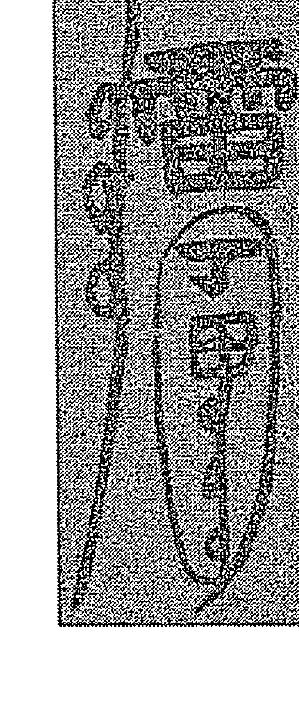
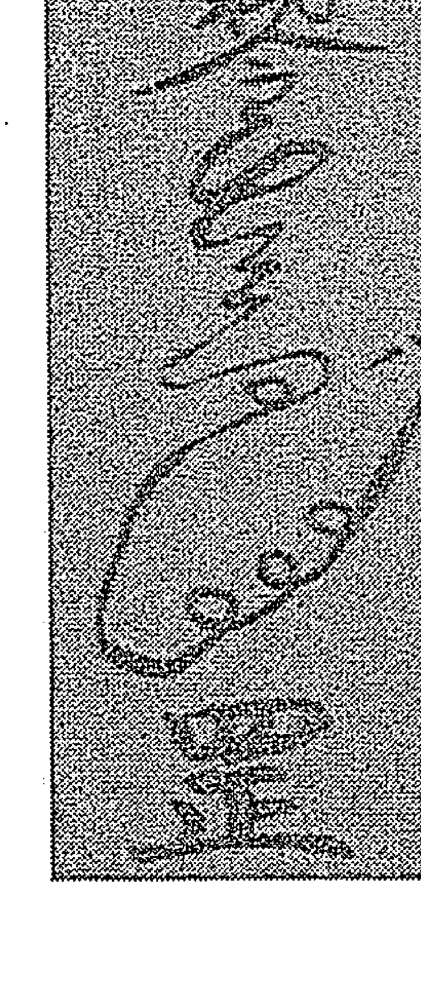
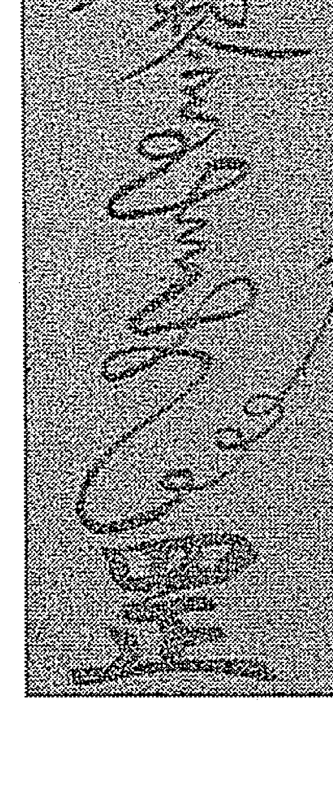
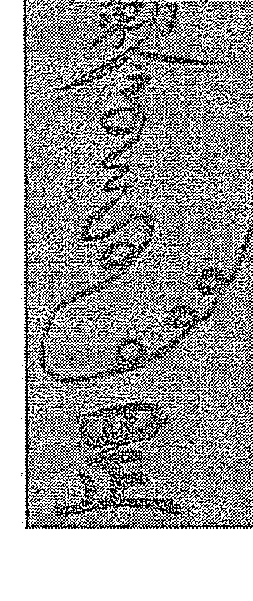

#### 第三节 专用符咒

##### 1、白虎星符

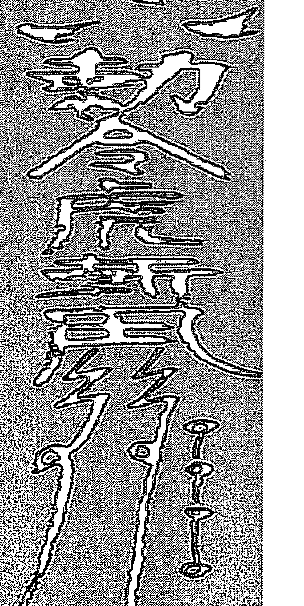
局中用神被白虎临四害冲犯者，主疾病、家破、人亡，粘贴或服用此符可克。
在白虎落宫贴这道符就可以，烧化兑上阴阳水或酒喝掉也可以。

##### 2、镇阴宅风水不利符

功用：阴宅风水，有关子孙兴替甚重，如有不利，用此符咒镇之。
咒语：混混沌沌，天地初分，生生死死，昏昏腾腾，风水所向，神应其灵，召请殷帅，为镇荒茔，有功之日，表达天庭。
笔顺：先在正中书一殷字，并涂没之，再书一画，两折而下，在中间向左作一圈，再向右向左各作一圈，成结形，至相接处直转而下，顺势向右上方一挑，中间加火字。
一般用杨木、柳木或桃木，画在木板上，埋起来最好；画在纸上，一下雨就不行了，但能量场还在，画时要诵咒。

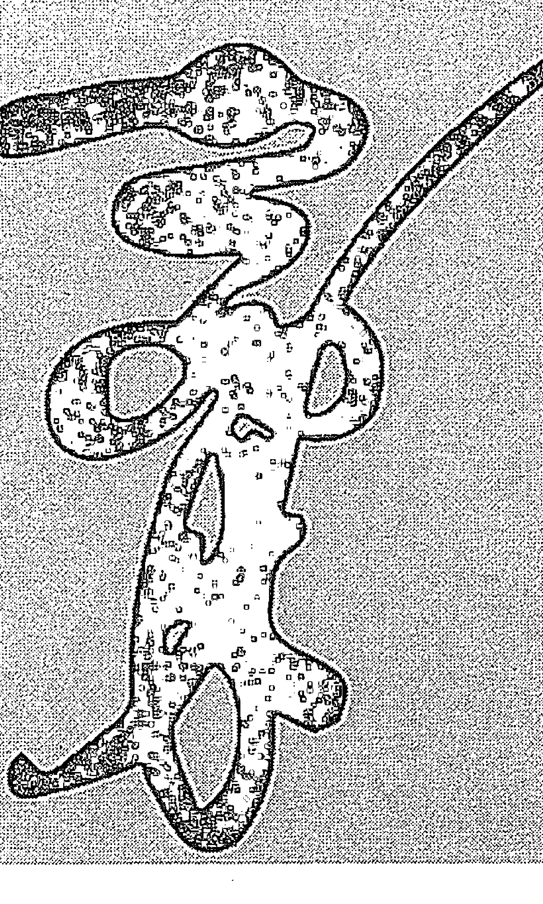

##### 3、镇阳宅风水不利符

功用：凡住宅风水不利，往往疾病、死亡、宜用此镇之。
咒语：乾坤一气，道之长存，散迷六口，聚会五行，不离不判，相克相生，太上符命，元始至文，凶魔邪祟，不得侵临。
笔顺：先在正中写一目字，再写一草书敕字，撇下时，转向左右二圈作结形，至相接出，直转而下，至底，复上挑，右方亦加一竖一挑，末左右各加一火字。
这道符用得最广泛，既能治病，可以催财，还可以调风水，边画边诵咒，制灵异、精怪家里不干净用，但是精怪弄死，容易留下因果，尽量不要用，处理灵异、阴性物体的时候，尽量不要把他弄死，弄死他会记住你，下辈子还找你，要采取赶、哄、撵的方法，让他走就行了。

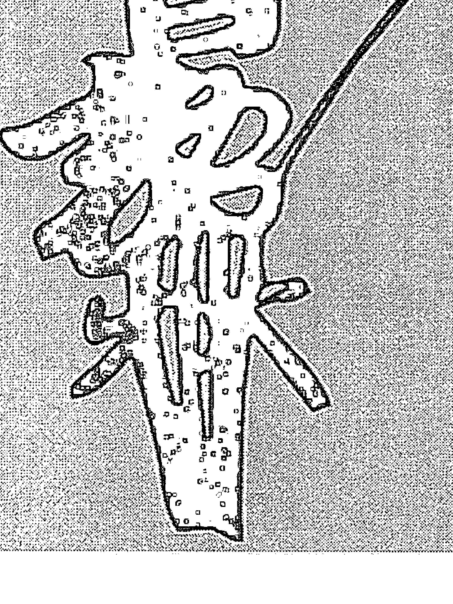

##### 4、镇家中精怪符

局中见五黄者，家中定有精怪出现，无论如何，即以此符和猪血洒之，精怪立死。

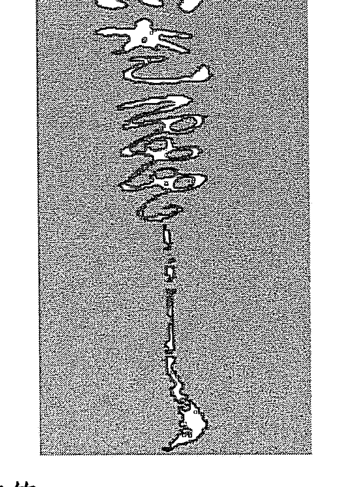

##### 5、防诸邪鬼缠符

局中见诸邪鬼缠者，每夕临睡前以此符和朱砂少许，同饮立除，预防也可。

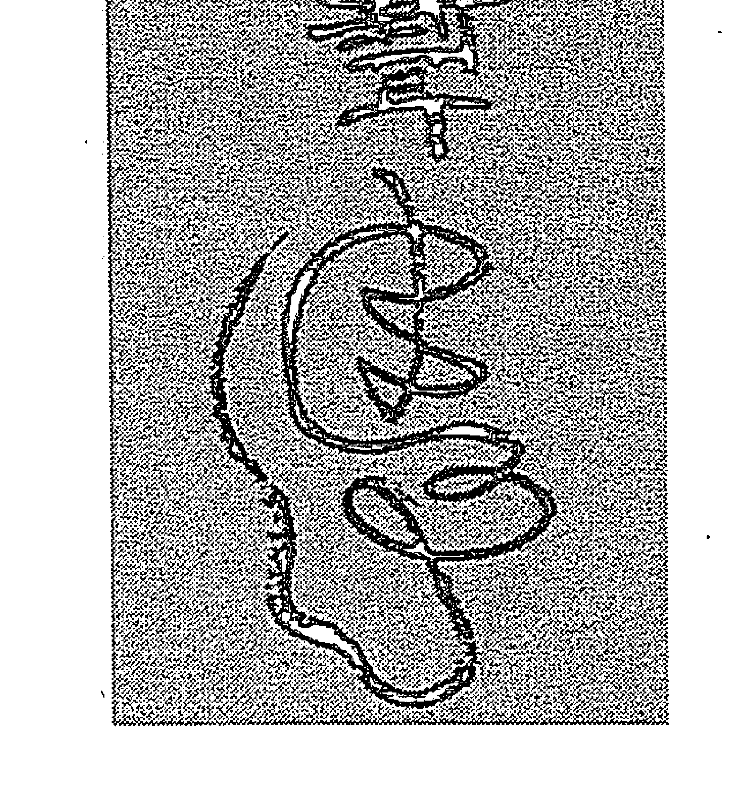

##### 6、老狐自退符

局中显示犯有狐狸精出现，以此符悬梁上，狐自退去。

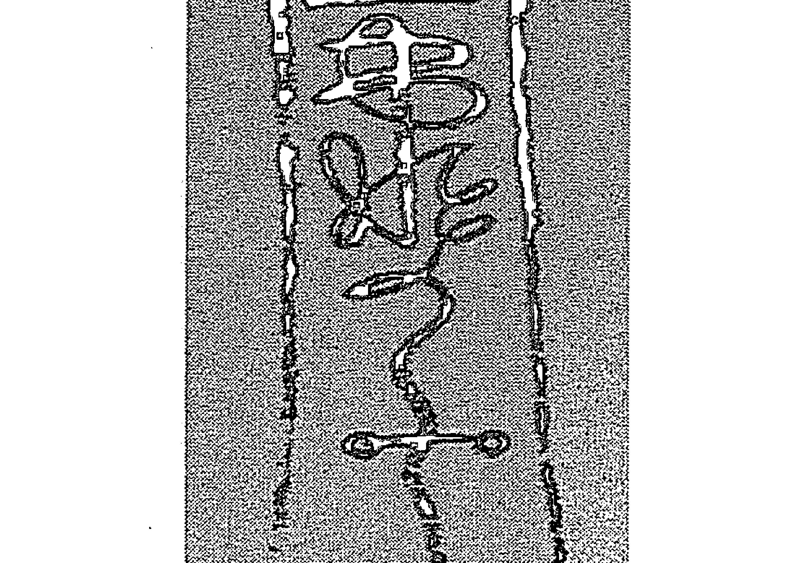

##### 7、安眠符

局中临蛇或被蛇冲克，睡眠不好，深夜不寐，最伤精神。速以此符置枕下，闭目念咒，不用他心，自能有效。
> 咒曰：结缔结缔结缔，自在将军在此！(100遍)。

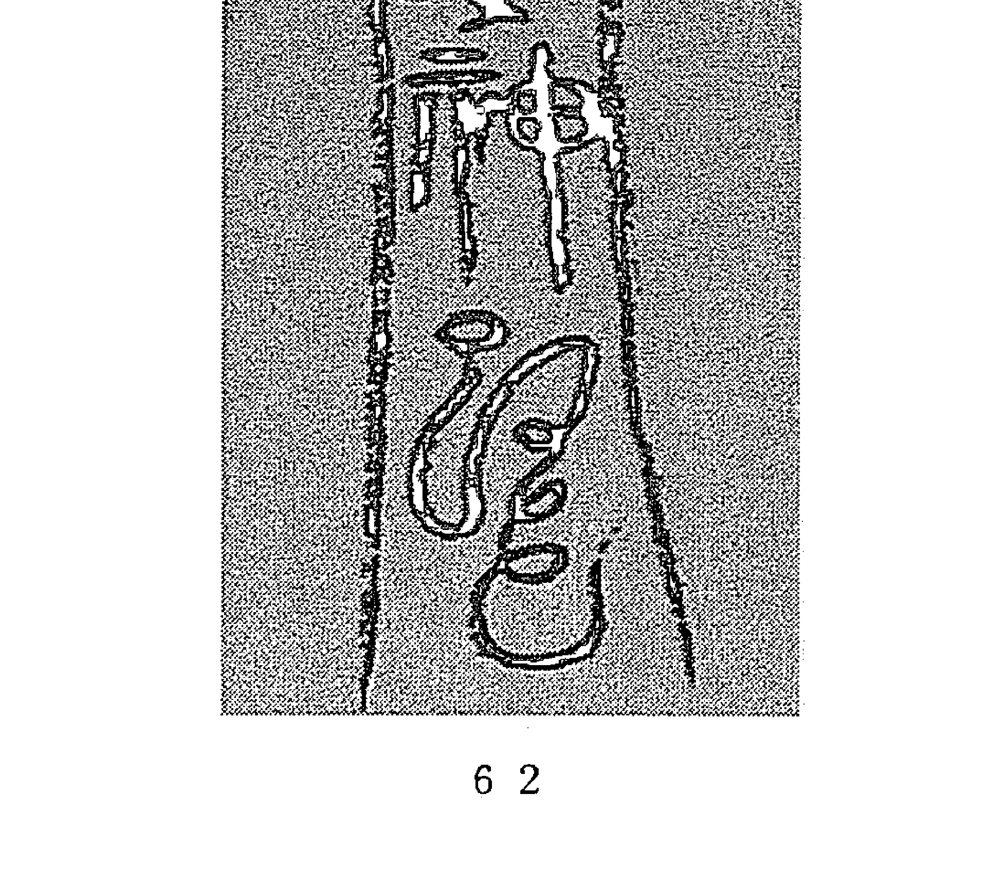

##### 8、太岁符

局中凡用神或年命被太岁临四害冲之，主死亡、疾病、不顺，用此符禳之可解。
> 咒语：天地光明，萬炁之根，广救浩劫，日月星辰，五方五炁，惟吾独尊，金光护体，长在长生。（画符时边诵边画）
笔顺：先写一雨字，下并写火木金三字，左旁连三点，竖下向右上方挑去，中间五曲一斜。

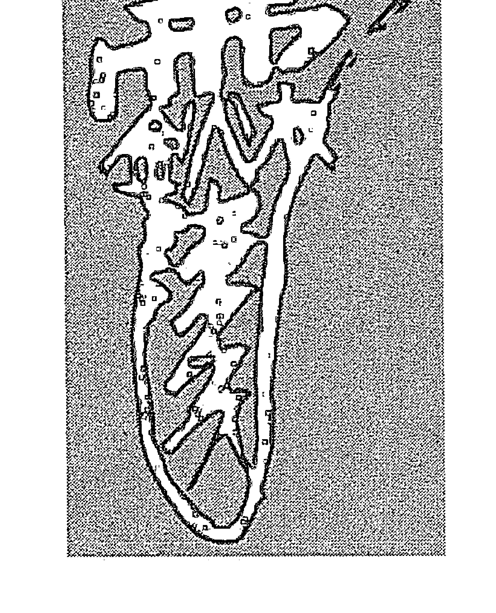

##### 9、土地符

局中见九地临四害冲克用神或修造因日时冲克，冒犯土府神司者，用此符禳之可免害。
> 咒语：危危土府，神祈最靈，永守土户，永镇土庭，各安土位，鬼神莫侵，功深守土，表奏天庭。
笔顺：先写雨字，末笔向左撇，连手顺作五圈，折下顺逆作二圈，平置左右，左方一划上挑，右方如之，各加三点。

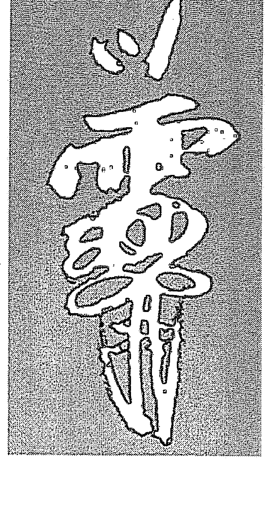

##### 10、命宫失财符

凡局中年命犯失财者，系流年相克，禳以此符咒可免。
咒语：吾今奉请，赵帅降坛，金轮如意，黑虎相随，降我遐福，解厄消灾。
笔顺：先写大字如上法，下一小划，连竖下转右方上挑，中写草书龙虎二字。
看年命落宫，又临戊或己，戊是大财，己是小财，临四害了或者被年月日时冲克了，肯定要破财，起局一看，凡是年命临戊的，又临四害或者是被年月日时冲克的。

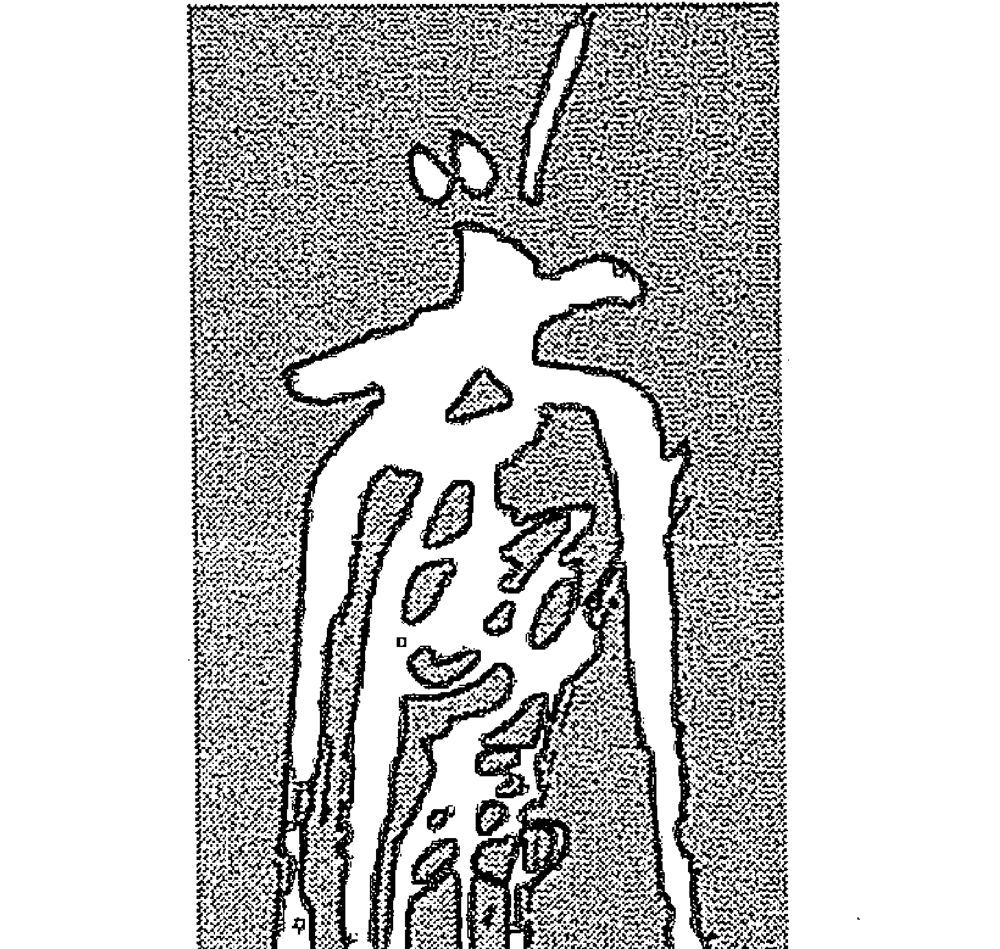

##### 11、天芮星符

凡局中天芮星临用神或年命又临四害者，主终岁颠连疾苦，宜用此符禳之。
咒语：太乙之篆，九转延生，病符退避，安定真魂，十方三界，自在游行，灵符一道，守魄安神。
笔顺：上作一土字，左右各一曲向下竖，中作干字，从划之左方起逆作五圈向右方上挑，推中间一圈特大，其下左右各三曲下撇，竖末写帝字圈没之。

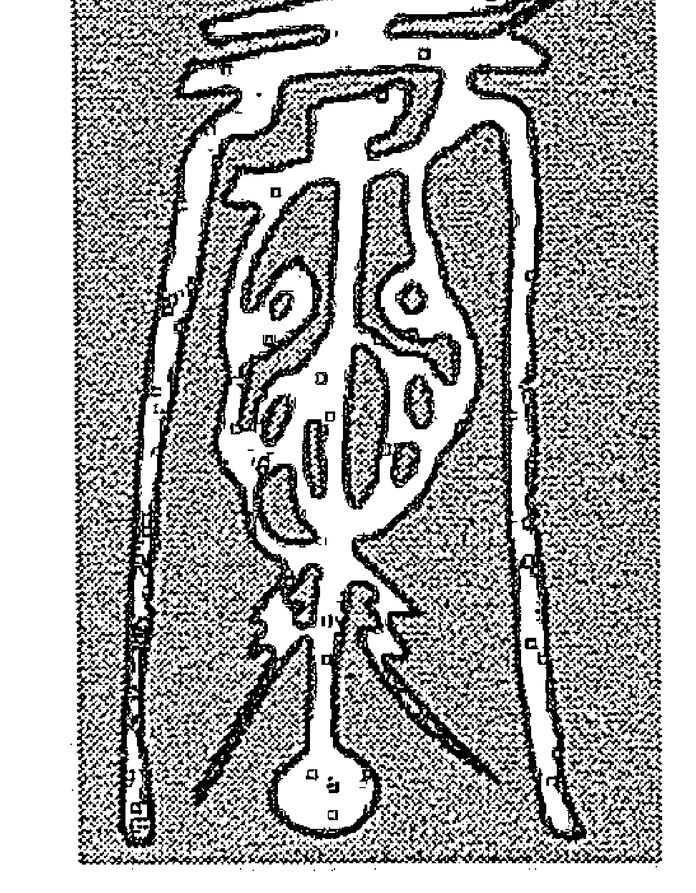

##### 12、镇年月日时不利符

命宫与年月日时相犯、相冲，易致意外，镇以此符可免。
> 咒语：五行五岳，天下之尊，乾坤同寿，日月同明，鬼魔束手，侍我而行，凶消灾释，道气长生。
笔顺：上面写一畧像乃字之草书，折下时连写一火字，在火字末一笔上连向下竖，至下方中间，向右折作一圈，泛挑向右上方，复于中间再写一畧像乃字之草书，折下连画二圈作结形，末下竖，竖下端起向左右各一挑。

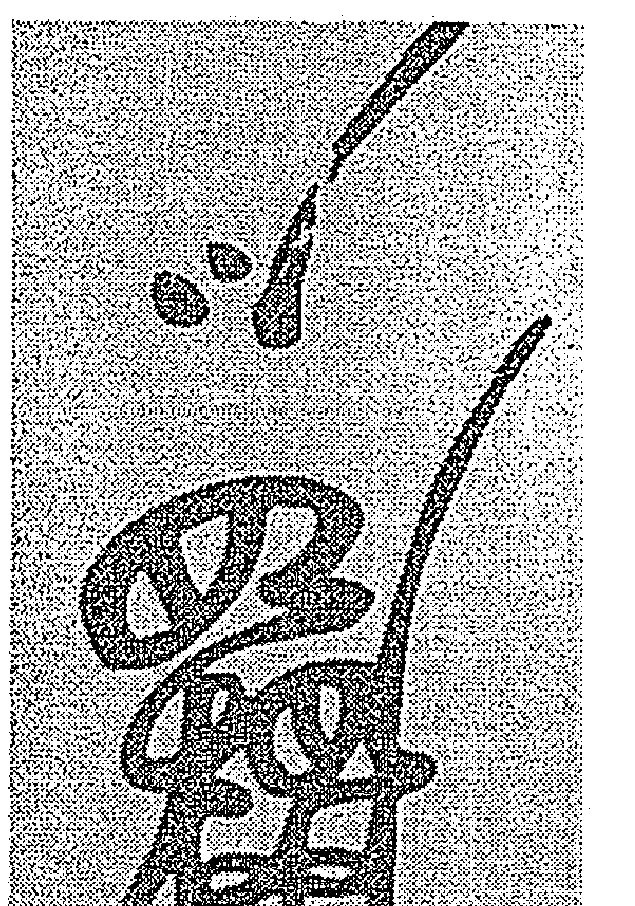

##### 13、太极镇邪符

功用：此符镇一切邪祟，居家平日皆宜张贴。
> 咒语：太阳之精，炼我之形，诸煞回避，保我元神，吾今持诵，一切安甯。
笔顺：先写一霹字，次写敕令二字，令字下写帝字涂没之，旁加三圈，自左而右。

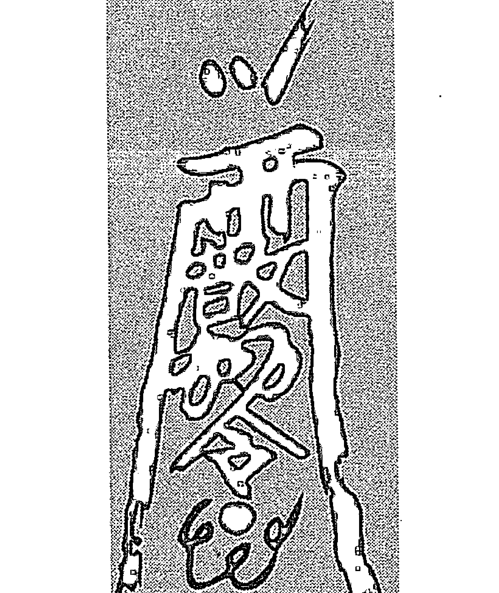

##### 14、开天门符

此符咒用于开光，请神作法时用之。
咒语：吾将祖师令，急往蓬莱境，急召速蓬菜仙，火速到坛筵，倘或迟延，有违上帝，唵哈哪咆叭咒（七遍）。
笔顺：先敕令二字，次自左下竖，微带三曲，抄过下方，再三顿向右上挑，中间左右顺逆作一圈下竖，微微三曲，其中写天开二字，下三圈左右二撇。
做法事、超度用，开光、还阴债都用到，但六甲神将祭炼好后，其实这个符用不上，没祭炼之前可以用这道符。

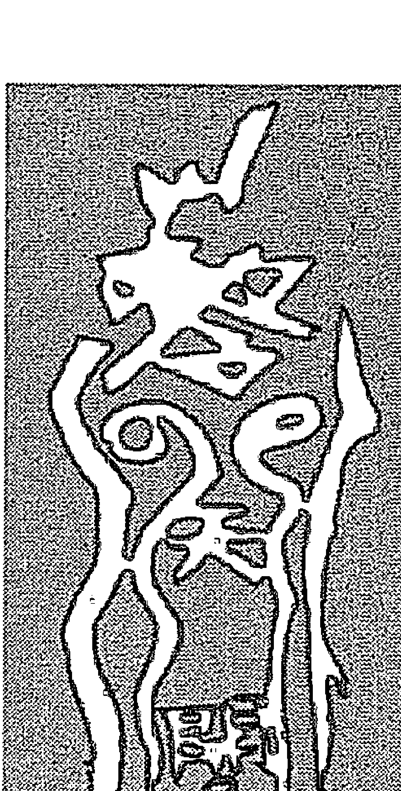

##### 15、闭地户符

此符一般用于超度、还阴债等作法时用之。
> 咒语：吾将祖师令，急往蓬莱境，急召速蓬莱仙，火速到坛筵，倘或迟延，有违上帝，唵哈哪咆吽咒（七遍）。
笔顺：先敕令二字，其下写闭斗二字，斗字一划之下逆作四圈上挑。

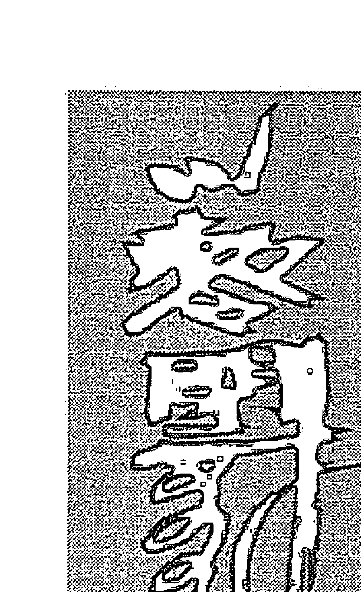

##### 16、召城隍神符

城隍司冥界一切，凡有鬼祟者，可召之以解之。
##### 诸城隍神咒
本县城隍，正直之神，执掌冥界，统率阴兵，我令虔诚，请降来临，释疑解惑，分剖云云。（七遍）
笔顺：先三圈以下划连缀之，左右各一竖，中间写一靈字，其下一划一斜，圈转连作四曲下撇。
城隍管当官的，催官时可以用这道符。

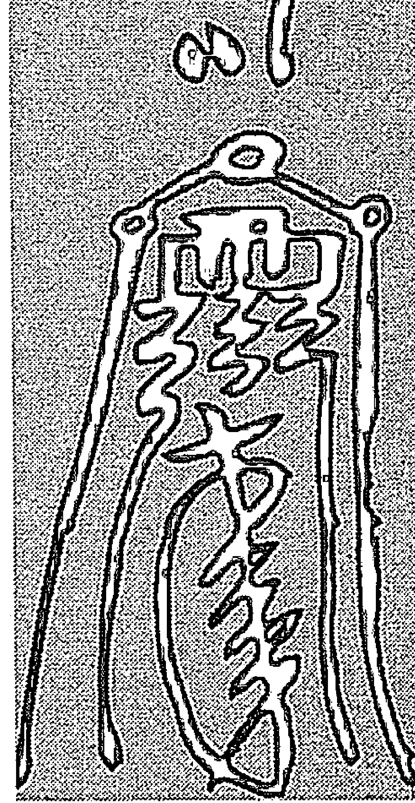

##### 17、召土地神符

土地为司鬼之神，可解鬼祟，可度鬼厄。
##### 土地咒
坛场土地，神祇最灵，通天达地，出入幽冥，为吾传奏，不得留停，有功之日，名书上清。（三遍）
笔顺：先写一土，下三圈二划二竖如上符，中作靁鬼二字秘文，其下加地降二字。

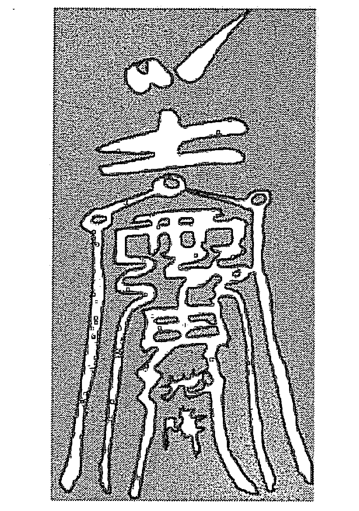

##### 18、和好符

局中配偶落对宫或见夫妻常反目，可以此符同二人之发埋灶下，同时再取二人眉毛各7根，指甲少许，用火烧灰，用酒送下，自能好和如初。
奇门局一起，看配偶宫落在对宫，凡是结过婚的都是天天吵架，绝对准确；但谈恋爱的小青年处对象的，一见面就亲热，正好相反。
城市没灶，就用信封装上这道符，装上两个人的头发，用透明胶粘在煤气灶下就可以，有同样的效果。还可以同时将两个人的眉毛每人7根，烧化到碗里，兑上阴阳水喝下，效果立现。

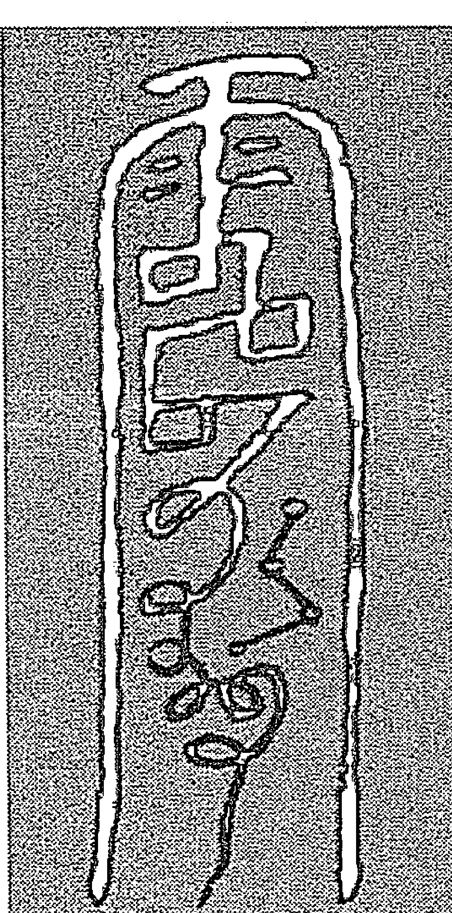

##### 19、倾慕符

欲思慕之女自来者，取女子履底之泥，溶于水中并加墨色，念咒吞下符立效。
咒曰：與吾世結姻，天地樂冥冥，如鱼如水思浩浩，吾奉三山九侯元君律令敕！(画符时边画边念)。

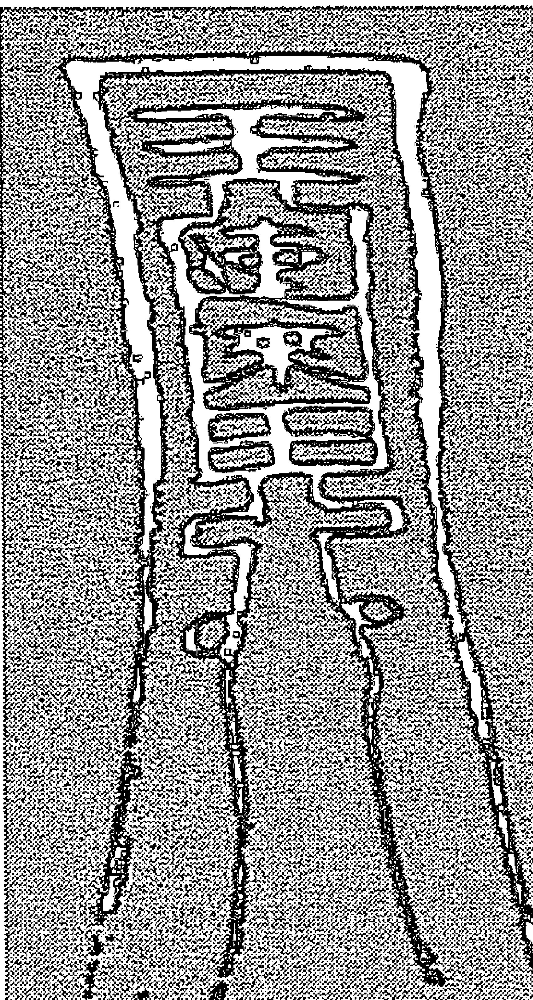

##### 20、中彩符

如欲得彩者，画此符二道，一道压于灶前香炉下，一道佩于本人身上，必有奇效。这是一道催财符。
在灶的旁边，买一个小香炉，初一、十五上香，拜一拜灶王爷，祷告一下，这道符一年一换。符的有效期一年。这也是一道催财符。

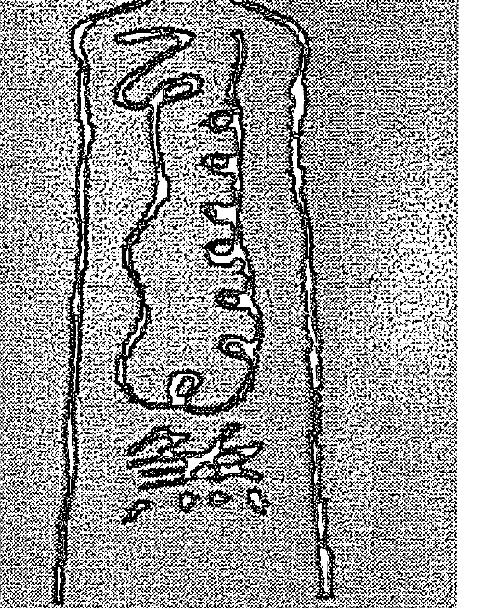

##### 21、治相思病符

咒语：喃 吹 咕 嘛 噜 咧 薩。
笔顺：先雨字头，下一化字，左右顺逆三圈下竖，中写三车字，一高字。

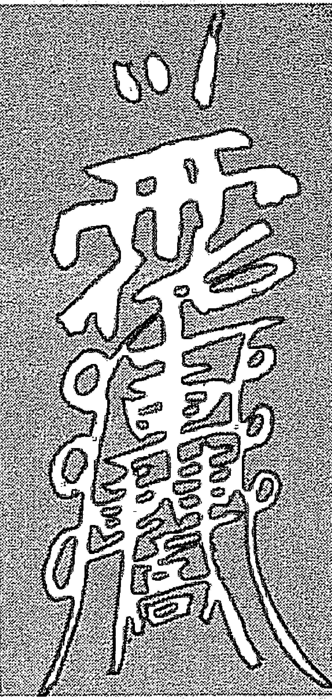

##### 22、请和合二仙符

布婚姻局须用此符请和合二仙降坛。
和合咒：天精地精，日月之精，天地合其精，日月合其明，神鬼合其形，你心合我心，我心合你心，千心万心万万心，意合我心。
笔顺：左右顺逆二钩圈，两旁各一撇，撇旁各三点，圈中亦各三圈，正中自坐起向上作一大圈，中写一三字，左方逆作一圈下竖，右方顺一圈下竖，中间逆三小圈写和合二字。

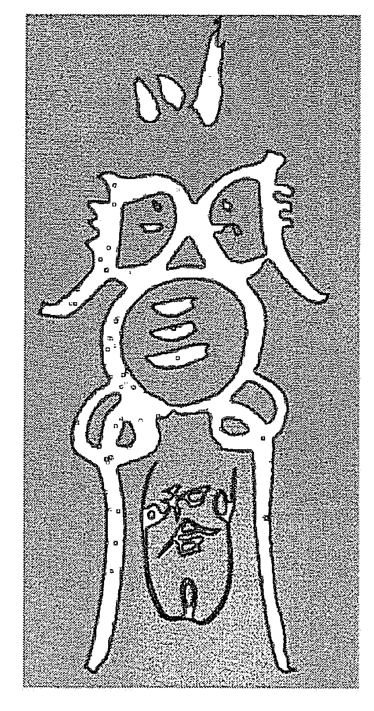

##### 23、女子命犯双官符

局中见女子婚姻不顺之信息，皆大犯双官、克夫，宜常佩此符禳解之。
> 诵太阴神咒：仰首觀八表，惟月孕阴精；中有太素星，天人驾六骈；耀华光二极，混明照三清；殷勤求玉道，五色下来迎。
女子婚姻不顺之信息：一个是临值符，一个是伏吟局，反吟局，有寄宫符号的，都是婚姻不顺的信息、离婚的或丈夫早亡的都可以用。

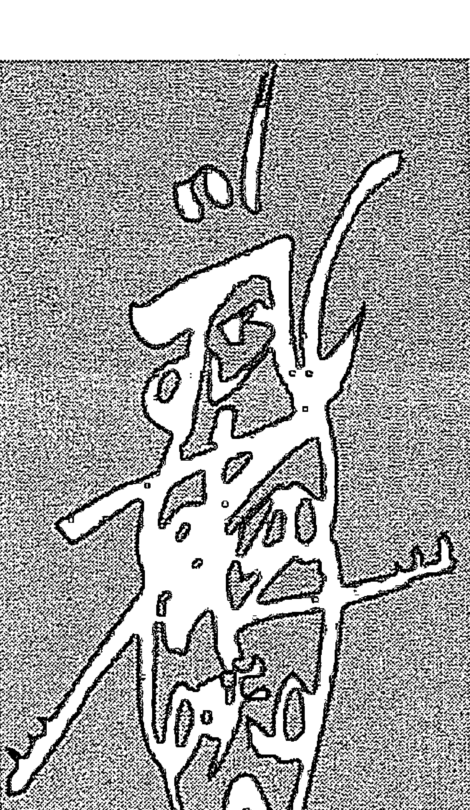

##### 24、制小人符

阴盘奇门中的小人是偏官。
背面写上对方所有信息，压在香炉底下，三天后起局找出对方所在方位，在其方位的十字路口配元宝化掉。

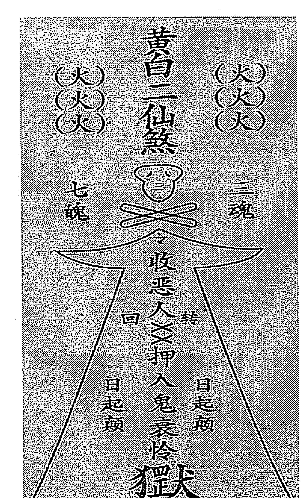

##### 25、开光符

黄纸、朱砂画之，用于神像开光。

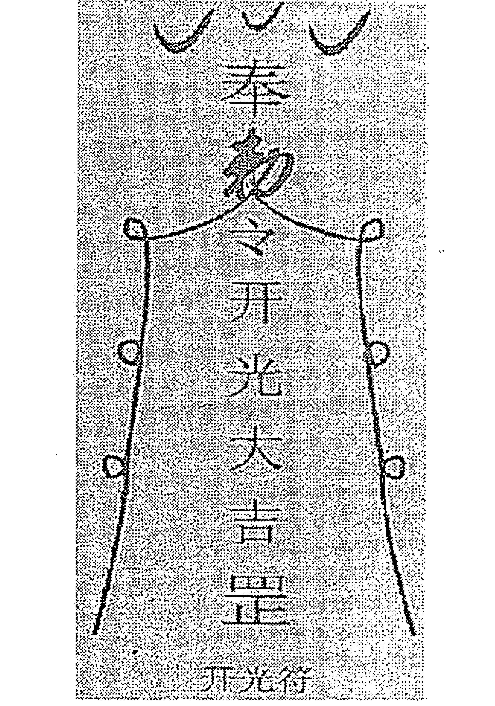

##### 26、超度符

黄纸、朱砂画之，用于超度法事。

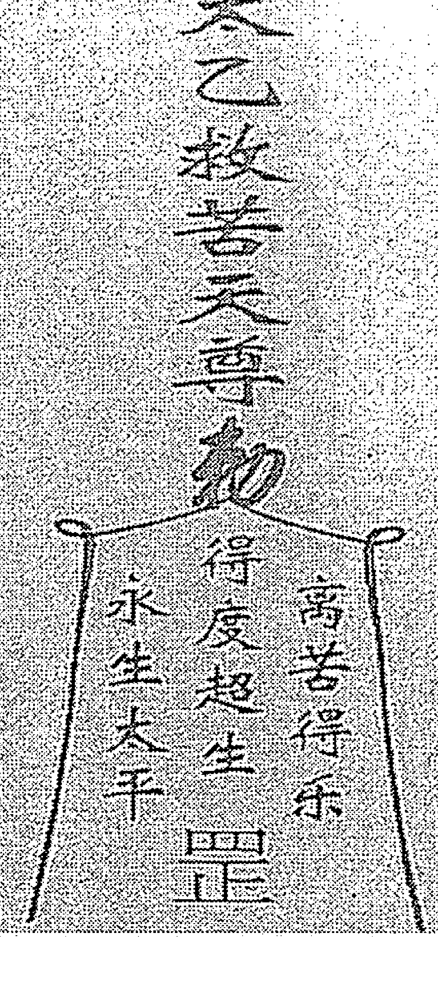

##### 27、替身符

黄纸朱砂画之，用于还童子。

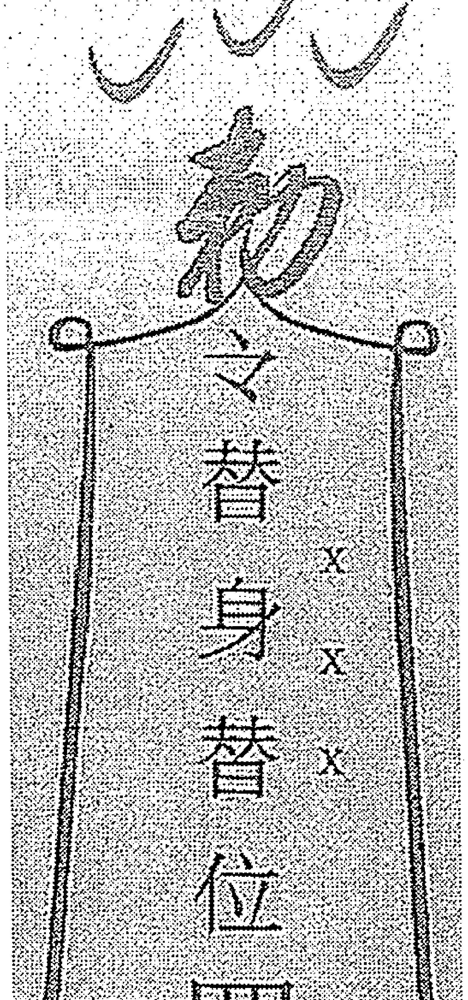

##### 28、能量符

用于启灵和提升能量。

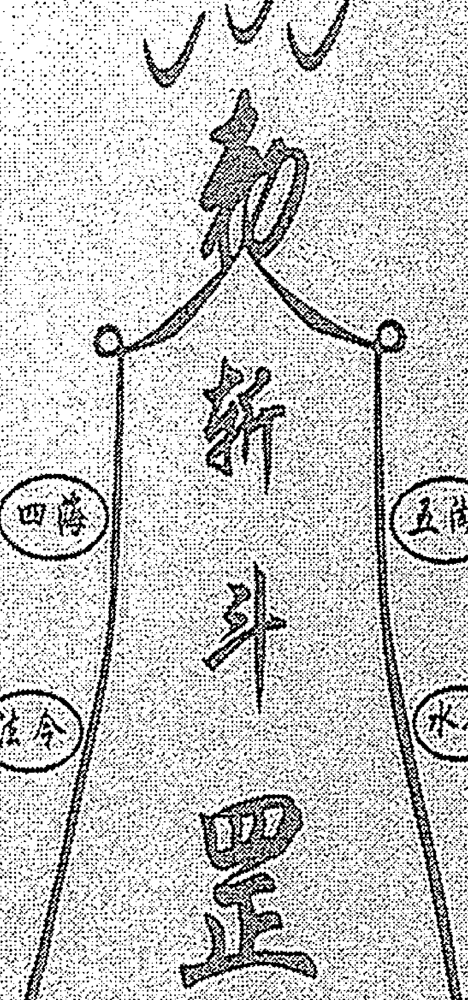

##### 29、冲符、合符

在乾宫化六道冲符就可以把巽宫入墓的辛冲出来。
冲符、合符，是依据十二地支星符化解奇门局中四害的主要方法之一。

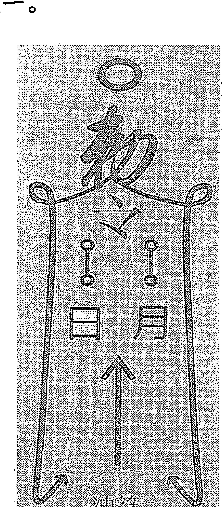
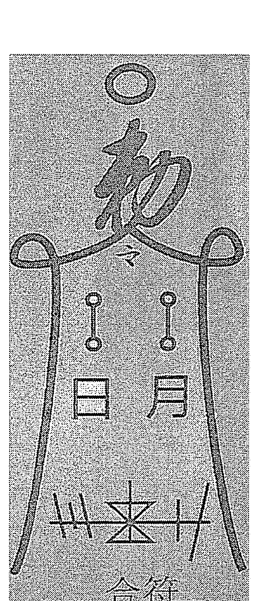
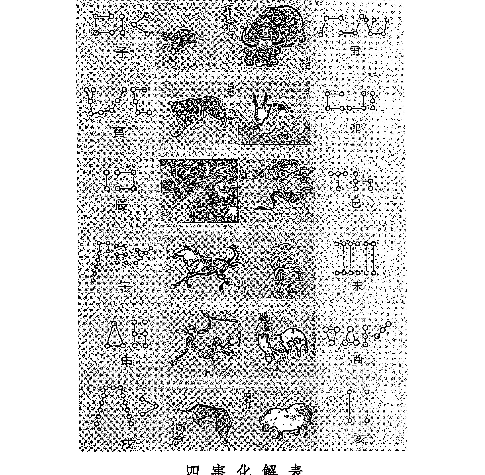

#### 四害化解表

| 六仪 | 墓 | 化解 | 刑 | 化解 |
|------|----|------|----|------|
| 戊 | 乾 | 在巽冲 | 震 | 用丑合 |
| 己 | 艮 | 在坤冲 | 坤 | 用卯合 |
| 庚 | 艮 | 在坤冲 | 艮 | 用巳合 |
| 辛 | 巽 | 在乾冲 | 离 | 用未合 |
| 壬 | 巽 | 在乾冲 | 巽 | 用酉合 |
| 癸 | 坤 | 在艮冲 | 巽 | 用亥合 |
|  | 门迫 | 化解 | 空亡 | 化解 |
| 休化子 | 离 | 用丑合 | 子 | 在午冲 |
| 生化寅 | 坎 | 用亥合 | 丑 | 在未冲 |
| 伤化卯 | 艮坤 | 用戌合 | 寅 | 在申冲 |
| 杜化巳 | 艮坤 | 用申合 | 卯 | 在酉冲 |
| 景化午 | 乾兑 | 用未合 | 辰 | 在戌冲 |
| 死化申 | 坎 | 用巳合 | 巳 | 在亥冲 |
| 惊化酉 | 震巽 | 用辰合 | 午 | 在子冲 |
| 开化亥 | 震巽 | 用寅合 | 未 | 在丑冲 |
| 凶 神 化 解 |  |  | 申 | 在寅冲 |
| 玄化子 | 玄武是大的玄武煞，化为地支子，破煞用地支丑来合。 | 酉 | 在卯冲 |  |
| 白化申 | 白虎是大的白虎煞，化为地支申，破煞用地支巳来合。 | 戌 | 在辰冲 |  |
| 蛇化巳 | 螣蛇化为地支巳，破煞用地支申来合。 | 亥 | 在巳冲 |  |

### 第七章 踏罡布斗

1、画斗罡符：中间○内写：仰祈北斗九星斗罡真炁降入派下弟子 XXX 身中 [字符] 押面七转。目的就是净场，提升能量。

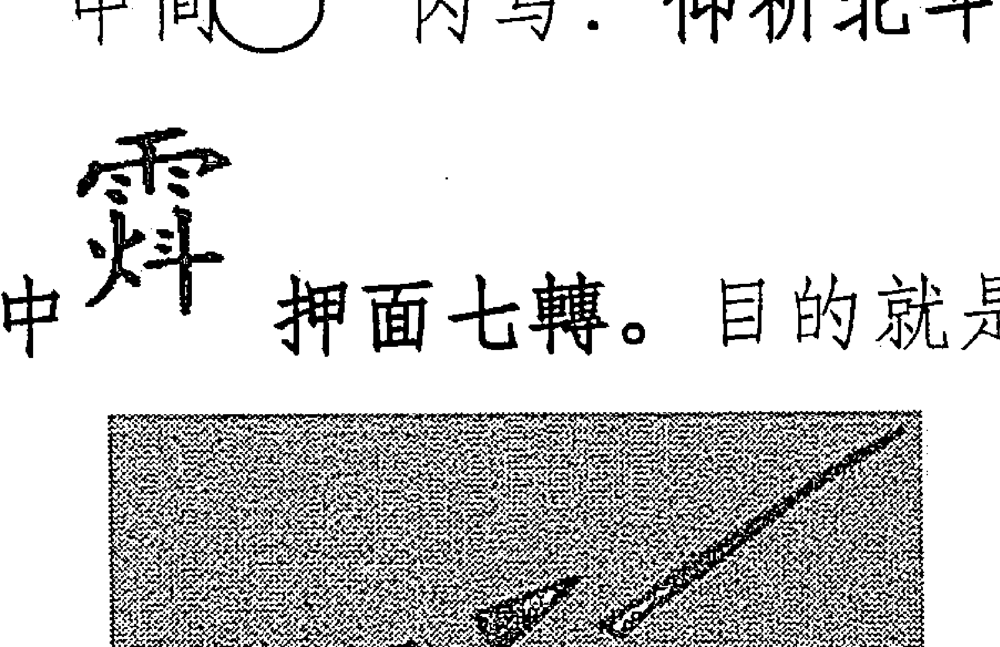

2、踏罡：左手拈花诀，右手剑诀。意念自己置身在广袤的夜空中，周围繁星点点，星光灿烂，无限美丽，身在星光中穿行，星光之能量不断灌入体内，存入丹田。此处关键点是要把闪闪的星光意想到位。
先起左脚，脚跟先起先落，踏罡时，边踏边诵咒。

##### 3、诵咒一：
脚踏七星步步升，天上三奇日月星，通天透地鬼神惊，凶神逢吾致头拜，恶煞逢吾走不停，六丁六甲随吾转，天兵天将随吾行，二十八星宿随吾转，恭请九天玄女娘娘斩妖精。急急如律令!(此咒用于运筹调理净场)

##### 诵咒二：
白炁混沌灌我形，禹步相随登阳明，天回地轉履七星，慑罡飞斗跻九齡，恶逆摄伏妖魔倾，萬灾不干我长生，我得长生留福庭，旋乾倒坤鬼灭形，萬神助我斩妖精。急急如律令!(此咒用于修炼)
起始丁字罡，从1--7，左脚踏步入7位，右脚到7位。转体180°后成丁字罡，然后照着原样回原位。阳日先迈左脚，阴日先迈右脚。如此反复勤修炼，自得其中妙中玄。
注：七星罡步不但能提升场能，与神沟通，还可以治疗疾病，特别是有慢性病的人，治病效果最好，尤其冠心病、糖尿病等，但神经有毛病的人及自己控制不了自己的人，不能练七星罡步。

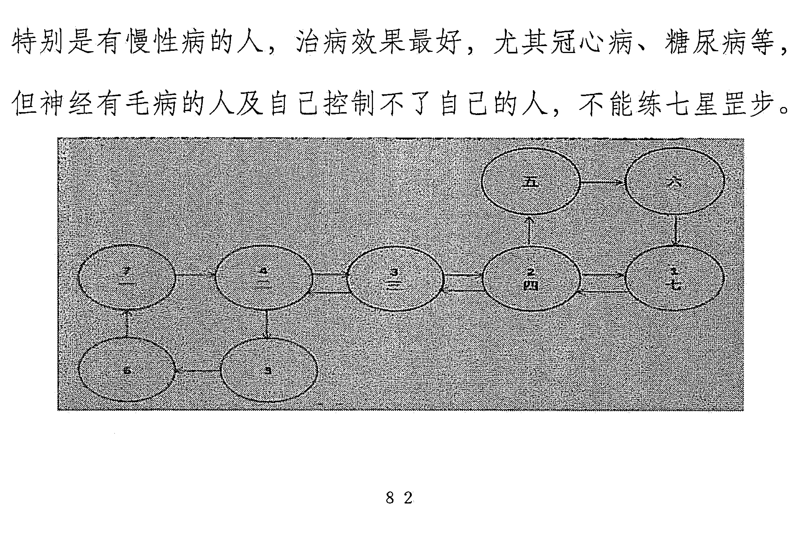

## (中)
六甲预测有玄机  三奇六仪布奇局
阴阳风水化灾祸  地脉龙神旺宅气
五鬼运财速速来  乾坤大法通天机

### 第六章 六甲招龙术

#### 第一节 入宅断局心法

奇门局是地理环境状态形成的气场在奇门九宫里的信息反映，有时，我们不用起出奇门局，就能判断出一些主要的吉凶事情来。这是入宅奇门断局的心法。招龙术主要用于阳宅。
一、艮宫：“艮宫不能有石头，若逢路冲主大凶”。我们知道，“庚”在艮宫是击刑，而大石头、道路、较大型金属类物质、坚硬物质的像意归属为庚。一旦艮宫出现这类东西，就是庚在艮宫击刑。尤其采石场、矿场等更是凶相。庚有白虎的性质，在十天干中庚是最凶的。艮宫主少男，在人体主左腿、左脚、肠胃、筋骨、大肠，所以庚击刑对于伤、病事件的诱发基本不外乎这些范围。
路冲，要考虑车祸或者行走中发生的伤灾，路冲也是外部煞气产生的影响。碾磨碓等则要考虑肠胃病，因为那是加工粮食的工具。目前，无论单位还是住户为了挡煞，都喜欢在大门两侧摆放一对石狮子，殊不知狮虎都属猫科动物，有八神“白虎”的特性，如果艮宫一旦出现“白虎+庚”的格局，那它诱发的事件将是相当严重的，诱发的伤灾就是人命关天，诱发的疾病就是不治之症。

##### 二、震宫：
震宫戊击刑，所以该方位忌水井、地下水道（表面看不到的水），房墙或院墙沉陷、扭曲、裂缝等。诱发胃病、皮肤病、肝胆肿大、乳腺癌，影响主人名望、财运等。
震宫有厕所，最容易出问题，震为长子，家里长男最容易出问题，容易腰疼，尤其是女性最容易腰疼，凡是家里卫生间在震宫的，都容易破财、腰疼、长子出现问题。还有一个合局的问题，要看下水道、水管具体在哪个山向里面。

##### 三、巽宫：
壬癸击刑，忌水池、水坑、湖泊、河流等，尤忌房屋渗漏。影响肾、膀胱、泌尿系统疾病，性生活、夫妻感情淡漠。

##### 四、离宫：
辛击刑。忌烟囱、砖瓦窑、电厂、变电站、火葬场、焦化厂、首饰店、沙石、粮仓等。容易得肺病、眼病、头部划伤等。

##### 五、坤宫：
坤宫“己”击刑，忌水井、水坑、厕所、化粪池、坟墓、火药库（戌）等。容易诱发脾胃、妇科、精神等疾病。中宫，永远寄坤宫，吉凶宜忌与坤宫相同。
坤宫有水井、水坑、厕所等，家里主妇绝对身体不好，还容易得妇科病、癌症、胃癌之类。

甲在坤宫入墓，没有名望，不能有大树。厕所在东南、西南两个方位都不好。

##### 六、击刑：

奇门风水最重击刑。甲戌年、己年生人住在坤宫，甲午年、辛年生人住在离宫；甲辰年、甲寅年、壬年、癸年生人住在巽宫；甲申年、庚年生人住在艮宫；甲子年、戊年生人住在震宫就是击刑，特别是八字年干为用神者尤甚。现在，普遍存在一个现象，就是家庭厕所大多安在西南、东南两个方位，尤其是农村。这两个方位最不宜安置厕所，因为小便为癸水、大便为己土，壬癸水在巽为击刑，己在坤宫击刑。己遇击刑，最易诱发的疾病是妇科病和痔疮，尤其是家庭主妇。

##### 七、入墓：

入墓有吉有凶，要具体情况具体分析。卧室安墓宫就利于睡眠，比如甲午年、辛年生人卧室安巽宫，甲年(甲戌除外)，癸年生人卧室安坤宫等。学习、办公、求发展就不利墓方。入墓的状态就是休眠、藏起来，一旦入墓就难以发挥作用。甲、癸墓于坤，但不是坤宫见有大树、水就一定会入墓，只有在中宫、坤宫有大树死亡和暗水（比如化粪池、水井、掩盖的水坑等）才算入墓。

#### 第二节 阳宅预测

##### 第一、预测原则

阳宅在预测中分内环境和外环境。阳宅预测先看用神，取用神有四种情况：

- 1. 求测者和风水师都在现场预测，以日干落宫为阳宅，代表房子也代表求测者本人。
- 2. 求测者和风水师不在现场预测，长期住或租用以日干的正印为房子；临时住或门面房看日干偏印落官。
- 3. 电话求测，以月干的正印为房子；临时住或门面房看月干偏印落官。

看房子怎么样，看用神落宫状态。落宫有“四害”，房子不怎么样。有问题的宫克谁对谁不利。时干为这个事，克日干或用神也是不利。具体还要看落宫符号组合。

我们知道，奇门局是地理环境状态形成的气场在奇门九宫里的信息反映，通过奇门局你可以看出内外环境中哪里有什么东西存在，哪边有路、哪里有水、哪里放置了家用电器等。但有时候，实地环境中存在的东西并不一定能在奇门局里反映出来，那是因为：一是时间短暂，它的吉凶像意暂时还没有表现出来；二是预测事物的出发点和重点不在那个事物上。而另一方面，我们实地勘察并没有发现的东西反过来却会出现在奇门局里面，这大多是因为那是隐蔽的、肉眼难以发现而又是心想预知或已对入住者产生了吉凶影响的东西。这类的问题往往容易被忽视，有一句话叫“阴大于阳”，是说越是看不见的，就越不可轻视。

##### 第二、阳宅的规律性物象断法

阳宅的内景外景同论，里边有什么外边就有什么，屋内有鱼缸，外面就有河或地井等，外景是内景相应的物象拉进来的，把内景的物象去掉或把通道阻断，外景的危害就不会影响到室内来。调理阳宅风水最好是内外环境一起调。否则，调理风水就达不到有效目的。这也是为什么有些风水调理不灵验的主要原因。

- 1、射：有高处的东西射过来，宫中有丁、庚、蓬、白虎临“四害”为射。庚是硬的，丁是尖的，丁+戊为墙角、高处的墙角或屋脊或尖状物，高处为射，低处为冲。克谁对谁有影响。易犯怪病、重病、破财或车祸等意外伤灾。

化解：用开光八卦镜，镜后按顺序贴上五帝钱，择天德日，日时相合时或用煞的对宫时间对准煞的方位放之，贴镇阳宅风水不利符一道。

- 2、破：就是破损、不完美，有破的东西、半途而废，室外、门外、大门口、对着一些破烂、破损的物体、门迫所在的宫。

化解：用煞的对宫时间十二地支星合符化之。

- 3、探：玄武临“四害”为探头煞，即旁边房子比你的高出50米以下的。玄武落宫克谁对谁产生不好的影响。探就消耗，易被人偷或偷情偷物，破财，事业有损等。后面房高易出伤害；前面房高财不好；左右房高易出伤残。

化解：
(1) 用开光八卦镜一只，镜后按顺序贴上五帝钱，择天德日，日时相合时或用煞的对宫时间对准煞的方位放之，贴镇风水不利符一道。
(2) 前后房高逼压者，用开光铜制大象一对，头向煞位，择天解日，日时相合时或用煞的对宫时间放之。
(3) 左右房高者，用开光铜制牛一对，头向煞位，择天解日，日时相合时或用煞的对宫时间对准煞的方位放之。

- 4、冲：冲为散。为低处的路或水临“四害”冲克用神。路冲，宫内庚辛临“四害”冲克用神；水冲，宫中壬癸临“四害”冲克用神；另一种冲就是门窗、楼梯、楼梯口相冲，宫中见丙丁，壬庚临“四害”冲克用神。犯冲易受伤，损丁，破财，是非口舌等。

###### 化解：

- 1. 用青石一块，长二尺四寸，宽八寸，厚二寸四分，择寅日寅时，在最上面刻上后天八卦图，八卦图下面刻上“泰山在此”四个大字，开光后择地解日，日时相合时或用煞的对宫时间，立在大门旁左右均可，或对准煞方。
- 2. 用开光八卦凸镜一面，择地解日，日时相合时或用煞的对宫时间挂在门楣上即可，或对准煞方。贴镇阳宅风水不利符一道。
- 3. 用五色小水晶球5个，择地解日，日时相合时，在墙上打五个孔，必须有黑白两色的，上面放白的，下面放黑的，将五色水晶球放到孔里，同时诵咒语：一山挡百箭，是事都挡完！再用水泥封好！若单位或公司大门遇冲，可用青石板两块，分别刻上“一山挡百箭，是事都挡完”。然后用朱砂兑白公鸡血描之，放于大门两侧适当位置即可。
- 4. 门窗、楼梯、楼梯口相冲的化解：用红纸黑字写“天官赐福”四个大字，开光后择五富日，日时相合时或用煞的对宫时间贴于门窗上即可。贴镇阳宅风水不利符一道。

5、插：宫中值符甲、天柱星临“四害”为插。棍、电线杆、塔、立着的、高的东西。插，居住者易疾病缠身、财运败退、人口伤亡、遭小人暗害等。

###### 化解：

- (1)用开光化煞罗盘一只，背面按顺序贴上五帝钱，择天解日，日时相合时或用煞的对宫时间，挂在门楣或窗上即可。贴镇阳宅风水不利符一道。
- (2)用开光化煞凸镜或铜葫芦一对，择天解日，日时相合时或用煞的对宫时间，挂在门或窗上即可。

##### 6、反：

反弓路是庚辛临白虎，反弓水是壬癸临白虎。反弓路、反弓水，主财不聚，来财就来祸；后人不务正业，克谁对谁有影响。还有一种桥梁、楼房等成反弓状冲犯者，易有血光之灾或财运败落等。

###### 化解：

- (1)用开光化煞罗盘，择地解日，日时相合时或用煞的对宫时间，挂在门楣上即可。
- (2)桥梁、楼房等成反弓状冲犯者，可用开光化煞罗盘，择天解日，日时相合时或用煞的对宫时间，挂在犯煞的门或窗上即可。

##### 7、断：

庚辛、壬癸临空亡宫为断。有河断、路断、水断。也称割脚煞，如外面的路断了，或者一条路很直忽然不平了，一条河流中间有个坝，树断了。克谁对谁不好。易人口不安，出现伤灾。

###### 化解：

用开光化煞罗盘，择地解日，日时相合时或用煞的对宫时间，挂在门楣上即可。

- 8、走：就是泄气，日干宫生临“四害”的庚辛、壬癸落宫，破财之象。

###### 化解：

用开光八卦凹镜一面，择地解日，日时相合时或用煞的对宫时间，挂在门楣上即可。贴镇阳宅风水不利符一道。

- 9、孤阳煞：辛在离宫击刑。根源在“辛”下藏“午”又遇地盘“午”。忌烟囱、砖瓦窑、电厂、变电站、火葬场、焦化厂、首饰店、沙石、粮仓等。肺病、眼病、头部划伤等。

###### 化解：

用开光化煞罗盘，罗盘背后按顺序贴五帝古钱，择地解日，日时相合时或用煞的对宫时间，挂在门或窗上即可。

- 10、孤阴煞：“己”在坤宫击刑。坤宫忌坟场、坟墓、火葬场、寺庙、医院、水井、水坑、厕所、化粪池、火药库（戌）等。中宫，永远寄在坤宫，吉凶宜忌与坤宫相同。诱发脾胃、妇科、精神等疾病。

###### 化解：

- 1. 用开光化煞罗盘，罗盘背后按顺序贴五帝古钱，择生气日，日时相合时或用煞的对宫时间挂在门或窗上。
- 2. 用开光铜制大象，头朝煞方，择生气日，日时相合时或用煞的对宫方位放之。

##### 11、光煞：

宫中丙丁临蛇又见临“四害”者谓犯光煞。落宫克谁对谁有影响。易疾病缠身，血光、破财等。

###### 化解：

用厚质窗帘遮挡光煞，用开光铜制辟邪一对，择天解日，日时相合时或煞的对宫时间放在厅内。

##### 12、地煞：

地煞就是在某个宫位不该动土的时候动土了。九地落宫临“四害”者谓之动土犯地煞。落宫克谁对谁不利。

凡寅午戌年月日时俱忌北方动土,申子辰年月日时俱忌南方动土,亥 卯未年月日时俱忌西方动土,巳酉丑年月日时俱忌东方动土。

| 时间 | 寅午戌 | 申子辰 | 亥卯未 | 巳酉丑 |
|------|--------|--------|--------|--------|
| 煞位 | 坎宫 | 离宫 | 兑宫 | 震宫 |

冲犯地煞（栽树、挖坑、所有动土等）。犯地煞可能会出现家人意外受伤、患病、破财，特别易患筋骨疼痛之疾或是导致无安之灾等较严重的问题。

###### 化解：

用五色石子（必须有黑白两种），五谷（必须有高粱、黄豆两种），择地解日，日时相合时，在对着九地落宫的宫位挖个小坑，然后先将五色石子放入，再放五谷后用土埋上即可。三天内不能有人动，为防止有人动，可将上面压一砖头（城市楼房可在室内墙上适当位置，对着九地落宫方向用电钻打一孔，将五色石、五谷放入孔内后，再用墙面用水泥封好）。然后用三捏纸，先烧2捏，边烧边念咒：凡人不知不为罪，请你高抬贵手，离开凡人的身边！第三捏纸带到家里放床铺下面。此法与土地符配合使用治病效果极佳，屡试屡验。四张为一捏。

###### 化解日择日表

|          | 地解日 | 天解日 | 生气日 | 五富日 | 天德日 | 月德日 | 天贵日 | 天岳日 |
|----------|--------|--------|--------|--------|--------|--------|--------|--------|
| 正月     | 巳午   | 戌     | 子     | 亥     | 壬     | 辛     | 甲乙   | 申     |
| 二月     | 申     | 亥     | 丑     | 寅     | 己     | 己     | 甲乙   | 戌     |
| 三月     | 戌     | 子     | 寅     | 巳     | 丁     | 丁     | 甲乙   | 子     |
| 四月     | 子     | 丑     | 卯     | 申     | 丙     | 乙     | 丙丁   | 寅     |
| 五月     | 寅     | 寅     | 辰     | 亥     | 寅     | 辛     | 丙丁   | 辰     |
| 六月     | 卯     | 卯     | 巳     | 寅     | 己     | 己     | 丙丁   | 午     |
| 七月     | 午     | 辰     | 午     | 巳     | 戊     | 丁     | 庚辛   | 申     |
| 八月     | 申     | 巳     | 未     | 申     | 亥     | 乙     | 庚辛   | 戌     |
| 九月     | 酉     | 午     | 申     | 亥     | 辛     | 辛     | 庚辛   | 子     |
| 十月     | 子     | 未     | 酉     | 寅     | 庚     | 己     | 壬癸   | 寅     |
| 十一月   | 寅     | 申     | 戌     | 巳     | 申     | 丁     | 壬癸   | 辰     |
| 十二月   | 卯     | 酉     | 亥     | 申     | 乙     | 乙     | 壬癸   | 午     |

##### 第三、阳宅内景规律性物象断法

- 1、水管子：乙为弯曲的，已为盘旋的。壬、癸、庚、辛、乙、己的组合，遇上丙丁为热水。
- 2、家具：乙为床、椅、花草，天辅为家具、床。
- 3、灯：丙、丁、英、景为灯，丁+癸为灯坏了，临蛇忽明忽暗。
- 4、客厅：天心为客厅，是聚财的地方。己农村为院子，城市阳台是吸财的地方。
- 5、卫生间：壬、癸为卫生间。
- 6、窗：庚辛（阻碍象意）、丙丁（光亮象意）为窗。
- 7、门：不在现场时，驿马+壬、癸为大门。壬为室内小门。在现场值使门落宫，在哪就是哪。如值使门是死门落坤宫，大门可能在坤位，门向却不一定。门向一是看落宫，二是看值使门代表何方，如杜门为东南方等。
- 8、厨房：丙丁、壬癸、戊己。
- 9、横梁：戊、庚、甲。
- 10、景门：电视、漂亮的图片。
- 11、天芮：为菩萨、女神、书、学习用品、药。外景为学校、医院。
- 12、神佛：死门、符、英，男性神、佛，故去人的照片、玩偶。
- 13、天：空间、开阔、地势高。
- 14、地：同天相反。

##### 第四、常用风水吉祥物品

戊：大象、铜钱（在几宫用几枚）
戊加天任，必用大象；戊加壬，瓷器装流动的水；戊加壬加值符高档瓷器装流动水。

己：盘在一起的龙，盘龙，即貔貅；和乙相反，乙是弯曲的龙。己加辛，一串珠子(辛为珠子，珠宝，己为线团)。

庚：调理风水一般不用。庚为厉害的金属东西，如宝剑等。太厉害，容易出事。

辛：珠宝、颗粒、水晶。辛加丁，一串红水晶珠；乙加辛，项链。

壬：金蟾，癸也可用金蟾。金蟾，龙龟可通用。这些东西临杜门或六合，要用盒子装起来的，其它情况不用装。

癸：金蟾。

丁：水晶（耀眼的东西），小灯泡，红蜡烛。

丙：水晶，红的热的水晶。用时把水晶烫热（用热水烫），然后就放。乙加丙，葫芦上画太阳（乙为葫芦，丙为太阳）。

乙：行龙，展开的龙，飞翔的龙；葫芦（葫芦主要用于化病，龙主要用于调财官）。

#### 第三节 六甲招龙术

地脉龙神入宅，百煞皆退，有回天之力。可使宅主人丁兴旺、财官双美；可扭转一切凶宅、败宅、绝宅、破宅、祸宅、废宅。

值符，青龙也。现场起局后，若值符落宫生助日干宫可用此法。

- 1、材料：五色香（青、红、黄、金、蓝）五支、鹿骨一块、香炉一鼎、黄绸一块。
- 2、使用方法：在值符落宫日，依地支子（蓝色香）、午（红色香）、卯（青色香）、酉（金色香）点燃顺时针插入香炉内，切记黄色香务必置于香炉正中，再用鹿骨受香火灵气，裹于黄绸中，用值符落宫时间，埋于院内值符落宫方位，城市楼房则悬于值符落宫方位的顶下。
- 3、埋时：
(1) 诵六甲召请咒
(2) 诵土地咒
(3) 掐请神诀，人剑合一，太上老君加持。曰：请六甲神将，速招地脉龙神到此！
- 4、若起局值符不生日干或临四害，可按无中生有之法，进行寻时借运，或9天后再另外起局，找个值符生日干的日子。
- 5、禁忌：施术日不可犯月破、四绝、四离等日。

月破：与月相冲之日为月破。

四季二十四节气的立春、立夏、立秋、立冬的前一个日子为四绝日。每年四季二十四节气中的春分、秋分、夏至、冬至的前一日为四离日。四离为四季之开始，四绝为四季之终，意为穷尽，不吉。

> 例：一女士，一脸惊容地找到我说：中午休息时梦到一条很大很大的蟒蛇，盘在我的身旁，害怕极了，不知是吉是凶。求老师帮我看一看可好？

于是起了下面的局。起局后，我说：恭喜你！你怀孕了，而且还是个男孩。

不会吧？我老公刚刚回来不久。呵呵！慢慢听我给你道来。

| 键 | 值 |
|---|---|
| 公元 | 2016年6月13日15时13分 阳5局 |
| 农历 | 猴年05月09日15时13分 时盘 |
| 干支 | 丙申 甲午 丙寅 丙申 (辰巳空) |
| 直符 | 天任 直使: 生门 旬首: 甲午辛 |

巳 收 ○
午 开 庚
未 闭

| 左 | 中 | 右 |
|----|----|----|
| 辰 丁 戊 成 ○ | 蛇 丙 乙 冲 景 | 阴 乙 壬 辅 死 |
| 卯 壬 危 | 符 辛 丙 任 杜 | 白 丁 戊 庚 芮 开 |
| 寅 乙 破 | 天 癸 辛 蓬 伤 | 地 己 癸 心 生 |
| 马 | 丑 执 | 丙 子 定 |

六 壬 丁 戊 英 惊
申 己 建
酉 癸 除
戌 辛 满
亥 平

分析：

- 1. 面测，日干丙落巽宫，丙+乙临蛇；丙为圆，乙为弯曲，临蛇，整个都是蛇的像意；空亡为曾经发生过的梦见蛇的事。
- 2. 巽空转宫到兑宫，丁戊+庚+癸临芮。芮为孕妇，戊为肚子，丁为男孩，引干癸为生殖。怀孕有喜之象。
- 3. 巽宫引干丁戊，打开也在兑宫，均为怀孕之象。
- 4. 震宫是兑宫的补充。值符青龙也，为地脉龙神；地盘丙与巽宫同气，引干壬、天任星为妊娠；杜、丙为圆的肚子。震宫整个为地脉龙神和怀孕的像。不但怀孕，而且怀的还是一个龙子。
- 5. 何时生产？十月怀胎，一朝分娩。明年巳月正是巽宫填实，巽宫主4、5数，断其40岁、45岁怀孕。实际年龄42岁。明年巳月生产。

#### 第四节 六甲净宅术

六甲净宅术，主要祛除室内的阴性信息，用于提升阳气，改变整个磁场，祛除鬼魅。也可用于净车。

##### 一、需净宅的几种情况：

- 1、家中经常不团结、生气、拌嘴。
- 2、家中亲人经常无缘无故生病，体质弱。
- 3、人在外而心情舒畅，回到家里就郁闷、烦躁、无名火。
- 4、家中非人为因素有异味。
- 5、家中阴暗，在开灯有光线的情况下仍然感到黑暗。
- 6、在外面身体很好，回到家就生病。
- 7、家中经常听见有异常响动，尤其是夜深人静的时候。
- 8、家中儿童睡觉经常惊醒，哭闹。
- 9、在家中睡觉经常做恶梦、灵界梦、死梦。

##### 二、需要净车的情况：

新车、车辆事故后、运送危重病人后、进入墓地后、参加葬礼后、从灾区回来后、从深山老林、荒芜的庙宇回来后、开车感觉异常后、经常感觉后面有人等。

##### 三、方法：

第一种：首先将住宅所有门窗打开，用1一2斤高度白酒，倒于不锈钢盆内，然后，将下列3道符点燃放于盆内引燃白酒。待白酒燃完后即可。

第二种：将下列3道符烧化后加入高度白酒1斤，然后从里至外，剑指泼洒整个住宅，同时，念净天地神咒。

净车：将车清洗后开到僻静处，将车门打开，将符酒分别撒入车头内、车厢内、后备箱内，同时诵净天地神咒。

此法用于净宅，净车等有不可思议之效果。制鬼符、七星符、催运符等也可单独使用。用法如下所述：

###### (一) 制鬼符

一般鬼上身、附体、召鬼等，都可以使用此符。小孩的惊吓制鬼符也很灵验。还可用于家宅不宁，房屋阴气重，大门辟邪等。

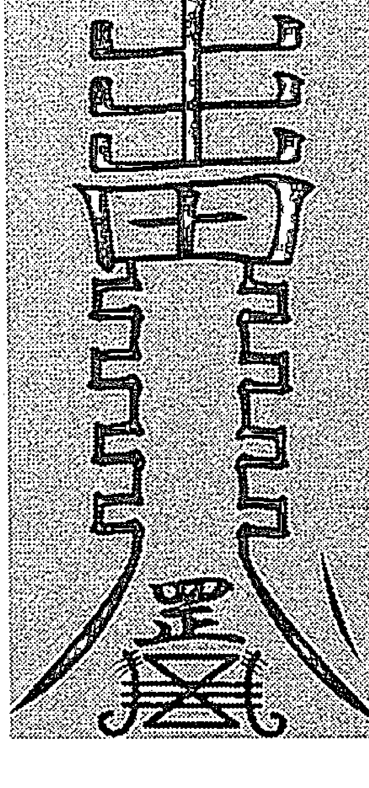

###### (二) 七星符

用于净身、安神、儿童过关口、防止瘟疫等一般是化酒后擦眉心、心窝、手心、脚心、后背。若安神用于内服，婴儿符水洗澡。

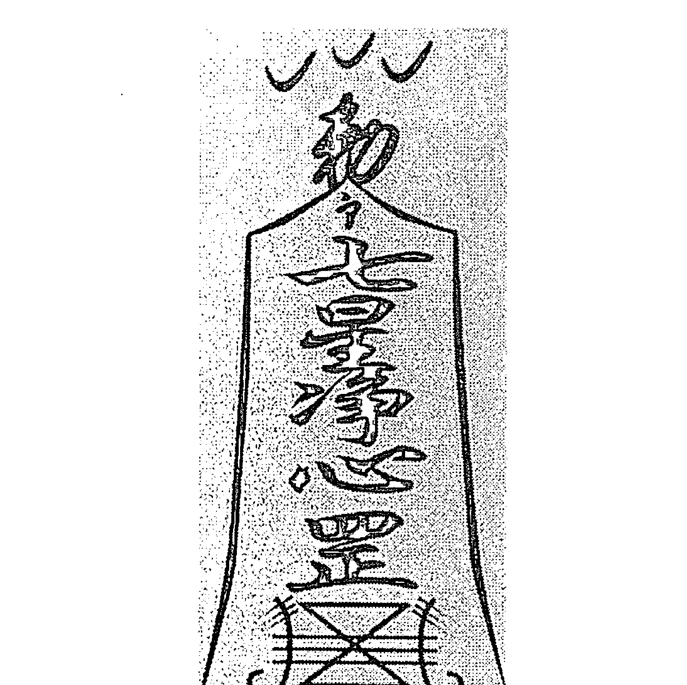

###### (三) 催运符

用于祈福、催财、催官、升学、求子。

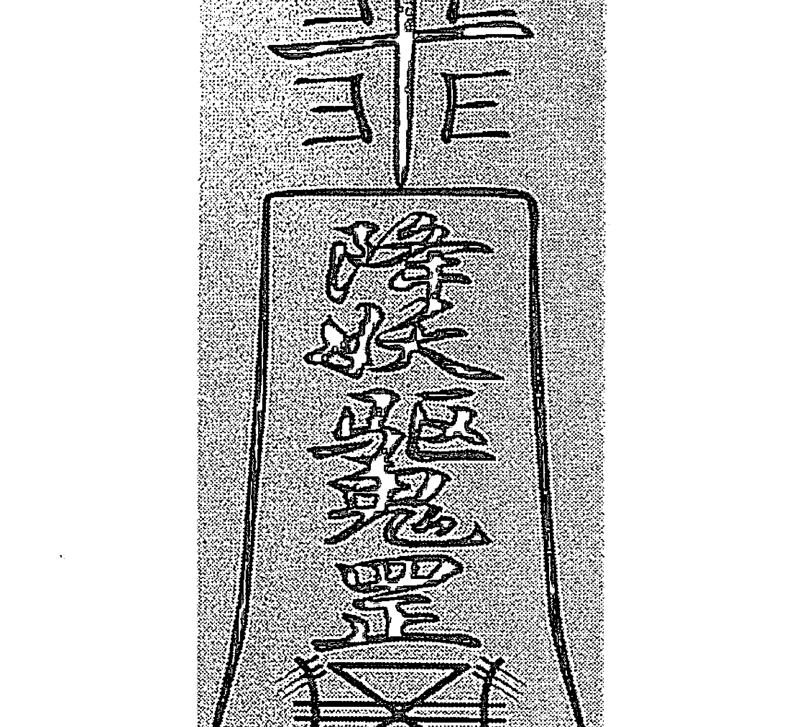

第九章 六甲寻龙术

寻龙点穴是中国风水学中的核心内容。

寻龙点穴理论和方法，从古到今，流派众多，内容繁杂，并且都是通过从山脉的外部特征来判断是“真龙穴”或是“假龙穴”。千百年来的风水实践不断证明，这种通过山脉的外部特征，来寻找“龙穴”的方法和理论，是模糊的、不完善的和不准确的。

六甲法术奇门之寻龙点穴是为神助。在寻龙点穴的具体运用中，不但结合山脉的外部特征来判断“龙穴”的来龙去脉，更重要的是通过奇门的立体时空和全息概念，准确地定位龙脉的有无、强弱和真假以及龙穴的具体位置和深浅。同时，对龙穴对应人的吉凶进行更加详细准确的人丁定位，使之寻龙点穴的理论方法，得到进一步发展和完善。

第一节 阴宅预测

现场预测，日干落宫即是坟地，不在现场以七杀落宫为坟地。

现场起局，日干落宫为坟地为用神。起局前最好在现场顺时针转几圈，把信息捕捉一下，将信息、气场拧在一起，这时再起局信息准确率就高。

##### 第一步、判断性别。

用神（日干或七杀）落宫有丁就是男性，见癸是女性。现在虽然实行火化，但信息没有变。如果宫里没有癸丁，看求测人的性别（谁问看谁），同性为同性，异性为异性。不在现场以预测师性别确定。

##### 第二步、看死者的排行。

以用神落宫（日干或七杀）来定。147为老大；258为老二；369为老三。

##### 第三步、判断死因。

先看芮，芮是病，再看符号；庚、辛、壬、癸加芮。见辛是住院开刀；庚是瘤子，肿瘤，癌症；己是小瘤子，良性的；临太阴是内脏，景门是失血。上述符号落宫有门迫、击刑都是病。先看纲上的，哪宫毛病大，就是哪里的病。

##### 第四步、看坟地有益于谁。

首先确定坟地的山向。现场测看日干落宫，不在现场测看七杀落宫。日干或七杀落宫就是山，则对宫为向为水。山管人丁，水管财。山旺人旺，对宫水旺财旺。

山向确定后，左为青龙，发男丁；右为白虎，发女丁。看青龙好不好，白虎怎么样，就看宫中符号状态。有四害就不好，没有四害就好。青龙、白虎落宫符号有问题，克哪个用神对哪个用神不利。

若坟的后代人问看坟对谁有益，分别看待测人的年命落宫，用神宫（日干或七杀）生比谁的年命落宫，就有益于谁。

##### 第五步、看坟地对后代的影响。

看时干落宫，若临玄武，后代易出小偷；临击刑，易伤残；临辛、癸有牢狱之灾；临腾蛇易患精神病等。

##### 第六步、看坟地的外景。

年干为龙，是大趋势，戊己代表砂，壬癸代表水，青龙看左宫，白虎看右宫。

看阴宅主要看“干”，特别是年月日时上的“干”，在不在四纲上。落宫中的符号有毛病不吉，没毛病吉。

宫中临庚、辛，因为庚辛为石头，有的山露骨，也是石头，这是破相，克用神宫就是反弓路。宫中临壬、癸，克用神，就是反弓水。

##### 第七步、看坟地的当前状态，是否在龙脉上（寻龙点穴法）。

用神宫（日干宫或七杀宫）癸+丁，说明埋的太浅吸不到地气；丁+癸，埋的太深，伤了地气。用神宫空亡必损人丁，可能动过坟，若没有动过可择日重新立碑。

- 1. 时干+蛇，让人做法了或调理过坟。
- 2. 被人在子时，青龙位埋入剪刀，则男丁出灾祸；埋入白虎位，则女丁出灾祸。
- 3. 若被人在子时，青龙位埋入镜子，则男丁会死亡；埋入白虎位，则女丁会死亡。

##### 例：现场预测坟地

公元：2016年12月13日14时58分 阳1局
农历：猴年11月15日14时58分 时盘
干支：丙申 庚子 己巳 辛未（戊亥空）
直符：天蓬 直使：休门 旬首：甲子戊

```
子 开      丑 闭      寅 建
马           丁
亥 符 蛇 阴 卯
己壬 戊 蓬 丙 任 庚 冲 癸
收 辛 伤 乙 杜 己壬 景 除
戌 天   六 辰
乙 癸 心   辛 辅 戊
成 庚 生   丁 死 满
酉 地 玄 白 巳
辛 丁 柱 己壬 芮 乙 英 丙
危 丙 休 戊 开 癸 惊 ○平
申 破 未 执 午 定
```

#### 分析：

- 1. 现场预测，日干己为坟地，坟落坎宫，己壬+戊，临玄、芮。
- 2. 值符落巽宫，虽在纲上，但入墓，此地没有龙脉。看有没有龙脉，就看值符落宫有没有四害，没有四害，说明坟地有脉气，有龙脉，如果有四害，包括入墓、空亡，这个坟地就没有龙脉。
- 3. 山管人丁，水管财。坎宫为山，己落绝地，山不旺，壬水旺，主人丁不旺。砂水反制。其后人反馈：亡者有两个儿子，但后代只有女儿没有儿子。
- 4. 离宫为向为水为财，离宫丙+乙火旺，水不旺无财。其后人反馈：亡者的两个儿子均为下岗人员，做生意屡做屡赔，穷困潦倒。
- 5. 艮宫为青龙为男丁，丁+丙，临休、地，入墓，引干辛为错误，主家中男丁出现问题，完全符合亡者两个儿子的情况。
- 6. 乾宫为白虎为女丁，乙+癸，空亡入墓，主对女丁不利；乾宫主名，空亡则名空。
- 7. 坟地对后代的影响，亡者生前育有两男一女。长女：年命壬落坎宫，与坟地同宫，得坟地相助，又得时干相生，受益大；其后人反馈：其姐条件各方面都比较好。长子：年命丁落艮宫，不得坟地相助，反制坟地，又入墓，临地逢辛，亡者生前定是没少为其操心受累。次子：年命庚落坤宫，不得坟地相助，反制坟地，又击刑，临癸，亡者生前定也是没少为其操心受累。
- 8. 坎宫临玄被离宫蛇冲，寄宫符号临天芮不是一种病，亡者生前晚年患有小脑萎缩、精神分裂症等病，另，现场发现坟上有蛇洞和蛇出入爬行的痕迹。

##### 调理思路：用六甲阴阳阵法进行调理。

第二节 山龙穴

##### 一、山龙穴的基本概念：

山龙，就是大山的山脉。寻龙就是寻祖宗，寻父母山的祖山在哪里。

祖山，就是大山山脉最高的山峰；父母山，就是大山山脉最低的山峰。

山龙有真龙、假龙之分。真龙、假龙是根据山体中有无“龙脉”来判断的，并非依据山体的外表来判断。

- (一) 真龙：就是指龙穴所处的父母山，与其祖山连续不断的起伏而来，山体中有龙脉形成，并且山体中间没有断层，该龙称为“真龙”。此时的父母山上才有“龙穴”，如下图：
（图片：img/b7e13d0f15afebb029e4a52695f5745c_109_0.png）

###### （二）假龙：就是指龙穴所处的父母山，与其祖山来处的山脉的山体中有断层，表面上看山脉起伏不断而来，实质上龙脉全断，此时的父母山上没有“龙穴”，该龙脉就是“假龙”。如下图：
（图片：img/b7e13d0f15afebb029e4a52695f5745c_109_1.png）

下图：此父母山上也没有“龙穴”，因为山体中没有龙脉，尽管外表看起来活泼生动，但仍然是“假龙”。
（图片：img/b7e13d0f15afebb029e4a52695f5745c_110_0.png）

下图：此父母山上也没有“龙穴”，因为山体中的地层互不连续，每一个山峰都自成一体而且地层倾斜而下，山体中的龙脉全部泻入地下，该龙也是“假龙”。
（图片：img/b7e13d0f15afebb029e4a52695f5745c_110_1.png）

##### 二、龙脉能量

寻龙，必须皆先要寻真龙，寻得真龙后，还要弄清楚龙脉通行的路线和龙脉能量大小，然后才能“点穴”。

- （一）龙脉的能量，是从祖山向父母山沿着山脉流动，在地层没有断层的情况下，从祖山到父母山之间的距离内，山脉的起伏变化越多、越大、距离越长，父母山上得到的龙脉能量就越大，反之则越小。
- （二）如果祖山和父母山之间的山体中有断层（或被人为的破坏挖断），则从有断层的那个点开始，向山脉下游的父母山前进，父母山距离断层点越远，其间龙脉起伏变化越多、越大，则父母山上的脉气能量就越大，反之则越小。

图1父母山中的龙脉能量大于图2父母山中的能量。因为图1中从祖山开始到父母山经过的距离比图2远，图1中从祖山开始，地层向父母山的发展过程中起伏变化的次数比图2多。
（图片：img/b7e13d0f15afebb029e4a52695f5745c_111_0.png）

图3中龙脉从祖山出发后A点出现了断层，图4中龙脉从祖山出发后在A1点出现了断层，图3中父母山上的龙脉能量小于图4中父母山上的龙脉能量。因为图3中从断层A点开始到父母山只经过二次地层的起伏变化并且距离短，而图4中从断层处开始到父母山却经过了4次地层的起伏变化并且距离远，所以图4中父母山的龙脉能量远大于图3中父母山上的龙脉能量。
（图片：img/b7e13d0f15afebb029e4a52695f5745c_112_0.png）

- （三）在山体没有断层的情况下，从祖山到父母山的距离越远，父母山的龙脉能量就越大；从祖山到父母山中间山脉起伏变化的次数越多，父母山的龙脉能量就越大；从祖山到父母山，山脉越高越大，山体厚度由厚变薄越显著，则父母山的龙脉能量就越大。
- （四）判断一条龙脉是否是“真龙脉”，并不是完全看每一个山体中有没有断层，还要看龙脉所处山体中的地层有没有断层。图1和图2中龙脉所在地层都没有断裂错位，所以父母山上有“龙穴”，虽然A点处龙脉的地层都断裂了，但龙脉所在地层没有断裂，龙脉的能量照样可以正常的由祖山起伏变化流动到父母山上。
（图片：img/b7e13d0f15afebb029e4a52695f5745c_113_0.png）

- (五) 山体中龙脉所在的地层，从祖山出发到父母山上的过程中，如果山体有断层，则断层下游处的父母山的龙脉能量减少且没有源头。

##### 三、点穴原则

点穴的根本原则，就是把“穴位”点在最有效接收龙脉能量所处的地层上，点在龙脉能量影响最强的位置上。由此，即便是飞沙走水、八面来风的地方，照样会大富大贵，出将入相。

下图：穴位就在龙脉尽处的父母山A点。
（图片：img/b7e13d0f15afebb029e4a52695f5745c_113_1.png）

下图：龙脉在山头C处停止，穴位在父母山的B点位置上，龙脉的能量会从山头C处的断层处喷出冲向穴位B点，在这种情况下，穴位B点也能得到该龙脉的能量，也能大富大贵、出将入相。
（图片：img/b7e13d0f15afebb029e4a52695f5745c_114_0.png）

下图：在父母山的任何一个位置上，只要挖到“龙脉”，即可接收到该龙脉的能量，都会富贵吉祥。
（图片：img/b7e13d0f15afebb029e4a52695f5745c_114_1.png）

##### 四、寻找山龙穴的具体操作方法

- (一) 察势。即看山脉的走向，明确哪个是祖山，哪个是父母山。
- (二) 寻龙。现场起奇门局，看值符落宫。
  - 1. 值符落宫临“四纲”无“四害”，说明这个山脉有真龙脉；地支落在“四纲”上最好。落在天干的“四纲”上，看天干的帝旺在那里。
  - 2. 值符落宫临“四纲”有“四害”，说明龙脉有损伤；
  - 3. 值符落宫临“四纲”旺相，龙脉能量强，反之则弱；
  - 4. 值符落宫不临“四纲”则无龙脉。
- （三）点穴。
  - 1. 确定龙路：根据奇门局值符落宫像意，结合其它宫位像意确定龙脉通行的路线。
  - 2. 确定穴位：根据龙脉通行路线和点穴原则，将穴位点在能充分接收龙脉能量的位置上。
  - 3. 确定深度：根据值符宫位数确定龙脉的深浅，挖到一层“软土层”即使龙脉。

##### 五、山龙穴对应的人丁吉凶

山龙穴是点在山体龙脉能量层上的穴位，这种穴位能量巨大，可助人出将入相，大富大贵。但山龙穴对应的人丁有吉也有凶。某一个山龙穴对有些人是吉利的，而对有些人可能是不吉利。

- （一）吉的方面：
  - 1. 山龙穴的龙脉来自震方，则男出生胎次147的人大吉；女出生胎次369的人次吉。
  - 2、山龙穴的龙脉来自坎方，则男出生胎次258的人大吉；女出生胎次258的人次吉。
  - 3、山龙穴的龙脉来自巽方，则女出生胎次147的人大吉；男出生胎次369的人次吉。
  - 4、山龙穴的龙脉来自坤方，则男出生胎次369的人大吉；女出生胎次147的人次吉。
- （二）凶的方面：
  - 1、山龙穴的龙脉来自艮方，则男出生胎次369的人大凶；女出生胎次147的人次凶。
  - 2、山龙穴的龙脉来自乾方，则女出生胎次147的人大凶；男出生胎次369的人次凶。
  - 3、山龙穴的龙脉来自兑方，则男出生胎次147的人大凶；女出生胎次369的人次凶。
  - 4、山龙穴的龙脉来自离方，则男出生胎次258的人大凶；女出生胎次258的人次凶。

第三节 河龙穴、路龙穴

山有山龙，水有水龙，路有路龙。山区多山龙，平原地带多水龙、路龙。

##### 一、平原地带河流、高速等公路转弯时，转弯弧度内的圆心位置即可形成河龙穴或路龙穴。河龙穴或路龙穴也可出大富大贵之人，但其能量远小于“山龙穴”。如图：
（图片：img/b7e13d0f15afebb029e4a52695f5745c_117_0.png）

##### 二、大海或湖泊弯环弧度内的圆心位置也可形成海龙穴、湖龙穴。如图：
（图片：img/b7e13d0f15afebb029e4a52695f5745c_117_1.png）

##### 三、河龙穴、路龙穴的具体寻找方法

- （一）察势。即看河流、公路走向，明确河流或公路的转弯方向，以辨吉凶。
- （二）寻龙。现场起奇门局，看值符落宫。
  - 1、值符落宫临“四纲”，无“四害”，说明这个河流或公路转弯处有真河龙或真路龙；
  - 2、值符落宫临“四纲”有“四害”，说明河龙或路龙有损伤：
  - 3、值符落宫临“四纲”旺相，河龙或路龙能量强，反之则弱。
  - 4、值符落宫不临“四纲”，则说明这个河流或公路转弯处无真河龙或真路龙。
- （三）点穴。
  - 1、首先找到河流或公路转弯所形成的弧线的两个端点A点和B点，如图：
  （图片：img/b7e13d0f15afebb029e4a52695f5745c_118_0.png）
  - 2、在A点和B点之间连接成一条假想线。
  （图片：img/b7e13d0f15afebb029e4a52695f5745c_119_0.png）
  - 3、在AB点的假想线上寻找中点O。
  （图片：img/b7e13d0f15afebb029e4a52695f5745c_119_1.png）
  - 4、在AB线上，以O为原点，作一条垂直线CD。
  （图片：img/b7e13d0f15afebb029e4a52695f5745c_120_0.png）
  - 5、垂线CD线上的每一个点都是河龙穴或路龙穴，但在这条线上每个河龙穴或路龙穴的能量大小不同。能量最大的河龙穴或路龙穴的位置在CD线上的E点，E点的位置的特征是“EA=EB=EC”，即E点到A点的长度和E点到B点的长度和E点到C点的长度必须完全相等，在这种情况下，E点就是CD这条线上能量最大的河龙穴或路龙穴，如图：
  （图片：img/b7e13d0f15afebb029e4a52695f5745c_120_1.png）

##### 四、河龙穴对应的人丁吉凶

河龙穴有吉也有凶。某一个河龙穴对有些人是吉利的，而对有些人可能是不吉利。

- （一）凶的方面
  - 1、河龙穴的龙脉来自震方，则男出生胎次一、四、七的人大凶，女出生胎次三、六、九的人次凶。
  - 2、河龙穴的龙脉来自坎方，则男出生胎次二、五、八的人大凶，女出生胎次二、五、八的人次凶。
  - 3、河龙穴的龙脉来自巽方，则女出生胎次一、四、七的人大凶，男出生胎次三、六、九的人次凶。
  - 4、河龙穴的龙脉来自坤方，则男出生胎次三、六、九的人大凶，女出生胎次一、四、七的人次凶。
- （二）吉的方面：
  - 1、河龙穴的龙脉来自艮方，则男出生胎次三、六、九的人大吉，女出生胎次一、四、七的人次吉。
  - 2、河龙穴的龙脉来自乾方，则女出生胎次一、四、七的人大吉，男出生胎次三、六、九的人次吉。
  - 3、河龙穴的龙脉来自兑方，则男出生胎次一、四、七的人大吉，女出生胎次三、六、九的人次吉。
  - 4、河龙穴的龙脉来自离方，则男出生胎次二、五、八的人大吉，女出生胎次二、五、八的人次吉。

##### 五、路龙穴对应的人丁吉凶

路龙穴也是有吉有凶。某一个路龙穴对有些人是吉利的，而对有些人可能是不吉利。

- （一）吉的方面：
  - 1、路龙穴的龙脉来自震方，则男出生胎次一、四、七的人大吉，女出生胎次三、六、九的人次吉。
  - 2、路龙穴的龙脉来自坎方，则男出生胎次二、五、八的人大吉，女出生胎次二、五、八的人次吉。
  - 3、路龙穴的龙脉来自东南方，则女出生胎次一、四、七的人大吉，男出生胎次三、六、九的人次吉。
  - 4、路龙穴的龙脉来自西南方，则男出生胎次三、六、九的人大吉，女出生胎次一、四、七的人次吉。
- （二）凶的方面：
  - 1、路龙穴的龙脉来自东北方，则男出生胎次三、六、九的人大凶，女出生胎次一、四、七的人次凶。
  - 2、路龙穴的龙脉来自西北方，则女出生胎次一、四、七的人大凶，男出生胎次三、六、九的人次凶。
  - 3、路龙穴的龙脉来自西方，则男出生胎次一、四、七的人大凶，女出生胎次三、六、九的人次凶。
  - 4、路龙穴的龙脉来自南方，则男出生胎次二、五、八的人大凶，女出生胎次二、五、八的人次凶。

第四节 砂水穴

###### 一、砂水概念

砂：高出地平面的土堆、建筑物、村庄、丘陵、高山等等。
水：低于地平面的水坑、沟渠、低洼处、江河、湖泊等等。
砂水穴不是龙穴，没有龙脉。它是以砂水能量的强弱和远近，相对于地面上某一个位置，通过能量的转换，来起到吉凶作用的。砂水穴的能量远低于河龙穴、路龙穴，与山龙穴相比更是天壤之别。但找到一个好的砂水穴，也能达到小富小贵的水平。

###### 二、砂水原则

以奇门局八宫方位的砂水分布和强弱、远近论吉凶。砂水能量的大小与砂水的体积、面积有关；个别特殊砂的能量大小与所产生的磁场有关。

| (四) 巽 | (九) 离 | (二) 坤 |
| (三) 震 | (五) 中 | (七) 兑 |
| (八) 艮 | (一) 坎 | (六) 乾 |

一、二、三、四宫，有砂吉，有水凶。砂的能量越大，吉越大，砂的距离越近，应期越快。水的能量越大，凶越大，水的距离越近，应期越快。

六、七、八、九宫，有水吉，有砂凶。水的能量越大，吉越大，水的距离越近，应期越快。砂的能量越大，凶越大，砂的距离越近，应期越快。

###### 三、人丁定位

男：排行147主位在震，从位在艮；排行258主位在坎，从位在震位；排行369主位在艮位，从位在乾位。

女：排行147主位在巽，从位在坤；排行258主位在离位，从位在兑位；排行369主位在兑位，从位在巽位。

###### 四、砂水穴的具体寻找方法

（一）察砂、觅水。确定砂水的分布是否合局。

合局分两个层面：一是指八宫方位；二是指八宫二十四山向。

（二）寻龙。现场起奇门局，看值符落宫。值符落宫临“四纲”，无“四害”，并且生日干宫；兼看时干宫与日干宫的生克关系。

（三）点穴。根据砂水在奇门八宫中的分布，以及强弱、远近和人丁定位，确定具体穴的位置。

#### 第五节 六甲生基术

六甲生基术，简单地说就是做“活人墓”的法术。主要用于避灾解厄、祛病强身、延年益寿或使夫妻失和、事业不振、破财、绝嗣等不利因素得以显著改善。其原理是通过寻龙觅穴，得到地理之精华，藉天地自然生成的龙脉、砂水之感应传达到己身，实现人们美好的愿景。

生基的时效最多为十年，一般运用六甲生基术满一年后，才能有所应验，如选中真龙穴者，最快也要一个月后方有感觉，并非如传说中“寅葬卯发”那么神奇。

种“生基”的前提是通过寻龙点穴，找到一个好龙穴，找不到好龙穴，种生基毫无意义。山龙穴能量最强，河龙穴，路龙穴，海龙穴也可以。再次找砂水穴。

##### 一、六甲生基术的几种形式：

- 1. 财穴：用于求财或改善财运不利者。
- 2. 官穴：用于求官或官场、职场、事业不顺者。
- 3. 婚穴：用于改善夫妻情感或婚姻不顺者。
- 4. 嗣穴：用于命格缺少子嗣，无法得子者。
- 5. 寿穴：用于改善身体健康，祛病强身，延年益寿。
- 6. 灵穴：使龙穴与人的场能产生共振，显现灵力，有助于修行。

##### 二、准备物品：

- 1. 牌位（男柳木、女桃木）写好生辰八字；
- 2. 血最少要 30cc 以上，越多越好。用塑料袋或瓶装好；
- 3. 头发、胡子越多越好。用红布包好；
- 4. 手和脚指甲越多越好。用红布包好；
- 5. 穿过的内外衣裤各 1 套，袜子、鞋子各 1 双：
- 6. 安龙符 3 道、能量符 5 道；
- 7. 壮龙药 1 付：
- 8. 陶瓷罐 1 个。

##### 三、操作程序

（一）装罐：按照从下到上，鞋袜、衣裤、血、头发、胡子、指甲、能量符、牌位的顺序依次放入罐内，将罐封好。

（二）择日：

- 1、推算流年。以当事人属相和游魂、催官、长命、黄泉、生气、进禄、催尸、进寿、迎财、灭魂、喜益、增龄十二神的顺序进行推算流年，选定适合做生基的流年。绝对不可选错，否则，则适得其反。

例：属相虎，从寅宫起游魂顺行十二神。得知寅申巳亥流年凶，不可开生基，余流年则吉利。

| 流年 | 寅 | 卯 | 辰 | 巳 | 午 | 未 | 申 | 酉 | 戌 | 亥 | 子 | 丑 |
|------|----|----|----|----|----|----|----|----|----|----|----|----|
| 十二神 | 游魂 | 催官 | 长命 | 黄泉 | 生气 | 进禄 | 催尸 | 进寿 | 迎财 | 灭魂 | 喜益 | 增龄 |

催官、长命、进禄、增寿、迎财、喜益、增龄为吉年，该流年可以开生基。
游魂、黄泉、催尸、灭魂为凶年，该流年不可以开生基。

- 2、择日。用六甲择日术，选择具体吉日、吉时。

（三）设坛：烧鸡、水果、香、香炉等上香祝曰：叩拜皇天后土、日月星辰、河伯山神、城隍土地，今日弟子某某在此开穴种基，祈望各位仙师神灵垂爱加持！

（四）诵咒：诵土地咒 3 遍；诵召请咒 3 遍，请神将护坛护法。

（五）开穴：开土挖穴，将安龙符 3 道配元宝 1000 个烧于穴内（温穴）；然后将陶瓷罐同壮龙药放于穴内。

（六）封穴：将穴用土封好。

（七）谢神：感谢各位仙师神灵垂爱加持，恭送各位仙师神灵、各位神将速回仙府！

##### 四、壮龙药：

巴戟、赤药、生川、乌头、桂枝、人参、茯苓、鬼箭羽、杜仲、远志、桔梗、茯神、狼毒各15克、灵芝一颗、蛇干1条、龟壳1个。

##### 五、安龙符

（此处有图片）

### 第十章 乾坤调理大法

无极生太极，太极生两仪，两仪生四象，四象生八卦，八卦定乾坤。乾坤既是阴阳。宇宙间万事万物包括人类皆离不开阴阳。在人生命运的旅程中，大都会不同程度的遭受辛劳奔波、贫穷破财以及病伤灾等坎坷与困难。究其原因，均是阴阳两个方面对其产生的影响所致。

要想最大限度地改变人生的命运，除了进行阳方面的调理之外，同时还要注重阴方面的化解与置换。这是六甲法术奇门用于催官、催财、催婚以及治疗疾病等一切风水调理的高级运用原则，也是六甲法术奇门进行商业战略决策、战术运筹和企业发展风水布局，以及修复人生能量、改变命运格局的高级运筹法门。

阳的调理不单指阳宅调理，行为风水、语言、做好事也是阳宅方面的调理，阴的方面调理不单指阴宅的调理，包括因果，因果的置换，舍与得，像超度、放生、还阴债，包括孝敬长辈，做善事，积功德等都是阴的方面的调理。要阴阳双调，才能起到最大的效果。

#### 第一节 乾方面的调理

乾方面的调理，也即阳方面的调理。通过“无中生有”局，借助宇宙的能量把人们想要得到的命运中原来没有的财或官或其它调理出来，真正起到无中生有和放大的效果。其方法是依据某个时辰的某一分钟起局，然后根据盘中所显示的用神关系，有针对性地调理财、官、婚以及健康等等事项。

##### 第一步、起无中生有局

局数=(时数+分钟数)÷9，求余数，根据余数选出所要的局数。
若是除尽则是9局。阴遁找阴局，阳遁找阳局。
夏至到冬至为阴局；冬至到夏至为阳局。

2013年9月13日16时05分
(16+5)÷9 余3，则为阴3局。

公元：2013年9月13日16时5分 阴3局
农历：蛇年08月09日16时5分 时盘
干支：癸巳 辛酉 壬午 戊申 (寅卯空)
直符：天任 直使：生门 旬首：甲辰壬

寅 收 卯 开 辰 闭

乙

| 左侧 | 第一列 | 第二列 | 第三列 | 右侧 |
| --- | --- | --- | --- | --- |
| 丑 戊 成 | 天 戊 乙 冲 生 | 地 乙 辅 伤 | 玄 辛 己丙 英 杜 | 巳 辛 建 |
| 子 壬 危○ | 符 壬 戊 任 休 |  | 白 己丙 癸 芮 景 | 午 丙己 除 |
| 亥 庚 破○ | 蛇 庚 壬 蓬 开 | 阴 丁 庚 心 惊 | 六 癸 丁 柱 死 | 未 癸 满 |

马

丁

戌 执 酉 定 申 平

无中生有局也叫分局，局起下来后，在一个时辰内可以切入9个时空，也就是可以找9个局，来进行运筹，在四柱不变的情况下，找出9个局进行运筹，进行调理，这个局也可以用于预测。
比刻局还要方便，刻局是十分钟起一个局，用一个时空去翻九个局是不对的，因没有切入时空。
用乾坤调理大法调理必须用分局。

##### 第二步、取用神

以日干为太极点，而且必须是面测，常用用神如下：

- 1、值符：领导、高档的、成绩。
- 2、六合：婚姻、合作。
- 3、休门：贵人、家、婚姻、求财；水中动物、蔬菜、饮料、钟表、风扇、洗衣机、空调等。
- 4、生门：阳宅、生育、利润、求财、讨债；泛指一切动物、植物、生活所需物品。
- 5、开门：工作、事业、单位、店铺；虎狮、马龙、天鹅、结果实的树、圆形物品、金银饰品。
- 6、景门：广告、文化策划、学业考试、求职；观赏鱼、花卉，图书、图片、艺术品、霓虹灯。
- 7、天蓬星：主雨、水。
- 8、天心星：为西医、修仙、求佛。
- 9、天辅星：学校、老师、学业、升子、考试、主风。
- 10、天冲星：主大风。
- 11、时干宫：晚辈、市场、客户、效益。
- 12、戊：为钱财、投资、阳宅、房子、土地、讨债
- 13、乙：为中药、中医、神奇、学业。
- 14、壬：自来水、江河之水、主雨。
- 15、癸：茶水、药水，临值符为酒、饮料、主雨。

##### 第三步、布局

（一）催财、效益局：
日：人剑合一，太上老君加持，诵召请咒、化丁甲符或三奇符、能量符、摆放风水物。但生门或时干落宫、日干宫须无四害，且生门或时干落宫生助日干宫。时干宫临生门发力更大。

（二）催官、事业局：
在开门落宫布局，掐请神诀、曰：人剑合一，太上老君加持，诵召请咒、化丁甲符或三奇符、能量符、摆放风水物。但开门落宫、日干宫须无四害，且开门落宫生助日干宫。开门落宫临值符效果更好。

（三）婚姻、桃花局：
在休门落宫布局，掐请神诀、曰：人剑合一，太上老君加持，诵召请咒、化丁甲符或三奇符、能量符、摆放风水物。但休门落宫、日干宫须无四害，且休门落宫生助日干宫。休门落宫临六合效果更好。

（四）学业、考试局：
在太岁或景门落宫布局，掐请神诀、曰：人剑合一，太上老君加持，诵召请咒、化丁甲符或三奇符、能量符、摆放风水物。但太岁或景门落宫、日干宫须无四害，且太岁、景门落宫生助日干宫。景门与太岁落宫或天辅或乙奇或值符同宫发力更大。

（五）生男、育女局：
在时干落宫布局，掐请神诀、曰：人剑合一，太上老君加持，诵召请咒、化丁甲符或三奇符、能量符、摆放风水物。但时干落宫、日干宫须无四害，且时干落宫生助日干宫。时干宫临生门发力更大。

（六）养生、疗病局：
在休门落宫布局，掐请神诀、曰：人剑合一，太上老君加持，请天医仙师、化祝由符、摆放风水物。但休门落宫、日干宫须无四害，且休门落宫生助日干宫。休门与天心或乙奇同宫效果更好。

（七）贵人（能帮你忙的）局：
在休门落宫布局，掐请神诀、曰：人剑合一，太上老君加持，诵召请咒、化丁甲符或三奇符、能量符、摆放风水物。但休门落宫、日干宫须无四害，且休门落宫生助日干宫。

（八）广告、策划局：
在景门或时干落宫布局，掐请神诀、曰：人剑合一，太上老君加持，诵召请咒、化丁甲符或三奇符、能量符、摆放风水物。但景门或时干落宫、日干宫须无四害，且景门或时干落宫生助日干宫。景门与时干同宫发力更大。

（九）借贷、讨债局：
在生门或“戊”或月干落宫布局，掐请神诀、曰：人剑合一，太上老君加持，诵召请咒、化丁甲符或三奇符、能量符、摆放风水物。但生门或“戊”或月干落宫、日干宫须无四害，且生门或戊或月干落宫生助日干宫。“戊”落宫临生门或月干宫大力更大。

（十）呼风、唤雨局：
在天蓬星或天辅星落宫布局，天蓬星克日干为雨，冲日干则雨停；天辅星克日干为风，冲日干则风停。
如果天蓬星、天辅星落在震宫或巽宫效果会更好。震为雷，巽为风。
必须在能量很强的情况下才能做，调动天蓬星、天辅星才能呼风唤雨。不仅能呼风唤雨还能催财、催官，可以配合使用，关键怎么用，要在实践中不断总结。风水物一定要开光。

#### 说明：

- 1、用神宫临四害或不生助日干者，需进行寻时借运（就是起分局）。用神宫不生助日干时，可进行通关。
通关怎么通，比如巽宫克坤宫，用神落到巽宫，不生坤宫，反而克坤宫，在离宫通关，建立相同的符号，都放一个葫芦（放乙），小葫芦，开光，放到巽宫一个，放到离宫一个，坤宫一个，这样都有相同符号，然后就会巽宫生离宫，离宫生坤宫。
寻时借运不需要通关，只要再起个分局就行。
所谓寻时借运，就是起分局，这个局不行我再换个局，但四柱是不变的，就在这一个时辰内起分局，切入时空，找用神生助日干宫。

- 2、布局时只考虑日干宫和用神宫的状态，其它宫不需要考虑。

- 3、用神在纲上发力大，反之则小。在纲上以地支为主。用神临年干、月干时效长，日干、时干时效短。

- 4、布局用补的方法。补时宫内物像以天地盘干为主，同时考虑八门象意。

- 5、布局的时间选用神宫或对宫相冲的时间，对宫相冲主快；当用神宫落四隅宫时，选定时间，要看四隅宫地盘干的阴阳。地盘是阴干，选阴支的时间，地盘是阳干选阳支的时间。如在巽宫乙+庚，地盘为庚，则选辰时。

- 6、在四隅宫布局遇空亡时，因为四隅宫所落地支均为一阴一阳，必须看四隅宫地盘干的阴阳来定位哪个空亡。
例如，甲戌日起局，则空亡为申、酉二支，现坤宫地盘干为己为阴干，而申虽居坤宫却为阳支，故坤宫不做空亡论。同理，若坤宫地盘干为戊为阳干，而申也为阳支，此时，坤宫则以空亡论。

- 7、当求测人时运很差时，布局很难起到效果，好比一辆有故障的汽车很难在高速路上高速行驶。此时需要先进行阴的方面的调理和进行养命固气、培元固本。
让她积功德、还阴债、做超度，把阴的方面调理起来以后，再做阴的方面的调理；六甲开运术，人到最低谷的时候，霉运连连，先用六甲开运术做一下，再在阴的方面进行调理，这样才能达到效果。调理、风水运筹就像医生治病一样，有的人病需要综合治疗，而且要对症下药。

#### 第二节 坤方面的调理

坤的方面的调理。也即阴方面的调理。包括催官、催婚、催财、求子、祛病、和睦、斩桃花以及超度、还阴债等等一切阴的方面需要调理的事项。
三十六阵法，乾坤大法掌握了，其他的方法都可以忽略，是治病大法。

##### （一）填写表文：

- 1. 催财：请保佑我求财顺利、平安大吉。
- 2. 催官：请保佑我官运亨通、步步高升。
- 3. 催婚：请保佑我婚姻顺利、早日成家。
- 4. 求子：请保佑我早得贵子、顺利安康。

###### 表文

今有_________省_________市_________縣區街村
姓名：__________
辦何事：(催财、催官、催婚、求子)
為此，特求土地神、山神爺、地藏王菩薩並隨表寄去數億元，
金條 18 捆，請土地神、山神爺將此款用於還本人前世及曆劫所欠一切陰債。如欠天債，請地藏王菩薩將金條轉送到天庭，餘款大部分轉給各路神靈。
請師父及各路神靈開恩：<u>請保佑我求財順利、平安大吉。(求什麼寫什麼，一次只能求一件事)</u>
若能如願，必以《紅表》感謝！
請土地神、山神爺、地藏王菩薩先留足活動資金和辛苦費，如有餘款，用於舍善、修廟宇等。
謝謝代辦。
丁酉年 月 日吉時（要寫農曆）

##### （二）准备物品：

求事者需备香炉一个、黄色的香 18 根、大元宝 1000 多个，冥币 9 打、烧纸 99 刀。元宝越多越好。黄色的香寓意 18 根金条。冥币主要是给小的神灵，包括孤魂野鬼，冥币从小的到大的都买一点；烧纸要用 100 元的人民币放到纸上，用一块新砖压一下，把钱印在纸上，一刀纸压一下。

##### （三）时间：

农历每月的尾数是 3、6、9 日或初一、十五日；在所选日子的寅时或亥时操作。寅是鬼路，亥是天门，巳是地户，申是人路。
送鬼、超度找寅时比较好；还阴债、送童子亥时比较好，亥是天门，送童子往天上送，送天上去，不是往地府送，都是有严格规定的。

##### （四）方位：

起分局找出生用神的方位落宫，且宫中没有“四害”。不起局，就到西北方向。

##### （五）方法步骤：

- 1、根据所选方位，找一个十字路口或丁字路口或空旷无人处，画一个有口的大圆圈（口最好朝西北），里面再画一个“十”字（十字代表十字路口）。
- 2、设坛，供地藏王菩萨神位（可以用红纸黑字写一个牌位开光，完了要把这个牌位在现场烧掉）。掐请神诀，人剑合一，太上老君加持。
诵咒：叩拜XXXX显现真身大光明，弟子一心专拜请XXXX急急降来临！
- 3、诵召请咒9遍，请六甲神将护坛护法，请六甲神将协助地藏王菩萨办理此事。
- 4、将表文、香、元宝、冥币、烧纸等全部在圆圈内焚烧。表文让客户来念，念完后烧掉。

##### （六）注意事项：

叮嘱用事者不要把表文中填写的内容，对外人及家人说，以防小人语被说破。凡做事秘而成，泄而败！

#### 第三节 应急秘法

凡遇重大紧急事情或危及生命时可用此法。因是惊天动地之举，此法，不可多用、乱用。用前须叮嘱用事者，“xxxx”四字宁可烂在肚子，也不要对任何人说，否则不灵。

方法步骤：

- 1. 掐请神诀，诵咒：人剑合一，神佛加持。叩拜恭请 xxxx。
- 2. 诵召请咒：请六甲神将护坛护法。
- 3. 将一小整捆黄色香用蜡烛火点燃后，插在装有大米的碗中，然后对东方磕3个头并说3遍：xxxx，我有 XXXX 急事，请 xxxx 保佑…… 若能如愿，必以《红表》感谢。红表就是下面的表文，表文要盖道经师宝印（三宝印）。
- 4. 时间、地点：不用择日，哪天都可以；在院内或野外无人处均可。

#### 第四节 谢神

以上所述方法，愿望达成后，必须叮嘱求事者一定要还愿感谢神灵。否则，必出意外。切记！

##### 方法：

- 1. 填写表文。填写有关信息和所求事项。
- 2. 准备物品：同上。
- 3. 时间、地点、方法：同上。

###### 表文

今有 ______________省 __________市 __________縣區街村
姓名：___________________
特來感謝神靈保佑我：__________求財__________成功！
隨《紅表》寄去數億元，金條 18 捆，請笑納。以表謝意！
一切請土地神、山神爺、地藏王菩薩代辦，請留足辛苦費。
謝謝代辦。
丁酉年 月 日吉時

做阴的方面的调理必须要有令剑，目前只有弟子有令箭。没有令剑只能请十二神将、山神、土地神、最高请到城隍这一级，再往上就请不来了，可以多求地藏王菩萨。

#### 第五节 合局

奇门布局贵乎时方，必须校准真正方位，方为合局。如用神在震方，则应直向正东，若稍偏则非真正方位。毫厘之差，攸关祸福，不可不慎。

（此处有图片）

八卦二十四山，一卦管三山。坎宫壬子癸，艮宫丑艮寅，震宫甲卯乙，巽宫辰巽巳，离宫丙午丁，坤宫未坤申，兑宫庚酉辛，乾宫戌乾亥。
如乾宫偏右为戌，偏左为亥。倘若乙丙在乾宫入戌墓，趋乾亥而避戌则不为墓。
如辛在巽宫入墓，冲出来，辛墓在辰，应在乾宫的戌位放风水物；如巽宫已空亡了，在乾宫的亥位冲，巳亥相冲。

#### 第六节 法窍

布局法窍在于六甲神将的运用。

公历：2017年4月9日19时33分
农历：2017年三月十三日
四柱：丁酉 甲辰 丙寅 戊戌
节气：清明～谷雨 月将：戊 阳遁1局
值符天辅星落1宫 值使：杜门落8宫
时空亡：甲午旬 辰巳 空 马星 申

| 左 | 中 | 右 |
| --- | --- | --- |
| 六 〇<br>丁 柱<br>辛 死 | 白<br>癸 心<br>乙 惊 | 玄<br>戊 蓬<br>己壬 开 |
| 阴<br>己壬 芮<br>庚 景 |  | 地<br>丙 任<br>丁 休 |
| 蛇<br>乙 英<br>丙 杜 | 符<br>辛 辅<br>戊 伤 | 天<br>庚 冲<br>癸 生 |

一个保险公司经理，想增员，员工留不住。
用乾坤大法布局，在坤宫布局，先把击刑处理掉。

#### 第七节 严重说明

（一）上述秘法为三口不言，六耳不传之法。弟子接法后，须有师父赐给令剑方可使用，否则作法不灵，用之易遭神谴，切记。

（二）上述秘法一定要用于正道，多用于心善心孝之人，或济世救人、救苦救难等方面；用于恶人不灵；用于作恶，则因果报应自负。

（三）上述秘法也可用于解救企业之难或困难人员就业等方面。

（四）个别人由于前世积孽太深，或今世造孽太重，用之可能不灵。遇此，应劝其做2--3件好事，再第二次用此方法。三次使用不灵后，再也不要使用此秘法。

（五）上述秘法使用时要切合实际，严格把握使用范围。而不是傻瓜用了能考大学，村长用了一下子就能当上省长。

（六）使用上述秘法必须有福主主动提出才可操作；收费要适当，不可过于贪心，以免积下因果。

### 第十一章 行为风水术

#### 第一节 时空行为风水

行为风水是指起出特定的奇门时空局后，让求测人做符合宫内象意的一些行为方法，从而改变事物的发展方向。方是方向也是空间。法则是行为，也是心理与意识与自身、与外在的行为。时空是奇门局所决定的，法是根据奇门九宫的天地人神符号为指导去做的行为。在天成像，在地成形，在人应事。通过改变中间的成形就能改变应事。

在奇门风水调理中，行为风水能量更强大，放风水物只是停留在初级层面，行为风水是填实空亡、化解空亡的主要方法。

神似大于一切！这是行为风水的最高原则。所谓“神似大于一切”，既包括精神或意识对物质的巨大的反作用，也包括对奇门局象意的模拟。在模拟过程中，有一个重要的要求，就是神似。比如，这一宫里有己+丙，九天，引干是辛，己是口，是小肉，丙是红的，己+丙就是红烧肉，辛是小骨头，己+丙+辛就是带小骨头的红烧肉。而九天是高，那么在模拟时就要求，站着吃有小骨头的红烧排骨。这一宫的符号也可以这样理解，己是口，辛是心经，丙是红色的，天是高的，模拟时可以在这一宫，穿着红衣服，站着念心经。总之，不管怎样，只要做得神似即可。而且越符合宫中的要求，成功率就越高。奇门局中的各种符号有成千上万种组合，再加上每个人的理解上的不同，所以奇门局可以有数不胜数的变化，从而有数不胜数的模拟。

行为风水在用奇门调理急事时用处极大，而且极灵。行为风水模拟的关键是要神似！而且关系到做局的成败。

例：策划举办洽谈会，前两天效果很不好，没谈成一个单子。

应急而动起了下面的局，来给自己策划。

公元：2013年12月14日8时47分 阴1局

农历：蛇年11月12日8时47分 刻盘
干支：癸巳 甲子 甲寅 戊辰 癸亥 (子丑空)
直符：天禽 直使：死门 旬首：甲寅癸

| 马 | 申 破 | 酉 危 | 戌 成 | 壬 |
| :--- | :--- | :--- | :--- | :--- |
| 未 戊 执 | 阴 丁 辅 杜 | 蛇 己 景 | 符 乙癸 芮 死 | 亥 庚 收 |
| 午 己 定 | 六 丙 冲 伤 | 乙 | 天 辛 惊 | 子 丁 开 |
| 巳 癸 平 | 白 庚 任 生 | 玄 戊 蓬 休 | 地 壬 心 开 | 丑 丙 闭 |
| 辰 满 | 辛 | 卯 除 | 寅 建 |

此局伏吟，凝止不动，四纲还都有问题，当四纲都坏时，就不要从纲上找用神了，不然很难成功。用神日干戊空，财为癸，落坤宫入墓，壬为偏财，落乾宫临开门，我们就找壬，让壬当用神。

行为上从乾宫出发，坐在会场的西北角的地上，开心的喝着矿泉水，让两个女司仪穿着红色的衣服在巽宫踏罡（马星）步斗启动全局，丁为玉女。这样全局就活了起来。时干为客户临财，落坤宫在纲生乾宫，结果很成功。接了16个企业策划单子。

#### 第二节 三奇布局

三奇可以催财，可以催官，也可以催婚。

- 起分局，入局。三奇落哪一宫就在哪一宫操作应局。
- 三奇落宫以天盘干为主，无四害，在纲上发挥作用大、效果大，旺运一年。
- 布局时要在相应的宫内化三奇符，诵召请咒。

- 乙奇落宫
- A、乙奇落乾宫，有人着黄衣至或扛钱过为应，作用后60天内进商音人财产大发。
- B、乙奇落坎宫，有人着黑衣至或有鼓声为应，作用后七日得财。
- C、乙奇落艮宫，有人着白衣至为应，一年后添人丁。
- D、乙奇落震宫，有渔猎人至并小儿同来为应，作用后七日内进财宝，若再闻东方有产亡者主大发。
- E、乙奇落巽宫，有白衣人骑马过或小儿做戏耍为应，作用后三年内生贵子，进东方财产。若再闻东方人家失火或有缢死者必大发。
- F、乙奇落离宫，有人着红衣为应，作用后3－7日进横财。若再闻有刀刃自杀者必大发。
- G、乙奇落坤宫，有2-5位女人至为应。作用后七日进横财。若再闻南方有雷、牛音者日大发。
- H、乙落兑宫，有3-5少妇至为应，作用后三日或三十日进角音人天地。若再闻有生牛马者得横财。

| 乙 | 乙 | 乙 |
| 乙 |   | 乙 |
| 乙 | 乙 | 乙 |

##### 2、丙奇落宫

A、丙奇落乾宫，有披衣人至为应。作用后月内进寡妇财产。若再闻南方有妇人生产者大发。

- B、丙奇落坎宫，有盲人至及北方有飞鸟来为应。作用后百日或一年内因水火生财大富。
- C、丙奇落艮宫，有人着青衣至、小儿哭泣或童子手拿铜铁器为应。作用后七日内进财宝。
- D、丙奇落震宫，有武人持军器至，若春用有雷声或鼓声为应。作用后十日内外进古铜器，一年内生贵子，北方有龙雷震者必大发。
- E、丙奇落巽宫，有鼓声、歌乐为应。作用后七日有红衣人至，得横财，若再有巽方、离方见火者，必发大财。烧7张丙奇符，烧元宝也行。
- F、丙奇落离宫，有黄、黑色飞鸟成队来为应。17日或60日内发财。
- G、丙奇落坤宫，有皂衣人至或鸟鹊在南方鸣为应，2-7日进南方人财物或一年内进牛羊及绝户人财产大发，若再闻东方有鼓声更吉。
- H、丙奇落兑宫，有人持杖并拿酒器及抱小儿为应，更有鼓乐之声，作用后七日进财，周年内进人口财及坤艮二方财产大发。

| 丙 | 丙 | 丙 |
| 丙 |   | 丙 |
| 丙 | 丙 | 丙 |

公元：2016年4月21日9时2分 阳6局

农历：猴年03月15日9时2分 时盘

干支：丙申 壬辰 癸酉 丁巳 (子丑空)

直符：天芮 直使：死门 旬首：甲寅癸

酉 建 戌 除 亥 满

庚

| 左行 | 左单元格 | 中单元格 | 右单元格 | 右行 |
| :--- | :--- | :--- | :--- | :--- |
| 申 壬 闭 | 蛇<br>己<br>丙<br>柱<br>杜 | 阴<br>戊<br>心<br>景 | 六<br>壬<br>蓬<br>死 | 子 丁 平 |
| 未 戊 开 | 符<br>癸乙<br>芮<br>伤 |   | 白<br>庚<br>任<br>惊 | 丑 丙 定 |
| 午 己 收 | 天<br>辛<br>英<br>生 | 地<br>丙<br>辅<br>休 | 玄<br>丁<br>冲<br>开 | 寅 辛 执 |

○ 癸乙 ○     马

巳 成 辰 危 卯 破

##### 3、丁奇落宫

A、丁奇落乾宫，有人持刀刃至或牵马过为应。作用后三日内或七十日内动土大发。

B、丁奇落坎宫，有人抱着小孩来，南方云雨至，黑禽自西方来为应。百日内有喜庆婚姻事大吉。

C、丁奇落艮宫，有人与小孩打狗为应。作用后七日或七十日内进黑黄色活物，半年内进人口及田契发旺。

D、丁奇落震宫，有二女子着青衣至或双夫妇至或黑白禽自南方来为应。作用后70日大发。

E、丁奇落离宫，有镬足人或瞎眼人至及小孩骑马过为应，作用后90日内因火生财发旺。

F、丁奇落兑宫，有人抱文书印簿或赶牛羊鹿为应，作用后60日内进田宅致富。

|   | 丁 |   |
|---|---|---|
| 丁 |   | 丁 |
| 丁 | 丁 | 丁 |

巽宫、坤宫不能催，一催就会出问题。

本宫的时间已过，就用对宫的时间催。

#### 第三节 九星布局

起无中生有局，查看九星落宫情况。

##### 一、天蓬星

###### 1、天蓬星值巳时

主驼背人著毛衣，女子携酒至，及师人来为应。作用后百日内大发横财，因武得官发达。

###### 2、天蓬星值酉时

主西方有鸟行来，群鸦飞鸣为应。作用后百日内生贵子，僧道说合，进商音人财产大发。

###### 3、天蓬星值戌时

主老人拄拐杖至，鬓须人担箩筐至，西方雨至为应。作用后有白犬自来，八十日得横财发大富。

###### 4、天蓬星值亥时

主小儿成群到，女人着孝服为应。作用后六十日因捉贼得钱财，三年内卖药及符水大发。

|      |      |      |
|------|------|------|
| 天蓬 |      |      |
|      |      | 天蓬 |
|      |      | 天蓬 |

##### 二、天任星

###### 1、天任星值丑时

主青衣妇人提酒至，西方鼓声为应。作用后半年内进异方财物，一年内鹦鹉入宅，因口舌得财，三年后猫犬相咬，主发达吉。

###### 2、天任星值寅时

主女人成队至，或拿火来，童拍手大笑为应。作用后六十日甄鸣老翁死，百日内进六畜，女人财宝自来，田蚕发旺。后有缺憾唇人争婚姻事败。

###### 3、天任星值卯时

主有老人持杖至，喜鹊鸣噪为应。作用后七日内有人送铜铁器物，六十日内因女人得进六畜，财博赢，官禄至，吉。

###### 4、天任星值辰时

主有白衣男女同行，或孕妇抱小儿为应。作用后有人送活物至，大吉。

###### 5、天任星值巳时

主有二犬相争、野人负柴薪、吏人拿伞过为应。作用后六十日得外方人财物，南方人送鱼至，一年内生贵子，发富贵，吉。

###### 6、天任星值午时

主西方黄色禽鸟飞来，僧道与儒士同行为应。作用后四十日得贵人财宝，紫衣人进宅，生贵子，吉。

###### 7、天任星值未时

主有白鸟自西南方飞来，北方钟鼓声、风雨至为应。作用后七日，外女人送白衣物或白纸物来，主六畜兴旺。

###### 8、天任星值酉时

主僧道尼姑持火自西南方来，北方钟鼓为应。作用后七十日内得官员财物，进牛马、喜信至，大吉，钱财丰美，大利。

###### 9、天任星值戌时

主有女人抱布来，西北方鼓声、北方树木伤人为应。作用后六十日内，蛇咬人凶，若有老人与小儿同至，即解祸为福。

###### 10、天任星值亥时

主西方人磬鸣，人拿来火喊叫为应。作用后一年内因救火得财，大利。

| 天任 | 天任 | 天任 |
| --- | --- | --- |
| 天任 |  | 天任 |
| 天任 | 天任 | 天任 |

##### 三、天冲星

###### 1、天冲星值丑时

主云雾四合、小儿成队及妇人至为应。作用后黑猫生白子，拾得古镜发财，一年内得僧道田契生贵子。

###### 2、天冲星值寅时

主贵人乘车骑马及执金银器至为应。作用后六十日进文契，六畜并琉璃器物入宅，母鸡啼，家主有灾，因口舌得财，乙已丁年生者发富贵。

###### 3、天冲星值午时

主东方人家起火，白衣人叫喊，山鸟鸣噪为应。作用后六十日内，拾古铜器物发财产。

###### 4、天冲星值未时

有鼓声响、小儿著孝衣、牛马成群过、西北方人喊叫为应。作用后六十日内白羊入屋发横财，六畜兴旺。

###### 5、天冲星值申时

主南方白衣人骑马坐车过，吏卒争斗为应。作用后一百日内女人作牙、添进人口、发财产。

###### 6、天冲星值亥时

有跛足青衣人至、东方人家起火为应。作用后一百日内猫捕鼠，一年内得财，进人家田契。

|   | 天冲 | 天冲 |
|---|---|---|
|   |   |   |
| 天冲 |   | 天冲 |

##### 四、天辅星

###### 1、天辅星值子时

主西方人著红衣大叫前来为应。作用后六十日进商音人财物，猴入室、寶瓶鸣，主加官进职，生贵子，十二年兴旺，吉。

###### 2、天辅星值丑时

有人持刀杀人斗叫，多犬吠为应。作用后兔子野鸡入宅，六十日僧道送物来，东南有人送文契远信至，一年内人口兴旺，进人口，官禄大吉。

###### 3、天辅星值寅时

有公吏人持铁器至，及艺人送物来为应。六十日内进田契，十一年生贵子大发。

###### 4、天辅星值卯时

有女人持伞至，师巫吹角声为应。六十日内发财添丁，有生气物，家旺财穀，因女人公事进田地财产。

###### 5、天辅星值辰时

白羊与黄犬相斗，卖菜人与卖油人相撞，白衣小儿啼器，孕妇至为应。一年内生贵子，财谷大发。

###### 6、天辅星值巳时

有二人相打，女人抱布衣，风四起，小儿啼器为应。六十日进东方财产，鬼神运来大发。

###### 7、天辅星值午时

僧道拿物，女人著红衣过为应。六十日有人送异物，进四方金银，一年内得寡妇财产大发。

###### 8、天辅星值未时

主二畜相触，有人携皮毛至，僧道成群过为应。作用后西北方人争财，百日内进财物文契。

###### 9、天辅星值申时

有患足人携酒至、三色衣人来，西北鼓声鸣为应。作用后半年内蛇由井中出，白衣人送牛羊至，得妇人财发家。

###### 10、天辅星值酉时

主远方书信至，东方人言狐狸，或有人喊见为应，女人拿火至。后三年内生贵子，横发财产。

###### 11、天辅星值亥时

主有跛足人至，青衣人来，东北方人家火光为应。作用后百日内猫捕白鼠，一年内进田产。

| 天辅 | 天辅 | 天辅 |
| 天辅 |      | 天辅 |
| 天辅 | 天辅 | 天辅 |

##### 五、天英星

1、天英星值卯时
主有人提灯笼过，或持米来，雷鸣为应。作用后六十日内进女人财宝发家。

2、天英星值辰时
主西北方女人携物来，鸡上树为应。作用后七十日野物进宅，大发财产。

3、天英星值酉时
主西方有人吵闹，鸟鹊鸣噪，白衣人过为应。作用后主小口女人足疾，百日内因唇舌得财。

| 天 |    |    |
| 天 |    | 天 |
|    |    |    |

##### 六、天芮星

###### 1、天芮星值寅时

主瘦妇怀孕至，夏秋主披蓑衣人至，春著皮衣人来为应。作用后如得奇门旺相，六十日内牛入屋进血财，官禄至，子孙兴旺大发。

###### 2、天芮星值巳时

有妇人少女同至为应。作用后四十日进绝户人田契，一年因水大发财。

###### 3、天芮星值午时

有缺唇白衣人至，孕妇过为应。作用后六十日猫咬人，因买卖大发财，得东邻产业大发。

###### 4、天芮星值酉时

主有西方马过，群鸟鸣飞为应。作用后百日内僧道作合，进商音人财产，生贵子发旺。

###### 5、天芮星值戌时

有老人扶杖至，西方雷雨，髭须人担物来为应。后有白犬自来，六十日拾军马器得横财大发。

###### 6、天芮星值亥时

有小儿成群，妇人著孝服至为应。后六十日因贼得财，三年后因符水药剂发财。

| 天芮 | 天芮 | 天芮 |
| 天芮 | | 天芮 |
| 天芮 | 天芮 | 天芮 |

##### 七、天禽星

###### 1、天禽星值子时

主有孕妇来，紫衣人至为应。作用后五十日有文人送物，三年内因武得官，二十年后外财，广受益，人丁旺。

###### 2、天禽星值丑时

主孝妇拿锡器来，小儿拍掌吹哨打鼓喊叫为应。作用后田赌戏得财，或开窑得财，三年内得贼盗财发家致富。

###### 3、天禽星值寅时

主鸡鸣犬吠、道人戴棕笠至为应。作用后进羽音人田契，人丁发旺。

###### 4、天禽星值卯时

主有大风东起，禽鸟西叫，阴云妇至为应。作用后半年内得横财起家。

###### 5、天禽星值辰时

主九流人相争斗，东方乌鸦鸣为应，作用后六十日有僧道，及孤独人送物来。

###### 6、天禽星值巳时

主有白项鸦成群飞来，及师巫相打、贵人骑马坐车过为应。作用后七十日内，主妇人生贵子成家，田产大旺。

###### 7、天禽星值午时

主有白衣人至，狗衔花、山鸡斗、风雨至关重耍应。作用后有人自来，因赌戏公事得财，黑鸡生白雏（小鸡），田产发旺。

###### 8、天禽星值未时

主有老年跛足人担花过，或青衣人携物至为应。作用后六十日内进羽音人铁器发旺。

###### 9、天禽星值申时

主空中飞鸟啼、师巫拿纸物来为应。作用后百日内女人拾珠翠归，一年内生贵子起家。

###### 10、天禽星值酉时

主西方起火、人家吵嚷、鼓声喧闹为应。作用后一年内，生贵子发旺。

###### 11、天禽星值戌时

主东北方有钟鼓声，青衣童子携篮至为应。作用后金十日内白鼠来，得寡妇财物发达。

###### 12、天禽星值亥时

主有西北方妇人笑声大起，狂风折树毁屋人喊叫为应，作用后百日内进铁匠器物及僧道产。

| 天禽 | 天禽 | 天禽 |
|---|---|---|
| 天禽 |  | 天禽 |
| 天禽 | 天禽 | 天禽 |

##### 八、天柱星

###### 1、天柱星值巳时

主有黑牛拉车猪上山，钟鼓声鸣为应。作用后二十日内进商音姓人财物，六十日内有女人下水，野物入宅，一年内生贵子，大发之兆。

###### 2、天柱星值酉时

主东方有大小连续数十辆车行为应。作用后七十日内得女人首饰发财。

###### 3、天柱星值亥时

主西方有钟声、山下人喊叫为应，作用后百日内因救火得财，大利。

| | | |
|---|---|---|
| 天柱 | | |
| | | 天柱 |
| | | 天柱 |

##### 九、天心星

###### 1、天心星值子时

主有人争斗、鼓声西北起为应，作用后九十日内有赤面人作合，进商音人古铜书轴，十二年田蚕发旺。

###### 2、天心星值寅时

主有水鸟至，钟鼓鸣，青衣女子提篮至为应。作用后火烧小口，六十日有公事，百日进金银，拾古器、进人口产业，三年因妻得财生贵子。

###### 3、天心星值卯时

主有跛足妇人相打、犬吠及鼓声北方轿或车至为应。作用后七日内进财物，三年内有牛马来，财禄大旺。

###### 4、天心星值辰时

主云从西北起，青衣人拿鱼至，女人与僧道同行为应。作用后井中气出如云，三日内生贵子，后主科第富贵。

###### 5、天心星值巳时

主有人抱小儿至，紫衣人骑马过、龟上树为应。作用后半月内进远方人财，跛足人作合进田契，六畜旺，女人治家，寡妇坐堂。

###### 6、天心星值午时

主有风雨骤至，蛇横路，女人著红裙提酒至为应。作用后六十日内有跛足人送活物，五年内横发财产。

###### 7、天心星值未时

主有法术人拿空器过，白衣老人至为应。作用后得商音姓人文契田宅发富。

###### 8、天心星值申时

主有僧道来，金鼓四鸣，百鸟齐噪，红裙女人送酒为应。作用后三年内寡妇持家。

###### 9、天心星值酉时

主僧尼道姑拿火自西南来，北方钟鼓为应。作用后七十日内进马牛、得官府财、远信至。

###### 10、天心星值戌时

主南方喊叫有贼，小儿牵牛至为应。作用后百日内生贵子，金鸡石上鸣，无故犬吠，二年后中科第。

- 11、天心星值亥时

主鸡鸣犬吠，老人著皮衣帽至，手拿铁器为应。作用后七日内有远人来借宿，遗下财物而去。

| 天心 | 天心 | 天心 |
| 天心 |      | 天心 |
| 天心 | 天心 | 天心 |

### 第十二章 六甲择日术

#### 第一节 时空择日法

择日首先以用神宫来定基调。

起奇门局，奇门局可以起时局，可以起刻局，还可以起分局都可以，起分局最好，在一个时局中可以找出9个局，多一份选择。

- 首选年、月、日、时四纲上的宫位，并且宫里没有毛病。
- 如果“四纲”上的宫位有毛病，再选其它宫位，但宫里也不可有病，且要生用神宫。
- 如去正北方办事，起个局看一看正北方行不行，即坎宫行不行。
- 一定要应像！不管四纲上的宫位还是其它宫位，宫里的像意一定符合你所做的事情像意。如果不符合像意9天后再起局再选或用无中生有局。
- 宫无病、宫生用、在纲上、应像，满足这四个条件对用神最有利。但有时满足其中的一个条件就可以了。
- 对应的时间、方位是地支所在宫位的时间、方位。
- 开业不用休门，阳宅不用死门，阴宅不用生门；宫位尽量不要有白虎、伤门。

找一个好宫位，在这个时间内到这个方位，去做宫内象意的事。

#### 第二节 三奇择日秘法

三奇择日与时空择日的区别：时空择日必须在规定的时间内往规定的方向去才吉利，三奇择日就在于在这个时间内不管你去哪个方位都是吉利的，只要是在这个时空内。三奇择日优于时空择日。

凡择日、均以乙丙丁三奇为要。起局后：

-   1、宫内天盘为丙，地盘临丁或乙，逢休、生、开三门之一，又得九地、太阴、六合三神助者。
-   2、宫内天盘为丁，地盘临乙或丙，又逢休、生、开三门之一，又得九地、太阴、六合三神助者。
-   3、宫内天盘为乙，地盘临丁或丙，又逢休、生、开三门之一，又得九地、太阴、六合三神助者。

远选年月，近选日时。遇此宫的日子，出行、求财、婚嫁、动工等等，无不利者，是为玄妙也。

#### 说明：

-   1、起局若落宫无上述条件者，可进行寻时借运找出满足上述条件的落宫。
-   2、三奇落宫需生助或冲日干落宫，或与日干宫同宫。冲日干比较快，生助更好。

窍点：用无中生有局，一个时辰可以找9个局，比如今年是丙申年，现在是己亥月，找乙丙丁的日子，这样它的概率更多一点；如丙申年，丙申月，丙申日或乙亥日或乙巳日等，可以根据这个情况找它的概率，会更好一点；明年是丁酉年，可以再找丁酉月、丁酉日，这样它的概率更好找一点，临三奇的时间更多一些。

#### 第三节 遁甲择日

遁甲择日法分为宝日、義日、和日、制日、伐日。

-   1、宝日：干生支为宝日，为上吉。甲午、乙巳、丙辰、丁未、戊申、己酉、庚子、辛亥、壬寅、癸卯。
-   2、義日：支生干为義日，为次吉。甲子、乙亥、丙寅、丁卯、戊午、己巳、庚辰、庚戌、辛未、辛丑、壬申、癸酉。
-   3、和日：干支比和为和日，为次吉。甲寅、乙卯、丙午、丁巳、戊辰、己丑、己未、庚申、辛酉、壬子、癸亥。
-   4、制日：干克支为制日，为凶。甲戌、甲辰、乙未、乙丑、丙申、丁酉、戊子、己亥、庚寅、辛卯、壬午、癸巳。
-   5、伐日：支克干为伐日，为凶。甲申、乙酉、丙子、丁亥、戊寅、己卯、庚午、辛巳、壬辰、壬戌、癸未、癸丑。

### 第十三章 六甲解灵术

当人的身体处于正常能量时为健康状态，如果身体能量跌至零值时，就会出现局部灵异附体现象，鬼魂、仙家附在人体哪个部位，哪个部位就会出现不舒服现象。如果身体能量跌至负能量值时，大病或休克以后，会出现完全附体，隐态的鬼魂、灵异会占据全部思维空间。

在我们正常人身上一般有三道防线，第一道是自家的灶王、门神，护卫主人不受侵袭（灶王别轻视了，常常祭拜一下，中彩符放到灶台上，买一个香炉，把一道符压到香炉下面，一道符带着，可以催财，经常上香，供一供灶王非常管用。）；第二道是道家的护法神灵系统，尤其是与道家有缘的人，在遭到不良灵体攻击时，会示现护卫，如果具有鼻通功能的人往往会在医院、陵园或事故现场突然嗅到庙上烧香的气味，这就是护法到场保护他；最后一道防线是自身的防御体系，当遭到不良灵体攻击时，身体会起鸡皮疙瘩，毛发竖立，隐态灵体看见的是浑身竖起的刀枪，不敢近前，如果这最后一道防线被突破了那就会被附体。

如果是人的鬼魂附体，所表现出的语言、形态，与这个鬼魂的生前一模一样。而仙家灵异经过多年修炼具有一定的能量和神通，能查明过去亦可预知未来。大仙，我们常说的五位先生，红、黄、白、柳、灰。附在人身上，有的修炼几百年、上千年，具有神通，但它没有功德，附在你身上是为了积累功德，它具备的那种灵通，可以看病，可以预测，尤其会看病的，它为别人看病治病就是积累功德，它没有功德，上天是不会让它修炼成功的，它唯有修炼功德之后，上天才允许它继续修炼，它唯一的办法就是附在人身上帮别人看病，给别人看病可以收费，收取回报，双赢，我积累功德你收钱，但往往这些附体离开身体的时候，这个人就会出现严重的问题；现在社会上有很多被称之为亚健康状态的人，身体不明原因的病痛，医学手段又查不出病因来，与这些隐态灵体附体有关。当这些人习练功法后，生命能量提高了，隐态灵体不能再附体了，身体状况好转了，病痛也就消失了。

#### 第一节 灵异预测

灵异是宇宙中客观存在的阴性和灵性物质，有时会经常在我们身边发生怪异现象。主要是五种动物：红、黄、白、柳、灰。红为狐狸、黄为黄鼠狼、白为刺猬、柳为蛇、灰为老鼠。其位置是永远不变的。如图：

| 蛇 | 狐 | 黄 |
|---|---|---|
| 蛇 |  | 刺 |
| 黄 | 鼠 | 刺 |

-   1、灵异病也称“虚病”。预测灵异最好面测，电话预测也可以，但不如面测看的好。灵异病主要看腾蛇落宫和用神落宫。
-   2、 用神宫被腾蛇落宫冲克，或用神、腾蛇同宫，或用神落宫临太阴、天芮被腾蛇落宫泄等，都可以定为灵异病，否则，不是灵异病。
-   3、 如果腾蛇落宫有门迫、击刑冲克用神宫的话，病人症状厉害，腾蛇落宫没毛病症状轻一些。

具体按照“五种”动物固定位置确定是什么灵异。

比如有个人面测，用神落在离宫，日干落在离宫，腾蛇宫在坎宫，冲克离宫，肯定有灵异；是什么灵异病？日干落离宫，狐仙的位置，被狐仙迷住了。要看用神落宫，看求测人的落宫，不要看腾蛇落宫。

-   4、 进一步确定：用大拇指与二拇指掐住患者中指根部一节的两侧，如果感觉跳动感很强，就是有灵异在作怪，如果无此征兆则是属于癫痫、精神类的病。
-   5、 判断阳宅有无阴性物质（包括鬼魂、灵异），太阴或天芮或玄武落宫再临“癸”字，被腾蛇落宫冲克，或与腾蛇同宫，或被腾蛇落宫泄之，家中必有幽灵。
-   6、 天芮星落坤宫，家中必有早死之人。具体是谁，看宫内符号是否在纲上。

如果在纲上，按年干是长辈，月干是平辈，时干是晚辈；有的时侯还可以看相同符号，比如天芮星落到乾宫，没有落到坤宫，但是乾宫和坤宫有相同的符号，同样可以断家中有早死之人；如果不在纲上，看地盘干和引干的落宫。

例：女面测，为其预测了其它事情后，又说其儿子四岁，常常生病，且行为怪异，让我也看一看。

公元：2015年4月5日18时4分 阳8局
农历：羊年02月17日18时4分 刻盘
干支：乙未 庚辰 辛亥 丁酉 丙午 (寅卯空)
直符：天冲 直使：伤门 旬首：甲辰壬
酉 闭 戌 建 亥 除
乙 马

| 申 辛丁 开 | 白 乙 癸 休 | 玄 丙 己 生 | 地 庚 辛丁 伤 | 子 丙 满 |
| 未 己 收○ | 六 辛丁 芮 壬 开 |  | 天 戊 任 乙 杜 | 丑 庚 平 |
| 午 癸 成○ | 阴 己 戊 惊 | 蛇 癸 庚 死 | 符 壬 丙 景 | 寅 戊 定 |

分析：儿子看时干丙落离宫，临玄，坎宫临蛇冲克离宫，典型的虚症。离宫为‘红’，离宫地盘翻宫到艮临太阴泄离宫。常常被‘红’的阴性物质干忧，临玄武行为怪异。

坎写癸+庚+壬，临蛇、死，壬癸为水，庚为水管，蛇为变化，死门为堵死。

**反馈**：厨房里的水管经常漏水，常常被堵住，换了好几次了，问题仍然没有解决。

坎宫癸打开在艮宫，戊+己临太阴为坟地，癸也为鬼，临惊门受到惊吓了。

**反馈**：在家的东北方原来是坟地，后来全部移走后建起了楼房，自孩子一岁后，有时莫名其妙的哭闹的厉害，常常生病，折腾了几年，光给孩子看病花去近五六万元钱了。

-   调理：一是净宅、超度：二是拆掉或更换水管；三是运符。

#### 第二节 灵异化解法

灵异病严重时，化解要综合运用。

-   一、拆除法：我们常说的一句话：在天成像，在地成形，在人应事。把宫内的有关像意拆除，切断成形发病的诱因。如临螣蛇冲克，看螣蛇宫的象意是什么，拆掉螣蛇宫即可。
-   二、超度法：用六甲超度术，超度冤亲债主等有关阴性信息。

### 三、鬼门十三符：运用鬼门十三符首先要明确鬼门十三穴：

即人中、少商、大陵、申脉、风府、颊车、承浆、劳宫、上星、会阴、曲池、隐白、海泉。

人中、会阴、海泉这三个穴位不是随便乱用的，用了阴性信息必死。

鬼门十三针也是专门治灵异病的，鬼门十三针更加强烈一点，容易留下因果，把鬼扎死了，下辈子转换后还找你。鬼门十三符相对温和一点，当然也要讲究策略。

三组符用其中的一组就可以，不要用全，要给它留条活路，赶它走就行，把这穴位封住；十三道符都用完，一下子就把它治死了，转换后还来找你，成了新的冤亲债主，用十三符时，首先用哄、吓唬、赶的方法。

#### 鬼门十三符的用法：

-   1. 用朱砂毛笔画在穴位，海泉穴在舌头底下，不好画，可以用剑指画，也可以用老君诀。
-   2. 用剑指或老君诀画到穴位上。
-   3. 可以画到纸上贴到穴位上。

三组可以取任意一组，根据病状的情况选用。

##### # 第一组：

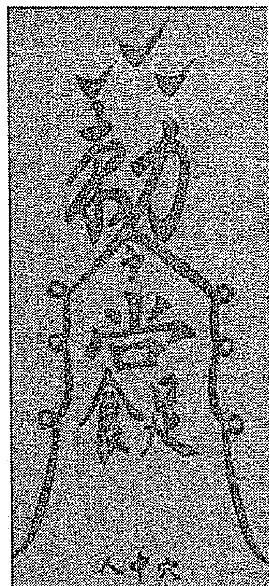


##### 第二组：


##### ## 第三组：


### 第十四章 六甲开运术

若人生走入低谷，霉运连连，想东山再起，可用此术。

-   (一) 选局：起无中生有局，选出开门落宫生日干宫的局。
-   (二) 布局：
    -   1. 在开门落宫布局，掐请神诀、曰：人剑合一，太上老君加持。诵召请咒9遍、化丁甲符或三奇符、能量符、摆放风水物。
    -   2. 开门落宫、日干落宫须无四害。
-   (三) 运符
    -   1. 运符：选柳木板一块，长一尺，书符于柳木板上，悄悄埋于门限内，不可让人发现，发现效果则薄，甚至不灵验。
        门限即门槛，城市里放在门垫下面固定好，要悄悄的进行，一个人操作就行。
        符用朱砂画好后，上一层清漆，这样会更好，放的时间会更长一点；楼房就不要刷清漆了，放在室内门垫下（字朝上）就行；没有走入低谷，也可以用这道符，

        

        同样可以开运。

#### （四）化解因果

-   1. 用六甲超度术，超度先远三代宗亲并及本境五音男女，十类孤魂等。
-   2. 用六甲还债术，偿还寿生债、前世或累世的杀生之债、风流债、官利债、历劫冤久人命债、牢狱债等等。要阴阳统调。
-   3. 也可用乾坤大法直接化解。

### 第十五章 六甲讨债秘术

#### （一）选局：起无中生有局，选出伤门落宫克天乙落宫或天乙落宫生伤门落宫的局。

#### （二）布局：

-   1. 在伤门落宫布局，掐请神诀、诵召请咒、化丁甲符或三奇符、能量符、摆放风水物或十二神将。
-   2. 伤门落宫、天乙落宫须无四害；伤门与值符同宫发力更大。
-   3. 天乙查法：值符落宫的原宫九星为天乙。如值符落坎宫，则天蓬星落宫为天乙；落坤二宫，则天芮星落宫为天乙；落震三宫，则天冲星落宫为天乙……以此类推。

#### (三) 运符：

-   1. 运符：红纸、黄色（金粉或黄广告色加少量朱砂）墨书讨债符一道。符上必须写欠债人姓名、住址、联系方式等信息。把身份证写下来也可以。
-   2. 边画符边诵咒：天冬冬地冬冬，六甲六丁展威风，六甲六丁全出动，急到xxx家中，催押xxx恶人，良心发现，速将欠xxx之钱一一还清，急急如律令！
-   3. 在伤门落宫或土地庙，掐请神诀，曰：人剑合一，太上老君加持。
    > 诵召请咒9遍，然后烧讨债符7道，每天1道，共7天。烧符时，再诵1遍咒：天冬冬地冬冬，六甲六丁展威风，六甲六丁全出动，急到XXX家中，催押XXX恶人，良心发现，速将欠XXX之钱一一还清，急急如律令！

#### (四) 化解因果：

-   1. 用六甲还债术，偿还寿生债、前世或累世的杀生之债、风流债、官利债、历劫冤久人命债、牢狱债等等。
-   2. 也可用乾坤大法直接化解。


### 第十六章 六甲讨债术

1、起出奇门局，找出生日干的生门落宫或戊或月干落宫，直接在生门或戊或月干落宫布局。戊是钱，月干是对手、是对方，这三个官都可以。

-   2、在生门或戊或月干落宫，掐请神诀，人剑合一，太上老君加持。诵召请咒9遍，然后左手掐六仪诀（旬首），右手剑指虚空画丁甲符21遍。边画边念：**xxx快速还我钱，不还乱你心！** 起出奇门局后，看旬首是谁，就掐那一个。
-   3、用六甲还债术，在亥时还其历劫所欠阴债。

例：柏女士面测说：别人借她几十万元钱，一直不还，能不能布局让她尽快还钱？

公元：2016年6月27日17时48分 阴1局
农历：猴年05月23日17时48分 时盘
干支：丙申 甲午 庚辰 乙酉 (午未空)
直符：天任 直使：生门 旬首：甲申庚

||卯 戌|辰 收|巳 开|
|---|---|---|---|
|寅 丙 危|阴 壬 心 惊|蛇 戊 蓬 开|符 庚 任 休|
|丑 庚 破|六 辛 柱 歹||天 丙 冲 生|
|子 戊 执|白 乙癸 芮 景|玄 己 英 杜|地 丁 辅 伤|
||亥 定|戌 平|酉 满|
|||壬 马||

丁 ○ ○
午 己 闭
未 癸乙 建
申 辛 除

#### 分析：

1、面测日干庚为求测人落坤宫临空，但四柱填实不空。
2、月干甲为欠债人也落坤宫，转宫到坎。
3、坎宫已坐下戊为钱，临玄，有忽悠、骗的像意；坎与坤宫为先后天的关系，又有相同符号相连，说明是熟人或亲戚；杜门为躲藏，躲着不见。
答：为一亲戚，借钱后就再也不提还钱的事，打电话不接。
4、问：能不能把钱要回来？
大局反吟为要钱这事有反复，时干乙为要债这件事，落艮宫克制坎宫，为可以要回来，但艮宫庚为困难又击刑，说明要债这件事不容易有困难；击刑别扭、减半，暂时只能要回来一部分。
5、问：怎么给她要呢？
答：运用六甲讨债术，午日午时在离宫放一个粉红色的大肚子陶瓷花瓶，化丁甲符、诵召请咒，调遣六甲神将帮忙讨债即可。同时，利用乾坤大法还你阴债、助你成功。
6、如图为运用乾坤大法还其阴宅现场。


反馈：七天后欠债人主动还了 10 万。

### 第十七章 五鬼运财术

世间所述五鬼运财术，在门派、施法或运用上各有巧妙，不尽相同。今传五鬼运财术，可由求财者自己来施法。但切忌猜疑、急躁或四处宣扬，最好秘密为之。


六甲神将祭炼成功以后，才能用；没有祭炼神将不能运用。利用六甲神将和符咒来进行驱使五鬼运财，自己就可以操作；但切记猜疑、急躁、四处宣扬，最好秘密为之。

画护身符时用童子尿、处女的月经纸，这两种液体只能画护身符，其它符不能画，护身符是护身的、辟邪的。

想用五鬼运财术者，必须具备如下条件：

一、命中犯五鬼符者：即以八字之年支字，参照其余三支(日月时支)，以日支出现者作用力最大。

二、流年犯五鬼官符者：即运用五鬼运财术那一年之流年，正好逢十二岁君中之五鬼凶煞管辖之年。先由八字中的生月与生时，求出自身之命宫。再由命宫对照流年之支字，即可得之该年时五鬼。

#### 自我命宫速查表

| 时月 \ | 子时 | 丑时 | 寅时 | 卯时 | 辰时 | 巳时 | 午时 | 未时 | 申时 | 酉时 | 戌时 | 亥时 |
| --- | --- | --- | --- | --- | --- | --- | --- | --- | --- | --- | --- | --- |
| 正 | 卯 | 寅 | 丑 | 子 | 亥 | 戌 | 酉 | 申 | 未 | 午 | 巳 | 辰 |
| 二 | 寅 | 丑 | 子 | 亥 | 戌 | 酉 | 申 | 未 | 午 | 巳 | 辰 | 卯 |
| 三 | 丑 | 子 | 亥 | 戌 | 酉 | 申 | 未 | 午 | 巳 | 辰 | 卯 | 寅 |
| 四 | 子 | 亥 | 戌 | 酉 | 申 | 未 | 午 | 巳 | 辰 | 卯 | 寅 | 丑 |
| 五 | 亥 | 戌 | 酉 | 申 | 未 | 午 | 巳 | 辰 | 卯 | 寅 | 丑 | 子 |
| 六 | 戌 | 酉 | 申 | 未 | 午 | 巳 | 辰 | 卯 | 寅 | 丑 | 子 | 亥 |
| 七 | 酉 | 申 | 未 | 午 | 巳 | 辰 | 卯 | 寅 | 丑 | 子 | 亥 | 戌 |
| 八 | 申 | 未 | 午 | 巳 | 辰 | 卯 | 寅 | 丑 | 子 | 亥 | 戌 | 酉 |
| 九 | 未 | 午 | 巳 | 辰 | 卯 | 寅 | 丑 | 子 | 亥 | 戌 | 酉 | 申 |
| 十 | 午 | 巳 | 辰 | 卯 | 寅 | 丑 | 子 | 亥 | 戌 | 酉 | 申 | 未 |
| 十一 | 巳 | 辰 | 卯 | 寅 | 丑 | 子 | 亥 | 戌 | 酉 | 申 | 未 | 午 |
| 十二 | 辰 | 卯 | 寅 | 丑 | 子 | 亥 | 戌 | 酉 | 申 | 未 | 午 | 巳 |

找命宫，正月子时生命宫在卯宫，找出命宫后再找流年，操作就行。

#### 年犯五鬼

| 命宫 | 子 | 丑 | 寅 | 卯 | 辰 | 巳 | 午 | 未 | 申 | 酉 | 戌 | 亥 |
| --- | --- | --- | --- | --- | --- | --- | --- | --- | --- | --- | --- | --- |
| 流年 | 申 | 酉 | 戌 | 亥 | 子 | 丑 | 寅 | 卯 | 辰 | 巳 | 午 | 未 |## 命犯五鬼

| 年支 | 子 | 丑 | 寅 | 卯 | 辰 | 巳 | 午 | 未 | 申 | 酉 | 戌 | 亥 |
|------|----|----|----|----|----|----|----|----|----|----|----|----|
| 月日时支 | 辰 | 巳 | 午 | 未 | 申 | 酉 | 戌 | 亥 | 子 | 丑 | 寅 | 卯 |

先找命官，再找流年，如命官是丑，找流年酉这一年做最好。

命犯五鬼以年支查，找月日时，以日支最好，如年支是子，月日时见辰，年支是卯，其它三支有未，符合条件就可以做。

### 三、命中带有偏财、正财者、即八字中有偏财星或正财星者。

当然财星越多越好，且偏财更胜于正财。偏财代表流动之钱财，正财代表固定之钱财。五鬼运财，顾名思义，乃搬动、移动钱财。偏财出现于天干者，更胜于在地支者；偏财在于天干，谓之天财，即天送来意外之财。当然，最好天干地支皆有偏财出现，效果神速，灵验无比。不过八字命中至少亦要有一点财星，用五鬼运财术，才能有所应验。

### 四、大运逢正财或偏财运者：大运干支，一字管五年之行运，

若此大运正逢偏财运或正财运，运用五鬼运财术，效果倍增。大运同样偏财运胜于正财运，天干偏财大运胜于地支偏财大运。

在以上四种条件具备齐全，优异的时机下，进行五鬼运财术，必如移山倒海，势如破竹般的财源滚滚而来。当然，要具备这四种条件，是可遇不可求，正好条件齐全者，亦未必懂得去运用此术，但无论如何，想使用五鬼运财术之人，八字必须具备财星，且不可日柱出现魁罡者，方能致效、灵验。

魁罡者：日柱见壬辰、庚戌、庚辰、戊戌者为是。

日柱见其中之一，就不要做，做了也没用。

### 五、准备事项：

- 准备一张小桌子、五碗米、五个酒杯、一个香炉、清香、金纸、银纸、蜡烛、五牲（鸡、鸭、鱼、肉、蛋）、米酒。
- 准备五支竹片（如筷子般长度），以黄纸或白纸，剪成五张纸人，画上七窍人形躯体，注上东方生财鬼，西方、南方、北方、中方生财鬼（如图），贴于竹片上，插于装米之碗上，依东、西、中、南、北之顺序，排于小桌上，成一排状，香炉摆在中间，五鬼神位前各放一个酒杯，蜡烛立于最左边。（画鬼时必须带耳环以区别）


- 剪下自己的手指甲、脚指甲，男左女右，五根头发，分别放于五鬼神位之碗内米上。用黄纸一张，写上姓名、住址、生辰八字，压于香炉下。
- 画召五鬼符一道，退五鬼符一道。

### 六、操作程序：

- 起无中生有局：找天、地盘干“戊”落宫或“休、生、开三门”落宫（无四害），安置五鬼神桌，以及应准备事项，方便操作。但须避风雨以及不易被人撞见为佳。有时外人会受惊吓，则就麻烦，家人知道则无妨，交代别四处张扬。
- 诵咒：诵六甲召请咒9遍、土地咒3遍。
- 掐请神诀请神；人剑合一，太上老君加持。请六甲神将，速传五鬼到此！
- 化符：化五鬼符一道，边化符边诵五鬼通灵咒三遍。

#### 五鬼通灵咒：

精靈精靈，不知姓名，授尔五鬼，到吾坛庭，顺吾者吉，逆吾者凶，辅吾了道，匡吾成真，命尔搬运，即速便行，逆吾令者，寸斩灰尘。

此咒最好能先读熟，全神贯注，一气呵成。若出现香炉起火，酒杯倒了或五鬼神位歪倒之异状，亦要不动声色，调整好后继续进行即可，切记勿急，勿猜疑，更别口无遮拦，心里有数就可以了。

##### 5、退鬼：

五鬼运财术靠的是符法来催动五方鬼神，六甲神将强制五鬼依令而行催财。人利用鬼之神力求财，鬼利用人为善之积德分享，来寻求轮回解决，互相利用。所以，求财者，若只为已利，忘记行善，鬼因得不到行善福德之分享，也会反目无情，后遗之症自然而生！因此，财运到后，要广积善行方可。同时，役鬼之后，画退鬼符一道，诵土地咒、退鬼咒各三遍退鬼。

土地咒：坛场土地，神祈最灵，通天达地，出入幽冥，为吾传奏，不得留停，有功之日，名书上清（三遍）。

退鬼咒：杳杳冥冥，天地同生，散者成气，聚者成形，五行之祖，六甲之精，兵随日战，时随令行。

##### 6、掐请神诀：

人剑合一，太上老君加持。请六甲神将，速将五鬼押走！


## （下）

### 六甲祝由济世人 六甲道法度冥迷

### 第十八章 六甲祝由术

六甲祝由术，为神仙不传之秘，有起死肉骨之功能。行此术者，须道德垂上尔，其真符秘诀世均不传，能本更无查考，此编独树一帜，灵应垂验，是在用之者神乎其神尔。

六甲六丁乃五行之祖。六甲祝由术以丁甲神将为媒介，以符咒相辅佐，借以沟通、传输和调解天、地、人、神之间的五行炁场。达到凝聚真气、益智增慧、调理和治疗疾病的愿景。

六甲祝由术的修炼体系包括呪法、诀法和掌法以及吹法等内容。

#### 第一节 呪法

- 一、准备：在地面上（或意念）画一个直径1.5至2.5米的大圆圈。在圆圈内画一北斗七星。


- 二、功能：提升能量，与神沟通。
- 三、方法：秘密练功，勿令有任何干扰（尤其忌鸡、猫、狗撞见）。心静体松，神态从容。左手拈花指，右手剑诀，并上抬腰上。两脚如肩同宽，站立在圆圈内北斗星的斗柄上，即第一颗星上，面向北斗所指方向。

（一）步阴斗：向后退步。第一步右脚退，退落在第二颗星上；第二步左脚退，退落在第三颗星上；第三步右脚退，退落在第四颗星上；第四步左脚退，退落在第五颗星上；第五步右脚退，退落在第六颗星上。第六步左脚退，落在第七颗星上；第七步右脚退，落在第七颗星上。

每退一步，默念一句咒语：白气混沌灌我形。

双脚退落在第七颗星上时，用意念吞北斗星之光入腹24次。叩齿36次。吞津液入腹3次，接着继续行功。

（二）踏阳罡：向前进步。第一左步脚进，进落在第六颗星上;第二步右脚进，进落在第五颗星上；第三步左脚进，进落在第四颗星上；第四步右脚进，进落在第三颗星上；第五步左脚进，进落在第二颗星上；第六步右脚进，进落在第一颗星上；第七步左脚进，进落在第一颗星上。

每进一步，默念一句咒语：白气混沌灌成形。

双脚进步还原第一颗星上时。用意念吸吞北斗之光入腹24次。

叩齿36次。吞津滚入腹3次。

如此为1遍。早七遍，晚七遍，一天练功2次，连续修炼四十九天。

（三）收功：意想白气混沌灌成形之后，体内一片光明，浑身轻松舒泰。然后双手握拳以固气，再松开、搓手、浴面、擦鼻梁、按迎香、揉耳朵、按听宫、干梳头、鸣天鼓、散步，功毕。

#### 第二节 诀法

（一）通神：掐请神诀，曰：人剑合一，天医仙师加持。诵通神咒与天医仙师通神。随着呼与吸，感觉与宇宙融为一体，认真体会人在炁中，炁在人中的静寂与玄妙的感觉。

（二）掐诀：

- 左手掐六丁六甲诀：依次面向八宫修炼。震宫掐卯诀，巽宫掐辰诀，离宫掐午诀，坤宫掐未诀，兑宫掐酉诀，乾宫掐戌诀，坎宫子诀，艮宫掐丑诀。
- 右手掐老君诀：右手中指伸直，无名指拗过中指背后侧，食指又将无名指指甲扣住，大拇指指腰再将中指第二节点按住不让中指弯曲，小指自然伸向掌心。至此构成中指独立伸直，无名指、食指在中指背侧应屈曲勾搭。大拇指掌侧抵住中指的状态。


（三）运符

右手老君诀，抬臂略高于肩，凌空书符。然后，在符体下方叠写：

- 魁
- 鬼勺
- 鬼灌
- 鬼行
- 鬼里
- 鬼甫
- 鬼票

再在叠写的七个字中间下笔，由内向外，由小到大，顺时针方向画圈，把符胆包住，形成墨团。同时默念“召请咒”，共9圈。

最后在正下方正中向上方直挑起，再在墨团上叠写“敕”。


这道符是祝由总符，修好后可治各种病，也是治病的万能符，与专用符配伍，效果非常大，感冒、发烧、咳嗽在碗里用半碗阴阳水，直接对着碗画符，照样能起到作用。

（四）吞符：

画完后右手自然放下，张口把画在天空的符用力吸进来，吞下导入下丹田（8遍）。可以面向八宫每个宫吸一遍，也可以一个宫吸八遍，意念吸，把刚才画的符吸到肚里。

（五）收功：

用意念将导入下丹田的祝由符顺时针由大到小转9圈，最后变成一颗金丹。然后用意念把符按照水（肾）、木（肝）、火（心）、土（脾）、金（肺）的顺序，分5次送到身体相对应的各个器官。


如法修炼7天，便可画符为自己或他人调理，健身治病定能收到立竿见影之效。

如果想增加能量炼太极玄功和踏七星罡步，能量上的更快，两天就能治病调理。

#### 第三节 掌法

- 一、调身：自然站立，全身放松，双脚与肩同宽，两腿微曲，两眼微闭，面带微笑，舌顶上颌，口唇轻闭，鼻呼鼻吸，两手抬起到中丹田平，手心相对，距离约30公分，十指伸开，手指微曲，似抱球状，意想两手中同抱一个太极球。
- 二、调息：两手随着呼吸做开合动作，吸气时两手合拢约15公分。呼气时两手拉开至80公分，意想合拢时气球变圆，变小，拉开时气球变大变长。这样拉54次；再改变呼吸，吸气时拉开，呼气时合住，同样拉54次。呼吸时一定要注意配合意念和双手的开合，当拉到一定程度时，好像自己全身穴位、毛孔、细胞、经脉也在开合，也在呼吸，在和宇宙交换信息、能量。把宇宙空间的真气（光、电、能、磁、波等各种高能物质、信息）吸入体内。排出体内的废气、浊气、病气、污气。反复开拉和意想，配合呼吸，场能就会逐渐加强、扩大和深厚，则两掌的场能就会越强、越敏感，给人探病、诊病和治病的功能就会不断增强。

修炼时，两手掌中间像有很大的挤压力，或拉不开的感觉，反复拉合108次，越慢越好，一分钟最好做8次为好，练功时两臂如抱球状，意念要始终不离球和双掌，要细心体会两掌中间的感觉。

- 三、调意：

当上述开合拉气练至108次时，左手掌静止不动，右手掌继续拉开，然后用右手劳宫穴向左手掌劳宫穴发气，意想从右手劳宫穴发出一股金黄色的光束，把左手掌心打个洞，这个洞很清晰、透明；然后，右手推拉向左手掌心发气36次和54次后，右手掌静止不动，再用左手掌向右手掌发气，意想从左手掌心劳宫穴发出一股金黄色的光束，把右手掌心劳宫穴打一个洞，同样为36次和54次。

当上述练至36次后，再双手十指相对，掌心向内，用双手十指拉气108次，配合呼吸，吸气时合住，呼气时拉开，做54次后，再吸气时拉开，呼气时合住，做54次。

如此反复修炼，可以加强十指场能，以后书符时，使气贯注于指端，而直达笔尖，深透墨纸之中，亦可以指代笔，书符于病灶处，做到：手到意到、意到气到、气到病愈。

- 四、收功：

两臂缓缓下落，两腿直立，意念把天地宇宙之气从两掌心、脚心、全身毛孔、穴位，回收到下丹田，并用双掌心对准下丹田左转36圈，再右转36圈为收气，然后双掌心紧贴下丹田，男士左手在里，右手在外，女士则相反。意守3分钟，再做收功动作。

- 五、注意事项：

掌法的修炼，始终都是以意引气。以意念为主导，呼吸为动力，再配合体呼吸，采宇宙之炁为我所用，排出体内废气、浊气，以健自身，即有修炼、发放外气的功力，又有修炼用意念治病的功能。其它注意事项同诀法修炼。

诀法、掌法可单独修炼，也可组合一起修炼。

#### 第四节 吹法

吹炁宝诰：弟子某某，诚心皈依，救苦救疾，愿成天医，五雷九炁，随吾使唤，吾今持诵，一心不移！（修炼前诵三遍）

##### 吹气八诫：

- 每晨日出起，向东方嘘气一口，不可立吐；
- 每晨日出起，向南方嘘气一口，不可晕口；
- 每晨日出起，向西方嘘气一口，不可心乱；
- 每晨日出起，向北方嘘气一口，不可邪视；
- 每庚申日起，向四方嘘气四口，不许人见；
- 逢丁戊日起，向四方嘘气四口，不许吐痰；
- 逢危危日起，向四方嘘气四口，不许畜见；
- 逢端午日起，向四方嘘气四口，不得疑虑。

修炼者依此行之，然后诵咒：结缔结缔，天医圣帝，好生之德，德于天齐，一切疾病，气到便靡，吾奉天医上人急急如律令敕。

同时老君诀或剑指虚空画吹炁符：


然后将此符吞入腹内，每日七次行之一年，如人患疾病只须向其人吹气一口诵咒一遍，如外症只须画符一道吸气一口喷符上，令病者或佩戴自有效验，此不服药之良法也，慎之慎之。

#### 第五节 布炁

- 一、准备：朱砂、毛笔、符纸。秘密为之，勿令有任何干扰。踏罡步斗1遍以聚气，然后画万字符。
- 二、方法：心静体松，神态从容。掐请神诀：曰：人剑合一，天医仙师加持！

默念通神咒与天医仙师通神。咒毕，睁开眼睛，吸地气一口入腹后呵于纸上，然后，右手紧执笔以目光随笔尖一气书之。

先书“治xxx之xx病”，再书一大“卍”字，然后署名是“xxx（法名）书”，最后写上年x月x日。


为增强书符效果，书毕聚精会神默念，“治xxx之xx病”七遍，并用笔尖在符上“卍”字的某方位悬空点四十九下，同时从1默数至49止，数一下点一下。

- 1、震、巽位：精神失常、神经痛、癫痫病、肝脏病、感冒、传染病、胆结石、气管、食道、左肩、毛发等类病点数在“卍”的震、巽位置上。
- 2、离位：心脏病、眼疾、头痛、失眠、脸部疾病、耳疾等类病点数在“卍”的离位置上。
- 3、乾位：头部、颈部、右腿、大肠、骨骼等疾病类点数在“卍”的乾位置上。
- 4、兑位：口、舌、气管、咽喉、肺、右肋、右肩膀、胸部、大肠、肛门等疾病类点数在“卍”兑的位置上。
- 5、坎位：肾、泌尿系统、生殖系统、血液、骨髓、肛门、糖尿病等类疾病点数在“卍”字的坎方位上。
- 6、坤位：脾胃、妇科、贫血、便秘、皮肤病、肩周炎、慢性病、癌症等病点数在“卍”的中央和坤的方位上。
- 7、艮位：背、腰、左腿脚、关节、筋骨疼痛、疮肿等类疾病类点数在“卍”艮的位置上。

根据病情在所应之方位点数完了以后，放下毛笔，双手扶按在符纸的两边，并聚精会神的默念密咒：“结缔结缔，天医圣帝，好生之德，德于天齐，一切疾病，气到便靡，吾奉天医上人急急如律令敕。”

咒毕，吸天气一口入腹后复出呵于纸上。此符必灵。

此为“明符”，如果功力深者用剑指画于纸上而不见其形者为“暗符”，其书法与效果上基本一致。

如此这般为一遍。初学者可练七遍。早七遍，晚七遍，一天练功二次。四十九天之后就可以运用了。应用时先踏罡步斗后再书万字符。

- 三、收功：

意想体外一片光明，体内也透彻明亮。浑身轻松舒泰。然后双手握拳以固气，再松开，搓手，浴面，擦鼻梁，按迎香，揉耳朵，按听宫，干梳头，鸣天鼓，散步，功毕。

#### 第六节 专用符运用

- 1、降三高：黄纸朱砂诵咒、画符，桃仁汁冲服，或用桃仁汁半碗，老君诀汁中画符7遍饮下。

咒曰：元始令我降三高，丹元心神有妙招，血气和通神能守，三高束手顿自消，戊己中土黄芽苗，主人乐的哈哈笑。降、降、降。


- 2、去胃癌、肝癌符：黄纸、朱砂、诵召请咒、画符，老酒（陈酒）送服。

肝有毛病，每天上香在祖师面前祷告，和祖师说他的病情，每天画一道符，在喝中药的同时，把这道符画进去，一个月后检查病好了。


- 3、醉酒符：治大醉不醒。用水半碗，老君诀水中画符7遍饮下。


- 4、治精神病符：

黄纸朱砂、画符，化灰，用丹参5钱，干花生叶1两，煮水送下。

要先判断是灵异病还是精神病，这道符还可以治灵异病，要综合运用。


- 5、止周身疼痛符：黄纸朱砂诵咒、画符，阴阳水冲服，或用水半碗，老君诀水中画7遍符饮下。

咒曰：结缔结缔，天医圣医，好法之德，德与天齐。一切疾病，气到便靡。我奉天医上人急急如律令！然后再向符上吹气一口。


- 6、止胃痛、肝痛符：黄纸朱砂诵咒、画符，阴阳水冲服，或用水半碗，老君诀水中画7遍符饮下。


- 7、止咳符：黄纸朱砂诵咒、画符，盐水冲服，或用水半碗，老君诀水中画7遍符饮下。


- 8、通便符：黄纸朱砂诵咒、画符，阴阳水冲服，或用水半碗，老君诀水中画7遍符饮下。


- 9、去乳腺增生符：朱砂、黄纸、诵咒、画符，烧灰用酒冲服，或用酒少许，老君诀酒中画7遍符饮下。

咒曰：结缔结缔，天医圣医，好法之德，德与天齐。一切疾病，气到便瘳。我奉天医上人急急如律令！然后再向符上吹气一口。


- 10、退热符：黄纸朱砂诵咒、画符，柴胡、薄荷汤冲符，或柴胡、薄荷汤半碗，老君诀汤中画7遍符饮下。


- 11、安眠符：晚上不能睡眠，心乱如麻，胡思乱想者，书符

##### 12、治男子与鬼交

画符两道，一道化灰，阴阳水送服，一道放入枕头里21天，然后烧掉，烧时不要让人知道。
鬼压床也可以用。

##### 13、治女子与鬼交

画符两道，一道化灰，阴阳水送服，一道放入枕头里21天，然后烧掉，烧时不要让人知道。

##### 14、治阳痿符

- (1) 左图：画符、化灰，在布局之宫，米酒或生姜汤服饮，14天痊愈。
- (2) 右图：画符、化灰，在布局之宫，茶叶汤服饮7天痊愈。

这两道符用那一道都可以。

##### 15、治早泄符

画符、化灰，在所布局之宫，陈皮酒饮服7天，愈后不复发。

##### 16、治遗精符

画符、化灰，在所布局之宫，灯芯（灯芯草）汤送服7天，痊愈永不复发。

##### 17、治月经不调符

画符、化灰，在所布局之宫，香附汤饮服。

##### 18、治痤疮

此二符治疗痤疮、青春痘。烧化喝掉或对着痘痘画。

##### 19、治胃部恶疾

胃溃疡、胃下垂、胃癌等绝症，木香汤送服，连服21天，3个月后即愈。

##### 20、治肺部恶疾

治疗肺肿瘤等肺部各种恶疾，陈米汤送下，连服14天，三个月后即愈。

##### 21、治头部各症符

治疗头部各症，川葛汤送下，21天后生效。

##### 22、治癫痫

东壁（屋东边墙壁）土煎汤送服。

##### 23、治眼病

治各种眼疾，化灰水洗即治。

##### 24、治中风（1）

乳香汤送服。治初期中风。

##### 25、治中风（2）

扁豆汤送服。

### 第十九章 六甲育儿术

- (一) 选局：起无中生有局，选出时干宫或生门宫生日干宫的局。
- (二) 布局：
  - 1、在时干或生门落宫布局，掐请神诀、诵召请咒、化丁甲符或三奇符、能量符、摆放风水物。
  - 2、时干落宫或生门宫、日干宫须无四害。时干宫临生门发力更大。
- (三) 运符：
  - 1、男子不育：画符、化灰，在布局之宫，陈皮酒服饮7次，半年后得子。
  - 2、女子不育：画符、化灰，在布局之宫，陈米（时间长的米）汤服饮7次，半年后得子。
  - 3、生女孩符：女的喝。画符、化灰，在布局之宫，生姜汤服饮7次，定生女孩。
  - 4、治阳痿符：
    - (1) 左图：画符、化灰，在布局之宫，米酒或生姜汤服饮，14天痊愈。
    - (2) 右图：画符、化灰，在布局之宫，茶叶汤服饮7天痊愈。
    这两道符用那一道都可以。
  - 5、治早泄符：画符、化灰，在所布局之宫，陈皮酒饮服7天，愈后不复发。
  - 6、治遗精符：画符、化灰，在所布局之宫，灯芯（灯芯草）汤送服7天，痊愈永不复发。
  - 7、治月经不调符：画符、化灰，在所布局之宫，香附汤饮服。
- (四) 化解因果：用乾坤大法或六甲超度术、六甲还债术化解因果。

### 第二十章 六甲催婚术

- (一) 选局：起无中生有局，选出休门或合干落宫生日干宫的局。
- (二) 布局：
  - 1. 在休门或合干落宫布局，掐请神诀、诵召请咒、化丁甲符或三奇符、摆放风水物、照片（你的意中人、你的对象放到这个宫里面）等。
  - 2. 休门或合干落宫、日干宫须无四害。
- (三) 运符：红纸黑字画符，带于身上，则“桃花”自来。
- (四) 化解因果：用乾坤大法或六甲超度术、六甲还债术进行化解。既要超度还要还阴债。

### 第二十一章 六甲止遇术

- (一) 选局：起无中生有局，选出休门落宫生日干宫的局。
- (二) 布局：
  - 1. 在休门落宫布局，掐请神诀、诵召请咒、化丁甲符或三奇符、能量符、摆放风水物、结婚照等。风水物、结婚照要开光。
  - 2. 休门落宫、日干宫须无四害。
- (三) 运符：
  - 1. 治丈夫外遇符：布局后，将左符放在丈夫的枕头里，右符放在丈夫的鞋子里，将两鞋对合，两头用钉两根将两鞋钉牢，上面放石子两粒，其夫将会和第三者断。放在床下边或隐蔽的地方。
  - 2. 治妻子外遇符：如妻子有外遇，夫妻感情不和，经常吵架或长期外出，布局后，将左符化灰放于妻子的鞋子里，右符放于枕头内。将两鞋对合，两头用钉两根将两鞋钉牢，上面放石子两粒，其妻自然而归。
  - 3. 防丈夫外遇符：如家庭过的很好，防止丈夫外遇，布局后，红纸黑字书此符，放于床的中心位置，21天后，再好看的女子，丈夫也不为动心，但事后要记住丢入活水河里。
  - 4. 防妻子外遇符：如夫妻感情相当密切，预防有人插手，布局后，红纸黑字书此符，放于床的中心位置，21天后，不管碰到任何有风度的男人或权威上司，其妻也会毫不动摇。
  - 5. 斩桃花符：布局后，朱砂、黄纸画符，背面写上双方所有信息（姓名、出生日期、电话号码、住址、能知道的信息都写上）及所办事项，一天画一道符，共七天，然后起局找出对方（资料上找情人系统有）方位，在其方位的十字路口，配元宝将七道符化掉即可。也可一次性画七道，放到坛上祭炼，祭炼七天之后，七道一块配元宝烧掉。可以召请神将，让神将帮你的忙。

### 第二十二章 六甲胜讼术

- (一) 选局：起无中生有局，选出年干或休门落宫生日干宫的局。
年干是大的趋势、领导，也代表法院等，休门代表贵人，有人帮你。
- (二) 布局：
  - 1、在年干落宫或休门落宫布局，掐请神诀、诵召请咒、化丁甲符或三奇符、能量符，摆放风水物。
  - 2、年干落宫或休门落宫、日干宫须无四害，年干宫临休门发力更大。
- (三) 化解因果：
  - 1、用六甲超度术，超度先远三代宗亲并及本境五音男女，十类孤魂等。
  - 2、用六甲还债术，偿还寿生债、前世或累世的杀生之债、风流债、官利债、历劫冤久人命债、牢狱债等等。
  - 3、也可用乾坤大法直接化解。
- (四) 运符、默咒
  - 1、画符：此符画好后，放于坛上祭拜之，祭炼几天，开庭之日放入口袋，即显灵验。
  - 2. 开庭之日。在法庭上。心中虔诚反复默诵【先】字1遍，再默诵【女子狮王】3遍。即可斥退和遏制对方汹势，以致求胜。

### 第二十三章 六甲题名术

主要用于考试、晋级、竞选、竞聘等。
- (一) 选局：起无中生有局，选出年干或景门生日干宫的局。年干代表政策，景门代表文化。
- (二) 布局：
  - 1. 在年干落宫或景门落宫布局，上香请祖师加持，掐请神诀、诵召请咒9遍，请值班神将帮忙，化丁甲符或三奇符、能量符、摆放风水物。
  - 2. 年干落宫或景门宫、日干宫须无四害。景门与太岁落宫或天辅或乙奇或值符同宫发力更大。
- (三) 化解因果
  - 1. 用六甲超度术，超度先远三代宗亲并及本境五音男女，十类孤魂等。
  - 2. 用六甲还债术，偿还寿生债、前世或累世的杀生之债、风流债、官利债、历劫冤久人命债、牢狱债等等。
  - 3、也可用乾坤大法去直接化解。
- (四) 运符
此符画好后，放入红色信封里，信封正面用朱砂写【神符】两字，背面画★封之。然后，戴在身上则必金榜题名。

#### 分享：金榜题名术助力护士梦

一女生，医学专科学校毕业后，立志要做一名白衣天使。按照国家有关规定，做护士必须要考取护士资格证。因为没有一点把握，很是着急迷茫，于是，找到我要求运筹策划。

下面是当时运用乾坤大法调理留存的奇门局。

- 公元：2016 年 5 月 13 日 21 时 47 分 阳 5 局
- 农历：猴年 04 月 07 日 21 时 47 分 时盘
- 干支：丙申 癸巳 乙未 丁亥 (午未空)
- 直符：天柱 直使：惊门 旬首：甲申庚

| 宫位 | 奇仪 | 八神 | 备注 |
| :--- | :--- | :--- | :--- |
| 马 卯 破 辰 危 巳 成 | | | |
| 寅癸执 | 地 壬 乙 | | |
| 丑己定 | 玄 乙 丙 | | |
| 子庚平 | 白 丙 辛 | | |
| 亥满 | | | |
| 戌除 | | | |
| 酉建 | | | |
| 申壬闭 | 阴 癸 己 | | |
| 未乙开 | 蛇 己 庚 | | |
| 午丙收 | 符 庚 丁戊 | | |
| | 天 丁戊 壬 | | |
| | 六 辛 癸 | | |
| | 丁戊 | | |

#### 分析

- 1. 面测，日干乙落震宫旺，临辅为老师、辅助、指导的信息，日干乙为希望达成，临玄为有点迷茫。
- 2. 时干丁落离宫，空亡，时干为考试这件事，丁也为空亡转乾宫，克制震宫不利。
- 3. 坎宫辛+癸临合为学校、考生，引干丁戊。丁为资格证，也是时干。

##### (一) 布局

乾、坎两宫进行移星换斗，召请激杀将军在坎宫加持，增加坎宫生助震宫的能量；卯日卯时在震宫放一盆花，花盆是陶瓷的，临玄放在看不见的地方，诵召请咒，召请乙奇、丙奇将军加持日干。
最后用应急秘法进行调理。

##### (二) 化解因果

这是一个简坛，超度、还阴债时怎样设简坛，找一个纸箱子，找一个小桌子更好，放了一个红包，没买水果之类的。

##### (三) 反馈

七月二十一日，护士资格考试官网查询，护士资格考试通过。梦想实现，愿望达成！

### 第二十四章 六甲催眠术

- 1、掐请神诀：人剑合一，太上老君加持。曰：请天医仙师临坛加持催眠！
- 2、引导受术者深呼吸，从头到脚，放松身体。
- 3、让受术者凝视、观想催眠符金光闪闪，进入身体，把全身照的通透明亮，并意念治病驱邪，镇静催眠。
- 4、让受术者凝视、观想催眠符并默数自己的呼吸 20 遍。
- 5、施术者诵咒，并对着受术者剑指画催眠符：
> 赫赫阳阳，日出东方。日月隐晦，宇宙祥光。
> 精神潜发，哲理显彰。灵性安息，嗜欲逃亡。
> 精进神方，下入渺冥，上极帝乡，如跨鸾凤。
> 以翱以翔，谓予不信，试身先偿。
声音要低沉。
这道符不但能催眠，还能驱邪治病。

### 第二十五章 六甲超度术

#### 第一节 超度的概念

超度，相信大多数人并不陌生，可是什么是超度？超度的种类、超度的作用是什么？很多人并不一定清楚。

- 一、什么是超度：
超度，就是通过操作者自身内在修炼和法脉的传承，沟通三界隐态信息通道，通过某种隐态信息力量，把沉沦在阴间或滞留在人间的生灵亡魂救拔出来，使之早日轮回，离苦超升。
- 二、超度的种类：

##### ## 第一类、十方超度：

即是设坛，把附近的各类孤魂野鬼、五音男女全部招过来进行统一的超度。一般佛道大型的法会都会有这类的超度，主要作用是超度各类孤魂野鬼，功德无量。

##### ## 第二类、亡人超度：

一般先人或亲人过世后还停留在阴间地府，子孙后代希望先人脱离地狱苦海，早日超升，因此会请人对这类亡魂进行超度。

##### ## 第三类、冤魂超度：

就是对一些枉死鬼、堕胎婴灵、多世的冤亲债主的超度。这一类的亡魂比较难超度，因为往往都有各种各样的因果，致使他们还滞留在人间，因此做这类的超度也比较多种多样。
所谓冤亲债主，就是在今生前世或多世以来，人们与众生有了不同的牵缠与纠葛关系。有的是互为彼此的关心、照顾、帮助而形成的善缘。有的是彼此争执、抢夺、侵犯、伤害、凌辱、杀吃等种种形式而形成了的恶缘。这就形成了冤亲债主，历代宗亲的关系。
彼此的各种因缘，缠结得愈深，不论是良善的或不良善的，彼此就愈容易在来世的轮回中再次相遇。属于情感引起的业缘，这次就用情感的形式解决，物质或生命引起的业缘，这次就以同等的形式偿付。六道轮回的根本实质，就是众生与众生之间，冤缘相报，相互还债，无有边际，没完没了……
许多人觉得我是好人，心地好，从来没害人之心，为何会有冤亲债主？其实，多劫以来，我们人造作了太多的恶业，跟无量无边的众生结了不少怨仇。别的恶业暂且勿论，单是杀生吃肉，就跟他们结下深厚的怨仇。
当今世界，人们缺乏因果观念，广造恶业，广泛地杀吃，这些累生累世被害动物的怨灵，执着地附在人们的身上，伺机报仇，不肯离去。由于这些怨灵充满仇恨，形成的磁场充满了破坏力，在人体中造成障碍，形成了各种当今世界无法解决的病症。冤亲债主的纠缠是阴阳皆苦的果报，他们被我们伤害吃杀后，附在我们的身上，时时刻刻影响干扰我们，身体不好、运势不好、事业不顺、夫妻不和、子女乖违、精神抑郁、失眠焦虑、甚至于修行的诸多障碍，几乎全部因为冤亲债主得不到超拔而欲索债所引起。

### 三、超度的作用：

按照上面种类划分，第一类超度，一般是人的善念，超度十方孤魂野鬼，功德无量；第二类超度，主要是希望先人或离世亲人早日脱离地狱苦海，早日超升、早登极乐，不再对后人的运程产生影响；第三类，被枉死鬼、堕胎婴灵、冤亲债主缠上一般运气都不是很好，所以通过超度来改变自己的运程。
超度亡魂，让其脱离苦海，得以超升，不管对法师或者福主来说，都是一件积德行善，功德无量的事情。明确超度的概念，可以让我们选择更正确的方式、方法对孤魂野鬼、亲人亡魂、冤亲债主进行超度，达到积累功德，改变自身运势的目的。
即使不给别人超度，经常的初一、十五，晚上九点之后，找一个安静的路边或住的附近，没人打扰，点上 5 支香，相距 1 米远，可以化点冥币或烧纸，不要烧元宝，祷告几句，说点好话。这就是给孤魂野鬼送点衣食资粮。经常做它会感谢你，你的运气、你的财运，会不断得到改善。

#### 第二节 66岁前非正常死亡人的超度

- 1. 运符、写表文：画超度符（盖八卦印），在表文后面写超度人的信息（姓名、住址等）。
- 2. 方位：起局看生日干的宫，到生日干的宫的方位做法事。不起局，以他家为中心，在他家西北方，找一十字路口。西北方为天门方。
- 3、时间：早上寅时或晚上亥时。寅时最好，寅是鬼路。
- 4、净场：到达地点后用五帝钱、放净天地神咒净场。
- 5、设坛：将坛寅时面向艮宫、亥时面向乾宫方位设立。化地户符，摆供品，将五帝钱摆与坛前，在东南西北各化一道能量符，最后一道在坛前，五道能量符。
五帝钱不但可以净场，还可以调理风水，五帝钱要开光，土地符可以不化，但要诵土地咒。
- 6、上香、请神：
  - (1) 叩拜皇天后土、日月星辰、道陵天师、河伯山神、城隍土地。今日弟子 XXX 在此做法，请各位仙师神灵垂爱加持。
  - (2) 掐请神诀，人剑合一，请太上老君加持。诵召请咒，召请六甲神将护坛护法（9遍）。
  - (3) 请土地：咒曰，坛场土地，神祈最灵，通天达地，出入幽冥，为吾传奏，不得留停，有功之日，名书上清（三遍）。
- 7、让客户读表文：读完后将表文、超度符化在坛前，然后化元宝（与还阴债元宝的换算方法一样）。
- 8、化元宝的同时：掐请神诀、人剑合一，太上老君加持。请六甲六丁速将 xxx 六亲眷属亡魂、历劫冤亲债主、今生伤害的无辜生灵超度到高级能量场（三遍）。

##### 9、送神：多谢各位仙师神灵加持，恭送各位仙师、丁甲神将速回仙府。

> 今据
> 中华人民共和国
> 省
> 市
> 县
> 乡（街道）
> 地方居住
> 生方今有孝信
> 奉道诵经施食度亡 生方切虑冥关阻滞 路
> 右领合人等 是日祈仗神力超度 生方切虑冥关阻滞 路
> 途危险 为此谨备牒文通诣
> 三界十方无极神乡 天牢地狱 北都罗酆 延生度厄 海岳洞
> 天 大小幽关 拘囚亡魂之安葬去处 仔细追摄亡故 多
> 位性魂 天命告终 一自去世 同归升沉 代荐本音门
> 中先远三代宗亲并及本境五音男女 十类孤魂等谢于今宵
> 太乙灵幡摄召之际 勿得迟误 如遇神祠 庙堂 关津
> 度口 把隘去处 不许阻滞 验此放行 谨遵道旨 共济
> 逃津 使幽途无阻滞之程法 曾有超升之果 度人功大
> 急火奉行 须至牒者
> 右牒上
> 北魁玄范府神虎追摄司 一行官军将吏 承行本坛法部诸
> 司官军吏兵 祥照前事部集神祇飞灵走电摄魅提亡 无怖
> 畏之心 寘矫人自然之体 玄科有禁火急奉行
> 天运
> 年
> 月
> 日

#### 第三节 婴灵超度

婴灵，是人工流产、胎死腹中，或一出生即夭折的婴儿灵魂。因父母没有为他做超度，魂魄无依，无法往生，弥留现世，产生无尽的怨气恨意，故此循着血缘的磁场密码找到亲人，纠缠作祟，造成父母兄弟姐妹的伤害、意外，甚至失去生命，造成家庭的不安，社会的恐惧等。婴灵唯一生存的食粮，就是亲生母亲身体的元气，一般女性一生中只能接受3个婴灵的附身，一旦超过，那女子必然身体气虚。精神错乱，元神虚弱。

因此，一是通常婴灵绝对是会先找上与他有相关的父母亲，尤其是母亲。所以堕过胎的母亲，最常见的就是怀孕难、妇女病缠身、腰酸背痛、奇怪难治好的病、子宫或卵巢病变等。二是父亲在流年运势低时，也会受到婴灵的伤害。最常见的就是工作不顺、容易发生意外、口舌是非多、破财、被骗、身体健康变差等。三是婴灵若是怨念很深，更是会转加伤害同辈的兄弟姊妹。有时在制化阴煞时，也常发现来煞害的亡灵，竟是同一母亲的婴灵，这也是需要非常注意的。

真正的道教超度需要婴灵父母的忏悔，忏悔他们自身犯过的罪业，然后才是做法事，最后点燃升天光明灯，照亮婴灵的升天之路。

首先让母亲亲手折叠千纸鹤，一个婴灵108个千纸鹤，用五色纸叠，两个翅膀上用红笔在右边写上婴灵父亲的名字（例：张三道之子），左边写太乙收仙童。

- 1. 画超度符：几个婴儿化几个超度符，在背面写上：中华人民共和国某省、某市、某县、某地点，xxx之子（父亲的名字）。
- 2. 方位：起局看死门落宫，超度时到死门落宫的方位。
- 3. 时间：早上寅时或晚上亥时。
- 4. 净场：到达地点后用五帝钱和放净天地神咒净场。
- 5. 设坛：将坛寅时面向艮宫、亥时面向乾宫方位设立。水果三样、矿泉水去几个人放几瓶、草纸一捆、小孩衣服两身、糖果两包，将五帝钱摆于坛前，蜡烛（要买防风蜡烛）9根（坛上两根，坛下7根，设北斗七星阵）；在东南西北各化一道能量符，最后一道在坛前。

##### 6、上香、请神：

- （1）叩拜皇天后土、日月星辰、道陵天师、河伯山神、城隍土地。今日弟子 XXX 在此做法，请各位仙师神灵垂爱加持。
- （2）掐请神诀，人剑合一，太上老君加持。诵召请咒（9 遍），请六甲六丁神将护坛护法。
- （3）请土地：咒曰，坛场土地，神祈最灵，通天达地，出入幽冥，为吾传奏，不得留停，有功之日，名书上清（三遍）。

7、将超度符化在坛前，化元宝、千纸鹤、小孩衣服、糖果、水果等（记着把千纸鹤的灰带走撒在河里即可）。千纸鹤在元宝旁边单独化。

8、化元宝的同时：掐请神诀，人剑合一，太上老君加持。曰：请六甲六丁速将 xxx 之堕胎婴灵超度到高级能量场（3 遍）。同时，让其母亲读忏悔文三遍。

##### 9、送神（香燃完后）：多谢各位仙师、神灵加持，恭送各位仙师、神灵、六丁六甲神将速回仙府。

做完后让他母亲一段时间内不要从那里经过。

##### 附：忏悔文：

无论是过去，现在或是未来。因身，口，意的造作，被我伤害过的（因缘）众生；或因身，口，意的造作，所招感的诸多不顺和苦难，不管是身体上的，还是精神上的。我都愿意接受业果法则，并惭愧的忏悔。

因为无明，因未闻四种真谛，无量劫来，我们彼此伤害，冤冤相报，枉受诸苦于六道中，无有出期。我们都希望解脱。

愿一切被我伤害过的众生，无精神的痛苦，无身体的痛苦，愿你们保持快乐。

愿一切与我有因缘的鬼道，非人众生，得闻道法，投生善道，趋向解脱。

愿一切与我有因缘的人或非人众生，分享我善业的功德，并回答；善哉！善哉！善哉！
愿一切众生分享我的功德。

家里有小孩的，如果经常发烧或者经常拉肚子，或晚上夜哭，其实小孩最容易受隐性信息的干扰，让母亲读这个忏悔文就可

#### 第四节 六甲化阴术

症状：妇女经常腰痛，经期长或常流经血，医药无效等。

病因：在医院妇产科房内房外，冲撞了因小产或引产而死的婴灵，从产房出来后就得病。

病理：因小产或引产而死的婴灵，其灵魂会到处乱跑，而恰又被阴气旺盛的女性冲撞而生阴（血）之病。

配合祝由术效果更佳。

疗法：

- 1. 准备：用红纸剪一套衣服（上衣、裤子），红鞋子、红帽子。元宝1000个、冥币适量。
- 2. 方位：艮方找一十字路口，画一圆圈、不封口（口朝艮宫方位），中画一十字。
- 3. 时间：寅时或亥时。
- 4. 净场：到达地点后用五帝钱和放净天地神咒净场。
- 5. 设坛：面向艮宫设坛。将五帝钱摆于坛前，防风蜡烛9根（坛上两根，坛下7根，设北斗七星阵）；在东南西北各化一道能量符，最后一道在坛前。
- 6. 上香、请神：
- （1）叩拜皇天后土、日月星辰、道陵天师、河伯山神、城隍土地。今日弟子XX在此作法，请各位仙师神灵垂爱加持。
- （2）诵六甲召请咒护坛护法。
- （3）请土地：咒曰，坛场土地，神祈最灵，通天达地，出入幽冥，为吾传奏，不得留停，有功之日，名书上清。
- 7. 化宝：将元宝、冥币、衣服等在圈内化掉。
- 同时：掐请神诀、人剑合一，太上老君加持。曰：请六中六丁速将无辜婴灵超度到高级能量场（3遍）。
- 8. 送神：多谢各位仙师神灵加持，恭送各位仙师、神灵，六丁六甲神将速回仙府。

法事毕，病即愈。

### 第二十六章 六甲还债术

#### 第一节 阴债的概念

阴债有官债、私债之分。

所谓官债，既是受生债又名寿生债。为人受胎下生后所欠阴债。按道家的说法，每个人投胎之前都要到地府曹官那里去借钱，培植自己的福慧资粮，出生后才有粮食可以吃等等福报，因此人生需要还的第一个阴债就是受生债——为人受胎下生后所欠阴债。

还有很多私债，比如父母债、杀生债、风流债、官利债、轮回债、冤鬼人命债、牢狱债、赌博债等等。

常言道：“前世欠债，今生还。”今生的境遇如何，皆有前世所为造化而来，一切皆有因有果。久病缠身者，慢性病患者，久困士途，诸事不顺，生活坎坷，官司口舌，买卖萧条，财运不佳等等人生不如意事情出现时，可以试着偿还阴债，培植一下自己的福根，禳灾解厄，了却前世今生所欠阴债，从而达到消减罪孽解除业障等目的。道教、佛教皆宗之法，古代经典都有所记载。

按经书记载，阴债偿还后，可得现世安乐，出入平安通达，愿望达成，吉无不利，自有本命星官垂护庇佑，过世（去世）之时不失人身，文武星临，财星禄星，五福照耀，身宫胎宫，安乐长寿，不值恶缘等等益处。

在此需要说明的是，还阴债，只是偿还自己所欠之债，从而达到消减罪孽解除业障等目的。而功德，福报，资粮则更需要自己诸恶莫作、众善奉行。并非还完了阴债就一劳永逸了。人都有自己的业障和罪孽，也在不断的造业，所以多行善事才是重要的。

#### 第二节 操作步骤

##### 1、查出本人所欠官债钱数：

1 贯（吊）=1000 文钱=1 两白银=人民币 300 元。
1 万贯=10000 两白钱=1000 两黄金=人民币 3000000 元=20大金元宝。一个大金元宝 50 两黄金。

第一步是计算出生年份的寿生债，分别如下：

- 子年生人：
- 1924年、1984年（甲子）生人：欠钱五万三千贯。
- 1936年、1996年（丙子）生人：欠钱七万三千贯。
- 1948年、2008年（戊子）生人：欠钱六万三千贯。
- 1960年、2020年（庚子）生人：欠钱十一万贯。
- 1972年、2032年（壬子）生人：欠钱七万贯。
- 丑年生人：
- 1925年、1985年（乙丑）生人：欠钱二十八万贯。
- 1937年、1997年（丁丑）生人：欠钱四万二千贯。
- 1949年、2009年（己丑）生人：欠钱八万贯。
- 1961年、2021年（辛丑）生人：欠钱十一万贯。
- 1973年、2033年（癸丑）生人：欠钱二万七千贯。
- 寅年生人：
- 1974年、2034年（甲寅）生人：欠钱三万三千贯。
- 1926 年、1986 年（丙寅）生人：欠钱八万贯。
- 1938 年、1998 年（戊寅）生人：欠钱六万贯。
- 1950 年、2010 年（庚寅）生人：欠钱五万一千贯。
- 1962 年、2022 年（壬寅）生人：欠钱九万六千贯。
- 卯年生人：
- 1975 年、2035 年（乙卯）生人：欠钱八万贯。
- 1927 年、1987 年（丁卯）生人：欠钱二万三千贯。
- 1939 年、1999 年（己卯）生人：欠钱八万贯。
- 1951 年、2011 年（辛卯）生人：欠钱八万贯。
- 1963 年、2023 年（癸卯）生人：欠钱三万三千贯。
- 辰年生人：
- 1928 年、1988 年（戊辰）生人：欠钱五万四千贯。
- 1940 年、2000 年（庚辰）生人：欠钱五万七千贯。
- 1952 年、2012 年（壬辰）生人：欠钱四万五千贯。
- 1964 年、2024 年（甲辰）生人：欠钱二万九千贯。
- 1976 年、2036 年（丙辰）生人：欠钱三万二千贯。
- 巳年生人：
- 1929 年、1989 年（己巳）生人：欠钱七万二千贯。
- 1941 年、2001 年（辛巳）生人：欠钱五万七千贯。
- 1953 年、2013 年（癸巳）生人：欠钱三万九千贯。
- 1965 年、2025 年（乙巳）生人：欠钱九万贯。
- 1977 年、2037 年（丁巳）生人：欠钱七万贯。
- 午年生人：
- 1930 年、1990 年（庚午）生人：欠钱六万二千贯。
- 1942 年、2002 年（壬午）生人：欠钱七万贯。
- 1954 年、2014 年（甲午）生人：欠钱四万贯。
- 1966 年、2026 年（丙午）生人：欠钱五万三千贯。
- 1978 年、2038 年（戊午）生人：欠钱九万贯。
- 未年生人：
- 1931 年、1991 年（辛未）生人：欠钱十一万千贯。
- 1943 年、2003 年（癸未）生人：欠钱五万二千贯。
- 1955 年、2015 年（乙未）生人：欠钱四万贯。
- 1967 年、2027 年（丁未）生人：欠钱九万一千贯。
- 1979 年、2039 年（己未）生人：欠钱四万三千贯。
- 申年生人：
- 1932 年、1992 年（壬申）生人：欠钱四万二千贯。
- 1944 年、2004 年（甲申）生人：欠钱七万贯。
- 1956 年、2016 年（丙申）生人：欠钱三万三千贯。
- 1968 年、2028 年（戊申）生人：欠钱八万贯。
- 1980 年、2040 年（庚申）生人：欠钱六万一千贯。
- 酉年生人：
- 1933 年、1993 年（癸酉）生人：欠钱五万贯。
- 1945 年、2005 年（乙酉）生人：欠钱四万贯。
- 1957 年、2017 年（丁酉）生人：欠钱十七万贯。
- 1969 年、2029 年（己酉）生人：欠钱九万贯。
- 1981 年、2041 年（辛酉）生人：欠钱二万七千贯。
- 戌年生人：
- 1934 年、1994 年（甲戌）生人：欠钱二万七千贯。
- 1946 年、2006 年（丙戌）生人：欠钱八万贯。
- 1958 年、2018 年（戊戌）生人：欠钱四万二千贯。
- 1970 年、2030 年（庚戌）生人：欠钱十一万贯。
- 1982 年、2042 年（壬戌）生人：欠钱七万二千贯。
- 亥年生人：
- 1935 年、1995 年（乙亥）生人：欠钱四万八千贯。
- 1947 年、2007 年（丁亥）生人：欠钱三万九千贯。
- 1959 年、2019 年（己亥）生人：欠钱七万二千贯。
- 1971 年、2031 年（辛亥）生人：欠钱七万一千贯。
- 1983 年、2043 年（癸亥）生人：欠钱七万五千贯。

举例来说，2014 年甲午年出生之人欠钱四万贯。

- 2. 画符（画五道能量符、一道还阴债符，能量符盖八卦印，还阴债符盖三宝印）、表文（附后）：
- 3. 时间：早上寅时或晚上亥时。
- 4. 净场：到达地点后用五帝钱和放净天地神咒净场。
- 5. 设坛：将坛寅时面向艮宫、亥时面向乾宫方位设立。将五帝钱摆与坛前、摆供品，在东南西北各化一道能量符，最后一道在坛前。
- 6. 上香、请神：
- （1）叩拜皇天后土、日月星辰、道陵天师、河伯山神、城隍土地。今日弟子 XXX 在此做法，请各位仙师神灵垂爱加持。
- （2）掐请神诀，人剑合一，太上老君加持。诵召请咒（9 遍），请六甲六丁神将护坛护法。
- （3）请土地：咒曰，坛场土地，神祈最灵，通天达地，出入幽冥，为吾传奏，不得留停，有功之日，名书上清（三遍）。

7、让客户读表文：读完后将表文（盖三宝印）和还阴债符化在坛前，然后化元宝。

8、化元宝的同时：掐请神诀、人剑合一，太上老君加持。请六甲六丁速将 XXX 历劫多生的一切债务带去还清（三遍）。

9、送神（香燃完后）：多谢各位仙师神灵加持，恭送各位仙师，丁甲神将速回仙府。

注：上述还的是官债，其他私债可以根据情况还。

表文盖三宝印，修炼的盖太上老君印，制煞、制鬼的盖道陵天师印，调理风水、治病的盖八卦印。超度、还阴债都不用牌位。香燃完后撒坛。

乾坤大法用地藏王菩萨。还阴债可以自己还，但超度要别人给你来超度。

> 今有查幽天下南瞻部洲 中华人民共和国 省 市（县） 乡（街） 村（小区） 弟子 生于 年 月 日 时 敬备金元宝 万两
> 弟子叩首焚香 叩拜幽冥界 教主地藏王菩萨 地府真君 五殿阎君 十殿将军 护法善神 大开恩 誠請本地城隍 土地山神 五道将军 查清弟子在陰界於那處有冤消冤 有孽消孽 有罪消罪 有債還債 讓冤孽罪債速消 讓弟子吉祥 發財如意 還有弟子在陰界的冤親債主 六親眷屬 殺生之 債 安生債 風流債 官利債 歷劫冤久人命債 牢獄債 一切 債務速消 讓弟子吉祥如意 發財健康 弟子另送金元宝二萬两 請城隍 土地山神 五道將軍 護 法善种均分用
> 还债人
> 天运 年 月 日

### 第二十七章 六甲解送术

#### 第一节 童子解送术

凡有童子命信息者，一般在婚姻、事业、身体方面多数都不会很顺利，但在送童子后命运会发生改变。

- 一、查法：
- 第一种查法：根据春夏秋冬季节来查的。
- 春秋寅子贵：就是春天或秋天出生的人，八字的日支或时支有寅或子的就是童子命。
- 冬夏卯未辰：就是冬天和夏天出生的人，八字的日支或时支有卯或未辰的就是童子命。
- 第二种查法：根据年命的纳音来查。
- 金木午卯合：凡年命纳音属金或木的人，日支或时支有午或卯的；
- 水火酉戌多：凡年命纳音属水或火的人，日支或时支有有酉或戌的；
- 土命逢辰巳：凡年命纳音属土的人，日支或时支有辰巳的。
> 寅申三清伺道尊；巳亥观音门前蹲；
> 子午佛道扫墙根；卯酉娘娘草木春；
> 辰戌土地掌公文；丑未关帝牵马蹲。

### 二、制作方法

查出来后，需要制作童子替身。

- 1. 一是用布做的替身，不再轮回，直接回天复命。二是用纸做的替身，还可以轮回，可以再世为人。
- 2. 颜色：查出来童子命占那一柱，就以那一柱的天干地支来分颜色。天干为上身，地支为下身。
- 注意：如果颜色选错了，替身等于白做。
- 天干：为上身，甲乙青绿色，丙丁红赤色，戊己黄色，庚辛白色，壬癸黑色。
- 地支：为下身，辰戌丑未黄色，寅卯青绿色，巳午红赤色，申酉白色，亥子黑色。
- 3. 鞋子：女红色，男黑色。
- 4. 高度：替身的高度是本人的三分之一。
- 5. 制作替身咒语
- 童子郎来童子姐，你有难时我来解。
- 今朝算定你来处，自有文书我来写。
- 既有素因莫留难，便是神仙亲救解。
- 既有事，不用愁。我做替身有来由。
- 清风缝裤云作衣，便在天上地下走。
- 穿他不怕人来捉，有他敢打吃孩狗。
- 打是打，不可破我替身法。
- 保得本人身平安，何须辨他真与假。

### 三、方位和时间：

要找出送替身的方位和最佳的日期和时间。

- 1. 最好的日期就是童子命本人的生日当天。
- 2. 时间为晚上亥时。
- 3. 方位：
- 童男童女犯庙关，替身扎成三尺三。
- 顶发三根中指缠，晦雨连天不得还。
- 舅舅提还身得安，方向不离八卦盘。
- 查出童子命占哪一柱，就以哪一柱的地支来确定方位。如地支子。就在以家为中心到正北方找一十字路口。
- 送替身最好的人选是童子命本人的舅舅或叔叔。

### 四、替身式样（略）

替身做好后不能被戴孝的人、怀孕的人、卫生期的人碰过，不能粘上荤腥、血、脏物、脏水之类。

### 五、开光

童子命替身做好后要开光，开光最好的方法就是童子命本人的中指血，滴在替身的额头上。

### 六、替身表文

> 谨启东部赡洲
> 中华人民共和国 xxx 省 xxx 市 xxx 县土地神祇：
> 今有 x 姓公子（千金）名 xx 乃系圣境转世之童男（女）体弱不安，特奉还替身以替位，望神祇代言九天仙境，自此转危为安，逢凶化吉，万事顺遂。
> xxx 感谢天地之助力，特奉上水果五品，菜肴八味，金银元宝千锭，以为谢仪告。
> 年 月 日

### 七、操作程序

##### （一）准备物品

- 1. 客户：元宝若干（最好是客户亲手叠），水果三样、香、蜡烛 9 根（坛上 2 根，坛下 7 根，设北斗七星阵），矿泉水（去几个几瓶），草纸一捆、童子替身，坛桌。
- 2. 法师：护体法器、能量符5道、替身符1道，送替身表文。替身符上面写上童子命所有的信息。
- 替身符：背面写童子命信息

#### （二）程序## 第二节 五鬼解送术

五鬼是一种固定或不固定阴煞，其凶的程度不亚于童子命的人，大部分都是人行在不好的环境下遇上的，一般都是在曾经死过人的地方被缠上，或是曾经许愿未还，诸神降鬼来作祸。

五鬼有两种：一种是明五鬼，另一种是暗五鬼。

明五鬼就是八字中带有五鬼信号，暗五鬼就是八字中没有五鬼信号，但所经历的事与五鬼缠身非常相似。如果命中有五鬼信号又是童子命的，那么此人堪忧，必是有大难之人。

有五鬼的人与童子命人的遭遇很相似，不同的地方是五鬼命人易遭鬼害，不是天神下降投生，而是鬼来作害。凡命有鬼或遇上五鬼者，最明显的是常病不愈，或愈而复发，屡治屡犯，有时甚至查不出原因。其次是诸事不顺，家里关系不好，婚恋不顺，夫妻不和，朋友反目，生意淡薄；每每做事常是心与愿违，做过之后方知后悔；或白天经常看到鬼或听到鬼叫声；有的人什么病也查不出，但老觉得不舒服或头晕眼花等。有的人经常梦见死去的人或经常不明原因的被掐脖子或全身动弹不得；有的人行夜路老发觉身后有人跟踪，回头观看却又什么也没有；还有些诸事不顺，家道不宁；买卖多塞，财源淡薄；婚恋失散，疾病不休等等。

五鬼不是五个鬼，只是代表粗略的五个方向上的鬼，实际上是廿四方鬼或更多，人被鬼缠可能只有一个或更多，不一定是五个鬼。

### 一、明五鬼查法：

明五鬼，就是八字或岁运中有五鬼信息。

以农历生月（节气）为主，查看八字其余年日时柱3个地支：正月生者见午，二月生者见未；七月生者见子，八月生者见丑；三月生者见申，四月生者见酉；九月生者见寅，十月生者见卯；五月生者见戌，六月生者见亥；冬月生者见辰，腊月生者见巳。

以月为主，大运上见者为大运见鬼；流年上见者为太岁逢鬼；如果命运岁上都有者大凶。

以五鬼柱干支定五鬼性质，如五鬼支是正财，就是与同辈已亡女人或财神爷有关，如干上也透财即是与钱财有关，或欠阴人钱未还或许钱愿未还；如五鬼柱支是正印，干透财，如果支旺，说明是欠已亡长辈钱财未还，如果是支衰，说明是已亡长辈向你讨钱用。余同。

### 二、查暗五鬼

如果八字和岁运都没有五鬼，又不是童子命者，但所经历的事与遇明五鬼又很相似的，这时，就要查有没有暗五鬼。

方法：起出奇门局后，若腾蛇宫冲克用神宫时，看太阴和天柱星落宫，若落宫克日干宫或年命宫者为有五鬼，太阴、天柱星空亡则不是。是什么五鬼具体看太阴或天柱星宫内符号像意。

### 三、解送五鬼

1. 物品：扎五个纸人（大小没有固定的格式），颜色分别是青、红、黑、白、黄并开光，黄表纸五捆，此是鬼的钱。馒头五个切碎，此是鬼的粮。蓝布三尺、黑布三尺、花布三尺，此是鬼的衣。香两根，此是鬼的路。蜡烛一根，此是鬼的路灯。

2. 日期：选在五阴日为好，鬼易走。乙日、丁日、己日、辛日、癸日。癸日最好。

3. 时间：选在寅、亥时，早上寅时为好。

4. 方位：起出奇门局，男性找出克年命的落宫方位；女性找出被年命克的落宫方位，即是送五鬼方。

5. 方法：所用一切东西都准备好后，在家的每一个房间念退鬼咒，然后念着退鬼咒一直到达目的地。

> 退鬼咒：杳杳冥冥，天地同生，散者成气，聚者成形，五行之祖，六甲之精，兵随日战，时随令行。

6. 设坛：将坛设在面向艮宫方位，将五帝钱摆与坛前，化地户符，将能量符在东南西北各化一道，最后一道在坛前。

7. 诵咒：掐请神诀，曰：人剑合一，太上老君加持。诵召请咒9遍，请六甲神将护坛护法。

8. 请土地：坛场土地，神祇最灵，通天达地，出入幽冥，为吾传奏，不得留停，有功之日，名书上清（3遍）。

9. 燃香、蜡烛：先点蜡烛，然后点香。让客户自己念道：在我家的鬼不管你们是男是女，今天给你们送吃的、穿的和路费（同时把黄表纸、纸人点着）；给你们好吃的（同时把馒头扔到火里）；给你们衣服穿（同时把三样布放到火中点着）。你们吃饱、穿暖、拿了路费让神将带你们到好的地方去吧。

10. 诵召请咒三遍：请丁甲神将，速将XXX家中五鬼速速押走。

### 第二十八章 六甲开光术

### 一、日月开光法：

适用于神像和十二生肖开光。用日光开光时。须在每日的午时进行。用月光开光时，须在每日的子时进行，但一般不要用。

其操作方法如下：

- （一）设坛。起刻局找出天门方位，面向天门方位设坛。蜡烛2根，水果3样，元宝、香、香炉、香案等。起时局也行，分局也可以，不起局，面向西北方设坛也可以。
- （二）开坛：上香、诵召请咒9遍，请丁甲神将护坛护法，将开光符烧化在香炉里，诵咒：三天之上，以道为尊。万法之中，燃得为首，3根清香通云霄，彩云金阁乐逍遥。弟子XXX施妙法，祈福纳祥行天道。
- （三）清扫：用毛笔由上而下清扫神像，同时念《净天地神咒》或放音乐1--3遍，神像下面空的地方也要注意清扫。
- （四）装藏：将能量符及心经，同五谷（稻谷、麦子、高粱、大豆、玉米）装在神像孔内，神像没有孔的把能量符及心经压在神像下面。若是画像则把能量符及心经贴在神像的后面即可。
- （五）开光：

用毛笔点朱砂同时念开光咒，从眼睛开始，念到哪点到哪。为哪位神像开光就念哪位尊神的神名，要求一遍操作成功。

> 咒曰：
大吉大利大吉昌，今日XXX来开光。
开光不开灯火光，灯火原来不久长。
开光要开日月光，日月朗朗照四方。
开眼光 亮眼光，右眼为阴左为阳。
远看万里无遮碍，近看千里无阻挡。
开耳光 亮耳光，耳听福主报愿想。
开手光 亮手光，手拿财宝回家乡。
开心光 亮心光，心明朗朗照天堂。
开脚光 亮脚光，脚穿宝鞋走四方。
今日有缘敬XX，财宝丰隆满库银。

- （六）上述操作完毕后，用黄布或红布将神像盖起来，然后用一面新镜子，由2个人配合，一人拿镜子在外面，将太阳（月亮）光反射过来照在开光的神像或物品上，另一人掀开红布大喊一声：大吉大利，开！

然后用镜子反射过来的太阳（月亮）光将神像自上而下地照一遍即可。

- （七）送神。上述操作完毕后要进行送神。曰：弟子感谢各位仙师加持。弟子不敢多加打扰，请各位仙师速速返回仙府，弟子拜送！请各位神将速返天庭，再招再到！

### 二、万能开光法：

首先选一个好日子。

- （一）设坛：起刻局找出天门方位，面向天门方位设坛。蜡烛2根，水果3样，元宝、香、香炉、香案等。
- （二）开坛：上香、叩拜，诵召请咒9遍请丁甲神将护坛护法，将开光符烧化在香炉里。
- （三）清扫：用毛笔由上而下清扫神像，同时念《净天地神咒》或放音乐。神像下面空的地方也要注意清扫。
- （四）装藏：将能量符、心经装在神像孔内，神像没有孔的压在神像下面，若是画像则贴在神像的后面即可。
- （五）开光：再点三支香，并在香上顺转三圈，再用香对着要开光的神像或风水物品写其神像或风水物品的名字，完毕后把香插在香炉内，同时说：请某某仙师分身入神像！（窍点）。

给神像开光、风水物开光，用甲子戊神，就请黄镇将军分身入神像。

这个方法一般开风水物品，小物品、小神像比较方便，给五帝钱开光，请康熙大帝分身入像、乾隆大帝分身入像……分身入像；给罗盘开光，用香写八卦仙师到罗盘上，然后把香插到香炉里，说：请八卦仙师分身入盘；给十二属相开光，请黄镇将军、尚金将军、…………分身入像；没有名字的，直接写物品的名字就行，小神像请太上老君分身入像，主要是小的神像，大的神像最好用日月开光法，这个风水物品开光最方便，便于操作。

### 第二十九章 六甲运筹调理程序

运用六甲法术奇门进行催官、催财、催婚等运筹，包括商业战略决策、战术运筹和企业发展规划，以及修复人生能量、改变命运格局等等，均可达到预期目的。其一般操作程序如下：

- 一、风水预测
起出奇门局，解读像意，找出阴阳两个方面所对应的风水问题。
- 二、乾方面的调理运筹
（一）净宅：画制鬼符、七星符、催运符各一道，按照净宅之法对阳宅进行净宅。
（二）解化：对阳宅所对应风水问题的物品进行拆移，或利用六甲化解术对四害进行化解。同时，运镇阳宅风水不利符一道。
1. 拆或移的具体时间是在拆或移的那个宫所纳地支的时间或对宫时间。如调理巽宫，要在辰巳日的辰巳时进行，否则，移不走、拆不掉，原来的信息还留在那个宫里。
2. 调理疾病时，当已知病情时，局中反映的是治疗过程；当未知具体病情时，局中反映的就是病情。局中显示没有病的部位不要移或拆。
3. 灵异鬼神调理时，要用拆或移的方法，绝对不可用补的方法，否则，会增大灵异的空间，适得其反。
（三）布局：根据所求愿景，按照布局之法进行布局。
1. 在纲：布局落在纲上效果大，反之，效果小。
2. 时效：布局落在年月纲上时效长，落在日时纲上时效短。
3. 合局：奇门布局贵乎时方，必须校准真正方位，方为合局。如用神在震方，则应直向正东，若稍偏则非真正方位。毫厘之差，攸关祸福，不可不慎。
八卦二十四山，一卦管三山。坎宫壬子癸，艮宫丑艮寅，震宫甲卯乙，巽宫辰巽巳，离宫丙午丁，坤宫未坤申，兑宫庚酉辛，乾宫戌乾亥。
如乾宫偏右为戌，偏左为亥。倘若乙丙在乾宫入戌墓，趋乾亥而避戌则不为墓。
如辛在巽宫入墓，冲出来，辛墓在辰，应在乾宫的戌位放风水物；如巽宫已空亡了，在乾宫的亥位冲，巳亥相冲。
4. 法窍：布局法窍在于六甲神将的运用。
假如在巽宫布局，巽宫无四害，庚是金属的、大石头，乙，弯曲的、花草、葫芦，戊，五帝钱、大象、猪的存钱罐，都可以摆这些风水物；但是，摆风水物，第一要开光才具有能量，庚是刚录将军，甲申庚，可以放一个小猴，把庚换成神将，甲子戊是黄镇将军，买一个老鼠放到这里，再化丁甲符，比放风水物的能量大得多，但是也要开光；所以在调理风水的时候，这些象意都可以转换成我们的神将。最好是神将与符同时运用，效果更明显。布时，要念召请咒，给它下指令，给我催财，给我调风水，给我催官……就行，符的时间、神将的时间是三个月到半年。

| 丙 |
|:---:|
| **丁** | 玄
庚乙 芮
戊 休 | 白
丁 柱
壬 生 | 六 ◎
丙 心
庚乙 伤 | **辛** |
| **庚乙** | 地
壬 英
己 开 | | 阴 ◎
辛 蓬
丁 杜 | **癸** |
| **壬** | 天
戊 辅
癸 惊 | 符
己 冲
辛 死 | 蛇
癸 任
丙 景 | **己** |
| 戊 | 马 |

（四）深化：必要时，用六甲阴阳阵法对阳宅进一步深化调理。
- 三、坤方面的调理运筹
（一）还债：用六甲还债术，偿还前世或累世所欠的寿生债、杀生债、风流债、官利债、历劫冤久人命债、牢狱债等等。
（二）超度：用六甲超度术，超度先远三代宗亲、六亲眷属亡魂，历劫冤亲债主、今生伤害的无辜生灵等等。
（三）解送：有童子命或五鬼命信息的，需用六甲解送术，解送童子或五鬼。
（四）深化：
1. 必要时，用六甲阴阳阵法对阴宅进行深化调理。六甲招龙术既可以调理阳宅还可以调理阴宅。
2. 也可用乾坤大法对坤的方面进行一次深化运筹。