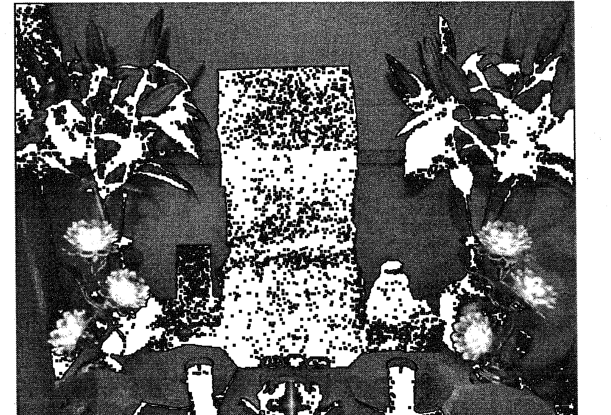

# 太平

曾国藩

# 六甲法术奇门

# 答疑篇

一妙山人著

内部资料·严禁外传

# 目录

+ 一、起坛相关问题 1
+ 二、练功相关问题 6
+ 三、画符相关问题 16
+ 四、法事相关问题 22
+ 五、布局相关问题 32
+ 六、软件相关问题 41
+ 七、其他问题 42
+ 八、附录 42

# 六甲法术奇门问题答疑

## 一、起坛相关问题

1.1: 问首先叩谢师傅金安。大师姐万福各位老师好，心守问下起坛的问题起坛后如果要换地方住了那么我换了地方还用再起坛吗。还有换地方对之前起好的坛有影响没？请老师赐教。心守在此拜谢。

答：之前启好的撤下，另外择日重新起坛。

1.2: 请问各位师兄，还没起坛，画起坛符后怎么熏符啊？随便点三根香吗？

答：摆天师像，上香。

1.3: 请问一下给祖师上供糕点，油纸需要拆开吗？我的意思是包装需要拆开吗？

师兄答：当然要拆。敬祖师如敬家中长辈。

1.4: 请问师兄，神坛的桌围是不是需要准备两套，脏了的话换洗，是这样的嘛？有什么需要注意的地方嘛？

答：可以。恭敬心最上！

1.5: 我起起坛祭炼神将26天了，现出门在外，工作地现不固定，祭炼神将又不想停下来，家里坛没有撤下，可否到哪里随时设个简坛接着祭炼？

答：带祖师像设简坛即可。实在不行，练功前意念自己在坛前给祖师上香后练功亦可。

1.6：问圣杯问题:在祖师坛前问事圣杯的结果和现实结果不一样感觉祖师不在！

答：把你打卦前的准备工作和心境描述下。

1.7：开坛后正常点上酥油莲花灯和蜡烛，蜡烛到时间会自动熄，莲花灯用什么方法熄（直接吹肯定不合适）？

答：捻子能拨动，往下就灭了。

1.8：因为我是在江苏南京做工程的，在南京市内一年会搬一到两个地方。1.是不是每到一个新的地点都要重新起坛？2.重新起坛时有哪些神器需要更换？3.目前正处于工地调整期间，我能否先起坛修炼太极玄功和通神大法，待稳定新工地后再次起坛正式开始祭炼神将！毕竟不起坛，修炼进展不够明显。谢谢！

答：1、带一个活动坛即可。2、不需要，3、可以。

1.9：坛前化元宝需要多少个？需要个多大的盆子？不会把家烧了吧？我准备什么样的东西烧纸合适？

答：多少随心，没有固定数量。可以请个化宝炉。淘宝有卖。盆子也可以。化宝时需要多注意安全。另外，夜里在外面也可以。

1.10: 1.供香选用哪一种？我选的带竹签檀香不对吧？2.法本提及两眼垂帘具体是怎么做？谢谢！

答：一般的香都可以。你说的那种香也可以。两眼垂帘，这个就是眼皮合上又不合紧。你不要太在意这些东西，你就静下心来全心念咒就可以了，不要太在意这些。

1.11: 请问起坛后间断了一段时间。是否还要再次起坛才可以练功呢？

答：若坛香火未长时间间断，或祖师像被移走则不必重新起坛。

1.12: 法祥:问请教师兄，起坛时，大米，酒，茶怎么摆放？

答：大米摆坛前，左边3杯茶，右边3杯酒，简坛如下图所示：

1.13: 我祭炼时每次都是开莲花灯，点蜡烛，上香祭炼的，问下祭炼可以把这些都去掉不用开莲花灯和点蜡烛上香吗？别的正常黑暗中祭炼更有利于静心。

答：香，烛，花皆为敬祖师而设，祖师临坛加持比你怎么练都强。所以你也可上香后不在坛前练，但香，烛不可废！

1.14: 问一个问题，我打算出去租房子起坛，太上仙师的神像还有马天君祖师的神像，可不可以用画像挂在墙上代替，因为如果我买实体神像后面搬家怕磕碰坏了，打算以后找个专有地方在请实体神像，师兄看看行不行，还有修炼效果是不是赶不上实体神像修的好啊？

答：开光后都一样的。可以。

1.15: 第一天起坛时请师父加持，起坛咒念多少次为宜，念多点应该也可以的是吗？

答：越多越好，最少七遍。

1.16：师兄移动坛是什么样子的？

答：练功或拜祭时把祖师像放到桌上，上水果，蜡烛，香，拜祭完，练完功后再撤掉收起。

1.17：问师兄好，搬家后用不用重新起坛？

答：要重新起坛。

1.18：师兄，请问起坛后就可以把酒，茶撒了，不用天天上供是吗？大米呢？怎么办？初一十五上供,茶和酒是必须的吗？另外,法本说,炼印符49天后可以化喝了,但是师父让我们炼三个月,是不是三个月后再化呀？

答：1，七天内茶酒果等供品不断，每天换一次。2，49天吞符后可增功，你想晚些时间再化也可。

1.19：起坛后，出差把神像带走，2-3天回来后，再把神像直接摆上就可以了吧？

答：可以。

1.20：请问因家中条件限制，神坛可以设置在卧室吗？如果可以的话需要注意些什么？谢谢师兄！

答：可以，放在神龛里，外面盖上红布，拜神之前，每次需要净场，练功后，收起来。

1.21: 问师兄，还未起坛，练通神大法或太极玄功时可以摆天师像和敬香吗？

答：未起坛不要上香。本来没起坛就可以练通神大法和太极玄功的。

1.22: 请问师兄，我做了个坛桌1.07米，合适吗？

答：也行。最好是祖师像的高度高于你站立的高度。

## 二、练功相关问题

2.1: 请问修炼神将时，要画开目开耳符，若是在阴阳水中虚画，是用剑指还是用老君诀？

答：均可，老君诀优先。练功最好吞符，实在不行再虚空画符。

2.2: 请问六甲讳咒是默念还是念出声来？修炼了几天神将，没感觉，是不是我什么方法搞错了？

答：念出声音来。贵在坚持。

2.3: 问心启、心阳师兄，请详细说下修炼期间哪些东西不能吃？谢谢！

答：五辛葱姜蒜韭菜，香菜。然后是牛肉狗肉，蛇肉，嗯，黄鳝，嗯，这个乌龟，等等，这些无鳞鱼是绝对不能吃的，如果你在是修炼三个月之内，那是所有的肉都不能吃，嗯，还有这个男女之间的房事，也要忌一下，在这个前三个月内最好是断绝！

2.4：请问一下师兄，炼印符49天以后化符，这个说的是天天炼，炼了49次以后，还是说49天中我中间没炼神将的时间也算上呢？

答：把天天练的时间都算上的49天之内。你中间不练的，那当然不能算。

2.5：问祭炼神将问题:老师祭炼神将时只开莲花灯和上香,就是不点蜡烛了可以不?

答：灯为智慧，为门路。供灯的益处网上可查。最好还是点。哪怕点一个。

2.6：老师如果外出给客户做法事，而且还在外地平时祭炼神将和太极玄功又不想停止。那么在外地自己设个简坛也可以祭炼神将和练太极玄功吧？

答：有坛好，无坛亦可炼！

2.7：问神将问题:比如外出在饭店吃饭可以招请神将来享用吗（不用开坛的情况下）

答：可以。

2.8：问神将:丁甲神将里面是不是就包括了乙丙丁三奇将来了？平时化元宝乙丙丁三奇将来是否也收到元宝了？比如我说奉请丁甲神将到场是不是六甲六丁还有乙丙丁神将也都会到场?

答：是。

2.9：问师兄五辛？辣椒可以吃吗？

答：可以。

2.10：问请丁甲神将享受美食，这美食也不能含五辛、牛狗蛇无鳞鱼乌龟甲鱼等禁忌吗？

答：单独的忌口食物如牛肉就不要请神将了。若一大桌菜含牛肉那神将也会自选的。

2.11：问祭炼问题:老师祭炼时有什么好的方法？入静练功没有，我都是站着或四处走动练。

答：修炼者，在清身、静心下修炼。这是法本原文，也是师父反复强调的，你走来走去，能够静心？静心本是修炼到一定时间后才能达成的，唯有按法本实修，才能更好。

2.12：问老师我刚开始祭炼神将时印堂好像有东西要出来，怎么后来就没有了，这是为啥？

答：修炼中各种现象都会出，都是好事。勿执勿求！

2.13：问师兄：比如说我在南京做工程，调整到新工地后，启灵符不需要更换吧？

答：不需要。

2.14：问师兄，炼太极玄功和踏罡步斗，有方向要求吗？1.东春夏南秋西东北 2.根据场地要求自定 3.其他，如北斗按四季运转时天象，来炼踏罡步斗？师兄，选几？

答：太极玄功没有。

2.15：请教一下师兄师姐们！这两天祭炼神将，念咒时候！一闭眼念咒，念几遍后就特困特想睡觉！但是脑子知道不能睡！有时候还断片！念叨到哪里都忘了！自己越想清醒点可是，一念咒就又犯困！请问师兄师姐们，你们遇到过这种情况吗？该怎么做？

答：这种现象比较正常，是我们自身获得高能量时的正常现象。睡了就睡，醒了继续，加油。

2.16：问师兄，祭炼神将的六甲六丁讳咒，必须要900遍，才能有作用吗？

答：刚开始必须九百遍才行。这是最低要求了。

2.17：问师兄梦报是什么意思？是每天做梦吗？

答：梦报就是晚上做梦或似醒非醒时神将会告诉你一些事。将来的或和你有关的，或修炼上的等等。

2.18：练习太极玄功，有自发动作可以吗？

答:可以的，是好事！

2.19：问还有我祭炼都三十多天了怎么什么也没感觉？心里好着急啊，看到那么多师兄不是这就是那这让我好心急。

答:修道即是修心。无欲无求的心态才能更让我们临近祖师和大道。这也是为什么师父上课时反复强调的清心，净身！再者，修者各有多世机缘，不可强求。我也是练了三个多月身心静定后才突然出现功态的。

2.20: 通神咒，随意所长，长字读音应怎么读？

答:长大的 zhang。

2.21: 请问师兄，应急秘法里四个字是什么？谢谢师兄！

答:这是秘传。师父还未普传。

2.22: 问练太极玄功必须点香吗，我在单位，可能不让点香？

答：不必。

2.23: 问净口净身净意真言，后面一个字是念摄还是敕呢？虎奔异香摄对不对？

答：敕。

2.24: 问心阳老师我为了能心静就刚开始点了蜡烛上了香，到点准时祭练，蜡烛自动烧完了一片漆黑我边念边用心观想师父或祖师，没一会印堂就开始有感觉了，一丝丝清凉感觉，到后来就是刺痛感有烧烫皮肤的感觉。两小时后收功念三遍咒，搓手捂脸开莲花灯，上香拜谢仙师加持送神将完毕。

答：不违教法又适合你就好。

2.25：老师，我问下能喝酒祭炼神将吗？还有在奇门中找修炼的用神是天辅星吧？请老师指正！

答：喝酒散功！不是天辅星。修炼忌求奇寻巧，喜敬祖合道！

2.26：师兄好，念六甲讳咒和六丁讳咒时一口气念不到一百遍，中间不能换气吗？

答：能换气。闭气持诵是说一口气至少持诵一遍丁甲讳咒。

2.27：请教师兄几个问题，1，六甲祝由数每天可以练几次最好，有没有时间限制？还是一天练一次？2，太极玄功的启灵符要不要拿出来贴在腹部，我是一直装在咱们发的红口袋里贴腹部练的，您看看行不行？3，起坛咒每天要诵，连续诵七天就可以了是吗？另外起坛咒在每天的几点诵，是不是第一天起坛的时间，还有起坛时请师父加持，是给师父打电话还是发微信，怕打电话耽误师父修炼。

答：一，没有限制，越多越好，二，可以，三，每天练功前，都要念七遍更好，四，要打电话最好。

2.28：问老师我最近在祭炼时调神心身后祭炼后好多了能静下来，问下就是在两个小时一个动作会发麻，我就盘腿半个多小时或一小时后再站在坛前祭炼这个不会有影响吧。还有上香我上一支香行不行？

答：可以的。

2.29：问老师练祝由术功时必须要开坛开莲花灯上香才可以练功吗？
答：不必。但若有条件上香再练功更好。

2.30：老师，神将祭炼要练两三个小时，只允许上午午时前练吗？其他时间可以吗？
答：不可以。

2.31：问老师:天罡诀是在什么情况下用的？
答：法本上让用时再用。一般用于踏罡布斗。

2.32：老师好，神将祭练，有时在外出差，上午上班没练上，下午补上，这是不允许还是效果不好。
答：不允许。

2.33：请教一下，习练太极玄功，请马天君祖师降临要不要起坛点烛上香？恭送马天君返回天庭要不要在坛前恭送？
答：太极玄功随时随地可以练习，是否坛前均可练习。你要是坛前练习，可以点香点蜡，要是坛前练习，就坛前恭送。不是在坛前练习的，就哪里练习哪里恭送即可。

2.34：师兄好，请教一下，我早上起床后，先习练太极玄功，然后再祭炼神将，这样可以的吗？
答：可以。

2.35：问师兄好，那个我问一个具体的问题，性生活后48小时内不能练功和做法事，这里的不能练功是指的所有的全部的功法吗？
答：是的。

2.36：问祭炼神将诵召请咒49遍，如何计数最为好记？每位神将诵咒4遍，开始没问题，后来诵多了就容易记错遍数，多了少了都不行吧，如何操作最好，请心启心阳师兄指点！
答：一将诵一遍，4轮48，再加一遍即可。

2.37：那49天化了之后，再祭练神将的时候只托着印就行了，是吗？
那那个炼太极玄功的符呢？多久化？还有，请问师兄，起坛期间，元宝要天天化吗？还是只是要初一十五化，或者请神将办事的时候烧元宝就可以？
答：1，是的，2，也可49天后，3，前七天，天天化些更好。以后请神将办事后或初一，十五化宝即可。

2.38：问师兄吉祥！请问您，祭炼神将百天之后还要每天都都祭炼吗？中间能停止几天吗？谢谢师兄！
答：百日炼成后可几天练一次。

2.39：问师兄好，运符时在念人剑合一前念的一句话是什么？请说一遍，谢谢。
答：法本上都有啊，没有什么前一句，只有一句，人剑合一，太上老君加持！

2.40: 师兄好，请问一下，我现在在祭炼神将和习练太极玄功，在这期间能不能同时炼通神大法和祝由术？
答：当然可以啊！

2.41: 师兄好，请问修炼六甲祝由术时，掐诀，左手六丁六甲诀，依次向八个宫修炼，请问，六丁六甲诀不是两只手合拢的吗？哪个是六丁六甲诀？请赐教！
答：六丁六甲诀即掐手上十二地支。

2.42: 师兄，练习太极玄功的符咒是一直练功用的，不需要化掉吧？
答：练太极玄功和祭炼神将的符都是49天之后可以化掉喝掉。晚些天喝也可以。

2.43: 问所有的功法都是晚上十一点之后练吗？师兄师姐们！
答：不是的。太极玄功，通神大法这两个随时随地可炼。祭炼神将是凌晨一点到上午十一点之间才可炼。

2.44: 请问一下，早上祭炼神将要中断一下，孩子起床上学大约中断两个小时左右。这个怎么办？是收功，回来再重新炼；还是说一下自己要出去，回来再炼，要说什么有规定吗？回来继续炼的时候还要重新持召请咒，再六丁六甲讳咒吗？多谢师兄！
答：可早些起床练完后送学生或送完小孩之后再开始练更好。

2.45: 请问起坛咒念几遍？
答：起坛7天之内，每天一次，每次至少念7遍。

2.46: 脑子走神怎么办？
答：多念几遍净天地神咒，以及念念《太上老君说常清静经》都有助于入静。

2.47: 问请问师兄，练功49天之后，五辛就可以吃了吗？
答：最少3个月之后吧，师父说练功49天只是可以调遣神将的最低要求。练得越久，功力越深啊。

2.48: 时间有点忙不过来呀！
答: 你是说练功时间吗？你可以根据自己的实际情况先以练一两种功为主，练成一种之后再练其他功法。时间充裕当然就可以全部都练。

2.49: 问请问师兄，太极玄功和通神大法练到什么程度才算练成呢？
答：你先练好现在吧。

2.50: 问下祭练老是天目这好像有东西要出来怎么办？
答：这是正常现象。不必在意。修炼过程中会有成千上万的状态，都是一个过程中的现象，没必要太在意。

2.51: 请问祝由术：布炁篇，踏罡步斗说的可是七星罡？
答：是祝由术开头的七星罡。

2.52: 请问吹法：嘘气指的是吹气？还是吸气？
答：慢慢吐气为嘘气。

2.53：问掌法：右手掌向左手掌发气36次和54次，到底是36次还是54次没搞明白？
答：36或54次均可。

## 三、画符相关问题

3.1：请问老师在找月将时与节气有没有关系？比如立夏是明天的下午5点，立夏那用手动找天罡和用手机起奇门找天罡就会不一样，这是心量师兄遇到的问题。
答：天罡与节气有关系。最快速的找天罡的方法，是用软件。在软件界面上，把"天门地户"打上√，再起局，就会有天罡"辰"的位置。

3.2：请问老师用剑指画符时还用不用引天罡气
答：不用，虚空画符，多画几遍。

3.3：问老师问个画符的问题召请咒是10句，那么我画一道符要好几十笔才能画完，比如一个符画完后的笔画要81下才能画完，那召请咒是不是可以诵个七八次正好画完这样可以吗？拜谢老师解答！
答：可以的。

3.4：请问祝由术的黄纸是什么纸做的？
答：就是普通符纸，在淘宝上搜就可以。有木材，有竹子等各种材质，推荐买竹浆符纸。

3.5：问老师，我在正式画符时发现毛笔画出来的符很粗。想问下专用画符的毛笔选哪种？
答：选细一些的吧。我一般用描线笔。

3.6：问老师画符问题，白天画符还用开莲花灯和点蜡烛吗？我的意思是白天可以直接上香就画符吗？
答：开始画符的时候最好是给祖师爷摆上供品，上香，最好。如果事情紧急的话，你可以只是心中求一下祖师爷。再去画符。时间长了你的功力，提高上来了以后，就没有那么麻烦了，直接画就可以了。当然能给祖师爷上香的话会更好。

3.7：问画符问题老师我每画一道符都会按程序画，然后再重复程序再画，我把我的程序说下：
1. 找天罡位
2. 净口心身
3. 四个方位吸气
4. 通神
5. 咒笔
6. 分日月君诀
7. 有和无的符头咒
8. 边画边持咒
9. 笔吸天罡气下中上
10. 下印与咒
11. 过香和咒完毕。
每个符我都按这个程序做的请老师指正每道符必须按我这个程序做吗？
答：3，5不用。新笔咒一次即可。

3.8：问喝符问题:老师喝符我用黑色的签字笔按程序画喝的，符可以不这样画的小点喝符水也可以喝下去。
答：你功力高是可以的。意念画符于水中都行。刚开始还是依教材来吧。

3.9：问符纸颜色和毛笔颜色问题:老师资料上讲画符驱邪的话用红纸和黑毛笔画符,如果是增加的用黄纸和红朱砂画,我可以理解为是解决问题的用红纸和黑笔,得到增加保护自己的就用黄纸和红朱砂画这样理解对吗？
答：这样理解也行吧。其实就是一个五行原注红黑为水克火,越克越少,黄红为火生土,越生越旺!

3.10：问同一个能量符如果用红纸和黑笔画就是驱邪的,如果用黄纸和红朱砂画就是补自己能量的红纸和黑笔画就是坏人,黄纸和红笔画就是好人,主要看自己怎么应用了。
答：是的。

3.11：请问一下,用化犯太岁符是不是只能在立春前?
答：一年中随时都可以啊。

3.12：问1,老师丁甲符是先念丁甲符咒还是先烧丁甲符? 2,催财是看哪个官位好就用丁甲符而如果震官好化丁甲符不用管日干官(震宫与日干官是克还是生克耗泄)? 3,丁甲符化完用化元宝不? 4,日干官临死门又是空亡用烧点元宝不这也可以起到化解?
答：1,教材上从未讲过画丁甲符要念咒!! 也没丁甲咒! 一切以教材为准,勿自创! 2,九星,八门,奇门局生门,正偏财生日干等不同方法催财方式不同。3，不用。4，没这说法。奇门应依局中象来解。

3.13: 问踏罡布斗:老师斗罡符是干什么用的，怎么画有教没？
答: 练七星罡用。教材上都有。另，你的问题多是教材未整理，未通读所致。请多下下功夫吧。

3.14: 问请问师兄，红纸黑字的符和黄纸朱砂的符，可以放在一个布袋里面随身携带嘛？
答: 可以。

3.15: 问师兄，师父给的能量符红包被老婆打开看了一眼，没有摸符，她还在卫生期，会不会有什么影响？
答: 放净天地神咒即可。

3.16: 请问如果新房的厨房没有开火，可以直接摆香炉上香供奉灶神吗？因煤气还没有开通。
答: 可以的，但是你以后这个灶一定要开火吧？

3.17: 请问一下女子不育符第一个字是酉还是西还是别的什么字？
答: 是酉字。

3.18: 请问阳宅缺角和九宫飞星不利官位可以用符咒化解吗？分别用什么符咒？谢谢！
答: 我们调理依据的是奇门局，而不是九宫飞星。

3.19: 问画起坛符是否也要掐日君诀，引天罡气进入，是否要盖老君印？

## 四、法事相关问题

### 4.1：请问送童子替身，做替身身高1米1就可以了吧？

答：一般是本人身高的三分之一高。

### 4.2：问师兄吉祥，还阴债要还多少次？还是一直还下去？谢谢师兄！

答：时常做做挺好。

### 4.3：问老师两本资料中的预测篇的119页阴阳财库补财法。1.黄表纸先写财库表文。2.开坛就是放天师像等。3.上表文是啥意思(是念表文吗)? 4.烧符（是烧补财库符）是吧。5.一共做12次。6.起刻局我知道定时辰是什么意思（是指找个没有四害）的时辰做吗？请老师指点！

答：理解的都对。

### 4.4：问老师问下如果有七个都想还阴债和做超度能一起给他们做吗具体如何操作拜谢老师！

答：集中或单独做都可以。

### 4.5：问老师万能开光法中第五点其中再点三支香，我懂（并在香上顺转三圈）这个意思是在点着的香这面在香香上转三圈是吧？2.再用香对着神像写神像和风水物名字是对着虚空写是这样吧多写几下没事对吧？

答：
- 1，对。
- 2，对着那个风水物虚空写。

### 4.6：阴阳财库补财法在自己家中坛前操作可以吗？拜谢！！

答：如果你家里你能让你烧了几万个元宝，弄得黑咕隆咚的，那那个烟火滚滚的，如果你家里能承受的话，当然你可以做。

### 4.7：老师六甲开光术中日月开光法我住的地方是地下室但是用日光开光时要用到太阳，那么在地下室如何解决太阳的问题？

答：你可以多找几个人多用几个镜子来回的来回的转折的照射。也可以在阳光充足的地方开光之后再用红布包好请到地下室的坛上后，起坛时再打开红布。

### 4.8：请教一个问题：一个大元宝等于50两黄金，我叠的元宝比大元宝还要大一号，怎么计算啊？谢谢师兄！

答：大元宝就是一个大致的数，你就不用再费心想怎么换算了他就是一个大致的数。元宝，我们总要超过我们的还阴债的量的。所以你就多多益善吧！

### 4.9：请教师兄，用六甲开光术的时候，在自己的坛这里开光就不用选择天门方位了吧？直接择吉日就可以吧，需要考虑择吉时吗？另外一个，怎么知道开光成功了呢？谢谢师兄！

答：
- 1，可以。
- 2，可以起局看，或者是打卦问祖师啊！

### 4.10：请问是否可以福主跟法师不在同一个地方，远程同步做法事吗？例如帮福主远程做超度婴灵的法事，可以法师在一个地方诵召请咒，福主在另外一个地方化元宝、衣服和读表文吗？通过电话联系同步操作?

答：超度婴灵一般不建议千里外做，因为婴灵本身就很难超度，这样成功率不高。千里之外做法事也不是打个电话那样就行了，这个是有专门的方法的。

### 4.11：问超度婴灵时要烧的两身衣服是买那种真的衣服吧？不是纸做的衣服吧。

答：纸做的布做的都可以，关键是要漂亮，能让婴灵喜欢。建议买棉的运动服，颜色偏中性的，男女婴灵都可以穿。(按婴灵的年龄买)

### 4.12：问超度的时候起局看干宫无四害，还要看对宫巽宫无四害吗？

答：不必。当然对宫无四害更好。

### 4.13：师兄好，风水物品用过后拆除的时候需要如何处理？

答：风水物达到效果后直接拆除即可。

### 4.14：问开光问题如果给佛珠和手上戴的水晶串开光要请哪位仙师入藏啊？

答：看干什么用，若带水晶串为发财则请财神，若为护身则请自己本命护法神。

### 4.15：问佛珠水晶串这个看时干临哪个宫只是这哪个代表财神和护法神？还真不知道如何看老师再指点下！

答：你想请哪个神就请哪个神入佛珠、水晶串，不用看时干临宫。

### 4.16：问中午12点开始人剑合一手诀，念通神咒（三遍）又念丁甲咒：人剑合一，太上老君加持+（九遍如请咒）最后念请黄镇将军在离宫速速催财，不得有误。最后化能量符和丁甲符各一道+两元宝。

答：大体不错。用神宫，日干宫都无四害为佳。

### 4.17：等到未时13点多点，人剑合一手诀，念通神咒（三遍）又念丁甲咒：人剑合一，太上老君加持+（九遍如请咒）最后念请黄镇将军在坤宫速速催财，不得有误。最后化失财符和丁甲符各一道+二十个元宝。完毕由于是第一次做，请老师检查下，是否有问题？

答：离宫若临生门，甲子戊生日干坤宫，两宫又无四害的话可以做，但只在离宫用咒，符，宫内象即可。

### 4.18：问收费问题：1.老师我想问下初次给别人做还阴债补财库超度收多少合适。2.还有认识和不认识都怎么个收费法。3.遇到爱管闲事人喜欢把收费价格都给你定了，1500让某人做还阴债超度补财库调理风水这样的人有点二怎么处理？

答：这个自己根据本人或当地情况自定。不失不得，低收费不一定能转化福主的大业债。

### 4.19：请问如果同时给多个相同的风水物品开光要一个一个操作吗？比如说我想给我买的5个兔摆件开光，可以插香时一次说请文霸将军分5个身分别入5个兔摆件吗？

答：要一个一个的操作。

### 4.20：请问师兄，开光可以给一个对象请多个神仙分身嘛？如果可以的话，是用三支香先写完五个神仙的名讳再插入香炉分别请五位神仙分身入像，还是三支香写完一个插一次，请一次，然后再来第二次重复第一次的过程？？？

答：一个分身足矣！

### 4.21：问请问师兄，中彩符其中一道押在灶前香炉下的话，香炉离灶有效距离最远是多少呀？

答：只要在厨间内均可，此为请灶神助之。

### 4.22：问催财问题：一般催财布局后大概多久就成功了？

答：一般月内，有的周内或近2天就有象。

### 4.23：阴的调理里面用的烧纸是黄色的纸还是四色纸？

答：看具体而定，一般用黄色纸就可以了。

### 4.24：问超度还阴债问题：老师我问下我可不可以在阳台给自己做还阴债的法事，最多我多做几次顺便也实际操作学习了，等出关再找个地方做个大型的，还有超度坛就不动了，这样行不？我实在找不到一个空地在外地。

答：做法事，要严格按照法本操作，请不要讨价还价，请不要懒省事。

### 4.25：师兄您好，有一事请教，春节前我曾经向师兄求助过，我朋友的儿子被车撞成重伤，昏迷不醒。我按照师兄教导的方法给他进行了治疗，现在这个孩子基本上恢复了正常，在此我代表孩子及其家人对师兄表示衷心的感谢！我现在想给他做一场法事，我是给他做超度还是做还阴债，表文让谁来读，孩子不能读，让孩子的父亲读可以吗，特此请教师兄！

答：超度是超度历劫冤亲债主，还阴债还的是历劫债务，两者皆做较好。可让孩子的父亲读表文。

### 4.26：做超度或还阴债还要起奇门局吗？

答：能起局最好，按照法本来操作。

### 4.27：还阴债和做超度同时做可以吗？我是说给一个人做。谢谢师兄！

答：做完一场，再做一场。

### 4.28：请问师兄，祭炼神将马上快到49天了，想给自己超度和还阴债，其中超度符画多少道？不知道几个先人的具体信息，背面还要都写信息吗？多谢师兄！

答：超度符1道。把能知道的信息尽量写上。

### 4.29：心恻老师我早上洗完脸手之后就开坛上香先磕头多磕了几个就抱拳，问祖师弟子问下祖师催财是不是弟子起局有问题？白催不来财三遍后抛圣杯一次，圣卦一阳一阴就这个请老师看有啥问题？

答：是的，圣卦。

### 4.30：师兄您好，还阴债方位怎么定？

答：你多学一下教材吧。另，不是法事都要选方位的。

### 4.31：问想超度自己历劫多世的冤亲债主，表文咋写啊？背面写什么信息啊？谢谢师兄！感恩师兄！

答：那个表文都有啊？你就是在那个表文后边谁超度的。然后超度谁你就写谁的名字，在课堂上都讲过了呀，然后在那个超度符的背面写上要超度人的名字，八字姓名，住址等等。

### 4.32：请问开运术那个不是要找个木板吗？那把开运符都课到那木板上还要怎么盖印和过香那么大木板过香也够沉的。

答：那不用再盖印了，但要在请祖师加持后的香上绕几圈过香。

### 4.33：请问师傅教的净宅，做的时候如果酒烧到一半熄灭，是继续点吗？如果点着后又熄灭，然后再也点不着呢？可是盆里还有没有烧完的酒呢？请师哥赐教？

答：点不着那就不用再点了。

### 4.34：净宅术要是火着完以后，还有没有着完的酒呢？这怎么处理呢？

答：倒掉即可。

### 4.35：那种硬纸壳，带有招财进宝红字的元宝，可以烧给神将吗？

答：按师父所授，以烧那种纯金色纸叠的元宝为好。

### 4.36：师兄做法术都要掐诀，都掐什么诀？

答：请神诀。

### 4.37：问师兄好，请问有雾可以做法事吗？看不到星星。

答：遇急事也可做。若能改日则最好改一下。

### 4.38：做法事时用的元宝尺寸有要求吗？多谢！

答：没有。但元宝偏大为好。小元宝要几个算一个大元宝数。

### 4.39：师傅说的给孤魂野鬼烧些冥币这个法事，一个问题是做的时候要不要做净天地神咒，二个问题是这个法事人人都可以做，还是必须祭练神将49天后。

答：一，不必。二，人人可做，不必祭练神将也可。

### 4.40：请问师兄，调遣神将后，行令办事。然后，什么时候念送令？是确认办事成功了再念送令？还是等一会就念送令？因为很多事不是马上就有结果的。

答：你可以在吩咐神将办事时就告诉他，事情办妥后即可返回天庭，就不需要再考虑何时送的问题了。神将办完事之后自然就会回去了。

### 4.41：心恻：问送神的时候还掐诀吗？

答：可以掐六甲诀。

### 4.42：问各位师兄：1，丁甲符和乙丙丁三奇符是盖太上老君印还是八卦印？2.乾坤大法是不是可以直接用于超度和还阴债？感谢师兄！

答：1，看干什么用。2，可以。

### 4.43：我想问一下，五帝钱，平时放哪里，我都是平时收起来的！做法事怎么摆放，我那天去还阴债，五帝钱没拆红绳，成一叠放在祖师相前面！怎么办，求师兄，师姐科普！

答：平时不用的时候可以放抽屉里或坛上加持。五帝钱摆放顺序：从左到右为顺治、康熙、雍正、乾隆、嘉庆。

### 4.44：五帝钱的摆放顺序是以神像的从左往右为准？

答：面向神像从左到右顺治开始。

### 4.45：关于圣杯的问题，我看群里有好多分享都提到坛前请圣杯的例子，坛前跟祖师爷沟通可有比较好的问话技巧，还请指点！

答：关键要诚心，同时说话恭敬有礼，问题要表述清楚。

### 4.46：那么是不是可以提前整理好几个问题，选出几个备选答案，然后坛前上香诚心恭敬向仙师请教，掷圣杯，对吧？如果同一问题，可以多次星请吗？

答：
- 1，可以。
- 2，不可。

### 4.47：问师兄好，请问法事必须是亥时做完吗？

答：做法事一般是亥时和这个早晨的寅时。尽量在这个时辰之内做完。

### 4.48：四枚法印（道经师宝印、太上老君印，八卦印，张天师印）在坛上摆放怎样才如法？

答：印面朝上摆齐或纳入专盒中。

### 4.49：请问神像开光时装脏时法本上写装入能量符和心经，这个心经指的是心印妙经还是般若波罗蜜心经？

答：般若心经。

### 4.50：师兄好，乾坤调理大法阴的调理填表文时只可以写一个心愿吗？如果调工作，调婚姻，需要做两次吗？谢谢！

答：对的。

### 4.51：我在给别人调理完阳宅后用什么方法可以看下调理后成功了没，之前忘了是那位师兄调理完后他起局看了调理后的效果，结果上面显示已经调理成功。

答：看日时宫。

### 4.52：在做催财的时候，念招请咒，最后的护法神用哪个？有啥具体的讲法么？谢谢！

答：这个具体是请哪个护法神，你可以用软件时盘排盘，看看旬首是什么来请相应的神将。比如旬首是甲辰，那么就是请荡涤将军。

### 4.53：圣杯在啥情况下可以再打卦一共可以三次？在啥情况下不能再打卦？

答：第一次打为笑杯时还可再打。为怒杯时就不必再打，为不行。

### 4.54：问请问师兄，自己是不是不能帮自己还阴债呀？

答：还阴债可以，但是自己不能给自己超度冤亲债主、超度婴灵、送童子和送五鬼。

## 五、布局相关问题

### 5.1：请问老师比如兑宫天盘是壬丙地盘是戊八神为腾蛇星是天芮星，临生门，我就是无法理解这个天盘壬丙地盘戊怎么理解烦请老师师傅指点。

答：最好能发局上来。天盘两个天干，是因为有寄宫。

### 5.2：问师兄吉祥，寻时借用和无中生有有啥区别呀？感谢！

答：一样的，还有分局都是一个概念。

### 5.3：请问师兄，行为风水学起的分局入局后起效时间是按分计算吗？

答：不是，你可以从时效快的角度来理解，按局象去作行为风水时就立刻起作用了。

### 5.4：问催财步骤是否对：

- 1. 早上练完功起了一局，看到离宫不错，而且还生日干坤宫。
- 2. 发现日干入墓，需要处理下。
- 3. 提前将日干宫的坤位处理完。
- 4. 离宫准备了一道能量符，一道丁甲符，两个元宝，时间中午12点开始化。
- 5. 坤宫（日干宫）准备好一道丁甲符与失财符，还有二十几个亲手叠的元宝。

答：既然日干宫有四害，建议依无中生有局再找无四害的好。

### 5.5：问个问题甲子甲戌甲申甲午甲辰甲寅这六个日期时在奇门局中甲是用神就在局中都找戊为用神是吗？

答：不是的要甲即值符宫和代干宫兼看(甲子看天盘戊，甲午看天盘辛……)

### 5.6：问用神问题：您的回复是遇到甲子甲戌甲申甲午甲辰甲寅时都以值符为用神是这样吗？

答：值符宫中看甲和含干宫都看。如甲午辛，符宫和辛宫都参看。

### 5.7：问定局问题：老师起完局后在纸上抄了下来八卦印盖到局的中间后还用过一次香吗？同时还要念过香咒是这样吧？还有我的感谢下老师。我之前提的问题，经您答复后，现已全会实战操作了，再次拜谢老师。

答：只盖印，不过香。

### 5.8：问催财问题：时干宫生日干但是时干的对宫有四害是不是也不能用这个局。

答：可用。

### 5.9：问请问师兄，六甲奇门布局调理程序是布局前先对布局的房间起局进行净场和化解，请问是不是进行净场化解9天后才能重新选局布局？

答：不是，随净场随布局也可。

### 5.10：师兄好，请问旺相休囚死和十二长生的关系？是十天干五行寄生十二官的状态？那为什么墓库只在辰戌丑未？

答：地支墓库只有辰戌丑未，这些不必钻牛角。

### 5.11：问四害问题：1. 癸在坤入墓了那么冲的寅然后贴东北方位（艮官）。2. 那么甲和丁还有丙也入墓了画哪个地支的符冲。

答：冲墓，例如入戌墓，用辰冲。

### 5.12：问请问师兄，手动起局值使门怎么排？

答：你在网上搜一下吧，教程很多的。

### 5.13：问师兄好，请问今年催财催丁吗？是烧香还是烧元宝？只有丁落离宫无四害才能在离催吗？

答：丁有专用行为风水。另外丁在离宫可以点香，燃灯，开灯等。离宫无四害。

### 5.14：问师兄好，请问丁的专用行为风水什么时候讲？

答：丁的行为风水，在师父传授的行为风水里有专门的讲解。

### 5.15：问催财问题：老师用丁甲符催财时化符和化元宝，在哪个官催财就在哪个官位化丁甲符和化元宝吗？

答：是的。

### 5.16：问八神问题：如果值符在坤宫入墓是不是要拆？

答：值符在坤宫入墓，要看值符是不是用神。这个问题需要结合实际案例来才能更好解答。

### 5.17：问师兄请问引气归元里说遇到伤门或者庚都无四害也要处理。怎么处理啊。

答：用合符。

### 5.18：问师兄，请问阴盘奇门是不是只论天干的击刑。其他的冲克破败而不用理会呢？

答：不是的，其它的也用啊。

### 5.19：问老师如果想布个一年的发财局是不是也可以用无中生有局来选局？

答：可以，但要注意用年干之能量。

### 5.20：老师，如果想布个一年的发财局，是不是也可以用无中生有局来选局。

答：布局可以用分局。

### 5.21：请问师兄想看一下公司这次投标能不能中，用神是看开门，还是看景门？

答：标看景门和时干。

### 5.22：师兄，我起局调理，那个好局是在当下的分钟时间，但我调理时，要准备点物品，就错过了那个时间？以哪个时间为准？

答：一局九天内都可用，今天时间错过了就用明天的。

### 5.23：比如酉时出的局，错过了今天酉时，就用明天酉时吗？

答：酉日酉时。

### 5.24：师兄，无中生有局，是只能9选1吗？还是可以9选9？

答：9个局中找到合适的局就可以用了，不用9个局都看一遍啊。

### 5.25：1分钟一个局，1个小时不是60个局吗？

答：一分钟一个局，是找好时空。

### 5.26：那无中生有局，不是只能9选1吗？

答：2个小时内有9局可选一个最好的用之。

### 5.27：师兄，怎么才能快速到找到想要的好局？找个贵人局，看了几次都不行！

答：找局需要有耐心，需要多找，没有啥取巧的方法。

### 5.28：问五路财神招财阵上面说放时要起局选好时空是什么意思，是选个没有四害的时间吗？

答：即用奇门局择吉日和吉利方位。若依局把招财阵布在生用神的生门宫或正偏财宫更佳。

### 5.29：请教老师一问题：坎宫（辛+丙+腾蛇+天心星+生门）这个是洗脸盆还是纸箱子还是电热壶我分析的哪个对？

答：电热壶。宫中火金信息多吗。

### 5.30：问师兄，阴盘奇门中门克宫是四害之一，那宫克门算四害吗？

答：也不好，但不当四害看。

### 5.31：问发的两本资料的预测篇129页除晦纳祥中，第一步是量局，第二步是起局，这个有点迷糊，因为我记得量局是进入局中吸收能量，请问一下这里的第一步量局是另外起一个好局进去吸收能量，然后第二步起终身局布置嘛？

答：第一步的量局，是找一个好的局，进行量局，然后再起终身局，进行布局。

### 5.32：问师兄好，请教一下，如果日干临值符落坤宫，但四纲地支不临未土，这种情况值符是否算入墓？

答：跟四纲无关，值符为用神，落坤宫，然后看时干地支，如果时干地支为阳干，则甲按在申入墓算。

### 5.33：师兄好，我想问一下，布局的问题，如果在外工作，在老家布婚姻局是否可以，如果不太好，能否远程布局。

答：可以布。

### 5.34：师兄好，想继续问问昨天值符入墓的问题，如果甲为日干，坤宫同时有其他四害，比如杜门门迫，想调理如何做更好？记得课上说不能用符。用申象义吉祥物合杜门门迫可以么？甲的入墓如何处理？还有就是这种情况，能不能重新起分局再调理？或者等9天重新起局。

### 5.35：心阳师兄好，再追问一下，是老家也可以布婚姻局还是远程也可以布？
答：你现住地布局最佳，老家也行。

### 5.36：问各位师兄好，请教一下，惊门在巽宫门迫，惊门化酉用辰合。但如果在巽宫用辰的象义来合，辰本身在巽宫是否又击刑了？
答：贪合忘刑，用辰的话辰酉合化而不再辰辰自刑。

### 5.37：问各位师兄好，请教关于四害化解，如果艮宫遇到庚击刑，艮宫空亡，转到震宫，在震宫找到了庚的象意。拆除之后，如果还想用符来调理，那应该是在艮宫烧符还是在震宫烧符？
答：艮为主宫，以艮为主烧符。

### 5.38：师兄好，请教一下，出局是另外找好局出，还是就这个局找好的宫位出就可以？是不是原局没有好官位出就另外起局找好的官位出也可以？还有，原来用过的好局可以作为出局用吗？
答：1. 另找好局。 2. 可以。

### 5.39：问另外请教一下师兄，1、量局的话，是否可以用以前布局用过的局，或者之前择日用过的局；2、定局盖八卦印之后的局，可不可以很久才用，比如一年，半年什么的；3、我看到上面有提到练太极玄功的符，49天后也要化掉喝下嘛？这个问题我是确认一下。麻烦师兄了！
答：1. 都须用当下的局。 2. 不可以。 3. 按法本。

### 5.40：接上请教一下，盖八卦印定的局，最远啥时候都可以用呢？
答：九天之内。

### 5.41：请教各位师兄，为了求测一个事情，起出的局用神宫本身或对宫临白虎，是不是这样的局最好不要用来做调理？
答：用白虎星符镇之再处理。

### 5.42：问老师丁在巽宫也是击刑吗？
答：不是，在巽宫击刑的只有壬癸。

### 5.43：请问男丁巳蛇年是什么护法神？
答：丙丁猪鸡位，也就是和衷将军和淑姿将军。

### 5.44：请教各位师兄，为了求测一个事情，起出的局用神宫本身或对宫临白虎，是不是这样的局最好不要用来做调理？
答：用白虎星符镇之再处理。

### 5.45：问在艮宫如果天盘为一个天干地盘为两个天干时我应该怎样决定天盘干十二长生的状态？
答：与地盘干无关。看起局的时干来定，如果是阳干，天盘干十二长生的状态？

### 5.46：问在四隅宫天盘干的十二长生状态是根据地盘干的阴阳来决定，阳干配阳的地支阴干配阴的地支，但如果地盘有两个阴阳都不相同的天干我应该怎样选？谢谢！
答：十二长生状态跟天地盘干无关，只看该天干在这个落宫的地支处于十二长生的哪个阶段即可。四隅宫则结合起局的时干宫来看。详细请参考5.45问答。

### 5.47：请问师兄，阴盘奇门中用神落空亡，转宫后还是空亡。还需要继续转宫吗？
答：不必再转。

### 5.48：师兄好，乾坤调理大法中干部布局，婚姻桃花局和贵人局同是在休门布局、掐诀、诵咒、化符是一样的操作，不同的调理目的是不是区别在于摆放不同的风水物，还是区别在于其他方面呢？谢谢。
答：不同的布局关键在于布局人的意念配合局象！并指派神将依局去完成整体布局。

### 5.49：请问如果我去选择房子而且房东房子多那么我起数术起无中生有局可以吗？
答：房多可以第一个看坎，第二看坤。

### 5.50：请教个问题，关于年名判断里对应的天干排序为何跟开始学的天干顺序不一样。比如天干顺序甲为1，而年名对应的年干甲却是4？烦请给解答一下，谢谢！
答：甲乙丙丁的排序是中国古人流传的，甲为始，为1数。而对应的现代西方流传过来的公元纪年法正好对应甲为4，乙为5... 故此。

### 5.51：请问师兄，有一种情况，例如我和朋友在讨论有关他的一件事情，朋友并未要求测算，而是我主动起局帮他看，那日干是代表我还是代表朋友呢？
答：日干为我，月干为友分阴阳。

## 六、软件相关问题

### 6.1：请问用六甲排盘软件起局如何起无中生有局？
答：启动软件后，请先点时盘排盘查看起出的局，然后再点“返回”，在下面根据时加分除9的余数，确定是阳遁几局或阴遁几局之后，再点下面的时盘排序。

### 6.2：软件中如何查看天门地户？
答：启动软件后，在右上角勾选上“天门地户”选项后再起局，就可以看到天门地户了。

## 七、其他问题

### 7.1：问师兄好，掐六甲诀恭请护法神享用美食时需不需要诵召请咒的？谢谢。
答：要的，9遍。

### 7.2：问心启心阳师兄，向您请教：我看上面有师兄问请神将享用美食，那诵召请咒9遍吗？
答：可以，如果你有感觉来了则不拘遍数。

## 八、附录

### 附录1：法事用品准备

#### 还阴债
- 开财库符，能量符5，阴债表文
- 五帝钱，净天地咒
- 供品三水果，香烛2，矿泉水（6瓶）
- 元宝，冥币黄纸
- 结实大纸箱或小桌（做供坛），长棍1个

#### 超度
- 超度符（一人一张背写信息），地户符，能量符5
- 五帝钱，净天地神咒
- 供品三水果，香烛2，矿泉水（6瓶）
- 元宝，冥币黄纸
- 结实大纸箱或小桌（做供坛），长棍1个

#### 婴灵超度
- 超度符（一人一张），千纸鹤（一人108左右写字），能量符5，忏悔文
- 五帝钱，净天地神咒
- 供品水果三样，小孩衣物（上下全套）每人2套，糖果每人2包，香烛10个，矿泉水6瓶
- 元宝，冥币黄纸
- 结实大纸箱或小桌（做供坛），长棍1个

#### 送五鬼
- 扎5纸人（青红黑白黄）
- 黄表纸5捆—鬼钱，馒头5个切碎—鬼粮，蓝黑花布各三尺---鬼衣
- 香2烛1
- 元宝，冥币纸钱，择日为阴日
- 结实大纸箱或小桌（做供坛），长棍1个

#### 每场法事要
- 冥币9沓
- 黄裱纸（或元宝纸）9捆
- 酥油灯（三场一盒来算）
- 纸杯10个
- 火机一个
- 矿泉水4瓶
- 馒头5个
- 小米一斤