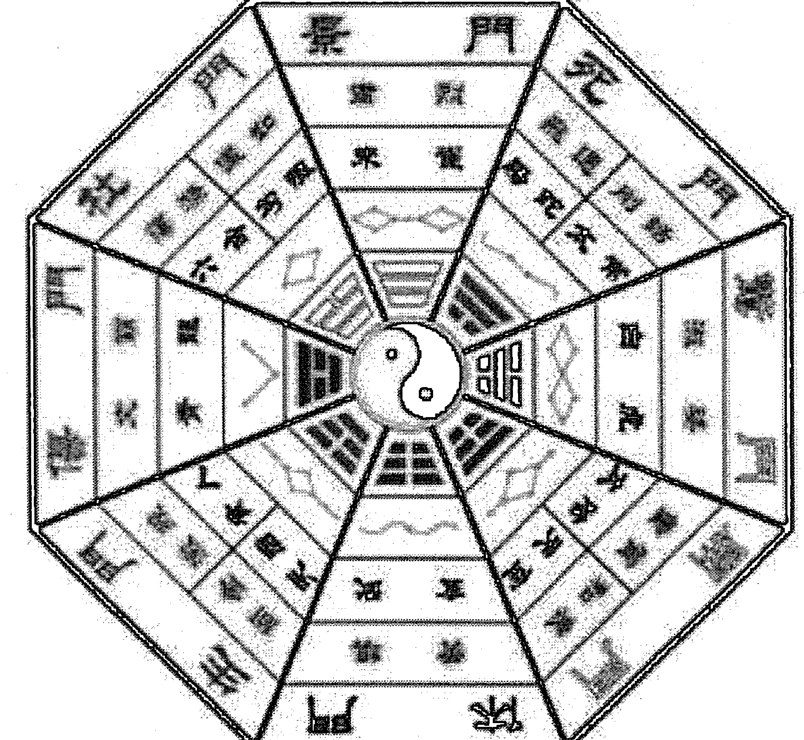
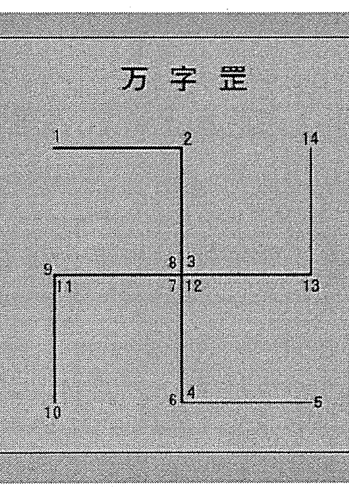
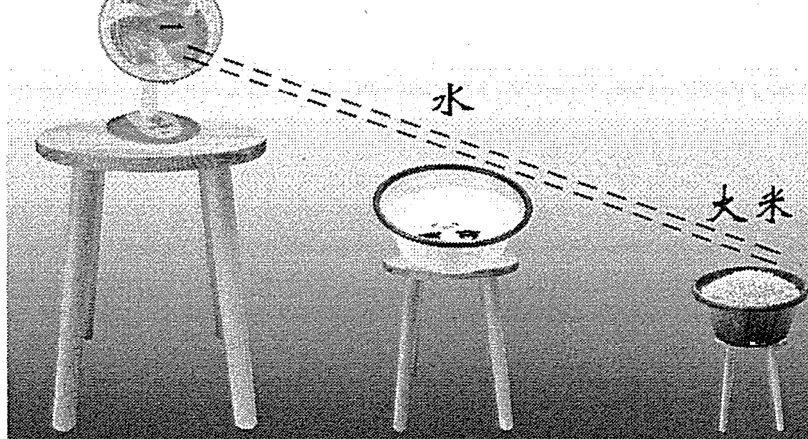
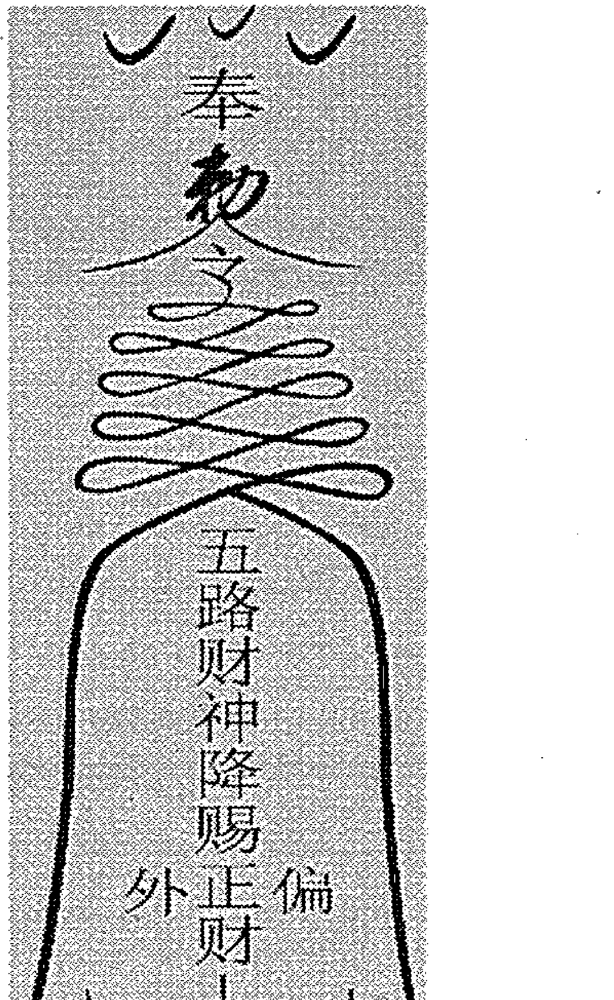
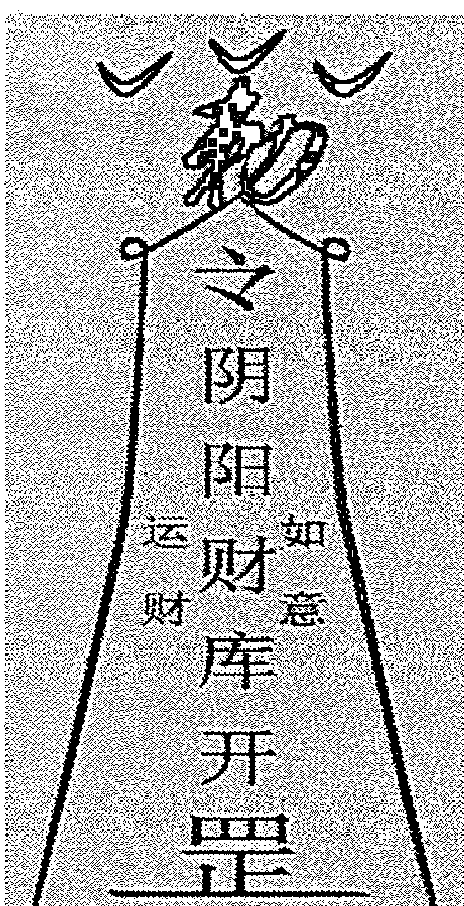
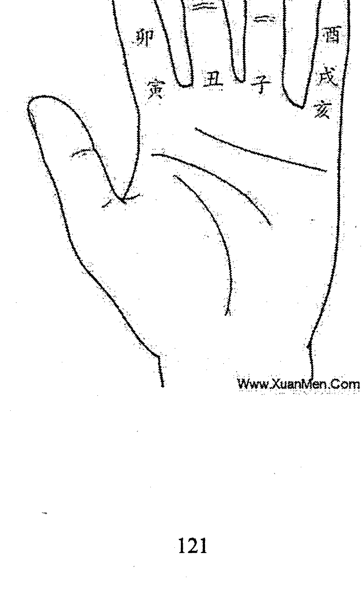

# 六甲法术奇门预测篇

## 前言

一妙山人，道号三城，河南天中人。早年师从知矶子，皈依于江西龙虎山天师府。山人自幼与名门道派渊源颇深，家学丰厚，研习道法数十载。时隐山野，时居闹市，来往于仙境地府，精进修行，深得个中三昧，颇有心得。虽心志淡泊，性如闲云野鹤，意在山水之间，但今秉师命，借缘入世，愿将平生所学《六甲法术奇门三十六阵》、《奇门修仙术》等真传绝学传与有缘，积功累德，济世度人。

## 一、六甲法术奇门概要

### （一）六甲法术奇门的概念：

六甲法术奇门，是依托阴盘遁甲模式建立起来的具有预测、运筹、修炼“三位一体”的系统法门；它包括“道、法、术”三个层面，是中国传统文化研究与传承中的玄学；在当今社会生活实践中，具有很强的实用性、准确性和有效性；不但可以用来预测人生吉凶，调理疾病，而且可以通过调遣六甲神将等特定的方式方法，巧取天机，进行商业战略决策、战术运筹和企业发展风水布局，以及修复人生能量、改变命运格局等，同时还可以通过修炼，培植道基，凝结金丹，归去蓬莱，以进仙业。

### （二）六甲法术奇门的传承：

六甲法术奇门为正一符箓法脉。太上老君是我派法门的道祖，祖天师张道陵是我派法门的本尊。

法无师父给予开窍传承，则法失灵验，鬼侵魔扰。凡习本门道法，需师父亲自过教、传功给予加持，用本门秘法种入“法苗”，接通历代祖师与修炼者的信息通道，方能与道合真。

### （三）六甲法术奇门的特点：

六甲法术奇门除具有实用性、准确性和有效性等特点外，还具有快速通神，最大限度地获取宇宙间良性物质加持与帮助的特点。目前社会上奇门教学很多，但很多人学了以后回去运用时却时验时不验，其根本原因就在于没有接通宇宙间良性物质与奇门运用者的信息通道，无法得到宇宙间良性物质的加持与护佑，使之预测没有灵感，运符缺少法力，调理达不到效果等，加之平时再疏于实践、修炼，能量提高不上去，不能达到天人合一，导致法令不畅，无法调动六甲神将切入时空为我所用，其效果自然大打折扣。

### （四）六甲法术奇门运筹方式：

六甲法术奇门运筹方式分为三种：第一种是借助六甲神将能量运筹布局；第二种是借助阴性信息场能来达到想要达到的愿景；第三种是借助时空、地势、气场及物体等改造来进行运筹布局，从而改变磁场和空间能量，达到在天成像，在地成形，在人应事的目的。

第一、第二种方法需要通过特殊修炼，使自身的场能达到一定量级，能够随意调动神将和阴性信息场波时方可有效使用，否则不宜使用。通常运用第一种、第三种奇门运筹的较多。第二种方法一般不用，因为空间的阴性信息有良性的也有恶性的，如果自身没有超强的能量场，最好不要借助阴性场波来进行奇门运筹。

### （五）六甲法术奇门运用范围：

六甲法术奇门的运用，涵盖了商业战略决策、战术运筹、企业最佳盈利模式风水布局和文化运营策划等，同时也包括人生运程、福祸、贵贱、兴衰、生死等许多社会生活方面的预测、调理和解灾。但是六甲法术奇门并不是万能的，世界上也没有万能的事物。道法自有道法的适用范围、适用对象和使用原则。在此前提下，我们将坚持“道商合一，造福于民”的理念，尽力为各位有缘之士提供预测调理、运筹策划和丹道养生等服务。

### （六）六甲法术奇门运用要求：

法门广大，不度无缘之人。希望寻求帮助的有缘之士，应一心向善，敬神灵，孝父母，广积功德，同时信守求法之时的承诺。有的人在求助时哭天喊地，下跪求救，但在调理策划成功、问题初步见效或解决后，又觉得自己本来就慢慢好转了，是其它因素的作用，未必是道法的功效和用法者的功劳；或明知施法有效，却有意拖赖已承诺的法资。俗话说：心诚则灵。信则求，求则信。用法本来就是一个同宇宙信息场能沟通和调整的过程，如此不敬重道法的言行，很有可能使已经调整、改善或解决的境遇、状况、病情，再度受到来自客户自身的负面信息场能的干扰和阻碍，出现反复，最后于己不利，而且出现反复后的情况将更难处理。所以要想真正解决问题，改善境遇，提升格局，需要有一颗虔诚恭敬之心加以积极配合，不可自误。

### （七）六甲法术奇门学习资格：

修习六甲法术奇门一是必须尊师重道；二是必须心术纯正，不任意伤害生灵；三是必须有使命感，舍得付出；四是必须严守门规；五是必须修身积德。

> 古人云：“奇门真机有，切莫胡乱走，修行非一日，道行岂轻就。”这句话的意思是说，六甲法术奇门作为与宇宙能量场沟通的捷径之门，真传真法必然不在少数，但旁人若想不由师入门的方法，听到见到一招半式就妄自猜测，凭空想象，很可能会造成害人不成终害己的下场。正是因为六甲法术奇门的权威性和针对性，所以才一再强调“切莫胡乱走”，真心想学的人必须按照步骤方法技巧要求，从拜师授道一步步循序渐进，从而达到天人合一的最高境界。

## 二、六甲法术奇门预测体系

### （一）干星门神的信息特征：

十干、八神、八门、九星和八卦、九宫，它们都各自承载着相对独立的象意系统，同时这些象意之间更可以互相交叉组合，进而表示更复杂更多重的象意。这样它们就可以非常全面而立体的模拟我们这个多姿多彩的世界。

### （二）用神秘义：

神助大于一切！六甲法术奇门预测用神的选取，首要是确定预测的范畴；用神与其它符号的相互关系则是用神运用的秘义。

### （三）预测心法：

预测是基础，也是运筹的前提，更是修炼的平台。它基本涵盖了奇门预测事项及符号共振、同气、有缘、通关、转宫与置换等等预测运用的所有心法。

### （四）健康预测：

干支、星门神的象意组合，是预测身体疾病的主要方法，用神宫的能量高低与否则是判断身体是否有病的唯一标志。

### （五）婚姻预测：

世上流行奇门论婚恋，用神繁多，即看乙庚，又看年命，还看六合等等，令人无所适从。六甲法术奇门预测婚恋，只看相合之干，即简单明了，容易把握，而且准确无误，具有很强的实战性。

### （六）官运预测：

官之定位，起局后便可一目了然。岗位的升与降，动与止等等，皆在用神和平台的象意组合之中。

### （七）财运预测：

路路都生财，行行出状元。求财并非开、休、生才有财，六甲法术奇门所有符号均为财。

## 三、六甲法术奇门运筹体系

### （一）六甲法术奇门三十六阵：

此是借助天上神秘之〖元北幹尊星〗进行排局布阵的高级法门。布阵后，当天上这一神秘之星现身时，会使人身旁的凶事、灾难和晦运，顿时一扫而空，同时，带来事业兴旺，子孙富贵，疾病消除，延年益寿等等。其威力、效果之大，令人惊异。

### （二）乾坤调理大法：

此是六甲法术奇门用于催官、催财、催婚以及治疗疾病等一切风水调理的高级运用原则，也是六甲法术奇门进行商业战略决策、战术运筹和企业发展风水布局，以及修复人生能量、改变命运格局的高级运筹法门。

### （三）六甲符法：

符咒之术，由来久矣。黄帝受之于西王母，而传之少昊，少昊传之颛顼，代广其意，而绵传不绝。李耳尽发其秘，仗符咒而开道教，徒者众矣。至汉顺帝时，有张真人名陵者出，得异书于石室，入蜀之鹤鸣山，息居修炼，以符箓为人治病，驱鬼役狐，无不立应，人乃尊之，后得天师封号。

### （四）六甲寻龙术：

用六甲法术奇门进行寻龙点穴是为神助！

### （五）六甲讨债术：

欠债还钱本是天经地义的事，但由于当今社会因素增多、复杂，人心不古，使本来天经地义的事情，变得更加复杂困难。因此，处理此事很多人求救于用超常规的手段也就不为奇了。

### （六）六甲招龙术：

地脉龙神入宅，百煞皆退，有回天之力。可使宅主人丁兴旺、财官双美；可扭转一切凶宅、败宅、绝宅、破宅、祸宅、废宅。解决阳宅问题。

### （七）五鬼运财术：

五鬼运财术是六甲法术奇门运筹布局秘术，不同于其它方法。其法简单、操作方便，密咒、灵符一道即可扭转人生命运。

### （八）六甲祝由术：

以丁甲神将为媒介，以符咒相辅佐，借以沟通、传输和调解天、地、人、神之间的五行炁场。达到凝聚真气、益智增慧、调理和治疗疾病的愿景。

### （九）六甲止遇术：

止外遇、斩桃花，防出轨，运用此术立显奇效。

### （十）六甲育儿术：

此术专门用于婚后不能生育或欲生男求女者。

### （十一）六甲催眠术：

咒曰：精神潜发，哲理显彰。灵性安息，嗜欲逃亡……

### （十二）六甲题名术：

用于招聘、考学和职场晋升、晋级等考试的一种有效运筹方法。

### （十三）六甲胜讼术：

诉讼、官司用此术运筹必显效果。

### （十四）六甲催婚术：

运用此术布局催婚，有情人自会缔结良缘。

### （十五）六甲阴阳阵：也称六甲八卦阵

六甲阴阳阵法，是调理有严重风水问题的阴宅、阳宅之大法。昔，轩辕圣帝，见下民修建宅舍、坟墓，或犯凶神恶煞、暗伤，折令子孙，六畜钱财失散，官灾口舌，乱患不止，疾病缠绵，诸事不顺。

圣人传教令问：三人仙长如何救解？

仙人答曰：老君、房仙长、张天师共一法可救解。

### （十六）六甲开运术：

人至穷途末路，运气不畅，运用此术布局开运，则可致富、荣华。

### （十七）六甲超度术：

调遣丁甲神将，超度未转世的三代宗亲、坠胎婴灵和冤魂野鬼等。

### （十八）六甲还债术：

调遣丁甲神将，偿还历劫所欠寿生债、杀生债、风流债、官利债、历劫冤久人命债、牢狱债等等。还债有秘法，并非现在流传的还阴债之法。

### （十九）童子解送术：

凡有童子命信息者，一般在婚姻、事业、身体方面多数都不会很顺利，但在送替身后命运会发生改变。

### （二十）五鬼解送术：

五鬼命者，其凶的程度不亚于童子命的人。面授班上将详细讲解五鬼的解送方法。

### （廿一）道家开光术：

详解神像、风水物品、罗盘等开光法。

## 四、六甲法术奇门的修炼体系

### （一）太极玄功：

太极玄功是六甲法术奇门的修炼法门之一。经过修炼，身体能量迅速提升，自有妙境显现，因人而异，各自不同，各有体会。不但能修复身体，又可达护体之效，防百邪之侵扰。具有简捷、快速、有效等特点。只有实证者，方知真实不虚。

### （二）通神大法：

通神大法是修炼成仙的一条捷径，是画符、催财、催官和开光及风水调理运筹等法事的方便法门。修炼通神大法需按本门秘法种下“法苗”，接通与历代祖师的信息通道后方可修炼成功。

### （三）太上通灵法诀：

本功法可行气血，营阴阳，决生死，处百病；可强肾固本，开慧增智，念呼显像，预测惩恶，金口渡人。本功法是太上仙师功态中所传的灵功大法，非常宝贵。简单易学，真实可靠。愿有缘之人珍之、惜之！精进修行，早成正果，以谢师恩！

### （四）六甲神将祭炼：

六丁六甲者，乃五行之祖。在清身、静心下修炼，炼之一月梦报；炼之二月耳报；炼之三月六甲显行。调遣役用，搬运财宝，所愿即至。常常炼之，有玉光百神护身，瘟病不染，逢凶化吉。贵在乎精炼之久，而后能行也。

### （五）召鹤飞升法：

人生富贵，如过眼云烟，转瞬既失。追求大道，长生久视，得道成仙才是修炼的终极目标。然道成即久，人将欲仙，须当割舍尘缘，才能上登仙路，至人生大快乐也。

### （六）太极延生功：丹道修炼法门

炼之半年，去除百病，一年之后精神陡增，长久行之返老还童，白发变黑，黑面上皱纹立退，四肢百骸轻灵百倍，羽化登仙无逾此也。昔长房留侯均行此法，后成地仙（200 岁以下），非空谈也。有志之士，试之方知言之非谬。

### （七）太极安睡功：

此功行之既久，能却百疾，能强百骸，能驱百邪，能压百魔，有回天再造、惊神泣鬼之奇验。

### （八）太极还幼功：

此功行之既久，实能使人白发重乌，添精益神，有返老还幼之功效，为不可思议之神术。

### （九）太极美颜功：

人之面目美丑本生自先天，然神仙有夺造化之功能长生之术，且可遑论皮肤之美丑而不能奏功哉，故行此功可以使媸化妍。

### （十）太极妍媸功：

行此功久之，实能使人形貌变易，媸者立化为妍，有左右造化之权，使人忘形。法于天德、月德日，炼气之后，诵桃花咒七遍，书符投盆中洗面有效。

### （十一）太极辟谷术：

人剑合一，左手雷掌，右手剑诀，虚空书“辟谷符”……

### （十二）奇门修仙术：

# 第一章 健康预测

用奇门预测疾病，用神宫的能量高低是判断是否有病的唯一标志。

如果预测人知道身上有病，问看看我的病如何？就直接看天芮星落宫；如果预测人想看看健康情况，则整个局都是他的健康情况。也可直接看年命落宫或日干落宫的情况。

1. 凡局中临四害“能量降低”之宫，均为有病。尤其是“四纲”之宫，若能量受损再临芮星必有病。在纲上，毛病大，有病明显，不在纲上，有病不明显或已经得了病但本人不知道。
2. 引干是病的起因，断病先从引干入手。疾病的根源是“四纲”宫的先天宫受损。
3. 若用神宫临乙、心，则治病有方。若用神宫能量低，临白+庚、杜+庚、白+杜则为顽症。临伤+开，开+辛+丁则为动手术。若用神宫能量高，临芮+马，芮+壬、癸，若再临震宫，则病愈的快。
4. 丙、丁、景代表炎症；乙、心为医生或医药；蛇、反吟为病变来变去，反复不定；伏吟、九地、死门为病情稳定。天+壬、癸为血压高，地+壬、癸血压低，丙、丁、壬、癸+冲为脑溢血等。
5. 门迫、击刑再遇空亡，填实或逢冲时，力量要增大好几倍。

当遇有空亡时，不是空了，没有了，可能是病情转移了，空亡之宫只有20%的能量，是表象。转宫后的宫有80%的信息，但这个能量可能要大几倍。

6、久病怕反吟，近病怕伏吟，马星主快慢。找克制天芮星的宫位既是医治病的方位。

## 一、三奇六仪代表的人体部位

- 甲：头、指甲、头发。
- 乙：肝、胆、肠、发、神经。
- 丙：眼、血液、唇、心脏。
- 丁：眼、牙、心脏、血液、骨刺、肉刺、男性生殖器。
- 戊：鼻、胸、乳房。
- 己：嘴、乳头、肚脐、肛门、耳垂。
- 庚：头骨、骨骼、肺。
- 辛：牙、骨、肺、皮毛、疙瘩、瘤、骨刺、湿疹、粉刺、痘。
- 壬：发、眼、动脉。
- 癸：足、私处、静脉、肾脏、眼球、精液、痣、口水、眼泪、鼻涕、汗液、尿溺。

## 二、八卦代表的人体部位

- 乾：头、颈、面部。
- 坎：肾、膀胱、泌尿系统。
- 艮：背、腰、鼻、手、指、关节。
- 震：足、大拇指、肝脏、发。
- 巽：呼吸系统、食道、左肩、腋下。
- 离：眼睛、乳房、头部。
- 坤：腹、脾脏。
- 兑：口、舌、牙齿、涎水。

## 三、八神代表疾病方面：

- 符：富贵病、高贵的病、难治。
- 蛇：变来变去、反反复复的、变化不定的病。
- 阴：内脏有病、阴私病，病在隐藏之中。
- 六：多种病，综合征、病被合住了，很难治。
- 白：恶性疾病、肿瘤，癌症。
- 玄：代表液体方面的疾病，得了病自己不知道，就是给你说了你自己也不知道，错觉病。
- 地：慢性病，得病慢，但治好病也慢。
- 天：急性病，得病快，相对也好治一些。

## 四、九星代表人体疾病方面：

- 蓬：耳、肾、膀胱。肿胀病、发病急、快。
- 任：手、腰、脊柱、鼻。病情发展缓慢，医治速度慢、时间长。
- 冲：肝、筋骨。病情发展速度快，突然地、暴发病，医治也要用快速手法。高血压病。
- 辅：大腿、呼吸器官、乳房。受风、风寒、传染病，医治时要切断传染源。
- 英：眼睛、血液、心脏。血光、发炎、上火、心脏病、表象病、虚像。
- 芮：脾、胃、腹部、肩部、嘴部、脐部。代表病灶部位、病因。
- 柱：中直部位、颈椎、大腿。代表得病的条件，外因、疼痛。
- 心：头、心脏。代表得病的根源，内因、因素。

## 五、八门代表疾病方面

- 休：代表病情在修复期，调理状态，休眠潜伏状态，无力气状态。
- 生：代表疾病活跃状态，病情有发展趋势。
- 伤：代表病情处在损害，消耗妨碍状态或受伤发病急。
- 杜：代表疾病在隐藏、潜伏期、堵塞、性质不明显、不顺畅的状态，病为血栓、中风等。
- 景：代表疾病初在活跃、发烧、发热、烫伤、烧伤，有关血液方面的病，有血光之灾。
- 死：代表疾病处在功能丧失、性质转变状态。
- 惊：代表疾病处在阵痛、抽搐、咳喘状态。
- 开：代表病情明显，清晰、开放状态。

## 六、具体症状：

- 1、感冒：日干临丙，时干临、丙丁或天芮星临丙、丁为发烧症状，戊+壬或戊+癸为流鼻涕症状。
- 2、腮腺炎：是戊和己的关系，坤宫、巽宫出现病星，日干和时干加在戊上，临巽宫和坤宫。
- 3、肝炎：乙+丁、丙为肝炎，乙+庚为肝硬化。如果时干、日干、天芮星有这个信息，要根据它的组合来断病。
- 4、糖尿病：必有壬癸水，因壬癸代表血液；必有戊己土，因戊己土代表甜的东西；必有天芮星，如没有天芮星，临或白虎都可以为糖尿病，他们组合可使血液粘稠和糖尿病有关系。
- 5、肺结核：天芮、日干、时干落乾宫或兑宫有辛和白虎出现为肺结核。
- 6、肺炎：庚、辛+丙、丁或庚+丙，辛+丙，庚+丁、辛+丁落离宫、兑宫代表肺炎。庚+天柱代表咳嗽，值符+庚头疼。坤宫、坎宫+庚或白虎身痛。癸+庚白痰，癸+戊黄痰。
- 7、支气管炎：乙代表气管，丙丁为炎症，乙+丙、丁临天芮或日干、时干，乙+丙、丁临巽宫。
- 8、胃炎：戊、己+丙、丁落坤、艮宫为胃炎。
- 9、肠炎：乙+丙、丁落坤、艮宫为肠炎。
- 10、胆囊炎、胆结石：乙+辛临震宫胆囊炎或胆结石，胆囊炎是再临丙、丁，胆结石是再临庚、辛。
- 11、肾炎：壬、癸为肾，丙丁代表炎症，壬、癸+辛临坎宫；戊+辛为肾小球，临马星为急症。
- 12、泌尿系统结石：坎、震、兑三宫都为腰部，如宫内临庚+杜为隐痛或阵痛，临马星疼痛激烈。
- 13、前列腺炎：乙+丁、庚、辛、丙，临白虎或庚病情严重，不临只是严重。
- 14、癌症：白虎+庚+天芮。
- 15、冠心病：丙丁、壬癸、离宫、震宫、坎宫、马星代表心脏。乙+壬代表动脉，己+庚、癸+辛又有乙临宫，则为冠状动脉粥样硬化，也代表血管狭窄，临杜门闭塞不通。
- 16、风湿性心脏病：离、震、坎宫、丙、丁、壬、癸，临六合、天芮+白虎。
- 17、高血压：九天、天冲为高血压；临离宫、乾宫再有景门、天英、丙、丁或壬、癸出现为高血压的特征。
- 18、低血压：九地、玄武临离宫、乾宫，再有景门、天英、丙、丁或壬、癸出现为低血压的特征。临螣蛇为血压不稳。
- 19、脑血栓、脑血管意外充血：乙+丙、丁、辛临天芮、白虎、杜门落离、乾、巽、坤宫为脑血管意外的信息。
- 20、血液病：天芮和杜门落艮、坤宫或壬、癸+杜门是血液上出问题。
- 21、腰椎病：天柱星代表腰椎落坎、兑、乾、震宫再临天芮星。
- 22、颈椎病：乙+辛临巽、离、坤宫为颈椎病。
- 23、妇科病：壬、癸+辛、己，落坎、震、兑、坤宫为子宫肌瘤的信息。
- 24、便秘：己+庚落坎宫。己+癸落坎宫为拉肚子。

测病先要记住下面口诀：

### 其一：

甲胆乙肝丙小肠，丁心戊胃己脾乡。庚是大肠辛属肺，壬是膀胱癸肾藏。

### 其二：

甲头乙肩丙为额，丁齿戊鼻己为面。庚筋辛肋壬为胫，癸为双足是真踪。

### 其三：

甲头乙项丙为肩，丁胸戊肚己为腹。庚为腰间辛为肋，壬为腹部癸四肢。

同时参看九宫八卦的位置和五行。

甲为头部，为肝胆，性质为直，为硬。

乙为肝胆、食道、脖颈，乙又为神经、背部，乙的性质为曲，为通道；乙代表中医、中药。乙在离宫、巽宫一般为脖子、食道、颈椎，在坎宫为男性生殖器、女性输卵管、阴道。

丙在体表主额头、肩、背、嘴唇，体内则为小肠。丙的性质为炎症，主烧伤、烫伤、血光肿胀，病灶部位发炎红肿、伤口有血之象。丙落离宫多主头部肿胀、眼有血丝，坎宫则主阴道、子宫发炎。

丁主眼睛、心脏、牙齿，性质也为炎症，但较轻。丁为针，为针灸，也为手术，因手术后必要缝针。

对于老年人，丁多主心脏，特别是落离、兑、乾宫，青年人则主眼，其它宫位多指病灶发炎。

戊主胃，主肚子，主鼻，性质为增生物，为大，在离宫多主头部血液循环系统受阻出现脑血栓导致偏瘫；临坎宫则主子宫肌肉增生，输卵管或尿道、阴道受阻，前列腺肥大；落中宫、震兑宫多主肠胃、腰椎增生、后背酸痛，临乾艮多主腿部静脉曲张，麻木、酸痛，结肠问题。

己为面，见壬癸主脓疮粉刺，体内则主脾脏问题，体表则代表、腹部、口腔。己也代表增生之物。

庚为大肠、筋骨，性质为阻碍、肿瘤肿块，临壬癸落离宫多主血栓、脑瘤、血脂瘤，临坎多主腹部肿胀子宫肌瘤，庚临死伤二门主癌症，临中宫或兑宫又主腰椎增生。

辛为肺、支气管、腹部，又为骨骼，性质为错位、颗粒、小的增生物，辛在兑、乾、离宫多主支气管肺部疾病，临中宫则病在腰椎，见戊己多为骨刺或骨椎增生，临丙丁多主肺炎、支气管炎、肺结核病。

壬为血液、主动脉、心脏、膀胱、泌尿系统，又为眼睛、头发、腋下，性质为流动，壬为游离态的水。

壬临离宫多为心脑疾病，乾宫多为脑病腿病，坎宫则为生殖泌尿系统疾病，震、巽二宫多为肝胆、心脏、腿脚之病，特别是壬落巽宫为六仪击刑，必有腿脚之伤。男性、青年人壬临坎宫主糖尿病、膀胱、肾功能问题。壬临坤宫则为食道、耳朵、脖子有问题。

癸主肾、泌尿、输卵管、尿道、静脉、神经系统、足部、四肢、循环系统、性病，癸的性质为脏的液体。

妇女测病壬癸落中宫、兑宫、坎宫多主性生殖功能疾病，临离宫多主神经、脑血管疾病，临巽宫则主腿脚伤灾，坤宫主皮肤病。

癸见戊己落坎宫多为糖尿病。

休门主休息、静养，不宜四处求医问药，又主泻痢。

- 生门主治疗有望，伤口愈合好，有生机，起死回生。
- 伤门主伤灾，受伤部位，肿块，也主抽风、伤寒，伤心过度。
- 杜门主有阻隔，治疗有难度，堵塞不通之症。
- 景门为血光之灾，受伤流血，心脑血管疾病，血压头晕一类。
- 死门大凶，主死亡，无药可救，也主伤疤，尸体腐烂组织，肌肉坏死部位。
- 惊门主心惊，心慌，心律不齐，脉搏不稳，失眠恶梦，心理有病，担心治疗之类。
- 开门主积极治疗，宜到外面就医，又为肺痈、喉舌之疾，开也为开刀。
- 值符为名医名院，治疗环境好，一流高档次。
- 腾蛇主惊恐，病情变化不定时好时坏，疾病缠身，夜里多梦，中枢神经有问题，或受怪异之灵物影响造成意识模糊不清。
- 太阴为肺病，也主骨虚、无力、软弱、打不起精神。
- 六合多主综合症，多种病，病扩散，麻疯病，病变等。
- 白虎代表受伤部位，也为凶丧之事。
- 玄武主暗疾，诊断不明、病因不详，又为头晕、昏迷、血液病，又为灵物作怪，又主呕吐、伤或死于路上。
- 九地为阴症，表示病情稳定，没有扩散发展，但又有入地死亡之象，血压偏低，不精神，昏沉。
- 九天主阳症，血压高，病灶在上部，又有升天西去之象，九天须防丧魂失魄，高处摔下。

天心星、乙奇为医生医药，天心星为西医西药，乙奇为中医中药。

天心临开休生三门为药到病除之象，临死惊伤杜均为不理想。

心乙临值符值使为高级药品，名医名院。

心乙临腾蛇或玄武多虚假不实，假医假药，腾蛇也主巫婆神汉，玄武防上当受骗。

心乙临杜门白虎为医术一流，技术过硬。

临太阴为医生细腻，认真负责。

临开门丁奇主手术开刀治疗。

不论良医庸医，好药坏药，只要能克病星所落之宫，医必有功，反之，名医良药也不能治。

### 预测步骤：

- 第一步：编辑问话，选用神。面测，看日干宫或年命落宫，同时兼看四纲宫。电函测，看月干宫或年命落宫，同时兼看四纲宫。
- 第二步：分析宫的能量高低，能量高低主要是指宫内有无“四害”。先看用神宫，再看用神宫的先天宫，后看四纲宫。能量高则病可愈，能量低则病不易好或难治。
- 第三步：分析用神宫中的符号组合。
若宫的能量低，又临芮星定有病。若临芮星+心+乙则病可治。若宫的能量高，再有其它纲上的宫来助，既是临芮星病也可治。
- 第四步：分析用神宫是否伏吟、反吟（干或门）。
若用神宫临伏吟则病情稳定。临反吟则病不稳定，忽好忽坏。
- 第五步：看用神宫是否临马星，临之则病愈快或死亡快。
- 第六步：分析病期情况。用神宫非冲即填为应期。
- 第七步：分析病情之调理。
对有损的用神宫尤其是用神宫的先天宫，先移星换斗，再对问测人进行“行为风水”指导，后实施“环境调理”。

### 例：女面测：看看我的身体如何。

干支：丁亥 己酉 庚午 辛巳 阴4局
直符：天冲 直使：伤门 旬首：甲戌己

| 宫位 | 天盘 | 地盘 | 八神 | 八门 | 八星 |
| :--- | :--- | :--- | :--- | :--- | :--- |
| 巽四 | 庚乙 | 戊 | 玄武 | 休门 | 天芮 |
| 离九 | 丁 | 壬 | 白虎 | 生门 | 天柱 |
| 坤二 | 丙 | 庚乙 | 六合 | 伤门 | 天心 |
| 震三 | 壬 | 己 | 九地 | 开门 | 天英 |
| 中五 |  |  |  |  |  |
| 兑七 | 辛 | 丁 | 太阴 | 杜门 | 天蓬 |
| 艮八 | 戊 | 癸 | 九天 | 惊门 | 天辅 |
| 坎一 | 己 | 辛 | 直符 | 死门 | 天冲 |
| 乾六 | 癸 | 丙 | 螣蛇 | 景门 | 天任 |

首先编辑问话：看看我的身体如何。整个局显示的都是她的身体状况。

看有问题的宫：时干辛落兑宫空亡有问题。太阴为肉，兑为口，辛为牙，丁为小炎症，蓬为肿胀，杜为阻隔，引干癸为脏水为脓水。口腔发炎了，牙龈肿胀，对不对？（答对）。找原因：杜门为堵了，天蓬为毛，兑宫为右肋，癸为痣，断右肋腋下有个痣！（女笑而不答）。一定有！再看环境：说你家西边路口堵了，丁为丁字路口，杜为堵，有脏水癸。就是这样环境的影响，导致你的口腔发炎。有因都有果，如果你腋下没有那颗痣，或许口腔不会有病。解决办法：“蓬”是肿，去掉“蓬”。把腋下的毛刮掉就好了，不肿了。

再看坤宫：门迫、空亡，引干辛是小骨头，乙+辛落坤宫是颈椎，庚为阻隔，丙为炎症，丙又为圆的东西，乙为拐弯的地方，六合多处受伤，空亡为以前受过伤。找原因：六合是开关、敞开、关上；辛、庚、丙、乙都代表窗户，丙为圆的，太阳，庚为阻隔，能挡住太阳光线的是窗，临伤门，断你家西南窗右上边墙上有裂缝，导致你的颈椎有毛病。坤宫也是肠胃，门迫肠胃也不好。把环境处理好了，颈椎就好了，肠胃也好了。

坤宫还有一个病：六合是活动的地方，庚是背，乙是肩，心+伤说明是右后背应该有个伤疤，如果没有也应该有个小颗粒，不信你看看？（女的笑了）。这叫没有家贼引不来外鬼。

# 第二章 婚姻预测

用奇门进行婚姻预测时，一般是成者合，败者离。所谓合，就是配偶两宫的能量均高；所谓败，就是配偶两宫能量较低。婚姻质量，取决于用神及其合干两宫能量的悬殊、符号组合搭配的好坏、是否存在先后天关系等。

具体预测时，首先要明确找对象、谈恋爱、结婚后、离婚后等几个阶段。

### 具体步骤：

**第一步：** 编辑问话，选用神。当面侧，日干为自己，合干为配偶；电函测，月干为自己，月干合干为配偶。

夫妻符号同宫时，按照人在深挖，人不在漂移的规则，将配偶转宫看其信息。离异后看第二次婚姻的配偶，看合干宫的地盘干翻宫。

甲己合：甲是名人，是高贵者，与他相合，得是门当户对。己是富家小姐才配得上甲，所以叫中正之合。

乙庚合：庚是一个很强硬的性格的人，配这样的人是乙，搞艺术的，一硬一软才相配，所以叫仁义之合。

丙辛合：丙的脾气爆，像烈火一样，得有一个能改变他的人才配，那就是辛，是一个敢于改变历史的人，所以叫权威之合。

丁壬合：丁是顶尖，找这样的人只有壬，有智慧有主意的人，能帮助他，所以叫淫荡之合。

戊癸合：戊是忠厚老实人，只会干活出力挣钱，配他是有点小聪明智慧的癸。两人其实没有什么感情可言，只知道结婚生孩子，所以叫无情之合。

**第二步：** 分析婚姻成败，看用神落宫状态。如果落宫没有毛病，表示自身条件好，能力强等等。如有四害，打折、能量降低。看用神（对象）落宫状态一样看法。只要落宫没有毛病，能成！生克不主要，落宫没毛病，克你也无妨，克是一种约束，或者说她（他）在家里说了算。如果落宫有毛病，生你也不好。

两宫能量大，要么婚姻越牢固、要么婚姻越和谐、要么婚恋对象越稳定。两宫内有相同符号最关键。你中有我，我中有你。夫妻同宫没有毛病时，夫妻关系很好，有不愿同生但愿同死的意识。有毛病则相反。

**第三步：** 分析宫内符号组合。若用神宫临六合，或有相同符号或有先后天关系，则婚姻顺利。若用神宫出现伏吟，或反吟，则婚姻不顺；六合落宫若临四害或用神临空、乙、丙、丁、值符、杜、庚、辛、寄宫符号等，则婚姻定有周折；用神临空时，若离异谁空谁先提出来。

还有，如果阴阳反差，也是婚姻不好的特点。女的要是甲，男的己肯定是个非常窝囊的人。庚要是女的，那厉害的像母老虎一样，乙肯定是个怕老婆的人，你不怕也行，你干不过她。所以阴阳颠倒，就断他婚姻不好没错。

**第四步：** 分析多婚现象。
若两宫中其中一个宫存在寄宫符号，或临丁、芮等，或用神伏吟则多婚。

**第五步：** 分析婚姻突变。
若两宫能量低，其中一宫临驿马或壬、癸、冲及九天，则婚姻突变速度快。

**第六步：** 分析情人系统。
情人系统分两种情况：一是乙、丙、丁是情人系统的特定符号。凡引干或地盘干临乙、丙、丁的说明都有情人。二是引干和地盘干不是乙、丙、丁，但符合以下条件的也有情人：
- 一是被测者引干及地盘干同时或一个落在被测者落宫的对宫或时干的对宫，并且被测者落宫和他的引干或地盘干的天盘落宫格局都吉，就表示被测者会有情人。
- 二是被测者引干或地盘干天盘落宫不在被测者落宫的对宫及时干的对宫，在相邻的宫，并且两宫格局吉又是相生的关系，也说明现在有外遇。
- 三是被测者落宫与他的引干或地盘干的天盘落宫离的比较远，但两宫相生格局又吉，也可能有情人，但处起来不象两宫距离近的来往多。
- 四是被测者落宫与他的引干或地盘干的天盘落宫两宫相克但有符号相通格局又吉，四柱再透干说明关系浮出水面了，虽也有矛盾，但还能处下去。
- 五是空亡一般就为没有或两人关系时好时坏。为什么？空了就没关系了，填实就有了。击刑、门迫、入墓一般为想外遇但没能力或处起来不和谐。

根据这以上条件就可断有无情人。引干和地盘的次序是先看引干，后看地盘干。情人系统的引干和地盘干预测时不分阴阳。所有的引干和地盘干都可以做外遇的符号。具体预测时先找到它们的宫位，然后分析他们宫位的远近和之间的关系以及符号之间的关系和整体的格局之间的关系。配偶关系体现的是正常关系，情人是不正常的关系！符号之间的系统归属不是死的，有时候情人系统也会转为配偶系统。配偶系统和情人系统是一对阴阳，情人为阴，拿不到桌面，配偶为阳，可以大摇大摆。但他们既然是阴阳关系，就有转化的可能。如和正配分手与情人结婚的情况很多。这个技术反映了真正的现实问题，一定要注意鉴别。配偶符号和情人符号两个系统一定是他婚姻的偶像。测婚外情除了看引干、地盘干和它们的天盘落宫及符号相通情况，还有是否相生及格局情况，同时还要看四柱上是否透干，透干就是老天爷承认了，公开了。情人符号空亡，一般都没有关系，但如果空亡四柱来填实，则关系断断续续。如果空亡四柱没有这个符号，则为现在没有关系了，但到时候还会显示出来。如果在对宫位置，格局不好表示现在是矛盾很激烈。不管引干和地盘干是什么符号，所有天干都有在引干地盘位置的可能。只是这些符号的魅力点不同，如庚是靠刚健勇猛引人，壬靠灵气聪明引人，丙靠热情似火引人，丁靠脉脉含情引人，戊靠敦厚老诚引人，己靠点子新奇引人，癸靠以身相许引人，辛靠变革创新引人，乙靠柔情似水引人等。

前夫，是曾经夫妻过。如果问现在夫妻关系如何，再问前夫如何则天盘翻地盘为用神；如果上来就问前夫如何则就是直接看合干。如果自己配偶宫里有自己情人的符号，则为配偶已经知道了自己有情人的情况。

**第七步：** 婚姻调理。
对两配偶宫尤其是能量低的配偶宫实施移星换斗和行为风水指导或进行催婚。移星换斗时对出现的第三者最好用“合”的方法，拆的方法易出现其它问题。

**第八步：** 婚姻设局。
婚姻策划时，要学会换位思考，还要学会“大山不向我走来，我就向大山走去”，只有这样才能真正了解婚姻。如果你不改变他，你就改变自己。另外，应当记住，相生相克是要全面分析宫中所有符号的，相克也不一定离婚，可以说她（他）管你太严，相生时有可能也会离婚，要全面分析再定结果。在策划时：遵循相生宜近，相克宜远的原则。

### 六亲取用婚姻预测法：

阴盘奇门测婚姻看的非常细，比如说一人来测婚，你不能只看婚姻能不能成，若不成，还要看是谁阻碍他们的婚姻，是他妈？还是她妈？在中间起坏作用使得俩个人成不了，只看年干是无法分清是谁的妈妈的。还有月干是兄弟姐妹，还是同事朋友等等，都需要分清楚。在六甲法术奇门里利用六亲关系非常方便地解决上述问题。此法就叫六亲取用婚姻预测法，有的也叫一卦清纯法。

### 以日干取用神：

- 生我者为印；我生者为食伤。
- 克我者为官；我克者为财。
- 同我者为兄弟姐妹。

男的母亲看正印，女的母亲看偏印。男的父亲看偏财，女的父亲看正财。找到一方，则这一方的合干既是另一方。兄弟看比肩，姐妹看比劫。男的儿子看食神，女儿看伤官；女的儿子看伤官，女儿看食神。

### 例：干支：丁亥 辛亥 辛未 甲午 阴8局
直符：天禽 直使：死门 旬首：甲午辛

| | 庚 | 马 |
| :--- | :--- | :--- |
| 阴 壬 壬 | 蛇 乙 乙 | 符 丁辛 丁辛 |
| 辅 杜 | 英 景 | 芮 死 |
| 六 癸 癸 | | 天 己 己 |
| 冲 伤 | 丁 | 柱 惊 |
| 白 戊 戊 | 玄 丙 丙 | 地 庚 庚 |
| 任 生 | 蓬 休 | 心 开 |

- 分析：
1、日干辛落坤宫入墓，能量剩下20%，入墓不是太大的毛病，是暂时的，冲出来能量大几倍。
2、先从引干分析：戊丁，戊为大地、地形，丁为眼睛、盯着看。落宫临天芮（问题）、死门（死人），综合起来断：你是看阴宅风水的对不对？（回答对），但是坤宫是寄宫，不是一个人，是两个人经常一起搞风水是吧？（回答是）。丁+辛视力不好，看你正戴着眼镜，哦，度数还很高，坤宫258数，500度的？还是800度的，答：550度的。
3、测婚姻遇伏吟局、寄宫都不好。伏吟局应该是二婚以上？答：是的。老婆在坎宫没有毛病，但你老婆脾气很大，丙+丙、蓬胆大、休懒散。看婚姻遇休门应该是分居了。婚姻休息了，是你老婆先提出来的，把你休了！因为坎宫没有毛病能量比坤宫大，你的能量小你克不动人家，反被克。
4、你有外遇？引干戊丁是你爱恋的人，落对宫和同宫，应该有两个是吧？笑而不语，戊岁数大，有钱，别看他长的不十分好看，但戊生辛，对你十分好是吗？；丁岁数小，长的好看，丁辛同宫，你很喜欢她。但是丁克辛，她对你不利。如果选择的话，建议选戊，因为戊生你对你不利。
你们离婚的时间应该在坎宫或离宫的时间？答是离宫的时间。
你家坤方房间供的有神像，一个是财神，一个是观音？答：是的。

## 窥视女孩的秘密

1、推算女孩乳房形质的方法：值符加戊乳房大而坚挺；腾蛇加戊乳房瘦而长；太阴加戊乳房隐藏不大；六合加戊小巧灵珑；白虎加戊挺拔而白；九地加戊上长；九天加戊下垂。

2、推算女孩乳房是否有痣的方法：癸为痣，癸加戌为乳上有痣。

3、推算女孩胸罩是什么样的方法：乙+戌：漂亮艺术的胸罩；丙+戌：红色的胸罩；丁+戌：粉红色的胸罩；庚+戌：白色的胸罩；辛+戌：白色的有小花纹胸罩；壬+戌：黑色的胸罩；癸+戌：黑色的网状胸罩。

4、推算女孩喜欢什么样亲吻方式的方法：乙：长吻，缠在一起；丁：深吻；己：轻吻，只想而不在吻；辛：咬吻，错误的吻，可能受点小伤；癸：狂吻；飞吻：空亡的吻。如哪宫生，这段时间喜欢此种吻法。

5、推算女孩来例假的方法：乙+景门来例假了；癸在坎宫来例假。

6、推算女孩恋爱时是否发生了亲密关系的方法：用神和丙或丁落宫不处同一宫，但落宫相生且不旬空，则说明两个人有恋爱关系但没有发生亲密行为；用神和丙或丁同处一宫，说明两个人发生了亲密关系；如果局中出现了癸+丁或丁+癸的组合也说明与人发生两性关系。丁+癸为男上女下，癸+丁为女上男下。

7、推算女孩是否为处女的方法：柱+开，大腿分开；太阴+开，私处公开；九地+开，隐藏处公开；杜门+开，腹部下阴暗处公开。

# 第三章 生育策划

来人求测日干为用神，电函、替别人求测月干为用神。

### 一、预测生男生女。

- 1、看用神宫有无丁癸，见丁为男孩，见癸为女孩。若丁癸都有，以地盘干确定。
- 2、若用神宫没有丁癸，则看时干宫，时干宫天盘与用神宫天盘干相同则相同，相异则相异。
- 3、用神宫癸丁入墓会难产；空亡则可能流产；击刑、门迫婴儿生下后则有毛病。

### 二、布局生男生女。

先辨像，后选场，造物必成形。欲布局生男生女，看癸丁落宫，但癸丁一定要在纲上，不在纲上不能布局，不管是天盘、地盘，并且落宫没有毛病。

- 1、布局法：把所用的宫中符号，按象意去摆放物品，摆放的越全越好。
- 2、行为法：就是按宫中的符号象意去做爱做的行为风水。
时间，按年月日时宫的时间，去做爱做的行为。这叫：心中充满爱，好事才能来。

例：
干支：己丑 丁卯 庚戌 丁亥 阳8局
直符：天蓬 直使：休门 旬首：甲申庚

| 地乙癸 柱休 | 天丙己 心生 | 符庚辛丁 蓬伤 |
| 玄辛丁 芮开 |  | 蛇戊乙 任杜 |
| 白己戊 英惊 | 六癸庚 辅死 | 阴壬丙 冲景 |

### （一）想生个男孩。

第一步、先找丁。一个落震宫门迫，一个落坤宫入墓、空亡、门迫。宫内都有毛病，生出的小孩不好，最好不要设局，等九天后再起局设。如还不好，进行移星换斗，因为丁在纲上。震挪乾宫，坤挪震宫。
第二步、调理。用卯日卯时，在西北方放一个水晶送子观音（辛丁+壬，水晶，芮）；东方放一个水晶佛（庚为佛）。
第三步、行为风水。在戌日戌时做爱，亮一个弯曲的灯，辛丁是牙，开门是开放，用牙咬着开放着做爱。如用震宫的时间，卯日卯时，伤门时挑逗，庚为背，从背后做爱。先辨像，后选场，再造物。

### （二）想生个女孩。

首先看癸在坎宫，死门门迫，不行。移星换斗到兑宫，女孩生出来漂亮。子日子时，兑宫放一瓶补酒，酉日酉时做爱。兑宫147数、每人喝口酒，把灯关掉，进行“六合”，癸在上，庚在下（女上男下），男的不动女的动。
此局决不能在坎宫设局，不然生出的小孩也保不住。

### 例：女面测，看看我们的夫妻关系和能否有孩子？

**公元：**2014年1月5日10时16分 阳2局
**农历：**蛇年12月05日10时16分 时盘
**干支：**癸巳 甲子 丙子 癸巳 (午未空)
**直符：**天辅 **直使：**杜门 **旬首：**甲申庚

子癸闭 亥戊辛开 戊丙收 | 玄乙庚 蓬杜 | 白壬己 心伤 | 六癸丁 柱生 | 地丁丙 任景 | 阴戊辛乙 芮休 | 天己戊辛 冲死 | 符庚癸 辅惊 | 蛇丙壬 英开 | 辰乙平 巳丁定 午己执 马
酉成 申危 未破

- 1. 面测，日干丙为用神落乾宫，入墓。丈夫合干辛落坎宫没有问题，但有寄官符号戊。
- 2. 问夫妻关系如何？乾宫生坎宫，说明很爱丈夫，但入墓，爱有时不能很好的表达，夫妻生活不是很和谐，女主动、男被动。
- 3. 日干丙坐壬，壬通奸，说明整天想的是怀孕的事，对宫，对宫临玄原来不知道，庚为困难，杜为堵塞，输卵管不通，整天想着怀孕的事但很困难，杜也为技术，乙为管，想通过试管怀孕。丙的行为看引干己，在坤宫击刑、空亡、临死地，己又是丙的伤官，都说明孩子不好的象意。
- 4. 丈夫坎官寄官，戊的另一半癸在艮宫，癸坐下丁，丈夫想着和癸生一个小孩，癸也是辛的儿子。
- 5. 辛的对宫丁为七杀为丈夫的祖坟地，九地、任也为坟地，临空亡，也说明坟上有洞，就是这个洞才造成没有小孩。离宫先天在震，是因果，临伤没有问题，不伤别人，容易伤自己。震宫壬是怀孕，己是儿子，临伤专门伤自己的儿子。没有孩子是坟地的因果，震宫引干戊为坟、辛为错误，心为园，是坟地有问题了。
- 6. 看丈夫的前妻，丙往前翻到离宫，离宫是坟地，说明可能不在人世了。
- 7. 艮宫六合、丙为圆，癸为脏水（反馈坟地的东北有两个小水塘），坎宫有土堆（反馈坟地碑立在北边，特高大），坟的南或西南面有洞。

# 第四章 官运预测

官之定位，起局后便可一目了然。工作调动看用神和时干是否临马星、壬、癸。

- 一、用神宫临值符、九天、太阴、丙、庚、杜等，若符号组合的好，官的能量大，则为官。官的大小，由用神落宫的能量来定。能量大则官大，能量小则官小。能量的大小依据用神落宫的十二长生来确定。
- 二、升官迹象，看用神宫是否临值符、太阴、九天；罢官迹象，看用神宫能量的损失，兼看四纲对其影响。
- 三、官之变动，看用神是否反吟，及马星、九天、九地；升迁、降职速度看用神宫之马星、九天、九地、死门。

### 具体步骤：

#### 第一步：编辑问话，选用神。

面测，日干为用神，时干为平台，年干为领导，月干为竞争对手。
电函测，月干为用神，时干为平台，日干为竞争对手，年干为领导。
求测他人官运，月干为用神或以他人年命落宫为用神，时干为平台，日干为竞争对手，年干为领导。

#### 第二步：分析用神落宫和四纲能量。

若用神落宫无“四害”，并且落宫十二长生旺，再有能量大的四纲来助，则用神宫的能量就大。

#### 第三步：分析是否为官。

用神宫能量大，再临值符、九天、太阴、庚、杜、白、丙等，则为官。官的能量越大，则官越大。

#### 第四步：分析用神与年干、月干、时干的关系。

用神宫与年干宫相生、有共同符号，则上下级关系和谐，坐的稳，上升空间大；月干是同级、竞争对手，也是直接分管领导，相生、比和好，没有人打小报告。时干是平台，是下属，相生、比和容易被提拔，群众基础好。

#### 第五步：分析升官之喜，罢官之忧。

官的自身能量大，又或四纲来助，同时临马星、九天、壬、癸，则定有升迁之喜。若官的能量小，又反吟，遭四纲宫来抑制，且又临马星、九地、壬、癸等，则定有罢官、降官之忧。

#### 第六步：官运调理。

进行乾坤挪移，使用神临值符、太阴、九天、马星，并且将用神挪之纲上，或用催发局进行催官。
用神能量的大小要注意参看用神落宫的十二长生状态。

例：
干支：甲午 庚午 己巳 己巳 阴2局
直符：天芮 直使：死门 旬首：甲子戊
戊丁

| 庚 | 玄己丙 蓬生 | 白辛庚 任伤 | 六乙戊丁 冲杜 | 壬 |
| :--- | :--- | :--- | :--- | :--- |
| 丙 | 地癸乙 心休 |  | 阴丙壬 辅景 | 癸 |
| 乙 | 天壬辛 柱开 | 符戊丁己 芮惊 | 蛇庚癸 英死 | 己 ○ |
|  | 辛 |  | ○ | 马 |

女士面测：老公的工作想去另一个地方，看能否去成？
分析：面测日干己，合干甲落坎宫没有问题，临芮、值符，应该在医院或学校工作，是个领导。反馈在医院工作，科室主任，地盘干己是想，己翻宫在巽，想到巽宫工作，巽方位东南，反馈是在东南方向。
巽宫没有问题，地盘丙为权利，是个好部门。但坎宫及时干不临马、壬、癸，去的可能性不大。
竞争对手月干庚落乾宫，大领导值符在坎宫用过转兑宫，乾宫地盘干癸主动，引干己第一行为落巽宫，癸翻宫到震宫，均与兑宫大领导有相同符号，故月干庚到巽宫位置的可能性比较大。
调理：将乾宫放一乙、丙的风水物，将庚入墓动不了即可。

# 第五章 职业预测

职业预测，首先进行职业定向，也就是先看适合干什么职业。

- 一、选取用神。日干落宫是当面预测的人，电函问测看月干。
- 二、职业选择和求职方位。主要看日干和用神落宫临的符号，如果这个宫符号没有问题，这些符号就最符合他干的事和他的求职方向。同时，还要根据十二长生看旺衰。旺，是有能力的表现，衰，是无能力的表现。然后再看时干，时干是他问的事，是他的平台，是他想干事业的环境，演员演艺再好，没有舞台也是白费。所以一定要结合时干看。
- 三、翻宫。若是日干宫或用神宫有问题不能用，就要翻宫。把日干宫和用神宫的地盘干翻到天盘干来看。若再不好，再翻。一共能翻三次。三次翻完后还是不行的话，说明这个人一生无所事事。是一个很平庸的人。翻宫后遇到空亡要转宫，转宫后再遇到空亡就不需要转了。
- 四、取像直读。如所选宫内没有门迫、击刑，就直接读像。如宫里有乙+丁+景，乙代表艺术，丁代表写作、文章、表演，可以在这个方面来讲，景门美容、美发方面的。如见壬、癸，可以说旅游、出游或与水产有关、餐饮等。见庚、辛为矿业，与金属、机械有关。庚为道路，可断修路、工程方面的。戊、己农业、金融或与水泥有关等。

### 五、看升迁调动。

看升迁临值符有升迁的信息，临太阴被冲的时候也是升迁，或被提职。
从象意上看，太阴是印把子，当官的就要有印。印是红印章，是权威，丙是权利的象征。所以临丙也会当官。九天也是高升。九地是平稳，但如果用神临门迫、击刑，是降职的信息。丙落宫有毛病会出乱子。是引火烧身的信息。临腾蛇变来变去的不稳定。临玄武落宫有毛病，犯小人。

例：面测
干支：丁亥 己酉 辛未 癸巳 阴5局
直符：天冲 直使：伤门 旬首：甲申庚

|  | 丙 | ○ | ○ |  |
| :--- | :--- | :--- | :--- | :--- |
| 辛戊 | 蛇 丁 己 任 杜 | 符 庚 癸 冲 景 | 天 己 辛 戊 辅 死 | 乙 |
| 癸 | 阴 壬 庚 蓬 伤 |  | 地 癸 丙 英 惊 | 壬 |
| 己 | 六 乙 丁 心 生 | 白 丙 壬 柱 休 | 玄 辛 戊 乙 芮 开 | 丁 |
|  |  | 庚 |  | 马 |

1、选取用神。面测，日干辛为用神。
2、职业定向。辛在纲上，入墓，但没有门迫、击刑，没多大关系，一冲开可以用。当冲出来的时候能量加大了，相当于五倍的能量。
戊在乾宫入墓，辛也跟着入墓，因为他们是伙伴，入墓时当时不能用，是有能力发挥不出来的状态。但潜力大，一冲就加大了。
看职业，乾宫临玄是搞玄学的，落宫没有问题，丁是目光尖锐、敏锐。看时干落宫，癸落兑宫符号没有毛病，可以用，但临九地比较慢。若要继续选择快车道，就不能用兑宫，引干壬是流动的智慧，壬、癸也是水产物流，惊门是叫，说的意思。
月干己在坤宫，空亡、击刑不行。年干丁落巽宫，临腾蛇，是见人说人话，见鬼说鬼话。丁是叮叮当当，己是嘴，是说话。杜门是高技术，己是策划，引干戊辛，戊是求财，辛是改革。可断是用智慧说话、去改革挣钱。
3、取像直读。乾宫代表目前的情况。引干丁，临马星，马星是走路，是跑，落乾宫见丁，红色的，玄代表玄学，芮代表学习，还代表交友。可断是结伴而来参加学习的，可能是和朋友或同道。遇到寄宫就不是单一的。日干落宫乾，乾为高亢之地，开为大城市，或省会或都市。肯定不是小城镇。如果乾宫临天心、开门、值符一定是大都市。但还得看它旺不旺。（求测者反馈从广西玉林市来的，大城市）。
广西在西南，怎么看？天盘翻宫在坤宫，坤宫为西南方向。

# 第六章 财运预测

- 预测财运，面测看日干，电函测看月干。
- 第一步：看“戊”，为总的财产情况，也为当前的资金状况。
- 第二步：看被日干克的正财，为长期的事业财运。
- 第三步：看被日干克的偏财，为短期的财运。
- 第四步：看时干平台与用神的关系。

例：
公元：2014年8月10日11时16分 阴9局
农历：马年07月15日11时16分 时盘
干支：甲午 壬申 癸丑 戊午 (子丑空)
直符：天辅 直使：杜门 旬首：甲寅癸

| 蛇 丁 癸 冲 伤 | 符 癸 戊 辅 杜 | 天 戊 丙壬 英 景 |
| 阴 己 丁 任 生 |                | 地 丙壬 芮 死 |
| 六 乙 己 蓬 休 | 白 辛 乙 心 开 | 玄 庚 辛 柱 惊 |

面测财运：
朋友面测，看日干癸落离宫没有毛病，时干戊为平台也为现在的财之情况。离宫地盘干戊是心里想着求财的事，偏财丁落巽宫击刑，求财别扭；正财丙落兑宫没有毛病。
此朋友求测偏财运，直接看丁好啦。丁落巽宫旺又生日干，但击刑则别扭，财运大打折扣，若想获得好的效果，必须进行调理。
调理其实很简单：在巽宫时间或乾宫时间化丁奇符，念动密咒，召请六丁六甲，押走内“鬼”即可！

# 第七章 企业策划

### 一、用神的确定：企业策划取用神用“十神”。

- 1、当面测时日干为老板为公司；月干为竞争对手，或是你的合作伙伴；年干为大趋势及国家的政策、法律等，年干生比日干，企业发展顺利，前景好；时干为市场为客户、消费者。
- 2、不在当面测时月干为企业、为老板，日干为其竞争对手，年干为大趋势，时干为市场为客户、消费者。
- 3、正印是长时间的供应商，偏印是短时间的供应商；正财是雇佣时间长的员工，偏财是雇佣时间短的员工；食神是供应时间较长的产品，伤官是推出时间不长的产品；克日干的官杀为公司的企业管理能力，也为公司当前发展的瓶颈等。
看企业主要看瓶颈，瓶颈是管理机构，是企业的命脉。官杀落宫克日干官不好，生日干官有利。
企业调理主要调理老总办公室，住房。企业招收员工，看员工的年命（或报数）落宫是否有利于老总。

- 4、看符号的旺衰状态。以十二长生看每个天干符号在各宫的状态，来分析人的状态和企业的特征。有一句话叫做：细节决定成败！这是其他地方不传的内容。概念如下：
- 长生：生长、生活、生产、享受、靠山、根基。
- 沐浴：洗澡、暴露、曝光、识破、目光短浅。
- 冠带：虚伪、遮盖、掩饰、伪装、包装、美容、广告、掩盖真相、狡诈、内部事务。
- 临官：当官、管理、和领导在一起、财源不断。
- 帝旺：旺盛、豪华、顶峰、壮大、有创伤、挫折、有血光之灾；到了顶峰，物极必反。
- 衰：衰老、衰退、衰败、由强变弱、走下坡路。
- 病：问题、不正常、违反常规、漏洞、往坏处发展。
- 死：停止、不动、不可协调、不灵活、失去生命。
- 墓：隐藏、储藏、收藏、掩盖、伪装、不流通。
- 绝：断绝、尽头、绝境、极端、无希望、没生命。
- 胎：孕育、孕养、计划、刚刚形成、发展初期。
- 养：滋养、扶持、修养、抚养。

### 二、企业内部部门用神的确定

- 1. 甲：高层管理机构、企业核心部门、主要生产车间。
- 2. 乙：文化、包装、设计、工会部门。
- 3. 丙：广告、宣传部门、供暖、热力车间。
- 4. 丁：技术部门、电工、电力车间。
- 5. 戊：财务部门、劳动资源、物资供应部门。看公司的资金状况，就看“戊”的落宫状况。
- 6. 己：策划部门、食堂、废料车间。
- 7. 庚：攻坚部门、生产设备车间、保卫部门。
- 8. 辛：技术革新部门、要害部门。
- 9. 壬、癸：运输部门、营销部门、供水车间。
- 10. 休门：代表物流。
- 11. 生门：生产部门、车间。
- 12. 景门：包装部门。
- 13. 死门：固定资产、不动产。
- 14. 杜门：保卫部门（与庚同看）。
企业策划用神的定位要注意两个问题：一是要注意问话的角度和时间的先后，就是所谓的范畴。老板预测策划整个公司的事情，生门为生产部门；如果他上来就问我公司的生产部门如何，则日干为生产部门，自然也为老板，整个九宫反映的都是生产部门的情况。二是各个企业的部门设置不尽相同，名称也不一样。我们要在了解公司内部情况的下再给公司各个部门对号入座。一般说来，全面求测企业情况的业务并不多见，大都是测一个或几个方面的问题，可根据具体情况选择不同的用神就可以了。

### 三、用神关系分析

#### 1、产品与市场的关系。产品为日干的食神，市场就是时干。

- 时干宫生食神（产品）宫，产品供不应求；
- 时干宫与食神（产品）宫比和，市场接近饱和，顾客大都有了这类产品；
- 食神（产品）宫生市场，产品积压，要降价处理；
- 市场克食神（产品）宫，顾客不认可这个产品；
- 食神（产品）宫克市场，可强行推销，如利用政府政策、借用行政干预等。

#### 2、日干与供应商的关系。日干为企业，供应商为印。

- 印生我，它愿意给我，价格低。
- 我生印，我追着它，价格高。
- 印克我，它约束我，不愿意给我，价高。
- 我克它，我能约束它，价格有我方控制。
- 相比和，兄弟间的关系，定价比较灵活。

#### 3、日干与对手的分析
日干为企业，月干为竞争对手，产品分别为各自的食神。
他的产品生我的产品，我的产品比他好。
我的产品生他的产品，他的产品比我好。
他的产品克我的产品，我的产品不行。
我的产品克他的产品，我的产品行。
我们的产品相比和，门当户对。

#### 4、经销系统的分析
看技术过硬不过硬，看丁；
看供应商进货的路子如何，看印；
看品牌形象如何，食神临值符是名牌；临腾蛇是有虚假成分，或销售一段好，一段坏；临太阴，产品精致很稳定；临六合，有亲和力，爱不释手。临白虎，产品技术过硬，无人可比；临玄武，产品虚假成分多；临九地，产品稳定的发展，但是慢；临九天，产品性能很不稳定，忽高忽低，不一定是好事。

#### 5、企业劣势的分析
用神翻宫临玄武不好；临九地下降了；临蓬，蓬勃发展；临休，需要修整；临生，有活力、有生命力、产品有发展；临伤，产品有残缺；临杜，技术不过关；临景，看前景如何；临死，老模式、老产品；临惊，宣传的怎样，有没有官司；临开，企业前进道路开创的如何。

### 四、企业投标
1、用神。日干（电函月干）为企业，月干（电函日干）为竞争对手。
一是将日月两宫能量进行对比，谁的能量强谁中标。能量的大小除了看落宫有无四害，还要看十二长生的状态。二是看时干平台生谁，平台向着谁，这个标就归谁。三是看年干大趋势向着谁。
2、调理。到平台做行为风水，抓着时间和空间。

### 例1、男面测企业
- 公元：2015年3月7日17时41分 阳9局
- 农历：羊年01月17日17时41分 时盘
- 干支：乙未 己卯 壬午 己酉 (寅卯空)
- 直符：天辅 直使：杜门 旬首：甲辰壬

| 宫位 | 天盘 | 地盘 | 门 | 星 | 神 |
| :--- | :--- | :--- | :--- | :--- | :--- |
| 乾六 | 丙 | 壬 | 伤门 | 柱 | 六合 |
| 兑七 | 丁 | 戊 | 杜门 | 心 | 白虎 |
| 艮八 | 己 | 庚癸 | 景门 | 蓬 | 玄武 |
| 离九 | 庚癸 | 辛 | 生门 | 芮 | 太阴 |
| 坎一 | 乙 | 丙 | 死门 | 任 | 九地 |
| 坤二 | 壬 | 己 | 休门 | 英 | 螣蛇 |
| 震三 | 戊 | 乙 | 开门 | 辅 | 直符 |
| 巽四 | 辛 | 丁 | 惊门 | 冲 | 九天 |

1、日干壬，为企业也为周总。落坎宫临十二长生帝旺，寓意旺盛、顶峰、壮大、创伤、挫折、有血光之灾。到了顶峰，物极必反。（反馈：企业刚开始几年还可以）。
2、时干己，为市场，落坤宫击刑、入墓。产品没有市场，根本没有效益。（反馈：负效益）。
3、甲为壬的食神，为产品为值符，表面上看是高档的、高质量的，但和日干同宫临帝旺则物极必反，若转宫到坤再到巽，击刑又临伤门，也说不到好哪里去。（反馈：近年效益不好也无心研发产品、提高质量啦）。
4、辛为印，为供应商也为贵人，生日干，说明原材料供应还可以。（反馈：因为生产化肥，所以原材料供应没有问题）。
5、己为企业的综合管理能力，和时干同宫落坤宫，转宫到巽宫仍然击刑，企业管理也出现了问题。（反馈：企业效益不好，管理也松懈了）。
看企业主要看“瓶颈”，“瓶颈”是管理机构，是重要部门，是企业发展的命脉！如果它克日干宫，则企业效益绝对不会好了。
6、财务部门戊落艮宫，临空亡。效益可窥一斑。

### 例2、面测投标
公元：2009年12月14日21时30分 阴7局
农历：牛年10月28日21时30分 时盘
干支：己丑 丙子 癸巳 癸亥 (子丑空)
直符：天芮 直使：死门 旬首：甲寅癸

| 宫位 | 天盘 | 地盘 | 门 | 星 | 神 |
| :--- | :--- | :--- | :--- | :--- | :--- |
| 乾六 | 己 | 己 | 开门 | 心 | 九地 |
| 兑七 | 丁 | 丁 | 休门 | 蓬 | 玄武 |
| 艮八 | 乙 | 乙 | 生门 | 任 | 白虎 |
| 离九 | 丙 | 丙 | 景门 | 英 | 螣蛇 |
| 坎一 | 辛 | 辛 | 伤门 | 冲 | 六合 |
| 坤二 | 庚癸 | 庚癸 | 死门 | 芮 | 直符 |
| 震三 | 壬 | 壬 | 惊门 | 柱 | 天 |
| 巽四 | 戊 | 戊 | 杜门 | 辅 | 太阴 |

#### 分析：
1、日干癸落坤宫，癸流动的，庚为道路，引干乙拐弯的，综合分析，李先生为干铁路施工。
2、看投标能否成功。日干癸落坤宫双入墓，临死门。竞争对手月干丙落离宫。时干和日干同宫落坤宫。年干为大势，己落乾宫，和月干丙有先后天关系，并有引干己相连。
综合分析，日干和月干势均力敌，日干虽和平台同宫，但对方月干有大势大领导支持。胳膊拧不过大腿，如不做风水调理，恐怕李先生得不到标。
3、调理。艮宫空亡，在艮宫放一个葫芦，上面画上寿星即可。因为乙+乙葫芦，天任星老人的信息，生门是发展的，可以忽略这个字。坤宫癸+庚+芮，死门，放一个滴水观音。坤宫入墓放上风水物后显示出来，才能被冲出来。

### 例3、一女面测与人合作生意
公元：2007年8月13日18时53分 阴3局
农历：亥年07月01日18时53分
干支：丁亥 戊申 己卯 癸酉 (戌亥空)
直符：天冲 直使：伤门 旬首：甲子戊

| 宫位 | 天盘 | 地盘 | 门 | 星 | 神 |
| :--- | :--- | :--- | :--- | :--- | :--- |
| 乾六 | 辛 | 庚 | 英休 | 阴 | |
| 兑七 | 壬己丙 | 任死 | 螣蛇 | | |
| 艮八 | 丙壬 | 芮生 | 玄武 | | |
| 离九 | 庚辛 | 蓬景 | 太阴 | | |
| 坎一 | 癸戊 | 柱伤 | 白虎 | | |
| 坤二 | 丁乙 | 心杜 | 六合 | | |
| 震三 | 戊癸 | 冲惊 | 直符 | | |
| 巽四 | 乙丁 | 辅开 | 天 | | |

1、日干己为本人落艮，入墓有劲使不出。己乘玄武，正在悄悄策划合作这件事。己坐壬，做得流动性工作（实为国际贸易），临生门，搞企业的。
2、月干己为合作对象，和日干同宫，可以合作。但日月干状态都不吉，难成。
3、时干癸为合作这件事。落震宫，击刑，这件事投资肯定比预期的要超一倍。时干克日月干，结局肯定赔本。
4、不能干的。实没让其干。

### 例4、某女面测竞标繁华地段商业房结果如何
公元：2007年7月23日19时53分 阴3局
农历：亥年06月10日19时53分
干支：丁亥 丁未 戊午 壬戌 (子丑空)
直符：天柱 直使：惊门 旬首：甲寅癸

| 宫位 | 天盘 | 地盘 | 门 | 星 | 神 |
| :--- | :--- | :--- | :--- | :--- | :--- |
| 乾六 | 辛 | 丁 | 英景 | 太阴 | |
| 兑七 | 己丙庚 | 芮死 | 螣蛇 | | |
| 艮八 | 壬 | 惊门 | 直符 | | |
| 离九 | 戊己丙 | 冲伤 | 白虎 | | |
| 坎一 | 壬辛 | 任生 | 玄武 | | |
| 坤二 | 乙癸 | 辅杜 | 六合 | | |
| 震三 | 丁戊 | 心开 | 天 | | |
| 巽四 | 庚乙 | 蓬休 | 九地 | | |

分析：
1、日干戊土为某女士，落坤宫。击刑门迫状态不佳。乘白虎，很有男人气概，敢作敢为。因为是测竞标，这样的格局一是预示竞标难以成功，二是即使成了也要多花钱。到底怎么样还比较对手月干运气。
2、月干丁落震宫，也是击刑门迫，临九天外地人。两方旗鼓相当。再看时干标的和日月干的关系。
3、时干落离宫，临生门正好是房子。击刑，房子是旧的或不大。实不到60平方。现在形势非常清楚了：月干克日干情理之中；但月干生时干，时干生日干。陈女士最终肯定能竞标成功。但由于格局太差，肯定要比预计的多花很多钱。
实82万竞到手，比预想的多花十几万。

# 第八章 阳宅预测
### 第一节 预测原则
阳宅在预测中分内环境和外环境，预测首先看用神，取用神有四种情况：
1、求测者和风水师在现场预测，以日干落宫为阳宅，日干代表房子也代表求测者本人。
2、求测者和风水师不在现场预测，长期住或租住以日干的正印为房子；临时住或门面房看偏印落宫。
3、电函求测，以月干的正印为房子；临时住或门面房以月干的偏印为房子。
4、预测师自己的长辈来测年干代表房子，同辈来测月干代表房子，晚辈来测时干代表房子。
看房子怎么样，看用神落宫的状态。落宫有“四害”，房子不怎么样。有问题的宫克谁对谁不利。时干为这个事，克日干或用神也是不利。具体还要看落宫符号组合。
我们知道，奇门局是地理环境状态形成的气场在奇门九宫里的信息反映，通过奇门局你可以看出内外环境中哪里有什么东西存在，哪边有路、哪里有水、哪里放置了家用电器等。但有时候，实地环境中存在的东西并不一定能在奇门局里反映出来，那是因为：一是时间短暂，它的吉凶象意暂时还没有表现出来；二是预测事物的出发点和重点不在那个事物上。而另一方面，我们实地勘察并没有发现的东西反过来却会出现在奇门局里面，这大多是因为那是隐蔽的、肉眼难以发现而又是心想预知或已对入住者产生了吉凶影响必须加以重视的东西。这类的问题往往容易被忽视，我们总说“阴大于阳”，越是看不见的就越是不可小视的。
1、艮宫：“艮宫不能有石头，若逢路冲主大凶”。我们知道，“庚”在艮宫是击刑，而大石头、道路、较大型金属类物质、坚硬物质的象意归属为庚。一旦艮宫出现这类东西，就是庚在艮宫击刑。尤其采石场、矿场等更是凶相。庚有白虎的性质，在十天干中庚是最凶的。庚遇击刑，就是老虎在那里不好受、不安稳，不安稳他就要没事找事。所以就容易诱发恶性事件的发生。至于会出现什么事件，这要根据具体情况作具体分析。艮宫主少男，在人体主左腿、左脚、肠胃、筋骨、大肠，所以庚击刑对于伤、病事件的诱发基本不外乎这些范围。一般的判断方法是着重于信息诱导的“相关性”，比如路冲，要考虑车祸或者行走中发生的伤灾，路冲也是外部煞气产生的影响。碾磨碓等则要考虑肠胃病，因为那是加工粮食的工具。目前，无论单位还是住户为了挡煞，都喜欢在大门两侧摆放一对石狮子，殊不知狮虎都属猫科动物，有八神“白虎”的特性，如果艮宫一旦出现“白虎+庚”的格局，那它诱发的事件将是相当严重的，诱发的伤灾就是人命关天，诱发的疾病就是不治之症。因此，大门开艮宫一定要慎放石狮之类。造成庚在艮宫击刑的原因是地盘上有个“寅”，判断方位时主要应该注意“寅”的位置。
2、震宫：震宫戊击刑，而击刑的根源在戊下“子”水遇地盘“卯”木。所以该方位忌水井、地下水道（表面看不到的水），房墙或院墙沉陷、扭曲、裂缝等。诱发胃病、皮肤病、肝胆肿大、乳腺癌，影响主人名望、财运等。
3、巽宫：壬癸击刑。忌水池、水坑、湖泊、河流等，尤忌房屋渗漏。影响肾、膀胱、泌尿系统疾病，性生活、夫妻感情淡漠。
4、离宫：辛击刑。根源在“辛”下藏“午”又遇地盘“午”。忌烟囱、砖瓦窑、电厂、变电站、火葬场、焦化厂、首饰店、沙石、粮仓等。肺病、眼病、头部划伤等。
5、坤宫：坤宫地盘星是天芮星，是病星。坤宫的好坏对居住者的身体至关重要，尤要引起重视。坤宫“己”击刑。忌水井、水坑、厕所、化粪池、坟墓、火药库（戌）等。诱发脾胃、妇科、精神等疾病。
中宫，永远寄坤宫，吉凶宜忌与坤宫相同。
奇门风水最重击刑，其次就是门迫。对于门迫不太容易表述，它有特定的事物存在状态，也涉及行为方式方面。事物的存在方式主要体现在“逼、压”上，也体现在相关事物的不协调现象。而行为方式也并非是到巽方当官、找工作、开店，到坎方做生意...就是门迫。
“入墓”，不是一见到入墓就凶，入墓有吉有凶，要具体情况具体分析。卧室安墓宫就利于睡眠，比如甲午年、辛年生人卧室安巽宫，甲年（甲戌除外）、癸年生人卧室安坤宫等。学习、办公、求发展就不利墓方。避开击刑位是指，甲戌年、己年生人安坤宫，甲午年、辛年生人安离宫，甲辰年、甲寅年、壬年、癸年生人安巽宫，甲申年、庚年生人安艮宫，甲子年、戊年生人安震宫就是击刑，特别是八字年干为用神者尤忌。入墓的状态就是休眠、藏起来，一旦入墓就难以发挥作用。甲、癸墓于坤，但不是坤宫见有大树、水就一定会入墓，反推奇门风水有自己的特点，只有在中宫、坤宫有大树死亡和暗水（比如化粪池、水井、掩盖的水坑等）才算入墓。甲的象意是名望，甲入墓名望不再；癸的象意是肾脏、泌尿系统、与性生活关系密切，癸入墓肾功能减弱，夫妻生活淡化。现在，普遍存在一个现象，就是家庭厕所大多安在西南、东南两个方位，尤其是农村。殊不知这两个方位最不宜安置厕所，因为小便为癸水、大便为己土，壬癸水在巽为击刑，癸在坤宫入墓，己在坤宫击刑。己遇击刑，最易诱发的疾病是痔疮，所以在我们国家历有十人九痔之说，同时我们国家还普遍存在性功能障碍。

### 第二节 的规律性物像断法
阳宅的内景、外景同论，里边有什么外边就有什么，屋内有鱼缸，外面就有水、河或地井等，外景是内景相应的物象拉进来的，把内景的物象去掉或把通道阻断，就会减少外景的危害影响到室内来。调理阳宅风水最好是内外环境一起调。否则，调理风水就达不到有效目的。这也是为什么有些风水调理不灵验的主要原因。
1、射：有高处的东西射过来，宫中有丁、庚、蓬、白虎临“四害”为射。庚是硬的，丁是尖的，丁+戊为墙角、高处的墙角或屋脊或尖状物等，落宫克谁对谁有影响，易犯怪病、重病、破财或车祸等意外伤灾。
2、破：就是破损、不完美，有破的东西、半途而废，室外、门外、大门口，对着一些破烂、破损的物体。门迫所在的宫。
3、探：玄武临“四害”为探头砂。即旁边房子比你的高出2—5米（50米以上的不算）。玄武落宫克谁对谁产生不好的影响。探就消耗，易被人偷或偷情或偷物，破财、事业有损等。后面房高易出伤害；前面房高财不好；左右房高易出伤残。
4、冲：冲为散，为低处的路或水临“四害”冲克用神。路冲，宫中庚辛临“四害”冲克用神；水冲，宫中壬癸临“四害”冲克用神；还有一种冲就是门窗、楼梯、楼梯口相冲，宫中见丙丁、壬庚临“四害”冲克用神。犯冲易受伤、损丁、破财，是非口舌等。
5、插：宫中值符、天柱星临“四害”为插。棍、电线杆、塔、立着的高高的东西。插，居住者易疾病缠身、财运败退、人口伤亡、遭小人暗害等。
6、反：反弓路是庚辛临白虎，反弓水是壬癸临白虎。反弓路、反弓水，主财不聚，来财就来祸；后人不务正业，克谁对谁有影响；还有一种桥梁、楼房等成反弓状冲犯者，易有血光之灾或财运败落等。
7、断：庚辛、壬癸临空亡宫为断。有河断、路断、水断。也称割脚煞，如外面的路断了，或者一条路很直忽然不平了，一条河流中间有个坝，树断了。克谁谁不好。易人口不安、出现伤灾。
8、走：就是泄气，日干宫生临“四害”的庚辛、壬癸落宫，破财之象。
9、孤阳煞。辛在离宫击刑。根源在“辛”下藏“午”又遇地盘“午”。离宫忌烟囱、砖瓦窑、电厂、变电站、焦化厂、首饰店、沙石、粮仓等。肺病、眼病、头部划伤等。
10、孤阴煞。“己”在坤宫击刑。坤宫忌坟场、坟墓、火葬场、寺院、医院，水井、水坑、厕所、化粪池、火药库（戌）等。中宫永远寄坤宫，吉凶宜忌与坤宫相同。易诱发脾胃、妇科、精神等疾病。
11、光煞：宫中丙丁临蛇又见临“四害”者谓犯光煞。落宫克谁对谁有影响。易疾病缠身、血光、破财等。

### 第三节 阳宅内景规律性物象断法
1、水管子：乙为弯曲的，己为盘旋的。壬、癸、庚、辛、乙、己的组合，遇上丙丁为热水。
2、家具：乙为床、椅、花草，天辅为家具、床。
3、灯：丙、丁、英、景为灯，丁+癸为灯坏了，临蛇忽明忽暗。
4、客厅：天心为客厅，是聚财的地方。己农村为院子，城市阳台是吸财的地方。
5、卫生间：壬、癸为卫生间。
6、窗：庚辛（阻碍象意）、丙丁（光亮象意）为窗。
7、门：不在现场时，驿马+壬、癸为大门。壬为室内小门。在现场值使门落宫，在哪就是哪。如值使门是死门落坤宫，大门可能在坤位，门向却不一定。门向一是看落宫，二是看值使门代表何方，如杜门为东南方等。
8、厨房：丙丁、壬癸、戊己。
9、横梁：戊、庚、甲。
10、景门：电视、漂亮的图片。
11、天芮：为菩萨、女神、书、学习用品、药。外景为学校、医院。
12、神佛：死门、符、英，男性神、佛，故去人的照片、玩偶。
13、天：空间、开阔、地势高。
14、地：同天相反。

### 第四节 常用风水吉祥物品
戊：大象、铜钱（在几宫用几枚）。
戊加天任，必用大象；戊加壬，瓷器装流动的水；戊加壬加值符高档瓷器装流动的水。
己：盘在一起的龙，盘龙，即貔貅；和乙相反，乙是弯曲的龙。
己加辛，一串珠子（辛为珠子，珠宝，己为线团）。
庚：调理风水一般不用。庚为厉害的金属东西，如宝剑等。太厉害，容易出事。
辛：珠宝、颗粒、水晶。辛加丁，一串红水晶珠；乙加辛，项链。
壬：金蟾，癸也可用金蟾。金蟾，龙龟可通用。这些东西临杜门或六合，要用盒子装起来，其它情况不用装。
癸：金蟾。
丁：水晶（耀眼的东西），小灯泡，红蜡烛。
丙：水晶，红的热的水晶。用时把水晶烫热（用热水烫），然后就放。乙加丙，葫芦上画太阳（乙，葫芦，丙，太阳）。
乙：行龙，展开的龙，飞翔的龙；葫芦（葫芦主要用于化病，龙主要用于调财官）。

### 第五节 预测步骤
大凡看阳宅最好是到现场去看，到现场后先转一转，捕捉一下信息，然后再起局，这样信息抓的准确。
第一步：看值符，定房屋所居大环境的好坏。值符旺相，宫中无“四害”，说明大环境不错，如大环境不吉，房子再好，不久的将来也会变的不好。值符休囚无力，宫中临“四害”，则房屋所居大环境不吉，大环境不吉，房子长久下去会衰败。
第二步：看外环境插、反、断……落宫。看克谁，以用神的六亲论，克谁谁不利。
第三步：看房子内环境落宫有无四害，冲克哪个六亲。以日干的六亲论，克谁谁不利。以日干取用神：
生我者为印；我生者为食伤。
克我者为官；我克者为财。
同我者为兄弟姐妹。
男的母亲看正印，女的母亲看偏印。男的父亲看偏财，女的父亲看正财。找到一方，则这一方的合干既是另一方。兄弟看比肩，姐妹看比劫。男的儿子看食神，女儿看伤官；女的儿子看伤官，女儿看食神。
比如：男日干丙，则生他的乙为正印为母亲，乙的合干庚即为父亲。女日干丙，则生他的偏印甲为母亲，甲的合干己即为父亲。
看他们的生克关系，以他们的落宫状态来定，如果临四刚，信息量要加强。
第四步：看卧室，求测人年命是否与所居卧室落宫吉凶相符。
第五步：进行调理运筹。用奇门看就用奇门的方法去调理，不要采用其它的方法勘测风水。房屋风水没有十全十美的，房屋风水再不好，只要生所居之人人就可以居住。还要看局中问题宫与好的宫的力量对比。

### 例：男士现场局：我这两年很不顺，是不是房子风水的问题？
干支：己丑 庚午 甲午 壬申 (戌亥空)
直符：天心 直使：开门 旬首：甲子戊

| 宫位 | 天盘 | 地盘 | 门 | 星 | 神 |
| :--- | :--- | :--- | :--- | :--- | :--- |
| 乾六 | 癸乙 | 芮休 | 九地 | | |
| 兑七 | 丁丙 | 冲死 | 六合 | | |
| 艮八 | 壬庚 | 蓬杜 | 螣蛇 | | |
| 离九 | 丙辛 | 辅惊 | 白虎 | | |
| 坎一 | 戊壬 | 心伤 | 直符 | | |
| 坤二 | 乙癸 | 英开 | 玄武 | | |
| 震三 | 辛癸乙 | 任景 | 太阴 | | |
| 巽四 | 己戊 | 柱生 | 天 | | |

#### 分析：
一、现场看阳宅，本人又在现场，用神是日干，日干既是阳宅又是预测人。
1、日干甲落坎宫是房子的坐向，是壬山丙向，但这座楼的单元门是朝北开的，那就反过来属于丙山壬向。
2、坎宫戊+壬+心+伤、临值符，没有毛病。引干丙为火，戊为矿，壬为水为流动，伤为车，值符为头可读火车头，地盘壬托天盘戊是流动生财。
3、时干为事体、平台。落艮宫壬+庚+蓬+杜+蛇，临马；隐干辛为改革、改变，马星为动为车，蛇是细长是动态，壬也是动，蓬是大车，庚为大路，杜门门迫为关着的门。
日干、时干两宫符号的组合象意是火车的运输的像。运丙+戊与火有关的土、矿、煤。由此确定此人是个煤矿的老板。
问：你是个老板，生意做的很大，是与火、矿产有关的，并且还是流动性的生意，应该是用火车运的东西？
答：对呀，我是做生意的，是搞煤的，往外地发煤的。
5、日干落坎宫为下3路，伤+符正是伤心、伤脑筋的象意。凡是看人的运气，用神落下3路，百分之八十是运气不佳的像。
6、时干壬是事的主体。壬水落艮宫遇门迫又击刑；壬又是戊的财（我克者为财），这个财是怎么来的？看戊的食神是庚(阴大于阳)。食神是产品，是货，庚金生壬水加(辛)是货变钱；可是遇门迫、击刑了，只剩下百分之十的力量；辛改变了、庚阻隔了、杜不通了，整个是阻隔不通的象，这是铁路上的问题，货发不出去了。

问：今年一开始生意就不好，货物积压，还破财了吧？

答：你说得对，去年的年底我储存了一些货，准备今年发出去，可是出问题了，对方以上次发的煤质量不好为由，今年不要了。

- 7、对方月干庚在震宫。庚是戊的食神，是他要的货！庚这个宫里虽然没毛病，但庚落在死绝之地上不旺，力量不大！开始找事儿了。看隐干癸、乙，癸是困难、问题，乙是手腕儿，是在耍手腕制造困难和问题来阻隔庚你的货，丁+景，光说好听的漂亮的话，就是不办事，好让去求他。所以，为此在伤心、伤脑筋。

问：你现在求人家啊，又在人家身上花了钱是吧？在铁路方面也出了问题，也花了钱对不？

答：你说的都对，就是这麽回事，真上火啊！

### 二、看阳宅风水有内景、外景之分。外景常用的符号是：插、反、断、走、射、破、探、冲等。

- 8、坤宫壬+辛+癸乙+英+开临玄武。玄武是探头煞，坤宫入墓有毛病。玄武为偷，入墓是隐藏。坤宫克日干坎宫出问题了。他家楼后面多少偏西南的方向正有一个楼房，它比这个楼高出一层，正好在2到5米之间的范围，已构成探头煞的格局。

问：你这两年的运气不好又不顺的，一个是你家里老是被盗；二是你的老婆也跑了对吗？

答：是的，看的真准！你继续说。

- 9、坤宫隐干壬，既是时干又是戊的财，是壬把小偷引来；玄为小偷、辛为犯罪、癸为小智慧、乙为手艺、开是值使门，值使门在阳宅里就是出屋的大门；辛金是改革是破坏；乙癸是手上的智慧，临开门，符合撬门破锁的象；临英小偷长的英俊。

丢钱数坤宫之数：2、5、8，因为这个宫里癸入墓，没多大毛病，冲或填的时候会应事的，而且量还加大。

问：去年阴历6、7月份家里被盗一次，年底或在今年正月又被盗了一次对吗？

答：是被盗了两次，真倒霉。

问：第一次丢钱应该在8千元左右，首饰价值应该在2千元左右，总计约在一万左右对吗？

答：你说的基本对，现金是1万元，首饰是一对宝石耳钉，价值2千元左右。

- 10、艮宫隐干辛为罪人、惯犯，也是坤宫里的辛；时干壬在艮宫，还是为了钱来的，临马星快，第二次相隔半年的时间又来了！可这次没有偷着钱，拿了一点东西走了。因这宫里符号临四害，没多大力量了，但是临杜门把门弄坏了。

问：今年正月这次没有丢多少东西，但贼不走空，拿了点不值钱的东西是吗？

答：这一点你说得对，上次我丢了钱，谁还敢在往家里放钱啊，上次把门锁钻坏了，我又换上新的，并且又上了双锁双保险，但是还是被钻开了，门没坏，锁不能用了。东西只是丢了点玩的东西，没几个钱。

问：这两次应该是一个人所为啊，可能知道你的底细。你有钱，老婆又走了，你又总不在家，所以他胆子就大。

答：说可能是吧。这两次被盗都报了警，警察来勘察现场时发现小偷的作案手法两次都一样，使用微型电钻把锁上钻两个小洞，然后把锁打开，与修理锁配锁的人技术差不多。

- 11、看阳宅遇庚、辛、壬、癸临白虎克用神是反弓路或路冲。艮宫虽没有临白虎，但有庚、辛、壬3个符号也符合象意。而且在现场已经看到了东北边有条路，没看出来有没有弯弓射他，可是我们的阴盘奇门神奇的告诉你这条路已经对你不利了。反即是反弓路，冲即是路冲。低处为冲，他住的四楼高，路在下面，临宫克你为路冲，特别是宫里有毛病，克更厉害，不克你不算冲。

### 三、婚姻看合干。甲的人婚姻都不好，因为他有二心。己是甲的正配，所临之宫天盘符号的相合之干就是他的第二个心思。

- 12、日干甲的合干己是他的老婆，落乾宫入墓临空。看婚姻只要遇空亡之宫，是基本是离婚的信息。空亡了是没有了，在看婚姻时，空亡不用转宫看。空亡填实的年、月就是离婚的应期。坎宫里除了甲还有戊。

> 问：你和老婆已经离婚了。
> 答：是的。

- 13、日干宫引干丙，临伤门，脾气不好太急躁，出口爱伤人；天盘戊，外表看起来人很老实、厚道，可是心里总想的是生意（戊）、想的是钱（壬），可是出乱子了（丙）。引干有丙一定会出乱子的，戊癸合，癸是外遇，在兑宫没毛病，和坎宫有缘、共振；兑生坎，这女的追男的，也是缠着男的，是为了男的钱呀！己是值符的财，癸又是戊的财。

> 问:你有外遇了，有一个女的缠着你。
> 答:是的,我们俩有没有结果?

我说：你同那个女的没有结果，那女的只为钱，她不会离婚跟你的。因为“乙”是那女的另一半，乙、庚合，庚是丈夫，在震宫，虽然两宫相冲相克但不会离婚的，一是两宫符号同气，都没毛病；二是男庚女乙，阴阳正位，又男落震宫阳位，女落兑宫阴位，落宫位也正，符合阴阳之道；三是两宫有相同的符号庚、乙、癸。这叫打不散的婚姻。为什么？两宫对冲是在一起的时候就打，当分开一个阶段的时候又互相挂念，互相想着对方；四是两宫的隐干庚乙相合。女的往西（兑宫）男的跟着（隐干庚），男的往东（震宫）女的跟着（隐干乙）。其实这不叫跟着，是心里想着，这就是他们不会离婚的条件，别一看见两宫又冲又克就给人家断离婚，冲、克是一种管束或约束。庚落死绝之地是那男的无能的表现，外表看像男人，其实软绵绵的没有男人的阳刚之气，你说哪个女的喜欢这样的男人啊？所以这女的不喜欢他男人，为此又在外面外遇啦。

> > 问：你老婆是在06或07年走的吧，是你伤了她，把她气跑了，因为你在外面有女人了，这个女的和你老婆是朋友或同事，你们是05年处上的。这个女的有家室、岁数小、长得好看，脸有点黑看上去有点病态，但是身上白，个子不高，人有些懒散，但肚子里有心眼，很会拐着弯说话。她在追着你啊，你被她迷住了，这个事被你老婆发现之后，和你吵过很多架，但是你不收敛，继续做你的，她才和你离的婚，儿子和你一起。其实你老婆心里有你，她还是爱你的。

> > 答：是啊！老婆是在去年的十一月份和我离的婚，因为知道我外面有个女朋友的。他接着又问我：老师你看我和那个女的有结局吗？

我回答说你们是没有结果的，不超过两年，后年二月份或八月份可能就要分手了！

### 四、看健康情况，整个局有问题的官都是健康情况的显示。

> 问：你的身体也有不少的病吧？心脏、气管或肺部，泌尿、肾脏、或脾胃等方面都有病啊！

> 答：“是啊！我是心脏不好、气管也不好，但最主要的是我的肾脏有病，还有胃肠道病很厉害，总拉稀！这都是因为房子的风水不好吗？

> 我说：是的，房子的环境对你的影响很大。坤宫入墓临玄，是西南方的楼房比你住的这个楼房高；艮宫击刑门迫，是东北方的马路克你；离宫击刑临白虎，是正南面那条小路冲；乾宫空亡临柱，是西北方的高大烟筒，还有垃圾点等等都是煞气，对你的房子都产生着影响，改变不了外环境这房子就不适合住了。

> 他说：这么多毛病啊！我们怎么看不出来呀，哪边的烟囱不好可他也没对着咱啊？

> 我说：这就是奇门遁甲的功能奥妙。要是我们只用风水术的办法是看不出来这么多事情来的。

> 他说：老师你看的这么准，我这回真服了，那你能帮我想办法调理一下吗？

我说：家里的内环境有问题调理比较简单些，但是外面的环境调理难度要大得多。要选好时空、放对物品才可，等回来再约时间专门调理吧！

# 第九章 阴宅预测

现场预测，日干落宫即是坟地，不在现场以七杀落宫为坟地。

现场起局，日干落宫为坟地为用神。起局前最好在现场顺时针转几圈，把信息捕捉一下，将信息、气场拧在一起，这时再起局信息准确率就高。

第一步、判断性别。用神（日干或七杀）落宫有丁就是男性，见癸是女性。现在虽然实行火化，但信息没有变。如果宫里没有癸丁，看求测人的性别（谁问看谁），同性为同性，异性为异性。不在现场以预测师性别确定。

第二步、看死者的排行。以用神落宫（日干或七杀）来定。147为老大；258为老二；369为老三。

第三步、判断死因。先看芮，芮是病，再看符号；庚、辛、壬、癸加芮。见辛是住院开刀；庚是瘤子，肿瘤，癌症；己是小瘤子，良性的；临太阴是内脏，景门是失血。上述符号落宫有门迫、击刑都是病。先看纲上的，哪宫毛病大，就是哪里的病。

### 第四步、看坟地有益于谁。

首先确定坟地的山向。现场测看日干落宫，不在现场测看七杀落宫。日干或七杀落宫就是山，则对宫为向为水。山管人丁，水管财。山旺人旺，对宫水旺财旺。

山向确定后，左为青龙，发男丁；右为白虎，发女丁。看青龙好不好，白虎怎么样，就看宫中符号状态。有四害就不好，没有四害就好。青龙、白虎落宫符号有问题，克哪个用神对哪个用神不利。

若坟的后代人问看坟对谁有益，分别看求测人的年命落宫，用神宫（日干或七杀）生比谁的年命落宫，就有益于谁。

### 第五步、看坟地对后代的影响。

值使门为纳气口，若临玄武，后代易出小偷；临击刑，易伤残；临辛、癸有牢狱之灾；临腾蛇易患精神病。

### 第六步、看坟地的外景。

主要看龙、砂、水、穴、向。

年干为龙，是大趋势，戊己代表砂，壬癸代表水，青龙看左宫，白虎看右宫。

看阴宅主要看“干”，特别是年月日时上的“干”，在不在四纲上。落宫中的符号有毛病不吉，没毛病吉。

宫中临庚、辛，因为庚辛为石头，有的山露骨，也是石头，这是破相，克用神宫就是反弓路。宫中临壬、癸，克用神，就是反弓水。

### 第七步、看坟地的当前状态，是否在龙脉上（寻龙点穴法）。

用神宫（日干宫或七杀宫）癸+丁，说明埋的太浅吸不到地气；丁+癸，埋的太深，伤了地气。用神宫空亡必损人丁，可能动过坟，若没有动过可择日重新立碑。时干+蛇，让人做法了。

### 例：一男士打电话求测，看坟地如何。

干支：己丑 癸酉 辛未 癸巳 阴3局

直符：天蓬 直使：休门 旬首：甲申庚

| 六 己丙 芮 杜 | 阴 癸 辛 柱 景 | 蛇 丁 己丙 心 死 |
| 白 辛 戊 英 伤 |               | 符 庚 癸 蓬 惊 |
| 玄 乙 壬 辅 生 | 地 戊 庚 冲 休 | 天 壬 丁 任 开 |

#### 分析：

- 1. 打电话预测，月干癸为用神落离宫，七杀为己为坟地落巽宫。
- 2. 看问，乾宫为向有水主发财，壬+丁是三叉水口，临马星，庚为路，搞运输。
- 3. 看青龙震宫，击刑不好，有路，是条死路通不远，男丁都会身体不好。
- 4、用神宫辛击刑，柱，颈椎病。七杀门迫生他是不好的生。
- 5. 看白虎离宫，击刑、空亡不好，女丁有病死的中年女人，辛在四柱上，应验大一些。

**说明：**阴宅与阳宅不同，要多实践，多到现场起局。如此例龙不好，点穴，青龙、白虎都不好，财旺则人肯定不旺，人旺则肯财定不旺。

去现场调理时，要注意保护自己，我们面对的是“庚辛”骨头。看自己落那一宫，如此例风水师在震宫，数为369，故在处理完后，向东方丢6枚硬币，以免被击刑。调理完后，别一直回家，找个地方洗个澡或停留一下，以免把阴性物质带回家。

上例用符咒调理也行，但符咒一出对阴人不利，有害人家风水，故一般不用。此例可用移星换斗处理，把巽移到兑宫，离宫移到乾宫，与七杀比和。比和为助我，七杀为木克艮、坤宫，伤大门和三门，调后为金克木。兑宫辰日辰时，超过九天了不行，用酉日辰时，在坟地西方放和合二仙、水晶串埋在地下即可转换。

# 第十章 官司预测

打官司预测重点要看年、月、日、时四个纲。

### 第一步、编辑问话，确定用神。

我告人家，日干为原告，月干为被告。
人家告我，月干为原告，日干为被告。
时干是平台，为官司这件事，为旁听者。年干为法律，为法官，它决定了官司谁是谁非。

### 第二步、看年、月、日、时落宫之间的关系。

一是年干为法官，看落宫状态如何，生谁对谁有利。月干落宫空亡，空就不存在，或他没有道理心虚；
二是月干落宫生日干宫，可能被告向你主动讲和，这个官司不会升级了。
三是看时干落宫与日干、月干的关系。生日干对日干有利，日干可能打赢这场官司，如果时干生月干（被告）对他有利。
时干是平台，是听众，还是陪审团。生谁利于谁，克谁对谁没有好印象。
如果时干与月干比和又生日干时，生第一，比和第二，我克第三，我生第四，克我第五。若落宫没有毛病，克也不怕，若有毛病，再被人家克制就不行了。

### 第三步、看应期。

时干是应期、地点，是非冲即填。时间冲谁，谁先动。远断年月，近断日时。

### 例：一女电话为一男的测。

干支：丁亥 辛亥 戊午 戊午 阴4局

直符：天任 直使：生门 旬首：甲寅癸

| 壬 | 马 |
|---|---|
| 戊 | 符癸戊 任生 | 天己壬 冲伤 | 地戊庚乙 辅杜 | 乙庚 |
| 己 | 蛇辛己 蓬休 | | 玄壬丁 英景 | 丁 |
| 癸 | 阴丙癸 心开 | 六丁辛 柱惊 | 白庚乙 芮死 | 丙 |

○ 辛 ○

分析：
- 1、看因为啥进去的。女的电话问男的事，用神为庚。庚落乾宫地盘丙入墓（女电话说进去了，看看有没有大问题，什么时候出来）。时干是事，看戊落坤宫与日干同宫，地盘庚乙，庚为男的以前的状态，临杜门门迫，坤宫有毛病了。坤生乾宫，戊为钱财，庚得到钱财。他是拿到不该拿的钱财进去的。

看看这个财是什么财？排天门：月将是寅，午时，从离宫顺排寅卯辰巳……，用神庚落乾宫，午未落乾宫，午为火灾，已知是因为财而进去的，所以用未不用午。未为受贿罪。因为受贿进去了。时间应该是戌亥月。
- 2、 看何时出来。用神落内盘。内盘主近主快，外盘主远主慢。应该在来年的三、四月份可以出来。
- 3、 调理。调理必须在四纲上找毛病。年干丁落坎宫空亡。日干、时干门迫，只有月干辛没有毛病。但问题就出在月干上。要是月干也有病的话，他就不会进去了。四纲都坏那就不算坏，都坏你好，你也好不到哪去。这个局需要处理震宫把好的也拆掉，让他坏起来。
用行为风水，把的头发刮去一块，左边的篷代表头发，把篷拆掉。把家里东边休息用的（休+篷）为沙发拆掉，问题就解决了。

# 第十一章 天时预测

问天气必须以问的时间起局。看哪日的天气就看那日地支所在宫的符号。临空亡要转宫，信息有变化。九星、八门都以本身五行判断。

### 一、天干代表天气的物像

- 1、 甲乙为风，乙是轻风。乙临六合+丙为风和日丽。乙十庚或白虎为被恶风阻碍。
- 2、 丙丁为晴天。丙是太阳、丁是星星。
- 3、 戊为大云，云雾天气，大朵大朵的云彩，像连绵的山。己为阴云、薄云。
- 4、庚辛主雷电。
- 5、壬癸主雨雪。壬为大雨雪，癸为小雨雪。

### 二、八神代表的天气物像

- 1、九天为天空开阔，云开雾散。
- 2、值符一般天气晴朗。
- 3、腾蛇是天气变化阴晴不定。蛇＋庚辛＋柱或惊为闪电。
- 4、太阴是阴天。
- 5、六合是晴，没有暴风骤雨。六合加壬连雨天。
- 6、白虎雷电，是加大了天气的程度，遇门迫击刑天气恶劣。
- 7、玄武阴天下雨。
- 8、九地只阴不下雨。

### 三、八星代表的天气物像

- 1、天蓬星是雨神，阴天搭棚子。
- 2、天任星是云彩。
- 3、天冲星是大风、疾风。
- 4、天辅星是柔风。
- 5、天英星是烈日。
- 6、天芮星是阴云密布，天有问题。
- 7、天柱星和天心星是雷声、雷电。

### 四、八门代表的天气物像

- 1、休门是水主雨。
- 2、生门是云。
- 3、伤门是大风。
- 4、杜门是微风。
- 5、景门是太阳。
- 6、死门是阴云。
- 7、惊门是雷。
- 8、开门是晴天。

# 第十二章 行人走失预测

第一步、起局。以求测人发问的时间切入时空起局，而不是以行人走失的时间起局。

第二步、确定用神。求测者不论面测还是电函测，不论测何人，均以月干为用神定坐标。

第三步、确定走失方向。首先，用神落宫的方向就是行人目前所在的方向。如用神落离宫，那么人往南方去了；用神落兑宫人往西方去了。看走失之人动态的方向，用神宫地盘翻宫即使走失之人动态的所在方向。

### 第四步，分析走失境遇。

- 1、首先判断整体状态。用神宫没有问题说明在外平安无事；见击刑、门迫等为不安困苦。如果用神逢寄宫、六合、天芮等，说明是结伴而行，或在外不孤单、有人陪。
- 2、用神入墓或临杜门，隐伏不出，藏匿起来；门迫、击刑再临白虎、伤门、死门等符号，疾病、伤残或死亡；临惊门有口舌是非；临景门、丙、丁，有血光之灾；临九天或见马星，远走高飞。
- 3、宫中见壬、癸水，多在水边；见火、土，多在陆地或高岗山峦等高处；见木，多在树旁；遇伏吟，为出走未远；用神临庚辛，在路边；临值符在大城市里或繁华地带。
- 4、用神生日干不用找，自己就回来了；克日干宫，不想回来；按翻宫法翻三次如果都不生日干，走失之人难有归期。

# 第十三章 刑事案件预测

### 第一步、确定用神。

公安系统面测，日干落宫为公安，月干落宫犯罪嫌疑人，时干为这件事和受害人。电函测，月干落宫为公安，日干落宫为犯罪嫌疑人。日干或月干落宫代表公安的总体状态、实力和破案方针；月干或日干落宫代表犯罪嫌疑人的总体情况、作案手段和逃匿方向等。知道男女的分阴阳，不知道的不分阴阳。

### 第二步、预测思路。

- 1、比较日干和月干的关系，看双方能量的大小及生克关系定结果。月干落宫没有问题时说明犯罪嫌疑人实力强大，抓捕时应多加小心。
- 2、临六合、寄宫不是一个人为团伙作案；临庚、辛、伤门、白虎是持械作案；见丙、丁、冲等是身带炸药或拥有火器；临九天或马星，远方逃遁；入墓或临杜门、太阴，隐藏不出；犯罪分子落宫见壬、癸、辛犯有前科。
- 3、当日干克月干时，公安人员占上风，比较容易破案；当月干生日干时，嫌疑人可能会投案自首。日干生月干此案难破、有里外勾结、官匪串通的信息。月干克日干犯罪分子可能会拒捕抵抗。
- 4、月干落宫冲填的时间是嫌疑人现身的时间，可在这个时间抓犯罪分子；当冲克月干犯罪嫌疑人的时间破案。

### 例：公元：2007年10月4日16时35分 阴8局

农历：亥年08月24日16时35分

干支：丁亥 己酉 辛未 丙申 (辰巳空)

直符：天禽 直使：死门 旬首：甲午辛

| 列1 | 列2 | 列3 |
|------|------|------|
| 玄 丙 壬 蓬 惊 | 白 戊 乙 任 开 | 六 癸 丁 辛 冲 休 |
| 地 庚 癸 心 死 |        | 阴 壬 己 辅 生 |
| 天 己 戊 柱 景 | 符 丁 辛 丙 芮 杜 | 蛇 乙 庚 英 伤 |

分析：
- 1、月干己土为犯人，临天柱，高大；戊，肥大，胖；己入墓，藏起来了；庚+马星，在公路跑了很多地方。庚还为持有武器。日干为警察落坎宫，临值符有能力；丙，很有精神；隐干己，积极策划。杜门，掌握侦察技术。
- 2、艮宫克坎宫，但己入墓能量小克不住。两宫有己土的共同信息，有可能是内部人干的或和内部人有勾结。
- 4、九宫的每个宫都属于警察。选择一个没问题的而又克制贼的官位。按这个官的时间和像去抓捕。本局可选震宫。丙+庚，枪炮；死门，不动；地十癸，低洼处；到犯人出现的时间抓获。犯人在艮宫的时间地点出现。

# 第十四章 预测灵异

灵异是宇宙中客观存在的阴性和灵性物质，有时会经常在我们身边发生怪异现象。主要是五种动物：“红、黄、白、柳、灰”。红为狐狸、黄为黄鼠狼、白为刺猬、柳为蛇、灰为老鼠。其位置是永远不变的。如下图：

| 蛇 | 狐 | 黄 |
|---|---|---|
| 蛇 | | 刺 |
| 黄 | 鼠 | 刺 |

1、灵异病也称“虚病”预测灵异最好面测，电话预测也可以，但不如面测看的好。灵异病主要看螣蛇落宫和用神落宫。
2、用神宫被螣蛇落宫冲克，或用神、螣蛇同宫，或用神宫临太阴或天芮被腾蛇落宫泄，都可以定为灵异病，否则，不是灵异病。

3、如果腾蛇落宫有门迫、击刑冲克用神宫的话，病人症状厉害，腾蛇落宫没有毛病症状轻一些。

具体按照“五种”动物固定位置确定是什么灵异。

例：女面测，为其预测了其它事情后，又说其儿子4岁，常常生病，且行为怪异，让我也看一看。

公元：2015年4月5日18时4分 阳8局
农历：羊年02月17日18时4分 刻盘
干支：乙未 庚辰 辛亥 丁酉 丙午 (寅卯空)

|      | 白乙癸柱休 | 玄丙己心生 | 地庚辛丁蓬伤 |
| :--- | :--------- | :--------- | :----------- |
|      | 六辛丁壬芮开 |            | 天戊乙任杜   |
|      | 阴己戊英惊 | 蛇癸庚辅死 | 符壬丙冲景   |

直符：天冲 直使：伤门 旬首：甲辰壬

酉 闭
戌 建
亥 除

申 辛丁开
未 己收○
午 癸成○

子 丙满
丑 庚平
寅 戊定

巳 危
辰 破
卯 执

分析：儿子看时干丙落离宫，临玄，坎宫临蛇冲克离宫，典型的虚症。离宫为“红”，离宫地盘翻宫到艮临太阴泄离宫。常常被“红”的阴性物质干扰，临玄武行为怪异。

坎宫癸+庚+壬，临蛇、死，壬癸为水，庚为水管，蛇为变化，死门为堵死。

反馈：厨房里的水管经常漏水，常常被堵住，换了好几次了，问题仍然没有解决。

坎宫癸打开在艮宫，戊+己临太阴为坟地，癸也为鬼，临惊门受到惊吓了。

反馈：在家的东北方原来是坟地，后来全部移走后建起了楼房。自孩子一岁后，有时莫名其妙的哭闹的厉害，常常生病，折腾几年了，光给孩子看病就花去近五六万元钱了。

调理：告诉其择日：一是按净宅之法进行净宅；二是拆掉或更换水管；三是在死门按超度之法进行超度。

# 第十五章 择日

择日首先以用神宫来定基调。

- 1、首选年、月、日、时四纲上的官位，并且官里没有毛病。
- 2、如果“四纲”上的宫位有毛病，再选其它宫位，但宫里也不可有病，且要生用神宫。
- 3、一定要应像！不管四纲上的宫位还是其它宫位，宫里的象意一定要符合你所做的事情象意。如果不符合象意9天后再起局再选。
- 4、宫无病、宫生用、在纲上、应像，满足这四个条件对用神最有利，但有时满足其中的一个条件就可以了。
- 5、对应的时间是地支所在宫位的时间。
- 6、几种特殊情况：开业不用休门，阳宅不用死门，阴宅不用生门，宫位尽量不要有白虎、伤门。

例：2010年2月24日，男面测，为老母出殡择日

干支：庚寅 庚辰 戊子 庚申 阳2局
直符：天柱 直使：惊门 旬首：甲寅癸
丙

庚 | 符
癸 庚 | 柱
惊 | 蛇
壬 丙 | 心
开 | 阴
乙 戊辛 | 蓬
休 | 辛戊
己 | 天
戊己 | 芮
死 | | | 六
丁 癸 | 任
生 | 癸
丁 | 地
丙 丁 | 英
景 | 玄
庚 乙 | 辅
杜 | 白
己 壬 | 冲
伤 | 壬
马 | ○ | 乙 | ○

分析：
- 1. 日干为用神落震宫，戊击刑，花钱为死人破费是肯定的了。
- 2. 选巽宫，癸击刑不能用。甲有为七杀为坟，坟也不怎么好，坐山有死水坑，癸+庚，反馈说请一个风水大师点的穴。
- 3. 选离宫，无病，但不应像。
- 4. 选坤宫，阴是地下，乙是艺术的骨灰盒，休门，戊辛，骨灰休息了。此宫应像。
- 5. 选兑宫，无病，但不应像。
- 6. 选乾宫，白，为白色孝服，伤心，己为嘴也为鞠躬，也应像。
- 7. 选坎宫，玄为玄学，庚为技术，辅为辅助，杜门也为空亡了，但四纲三庚一子填实。应他的事业之象。庚+乙为龙，又是年干，先子日助他事业，但过了九天了，只有选午日冲子日。

反馈：那天午时，穴的周围莫名其妙地刮起了旋风，旋了几圈向北方而去。因此穴位不好，用择日来填补化解一下，选乾坤2宫只是应像，选坎宫生用神宫，助了龙气助了他，对用神最有利。

# 第十六章 讨债、借贷预测

一、讨债：预测讨债需要确定四个用神：即日干、月干，戊、时干。面测日干为要债人，月干为欠债人；电函测月干为要债人，日干为欠债人。看日干、月干和“戊”、时干四者的关系。

二、借贷：
- 值符：银行，物主。
- 值使：借贷的人。

值符生值使或值使克符可以贷到、借到。值使生值符或值符克值使则不遂。值符、值使有一方空亡或双方都空亡则借贷不遂。

# 第十七章 学业预测

看一个人的学业文凭怎么样，主要看代表文昌的“符、乙、辅、杜”四个字，同时看壬、丁落宫。壬代表理科，丁代表文科。

- 第一步：面测用日干，电话看月干，看晚辈用时干。看用神落宫的宫位好不好。
- 第二步：看用神宫临什么符号。若临“符、乙、辅、杜”四个字没有毛病则说明学习好。反之则不好。
- 第三步：看壬、丁落宫的是否有益于用神宫。益之则好，损之则不好。
- 第四步：调理。若用神宫好，但不临“符、乙、辅、杜”四个字，就用移星换斗之法，将其移到用神宫里去或将用神宫移到“符、乙、辅、杜”宫里去，但不能移到临玄武的宫里去，临玄武会犯迷糊、说瞎话，若在临马星更严重。

选择就学方位以好的宫位选择。这就是“大山不向我走来，我向大山走去”！

# 第十八章 股票预测

年干为庄家，月干为竞争对手，日干为自己，时干为平台，时干是大事。

测股票，日干为自己，时干为股票，看时干宫和就日干宫有无符号相连，如果有符号相连，说明你和这只股票有关系，再分析两宫的生克关系，再看股票什么时候涨，选择买入卖出的时机。

年干克日干，被庄家套住了，测电力股则看丙火……，如果日干临值符，则买金融类股票比较好。

如果年干临四害，则不能生日干。

# 第十九章 预测心法

- 1、击刑的表现有显性与隐性之分，其中天干为显性的，地支为隐性的。例如癸在巽宫击刑可能有脏水、破鞋、变质的饮料、尿壶等，隐性的可能有虎、猫玩具刺绣画之类。
- 2、一宫内只有入墓而无刑迫，逢值之期只表现入墓状态。在对宫有刑迫逢值时为凶事应期。马星、天冲应事快。
- 3、移星换斗就是携带相应的风水用品在相应的时间去对应的方位，解灾改运效果很好。
- 4、甲是神的化身，在奇门盘里不直接出头露面。八神中唯一需要合干（婚姻）的神，偏重于精神层面。
- 5、人为的“应像法”可以解灾，自然应像则说明设局成功。祸不单行、福无双至也是规律。
- 6、问话是“种子”，种子纯正长出来的苗才好。问话不清 则断事不明；问话模糊断事也模糊。细问细断、粗问粗断。
- 7、阴盘奇门的成局成像是无极生太极的过程，是神与意思的结晶。成局有好坏、或清晰或模糊，与“神”和意识有关，神未到、意思未到仓促成局就像炒菜没到火候菜就出锅了，其味道就不好甚至是一盘烂菜。善炒菜的厨师要掌握火候出锅，善奇门的易师要神到意到起局。
- 8、人用神和事用神的符号延伸，代表与相关事物的关联性。符号（天地盘干和阴干）延伸到哪里就和哪里发生了关系，也就在那里留下了足迹。
- 9、九宫十干的连环局俗称“九连环”，是打断骨头连着筋的局，剪不断理还乱。
- 10、“大山不向我走来我向大山走去”是调理用语，就是把用神挪到好的宫位。
- 11、调理风水万不可两眼只盯着地理环境及相关物质物品物象的拆补，更要注意调理行为风水、人文风水、体貌风水。其中人文风水比较复杂，比如戊在震宫击刑，戊年生的人？子年生的人？亦或戊子年的人？震宫是什么？
- 12、调理不同事物时，要根据要达到的目的综合考虑。调婚姻除关注用神、合干、时干外，还要关注六合和癸水；调事业财运，除关注用神、时干外，还要关注戊和正偏财、生门等。“戊”有饭碗的象意。调官运，除关注用神、年干、时干外还要考虑落宫状态，最好落在长生位，有靠山而稳固。
- 13、在天地盘范畴中，天盘干为阳、地盘干为阴；在干支范畴中，天干为阳、地支为阴。地支不只有九宫地盘的地支，还有每个天干之下携带的地支，如戊中子、己中戌、庚中申等等。这是奇门的特点不可忽视。
- 14、测来意主要看三个点：一是用神的地盘干落宫；二是时干落宫；三是时间官位。
- 15、人体刺绣用终生局，需要移星换斗的，可把用神官符号的象意刺刻到相应的部位，能达到开运转运的目的。
- 16、测阳宅风水时，遇到戊逢空亡，戊就是原来的房子，原来的房子只看这一个宫的信息，九宫显示的是新宅的环境。
- 17、测疾病时，用神空亡转宫的过程是病灶发生变化转移的情况。断卦时遇到老年人用神落空亡，不要急于转宫看，要仔细审视空亡宫的象意：天、阴、地，死、杜，戊己丙丁壬辛，重点是这几个符号，以确定是否去世了（与对宫参看）。特别临地、死大多不用转宫，死在那了还转啥？
- 18、奇门盘是动态盘，不能看成死盘。如果来人“看看今后的情况”，你就不能只翻“人用神”也要翻时干官，因为时间不是静止的，看过去也是如此，人要随着时间走。每翻一步 就代表一个特定的阶段。
- 19、两宫都有击刑或门迫，对冲，入墓之干不受伤害，因为两宫同气。
- 20、丙、丁落宫遇击刑，在相应的时间、方位必见血光。
- 21、丁+癸、癸+丁、丁+壬、壬+丁必有淫合之事。
- 22、奇门风水调理时，要注意先后天宫都要进行调理。
- 23、调理时注意四纲上的六亲安全。
- 24、用神的空我们也要读不能漏掉。它是用神的之前状态。
- 25、当两个用神在一个宫的时候是如何安排转宫和其先后顺序的。
- 26、用神的本宫入墓并不是该用神的能力表现不如意，或者说能量只发挥出来了百分之二十，只要他的阳不入墓。
- 27、一个用神的主要表现是阳不是本宫，本宫代表这个人的基本素质你，阳代表他的在外的表现，地盘是内心的活动。
- 28、一个用神转宫之后，他的阳也会跟着到了的新的宫位的阴干来定。
- 29、一个用神的转宫不是以这个人的自身意志而决定的，而是由天意决定的。
- 30、一个用神的心性和行为不是一成不变的，他会随着官位的变化而变化。
- 31、先入为主的重要性。
- 32、当两个合干有阴干符号做连接的时候，他们肯定有超出寻常的关系。
- 33、癸水入墓并不代表没有性生活。只要癸水的对面没有入墓就行。
- 34、当一个用神有寄宫信息的时候，他的感情肯定会在人生的某一个阶段产生感情驳杂的现象。
- 35、一个用神的阳入墓，并不能说明这个用神没有工作。
- 36、开心临九地就是开心的程度不太高。
- 37、两个同性的用神是可以同宫同阴干的。
- 38、用神的对面宫永远都是对用神的描写补充。
- 39、入墓的用神受冲的解墓和受泄的解墓效果会大打折扣，冲比泄的力量大。
- 40、门迫虽主凶，但凶与凶又有较大的不同。一是凶的程度有不同；我们知道，开惊二门落震巽宫门迫，生死二门落坎宫门迫，同为门迫开门落巽宫迫其凶尤甚，因为开门为乾之门，落巽宫反吟、冲中带克；而落震宫只有克没有冲，如果深究两宫的地盘地支的话，则克中有合：戌卯合、亥卯亦合，合则有情，有情则克不真，克不真则凶不起至少是无大凶。同理，惊门落震宫冲中带克又反吟，而且同性相克力也大，为凶甚。生门落坎宫迫，地盘支中子丑有情为凶轻。死门落坎宫的情况稍复杂，申子合而未子害。所有这些深层的关系，均会在相关的事件上表现出来。二是凶的意义有不同。奇门中八门主人事，不同的门自然是不同的人事表现：阳盘历来都有开休生为三吉门的说法，我们阴盘不将八门分吉凶，但八门在人事表现上的不同本身就已经具有了吉凶的性质。譬如，开门在事体上一般代表店铺或店铺开张、公职部门或在公职部门工作，开门门迫那就是店铺经营不顺、工作不顺等等，也仅仅是“不顺”而已，而且一般是“好事”不顺，也就是古人常讲的“吉门门迫吉不就”，想发财的人没发财毕竟还比那些贫困潦倒的人还要好一些；想晋级没晋上毕竟也比没有职的人还要强得多。但这也只是一般意义上的理解，不可一概而论，开门所主事体如果是病人开刀遇门迫那可真的就是倒血霉了。伤门在事体上一般主打斗事故、伤害、受伤、车祸等等，伤门门迫必应灾。想好事想不成与无缘无故受伤害本质上就有很大的区别。
- 41. 甲在坤宫不一定入墓。当用神是甲时在坤宫入墓，当用神上临直符，甲在坤宫不入墓，因为这个时候直符是神而不是甲，八神是不入墓的。

# 第二十章 运筹

### 第一节 护体法器

做阴阳法事也可用法器进行护体。方法是以自己的出生年命进行查找。

| 年命 | 甲 | 乙 | 丙 | 丁 | 戊 | 己 | 庚 | 辛 | 壬 | 癸 |
| :--- | :- | :- | :- | :- | :- | :- | :- | :- | :- | :- |
| 数字 | 4  | 5  | 6  | 7  | 8  | 9  | 0  | 1  | 2  | 3  |

凡是0结尾的年份出生的年命都是庚，如80年、90年等。凡是1结尾的年份出生的都是辛，以此类推......

1.  阴宅护体法器: 特别是破阴时，要用法器护体，根据自己的年命，选择护体法器。
    - 年命:
        - 庚: 刀
        - 辛: 小米 钱币
        - 壬: 河水 自来水
        - 癸: 尿
        - 甲: 棍
        - 乙: 棍
        - 丙: 火
        - 丁: 香
        - 戊: 砖头 石头
        - 己: 沙子 土

2.  阳宅护体法器：在调理阳宅时，按自己的年命，选择好风水物，开光，于此法器合一，此是最好的法器。
    - 庚: 麒麟、狮子、龙
    - 辛: 五帝钱
    - 壬: 水晶球
    - 癸: 饮料、茶水
    - 甲: 龟甲
    - 乙: 桃木棍
    - 丙: 圆镜子
    - 丁: 电子灯
    - 戊: 大象
    - 己: 貔貅

### 第二节 固定财位

固定的财位，它激发的是地气，地受位而静。变化的财位，它激发的是天气，天主动而不息。但在二十世纪九十年代，由于受到香港玄空风水的影响，很多人急功近利。发财心切，起新居，入新宅都要求风水先生给他催快财。结果真的很快发财了。但是你发财之后出现什么问题他却不管了。所以，用天运催财，其优点是快速，但其弊端也非常的大。那就是快而不稳，具有很大的风险。很多人发财了，但不久入牢了，或是得了重病，或是失去亲人，或是出现意外。就是说，你从那边得到，又从另一边失去了。

个人的催财也是要考虑固定财位和变化财位的。在五行中，固定财位就是本命五行的禄位。而变化的财位，这个禄位在年月日时中的流转位置。

如何知道自己一生的固定财位呢？我们首先要了解自己出生年的天干。出生年的天干固定有十个，“甲、乙、丙、丁、戊、己、庚、辛、壬、癸”。十年一轮回。根据一首歌诀就可以确定一个人的固定禄位：“甲禄在寅，乙禄在卯，丙戊禄在巳，丁己禄在午，庚禄在申，辛禄在酉，壬禄在亥，癸禄在子”。为方便查询，我们制作一个表格：

| 年号尾位 | 4  | 5  | 6  | 7  | 8  | 9  | 0  | 1  | 2  | 3  |
| :------- | :- | :- | :- | :- | :- | :- | :- | :- | :- | :- |
| 生年天干 | 甲 | 乙 | 丙 | 丁 | 戊 | 己 | 庚 | 辛 | 壬 | 癸 |
| 年干禄位 | 寅 | 卯 | 巳 | 午 | 巳 | 午 | 申 | 酉 | 亥 | 子 |
| 对应方位 | 东北 | 正东 | 东南 | 正南 | 东南 | 正南 | 西南 | 正西 | 西北 | 正北 |

最方便的查法是根据公元的年号来查询。比如，1958年、1968年、1978年出生的人，其出生年的花甲分别是“戊戌”、“戊申”、“戊午”，由于其年号尾数都是“8”，所以，其出生年的天干都是“戊”，戊对应的表格里，禄位就是巳，就是东南方。所以，这些年出生的人，固定的财位就是东南方。他们有利于往东南方工作和求财。巳的五行属火，生火者木，东方属木，南方为火也助火，故往东方和南方也是比较好的选择。克火者水，北方为水，故往北方发展身体就不好，精神状态就差，其财运自然相应的不利了。固定的财位上可以安放财神，也可以放植物或鱼缸，当然，风水用品的选择，要根据财位的五行属来确定。如果你不懂得五行的生克关系，最简单的方法就是放水晶，因为水晶为日月的精华，有强大的能量，普遍适用于任何人。真禄是所有禄神中最旺的，与其他禄有着根本不同的应验效果。天干“戊”的禄神有乙巳、丁巳、己巳、辛巳和癸巳。在五个禄神里，只有丁巳才是我的真禄，其余的禄，有大有小，改运效果各有不同，只有真禄才能保证有巨大的力量。

### 第三节 万字罡法

万字罡法既可以用于提高自身能量，也可以用于化解奇门中的空亡与入墓。

1.  提高自身能量。每天按所标步伐进行踏罡、诵咒修炼即可，次数不限。
2.  化解空亡和入墓。在对宫无四害的情况下，在空亡宫或入墓宫踏万字罡。空亡或入墓宫临马星效果更快，不临马星效果则慢些。不临马星也可以造一个马星或找一个属马的人来踏罡。

踏罡时须诵咒，走一步，诵一句；起始步从1开始，男左女右；次数以宫位数确定，时间用对宫的时间。

#### 罡咒：

一步登天门，二步见天神；
三步步七星，四步踏九宫；
五步冲×宫，六步灾化清；
七步运长生，八步财运到；
九步添人丁，十步家宅旺；
十一把官升，十二除鬼怪；
十三去百病，十四万事灵。

### 第四节 辛的置换法

辛的置换是个特殊的情况。如果某宫击刑、门迫、入墓，这个宫若是有辛，用水晶串或小金属物品等放到宫里，见到辛就是置换，从而起到化解的作用。我们在给人调理时，手上带一串水晶串或带块手表，也可以起到置换的作用。不然，有些阴性的东西就会转化到你身上来。

实践中发现，宫中见辛放开光后的罗盘效果更好，因为现在家庭中水晶串、手链等都比较常见，再用容易混淆。罗盘接天地阴阳之气，象意代表丙、辛、玄武、太阴等，用时将指针调到年命的禄位，把指甲、头发、符等放在罗盘上面即可。

年命禄位就是自己出生年的天干。“甲、乙、丙、丁、戊、己、庚、辛、壬、癸”。十年一轮回。根据一首歌诀就可以确定一个人的固定禄位：“甲禄在寅，乙禄在卯，丙戊禄在巳，丁己禄在午，庚禄在申，辛禄在酉，壬禄在亥，癸禄在子”。如下表：

| 年号尾位 | 4  | 5  | 6  | 7  | 8  | 9  | 0  | 1  | 2  | 3  |
| :------- | :- | :- | :- | :- | :- | :- | :- | :- | :- | :- |
| 生年天干 | 甲 | 乙 | 丙 | 丁 | 戊 | 己 | 庚 | 辛 | 壬 | 癸 |
| 年干禄位 | 寅 | 卯 | 巳 | 午 | 巳 | 午 | 申 | 酉 | 亥 | 子 |
| 对应方位 | 东北 | 正东 | 东南 | 正南 | 东南 | 正南 | 西南 | 正西 | 西北 | 正北 |

### 第五节 太极局眼

太极局眼就是寻找太极图的阴阳眼。具体反映到一个阳宅或阴宅上，就是这个阳宅或阴宅的阴阳通道。阴阳通道通顺，住宅的阴阳之气就循环流通，相应地住到这个阳宅里人的运气就顺畅。

目前，很多阳宅阴阳通道不通，导致人的时运不济，甚至产生严重后果。因此，通过奇门预测，找出太极局眼，打通阴阳通道，一通百通，是奇门风水调理的基本内容和方法，也是风水调理的关键。

#### 一、找太极阳局眼：

奇门局的年月日时“四柱”也称为“四纲”。找阳局眼就是通过根据四纲干或支的好坏来进行确定的。

#### 二、太极阳眼调理：阳宅（住宅、办公室），人的身体。重点是调理阳眼宫，地盘翻天盘宫，引干打开宫。如果出现在四纲，重中之重。

##### （一）阳宅调理方法
把该方位应象的物件拆掉。如果阳眼落用神沐浴之地，该阳宅犯桃花。

##### （二）调理原则
- 一、四纲中有1个干好，其它3个干都坏，那么这个好的干所处的官就是阳局眼。
- 二、四纲中有一个干坏，其它3个都好，那么这个坏的干所处的官就是阳局眼。
- 三、四纲中2个干好，2个干坏，或全好全坏，用干无法确定阳局眼时，就用地支按相同方法来确定阳局眼。
- 四、若地支仍无法确定，则用流年地支落官来确定局眼。
- 五、根据太极之中分太极的原理，局眼可位于整个住宅的某一宫，也可位于某个房间的某一宫。
- 六、局眼落官不论有无问题，都是风水调理的阴阳点，必须进行处理。
- 七、阳局眼主要用于阳宅风水的调理，阴局眼主要用于六亲因果的超度。
- 八、调理时，局眼里的物像只能用拆的方法，不能用补的方法，这一点切记。
- 九、调理的时间可用每月的节气日，落官时辰或寅申巳亥驿马星的时间。

#### 例题

- 公元: 2013年9月12日10时1分 阴2局
- 农历: 蛇年08月08日10时1分 时盘
- 干支: 癸巳 辛酉 辛巳 癸巳 (午未空)
- 直符: 天英 直使: 景门 旬首: 甲申庚

| 白己丙 蓬杜 | 六辛庚 任景 | 乙戊丁 冲死 |
|--------------|--------------|--------------|
| 玄癸乙 心伤 |              | 蛇丙壬 辅惊 |
| 地壬辛 柱生 | 天戊丁 己 芮休 | 符庚癸 英开 |

##### （一）找出阳局眼
- 1. 用四柱干确定：年干癸落震宫没有问题，月干辛落离宫击刑空亡，日干辛击刑空亡，时干癸落震宫没有问题。两好两坏无法确定局眼。
- 2. 用四柱支确定：年支、日支、时支分别是巳落巽宫没有问题，月支酉落兑宫没有问题。全部都好仍无法确定局眼。
- 3. 用流年确定局眼，流年巳落巽宫，巽宫既是局眼。

##### （二）分析局眼宫的风水象意
白虎+己+丙，蓬+杜。分析时可打开己和丙，或看对宫象意。
（白虎是看得见的，玄武是看不见的。阳台是进财的地方，客厅是聚财的地方。）

##### （三）调理
在辰巳月的节气日，落宫时辰或巳日驿马星的时间，将巽宫的物像拿走拆掉即可。

#### 三、找太极阴局眼
世间万物都有阴阳，有阴就有阳，阴阳是相对的。阳局眼是用来调理阳宅风水的，阴局眼就是反映阴宅所出现的问题或遭受阴性物质干扰的问题，找出阴局眼的目的是用来调理阴宅或进行因果超度。

- 1. 当阳局眼是用四柱天干落宫来确定时，从旬首往下推之阳局眼天干，则阳局眼天干下的地支落宫既是阴局眼。
- 2. 当阳局眼是用四柱地支落宫来确定时，从旬首往下推之阳局眼地支，则阳局眼地支上的天干落宫既是阴局眼。
- 3. 阴局眼确定后，看日干（或月干）与阴局眼天盘干的六亲关系。根据六亲关系再确定是父系、母系或是后辈的因果问题以及判断阴宅存在的风水问题。

如上例：用流年确定局眼，流年巳落巽宫，巽宫既是局眼。此局太岁是巳，旬首是甲申，从旬首甲申推至癸巳，则地支巳上面的天干癸落宫既是阴局眼。

- 甲申
- 乙酉
- 丙戌
- 丁亥
- 戊子
- 己丑
- 庚寅
- 辛卯
- 壬辰
- 癸巳

#### 四、找因果关系
太极阴局眼就是阴宅。以日干为太极点，日干与阴宅落宫天盘干的六亲关系，找出阴宅六亲的因果关系，此因果关系就是现在阴宅存在的问题。

#### 五、调理与超度
一是根据阴宅落宫“四害”的情况进行调理；二是根据找出的阴宅六亲因果关系进行超度。

上例，日干辛，阴局眼宫天盘干癸是日干的食神，为晚辈。说明在晚辈身上有因果需要超度（超度之法后讲）。

#### 例、一女电话为一男的测
干支: 丁亥 辛亥 戊午 戊午 阴4局
直符: 天任 直使: 生门 旬首: 甲寅癸

|          |         |         |
|----------|---------|---------|
|          | 戊      |         |
| 己       | 符癸戊 任生 | 天己壬 冲伤 |
| 蛇辛己 蓬休 | (空)    |         |
| 阴丙癸 心开 | 六丁辛 柱惊 |         |
|          | 地戊庚乙 辅杜 | 玄壬丁 英景 |
|          | 白庚乙 芮死 |         |
|          |         | 乙庚 丁 丙 |
|          |         | 壬 马   |

分析：
- 1. 看因为啥进去的。女的电话问男的事，用神为庚。庚落乾宫地盘丙入墓（女电话说进去了，看看有没有大问题，什么时候出来）。时干是事，看戊落坤宫与日干同宫，地盘庚乙，庚为男的以前的状态，临杜门门迫，坤宫有毛病了。坤生乾宫，戊为钱财，庚得到钱财。他是拿到不该拿的钱财进去的。
- 2. 看何时出来。用神落内盘。内盘主近主快，外盘主远主慢。应该在来年的三、四月份可以出来。
- 3. 调理。调理必须在四纲上找毛病。局眼在震宫，问题就出在震宫。要是震宫也有病的话，他就不会进去了。四纲都坏那就不算坏，都坏你好，你也好不到哪去。这个局需要处理局眼，把好的也拆掉，让他坏起来。用行为风水，把头发刮去一块，“篷”代表左边的头发，把篷拆掉。再把家里东边休息用的（休+篷）为沙发拆掉，问题就解决了。

### 第六节 风生水起
风生水起是乔迁新居时，布财运局的一种方法，称风生水起财运来。

首先准备电风扇1台，洗脸盆2个，1元硬币45枚，火柴棒9根，大米6斤8两。一个盆子加入半盆水，另一个盆子把大米放进去。

准备好后，搬家的当天在新居的客厅中央布局。放大米的盆子内划分9格，以宫位数（如图）放上硬币，然后把9根火柴棒插在硬币的四周。

| 4 | 9 | 2 |
|---|---|---|
| 3 | 5 | 7 |
| 8 | 1 | 6 |

然后按图示摆放。电风扇先吹水，然后是大米，大米上面是钱。既是风生水起财运来。

当天搬家要请客吃饭，要在家里做饭，代表红红火火的意思。搬家三天内不能借钱给别人。

### 第七节 五路财神招财阵
准备一张红纸，在纸上画红、黄、白、蓝、绿五个不同颜色的圆圈，然后在中央画一太极，在准备五枚五帝钱，贴在圆圈上，在中间的太极上放上招财符，这样就完成了五路财神招财阵。

如果求的是家族的财运，那么就将五路财神招财阵贴在餐桌的底面；如果求的是个人的财运，则将五路财神招财阵放在进门的地毯下面，表示每天进出门脚踩的都是钱，带财的意思。

注意：放时，一定要起局选好时空，不然没有效果。

招财符：毛笔、朱砂画在黄表纸上，背面写上求财人的姓名、八字。

### 第八节 阴阳财库补财法

#### 阴阳财库表文
- 一柱真香透天庭，二柱真香入地府，三柱真香请财神。
- 拜请财神降坛前，弟子一心专拜请，助法弟子开财库。
- 先化元宝充地府，阳间财富挽回来。
- 阴中阴库金满仓，阳间金银满堂开。
- 再请五路财神到，富贵财宝从天降。
- 不补别人财，不开他人库，只为×××开财库、补财源。
- 招财兵马扎了营，金银财富跟着来。
- 阴阳财库齐打开，富贵如意运亨通。
- 我奉太上老君急急如律令！

此表文写在黄表纸上，开坛、上表文，烧符。从正月开始，每月的初三操作，一共补十二次。操作前，起局选定时辰。

#### 补财库符

### 第九节 净天地神咒修炼
净天地神咒修炼法，是一个清净外环境与物品的小法门，办公室，家里的卧室客厅，神像佛像以及佛珠等工艺品，都可以用这个法门来清净。特别是法器和护身类物品，开光以前必须要先清净，用这个法门去除上面的不良信息，否则有可能适得其反。

净天地神咒修炼7天就可以应用，修21到49天更好。每天修1或2次，每次21或49遍。

**净天地咒**：天地自然 (子)，秽炁消散 (丑)。洞中玄虚 (亥)，晃朗太元 (戌)。八方威神 (酉)，使我自然 (申)。灵宝符命 (未)，普告九天 (子)。乾罗达那 (丑)，洞罡太玄 (寅)。斩妖缚邪 (卯)，杀鬼万千 (辰)。中山神咒 (巳)，元始玉文 (午)。持诵一遍 (寅)，却病延年 (卯)。按行五岳 (中中)，八海知闻 (环中)。魔王束首 (环上)，侍卫我轩 (中上)。凶秽消散 (辰)，道炁常存 (巳)。太上老君急急如律令 (午)。

注意：括号里的字不是念的，是掐诀的诀目，念一句咒，左手拇指点掐一个诀目。此为一遍。修好这个，可以内清净身体，外清净环境。

在练满7天（最好49天）后就可以应用，应用时候，念咒掐诀如前，念完一遍，对着不洁物品用手一挥就可以。或者用茶叶大米混合，念咒掐诀后撒向房间。配合净天地符使用更好。（中中是指中指中节文，中上是指中指上节文，环上是指无名指上节文，同理中下、环中、环下）。

# 第二十一章 五鬼与解送
五鬼是一种固定或不固定阴煞，其凶的程度不亚于童子命的人，大部份都是人行在不好的环境下遇上的，一般都是在曾经死过人的地方被缠上，或是曾经许愿未还，诸神降鬼来作祸。

五鬼有两种，一种是明五鬼，另一种是暗五鬼。

明五鬼就是八字中带有五鬼信号，暗五鬼就是八字中没有五鬼信号，但所经历的事与五鬼缠身非常相似。如果命中有五鬼信号又是童子命的，那么此人堪忧，必是有大难之人。

有五鬼的人与童子命人的遭遇很相似，不同的地方是五鬼命人易遭鬼害，不是天神下降投生，而是鬼来作害。凡命有五鬼或遇上五鬼者，最明显的是常病不愈，或愈而复发，屡治屡犯，有时甚至查不出原因；其次是诸事不顺，家里关系不好，婚恋不顺，夫妻不和，朋友反目，生意淡薄；每每做事常是心与愿违，做过之后方知后悔，有时候觉得明明不是自己要那样做的，但却不自主的那样做了；比如司机开车，明明看到前方是一条笔直大路，开车过去却是电线杆或别的非路地方；有的小孩经常梦中啼哭或惊恐，非常可怜，但大人却往往愚蠢的以为那只是梦；有的人经常梦见死去的人或经常不明原因的被挟脖子或全身动弹不得非常难受；有的人行夜路老发觉身后有人跟踪，回头观看却又没有；更甚者还有些人经常看到鬼或听到鬼叫声；有的人什么病也查不出，但老觉得胸闷不舒或头晕眼花等；学生遇上不是常病就是性格突变，好玩，喜欢去阴暗的地方，或白天好睡，晚上不安，学习成绩突然急剧下降，自言自语或唱些佛道的歌；老人遇上常反复说些让人摸不着头脑的不吉祥的话；总之，凡遇有五鬼者诸事不顺，家道不宁，买卖多塞，财源淡薄，婚恋失散，疾病不休，在十字路口或曾经死过人的地方等煞地常身不由己或常自言自语而不知觉者，事例多多，不可枚举。

五鬼不是五个鬼，只是代表粗略的五个方向上的鬼，实际上应该是廿四方鬼或更多，人被鬼缠可能只有一个或更多，不一定是五个鬼。

### 一、明五鬼查法
明五鬼，就是八字或岁运中有五鬼信息。以农历生月为主。

- 立春日到惊蛰前一日，是正月；
- 惊蛰日到清明前一日，是二月；
- 清明日到立夏前一日，是三月；
- 立夏日到芒种前一日，是四月；
- 芒种日到小暑前一日，是五月；
- 小暑日到立秋前一日，是六月；
- 立秋日到白露前一日，是七月；
- 白露日到寒露前一日，是八月；
- 寒露日到立冬前一日，是九月；
- 立冬日到大雪前一日，是十月；
- 大雪日到小寒前一日，是十一月；
- 小寒日到立春前一日，是十二月。

知道确定自己八字的生月后就以月份为主，查看八字其余年日时下3个地支：
- 正月生者见午；
- 二月生者见未；
- 三月生者见申；
- 四月生者见酉；
- 五月生者见戌；
- 六月生者见亥；
- 七月生者见子；
- 八月生者见丑；
- 九月生者见寅；
- 十月生者见卯；
- 十一月生者见辰；
- 十二月生者见巳。

以月为主，大运上见者为大运见鬼；流年上见者为太岁逢鬼；如果命运岁上都有者大凶。
以五鬼柱干支定五鬼性质，如五鬼支是正财，就是与同辈已亡女人或财神爷有关，如干上也透财即是与钱财有关，或欠阴人钱未还或许钱愿未还；如五鬼柱支是正印，干透财，如果支旺，说明是欠已亡长辈钱财未还，如果是支衰，说明是已亡长辈向你讨钱用。余同。

### 二、查暗五鬼
如果八字和岁运都没有五鬼，又不是童子命者，但所经历的事与遇明五鬼又很相似的，这时就要查有没有暗五鬼。
方法：起出奇门局后，若腾蛇宫冲克用神宫时，看太阴和天柱星落宫，若落宫克日干宫或年命宫者为有五鬼，太阴、天柱星空亡则不是。是什么五鬼具体看太阴或天柱星宫内符号象意。

### 三、解送五鬼
送五鬼之法一直在民间流传着，人们所以崇信它，是因为有好多人用之则收益。假如屡用不验，自然早就已被抛进历史的垃圾堆里去了。其程序如下：

- 1. 物品：扎五个纸人，颜色分别是青红黑白黄并开光。黄表纸五捆，此是鬼的钱。馒头五个切碎，此是鬼的粮。蓝布三尺、黑布三尺、花布三尺，此是鬼的衣。香两根，此是鬼的路。蜡烛一根，此是鬼的路灯。
- 2. 日期：选在五阴日为好，鬼易走。乙日、丁日、己日、辛日、癸日。
- 3. 时间：选在亥时、子时为好，因为这两个时辰阴气较重鬼易走。
- 4. 方位：暗五鬼以落官方位；明五鬼以五鬼的地支来定，比如地支是卯，去东方烧，余仿此。一般以到郊外为好，若在市内怕被人招走。
- 5. 方法：所用一切东西都准备好。兜子用一次性的为好，因为所有的物品是不能带回家的。在家的每一个房间的每一个角落都要念一遍招鬼语。然后念着招鬼语出外门，门最好让家里人关。在去郊外的途中小声念着招鬼语，直到到达目的地。
- 6. 设坛：起局找出地户方位。将坛设在面向地户的方位、将五帝钱摆与坛前，化地户符。
- 7. 请神：拜土地、请护法神护法。将能量符在东南西北各化一道，最后一道在坛前。
  > 土地咒：经坛土地，神祇最灵，升天达地，出幽入冥，不得停留。有功之日，名书上请。
- 8. 点香：把蜡烛、把香点着。口中念道：在我家的鬼不管你们是男是女，今天给你们送银钱和路费（同时把黄表纸、纸人点着）。给你们好吃的（同时把馒头）。给你们衣服穿（同时把三样布放到火中点着）。你们吃饱、穿暖、拿了路费去到好的地方去吧。最后说道：如果再回来我就不客气了，必要请人治你们。说完扭头就走，千万不要回头。在进家前先让家人在门前撒一道草或木头燃烧过后的灰。
- 9. 要求：
  - (1) 送五鬼之法是用以治病救人、积德行善的，绝不允许借“送五鬼”之机骗取钱财。
  - (2) 心诚则灵。凡是不信者不要硬劝人家去做，即或勉强做了，也不好使。

送鬼的方法——效果很好——屡试屡爽。

# 第二十二章 终身局的应用
终身局一般不用来作具体事项的预测，主要用于能量修复、改变运势和指导新家装修、店铺开业风水布局等。

### 第一节 引气归元
引气归元，简单地说就是把好的外砂拉进来为我所用，是根据八字大运来改变某一阶段运气的一种方法。

起局后，根据宫位象意，采取方法将有旺气的地方，把旺气引入某家某个方位。如东南主名气、兑宫主财气、乾宫主贵气，择吉日进行布局，直接在旺气生聚点进行引气。也可根据终身局某一个大运段，通过引气归元来进行调理和改变大运，从而在这一个大运段内实现美好愿景。

#### 例一：女命利用终身局引气归元
干支：辛酉 戊戌 戊辰 戊午 阴1局
直符：天禽 直使：死门 旬首：甲寅癸

|   | 己 | 马 | 癸乙 |
|---|---|---|---|
| 玄 戊 丁 蓬 休 | 白 庚 己 任 生 | 六 丙 乙癸 冲 伤 |
| 地 壬 丙 心 开 |   | 阴 丁 辛 辅 杜 |
| 天 辛 庚 柱 惊 | 符 乙癸 戊 芮 死 | 蛇 己 壬 英 景 |
| ○ 戊 ○ |   | 壬 |
| 丁 | 丙 | 庚 | 辛 | 壬 |

第一步、排大运。大运的排法是根据四柱进行排。四柱一柱管18年。也可用八字命理排出的大运。

辛酉 戊戌 戊辰 戊午
1-18 19-36 37-54 55-72

第二步、引气归元。首先看行哪一个大运，然后将好的外煞，按照大运宫内的象意拉进来旺运。如上例局中，现在行戊戌大运，日干戊落巽宫，没有问题，玄为玄学为黑色，戊为财、也可以是黑财神。做玄武的生意，成为银行，也为财神。在7-11点的时候抱个黑财神到银行里转2圈，然后放到巽宫里，把财的外煞拉进去旺运即能发财。

注意：大运落宫必须利于日干宫，并且大运落宫没有“四害”时，才可以进行引气归元。

### 第二节 除晦纳祥
除晦纳祥是用八字终身局指导新房、店铺装修和布置的一种布局方法。

新房进行装修的时候，最好的选择就是用八字终身局来指导装修和布置，而不是用奇门时局或刻局指导装修布置。因为一个房子入住后至少是十年左右的时间，房子的磁场形成后是长期固定不变的，则人的八字磁场也是固定不变的。按照八字终身局来指导装修和布置，就会形成一个生你、助你的良性磁场，人住在这样的磁场里，就会感到一切顺心、祥和及健康。

我们知道，只有当环境和奇门局相吻合的时候，奇门局的力量才是最大的，可是没有装修布置前，房子是空白的，空白就是没有和奇门局相吻合的像，也就是说房子没有入局，没有入局就不会产生好的效果。具体步骤如下：

- 一、量局。按照量局的方法获取能量。
- 二、起局。依据出生年月日时，排出终身局。
- 三、定局。按照定局的方法。
- 四、除晦纳祥。把房间空白的磁场拉入局内，分析各宫的象意和能量，确定目标、心愿，遵循益者补之，害者损之的原则，进行布局装修。

例：公元：1980年6月24日15时0分 阴8局
农历：猴年05月12日15时0分 时盘
干支：庚申 壬午 戊辰 庚申 (子丑空)
直符：天冲 直使：伤门 旬首：甲寅癸

|   | 白 己 壬 柱 惊 | 六 庚 乙 心 开 | 阴 丙 丁辛 蓬 休 |
|---|---|---|---|
| 玄 丁辛 癸 芮 步 |   | 蛇 戊 己 任 生 |
| 地 乙 戊 英 景 | 天 壬 丙 辅 杜 | 符 癸 庚 冲 伤 |

一年轻女子，在商城开了一个中高端商铺，正在装修，来求指导，并请选个开业的好日子。操作步骤如下：

#### 一、量局。获取能量。
#### 二、起局。
店铺正在装修，只有八字是固定不变的信息场，所以根据其出生年月日时起了上面的终身局。
#### 三、定局。
#### 四、除晦纳祥。
开店讲究顺利，所以白虎一定要化掉。白虎在巽宫临门迫，化符化解白虎煞、门迫；生门在兑临日干，生是利润，所以要加大，但对宫临死门，生死要平衡，在兑宫、震宫用符咒和行为风水进行处理；离宫既是平台又临开门，所以开业的时间选在离宫的时间。在离宫化能量符、丁甲符、诵召请咒加大六合和开门的能量。离宫的先后天是乾宫，离宫要好，乾宫的伤门和庚也要处理一下。艮宫是平台是离宫下步的发展，所以艮宫也要化符增强能量。

因为店铺还没有开张，人气弱，阴多阳少，所以布局时在店铺里全部是用符咒分别在每个宫现场进行调理。

# 第二十三章 十二年煞的运用

十二年煞排法：从四柱年支落官开始，在各宫的外侧每个原盘地支上，顺排太岁、太阳、丧门、合神、官符、小耗、大耗、年墓、白虎、德神、吊客、病符。

概念：

- 1. 太岁：是强旺，生用神则吉，克用神则凶；太岁当头立，不死脱层皮。太岁当头坐，无灾就有祸。多有不测事，凡事谨慎过。
- 2. 太阳：是光明，遇到任何事情都往好处发展；男命逢太阳，越走越高强。女命逢太阳，惹病倒在床。
- 3. 丧门：是出事，死亡征兆；丧门丧门，莫探病人，丧事更莫去，恐防惹上身。
- 4. 合神：合作顺利，生用神会有升官之喜，克用神会有丢官之忧；女命逢之，好事喜事生。男命逢之，灾病凶事生。
- 5. 官符：是被制约，生用神会升官，可用神自己会被欺压；五鬼五个头，十人遇着九人愁。男人遇着懒说话，女人遇着懒梳头。五鬼并官符，就像虎咬猪。官讼是非有，钱财难进屋。
- 6. 小耗：小的损失，克用神则住宅不安；月德虽是压杀星，逢上贵人气象新。老少遇到不吉利，提防上当和受气。
- 7. 大耗：大的损失，生用神则吉，克用神则大损；大耗耗财又生灾，官讼牢狱灾非来。钱财不利防贼盗，还要提防意外灾。大耗大耗，就像强盗，明的不得，暗的也要。
- 8. 年墓：有能力发挥不出来，或有死人的信息。
- 9. 白虎：阻隔、凶恶；飞廉白虎哭哀哀，不损人丁暗退财。破败钱财不要紧，还要提防意外灾。
- 10. 德神：暗中等到；天德福星临，凡事容易成。只要大胆做，钱财进家门。
- 11. 吊客：是悬挂出来；天狗吊客防损伤，轻则小灾重破相。人家丧病莫去探，恐防招惹灾病还。
- 12. 病符：是事态衰败。六害病符切莫逢，少病轻来老病重。魂魄不安心烦躁，祀祭紫微自轻松。

探病忌日：壬寅壬午连庚午，甲寅乙卯己卯妨；神仙留下此六日，探人疾病替人亡。

十二年煞一年用一个局处理一下即可。家人取用神用年命或合干。局中戊丙入墓，可在相应宫位送元宝即可。

例：公元2013年9月15日15时41分 阴7局
农历：蛇年08月11日15时41分 时盘
干支：癸巳 辛酉 甲申 壬申 (戌亥空)
直符：天柱 直使：惊门 旬首：甲子戊

寅 收 卯 开 辰 闭

### 岁 阳 癸庚 丧

|   | 丙 病 |   |   | 戊 合 |
|---|---|---|---|---|
| 吊 辛 | 天己心 休 | 地丁蓬 生 | 玄乙任 伤 | 官 己 |
| 壬 德 | 蛇癸庚 惊 | 阴丙英 死 | 六辛辅 景 | 丁 ○小 |
| 马 | 白 | 年 | 大 ○ |   |

从年柱地支顺排：太岁落巽宫巳位、太阳落离宫午位、丧门落坤宫未位、合神落坤宫申位、官符落兑宫酉位、小耗落乾宫戌位、大耗落乾宫亥位、年墓落坎宫子位、白虎落艮宫丑位、德神落艮宫寅位、吊客落震宫卯位、病符落巽宫辰位。

#### 分析：

- 1、先看丧门落宫，宫中未是丧门星，后看宫内有无死门、伤门。丧门也称关口，坤宫若有乙庚癸生人，可在坤宫化解。
- 2、大耗落乾宫，空亡、门迫，空亡看对宫辛入墓，如果辛是兄弟姐妹，乾宫化符、烧元宝。
- 3、若年墓临阴、死，并在四纲，也需化解。
- 4、吊客落震宫击刑，用神逢之，为官则有吊起来、卸职等事发生。化解可用行为风水化解等。
- 5、病符落巽宫见辛，在纲上，若用神或年命临之可用辛置换，或在巽宫化解。
- 6、白虎落艮宫击刑，用破白虎煞符和万能符化解。

# 第二十四章 天地门户的运用

在奇门预测中，预测官灾、官司，如果结合天门、地户来判断，将会更加具体准确。

起局后，用神落宫临天门、地户，而隐干又有辰、戌、丑、未时可以肯定是官灾。

天门：月将加时上顺排十二地支，卯、未、酉落宫即是天门。

地户：月建加时上，顺排建、除、满、平、定、执、破、危、成、收、开、闭。除、危、定、开的落宫方位即是地四户的方位。

- 子——神后：车祸、水灾。
- 丑——大吉：受贿罪，且数额大。
- 寅——功曹：霸权、渎职罪。
- 卯——太冲：车祸、撞车。
- 辰——天罡：涉黑犯罪、勾心斗角。
- 巳——太乙：立场不稳定、把握不住自己犯罪、火灾。
- 午——胜光：火灾。
- 未——小吉：受贿罪、数额小。
- 申——传送：车祸，被车轧。
- 酉——从魁：因诈骗犯罪。

例：一女电话为一男的测：

干支：辛亥 丁亥 戊午 戊午 阴4局

值符：天任 值使：生门 旬首：甲寅癸

| 大吉丑开戊 | 符癸戊任生 | 天己壬冲伤 | 地戊庚乙辅杜 | 太乙巳满庚乙 |
|---|---|---|---|---|
| 神后子收己 | 蛇辛己蓬休 |   | 玄壬丁英景 | 胜光午平丁 |
| 登明亥成癸 | 阴 ○丙癸心开 | 六 ○丁辛柱惊 | 白庚乙丙芮死 | 小吉未定丙 |

女的电话说男的进去了，看看有没有大问题，什么时候出来？

分析：

1. 看因为啥进去的。女的电话问男的事，用神为庚。庚落乾宫地盘丙入墓。时干是事，看戊落坤宫与日干同宫，地盘庚乙，庚为男的以前的状态，临杜门门迫，坤宫有毛病了。坤生乾宫，戊为钱财，庚得到钱财。他是拿到不该拿的钱财进去的。看看这个财是什么财？排天门，月将是寅，午时，从离宫顺排寅卯辰巳……，用神庚落乾宫，未落乾宫。未为受贿罪。因为受贿进去了。时间应该是戌亥月。
2. 看何时出来。用神落内盘。内盘主近主快，外盘主远主慢。应该在来年的三、四月份可以出来。
3. 调理。调理必须在四纲上找毛病。年干丁落坎宫空亡。日干时干门迫，只有月干辛没有毛病。但问题就出在月干上。要是月干也有病的话，他就不会进去了。四纲都坏，那就不算坏，都坏即算你好也好不到哪去。这个局需要处理震宫，把好的也拆掉，让他坏起来。用行为风水，把头发刮去一块，蓬代表头发，把蓬拆掉。把家里东边休息用的（休+蓬）为沙发拆掉，问题就解决了。

# 第二十五章 十二长生的运用

### 一、记忆法

|   | 庚 | 乙 | 壬 |
|---|---|---|---|
|   | 癸 |   | 丁己 |
| 丙 | 辛 | 甲 |

上面表格内是每个十天干的长生位，只要记住九宫内每个天干在十二地支的长生位，就能很快找到十天干的其他状态。

阳日干从长生位顺时针数：长生、沐浴、冠带、临官、帝旺……

阴日干从长生位逆时针数：长生、沐浴、冠带、临官、帝旺……

十二长生在预测和布局中非常重要，不管是企业、单位和个人，通过十二长生都能准确的反映当前和以后的状态，特别是在布局中尤为重要。

### 二、概念

- 长生：生长、生活、生产、享受、靠山、根基。
- 沐浴：洗澡、暴露、曝光、识破、目光短浅。
- 冠带：虚伪、遮盖、掩饰、伪装、包装、美容、广告、掩盖真相、狡诈、内部事务。
- 临官：当官、管理和领导在一起、财源不断。
- 帝旺：旺盛、豪华、顶峰、壮大、有创伤、挫折、有血光之灾。到了顶峰物极必反。
- 衰：衰老、衰退、衰败、由强变弱、走下坡路。
- 病：问题、不正常、违反常规、漏洞、往坏处发展。
- 死：停止、不动、不可协调、不灵活、失去生命。
- 墓：隐藏、储藏、收藏、掩盖、伪装、不流通。
- 绝：断绝、尽头、绝境、极端、无希望、没生命。
- 胎：孕育、孕养、计划、刚刚形成、发展初期。
- 养：滋养、扶持、修养、抚养。

例如：男面测婚姻与事业。起了下面的局：
公元2016年2月17日16时12分 阳2局
农历：猴年正月初十申时 时盘
干支：丙申、庚寅、己巳、壬申（戌亥空）
值符：天芮 值使：死门 旬首：甲子戊

| 己 | 白丁庚任休 | 玄己丙冲生 | 地庚戊辛辅伤 | 丙 |
|---|---|---|---|---|
| 丁 | 六乙己蓬开 |   | 天丙癸英杜 | 辛戊 |
| 午乙破 | 阴壬丁心惊 | 蛇癸乙柱死 | 符戊辛壬芮景 | 癸 |
|   | 马 | 壬 |   |   |

#### 分析：

- 1. 面测，日干己落离宫，坐丙为乱。老婆落乾宫，甲+戊辛+壬，寄宫又临芮、空亡；六合落震宫临开门、门迫。问：离婚了吧？是老婆先提出来的。答：是的，离婚了。看看何时还有婚姻的信息？
- 2. 壬落艮宫，入墓临太阴。逢冲出墓，要到几年的未申月才有婚姻的信息。
- 3. 问事业，时干壬落艮宫入墓，泄日干，戊在乾宫空亡。对其说，你最近两年事业不顺，干起来很吃力。回答：是的，确实如此。
- 4. 丙落兑宫不旺不助日干，庚落坤宫泄离宫日干，壬落艮宫泄日干，己落离宫旺，只得地利。事业怎么会好？
- 5. 震宫为阴宅，生离宫，可惜门迫，能量大减。
- 6. 坎宫癸+乙+壬。问在家里北面是不是有河或水？答：后面是条河。问：应该是弯曲的河，形成了反弓水。答：是弯曲的。
- 7. 离宫临玄。问：你家的南面有高出的楼房或者其他很高的建筑？答：200米左右有一个水塔。
- 8. 巽宫临白虎，坤宫临伤门。问：你的肩膀是不是疼痛？答：是的，最近感觉越来越痛。

#### 调理思路：

- 1. 选地解日、天德日遣六甲神将化解离宫探头和坎宫反弓煞气。
- 2. 坤宫、艮宫移星换斗助其日干。

# 第二十六章 奇门手相十二宫

用奇门十二宫看手相断吉凶，具有简便、快捷、准确等特点。

方法：男左女右，手掌排定后天八卦十二宫。十二宫即代表时间，也代表方位和具体象意。如下图：

- 1. 如果某个宫位显示青紫色，则相应的月份容易会有伤、病、灾等凶事发生。时间应在：临、冲、刑、害月、日、时。
- 2. 如果整个手掌没有问题，再看五官红光满面，主有吉喜之事。
- 3. 疾病一般发生的部位如下表：

|   | 离 | 坎 | 震 | 兑 | 艮 | 巽 | 坤 | 乾 |
|---|---|---|---|---|---|---|---|---|
| 身体 | 头 心 目 | 会阴 足肾 耳等 | 左肋 左手 臂肝 足 | 右肋右 手臂口 肺等 | 左腿 左足 胃手 等 | 左肩左 肩臂胆 股等 | 右肩右 肩臂脾 腹等 | 右腿右足 大肠头 等 |