# 六甲陰符餘

# 天遁神書

佚名／著

# 六甲附餘天遁神書

進源書局

## 目錄

| 條目 | 頁碼 |
| :--- | :--- |
| 六甲附餘天遁神書卷一 | |
| 六甲天遁術 | 二八 |
| 設壇位式 | 二九 |
| 祭壇圖式 | 三〇 |
| 八卦圖式 | 三一 |
| 都天符 | 三二 |
| 都天神咒 | 三三 |
| 耳報法 | 三四 |
| 九仙符 | 三五 |

## 敘

夫六甲之法則，日用長行之際，不可失焉，有濟於身，亦下扶於正道。大則可以治國安民，小則可以安家立業，須是存心光明正大之士，方可傳之，不可妄於僥倖之人，否則輕談枉論，遺諸異□□□身乎反為害哉，誠之慎之。

## 六甲附餘天遁神書卷之二

| 條目 | 頁碼 |
| :--- | :--- |
| 日月符 | 三六 |
| 見吉符 | 三七 |
| 鐵甲符 | 三八 |
| 金遁說 | 三九 |
| 金遁符 | 三九 |
| 木遁說 | 四〇 |
| 木遁咒 | 四一 |
| 木遁符 | 四二 |
| 水遁說 | 四三 |
| 水遁符 | 四五 |
| 火遁說 | 四六 |
| 土遁說 | 四七 |
| 土遁符 | 四八 |
| 軒轅皇帝土遁法 | 五〇 |
| 玉皇顯化變身神咒 | 五一 |
| 通目咒 | 五二 |
| 通目符式 | 五三 |
| 二郎彈大法 | 五四 |
| 日陽神彈式 | 五六 |
| 月陰神彈式 | 五六 |
| 神箭法 | 五七 |
| 神箭咒曰 | 五八 |
| 神箭神咒 | 五九 |
| 書箭神咒 | 五九 |
| 書箭符式 | 六〇 |
| 太歲祈禱 | 六一 |
| 壇式 | 六三 |
| 焚符 | 六三 |
| 八卦符 | 六四 |
| 牌式 | 六五 |
| 焚賊人放火法 | 六五 |

## 六甲附餘天遁神書卷之三

| 條目 | 頁碼 |
| :--- | :--- |
| 金蟾遁法 | 六七 |
| 蛙符式 | 六八 |
| 掌中雷聲 | 七〇 |
| 籬外仙音 | 七一 |
| 犬兔成形 | 七二 |
| 旋風閉目 | 七三 |
| 盜賊自犯 | 七四 |
| 護宅不耗 | 七五 |
| 止水渰田 | 七六 |
| 扞人問事 | 七七 |
| 鬼喚人名 | 七八 |
| 禁祛猛虎 | 七九 |
| 鎮宅矣害 | 八〇 |
| 仙女歌舞 | 八一 |
| 化驢遠行 | 八二 |
| 灑土為橋 | 八三 |
| 黑雲掩日 | 八四 |
| 遣虎驚人 | 八五 |
| 手中起火 | 八六 |
| 捻土成山 | 八七 |
| 鶴鳳來儀 | 八八 |
| 風裡藏身 | 八九 |
| 大蛇現形 | 九〇 |
| 撼土揚沙 | 九一 |
| 使鬼看田 | 九二 |
| 書瘡秘訣 | 九三 |
| 治百病符水 | 九五 |
| 諸病符式 | 九六 |
| 頭疼符 | 九六 |
| 喘嗽符 | 九六 |
| 胸悶符 | 九七 |

## 六甲附餘天遁神書卷之四

+   鎮宅符
+   寫字式
+   治產難
+   催生符
+   仙筆寫瘟病
+   治無名腫毒方
+   治吹乳神咒法
+   咒棗法

## 六甲附餘天遁神書卷之五

+   遊仙夢法
+   提人入夢法
+   第一道符式
+   第二土地符式
+   金光神咒
+   第三道符式
+   第四道符式
+   第五道符式
+   第六道符式
+   第七道符式

## 六甲附餘天遁神書卷之六

| 條目 | 頁碼 |
| :--- | :--- |
| 訣名 | 一五八 |
| 第八道符式 | 一四六 |
| 第九道符式 | 一四七 |
| 左右足符式 | 一四八 |
| 前九符涂没式 | 一四九 |
| 叫转符式 | 一五三 |
| 护身符式 | 一五三 |
| 解厥符式 | 一五四 |
| 正心符 | 一五五 |
| 盖诸符咒 | 一五九 |
| 五雷咒 | 一六〇 |
| 召请咒 | 一六一 |
| 橐咒 | 一六二 |
| 补符三道 | 一六七 |
| 提元气 | 一六七 |
| 补元气 | 一六八 |
| 风张 | 一六九 |
| 顺气丹 | 一七〇 |
| 碌文打痰用 | 一七〇 |
| 贯子五雷除邪贴治疟吃 | 一七一 |
| 封門 治瘧帶用 | 一七一 |
| 此符治痢疾 | 一七二 |
| 小兒夜啼窗戶上貼 | 一七二 |
| 治小兒抽瘋 | 一七三 |
| 磚上畫除邪埋地 | 一七四 |
| 元光 | 一七四 |
| 磚上畫 | 一七五 |
| 筋骨疼吃 | 一七六 |
| 安胎用 | 一七六 |
| 催生吃 共二十七橫 | 一七七 |
| 催生吃 | 一七七 |
| 催生四角貼 | 一七八 |
| 退燒一道 | 一七八 |
| 並上俱退燒吃 | 一七九 |
| 除邪埋地 | 一七九 |
| 治邪貼 | 一八〇 |
| 和合 | 一八一 |
| 醒酒吃 | 一八一 |
| 治邪進門燒 | 一八二 |
| 磚上畫除邪埋地內中央 | 一八二 |
| 元光水上五星符 | 一八三 |
| 鐵砲本二道補 | 一八七 |

## 六甲附餘天遁神書卷之七

+   - 此符振房脊借劍符 ………… 一八九
+   - 此符響鈴符 …………………… 一九一
+   - 八仙聚會香雲球法 ………… 一九四
+   - 次敘 ……………………………… 一九六
+   - 壇儀 ……………………………… 一九七
+   - 靜天地神咒 …………………… 一九八
+   - 卻鬼延年 ………………………… 一九九
+   - 取早氣功夫 …………………… 二〇〇
+   - 取午氣功夫 …………………… 二〇一
+   - 取太陽氣咒 …………………… 一二
+   - 取華光氣功夫 ……………… 一三
+   - 取燈光氣咒 …………………… 一四
+   - 關夫子誥 ………………………… 一五
+   - 鐵面觀音咒 …………………… 一六
+   - 上鐵襠咒 ………………………… 一六
+   - 取井氣功夫 …………………… 一七
+   - 取樹氣功夫 …………………… 一八
+   - 蓮花訣式 ………………………… 一九
+   - 九天訣 ……………………………… 一九
+   - 五雷訣 ……………………………… 一九

## 六甲附餘天遁神書卷之一

+   1. 掌心雷訣…………二九
+   2. 子午陽斗…………二一○
+   3. 丑未陰斗…………二一一
+   4. 變神訣…………二一二
+   5. 都覽訣立訣…………二一三
+   6. 宗師開金井訣 左手仙人開金…………二一四
+   7. 大金訣大金井訣…………二一五
+   8. 左手金牌…………二一六
+   9. 右手玉印…………二一六
+   10. 左手青靈訣 又為青雷…………二一七
+   11. 金龜訣蓋之以右手在上…………二一八

## 六甲附餘天遁神書卷之八

+   1. 斗訣…………二○九
+   2. 劍訣…………二○九
+   3. 磚輪式…………二一○
+   4. 關夫子表…………二一一
+   5. 車輪八卦式…………二一二
+   6. 降神符式…………二一三
+   7. 催神力符…………二一四
+   8. 取井氣咒…………二一五
+   9. 訣印書 劍訣…………二一八
+   開喉訣又名放生…………二三五
+   伏兵訣…………二三六
+   捉怔訣又名捉精訣…………二三七
+   大煞訣左側下…………二三八
+   金剪訣…………二三八
+   蝗蟲訣又拜表訣…………二三九
+   推城隍及都統兵…………二三九
+   驅病訣 入病人家…………二四〇
+   入廟訣…………二四〇
+   天心訣…………二四一
+   乾元訣…………二四一
+   左手五雷訣打入金井…………二二九
+   右手四直訣打入金井…………二二九
+   乘雲訣…………二三〇
+   金城訣…………二三〇
+   金刀訣右手…………二三一
+   收瘟訣…………二三一
+   盤山訣蓋之…………二三二
+   乾元訣…………二三三
+   龍訣又名右龍訣…………二三三
+   白虎訣 右手入山避虎狼用…………二三四
+   魂訣右手…………二三四
+   金丁訣…………二五三
+   離明訣…………二五二
+   離水訣…………二五二
+   清靈訣…………二五二
+   土宿訣…………二五一一
+   解咒訣…………二五一一
+   四山訣提鬼用…………二五〇〇
+   發鬼訣…………二五〇〇
+   功曹訣召功曹用…………二四九九
+   伏魔訣…………二四九九
+   縛鬼訣…………二四九八
+   斷舟訣…………二四二二
+   驅百忄怯訣挑彈…………二四二二
+   本師開金井訣…………二四二二
+   祖師開金井訣…………二四二三
+   三思訣…………二四二三
+   北三田訣…………二四二四
+   天罡訣…………二四二五
+   六丁訣…………二四二六
+   天罡訣…………二四二六
+   玉清訣玉皇訣…………二四二七
+   祖師訣上清訣…………二四二七
+   引鬼赴獄訣…………二四二八

# 六甲附餘天遁神書卷

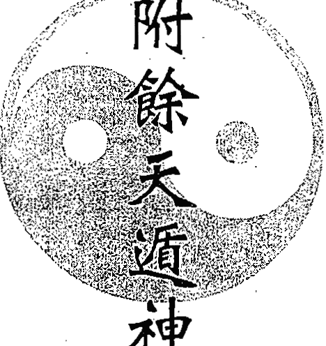

之一

### 六甲天遁術

此術乃孫臏先生授者黃石公得傳於世矣。一行法人先於十二月終旬忌五辛腥葷之物齋戒之，元旦一日入山或打孤庄野寺不聞雞犬之聲處，每飯只喫半饑半飽，每晨入壇念咒七七遍，閉目安坐一時，待日午投各符用硃砂書符，要素紙備下，到晚用燈放壇乾字上焚之，將紙灰使無根水送下。如此七日滿，回家憑意酒食。待元宵日夜半子時，乃備紙馬朝北斗祭之，然後可行。

### 設壇位式

初修設壇位用黃表紙一張，上書八卦，共白黃紙八張，仍照方位五色旗插上。每日用油數個、時果、香花、表紙、茶飯獻之，須念咒週而復始。每位上念都天神咒如遍，將果獻上。各位次日書符一道，後用都天符包之。室中寫一八卦位上，書八卦，用燈果香紙獻之。符放位前，待晚間燒之，燈上將灰用水吞之。次日仍照前行之走也。至於七日完畢，然後回家，任憑用便也。

+   初修設壇位用黃表紙一張，上書八卦，共白黃紙八張。
+   仍照方位五色旗插上，每日用油數個、時果、香花、表紙、茶飯獻之，須念咒週而復始。每位上念都天神咒如遍，將果獻上。
+   各位次日書符一道，後用都天符包之。室中寫一八卦位上，書八卦，用燈果香紙獻之。符放位前，待晚間燒之，燈上將灰用水吞之。次日仍照前行之走也。至於七日完畢，然後回家，任憑用便也。

### 八卦圖式

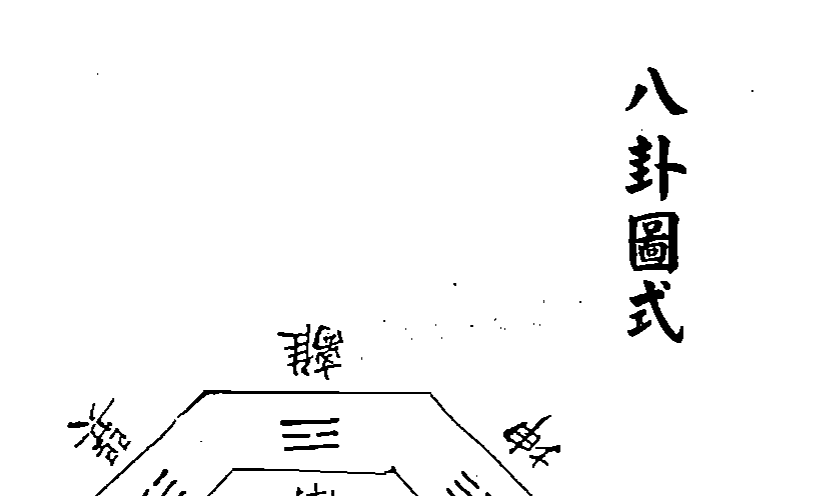

### 祭壇圖式

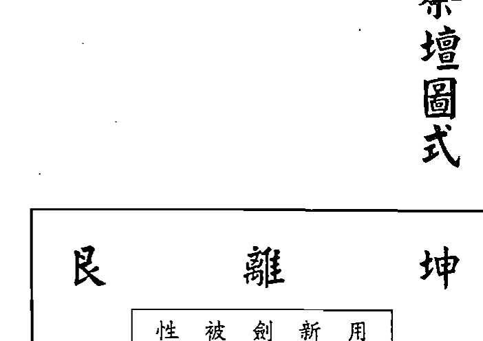

### 都天神咒

天之精光，地之靈光，人之神光，三光普照，遍曆周天，萬神護守，洞徹朗然，使鬼之應，遣神即降，諸法如應，百事禎祥。唵哪咀唵哈哆囉此（七字不可輕用）奉紫微大帝律令敕。

### 都天符

圈內書漸耳字，塗也。

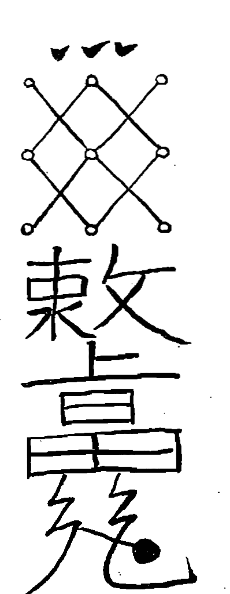

### 九仙符

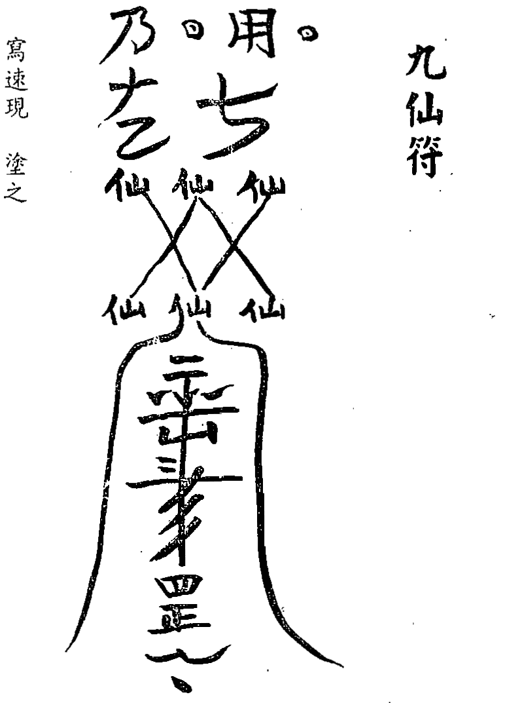

寫速現塗之。

### 耳報法

九仙符一道燒灰，葛蒲湯吞服，默坐片時，耳內即有一仙童傳說憂喜災危某處可避。一報可知一月，再吞再報。

### 日月符

符斜尖上書左龍符，下圈書右虎塗，或念都天咒。

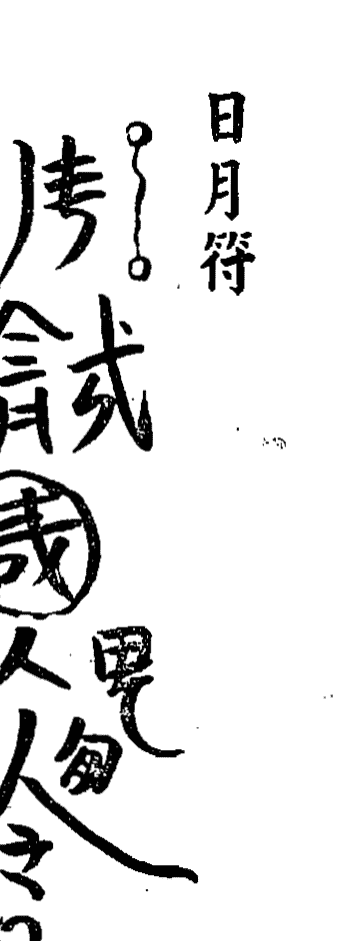

前尚飱，後尚徹。

### 見吉符

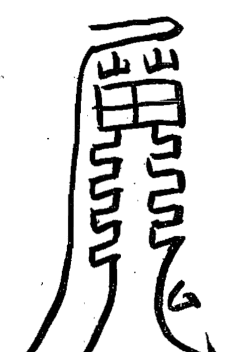

太上靈符。此符秘法禁諸邪、諸怪、諸獸、毒蛇、一切賊盜，刑絕遠行。此符用甲日太陽未出時設位，向太陽取炁一口吹在筆上，方可書符。與人佩帶、自己佩帶，奇驗。

### 鐵甲符

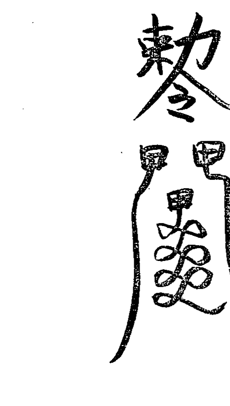

### 金遁說

金遁黃也，用三元鐵環，金姓人打造。庚辛日酉時打成劍一口，重一舫七兩，仍取庚辛日酉時，靜室向西方，茶果七分祭之，供居左右，劍居中。

### 金遁咒

西方庚辛白虎之神性命之主，三呼即至，除其危难，听吾應念來護我形。

### 木遁咒

物不生除免苦難。東方青龍甲乙之神，吾若有難，三呼即至，遊於諸處見。

### 木遁說

木遁日月也，用柏木或楊木九根，齊取庚辛日卯時入室中，向東立壇，用供九分祭之，掐卯字訣，供居左右，木居中。每念四十九遍書符一道，取西方炁七口吹符上化服之，取自己元炁七口在劍上持四十九日。有難左手掐酉訣，右手仗劍，畫地為溝，取南方炁三口吹劍上，自消。

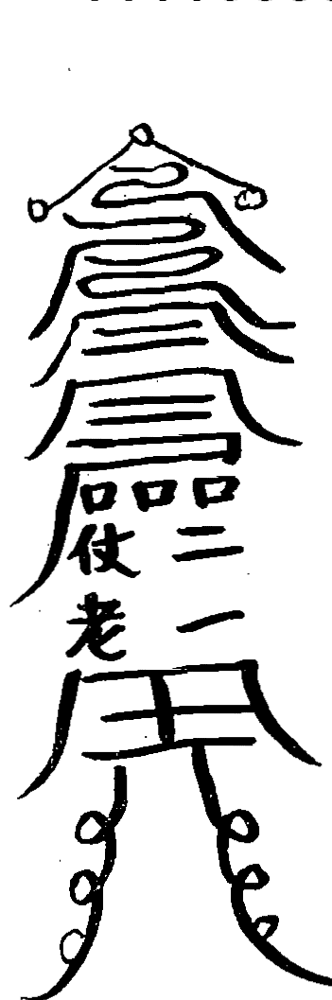

### 金遁符

### 木遁符

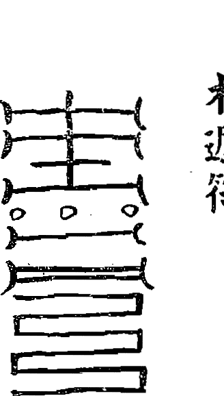

書符一道，取東方炁九口吹在符上，火化水調吞，將自己元炁吹在水上九口。如此四十九日滿，收了遇用時，取木抱定，立成大樹。解用西方咒，西方炁九口吹木上，即不見樹矣。

### 水遁說

水遁津也，用水一碗，取壬癸日子時入室，向北方立壇，用供五分祭之，水居中，持掐子訣，念咒四十九遍。咒曰：北方壬癸子上天不溺，玄武隨方隨驅形，思之返還，念之隱形。

### 火遁說

火遁化也，取谷楮草七根，用絲綿纏之，香油淋過，取庚辛日午時入室，向南立壇，點著火居中，供三分於左右，持咒掐午文訣，念咒四十九遍。咒曰：南方朱雀屬於丙丁，內外心土三呼即至，有益無害。

### 水遁符

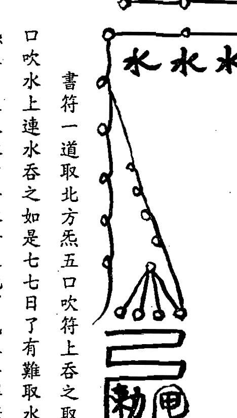

書符一道，取北方炁五口吹符上吞之，取自己元炁五口吹水上，連水吞之。如是七七日了，有難取水一碗，念咒取炁五口吹入水中，將水潑之，地下成汪洋。解念土咒四十九遍，取中黃炁十二口吹水中，叫無其波即消。

### 土遁說

土遁生也，取辰地上土一升二合，庚辛日辰時入室立中央壇，土居中，供十二分於左右，掐辰文訣，持四十九日。咒曰：萬神之靈，七魄莫離，三魂遮體，三呼即至，速速護身。

### 火遁符

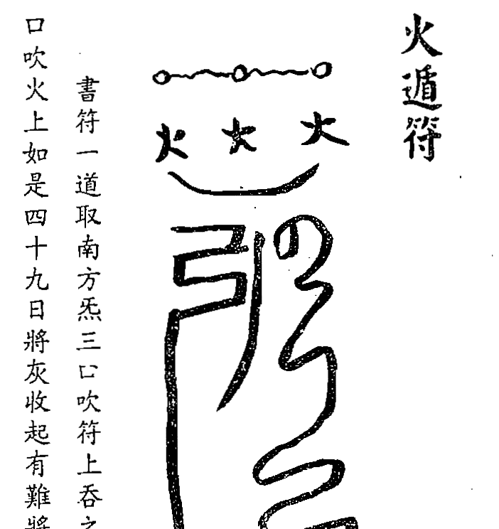

書符一道，取南方炁三口吹符上吞之，取自己元炁三口吹火上。如是四十九日，將灰收起。有難將幾火攬神火吹之，解時念北方咒四十九遍，取北方炁五口噀地上，其火自消矣。

### 土遁符

書此符一道取中央無十二口吹在符上吞之取自元無十二口吹土上七七日收之用時取中央土一撮撒在週圍立成十二丈高城解念東方咒九遍取無九口吹土上拿一木叫無自沒矣

#### 六甲天遁拳之一終

#### 玉皇顯化變身神咒

玉皇上帝 勅下九天 揚塵灰起
飛昇登天 變形速化 隱秘身形
聞風自起 逍遙上清

#### 軒轅皇帝土遁法

皇帝數年學道一日往崆峒山採藥偶見一白鹿守道帝
言此處必有好人行動數步只見山洞內有一女子口誦真言
帝向前拜告而言是何法術女子答曰吾乃九天玄女是也親
授玉皇秘訣功至二十五甲子旬頭自得飛昇顯化仙女又曰
土遁者持之日久足得土而變化無形日行萬里百術不能敢
破帝復拜曰願尊師憐憫傳授仙法仙女曰若學此術當戒酒
色財氣五葷三厭如達一戒不得成事如學此法先發洪誓大
願申告祖師然後以甲子日為始向天門腳踏三台罡左手指
盤龍訣右手指劍訣取西北氣一口吸入腹中方念玉皇大帝
顯化變身神咒七遍吞符一道然後默念不記其數每日清晨
依此法例持之日久自得飛昇無不顯應

#### 通目符式

#### 通目咒

日是我父月是我母五星是我兄弟太乙是我朋友吾
用此符押伏鬼神急急如律令押
此法燈下丁字腳立硃砂書後符於紙上七道燒灰入
水中以水洗目當夜即見鬼神洗耳听一切鬼神語餘水飲
之即共鬼神言語大驗之術

#### 二郎彈大法

取日食日用上好高碗兒錫三兩正食時用硃砂書符一道念咒二遍書完香上度過化開湯燒內摶均鑄彈子一個听用又等到月食日夜用鉛二兩九錢照前書符二道念咒二遍燒內鑄之听用又用烏骨母雞同蛋胞出雞取彈用一黃絹袋盛之懸吊在六甲壇正中每日書符三道早午晚持咒三七遍三七日彈子在袋內自打听響取出用二即神紙馬燒祭拜二十四拜收帶身邊若過強人彈子自動取放一個去打見血即回來只許放一個去兩個去雌雄相戀則不來也

> 咒曰
天靈靈地靈靈二郎神彈來往行打天天昏打地地崩打樹樹折打人一下皮開見血唵吒吒呷睹吾奉太上三清玉皇勑令拝

#### 日陽神彈式

#### 月陰神彈式

前二符掐龍訣念前咒書之

#### 神箭法

昔日元師真君告作箭法見之秘有損傷此神律有為將之道驅兵萬泉此遇被他強己弱之時用庚申甲子之日用上好硃砂書符於箭頭上書者先用板橙一條騎之正午時持咒書之或百隻或三五十隻書完畢一捻拿起香煙上度過供在神前若用者取來刀斷蘆葦去射百發百中萬無一失重者即死以此法護國安邦養神箭射此法昔前唐秦王用此法宋太祖用此法名曰天定箭諸葛孔明曾用此法敵萬人若無箭之時刀削蘆葦作箭長二尺四寸代之神效

#### 神箭咒曰

太上玄玄天地處處人神共享百樂神天逐風逐雨為鬼為神天地交泰一掃乾坤莫後棄子並不留吾奉太上老君急急如律令勅

#### 書箭神咒

金木相剋以成陰陽二十八宿太白玄光鎮星避用以成紀綱三尺布內不可伏藏吾奉太上老君急急如律令勅

#### 書箭符式

#### 坛式

望北步十五步望東步十九步望南步十三步望西步十七步各安門香案新席一領反鋪在地共用十個大缸盛水安放五門五五色旗號上書勅召萬神仙三時焚符用十人柳棍絞缸用柳枝綁在旗上咒曰太上之先天地根元老君之教密旨真傳玉皇尊帝端坐端壇帝君真武列在兩邊三界內外億萬神仙九天玄女速降吾前天丁甲子急赴壇前九曜星官三十六帥天將無邊金木水火土神當先五方神將各顯威權上帝有令不

#### 太歲祈禱

以壇式爲主立壇步三百六十步望太歲掘坑深三尺六寸立大紅旗一桿上書丙丁二字用童子二十四人旗下口念丙丁火燒死太歲兒子其底用推帛石一塊用大金蟬一個書八卦靈符包住放在石底撒上石灰上立旗桿封土高三尺用石灰遍撒土上旗週圍畫城童子在內每日焚符清晨午晚三次行至三日雨迎太歲而來其雨大降

#### 八卦符

- 坤兌乾
- 離中坎
- 巽震艮

許遲延不听法旨奏斬真形急急如律令奉敕施行 吾准 三清上帝計束三大將吼風大將混海大將火光大將各領 神兵萬將助吾法力討要副兵保吾身形上朝元君九天應 元雷印在吾手中領召五湖四海龍君速來吾處分付不得 有違急急如律令押

#### 焚賊人放火法

此術用黃表紙一張硃砂書符一道再用土碗三個中間一孔如錢大蓋了灶門又取灶前當門土五斤以五月五日艾水和泥將灶門堵了又用靜水一碗泡黑豆四十九粒將符貼於灶一般齊下不可放黑豆碗對鍋底齊將灶門塞閉不通風中間著連七紙糊住用新針刺幾孔寫咤啼二字一道又寫東家灶君牌位設祭品供獻之物跪念咒畢燒了祭文其人即患肚疼遍身泡起自己通說放火是我不可糊了針眼糊之其人即死先讀文後念咒

> 咤丑亞切去聲噴也
啼音帝鼻氣

#### 牌式

昊天金闕玉皇上帝一切牌位俱隨意供養不必拘執吾受天勅已駢雷霹靂午九天安鎮未誅邪滅跡中天火烘西地火赤戊祛雷公亥動霹靂子雷威終震便驚人烹鼻滑棘救竟捍

> 馭同驅策馬
祛音區禳也進也逐也卻也

#### 金蟾遁法

用五月五日取蛙一个用南青布一尺四寸正当午时，於青布中間完畢將蛙放去有驗不可言矣亦不可對人妄

> 咒曰：天之隱地之隱人之隱我之隱一切人物不見影急急

如黃衣老人律令勅

又法：取灶内土鴨卵一塊灶心土三錢或酒或醋調抹灶門上雨邊然後禱祝

> 咒曰：劫財放火豈知害己妙法作用占著就死要得不死只 對主人對天明誓對老佛許如還仍舊晝夜速死謹請 灶 君急急如律令

## 六甲附餘天遁神書拳

### 之三

### 蛙符式

若遇難時念咒左轉三轉即不見欲見右轉之見矣此符布放在自枕頭內每一歲枕一夜日足取出听用

六甲天遁拳之二終

見矣 齒手掐寅訣遣吾祠神使者於門外奉樂如不用放訣則不 如遇知己之人飲酒書符一道默念都天神咒三遍叩

### 簾外仙音

如遇酒席上要雷聲用人吹炁一口望正東取炁俱吹 於手內再用人吹炁一口放手則雷震聲手掐卯訣

### 掌中雷聲

### 旋風閉目

要用風即書符一道左手掐辰文望正東巽之怪風即起罩 日風內起大石泥沙人不能睜睛其成旋風不去

### 犬兔成形

如遇知己之人飲酒用紙剪成兔放之又剪一狗佃之 右手掐戌訣左手掐卯訣待收吸炁三口放訣自來

### 盗贼自犯

如遇盗劫人物望所去處方收炁三口吹於紙上書符一道灶前焚之其賊自犯而不能去矣

### 护宅不耗

如遇荒年恐賊為害用機木板五片硃砂書符四道用火焚之調先泡內泥牆四角賊畏避自不敢近矣

### 捭人问事

几有疾何事祟将病人家二十壮之人用手帕盖顶立于中宫书符二道贴于背上念咒其人捭下口中即说是非不用噀水即醒

### 止水渰田

几有江湖长渰人庄宅冲塌田地用楊木板书符三道投入河内其水自不能为其害矣

### 禁祛猛虎

几有狼虎下山害人者将此符書於五道河土地前厭之虎狼自去矣。

### 鬼喚人名

若用書符一道往人住處吹之至晚鬼喚人名開門又不見人須臾開門又來喚其名

### 鎮宅奠害

幾遇人有祟作禍手掐離訣書符二道燒一道貼一道

念都天神咒則其邪返逃遁矣

### 仙女歌舞

如要仙女用紙書符一道掐連環訣用兩手俱掐午訣

默念都天神咒三遍存想仙女自天而下歌舞放訣則去矣

### 灑土為橋

幾遇急事水縱河長不能過者即於乾地收炁三口吹於地下取土望水上灑之默念都天神咒三遍即過踏如平地矣不可輕用

### 化驢遠行

如遇遠行無馬書符一道手掐午訣念都天神咒三遍心想黑驢騎則至上如飛之快手不可放訣或至方可放訣夜行則可白日不可用

### 黑雲掩日

孫子遁日爲夜之法用手寫太歲收土一把望日灑之
念都天神咒即時雲遮日色用水一口念咒噀之心想是仲
中如不用望日吹之放訣日則現

### 遣虎驚人

如遇難書符一道望寅位收炁三口右手掐寅訣左手望寅
方書虎字幾字即有虎欄路隨身而走人不敢近望寅位吹
之放訣則去矣

### 捻土成山

如有追兵望西南坤地取土一把望追兵撒去口喝令長即成山阻隔兵不能進如走遠收炁一口則化為平地矣

### 手中起火

如遇夜行無燈書符一道左手掐午訣右手掐巳訣念咒呼丙丁丙丁隨吾則生用手一撒隨手而出火如不用放訣其火即滅矣

### 風裡藏身

如有急難書符一道用右手中指寫風娘到此左手掐寅訣望東念呪身隨風去也

### 鶴鳳來儀

用紙剪鶴鳳形式用黃遵水書符一道焚之將符並剪鶴鳳吹之即起之上盤旋而飛望東吹之即去

### 撼土揚沙

如要大風書符一道收炁三口想遮天地黑暗大風手掐卯訣又用右手望東指口呼東風至其風即至吹牆倒屋此風不可輕用恐傷田禾以壞陰德慎之慎之

### 大蛇現形

如遇有難書符一道用手指巳訣念都天神咒三遍心想大蛇即現長丈有餘人不能近如不用放訣則去

### 書瘡秘訣

咒曰
赫赫陽陽日出東方金童奉水玉女奉香一十八般惡毒隨咒滅亡不作濃血隨著日氣自消滅謹請太上老君急急如律令

望太陽念咒七遍取氣七口吹在筆上寫瘡自消

治癰疽初發一二日者幾癰毒俱驗用新筆美墨圈住患處隨寫瘡痰瘰癧五字在內以筆尖對著中心口念咒

咒曰
一收東方之青氣二收西方之白氣三收南方之赤氣

### 使鬼看田

如自己田園至晚用素紙書符上寫四鬼字用火焚之望田園吹之其四角面巡去人見紅髮青面高丈餘人莫敢近如不用以水噀之即去

### 治百病符水

擇端午日清晨面東或午時用新筆面南咒筆候用
咒曰：

日出東方辰火揚揚神筆在手寫山山崩寫海海枯大患三日小患即除謹請太上老君急急如律令

念咒一遍取太陽炁一口吹於筆上三次幾遇病者用黃紙一片咒筆京墨書神符火化隨病以水送下潔誠書符道最靈驗不可取財忌之忌之

- 瘴音暑熱病
- 瘴音民病也
- 瘴音疼痛也

> 四收北方之黑氣五收中央之黃氣符到奉行即時消散急急如律令敕
即將筆如挑破狀擲之於地

### 疟疾符

### 胸闷符

### 喘嗽符

### 头疼符

### 诸病符式

### 腰疼符

### 治眼符

### 除百病

### 催生符

### 氣蠱符

### 瀉痢符

### 吐血符

### 肚疼符

### 手足頑麻符

### 色勞符

### 打鬼胎

### 大小便不通符

### 胃口不开符

### 夜梦遗精符

### 少魂失志符

### 睡壓符

### 不思飲食符

### 嘔吐符

### 狂病符

### 見怪符

## 六甲附餘天遁神書拳

### 之四

### 六甲天遁拳之三终

### 鎮宅符

### 心疼符

### 咒

此法於正月初一日三更時候在十字路口念咒三遍
收氣三口吹在筆上勿令人見然後書病即效倘被人見下
年另受念咒二十一遍方住

又咒持之寫瘡用

咒曰
日出東方毒如蝎不作膿不作血隨著太陽炁自消滅

奉請
南斗六星北斗七星太上老君急急如律令敕

### 咒

咒曰
赫赫揚揚日出東方神筆在手萬病消除奉請
南斗
六星北斗七星太上老君急急如律令揖

書符除病疾除瘡毒等患
受持筆法咒得臨寫念此

治眼腫

治項腫

治手面腫

治耳腫

### 寫字式

幾書字務照此式

幾書字每字寫完圈三次自下往上挑治症用紙 寫一字燒一符貼之即好

治魚口 寫一帖燒灰用水一盅半煎汤溫洗

治瘡疙疸 寫一字燒灰熱水吞下即愈

治產難 寫一帖燒灰水盅半煎八分溫洗腳心即好

治臁瘡 寫一字貼患處或瘡上虛寫一字

治小兒痘疹 用紙寫一字燒灰溫水送下

治一切有毒恶疮

治痢疾

治肠中生瘩

治疮散毒

治小便生仓
同前法

治小儿夜啼
寫一字烧灰温水送下

以上五字專寫一切瘋症 在身上寫

以上燒灰温水送下

治面生瘡

治腸中疼 用黃紙寫字燒灰熱水吞服即好

治一切無名腫毒

寫誦惡瘡誦者是念呪吹筆寫之

以上三字專寫惡瘡每瘡一字一遍寫三次

以上六字用高墨好醋研濃寫瘡用

以上六字治一切疼處

治產難

念咒書符白水送下

咒曰

+   - 鎖骨開鎖骨開是男是女送出來勿傷母命勿傷兒胎
- 急急如淨樓律令

以上等字在病瘡上寫名為加字法按一樣字患處寫九遍念咒向太陽或太陰或香取炁三口吹筆上寫之

催生符

一道

將縣官名字書於符下

仙籙寫瘧

此法用京墨研陳醋告等欲香上逸過念咒書後字

咒曰：

> 吾本天宮帥將銀牙鐵面金晴手執鐵筆下天宮專寫
人間雜症南方丙丁紅繡鞋玉皇差我下天來鐵筆寫的鬼
神怕病好離床早六丁六甲火光萬丈擲揚日出東方神筆到處萬病
消亡吾奉太上老君急急如律令揖

咒曰 玉皇三官奉勅押

持新筆一管向太陽吸炁一口吹在筆頭上念咒三遍即向腫處畫一圈內寫消散二字其患即愈

治無名腫毒方

取太陽炁一口吹筆上寫痣

寫字式

人前心寫

後心寫

左手心寫涼字右手心寫汗字令病人拳腿避風處臥

出汗即愈

治吹乳神咒法

至年終夜半子時持金簪面向北斗正身八字脚站住

靜口念咒

咒曰

天上七郎星地下金雞鳴下方女子吹乳疼將炁吹在

金簪上插在左邊就不疼

誦七遍方止亦將手掐簪吹炁七遍立愈

咒棗法

左手指三山訣右手指劍訣用棗一枚放在三山訣上

右手劍訣望東上虛寫 神雷火氣 四字咒七遍寫七遍

咒曰

上帝敕行北斗青龍靈棗一枚萬病消除謹請

南斗六星北斗七星太上老君急急如律令

用花椒水吃下肚內如雷響即好

六甲天遁拳之四終

六甲附餘天遁神書之五

遊仙夢法

每晚用過素飯後獨自硃書寶籙靈符九道用火焚於靜溫水中以三山訣頂碗飲之然後就睡睡到四更時坐起焚香一炷默默存想

祖師寶誥
八遍而後已須要清心齋戒夜夜行持

四十九夜夢中自有應驗

祖師寶號
點劃日

九天開化
十方苦ures陽中

提人入夢法

用香案設於靜室案上用供果香花燈燭畢備中用靜水一碗然後焚香三炷兩手俱掐劍訣將左手托於香煙後以右手書符於香煙上書完即以左手撩煙向右手交連三轉然後以兩手連合向所提之人面額上吹炁放之即以兩手按於兩眼使不開視即略推三推書符咒於眉間即可出神而去不拘所遇何人即要至心拜求口稱○○祖師必有點化也

所提之人先令虔誠齋戒沐浴拜過○○祖師然後背而跌坐於蒲團或靜魎上听我作法必須露頂不得帶帽

第二道土地符式

咒曰
土地正神我奉 吕祖律令来人可领太上老君急急
如律令敕

转速字时念

完用金光咒涂没

第一道符式

左手剑诀叉腰右手剑诀书符

此符先书敕令後书横七转一转念一字贪巨禄文廉武破毕书斗字直下去者七／每／叩齿一下罡字左下些

一雷字即右转一转後又书一雷字盖於上左转七转默念金光咒涂没雷罡三字

第三道符式

書完於斗字上書雷正塗之
此符先書斗二書五三書
下七小圈每圈念一字
斗勺巂行畢甫粟

金光神咒

+   - 天之精光
- 地之靈光
- 日之英光
- 月之華光
- 雷神火光
- 閃電金光
- 祖師聖光
- 九竅毫光

每書完一符念一遍

第五道符式

此符後書

從淨字起 念一字 每一圈

第四道符式

此符本書

亦念天劍雷星斗速去

七轉塗之

第七道符式

此符先書雨二書清此字第二劃第三即書罡字於上轉七轉念金光咒塗沒

第六道符式

此符念金光咒二十一聲下 六曲印齒 鬼陽鬼出雷正 雷

第九道符式

此符書時念 提他靈光求見 呂祖靈官護送急急

如律令勑

已上九符用頁紙硃書焚水夜飲欲提提人亦即如此倘

或提不能去書後符二道于左右足

第八道符式

七。念咒同前塗

前九符塗沒式

左右足符式

念金光咒

符式

正心符

如夜夢不寧心神恍惚可書正心符於水中飲之無人處飲亦可只不宜使四眼人見

大概書符先書敕令次書符符完書三點一念精左念炁再書一念神俱要叩齒

解厭符式

倘或提人偶食酒肉須先用解厭符焚水服之

六甲附餘天遁神書拳

之六

六甲天遁拳之五終

> 敕令
六曲叩齒
雷正我心
心藏雷心找正 雷一 默令心正我心
七轉直上 雷

盖诸符咒

一郎兵二郎兵三郎兵五常兵七常兵四天明王五台
太山黄榜兵恶虎兵麒麟诀狮子诀足本二十五明天自投
诸邪百鬼尽皆愁五明天自天诸邪百鬼尽皆消五明天自
紫诸邪百鬼尽皆死

訣名

剑真武黄榜恶虎狮子麒麟锁足本

五星咒念一句画五星符一符在水上

> > 咒曰
一心拜请雪山王头戴银盔白汪汪秋天下大雪雪上
又加霜

召請咒

加擁護
不語打斷筋弟子黃泉斬妖精我今敕請王來臨打之雷霆
一粒金丹圍紫身天星地耀俱回陰土隍聞語定不容今宵
仰祁弟子鄭元帥正遇殺鬼的大將軍實實心為弟子

五雷咒

天遊天遊遍九州身披金甲手
執戈茅眼若電
恶鬼切頭上帝不得停留
空通兵三十萬
吾奉太上老君急急如律令
不伏者打著雷霆定不容

棠咒

束把天南把天西把天北把天中央一天黄牙大殿今
姓甚某人為身病痛頭中一塊心中二塊足中三塊上元
天官中元地官下元水官天府地府水府粟府乾坎艮震
巽離坤兌春滿雷夏滿雷秋滿雷冬滿雷貪巨祿文廉武
破
太上彌羅五上天妙又玄欽闕妙妙知金闕太尉御親
宮無極吾上聖科立放光明齊齊消諸彩玄王送十方咯
真長道微魔大神玉皇大帝尊玄空高上帝

補

敕

本 祖

符頭

告下 敕先天

法 洞霄 澄霄霜 馘

告下 敕先天

馘

告下 敕先天

左

右

馘

提元氣

敕令

補符三道

敕令

補

敕令

補

敕令

敕令

毛五雷治疟吃又退烧

敕令

风张 治百病

唵佛善好

绝断瘟邪此符除邪后贴门枢邪再来此符能言语

补元气

封門 治瘧帶用

式 火

賀子五雷除邪貼治瘧吃

碌文打痰用

順氣丹

勑令 魑 雨漸耳 霖 雷霆 雨胸

勑令 气 雷賀 鬼加

致 田耳 王耳 油耳

此二道吃

治小兒抽瘋

此符治痢疾

小兒夜啼窗戶上貼

敕令先天應

此下二道除邪埋地東北西南角

敕令地三傀雷子

磚上畫

千四炁

元光

敕令可

磚上畫除邪埋地

敕令普唵三右佛丙煞## 敕令
佛 唵 勅
催生吃
王煞子
唵敕令
催生吃
共二十七横
多 束 辛 多
報 子
唵
佛
敕
咒
甲
甲
甲
甲
甲
雨漸耳

安胎用

筋骨疼吃

秋金

除邪埋地

並上俱退燒吃

退燒一道

催生四角貼

### 敕令
敬馬敬馬吾身馬敬焉敬馬
藏藏吾身化藏藏
元光水上五星符
雷金
雷木
雷水
雷火
雷土

### 敕令

### 治邪進門燒

磚上畫除邪埋地内中央

敕令先天應龍王殿

此符振房脊借劍符

敕令佛唵嘛呢呢唵哩吽吽吽吽煞

敕令先天應火

敕令

### 此符響鈴符

道法本佛多 南行灌北河 拗成一個字 降盡世間魔 此四句書於符下

書此處

# 六甲附餘天遁神書拳
### 之七

### 八仙聚會香雲球法
潮腦三兩 檀香一錢 丁香一兩 白芷三錢 白膠香一錢 茅根香一兩 青木香五錢 零香五錢 豆蔻一兩去皮 右為細末酸棗二升煮水去汁熬膏同蜜搗成丸如蓮子大曬肝如用將丸在無風處燃火煙上結球球上八仙出現久方散

### 六甲天遁拳之六終

#### 次叙
持是法者必擇金牛日干或庚寅天德日灑掃設擺停畢先祭歷代持受祖另一桌祭之用燒紙經盤三十餘個三張一拈的燒紙百十拈銀錠不拘祭畢焚紙潑漿水以畢回在壇中必打醋澹三次逸屋董走焚靜壇符念敬天地神咒三遍安土地神咒一遍必跪壇前誦之持法之人終始必宿壇內為之守壇始煉之日必一連七日不許出門善守神壇而已

#### 壇儀
靜室一間正上面設供桌一具居中供一牌位上寫九天真武三牌位左供一牌位上寫伏魔聖號右供一牌位上寫位上写的法祖名號必用一錫燈臺高一尺三寸燈盞容一斤油者每日燃燈不卻用香燭紙茶酒遂意祭品三牲時果祭之煉法之始日以早焚香誦避邪咒十遍誦提咒一百遍出壇取太陽罡氣其詳細俱書於後三牲本日卻去壓壇葉供不可去了每日只換茶酒只焚黃紙一張一卷焚之須一日必焚全馬元寶錢糧四分以後每日必焚黃紙卷十卷

#### 靜天地神咒
天地自然
穢氣氛散
洞中玄虛
晃朗太元
八方威神
使我自然
靈寶符命
普告九天
乾羅答那
洞罡太玄
斬妖縛邪
殺鬼萬千
中山神咒
元始玉文
持誦一遍
卻鬼延年

九天應元雷聲普化天尊
北極鎮天真武玄天上帝
敕封三界伏魔大帝
雪山大法師神力教祖

## 取早氣功夫
自安壇頭一日早晨日始出時以身正對蹲身二手作蓮花訣先念咒一遍吹氣一口隨取氣回納入腹下聳身一跳仍如前取氣念咒二十一遍

> > 咒曰：風電八門開眾生氣力來借氣運氣力撟千斤之力借氣順氣力撟千斤之力奉請金翅大力神速降力魁

## 取午氣功夫
用烏盆新者一個新磚十塊大柏木樁一根埋地五尺露外三尺上錠一鐵環用生以烏盆注水滿先持咒四十九遍先看日光少時日芒即不射月矣再看水盆內見水盆內的日光忽火毫光上起中即現諸般景象其來驚人最兇惡持法之人不可惕怕宿命提咒以氣收取其來之象以氣收納腹內再持再念再取如此七次畢令師者寫乙字符在前後心上寫甲念干咒力法本人先念上手咒畢取日光氣一口以手書十字一拍為之借土氣即將磚一掌擊之如此七次畢又念打滾咒一遍又取太陽氣一口在地打滾一個又念咒又取氣又打滾如此二十一遍滾方完將烏盆好收藏

### 取太陽氣咒
天元乙卯乙卯天元乙離請大力神速降力魁

### 取華光氣功夫
晚上在壇中將燈掣在桌正中多注香油燈心一子燃之上師在桌旁跪念提咒持法之人以五色線作四縷為四總縛在兩手肘間兩膝間又用新磚作一輪磚石上面蹲身三手作大蓮花訣對燈念取燈光咒念七遍取氣一口取到二十一次見燈光內現一寶塔或金城或燃燈佛像或九天真武聖像見有景像不可驚懼怕怯但以蓮花訣以鼻息吸收納入腹內方下磚輪作後九樣功夫煉氣又關夫子表一道對壇前念關聖寶誥三遍上師以手在學去之人從頭至腳寫鐵面觀音咒字在身面之上又念上鐵襠咒以鼻息引氣納中令人踢打腎囊如此二十一日方用一繩縛一石墜之如此漸加至三百六十斤為止以前法謂之罩法

### 取燈光氣咒
煉山煉水煉氣煉神煉神聖之體眉生三隻眼六丁六甲燃燈古佛金光普照弟子身

### 關夫子誥
丹天應化離火分真妙鍾二五之精身覆乾坤之秀大義精忠振綱常於萬古神功妙化超靈應於多方泰詳全化育之功曲成普生民之力沙界浩劫悉合乾坤之麻地久天長永隆帝真之號德濟十方功超萬有除邪輔正三界伏魔大帝神威遠振天尊

## 取井氣功夫
前功全完至六十日滿再加取井氣功夫至晚取燈光氣完即出門上井口沿面南左手作九天訣右手作雷訣念咒二十一遍井內水作聲遂以息引取井氣七口還家

## 鐵面觀音咒
雪山法打勞金井萬丈深皮似鐵骨似鋼鐵面觀音護我身

## 上鐵襠咒
鐵襠神鐵襠神來吾襠上存

## 蓮花訣式

### 五雷訣

### 九天訣

### 劍訣

### 斗訣

## 取樹氣功夫
每日午前後用東方氣七口方出門至大樹前念咒七遍取氣一口以兩膀撞樹一下又念又撞忽後取氣回前後幾取氣入腹必行功運入四肢其功有九等

- 黃龍插劍
- 太公釣魚
- 合掌煉膀
- 鶴眠龜息
- 鹿息還精
- 鯉魚跌子
- 大小沉墜
- 鵰鷹煉頭
- 撐繩挎板

## 關夫子表
維 大清雍正○年月日○省府縣地名居籍奉 道持受法弟子○姓名誠惶誠恐稽首叩奏 敕封三界伏魔大帝神威遠振天尊關聖帝君聖前 伏以 天地以好生爲心 神祇以衛正是念○幸生中國泰居人倫頂 天地神以眷祐五行以全身四體生全五官幸備欲習 技藝奈身軀懦弱不任重力雖有忠良護國衛民安邦之志 身微力薄不稱所願今幸得○人親傳

## 磺輪式

聞
### 道法不敢私為擅作敬陳表文以
請神劄
今據○府○縣○姓名

敬具劄付上申

當坊土地正神位前今○安壇持煉法術欲效匡國安
民之志敬伸錢糧祭品願敬神明施聖神之威除邪魔遠退
衛護正道法成之日必具處儀叩 謝

土地正神 以墨寫 上以硃筆盖寫三字諱

雨泓 雨澄 雨洞

乙
乙乙
乙乙乙
乙乙乙

上身乙字符式

### 車輪八卦式
是輪每逢某宿呼
其名按其本方呼宿名
取氣二十一口回至本
太歲方向復取炁七口
將供茶飲之未取炁之
先於太歲方焚降神符
一道至本日值宿方向
焚催神力符一道

### 降神符式
圈内入清大力宿神即降上盖紫微讳
紫微讳

### 催神力符
圈内入太岁大力四上亦以紫微盖之。如此取炁至七日力大无窃俱气念前提咒

# 六甲附餘天遁神書拳
### 之八

### 取井氣咒
> > 嗡嗡嗡嗡嗡奉請北海烏龍五方大力龍神護我身形唵

六甲天遁拳之七終

### 掌心雷訣
> 咒曰：唵婆婆舍利叭喇叭奴 訶呶婆奴茄叭佛煞 訶喇晖吒吒吒法吒吒 吒吒晖喳喇婆訶敖煞拚 此咒内法吒法吒四

### 訣印書
劍訣

- 乾劍精 一
- 坤劍靈 二
- 奎雷電 三
- 運玄星 四
- 罡星至 五
- 雷亨貞 六
- 乾元亨利貞日月三光逢凶化吉遇難成祥 七

### 丑未阴斗

### 子午阳斗

### 都覽訣立訣

### 變神訣
左手從腦前來勾面上相定禪矣

### 大金訣大金井訣

### 宗師開金井訣
## 左手仙人開金
## 井訣右手

雷局亦名五雷訣 召將以此向上心 前法將祭文字以 此向後又開天門

## 收瘟诀

### 金刀诀右手

### 金城诀

### 乘云诀

### 乾元訣

### 龍訣又名右龍訣

### 盤山訣蓋之

## 開喉訣又名放生
## 魂訣右手

### 白虎訣 右手入山避虎狼用

### 诀法同前
### 捉惟诀又名捉精诀

### 伏兵訣

### 乾元诀
自子飛至亥

### 天心诀
中指掐掌心文

### 入廟訣

### 驅病訣
入病人家

### 北三田訣

### 三思訣
打三下噴水一口

玉清诀 玉皇诀
祖师诀 上清诀

天罡诀
上丙午文又壇淨壇結界淨宅用

六丁诀
左手又謂天罡訣

天罡訣
左手召天丁用土宿诀

解咒诀 一名解冤诀

四山诀提鬼用

發鬼诀

### 六甲天遁拳之八終

### 金丁訣

### 離明訣

### 離水訣

### 清靈訣

花字：丁甲神到光明顯達

#### 茅山求職顯達順利大法

#### 請神法指，又稱觀音指

請神禀告加持咒語勅符等用之

指訣：雙手合併兩無名指互勾中指兩食指勾壓無名指兩小指大拇指合併伸直

咒：自選運用之

#### 追魂咒

天魂靈、地魂靈、三台覆體、七魄安寧、上通天門、下徹地府、三魂取、七魄靈、天清、地合、萬神聚會、吾奉九天玄女敕令急急如律令攝。

#### 催魄咒

魂再入體，氣命皆還，魄來即生，氣大皆全，奉請造魄神，急急如意，

吾奉九天玄女，敕急急如律令。

用法：備樟柳童子一尊，於甲子日酉時。

開始祭練七天或四十九天。

每天燒化符一道於樟柳童子前並唸五淨咒，請神咒、書符咒，追魂咒、追魄咒各三遍，四十九天不可中斷，否則無效。

### 退神符

用法：凡神尊日久要換新神像時，加壽金七張吟退神咒七遍即可。

### 收邪煞符

用法：凡宮壇屋犯有邪煞作怪不安時，可用本符以黃紙硃字燒化門口或貼在門上。

用法：凡房屋或店有對到路沖時，以硃字書寫貼在門上。

### 格界

祖師格界，本師格界，仙人玉女格界，七祖仙師格界，合壇宮衆格界，格起北東中西南方水木土金火輪界拜請。聖者陣守，若有邪魔鬼怪八吾壇界定斬不容情，神兵火急如律令

### 發兵

祖師發兵，本師發兵，仙人玉女發兵，七祖仙師發兵，合壇官衆發兵，發起。營兵將入營房，無吾旨令不可亂出汗，神兵火急如律令

### 追人符

- 用途：吊魂
- 用法：烧化
- 指法：剑玄指
- 步罡：七星步

### 化紙錢

祖師化紙錢，本師化紙錢仙人玉女化紙錢，七祖仙師化紙錢，七祖仙師化紙錢，合壇官眾化紙錢，手執紙錢白絲絲獻起兵將領金錢，領起金錢三接引，接引貴人到壇來求神，紙錢一張化十張，十張化百張，百張化千張，千張化萬張，萬張化千千萬億張，一錢化十錢，十錢化百錢，百錢化千錢，千錢化萬錢，萬錢化千千萬億錢，化做金山和銀山，供兵兵將將有夠花，有夠用，神兵火急如律令

### 北斗延壽驅邪符

用法：一次二道，一道配合七星延壽大法，或閭山延壽大法，貼在法壇燈上，另一道帶身。

### 進人符

用途：吊魂
用法：燒化
指法：劍玄指
步罡：七星步

### 洪公除邪符

用法：凡被鬼魅陰鬼入內作怪時，此符以黃紙硃字書寫化在門口即可。

### 斬亡魂符

用法：黃紙黑字加壽金在午時以後燒化門外，連續七天即可，咒語用五雷咒或八卦咒七次。

### 收百煞符

用法：此符黄纸黑字，犯煞化火
在犯者頭上轉三圈。

### 破邪符

用法：凡犯有陰邪侵害，凡事不
順時，黃紙硃字化飲。

### 安灶君符

用法：凡家中灶君不安，或正月初四日接補日，安灶時用黃紙墨書本符貼在灶君旁。

### 收捉不正神符

用法：凡有不正神，作怪時符用黃紙硃字書寫後燒化門口。

### 六甲保身符

用法：凡運途不佳時，可用本符黃紙硃字書寫帶身，可保事事順利。

### 太乙平安符

用法：凡家中不順時可用本符黃紙硃字，貼門上。

### 寒熱符

用法：凡寒熱不退者，可用本符，加唸雪山咒七遍，用陰陽水，化飲。

### 玄女符

用法：此乃九天女扶身保命符，凡人不順，運途不佳時，可用此符黃紙硃字帶身即可。

### 治怪風陰症

用法：凡有犯陰症，醫生查無病疼者，可以用本符黃紙硃字，書寫化飲。

### 犯邪治狂言亂語符

用法：犯邪治狂言亂語，黃紙硃字，化陰陽水飲。

### 治瘟疫符

### 治陰症符

用法：凡犯有陰症不順時，符黃紙墨書，化陰陽水洗。

用法：凡有犯邪煞時用黃紙硃字書寫把本符安在門上即可

#### 著妖邪安宅符

用法：此符家裏不順常有怪異時可用本符用陰陽水噴灑在家裏四週即可

#### 九鳳符

### 镇宅大符

用法：凡厝宅不安或有邪符侵犯者可黄布书写择吉安在门上。

### 镇梦不祥符

用法：凡恶梦连连、及常作不祥恶梦，可用本符一道化饮，一道放在床头上睡即可。

### 泰省閭山淨明大法院 真傳祭照妖鏡法科

龍德壇珍藏

### 護身咒

志心皈命禮，奪氣金開，各顯神通，吾心變化為空，世研佛法，起身弟子得勝，手扶刀槍，廿四位自天佛薩，佛薩，麼海薩麼海薩，南無佛，南無法，佛有恩，朝吟觀世音，暮吟觀世音，吟吟從心起，吟佛不離身，天羅神，一切災殃化為塵，神兵火急如律令。（持誦密咒，恆久吟之，可押煞驅邪，增靈力護身等，無形中化消一切災難效果神驗）

### 净心神咒

太上台星 應變無停 驅邪縛魅 保命護身
智慧明淨 心神安寧 三魂永固 魄無喪傾
急急如律令

### 請神咒

香煙沈沈應乾坤 點起清香透天門
金烏奔走如雲箭 玉兔光輝似車輪
南辰北斗同下降 五色彩雲闇紛紛
紫微宮中開聖殿 真言咒語請神仙
弟子一心三拜請 列位諸神降來臨
神兵火急如律令

### 净身神咒

靈寶天尊 安慰身形 弟子魂魄 五臟玄冥 青龍白虎 隊仗紛紜 朱雀玄武 侍衛吾身 急急如律令

### 净口神咒

丹朱口神 吐穢除氣 舌神正倫 通命養神 羅千齒神 卻劫衛真 喉神虎賁 氣神引津 心神丹元 令我通真 思神練液 道氣長存 急急如律令

#### 安土地神咒

元始安鎮 普告萬靈
嶽瀆真官 土祇地靈
左社右稷 不得妄驚
回向正道 內外澄清
各安方位 備守家庭
太上有命 搜捕邪精
護法神王 保衛誦經
皈依大道 元亨利貞
急急如律令

#### 淨天地神咒

天地自然 穢氣分散
洞中玄虛 晃朗太元
八方威神 使我自然
靈寶符命 普告九天
乾羅答那 洞罡太玄
斬妖縛邪 殺鬼萬千
中山神咒 元始玉文
吾誦一遍 飄鬼延年
按行五嶽 八海知聞
魔王束首 侍衛我軒
凶穢蕩散 道氣長存
急急如律令

### 祭照妖鏡符咒

天清清，地靈靈，拜請十六閻君到壇前，此刻，速速隨吾祭起照妖鏡，祭仙鏡，照起神妖無覓處，一照妖邪在空中，二照妖邪在人中，三照妖邪變原形，六丁六甲隨吾令，隨吾法旨守鏡形。陰兵陰將隨吾令，遵吾旨，速速照起妖邪不留停，若有不遵吾旨者，定斬不留情吾奉十大閻君敕神兵火急急急如律令

### 祭照妖鏡符

作法：照妖鏡用
用法：在寶鏡上用9支清香虛書此符，咒唸七遍四十九天後即可練成，安門上可保平安

### 閻山求財神符

五路財神膽
求財符用
車馬發動
法興
兵令印馬
金土木
火水
黃紙黑，紅字

### 法師鬥法符

用法：凡被放符時，可用本符加壽金燒化門外。

### 求財神符

用法：紅紙黑字
咒語：天清地靈五鬼顯靈急召貴人速到吾前
地址 神兵火急如律令

#### 茅山開運招財大法(一)

作法：將所需用品排在神明前，作祭天地水庫法科，再按財神斗法科安斗，再行補運後，再施行本法，否則無效。

#### 茅山開運招財大法(三)

作法：將所需用品排在神明前，作祭天地水庫法科，再按財神斗法科安斗，再行補運後，再施行本法，否則無效。

#### 茅山開運招財大法(二)

作法：將所需用品排在神明前，作祭天地水庫法科，再按財神斗法科安斗，再行補運後，再施行本法，否則無效。

#### 茅山開運招財大法(五)

作法：將所需用品排在神明前，作祭天地水庫法科，再按財神斗法科安斗，再行補運後，再施行本法，否則無效。

#### 茅山開運招財大法(四)

作法：將所需用品排在神明前，作祭天地水庫法科，再按財神斗法科安斗，再行補運後，再施行本法，否則無效。

### 招财符

用法：凡人运气不顺，财运不佳，可用本符黄纸硃字每天一道化门外，加旺财金，寿金，财神金，大小贵人、四方贵人烧化即可。

#### 茅山开运招财大法(六)

作法：将所需用品排在神明前，作祭天地水库法科，再按财神斗法科安斗，再行补运后，再施行本法，否则无效。

### 開市招財符

奏 利 市 仙 官
日進千里財
門庭若市鴻圖大展
時進萬里寶

### 旺壇符

用法：凡神壇香火不旺時，可用紅紙黑字燒化香爐內，並唸旺壇咒七遍即可。

### 發財庫 按財庫

備財庫一個背後貼「招財符」內放「地神通財符」一張銅板五元二個紅豆三粒綠豆三粒黃豆三粒。法師上香請神護身用「旺氣入門符」加壽金三張火燒金庫三圈唸「化財咒」唸三遍後用紅線縛兩邊依信者之奇門命盤之生門放好依信者之九宮命盤之四吉方放好

### 正財咒

天清清、地明明，拜請祖師鎮威靈，福德正神，為吾招貴人，招起東方貴人到，南方貴人來，西方貴人到，正財不斷，歸庫中神兵火急如律令。

### 偏財咒

天錢星，地錢臨，吾今轉化陰陽貴人偏財星偏財臨，五鬼陰兵顯威靈，攝拘魂魄、助人偏財大進門庭，神兵火急

用法：符以黃紙墨書，一張帶身，一張燒化在門外，加大小百解，貴人指引及各種寶碟合符各一份燒化七天作一次。咒用五路貴人咒

天清清、地靈靈，五方五路財神大顯威靈，急速為吾。。。
人，招入五方貴人來相助
千里萬里貴人來相迎吾奉天上
老君神兵火急如律令

### 安地龍符

用法：黃紙硃字，符燒墓後金斗內

內符各一道含刈金一支燒化。

### 閩山五猖符

用法：本符以黃紙硃字，貼壇上，安壇或安外營可旺兵。

### 收場土煞符

用法：黃紙硃字，符燒墓後金斗內，符各一道含划金一支燒化。

### 雪山收凶神符

用法：凡有犯到陰煞、邪煞、人或家裡不順時，可用本符以黃紙硃字化飲即可。

### 斬煞符

用法：以黃紙墨書，此符必須以火焚化放入陰陽水中，噴灑屋宅四周。

### 用法

此符必須用黃色墨書此符，符必須寫欠債人之姓名住址燒土地廟，一天一道。

### 咒語

天冬冬、地冬冬，五鬼陰兵，展威風，五鬼陰兵，全出動，急到。。。。。。家中，催押。。。。。。惡人，良心發現，速將欠。。。。。。之錢一一還清急急如律令。

### 討債符(一)

### 八房押煞符

### 用法

犯動土的小孩沖犯到不到，本符以黃紙硃字，貼在房門上、或門上。

### 討債符 (一)

用法：此符必須用黃色墨書此符，符必須寫欠債人之姓名住址燒土地廟，一天一道。

### 齊天大聖護身保命符

用法：符以黃紙硃字書寫帶身可保出入平安。

### 勅和合符通用咒（催法用）

拜請普唵祖師來勅令，勅動乾男坤女年月日時和合扶起女人前來做妻子，時時刻刻前來合吾身，陰陽來和合，天地和合，日月來和合，和合仙師來和合，和合童子來催催，男女同心同意兩和合，和合三師三童子到此來勅令，和合神兵急急如律令。

### 迷魂和合咒

奉吊迷魂法師急如令，能統手千萬兵，步罡踏斗點鬼兵，茅山祖師助吾法，吊神吊鬼迷萬民，六壬仙師助吾令，勅令鬼神差追捉。。人三魂七魄急轉回家鄉，日夜思想歸家，莊頭莊尾鬼神兵，伯公伯婆莊頭莊尾土地公汝，卅六界日夜指引，兵馬急速追捉。。轉回家，捉魂童子，捉魂童郎，催捉。。日夜思歸不得已，本境土地公洽接符令至急傳法，弟子本奉茅山祖本仙師急急如律令，勅到奉行，神兵火急如律令。

## 國家圖書館出版品預行編目資料

六甲附餘天遁神書／佚名作．－－初版  
－－臺北市：進源，1999 [民88]  
231面；公分．－－（符咒叢書；3026）  
ISBN 957-8938-77-2 (平裝)  
1. 符咒  
295  88014501

符咒叢書3026

# 六甲附餘天遁神書

- 作 者／佚 名  
出 版 者／進源書局  
發 行 人／林 進 寵  
社 址／台北市桂林路 144 號 5 樓  
登 記 證／新聞局局版台業字第 5783 號  
電 話／(02) 2304-2670・2336-5280  
傳 真／(02) 2302-9249  
門 市 部／台北市華西街觀光夜市 A 區 16 號  
電 話／(02) 2304-0856  
郵政劃撥／台北 1218123-3 林莊橙樺帳戶  
電腦排版／齊格飛設計製作群  
印 刷／興海印刷有限公司  
地 址／板橋市田單街 11～6 號  
初版日期／一九九九年十月  
定 價／30.80 元

版權所有・翻印必究

©本書如有缺頁破損或裝訂錯誤，請寄回本書局調換

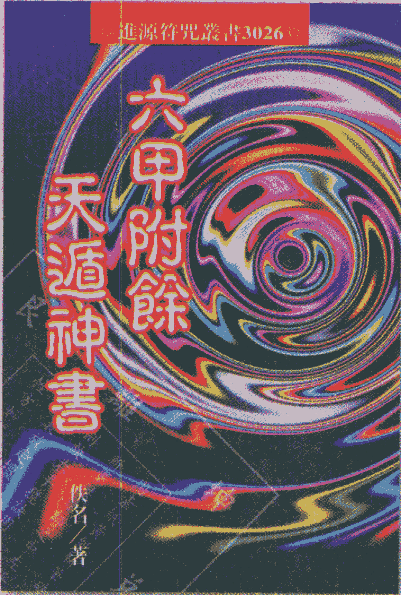

# ◎ 進源符咒叢書3026 ◎

# 六甲附餘

# 天遁神書

佚名／著

本社致力於五術叢書之編纂行之有年
旨在承傳祖宗絕學
并助我蕓蕓眾生在苦海中窺見光明彼岸
敬謹之心 形諸文字 出而成書
願我善男信女同所受益
則本社可以無憾

ISBN 7-225-02461-2

ISBN 7-225-02461-2/G.1053

定价: 30.80元