# 速成心法

周纳羽意说奇门

香江文艺出版社

# 意识奇门速成心法

周纳羽 著

香江文艺出版社

周纳羽意识奇门速成心法 / 周纳羽 编著. — 香港：香江文艺出版社，2018.5
ISBN 978-988-78752-1-5
Ⅰ. ①周… Ⅱ. ①周… Ⅲ. ①哲学-中国哲学-先秦哲学 Ⅳ. ①B232

## 周纳羽意识奇门速成心法

作 者：周纳羽
策划编辑：肖本亮
责任编辑：李 煜

出版发行：香江文艺出版社
地 址：九龙旺角弥敦道 555 号九龙行 16 楼
网 址：www.xjcbs.com
投稿邮箱：1292181379@qq.com

规 格：16开本，11.25印张
版 次：2018年5月第1版
印 次：2018年5月第1次印刷
书 号：ISBN 978-988-78752-1-5
定 价：299.00元

版权所有，请勿翻印。如有装订错误，请寄回本社更换。

# 目录

## 第一部分、基础知识

## 第一章、零基础必背手册

- 第一节、易学基础
  - 一、五行关系......1
  - 二、八卦......1
  - 三、先天八卦......2
  - 四、后天八卦......2
  - 五、十天干......3
  - 六、十二地支......4
    - 1. 十二地支在各个方位的排序......4
    - 2. 地支对应的时间......5
    - 3. 地支的五行......6
    - 4. 天干与地支间的转化......6
    - 5. 地支之间的关系......6
    - 6. 小实战......9
  - 七、二十四山位置图......10
  - 八、九宫信息总结表......10

### 第二节、奇门基础知识及解释

- 一、九宫格......12
- 二、四纲......13
- 三、十天干、十二地支、八门、八神、九星......13
- 四、宫位内外的东西......14
- 五、马星......15
- 六、空亡......15
- 七、值符......15
- 八、值使......16
- 九、奇门局的起局分类......16
  - • 小贴士、什么是刻盘......16
- 十、排盘......17
  - 1. 软件起盘......17
  - 2. 手工起盘......22
- 十一、四害及产生四害的原理......30
  - 1. 门迫......30
  - 2. 击刑......31
  - 3. 入墓......34
  - 4. 空亡......36

## 第二章、初级实战预测

### 第一节、十天干......38

- 一、甲、乙......38
- 二、丙、丁......39
- 三、戊、己......39
- 四、庚、辛......40
- 五、壬、癸......40

### 第二节、八神......41

- 一、值符......41
- 二、腾蛇......43
- 三、玄武......43
- 四、太阴......45
- 五、六合......45
- 六、白虎......46
- 七、九地......47
- 八、九天......47

### 第三节、九星及八门......48

- 一、天蓬星与休门......48
- 二、天任星与生门......49
- 三、天芮星和死门......50
- 四、天柱星和惊门......51
- 五、天心星和开门......51
- 六、天冲星和伤门......51
- 七、其他星和门......51
- 第四节、九宫快速预测法......52
  - 小实战案例一则......52
  - 一、坎宫......53
  - 二、艮宫......54
  - 三、震宫......55
  - 四、巽宫......55
  - 五、离宫......55
  - 六、坤宫......56
  - 七、兑宫......56
  - 八、乾宫......56

## 第二部分、奇门预测及调理

## 第三章 奇门预测方法

- 常用基础概念......57
- 一、预测第一步--找用神......61
- 二、预测第二步--分析用神......67
- 三、常用的细断方法......74
  - 1. 什么是反吟、伏吟、寄宫......74
  - 2. 什么是“镜子原则”？......74
  - 3. 什么是“翻宫”？......74
  - 4. 什么是“打开引干”？......76
  - 5. 什么是“马星”？......77
  - 6. 什么是“共振”？......77
  - 7. 什么是对冲？......77
  - 8. 四害的危害......77

## 第四章 奇门调理运筹

- 一、第一步：护体......79
  - 1. 八字含三奇......79
  - 2. 八字含甲......79
  - 3. 食神护体......80
- 二、第二步：立太极......81
- 三、第三步：擒贼先擒王——狙击四害......82
  - 1. 平衡点化解法......82
  - 2. 什么是平衡点？......82
  - 3. 哪些情况适合用平衡点处理？......82
  - 4. 如何找到平衡点？......83
- 四、第四步：见招拆招——四害化解方法......84
  - 1. 如何化解击刑？......84
    - • 直接拆......85
    - • 边拆边合......86
    - • 应急处理......86
    - • 综合运用......86
    - • 综合运用（2）......87
  - 2. 如何化解门迫？......87
    - • 门迫位置表......87
    - • 具体化解方法......88
    - • 门迫的特殊处理方法：换门......88
  - 3. 如何化解入墓？......89
    - • 入墓位置表......89
    - • 三种入墓的具体化解方法......90
  - 4. 如何化解空亡？......91
  - 5. 四害的特殊化解方法......91
    - • 万金油---辛的置换......91
    - • 三奇解四害......91
    - • 三颗本命星化解四害......91
- 五、本章实战案例两则......92
  - 1. 例一、平衡点化解法实际运用......92
  - 2. 例二、综合化解......93

## 第三部分、法奇门

## 第五章、法奇门

- 一、太极图修炼--补阳气......95
- 二、六字大明咒......96
- 三、常用符咒......96
  - 1. 如何修炼符咒？......97
  - 2. 常用符咒......97
    - 三奇符：乙、丙、丁......97
    - 五路财神符（两种画法）......98
    - 天辅星、天蓬星、天心星符......99
    - 万能符......100
    - 生门符......101
    - 开门符......103
    - 请神符......103

## 第四部分、奇门实战案例

## 第六章、快捷预测

- 一、组合象意法......104
  - 案例六则......104
- 二、意识奇门预测法......107
  - 案例两则......107
- 三、四害预测法......109
  - 案例七则......109

## 第七章、综合预测

- 序、给初学者的两个建议......116
- 一、预测总体思路与一局多断......117
  - 本例预测思路......117
  - 现场取用神举例......118
  - 现场一局多测......118
- 二、综合局分析......121
  - 1. 案例一：预测两人关系及公式......121
  - 2. 案例二：一局多断-男客户的遭遇......123
- 三、综合预测案例......130
  - 某中年男士面测......130

## 第八章 奇门的生活应用

- 一、奇门数字预测手机号、车牌号......133
  - 1. 手机号码预测......133
  - 2. 定制选择手机号......135
  - 3. 英文字母对应数字表......136
- 二、奇门选小区住房......136
- 附录一、周纳羽意识奇门公开课收听方式......160
- 附录二、周纳羽意识奇门网络资源汇总......167
- 附录三、意识奇门系列丛书列表......169

# 序

写一本真正能让新手从零入门的奇门书籍

记得几年前我和我的弟子们聊天时谈到易学书籍，他们有人说：“周老师，我手里有几十 GB 的奇门遁甲电子书，但都感觉不适合新手，对新手而言讲的太笼统了”。这句话真切的讲出了不少弟子的心声，教学以来不少弟子都找我反映过类似的情况。于是从那时起，“写一本真正适合新手从零入门的奇门书籍”的意识在我心中成为一只火种开始野蛮的生长，由一个并不清晰的潜意识成为了明确的意志：“我希望通过我和弟子们的努力，能让整个中华汉语语系的所有华人们学习奇门时能够多一份便捷，少一份不知所措。”这便是这本书的由来。

从 2017 年 6 月开始，经过将近一年的策划与筹备终于完成了这本书。书中内容主要以 2016 年 7、8 月份我的面授讲课内容为主（在此特别感谢把我讲课的当期录音整理成文字资料的弟子），除了剔除个别难度较大且不适合新手的核心心法，把当期 95%的面授内容全部公开并整理进书中，难度从低到高涵盖了“从零入门、能够简单给人预测、能够进行正规的奇门预测、能够处理化解奇门风水局”。在面授内容的基础上，通篇尽可能采用生活中最通俗的例子让新手们尽快明白奇门遁甲中的各种概念，而且在此基础上大幅添加了对周易完全零基础的新手们应熟练掌握的各种基础知识，使阅读本书的易学门槛大大降低，适合每一个爱好奇门遁甲却无从入门的新手们从零开始学习。所以本书的定位是：既能作为广大易学爱好者们从零开始学习奇门的贴心入门老师，又能作为意识奇门面授学员们的面授辅导教材。

值得一提的是：本书第一章《零基础必背手册》的全部内容由我的弟子们整理而成。因为有些老师由于在实战中经过常年的反复锻炼、早已把一些较难记忆的核心基础知识掌握得滚瓜烂熟，反而可能忽略初学者在此阶段可能遇到的困难。由尚且能体会新手困惑的弟子们来整理这部分内容，或许能更贴合学习者初期的认知状态。

掌握得出神入化但自己不以为然，结果在教学时反而忽略了这些零碎却又至关重要的基础知识。所以我相信只有刚刚经历过“从蒙圈到清醒”的弟子们才最精准的知道新手从零入门时最需要理解和牢记哪些基础知识，也只有他们整理出来的基础资料才更适合新手。

本书的不足之处在于：由于整理时间仓促，书中的预测和调理案例若能再多一些就更好了。因为学习奇门犹如学生学习数学，掌握基本符号与运算公式后只有经过大量的习题检测才能发现自己的知识短板与记忆错误的地方。所以此前出版的《意识奇门面授基础教材》能一定程度上弥补这点不足，两本书互为“姊妹篇”。

最后，衷心祝愿我的每一位弟子、学员和读者们，愿大家在学习奇门的路上和生活中，时时刻刻都能六合大吉、生门大吉！

周纳羽
2018年4月

## 第一章、意识奇门·零基础必备手册

- 1. 所谓“必背”，就是想学习奇门遁甲必须背诵和熟记的内容，犹如学习数学的“九九乘法口诀表”和“加减乘除”一样必须背诵和牢记。请大家一定要走好记忆这一关，不要马虎。
- 2. 本书所有九宫格的方位都是上南下北。因为中国古代地图均采用上南下北的格式，当前易学界的九宫格也基本都采用上南下北。
- 3. 大家一定要学会用百度，随时搜索自己想要的周易基础知识。
- 4. 本《必背手册》内容较为广泛，除了奇门必背的基础知识，把市面大多数风水、预测流派的基础知识几乎都有包括。

### 第一节、易学基础

#### 【五行关系】（理解，并记忆）

五行相克：相克，是指两类不同五行属性事物间之关系是相互克制的；具体是：木克土，土克水，水克火，火克金，金克木。

五行相生：相生，是指两类属性不同的事物之间存在相互帮助，相互促进的关系；具体是：木生火，火生土，土生金，金生水，水生木。

生助：例如火被木生，此为“木生助火”。

耗泻：母亲生孩子后身体大虚，此为“母亲被孩子耗泻”。五行相生也是如此，例如木生火，虽然火被生旺、但是木头却燃烧了自己，此为“木被火耗泻”。还有一种耗泻：不管再锋利的斧子，砍木头多了也会卷刃。因为金克木时会不断的消耗自己，这也是一种耗泻。

比合：找到与我相同五行属性的东西帮助自己，此为“比合”，也可称为“相比”。例如：木虽然生助火、但是木被火耗泻、导致木的能量减弱。此时需要找更多的木来帮助自己。

#### 【八卦】

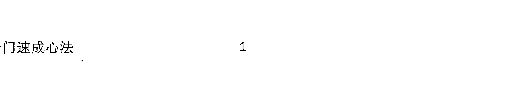

八卦记忆口诀：乾三连，坤六断，震仰盂，艮覆碗，离中虚，坎中满，兑上缺，巽下断。（我就知道你一下子记不住八卦长什么样，但你至少得记住八卦的名字都有啥吧？）

八卦对应自然界的事物（必背）：乾为天、坤为地、震为雷、巽为风、离为火、坎为水、艮为山、兑为泽（河）。

#### 【先天八卦】

南
| 兑二宫 | 乾一宫 | 巽五宫 |
| :---: | :---: | :---: |
| 离三宫 | | 坎六宫 |
| 震四宫 | 坤八宫 | 艮七宫 |
北
（左侧标注东，右侧标注西）

要求：先天八卦对应的数字可不记，但必须能熟练的画出先天八卦在九宫格分布的位置、以及对应的东南西北方向，比如北方的先天八卦是坤、兑宫的先天八卦是坎、等。

#### 【后天八卦】（本表格全部内容，必背）

南
| （木）巽四宫 | （火）离九宫 | （土）坤二宫 |
| :---: | :---: | :---: |
| （木）震三宫 | | （金）兑七宫 |
| （土）艮八宫 | （水）坎一宫 | （金）乾六宫 |
北
（左侧标注东，右侧标注西）

解释：
①后天八卦对应数字：离9，坎1，震3，兑7，坤2，巽4，乾6，艮8
记忆口诀：戴九履一，左三右七，二四为肩，六八为足。
②八卦五行属性：乾金，兑金。离火。坎水。巽木，震木。坤土。艮土。

#### 先后天八卦方位对比：

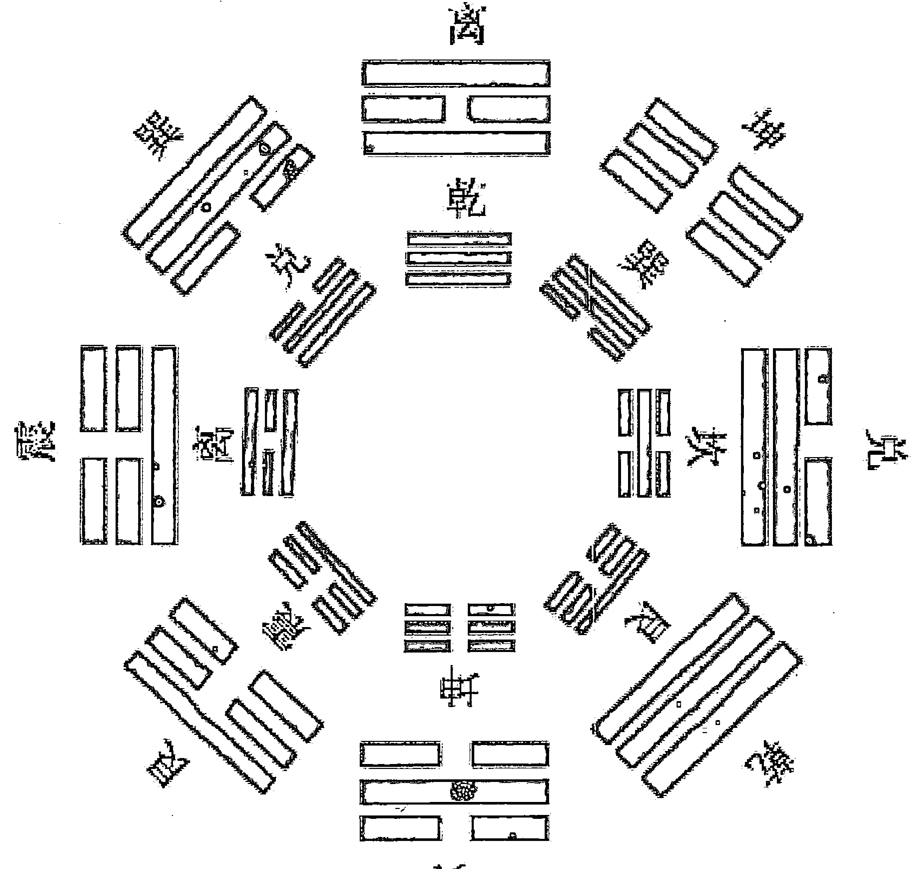

此图为先后天八卦对比图，内圈为先天八卦、外圈为后天八卦。大家在记忆先、后天八卦位置时需要用到。

#### 【十天干】

| | 南 | |
| :---: | :---: | :---: |
| (木) 乙 | (火) 丙 丁 | (土) 己 |
| (木) 甲 | | (金) 辛 |
| (土) 戊 | (水) 癸 壬 | (金) 庚 |
| | 北 | |

表格解释：

- 1. 天干的五行属性（必背）：甲乙木、丙丁火、戊己土、庚辛金、壬癸水。
- 2. 天干五合（必背）：甲己合，乙庚合，丙辛合，戊癸合，丁壬合。
天干五合常用预测范围：姻缘、商业合作等方面。
- 3. 天干所属方位（必背）：
甲在东方，乙在东南。丙丁在南方，己在西南。辛在西方。庚在西北。壬癸在正北，戊在东北。

#### 【十二地支】

1. 十二地支在各个方位的排序（必背）

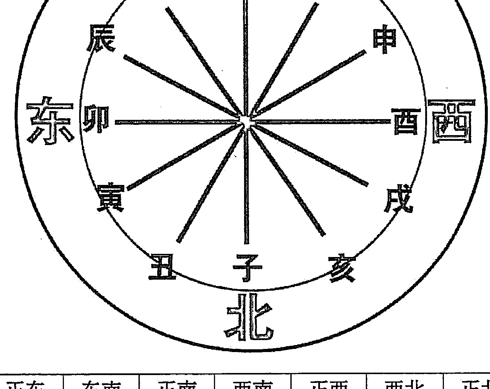

| 方位 | 正东 | 东南 | 正南 | 西南 | 正西 | 西北 | 正北 | 东北 |
|---|---|---|---|---|---|---|---|---|
| 地支 | 卯 | 辰、巳 | 午 | 未、申 | 酉 | 戌、亥 | 子 | 丑、寅 |

解释（了解即可）：

- 1. 子、午、卯、酉分别对应正北、正南、正东、正西，称为“四正位”。
- 2. 辰巳对应东南方，未申对应西南方，丑寅对应东北方，戌亥对应西北方，这四个方位称为“四隅位”。

2. 地支对应的时间（必背）：

| 地支 | 子 | 丑 | 寅 | 卯 | 辰 | 巳 | 午 | 未 | 申 | 酉 | 戌 | 亥 |
|---|---|---|---|---|---|---|---|---|---|---|---|---|
| 时间 | 1.十二地支分别对应相应的农历年、月、日、时。例如寅为每年农历寅月，又为每个农历月中的寅日，又为每天时辰中的寅时（凌晨3-5点）。<br>2.每年的农历月份以寅月为始，正月为寅，二月为卯，三月为辰，其余月份以此类推。<br>3.每天的农历时辰，以子时（23:00-1:00）为始。 |

> 【知识补充·如何查看当前的农历时间】

直接翻看老黄历即可，手机上有很多这种软件，例：

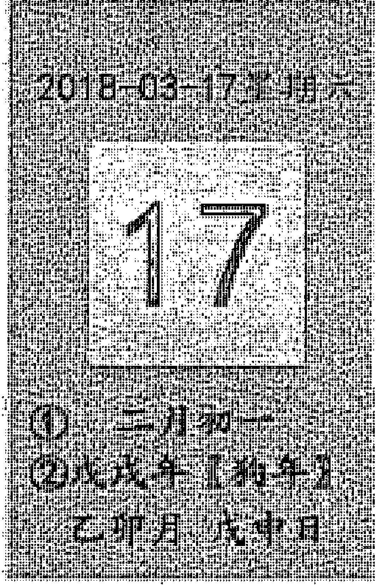

如图，当前公历时间为2018年3月17日，①的右面为农历时间二月初一。②的右面为六十甲子纪时：戊戌年，乙卯月，戊申日。

> 【知识补充·六十甲子纪时法】（理解）

六十甲子纪时法是我们祖先伟大的创造，在历法、中医、占卜预测等领域有很重要的运用。方法很简单：十天干和十二地支进行循环组合：甲子、乙丑、丙寅……一直到癸亥，共得到60个组合，称为六十甲子，如此周而复始，无穷无尽。如表格所示：

#### 六十甲子

| 甲子 | 乙丑 | 丙寅 | 丁卯 | 戊辰 | 己巳 | 庚午 | 辛未 | 壬申 | 癸酉 |
| --- | --- | --- | --- | --- | --- | --- | --- | --- | --- |
| 甲戌 | 乙亥 | 丙子 | 丁丑 | 戊寅 | 己卯 | 庚辰 | 辛巳 | 壬午 | 癸未 |
| 甲申 | 乙酉 | 丙戌 | 丁亥 | 戊子 | 己丑 | 庚寅 | 辛卯 | 壬辰 | 癸巳 |
| 甲午 | 乙未 | 丙申 | 丁酉 | 戊戌 | 己亥 | 庚子 | 辛丑 | 壬寅 | 癸卯 |
| 甲辰 | 乙巳 | 丙午 | 丁未 | 戊申 | 己酉 | 庚戌 | 辛亥 | 壬子 | 癸丑 |
| 甲寅 | 乙卯 | 丙辰 | 丁巳 | 戊午 | 己未 | 庚申 | 辛酉 | 壬戌 | 癸亥 |

六十甲子，其最古老的用途是纪年、纪月、纪日、纪时，比如中华人民共和国的成立时间公历1949年10月1日下午3点，换算为六十甲子纪时为：己丑年，癸酉月，甲子日，壬申时。

#### 【知识补充·预测风水应期】（熟练掌握）

砂水理论+十二地支+六十甲子纪时法，可以用来预测风水的应期（应验时间）。

十二地支对应的方位与时间，常用在预测风水应期，例如：假设某阳宅的东方是大水坑，砂水反位为凶。东方对应卯，为卯兔年，可以直接预测：此住户在卯年（2011年、2023年、等）必然诸事不顺。再例：某阳宅的西南方是大水坑，砂水反位为凶。西南对应未和申，为未羊和申猴年，可以直接预测：此住户在未、申的年份（2015羊年、2016猴年）必然诸事不顺。

3. 地支的五行（必背）

| 金 | 木 | 水 | 火 | 土 |
| --- | --- | --- | --- | --- |
| 申、酉 | 寅、卯 | 亥、子 | 巳、午 | 辰、戌、丑、未 |

4. 天干与地支间的转化（必背）

天干与地支是能够互相转化的，关系如下：

- 甲=寅 乙=卯 丙=午 丁=巳
庚=申 辛=酉 壬=子 癸=亥 （戊、己不可转化地支）

5. 地支之间的关系：

- ①地支六合（必背）：巳申合、卯戌合、寅亥合、子丑合、午未合、辰酉合。

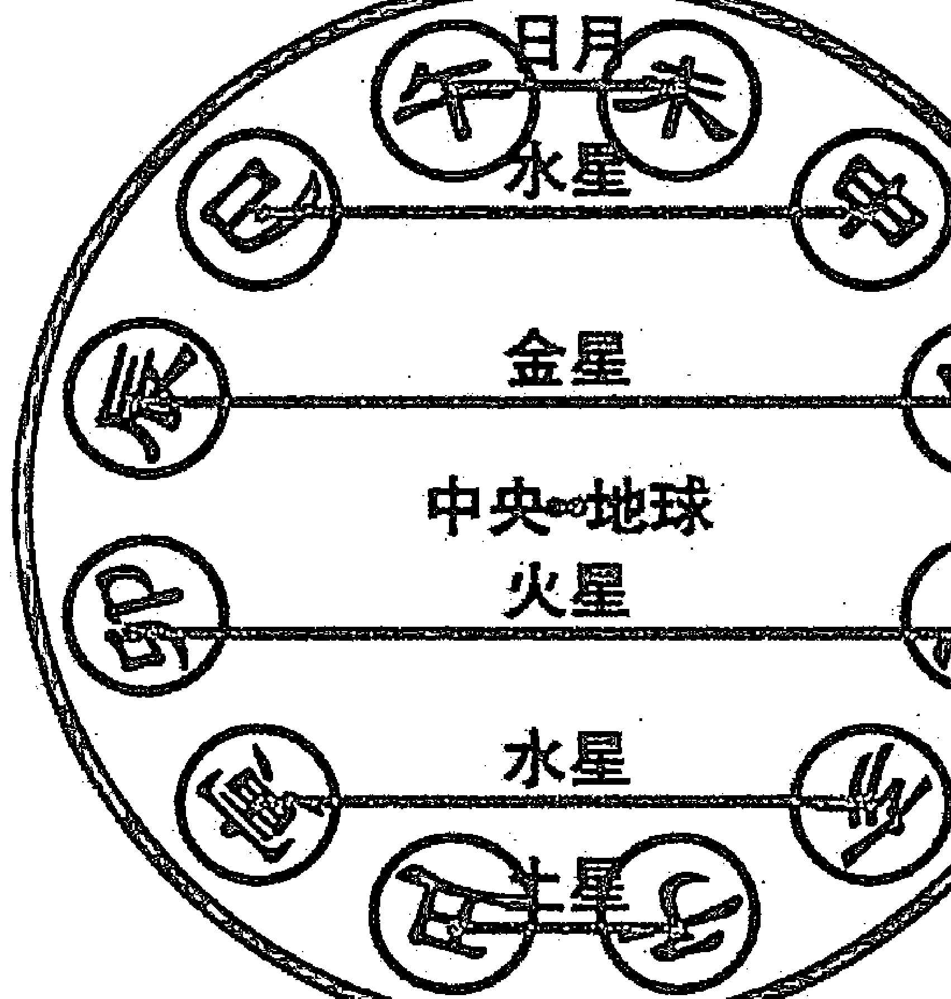

地支六合关系图

地支六合在意识奇门中的常用调理、预测范围：婚姻、商业合作、找适合自己属相的贵人与合作伙伴、等。

- ②地支三合（必背）：申子辰，寅午戌，巳酉丑，亥卯未。

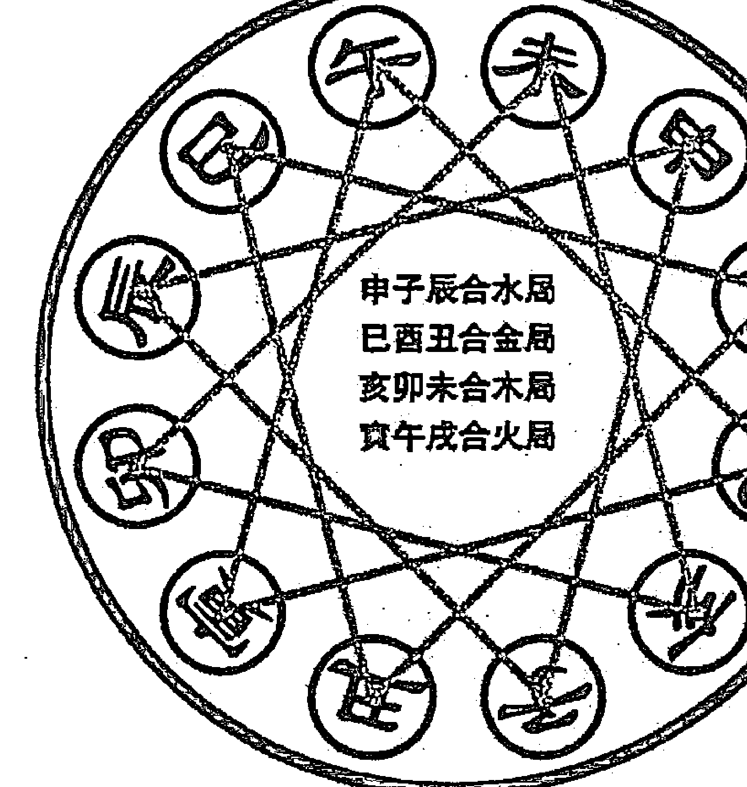

地支三合关系图

地支三合在意识奇门中的常用调理、预测范围：婚姻、商业合作、找适合自己属相的贵人与合作伙伴、等。

#### 地支三合引申：什么是半合？（理解）

三合是地支关系中非常稳定的一种，而且某组三合关系（例如巳酉丑）中的任意两个地支相遇也能相合，称为“半合”。

半合分为两种：不稳定的半合，较稳定的半合。（理解）

我们以“巳酉丑”为例，这三个地支以“酉”为中心牢牢合在一起，当“巳”或“丑”中的任意一个见到“酉”也能相合，例如“巳酉半合”、“丑酉半合”，因为有原有的中心、所以这种半合较为稳定。
而“巳”与“丑”相遇时也能半合，但因为失去了原有的中心，所以这种半合不稳定，较容易分开。在预测合作时如果遇到这种不稳定的半合，通常双方只合作一阵子就分道扬镳了。

- ③地支六冲（必背）：子午相冲，丑未相冲，寅申相冲，卯酉相冲，辰戌相冲，巳亥相冲。

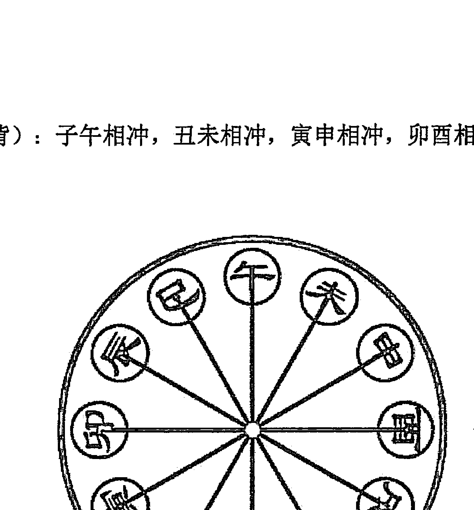

地支六冲关系图

冲，有冲撞、奔走之意，好的时候是升迁、工作调动，也可以是搬家、远行。不好的时候是车祸、伤灾、贬职、等。

也可提前预测某属相是否冲太岁，例如农历戌狗年，因为辰戌相冲，所以属龙的便在过2018农历年之前提前做化太岁法事，防止农历年之后出现工作大变动、车祸、等情况。

- ④地支相刑（必背）：辰午酉亥自刑、丑未戌相刑、寅巳申相刑、子卯相刑。

| 地支 | 相 |
| :---: | :---: |
| 子 | 卯 | 无理之刑 |
| 寅 | 巳 | 申 | 恃势之刑 |
| 丑 | 戌 | 未 | 无恩之刑 |
| 辰 | 午 | 酉 | 亥 | 自刑 |

解释：相刑，顾名思义，一般指伤病、官灾、别扭、等。
自刑，就是自己见到自己时相刑，例如辰见到辰、午见到午。
子卯相刑，无论是子见到卯、还是卯见到子，都产生相刑。
寅巳申相刑，这三个地支里的某一个地支见到另外两个时相刑。例如寅见巳、巳见申、申见寅、等。（丑戌未相刑同理）

6.小实战（理解记忆）

前面讲了这么多基础，估计大家有些无聊，所以此处带领大家做两个小实战，用五行通关或地支六合化解地支相冲。
首先我们解释什么是五行通关（必背）：如果某两个天干或地支的五行相克，例如水克火，那么就找个能耗泻水、又能生助火的东西，此为五行通关。例如：子为水，午为火，此时子克午，我们就找一个五行为木的地支——寅木或卯木，能耗泻子水、又能生助午火。

> 【例一：五行通关解相冲】
假设某男士属相是卯木，媳妇是酉金，根据地支六冲关系“卯酉冲”判断：两人的属相符合地支六冲，而且五行相克（酉金克卯木）。那么如何化解呢？——用五行通关。金生水、水生木，生个五行为水的孩子就可以了，亥水、子水都行。但是现代社会生孩子会产生很大的开销，也可以在家宅或卧室的北方放“子鼠”进行五行通关。

> 【例二：地支六合解相冲】
再拓展一下，假如谈业务时我方属兔（卯木）、客户属鸡（酉金），金强木弱，金克木，我方占劣势，如何化解？——根据地支六合关系“辰酉相合”，我们用地支辰合酉。实践时可以用符咒合解，画“辰到罡”地支符佩戴在身上，还可以佩戴辰龙的属相挂件在身上，合掉对方的气焰。

> 【二十四山位置图】（必背，并能熟练的画出）

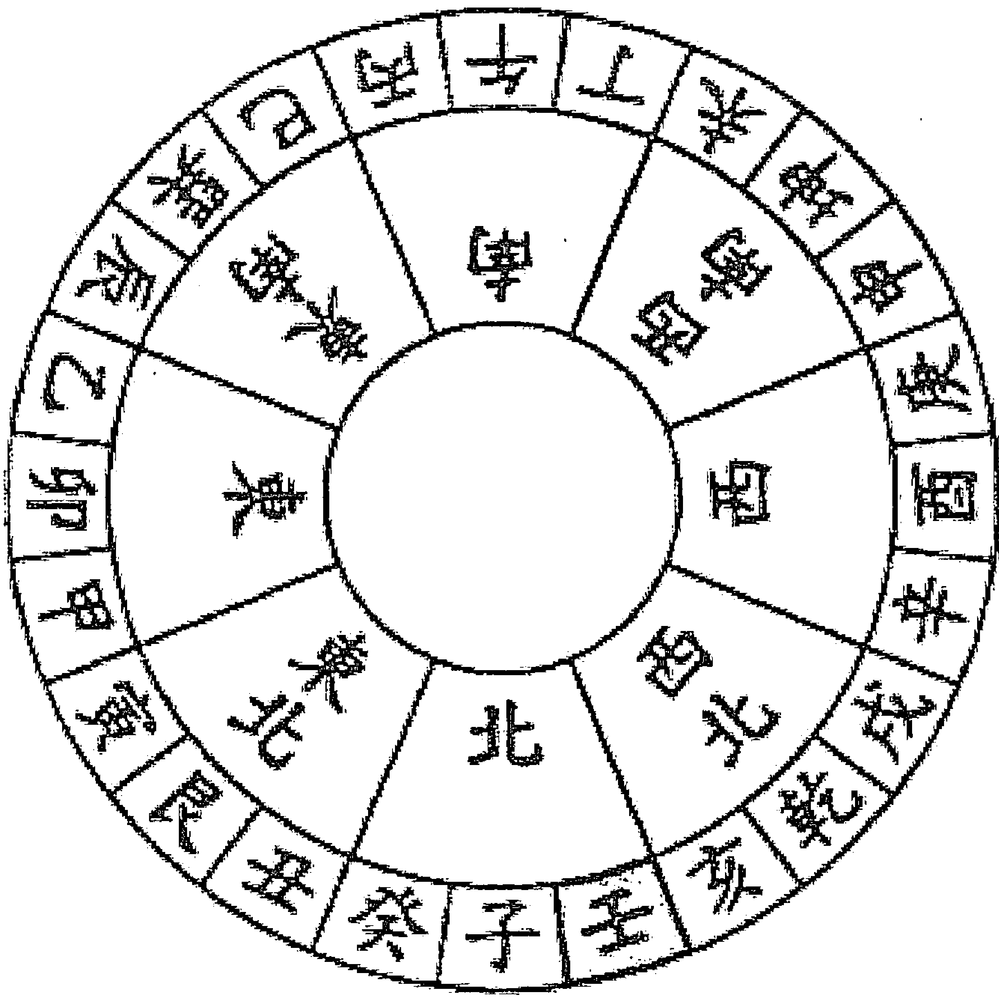

二十四山位置图，在几乎每一个流派的风水、建房定向、调理阴宅、山向奇门、等等均有重要应用。解释：

西方科学体系将圆周划分为360个块区，每一区称为“度”，共计三百六十度。中国古代科学体系则将圆周划分为24个块区，每一区称为“山”，共计二十四山，折合为西方科学体系中的15度。古人为了便于命名，用全部十二地支、以及部分十天干和部分八卦为每个山命名，就成了上面的二十四山位置图。

八卦与二十四山：每三个山对应一个后天八卦的卦位，例如震卦对应东方的甲、卯、乙三个山，离卦对应南方的丙、午、丁三个山，其他以此类推。

在二十四山位置图中：甲乙木位于东方，丙丁火位于南方，庚辛金位于西方，壬癸水位于北方，戊己土位于中央。

二十四山位置图非常重要，此图必背，并能在纸上和脑海中熟练的画出。

#### 【九宫信息总结表】（必背）

南

| 巽宫 4，喜砂<br>五行木<br>长女 | 离宫 8，喜水<br>五行火<br>中女<br>丙、丁 | 坤宫 2，喜砂<br>五行土<br>母亲 |
| :--- | :--- | :--- |
| 震宫 3，喜砂<br>五行木<br>长男 | | 酉宫 7，喜水<br>五行金<br>少女 |
| 艮宫 8，喜水<br>五行土<br>少男 | 坎宫 1，喜砂<br>五行水 砂<br>中男<br>壬、癸 | 乾宫 6，喜水<br>五行金<br>父亲 |

#### 九宫信息总结表（必背）

如上表格，九宫的名称、对应的数字、宫位的五行属性、砂水喜好、对应的家庭成员排行等信息都较完整的列入其中。大家一定要背熟此表和上面的《二十四山位置图》，否则本书后面几乎所有的预测、调理方面的内容都会看不懂。

#### 【大作业】

- 1. 请大家不看任何资料，全凭记忆徒手画出上面的《九宫信息总结表》里的所有内容，一个都不能少。
- 2. 在题1的图上，补齐二十四山位置图。
- 3. 运用十二地支对应的时间与方位可以判断风水应期吗？如何判断？
- 4. 恭喜熟练答出上述3道题的同学，你终于在奇门遁甲的基础方面入了一半的门啦 \(^o^)/^
- 5. 要想入剩下的一半门，接着往下学习。

### 第二节、奇门基础知识及解释

现在我们开始正式走入奇门的殿堂，从最基础的知识开始学习。先贴上中国前首富的奇门局：

公元：1954年10月24日4时4分 阴2局
农历：马年09月28日4时4分 时盘
干支：甲午 甲戌 癸丑 甲寅 (子丑空)
直符：天心 直使：开门 旬首：甲寅癸

| 宫位1 | 宫位2 | 宫位3 |
|-------|-------|-------|
| 白丙丙 辅杜 | 六庚庚 英景 | 阴戊丁 死 |
| 玄乙乙 冲伤 | 癸 | 蛇壬壬 柱惊 |
| 地辛辛 任生 | 天己己 蓬休 | 符癸癸 心开 |

首富出生时间的奇门局

零基础的初学者和我当初一样肯定看不懂，不用担心，我们从最基础的地方开始讲。首先我们要知道：奇门局（又称：奇门盘）由什么组成？人体由肌肉、骨头、毛发、神经等组成，而奇门局作为模拟天地运行的一套精密系统，也由很多部分组成。市面常见的奇门局由这些内容和概念构成：九宫格、四纲、十天干、十二地支、八门、九星、八神、引干、天盘、地盘、马星、空亡、等等。看起来很多，其实只要理解的话也没太多内容。下面我们开始一一进行名词解释：

#### 【九宫格】（理解）

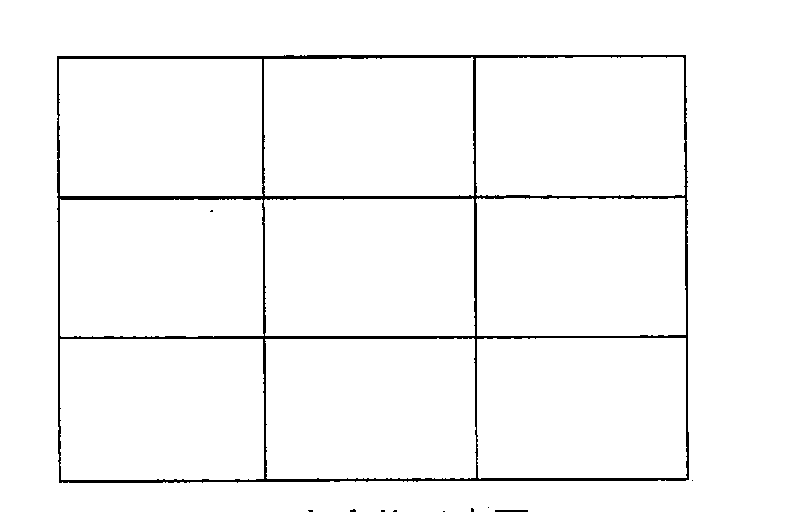

九宫格示意图

九宫格是奇门局的轮廓与骨架，每个格子称为“宫”，每个宫各有自己的名字，命名规则通常以后天八卦的方位为准，比如左中为震宫、右中为兑宫，等。

此外，九宫格几乎可代表宇宙间的一切事物。比如测人、甚至测人的哪一个部位的情况，例如：一个人测眼睛时，整个盘都代表他眼睛的信息，此时假设坎宫有壬+壬+死门（门迫，后面我们会讲），断：眼底底部出现了问题。

九宫格还可测人的运势，比如测终生大运，那么不同的宫位代表30-40、40-50等等年龄段。当九宫格用于测某十年间的运势时，某宫又代表某年的运势，等。

还可测汽车，还可测房子、墓地、一整片城市甚至国家。总之，想测什么事情几乎都可把九宫格切入，正如《道德经》所言：其大无外，其小无内。

九宫格的中宫寄居坤宫、按照坤宫的象意来论。比如到一个人家，他家房间中间堵的满满的，此人脾胃肯定不好，中央也代表权利、政府、地位，可以推测此人的社会财富地位都不理想。这个我们以后会讲，大家在这里先有个感性认识。

#### 【九宫格·知识补充】

四隅位：用肉眼来看，四隅就是九宫的四个角。方位上来说，分别是：东北、西北、西南、东南。

四正位：用肉眼来看，四正就是九宫的上下左右。方位上来说，分别是：东、南、西、北。

#### 【四纲】

四纲，说的最通俗点就是这个奇门局的农历起局时间，而且是用“六十甲子纪时法”来表示。

我们看前面的“首富出生时间的奇门局”，时间是1954年10月24日4时，换算为六十甲子纪时为：甲午年，甲戌月，癸丑日，甲寅时。

也即这个奇门局的四纲为：甲午、甲戌、癸丑、甲寅。

#### 【知识补充：五纲】

常看古装剧的小伙伴们肯定熟悉这句话：“午时三刻，开刀问斩！”

在中国古代计时方法中，一天由十二个时辰组成，而每个时辰由八刻组成。所以四纲再加上刻，就成了五纲。

#### 【十天干、十二地支、八门、八神、九星】

这个我们在《意识奇门·基础教材》里已经非常详细的讲了好几百页，在后面我们也会补充一些内容，所以此处就不再赘述，只把他们各有什么东西写上来：

- 十天干：甲、乙、丙、丁、戊、己、庚、辛、壬、癸
十二地支：子、丑、寅、卯、辰、巳、午、未、申、酉、戌、亥

### 八门、九星、八神
- 八门：生、伤、杜、景、死、惊、开、休
- 九星：天蓬、天任、天冲、天辅、天英、天芮、天柱、天心、天禽
- 八神：值符、腾蛇、太阴、六合、白虎、玄武、九地、九天

## 【宫位内外的东西】

咱们接着看前面的首富的奇门局，以右下角的乾宫为例，截图如下：

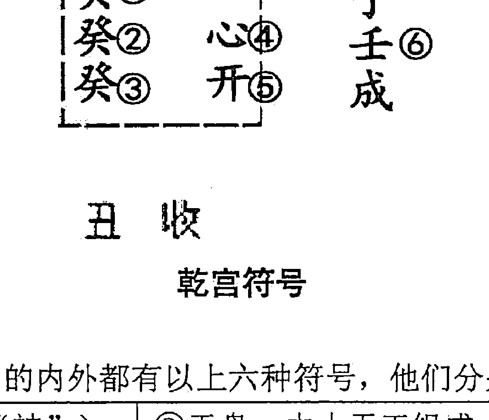

#### 乾宫符号

主流的奇门局，每个宫的内外都有以上六种符号，他们分别叫做：

| ①八神（简称“神”） | ②天盘，由十天干组成 | ③地盘，由十天干组成 |
| --- | --- | --- |
| ④九星（简称“星”） | ⑤八门（简称“门”） | ⑥引干，由十天干组成 |

在奇门的九个宫内，每个宫都有不同的符号组成，他们分别是：神、星、门、天盘、地盘、引干。天盘地盘就是十天干，天盘通常代表事情的表面现象、地盘代表事情的实质、或是人内心的真实想法。神代表意识，神识；门代表通道；引干也很重要，代表引子、原因、渠道。

而九宫的中宫在意识奇门体系中不填入任何符号。至于图上的丑、收、子、成等其他文字，由于在意识奇门体系中几乎不用，所以此处不再介绍。

## 【知识补充·百年排盘大战】

好学的小伙伴们肯定要问：八神八门九星还有十天干，这几十个符号是怎么往九宫格里填进去的？看自己的心情随便往里面填吗？非也，把神星门天地盘以及引干填进去是按照一套严格的运算方法填进去的，这套运算方法叫做：“排盘”，也可叫做“起局”。

数百年来，各个奇门流派之间各用各的排盘方法，你说你家的好，他说他家的更严谨，没少互相开撕和唇枪舌战。经过数百年的激烈争论，目前主流的有两种起盘方法：阳盘起局法，阴盘起局法。在意识奇门体系中，一般默认用阴盘奇局法。

手工排盘挺占用时间，计算符号的落宫位置+抄写到纸上，每次最快也要2-3分钟左右。所以现在基本都采用软件起局法，几秒钟就可以起局完毕。

为了照顾学有余力的同学，等会儿我们会贴上阴盘奇门排盘方法，从本行开始你再读大约几百字就可以看到了。

## 第一章：意识奇门·零基础必备手册

#### 【马星】

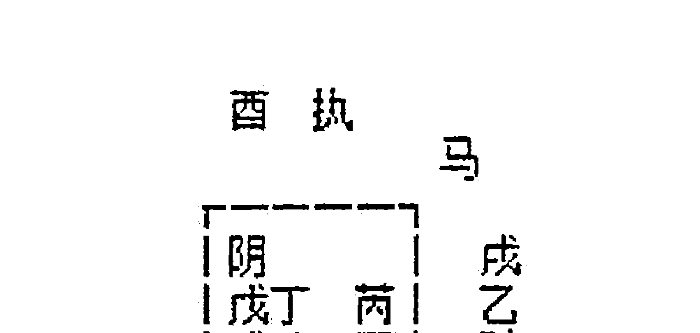

坤宫外的马星

接着看前面首富的奇门局，右上角的坤宫除了六种基本符号，还在右上方多出一个“马”字，这个就是马星。马星在奇门预测、调理中有重要作用，例如代表刚刚发生的事情、或者马上就要发生的事情，还表示快速（因为马在古代是主要交通工具，代表快捷）等等。用奇门局催运时，马星还代表“马上来钱”、“马上转运”等等。我们在后面的实战案例里会具体讲解马星，此处先让大家有个感性认识。

#### 【空无】

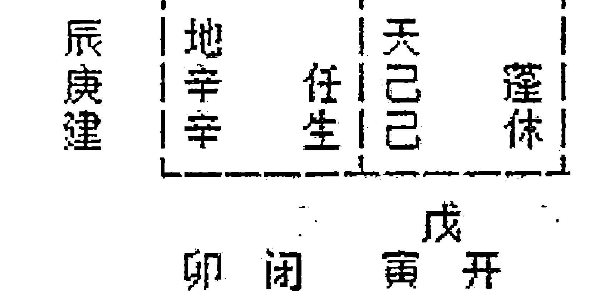

宫外的空无符号“O”

接着看首富的奇门局，左下角的艮宫、正下方的坎宫，这两个宫外都有“O”。这个符号在奇门局中叫做“空无”，有些流派叫做“空亡”。某宫空无，表示这个宫的能量几乎空了，好比人身上某一部位的能量几乎没了（但是注意，空无宫并不是完全没能量了，只是能量比较低）。另外，空无也好比一面镜子，把对宫的象意映照在本宫，我们读像时若用神临空无、那么直接读对宫的象意即可，这叫做“镜子原则”。

#### 【值符】

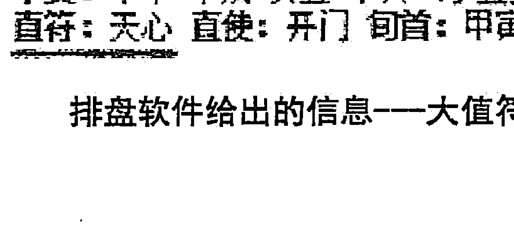

排盘软件给出的信息——大值符

继续看首富的奇门局。软件排盘后在盘的上方给出一串信息，其中有这么一条，如图： “值符：天心”。

注意，这个值符不是八神里的值符，而是代表--值班的九星。由于和八神里的值符重名，所以一些流派把八神里的值符叫做“小值符”，把值班的九星叫做“大值符”。但是在意识奇门体系中“大值符”基本不用，所以此处不做介绍。大家感兴趣的话可以在百度搜索相关知识进行了解。

#### 【值使】

公元：1954年10月24日4时4分 阴2局
农历：马年09月28日4时4分 时盘
干支：甲午 甲戌 癸丑 甲寅 （子丑空）
直符：天心 直使：开门 旬首：甲寅癸

排盘软件给出的信息——直使

继续看软件给出的信息，在“值符：天心”旁有这么一条：“直使：开门”。直使代表八门中值班的某个门，在意识奇门体系中“直使”基本不用，所以此处不做介绍。大家感兴趣的话可以在百度搜索相关知识进行了解。

#### 【奇门局的起局分类】

目前市面的主流起局方法通常都是用时盘，也即每隔一个时辰（两个小时）变换一个新的奇门局。除此之外还有月盘、日盘等，每隔一个月或每隔一天变换一个奇门局。

在意识奇门体系中最常用的是时盘，另外也经常用到刻盘，也即每一刻（约10分钟左右）变换一个新的奇门局。

#### 【小贴士•什么是刻盘】

公元：2016年6月6日16时20分 阴2局
农历：猴年07月04日16时20分 刻盘
干支：丙申 乙未 庚申 甲申 壬申 （戌亥空）
直符：天芮 直使：死门 旬首：甲子戊

| 卯 收 | 辰 开 | 已 闭 |
| --- | --- | --- |
| 寅 癸 成 六 乙 丙 冲 惊 | 阴 丙 庚 辅 开 | 蛇 庚 戊 丁 英 休 午 辛 建 |
| 丑 壬 危 白 辛 乙 任 死 | 符 戊 丁 壬 芮 生 未 乙 除 |
| 子 戊 丁 破 玄 己 辛 蓬 景 | 地 癸 己 心 杜 庚 戌 定 | 天 壬 癸 柱 伤 酉 平 申 丙 满 |
| 马 亥 执 | 庚 戌 定 | 酉 平 |

在中国古代时间计量单位里，一个时辰相当于现在两个小时。而一个时辰又分为八个刻钟，折合15分钟。奇门局每一个时辰（2小时）对应一个盘，称为“时盘”。每一刻钟也对应一个盘，称为“刻盘”。

用时盘预测，共计四组天干地支，例如上局：丙申 乙未 庚申 甲申。

用刻盘预测，共计五组天干地支，例如：丙申 乙未 庚申 甲申 壬申。（如上局即为刻盘）

一般情况下我们起时盘相对较多一些，起刻盘虽然相对少一些、但在“寻时借运”等奇门风水调理技术中常用到刻盘。

#### 【排盘】

前面的【知识补充·百年排盘大战】里，我们大致介绍了什么叫排盘。现在我们开始讲如何排盘，又称：起盘。

##### 一、软件起盘（推介）

1. 起时盘。首先我们下载软件到手机上，注意了，这里用的是安卓版。安装后，打开软件如图：

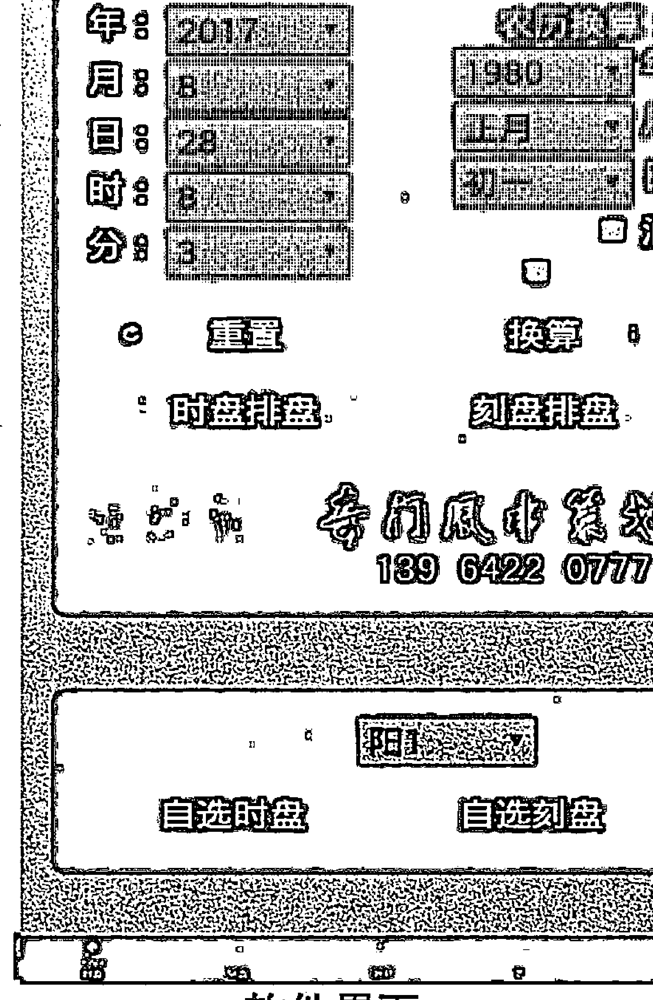

软件界面

进入界面后什么都不要乱碰，免得设置错误。初学者只需学会操作两个地方即可，一是左上方的时间区，如上图已用方框①圈了起来。把时间设置成你现在起局的时间，或是你出生的时间、或是任意时间均可以，注意：一定要精确到时辰。
设置好之后，点击软件中间的“时盘排盘”那个按钮即可，如图已用方框②圈起来。点击后，软件会自动把排好的奇门局显示出来，如图：

公历:2017年8月28日8时3分
农历:2017年七月初七日
四柱:丁酉 戊申 丁亥 甲辰
节气:处暑-白露 月将:巳 阴遁2局
值符:天柱星落7宫 值使:惊门落7宫
时空亡:甲辰旬 寅卯空 马星 寅

| 六<br>丙<br>杜 | 阴<br>庚<br>景 | 蛇<br>戊丁<br>死 |
| 白<br>乙<br>伤 |  | 符<br>壬<br>惊 |
| 玄<br>辛<br>生 | 地<br>己<br>休 | 天<br>癸<br>开 |

【移星换斗】
奇门风水策划
139 6422 0777

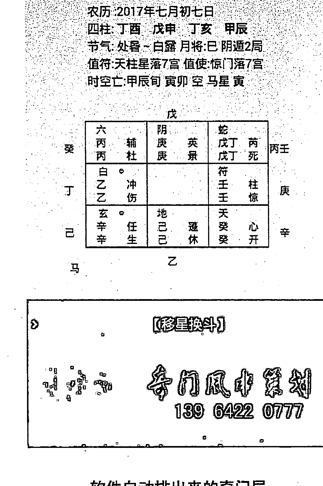

软件自动排出来的奇门局

是的你没看错，软件起盘就是这么简单，几秒钟就搞定了。

##### 2. 起刻盘

前面我们讲过，奇门局按照时间的变换方式不同，分为时盘、刻盘等。上面我们介绍的是软件起时盘的方法，接下来介绍软件起刻盘的方法。


老规矩，进入界面后什么都不要点，只用在左上方选好时间即可。注意了，刻盘以刻（10-15分钟）为时间单位，所以要求你选择的时间一定要精确到分钟，不要马虎。选择好时间后，点击软件界面中间偏右的按钮“刻盘排盘”即可，软件自动排出来刻盘如图：

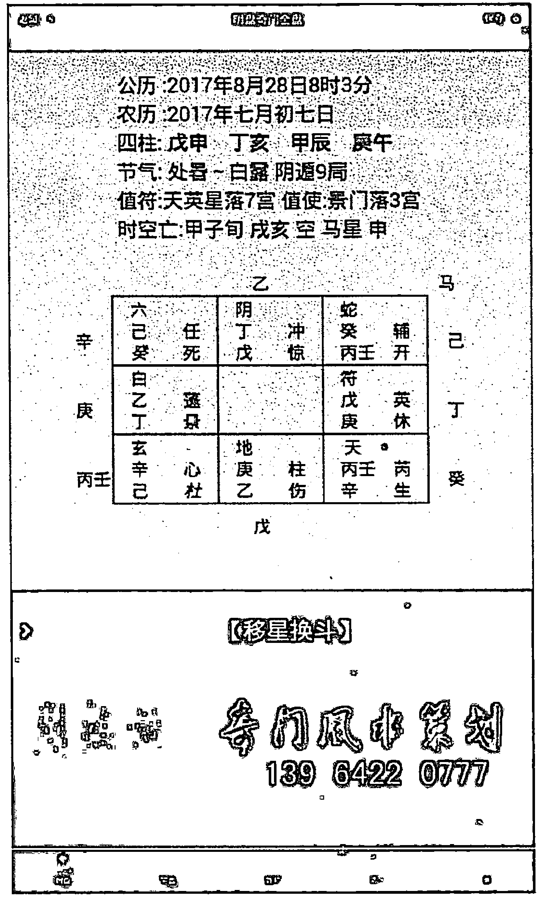

##### 3. 排盘软件下载方法：

###### 方法一：

加 QQ 群:258782884，在群文件中找到文件名为“周纳羽阴盘奇门软件安卓版本.apk”的软件，然后下载安装到手机上即可。加群注明：下载阴盘奇门软件
说明：目前阴盘奇门软件暂时只支持安卓版本。

###### 方法二：

在手机浏览器（注意，不是电脑浏览器）输入链接 http://pan.baidu.com/s/1eS3YAdW
打开后如下图：

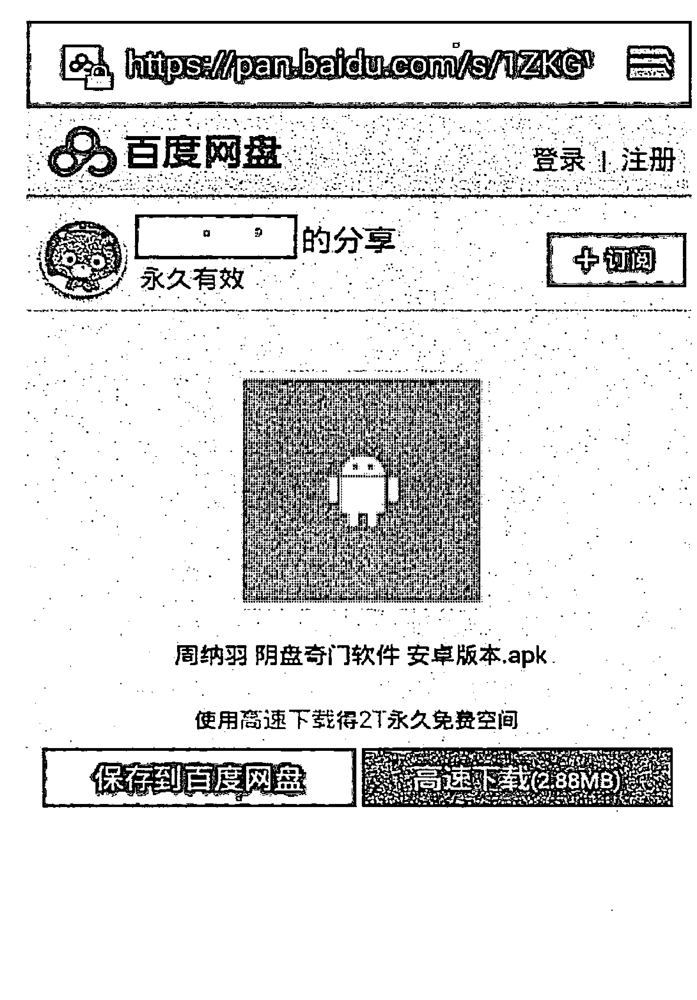

然后点击图上的“高速下载”或“保存到百度网盘”，然后下载即可。这一步要求首先你要有个百度网盘的账号才能下载，对于年龄大、玩不转手机的读者来说有点麻烦，可以让周围的年轻人帮你操作，现在年轻人基本上都会用百度网盘。

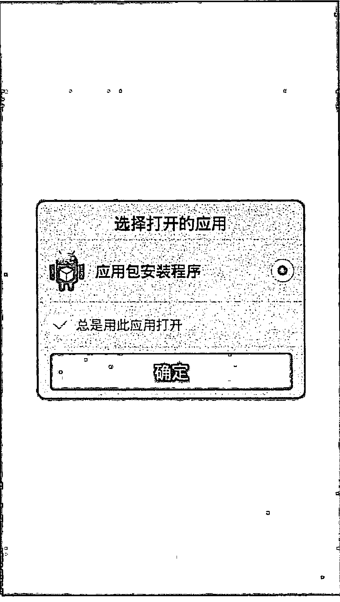

下载好之后，点击安装即可，如上图所示。不同手机的界面会跟此图不一样，这都无所谓，能安装就行。年龄大、不会用百度网盘的读者一定要活捉一只年轻人，威逼利诱他帮你下载安装，否则自己倒腾很占用时间，而且不一定能倒腾出来。

##### 二、手工起盘

先给大家打个预防针：手工起盘这部分内容大家不想看了就直接跳过，因为这部分没啥特殊技巧、纯粹死记硬背。现在意识奇门99%以上的学员都是直接软件起盘，极少用手工起盘，因为大家都嫌手工起盘太麻烦。

意识奇门的手工起盘方法，一般采用市面阴盘奇门的主流起盘方法，在百度上搜“阴盘奇门排盘方法”就能直接搜到的那种。这里择取网络上“阴盘奇门排盘方法”点击量较大的一篇文章贴上来，市面主流的阴盘奇门基本都采用这种方法，内容如下：

###### 第一步：排四柱：

即是把起局时的阳历时间转换成干支表示方式
比如： 2005年12月1日12时15分
四柱为：乙丑 丁亥 己未 庚午

###### 第二步：定局数：

阳遁：冬至后夏至前的这段时间为阳遁
阴遁：夏至后冬至前的这段时间为阴遁

局数取（年支序数+月数+日数+时支序数）除 9 之余数。如果正好整除则取 9。
比如：2006 年 5 月 23 日 19 时 45 分 农历：四月二十六日
四柱为丙戌 癸巳 壬子 庚戌
年支戌序数为 11，四月二十六为 4+26 ，时支戌序数为 11，所以 (11+4+26+11) ÷ 9 余数为 7
因为此时是冬至后夏至前起的局，定为阳局，所以此局为阳 7 局

###### 第三步：画九宫格：

道家奇门预测是讲神的，三式之中只有奇门有神盘。古法奇门布局以九宫格为最好，先画大方格，格定天地，再分小方格，格定九州，如此则信息能完全贯注其中，分析判断起来必然有如神助。

起奇门局要心平气和，讲究心法。如此，则产生共振的场效应，达到天人合一的境界，提高准确率。

画九宫时心中默念：“无极生太极，太极生两仪，两仪生四象，四象生八卦，八卦定乾坤”。
所画格局线与线之间要交接紧密，格与格之间不要相通，否则信息容易混乱，导致判断不清。

###### 第四步：布地盘三奇六仪：

在地盘中，三奇六仪“戊，己，庚，辛，壬，癸，丁，丙，乙”这一排列顺序是永远不变的。变的只是“戊”应该从哪个宫起飞的问题。这一“变”也很有规律，即：是阴，阳遁几局，“戊”就从“几宫”起飞。起飞后的排列顺序按“阳顺阴逆”原则进行。

这里要记住九宫数：戴九履一，左三右七，二四为肩，六八为足，五居中宫。如下表：

| 4 | 9 | 2 |
| --- | --- | --- |
| 3 | 5 | 7 |
| 8 | 1 | 6 |

如果是阳 1 局：戊落坎一宫，己落坤二宫，庚落震三宫，辛落巽四宫，壬落中五宫，癸落乾六宫，丁落兑七宫，丙落艮八宫，乙落离九宫。

| 辛 | 乙 | 己 |
| --- | --- | --- |
| 庚 | 壬 | 丁 |
| 丙 | 戊 | 癸 |

如果是阴 1 局：戊落坎一宫，己落离九宫，庚落艮八宫，辛落兑七宫，壬落乾六宫，癸落中五宫，丁落巽四宫，丙落震三宫，乙落坤二宫

| 丁 | 己 | 乙 |
| --- | --- | --- |
| 丙 | 癸 | 辛 |
| 庚 | 戊 | 壬 |

如果是阳 7 局则为：

| 丁 | 庚 | 壬 |
| --- | --- | --- |
| 癸 | 丙 | 戊 |
| 己 | 辛 | 乙 |

###### 第五步：定旬首：

甲子戊，甲戌己，甲申庚，甲午辛，甲辰壬，甲寅癸，为旬首。
旬首是以时柱来找的。可以从下寻元表查询，比如壬申时预测，则旬首是甲子戊。丁未时旬首是甲辰壬。

| 甲子戊 | 乙丑 | 丙寅 | 丁卯 | 戊辰 | 己巳 | 庚午 | 辛未 | 壬申 | 癸酉 |
| --- | --- | --- | --- | --- | --- | --- | --- | --- | --- |
| 甲戌己 | 乙亥 | 丙子 | 丁丑 | 戊寅 | 己卯 | 庚辰 | 辛巳 | 壬午 | 癸未 |
| 甲申庚 | 乙酉 | 丙戌 | 丁亥 | 戊子 | 己丑 | 庚寅 | 辛卯 | 壬辰 | 癸巳 |
| 甲午辛 | 乙未 | 丙申 | 丁酉 | 戊戌 | 己亥 | 庚子 | 辛丑 | 壬寅 | 癸卯 |
| 甲辰壬 | 乙巳 | 丙午 | 丁未 | 戊申 | 己酉 | 庚戌 | 辛亥 | 壬子 | 癸丑 |
| 甲寅癸 | 乙卯 | 丙辰 | 丁巳 | 戊午 | 己未 | 庚申 | 辛酉 | 壬戌 | 癸亥 |

###### 第六步：定值符与值使门：

值符就是值班的九星，值使就是值班的门。
地盘的旬首落在哪个宫，那个宫的地盘星和门就为值符和值使门。
地盘的九星和八门：

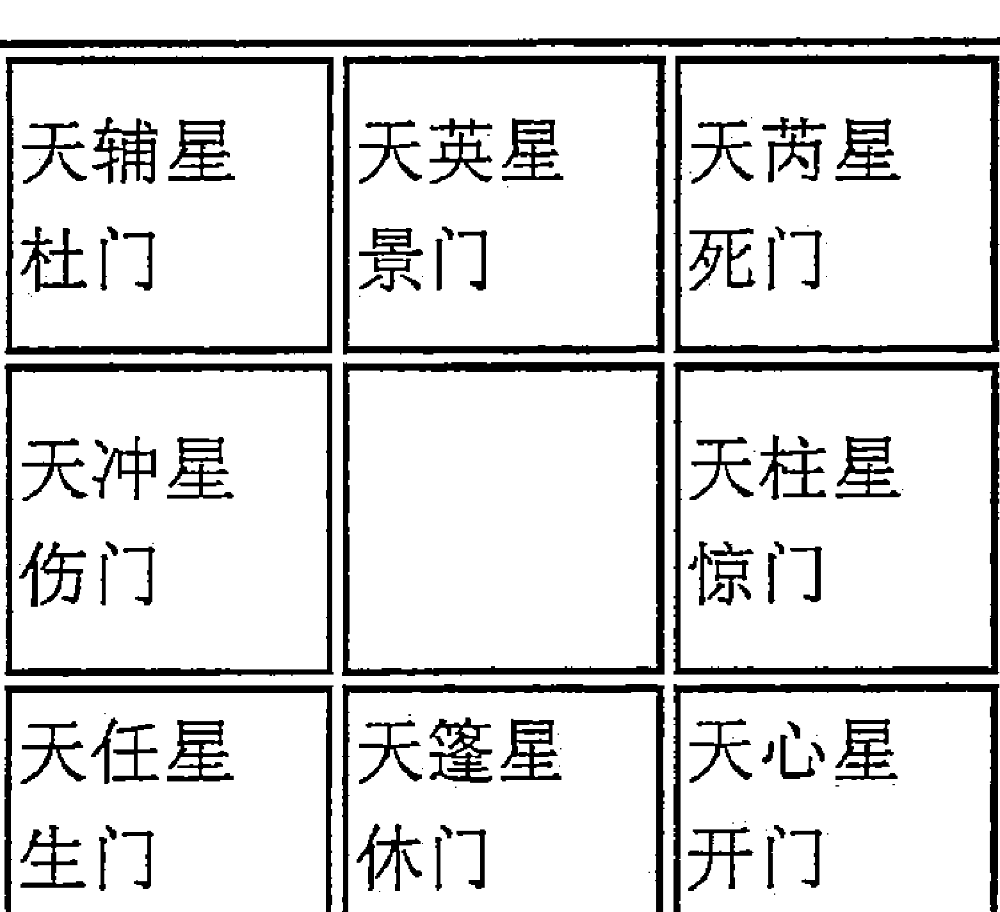

比如：阳一局，甲子旬，旬首戊落在坎一宫，以值符星就是天蓬星，值使门就是休门
如果甲寅旬，癸落兑七宫，则天柱星为值符，惊门为值使门。

###### 第七步：定天盘三奇六仪和九星：

奇门局中，三奇六仪有两层，在下面的一层为地盘三奇六仪，在上面的为天盘三奇六仪。
根据“旬首和值符随时干”的规律，看时干在地盘落几宫，就将值符和旬首直接写在这个宫内。同时将它原在地盘宫内的三奇六仪也随之写在它如运转到的宫内（以时干上的值符为起点，根据九星在九宫上的固定排序，顺时针在地盘上填入其它星。）。
如下面的阳7局：
2006年5月23日19时45分 农历：四月二十六日
四柱：丙戌 癸巳 壬子 庚戌 阳七局
旬首：甲辰壬，天芮星值符，死门值使

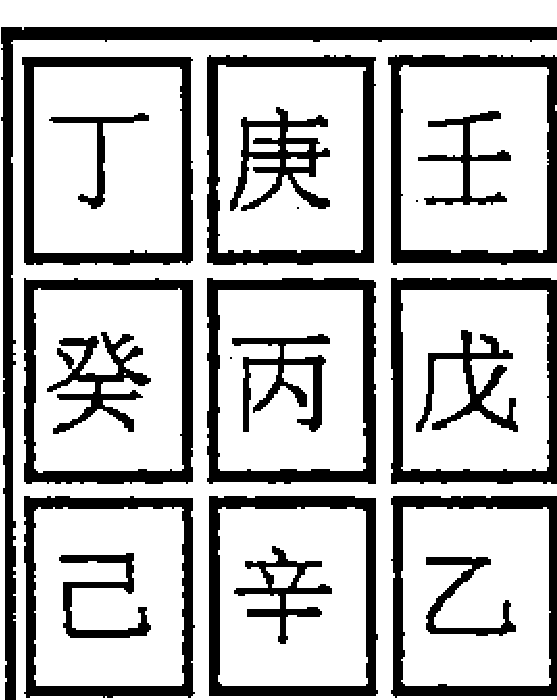

甲辰旬中壬为旬首。因为地盘的旬首壬落在了坤宫，所以坤宫地盘的星和门即为值符和值使。查地盘九星和八门表，坤二宫的地盘星为天芮星，因此天芮星为值符，在坤二宫地盘的门为死门，因此死门就为值使门。根据旬首和值符随时干的规律，则上面局的天盘六仪和九星排列如下：

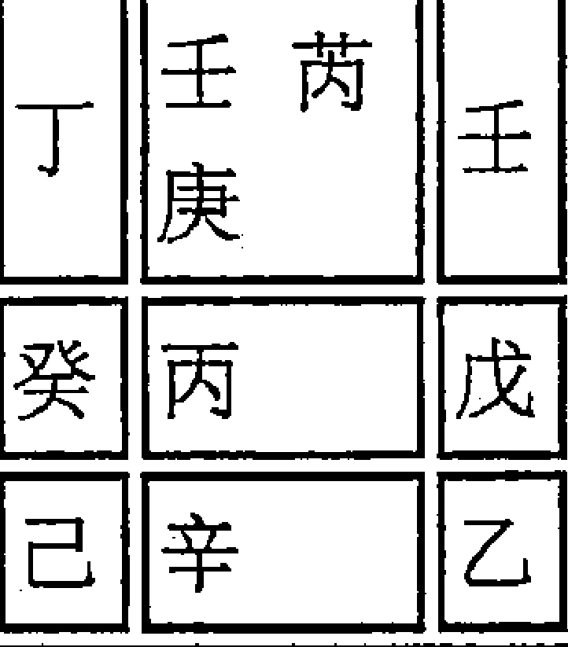

上局中，时干为庚，地盘的庚落在了离九宫。所以旬首壬就加在了离九宫中的庚上面，再把旬首壬所在的宫的地盘九星移在了离 9 宫。

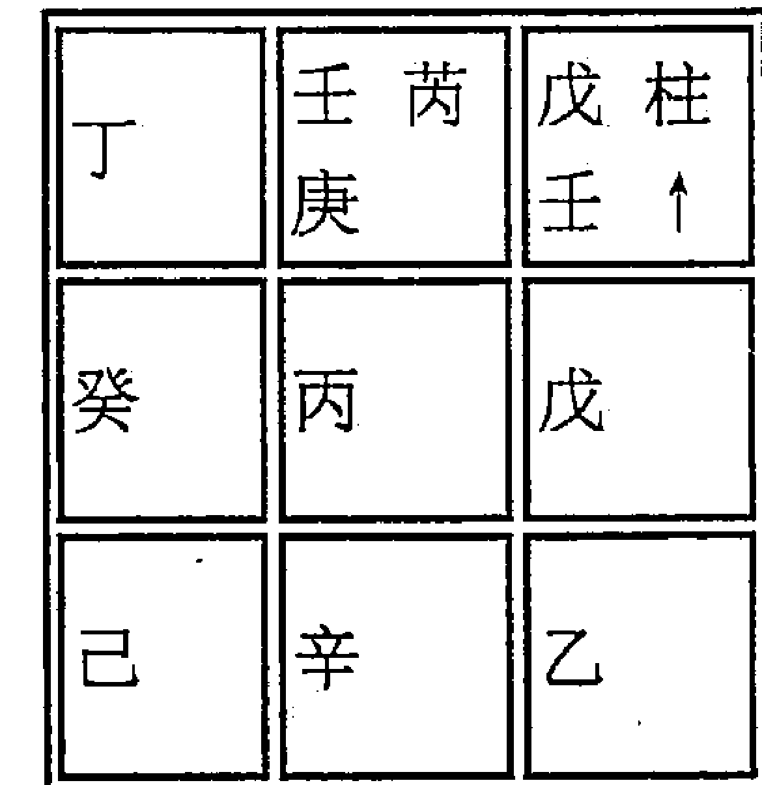

依次填写三奇六仪和九星如下图：

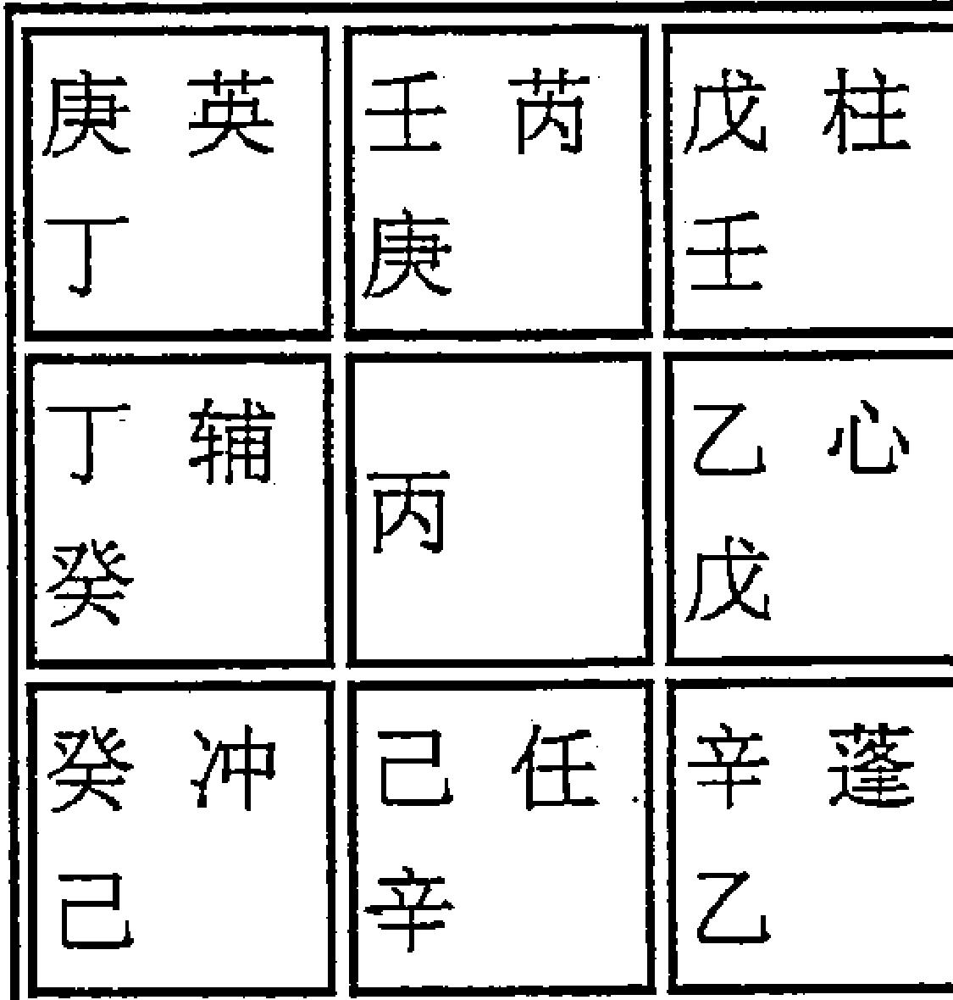

###### 第八步：排八神：

八神排列阳遁顺时针运转，阴遁逆时针运转。
八神中的值符首先写在地盘时干的宫内也就是天盘中的旬首落几宫它就落几宫。余下的七神按顺序分别填在其他宫内。这里是顺时针逆时针转，而不是指宫数顺逆。
顺时针转：坎1-艮8-震3-巽4-离9-坤2-兑7-乾6。
逆时针转为：坎1-乾6-兑7-坤2-离9-巽4-震3-艮8。

| 天<br>庚英<br>丁 | 符<br>壬芮<br>庚 | 蛇<br>戊柱<br>壬 |
| --- | --- | --- |
| 地<br>丁辅<br>癸 | 丙 | 阴<br>乙心<br>戊 |
| 玄<br>癸冲<br>己 | 白<br>己任<br>辛 | 六<br>辛蓬<br>乙 |

###### 第九步：定八门：

排八门有以下几个步骤：

1. 首先排出地盘。
2. 根据旬首，确定值使。所谓值使，是指旬首所落宫位的固定八门位置。
3. 根据“值使随时宫”的规律，确定值使所落宫位。即从“值使”所在宫位和其地支时间数起，根据阳顺阴逆原则，一直数到所取用时辰的地支，此时该地支到几宫，“几宫”即为值使所落宫位。
4. 以值使所落的宫位为起点，按“休生伤杜景死惊开”的次序，顺时针将其它七门写入运转到的宫内，即是八门的飞布位置。

注意：中宫的奇仪寄坤二宫，此例中的丙寄于坤宫。

###### 第十步：排隐干：

隐干的排列原则是：时干加在值使门上，然后按照天盘的顺序或者地盘的三奇六仪顺序排列一圈即可。

如上面的阳七局的隐干排法：
这里天盘三奇六仪在九宫格的顺序为：
庚→壬→戊→乙→辛→己→癸→丁。

如下面的完整的局：
2006年5月23日19时45分 农历：四月二十六日
丙戌 癸巳 壬子 庚戌 阳七局 甲辰壬
值符天芮星在9宫 值使死门在8宫

| | 天 | 符 | 蛇 | |
| --- | --- | --- | --- | --- |
| 戊 | 庚 英<br>丁 开 | 壬丙 芮<br>庚 休 | 戊 柱<br>壬丙 生 | 辛 |
| 壬丙 | 地<br>丁 辅<br>癸 惊 | | 阴<br>乙 心<br>戊 伤 | 己 |
| 庚 | 玄<br>癸 冲<br>己 死 | 白<br>己 任<br>辛 景 | 六<br>辛 蓬<br>乙 杜 | 癸 |
| | | 丁 | | |

###### 第十一步：空亡和马星：

空亡查法：
- 甲子旬中戌亥空，即乾宫空
- 甲寅旬中子丑空，即坎和艮宫空
- 甲辰旬中寅卯空，即艮和震宫空
- 甲午旬中辰巳空，即巽宫空
- 甲申旬中午未空，即离宫空
- 甲戌旬中申酉空，即坤和兑宫空

马星查法：
- 亥卯未时马星在巽宫
- 申子辰时马星在艮宫
- 寅午戌时马星在坤宫
- 巳酉丑时马星在乾宫

如下面是个完整的局：
2006年5月23日 19时45分 农历：四月二十六日
丙戌 癸巳 壬子 庚戌 阳七局 甲辰壬
值符天芮星在9宫 值使死门在8宫

| | 乙 | 马 | | |
| --- | --- | --- | --- | --- |
| 戊 | 天<br>庚英<br>丁开 | 符<br>壬丙 芮<br>庚休 | 蛇<br>戊 柱<br>壬丙 生 | 辛 |
| 壬丙○ | 地<br>丁 辅<br>癸惊 | | 阴<br>乙 心<br>戊 伤 | 己 |
| 庚○ | 玄<br>癸 冲<br>己死 | 白<br>己 任<br>辛 景 | 六<br>辛 蓬<br>乙 杜 | 癸 |
| | | 丁 | | |## 第一章: 意识奇门·零基础必备手册

嘿嘿，手工起盘看了一大半就看不下去了吧？不用内疚，早就猜到你肯定看不下去，80%以上的读者都和你一样。

咱不管是手工排盘还是软件排盘，总之经过排盘之后我们有了完整的奇门局，那么这就能开始预测或调理了吗？——不行，因为你不知道里面的预测和调理方法。从后面的章节开始，我们将会正式讲预测与调理的思路方法，但是在学习预测和调理前，我们必须要学习一个非常非常重要的知识点：奇门四害。可以说：学不好这部分内容，你就基本没法进行调理和预测。

#### 【四害】（重要程度：★★★★★）

铛铛铛！敲黑板，重点来了！

什么是四害？打个比方：人身上哪个部位有病，就可以认为这个部位有“四害”。所以大家可以这么理解：奇门局中的哪些宫位有四害，就代表这个宫位得病、能量低、需要调理。

不同的病有不同的病因，例如中医常讲的引起人体得病的“六淫”：风、寒、暑、湿、燥、火，等。奇门局中的某个宫位得病，是由四种不同的原因引起，这四种原因被我们称为“四害”，他们分别叫做（必背）：击刑、入墓、空亡、门迫。

人得病的程度有轻重之分，被砍一刀最要命、擦破皮比较轻。四害的危害程度也同样有轻重之分，在意识奇门体系中，四害的危害程度（必背）为：门迫>击刑>入墓>空亡。

人有病了会身体不舒服，需要把病灶化解掉才能痊愈。人的运势有病了，例如破财、总是犯小人、等等，都会在奇门局相应的宫位有四害，这时要用特定的手段把四害化解掉，才能治好运势上的疾病。所以一个合格的奇门风水师，可以戏称为“四害化解师”。

下面我们讲解引起四害产生的原因，以及化解四害的大致原理：

1. 门迫（要求：能徒手画出八门在九宫的所有门迫，并彻底理解记忆什么是门迫）

奇门中，八门在没有转动前、都有对应的宫位与五行属性，如下图（方向为上南下北）：

| 杜（巽木） | 景（离火） | 死（坤土） |
| 伤（伤木） |            | 惊（兑金） |
| 生（艮土） | 休（坎水） | 开（乾金） |

所以八门的五行（必背）分别为：
休、生、伤、杜、景、死、惊、开
水、土、木、木、火、土、金、金

但是奇门排盘时，八门的位置会随着奇门盘转动起来，例如：原本在巽宫的杜门（木）转到了东北方艮宫的位置。杜门五行为木，艮卦五行为土，这就成了木克土、也即“门克宫”的关系，对于这种情况，我们称之为门迫。所以请大家牢记门迫定义：宫位的五行被八门所属的五行所克，称之为门迫。

八宫所有门迫情况：

- 开门或惊门，落巽宫或震宫，门迫（金克木）。
- 伤门或杜门，落艮宫或坤宫，门迫（木克土）。
- 生门或死门，落坎宫，门迫（土克水）。
- 景门，落兑宫或乾宫，门迫（火克金）。
- 休门，落离宫，门迫（水克火）。

如图所示：

| 巽宫（木） | 离宫（火） | 坤宫（土） |
| :---: | :---: | :---: |
| 开、惊 | 休 | 伤、杜 |
| 震宫（木） | | 兑宫（金） |
| 开、惊 | | 景 |
| 艮宫（土） | 坎宫（水） | 乾宫（金） |
| 伤、杜 | 生、死 | 景 |

门迫图（理解记忆，必背）

注：现在的奇门起盘软件，可以很方便的看出某宫是否门迫。例如“周纳羽意识奇门排盘软件”起盘后，若某宫位右下角的某个门的字体颜色为红色，则代表这个宫门迫。

#### 解门迫的方法及原理：

这里介绍“合掉门迫”的原理，我们在实践时发现八门可以转化为八个地支，如表：

| 八门 | 生 | 伤 | 杜 | 景 | 死 | 惊 | 开 | 休 |
| :--- | :--- | :--- | :--- | :--- | :--- | :--- | :--- | :--- |
| 转化为地支 | 寅 | 卯 | 巳 | 午 | 申 | 酉 | 亥 | 子 |

假设生门落坎宫，门迫。我们用地支“亥”符或用“亥”相关的风水物合去坎宫门迫时，本质上是用“寅亥相合”的地支六合关系去合掉生门。其余七个门的门迫以此类推，都是运用地支六合去合掉门迫。（前面我们在“一、易学基础知识”里讲过地支六合关系）

#### 意识奇门合去八门门迫常用符篆表（必背）：

| 门迫的门 | 生 | 伤 | 杜 | 景 | 死 | 惊 | 开 | 休 |
| :--- | :--- | :--- | :--- | :--- | :--- | :--- | :--- | :--- |
| 解门迫符 | 亥+天蓬 | 戌 | 申 | 未 | 巳+丁 | 辰 | 寅+乙丁 | 丑 |

化解门迫的方法及原理：详见书中后面的章节：《第四章·奇门调理运筹·四害化解方法》，以及课堂讲解。

2. 击刑（要求：能熟练画出十天干在九宫的所有击刑，并彻底理解记忆什么是击刑）

击刑图（必须记忆并理解）

| 巽四宫 | 离九宫 | 坤二宫 |
| :--- | :--- | :--- |
| 壬、癸 | 辛 | 己 |
| 震三宫 |  |  |
| 戊 |  |  |
| 艮八宫 |  |  |
| 庚 |  |  |

击刑记忆口诀：戊三庚八壬癸四，辛九己二即为刑。解释：
戊三：甲子戊落震宫，震宫有卯，子卯刑。（为何震宫有卯？牢记前面的《二十四山位置图》）
庚八：甲申庚落艮宫，艮宫有寅，寅申刑。
壬癸四：甲寅癸落巽宫，巽宫有巳，寅巳刑。甲辰壬落巽宫，巽宫有辰，辰辰自刑。
辛九：甲午辛落离宫，离宫有午，午午自刑。
己二：甲戌己落坤宫，坤宫有未，未戌刑。
击刑在本质上是地支相刑：丑未戌相刑，寅巳申相刑，辰午酉亥自刑，子卯相刑。
有小白问：“戊”成了“甲子戊”，“庚”成了“甲申庚”。。。这是为何？还有，为何会产生击刑？要想理解这几点，我们要补充几个知识：①六十甲子纪时法。②遁甲体系。

##### ①六十甲子纪时法（理解）

六十甲子纪年法是我们祖先伟大的创造，在历法、中医、占卜预测等领域有举足轻重的奠基地位。方法很简单：十天干和十二地支进行循环组合：甲子、乙丑、丙寅......一直到癸亥，共得到 60 个组合，称为六十甲子，如此周而复始，无穷无尽。如表格所示：

六十甲子

| 甲子 | 乙丑 | 丙寅 | 丁卯 | 戊辰 | 己巳 | 庚午 | 辛未 | 壬申 | 癸酉 |
| :--- | :--- | :--- | :--- | :--- | :--- | :--- | :--- | :--- | :--- |
| 甲戌 | 乙亥 | 丙子 | 丁丑 | 戊寅 | 己卯 | 庚辰 | 辛巳 | 壬午 | 癸未 |
| 甲申 | 乙酉 | 丙戌 | 丁亥 | 戊子 | 己丑 | 庚寅 | 辛卯 | 壬辰 | 癸巳 |
| 甲午 | 乙未 | 丙申 | 丁酉 | 戊戌 | 己亥 | 庚子 | 辛丑 | 壬寅 | 癸卯 |
| 甲辰 | 乙巳 | 丙午 | 丁未 | 戊申 | 己酉 | 庚戌 | 辛亥 | 壬子 | 癸丑 |
| 甲寅 | 乙卯 | 丙辰 | 丁巳 | 戊午 | 己未 | 庚申 | 辛酉 | 壬戌 | 癸亥 |

六十甲子，其最古老的用途是纪年、纪月、纪日、纪时，比如中华人民共和国的成立时间公历1949年10月1日下午3点，换算为六十甲子纪时为：己丑年，癸酉月，甲子日，壬申时。

注意！敲黑板！重点来了：六十甲子纪时法应用在纪日上，每10天为一个小周期，称为“旬”。比如古典小说里的台词“每月中旬”，就是指每个农历月的十一日到二十日的十天时间。每一旬以甲日为始、称为“旬首”。所以六十甲子日共有六个旬首，分别为：甲子、甲戌、甲申、甲午、甲辰、甲寅。

##### ②六个旬首与三奇六仪体系（理解记忆）

知道了六个旬首之后，我们开始讲奇门遁甲的符号系统： 奇门遁甲最先起源于军事（如同现在军队用超级计算机模拟敌我双方战争进程的“兵棋推演”），需要用各种符号模拟军队中的重要人员，而十天干在奇门体系中成了“一个元帅、三个军师、六个将军”：甲代表大元帅；乙丙丁为副手军师、为出谋划策、创造奇迹，称为“三奇”；剩下的六个天干“戊己庚辛壬癸”是各队兵马的首领，称为“六仪”。

大元帅（甲）为了自身安全，需要频繁挪动自己驻扎的地方，于是每隔十天就藏在一组不同的六仪之下，称之为“遁甲”。旬首（甲子、甲戌、甲申、甲午、甲辰、甲寅）藏在不同的六仪（戊、己、庚、辛、壬、癸）之下，最终成了：甲子戊、甲戌己、甲申庚、甲午辛、甲辰壬、甲寅癸（必背）。

##### ③击刑的根本原理（理解）

背下六组遁甲（甲子戊、甲戌己、甲申庚、甲午辛、甲辰壬、甲寅癸）之后，我们在奇门盘里随便见到一个符号，比如你看到“戊”、你立马就要知道“这是戊，下面藏的有甲子”。看到“辛”，你立马就要知道“这家伙其实就是甲午辛”。

注意！敲黑板！重点来了：前面我们已经背会了地支相刑：丑未戌相刑、寅巳申相刑、子卯相刑、辰辰自刑、午午自刑、酉酉自刑、亥亥自刑。那么请问：庚落在艮宫，为什么会击刑？

答：①根据三奇六仪体系，庚下藏的有甲申，所以庚又为甲申庚。
②根据二十四山位置图，寅在艮宫。
③根据地支相刑关系，寅与申相遇为刑。

综①②③所述，庚落艮宫导致寅与申相遇，产生了寅申相刑关系，所以庚落艮宫为击刑。

其余几组击刑，以此类推。

（作业：请大家模仿本例格式，推导“戊三庚八壬癸四，辛九己二即为刑”的击刑原理）

注：现在的奇门起盘软件，可以很方便的看出某宫是否击刑。例如“周纳羽意识奇门排盘软件”起盘后，若某宫位里天干的字体有一定倾斜、则代表这个宫击刑。

#### 解击刑的方法及原理：

这里介绍合去击刑的方法，合去击刑的本质是地支六合以及天干五合，所以大家要背熟：地支六合关系、天干五合关系。限于篇幅这里不再赘述，大家请自行翻阅前面的地支与天干关系。意识奇门合去击刑常用符篆表（必背）：

| 击刑的符号 | 壬 | 癸 | 戊 | 庚 | 辛 | 己 |
| :--- | :--- | :--- | :--- | :--- | :--- | :--- |
| 合去击刑符 | 丁+酉 | 乙丁+亥 | 丑 | 乙 | 未 | 卯 |

##### 注释：

1. 壬击刑，用丁壬合、辰酉合（壬为甲辰壬，辰酉合）。
2. 癸击刑，用寅亥合（癸为甲寅癸，寅亥合），另加乙丁符增强效果、耗泻癸。
3. 戊击刑，用子丑合（戊为甲子戊，子丑合）。
4. 庚击刑，用乙庚合，效果好于巳申合（庚为甲申庚，巳申合）
5. 辛击刑，用午未合（辛为甲午辛，午未合），效果好于丙辛合。因为丙为乱子，容易出事。
6. 己击刑，用卯戌合（己为甲戌己，卯戌合）。

化解击刑的方法及原理：详见书中后面的章节：《第四章·奇门调理运筹·四害化解方法》，以及课堂讲解。

3. 入墓（要求：能熟练画出十天干在九宫的所有入墓，并彻底理解记忆什么是入墓）

| 巽四宫 | 坤二宫 |
| :--- | :--- |
| 壬、辛 | 癸、甲 |
| | |
| 艮八宫 | 乾六宫 |
| 丁、庚、己 | 乙、丙、戊 |

入墓图（必背）

入墓记忆口诀：乙丙戊乾癸甲坤，丁庚己艮巽壬辛。解释：乙丙戊三个天干中的任何一个，落乾宫入墓。丁庚己三个天干中的任何一个，落艮宫入墓。壬、辛两个天干中的任何一个，落巽宫入墓。癸、甲两个天干中的任何一个，落坤宫入墓。

##### 为什么会产生入墓？

首先咱们看表：

| 十天干 | 长生 | 沐浴 | 冠带 | 临官 | 帝旺 | 衰 | 病 | 死 | 墓 | 绝 | 胎 | 养 |
| :--- | :--- | :--- | :--- | :--- | :--- | :--- | :--- | :--- | :--- | :--- | :--- | :--- |
| 甲 | 亥 | 子 | 丑 | 寅 | 卯 | 辰 | 巳 | 午 | 未 | 申 | 酉 | 戌 |
| 乙 | 午 | 巳 | 辰 | 卯 | 寅 | 丑 | 子 | 亥 | 戌 | 酉 | 申 | 未 |
| 丙 | 寅 | 卯 | 辰 | 巳 | 午 | 未 | 申 | 酉 | 戌 | 亥 | 子 | 丑 |
| 丁 | 酉 | 申 | 未 | 午 | 巳 | 辰 | 卯 | 寅 | 丑 | 子 | 亥 | 戌 |
| 戊 | 寅 | 卯 | 辰 | 巳 | 午 | 未 | 申 | 酉 | 戌 | 亥 | 子 | 丑 |
| 己 | 酉 | 申 | 未 | 午 | 巳 | 辰 | 卯 | 寅 | 丑 | 子 | 亥 | 戌 |
| 庚 | 巳 | 午 | 未 | 申 | 酉 | 戌 | 亥 | 子 | 丑 | 寅 | 卯 | 辰 |
| 辛 | 子 | 亥 | 戌 | 酉 | 申 | 未 | 午 | 巳 | 辰 | 卯 | 寅 | 丑 |
| 壬 | 申 | 酉 | 戌 | 亥 | 子 | 丑 | 寅 | 卯 | 辰 | 巳 | 午 | 未 |
| 癸 | 卯 | 寅 | 丑 | 子 | 亥 | 戌 | 酉 | 申 | 未 | 午 | 巳 | 辰 |

十天干生旺死绝表（放心，这个不要求大家背，反正我没背）

前面咱们讲到了六十甲子纪时法，十天干和十二地支进行循环组合：甲子、乙丑、丙寅……一直到癸亥，共得到60个组合，称为六十甲子。伟大的古人通过实践发现：同一个天干落在不同的十二地支上的能量高低是不同的，古人把这十二种能量状态分别命名为：长生、沐浴、冠带、临官、帝旺，这五种状态的能量相对较高。衰、病、死、墓、绝、胎、养，这七种状态的能量相对较低。大家动动手指头看一下表格，比如：甲落到未，上面是“墓”字，就表示甲在未入墓了。甲落到子，上面是“沐浴”，表示甲在子是“沐浴”的能量状态。现在我们推导一下癸和甲在坤入墓的原理：

①由十天干生旺死绝表可知，甲在未入墓、癸也在未入墓。
②由二十四山位置图可知，未在西南坤宫。

综述，甲、癸落在坤宫，导致甲、癸与坤宫的“未”相遇，产生了入墓关系，所以癸、甲落坤宫为入墓。 其他几组“乙丙戊乾、丁庚己艮、巽壬辛”入墓的原理同此。

（作业：请大家模仿本例格式，推导“乙丙戊乾癸甲坤，丁庚己艮巽壬辛”的入墓原理）

注：现在的奇门起盘软件，可以很方便的看出某宫是否入墓。例如“周纳羽意识奇门排盘软件”起盘后，若某宫位里天干的字体颜色为红色、则代表这个宫入墓。

化解入墓的方法及原理：详见书中后面的章节：《第四章·奇门调理运筹·四害化解方法》，以及课堂讲解。

4. 空亡（要求：理解记忆空亡宫的特点）

空亡宫的来历：前面我们讲到六十甲子纪时法，十天干和十二地支进行循环组合：甲子、乙丑、丙寅……一直到癸亥，共得到 60 个组合，称为六十甲子。但是问题来了：每 10 天为一旬，总共用到了十个天干和十个地支，那么还剩下两个地支没用，这两个没有用上的地支就是空亡日。学习奇门遁甲的初学者，要学会找到奇门局中的空亡宫，如图：

公元：2017年8月28日8时14分 阴3局
农历：鸡年07月08日8时14分 时盘
干支：丁酉 戊申 丁亥 甲辰 (寅卯空)
直符：天任 直使：生门 旬首：甲辰壬

午 除 未 满 申 平
      戌
已 癸 建 地 乙 辅 玄 辛 英 白 己 丙 芮 酉 丙 定
      乙 杜 辛 景 己 丙 死
辰 丁 闭 天 戊 冲      六 癸 柱 戌 庚 执
      戊 伤      壬    癸 惊
卯 己 开 符 壬 任 蛇 庚 蓬 阴 丁 心 亥 辛 破
      壬 生 庚 休 丁 开
马 乙
寅 收 丑 成 子 危

本局，震宫与艮宫外围有两个○，即表示这两个宫是空亡宫。

空亡宫的特点：空亡并非能量没了，而是这个宫的能量转移到其他宫位。空亡在奇门调理时利用好了，可以无中生有，比方催桃花，催婚姻，催官，催财等等。

化解空亡的方法及原理：详见书中后面《第四章·奇门调理运筹·四害化解方法》，以及课堂讲解。

上面我们讲解四害主要是针对零基础的新手，所以多从原理讲解。后面我们会更详细的讲解四害的化解方法。

如何处理四害，是大家从新手走向高手的重中之重，对待这部分内容大家一定要打起精神，万不可马虎。

好了，我们的基础知识终于告一段落，大家如果是零基础，肯定需要记不少东西。虽然刚开始背诵、记忆基础知识时会比较枯燥，但在学习的路上一定要坚信一分耕耘一分收获。上面列了这么多基础知识，不仅足够学习意识奇门、也足够大家学习几乎任何一家市面常见流派的风水用了。如果发现某个知识点在书上没有，就一定要勤于百度搜索相关资料、或者请教同门师兄弟们。

但是新手在学习任何一家风水、预测技术的初期一定切记：基础知识比如地支三合等死公式你可以广泛背诵，但是理论内容一定要先精研一家、吃透一家之后再学其他流派，否则必然越学越晕。比如催财，有的奇门流派认为：“催财首先要看生门和戊，因为戊为财、生门为生旺，合起来就是生钱。”但还有的奇门流派认为：“催财首先要看日干的偏财，这样催财才能来的更快。”新手同时接触两套不同的理论，肯定会懵圈：“我到底信哪家的？”

步入易学界的新手们要理解这种现象，因为周易界几千年来直到现在都一直处于“百家争鸣”而不是“大一统”的状态，各说各家的理论，各有各的依据，各有各的成功和失败案例，真可谓“公说公有理，婆说婆有理”。从小到大几乎一直沉浸在应试教育“答案只有一个”环境里的学员、尤其是一些年轻的学员们，要适应这种百家争鸣的氛围。

## 第二章、初级实战预测

导读：本章《初级实战》主要讲解十天干、八神、八门、九星的简单读像和最基础的预测思路，并讲解“九宫快速预测法”。学会这些内容是为后面综合性较强的奇门预测及调理打下基础。
虽然名为“初级实战”，但只要能掌握好，给客户或朋友预测时可谓“短平快”，几分钟就可以让他们对你刮目相看。
本章多少会用到一些专业术语，对奇门遁甲完全零基础的新学员可以先看后面的《第三章·奇门预测方法》，先了解一些预测常用的基础概念后再来看本章。

### 第一节、十天干

十天干分别是：甲，乙，丙，丁，戊，己，庚，辛，壬，癸。
十天干中：乙、丙、丁，为三奇，可解四害。乙、丙、丁也代表桃花、情人。
乙：拐弯的、温和的；丙：代表多、乱子；丁：代表直来直去，来的快、去的快的感情

#### （一）甲、乙

甲：大树、比直的、男人、刚强脾气暴、直来直去、头、领导、一切带硬壳的东西、通“假”（有四害的时候）、有名气的中医、法术奇门中的一切符咒、指甲。

乙：小草、弯曲的、人体中所有拐弯的地方、木制品家具、墙角、女人、温和的、温柔的、人有心机、缠绕、木葫芦、符咒、花草叶子往下耷拉的、通“移”，通“医”、通“艺”、艺术、中医、所有的衣服、植物蔬菜、茶叶、工艺品。

举例：

|   | 符 |
|---|---|
|   | 子 |## 第二章、初级实战预测

一求测人属鼠，值符在离宫，坎宫为水、离宫为火，水火相冲，领导不喜欢你。领导和求测人的关系相生、相比最好。

#### (二) 丙、丁

-   丙：大火、太阳、大炎症、乱子、通“病”代表疾病、通“丙”代表一切红色的物品、大电器、中国结、圆的、大的权利、代表聪明智慧
-   丁：小火、蜡烛、香、火机、小炎症、通“盯”、“钉”、小乱子、小电器、高高的、代表正能量的、小的权利、烟、耳钉

下面我们讲解简单的读像。所谓“读像”，说通俗点就是翻译，把奇门符号翻译成我们平时生活中常见的事物、进而才能预测事情。例：

己代表嘴巴，丙代表病，谐音“冰”，辛代表颗粒。综述，此象意翻译为--吸毒

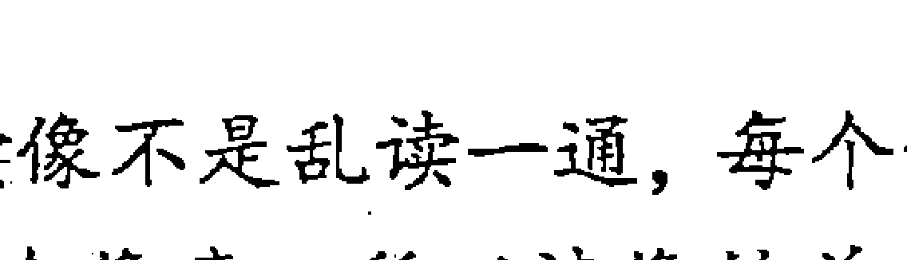

读像不是乱读一通，每个奇门符号都有最少几百种含义，三四个符号结合在一起能产生海量个像意。所以读像的前提条件是：你得知道这是在预测什么事情。例如上面的“己+丙+辛”，客户已经和你交代这个人进监狱了，那么就要往违法犯罪方面的事情进行定位和联想，进而断为吸毒。

那么预测食物时，总不能还断为吸毒吧？这么读：己为嘴巴，丙为圆的，辛为颗粒——>嘴巴吃涂满肉粒或菜粒的披萨饼，也可以是吃涂满芝麻的烧饼。

还是“己+丙+辛”，往家居摆设方面如何进行读像呢？己为小土为陶瓷，丙为圆为红色，辛为小颗粒——>红色陶瓷盆里装着养花用的碎石粒。

那么在日常用品方面怎么读？己为蜿蜒转折——>带子。己又为小财，丙为圆，所以己+丙——>带有跨带的圆形钱包。辛为颗粒，所以己+丙+辛——>带有跨带的圆形钱包里放着硬币。

总之，大家在学习读像时，一定不要想着上来就能学会。本章读像的例子是让大家对读像能有个感性认识，知道大概怎么读就可以了。想要在实战中学会读像，需要大量的实战和经验积累。

#### (三) 戊和己

戊：通屋代表阳宅、大钱、公开的钱、通“悟”开悟、悟空、大脑、胃、如果一个人问买股票可以吗?看戊的落宫无四害，代表大钱大的收入、土地房产、良性的瘤子、钱包

己：代表阴宅、小钱、暗地的钱；小脑、肠、花花肠子（四害）、风水策划、通“激”代表激情错误、鸡肉、土地房产、囊肿、水晶串、代表吃饭说话、嘴巴

#### （四）庚和辛

庚：大钱、西医、西方国家、暴力、毁坏、黑社会、阻力、压力、困难、大的金属、高架桥、煞气、预测身体的时候代表恶性病。下面这个例子：九天代表高处，庚代表桥梁，马星代表动来动去----高架桥

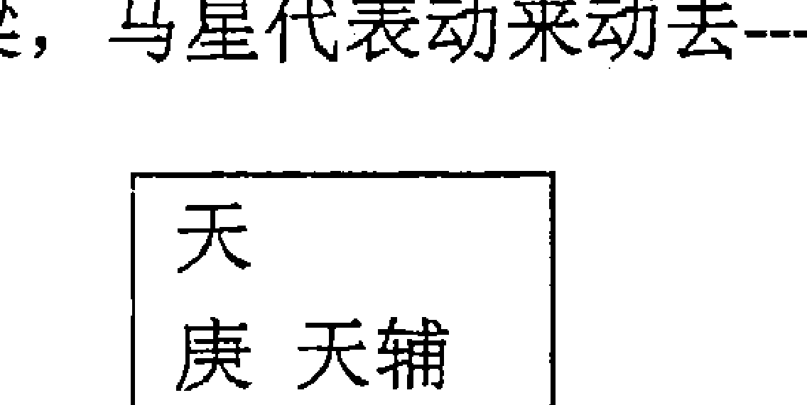

辛：小钱、西医、西方国家、犯错、撒谎、同“新”创新、革新、代表颗粒的东西、小的手饰、手链、项链、戒指、手表、五帝钱（调官财运：雍正或乾隆；调健康：康熙）、粉刺、疙瘩

#### （五）壬和癸

壬：大的水、纯净的水、能量场、大变动、脚、阻力困难、迷茫、水晶球、大的红点胎记

癸：水的水、厕所的水、脏水、所有颜色经过加工的水和饮料、负能量、小的变动、脚、阻力困难、迷茫、水晶串、黑痣。例如：

己为嘴

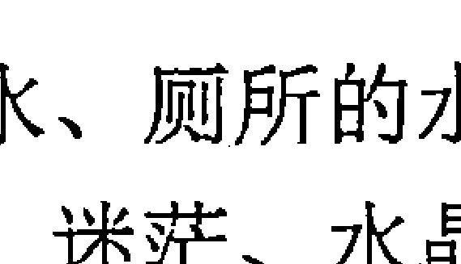

巴，嘴巴下巴有个痣

#### 组合象意举例：

|     |     |     |
| :--- | :--- | :--- |
|     |     |     |
| 符<br>壬 天冲<br>壬 生门 |     |     |
|     |     |     |

## 第二章、初级实战预测

家庭中测环境：值符代表名贵的，生门代表有生命的东西，乙木代表有花草的东西，所以值符+生+乙，可以断为：高级鱼缸

### 第二节、八神

八神分别为：值符、螣蛇、太阴、六合、白虎、玄武、九地、九天。在奇门排盘软件当中，通常只用一个字来分别代表他们：符、蛇、阴、六、白、玄、地、天。

#### 1、值符

值符：代表甲、事业。实战时以下几点经验较为常用：

1.  问事业首先看值符的落宫；
2.  代表领导关系，看领导好不好，就看领导与自己的相生相克；
3.  代表符咒；符又通师父（谐音）；符通辅助（谐音），也代表帮助、贵人，也代表头。

例：

| 戊 | 符<br>辛 天辅<br>乙 生门 |     |     |
| :--- | :--- | :--- | :--- |
|     |     |     |     |
|     |     |     |     |

值符代表领导，辛代表辛年命的人，比如1971辛亥年、1981辛酉年的人。本例客户看事业，我们看值符的落宫，到底好不好呢？就看有无四害来断。辛在这入墓，入墓即表示本宫能量低，我们往坏的地方断就行。

反之，那如果问：领导对我好不好？领导是值符和辛年命的人同宫，表示两人有很多共同点，能量共振，直接断：领导对你关系不错。（这里就不用看值符的落宫是否能量低了）

再例：

| 六<br>辛 天辅<br>乙 生门 |     |     |
| :--- | :--- | :--- |
|     |     |     |
|     |     | 符 |

本例，还是辛年命的人，问：看看我的事业怎么样？事业为值符，在本局落乾宫，乾宫五行主金。而辛年命落巽宫主木，事业克你、领导克你，所以断：都不理想。

总结：判断当事人的事业、与领导的关系，就看值符落宫与当事人落宫的五行相生相克的关系。

##### 【值符测健康】

比如某女人预测，值符落乾宫且有四害，可以直接断她有头痛的毛病，比如供血不足引起的头痛。乾宫代表戌、亥年比如06、07年，可以断她头痛的时间在06、07年或乾宫的对宫时间的年份，比如辰年或巳年（12、13年）。

若男人预测最近我身体怎么回事不舒服？假设我们起盘后，巽宫如下符号：

##### 巽宫

-   符
-   壬 天冲
-   癸 伤门

当事人求测头痛，这里的值符落巽宫有四害。看看为什么头痛？大家记着，看一件事的原因可以看引干。庚，代表劣性的、暴力的，看不清楚，配合宫内像意，壬、癸，测男人爱喝高度酒。男人性格怎么样呢？值符代表脾气直（领导那种居高临下的感觉）、伤门代表说话伤人，天冲星代表脾气冲动。巽宫又主肝胆，推测男人的肝胆也有问题。

#### 2. 腾蛇

1.  蛇和玄都代表睡眠和腰，如果给人预测，起盘后发现蛇、或玄的落宫有四害，断睡眠或者腰不好。
2.  玄，也代表多梦、睡眠质量不高。解决方法就处理玄和蛇的象意。
3.  蛇代表因果，解决方法：做超度；还代表灵异，还代表弯弯曲曲的东西，如电线、网线、毛线、水管。如果一个人床头放了弯弯曲曲的东西，睡眠一定不好。
4.  蛇代表有花蚊的、格子的信息，还代表属蛇的人；蛇代表一闪一闪、闪烁的信息；
5.  代表缠绕，如果预测中临蛇，最近遇到的事情很多，很多事情让你感觉很缠人；还代表反复；好的时候代表聪明、才智、智慧、魄力，还代表美女。如果不好的时候，有四害的时候，代表虚伪、假象、迷惑人，引申为糖衣爆弹；
6.  蛇通舍，通舌，也代表损失。如果一个人预测临蛇且状态不好，就告诉他要舍，帮助了别人才能置换。
7.  预测真假，就看蛇和玄的落宫。比如：测合同时，用神落宫临蛇且有四害，这样的合同都是假像。

#### 3. 玄武

1.  蛇和玄都代表睡眠，都代表人的精神。
2.  玄，在家庭当中代表玄关，还代表黑暗。例：

巽宫
丁
玄
乙 天辅
己 杜门

测：室内东南方光线有点暗，乙木代表衣服、窗帘、被单，杜门代表堵住。丁代表光线。

3.  玄还代表水、地下水道、沟、河（与人有关的一切东西）、路。例：

巽宫
戊
玄
丙 天冲
己 杜门

玄代表水，东南方向有水的东西或者路，或者下水道。丙代表圆圆的，带水的；杜门代表堵住。东南方的下水道堵住了。

4.  玄还代表假。比如一个人说帮我与我合作，看可不可靠？起盘如下：

巽宫
戊
玄
己 天冲
癸 生门

玄落巽宫，且巽宫有四害（癸落巽宫为击刑），所以往坏的地方断。此时玄代表忽悠、期骗、虚假。己代表嘴巴，癸代表有颜色的物体，水，嘴巴有脏水，代表：说脏话、胡说八道，戊代表钱。综述：这个合作不靠谱。

> （小经验：在平时预测中，遇到用神临玄的人，先定位，让他一定要真实反馈、不要给预测师说谎）

5.  玄还代表玄学，还代表神助，也就是灵感。在玄学中，代表九天玄女。害怕的时候，意识观想九天玄女的样子，入空无、护体。
6.  玄通悬，代表无法落实。
7.  玄还代表聪明，还代表黑色。

#### 4. 太阴

1.  遇测天气临太阴，代表阴天。如果临太阴，壬、癸，测阴天下雨；如果临太阴，戊、己，测阴天有云。戊和己代表云。
2.  测是否有雨，看是否有壬癸水的信息。
3.  阴通印，代表权力；代表聪明、智慧；任何东西都分阴阳，太过聪明，过了，就代表阴险、狡诈。
4.  还代表苦闷、压抑、烦恼、事情不明朗。遇测中一个人临太阴且有四害，他这人很少哈哈大笑。
5.  太阴还代表偷情，引申为情人、小三。
6.  还代表隐藏起来的。

壬
阴
乙 天芮
癸 死门

例：某人测病，用神临太阴。乙木代表肩膀、还代表睡眠、精神；乏力，没精神（太阴）；壬癸水代表血液。太阴，代表病不明显、隐藏起来了。断：虽然你身有病，没精神，但你去医院检查不出来。

#### 5. 六合

1.  在预测当中六合主感情、主婚姻的总体状态，也代表一切的人际关系。如果一个人的年命与配偶的年命相克，但六合的落宫没有问题，说明两人虽然吵架，但是婚姻是稳定的。生我者为父母，生我者代表付出多。
2.  六合代表缘分，代表多种类。
3.  代表合作、合同。
4.  测东西丢失，用神宫临六合代表多人做案、或丢失了多件东西。

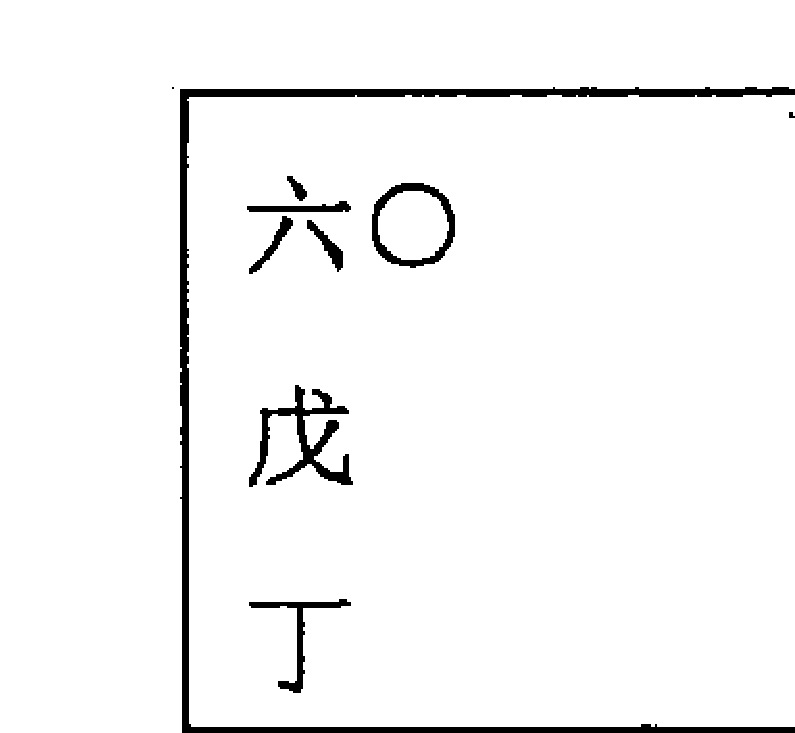

如上，测东西丢失。起盘后发现用神宫六合+空无+戊+丁，戊、丁代表钱，空无代表丢失，临六合代表多人作案、或丢失了多件东西。

5.  六合代表牵连，如果一个人预测说有了事非，落宫临六合，代表自己受到了牵连。
6.  六合是一种合力，也代表附体。临六合的人，没有四害的情况下代表性格代表和气、凝聚力好、人缘好、人际关系好。

##### 【案例：一女人预测】

艮宫
丁

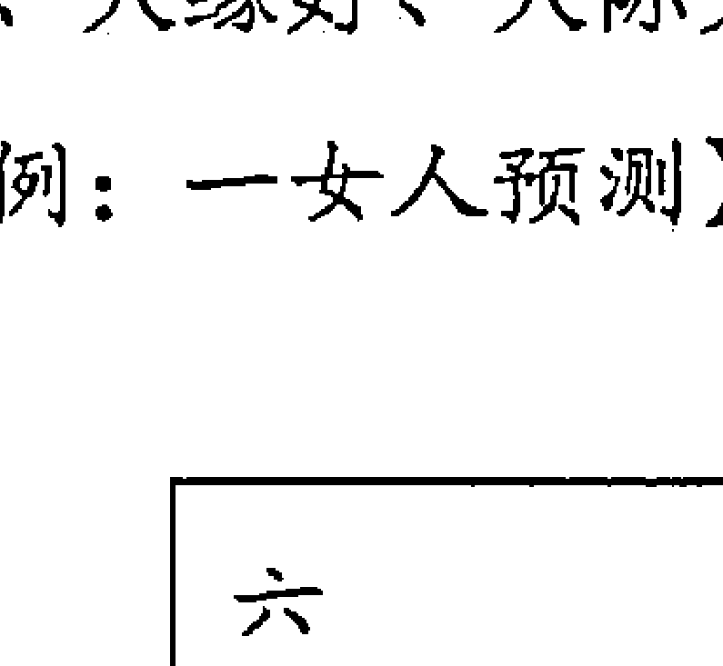

1.  宫内信息代表出现的问题，引干代表问题的原因。
2.  首先看预测来意。临六合，多是代表合同合作、或是预测婚姻感情的。女性一般测婚姻感情的比较多。
3.  再看有四害（庚落艮宫击刑），直接往不好的地方断：女人婚姻状态不好。
4.  分析：乙木代表女人，庚金代表老公。两人脾气都很冲动（天冲），说话都很伤人（伤门），因为钱（丁）吵架，还因为外遇（丁）吵架。庚金代表暴力，乙木代表手。老公把女人打了，因为庚金克乙木。
5.  继续预测，桃花是怎么认识的呢？乙、丙、丁三奇都代表桃花，丁，代表直来直去、还代表小电器比如电话、还代表信息、网络，网上聊天认识的。
6.  如果引干是巳，巳土代表吃饭，吃饭认识的。
7.  如果引干是乙庚，乙庚代表朋友，朋友介绍的。

#### 6. 白虎

1.  玄代表暗煞，白虎代表明煞。煞，代表不好的，对自己有伤害的东西。
2.  白虎有庚金的信息。
3.  白虎代表医生、医院、大手术、恶性病。丁、辛主小手术。
4.  预测人的长相，代表皮肤白。如果没有四害，此人白的好看；如果有四害，苍白。
5.  白虎代表公、检、法、律师、警察。还代表法术。还代表牢狱，代表官司。

#### 7. 九地

1.  预测中农民什么样子就想像九地的信息。
2.  任劳任怨、踏实、慢，做事一步一个脚印，代表慢。代表低调。代表谦虚。
3.  代表人的格局小一些，如果预测身高，一般代表个子矮。
4.  还代表土地房产、土地工程。如下例：

| 九地 |
| :--- |
| 戊 |
| 戊 |

5.  看当事人的事业种类，用神落宫临九地，此时考虑九地相关的职业，比如农民？山区养殖？矿山？土地工程？等，心中先有个大致范围。
6.  再看宫中天干符号，进行更进一步的定位。戊+戊。戊代表资产、又为房子。九地+戊+戊，典型的房子的信息，断：当事人的房产多，或从事土地工程、建筑商等。
7.  如果临九地但是有四害，往坏的地方断。本来做事情踏踏实实的，相好高骛远，却投机取巧。
8.  如果临九地，壬+壬，无四害，断：你房产较多有钱，而且你做事情扎实。

#### 8. 九天

1.  不好的时候代表高的，好高骛远、高调。
2.  如果好的时候，目标远大。也代表骄傲。

### 第三节、九星及八门

| 天辅星<br>杜门<br>木 | 天英星<br>景门<br>火 | 天芮星<br>死门<br>土 |
| :--- | :--- | :--- |
| 天冲星<br>伤门<br>木 |     | 天柱星<br>惊门<br>金 |
| 天任星<br>生门<br>土 | 天蓬星<br>休门<br>水 | 天心星<br>开门<br>金 |

#### 八门九星的原宫五行属性（必背）

1.  大家看过前面的“手工排盘”的内容后都知道，八门、九星、八神，起奇门局后按照严格的起盘规则排列在九宫格内。但是在没有排盘之前，八门、九星、八神，都是老老实实的待在自己原本的宫位（简称“原宫”），上图是八门和九星的原宫所在位置以及五行属性。
2.  星和门的五行属性与原宫的五行属性一致，比如震宫五行为木，那么原宫是震宫的天冲星和伤门的五行也为木。不仅是五行属性相同，天冲星、伤门、震卦，在象意上也基本一致（虽不完全一样、但大部分是完全一致的）。其他宫位也存在这种现象，即：原宫、原宫的八门和九星，这三者在象意上虽存在一些差异、但基本相同。大家在记忆象意时，可以把“原宫、原宫的八门和九星”这三者的象意放在一起去记忆，能省下好多功夫。
3.  八神、九星、八门都是有五行属性的，但我们在预测调理时通常只看九星和八门的五行属性，所以上图略去了八神。

#### 1. 天蓬星与休门

##### (1) 天蓬星

1.  预测中，当天蓬星落宫没有四害的时候，就代表蓬勃发展、代表潜力
2.  预测职业，与水有关的行业。
3.  代表胆大好色、懒惰。蓬在坎宫，主肾气。在职业当中代表娱乐场所、足疗洗浴按摩。
4.  代表偷盗。预测中临玄代表小偷，临天蓬星代表大盗。
5.  代表偷情。代表肾气、代表动力、人格魅力。
6.  预测中临天蓬星，代表蓬松，休闲服。
7.  在预测物品当中，代表雨伞、帐篷、亭子，也代表建筑工程（联想记忆，建筑物往上涨高为蓬勃发展）。

###### 【调理经验】

1.  天蓬星是三颗本命星之一，可以用来解四害。比如某宫有四害且临天蓬星，可画天蓬星符咒在相应四害宫位烧符化解。天心、天辅是另外两个本命星，处理四害时均可按照此方法处理。
2.  处理风水时，催桃花、催婚姻，必须将天蓬星调旺。
3.  布局时遇到天蓬星，可以放猪八戒的图片。

##### （2）休门

1.  休门代表与水有关的东西。代表休息、修理、修补、装修，代表停止。
2.  预测环境中，临休门，代表饮水机、鱼缸、水桶，带水的东西、休息。
3.  如果正南方向休门门迫，考虑是否放休息躺椅、床。例：

离宫：

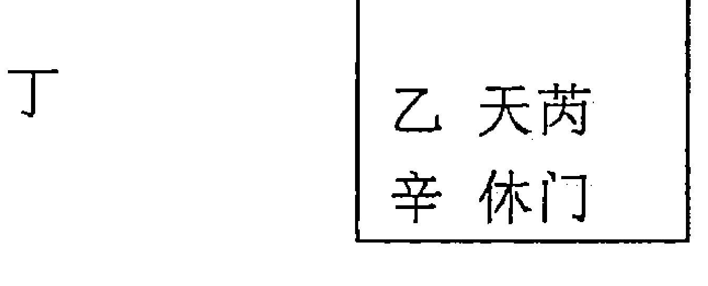

丁代表小的，辛代表小件，乙代表拐弯的，天芮代表问题，休门代表修理。正南方向的锁眼（丁）坏了。这个问题引起了四害，如果一直不修它，就会导致，乙木代表颈椎、脖子、肩周，代表脱发。乙木还代表桃花，乙+辛。
东西修好了，没有问题了，风水就往正能量方向发展。如果不修，流年到了应期的时候，就会引爆四害。

4.  休门实战预测经验：①感情遇到休门，也代表感情停止。②如果测大病临休门，断：人不在了。如果测小病临休门，病好了。

#### 2. 天任星与生门

##### （1）天任星

代表任性、任务、认死理、任劳任怨、仁慈、引申为农民伯伯。
代表弯腰的，没地位，胆小、做事情小心翼翼、引申为乞丐。
代表男人性功能弱或无。解决方法：把年命象意转到天蓬星的落宫。

调理经验：处理时遇到天任星，布局的时候放生乌龟。

##### （2）生门

代表生命、生活质量，财运和财源的总称。

代表生长、生气、生机，处理风水时，若生门对当事人有利，可调旺生门。反之不可调旺生门，例：

坎宫

| 六 |     |
| :--- | :--- |
| 己 | 天蓬 |
| 癸 | 生门 |

某女士预测身体。坎宫临生门为门迫，坎宫代表人的腹部，六合代表多，己代表囊肿，癸代表阴气寒气，天蓬星代表肿胀和蓬勃发展，生门代表生长。所以直接断：妇科有问题。此时若调旺坎宫生门，病情只会更加严重。

#### 3.天芮星和死门

天芮星常代表问题、学生、医院，另外又代表佛道、仙缘，一切神佛信息的总称。

| 地 |     |
| :--- | :--- |
| 己 | 天芮 |
| 癸 | 死门 |

如上象意可断为地藏菩萨。

| 六合 |     |
| :--- | :--- |
| 乙 | 天芮 |
| 庚 | 休门 |

如上象意可断为滴水观音：乙，女人像，带水（癸）的，上面是绿颜色（乙），下面是以白颜色为主的（庚）。

| 六合 |     |
| :--- | :--- |
| 乙 | 天芮 |
| 庚 | 伤门 |

如上象意可断为关公：六合为众多，乙为胡子，断为大胡子。庚+伤门，武神。所以断为：关公。

一女人电话预测，起盘后，用神在艮宫，分析如下：

| 六合 |     |
| :--- | :--- |
| 乙 | 天芮 |
| 庚 | 伤门 |

六合代表多，在其家中供着至少两个佛像。供的观音（乙木）和关公（庚金）。观音在左边，关公在右边。在艮宫有四害，四害中所有的击刑、门迫都代表破碎的。乙木代表手指，被打碎了（庚金代表暴力）。

什么原因打碎的？——天芮星，象意中有挑剔、问题、打扫卫生。测打扫卫生的时候不小心弄碎了。

天芮星代表学校和医院，也代表疾病、问题，所以买房子不要临学校和医院太近。
预测人物性格，临天芮星有四害，代表固执、小心、挑刺，也代表近视眼。
天芮星代表学生、学习、弟子，代表学习态度。天辅星代表学习技巧，天心星代表学习潜力。
临近处理高考的时候，将天心星落宫调旺。平时调天芮星（学习态度）和天辅星（学习技巧）。

#### 4. 天柱星和惊门

天柱星和惊门的本宫在兑宫，而兑宫为说，所以天柱星和惊门通常代表说话、发声。

1.  代表老师、主持人、律师、中介、导游导购、唱歌。
2.  有四害的时候，代表吵架、口舌事非、谣言、绯闻。

#### 5. 天心星和开门

##### (1) 天心星

1.  中心人物引申为领导、权力；自私、心里、开心。
2.  代表心脏、心事。
3.  调理时，常用于本命星解四害。

##### (2) 开门

代表开心、开发、开业、开始。例：乾宫

| 乙庚 | 符     |
| :--- | :--- |
|      | 丁 天辅 |
|      | 戊 开门 |

#### 某男士预测

1.  首先测他的来意，看神和引干。神代表人的思想，引干代表引子。预测来意与事业有关系。乙庚相合，预测与合作有关的事业关系。
2.  看什么行业，就看天盘和地盘。丁，代表网络、电子、金融，戊代表大钱。遇到值符，要么是领导、要么是独立做事业的。
3.  如果有四害，看引子，乙庚相合、应该是合作上出现了问题。开门和杜门相反，若当遇到四害的时候，平衡木的门是可以互换的。开门门迫，杜门换过来，事业有了问题，因为有人悄悄地拿钱了，谁拿钱呢？看引干，乙庚，合作人拿钱了。

> 总结：预测来意，看用神宫的八神是什么，兼顾看星星和引干。

#### 6. 天冲星和伤门

八门当中伤门的力量最大。伤门代表掠夺、侵略。打牌、打麻将时坐在伤门的落宫，或生助伤门的落宫。例如起局后伤门落艮宫，那么坐离宫（火生土）。

#### 7. 其他星和门

限于篇幅，此处就不再多讲解，大家可以参看《意识奇门·基础教材》，里面对九星## 第二章、初级实战预测

本书对八门有非常详细的讲解。

### 第四节、九宫快速预测法

南

| 东 | | |
| :--- | :--- | :--- |
| 巽宫 4，喜砂<br>五行木<br>长女 | 离宫 9，喜水<br>五行火<br>中女<br>丙、丁 | 坤宫 2，喜砂<br>五行土<br>母亲 |
| 震宫 3，喜砂<br>五行木<br>长男 | 中宫 5 | 兑宫 7，喜水<br>五行金<br>少女 |
| 艮宫 8，喜水<br>五行土<br>少男 | 坎宫 1，喜砂<br>五行水<br>中男<br>壬、癸 | 乾宫 6，喜水<br>五行金<br>父亲 |

如上表格，九宫的名称、五行属性、砂水喜好、所代表的家庭成员排行等信息都较完整的列入其中。大家一定要背熟此表和前章《零基础必背手册·易学基础知识》中的《二十四位置图》，否则本书后面几乎所有的内容都会看不懂。

好，背熟之后我们来做个小实战：

#### 【小实战】

一个人（属猪）想去西南方向发展可以吗？

- 分析：
1. 属猪为亥，按照《二十四位置图》，亥在西北乾宫
2. 乾宫五行为金，所以本例把当事人当做“金”来论。
3. 去西南方向，西南为坤宫，坤宫五行为土。

综述：土生金，生助当事人，所以可以去。另外东北方向也可以，东北为艮、五行也为土。

如果去正南方向，南方离卦为火，克当事人，所以不好；若去东南方向，在位置上与当事人属相所在的西北乾宫对冲，也不好。

总之，选发展方向，一定要选生助、或比合当事人的方位。

> （某同学呆呆地问：什么是生助、比合？答：请参看前章《零基础必背手册·易学基础知识》的前十行内容）

下面我们开始讲九宫快速预测法。

##### （一）坎宫，子时11:00-1:00

代表第二天的开始、子月也代表第二年的开始。

特征就是阴阳交替、新的生命。坎宫壬、癸水的特征，水的特征就是动。

如果一个人子时来预测，要考虑事业有动、流动的信息。看是往好的地方断，还是不好的地方断？如下

###### 例1：农历八月卯日子时，一男人电话预测事业。子时有水的信息，我们要考虑他的工作调动。

- ①意识奇门中，日干代表预测人（用神）。而预测的事情，也是事情的总体状态，就是时间的落宫，也是平台的落宫。
- ②若平台生、比用神（日干）往好的地方断。反之，往坏的地方断。

| 震宫<br>卯日 | | 农历八月<br>酉金 |
| :--- | :--- | :--- |
| | 子时<br>坎宫 | 戌<br>乾宫 |

解析：

- ①预测人为卯，卯属于震宫。测的事情看平台，子时属于坎宫。所以本例为平台生用神（水生木），男人所测的事情是即将成功的事情，断：工作要升迁了。
- ②那什么时间提升呢？水旺的时候。现在预测的时间是农历八月份，金生水，所以水旺，现在就可以升迁了。如果是五月份，火旺，水就弱，告之农历七月底、八月以后就可以成功了。
- ③男人接着问：看我媳妇生孩子怎么样？看配偶就看地支的六合支，本处看戌（卯戌相合）。

日干代表第一预测人，预测夫妻、合作对方也看六合支。看用神和平台之间的关系，平台生、比合，才会顺利。

此例中，代表求测人配偶的戌土落在乾宫，乾宫属金，金生平台水，所以配偶被泄、能量弱，断：不顺利、慢。平台子水，也有壬、癸水的信息，代表阻力。要间隔至少三天才能生出来（乾宫3，6，9的数字）。

- ④如果男人问合作人怎么样？看六合支，戊落乾宫，乾宫属金，克用神卯木。合作人克预测人，断合作人想占预测人的便宜、或是合作时相比求测人更容易占据优势，等。

那么如何解决呢？找个属鼠（子水）的员工就可以了，金生水使得合作人金泄气，水就旺了，水旺后生助当事人卯木，通关就可以了。也可以在正北方向放个老鼠的工艺品。（用老鼠图片、“子到罡”符咒、或放置相关物品使得正北方动起来也可以通关，总之取“子”的象意）

###### 例2：一男人电话测媳妇是否顺利？

| | | |
| :--- | :--- | :--- |
| 卵日<br>震宫 | | |
| | 子时<br>坎宫 | |

解析：媳妇是卯木，打电话的时间子时，平台生媳妇，生孩子顺利。震宫为雷，雷为动，快速。

坎宫是天蓬星和玄武的落宫。

如果一男人午日子时预测，用神和平台水火相冲关系，往不好的地方断。到底什么事情呢？坎宫有蓬和玄的信息，离宫代表离开、丢失、失去，直接预测丢钱了，钱数就是坎宫的数字3，6，9。

##### （二）艮宫

- ①艮属土，艮为止为始，五行循环、遇艮则止，在九宫当中艮宫力量最大。它影响着金、木、水、火、土的循环。

| 肝 | 头 | 胃 |
| :--- | :--- | :--- |
| 肝 | | 肺 |
| 胃 | 血液<br>肾 | 肺<br>心脏 |

- ②坎宫为血液，又为肾。肾是五脏六腑的根本。只要肾气循环起来，人就是阳光的、有气场的。

- ③如果一个人的肝有问题，要先补肾再补肝。胃和肾是离的最近的宫位，胃的特征是土，肾的特征是水，土克水，胃代表吸收能力。所以说，如果一个人肾虚多年，要先暖胃，让胃热起来，使得胃不再克水，肾才能充足。所以，补肝先补肾，补肾先暖胃。真正厉害的中医，一定要从疗愈胃开始的。

- ④艮为土，为山，为凸起，所有的疙瘩、囊肿、肿瘤都是艮宫有问题。

- ⑤艮为土，坎为水，肾是水的信息，艮为土，会让水不清晰、浑浊、杂质，就会长病。

如果某人说家里的人身体都不好，必定就是艮宫和坤宫问题，土太旺，很少的水，土太旺不就形成瘤子了吗？化解方法就是清理东北和西南垃圾，不要形成堵塞信息（有四害），堵塞就是克水，让东北和西南通气。可以放花，木克土，减弱土。土太旺缺水，最好放金的东西，土生金，土被消耗了，金生水让水变多。实战布局中就是放个金属盆装上水。加大了金，生了水，泄了土，循环起来了。水不能脏了，脏了就是四害。

- ⑥任何东西都是互为阴阳的，艮为开始，为停止，代表慢。很多人懒惰、不好动，一般都是艮宫有问题的，需要重点处理。有的人说，我儿子非常懒惰，干活就是不愿动，一看其在东北房间居住，代表慢，让他换到东南方向，巽为风、为动。

- ⑦如果多动症，换到东北方向居住，取“艮为止”的象意。

##### （三）震宫

- ①震为雷，代表声音大、如果预测中用神临震宫无四害，此人说话声音大。

- ②震代表快速，如果无四害，代表名气，如果用神宫、年命宫都落在震宫，大格局的人。

- ③震为动，快速地动，为主动。如果用神落震宫问事业怎么样，无四害，马上要动，代表快速。

##### （四）巽宫

- ①巽为风、也为动，代表慢的动，不由自主的动也就是被动。

- ②在九宫当中巽宫主感情、主风水、主成长。巽宫有问题，就要做风水。

- ③在预测小孩子中，主感冒发烧。

- ④巽宫还主升腾、发展。

##### （五）离宫

- ①代表美好的事情，代表美女。

- ②代表离开、死亡，感情当中代表离婚、分居。

- ③代表正南方。职业代表电子网络、金融。

例：

###### 离宫

```
辛
六合○
丁 天冲
丁 伤门
```

离宫代表离婚，辛代表错误，六合代表感情，空无代表没有，天冲星代表冲动，伤门代表伤心，丁代表证件。问今天去办离婚手续了？

##### （六）坤宫

- ①不好的时候，代表困难，阻碍。
- ②坤宫在九宫当中主家庭、主朋友。
- ③坤为地，代表土地，代表长久、稳定。未通“胃”

```
壬
六合
己 天冲
戊癸 生门
```

问：今天下午（13：00-17：00）的时间干什么了？——未申两个时辰，直接看坤宫。六合代表朋友，和朋友一起吃饭了，壬、癸代表海鲜，已代表肉，以海鲜为主。癸在此击刑，吃了不新鲜的海鲜和肉，味道不好。六合也代表人数多，坤宫2，5，8。五个人去的。

##### （七）兑宫

- ①兑为泽、为说，代表是非。少女，引申为年轻的女孩。
- ②辛代表酒，庚代表劣性酒。

##### （八）乾宫 乾为天

- ①乾宫主钱，代表大钱，代表国家银行、金融机构。
- ②用神落乾宫无四害，代表做金融、国际贸易。
- ③年命或日干用神落乾宫代表大格局。

## 第三章：奇门预测方法

前面我们讲解的都是比较适合新手学习的快速预测法，几乎不用起盘就能在脑海中进行快速预测。而起盘后的奇门预测不但能测出来更多内容，在精细程度上也更高。接下来我们正式讲解奇门预测，首先我们要记忆一些基础概念。

### 常用基础概念

1. 四害宫

- ①某个宫位一旦有四害，这个宫位的能量就会降低，呈现出一种病态。凡是涉及到这个宫的事情尽管往坏处预测。
- ②一个符号有四害，整个宫内部的全体符号都有四害。注意了，我们说的是‘宫内部’，不包括宫外的引干。例如：

公元：2016年8月6日17时20分 阴3局
农历：猴年07月04日17时20分 时盘
干支：丙申 乙未 庚申 乙酉 (午未空)
直符：天蓬 直使：休门 旬首：甲申庚

寅 卯 辰
收 开
乙 ○ ○

| 丑戊危 | 符庚乙 | 蓬开 | 天壬辛 | 任休 | 地戊己丙 | 冲生 | 巳辛闭 |
| :--- | :--- | :--- | :--- | :--- | :--- | :--- | :--- |
| 子壬破 | 蛇丁戊 | 心惊 | | | 玄乙癸 | 辅伤 | 午丙己建 |
| 亥庚执 | 阴癸壬 | 柱死 | 六己丙庚 | 芮景 | 白辛丁 | 英杜 | 未癸除 |

此局离宫地盘为辛。之前我们曾背过：辛在离宫为击刑。现在地盘有辛让离宫击刑，根据‘一个符号有四害，整个宫内部的全体符号都有四害’，现在整个离宫内部的全体符号（天、壬、任、休）都击刑，但外面的引干‘乙’则不击刑。所以预测事情的时候，离宫内部的全体符号都往坏处预测即可。

> 【知识补充·臭豆腐局】
> 奇门九宫除去中宫不用、总共有八个宫。有时你给一些运势很差的人预测，八个宫甚至会有六七个宫有四害，好比一块豆腐臭掉了一大半。这种奇门局的能量非常低，预测师给这种人起心动念预测时，不由自主的会把自己代入这种奇门局中降低自身的能量和运势。所以遇到这种奇门局一定要做好自我保护。

#### 【知识补充・九字真言封局法】（必学）

如果预测时起出来个“臭豆腐局”（总共九个宫，结果五六个宫甚至全局都是四害），磁场非常差。那么果断右手掐剑指（又称剑诀），一边对着这个奇门局画四纵五横、一边念九字真言“临、兵、斗、者、皆、阵、列、在、前”把这个局给封住。这个方法可用于清理任何磁场，也可以用来做护体做风水的时候不受伤害。

九字真言有两个版本，一个是“临兵斗者皆阵列在前”，一个是“临兵斗者皆阵列前行”。根据实践，这两个版本哪个都可以用，效果上没有明显差别。

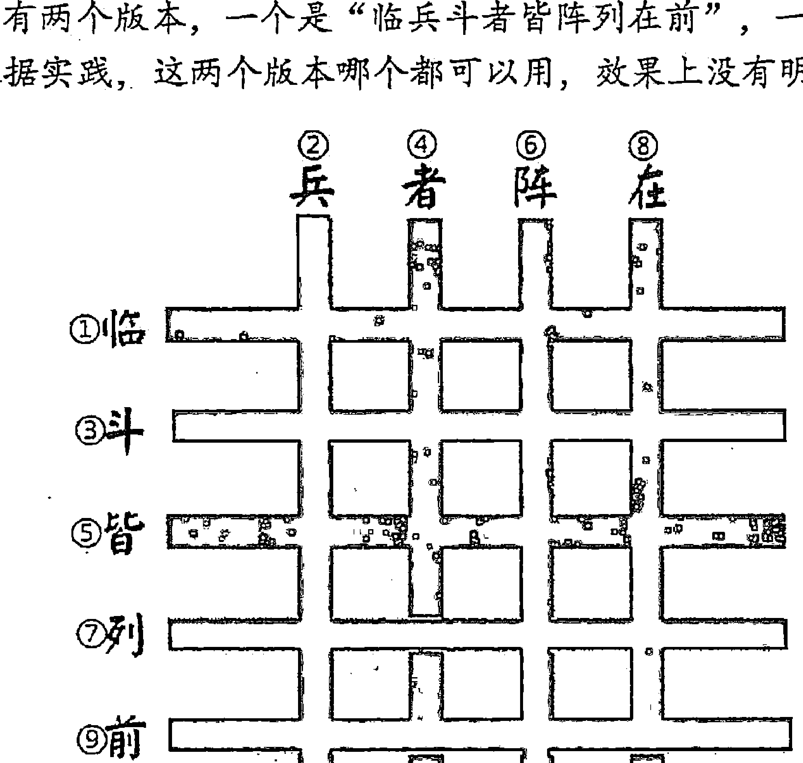

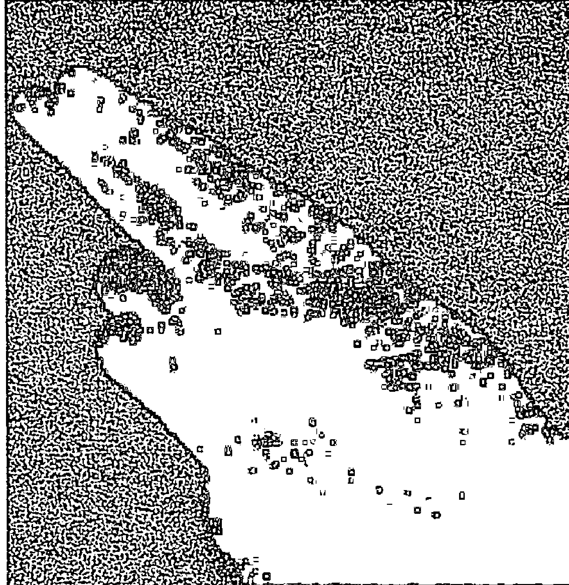

##### 剑诀（又称剑指）

2. 终身局

奇门遁甲起盘需要用预测时的时间进行起盘，所以终身局就是：用当事人的出生时间起盘，以此来预测和调理此人的终生大运。婚、官、财、学业、等等，都可以用终身局预测和调理。比如我们前面曾贴出来的中国前首富的终身局：

公元：1954年10月24日4时4分 阴2局
农历：马年09月28日4时4分 时盘
干支：甲午 甲戌 癸丑 甲寅 (子丑空)
直符：天心 直使：开门 旬首：甲寅癸

| | 未 平 | 申 定 | 酉 执 马 |
| :--- | :--- | :--- | :--- |
| 午 丁 满 | 白 丙 辅 杜 | 六 庚 英 景 | 阴 戊丁 死 |
| 已 丙 除 | 玄 乙 冲 伤 | 癸 壬 惊 | 蛇 壬 柱 惊 |
| 辰 庚 建 | 地 辛 任 生 | 天 己 蓬 休 | 符 癸 心 开 |
| | 卯 闭 | 寅 开 | 丑 收 |

###### 首富的终身局

3. 伏吟局

“伏吟”翻译成大白话就是：“趴在地上不动”。在奇门局中，如果九星、或八门停留在他们的原宫不动，这就叫做“伏吟局”。例如上面首富的终身局，八门、九星都停在原宫，这就是典型的伏吟局。市面常见的奇门理论把伏吟分成四种：

- 1. 星伏吟：九星停在他们的原宫不变动位置。该理论在意识奇门中几乎不用，所以一般不看。
- 2. 门伏吟：八门停在他们的原宫不变动位置。该理论在意识奇门中经常用到。
- 3. 天干伏吟：奇门局九宫里的天盘和地盘是一样的天干，例如上面首富的终身局。
- 4. 大伏吟：八门、九星都停在他们的原宫不变动位置，此为“大伏吟”。例如上面首富的终身局，不仅八门、九星全都伏吟，就连天干也伏吟，可谓“超级大伏吟”。

伏吟局有利有弊。“趴在地上不动”引申为慢，所以测竞标、测贷款等事情一般都不喜欢伏吟局，很多时候意味着钱来得慢、甚至干脆就不来钱。但伏吟又可引申为按兵不动，暗藏强大的力量。很多做出巨大成就的名人的终身局都是典型的大伏吟局，例如上面首富的终身局。

4. 反吟

“反吟”翻译成大白话就是：“反反复复”。市面常见的奇门理论把反吟分为九星反吟和八门反吟。在意识奇门中常用到八门反吟，即：奇门局中，若八门全部跑到自己原宫的对面，此即为八门反吟。例如此局：

公元：2011年9月22日8时51分25秒 阴9局
农历：2011年08月25日8时51分
白露：2011/9/8 8:33:00 寒露：2011/10/8 23:57:00
干支：辛卯年 丁酉月 庚辰日 庚辰时
旬空：午未空 辰巳空 申酉空 申酉空
直符：天任 直使：生门 旬首：甲戌己

┌───────┬───────┬───────┐
│戊 六合│壬 太阴│庚 螣蛇○│
│天柱 庚│天心 辛│天蓬 乙│
│地 开门 癸│玄 休门 戊│白 生门 丙│
├───────┼───────┼───────┤
│己 白虎│乙│丁 直符○│
│天芮 丙││天任 己│
│天 惊门 丁│壬│六 伤门 庚│
├───────┼───────┼───────┤
│癸 玄武 │辛 九地│丙 九天│
│天英 戊│天辅 癸│天冲 丁│
│符 死门 己│蛇 景门 乙│阴 杜门 辛│
└───────┴───────┴───────┘

如上，原宫在乾宫的开门跑到了对面的巽宫，原宫在坎宫的休门跑到了对面的离宫，总之八个门全都跑到自己原宫的对冲面、全都跑到了反方向，这就是八门反吟。

测事情时通常都不喜欢见到反吟局，比如测官司诉讼遇到反吟局，通常代表这事反反复复，很折腾人。

5. 遁甲与值符

聪明的小伙伴认真研究奇门盘后问：天干总共有十个，但为什么在奇门盘里看不到“甲”呢？好问题，这就是-->遁甲。

前面我们讲旬首时讲过：“大元帅（甲）为了自身安全，需要频繁挪动自己驻扎的地方，于是每隔十天就藏在一组不同的六仪之下，称之为“遁甲”。旬首（甲子、甲戌、甲申、甲午、甲辰、甲寅）藏在不同的六仪（戊、己、庚、辛、壬、癸）之下，最终成了：甲子戊、甲戌己、甲申庚、甲午辛、甲辰壬、甲寅癸（必背）。”

那么如何确定奇门盘中的“甲”到底在哪里？-->甲隐藏在值符之下，也即：八神中的值符在哪个宫，那么这个宫的天盘就是甲。比如首富的终身局：

公元：1954年10月24日4时4分 阴2局
农历：马年09月28日4时4分 时盘
干支：甲午 甲戌 癸丑 甲寅 (子丑空)
直符：天心 直使：开门 旬首：甲寅癸

| 未平 | 申定 | 酉执 |
| :--- | :--- | :--- |
| 午丁满 | 白丙辅杜 | 六庚英景 | 阴戊丁死 | 戊乙破 |
| 已丙除 | 玄乙冲伤 | 蛇壬柱惊 | 亥辛危 | |
| 辰庚建 | 地辛任生 | 天己蓬休 | 符癸心开 | 子壬戌 |

###### 首富的终身局

此局值符落右下角的乾宫，天盘干虽然是癸，但预测时把这个癸当做甲来看。

6. 寄宫

寄宫就是：某宫的天盘或者地盘，有两个天干。比如上面首富的终身局，整个奇门局每个宫的天盘与地盘都各由一个天干组成。唯独坤宫的天盘有两个天干，这就叫做寄宫。而且坤宫的地盘也有两个天干，这也是寄宫。

寄宫产生的原因说白了就是“僧多粥少”。奇门总共九个宫，除去中宫不用、还剩8个宫，但是天干却有十个呀。虽然甲隐藏在值符下、这时还剩9个天干，但是9个天干放进8个宫里，注定会有一个宫位的天盘（或地盘）必须放入两个天干才能放得下，这就是寄宫产生的原因。

预测时如果遇到寄宫，通常代表事情有多方参与，比如做生意有多方合伙人，等。但测婚姻时一般都不喜欢遇到寄宫，很多时候代表当事人有小三、等。

上面是预测时最常用的基础概念，接下来我们开始正式讲奇门预测的流程步骤。

### 一、预测第一步—找用神

什么是找用神？说白了就是找分析问题用到的“关键数据”。炒股的朋友通过查看大盘的涨跌幅度来判断自己是赔钱还是赚钱，那么“大盘的涨跌幅度”就是关键数据、就是用神。小孩子经常喜欢比个子看自己又长高没，那么以前和现在的身高就是关键数据（用神）。 找出用神后，通过一系列的分析方法进行分析、得出最终的预测结果。

为了方便初学者理解奇门预测的大致流程，我们做出如下对比表格：

| | 小孩子看自己长高没 | 奇门预测 |
| :--- | :--- | :--- |
| **第一步：找用神** (或者说：找关键数据) | ①从前的身高 ②现在的身高 | 一、预测婚姻：<br>①双方年命的落宫，或求测人年命的落宫<br>②八神中六合的落宫<br>等等。<br>二、预测本次生意是否赚钱的用神：<br>①求测人年命的落宫或日干的落宫<br>②生门的落宫<br>等等。<br>三、预测...的用神：奇门遁甲几乎能预测所有事情，例如比赛输赢、官司胜负、等。<br>总之：预测不同的事情，需要找不同的用神。 |
| **第二步：对用神进行分析** | 现在的身高—从前的身高=? | 看用神的落宫有无四害？<br>看 XX 宫位是否生助用神宫？<br>看用神宫是否被克？<br>是否反吟、伏吟、寄宫？<br>等等。。。<br>总之，需要从多个角度对用神进行综合分析。 |
| **第三步：得出结论** | 1.若为正数，则判断：长高了<br>2.若为零，则判断：没长个 | 总体而言：<br>1.若用神能量高、克制用神的少，则一般事情较为顺利、能成。<br>2.反之，若用神能量低、克制用神的多，则事情遇到的阻碍一般比较大，难成。 |

#### 【知识补充·百年奇门风雨情】

前面我们在“知识补充·百年排盘大战”里讲了各个奇门流派在排盘方法上的百年之争。事实上，“排盘大战”只是各个奇门流派互相争执的一个小缩影。大家真正争执的核心内容在于：如何取用神和分析用神，可谓各有各家的分析依据。

就以预测“我朋友投资十万做火锅店能否赚钱”为例，首先找用神。比如：
这家认为：做生意要看求测人的年命落宫和生门落宫。然后分析时，看生门的落宫的五行是否生助求测人的年命落宫的五行。若生助，则本次生意能挣钱。
另一家认为：要看当前奇门盘的日干落宫、开门落宫、生门落宫。若日干落宫没有四害，开门或生门也没有四害并且生助日干落宫，那么能挣钱。若有四害，即便生助也不能挣钱。
又一家：静一静，大家静一静，听我说。我不针对任何人，也不是我骄傲，我只想说：在座的各位全都是放屁，预测做生意是否挣钱要这么看：巴拉巴拉。。。
最后又来一家：呵呵，无知的地球人。不是我打击你们，市面上的奇门都是假的，全都是被高人篡改过的，你们学的全是假货。我家祖上在钦天监阴阳司，我们祖上传下来的才是正统的奇门遁甲！这件事儿要这么看：巴拉巴拉巴拉。。。。

总之，不同的奇门流派有不同的取用神规则、找出用神后也各有不同的分析方法。千百年来各个流派互相争论、互相借鉴，直到现在如何取用神、取用神后如何分析也没有一个完善的“大一统”理论。所以还是那句话：初学者应先学好一家、精研一家，等学有所成、有自己的独立见解了再采百家之长为我所用也不迟，否则在初期会越学越迷糊。

但有两个地方，各流派几乎是相同的：

- 1. 测不同的事情，要看不同的用神。比如某流派认为：“测财运，要看生门、戊与日干之间的关系。测姻缘，看日干与合干的关系”，这就是测两种事情时采用的两种用神系统。民间常见的预测事项有：测官运、财运、学业、婚姻、竞赛、求师、拜访、开业、下葬、出行、终身运。总之，测不同类型的事情，要看不同的用神系统。
- 2. 无论测哪种事情、采取哪种用神系统，首先要在盘里找到求测人在哪个宫。（铛铛铛敲黑板！重点来了！）

之前我们讲过：奇门遁甲最先起源于军事，如同现在军队用超级计算机模拟敌我双方战争进程的“兵棋推演”，需要用各种符号模拟军队中的重要人员。比如在计算机屏幕上，蓝旗代表对方指挥部所在位置，红旗代表我方指挥部所在位置。那么在奇门盘的九个宫位中，代表求测人的符号是什么？又在那个位置呢？在意识奇门体系中，初学者先这么看：## 第三章、奇门预测方法

- ①当面预测时，哪个宫位的天盘是日干，那么这个宫位就代表求测人。例如：

仔细看图上第三行，干支（又称四纲）为：“丁酉，戊申，丁亥，甲辰”，也即：

| 纲   | 干   | 支   |
|------|------|------|
| 年纲 | 丁   | 酉   |
| 月纲 | 戊   | 申   |
| 日纲 | 丁   | 亥   |
| 时纲 | 甲   | 辰   |

前面我们讲过六十甲子纪时法：“六十甲子，其最古老的用途是纪年、纪月、纪日、纪时，比如中华人民共和国的成立时间公历 1949 年 10 月 1 日下午 3 点，换算为六十甲子纪时为：己丑年，癸酉月，甲子日，壬申时。这四组汉字称为四纲”。

这里补充一点：纪年的那两个字（一个天干+一个地支）称为年纲，其中天干叫做年干、地支叫做年支。纪月的两个字，称为月纲，其中天干叫做月干、地支叫做月支。剩下的日纲、时纲以此类推。

好，我们看上面的定义：“当面预测时，哪个宫位的天盘是日干，那么这个宫位就代表求测人”。比如你朋友和你当面聊天时想让你测一下他的某件事情，此局四纲中的日干为丁，我们看哪个宫位的天盘是丁--->乾宫，所以乾宫就最能代表你朋友。大家也可以这么记：当面预测时，四纲中的日干所落的宫位就是当事人。

- ②远程预测，比如在电话上、网络上、预测师看不到求测人的时候，月干就是求测人。

例如：

公元：2016年8月6日17时20分 阴3局
农历：猴年07月04日17时20分 时盘
干支：丙申 乙未 庚申 乙酉（午未空）
直符：天蓬 直使：休门 旬首：甲申庚

寅 戌 | 卯 收 | 辰 开
乙 ○ | ○
丑 | 符 庚 乙 蓬 开 | 天 壬 辛 任 休 | 地 戊 己丙 冲 生 | 巳
戌 | 危 | 子 | 蛇 丁 戊 心 惊 | | 玄 乙 癸 辅 伤 | 午
壬 | 破 | 亥 | 阴 癸 壬 柱 死 | 六 己丙 庚 芮 景 | 白 辛 丁 英 杜 | 未
庚 | 执 | | | | 马
戌 定 | 酉 平 | 申 满

比如你正在聊着微信，忽然朋友在微信上找你给他测 XX 事情。首先你得找到你朋友在奇门盘里的哪个地方--->远程预测时，月干就是求测人。比如此局，月干为乙落兑宫（兑宫的天盘为乙），那么兑宫就最能代表你朋友。注意了，看的是天盘、不是地盘。

找到你朋友的落宫之后呢？--->根据你朋友要测什么事情，比如财运，那么你就要综合看局中生门的落宫、戊的落宫，看这两个落宫的五行属性与你朋友所在的兑宫是否冲克、等等。再比如要测婚姻，看六合的落宫、看你朋友的对象的落宫、综合分析两人之间的关系、等等。这些分类预测的具体方法我们在后面会详细的讲到，这里先让大家先有个感性认识。

- ③测终身局，日干所落的宫位就是当事人。例如：

| 项目 | 值 |
|------|-----|
| 公元 | 1954年10月24日4时4分 阴2局 |
| 农历 | 马年09月28日4时4分 时盘 |
| 干支 | 甲午 甲戌 癸丑 甲寅（子丑空） |
| 直符 | 天心 |
| 直使 | 开门 |
| 旬首 | 甲寅癸 |

未 平 申 定 酉 执
午 丁 满 | 白 丙 辅 杜 | 六 庚 英 景 | 阴 戊丁 丙 死 | 戊 乙 破
巳 丙 除 | 玄 乙 冲 伤 | 癸 | 蛇 壬 柱 惊 | 亥 辛 危
辰 庚 建 | 地 辛 任 生 | 天 己 蓬 休 | 符 癸 心 开 | 子 壬 成
卯 闭 寅 开 丑 收

###### 首富的终身局

测终身局时，不管当事人是否在你面前、一律看日干落宫。

这个是中国前首富的终身局，典型的大伏吟局。那么哪个符号代表首富本人呢？---> 虽然整个终身局都是首富的个人信息，但是日干癸落乾宫，所以乾宫最能代表首富本人。

大家看过《意识奇门·基础教材》的都有一些像意方面的基础，我们开始大概分析首富终身局的日干所落的乾宫：符为甲、为领导。乾谐音“钱”，且乾宫没有四害，所以能量高，故为“大钱”。开+心，合起来就是开心。整个奇门盘大伏吟，能量大。这些合起来是个典型的挣大钱的象意。

- 1. 前面我们主要讲解取用神的基础总则—先找到求测人在奇门盘中的哪个位置，但要想真正的达到能够实战预测调理的程度、我们还需要专门学习针对不同事情的取用神与分析方法，例如婚姻占、财运占、学业占、等。
  而且：预测结果如果不符合人意，如何尽最大可能的化解、调理成我们想要的结果？这些方法在后面的《奇门调理运筹》会详细讲解，并在后面的章节《奇门实战案例》中会有详细的实战案例。

- 2. 在意识奇门体系中有多种取用神方法，既有简便的也有复杂的，例如前面我们讲的“九宫快速预测法”就采用简便取用神法。而复杂点的取用神与分析方法在调理风水、对重要事情进行精细预测时常用到，需要掌握扎实的基础知识。
  找到预测某件事的用神后就开始对用神进行各种分析，得出预测结果。而我们从中学开始就知道：构成显微镜的元件和结构越是精密，所能看到的东西就越精微而准确。奇门预测也是同理，越想预测的更加精细，就越需要掌握更深层的“显微”工具和方法。接下来我们开始学习这些分析方法，想预测的更精细就离不开它们，而且在后面的章节《意识奇门实战案例》中经常用到。

### 二、预测第二步--分析用神

分析用神的总原则：若用神的能量高，则往好的方向预测。能量低，往坏的方向预测。

【如何判断用神的能量高低？】

记得上小学时，数学老师在课堂上讲算术题：王二用50斤的力往右面推箱子，张三也用50斤的力往右边推。但这另一边呢，李四和赵五各用80斤和30斤的力往左面推箱子。问：箱子最后往哪边移动？小伙伴们兴高采烈的举手回答：“往左！因为50+50<80+30”。

判断用神的能量高低也是如此：几乎任何一个奇门局中，都有两种能量——生助用神的正能量、克制用神的负能量。而且正负能量的来源往往不止一处，比如这几个因素和宫位给用神正能量、那几个因素却给用神负能量。而且除了看外界因素，也要求测人自身能量的高低。总之：

- ① 若正能量的总和远大于负能量，事情往往可成，而且较为顺利。
- ② 若只是稍微大于负能量，事情一般进展慢、阻碍多，但最后能成。
- ③ 若小于负能量，事情通常不成功，努力也是白干。
- ④ 若远小于负能量，事情不仅不成功、而且很多时候会伴随各种口舌、破财。

所以我们预测师要做的就是分析奇门局中的用神系统的正负能量到底谁更大，下面我们开始讲解奇门局中的哪些因素对求测人起到正能量或负能量。

#### 如何看求测人自身的能量旺衰？

前面我们讲过，在面测、遥测这两种不同情况下看求测人落在哪个宫里。找到求测人的落宫后，分析：

- ① 此宫位有无四害？
- ② 此宫位的对宫有无四害？——平衡木原则
- ③ 此宫位的天盘是否长生？

通过这三个步骤，判断出求测人自身的能量旺衰。下例：

公元：2016年8月6日17时20分 阴3局
农历：猴年07月04日17时20分 时盘
干支：丙申 乙未 庚申 乙酉 (午未空)
直符：天蓬 直使：休门 旬首：甲申庚

寅 戌 卯 收 辰 开
乙     ○
| 丑戌危 | 符庚乙 蓬开 | 天壬辛 任休 | 地戊己丙 冲生 | 巳辛闭 |
| 子壬破 | 蛇丁戊 心惊 |            | 玄乙癸 辅伤 | 午丙己建 |
| 亥庚执 | 阴癸壬 柱死 | 六己丙庚 景 | 白辛丁 英杜 | 未癸除 |
丁     马
戌 定 酉 平 申 满

#### 微信远程预测

如上局，前面我们举过这个在微信上给你朋友远程预测的例子：遥测时，月干为代表求测人本人的用神。此例月干乙落兑宫，分析：

- ①有无四害？ ---对照前面我们讲过四害：“击刑、入墓、门迫、空亡”，但是此宫一个都没有，所以此宫无四害。

- ②此宫位的对宫有无四害？——平衡木原则

> 【什么是平衡木原则】

手掌有手心和手背，硬币有正反面，世间凡事皆有阴阳两面。

假设一个人让你用眼睛看他的手受伤没？你除了看他的手心、也要看他的手背是否受伤，而且无论是手心还是手背、只要有一面受伤、那么他的手必然用起来不舒服。

奇门也是同样的道理：看一件事情除了看用神的落宫有无四害、也要看用神落宫的对宫是否有四害，二者就像手心+手背那样互为阴阳、互为补充。只要有一面受伤、那么整体就会不舒服。

所以“平衡木原则”就是：对宫与本宫互为信息补充，只要其中任何一方有四害、就会互相影响。例如：

- 若本宫有四害、但对宫没四害，那么本宫会影响对宫。
- 若本宫没四害但是对宫有四害、那么会影响到本宫，称为“被动受伤”。

此例月干乙为当事人，落兑宫。兑宫的对宫--震宫有无四害呢？

天盘“丁”，没事。

但是地盘“戊”，根据前面我们讲四害的产生条件时讲到的“戊三庚八壬癸四，辛九己二即为刑”，所以戊落震宫，击刑。
所以用神宫的对宫---震宫有四害，造成兑宫被动受伤。

#### ③是否长生？

#### 【复习·十天干生旺死绝表】

我们在前面的《零基础必背手册·奇门基础知识·四害·入墓·为什么会产生入墓》里向大家讲解过《十天干生旺死绝表》，我们再复习一遍概念：“同一个天干落在不同的十二地支上的能量高低是不同的，古人把这十二种能量状态分别命名为：长生、沐浴、冠带、临官、帝旺，这五种状态的能量相对较高。为了方便记忆，意识奇门体系把这五种状态通常统一简称为“长生”。衰、病、死、墓、绝、胎、养，这七种状态的能量相对较低。”

根据《零基础必背手册·易学基础知识·二十四山位置图》可知：兑宫的地支为酉。
此局月干乙落兑宫，查《十天干生旺死绝表》可知：乙在酉上为“绝”，是一种能量较低的状态。
综上述①②③可知：求测人所在的兑宫无四害，但是被动受伤，而且没有处于“长生”的状态。所以求测人自身的能量状态为：有些低。

#### 如何看求测人是否得助？

一个篱笆三个桩，一个好汉三个帮。想做成一件事情，只靠自己强大是不够的，必须同时分析求测人是否得到外界的帮助，也即：天时、地利、人和、神助。在意识奇门体系中，面测和遥测（电话、微信等看不到求测人时）用不同的符号代表天时、地利、人和、神助。如下表：

|      | 年干落宫 | 月干落宫 | 日干落宫 | 时干落宫 |
|------|----------|----------|----------|----------|
| 面测 | 天时     | 地利     | 人和     | 神助     |
| 遥测 | 天时     | 人和     | 地利     | 神助     |

讲解：无论是面测还是遥测，四纲中的年干和时干都代表天时和神助。但是：面测时，月干代表地利、日干代表人和。而遥测时就倒转回来：月干代表人和，日干代表地利。至于为什么会倒转，是因为：“人和”代表当事人自身。面测时，日干为当事人、为“人和”。遥测时，月干为当事人、为“人和”，所以就倒转了。

#### 【什么是生比用神宫、克泄用神宫？】

生比用神宫·举例：

公元：1954年10月24日4时4分 阴2局
农历：马年09月28日4时4分 时盘
干支：甲午 甲戌 癸丑 甲寅 (子丑空)
直符：天心 直使：开门 旬首：甲寅癸

未 平    申 定    酉 执
己      马
午   白丙 辅丙 杜  六庚 英庚 景  阴戊丁 芮戊丁 死  戌乙 破
丁满
巳   玄乙 冲乙 伤     蛇壬 柱壬 惊  亥辛 危
丙除              癸
辰   地辛 任辛 生  天己 蓬己 休  符癸 心癸 开  子壬 成
庚建
○    戊    ○
卯 闭    寅 开    丑 收

###### 首富的终身局

以首富的终身局为例：日干癸落乾宫，乾宫五行为金。我们都知道“土生金”，那么在整个九宫格中，哪些宫的五行为土？——>坤宫、艮宫。
在前面《零基础必背手册·易学基础知识》的前十行我们讲过另一种五行关系：比合，大家可回头复习一下。此局日干落乾宫，而兑宫与乾宫的五行都为金。

生助与比合，统称为：生比。所以我们可以说出一句专业术语：“此局，坤宫、艮宫、兑宫，生比用神宫”。（但是同门师兄弟之间互相交流时，因为“生比”用嘴巴讲起来有点绕口，所以一般把“生比”口头称为：生助）

克泄用神宫。举例：
还是上面首富的终身局，日干癸落乾宫，乾宫五行为金。在九宫格中，离宫五行为火，克金。坎宫五行为水，震宫和巽宫五行为木，水和木均耗泻金。克制与耗泻，统称为：克泄。所以我们可以说：“此局，离宫、坎宫、震宫、巽宫，克泄用神宫。”

以上是基础铺垫，注意，重点来了：如何看求测人是否得助？----> 不是看你的人多不多，而是看帮你的人是否真正能帮上忙。举个极端的例子，假设你想竞选议会主席，此时你有两个选择：1.全国养鸡场的十几亿只老母鸡全体支持你。2.议会的几十名议员全体支持你。你认为谁更能帮上你呢？

奇门预测也是如此：不是看生你的宫多不多、而是看最关键的那几个宫位（四纲宫、其他用神宫）是否生助你，只有他们生助你才能真正的起到帮扶作用。反过来也是一样：不是看克制你的宫多不多，而是看最关键的那些宫位是否克制你。

我们以首富的奇门局为例，大致分析看他一生的大运是否得助，注意了，只看关键宫位：

公元：1954年10月24日4时4分 阴2局
农历：马年09月28日4时4分 时盘
干支：甲午 甲戌 癸丑 甲寅（子丑空）
直符：天心 直使：开门 旬首：甲寅癸

未 平
申 定
酉 执

午丁满
白丙丙
辅杜

巳丙除
玄乙乙
冲伤

辰庚建
地辛辛
任生

己

六庚庚
英景

阴戊丁
芮死

蛇壬壬
柱惊

天己己
蓬休

符癸癸
心开

马

戌乙破

亥辛危

子壬成

○ 戊 ○
卯 闭
寅 开
丑 收

###### 首富的终身局

日干癸落乾宫。我们开始逐个分析天时、地利、人和、神助：

- 1.天时：年干甲藏在“值符”之下，此局值符落乾宫，与日干同宫，大助用神。
- 2.地利：月干甲藏在“值符”之下，与日干同宫，大助用神。
- 3.人和：前面我们讲过：“人和”代表当事人自身。分析当事人自身旺衰，要根据前面讲过的“①此宫位有无四害②平衡木原则③此宫位的天盘是否长生”来分析。很显然，日干这三个毛病一个都没有，可谓非常旺。
- 4.神助：时干甲藏在“值符”之下，落日干宫，大助用神。

综上1、2、3、4断：此局的主人，可谓一生得尽天时地利神助人和，实在非普通命格。

#### 【助人还需自身强】

街上两个乞丐风餐露宿。哪天其中一人没要到饭时，另一人便把自己要到的一碗饭分他一半，两人如此相依为命了若干年艰难为生。尽管互相舍尽自己的一半去互相帮助，但两个人还是经常食不果腹。

直到后来有一天，镇上的首富听一个老道长说：“想要治好你孩子的病，除了按时吃药，也要为他多做好事、广积阴德”。于是首富善心大发，逢善必行，其中包括：在镇上建立慈济院，只要是乞丐，每天中午和晚上都可以来免费吃饭，并且晚上有一个在慈济院里睡觉的床位。从此这两个乞丐过上了吃喝不愁、住宿无忧的生活。

奇门也是同样的道理：

某宫被其他宫生助，我们假设：日干乾宫被年干艮宫、月干坤宫生助，首先你得看生助乾宫的这两个宫位自身的能量状态如何。如果艮宫、坤宫本身就有一大堆四害，这就好比两个乞丐之间的互相帮助，连自己都管不了自己、还谈何有效的帮助别人呢？甚至有时候越帮越乱。总之：

假设 A 宫生助 B 宫，首先要看 A 宫是否有四害。若 A 宫有四害，则可以认为是无效的生助。

> 【看其他三纲的能量状态，只看有无四害即可】

前面我们讲过：分析当事人自身旺衰，要根据“①此宫位有无四害②平衡木原则③此宫位的天盘是否长生”来分析，这是四纲中的“人”。

但是分析另外三个纲落宫的能量旺衰时，只看“此宫位有无四害”即可。

比如前面“首富的终身局”，年干、月干、时干的落宫不仅全都生助日干宫、而且全都没有四害、能量较强，可谓对日干乾宫帮助非常大。而且年干、月干、时干，都刚好落在日干宫里，这是“同心协力”的表现，是最有效的生助。

上面是非常得助的例子，下面我们举个反例：

公元：2016年8月6日17时20分 阴3局
农历：猴年07月04日17时20分 时盘
干支：丙申 乙未 庚申 乙酉（午未空）
直符：天蓬 直使：休门 旬首：甲申庚

寅 卯 辰
丑 戌 危 符 庚 蓬 任 戊 冲 己丙 生 已 辛
子 壬 破 蛇 丁 心 惊 玄 乙 辅 伤 午 丙己
亥 庚 执 阴 癸 柱 死 六 己丙 芮 景 白 辛 英 杜 未 癸
戌 定 酉 申 满 马

- 分析如下：
- 1. 日干庚落巽宫，巽宫被开门门迫-->四害。既然已经有四害，那么平衡木原则、是否长生这两项就不用看了，直接就可以看出来当事人的状态不好。（新手可以理解为：四害的影响度大于平衡木原则和是否长生）

那么当事人是否得其他三纲的帮助呢？

- 2.年干丙落坎宫。坎宫里无四害，而且坎宫五行为水，生助巽宫木，所以得年干相助。
- 3.月干和时干都是乙，落兑宫。兑宫无四害，但是兑宫五行为金，克巽宫木，所以：不仅没有得到月干和时干的相助，反而被克制。

综上所述，可以大致看出此局的求测人虽然得年干相助，但不得月干时干相助，而且自身临四害，所以断：目前状态很一般。

#### 【“看四纲生助”的常用范围】

上面我们讲的方法是众多奇门预测方法里一招常用技巧，有人把这个叫做“看四纲生助”法，这个技巧有多种应用范围，最常用于预测投资经商。此时，天地人神这四纲各代表不同的范围：

- 1.年干（天时）：国家大政策。
- 2.月干（地利）：地势好坏。开过店的都知道：在人多的地方开店、销量往往比在人少的地方开店好。但也不是所有人多的地方都可以随便开店，例如：小学门口更适合卖零食玩具杂货、而不是开一家豪车专卖店。这些种种因素，统称为：地利。
- 3.日干（人和）：自身实力强弱
- 4.时干（神助）：销售平台、市场大环境

这里重点讲一下年干—国家大政策：
年干非常重要，很多时候大政策产生变化，你就啥都没了。最典型的例子：
上世纪八十年代，山西在“有水快流”思想的指导下，小煤窑如雨后春笋般冒了出来，有人甚至打趣道：“在山西，随便几铁锹就能挖出煤来卖钱”。 根据官方数据报道：在山西境内，最多时曾达到上万座小煤窑，很多煤老板几乎一夜暴富。但由于小煤窑设备的落后、安全措施的缺乏，几十年来不仅对环境造成巨大破坏、各种矿难也层出不穷。
从2008年开始，山西省委省政府下大力整改省内的小煤窑，同时制定《煤矿企业重组整合总体规划》将众多小煤窑进行合并整改。经过3年的重拳出击，根据官方数据报道：截止到2011年5月25日，山西年产30万吨以下的矿井已全部关闭，在保留的1053座矿井中，70%的年产量都在90万吨以上。办矿主体也由原来的2200多家减少到130多家。曾经风光无限的众多煤老板，转业的转业、破产的破产。（以上数据来源：中央宣传部代管的中央党报：《光明日报》2011年5月26日文章《山西小煤窑全部关闭》，百度可搜到）

所以在奇门预测中，给大工厂、格局比较大的商人预测商业开发、投资建厂等事情时，奇门局是否得年干相助是个很关键的预测点，只有顺势而为方可长久立于不败之地。

## 第三章、奇门预测方法

### 三、常用的细断方法

实际预测时，只看“是否得助”是不够的，我们还需要参看多个角度进行更细致的预测，这里先介绍一下细断时各种常用的方法，在后面的《意识奇门实战案例》中均会用到：

-   **什么是反吟、伏吟、寄宫？**

    这个我们在前面讲过，故此处不再重复。反吟、伏吟、寄宫在预测各种事情时都有重要运用，大家要牢记。

-   **什么是“镜子原则”？**

    前面我们讲四害时专门讲过空无：“空无的宫位一般能量比较低，因为空了。空无也好比一面镜子，把对宫的象意映照在本宫。我们读像时若用神临空无、那么不用看本宫符号的象意、直接读对宫的象意即可，这叫做“镜子原则”。举例：

    公元：2016年8月6日17时20分 阴3局
    农历：猴年07月04日17时20分 时盘
    干支：丙申 乙未 庚申 乙酉 (午未空)
    直符：天蓬 直使：休门 旬首：甲申庚

    | 九宫 | 宫位信息 |
    | :--- | :--- |
    | 巽四宫 | 乙 ○ ○ 寅 戌 卯 收 辰 开 |
    | 震三宫 | 乙 ○ ○ 丑 戌 危 \| 符 庚 蓬 乙 开 |
    | 艮八宫 | 天 壬 任 辛 休 \| 地 戊 丙 生 \| 巳 辛 闭 |
    | 坎一宫 | 子 壬 破 \| 蛇 丁 心 戊 惊 \| |
    | 中五宫 | 玄 乙 癸 辅 伤 \| 午 丙 己 建 |
    | 离九宫 | 亥 庚 执 \| 阴 癸 壬 柱 死 \| 六 己 丙 庚 景 \| 白 辛 丁 英 杜 \| 未 癸 除 |
    | 坤二宫 | 丁 戌 定 酉 平 申 满 马 |
    | 兑七宫 | |
    | 乾六宫 | |

    此局生门落坤宫，但是坤宫临空无。那么对坤宫读像时，直接读对面艮宫的象意即可。

-   **什么是“翻宫”？**

    “翻宫”是奇门预测中一种较高级的预测技巧，通过翻宫可以看用神的过去与未来。我们都知道，在奇门局除了中宫的九宫格内，每一宫内都有天盘和地盘，其中：天盘在上方，代表“上一步”，翻天盘可以看过去；地盘在下方，代表“下一步”，翻地盘可以看未来。

    那么如何翻宫呢？举例：

    公元：2016年8月6日17时20分 阴3局
    农历：猴年07月04日17时20分 时盘
    干支：丙申 乙未 庚申 乙酉 (午未空)
    值符：天蓬 值使：休门 旬首：甲申庚

    | 九宫 | 天盘 | 地盘 | 其他信息 |
    | :--- | :--- | :--- | :--- |
    | 巽四宫 | 庚 | 乙 | 符 蓬 开 危 |
    | 震三宫 | 丁 | 戊 | 蛇 心 惊 破 |
    | 艮八宫 | 癸 | 壬 | 阴 柱 死 执 |
    | 坎一宫 | 辛 | 丁 | 六 英 杜 |
    | 中五宫 | (寄坤二宫) | | |
    | 离九宫 | 乙 | 癸 | 玄 辅 伤 |
    | 坤二宫 | 丙己 | 丙己 | 白 芮 |
    | 兑七宫 | 壬 | 辛 | 天 任 休 |
    | 乾六宫 | 戊 | 丙 | 地 生 |

    +   1. 翻天盘方法：假设用神宫的天盘为 A，地盘为 B。我们查找九宫中哪个宫的地盘为 A，那么此宫就是该用神宫的上一步、也就是求测人以前的状态。
        此局面测，求测人为日干庚，落巽宫。注意重点来了：日干庚在巽宫为天盘。大家仔细找：九宫内哪个宫的地盘为庚？——>坎宫。那么坎宫就是巽宫的上一步，也就是求测人以前的状态。
        若是遥测，那么求测人为月干乙落兑宫，大家看九宫内哪个宫的地盘是乙？—>巽宫。我们从兑宫翻天盘到巽宫，即可看到求测人之前的状态。

    +   2. 翻地盘方法：假设用神宫的天盘为 A，地盘为 B。我们查找九宫中哪个宫的天盘为 B，那么此宫就是该用神宫的下一步、也就是求测人下一步的状态。
        此局面测，求测人为日干庚，落巽宫。注意重点来了：巽宫的地盘为乙。大家仔细找：九宫内哪个宫的天盘为乙？——>兑宫。那么兑宫就是巽宫的下一步，也就是求测人今后的状态。
        若是遥测，那么求测人为月干乙落兑宫，兑宫的天盘为癸。大家看九宫内哪个宫的天盘是癸？—>艮宫。我们从兑宫翻地盘到艮宫，即可看到求测人下一步的状态。

    我们在后面的实战案例里会具体讲解翻宫的实战案例，此处先让大家有个感性认识。

-   **什么是“打开引干”？**

    前面我们讲过：“本宫和对宫互为阴阳，对宫是本宫的补充说明”。而引干是对本宫信息的进一步补充说明。我们在实际预测一些比较复杂的事情时，如果本宫+对宫的信息加起来还不够我们分析，那就打开引干、寻找更多信息。

    打开引干的方法：若本宫引干为A，我们查找九宫中哪个宫的天盘为A,那么此宫就是对本宫的进一步补充说明。例：

    公元：1954年10月24日4时4分 阴2局
    农历：马年09月28日4时4分 时盘
    干支：甲午 甲戌 癸丑 甲寅（子丑空）
    直符：天心 直使：开门 旬首：甲寅癸

    | 九宫 | 信息 |
    | :--- | :--- |
    | 坤二宫 | 未 平 \| 申 定 \| 酉 执 \| 马 |
    | 离九宫 | 午 丁 满 \| 白 丙 丙 辅 杜 \| 六 庚 庚 英 景 \| 阴 戊 丁 丁 死 \| 戊 乙 破 |
    | 巽四宫 | 巳 丙 除 \| 玄 乙 乙 冲 伤 \| 蛇 壬 壬 柱 惊 \| 亥 辛 危 |
    | 震三宫 | 辰 庚 建 \| 地 辛 辛 任 生 \| 天 己 己 蓬 休 \| 符 癸 癸 心 开 \| 子 壬 成 |
    | 艮八宫 | 卯 闭 \| 戊  ○  丑 收 |

    此局，日干癸落乾宫，乾宫引干为壬。我们找其他宫，看哪个宫的天盘是壬---->兑宫的天盘是壬。那么兑宫就是对乾宫的进一步补充说明。

    总结：对宫和引干宫，都是对本宫信息的补充说明。

-   **什么是“马星”？**

    我们在前面的《零基础必背手册》里已经讲过马星，但马星实在是个很重要的知识点，所以这里再重复一遍：

    首富的终身局，右上角的坤宫除了六种基本符号，还在右上方多出一个“马”字，这个就是马星。马星在奇门预测、调理中有重要作用，例如代表刚刚发生的事情、或者马上就要发生的事情，还表示快速（因为马在古代是主要交通工具，代表快捷）等等。用奇门局催运时，马星还代表“马上来钱”、“马上转运”等等。我们在后面的实战案例里会具体讲解马星，此处先让大家有个感性认识。

-   **什么是“共振”？**

    “共振”常用于婚姻预测，看两人的能量状态是否相等。判断方法：

    +   ①若两人所落宫位都没有四害，则为共振。
    +   ②若两人所落宫位都有四害，也为共振。

    你好我也好、你坏我也坏，如此才能“门当户对”。反之，若双方一好一坏，则为不共振。双方不共振时表现为：不在一个频道，例如个人能力、身体健康状态、等。
    看婚姻中的双方分别落在什么宫位，后面我们会详细讲解。

-   **什么是对冲？**

    “对冲”就是双方落宫互为对宫。互为对冲的双方在大多数情况下都关系不好，这点类似地支关系中的“六冲”。“对冲”也可以用五行相克来解释，例如 A 落巽宫为木，B 落乾宫为金，乾金克巽木也。

    做商业预测时若双方对冲，比如我方落坎宫，竞争对手落离宫，那么通常可断：与对手竞争激烈，大有你死我活之像。

-   **四害的危害**

    初学者注意，在意识奇门体系里认为：一个宫位里的某个符号造成宫位有四害、那么这个宫内所有的符号都会被四害影响到，预测时几乎要把宫内的符号全都往坏处进行预测。

本章我们讲的都是奇门预测方法中最通用的方法，无论你是起盘测姻缘还是测财运等等几乎任何预测事项都可以用到。关于这些内容的实战案例，大家可以参看后面的章节《意识奇门实战案例》

## 第四章：奇门调理运筹

奇门调理运筹分为阴阳两个方面。其中，调理阴的方面一般是调理肉眼看不到的能量场，常用方法为调风水、做法事等，此步通常由风水师来做。
调理阳的方面，一般由风水师根据奇门盘给出的信息对企业领导等求测人进行指引，促使企业改善当前运营策略和相关运营环节、等。一些商业总裁培训班里教的现代西方国家常用于市场需求分析的 KANO 模型，5W2H 法，SWOT 分析模型，波士顿矩阵，PEST 分析法，等等，几乎都可以归于此类。除了企业运筹，对个人层面也可以进行奇门调理运筹，比如通过什么方式去讨债可以增大成功率、等等。

> 西汉・司马迁《史记・高祖本纪》：“夫运筹策帷幄之中，决胜于千里之外，吾不如子房（张良）”。张良几乎是各奇门遁甲流派的共同祖师之一，所以真正的奇门策划高手，除了会调理阴的方面、也一定要会调理阳的方面，真真正正的起到“军师”的作用。

本章我们讲解日常层次的奇门调理运筹的常用方法。

### 第一步、护体

#### 1. 八字含三奇

若风水师自己八字的四个天干中有乙、丙、丁中的任意一个，在处理风水时可使用对应的三奇进行护体，佩戴相应的三奇符。例如某八字：

+   乾造 乙 丙 壬 庚（子、丑空）
    未 戌 戌 戌

此八字的天干中包含乙和丙，在处理风水时可佩戴乙奇符或丙奇符进行护体。处理完风水，把佩戴的三奇符烧掉即可。

#### 2. 八字含甲

若八字的四个天干中有甲，在处理风水时可任意使用乙、丙、丁中的任意几个进行护体。例如某八字：

+   乾造 甲 甲 癸 甲（寅、卯空）
    午 戌 丑 寅

此八字的天干中含甲，在处理风水时可任意使用乙、丙、丁中的任意几个进行护体。处理完风水，把佩戴的三奇符烧掉即可。（此八字的甲较多，普通人只含有一个甲即可任意使用三奇护体）。

#### 3. 食神护体

相比上面的“三奇护体”，效果更好的护体方法是使用八字日干或年干的食神进行护体。

①什么是食神——在八字理论中，被某天干所生的同性天干为食神。例如：五行属金的天干是庚和辛，其中庚为阳性、辛为阴性。金生水，五行为水的天干是壬和癸，壬为阳性，癸为阴性，所以庚的食神是同为阳性的壬。

此处不再赘述推导其他天干的食神的过程，大家可以参考相关八字书籍里的基础知识进行自行推导。

②食神护体的易学原理——食神制官、食神制杀。在八字理论体系中，克制某天干的其他天干称为“官鬼”或“七杀”，与该天干异性为官鬼、同性则为七杀。例如天干戊的七杀是同为阳性的甲，而戊的官鬼则是异性的乙（此处不再赘述如何推导其他天干的官鬼与七杀）。

我们用①中的方法推导出“戊”的食神为庚。初学者注意，此处敲黑板，重点来了：戊的食神是五行为金的“庚”，戊的“官鬼”与“七杀”是五行为木的甲和乙。大家有没有发现---庚金克甲乙木，也即：食神的五行，克制官鬼与七杀的五行，这在八字理论中称为：食神制官、食神制杀。大家可以自行推导任意某天干的食神、官鬼与七杀，看是否如此。

在处理风水时，凡是对风水师有害的磁场能量，都可以理解为“官鬼”或“七杀”。我们之所以选择食神护体，正是运用了“食神制官、食神制杀”。

③如何运用食神护体——去处理风水时，将对应自己八字日干或年干的食神的相关物体佩戴在身上即可。此处列出除甲乙丙丁外，其他六个天干对应的食神：

| 天干 | 食神及对应物品 |
| :--- | :--- |
| 戊 | 庚：老虎、貔貅、大金属、神佛、金刚经、刀剑、等。<br>庚使用不当则容易出现乱子，较和谐的方法是提前打印一份《金刚经》并开光，前往客户家之前戴在身上。调理完毕后在现场烧掉，不要带回家。 |
| 己 | 辛：水晶串、硬币、五帝钱、《心经》、《玉皇心印妙经》、等。<br>若采用硬币护体，离开前将硬币留在客户家，不要带走。 |
| 庚 | 壬：去客户家里先喝客户家里的水再调理。<br>注意一定要是纯净水，不可是茶、可乐等饮料，离开前去客户家的厕所排出来，此为：<br>纳壬放癸。（癸代表鬼、阴性的能量磁场）<br>超度时壬水也代表走动，可以多走动。 |
| 辛 | 辛较为特殊，直接采用辛的相关物品即可。 |
| 壬 | 甲：任意使用三奇符。 |
| 癸 | 乙：乙奇符。 |

### 第二步：立太极

所为“立太极”，就是处理时找到这个风水环境的“核心区域”。起了一个局，在实战处理问题时一定要知道局的太极点对应环境的什么地方。

+   ①当一个房子客厅比较大，就以客厅为太极，只在客厅里调理风水。
+   ②如果像下例，客厅并不是那么大，就以整个房子为太极。
+   ③如果房子比较大，不仅整个房子有问题的宫位都要处理，还需要在客厅里进行调理布局。

#### 举例：

东南 西南
砂（书房） 卧室
客厅 厕所
入户 鱼缸 餐厅 房间
东北 西北

### 第三步：擒贼先擒王——狙击四害

前面我们讲过：人有病了会身体不舒服，需要把病灶化解掉才能痊愈。人的运势有病了，例如破财、总是犯小人、等等，都会在奇门局相应的宫位有四害，这时要用特定的手段把四害化解掉，才能治好运势上的疾病。所以一个合格的奇门风水师，可以戏称为“四害化解师”。

古人云：“射人先射马，擒贼先擒王”。奇门调理也是如此，一个局中有若干四害，全都要化解吗？--->不是，只化解对这件事情影响最大的几个首要分子即可。如何精确地定位众多四害中谁是首要分子，初学者要用这把神兵利器--- “平衡点化解法”。

#### 平衡点化解法——适合初学者

##### 一、什么是平衡点？

找到并调理局中能够左右全局走势的某些重要的核心点、来达到趋吉避凶的作用。这个重要的核心点，我们称之为平衡点，又称：局眼。

##### 二、哪些情况适合用平衡点处理？

+   1、突发事件（突然吵架、生病、丢东西、等等）
+   2、长时间的衰运
+   3、网上远程给人调理事情。

##### 三、如何找到平衡点？

###### · 第1步：找四干

假设某局四纲的年干、月干、日干、时干分别为A、B、C、D。我们看这四干分别落在哪四个宫位，每个宫位有无四害。我们把有四害的宫位称为“坏的宫位”，没有四害的宫位称为“好的宫位”。
若出现：三好一坏，则坏的宫位为平衡点。例：

公元：2016年8月6日17时20分 阴3局
农历：猴年07月04日17时20分 时盘
干支：丙申 乙未 庚申 乙酉（午未空）
直符：天蓬 直使：休门 旬首：甲申庚

| 九宫 | 天盘 | 地盘 | 其他信息 |
| :--- | :--- | :--- | :--- |
| 巽四宫 | 庚 | 乙 | 符 蓬 开 击刑（有四害） |
| 震三宫 | 丁 | 戊 | 蛇 心 惊 |
| 艮八宫 | 癸 | 壬 | 阴 柱 死 |
| 坎一宫 | 辛 | 丁 | 六 英 杜 |
| 中五宫 | (寄坤二宫) | | |
| 离九宫 | 乙 | 癸 | 玄 辅 伤 |
| 坤二宫 | 丙己 | 丙己 | 白 芮 |
| 兑七宫 | 壬 | 辛 | 天 任 休 |
| 乾六宫 | 戊 | 丙 | 地 生 |

此局，年干丙落坎宫，宫中无四害。月干和时干乙落兑宫，宫中无四害。日干庚落巽宫临开门为击刑，有四害。所以此时为“三好一坏”，坏的宫位巽宫为平衡点（局眼）。

若出现这四种情况则暂时无法找到平衡点：①两好两坏 ②四干落宫全坏 ③四干落宫全好。④三坏一好。此时进入第二步：找四支。

###### · 第2步：找四支

找四支的方法几乎与“找四干”完全相同，唯一不同的地方是：找四支是找四纲中的四个地支所在的宫位，看每个宫位有无四害。我们把有四害的宫位称为“坏的宫位”，没有四害的宫位称为“好的宫位”。若出现：三好一坏，则坏的宫位为平衡点。若出现其他情况则暂时无法找到平衡点：①两好两坏 ②四支落宫全坏 ③四支落宫全好。④三坏一好。此时进入第三步。

###### · 第 3 步：看马星落在哪个宫（简称“马星宫”）、马星宫的对宫、太岁宫。如果找四干、找地支都看不出来，那么：马星宫、马星的对宫、太岁宫，这三个宫位哪个有四害，哪个宫位就是平衡点。

+   1. 通过以上三步我们找到平衡点之后，接下来就要对其进行化解。如何化解四害是门非常重要的技术，大家一定要打起精神、万不可掉以轻心。
+   2. 给初学者的建议：
    初学者用奇门局调理某件事，找这四个方面的四害进行化解：
    ①四纲宫，四纲宫若找不到四害就找四支宫的四害。
    ②马星宫
    ③马星的对宫
    ④太岁宫
    这些落宫有四害的话都要处理。

### 第四步：见招拆招—四害化解方法

四害是一种病态，表现在身体上是得病；表现在财运上是破财；表现在事业上为是非；表现在官运上是官非；表现在儿女上是不听话；等等。

新手注意，在意识奇门体系里认为：一个宫位里的某个符号造成宫位有四害、那么这个宫内所有的符号都会被四害影响到，预测时几乎要把宫内的符号全都往坏处进行预测。既然四害的影响这么大，所以化解四害是奇门调理运筹的重中之重。打坦克要用穿甲弹，打潜艇要用深水炸弹，打外星人要用核弹和反物质武器，对付不同的敌人要用不同的武器和战术。奇门调理也是如此，门迫、击刑、入墓、空无，这四害需要用不同的方法进行化解，这些方法可分为：拆、补、移、置换、冲、合、奇门穿六爻、法术化解负能量、等。下面我们详细介绍：

#### （一）如何化解击刑？

| 宫位 | 击刑符号 | 化解方法 |
| :--- | :--- | :--- |
| 巽四宫 | 甲辰壬、甲寅癸 | ①壬（用酉合）：鸡、符咒：酉到罡<br>②癸（用亥合）：猪 |
| 离九宫 | 甲午辛 | （用未合）辛（有辛解置换）：《心经》、《六字大明咒》<br>五帝钱、所有颗粒状的物品、硬币，同“心想事成”、<br>代表改变，用“未”来合。 |
| 坤二宫 | 甲戌己 | 己（用卯合） |
| 震三宫 | 甲子戊 | 戊（用丑合）：牛 |
| 艮八宫 | 甲申庚 | 庚（乙奇合）：用乙奇到罡、花、葫芦 |

#### 例一：

| 六合 |
| :--- |
| 壬 天蓬 |
| 壬 休门 |

问婚姻怎么样？先看有四害，断婚姻不理想。击刑和门迫就代表吵架、别扭、委屈。壬代表迷茫，壬癸水代表激情、色情、压抑、迷茫。

本例解决击刑思路：能拆先拆，拆的力量最大。如果拆不了，就用符咒或者工艺品、图片合掉击刑。比如：东南方向有没有装水的东西?是否有不常用或者破碎的与水有关的物品?如果是非常大的鱼缸，拿不掉，只有合解。合解化符、放风水物。

##### 例二（边拆边合）：

震宫

壬

| 六合 |
| :--- |
| 戊 天冲 |
| 癸 伤门 |

本例在震宫戊击刑，有四害，断不好。戊代表脾胃，壬、癸水受了寒凉，天冲星代表吃了刺激的东西，让戊（胃）受到了伤害（伤门），拉肚子。六合代表多次，伤门代表难受。戊击刑，起了坏作用。

化解方法：
+   1. 拆：问正东方向有没有肚子比较大的东西？拿掉马上就好了。
+   2. 合：在家里正东方向写“丑”字贴上，或者在肚子上不停地写“丑”（戊为甲子戊，子丑相合。）

切记，在实际布局中一定要坚信有用，不要怀疑自己，心到神到。

##### 例三（应急处理）：

再比如一求测人，上午考驾驶执照，起盘，巽宫有壬水击刑，应急调理处理如下：

九宫中左边代表身体的左侧，右边代表身体的右侧，震宫甲木、巽宫乙木的落宫，剑指在左手手背、手臂、肩膀上写“酉”字。（壬水为甲辰壬，辰酉相合）

##### 例四：综合运用

离宫

戊

| 六合 |
| :--- |
| 壬 天芮 |
| 丙辛 杜门 |

一男人问我的事业怎么样？直接断合作的事业（六合），有击刑，击刑代表错误、别扭，代表合作出了问题。怎么改变？辛如何置换？可采取以下办法：

+   1. 在正南方向贴写“未”、贴个羊的图片；（辛为甲午辛，午未相合）
+   2. 在正南方向放六个硬币；若用六个五帝钱效果更好（硬币为辛）
+   3. 放个水晶串；（小颗粒为辛）
+   4. 念《心经》与《六字大明咒》（辛谐音“心”，取“辛”的象意）
+   5. 坐在正南方向心想合作成功。

##### 例五：综合运用2

| | 符 |
| :--- | :--- |
| 庚癸 | 戊 天芮 |
| | 辛 伤门 |

一女人在外吃饭，突然肚子痛，如何应急处理？
先看辛在离宫击刑，有辛可以置换。
解决方法如下：

+   1. 念《心经》、《六字大明咒》；
+   2. 心里想着快点好起来；
+   3. 还可以在肚子写“未”；
+   4. 如果旁边有羊肉，可以吃块羊肉（羊是未）；
+   5. 戊代表肚子，将手搓热改变了这就是辛（辛辣、辛热），捂到肚子上就好了；
+   6. 辛，代表热量、热水，喝对应离宫数字的热水。

#### （二）如何化解门迫？

| 宫位 | 门迫及化解方法 |
| :--- | :--- |
| 艮八宫 | 开门（用寅合）<br>惊门（用辰合） |
| 坎一宫 | 休门（用丑合） |
| 震三宫 | 伤门（用戌合）<br>杜门（用申合） |
| 中五宫(寄坤二宫) | 景门（用未合） |
| 坤二宫 | 伤门（用戌合）<br>杜门（用申合） |
| 离九宫 | 生门（用亥、<br>天蓬星合）<br>死门（用巳合） |
| 巽四宫 | 景门（用未合） |

## 第四章、奇门调理运筹

### 门迫位置表

门迫的力量稍大于击刑。门迫就是门的五行克所落宫位的五行。
解决门迫思路：能拆先拆，拆的力量最大。如果拆不了，就用符咒或者工艺品、图片化解。

例：
艮宫
己

符
戊 天芮
壬 伤门

如果一个人问事业怎么样？伤门门迫，先断不理想。到底什么方面不理想，看引干。己土代表钱，艮宫为停止，资金停止了，资金链短缺，动不起来。

解决方法：
伤门门迫在这引起四害，先考虑是否有东西破碎了？
伤门代表伤人，代表剑、刀、金属的东西。戊和己代表玻璃、陶瓷的信息，在家庭中最常见的是花盆和花瓶。

还是本例，我们在预测中一遇到天芮星，先预测这个宫位是否有神像佛像。若临伤门，要么是关公，要么是佛像碎了、裂了。戊，代表黄颜色的，以黄颜色为主，下面壬，代表是黑色的。
若这个宫位有四害就要换个位置供奉，换到什么位置？若家里没有其他地方可供奉怎么办？那就只有化解，伤门门迫、用戊来合掉伤门。

具体方法：①找张红纸，在红纸的东北角下侧（乾宫位置）写上“戊”贴到本例中的宫位。②画地支符“戊到罡”在供奉的地方烧掉。③也可放只狗的吉祥物。

### ☆门迫的特殊处理方法：换门

家里的门坏了咋办？能修就修，不能修就换个新的。奇门也是如此，处理门迫除了化解、还可把门换掉。例如艮宫被杜门门迫，我们知道艮宫与身体健康息息相关。常规处理方法是把杜门合掉，这样虽然有效果，但可以用更好的方法：把杜门换成有利健康的生门，这样既能化解门迫、又利于身体健康。
“换门”具体方法：根据宫位数，在门迫的宫位烧化你想要的八门符即可。例如艮宫被杜门门迫，那么就烧化艮宫数2、5、8张生门符。

注意：换门一定不要产生新的门迫。比如艮宫被杜门门迫，你却去艮宫烧伤门符，那样门迫更厉害了。

换门常用的开、生、休等这几个八门符在后面的《法奇门》这章。

#### （三）如何化解入墓？

##### 入墓位置表

| 巽宫 | 坤宫 |
| --- | --- |
| 辛 | ①甲（值符）<br>②癸 |
| 合解办法：<br>①《心经》、《六字大明咒》<br>②五帝钱、硬币、水晶串、所有颗粒状的物品<br>③同“心想事成”、代表改变。 | |

入墓有两种，一种叫入库，一种叫入墓。入墓是没有能量的，能量只剩下 20%，代表能量虚弱；入库代表暂时放起来了，合适的时间出来潜力可达到翻 5 倍。

值符也代表符咒，坤宫忌贴符，否则坤宫入墓。贴上事业就有问题，容易头痛。

入墓的处理办法：

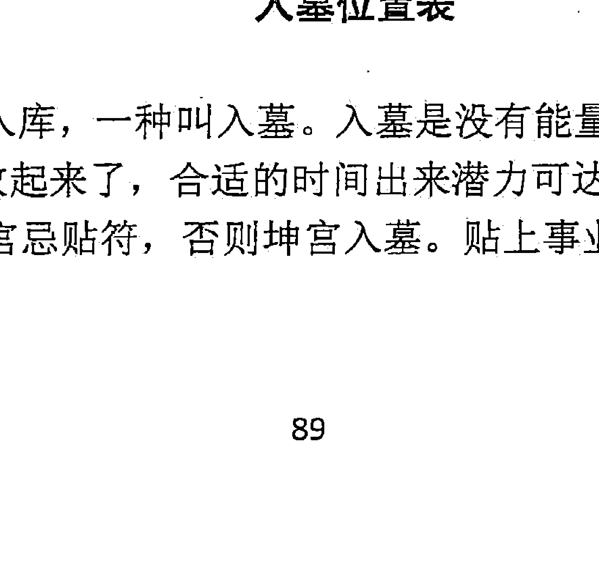

第一种：（以乾宫和巽宫为例）若乾宫入墓，且乾宫无击刑门迫。此时若巽宫也无击刑门迫，处理方式是：加大巽宫能量、冲动乾宫。（巽宫与乾宫是对宫，加大对宫能量如同加大跷跷板一端的能量、使得跷跷板那一端的宫位自动冲出）

其他宫位入墓的处理方法以此类推。

如下例：

|  |  |  |
| --- | --- | --- |
| 地<br>戊 天辅<br>戊 杜门 |  |  |
|  |  |  |
|  |  | 阴<br>乙 天心<br>乙 开门 |

一个人说：我想贷款 300 万元，已经操作了半年时间都没有落实。起局如上。

此局，巽宫无四害，乙在乾宫入墓，乾宫主钱、国家、政策，也代表国家银行。乾宫入墓，表示国家的贷款拨不下来、停滞。

处理方法：加大巽宫能量，冲出乾宫。比如：

- ①可以让他在东南方向放戊的东西。比如放钱包（钱包为戊），钱包里放对应巽宫1，4，7的数。还可放财神（本例放黄颜色的效果最好，戊为黄色）、也代表黄色的元宝风水物。
- ②在东南方每天上香（丁）。

第二种：（以乾宫和巽宫为例）若乾宫入墓，无击刑门迫，但是巽宫有击刑门迫。处理方式：把巽宫拆干净，乾宫不做任何操作。如下例：

|  |  |  |
| --- | --- | --- |
| 地<br>癸 天辅<br>癸 杜门 |  |  |
|  |  |  |
|  |  | 阴<br>乙 天心<br>乙 开门 |

本例，乾宫入墓，巽宫击刑。处理时乾宫不做任何操作，而是把巽宫有关“癸”的物品尽可能拆干净，实在拆不掉就合掉癸，具体方法参考前面处理击刑的方法。

其他宫位入墓的处理方法以此类推。

第三种：（以乾宫和巽宫为例）若乾宫有入墓，并且有门迫或击刑。同时，巽宫也有击刑或门迫。处理方式：拆巽宫、拆乾宫。

其他宫位入墓的处理方法以此类推。

#### （四）如何化解空无？

空无的处理方式同入墓方式完全相同，不再重复。

#### （五）四害的特殊化解方法

- 1. 万金油——辛的置换

“辛”谐音“新”，可用来置换负能量。除了化解离宫击刑外，任何一种四害的落宫内若有辛，即可在此宫放置与辛有关的风水物、做与辛有关的行为风水等，置换掉宫内的四害。

辛的常见风水物：五帝钱、所有颗粒状的物品（水晶手串并开过光，效果更好）、硬币。

辛的常见行为风水：念《心经》、《玉皇心印妙经》、心想“心想事成”、等。

这一招在对付某宫有多种四害时非常好使，例如某宫有击刑+入墓+空无+门迫，用常规方法去处理非常麻烦，但若此宫有辛，那么直接用辛去化解非常省事儿。但若想彻底化解四害，需要拆掉引起四害的东西，拆不走就合掉。

- 2. 三奇解四害

凡有四害的宫，若里面有乙、丙、丁里的任何一个，那么在此宫烧化对应宫位数的三奇符即可起到解四害的作用。但还是那句话：能拆的拆、能合的合。

三奇符的图在后面的《法奇门》这章。

- 3. 三颗本命星化解四害

奇门九星中有三颗本命星：天蓬星、天辅星、天心星，这三颗星在奇门预测、运筹当中非常重要。例如化解四害时，若某宫有四害且临天蓬星，可画天蓬星符在此宫位烧符化解。若有天辅、天心，也可按照此方法化解。但还是那句话：能拆的拆、能合的合。

三颗本命星符的图在后面的《法奇门》这章。

其他调理常用方法及技巧：奇门穿六爻、超度化解阴性能量、限于篇幅就不再介绍了。

### 四、本章实战案例

#### 例一：平衡点化解法实际运用

公元：2016年8月6日16时20分 阴2局
农历：猴年07月04日16时20分 刻盘
干支：丙申 乙未 庚申 甲申 壬申 (戌亥空)
直符：天芮 直使：死门 旬首：甲子戊

卯 收 辰 开 己 已 闭
寅 六 阴 蛇 午
癸 乙 冲 丙 辅 庚 英 辛
戌 丙 惊 庚 开 戊丁 休 建
丑 白 符 未
壬 辛 任 戊丁 丙 乙
危 乙 死 壬 生 除
子 玄 地 天 申
戊丁 己 蓬 癸 心 壬 柱 丙
破 辛 景 己 杜 癸 伤 ○满
马 庚 ○
亥 执 戌 定 酉 平

此例为刻局，当时由于各种情况，我找平衡点时没有按照传统步骤看“三好一坏”，而是直接看马星宫和马星的对宫兼顾太岁宫。此局，艮宫已入墓，所以处理艮宫的己。坤宫虽然没有四害，但是有庚金，需要加乙和丁化解一下（乙庚相合，用乙合掉庚，并用丁的五行克制庚）。

那么如何处理？

当面预测看日干，也可以看平衡点。平衡点代表最近发生的事情。怎么处理？以我们的教室为太极来处理。如果客户家里，客厅比较大，以客厅为太极处理就可以了。一定要让局的象意和实际中的物品吻合起来处理的局才有效。马星代表动的，景门代表用电的电器，己代表机器，天蓬星代表大的，戊代表墙，丁代表拐角的地方。在你家里东北方向有个能动的东西（马星），比较大（天蓬），在墙（戊）的拐角（丁）之处，电器、机器（景），马星也代表风。

此例，艮宫虽然入墓但是临马星，所以不是真正的入墓（大家做笔记：入墓逢马不为墓）。如果己拆不掉怎么办？继续看。马星代表动的，己土代表机器入墓，玄武代表旋转，辛代表金属，丁代表站立的，己土代表垃圾，老的、旧的。电风扇。拿到哪里去呢？把艮宫象意拿出来看，放到哪个宫没有四害。此例巽宫和乾宫有四害，一定不要把拆掉的东西放到空无宫的方位，否则容易破财，特别要记住这一点。

处理的事情，一定要谨记：没有四害的宫，千万不要拆，一动就容易出事。

坤宫有庚金怎么办？用乙奇、丁奇化解。画乙奇、丁奇符烧掉。还可以直接用剑指虚写“乙丁”在坤宫五遍（需要自身的能量足够强才可以）。

#### 例二：综合化解

公元：2016年8月6日17时20分 阴3局
农历：猴年07月04日17时20分 时盘
干支：丙申 乙未 庚申 乙酉 (午未空)
直符：天蓬 直使：休门 旬首：甲申庚

| 宫位 | 符 | 蓬 | 天 | 地 | 已 |
|---|---|---|---|---|---|
| 丑戊危 | 庚乙 | 开 | 壬辛 | 休 | 戊丙生 |
| 子壬破 | 蛇丁戊 | 惊 | | | 玄乙癸 | 辅丙己建 |
| 亥庚执 | 阴癸壬 | 柱死 | 六己丙庚 | 景 | 白辛丁英杜 |
| | | | | | 未癸除 |
| | | 丁 | | | 马 |
| | 戌定 | 酉平 | 申满 | | |

此局，按照找“三好一坏”的原则先从天干开始找，丙、乙、庚的落宫中，唯独巽宫有四害（开门门迫），所以巽宫就是平衡点。

当时实战处理时为了达到更好的效果，兼顾看马星落宫、马星落宫的对宫、以及太岁宫。此例太岁宫（地支申所落的坤宫）有四害，因此平衡点有两个：巽宫和坤宫，所以需要处理巽宫和坤宫。

- ①化解巽宫：

处理当中的原则永远是能拆则拆，先拆后合。巽宫有开门门迫，门迫一般代表破损的物品，我们拆掉相关物品后为了取得更好的效果，需要进一步化解门迫。接着往下看：

大家回忆一下前面《四害化解方法》这节的内容，咱们看：巽宫中有无三奇？有无三颗本命星？有无辛？ 用什么合掉门迫？

咱们看巽宫：里面无天干辛，但是有三奇--乙，有三颗本命星--天蓬星，而开门门迫要用寅的地支符或寅的相关生肖摆件进行化解（化解门迫在《四害及化解思路》有讲，大家参照整理好的表格按图索骥即可。但是寅为虎，虎为庚，一般不建议用老虎的摆件，用不好容易出事，所以本例化解巽宫不摆放老虎的生肖摆件）

综述，本例调理方案如下：

- 第一步：拆掉巽宫门迫的物品。
- 第二步：用乙奇、天蓬星、寅的地支符在巽宫进行化解。

第一种化解方案：用红纸黑字写“乙、蓬、寅”，贴在东南方，书写位置如下：

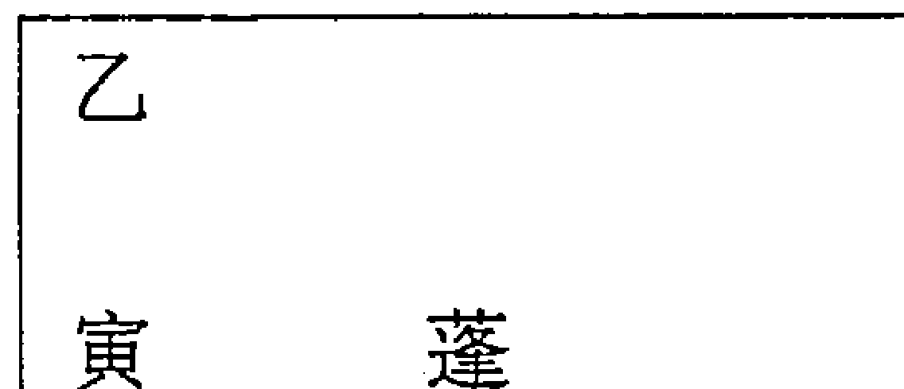

第二种方案：烧符。乙奇符、天蓬星符、寅的地支符，根据巽宫的宫位数（比如每道符各1道，或4道、7道）在巽宫烧化。

> （方案一与方案二可以结合使用）

- ②化解坤宫：

先拆后合。此例，己土在坤宫击刑，拆掉己的物品后、用卯合掉“己”击刑（为什么用卯合己？大家翻阅前面的《四害及化解思路》）。

坤宫化解方案一：坤宫为5的数字，写5个卯，如下图。

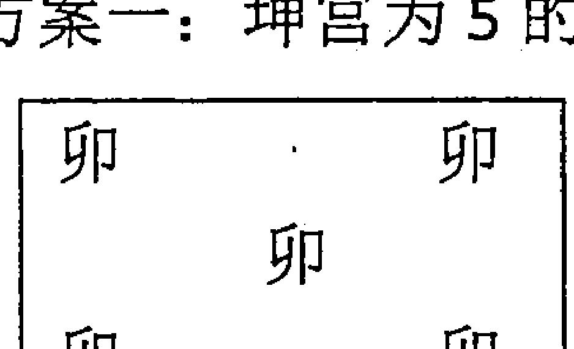

方案二：还可以烧“卯到罡”的地支符，根据坤宫的宫位数（2，5，8）在坤宫烧掉。或是摆放卯兔的风水摆件在坤宫也行。

方案三：坤宫的引干是辛，前面我们在化解击刑的内容中曾经讲过“辛”化解四害的思路，也可以在本例中使用。

本章我们讲的都是意识奇门调理方法中最通用的方法。关于这些内容的实战案例，大家可以参看后面的章节《实战案例》。

## 第五章、法奇门

### 第一节、太极图修练——补阳气

太极图修练，主要是补充人体被消耗的能量。

时间从14晚上子时开始，15中午、晚上、16中午、晚上，17中午午时结束。

- 1. 晚上右手结月亮，意识月亮慢慢地进入手心、胳膊、肩膀，慢慢地到达肚脐，将手放到肚脐上，先吸气再呼气连续三次。
- 2. 中午左手接太阳，意识太阳的光和热进入手心，身体出汗，意识太阳进入身体到达肚脐，左手在上，右手在下，在肚脐方，先吸气再呼气连续三次。
- 3. 17中午，意识太阳和月亮共同形成的八卦图在肚脐上，不停地旋转，肚脐慢慢发热，八卦图越来越大，正到和身体一样大，身体慢慢变成透明体，将身体所有的负能量抛出体外，先吸气再呼气三次。

### 第二节、六字大明咒

唵（ōng）嘛（ma）呢（nī）叭（bēi）咪（mēi）吽（hōng）。

修练要求：

- 1. 忌风；
- 2. 忌穿睡衣；
- 3. 忌饱食。

修练方法：

- 1. 结手印（观音手印）；
- 2. 念咒；
- 3. 盖黄布。

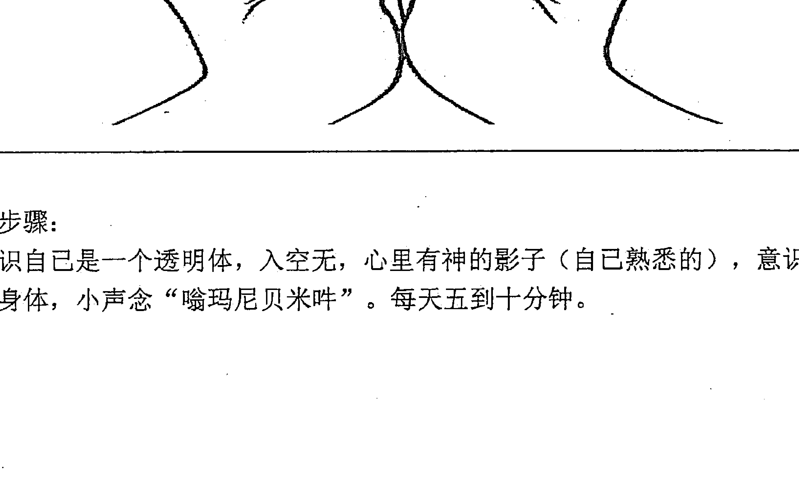

修练步骤：
先意识自己是一个透明体，入空无，心里有神的影子（自己熟悉的），意识神佛进入你的身体，小声念“唵玛尼贝米吽”。每天五到十分钟。

### 第三节、常用符咒

画符所需物品：黄裱纸、朱砂、高度酒、红墨水、狼毫笔

庚：白酒  乙：用手  乙庚合

万事万物都分阴阳，在风水中，阴永远大于阳，什么是阴，就是看不见的莫名的磁场。

#### （一）如何修练符咒？

------和符建立共振联系，位置在离宫，时间选择子午时都可以，第一次，先上香，意识通九天玄女，连续画你想要的各种符，坚持修九天。第十天，晚上亥时时间去屋外正南方向找个十字路口，配元宝（90个）、黄纸、香（9根）一起烧掉。

因为离宫本身是值符的落宫，每天修符是和神建立链接，相当于做行为风水来加大自己的磁场。画符不是形式，而是预测者的能量场。

#### （二）常用符咒

##### 1、三奇符：乙、丙、丁

三奇符在意识奇门中有两种主要用法：第一用于解四害；第二用于催桃花。举例：震宫

| 六 |  |
|---|---|
| 乙 | 天芮 |
| 戊 | 惊门 |

- ①震宫戊击刑，用丑合。
- ②惊门门迫，用辰合。
- ③看有乙，画“乙奇到巽”符解本宫所有四害。
- ④也可以找张红纸，写“乙、丑、辰”贴到震宫。
- ⑤还可以画符“乙奇到巽”、地支符“辰到巽”、“丑到巽”，力量相比④的效果更大。

##### 2、五路财神符（两种画法）

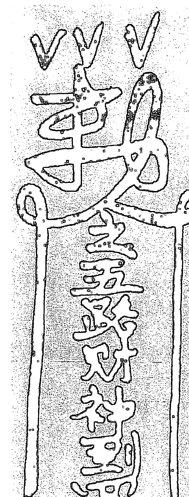

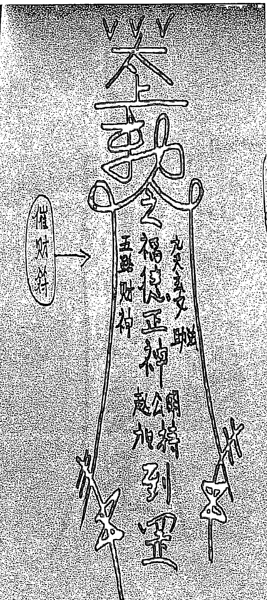

##### 3、天辅星、天蓬星、天心星（解四害的三颗本命星符画法）

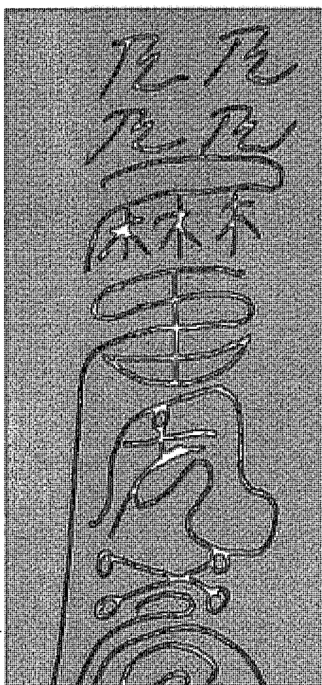
天辅星符

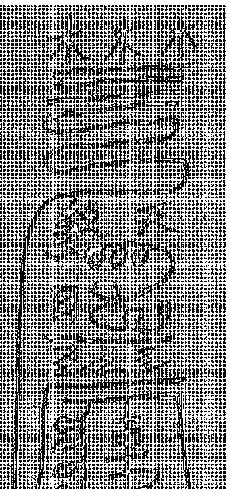
天蓬星符

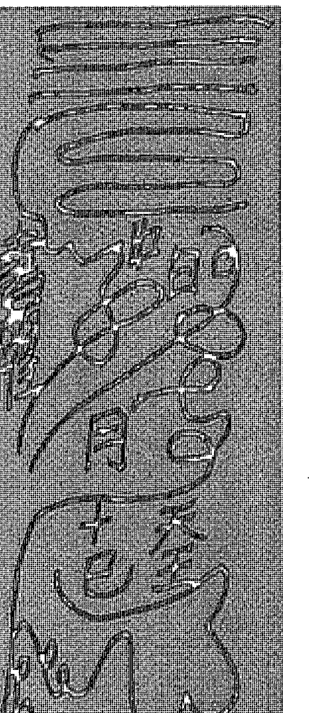
天心星符

##### 4、万能符，也叫能量符，化解符

如果一个人得了大病或身体不舒服可以将此符带身上。

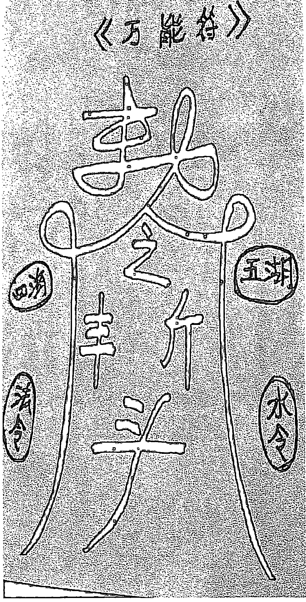

##### 5、生门符

生门符代表财源的一切；代表生命力；代表生孩子渡过难关；开业追求利润；

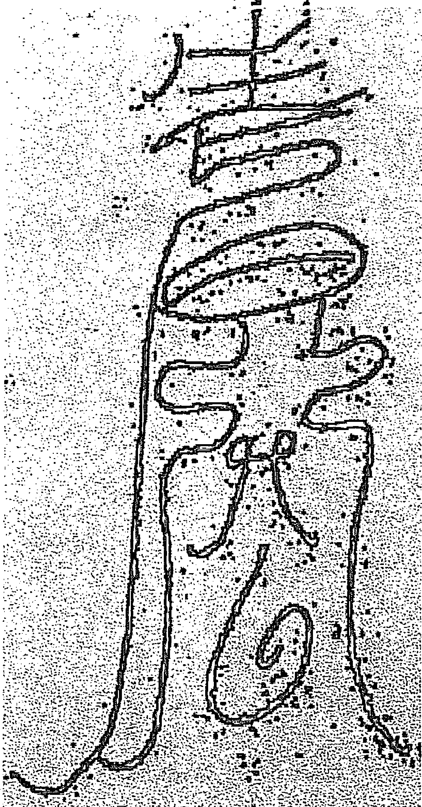
生门符

如果起一个局，坎宫

| 六 | 天芮 |
|---|---|
| 己 | 生门 |
| 癸 | |

此例，坎宫生门门迫为四害，所以往坏的方向断。己+癸，有囊肿。处理方法：把生门换成休门，让病停止，画个休门符贴在坎宫。

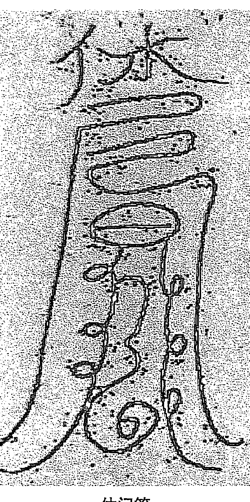
休门符

再比如：巽宫

六
己 天芮
己 死门

戊

如果一个人其母亲中风，巽宫为风、为动，而伏吟代表动不了。在此画生门符，贴在巽宫。

前面我们在《第四章•奇门调理运筹•四害化解方法•门迫》中讲过：对付门迫，可以用“换门”的方法解决。比如生门和死门、休门在处理时可以互换，但前提是换的新门不要让现有的宫位产生新的门迫就行。

##### 6、开门符

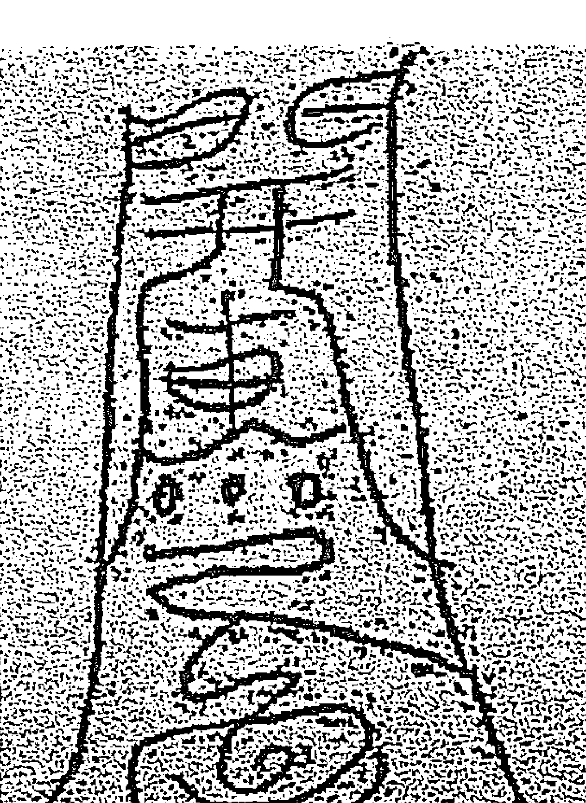
开门符

如果一个人想开业，可以在开业时画个开门符烧掉。

如何选择开业的日子？——首选开门落宫没有四害的宫位，如果有四害，就选择开门所生的宫位，如果还不行，就选开门比合的日子。

开门还代表事情败露。如下例：

巽宫

辛

| 符 |   |
| 己 | 天芮 |
| 戊癸 | 开门 |

一个女人问她老公怎么样？肯定预测老公的事业，辛代表错误；己和戊代表钱，开门门迫代表贪污被人发现了，导致事业有问题（天芮）。如何化解？把开门换成杜门。画杜门符（杜为隐藏）。

##### 7、请神符

九天玄女、天师、地藏王菩萨、对流产女人超度因果和童子命，请太乙救苦真尊、城隍、土地。

## 第六章、快捷预测

“快捷预测”不是正式称呼，而是指不用起奇门局、只用借助相关符号即可在脑海中进行快速预测的简称。下面我们分别讲解三种快捷预测法。

### 第一节、组合象意法

例1

巽宫

|   |   |
|---|---|
| 壬 | 白 |
|   | 辛 天辅 |
|   | 辛 伤门 |

在预测的时候，第一步先判断好坏。看有无四害。

举例：上图，如果一个女人来看，辛在巽宫入墓为四害，判断不好。白虎同庚金，有暴力，吵架厉害。在预测婚姻当中，遇到白虎主离婚。辛代表犯错，伤代表伤害、伤心，壬代表激情、迷茫。

在预测事业当中，白虎主是非、官司，辛代表钱、错误，壬水代表小人、丢失、迷茫。

在预测身体当中，有辛和没有辛是完全不同的，此例中，如果没有辛，白虎，癸+癸，恶性病。有辛，临白虎，此人脾气暴燥，身体有一些问题，不是大病。巽宫主肝、肝胆、感冒、肩膀；白虎本身代表恶性病，但临辛，就代表一般的身体不舒服。白虎的性格特征主人的脾气暴燥，脾气急，易上火。

白+辛（庚）代表花钱大手大脚。

如果此像意是一个女学生，一看有四害+天辅星，代表学习不理想。辛代表故意犯错，耍小聪明，学习不认真。白虎代表脾气急，因为辛在巽宫入墓导致整个巽宫的符号都入墓，所以代表学习的天辅星也入墓，断她不喜欢学习。壬水代表多动，不老实。

例2

坎宫

己
| 天 |   |
|---|---|
| 丁 | 天蓬 |
| 丁 | 开门 |

首先无四害，先判断格局好。
落坎宫，在九宫的底部无四害，说明潜力特别大。天，代表顶天立地。在处理一个局的时候，发挥局的优势无限放大，局的缺点缩小转化。
在预测事业当中：蓬代表蓬勃发展、个人魅力，如果论穿衣服，休闲服；开门代表开创事业；九天代表目标远大；丁代表钱、美女、订单、合同；己代表思维、钱。
如果女人预测，临九天，无四害，代表个子高。丁，代表瘦，天蓬星也代表胖，代表肿胀，己代表肚子。测看起来身材蛮好的，但实际上也是有肉肉的。临天蓬星代表人格魅力好，有异性缘。

例3

坎宫
辛
| 天 |   |
|---|---|
| 丁 | 天辅 |
| 庚 | 开门 |

此局用神落坎宫无四害，断：个子高高的（九天），很开朗愿说话（开），庚和辛代表金的特征，身体当中代表硬度，代表骨头，有骨感美。

例4

知识点：如果女人预测，用神临天芮星来意必定预测身体和健康有关系。

坎宫
己
| 天 |   |
|---|---|
| 丁 | 天芮 |
| 丁 | 开门 |

此局女客户来预测，用神落坎宫临天芮星，无四害，说明你虽然感觉不舒服，但是你身体没有大事。

## 第六章、快捷预测

测健康时若用神落坎宫，注意以下三点：
- 女人在坎宫，最敏感的是妇科和乳腺、腰、颈椎
- 男人考虑的是肝、脾胃、肾气不足
- 老年人是否有前列腺和心脏。

如此例，身体问题不大，你担心有问题，有炎症（丁），伏吟代表炎症的时间比较久了。

※※预测时要有信心，信心就是丁，就可以克癸水负能量信息。当你信心强的时候，就可以克制一切癸水的负能量磁场。给人预测，就是磁场与磁场之间的较量。

### 例5、预测技巧

测健康时用神落宫无四害，身体症状不明显。若有四害，身体已经有感觉了。
比如例 4，如果女人预测身体，你的身体没有大问题，但是你要注意妇科炎症，时间比较久了，这样对你的身体是有影响的。如果临太阴，太阴有阴天的特征，不明显，太阴主马虎，虽然身体有妇科炎症，但是自己感觉不到。

### 例 6、如果男人预测，问老师您看看我出了什么事情了？

```
天
丁 天冲
丁 伤门
己
```

用神临天冲星+伤门，必然预测的是非、打架。星星和门可预测来意。

切记，在预测中临玄的人，一定在预测前定位、跟客户打好招呼，让他真实反馈预测情况。

### 第二节、意识奇门预测法

先天是体，后天是用。先天是基础，后天是发展。先天八卦和后天八卦组成阴阳，是不可分割的。

| 先天：兑 后天：巽 | 先天：乾 后天：离 | 先天：巽 后天：坤 |
| --- | --- | --- |
| 天辅星 | 天英星 | 天芮星 |
| 杜门 | 景门 | 死门 |
| **先天：离 后天：震** | | **先天：坎 后天：兑** |
| 天冲星 | | 天柱星 |
| 伤门 | | 惊门 |
| **先天：震 后天：艮** | **先天：坤 后天：坎** | **乾--艮** |
| 天任星 | 天蓬星 | 天心星 |
| 生门 | 休门 | 开门 |

原则：先天是出来，代表前世、代表过去，后天代表进去，代表以后的发展。

举例：
乾宫的先天----出来---离宫
乾宫的后天----进去----艮宫

也就是乾宫和离宫、艮宫是互为先后天的。

先天是基础，就像我们盖房子，先天是主要的，地基是看不到的（先天），看到的是后天的房子。

#### 例一：

| 平台 | 离宫 | |
| --- | --- | --- |
| | | |
| | | |

一男人坐在离宫，用离宫的信息预测就可以了。现在的时间是巳时，落在巽宫，预测的时间是平台，什么时间起心动念预测，什么时间就是平台。

平台生男人，平台代表事业的大小，是好事情。以后人生的格局还是蛮大的，什么时间起步呢？2012和2013年（巽宫的辰、巳年）已经过去了，那就看对宫的时间2018，2019（乾宫的戌、亥年）会上一个大台阶。每一个大运都会提前一年进入一个气。现在是巳时，对宫是亥，巳亥分界点，是阴阳八卦的两个分界点，是一个分界线。

预测时，最好的格局就是平台生用神、比合用神。

此例虽然平台生你，大格局和大趋势是好的。

但是南方的后天卦为离火，而南方的先天卦为乾卦属金，火克金，相克关系，首先表现在脾气暴燥。离宫主火、主头、主脑部，脑供血不足。平台生你，没有大问题。时间段就是午时 11：00-13：00 的时间段，太阳最毒的时间，反而是求测人最弱的时间。会有头晕不舒服，眼睛发涩，离宫为火，丙丁火的落宫，主眼睛。

先天八卦是基础是金，是主要的，乾宫代表大格局，所以说求测者基本是稳定的、平和的，但有的时候莫名其秒的发火，（后天离宫）。

离宫主离开，乾宫主要的特征代表钱，两者相克，花钱是比较仗义的。乾宫主求测人，离宫的先天是震3，乾宫数字是1，乾宫主男人，离宫主美女，所以说当有钱的时候，身边桃花至少2，3个。08年下半年，身体开始感觉不舒服。

求测人坐在离宫，是看离宫的后天宫乾宫。所以发展西北、东南方向对求测人发展有利。东南巳火，电子行业对求测人是有利的。乾宫主大钱，人生大格局和财运也是蛮不错的。

#### 例二：

- ①意识奇门预测中，日子代表预测人（用神），预测的时辰代表平台。预测事业种类看平台。
- ②意识奇门预测中，用的是地支和平台之间的关系进行预测，看合作伙伴、配偶等用地支三合和地支六合。

今天是酉日，酉在兑宫。下午1：30 分，一女人信息预测问：“找个房子开个分店可不可以？”

| | 离 | 坤 |
|---|---|---|
| | | 平台 |
| | | 兑 |
| | | 预测人、用神 |

取用神：今天是酉日，用神酉落兑宫，兑宫五行为金。下午 1:30 分为坤宫时间，平台落坤宫，坤宫五行为土。

#### 判断原则：

- 1、若平台生、比用神，往好的地方断；
- 2、若平台克、冲、泄用神，往不好的地方断。

此例，平台坤土生用神兑金，所以往好的地方断。

于是回答说：“可以”。

女人又问：“去哪个方向找店对我有利？”——找的方位一定要生用神。西南坤宫与东北艮宫五行为土，可以。西北乾宫与正西兑宫五行为金，也可以。所以这四个方向都行。

我们看看女人是开什么店的？——女人在兑宫，平台坤宫生女人，所以女人从事的应当是土地、建筑、工程有关系的，比如建材店。这里注意了，与土有关的行业也可能是农耕、矿山、山区养殖，但是女人提前说了“找个房子开个分店”，既然是在城市工作，所以就不用考虑这些在野外工作的行业了。

看办公室、卧室是用五形通关来看的。如：

- ① 如果办公室的门开在西北，那办公桌的方位最好在正西，要让门口所在的五行生办公桌。也可将办公桌安在正北（乾金生坎水）。
② 安床同理。看小太极，如果住在东北房间，看门在哪，安在比合或相生的关系就可以。门就是气口，气口生你，就舒服。动起来，就是马星，就会不舒服。

### 第三节、四害预测法

| 列1 | 列2 | 列3 |
| --- | --- | --- |
| 辛 壬 开门 | 辛 休门 | 甲（值符）<br>癸 伤门<br>己 杜门 |
| 戊 开门<br>惊门 | | 景门 |
| 庚 伤门<br>己、丁<br>庚 杜门 | 生门<br>死门 | 戊 景门<br>丙 乙 |

#### 四害（击刑、门迫、入墓）汇总表

四害预测，要点在于：根据求测人的描述、以及预测师的预测时间等信息，将求测人的事情转化为相应的奇门符号代入到相应的宫位，以此反推出求测人的住处在哪些宫位存在哪些四害，然后对这些四害进行化解处理。

#### 例一：

今天是酉日，早上7：00一女人测是否可以投资买维卡币？

| 列1 | 列2 | 列3 |
| --- | --- | --- |
| 巽宫为平台<br>壬击刑<br>癸击刑<br>辛入墓<br>开门、惊门门迫 | | |
| | | 兑宫，预测人为用神<br><br>景门门迫 |

- 1、
- 2、
- 3、
- 4、
- 5、
- 6、
- 7、
- 8、
- 9、先 判断好坏——酉日落兑宫为用神，五行为金。辰时落巽宫为平台，巽宫五行为木。兑金克巽木，断：不好，不可以投资。而且判断女人状态不好，平台与用神之间相克关系。
用神与平台相克，被克的宫受伤、克它的宫因为出力过大所以自己也受伤，两宫都受伤，不好。所以我们按照这两个宫位有四害来预测。平台在巽宫，它的四害有：壬、癸、辛、开门、惊门；用神在兑宫，四害有景门。
①景门门迫就是发生上火的事情，所以断：女人的脾气暴躁（景门门迫）。
②兑为金为财，兑金被克、在相应年份必定财运不佳。故断：2005年（兑宫酉年）、2011年（震宫卯年）财运不好。为什么震宫的年份也不好？因为震、兑两宫互为对宫犹如平衡木，本宫的负能量也会影响到对宫。
③巽宫对应辰（2012）、巳（2013）年，震宫对应卯（2011）年，所以震宫、巽宫的年份，女人也不顺心。
④女人在兑宫为酉，根据地支六合（辰酉合）看女人的配偶--辰。辰在巽宫，巽宫五行为木，女人在兑宫为金，两宫相克，夫妻必定不合。
⑤女人的老公在巽宫，巽宫恰恰有四害：壬癸水代表激情，辛代表犯错，开门门迫代表事情败露，惊门门迫代表吵架惊天动地，壬癸水代表迷茫。断：男人在外面有了外遇。
⑥吵架厉害，发生了什么事情？都是什么原因呢？酉=辛金，女人在兑宫有辛，男人在巽宫有辛，两宫有共同符号，断：男人的外遇是女人认识的。

（注意：预测的时候，看有没有地支相合）

> 【知识补充：天干化地支】
>
> 天干与地支是能够互相转化的，关系如下：
> 甲=寅  乙=卯  丙=午  丁=巳
> 庚=申  辛=酉  壬=子  癸=亥  （戊、己不转化）

#### 例二：

男弟子（1981 辛酉年出生）介绍新女弟子（1989 己巳年）来学习。周老师看出，男弟子在追求女弟子。

| 巳 壬击刑 癸击刑 辛入墓 开门、惊门门迫 | | 兑宫 酉 |
| --- | --- | --- |
| | | |
| | | |

男弟子年干为酉落兑宫；女弟子年干为巳落巽宫。我们开始分析：

- 1. 巽宫和兑宫是先后天八卦关系，代表前世的缘份。

> 【知识补充：牢记先后天八卦】
>
> 兑卦在后天八卦位于西方、在先天八卦位于东南方。而东南方位在后天八卦中是巽卦，所以我们说：巽宫和兑宫是先后天八卦关系。
> 我们在本书中 99%的地方都是用的后天八卦，基础薄弱的同学一定要牢记先后天八卦图，就像当年背诵九九乘法口诀表那样既要能正着推导、也要能反着推导，例如：
>
> - ①正着推：后天八卦的东南方是巽卦、南方是离卦、西南方是坤卦。。。先天八卦的东南方是兑卦、南方是乾卦、西南方是巽卦。。。
> ②反着推：东南方的先天八卦是兑卦、后天八卦是巽卦。南方的先天八卦是乾卦、后天八卦是离卦。西南方的先天八卦是巽卦、后天八卦是坤卦
> ③能判断某卦与某卦是否有先后天关系。例如东南方与西南方是先后天关系（后天巽卦在东南、先天巽卦在西南），西方与北方是先后天关系（后天坎卦在北、先天坎卦在西）、等等。
>
> 总之，背诵先后天八卦图及八卦的位置是每一位奇门爱好者的必经之路，大家当初都是这么走过来的。比如你把先后天八卦图打印下来，每天有事儿没事儿就去看图记几遍，顶多一两星期就记熟悉了。

- 2、巳酉丑三合，巳酉半合。三合代表稳定，有“成为一家人”的意思。

（关于“三合与半合”，详见本书开头的《意识奇门·零基础必背手册·易学基础》）

- 3、男人是酉金=辛金，辛金代表改变、代表心里、代表心想事成。

巳火在巽宫，主感情、主预测和风水。两人之间兑金克巽木，相克关系，女人是感情出现了问题，在今年农历的三、四月份（巽宫辰巳的时间），想改变（辛），不开心（开门门迫）、迷茫（壬癸水）、惊天动地引申为生气、发脾气（惊门门迫）。为什么会这样呢？巽宫主感情，女人的感情出现了错误，失恋了。想改变，加辛，恰恰是男人是辛酉，两人因此认识了。

- 4、男人五行为金，女人为木，两人相克关系。

男人还想追女人，男人心里想改变，想办法通关，通过壬癸水，金生水，水生木通关。

- 5、女人是巳火、男人是酉金，虽然符合三合、但只是半合，离成功只有一半，用巳酉丑进行完整的三合就可以解决。

地支丑在哪个宫？在艮宫。此时周老师就坐在教室的东北方向，而老师就是天辅星，可以解四害、解决问题。周老师坐在艮宫，为土，先叫了男人，又叫了女人，数字为2，符合艮宫的数字。来一个走一个，相当于上了马星。马星一动，丑土上纲。形成巳酉丑三合。周老师给女人说，“首先你感情出现了挫折，你喜欢的都是帅哥，但是你的人生格局，你的老公恰恰是不好看的，胖乎乎的”。（这时，周老师起了女人八字的终身盘）女人的用神是癸，如下：

| 空白列 | 离宫 | 空白列 |
| :--- | :--- | :--- |
| 空白 | 空白 | 符<br>癸<br>癸 惊门 |
| 蛇○<br>戊<br>戊 | 空白 | 空白 |

女人用神癸，临惊门，有能力、脾气暴。戊癸合。女人在兑宫，老公在艮宫，中间隔了两个宫，也就是说她老公是外地的，蛇代表眼睛，空无，带眼镜。戊代表肚子、肉，胖乎乎的。引干癸水，搞风水的。两人有共同符号癸，代表两人是认识的。

#### 例三、女人的病

#### 例四、

一女人打电话测头痛、胃痛。

如果打电话只是问问“看我这情况怎么样？”。要根据打电话的时间和自己的相生相克来判断好坏。此例，求测人已经提前告诉身体不舒服了，就是已经有四害了。

头痛:值符入墓。胃痛:己土击刑，代表肚子。坤宫主年龄大的女人、妇人。1967，1968年的人（未、申年）。

女人如果说：“以前好好的，最近这几天开始疼的，才痛的”——坤宫代表六、七月份，是从农历六月份开始的。

女人如果这样说：“已经痛了好多年了”——如果应在流年上了，要么是坤宫的年份，要么是艮宫的年份。

坤宫主家庭，值符和己，形成甲己相合代表夫妻，伤门代表伤心，杜门代表压抑，癸水代表迷茫。己土代表说话不注意、骂人、口舌是非，伤门代表伤心、伤害、伤脑筋。在事业上，值符代表事业，己代表钱，小钱，癸水代表失去、丢失，伤门代表是非；癸水代表阴谋诡计，代表小人。女人的脾气临伤门、己土击刑，代表说话伤人，人际关系和财运都不理想。

如何处理呢？

最常见的家中物品预测：己土代表垃圾，代表弯弯曲曲的东西，如电线、电缆；己+癸，下水管道。癸代表水，己代表管道，杜门代表堵塞。癸也代表酒，己代表瓶子，伤门代表破碎。值符代表带壳的东西，如纸箱类的。

预测思路总结：有问题就是四害，直接按四害表格预测。

#### 例五、打架事件

一男人说，我打伤了别人，如何处理？

1. 打伤别人，伤门、庚的落宫。在艮宫。
2. 伤门代表打伤，庚代表暴力，巳代表骂人，丁代表棍子也代表血液。
3. 是下午1：00-5：00的时间，要么在西南方向、要么在东北方向，把人打伤的，打的非常厉害，把人都骨折了，用的是棍子和硬的器械，很多人打，来了警察，现在已经住院了。
4. 再比如男人预测的时间是早上七点，说昨天把人打伤了，男人的预测时间在巽宫（平台）属木，预测的事情在艮宫，属土。先判断事情大小，平台克预测的事情，事情大，引爆四害。庚代表警察、暴力、手术、骨头击刑（骨折），艮宫在左边，身体左侧骨折的厉害；巳代表骂人，伤门代表伤害，杜门，代表堵住，很多人圈起来打的（巳土代表缠绕），艮宫四害符号多，代表多人，丁代表手术、输液、血液。

男人想合解，问多少钱可以合解？

> 调理思路：东北方向所有符合象意的东西都要处理。庚金代表金属的、刀的、剑的东西、尖锐的东西（石头），如果到一人家里，发现东北方向有很多金属的东西，都是不好的，庚金在此击刑。先预测家里的人胃不好，2009、2010年（艮宫丑、寅年）财运不好，2015，2016年（坤宫未、申年）也不好。庚金代表恶性信息，身体会有不好的隐患。庚，是最大的煞气。伤门和杜门门迫，代表破碎的。符合象意的东西拆掉了磁场慢慢会发生变化。

在此例当中，最大的问题就是庚金，代表暴力、警察，做的行为和选的日子一定是木旺的日子，乙木可以合住庚金，带女人去。带的礼品有茶叶，穿的衣服乙木的颜色。乙木代表拐弯的，代表谦逊的，委婉的。乙木还代表帮助别人。乙还代表手，拉着手。什么时间去？上午7-11点的时间是木旺的时间。选的日子也是木旺的日子。画乙奇符、放葫芦。多少钱比较合适？乙木的数字：1，4，7的数字，比如一万、四万、七万、等以此类推。

#### 例五：孕妇肚子见红

一女人半夜打电话，说怀孕五个月，突然肚子痛，见红了，怎么办？
肚子痛、见红了，就是景门。景门落兑宫和乾宫，门迫。
为什么今天突然出事了呢？必定是家里最近这段时间打破平衡了，放上东西了。见红了，就是景门，景门代表红颜色的东西、有风景的东西、照片、好看的东西、电器等。
景门也代表红色、代表血液，突然脑溢血，也是景门门迫。这时候就问正西或西北方向是否有图片或盆景？拿掉就可以了。

生孩子难产，生门门迫，这时候问正北方向是否有厨房、生活用品、生长的植物、有生命的东西死掉了？清理掉就可以了。

再比如有人说，我最近几年总是破财，还有人打官司呢。击刑和门迫都代表破财。戊击刑，代表破财，开门和惊门都代表打官司，开门代表开庭，惊门代表辩论。破碎的都为门迫。在家庭当中，最常见的戊代表墙。开门门迫代表开缝。戊，代表脸。辛代表粉刺。如果一个人的脸上剥皮，他家的墙皮也脱落。一个女人子宫肌瘤，宫寒、体寒，那么她家的下水道也漏水，房间也是跟着人来走的。

#### 例六：一人说公司资金紧张，钱贷不下来。

戊击刑代表破财，戊入墓，代表钱入库还不是你的。办贷款贷不下来，看乾宫。那他家里西北方，乙代表花、工艺品，丙火代表电器，戊代表大肚子的东西，景门也代表电器。

西北方向必定有电器、花和工艺品，有破碎的东西不常用的，放在西北方不动他（入墓），拿掉就可以了，钱出库，贷款自然批下来了，乙木代表手，戊代表钱，——用手可以摸到钱。

#### 例七：一女人说，我的孩子怎么老是感冒发烧啊？

巽宫主感情、主感冒发烧、主是非（先天兑宫）。壬癸水代表寒气，流鼻涕，辛金代表变化，也代表病毒、传染，巽宫是乙木的落宫，乙木代表手。癸水代表脚，也称足，兑宫代表口，辛代表病——手足口病。从2012年开始这个病开始流行。

为什么小孩子容易得？巽为长女，巽宫1，4，7数。发病率4-7岁之间。任何时候预测，都是本宫和对宫结合预测，巽宫主事非，对宫丙火主电，通典，“非典”病毒。

## 第七章、综合预测

### 序：

上一章《快捷预测》，主要讲解如何在不起奇门局的情况下用奇门的理论去预测。而本章将详细讲解起盘后如何进行预测。因为综合运用多种知识、所以对基础知识的掌握程度要求比较高。下面我对想学习综合预测的初学者们提两个建议：

#### 【一、初学者牢记：分析不同的问题，找不同的用神】

先举个例子：一个孩子有多种信息，他的肤色、头发长度、衣服的价格、上什么学校、成绩好坏、等等，都是他的信息。但是看他有无长个子，那么“以前的身高”与“现在的身高”就是关键数据、就是用神，与他衣服的价格、肤色的黑白，几乎没有任何关系。

但是换一下，我们如果看的是他成绩是否进步，那么他上次与这次考试的名次就是用神。此时，他“以前的身高”与“现在的身高”对我们分析他“成绩是否进步”就没有任何用处。

同理，奇门预测也是如此：

一个奇门局起出来之后有好几十个符号，我们要根据当事人测什么事情来选择最符合他问题的用神。比如当事人求测“看我这次投资能否赚钱”，那么你就看盘中的日干、生门、戊等符号作为用神（具体选择哪些符号我们接下来会讲），他若测“看我和对象的婚姻”，那就看日干、日干的合干、六合等符号作为用神，而不是看生门、戊等作为用神，否则就乱套了。

选择相应的用神之后，再综合分析这些用神们给求测人的能量总和是正是负，进而得出预测结论。

#### 【二、道，先生出一，再生出万物】

奇门遁甲预测民间常见的事情有婚姻、财运、官运、天气、成绩、官司、等等几十项，每一项都有独立的用神系统。例如婚姻预测主要看局中的日干和ABCD这几个符号作为用神系统，财运预测却要看日干和EFGH那几个符号，而官运预测要看日干、AC和FH作为用神系统。初学者一上来就记忆好几套甚至好几十套用神系统、很容易记晕。

所以对于初学者，万不可一上来就眉毛胡子一把抓，这学点、那学点，搞到最后什么都没学会。建议大家先吃透、学精如何预测某一类事情，等自己预测这类事情的准确度达到70%以上时再学习预测其他类的事情，否则越学越晕。

> 无论做什么事，先把“一”给做好，这也是《道德经》智慧的体现与应用：道生一、一生二、进而生三、乃至生万物。

### 第一节、预测总体思路与一局多断

公元：2016年3月1日7时39分 阳2局
农历：猴年01月23日7时39分 时盘
干支：丙申 庚寅 壬午 甲辰 (寅卯空)
直符：天心 直使：开门 旬首：甲辰壬

| 卯 己 定 | 地 | 玄 英 戊辛 | 辅 丙 丙 | 白 庚 庚 | 亥 辛 建 |
| 辰 丁 执 | 惊 | 天 癸 癸 | 冲 壬 | 六 己 己 | 戌 庚 闲○ |
| 已 癸 破 | 符 心 开 | 蛇 蓬 壬 壬 | 任 乙 乙 | 阴 丁 丁 | 酉 丙 开○ |
| | | 午 危 | 未 戌 | 申 收 | 马 |

这个局是五个月前给一位客户面测的局，今天我们用来讲解总体的预测思路、并用本局给大家现场讲解如何一局多断。

#### （一）本例预测思路：

1. 给客户当面预测客户自己的情况时，不管客户男女性别，一律以日干落宫为用神来预测，用神落宫称为“本宫”。预测思路是看三个地方：本宫、本宫的对宫、本宫的引干。
    ① 本宫：代表求测人当前状态信息；
    ② 对宫：是求测人状态的解释说明，是对本宫信息的更进一步补充；本宫与对宫犹如手心和手背，代表事情的不同侧面。
    ③ 引干：代表引子，代表做事的渠道。
    ④ 看有无四害来判断格局的好坏。一般情况下若本宫与对宫都无四害，尽量往好的方向断。
    此局，日干壬水落乾宫，无四害，对宫也无四害，所以往好的地方断。值符代表名气，壬水代表聪明、智慧，天心代表中心人物，开门代表开创事业，乾宫代表大格局。

## 第七章、综合预测

2. 日干代表预测人目前状态，年干代表人生的总体状态。
    - ① 看总体状态：如果此局是丙子年，看年干丙、玄、天英、景门，这些都是权力的信息，太岁子在坎宫与本宫互为信息补充，这都是当事人现在权力在握的信息。（太岁代表权力）
    但是今年丙申年，当事人的年干丙所在的落宫（离宫火）生助太岁申所在的坤宫，所以断他今年有官运。
    - ② 再看当事人目前的信息：日干壬落宫乾宫，当面预测，临值符，无四害。你现在最关心的是事业，伏吟代表过程慢。对宫白虎+庚金代表阻力，也代表公检法正式的工作，有辛可以置换，代表改变，也代表花钱。白虎代表公检法的人帮助（天辅）。人生的大格局年命丙，落宫离宫，玄代表聪明，天英星+景门，有魄力、风风火火。
    给此例进行调理运筹，让求测人找人进行工作上的帮助通关。在择日找人时，本例除了震宫的卯日和兑宫的酉日，其余时间都可以。因为震宫空无，六合代表找关系，庚金代表阻碍，结果办事的时候找不到人。
    艮宫空无是最好的现象，无击刑、门迫，空无，伏吟，入墓，马星一动，潜力最大。所以开饭店生意好的，都是这种格局。
    年命丙落离宫，地支午，配偶辛落坤宫，未，午未合，而且火生土。家中红旗不倒，外面彩旗飘飘。丙，乙代表桃花，玄代表色情。

3. 预测中还要看时干（平台）和用神之间的相生相克关系。
    本例，时干甲（值符）落乾宫与日干同宫。值符和用神同宫做事情就容易，容易得到各种贵人帮助，舞台就大。

#### （二）现场取用神举例

- 1. A 同学：看看兄弟怎么样？用神看庚金，弟媳看乙木。父亲是丙火，母亲就是辛金。（注：这个是较为复杂的“十神六亲取用神法”，初学者可以先不用学的）
- 2. B 同学：想看看事业。-----直接就看值符的落宫，代表事业的总体状态和事业种类与领导关系。
    值符落宫有壬癸水，主网络也主风水。
- 3. C 同学：想看看婚姻的缘份-----看六合的落宫。
- 4. D 同学：想看看身体----看天芮星的落宫。

#### （三）一局多测

现场让同学们举手提问，用本局给同学们现场预测。

## 第七章、综合预测

公元: 2016年3月1日7时39分 阳2局
农历: 猴年01月23日7时39分 时盘
干支: 丙申 庚寅 壬午 甲辰 (寅卯空)
直符: 天心 直使: 开门 旬首: 甲辰壬

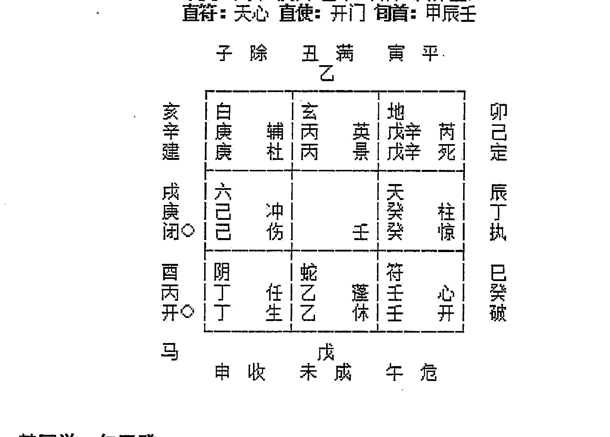

1. 某同学，年干癸。
    任何一个盘，起出来先判断好坏，尤其是看有无四害。该同学年干癸，落兑宫无四害，但是对宫空无，有庚金，也是有问题的。
    这位同学人很实在，善良，脾气一般（天柱星、惊门），癸水，代表学习，九天代表远。跟丁年命的人学习风水。丁代表赚想，想以风水预测为生。伏吟而且对宫空无，空无代表没有能量，伏吟代表至少来学习2或4次，丁代表技术才可冲动对宫填实。
    癸水代表迷茫、困难，什么原因呢？看丁（引干代表事情的原因）、看对宫（对宫是本宫的补充说明）。己+己，主口舌事非，主口袋，主钱。空无，代表没有存款。己代表代表弯曲的，也代表人的小脑，有时想不开。我也很努力、很辛苦，为什么口袋就没有钱呢？天冲星、伤门，脾气不好。再接着看空无，前面我们讲过“镜子原则”，空无就是镜子，遇到空无时，把对宫的象意拉过来。

2. 某同学，年命丙。
    丙落离宫临玄，代表喜欢投机性的赚钱，离宫丙丁火，主信息。乾宫主钱，与钱打交道。值符在宫内的时候，其信息转到天盘上，仅剩20%的能量了。所以说，壬是求测人的信息场。丁，在奇门当中主男孩。

> 《预测中常见的用神选择》
想看房子怎么样？——看生门落宫，生门代表房子，代表阳宅的总体状态。

想看墓地怎么样？——看死门落宫，死门代表阴宅的状态；
想和朋友开公司，情况怎么样？——看开门的落宫；
想和朋友搞工程，看看适不适合？——看天蓬星的落宫；（天蓬为蓬勃发展，犹如建筑物从低到高盖起来）
想看看是不适合做演艺？——看天英星和景门的落宫；
看车有没有问题——看庚金和白虎的落宫。
我做的事情有没有利润、利息？——看生门落宫；

```
公元：2016年3月1日7时39分 阳2局
农历：猴年01月23日7时39分 时盘
干支：丙申 庚寅 壬午 甲辰（寅卯空）
直符：天心 直使：开门 旬首：甲辰壬
```

| 子 除 | 丑 满 | 寅 平 |
| 亥 辛 建 | 白 庚 庚 | 辅 杜 |
| 玄 丙 丙 | 英 景 | 地 戊 辛 |
| 戊 辛 死 | 卯 己 定 | |
| 戌 庚 闭○ | 六 己 己 | 冲 伤 |
| 天 癸 癸 | 柱 惊 | 辰 丁 执 |
| 酉 丙 开○ | 阴 丁 丁 | 任 生 |
| 蛇 乙 乙 | 蓬 休 | 符 壬 壬 |
| 心 开 | 己 癸 破 | |
| 马 | 申 收 | 戌 |
| 未 戌 | 午 危 | |

3. 又换个同学说：“前天做风水”。
    前天是午日（给这位同学现场预测的时间是申日），午在离宫，离宫的天干丙代表火，景门代表太阳，离卦也为火。离卦+丙+景门，断：做风水时天气非常热。
    想看天气，就看落宫的宫位。我们继续看本例，离宫玄代表思想，也为黑色、引申为乌云，感觉做风水的当天有下雨。天英星、景门代表热的很。再看对宫，休门代表水，出汗。
    玄还代表玄学、风水，到底做了以后效果怎么样呢？对宫和本宫、引干都没有四害，引干乙，乙木主策划。乙落坎宫临蛇，代表灵异，搞玄学目的是消除灵异，坎宫主肾，补肾气。休门代表休息，也代表开始改变、修理、修改、所以此处为：改变风水。让你的人生重新开始循环起来。戊代表钱。打开引干到坤宫。
    我们看坤宫：天芮星、戊。我们可以断：这场风水调理的不是姻缘、不是口舌官司等，而是解决身体问题（天芮星），还解决财运问题（戊）。

## 第七章、综合预测

4. 好，我们用此局引申一下，看此局是否把我们昨天参加面授的信息反映出来。
    昨天是申日，是坤宫的时间。此局坤宫临天芮星，我们知道天芮星代表学生和学习，临九地代表稳定扎实地学习，死门无四害代表执著地。伏吟代表坐的老实不动。
    那么学习什么呢？看引干，己土代表说话，对我们预测师而言就是预测。壬水代表风水。
    跟谁学习的？看对宫的信息补充-----跟一个聪明的（太阴）丁年命的人学习。太阴代表智慧聪明的，那么老师状态怎么样呢？临马星、伏吟无四害有潜力，天任星代表认真，丁代表技术，丙代表大技术，好多技术。空无代表付出。丁在艮宫，老师的信息临空无，看看技术真假？现在时间是三点多（未时），所以时间平台在坤宫冲动艮宫。根据我们以前讲过的镜子原则，艮宫信息拉入坤宫，今年是 2016 年（未年）太岁落坤宫，所以艮宫信息拉入坤宫为旺。现在是农历七月份（未月），流月也是坤宫的时间（临太岁）所以也是旺的。今天是申日，同流月一样临太岁也是旺的。丁在艮宫，寅、丑的落宫，寅为虎、丑为牛，我们不做母老虎，专做牛人。

5. 此例中，最不好是兑宫、震宫。如何转化呢？
    癸代表鬼，代表一切负能量磁场。丁癸都代表眼睛。为什么有的时候会不开心呢？因为你的身体有一些负能量磁场，己土代表缠绕的，让你受伤害。慢慢地眼睛（丁）或者身体感觉到一丝莫名的磁场，这个磁场是否存在呢？每次感觉到这种磁场的时候，会感觉有一丝不舒服，己+己，伤门。癸水是一切负能量信息，需要丁来解决，丁代表火，引申为香烛、超度，丁火耗泻癸水，用强大的丁火让癸水代表离开。
    震宫有伤门和庚金，结合在一起对身体是不好的信息。庚金用乙木合，伤门用戊土，卯戌合，乙木代表吃素，每月至少 3 天吃素，让你的肚子（己）尽可能空无。空无就不吸收负能量磁场。伤门代表说话冲，卯戌合，也是提请要低调、谦虚。加乙木就可合住庚金，经常去西北一个人比较多、有树木的地方锻炼。年命和日干是戌和乙的人都是贵人。

### 第二节、综合局分析

#### 案例一：预测两人关系及公式

## 第七章、综合预测

公元：2016年8月7日6时25分 阴7局
农历：猴年07月05日6时25分 阴7局
干支：丙申 乙未 辛酉 辛卯 (午未空)
直符：天禽 直使：死门 旬首：甲申庚

| 丑 丙 危 | 白 乙 己 | 任 惊 |
| 子 辛 破 | 玄 丁 戊 | 蓬 死 |
| 亥 壬 执 | 地 己 癸庚 | 心 景 |
| 戌 | | |
| 酉 平 | 丙 | 天 戊 |
| 申 满 | | 丙 杜 |
| 未 丁 除 | 符 癸庚 | 辛 伤 |
| 午 己 建 | 蛇 丙 | 壬 生 |
| 巳 戊 闭 | 阴 辛 乙 | 辅 休 |
| 辰 开 | 六 壬 丁 | 冲 开 |
| 卯 收 | | 寅 成 |

某女弟子 1963 年（癸卯年）生，其儿子 1991 年（辛未年）。
首先取用神，本例采用年命用神法：女弟子 1963 癸卯年出生，年干（癸）落巽宫。
儿子 1991 辛未年出生，年干（辛）落艮宫。

#### 【预测两人关系公式】

- 第一、看宫位是否相生、相比，还是相克、相泄。本例为两宫相克。
- 第二、看能量是否相等，也即看两宫是否有四害。本例巽宫有四害，艮宫无四害。
- 第三、看有无共同的符号。天盘、地盘、引干都要看。

预测两人关系，要看宫位是否相生、相比。若相生或相比，就往好的地方断。此例中，巽宫为木，艮宫为土，木克土，两宫相克。
宫相克说明两人不和谐，母亲克儿子，可是母亲宫位有四害，能量低，儿子宫位无四害，能量高，说明母亲管不了儿子。虽然彼此看不上，女人的思想（值符）虽然有时很生气（庚金），生儿子的气（丁），但是因为有共同符号“辛”（巽宫地盘和艮宫天盘都为辛），所以女人还是在乎儿子的。
任何局里都有天盘和地盘。天盘和地盘到底什么关系呢？--天盘代表表面的，代表当前状态。地盘代表实质、代表内心世界，也代表以后的发展。
如：

| 乙 | 辛 |
|---|---|
| 辛 | 乙 |

## 第七章、综合预测

如上图左，预测某女人性格，可断她：表面看上很柔弱、很温柔（乙为温柔），实质内心很刚强（辛为颗粒、引申为石头、坚硬）。

如上图右，若还是预测同一女人，可断她：表面像个男人很坚强（辛），但内心很脆弱（乙），希望有人疼爱你。

※※※预测两人关系公式，可用于招聘、合作、选配偶等情况。
即：起局后，看各位候选人年命的天干的所落宫位，与预测人的所落宫位是否符合这三项条件：①相生、相比合；②能量相等；③有共同符号。哪个候选人符合的条件越多、就越是合适人选。

#### 案例二：一局多断

公元：2016年8月7日6时25分 阴7局
农历：猴年07月05日6时25分 阴7局
干支：丙申 乙未 辛酉 辛卯 (午未空)
直符：天禽 直使：死门 旬首：甲申庚

申 满  酉 平  戌 定
马            乙 ○   ○
未 丁 除 符 癸庚 丙 天 戊 柱 地 己 心 亥 壬 执
      辛    伤 丙 杜 癸庚 景
午 己 建 蛇 丙 英      玄 丁 蓬 子 辛 破
      壬    生      戊 死
已 戊 闭 阴 辛 辅 六 壬 冲 白 乙 任 丑 丙 危
      乙    休 丁 开 己 惊

辰 开  卯 收  寅 成
癸庚

某男士电话测是非，此局用案例一中的局进行一局多断，分别预测男人所测的事情，以及男人的婚姻状态、身体健康、爱人的身体健康、孩子的学习成绩、等等。

##### 第一步、选用神

电话远程测，直接取月干为用神。本例月干乙木落乾宫入墓，首先判断男人的能量不高。

取用神后，看盘分析顺序依次为：本宫、对宫、引干。分析的原则：本宫、对宫（解释说明本宫的，也称平衡木）、引干。

## 第七章、综合预测

咱们看男人为乙落乾宫进行分析。

本宫中：白虎代表压力，事非、警察
己土代表嘴巴、事非。己土代表暗地的钱。
惊门代表担心、害怕、吃惊
丙火代表乱子

对宫中：值符代表事业、代表领导
辛代表钱、代表犯错
癸水代表不见阳光的、暗地里、负能量
丁辛巳都代表钱，丁还代表票据、账目

##### 第二步、分析：

###### （一）出了什么事？

男人出了事非（白虎）有了乱子（丙），招来了警察（白虎）。为什么担惊受怕呢？什么原因呢？因为自己悄悄地贪了钱（己）-------出的事情与钱有关系。如果还不明白，看对宫，值符代表领导、企业、公司，有四害，代表领导犯了错误，有问题（天芮性），伤门也代表警察，问题很大（值符），大到什么程度呢？庚金和伤门代表警察。与什么有关系？看引干，丁代表票据、账目。

男人害怕担心什么呢？己代表钱，自坐乾宫代表大钱，乙木和己土都是拐着弯的，代表管理、策划。乙木是天辅星代表帮助管理。男人做财务工作。

接着看男人和老板的关系，看两宫的合干。乾宫的乙、丙、己，分别与巽宫的庚、辛、甲构成三组天干相合关系：甲己相合、乙庚相合、丙辛相合。相合就是稳定，两人关系很铁。什么原因呢？天芮星，代表学生，引申为同学关系。同学关系临着值符，代表大学同学。如果临着九地，代表小学、初中同学。临着九天，也是大学同学。

###### （二）婚姻关系

- ① 预测婚姻，看配偶落在哪个宫位？——看合干的落宫。例如当事人用神为乙，乙庚相合，所以庚的落宫就是配偶所落的宫位。
- ② 找到双方落宫后，运用前面的“预测两人关系公式”进行分析。
- ③ 然后还要看六合宫，六合宫代表婚姻的总体状态。

此例男人是乙，女人看庚金。

1. 乙庚分别落乾宫巽宫，对冲，而且五行互克（乾金克巽木）。预测已经结婚的夫妇，若双方落宫对冲，一般情况下都是不好的，容易吵架、观点严重不合等。只有生、比才好。

接下来我们细看两人在婚姻中表现的性格：

## 第七章、综合预测

女人临值符+伤门+庚，男人白虎+惊门，这些都是吵架、摩擦、脾气暴的信息。
综述，我们断：男人脾气暴燥，媳妇脾气也暴。临值符的女人脾气都不好，说话伤人（伤门），都感觉自己说的对（两人对冲、针锋相对），所以经常发生白虎的事情、伤门的事情，吵架的时候还会动手（庚金）。

但是我们却预测：两人的婚姻是稳定的。为什么这么断？接着往下分析：

- 2. 男女双方落宫虽然相冲、互克（乾金克巽木），但是乾宫生婚姻宫（六合落坎宫，乾金生坎水）、婚姻宫生女人（坎水生巽木），五行通关了两人之间的冲克关系。
    （关于“五行通关”，详见前章《零基础知识必背手册·十二地支·⑥小实战》）
- 3. 两宫都有四害，能量相等，相等才能共振。
- 4. 两宫之间虽然无共同符号，但是两宫之间有天干相合关系的也可算为共同符号，而且此例两宫之间有较多相合关系，乾巽两宫之间存在三组天干相合：甲己相合、乙庚相合、丙辛相合。
- 5. 六合代表婚姻整体状态。本局六合所落的坎宫无四害。

综述，我们大概得知两人的关系：男人和媳妇关系不和谐，经常有摩擦口角，但婚姻是稳定的。

此外，引干是看一件事情原因的重要线索，女人落巽宫引干为丁，引申为人丁、儿子。所以断：两人时常吵架，但因为儿子而没有离婚，保持着婚姻的稳定。

###### （三）预测身体

###### 【看身体健康的原则】

- 1. 看身体要综合分析天芮星和用神宫的状态
- 2. 判断当事人是否已经察觉自己身体有问题，要看用神宫与天芮星落宫之间的关系：
    ① 有无共同符号② 有无相合关系③ 有无先后天关系
- 3. 预测身体时一定要看年龄段，比如 40—50 岁之间的人容易得肝病、胃病；50 岁以上的男人容易得心脑血管、心脏病，等等。

看身体要综合分析天芮星和用神宫的状态，这里我们重点讲一下天芮星。天芮星的落宫代表身体的总体状态，临白虎、庚金都代表身体隐患，也代表脾气暴燥、压力大导致的身体问题。
若天芮星落宫很好，无四害，但是用神宫有四害，说明求测人没有大病，暂时身体不适而已。

如果天芮星击刑门迫，说明身体有问题。若天芮星落宫有击刑或门迫，又临死门，此病定用常规手段难治，通常都是非常大的病，例如癌症。要做超度才有缓解、减轻的希望。

但是在实际预测中，有人的比较敏感，有的人不敏感、即使身体有问题也感觉没事。我们要根据上面的讲的三个原则看天芮星落宫与用神落宫之间的关系：①有无共同符号②有无相合关系③有无先后天关系。如例：

## 第七章、综合预测

|  |  |  |
| --- | --- | --- |
|  | 离宫 |  |
|  | 天芮星有四害 |  |
|  |  | 兑宫 |
|  |  | 用神宫有四害 |

此例，天芮星与用神落宫都有四害，说明人的状态不好。但是两宫没有先后天关系，也没有形成天干相合，也没有共同符号，也就说：求测人身体不敏感，自己不知道。换句话说：求测人的身体此时已经有了病灶，但是不被自己在意，时间久了可能会转化为较严重的病。

反之，若用神宫和天芮星之间存在三种关系其中的任意一种（①有无共同符号②有无相合关系③有无先后天关系），说明病已经有感觉了。

下面我们分析前面那位男士的身体健康。

公元：2016年8月7日6时25分 阴7局
农历：猴年07月05日6时25分 阴7局
干支：丙申 乙未 辛酉 辛卯（午未空）
直符：天禽 直使：死门 旬首：甲申庚

申 满 酉 平 戌 定
马 乙 ○ ○
未 丁 除 符 癸庚 丙 辛 伤 天 戊 丙 杜 地 己 癸庚 心 景 亥 壬 执
午 己 建 蛇 丙 壬 英 生 玄 丁 戊 蓬 死 子 辛 破
巳 戊 闭 阴 辛 乙 辅 休 六 壬 丁 冲 开 白 乙 己 任 惊 丑 丙 危
癸庚
辰 开 卯 收 寅 成

#### 分析

- 1、男人落乾宫有四害，判断求测人状态不好（状态不好包括压力、心情不好、是非、

## 第七章、综合预测

想不开、身体不好)。天芮星落巽宫，巽宫临癸有四害，说明求测人身体是有问题的。

- 2、看男人对自己的病是否有感觉呢？男人在乾宫与天芮星落宫有三组天干合干关系（乾宫的乙、丙、己，分别与巽宫的庚、辛、甲构成三组天干相合关系），说明男人对身体状态已经有感觉了。

到底是哪里有病呢？对40、50岁的男人而言，震宫和巽宫有问题，先预测肝胆有问题。临值符，代表高的、代表头、代表问题比较大，庚金代表压力，癸水代表血液，测出有高血压的疾病。

癸水有击刑，引爆了庚金的煞气（凡是某宫击刑又临庚，庚的煞气几乎必会被引爆）。测病中，庚金是最不好的，代表大病隐患。庚金旺、乙木就弱。乙木弱，就得乙木的病，辛金代表病毒，巽宫主成长，断：乙肝病毒携带者。

什么原因引起的？癸，酒。被引爆煞气的庚+癸：劣性酒，值符代表高的，丁代表吸烟。

天芮星主医院，丁在医院、医疗的象意系统中主化验单。
男人的血压在120左右，超过120都为高血压。

> 小经验：测病不仅考验预测师的实际预测水平，也需要预测师有较多的生活阅历。
首先心里要对哪个年龄阶段的人容易得哪些病要有了解，比如年轻人容易得什么病，中年男人和中年女人、老年人又容易得什么病，等等。
然后要熟悉常见疾病的符号象意和落宫位置，最好能经常做笔记记录下来成为一套自己的“知识储备库”。比如巽宫、乾宫、离宫在预测身体健康时常对应头部，而“癸”在人体中代表血液、体液。若癸落巽、乾、离且遇到了其他四害，我们心里可以大致有个思路：此人可能在头部有血液方面的问题。初学者从一问三不知、到能在心中有个大概思路，就已经算是进步了。
但这也只是刚入门程度的“粗断”而已，是拿不上台面的。比如用神落巽宫且有“癸”遇到了击刑，可能是他的头部有问题、但也可能是他的左肩膀不舒服（巽在九宫格为左肩）。如何具体定位呢？这就要更进一步结合本宫、对宫、引干、当事人的年龄等信息进行综合定位。
比如上面那位男士的案例，癸在巽宫击刑，我们继续看巽宫其他符号：临值符。这就给了我们一个很大的提醒：值符代表高的、代表头，而巽宫也代表头部。同在巽宫的庚为厉害的、也为压力，所以巽宫+值符=定位为头部，癸击刑+庚=血液有问题、有压力。所以直接断：高血压。
总之，初学者只有在记忆大量基础知识的前提下才能在实际预测中经常灵光乍现、做出各种令人瞠目结舌的准确预测。好记性不如烂笔头，希望大家每个人都有自己的笔记。

- 3、看他爱人身体有没有问题呢？

## 第七章、综合预测

小经验：中年女人一般容易得四种常见疾病：乳腺、妇科、肩膀、头痛。

- ①根据上面的用神落宫，他的媳妇落巽宫，我们看巽宫：庚金和天芮星同宫且巽宫有四害，此时可以判断他爱人身体有病。那么具体是哪种病？我们接着往下分析。
- ②在中年女人的四种常见疾病里，巽宫遇到四害对应“肩膀”和“头部”。那么还能不能具体定位看到底是头痛还是肩膀？可以的，因为巽宫临值符，值符为头部，所以断：女人有头疼问题。
- ③那么为什么头疼呢？巽宫有庚，庚辛金都代表骨头，值符（头）旁边的骨头就是颈椎。癸水代表血液，击刑，代表供血不足。这样我们就明白了：因为女人颈椎有问题造成的供血不足，导致头疼。
- ④继续看女人的其它问题：癸水代表有颜色的液体，有击刑，血液有杂质，比如胆固醇过高。
- ⑤庚代表恶性病，看什么原因引起的？看引干丁，打开在兑宫。丁代表孩子，代表手术。死门代表死胎、死掉。玄主怀孕，戊主肚子。为什么身体不好？因为曾经打过胎。

公元：2016年8月7日6时25分 阴7局
农历：猴年07月05日6时25分 时盘
干支：丙申 乙未 辛酉 辛卯（午未空）
直符：天禽 直使：死门 旬首：甲申庚

申满 酉平 戌定
马 乙 ○ ○
未除 符 癸庚 芮 天 戊 柱 地 己 心 亥执
午建 蛇 丙 英 玄 丁 蓬 子辛破
已闭 阴 辛 辅 六 壬 冲 白 乙 任 丑丙危
辰开 卯收 寅成

#### 4、儿子的情况

儿子属于晚辈，我们以时干为用神（参看前面讲的“用神选取法则”）。用神辛落艮宫，本宫无四害，但对宫坤宫有各种四害问题，所以艮宫被动受伤，儿子的状态也是不好的。

每一个符号都分为阴阳两方面，能量高时为正面、能量低时为负面，已知儿子的状态不好，我们预测时就把对应儿子的相关用神符号在不好的方面的内容翻译出来就行。

注意要把握分寸，点到为止。比如看出来当事人未来有车祸信息，不要直接说“你在XX月会出车祸”，这不是预测，而是诅咒。看出来了不好的事情尽量用委婉的语句表达，比如：“你在XX月可能在马路上遇到危险比较大的事情，尽量处处留意。”如何委婉表达大家可以自由发挥，总之要牢记：口下留德。

好，我们看儿子的状态。艮为止，能量低时为懒惰，所以断：儿子比较懒惰。而且学习不理想、不认真。为什么这样断？---对宫（坤宫）是本宫（艮宫）的信息补充，坤宫有四害，所以坤宫的全部符号都表现为不好的信息。景门代表学业、成绩、分数，而景门恰恰落在坤宫遇到空无、击刑，成绩遇到了空无、击刑，所以断：成绩不好。

空无是面镜子，我们直接拉取艮宫的对宫（坤宫）的信息进行翻译。己代表说话，能量低时为说话出乱子，而景门与庚在能量低时都代表暴躁。所以断：儿子脾气暴躁，说话不注意（负能量状态下的己+景门+庚）。

接着看，艮宫与坤宫的符号有出现合干关系（艮宫戊合坤宫癸、艮宫乙合坤宫庚），而且艮宫临太阴（背地里、悄悄地），所以断：儿子悄悄地（太阴）谈恋爱了。

##### （四）如何处理？

常规处理方法：找到局中四害并化解。铛铛铛敲黑板！初学者注意，不是让你把整个奇门局九个宫的全部四害都给处理了，累不累呀？要抓问题的重点进行处理。

初学者处理某件事的奇门局，找这四个方面的四害进行化解：①四纲宫 ②马星落宫 ③马星的对宫 ④太岁宫。这些落宫有四害的话都要处理。

按照以上原则，我们看如何处理本例：

###### 【第一步：找四害】

- 1. 先看四纲有无四害---丙、乙、辛分别落震、乾、艮宫，这三个宫里唯独乾宫有四害。
- 2. 再看马星落宫、以及马星的对宫---马星落巽宫，马星的对宫为乾宫，这两个宫位都有四害。
- 3. 再看太岁宫---此局为丙申年所起，申在坤宫，而此局的坤宫有很多四害。
综述，此局要处理三个宫位：乾宫、巽宫、坤宫。

###### 【第二步：化解】

找到要处理四害的宫位后，我们按照前面《四害及化解思路》所讲的方法进行化解即可。

这里有个注意点：拆物品前，先看宫内的四害到底是哪几个符号引起的四害，这是最重要的。比如本例的巽宫，巽宫符号为癸+庚+辛+伤+芮，首先问：“你是套几的房子啊？你客厅的东南方向和房子的东南方向都有什么东西？”比如有没有带水的（癸）、金属的（庚）、小颗粒的（辛）、破碎的（伤门）的东西？或者是神佛像（芮）或相关图片等与寺庙有关的东西？因为引起巽宫四害的主要是癸与辛，所以重点处理癸与辛。剩下的乾宫和坤宫，己击刑用卯合、庚用乙奇符，具体参看前面的《四害及化解思路》，这里不再赘述。

### 第三节、综合预测

公元：2016年8月2日11时59分 阴7局
农历：猴年06月30日11时59分 时盘
干支：丙申 乙未 丙辰 甲午（辰巳空）
直符：天辅 直使：杜门 旬首：甲午辛

已 闭 午 建 未 除 马
辰 符 天 地 申
壬 辛 辅 丙 英 癸庚 丙 丁
开 ○ 辛 杜 丙 景 癸庚 死 满
卯 蛇 玄 酉
癸 壬 冲 戊 旺 己
收 壬 伤 辛 戊 惊 平
寅 阴 六 白 戊
戊 乙 任 丁 蓬 己 心 庚
成 乙 生 丁 休 己 开 定
丑 危 子 破 亥 执

#### 某中年男士面测

##### 一、选用神：

在实际预测中，遇到四害的盘往坏的地方断。但是如果遇到好局，比如局里的四害非常少，你用这个好局可以同时给很多人预测、一局多断，但不可能每个人都好吧？这里就需要判断好坏。如果判断好坏呢？看用神与平台（代表时干）之间的关系。---若平台的落宫生、比用神就好，反之就为不好。如此例，男人当面测，丙火在离宫无四害，对宫坎宫也无四害。遇到此类的好盘，要看时干和用神之间的关系，还要看能量是不是相等。能量相等是非常重要的。平台为时干，此例为甲（值符）在巽宫，生离宫是好事情，但恰恰巽宫有问题，一个有四害的宫生用神宫，越生越坏，能量不相等，把财运都吸没了。所以判断求测人的状态不好。出了什么问题呢？

求测人落离宫，天英星、景门代表火气大，为什么火气大呢？--看本命、对宫、引干。
看对宫---六合，代表合作出问题了，丙火代表乱子。出了什么问题呢？看引干乙，打开落艮宫，戊代表钱，生门代表一切钱的总称，乙木代表拐弯的，太阴代表迷糊的、不清楚的。----说明求测人的合作出了问题，有人悄悄地把钱放到自己口袋里了。

求测人是丙，合作人是辛金，求测人丙落离宫无四害，合作人辛落巽宫有四害，说明公司以求测人为主。合作人有四害生求测人，合作人起辅助作用。因为离宫是九宫之首。

丙、丁、戊、己、辛、庚都代表钱。求测人落离宫无四害，男人的资金投入占主要部分，大股东。合作人的信息是什么样的呢？有四害，辛金代表小聪明、小算计，天辅星代表辅助，杜门代表技术。合作人投了很小的部分钱，只要是负责技术。辛金有四害，太算计、小聪明。入墓和空无，实际本事不大。

时干代表员工，员工空无，状态不理想、代表总是流失，不稳定。壬水代表走掉了。

##### 二、解决的问题

综上所述，我们解决要问题：员工不流失、事业的平台好、合作好。
重点解决巽宫：合作人、平台、员工都在此宫。
对宫有白虎不能冲，只有在巽宫填实。念《心经》、五帝钱、硬币置换；画天辅星符、乙奇到罡。

男人问：“我的合作人到底想干还是不想干？”
男人在离宫，合作人在巽宫遇四害，虽然生求测人，但却是假的、故意说的，实际上是不想干的。

男人说，我的员工最近又走了几个人，值符就是主管，员工的头带着几个员工走掉了，因为辛空无。辛金伏吟，空无，拖欠工资走的。

解决问题核心：奇门穿六爻，合住世爻。

员工在巽宫，巽为风，世爻是卯木，我们穿的是员工，不想让员工流失，卯木就是员工，卯木在震宫，在震宫放合卯木的东西，即戌土的工艺品、图片、符咒合住员工就可以了，工艺品的力量最大，有形的东西力量最大。

如果一个人说，我老公有了外遇，现在已经不回来，如果收回他的心？看他老公穿出一个卦，把其老公的世爻合住就好了，世爻代表其老公。

有一个东北的弟子，其最好朋友的女儿16岁让人拐跑了，找了两天两夜都没有找到。找到周老师后，用她女儿的年命和奇门四纲中的时干同时穿的。她女儿年命是己，时干也是她女儿，合住她女儿的世爻，第二天她女儿就找到了。

还有一个弟子，媳妇跑了，离家一个月了，也是起了一个盘，合住了世爻。再比如，我和我的合作人合作的非常到位，合作人让人挖跑了，要求撤资。想留下来，合住合作人的世爻就好了。合的时候，如上例，买个戌的工艺品，写上”戌到罡”，用符写上离家出走的人的名字、电话、生辰八字，信息共振。

这种情况还可用于收魂。

按照丢魂人的年命和用神穿出世爻，这就是卦的中心点，也是卦的灵魂。用工艺品合住，合的时候写上姓名、生辰八字。

如果一个人与合作人有了纠纷，合作人的世爻是卯，找个属狗的去合解，也可以戌日、戌时去谈事情。同样一个道理，戌是四墓库，辰戌丑未，墓库就是钱。戌是乾宫，乾宫是3，6，9的数。

##### 三、看看爱人的情况

男人继续问，看我媳妇怎么了？最近不舒服。

男人是丙火，媳妇是辛。媳妇在巽宫有四害，先判断状态不好。到底有没有大病呢？和平台同宫，没有太大的病。平台和用神比合，平台代表事情的总体发展、趋势、政策。哪里不舒服呢？

值符代表头，供血不足，头痛。肩椎突出（辛），辛代表刺，小骨头。庚金代表骨头。看引干，壬找开，蛇代表腰，壬+壬+癸，寒气导致腰损伤（伤门）。还有什么问题呢？看乾宫，心代表心脏，心供血不足导致有时候头痛。

##### 四、看看父亲的情况

男人继续问，我父亲怎么样？

男人是丙火、年干丙，信息就不强了。看乾宫，乾宫代表老父亲。乾宫无四害，但是对宫有四害，而且对宫是平台，相冲克，得出父亲身体状态不理想。心脏供血不足，己土代表糖尿病，伏吟，时间比较久，至少是2012、2013年开始的。

##### 五、看看孩子的情况

男人继续问，我有三个孩子，两个女儿一个儿子，总体来说学习怎么样？

大女儿上高二、二女儿上五年级、儿子上三年级。

大女儿在巽宫，虽然有问题，但是和平台同宫，天辅星代表学习技巧，喜欢耍小聪明。辛+辛代表疙瘩。

二女儿在离宫，老二和男人同宫，长得也像，脾气暴燥，无四害，学习不错。

小儿子在艮宫，火生土，男人喜欢儿子，重男轻女。学习也不错，聪明、任性。

两个小时之内的事情看值使门，常时间的事情看值符。

## 第八章 奇门的生活应用

### 第一节、奇门数字预测手机号、车牌号

奇门数字预测原则：看最后五位数。

#### 一、手机号码预测

在意识奇门体系中，手机号码预测取手机号码的最后五位数为用神。例如某手机号：187XXX74421，取最后五位的 74421 为用神。

从左往右，第一个数字对应：八神；第二个数字对应：九星；第三个数字对应：八门；第四个数字对应：天盘天干。第五个数字对应：地盘天干。即：神、星、门、天盘、地盘。

**奇门符号对应数字关系表**

八神与数字对应：

| 八神 | 数字 |
|------|------|
| 值符 | 1/9  |
| 腾蛇 | 2    |
| 太阴 | 3    |
| 六合 | 4    |
| 白虎 | 5    |
| 玄武 | 6    |
| 九地 | 7    |
| 九天 | 8    |

九星与数字对应：

| 九星 | 数字   |
|------|--------|
| 天蓬 | 1      |
| 天任 | 8      |
| 天冲 | 3      |
| 天辅 | 4      |
| 天英 | 9      |
| 天芮 | 0、2、5 |
| 天柱 | 7      |
| 天心 | 6      |

八门与数字对应：

| 八门 | 数字   |
|------|--------|
| 休门 | 1      |
| 生门 | 8      |
| 伤门 | 3      |
| 杜门 | 4      |
| 景门 | 9      |
| 死门 | 2、0   |
| 惊门 | 7      |
| 开门 | 6      |

天干与数字对应：

| 天干 | 数字 |
|------|------|
| 甲   | 1    |
| 乙   | 2    |
| 丙   | 3    |
| 丁   | 4    |
| 戊   | 5    |
| 己   | 6    |
| 庚   | 7    |
| 辛   | 8    |
| 壬   | 9    |
| 癸   | 1    |

- **注：**
- 0 出现在天干的位置，一律当做空无。例如 XXX20，XXX03。
- 0 出现在星、门的位置，分别转化为天芮和死门。例如 X03XX，X30XX。
- 0 出现在八神的位置，需要往前看一位。例如 187XXX04421，后五位是 04421，此时需要跳过 0 往前提前看一位（本处 0 前面是 6），所以符号组合按照“64421”来论断。

##### 例一

A 同学的号码，180XXX65168，后五位按照神、星、门、天盘、地盘的关系转为符奇门符号（如下）进行分析：

玄
己 天芮
辛 休门

1、看号码组合有无白虎、庚金、四害。若无，则没有大问题。
①看号码组合内有没有白虎、庚金，没有就是好事情。
②再看这些符号在预测时的落宫有无四害。现在的时间是 17：30 分，酉时，此组符号落兑宫。

此号码既没有白虎、庚金，也没有四害，综述此号码总体上是个不算凶、没有大问题的号码。

#### 2、预测号码的应期

此号码何时会出现问题？将该组符号组合代入九宫格中的每一宫，如下：

玄
己 天芮
辛 休门 | 玄
己 天芮
辛 休门 | 玄
己 天芮
辛 休门
玄
己 天芮
辛 休门 |  | 玄
己 天芮
辛 休门
2009 年（丑）
2010 年（寅）
玄
己 天芮
辛 休门 | 2008 年（子）
玄
己 天芮
辛 休门 |  
玄
己 天芮
辛 休门 |  |  |  | 

2008 年（子年），该组符号组合在坎宫无四害。
2009 年（丑寅年），符号组合中的己土在艮宫入墓，引发天芮星的问题。天芮星代表病症，己土代表思想，玄也代表思想。所以 2009、2010 是转折点，天芮星代表医院、医药，己土代表嘴巴，休门代表休养。己土入墓，代表压抑。可以推测号码的主人在这两年身体状况欠安、思想较为压抑。

##### 例二:

B 同学的号码 135XXX86319，转化为奇门符号如下:

| 天 |    |
|----|----|
| 戊 | 天心 |
| 壬 | 伤门 |

伤门，脾气急。心，要注意下心脏。壬，代表迷茫，有时会感情伤脑筋、伤心。现在的月份是坤宫的时间，伤门在坤宫门迫，戊代表钱，壬水代表流走。伤门在艮宫也门迫，所以 09 年、10 年都不赚钱。

##### 例三:

C 同学的号码 135XXX21468，转化为奇门符号如下:

| 蛇 |    |
|----|----|
| 己 | 天蓬 |
| 辛 | 杜门 |

看这个号码可断：C 同学若与前面 A 同学交往，肯定会关系好。为什么和 A 同学的人关系好？都是己+辛，共震符号。己土代表说话，蛇代表聪明，辛，可以置换。杜门代表技术和特长，己土也代表权利。这个号码在这个月不行，坤宫有己为击刑、杜门门迫。到了坎宫，天蓬星的本命宫位才会好。

#### 二、定制选择手机号

选号码，尽量选丁、戊、值符、天辅、开门等吉祥符号的组合，另外要尽量有天辅、天蓬、天心星中的任意一个本命星，可解四害。

但是我们也应辩证看待“吉祥号码组合”，这就好比：衣服是名牌的好、还是量身定制的好？---肯定是量身定制的更好。选号码也是如此，吉祥号码组合虽好，却未必最适合当事人。例如：当事人财运好但身体弱，你若给他选了个旺财的号码让当事人投入更多精力去挣钱、反而会加重他的身体负担、甚至埋下健康隐患。

总之，我们要尽量结合当事人的奇门终身局来定制选择最适合当事人的号码，既能化解当事人终身局的四害与不顺、又能用一系列的吉祥组合来催旺、弥补当事人的相关运势。如何结合奇门终身局来定制选择号码，限于篇幅本处不再赘述，大家可关注周纳羽老师的相关课程进行学习。

#### 三、英文字母对应数字表

26个英文字母，9结束后面直接跟着1进行循环.如下表：

| A | B | C | D | E | F | G | H | I |
|---|---|---|---|---|---|---|---|---|
| 1 | 2 | 3 | 4 | 5 | 6 | 7 | 8 | 9 |
| J | K | L | M | N | O | P | Q | R |
| 1 | 2 | 3 | 4 | 5 | 6 | 7 | 8 | 9 |
| S | T | U | V | W | X | Y | Z |   |
| 1 | 2 | 3 | 4 | 5 | 6 | 7 | 8 |   |

### 第二节、奇门选小区住房

第一步，选楼房。现在一些大型的小区有数十栋住户楼，到底选哪栋楼呢？

问话的时间就是起奇门局的时间。起出奇门局后，将整个小区套入奇门局中，按照以下原则选楼：

- ①有四害的宫位的住户楼不能要。
- ②白虎、庚金落宫的住户楼不能要。
- ③排除上述两项后，在剩余的宫位中首选值符、九天、六合、太阴的宫位。
- ④优中选优，哪个宫位的吉祥符号越多，就选择哪个宫位的住户楼。吉祥符号如下：
  - 吉神：值符、九天、六合、太阴
  - 吉星：天蓬、天辅、天英
  - 吉门：开、生、休
  - 三奇：乙、丙、丁

第二步，按照数字方法选楼层。

①首先，把上步所选的楼套入九宫中，然后另起一个奇门盘。如起局显示这栋楼的西南方最好，就把西南方的单元门作为起始点（这是定位排大运的第一个单元入户门）。
②然后我们开始排房子的大运：面向①中所选的单元入户门，从单元楼右侧往左，从 8 开始数字循环排大运，依次写 8，9，1，2，3，4，5，6......因为现在是艮八大运，所以从 8 开始循环。如果是离九大运，就从 9 开始循环。

例如下图是某楼的大运循环：

|
| 八楼 |  |  |  |  |  |
| 七楼 |  |  |  |  |  |
| 六楼 |  |  |  |  |  |
| 五楼 |  |  |  |  |  |
| 四楼 |  |  |  |  |  |
| 三楼 |  |  |  |  |  |
| 二楼 |  |  |  |  |  |
| 一楼 | 4 | 3 | 2 | 1 | 9 | 8 |
| 东户（一单元）西户 | 东户（二单元）西户 | 东户（三单元）西户 |

从右往左，横向排大运

排完横向之后开始纵向往上，从 8 开始进行数字循环。例如下表：

|
| 八楼 | 2 | 一 | 九 | 8 | 2 | 6 |
| 七楼 | 1 | 九 | 八 | 7 | 3 | 五 |
| 六楼 | 9 | 八 | 7 | 6 | 4 | 4 |
| 五楼 | 8 | 7 | 6 | 5 | 5 | 3 |
| 四楼 | 7 | 6 | 5 | 4 | 6 | 二 |
| 三楼 | 6 | 5 | 4 | 3 | 7 | 1 |
| 二楼 | 5 | 4 | 3 | 2 | 8 | 9 |
| 一楼 | 4 | 3 | 2 | 1 | 9 | 8 |
| 东户（一单元）西户 | 东户（二单元）西户 | 东户（三单元）西户 |

从下往上，竖向排大运

排完大运之后我们开始选楼层。注意：凡是标号是 2、5 的不要买，代表孤寡、夫妻。

## 第八章、奇门的生活应用

感情不好。例如上面这栋楼，三单元西户的四楼标号是2，七楼标号是5，这两间房就不要买了。其余标注2和5的以此类推。

现在是八运，选8，9，1三个数的对应楼层比较好。例如上面这栋楼，二单元东户的七楼是8、八楼是9，这是较为不错的选择。

第三步：起刻盘局，逐个排查。假设按照上述方法选中图上一单元西户、标注数字分别为8、9、1的六楼、七楼、八楼，到底选哪个好呢？这时我们要到房子的现场起刻盘局。刻盘每十分钟一个，凡是现场起刻盘局后用神临马星、临击刑的房子不要，选伏吟、磁场比较好的那个。

例如上栋楼一单元西户的六楼（标号8），现场起刻盘局后发现用神击刑了，那这个房子不要选。等十分钟后上七楼（标号9），用现在的刻盘起局看房子（刻盘每10分钟一个，所以要等10分钟再看第二个房子），发现用神宫能量不错、伏吟，那就选这个房子。

为什么现在房地产这么火，还有生病年轻化，尤其是一些年轻人出怪异的病，庚金以及生门的原宫在艮宫，对宫又是天芮星所致。

### 第三节、奇门姓名分析

一男人1975年，叫王永进。

奇门当中有四纲，年、月、日、时，名字中有三个字，说明年、月重合了。

姓氏代表年、月，“永”代表日干，“进”代表时干。永字像水，进像井，也是九宫格，进还代表进入。

永代表日干，代表目前的状态，水太旺、水主体质寒气非常重。名字当中日干代表现在的大运。时干代表以后走的大运。

水在坎宫主肾，姓氏王，两个土通土，肾有问题，土放进去就是疙瘩，囊肿——有肾结石。寒气大，腰也寒凉——腰椎间盘突出。

| | 辛 休门 | |
| --- | --- | --- |
| | | |
| | 用神 天蓬星<br>生门门迫<br>死门门迫 | |

放入九宫中，日干代表当前的状态，水的大运，有四害，什么原因呢？看对宫，既然肾虚，对宫就有问题，脑供血不足。离宫主头，主脸，辛主疙瘩。什么时间长的？子年，坎宫时间，2008年前后长的。而且看起来有些恶心（辛）。

男人在坎宫，生门和死门门迫，判断状态不理想。坎宫有天蓬星，有四害的时候代表色情、有情人。男人走的大运，越犯桃花、体内寒气越重。桃花代表壬癸水。

男人在坎宫，坎宫有子水的地支，子丑合。媳妇在艮宫，艮宫五行为土，土克水，男人怕老婆，感情不合。

### 第四节、解梦预测

公元：2016年8月6日6时16分 阴6局
农历：猴年07月04日6时16分 时盘
干支：丙申 乙未 庚申 己卯 （申酉空）
直符：天禽 直使：死门 旬首：甲戌己

| 马 未丁除 午庚建 巳辛闭 | 申 满<br>阴<br>庚<br>庚<br>辅<br>景<br>六<br>辛<br>辛<br>冲<br>杜<br>白<br>丙<br>丙<br>任<br>伤 | 酉 平<br>己壬<br>蛇<br>丁<br>丁<br>英<br>死<br>玄<br>癸<br>癸<br>蓬<br>生 | 戌 定<br>符<br>壬己<br>壬己<br>芮<br>惊<br>天<br>乙<br>乙<br>柱<br>开<br>地<br>戊<br>戊<br>心<br>休 | 亥乙○执<br>子戊○破<br>丑癸危 |
| --- | --- | --- | --- | --- |
| 丙<br>辰 开  卯 收  寅 成 |  |  |  |  |

一女人电话预测做恶梦，看看怎么回事？

在奇门预测中，玄和蛇都代表睡眠。如果求测人没有告诉做梦的时间，就看玄和蛇的落宫，如果告诉了做梦的时间，就看告诉的时间所在的落宫。

一、选用神

- 1. 选玄和蛇的落宫中有四害的落宫。此例，玄有四害，生门门迫。昨天晚上子时做的梦。到底做了什么梦？只看坎宫看不清楚，看引干丙，打开到艮宫。
  - 艮宫有四害，所以断：做的恶梦。
  - 伤门门迫代表伤人、车祸信息；白虎代表吵架、车祸信息。丙火代表血液、炎症、错误。梦到谁出车祸？电话预测，女人用神是乙，老公就是庚金，庚金=白虎。女人回答说是梦到车祸，血流成河。伤门门迫代表害怕，吓醒了。
  - 女人做梦的原宫在坎宫，癸水代表饮料，也代表厕所。玄代表嘴巴，玄+癸代表喝水。伏吟代表两个动作，先上厕所，然后喝水。
- 2. 再比如说，告诉今天早上5-7点做的梦，卯时做的梦就看震宫。
  - 震宫无四害，但是对宫空无、造成震宫被动受伤。做的梦也不是好梦。六合代表夫妻感情，庚金代表暴力，辛金代表犯错，梦到夫妻吵架了。
  - 再比如说，早上睡了回笼觉，醒来八点了，七点做了梦。辰时看巽宫。巽宫无四害，但对宫戊入墓，做的梦也不是好梦。太阴代表模模糊糊的，代表记忆不清楚，庚金代表打架，景门代表上火，可能梦里和人打架上火，但是记不起来了（太阴）。
  - 做的梦临值符和白虎，说明梦的记忆很清楚；
  - 如果临太阴和玄，代表梦模糊，记不清楚；
  - 如果有伏吟，做的梦非常长。
  - 如果遇到反吟的盘，说明这个梦反复做，以前曾经做过类似的梦。
- 3. 到底做的梦有没有问题？要不要解决？-----看用神落宫
  - 用神乙木落宫空无，先判断状态不好。空无代表心里没有底气，代表曾经的事情。开门本来代表开心，空无等于没有，代表不开心，天柱心代表脾气暴、想上火。为什么呢？看引干，戊代表大钱，钱空无，代表破财了。
  - 还因为什么事情不开心呢？看对宫---夫妻吵架。
  - 到底什么原因导致破财？引干戊，打开在乾宫。
  - 戊在乾宫入墓，代表钱套住了，拿不出来。如果在乾宫景门门迫，就是破财，钱没有了。到底怎么套住的？看引干癸，打开在坎宫。
  - 临玄，被别人忽悠、欺骗了。蓬代表大的欺骗。玄代表小偷，蓬代表大偷。
  - 继续看，看对宫，巽宫，庚金代表直的、硬的、直接的-----直销。马星代表走。

4、看看女人的婚姻状态

断：夫妻关系看起来挺好，实则问题多多，两人经常由于女人的外遇问题吵架。这个情人是本地人，两家距离比较近，从2011年出现的。分析思路：

落震宫，无四害，看起来挺好，但是兑宫空无，震宫被动受伤。别人都以为预测人的婚姻不错，实则存在很多问题。庚暴力、辛错误，引干庚打开落巽宫。

女人是乙落宫兑宫，男人是庚落宫巽宫，金克木，虽然两人宫位先后天关系，但宫位能量不相等，断两人关系不和谐、吵架比较多。景门代表上火，庚金代表脾气凶。

只有这么多信息还看不清楚，看对宫兑宫。乙，代表桃花，婚姻中有其他感情，开门代表被发现，代表开放，天柱星代表大腿。继续看，婚姻中吵架是谁引起来的？女人是乙木，外遇是女人有了桃花。空无分为真空，没有病的时候是真空，有病的时候就是假空，代表多、代表堵塞，女人有桃花多。遇到天蓬星+开门，天柱星+开门，有四害，就是多情的、烂情。

女人是伏吟盘，是乙，情人是乙。女人为什么跟情人在一起呢？看引干，因为钱。女人是乙，情人是乙，都在本宫内，说明两家离的比较近，不是外地的，经常接触。女人的情人是什么时间出现的？伏吟盘代表时间比较久，本宫空无，---2011年。

5、看看女人的身体

断：女人体态较瘦，有妇科问题。而且有供血不足造成的神经性偏头疼，已经有至少2年、5年、8年时间。分析思路：看身体，先看天芮星有无四害，再看天芮星与女人宫位的关系。

天芮星落坤宫，击刑、入墓、空无，问题比较多，而且伏吟、寄宫，说明女人身体问题是比较多的。女人和病星宫有共同符号，女人明显感觉到身体不舒服。到底哪地方不舒服呢？

公元：2016年8月6日6时16分 阴6局
农历：猴年07月04日6时16分 时盘
干支：丙申 乙未 庚申 己卯 (申酉空)
直符：天禽 直使：死门 旬首：甲戌己

| 未 (丁除) | 午 (庚建) | 巳 (辛闭) |
| :--- | :--- | :--- |
| **阴 庚 辅 景** | **六 辛 冲 杜** | **白 丙 任 伤** |
| **蛇 丁 英 死** | **(中宫) 玄 癸 蓬 生** | **地 戊 心 休** |
| **符 壬己 惊** | **天 乙 柱 开** | **丑 (癸危)** |

横排（天盘/人盘）：申 满 | 酉 平 (己王) | 戌 定
纵排（地盘）：马 | 亥 乙 ○执 | 子 戊 ○破
底部：辰 开 | 卯 收 (丙) | 寅 成

先判断头（值符），空无，镜子原则，拉先天巽宫过来看，有马星，马星代表一阵一阵的，断神经性偏头痛。伏吟代表时间比较久，至少2年、5年、8年。为什么会偏头痛呢？空无代表缺少，壬代表血液，一供血不足引起来的。

预测中有个窍门，坤宫有四害，遇到30-40年龄段的，断妇科不好。

坤宫主妇科。惊门或者庚金或者白虎代表宫颈疾病。
戊代表大的，己代表小的，空无，代表女人不丰满。

6、看她儿子的学习怎么样？

断：儿子比较聪明，但是不用功、成绩不理想，在学校也经常发脾气打架惹是生非。
分析思路：用神取时干己，在坤宫。有四害，断学习不理想。对孩子预测应该先找优点。天芮星代表学习态度，学习不认真，值符代表主见，壬水代表聪明。壬水+天芮星，断：聪明没有用到学习上。己土击刑还代表吵架、骂人、固执，坤宫代表母亲，儿子和母亲同宫。惊门代表发脾气。
继续看对宫，艮宫伤门代表打架，白虎代表事非，孩子在学校经常打架惹事非。丙是乱子，辛是犯错。制造乱子，犯错。所以说，孩子需要慢慢地需要温和的（乙木）引导。

二、如何处理？

按照我们之前讲过的内容：四纲宫、马星宫、马星的对宫、太岁宫，这四项的落宫凡是有四害的宫位都要处理。本例处理：艮宫、兑宫、坤宫、乾宫。
问的时候这样问：
1、你家的东北或客厅的东北有没有白颜色（白虎）的东西？有没有金属的（辛）？有没有破碎的、或者刀具（伤门）之类的？厨房的信息：景门、生门、丙、白虎、伤门
实际预测中，厨房符合伤门象意的东西很多，拆的时候不拆厨房的东西，拆除厨房外围（如客厅的东北）东西拆除。
伤门门迫需要戊合。写戊字，烧地支符。
2、坤宫：乙代表拐弯的，惊门代表声音，壬癸水代表网络。丁火、丙火也代表网络。己通机器——电脑或电视。移到正南。己击刑用卯合。乙奇符、卯的地支符。
3、兑宫空无的处理方式，本宫补或对宫冲。
此例：第一种办法念《心经》，第二种方法加乙奇。第三种放葫芦。

4、乾宫入墓，代表不动，可以把对宫巽宫加大，冲动他。

此例：对宫有庚金，加大庚金等于加大了白虎，遇到庚金有特殊的处理办法----加乙木，乙木合住庚金，巽宫是乙木的原宫，乙奇可以解四害。

5、奇门穿六爻

A: 合女人官鬼 上卦和下卦一样，兑为泽，官鬼是卯木，官鬼的落宫放风水物在震宫，卯戌合。属狗的是贵人。

B: 合儿子官鬼，己。坤为地。世爻是酉金，官鬼是巳火。巳申合。

### 第五节、财运预测

公元：2016年8月1日14时32分 阴7局
农历：猴年06月29日14时32分 时盘
干支：丙申 乙未 乙卯 癸未 (申酉空)
直符：天心 直使：开门 旬首：甲戌己

```
辰 开 巳 闭 午 建
马 壬
卯 阴 蛇 符 未
乙 癸庚 芮 戊 柱 己 心 辛
收 辛 杜 丙 景 癸庚 死 ○除
寅 六 天 申
丁 丙 英 丁 蓬 丙
成 壬 伤 戊 惊 ○满
丑 白 玄 地 酉
己 辛 辅 壬 冲 乙 任 庚癸
危 乙 生 丁 休 己 开 平
子 破 亥 执 戌 定
```

某男士面测财运

一、选用神

用神日干乙落乾宫。乾为天为高，引申为大格局，但是乙在乾宫入墓。
断：求测人很有能力，想开拓（开门）事业、赚大钱（乾宫），目前遇到困难阻力（庚金）、资金动不起来（己），所以说他现在是郁闷和迷茫的（九地、癸）。
值符的落宫代表事业的总体状态和事业种类。空无、己击刑，癸入墓。判断事业总体不理想。什么原因呢？己土、辛金都代表钱，空无，己土是弯曲的，说明资金链断了。值符也代表所在的企业、公司，阻力大、困难重重。

那什么行业呢？看值符的落宫结合用神的落宫。
值符的落宫和用神的落宫有共同符号癸庚，癸代表水的，庚代表金属。乾宫本身也主金，己土代表房子，男人是做钢结构的。
丙火是年干，代表国家大形势，如果克用神，代表国家不允许干，对企业起了控制性作用。木克土，现在的国家大形势对企业起了克制作用。
男人是乙木，同行也是乙木，说明男人在同行中做的还是不错的。如果是同行是另一个字来克你，说明人家比他干的好。
癸水代表员工，代表所生产的产品。落宫巽宫，有击刑，生产的产品不理想。员工和男人相冲，员工不认可。
什么时间开始资金链短缺的？2015下半年开始2016年都不理想。己土、庚金、辛金都代表钱，钱空无。己土代表中介，供货的钱出了收不回来。到底有多少钱呢？
预测的流月、平台都有未在坤宫，今天流年也在坤宫，至少500万或者800万元。临死门，代表企业想动也动不了。想盘活怎么做呢？看辛金打开在艮宫。
己土代表钱，白虎代表国家政府部门，生门代表利润，引申为利息。所以求测人想贷款盘活企业。

在预测财运当中常用的符号代表：

戊代表大钱；己代表中介的钱、借款、借贷；生门代表钱的总称、也代表利润；丁丙代表钱，庚金也代表钱。开门也代表钱。

一个盘的集中力量在四纲和马星宫，如果戊在四纲上，催戊是可以的，反之，催的效果不明显。催以上代表钱的符号而且是在四纲和马星、马星的对宫上的，效果好一些。

如何催财呢？

- 如：催己，符合条件在四纲上或马星、马星的对宫。
- 如果己有四害，解决四害后，财来的。
- 如果己的落宫和对宫都没有四害，加大力量就可以了，比如放风水物。

此例，戊没有在四纲上，己在四纲上，平台癸未（己）。但是己在坤宫有四害，解决就可以了。一个宫内遇到两种或两种以上的四害必须要拆。

首先看，企业的西南方向有没有符合象意的东西，求测人的企业西南方向有一个假山（己、庚），移的时候按整个厂房大格局来订合适的方位。

再看总经理办公室，西南方向有没有符合象意的东西。再看家里西南方向。

催财和应急处理是不相同的，催财必须把符合象意的有击刑、门迫的东西全部拿掉，拿的越干净越好。如果是身体不适产生的突发性事件，做应急处理，随意拿一个东西就可以。

二、处理

1、坤宫   2、乾宫（一定要处理，代表国家机构、国家银行） 3、巽宫

此前我们讲过，四害当中击刑、门迫的力量是最坏的。乾宫只是入墓状态，加对宫，用辛可以置换，只要巽宫健康了，把击刑解决到，乾宫就可以冲出来了。

男人问找什么样的人帮助，能把钱贷下来？击刑的癸用亥合，找个属猪的协调贷款就可以成功。亥日去找。亥在乾宫，代表3，6，9的数。

巽宫调好了，冲出乾宫，任何一个宫内的象意是不可分割的，乾宫还有癸庚同时随着巽宫冲出来了，更有一些麻烦应运而生，因此需要在乾宫烧丁奇符合住庚金。丁火代上香。这样即合住了乾宫的庚金，又冲动乙和己。

2、奇门穿六爻，天山遁，世爻子水。

3、兑宫处理。丙火也在纲上，代表钱。丁火也代表钱。六合的钱而且是通过朋友介绍的钱。烧丁奇符、五路财神符（戊）、天蓬星填实了兑宫。但填实的同时，对宫有震宫的伤门，也在四纲上，这时画戌的地支符，合住伤门。

### 第六节、综合预测身体、报志愿

某女士远程求测身体及儿子报考志愿。

公元：2016年8月5日21时18分 阴7局
农历：猴年07月03日21时18分 刻盘
干支：丙申 乙未 己未 乙亥 戊寅（申酉空）
直符：天心 直使：开门 旬首：甲戌己

酉 平 戊 定 亥 执
癸庚 马
申 丙 满
六 丙 辛 英 死
阴 癸庚 丙 惊
蛇 戊 癸庚 开
子 戊 ○破
未 辛 除
白 辛 壬 辅 景
符 己 戊 心 休
丑 己 ○危
午 壬 建
玄 壬 乙 冲 杜
地 乙 丁 任 伤
天 丁 己 蓬 生
寅 丁 成
乙 已 闭 辰 开 卯 收

一、选用神

本例是刻盘，共有五纲，分别是丙申（年纲）、乙未（月纲）、己未（日纲）、乙亥（时纲）、戊寅（刻纲）。

本例是远程预测，如果是时盘（时盘只有四纲）、我们直接看月干“乙”的落宫即可。
但是刻盘共有五纲，我们怎么取呢？———我们选取用神时去掉年纲，只看剩下的四纲，

将月纲当做年纲、日纲当做月纲、时纲当日纲、刻纲当时纲，如此还是当做四纲来看。由于是远程预测，所以我们取被我们当做“月纲”的“己”作为用神。

用神：己 身体看天芮星

1.女人用神临空无，值符代表头痛、代表思想，空无代表没力气、虚弱，心代表心脏不舒服，代表心脑缺血。女人状态不理想。

2.什么原因引起来的？----看引干、看对宫。

对宫临白虎，比较严重的。辛金代表金属的，景门代表电器。白虎+辛+景，代表非常明显的电器，白颜色的，震宫为动。女人的病与空调有关系。----空调病。白虎是庚金，代表伤害、自杀。

空无理论再举例：如果一个人年命己，事业出问题。出现的问题是辛金，错误就是自己引起的，空无拉过来的。如果没有空无，事业上出现的问题是别人引起的，导致的被动受伤。

空调病是从哪一年开始的？2011年（卯年，落震宫）开始的。2012、2013（辰、巳年，落巽宫）有辛金，同震宫有共同符号，所以没好；2014年（午年，落离宫）有庚金，庚金同白虎，与用神兑宫有共同符号。那么什么原因引起的？--看引干，离宫引干为癸庚，原本想打开引干的落宫查找原因、但是离宫的引干和离宫的天盘干同宫重复，即便打开还是离宫的信息。

那我们就做一下变通：此时打开引干不找天盘、而是找地盘。离宫的引干是癸庚、那么九宫当中哪个宫的地盘是“癸庚”呢？---坤宫。天盘代表未来、地盘代表过去，空无代表曾经发生的事情导致的得病----所以我们想全面分析坤宫的信息，还是得看对宫、看引干。

坤宫的对宫是艮宫，艮宫有多种象意，其中一种象意：艮为小孩子。坤艮二宫临腾蛇、玄武，腾蛇玄武也有多种象意，到底是哪一种呢？---在道家，龟蛇交缠意为阴阳互交、代表孕育，艮宫符号玄和蛇都代表怀孕的信息。但是艮宫被杜门门迫，加玄，代表打胎。乙代表管道，开门代表开刀做手术，空无代表没有，马星代表动---断：女人在坤宫年份有打胎。

二、儿子报志愿

我们直接取被我们当做时干的戊为用神。

用神戊落坤宫，临空无，判断不好。此例坤宫空无，而且把对宫杜门门迫拉过来了。女人说，儿子考了400左右，空无符号为零，断：402分。

用奇门选择报考志愿，先选去的方位、再选学校和专业。

先选去的方位，儿子落坤宫，坤宫五行为土，去的方位首选比合、生助坤宫的宫位。也即：坤、艮、离宫。我们分析这三个宫位：

艮宫，被杜门门迫。遇到击刑门迫，去了也是各种别扭，这个方位基本上就不用继续

分析了。
离宫，生用神，而且有共同符号癸庚，还有天芮星，似乎可以去。但是：此例离宫方向虽无四害，而学生宫有四害，双方落宫能量不相等，断：报不上。
坤宫，没有击刑门迫但是有空无。癸在坤宫入墓，但是遇空无符合“入墓逢空不为墓”，所以坤宫只有空无。儿子如果去坤宫的话、能起到填实空无的作用，所以坤宫可以去。而且今年2016年的太岁为申，也在坤宫。
最终，考虑到现实因素综合分析：当事人坤宫方向的济南和青岛分别是山东的省会和重要城市，虽然也有好学校、但普通学校较多，比较符合孩子的分数。

2.什么学校能录取？

西南空无，去了西南方向，空无填实了。但是要想录取，必须合住东北的杜门门迫才可以。杜门是巳火，合住杜门门迫需要申金，申金也是庚金，代表钱、金融、贸易专业、路，也代表土地工程。它们代表的是山东商业、山东外贸。另外，选择学习和工作必须要与自己有共同符号。
此例，孩子最终被山东外贸录取。

三、如何处理？

处理方位原则：要处理四纲、马星、马星的对宫和太岁宫。

公元：2016年8月5日21时18分 阴7局
农历：猴年07月03日21时18分 刻盘
干支：丙申 乙未 己未 乙亥 戊寅 (申酉空)
直符：天心 直使：开门 旬首：甲戌己

| 酉 平 | 戌 定 | 亥 执 马 |
| :---: | :---: | :---: |
| 六 丙 辛 英 死 | 阴 癸庚 丙 惊 | 蛇 戊 癸庚 开 |
| 白 辛 壬 辅 景 | 符 己 戊 心 休 | 子 戊 破 |
| 玄 壬 乙 冲 杜 | 地 乙 丁 任 伤 | 天 丁 己 蓬 生 |

已 闭 辰 开 卯 收

1.分析步骤：

①找四纲。注意，此例是刻盘共有五纲，我们去掉年纲后将剩下的四个纲分别当做年纲、月纲、日纲、时纲来处理。也即把乙未、己未、乙亥、戊寅的落宫当做四纲落宫来看。

## 第八章、奇门的生活应用

我们找到了坤宫、兑宫有四害。
-   ②找马星和马星的对宫：坤艮二宫，都有四害。
-   ③找太岁宫：坤宫，有四害。

综述：本例要处理坤、艮、兑这三宫的四害。

## 2. 化解四害：

化解原则：能拆先拆，然后合解。
化解方式：风水物、行为风水、写字、符咒

①兑宫，无击刑门迫，只有空无。空无相当于人没有力气，只需要加大对宫（震宫也无四害，所以可以加大）的能量，把兑宫翘起来就可以了。
那么如何加大震宫的能量？——分析震宫里的符号（以天、地盘为主），在震宫放置符号相关的风水物、烧化相关符即可。

注意，只要某宫有白虎，无论此宫有无四害、都不可以增强此宫能量，否则必然出严重的乱子。除非此宫有辛，此时在增强能量时也只能用辛的物品。
比如本例震宫白虎+辛+壬，原则上临白虎不能增强能量，但因为有辛、所以可以增强能量，但只能用辛的符号。

此例，在震宫放置辛相关的风水物、做与辛相关的行为风水即可。辛代表《玉皇心印妙经》、《心经》、硬币、五帝钱、水晶串、心想美好的事情。对于初学者，有辛的情况时放置前述物品都可以起作用的。

但注意，有时候不可以冲，如例：

| 丙 己 | 白（震宫）
丙 天辅
戊 景门 | 符○（兑宫）
己 天心
戊 休门 |

如图，震宫临戊击刑，又临白虎，击刑+白虎是最大的煞气。如果把震宫加大冲出来，等于加大白虎的煞气，用神必然会出严重的事。

②坤宫空无，拆掉东北艮宫引起杜门门迫的象意就可以了。拆除之后，在东北申的地支符合掉杜门、烧化乙奇符化解四害（艮宫地盘为乙）。然后在东北烧画开门符或“开门到罡”符来换掉杜门，并做行为风水：打开艮宫窗户进行通气、增强开门的象意。

③处理身体解决最快的就是奇门穿六爻。穿出泽天夬卦。世爻是酉金，官鬼巳火，巳申合。马上到农历申月，申月一上纲，她感觉就轻一些。

意识奇门公开课免费收听方式和各种网络资源，详见本书末尾的《附录一、周纳羽意识奇门公开课收听方式》、《附录二、周纳羽意识奇门网络资源汇总》。

凡不带此二则附录的均为盗版书籍，请到意识奇门淘宝官方商城购买正版。淘宝店铺名字：周纳羽意识奇门。网址：https://shop172709214.taobao.com

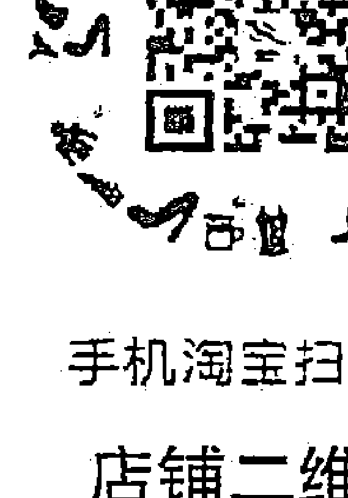

## 周纳羽论师徒缘分

意识奇门开课教学已经很长时间了，在这段时间我结缘了很多弟子，我相信缘分，因为有缘，我和很多弟子不仅仅是师徒，更是朋友，甚至是家人一样的感情。

很多弟子像朋友一样给我提出建议，像家人一样给我支持和关心。很多弟子对我默默的付出与帮助，我也看在眼里，念在心里，我珍惜每一个人。可是我不喜欢常用感谢这几个字去表达，总感觉这几个字，有些俗，当然也有点不足以表达心情的含义吧。

我会把每个弟子当成生命中很重要的人。我的原则是弟子不一定要多，但希望每一个都是最亲近的人，也希望每一个都可以成长，进步，发展。

时常会有学奇门的同行或者学员问我，周老师，我考考你，如果你答对了我就报名学习。钱对他/她而言不重要，关键是我必须验证出他那年怎样？好坏如何。面对这样的问题，我是不会去预测的，只能说师徒缘分还没到，真正的缘分是建立在信任和理解中。猜疑、试探，即便是结缘，那么也只是过客而已。

我所理解的师徒缘分不是这样物质的内容，对我的弟子，即便不说让我预测，在需要的时候，我也会尽心预测他想知道的事情。

在奇门开课的时候，我经常现场预测，直接找出弟子迷茫的原因，指出弟子们目前的现状，接着课堂给大家进行加乙加丁的转换。在我奇门的实战群里，现场预测的例子也很多。

我感觉缘分到了，无需说，也会做，缘不够，说了也是徒劳，说了也是虚言，不是吗？

我的很多弟子都曾是易学前辈，有的学易三四十年，很多都是当地出名的风水策划师，也有很多弟子曾是我的师兄。学易比我还早，可大家还是选择我，信任我，拜师于我。

我很感谢大家这种轮道不分年龄、不分早晚的易学理念。在磕头拜师的时候，有几个弟子60多岁，我拒绝这些老前辈的弟子跪拜，可是弟子很诚恳的回答，跪拜的是知识、是认可、是缘分，并非年龄、非学易时间的早晚。

我由衷的钦佩这些长者弟子，虽然现在大家跟我学习奇门，可是在很多方面他们也是我的老师，各有所长，术业有专攻。对吧？

当然也有些弟子，心里偶尔有点意见，这个也在所难免，自己除了在开课，大多数时间都在外面出差忙风水策划，所以有时候难免会错过一些事情。等到哪天我有了孙悟空的分身术，那样就可以做到人皆欢喜。

## 周纳羽浅谈修炼

首先感谢我们的国家领导人对国学文化的支持，感谢我们的党，所以现在学习易经，搞玄学 的人日益增多，发展壮大了。

那么不管我们用哪种预测术给别人预测婚姻，财运，事业，健康，等等问题，最终的目的是解决问题。看病是基础，治病是关键，所以风水处理就显得至关重要。

现在我们来分析一下，人为何会得病，为何会不顺，为何会破财，为何会意外呢。

其实，人的一生中直接可以分成好与不好两方面，好与不好就是阴阳，世间万物都是阴阳。我们所希望的，美好的， 快乐的，阳光的，健康的，奇门中用丁来表示，不好的，就是阴暗的，邪恶的，疾病的，压抑的，苦闷的，奇门中用癸来表示。既然这样，自然界的好坏就划分成两个字，丁和癸。人运气好，气场强大的时候，脸色发亮，起色红润，这个就是丁旺的表现。反之，人运气不好的时候，脸色发暗，发青，印堂发黑，这个就是癸旺的表现。

现在说到这里，我们就很明白了，人不顺，人得病，人出事，最终原因，就是癸多丁少，导致产生的。癸是阴暗，癸是我们所不希望的一切负面磁场。癸严重的影响我们的健康，家庭，事业，等等，所以我们做风水的过程就是加大丁的信息场，减弱癸的信息场。

做风水解决问题，很直白的说就是一个处理癸的过程。常言说，常在河边走，哪有不湿鞋。我们天天搞风水，天天做除癸事情，被癸干扰也是很正常的，我经常会遇到同行，学员，师兄和我说，怎么给别人做风水调理大病，回家后自己浑身无力，感冒发烧呢，怎么给别人坟地拉山向后，回家腰痛头晕呢？

还有一些学员反应，做风水后，自己没感觉，可是家人病的频率似乎高了起来，这些是什么原因引起来的呢？这就是被癸干扰发生的，我们说，我们热爱易经文化。反对迷信，我这里说的癸就是负面能量而已。

八字中，偏官代表癸，代表暗能量，如果八字中偏官不好，那么处理风水，中招也是常见的事情。

我们还知道，食神是制官鬼的，只要八字中食神旺，处理风水就不会被癸干扰，可是我们有没有换位思考一下，癸对我们食神是不是一种损伤呢，食神是什么，就是儿女。所以很多风水师很迷茫的就是怎么孩子感冒似乎多了呢。就是这个原因。

说了这么多，我要郑重而严肃的提出的就是。为了自己的健康，为了家人的健康，尤其是孩子的健康，努力修炼吧。

修炼可以加大自己的磁场，磁场强大了，癸不会入侵。可是选择什么样的修炼才是最好的呢，现在市面上的修炼术五花八门，有很多同行反应怎么自己修炼几年，财运却不如以前了呢，怎么婚姻反而不好了呢，怎么身体越来越差了呢。

这个就是说，修炼好了是佛，是道，修炼错了，是魔。是鬼。

为何很多人迷恋修炼，却修来很多负能量呢？首先说，修炼的目的就是要让自己没有压抑，没有疾病，没有堵塞，也就是佛家说的不受。心经的理论指出：只有空无才可以不受，不受四害之苦，空是大智慧。空了才可以接受更多更大，可是很多人，目的很明确，修炼为了财运好，为了身体好，为了事业好，目的越强，那么就是不空，不空就会受，受了就容易走火入魔。

所以很多人修炼几年。念经几年，自己还不如以前了。事业黑暗，身体黑暗，人生黑暗。就是这个原因。

修炼很重要，那么怎么修炼是最好的呢，——那就是入空无。人的意识决定行为，只要意识入空无，你的身体就可以做到空无，就可以不受畸形门破，入墓，空无的苦。

奇门中，神助大于一切，神就是意识，所以做自己的神吧，保护自己，总领自己。癸去丁来吧。

## 周纳羽浅谈奇门遁甲起名的重要性

奇门如何起名字？
首先我们考虑一下，名字是否重要呢？奇门中名字是符、丁、辅。为何这样组合呢？
符代表一个人总的信息磁场，丁的像意就是名字。坤宫代表生育宫，坤宫后天就是巽宫，巽宫是天辅星的原宫，名字本来就是一个后天辅助磁场，所以组合像意就是符、丁、辅。

既然这样组合，我们自然就知道：符是一个局的总体走势、丁代表正能量、天辅星代表本命星星可以解四害。所以名字对一个人的磁场影响力很大，名字可以反映一个人磁场的好坏，名字可以预测过去、现在、未来，名字可以预测流年，流月事情发展动态。名字可以预测父母、姊妹、夫妻、子女，名字可以预测事业财运等等。

因为名字本身也是一个九宫格，只是这个九宫格，月干和日干重合，或者月干，日干时干重合而已。

我曾经在开课面授的时候，给弟子现场起名，现场用奇门穿姓名的思想改变了弟子的磁场。一个女弟子身体不好，我用借局起名字，易建，健康是芮，芮在坤宫，易通乙，等于在奇门坤宫加上了乙。乙奇可以解四害。女弟子本来是恶性病，身体很差，可是起名字以后，身体发生了很大的变化。身体现在很健康，生活很快乐。这个就是名字改变人的磁场。

例子很多，我就不一一列举了。既然明白了姓名很重要，那么如何用奇门起名字呢，如何让姓名对人的磁场起到好的作用力呢。这里就归结于奇门心法了。

奇门起名相对于传统的起名最大的优势就是可以快速改变一个人的磁场。

传统的八字起名，不全面，因为八字格局好，奇门终身局不一定好。奇门终身局更能精确反映一个人生的格局，运势。所以奇门起名字，如果起名到位，效果是很好的。下面讲讲奇门起名。

当然这里的名字分为小孩起名，成人改名，企业公司起名改名。
-   1 首先先看日干：一个八字，日干代表自己的能力，年月时，再强大，自己没有能力，也是徒劳。所以我们处理起名字先看日干的状态，日干分为健康和不健康，也就是我们所说的是否四害。如果有四害，我们选择解开四害的名字，没有四害我们选择加大日干的名字。

在选择的时候，我们一定要看日干所在宫的旺衰。比如日干是丙丁火，在坎宫，蓬生门，我们选择名字的时候，不仅仅是要解开生门门破，同时要考虑补火的气，因为火在坎宫临水星，没有气了。当然如果日干所在落宫没有四害，我们要加大日干，可是也要看旺衰，同时要兼顾时干与日干的关系，比如，日干没有四害，时干没有四害，日干有气，日和时相克，我们选择通关的字起名字。如果日和时相生比，日太旺，我们要选择中和的字。
-   2. 奇门起名字：如果日干临的星星是芮，或者宫内符号是白虎等信息，这样的日干很差。这样，我们不选择处理日干起名字，我们这个时候，选择根据时干起名字。日干是人的目前状态，时干是以后的发展，日干很差，也就是说这个是人暂时是扶不起的阿斗。你根据日干补或者解四害，对一个人的磁场起不到大的改变，我们就退而求其次，去看时干，也就是把未来规划好。
-   3. 日干是一个人的自身能力，时干是未来。也是平台，可是很多格局，日时都不好，这个时候，我们舍弃改变日时，我们寻找奇门八字终身局中的本命星星，看本命星星和日干时干之间的关系。然后综合起名。

我们根据以上的 3 条主要起名原则起名以后，我们起一个能量大的奇门局，寻时借运。把这个名字和八字全部写在丁奇或者天辅星或者符所在的落宫，当然保证这几个宫没有四害，然后我们在丁奇落宫方位上香加持定位。一个新的名字加大磁场开始了。

当然这只是其中冰山一角。奇门姓名学也是一个大篇章。在开课的时候，我也会重点讲解。

## 周纳羽浅谈种生基

现在很流行埋生基，那么今天我们来分析生基这个问题。分析利弊，希望给迷恋生基的人提个醒。

生基说白了就是空无的阴宅，因为人还没过世，还没葬下去。奇门中，死门代表阴宅，那么就是死门加空无。

做生基的过程中一定需要顾客父母的头发和指甲，指甲就是丁辛，阴宅是己的信息，做风水就是玄。所以组合像意就是玄，己加丁辛，芮，死门。做生基的过程，就是等于加上了马星。

如果找的风水师是伪造的，吹牛的，选的墓地外环境不好，做的生基是衰山，就等于奇门中死门有了畸形门破。空无是一种大的磁场，空无加畸形门破。他的杀伤力破坏力无可抵挡，又加上马星，所以引爆四害，玄，己，丁加辛，芮死门。马上出事！！！

玄代表莫名其妙的，己代表头，辛代表出错，丁是人丁。所以生基错误，活人出事。因为不管怎么转，死门的对宫永远是生门，生门就是活人的磁场。还有奇门中镜子原则，生基是死门空无，镜子原则，这样就会把生门的信息拉入死门，所以健康出事。

同样，生基做的不好，顾客出事，对于我们风水策划师有没有影响呢？

自然是肯定有的，顾客是日，风水师就是月，日月同辉，磁场共振，这个其一。还有一个原因，奇门中，空无就是一种磁场，一种吸纳磁场，我们处理风水，为何强调一定保护好自己的磁场，很多人只知道是负能量干扰，却不知道为何干扰到你的，不是每一个局都会受到干扰。

今天在这里告诉大家。如果给顾客处理风水，顾客起的局里空无宫畸形门破，这种局的干扰是最大的，因为空无代表一种无形的拉力和容力。空无加畸形门破，进去就是受伤，就是出事。所有处理风水保护磁场很关键，这是我一直强调的事情。

同样道理，生基就是死门空无，如果做的生基不理想。就等于是死门空无加畸形，门破。这样的煞气与死亡有关，完全可以导致死亡。

说了这么多，就是给大家提醒。让大家用奇门的思想去分辨真伪。

还有一个问题，所有的奇门朋友们一定要注意一下。如果你去学习做生基需要注意：
-   ①你的师傅自己是不是有过实战案例。很多师傅自己都没有做过生基，纸上谈兵，因果的事情，自己去考虑吧，死门是阴宅，也代表因果。
-   ②还有即便教生基的师傅，有实战案例，可这个案例是成功的还是失败的呢？你清楚吗？
-   ③大家学习埋生基以后，有谁用过呢，即便是用过有成功的过的吗？
-   ④即便你学到的是真的埋生基的办法，可是一年又会有几个人找你做生基呢，没有人找你做，你就不会有实战经验，那么生基就只是个传奇，纸上迷恋吧。
-   ⑤即便是你感觉你学的是真本事，又有人找你做生基，可是你要考虑，面对一个芮加死门空无的强大磁场，你真的敢切入吗。不为自己的家人担忧吗。

很多问题，奇门朋友们，静下心来考虑了吗。

说了这么些，只是浅谈生基而已，希望大家引起重视。莫让赚钱铸成因果磁场。当然我坚信还是有做生基高手的，当然这些人都是建立在很多实战经验上的。

我一直坚信，深深地，坚定不移的，坚信，奇门服务于生活。

爱奇门，爱生活，让奇门服务生活的点点滴滴，不是很好吗？有谁可以离开生活吗。

## 周纳羽浅谈买房与房子装修

最近一直出差，处理了几处房子的事情，也有一些朋友向我咨询房子装修的问题。就这个问题简单聊一下。

奇门中，生门代表房子的磁场，生门原宫在艮宫，生门代表孩子，代表健康，代表财运。

如果一个房子磁场不好，首先感觉到的是身体不好，尤其是孩子。表现是拉肚子，头痛，其次就是意外车祸信息和意外打架。因为艮宫庚畸形，生有问题，直接引爆了庚的煞气，庚就是车祸信息还有吵架。

生在艮宫，对宫是坤宫，坤主家庭，所以房子磁场不好，还会引起家庭不和，婚姻变化。生门代表房子也代表财运，房子磁场不好，财运自然不理想。

我遇到很多顾客，以前好好地，买了新房子入住以后，突然事业不好干，是非很多，破财多。曾经一个中年女人从房子开始装修没几天，出了车祸，头部受伤厉害，在家休息了半年，半年恢复了一部分认识了我，我后来处理了，女人恢复了健康。也有一个女人2013年搬家高档装修了房子，可是住进这个别墅楼以后，夫妻吵架厉害，事业滑坡，老公官灾。当然这样的例子很多，我们明白了这个道理就可以，在此就不一一列举了。

尤其可见房子的磁场非常重要，那么房子的磁场来自哪里呢。
-   1. 外环境，外环境和房子互为阴阳。只有外环境砂水正位，对房子起到好作用，那么房子的磁场才能好，外环境是大九宫，作用力更大。

所以大家在买房子之前一定要找合适的风水明师帮忙选择，比如房子西北外面有大的变压器就是景门，景门门破，自然不好，比如房子外面西南是水，垃圾场，那么就是癸和己的信息。自然也不好，当然外面的环境没有问题，每一个单元里面，按照选房规则，凡是2、5我们不建议入住，我们一般选择，8、9、1，这个8、9、1是指大运，不是楼层，这个选择有特殊的选择办法，上课的时候，我已经讲过。

选择了好的环境好的楼层剩下的事情就是装修了。如何进行装修呢。
步骤如下：
-   1. 如果一个家庭的主力人员奇门八字终身局磁场好的话，我们就用终身局装修就可以。有四害，用解掉四害的布局，没有四害，加大宫内信息就可以。
-   2. 如果终身局是臭豆腐局，一定不要终身局搞装修，我们可以选择山向。选择山向的时候，原来的山向有问题，可直接找一个新的山向布局就可以，可是角度一定小于15度。
-   3. 山向没有可以选择的局，或者终身局也不好。这个时候，我们选择综合布局，首先用奇门砂水三合布局，装修结束后，起时局继续补充布局。

当然装修中还有很多细节的问题，个别情况个别对待。

## 周纳羽浅论五十知天命、天命是什么？

孔子说：三十而立，四十而不惑，五十而知天命。

今天，一个弟子跟我说：老师，我现在才 27 岁，好像已经知天命了，以后可怎么办？我笑了笑， 跟他说“你就了解点命理，远远还没到知天命呢”。弟子应该没好好学论语。

五十知天命有一种解释：很多人到了五十岁通常会有肩关节上面的病症，这些有关节风寒的人，在下雨前疼痛会变得明显，预先知道了天要下雨了。

五十知天命要和四十不惑配合起来理解。人到了四十以后，根基还不算稳定，经常会有各种诱惑、疑惑。到了五十以后，真正的稳定下来，各种“惑”也没有了，就是“无惑”的一种状态，真正开始静下心回想自己的过去，思考人生的意义。

“知天命”并不是听天由命、无所作为；而是，人们明白，谋事在人成事在天，这个道理。

五十岁之前，我们做事的时候往往希望付出了就一定要有所收获，渴望有一番成就；五十之后，人们依旧会努力，但是不企求结果有多完美，对个人荣誉看的淡很多。（并非弟子所理解那样）

到了那个年龄，我们知道了人生的一种归宿，把生死看得很淡，对社会、事情基本看透了，更加珍惜与人之间的情谊。

简单写写，我还没到那个年龄。

## 附录一、周纳羽意识奇门公开课收听方式

【手机收听】（年龄大的朋友可以让身边的年轻人帮忙操作）

方法一：微信直接进入直播间

①打开微信，点击右上角 ‘+’ 选择 “添加朋友”，出现下图：

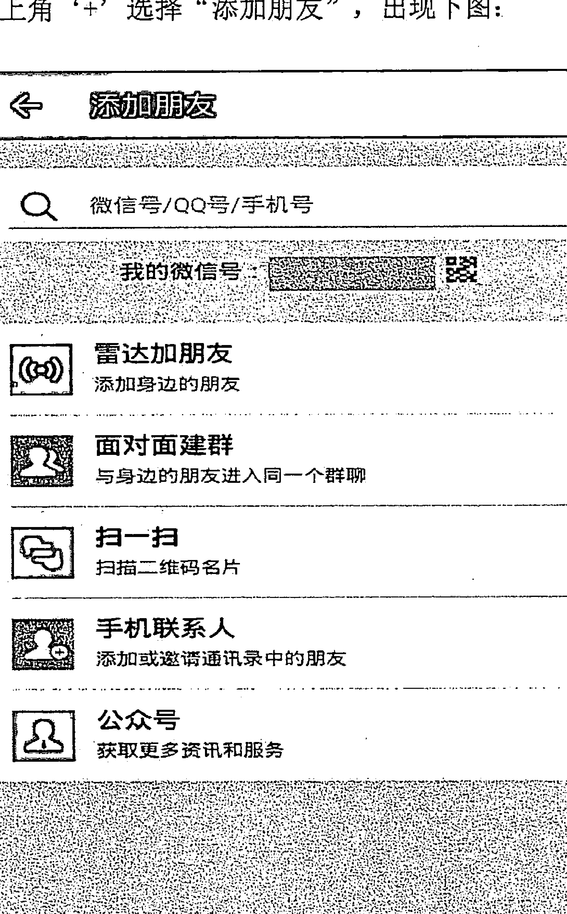

②搜索公众号：“荔枝微课”，一般会出现“该用户不存在”的反馈。这个不用担心，点击下方的“搜一搜”，如下图：

③接上步，点击“搜一搜”后出现如下图的搜索结果。点击进入，并关注荔枝微课公众号（千万记得要关注，否则以后可能会找不到）

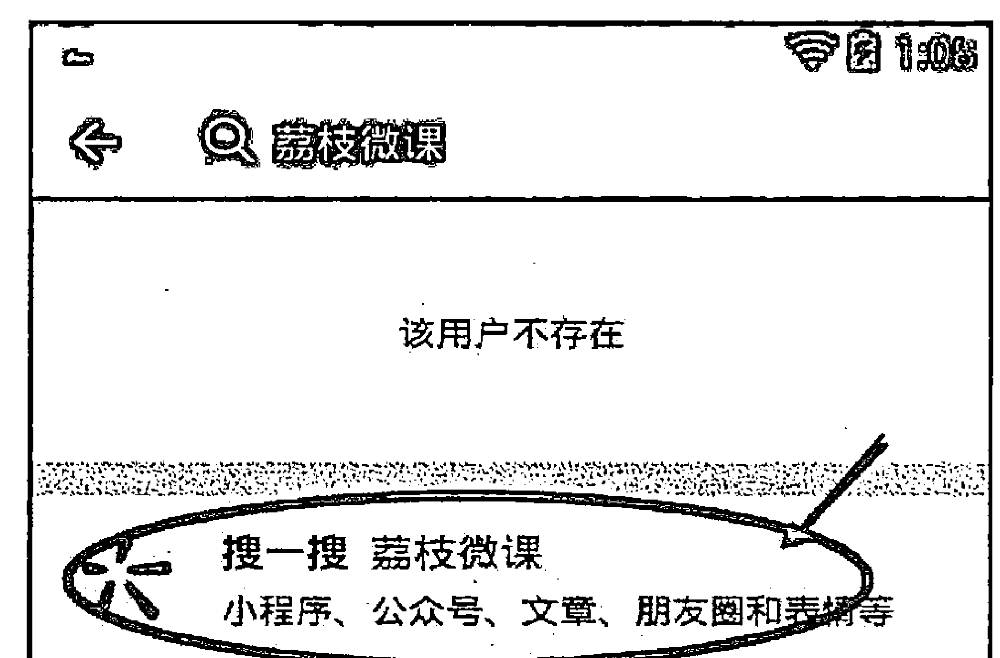

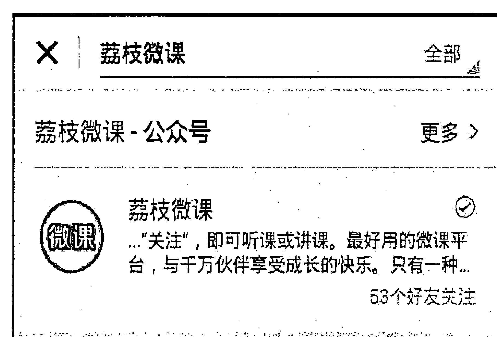

④进入公众号后，点击正在左下方正在直播

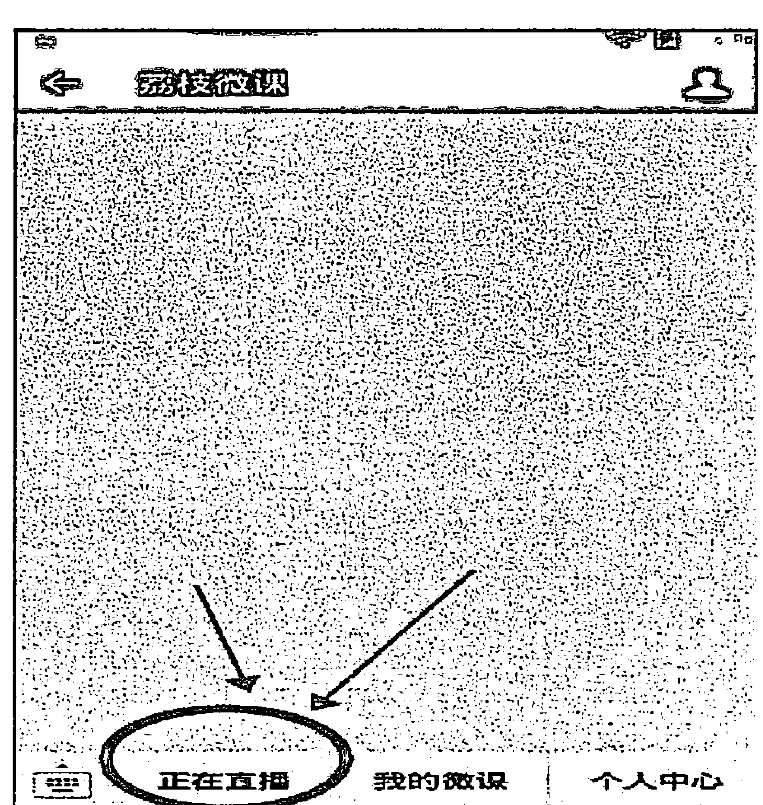⑤ 此时进入荔枝微课直播平台，点击右上方的放大镜（如下图），搜索：周纳羽。

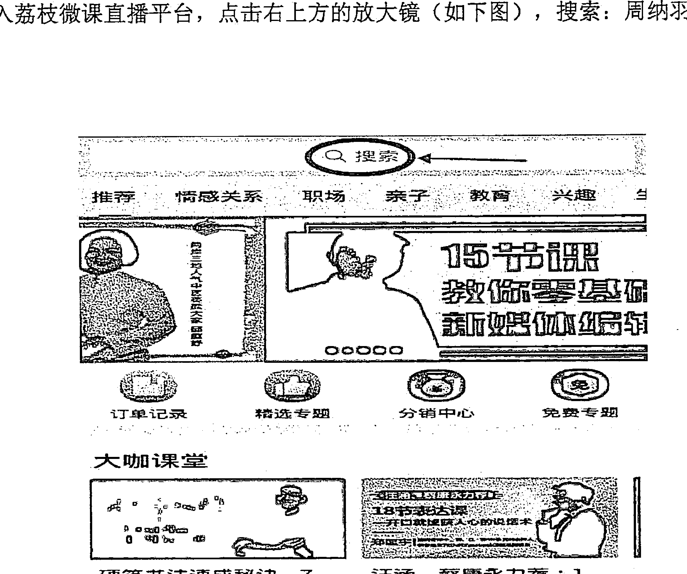

⑥ 看到周纳羽师父的课程

| 课程 | 更新期数 | 学习人数 | 价格 |
| :--- | :--- | :--- | :--- |
| 周纳羽奇门免费公开课--奇门速断面相 | 已更新1期 | 3666人在学 | |
| 周纳羽奇门免费公开课--姻缘、婚姻篇 | 已更新1期 | 3090人在学 | |
| 周纳羽奇门基础免费公开课八门、八神、九星 | 已更新5期 | 8689人在学 | ¥1.00 |
| 周纳羽奇门基础免费公开课十天干、十二地支 | 已更新2期 | 5429人在学 | ¥1.00 |

⑦ 在列表上点击自己想听的课程，进入后点击屏幕最下方的绿色按钮“预约专栏”。预约成功后，点击屏幕上的“目录”，进入本期课程目录里选择自己想听的指定课程。最后，点击屏幕最下方的绿色按钮“进入课堂”即可进入课堂学习。如下图：
（点击右上方白色箭头，可分享给自己的朋友）

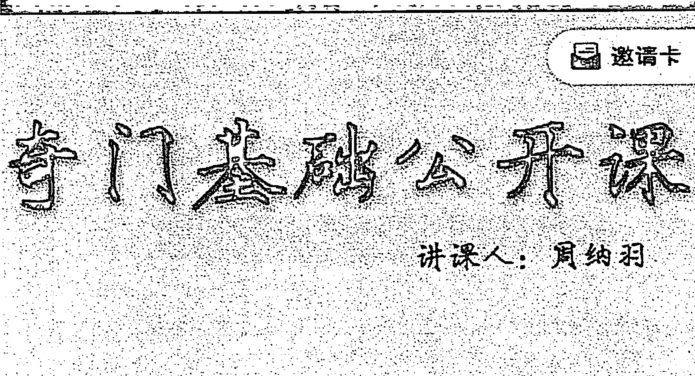

### 2018年十二生肖运势大解析

2018年十二生肖事业、财运、感情、健康分析

已更新1期 4485人在学

- ✓ 永久回听
- ✓ 手机电脑同步听课

详情 | 目录

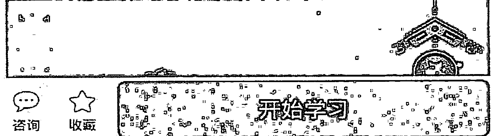

咨询 | 收藏

（点击屏幕最下方的绿色按钮“开始学习”即可进入课堂学习）

⑧ 在直播间点击红色箭头所示，即可发评论与师父和奇门爱好者交流，如下图：

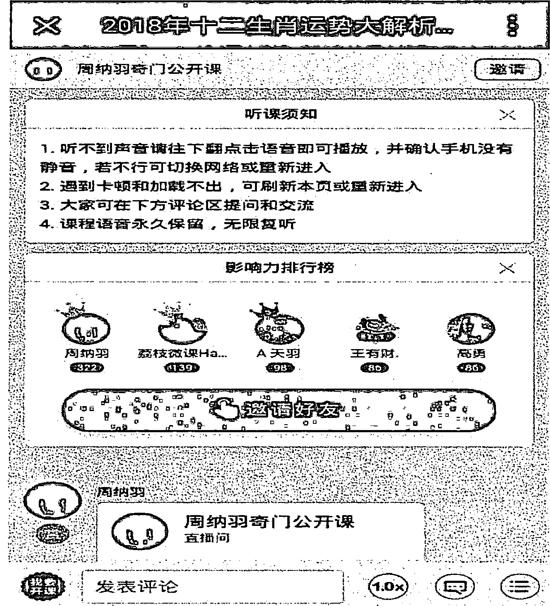

周纳羽师父在每个月都会更新直播间、讲解最新课程，大家可以加入公开课微信群关注最新一期公开课的消息。

公开课微信群进入方式：添加公开课管理员微信号 yishiqimen520 ，添加成功后告诉管理员自己想听公开课，管理员便会把你拉入公开课微信群。

### 方法二：使用“荔枝微课”官方 app 收听

① 用手机浏览器在百度搜索“荔枝微课”，进入荔枝微课官网后下载“荔枝微课”这款软件，或在各大手机软件市场下载软件“荔枝微课”。如下图：

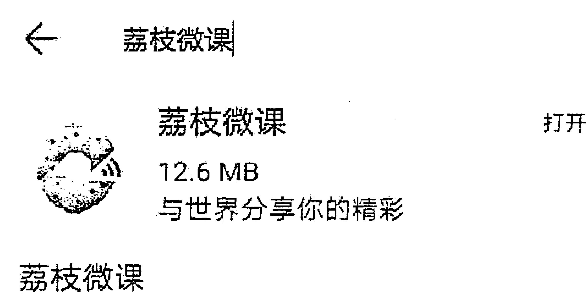

② 下载并安装后，打开进入荔枝微课软件，选择“微信登录”
③ 剩下步骤参考方法一 · 第⑤步开始

### 方法三：微信小程序。

搜索微信小程序“周纳羽奇门免费公开课”，加载到微信上即可使用。

### 【电脑收听】

① 在浏览器中输入网址链接：[https://m.weike.fm/liveroom/23826901](https://m.weike.fm/liveroom/23826901)
② 剩下步骤参考【手机收听·方法一·第⑥步开始】

## 附录二、周纳羽意识奇门网络资源汇总

一、淘宝店铺名字：周纳羽意识奇门。网址：https://shop172709214.taobao.com

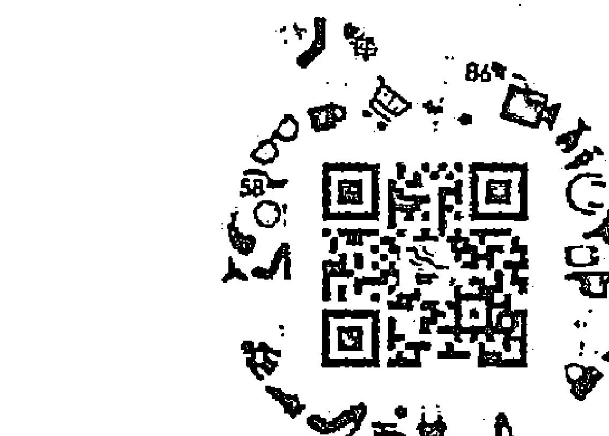

二、微信公众号：周纳羽意识奇门

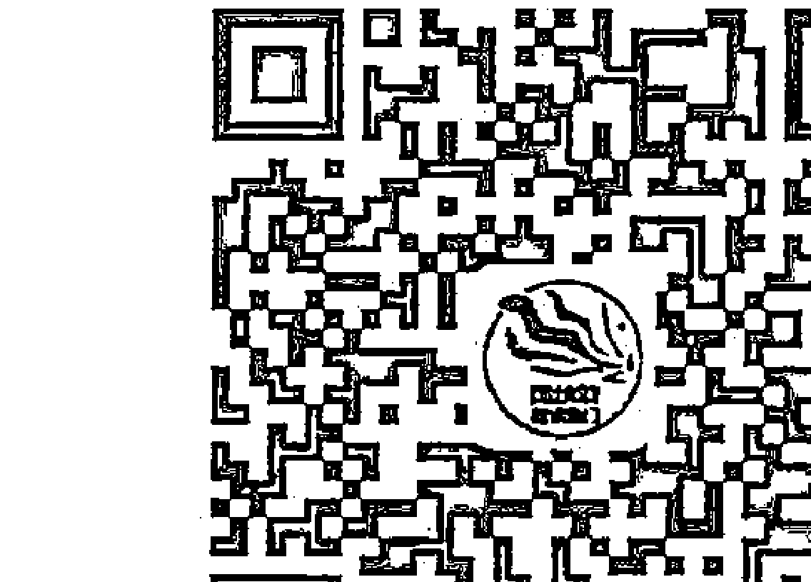

三、周纳羽老师唯一QQ：542248621

四、周纳羽老师微信：zny1977521

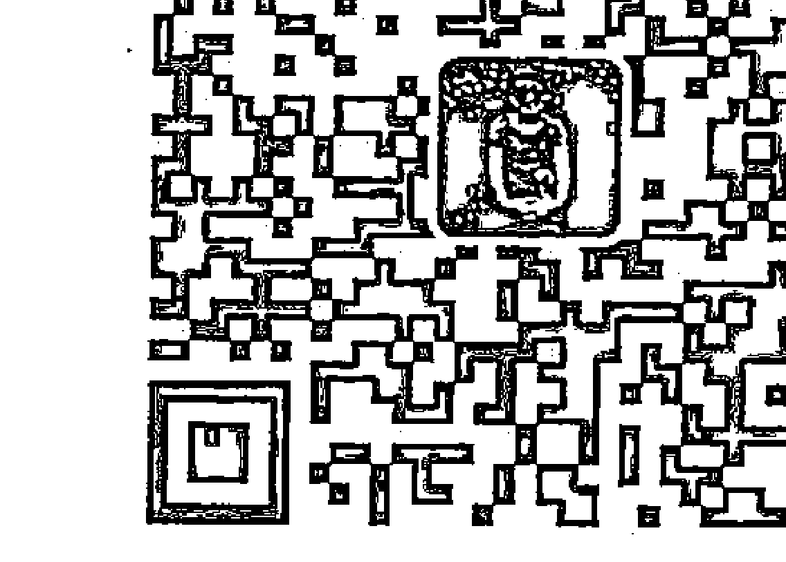

五、意识奇门公开课学习群，联系公开课管理员微信号加入。管理员微信号: yishiqimen520

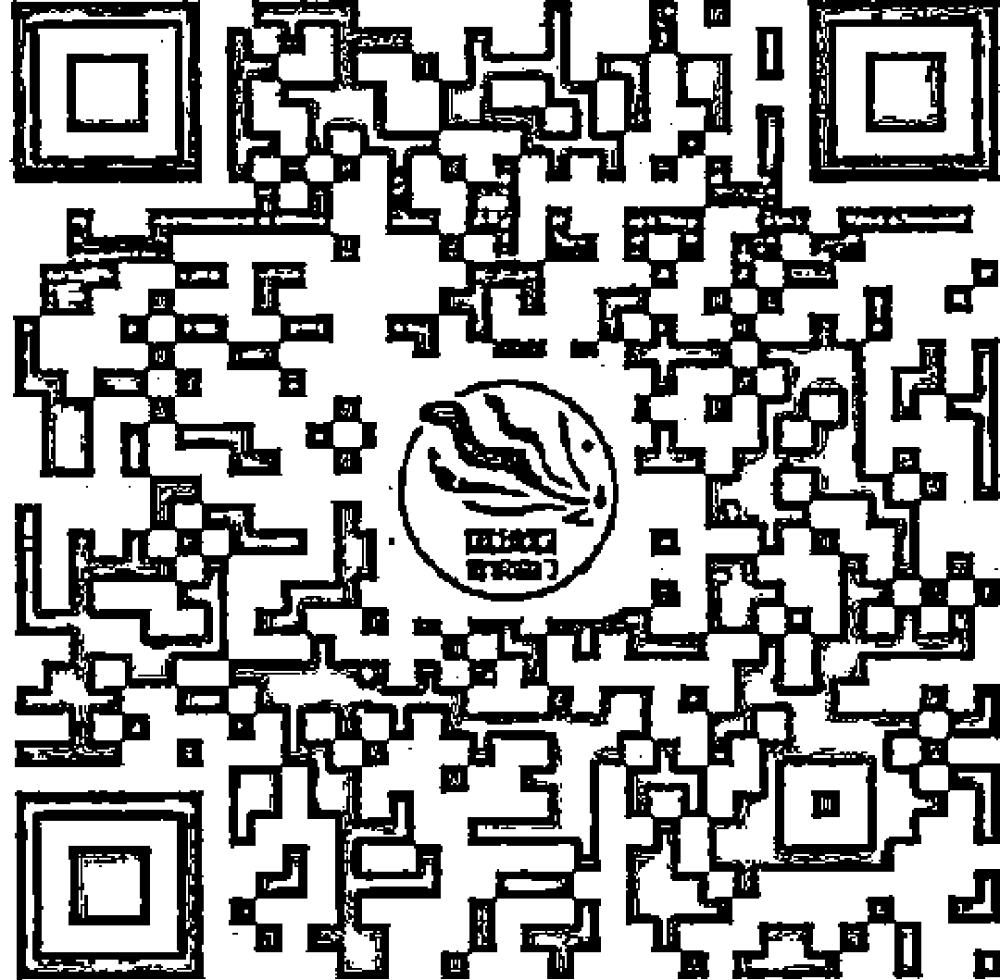

管理员微信二维码

六、新浪微博：意识奇门周纳羽。链接：https://weibo.com/zhounayu

七、新浪博客：意识奇门周纳羽。链接：http://blog.sina.com.cn/zhounayu1977

## 附录三、意识奇门系列丛书列表

- 1. 《意识奇门符法教材》
- 2. 《意识奇门面授基础教材》
- 3. 《周纳羽意识奇门速成心法》

以上信息截止到2018年4月，在淘宝各大周易书籍商城均有销售。