# 图解奇门遁甲大全三

- 选取《古今图书集成》最全奇门精要，容纳古今相传秘典
- 白话提要加白话图解，使“奇门天书”通俗易懂
- 中国古代决策学精华，影响历史几千年

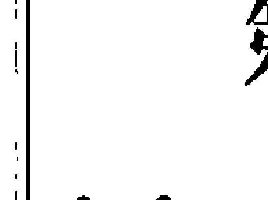

上法天象
奇门决策加入了古代天文星象

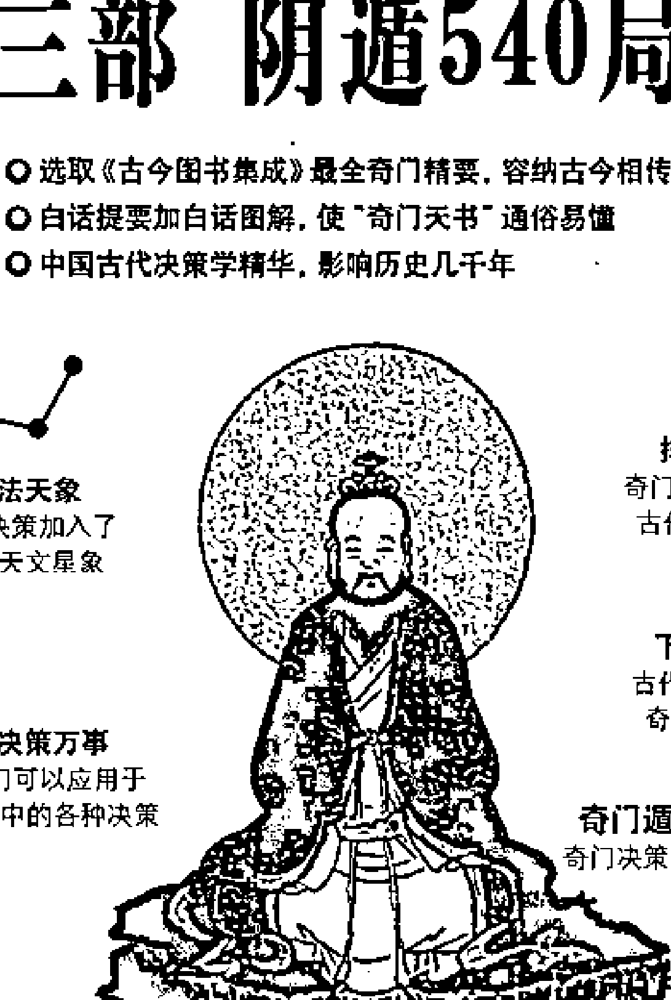

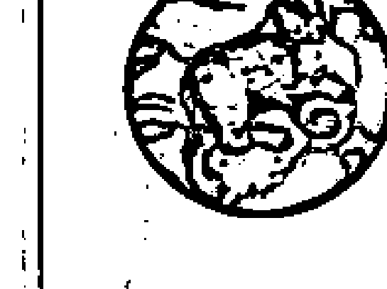

决策万事
奇门可以应用于生活中的各种决策

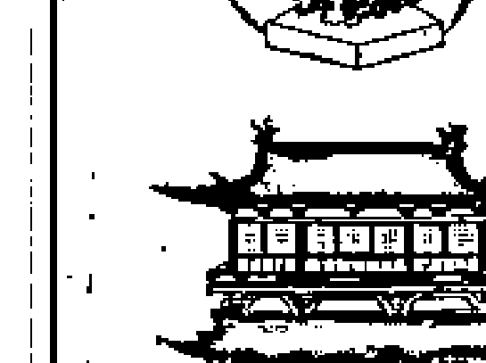

秘藏宫室
古代奇门为帝王之学，秘不示人。

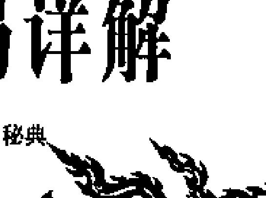

排兵布阵
奇门广泛应用于古代军事决策

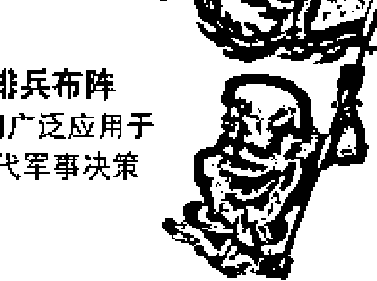

下应历律
古代历法融入奇门决策学

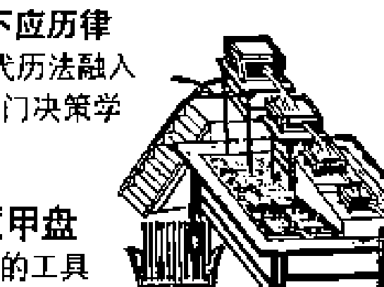

奇门遁甲盘
奇门决策的工具

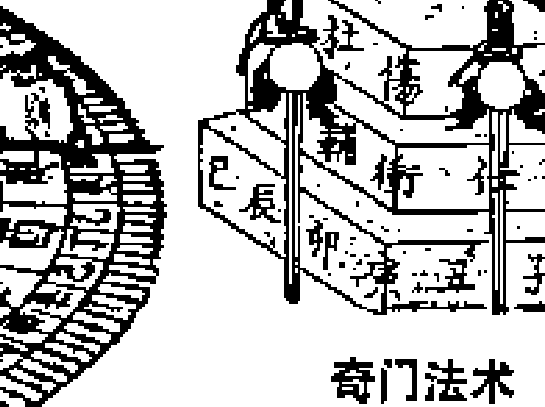

奇门法术
奇门与道教相结合的产物

# ·《古今图书集成白话图解》丛书简介·

《古今图书集成》是中国古代最庞大的一部官修百科丛书，从清康熙时代至雍正时代，历时二十八载编修而成，是现存规模最大、资料最丰富的类书。共设立汇编、典、部三级类目，其特点在于彻底贯彻“以类聚事”的原则，收录了从上古到明末清初的古代文献资料，内容涵盖了我国一万五千多卷经史子集的典籍，保存了几乎所有学科的源头和血脉。

《古今图书集成白话图解》丛书精选《古今图书集成》中收录的中国古代文化典籍，经过数年的精心校勘、白话评注、生动图解编撰而成。该丛书简体横排，体例完备，通俗易懂；此外，还辑录了大量古代珍贵图版，精心绘制了手绘图、表格、图表，用现代编辑手法大大增强了其可读性，同时兼具较大的文献价值、版本价值和收藏价值。该丛书的出版，是对中华五千年传统文化一个侧面的全新梳理，也为中国传统文化的研究和普及作出了一定的贡献。

# 关于本书

中国传统决策学，有一套源自《易经》的决策体系，它融古代天文学、哲学、历史学等各类信息为一体，形成了中国古代独特的决策理论。奇门遁甲就是其最高层次的决策学之一，它融周易、天文、律历、阴阳五行学说于一体，形成了比较完整的体系。在古代决策中最为灵验和实用，也是目前探索中国传统决策学的一个重点。

《图解中国古代决策学·奇门遁甲大全》以《古今图书集成》本为底稿参考，并参照了《御定奇门宝鉴》等书中的奇门遁甲理论和应用方法，并辅以白话提要和白话图解（使艰深的古文得以通俗化）。通过此书，不但能对中国传统决策学有更深入的认识，而且可以从中汲取有益的成分，应用于生活中的各种决策。

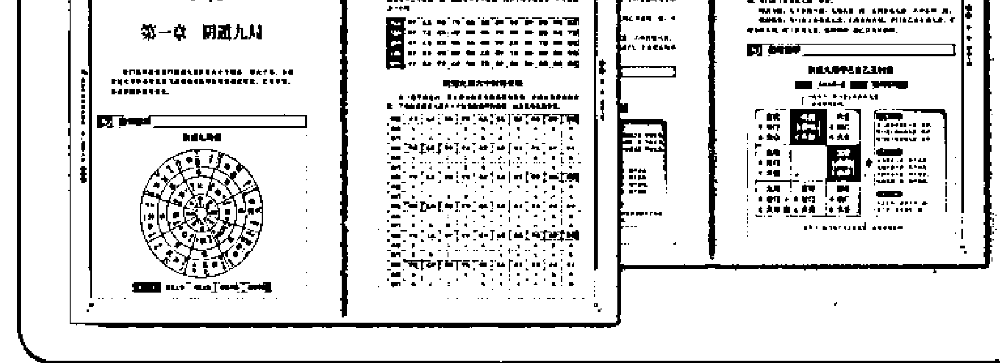

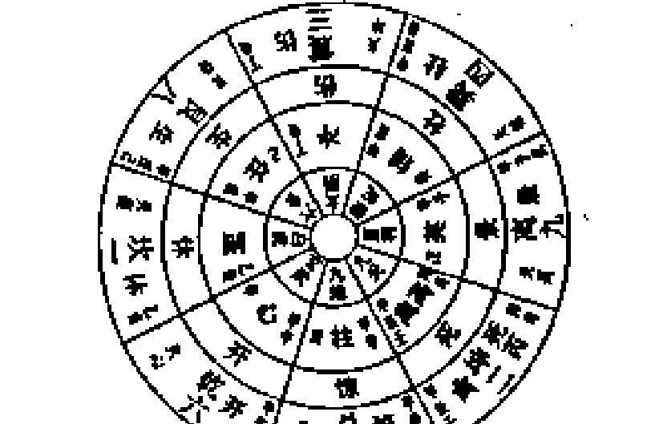

## 第三部 阴遁540局详解

| 螣蛇 | 直符 | 九天 |
|------|------|------|
| 癸 杜门 癸 天辅 | 戊 景门 戊 天英 | 丙 死门 壬 丙 天芮 禽 |
| 太阴 | 壬 | 九地 |
| 丁 伤门 丁 天冲 | | 庚 惊门 庚 天柱 |
| 六合 | 白虎 | 玄武 |
| 己 生门 己 天任 | 乙 休门 乙 天蓬 | 辛 开门 辛 天心 |

# 中国历史上奇门遁甲的应用

在历史上，奇门遁甲被称为“帝王之学”，主要应用于军事决策中，是帝王平定天下的神秘武器。下面就列举历史上应用奇门遁甲决策的具体事例。

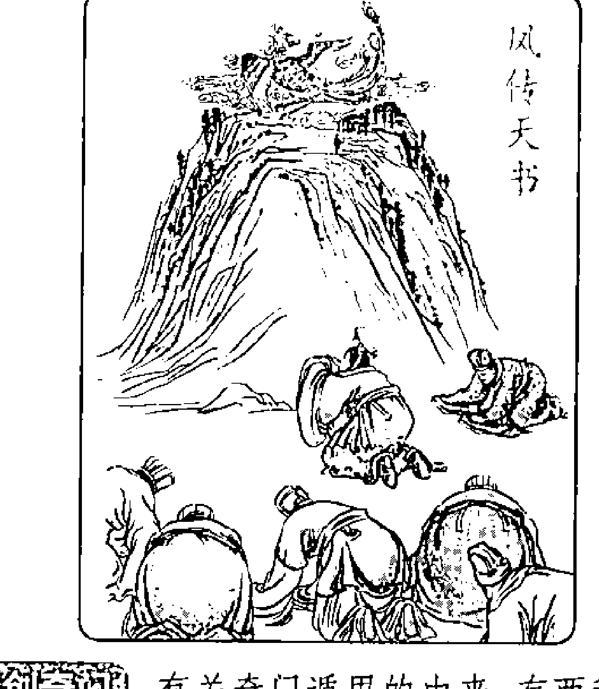

黄帝创奇门：有关奇门遁甲的由来，有两种传说，一种是黄帝在祭天时，有彩色凤凰传下龙甲图章，黄帝据此而创制了奇门遁甲。还有一种说法是，由九天玄女传授给黄帝。

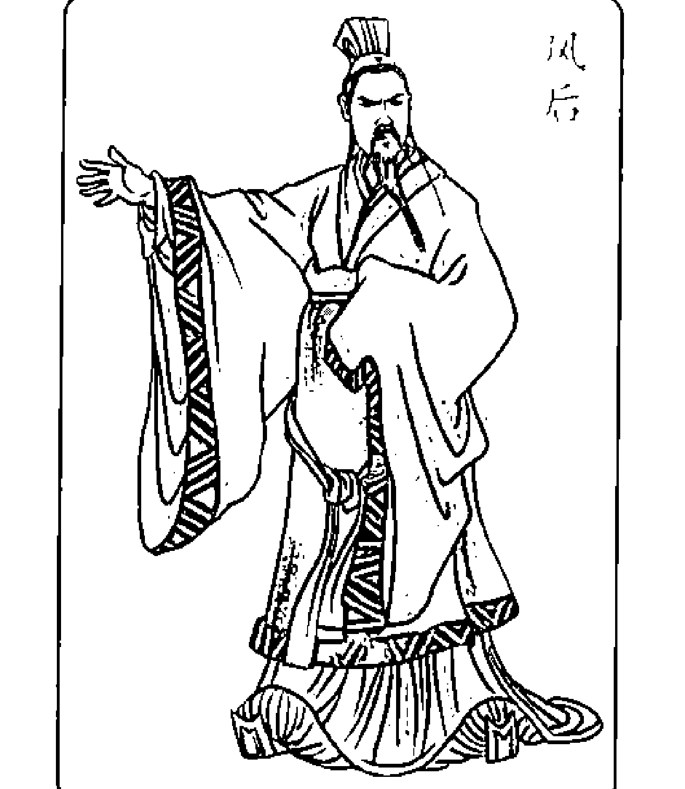

风后演奇门：相传黄帝创制奇门遁甲4320局后，又派大臣风后将这些局势进一步简化为1080局，从而使其做出更准确地决策。

# 上古时期（约公元前3000年前）

# 夏商周三代（约公元前21世纪—前3世纪）

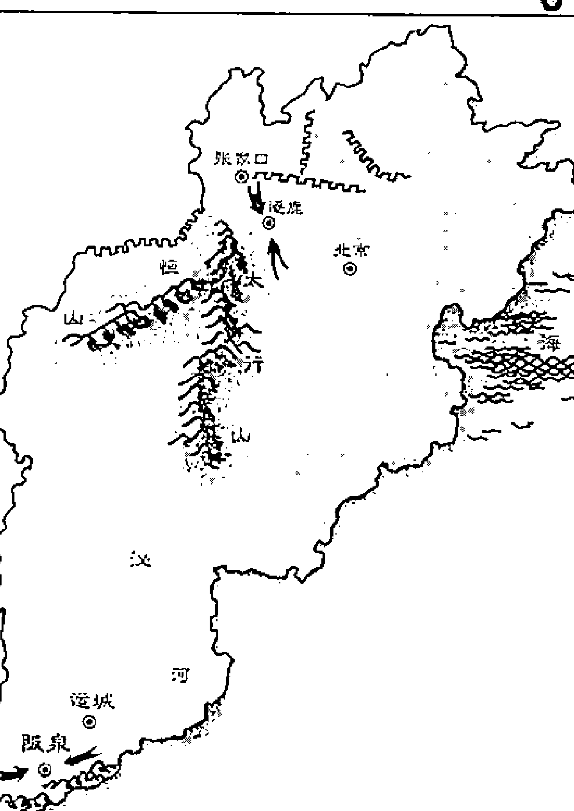

黄帝用奇门战蚩尤：相传黄帝得到奇门遁甲后，将其演化为4320局，并在与蚩尤的涿鹿大战中，利用奇门之术，最终打败蚩尤。

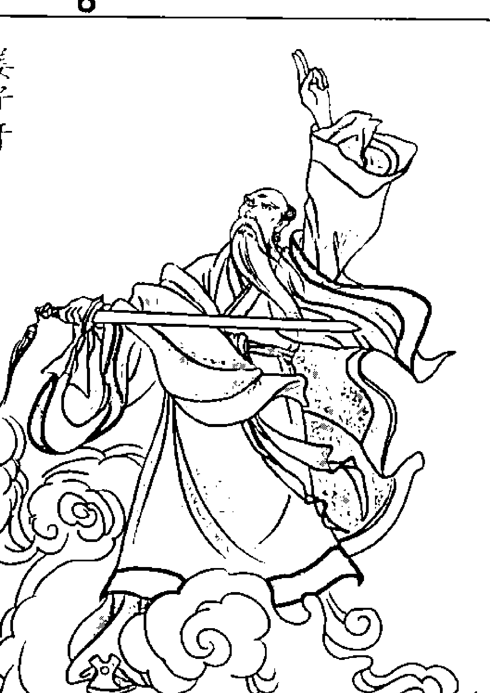

姜子牙用奇门战商纣：周朝的开国功臣姜子牙精通奇门之术，他将风后所传的1080局进一步简化为72局。在武王伐纣时，姜子牙用奇门之术，助周武王一举攻克商朝都城，建立周朝。

**中国历史上奇门决策的应用**

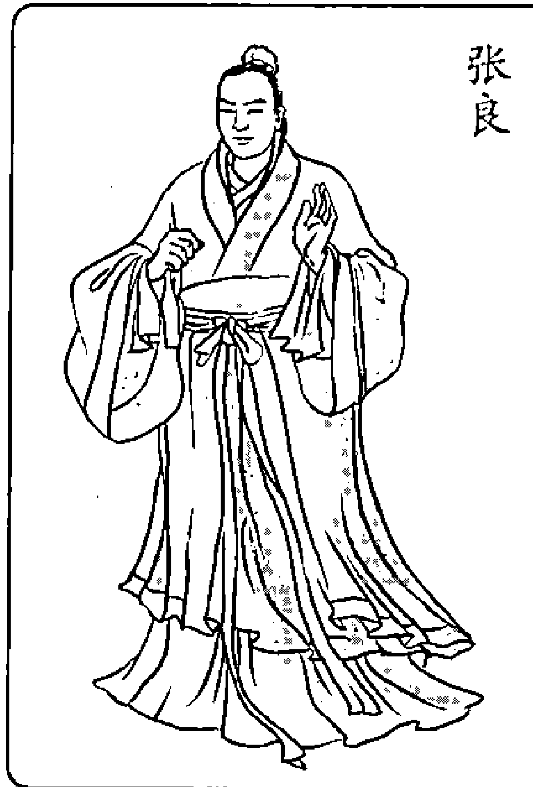

**张良用奇门得天下** 相传大汉开国三杰之一的张良在姜子牙奇门72局的基础上，进一步精简，将奇门简化为18个活局。在刘邦建立汉朝的过程中，身为主要谋士的张良用奇门之术，最终助刘邦夺得天下。

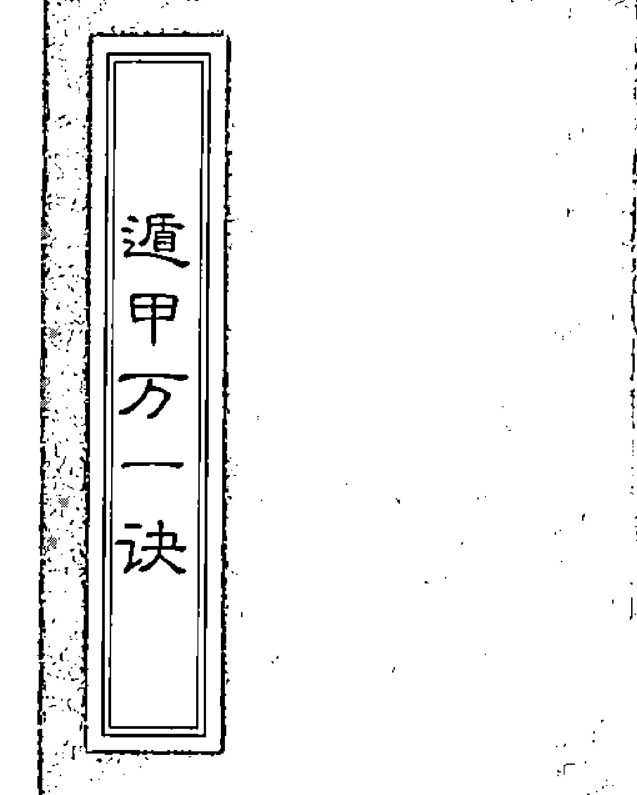

**李靖用奇门佐军** 唐朝名将李靖著有《遁甲万一诀》，他也精通奇门之术，所以在与突厥的战争中，攻无不克，战无不胜。

**两汉时期** (公元前3世纪—3世纪)
**三国时期** (公元3世纪)
**唐宋时期** (公元7世纪—13世纪)
**元明清时期** (公元13世纪—19世纪)

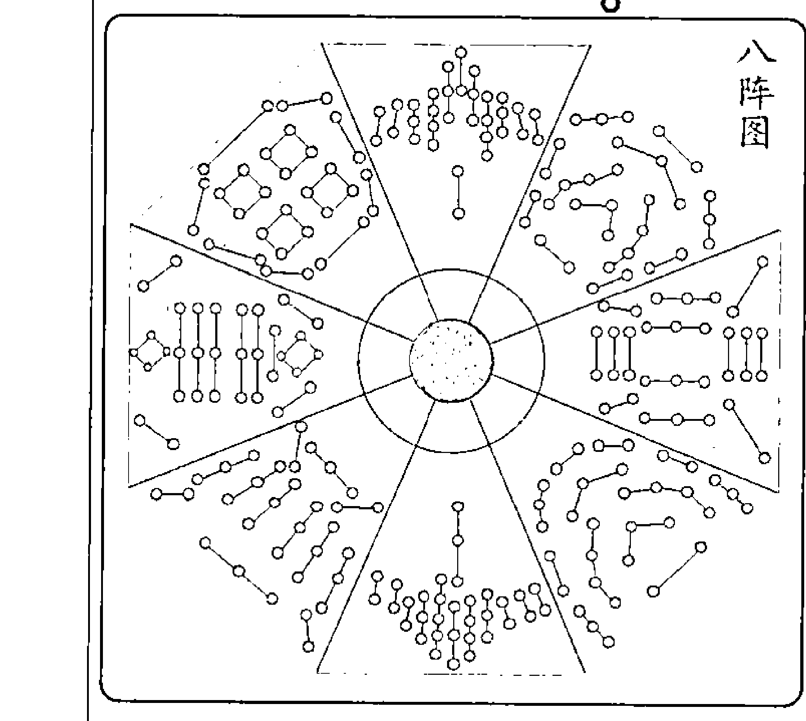

**诸葛亮用奇门演阵法** 三国西蜀丞相诸葛亮深谙奇门之术，他用此术助刘备三分天下得其一；最经典的是，他将奇门遁甲演化为“八阵图”，并用此打败三国东吴名将陆逊。

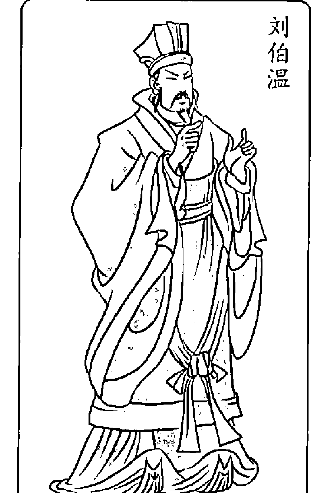

**刘伯温用奇门建大明** 明朝开国功臣刘伯温对奇门也十分娴熟，他应用奇门之术，助朱元璋扫平群雄，灭元建明。

# 编者序

## 奇门遁甲：中国古代最高决策学

一说到决策，人们往往认为是政府领导和公司总裁们考虑的事情，其实，在日常生活中，我们每个人都需要决策，人生的每一步都需要决策。当今时代，社会生活在急速变化，不确定的因素在增加，置身于瞬息万变的知识经济大浪潮中，个人如一叶小舟，常感到不着边际的茫然与无助，如何在此种情况下，做出正确的决策，使自己一步步走向成功呢？现在的方法多是依靠数据和统计资料，其实这种方法往往并不能给我们提供更全面更准确地决策。那么，有没有一种不依靠数据和统计资料，而同时又包含有前瞻性和预见性的决策方法呢？回答是肯定的，这就需要从我国古代的传统决策学中寻找灵感。

在中国古代的决策学中，有一部不同于世界众多决策方法的经典，这就是《易经》，《易经》是中国古代最伟大、最神秘的一部奇书，不管易学研究者怎样从宇宙学、哲学、史学、政治学、帝王术、权力统御术等多种角度来解说，其最原始的功用便是决策。

自《易经》产生后，后世许多人都对其进行了多方位的解读，主要分为“义理”和“象数”两大块。从义理方面解读《易经》，多是强化其哲学内涵，但却失去了其最初的实用功能；而从象数方面解读《易经》，却能本着其最初的决策功能，进而形成了中国所特有的的决策学，主要分为山、医、命、卜、相五术，其中属于最高层次的就是“三式”之学，即太乙、奇门和六壬，而三式之中，又数奇门遁甲最为灵验和实用。

奇门遁甲融周易、天文、律历、阴阳五行学说于一体，是目前探索中国传统决策学中的一个焦点。在古代的各种易学决策学中，奇门遁甲是一种比较完整的数理模型，应验率很高。它把天时、地利、人和与影响人类生产生活的某些能量场，与时间、空间巧妙地组合在一起，为人们提供了一个模拟宇宙统一信息场的立体动态象数理模型，既可以用于决策自然、社会、人生各种各样的事物，也可以向人们提供趋吉避凶的时空选择。

## 一、奇门决策学的源流

关于奇门遁甲决策学，在形成其完整独立的体系之前，应该在中国古文化中寻到不少的源头。它的基础理论，可以上溯到古老的易经、九宫、八卦、星相术、古历法，以及天干地支、阴阳、五行原始哲学观念。然而在有关奇门遁甲的典籍中，相传它源于远古时期黄帝与蚩尤的那一场旷日持久的战争中，由九天玄女连同六壬、兵符、印剑、图策一齐传授给黄帝的，以让他去打败蚩尤，当然，这只是传说而已，难以证实。

据明朝程道生所撰写的《遁甲源流》一文所述，奇门遁甲经过了三个时期四阶段的演变：最早是由远古时期的黄帝始创奇门遁甲4320局；第二阶段是黄帝让风后正式制作奇门局法，风后则将它简化为1080局；第三阶段是由精通兵法、善布奇门的周朝开国功臣姜太公创造的，他将奇门遁甲简化为72个活局。最后汉初三杰之一的张良又将其简化为18个活局。这种说法也多带有古人感情色彩，假托古人以增加其权威性与神秘感。

据考证，汉代史志所载并无奇门遁甲方面完整的明文记录，直到南北朝简文帝时才开始有了“三门”之说、“遁甲”之语，并开始兴盛起来，逐步见于史志。到了宋朝，有关奇门遁甲的各种论著愈来愈多，一直流传到后世。但由于奇门遁甲在古代军事和政治中发挥着巨大的作用，所以历代统治者对此都十分重视，有意将奇门预测人才网罗并控制起来，使其成为“帝王之学”。这样，奇门遁甲日渐成为一种绝学，传承范围日益缩小，再加上其本身复杂难学的宫卦推演方法，使很多人发出“奇门奇门，难入其门”的感叹。

## 二、奇门决策概说

所谓“奇门遁甲”，是由奇、门和遁甲三个概念组成的。奇是指乙、丙、丁三奇；门是指休、生、伤、杜、景、死、惊、开八门；遁甲是指六甲隐于六仪之下。遁是隐藏的意思，甲是指甲子、甲戌、甲申、甲午、甲辰、甲寅这六甲，由于甲在十天干中最为尊贵，所以它隐于六仪之下。六仪是指戊、己、庚、辛、壬、癸。隐遁原则是甲子同六戊、甲戌同六己、甲申同六庚、甲午同六辛、甲辰同六壬、甲寅同六癸。

除上面的三奇、八门、六甲、六仪外，奇门遁甲中还配合有天蓬、天任、天冲、天辅、天英、天芮、天柱、天心、天禽这九星；以及直符、螣蛇、太阴、六合、勾陈（白虎）、朱雀（玄武）、九地、九天这八神。

奇门遁甲决策主要由大到小的地、天、人、神四个圆盘构成，每个盘都按九宫八卦而排布。其中地盘布八卦、天盘布九星、人盘布八门、神盘布八神。另外，天盘和地盘上分布三奇和六仪。这样，根据具体的时日，地盘不动，天、人、神三盘做相应的转动求得时日的定局，以占测事物的关系、性状和动向，选择吉时吉方。

奇门遁甲分为年家奇门、月家奇门、日家奇门和时家奇门四种，排局方法各不相同。

## 奇门遁甲：中国古代最高决策学

以上所述，就是时家奇门的排布方法。因为年吉不如月吉，月吉不如日吉，日吉不如时吉，所以时家奇门最为重要，也最为常用。其次是日家奇门，至于月家奇门和年家奇门，则用得较少，所以人们也较少研究。

## 三、奇门决策典籍

在奇门遁甲的流传中，产生了许多重要的著作，使奇门遁甲得以不断发展与完善。汉朝时，有《风鼓六甲》、《风后孤虚》等用于行军布阵的方术论著，这些可以看做是奇门遁甲最初的雏形。隋朝时，涌现了不少关于奇门遁甲的论著，如遁甲文、遁甲经、遁甲图等共十三家，但这些原文现在都难以见到了。唐朝时，李靖写有《遁甲万一诀》、胡乾写有《遁甲经》等，史志上均有记载。宋朝时，有关奇门遁甲的论著则愈来愈多。其中的《景祐遁甲符应经》三卷，此书宋仁宗亲自作序，由司天台春官杨维德，春官副王用立，翰林天文李自正、何堪等集体编撰，经数月始成。

关于奇门遁甲比较全面完整的版本见于清代的两部巨型类书中，一是康熙年间编纂的《古今图书集成》中博物汇编艺术典第703至714卷术数部汇考十七章至二十八章。二是乾隆年间编纂的《四库全书》中子部术数类六，由明朝程道生撰写的《遁甲演义》四卷。

《古今图书集成》版本融合古代流传有关奇门遁甲的各种著述，并做了相关注解，其中最重要的篇章有烟波钓叟歌句解、阳遁九局、阴遁九局、日家奇门等，书中内容十分全面，但却庞杂，有许多重复之处。《四库全书》版本则主要是撷取了古代流传有关奇门遁甲的部分著述，其中最重要的篇章有遁甲源流、烟波钓叟赋、阴阳二遁十八局图列后、六甲出行诀等。此版本与《古今图书集成》版本不同的是，除讲了术理奇门外，还搜集了一些法术奇门的内容。

## 四、奇门决策的批判与传承

奇门遁甲一术源远流长，自古为兵家必修之课，历代政治家们也常运用此来推测事物、判断吉凶、寻找时机等，如汉初张良、三国诸葛亮、明初刘伯温等所谓军师辅臣皆精通此术。正是这些人使奇门遁甲得以良好地传承。但作为一门特殊的历史文化遗产，奇门遁甲经过千百年来的流传、演变，本身难免龙鱼混杂，在封建历史的长河中积淀了不少非科学的成分，沾染上一些唯心主义的历史尘垢，使它作为传统历史文化的信息预测载体的功能常被扭曲与篡改，甚至硬加入一些古代学者亦不以为然的迷信糟粕，主要有以下三点：一是对奇门遁甲来源的神化说法，为了渲染其神奇而夸大其辞。二是唯心构拟的一些“动应”，这些不但用今天的常识不能解释，就是在奇门遁甲的理论体系中也找不到真正的依据。三是法术奇门中的符咒，借用道教法术，显得怪诞无稽，将人引入邪道。

目前，奇门遁甲还处于探索阶段，也属于一种内容庞杂、尚待整理与验证的潜科学阶段，其中必然具有一定的朴素的唯物主义世界观和方法论，以及不少的科学信息，但又杂有其它偏向于神秘性、偶然性与非科学性的因素。在批判保留与扬弃的正确前提下，作为一个学术项目去研究与探讨应该是正当的、积极的。而且那些包含着一定神秘性的内容，在古籍中实有来源，并非是今人胡编乱造，研究这些内容，至少可以起到了解古代文化和社会现象、心理现象的作用。

总之，奇门遁甲作为中国古文化的一部分，通过深入地了解，或许会进一步从中探索出一些自然规律，研究出一些新的现象与情况，提示出一些尚未被认识的知识领域，乃至于发现一些很有价值又符合于现代科学的东西，都应该是大有可能的。当然，对于古代思想的局限性和谬误，则应加以分析和扬弃。

## 五、奇门决策新解

为了弘扬中华文化，更好地运用中国传统决策学中的精华，做出更全面、更准确的决策，我们出版了此书，本书以《古今图书集成》术数部汇考十七章至二十六章中介绍的奇门遁甲知识为底本，并对其做了白话提要和白话图解，使犹如天书的文字得以通俗化，使人能对奇门遁甲的相关知识有所了解，也使其研究能得以深入。

由于此版本内容体系庞杂，所以此书共分为三部，第一部主要讲利用奇门遁甲决策的方法以及一些实例；第二、三部分为时家奇门1080式盘，可以当做“词典”一样使用，不用再去耗费大量的时间去排盘，而直接核对式盘就能做出决策。

总之，本书在充分解读古籍的基础上，可以使人对奇门遁甲有所了解，并据此做出更准确的决策。但由于古籍过于庞杂，所以难免有错误和不明的地方，欢迎大家批评、指教、共研！

编者谨识
2009年8月

# 目录

- 中国古代最高决策学——奇门遁甲 ………………………………………… I-4
- 奇门独特的决策参数——九星和八神 …………………………………… 5-8
- 中国历史上奇门决策的应用 ……………………………………………… 10-11
- 编者序 奇门遁甲：中国古代最高决策学 ……………………………… 12
- 目录 ………………………………………………………………………… 16
- 内容概览 …………………………………………………………………… 19
- 本书内容导航 ……………………………………………………………… 22

### 卷九 奇门遁甲阴遁540局详解（上）

- 第一章 阴遁九局 ………………………………………………………… 26
    - 1. 甲己日十二时局 ……………………………………………………… 28
    - 2. 乙庚日十二时局 ……………………………………………………… 40
    - 3. 丙辛日十二时局 ……………………………………………………… 52
    - 4. 丁壬日十二时局 ……………………………………………………… 64
    - 5. 戊癸日十二时局 ……………………………………………………… 76

- 第二章 阴遁八局 ………………………………………………………… 88
    - 1. 甲己日十二时局 ……………………………………………………… 90
    - 2. 乙庚日十二时局 ……………………………………………………… 102
    - 3. 丙辛日十二时局 ……………………………………………………… 114
    - 4. 丁壬日十二时局 ……………………………………………………… 126
    - 5. 戊癸日十二时局 ……………………………………………………… 138

## 卷十 奇门遁甲阴遁540局详解（下）

## 第一章 阴遁四局
- 1. 甲己日十二时局
- 2. 乙庚日十二时局
- 3. 丙辛日十二时局
- 4. 丁壬日十二时局
- 5. 戊癸日十二时局

## 第二章 阴遁三局
- 1. 甲己日十二时局
- 2. 乙庚日十二时局
- 3. 丙辛日十二时局
- 4. 丁壬日十二时局
- 5. 戊癸日十二时局

## 第三章 阴遁二局
- 1. 甲己日十二时局
- 2. 乙庚日十二时局
- 3. 丙辛日十二时局
- 4. 丁壬日十二时局
- 5. 戊癸日十二时局

# 第四章 阴遁一局
- 1. 甲己日十二时局
- 2. 乙庚日十二时局
- 3. 丙辛日十二时局
- 4. 丁壬日十二时局
- 5. 戊癸日十二时局

## 附录 奇门遁甲相关诗文

图解中国传统决策学·奇门遁甲大全（第一部）

## 第一部 吉凶占断

## 导读卷 奇门遁甲入门
- 第一章 奇门遁甲概说：最高的决策术
- 第二章 奇门遁甲的根本知识：中国文化之源
- 第三章 奇门遁甲的基础知识：决策参数详解
- 第四章 奇门遁甲排盘：决策工具的排布方法
- 第五章 奇门遁甲占断：具体决策方法与示例

## 卷一 《烟波钓叟歌》句解上
- 第一章 奇门遁甲之根：阴阳易理
- 第二章 奇门遁甲源流：由黄帝到张良
- 第三章 奇门遁甲排盘：推演吉凶的工具和步骤
- 第四章 奇门遁甲常见吉格：寻找吉利的局势

## 卷二 《烟波钓叟歌》句解下
- 第一章 奇门遁甲繁杂的局象：吉格与凶格大全
- 第二章 奇门遁甲星门吉凶：趋吉避凶的方位选择
- 第三章 奇门遁甲十干吉凶：趋吉避凶的时辰选择
- 第四章 奇门遁甲的传承：只传贤德之人

## 卷三 《景祐遁甲符应经》节选
- 第一章 景祐遁甲符应经纂：排盘方法与天网四张
- 第二章 释奇门相关概念：阴阳遁与九星八门
- 第三章 释奇门吉凶格：格局构成与宜忌

## 卷四 遁甲穿壬与奇门克应篇
- 第一章 遁甲穿壬：奇门与六壬相合之术
- 第二章 奇门克应：决策参数的应验

## 卷五 奇门遁甲吉凶决策篇
- 第一章 奇门遁甲占断方法：吉凶格局与歌诀
- 第二章 奇门遁甲具体占断：日常应用示例

## 第二部 阳遁540局详解

## 卷六 奇门遁甲排盘总述
- 第一章 奇门排盘概要
- 第二章 奇门遁甲诸格
- 第三章 奇门遁甲的推断方法

## 卷七 奇门遁甲阳遁540局详解（上）
- 第一章 阳遁一局
- 第二章 阳遁二局
- 第三章 阳遁三局
- 第四章 阳遁四局

## 卷八 奇门遁甲阳遁540局详解（下）
- 第一章 阳遁五局
- 第二章 阳遁六局
- 第三章 阳遁七局
- 第四章 阳遁八局
- 第五章 阳遁九局

## 第三部 阴遁540局详解

### 卷九 奇门遁甲阴遁540局详解（上）
- 第一章 阴遁九局
- 第二章 阴遁八局
- 第三章 阴遁七局
- 第四章 阴遁六局
- 第五章 阴遁五局

# 本书内容导航

## 节主标题
本节所要探讨的主题。

### 原文
选自《古今图书集成·奇门遁甲》权威版本。名家点校。

### 白话提要
通俗易懂的文字，提纲挈领，让你轻松阅读。

# 1. 甲己日十二时局

### 甲子时：利于逃亡和回避

【原文】
甲子 英九，景九。子至辰阳，宿凶干吉。死坤伏，休坎伏，伤震伏。天二，地七，阴三，合八。休与日合一正北，刑德在门，客主不利，利以逃亡。时干离，符门伏，遁甲，阖。

【白话提要】
符使宫位：值符天英星在离九宫，值使景门在离九宫。子时至辰时为五阳时。时干遇凶星宿，时干逢吉。
三奇方位：死门逢双丙奇在坤二宫，不相生克。休门逢双乙奇在坎一宫，不相生克。伤门逢双丁奇在震三宫，不相生克。
四吉方位：九天在坤二宫，九地在兑七宫，太阴在震三宫，六合在艮八宫。
诸局格象：休门合乙奇在坎一宫，正北方向吉利。刑德在门，主客双方均不利，利于逃避。时干在离九宫。星、门伏吟。遁甲合。

## 白话图解

阴遁九局甲己日甲子时盘

| 宫位 | 神 | 天干 | 八门 | 天干 | 九星 | 其他 |
| :--- | :--- | :--- | :--- | :--- | :--- | :--- |
| 左上 | 螣蛇 | 癸 | 杜门 | 癸 | 天辅 | |
| 中上 | 直符 | 戊 | 景门 | 戊 | 天英 | |
| 右上 | 九天 | 丙 | 死门 | 壬 | 天芮 | 禽 |
| 左中 | 太阴 | 丁 | 伤门 | 丁 | 天冲 | |
| 中中 | | | | 壬 | | |
| 右中 | 九地 | 庚 | 惊门 | 庚 | 天柱 | |
| 左下 | 六合 | 己 | 生门 | 己 | 天任 | |
| 中下 | 白虎 | 乙 | 休门 | 乙 | 天蓬 | |
| 右下 | 玄武 | 辛 | 开门 | 辛 | 天心 | |

三奇方位：死门逢双丙奇在坤二宫，不相生克。休门逢双乙奇在坎一宫，不相生克。伤门逢双丁奇在震三宫，不相生克。
四吉方位：九天在坤二宫，利于出击。九地在兑七宫，利于驻防。太阴在震三宫，利于潜伏。六合在艮八宫，利于撤逃。
诸局格象：九星、八门和值符都在本宫未动，为伏吟格，凶。

吉方：休门合乙奇在坎一宫，正北方向吉利。

### 正文小标题
明确揭示正文中每一段文字的思想内容。

# 乙丑时：逢己日不宜用事

【原文】
乙丑：英一，景八。宿凶干吉，己日不用。景艮义，开离害坎怡，生兑义。天八，地三，阴七，合二。生与星合七正西，开与日合九正南，时干离，符冲，己日勃。

【白话提要】
符使宫位：值符天英星在一宫，值使景门在艮八宫。逢己日不宜用事。时干遇凶星宿，时干逢吉。
三奇方位：景门逢丙奇在艮八宫，生宫。开门逢乙奇在离九宫，被克，吉。生门逢丁奇在兑七宫，生宫。
四吉方位：九天在艮八宫，九地在震三宫，太阴在兑七宫，六合在坤二宫。
诸局格象：生门合丁奇在兑七宫，正西方向吉利。开门合乙奇在离九宫，正南方向吉利。时干在离九宫。值符相冲。逢己日为日勃格。

## 白话图解

阴遁九局甲己日乙丑时盘

| 玄武 | 白虎 | 六合 |
| :--- | :--- | :--- |
| 辛 惊门 癸 天心 | | 己 休门 丙 天任 |
| **九地** | **土** | **太阴** |
| 庚 死门 丁 天柱 | | 生门 乙 天芮 |
| **九天** | **直符** | **螣蛇** |
| 丙 景门 壬 己 天芮 禽 | 戊 杜门 乙 天英 | 癸 伤门 辛 天辅 |

吉方1：生门与丁奇在兑七宫，正西方向吉利。
吉方2：开门合乙奇在离九宫，正南方向吉利。

【三奇方位】
景门逢丙奇在艮八宫，生宫。
开门逢乙奇在离九宫，被克。
生门逢丁奇在兑七宫，生宫。

【四吉方位】
九天在艮八宫，利于出击。
九地在震三宫，利于驻防。
太阴在兑七宫，利于潜伏。
六合在坤二宫，利于撤逃。

【凶格】
九星反吟，值符反吟，凶。
逢己日，为日勃格，凶。

本卷主要讲的是奇门遁甲阴遁九局中的前五局，其中每局分为五日，一日分为十二个时辰，所以一局共有60局，那么前五局共300局。其中每局又分为符使宫位、三奇方位、四吉方位和诸局格象四个方面，并配有相关的式盘。

### 本卷内容提要
- 第一章 阴遁九局
- 第二章 阴遁八局
- 第三章 阴遁七局
- 第四章 阴遁六局
- 第五章 阴遁五局

## 第一章 阴遁九局

奇门遁甲时家奇门阴遁九局共有六十个时辰，即六十局。本章通过文字和各时辰的飞盘排布来说明各局的符使宫位、三奇方位、四吉方位和诸局格象。

## 白话图解

阴遁九局图

| 节气 | 夏至上元 | 白露上元 | 寒露中元 | 立冬中元 |

# 每日时辰

奇门遁甲中一局为一元，一元有甲己、乙庚、丙辛、丁壬和戊癸五日，每日有十二个时辰，则一局就有六十个时辰，用六十甲子来表示，一个时辰为一小局。

| | 甲子 | 乙丑 | 丙寅 | 丁卯 | 戊辰 | 己巳 | 庚午 | 辛未 | 壬申 | 癸酉 | 甲戌 | 乙亥 |
| :--- | :--- | :--- | :--- | :--- | :--- | :--- | :--- | :--- | :--- | :--- | :--- | :--- |
| 甲己局 | 甲子 | 乙丑 | 丙寅 | 丁卯 | 戊辰 | 己巳 | 庚午 | 辛未 | 壬申 | 癸酉 | 甲戌 | 乙亥 |
| 乙庚局 | 丙子 | 丁丑 | 戊寅 | 己卯 | 庚辰 | 辛巳 | 壬午 | 癸未 | 甲申 | 乙酉 | 丙戌 | 丁亥 |
| 丙辛局 | 戊子 | 己丑 | 庚寅 | 辛卯 | 壬辰 | 癸巳 | 甲午 | 乙未 | 丙申 | 丁酉 | 戊戌 | 己亥 |
| 丁壬局 | 庚子 | 辛丑 | 壬寅 | 癸卯 | 甲辰 | 乙巳 | 丙午 | 丁未 | 戊申 | 己酉 | 庚戌 | 辛亥 |
| 戊癸局 | 壬子 | 癸丑 | 甲寅 | 乙卯 | 丙辰 | 丁巳 | 戊午 | 己未 | 庚申 | 辛酉 | 壬戌 | 癸亥 |

### 阴遁九局六十时符使表

奇门遁甲排盘时，最主要的就是寻找值符和值使，并确定其所在的宫位。下表就是阴遁九局六十个时辰的值符和值使，以及其所在的宫位。

| 时辰 | 甲子 | 乙丑 | 丙寅 | 丁卯 | 戊辰 | 己巳 | 庚午* | 辛未 | 壬申 | 癸酉 |
| :--- | :--- | :--- | :--- | :--- | :--- | :--- | :--- | :--- | :--- | :--- |
| 天英 | 九 | 一 | 二 | 三 | 九 | 八 | 七 | 六 | 五 | 四 |
| 景门 | 九 | 八 | 七 | 六 | 五 | 四 | 三 | 二 | 一 | 九 |
| 时辰 | 甲戌 | 乙亥 | 丙子 | 丁丑 | 戊寅 | 己卯 | 庚辰 | 辛巳 | 壬午 | 癸未 |
| 天任 | 八 | 一 | 二 | 三 | 九 | 八 | 七 | 六 | 五 | 四 |
| 生门 | 八 | 七 | 六 | 五 | 四 | 三 | 二 | 一 | 九 | 八 |
| 时辰 | 甲申 | 乙酉 | 丙戌 | 丁亥 | 戊子 | 己丑 | 庚寅 | 辛卯 | 壬辰 | 癸巳 |
| 天柱 | 七 | 一 | 二 | 三 | 九 | 八 | 七 | 六 | 五 | 四 |
| 惊门 | 七 | 六 | 五 | 四 | 三 | 二 | 一 | 九 | 八 | 七 |
| 时辰 | 甲午 | 乙未 | 丙申 | 丁酉 | 戊戌 | 己亥 | 庚子 | 辛丑 | 壬寅 | 癸卯 |
| 天心 | 六 | 一 | 二 | 三 | 九 | 八 | 七 | 六 | 五 | 四 |
| 开门 | 六 | 五 | 四 | 三 | 二 | 一 | 九 | 八 | 七 | 六 |
| 时辰 | 甲辰 | 乙巳 | 丙午 | 丁未 | 戊申 | 己酉 | 庚戌 | 辛亥 | 壬子 | 癸丑 |
| 天禽 | 五 | 一 | 二 | 三 | 九 | 八 | 七 | 六 | 五 | 四 |
| 死门 | 五 | 四 | 三 | 二 | 一 | 九 | 八 | 七 | 六 | 五 |
| 时辰 | 甲寅 | 乙卯 | 丙辰 | 丁巳 | 戊午 | 己未 | 庚申 | 辛酉 | 壬戌 | 癸亥 |
| 天辅 | 四 | 一 | 二 | 三 | 九 | 八 | 七 | 六 | 五 | 四 |
| 杜门 | 四 | 三 | 二 | 一 | 九 | 八 | 七 | 六 | 五 | 四 |

# 1. 甲己日十二时局

### 甲子时：利于逃亡和回避

【原文】
甲子 英九，景九。子至辰阳，宿凶干吉。死坤伏，休坎伏，伤震伏。天二，地七，阴三，合八。休与日合一正北，刑德在门，客主不利，利以逃亡，时干离，符门伏，遁甲，阖。

【白话提要】
符使宫位：值符天英星在离九宫，值使景门在离九宫。子时至辰时为五阳时。时干遇凶星宿，时干逢吉。
三奇方位：死门逢双丙奇在坤二宫，不相生克。休门逢双乙奇在坎一宫，不相生克。伤门逢双丁奇在震三宫，不相生克。
四吉方位：九天在坤二宫，九地在兑七宫，太阴在震三宫，六合在艮八宫。
诸局格象：休门合乙奇在坎一宫，正北方向吉利。刑德在门，主客双方均不利，利于逃避。时干在离九宫。星、门伏吟。遁甲合。

阴遁九局甲己日甲子时盘

| 宫位 | 神 | 天干 | 八门 | 天干 | 九星 | 其他 |
| :--- | :--- | :--- | :--- | :--- | :--- | :--- |
| 左上 | 螣蛇 | 癸 | 杜门 | 癸 | 天辅 | |
| 中上 | 直符 | 戊 | 景门 | 戊 | 天英 | |
| 右上 | 九天 | 丙 | 死门 | 壬 | 天芮 | 禽 |
| 左中 | 太阴 | 丁 | 伤门 | 丁 | 天冲 | |
| 中中 | | | | 壬 | | |
| 右中 | 九地 | 庚 | 惊门 | 庚 | 天柱 | |
| 左下 | 六合 | 己 | 生门 | 己 | 天任 | |
| 中下 | 白虎 | 乙 | 休门 | 乙 | 天蓬 | |
| 右下 | 玄武 | 辛 | 开门 | 辛 | 天心 | |

三奇方位：死门逢双丙奇在坤二宫，不相生克。休门逢双乙奇在坎一宫，不相生克。伤门逢双丁奇在震三宫，不相生克。
四吉方位：九天在坤二宫，利于出击。九地在兑七宫，利于驻防。太阴在震三宫，利于潜伏。六合在艮八宫，利于撤逃。
诸局格象：九星、八门和值符都在本宫未动，为伏吟格，凶。

吉方：休门合乙奇在坎一宫，正北方向吉利。

# 乙丑时：逢己日不宜用事

【原文】
乙丑 英一，景八。宿凶干吉，己日不用。景艮义，开离害欢怡，生兑义。天八，地三，阴七，合二。生与星合七正西，开与日合九正南，时干离，符冲，己日勃。

【白话提要】
符使宫位：值符天英星在坎一宫，值使景门在艮八宫。逢己日不宜用事。时干遇凶星宿，时干逢吉。
三奇方位：景门逢丙奇在艮八宫，生宫。开门逢乙奇在离九宫，被克，吉利。生门逢丁奇在兑七宫，生宫。
四吉方位：九天在艮八宫，九地在震三宫，太阴在兑七宫，六合在坤二宫。
诸局格象：生门合丁奇在兑七宫，正西方向吉利。开门合乙奇在离九宫，正南方向吉利。时干在离九宫。值符相冲。逢己日为日勃格。

## 白话图解

阴遁九局甲己日乙丑时盘

| 玄武 | 白虎 | 六合 |
| :--- | :--- | :--- |
| 辛 惊门 癸 天心 | | 己 休门 丙 天任 |
| **九地** | **土** | **太阴** |
| 庚 死门 丁 天柱 | | 生门 乙 天芮 |
| **九天** | **直符** | **螣蛇** |
| 丙 景门 壬 己 天芮 禽 | 戊 杜门 乙 天英 | 癸 伤门 辛 天辅 |

吉方1：生门与丁奇在兑七宫，正西方向吉利。
吉方2：开门合乙奇在离九宫，正南方向吉利。

【三奇方位】
景门逢丙奇在艮八宫，生宫。
开门逢乙奇在离九宫，被克。
生门逢丁奇在兑七宫，生宫。

【四吉方位】
九天在艮八宫，利于出击。
九地在震三宫，利于驻防。
太阴在兑七宫，利于潜伏。
六合在坤二宫，利于撤逃。

【凶格】
九星反吟，值符反吟，凶。
逢己日，为日勃格，凶。

### 丙寅时：东南与东北方向吉利

【原文】
丙寅 英二，景七。宿凶干吉，地遁。景兑制，开艮和，生巽害。天七，地六，阴四，合三。生与星合四东南，得使，开与日合八东北，虎猖狂，雀入江，时干兑，相佐坤，火入金，事同。

【白话提要】
符使宫位：值符天英星在坤二宫，值使景门在兑七宫。时干遇凶星宿，时干逢吉。成地遁格，吉利。
三奇方位：景门逢丙奇在兑七宫，克宫。开门逢乙奇在艮八宫，被生。生门逢丁奇在巽四宫，被克。
四吉方位：九天在兑七宫，九地在乾六宫，太阴在巽四宫，六合在震三宫。
诸局格象：生门合丁奇在巽四宫，东南方向吉利，丁奇得使。开门合乙奇在艮八宫，东北方向吉利。白虎猖狂。朱雀入江。时干在兑七宫。值符得地盘丙奇相助于坤二宫。荧入太白。

## 白话图解

阴遁九局甲己日丙寅时盘

| 值符 | 天英在坤二宫 | 值使 | 景门在兑七宫 |
| :--- | :--- | :--- | :--- |

吉方1：生门合丁奇在巽四宫，东南方向吉利。

| 太阴
丁 休门
癸 天任 | 螣蛇
癸 伤门
戊 天辅 | 直符
戊 杜门
丙 天英 |
| :--- | :--- | :--- |
| 六合
己 休门
丁 天任 | 壬 | 九天
丙 景门
庚 天芮 禽 |
| 白虎
乙 开门
己 天蓬 | 玄武
辛 惊门
乙 天心 | 九地
庚 死门
辛 天柱 |

三奇方位
景门逢丙奇在兑七宫，克宫。
开门逢乙奇在艮八宫，被生。
生门逢丁奇在巽四宫，被克。

四吉方位
九天在兑七宫，利于出击。
九地在乾六宫，利于驻防。
太阴在巽四宫，利于潜伏。
六合在震三宫，利于撤逃。

诸局格象
丁奇得使，吉。
白虎猖狂，朱雀入江，凶。
荧入太白，凶。

吉方2：开门合乙奇在艮八宫，东北方向吉利。

### 丁卯时：东南方向吉凶

【原文】
丁卯 英三，景六。宿干吉。休巽义，杜合兑害，死乙坎制。天四，地九，阴一，合六。休与月合四东南，仪刑，伏干格，伏宫格，时干坎，相佐震，击刑，飞宫，乙格。

【白话提要】
符使宫位：值符天英星在震三宫，值使景门在乾六宫。时干遇吉星宿，时干逢吉。
三奇方位：休门逢丙奇于巽四宫，生宫。杜门逢乙奇于兑七宫，被克，奇仪相合。死门逢天盘丁奇与地盘乙奇在坎一宫，克宫。
四吉方位：九天在巽四宫，九地在离九宫，太阴在坎一宫，六合在乾六宫。
诸局格象：休门合丙奇在巽四宫，东南方向吉利。六仪击刑。伏干格。伏宫格。值符得地盘丁奇相助于震三宫。击刑。飞宫格。乙奇格。

## 白话图解

阴遁九局甲己日丁卯时盘

| 值符：天英在震三宫 | 值使：景门在乾六宫 |
| :--- | :--- |
| **吉方：休门合丙奇在巽四宫，东南方向吉利。** | |

吉方：休门合丙奇在巽四宫，东南方向吉利。

| 九天 | 九地 | 玄武 |
| :--- | :--- | :--- |
| 丙 休门 癸 天芮 禽 | 庚 生门 戊 天柱 | 辛 伤门 丙 天心 |
| 直符 | | 白虎 |
| 戊 开门 丁 天英 | 壬 | 乙 杜门 庚 天蓬 |
| 螣蛇 | 太阴 | 六合 |
| 癸 惊门 己 天辅 | 丁 死门 乙 天冲 | 己 景门 辛 天任 |

三奇方位
休门逢丙奇于巽四宫，生宫。
杜门逢乙奇于兑七宫，被克。
死门逢天盘丁奇与地盘乙奇在坎一宫，克宫。

四吉方位
九天在巽四宫，利于出击。
九地在离九宫，利于驻防。
太阴在坎一宫，利于潜伏。
六合在乾六宫，利于撤逃。

诸局格象
六仪击刑，伏干格，伏宫格，凶。
击刑，飞宫格，乙奇格，凶。

## 戊辰时：正东与正北方向吉利

【原文】
戊辰 英九，景五避五。宿凶干吉。景丙坤义，开乙坎义，生丁震害。天二，地七，阴三，合八。生与星合三正东，时干离，开与日合一正北，符伏。

【白话提要】
符使宫位：值符天英星在离九宫，值使景门在中五宫，寄于坤二宫。时干遇凶星宿，时干逢吉。
三奇方位：景门逢双丙奇在坤二宫，生宫。开门逢双乙奇在坎一宫，生宫。生门逢双丁奇在震三宫，被克。
四吉方位：九天在坤二宫，九地在兑七宫，太阴在震三宫，六合在艮八宫。
诸局格象：生门合丁奇在震三宫，正东方向吉利。时干在离九宫。开门合乙奇于坎一宫，正北方向吉利。值符伏吟。

## 白话图解

阴遁九局甲己日戊辰时盘

| 符衔 | 天英在离九宫 | 值使 | 景门在中五宫，寄于坤二宫 |
| :--- | :--- | :--- | :--- |

吉方 1: 生门合丁奇在震三宫，正东方向吉利。

| 巽四宫 | 离九宫 | 坤二宫 |
| :--- | :--- | :--- |
| 螣蛇 | 直符 | 九天 |
| 癸 伤门 | 戊 杜门 | 丙 景门 壬 |
| 癸 天辅 | 戊 天英 | 丙 天芮 禽 |
| **震三宫** | **中五宫** | **兑七宫** |
| **太阴** | | **九地** |
| 丁 生门 | 壬 | 庚 死门 |
| 丁 天冲 | | 庚 天柱 |
| **艮八宫** | **坎一宫** | **乾六宫** |
| **六合** | **白虎** | **玄武** |
| 己 休门 | 乙 开门 | 辛 惊门 |
| 己 天任 | 乙 天蓬 | 辛 天心 |

三奇方位
景门逢双丙奇在坤二宫，生宫。
开门逢双乙奇在坎一宫，生宫。
生门逢双丁奇在震三宫，被克。

四吉方位
九天在坤二宫，利于出击。
九地在兑七宫，利于驻防。
太阴在震三宫，利于潜伏。
六合在艮八宫，利于撤逃。

诸局格象
值符伏吟，九星伏吟，凶。

吉方 2: 开门合乙奇在坎一宫，正北方向吉利。

## 己巳时：西北方向吉利

【原文】
己巳 英八，景四。巳至酉阴，天辅，人遁，宿干凶。杜丁震伏，惊墓丙坤和，休墓乾和。天三，地四，阴六，合七。休与星合六西北，时干兑，大格，己日飞干格。

【白话提要】
符使宫位：值符天英星在艮八宫，值使景门在巽四宫。时干遇凶星宿，时干逢凶。
三奇方位：杜门逢天盘丙奇与地盘丁奇在震三宫，不相生克。惊门逢天盘乙奇与地盘丙奇在坤二宫，被生，乙奇入墓。休门逢丁奇在乾六宫，被生，丁奇入墓。
四吉方位：九天在震三宫，九地在巽四宫，太阴在乾六宫，六合在兑七宫。
诸局格象：休门合丁奇在乾六宫，西北方向吉利。时干在兑七宫。大格。逢己日飞干格。

## 白话图解

阴遁九局甲己日己时盘

值符 天英在艮八宫 值使 景门在巽四宫

| 九地 | 玄武 | 白虎 |
| :--- | :--- | :--- |
| 庚 景门 癸 天柱 | 辛 死门 戊 天心 | 乙 惊门 丙 天蓬 |
| **九天** | | **六合** |
| 丙 杜门 壬 丁 天芮 禽 | 壬 | 己 开门 庚 天任 |
| **直符** | **螣蛇** | **太阴** |
| 戊 伤门 己 天英 | 癸 生门 乙 天辅 | 丁 休门 辛 天冲 |

三奇方位
杜门逢天盘丙奇与地盘丁奇在震三宫，不相生克。
惊门逢天盘乙奇与地盘丙奇在坤二宫，被生。
休门逢丁奇于乾六宫，被生。

四吉方位
九天在震三宫，利于出击。
九地在巽四宫，利于驻防。
太阴在乾六宫，利于潜伏。
六合在兑七宫，利于撤逃。

诸局格象
大格，凶。
逢己日，为飞干格，凶。

吉方：休门合丁奇在乾六宫，西北方向吉利。

### 庚午时：宜守户不出

【原文】
庚午 英七，景三。宿干凶，甲日不用，守户。生墓合乾义，景丁震和，惊离害欢怡。天六，地一，阴九，合四。生与月合六西北，飞宫格，甲日飞干格，天乙与太白格，时干坎，三吉，飞符。

【白话提要】
符使宫位：值符天英星在兑七宫，值使景门在震三宫。时干遇凶星宿，时干逢凶。
三奇方位：生门逢丙奇在乾六宫，生宫，丙奇入墓。景门逢天盘乙奇与地盘丁奇在震三宫，被生。惊门逢丁奇在离九宫，被克，好。
四吉方位：九天在乾六宫，九地在坎一宫，太阴在离九宫，六合在巽四宫。
诸局格象：生门合丙奇在乾六宫，西北方向吉利。飞宫格。逢甲日为飞干格。乙与六庚格。时干在坎一宫。三吉格。值符飞宫。

## 白话图解

阴遁九局甲己日庚午时盘

| 六合 己 死门 癸 天任 | 太阴 丁 惊门 戊 天冲 | 螣蛇 癸 开门 丙 天辅 |
| :--- | :--- | :--- |
| **白虎** 乙 景门 丁 天蓬 | | **直符** 庚 休门 乙 天英 |
| **玄武** 辛 杜门 己 天心 | **九地** 庚 伤门 乙 天柱 | **九天** 丙 生门 壬 辛 天芮 禽 |

三奇方位
生门逢丙奇在乾六宫，生宫。景门逢天盘乙奇与地盘丁奇在震三宫，被生。惊门逢丁奇在离九宫，被克。

四吉方位
九天在乾六宫，利于出击。九地在坎一宫，利于驻防。太阴在离九宫，利于潜伏。六合在巽四宫，利于撤逃。

诸局格象
飞宫格，凶。逢甲日，为飞干格，凶。

吉方：休门合丙奇在乾六宫，西北方向吉利。

## 辛未时：正北方向吉利

【原文】
辛未 英六，景二。宿吉干凶，开乙坎义，伤巽伏，景合丙坤义。天一，地八，阴二，合九。开与月合一正北，时干震，刑格，己日伏干格。

【白话提要】
符使宫位：值符天英星在乾六宫，值使景门在坤二宫。星宿吉，时干逢凶。
三奇方位：开门逢天盘丙奇与地盘乙奇在坎一宫，生宫。伤门逢乙奇于巽四宫，不相生克。景门逢天盘丁奇与地盘丙奇在坤二宫，生宫，奇仪相合。
四吉方位：九天在坎一宫，九地在艮八宫，太阴在坤二宫，六合在离九宫。
诸局格象：开门合丙奇在坎一宫，正北方向吉利。时干在震三宫。刑格。逢己日，为伏干格。

## 白话图解

阴遁九局甲己日辛未时盘

值符 天英在乾六宫 值使 景门在坤二宫

| 巽四宫 | 离九宫 | 坤二宫 |
| :---: | :---: | :---: |
| **白虎** 乙 伤门 癸 天蓬 | **六合** 己 杜门 戊 天任 | **太阴** 丁 景门 丙 天冲 |
| **震三宫** | **中五宫** | **兑七宫** |
| **玄武** 辛 生门 丁 天心 | 壬 | **螣蛇** 癸 死门 庚 天辅 |
| **艮八宫** | **坎一宫** | **乾六宫** |
| **九地** 庚 休门 己 天柱 | **九天** 丙 开门 (注) 乙 天芮 禽 | **直符** 戊 惊门 辛 天英 |

三奇方位
开门逢天盘丙奇与地盘乙奇在坎一宫，生宫。
伤门逢乙奇于巽四宫，不相生克。
景门逢天盘丁奇与地盘丙奇在坤二宫，生宫。

四吉方位
九天在坎一宫，利于出击。
九地在艮八宫，利于驻防。
太阴在坤二宫，利于潜伏。
六合在离九宫，利于撤逃。

诸局格象
刑格，凶。
逢己日，为伏干格，凶。

吉方：开门合丙奇在坎一宫，正北方向吉利。

## 壬申时：东南方向吉利

【原文】
壬申 英五，景一。宿吉干凶。伤兑害，死艮伏，开巽制。天七，地六，阴四，合三。开与星合四东南，龙反首，虎猖狂，时干兑，相佐坤，火入金，门冲。

【白话提要】
符使宫位：值符天英星在中五宫，寄于坤二宫，值使景门在坎一宫。时干遇吉星宿，时干逢凶。
三奇方位：伤门逢丙奇在兑七宫，被克。死门逢乙奇在艮八宫，不相生克。开门逢丁奇在巽四宫，克宫。
四吉方位：九天在兑七宫，九地在乾六宫，太阴在巽四宫，六合在震三宫。
诸局格象：开门合丁奇在巽四宫，东南方向吉利。青龙回首。白虎猖狂。时干在兑七宫。值符得地盘丙奇相助于坤二宫。荧入太白。八门反吟。

## 白话图解

阴遁九局甲己日壬申时盘

值符 天英在中五宫，寄于坤二宫 值使 景门在坎一宫
吉方：开门合丁奇在巽四宫，东南方向吉利。

| 太阴 | 螣蛇 | 直符 |
| :--- | :--- | :--- |
| 丁 开门 癸 天任 | 癸 休门 戊 天辅 | 戊 生门 丙 天英 |
| **六合** | | **九天** |
| 己 惊门 丁 天任 | 壬 | 丙 伤门 壬 庚 天芮 禽 |
| **白虎** | **玄武** | **九地** |
| 乙 死门 己 天蓬 | 辛 景门 乙 天心 | 庚 杜门 辛 天柱 |

三奇方位
伤门逢丙奇在兑七宫，被克。
死门逢乙奇在艮八宫，不相生克。
开门逢丁奇在巽四宫，克宫。

四吉方位
九天在兑七宫，利于出击。
九地在乾六宫，利于驻防。
太阴在巽四宫，利于潜伏。
六合在震三宫，利于撤逃。

诸局格象
青龙回首，吉。
白虎猖狂，荧入太白，八门反吟，凶。

## 癸酉时：西北与东北方向吉利

【原文】
癸酉 英四，景九。宿凶干吉。景离伏欢怡，开乾伏，生艮伏。天九，地二，阴八，合一。开与日合六西北，生与星合八东北，蛇矫，龙走。时干震，金入火，门伏，天网，甲干勃。

【白话提要】
符使宫位：值符天英星在巽四宫，值使景门在离九宫。时干遇凶星宿，时干逢吉。
三奇方位：景门逢丙奇在离九宫，不相生克。开门逢乙奇在乾六宫，不相生克。生门逢丁奇在艮八宫。不相生克。
四吉方位：九天在离九宫，九地在坤二宫，太阴在艮八宫，六合在坎一宫。
诸局格象：开门合乙奇在乾六宫，西北方向吉利。生门合丁奇在艮八宫，东北方向吉利。螣蛇天矫。青龙逃走。时干在震三宫。太白入荧。八门伏吟。天网四张。甲干勃于离九宫。

## 白话图解

阴遁九局甲己日癸酉时盘

| 直符 戊 杜门 癸 天英 | 九天 丙 景门 壬 戊 天芮 禽 | 九地 庚 死门 丙 天柱 |
| :--- | :--- | :--- |
| **螣蛇** 癸 伤门 丁 天辅 | 壬 | **玄武** 辛 惊门 庚 天心 |
| **太阴** 丁 生门 己 天冲 | **六合** 己 休门 乙 天任 | **白虎** 乙 开门 辛 天蓬 |

三奇方位
景门逢丙奇在离九宫，不相生克。
开门逢乙奇在乾六宫，不相生克。
生门逢丁奇在艮八宫。不相生克。

四吉方位
九天在离九宫，利于出击。
九地在坤二宫，利于驻防。
太阴在艮八宫，利于潜伏。
六合在坎一宫，利于撤逃。

诸局格象
螣蛇天矫，青龙逃走，凶。
太白入荧，八门伏吟，天网四张，凶。
逢甲日，为日勃格，凶。

吉方1：开门合乙奇在乾六宫，西北方向吉利。
吉方2：生门合丁奇在艮八宫，东北方向吉利。

## 甲戌时：正北方向吉利

【原文】
甲戌 任八，生八。戊至亥阳，宿千吉。休蓬使坎伏，死芮月坤伏，伤冲星震伏。天三，地四，阴六，合七。休与日合一正北，亥申时，阳内阴外，利行兵，客胜，时干艮，符门伏，飞甲，阖。

【白话提要】
符使宫位：值符天任星在艮八宫，值使生门在艮八宫。时干遇吉星宿，时干逢吉。
三奇方位：休门逢双乙奇在坎一宫，不相生克。死门逢双丙奇在坤二宫，不相生克。伤门逢双丁奇在震三宫，不相生克。
四吉方位：九天在震三宫，九地在巽四宫，太阴在乾六宫，六合在兑七宫。
诸局格象：休门合乙奇在坎一宫，正北方向吉利。亥、申时，阳内阴外，利行兵，客胜。时干在艮八宫。星门俱伏吟。飞甲合。

## 白话图解

阴遁九局甲己日甲戌时盘

值符 天任在艮八宫 值使 生门在艮八宫

| 九地 | 玄武 | 白虎 |
| --- | --- | --- |
| 癸 杜门 癸 天辅 | 戊 景门 戊 天英 | 丙 死门 壬 丙 天芮 禽 |
| **九天** | | **六合** |
| 丁 伤门 丁 天冲 | 壬 | 庚 惊门 庚 天柱 |
| **直符** | **螣蛇** | **太阴** |
| 己 生门 己 天任 | 乙 休门 乙 天蓬 | 辛 开门 辛 天心 |

三奇方位
休门逢双乙奇在坎一宫，不相生克。
死门逢双丙奇在坤二宫，不相生克。
伤门逢双丁奇在震三宫，不相生克。

四吉方位
九天在震三宫，利于出击。
九地在巽四宫，利于驻防。
太阴在乾六宫，利于潜伏。
六合在兑七宫，利于撤逃。

诸局格象
九星、八门、值符都在本宫未动，为伏吟格，凶。

吉方：休门合乙奇在坎一宫，正北方向吉利。

# 乙亥时：逢己日不宜用事

【原文】
乙亥 任一，生七。宿凶干吉，己日不用。伤干害，开离害，景艮义欢怡。天八，地三，阴七，合二。开与月合九正南，得使天乙与太白格，蛇矫，龙走，时干乾，金入火，事同。

【白话提要】
符使宫位：值符天任星在坎一宫，值使生门在兑七宫。时干遇凶星宿，时干逢吉。逢己日不宜用事。
三奇方位：伤门逢乙奇在乾六宫，被克。开门逢丙奇在离九宫，被克。景门逢丁奇在艮八宫，生宫，吉利。
四吉方位：九天在艮八宫，九地在震三宫，太阴在兑七宫，六合在坤二宫。
诸局格象：开门合丙奇在离九宫，正南方向吉利。丙奇得使。天乙与六庚成格。螣蛇天矫，青龙逃走。时干在乾六宫。太白入荧。

## 白话图解

阴遁九局甲己日乙亥时盘

| 值符 | 天任在坎一宫 | 值使 | 生门在兑七宫 |
| :--- | :--- | :--- | :--- |
| 吉方：开门合丙奇在离九宫，正南方向吉利。 | | | |
| **玄武** 戊 惊门 癸 天英 | **白虎** 丙 开门 戊 天芮 (禽) | **六合** 庚 休门 丙 天柱 |
| **九地** 癸 死门 丁 天辅 | 壬 | **太阴** 辛 生门 庚 天心 |
| **九天** 丁 景门 己 天冲 | **直符** 己 杜门 乙 天任 | **螣蛇** 乙 伤门 辛 天蓬 |

三奇方位
伤门逢乙奇在乾六宫，被克。
开门逢丙奇在离九宫，被克。
景门逢丁奇在艮八宫，生宫。

四吉方位
九天在艮八宫，利于出击。
九地在震三宫，利于驻防。
太阴在兑七宫，利于潜伏。
六合在坤二宫，利于撤逃。

诸局格象
丙奇得使，吉。
螣蛇天矫，青龙逃走，凶。
太白入荧，凶。

## 2.乙庚日十二时局

# 丙子时：逢庚日不宜用事

【原文】
丙子 任二，生六。子至寅阳，宿干吉，庚日不用。惊离害，杜艮制欢怡，休兑和。天七，地六，阴四，合三。休与星合七正西，仪刑，符勃，时干艮，相佐坤，符冲。

【白话提要】
符使宫位：值符天任星在坤二宫，值使生门在乾六宫。时干遇吉星宿，时干逢吉。逢庚日不宜用事。
三奇方位：惊门逢乙奇在离九宫，被克。杜门逢丙奇在艮八宫，克宫，吉利。休门逢丁奇在兑七宫，被生。
四吉方位：九天在兑七宫，九地在乾六宫，太阴在巽四宫，六合在震三宫。
诸局格象：休门合丁奇在兑七宫，正西方向吉利。六仪击刑。符勃。时干在艮八宫。值符得地盘丙奇相助于坤宫。值符相冲。

## 白话图解

阴遁九局乙庚日丙子时盘

值符 天任在坤二宫 值使 生门在乾六宫

| 太阴 辛 死门 癸 天心 | 螣蛇 乙 惊门 戊 天蓬 | 直符 己 开门 丙 天任 |
| :--- | :--- | :--- |
| **六合** 庚 景门 丁 天柱 | 壬 | **九天** 丁 休门 庚 天冲 |
| **白虎** 丙 杜门 己 天芮 禽 | **玄武** 戊 伤门 乙 天英 | **九地** 癸 生门 辛 天辅 |

吉方：休门合丁奇在兑七宫，正西方向吉利。

## 丁丑时：东南方向吉利

【原文】
丁丑 任三，生五避五。宿干吉。死艮伏欢怡，伤兑害，开巽制。天四，地九，阴一，合六。开与星合四东南，门反吟，雀入江，虎猖狂，庚干格时。

【白话提要】
符使宫位：值符天任星在震三宫，值使生门在中五宫，寄于坤二宫。时干遇吉星宿，时干逢吉。
三奇方位：死门逢乙奇在艮八宫，不相生克，吉利。伤门逢丙奇在兑七宫，被克。开门逢丁奇在巽四宫，克宫。
四吉方位：九天在巽四宫，九地在离九宫，太阴在坎一宫，六合在乾六宫。
诸局格象：开门与丁奇在巽四宫，东南方向吉利。八门反吟。朱雀入江。白虎猖狂。庚时干格。

## 白话图解

阴遁九局乙庚日丁丑时盘

吉方：开门与丁奇在巽四宫，东南方向吉利。

| 九天 | 九地 | 玄武 |
| :--- | :--- | :--- |
| 丁 开门 癸 天冲 | 癸 休门 戊 天辅 | 戊 生门 丙 天英 |
| **直符** 己 惊门 丁 天任 | 壬 | **白虎** 丙 伤门 壬 庚 天芮 禽 |
| **螣蛇** 乙 死门 己 天蓬 | **太阴** 辛 景门 乙 天心 | **六合** 庚 杜门 辛 天柱 |

三奇方位
死门逢乙奇在艮八宫，不相生克。伤门逢丙奇在兑七宫，被克。开门逢丁奇在巽四宫，克宫。

四吉方位
九天在巽四宫，利于出击。九地在离九宫，利于驻防。太阴在坎一宫，利于潜伏。六合在乾六宫。利于撤逃。

诸局格象
八门反吟，凶。朱雀入江，白虎猖狂，凶。

## 戊寅时：东南方向吉利

【原文】
戊寅 任九，生四。宿凶干吉。生巽害，惊乙坎义，杜合丙坤制。天二，地七，阴三，合八。生与日合四东南，伏干格，时干乾，乙日勃，刑格，乙格。

【白话提要】
符使宫位：值符天任星在离九宫，值使生门在巽四宫。时干遇凶星宿，时干逢吉。
三奇方位：生门逢乙奇在巽四宫，被克。惊门逢天盘丙奇与地盘乙奇在坎一宫，生宫。杜门合天盘丁奇与地盘丙奇在坤二宫，克宫，奇仪相合。
四吉方位：九天在坤二宫，九地在兑七宫，太阴在震三宫，六合在艮八宫。
诸局格象：生门合乙奇在巽四宫，东南方向吉利。伏干格。时干在乾六宫。乙日日勃。刑格。乙格。

## 白话图解

阴遁九局乙庚日戊寅时盘

| 值符 | 天任在离九宫 | 值使 | 生门在巽四宫 |
| :---: | :---: | :---: | :---: |
| | 吉方：生门合乙奇在巽四宫，东南方向吉利。 | | |
| **九地** 癸 景门 庚 天辅 | **直符** 己 伤门 戊 天任 | **九天** 丁 杜门 丙 天冲 | |
| **太阴** 辛 休门 丁 天心 | 壬 | | |
| **六合** 庚 开门 己 天柱 | **白虎** 丙 惊门 壬 乙 天芮 禽 | **玄武** 戊 死门 辛 天英 | |

三奇方位
生门逢乙奇在巽四宫，被克。
惊门逢天盘丙奇与地盘乙奇在坎一宫，生宫。
杜门合天盘丁奇与地盘丙奇在坤二宫，克宫。

四吉方位
九天在坤二宫，利于出击。
九地在兑七宫，利于驻防。
太阴在震三宫，利于潜伏。
六合在艮八宫，利于撤逃。

诸局格象
伏干格，刑格，凶。
逢乙日，为日勃格，凶。

# 己卯时：宜守户不出

【原文】
己卯 任八，生三。卯至未阴，宿凶干吉，守户。开乙坎义，景丙坤义，生丁震义。天三，地四，阴六，合七。生与星合三正东，开与日合一正北。

【白话提要】
符使宫位：值符天任星在艮八宫，值使生门在震三宫。时干遇凶星宿，时干逢吉。
三奇方位：开门逢双乙奇在坎一宫，生宫。景门逢双丙奇在坤二宫，生宫。生门逢双丁奇在震三宫，生宫。
四吉方位：九天在震三宫，九地在巽四宫，太阴在乾六宫，六合在兑七宫。
诸局格象：生门合丁奇在震三宫，正东方向吉利。开门合乙奇在坎一宫，正北方向吉利。

## 白话图解

阴遁九局乙庚日己卯时盘

值符：天任在艮八宫  值使：生门在震三宫

吉方 1：生门合丁奇在震三宫，正东方向吉利。

| 宫位 | 神 | 门 | 备注 | 星 | 备注 |
| :--- | :--- | :--- | :--- | :--- | :--- |
| 巽四宫 | 九地 | 伤门 | 癸 | 天辅 | 癸 |
| 离九宫 | 玄武 | 杜门 | 戊 | 天英 | 戊 |
| 坤二宫 | 白虎 | 景门 | 丙、壬 | 天芮 | 丙、禽 |
| 震三宫 | 九天 | 生门 | 丁 | 天冲 | 丁 |
| 中五宫 | | | 壬 | | |
| 兑七宫 | 六合 | 死门 | 庚 | 天柱 | 庚 |
| 艮八宫 | 直符 | 休门 | 己 | 天任 | 己 |
| 坎一宫 | 螣蛇 | 开门 | 乙 | 天蓬 | 乙 |
| 乾六宫 | 太阴 | 惊门 | 辛 | 天心 | 辛 |

三奇方位
开门逢双乙奇在坎一宫，生宫。
景门逢双丙奇在坤二宫，生宫。
生门逢双丁奇在震三宫，生宫。

四吉方位
九天在震三宫，利于出击。
九地在巽四宫，利于驻防。
太阴在乾六宫，利于潜伏。
六合在兑七宫，利于撤逃。

诸局格象
九星伏吟，值符伏吟，凶。

吉方 2：开门合乙奇在坎一宫，正北方向吉利。

## 庚辰时：西南方向吉利

## 【原文】
庚辰 任七，生二。宿干凶。生墓丙坤伏，惊丁震制，杜墓乾害。天六，地一，阴九，合四。生与日合二西南，时干巽，大格，飞符，门反吟。

## 【白话提要】
符使宫位：值符天任星在兑七宫，值使生门在坤二宫。时干遇凶星宿，时干逢凶。
三奇方位：生门逢天盘乙奇与地盘丙奇坤二宫，不相生克，乙奇入墓。惊门逢天盘丙奇与地盘丁奇震三宫，克宫。杜门逢丁奇在乾六宫，被克，丁奇入墓。
四吉方位：九天在乾六宫，九地在坎一宫，太阴在离九宫，六合在巽四宫。
诸局格象：生门合乙奇在坤二宫，西南方向吉利。时干在巽四宫。大格。值符飞宫。八门反吟。

## 白话图解

阴遁九局乙庚日庚辰时盘
天任在兑七宫 | 生门在坤二宫
吉方：生门合乙奇在坤二宫，西南方向吉利。

| 六合 | 太阴 | 滕蛇 |
| --- | --- | --- |
| 庚 开门 | 辛 休门 | 乙 生门 |
| 癸 天柱 | 戊 天心 | 丙 天蓬 |
| 白虎 |  | 直符 |
| 丙 惊门 |  | 己 伤门 |
| 丁 天芮 禽 | 壬  | 庚 天任 |
| 玄武 | 九地 | 九天 |
| 戊 死门 | 癸 景门 | 丁 杜门 |
| 己 天英 | 乙 天辅 | 辛 天冲 |

（三奇方位）
生门逢天盘乙奇与地盘丙奇坤二宫，不相生克。
惊门逢天盘丙奇与地盘丁奇震三宫，克宫。
杜门逢丁奇在乾六宫，被克。
（四吉方位）
九天在乾六宫，利于出击。
九地在坎一宫，利于驻防。
太阴在离九宫，利于潜伏。
六合在巽四宫，利于逃避。
（诸局格象）
大格，八门反吟，凶。

# 辛巳时：逢乙日不宜用事

## 【原文】
辛巳 任六，生一。宿吉干凶，乙日不用。开合兑伏，景巽和，生乙坎制。天一，地八，阴二，合九。开与日合七正西，生与星合一正北，丁下有乙，时干坤，飞符，乙日飞干格。

## 【白话提要】
符使宫位：值符天任星在乾六宫，值使生门在坎一宫。时干遇吉星宿，时干逢凶。逢乙日不宜用事。
三奇方位：开门逢乙奇在兑七宫，不相生克，奇仪相合。景门逢丙奇在巽四宫，被生。生门逢天盘丁奇与地盘乙奇坎一宫，克宫。
四吉方位：九天在坎一宫，九地在艮八宫，太阴在坤二宫，六合在离九宫。
诸局格象：开门合乙奇在兑七宫，正西方向吉利。生门合丁奇在坎一宫，正北方向吉利。丁下有乙成人遁。时干在坤二宫。逢乙日，为飞干格。

## 白话图解

阴遁九局乙庚日辛巳时盘

| 值符 | 天任在乾六宫 | 值使 | 生门在坎一宫 |
| --- | --- | --- | --- |

吉方1：开门合乙奇在兑七宫，正西方向吉利。

| 白虎 | 六合 | 太阴 |
| --- | --- | --- |
| 丙 景门 壬 | 庚 死门 | 辛 惊门 |
| 癸 天芮 禽 | 戊 天柱 | 丙 天心 |
| 玄武 | | 螣蛇 |
| 戊 杜门 | 壬 | 乙 开门 |
| 丁 天英 | | 癸 天蓬 |
| 九地 | 九天 | 直符 |
| 癸 伤门 | 丁 生门 | 己 休门 |
| 己 天辅 | 乙 天芮 | 辛 天任 |

三奇方位
开门逢乙奇在兑七宫，不相生克。
景门逢丙奇在巽四宫，被生。
生门逢天盘丁奇与地盘乙奇坎一宫，克宫。

四吉方位
九天在坎一宫，利于出击。
九地在艮八宫，利于驻防。
太阴在坤二宫，利于潜伏。
六合在离九宫，利于撤逃。

诸局格象
丁下有乙，为人遁，吉。
逢乙日，为飞干格，凶。

吉方2：生门合丁奇在坎一宫，正北方向吉利。

## 壬午时：正南方向吉利

## 【原文】
壬午 任五，生九。宿吉干凶。生离害，惊艮和欢怡，杜兑害。天七，地六，阴四，合三。生与日合六正南，符冲，时干艮，相佐坤。

## 【白话提要】
符使宫位：值符天任星在中五宫，寄于坤二宫，值使生门在离九宫。时干遇吉星宿，时干逢凶。
三奇方位：生门逢乙奇在离九宫，被克。惊门逢丙奇在艮八宫，被生，吉利。杜门逢丁奇在兑七宫，被克。
四吉方位：九天在兑七宫，九地在乾六宫，太阴在巽四宫，六合在震三宫。
诸局格象：生门合乙奇在离九宫，正南方向吉利。值符相冲。时干在艮八宫。值符得地盘丙奇相助于坤二宫。

## 白话图解

阴遁九局乙庚日壬午时盘

值符 天任在中五宫，寄于坤二宫 | 值使 生门在离九宫

吉方：生门与乙奇在离九宫，正南方向吉利。

| 太阴 辛 休门 癸 天心 | 螣蛇 乙 生门 戊 天蓬 | 直符 己 伤门 丙 天任 |
| :--- | :--- | :--- |
| 六合 庚 开门 丁 天柱 | 壬 | 九天 丁 杜门 庚 天冲 |
| 白虎 丙 惊门 壬 己 天芮 禽 | 玄武 戊 死门 乙 天英 | 九地 癸 景门 辛 天辅 |

### 三奇方位
生门逢乙奇在离九宫，被克。
惊门逢丙奇在艮八宫，被生。
杜门逢丁奇在兑七宫，被克。

### 四吉方位
九天在兑七宫，利于出击。
九地在乾六宫，利于驻防。
太阴在巽四宫，利于潜伏。
六合在震三宫，利于撤逃。

### 诸局格象
九星反吟，值符反吟，凶。

## 癸未时：西北方向吉利

## 【原文】
癸未 任四，生八。宿吉干凶。伤丁震伏，开墓合乾伏，景离伏。天九，地二，阴八，合一。开与月合六西北，仪刑，时干坤，门伏，击刑，乙日伏干格，天网。

## 【白话提要】
符使宫位：值符天任星在巽四宫，值使生门在艮八宫。时干遇吉星宿，时干逢凶。
三奇方位：伤门逢天盘乙奇与地盘丁奇在震三宫，不相生克。开门逢丙奇在乾六宫，不相生克，奇仪相合。景门逢丁奇在离九宫，不相生克。
四吉方位：九天在离九宫，九地在坤二宫，太阴在艮八宫，六合在坎一宫。
诸局格象：开门合丙奇在乾六宫，西北方向吉利。六仪击刑。时干在坤二宫。八门伏吟。击刑。逢乙日伏干格。天网四张。

## 白话图解

阴遁九局乙庚日癸未时盘

| 直符 | 九天 | 九地 |
|------|------|------|
| 己 杜门 癸 天任 | 丁 景门 戊 天冲 | 癸 死门 丙 天辅 |
| 螣蛇 | 壬 | 玄武 |
| 乙 伤门 丁 天蓬 | | 戊 惊门 庚 天英 |
| 太阴 | 六合 | 白虎 |
| 辛 生门 己 天心 | 庚 休门 乙 天柱 | 丙 开门 辛 天芮 禽 |

### 三奇方位
伤门逢天盘乙奇与地盘丁奇在震三宫，不相生克。
开门逢丙奇在乾六宫，不相生克。
景门逢丁奇在离九宫，不相生克。

### 四吉方位
九天在离九宫，利于出击。
九地在坤二宫，利于驻防。
太阴在艮八宫，利于潜伏。
六合在坎一宫，利于撤逃。

### 诸局格象
六仪击刑，八门伏吟，凶。
天网四张，击刑，凶。
逢乙日，为伏干格，凶。

吉方：开门合丙奇在乾六宫，西北方向吉利。

## 甲申时：正北方向吉利

## 【原文】
甲申 柱七，惊七。申至亥阳，天辅，宿凶干吉。死芮使坤伏，休蓬日坎伏，伤冲星震伏。天六，地一，阴九，合四。休与日合一正北，阳内阴外，伏宫格，天乙与太白格，时干兑，符门伏，地甲，事开阖。

## 【白话提要】
符使宫位：值符天柱星在兑七宫，值使惊门在兑七宫。时干遇凶星宿，时干逢吉。
三奇方位：死门逢双丙奇在坤二宫，不相生克。休门逢双乙奇在坎一宫，不相生克。伤门逢双丁奇在震三宫，不相生克。
四吉方位：九天在乾六宫，九地在坎一宫，太阴在离九宫，六合在巽四宫。
诸局格象：休门合乙奇在坎一宫，正北方向吉利。阳内阴外。伏宫格。天乙六庚格。时干在兑七宫。星、门伏吟格。遁甲合。

## 乙酉时：正东方向吉利

## 【原文】
乙酉 柱一，惊六。宿凶干吉。惊墓合乾伏，生丁震害，杜离义。天八，地三，阴七，合二。生与日合三正东，时干震，乙日伏干格。

## 【白话提要】
符使宫位：值符天柱星在坎一宫，值使惊门在乾六宫。时干遇凶星宿，时干逢吉。
三奇方位：惊门逢丙奇在乾六宫，不相生克，丙奇入墓，奇仪相合。生门逢天盘乙奇与地盘丁奇在震三宫，被克。杜门逢丁奇在离九宫，生宫。
四吉方位：九天在艮八宫，九地在震三宫，太阴在兑七宫，六合在坤二宫。
诸局格象：生门合乙奇在震三宫，正东方向吉利。时干在震三宫。逢乙日，为伏干格。

## 白话图解

符使 值符：天柱在坎一宫 值使：惊门在乾六宫

| 玄武 | 白虎 | 六合 |
| --- | --- | --- |
| 己 伤门 癸 天任 | 丁 杜门 戊 天冲 | 癸 景门 丙 天辅 |
| 九地 | （中宫） | 太阴 |
| 乙 生门 丁 天蓬 | 壬 | 戊 死门 庚 天英 |
| 九天 | 直符 | 螣蛇 |
| 辛 休门 己 天心 | 庚 开门 乙 天柱 | 丙 惊门 壬 辛 天芮 禽 |

### 三奇方位
惊门逢丙奇在乾六宫，不相生克。
生门逢天盘乙奇与地盘丁奇在震三宫，被克。
杜门逢丁奇在离九宫，生宫。

### 四吉方位
九天在艮八宫，利于出击。
九地在震三宫，利于驻防。
太阴在兑七宫，利于潜伏。
六合在坤二宫，利于撤逃。

### 诸局格象
逢乙日，为伏干格，凶。

吉方：生门合乙奇在震三宫，正东方向吉利。

# 丙戌时：逢庚日不宜用事

## 【原文】
丙戌 柱二，惊五避五。宿凶干吉，庚日不用。死离和，休乾和，伤艮制。天七，地六，阴四，合三。休与日合六西北，蛇矫，龙走，时干离，相佐坤，金入火。

## 【白话提要】
符使宫位：值符天柱星在坤二宫，值使惊门在中五宫，寄于坤二宫。时干遇凶星宿，时干逢吉。逢庚日不宜用事。
三奇方位：死门逢丙奇于离九宫，被生。休门逢乙奇于乾六宫，被生。伤门逢丁奇于艮八宫，克宫。
四吉方位：九天在兑七宫，九地在乾六宫，太阴在巽四宫，六合在震三宫。
诸局格象：休门合乙奇在乾六宫，西北方向吉利。螣蛇天矫。青龙逃走。时干在离九宫。值符得地盘丙奇助于坤二宫。太白入荧。

## 白话图解

阴遁九局乙庚日丙戌时盘

值符 天柱在坤二宫 值使 惊门在中五宫，寄于坤二宫

| 太阴 戊 景门 癸 天英 | 螣蛇 丙 死门 壬 戊 天芮 禽 | 直符 庚 惊门 丙 天柱 |
| --- | --- | --- |
| 六合 癸 杜门 丁 天辅 | 壬 | 九天 辛 开门 庚 天心 |
| 白虎 丁 伤门 己 天冲 | 玄武 己 生门 乙 天任 | 九地 乙 休门 辛 天蓬 |

三奇方位
死门逢丙奇在离九宫，被生。
休门逢乙奇在乾六宫，被生。
伤门逢丁奇在艮八宫，克宫。

四吉方位
九天在兑七宫，利于出击。
九地在乾六宫，利于驻防。
太阴在巽四宫，利于潜伏。
六合在震三宫，利于撤逃。

诸局格象
螣蛇天矫，青龙逃走，太白入荧，凶。

吉方：休门合乙奇在乾六宫，西北方向吉利。

## 丁亥时：正西与正南方向吉利

## 【原文】
丁亥 柱三，惊四。宿干凶。景艮义，开离害，生兑义欢怡。天四，地九，阴一，合六。生与星合七正西，开与日合九正南，时干兑，相佐震，符冲。

## 【白话提要】
符使宫位：值符天柱星在震三宫，值使惊门在巽四宫。时干遇凶星宿，时干逢凶。
三奇方位：景门逢丙奇在艮八宫，生宫。开门逢乙奇在离九宫，被克。生门逢丁奇在兑七宫，生宫，吉利。
四吉方位：九天在巽四宫，九地在离九宫，太阴在坎一宫，六合在乾六宫。
诸局格象：生门合丁奇在兑七宫，正西方向吉利。开门合乙奇在离九宫，正南方向吉利。时干在兑七宫。值符得地盘丁奇相助于震三宫。值符相冲。

## 白话图解

阴遁九局乙庚日丁亥时盘

值符 天柱在震三宫 | 值使 惊门在巽四宫

吉方2：开门合乙奇在离九宫，正南方向吉利。

| 九天 辛 惊门 癸 天心 | 九地 乙 开门 戊 天蓬 | 玄武 己 休门 丙 天任 |
| --- | --- | --- |
| 直符 庚 死门 丁 天柱 | 壬 | 白虎 丁 生门 庚 天冲 |
| 螣蛇 丙 景门 壬 己 天芮 禽 | 太阴 戊 杜门 乙 天英 | 六合 癸 伤门 辛 天辅 |

三奇方位
景门逢丙奇在艮八宫，生宫。
开门逢乙奇在离九宫，被克。
生门逢丁奇在兑七宫，生宫。

四吉方位
九天在巽四宫，利于出击。
九地在离九宫，利于驻防。
太阴在坎一宫，利于潜伏。
六合在乾六宫，利于撤逃。

诸局格象
九星反吟，值符反吟，凶。

吉方1：生门合丁奇在兑七宫，正西方向吉利。

# 3. 丙辛日十二时局

## 戊子时：宜守户不出

## 【原文】
戊子 柱九，惊三。子阳，宿凶干吉，守户。开巽制，伤合兑害，景乙坎害。天二，地七，阴三，合八。开与月合四东南，时干震，飞宫格，三吉，门反吟。

## 【白话提要】
符使宫位：值符天柱星在离九宫，值使惊门在震三宫。时干遇凶星宿，时干逢吉。宜守户不出。
三奇方位：开门逢丙奇在巽四宫，克宫。伤门逢乙奇在兑七宫，被克。景门逢丁奇在坎一宫，被克。
四吉方位：九天在坤二宫，九地在兑七宫，太阴在震三宫，六合在艮八宫。
诸局格象：开门合丙奇在巽四宫，东南方向吉利。时干在震三宫。飞宫格。三吉格。八门反吟。

## 白话图解

阴遁九局丙辛日戊子时盘

天柱在离九宫  惊门在震三宫

吉方：开门合丙奇在巽四宫，东南方向吉利。

| 螣蛇 | 直符 | 九天 |
| :--- | :--- | :--- |
| 丙 开门 壬 | 庚 休门 | 辛 生门 |
| 癸 天芮·禽 戊 天柱 | 丙 天心 | |
| 太阴 | | 九地 |
| 戊 惊门 | 壬 | 乙 伤门 |
| 丁 天英 | | 庚 天蓬 |
| 六合 | 白虎 | 玄武 |
| 癸 死门 | 丁 景门 | 己 杜门 |
| 己 天辅 | 乙 天冲 | 辛 天任 |

三奇方位
开门逢丙奇在巽四宫，克宫。
伤门逢乙奇在兑七宫，被克。
景门逢丁奇在坎一宫，被克。

四吉方位
九天在坤二宫，利于出击。
九地在兑七宫，利于驻防。
太阴在震三宫，利于潜伏。
六合在艮八宫，利于撤逃。

诸局格象
飞宫格，八门反吟，凶。

## 己丑时：正北方向吉利

## 【原文】
己丑　柱八，惊二。丑至己阴，宿凶干吉。生乙坎制，景巽和，惊合丙坤和。天三，地四，阴六，合七。生与月合一正北，丙下有乙，时干离，刑格，仪刑。

## 【白话提要】
符使宫位：值符天柱星在艮八宫，值使惊门在坤二宫。时干遇凶星宿，时干逢吉。
三奇方位：生门逢天盘丙奇与地盘乙奇坎一宫，克宫。景门逢乙奇在巽四宫，被生。惊门逢天盘丁奇与地盘丙奇坤二宫，被生，奇仪相合。
四吉方位：九天在震三宫，九地在巽四宫，太阴在乾六宫，六合在兑七宫。
诸局格象：生门合丙奇在坎一宫，正北方向吉利。丙下有乙，成日月并行。时干在离九宫。刑格。六仪击刑。

## 白话图解

阴遁九局丙辛日己丑时盘

| 值符 | 天柱在艮八宫 | 值使 | 惊门在坤二宫 |
| :--- | :--- | :--- | :--- |

| 九地 | 玄武 | 白虎 |
| --- | --- | --- |
| 乙 景门 癸 天蓬 | 己 死门 戊 天任 | 丁 惊门 丙 天冲 |
| 九天 | 壬 | 六合 |
| 辛 杜门 丁 天心 | | 癸 开门 庚 天辅 |
| 直符 | 螣蛇 | 太阴 |
| 庚 伤门 己 天柱 | 丙 生门 乙 天芮禽 | 戊 休门 辛 天英 |

吉方：生门合丙奇在坎一宫，正北方向吉利。

### 三奇方位
- 生门逢天盘丙奇与地盘乙奇坎一宫，克宫。
- 景门逢乙奇在巽四宫，被生。
- 惊门逢天盘丁奇与地盘丙奇坤二宫，被生。

### 四吉方位
- 九天在震三宫，利于出击。
- 九地在巽四宫，利于驻防。
- 太阴在乾六宫，利于潜伏。
- 六合在兑七宫，利于撤逃。

### 诸局格象
- 丙下有乙，成日月并行，吉。
- 刑格，六仪击刑，凶。

## 庚寅时：正东方向吉利

## 【原文】
庚寅 柱七，惊一。宿干凶。杜丙坤制，惊乙坎义，休丁震义。天六，地一，阴九，合四。休与星合三正东，飞宫格，仪刑，时干兑，击刑，符伏，飞符。

## 【白话提要】
符使宫位：值符天柱星在兑七宫，值使惊门在坎一宫。时干遇凶星宿，时干逢凶。
三奇方位：杜门逢双丙奇在坤二宫，克宫。惊门逢双乙奇在坎一宫，生宫。休门逢双丁奇在震三宫，生宫。
四吉方位：九天在乾六宫，九地在坎一宫，太阴在离九宫，六合在巽四宫。
诸局格象：休门合丁奇在震三宫，正东方向吉利。飞宫格。六仪击刑。时干在兑七宫。击刑。值符伏吟。

## 白话图解

阴遁九局丙辛日庚寅时盘

- 值符：天柱在兑七宫
- 值使：惊门在坎一宫

吉方：休门合丁奇在震三宫，正东方向吉利。

| 六合 | 太阴 | 螣蛇 |
|------|------|------|
| 癸 生门 癸 天辅 | 戊 伤门 戊 天英 | 丙 杜门 壬 丙 天芮 禽 |
| 白虎 丁 休门 丁 天冲 | 壬 | 直符 庚 景门 庚 天柱 |
| 玄武 己 开门 己 天任 | 九地 乙 惊门 乙 天蓬 | 九天 辛 死门 辛 天心 |

### 三奇方位
- 杜门逢双丙奇在坤二宫，克宫。
- 惊门逢双乙奇在坎一宫，生宫。
- 休门逢双丁奇在震三宫，生宫。

### 四吉方位
- 九天在乾六宫，利于出击。
- 九地在坎一宫，利于驻防。
- 太阴在离九宫，利于潜伏。
- 六合在巽四宫，利于撤逃。

### 诸局格象
- 飞宫格，六仪击刑，凶。
- 击刑，值符伏吟，凶。

## 辛卯时：正西方向吉利

## 【原文】
辛卯 柱六，惊九。宿吉干凶。休兑和欢怡，杜艮制，死巽害。天一，地八，阴二，合九。休与月合七正西，符勃，雀入江，虎猖狂，时干坎，火入金，丙日飞干格，辛日伏干格。

## 【白话提要】
符使宫位：值符天柱星在乾六宫，值使惊门在离九宫。时干遇吉星宿，时干逢凶。
三奇方位：休门逢丙奇在兑七宫，被生，吉利。杜门逢乙奇在艮八宫，克宫。死门逢丁奇在巽四宫，被克。
四吉方位：九天在坎一宫，九地在艮八宫，太阴在坤二宫，六合在离九宫。
诸局格象：休门合丙奇在兑七宫，正西方向吉利。符勃。朱雀入江。白虎猖狂。时干在坎一宫。荧入太白。丙日为飞干格。辛日为伏干格。

## 白话图解

阴遁九局丙辛日辛卯时盘

值符 天柱在乾六宫 值使 惊门在离九宫

吉方：休门合丙奇在兑七宫，正西方向吉利。

| 白虎 | 六合 | 太阴 |
|---|---|---|
| 丁 死门 癸 天冲 | 癸 惊门 戊 天辅 | 戊 开门 丙 天英 |
| 玄武 | | 螣蛇 |
| 己 景门 丁 天任 | 壬 | 丙 休门 癸 天芮 (禽) |
| 九地 | 九天 | 直符 |
| 乙 杜门 己 天蓬 | 辛 伤门 乙 天心 | 庚 生门 辛 天柱 |

### 三奇方位
- 休门逢丙奇在兑七宫，被生。
- 杜门逢乙奇在艮八宫，克宫。
- 死门逢丁奇在巽四宫，被克。

### 四吉方位
- 九天在坎一宫，利于出击。
- 九地在艮八宫，利于驻防。
- 太阴在坤二宫，利于潜伏。
- 六合在离九宫，利于撤逃。

### 诸局格象
- 朱雀入江，白虎猖狂，荧入太白，凶。
- 逢丙日，为飞干格，凶。
- 逢辛日，为伏干格，凶。

壬辰时：逢丙日不宜用事

【原文】

壬辰 柱五，惊八。宿吉干凶，丙日不用。生离和，景乾制，惊艮和。天七，地六，阴四，合三。生与月合九正南，龙走，蛇矫，时干离，相佐坤，金入火，辛日飞干格，丙日伏干格。

【白话提要】

- 符使宫位：值符天柱星在中五宫，寄于坤二宫，值使惊门在艮八宫。时干遇吉星宿，时干逢凶。
- 三奇方位：生门逢丙奇在离九宫，被生。景门逢乙奇在乾六宫，克宫。惊门逢丁奇在艮八宫，被生。
- 四吉方位：九天在兑七宫，九地在乾六宫，太阴在巽四宫，六合在震三宫。
- 诸局格象：生门合丙奇在离九宫，正南方向吉利。青龙逃走。螣蛇天矫。时干在离九宫。值符得地盘丙奇助于坤二宫。太白入荧。逢辛日为飞干格。丙日为伏干格。

## 白话图解

### 阴遁九局丙辛日壬辰时盘

吉方：生门合丙奇在离九宫，正南方向吉利。

| | | |
|---|---|---|
| 太阴 戊 休门 癸 天英 | 螣蛇 （壬）死门 （己）天芮（禽） | 直符 庚 伤门 丙 天柱 |
| 六合 癸 开门 丁 天辅 | 壬 | 九天 辛 杜门 庚 天心 |
| 白虎 丁 惊门 己 天冲 | 玄武 己 死门 乙 天任 | 九地 乙 景门 辛 天蓬 |

**三奇方位**

生门逢丙奇在离九宫，被生。
景门逢乙奇在乾六宫，克宫。
惊门逢丁奇在艮八宫，被生。

**四吉方位**

九天在兑七宫，利于出击。
九地在乾六宫，利于驻防。
太阴在巽四宫，利于潜伏。
六合在震三宫，利于撤逃。

**诸局格象**

青龙逃走，螣蛇天矫，太白入荧，凶。
逢辛日，为飞干格，凶。
逢丙日，为伏干格。凶。

癸巳时：西北方向吉利

【原文】

癸巳 柱四，惊七。宿吉干凶。伤丁震伏，死墓丙坤伏，开墓乾伏。天九，地二，阴八，合一。开与星合六西北，太白与天乙格，大格，时干坎，事同，门伏，天网。

【白话提要】

- 符使宫位：值符天柱星在巽四宫，值使惊门在兑七宫。时干遇吉星宿，时干逢凶。
- 三奇方位：伤门逢天盘丙奇与地盘丁奇震三宫，不相生克。死门逢天盘乙奇与地盘丙奇坤二宫，不相生克。开门逢丁奇在乾六宫，不相生克，丁奇入墓。
- 四吉方位：九天在离九宫，九地在坤二宫，太阴在艮八宫，六合在坎一宫。
- 诸局格象：开门合丁奇在乾六宫，西北方向吉利。六庚与天乙成格。大格。时干在坎一宫。八门伏吟。天网四张。

## 白话图解

### 阴遁九局丙辛日癸巳时盘

| 直符 | 九天 | 九地 |
| --- | --- | --- |
| 庚杜门 癸天柱 | 辛景门 戊天心 | 乙死门 丙天蓬 |
| 螣蛇 丙伤门 壬 丁天芮 禽 | 壬 | 玄武 己惊门 庚天任 |
| 太阴 戊生门 己天英 | 六合 癸休门 乙天辅 | 白虎 丁开门 辛天冲 |

**三奇方位**

伤门逢天盘丙奇与地盘丁奇震三宫，不相生克。
死门逢天盘乙奇与地盘丙奇坤二宫，不相生克。
开门逢丁奇在乾六宫，不相生克。

**四吉方位**

九天在离九宫，利于出击。
九地在坤二宫，利于驻防。
太阴在艮八宫，利于潜伏。
六合在坎一宫，利于撤逃。

**诸局格象**

大格，天网四张，凶。
八门伏吟，凶。

吉方：开门合丁奇在乾六宫，西北方向吉利。

甲午时：正北方向吉利

【原文】

甲午 心六，开六。壬至戊阳，天辅，宿干吉。休蓬使坎伏，死芮月坤伏，伤冲心震伏。天一，地八，阴二，合九。休与日合一正北，仪刑，刑德在门，客主不利，利以逃亡，时干乾，符门伏，遁甲，自刑，阖。

【白话提要】

- 符使宫位：值符天心星为在乾六宫，值使开门在乾六宫。时干遇吉星宿，时干逢吉。
- 三奇方位：休门逢双乙奇在坎一宫，不相生克。死门逢双丙奇在坤二宫，不相生克。伤门逢双丁奇在震三宫，不相生克。
- 四吉方位：九天在坎一宫，九地在艮八宫，太阴在坤二宫，六合在离九宫。
- 诸局格象：休门合乙奇在坎一宫，正北方向吉利。六仪击刑。刑德在门，主客双方均不利，利以逃避。时干在乾六宫。星、门伏吟。遁甲自刑，合。

## 白话图解

### 阴遁九局丙辛日甲午时盘

| | | |
|---|---|---|
| 白虎 癸 杜门 癸 天辅 | 六合 戊 景门 戊 天英 | 太阴 丙 死门 壬 丙 天芮 禽 |
| 九天 丁 伤门 丁 天冲 | 壬 | 螣蛇 庚 惊门 庚 天柱 |
| 九地 己 生门 己 天任 | 九天 乙 休门 乙 天蓬 | 直符 辛 开门 辛 天心 |

> **三奇方位**
休门逢双乙奇在坎一宫，不相生克。
死门逢双丙奇在坤二宫，不相生克。
伤门逢双丁奇在震三宫，不相生克。

> **四吉方位**
九天在坎一宫，利于出击。
九地在艮八宫，利于驻防。
太阴在坤二宫，利于潜伏。
六合在离九宫，利于撤逃。

> **诸局格象**
六仪击刑，凶。
九星伏吟，八门伏吟，值符伏吟，凶。

吉方：休门合乙奇在坎一宫，正北方向吉利。

乙未时：正西方向吉利

【原文】

乙未 心一，开五避五。宿凶干吉。杜艮制，休兑和，死巽害。天八，地三，阴七，合二。休与月合七正西，得使，雀入江，虎猖狂，时干艮，火入金，丙日飞干格，龙反首，伏宫格，辛日伏干格。

【白话提要】

- 符使宫位：值符天心星在坎一宫，值使开门在中五宫，寄于坤二宫。时干遇凶星宿，时干逢吉。
- 三奇方位：杜门逢乙奇在艮八宫，克宫。休门逢丙奇在兑七宫，被生。死门逢丁奇在巽四宫，被克。
- 四吉方位：九天在艮八宫，九地在震三宫，太阴在兑七宫，六合在坤二宫。
- 诸局格象：休门合丙奇在兑七宫，正西方向吉利。丙奇得使。朱雀入江。白虎猖狂。时干在艮八宫。荧入太白。丙日为飞干格。青龙回首。伏宫格。辛日为伏干格。

## 白话图解

### 阴遁九局丙辛日乙未时盘

| 值符 | 天心在坎一宫 |
| --- | --- |
| 值使 | 开门在中五宫：寄于坤二宫 |

| 玄武 | 白虎 | 六合 |
| --- | --- | --- |
| 丁死门 | 癸惊门 | 戊开门 |
| 癸天冲 | 戊天辅 | 丙天英 |
| 九地 | 太阴 | |
| 己景门 | 庚休门 | |
| 丁天任 | 丙 天芮 禽 | |
| 九天 | 直符 | 螣蛇 |
| 乙杜门 | 辛伤门 | 庚生门 |
| 己天蓬 | 乙天心 | 辛天柱 |

**三奇方位**

杜门逢乙奇在艮八宫，克宫。
休门逢丙奇在兑七宫，被生。
死门逢丁奇在巽四宫，被克。

**四吉方位**

九天在艮八宫，利于出击。
九地在震三宫，利于驻防。
太阴在兑七宫，利于潜伏。
六合在坤二宫，利于撤逃。

**诸局格象**

丙奇得使，青龙回首，吉。
朱雀入江，白虎猖狂，凶。
荧入太白，伏宫格，凶。
逢丙日，为飞干格，凶。
逢辛日，为伏干格，凶。

吉方：休门合丙奇在兑七宫，正西方向吉利。

丙申时：东南方向吉利

【原文】

丙申 心二，开四。宿干吉。伤合兑害，开巽制，景乙坎害。天七，地六，阴四，合三。开与月合四东南，反吟，时干巽，相佐坤，飞宫格。

【白话提要】

- 符使宫位：值符天心星在坤二宫，值使开门在巽四宫。时干遇吉星宿，时干逢吉。
- 三奇方位：伤门逢乙奇在兑七宫，被克，奇仪相合。开门逢丙奇在巽四宫，克宫。景门逢天盘丁奇与地盘乙奇在坎一宫，被克。
- 四吉方位：九天在兑七宫，九地在乾六宫，太阴在巽四宫，六合在震三宫。
- 诸局格象：开门合丙奇在巽四宫，东南方向吉利。八门反吟。时干在巽四宫。值符得地盘丙奇相助于坤二宫。飞宫格。

## 白话图解

### 阴遁九局丙辛日丙申时盘

值符：天心在坤二宫  值使：开门在巽四宫
吉方：开门合丙奇在巽四宫，东南方向吉利。

| 太阴 | 螣蛇 | 直符 |
| :---: | :---: | :---: |
| 乙 开门 | 庚 休门 | 辛 生门 |
| 癸 天芮 禽 | 戊 天柱 | 丙 天心 |
| 六合 |  | 九天 |
| 戊 惊门 |  | 乙 伤门 |
| 丁 天英 | 壬 | 庚 天蓬 |
| 白虎 | 玄武 | 九地 |
| 癸 死门 | 丁 景门 | 己 杜门 |
| 己 天辅 | 乙 天冲 | 辛 天任 |

> **三奇方位**
伤门逢乙奇在兑七宫，被克。
开门逢丙奇在巽四宫，克宫。
景门逢天盘丁奇与地盘乙奇在坎一宫，被克。

**四吉方位**

九天在兑七宫，利于出击。
九地在乾六宫，利于驻防。
太阴在巽四宫，利于潜伏。
六合在震三宫，利于撤逃。

**诸局格象**

八门反吟，飞宫格，凶。

丁酉时：逢辛日不宜用事

【原文】

丁酉 心三，开三。宿干吉，辛日不用。休巽义，死乙坎制，伤合丙坤制。天四，地九，阴一，合六。休与日合四东南，时干坤，三吉，刑格。

【白话提要】

- 符使宫位：值符天心星在震三宫，值使开门在震三宫。时干遇凶星宿，时干逢吉。逢辛日不宜用事。
- 三奇方位：休门逢乙奇于巽四宫，生宫。死门逢丙奇与地盘乙奇在坎一宫，克宫。伤门逢天盘丁奇与地盘丙奇在坤二宫，克宫，奇仪相合。
- 四吉方位：九天在巽四宫，九地在离九宫，太阴在坎一宫，六合在乾六宫。
- 诸局格象：休门合乙奇在巽四宫，东南方向吉利。时干在坤二宫。三吉格。刑格。

## 白话图解

### 阴遁九局丙辛日丁酉时盘

值符：天心在震三宫
值使：开门在震三宫

吉方：休门合乙奇在巽四宫，东南方向吉利。

九天
乙 休门
癸 天蓬 | 九地
己 生门
戊 天任 | 玄武
丁 伤门
丙 天冲
直符
辛 开门
丁 天心 | 壬 | 白虎
癸 杜门
庚 天辅
螣蛇
庚 惊门
己 天柱 | 太阴
丙 死门 壬
乙 天芮 禽 | 六合
戊 景门
辛 天英

**三奇方位**

休门逢乙奇于巽四宫，生宫。
死门逢天盘丙奇与地盘乙奇在坎一宫，克宫。
伤门逢天盘丁奇与地盘丙奇在坤二宫，克宫。

**四吉方位**

九天在巽四宫，利于出击。
九地在离九宫，利于驻防。
太阴在坎一宫，利于潜伏。
六合在乾六宫，利于撤逃。

**诸局格象**

刑格，凶。

戊戌时：西北与西南方向吉利

【原文】

戊戌 心九，开二。宿凶干吉。开墓丙坤和，景丁震和，生墓乾义欢怡。天二，地七，阴三，合八。生与星合六西北，时干艮，开与日合二西南，大格，仪刑。

【白话提要】

- 符使宫位：值符天心星在离九宫，值使开门在坤二宫。时干遇凶星宿，时干逢吉。
- 三奇方位：开门逢天盘乙奇与地盘丙奇在坤二宫，被生，乙奇入墓。景门逢天盘丙奇与地盘丁奇在震三宫，被生。生门逢丁奇在乾六宫，生宫，好，丁奇入墓。
- 四吉方位：九天在坤二宫，九地在兑七宫，太阴在震三宫，六合在艮八宫。
- 诸局格象：生门合丁奇在乾六宫，西北方向吉利。时干在艮八宫。开门合乙奇在坤二宫，西南方向吉利。大格。六仪击刑。

## 白话图解

### 阴遁九局丙辛日戊戌时盘

值符 天心在离九宫 值使 开门在坤二宫

吉方2：开门合乙奇在坤二宫，西南方向吉利。

| 巽四宫 | 离九宫 | 坤二宫 |
| :--- | :--- | :--- |
| **螣蛇** 庚 死门 癸 天柱 | **直符** 辛 惊门 戊 天心 | **九天** 乙 开门 丙 天蓬 |
| **震三宫** | **中五宫** | **兑七宫** |
| **太阴** 丙 景门 壬 丁 天芮 禽 | **壬** | **九地** 己 休门 庚 天任 |
| **艮八宫** | **坎一宫** | **乾六宫** |
| **六合** 戊 杜门 己 天英 | **白虎** 癸 伤门 乙 天辅 | **玄武** 丁 生门 壬 天冲 |

**三奇方位**

开门逢天盘乙奇与地盘丙奇在坤二宫，被生。
景门逢天盘丙奇与地盘丁奇在震三宫，被生。
生门逢丁奇在乾六宫，生宫。

**四吉方位**

九天在坤二宫，利于出击。
九地在兑七宫，利于驻防。
太阴在震三宫，利于潜伏。
六合在艮八宫，利于撤逃。

**诸局格象**

大格，六仪击刑，凶。

吉方1：生门合丁奇在乾六宫，西北方向吉利。

己亥时：正东方向吉利

【原文】

己亥 心八，开一。亥阴，宿凶干吉。生丁震害，惊墓合乾伏，杜离义。天三，地四，阴六，合七。生与日合三正东，乙下有丁，辛干勃。时干巽，辛日勃。

【白话提要】

- 符使宫位：值符天心星在艮八宫，值使开门在坎一宫。时干遇凶星宿，时干逢吉。
- 三奇方位：生门逢天盘乙奇与地盘丁奇在震三宫，被克。惊门逢丙奇在乾六宫，不相生克，丙奇入墓，奇仪相合。杜门逢丁奇在离九宫，生宫。
- 四吉方位：九天在震三宫，九地在巽四宫，太阴在乾六宫，六合在兑七宫。
- 诸局格象：生门合乙奇在震三宫，正东方向吉利。乙下有丁，成奇仪相佐。时干在巽四宫。逢辛日日勃。

## 白话图解

### 阴遁九局丙辛日己亥时盘

| 值符 | 天心在艮八宫 | 值使 | 开门在坎一宫 |
| :---: | :---: | :---: | :---: |
| 九地 | 玄武 | 白虎 |
| 己 伤门 | 丁 杜门 | 癸 景门 |
| 癸 天任 | 戊 天冲 | 丙 天辅 |
| 九天 |  | 六合 |
| 乙 生门 | 壬 | 戊 死门 |
| 丁 天蓬 |  | 庚 天英 |
| 直符 | 螣蛇 | 太阴 |
| 辛 休门 | 庚 开门 | 丙 惊门 壬 |
| 己 天心 | 乙 天柱 | 辛 天芮 禽 |

**三奇方位**

生门逢天盘乙奇与地盘丁奇在震三宫，被克。
惊门逢丙奇在乾六宫，不相生克。
杜门逢丁奇在离九宫，生宫。

**四吉方位**

九天在震三宫，利于出击。
九地在巽四宫，利于驻防。
太阴在乾六宫，利于潜伏。
六合在兑七宫，利于撤逃。

**诸局格象**

乙下有丁成奇仪相佐，吉。
逢辛日，为日勃格，凶。

吉方：生门合乙奇在震三宫，正东方向吉利。

4. 丁壬日十二时局

庚子时：正南方向吉利

【原文】

庚子 心七，开九。子至卯阴，宿吉干凶。伤乾害欢怡，开离害，景艮义。天六，地一，阴九，合四。开与月合九正南，飞宫格，蛇矫，龙走，时干坤，飞符，金入火，壬日伏干格。

【白话提要】

- 符使宫位：值符天心星在兑七宫，值使开门在离九宫。时干遇吉星宿，时干逢凶。
- 三奇方位：伤门逢乙奇在乾六宫，被克，吉利。开门逢丙奇在离九宫，被克。景门逢丁奇在艮八宫，生宫。
- 四吉方位：九天在乾六宫，九地在坎一宫，太阴在离九宫，六合在巽四宫。
- 诸局格象：开门合丙奇在离九宫，正南方向吉利。飞宫格。腾蛇天矫。青龙逃走。时干在坤二宫。太白入荧。逢壬日伏干格。

## 白话图解

### 阴遁九局丁壬日庚子时盘

吉方：开门合丙奇在离九宫，正南方向吉利。

| 六合 | 太阴 | 腾蛇 |
|------|------|------|
| 戊 惊门 癸 天英 | 丙 开门 戊 天芮禽 | 庚 休门 丙 天柱 |
| 白虎 | 壬 | 直符 |
| 癸 死门 丁 天辅 | | 辛 生门 庚 天心 |
| 玄武 | 九地 | 九天 |
| 丁 景门 己 天冲 | 己 死门 乙 天任 | 乙 伤门 辛 天蓬 |

**三奇方位**

伤门逢乙奇在乾六宫，被克。开门逢丙奇在离九宫，被克。景门逢丁奇在艮八宫，生宫。

**四吉方位**

九天在乾六宫，利于出击。九地在坎一宫，利于驻防。太阴在离九宫，利于潜伏。六合在巽四宫，利于撤逃。

**诸局格象**

腾蛇天矫，青龙逃走，凶。太白入荧，飞宫格，凶。逢壬日，为伏干格，凶。

辛丑时：正东方向吉利

【原文】

辛丑 心六，开八。宿吉干凶。惊乙坎义，杜丙坤制，休丁震义。天一，地八，阴二，合九。休与星合三正东，时干乾，符伏。

【白话提要】

- 符使宫位：值符天心星在乾六宫，值使开门在艮八宫。时干遇吉星宿，时干逢凶。
- 三奇方位：惊门逢双乙奇在坎一宫，生宫。杜门逢双丙奇在坤二宫，克宫。休门逢双丁奇在震三宫，生宫。
- 四吉方位：九天在坎一宫，九地在艮八宫，太阴在坤二宫，六合在离九宫。
- 诸局格象：休门合丁奇在震三宫，正东方向吉利。时干在乾六宫。值符伏吟格。

## 白话图解

### 阴遁九局丁壬日辛丑时盘

（注：此处原文仅有图片占位符，无具体表格数据，故仅保留标题）

壬寅时：正西与正北方向吉利

【原文】

壬寅 心五，开七。宿吉干凶。开合兑伏，景巽和，生乙坎制。天七，地六，阴四，合三。开与日合七正西，生与星合一正北，丁下有乙，时干巽，相佐坤，飞宫，天乙与太白格。

【白话提要】

- 符使宫位：值符天心星在中五宫寄于坤二宫，值使开门在兑七宫。时干遇吉星宿，时干逢凶。
- 三奇方位：开门逢乙奇在兑七宫，不相生克，奇仪相合。景门逢丙奇在巽四宫，被生。生门逢天盘丁奇与地盘乙奇在坎一宫，克宫。
- 四吉方位：九天在兑七宫，九地在乾六宫，太阴在巽四宫，六合在震三宫。
- 诸局格象：开门合乙奇在兑七宫，正西方向吉利。生门合丁奇在坎一宫，正北方向吉利。丁下有乙，成人遁。时干在巽四宫。值符得地盘丙奇助于坤二宫。飞宫格。天乙与六庚宫位成格。

## 白话图解

### 阴遁九局丁壬日壬寅时盘

值符 天心在中五宫，寄于坤二宫 值使 开门在兑七宫

吉方1：开门合乙奇在兑七宫，正西方向吉利。

| 太阴 | 螣蛇 | 直符 |
| --- | --- | --- |
| 丙 景门 壬 癸 天芮 禽 | 庚 死门 戊 天柱 | 辛 惊门 丙 天心 |
| 戊 杜门 丁 天英 | 壬 | 乙 开门 庚 天蓬 |
| 癸 伤门 己 天辅 | 丁 生门 乙 天任 | 己 休门 辛 天任 |

吉方2：生门合丁奇在坎一宫，正北方向吉利。

**三奇方位**

开门逢乙奇在兑七宫，不相生克。
景门逢丙奇在巽四宫，被生。
生门逢天盘丁奇与地盘乙奇在坎一宫，克宫。

**四吉方位**

九天在兑七宫，利于出击。
九地在乾六宫，利于驻防。
太阴在巽四宫，利于潜伏。
六合在震三宫，利于撤逃。

**诸局格象**

丁下有乙，成人遁，吉。
飞宫格，凶。

癸卯时：逢丁日不宜用事

【原文】

癸卯 心四，开六。宿吉干凶，丁日不用。景离伏，生艮伏，惊兑伏。天九，地二，阴八，合一。生与月合八东北，飞宫格，天网，时干乾，符冲，门伏，丁日飞干格。

【白话提要】

- 符使宫位：值符天心星在巽四宫，值使开门在乾六宫。时干遇吉星宿，时干逢凶。逢丁日不宜用事。
- 三奇方位：景门逢乙奇在离九宫，不相生克。生门逢丙奇在艮八宫，不相生克。惊门逢丁奇在兑七宫，不相生克。
- 四吉方位：九天在离九宫，九地在坤二宫，太阴在艮八宫，六合在坎一宫。
- 诸局格象：生门合丙奇在艮八宫，东北方向吉利。飞宫格。天网四张。时干在乾六宫。值符相冲。八门伏吟。逢丁日飞干格。

## 白话图解

### 阴遁九局丁壬日癸卯时盘

值符：天心在巽四宫 值使：开门在乾六宫

| 直符 | 九天 | 九地 |
|---|---|---|
| 辛 杜门 癸 天心 | 乙 景门 戊 天蓬 | 己 死门 丙 天任 |
| 螣蛇 庚 伤门 丁 天柱 | 壬 | 玄武 丁 惊门 庚 天冲 |
| 太阴 丙 生门 己 天芮禽 | 六合 戊 休门 乙 天英 | 白虎 乙 开门 辛 天辅 |

**三奇方位**

景门逢乙奇在离九宫，不相生克。生门逢丙奇在艮八宫，不相生克。惊门逢丁奇在兑七宫，不相生克。

**四吉方位**

九天在离九宫，利于出击。九地在坤二宫，利于驻防。太阴在艮八宫，利于潜伏。六合在坎一宫，利于撤逃。

**诸局格象**

飞宫格，天网四张，八门伏吟，凶。逢丁日，为飞干格，凶。

吉方：生门合丙奇在艮八宫，东北方向吉利。

## 甲辰时：正北方向吉利

## 【原文】

甲辰 禽五，死五，避五。辰至申阳，天辅，宿干吉。伤冲使震伏，休蓬日坎伏，死禽月坤伏。天七，地六，阴四，合三。休与日合一正北，仪刑，阳内阴外，开时，时干坤，符门伏，飞甲，自刑，阖。

## 【白话提要】

符使宫位：值符天禽星在中五宫，寄于坤二宫；值使死门在中五宫，寄于坤二宫。时干遇吉星宿，时干逢吉。

三奇方位：伤门逢双丁奇在震三宫，不相生克。休门逢双乙奇在坎一宫，不相生克。死门逢双丙奇在坤二宫，不相生克。

四吉方位：九天在兑七宫，九地在乾六宫，太阴在巽四宫，六合在震三宫。

诸局格象：休门合乙奇在坎一宫，正北方向吉利。六仪击刑。阳内阴外。时干在坤二宫。星、门伏吟。飞甲自刑，合。

## 白话图解

#### 阴遁九局丁壬日甲辰时盘

值符 天禽在中五宫，寄于坤二宫 值使 死门在中五宫，寄于坤二宫

|      |      |      |
| :--- | :--- | :--- |
| 太阴 癸 杜门 癸 天辅 | 螣蛇 戊 景门 戊 天英 | 直符 丙 死门 壬 丙 天芮 禽 |
| 六合 丁 伤门 丁 天冲 | 壬 | 九天 庚 惊门 庚 天柱 |
| 白虎 己 生门 己 天任 | 玄武 乙 休门 乙 天蓬 | 九地 辛 开门 辛 天心 |

> 三奇方位
> - 伤门逢双丁奇在震三宫，不相生克。
> - 休门逢双乙奇在坎一宫，不相生克。
> - 死门逢双丙奇在坤二宫，不相生克。

> 四吉方位
> - 九天在兑七宫，利于出击。
> - 九地在乾六宫，利于驻防。
> - 太阴在巽四宫，利于潜伏。
> - 六合在震三宫，利于撤逃。

> 诸局格象
> - 六仪击刑，凶。
> - 九星伏吟，八门伏吟，值符伏吟，凶。

吉方：休门合乙奇在坎一宫，正北方向吉利。

## 乙巳时：西南方向吉利

## 【原文】

乙巳 禽一，死四。宿凶干吉。开合丙坤和，死巽害，伤乙坎和。天八，地三，阴七，合二。开与星合二西南，时干巽，刑格。

## 【白话提要】

符使宫位：值符天禽星在坎一宫，值使死门在巽四宫。时干遇凶星宿，时干逢吉。

三奇方位：开门逢天盘丁奇与地盘丙奇在坤二宫，被生，奇仪相合。死门逢乙奇在巽四宫，被克。伤门逢天盘丙奇与地盘乙奇坎一宫，被生。

四吉方位：九天在艮八宫，九地在震三宫，太阴在兑七宫，六合在坤二宫。

诸局格象：开门合丁奇在坤二宫，西南方向吉利。时干在巽四宫。刑格。

## 白话图解

#### 阴遁九局丁壬日乙巳时盘

值符 天禽在坎一宫 值使 死门在巽四宫

吉方：开门合丁奇在坤二宫，西南方向吉利。

| 玄武 乙死门 癸天蓬 | 白虎 己惊门 戊天任 | 六合 丁开门 丙天冲 |
| :--- | :--- | :--- |
| 九地 辛景门 丁天心 | 壬 | 太阴 癸休门 庚天辅 |
| 九天 庚杜门 己天柱 | 直符 丙伤门 壬 乙天芮 禽 | 螣蛇 戊生门 辛天英 |

三奇方位：开门逢天盘丁奇与地盘丙奇在坤二宫，被生。死门逢乙奇在巽四宫，被克。伤门逢天盘丙奇与地盘乙奇坎一宫，被生。
四吉方位：九天在艮八宫，利于出击。九地在震三宫，利于驻防。太阴在兑七宫，利于潜伏。六合在坤二宫，利于撤逃。
诸局格象：刑格，凶。

## 丙午时：宜守户不出

## 【原文】

丙午 禽二，死三。宿凶干吉，守户。死丁震害，杜乙坎和，休丙坤害。天七，地六，阴四，合三。休与月合二西南，时干坤，符伏，三吉，壬日勃。

## 【白话提要】

符使宫位：值符天禽星在坤二宫，值使死门在震三宫。时干遇凶星宿，时干逢吉。宜守门不出。

三奇方位：死门逢双丁奇在震三宫，被克。杜门逢双乙奇在坎一宫，被生。休门逢双丙奇在坤二宫，被克。

四吉方位：九天在兑七宫，九地在乾六宫，太阴在巽四宫，六合在震三宫。

诸局格象：休门合丙奇在坤二宫，西南方向吉利。时干在坤二宫。值符伏吟。三吉格。逢壬日为日勃。

## 白话图解

#### 阴遁九局丁壬日丙午时盘

吉方：休门合丙奇在坤二宫，西南方向吉利。

| 太阴 癸惊门 癸天辅 | 螣蛇 戊开门 戊天英 | 直符 丙休门 庚天芮禽 |
| :--- | :--- | :--- |
| 六合 丁死门 丁天冲 | 壬 | 九天 庚生门 庚天柱 |
| 白虎 己景门 己天任 | 玄武 乙杜门 乙天蓬 | 九地 辛伤门 辛天心 |

三奇方位
- 死门逢双丁奇在震三宫，被克。
- 杜门逢双乙奇在坎一宫，被生。
- 休门逢双丙奇在坤二宫，被克。

四吉方位
- 九天在兑七宫，利于出击。
- 九地在乾六宫，利于驻防。
- 太阴在巽四宫，利于潜伏。
- 六合在震三宫，利于撤逃。

诸局格象
- 九星伏吟，值符伏吟，凶。
- 逢壬日，为日勃格，凶。

# 丁未时：西北方向吉利

## 【原文】

丁未 禽三，死二。宿干吉。开墓乾伏，死墓丙坤伏欢怡，伤丁震伏。天四，地九，阴一，合六。开与星合六西北，干勃，时干乾，相佐震，门伏，大格。

## 【白话提要】

符使宫位：值符天禽星在震三宫，值使死门在坤二宫。时干遇吉星宿，时干逢吉。

三奇方位：开门逢丁奇在乾六宫，不相生克，丁奇入墓。死门逢天盘乙奇与地盘丙奇在坤二宫，不相生克，吉利，乙奇入墓。伤门逢天盘丙奇与地盘丁奇在震三宫，不相生克。

四吉方位：九天在巽四宫，九地在离九宫，太阴在坎一宫，六合在乾六宫。

诸局格象：开门合丁奇在乾六宫，西北方向吉利。丙干勃。时干在乾六宫。值符得地盘丁奇助于震宫。八门伏吟。大格。

## 白话图解

#### 阴遁九局丁壬日丁未时盘

值符 天禽在震三宫 值使 死门在坤二宫

| 九天 | 九地 | 玄武 |
| :--- | :--- | :--- |
| 庚 杜门 癸 天柱 | 辛 景门 戊 天心 | 乙 死门 丙 天蓬 |
| 直符 丙 伤门 壬 丁 天芮 禽 壬 | | 白虎 己 惊门 庚 天任 |
| 螣蛇 戊 生门 己 天英 | 太阴 癸 休门 乙 天辅 | 六合 丁 开门 辛 天心 |

三奇方位
- 开门逢丁奇在乾六宫，不相生克。
- 死门逢天盘乙奇与地盘丙奇在坤二宫，不相生克。
- 伤门逢天盘丙奇与地盘丁奇在震三宫，不相生克。

四吉方位
- 九天在巽四宫，利于出击。
- 九地在离九宫，利于驻防。
- 太阴在坎一宫，利于潜伏。
- 六合在乾六宫，利于撤逃。

诸局格象
- 丙干勃，大格，凶。
- 八门伏吟，凶。

吉方：开门合丁奇在乾六宫，西北方向吉利。

## 戊申时：逢壬日不宜用事

## 【原文】

戊申 禽九，死一。宿凶干吉，壬日不用，天遁。惊艮和，景乾制，生离和。天二，地七，阴三，合八。生与月合九正南，鸟跌穴，时干巽，金入火，乙格，壬日伏干格。

## 【白话提要】

符使宫位：值符天禽星在离九宫，值使死门在坎一宫。时干遇凶星宿，时干逢吉。逢壬日不宜用事。

三奇方位：惊门逢丁奇在艮八宫，被生。景门逢乙奇在乾六宫，克宫。生门逢丙奇在离九宫，被生。

四吉方位：九天在坤二宫，九地在兑七宫，太阴在震三宫，六合在艮八宫。

诸局格象：生门合丙奇在离九宫，正南方向吉利。飞鸟跌穴。时干在巽四宫。太白入荧。乙奇格。逢壬日伏干格。

## 白话图解

| 螣蛇 | 值符 | 九天 |
| :--- | :--- | :--- |
| 戊 休门 癸 天英 | 丙 生门 庚 天芮 禽 | 庚 伤门 丙 天柱 |
| 太阴 癸 开门 丁 天辅 | 壬 | 九地 辛 杜门 庚 天心 |
| 六合 丁 惊门 己 天冲 | 白虎 己 死门 乙 天任 | 玄武 乙 景门 辛 天蓬 |

吉方：生门合丙奇在离九宫，正南方向吉利。

三奇方位：
- 惊门逢丁奇在艮八宫，被生。
- 景门逢乙奇在乾六宫，克宫。
- 生门逢丙奇在离九宫，被生。

四吉方位：
- 九天在坤二宫，利于出击。
- 九地在兑七宫，利于驻防。
- 太阴在震三宫，利于潜伏。
- 六合在艮八宫，利于撤逃。

诸局格象：
- 飞鸟跌穴，吉。
- 太白入荧，乙奇格，凶。
- 逢壬日，为伏干格，凶。

## ☆己酉时：正西方向吉利

## 【原文】

己酉 禽八，死九。酉至亥阴，宿吉干凶。开兑伏，死离和，伤艮制。天三，地四，阴六，合七。开与星合七正西，时干坤，符冲，丁日，飞伏干格。

## 【白话提要】

符使宫位：值符天禽星在艮八宫，值使死门在离九宫。时干遇吉星宿，时干逢凶。

三奇方位：开门逢丁奇于兑七宫，不相生克。死门逢乙奇于离九宫，被生。伤门逢丙奇于艮八宫，克宫。

四吉方位：九天在震三宫，九地在巽四宫，太阴在乾六宫，六合在兑七宫。

诸局格象：开门合丁奇在兑七宫，正西方向吉利。时干在坤二宫。值符相冲。逢丁日飞干格。伏干格。

## 白话图解

#### 阴遁九局丁壬日己酉时盘

九地 辛 景门 癸 天心 | 玄武 乙 死门 戊 天蓬 | 白虎 己 惊门 丙 天任
九天 庚 杜门 丁 天柱 | 壬 | 六合 丁 开门 庚 天冲
直符 丙 伤门 壬 己 天芮 禽 | 螣蛇 戊 生门 乙 天英 | 太阴 癸 休门 辛 天蓬

吉方：开门合丁奇在兑七宫，正西方向吉利。

三奇方位
- 开门逢丁奇在兑七宫，不相生克。
- 死门逢乙奇在离九宫，被生。
- 伤门逢丙奇在艮八宫，克宫。

四吉方位
- 九天在震三宫，利于出击。
- 九地在巽四宫，利于驻防。
- 太阴在乾六宫，利于潜伏。
- 六合在兑七宫，利于撤逃。

诸局格象
- 逢丁日，为飞干格，凶。
- 伏干格，凶。
- 九星反吟，值符反吟，凶。

# 庚戌时：东南方向吉利

## 【原文】

庚戌 禽七，死八。宿干凶。开巽制，死艮伏，伤兑害。天六，地一，阴九，合四。开与星合四东南，火入白，雀入江，虎猖狂，龙反首，时干乾，门反吟，飞符，壬日飞干格。

## 【白话提要】

符使宫位：值符天禽星在兑七宫，值使死门在艮八宫。时干遇凶星宿，时干逢凶。

三奇方位：开门逢丁奇在巽四宫，克宫。死门逢乙奇在艮八宫，不相生克。伤门逢丙奇在兑七宫，被克。

四吉方位：九天在乾六宫，九地在坎一宫，太阴在离九宫，六合在巽四宫。

诸局格象：开门合丁奇在巽四宫，东南方向吉利。荧入太白。朱雀入江。白虎猖狂。青龙回首。时干在乾六宫。八门反吟。值符飞宫。壬日为飞干格。

## 白话图解

#### 阴遁九局丁壬日庚戌时盘

值符：天禽在兑七宫
值使：死门在艮八宫

吉方：开门合丁奇在巽四宫，东南方向吉利。

| 六合 | 太阴 | 螣蛇 |
| :---: | :---: | :---: |
| 丁 开门 癸 天心 | 癸 休门 戊 天辅 | 戊 生门 丙 天英 |
| 白虎 己 惊门 丁 天任 | 壬 | 直符 丙 伤门 壬 庚 天芮 禽 |
| 玄武 乙 死门 己 天蓬 | 九地 辛 景门 乙 天心 | 九天 庚 杜门 辛 天柱 |

### 三奇方位
- 开门逢丁奇在巽四宫，克宫。
- 死门逢乙奇在艮八宫，不相生克。
- 伤门逢丙奇在兑七宫，被克。

### 四吉方位
- 九天在乾六宫，利于出击。
- 九地在坎一宫，利于驻防。
- 太阴在离九宫，利于潜伏。
- 六合在巽四宫，利于撤逃。

### 诸局格象
- 青龙回首，吉。
- 荧入太白，朱雀入江，白虎猖狂，凶。
- 八门反吟，值符飞宫，凶。
- 逢壬日，为飞干格，凶。

## 辛亥时：正东方向吉利

## 【原文】

辛亥 禽六，死七。宿吉干凶。杜离义，生丁震害，惊合乾伏。天一，地八，阴二，合九。生与日合三正东，乙下有丁，天乙与太白格，时干艮，事同。

## 【白话提要】

符使宫位：值符天禽星在乾六宫，值使死门在兑七宫。时干遇吉星宿，时干逢凶。

三奇方位：杜门逢丁奇在离九宫，生宫。生门逢天盘乙奇与地盘丁奇在震三宫，被克。惊门逢丙奇在乾六宫，不相生克，奇仪相合。

四吉方位：九天在坎一宫，九地在艮八宫，太阴在坤二宫，六合在离九宫。

诸局格象：生门合乙奇在震三宫，正东方向吉利。乙下有丁成奇仪相佐。天乙与六庚成格。时干在艮八宫方位。

## 白话图解

#### 阴遁九局丁壬日辛亥时盘

值符：天禽在乾六宫，值使：死门在兑七宫

吉方：生门合乙奇在震三宫，正东方向吉利。

| 白虎 己 伤门 癸 天任 | 六合 丁 杜门 戊 天冲 | 太阴 癸 景门 丙 天辅 |
| :--- | :--- | :--- |
| 玄武 乙 生门 丁 天蓬 | 壬 | 螣蛇 戊 死门 庚 天英 |
| 九地 辛 休门 己 天心 | 九天 庚 开门 乙 天柱 | 直符 丙 惊门 壬 辛 天芮 禽 |

三奇方位
- 杜门逢丁奇在离九宫，生宫。
- 生门逢天盘乙奇与地盘丁奇在震三宫，被克。
- 惊门逢丙奇在乾六宫，不相生克。

四吉方位
- 九天在坎一宫，利于出击。
- 九地在艮八宫，利于驻防。
- 太阴在坤二宫，利于潜伏。
- 六合在离九宫，利于撤逃。

诸局格象
- 乙下有丁，成奇仪相佐，吉。

## 5. 戊癸日十二时局

### 壬子时：正东方向吉利

## 【原文】
壬子 禽五，死六。子至丑阴，宿吉干凶。休丁震义，惊乙坎义，杜丙坤制。天七，地六，阴四，合三。休与星合三正东，时干坤，符伏，符勃。

## 【白话提要】

符使宫位：值符天禽星在中五宫，寄于坤二宫，值使死门在乾六宫。时干遇吉星宿，时干逢凶。

三奇方位：休门逢双丁奇在震三宫，生宫。惊门逢双乙奇在坎一宫，生宫。杜门逢双丙奇在坤二宫，克宫。

四吉方位：九天在兑七宫，九地在乾六宫，太阴在巽四宫，六合在震三宫。

诸局格象：休门合丁奇在震三宫，正东方向吉利。时干在坤二宫。值符伏吟。符勃格。

## 白话图解

##### 阴遁九局戊癸日壬子时盘

值符：天禽在中五宫，寄于坤二宫 值使：死门在乾六宫

吉方：休门合丁奇在震三宫，正东方向吉利。

| 太阴 | 螣蛇 | 直符 |
| :--- | :--- | :--- |
| 癸 生门 癸 天辅 | 戊 伤门 戊 天英 | 丙 杜门 壬 丙 天芮 禽 |
| 六合 丁 休门 丁 天冲 | 壬 | 九天 庚 景门 庚 天柱 |
| 白虎 己 开门 己 天任 | 玄武 乙 惊门 乙 天蓬 | 九地 辛 死门 辛 天心 |

三奇方位
- 休门逢双丁奇在震三宫，生宫。
- 惊门逢双乙奇在坎一宫，生宫。
- 杜门逢双丙奇在坤二宫，克宫。

四吉方位
- 九天在兑七宫，利于出击。
- 九地在乾六宫，利于驻防。
- 太阴在巽四宫，利于潜伏。
- 六合在震三宫，利于撤逃。

诸局格象
- 九星伏吟，值符伏吟，凶。
- 符勃格，凶。

## 癸丑时：正北方向吉利

## 【原文】

癸丑 禽四，死五避五。宿吉干凶。休乙坎伏，惊兑伏，杜巽伏。天九，地二，阴八，合一。休与星合一正北，丁下有乙，癸干勃，仪刑，戊日伏干格，时干艮，飞宫，门伏，天网。

## 【白话提要】

符使宫位：值符天禽星在巽四宫，值使死门在中五宫寄于坤二宫。时干遇吉星宿，时干逢凶。

三奇方位：休门逢天盘丁奇与地盘乙奇在坎一宫，不相生克。惊门逢乙奇在兑七宫，不相生克。杜门逢丙奇在巽四宫，不相生克。

四吉方位：九天在离九宫，九地在坤二宫，太阴在艮八宫，六合在坎一宫。

诸局格象：休门合丁奇在坎一宫，正北方向吉利。丁下有乙成人遁。癸干勃格。六仪击刑。逢戊日伏宫格。时干在艮八宫。飞宫格。八门伏吟。天网四张。

## 白话图解

##### 阴遁九局戊癸日癸丑时盘

| 直符 | 九天 | 九地 |
| :--- | :--- | :--- |
| 丙 杜门 壬 癸 天芮 禽 | 庚 景门 戊 天柱 | 辛 死门 丙 天心 |
| 螣蛇 戊 伤门 丁 天英 | | 玄武 乙 惊门 庚 天蓬 |
| 太阴 癸 生门 己 天辅 | 六合 丁 休门 乙 天冲 | 白虎 己 开门 辛 天任 |

三奇方位
- 休门逢天盘丁奇与地盘乙奇在坎一宫，不相生克。
- 惊门逢乙奇在兑七宫，不相生克。
- 杜门逢丙奇在巽四宫，不相生克。

四吉方位
- 九天在离九宫，利于出击。
- 九地在坤二宫，利于驻防。
- 太阴在艮八宫，利于潜伏。
- 六合在坎一宫，利于撤逃。

诸局格象
- 丁下有乙，成人遁，吉。
- 逢癸日，为日干勃格，凶。
- 飞宫格，六仪击刑，八门伏吟，天网四张，凶。

吉方：休门合丁奇在坎一宫，正北方向吉利。

## 甲寅时：逢戊日不宜用事

## 【原文】

甲寅 辅四，杜四。寅至午阳，宿干吉，戊日不用。伤冲使震伏，休逢日坎伏，死芮月坤伏。天九，地二，阴八，合一。休与日合一正北，时干坤，三吉，大格，乙格，癸日伏干格。

## 【白话提要】

符使宫位：值符天辅星在巽四宫，值使杜门在巽四宫。时干遇吉星宿，时干逢凶。

三奇方位：伤门逢双丁奇在震三宫，不相生克。休门逢双乙奇在坎一宫，不相生克。死门逢双丙奇在坤二宫，不相生克。

四吉方位：九天在离九宫，九地在坤二宫，太阴在艮八宫，六合在坎一宫。

诸局格象：休门合乙奇在坎一宫，正北方向吉利。时干在坤二宫。三吉格。大格。乙奇格。逢癸日伏干格。

## 白话图解

#### 阴遁九局戊癸日甲寅时盘

| 宫位 | 内容 |
| :--- | :--- |
| 直符 | 癸 杜门 癸 天辅 |
| 九天 | 戊 景门 戊 天英 |
| 九地 | 丙 死门 壬 丙 天芮 禽 |
| 螣蛇 | 丁 伤门 丁 天冲 |
| 中宫 | 壬 |
| 玄武 | 庚 惊门 庚 天柱 |
| 太阴 | 己 生门 己 天任 |
| 六合 | 乙 休门 乙 天蓬 |
| 白虎 | 辛 开门 辛 天心 |

三奇方位
- 伤门逢双丁奇在震三宫，不相生克。
- 休门逢双乙奇在坎一宫，不相生克。
- 死门逢双丙奇在坤二宫，不相生克。

四吉方位
- 九天在离九宫，利于出击。
- 九地在坤二宫，利于驻防。
- 太阴在艮八宫，利于潜伏。
- 六合在坎一宫，利于撤逃。

诸局格象
- 大格，乙奇格，凶。
- 逢癸日，为伏干格，凶。

吉方：休门合乙奇在坎一宫，正北方向吉利。

## ☁️乙卯时：宜守户不出

## 【原文】

乙卯 辅一，杜三。宿凶干吉，守户。休墓乾和，惊墓丙坤和，杜丁震伏。天八，地三，阴七，合二。休与星合六西北，时干坤，三吉，大格，乙格，癸日伏干格。

## 【白话提要】

符使宫位：值符天辅星在坎一宫，值使杜门在震三宫。时干遇凶星宿，时干逢吉。宜守户不出。

三奇方位：休门逢丁奇在乾六宫，被生，丁奇入墓。惊门逢天盘乙奇与地盘丙奇在坤二宫，被生，乙奇入墓。杜门逢天盘丙奇与地盘丁奇在震三宫，不相生克。

四吉方位：九天在艮八宫，九地在震三宫，太阴在兑七宫，六合在坤二宫。

诸局格象：休门合丁奇在乾六宫，西北方向吉利。时干在坤二宫。三吉格。大格。乙格。逢癸日伏干格。

## 白话图解

#### 阴遁九局戊癸日乙卯时盘

值符 天辅在坎一宫 值使 杜门在震三宫

| 玄武 庚 景门 癸 天柱 | 白虎 辛 死门 戊 天心 | 六合 乙 惊门 丙 天蓬 |
| :--- | :--- | :--- |
| 九地 丙 杜门 壬 丁 天芮 禽 | 壬 | 太阴 己 开门 庚 天任 |
| 九天 戊 伤门 己 天英 | 直符 癸 生门 乙 天辅 | 滕蛇 丁 休门 辛 天心 |

三奇方位
- 休门逢丁奇在乾六宫，被生。
- 惊门逢天盘乙奇与地盘丙奇在坤二宫，被生。
- 杜门逢天盘丙奇与地盘丁奇在震三宫，不相生克。

四吉方位
- 九天在艮八宫，利于出击。
- 九地在震三宫，利于驻防。
- 太阴在兑七宫，利于潜伏。
- 六合在坤二宫，利于撤逃。

诸局格象
- 大格，乙格，凶。
- 逢癸日，为伏干格，凶。

吉方：休门合丁奇在乾六宫，西北方向吉利。

## 丙辰时：正东方向吉利

## 【原文】

丙辰 辅二，杜二。宿凶干吉。伤离义，休丁震义，死墓合乾义。天七，地六，阴四，合三。休与日合三正东，乙下有丁，龙反首，时干乾，相佐坤，戊日飞干格。

## 【白话提要】

符使宫位：值符天辅星在坤二宫，值使杜门在坤二宫。时干遇凶星宿，时干逢吉。
三奇方位：伤门逢丁奇在离九宫，生宫。休门逢天盘乙奇与地盘丁奇在震三宫，生宫。死门逢丙奇在乾六宫，生宫，丙奇入墓，奇仪相合。
四吉方位：九天在兑七宫，九地在乾六宫，太阴在巽四宫，六合在震三宫。
诸局格象：休门合乙奇在震三宫，正东方向吉利。乙下有丁成奇仪相佐。青龙回首。时干在乾六宫。值符得地盘丙奇相助于坤二宫。逢戊日飞干格。

## 白话图解

### 阴遁九局戊癸日丙辰时盘

吉方：休门合乙奇在震三宫，正东方向吉利。

| 太阴 | 螣蛇 | 直符 |
|------|------|------|
| 己 生门 癸 天任 | 丁 伤门 戊 天冲 | 癸 杜门 丙 天辅 |
| 六合 乙 休门 丁 天蓬 | 壬 | 九天 戊 景门 庚 天英 |
| 白虎 辛 开门 己 天心 | 玄武 庚 惊门 乙 天柱 | 九地 丙 死门 壬 辛 天芮 禽 |

三奇方位：伤门逢丁奇在离九宫，生宫。休门逢天盘乙奇与地盘丁奇在震三宫，生宫。死门逢丙奇在乾六宫，生宫，丙奇入墓，奇仪相合。

四吉方位：九天在兑七宫，利于出击。九地在乾六宫，利于驻防。太阴在巽四宫，利于潜伏。六合在震三宫，利于撤逃。

诸局格象：奇仪相佐，青龙回首，吉。逢戊日，为飞干格，凶。

## 丁巳时：正南方向吉利

## 【原文】

丁巳 辅三，杜一。宿凶干吉。景艮义，伤乾害，开离害。天四，地九，阴一，合六。开与月合九正南，仪刑，蛇矫，龙走，时干艮，相佐震，击刑，金入火。

## 【白话提要】

符使宫位：值符天辅星在震三宫，值使杜门在坎一宫。时干遇凶星宿，时干逢吉。

三奇方位：景门逢丁奇在艮八宫，生宫。伤门逢乙奇在乾六宫，被克。开门逢丙奇在离九宫，被克。

四吉方位：九天在巽四宫，九地在离九宫，太阴在坎一宫，六合在乾六宫。

诸局格象：开门合丙奇在离九宫，正南方向吉利。六仪击刑。螣蛇天矫。青龙逃走。时干在艮八宫。值符得地盘丁奇相助于震三宫。击刑。太白入荧。

## 白话图解

### 阴遁九局戊癸日丁巳时盘

值符 天辅在震三宫 值使 杜门在坎一宫

吉方：开门合丙奇在离九宫，正南方向吉利。

| 九天 戊 惊门 癸 天英 | 九地 丙 开门 庚 天芮 禽 | 玄武 庚 休门 丙 天柱 |
|---|---|---|
| 直符 癸 死门 丁 天辅 | 壬 | 白虎 辛 生门 庚 天心 |
| 螣蛇 丁 景门 己 天冲 | 太阴 己 杜门 乙 天任 | 六合 乙 伤门 辛 天蓬 |

- 三奇方位
  - 景门逢丁奇在艮八宫，生宫。
  - 伤门逢乙奇在乾六宫，被克。
  - 开门逢丙奇在离九宫，被克。
- 四吉方位
  - 九天在巽四宫，利于出击。
  - 九地在离九宫，利于驻防。
  - 太阴在坎一宫，利于潜伏。
  - 六合在乾六宫，利于撤逃。
- 诸局格象
  - 六仪击刑，螣蛇天矫，青龙逃走，凶。
  - 击刑，太白入荧，凶。

## 戊午时：东北方向吉利

## 【原文】

戊午 辅九，杜九。宿凶干吉。伤巽伏，休艮害，死兑义。天二，地七，阴三，合八。休与日合八东北，雀入江，虎猖狂，时干坤，火入金。

## 【白话提要】

符使宫位：值符天辅星在离九宫，值使杜门在离九宫。时干遇凶星宿，时干逢吉。

三奇方位：伤门逢丁奇在巽四宫，不相生克。休门逢乙奇在艮八宫，被克。死门逢丙奇在兑七宫，生宫。

四吉方位：九天在坤二宫，九地在兑七宫，太阴在震三宫，六合在艮八宫。

诸局格象：休门合乙奇在艮八宫，东北方向吉利。朱雀入江。白虎猖狂。时干在坤二宫。荧入太白。

## 白话图解

### 阴遁九局戊癸日戊午时盘

| 螣蛇 | 直符 | 九天 |
| --- | --- | --- |
| 丁 伤门 癸 天冲 | 癸 杜门 戊 天辅 | 戊 景门 丙 天英 |
| 太阴 |  | 九地 |
| 己 生门 丁 天任 | 壬 | 丙 死门 壬 庚 天芮 禽 |
| 六合 | 白虎 | 玄武 |
| 乙 休门 己 天蓬 | 辛 开门 乙 天心 | 庚 惊门 辛 天柱 |

三奇方位：伤门逢丁奇在巽四宫，不相生克。休门逢乙奇在艮八宫，被克。死门逢丙奇在兑七宫，生宫。

四吉方位：九天在坤二宫，利于出击。九地在兑七宫，利于驻防。太阴在震三宫，利于潜伏。六合在艮八宫，利于撤逃。

诸局格象：朱雀入江，白虎猖狂，凶。荧入太白，凶。

吉方：休门合乙奇在艮八宫，东北方向吉利。

# 己未时：逢癸日不宜用事

## 【原文】

己未 辅八，杜八。未至亥阴，宿吉干凶，癸日不用。伤乙坎和，休合兑和，死巽害欢怡。天三，地四，阴六，合七。休与日合七正西，癸日伏干格，鸟跌穴，时干乾，癸日勃，飞宫，戊日伏干格。

## 【白话提要】

符使宫位：值符天辅星在艮八宫，值使杜门在艮八宫。时干遇吉星宿，时干逢凶。

三奇方位：伤门逢天盘丁奇与地盘乙奇在坎一宫，被生。休门逢乙奇在兑七宫，被生，奇仪相合。死门逢丙奇在巽四宫，被克，吉利。

四吉方位：九天在震三宫，九地在巽四宫，太阴在乾六宫，六合在兑七宫。

诸局格象：休门合乙奇在兑七宫，正西方向吉利。飞鸟跌穴。时干在乾六宫。癸日日勃。飞宫格。逢戊日为伏干格。

## 白话图解

### 阴遁九局戊癸日己未时盘

| | 值符 | 天辅在艮八宫 | 值使 | 杜门在艮八宫 |
|---|---|---|---|---|
| 吉方： | | 休门合乙奇在兑七宫，正西方向吉利。 | | |

| | | | |
|---|---|---|---|
| 九地 | 玄武 | 白虎 | |
| 丙 死门 壬 | 庚 惊门 | 辛 开门 | |
| 癸 天芮 禽 | 戊 天柱 | 丙 天心 | |
| 九天 | | 六合 | |
| 戊 景门 | | 乙 休门 | |
| 丁 天英 | 壬 | 庚 天蓬 | |
| 直符 | 螣蛇 | 太阴 | |
| 癸 杜门 | 丁 伤门 | 己 生门 | |
| 己 天辅 | 乙 天冲 | 辛 天任 | |

- 三奇方位
  - 伤门逢天盘丁奇与地盘乙奇在坎一宫，被生。
  - 休门逢乙奇在兑七宫，被生。
  - 死门逢丙奇在巽四宫，被克。
- 四吉方位
  - 九天在震三宫，利于出击。
  - 九地在巽四宫，利于驻防。
  - 太阴在乾六宫，利于潜伏。
  - 六合在兑七宫，利于撤逃。
- 诸局格象
  - 飞鸟跌穴，吉。
  - 逢癸日，为日勃格，凶。
  - 逢戊日，为伏干格，凶。
  - 飞宫格，凶。

## 庚申时：东南方向吉利

## 【原文】

庚申 辅七，杜七。宿干凶。伤合丙坤制，休巽义，死乙坎制。天六，地一，阴九，合四。休与日合四东南，天乙与太白格，时干艮，刑格，飞符，事同，癸日飞干格。

## 【白话提要】

- 符使宫位: 值符天辅星在兑七宫，值使杜门在兑七宫。时干遇凶星宿，时干逢凶。
- 三奇方位: 伤门逢天盘丁奇与地盘丙奇在坤二宫，克宫，奇仪相合。休门逢乙奇在巽四宫，生宫。死门逢天盘丁奇与地盘乙奇在坎一宫，克宫。
- 四吉方位: 九天在乾六宫，九地在坎一宫，太阴在离九宫，六合在巽四宫。
- 诸局格象: 休门合乙奇在巽四宫，东南方向吉利。天乙与六庚格。时干在艮八宫。刑格。飞宫格。逢癸日飞干格。

## 白话图解

### 阴遁九局戊癸日庚申时盘

吉方：休门合乙奇在巽四宫，东南方向吉利。

| 六合 | 太阴 | 螣蛇 |
|------|------|------|
| 乙休门 癸天蓬 | 己生门 戊天任 | 丁伤门 丙天冲 |
| 白虎 辛开门 丁天心 | 壬 | 直符 癸杜门 庚天辅 |
| 玄武 庚惊门 己天柱 | 九地 丙死门 壬 乙天芮禽 | 九天 戊景门 辛天英 |

### 三奇方位

- 伤门逢天盘丁奇与地盘丙奇在坤二宫，克宫，奇仪相合。
- 休门逢乙奇在巽四宫，生宫。
- 死门逢天盘丁奇与地盘乙奇在坎一宫，克宫。

### 四吉方位

- 九天在乾六宫，利于出击。
- 九地在坎一宫，利于驻防。
- 太阴在离九宫，利于潜伏。
- 六合在巽四宫，利于撤逃。

### 诸局格象

- 刑格，飞宫格，凶。
- 逢癸日，为飞干格，凶。

## 辛酉时：正南方向吉利

## 【原文】

辛酉 辅六，杜六。宿吉干凶。伤兑害，休离制，死艮伏。天一，地八，阴二，合九。休与日合九正南，时干巽，符门冲。

## 【白话提要】

符使宫位：值符天辅星在乾六宫，值使杜门在乾六宫。时干遇吉星宿，时干逢凶。

三奇方位：伤门逢丁奇在兑七宫，被克。休门逢乙奇在离九宫，克宫。死门逢丙奇在艮八宫，不相生克。

四吉方位：九天在坎一宫，九地在艮八宫，太阴在坤二宫，六合在离九宫。

诸局格象：休门合乙奇在离九宫，正南方向吉利。时干在巽四宫。星符、八门相冲反吟。

## 白话图解

### 阴遁九局戊癸日辛酉时盘

值符 天辅在乾六宫 值使 杜门在乾六宫

吉方：休门合乙奇在离九宫，正南方向吉利。

| 白虎 辛 开门 癸 天心 | 六合 乙 休门 戊 天蓬 | 太阴 己 生门 丙 天任 |
| --- | --- | --- |
| 玄武 庚 惊门 丁 天柱 | 壬 | 螣蛇 丁 伤门 庚 天冲 |
| 九地 丙 死门 己 天芮 禽 | 九天 戊 景门 乙 天英 | 直符 癸 杜门 辛 天辅 |

三奇方位
- 伤门逢丁奇在兑七宫，被克。
- 休门逢乙奇在离九宫，克宫。
- 死门逢丙奇在艮八宫，不相生克。

四吉方位
- 九天在坎一宫，利于出击。
- 九地在艮八宫，利于驻防。
- 太阴在坤二宫，利于潜伏。
- 六合在离九宫，利于撤逃。

诸局格象
- 九星反吟，值符反吟，八门反吟，凶。

## 壬戌时：正东方向吉利

## 【原文】

壬戌 辅五，杜五避五。宿吉干凶。伤离义，休丁震义，死墓合乾义。天七，地六，阴四，合三。休与日合三正东，乙下有丁，时干乾，相佐坤，戊日飞干格。

## 【白话提要】

符使宫位：值符天辅星在中五宫，寄于坤二宫；值使杜门在中五宫，寄于坤二宫。时干遇吉星宿，时干逢凶。

三奇方位：伤门逢丁奇在离九宫，生宫。休门逢天盘乙奇与地盘丁奇在震三宫，生宫。死门逢丙奇在乾六宫，生宫，丙奇入墓，奇仪相合。

四吉方位：九天在兑七宫，九地在乾六宫，太阴在巽四宫，六合在震三宫。

诸局格象：休门合乙奇在震三宫，正东方向吉利。乙下有丁成奇仪相佐。时干在乾六宫。值符得地盘丙奇相助在坤二宫。逢戊日飞干格。

## 白话图解

### 阴遁九局戊癸日壬戌时盘

吉方：休门合乙奇在震三宫，正东方向吉利。

| 太阴 | 螣蛇 | 直符 |
|------|------|------|
| 己 生门 癸 天任 | 丁 伤门 戊 天冲 | 癸 杜门 丙 天辅 |
| 六合 |   | 九天 |
| 乙 休门 丁 天蓬 | 壬 | 戊 景门 庚 天英 |
| 白虎 | 玄武 | 九地 |
| 辛 开门 己 天心 | 庚 惊门 乙 天柱 | 丙 死门 壬 辛 天芮 禽 |

### 三奇方位

- 伤门逢丁奇在离九宫，生宫。
- 休门逢天盘乙奇与地盘丁奇在震三宫，生宫。
- 死门逢丙奇在乾六宫，生宫，丙奇入墓，奇仪相合。

### 四吉方位

- 九天在兑七宫，利于出击。
- 九地在乾六宫，利于驻防。
- 太阴在巽四宫，利于潜伏。
- 六合在震三宫，利于撤逃。

### 诸局格象

- 乙下有丁，成奇仪相佐，吉。
- 逢戊日，为飞干格，凶。

## 癸亥时：正北方向吉利

## 【原文】

癸亥 辅四，杜四。宿吉干凶。伤丁震义，休乙坎伏，死丙坤伏。天九，地二，阴八，合一。休与日合一正北，仪刑，时干巽，符门伏，天网。

## 【白话提要】

符使宫位：值符天辅星在巽四宫，值使杜门在巽四宫。时干遇吉星宿，时干逢凶。
三奇方位：伤门逢双丁奇在震三宫，不相生克。休门逢双乙奇在坎一宫，不相生克。死门逢双丙奇在坤二宫，不相生克。
四吉方位：九天在离九宫，九地在坤二宫，太阴在艮八宫，六合在坎一宫。
诸局格象：休门合乙奇在坎一宫，正北方向吉利。六仪击刑。时干在巽四宫。星符、八门伏吟。天网四张。

## 白话图解

### 阴遁九局戊癸日癸亥时盘

| 宫位/神盘 | 左上 (巽四宫) | 中上 (离九宫) | 右上 (坤二宫) |
| :--- | :--- | :--- | :--- |
| 神盘 | 直符 | 九天 | 九地 |
| 天盘干/门 | 癸 杜门 | 戊 景门 | 丙 死门 壬 |
| 地盘干/星 | 癸 天辅 | 戊 天英 | 丙 天芮 禱 |
| 宫位/神盘 | 左中 (震三宫) | 中宫 (中五宫) | 右中 (兑七宫) |
| 神盘 | 螣蛇 | 空 | 玄武 |
| 天盘干/门 | 丁 伤门 | 空 | 庚 惊门 |
| 地盘干/星 | 丁 天冲 | 壬 空 | 庚 天柱 |
| 宫位/神盘 | 左下 (艮八宫) | 中下 (坎一宫) | 右下 (乾六宫) |
| 神盘 | 太阴 | 六合 | 白虎 |
| 天盘干/门 | 己 生门 | 乙 休门 | 辛 开门 |
| 地盘干/星 | 己 天任 | 乙 天蓬 | 辛 天心 |

- 三奇方位
  - 伤门逢双丁奇在震三宫，不相生克。
  - 休门逢双乙奇在坎一宫，不相生克。
  - 死门逢双丙奇在坤二宫，不相生克。
- 四吉方位
  - 九天在离九宫，利于出击。
  - 九地在坤二宫，利于驻防。
  - 太阴在艮八宫，利于潜伏。
  - 六合在坎一宫，利于撤逃。
- 诸局格象
  - 六仪击刑，天网四张，凶。
  - 九星伏吟，值符伏吟，八门伏吟，凶。

吉方：休门合乙奇在坎一宫，正北方向吉利。

## 第二章 阴遁八局

奇门遁甲时家奇门阴遁八局共有六十个时辰，即六十局。本章通过文字和各时辰的飞盘排布来说明各局的符使宫位、三奇方位、四吉方位和诸局格象。

## 白话图解

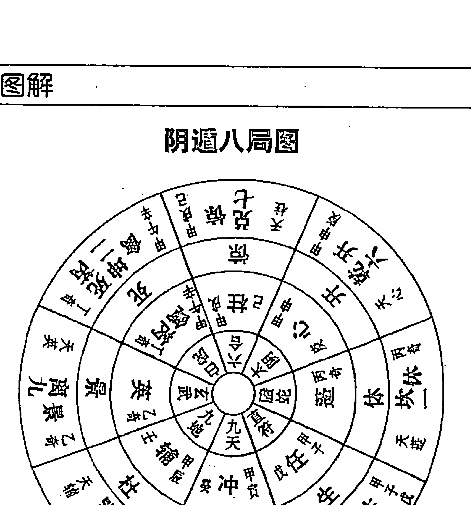

- 阴遁
- 小暑上元
- 立秋下元
- 霜降中元
- 小雪中元

白话图解

# 每日时辰

奇门遁甲中一局为一元，一元有甲己、乙庚、丙辛、丁壬和戊癸五日，每日有十二个时辰，则一局就有六十个时辰，用六十甲子来表示，一个时辰为一小局。

| 甲己时 | 甲子 | 乙丑 | 丙寅 | 丁卯 | 戊辰 | 己巳 | 庚午 | 辛未 | 壬申 | 癸酉 | 甲戌 | 乙亥 |
| :--- | :--- | :--- | :--- | :--- | :--- | :--- | :--- | :--- | :--- | :--- | :--- | :--- |
| 乙庚时 | 丙子 | 丁丑 | 戊寅 | 己卯 | 庚辰 | 辛巳 | 壬午 | 癸未 | 甲申 | 乙酉 | 丙戌 | 丁亥 |
| 丙辛时 | 戊子 | 己丑 | 庚寅 | 辛卯 | 壬辰 | 癸巳 | 甲午 | 乙未 | 丙申 | 丁酉 | 戊戌 | 己亥 |
| 丁壬时 | 庚子 | 辛丑 | 壬寅 | 癸卯 | 甲辰 | 乙巳 | 丙午 | 丁未 | 戊申 | 己酉 | 庚戌 | 辛亥 |
| 戊癸时 | 壬子 | 癸丑 | 甲寅 | 乙卯 | 丙辰 | 丁巳 | 戊午 | 己未 | 庚申 | 辛酉 | 壬戌 | 癸亥 |

### 阴遁八局六十时符使表

奇门遁甲排盘时，最主要的就是寻找值符和值使，并确定其所在的宫位。下表就是阴遁八局六十个时辰的值符和值使以及其所在的宫位。

| 时辰 | 甲子 | 乙丑 | 丙寅 | 丁卯 | 戊辰 | 己巳 | 庚午 | 辛未 | 壬申 | 癸酉 |
| :--- | :--- | :--- | :--- | :--- | :--- | :--- | :--- | :--- | :--- | :--- |
| 天任 | 八 | 九 | 一 | 二 | 八 | 七 | 六 | 五 | 四 | 三 |
| 生门 | 八 | 七 | 六 | 五 | 四 | 三 | 二 | 一 | 九 | 八 |
| 时辰 | 甲戌 | 乙亥 | 丙子 | 丁丑 | 戊寅 | 己卯 | 庚辰 | 辛巳 | 壬午 | 癸未 |
| 天柱 | 七 | 九 | 一 | 二 | 八 | 七 | 六 | 五 | 四 | 三 |
| 惊门 | 七 | 六 | 五 | 四 | 三 | 二 | 一 | 九 | 八 | 七 |
| 时辰 | 甲申 | 乙酉 | 丙戌 | 丁亥 | 戊子 | 己丑 | 庚寅 | 辛卯 | 壬辰 | 癸巳 |
| 天心 | 六 | 九 | 一 | 二 | 八 | 七 | 六 | 五 | 四 | 三 |
| 开门 | 六 | 五 | 四 | 三 | 二 | 一 | 九 | 八 | 七 | 六 |
| 时辰 | 甲午 | 乙未 | 丙申 | 丁酉 | 戊戌 | 己亥 | 庚子 | 辛丑 | 壬寅 | 癸卯 |
| 天禽 | 五 | 九 | 一 | 二 | 八 | 七 | 六 | 五 | 四 | 三 |
| 死门 | 五 | 四 | 三 | 二 | 一 | 九 | 八 | 七 | 六 | 五 |
| 时辰 | 甲辰 | 乙巳 | 丙午 | 丁未 | 戊申 | 己酉 | 庚戌 | 辛亥 | 壬子 | 癸丑 |
| 天辅 | 四 | 九 | 一 | 二 | 八 | 七 | 六 | 五 | 四 | 三 |
| 杜门 | 四 | 三 | 二 | 一 | 九 | 八 | 七 | 六 | 五 | 四 |
| 时辰 | 甲寅 | 乙卯 | 丙辰 | 丁巳 | 戊午 | 己未 | 庚申 | 辛酉 | 壬戌 | 癸亥 |
| 天冲 | 三 | 九 | 一 | 二 | 八 | 七 | 六 | 五 | 四 | 三 |
| 伤门 | 三 | 二 | 一 | 九 | 八 | 七 | 六 | 五 | 四 | 三 |

# 1. 甲己日十二时局

甲子时：正北方向吉利

## 【原文】

甲子 任八，生八。子至辰阳，宿干吉。休坎伏，景离伏，死坤伏。天三，地四，阴六，合七。休与月合一正北，时干艮，符门伏，遁甲，阖。

## 【白话提要】

符使宫位：值符天任星在艮八宫，值使生门在艮八宫。子时至辰时为五阳时。时干遇吉星宿，时干逢吉。

三奇方位：休门逢双丙奇在坎一宫，不相生克。景门逢双乙奇在离九宫，不相生克。死门逢双丁奇在坤二宫，不相生克。

四吉方位：九天在震三宫，九地在巽四宫，太阴在乾六宫，六合在兑七宫。

诸局格象：休门合丙奇在坎一宫，正北方向吉利。时干在艮八宫。星符、八门伏吟。遁甲合。

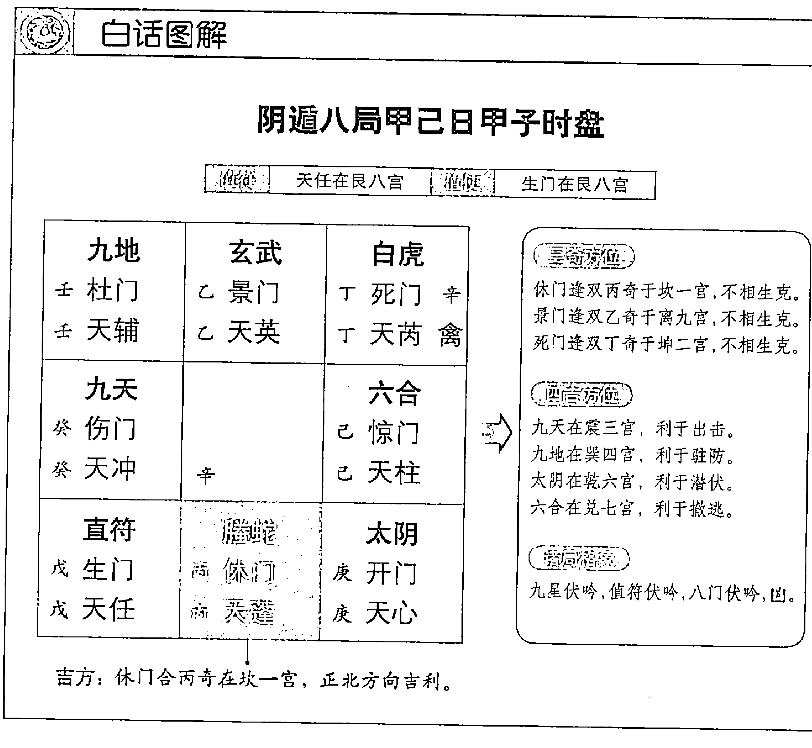

### 阴遁八局甲己日甲子时盘

值符：天任在艮八宫 值使：生门在艮八宫

| 九地 | 玄武 | 白虎 |
|---|---|---|
| 壬 杜门 壬 天辅 | 乙 景门 乙 天英 | 丁 死门 辛 丁 天芮 禽 |
| 九天 | | 六合 |
| 癸 伤门 癸 天冲 | 辛 | 己 惊门 己 天柱 |
| 直符 | 螣蛇 | 太阴 |
| 戊 生门 戊 天任 | 丙 休门 丙 天蓬 | 庚 开门 庚 天心 |

三奇方位：休门逢双丙奇于坎一宫，不相生克。景门逢双乙奇于离九宫，不相生克。死门逢双丁奇于坤二宫，不相生克。

四吉方位：九天在震三宫，利于出击。九地在巽四宫，利于驻防。太阴在乾六宫，利于潜伏。六合在兑七宫，利于撤逃。

诸局格象：九星伏吟，值符伏吟，八门伏吟，凶。

吉方：休门合丙奇在坎一宫，正北方向吉利。

# 乙丑时：逢己日不宜用事

## 【原文】

乙丑 值符天任星在离九宫，值使生门在兑七宫。时干遇凶星宿，时干逢吉。逢己日不宜用事。惊门逢丙奇于巽四宫，克宫。伤门逢乙奇于乾六宫，被克，奇仪相合。杜门逢天盘丁奇与地盘丙奇于坎一宫，被生。九天在坤二宫，九地在兑七宫，太阴在震三宫，六合在艮八宫。无奇门。时干在乾六宫。大格。螣蛇天矫。

## 【白话提要】

符使宫位：值符天任星在离九宫，值使生门在兑七宫。时干遇凶星宿，时干逢吉。逢己日不宜用事。

三奇方位：惊门逢丙奇于巽四宫，克宫。伤门逢乙奇于乾六宫，被克，奇仪相合。杜门逢天盘丁奇与地盘丙奇于坎一宫，被生。

四吉方位：九天在坤二宫，九地在兑七宫，太阴在震三宫，六合在艮八宫。

诸局格象：无奇门。时干在乾六宫。大格。螣蛇天矫。

## 白话图解

### 阴遁八局甲己日乙丑时盘

值符 天任在离九宫 值使 生门在兑七宫

| 螣蛇 | 直符 | 九天 |
| :--- | :--- | :--- |
| 丙 惊门 | 戊 开门 | 癸 休门 |
| 壬 天蓬 | 乙 天任 | 丁 天冲 |
| 太阴 |  | 九地 |
| 庚 死门 | 辛 | 壬 生门 |
| 癸 天心 |  | 己 天辅 |
| 六合 | 白虎 | 玄武 |
| 己 景门 | 丁 杜门 辛 | 乙 伤门 |
| 戊 天柱 | 丙 天芮 禽 | 庚 天英 |

三奇方位
- 惊门逢丙奇在巽四宫，克宫。
- 伤门逢乙奇在乾六宫，被克。
- 杜门逢天盘丁奇与地盘丙奇在坎一宫，被生。

四吉方位
- 九天在坤二宫，利于出击。
- 九地在兑七宫，利于驻防。
- 太阴在震三宫，利于潜伏。
- 六合在艮八宫，利于撤逃。

诸局格象
- 无奇门，凶。
- 大格，螣蛇天矫，凶。

## 丙寅时：西北方向吉利

## 【原文】

丙寅 值符天任星在坎一宫，值使生门在乾六宫。时干遇凶星宿，时干逢吉。生门逢丙奇在乾六宫，生宫，丙奇入墓。死门逢乙奇在巽四宫，被克。惊门逢天盘丁奇与地盘乙奇在离九宫，被克。九天在艮八宫，九地在震三宫，太阴在兑七宫，六合在坤二宫。生门合丙奇在乾六宫，西北方向吉利。丙奇得使。刑格。天乙与六庚格。逢己日伏干格。白虎猖狂。青龙回首。时干在乾六宫。值符得地盘丙奇相助于坎一宫。荧入太白。事同。

## 【白话提要】

符使宫位：值符天任星在坎一宫，值使生门在乾六宫。时干遇凶星宿，时干逢吉。

三奇方位：生门逢丙奇在乾六宫，生宫，丙奇入墓。死门逢乙奇在巽四宫，被克。惊门逢天盘丁奇与地盘乙奇在离九宫，被克。

四吉方位：九天在艮八宫，九地在震三宫，太阴在兑七宫，六合在坤二宫。

诸局格象：生门合丙奇在乾六宫，西北方向吉利。丙奇得使。刑格。天乙与六庚格。逢己日伏干格。白虎猖狂。青龙回首。时干在乾六宫。值符得地盘丙奇相助于坎一宫。荧入太白。

## 白话图解

### 阴遁八局甲己日丙寅时盘

| 玄武 乙死门 壬天英 | 白虎 丁惊门 辛乙天芮禽 | 六合 己开门 丁天柱 |
|--------------------------|------------------------------|--------------------------|
| 九地 壬景门 癸天辅 |                              | 太阴 庚休门 己天心 |
| 九天 癸杜门 戊天冲 | 直符 戊伤门 丙天任     | 螣蛇 开门 庚天蓬     |

吉方：生门合丙奇在乾六宫，西北方向吉利。

三奇方位：生门逢丙奇在乾六宫，生宫，丙奇入墓。死门逢乙奇在巽四宫，被克。惊门逢天盘丁奇与地盘乙奇在离九宫，被克。

四吉方位：九天在艮八宫，利于出击。九地在震三宫，利于驻防。太阴在兑七宫，利于潜伏。六合在坤二宫，利于撤逃。

诸局格象：丙奇得使，青龙回首，吉。刑格，白虎猖狂，荧入太白，凶。逢己日，为伏干格，凶。

## 丁卯时：正南方向吉利

## 【原文】

丁卯 值符天任星在坤二宫，值使生门在中五宫，寄于坤二宫。时干遇凶星宿，时干逢吉。休门逢天盘丙奇与地盘乙奇在离九宫，克宫。景门逢天盘乙奇与地盘丙奇在坎一宫，被克。死门逢丁奇在艮八宫，不相生克，吉利。九天在兑七宫，九地在乾六宫，太阴在巽四宫，六合在震三宫。休门合丙奇在离九宫，正南方向吉利。丙下有乙成日月并行。六仪击刑。时干在艮八宫。值符得地盘丁奇相助于坤二宫。值符星门相冲反吟。击刑。

## 【白话提要】

符使宫位：值符天任星在坤二宫，值使生门在中五宫，寄于坤二宫。时干遇凶星宿，时干逢吉。

三奇方位：休门逢天盘丙奇与地盘乙奇在离九宫，克宫。景门逢天盘乙奇与地盘丙奇在坎一宫，被克。死门逢丁奇在艮八宫，不相生克，吉利。

四吉方位：九天在兑七宫，九地在乾六宫，太阴在巽四宫，六合在震三宫。

诸局格象：休门合丙奇在离九宫，正南方向吉利。丙下有乙成日月并行。六仪击刑。时干在艮八宫。值符得地盘丁奇相助于坤二宫。值符星门相冲反吟。击刑。

## 白话图解

### 阴遁八局甲己日丁卯时盘

值符 天任在坤二宫 值使 生门在中五宫，寄于坤二宫

吉方：休门合丙奇在离九宫，正南方向吉利。

| 巽四 | 离九 | 坤二 |
| :--- | :--- | :--- |
| 太阴 庚 开门 壬 天心 | 螣蛇 丙 休门 乙 天蓬 | 直符 戊 生门 丁 天任 |
| 震三 | 中五 | 兑七 |
| 六合 己 惊门 癸 天柱 | 辛 | 九天 癸 伤门 己 天冲 |
| 艮八 | 坎一 | 乾六 |
| 白虎 丁 死门 辛 戊 天芮 禽 | 玄武 乙 景门 丙 天英 | 九地 壬 杜门 庚 天辅 |

### 三奇方位
- 休门逢天盘丙奇与地盘乙奇在离九宫，克宫。
- 景门逢天盘乙奇与地盘丙奇在坎一宫，被克。
- 死门逢丁奇在艮八宫，不相生克。

### 四吉方位
- 九天在兑七宫，利于出击。
- 九地在乾六宫，利于驻防。
- 太阴在巽四宫，利于潜伏。
- 六合在震三宫，利于撤逃。

### 诸局格象
- 丙下有乙，成日月并行，吉。
- 六仪击刑，凶。
- 九星反吟，八门反吟，值符反吟，凶。

# 戊辰时：无奇门可出

## 【原文】

戊辰 值符天任星在艮八宫，值使生门在巽四宫。时干遇吉星宿，时干逢吉。惊门逢双丙奇在坎一宫，生宫。伤门逢双乙奇在离九宫，生宫。杜门逢双丁奇在坤二宫，克宫。九天在震三宫，九地在巽四宫，太阴在乾六宫，六合在兑七宫。无奇门。星符伏吟。时干在艮八宫。

## 【白话提要】

符使宫位：值符天任星在艮八宫，值使生门在巽四宫。时干遇吉星宿，时干逢吉。

三奇方位：惊门逢双丙奇在坎一宫，生宫。伤门逢双乙奇在离九宫，生宫。杜门逢双丁奇在坤二宫，克宫。

四吉方位：九天在震三宫，九地在巽四宫，太阴在乾六宫，六合在兑七宫。

诸局格象：无奇门。星符伏吟。时干在艮八宫。

## 白话图解

### 阴遁八局甲己日戊辰时盘

值符 天任在艮八宫 值使 生门在巽四宫

| 九地 | 玄武 | 白虎 |
| :--- | :--- | :--- |
| 壬 生门 壬 天辅 | 乙 伤门 乙 天英 | 丁 辛 杜门 丁 天芮 禽 |
| 九天 | 辛 | 六合 |
| 癸 休门 癸 天冲 | | 己 景门 己 天柱 |
| 直符 | 螣蛇 | 太阴 |
| 戊 开门 戊 天任 | 丙 惊门 丙 天蓬 | 庚 死门 庚 天心 |

- 三奇方位
- 惊门逢双丙奇在坎一宫，生宫。
- 伤门逢双乙奇在离九宫，生宫。
- 杜门逢双丁奇在坤二宫，克宫。

- 四吉方位
- 九天在震三宫，利于出击。
- 九地在巽四宫，利于驻防。
- 太阴在乾六宫，利于潜伏。
- 六合在兑七宫，利于撤逃。

- 诸局格象
- 无奇门，凶。
- 九星伏吟，值符伏吟，凶。

## 己巳时：正东与东北方向吉利

## 【原文】

己巳 值符天任星在兑七宫，值使生门在震三宫。巳时至酉时为五阴时，巳时为天辅释罪时。时干遇凶星宿，时干逢吉。景门逢天盘丙奇与地盘丁奇在坤二宫，生宫，奇仪相合。休门逢乙奇在艮八宫，被克，吉利。生门逢丁奇在震三宫，被克。九天在乾六宫，九地在坎一宫，太阴在离九宫，六合在巽四宫。休门合乙奇在艮八宫，东北方向吉利。生门合丁奇在震三宫，正东方向吉利。朱雀入江。时干在巽四宫。三吉格。

## 【白话提要】

符使宫位：值符天任星在兑七宫，值使生门在震三宫。巳时至酉时为五阴时，巳时为天辅释罪时。时干遇凶星宿，时干逢吉。

三奇方位：景门逢天盘丙奇与地盘丁奇在坤二宫，生宫，奇仪相合。休门逢乙奇在艮八宫，被克，吉利。生门逢丁奇在震三宫，被克。

四吉方位：九天在乾六宫，九地在坎一宫，太阴在离九宫，六合在巽四宫。

诸局格象：休门合乙奇在艮八宫，东北方向吉利。生门合丁奇在震三宫，正东方向吉利。朱雀入江。时干在巽四宫。三吉格。

## 白话图解

### 阴遁八局甲己日己巳时盘

值符 天任在兑七宫 值使 生门在震三宫

| 六合 | 太阴 | 螣蛇 |
|------|------|------|
| 己 伤门 壬 天柱 | 庚 杜门 乙 天心 | 丙 景门 丁 天蓬 |
| 白虎 丁 生门 癸 天芮 禽 | 直符 戊 死门 己 天任 | 九天 癸 惊门 庚 天冲 |
| 玄武 乙 休门 戊 天英 | 九地 壬 开门 丙 天辅 | 九天 癸 惊门 庚 天冲 |

三奇方位
- 景门逢天盘丙奇与地盘丁奇在坤二宫，生宫。
- 休门逢乙奇在艮八宫，被克。
- 生门逢丁奇在震三宫，被克。

四吉方位
- 九天在乾六宫，利于出击。
- 九地在坎一宫，利于驻防。
- 太阴在离九宫，利于潜伏。
- 六合在巽四宫，利于撤逃。

诸局格象
- 朱雀入江，凶。

吉方 1：休门合乙奇在艮八宫，东北方向吉利。

吉方 2：生门合丁奇在震三宫，正东方向吉利。

# 庚午时：逢甲日不宜用事

## 【原文】

庚午 值符天任星在乾六宫，值使生门在坤二宫。时干遇凶星宿，时干逢吉。逢甲日不宜用事，宜守户不出。伤门逢丙奇在兑七宫，被克。惊门逢乙奇在震三宫，克宫。开门逢丁奇在巽四宫，克宫，奇仪相合。九天在坎一宫，九地在艮八宫，太阴在坤二宫，六合在离九宫。开门与丁奇在巽四宫，东南方向吉利。丁奇得使。飞宫格。己干勃格。时干在坤二宫。八门反吟。逢己日勃格。

## 【白话提要】

符使宫位：值符天任星在乾六宫，值使生门在坤二宫。时干遇凶星宿，时干逢吉。逢甲日不宜用事，宜守户不出。

三奇方位：伤门逢丙奇在兑七宫，被克。惊门逢乙奇在震三宫，克宫。开门逢丁奇在巽四宫，克宫，奇仪相合。

四吉方位：九天在坎一宫，九地在艮八宫，太阴在坤二宫，六合在离九宫。

诸局格象：开门与丁奇在巽四宫，东南方向吉利。丁奇得使。飞宫格。己干勃格。时干在坤二宫。八门反吟。逢己日勃格。

## 白话图解

### 阴遁八局甲己日庚午时盘

吉方：开门与丁奇在巽四宫，东南方向吉利。

| 白虎 | 六合 | 太阴 |
|---|---|---|
| 丁 开门 壬 天芮 禽 | 己 休门 乙 天柱 | 庚 生门 丁 天心 |
| 玄武 | 螣蛇 | |
| 乙 惊门 癸 天英 | 辛 | 丙 伤门 己 天蓬 |
| 九地 | 九天 | 直符 |
| 壬 死门 戊 天辅 | 癸 景门 丙 天冲 | 戊 杜门 庚 天任 |

- 三奇方位
- 伤门逢丙奇在兑七宫，被克。
- 惊门逢乙奇在震三宫，克宫。
- 开门逢丁奇在巽四宫，克宫。

- 四吉方位
- 九天在坎一宫，利于出击。
- 九地在艮八宫，利于驻防。
- 太阴在坤二宫，利于潜伏。
- 六合在离九宫，利于撤逃。

- 诸局格象
- 丁奇得使，吉。
- 飞宫格，八门反吟，凶。
- 逢己日，为日勃格，凶。

## 辛未时：正北方向吉利

## 【原文】

辛未 值符天任星在中五宫，寄于坤二宫，值使生门在坎一宫。时干遇吉星宿，时干逢凶。死门逢天盘丙奇与地盘乙奇在离九宫，被生。生门逢天盘乙奇与地盘丙奇在坎一宫，克宫。伤门逢丁奇在艮八宫，克宫，吉利。九天在兑七宫，九地在乾六宫，太阴在巽四宫，六合在震三宫。生门合乙奇在坎一宫，正北方向吉利。乙下有丙成奇仪顺遂。时干在艮八宫。值符得地盘丁奇助于坤。星符相冲。

## 【白话提要】

符使宫位：值符天任星在中五宫，寄于坤二宫，值使生门在坎一宫。时干遇吉星宿，时干逢凶。

三奇方位：死门逢天盘丙奇与地盘乙奇在离九宫，被生。生门逢天盘乙奇与地盘丙奇在坎一宫，克宫。伤门逢丁奇在艮八宫，克宫，吉利。

四吉方位：九天在兑七宫，九地在乾六宫，太阴在巽四宫，六合在震三宫。

诸局格象：生门合乙奇在坎一宫，正北方向吉利。乙下有丙成奇仪顺遂。时干在艮八宫。值符得地盘丁奇助于坤。星符相冲。

## 白话图解

### 阴遁八局甲己日辛未时盘

| 太阴 庚 景门 壬 天心 | 螣蛇 丙 死门 乙 天蓬 | 直符 戊 惊门 丁 天任 |
|--------------------------|--------------------------|--------------------------|
| 六合 己 杜门 癸 天柱 | 辛 | 九天 癸 开门 己 天冲 |
| 白虎 丁 伤门 戊 天芮 禽 | 玄武 乙 生门 丙 天英 | 九地 壬 休门 庚 天辅 |

三奇方位：死门逢天盘丙奇与地盘乙奇在离九宫，被生。生门逢天盘乙奇与地盘丙奇在坎一宫，克宫。伤门逢丁奇在艮八宫，克宫。

四吉方位：九天在兑七宫，利于出击。九地在乾六宫，利于驻防。太阴在巽四宫，利于潜伏。六合在震三宫，利于撤逃。

诸局格象：乙下有丙，成奇仪顺遂，吉。九星反吟，值符反吟，凶。

吉方：生门合乙奇在坎一宫，正北方向吉利。

### 壬申时：正东方向吉利

## 【原文】

壬申 值符天任星在巽四宫，值使生门在离九宫。时干遇吉星宿，时干逢凶。开门逢丙奇在震三宫，克宫。杜门逢乙奇在兑七宫，被克。景门逢丁奇在乾六宫，克宫，丁奇入墓。九天在离九宫，九地在坤二宫，太阴在艮八宫，六合在坎一宫。开门合丙奇在震三宫，正东方向吉利。甲日为伏干格。伏宫格。时干在坤二宫。飞宫格。乙奇格。

## 【白话提要】

符使宫位：值符天任星在巽四宫，值使生门在离九宫。时干遇吉星宿，时干逢凶。

三奇方位：开门逢丙奇在震三宫，克宫。杜门逢乙奇在兑七宫，被克。景门逢丁奇在乾六宫，克宫，丁奇入墓。

四吉方位：九天在离九宫，九地在坤二宫，太阴在艮八宫，六合在坎一宫。

诸局格象：开门合丙奇在震三宫，正东方向吉利。甲日为伏干格。伏宫格。时干在坤二宫。飞宫格。乙奇格。

## 白话图解

### 阴遁八局甲己日壬申时盘

吉方：开门合丙奇在震三宫，正东方向吉利。

| 直符 戊 休门 壬 天任 | 九天 癸 生门 乙 天冲 | 九地 壬 伤门 丁 天辅 |
|--------------------------|------------------------------|--------------------------|
| 螣蛇 丙 开门 癸 天蓬 | 辛 | 玄武 乙 杜门 己 天英 |
| 太阴 庚 惊门 戊 天心 | 六合 己 死门 丙 天柱 | 白虎 丁 景门 辛 庚 天芮 禽 |

三奇方位
- 开门逢丙奇在震三宫，克宫。
- 杜门逢乙奇在兑七宫，被克。
- 景门逢丁奇在乾六宫，克宫。

四吉方位
- 九天在离九宫，利于出击。
- 九地在坤二宫，利于驻防。
- 太阴在艮八宫，利于潜伏。
- 六合在坎一宫，利于撤逃。

诸局格象
- 逢甲日，为伏干格，凶。
- 伏宫格，飞宫格，乙奇格，凶。

## 癸酉时：东北方向吉利

## 【原文】

癸酉 值符天任星在震三宫，值使生门在艮八宫。时干遇吉星宿，时干逢凶。成天遁格。生门逢丙奇在艮八宫，不相生克，好。死门逢天盘乙奇与地盘丁奇在坤二宫，不相生克。惊门逢丁奇在兑七宫，不相生克。九天在巽四宫，九地在离九宫，太阴在坎一宫，六合在乾六宫。生门合丙奇在艮八宫，东北方向吉利。六仪击刑。青龙逃走。飞鸟跌穴。时干在巽四宫。八门伏吟。太白入荧。逢己日飞干格。天网四张。

## 【白话提要】

符使宫位：值符天任星在震三宫，值使生门在艮八宫。时干遇吉星宿，时干逢凶。成天遁格。

三奇方位：生门逢丙奇在艮八宫，不相生克，好。死门逢天盘乙奇与地盘丁奇在坤二宫，不相生克。惊门逢丁奇在兑七宫，不相生克。

四吉方位：九天在巽四宫，九地在离九宫，太阴在坎一宫，六合在乾六宫。

诸局格象：生门合丙奇在艮八宫，东北方向吉利。六仪击刑。青龙逃走。飞鸟跌穴。时干在巽四宫。八门伏吟。太白入荧。逢己日飞干格。天网四张。

## 白话图解

### 阴遁八局甲己日癸酉时盘

值符 天任在震三宫 值使 生门在艮八宫

| 九天 | 九地 | 玄武 |
|------|------|------|
| 癸 杜门 壬 天冲 | 壬 景门 乙 天辅 | 乙 死门 丁 天英 |
| 直符 戊 伤门 癸 天任 | 辛 | 白虎 丁 惊门 辛 己 天芮 禽 |
| 螣蛇 丙 惊门 庚 天蓬 | 太阴 庚 休门 丙 天心 | 六合 己 开门 庚 天柱 |

**三奇方位**
- 生门逢丙奇在艮八宫，不相生克。
- 死门逢天盘乙奇与地盘丁奇在坤二宫，不相生克。
- 惊门逢丁奇在兑七宫，不相生克。

**四吉方位**
- 九天在巽四宫，利于出击。
- 九地在离九宫，利于驻防。
- 太阴在坎一宫，利于潜伏。
- 六合在乾六宫，利于逃避。

**诸局格象**
- 飞鸟跌穴，吉。
- 六仪击刑，青龙逃走，凶。
- 八门伏吟，太白入荧，天网四张，凶。
- 逢己日，为飞干格，凶。

吉方：生门合丙奇在艮八宫，东北方向吉利。

## 甲戌时：正北方向吉利

## 【原文】

甲戌 值符天柱星在兑七宫，值使惊门在兑七宫。戊时至亥时为五阳时。时干遇凶星宿，时干逢吉。景门逢双乙奇在离九宫，不相生克。休门逢双丙奇在坎一宫，不相生克。死门逢双丁奇在坤二宫，不相生克。九天在乾六宫，九地在坎一宫，太阴在离九宫，六合在巽四宫。休门合丙奇在坎一宫，正北方向吉利。时干在兑七宫。星、门均伏吟。飞甲合。

## 【白话提要】

符使宫位：值符天柱星在兑七宫，值使惊门在兑七宫。戊时至亥时为五阳时。时干遇凶星宿，时干逢吉。

三奇方位：景门逢双乙奇在离九宫，不相生克。休门逢双丙奇在坎一宫，不相生克。死门逢双丁奇在坤二宫，不相生克。

四吉方位：九天在乾六宫，九地在坎一宫，太阴在离九宫，六合在巽四宫。

诸局格象：休门合丙奇在坎一宫，正北方向吉利。时干在兑七宫。星、门均伏吟。飞甲合。

## 白话图解

### 阴遁八局甲己日甲戌时盘

| 六合 壬 杜门 壬 天辅 | 太阴 乙 景门 乙 天英 | 螣蛇 丁 死门 辛 丁 天芮 禽 |
| :--- | :--- | :--- |
| 白虎 癸 伤门 癸 天冲 | 辛 | 直符 己 惊门 己 天柱 |
| 玄武 戊 生门 戊 天任 | 九地 丙 休门 丙 天蓬 | 九天 庚 开门 庚 天心 |

- ### 三奇方位
- 景门逢双乙奇在离九宫，不相生克。
- 休门逢双丙奇在坎一宫，不相生克。
- 死门逢双丁奇在坤二宫，不相生克。

- ### 四吉方位
- 九天在乾六宫，利于出击。
- 九地在坎一宫，利于驻防。
- 太阴在离九宫，利于潜伏。
- 六合在巽四宫，利于撤逃。

- ### 诸局格象
- 九星伏吟，八门伏吟，值符伏吟，凶。

吉方：休门合丙奇在坎一宫，正北方向吉利。

# 乙亥时：逢己日不宜用事

## 【原文】

乙亥 值符天柱星在离九宫，值使惊门在乾六宫。时干遇吉星宿，时干逢凶。逢己日不宜用事。生门逢双乙奇在震三宫，被克。死门逢双丙奇在兑七宫，生宫，吉利。伤门逢双丁奇在巽四宫，不相生克。九天在坤二宫，九地在兑七宫，太阴在震三宫，六合在艮八宫。生门合乙奇在震三宫，正东方向吉利。天乙与六庚成格。符勃。时干在震三宫。逢己日日勃。飞鸟跌穴。

## 【白话提要】

符使宫位：值符天柱星在离九宫，值使惊门在乾六宫。时干遇吉星宿，时干逢凶。逢己日不宜用事。

三奇方位：生门逢双乙奇在震三宫，被克。死门逢双丙奇在兑七宫，生宫，吉利。伤门逢双丁奇在巽四宫，不相生克。

四吉方位：九天在坤二宫，九地在兑七宫，太阴在震三宫，六合在艮八宫。

诸局格象：生门合乙奇在震三宫，正东方向吉利。天乙与六庚成格。符勃。时干在震三宫。逢己日日勃。飞鸟跌穴。

## 白话图解

- 三奇方位
- 生门逢双乙奇在震三宫，被克。
- 死门逢双丙奇在兑七宫，生宫。
- 伤门逢双丁奇在巽四宫，不相生克。

- 四吉方位
- 九天在坤二宫，利于出击。
- 九地在兑七宫，利于驻防。
- 太阴在震三宫，利于潜伏。
- 六合在艮八宫，利于撤逃。

- 诸局格象
- 飞鸟跌穴，吉。
- 符勃，凶。
- 逢己日，为日勃格，凶。

## 2.乙庚日十二时局

# 丙子时：逢庚日不宜用事

【原文】
丙子 柱一，惊五避五。子至寅阳，宿凶干吉，庚日不用，地遁。开兑伏欢怡，杜震伏，休墓乾和。天八，地三，阴七，合二。开与日合七正西，休与星合六西北，时干震，相佐坎，飞宫格。

【白话提要】
符使宫位：值符天柱星在坎一宫，值使惊门在中五宫，寄于坤二宫。子时至寅时为五阳时。时干遇凶星宿，时干逢吉。逢庚日不宜用事。成地遁格。
三奇方位：开门逢乙奇在兑七宫，不相生克，吉利。杜门逢丙奇在震三宫，不相生克。休门逢丁奇在乾六宫，被生，丁奇入墓。
四吉方位：九天在艮八宫，九地在震三宫，太阴在兑七宫，六合在坤二宫。
诸局格象：开门合乙奇在兑七宫，正西方向吉利。休门合丁奇在乾六宫，西北方向吉利。时干在震三宫。值符得地盘丙奇助于坎一宫。飞宫格。

## 白话图解

## 阴遁八局乙庚日丙子时盘

吉方1：开门合乙奇在兑七宫，正西方向吉利。

| | 艮八宫 | 坎一宫 | 震三宫 |
| :--- | :--- | :--- | :--- |
| **巽四宫** | 九地 丙 杜门 癸 天蓬 | （空） | 太阴 乙 开门 己 天英 |
| **离九宫** | 九天 庚 伤门 戊 天任 | 直符 己 生门 丙 天柱 | 螣蛇 丁 休门 庚 天芮 禽 |
| **坤二宫** | 玄武 戊 景门 壬 天任 | 白虎 癸 死门 乙 天冲 | 六合 壬 惊门 丁 天辅 |

三奇方位：
开门逢乙奇在兑七宫，不相生克。
杜门逢丙奇在震三宫，不相生克。
休门逢丁奇在乾六宫，被生。

四吉方位：
九天在艮八宫，利于出击。
九地在震三宫，利于驻防。
太阴在兑七宫，利于潜伏。
六合在坤二宫，利于撤逃。

诸局格象：
飞宫格，凶。

吉方2：休门合丁奇在乾六宫，西北方向吉利。

## 丁丑时：正南方向吉利

【原文】
丁丑 柱二，惊四。宿凶干吉。惊巽制，伤墓乾害，开乙离害。天七，地六，阴四，合三。开与星合九正南，伏宫格，刑格，乙格，仪刑，虎猖狂，时干离，相佐坤，火入金，庚日勃。

【白话提要】
符使宫位：值符天柱星在坤二宫，值使惊门在巽四宫。时干遇凶星宿，时干逢吉。

三奇方位：惊门逢乙奇在巽四宫，克宫。伤门逢丙奇在乾六宫，被克，丙奇入墓。开门逢天盘丁奇与地盘乙奇在离九宫，被克。

四吉方位：九天在兑七宫，九地在乾六宫，太阴在巽四宫，六合在震三宫。

诸局格象：开门合丁奇在离九宫，正南方向吉利。伏宫格。刑格。乙格。六仪击刑。白虎猖狂。时干在离九宫。值符得地盘丁奇助于坤。荧入太白。庚日日勃。

## 白话图解

## 阴遁八局乙庚日丁丑时盘

值符 天柱在坤二宫 值使 惊门在巽四宫

吉方：开门合丁奇在离九宫，正南方向吉利。

| 宫位 | 神/门/星 | 神/门/星 | 神/门/星 |
| :--- | :--- | :--- | :--- |
| **东南 (巽四宫)** | 太阴 乙 惊门 壬 天英 | 螣蛇 丁 开门 乙 天芮 禽 | 直符 己 休门 丁 天柱 |
| **正东 (震三宫)** | 六合 壬 死门 癸 天辅 | 中五宫寄坤二宫 辛 | 九天 庚 生门 己 天心 |
| **东北 (艮八宫)** | 白虎 癸 景门 戊 天冲 | 玄武 戊 杜门 丙 天任 | 九地 丙 伤门 庚 天蓬 |

三奇方位
惊门逢乙奇在巽四宫，克宫。
伤门逢丙奇在乾六宫，被克。
开门逢天盘丁奇与地盘乙奇在离九宫，被克。

四吉方位
九天在兑七宫，利于出击。
九地在乾六宫，利于驻防。
太阴在巽四宫，利于潜伏。
六合在震三宫，利于撤逃。

诸局格象
伏宫格，刑格，乙格，凶。
六仪击刑，白虎猖狂，凶。
荧入太白，庚日日勃，凶。

## 戊寅时：东南方向吉利

【原文】
戊寅 柱八，惊三。宿干吉。杜合乾害，开巽制，景丙坎害。天三，地四，阴六，合七。开与月合四东南，飞宫格，门伏吟，蛇矫，时干离，乙日飞干格，大格，三吉。

【白话提要】
符使宫位：值符天柱星在艮八宫，值使惊门在震三宫。时干遇吉星宿，时干逢吉。
三奇方位：杜门逢乙奇在乾六宫，被克，奇仪相合。开门逢丙奇在巽四宫，克宫。景门逢天盘丁奇与地盘丙奇在坎一宫，被克。
四吉方位：九天在震三宫，九地在巽四宫，太阴在乾六宫，六合在兑七宫。
诸局格象：开门合丙奇在巽四宫，东南方向吉利。飞宫格。八门伏吟。腾蛇天矫。时干在离九宫。逢乙日飞干格。大格。三吉格。

## 白话图解

## 阴遁八局乙庚日戊寅时盘

吉方：开门合丙奇在巽四宫，东南方向吉利。

| 宫位 | 神 | 门 | 天盘奇仪 | 地盘奇仪 | 天盘星 |
| :--- | :--- | :--- | :--- | :--- | :--- |
| 坤二宫 | 玄武 | 休门 | 戊 | 乙 | 天任 |
| 兑七宫 | 白虎 | 生门 | 癸 | 丁 | 天冲 |
| 乾六宫 | 太阴 | 杜门 | 乙 | 庚 | 天英 |
| 坎一宫 | 螣蛇 | 景门 | 丁 | 丙 | 天芮（禽） |
| 艮八宫 | 直符 | 死门 | 己 | 戊 | 天柱 |
| 震三宫 | 九天 | 惊门 | 庚 | 癸 | 天心 |
| 巽四宫 | 九地 | 开门 | 辛 | 壬 | 天蓬 |
| 离九宫 | 六合 | 伤门 | 壬 | 己 | 天辅 |

三奇方位：杜门逢乙奇在乾六宫，被克。开门逢丙奇在巽四宫，克宫。景门逢天盘丁奇与地盘丙奇在坎一宫，被克。

四吉方位：九天在震三宫，利于出击。九地在巽四宫，利于驻防。太阴在乾六宫，利于潜伏。六合在兑七宫，利于撤逃。

诸局格象：八门伏吟，腾蛇天矫，凶。逢乙日，为飞干格，凶。大格，飞宫格，凶。

# 己卯时：宜守户不出

【原文】
己卯 柱七，惊二。卯至未阴，宿干凶，守户。死乙离和，生丙坎制，惊丁坤和。天六，地一，阴九，合四。生与月合一正北，时干兑。符伏。

【白话提要】
符使宫位：值符天柱星在兑七宫，值使惊门在坤二宫。卯时至未时为五阴时。时干遇凶星宿，时干逢凶。宜守户不出。
三奇方位：死门逢双乙奇在离九宫，被生。生门逢双丙奇在坎一宫，克宫。惊门逢双丁奇在坤二宫，被生。
四吉方位：九天在乾六宫，九地在坎一宫，太阴在离九宫，六合在巽四宫。
诸局格象：生门合丙奇在坎一宫，正北方向吉利。时干在兑七宫正西方。星符伏吟格。

## 白话图解

## 阴遁八局乙庚日己卯时盘

| 巽四宫 | 离九宫 | 坤二宫 |
| :--- | :--- | :--- |
| 六合 壬 景门 壬 天辅 | 太阴 乙 死门 乙 天英 | 螣蛇 丁 惊门 辛 丁 天芮 禽 |
| **震三宫** | **中五宫** | **兑七宫** |
| 白虎 癸 杜门 癸 天冲 | 辛 | 直符 己 开门 己 天柱 |
| **艮八宫** | **坎一宫** | **乾六宫** |
| 玄武 戊 伤门 戊 天任 | 九地 丙 生门 丙 天蓬 | 九天 庚 休门 庚 天心 |

三奇方位
死门逢双乙奇在离九宫，被生。
生门逢双丙奇在坎一宫，克宫。
惊门逢双丁奇在坤二宫，被生。

四吉方位
九天在乾六宫，利于出击。
九地在坎一宫，利于驻防。
太阴在离九宫，利于潜伏。
六合在巽四宫，利于撤逃。

诸局格象
九星伏吟，八门伏吟，值符伏吟，凶。

吉方：生门合丙奇在坎一宫，正北方向吉利。

## 庚辰时：东北方向吉利

【原文】
庚辰 柱六，惊一。宿吉干凶。杜墓丁坤制，开艮和，景兑制欢怡。天一，地八，阴二，合九。开与月合八东北，得使，飞宫格，龙走，鸟跌穴，时干坎，飞符。金入火。

【白话提要】
符使宫位：值符天柱星在乾六宫，值使惊门在坎一宫。时干遇吉星宿，时干逢凶。
三奇方位：杜门逢天盘乙奇与地盘丁奇在坤二宫，克宫，乙奇入墓。开门逢丙奇在艮八宫，被生。景门逢丁奇在兑七宫，克宫，好。
四吉方位：九天在坎一宫，九地在艮八宫，太阴在坤二宫，六合在离九宫。
诸局格象：开门合丙奇在艮八宫，东北方向吉利。丙奇得使。飞宫格。青龙逃走。飞鸟跌穴。时干在坎一宫。太白入荧。

## 白话图解

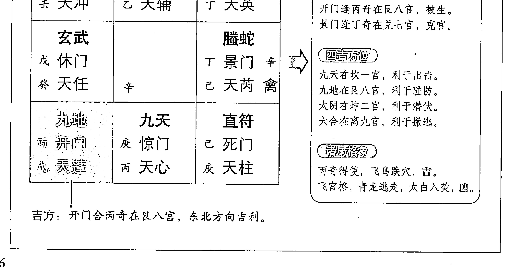

# 辛巳时：逢乙日不宜用事

【原文】
辛巳 柱五，惊九。宿吉干凶，乙日不用。死巽害，生墓乾义，惊乙离害。天七，地六，阴四，合三。生与月合六西北，得使，刑乙格，伏宫格，虎猖狂，龙反首，时干离，相佐坤，火入金，庚日勃。

【白话提要】
符使宫位：值符天柱星在中五宫寄于坤二宫，值使惊门在离九宫。时干遇吉星宿，时干逢凶。
三奇方位：死门逢乙奇在巽四宫，被克。生门逢丙奇在乾六宫，生宫，丙奇入墓。惊门逢天盘丁奇与地盘乙奇在离九宫，被克。
四吉方位：九天在兑七宫，九地在乾六宫，太阴在巽四宫，六合在震三宫。
诸局格象：生门合丙奇在乾六宫，西北方向吉利。丙奇得使。刑格。乙格。伏宫格。白虎猖狂。青龙回首。时干在离九宫。值符得地盘丁奇助于坤。荧入太白。庚日日勃。

## 白话图解

## 阴遁八局乙庚日辛巳时盘

| 巽四宫 | 离九宫 | 坤二宫 |
| :--- | :--- | :--- |
| 太阴 乙 死门 壬 天英 | 螣蛇 丁 惊门 辛 乙 天芮 禽 | 直符 己 开门 丁 天柱 |
| **震三宫** | **中五宫** | **兑七宫** |
| 六合 壬 景门 癸 天辅 | 辛 | 九天 庚 休门 己 天心 |
| **艮八宫** | **坎一宫** | **乾六宫** |
| 白虎 癸 杜门 戊 天冲 | 玄武 戊 伤门 丙 天任 | 九地 丙 惊门 庚 天蓬 |

三奇方位：死门逢乙奇在巽四宫，被克。生门逢丙奇在乾六宫，生宫。惊门逢天盘丁奇与地盘乙奇在离九宫，被克。

四吉方位：九天在兑七宫，利于出击。九地在乾六宫，利于驻防。太阴在巽四宫，利于潜伏。六合在震三宫，利于撤逃。

诸局格象：丙奇得使，青龙回首，吉。刑格，乙格，伏宫格，凶。白虎猖狂，荧入太白，庚日日勃，凶。

吉方：生门合丙奇在乾六宫，西北方向吉利。

## 壬午时：正东方向吉利

【原文】
壬午 柱四，惊八。宿吉干凶。惊艮和，伤合丁，坤制，开震制。天九，地二，阴八，合一。开与星合三正东，雀入江，时干坎，乙日伏干格。

【白话提要】
符使宫位：值符天柱星在巽四宫，值使惊门在艮八宫。时干遇吉星宿，时干逢凶。

三奇方位：惊门逢乙奇在艮八宫，被生。伤门逢天盘丙奇与地盘丁奇在坤二宫，克宫，奇仪相合。开门逢丁奇在震三宫，克宫。

四吉方位：九天在离九宫，九地在坤二宫，太阴在艮八宫，六合在坎一宫。

诸局格象：开门合丁奇在震三宫，正东方向吉利。朱雀入江。时干在坎一宫。逢乙日伏干格。

## 白话图解

## 阴遁八局乙庚日壬午时盘

值符 天柱在巽四宫 值使 惊门在艮八宫

| 坤二宫 | 离九宫 | 巽四宫 |
| :--- | :--- | :--- |
| 直符 己 休门 壬 天柱 | 九天 庚 生门 乙 天心 | 九地 丙 伤门 丁 天蓬 |
| **兑七宫** | **中五宫** | **震三宫** |
| (腾蛇) 丁 开门 癸 天芮 禽 辛 | | 玄武 戊 杜门 己 天任 |
| **乾六宫** | **坎一宫** | **艮八宫** |
| 太阴 乙 惊门 戊 天英 | 六合 壬 死门 丙 天辅 | 白虎 癸 景门 庚 天心 |

三奇方位
惊门逢乙奇在艮八宫，被生。
伤门逢天盘丙奇与地盘丁奇在坤二宫，克宫。
开门逢丁奇在震三宫，克宫。

四吉方位
九天在离九宫，利于出击。
九地在坤二宫，利于驻防。
太阴在艮八宫，利于潜伏。
六合在坎一宫，利于撤逃。

诸局格象
朱雀入江，凶。
逢乙日，为伏干格，凶。

吉方：开门合丁奇在震三宫，正东方向吉利。

## 癸未时：正北与东北方向吉利

【原文】
癸未 柱三，惊七。宿吉干凶。休丙坎伏，景乙离伏，生艮伏。天四，地九，阴一，合六。休与日合一正北，生与星合八东北，仪刑，时干兑，符冲，门伏，击刑，天网。

【白话提要】
符使宫位：值符天柱星在震三宫，值使惊门在兑七宫。时干遇吉星宿，时干逢凶。

三奇方位：休门逢天盘乙奇与地盘丙奇在坎一宫，不相生克。景门逢天盘丙奇与地盘乙奇在离九宫，不相生克。生门逢丁奇在艮八宫，不相生克。

四吉方位：九天在巽四宫，九地在离九宫，太阴在坎一宫，六合在乾六宫。

诸局格象：休门合乙奇在坎一宫，正北方向吉利。生门合丁奇在艮八宫，东北方向吉利。六仪击刑。时干在兑七宫。值符相冲。八门伏吟。击刑。天网四张。

## 白话图解

## 阴遁八局乙庚日癸未时盘

值符 天柱在震三宫
值使 惊门在兑七宫

| 巽四宫 | 离九宫 | 坤二宫 |
| :--- | :--- | :--- |
| 九天 庚 杜门 壬 天心 | 九地 丙 景门 乙 天蓬 | 玄武 戊 死门 丁 天任 |
| **震三宫** | **中五宫** | **兑七宫** |
| 直符 己 伤门 癸 天柱 | 辛 | 白虎 癸 惊门 己 天冲 |
| **艮八宫** | **坎一宫** | **乾六宫** |
| 螣蛇 丁 生门 丙 天芮 禽 | 太阴 乙 休门 戊 天英 | 六合 壬 开门 庚 天辅 |

三奇方位
休门逢天盘乙奇与地盘丙奇在坎一宫，不相生克。
景门逢天盘丙奇与地盘乙奇在离九宫，不相生克。
生门逢丁奇在艮八宫，不相生克。

四吉方位
九天在巽四宫，利于出击。
九地在离九宫，利于驻防。
太阴在坎一宫，利于潜伏。
六合在乾六宫，利于逃避。

诸局格象
六仪击刑，八门伏吟，凶。
击刑，天网四张，凶。

吉方2：生门合丁奇在艮八宫，东北方向吉利。
吉方1：休门合乙奇在坎一宫，正北方向吉利。

## 甲申时：正北方向吉利

【原文】
甲申 心六，开六。申至亥阳，天辅，宿干吉。休蓬使坎伏，景英日离伏，死芮星坤伏。天一，地八，阴二，合九。休与月合一正北，天乙与太白格，时干乾，符门伏，事同，地甲，阖。

【白话提要】
符使宫位：值符天心星在乾六宫，值使开门在乾六宫。申时至亥时为五阳时，申时为天辅时。时干遇吉星宿，时干逢吉。
三奇方位：休门逢双丙奇在坎一宫，不相生克。景门逢双乙奇在离九宫，不相生克。死门逢双丁奇在坤二宫，不相生克。
四吉方位：九天在坎一宫，九地在艮八宫，太阴在坤二宫，六合在离九宫。
诸局格象：休门合丙奇在坎一宫，正北方向吉利。天乙与六庚格在乾六宫。时干在乾六宫。星、门伏吟。地甲合。

## 白话图解

## 阴遁八局乙庚日甲申时盘

| 艮八宫 | 坎一宫 | 乾六宫 |
| :--- | :--- | :--- |
| 白虎 壬 杜门 壬 天辅 | 六合 乙 景门 乙 天英 | 太阴 丁 死门 辛 丁 天芮 禽 |
| **艮八宫** | **中五宫** | **乾六宫** |
| 玄武 癸 伤门 癸 天冲 | 辛 | 螣蛇 己 惊门 己 天柱 |
| **艮八宫** | **坎一宫** | **乾六宫** |
| 九地 戊 生门 戊 天任 | 九天 丙 休门 丙 天蓬 | 直符 庚 开门 庚 天心 |

三奇方位：休门逢双丙奇在坎一宫，不相生克。景门逢双乙奇在离九宫，不相生克。死门逢双丁奇在坤二宫，不相生克。
四吉方位：九天在坎一宫，利于出击。九地在艮八宫，利于驻防。太阴在坤二宫，利于潜伏。六合在离九宫，利于撤逃。
诸局格象：九星伏吟、八门伏吟、值符伏吟，凶。

吉方：休门合丙奇在坎一宫，正北方向吉利。

## 乙酉时：西南方向吉利

【原文】
乙酉 心九，开五避五。宿凶干吉。开合丁坤和，杜艮制，景震和。天二，地七，阴三，合八。开与月合二西南，雀入江，时干艮，乙日伏干格。

【白话提要】
符使宫位：值符天心星在离九宫，值使开门在中五宫，寄于坤二宫。时干遇凶星宿，时干逢吉。
三奇方位：开门逢天盘丙奇与地盘丁奇在坤二宫，被生，奇仪相合。杜门逢乙奇在艮八宫，克宫。景门逢丁奇在震三宫，被生。
四吉方位：九天在坤二宫，九地在兑七宫，太阴在震三宫，六合在艮八宫。
诸局格象：开门合丙奇在坤二宫，西南方向吉利。朱雀入江。时干在艮八宫。逢乙日伏干格。

## 白话图解

## 阴遁八局乙庚日乙酉时盘

| 巽四宫 | 离九宫 | 坤二宫 |
| :--- | :--- | :--- |
| 螣蛇 己 死门 壬 天柱 | 直符 庚 惊门 乙 天心 | 九天 丙 开门 丁 天蓬 |
| **震三宫** | **中五宫** | **兑七宫** |
| 太阴 丁 景门 辛 癸 天芮 禽 | 辛 | 九地 戊 休门 己 天任 |
| **艮八宫** | **坎一宫** | **乾六宫** |
| 六合 乙 杜门 戊 天任 | 白虎 壬 伤门 丙 天辅 | 玄武 癸 生门 庚 天冲 |

三奇方位：
开门逢天盘丙奇与地盘丁奇在坤二宫，被生。
杜门逢乙奇在艮八宫，克宫。
景门逢丁奇在震三宫，被生。

四吉方位：
九天在坤二宫，利于出击。
九地在兑七宫，利于驻防。
太阴在震三宫，利于潜伏。
六合在艮八宫，利于撤逃。

诸局格象：
朱雀入江，凶。
逢乙日，为伏干格，凶。

# 丙戌时：逢庚日不宜用事

【原文】
丙戌 心一，开四。宿凶干吉，庚日不用。死艮伏，生墓乙坤伏，伤兑害。天八，地三，阴七，合二。生与日合二西南，得使，龙走，时干艮，相佐坎，金入火。

【白话提要】
符使宫位：值符天心星在坎一宫，值使开门在巽四宫。时干遇凶星宿，时干逢吉。逢庚日不宜用事。

三奇方位：死门逢丙奇在艮八宫，不相生克。生门逢天盘乙奇与地盘丁奇在坤二宫，不相生克，乙奇入墓。伤门逢丁奇在兑七宫，被克。

四吉方位：九天在艮八宫，九地在震三宫，太阴在兑七宫，六合在坤二宫。

诸局格象：生门合乙奇于坤二宫，西南方向吉利。乙奇得使。青龙逃走。时干在艮八宫。值符得地盘丙奇相助于坎一宫。太白入荧。

## 白话图解

## 阴遁八局乙庚日丙戌时盘

值符 天心在坎一宫 值使 开门在巽四宫

吉方：生门合乙奇于坤二宫，西南方向吉利。

| 巽四宫 | 离九宫 | 坤二宫 |
| :--- | :--- | :--- |
| 玄武 癸 开门 壬 天冲 | 白虎 壬 休门 乙 天辅 | 六合 乙 生门 丁 天英 |
| **震三宫** | **中五宫** | **兑七宫** |
| 九地 戊 惊门 癸 天任 | 辛 | 太阴 丁 伤门 己 天芮 禽 |
| **艮八宫** | **坎一宫** | **乾六宫** |
| 九天 丙 死门 戊 天蓬 | 直符 庚 景门 丙 天心 | 螣蛇 己 杜门 庚 天柱 |

三奇方位
死门逢丙奇在艮八宫，不相生克。
生门逢天盘乙奇与地盘丁奇在坤二宫，不相生克。
伤门逢丁奇在兑七宫，被克。

四吉方位
九天在艮八宫，利于出击。
九地在震三宫，利于驻防。
太阴在兑七宫，利于潜伏。
六合在坤二宫，利于撤逃。

诸局格象
乙奇得使，吉。
青龙逃走，太白入荧，凶。

## 丁亥时：正东与东南方向吉利

【原文】
丁亥 心二，开三。宿凶干吉，人遁。杜兑害，开震制，休合巽义。天七，地六，阴四，合三。开与日合三正东，休与星合四东南，时干艮，相佐坤，三吉。

【白话提要】
符使宫位：值符天心星在坤二宫，值使开门在震三宫。时干遇凶星宿，时干逢吉。成人遁格。

三奇方位：杜门逢丙奇在兑七宫，被克。开门逢乙奇在震三宫，克宫。休门逢丁奇在巽四宫，生宫，奇仪相合。

四吉方位：九天在兑七宫，九地在乾六宫，太阴在巽四宫，六合在震三宫。

诸局格象：开门合乙奇在震三宫，正东方向吉利。休门合丁奇在巽四宫，东南方向吉利。时干在艮八宫。值符得地盘丁奇相助于坤二宫。三吉格。

## 白话图解

## 阴遁八局乙庚日丁亥时盘

吉方2：休门合丁奇在巽四宫，东南方向吉利。

| 巽四宫 | 离九宫 | 坤二宫 |
| :--- | :--- | :--- |
| 太阴 丁 休门 天芮禽 | 螣蛇 己 生门 天柱 | 直符 庚 伤门 天心 |
| **震三宫** | **中五宫** | **兑七宫** |
| 六合 乙 开门 天辅 | 空 辛 | 九天 丙 杜门 天蓬 |
| **艮八宫** | **坎一宫** | **乾六宫** |
| 白虎 壬 惊门 天辅 | 玄武 癸 死门 天冲 | 九地 戊 景门 天任 |

吉方1：开门合乙奇在震三宫，正东方向吉利。

三奇方位
杜门逢丙奇在兑七宫，被克。
开门逢乙奇在震三宫，克宫。
休门逢丁奇在巽四宫，生宫。

四吉方位
九天在兑七宫，利于出击。
九地在乾六宫，利于驻防。
太阴在巽四宫，利于潜伏。
六合在震三宫，利于撤逃。

诸局格象
庚加丁，为破格，吉。

## 丙辛日十二时局

# ☆ 戊子时：宜守户不出

【原文】
戊子 心八，开二。子阳，宿干吉，守户。景震和，休兑和，生墓乾和欢怡。天三，地四，阴六，合七。休与日合七正西，生与星合六西北，仪刑，时干巽，辛日飞干格。

【白话提要】
- 符使宫位：值符天心星在艮八宫，值使开门在坤二宫。时干遇吉星宿，时干逢吉。子时为五阳时。
- 三奇方位：景门逢丙奇在震三宫，被生。休门逢乙奇在兑七宫，被生。生门逢丁奇在乾六宫，被生，吉利，丁奇入墓。
- 四吉方位：九天在震三宫，九地在巽四宫，太阴在乾六宫，六合在兑七宫。
- 诸局格象：休门合乙奇在兑七宫，正西方向吉利。生门合丁奇在乾六宫，西北方向吉利。六仪击刑。时干在巽四宫。逢辛日飞干格。

【白话图解】

阴遁八局丙辛日戊子时盘

值符 天心在艮八宫 值使 开门在坤二宫

吉方1：休门合乙奇在兑七宫，正西方向吉利。

| 九地 戊 死门 壬 天任 | 玄武 癸 惊门 乙 天冲 | 白虎 壬 开门 丁 天辅 |
|---------------------------|---------------------------|---------------------------|
| 九天 丙 景门 癸 天蓬 | 辛 | 六合 乙 休门 壬 天英 |
| 直符 庚 杜门 戊 天心 | 螣蛇 己 伤门 丙 天柱 | 太阴 丁 生门 庚 天芮 禽 |

三奇方位
景门逢丙奇在震三宫，被生。
休门逢乙奇在兑七宫，被生。
生门逢丁奇在乾六宫，被生。

四吉方位
九天在震三宫，利于出击。
九地在巽四宫，利于驻防。
太阴在乾六宫，利于潜伏。
六合在兑七宫，利于撤逃。

诸局格象
六仪击刑，凶。
逢辛日，为飞干格，凶。

吉方2：生门合丁奇在乾六宫，西北方向吉利。

## 己丑时：无奇门可出

【原文】
己丑 心七，开一。丑至巳阴，宿吉干凶。惊墓乾伏欢怡，伤巽伏，杜乙离义。天六，地一，阴九，合四。无奇门，虎猖狂，时干坤，火入金，丙日飞干格，刑格。

【白话提要】
- 符使宫位：值符天心星在兑七宫，值使开门在坎一宫。时干遇吉星宿，时干逢凶。丑时至巳时为五阴时。
- 三奇方位：惊门逢丙奇在乾六宫，不相生克，吉利，丙奇入墓。伤门逢乙奇在巽四宫，不相生克。杜门逢天盘丁奇与地盘乙奇在离九宫，生宫。
- 四吉方位：九天在乾六宫，九地在坎一宫，太阴在离九宫，六合在巽四宫。
- 诸局格象：无奇门。白虎猖狂。时干在坤二宫。荧入太白。逢丙日飞干格。刑格。

【白话图解】

阴遁八局丙辛日己丑时盘

值符 天心在兑七宫 值使 开门在坎一宫

| 六合 乙 伤门 壬 天英 | 太阴 丁 杜门 辛 乙 天芮 禽 | 螣蛇 己 景门 丁 天柱 |
| :--- | :--- | :--- |
| 白虎 壬 生门 癸 天辅 | 辛 | 直符 庚 死门 己 天心 |
| 玄武 癸 休门 戊 天冲 | 九地 戊 开门 丙 天任 | 九天 丙 惊门 庚 天蓬 |

三奇方位
- 惊门逢丙奇在乾六宫，不相生克。
- 伤门逢乙奇在巽四宫，不相生克。
- 杜门逢天盘丁奇与地盘乙奇在离九宫，生宫。

四吉方位
- 九天在乾六宫，利于出击。
- 九地在坎一宫，利于驻防。
- 太阴在离九宫，利于潜伏。
- 六合在巽四宫，利于撤逃。

诸局格象
- 无奇门，凶。
- 荧入太白，白虎猖狂，刑格，凶。
- 逢丙日，为飞干格，凶。

### 庚寅时：正南与西南方向吉利

【原文】
庚寅 心六，开九。宿吉干凶，人遁。杜丙坎和，开乙离害，休丁坤害。天一，地八，阴二，合九。开与日合九正南，休与星合二西南，天乙与太白格，时干乾，符伏，击刑。

【白话提要】
- 符使宫位：值符天心星在乾六宫，值使开门在离九宫。时干遇吉星宿，时干逢凶。成人遁格。
- 三奇方位：杜门逢双丙奇在坎一宫，被生。开门逢双乙奇在离九宫，被克。休门逢双丁奇在坤二宫，被克。
- 四吉方位：九天在坎一宫，九地在艮八宫，太阴在坤二宫，六合在离九宫。
- 诸局格象：开门合乙奇在离九宫，正南方向吉利。休门合丁奇在坤二宫，西南方向吉利。天乙与六庚格。时干在乾六宫。星符伏吟。击刑。

【白话图解】

阴遁八局丙辛日庚寅时盘

| 值符 | 天心在乾六宫 | 值使 | 开门在离九宫 |
| :--- | :--- | :--- | :--- |

吉方1：开门合乙奇在离九宫，正南方向吉利。
吉方2：休门合丁奇在坤二宫，西南方向吉利。

| 白虎 壬 惊门 壬 天辅 | 六合 乙 开门 乙 天英 | 太阴 丁 休门 丁 天芮 禽 |
| :--- | :--- | :--- |
| 玄武 癸 死门 癸 天冲 | 辛 | 螣蛇 己 生门 己 天柱 |
| 九地 戊 景门 戊 天任 | 九天 丙 杜门 丙 天蓬 | 直符 庚 伤门 庚 天心 |

三奇方位
杜门逢双丙奇在坎一宫，被生。
开门逢双乙奇在离九宫，被克。
休门逢双丁奇在坤二宫，被克。

四吉方位
九天在坎一宫，利于出击。
九地在艮八宫，利于驻防。
太阴在坤二宫，利于潜伏。
六合在离九宫，利于撤逃。

诸局格象
九星伏吟，值符伏吟，凶。
击刑，凶。

### 辛卯时：正东与东南方向吉利

【原文】
辛卯 心五，开八。宿吉干凶。景兑制，休震义，生合巽害。天七，地六，阴四，合三。生与星合四东南，休与日合三正东，时干巽，辛日伏干格。

【白话提要】
- 符使宫位：值符天心星在中五宫，寄于坤二宫，值使开门在艮八宫。时干遇吉星宿，时干逢凶。
- 三奇方位：景门逢丙奇在兑七宫，克宫。休门逢乙奇在震三宫，生宫。生门逢丁奇在巽四宫，被克，奇仪相合。
- 四吉方位：九天在兑七宫，九地在乾六宫，太阴在巽四宫，六合在震三宫。
- 诸局格象：生门合丁奇在巽四宫，东南方向吉利。休门合乙奇在震三宫，正东方向吉利。时干在巽四宫。辛日为伏干格。

【白话图解】

阴遁八局丙辛日辛卯时盘

值符 天心在中五宫，寄于坤二宫 值使 开门在艮八宫

吉方 1：生门合丁奇在巽四宫，东南方向吉利。

| 太阴 | 螣蛇 | 直符 |
| :--- | :--- | :--- |
| 丁 生门 希 | 己 伤门 | 庚 杜门 |
| 壬 天芮 禽 | 乙 天柱 | 丁 天心 |
| 六合 | | 九天 |
| 乙 休门 | | 丙 景门 |
| 癸 天英 | 辛 | 己 天蓬 |
| 白虎 | 玄武 | 九地 |
| 壬 开门 | 癸 惊门 | 戊 死门 |
| 戊 天辅 | 丙 天冲 | 庚 天任 |

吉方 2：休门合乙奇在震三宫，正东方向吉利。

三奇方位
景门逢丙奇在兑七宫，克宫。
休门逢乙奇在震三宫，生宫。
生门逢丁奇在巽四宫，被克。

四吉方位
九天在兑七宫，利于出击。
九地在乾六宫，利于驻防。
太阴在巽四宫，利于潜伏。
六合在震三宫，利于撤逃。

诸局格象
逢辛日，为伏干格，凶。

## 壬辰时：逢丙日不宜用事

【原文】
壬辰 心四，开七。宿吉干凶，丙日不用。死乙离和，生丙坎制，伤艮制。天九，地二，阴八，合一。生与日合一正北，乙下有丙，时干乾，符冲。

【白话提要】
- 符使宫位：值符天心星在巽四宫，值使开门在兑七宫。时干遇吉星宿，时干逢凶。逢丙日不宜用事。
- 三奇方位：死门逢天盘丙奇与地盘乙奇在离九宫，被生。生门逢天盘乙奇与地盘丙奇在坎一宫，克宫。伤门逢丁奇在艮八宫，克宫。
- 四吉方位：九天在离九宫，九地在坤二宫，太阴在艮八宫，六合在坎一宫。
- 诸局格象：生门合乙奇在坎一宫，正北方向吉利。乙下有丙为奇仪顺遂。时干在乾六宫。值符星相冲反吟。

【白话图解】

阴遁八局丙辛日壬辰时盘

| 巽四宫 | 离九宫 | 坤二宫 |
| :--- | :--- | :--- |
| **直符** 庚 景门 壬 天心 | **九天** 丙 死门 乙 天蓬 | **九地** 戊 惊门 丁 天任 |
| **螣蛇** 己 杜门 癸 天柱 | 辛 | **玄武** 癸 开门 己 天冲 |
| **太阴** 丁 伤门 戊 天芮 | **六合** 辛 乙 生门 丙 天英 | **白虎** 壬 休门 庚 天辅 |

吉方：生门合乙奇在坎一宫，正北方向吉利。

三奇方位
死门逢天盘丙奇与地盘乙奇在离九宫，被生。
生门逢天盘乙奇与地盘丙奇在坎一宫，克宫。
伤门逢丁奇在艮八宫，克宫。

四吉方位
九天在离九宫，利于出击。
九地在坤二宫，利于驻防。
太阴在艮八宫，利于潜伏。
六合在坎一宫，利于撤逃。

诸局格象
乙下有丙，为奇仪顺遂，吉。
九星反吟，值符反吟，凶。

### 癸巳时：正北与西北方向吉利

【原文】
癸巳 心三，开六。宿吉干凶，人遁。杜巽伏，开乾伏欢怡，休丙坎伏。天四，地九，阴一，合六。开与日合六西北，休与星合一正北，丁下有丙，蛇矫，天乙与太白格，时干坤，事同，门伏，大格，天网。

【白话提要】
- 符使宫位：值符天心星在震三宫，值使开门在乾六宫。时干遇吉星宿，时干逢凶。成人遁格。
- 三奇方位：杜门逢丙奇在巽四宫，不相生克。开门逢乙奇在乾六宫，不相生克，吉利。休门逢丁奇与地盘丙奇在坎一宫，不相生克。
- 四吉方位：九天在巽四宫，九地在离九宫，太阴在坎一宫，六合在乾六宫。
- 诸局格象：开门合乙奇在乾六宫，西北方向吉利。休门合丁奇在坎一宫，正北方向吉利。丁下有丙为星随月转。螣蛇天矫。天乙与六庚格。时干在坤二宫。八门伏吟。大格。天网四张。

【白话图解】

阴遁八局丙辛日癸巳时盘

| 九天 | 九地 | 玄武 |
| :--- | :--- | :--- |
| 丙 杜门 壬 天蓬 | 戊 景门 乙 天任 | 癸 死门 丁 天冲 |
| 直符 | | 白虎 |
| 庚 伤门 癸 天心 | 辛 | 壬 惊门 己 天辅 |
| 螣蛇 | 太阴 | 六合 |
| 己 生门 戊 天柱 | 丁 休门 丙 天芮禽 | 乙 开门 庚 天英 |

吉方1：开门合乙奇在乾六宫，西北方向吉利。
吉方2：休门合丁奇在坎一宫，正北方向吉利。

三奇方位
杜门逢丙奇在巽四宫，不相生克。
开门逢乙奇在乾六宫，不相生克。
休门逢丁奇与地盘丙奇在坎一宫，不相生克。

四吉方位
九天在巽四宫，利于出击。
九地在离九宫，利于驻防。
太阴在坎一宫，利于潜伏。
六合在乾六宫，利于撤逃。

诸局格象
丁下有丙，为星随月转，吉。
螣蛇夭矫，天网四张，凶。
八门伏吟，大格，凶。

### 甲午时：正北方向吉利

【原文】
甲午 禽值符五，死值使五避五。午至戌阳，天辅，宿干吉。景英使离伏，休蓬月坎伏，死禽星坤伏。天七，地六，阴四，合三。休与月合一正北，仪刑开，时干坤，符门伏，遁甲，自刑，阖。

【白话提要】
- 符使宫位：值符天禽星在中五宫，寄于坤二宫；值使死门在中五宫，寄于坤二宫。时干遇吉星宿，时干逢吉。午时至戌时为五阳时，午时为天辅释罪时。
- 三奇方位：景门逢双乙奇在离九宫，不相生克。休门逢双丙奇在坎一宫，不相生克。死门逢双丁奇在坤二宫，不相生克。
- 四吉方位：九天在兑七宫，九地在乾六宫，太阴在巽四宫，六合在震三宫。
- 诸局格象：休门合丙奇在坎一宫，正北方向吉利。六仪击刑。时干在坤二宫。星门俱伏吟。遁甲自刑，合。

【白话图解】

阴遁八局丙辛日甲午时盘

值符 | 天禽在中五宫，寄于坤二宫 | 值使 | 死门在中五宫，寄于坤二宫
| :--- | :--- | :--- | :--- |

太阴
壬 杜门
壬 天辅 | 螣蛇
乙 景门
乙 天英 | 直符
丁 死门 辛
丁 天芮 禽
| :--- | :--- | :--- |
六合
癸 伤门
癸 天冲 | 辛 | 九天
己 惊门
己 天柱
白虎
戊 生门
戊 天任 | 玄武
丙 休门
丙 天蓬 | 九地
庚 开门
庚 天心

三奇方位
景门逢双乙奇在离九宫，不相生克。
休门逢双丙奇在坎一宫，不相生克。
死门逢双丁奇在坤二宫，不相生克。

四吉方位
九天在兑七宫，利于出击。
九地在乾六宫，利于驻防。
太阴在巽四宫，利于潜伏。
六合在震三宫，利于撤逃。

诸局格象
六仪击刑，凶。
九星伏吟，八门伏吟，凶。

吉方：休门合丙奇在坎一宫，正北方向吉利。

### 乙未时：西北方向吉利

【原文】
乙未 禽九，死四。宿凶干吉。死巽害，生墓乾义，惊乙离害。天二，地七，阴三，合八。生与月合六西北，仪刑，虎猖狂，时干巽，火入金，丙日飞干格，刑格。

【白话提要】
- 符使宫位：值符天禽星在离九宫，值使死门在巽四宫。时干遇凶星宿，时干逢吉。
- 三奇方位：死门逢乙奇在巽四宫，被克。生门逢丙奇在乾六宫，生宫，丙奇入墓。惊门逢天盘丁奇与地盘乙奇在离九宫，被克。
- 四吉方位：九天在坤二宫，九地在兑七宫，太阴在震三宫，六合在艮八宫。
- 诸局格象：生门合丙奇在乾六宫，西北方向吉利。六仪击刑。白虎猖狂。时干在巽四宫。荧入太白。逢丙日飞干格。刑格。

【白话图解】

阴遁八局丙辛日乙未时盘

| 螣蛇 | 直符 | 九天 |
| :--- | :--- | :--- |
| 乙 死门 壬 天英 | 丁 惊门 辛 乙 天芮 禽 | 己 开门 丁 天柱 |
| 太阴 | | 九地 |
| 壬 景门 癸 天辅 | 辛 | 庚 休门 己 天心 |
| 六合 | 白虎 | 玄武 |
| 癸 杜门 戊 天冲 | 伤门 庚 天任 | 丙 生门 庚 天蓬 |

值符 天禽在离九宫 值使 死门在巽四宫

三奇方位
死门逢乙奇在巽四宫，被克。
生门逢丙奇在乾六宫，生宫。
惊门逢天盘丁奇与地盘乙奇在离九宫，被克。

四吉方位
九天在坤二宫，利于出击。
九地在兑七宫，利于驻防。
太阴在震三宫，利于潜伏。
六合在艮八宫，利于撤逃。

诸局格象
六仪击刑，白虎猖狂，凶。
荧入太白，刑格，凶。
逢丙日，为飞干格，凶。

吉方：生门合丙奇在乾六宫，西北方向吉利。

## 丙申时：无奇门可出

【原文】
丙申 禽一，死三。宿凶干吉。伤合乾害，惊巽制，杜丙坎和。天八，地三，阴七，合二。无奇门，蛇矫，时干巽，相佐坎，大格，三吉。

【白话提要】
- 符使宫位：值符天禽星在坎一宫，值使死门在震三宫。时干遇凶星宿，时干逢吉。
- 三奇方位：伤门逢乙奇在乾六宫，被克，奇仪相合。惊门逢丙奇在巽四宫，克宫。杜门逢天盘丁奇与地盘丙奇在坎一宫，被生。
- 四吉方位：九天在艮八宫，九地在震三宫，太阴在兑七宫，六合在坤二宫。
- 诸局格象：无奇门。螣蛇天矫。时干在巽四宫。值符得地盘丙奇助于坎一宫。大格。三吉格。

【白话图解】

阴遁八局丙辛日丙申时盘

| 宫位 | 八神 | 天盘奇仪·门 | 地盘奇仪·星 |
| :--- | :--- | :--- | :--- |
| 坎一宫 | 玄武 | 丙·惊门 | 壬·天蓬 |
| 艮八宫 | 白虎 | 戊·开门 | 乙·天任 |
| 震三宫 | 九地 | 庚·死门 | 癸·天心 |
| 巽四宫 | 太阴 | 壬·生门 | 己·天辅 |
| 离九宫 | (空) | (空) | (空) |
| 坤二宫 | 六合 | 癸·休门 | 丁·天冲 |
| 兑七宫 | 螣蛇 | 乙·伤门 | 庚·天英 |
| 乾六宫 | 九天 | 己·景门 | 戊·天柱 |
| 中五宫 | 直符 | 丁·杜门·辛·天芮·禽 | (寄坤二宫) |

三奇方位：伤门逢乙奇在乾六宫，被克。惊门逢丙奇在巽四宫，克宫。杜门逢天盘丁奇与地盘丙奇在坎一宫，被生。

四吉方位：九天在艮八宫，利于出击。九地在震三宫，利于驻防。太阴在兑七宫，利于潜伏。六合在坤二宫，利于撤逃。

诸局格象：无奇门，凶。大格，螣蛇天矫，凶。

## 丁酉时：逢辛日不宜用事

【原文】
丁酉 禽二，死二。宿凶干吉，辛日不用，守户。景乙离和，休丙坎伏，死丁坤伏。天七，地六，阴四，合三。休与月合一正北，时干坤，符门伏，相佐坤。

【白话提要】
- 符使宫位：值符天禽星在坤二宫，值使死门在坤二宫。时干遇凶星宿，时干逢吉。
- 三奇方位：景门逢双乙奇在离九宫，被生。休门逢双丙奇在坎一宫，不相生克。死门逢双丁奇在坤二宫，不相生克。
- 四吉方位：九天在兑七宫，九地在乾六宫，太阴在巽四宫，六合在震三宫。
- 诸局格象：休门合丙奇在坎一宫，正北方向吉利。时干在坤二宫。星、门伏吟。值符得地盘丁奇相助于坤二宫。

【白话图解】

阴遁八局丙辛日丁酉时盘

值符 天禽在坤二宫 值使 死门在坤二宫

| 太阴 壬 杜门 壬 天辅 | 螣蛇 乙 景门 乙 天英 | 直符 丁 死门 辛 丁 天芮 禽 |
| :--- | :--- | :--- |
| 六合 癸 伤门 癸 天冲 | 辛 | 九天 己 惊门 己 天柱 |
| 白虎 戊 生门 戊 天任 | 玄武 丙 休门 丙 天蓬 | 九地 庚 开门 庚 天心 |

三奇方位
景门逢双乙奇在离九宫，被生。
休门逢双丙奇在坎一宫，不相生克。
死门逢双丁奇在坤二宫，不相生克。

四吉方位
九天在兑七宫，利于出击。
九地在乾六宫，利于驻防。
太阴在巽四宫，利于潜伏。
六合在震三宫，利于撤逃。

诸局格象
九星伏吟、八门伏吟、值符伏吟，凶。

吉方：休门合丙奇在坎一宫，正北方向吉利。

### 戊戌时：正南方向吉利

【原文】
戊戌 禽八，死一。死丙坎制，生乙离和，惊艮和。天三，地四，阴六，合七。生与月合九正南，丙下有乙，时干坤，符冲。

【白话提要】
- 符使宫位：值符天禽星在艮八宫，值使死门在坎一宫。
- 三奇方位：死门逢天盘乙奇与地盘丙奇在坎一宫，克宫。生门逢天盘丙奇与地盘乙奇在离九宫，被生。惊门逢丁奇在艮八宫，被生。
- 四吉方位：九天在震三宫，九地在巽四宫，太阴在乾六宫，六合在兑七宫。
- 诸局格象：生门合丙奇在离九宫，正南方向吉利。丙下有乙成日月并行。时干在坤二宫。值符相冲。

【白话图解】

阴遁八局丙辛日戊戌时盘

| 值符 | 天禽在艮八宫 | 值使 | 死门在坎一宫 |
| :---: | :---: | :---: | :---: |

吉方：生门合丙奇在离九宫，正南方向吉利。

| 九地 | 玄武 | 白虎 |
| :--- | :--- | :--- |
| 庚 休门 壬 天心 | 丙 生门 乙 天蓬 | 戊 伤门 丁 天任 |
| 九天 | | 六合 |
| 己 开门 癸 天柱 | 辛 | 癸 杜门 己 天冲 |
| 直符 | 螣蛇 | 太阴 |
| 丁 惊门 戊 天芮 禽 | 乙 死门 丙 天英 | 壬 景门 庚 天辅 |

三奇方位
死门逢天盘乙奇与地盘丙奇在坎一宫，克宫。
生门逢天盘丙奇与地盘乙奇在离九宫，被生。
惊门逢丁奇在艮八宫，被生。

四吉方位
九天在震三宫，利于出击。
九地在巽四宫，利于驻防。
太阴在乾六宫，利于潜伏。
六合在兑七宫，利于撤逃。

诸局格象
丙下有乙，成日月并行，吉。

## 己亥时：正西方向吉利

【原文】
己亥 禽七，死九。亥阴，宿吉干凶。惊墓丁坤和欢怡，伤艮制，开兑伏。天六，地一，阴九，合四。开与星合七正西，龙走，时干乾，金入火，丙日伏干格。

【白话提要】
- 符使宫位：值符天禽星在兑七宫，值使死门在离九宫。时干遇吉星宿，时干逢凶。亥时为五阴时。
- 三奇方位：惊门逢天盘乙奇与地盘丁奇在坤二宫，被生，吉利，乙奇入墓。伤门逢丙奇在艮八宫，克宫。开门逢丁奇在兑七宫，不相生克。
- 四吉方位：九天在乾六宫，九地在坎一宫，太阴在离九宫，六合在巽四宫。
- 诸局格象：开门合丁奇在兑七宫，正西方向吉利。青龙逃走。时干在乾六宫。太白入荧。逢丙日伏干格。

## 白话图解

## 阴遁八局丙辛日己亥时盘

| 六合 | 太阴 | 螣蛇 |
| :---: | :---: | :---: |
| 癸 景门 壬 天冲 | 壬 死门 乙 天辅 | 乙 惊门 丁 天英 |
| **白虎** |  | **直符** |
| 戊 杜门 癸 天任 | 辛 | 丁 开门 己 乘芮 禽 |
| **玄武** | **九地** | **九天** |
| 丙 伤门 戊 天蓬 | 庚 生门 丙 天心 | 己 休门 庚 天柱 |

三奇方位：
惊门逢天盘乙奇与地盘丁奇在坤二宫，被生。
伤门逢丙奇在艮八宫，克宫。
开门逢丁奇在兑七宫，不相生克。

四吉方位：
九天在乾六宫，利于出击。
九地在坎一宫，利于驻防。
太阴在离九宫，利于潜伏。
六合在巽四宫，利于撤逃。

诸局格象：
青龙逃走，太白入荧，凶。
逢丙日，为伏干格，凶。

吉方：开门合丁奇在兑七宫，正西方向吉利。

## 4. 丁壬日十二时局

## 庚子时：无奇门可出

【原文】
庚子 禽六，死八。子至卯阴，宿吉干凶。伤兑和，惊震制，杜乾害。天一，地八，阴二，合九。无奇门，时干艮，门反吟，飞符，丁日飞干格。

【白话提要】
符使宫位：值符天禽星在乾六宫，值使死门在艮八宫。时干遇吉星宿，时干逢凶。子时至卯时为五阴时。

三奇方位：伤门逢乙奇在兑七宫，被生。惊门逢丙奇在震三宫，克宫。杜门逢丁奇在乾六宫，被克。

四吉方位：九天在坎一宫，九地在艮八宫，太阴在坤二宫，六合在离九宫。

诸局格象：无奇门。时干在艮八宫。八门反吟。值符飞宫。逢丁日飞干格。

## 白话图解

## 阴遁八局丁壬日庚子时盘

值符 天禽在乾六宫 值使 死门在艮八宫

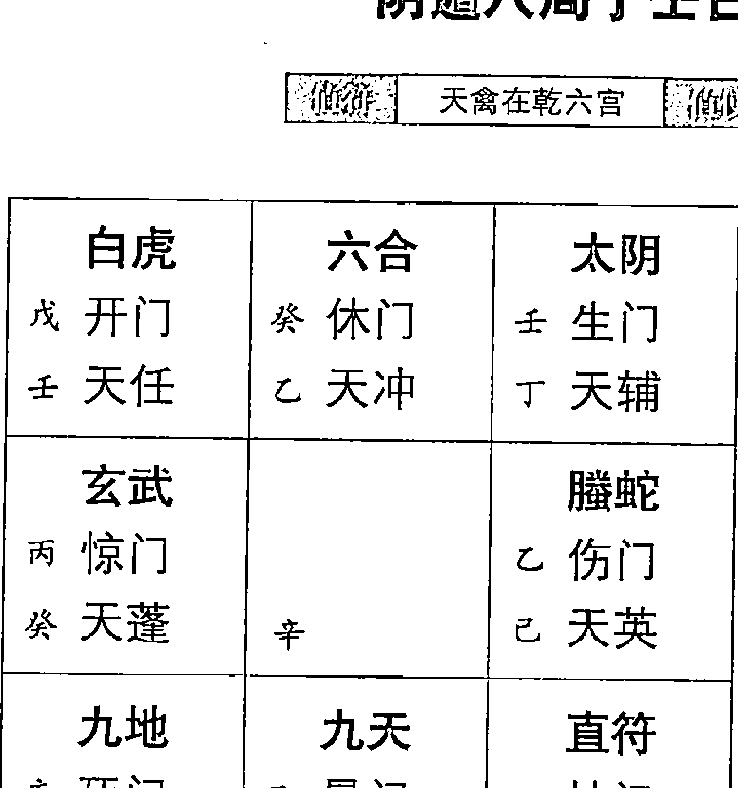

> 伤门逢乙奇在兑七宫，被生。
惊门逢丙奇在震三宫，克宫。
杜门逢丁奇在乾六宫，被克。

> 九天在坎一宫，利于出击。
九地在艮八宫，利于驻防。
太阴在坤二宫，利于潜伏。
六合在离九宫，利于撤逃。

> 无奇门，凶。
八门反吟，值符飞宫，凶。
逢丁日，为飞干格，凶。

## 辛丑时：正北方向吉利

【原文】
辛丑 禽五，死七。宿干吉。杜乙离义，开丙坎义，景丁坤义。天七，地六，阴四，合三。开与月合一正北，时干坤，符伏，相佐坤。

【白话提要】
符使宫位：值符天禽星在中五宫，寄于坤二宫，值使死门在兑七宫。时干遇吉星宿，时干逢吉。

三奇方位：杜门逢双乙奇在离九宫，生宫。开门逢双丙奇在坎一宫，生宫。景门逢双丁奇在坤二宫，生宫。

四吉方位：九天在兑七宫，九地在乾六宫，太阴在巽四宫，六合在震三宫。

诸局格象：开门合丙奇在坎一宫，正北方向吉利。时干在坤二宫。星符伏吟。值符得地盘丁奇相助于坤二宫。

## 白话图解

## 阴遁八局丁壬日辛丑时盘

| 太阴 | 螣蛇 | 直符 |
| :--- | :--- | :--- |
| 壬 伤门 壬 天辅 | 乙 杜门 乙 天英 | 丁 景门 辛 丁 天芮 禽 |
| **六合** |  | **九天** |
| 癸 生门 癸 天冲 | 辛 | 己 死门 己 天柱 |
| **白虎** | **玄武** | **九地** |
| 戊 休门 戊 天任 | 丙 开门 丙 天蓬 | 庚 惊门 庚 天心 |

### 三奇方位
- 杜门逢双乙奇在离九宫，生宫。
- 开门逢双丙奇在坎一宫，生宫。
- 景门逢双丁奇在坤二宫，生宫。

### 四吉方位
- 九天在兑七宫，利于出击。
- 九地在乾六宫，利于驻防。
- 太阴在巽四宫，利于潜伏。
- 六合在震三宫，利于撤逃。

### 诸局格象
- 九星伏吟，值符伏吟，凶。

吉方：开门合丙奇在坎一宫，正北方向吉利。

## 壬寅时：正东与东南方向吉利

【原文】
壬寅 禽四，死六。宿吉干凶。休震义，景兑制，生合巽害。天九，地二，阴八，合一。休与日合三正东，生与星合四东南，伏宫格，天乙与太白格，时干艮，乙格，丁日伏干格。

【白话提要】
符使宫位：值符天禽星在巽四宫，值使死门在乾六宫。时干遇吉星宿，时干逢凶。

三奇方位：休门逢乙奇在震三宫，生宫。景门逢丙奇在兑七宫，克宫。生门逢丁奇在巽四宫，被克。

四吉方位：九天在离九宫，九地在坤二宫，太阴在艮八宫，六合在坎一宫。

诸局格象：休门合乙奇在震三宫，正东方向吉利。生门合丁奇在巽四宫，东南方向吉利。伏宫格。天乙与六庚格。时干在艮八宫。乙格。逢丁日为伏干格。

## 白话图解

## 阴遁八局丁壬日壬寅时盘

吉方2: 生门合丁奇在巽四宫，东南方向吉利。

| 直符 | 九天 | 九地 |
| :---: | :---: | :---: |
| 丁 生门 壬 壬 天芮 禽 | 己 伤门 乙 天柱 | 庚 杜门 丁 天心 |
| **螣蛇** 乙 休门 癸 天蓬 | 辛 | **玄武** 丙 景门 己 天蓬 |
| **太阴** 壬 开门 戊 天辅 | **六合** 癸 惊门 丙 天冲 | **白虎** 戊 死门 庚 天任 |

吉方1: 休门合乙奇在震三宫，正东方向吉利。

**三奇方位**
休门逢乙奇在震三宫，生宫。
景门逢丙奇在兑七宫，克宫。
生门逢丁奇在巽四宫，被克。

**四吉方位**
九天在离九宫，利于出击。
九地在坤二宫，利于驻防。
太阴在艮八宫，利于潜伏。
六合在坎一宫，利于撤逃。

**诸局格象**
伏宫格，乙格，凶。
逢丁日，为伏干格，凶。

## 癸卯时：逢丁日不宜用事

【原文】
癸卯 禽三，死五避五。宿吉干凶，丁日不用。生艮伏，死合丁坤伏欢怡，伤震伏。天四，地九，阴一，合六。生与日合八东北，宫干格，雀入江，时干乾，门伏，丁日勃，天网。

【白话提要】
- 符使宫位：值符天禽星在震三宫，值使死门在中五宫，寄于坤二宫。时干遇吉星宿，时干逢凶。逢丁日不宜用事。
- 三奇方位：生门逢乙奇于艮八宫，不相生克。死门逢天盘丙奇与地盘丁奇在坤二宫，不相生克，吉利，奇仪相合。伤门逢丁奇在震三宫，不相生克。
- 四吉方位：九天在巽四宫，九地在离九宫，太阴在坎一宫，六合在乾六宫。
- 诸局格象：生门合乙奇在艮八宫，东北方向吉利。伏干格。朱雀入江。时干在乾六宫。八门伏吟。丁日为日勃。天网四张。

## 白话图解

## 阴遁八局丁壬日癸卯时盘

值符 天禽在震三宫 值使 死门在中五宫寄于坤二宫

| 九天 | 九地 | 玄武 |
| :---: | :---: | :---: |
| 己 杜门 壬 天柱 | 庚 景门 乙 天心 | 丙 死门 丁 天蓬 |
| **直符** 丁 伤门 辛 癸 天芮 禽 |  | **白虎** 戊 惊门 己 天任 |
| **螣蛇** 乙 生门 戊 天英 | **太阴** 壬 休门 丙 天辅 | **六合** 癸 开门 庚 天冲 |

三奇方位：生门逢乙奇在艮八宫，不相生克。死门逢丙奇与地盘丁奇在坤二宫，不相生克。伤门逢丁奇在震三宫，不相生克。

四吉方位：九天在巽四宫，利于出击。九地在离九宫，利于驻防。太阴在坎一宫，利于潜伏。六合在乾六宫，利于撤逃。

诸局格象：伏干格，朱雀入江，凶。八门伏吟，天网四张，凶。逢丁日，为日勃格，凶。

吉方：生门合乙奇在艮八宫，东北方向吉利。

## 甲辰时：正北方向吉利

【原文】
甲辰 辅值符四，杜值使四。辰至申阳，天辅，宿干吉。死内使坤伏，景英日离伏，休蓬月坎伏。天九，地二，阴八，合一。休与月合一正北，仪刑，时干巽，符门伏，飞甲，自刑，阖。

【白话提要】
- 符使宫位：值符天辅星在巽四宫，值使杜门在巽四宫。时干遇吉星宿，时干逢吉。辰时至申时为五阳时，辰时为天辅释罪时。
- 三奇方位：死门逢双丁奇在坤二宫，不相生克。景门逢双乙奇在离九宫，不相生克。休门逢双丙奇在坎一宫，不相生克。
- 四吉方位：九天在离九宫，九地在坤二宫，太阴在艮八宫，六合在坎一宫。
- 诸局格象：休门合丙奇在坎一宫，正北方向吉利。六仪击刑。时干在巽四宫。星门伏吟。飞甲自刑，合。

## 白话图解

### 阴遁八局丁壬日甲辰时盘

| 直符 | 九天 | 九地 |
| :---: | :---: | :---: |
| 壬 杜门 壬 天辅 | 乙 景门 乙 天英 | 丁 死门 辛 丁 天芮 禽 |
| **螣蛇** |  | **玄武** |
| 癸 伤门 癸 天冲 | 辛 | 己 惊门 己 天柱 |
| **太阴** | **六合** | **白虎** |
| 戊 生门 戊 天任 | 丙 休门 丙 天蓬 | 庚 开门 庚 天心 |

**三奇方位**
死门逢双丁奇在坤二宫，不相生克。
景门逢双乙奇在离九宫，不相生克。
休门逢双丙奇在坎一宫，不相生克。

**四吉方位**
九天在离九宫，利于出击。
九地在坤二宫，利于驻防。
太阴在艮八宫，利于潜伏。
六合在坎一宫，利于撤逃。

**诸局格象**
六仪击刑，飞甲自刑，凶。
九星伏吟，八门伏吟，值符伏吟，凶。

吉方：休门合丙奇在坎一宫，正北方向吉利。

## 乙巳时：正西方向吉利

【原文】
乙巳 辅九，杜三。宿凶干吉。开兑伏，惊墓丁坤和，伤艮制。天二，地七，阴三，合八。开与星合七正西，龙走，时干坤，三吉，金入火。

【白话提要】
- 符使宫位：值符天辅星在离九宫，值使杜门在震三宫。时干遇凶星宿，时干逢吉。
- 三奇方位：开门逢丁奇在兑七宫，不相生克。惊门逢天盘乙奇与地盘丁奇在坤二宫，被生，乙奇入墓。伤门逢丙奇在艮八宫，克宫。
- 四吉方位：九天在坤二宫，九地在兑七宫，太阴在震三宫，六合在艮八宫。
- 诸局格象：开门合丁奇在兑七宫，正西方向吉利。青龙逃走。时干在坤二宫。三吉格。太白入荧。

## 阴遁八局丁壬日乙巳时盘

| 螣蛇 | 直符 | 九天 |
| :---: | :---: | :---: |
| 癸 景门 壬 天冲 | 壬 死门 乙 天辅 | 乙 惊门 丁 天英 |
| **太阴** | 辛 | **九地** 丁 开门 乙 天芮 禽 |
| 戊 杜门 癸 天任 |  |  |
| **六合** | **白虎** | **玄武** |
| 丙 伤门 戊 天蓬 | 庚 生门 丙 天心 | 己 休门 庚 天柱 |

三奇方位
- 开门逢丁奇在兑七宫，不相生克。
- 惊门逢天盘乙奇与地盘丁奇在坤二宫，被生。
- 伤门逢丙奇在艮八宫，克宫。

四吉方位
- 九天在坤二宫，利于出击。
- 九地在兑七宫，利于驻防。
- 太阴在震三宫，利于潜伏。
- 六合在艮八宫，利于撤逃。

诸局格象
- 青龙逃走，太白入荧，凶。

吉方：开门合丁奇在兑七宫，正西方向吉利。

## 丙午时：宜守户不出

【原文】
丙午 辅一，杜二。宿凶干吉。守户。休震义，开艮和，杜合丁坤制。天八，地三，阴七，合二。休与星合三正东，开与日合八东北，雀入江，时干坤，相佐坎，丁日勃。

【白话提要】
- 符使宫位：值符天辅星在坎一宫，值使杜门在坤二宫。时干遇凶星宿，时干逢吉。宜守户不出。
- 三奇方位：休门合丁奇在震三宫，生宫。开门合乙奇在艮八宫，被生。杜门合天盘丙奇与地盘丁奇在坤二宫，克宫。
- 四吉方位：九天在艮八宫，九地在震三宫，太阴在兑七宫，六合在坤二宫。
- 诸局格象：休门合丁奇在震三宫，正东方向吉利。开门合乙奇在艮八宫，东北方向吉利。朱雀入江。时干在坤二宫。值符得地盘丙奇相助于坎一宫。逢丁日，为日勃格。

## 白话图解

### 阴遁八局丁壬日丙午时盘

| **玄武** 己 生门 壬 天柱 | **白虎** 庚 伤门 乙 天心 | **六合** 丙 杜门 丁 天蓬 |
| :---: | :---: | :---: |
| **九地** 开 休门 癸 天芮 禽 | 辛 | **太阴** 戊 景门 己 天任 |
| **太阴** 乙 开门 辛 天辅 | **直符** 壬 惊门 丙 天辅 | **螣蛇** 癸 死门 庚 天冲 |

吉方1：休门合丁奇在震三宫，正东方向吉利。
吉方2：开门合乙奇在艮八宫，东北方向吉利。

三奇方位：休门合丁奇在震三宫，生宫。开门合乙奇在艮八宫，被生。杜门合天盘丙奇与地盘丁奇在坤二宫，克宫。

四吉方位：九天在艮八宫，利于出击。九地在震三宫，利于驻防。太阴在兑七宫，利于潜伏。六合在坤二宫，利于撤逃。

诸局格象：天盘丁奇加临地盘六癸在震三宫，为朱雀入江，凶。逢丁日，为日勃格，凶。

## 丁未时：正西方向吉利

【原文】
丁未 辅二，杜一。宿凶干吉。伤墓乾害，生兑义，死震害。天七，地六，阴四，合三。生与日合七正西，得使，时干乾，相佐坤，飞宫，丁日飞干格。

【白话提要】
- 符使宫位：值符天辅星在坤二宫，值使杜门在坎一宫。时干遇凶星宿，时干逢吉。
- 三奇方位：伤门合丁奇在乾六宫，被克，丁奇入墓。生门合乙奇在兑七宫，生宫。死门合丙奇在震三宫，被克。
- 四吉方位：九天在兑七宫，九地在乾六宫，太阴在巽四宫，六合在震三宫。
- 诸局格象：生门合乙奇在兑七宫，正西方向吉利。乙奇得使。时干在乾六宫。值符得地盘丁奇相助于坤二宫。飞宫格。逢丁日，为飞干格。

## 白话图解

## 阴遁八局丁壬日丁未时盘

值符 天辅在坤二宫 值使 杜门在坎一宫

| 太阴 戊 惊门 壬 天任 | 螣蛇 壬 开门 乙 天冲 | 直符 丁 休门 丁 天辅 |
| :---: | :---: | :---: |
| **六合** 丙 死门 癸 天蓬 | 辛 | **九天** 乙 生门 己 天英 |
| **白虎** 庚 景门 戊 天心 | **玄武** 己 杜门 丙 天柱 | **九地** 丁 伤门 辛 庚 天芮 禽 |

三奇方位：伤门合丁奇在乾六宫，被克。生门合乙奇在兑七宫，生宫。死门合丙奇在震三宫，被克。

四吉方位：九天在兑七宫，利于出击。九地在乾六宫，利于驻防。太阴在巽四宫，利于潜伏。六合在震三宫，利于撤逃。

诸局格象：乙奇得使，吉。飞宫格，凶。逢丁日，为飞干格，凶。

吉方：生门合乙奇在兑七宫，正西方向吉利。

## 戊申时：正东方向吉利

【原文】
戊申 辅八，杜九。宿干吉，壬日不用。伤合巽伏欢怡，生震害，死兑义。天三，地四，阴六，合七。生与日合三正东，时干乾，丁日伏干格。

【白话提要】
符使宫位：值符天辅星在艮八宫，值使杜门在离九宫。时干遇吉星宿，时干逢吉。逢壬日不宜用事。

三奇方位：伤门逢丁奇在巽四宫，不相生克，吉利，奇仪相合。生门合乙奇在震三宫，被克。死门合丙奇在兑七宫，生宫。

四吉方位：九天在震三宫，九地在巽四宫，太阴在乾六宫，六合在兑七宫。

诸局格象：生门合乙奇在震三宫，正东方向吉利。时干在乾六宫，逢丁日，为伏干格。

## 白话图解

## 阴遁八局丁壬日戊申时盘

| 九地 | 玄武 | 白虎 |
| :---: | :---: | :---: |
| 丁 伤门 辛 壬 天芮 禽 | 己 杜门 乙 天柱 | 庚 景门 丁 天心 |
| **九天** |   | **六合** |
| 乙 生门 癸 天英 | 辛 | 丙 死门 己 天蓬 |
| **直符** | **螣蛇** | **太阴** |
| 壬 休门 戊 天辅 | 癸 开门 丙 天冲 | 戊 惊门 庚 天任 |

三奇方位
伤门逢丁奇在巽四宫，不相生克。
生门合乙奇在震三宫，被克。
死门合丙奇在兑七宫，生宫。

四吉方位
九天在震三宫，利于出击。
九地在巽四宫，利于驻防。
太阴在乾六宫，利于潜伏。
六合在兑七宫，利于撤逃。

诸局格象
逢丁日，为伏干格，凶。

吉方：生门合乙奇在震三宫，正东方向吉利。

## 己酉时：西北方向吉利

【原文】
己酉 辅七，杜八。酉至亥阴，宿吉干凶。伤丙坎和，生合乾义，死巽害欢怡。天六，地一，阴九，合四。生与日合六西北，蛇矫，符勃，丁日勃，时干艮，大格。

【白话提要】
符使宫位：值符天辅星在兑七宫，值使杜门在艮八宫。酉时至亥时为五阴时。时干遇吉星宿，时干逢凶。

三奇方位：伤门合天盘丁奇与地盘丙奇在坎一宫，被生。生门合乙奇在乾六宫，生宫，奇仪相合。死门合丙奇在巽四宫，被克，吉利。

四吉方位：九天在乾六宫，九地在坎一宫，太阴在离九宫，六合在巽四宫。

诸局格象：生门合乙奇在乾六宫，西北方向吉利。螣蛇天矫。符勃格。逢丁日，为日勃格。时干在艮八宫。大格。

## 白话图解

## 阴遁八局丁壬日己酉时盘

| 直符 | 天辅在兑七宫 | 值使 | 杜门在艮八宫 |
| :--- | :--- | :--- | :--- |
| **六合** | **太阴** | **螣蛇** |
| 丙 死门 壬 天蓬 | 戊 惊门 乙 天任 | 癸 开门 丁 天冲 |
| **白虎** | | **直符** |
| 庚 景门 癸 天心 | 辛 | 壬 休门 己 天辅 |
| **玄武** | **九地** | **九天** |
| 己 杜门 戊 天柱 | 丁 伤门 丙 天芮 禽 | 乙 生门 庚 天英 |

> 三奇方位
伤门合天盘丁奇与地盘丙奇在坎一宫，被生。
生门合乙奇在乾六宫，生宫。
死门合丙奇在巽四宫，被克。

> 四吉方位
九天在乾六宫，利于出击。
九地在坎一宫，利于驻防。
太阴在离九宫，利于潜伏。
六合在巽四宫，利于撤逃。

> 诸局格象
螣蛇天矫，符勃格，大格，凶。
逢丁日，为日勃格，凶。

吉方：生门合乙奇在乾六宫，西北方向吉利。

# 庚戌时：正南方向吉利

【原文】
庚戌 辅六，杜七。宿吉干凶。惊艮和，死丙坎制，生乙离和。天一，地八，阴二，合九。生与月合九正南，时干巽，符冲，飞符，乙格，壬日飞干格。

【白话提要】
符使宫位：值符天辅星在乾六宫，值使杜门在兑七宫。时干遇吉星宿，时干逢凶。

三奇方位：惊门逢丁奇在艮八宫，被生。死门逢天盘乙奇与地盘丙奇在坎一宫，克宫。生门逢天盘丙奇与地盘乙奇在离九宫，被生。

四吉方位：九天在坎一宫，九地在艮八宫，太阴在坤二宫，六合在离九宫。

诸局格象：生门合丙奇在离九宫，正南方向吉利。时干在巽四宫。值符相冲。飞宫格。乙格。逢壬日飞干格。

## 阴遁八局丁壬日庚戌时盘

| **白虎** 庚 休门 壬 天心 | **六合** 商 佳门 乙 天蓬 | **太阴** 戊 伤门 丁 天任 |
| :---: | :---: | :---: |
| **玄武** 己 开门 癸 天柱 | 辛 | **螣蛇** 癸 杜门 己 天冲 |
| **九地** 丁 惊门 辛 戊 天芮 禽 | **九天** 乙 死门 丙 天英 | **直符** 壬 景门 庚 天辅 |

- 惊门逢丁奇在艮八宫，被生。
- 死门逢天盘乙奇与地盘丙奇在坎一宫，克宫。
- 生门逢天盘丙奇与地盘乙奇在离九宫，被生。

- 九天在坎一宫，利于出击。
- 九地在艮八宫，利于驻防。
- 太阴在坤二宫，利于潜伏。
- 六合在离九宫，利于撤逃。

- 飞宫格，乙格，凶。
- 九星反吟，值符反吟，凶。
- 逢壬日，为飞干格，凶。

## 辛亥时：无奇门可出

## 【原文】

辛亥 辅五，杜六。宿吉干凶。杜门逢丁奇在乾六宫，入墓，被克。伤门逢乙奇在兑七宫，被克。惊门逢丙奇在震三宫，克宫。九天在兑七宫，九地在乾六宫，太阴在巽四宫，六合在震三宫。无奇门，八门伏吟，天乙与六庚格，时干在乾六宫，值符得地盘丁奇相助于坤宫，事同，逢丁日为飞干格。

## 【白话提要】

符使宫位：值符天辅星在坤二宫，值使杜门在乾六宫。时干遇吉星宿，时干逢凶。

三奇方位：杜门逢丁奇在乾六宫，被克，丁奇入墓。伤门逢乙奇在兑七宫，被克。惊门逢丙奇在震三宫，克宫。

四吉方位：九天在兑七宫，九地在乾六宫，太阴在巽四宫，六合在震三宫。

诸局格象：无奇门。八门伏吟。天乙与六庚格。时干在乾六宫。值符得地盘丁奇相助于坤宫。逢丁日为飞干格。

## 白话图解

#### 阴遁八局丁壬日辛亥时盘

| 太阴 戊 开门 壬 天任 | 螣蛇 癸 休门 乙 天冲 | 直符 壬 生门 丁 天辅 |
| :--- | :--- | :--- |
| 六合 丙 惊门 癸 天蓬 | 辛 | 九天 乙 伤门 己 天英 |
| 白虎 庚 死门 戊 天心 | 玄武 己 景门 丙 天柱 | 九地 丁 杜门 辛 庚 天芮 禽 |

三奇方位
杜门逢丁奇在乾六宫，被克。
伤门逢乙奇在兑七宫，被克。
惊门逢丙奇在震三宫，克宫。

四吉方位
九天在兑七宫，利于出击。
九地在乾六宫，利于驻防。
太阴在巽四宫，利于潜伏。
六合在震三宫，利于撤逃。

诸局格象
无奇门，凶。
八门伏吟，凶。
逢丁日，为飞干格，凶。

## 5. 戊癸日十二时局

### 壬子时：无奇门可出

## 【原文】

壬子 辅四，杜五避五。子至丑阴，宿吉干凶。杜门逢双丁奇在坤二宫，克宫。伤门逢双乙奇在离九宫，生宫。惊门逢双丙奇在坎一宫，生宫。九天在离九宫，九地在坤二宫，太阴在艮八宫，六合在坎一宫。无奇门，六仪击刑，时干在巽四宫，值符、九星伏吟。

## 【白话提要】

符使宫位：值符天辅星在巽四宫，值使杜门在中五宫，寄于坤二宫。时干遇吉星宿，时干逢凶。子时至丑时为五阴时。
三奇方位：杜门逢双丁奇在坤二宫，克宫。伤门逢双乙奇在离九宫，生宫。惊门逢双丙奇在坎一宫，生宫。
四吉方位：九天在离九宫，九地在坤二宫，太阴在艮八宫，六合在坎一宫。
诸局格象：无奇门。六仪击刑。时干在巽四宫。值符、九星伏吟。

## 白话图解

#### 阴遁八局戊癸日壬子时盘

值符：天辅在巽四宫 | 值使：杜门在中五宫，寄于坤二宫

直符
壬 生门
壬 天辅

九天
乙 伤门
乙 天英

九地
丁 杜门 辛
丁 天芮 禽

螣蛇
癸 休门
癸 天冲

（空白）

玄武
己 景门
己 天柱

太阴
戊 开门
戊 天任

六合
丙 惊门
丙 天蓬

白虎
庚 死门
庚 天心

三奇方位
杜门逢双丁奇在坤二宫，克宫。
伤门逢双乙奇在离九宫，生宫。
惊门逢双丙奇在坎一宫，生宫。

四吉方位
九天在离九宫，利于出击。
九地在坤二宫，利于驻防。
太阴在艮八宫，利于潜伏。
六合在坎一宫，利于撤逃。

诸局格象
无奇门，凶。
六仪击刑，凶。
值符、九星伏吟，凶。

## 癸丑时：西北方向吉利

## 【原文】

癸丑 辅三，杜四。宿吉干凶。景门逢天盘丁奇与地盘乙奇在离九宫，不相生克。杜门逢乙奇在巽四宫，不相生克，吉利。开门逢丙奇在乾六宫，不相生克，丙奇入墓。九天在巽四宫，九地在离九宫，太阴在坎一宫，六合在乾六宫。开门合丙奇在乾六宫，西北方向吉利。青龙回首。白虎猖狂。时干在艮八宫。八门伏吟。荧入太白。刑格。天网四张。

## 【白话提要】

符使宫位：值符天辅星在震三宫，值使杜门在巽四宫。时干遇吉星宿，时干逢凶。

三奇方位：景门逢天盘丁奇与地盘乙奇在离九宫，不相生克。杜门逢乙奇在巽四宫，不相生克，吉利。开门逢丙奇在乾六宫，不相生克，丙奇入墓。

四吉方位：九天在巽四宫，九地在离九宫，太阴在坎一宫，六合在乾六宫。

诸局格象：开门合丙奇在乾六宫，西北方向吉利。青龙回首。白虎猖狂。时干在艮八宫。八门伏吟。荧入太白。刑格。天网四张。

## 白话图解

#### 阴遁八局戊癸日癸丑时盘

| 九天 | 九地 | 玄武 |
| :--- | :--- | :--- |
| 乙 杜门 壬 天英 | 丁 景门 辛 乙 天芮 禽 | 己 死门 丁 天柱 |
| 直符 壬 伤门 癸 天辅 |   | 白虎 庚 惊门 己 天心 |
| 螣蛇 癸 生门 戊 天冲 | 太阴 戊 休门 丙 天任 | 六合 丙 开门 庚 天蓬 |

三奇方位
景门逢天盘丁奇与地盘乙奇在离九宫，不相生克。
杜门逢乙奇在巽四宫，不相生克。
开门逢丙奇在乾六宫，不相生克。

四吉方位
九天在巽四宫，利于出击。
九地在离九宫，利于驻防。
太阴在坎一宫，利于潜伏。
六合在乾六宫，利于撤逃。

诸局格象
青龙回首，吉。
白虎猖狂，八门伏吟，荧入太白，凶。
刑格，天网四张，凶。

吉方：开门合丙奇在乾六宫，西北方向吉利。

## 甲寅时：逢戊日不宜用事

## 【原文】

甲寅 冲值符三，伤值使三，天辅。寅至午阳，宿干吉，戊日不用。死门逢双丁奇在坤二宫，不相生克。景门逢双乙奇在离九宫，不相生克。休门逢双丙奇在坎一宫，不相生克。九天在巽四宫，九地在离九宫，太阴在坎一宫，六合在乾六宫。休门合丙奇在坎一宫，正北方向吉利。时干在震三宫。星符、八门伏吟。地甲三吉开。

## 【白话提要】

符使宫位：值符天冲星在震三宫，值使伤门在震三宫。时干遇吉星宿，时干逢吉。寅时为天辅释罪时。寅时至午时为五阳时。逢戊日不宜用事。

三奇方位：死门逢双丁奇在坤二宫，不相生克。景门逢双乙奇在离九宫，不相生克。休门逢双丙奇在坎一宫，不相生克。

四吉方位：九天在巽四宫，九地在离九宫，太阴在坎一宫，六合在乾六宫。

诸局格象：休门合丙奇在坎一宫，正北方向吉利。时干在震三宫。星符、八门伏吟。地甲三吉开。

## 白话图解

#### 阴遁八局戊癸日甲寅时盘

| 九天 | 九地 | 玄武 |
| :--- | :--- | :--- |
| 壬 杜门 壬 天辅 | 乙 景门 乙 天英 | 丁 死门 辛 丁 天芮 禽 |
| 直符 癸 伤门 癸 天冲 |   | 白虎 己 惊门 己 天柱 |
| 螣蛇 戊 生门 戊 天任 | 太阴 丙 休门 丙 天蓬 | 六合 庚 开门 庚 天心 |

三奇方位：死门逢双丁奇在坤二宫，不相生克。景门逢双乙奇在离九宫，不相生克。休门逢双丙奇在坎一宫，不相生克。

四吉方位：九天在巽四宫，利于出击。九地在离九宫，利于驻防。太阴在坎一宫，利于潜伏。六合在乾六宫，利于撤逃。

诸局格象：九星、值符、八门伏吟，凶。

吉方：休门合丙奇在坎一宫，正北方向吉利。

## 乙卯时：宜守户不出

## 【原文】

乙卯 冲九，伤二。宿凶干吉，守户。景门逢丁奇在乾六宫，克宫，丁奇入墓。杜门逢乙奇在兑七宫，被克。开门逢丙奇在震三宫，克宫，吉利。九天在坤二宫，九地在兑七宫，太阴在震三宫，六合在艮八宫。开门合丙奇于震三宫，正东方吉利。癸日干勃。时干在兑七宫。飞宫格。癸日日勃。逢戊日伏干格。

## 【白话提要】

符使宫位：值符天冲星在离九宫，值使伤门在坤二宫。时干遇凶星宿，时干逢吉。宜守户不出。

三奇方位：景门逢丁奇在乾六宫，克宫，丁奇入墓。杜门逢乙奇在兑七宫，被克。开门逢丙奇在震三宫，克宫，吉利。

四吉方位：九天在坤二宫，九地在兑七宫，太阴在震三宫，六合在艮八宫。

诸局格象：开门合丙奇于震三宫，正东方吉利。癸日干勃。时干在兑七宫。飞宫格。癸日日勃。逢戊日伏干格。

## 白话图解

#### 阴遁八局戊癸日乙卯时盘

值符 天冲在离九宫

值使 伤门在坤二宫

| 螣蛇 | 直符 | 九天 |
| :--- | :--- | :--- |
| 戊 休门 壬 天任 | 癸 生门 乙 天冲 | 壬 伤门 丁 天辅 |
| 太阴 | 辛 | 九地 |
| 丙 开门 癸 天蓬 | | 乙 杜门 己 天英 |
| 六合 | 白虎 | 玄武 |
| 庚 惊门 戊 天心 | 己 死门 庚 天柱 | 丁 景门 庚 天芮 辛 禽 |

### 三奇方位
景门逢丁奇在乾六宫，克宫。
杜门逢乙奇在兑七宫，被克。
开门逢丙奇在震三宫，克宫。

### 四吉方位
九天在坤二宫，利于出击。
九地在兑七宫，利于驻防。
太阴在震三宫，利于潜伏。
六合在艮八宫，利于撤逃。

### 诸局格象
逢癸日，为日勃格和日干格，凶。
飞宫格，凶。
逢戊日，为伏干格，凶。

吉方：开门合丙奇在震三宫，正东方向吉利。

## 丙辰时：正西方向吉利

## 【原文】

丙辰 冲一，伤一。宿凶干吉。死门逢丁奇在巽四宫，被克，奇仪相合。景门逢乙奇在震三宫，被生，吉利。休门逢丙奇在兑七宫，被生。九天在艮八宫，九地在震三宫，太阴在兑七宫，六合在坤二宫。休门合丙奇于兑七宫，正西方向吉利。时干在兑七宫。值符得地盘丙奇相助于坎一宫。逢戊日飞干格。青龙回首。

## 【白话提要】

符使宫位：值符天冲星在坎一宫，值使伤门在坎一宫。时干遇凶星宿，时干逢吉。

三奇方位：死门逢丁奇在巽四宫，被克，奇仪相合。景门逢乙奇在震三宫，被生，吉利。休门逢丙奇在兑七宫，被生。

四吉方位：九天在艮八宫，九地在震三宫，太阴在兑七宫，六合在坤二宫。

诸局格象：休门合丙奇于兑七宫，正西方向吉利。时干在兑七宫。值符得地盘丙奇相助于坎一宫。逢戊日飞干格。青龙回首。

## 白话图解

#### 阴遁八局戊癸日丙辰时盘

值符 天冲在坎一宫    值使 伤门在坎一宫

| 玄武 | 白虎 | 六合 |
| :--- | :--- | :--- |
| 丁 死门 辛 壬 天芮 禽 | 己 惊门 乙 天柱 | 庚 开门 丁 天心 |
| **九地** | | **太阴** |
| 乙 景门 癸 天英 | 辛 | 丙 休门 戊 天蓬 |
| **九天** | **直符** | **螣蛇** |
| 壬 杜门 戊 天辅 | 癸 伤门 丙 天冲 | 戊 生门 庚 天任 |

三奇方位
死门逢丁奇在巽四宫，被克。
景门逢乙奇在震三宫，被生。
休门逢丙奇在兑七宫，被生。

四吉方位
九天在艮八宫，利于出击。
九地在震三宫，利于驻防。
太阴在兑七宫，利于潜伏。
六合在坤二宫，利于撤逃。

诸局格象
青龙回首，吉。
逢戊日，为飞干格，凶。

吉方：休门合丙奇在兑七宫，正西方向吉利。

### 丁巳时：东南方向吉利

## 【原文】

丁巳 冲二，伤九。宿凶干吉。惊门逢天盘丁奇与地盘丙奇在坎一宫，生宫。死门逢乙奇在乾六宫，生宫，奇仪相合。生门逢丙奇在巽四宫，克宫。九天在兑七宫，九地在乾六宫，太阴在巽四宫，六合在震三宫。生门合丙奇在巽四宫，东南方向吉利。癸日为伏干格。六仪击刑。腾蛇天矫。时干在坎一宫。值符得地盘丙奇相助于坎一宫。击刑。乙格。大格。

## 【白话提要】

符使宫位：值符天冲星在坤二宫，值使伤门在离九宫。时干遇凶星宿，时干逢吉。

三奇方位：惊门逢天盘丁奇与地盘丙奇在坎一宫，生宫。死门逢乙奇在乾六宫，生宫，奇仪相合。生门逢丙奇在巽四宫，克宫。

四吉方位：九天在兑七宫，九地在乾六宫，太阴在巽四宫，六合在震三宫。

诸局格象：生门合丙奇在巽四宫，东南方向吉利。癸日为伏干格。六仪击刑。腾蛇天矫。时干在坎一宫。值符得地盘丙奇相助于坎一宫。击刑。乙格。大格。

## 白话图解

#### 阴遁八局戊癸日丁巳时盘

吉方：生门合丙奇在巽四宫，东南方向吉利。

| 太阴 | 螣蛇 | 直符 |
| :--- | :--- | :--- |
| 丙 惊门 壬 天蓬 | 戊 伤门 乙 天任 | 癸 杜门 丁 天冲 |
| 六合 | | 九天 |
| 庚 休门 癸 天心 | 辛 | 壬 景门 己 天辅 |
| 白虎 | 玄武 | 九地 |
| 己 开门 戊 天柱 | 丁 惊门 辛 丙 天芮 禽 | 乙 死门 庚 天英 |

三奇方位
惊门逢丁奇与地盘丙奇在坎一宫，生宫。
死门逢乙奇在乾六宫，生宫。
生门逢丙奇在巽四宫，克宫。

四吉方位
九天在兑七宫，利于出击。
九地在乾六宫，利于驻防。
太阴在巽四宫，利于潜伏。
六合在震三宫，利于撤逃。

诸局格象
逢癸日，为伏干格，凶。
六仪击刑，腾蛇天矫，凶。
乙格，大格，凶。

### 戊午时：西北方向吉利

## 【原文】

戊午 冲八，伤八。宿干吉。死门逢天盘丁奇与地盘乙奇在离九宫，被生。景门逢乙奇在巽四宫，被生。休门逢丙奇在乾六宫，被生，丙奇入墓。九天在震三宫，九地在巽四宫，太阴在乾六宫，六合在兑七宫。休门合丙奇在乾六宫，西北方向吉利。白虎猖狂。荧入太白。时干在坎一宫。刑格。

## 【白话提要】

符使宫位：值符天冲星在艮八宫，值使伤门在艮八宫。时干遇吉星宿，时干逢吉。

三奇方位：死门逢天盘丁奇与地盘乙奇在离九宫，被生。景门逢乙奇在巽四宫，被生。休门逢丙奇在乾六宫，被生，丙奇入墓。

四吉方位：九天在震三宫，九地在巽四宫，太阴在乾六宫，六合在兑七宫。

诸局格象：休门合丙奇在乾六宫，西北方向吉利。白虎猖狂。荧入太白。时干在坎一宫。刑格。

## 白话图解

#### 阴遁八局戊癸日戊午时盘

| 九地 乙 景门 壬 天英 | 玄武 丁 死门 辛 乙 天芮 禽 | 白虎 己 惊门 丁 天柱 |
| 九天 壬 杜门 癸 天辅 | 辛 | 六合 庚 开门 己 天心 |
| 直符 癸 伤门 戊 天冲 | 螣蛇 戊 生门 丙 天任 | 太阴 庚 休门 庚 天蓬 |

三奇方位
死门逢天盘丁奇与地盘乙奇在离九宫，被生。
景门逢乙奇在巽四宫，被生。
休门逢丙奇在乾六宫，被生。

四吉方位
九天在震三宫，利于出击。
九地在巽四宫，利于驻防。
太阴在乾六宫，利于潜伏。
六合在兑七宫，利于撤逃。

诸局格象
白虎猖狂，荧入太白，凶。
刑格，凶。

吉方：休门合丙奇在乾六宫，西北方向吉利。

# 己未时：逢癸日不宜用事

## 【原文】

己未 冲七，伤七。未至亥阴，宿吉干凶，癸日不用。死门逢丁奇在艮八宫，不相生克。景门逢天盘乙奇与地盘丙奇在坎一宫，克宫。休门逢天盘丙奇与地盘乙奇在离九宫，克宫。九天在乾六宫，九地在坎一宫，太阴在离九宫，六合在巽四宫。休门合丙奇在离九宫，正南方向吉利。丙下有乙为日月并行。时干在震三宫。值符相冲。八门反吟。

## 【白话提要】

符使宫位：值符天冲星在兑七宫，值使伤门在兑七宫。时干遇吉星宿，时干逢凶。逢癸日不宜用事。

三奇方位：死门逢丁奇在艮八宫，不相生克。景门逢天盘乙奇与地盘丙奇在坎一宫，克宫。休门逢天盘丙奇与地盘乙奇在离九宫，克宫。

四吉方位：九天在乾六宫，九地在坎一宫，太阴在离九宫，六合 in 巽四宫。

诸局格象：休门合丙奇在离九宫，正南方向吉利。丙下有乙为日月并行。时干在震三宫。值符相冲。八门反吟。

## 白话图解

#### 阴遁八局戊癸日己未时盘

值符：天冲在兑七宫 | 值使：伤门在兑七宫

吉方：休门合丙奇在离九宫，正南方向吉利。

| 六合 | 太阴 | 螣蛇 |
| :--- | :--- | :--- |
| 庚 开门 壬 天心 | 丙 休门 乙 天蓬 | 戊 生门 丁 天任 |
| 白虎 | | 直符 |
| 己 惊门 癸 天柱 | 辛 | 癸 伤门 己 天冲 |
| 玄武 | 九地 | 九天 |
| 丁 死门 辛 戊 天芮 禽 | 乙 景门 丙 天英 | 壬 杜门 庚 天辅 |

三奇方位
死门逢丁奇在艮八宫，不相生克。
景门逢天盘乙奇与地盘丙奇在坎一宫，克宫。
休门逢天盘丙奇与地盘乙奇在离九宫，克宫。

四吉方位
九天在乾六宫，利于出击。
九地在坎一宫，利于驻防。
太阴在离九宫，利于潜伏。
六合在巽四宫，利于撤逃。

诸局格象
丙下有乙，为日月并行，吉。
九星、值符、八门反吟，凶。

### 庚申时：西南方向吉利

## 【原文】

庚申 冲六，伤六。宿吉干凶。死门逢丁奇在震三宫，被克，吉利。景门逢乙奇在艮八宫，生宫。休门逢天盘丙奇与地盘丁奇在坤二宫，被克。九天在坎一宫，九地在艮八宫，太阴在坤二宫，六合在离九宫。休门合丙奇在坤二宫，西南方向吉利。丙下有丁为丙奇朱雀。飞宫格。朱雀入江。天乙与六庚格。时干在离九宫。值符飞宫。癸日为飞干格。

## 【白话提要】

符使宫位：值符天冲星在乾六宫，值使伤门在乾六宫。时干遇吉星宿，时干逢凶。
三奇方位：死门逢丁奇在震三宫，被克，吉利。景门逢乙奇在艮八宫，生宫。休门逢天盘丙奇与地盘丁奇在坤二宫，被克。
四吉方位：九天在坎一宫，九地在艮八宫，太阴在坤二宫，六合在离九宫。
诸局格象：休门合丙奇在坤二宫，西南方向吉利。丙下有丁为丙奇朱雀。飞宫格。朱雀入江。天乙与六庚格。时干在离九宫。值符飞宫。癸日为飞干格。

## 白话图解

#### 阴遁八局戊癸日庚申时盘

| 项目 | 位置 |
| :--- | :--- |
| 值符 | 天冲在乾六宫 |
| 值使 | 伤门在乾六宫 |

吉方：休门合丙奇在坤二宫，西南方向吉利。

| 神盘 | 宫位与内容 | 神盘 | 宫位与内容 | 神盘 | 宫位与内容 |
| :--- | :--- | :--- | :--- | :--- | :--- |
| 白虎 | 己 惊门 壬 天柱 | 六合 | 庚 开门 乙 天心 | 太阴 | 丙 休门 丁 天蓬 |
| 玄武 | 丁 死门 辛 癸 天芮 禽 | | 辛 | 螣蛇 | 戊 生门 己 天任 |
| 九地 | 乙 景门 戊 天英 | 九天 | 壬 杜门 丙 天辅 | 直符 | 癸 伤门 庚 天冲 |

三奇方位
死门逢丁奇在震三宫，被克。
景门逢乙奇在艮八宫，生宫。
休门逢天盘丙奇与地盘丁奇在坤二宫，被克。

四吉方位
九天在坎一宫，利于出击。
九地在艮八宫，利于驻防。
太阴在坤二宫，利于潜伏。
六合在离九宫，利于撤逃。

诸局格象
丙下有丁，为丙奇朱雀，吉。
飞宫格，朱雀入江，值符飞宫，凶。
逢癸日，为飞干格，凶。

## 辛酉时：东南方向吉利

## 【原文】

辛酉 冲五，伤五避五。宿吉干凶。死门逢天盘丁奇与地盘丙奇在坎一宫，克宫。景门逢乙奇在乾六宫，克宫。休门逢丙奇在巽四宫，生宫。九天在兑七宫，九地在乾六宫，太阴在巽四宫，六合在震三宫。休门合丙奇在巽四宫，东南方向吉利。伏宫格。螣蛇天矫。时干在坎一宫。大格。乙格。逢癸日伏干格。

## 【白话提要】

符使宫位：值符天冲星在中五宫，寄于坤二宫，值使伤门在中五宫，寄于坤二宫。时干遇吉星宿，时干逢凶。

三奇方位：死门逢天盘丁奇与地盘丙奇在坎一宫，克宫。景门逢乙奇在乾六宫，克宫。休门逢丙奇 in 巽四宫，生宫。

四吉方位：九天在兑七宫，九地在乾六宫，太阴在巽四宫，六合在震三宫。

诸局格象：休门合丙奇在巽四宫，东南方向吉利。伏宫格。螣蛇天矫。时干在坎一宫。大格。乙格。逢癸日伏干格。

## 白话图解

#### 阴遁八局戊癸日辛酉时盘

值符：天冲在中五宫，寄于坤二宫；值使：伤门在中五宫，寄于坤二宫。

吉方：休门合丙奇在巽四宫，东南方向吉利。

| 太阴 | 螣蛇 | 直符 |
| :--- | :--- | :--- |
| 丙 休门 壬 天蓬 | 戊 生门 乙 天任 | 癸 伤门 丁 天冲 |
| 六合 | | 九天 |
| 庚 开门 癸 天心 | 辛 | 壬 杜门 己 天辅 |
| 白虎 | 玄武 | 九地 |
| 己 惊门 戊 天柱 | 丁 死门 辛 丙 天芮 禽 | 乙 景门 庚 天英 |

三奇方位：
死门逢天盘丁奇与地盘丙奇在坎一宫，克宫。
景门逢乙奇在乾六宫，克宫。
休门逢丙奇在巽四宫，生宫。

四吉方位：
九天在兑七宫，利于出击。
九地在乾六宫，利于驻防。
太阴在巽四宫，利于潜伏。
六合在震三宫，利于撤逃。

诸局格象：
伏宫格，螣蛇天矫，凶。
大格，乙格，凶。
逢癸日，为伏干格，凶。

## 壬戌时：东北方向吉凶

## 【原文】

壬戌 冲四，伤四。宿吉干凶。死兑义，景墓丁坤义，休艮害。天九，地二，阴八，合一。休与月合八东北，得使，仪刑，龙走，鸟跌穴，时干离，金入火，戊日勃。

## 【白话提要】

- 符使宫位：值符天冲星在巽四宫，值使伤门在巽四宫。时干遇吉星宿，时干逢凶。
- 三奇方位：死门逢丁奇在兑七宫，生宫。景门逢天盘乙奇与地盘丁奇在坤二宫，生宫，乙奇入墓。休门逢丙奇在艮八宫，被克。
- 四吉方位：九天在离九宫，九地在坤二宫，太阴在艮八宫，六合在坎一宫。
- 诸局格象：休门合丙奇在艮八宫，东北方向吉利。丙奇得使。六仪击刑。青龙逃走。飞鸟跌穴。时干在离九宫。太白入荧。戊日日勃。

## 白话图解

## 阴遁八局戊癸日壬戌时盘

值符 天冲在巽四宫

值使 伤门在巽四宫

| 直符 | 九天 | 九地 |
|------|------|------|
| 癸 伤门 壬 天冲 | 壬 杜门 乙 天辅 | 乙 景门 丁 天英 |
| 螣蛇 |      | 玄武 |
| 戊 生门 癸 天任 | 辛   | 丁 死门 辛 己 天芮 禽 |
| 太阴 | 六合 | 白虎 |
| 丙 休门 戊 天蓬 | 庚 开门 丙 天心 | 己 惊门 庚 天柱 |

- 死门逢丁奇在兑七宫，生宫。
- 景门逢天盘乙奇与地盘丁奇在坤二宫，生宫。
- 休门逢丙奇在艮八宫，被克。

- 九天在离九宫，利于出击。
- 九地在坤二宫，利于驻防。
- 太阴在艮八宫，利于潜伏。
- 六合在坎一宫，利于撤逃。

- 丙奇得使，飞鸟跌穴，吉。
- 六仪击刑，青龙逃走，太白入荧，凶。
- 逢戊日，为日勃格，凶。

吉方：休门合丙奇在艮八宫，东北方向吉利。

## 癸亥时：正北方向吉利

## 【原文】

癸亥 冲三，伤三。宿吉干凶。死丁坤伏，景乙离伏，伏丙坎伏。天四，地九，阴一，合六。休与月合一正北，时干震，符门伏，三吉，天网。

## 【白话提要】

符使宫位：值符天冲星在震三宫，值使伤门在震三宫。时干遇吉星宿，时干逢凶。

三奇方位：死门逢双丁奇在坤二宫，不相生克。景门逢双乙奇在离九宫，不相生克。休门逢双丙奇在坎一宫，不相生克。

四吉方位：九天在巽四宫，九地在离九宫，太阴在坎一宫，六合在乾六宫。

诸局格象：休门合丙奇在坎一宫，正北方向吉利。时干在震三宫。星门均伏吟。三吉格。天网四张。

## 白话图解

## 阴遁八局戊癸日癸亥时盘

值符 天冲在震三宫

值使 伤门在震三宫

| 九天 | 九地 | 玄武 |
| --- | --- | --- |
| 壬杜门 壬天辅 | 乙景门 乙天英 | 丁死门 辛 丁天芮 禽 |
| 直符 癸伤门 癸天冲 |  | 白虎 己惊门 己天柱 |
| 螣蛇 戊生门 戊天任 | 太阴 丙休门 丙天蓬 | 六合 庚开门 庚天心 |

三奇方位：
死门逢双丁奇在坤二宫，不相生克。
景门逢双乙奇在离九宫，不相生克。
休门逢双丙奇在坎一宫，不相生克。

四吉方位：
九天在巽四宫，利于出击。
九地在离九宫，利于驻防。
太阴在坎一宫，利于潜伏。
六合在乾六宫，利于撤逃。

诸局格象：
九星、值符、八门伏吟，凶。
天网四张，凶。

吉方：休门合丙奇在坎一宫，正北方向吉利。

## 第三章 阴遁七局

奇门遁甲时家奇门阴遁七局共有六十个时辰，即六十局。本章通过文字和各时辰的飞盘排布来说明各局的符使宫位、三奇方位、四吉方位和诸局格象。

## 白话图解

### 阴遁七局图

| 阴遁局 | 大暑上元 | 处暑下元 | 秋分上元 | 大雪中元 |
| :--- | :--- | :--- | :--- | :--- |

# 每日时辰

奇门遁甲中一局为一元，一元有甲己、乙庚、丙辛、丁壬和戊癸五日，每日有十二个时辰，则一局就有六十个时辰，用六十甲子来表示，一个时辰为一小局。

| 甲己旬 | 甲子 | 乙丑 | 丙寅 | 丁卯 | 戊辰 | 己巳 | 庚午 | 辛未 | 壬申 | 癸酉 | 甲戌 | 乙亥 |
| :--- | :--- | :--- | :--- | :--- | :--- | :--- | :--- | :--- | :--- | :--- | :--- | :--- |
| 乙庚旬 | 丙子 | 丁丑 | 戊寅 | 己卯 | 庚辰 | 辛巳 | 壬午 | 癸未 | 甲申 | 乙酉 | 丙戌 | 丁亥 |
| 丙辛旬 | 戊子 | 己丑 | 庚寅 | 辛卯 | 壬辰 | 癸巳 | 甲午 | 乙未 | 丙申 | 丁酉 | 戊戌 | 己亥 |
| 丁壬旬 | 庚子 | 辛丑 | 壬寅 | 癸卯 | 甲辰 | 乙巳 | 丙午 | 丁未 | 戊申 | 己酉 | 庚戌 | 辛亥 |
| 戊癸旬 | 壬子 | 癸丑 | 甲寅 | 乙卯 | 丙辰 | 丁巳 | 戊午 | 己未 | 庚申 | 辛酉 | 壬戌 | 癸亥 |

# 阴遁七局六十时符使表

奇门遁甲排盘时，最主要的就是寻找值符和值使，并确定其所在的宫位。下表就是阴遁七局六十个时辰的值符和值使，以及其所在的宫位。

| 时辰 | 甲子 | 乙丑 | 丙寅 | 丁卯 | 戊辰 | 己巳 | 庚午 | 辛未 | 壬申 | 癸酉 |
| :--- | :--- | :--- | :--- | :--- | :--- | :--- | :--- | :--- | :--- | :--- |
| 天柱 | 七 | 八 | 九 | 一 | 七 | 六 | 五 | 四 | 三 | 二 |
| 惊门 | 七 | 六 | 五 | 四 | 三 | 二 | 一 | 九 | 八 | 七 |
| 时辰 | 甲戌 | 乙亥 | 丙子 | 丁丑 | 戊寅 | 己卯 | 庚辰 | 辛巳 | 壬午 | 癸未 |
| 天心 | 六 | 八 | 九 | 一 | 七 | 六 | 五 | 四 | 三 | 二 |
| 开门 | 六 | 五 | 四 | 三 | 二 | 一 | 九 | 八 | 七 | 六 |
| 时辰 | 甲申 | 乙酉 | 丙戌 | 丁亥 | 戊子 | 己丑 | 庚寅 | 辛卯 | 壬辰 | 癸巳 |
| 天禽 | 五 | 八 | 九 | 一 | 七 | 六 | 五 | 四 | 三 | 二 |
| 死门 | 五 | 四 | 三 | 二 | 一 | 九 | 八 | 七 | 六 | 五 |
| 时辰 | 甲午 | 乙未 | 丙申 | 丁酉 | 戊戌 | 己亥 | 庚子 | 辛丑 | 壬寅 | 癸卯 |
| 天辅 | 四 | 八 | 九 | 一 | 七 | 六 | 五 | 四 | 三 | 二 |
| 杜门 | 四 | 三 | 二 | 一 | 九 | 八 | 七 | 六 | 五 | 四 |
| 时辰 | 甲辰 | 乙巳 | 丙午 | 丁未 | 戊申 | 己酉 | 庚戌 | 辛亥 | 壬子 | 癸丑 |
| 天冲 | 三 | 八 | 九 | 一 | 七 | 六 | 五 | 四 | 三 | 二 |
| 伤门 | 三 | 二 | 一 | 九 | 八 | 七 | 六 | 五 | 四 | 三 |
| 时辰 | 甲寅 | 乙卯 | 丙辰 | 丁巳 | 戊午 | 己未 | 庚申 | 辛酉 | 壬戌 | 癸亥 |
| 天芮 | 二 | 八 | 九 | 一 | 七 | 六 | 五 | 四 | 三 | 二 |
| 死门 | 二 | 一 | 九 | 八 | 七 | 六 | 五 | 四 | 三 | 二 |

# 1. 甲己日十二时局

## 甲子时：主客双方均不利

## 【原文】

甲子 柱七，惊七。子至辰阳，宿凶干吉。景离伏，生艮伏，休坎伏。天六，地一，阴九，合四。休与星合一正北，生与日合八东北，刑德在门，客主不利，利以逃亡。时干兑，符门伏，遁甲，阖。

## 【白话提要】

符使宫位：值符天柱星在兑七宫，值使惊门在兑七宫。时干遇凶星宿，时干逢吉。子时至辰时为五阳时。
三奇方位：景门逢双丙奇在离九宫，不相生克。生门逢双乙奇在艮八宫，不相生克。休门逢双丁奇在坎一宫，不相生克。
四吉方位：九天在乾六宫，九地在坎一宫，太阴在离九宫，六合在巽四宫。
诸局格象：休门合丁奇在坎一宫，正北方向吉利。生门合乙奇在艮八宫，东北方向吉利。

## 白话图解

## 阴遁七局甲己日甲子时盘

值符 天柱在兑七宫 值使 惊门在兑七宫

| 玄武 | 六合 | 太阴 |
| :--- | :--- | :--- |
| 乙 生门 乙 天任 | 辛 杜门 辛 天辅 | 丙 景门 丙 天英 |
| 白虎 壬 伤门 壬 天冲 | 庚 | 螣蛇 癸 死门 庚 癸 天芮 禽 |
| 九地 丁 休门 丁 天蓬 | 直符 戊 惊门 戊 天柱 | 九天 己 开门 己 天心 |

### 三奇方位
景门逢双丙奇在离九宫，不相生克。
生门逢双乙奇在艮八宫，不相生克。
休门逢双丁奇在坎一宫，不相生克。

### 四吉方位
九天在乾六宫，利于出击。
九地在坎一宫，利于驻防。
太阴在离九宫，利于潜伏。
六合在巽四宫，利于撤逃。

### 诸局格象
九星、值符、八门伏吟，凶。
遁甲合，凶。

吉方1：休门合丁奇在坎一宫，正北方向吉利。

吉方2：生门合乙奇在艮八宫，东北方向吉利。

刑德在门，主客双方都不利，利于逃避。时干在兑七宫。星、门伏吟。遁甲合。

# 乙丑时：逢己日不宜用事

## 【原文】

乙丑 柱八，惊六。宿干吉，己日不用。惊墓乾伏，杜丙离义，伤巽伏。天三，地四，阴六，合七。无奇门，蛇矫，时干离，己日勃。

## 【白话提要】

符使宫位：值符天柱星在艮八宫，值使惊门在乾六宫。时干遇吉星宿，时干逢吉。逢己日不宜用事。

三奇方位：惊门逢丙奇在乾六宫，不相生克，丙奇入墓。杜门逢天盘乙奇与地盘丙奇在离九宫，生宫。伤门逢丁奇在巽四宫，不相生克。

四吉方位：九天在震三宫，九地在巽四宫，太阴在乾六宫，六合在兑七宫。

诸局格象：无奇门。腾蛇天矫。时干在离九宫。己日日勃。

## 白话图解

## 阴遁七局甲己日乙丑时盘

| 九地 | 玄武 | 白虎 |
| :--- | :--- | :--- |
| 丁 伤门 辛 天蓬 | 乙 杜门 丙 天任 | 壬 景门 癸 天冲 |
| 九天 己 生门 壬 天心 |  | 六合 辛 死门 戊 天辅 |
| 直符 戊 休门 乙 天柱 | 螣蛇 癸 开门 庚 丁 天芮 禽 | 太阴 丙 惊门 己 天英 |

### 三奇方位
惊门逢丙奇在乾六宫，不相生克。
杜门逢天盘乙奇与地盘丙奇在离九宫，生宫。
伤门逢丁奇在巽四宫，不相生克。

### 四吉方位
九天在震三宫，利于出击。
九地在巽四宫，利于驻防。
太阴在乾六宫，利于潜伏。
六合在兑七宫，利于撤逃。

### 诸局格象
无奇门，凶。
腾蛇天矫，凶。
逢己日，为日勃格，凶。

## 丙寅时：正西与西北方向吉利

## 【原文】
丙寅 柱九，惊五避五。宿凶干吉。杜震伏，休乾和，开兑伏欢怡。天二，地七，阴三，合八。开与星合七正西，休与日合六西北，得使，龙反首，虎猖狂，天乙与太白格，时干震，相佐离，事同，己日飞干格。

## 【白话提要】
符使宫位：值符天柱星在离九宫，值使惊门在中五宫，寄于坤二宫。时干遇凶星宿，时干逢吉。
三奇方位：杜门逢丙奇在震三宫，不相生克。休门逢乙奇在乾宫，被生。开门逢丁奇在兑七宫，不相生克，吉利。
四吉方位：九天在坤二宫，九地在兑七宫，太阴在震三宫，六合在艮八宫。
诸局格象：开门合丁奇在兑七宫，正西方向吉利。休门合乙奇在乾六宫，西北方向吉利。乙奇得使，青龙回首。白虎猖狂。天乙与六庚格。时干在震三宫。值符得地盘丙奇相助于离九宫。逢己日飞干格。

## 白话图解

## 阴遁七局甲己日丙寅时盘

值符 天柱在离九宫 值使 惊门在中五宫，寄于坤二宫
吉方1：开门合丁奇在兑七宫，正西方向吉利。

| 螣蛇 | 直符 | 九天 |
| :--- | :--- | :--- |
| 癸 景门 庚 辛 天芮 禽 | 戊 死门 丙 天柱 | 己 惊门 癸 天心 |
| 太阴 丙 杜门 壬 天英 | 庚 | 九地 丁 开门 戊 天蓬 |
| 六合 辛 伤门 乙 天辅 | 白虎 壬 生门 丁 天冲 | 玄武 乙 休门 己 天任 |

吉方2：休门合乙奇在乾六宫，西北方向吉利。

### 三奇方位
杜门逢丙奇在震三宫，不相生克。
休门逢乙奇在乾宫，被生。
开门逢丁奇在兑七宫，不相生克。

### 四吉方位
九天在坤二宫，利于出击。
九地在兑七宫，利于驻防。
太阴在震三宫，利于潜伏。
六合在艮八宫，利于撤逃。

### 诸局格象
乙奇得使，青龙回首，吉。
白虎猖狂，凶。
逢己日，为飞干格，凶。

## 丁卯时：正西方向吉利

## 【原文】
丁卯 柱一，惊四。天遁，宿凶干吉。生兑义欢怡，惊巽制，死合震害。天八，地三，阴七，合二。生与月合七正西，得使，甲干勃，仪刑，龙走，鸟跌穴，时干震，相佐坎，刑格，己日伏干格。

## 【白话提要】
符使宫位：值符天柱星在坎一宫，值使惊门在巽四宫。时干遇凶星宿，时干逢吉。成天遁格。
三奇方位：生门逢丙奇在兑七宫，生宫，吉利。惊门逢乙奇在巽四宫，克宫。死门逢丁奇在震三宫，被克。
四吉方位：九天在艮八宫，九地在震三宫，太阴在兑七宫，六合在坤二宫。
诸局格象：生门合丙奇在兑七宫，正西方向吉利。丙奇得使。甲干勃。六仪击刑。青龙逃走。飞鸟跌穴。时干在震三宫。值符得地盘丁奇相助于坎一宫。刑格。逢己日为伏干格。

## 白话图解

## 阴遁七局甲己日丁卯时盘

值符 天柱在坎一宫 值使 惊门在巽四宫

| 玄武 乙 惊门 辛 天任 | 白虎 壬 开门 丙 天冲 | 六合 辛 休门 癸 天辅 |
| 九地 丁 死门 壬 天蓬 | 庚 | 太阴 丙 休门 戊 天英 |
| 九天 己 景门 乙 天心 | 直符 戊 杜门 丁 天柱 | 螣蛇 癸 伤门 庚 己 天芮 禽 |

吉方：生门合丙奇在兑七宫，正西方向吉利。

### 三奇方位
生门逢丙奇在兑七宫，生宫。
惊门逢乙奇在巽四宫，克宫。
死门逢丁奇在震三宫，被克。

### 四吉方位
九天在艮八宫，利于出击。
九地在震三宫，利于驻防。
太阴在兑七宫，利于潜伏。
六合在坤二宫，利于撤逃。

### 诸局格象
丙奇得使，飞鸟跌穴，吉。
甲干勃，刑格，凶。
六仪击刑，青龙逃走，凶。
逢己日，为伏干格，凶。

## 戊辰时：正南方向吉利

## 【原文】
戊辰 柱七，惊三。宿凶干吉。休丙离制，死乙艮伏，景丁坎害。天六，地一，阴九，合四。休与月合九正南，时干兑，符伏，三吉，门反吟。

## 【白话提要】
符使宫位：值符天柱星在兑七宫，值使惊门在震三宫。时干遇凶星宿，时干逢吉。
三奇方位：休门逢双丙奇在离九宫，克宫。死门逢双乙奇在艮八宫，不相生克。景门逢双丁奇在坎一宫，被克。
四吉方位：九天在乾六宫，九地在坎一宫，太阴在离九宫，六合在巽四宫。
诸局格象：休门合丙奇在离九宫，正南方向吉利。时干在兑七宫。星符伏吟。三吉格。八门反吟。

## 白话图解

## 阴遁七局甲己日戊辰时盘

值符：天柱在兑七宫 值使：惊门在震三宫
吉方：休门合丙奇在离九宫，正南方向吉利。

| 六合 辛 开门 辛 天辅 | 太阴 丙 休门 丙 天英 | 螣蛇 癸 生门 庚 癸 天芮 禽 |
| 白虎 壬 惊门 壬 天冲 | 庚 | 直符 戊 伤门 戊 天柱 |
| 玄武 乙 死门 乙 天任 | 九地 丁 景门 丁 天蓬 | 九天 己 杜门 己 天心 |

### 三奇方位
休门逢双丙奇在离九宫，克宫。
死门逢双乙奇在艮八宫，不相生克。
景门逢双丁奇在坎一宫，被克。

### 四吉方位
九天在乾六宫，利于出击。
九地在坎一宫，利于驻防。
太阴在离九宫，利于潜伏。
六合在巽四宫，利于撤逃。

### 诸局格象
星符伏吟，凶。
八门反吟，凶。

### 己巳时：无奇门可出

## 【原文】

己巳 柱六，惊二。已至酉阴，天辅，宿吉干凶。惊坤和，杜震伏，伤乙艮制。天二，地八，阴二，合九。无奇门，伏宫格，甲日伏干格，天乙与太白格，时干坎，火入金，事同，飞宫格，乙格。

## 【白话提要】

符使宫位：值符天柱星在乾六宫，值使惊门在坤二宫。时干遇吉星宿，时干逢凶。已时至酉时为五阴时，已时为天辅释罪时。
三奇方位：惊门逢丙奇在坤二宫，被生。杜门逢乙奇在震三宫，不相生克。伤门逢天盘丁奇与地盘乙奇在艮八宫，克宫。
四吉方位：九天在坎一宫，九地在艮八宫，太阴在坤二宫，六合在离九宫。
诸局格象：无奇门。伏宫格。逢甲日伏干格。天乙与六庚宫位成格。时干在坎一宫。荧入太白。飞宫格。乙奇格。

## 白话图解

## 阴遁七局甲己日己巳时盘

| 白虎 | 六合 | 太阴 |
| :--- | :--- | :--- |
| 壬 景门 辛 天冲 | 辛 死门 丙 天辅 | 丙 惊门 癸 天英 |
| 玄武 乙 杜门 壬 天任 | 庚 | 螣蛇 癸 开门 戊 庚 天芮 禽 |
| 九地 丁 伤门 乙 天蓬 | 九天 己 生门 丁 天心 | 直符 戊 休门 己 天柱 |

### 三奇方位
惊门逢丙奇在坤二宫，被生。
杜门逢乙奇在震三宫，不相生克。
伤门逢天盘丁奇与地盘乙奇在艮八宫，克宫。

### 四吉方位
九天在坎一宫，利于出击。
九地在艮八宫，利于驻防。
太阴在坤二宫，利于潜伏。
六合在离九宫，利于撤逃。

### 诸局格象
无奇门，凶。
伏宫格，飞宫格，乙奇格，凶。
逢甲日，为伏干格，凶。
荧入太白，凶。

# 庚午时：逢甲日不宜用事

## 【原文】

庚午 柱五，惊一。宿吉干凶，甲日不用，守户。生合巽害，惊丁坎义，死墓乾义。天七，地六，阴四，合三。生与月合四东南，飞宫格，甲日飞干格，时干离，飞符，金入火。

## 【白话提要】

符使宫位：值符天柱星在中五宫，寄于坤二宫，值使惊门在坎一宫。时干遇吉星宿，时干逢凶。
三奇方位：生门逢丙奇在巽四宫，被克，奇仪相合。惊门逢天盘乙奇与地盘丁奇在坎一宫，生宫。死门逢丁奇在乾六宫，生宫。
四吉方位：九天在兑七宫，九地在乾六宫，太阴在巽四宫，六合在震三宫。
诸局格象：生门合丙奇在巽四宫，东南方向吉利。飞宫格。逢甲日飞干格。时干在离九宫。值符飞宫。太白入荧。

## 白话图解

## 阴遁七局甲己日庚午时盘

吉方：生门合丙奇在巽四宫，东南方向吉利。

| 太阴 | 螣蛇 | 直符 |
| :--- | :--- | :--- |
| 丙 生门 辛 天英 | 癸 伤门 庚 丙 天芮 禽 | 戊 杜门 癸 天柱 |
| 六合 辛 休门 壬 天辅 | 庚 | 九天 己 景门 戊 天心 |
| 白虎 壬 开门 乙 天冲 | 玄武 乙 惊门 丁 天任 | 九地 丁 死门 己 天蓬 |

### 三奇方位
生门逢丙奇在巽四宫，被克。惊门逢天盘乙奇与地盘丁奇在坎一宫，生宫。死门逢丁奇在乾六宫，生宫。

### 四吉方位
九天在兑七宫，利于出击。九地在乾六宫，利于驻防。太阴在巽四宫，利于潜伏。六合在震三宫，利于撤逃。

### 诸局格象
飞宫格，太白入荧，值符飞宫，凶。逢甲日，为飞干格。凶。

## ☁ 辛未时：正西与西南方向吉利

**【原文】**
辛未 柱四，惊九。宿吉干凶。杜乙艮制，休兑和欢怡，开坤和。天九，地二，阴八，合一。开与星合二西南，休与日合七正西，得使，时干坎，雀入江。

**【白话提要】**
符使宫位：值符天柱星在巽四宫，值使惊门在离九宫。时干遇吉星宿，时干逢凶。
三奇方位：杜门逢天盘丙奇与地盘乙奇在艮八宫，克宫。休门逢乙奇在兑七宫，被生，好。开门逢丁奇在坤二宫，被生。
四吉方位：九天在离九宫，九地在坤二宫，太阴在艮八宫，六合在坎一宫。
诸局格象：开门合丁奇于坤二宫，西南方向吉利。休门合乙奇在兑七宫，正西方向吉利。乙奇得使。时干在坎一宫。朱雀入江。

**白话图解**

## 阴遁七局甲己日辛未时盘

值符 天柱在巽四宫 值使 惊门在离九宫

吉方1：开门合丁奇于坤二宫，西南方向吉利。

|      | 左列     | 中列       | 右列       |
| :--- | :------- | :--------- | :--------- |
| 上   | 直符 戊 死门 辛 天柱 | 九天 己 惊门 丙 天心 | 九地 丁 开门 癸 天蓬 |
| 中   | 螣蛇 癸 景门 庚 壬 天芮 禽 庚 |            | 玄武 乙 休门 癸 天柱 |
| 下   | 太阴 丙 杜门 乙 天英 | 六合 辛 伤门 丁 天辅 | 白虎 壬 生门 己 天冲 |

**三奇方位**
- 杜门逢天盘丙奇与地盘乙奇在艮八宫，克宫。
- 休门逢乙奇在兑七宫，被生。
- 开门逢丁奇在坤二宫，被生。

**四吉方位**
- 九天在离九宫，利于出击。
- 九地在坤二宫，利于驻防。
- 太阴在艮八宫，利于潜伏。
- 六合在坎一宫，利于撤逃。

**诸局格象**
- 乙奇得使，吉。
- 朱雀入江，凶。

吉方2：休门合乙奇在兑七宫，正西方向吉利。

# 壬申时：正南方向吉利

**【原文】**
壬申 柱三，惊八。宿吉干凶。死丁坎制，伤墓合坤制，生丙离和。天四，地九，阴一，合六。生与星合九正南，丁下有丙，时干兑。

**【白话提要】**
符使宫位：值符天柱星在震三宫，值使惊门在艮八宫。时干遇吉星宿，时干逢凶。
三奇方位：死门逢天盘丙奇与地盘丁奇在坎一宫，克宫。伤门逢乙奇在坤二宫，克宫，乙奇入墓，奇仪相合。生门逢天盘丁奇与地盘丙奇在离九宫，被生。
四吉方位：九天在巽四宫，九地在离九宫，太阴在坎一宫，六合在乾六宫。
诸局格象：生门合丁奇在离九宫，正南方向吉利。丁下有丙成星随月转。时干在兑七宫。

**白话图解**

## 阴遁七局甲己日壬申时盘

吉方：生门合丁奇在离九宫，正南方向吉利。

|      | 左列             | 中列         | 右列             |
| :--- | :--------------- | :----------- | :--------------- |
| 上   | 九天 己 休门 辛 天心 | 九地 丁 生门 丙 天蓬 | 玄武 乙 伤门 癸 天任 |
| 中   | 直符 戊 开门 壬 天柱 |              | 白虎 壬 杜门 戊 天冲 |
| 下   | 螣蛇 癸 惊门 乙 天芮 | 太阴 丙 死门 禽 丁 天英 | 六合 辛 景门 己 天辅 |

**三奇方位**
- 死门逢天盘丙奇与地盘丁奇在坎一宫，克宫。
- 伤门逢天盘乙奇在坤二宫，克宫。
- 生门逢天盘丁奇与地盘丙奇在离九宫，被生。

**四吉方位**
- 九天在巽四宫，利于出击。
- 九地在离九宫，利于驻防。
- 太阴在坎一宫，利于潜伏。
- 六合在乾六宫，利于撤逃。

**诸局格象**
- 丁下有丙，成星随月转，吉。

# 癸酉时：正北与西北方向吉利

**【原文】**
癸酉 柱二，惊七。宿干凶。杜合巽伏，休丁坎伏，开墓乾伏。天七，地六，阴四，合三。开与星合六西北，休与日合一正北，乙下有丁，飞宫格，甲日飞干格，时干离，飞符，金入火，门伏，天网。

**【白话提要】**
符使宫位：值符天柱星在坤二宫，值使惊门在兑七宫。时干遇凶星宿，时干逢吉。
三奇方位：杜门逢丙奇在巽四宫，不相生克，奇仪相合。休门逢天盘乙奇与地盘丁奇在坎一宫，不相生克。开门逢丁奇在乾六宫，不相生克，丁奇入墓。
四吉方位：九天在兑七宫，九地在离九宫，太阴在巽四宫，六合在震三宫。
诸局格象：开门合丁奇在乾六宫，西北方向吉利。休门合乙奇在坎一宫，正北方向吉利。乙下有丁为奇仪相佐。飞宫格。逢甲日飞干格。时干在离九宫。值符飞宫。太白入荧。八门伏吟。天网四张。

**白话图解**

## 阴遁七局甲己日癸酉时盘

|      | 左列                       | 中列                         | 右列                     |
| :--- | :------------------------- | :--------------------------- | :----------------------- |
| 上   | 太阴 丙 杜门 辛 天英 | 螣蛇 癸 景门 庚 丙 天芮 禽 | 直符 戊 死门 癸 天柱 |
| 中   | 六合 辛 伤门 壬 天辅 | 庚                           | 九天 己 惊门 戊 天心 |
| 下   | 白虎 壬 生门 乙 天冲 | 玄武 乙 休门 丁 天任   | 九地 丁 开门 己 天蓬 |

值符 天柱在坤二宫 值使 惊门在兑七宫

### 三奇方位

- 杜门逢丙奇在巽四宫，不相生克。
- 休门逢天盘乙奇与地盘丁奇在坎一宫，不相生克。
- 开门逢丁奇在乾六宫，不相生克。

### 四吉方位

- 九天在兑七宫，利于出击。
- 九地在乾六宫，利于驻防。
- 太阴在巽四宫，利于潜伏。
- 六合在震三宫，利于撤逃。

### 诸局格象

- 乙下有丁，为奇仪相佐，吉。
- 飞宫格，凶。
- 逢甲日，为飞干格，凶。
- 太白入荧，八门伏吟，天网四张，凶。

吉方2：休门合乙奇在坎一宫，正北方向吉利。

吉方1：开门合丁奇在乾六宫，西北方向吉利。

## 甲戌时：正北与东北方向吉利

**【原文】**
甲戌 心值符六，开值使六。戌至亥阳，宿干吉。生任使艮伏，景英月离伏，休蓬星坎伏。天一，地八，阴二，合六。休与星合一正北，生与日合八东北，时干乾，符门伏，飞甲，阖。

**【白话提要】**
符使宫位：值符天心星在乾六宫，值使开门在乾六宫。时干遇吉星宿，时干逢吉。戌时至亥时为五阳时。
三奇方位：生门逢双乙奇在艮八宫，不相生克。景门逢双丙奇在离九宫，不相生克。休门逢双丁奇在坎一宫，不相生克。
四吉方位：九天在坎一宫，九地在艮八宫，太阴在坤二宫，六合在离九宫。
诸局格象：休门合丁奇在坎一宫，正北方向吉利。生门合乙奇在艮八宫，东北方向吉利。时干在乾六宫。星、门伏吟。飞甲合。

**白话图解**

## 阴遁七局甲己日甲戌时盘

|      | 左列               | 中列               | 右列                         |
| :--- | :----------------- | :----------------- | :--------------------------- |
| 上   | 白虎 辛 杜门 辛 天辅 | 六合 丙 景门 丙 天英 | 太阴 癸 死门 庚 癸 天芮 禽 |
| 中   | 玄武 壬 伤门 壬 天冲 |                    | 螣蛇 戊 惊门 戊 天柱   |
| 下   | 九地 乙 生门 乙 天任 | 九天 丁 休门 丁 天蓬 | 直符 己 开门 己 天心   |

**三奇方位**
- 生门逢双乙奇在艮八宫，不相生克。
- 景门逢双丙奇在离九宫，不相生克。
- 休门逢双丁奇在坎一宫，不相生克。

**四吉方位**
- 九天在坎一宫，利于出击。
- 九地在艮八宫，利于驻防。
- 太阴在坤二宫，利于潜伏。
- 六合在离九宫，利于撤逃。

**诸局格象**
- 九星、值符、八门伏吟，凶。
- 飞甲合，凶。

吉方2：生门合乙奇在艮八宫，东北方向吉利。

吉方1：休门合丁奇在坎一宫，正北方向吉利。

# 乙亥时：逢己日不宜用事

**【原文】**
乙亥 心八，开五避五。宿干吉，己日不用。死巽害，休兑和，景合震和。天三，地四，阴六，合七。休与月合七正西，天乙与太白格，鸟跌穴，时干巽，事同，刑格，大格。己日伏干格。

**【白话提要】**
符使宫位：值符天心星在艮八宫，值使开门在中五宫，寄于坤二宫。时干遇吉星宿，时干逢吉。逢己日不宜用事。
三奇方位：死门逢乙奇在巽四宫，被克。休门逢丙奇在兑七宫，被生。景门逢丁奇在震三宫，被生，奇仪相合。
四吉方位：九天在震三宫，九地在巽四宫，太阴在乾六宫，六合在兑七宫。
诸局格象：休门合丙奇在兑七宫，正西方向吉利。天乙与六庚格。飞鸟跌穴。时干在巽四宫。刑格。大格。逢己日伏干格。

**白话图解**

|      | 左列                       | 中列                 | 右列                                   |
| :--- | :------------------------- | :------------------- | :------------------------------------- |
| 上   | 九地 乙死门 辛天任 | 玄武 壬惊门 丙天冲 | 白虎 辛开门 癸天辅               |
| 中   | 九天 丁景门 壬天蓬   | 庚                   | 六合 丙休门 乙天蓬               |
| 下   | 直符 己杜门 乙天心   | 腾蛇 戊伤门 丁天柱 | 太阴 癸生门 庚 己天芮 禽 |

### 三奇方位
- 死门逢乙奇在巽四宫，被克。
- 休门逢丙奇在兑七宫，被生。
- 景门逢丁奇在震三宫，被生。

### 四吉方位
- 九天在震三宫，利于出击。
- 九地在巽四宫，利于驻防。
- 太阴在乾六宫，利于潜伏。
- 六合在兑七宫，利于撤逃。

### 诸局格象
- 飞鸟跌穴，吉。
- 刑格，大格，凶。
- 逢己日，为伏干格，凶。

吉方：休门合丙奇在兑七宫，正西方向吉利。

# 2. 乙庚日十二时局

# 丙子时：逢庚日不宜用事

**【原文】**
丙子 心九，开四。子至寅阳，宿干吉，庚日不用。伤兑害，死乙艮伏，生坤伏。天二，地七，阴三，合八。生与星合二西南，乙干勃，雀入江，门反吟，时干艮，相佐离，乙日勃，龙反首。

**【白话提要】**
符使宫位：值符天心星在离九宫，值使开门在巽四宫。时干遇吉星宿，时干逢吉。子时至寅时为五阳时。逢庚日不宜用事。
三奇方位：伤门逢乙奇在兑七宫，被克。死门逢天盘丙奇与地盘乙奇在艮八宫，不相生克。生门逢丁奇在坤二宫，不相生克。
四吉方位：九天在坤二宫，九地在兑七宫，太阴在震三宫，六合在艮八宫。
诸局格象：生门合丁奇在坤二宫，西南方向吉利。乙干勃格。朱雀入江。八门反吟。时干在艮八宫，值符得地盘丙奇相助于离九宫。乙日日勃。青龙回首。

**白话图解**

## 阴遁七局乙庚日丙子时盘

值符 天心在离九宫 值使 开门在巽四宫

吉方：生门合丁奇在坤二宫，西南方向吉利。

|      | 左列             | 中列           | 右列             |
| :--- | :--------------- | :------------- | :--------------- |
| 上   | 螣蛇 戊 开门 辛 天柱 | 直符 己 休门 丙 天心 | 九天 丁 生门 癸 天蓬 |
| 中   | 太阴 癸 惊门 庚 壬 天芮 禽 |                | 九地 乙 伤门 戊 天任 |
| 下   | 六合 丙 死门 乙 天英 | 白虎 辛 景门 丁 天辅 | 玄武 壬 杜门 己 天冲 |

**三奇方位**
- 伤门逢乙奇在兑七宫，被克。
- 死门逢天盘丙奇与地盘乙奇在艮八宫，不相生克。
- 生门逢丁奇在坤二宫，不相生克。

**四吉方位**
- 九天在坤二宫，利于出击。
- 九地在兑七宫，利于驻防。
- 太阴在震三宫，利于潜伏。
- 六合在艮八宫，利于撤逃。

**诸局格象**
- 青龙回首，吉。
- 乙干勃格，乙日日勃，凶。
- 朱雀入江，八门反吟，凶。

## 丁丑时：正东方向吉利

**【原文】**
丁丑 心一，开三。宿凶干吉。开震制，伤坤制，惊乙艮和。天八，地三，阴七，合二。开与日合三正东，天乙与太白格，时干艮，三吉，火入金，庚日勃，飞宫格。

**【白话提要】**
符使宫位：值符天心星在坎一宫，值使开门在震三宫。时干遇凶星宿，时干逢吉。
三奇方位：开门逢乙奇在震三宫，克宫。伤门逢丙奇在坤二宫，克宫。惊门逢天盘丁奇与地盘乙奇在艮八宫，被生。
四吉方位：九天在艮八宫，九地在震三宫，太阴在兑七宫，六合在坤二宫。
诸局格象：开门合乙奇在震三宫，正东方向吉利。天乙与太白格。时干在艮八宫。三吉格。荧入太白。庚日日勃。飞宫格。

**白话图解**

|      | 左列                       | 中列                     | 右列                             |
| :--- | :------------------------- | :----------------------- | :------------------------------- |
| 上   | 玄武 壬 休门 辛 天冲 | 白虎 辛 生门 丙 天辅 | 六合 丙 伤门 癸 天英       |
| 中   | 九地 乙 开门 壬 天心 |                          | 太阴 癸 杜门 庚 戊 天芮 禽 |
| 下   | 九天 丁 惊门 乙 天蓬 | 直符 己 死门 丁 天心 | 螣蛇 戊 景门 己 天柱       |

**三奇方位**
- 开门逢乙奇在震三宫，克宫。
- 伤门逢丙奇在坤二宫，克宫。
- 惊门逢天盘丁奇与地盘乙奇在艮八宫，被生。

**四吉方位**
- 九天在艮八宫，利于出击。
- 九地在震三宫，利于驻防。
- 太阴在兑七宫，利于潜伏。
- 六合在坤二宫，利于撤逃。

**诸局格象**
- 天乙与太白格，凶。
- 飞宫格，凶。
- 逢庚日，为日勃格，凶。

吉方：开门合乙奇在震三宫，正东方向吉利。

## 戊寅时：西北方向吉利

**【原文】**
戊寅 心七，开二。宿凶干吉。伤丁坎和，死合巽害，生墓乾义欢怡。天六，地一，阴九，合四。生与星合六西北，天乙与太白格，时干坤，金入火，事同。

**【白话提要】**
符使宫位：值符天心星在兑七宫，值使开门在坤二宫。时干遇凶星宿，时干逢吉。
三奇方位：伤门逢天盘乙奇与地盘丁奇在坎一宫，被生。死门逢丙奇在巽四宫，被克，奇仪相合。生门逢丁奇在乾六宫，生宫，吉利，丁奇入墓。
四吉方位：九天在乾六宫，九地在坎一宫，太阴在离九宫，六合在巽四宫。
诸局格象：生门合丁奇在乾六宫，西北方向吉利。天乙与六庚格。时干在坤二宫。太白入荧。

**白话图解**

## 阴遁七局乙庚日戊寅时盘

|      | 左列                       | 中列                         | 右列                     |
| :--- | :------------------------- | :--------------------------- | :----------------------- |
| 上   | 六合 丙 死门 辛 天英 | 太阴 癸 惊门 庚 丙 天芮 禽 | 螣蛇 戊 开门 癸 天柱 |
| 中   | 白虎 辛 景门 壬 天辅 | 庚                           | 直符 己 休门 戊 天心 |
| 下   | 玄武 壬 杜门 乙 天冲 | 九地 乙 伤门 丁 天任   | 九天 丁 生门 癸 天蓬 |

**三奇方位**
- 伤门逢天盘乙奇与地盘丁奇在坎一宫，被生。
- 死门逢丙奇在巽四宫，被克。
- 生门逢丁奇在乾六宫，生宫。

**四吉方位**
- 九天在乾六宫，利于出击。
- 九地在坎一宫，利于驻防。
- 太阴在离九宫，利于潜伏。
- 六合在巽四宫，利于撤逃。

**诸局格象**
- 太白入荧，凶。

吉方：生门合丁奇在乾六宫，西北方向吉利。

## 已卯时：宜守户不出

**【原文】**
已卯 心六，开一。卯至未阴，宿吉干凶，守户。休乙艮害，杜丙离义，开丁坎义。天一，地八，阴二，合九。开与星合一正北，休与日合八东北，时干乾。

**【白话提要】**
符使宫位：值符天心星在乾六宫，值使开门在坎一宫。时干遇吉星宿，时干逢凶。卯时至未时为五阴时。宜守户不出。
三奇方位：休门逢双乙奇在艮八宫，被克。杜门逢双丙奇在离九宫，生宫。开门逢双丁奇在坎一宫，生宫。
四吉方位：九天在坎一宫，九地在艮八宫，太阴在坤二宫，六合在离九宫。
诸局格象：开门合丁奇在坎一宫，正北方向吉利。休门合乙奇在艮八宫，东北方向吉利。时干在乾六宫。

**白话图解**

## 阴遁七局乙庚日己卯时盘

|      | 左列               | 中列               | 右列                         |
| :--- | :----------------- | :----------------- | :--------------------------- |
| 上   | 白虎 辛伤门 辛天辅 | 六合 丙杜门 丙天英 | 太阴 癸景门 庚 癸天芮 禽 |
| 中   | 玄武 壬生门 壬天冲 | 庚                 | 腾蛇 戊死门 戊天柱     |
| 下   | 九地 乙休门 乙天任 | 九天 丁开门 丁天蓬 | 直符 己惊门 己天心     |

**三奇方位**
- 休门逢双乙奇在艮八宫，被克。
- 杜门逢双丙奇在离九宫，生宫。
- 开门逢双丁奇在坎一宫，生宫。

**四吉方位**
- 九天在坎一宫，利于出击。
- 九地在艮八宫，利于驻防。
- 太阴在坤二宫，利于潜伏。
- 六合在离九宫，利于撤逃。

**诸局格象**
- 九星伏吟，值符伏吟，凶。

吉方2：休门合乙奇在艮八宫，东北方向吉利。

吉方1：开门合丁奇在坎一宫，正北方向吉利。

## 庚辰时：正西方向吉利

**【原文】**
庚辰 心五，开九避五。宿吉干凶。伤乾害欢怡，死震害，生兑义。天七，地六，阴四，合三。生与星合七正西，庚日飞干格，虎猖狂，时干巽，飞符。

**【白话提要】**
符使宫位：值符天心星在中五宫，寄于坤二宫，值使开门在离九宫。时干遇吉星宿，时干逢凶。
三奇方位：伤门逢乙奇在乾六宫，被克，吉利。死门逢丙奇在震三宫，被克。生门逢丁奇在兑七宫，生宫。
四吉方位：九天在兑七宫，九地在乾六宫，太阴在巽四宫，六合在震三宫。
诸局格象：生门合丁奇在兑七宫，正西方向吉利。逢庚日飞干格。白虎猖狂。时干在巽四宫。值符飞宫。

**白话图解**

## 阴遁七局乙庚日庚辰时盘

值符：天心在中五宫，寄于坤二宫 值使：开门在离九宫

|      | 左列                         | 中列               | 右列                     |
| :--- | :--------------------------- | :----------------- | :----------------------- |
| 上   | 太阴 癸 惊门 庚 辛 天芮 禽 | 螣蛇 戊 开门 丙 天柱 | 直符 己 休门 癸 天心 |
| 中   | 六合 丙 死门 壬 天英   | 庚                 | 九天 丁 生门 庚 天蓬 |
| 下   | 白虎 辛 景门 乙 天辅   | 玄武 壬 杜门 丁 天冲 | 九地 乙 伤门 己 天任 |

**三奇方位**
- 伤门逢乙奇在乾六宫，被克。
- 死门逢丙奇在震三宫，被克。
- 生门逢丁奇在兑七宫，生宫。

**四吉方位**
- 九天在兑七宫，利于出击。
- 九地在乾六宫，利于驻防。
- 太阴在巽四宫，利于潜伏。
- 六合在震三宫，利于撤逃。

**诸局格象**
- 逢庚日，为飞干格，凶。
- 白虎猖狂，值符飞宫，凶。

吉方：生门合丁奇在兑七宫，正西方向吉利。

# 辛巳时：逢乙日不宜用事

**【原文】**
辛巳 心四，开八。宿吉干凶，乙日不用。杜墓合坤制，惊丁坎义，伤丙离义。天九，地二，阴八，合一。无奇门，时干乾，符冲，乙日飞干格。

**【白话提要】**
符使宫位：值符天心星在巽四宫，值使开门在艮八宫。时干遇吉星宿，时干逢凶。逢乙日不宜用事。
三奇方位：杜门逢乙奇在坤二宫，克宫，乙奇入墓，奇仪相合。惊门逢丙奇在坎一宫，生宫。伤门逢天盘丁奇与地盘丙奇在离九宫，生宫。
四吉方位：九天在离九宫，九地在坤二宫，太阴在艮八宫，六合在坎一宫。
诸局格象：无奇门。时干在乾六宫。值符相冲。逢乙日飞干格。

**白话图解**

## 阴遁七局乙庚日辛巳时盘

|      | 左列                       | 中列                     | 右列                     |
| :--- | :------------------------- | :----------------------- | :----------------------- |
| 上   | 直符 己 生门 辛 天心 | 九天 丁 伤门 丙 天蓬 | 九地 乙 杜门 癸 天任 |
| 中   | 螣蛇 戊 休门 壬 天柱 | 庚                       | 玄武 壬 景门 戊 天冲 |
| 下   | 太阴 癸 开门 乙 天芮 禽 | 六合 丙 惊门 丁 天英 | 白虎 辛 死门 己 天辅 |

**三奇方位**
- 杜门逢乙奇在坤二宫，克宫。
- 惊门逢丙奇在坎一宫，生宫。
- 伤门逢天盘丁奇与地盘丙奇在离九宫，生宫。

**四吉方位**
- 九天在离九宫，利于出击。
- 九地在坤二宫，利于驻防。
- 太阴在艮八宫，利于潜伏。
- 六合在坎一宫，利于撤逃。

**诸局格象**
- 无奇门，凶。
- 九星、值符反吟，凶。
- 逢乙日，为飞干格，凶。

## 壬午时：西北方向吉利

## 【原文】

壬午 天心星在震三宫，开门在兑七宫。时干遇吉星宿，时干逢凶。死门逢天盘乙奇与地盘丙奇在离九宫，被生。休门逢丙奇在乾六宫，被生，吉利，丙奇入墓。景门逢丁奇在巽四宫，被生。九天在巽四宫，九地在离九宫，太阴在坎一宫，六合在乾六宫。休门合丙奇在乾六宫，西北方向吉利。螣蛇天矫。符勃格。时干在坤二宫。

## 【白话提要】

**符使宫位**：值符天心星在震三宫，值使开门在兑七宫。时干遇吉星宿，时干逢凶。

**三奇方位**：死门逢天盘乙奇与地盘丙奇在离九宫，被生。休门逢丙奇在乾六宫，被生，吉利，丙奇入墓。景门逢丁奇在巽四宫，被生。

**四吉方位**：九天在巽四宫，九地在离九宫，太阴在坎一宫，六合在乾六宫。

**诸局格象**：休门合丙奇在乾六宫，西北方向吉利。螣蛇天矫。符勃格。时干在坤二宫。

## 白话图解

## 阴遁七局乙庚日壬午时盘

值符 天心在震三宫 值使 开门在兑七宫

|        | 九天   | 九地   | 玄武   |
| :----- | :----- | :----- | :----- |
| **四** | 丁 景门 辛 天蓬 | 乙 死门 丙 天任 | 壬 惊门 癸 天冲 |
| **三** | 直符 己 杜门 壬 天心 |        | 白虎 辛 开门 戊 天辅 |
| **八** | 螣蛇 戊 伤门 乙 天柱 | 太阴 癸 生门 丁 天芮 禽 | 六合 庚 休门 丙 天英 |

### 三奇方位
死门逢天盘乙奇与地盘丙奇在离九宫，被生。
休门逢丙奇在乾六宫，被生。
景门逢丁奇在巽四宫，被生。

### 四吉方位
九天在巽四宫，利于出击。
九地在离九宫，利于驻防。
太阴在坎一宫，利于潜伏。
六合在乾六宫，利于撤逃。

### 诸局格象
螣蛇天矫，符勃格，凶。

吉方：休门合丙奇在乾六宫，西北方向吉利。

## 癸未时：西北方向吉利

## 【原文】

癸未 天心星在坤二宫，开门在乾六宫。时干遇凶星宿，时干逢凶。成地遁格。开门逢乙奇在乾六宫，不相生克，吉利。伤门逢丙奇在震三宫，不相生克。惊门逢丁奇在兑七宫，不相生克。九天在兑七宫，九地在乾六宫，太阴在巽四宫，六合在震三宫。开门合乙奇在乾六宫，西北方向吉利。飞宫格。六仪击刑。白虎猖狂。时干在巽四宫。八门伏吟。击刑。天网四张。

## 【白话提要】

- 符使宫位：值符天心星在坤二宫，值使开门在乾六宫。时干遇凶星宿，时干逢凶。成地遁格。
- 三奇方位：开门逢乙奇在乾六宫，不相生克，吉利。伤门逢丙奇在震三宫，不相生克。惊门逢丁奇在兑七宫，不相生克。
- 四吉方位：九天在兑七宫，九地在乾六宫，太阴在巽四宫，六合在震三宫。
- 诸局格象：开门合乙奇在乾六宫，西北方向吉利。飞宫格。六仪击刑。白虎猖狂。时干在巽四宫。八门伏吟。击刑。天网四张。

## 白话图解

## 阴遁七局乙庚日癸未时盘

值符 天心在坤二宫，值使 开门在乾六宫。

|        | 太阴 癸杜门 庚 辛天芮 禽 | 螣蛇 戊 景门 丙 天柱 | 直符 己 死门 癸 天心 |
| :----- | :------------------------------ | :------------------------- | :------------------------- |
| **四** | 六合 丙 伤门 壬 天英     | 空 庚                   | 九天 丁 惊门 戊 天蓬 |
| **三** | 白虎 辛 生门 乙 天辅     | 玄武 壬 休门 丁 天冲 | 九地 乙 开门 己 天任 |

- 开门逢乙奇在乾六宫，不相生克。
- 伤门逢丙奇在震三宫，不相生克。
- 惊门逢丁奇在兑七宫，不相生克。

- 九天在兑七宫，利于出击。
- 九地在乾六宫，利于驻防。
- 太阴在巽四宫，利于潜伏。
- 六合在震三宫，利于撤逃。

- 飞宫格，白虎猖狂，凶。
- 六仪击刑，八门伏吟，天网四张，凶。

吉方：开门合乙奇在乾六宫，西北方向吉利。

## 甲申时：正北与东北方向吉利

## 【原文】

甲申 天禽星在中五宫，寄于坤二宫，值使死门在中五宫，寄于坤二宫。申至亥阳，天辅释罪时，时干遇凶星宿，时干逢吉。景门逢双丙奇在离九宫，不相生克。生门逢双乙奇在艮八宫，不相生克。休门逢双丁奇在坎一宫，不相生克。九天在兑七宫，九地在乾六宫，太阴在巽四宫，六合在震三宫。休门合丁奇在坎一宫，正北方向吉利。生门合乙奇在艮八宫，东北方向吉利。时干在坤二宫。星、门俱伏吟。地事合。

## 【白话提要】

- 符使宫位：值符天禽星在中五宫，寄于坤二宫，值使死门在中五宫，寄于坤二宫。时干遇凶星宿，时干逢吉。申时至亥时为五阳时，申时为天辅释罪时。
- 三奇方位：景门逢双丙奇在离九宫，不相生克。生门逢双乙奇在艮八宫，不相生克。休门逢双丁奇在坎一宫，不相生克。
- 四吉方位：九天在兑七宫，九地在乾六宫，太阴在巽四宫，六合在震三宫。
- 诸局格象：休门合丁奇在坎一宫，正北方向吉利。生门合乙奇在艮八宫，东北方向吉利。时干在坤二宫。星、门俱伏吟。地事合。

## 白话图解

值符 天禽在中五宫，寄于坤二宫  死门 在中五宫，寄于坤二宫

|        | 太阴 辛杜门 辛天辅 | 螣蛇 丙景门 丙天英 | 直符 癸死门 庚 癸天芮 禽 |
| :----- | :----------------------- | :----------------------- | :----------------------------- |
| **四** | 六合 壬伤门 壬天冲 | 空 庚                 | 九天 戊惊门 戊天柱       |
| **三** | 白虎 乙生门 乙天任 | 玄武 丁休门 丁天蓬 | 九地 己开门 己天心       |

> 三奇方位
景门逢双丙奇在离九宫,不相生克。
生门逢双乙奇在艮八宫,不相生克。
休门逢双丁奇在坎一宫,不相生克。

> 四吉方位
九天在兑七宫,利于出击。
九地在乾六宫,利于驻防。
太阴在巽四宫,利于潜伏。
六合在震三宫,利于撤逃。

> 诸局格象
九星、值符、八门伏吟,凶。

吉方1: 休门合丁奇在坎一宫,正北方向吉利。

吉方2: 生门合乙奇在艮八宫,东北方向吉利。

## 乙酉时：西南方向吉利

## 【原文】

乙酉 天禽星在艮八宫，死门在巽四宫。时干遇吉星宿，时干逢吉。伤门逢天盘丙奇与地盘丁奇在坎一宫，被生。开门逢乙奇在坤二宫，被生，奇仪相合，乙奇入墓。惊门逢天盘丁奇与地盘丙奇在离九宫，被克。九天在震三宫，九地在巽四宫，太阴在乾六宫，六合在兑七宫。开门合乙奇在坤二宫，西南方向吉利。六仪击刑。时干在坤二宫。值符相冲。逢乙日飞干格。

## 【白话提要】

符使宫位：值符天禽星在艮八宫，值使死门在巽四宫。时干遇吉星宿，时干逢吉。
三奇方位：伤门逢天盘丙奇与地盘丁奇在坎一宫，被生。开门逢乙奇在坤二宫，被生，奇仪相合，乙奇入墓。惊门逢天盘丁奇与地盘丙奇在离九宫，被克。
四吉方位：九天在震三宫，九地在巽四宫，太阴在乾六宫，六合在兑七宫。
诸局格象：开门合乙奇在坤二宫，西南方向吉利。六仪击刑。时干在坤二宫。值符相冲。逢乙日飞干格。

## 白话图解

阴遁七局乙庚日乙酉时盘

| 值符 | 天禽在艮八宫 | 值使 | 死门在巽四宫 |
| :--- | :----------- | :--- | :----------- |

吉方：开门合乙奇在坤二宫，西南方向吉利。

|      | 九地 己 死门 辛 天心 | 玄武 丁 惊门 丙 天蓬 | 白虎 乙 开门 癸 天任 |
| :--- | :------------------------- | :------------------------- | :------------------------- |
| **四** | 九天 戊 景门 壬 天柱 | 庚                         | 六合 壬 休门 戊 天冲 |
| **三** | 直符 癸 杜门 庚 乙 天芮 禽 | 螣蛇 丙 伤门 丁 天英 | 太阴 辛 生门 己 天辅 |

三奇方位
伤门逢天盘丙奇与地盘丁奇在坎一宫，被生。
开门逢天盘乙奇在坤二宫，被生。
惊门逢天盘丁奇与地盘丙奇在离九宫，被克。

四吉方位
九天在震三宫，利于出击。
九地在巽四宫，利于驻防。
太阴在乾六宫，利于潜伏。
六合在兑七宫，利于撤逃。

诸局格象
六仪击刑，凶。
逢乙日，为飞干格，凶。

# 丙戌时：逢庚日不宜用事

## 【原文】

丙戌 天禽星在离九宫，死门在震三宫。时干遇凶星宿，时干逢吉。庚日不用。惊门逢丙奇在巽四宫，克宫，奇仪相合。杜门逢天盘乙奇与地盘丁奇在坎一宫，被生。伤门逢丁奇在乾六宫，被克，丁奇入墓。九天在坤二宫，九地在兑七宫，太阴在震三宫，六合在艮八宫。无奇门。青龙回首。时干在巽四宫。值符得地盘丙奇相助于离九宫。太白入荧。三吉格。

## 【白话提要】

符使宫位：值符天禽星在离九宫，值使死门在震三宫。时干遇凶星宿，时干逢吉。

三奇方位：惊门逢丙奇在巽四宫，克宫，奇仪相合。杜门逢天盘乙奇与地盘丁奇在坎一宫，被生。伤门逢丁奇在乾六宫，被克，丁奇入墓。

四吉方位：九天在坤二宫，九地在兑七宫，太阴在震三宫，六合在艮八宫。

诸局格象：无奇门。青龙回首。时干在巽四宫。值符得地盘丙奇相助于离九宫。太白入荧。三吉格。

## 白话图解

## 阴遁七局乙庚日丙戌时盘

| 符使 | 天禽在离九宫 | 值使 | 死门在震三宫 |
| :--- | :----------- | :--- | :----------- |
| **螣蛇** | **直符** | **九天** | |
| 丙 惊门 辛 天英 | 癸 开门 庚 丙 天芮 禽 | 戊 休门 癸 天柱 | |
| **太阴** | | **九地** | |
| 辛 死门 壬 天辅 | 庚 | 己 生门 戊 天心 | |
| **六合** | **白虎** | **玄武** | |
| 壬 景门 乙 天冲 | 乙 杜门 丁 天任 | 丁 伤门 己 天蓬 | |

> 三奇方位
惊门逢丙奇在巽四宫，克宫。
杜门逢天盘乙奇与地盘丁奇在坎一宫，被生。
伤门逢丁奇在乾六宫，被克。

> 四吉方位
九天在坤二宫，利于出击。
九地在兑七宫，利于驻防。
太阴在震三宫，利于潜伏。
六合在艮八宫，利于撤逃。

> 诸局格象
青龙回首，吉。
无奇门，凶。
太白入荧，凶。

## 丁亥时：西北方向吉利

## 【原文】

丁亥 天禽星在坎一宫，死门在坤二宫。时干遇凶星宿，时干逢吉。开门逢丙奇在乾六宫，不相生克，丙奇入墓。景门逢天盘乙奇与地盘丙奇在离九宫，不相生克。杜门逢丁奇在巽四宫，不相生克。九天在艮八宫，九地在震三宫，太阴在兑七宫，六合在坤二宫。开门合丙奇在乾六宫，西北方向吉利。天乙与六庚格。螣蛇天矫。时干在巽四宫。值符得地盘丁奇助于坎一宫。八门伏吟。

## 【白话提要】

符使宫位：值符天禽星在坎一宫，值使死门在坤二宫。时干遇凶星宿，时干逢吉。
三奇方位：开门逢丙奇在乾六宫，不相生克，丙奇入墓。景门逢天盘乙奇与地盘丙奇在离九宫，不相生克。杜门逢丁奇在巽四宫，不相生克。
四吉方位：九天在艮八宫，九地在震三宫，太阴在兑七宫，六合在坤二宫。
诸局格象：开门合丙奇在乾六宫，西北方向吉利。天乙与六庚格。螣蛇天矫。时干在巽四宫。值符得地盘丁奇助于坎一宫。八门伏吟。

## 白话图解

## 阴遁七局乙庚日丁亥时盘

|        | 玄武 丁 杜门 辛 天蓬 | 白虎 乙 景门 丙 天任 | 六合 壬 死门 癸 天冲 |
| :----- | :------------------------- | :------------------------- | :------------------------- |
| **四** | 九地 己 伤门 壬 天心 | 庚                         | 太阴 辛 惊门 戊 天辅 |
| **三** | 九天 戊 生门 乙 天柱 | 直符 癸 休门 庚 丁 天芮 禽 | 螣蛇 丙 开门 己 天英 |

开门逢丙奇在乾六宫，不相生克。
景门逢天盘乙奇与地盘丙奇在离九宫，不相生克。
杜门逢丁奇在巽四宫，不相生克。

九天在艮八宫，利于出击。
九地在震三宫，利于驻防。
太阴在兑七宫，利于潜伏。
六合在坤二宫，利于撤逃。

螣蛇天矫，八门伏吟，凶。

吉方：开门合丙奇在乾六宫，西北方向吉利。

# 3. 丙辛日十二时局

## 戊子时：宜守户不出

## 【原文】

戊子 天禽星在兑七宫，死门在坎一宫。子阳，时干遇凶星宿，时干逢吉，守户。伤门逢丙奇在坤二宫，克宫，吉利。开门逢乙奇在震三宫，克宫。惊门逢丁奇与地盘乙奇在艮八宫，被生。九天在乾六宫，九地在坎一宫，太阴在离九宫，六合在巽四宫。开门合乙奇在震三宫，正东方向吉利。时干在乾六宫。飞宫格。荧入太白。逢丙日飞干格。

## 【白话提要】

- 符使宫位：值符天禽星在兑七宫，值使死门在坎一宫。时干遇凶星宿，时干逢吉。子时为五阳时。宜守户不出。
- 三奇方位：伤门逢丙奇在坤二宫，克宫，吉利。开门逢乙奇在震三宫，克宫。惊门逢丁奇与地盘乙奇在艮八宫，被生。
- 四吉方位：九天在乾六宫，九地在坎一宫，太阴在离九宫，六合在巽四宫。
- 诸局格象：开门合乙奇在震三宫，正东方向吉利。时干在乾六宫。飞宫格。荧入太白。逢丙日飞干格。

## 白话图解

## 阴遁七局丙辛日戊子时盘

|        | 六合 壬 休门 辛 天冲 | 太阴 辛 生门 丙 天辅 | 螣蛇 丙 伤门 癸 天英 |
| :----- | :------------------------- | :------------------------- | :------------------------- |
| **四** | 白虎 乙 开门 乙 天任 | 庚                         | 直符 癸 杜门 庚 戊 天芮 禽 |
| **三** | 玄武 丁 惊门 乙 天蓬 | 九地 己 死门 丁 天心 | 九天 戊 景门 己 天柱 |

三奇方位：伤门逢丙奇在坤二宫，克宫。开门逢乙奇在震三宫，克宫。惊门逢天盘丁奇与地盘乙奇在艮八宫，被生。

四吉方位：九天在乾六宫，利于出击。九地在坎一宫，利于驻防。太阴在离九宫，利于潜伏。六合在巽四宫，利于撤逃。

诸局格象：飞宫格，荧入太白，凶。逢丙日，为飞干格，凶。

吉方：开门合乙奇在震三宫，正东方向吉利。

### 己丑时：正西方向吉利

## 【原文】

己丑 天禽星在乾六宫，死门在离九宫。丑至巳阴，时干遇吉星宿，时干逢凶。开门逢丙奇在兑七宫，不相生克。景门逢乙奇在巽四宫，被生。杜门逢丁奇在震三宫，不相生克，奇仪相合。九天在坎一宫，九地在艮八宫，太阴在坤二宫，六合在离九宫。开门合丙奇在兑七宫，正西方向吉利。丙奇得使。青龙逃走。飞鸟跌穴。时干在艮八宫。刑格。逢辛日飞干格。

## 【白话提要】

符使宫位：值符天禽星在乾六宫，值使死门在离九宫。时干遇吉星宿，时干逢凶。

三奇方位：开门逢丙奇在兑七宫，不相生克。景门逢乙奇在巽四宫，被生。杜门逢丁奇在震三宫，不相生克，奇仪相合。

四吉方位：九天在坎一宫，九地在艮八宫，太阴在坤二宫，六合在离九宫。

诸局格象：开门合丙奇在兑七宫，正西方向吉利。丙奇得使。青龙逃走。飞鸟跌穴。时干在艮八宫。刑格。逢辛日飞干格。

## 白话图解

| 宫位 | 神   | 门   | 奇仪 | 星             |
| :--- | :--- | :--- | :--- | :------------- |
| 巽四宫 | 白虎 | 景门 | 乙   | 天任           |
| 离九宫 | 六合 | 死门 | 壬   | 天冲           |
| 坤二宫 | 太阴 | 惊门 | 辛   | 天辅           |
| 震三宫 | 玄武 | 杜门 | 丁   | 天蓬           |
| 中五宫 | (空) | (空) | 庚   | (空)           |
| 兑七宫 | 螣蛇 | 开门 | 丙   | 天英           |
| 艮八宫 | 九地 | 伤门 | 己   | 天心           |
| 坎一宫 | 九天 | 生门 | 戊   | 天柱           |
| 乾六宫 | 直符 | 休门 | 癸、庚 | 天芮、禽       |

三奇方位：开门逢丙奇在兑七宫，不相生克。景门逢乙奇在巽四宫，被生。杜门逢丁奇在震三宫，不相生克。

四吉方位：九天在坎一宫，利于出击。九地在艮八宫，利于驻防。太阴在坤二宫，利于潜伏。六合在离九宫，利于撤逃。

诸局格象：丙奇得使，飞鸟跌穴，吉。青龙逃走，刑格，凶。逢辛日，为飞干格，凶。

吉方：开门合丙奇在兑七宫，正西方向吉利。

### 庚寅时：正南方向吉利

## 【原文】

庚寅 天禽星在中五宫，寄于坤二宫，值使死门在艮八宫。时干遇吉星宿，时干逢吉。休门逢双丙奇在离九宫，克宫。死门逢双乙奇在艮八宫，不相生克。景门逢双丁奇在坎一宫，被克。九天在兑七宫，九地在乾六宫，太阴在巽四宫，六合在震三宫。休门合丙奇在离九宫，正南方向吉利。八门反吟。六仪击刑。时干在坤二宫。值符、九星伏吟。击刑。

## 【白话提要】

符使宫位：值符天禽星在中五宫，寄于坤二宫，值使死门在艮八宫。时干遇吉星宿，时干逢吉。

三奇方位：休门逢双丙奇在离九宫，克宫。死门逢双乙奇在艮八宫，不相生克。景门逢双丁奇在坎一宫，被克。

四吉方位：九天在兑七宫，九地在乾六宫，太阴在巽四宫，六合在震三宫。

诸局格象：休门合丙奇在离九宫，正南方向吉利。八门反吟。六仪击刑。时干在坤二宫。值符、九星伏吟。击刑。

## 白话图解

## 阴遁七局丙辛日庚寅时盘

值符 天禽在中五宫，寄于坤二宫 值使 死门在艮八宫

吉方：休门合丙奇在离九宫，正南方向吉利。

|        | 太阴 辛 开门 辛 天辅 | 螣蛇 丙 休门 丙 天英 | 直符 癸 生门 庚 癸 天芮 禽 |
| :----- | :------------------------- | :------------------------- | :------------------------------- |
| **四** | 六合 壬 惊门 壬 天冲 | 中宫 庚                 | 九天 戊 伤门 戊 天柱       |
| **三** | 白虎 乙 死门 乙 天任 | 玄武 丁 景门 丁 天蓬 | 九地 己 杜门 己 天心       |

+   三奇方位：
休门逢双丙奇在离九宫，克宫。
死门逢双乙奇在艮八宫，不相生克。
景门逢双丁奇在坎一宫，被克。

+   四吉方位：
九天在兑七宫，利于出击。
九地在乾六宫，利于驻防。
太阴在巽四宫，利于潜伏。
六合在震三宫，利于撤逃。

+   诸局格象：
八门反吟，六仪击刑，凶。
值符、九星伏吟，凶。

## 辛卯时：正东方向吉利

## 【原文】

辛卯 天禽星在巽四宫，死门在兑七宫。时干遇吉星宿，时干逢凶。生门逢丙奇在震三宫，被克。惊门逢乙奇在乾六宫，不相生克。死门逢丁奇在兑七宫，生宫。九天在离九宫，九地在坤二宫，太阴在艮八宫，六合在坎一宫。生门合丙奇在震三宫，正东方向吉利。白虎猖狂。青龙回首。时干在艮八宫。逢辛日伏干格。

## 【白话提要】

符使宫位：值符天禽星在巽四宫，值使死门在兑七宫。时干遇吉星宿，时干逢凶。
三奇方位：生门逢丙奇在震三宫，被克。惊门逢乙奇在乾六宫，不相生克。死门逢丁奇在兑七宫，生宫。
四吉方位：九天在离九宫，九地在坤二宫，太阴在艮八宫，六合在坎一宫。
诸局格象：生门合丙奇在震三宫，正东方向吉利。白虎猖狂。青龙回首。时干在艮八宫。逢辛日伏干格。

## 白话图解

## 阴遁七局丙辛日辛卯时盘

| 值符 | 天禽在巽四宫 | 值使 | 死门在兑七宫 |
| :--- | :----------- | :--- | :----------- |

|        | 直符 癸 伤门 庚 辛 天芮 禽 | 九天 戊 杜门 丙 天柱 | 九地 己 景门 癸 天心 |
| :----- | :-------------------------------- | :------------------------- | :------------------------- |
| **四** | 螣蛇 丙 生门 壬 天英       | 庚                         | 玄武 丁 死门 戊 天蓬 |
| **三** | 太阴 辛 休门 乙 天辅       | 六合 壬 开门 丁 天冲 | 白虎 乙 惊门 己 天任 |

| 三奇方位                                                                 |
| :----------------------------------------------------------------------- |
| 生门逢丙奇在震三宫，被克。惊门逢乙奇在乾六宫，不相生克。死门逢丁奇在兑七宫，生宫。 |
| 四吉方位                                                                 |
| 九天在离九宫，利于出击。九地在坤二宫，利于驻防。太阴在艮八宫，利于潜伏。六合在坎一宫，利于撤逃。 |
| 诸局格象                                                                 |
| 青龙回首，吉。白虎猖狂，凶。逢辛日，为伏干格，凶。                       |

吉方：生门合丙奇在震三宫，正东方向吉利

## 壬辰时：逢丙日不宜用事

## 【原文】

壬辰 天禽星在震三宫，死门在乾六宫。时干遇吉星宿，时干逢凶。逢丙日不用。开门合天盘丙奇与地盘乙奇在艮八宫，被生。景门合乙奇在兑七宫，克宫。杜门合丁奇在坤二宫，克宫，吉利。九天在巽四宫，九地在离九宫，太阴在坎一宫，六合在乾六宫。开门合丙奇在艮八宫，东北方向吉利。丙下有乙，为日月并行。天盘丁奇加临地盘六癸在坤二宫，为朱雀入江。时干在乾六宫。

## 【白话提要】

符使宫位：值符天禽星在震三宫，值使死门在乾六宫。时干遇吉星宿，时干逢凶。逢丙日不宜用事。
三奇方位：开门合天盘丙奇与地盘乙奇在艮八宫，被生。景门合乙奇在兑七宫，克宫。杜门合丁奇在坤二宫，克宫，吉利。
四吉方位：九天在巽四宫，九地在离九宫，太阴在坎一宫，六合在乾六宫。
诸局格象：开门合丙奇在艮八宫，东北方向吉利。丙下有乙，为日月并行。天盘丁奇加临地盘六癸在坤二宫，为朱雀入江。时干在乾六宫。

## 白话图解

## 阴遁七局丙辛日壬辰时盘

值符 天禽在震三宫 值使 死门在乾六宫

|        | 九天 戊 生门 辛 天柱 | 九地 己 伤门 丙 天心 | 玄武 丁 杜门 癸 天蓬 |
| :----- | :------------------------- | :------------------------- | :------------------------- |
| **四** | 直符 癸 休门 壬 天芮 庚 禽 | 庚                         | 白虎 乙 景门 戊 天任 |
| **三** | 螣蛇 丙 开门 乙 天英 | 太阴 辛 惊门 丁 天辅 | 六合 壬 死门 己 天冲 |

### 三奇方位

开门合天盘丙奇与地盘乙奇在艮八宫，被生。
景门合乙奇在兑七宫，克宫。
杜门合丁奇在坤二宫，克宫。

### 四吉方位

九天在巽四宫，利于出击。
九地在离九宫，利于驻防。
太阴在坎一宫，利于潜伏。
六合在乾六宫，利于撤逃。

### 诸局格象

丙下有乙，为日月并行，吉。
天盘丁奇加临地盘六癸在坤二宫，为朱雀入江，凶。

吉方：开门合丙奇在艮八宫，东北方向吉利。

## 癸巳时：正北与东北方向吉利

【原文】
癸巳 禽二，死五避五。宿干凶。景丙离伏，生乙艮伏，休丁坎伏。天七，地六，阴四，合三。生与日合八东北，休与星合一正北，伏宫格，天乙与太白格，时干坤，符门伏，事同，天网。

【白话提要】
- 符使宫位：值符天禽星在坤二宫，值使死门在中五宫，寄于坤二宫。时干遇凶星宿，时干逢凶。
- 三奇方位：景门逢双丙奇在离九宫，不相生克。生门逢双乙奇在艮八宫，不相生克。休门逢双丁奇在坎一宫，不相生克。
- 四吉方位：九天在兑七宫，九地在乾六宫，太阴在巽四宫，六合在震三宫。
- 诸局格象：生门合乙奇在艮八宫，东北方向吉利。休门合丁奇在坎一宫，正北方向吉利。伏宫格。天乙与六庚格。时干在坤二宫。星、门伏吟格。天网四张。

## 白话图解

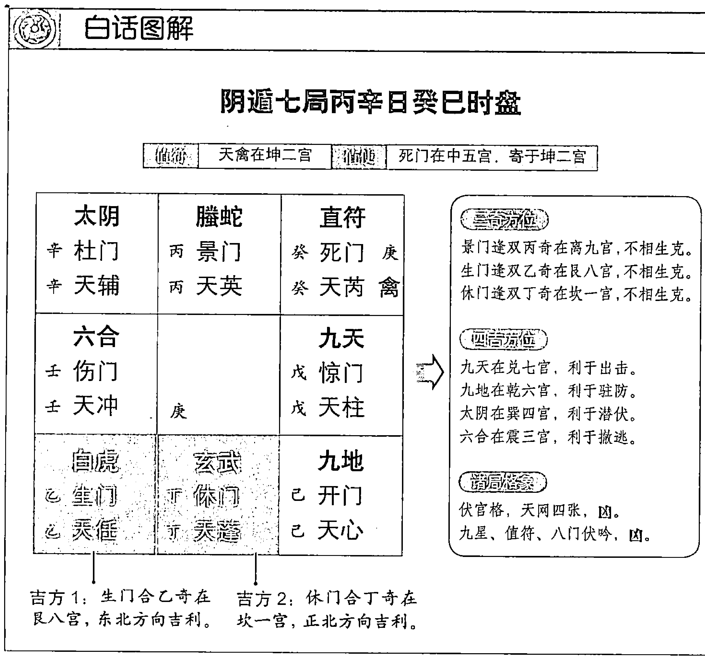

吉方1：生门合乙奇在艮八宫，东北方向吉利。

吉方2：休门合丁奇在坎一宫，正北方向吉利。

## 甲午时：正北与东北方向吉利

【原文】
甲午 辅值符四，杜值使四。午至戌阳，天辅，宿干吉。生任使艮伏，景英月离伏，休蓬星坎伏。天九，地二，阴八，合一。休与星合一正北，生与日合八东北，时干巽，符门伏，遁甲，自刑，阖。

【白话提要】
- 符使宫位：值符天辅星在巽四宫，值使杜门在巽四宫。时干遇吉星宿，时干逢吉。午时至戌时为五阳时，午时为天辅释罪时。
- 三奇方位：生门逢双乙奇于艮八宫，不相生克。景门逢双丙奇于离九宫，不相生克。休门逢双丁奇于坎一宫，不相生克。
- 四吉方位：九天在离九宫，九地在坤二宫，太阴在艮八宫，六合在坎一宫。
- 诸局格象：休门合丁奇在坎一宫，正北方向吉利。生门合乙奇在艮八宫，东北方向吉利。时干在巽四宫。星、门伏吟。遁甲自刑，合。

## 白话图解

### 阴遁七局丙辛日甲午时盘

| 直符 | 九天 | 九地 |
|------|------|------|
| 辛 杜门 辛 天辅 | 丙 景门 丙 天英 | 癸 死门 庚 癸 天芮 禽 |
| 螣蛇 壬 伤门 壬 天冲 | 庚 | 玄武 戊 惊门 戊 天柱 |
| 太阴 乙 生门 乙 天任 | 六合 丁 休门 丁 天蓬 | 白虎 己 开门 己 天心 |

> **三奇方位**
生门逢双乙奇在艮八宫,不相生克。
景门逢双丙奇在离九宫,不相生克。
休门逢双丁奇在坎一宫,不相生克。

**四吉方位**
九天在离九宫，利于出击。
九地在坤二宫，利于驻防。
太阴在艮八宫，利于潜伏。
六合在坎一宫，利于撤逃。

**诸局格象**
九星、值符、八门伏吟，凶。
遁甲自刑，凶。

吉方2：生门合乙奇在艮八宫，东北方向吉利。
吉方1：休门合丁奇在坎一宫，正北方向吉利。

## 乙未时：正西与西北方向吉利

【原文】
乙未 辅八，杜三。宿干吉。休乾和，杜震伏，开兑伏。天三，地四，阴六，合七。开与星合七正西，休与日合六西北，得使，伏宫格，虎猖狂，时干乾，三吉，乙格，辛日伏干格。

【白话提要】
- 符使宫位：值符天辅星在艮八宫，值使杜门在震三宫。时干遇吉星宿，时干逢吉。
- 三奇方位：休门逢乙奇在乾六宫，被生。杜门逢丙奇在震三宫，不相生克。开门逢丁奇在兑七宫，不相生克。
- 四吉方位：九天在震三宫，九地在巽四宫，太阴在乾六宫，六合在兑七宫。
- 诸局格象：开门合丁奇在兑七宫，正西方向吉利。休门合乙奇于乾六宫，西北方向吉利。乙奇得使。伏宫格。白虎猖狂。时干在乾六宫。三吉格。乙格。逢辛日伏干格。

## 白话图解

## 阴遁七局丙辛日乙未时盘

值符 天辅在艮八宫 值使 杜门在震三宫

吉方 1：开门合丁奇在兑七宫，正西方向吉利。

| 九地 | 玄武 | 白虎 |
| :--- | :--- | :--- |
| 癸 景门 庚 | 戊 死门 | 己 惊门 |
| 辛 天芮 禽 | 丙 天柱 | 癸 天心 |
| 九天 | | 六合 |
| 丙 杜门 | 庚 | 丁 开门 |
| 壬 天英 | | 乙 天蓬 |
| 直符 | 膝蛇 | 太阴 |
| 辛 伤门 | 壬 生门 | 乙 休门 |
| 乙 天辅 | 丁 天冲 | 丙 天任 |

三奇方位
- 休门逢乙奇在乾六宫，被生。
- 杜门逢丙奇在震三宫，不相生克。
- 开门逢丁奇在兑七宫，不相生克。

四吉方位
- 九天在震三宫，利于出击。
- 九地在巽四宫，利于驻防。
- 太阴在乾六宫，利于潜伏。
- 六合在兑七宫，利于撤逃。

诸局格象
- 乙奇得使，吉。
- 伏宫格，乙格，白虎猖狂，凶。
- 逢辛日，为伏干格，凶。

吉方 2：休门合乙奇于乾六宫，西北方向吉利。

## 丙申时：正东与东北方向吉利

【原文】
丙申 辅九，杜二。休震义，杜坤制，开丁艮和。天二，地七，阴三，合八。休与日合三正东，开与星合八东北，仪刑，天乙与太白格，飞宫格，龙反首，时乾坤，相佐离，火入金，事同，丙日飞干格。

【白话提要】
- 符使宫位：值符天辅星在离九宫，值使杜门在坤二宫。时干遇凶星宿，时干逢吉。
- 三奇方位：休门逢乙奇在震三宫，生宫。杜门逢丙奇在坤二宫，克宫。开门逢天盘丁奇与地盘乙奇在艮八宫，被生。
- 四吉方位：九天在坤二宫，九地在兑七宫，太阴在震三宫，六合在艮八宫。
- 诸局格象：休门合乙奇在震三宫，正东方向吉利。开门合丁奇在艮八宫，东北方向吉利。六仪击刑。天乙六庚格。飞宫格。青龙回首。时干在坤二宫。值符得地盘丙奇相助于离九宫。荧入太白。逢丙日飞干格。

## 白话图解

## 阴遁七局丙辛日丙申时盘

吉方1：休门合乙奇在震三宫，正东方向吉利。

| 螣蛇 | 直符 | 九天 |
|---|---|---|
| 壬 生门 辛 天冲 | 辛 伤门 丙 天辅 | 丙 杜门 癸 天英 |
| 太阴 | | 九地 |
| 乙 休门 壬 天任 | 庚 | 癸 景门 戊 天芮 禽 |
| 六合 | 白虎 | 玄武 |
| 丁 开门 乙 天蓬 | 己 惊门 丁 天心 | 戊 死门 己 天柱 |

> **三奇方位**
休门逢乙奇在震三宫，生宫。
杜门逢丙奇在坤二宫，克宫。
开门逢天盘丁奇与地盘乙奇在艮八宫，被生。

> **四吉方位**
九天在坤二宫，利于出击。
九地在兑七宫，利于驻防。
太阴在震三宫，利于潜伏。
六合在艮八宫，利于撤逃。

> **诸局格象**
青龙回首，吉。
六仪击刑，荧入太白，飞宫格，凶。
逢丙日为飞干格，凶。

吉方2：开门合丁奇在艮八宫，东北方向吉利。

## 丁酉时：逢辛日不宜用事

【原文】
丁酉 辅一，杜一。宿吉干凶，辛日不用，守户。生兑义，景乙艮义，休坤害。天八，地三，阴七，合二。休与星合二西南，生与日合七正西，得使，时干坤，相佐坎，雀入江。

【白话提要】
- 符使宫位：值符天辅星在坎一宫，值使杜门在坎一宫。时干遇吉星宿，时干逢凶。逢辛日不宜用事，宜守户不出。
- 三奇方位：生门逢乙奇在兑七宫，生宫。景门逢天盘丙奇与地盘乙奇在艮八宫，生宫。休门逢丁奇在坤二宫，被克。
- 四吉方位：九天在艮八宫，九地在震三宫，太阴在兑七宫，六合在坤二宫。
- 诸局格象：休门合丁奇于坤二宫，西南方向吉利。生门合乙奇于兑七宫，正西方向吉利。乙奇得使。时干在坤二宫。值符得地盘丁奇相助干坎一宫。朱雀入江。

## 白话图解

## 阴遁七局丙辛日丁酉时盘

| 值符 | 天辅在坎一宫 | 值使 | 杜门在坎一宫 |
| :---: | :---: | :---: | :---: |

吉方1：休门合丁奇于坤二宫，西南方向吉利。

| 玄武 戊 惊门 辛 天柱 | 白虎 己 开门 丙 天心 | 六合 休门 天蓬 |
|---|---|---|
| 九地 癸 死门 庚 壬 天芮 禽 庚 | (空白) | 太阴 生门 天任 |
| 九天 丙 景门 乙 天英 | 直符 辛 杜门 丁 天辅 | 螣蛇 壬 伤门 己 天冲 |

三奇方位
- 生门逢乙奇在兑七宫，生宫。
- 景门逢天盘丙奇与地盘乙奇在艮八宫，生宫。
- 休门逢丁奇在坤二宫，被克。

四吉方位
- 九天在艮八宫，利于出击。
- 九地在震三宫，利于驻防。
- 太阴在兑七宫，利于潜伏。
- 六合在坤二宫，利于撤逃。

诸局格象
- 乙奇得使，吉。
- 朱雀入江，凶。

吉方2：生门合乙奇于兑七宫，正西方向吉利。

## 戊戌时：无奇门可出

【原文】
戊戌 辅七，杜九。宿凶干吉。杜丙离义，惊墓乾伏，伤巽伏欢怡。天六，地一，阴九，合四。无奇门，时干艮，蛇矫。

【白话提要】
- 符使宫位：值符天辅星在兑七宫，值使杜门在离九宫。时干遇凶星宿，时干逢吉。
- 三奇方位：杜门逢天盘乙奇与地盘丙奇在离九宫，生宫。惊门逢丙奇在乾六宫，不相生克，乙奇入墓。伤门逢丁奇在巽四宫，不相生克，吉利。
- 四吉方位：九天在乾六宫，九地在坤二宫，太阴在离九宫，六合在巽四宫。
- 诸局格象：无奇门。时干在艮八宫。螣蛇天矫。

## 白话图解

## 阴遁七局丙辛日戊戌时盘

| 值符 | 天辅在兑七宫 | 值使 | 杜门在离九宫 |
| :---: | :---: | :---: | :---: |

| | 六合 | 太阴 | 螣蛇 |
| :--- | :--- | :--- | :--- |
| 第一排 | 丁 伤门 辛 天蓬 | 乙 杜门 丙 天任 | 壬 景门 癸 天冲 |
| 第二排 | 白虎 己 生门 壬 天心 | 庚 | 直符 辛 死门 戊 天辅 |
| 第三排 | 玄武 戊 休门 乙 天柱 | 九地 癸 开门 庚 丁 天芮 禽 | 九天 丙 惊门 己 天英 |

> 三奇方位
- 杜门逢天盘乙奇与地盘丙奇在离九宫，生宫。
- 惊门逢丙奇在乾六宫，不相生克。
- 伤门逢丁奇在巽四宫，不相生克。

> 四吉方位
- 九天在乾六宫，利于出击。
- 九地在坤二宫，利于驻防。
- 太阴在离九宫，利于潜伏。
- 六合在巽四宫，利于撤逃。

> 诸局格象
- 无奇门，凶。
- 螣蛇天矫，凶。

## 己亥时：西南方向吉利

【原文】
己亥 辅六，杜八。亥阴，宿吉干凶。开合坤和，伤丁坎和，惊丙离害。天一，地八，阴二，合九。开与日合二西南，时干巽，符冲。

【白话提要】
- 符使宫位：值符天辅星在乾六宫，值使杜门在艮八宫。时干遇吉星宿，时干逢凶。
- 三奇方位：开门逢乙奇在坤二宫，被生，奇仪相合。伤门逢天盘丙奇与地盘丁奇在坎一宫，被生。惊门逢天盘丁奇与地盘丙奇在离九宫，被克。
- 四吉方位：九天在坎一宫，九地在艮八宫，太阴在坤二宫，六合在离九宫。
- 诸局格象：开门合乙奇在坤二宫，西南方向吉利。时干在巽四宫。值符相冲。

## 白话图解

### 阴遁七局丙辛日己亥时盘

| 白虎 己 死门 辛 天心 | 六合 丁 惊门 丙 天蓬 | 太阴 乙 开门 癸 天任 |
|---------------------------|---------------------------|---------------------------|
| 玄武 戊 景门 壬 天柱 | 庚                       | 螣蛇 壬 休门 戊 天冲 |
| 九地 癸 杜门 庚 乙 天芮 禽 | 九天 丙 伤门 丁 天英 | 直符 辛 生门 己 天辅 |

三奇方位
- 开门逢乙奇在坤二宫，被生，奇仪相合。
- 伤门逢天盘丙奇与地盘丁奇在坎一宫，被生。
- 惊门逢天盘丁奇与地盘丙奇在离九宫，被克。

四吉方位
- 九天在坎一宫，利于出击。
- 九地在艮八宫，利于驻防。
- 太阴在坤二宫，利于潜伏。
- 六合在离九宫，利于撤逃。

诸局格象
- 九星、值符反吟，凶。

## 4. 丁壬日十二时局

## 庚子时：正东与东南方向吉利

【原文】
庚子 辅五，杜七。子至卯阴，宿吉干凶。休巽义欢怡，杜兑害，开合震制。天七，地六，阴四，合三。开与星合三正东，休与日合四东南，得使，龙走，时干乾，飞符，刑格，飞宫。

【白话提要】
- 符使宫位：值符天辅星在中五宫，寄于坤二宫，值使杜门在兑七宫。时干遇吉星宿，时干逢凶。子时至卯时为五阴时。
- 三奇方位：休门逢乙奇在巽四宫，生宫，吉利。杜门逢丙奇在兑七宫，被克。开门逢丁奇在震三宫，克宫，奇仪相合。
- 四吉方位：九天在兑七宫，九地在乾六宫，太阴在巽四宫，六合在震三宫。
- 诸局格象：开门合丁奇在震三宫，正东方向吉利。休门合乙奇在巽四宫，东南方向吉利。乙奇得使。青龙逃走。时干在乾六宫。飞宫格，刑格。

## 白话图解

### 阴遁七局丁壬日庚子时盘

| 太阴 休门 乙 辛 天任 | 螣蛇 生门 壬 丙 天冲 | 直符 伤门 辛 癸 天辅 |
| --- | --- | --- |
| 六合 开门 丁 壬 天蓬 | 庚 | 九天 杜门 丙 戊 天英 |
| 白虎 惊门 己 乙 天心 | 玄武 死门 戊 丁 天柱 | 九地 景门 癸 庚 己 天芮 禽 |

吉方2：休门合乙奇在巽四宫，东南方向吉利。

吉方1：开门合丁奇在震三宫，正东方向吉利。

三奇方位
- 休门逢乙奇在巽四宫，生宫。
- 杜门逢丙奇在兑七宫，被克。
- 开门逢丁奇在震三宫，克宫。

四吉方位
- 九天在兑七宫，利于出击。
- 九地在乾六宫，利于驻防。
- 太阴在巽四宫，利于潜伏。
- 六合在震三宫，利于撤逃。

诸局格象
- 乙奇得使，吉。
- 青龙逃走，飞宫格，刑格，凶。

## 辛丑时：正南方向吉利

【原文】
辛丑 辅四，杜六。宿吉干凶。死乙艮伏，休丙离制，景丁坎害。天九，地二，阴八，合一。休与月合九正南，天乙与太白格，时干巽，火入金，符伏，门反吟。

【白话提要】
- 符使宫位：值符天辅星在巽四宫，值使杜门在乾六宫。时干遇吉星宿，时干逢凶。
- 三奇方位：死门逢双乙奇在艮八宫，不相生克。休门逢双丙奇在离九宫，不相生克。景门逢双丁奇在坎一宫，被克。
- 四吉方位：九天在离九宫，九地在坤二宫，太阴在艮八宫，六合在坎一宫。
- 诸局格象：休门合丙奇在离九宫，正南方向吉利。天乙与六庚格。时干在巽四宫。荧入太白。星符伏吟。八门反吟格。

## 白话图解

## 阴遁七局丁壬日辛丑时盘

值符 天辅在巽四宫 值使 杜门在乾六宫

吉方：休门合丙奇在离九宫，正南方向吉利。

| 直符 | 九天 | 九地 |
| :--- | :--- | :--- |
| 辛 开门 辛 天辅 | 丙 休门 丙 天英 | 癸 生门 庚 癸 天芮 禽 |
| 螣蛇 | | 玄武 |
| 壬 惊门 壬 天冲 | 庚 | 戊 伤门 戊 天柱 |
| 太阴 | 六合 | 白虎 |
| 乙 死门 乙 天任 | 丁 景门 丁 天蓬 | 己 杜门 己 天心 |

三奇方位：死门逢双乙奇在艮八宫，不相生克。休门逢双丙奇在离九宫，不相生克。景门逢双丁奇在坎一宫，被克。

四吉方位：九天在离九宫，利于出击。九地在坤二宫，利于驻防。太阴在艮八宫，利于潜伏。六合在坎一宫，利于撤逃。

诸局格象：荧入太白，星符伏吟，凶。八门反吟格，凶。

## 壬寅时：东南方向吉利

【原文】
壬寅 辅三，杜五避五。宿吉干凶。惊丁坎义，生合巽害欢怡，死墓乾义。天四，地九，阴一，合六。生与月合四东南，天乙与太白格，时干震，金入火，事同。

【白话提要】
- 符使宫位：值符天辅星在震三宫，值使杜门在中五宫，寄于坤二宫。时干遇吉星宿，时干逢凶。
- 三奇方位：惊门逢天盘乙奇与地盘丁奇在坎一宫，生宫。生门逢丙奇在巽四宫，被克，吉利，奇仪相合。死门逢丁奇在乾六宫，生宫，丁奇入墓。
- 四吉方位：九天在巽四宫，九地在离九宫，太阴在坎一宫，六合在乾六宫。
- 诸局格象：生门合丙奇在巽四宫，东南方向吉利。天乙与六庚格。时干在震三宫。太白入荧。

## 白话图解

## 阴遁七局丁壬日壬寅时盘

吉方：生门合丙奇在巽四宫，东南方向吉利。

| | | |
|---|---|---|
| **九天** 丙 生门 辛 天英 | **九地** 癸 伤门 庚 丙 天芮 禽 | **玄武** 戊 杜门 癸 天柱 |
| **直符** 辛 休门 壬 天辅 | 庚 | **白虎** 己 景门 戊 天心 |
| **螣蛇** 壬 开门 乙 天冲 | **太阴** 乙 惊门 丁 天任 | **六合** 丁 死门 己 天蓬 |

**三奇方位**
- 惊门逢天盘乙奇与地盘丁奇在坎一宫，生宫。
- 生门逢丙奇在巽四宫，被克。
- 死门逢丁奇在乾六宫，生宫。

**四吉方位**
- 九天在巽四宫，利于出击。
- 九地在离九宫，利于驻防。
- 太阴在坎一宫，利于潜伏。
- 六合在乾六宫，利于撤逃。

**诸局格象**
- 太白入荧，凶。

## 癸卯时：逢丁日不宜用事

【原文】
癸卯 辅二，杜四。宿干凶，丁日不用。杜巽伏欢怡，惊兑伏，伤合震伏。天七，地六，阴四，合三。无奇门，飞宫格，龙走，鸟跌穴，时干乾，门伏，飞符，刑格，天网。

【白话提要】
- 符使宫位：值符天辅星在坤二宫，值使杜门在巽四宫。时干遇凶星宿，时干逢凶。逢丁日不宜用事。
- 三奇方位：杜门逢乙奇在巽四宫，不相生克，吉利。惊门逢丙奇在兑七宫，不相生克。伤门逢丁奇在震三宫，不相生克，奇仪相合。
- 四吉方位：九天在兑七宫，九地在乾六宫，太阴在巽四宫，六合在震三宫。
- 诸局格象：无奇门。飞宫格。青龙逃走。飞鸟跌穴。时干在乾六宫。八门伏吟。值符飞宫。刑格。天网四张。

## 白话图解

阴遁七局丁壬日癸卯时盘

值符 天辅在坤二宫 值使 杜门在巽四宫

|  |  |  |
| --- | --- | --- |
| 太阴 乙 杜门 辛 天任 | 螣蛇 壬 景门 丙 天冲 | 直符 辛 死门 癸 天辅 |
| 六合 丁 伤门 壬 天蓬 | 庚 | 九天 丙 惊门 戊 天英 |
| 白虎 己 生门 乙 天心 | 玄武 戊 休门 丁 天柱 | 九地 癸 开门 庚 己 天芮 禽 |

**三奇方位**
- 杜门逢乙奇在巽四宫，不相生克。
- 惊门逢丙奇在兑七宫，不相生克。
- 伤门逢丁奇在震三宫，不相生克。

**四吉方位**
- 九天在兑七宫，利于出击。
- 九地在乾六宫，利于驻防。
- 太阴在巽四宫，利于潜伏。
- 六合在震三宫，利于撤逃。

**诸局格象**
- 飞鸟跌穴，吉。
- 无奇门，凶。
- 飞宫格，青龙逃走，凶。
- 八门伏吟，刑格，天网四张，凶。

## 甲辰时：正北与东北方向吉利

## 【原文】
甲辰 冲值符三，伤值使三。辰至申阳，天辅，宿干吉。休蓬使坎伏，生任日艮伏，景英月离伏。天四，地九，阴一，合六。休与星合一正北，生与日合八东北，仪刑，时干震，符门伏，飞甲，自刑，三吉，同。

## 【白话提要】
符使宫位：值符天冲星在震三宫，值使伤门在震三宫。时干遇吉星宿，时干逢吉。辰时至申时为五阳时，辰时为天辅释罪时。

三奇方位：休门逢双丁奇在坎一宫，不相生克。生门逢双乙奇在艮八宫，不相生克。景门逢双丙奇在离九宫，不相生克。

四吉方位：九天在巽四宫，九地在离九宫，太阴在坎一宫，六合在乾六宫。

诸局格象：休门合丁奇在坎一宫，正北方向吉利。生门合乙奇在艮八宫，东北方向吉利。六仪击刑。时干在震三宫。星、门伏吟。三吉格。飞甲自刑，合。

## 白话图解
#### 阴遁七局丁壬日甲辰时盘

| 值符 | 天冲在震三宫 | 值使 | 伤门在震三宫 |
|---|---|---|---|

| 九天 | 九地 | 玄武 |
|---|---|---|
| 辛 杜门 辛 天辅 | 丙 景门 丙 天英 | 癸 死门 庚 癸 天芮 禽 |
| **直符** | | **白虎** |
| 壬 伤门 壬 天冲 | 庚 | 戊 惊门 戊 天柱 |
| **螣蛇** | **太阴** | **六合** |
| 乙 休门 乙 天蓬 | 丁 开门 丁 天心 | 己 惊门 己 天心 |

- 三奇方位：休门逢双丁奇在坎一宫，不相生克。生门逢双乙奇在艮八宫，不相生克。景门逢双丙奇在离九宫，不相生克。
- 四吉方位：九天在巽四宫，利于出击。九地在离九宫，利于驻防。太阴在坎一宫，利于潜伏。六合在乾六宫，利于撤逃。
- 诸局格象：六仪击刑，凶。九星、值符、八门伏吟，凶。飞甲自刑，凶。

吉方1：休门合丁奇在坎一宫，正北方向吉利。
吉方2：生门合乙奇在艮八宫，东北方向吉利。

## 乙巳时：东南方向吉利

## 【原文】
乙巳 冲八，伤二。宿干吉。景墓乾制，死丁坎制，休合巽义。天三，地四，阴六，合七。休与月合四东南，天乙与六庚格，时干坎，事同，金入火。

## 【白话提要】
符使宫位：值符天冲星在艮八宫，值使伤门在坤二宫。时干遇吉星宿，时干逢吉。

三奇方位：景门逢丁奇在乾六宫，克宫，丁奇入墓。死门逢天盘乙奇与地盘丁奇在坎一宫，克宫。休门逢丙奇在巽四宫，生宫，奇仪相合。

四吉方位：九天在震三宫，九地在巽四宫，太阴在乾六宫，六合在兑七宫。

诸局格象：休门合丙奇在巽四宫，东南方向吉利。天乙六庚格。时干在坎一宫。太白入荧。

## 白话图解
#### 阴遁七局丁壬日乙巳时盘

| 值符 | 天冲在艮八宫 | 值使 | 伤门在坤二宫 |
|---|---|---|---|

| 九地 | 玄武 | 白虎 |
|---|---|---|
| 丙 休门 辛 天英 | 癸 生门 庚 丙 天芮 禽 | 戊 伤门 癸 天柱 |
| **九天** | | **六合** |
| 辛 开门 壬 天辅 | 庚 | 己 杜门 戊 天心 |
| **直符** | **螣蛇** | **太阴** |
| 壬 惊门 乙 天冲 | 乙 死门 丁 天任 | 丁 景门 己 天蓬 |

- 三奇方位：景门逢丁奇在乾六宫，克宫。死门逢天盘乙奇与地盘丁奇在坎一宫，克宫。休门逢丙奇在巽四宫，生宫。
- 四吉方位：九天在震三宫，利于出击。九地在巽四宫，利于驻防。太阴在乾六宫，利于潜伏。六合在兑七宫，利于撤逃。
- 诸局格象：太白入荧，凶。

吉方：休门合丙奇在巽四宫，东南方向吉利。

## 丙午时：宜守户不出

## 【原文】
丙午 冲九，伤一。宿凶干吉，守户。景合震和欢怡，死巽害，休兑和。天二，地七，阴三，合八。休与月合七正西，得使，龙走，时干兑，相佐离，刑格，龙反首。

## 【白话提要】
符使宫位：值符天冲星在离九宫，值使伤门在坎一宫。时干遇凶星宿，时干逢吉。宜守户不出。

三奇方位：景门逢丁奇在震三宫，被生，吉利，奇仪相合。死门逢乙奇在巽四宫，被克。休门逢丙奇在兑七宫，被生。

四吉方位：九天在坤二宫，九地在兑七宫，太阴在震三宫，六合在艮八宫。

诸局格象：休门合丙奇在兑七宫，正西方向吉利。丙奇得使。青龙逃走。时干在兑七宫。值符得地盘丙奇相助于离九宫。刑格。青龙回首。

## 白话图解
#### 阴遁七局丁壬日丙午时盘

| 值符 | 天冲在离九宫 | 值使 | 伤门在坎一宫 |
|---|---|---|---|

| 螣蛇 | 直符 | 九天 |
|---|---|---|
| 乙 死门 辛 天任 | 壬 惊门 丙 天冲 | 辛 开门 癸 天辅 |
| **太阴** | | **九地** |
| 丁 景门 壬 天蓬 | 庚 | 丙 休门 癸 天英 |
| **六合** | **白虎** | **玄武** |
| 己 杜门 乙 天心 | 戊 伤门 丁 天柱 | 癸 生门 庚 己 天芮 禽 |

- 三奇方位：景门逢丁奇在震三宫，被生。死门逢乙奇在巽四宫，被克。休门逢丙奇在兑七宫，被生。
- 四吉方位：九天在坤二宫，利于出击。九地在兑七宫，利于驻防。太阴在震三宫，利于潜伏。六合在艮八宫，利于撤逃。
- 诸局格象：丙奇得使，青龙回首，吉。青龙逃走，刑格，凶。

吉方：休门合丙奇在兑七宫，正西方向吉利。

## 丁未时：正东方向吉利

## 【原文】
丁未 冲一，伤九。宿凶干吉。景兑制，死乾义，休震义欢怡。天八，地三，阴七，合二。休与月合三正东，壬干勃，虎猖狂，龙反首，时干兑，相佐坎，壬日勃，鸟跌穴。

## 【白话提要】
符使宫位：值符天冲星在坎一宫，值使伤门在离九宫。时干遇凶星宿，时干逢吉。

三奇方位：景门逢丁奇在兑七宫，克宫。死门逢乙奇在乾六宫，生宫。休门逢丙奇在震三宫，生宫，吉利。

四吉方位：九天在艮八宫，九地在震三宫，太阴在兑七宫，六合在坤二宫。

诸局格象：休门合丙奇在震三宫，正东方向吉利。壬干勃。白虎猖狂。青龙回首。时干在兑七宫。值符得地盘丁奇相助于坎宫。壬日日勃。飞鸟跌穴。

## 白话图解
#### 阴遁七局丁壬日丁未时盘

| 值符 | 天冲在坎一宫 | 值使 | 伤门在离九宫 |
|---|---|---|---|

| 玄武 | 白虎 | 六合 |
|---|---|---|
| 癸 生门 庚 辛 天芮 禽 | 戊 伤门 丙 天柱 | 己 杜门 癸 天心 |
| **九地** | | **太阴** |
| 丙 休门 壬 天英 | 庚 | 丁 景门 戊 天蓬 |
| **九天** | **直符** | **螣蛇** |
| 辛 开门 乙 天辅 | 壬 惊门 丁 天冲 | 乙 死门 己 天任 |

- 三奇方位：景门逢丁奇在兑七宫，克宫。死门逢乙奇在乾六宫，生宫。休门逢丙奇在震三宫，生宫。
- 四吉方位：九天在艮八宫，利于出击。九地在震三宫，利于驻防。太阴在兑七宫，利于潜伏。六合在坤二宫，利于撤逃。
- 诸局格象：青龙回首，飞鸟跌穴，吉。白虎猖狂，凶。逢壬日，为日勃格，凶。

吉方：休门合丙奇在震三宫，正东方向吉利。

## 戊申时：逢壬日不宜用事

## 【原文】
戊申 冲七，伤八。宿凶干吉，壬日不用。死丙离和，惊墓合坤义，生乙坎制。天六，地一，阴九，合四。生与月合一正北，丙下有丁，时干震，符冲，丁日勃。

## 【白话提要】
符使宫位：值符天冲星在兑七宫，值使伤门在艮八宫。时干遇凶星宿，时干逢吉。逢壬日不宜用事。

三奇方位：死门逢天盘丁奇与地盘丙奇在离九宫，被生。惊门逢乙奇在坤二宫，生宫，奇仪相合，乙奇入墓。生门逢天盘丙奇与地盘丁奇在坎一宫，克宫。

四吉方位：九天在乾六宫，九地在坎一宫，太阴在离九宫，六合在巽四宫。

诸局格象：生门合丙奇在坎一宫，正北方向吉利。丙下有丁成丙奇朱雀。时干在震三宫。值符相冲。丁日日勃。

## 白话图解
#### 阴遁七局丁壬日戊申时盘

| 值符 | 天冲在兑七宫 | 值使 | 伤门在艮八宫 |
|---|---|---|---|

| 六合 | 太阴 | 螣蛇 |
|---|---|---|
| 己 景门 辛 天心 | 丁 死门 丙 天蓬 | 乙 惊门 癸 天任 |
| **白虎** | | **直符** |
| 戊 杜门 壬 天柱 | 庚 | 壬 开门 戊 天冲 |
| **玄武** | **九地** | **九天** |
| 癸 伤门 乙 天芮 禽 | 丙 生门 丁 天英 | 辛 休门 己 天辅 |

- 三奇方位：死门逢天盘丁奇与地盘丙奇在离九宫，被生。惊门逢天盘乙奇在坤二宫，生宫。生门逢天盘丙奇与地盘丁奇在坎一宫，克宫。
- 四吉方位：九天在乾六宫，利于出击。九地在坎一宫，利于驻防。太阴在离九宫，利于潜伏。六合在巽四宫，利于撤逃。
- 诸局格象：丙下有丁，成丙奇朱雀，吉。逢丁日，为日勃格，凶。

吉方：生门合丙奇在坎一宫，正北方向吉利。

## 己酉时：西南方向吉利

## 【原文】
己酉 冲六，伤七。酉至亥阴，宿吉干凶。生坤伏，伤兑害，死乙艮伏。天一，地八，阴二，合九。生与星合二正南，伏宫格，雀入江，时干离，乙格，丁日飞干格，壬日伏干格。

## 【白话提要】
符使宫位：值符天冲星在乾六宫，值使伤门在兑七宫。时干遇吉星宿，时干逢凶。酉时至亥时为五阴时。

三奇方位：生门逢丁奇在坤二宫，不相生克。伤门逢乙奇在兑七宫，被克。死门逢天盘丙奇与地盘乙奇在艮八宫，不相生克。

四吉方位：九天在坎一宫，九地在艮八宫，太阴在坤二宫，六合在离九宫。

诸局格象：生门逢丁奇于坤二宫，西南方向吉利。伏宫格。朱雀入江。时干在离九宫。逢丁日飞干格。逢壬日伏干格。

## 白话图解
#### 阴遁七局丁壬日己酉时盘

| 值符 | 天冲在乾六宫 | 值使 | 伤门在兑七宫 |
|---|---|---|---|

| 白虎 | 六合 | 太阴 |
|---|---|---|
| 戊 开门 辛 天柱 | 己 休门 丙 天心 | 丁 景门 癸 天蓬 |
| **玄武** | | **螣蛇** |
| 癸 惊门 庚 壬 天芮 禽 | 庚 | 乙 伤门 戊 天任 |
| **九地** | **九天** | **直符** |
| 丙 死门 乙 天英 | 辛 景门 丁 天辅 | 壬 杜门 己 天冲 |

- 三奇方位：生门逢丁奇在坤二宫，不相生克。伤门逢乙奇在兑七宫，被克。死门逢天盘丙奇与地盘乙奇在艮八宫，不相生克。
- 四吉方位：九天在坎一宫，利于出击。九地在艮八宫，利于驻防。太阴在坤二宫，利于潜伏。六合在离九宫，利于撤逃。
- 诸局格象：伏宫格，朱雀入江，凶。逢丁日，为飞干格，凶。逢壬日，为伏干格，凶。

吉方：生门逢丁奇于坤二宫，西南方向吉利。

# 庚戌时：正南方向吉利

## 【原文】
庚戌 冲五，伤六。宿吉干凶。惊巽制，开丙离害，伤墓乾害。天七，地六，阴四，合三。开与日合九正南，乙下有丙，飞宫格，时干坎，飞符，丁日伏干格，壬日飞干格。

## 【白话提要】
符使宫位：值符天冲星在中五宫，寄于坤二宫，值使伤门在乾六宫。时干遇吉星宿，时干逢凶。

三奇方位：惊门逢丁奇在巽四宫，克宫。开门逢天盘乙奇与地盘丙奇在离九宫，被克。伤门逢丙奇在乾六宫，被克，丙奇入墓。

四吉方位：九天在兑七宫，九地在乾六宫，太阴在巽四宫，六合在震三宫。

诸局格象：开门合乙奇在离九宫，正南方向吉利。乙下有丙为奇仪顺遂。飞宫格。时干在坎一宫。逢丁日伏干格。逢壬日飞干格。

## 白话图解
#### 阴遁七局丁壬日庚戌时盘

| 值符 | 天冲在中五宫，寄于坤二宫 | 值使 | 伤门在乾六宫 |
|---|---|---|---|

| 太阴 | 螣蛇 | 直符 |
|---|---|---|
| 丁 惊门 辛 天蓬 | 乙 开门 丙 天任 | 壬 休门 癸 天冲 |
| **六合** | | **九天** |
| 己 死门 壬 天心 | 庚 | 辛 生门 戊 天辅 |
| **白虎** | **玄武** | **九地** |
| 戊 景门 乙 天柱 | 癸 杜门 庚 丁 天芮 禽 | 丙 伤门 己 天英 |

- 三奇方位：惊门逢丁奇在巽四宫，克宫。开门逢天盘乙奇与地盘丙奇在离九宫，被克。伤门逢丙奇在乾六宫，被克。
- 四吉方位：九天在兑七宫，利于出击。九地在乾六宫，利于驻防。太阴在巽四宫，利于潜伏。六合在震三宫，利于撤逃。
- 诸局格象：乙下有丙，为奇仪顺遂，吉。飞宫格，凶。逢丁日，为伏干格，凶。逢壬日，为飞干格，凶。

吉方：开门合乙奇在离九宫，正南方向吉利。

## 辛亥时：正东方向吉利

## 【原文】
辛亥 冲四，伤五避五。宿吉干吉。惊乙艮和，开震制欢怡，伤坤制。天九，地二，阴八，合一。开与日合三正东，仪刑，天乙与太白格，时干离，飞宫，火入金，事同。

## 【白话提要】
符使宫位：值符天冲星在巽四宫，值使伤门在中五宫，寄于坤二宫。时干遇吉星宿，时干逢吉。

三奇方位：惊门逢天盘丁奇与地盘乙奇在艮八宫，被生。开门逢乙奇在震三宫，克宫，吉利。伤门逢丙奇在坤二宫，克宫。

四吉方位：九天在离九宫，九地在坤二宫，太阴在艮八宫，六合在坎一宫。

诸局格象：开门合乙奇在震三宫，正东方向吉利。六仪击刑。天乙与六庚格。时干在离九宫。飞宫格。荧入太白。

## 白话图解
#### 阴遁七局丁壬日辛亥时盘

| 值符 | 天冲在巽四宫 | 值使 | 伤门在中五宫，寄于坤二宫 |
|---|---|---|---|

| 直符 | 九天 | 九地 |
|---|---|---|
| 壬 休门 辛 天冲 | 辛 生门 丙 天辅 | 丙 伤门 癸 天英 |
| **螣蛇** | | **玄武** |
| 乙 开门 辛 天任 | 庚 | 癸 杜门 庚 戊 天芮 禽 |
| **太阴** | **六合** | **白虎** |
| 丁 惊门 乙 天蓬 | 己 死门 丁 天心 | 戊 景门 己 天柱 |

- 三奇方位：惊门逢天盘丁奇与地盘乙奇在艮八宫，被生。开门逢乙奇在震三宫，克宫。伤门逢丙奇在坤二宫，克宫。
- 四吉方位：九天在离九宫，利于出击。九地在坤二宫，利于驻防。太阴在艮八宫，利于潜伏。六合在坎一宫，利于撤逃。
- 诸局格象：荧入太白，凶。飞宫格，凶。天乙与六庚格，凶。六仪击刑，凶。

吉方：开门合乙奇在震三宫，正东方向吉利。

## 壬子时：正北与东北方向吉利

## 【原文】
壬子 冲三，伤四。子至丑阴，宿吉干凶。开丁坎义，休乙艮害，杜丙离义。天四，地九，阴一，合六。休与日合八东北，时干震，开与月合一正北，符伏。

## 【白话提要】
符使宫位：值符天冲星在震三宫，值使伤门在巽四宫。时干遇吉星宿，时干逢凶。

三奇方位：开门逢双丁奇在坎一宫，生宫。休门逢双乙奇在艮八宫，被克。杜门逢双丙奇在离九宫，生宫。

四吉方位：九天在巽四宫，九地在离九宫，太阴在坎一宫，六合在乾六宫。

诸局格象：休门合乙奇在艮八宫，东北方向吉利。时干在震三宫。开门合丙奇在坎一宫，正北方向吉利。值符、九星伏吟。

## 白话图解
#### 阴遁七局戊癸日壬子时盘

| 值符 | 天冲在震三宫 | 值使 | 伤门在巽四宫 |
|---|---|---|---|

| 九天 | 九地 | 玄武 |
|---|---|---|
| 辛 伤门 辛 天辅 | 丙 杜门 丙 天英 | 癸 景门 庚 癸 天芮 禽 |
| **直符** | | **白虎** |
| 壬 生门 壬 天冲 | 庚 | 戊 死门 戊 天柱 |
| **螣蛇** | **太阴** | **六合** |
| 乙 休门 乙 天任 | 丁 开门 丁 天蓬 | 己 惊门 己 天心 |

- 三奇方位：开门逢双丁奇在坎一宫，生宫。休门逢双乙奇在艮八宫，被克。杜门逢双丙奇在离九宫，生宫。
- 四吉方位：九天在巽四宫，利于出击。九地在离九宫，利于驻防。太阴在坎一宫，利于潜伏。六合在乾六宫，利于撤逃。
- 诸局格象：值符、九星伏吟，凶。

吉方1：休门合乙奇在艮八宫，东北方向吉利。
吉方2：开门合丙奇在坎一宫，正北方向吉利。

## 癸丑时：西北方向吉利

## 【原文】
癸丑 冲二，伤三。宿干凶。杜巽伏，景丙离伏，开墓乾伏。天七，地六，阴四，合三。开与月合六西北，癸日飞干格，蛇矫，时干坎，飞符，门伏，三吉，天网。

## 【白话提要】
符使宫位：值符天冲星在坤二宫，值使伤门在震三宫。时干遇凶星宿，时干逢凶。

三奇方位：杜门逢丁奇在巽四宫，不相生克。景门逢天盘乙奇与地盘丙奇在离九宫，不相生克。开门逢丙奇在乾六宫，不相生克，丙奇入墓。

四吉方位：九天在兑七宫，九地在乾六宫，太阴在巽四宫，六合在震三宫。

诸局格象：开门合丙奇在乾六宫，西北方向吉利。逢癸日飞干格。螣蛇天矫。时干在坎一宫。值符飞宫。八门伏吟。三吉格。天网四张。

## 白话图解
#### 阴遁七局戊癸日癸丑时盘

| 值符 | 天冲在坤二宫 | 值使 | 伤门在震三宫 |
|---|---|---|---|

| 太阴 | 螣蛇 | 直符 |
|---|---|---|
| 丁 杜门 辛 天蓬 | 乙 景门 丙 天任 | 壬 死门 癸 天冲 |
| **六合** | | **九天** |
| 己 伤门 壬 天心 | 庚 | 辛 惊门 戊 天辅 |
| **白虎** | **玄武** | **九地** |
| 戊 生门 乙 天柱 | 癸 休门 庚 丁 天芮 禽 | 丙 开门 壬 天英 |

- 三奇方位：杜门逢丁奇在巽四宫，不相生克。景门逢天盘乙奇与地盘丙奇在离九宫，不相生克。开门逢丙奇在乾六宫，不相生克。
- 四吉方位：九天在兑七宫，利于出击。九地在乾六宫，利于驻防。太阴在巽四宫，利于潜伏。六合在震三宫，利于撤逃。
- 诸局格象：逢癸日，为飞干格，凶。螣蛇天矫，天网四张，凶。八门伏吟，值符飞宫，凶。

吉方：开门合丙奇在乾六宫，西北方向吉利。

## 甲寅时：逢戊日不宜用事

## 【原文】
甲寅 芮值符二，死值使二，天辅。寅至午阳，宿凶干吉，戊日不用。休蓬星坎伏，生任日艮伏，景英月离伏。天七，地六，阴四，合三。休与星合一正北，生与日合八东北，伏宫格，癸日飞干格，天乙与太白格，时干坤，符门伏，地甲，事同，阖。

## 【白话提要】
符使宫位：值符天芮星在坤二宫，值使死门在坤二宫。时干遇凶星宿，时干逢吉。寅时为天辅释罪时。寅时至午时为五阳时。逢戊日不宜用事。

三奇方位：休门逢双丁奇在坎一宫，不相生克。生门逢双乙奇在艮八宫，不相生克。景门逢双丙奇在离九宫，不相生克。

四吉方位：九天在兑七宫，九地在乾六宫，太阴在巽四宫，六合在震三宫。

诸局格象：休门合丁奇在坎一宫，正北方向吉利。生门合乙奇在艮八宫，东北方向吉利。伏宫格。癸日为飞干格。时干在坤二宫。星、门伏吟。地甲合。

## 白话图解
#### 阴遁七局戊癸日甲寅时盘

| 值符 | 天芮在坤二宫 | 值使 | 死门在坤二宫 |
|---|---|---|---|

| 太阴 | 螣蛇 | 直符 |
|---|---|---|
| 辛 杜门 辛 天辅 | 丙 景门 丙 天英 | 癸 死门 庚 癸 天芮 禽 |
| **六合** | | **九天** |
| 壬 伤门 壬 天冲 | 庚 | 戊 惊门 戊 天柱 |
| **白虎** | **玄武** | **九地** |
| 乙 生门 乙 天任 | 丁 休门 丁 天蓬 | 己 开门 己 天心 |

- 三奇方位：休门逢双丁奇在坎一宫，不相生克。生门逢双乙奇在艮八宫，不相生克。景门逢双丙奇在离九宫，不相生克。
- 四吉方位：九天在兑七宫，利于出击。九地在乾六宫，利于驻防。太阴在巽四宫，利于潜伏。六合在震三宫，利于撤逃。
- 诸局格象：伏宫格，地甲合，凶。逢癸日，为飞干格，凶。九星、值符、八门伏吟，凶。

吉方1：休门合丁奇在坎一宫，正北方向吉利。
吉方2：生门合乙奇在艮八宫，东北方向吉利。

## 乙卯时：宜守户不出

## 【原文】
乙卯 芮八，死一。宿干吉，守户。生丙离和，伤墓合坤制欢怡，死丁坎制。天三，地四，阴六，合七。生与星合九正南，符伏，丁下有丙，时干坤。

## 【白话提要】
符使宫位：值符天芮星在艮八宫，值使死门在坎一宫。时干遇吉星宿，时干逢吉。宜守户不出。

三奇方位：生门逢天盘丁奇与地盘丙奇在离九宫，被生。伤门逢乙奇在坤二宫，克宫，吉利，乙奇入墓，奇仪相合。死门逢丙奇与地盘丁奇在坎一宫，克宫。

四吉方位：九天在震三宫，九地在巽四宫，太阴在乾六宫，六合在兑七宫。

诸局格象：生门合丁奇在离九宫，正南方向吉利。星符反吟。丁下有丙为星随月转。时干在坤二宫。

## 白话图解
#### 阴遁七局戊癸日乙卯时盘

| 值符 | 天芮在艮八宫 | 值使 | 死门在坎一宫 |
|---|---|---|---|

| 九地 | 玄武 | 白虎 |
|---|---|---|
| 己 休门 辛 天心 | 丁 生门 丙 天蓬 | 乙 伤门 癸 天任 |
| **九天** | | **六合** |
| 戊 开门 壬 天柱 | 庚 | 壬 杜门 戊 天冲 |
| **直符** | **螣蛇** | **太阴** |
| 癸 惊门 庚 乙 天芮 禽 | 丙 死门 丁 天英 | 辛 景门 己 天辅 |

- 三奇方位：生门逢天盘丁奇与地盘丙奇在离九宫，被生。伤门逢天盘乙奇在坤二宫，克宫。死门逢丙奇与地盘丁奇在坎一宫，克宫。
- 四吉方位：九天在震三宫，利于出击。九地在巽四宫，利于驻防。太阴在乾六宫，利于潜伏。六合在兑七宫，利于撤逃。
- 诸局格象：丁下有丙，为星随月转，吉。九星、值符反吟，凶。

吉方：生门合丁奇在离九宫，正南方向吉利。

## 丙辰时：正北与西北方向吉利

## 【原文】

丙辰 芮九，死九。宿凶干吉。休墓乾和，生丁坎制，景合巽和。天二，地七，阴三，合八。生与日合一正北，休与星合六西北，时干巽，相佐离，金入火，戊日飞干格。

## 【白话提要】

符使宫位：值符天芮星在离九宫，值使死门在离九宫。时干遇凶星宿，时干逢吉。

三奇方位：休门逢丁奇在乾六宫，被生，丁奇入墓。生门逢天盘乙奇与地盘丁奇在坎一宫，克宫。景门逢丙奇在巽四宫，被生，奇仪相合。

四吉方位：九天在坤二宫，九地在兑七宫，太阴在震三宫，六合在艮八宫。

诸局格象：生门合乙奇在坎一宫，正北方向吉利。休门合丁奇在乾六宫，西北方向吉利。时干在巽四宫。值符得地盘丙奇相助于离九宫。太白入荧。逢戊日飞干格。

## 白话图解

### 阴遁七局戊癸日丙辰时盘

| 腾蛇 | 直符 | 九天 |
| --- | --- | --- |
| 丙 景门 | 癸 死门 庚 | 戊 惊门 |
| 辛 天英 | 丙 天芮 禽 | 癸 天柱 |
| 太阴 | | 九地 |
| 辛 杜门 | | 己 开门 |
| 壬 天辅 | 庚 | 戊 天心 |
| 六合 | 白虎 | 玄武 |
| 壬 伤门 | 乙 生门 | 丁 休门 |
| 乙 天冲 | 辛 天任 | 丙 天蓬 |

- 三奇方位
  - 休门逢丁奇在乾六宫，被生。
  - 生门逢天盘乙奇与地盘丁奇在坎一宫，克宫。
  - 景门逢丙奇在巽四宫，被生。
- 四吉方位
  - 九天在坤二宫，利于出击。
  - 九地在兑七宫，利于驻防。
  - 太阴在震三宫，利于潜伏。
  - 六合在艮八宫，利于撤逃。
- 诸局格象
  - 太白入荧，凶。
  - 逢戊日，为飞干格，凶。

吉方1：生门合乙奇在坎一宫，正北方向吉利。
吉方2：休门合丁奇在乾六宫，西北方向吉利。

## 丁巳时：正南与东南方向吉利

## 【原文】

丁巳 芮一，死八。宿凶干吉。开巽制，休丙离制，杜墓乾害。天八，地三，阴七，合二。休与日合九正南，乙下有丙，开与星合四东南，时干巽，相佐坎，击刑，门反吟，蛇矫。

## 【白话提要】

符使宫位：值符天芮星在坎一宫，值使死门在艮八宫。时干遇凶星宿，时干逢吉。

三奇方位：开门逢丁奇在巽四宫，克宫。休门逢天盘乙奇与地盘丙奇在离九宫，克宫。杜门逢丙奇在乾六宫，被克，丙奇入墓。

四吉方位：九天在艮八宫，九地在震三宫，太阴在兑七宫，六合在坤二宫。

诸局格象：休门合乙奇在离九宫，正南方向吉利，乙下有丙为奇仪顺遂。开门合丁奇在巽四宫，东南方向吉利。时干在巽四宫。值符得地盘丁奇助于坎一宫。击刑。八门反吟。螣蛇天矫。

### 【白话图解】

### 阴遁七局戊癸日丁巳时盘

| 值符 | 天芮在坎一宫 | 值使 | 死门在艮八宫 |
| :--- | :--- | :--- | :--- |

吉方2：开门合丁奇在巽四宫，东南方向吉利。
吉方1：休门合乙奇在离九宫，正南方向吉利。

| 玄武 | 白虎 | 六合 |
| --- | --- | --- |
| 丁 开门 辛 天蓬 | 乙 休门 丙 天任 | 壬 生门 癸 天冲 |
| 九地 | 庚 | 太阴 |
| 己 惊门 壬 天心 |  | 辛 伤门 戊 天辅 |
| 九天 | 直符 | 螣蛇 |
| 戊 死门 乙 天柱 | 癸 景门 庚 丁 天芮 禽 | 丙 杜门 己 天英 |

> 三奇方位
开门逢丁奇在巽四宫，克宫。
休门逢天盘乙奇与地盘丙奇在离九宫，克宫。
杜门逢丙奇在乾六宫，被克。

> 四吉方位
九天在艮八宫，利于出击。
九地在震三宫，利于驻防。
太阴在兑七宫，利于潜伏。
六合在坤二宫，利于撤逃。

> 诸局格象
乙下有丙，为奇仪顺遂，吉。
击刑，八门反吟，螣蛇天矫，凶。

## 戊午时：正东与东北方向吉利

## 【原文】
戊午 芮七，死七。宿凶干吉。休乙艮害，生震害，景坤义欢怡。天六，地一，阴九，合四。生与日合三正东，休与星合八东北，丁下有乙，符勃，时干乾，火入金，癸日勃，戊日飞干，飞宫。

## 【白话提要】
符使宫位：值符天芮星在兑七宫，值使死门在兑七宫。时干遇凶星宿，时干逢吉。
三奇方位：休门逢天盘丁奇与地盘乙奇在艮八宫，被克。生门逢乙奇在震三宫，被克。景门逢丙奇在坤二宫，生宫，好。
四吉方位：九天在乾六宫，九地在坎一宫，太阴在离九宫，六合在巽四宫。
诸局格象：生门合乙奇在震三宫，正东方向吉利。休门合丁奇在艮八宫，东北方向吉利。丁下有乙成人遁。符勃格。时干在乾六宫。荧入太白。癸日日勃。逢戊日飞干格。值符飞宫。

## 白话图解

### 阴遁七局戊癸日戊午时盘

| 吉方1 | 生门合乙奇在震三宫，正东方向吉利。 |
| :--- | :--- |
| 六合 | 太阴 | 螣蛇 |
| 壬伤门 | 辛杜门 | 丙景门 |
| 辛天冲 | 丙天辅 | 癸天英 |
| 白虎 | 直符 |  |
| 乙生门 | 庚死门 | 庚戊天芮禽 |
| 辛天任 |  |  |
| 玄武 | 九地 | 九天 |
| 丁休门 | 己开门 | 戊惊门 |
| 乙天蓬 | 丁天心 | 己天柱 |
| 吉方2 | 休门合丁奇在艮八宫，东北方向吉利。 |

三奇方位
休门逢天盘丁奇与地盘乙奇在艮八宫，被克。
生门逢乙奇在震三宫，被克。
景门逢丙奇在坤二宫，生宫。

四吉方位
九天在乾六宫，利于出击。
九地在坎一宫，利于驻防。
太阴在离九宫，利于潜伏。
六合在巽四宫，利于撤逃。

诸局格象
丁下有乙，成人遁，吉。
符勃格，荧入太白，癸日日勃，凶。
逢戊日，为飞干格，凶。

# 己未时：逢癸日不宜用事

## 【原文】
己未 芮六，死六。未至亥阴，宿干凶，癸日不用。休合震义，生巽害，景兑制。天一，地八，阴二，合九。休与星合三正东，得使，生与日合四东南，龙走，鸟跌穴，时干艮，刑格，戊日勃，戊干格。

## 【白话提要】
符使宫位：值符天芮星在乾六宫，值使死门在乾六宫。时干遇凶星宿，时干逢凶。未时至亥时为五阴时。逢癸日不宜用事。
三奇方位：休门逢丁奇在震三宫，生宫，奇仪相合。生门逢乙奇在巽四宫，被克。景门逢丙奇在兑七宫，克宫。
四吉方位：九天在坎一宫，九地在艮八宫，太阴在坤二宫，六合在离九宫。
诸局格象：休门合丁奇在震三宫，正东方向吉利。丁奇得使。生门合乙奇在巽四宫，东南方向吉利。青龙逃走。飞鸟跌穴。时干在艮八宫。刑格。逢戊日日勃。戊日干格。

## 白话图解

### 阴遁七局戊癸日己未时盘

值符 天芮在乾六宫 值使 死门在乾六宫

吉方2 生门合乙奇在巽四宫，东南方向吉利。

| 白虎 乙 生门 辛 天任 | 六合 壬 伤门 丙 天冲 | 太阴 辛 杜门 癸 天辅 | 玄武 丁 休门 庚 天蓬 |
| :--- | :--- | :--- | :--- |
|  |  |  | 螣蛇 丙 景门 戊 天英 |
| 九地 己 开门 乙 天心 | 九天 戊 惊门 丁 天柱 | 直符 癸 死门 庚 己 天芮 禽 |  |

- **三奇方位**
  - 休门逢丁奇在震三宫，生宫。
  - 生门逢乙奇在巽四宫，被克。
  - 景门逢丙奇在兑七宫，克宫。
- **四吉方位**
  - 九天在坎一宫，利于出击。
  - 九地在艮八宫，利于驻防。
  - 太阴在坤二宫，利于潜伏。
  - 六合在离九宫，利于撤逃。
- **诸局格象**
  - 丁奇得使，飞鸟跌穴，吉。
  - 青龙逃走，刑格，戊日干格，凶。
  - 逢戊日，为日勃格，凶。

吉方1：休门合丁奇在震三宫，正东方向吉利。

## 庚申时：正北与东北方向吉利

## 【原文】
庚申 芮五，死五避五。宿吉干凶。休丁坎伏，生乙艮伏，景丙离伏。天七，地六，阴四，合三。生与月合八东北，休与星合一正北，天乙与太白格，时干坤，符门伏，事同，癸日飞，伏干格。

## 【白话提要】
符使宫位：值符天芮星在中五宫，寄于坤二宫；值使死门在中五宫，寄于坤二宫。时干遇吉星宿，时干逢凶。
三奇方位：休门逢双丁奇在坎一宫，不相生克。生门逢双乙奇在艮八宫，不相生克。景门逢双丙奇在离九宫，不相生克。
四吉方位：九天在兑七宫，九地在乾六宫，太阴在巽四宫，六合在震三宫。
诸局格象：生门合丙奇在艮八宫，东北方向吉利。休门合丁奇于坎一宫，正北方向吉利。天乙与六庚格。时干在坤二宫。星门俱伏吟。癸日为飞伏干格。

## 白话图解

值符 天芮在中五宫，寄于坤二宫；值使 死门在中五宫，寄于坤二宫。

### 阴遁七局戊癸日庚申时盘

| 太阴 辛 杜门 辛 天辅 | 螣蛇 丙 景门 丙 天英 | 直符 癸 死门 庚 癸 天芮 禽 |
| 六合 壬 伤门 壬 天冲 | 庚 | 九天 戊 惊门 戊 天柱 |
| 白虎 乙 生门 乙 天任 | 玄武 丁 休门 丁 天蓬 | 九地 己 开门 己 天心 |

三奇方位：休门逢双丁奇在坎一宫，不相生克。生门逢双乙奇在艮八宫，不相生克。景门逢双丙奇在离九宫，不相生克。

四吉方位：九天在兑七宫，利于出击。九地在乾六宫，利于驻防。太阴在巽四宫，利于潜伏。六合在震三宫，利于撤逃。

诸局格象：九星、值符、八门伏吟，凶。逢癸日，为飞伏干格，凶。

吉方1：生门合丙奇在艮八宫，东北方向吉利。
吉方2：休门合丁奇于坎一宫，正北方向吉利。

## 辛酉时：正西与西北方向吉利

## 【原文】
辛酉 芮四，死四。宿吉干凶。休兑和，生乾义，景震义。天九，地二，阴八，合一。休与星合七正西，生与日合六西北，时干艮，仪刑，虎猖狂，龙反首。

## 【白话提要】
符使宫位：值符天芮星在巽四宫，值使死门在巽四宫。时干遇吉星宿，时干逢凶。
三奇方位：休门逢丁奇在兑七宫，被生。生门逢乙奇在乾六宫，生宫。景门逢丙奇在震三宫，生宫。
四吉方位：九天在离九宫，九地在坤二宫，太阴在艮八宫，六合在坎一宫。
诸局格象：休门合丁奇在兑七宫，正西方向吉利。生门合乙奇在乾六宫，西北方向吉利。时干在艮八宫。六仪击刑。白虎猖狂。青龙回首。

## 白话图解

### 阴遁七局戊癸日辛酉时盘

值符 天芮在巽四宫 值使 死门在巽四宫

吉方 1：休门合丁奇在兑七宫，正西方向吉利。

| 九天 | 九地 |
| :--- | :--- |
| 戊 惊门 | 己 开门 |
| 丙 天柱 | 癸 天心 |

| 螣蛇 | 玄武 |
| :--- | :--- |
| 丙 景门 | 辛 休门 |
| 壬 天英 | 己 天蓬 |

| 太阴 | 六合 | 白虎 |
| :--- | :--- | :--- |
| 辛 杜门 | 壬 伤门 | 乙 生门 |
| 乙 天辅 | 丁 天冲 | 庚 天任 |

三奇方位
休门逢丁奇在兑七宫，被生。
生门逢乙奇在乾六宫，生宫。
景门逢丙奇在震三宫，生宫。

四吉方位
九天在离九宫，利于出击。
九地在坤二宫，利于驻防。
太阴在艮八宫，利于潜伏。
六合在坎一宫，利于撤逃。

诸局格象
青龙回首，吉。
六仪击刑，白虎猖狂，凶。

吉方 2：生门合乙奇在乾六宫，西北方向吉利。

## 壬戌时：正西与西南方向吉利

## 【原文】
壬戌 芮三，死三。宿吉干凶。休坤害欢怡，生兑义，景乙艮义。天四，地九，阴一，合六。生与日合七正西，休与星合二西南，时干乾，三吉，雀入江。

## 【白话提要】
符使宫位：值符天芮星在震三宫，值使死门在震三宫。时干遇吉星宿，时干逢凶。
三奇方位：休门逢丁奇在坤二宫，被克，吉利。生门逢乙奇在兑七宫，生宫。景门逢天盘丙奇与地盘乙奇在艮八宫，生宫。
四吉方位：九天在巽四宫，九地在离九宫，太阴在坎一宫，六合在乾六宫。
诸局格象：生门合乙奇在兑七宫，正西方向吉利。休门合丁奇在坤二宫，西南方向吉利。时干在乾六宫。三吉格。朱雀入江。

## 白话图解

### 阴遁七局戊癸日壬戌时盘

| 值符 | 天芮在震三宫 | 值使 | 死门在震三宫 |
| :--- | :--- | :--- | :--- |

吉方2：休门合丁奇在坤二宫，西南方向吉利。

| 九天 | 九地 | 玄武 |
| :--- | :--- | :--- |
| 戊 惊门 | 己 开门 | 丁 休门 |
| 辛 天柱 | 丙 天心 | 癸 天蓬 |
| 直符 | | 白虎 |
| 癸 死门 庚 | 庚 | 乙 生门 |
| 壬 天芮 禽 | | 戊 天任 |
| 螣蛇 | 太阴 | 六合 |
| 丙 景门 | 辛 杜门 | 壬 伤门 |
| 乙 天英 | 丁 天辅 | 己 天冲 |

三奇方位
休门逢丁奇在坤二宫，被克。
生门逢乙奇在兑七宫，生宫。
景门逢天盘丙奇与地盘乙奇在艮八宫，生宫。

四吉方位
九天在巽四宫，利于出击。
九地在离九宫，利于驻防。
太阴在坎一宫，利于潜伏。
六合在乾六宫，利于撤逃。

诸局格象
朱雀入江，凶。

吉方1：生门合乙奇在兑七宫，正西方向吉利。

## 癸亥时：正北与东北方向吉利

## 【原文】
癸亥 芮二，死二。休丁坎伏，生乙艮伏，景丙离伏。天七，地六，阴四，合三。休与星合一正北，生与日合八东北，伏宫格，天乙与太白格，时干坤，符门伏，癸日飞，伏干格，天网。

## 【白话提要】
符使宫位：值符天芮星在坤二宫，值使死门在坤二宫。
三奇方位：休门逢双丁奇在坎一宫，不相生克。生门逢双乙奇在艮八宫，不相生克。景门逢双丙奇在离九宫，不相生克。
四吉方位：九天在兑七宫，九地在乾六宫，太阴在巽四宫，六合在震三宫。
诸局格象：休门合丁奇在坎一宫，正北方向吉利。生门合乙奇在艮八宫，东北方向吉利。伏宫格。天乙六庚格。时干在坤二宫。星、门伏吟。逢癸日飞干伏干格。天网四张。

## 白话图解

### 阴遁七局戊癸日癸亥时盘

值符 天芮在坤二宫 值使 死门在坤二宫

| 太阴 辛 杜门 辛 天辅 | 螣蛇 丙 景门 丙 天英 | 直符 癸 死门 庚 癸 天芮 禽 |
| :--- | :--- | :--- |
| 六合 壬 伤门 壬 天冲 | 庚 | 九天 戊 惊门 戊 天柱 |
| 白虎 乙 生门 乙 天任 | 玄武 丁 休门 丁 天蓬 | 九地 己 开门 己 天心 |

**三奇方位**
休门逢双丁奇在坎一宫，不相生克。
生门逢双乙奇在艮八宫，不相生克。
景门逢双丙奇在离九宫，不相生克。

**四吉方位**
九天在兑七宫，利于出击。
九地在乾六宫，利于驻防。
太阴在巽四宫，利于潜伏。
六合在震三宫，利于撤逃。

**诸局格象**
伏宫格，凶。
星门伏吟，天网四张，凶。
逢癸日，为飞干伏干格，凶。

吉方2：生门合乙奇在艮八宫，东北方向吉利。
吉方1：休门合丁奇于坎一宫，正北方向吉利。

## 第四章 阴遁六局

奇门遁甲时家奇门阴遁六局共有六十个时辰，即六十局。本章通过文字和各时辰的飞盘排布来说明各局的符使宫位、三奇方位、四吉方位和诸局格象。

## 白话图解

### 阴遁六局图

| 节气 | 夏至下元 | 白露下元 | 寒露上元 | 立冬上元 |
| :--- | :--- | :--- | :--- | :--- |

# 每日时辰

奇门遁甲中一局为一元，一元有甲己、乙庚、丙辛、丁壬和戊癸五日，每日有十二个时辰，则一局就有六十个时辰，用六十甲子来表示，一个时辰为一小局。

|  | 甲子 | 乙丑 | 丙寅 | 丁卯 | 戊辰 | 己巳 | 庚午 | 辛未 | 壬申 | 癸酉 | 甲戌 | 乙亥 |
| :--- | :--- | :--- | :--- | :--- | :--- | :--- | :--- | :--- | :--- | :--- | :--- | :--- |
| 甲己日 | 甲子 | 乙丑 | 丙寅 | 丁卯 | 戊辰 | 己巳 | 庚午 | 辛未 | 壬申 | 癸酉 | 甲戌 | 乙亥 |
| 乙庚日 | 丙子 | 丁丑 | 戊寅 | 己卯 | 庚辰 | 辛巳 | 壬午 | 癸未 | 甲申 | 乙酉 | 丙戌 | 丁亥 |
| 丙辛日 | 戊子 | 己丑 | 庚寅 | 辛卯 | 壬辰 | 癸巳 | 甲午 | 乙未 | 丙申 | 丁酉 | 戊戌 | 己亥 |
| 丁壬日 | 庚子 | 辛丑 | 壬寅 | 癸卯 | 甲辰 | 乙巳 | 丙午 | 丁未 | 戊申 | 己酉 | 庚戌 | 辛亥 |
| 戊癸日 | 壬子 | 癸丑 | 甲寅 | 乙卯 | 丙辰 | 丁巳 | 戊午 | 己未 | 庚申 | 辛酉 | 壬戌 | 癸亥 |

### 阴遁六局六十时符使表

奇门遁甲排盘时，最主要的就是寻找值符和值使，并确定其所在的宫位。下表就是阴遁六局六十个时辰的值符和值使，以及其所在的宫位。

| 时辰 | 甲子 | 乙丑 | 丙寅 | 丁卯 | 戊辰 | 己巳 | 庚午 | 辛未 | 壬申 | 癸酉 |
| :--- | :--- | :--- | :--- | :--- | :--- | :--- | :--- | :--- | :--- | :--- |
| 天心 | 六 | 七 | 八 | 九 | 六 | 五 | 四 | 三 | 二 | 一 |
| 开门 | 六 | 五 | 四 | 三 | 二 | 一 | 九 | 八 | 七 | 六 |
| 时辰 | 甲戌 | 乙亥 | 丙子 | 丁丑 | 戊寅 | 己卯 | 庚辰 | 辛巳 | 壬午 | 癸未 |
| 天禽 | 五 | 七 | 八 | 九 | 六 | 五 | 四 | 三 | 二 | 一 |
| 死门 | 五 | 四 | 三 | 二 | 一 | 九 | 八 | 七 | 六 | 五 |
| 时辰 | 甲申 | 乙酉 | 丙戌 | 丁亥 | 戊子 | 己丑 | 庚寅 | 辛卯 | 壬辰 | 癸巳 |
| 天辅 | 四 | 七 | 八 | 九 | 六 | 五 | 四 | 三 | 二 | 一 |
| 杜门 | 四 | 三 | 二 | 一 | 九 | 八 | 七 | 六 | 五 | 四 |
| 时辰 | 甲午 | 乙未 | 丙申 | 丁酉 | 戊戌 | 己亥 | 庚子 | 辛丑 | 壬寅 | 癸卯 |
| 天冲 | 三 | 七 | 八 | 九 | 六 | 五 | 四 | 三 | 二 | 一 |
| 伤门 | 三 | 二 | 一 | 九 | 八 | 七 | 六 | 五 | 四 | 三 |
| 时辰 | 甲辰 | 乙巳 | 丙午 | 丁未 | 戊申 | 己酉 | 庚戌 | 辛亥 | 壬子 | 癸丑 |
| 天芮 | 二 | 七 | 八 | 九 | 六 | 五 | 四 | 三 | 二 | 一 |
| 死门 | 二 | 一 | 九 | 八 | 七 | 六 | 五 | 四 | 三 | 二 |
| 时辰 | 甲寅 | 乙卯 | 丙辰 | 丁巳 | 戊午 | 己未 | 庚申 | 辛酉 | 壬戌 | 癸亥 |
| 天蓬 | 一 | 七 | 八 | 九 | 六 | 五 | 四 | 三 | 二 | 一 |
| 休门 | 一 | 九 | 八 | 七 | 六 | 五 | 四 | 三 | 二 | 一 |

# 1. 甲己日十二时局

### 甲子时：东北方向吉利

【原文】
甲子 心六，开六。子至辰阳，宿干吉。生艮伏，惊兑伏，景离伏。天一，地八，阴二，合九。生与月合八东北，时干乾，符门伏，遁甲，阖。

符使宫位：值符天心星在乾六宫，值使开门在乾六宫。时干遇吉星宿，时干逢吉。子时至辰时为五阳时。

三奇方位：生门逢双丙奇在艮八宫，不相生克。惊门逢双乙奇在兑七宫，不相生克。景门逢双丁奇在离九宫，不相生克。

四吉方位：九天在坎一宫，九地在艮八宫，太阴在坤二宫，六合在离九宫。

诸局格象：生门合丙奇在艮八宫，东北方向吉利。时干在乾六宫。星符八门伏吟。遁甲合。

## 白话图解

### 阴遁六局甲己日甲子时盘

| 白虎 | 六合 | 太阴 |
|------|------|------|
| 庚杜门 庚天辅 | 丁景门 丁天英 | 壬死门 己 壬天芮 禽 |
| 玄武 辛伤门 辛天冲 | 己 | 螣蛇 乙惊门 乙天柱 |
| 九地 丙生门 丙天任 | 九天 癸休门 癸天蓬 | 直符 戊开门 戊天心 |

【三奇方位】
生门逢双丙奇在艮八宫，不相生克。惊门逢双乙奇在兑七宫，不相生克。景门逢双丁奇在离九宫，不相生克。

【四吉方位】
九天在坎一宫，利于出击。九地在艮八宫，利于驻防。太阴在坤二宫，利于潜伏。六合在离九宫，利于撤逃。

【诸局格象】
九星、值符、八门伏吟，凶。遁甲合，凶。

吉方：生门合丙奇在艮八宫，东北方向吉利。

图解中国传统决策学·奇门遁甲大全 第二部

# 乙丑时：逢己日不宜用事

【原文】
乙丑 心七，开五避五。宿凶干吉，地遁，己日不用。伤坎和，开墓坤和，死巽害。天六，地一，阴九，合四。开与日合二西南，得使，时干坤。

【白话提要】
符使宫位：值符天心星在兑七宫，值使开门在中五宫，寄于坤二宫。时干遇凶星宿，时干逢吉。成地遁格。
三奇方位：伤门逢丙奇在坎一宫，被生。开门逢乙奇在坤二宫，被生，乙奇入墓。死门逢丁奇在巽四宫，被克。
四吉方位：九天在乾六宫，九地在坎一宫，太阴在离九宫，六合在巽四宫。
诸局格象：开门合乙奇在坤二宫，西南方向吉利。乙奇得使。时干在坤二宫。

## 白话图解

### 阴遁六局甲己日乙丑时盘

值符 天心在兑七宫
值使 开门在中五宫，寄于坤二宫
吉方：开门合乙奇在坤二宫，西南方向吉利。

| 巽四宫 | 离九宫 | 坤二宫 |
| :--- | :--- | :--- |
| 六合 丁 死门 庚 天英 | 太阴 壬 惊门 己 丁 天芮 禽 | 螣蛇 乙 开门 癸 天柱 |
| 震三宫 | 中五宫 | 兑七宫 |
| 白虎 庚 伤门 辛 天辅 | 己 | 直符 戊 休门 乙 天心 |
| 艮八宫 | 坎一宫 | 乾六宫 |
| 玄武 辛 杜门 丙 天冲 | 九地 丙 伤门 癸 天任 | 九天 癸 生门 戊 天蓬 |

> 三奇方位
伤门逢丙奇在坎一宫，被生。
开门逢乙奇在坤二宫，被生。
死门逢丁奇在巽四宫，被克。

四吉方位
九天在乾六宫，利于出击。
九地在坎一宫，利于驻防。
太阴在离九宫，利于潜伏。
六合在巽四宫，利于撤逃。

诸局格象
乙奇得使，吉。

### 丙寅时：东南方向吉利

【原文】
丙寅 心八，开四。宿干吉。开巽制，景坎害，伤乙兑害。天三，地四，阴六，合七。开与月合四东南，得使，门反吟，己日伏干格，龙反首，刑格，时干巽，相佐艮，火入金，事同。

【白话提要】
符使宫位：值符天心星在艮八宫，值使开门在巽四宫。时干遇吉星宿，时干逢吉。

三奇方位：开门逢丙奇在巽四宫，克宫。景门逢乙奇在坎一宫，被克。伤门逢天盘丁奇与地盘乙奇在兑七宫，被克。

四吉方位：九天在震三宫，九地在巽四宫，太阴在乾六宫，六合在兑七宫。

诸局格象：开门合丙奇在巽四宫，东南方向吉利。丙奇得使。八门反吟。逢己日伏干格。青龙回首。刑格。时干在巽四宫。值符得地盘丙奇相助于艮八宫。荧入太白。

## 白话图解

### 阴遁六局甲己日丙寅时盘

值符 天心在艮八宫 值使 开门在巽四宫

吉方：开门合丙奇在巽四宫，东南方向吉利。

| 九地 | 玄武 | 白虎 |
| :--- | :--- | :--- |
| 丙 开门 庚 天任 | 辛 休门 丁 天冲 | 庚 生门 壬 天辅 |
| 九天 |  | 六合 |
| 癸 惊门 天蓬 | 己 | 丁 伤门 乙 天英 |
| 直符 | 螣蛇 | 太阴 |
| 戊 死门 丙 天心 | 乙 景门 癸 天柱 | 壬 杜门 己 戊 天芮 禽 |

> 三奇方位
开门逢丙奇在巽四宫，克宫。
景门逢乙奇在坎一宫，被克。
伤门逢天盘丁奇与地盘乙奇在兑七宫，被克。

> 四吉方位
九天在震三宫，利于出击。
九地在巽四宫，利于驻防。
太阴在乾六宫，利于潜伏。
六合在兑七宫，利于撤逃。

> 诸局格象
丙奇得使，青龙回首，吉。
八门反吟，荧入太白，刑格，凶。
逢己日，为伏干格，凶。

### 丁卯时：东南方向吉利

【原文】
丁卯 心九，开三。宿凶干吉。杜乙兑害，休合巽义，惊丙艮和。天二，地七，阴三，合八。休与日合四东南，时干艮，相佐离，击刑，大格，三吉。

【白话提要】
符使宫位：值符天心星在离九宫，值使开门在震三宫。时干遇凶星宿，时干逢吉。

三奇方位：杜门逢天盘丙奇与地盘乙奇在兑七宫，被克。休门逢乙奇在巽四宫，生宫，奇仪相合。惊门逢天盘丁奇与地盘丙奇在艮八宫，被生。

四吉方位：九天在坤二宫，九地在兑七宫，太阴在震三宫，六合在艮八宫。

诸局格象：休门合乙奇在巽四宫，东南方向吉利。时干在艮八宫。值符得地盘丁奇相助于离九宫。击刑。大格。三吉格。

## 白话图解

### 阴遁六局甲己日丁卯时盘

值符 天心在离九宫 值使 开门在震三宫

吉方：休门合乙奇在巽四宫，东南方向吉利。

| 螣蛇 | 直符 | 九天 |
| :--- | :--- | :--- |
| 乙 休门 庚 天柱 | 戊 生门 丁 天心 | 癸 伤门 壬 天蓬 |
| 太阴 |  | 九地 |
| 壬 开门 辛 天芮 禽 己 |  | 丙 杜门 乙 天任 |
| 六合 | 白虎 | 玄武 |
| 丁 惊门 丙 天英 | 庚 死门 癸 天辅 | 辛 景门 戊 天冲 |

> 三奇方位
杜门逢天盘丙奇与地盘乙奇在兑七宫，被克。
休门逢乙奇在巽四宫，生宫。
惊门逢天盘丁奇与地盘丙奇在艮八宫，被生。

> 四吉方位
九天在坤二宫，利于出击。
九地在兑七宫，利于驻防。
太阴在震三宫，利于潜伏。
六合在艮八宫，利于撤逃。

> 诸局格象
击刑，大格，凶。

### 戊辰时：正西方向吉利

【原文】
戊辰 心六，开二。宿干吉。杜丙艮制，休乙兑和，惊丁离害。天一，地八，阴二，合九。休与日合七正西，时干乾，符伏。

【白话提要】
符使宫位：值符天心星在乾六宫，值使开门在坤二宫。时干遇吉星宿，时干逢吉。

三奇方位：杜门逢双丙奇在艮八宫，克宫。休门逢双乙奇在兑七宫，被生。惊门逢双丁奇在离九宫，被克。

四吉方位：九天在坎一宫，九地在艮八宫，太阴在坤二宫，六合在离九宫。

诸局格象：休门合乙奇在兑七宫，正西方向吉利。时干在乾六宫。星符伏吟格。

## 白话图解

### 阴遁六局甲己日戊辰时盘

| 白虎 | 六合 | 太阴 |
| :---: | :---: | :---: |
| 庚 死门 庚 天辅 | 丁 惊门 丁 天英 | 壬 开门 己 壬 天芮 禽 |
| 玄武 | | 螣蛇 |
| 辛 景门 | | 乙 休门 乙 天蓬 |
| 辛 天冲 | 己 | |
| 九地 | 九天 | 直符 |
| 丙 杜门 | 癸 伤门 | 戊 生门 |
| 丙 天任 | 癸 天蓬 | 戊 天心 |

吉方：休门合乙奇在兑七宫，正西方向吉利。

- **三奇方位**
- 杜门逢双丙奇在艮八宫，克宫。
- 休门逢双乙奇在兑七宫，被生。
- 惊门逢双丁奇在离九宫，被克。

- **四吉方位**
- 九天在坎一宫，利于出击。
- 九地在艮八宫，利于驻防。
- 太阴在坤二宫，利于潜伏。
- 六合在离九宫，利于撤逃。

- **诸局格象**
- 九星、值符伏吟，凶。

### 己巳时：正东方向吉利

【原文】
己巳 心五，开一。巳至酉阴，天辅，宿吉干凶。惊墓乾伏欢怡，杜丁离义，生震害。天七，地六，阴四，合三。生与星合三正东，干勃符，时干巽，金入火，己日飞干格，鸟跌穴。

【白话提要】
符使宫位：值符天心星在中五宫，寄于坤二宫，值使开门在坎一宫。时干遇吉星宿，时干逢凶。巳时至酉时为五阴时，巳时为天辅释罪时。

三奇方位：惊门逢丙奇在乾六宫，不相生克，吉利，丙奇入墓。杜门逢天盘乙奇与地盘丁奇在离九宫，生宫。生门逢丁奇在震三宫，被克。

四吉方位：九天在兑七宫，九地在乾六宫，太阴在巽四宫，六合在震三宫。

诸局格象：生门合丁奇在震三宫，正东方向吉利。符勃。时干在巽四宫。太白入荧。己日为飞干格。飞鸟跌穴。

白话图解

阴遁六局甲己日己巳时盘

| 值符 | 天心在中五宫，寄于坤二宫 | 值使 | 开门在坎一宫 |
| :---: | :--- | :---: | :--- |
| 太阴 壬 伤门 己 庚 天芮 禽 | 螣蛇 乙 杜门 丁 天柱 | 直符 戊 景门 壬 天心 |
| 六合 丁 生门 辛 天英 | 己 | 九天 癸 死门 乙 天蓬 |
| 白虎 庚 休门 丙 天辅 | 玄武 辛 开门 癸 天冲 | 九地 丙 惊门 戊 天任 |

三奇方位
惊门逢丙奇在乾六宫，不相生克。
杜门逢乙奇与地盘丁奇在离九宫，生宫。
生门逢丁奇在震三宫，被克。

四吉方位
九天在兑七宫，利于出击。
九地在乾六宫，利于驻防。
太阴在巽四宫，利于潜伏。
六合在震三宫，利于撤逃。

诸局格象
飞鸟跌穴，吉。
符勃，太白入荧，凶。
逢己日，为飞干格，凶。

吉方：生门合丁奇在震三宫，正东方向吉利。

### 庚午时：宜守户不出

【原文】
庚午 心四，开九。宿吉干凶，守户，甲日不用。休坤害，死震害，杜坎和。天九，地二，阴八，合一。休与月合二西南，虎猖狂，蛇矫，龙走，甲日飞干格，时干乾，符冲，飞符，飞宫，乙格，己日勃。

【白话提要】
符使宫位：值符天心星在巽四宫，值使开门在离九宫。时干遇吉星宿，时干逢凶。逢甲日不宜用事，宜守户不出。
三奇方位：休门逢丙奇在坤二宫，被克。死门逢乙奇在震三宫，被克。杜门逢丁奇在坎一宫，被生。
四吉方位：九天在离九宫，九地在坤二宫，太阴在艮八宫，六合在坎一宫。
诸局格象：休门合丙奇在坤二宫，西南方向吉利。白虎猖狂。螣蛇夭矫。青龙逃走。逢甲日飞干格。时干在乾六宫。值符相冲。飞符飞宫。乙格。逢己日日勃。

## 白话图解

### 阴遁六局甲己日庚午时盘

| 直符 戊 惊门 庚 天心 | 九天 癸 开门 丁 天蓬 | 九地 丙 休门 壬 天任 |
|---|---|---|
| 螣蛇 乙 死门 辛 天柱 | 己 | 玄武 辛 生门 乙 天冲 |
| 太阴 壬 景门 丙 天芮禽 | 六合 丁 杜门 癸 天英 | 白虎 庚 伤门 戊 天辅 |

吉方：休门合丙奇在坤二宫，西南方向吉利。

三奇方位
休门逢丙奇在坤二宫，被克。
死门逢乙奇在震三宫，被克。
杜门逢丁奇在坎一宫，被生。

四吉方位
九天在离九宫，利于出击。
九地在坤二宫，利于驻防。
太阴在艮八宫，利于潜伏。
六合在坎一宫，利于撤逃。

诸局格象
白虎猖狂，螣蛇夭矫，青龙逃走，凶。
逢甲日，为飞干格，凶。
飞符飞宫，乙格，凶。
逢己日，为日勃格，凶。

### 辛未时：东北方向吉利

【原文】
辛未 心三，开八。宿吉干凶。伤丁离义，开丙艮和，死墓乾义欢怡。天四，地九，阴一，合六。开与日合八东北，时干坤，仪刑。

【白话提要】
符使宫位：值符天心星在震三宫，值使开门在艮八宫。时干遇吉星宿，时干逢凶。

三奇方位：伤门逢天盘丙奇与地盘丁奇在离九宫，生宫。开门逢天盘乙奇与地盘丙奇在艮八宫，被生。死门逢丁奇在乾六宫，生宫，好，丁奇入墓。

四吉方位：九天在巽四宫，九地在离九宫，太阴在坎一宫，六合在乾六宫。

诸局格象：开门合乙奇在艮八宫，东北方向吉利。时干在坤二宫。六仪击刑。

## 白话图解

### 阴遁六局甲己日辛未时盘

【值符】天心在震三宫　【值使】开门在艮八宫

| 九天 | 九地 | 玄武 |
|---|---|---|
| 癸 生门 庚 天蓬 | 丙 伤门 丁 天任 | 辛 杜门 壬 天冲 |
| **直符** 戊 休门 辛 天心 | 己 | **白虎** 庚 景门 乙 天辅 |
| 螣蛇 乙 开门 丙 天任 | **太阴** 壬 惊门 癸 天芮 禽 | **六合** 丁 死门 戊 天英 |

【三奇方位】伤门逢天盘丙奇与地盘丁奇在离九宫，生宫。开门逢天盘乙奇与地盘丙奇在艮八宫，被生。死门逢丁奇在乾六宫，生宫。

【四吉方位】九天在巽四宫，利于出击。九地在离九宫，利于驻防。太阴在坎一宫，利于潜伏。六合在乾六宫，利于撤逃。

【诸局格象】六仪击刑，凶。

吉方：开门合乙奇在艮八宫，东北方向吉利。

### 壬申时：西北方向吉利

【原文】
壬申 心二，开七。宿干凶。休墓乾和欢怡，死丁离和，杜震和。天七，地六，阴四，合三。休与月合六西北，甲干勃，时干巽，金入火，己日飞干格，鸟跌穴。

【白话提要】
符使宫位：值符天心星在坤二宫，值使开门在兑七宫。时干遇凶星宿，时干逢凶。
三奇方位：休门逢丙奇在乾六宫，被生，吉利，丙奇入墓。死门逢天盘乙奇与地盘丁奇在离九宫，被生。杜门逢丁奇在震三宫，被生。
四吉方位：九天在兑七宫，九地在乾六宫，太阴在巽四宫，六合在震三宫。
诸局格象：休门合丙奇在乾六宫，西北方向吉利。甲干勃。时干在巽四宫。太白入荧。逢己日飞干格。飞鸟跌穴。

## 白话图解

### 阴遁六局甲己日壬申时盘

值符 天心在坤二宫    值使 开门在兑七宫

| 太阴 | 螣蛇 | 直符 |
|------|------|------|
| 壬 景门 己 庚 天芮 禽 | 乙 死门 丁 天柱 | 戊 惊门 壬 天心 |
| 六合 |  | 九天 |
| 丁 杜门 辛 天英 | 己 | 癸 开门 乙 天蓬 |
| 白虎 | 玄武 | 九地 |
| 庚 伤门 丙 天辅 | 辛 生门 癸 天冲 | 丙 休门 戊 天任 |

- 三奇方位：休门逢丙奇在乾六宫，被生。死门逢天盘乙奇与地盘丁奇在离九宫，被生。杜门逢丁奇在震三宫，被生。
- 四吉方位：九天在兑七宫，利于出击。九地在乾六宫，利于驻防。太阴在巽四宫，利于潜伏。六合在震三宫，利于撤逃。
- 诸局格象：飞鸟跌穴，吉。甲干勃，太白入荧，凶。逢己日，为飞干格，凶。

吉方：休门合丙奇在乾六宫，西北方向吉利。

## 癸酉时：西北方向吉利

【原文】
癸酉 心一，开六。宿干凶。伤合震伏，开乾伏欢怡，死合坤伏。天八，地三，阴七，合二。开与日合六西北，时干艮，门伏。

【白话提要】
符使宫位：值符天心星在坎一宫，值使开门在乾六宫。时干遇凶星宿，时干逢凶。
三奇方位：伤门逢丙奇在震三宫，不相生克，奇仪相合。开门逢乙奇在乾六宫，不相生克，吉利。死门逢丁奇在坤二宫，不相生克，奇仪相合。
四吉方位：九天在艮八宫，九地在震三宫，太阴在兑七宫，六合在坤二宫。
诸局格象：开门合丁奇在乾六宫，西北方向吉利。时干在艮八宫。八门伏吟。

## 白话图解

### 阴遁六局甲己日癸酉时盘

值符 天心在坎一宫 值使 开门在乾六宫

| 玄武 辛杜门 庚天冲 | 白虎 庚景门 丁天辅 | 六合 丁死门 壬天英 |
|---|---|---|
| 九地 丙伤门 辛天任 | 己 | 太阴 壬惊门 己 乙天芮 禽 |
| 九天 癸生门 丙天蓬 | 直符 戊休门 癸天心 | 螣蛇 乙开门 戊天柱 |

吉方：开门合丁奇在乾六宫，西北方向吉利。

> 三奇方位
伤门逢丙奇在震三宫，不相生克。
开门逢乙奇在乾六宫，不相生克。
死门逢丁奇在坤二宫，不相生克。

> 四吉方位
九天在艮八宫，利于出击。
九地在震三宫，利于驻防。
太阴在兑七宫，利于潜伏。
六合在坤二宫，利于撤逃。

> 诸局格象
八门伏吟，凶。

### 甲戌时：东北方向吉利

【原文】
甲戌 禽值符五，死值使五。戌至亥阳，宿干吉。惊柱使兑伏，生任月艮伏，景英星离伏。天七，地六，阴四，合三。生与月合八东北，时干坤，符门伏，飞甲，阖。

【白话提要】
符使宫位：值符天禽星在中五宫，寄于坤二宫；值使死门在中五宫，寄于坤二宫。时干遇吉星宿，时干逢吉。戌时至亥时为五阳时。
三奇方位：惊门逢双乙奇在兑七宫，不相生克。生门逢双丙奇在艮八宫，不相生克。景门逢双丁奇在离九宫，不相生克。
四吉方位：九天在兑七宫，九地在乾六宫，太阴在巽四宫，六合在震三宫。
诸局格象：生门合丙奇在艮八宫，东北方向吉利。时干在坤二宫。星符、八门伏吟。飞甲合。

## 白话图解

### 阴遁六局甲己日甲戌时盘

值符 天禽在中五宫，寄于坤二宫
值使 死门在中五宫，寄于坤二宫

| 太阴 庚 杜门 庚 天辅 | 螣蛇 丁 景门 丁 天英 | 直符 壬 死门 己 壬 天芮 禽 |
|---------------------------|---------------------------|--------------------------------|
| 六合 辛 伤门 辛 天冲 | 九天 乙 惊门 乙 天柱 |                                |
| 白虎 丙 生门 丙 天任 | 玄武 癸 休门 癸 天蓬 | 九地 戊 开门 戊 天心     |

> 三奇方位
惊门逢双乙奇在兑七宫，不相生克。生门逢双丙奇在艮八宫，不相生克。景门逢双丁奇在离九宫，不相生克。

**四吉方位**
九天在兑七宫，利于出击。九地在乾六宫，利于驻防。太阴在巽四宫，利于潜伏。六合在震三宫，利于撤逃。

**诸局格象**
九星、值符、八门伏吟，凶。飞甲合，凶。

吉方：生门合丙奇在艮八宫，东北方向吉利。

# 乙亥时：逢己日不宜用事

【原文】
乙亥 禽七，死四。宿凶干吉，己日不用。生乾义，景合震和，开坤和欢怡。天六，地一，阴九，合四。生与日合六西北，开与星合二西南，时干乾，事同。

【白话提要】
符使宫位：值符天禽星在兑七宫，值使死门在巽四宫。时干遇凶星宿，时干逢吉。逢己日不宜用事。

三奇方位：生门逢乙奇在乾六宫，生宫。景门逢丙奇在震三宫，被生，奇仪相合。开门逢丁奇在坤二宫，被生，吉利。

四吉方位：九天在乾六宫，九地在坎一宫，太阴在离九宫，六合在巽四宫。

诸局格象：生门合乙奇在乾六宫，西北方向吉利。开门合丁奇在坤二宫，西南方向吉利。时干在乾六宫。

## 白话图解

### 阴遁六局甲己日乙亥时盘

值符 天禽在兑七宫 值使 死门在巽四宫

吉方2：开门合丁奇在坤二宫，西南方向吉利。

| 六合 辛 死门 庚 天冲 | 太阴 庚 惊门 丁 天辅 | 螣蛇 丁 开门 癸 天英 |
| 白虎 丙 景门 辛 天任 | 己 | 直符 壬 休门 乙 天芮禽 |
| 玄武 癸 杜门 丙 天蓬 | 九地 戊 伤门 癸 天心 | 九天 乙 生门 戊 天柱 |

三奇方位
生门逢乙奇在乾六宫，生宫。
景门逢丙奇在震三宫，被生。
开门逢丁奇在坤二宫，被生。

四吉方位
九天在乾六宫，利于出击。
九地在坎一宫，利于驻防。
太阴在离九宫，利于潜伏。
六合在巽四宫，利于撤逃。

诸局格象
三奇入墓，凶。

吉方1：生门合乙奇在乾六宫，西北方向吉利。

## 2.乙庚日十二时局

# 丙子时：逢庚日不宜用事

【原文】
丙子 禽八，死三。子至寅阳，宿干吉，庚日不用。死震害，休坤害欢怡，杜坎和。天三，地四，阴六，合七。休与月合二西南，蛇矫，龙走，雀入江，时干乾，相佐艮，符冲，飞宫，三吉。

【白话提要】
符使宫位: 值符天禽星在艮八宫，值使死门在震三宫。时干遇吉星宿，时干逢吉。子时至寅时为五阳时。逢庚日不宜用事。
三奇方位: 死门逢乙奇在震三宫，被克。休门逢丙奇在坤二宫，被克，吉利。杜门逢丁奇在坎一宫，被生。
四吉方位: 九天在震三宫，九地在巽四宫，太阴在乾六宫，六合在兑七宫。
诸局格象: 休门合丙奇在坤二宫，西南方向吉利。腾蛇天矫。青龙逃走。朱雀入江。时干在乾六宫。值符得地盘丙奇相助于艮八宫。值符相冲。飞宫格。三吉格。

## 白话图解

## 阴遁六局乙庚日丙子时盘

| 九地 戊惊门 庚天心 | 玄武 癸开门 丁天蓬 | 白虎 丙休门 壬天任 |
|---------------------|---------------------|---------------------|
| 九天 乙死门 辛天柱   | 己                  | 六合 辛生门 乙天冲 |
| 直符 壬景门 己 丙天芮禽 | 螣蛇 丁杜门 癸天英 | 太阴 庚伤门 戊天辅 |

三奇方位:
死门逢乙奇在震三宫，被克。
休门逢丙奇在坤二宫，被克。
杜门逢丁奇在坎一宫，被生。

四吉方位:
九天在震三宫，利于出击。
九地在巽四宫，利于驻防。
太阴在乾六宫，利于潜伏。
六合在兑七宫，利于撤逃。

诸局格象:
螣蛇天矫，青龙逃走，朱雀入江，凶。
飞宫格，凶。

## 丁丑时：正北方向吉利

【原文】
丁丑 禽九，死二。宿凶干吉。死墓坤伏欢怡，休坎伏，杜巽伏。天二，地七，阴三，合八。休与月合一正北，门伏，时干巽，相佐离。

【白话提要】
符使宫位：值符天禽星在离九宫，值使死门在坤二宫。时干遇凶星宿，时干逢凶。
三奇方位：死门逢乙奇在坤二宫，不相生克，吉利，乙奇入墓。休门逢丙奇在坎一宫，不相生克。杜门逢丁奇在巽四宫，不相生克。
四吉方位：九天在坤二宫，九地在兑七宫，太阴在震三宫，六合在艮八宫。
诸局格象：休门合丙奇在坎一宫，正北方向吉利。八门伏吟。时干在巽四宫。值符得地盘丁奇相助于离九宫。

## 白话图解

## 阴遁六局乙庚日丁丑时盘

| 螣蛇 杜门 天英 | 直符 景门 己 天芮 禽 | 九天 死门 天柱 |
| 太阴 伤门 天辅 | 己 | 九地 惊门 天心 |
| 六合 生门 天冲 | 白虎 休门 天任 | 玄武 开门 天蓬 |

三奇方位
- 死门逢乙奇在坤二宫，不相生克。
- 休门逢丙奇在坎一宫，不相生克。
- 杜门逢丁奇在巽四宫，不相生克。

四吉方位
- 九天在坤二宫，利于出击。
- 九地在兑七宫，利于驻防。
- 太阴在震三宫，利于潜伏。
- 六合在艮八宫，利于撤逃。

诸局格象
- 八门伏吟，凶。

吉方：休门合丙奇在坎一宫，正北方向吉利。

## 戊寅时：东南方向吉利

【原文】
戊寅 禽六，死一。宿干吉。死坎制，休巽义，杜乙兑害。天一，地八，阴二，合九。休与月合四东南，得使，伏宫格，庚干勃，龙反首，时干艮，火入金，刑格，乙格。

【白话提要】
符使宫位：值符天禽星在乾六宫，值使死门在坎一宫。时干遇吉星宿，时干逢吉。
三奇方位：死门逢乙奇在坎一宫，克宫。休门逢丙奇在巽四宫，生宫。杜门逢天盘丁奇与地盘乙奇在兑七宫，被克。
四吉方位：九天在坎一宫，九地在艮八宫，太阴在坤二宫，六合在离九宫。
诸局格象：休门合丙奇在巽四宫，东南方向吉利。丙奇得使。伏宫格。庚干勃。青龙回首。时干在艮八宫。荧入太白。乙格。刑格。

## 白话图解

## 阴遁六局乙庚日戊寅时盘

值符：天禽在乾六宫 值使：死门在坎一宫

吉方：休门合丙奇在巽四宫，东南方向吉利。

| 六合 | 太阴 |
| :--- | :--- |
| 辛 生门 | 庚 伤门 |
| 丁 天冲 | 壬 天辅 |
| **玄武** | **螣蛇** |
| 癸 开门 | 丁 杜门 |
| 辛 天蓬 | 乙 天英 |
| **九地** | **九天** | **直符** |
| 戊 惊门 | 乙 死门 | 壬 景门 己 |
| 丙 天心 | 癸 天柱 | 戊 天芮 禽 |

三奇方位
死门逢乙奇在坎一宫，克宫。
休门逢丙奇在巽四宫，生宫。
杜门逢天盘丁奇与地盘乙奇在兑七宫，被克。

四吉方位
九天在坎一宫，利于出击。
九地在艮八宫，利于驻防。
太阴在坤二宫，利于潜伏。
六合在离九宫，利于撤逃。

诸局格象
丙奇得使，青龙回首，吉。
伏宫格，庚干勃，凶。
荧入太白，乙格，刑格，凶。

## 已卯时：宜守户不出

【原文】
己卯 禽五，死九。卯至未阴，宿吉干凶，守户。开乙兑伏，伤丙艮制，死丁离和。天七，地六，阴四，合三。开与日合七正西，时干坤，符伏。

【白话提要】
符使宫位：值符天禽星在中五宫，寄于坤二宫，值使死门在离九宫。时干遇吉星宿，时干逢凶。卯时至未时为五阴时。宜守户不出。
三奇方位：开门逢双乙奇于兑七宫，不相生克。伤门逢双丙奇于艮八宫，克宫。死门逢双丁奇于离九宫，被生。
四吉方位：九天在兑七宫，九地在乾六宫，太阴在巽四宫，六合在震三宫。
诸局格象：开门合乙奇在兑七宫，正西方向吉利。时干在坤二宫。值符伏吟格。

## 白话图解

## 阴遁六局乙庚日己卯时盘

| 太阴 | 膨蛇 | 直符 |
|------|------|------|
| 庚 景门 庚 天辅 | 丁 死门 丁 天英 | 壬 惊门 己 壬 天芮 禽 |
| 六合 | 己 | 九天 |
| 辛 杜门 辛 天冲 | | 乙 开门 乙 天柱 |
| 白虎 | 玄武 | 九地 |
| 丙 伤门 丙 天任 | 癸 生门 癸 天蓬 | 戊 休门 戊 天心 |

三奇方位：开门逢双乙奇于兑七宫，不相生克。伤门逢双丙奇于艮八宫，克宫。死门逢双丁奇于离九宫，被生。
四吉方位：九天在兑七宫，利于出击。九地在乾六宫，利于驻防。太阴在巽四宫，利于潜伏。六合在震三宫，利于撤逃。
诸局格象：九星、值符伏吟，凶。

吉方：开门合乙奇在兑七宫，正西方向吉利。

## 庚辰时：正南方向吉利

【原文】
庚辰 禽四，死八。休丁离制，杜墓乾害，惊震制。天九，地二，阴八，合一。休与日合九正南，乙下有丁，飞宫格，时干艮，金入火，门反吟，飞符。

【白话提要】
符使宫位：值符天禽星在巽四宫，值使死门在艮八宫。
三奇方位：休门逢天盘乙奇与地盘丁奇在离九宫，克宫。杜门逢丙奇在乾六宫，被克，丙奇入墓。惊门逢丁奇在震三宫，克宫。
四吉方位：九天在离九宫，九地在坤二宫，太阴在艮八宫，六合在坎一宫。
诸局格象：休门合乙奇在离九宫，正南方向吉利。乙下有丁成奇仪相佐。飞宫格。时干在艮八宫。太白入荧。八门反吟。值符飞宫。

## 白话图解

## 阴遁六局乙庚日庚辰时盘

值符 天禽在巽四宫 值使 死门在艮八宫

吉方：休门合乙奇在离九宫，正南方向吉利。

直符
壬 开门 己
庚 天芮 禽

九天
乙 休门
丁 天蓬

九地
戊 生门
壬 天心

螣蛇
丁 惊门
辛 天英

玄武
癸 伤门
乙 天蓬

太阴
庚 死门
丙 天辅

六合
辛 景门
癸 天冲

白虎
丙 杜门
戊 天任

三奇方位：休门逢天盘乙奇与地盘丁奇在离九宫，克宫。杜门逢丙奇在乾六宫，被克。惊门逢丁奇在震三宫，克宫。

四吉方位：九天在离九宫，利于出击。九地在坤二宫，利于驻防。太阴在艮八宫，利于潜伏。六合在坎一宫，利于撤逃。

诸局格象：乙下有丁，成奇仪相佐，吉。飞宫格，太白入荧，凶。八门反吟，值符飞宫，凶。

# 辛巳时：逢乙日不宜用事

【原文】
辛巳 禽三，死七。宿吉干凶，乙日不用。伤合巽伏，死乙兑义，休丙艮害。天四，地九，阴一，合六。休与星合八东北，丁下有丙，时干乾，飞干格，大格。

【白话提要】
符使宫位：值符天禽星在震三宫，值使死门在兑七宫。时干遇吉星宿，时干逢凶。
三奇方位：伤门逢乙奇在巽四宫，不相生克，奇仪相合。死门逢天盘丙奇与地盘乙奇在兑七宫，生宫。休门逢天盘丁奇与地盘丙奇在艮八宫，被克。
四吉方位：九天在巽四宫，九地在离九宫，太阴在坎一宫，六合在乾六宫。
诸局格象：休门合丁奇在艮八宫，东北方向吉利。丁下有丙为星随月转。时干在乾六宫。逢乙日为飞干格。大格。

## 白话图解

## 阴遁六局乙庚日辛巳时盘

| 值符 天禽在震三宫 | 值使 死门在兑七宫 |
|---|---|
| 九天 | 九地 | 玄武 |
| 乙 伤门 | 戊 杜门 | 癸 景门 己 |
| 庚 天柱 | 丁 天心 | 壬 天蓬 |
| 直符 |  | 白虎 |
| 壬 生门 |  | 丙 死门 |
| 辛 天芮 禽 | 己 | 乙 天任 |
| 螣蛇 | 太阴 | 六合 |
| 丁 休门 | 庚 开门 | 辛 惊门 |
| 丙 天英 | 癸 天辅 | 戊 天冲 |

三奇方位：伤门逢乙奇在巽四宫，不相生克。死门逢天盘丙奇与地盘乙奇在兑七宫，生宫。休门逢天盘丁奇与地盘丙奇在艮八宫，被克。

四吉方位：九天在巽四宫，利于出击。九地在离九宫，利于驻防。太阴在坎一宫，利于潜伏。六合在乾六宫，利于撤逃。

诸局格象：丁下有丙，为星随月转，吉。逢乙日，为飞干格，凶。大格，凶。

吉方：休门合丁奇在艮八宫，东北方向吉利。

## 壬午时：东北方向吉利

【原文】
壬午 禽二，死六。宿干吉。景乙兑制，开丙艮和，伤丁离义。天七，地六，阴四，合三。开与月合八东北，仪刑，时干坤，符伏。

【白话提要】
符使宫位：值符天禽星在坤二宫，值使死门在乾六宫。时干遇吉星宿，时干逢吉。
三奇方位：景门逢双乙奇在兑七宫，克宫。开门逢双丙奇在艮八宫，被生。伤门逢双丁奇在离九宫，生宫。
四吉方位：九天在兑七宫，九地在乾六宫，太阴在巽四宫，六合在震三宫。
诸局格象：开门合丙奇在艮八宫，东北方向吉利。六仪击刑。时干在坤二宫。星、符伏吟。

## 白话图解

## 阴遁六局乙庚日壬午时盘

值符 天禽在坤二宫 值使 死门在乾六宫

| 宫位 | 神 | 门 | 天盘干 | 星 | 地盘干 |
| :--- | :--- | :--- | :--- | :--- | :--- |
| 巽四宫 | 太阴 | 生门 | 庚 | 天辅 | 庚 |
| 离九宫 | 螣蛇 | 伤门 | 丁 | 天英 | 丁 |
| 坤二宫 | 直符 | 杜门 | 壬 | 天芮禽 | 己壬 |
| 震三宫 | 六合 | 休门 | 辛 | 天冲 | 辛 |
| 中五宫 |  |  | 己 |  |  |
| 兑七宫 | 九天 | 景门 | 乙 | 天柱 | 乙 |
| 艮八宫 | 白虎 | 开门 | 丙 | 天任 | 丙 |
| 坎一宫 | 玄武 | 惊门 | 癸 | 天蓬 | 癸 |
| 乾六宫 | 九地 | 死门 | 戊 | 天心 | 戊 |

三奇方位
景门逢双乙奇在兑七宫，克宫。
开门逢双丙奇在艮八宫，被生。
伤门逢双丁奇在离九宫，生宫。

四吉方位
九天在兑七宫，利于出击。
九地在乾六宫，利于驻防。
太阴在巽四宫，利于潜伏。
六合在震三宫，利于撤逃。

诸局格象
六仪击刑，凶。
九星、值符伏吟，凶。

吉方：开门合丙奇在艮八宫，东北方向吉利。

## 癸未时：西北与东北方向吉利

【原文】
癸未 禽一，死五避五。宿干凶。生乙艮伏，景丁离伏，开墓乾伏。天八，地三，阴七，合二。开与星合六西北，生与日合八东北，仪刑，时干巽，击刑，门伏，伏干格，天网。

【白话提要】
符使宫位：值符天禽星在坎一宫，值使死门在中五宫，寄于坤二宫。时干遇凶星宿，时干逢凶。
三奇方位：生门逢天盘乙奇与地盘丙奇在艮八宫，不相生克。景门逢天盘丙奇与地盘丁奇在离九宫，不相生克。开门逢丁奇在乾六宫，不相生克，丁奇入墓。
四吉方位：九天在艮八宫，九地在震三宫，太阴在兑七宫，六合在坤二宫。
诸局格象：开门合丁奇在乾六宫，西北方向吉利。生门合乙奇在艮八宫，东北方向吉利。六仪击刑。时干在巽四宫。八门伏吟。逢乙日为伏干格。天网四张。

## 白话图解

## 阴遁六局乙庚日癸未时盘

| 宫位 | 八神 | 天盘干/门 | 地盘干/星 |
| :--- | :--- | :--- | :--- |
| 四 | 玄武 | 癸 杜门 | 庚 天蓬 |
| 九 | 白虎 | 丙 景门 | 丁 天任 |
| 二 | 六合 | 辛 死门 | 壬 天冲 |
| 三 | 九地 | 戊 伤门 | 辛 天心 |
| 五 | (中宫) | 己 | |
| 七 | 太阴 | 庚 惊门 | 乙 天辅 |
| 八 | 九天 | 乙 生门 | 丙 天柱 |
| 一 | 直符 | 壬 休门 | 癸 天芮 (禽) |
| 六 | 腾蛇 | 丁 开门 | 戊 天英 |

三奇方位：
生门逢天盘乙奇与地盘丙奇在艮八宫，不相生克。
景门逢天盘丙奇与地盘丁奇在离九宫，不相生克。
开门逢丁奇在乾六宫，不相生克。

四吉方位：
九天在艮八宫，利于出击。
九地在震三宫，利于驻防。
太阴在兑七宫，利于潜伏。
六合在坤二宫，利于撤逃。

诸局格象：
六仪击刑，天网四张，八门伏吟，凶。
逢乙日，为伏干格，凶。

吉方：
- 开门合丁奇在乾六宫，西北方向吉利。
- 生门合乙奇在艮八宫，东北方向吉利。

## 甲申时：东北方向吉利

【原文】
甲申 辅值符四，杜值使四。申至亥阳，天辅，宿干吉。生任使艮伏，惊柱日兑伏，景英星离伏。天九，地二，阴八，合一。生与月合八东北，天乙与太白格，伏宫格，时干巽，事同，符门伏，地甲，阖。

【白话提要】
符使宫位：值符天辅星在巽四宫，值使杜门在巽四宫。时干遇吉星宿，时干逢吉。申时至亥时为五阳时，申时为天辅释罪时。
三奇方位：生门逢双丙奇在艮八宫，不相生克。惊门逢双乙奇在兑七宫，不相生克。景门逢双丁奇在离九宫，不相生克。
四吉方位：九天在离九宫，九地在坤二宫，太阴在艮八宫，六合在坎一宫。
诸局格象：生门合丙奇在艮八宫，东北方向吉利。天乙六庚成格。伏宫格。时干在巽四宫。星符与八门伏吟。地甲合。

## 白话图解

## 阴遁六局乙庚日甲申时盘

| 直符 | 九天 | 九地 |
|------|------|------|
| 庚 杜门 庚 天辅 | 丁 景门 丁 天英 | 壬 死门 己 壬 天芮 禽 |
| 螣蛇 辛 伤门 辛 天冲 | 己 | 玄武 乙 惊门 乙 天柱 |
| 太阴 丙 生门 丙 天任 | 六合 癸 休门 癸 天蓬 | 白虎 戊 开门 戊 天心 |

三奇方位：生门逢双丙奇在艮八宫，不相生克。惊门逢双乙奇在兑七宫，不相生克。景门逢双丁奇在离九宫，不相生克。
四吉方位：九天在离九宫，利于出击。九地在坤二宫，利于驻防。太阴在艮八宫，利于潜伏。六合在坎一宫，利于撤逃。
诸局格象：伏宫格，地甲合，凶。星符与八门伏吟，凶。

吉方：生门合丙奇在艮八宫，东北方向吉利。

## 乙酉时：西北方向吉利

【原文】
乙酉 辅七，杜三。宿凶千吉。死丁离害，伤丙艮制，休墓乾和。天六，地一，阴九，合四。休与星合六西北，三吉，时干艮，伏干格。

【白话提要】
符使宫位：值符天辅星在兑七宫，值使杜门在震三宫。时干遇凶星宿，时干逢吉。
三奇方位：死门逢天盘丙奇与地盘丁奇在离九宫，被克。伤门逢天盘乙奇与地盘丙奇在艮八宫，克宫。休门逢丁奇在乾六宫，被生，丁奇入墓。
四吉方位：九天在乾六宫，九地在坎一宫，太阴在离九宫，六合在巽四宫。
诸局格象：休门合丁奇在乾六宫，西北方向吉利。三吉格。时干在艮八宫。逢乙日伏干格。

## 白话图解

## 阴遁六局乙庚日乙酉时盘

值符 天辅在兑七宫 值使 杜门在震三宫

| 六合 癸 景门 庚 天蓬 | 太阴 丙 死门 丁 天任 | 螣蛇 辛 惊门 壬 天冲 |
|---|---|---|
| 白虎 戊 杜门 辛 天心 | 己 | 直符 庚 开门 乙 天辅 |
| 玄武 乙 伤门 丙 天柱 | 九地 壬 生门 癸 天芮 禽 | 九天 丁 休门 庚 天英 |

三奇方位
死门逢天盘丙奇与地盘丁奇在离九宫，被克。
伤门逢天盘乙奇与地盘丙奇在艮八宫，克宫。
休门逢丁奇在乾六宫，被生。

四吉方位
九天在乾六宫，利于出击。
九地在坎一宫，利于驻防。
太阴在离九宫，利于潜伏。
六合在巽四宫，利于撤逃。

诸局格象
逢乙日，为伏干格，凶。

吉方：休门合丁奇在乾六宫，西北方向吉利。

# 丙戌时：逢庚日不宜用事

【原文】
丙戌 辅八，杜二。宿干吉，庚日不用。死乾义，伤丁离义，休震制。天三，地四，阴六，合七。休与星合三正东，时干乾，相佐艮。金入火，龙反首。

【白话提要】
符使宫位：值符天辅星在艮八宫，值使杜门在坤二宫。时干遇吉星宿，时干逢吉。逢庚日不宜用事。
三奇方位：死门逢丙奇在乾六宫，生宫。伤门逢天盘乙奇与地盘丁奇在离九宫，生宫。休门逢丁奇在震三宫，克宫。
四吉方位：九天在震三宫，九地在巽四宫，太阴在乾六宫，六合在兑七宫。
诸局格象：休门合丁奇在震三宫，正东方向吉利。时干在乾六宫。值符得地盘丙奇相助于艮八宫。太白入荧。青龙回首。

## 阴遁六局乙庚日丙戌时盘

吉方：休门合丁奇在震三宫，正东方向吉利。

## 丁亥时：西南方向吉利

【原文】
丁亥 辅九，杜一。宿凶干吉。死合震害，伤乾害，休合坤害。天二，地七，阴三，合八。休与星合二西南，仪刑，时干坤，相佐离。

【白话提要】
符使宫位：值符天辅星在离九宫，值使杜门在坎一宫。时干遇凶星宿，时干逢吉。
三奇方位：死门逢丙奇在震三宫，被克，奇仪相合。伤门逢乙奇在乾六宫，被克。休门逢丁奇在坤二宫，被克，奇仪相合。
四吉方位：九天在坤二宫，九地在兑七宫，太阴在震三宫，六合在艮八宫。
诸局格象：休门合丁奇于坤二宫，西南方向吉利。六仪击刑。时干在坤二宫。值符得地盘丁奇相助于离九宫。

## 白话图解

## 阴遁六局乙庚日丁亥时盘

| 滕蛇 辛 惊门 庚 天冲 | 直符 庚 开门 丁 天辅 | 九天 丁 休门 壬 天英 |
| 太阴 丙 死门 辛 天任 |  | 九地 壬 生门 已 乙 天芮 禽 |
| 六合 癸 景门 丙 天蓬 | 白虎 戊 杜门 癸 天心 | 玄武 乙 伤门 戊 天柱 |

三奇方位
死门逢丙奇在震三宫，被克。
伤门逢乙奇在乾六宫，被克。
休门逢丁奇在坤二宫，被克。

四吉方位
九天在坤二宫，利于出击。
九地在兑七宫，利于驻防。
太阴在震三宫，利于潜伏。
六合在艮八宫，利于撤逃。

诸局格象
六仪击刑，凶。

# 3. 丙辛日十二时局

## 戊子时：宜守户不出

## 【原文】
戊子 辅六，杜九。子阳，宿干吉，守户。景坤义，生震害，开坎义。天一，地八，阴二，合九。开与星合一正北，生与日合三正东，得使，雀入江，虎猖狂，时干巽，飞宫格，符冲，蛇矫，龙走。

## 【白话提要】
符使宫位：值符天辅星在乾六宫，值使杜门在离九宫。时干遇吉星宿，时干逢吉。子时为五阳时。宜守户不出。

三奇方位：景门逢丙奇在坤二宫，生宫。生门逢乙奇在震三宫，被克。开门逢丁奇在坎一宫，生宫。

四吉方位：九天在坎一宫，九地在艮八宫，太阴在坤二宫，六合在离九宫。诸局格象：开门合丁奇在坎一宫，正北方向吉利。生门合乙奇在震三宫，正东方向吉利。

## 白话图解
##### 阴遁六局丙辛日戊子时盘
| 白虎 | 六合 | 太阴 |
| :--- | :--- | :--- |
| 戊 伤门 庚 天心 | 癸 杜门 丁 天蓬 | 丙 景门 壬 天任 |
| 玄武 乙 生门 辛 天柱 | 己 | 螣蛇 辛 死门 乙 天冲 |
| 九地 壬 休门 丙 天芮 禽 | 九天 丁 开门 癸 天英 | 直符 庚 惊门 戊 天辅 |

值符：天辅在乾六宫
值使：杜门在离九宫

三奇方位
- 景门逢丙奇在坤二宫，生宫。
- 生门逢乙奇在震三宫，被克。
- 开门逢丁奇在坎一宫，生宫。

四吉方位
- 九天在坎一宫，利于出击。
- 九地在艮八宫，利于驻防。
- 太阴在坤二宫，利于潜伏。
- 六合在离九宫，利于撤逃。

诸局格象
- 乙奇得使，吉。
- 朱雀入江，白虎猖狂，飞宫格，凶。
- 螣蛇天矫，青龙逃走，凶。

吉方1：开门合丁奇在坎一宫，正北方向吉利。
吉方2：生门合乙奇在震三宫，正东方向吉利。

### 己丑时：正西方向吉利

## 【原文】
己丑 辅五，杜八。丑至巳阴，宿吉干凶。死巽害，伤坎和，休乙兑和。天七，地六，阴四，合三。休与星合七正西，丁下有乙，龙反首，时干乾，刑格，乙格，火入金，丙日飞干格。

## 【白话提要】
符使宫位：值符天辅星在中五宫，寄于坤二宫，值使杜门在艮八宫。时干遇吉星宿，时干逢凶。丑时至巳时为五阴时。

三奇方位：死门逢丙奇在巽四宫，被克。伤门逢乙奇在坎一宫，被生。休门逢天盘丁奇与地盘乙奇在兑七宫，被生。

四吉方位：九天在兑七宫，九地在乾六宫，太阴在巽四宫，六合在震三宫。

诸局格象：休门合丁奇在兑七宫，正西方向吉利。丁下有乙为人遁。青龙回首。时干在乾六宫。刑格。乙格。荧入太白。逢丙日飞干格。

## 白话图解
##### 阴遁六局丙辛日己丑时盘
| 太阴 | 螣蛇 | 直符 |
| :--- | :--- | :--- |
| 丙 死门 庚 天任 | 辛 惊门 丁 天英 | 庚 开门 壬 天辅 |
| 六合 |  | 九天 |
| 癸 景门 辛 天冲 | 己 | 丁 休门 乙 天柱 |
| 白虎 | 玄武 | 九地 |
| 戊 杜门 丙 天心 | 乙 伤门 癸 天蓬 | 壬 生门 己 戊 天芮 禽 |

三奇方位
- 死门逢丙奇在巽四宫，被克。
- 伤门逢乙奇在坎一宫，被生。
- 休门逢天盘丁奇与地盘乙奇在兑七宫，被生。

四吉方位
- 九天在兑七宫，利于出击。
- 九地在乾六宫，利于驻防。
- 太阴在巽四宫，利于潜伏。
- 六合在震三宫，利于撤逃。

诸局格象
- 丁下有乙为人遁，青龙回首，吉。
- 刑格，乙格，荧入太白，凶。
- 逢丙日，为飞干格，凶。

吉方：休门合丁奇在兑七宫，正西方向吉利。

### 庚寅时：正南方向吉利

## 【原文】
庚寅 辅四，杜七。宿吉干凶。惊丙艮和，杜乙兑害，生丁离和。天九，地二，阴八，合一。生与星合九正南，天乙与太白格，时干巽，飞宫，符伏，击刑，仪刑。

## 【白话提要】
符使宫位：值符天辅星在巽四宫，值使杜门在兑七宫。时干遇吉星宿，时干逢凶。

三奇方位：惊门逢双丙奇在艮八宫，被生。杜门逢双乙奇在兑七宫，被克。生门逢双丁奇在离九宫，被生。

四吉方位：九天在离九宫，九地在坤二宫，太阴在艮八宫，六合在坎一宫。

诸局格象：生门合丁奇在离九宫，正南方向吉利。天乙与六庚格。时干在巽四宫。飞宫格。星符伏吟。击刑。六仪击刑。

## 白话图解
##### 阴遁六局丙辛日庚寅时盘
值符：天辅在巽四宫
值使：杜门在兑七宫
吉方：生门合丁奇在离九宫，正南方向吉利。

|  | 九天 | 九地 |
| :--- | :--- | :--- |
| **直符** 庚 休门 庚 天辅 | (图像区域) 丁 景门 丙 天英 | **九地** 壬 伤门 己 壬 天芮 禽 |
| **螣蛇** 辛 开门 辛 天冲 | 己 | **玄武** 乙 杜门 乙 天柱 |
| **太阴** 丙 惊门 丙 天任 | **六合** 癸 死门 癸 天蓬 | **白虎** 戊 景门 戊 天心 |

### 三奇方位
- 惊门逢双丙奇在艮八宫，被生。
- 杜门逢双乙奇在兑七宫，被克。
- 生门逢双丁奇在离九宫，被生。

### 四吉方位
- 九天在离九宫，利于出击。
- 九地在坤二宫，利于驻防。
- 太阴在艮八宫，利于潜伏。
- 六合在坎一宫，利于撤逃。

### 诸局格象
- 飞宫格，六仪击刑，凶。
- 九星、值符伏吟，凶。

### 辛卯时：东南与西南方向吉利

## 【原文】
辛卯 辅三，杜六。宿吉干凶。景坎害，生墓坤伏，开巽制欢怡。天四，地九，阴一，合六。开与星合四东南，生与日合二西南，时干艮，辛日伏干格，门反吟。

## 【白话提要】
符使宫位：值符天辅星在震三宫，值使杜门在乾六宫。时干遇吉星宿，时干逢凶。

三奇方位：景门逢丙奇在坎一宫，被克。生门逢乙奇在坤二宫，不相生克，乙奇入墓。开门逢丁奇在巽四宫，克宫，吉利。

四吉方位：九天在巽四宫，九地在离九宫，太阴在坎一宫，六合在乾六宫。

诸局格象：开门合丁奇在巽四宫，东南方向吉利。生门合乙奇在坤二宫，西南方向吉利。时干在艮八宫。逢辛日伏干格。八门反吟。

## 白话图解
##### 阴遁六局丙辛日辛卯时盘
吉方1：开门合丁奇在巽四宫，东南方向吉利。
吉方2：生门合乙奇在坤二宫，西南方向吉利。

| 九天 丁 开门 癸 天英 | 九地 壬 休门 己 丁 天芮 禽 | 玄武 乙 生门 壬 天柱 |
| :--- | :--- | :--- |
| 直符 庚 惊门 辛 天辅 | 己 | 白虎 戊 伤门 乙 天心 |
| 螣蛇 辛 死门 丙 天冲 | 太阴 丙 景门 癸 天任 | 六合 癸 杜门 戊 天蓬 |

### 三奇方位
- 景门逢丙奇在坎一宫，被克。
- 生门逢乙奇在坤二宫，不相生克。
- 开门逢丁奇在巽四宫，克宫。

### 四吉方位
- 九天在巽四宫，利于出击。
- 九地在离九宫，利于驻防。
- 太阴在坎一宫，利于潜伏。
- 六合在乾六宫，利于撤逃。

### 诸局格象
- 逢辛日，为伏干格，凶。
- 八门反吟，凶。

## 壬辰时：逢丙日不宜用事

## 【原文】
壬辰 辅二，杜五避五。宿干凶，丙日不用。生巽害欢怡，惊坎义，景乙兑制。天七，地六，阴四，合三。生与月合四东南，得使，龙反首，鸟跌穴，时干乾，刑格，火入金，丙日飞干格。

## 【白话提要】
符使宫位：值符天辅星在坤二宫，值使杜门在中五宫，寄于坤二宫。时干遇凶星宿，时干逢凶。逢丙日不宜用事。

三奇方位：生门逢丙奇在巽四宫，被克，吉利。惊门逢乙奇在坎一宫，生宫。景门逢天盘丁奇与地盘乙奇在兑七宫，克宫。

四吉方位：九天在兑七宫，九地在乾六宫，太阴在巽四宫，六合在震三宫。

诸局格象：生门合丙奇在巽四宫，东南方向吉利。丙奇得使。青龙回首。飞鸟跌穴。时干在乾六宫。刑格。荧入太白。逢丙日为飞干格。

## 白话图解
##### 阴遁六局丙辛日壬辰时盘
值符：天辅在坤二宫
值使：杜门在中五宫，寄于坤二宫
吉方：生门合丙奇在巽四宫，东南方向吉利。

| 太阴 生门 天任 | 螣蛇 伤门 天冲 | 直符 杜门 天辅 |
| :--- | :--- | :--- |
| 六合 休门 天蓬 |  | 九地 景门 天英 |
| 白虎 开门 天心 | 玄武 惊门 天柱 | 九天 死门 天芮禽 |

**三奇方位**
- 生门逢丙奇在巽四宫，被克。
- 惊门逢乙奇在坎一宫，生宫。
- 景门逢天盘丁奇与地盘乙奇在兑七宫，克宫。

**四吉方位**
- 九天在兑七宫，利于出击。
- 九地在乾六宫，利于驻防。
- 太阴在巽四宫，利于潜伏。
- 六合在震三宫，利于撤逃。

**诸局格象**
- 青龙回首，飞鸟跌穴，吉。
- 刑格，荧入太白，凶。
- 逢丙日，为飞干格，凶。

## 癸巳时：东北方向吉利

## 【原文】
癸巳 辅一，杜四。宿干凶。惊乙兑伏，杜合巽伏欢怡，生丙艮伏。天八，地三，阴七，合二。生与星合八东北，丁下有丙，天乙与太白格，时干坤，事同，门伏，大格，天网。

## 【白话提要】
符使宫位：值符天辅星在坎一宫，值使杜门在巽四宫。时干遇凶星宿，时干逢凶。

三奇方位：惊门逢天盘丙奇与地盘乙奇在兑七宫，不相生克。杜门逢天盘乙奇在巽四宫，不相生克，吉利，奇仪相合。生门逢天盘丁奇与地盘丙奇在艮八宫，不相生克。

四吉方位：九天在艮八宫，九地在震三宫，太阴在兑七宫，六合在坤二宫。

诸局格象：生门合丁奇在艮八宫，东北方向吉利。丁下有丙为星随月转。天乙与六庚格。时干在坤二宫。八门伏吟。大格。天网四张。

## 白话图解
##### 阴遁六局丙辛日癸巳时盘
|  |  |  |
| :--- | :--- | :--- |
| **玄武** 乙 杜门 庚 天柱 | **白虎** 戊 景门 丁 天心 | **六合** 癸 死门 壬 天蓬 |
| **九地** 壬 伤门 己 辛 天芮 禽 | **己** | **太阴** 丙 惊门 乙 天任 |
| **九天** 丁 生门 丙 天英 | **直符** 庚 休门 癸 天辅 | **螣蛇** 辛 开门 戊 天冲 |

**值符**：天辅在坎一宫
**值使**：杜门在巽四宫
**吉方**：生门合丁奇在艮八宫，东北方向吉利。

### 甲午时：东北方向吉利

## 【原文】
甲午 冲值符三，伤值使三。午至戌阳，天辅，宿干吉。惊柱使兑伏，生任月艮伏，景英星离伏。天四，地九，阴一，合六。生与月合八东北，仪刑，时干震，符门伏，三吉，遁甲，自刑，阖。

## 【白话提要】
符使宫位：值符天冲星在震三宫，值使伤门在震三宫。时干遇吉星宿，时干逢吉。午时至戌时为五阳时，午时为天辅释罪时。

三奇方位：惊门逢双乙奇在兑七宫，不相生克。生门逢双丙奇在艮八宫，不相生克。景门逢双丁奇在离九宫，不相生克。

四吉方位：九天在巽四宫，九地在离九宫，太阴在坎一宫，六合在乾六宫。

诸局格象：生门合丙奇在艮八宫，东北方向吉利。六仪击刑。时干在震三宫。星符八门俱伏吟。三吉格。遁甲自刑，合。

## 白话图解
##### 阴遁六局丙辛日甲午时盘
值符：天冲在震三宫
值使：伤门在震三宫

| 九天 | 九地 | 玄武 |
| :--- | :--- | :--- |
| 庚 杜门 庚 天辅 | 丁 景门 丁 天英 | 壬 死门 己 壬 天芮 禽 |
| 辛 伤门 辛 天冲 (直符) | 己 | 乙 惊门 乙 天柱 (白虎) |
| 丙 生门 丙 天任 (螣蛇) | 癸 休门 癸 天蓬 (太阴) | 戊 开门 戊 天心 (六合) |

### 三奇方位
- 惊门逢双乙奇在兑七宫，不相生克。
- 生门逢双丙奇在艮八宫，不相生克。
- 景门逢双丁奇在离九宫，不相生克。

### 四吉方位
- 九天在巽四宫，利于出击。
- 九地在离九宫，利于驻防。
- 太阴在坎一宫，利于潜伏。
- 六合在乾六宫，利于撤逃。

### 诸局格象
- 六仪击刑，遁甲自刑，凶。
- 九星、值符、八门伏吟，凶。

吉方：生门合丙奇在艮八宫，东北方向吉利。

### 乙未时：正东方向吉利

## 【原文】
乙未 冲七，伤二。宿干吉。开震制欢怡，伤坤制，死坎制。天六，地一，阴九，合四。开与日合三正东，得使，蛇矫，龙走，雀入江，虎猖狂，时干震，符冲，飞宫格。

## 【白话提要】
符使宫位：值符天冲星在兑七宫，值使伤门在坤二宫。时干遇吉星宿，时干逢吉。

三奇方位：开门逢乙奇在震三宫，克宫，吉利。伤门逢丙奇在坤二宫，克宫。死门逢丁奇在坎一宫，克宫。

四吉方位：九天在乾六宫，九地在坎一宫，太阴在离九宫，六合在巽四宫。

诸局格象：开门合乙奇在震三宫，正东方向吉利。乙奇得使。螣蛇天矫。青龙逃走。朱雀入江。白虎猖狂。时干在震三宫。值符相冲。飞宫格。

## 白话图解
##### 阴遁六局丙辛日乙未时盘
| 六合 | 太阴 | 螣蛇 |
| :--- | :--- | :--- |
| 戊 休门 庚 天心 | 癸 生门 丁 天蓬 | 丙 伤门 壬 天任 |
| 白虎 |  | 直符 |
| 乙 开门 辛 天柱 | 己 | 辛 杜门 乙 天冲 |
| 玄武 | 九地 | 九天 |
| 壬 惊门 丙 天芮 禽 | 丁 死门 癸 天英 | 庚 景门 戊 天辅 |

三奇方位
- 开门逢乙奇在震三宫，克宫。
- 伤门逢丙奇在坤二宫，克宫。
- 死门逢丁奇在坎一宫，克宫。

四吉方位
- 九天在乾六宫，利于出击。
- 九地在坎一宫，利于驻防。
- 太阴在离九宫，利于潜伏。
- 六合在巽四宫，利于撤逃。

诸局格象
- 乙奇得使，吉。
- 螣蛇天矫，青龙逃走，朱雀入江，凶。
- 白虎猖狂，飞宫格，凶。

吉方：开门合乙奇在震三宫，正东方向吉利。

### 丙申时：西南方向吉利

## 【原文】
丙申 冲八，伤一。宿干吉，地遁。开墓坤和，伤坎和，死巽害。天三，地四，阴六，合七。开与日合二西南，得使，伏宫格，龙反首，时干坎，相佐艮，辛日伏干格，乙格。

## 【白话提要】
符使宫位：值符天冲星在艮八宫，值使伤门在坎一宫。时干遇吉星宿，时干逢吉。成地遁格。

三奇方位：开门逢乙奇在坤二宫，被生，乙奇入墓。伤门逢丙奇在坎一宫，被生。死门逢丁奇在巽四宫，被克。

四吉方位：九天在震三宫，九地在巽四宫，太阴在乾六宫，六合在兑七宫。

诸局格象：开门合乙奇在坤二宫，西南方向吉利。乙奇得使。伏宫格。青龙回首。时干在坎一宫。值符得地盘丙奇相助于艮八宫。逢辛日伏干格。乙格。

## 白话图解
##### 阴遁六局丙辛日丙申时盘
吉方：开门合乙奇在坤二宫，西南方向吉利。

| 九地 | 玄武 | 白虎 |
| :--- | :--- | :--- |
| 丁 死门 庚 天英 | 壬 惊门 己 丁 天芮 禽 | 乙 开门 壬 天蓬 |
| 庚 景门 辛 天辅 | 己 | 戊 休门 乙 天心 |
| 辛 杜门 丙 天冲 | 丙 伤门 癸 天任 | 癸 生门 戊 天蓬 |

### 三奇方位
- 开门逢乙奇在坤二宫，被生。
- 伤门逢丙奇在坎一宫，被生。
- 死门逢丁奇在巽四宫，被克。

### 四吉方位
- 九天在震三宫，利于出击。
- 九地在巽四宫，利于驻防。
- 太阴在乾六宫，利于潜伏。
- 六合在兑七宫，利于撤逃。

### 诸局格象
- 乙奇得使，青龙回首，吉。
- 伏宫格，乙格，凶。
- 逢辛日，为伏干格，凶。

### 丁酉时：宜守户不出

## 【原文】
丁酉 冲九，伤九。宿干吉，守户，辛日不用。惊坎义，生巽害，景乙兑制。天二，地七，阴三，合八。生与月合四东南，得使，仪刑，时干兑，相佐离，刑格，火入金，丙日飞干格。

## 【白话提要】
符使宫位：值符天冲星在离九宫，值使伤门在离九宫。时干遇吉星宿，时干逢吉。逢辛日不宜用事。宜守户不出。

三奇方位：惊门逢乙奇在坎一宫，生宫。生门逢丙奇在巽四宫，被克。景门逢天盘丁奇与地盘乙奇在兑七宫，克宫。

四吉方位：九天在坤二宫，九地在兑七宫，太阴在震三宫，六合在艮八宫。

诸局格象：生门合丙奇在巽四宫，东南方向吉利。丙奇得使。六仪击刑。时干在兑七宫。值符得地盘丁奇相助于离九宫。刑格。荧入太白。逢丙日飞干格。

## 白话图解
##### 阴遁六局丙辛日丁酉时盘
吉方：生门合丙奇在巽四宫，东南方向吉利。

| 螣蛇 | 直符 | 九天 |
| :--- | :--- | :--- |
| 生门 丙 天任 | 伤门 辛 天冲 | 杜门 庚 天辅 |
| 太阴 |  | 九地 |
| 休门 癸 天蓬 |  | 景门 丁 天英 |
| 六合 | 白虎 | 玄武 |
| 开门 戊 天心 | 惊门 乙 天柱 | 死门 己 壬 天芮 禽 |

三奇方位
- 惊门逢乙奇在坎一宫，生宫。
- 生门逢丙奇在巽四宫，被克。
- 景门逢天盘丁奇与地盘乙奇在兑七宫，克宫。

四吉方位
- 九天在坤二宫，利于出击。
- 九地在兑七宫，利于驻防。
- 太阴在震三宫，利于潜伏。
- 六合在艮八宫，利于撤逃。

诸局格象
- 丙奇得使，吉。
- 六仪击刑，刑格，荧入太白，凶。
- 逢丙日，为飞干格，凶。

### 戊戌时：正西方向吉利

## 【原文】
戊戌 冲六，伤八。宿凶于吉。景合巽和，开乙兑伏，伤丙艮制。天一，地八，阴二，合九。开与月合七正西，丙下有乙，大格，时干离。

## 【白话提要】
符使宫位：值符天冲星在乾六宫，值使伤门在艮八宫。时干遇凶星宿，时干逢吉。

三奇方位：景门逢乙奇在巽四宫，被生，奇仪相合。开门逢天盘丙奇与地盘乙奇在兑七宫，不相生克。伤门逢天盘丁奇与地盘丙奇在艮八宫，克宫。

四吉方位：九天在坎一宫，九地在艮八宫，太阴在坤二宫，六合在离九宫。

诸局格象：开门合丙奇在兑七宫，正西方向吉利。丙下有乙成日月并行。大格。时干在离九宫。

## 白话图解
##### 阴遁六局丙辛日戊戌时盘
| 值符 | 天冲在乾六宫 | 值使 | 伤门在艮八宫 |
| :--- | :--- | :--- | :--- |
| 白虎 乙 景门 庚 天柱 | 六合 戊 死门 丁 天心 | 太阴 癸 惊门 壬 天蓬 |  |
| 玄武 壬 杜门 己 辛 天芮 禽 | 己 | 螣蛇 丙 开门 乙 天任 |  |
| 九地 丁 伤门 丙 天英 | 九天 庚 生门 癸 天辅 | 直符 辛 休门 戊 天冲 |  |

三奇方位
- 景门逢乙奇在巽四宫，被生。
- 开门逢天盘丙奇与地盘乙奇在兑七宫，不相生克。
- 伤门逢天盘丁奇与地盘丙奇在艮八宫，克宫。

四吉方位
- 九天在坎一宫，利于出击。
- 九地在艮八宫，利于驻防。
- 太阴在坤二宫，利于潜伏。
- 六合在离九宫，利于撤逃。

诸局格象
- 丙下有乙，成日月并行，吉。
- 大格，凶。

吉方：开门合丙奇在兑七宫，正西方向吉利。

## 己亥时：正南方向吉利

## 【原文】

己亥 冲五，伤七。亥阴，宿吉干凶。死丙艮伏，休丁离制，杜墓乾害。天七，地六，阴四，合三。休与月合九正南，门反吟，丙下有丁，时干坎。

## 【白话提要】

- 符使宫位：值符天冲星在中五宫，寄于坤二宫，值使伤门在兑七宫。时干遇吉星宿，时干逢凶。亥时为五阴时。
- 三奇方位：死门逢天盘乙奇与地盘丙奇在艮八宫，不相生克。休门逢天盘丙奇与地盘丁奇在离九宫，克宫。杜门逢丁奇在乾六宫，被克，丁奇入墓。
- 四吉方位：九天在兑七宫，九地在乾六宫，太阴在巽四宫，六合在震三宫。
- 诸局格象：休门合丙奇在离九宫，正南方向吉利。八门反吟。丙下有丁为丙奇朱雀。时干在坎一宫。

## 4. 丁壬日十二时局

### 庚子时：西南方向吉利

## 【原文】

庚子 冲四，伤六。子至卯阴，宿吉干吉。伤乾害，死合震害欢怡，休合坤害。天九，地二，阴八，合一。休与星合二西南，得使，飞宫格，符勃，时干离，飞符，丁日伏干格。

## 【白话提要】

符使宫位：值符天冲星在巽四宫，值使伤门在乾六宫。时干遇吉星宿，时干逢吉。子时至卯时为五阴时。
三奇方位：伤门逢乙奇在乾六宫，被克。死门逢丙奇在震三宫，被克，奇仪相合，吉利。休门逢丁奇在坤二宫，被克，奇仪相合。
四吉方位：九天在离九宫，九地在坤二宫，太阴在艮八宫，六合在坎一宫。
诸局格象：休门合丁奇在坤二宫，西南方向吉利。丁奇得使。飞宫格。符勃。时干在离九宫。逢丁日伏干格。

## 白话图解

### 阴遁六局丁壬日庚子时盘

| 值符 | 天冲在巽四宫 | 值使 | 伤门在乾六宫 |
| :--- | :--- | :--- | :--- |
| **吉方：休门合丁奇在坤二宫，西南方向吉利。** | | | |
| **直符** | **九天** | **九地** | |
| 辛 惊门 庚 天冲 | 庚 开门 丁 天辅 | 丁 休门 丙 天英 | |
| **螣蛇** | | **玄武** | |
| 丙 死门 辛 天任 | 己 | 壬 生门 己 乙 天芮 禽 | |
| **太阴** | **六合** | **白虎** | |
| 癸 景门 丙 天蓬 | 戊 杜门 癸 天心 | 乙 伤门 戊 天柱 | |

三奇方位
- 伤门逢乙奇在乾六宫，被克。
- 死门逢丙奇在震三宫，被克。
- 休门逢丁奇在坤二宫，被克。

四吉方位
- 九天在离九宫，利于出击。
- 九地在坤二宫，利于驻防。
- 太阴在艮八宫，利于潜伏。
- 六合在坎一宫，利于撤逃。

诸局格象
- 丁奇得使，吉。
- 飞宫格，符勃，凶。
- 逢丁日，为伏干格，凶。

## 辛丑时：正南方向吉利

## 【原文】

辛丑 冲三，伤五避五。宿吉干凶。杜乙兑害，惊丙艮和，生丁离和。天四，地九，阴一，合六。生与星合九正南，符伏，伏宫格，时干震。

## 【白话提要】

符使宫位：值符天冲星在震三宫，值使伤门在中五宫，寄于坤二宫。时干遇吉星宿，时干逢凶。
三奇方位：杜门逢双乙奇在兑七宫，被克。惊门逢双丙奇在艮八宫，被生。生门逢双丁奇在离九宫，被克。
四吉方位：九天在巽四宫，九地在离九宫，太阴在坎一宫，六合在乾六宫。
诸局格象：生门合丁奇在离九宫，正南方向吉利。星符伏吟。伏宫格。时干在震三宫。

## 白话图解

### 阴遁六局丁壬日辛丑时盘

| 值符 | 天冲在震三宫 | 值使 | 伤门在中五宫，寄于坤二宫 |
| :--- | :--- | :--- | :--- |
| **吉方：生门合丁奇在离九宫，正南方向吉利。** | | | |
| **九天** | **直符** | **螣蛇** | |
| 庚 休门 庚 天辅 | 辛 开门 辛 天冲 | 丙 惊门 丙 天任 | |
| **九地** | | | |
| 丁 生门 丁 天英 | | | |
| **太阴** | **玄武** | **白虎** | **六合** |
| 癸 死门 癸 天蓬 | 壬 伤门 己 壬 天芮 禽 | 乙 杜门 乙 天柱 | 戊 景门 戊 天心 |

三奇方位
- 杜门逢双乙奇在兑七宫，被克。
- 惊门逢双丙奇在艮八宫，被生。
- 生门逢双丁奇在离九宫，被克。

四吉方位
- 九天在巽四宫，利于出击。
- 九地在离九宫，利于驻防。
- 太阴在坎一宫，利于潜伏。
- 六合在乾六宫，利于撤逃。

诸局格象
- 伏宫格，凶。
- 九星、值符伏吟，凶。

## 壬寅时：东北方向吉利

## 【原文】

壬寅 冲二，伤四。宿干凶。休丙艮害，杜丁离义，惊墓乾伏。天七，地六，阴四，合三。休与日合八东北，乙下有丙，丁干勃，天乙与太白格，时干坎，事同。

## 【白话提要】

符使宫位：值符天冲星在坤二宫，值使伤门在巽四宫。时干遇凶星宿，时干逢凶。
三奇方位：休门逢天盘乙奇与地盘丙奇在艮八宫，被克。杜门逢天盘丙奇与地盘丁奇在离九宫，生宫。惊门逢丁奇在乾六宫，不相生克，丁奇入墓。
四吉方位：九天在兑七宫，九地在乾六宫，太阴在巽四宫，六合在震三宫。
诸局格象：休门合乙奇在艮八宫，东北方向吉利。乙下有丙为奇仪顺遂。丁干勃格。天乙与六庚格。时干在坎一宫。

## 白话图解

### 阴遁六局丁壬日壬寅时盘

| **太阴** | **螣蛇** | **直符** |
| :--- | :--- | :--- |
| 癸 伤门 庚 天蓬 | 丙 杜门 丁 天任 | 辛 景门 壬 天冲 |
| **六合** | **己** | **九天** |
| 戊 生门 辛 天心 | | 庚 死门 乙 天辅 |
| **值使** | **玄武** | **九地** |
| 乙 休门 丙 天柱 | 壬 开门 己 癸 天芮 禽 | 丁 惊门 戊 天英 |

**吉方：休门合乙奇在艮八宫，东北方向吉利。**

> **三奇方位**
> - 休门逢天盘乙奇与地盘丙奇在艮八宫，被克。
> - 杜门逢天盘丙奇与地盘丁奇在离九宫，生宫。
> - 惊门逢丁奇在乾六宫，不相生克。

> **四吉方位**
> - 九天在兑七宫，利于出击。
> - 九地在乾六宫，利于驻防。
> - 太阴在巽四宫，利于潜伏。
> - 六合在震三宫，利于撤逃。

> **诸局格象**
> - 乙下有丙，为奇仪顺遂，吉。
> - 逢丁日，为日干勃格，凶。

## 癸卯时：逢丁日不宜用事

## 【原文】

癸卯 冲一，伤三。宿干凶，丁日不用。景丁离伏，开墓乾伏，伤震伏。天八，地三，阴七，合二。开与月合六西北，得使，白入火，鸟跌穴，丙日伏干格，时干兑，门伏，三吉，壬日飞干格，天网。

## 【白话提要】

符使宫位：值符天冲星在坎一宫，值使伤门在震三宫。时干遇凶星宿，时干逢凶。
三奇方位：景门逢天盘乙奇与地盘丁奇在离九宫，不相生克。开门逢丙奇在乾六宫，不相生克，丙奇入墓。伤门逢丁奇在震三宫，不相生克。
四吉方位：九天在艮八宫，九地在震三宫，太阴在兑七宫，六合在坤二宫。
诸局格象：开门合丙奇在乾六宫，西北方向吉利。丙奇得使。太白入荧。飞鸟跌穴。逢丙日伏干格。时干在兑七宫。八门伏吟。三吉格。逢壬日飞干格。天网四张。

## 甲辰时：东北方向吉利

## 【原文】

甲辰 芮值符二，死值使二。辰至申阳，天辅，宿凶千吉。景英使离伏，惊柱日兑伏，生任月艮伏。天七，地六，阴四，合三。生与月合八东北，伏干格，时干坤，符门伏，飞甲，自刑，阖。

## 【白话提要】

符使宫位：值符天芮星在坤二宫，值使死门在坤二宫。时干遇凶星宿，时干逢吉。辰时至申时为五阳时，辰时为天辅释罪时。
三奇方位：景门逢双丁奇在离九宫，不相生克。惊门逢双乙奇在兑七宫，不相生克。生门逢双丙奇在艮八宫，不相生克。
四吉方位：九天在兑七宫，九地在乾六宫，太阴在巽四宫，六合在震三宫。
诸局格象：生门合丙奇在艮八宫，东北方向吉利。伏干格。时干在坤二宫。星符、八门伏吟。飞甲自刑，合。

## 白话图解

| **太阴** | **螣蛇** | **直符** |
| :--- | :--- | :--- |
| 庚 杜门 庚 天辅 | 丁 景门 丁 天英 | 壬 死门 壬 天芮 禽 |
| **六合** | **己** | **九天** |
| 辛 伤门 辛 天冲 | | 乙 惊门 乙 天柱 |
| **白虎** | **玄武** | **九地** |
| 丙 生门 丙 天任 | 癸 休门 癸 天蓬 | 戊 开门 戊 天心 |

三奇方位：
- 景门逢双丁奇于离九宫，不相生克。
- 惊门逢双乙奇于兑七宫，不相生克。
- 生门逢双丙奇于艮八宫，不相生克。

四吉方位：
- 九天在兑七宫，利于出击。
- 九地在乾六宫，利于驻防。
- 太阴在巽四宫，利于潜伏。
- 六合在震三宫，利于撤逃。

诸局格象：
- 伏干格，飞甲自刑，凶。
- 九星、值符、八门伏吟，凶。

**吉方：生门合丙奇在艮八宫，东北方向吉利。**

## 乙巳时：正东方向吉利

## 【原文】

乙巳 芮七，死一。宿凶干吉。伤坤制欢怡，景乾制，开合震制。天六，地一，阴九，合四。开与月合三正东，时干乾，丁日伏干格。

## 【白话提要】

符使宫位：值符天芮星在兑七宫，值使死门在坎一宫。时干遇凶星宿，时干逢吉。
三奇方位：伤门逢丁奇在坤二宫，克宫，吉利。景门逢乙奇在乾六宫，克宫。开门逢丙奇在震三宫，克宫，奇仪相合。
四吉方位：九天在乾六宫，九地在坎一宫，太阴在离九宫，六合 in 巽四宫。
诸局格象：开门合丙奇在震三宫，正东方向吉利。时干在乾六宫。逢丁日伏干格。

## 白话图解

### 阴遁六局丁壬日乙巳时盘

| **六合** | **太阴** | **螣蛇** |
| :--- | :--- | :--- |
| 辛 休门 庚 天冲 | 庚 生门 丁 天辅 | 丁 伤门 壬 天英 |
| **白虎** 丙 开门 辛 天任 | **己** | **直符** 壬 杜门 己 乙 天芮 禽 |
| **玄武** 癸 惊门 丙 天蓬 | **九地** 戊 死门 癸 天心 | **九天** 乙 景门 戊 天柱 |

> **三奇方位**
> - 伤门逢丁奇在坤二宫，克宫。
> - 景门逢乙奇在乾六宫，克宫。
> - 开门逢丙奇在震三宫，克宫。

> **四吉方位**
> - 九天在乾六宫，利于出击。
> - 九地在坎一宫，利于驻防。
> - 太阴在离九宫，利于潜伏。
> - 六合在巽四宫，利于撤逃。

> **诸局格象**
> - 逢丁日，为伏干格，凶。

**吉方：开门合丙奇在震三宫，正东方向吉利。**

## 丙午时：宜守户不出

## 【原文】

丙午 芮八，死九。宿干吉，守户。生坎制，杜震伏，惊坤和欢怡。天三，地四，阴六，合七。生与星合一正北，虎猖狂，龙走，蛇矫，雀入江，时干坤，相佐艮，壬日勃，飞宫，符冲。

## 【白话提要】

符使宫位：值符天芮星在艮八宫，值使死门在离九宫。时干遇吉星宿，时干逢吉。宜守户不出。
三奇方位：生门逢丁奇在坎一宫，克宫。杜门逢乙奇在震三宫，不相生克。惊门逢丙奇在坤二宫，被生，吉利。
四吉方位：九天在震三宫，九地在巽四宫，太阴在乾六宫，六合在兑七宫。
诸局格象：生门合丁奇在坎一宫，正北方向吉利。白虎猖狂。青龙逃走。螣蛇天矫。朱雀入江。时干在坤二宫。值符得地盘丙奇相助于艮八宫。逢壬日日勃。飞宫格。星符相冲。

## 白话图解

### 阴遁六局丁壬日丙午时盘

| **九地** | **玄武** | **白虎** |
| :--- | :--- | :--- |
| 戊 景门 庚 天心 | 癸 死门 丁 天蓬 | 丙 惊门 壬 天任 |
| **九天** | **己** | **六合** |
| 乙 杜门 辛 天柱 | | 辛 开门 乙 天冲 |
| **直符** | **腾蛇** | **太阴** |
| 壬 伤门 丙 天芮 禽 | 丁 休门 癸 天英 | 庚 休门 戊 天辅 |

**吉方：生门合丁奇在坎一宫，正北方向吉利。**

三奇方位
- 生门逢丁奇在坎一宫，克宫。
- 杜门逢乙奇在震三宫，不相生克。
- 惊门逢丙奇在坤二宫，被生。

四吉方位
- 九天在震三宫，利于出击。
- 九地在巽四宫，利于驻防。
- 太阴在乾六宫，利于潜伏。
- 六合在兑七宫，利于撤逃。

诸局格象
- 白虎猖狂，青龙逃走，飞宫格，凶。
- 螣蛇天矫，朱雀入江，凶。
- 逢壬日，为日勃格，凶。

## 丁未时：东南与西南方向吉利

## 【原文】

丁未 芮九，死八。宿凶干吉。开巽制，生墓坤伏欢怡，景坎害。天二，地七，阴三，合八。开与星合四东南，生与日合二西南，门反吟，时干巽，相佐离，丁日飞干格。

## 【白话提要】

符使宫位：值符天芮星在离九宫，值使死门在艮八宫。时干遇凶星宿，时干逢吉。
三奇方位：开门逢丁奇在巽四宫，克宫。生门逢乙奇在坤二宫，不相生克，好，乙奇入墓。景门逢丙奇在坎一宫，被克。
四吉方位：九天在坤二宫，九地在兑七宫，太阴在震三宫，六合在艮八宫。
诸局格象：开门合丁奇在巽四宫，东南方向吉利。生门合乙奇在坤二宫，西南方向吉利。八门反吟。时干在巽四宫。值符得地盘丁奇相助于离九宫。逢丁日飞干格。

## 白话图解

### 阴遁六局丁壬日丁未时盘

| **螣蛇** | **直符** | **九天** |
| :--- | :--- | :--- |
| 丁 开门 丁 天芮 禽 | 壬 休门 己 丁 天芮 | 乙 生门 金 天柱 |
| **太阴** | | **九地** |
| 庚 惊门 辛 天辅 | 己 | 戊 伤门 乙 天心 |
| **六合** | **白虎** | **玄武** |
| 辛 死门 丙 天冲 | 丙 景门 癸 天任 | 癸 杜门 戊 天蓬 |

### 三奇方位
- 开门逢丁奇在巽四宫，克宫。
- 生门逢乙奇在坤二宫，不相生克。
- 景门逢丙奇在坎一宫，被克。

### 四吉方位
- 九天在坤二宫，利于出击。
- 九地在兑七宫，利于驻防。
- 太阴在震三宫，利于潜伏。
- 六合在艮八宫，利于撤逃。

### 诸局格象
- 八门反吟，凶。
- 逢丁日，为飞干格，凶。

## 戊申时：逢壬日不宜用事

## 【原文】

戊申 芮六，死七。宿干凶，壬日不用。死乙兑义，开坎义，伤巽伏。天一，地八，阴二，合九。开与日合一正北，时干艮，火入金，刑格，乙格，壬日伏干格。

## 【白话提要】

符使宫位：值符天芮星在乾六宫，值使死门在兑七宫。时干遇凶星宿，时干逢凶。逢壬日不宜用事。
三奇方位：死门逢天盘丁奇与地盘乙奇在兑七宫，生宫。开门逢乙奇在坎一宫，生宫。伤门逢丙奇在巽四宫，不相生克。
四吉方位：九天在坎一宫，九地在艮八宫，太阴在坤二宫，六合在离九宫。
诸局格象：开门合乙奇在坎一宫，正北方向吉利。时干在艮八宫。荧入太白。刑格。乙格。逢壬日伏干格。

## 白话图解

| **白虎** | **六合** | **太阴** |
| :--- | :--- | :--- |
| 丙 伤门 庚 天任 | 辛 杜门 丁 天冲 | 庚 景门 壬 天辅 |
| **玄武** | **巳** | **螣蛇** |
| 癸 生门 辛 天蓬 | | 丁 死门 乙 天英 |
| **九地** | **九天** | **直符** |
| 戊 休门 丙 天心 | 乙 开门 癸 天柱 | 壬 惊门 己 戊 天芮 禽 |

**吉方：开门合乙奇在坎一宫，正北方向吉利。**

三奇方位：
- 死门逢天盘丁奇与地盘乙奇在兑七宫，生宫。
- 开门逢乙奇在坎一宫，生宫。
- 伤门逢丙奇在巽四宫，不相生克。

四吉方位：
- 九天在坎一宫，利于出击。
- 九地在艮八宫，利于驻防。
- 太阴在坤二宫，利于潜伏。
- 六合在离九宫，利于撤逃。

诸局格象：
- 荧入太白，刑格，乙格，凶。
- 逢壬日，为伏干格，凶。

# 己酉时：东北方向吉利

## 【原文】

己酉 芮五，死六。酉至亥阴，宿吉干凶。伤丁离义，景乙兑制，开丙艮和。天七，地六，阴四，合三。开与月合八东北，蛇矫，时干坤，符伏。

## 【白话提要】

符使宫位：值符天芮星在中五宫，寄于坤二宫，值使死门在乾六宫。时干遇吉星宿，时干逢凶。
三奇方位：伤门逢双丁奇在离九宫，生宫。景门逢双乙奇在兑七宫，克宫。开门逢双丙奇在艮八宫，被生。
四吉方位：九天在兑七宫，九地在乾六宫，太阴在巽四宫，六合在震三宫。
诸局格象：开门合丙奇在艮八宫，东北方向吉利。螣蛇天矫。时干在坤二宫。星符伏吟。

## 阴遁六局丁壬日己酉时盘

| **太阴** | **螣蛇** | **直符** |
| :--- | :--- | :--- |
| 庚 生门 庚 天辅 | 丁 伤门 丁 天英 | 壬 杜门 壬 天芮 禽 |
| **六合** | **己** | **九天** |
| 辛 休门 辛 天冲 | | 乙 景门 乙 天柱 |
| **白虎** | **玄武** | **九地** |
| 丙 开门 丙 天任 | 癸 惊门 癸 天蓬 | 戊 死门 戊 天心 |

> （三奇方位）
> - 伤门逢双丁奇在离九宫，生宫。
> - 景门逢双乙奇在兑七宫，克宫。
> - 开门逢双丙奇在艮八宫，被生。

（四吉方位）
- 九天在兑七宫，利于出击。
- 九地在乾六宫，利于驻防。
- 太阴在巽四宫，利于潜伏。
- 六合在震三宫，利于撤逃。

（诸局格象）
- 螣蛇天矫，星符伏吟，凶。

**吉方：开门合丙奇在艮八宫，东北方向吉利。**

## 庚戌时：西北方向吉利

## 【原文】

庚戌 芮四，死五避五。宿吉干凶。伤震伏，景丁离伏，开墓乾伏。天九，地二，阴八，合一。开与月合六西北，飞宫格，壬日飞干格。仪刑，时干艮，门伏，飞符，金入火。

## 【白话提要】

符使宫位：值符天芮星在巽四宫，值使死门在中五宫，寄于坤二宫。时干遇吉星宿，时干逢凶。
三奇方位：伤门逢丁奇在震三宫，不相生克。景门逢天盘乙奇与地盘丁奇在离九宫，不相生克。开门逢丙奇在乾六宫，不相生克，丙奇入墓。
四吉方位：九天在离九宫，九地在坤二宫，太阴在艮八宫，六合在坎一宫。
诸局格象：开门合丙奇在乾六宫，西北方向吉利。飞宫格。逢壬日飞干格。六仪击刑。时干在艮八宫。八门伏吟。太白入荧。

## 白话图解

### 阴遁六局丁壬日庚戌时盘

| 值符 | 天芮在巽四宫 | 值使 | 死门在中五宫：寄于坤二宫 |
| :--- | :--- | :--- | :--- |

| **直符** | **九天** | **九地** |
| :--- | :--- | :--- |
| 壬 杜门 己 庚 天芮 禽 | 乙 景门 丁 天柱 | 戊 死门 壬 天心 |
| **螣蛇** | | **玄武** |
| 丁 伤门 辛 天英 | 己 | 癸 惊门 乙 天蓬 |
| **太阴** | **六合** | **白虎** |
| 庚 生门 丙 天辅 | 辛 休门 癸 天冲 | 丙 开门 壬 天任 |

三奇方位
- 伤门逢丁奇在震三宫，不相生克。
- 景门逢天盘乙奇与地盘丁奇在离九宫，不相生克。
- 开门逢丙奇在乾六宫，不相生克。

四吉方位
- 九天在离九宫，利于出击。
- 九地在坤二宫，利于驻防。
- 太阴在艮八宫，利于潜伏。
- 六合在坎一宫，利于撤逃。

诸局格象
- 飞宫格，六仪击刑，凶。
- 八门伏吟，太白入荧，凶。
- 逢壬日，为飞干格，凶。

**吉方：开门合丙奇在乾六宫，西北方向吉利。**

## 辛亥时：正西方向吉利

## 【原文】

辛亥 芮三，死四。宿吉干凶。杜丙艮制，死合巽害，休乙兑和。天四，地九，阴一，合六。休与月合七正西，丙下有乙，天乙与太白格，时干乾，事同，大格。

## 【白话提要】

符使宫位：值符天芮星在震三宫，值使死门在巽四宫。时干遇吉星宿，时干逢凶。
三奇方位：杜门逢天盘丁奇与地盘丙奇在艮八宫，克宫。死门逢乙奇在巽四宫，被克，奇仪相合。休门逢天盘丙奇与地盘乙奇在兑七宫，被生。
四吉方位：九天在巽四宫，九地在离九宫，太阴在坎一宫，六合在乾六宫。
诸局格象：休门合丙奇在兑七宫，正西方向吉利。丙下有乙为日月并行。天乙与六庚格。时干在乾六宫。大格。

## 白话图解

### 阴遁六局丁壬日辛亥时盘

| **九天** | **九地** | **玄武** |
| :--- | :--- | :--- |
| 乙 死门 庚 天柱 | 戊 惊门 丁 天心 | 癸 开门 壬 天蓬 |
| **直符** 壬 景门 己 辛 天芮 禽 | **己** | **白虎** 丙 休门 乙 天任 |
| **螣蛇** 丁 杜门 丙 天英 | **太阴** 庚 伤门 癸 天辅 | **六合** 辛 生门 戊 天冲 |

> **三奇方位**
> - 杜门逢天盘丁奇与地盘丙奇在艮八宫，克宫。
> - 死门逢天盘乙奇在巽四宫，被克。
> - 休门逢天盘丙奇与地盘乙奇在兑七宫，被生。

> **四吉方位**
> - 九天在巽四宫，利于出击。
> - 九地在离九宫，利于驻防。
> - 太阴在坎一宫，利于潜伏。
> - 六合在乾六宫，利于撤逃。

> **诸局格象**
> - 丙下有乙，为日月并行，吉。
> - 大格，凶。

**吉方：休门合丙奇在兑七宫，正西方向吉利。**

## 5. 戊癸日十二时局

## 壬子时：正西与正南方向吉利

【原文】
壬子 芮二宫，死三宫。子至丑阴，宿干凶。开门逢丁奇在离九宫，被克。生门逢乙奇在兑七宫，生宫。景门逢丙奇在艮八宫，生宫。九天在兑七宫，九地在乾六宫，太阴在巽四宫，六合在震三宫。生门合乙奇在兑七宫，正西方向吉利。开门合丁奇在离九宫，正南方向吉利。时干在坤二宫。星符伏吟。三吉格。

【白话提要】
符使宫位：值符天芮星在坤二宫，值使死门在震三宫。时干遇凶星宿，时干逢凶。子时至丑时为五阴时。
三奇方位：开门逢双丁奇在离九宫，被克。生门逢双乙奇在兑七宫，生宫。景门逢双丙奇在艮八宫，生宫。
四吉方位：九天在兑七宫，九地在乾六宫，太阴在巽四宫，六合在震三宫。
诸局格象：生门合乙奇在兑七宫，正西方向吉利。开门合丁奇在离九宫，正南方向吉利。时干在坤二宫。星符伏吟。三吉格。

## 白话图解

吉方2：开门合丁奇在离九宫，正南方向吉利。

| 太阴 | 腾蛇 | 值符 |
|------|------|------|
| 庚 惊门 庚 天辅 | 丁 开门 丁 天英 | 壬 休门 己 壬 天芮 禽 |
| 六合 | 己 | 九天 |
|------|------|------|
| 辛 死门 辛 天冲 | | 乙 生门 乙 天蓬 |
| 白虎 | 玄武 | 九地 |
|------|------|------|
| 丙 景门 丙 天任 | 癸 杜门 癸 天蓬 | 戊 伤门 戊 天心 |

**三奇方位**
开门逢双丁奇在离九宫，被克。
生门逢双乙奇在兑七宫，生宫。
景门逢双丙奇在艮八宫，生宫。

**四吉方位**
九天在兑七宫，利于出击。
九地在乾六宫，利于驻防。
太阴在巽四宫，利于潜伏。
六合在震三宫，利于撤逃。

**诸局格象**
九星、值符伏吟，凶。

吉方1：生门合乙奇在兑七宫，正西方向吉利。

## 癸丑时：西北与东北方向吉利

【原文】
癸丑 芮一宫，死二宫。宿干凶。开门逢丁奇在乾六宫，不相生克，丁奇入墓。生门逢天盘乙奇与地盘丙奇在艮八宫，不相生克。景门逢天盘丙奇与地盘丁奇在离九宫，不相生克。九天在艮八宫，九地在震三宫，太阴在兑七宫，六合在坤二宫。开门合丁奇在乾六宫，西北方向吉利。生门合乙奇在艮八宫，东北方向吉利。乙下有丙成星随月转。时干在巽四宫。八门伏吟。逢癸日飞干格。天网四张。

【白话提要】
符使宫位：值符天芮星在坎一宫，值使死门在坤二宫。时干遇凶星宿，时干逢凶。
三奇方位：开门逢丁奇在乾六宫，不相生克，丁奇入墓。生门逢天盘乙奇与地盘丙奇在艮八宫，不相生克。景门逢天盘丙奇与地盘丁奇在离九宫，不相生克。
四吉方位：九天在艮八宫，九地在震三宫，太阴在兑七宫，六合在坤二宫。
诸局格象：开门合丁奇在乾六宫，西北方向吉利。生门合乙奇在艮八宫，东北方向吉利。乙下有丙成星随月转。时干在巽四宫。八门伏吟。逢癸日飞干格。天网四张。

## 白话图解

### 阴遁六局戊癸日癸丑时盘

| 玄武 | 白虎 | 六合 |
|------|------|------|
| 癸 杜门 庚 天蓬 | 丙 景门 丁 天任 | 辛 死门 壬 天冲 |
| 九地 | | 太阴 |
|------|------|------|
| 戊 伤门 辛 天心 | 己 | 庚 惊门 乙 天辅 |
| 九天 | 值符 | 腾蛇 |
|------|------|------|
| 乙 生门 丙 天柱 | 壬 休门 己 癸 天芮 禽 | 丁 开门 戊 天英 |

吉方2：生门合乙奇在艮八宫，东北方向吉利。
吉方1：开门合丁奇在乾六宫，西北方向吉利。

三奇方位：开门逢丁奇在乾六宫，不相生克。生门逢天盘乙奇与地盘丙奇在艮八宫，不相生克。景门逢天盘丙奇与地盘丁奇在离九宫，不相生克。
四吉方位：九天在艮八宫，利于出击。九地在震三宫，利于驻防。太阴在兑七宫，利于潜伏。六合在坤二宫，利于撤逃。
诸局格象：乙下有丙，成星随月转，吉。八门伏吟，天网四张，凶。逢癸日，为飞干格，凶。

## 甲寅时：逢戊日不宜用事

【原文】
甲寅 蓬值符在坎一宫，休值使在坎一宫，天辅。寅至午阳，宿凶干吉，戊日不用。景门逢双丁奇在离九宫，不相生克。惊门逢双乙奇在兑七宫，不相生克。生门逢双丙奇在艮八宫，不相生克。九天在艮八宫，九地在震三宫，太阴在兑七宫，六合在坤二宫。生门合丙奇在艮八宫，东北方向吉利。时干在坎一宫。星符、八门伏吟。地甲开。

【白话提要】
符使宫位：值符天蓬星在坎一宫，值使休门在坎一宫。时干遇凶星宿，时干逢吉。寅时为天辅释罪时。寅时至午时为五阳时。逢戊日不宜用事。
三奇方位：景门逢双丁奇在离九宫，不相生克。惊门逢双乙奇在兑七宫，不相生克。生门逢双丙奇在艮八宫，不相生克。
四吉方位：九天在艮八宫，九地在震三宫，太阴在兑七宫，六合在坤二宫。
诸局格象：生门合丙奇在艮八宫，东北方向吉利。时干在坎一宫。星符、八门伏吟。地甲开。

## 白话图解

| 玄武 | 白虎 | 六合 |
|------|------|------|
| 庚 杜门 庚 天辅 | 丁 景门 丁 天英 | 壬 死门 己 壬 天芮 禽 |
| 九地 | | 太阴 |
|------|------|------|
| 辛 伤门 辛 天冲 | 己 | 乙 惊门 乙 天柱 |
| 九天 | 值符 | 螣蛇 |
|------|------|------|
| 丙 生门 丙 天任 | 癸 休门 癸 天蓬 | 戊 开门 戊 天心 |

三奇方位：景门逢双丁奇在离九宫，不相生克。惊门逢双乙奇在兑七宫，不相生克。生门逢双丙奇在艮八宫，不相生克。
四吉方位：九天在艮八宫，利于出击。九地在震三宫，利于驻防。太阴在兑七宫，利于潜伏。六合在坤二宫，利于撤逃。
诸局格象：地甲开，吉。九星、值符、八门伏吟，凶。

吉方：生门合丙奇在艮八宫，东北方向吉利。

## 乙卯时：宜守户不出

【原文】
乙卯 蓬七宫，休九宫。宿干吉，守户。惊门逢丁奇在震三宫，克宫。休门逢天盘乙奇与地盘丁奇在离九宫，克宫。杜门逢丙奇在乾六宫，被克，丙奇入墓。九天在乾六宫，九地在坎一宫，太阴在离九宫，六合在巽四宫。休门合乙奇在离九宫，正南方向吉利。乙下有丁为奇仪相佐。八门反吟。戊干格。飞鸟跌穴。时干在离九宫。逢戊日日勃。太白入荧。

【白话提要】
符使宫位：值符天蓬星在兑七宫，值使休门在离九宫。时干遇吉星宿，时干逢吉。宜守户不出。
三奇方位：惊门逢丁奇在震三宫，克宫。休门逢天盘乙奇与地盘丁奇在离九宫，克宫。杜门逢丙奇在乾六宫，被克，丙奇入墓。
四吉方位：九天在乾六宫，九地在坎一宫，太阴在离九宫，六合在巽四宫。
诸局格象：休门合乙奇在离九宫，正南方向吉利。乙下有丁为奇仪相佐。八门反吟。戊干格。飞鸟跌穴。时干在离九宫。逢戊日日勃。太白入荧。

## 白话图解

吉方：休门合乙奇在离九宫，正南方向吉利。

### 阴遁六局戊癸日乙卯时盘

值符 天蓬在兑七宫
值使 休门在离九宫

| 六合 | 太阴 | 螣蛇 |
|------|------|------|
| 壬 开门 己 庚 天芮 禽 | 乙 休门 丁 天蓬 | 戊 生门 壬 天心 |
| 白虎 | | 值符 |
|------|------|------|
| 丁 惊门 辛 天英 | 己 | 癸 伤门 乙 天蓬 |
| 玄武 | 九地 | 九天 |
|------|------|------|
| 庚 死门 丙 天辅 | 辛 景门 癸 天冲 | 丙 杜门 戊 天任 |

### 三奇方位
- 惊门逢丁奇在震三宫，克宫。
- 休门逢天盘乙奇与地盘丁奇在离九宫，克宫。
- 杜门逢丙奇在乾六宫，被克。

### 四吉方位
- 九天在乾六宫，利于出击。
- 九地在坎一宫，利于驻防。
- 太阴在离九宫，利于潜伏。
- 六合在巽四宫，利于撤逃。

### 诸局格象
- 乙下有丁，为奇仪相佐，吉。
- 飞鸟跌穴，吉。
- 八门反吟，太白入荧，凶。
- 逢戊日，为日勃格，凶。

## 丙辰时：正东方向吉利

【原文】
丙辰 蓬八宫，休八宫。宿干吉。景门逢丁奇在坤二宫，生宫，奇仪相合。惊门逢乙奇在乾六宫，不相生克。生门逢丙奇在震三宫，被克，奇仪相合。九天在震三宫，九地在巽四宫，太阴在乾六宫，六合在兑七宫。生门合丙奇在震三宫，正东方向吉利。时干在震三宫。值符得地盘丙奇相助于艮八宫。八门反吟格。

【白话提要】
符使宫位：值符天蓬星在艮八宫，值使休门在艮八宫。时干遇吉星宿，时干逢吉。
三奇方位：景门逢丁奇在坤二宫，生宫，奇仪相合。惊门逢乙奇在乾六宫，不相生克。生门逢丙奇在震三宫，被克，奇仪相合。
四吉方位：九天在震三宫，九地在巽四宫，太阴在乾六宫，六合在兑七宫。
诸局格象：生门合丙奇在震三宫，正东方向吉利。时干在震三宫。值符得地盘丙奇相助于艮八宫。八门反吟格。

## 丁巳时：西南方向吉利

【原文】
丁巳 蓬九宫，休七宫。宿凶干吉。伤门逢丁奇在坎一宫，被生，吉利。景门逢乙奇在震三宫，被生。开门逢丙奇在坤二宫，被生。九天在坤二宫，九地在兑七宫，太阴在震三宫，六合在艮八宫。开门合乙奇在坤二宫，西南方向吉利。逢戊日飞干格。伏干格。星符反吟。六仪击刑。白虎猖狂。青龙逃走。朱雀入江。螣蛇天矫。时干在坎一宫。值符得地盘丁奇相助于离九宫。击刑。飞宫格。

【白话提要】
符使宫位：值符天蓬星在离九宫，值使休门在兑七宫。时干遇吉星宿，时干逢凶。
三奇方位：伤门逢丁奇在坎一宫，被生，吉利。景门逢乙奇在震三宫，被生。开门逢丙奇在坤二宫，被生。
四吉方位：九天在坤二宫，九地在兑七宫，太阴在震三宫，六合在艮八宫。
诸局格象：开门合乙奇在坤二宫，西南方向吉利。逢戊日飞干格。伏干格。星符反吟。六仪击刑。白虎猖狂。青龙逃走。朱雀入江。螣蛇天矫。时干在坎一宫。值符得地盘丁奇相助于离九宫。击刑。飞宫格。

## 白话图解

### 阴遁六局戊癸日丁巳时盘

吉方：开门合乙奇在坤二宫，西南方向吉利。

| 螣蛇 | 值符 | 九天 |
|------|------|------|
| 戊 死门 庚 天心 | 癸 惊门 丁 天蓬 | 丙 开门 壬 天任 |
| 太阴 | | 九地 |
|------|------|------|
| 乙 景门 辛 天柱 | 己 | 辛 休门 乙 天冲 |
| 六合 | 白虎 | 玄武 |
|------|------|------|
| 壬 杜门 己 丙 天芮 禽 | 丁 伤门 癸 天英 | 庚 生门 戊 天辅 |

### 三奇方位
- 伤门逢丁奇在坎一宫，被生。
- 景门逢乙奇在震三宫，被生。
- 开门逢丙奇在坤二宫，被生。

### 四吉方位
- 九天在坤二宫，利于出击。
- 九地在兑七宫，利于驻防。
- 太阴在震三宫，利于潜伏。
- 六合在艮八宫，利于撤逃。

### 诸局格象
- 逢戊日，为飞干格，凶。
- 伏干格，星符反吟，凶。
- 六仪击刑，白虎猖狂，青龙逃走，凶。
- 朱雀入江，螣蛇天矫，凶。
- 击刑，飞宫格，凶。

## 戊午时：正北方向吉利

【原文】
戊午 蓬六宫，休六宫。宿干吉。景门逢丁奇于巽四宫，被生。惊门逢乙奇于坤二宫，被生，乙奇入墓。生门逢丙奇于坎一宫，克宫，吉利。九天在坎一宫，九地在艮八宫，太阴在坤二宫，六合在离九宫。生门合丙奇在坎一宫，正北方向吉利。伏干格。逢壬日日勃格。时干在离九宫。癸日日勃。飞鸟跌穴。

【白话提要】
符使宫位：值符天蓬星在乾六宫，值使休门在乾六宫。时干遇吉星宿，时干逢吉。
三奇方位：景门逢丁奇于巽四宫，被生。惊门逢乙奇于坤二宫，被生，乙奇入墓。生门逢丙奇于坎一宫，克宫，吉利。
四吉方位：九天在坎一宫，九地在艮八宫，太阴在坤二宫，六合在离九宫。
诸局格象：生门合丙奇在坎一宫，正北方向吉利。伏干格。逢壬日日勃格。时干在离九宫。癸日日勃。飞鸟跌穴。

## 白话图解

### 阴遁六局戊癸日戊午时盘

| 值符 | 天蓬在乾六宫 | 值使 | 休门在乾六宫 |
| :---: | :---: | :---: | :---: |

| 白虎 | 六合 | 太阴 |
| :---: | :---: | :---: |
| 丁 景门 | 壬 死门 己 | 乙 惊门 |
| 庚 天英 | 丁 天芮 禽 | 壬 天柱 |
| 玄武 | | 螣蛇 |
| :---: | :---: | :---: |
| 庚 杜门 | | 戊 开门 |
| 辛 天辅 | 己 | 乙 天心 |
| 九地 | 九天 | 值符 |
| :---: | :---: | :---: |
| 辛 伤门 | 丙 生门 癸 | 癸 休门 |
| 丙 天冲 | 癸 天任 | 戊 天蓬 |

### 三奇方位
- 景门逢丁奇于巽四宫，被生。
- 惊门逢乙奇于坤二宫，被生。
- 生门逢丙奇于坎一宫，克宫。

### 四吉方位
- 九天在坎一宫，利于出击。
- 九地在艮八宫，利于驻防。
- 太阴在坤二宫，利于潜伏。
- 六合在离九宫，利于撤逃。

### 诸局格象
- 飞鸟跌穴，吉。
- 伏干格，癸日日勃，凶。
- 逢壬日，为日勃格，凶。

吉方：生门合丙奇在坎一宫，正北方向吉利。

## 已未时：逢癸日不宜用事

【原文】
己未 蓬五宫，休五避五。未至亥阴，宿吉干凶，癸日不用。景门逢天盘丁奇与地盘丙奇在艮八宫，生宫。惊门逢乙奇在巽四宫，克宫，奇仪相合。生门逢天盘丙奇与地盘乙奇在兑七宫，生宫。九天在兑七宫，九地在乾六宫，太阴在巽四宫，六合在震三宫。生门合丙奇在兑七宫，正西方向吉利。时干在震三宫。大格。逢癸日伏干格。

【白话提要】
符使宫位：值符天蓬星在中五宫，寄于坤二宫；值使休门在中五宫，寄于坤二宫。时干遇吉星宿，时干逢凶。逢癸日不宜用事。
三奇方位：景门逢天盘丁奇与地盘丙奇在艮八宫，生宫。惊门逢乙奇在巽四宫，克宫，奇仪相合。生门逢天盘丙奇与地盘乙奇在兑七宫，生宫。
四吉方位：九天在兑七宫，九地在乾六宫，太阴在巽四宫，六合在震三宫。
诸局格象：生门合丙奇在兑七宫，正西方向吉利。时干在震三宫。大格。逢癸日伏干格。

## 白话图解

### 阴遁六局戊癸日己未时盘

| 太阴 | 滕蛇 | 值符 |
|------|------|------|
| 乙 惊门 庚 天柱 | 戊 开门 丁 天心 | 癸 休门 壬 天蓬 |
| 六合 壬 死门 己 辛 天芮 禽 | 己 | 九天 丙 生门 乙 天任 |
| 白虎 丁 景门 丙 天英 | 玄武 庚 杜门 癸 天辅 | 九地 辛 伤门 戊 天冲 |

三奇方位：景门逢天盘丁奇与地盘丙奇在艮八宫，生宫。惊门逢乙奇在巽四宫，克宫。生门逢天盘丙奇与地盘乙奇在兑七宫，生宫。
四吉方位：九天在兑七宫，利于出击。九地在乾六宫，利于驻防。太阴在巽四宫，利于潜伏。六合在震三宫，利于撤逃。
诸局格象：大格，凶。逢癸日，为伏干格，凶。

吉方：生门合丙奇在兑七宫，正西方向吉利。

## 庚申时：正南方向吉利

【原文】
庚申 蓬四宫，休四宫。宿吉干凶。景门逢丁奇在乾六宫，克宫，丁奇入墓。惊门逢天盘乙奇与地盘丙奇在艮八宫，被生。生门逢天盘丙奇与地盘丁奇在离九宫，被生。九天在离九宫，九地在坤二宫，太阴在艮八宫，六合在坎一宫。生门合丙奇在离九宫，正南方向吉利。六仪击刑。飞宫格。天乙与六庚格。时干在兑七宫。逢癸日飞干格。

【白话提要】
符使宫位：值符天蓬星在巽四宫，值使休门在巽四宫。时干遇吉星宿，时干逢凶。
三奇方位：景门逢丁奇在乾六宫，克宫，丁奇入墓。惊门逢天盘乙奇与地盘丙奇在艮八宫，被生。生门逢天盘丙奇与地盘丁奇在离九宫，被生。
四吉方位：九天在离九宫，九地在坤二宫，太阴在艮八宫，六合在坎一宫。
诸局格象：生门合丙奇在离九宫，正南方向吉利。六仪击刑。飞宫格。天乙与六庚格。时干在兑七宫。逢癸日飞干格。

## 白话图解

### 阴遁六局戊癸日庚申时盘

| 值符 | 天蓬在巽四宫 | 值使 | 休门在巽四宫 |

吉方：生门合丙奇在离九宫，正南方向吉利。

| 巽四 (直符) | 离九 (九天) | 坤二 (九地) |
| :--- | :--- | :--- |
| 癸 休门 庚 天蓬 | 丙 生门 丁 天任 | 辛 伤门 壬 天冲 |
| 震三 (螣蛇) | 中五 (己) | 兑七 (玄武) |
| :--- | :--- | :--- |
| 戊 开门 辛 天心 | 己 | 庚 杜门 乙 天辅 |
| 艮八 (太阴) | 坎一 (六合) | 乾六 (白虎) |
| :--- | :--- | :--- |
| 乙 惊门 丙 天柱 | 壬 死门 癸 天芮 禽 | 丁 景门 戊 天英 |

### 三奇方位
- 景门逢丁奇在乾六宫，克宫。
- 惊门逢天盘乙奇与地盘丙奇在艮八宫，被生。
- 生门逢天盘丙奇与地盘丁奇在离九宫，被生。

### 四吉方位
- 九天在离九宫，利于出击。
- 九地在坤二宫，利于驻防。
- 太阴在艮八宫，利于潜伏。
- 六合在坎一宫，利于撤逃。

### 诸局格象
- 六仪击刑，飞宫格，凶。
- 天乙与六庚格，凶。
- 逢癸日，为飞干格，凶。

## 辛酉时：东南方向吉利

【原文】
辛酉 蓬三宫，休三宫。宿吉干凶。景门逢天盘丁奇与地盘乙奇在兑七宫，克宫。惊门逢乙奇在坎一宫，生宫，吉利。生门逢丙奇在巽四宫，被克。九天在巽四宫，九地在离九宫，太阴在坎一宫，六合在乾六宫。生门合丙奇在巽四宫，东南方向吉利。青龙回首。时干在离九宫。荧入太白。刑格。三吉格。

【白话提要】
符使宫位：值符天蓬星在震三宫，值使休门在震三宫。时干遇吉星宿，时干逢凶。
三奇方位：景门逢天盘丁奇与地盘乙奇在兑七宫，克宫。惊门逢乙奇在坎一宫，生宫，吉利。生门逢丙奇在巽四宫，被克。
四吉方位：九天在巽四宫，九地在离九宫，太阴在坎一宫，六合在乾六宫。
诸局格象：生门合丙奇在巽四宫，东南方向吉利。青龙回首。时干在离九宫。荧入太白。刑格。三吉格。

## 白话图解

#### 阴遁六局戊癸日辛酉时盘

吉方：生门合丙奇在巽四宫，东南方向吉利。

| 九天 辛 伤门 丁 天冲 | 九地 辛 伤门 丁 天冲 | 玄武 庚 杜门 壬 天辅 |
|----------------------------|----------------------------|----------------------------|
| 值符 癸 休门 辛 天蓬 | | 白虎 丁 景门 乙 天英 |
| 螣蛇 戊 开门 丙 天心 | 太阴 乙 惊门 癸 天柱 | 六合 壬 死门 己 戊 天芮 禽 |

三奇方位：景门逢天盘丁奇与地盘乙奇在兑七宫，克宫。惊门逢乙奇在坎一宫，生宫，吉利。生门逢丙奇在巽四宫，被克。
四吉方位：九天在巽四宫，利于出击。九地在离九宫，利于驻防。太阴在坎一宫，利于潜伏。六合在乾六宫，利于撤逃。
诸局格象：青龙回首，吉。荧入太白，刑格，凶。

## 壬戌时：正西方向吉利

【原文】
壬戌 蓬二宫，休二宫。宿干凶。景门逢天盘丁奇与地盘丙奇在艮八宫，生宫。惊门逢乙奇在巽四宫，克宫，奇仪相合。生门逢天盘丙奇与地盘乙奇在兑七宫，生宫。九天在兑七宫，九地在乾六宫，太阴在巽四宫，六合在震三宫。生门合丙奇在兑七宫，正西方向吉利。丙下有乙为日月并行。天乙与六庚格。时干在震三宫。大格。逢癸日伏干格。

【白话提要】
符使宫位：值符天蓬星在坤二宫，值使休门在坤二宫。时干遇凶星宿，时干逢凶。
三奇方位：景门逢天盘丁奇与地盘丙奇在艮八宫，生宫。惊门逢乙奇在巽四宫，克宫，奇仪相合。生门逢天盘丙奇与地盘乙奇在兑七宫，生宫。
四吉方位：九天在兑七宫，九地在乾六宫，太阴在巽四宫，六合在震三宫。
诸局格象：生门合丙奇在兑七宫，正西方向吉利。丙下有乙为日月并行。天乙与六庚格。时干在震三宫。大格。逢癸日伏干格。

## 白话图解

### 阴遁六局戊癸日壬戌时盘

值符 天蓬在坤二宫 值使 休门在坤二宫

| 太阴 | 腾蛇 | 值符 |
|------|------|------|
| 乙 惊门 庚 天柱 | 戊 开门 丁 天心 | 癸 休门 壬 天蓬 |
| 六合 壬 死门 辛 天芮 己 禽 | 己 | 九天 丙 生门 乙 天任 |
| 白虎 丁 景门 丙 天英 | 玄武 庚 杜门 癸 天辅 | 九地 辛 伤门 戊 天冲 |

吉方：生门合丙奇在兑七宫，正西方向吉利。

### 三奇方位
- 景门逢天盘丁奇与地盘丙奇在艮八宫，生宫。
- 惊门逢乙奇在巽四宫，克宫。
- 生门逢天盘丙奇与地盘乙奇在兑七宫，生宫。

### 四吉方位
- 九天在兑七宫，利于出击。
- 九地在乾六宫，利于驻防。
- 太阴在巽四宫，利于潜伏。
- 六合在震三宫，利于撤逃。

### 诸局格象
- 丙下有乙，为日月并行，吉。
- 大格，凶。
- 逢癸日，为伏干格，凶。

## 癸亥时：东北方向吉利

【原文】
癸亥 蓬一宫，休一宫。宿干凶。景门逢双丁奇在离九宫，不相生克。惊门逢双乙奇在兑七宫，不相生克。生门逢双丙奇在艮八宫，不相生克。九天在艮八宫，九地在震三宫，太阴在兑七宫，六合在坤二宫。生门合丙奇在艮八宫，东北方向吉利。伏干格。时干在坎一宫。星符、八门伏吟。天网四张。

【白话提要】
符使宫位：值符天蓬星在坎一宫，值使休门在坎一宫。时干遇凶星宿，时干逢凶。
三奇方位：景门逢双丁奇在离九宫，不相生克。惊门逢双乙奇在兑七宫，不相生克。生门逢双丙奇在艮八宫，不相生克。
四吉方位：九天在艮八宫，九地在震三宫，太阴在兑七宫，六合在坤二宫。
诸局格象：生门合丙奇在艮八宫，东北方向吉利。伏干格。时干在坎一宫。星符、八门伏吟。天网四张。

## 白话图解

### 阴遁六局戊癸日癸亥时盘

值符 天蓬在坎一宫 值使 休门在坎一宫

| 九神 | 宫位一（坎） | 宫位二（坤） |
|------|--------------|--------------|
| 玄武 | 庚杜门 庚天辅 | 白虎 丁景门 丁天英 |
| 九地 | 辛伤门 辛天冲 | 太阴 乙惊门 乙天柱 |
| 九天 | 生门 天任 | 值符 癸休门 癸天蓬 |
| 螣蛇 | 开门 天心 | 六合 壬死门 己 壬天芮 禽 |

（三奇方位）
景门逢双丁奇在离九宫，不相生克。
惊门逢双乙奇在兑七宫，不相生克。
生门逢双丙奇在艮八宫，不相生克。

（四吉方位）
九天在艮八宫，利于出击。
九地在震三宫，利于驻防。
太阴在兑七宫，利于潜伏。
六合在坤二宫，利于撤逃。

（诸局格象）
伏干格，天网四张，凶。
九星、值符、八门伏吟，凶。

吉方：生门合丙奇在艮八宫，东北方向吉利。

## 第五章 阴遁五局

奇门遁甲时家奇门阴遁五局共有六十个时辰，即六十局。本章通过文字和各时辰的飞盘排布来说明各局的符使宫位、三奇方位、四吉方位和诸局格象。

## 白话图解

### 阴遁五局图

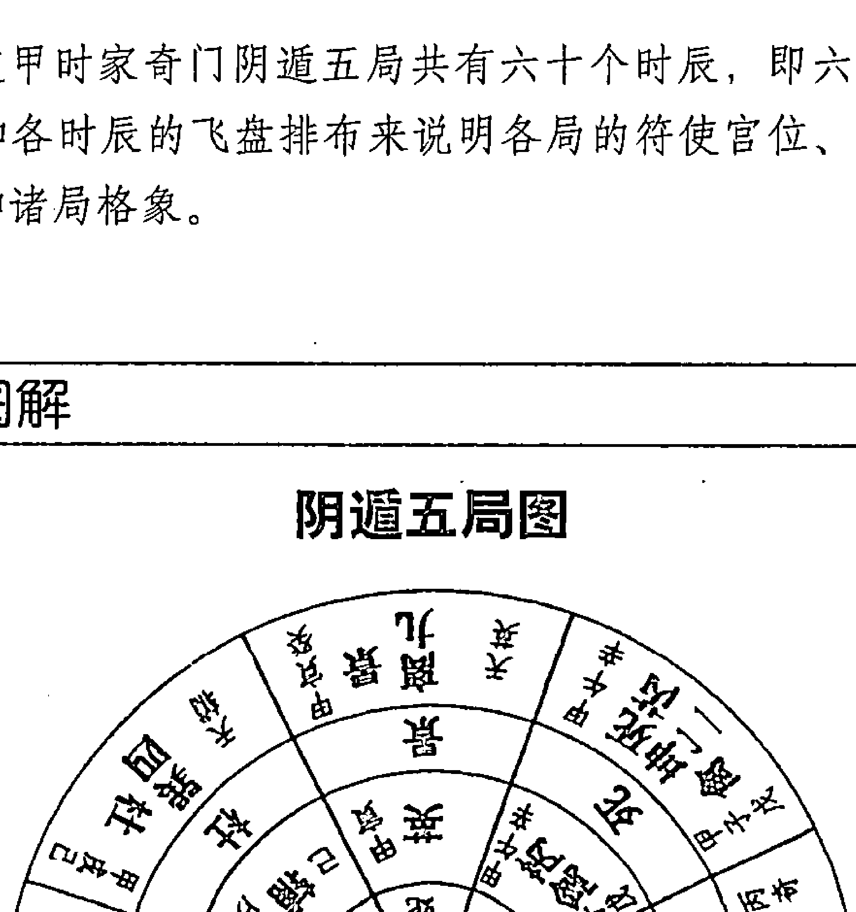

| 适用节气 | 小暑下元 | 立秋中元 | 霜降上元 | 小雪上元 |
| :--- | :--- | :--- | :--- | :--- |

# 每日时辰

奇门遁甲中一局为一元，一元有甲己、乙庚、丙辛、丁壬和戊癸五日，每日有十二个时辰，则一局就有六十个时辰，用六十甲子来表示，一个时辰为一小局。

| 甲己日 | 甲子 | 乙丑 | 丙寅 | 丁卯 | 戊辰 | 己巳 | 庚午 | 辛未 | 壬申 | 癸酉 | 甲戌 | 乙亥 |
| :--- | :--- | :--- | :--- | :--- | :--- | :--- | :--- | :--- | :--- | :--- | :--- | :--- |
| 乙庚日 | 丙子 | 丁丑 | 戊寅 | 己卯 | 庚辰 | 辛巳 | 壬午 | 癸未 | 甲申 | 乙酉 | 丙戌 | 丁亥 |
| 丙辛日 | 戊子 | 己丑 | 庚寅 | 辛卯 | 壬辰 | 癸巳 | 甲午 | 乙未 | 丙申 | 丁酉 | 戊戌 | 己亥 |
| 丁壬日 | 庚子 | 辛丑 | 壬寅 | 癸卯 | 甲辰 | 乙巳 | 丙午 | 丁未 | 戊申 | 己酉 | 庚戌 | 辛亥 |
| 戊癸日 | 壬子 | 癸丑 | 甲寅 | 乙卯 | 丙辰 | 丁巳 | 戊午 | 己未 | 庚申 | 辛酉 | 壬戌 | 癸亥 |

### 阴遁五局六十时符使表

奇门遁甲排盘时，最主要的就是寻找值符和值使，并确定其所在的宫位。下表就是阴遁五局六十个时辰的值符和值使，以及其所在的宫位。

| 时辰 | 甲子 | 乙丑 | 丙寅 | 丁卯 | 戊辰 | 己巳 | 庚午 | 辛未 | 壬申 | 癸酉 |
| :--- | :--- | :--- | :--- | :--- | :--- | :--- | :--- | :--- | :--- | :--- |
| 天禽 | 五 | 六 | 七 | 八 | 五 | 四 | 三 | 二 | 一 | 九 |
| 死门 | 五 | 四 | 三 | 二 | 一 | 九 | 八 | 七 | 六 | 五 |
| 时辰 | 甲戌 | 乙亥 | 丙子 | 丁丑 | 戊寅 | 己卯 | 庚辰 | 辛巳 | 壬午 | 癸未 |
| 天辅 | 四 | 六 | 七 | 八 | 五 | 四 | 三 | 二 | 一 | 九 |
| 杜门 | 四 | 三 | 二 | 一 | 九 | 八 | 七 | 六 | 五 | 四 |
| 时辰 | 甲申 | 乙酉 | 丙戌 | 丁亥 | 戊子 | 己丑 | 庚寅 | 辛卯 | 壬辰 | 癸巳 |
| 天冲 | 三 | 六 | 七 | 八 | 五 | 四 | 三 | 二 | 一 | 九 |
| 伤门 | 三 | 二 | 一 | 九 | 八 | 七 | 六 | 五 | 四 | 三 |
| 时辰 | 甲午 | 乙未 | 丙申 | 丁酉 | 戊戌 | 己亥 | 庚子 | 辛丑 | 壬寅 | 癸卯 |
| 天芮 | 二 | 六 | 七 | 八 | 五 | 四 | 三 | 二 | 一 | 九 |
| 死门 | 二 | 一 | 九 | 八 | 七 | 六 | 五 | 四 | 三 | 二 |
| 时辰 | 甲辰 | 乙巳 | 丙午 | 丁未 | 戊申 | 己酉 | 庚戌 | 辛亥 | 壬子 | 癸丑 |
| 天蓬 | 一 | 六 | 七 | 八 | 五 | 四 | 三 | 二 | 一 | 九 |
| 休门 | 一 | 九 | 八 | 七 | 六 | 五 | 四 | 三 | 二 | 一 |
| 时辰 | 甲寅 | 乙卯 | 丙辰 | 丁巳 | 戊午 | 己未 | 庚申 | 辛酉 | 壬戌 | 癸亥 |
| 天英 | 九 | 六 | 七 | 八 | 五 | 四 | 三 | 二 | 一 | 九 |
| 景门 | 九 | 八 | 七 | 六 | 五 | 四 | 三 | 二 | 一 | 九 |

# 1. 甲己日十二时局

甲子时：西北与东北方向吉利

【原文】
甲子 禽五，死五避五。子至辰阳，宿干吉。惊兑伏，开乾伏，生艮伏。天七，地六，阴四，合三。开与日合六西北，生与星合八东北，时干坤，符门伏，遁甲，阖。

## 【白话提要】

符使宫位：值符天禽星在中五宫，寄于坤二宫；值使死门在中五宫，寄于坤二宫。时干遇吉星宿，时干逢吉。子时至辰时为五阳时。

三奇方位：惊门逢双丙奇在兑七宫，不相生克。开门逢双乙奇在乾六宫，不相生克。生门逢双丁奇在艮八宫，不相生克。

四吉方位：九天在兑七宫，九地在乾六宫，太阴在巽四宫，六合在震三宫。

## 白话图解

### 阴遁五局甲己日甲子时盘

| 值符 | 天禽在中五宫，寄于坤二宫 | 值使 | 死门在中五宫，寄于坤二宫 |
| :--- | :--- | :--- | :--- |

| 太阴 | 己 杜门 己 天辅 | 螣蛇 | 癸 景门 癸 天英 | 直符 | 辛 死门 戊 辛 天芮 禽 |
| :--- | :--- | :--- | :--- | :--- | :--- |
| 六合 | 庚 伤门 庚 天冲 | 戊 | 九天 | 丙 惊门 丙 天柱 |
| 白虎 | 丁 伤门 丁 天任 | 玄武 | 壬 休门 壬 天蓬 | 九地 | 乙 开门 乙 天心 |

三奇方位：
- 惊门逢双丙奇在兑七宫，不相生克。
- 开门逢双乙奇在乾六宫，不相生克。
- 生门逢双丁奇在艮八宫，不相生克。

四吉方位：
- 九天在兑七宫，利于出击。
- 九地在乾六宫，利于驻防。
- 太阴在巽四宫，利于潜伏。
- 六合在震三宫，利于撤逃。

总体格象：
- 九星、值符、八门伏吟，凶。

吉方2：生门合丁奇于艮八宫，东北方向吉利。

吉方1：开门合乙奇于乾六宫，西北方向吉利。

诸局格象：开门合乙奇于乾六宫，西北方向吉利。生门合丁奇于艮八宫，东北方向吉利。时干在坤二宫。星符、八门伏吟。遁甲合。

乙丑时：逢己日不宜用事

【原文】

乙丑 禽六，死四。宿干吉，己日不用。伤坎和，杜丁艮制，死巽害。天一，地八，阴二，合九。无奇门，虎猖狂，龙反首，时干艮，大格。

## 【白话提要】

符使宫位：值符天禽星在乾六宫，值使死门在巽四宫。时干遇吉星宿，时干逢吉。逢己日不宜用事。

三奇方位：伤门逢丙奇在坎一宫，被生。杜门逢天盘乙奇与地盘丁奇艮八宫，克宫。死门逢丁奇在巽四宫，被克。

四吉方位：九天在坎一宫，九地在艮八宫，太阴在坤二宫，六合在离九宫。

诸局格象：无奇门。白虎猖狂。青龙回首。时干在艮八宫。大格。

## 白话图解

### 阴遁五局甲己日乙丑时盘

| | 值符 | 天禽在乾六宫 | 值使 | 死门在巽四宫 |
|---|---|---|---|---|

| 白虎 | 六合 | 太阴 |
|---|---|---|
| 丁 死门 | 庚 惊门 | 己 开门 |
| 己 天任 | 癸 天冲 | 辛 天辅 |

| 玄武 | | 螣蛇 |
|---|---|---|
| 壬 景门 | | 癸 休门 |
| 庚 天蓬 | 戊 | 丙 天英 |

| 九地 | 九天 | 直符 |
|---|---|---|
| 乙 杜门 | 丙 伤门 | 辛 生门 戊 |
| 丁 天心 | 壬 天柱 | 乙 天芮 禽 |

### 三奇方位

- 伤门逢丙奇在坎一宫，被生。
- 杜门逢天盘乙奇与地盘丁奇艮八宫，克宫。
- 死门逢丁奇在巽四宫，被克。

### 四吉方位

- 九天在坎一宫，利于出击。
- 九地在艮八宫，利于驻防。
- 太阴在坤二宫，利于潜伏。
- 六合在离九宫，利于撤逃。

### 诸局格象

- 青龙回首，吉。
- 无奇门，凶。
- 白虎猖狂，大格，凶。

丙寅时：无奇门可出

【原文】

丙寅 禽七，死三。宿凶干吉。伤墓乙乾害，杜坎和，死震害。天六，地一，阴九，合四。无奇门，天乙与太白格，龙反首，时干乾，相佐兑，事同，三吉，刑格。

## 【白话提要】

- 1. 符使宫位：值符天禽星在兑七宫，值使死门在震三宫。时干遇凶星宿，时干逢吉。
- 2. 三奇方位：伤门逢天盘丙奇与地盘乙奇在乾六宫，被克，丙奇入墓。杜门逢乙奇在坎一宫，被生。死门逢丁奇在震三宫，被克。
- 3. 四吉方位：九天在乾六宫，九地在坎一宫，太阴在离九宫，六合在巽四宫。
- 4. 诸局格象：无奇门。天乙与六庚格。青龙回首。时干在乾六宫。值符得地盘丙奇相助于兑七宫。三吉格。刑格。

## 白话图解

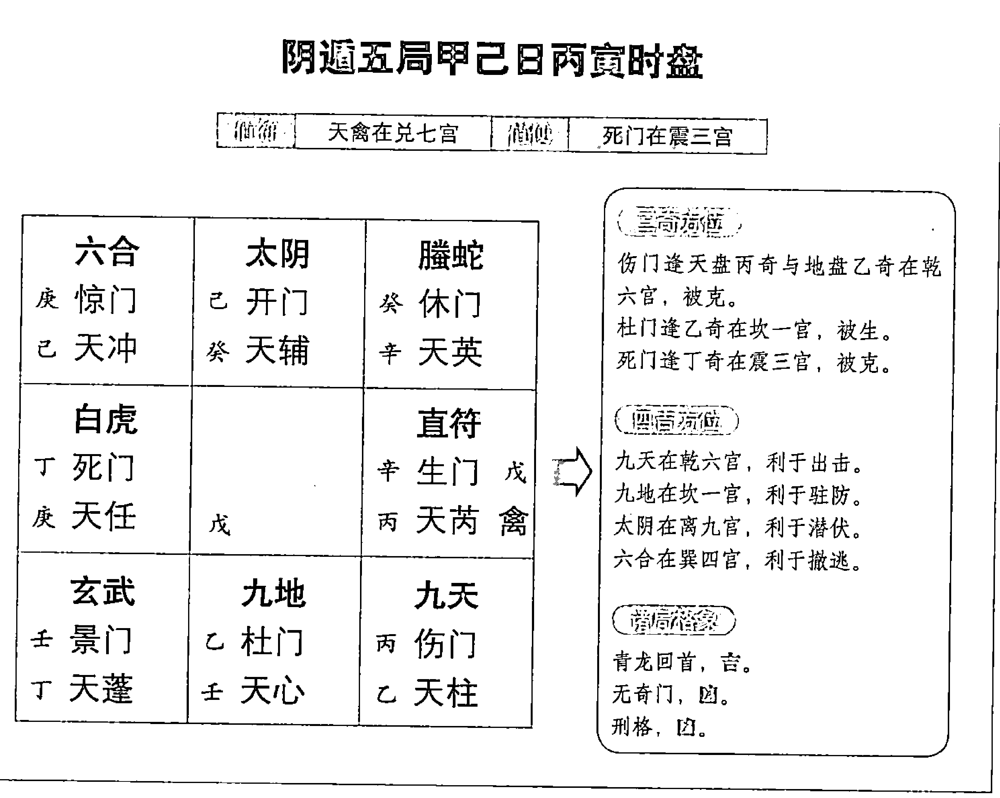

| 宫位/方位 | 神 | 天干 | 门 | 天干 | 星 |
| :--- | :--- | :--- | :--- | :--- | :--- |
| 巽四宫 | 六合 | 庚 | 惊门 | 己 | 天冲 |
| 离九宫 | 太阴 | 己 | 开门 | 癸 | 天辅 |
| 坤二宫 | 螣蛇 | 癸 | 休门 | 辛 | 天英 |
| 震三宫 | 白虎 | 丁 | 死门 | 庚 | 天任 |
| 中五宫 | 戊 | | | | |
| 兑七宫 | 直符 | 辛 | 生门 | 戊 | 天芮 禽 |
| 艮八宫 | 玄武 | 壬 | 景门 | 丁 | 天蓬 |
| 坎一宫 | 九地 | 乙 | 杜门 | 壬 | 天心 |
| 乾六宫 | 九天 | 丙 | 伤门 | 乙 | 天柱 |

伤门逢天盘丙奇与地盘乙奇在乾六宫，被克。
杜门逢乙奇在坎一宫，被生。
死门逢丁奇在震三宫，被克。

九天在乾六宫，利于出击。
九地在坎一宫，利于驻防。
太阴在离九宫，利于潜伏。
六合在巽四宫，利于撤逃。

青龙回首，吉。
无奇门，凶。
刑格，凶。

丁卯时：无奇门可出

【原文】

丁卯 禽八，死二。宿干吉。伤震伏，杜巽伏，死坤伏欢怡。天三，地四，阴六，合七。无奇门，仪刑，时干坤，相佐艮，符冲，火入金，击刑。

## 【白话提要】

符使宫位：值符天禽星在艮八宫，值使死门在坤二宫。时干遇吉星宿，时干逢吉。

三奇方位：伤门逢丙奇在震三宫，不相生克。杜门逢乙奇在巽四宫，不相生克。死门逢丁奇在坤二宫，不相生克，吉利。

四吉方位：九天在震三宫，九地在巽四宫，太阴在乾六宫，六合在兑七宫。

诸局格象：无奇门。六仪击刑。时干在坤二宫。值符得地盘丁奇助于艮八宫。值符相冲。荧入太白。击刑。

## 白话图解

### 阴遁五局甲己日丁卯时盘

| 值符 | 天禽在艮八宫 | 值使 | 死门在坤二宫 |
| :--- | :--- | :--- | :--- |
| 九地
乙 杜门
己 天心 | 玄武
壬 景门
癸 天蓬 | 白虎
丁 死门
辛 天任 |
| 九天
丙 伤门
庚 天柱 | 戊 | 六合
庚 惊门
丙 天冲 |
| 直符
辛 生门 戊
丁 天芮 禽 | 螣蛇
癸 休门
壬 天英 | 太阴
己 开门
乙 天辅 |

### 三奇方位
- 伤门逢丙奇在震三宫，不相生克。
- 杜门逢乙奇在巽四宫，不相生克。
- 死门逢丁奇在坤二宫，不相生克。

### 四吉方位
- 九天在震三宫，利于出击。
- 九地在巽四宫，利于驻防。
- 太阴在乾六宫，利于潜伏。
- 六合在兑七宫，利于撤逃。

### 诸局格象
- 无奇门，凶。
- 荧入太白，六仪击刑，凶。

# 戊辰时：无奇门可出

## 【原文】

戊辰 禽五，死一。宿干吉。杜丙兑害，景乙乾制，惊丁艮和。天七，地六，阴四，合三。无奇门，符伏，时干坤。

## 【白话提要】

符使宫位：值符天禽星在中五宫，寄于坤二宫，值使死门在坎一宫。时干遇吉星宿，时干逢吉。

三奇方位：杜门逢双丙奇在兑七宫，被克。景门逢双乙奇在乾六宫，克宫。惊门逢双丁奇在艮八宫，被生。

四吉方位：九天在兑七宫，九地在乾六宫，太阴在巽四宫，六合在震三宫。

诸局格象：无奇门。星符伏吟。时干在坤二宫。

## 白话图解

### 阴遁五局甲己日戊辰时盘

**值符** 天禽在中五宫，寄于坤二宫 | **值使** 死门在坎一宫

| 宫位 | 八神 | 天盘 | 地盘 | 九星 | 八门 | 备注 |
| :---: | :---: | :---: | :---: | :---: | :---: | :---: |
| 巽四宫 | 太阴 | 己 | 己 | 天辅 | 休门 | |
| 离九宫 | 螣蛇 | 癸 | 癸 | 天英 | 生门 | |
| 坤二宫 | 直符 | 辛 | 辛戊 | 天芮 | 伤门 | 禽（寄宫）|
| 震三宫 | 六合 | 庚 | 庚 | 天冲 | 开门 | |
| 中五宫 | | | 戊 | | | (天禽寄坤二宫) |
| 兑七宫 | 九天 | 丙 | 丙 | 天柱 | 杜门 | |
| 艮八宫 | 白虎 | 丁 | 丁 | 天任 | 惊门 | |
| 坎一宫 | 玄武 | 壬 | 壬 | 天蓬 | 死门 | |
| 乾六宫 | 九地 | 乙 | 乙 | 天心 | 景门 | |

**三奇方位**

- 杜门逢双丙奇在兑七宫，被克。
- 景门逢双乙奇在乾六宫，克宫。
- 惊门逢双丁奇在艮八宫，被生。

**四吉方位**

- 九天在兑七宫，利于出击。
- 九地在乾六宫，利于驻防。
- 太阴在巽四宫，利于潜伏。
- 六合在震三宫，利于撤逃。

**诸局格象**

- 无奇门，凶。
- 九星、值符伏吟，凶。

己巳时：西北方向吉利

【原文】

己巳 禽四，死九。已至酉阴，天辅，宿吉干凶。死离和，惊墓坤和欢怡，休墓乙乾和。天九，地二，阴八，合一。休与星合六西北，丁下有乙，龙走，时干艮。

## 【白话提要】

符使宫位：值符天禽星在巽四宫，值使死门在离九宫。时干遇吉星宿，时干逢凶。已时至酉时为五阴时，已时为天辅释罪时。

三奇方位：死门逢丙奇在离九宫，被生。惊门逢乙奇在坤二宫，被生，吉利，乙奇入墓。休门逢天盘丁奇与地盘乙奇在乾六宫，被生，丁奇入墓。

四吉方位：九天在离九宫，九地在坤二宫，太阴在艮八宫，六合在坎一宫。

诸局格象：休门合丁奇在乾六宫，西北方向吉利。丁下有乙成人遁。青龙逃走。时干在艮八宫。

## 白话图解

### 阴遁五局甲己日己巳时盘

| 值符 | 天禽在巽四宫 | 值使 | 死门在离九宫 |
| :--- | :--- | :--- | :--- |
| 直符 辛 景门 戊 己 天芮 禽 | 九天 丙 死门 癸 天柱 | 九地 乙 惊门 辛 天心 |
| 螣蛇 癸 杜门 庚 天英 | 戊 | 玄武 壬 开门 丙 天蓬 |
| 太阴 己 伤门 丁 天辅 | 六合 庚 生门 壬 天冲 | 白虎 丁 休门 乙 天任 |

吉方：休门合丁奇在乾六宫，西北方向吉利。

### 三奇方位
- 死门逢丙奇在离九宫，被生。
- 惊门逢乙奇在坤二宫，被生。
- 休门逢天盘丁奇与地盘乙奇在乾六宫，被生。

### 四吉方位
- 九天在离九宫，利于出击。
- 九地在坤二宫，利于驻防。
- 太阴在艮八宫，利于潜伏。
- 六合在坎一宫，利于撤逃。

### 诸局格象
- 丁下有乙，成人遁，吉。
- 青龙逃走，凶。

庚午时：逢甲日不宜用事

【原文】

庚午 禽三，死八。宿吉干凶，甲日不用，守户。开巽制，休离制，伤丙兑害。天四，地九，阴一，合六。开与月合四东南，休与日合九正南，仪刑，飞宫格，蛇矫，甲日飞干格，时干乾，门反吟，飞符，己日勃。

## 【白话提要】

符使宫位：值符天禽星在震三宫，值使死门在艮八宫。时干遇吉星宿，时干逢凶。逢甲日不宜用事，宜守户不出。

三奇方位：开门逢丙奇在巽四宫，克宫。休门逢乙奇在离九宫，克宫。伤门逢天盘丁奇与地盘丙奇在兑七宫，被克。

四吉方位：九天在巽四宫，九地在离九宫，太阴在坎一宫，六合在乾六宫。

诸局格象：开门合丙奇在巽四宫，东南方向吉利。休门合乙奇在离九宫，正南方向吉利。六仪击刑。飞宫格。螣蛇天矫。逢甲日飞干格。时干在乾六宫。八门反吟。己日日勃。

## 白话图解

### 阴遁五局甲己日庚午时盘

| 值符 | 天禽在震三宫 | 值使 | 死门在艮八宫 |
|---|---|---|---|
| 吉方1：开门合丙奇在巽四宫，东南方向吉利。 | 吉方2：休门合乙奇在离九宫，正南方向吉利。 | | |
| 九天 | 九地 | 玄武 |
| 丙 开门 | 乙 休门 | 壬 生门 |
| 丙 天柱 | 乙 天心 | 辛 天蓬 |
| 直符 | | 白虎 |
| 辛 惊门 戊 | | 丁 伤门 |
| 庚 天芮 禽 戊 | | 丙 天任 |
| 螣蛇 | 太阴 | 六合 |
| 癸 死门 | 己 景门 | 庚 杜门 |
| 丁 天英 | 壬 天辅 | 乙 天冲 |

（三奇方位）
- 开门逢丙奇在巽四宫，克宫。
- 休门逢乙奇在离九宫，克宫。
- 伤门逢天盘丁奇与地盘丙奇在兑七宫，被克。

（四吉方位）
- 九天在巽四宫，利于出击。
- 九地在离九宫，利于驻防。
- 太阴在坎一宫，利于潜伏。
- 六合在乾六宫，利于撤逃。

（诸局格象）
- 六仪击刑，飞宫格，螣蛇天矫，凶。
- 八门反吟，己日日勃，凶。
- 逢甲日，为飞干格，凶。

辛未时：东北方向吉凶

【原文】

辛未 禽二，死七。宿干凶。死丙兑义，惊乙乾伏，休丁艮害。天七，地六，阴四，合三。休与星合八东北，时干坤，符伏。

## 【白话提要】

符使宫位：值符天禽星在坤二宫，值使死门在兑七宫。时干遇凶星宿，时干逢凶。

三奇方位：死门逢双丙奇在兑七宫，生宫。惊门逢双乙奇在乾六宫，不相生克。休门逢双丁奇在艮八宫，被克。

四吉方位：九天在兑七宫，九地在乾六宫，太阴在巽四宫，六合在震三宫。

诸局格象：休门合丁奇在艮八宫，东北方向吉利。时干在坤二宫。星符伏吟。

## 白话图解

### 阴遁五局甲己日辛未时盘

| | | |
|---|---|---|
| 太阴 己 伤门 己 天辅 | 螣蛇 癸 杜门 癸 天英 | 直符 辛 景门 戊 辛 天芮 禽 |
| 六合 庚 生门 庚 天冲 | 戊 | 九天 丙 死门 丙 天柱 |
| 白虎 丁 休门 丁 天任 | 玄武 壬 开门 壬 天蓬 | 九地 乙 惊门 乙 天心 |

吉方：休门合丁奇在艮八宫，东北方向吉利。

**三奇方位**
- 死门逢双丙奇在兑七宫，生宫。
- 惊门逢双乙奇在乾六宫，不相生克。
- 休门逢双丁奇在艮八宫，被克。

**四吉方位**
- 九天在兑七宫，利于出击。
- 九地在乾六宫，利于驻防。
- 太阴在巽四宫，利于潜伏。
- 六合在震三宫，利于撤逃。

**诸局格象**
- 九星、值符伏吟，凶。

壬申时：正东与东北方向吉利

【原文】
壬申 禽一，死六。宿干凶。开丁艮和，休合震义，伤离义。天八，地三，阴七，合二。开与月合八东北，丙下有丁，休与日合三正东，雀入江，时干巽，飞宫格，乙格，伏宫格。

【白话提要】
符使宫位：值符天禽星在坎一宫，值使死门在乾六宫。时干遇凶星宿，时干逢凶。

三奇方位：开门逢天盘丙奇与地盘丁奇在艮八宫，被生。休门逢乙奇在震三宫，生宫，奇仪相合。伤门逢丁奇在离九宫，生宫。

四吉方位：九天在艮八宫，九地在震三宫，太阴在兑七宫，六合在坤二宫。

诸局格象：开门合丙奇在艮八宫，东北方向吉利。丙下有丁为丙奇朱雀。休门合乙奇在震三宫，正东方向吉利。朱雀入江。时干在巽四宫。飞宫格。乙格。伏宫格。

## 白话图解

### 阴遁五局甲己日壬申时盘

值符 天禽在坎一宫 值使 死门在乾六宫

吉方2：休门合乙奇在震三宫，正东方向吉利。

| 玄武 | 白虎 | 六合 |
| :--- | :--- | :--- |
| 壬 生门 己 天蓬 | 丁 伤门 癸 天任 | 庚 杜门 辛 天冲 |
| 九地 乙 休门 庚 天心 | 戊 | 太阴 己 景门 丙 天辅 |
| 九天 丙 开门 丁 天柱 | 直符 辛 惊门 戊 壬 天芮 禽 | 螣蛇 癸 死门 乙 天英 |

### 三奇方位
- 开门逢天盘丙奇与地盘丁奇在艮八宫，被生。
- 休门逢乙奇在震三宫，生宫。
- 伤门逢丁奇在离九宫，生宫。

### 四吉方位
- 九天在艮八宫，利于出击。
- 九地在震三宫，利于驻防。
- 太阴在兑七宫，利于潜伏。
- 六合在坤二宫，利于撤逃。

### 诸局格象
- 丙下有丁，为丙奇朱雀，吉。
- 朱雀入江，乙格，凶。
- 飞宫格，伏宫格，凶。

吉方1：开门合丙奇在艮八宫，东北方向吉利。

## 癸酉时：正北方向吉利

【原文】
癸酉 禽九，死五寄五。宿干凶。死合坤伏欢怡，惊丙兑伏，休合坎伏。天二，地七，阴三，合八。休与星合一正北，得使，符勃格，鸟跌穴，时干巽，门伏，己日飞干格，天网。

【白话提要】
符使宫位：值符天禽星在离九宫，值使死门在中五宫，寄于坤二宫。时干遇凶星宿，时干逢凶。

三奇方位：死门逢丙奇在坤二宫，不相生克，吉利，奇仪相合。惊门逢天盘乙奇与地盘丙奇在兑七宫，不相生克。休门逢丁奇在坎一宫，不相生克，奇仪相合。

四吉方位：九天在坤二宫，九地在兑七宫，太阴在震三宫，六合在艮八宫。

诸局格象：休门合丁奇在坎一宫，正北方向吉利。丁奇得使。符勃格。飞鸟跌穴。时干在巽四宫。八门伏吟。逢己日飞干格。天网四张。

白话图解
阴遁五局甲己日癸酉时盘
值符 天禽在离九宫 值使 死门在中五宫，寄于坤二宫

|      |        |      |
| :--- | :----- | :--- |
| 螣蛇 | 值符   | 九天 |
| 癸 杜门 | 辛 景门 戊 | 丙 死门 |
| 己 天英 | 癸 天芮 禽 | 辛 天柱 |
| 太阴 |        | 九地 |
| 己 伤门 | 戊      | 乙 惊门 |
| 庚 天辅 |        | 丙 天心 |
| 六合 | 白虎   | 玄武 |
| 庚 生门 | 丁 休门 | 壬 开门 |
| 丁 天冲 | 乙 天任 | 乙 天蓬 |

> **三奇方位**
> 死门逢丙奇在坤二宫，不相生克。
> 惊门逢天盘乙奇与地盘丙奇在兑七宫，不相生克。
> 休门逢丁奇在坎一宫，不相生克。

> **四吉方位**
> 九天在坤二宫，利于出击。
> 九地在兑七宫，利于驻防。
> 太阴在震三宫，利于潜伏。
> 六合在艮八宫，利于撤逃。

> **诸局格象**
> 丁奇得使，飞鸟跌穴，吉。
> 符勃格，八门伏吟，天网四张，凶。
> 逢己日，为飞干格，凶。

吉方：休门合丁奇在坎一宫，正北方向吉利。

## 甲戌时：东北与西北方向吉利

【原文】
甲戌 辅值符四，杜值使四。戌至亥阴，宿干吉。开心使乾伏，惊柱月兑伏，生任星艮伏。天九，地二，阴八，合一。开与日合六西北，生与星合八东北，时干巽，符门伏，飞甲合。

【白话提要】
符使宫位：值符天辅星在巽四宫，值使杜门在巽四宫。时干遇吉星宿，时干逢吉。

三奇方位：开门逢双乙奇在乾六宫，不相生克。惊门逢双丙奇在兑七宫，不相生克。生门逢双丁奇在艮八宫，不相生克。

四吉方位：九天在离九宫，九地在坤二宫，太阴在艮八宫，六合在坎一宫。

诸局格象：开门合乙奇在乾六宫，西北方向吉利。生门合丁奇在艮八宫，东北方向吉利。时干在巽四宫。星、门伏吟。飞甲合。

白话图解
阴遁五局甲己日甲戌时盘
值符 天辅在巽四宫 值使 杜门在巽四宫

|      |        |      |
| :--- | :----- | :--- |
| 值符 | 九天   | 九地 |
| 己 杜门 己 天辅 | 癸 景门 癸 天英 | 辛 死门 戊 辛 天芮 禽 |
| 螣蛇 |        | 玄武 |
| 庚 伤门 庚 天冲 | 戊      | 丙 惊门 丙 天柱 |
| 太阴 | 六合   | 九天 |
| 丁 生门 丁 天任 | 壬 休门 壬 天蓬 | 乙 开门 乙 天心 |

三奇方位
开门逢双乙奇在乾六宫，不相生克。
惊门逢双丙奇在兑七宫，不相生克。
生门逢双丁奇在艮八宫，不相生克。

四吉方位
九天在离九宫，利于出击。
九地在坤二宫，利于驻防。
太阴在艮八宫，利于潜伏。
六合在坎一宫，利于撤逃。

诸局格象
九星、值符、八门伏吟，凶。
飞甲合，凶。

吉方1：开门合乙奇在乾六宫，西北方向吉利。

吉方2：生门合丁奇在艮八宫，东北方向吉利。

图解中国传统决策学·奇门遁甲大全
第二部

# 乙亥时：逢己日不宜用事

【原文】
乙亥 辅六，杜三。宿干吉，己日不用。景巽和欢怡，杜震伏，惊坤和。天一，地八，阴二，合九。无奇门。三吉，天乙与太白格，时干巽，符冲，火入金，金入火，事同。

【白话提要】
符使宫位：值符天辅星在乾六宫，值使杜门在震三宫。时干遇吉星宿，时干逢吉。逢己日不宜用事。

三奇方位：景门逢乙奇在巽四宫，被生，吉利。杜门逢丙奇在震三宫，不相生克。惊门逢丁奇在坤二宫，被生。

四吉方位：九天在坎一宫，九地在艮八宫，太阴在坤二宫，六合在离九宫。

诸局格象：无奇门。三吉格。天乙与六庚格。时干在巽四宫。值符相冲。荧入太白。太白入荧。

## 白话图解

#### 阴遁五局甲己日乙亥时盘

| 值符 | 天辅在乾六宫 | 值使 | 杜门在震三宫 |
| :--- | :--- | :--- | :--- |

| 白虎 | 六合 | 太阴 |
| :--- | :--- | :--- |
| 乙 景门 己 天心 | 壬 死门 癸 天蓬 | 丁 惊门 辛 天任 |
| 玄武 |  | 螣蛇 |
| 丙 杜门 庚 天柱 | 戊 | 庚 开门 丙 天冲 |
| 九地 | 九天 | 值符 |
| 辛 伤门 戊 丁 天芮 禽 | 癸 生门 壬 天英 | 己 休门 乙 天辅 |

**三奇方位**
景门逢乙奇在巽四宫，被生。
杜门逢丙奇在震三宫，不相生克。
惊门逢丁奇在坤二宫，被生。

**四吉方位**
九天在坎一宫，利于出击。
九地在艮八宫，利于驻防。
太阴在坤二宫，利于潜伏。
六合在离九宫，利于撤逃。

**诸局格象**
无奇门，凶。
九星、值符反吟，凶。
荧入太白，太白入荧，凶。

# 2. 乙庚日十二时局

# 丙子时：逢庚日不宜用事

【原文】
丙子 辅七，杜二。子至寅阳，宿凶干吉，庚日不用。休合震义，开下艮伏，伤离义。天六，地一，阴九，合四。开与月合八东北，丙下有丁，休与日合三正东，雀入江，龙反首，时干艮，相佐兑，飞宫格，乙日飞干格。

【白话提要】
符使宫位：值符天辅星在兑七宫，值使杜门在坤二宫。时下遇凶星宿，时下逢吉。子时至寅时为五阳时。逢庚日不宜用事。

三奇方位：休门逢乙奇在震三宫，生宫。开门逢天盘丙奇与地盘丁奇在艮八宫，不相生克。伤门逢丁奇在离九宫，生宫。

四吉方位：九天在乾六宫，九地在坎一宫，太阴在离九宫，六合在巽四宫。

诸局格象：开门合丙奇在艮八宫，东北方向吉利。丙下有丁成丙奇朱雀。休门逢乙奇在震三宫，正东方向吉利。青龙回首，吉。朱雀入江，飞宫格，凶。逢乙日，为飞干格，凶。

白话图解
阴遁五局乙庚日丙子时盘
值符 天辅在兑七宫
值使 杜门在坤二宫

| 巽四宫 | 离九宫 | 坤二宫 |
|--------|--------|--------|
| 六合 壬 生门 己 天蓬 | 太阴 丁 伤门 癸 天任 | 螣蛇 庚 杜门 辛 天冲 |
| 震三宫 | 中宫 | 兑七宫 |
| 玄武 丙 休门 丁 天心 | 戊 | 值符 己 景门 丙 天辅 |
| 艮八宫 | 坎一宫 | 乾六宫 |
| 九地 辛 惊门 壬 天芮 禽 | 九天 癸 死门 乙 天英 | |

三奇方位：
休门逢乙奇在震三宫，生宫。
开门逢天盘丙奇与地盘丁奇在艮八宫，不相生克。
伤门逢丁奇在离九宫，生宫。

四吉方位：
九天在乾六宫，利于出击。
九地在坎一宫，利于驻防。
太阴在离九宫，利于潜伏。
六合在巽四宫，利于撤逃。

诸局格象：
丙下有丁，成丙奇朱雀，吉。
青龙回首，吉。
朱雀入江，飞宫格，凶。
逢乙日，为飞干格，凶。

吉方1：开门合丙奇在艮八宫，东北方向吉利。
吉方2：休门合乙奇在震三宫，正东方向吉利。朱雀入江。青龙回首。时干在艮八宫。值符得地盘丙奇相助于兑七宫。飞宫格。逢乙日飞干格。

## 丁丑时：正南与西南方向吉利

【原文】
丁丑 辅八，杜一。宿干吉。休墓坤害，开离害，死墓乙乾害。天三，地四，阴六，合七。开与月合九正南，休与日合二西南，得使，龙走，时干乾，相佐艮。

【白话提要】
符使宫位：值符天辅星在艮八宫，值使杜门在坎一宫。时干遇吉星宿，时干逢吉。

三奇方位：休门逢乙奇在坤二宫，被克，乙奇入墓。开门逢丙奇在离九宫，被克。伤门逢天盘丁奇与地盘乙奇在乾六宫，被克，丁奇入墓。

四吉方位：九天在震三宫，九地在巽四宫，太阴在乾六宫，六合在兑七宫。

诸局格象：开门合丙奇在离九宫，正南方向吉利。休门合乙奇在坤二宫，西南方向吉利。乙奇得使。青龙逃走。时干在乾六宫。值符得地盘丁奇相助于艮八宫。

白话图解
阴遁五局乙庚日丁丑时盘

| 九地 辛 惊门 戊 己 天芮 禽 | 玄武 丙 开门 壬 癸 天辅 | 白虎 乙 休门 庚 丁 天心 |
| :---: | :---: | :---: |
| 九天 癸 死门 丙 庚 天英 | 戊 | 六合 壬 生门 辛 丙 天蓬 |
| 值符 己 景门 丁 丁 天辅 | 螣蛇 庚 杜门 壬 壬 天冲 | 太阴 丁 伤门 乙 乙 天任 |

吉方1：开门合丙奇在离九宫，正南方向吉利。
吉方2：休门合乙奇在坤二宫，西南方向吉利。

三奇方位
休门逢乙奇在坤二宫，被克。
开门逢丙奇在离九宫，被克。
伤门逢天盘丁奇与地盘乙奇在乾六宫。被克。

四吉方位
九天在震三宫，利于出击。
九地在巽四宫，利于驻防。
太阴在乾六宫，利于潜伏。
六合在兑七宫，利于撤逃。

诸局格象
乙奇得使，吉。
青龙逃走，凶。

## ☆ 戊寅时：正北与东北方向吉利

【原文】
戊寅 辅五，杜九。宿干吉。休丁艮害，开坎义，伤巽伏欢怡。天七，地六，阴四，合三。开与月合一正北，休与日合八东北，乙下有丁，时干乾，大格，虎猖狂。

【白话提要】
符使宫位：值符天辅星在中五宫，寄于坤二宫，值使杜门在离九宫。时干遇吉星宿，时干逢吉。

三奇方位：休门逢天盘乙奇与地盘丁奇在艮八宫，被克。开门逢丙奇在坎一宫，生宫。伤门逢丁奇在巽四宫，不相生克，吉利。

四吉方位：九天在兑七宫，九地在乾六宫，太阴在巽四宫，六合在震三宫。

诸局格象：开门合丙奇在坎一宫，正北方向吉利。休门合乙奇在艮八宫，东北方向吉利。乙下有丁为奇仪相佐。时干在乾六宫。大格。白虎猖狂。

## 白话图解

#### 阴遁五局乙庚日戊寅时盘
值符：天辅在中五宫，寄于坤二宫 | 值使：杜门在离九宫

| 宫位/神盘 | 太阴 | 螣蛇 | 值符 |
| :--- | :--- | :--- | :--- |
| **八宫/艮** | 丁 伤门 己 天任 | 庚 杜门 癸 天冲 | 己 景门 辛 天辅 |
| **三宫/震** | 壬 生门 庚 天蓬 | 戊 | 癸 死门 丙 天英 |
| **四宫/巽** | 乙 休门 丁 天心 | 丙 开门 辛 天柱 | 辛 惊门 戊 乙 天芮 禽 |

- **三奇方位**
  - 休门逢天盘乙奇与地盘丁奇在艮八宫，被克。
  - 开门逢丙奇在坎一宫，生宫。
  - 伤门逢丁奇在巽四宫，不相生克。

- **四吉方位**
  - 九天在兑七宫，利于出击。
  - 九地在乾六宫，利于驻防。
  - 太阴在巽四宫，利于潜伏。
  - 六合在震三宫，利于撤逃。

- **诸局格象**
  - 乙下有丁，为奇仪相佐，吉。
  - 大格，白虎猖狂，凶。

吉方1：开门合丙奇在坎一宫，正北方向吉利。
吉方2：休门合乙奇在艮八宫，东北方向吉利。

# 己卯时：宜守户不出

【原文】
己卯 辅四，杜八。卯至未阴，宿吉干凶，守户。生乙乾义，休丙兑和，杜丁艮制。天九，地二，阴八，合一。生与日合六西北，时干巽，休与月合七正西，符伏。

【白话提要】
符使宫位：值符天辅星在巽四宫，值使杜门在艮八宫。时干遇吉星宿，时干逢凶。卯时至未时为五阴时。

三奇方位：生门合双乙奇在乾六宫，生宫。休门合双丙奇在兑七宫，被生。杜门合双丁奇在艮八宫，克宫。

四吉方位：九天在离九宫，九地在坤二宫，太阴在艮八宫，六合在坎一宫。

诸局格象：生门合乙奇在乾六宫，西北方向吉利。时干在巽四宫。休门合丙奇在兑七宫，正西方向吉利。星符伏吟格。

白话图解
阴遁五局乙庚日己卯时盘
值符 天辅在巽四宫 值使 杜门在艮八宫

|      |        |      |
| :--- | :----- | :--- |
| 值符 | 九天   | 九地 |
| 己 死门 己 天辅 | 癸 惊门 癸 天英 | 辛 开门 辛 天芮 禽 戊 |
| 螣蛇 |        | 玄武 |
| 庚 景门 庚 天冲 | 戊      | 丙 休门 丙 天柱 |
| 太阴 | 六合   | 九天 |
| 丁 杜门 丁 天任 | 壬 伤门 壬 天蓬 | 乙 生门 乙 天心 |

三奇方位
生门合双乙奇在乾六宫，生宫。
休门合双丙奇在兑七宫，被生。
杜门合双丁奇在艮八宫，克宫。

四吉方位
九天在离九宫，利于出击。
九地在坤二宫，利于驻防。
太阴在艮八宫，利于潜伏。
六合在坎一宫，利于撤逃。

诸局格象
九星、值符伏吟，凶。

吉方1：生门合乙奇在乾六宫，西北方向吉利。
吉方2：休门合丙奇在兑七宫，正西方向吉利。

### 庚辰时：无奇门可出

【原文】
庚辰 辅三，杜七。宿吉干凶。杜丙兑害，伤合坤制，死合坎制。天四，地九，阴一，合六。无奇门，飞宫格，天乙与太白格，鸟跌穴，时干艮，飞符。

【白话提要】
符使宫位：值符天辅星在震三宫，值使杜门在兑七宫。时干遇吉星宿，时干逢凶。

三奇方位：杜门逢天盘乙奇与地盘丙奇在兑七宫，被克。伤门逢丙奇在坤二宫，克宫，奇仪相合。死门逢丁奇在坎一宫，克宫，奇仪相合。

四吉方位：九天在巽四宫，九地在离九宫，太阴在坎一宫，六合在乾六宫。

诸局格象：无奇门。飞宫格。天乙六庚格。飞鸟跌穴。时干在艮八宫。星符飞宫。

白话图解
阴遁五局乙庚日庚辰时盘

| 值符 | 天辅在震三宫 | 值使 | 杜门在兑七宫 |
| :--- | :--- | :--- | :--- |

| 九天 | 九地 | 玄武 |
| :--- | :--- | :--- |
| 癸 休门 己 天英 | 辛 生门 戊 癸 天芮 禽 | 丙 伤门 辛 天柱 |
| 值符 |  | 白虎 |
| 己 开门 庚 天辅 | 戊 | 乙 杜门 丙 天心 |
| 螣蛇 | 太阴 | 六合 |
| 庚 惊门 丁 天冲 | 丁 死门 壬 天任 | 壬 景门 乙 天蓬 |

- **三奇方位**
  - 杜门逢天盘乙奇与地盘丙奇在兑七宫，被克。
  - 伤门逢丙奇在坤二宫，克宫。
  - 死门逢丁奇在坎一宫，克宫。

- **四吉方位**
  - 九天在巽四宫，利于出击。
  - 九地在离九宫，利于驻防。
  - 太阴在坎一宫，利于潜伏。
  - 六合在乾六宫，利于撤逃。

- **诸局格象**
  - 飞鸟跌穴，吉。
  - 无奇门，凶。
  - 飞宫格，星符飞宫，凶。

# 辛巳时：逢乙日不宜用事

【原文】
辛巳 辅二，杜六。宿干凶，乙日不用。死丁艮伏，景坎害，开巽制欢怡。天七，地六，阴四，合三。开与星合四东南，仪刑，虎猖狂，时干乾，大格，门反吟。

【白话提要】
符使宫位：值符天辅星在坤二宫，值使杜门在乾六宫。时干遇吉星宿，时干逢吉。逢乙日不宜用事。

三奇方位：死门逢天盘乙奇与地盘丁奇在艮八宫，不相生克。景门逢丙奇于坎一宫，被克。开门逢丁奇于巽四宫，克宫，吉利。

四吉方位：九天在兑七宫，九地在乾六宫，太阴在巽四宫，六合在震三宫。

诸局格象：开门合丁奇在巽四宫，东南方向吉利。六仪击刑。白虎猖狂。时干在乾六宫。大格。八门反吟。

白话图解
阴遁五局乙庚日辛巳时盘
值符：天辅在坤二宫 值使：杜门在乾六宫
吉方：开门合丁奇在巽四宫，东南方向吉利。

| 太阴 丁 开门 乙 天柱 | 螣蛇 庚 休门 癸 天冲 | 值符 己 景门 辛 天辅 |
| 六合 壬 惊门 庚 天蓬 | 戊 | 九天 癸 伤门 丙 天英 |
| 白虎 乙 死门 丁 天心 | 玄武 丙 景门 壬 天柱 | 九地 辛 杜门 戊 天芮 乙 禽 |

三奇方位
死门逢天盘乙奇与地盘丁奇在艮八宫，不相生克。
景门逢丙奇于坎一宫，被克。
开门逢丁奇于巽四宫，克宫。

四吉方位
九天在兑七宫，利于出击。
九地在乾六宫，利于驻防。
太阴在巽四宫，利于潜伏。
六合在震三宫，利于撤逃。

诸局格象
六仪击刑，白虎猖狂，凶。
大格，八门反吟，凶。

## 壬午时：东南方向吉利

【原文】
壬午 辅一，杜五寄五。宿干凶。伤离义，生巽害欢怡，景丙兑制。天八，地三，阴七，合二。生与月合四东南，符勃，时干坤，乙日伏干格，鸟跌穴，蛇矫。

【白话提要】
符使宫位：值符天辅星在坎一宫，值使杜门在中五宫，寄于坤二宫。时干遇凶星宿，时干逢凶。

三奇方位：伤门逢乙奇在离九宫，生宫。生门逢丙奇在巽四宫，被克，吉利。景门逢天盘丁奇与地盘丙奇在兑七宫，被克。

四吉方位：九天在艮八宫，九地在震三宫，太阴在兑七宫，六合在坤二宫。

诸局格象：生门合丙奇在巽四宫，东南方向吉利。符勃格。时干在坤二宫。逢乙日为伏干格。飞鸟跌穴。螣蛇天矫。

白话图解
阴遁五局乙庚日壬午时盘
吉方：生门合丙奇在巽四宫，东南方向吉利。

|      |        |      |
| :--- | :----- | :--- |
| 玄武 | 白虎   | 六合 |
| 丁 惊门 己 天柱 | 乙 伤门 癸 天心 | 壬 杜门 辛 天蓬 |
| 九地 |        | 太阴 |
| 辛 休门 庚 天芮 禽 戊 | 丁 景门 丙 天任 |
| 九天 | 值符   | 螣蛇 |
| 癸 开门 丁 天英 | 己 惊门 壬 天辅 | 庚 死门 乙 天冲 |

三奇方位
伤门逢乙奇在离九宫，生宫。
生门逢丙奇在巽四宫，被克。
景门逢天盘丁奇与地盘丙奇在兑七宫，被克。

四吉方位
九天在艮八宫，利于出击。
九地在震三宫，利于驻防。
太阴在兑七宫，利于潜伏。
六合在坤二宫，利于撤逃。

诸局格象
飞鸟跌穴，吉。
符勃格，螣蛇天矫，凶。
逢乙日，为伏干格，凶。

## 癸未时：正北与西北方向吉利

【原文】
癸未 辅九，杜四。宿干凶。休坎伏，开墓乙乾伏，伤震伏。天二，地七，阴三，合八。开与月合六西北，休与日合一正北，伏宫格，时干坤，门伏，击刑，干格，乙格，天网。

【白话提要】
符使宫位：值符天辅星在离九宫，值使杜门在巽四宫。时干遇凶星宿，时干逢凶。

三奇方位：休门逢乙奇于坎一宫，不相生克。开门逢天盘丙奇与地盘乙奇于乾六宫，不相生克，丙奇入墓。伤门逢丁奇于震三宫，不相生克。

四吉方位：九天在坤二宫，九地在兑七宫，太阴在震三宫，六合在艮八宫。

诸局格象：开门合丙奇在乾六宫，西北方向吉利。休门合乙奇在坎一宫，正北方向吉利。伏宫格。时干在坤二宫。八门伏吟。击刑。乙格。天网四张。

白话图解
阴遁五局乙庚日癸未时盘

| 螣蛇 | 值符 | 九天 |
|------|------|------|
| 庚 杜门 己 天冲 | 己 景门 癸 天辅 | 癸 死门 辛 天英 |
| 太阴 丁 伤门 庚 天任 | 戊 | 九地 辛 惊门 丙 天芮禽 |
| 六合 壬 生门 丁 天蓬 | 白虎 乙 休门 壬 天心 | 玄武 丙 开门 乙 天柱 |

三奇方位
休门逢乙奇于坎一宫，不相生克。
开门逢天盘丙奇与地盘乙奇于乾六宫，不相生克。
伤门逢丁奇于震三宫，不相生克。

四吉方位
九天在坤二宫，利于出击。
九地在兑七宫，利于驻防。
太阴在震三宫，利于潜伏。
六合在艮八宫，利于撤逃。

诸局格象
伏宫格，击刑，乙格，凶。
八门伏吟，天网四张，凶。

吉方1：开门合丙奇在乾六宫，西北方向吉利。
吉方2：休门合乙奇在坎一宫，正北方向吉利。

## 甲申时：东北与西北方向吉利

**【原文】**
甲申 冲值符三，伤值使三。申至亥阳，天辅，宿干吉。惊柱使兑伏，开心日乾伏，生任星艮伏。天四，地九，阴一，合六。开与日合六西北，生与星合八东北，伏宫格，天乙与太白格，时干震，符门伏，三吉，地甲，阖。

**【白话提要】**
符使宫位：值符天冲星在震三宫，值使伤门在震三宫。时干遇吉星宿，时干逢吉。申时至亥时为五阳时，申时为天辅释罪时。

三奇方位：惊门逢双丙在兑七宫，不相生克。开门逢双乙奇在乾六宫，不相生克。生门逢双丁奇在艮八宫，不相生克。

四吉方位：九天在巽四宫，九地在离九宫，太阴在坎一宫，六合在乾六宫。

诸局格象：开门合乙奇在乾六宫，西北方向吉利。生门合丁奇在艮八宫，东北方向吉利。伏宫格。天乙与六庚格。时干在震三宫。星、门伏吟。三吉格。地甲合。

## 白话图解

### 阴遁五局乙庚日甲申时盘

值符 天冲在震三宫  值使 伤门在震三宫

九天        九地        玄武
己 杜门     癸 景门     辛 死门 戊
己 天辅     癸 天英     辛 天芮 禽

直符        (中宫)       白虎
庚 伤门     (戊)        丙 惊门
庚 天冲                 丙 天柱

腾蛇        太阴        六合
丁 生门     壬 休门     乙 开门
丁 天任     壬 天蓬     乙 天心

> **三奇方位**
惊门逢双丙奇在兑七宫，不相生克。
开门逢双乙奇在乾六宫，不相生克。
生门逢双丁奇在艮八宫，不相生克。

> **四吉方位**
九天在巽四宫，利于出击。
九地在离九宫，利于驻防。
太阴在坎一宫，利于潜伏。
六合在乾六宫，利于撤逃。

> **诸局格象**
伏宫格，凶。
九星、值符、门伏吟，凶。
地甲合，凶。

吉方2：生门合丁奇在艮八宫，东北方向吉利。
吉方1：开门合乙奇在乾六宫，西北方向吉利。

## ☁乙酉时：正南与东南方向吉利

**【原文】**
乙酉 冲六，伤二。宿干吉。休巽义，生离和，杜丙兑害。天一，地八，阴二，合九。生与日合九正南，休与月合四东南，蛇夭矫，时干离，乙日伏干格。

**【白话提要】**
符使宫位：值符天冲星在乾六宫，值使伤门在坤二宫。时干遇吉星宿，时干逢吉。

三奇方位：休门逢丙奇在巽四宫，生宫。生门逢乙奇在离九宫，被生。杜门逢天盘丁奇与地盘丙奇在兑七宫，被克。

四吉方位：九天在坎一宫，九地在艮八宫，太阴在坤二宫，六合在离九宫。

诸局格象：生门合乙奇在离九宫，正南方向吉利。休门合丙奇在巽四宫，东南方向吉利。螣蛇夭矫。时干在离九宫。逢乙日飞干格。

## 白话图解

### 阴遁五局乙庚日乙酉时盘

值符 天冲在乾六宫 | 值使 伤门在坤二宫

吉方1：生门合乙奇在离九宫，正南方向吉利。
吉方2：休门合丙奇在巽四宫，东南方向吉利。

| 宫位 | 神 | 门 | 天干 | 星 |
| :--- | :--- | :--- | :--- | :--- |
| 九（离） | 六合 | 乙 生门 | 癸 | 天心 |
| 四（巽） | 白虎 | 丙 休门 | 己 | 天任 |
| 二（坤） | 太阴 | 壬 伤门 | 辛 | 天蓬 |
| 三（震） | 玄武 | 辛 开门 | 庚 | 天芮 |
| | | 戊 | 戊 | 禽 |
| 七（兑） | 螣蛇 | 丁 杜门 | 丙 | 天任 |
| 一（坎） | 九地 | 癸 惊门 | 丁 | 天英 |
| 八（艮） | 九天 | 己 死门 | 壬 | 天辅 |
| 六（乾） | 直符 | 庚 景门 | 乙 | 天冲 |

> **三奇方位**
休门逢丙奇在巽四宫，生宫。
生门逢乙奇在离九宫，被生。
杜门逢天盘丁奇与地盘丙奇在兑七宫，被克。

> **四吉方位**
九天在坎一宫，利于出击。
九地在艮八宫，利于驻防。
太阴在坤二宫，利于潜伏。
六合在离九宫，利于撤逃。

> **诸局格象**
螣蛇夭矫，凶。
逢乙日，为飞干格，凶。

# 丙戌时：逢庚日不宜用事

**【原文】**
丙戌 冲七，伤一。宿凶干吉，庚日不用。景震和欢怡，死巽害，开坤和。天六，地一，阴九，合四。开与星合一西南，乙干格，庚日勃，鸟跌穴，龙反首，时干震，相佐兑，符冲格，金入火。

**【白话提要】**
符使宫位：值符天冲星在兑七宫，值使伤门在坎一宫。时干遇凶星宿，时干逢吉。逢庚日不宜用事。

三奇方位：景门逢丙奇在震三宫，被生，吉利。死门逢乙奇在巽四宫，被克。开门逢丁奇在坤二宫，被生。

四吉方位：九天在乾六宫，九地在坎一宫，太阴在离九宫，六合在巽四宫。

诸局格象：开门合丁奇在坤二宫，西南方向吉利。乙干勃格。庚日日勃。飞鸟跌穴。青龙回首。时干在震三宫。值符得地盘丙奇相助于兑七宫。值符相冲格。太白入荧。

## 白话图解

### 阴遁五局乙庚日丙戌时盘

值符 天冲在兑七宫 值使 伤门在坎一宫

吉方：开门合丁奇在坤二宫，西南方向吉利。

| 宫位 | 神 | 门 | 天干 | 星 |
| :--- | :--- | :--- | :--- | :--- |
| 四（巽） | 六合 | 乙 死门 | 己 | 天心 |
| 一（坎） | 太阴 | 壬 惊门 | 癸 | 天蓬 |
| 二（坤） | 螣蛇 | 丁 开门 | 辛 | 天任 |
| 三（震） | 白虎 | 丙 景门 | 庚 | 天柱 |
| 中宫 | | | 戊 | |
| 七（兑） | 直符 | 庚 休门 | 丙 | 天冲 |
| 六（乾） | 玄武 | 辛 杜门 | 戊 | 天芮 |
| | | 丁 | 丁 | 禽 |
| 一（坎） | 九地 | 癸 伤门 | 壬 | 天英 |
| 八（艮） | 九天 | 己 生门 | 乙 | 天辅 |

**三奇方位**
景门逢丙奇在震三宫，被生。
死门逢乙奇在巽四宫，被克。
开门逢丁奇在坤二宫，被生。

**四吉方位**
九天在乾六宫，利于出击。
九地在坎一宫，利于驻防。
太阴在离九宫，利于潜伏。
六合在巽四宫，利于撤逃。

**诸局格象**
飞鸟跌穴，青龙回首，吉。
乙干勃格，庚日日勃，太白入荧，凶。

## 丁亥时：无奇门可出

**【原文】**
丁亥 冲八，伤九。宿干吉。杜合坤制，景丙兑制，惊合坎义。天三，地四，阴六，合七。无奇门，仪刑，鸟跌穴，时干坎，相佐艮。

**【白话提要】**
符使宫位：值符天冲星在艮八宫，值使伤门在离九宫。时干遇吉星宿，时干逢吉。
三奇方位：杜门逢丙奇在坤二宫，克宫，奇仪相合。景门逢天盘乙奇与地盘丙奇在兑七宫，克宫。惊门逢丁奇在坎一宫，生宫，奇仪相合。
四吉方位：九天在震三宫，九地在巽四宫，太阴在乾六宫，六合在兑七宫。
诸局格象：无奇门。六仪击刑。飞鸟跌穴。时干在坎一宫。值符得地盘丁奇相助于艮八宫。

## 白话图解

### 阴遁五局乙庚日丁亥时盘

| 宫位 | 神 | 门 | 天干 | 星 |
| :--- | :--- | :--- | :--- | :--- |
| 八（艮） | 九地 | 癸 生门 | 己 | 天英 |
| 二（坤） | 玄武 | 辛 伤门 | 癸 | 天芮 |
| | | 戊 | 戊 | 禽 |
| 七（兑） | 白虎 | 丙 杜门 | 辛 | 天柱 |
| 三（震） | 九天 | 己 休门 | 庚 | 天辅 |
| 中宫 | | | 戊 | |
| 九（离） | 六合 | 乙 景门 | 丙 | 天心 |
| 一（坎） | 直符 | 庚 开门 | 丁 | 天冲 |
| 四（巽） | 螣蛇 | 丁 惊门 | 壬 | 天任 |
| 六（乾） | 太阴 | 壬 死门 | 乙 | 天蓬 |

**三奇方位**
杜门逢丙奇在坤二宫，克宫。
景门逢天盘乙奇与地盘丙奇在兑七宫，克宫。
惊门逢丁奇在坎一宫，生宫。

**四吉方位**
九天在震三宫，利于出击。
九地在巽四宫，利于驻防。
太阴在乾六宫，利于潜伏。
六合在兑七宫，利于撤逃。

**诸局格象**
飞鸟跌穴，吉。
无奇门，六仪击刑，凶。

## 戊子时：宜守户不出

**【原文】**
戊子 冲五，伤八。子阳，宿干吉，守户。伤丁艮制，杜合震伏欢怡，死离和。天七，地六，阴四，合三。无奇门，时干坎，飞宫，辛日伏干格。

**【白话提要】**
符使宫位：值符天冲星在中五宫，寄于坤二宫，值使伤门在艮八宫。时干遇吉星宿，时干逢吉。子时为五阳时。宜守户不出。
三奇方位：伤门逢天盘丙奇与地盘丁奇在艮八宫，克宫。杜门逢乙奇在震三宫，不相生克，奇仪相合，吉利。死门逢丁奇在离九宫，被生。
四吉方位：九天在兑七宫，九地在乾六宫，太阴在巽四宫，六合在震三宫。
诸局格象：无奇门。时干在坎一宫正北方。飞宫格。逢辛日伏干格。

## 白话图解

### 阴遁五局丙辛日戊子时盘

值符：天冲在中五宫，寄于坤二宫 值使：伤门在艮八宫

| 宫位 | 神 | 门 | 天干 | 星 |
| :--- | :--- | :--- | :--- | :--- |
| 四（巽） | 太阴 | 壬 景门 | 己 | 天蓬 |
| 二（坤） | 螣蛇 | 丁 死门 | 癸 | 天任 |
| 一（坎） | 直符 | 庚 惊门 | 辛 | 天冲 |
| 三（震） | 六合 | 乙 杜门 | 庚 | 天心 |
| 中宫 | | | 戊 | |
| 八（艮） | 九天 | 己 开门 | 丙 | 天辅 |
| 七（兑） | 白虎 | 丙 伤门 | 丁 | 天柱 |
| 六（乾） | 玄武 | 辛 生门 | 壬 | 天芮 |
| | | 戊 | 戊 | 禽 |
| 一（坎） | 九地 | 癸 休门 | 乙 | 天英 |

**三奇方位**
伤门逢天盘丙奇与地盘丁奇在艮八宫，克宫。
杜门逢乙奇在震三宫，不相生克。
死门逢丁奇在离九宫，被生。

**四吉方位**
九天在兑七宫，利于出击。
九地在乾六宫，利于驻防。
太阴在巽四宫，利于潜伏。
六合在震三宫，利于撤逃。

**诸局格象**
无奇门，飞宫格，凶。
逢辛日，为伏干格，凶。

## 己丑时：无奇门可出

**【原文】**
己丑 冲四，伤七。丑至巳阴，宿吉干凶。杜墓乙乾害，景坎害，惊震制欢怡。天九，地二，阴八，合一。无奇门，时干离，刑格，门反吟。

**【白话提要】**
符使宫位：值符天冲星在巽四宫，值使伤门在兑七宫。时干遇吉星宿，时干逢凶。丑时至巳时为五阴时。

三奇方位：杜门逢天盘丙奇与地盘乙奇在乾六宫，被克，丙奇入墓。景门逢乙奇在坎一宫，被克。惊门逢丁奇在震三宫，克宫，吉利。

四吉方位：九天在离九宫，九地在坤二宫，太阴在艮八宫，六合在坎一宫。

诸局格象：无奇门。时干在离九宫。刑格。八门反吟。

## 白话图解

### 阴遁五局丙辛日己丑时盘

| 宫位 | 神 | 门 | 天干 | 星 |
| :--- | :--- | :--- | :--- | :--- |
| 一（坎） | 直符 | 庚 开门 | 己 | 天冲 |
| 八（艮） | 九天 | 己 休门 | 癸 | 天辅 |
| 二（坤） | 九地 | 癸 生门 | 辛 | 天英 |
| 四（巽） | 螣蛇 | 丁 惊门 | 庚 | 天任 |
| 中宫 | | | 戊 | |
| 七（兑） | 玄武 | 辛 伤门 | 丙 | 天芮 |
| | | 戊 | 戊 | 禽 |
| 六（乾） | 太阴 | 壬 死门 | 丁 | 天蓬 |
| 三（震） | 六合 | 乙 景门 | 壬 | 天心 |
| 九（离） | 白虎 | 丙 杜门 | 乙 | 天柱 |

> **三奇方位**
杜门逢天盘丙奇与地盘乙奇在乾六宫，被克。
景门逢乙奇在坎一宫，被克。
惊门逢丁奇在震三宫，克宫。

> **四吉方位**
九天在离九宫，利于出击。
九地在坤二宫，利于驻防。
太阴在艮八宫，利于潜伏。
六合在坎一宫，利于撤逃。

> **诸局格象**
无奇门，凶。
刑格，八门反吟，凶。

## 庚寅时：正西方向吉凶

**【原文】**
庚寅 冲三，伤六。宿吉干凶。生丙兑义，伤乙乾害，景丁艮义。天四，地九，阴一，合六。生与月合七正西，时干震，符伏，击刑，仪刑。

**【白话提要】**
符使宫位：值符天冲星在震三宫，值使伤门在乾六宫。时干遇吉星宿，时干逢凶。

三奇方位：生门逢双丙奇在兑七宫，生宫。伤门逢双乙奇在乾六宫，被克。景门逢双丁奇在艮八宫，生宫。

四吉方位：九天在巽四宫，九地在离九宫，太阴在坎一宫，六合在乾六宫。

诸局格象：生门合丙奇在兑七宫，正西方向吉利。时干在震三宫。星符伏吟。六仪击刑。

## 白话图解

### 阴遁五局丙辛日庚寅时盘

| 宫位 | 神 | 门 | 天干 | 星 |
| :--- | :--- | :--- | :--- | :--- |
| 四（巽） | 九天 | 己 惊门 | 己 | 天辅 |
| 二（坤） | 九地 | 癸 开门 | 癸 | 天英 |
| 七（兑） | 玄武 | 辛 休门 | 辛 | 天芮 |
| | | 戊 | 戊 | 禽 |
| 一（坎） | 直符 | 庚 死门 | 庚 | 天冲 |
| 中宫 | | | 戊 | |
| 六（乾） | | | | |
| 八（艮） | 螣蛇 | 丁 景门 | 丁 | 天任 |
| 三（震） | 太阴 | 壬 杜门 | 壬 | 天蓬 |
| 九（离） | 六合 | 乙 伤门 | 乙 | 天心 |

**三奇方位**
生门逢双丙奇在兑七宫，生宫。
伤门逢双乙奇在乾六宫，被克。
景门逢双丁奇在艮八宫，生宫。

**四吉方位**
九天在巽四宫，利于出击。
九地在离九宫，利于驻防。
太阴在坎一宫，利于潜伏。
六合在乾六宫，利于撤逃。

**诸局格象**
九星、值符伏吟，凶。
六仪击刑，凶。

吉方：生门合丙奇在兑七宫，正西方向吉利。

## 辛卯时：正东与正南方向吉利

**【原文】**
辛卯 冲二，伤五避五。宿干凶。惊丁艮和，开合震制欢怡，生离和。天七，地六，阴四，合三。开与日合三正东，生与星合九正南，时干坎，飞宫，辛日伏干格。

**【白话提要】**
符使宫位：值符天冲星在坤二宫，值使伤门在中五宫，寄于坤二宫。时干遇凶星宿，时干逢凶。
三奇方位：惊门逢天盘丙奇与地盘丁奇在艮八宫，被生。开门逢乙奇在震三宫，被克，奇仪相合。生门逢丁奇在离九宫，被生。
四吉方位：九天在兑七宫，九地在乾六宫，太阴在巽四宫，六合在震三宫。
诸局格象：开门合乙奇在震三宫，正东方向吉利。生门合丁奇在离九宫，正南方向吉利。时干在坎一宫。飞宫格。逢辛日为伏干格。

## 白话图解

### 阴遁五局丙辛日辛卯时盘

（图解为图片，内容略）

## 壬辰时：逢丙日不宜用事

**【原文】**
壬辰 冲一，伤四。宿干凶，丙日不用。杜离义，景墓坤义，惊墓乙乾伏。天八，地三，阴七，合二。无奇门，龙走，时干兑。

**【白话提要】**
符使宫位：值符天冲星在坎一宫，值使伤门在巽四宫。时干遇凶星宿，时干逢凶。逢丙日不宜用事。

三奇方位：杜门逢丙奇于离九宫，生宫。景门逢乙奇于坤二宫，生宫，乙奇入墓。惊门逢天盘丁奇与地盘乙奇于乾六宫，不相生克。

四吉方位：九天在艮八宫，九地在震三宫，太阴在兑七宫，六合在坤二宫。

诸局格象：无奇门。青龙逃走。时干在兑七宫。

## 白话图解

### 阴遁五局丙辛日壬辰时盘

值符 天冲在坎一宫 值使 伤门在巽四宫

| 宫位 | 神 | 门 | 天干 | 星 |
| :--- | :--- | :--- | :--- | :--- |
| 三（震） | 玄武 | 辛 伤门 | 己 | 天芮 |
| | | 戊 | 戊 | 禽 |
| 九（离） | 白虎 | 丙 杜门 | 癸 | 天柱 |
| 二（坤） | 六合 | 乙 景门 | 辛 | 天心 |
| 八（艮） | 九地 | 癸 生门 | 庚 | 天英 |
| 中宫 | | | 戊 | |
| 六（乾） | 太阴 | 壬 死门 | 丙 | 天蓬 |
| 一（坎） | 九天 | 己 休门 | 丁 | 天辅 |
| 四（巽） | 直符 | 庚 开门 | 壬 | 天冲 |
| 七（兑） | 螣蛇 | 丁 惊门 | 乙 | 天任 |

**三奇方位**
杜门逢丙奇于离九宫，生宫。
景门逢乙奇于坤二宫，生宫。
惊门逢天盘丁奇与地盘乙奇于乾六宫，不相生克。

**四吉方位**
九天在艮八宫，利于出击。
九地在震三宫，利于驻防。
太阴在兑七宫，利于潜伏。
六合在坤二宫，利于撤逃。

**诸局格象**
无奇门，青龙逃走，凶。

## 癸巳时：正北与东北方向吉利

**【原文】**
癸巳 冲九，伤三。宿干凶。休坎伏，生丁艮伏，杜巽伏。天二，地七，阴三，合八。生与日合八东北，乙下有丁，休与月合一正北，虎猖狂，天乙与太白格，事同，时干兑，大格，门伏，三吉，天网。

**【白话提要】**
符使宫位：值符天冲星在离九宫，值使伤门在震三宫。时干遇凶星宿，时干逢凶。

三奇方位：休门逢丙奇在坎一宫，不相生克。生门逢天盘乙奇与地盘丁奇在艮八宫，不相生克。杜门逢丁奇在巽四宫，不相生克。

四吉方位：九天在坤二宫，九地在兑七宫，太阴在震三宫，六合在艮八宫。

诸局格象：生门合乙奇在艮八宫，东北方向吉利。乙下有丁为奇仪相佐。休门合丙奇在坎一宫，正北方向吉利。白虎猖狂。天乙六庚格。时干在兑七宫。大格。八门伏吟。三吉格。天网四张。

## 白话图解

### 阴遁五局丙辛日癸巳时盘

| 宫位 | 神 | 门 | 天干 | 星 |
| :--- | :--- | :--- | :--- | :--- |
| 四（巽） | 腾蛇 | 杜门 | 壬 | 天任 |
| 二（坤） | 直符 | 景门 | 乙 | 天冲 |
| 九（离） | 九天 | 死门 | 丁 | 天辅 |
| 三（震） | 太阴 | 伤门 | 辛 | 天蓬 |
| 中宫 | | | 戊 | |
| 八（艮） | 九地 | 惊门 | 癸 | 天英 |
| 一（坎） | 六合 | 生门 | 己 | 天心 |
| 六（乾） | 白虎 | 休门 | 庚 | 天柱 |
| 七（兑） | 玄武 | 开门 | 丙 | 天芮 |
| | | | 戊 | 禽 |

> **三奇方位**
休门逢丙奇在坎一宫，不相生克。
生门逢天盘乙奇与地盘丁奇在艮八宫，不相生克。
杜门逢丁奇在巽四宫，不相生克。

**四吉方位**
九天在坤二宫，利于出击。
九地在兑七宫，利于驻防。
太阴在震三宫，利于潜伏。
六合在艮八宫，利于撤逃。

**诸局格象**
乙下有丁，为奇仪相佐，吉。
白虎猖狂，八门伏吟，凶。
大格，天网四张，凶。

吉方1：生门合乙奇在艮八宫，东北方向吉利。
吉方2：休门合丙奇在坎一宫，正北方向吉利。

## 甲午时：东北与西北方向吉利

**【原文】**
甲午 芮值符二，死值使二。午至戌阳，天辅，宿凶干吉。开心使乾伏，惊柱月兑伏，生任星艮伏。天七，地六，阴四，合三。开与日合六西北，生与星合八东北，仪刑，时干坤，符门伏，遁甲，自刑，阖。

**【白话提要】**
符使宫位：值符天芮星在坤二宫，值使死门在坤二宫。时干遇凶星宿，时干逢吉。午时至戌时为五阳时。午时为天辅释罪时。

三奇方位：开门逢双乙奇在乾六宫，不相生克。惊门逢双丙奇在兑七宫，不相生克。生门逢双丁奇在艮八宫，不相生克。

四吉方位：九天在兑七宫，九地在乾六宫，太阴在巽四宫，六合在震三宫。

诸局格象：开门合乙奇在乾六宫，西北方向吉利。生门合丁奇在艮八宫，东北方向吉利。六仪击刑。时干在坤二宫。星符、八门伏吟。遁甲自刑，合。

## 白话图解

### 阴遁五局丙辛日甲午时盘

| 宫位 | 神 | 门 | 天干 | 星 |
| :--- | :--- | :--- | :--- | :--- |
| 四（巽） | 太阴 | 己 杜门 | 己 | 天辅 |
| 二（坤） | 腾蛇 | 癸 景门 | 癸 | 天英 |
| 九（离） | 直符 | 辛 死门 | 辛 | 天芮 |
| | | 戊 | 戊 | 禽 |
| 三（震） | 六合 | 庚 伤门 | 庚 | 天冲 |
| 中宫 | | | 戊 | |
| 七（兑） | 九天 | 丙 惊门 | 丙 | 天柱 |
| 八（艮） | 白虎 | 丁 生门 | 丁 | 天任 |
| 一（坎） | 玄武 | 壬 休门 | 壬 | 天蓬 |
| 六（乾） | 九地 | 乙 开门 | 乙 | 天心 |

> > **三奇方位**
开门逢双乙奇在乾六宫，不相生克。
惊门逢双丙奇在兑七宫，不相生克。
生门逢双丁奇在艮八宫，不相生克。

> > **四吉方位**
九天在兑七宫，利于出击。
九地在乾六宫，利于驻防。
太阴在巽四宫，利于潜伏。
六合在震三宫，利于撤逃。

> > **诸局格象**
六仪击刑，遁甲自刑，凶。
九星、值符、八门伏吟，凶。

吉方1：开门合乙奇在乾六宫，西北方向吉利。
吉方2：生门合丁奇在艮八宫，东北方向吉利。

## 乙未时：东南方向吉利

**【原文】**
乙未 芮六，死一。宿干吉。惊丁艮和，死坎制，休巽义。天一，地八，阴二，合九。休与星合四东南，时干艮，虎猖狂，大格。

**【白话提要】**
符使宫位：值符天芮星在乾六宫，值使死门在坎一宫。时干遇吉星宿，时干逢吉。

三奇方位：惊门逢天盘乙奇与地盘丁奇在艮八宫，被生。死门逢丙奇在坎一宫，克宫。休门逢丁奇在巽四宫，生宫。

四吉方位：九天在坎一宫，九地在艮八宫，太阴在坤二宫，六合在离九宫。

诸局格象：休门合丁奇在巽四宫，东南方向吉利。时干在艮八宫。白虎猖狂。大格。

## 白话图解

### 阴遁五局丙辛日乙未时盘

值符 天芮在乾六宫 值使 死门在坎一宫

吉方：休门合丁奇在巽四宫，东南方向吉利。

| 宫位 | 神 | 门 | 天干 | 星 |
| :--- | :--- | :--- | :--- | :--- |
| 四（巽） | 九地 | 惊门 | 乙 | 天心 |
| | | | 丁 | |
| 三（震） | 玄武 | 开门 | 壬 | 天蓬 |
| | | | 庚 | |
| 八（艮） | | | 戊 | |
| 九（离） | 六合 | 生门 | 庚 | 天冲 |
| | | | 癸 | |
| 二（坤） | 太阴 | 伤门 | 己 | 天辅 |
| | | | 辛 | |
| 一（坎） | 九天 | 死门 | 丙 | 天柱 |
| | | | 壬 | |
| 六（乾） | 直符 | 景门 | 辛 | 天芮 |
| | | | 乙 | 禽 |
| | | | 戊 | |
| 七（兑） | 螣蛇 | 杜门 | 癸 | 天英 |
| | | | 丙 | |

**三奇方位**
惊门逢天盘乙奇与地盘丁奇在艮八宫，被生。
死门逢丙奇在坎一宫，克宫。
休门逢丁奇在巽四宫，生宫。

**四吉方位**
九天在坎一宫，利于出击。
九地在艮八宫，利于驻防。
太阴在坤二宫，利于潜伏。
六合在离九宫，利于撤逃。

**诸局格象**
白虎猖狂，大格，凶。

## 丙申时：正北与西北方向吉利

## 【原文】

丙申 芮七，死九。宿凶干吉。生坎制，休墓乙乾和，杜震伏。天六，地一，阴九，合四。休与月合六西北，生与日合一正北，鸟跌穴，时干乾，相佐兑，刑格，龙反首。

## 【白话提要】

符使宫位：值符天芮星在兑七宫，值使死门在离九宫。时干遇凶星宿，时干逢吉。

三奇方位：生门逢乙奇在坎一宫，克宫。休门逢天盘丙奇与地盘乙奇在乾六宫，被生，丙奇入墓。杜门逢丁奇在震三宫，不相生克。

四吉方位：九天在乾六宫，九地在坎一宫，太阴在离九宫，六合在巽四宫。

诸局格象：休门合丙奇在乾六宫，西北方向吉利。生门合乙奇在坎一宫，正北方向吉利。飞鸟跌穴。时干在乾六宫。值符得地盘丙奇相助于兑七宫。刑格。青龙回首。

## 白话图解

### 阴遁五局丙辛日丙申时盘

| 六合 | 太阴 | 螣蛇 |
| :--- | :--- | :--- |
| 庚 景门 己 天冲 | 己 死门 癸 天辅 | 癸 惊门 辛 天英 |
| **白虎** | （中宫空） | **直符** |
| 丁 杜门 庚 天任 | 戊 | 辛 开门 戊 丙 天芮 禽 |
| **玄武** | **九地** | **九天** |
| 壬 伤门 丁 天蓬 | 乙 生门 壬 天心 | 丙 休门 乙 天柱 |

- **三奇方位**：生门逢乙奇在坎一宫，克宫。休门逢天盘丙奇与地盘乙奇在乾六宫，被生。杜门逢丁奇在震三宫，不相生克。
- **四吉方位**：九天在乾六宫，利于出击。九地在坎一宫，利于驻防。太阴在离九宫，利于潜伏。六合在巽四宫，利于撤逃。
- **诸局格象**：飞鸟跌穴，青龙回首，吉。刑格，凶。

吉方2：生门合乙奇在坎一宫，正北方向吉利。

吉方1：休门合丙奇在乾六宫，西北方向吉利。

## 丁酉时：逢辛日不宜用事

## 【原文】

丁酉 芮八，死八。宿干吉，守户，地遁，辛日不用。开巽制，惊震制，生坤伏欢怡。天三，地四，阴六，合七。生与星合二西南，开与日合四东南，得使，时干坤，火入金，金入火，丙日飞干格，伏干格。

## 【白话提要】

符使宫位：值符天芮星在艮八宫，值使死门在艮八宫。时干遇吉星宿，时干逢吉。宜守户不出。成地遁格。逢辛日不宜用事。

三奇方位：开门逢乙奇在巽四宫，克宫。惊门逢丙奇在震三宫，克宫。生门逢丁奇在坤二宫，不相生克，吉利。

四吉方位：九天在震三宫，九地在巽四宫，太阴在乾六宫，六合在兑七宫。

诸局格象：生门合丁奇在坤二宫，西南方向吉利。开门合乙奇在巽四宫，东南方向吉利。乙奇得使。时干在坤二宫。荧入太白。太白入荧。逢丙日飞干格，伏干格。

## 白话图解

### 阴遁五局丙辛日丁酉时盘

吉方2：开门合乙奇在巽四宫，东南方向吉利。吉方1：生门合丁奇在坤二宫，西南方向吉利。

| 九天 | 玄武 | 六合 |
| :--- | :--- | :--- |
| 乙 开门 乙 天心 | 壬 休门 癸 天蓬 | 丁 生门 辛 天任 |
| **丙 惊门 庚 天柱** | **戊** | **庚 伤门 丙 天冲** |
| **辛 死门 丁 天芮 禽** | **癸 景门 壬 天英** | **己 杜门 乙 天辅** |

三奇方位
开门逢乙奇在巽四宫，克宫。
惊门逢丙奇在震三宫，克宫。
生门逢丁奇在坤二宫，不相生克。

四吉方位
九天在震三宫，利于出击。
九地在巽四宫，利于驻防。
太阴在乾六宫，利于潜伏。
六合在兑七宫，利于撤逃。

诸局格象
乙奇得使，吉。
荧入太白，太白入荧，伏干格，凶。
逢丙日，为飞干格，凶。

## 戊戌时：东北方向吉利

## 【原文】

戊戌 芮五，死七。宿干吉。惊乙乾伏，死丙兑义，休丁艮害。天七，地六，阴四，合三。休与星合八东北，时干坤，符伏。

## 【白话提要】

符使宫位：值符天芮星在中五宫，寄于坤二宫，值使死门在兑七宫。时干遇吉星宿，时干逢吉。

三奇方位：惊门逢双乙奇在乾六宫，不相生克。死门逢双丙奇在兑七宫，不相生克。休门逢双丁奇在艮八宫，被克。

四吉方位：九天在兑七宫，九地在乾六宫，太阴在巽四宫，六合在震三宫。

诸局格象：休门合丁奇在艮八宫，东北方向吉利。时干在坤二宫。值符伏吟。

## 白话图解

### 阴遁五局丙辛日戊戌时盘

图表内容：
值符：天芮在中五宫，寄于坤二宫 | 值使：死门在兑七宫

| 宫位/神煞 | 乾六宫（西北） | 坎一宫（北） | 艮八宫（东北） |
| :--- | :--- | :--- | :--- |
| **太阴** | 己 伤门 己 天辅 | | |
| **六合** | 庚 生门 庚 天冲 | | |
| **白虎/勾陈** | 丁 休门 丁 天任 | | |
| **玄武/朱雀** | | 壬 开门 壬 天蓬 | |
| **九地** | | | 乙 惊门 乙 天心 |
| **九天** | | | 丙 死门 丙 天柱 |
| **直符** | | | 辛 景门 戊 辛 天芮 禽 |
| **螣蛇** | | 癸 杜门 癸 天英 | |

右侧注解框：
三奇方位
惊门逢双乙奇在乾六宫，不相生克。
死门逢双丙奇在兑七宫，不相生克。
休门逢双丁奇在艮八宫，被克。

四吉方位
九天在兑七宫，利于出击。
九地在乾六宫，利于驻防。
太阴在巽四宫，利于潜伏。
六合在震三宫，利于撤逃。

诸局格象
九星、值符伏吟，凶。

吉方：休门合丁奇在艮八宫，东北方向吉利。

## 己亥时：无奇门可出

## 【原文】

己亥 芮四，死六。亥阴，宿吉干凶。杜墓坤制，伤离义，死墓乙乾义。天九，地二，阴八，合一。无奇门，龙走，时干艮。

## 【白话提要】

符使宫位：值符天芮星在巽四宫，值使死门在乾六宫。时干遇吉星宿，时干逢凶。亥时为五阴时。

三奇方位：杜门逢乙奇在坤二宫，克宫，乙奇入墓。伤门逢丙奇在离九宫，生宫。死门逢天盘丁奇与地盘乙奇在乾六宫，生宫，丁奇入墓。

四吉方位：九天在离九宫，九地在坤二宫，太阴在艮八宫，六合在坎一宫。

诸局格象：无奇门。青龙逃走。时干在艮八宫。

## 白话图解

### 阴遁五局丙辛日己亥时盘

值符 天芮在巽四宫 | 值使 死门在乾六宫

| 直符 | 九天 | 九地 |
| :--- | :--- | :--- |
| 辛 生门 戊 己 天芮 禽 | 丙 伤门 癸 天柱 | 乙 杜门 辛 天心 |
| **腾蛇** |  | **玄武** |
| 癸 休门 庚 天英 | 戊 | 壬 景门 丙 天蓬 |
| **太阴** | **六合** | **白虎** |
| 己 开门 丁 天辅 | 庚 惊门 壬 天冲 | 丁 死门 乙 天任 |

### 三奇方位

- 杜门逢乙奇在坤二宫，克宫。
- 伤门逢丙奇在离九宫，生宫。
- 死门逢天盘丁奇与地盘乙奇在乾六宫，生宫。

### 四吉方位

- 九天在离九宫，利于出击。
- 九地在坤二宫，利于驻防。
- 太阴在艮八宫，利于潜伏。
- 六合在坎一宫，利于撤逃。

### 诸局格象

- 无奇门，凶。
- 青龙逃走，凶。

## 庚子时：无奇门可出

## 【原文】

庚子 芮三，死五避五。子至卯阴，宿干凶。景离伏，杜巽伏，惊丙兑伏。天四，地九，阴一，合六。无奇门，时干乾，飞符，门伏，蛇矫，飞宫。

## 【白话提要】

符使宫位：值符天芮星在震三宫，值使死门在中五宫，寄于坤二宫。时干遇凶星宿，时干逢凶。子时至卯时为五阴时。

三奇方位：景门逢乙奇在离九宫，不相生克。杜门逢丙奇在巽四宫，不相生克。惊门逢天盘丁奇与地盘丙奇在兑七宫，不相生克。

四吉方位：九天在巽四宫，九地在离九宫，太阴在坎一宫，六合在乾六宫。

诸局格象：无奇门。时干在乾六宫。值符飞宫。八门伏吟。螣蛇天矫。飞宫格。

## 白话图解

### 阴遁五局丁壬日庚子时盘

| 九天 | 九地 | 玄武 |
| :--- | :--- | :--- |
| 丙杜门 己天柱 | 乙景门 癸天心 | 壬死门 辛天蓬 |
| **直符 辛伤门 戊 天芮 禽** |  | **白虎 丁惊门 丙天任** |
| **螣蛇 癸生门 丁天英** | **太阴 己休门 壬天辅** | **六合 庚开门 乙天冲** |

- 三奇方位：景门逢乙奇在离九宫，不相生克。杜门逢丙奇在巽四宫，不相生克。惊门逢天盘丁奇与地盘丙奇在兑七宫，不相生克。
- 四吉方位：九天在巽四宫，利于出击。九地在离九宫，利于驻防。太阴在坎一宫，利于潜伏。六合在乾六宫，利于撤逃。
- 诸局格象：无奇门，凶。八门伏吟，螣蛇天矫，飞宫格，凶。

## 辛丑时：正西与西北方向吉利

## 【原文】

辛丑 芮二，死四。宿干凶。生乙乾义，休丙兑和，杜丁艮制。天七，地六，阴四，合三。休与月合七正西，时干坤，生与日合六西北，符伏。

## 【白话提要】

符使宫位：值符天芮星在坤二宫，值使死门在巽四宫。时干遇凶星宿，时干逢凶。

三奇方位：生门逢双乙奇在乾六宫，生宫。休门逢双丙奇在兑七宫，被生。杜门逢双丁奇在艮八宫，克宫。

四吉方位：九天在兑七宫，九地在乾六宫，太阴在巽四宫，六合在震三宫。

诸局格象：休门合丙奇在兑七宫，正西方向吉利。时干在坤二宫。生门合乙奇在乾六宫，西北方向吉利。星符伏吟。

## 白话图解

### 阴遁五局丁壬日辛丑时盘

值符 天芮在坤二宫 值使 死门在巽四宫

吉方 1：休门合丙奇在兑七宫，正西方向吉利。

| 太阴 | 螣蛇 | 直符 |
| :--- | :--- | :--- |
| 己 死门 己 天辅 | 癸 惊门 癸 天英 | 辛 开门 戊 辛 天芮 禽 |
| **六合** | (空白) | **九天 丙 休门 丙 天任** |
| 庚 景门 庚 天冲 | 戊 | **九地 乙 生门 乙 天心** |
| **白虎** | **玄武** | (空白) |
| 丁 杜门 丁 天任 | 壬 伤门 壬 天蓬 | (空白) |

三奇方位
生门逢双乙奇在乾六宫，生宫。
休门逢双丙奇在兑七宫，被生。
杜门逢双丁奇在艮八宫，克宫。

四吉方位
九天在兑七宫，利于出击。
九地在乾六宫，利于驻防。
太阴在巽四宫，利于潜伏。
六合在震三宫，利于撤逃。

诸局格象
九星、值符伏吟，凶。

吉方 2：生门合乙奇在乾六宫，西北方向吉利。

## 壬寅时：正南方向吉利

## 【原文】

壬寅 芮一，死三。宿干凶。死合震害，景丁艮义，开离害。天八，地三，阴七，合二。开与星合九正南，伏宫格，天乙与太白格，雀入江，时干巽，事同，三吉，丁日勃，飞宫。

## 【白话提要】

符使宫位：值符天芮星在坎一宫，值使死门在震三宫。时干遇凶星宿，时干逢凶。

三奇方位：死门逢乙奇在震三宫，被克。景门逢天盘丙奇与地盘丁奇在艮八宫，生宫。开门逢丁奇在离九宫，被克。

四吉方位：九天在艮八宫，九地在震三宫，太阴在兑七宫，六合在坤二宫。

诸局格象：开门合丁奇在离九宫，正南方向吉利。伏宫格。天乙六庚格。朱雀入江。时干在巽四宫。三吉格。逢丁日勃。飞宫格。

### 阴遁五局丁壬日壬寅时盘

值符 天芮在坎一宫 值使 死门在震三宫

吉方：开门合丁奇在离九宫，正南方向吉利。

| 玄武 | 白虎 | 六合 |
| :--- | :--- | :--- |
| 壬 惊门 丁 开门 庚 休门 |
| 己 天蓬 癸 天任 辛 天冲 |
| **九地** | | **太阴** |
| 乙 死门 戊 己 生门 |
| 庚 天心 丙 天辅 |
| **九天** | **直符** | **螣蛇** |
| 丙 景门 辛 杜门 戊 癸 伤门 |
| 丁 天柱 壬 天芮 禽 乙 天英 |

三奇方位
死门逢乙奇在震三宫，被克。
景门逢天盘丙奇与地盘丁奇在艮八宫，生宫。
开门逢丁奇在离九宫，被克。

四吉方位
九天在艮八宫，利于出击。
九地在震三宫，利于驻防。
太阴在兑七宫，利于潜伏。
六合在坤二宫，利于撤逃。

诸局格象
伏宫格，飞宫格，朱雀入江，凶。
逢丁日，为日勃格，凶。

## 癸卯时：逢丁日不宜用事

## 【原文】

癸卯 芮九，死二。宿干凶，丁日不用。惊丙兑伏，死合坤伏欢怡，休合坎伏。天二，地七，阴三，合八。休与星合一正北，得使，符勃，仪刑，鸟跌穴，时干巽，门伏，丁日伏干格，天网四张。

## 【白话提要】

符使宫位：值符天芮星在离九宫，值使死门在坤二宫。时干遇凶星宿，时干逢凶。逢丁日不宜用事。

三奇方位：惊门逢天盘乙奇与地盘丙奇在兑七宫，不相生克。死门逢丙奇在坤二宫，不相生克，吉利，奇仪相合。休门逢丁奇在坎一宫，不相生克，奇仪相合。

四吉方位：九天在坤二宫，九地在兑七宫，太阴在震三宫，六合在艮八宫。

诸局格象：休门合丁奇在坎一宫，正北方向吉利。丁奇得使。符勃格。六仪击刑。飞鸟跌穴。时干在巽四宫。八门伏吟。逢丁日伏干格。天网四张。

## 白话图解

### 阴遁五局丁壬日癸卯时盘

| 螣蛇 | 直符 | 九天 |
| :--- | :--- | :--- |
| 癸 杜门 己 天英 | 辛 景门 戊 癸 天芮 禽 | 丙 死门 辛 天柱 |
| **太阴** | | **九地** |
| 己 伤门 庚 天辅 | 戊 | 乙 惊门 丙 天心 |
| **六合** | **白虎** | **玄武** |
| 庚 生门 丁 天冲 | 丁 休门 壬 天任 | 壬 开门 乙 天蓬 |

三奇方位：
惊门逢天盘乙奇与地盘丙奇在兑七宫，不相生克。
死门逢丙奇在坤二宫，不相生克。
休门逢丁奇在坎一宫，不相生克。

四吉方位：
九天在坤二宫，利于出击。
九地在兑七宫，利于驻防。
太阴在震三宫，利于潜伏。
六合在艮八宫，利于撤逃。

诸局格象：
丁奇得使，飞鸟跌穴，吉。
符勃格，六仪击刑，凶。
八门伏吟，天网四张，凶。
逢丁日，为伏干格，凶。

吉方：休门合丁奇在坎一宫，正北方向吉利。

## 甲辰时：东北与西北方向吉利

## 【原文】

甲辰 蓬值符一，休值使一。辰至申阳，天辅，宿凶干吉。生任使艮伏，开心日乾伏，惊柱月兑伏。天八，地三，阴七，合二。生与星合八东北，开与日合六西北，仪刑，时干坎，符门伏，飞甲，自刑，阖。

## 【白话提要】

符使宫位：值符天蓬星在坎一宫，值使休门在坎一宫。时干遇凶星宿，时干逢吉。辰时至申时为五阳时，辰时为天辅释罪时。

三奇方位：生门逢双丁奇在艮八宫，不相生克。开门逢双乙奇在乾六宫，不相生克。惊门逢双丙奇在兑七宫，不相生克。

四吉方位：九天在艮八宫，九地在震三宫，太阴在兑七宫，六合在坤二宫。

诸局格象：生门合丁奇在艮八宫，东北方向吉利。开门合乙奇在乾六宫，西北方向吉利。六仪击刑。时干在坎一宫。星符、八门伏吟。飞甲自刑，合。

## 白话图解

### 阴遁五局丁壬日甲辰时盘

| 玄武 | 白虎 | 六合 |
| :--- | :--- | :--- |
| 己杜门 己天辅 | 癸景门 癸天英 | 辛死门 戊 辛天芮 禽 |
| **九地** | | **太阴** |
| 庚伤门 庚天冲 | 戊 | 丙惊门 丙天柱 |
| **九天** | **直符** | **螣蛇** |
| 丁生门 丁天任 | 壬休门 壬天蓬 | 乙开门 乙天心 |

> 三奇方位
生门逢双丁奇在艮八宫，不相生克。
开门逢双乙奇在乾六宫，不相生克。
惊门逢双丙奇在兑七宫，不相生克。

> 四吉方位
九天在艮八宫，利于出击。
九地在震三宫，利于驻防。
太阴在兑七宫，利于潜伏。
六合在坤二宫，利于撤逃。

> 诸局格象
六仪击刑，凶。
飞甲自刑，凶。
九星、值符、八门伏吟，凶。

吉方1：生门合丁奇在艮八宫，东北方向吉利。

吉方2：开门合乙奇在乾六宫，西北方向吉利。

## 乙巳时：西南方向吉利

## 【原文】

乙巳 蓬六，休九。宿干吉，天遁。景合坎害欢怡，伤丙兑害，生合坤伏。
天一，地八，阴二，合九。生与月合二西南，时干兑，丁日伏干格，门反吟。

## 【白话提要】

符使宫位：值符天蓬星在乾六宫，值使休门在离九宫。时干遇吉星宿，时干逢吉。成天遁格。

三奇方位：景门逢丁奇在坎一宫，被克，奇仪相合，吉利。伤门逢天盘乙奇与地盘丙奇在兑七宫，被克。生门逢丙奇在坤二宫，不相生克，奇仪相合。

四吉方位：九天在坎一宫，九地在艮八宫，太阴在坤二宫，六合在离九宫。

诸局格象：生门合丙奇在坤二宫，西南方向吉利。时干在兑七宫。逢丁日伏干格。八门反吟。

## 白话图解

### 阴遁五局丁壬日乙巳时盘

吉方：生门合丙奇在坤二宫，西南方向吉利。

| 白虎 癸 开门 己 天英 | 六合 辛 休门 戊 癸 天芮 禽 | 太阴 戊 死门 辛 天柱 |
| :--- | :--- | :--- |
| **玄武 己 惊门 庚 天辅** | （中宫） | **螣蛇 乙 伤门 丙 天心** |
| **九地 庚 死门 丁 天冲** | **九天 丁 景门 壬 天任** | **直符 壬 杜门 乙 天蓬** |

三奇方位
景门逢丁奇在坎一宫，被克。
伤门逢天盘乙奇与地盘丙奇在兑七宫，被克。
生门逢丙奇在坤二宫，不相生克。

四吉方位
九天在坎一宫，利于出击。
九地在艮八宫，利于驻防。
太阴在坤二宫，利于潜伏。
六合在离九宫，利于撤逃。

诸局格象
逢丁日，为伏干格，凶。
八门反吟，凶。

## 丙午时：宜守户不出

## 【原文】

丙午 蓬七，休八。宿凶干吉，守户。惊墓乙乾伏，景墓坤义，杜离义。天六，地一，阴九，合四。无奇门，龙走，伏宫，时干离，相佐兑，乙格，壬日伏干格。

## 【白话提要】

符使宫位：值符天蓬星在兑七宫，值使休门在艮八宫。时干遇凶星宿，时干逢吉。宜守户不出。

三奇方位：惊门逢天盘丁奇与地盘乙奇在乾六宫，不相生克，丁奇入墓。景门逢乙奇在坤二宫，生宫，乙奇入墓。杜门逢丁奇在离九宫，生宫。

四吉方位：九天在乾六宫，九地在坎一宫，太阴在离九宫，六合在巽四宫。

诸局格象：无奇门。青龙逃走。伏宫格。时干在离九宫。值符得地盘丙奇相助于兑七宫。乙格。逢壬日伏干格。

## 白话图解

| 六合 | 太阴 | 螣蛇 |
| :--- | :--- | :--- |
| 辛 伤门 戊 己 天芮 禽 | 丙 杜门 癸 天柱 | 乙 景门 辛 天心 |
| **白虎** | | **直符** |
| 癸 生门 庚 天英 | 戊 | 壬 死门 丙 天蓬 |
| **玄武** | **九地** | **九天** |
| 己 休门 丁 天辅 | 庚 开门 壬 天冲 | 丁 惊门 乙 天任 |

三奇方位
惊门逢天盘丁奇与地盘乙奇在乾六宫，不相生克。
景门逢乙奇在坤二宫，生宫。
杜门逢丁奇在离九宫，生宫。

四吉方位
九天在乾六宫，利于出击。
九地在坎一宫，利于驻防。
太阴在离九宫，利于潜伏。
六合在巽四宫，利于撤逃。

诸局格象
无奇门，凶。
青龙逃走，伏宫格，乙格，凶。
逢壬日，为伏干格，凶。

# 丁未时：西北方向吉利

## 【原文】

丁未 蓬八，休七。宿干吉。景震和，伤坎和欢怡，生墓乙乾义。天三，地四，阴六，合七。生与月合六西北，丙下有乙，龙反首，时干震，相佐艮，丁日飞干格，刑格。

## 【白话提要】

符使宫位：值符天蓬星在艮八宫，值使休门在兑七宫。时干遇吉星宿，时干逢吉。

三奇方位：景门逢丁奇在震三宫，被生。伤门逢乙奇在坎一宫，被生，吉利。生门逢天盘丙奇与地盘乙奇在乾六宫，生宫，丙奇入墓。

四吉方位：九天在震三宫，九地在巽四宫，太阴在乾六宫，六合在兑七宫。

诸局格象：生门合丙奇在乾六宫，西北方向吉利。丙下有乙为日月并行。青龙回首。时干在震三宫。值符得地盘丁奇相助于艮八宫。逢丁日飞干格。刑格。

## 白话图解

阴遁五局丁壬日丁未时盘

九地 | 玄武 | 白虎
--- | --- | ---
庚 死门 己 天冲 | 己 惊门 癸 天辅 | 癸 开门 辛 天英
九天 | 戊 | 六合
丁 景门 庚 天任 | | 辛 休门 戊 丙 天芮 禽
直符 | 螣蛇 | 太阴
壬 杜门 丁 天蓬 | 乙 伤门 壬 天心 | 丙 生门 乙 天柱

- 【三奇方位】景门逢丁奇在震三宫，被生。伤门逢乙奇在坎一宫，被生。生门逢天盘丙奇与地盘乙奇在乾六宫，生宫。
- 【四吉方位】九天在震三宫，利于出击。九地在巽四宫，利于驻防。太阴在乾六宫，利于潜伏。六合在兑七宫，利于撤逃。
- 【诸局格象】丙下有乙为，日月并行，吉。青龙回首，吉。刑格，凶。逢丁日，为飞干格，凶。

吉方：生门合丙奇在乾六宫，西北方向吉利。

## 戊申时：逢壬日不宜用事

## 【原文】

戊申 蓬五，休六。宿干吉，壬日不用。开丙兑伏，死离和，景巽和。天七，地六，阴四，合三。开与星合七正西，蛇矫，丁下有丙，时干震。

## 【白话提要】

符使宫位：值符天蓬星在中五宫，寄于坤二宫，值使休门在乾六宫。时干遇吉星宿，时干逢吉。逢壬日不宜用事。

三奇方位：开门逢天盘丁奇与地盘丙奇在兑七宫，不相生克。死门逢乙奇在离九宫，被生。景门逢丙奇在巽四宫，被生。

四吉方位：九天在兑七宫，九地在乾六宫，太阴在巽四宫，六合在震三宫。

诸局格象：开门合丁奇在兑七宫，正西方向吉利。螣蛇天矫。丁下有丙为星随月转。时干在震三宫。

## 白话图解

阴遁五局丁壬日戊申时盘

| 神/宫 | 左列 | 中列 | 右列 |
|-------|------|------|------|
| 太阴 | 丙 景门 己 天柱 | 螣蛇 | 乙 死门 癸 天心 |
| 直符 | 壬 惊门 辛 天蓬 | 六合 | 辛 杜门 戊 庚 天芮 禽 |
| 九天 | 丁 开门 丙 天任 | 白虎 | 癸 伤门 丁 天英 |
| 玄武 | 己 生门 壬 天辅 | 九地 | 丁 休门 乙 天冲 |

三奇方位
开门逢天盘丁奇与地盘丙奇在兑七宫，不相生克。
死门逢乙奇在离九宫，被生。
景门逢丙奇在巽四宫，被生。

四吉方位
九天在兑七宫，利于出击。
九地在乾六宫，利于驻防。
太阴在巽四宫，利于潜伏。
六合在震三宫，利于撤逃。

诸局格象
丁下有丙，为星随月转，吉。
螣蛇天矫，凶。

吉方：开门合丁奇在兑七宫，正西方向吉利。

# 己酉时：正南方向吉利

## 【原文】

己酉 蓬四，休五避五。酉至亥阴，宿吉干凶。开离害，死合震害，景丁艮义。天九，地二，阴八，合一。开与星合九正南，丁干格，符勃，雀入江，仪刑，时干兑，飞宫格。

## 【白话提要】

符使宫位：值符天蓬星在巽四宫，值使休门在中五宫，寄于坤二宫。时干遇吉星宿，时干逢凶。酉时至亥时为五阴时。

三奇方位：开门逢丁奇在离九宫，被克。死门逢乙奇在震三宫，被克，奇仪相合。景门逢天盘丙奇与地盘丁奇在艮八宫，生宫。

四吉方位：九天在离九宫，九地在坤二宫，太阴在艮八宫，六合在坎一宫。

诸局格象：开门合丁奇在离九宫，正南方向吉利。丁干格。符勃格。朱雀入江。六仪击刑。时干在兑七宫。飞宫格。

## 白话图解

阴遁五局丁壬日己酉时盘

值符 天蓬在巽四宫 值使 休门在中五宫，寄于坤二宫

吉方：开门合丁奇在离九宫，正南方向吉利。

| 直符 | 九天 | 九地 |
|------|------|------|
| 壬 惊门 己 天蓬 | 丁 开门 癸 天任 | 庚 休门 辛 天冲 |
| 螣蛇 乙 死门 庚 天心 | 戊 | 玄武 己 生门 丙 天辅 |
| 太阴 丙 景门 丁 天柱 | 六合 辛 杜门 戊 壬 天芮 禽 | 白虎 癸 伤门 乙 天英 |

三奇方位
- 开门逢丁奇在离九宫，被克。
- 死门逢乙奇在震三宫，被克。
- 景门逢天盘丙奇与地盘丁奇在艮八宫，生宫。

四吉方位
- 九天在离九宫，利于出击。
- 九地在坤二宫，利于驻防。
- 太阴在艮八宫，利于潜伏。
- 六合在坎一宫，利于撤逃。

诸局格象
- 丁干格，符勃格，飞宫格，凶。
- 朱雀入江，六仪击刑，凶。

# 庚戌时：东南方向吉利

## 【原文】

庚戌 蓬三，休四。宿吉干凶。休巽义，惊丁艮和，死坎制欢怡。天四，地九，阴一，合六。休与星合四东南，符勃，壬干勃，虎猖狂，飞符，时干离，壬日勃，壬日飞干格，大格。

## 【白话提要】

符使宫位：值符天蓬星在震三宫，值使休门在巽四宫。时干遇吉星宿，时干逢凶。

三奇方位：休门逢丁奇在巽四宫，生宫。惊门逢天盘乙奇与地盘丁奇在艮八宫，被生。死门逢丙奇在坎一宫，克宫，吉利。

四吉方位：九天在巽四宫，九地在离九宫，太阴在坎一宫，六合在乾六宫。

诸局格象：休门合丁奇在巽四宫，东南方向吉利。符勃。白虎猖狂。值符飞宫。时干在离九宫。壬日日勃。逢壬日飞干格。大格。

## 白话图解

阴遁五局丁壬日庚戌时盘

值符 天蓬在震三宫 值使 休门在巽四宫

吉方：休门合丁奇在巽四宫，东南方向吉利。

| | | |
|---|---|---|
| 九天 丁 休门 癸 天任 | 九地 庚 生门 癸 天冲 | 玄武 己 伤门 辛 天辅 |
| 直符 壬 开门 庚 天蓬 | 戊 | 白虎 癸 杜门 丙 天英 |
| 螣蛇 乙 惊门 丁 天心 | 太阴 丙 死门 壬 天柱 | 六合 辛 景门 戊 乙 天芮 禽 |

三奇方位
休门逢丁奇在巽四宫，生宫。
惊门逢天盘乙奇与地盘丁奇在艮八宫，被生。
死门逢丙奇在坎一宫，克宫。

四吉方位
九天在巽四宫，利于出击。
九地在离九宫，利于驻防。
太阴在坎一宫，利于潜伏。
六合在乾六宫，利于撤逃。

诸局格象
符勃，白虎猖狂，凶。
大格，壬日日勃，凶。
逢壬日，为飞干格，凶。

# 辛亥时：东南方向吉利

## 【原文】

辛亥 蓬二，休三。宿干凶。景丙兑制，伤离义，生巽害。天七，地六，阴四，合三。生与月合四东南，天乙与太白格，时干震，事同，三吉，蛇矫。

## 【白话提要】

符使宫位：值符天蓬星在坤二宫，值使休门在震三宫。时干遇凶星宿，时干逢凶。

三奇方位：景门逢天盘丁奇与地盘丙奇在兑七宫，克宫。伤门逢乙奇在离九宫，生宫。生门逢丙奇在巽四宫，被克。

四吉方位：九天在兑七宫，九地在乾六宫，太阴在巽四宫，六合在震三宫。

诸局格象：生门合丙奇在巽四宫，东南方向吉利。天乙与六庚格。时干在震三宫。三吉格。腾蛇天矫。

## 白话图解

阴遁五局丁壬日辛亥时盘

值符：天蓬在坤二宫 值使：休门在震三宫

吉方：生门合丙奇在巽四宫，东南方向吉利。

| | 螣蛇 | 直符 |
| --- | --- | --- |
| 太阴 伤门 天蓬 | 乙 伤门 癸 天心 | 壬 杜门 辛 天蓬 |
| 六合 辛 休门 戊 庚 天芮 禽 | 戊 | 九天 丁 伤门 丙 天任 |
| 白虎 癸 开门 丁 天英 | 玄武 己 惊门 壬 天辅 | 九地 庚 死门 乙 天冲 |

三奇方位
景门逢天盘丁奇与地盘丙奇在兑七宫，克宫。
伤门逢乙奇在离九宫，生宫。
生门逢丙奇在巽四宫，被克。

四吉方位
九天在兑七宫，利于出击。
九地在乾六宫，利于驻防。
太阴在巽四宫，利于潜伏。
六合在震三宫，利于撤逃。

诸局格象
螣蛇天矫，凶。

## 5. 戊癸日十二时局

## 壬子时：正西方向吉利

## 【原文】

壬子 蓬一，休二。子至丑阴，宿干凶。景丁艮义，伤乙乾害，生丙兑义。天八，地三，阴七，合二。生与月合七正西，时干坎，符伏。

## 【白话提要】

符使宫位：值符天蓬星在坎一宫，值使休门在坤二宫。时干遇凶星宿，时干逢凶。子时至丑时为五阴时。

三奇方位：景门逢双丁奇在艮八宫，生宫。伤门逢双乙奇在乾六宫，被克。生门逢双丙奇在兑七宫，生宫。

四吉方位：九天在艮八宫，九地在震三宫，太阴在兑七宫，六合在坤二宫。

诸局格象：生门合丙奇在兑七宫，正西方向吉利。时干在坎一宫。星符伏吟格。

## 白话图解

阴遁五局戊癸日壬子时盘

| 玄武 | 白虎 | 六合 |
| --- | --- | --- |
| 己 惊门 己 天辅 | 癸 开门 癸 天英 | 辛 休门 戊 辛 天芮 禽 |
| 九地 | (空白) | 太阴 丙 生门 丙 天任 |
| 庚 死门 庚 天冲 | 戊 | (太阴格) |
| 九天 | 直符 | 腾蛇 |
| 丁 景门 丁 天任 | 壬 杜门 壬 天蓬 | 乙 伤门 乙 天心 |

三奇方位
景门逢双丁奇在艮八宫，生宫。
伤门逢双乙奇在乾六宫，被克。
生门逢双丙奇在兑七宫，生宫。

四吉方位
九天在艮八宫，利于出击。
九地在震三宫，利于驻防。
太阴在兑七宫，利于潜伏。
六合在坤二宫，利于撤逃。

诸局格象
九星、值符伏吟，凶。

吉方：生门合丙奇在兑七宫，正西方向吉利。

## 癸丑时：无奇门可出

## 【原文】

癸丑 蓬九，休一。宿干凶。死坤伏，杜巽伏，伤震伏。天二，地七，阴三，合二。无奇门，时干坎，符冲，门伏，火入金，天网。

## 【白话提要】

符使宫位：值符天蓬星在离九宫，值使休门在坎一宫。时干遇吉星宿，时干逢吉。

三奇方位：死门逢丁奇在坤二宫，不相生克。杜门逢乙奇在巽四宫，不相生克。伤门逢丙奇在震三宫，不相生克。

四吉方位：九天在坤二宫，九地在兑七宫，太阴在震三宫，六合在艮八宫。

诸局格象：无奇门。时干在坎一宫。值符相冲。八门伏吟。荧入太白。天网四张。

## 白话图解

阴遁五局戊癸日癸丑时盘

值符 天蓬在离九宫 值使 休门在坎一宫

| 螣蛇 | 直符 | 九天 |
| :--- | :--- | :--- |
| 乙 杜门 己 天心 | 壬 景门 癸 天蓬 | 丁 死门 辛 天任 |
| 太阴 | | 九地 |
| 丙 伤门 庚 天柱 | 戊 | 庚 惊门 丙 天冲 |
| 六合 | 白虎 | 玄武 |
| 辛 生门 丁 天芮 禽 | 癸 休门 壬 天英 | 己 开门 乙 天辅 |

三奇方位
死门逢丁奇在坤二宫，不相生克。
杜门逢乙奇在巽四宫，不相生克。
伤门逢丙奇在震三宫，不相生克。

四吉方位
九天在坤二宫，利于出击。
九地在兑七宫，利于驻防。
太阴在震三宫，利于潜伏。
六合在艮八宫，利于撤逃。

诸局格象
无奇门，凶。
八门伏吟，荧入太白，天网四张，凶。

## 甲寅时：逢戊日不宜用事

## 【原文】

甲寅 英值符九，景值使九，天辅。寅至午阳，宿吉干凶，戊日不用。生任使艮伏，开心日乾伏，惊柱月兑伏。天二，地七，阴三，合八。开与日合六西北，生与星合八东北，时干离，符门伏，地甲，阖。

## 【白话提要】

符使宫位：值符天英星在离九宫，值使景门在离九宫。时干遇吉星宿，时干逢凶。寅时为天辅释罪时。寅时至午时为五阳时。逢戊日不宜用事。

三奇方位：生门逢双丁奇在艮八宫，不相生克。开门逢双乙奇在乾六宫，不相生克。惊门逢双丙奇在兑七宫，不相生克。

四吉方位：九天在坤二宫，九地在兑七宫，太阴在震三宫，六合在艮八宫。

诸局格象：开门合乙奇在乾六宫，西北方向吉利。生门合丁奇在艮八宫，东北方向吉利。时干在离九宫。星符、八门伏吟。地甲合。

## 白话图解

阴遁五局戊癸日甲寅时盘

||左上|右上|
|---|---|---|
|左|中|右|
|（神） （天干） （门） （天干） （星）|（神） （天干） （门） （天干） （星）|（神） （天干） （门） （天干） （星）|
|左中|中中|右中|
|（神） （天干） （门） （天干） （星）|（天干）|（神） （天干） （门） （天干） （星）|
|左下|中下|右下|
|（神） （天干） （门） （天干） （星）|（神） （天干） （门） （天干） （星）|（神） （天干） （门） （天干） （星）|

三奇方位
生门逢双丁奇在艮八宫，不相生克。
开门逢双乙奇在乾六宫，不相生克。
惊门逢双丙奇在兑七宫，不相生克。

四吉方位
九天在坤二宫，利于出击。
九地在兑七宫，利于驻防。
太阴在震三宫，利于潜伏。
六合在艮八宫，利于撤逃。

诸局格象
九星、值符、八门伏吟，凶。
地甲合，凶。

吉方2：生门合丁奇在艮八宫，东北方向吉利。

吉方1：开门合乙奇在乾六宫，西北方向吉利。

## 乙卯时：宜守户不出

## 【原文】

乙卯 英六，景八。宿干吉，守户。开离害，死合震害，景丁艮义。天一，地八，阴二，合九。开与星合九正南，雀入江，时干震，飞宫格，戊日伏干格。

## 【白话提要】

符使宫位：值符天英星在乾六宫，值使景门在艮八宫。时干遇吉星宿，时干逢吉。宜守户不出。

三奇方位：开门逢丁奇在离九宫，被克。死门逢乙奇在震三宫，被克，奇仪相合。景门逢天盘丙奇与地盘丁奇在艮八宫，生宫。

四吉方位：九天在坎一宫，九地在艮八宫，太阴在坤二宫，六合在离九宫。

诸局格象：开门合丁奇在离九宫，正南方向吉利。朱雀入江。时干在震三宫。飞宫格。逢戊日伏干格。

## 白话图解

阴遁五局戊癸日乙卯时盘

值符 天英在乾六宫 值使 景门在艮八宫

吉方：开门合丁奇在离九宫，正南方向吉利。

| 白虎 | 六合 | 太阴 |
|------|------|------|
| 壬 惊门 己 天蓬 | 丁 开门 癸 天任 | 庚 休门 辛 天冲 |
| 玄武 | 戊 | 螣蛇 |
| 乙 死门 庚 天心 | 丙 景门 丁 天柱 | 己 生门 丙 天辅 |
| 九地 | 九天 | 直符 |
| 丙 景门 丁 天柱 | 辛 杜门 壬 天芮禽 | 癸 伤门 乙 天英 |

三奇方位
开门逢丁奇在离九宫，被克。
死门逢乙奇在震三宫，被克。
景门逢天盘丙奇与地盘丁奇在艮八宫，生宫。

四吉方位
九天在坎一宫，利于出击。
九地在艮八宫，利于驻防。
太阴在坤二宫，利于潜伏。
六合在离九宫，利于撤逃。

诸局格象
朱雀入江，飞宫格，凶。
逢戊日，为伏干格，凶。

# 丙辰时：东北与东南方向吉利

## 【原文】

丙辰 英七，景七。宿凶干吉。生巽害，开丁艮和，惊坎义。天六，地一，阴九，合四。开与日合八东北，生与星合四东南，虎猖狂，太白与天乙格，时干坎，相佐兑，太乙格，癸日伏干格。

## 【白话提要】

符使宫位：值符天英星在兑七宫，值使景门在兑七宫。时干遇凶星宿，时干逢吉。

三奇方位：生门逢丁奇在巽四宫，被克。开门逢天盘乙奇与地盘丁奇在艮八宫，被生。惊门逢丙奇在坎一宫，生宫。

四吉方位：九天在乾六宫，九地在坎一宫，太阴在离九宫，六合在巽四宫。

诸局格象：开门合乙奇在艮八宫，东北方向吉利。生门合丁奇在巽四宫，东南方向吉利。白虎猖狂。六庚与天乙格。时干在坎一宫。值符得地盘丙奇相助于兑七宫。太乙格。逢癸日伏干格。

## 白话图解

阴遁五局戊癸日丙辰时盘

值符 天英在兑七宫 值使 景门在兑七宫

吉方2：生门合丁奇在巽四宫，东南方向吉利。

| 六合 | 太阴 | 螣蛇 |
| --- | --- | --- |
| 丁 生门 己 天任 | 庚 伤门 癸 天冲 | 己 杜门 辛 天辅 |
| 白虎 | | 直符 |
| 壬 休门 庚 天蓬 | 戊 | 癸 景门 丙 天英 |
| 玄武 | 九地 | 九天 |
| 乙 开门 丁 天心 | 丙 惊门 壬 天柱 | 辛 死门 戊 乙 天芮 禽 |

吉方1：开门合乙奇在艮八宫，东北方向吉利。

三奇方位
* 生门逢丁奇在巽四宫，被克。
* 开门逢天盘乙奇与地盘丁奇在艮八宫，被生。
* 惊门逢丙奇在坎一宫，生宫。

四吉方位
* 九天在乾六宫，利于出击。
* 九地在坎一宫，利于驻防。
* 太阴在离九宫，利于潜伏。
* 六合在巽四宫，利于撤逃。

诸局格象
* 白虎猖狂，太乙格，凶。
* 逢癸日，为伏干格，凶。

## 丁巳时：正南与东南方向吉利

## 【原文】

丁巳 英八，景六。宿干吉。杜丙兑害，生离和，休巽义。天三，地四，阴六，合七。休与月合四东南，生与日合九正南，仪刑，时干兑，相佐艮，击刑，戊日飞干格。

## 【白话提要】

符使宫位：值符天英星在艮八宫，值使景门在乾六宫。时干遇吉星宿，时干逢吉。

三奇方位：杜门逢天盘丁奇与地盘丙奇在兑七宫，被克。生门逢乙奇在离九宫，被生。休门逢丙奇在巽四宫，生宫。

四吉方位：九天在震三宫，九地在巽四宫，太阴在乾六宫，六合在兑七宫。

诸局格象：休门合丙奇在巽四宫，东南方向吉利。生门合乙奇在离九宫，正南方向吉利。六仪击刑。时干在兑七宫。值符得地盘丁奇助于艮八宫。击刑。逢戊日飞干格。

## 白话图解

阴遁五局戊癸日丁巳时盘

吉方1: 休门合丙奇在巽四宫，东南方向吉利。
吉方2: 生门合乙奇在离九宫，正南方向吉利。

| 宫位 | 神 | 门 | 天盘 | 地盘 |
|------|----|----|------|------|
| 巽四宫 | 九地 | 休门 | 丙 | 天蓬 |
| 离九宫 | 玄武 | 生门 | 乙 | 天心 |
| 坤二宫 | 白虎 | 伤门 | 壬 | 天蓬 |
| 震三宫 | 九天 | 开门 | 辛 | 天芮 |
| 中五宫 | | | 戊 | 禽 |
| 兑七宫 | 六合 | 杜门 | 丁 | 天任 |
| 艮八宫 | 直符 | 惊门 | 癸 | 天英 |
| 坎一宫 | 螣蛇 | 死门 | 己 | 天辅 |
| 乾六宫 | 太阴 | 景门 | 庚 | 天冲 |

三奇方位
杜门逢天盘丁奇与地盘丙奇在兑七宫，被克。
生门逢乙奇在离九宫，被生。
休门逢丙奇在巽四宫，生宫。

四吉方位
九天在震三宫，利于出击。
九地在巽四宫，利于驻防。
太阴在乾六宫，利于潜伏。
六合在兑七宫，利于撤逃。

诸局格象
六仪击刑，凶。
逢戊日，为飞干格，凶。

## 卷十 奇门遁甲阴遁540局详解（下）

本卷主要讲的是奇门遁甲阴遁九局中的后四局，其中每局分为五日，一日分为十二个时辰，所以一局共有60时辰局，那么后四局共240时辰局。其中每个时辰局又分为符使宫位、三奇方位、四吉方位和诸局格象四个方面，并配有相关的式盘。

## # 本卷内容提要

- 第一章 阴遁四局
- 第二章 阴遁三局
- 第三章 阴遁二局
- 第四章 阴遁一局

## 第一章 阴遁四局

奇门遁甲时家奇门阴遁四局共有六十个时辰，即六十局。本章通过文字和各时辰的飞盘排布来说明各局的符使宫位、三奇方位、四吉方位和诸局格象。

## 白话图解

### 阴遁四局图

| 节气 | 大暑上元 | 处暑中元 | 秋分下元 | 大雪上元 |
|---|---|---|---|---|

## 白话图解

# 每日时辰

奇门遁甲中一局为一元，一元有甲己、乙庚、丙辛、丁壬和戊癸五日，每日有十二个时辰，则一局就有六十个时辰，用六十甲子来表示，一个时辰为一小局。

| 时辰 | 甲子 | 乙丑 | 丙寅 | 丁卯 | 戊辰 | 己巳 | 庚午 | 辛未 | 壬申 | 癸酉 | 甲戌 | 乙亥 |
| :--- | :--- | :--- | :--- | :--- | :--- | :--- | :--- | :--- | :--- | :--- | :--- | :--- |
| 甲己元 | 甲子 | 乙丑 | 丙寅 | 丁卯 | 戊辰 | 己巳 | 庚午 | 辛未 | 壬申 | 癸酉 | 甲戌 | 乙亥 |
| 乙庚元 | 丙子 | 丁丑 | 戊寅 | 己卯 | 庚辰 | 辛巳 | 壬午 | 癸未 | 甲申 | 乙酉 | 丙戌 | 丁亥 |
| 丙辛元 | 戊子 | 己丑 | 庚寅 | 辛卯 | 壬辰 | 癸巳 | 甲午 | 乙未 | 丙申 | 丁酉 | 戊戌 | 己亥 |
| 丁壬元 | 庚子 | 辛丑 | 壬寅 | 癸卯 | 甲辰 | 乙巳 | 丙午 | 丁未 | 戊申 | 己酉 | 庚戌 | 辛亥 |
| 戊癸元 | 壬子 | 癸丑 | 甲寅 | 乙卯 | 丙辰 | 丁巳 | 戊午 | 己未 | 庚申 | 辛酉 | 壬戌 | 癸亥 |

### 阴遁四局六十时符使表

奇门遁甲排盘时，最主要的就是寻找值符和值使，并确定其所在的宫位。下表就是阴遁四局六十个时辰的值符和值使，以及其所在的宫位。

| 时辰 | 甲子 | 乙丑 | 丙寅 | 丁卯 | 戊辰 | 己巳 | 庚午 | 辛未 | 壬申 | 癸酉 |
| :--- | :--- | :--- | :--- | :--- | :--- | :--- | :--- | :--- | :--- | :--- |
| 天辅 | 四 | 五 | 六 | 七 | 四 | 三 | 二 | 一 | 九 | 八 |
| 杜门 | 四 | 三 | 二 | 一 | 九 | 八 | 七 | 六 | 五 | 四 |
| 时辰 | 甲戌 | 乙亥 | 丙子 | 丁丑 | 戊寅 | 己卯 | 庚辰 | 辛巳 | 壬午 | 癸未 |
| 天冲 | 三 | 五 | 六 | 七 | 四 | 三 | 二 | 一 | 九 | 八 |
| 伤门 | 三 | 二 | 一 | 九 | 八 | 七 | 六 | 五 | 四 | 三 |
| 时辰 | 甲申 | 乙酉 | 丙戌 | 丁亥 | 戊子 | 己丑 | 庚寅 | 辛卯 | 壬辰 | 癸巳 |
| 天芮 | 二 | 五 | 六 | 七 | 四 | 三 | 二 | 一 | 九 | 八 |
| 死门 | 二 | 一 | 九 | 八 | 七 | 六 | 五 | 四 | 三 | 二 |
| 时辰 | 甲午 | 乙未 | 丙申 | 丁酉 | 戊戌 | 己亥 | 庚子 | 辛丑 | 壬寅 | 癸卯 |
| 天蓬 | 一 | 五 | 六 | 七 | 四 | 三 | 二 | 一 | 九 | 八 |
| 休门 | 一 | 九 | 八 | 七 | 六 | 五 | 四 | 三 | 二 | 一 |
| 时辰 | 甲辰 | 乙巳 | 丙午 | 丁未 | 戊申 | 己酉 | 庚戌 | 辛亥 | 壬子 | 癸丑 |
| 天英 | 九 | 五 | 六 | 七 | 四 | 三 | 二 | 一 | 九 | 八 |
| 景门 | 九 | 八 | 七 | 六 | 五 | 四 | 三 | 二 | 一 | 九 |
| 时辰 | 甲寅 | 乙卯 | 丙辰 | 丁巳 | 戊午 | 己未 | 庚申 | 辛酉 | 壬戌 | 癸亥 |
| 天任 | 八 | 五 | 六 | 七 | 四 | 三 | 二 | 一 | 九 | 八 |
| 生门 | 八 | 七 | 六 | 五 | 四 | 三 | 二 | 一 | 九 | 八 |

# 1. 甲己日十二时局

### 甲子时：西北方向吉利

## 【原文】

甲子 辅四，杜四。子至辰阳，宿干吉。开墓乾伏，死墓坤伏，惊兑伏。天九，地二，阴八，合一。开与月合六西北，时干巽，符门伏，遁甲阖。

## 【白话提要】

符使宫位：值符天辅星在巽四宫，值使杜门在巽四宫。时干遇吉星宿，时干逢吉。子时至辰时为五阳时。

三奇方位：开门逢双丙奇在乾六宫，不相生克，丙奇入墓。死门逢双乙奇在坤二宫，不相生克，乙奇入墓。惊门逢双丁奇在兑七宫，不相生克。

四吉方位：九天在离九宫，九地在坤二宫，太阴在艮八宫，六合在坎一宫。

诸局格象：开门合丙奇在乾六宫，西北方向吉利。时干在巽四宫。星符、八门伏吟。遁甲合。

## 白话图解

#### 阴遁四局甲己日甲子时盘

| 值符 | 天辅在巽四宫 | 值使 | 杜门在巽四宫 |
| :--- | :--- | :--- | :--- |
| **神** | **门** | **星** | **神** | **门** | **星** | **神** | **门** | **星** |
| 直符 | 戊 杜门 | 戊 天辅 | 九天 | 壬 景门 | 壬 天英 | 九地 | 庚 死门 乙 | 庚 天芮 禽 |
| 螣蛇 | 己 伤门 | 己 天冲 | (中宫) | 乙 | | 玄武 | 丁 惊门 | 丁 天柱 |
| 太阴 | 癸 生门 | 癸 天任 | 六合 | 辛 休门 | 辛 天蓬 | 白虎 | 丙 开门 | 丙 天心 |

三奇方位

- 开门逢双丙奇在乾六宫，不相生克。
- 死门逢双乙奇在坤二宫，不相生克。
- 惊门逢双丁奇在兑七宫，不相生克。

四吉方位

- 九天在离九宫，利于出击。
- 九地在坤二宫，利于驻防。
- 太阴在艮八宫，利于潜伏。
- 六合在坎一宫，利于撤逃。

诸局格象

- 九星、值符、八门伏吟，凶。
- 遁甲合，吉。

吉方：开门合丙奇在乾六宫，西北方向吉利。

# 乙丑时：逢己日不宜用事

## 【原文】

乙丑 辅五，杜三。宿干吉，己日不用。伤艮制，休丙乾和，生坎制。天七，地六，阴四，合三。休与日合六西北，生与星合一正北，甲日飞干格。时干乾，金入火，飞符，三吉。

## 【白话提要】

符使宫位：值符天辅星在中五宫，寄于坤二宫，值使杜门在震三宫。时干遇吉星宿，时干逢吉。逢己日不宜用事。

三奇方位：伤门逢丙奇在艮八宫，克宫。休门逢天盘乙奇与地盘丙奇在乾六宫，被生。生门逢双丁奇在坎一宫，克宫。

四吉方位：九天在兑七宫，九地在乾六宫，太阴在巽四宫，六合在震三宫。

诸局格象：休门合乙奇在乾六宫，西北方向吉利。生门合丁奇在坎一宫，正北方向吉利。逢甲日飞干格。时干在乾六宫。太白入荧。值符飞宫。三吉格。

## 白话图解

#### 阴遁四局甲己日乙丑时盘

| 太阴 癸 景门 戊 天任 | 螣蛇 己 死门 壬 天冲 | 直符 戊 惊门 庚 天辅 |
| :--- | :--- | :--- |
| 六合 辛 杜门 己 天蓬 | 中宫 乙 | 九天 壬 开门 丁 天英 |
| 白虎 丙 伤门 癸 天心 | 玄武 丁 惊门 辛 天柱 | 九地 庚 休门 丙 天芮 禽 |

三奇方位

- 伤门逢丙奇在艮八宫，克宫。
- 休门逢天盘乙奇与地盘丙奇在乾六宫，被生。
- 生门逢双丁奇在坎一宫，克宫。

四吉方位

- 九天在兑七宫，利于出击。
- 九地在乾六宫，利于驻防。
- 太阴在巽四宫，利于潜伏。
- 六合在震三宫，利于撤逃。

诸局格象

- 逢甲日，为飞干格，凶。
- 太白入荧，值符飞宫，凶。

吉方1：休门合乙奇在乾六宫，西北方向吉利。

吉方2：生门合丁奇在坎一宫，正北方向吉利。

## 【原文】

戊午 英五，景五寄五。宿干吉。生震害，开坎义，惊墓乙乾伏。天七，地六，阴四，合三。开与日合六西北，生与星合三正东，时干兑，刑格，龙反首。

## 【白话提要】

符使宫位：值符天英星在中五宫，寄于坤二宫；值使景门在中五宫，寄于坤二宫。时干遇吉星宿，时干逢吉。

三奇方位：生门逢丁奇在震三宫，被克。开门逢乙奇在坎一宫，生宫。惊门逢天盘丙奇与地盘乙奇在乾六宫，不相生克，丙奇入墓。

四吉方位：九天在兑七宫，九地在乾六宫，太阴在巽四宫，六合在震三宫。

诸局格象：开门合乙奇在坎一宫，正北方向吉利。生门合丁奇在震三宫，正东方向吉利。时干在兑七宫。刑格。青龙回首。

## 白话图解

#### 阴遁五局戊癸日戊午时盘

| 太阴 | 螣蛇 | 直符 |
| :--- | :--- | :--- |
| 庚 伤门 己 天冲 | 己 杜门 癸 天辅 | 癸 景门 辛 天英 |
| 六合 | | 九天 |
| 乙 生门 庚 天任 | 中宫 戊 | 辛 死门 戊 丙 天芮 禽 |
| 白虎 | 玄武 | 九地 |
| 壬 休门 丁 天蓬 | 乙 开门 壬 天心 | 丙 惊门 乙 天柱 |

三奇方位

- 生门逢丁奇在震三宫，被克。
- 开门逢乙奇在坎一宫，生宫。
- 惊门逢天盘丙奇与地盘乙奇在乾六宫，不相生克。

四吉方位

- 九天在兑七宫，利于出击。
- 九地在乾六宫，利于驻防。
- 太阴在巽四宫，利于潜伏。
- 六合在震三宫，利于撤逃。

诸局格象

- 青龙回首，吉。
- 刑格，凶。

吉方1：开门合乙奇在坎一宫，正北方向吉利。

吉方2：生门合丁奇在震三宫，正东方向吉利。

# 己未时：逢癸日不宜用事

## 【原文】

己未 英四，景四。未至亥阴，宿吉干凶，癸日不用。生合坎制，开丙兑伏，惊合坤和。天九，地二，阴八，合一。生与星合一正北，开与日合七正西，乙下有丙，鸟跌穴，时干震，戊日勃，仪刑。

## 【白话提要】

符使宫位：值符天英星在巽四宫，值使景门在巽四宫。时干遇吉星宿，时干逢凶。未时至亥时为五阴时。逢癸日不宜用事。

三奇方位：生门逢丁奇在坎一宫，克宫，奇仪相合。开门逢天盘乙奇与地盘丙奇在兑七宫，不相生克。惊门逢丙奇在坤二宫，被生，奇仪相合。

四吉方位：九天在离九宫，九地在坤二宫，太阴在艮八宫，六合在坎一宫。

诸局格象：生门合丁奇在坎一宫，正北方向吉利。开门合乙奇在兑七宫，正西方向吉利。乙下有丙成奇仪顺遂。飞鸟跌穴。时干在震三宫。戊日日勃。六仪击刑。

## 白话图解

#### 阴遁五局戊癸日己未时盘

| 直符 | 九天 | 九地 |
| :--- | :--- | :--- |
| 癸 景门 己 天英 | 辛 死门 戊 癸 天芮 禽 | 丙 惊门 辛 天柱 |
| 螣蛇 | | 玄武 |
| 己 杜门 庚 天辅 | 中宫 戊 | 乙 开门 壬 天心 |
| 太阴 | 六合 | 白虎 |
| 庚 伤门 丁 天冲 | 丁 生门 癸 天任 | 壬 休门 乙 天蓬 |

吉方1：生门合丁奇在坎一宫，正北方向吉利。

吉方2：开门合乙奇在兑七宫，正西方向吉利。

### 三奇方位

- 生门逢丁奇在坎一宫，克宫。
- 开门逢天盘乙奇与地盘丙奇在兑七宫，不相生克。
- 惊门逢丙奇在坤二宫，被生。

### 四吉方位

- 九天在离九宫，利于出击。
- 九地在坤二宫，利于驻防。
- 太阴在艮八宫，利于潜伏。
- 六合在坎一宫，利于撤逃。

### 诸局格象

- 乙下有丙，成奇仪顺遂，吉。
- 飞鸟跌穴，吉。
- 戊日日勃，六仪击刑，凶。

### 庚申时：西北与西南方向吉利

## 【原文】

庚申 英三，景三。宿吉干凶。生墓乙乾义，开墓坤和，惊离害欢怡。天四，地九，阴一，合六。开与日合二西南，生与星合六西北，丁下有乙，龙走，癸干勃，天乙与太白格，时干坎，三吉，癸日勃，鸟跌穴。

## 【白话提要】

符使宫位：值符天英星在震三宫，值使景门在震三宫。时干遇吉星宿，时干逢凶。

三奇方位：生门逢天盘丁奇与地盘乙奇在乾六宫，生宫，丁奇入墓。开门逢乙奇在坤二宫，被生，乙奇入墓。惊门逢丙奇在离九宫，被克，吉利。

四吉方位：九天在巽四宫，九地在离九宫，太阴在坎一宫，六合在乾六宫。

诸局格象：开门合乙奇在坤二宫，西南方向吉利。生门合丁奇在乾六宫，西北方向吉利。丁下有乙成人遁。青龙逃走。癸干勃格。天乙六庚格。时干在坎一宫。三吉格。癸日日勃。飞鸟跌穴。

## 白话图解

#### 阴遁五局戊癸日庚申时盘

值符：天英在震三宫
值使：景门在震三宫

| 宫位 | 神 | 门 | 星 |
| :--- | :--- | :--- | :--- |
| 巽四宫 | 九天 | 辛 死门 戊 | 己 天芮 禽 |
| 离九宫 | 九地 | 丙 惊门 | 癸 天柱 |
| 坤二宫 | 玄武 | 乙 开门 | 辛 天心 |
| 震三宫 | 直符 | 癸 景门 | 庚 天英 |
| 中五宫 | | 戊 | |
| 兑七宫 | 白虎 | 壬 休门 | 丙 天蓬 |
| 艮八宫 | 螣蛇 | 己 杜门 | 丁 天辅 |
| 坎一宫 | 太阴 | 庚 伤门 | 壬 天冲 |
| 乾六宫 | 六合 | 丁 生门 | 乙 天任 |

吉方1：开门合乙奇在坤二宫，西南方向吉利。
吉方2：生门合丁奇在乾六宫，西北方向吉利。

### 三奇方位

- 生门逢天盘丁奇与地盘乙奇在乾六宫，生宫。
- 开门逢乙奇在坤二宫，被生。
- 惊门逢丙奇在离九宫，被克。

### 四吉方位

- 九天在巽四宫，利于出击。
- 九地在离九宫，利于驻防。
- 太阴在坎一宫，利于潜伏。
- 六合在乾六宫，利于撤逃。

### 诸局格象

- 丁下有乙，成人遁，吉。
- 飞鸟跌穴，吉。
- 青龙逃走，癸干勃格，癸日日勃，凶。

### 辛酉时：正北与东北方向吉利

## 【原文】

辛酉 英二，景二。宿干凶。生震害，开坎义，惊墓乙乾伏。天七，地六，阴四，合三。生与星合三正东，时干兑，开与日合一正北，刑格。

## 【白话提要】

符使宫位：值符天英星在坤二宫，值使景门在坤二宫。时干遇凶星宿，时干逢凶。

三奇方位：生门逢丁奇在震三宫，被克。开门逢乙奇在坎一宫，生宫。惊门逢天盘丙奇与地盘乙奇在乾六宫，不相生克，丙奇入墓。

四吉方位：九天在兑七宫，九地在乾六宫，太阴在巽四宫，六合在震三宫。

诸局格象：生门合丁奇在震三宫，正东方向吉利。时干在兑七宫。开门合乙奇在坎一宫，正北方向吉利。刑格。

## 白话图解

#### 阴遁五局戊癸日辛酉时盘

值符：天英在坤二宫
值使：景门在坤二宫

| 太阴 | 螣蛇 | 直符 |
| :--- | :--- | :--- |
| 庚 伤门 己 天冲 | 己 杜门 癸 天辅 | 癸 景门 辛 天英 |
| 六合 | | 九天 |
| 乙 伤门 庚 天任 | 中宫 戊 | 辛 死门 戊 丙 天芮 禽 |
| 白虎 | 玄武 | 九地 |
| 壬 休门 丁 天蓬 | 乙 开门 壬 天心 | 丙 惊门 乙 天柱 |

三奇方位

- 生门逢丁奇在震三宫，被克。
- 开门逢乙奇在坎一宫，生宫。
- 惊门逢天盘丙奇与地盘乙奇在乾六宫，不相生克。

四吉方位

- 九天在兑七宫，利于出击。
- 九地在乾六宫，利于驻防。
- 太阴在巽四宫，利于潜伏。
- 六合在震三宫，利于撤逃。

诸局格象

- 刑格，凶。

吉方1：生门合丁奇在震三宫，正东方向吉利。

吉方2：开门合乙奇在坎一宫，正北方向吉利。

### 壬戌阴遁：东南与西南方向吉判

## 【原文】

壬戌 英一，景一。宿干凶，地遁。生坤伏，开巽制，惊震制。天八，地三，阴七，合二。生与星合二西南，开与日合四东南，时干离，符门冲，金入火，火入金。

## 【白话提要】

符使宫位：值符天英星在坎一宫，值使景门在坎一宫。时干遇吉星宿，时干逢吉。

三奇方位：生门逢丁奇在坤二宫，不相生克。开门逢乙奇在巽四宫，克宫。惊门逢丙奇在震三宫，克宫。

四吉方位：九天在艮八宫，九地在震三宫，太阴在兑七宫，六合在坤二宫。

诸局格象：生门合丁奇在坤二宫，西南方向吉利。开门合乙奇在巽四宫，东南方向吉利。时干在离九宫。值符相冲。太白入荧。荧入太白。

## 白话图解

| 玄武 | 白虎 | 六合 |
| :--- | :--- | :--- |
| 乙 开门 己 天心 | 壬 休门 癸 天蓬 | 丁 生门 辛 天任 |
| **九地** | **中宫** | **太阴** |
| 丙 惊门 庚 天柱 | **戊** | 庚 伤门 丙 天冲 |
| **九天** | **直符** | **螣蛇** |
| 辛 死门 丁 天芮 禽 | 癸 景门 壬 天英 | 己 杜门 乙 天辅 |

三奇方位

- 生门逢丁奇在坤二宫，不相生克。
- 开门逢乙奇在巽四宫，克宫。
- 惊门逢丙奇在震三宫，克宫。

四吉方位

- 九天在艮八宫，利于出击。
- 九地在震三宫，利于驻防。
- 太阴在兑七宫，利于潜伏。
- 六合在坤二宫，利于撤逃。

诸局格象

- 太白入荧，荧入太白，凶。
- 九星、值符反吟，凶。

### 癸亥时：东北与西北方向吉利

## 【原文】

癸亥 英九，景九。宿干凶，生丁艮伏，开乙乾伏，惊丙兑伏。天二，地七，阴三，合八。开与日合六西北，生与星合八东北，时干离，符门伏，天网。

## 【白话提要】

符使宫位：值符天英星在离九宫，值使景门在离九宫。时干遇凶星宿，时干逢凶。

三奇方位：生门逢双丁奇在艮八宫，不相生克。开门逢双乙奇在乾六宫，不相生克。惊门逢双丙奇在兑七宫，不相生克。

四吉方位：九天在坤二宫，九地在兑七宫，太阴在震三宫，六合在艮八宫。

诸局格象：开门合乙奇在乾六宫，西北方向吉利。生门合丁奇在艮八宫，东北方向吉利。时干在离九宫。星符、八门伏吟。天网四张。

## 白话图解

#### 阴遁五局戊癸日癸亥时盘

值符：天英在离九宫
值使：景门在离九宫

| 螣蛇 | 直符 | 九天 |
| :--- | :--- | :--- |
| 己 杜门 己 天辅 | 癸 景门 癸 天英 | 辛 死门 戊 辛 天芮 禽 |
| 太阴 | 中宫 | 九地 |
| 庚 伤门 庚 天冲 | **戊** | 丙 惊门 丙 天柱 |
| 六合 | 白虎 | 玄武 |
| 丁 生门 丁 天任 | 壬 休门 壬 天蓬 | 乙 开门 乙 天心 |

三奇方位

- 生门逢双丁奇在艮八宫，不相生克。
- 开门逢双乙奇在乾六宫，不相生克。
- 惊门逢双丙奇在兑七宫，不相生克。

四吉方位

- 九天在坤二宫，利于出击。
- 九地在兑七宫，利于驻防。
- 太阴在震三宫，利于潜伏。
- 六合在艮八宫，利于撤逃。

诸局格象

- 九星、值符、八门伏吟，凶。
- 天网四张，凶。

吉方1：开门合乙奇在乾六宫，西北方向吉利。

吉方2：生门合丁奇在艮八宫，东北方向吉利。

## 丙寅时：正东、东北与东南方向吉利

## 【原文】

丙寅 辅六，杜二。宿干吉，天遁。生巽害欢怡，开艮和，休震义。天一，地八，阴二，合九。开与日合八东北，休与星合三正东，生与月合四东南，甲干勃，天乙太白格，时干巽，相佐乾，符冲，大格。

## 【白话提要】

符使宫位：值符天辅星在乾六宫，值使杜门在坤二宫。时干遇吉星宿，时干逢吉。成天遁格。

三奇方位：生门逢丙奇在巽四宫，被克，吉利。开门逢乙奇在艮八宫，被生。休门逢丁奇在震三宫，生宫。

四吉方位：九天在坎一宫，九地在艮八宫，太阴在坤二宫，六合在离九宫。

诸局格象：开门合乙奇在艮八宫，东北方向吉利。休门合丁奇在震三宫，正东方向吉利。生门合丙奇在巽四宫，东南方向吉利。甲干勃。天乙六庚格。时干在巽四宫。值符得地盘丙奇相助于乾六宫。值符相冲。大格。

## 白话图解

#### 阴遁四局甲己日丙寅时盘

吉方3：生门合丙奇在巽四宫，东南方向吉利。

| 神 | 门 | 天干/星 |
|----|----|----------|
| 白虎 休门 天心 | 六合 伤门 天蓬 | 太阴 杜门 天任 |
| 玄武 休门 天柱 |   | 螣蛇 景门 天冲 |
| 九地 开门 天芮、禽 | 九天 惊门 天英 | 直符 死门 天辅 |

- 三奇方位：生门逢丙奇在巽四宫，被克。
- 开门逢乙奇在艮八宫，被生。
- 休门逢丁奇在震三宫，生宫。

- 四吉方位：九天在坎一宫，利于出击。
- 九地在艮八宫，利于驻防。
- 太阴在坤二宫，利于潜伏。
- 六合在离九宫，利于撤逃。

诸局格象：大格，甲干勃，凶。

- 吉方1：开门合乙奇在艮八宫，东北方向吉利。
- 吉方2：休门合丁奇在震三宫，正东方向吉利。

## 丁卯时：无奇门可出

## 【原文】

丁卯 辅七，杜一。宿凶干吉。死震害，杜坎和，景艮义。天六，地一，阴九，合四。无奇门，己日勃，己日飞干格，雀入江，仪刑，时干艮，相佐兑，击刑，事同。

## 【白话提要】

符使宫位：值符天辅星在兑七宫，值使杜门在坎一宫。时干遇凶星宿，时干逢吉。
三奇方位：死门逢丙奇在震三宫，被克。杜门逢乙奇在坎一宫，被生。景门逢丁奇在艮八宫，生宫。
四吉方位：九天在乾六宫，九地在坎一宫，太阴在离九宫，六合在巽四宫。
诸局格象：无奇门。壬日日勃。己日为飞干格。朱雀入江。六仪击刑。时干在艮八宫。值符得地盘丁奇相助于兑七宫。击刑。

## 白话图解

#### 阴遁四局甲己日丁卯时盘

值符 天辅在兑七宫 值使 杜门在坎一宫

| 六合 | 太阴 | 螣蛇 |
| ---- | ---- | ---- |
| 辛 惊门 戊 天蓬 | 癸 开门 壬 天任 | 己 休门 庚 天冲 |
| 白虎 | 乙 | 直符 |
| 丙 死门 己 天心 |  | 戊 生门 丁 天辅 |
| 玄武 | 九地 | 九天 |
| 丁 景门 癸 天柱 | 庚 杜门 辛 天芮 禽 乙 | 壬 伤门 丙 天英 |

三奇方位：死门逢丙奇在震三宫，被克。杜门逢乙奇在坎一宫，被生。景门逢丁奇在艮八宫，生宫。
四吉方位：九天在乾六宫，利于出击。九地在坎一宫，利于驻防。太阴在离九宫，利于潜伏。六合在巽四宫，利于撤逃。
诸局格象：无奇门，壬日日勃，击刑，凶。逢己日，为飞干格，凶。朱雀入江，六仪击刑，凶。

# 戊辰时：无奇门可出

## 【原文】

戊辰 辅四，杜九。宿干吉。惊墓丙乾伏，景墓合乙坤义，死丁兑义。天九，地二，阴八，合一。无奇门，符伏，时干巽。

## 【白话提要】

符使宫位：值符天辅星在巽四宫，值使杜门在离九宫。时干遇吉星宿，时干逢吉。

三奇方位：惊门逢双丙奇在乾六宫，不相生克，丙奇入墓。景门逢双乙奇在坤二宫，生宫，乙奇入墓。死门逢双丁奇在兑七宫，生宫。

四吉方位：九天在离九宫，九地在坤二宫，太阴在艮八宫，六合在坎一宫。

诸局格象：无奇门。星符伏吟。时干在巽四宫。

## 白话图解

#### 阴遁四局甲己日戊辰时盘

值符 天辅在巽四宫
值使 杜门在离九宫

| 直符 戊 伤门 戊 天辅 | 九天 壬 杜门 壬 天英 | 九地 庚 景门 乙 庚 天芮 禽 |
| 螣蛇 己 生门 己 天冲 | 乙 | 玄武 丁 死门 丁 天柱 |
| 太阴 癸 休门 癸 天任 | 六合 辛 开门 辛 天蓬 | 白虎 丙 惊门 丙 天心 |

### 三奇方位

惊门逢双丙奇在乾六宫，不相生克。景门逢双乙奇在坤二宫，生宫。死门逢丁奇在兑七宫，生宫。

### 四吉方位

九天在离九宫，利于出击。九地在坤二宫，利于驻防。太阴在艮八宫，利于潜伏。六合在坎一宫，利于撤逃。

### 诸局格象

无奇门，凶。九星、值符伏吟，凶。

## 己巳时：正西与西南方向吉利

## 【原文】

己巳 辅三，杜八。巳至酉阴，天辅，宿吉干凶。休丁兑和，惊离害，开乙坤和。天四，地九，阴一，合六。休与月合七正西，时干艮，开与星合二西南，仪刑。

## 【白话提要】

- 符使宫位：值符天辅星在震三宫，值使杜门在艮八宫。时干遇吉星宿，时干逢凶。巳时至酉时为五阴时，巳时为天辅释罪时。
- 三奇方位：休门逢天盘丙奇与地盘丁奇在兑七宫，被生。惊门逢乙奇在离九宫，被克。开门逢天盘丁奇与地盘乙奇在坤二宫，被生。
- 四吉方位：九天在巽四宫，九地在离九宫，太阴在坎一宫，六合在乾六宫。
- 诸局格象：休门合丙奇在兑七宫，正西方向吉利。时干在艮八宫。开门合丁奇在坤二宫，西南方向吉利。六仪击刑。

## 白话图解

吉方2：开门合丁奇在坤二宫，西南方向吉利。

#### 阴遁四局甲己日己巳时盘

| 九天 | 九地 | 玄武 |
|------|------|------|
| 壬死门 戊天英 | 庚惊门乙 壬天芮禽 | 丁开门 庚天柱 |
| 直符 戊景门 己天辅 |  | 白虎 辛休门 丁天心 |
| 螣蛇 己杜门 癸天冲 | 太阴 癸伤门 辛天任 | 六合 辛生门 丙天蓬 |

- 三奇方位：休门逢天盘丙奇与地盘丁奇在兑七宫，被生。惊门逢乙奇在离九宫，被克。开门逢天盘丁奇与地盘乙奇在坤二宫，被生。
- 四吉方位：九天在巽四宫，利于出击。九地在离九宫，利于驻防。太阴在坎一宫，利于潜伏。六合在乾六宫，利于撤逃。
- 诸局格象：六仪击刑，凶。

吉方1：休门合丙奇在兑七宫，正西方向吉利。

### 庚午时：宜守户不出

## 【原文】

庚午 辅二，杜七。宿干凶，甲日不用，守户。惊艮和，景丙乾制，死坎制。天七，地六，阴四，合三。无奇门，甲日飞干格，飞宫格，时干乾，金入火，飞符。

## 【白话提要】

符使宫位：值符天辅星在坤二宫，值使杜门在兑七宫。时干遇凶星宿，时干逢凶。宜守户不出。

三奇方位：惊门逢丙奇在艮八宫，被生。景门逢天盘乙奇与地盘丙奇在乾六宫，克宫。死门逢丁奇在坎一宫，克宫。

四吉方位：九天在兑七宫，九地在乾六宫，太阴在巽四宫，六合在震三宫。

诸局格象：无奇门。逢甲日飞干格。飞宫格。时干在乾六宫。太白入荧。值符飞宫。

## 白话图解

#### 阴遁四局甲己日庚午时盘

天辅在坤二宫 | 杜门在兑七宫

| 太阴 | 螣蛇 | 直符 |
| :--- | :--- | :--- |
| 癸 休门 戊 天任 | 己 生门 壬 天冲 | 戊 伤门 庚 天辅 |
| **六合** | | **九天** |
| 辛 开门 己 天蓬 | 乙 | 壬 杜门 丁 天英 |
| **白虎** | **玄武** | **九地** |
| 丙 惊门 癸 天心 | 丁 死门 辛 天柱 | 庚 景门 乙 丙 天芮 禽 |

> 【三奇方位】
惊门逢丙奇在艮八宫，被生。
景门逢天盘乙奇与地盘丙奇在乾六宫，克宫。
死门逢丁奇在坎一宫，克宫。

> 【四吉方位】
九天在兑七宫，利于出击。
九地在乾六宫，利于驻防。
太阴在巽四宫，利于潜伏。
六合在震三宫，利于撤逃。

> 【诸局格象】
无奇门，飞宫格，凶。
逢甲日，为飞干格，凶。
太白入荧，值符飞宫，凶。

## 辛未时：正南与东南方向吉利

## 【原文】

辛未 辅一，杜六。宿干吉。休离制，惊震制，开巽害欢怡。天八，地三，阴七，合二。开与星合四东南，休与月合九正南，蛇矫，虎猖狂，时干坤，己日伏干格，刑格，门反吟。

## 【白话提要】

符使宫位：值符天辅星在坎一宫，值使杜门在乾六宫。时干遇吉星宿，时干逢吉。
三奇方位：休门逢丙奇在离九宫，克宫。惊门逢乙奇在震三宫，克宫。开门逢丁奇在巽四宫，被克，吉利。
四吉方位：九天在艮八宫，九地在震三宫，太阴在兑七宫，六合在坤二宫。
诸局格象：开门合丁奇在巽四宫，东南方向吉利。休门合丙奇在离九宫，正南方向吉利。腾蛇天矫。白虎猖狂。时干在坤二宫。逢己日为伏干格。刑格。八门反吟。

## 白话图解

#### 阴遁四局甲己日辛未时盘

|  | 天辅在坎一宫 |  | 杜门在乾六宫 |
| --- | --- | --- | --- |
| 吉方1：开门合丁奇在巽四宫，东南方向吉利。 | 吉方2：休门合丙奇在离九宫，正南方向吉利。 |  |  |

| 玄武 | 白虎 | 六合 |
| --- | --- | --- |
| 丁 开门 | 丙 休门 | 辛 生门 |
| 天柱 | 天心 | 庚 天蓬 |
| 九地 |  | 太阴 |
| 庚 惊门 乙 | 乙 | 癸 伤门 |
| 己 天芮 禽 |  | 丁 天任 |
| 九天 | 直符 | 螣蛇 |
| 壬 死门 | 戊 景门 | 己 杜门 |
| 癸 天英 | 辛 天辅 | 丙 天冲 |

- 【三奇方位】
休门逢丙奇在离九宫，克宫。
惊门逢乙奇在震三宫，克宫。
开门逢丁奇在巽四宫，被克。

- 【四吉方位】
九天在艮八宫，利于出击。
九地在震三宫，利于驻防。
太阴在兑七宫，利于潜伏。
六合在坤二宫，利于撤逃。

- 【诸局格象】
螣蛇天矫，白虎猖狂，凶。
逢己日，为伏干格，凶。
刑格，八门反吟，凶。

## 壬申时：无奇门可出

## 【原文】

壬申 辅九，杜五避五。宿干凶。惊合坎义，景丁兑制，死墓丙乾义。天二，地七，阴三，合八。无奇门，时干坤，事同，天乙与太白格。

## 【白话提要】

符使宫位：值符天辅星在离九宫，值使杜门在中五宫，寄于坤二宫。时干遇凶星宿，时干逢凶。
三奇方位：惊门逢丙奇在坎一宫，生宫，奇仪相合。景门逢天盘乙奇与地盘丁奇在兑七宫，克宫。死门逢天盘丁奇与地盘丙奇在乾六宫，生宫，丁奇入墓。
四吉方位：九天在坤二宫，九地在兑七宫，太阴在震三宫，六合在艮八宫。
诸局格象：无奇门。时干在坤二宫。天乙与六庚成格。

## 白话图解

#### 阴遁四局甲己日壬申时盘

值符 天辅在离九宫　值使 杜门在中五宫，寄于坤二宫

| 螣蛇 己 生门 戊 天冲 | 直符 戊 伤门 壬 天辅 | 九天 壬 杜门 庚 天英 |
| 太阴 癸 休门 己 天任 | 乙 | 九地 庚 景门 乙 丁 天芮 禽 |
| 六合 辛 开门 癸 天蓬 | 白虎 丙 惊门 辛 天心 | 玄武 丁 死门 丙 天柱 |

三奇方位
惊门逢丙奇在坎一宫，生宫。
景门逢天盘乙奇与地盘丁奇在兑七宫，克宫。
死门逢天盘丁奇与地盘丙奇在乾六宫，生宫。

四吉方位
九天在坤二宫，利于出击。
九地在兑七宫，利于驻防。
太阴在震三宫，利于潜伏。
六合在艮八宫，利于撤逃。

诸局格象
无奇门，凶。

## 癸酉时：无奇门可出

## 【原文】

癸酉 辅八，杜四。宿吉干凶。死乙坤伏，杜巽伏欢怡，景合离伏。天三，地四，阴六，合七。无奇门，甲日伏干格，伏宫格，时干乾，火入金，飞宫，乙格，天网。

## 【白话提要】

符使宫位：值符天辅星在艮八宫，值使杜门在巽四宫。时干遇吉星宿，时干逢吉。
三奇方位：死门逢天盘丙奇与地盘乙奇在坤二宫，不相生克。杜门逢乙奇在巽四宫，不相生克，吉利。景门逢丁奇在离九宫，不相生克，奇仪相合。
四吉方位：九天在震三宫，九地在巽四宫，太阴在乾六宫，六合在兑七宫。
诸局格象：无奇门。逢甲日伏干格。伏宫格。时干在乾六宫。荧入太白。飞宫格。太乙格。天网四张。

## 白话图解

#### 阴遁四局甲己日癸酉时盘

值符 天辅在艮八宫 值使 杜门在巽四宫

| 九地 庚杜门乙 戊天芮禽 | 玄武 丁景门 壬天柱 | 白虎 丙死门 庚天心 |
| --- | --- | --- |
| 九天 壬伤门 己天英 | | 六合 辛惊门 丁天蓬 |
| 直符 戊生门 癸天辅 | 腾蛇 己休门 辛天冲 | 太阴 癸开门 丙天任 |

### 三奇方位

死门逢天盘丙奇与地盘乙奇在坤二宫，不相生克。杜门逢乙奇在巽四宫，不相生克。景门逢丁奇在离九宫，不相生克。

### 四吉方位

九天在震三宫，利于出击。九地在巽四宫，利于驻防。太阴在乾六宫，利于潜伏。六合在兑七宫，利于撤逃。

### 诸局格象

无奇门，凶。逢甲日，为伏干格，凶。伏宫格，飞宫格，太乙格，凶。荧入太白，天网四张，凶。

## 甲戌时：西北方向吉方

## 【原文】

甲戌 冲值符三，伤值使三。戊至亥阳，宿干吉。芮使死墓坤伏，心月开墓乾伏，柱星惊兑伏。天四，地九，阴一，合六。开与月合六西北，时干震，符门伏，飞甲，三吉，开。

## 【白话提要】

符使宫位：值符天冲星在震三宫，值使伤门在震三宫。时干遇吉星宿，时干逢吉。戊时至亥时为五阳时。三奇方位：死门逢双乙奇在坤二宫，不相生克。开门逢双丙奇在乾六宫，不相生克。惊门逢双丁奇在兑七宫，不相生克。四吉方位：九天在巽四宫，九地在离九宫，太阴在坎一宫，六合在乾六宫。诸局格象：开门合丙奇在乾六宫，西北方向吉利。时干在震三宫。星符、八门伏吟。飞甲开。三吉格。

## 白话图解

#### 阴遁四局甲己日甲戌时盘

| 九天 | 九地 | 玄武 |
|------|------|------|
| 戊杜门 戊天辅 | 壬景门 壬天英 | 庚死门 乙 庚天芮 禽 |
| 直符 己伤门 己天冲 | 乙 | 白虎 丁惊门 丁天柱 |
| 螣蛇 癸生门 癸天任 | 太阴 辛休门 辛天蓬 | 六合 丙开门 丙天心 |

三奇方位：死门逢双乙奇在坤二宫，不相生克。开门逢双丙奇在乾六宫，不相生克。惊门逢双丁奇在兑七宫，不相生克。

四吉方位：九天在巽四宫，利于出击。九地在离九宫，利于驻防。太阴在坎一宫，利于潜伏。六合在乾六宫，利于撤逃。

诸局格象：九星、值符、八门伏吟，凶。

吉方：开门合丙奇在乾六宫，西北方向吉利。

# 乙亥时：逢己日不宜用事

## 【原文】

乙亥 冲五，伤二。宿干吉，己日不用。死坎制，开震制欢怡，惊艮和。天七，地六，阴四，合三。开与月合三正东，飞宫格，天乙与太白格，龙走，雀入江，时干坎，己日勃，飞干格，飞符，事同。

## 【白话提要】

符使宫位：值符天冲星在中五宫，寄于坤二宫，值使伤门在坤二宫。时干遇吉星宿，时干逢吉。逢己日不宜用事。

三奇方位：死门逢乙奇在坎一宫，克宫。开门逢丙奇在震三宫，克宫，吉利。惊门逢丁奇在艮八宫，被生。

四吉方位：九天在兑七宫，九地在乾六宫，太阴在巽四宫，六合在震三宫。

诸局格象：开门合乙奇在震三宫，正东方向吉利。飞宫格。天乙六庚格。青龙逃走。朱雀入江。时干在坎一宫。逢己日日勃。飞干格。

## 白话图解

#### 阴遁四局甲己日乙亥时盘

| 太阴 | 螣蛇 | 直符 |
|------|------|------|
| 辛 休门 戊 天蓬 | 癸 生门 壬 天任 | 己 伤门 庚 天冲 |
| 六合 ？开门 ？天心 | 乙 | 九天 戊 杜门 丁 天辅 |
| 白虎 丁 惊门 癸 天柱 | 玄武 庚 死门 乙 辛 天芮 禽 | 九地 壬 景门 丙 天英 |

吉方：开门合乙奇在震三宫，正东方向吉利。

三奇方位
死门逢乙奇在坎一宫，克宫。
开门逢丙奇在震三宫，克宫。
惊门逢丁奇在艮八宫，被生。

四吉方位
九天在兑七宫，利于出击。
九地在乾六宫，利于驻防。
太阴在巽四宫，利于潜伏。
六合在震三宫，利于撤逃。

诸局格象
飞宫格，飞干格，凶。
青龙逃走，朱雀入江，凶。
逢己日，为日勃格，凶。

# 2. 乙庚日十二时局

# 丙子时：逢庚日不宜用事

## 【原文】

丙子 冲六，伤一。子至寅阳，宿干吉，庚日不用。景震和欢怡，惊离害，死巽害。天一，地八，阴二，合九。无奇门，伏宫格，虎猖狂，蛇矫，时干巽，相佐乾，刑格，乙格，龙反首。

## 【白话提要】

符使宫位：值符天冲星在乾六宫，值使伤门在坎一宫。时干遇吉星宿，时干逢吉。子时至寅时为五阳时。
三奇方位：景门逢乙奇在震三宫，被生，吉利。惊门逢丙奇在离九宫，被克。死门逢丁奇在巽四宫，被克。
四吉方位：九天在坎一宫，九地在艮八宫，太阴在坤二宫，六合在离九宫。
诸局格象：无奇门。伏宫格。白虎猖狂。螣蛇天矫。时干在巽四宫。值符得地盘丙奇助于乾六宫。刑格。太乙格。青龙回首。

## 白话图解

###### 阴遁四局乙庚日丙子时盘

| 值符 | 天冲在乾六宫 | 值使 | 伤门在坎一宫 |
| :---: | :---: | :---: | :---: |

| 巽四宫 | 离九宫 | 坤二宫 |
| :--- | :--- | :--- |
| **白虎** 丁 死门 戊 天柱 | **六合** 丙 惊门 壬 天心 | **太阴** 辛 开门 庚 天蓬 |
| **震三宫** | **中五宫** | **兑七宫** |
| **玄武** 庚 景门 乙 己 天芮 禽 乙 | | **螣蛇** 癸 休门 丁 天任 |
| **艮八宫** | **坎一宫** | **乾六宫** |
| **九地** 壬 杜门 癸 天英 | **九天** 戊 伤门 辛 天辅 | **直符** 己 生门 丙 天冲 |

- 三奇方位
    - 景门逢乙奇在震三宫，被生。
    - 惊门逢丙奇在离九宫，被克。
    - 死门逢丁奇在巽四宫，被克。

- 四吉方位
    - 九天在坎一宫，利于出击。
    - 九地在艮八宫，利于驻防。
    - 太阴在坤二宫，利于潜伏。
    - 六合在离九宫，利于撤逃。

- 诸局格象
    - 青龙回首，吉。
    - 无奇门，伏宫格，凶。
    - 白虎猖狂，螣蛇天矫，凶。
    - 刑格，太乙格，凶。

## 丁丑时：正东、东北与东南方向吉方

## 【原文】

丁丑 冲七，伤九。宿干吉，天遁。开艮和，生巽害，休震义欢怡。天六，地一，阴九，合四。开与日合八东北，休与星合三正东，生与月合四东南，龙反首，得使，时干震，相佐兑，符冲，大格。

## 【白话提要】

符使宫位：值符天冲星在兑七宫，值使伤门在离九宫。时干遇吉星宿，时干逢吉。成天遁格。
三奇方位：开门逢乙奇在艮八宫，被生。生门逢丙奇在巽四宫，被克。休门逢丁奇在震三宫，生宫，吉利。
四吉方位：九天在乾六宫，九地在坎一宫，太阴在离九宫，六合在巽四宫。
诸局格象：开门合乙奇在艮八宫，东北方向吉利。休门合丁奇在震三宫，正东方向吉利。生门合丙奇在巽四宫，东南方向吉利。青龙回首。三奇得使。时干在震三宫。值符得地盘丁奇相助于兑七宫。值符相冲。大格。

## 白话图解

#### 阴遁四局乙庚日丁丑时盘

| 位置 | 神 | 门 | 奇仪/星 |
|------|----|----|---------|
| 左上 | 六合 | 辛 伤门 | 壬 天蓬 |
| 中上 | 太阴 | 辛 伤门 | 壬 天蓬 |
| 右上 | 螣蛇 | 癸 杜门 | 庚 天任 |
| 左中 | 白虎 | 辛 休门 | 己 天柱 |
| 中中 | 直符 | 己 景门 | 丁 天冲 |
| 右中 | 九地 | 壬 惊门 | 辛 天英 |
| 左下 | 玄武 | 乙 开门 | 癸 天芮禽 |
| 中下 | 九天 | 戊 死门 | 丙 天辅 |
| 右下 |      |        |         |

三奇方位：开门逢乙奇在艮八宫，被生。生门逢丙奇在巽四宫，被克。休门逢丁奇在震三宫，生宫。
四吉方位：九天在乾六宫，利于出击。九地在坎一宫，利于驻防。太阴在离九宫，利于潜伏。六合在巽四宫，利于撤逃。
诸局格象：青龙回首，三奇得使，吉。大格，凶。九星、值符伏吟，凶。

吉方1：开门合乙奇在艮八宫，东北方向吉利。
吉方2：休门合丁奇在震三宫，正东方向吉利。
吉方3：生门合丙奇在巽四宫，东南方向吉利。

## 戊寅时：正北、正西与西北方向吉利

## 【原文】

戊寅 冲四，伤八。宿干吉。开丁兑伏，生合坎制，休墓丙乾和。天九，地二，阴八，合一。开与日合七正西，乙下有丁，休与星合六西北，丁下有丙，时干离，生与月合一正北。

## 【白话提要】

符使宫位：值符天冲星在巽四宫，值使伤门在艮八宫。时干遇吉星宿，时干逢吉。

三奇方位：开门逢天盘乙奇与地盘丁奇在兑七宫，不相生克。生门逢丙奇在坎一宫，克宫，奇仪相合。休门逢天盘丁奇与地盘丙奇在乾六宫，被生，丁奇入墓。

四吉方位：九天在离九宫，九地在坤二宫，太阴在艮八宫，六合在坎一宫。

诸局格象：开门合乙奇在兑七宫，正西方向吉利。乙下有丁为奇仪相佐。休门合丁奇在乾六宫，西北方向吉利。丁下有丙为星随月转。时干在离九宫。生门合丙奇在坎一宫，正北方向吉利。

## 白话图解

### 阴遁四局乙庚日戊寅时盘

| 巽四宫（值符天冲） | 离九宫（九天） | 坤二宫（九地） |
|---|---|---|
| 己 景门 戊 天冲 | 戊 死门 壬 天辅 | 壬 惊门 庚 天英 |
| 螣蛇 癸 杜门 己 天任 | 乙 | 玄武 庚 开门 丁 乙 芮禽 |
| 太阴 辛 伤门 癸 天蓬 | 六合 丙 生门 辛 天心 | 直符 丁 休门 丙 天柱 |

吉方1：开门合乙奇在兑七宫，正西方向吉利。

三奇方位
开门逢天盘乙奇与地盘丁奇在兑七宫，不相生克。
生门逢丙奇在坎一宫，克宫。
休门逢天盘丁奇与地盘丙奇在乾六宫，被生。

四吉方位
九天在离九宫，利于出击。
九地在坤二宫，利于驻防。
太阴在艮八宫，利于潜伏。
六合在坎一宫，利于撤逃。

诸局格象
乙下有丁，为奇仪相佐，吉。
丁下有丙，为星随月转，吉。

吉方2：生门合丙奇在坎一宫，正北方向吉利。

吉方3：休门合丁奇在乾六宫，西北方向吉利。

# 己卯时：宜守户不出

## 【原文】

己卯 冲三，伤七。卯至未阴，宿吉干凶，守户。生墓合乙坤伏，杜墓丙乾害，伤丁兑害。天四，地九，阴一，合六。生与日合二西南，时干震，符伏，乙日飞干格，门反吟。

## 【白话提要】

符使宫位：值符天冲星在震三宫，值使伤门在兑七宫。时干遇吉星宿，时干逢凶。宜守户不出。

三奇方位：生门逢双乙奇在坤二宫，不相生克，乙奇入墓，奇仪相合。杜门逢双丙奇在乾六宫，被克，丙奇入墓。伤门逢双丁奇在兑七宫，被克。

四吉方位：九天在巽四宫，九地在离九宫，太阴在坎一宫，六合在乾六宫。

诸局格象：生门合乙奇在坤二宫，西南方向吉利。时干在震三宫。星符伏吟。乙日为飞干格。八门反吟。

## 白话图解

### 阴遁四局乙庚日己卯时盘

吉方：生门合乙奇在坤二宫，西南方向吉利。

| 九天 戊开门 戊天辅 | 九地 壬休门 壬天英 | 玄武 生门 乙 天芮 禽 |
| 直符 己惊门 己天冲 | 乙 | 白虎 丁伤门 丁天柱 |
| 螣蛇 癸死门 癸天任 | 太阴 辛景门 辛天蓬 | 六合 丙杜门 丙天心 |

三奇方位
生门逢双乙奇在坤二宫，不相生克。
杜门逢双丙奇在乾六宫，被克。
伤门逢双丁奇在兑七宫，被克。

四吉方位
九天在巽四宫，利于出击。
九地在离九宫，利于驻防。
太阴在坎一宫，利于潜伏。
六合在乾六宫，利于撤逃。

诸局格象
星符伏吟，八门反吟，凶。
逢乙日，为飞干格，凶。

### 庚辰时：无奇门可出

## 【原文】

庚辰 冲二，伤六。宿干凶。杜坎和，死震害欢怡，景艮义。天七，地六，阴四，合三。无奇门，仪刑，飞宫格，符勃，龙走，雀入江，时干坎，飞符，鸟跌穴。

## 【白话提要】

符使宫位：值符天冲星在坤二宫，值使伤门在乾六宫。时干遇凶星宿，时干逢凶。

三奇方位：杜门逢乙奇在坎一宫，被生。死门逢丙奇在震三宫，被克，吉利。景门逢丁奇在艮八宫，生宫。

四吉方位：九天在兑七宫，九地在乾六宫，太阴在巽四宫，六合在震三宫。

诸局格象：无奇门。六仪击刑。飞宫格。符勃格。青龙逃走。朱雀入江。时干在坎一宫。值符飞宫。飞鸟跌穴。

## 白话图解

### 阴遁四局乙庚日庚辰时盘

值符：天冲在坤二宫
值使：伤门在乾六宫

| 太阴 | 螣蛇 | 直符 |
|------|------|------|
| 辛惊门 戊天蓬 | 癸开门 壬天任 | 己休门 庚天冲 |
| 六合 丙死门 己天心 | 乙 | 九天 戊生门 丁天辅 |
| 白虎 丁景门 癸天柱 | 玄武 庚杜门 乙 辛天芮 禽 | 九地 壬伤门 丙天英 |

**三奇方位**
杜门逢乙奇在坎一宫，被生。
死门逢丙奇在震三宫，被克。
景门逢丁奇在艮八宫，生宫。

**四吉方位**
九天在兑七宫，利于出击。
九地在乾六宫，利于驻防。
太阴在巽四宫，利于潜伏。
六合在震三宫，利于撤逃。

**诸局格象**
飞鸟跌穴，吉。
无奇门，飞宫格，符勃格，凶。
青龙逃走，朱雀入江，六仪击刑，凶。

# 辛巳时：逢乙日不宜用事

## 【原文】

辛巳 冲一，伤五避五。宿干凶，乙日不用。休巽义，伤乙坤制，生合离和。天八，地三，阴七，合二。休与日合四东南，得使，生与星合九正南，天乙与太白格，时干兑，飞宫格，火入金，庚日勃，事同。

## 【白话提要】

符使宫位：值符天冲星在坎一宫，值使伤门在中五宫，寄于坤二宫。时干遇凶星宿，时干逢凶。

三奇方位：休门逢乙奇在巽四宫，生宫。伤门逢天盘丙奇与地盘乙奇在坤二宫，克宫。生门逢丁奇在离九宫，被生，奇仪相合。

四吉方位：九天在艮八宫，九地在震三宫，太阴在兑七宫，六合在坤二宫。

诸局格象：休门合乙奇在巽四宫，东南方向吉利。乙奇得使。生门合丁奇在离九宫，正南方向吉利。天乙六庚格。时干在兑七宫。飞宫格。荧入太白。逢庚日勃。

## 白话图解

### 阴遁四局乙庚日辛巳时盘

| 值符 | 天冲在坎一宫 | 值使 | 伤门在中五宫，寄于坤二宫 |
|---|---|---|---|
| 吉方1：休门合乙奇在巽四宫，东南方向吉利。 | | 吉方2：生门合丁奇在离九宫，正南方向吉利。 |

三奇方位：休门逢乙奇在巽四宫，生宫。伤门逢天盘丙奇与地盘乙奇在坤二宫，克宫。生门逢丁奇在离九宫，被生。

四吉方位：九天在艮八宫，利于出击。九地在震三宫，利于驻防。太阴在兑七宫，利于潜伏。六合在坤二宫，利于撤逃。

诸局格象：乙奇得使，吉。飞宫格，荧入太白，凶。逢庚日，为日勃格，凶。

## 壬午时：正北与东北方向吉利

## 【原文】

壬午 冲九，伤四。宿干凶。惊丙乾伏，休艮害，开坎义。天二，地七，阴三，合八。开与星合一正北，时干兑，休与月合八东北，金入火。

## 【白话提要】

符使宫位：值符天冲星在离九宫，值使伤门在巽四宫。时干遇凶星宿，时干逢凶。

三奇方位：惊门逢天盘乙奇与地盘丙奇在乾六宫，不相生克。休门逢丙奇在艮八宫，被克。开门逢丁奇在坎一宫，生宫。

四吉方位：九天在坤二宫，九地在兑七宫，太阴在震三宫，六合在艮八宫。

诸局格象：开门合丁奇在坎一宫，正北方向吉利。时干在兑七宫。休门合丙奇在艮八宫，东北方向吉利。太白入荧。

## 白话图解

### 阴遁四局乙庚日壬午时盘

值符 天冲在离九宫 值使 伤门在巽四宫

| 螣蛇 | 直符 | 九天 |
|---|---|---|
| 癸 伤门 戊 天任 | 己 杜门 壬 天冲 | 戊 景门 庚 天辅 |
| 太阴 |  | 九地 |
| 辛 生门 己 天蓬 | 乙 | 壬 死门 丁 天英 |
| 六合 | 白虎 | 玄武 |
| 丙 休门 癸 天心 | 丁 开门 辛 天柱 | 庚 惊门 乙 丙 天芮 禽 |

三奇方位：惊门逢天盘乙奇与地盘丙奇在乾六宫，不相生克。
休门逢丙奇在艮八宫，被克。
开门逢丁奇在坎一宫，生宫。

四吉方位：九天在坤二宫，利于出击。
九地在兑七宫，利于驻防。
太阴在震三宫，利于潜伏。
六合在艮八宫，利于撤逃。

诸局格象：
太白入荧，凶。

吉方2：休门合丙奇在艮八宫，东北方向吉利。

吉方1：开门合丁奇在坎一宫，正北方向吉利。

## 癸未时：无奇门可出

## 【原文】

癸未 冲八，伤三。宿吉干凶。景离伏，惊丁兑伏，死乙坤伏。天三，地四，阴六，合七。无奇门，仪刑，时干坎，天网，门伏，击刑，三吉。

## 【白话提要】

符使宫位：值符天冲星在艮八宫，值使伤门在震三宫。时干遇吉星宿，时干逢吉。

三奇方位：景门逢乙奇在离九宫，不相生克。惊门逢天盘丙奇与地盘丁奇在兑七宫，不相生克。死门逢天盘丁奇与地盘乙奇在坤二宫，不相生克。

四吉方位：九天在震三宫，九地在巽四宫，太阴在乾六宫，六合在兑七宫。

诸局格象：无奇门。六仪击刑。时干在坎一宫。天网四张。八门伏吟。击刑。三吉格。

## 甲申时：西北方向吉利

## 【原文】

甲申 芮值符二，死值使二。申至亥阳，天辅，宿凶干吉。心使开墓乾伏，芮日死墓坤伏，柱星惊兑伏。天七，地六，阴四，合三。开与月合六西北，伏宫格，天乙与太白格，时干坤，符门伏，地甲，阖，乙庚日，伏干格。

## 【白话提要】

符使宫位：值符天芮星在坤二宫，值使死门在坤二宫。时干遇凶星宿，时干逢吉。申时至亥时为五阳时，申时为天辅释罪时。

三奇方位：开门逢双丙奇在乾六宫，不相生克，丙奇入墓。死门逢双乙奇在坤二宫，不相生克，乙奇入墓。惊门逢丁奇在兑七宫，不相生克。

四吉方位：九天在兑七宫，九地在乾六宫，太阴在巽四宫，六合在震三宫。

诸局格象：开门合丙奇在乾六宫，西北方向吉利。伏宫格。天乙六庚格。时干在坤二宫。星符、八门伏吟。地甲合。乙庚日为伏干格。

## 白话图解

### 阴遁四局乙庚日甲申时盘
**值符** 天芮在坤二宫 | **值使** 死门在坤二宫

| 宫位 | 内容 |
| :--- | :--- |
| 左上 (巽四宫) | **太阴** 戊 杜门 戊 天辅 |
| 中上 (离九宫) | **螣蛇** 壬 景门 壬 天英 |
| 右上 (坤二宫) | **直符** 庚 死门 乙 庚 天芮 禽 |
| 左中 (震三宫) | **六合** 己 伤门 己 天冲 |
| 中中 (中五宫) | 乙 |
| 右中 (兑七宫) | **九天** 丁 惊门 丁 天柱 |
| 左下 (艮八宫) | **白虎** 癸 生门 癸 天任 |
| 中下 (坎一宫) | **玄武** 辛 休门 辛 天蓬 |
| 右下 (乾六宫) | **九地** 丙 开门 丙 天心 |

三奇方位
- 开门逢双丙奇在乾六宫，不相生克。
- 死门逢双乙奇在坤二宫，不相生克。
- 惊门逢双丁奇在兑七宫，不相生克。

四吉方位
- 九天在兑七宫，利于出击。
- 九地在乾六宫，利于驻防。
- 太阴在巽四宫，利于潜伏。
- 六合在震三宫，利于撤逃。

诸局格象
- 伏宫格，地甲合，凶。
- 九星、值符、八门伏吟，凶。
- 乙庚日，为伏干格，凶。

吉方：开门合丙奇在乾六宫，西北方向吉利。

## 乙酉时：无奇门可出

## 【原文】

乙酉 芮五，死一。宿干凶。景墓丙乾制，伤墓乙坤制，杜丁兑害。天七，地六，阴四，合三。无奇门，伏宫格，天乙与太白格，时干坤，符伏，乙日飞干格。

## 【白话提要】

符使宫位：值符天芮星在中五宫，寄于坤二宫，值使死门在坎一宫。时干遇凶星宿，时干逢凶。

三奇方位：景门逢双丙奇在乾六宫，克宫，丙奇入墓。伤门逢双乙奇在坤二宫，克宫，乙奇入墓。杜门逢双丁奇在兑七宫，被克。

四吉方位：九天在兑七宫，九地在乾六宫，太阴在巽四宫，六合在震三宫。

诸局格象：无奇门。伏宫格。天乙六庚格。时干在坤二宫。星符伏吟。逢乙日飞干格。

# 丙戌时：逢庚日不宜用事

## 【原文】

丙戌 芮六，死九。宿干吉，庚日不用。伤艮制，休丙乾和，生坎制。天一，地八，阴二，合九。休与日合六西北，生与星合一正北，时干艮，相佐乾，金入火，龙反首。

## 【白话提要】

符使宫位：值符天芮星在乾六宫，值使死门在离九宫。时干遇吉星宿，时干逢吉。逢庚日不宜用事。

三奇方位：伤门逢丙奇在艮八宫，克宫。休门逢天盘乙奇与地盘丙奇在乾六宫，被生。生门逢丁奇在坎一宫，克宫。

四吉方位：九天在坎一宫，九地在艮八宫，太阴在坤二宫，六合在离九宫。

诸局格象：休门合乙奇在乾六宫，西北方向吉利。生门合丁奇在坎一宫，正北方向吉利。时干在艮八宫。值符得地盘丙奇相助于乾六宫。太白入荧。青龙回首。

## 白话图解

### 阴遁四局乙庚日丙戌时盘

| 白虎 | 六合 | 太阴 |
| ---- | ---- | ---- |
| 癸 景门 戊 天任 | 己 死门 壬 天冲 | 戊 惊门 庚 天辅 |
| 玄武 |  | 螣蛇 |
| 辛 杜门 己 天蓬 | 乙 | 壬 开门 丁 天英 |
| 九地 | 九天 | 直符 |
| 丙 伤门 癸 天心 | 丁 生门 癸 天柱 | 庚 休门 丙 天芮 禽 |

三奇方位：
伤门逢丙奇在艮八宫，克宫。
休门逢天盘乙奇与地盘丙奇在乾六宫，被生。
生门逢丁奇在坎一宫，克宫。

四吉方位：
九天在坎一宫，利于出击。
九地在艮八宫，利于驻防。
太阴在坤二宫，利于潜伏。
六合在离九宫，利于撤逃。

诸局格象：
青龙回首，吉。
太白入荧，凶。

吉方1：休门合乙奇在乾六宫，西北方向吉利。

吉方2：生门合丁奇在坎一宫，正北方向吉利。

## 丁亥时：无奇门可出

## 【原文】

丁亥 芮七，死八。宿凶干吉。景合坎害，伤丁兑害，杜墓丙乾害。天六，地一，阴九，合四。无奇门，时干乾，相佐兑，门反吟。

## 【白话提要】

符使宫位：值符天芮星在兑七宫，值使死门在艮八宫。时干遇凶星宿，时干逢吉。

三奇方位：景门逢丙奇在坎一宫，被克，奇仪相合。伤门逢天盘乙奇与地盘丁奇在兑七宫，被克。杜门逢丁奇与地盘丙奇在乾六宫，被克，丁奇入墓。

四吉方位：九天在乾六宫，九地在坎一宫，太阴在离九宫，六合在巽四宫。

诸局格象：无奇门。时干在乾六宫。值符得地盘丁奇助于兑七宫。八门反吟。

## 白话图解

| 六合 | 太阴 | 螣蛇 |
| :---: | :---: | :---: |
| 己 开门 戊 天冲 | 戊 休门 壬 天辅 | 壬 生门 庚 天英 |
| 白虎 | 乙 | 直符 |
| 癸 惊门 己 天任 |  | 庚 伤门 乙 丁 天芮 禽 |
| 玄武 | 九地 | 九天 |
| 辛 死门 癸 天蓬 | 丙 景门 辛 天心 | 丁 杜门 丙 天柱 |

三奇方位：景门逢丙奇在坎一宫，被克。伤门逢天盘乙奇与地盘丁奇在兑七宫，被克。杜门逢天盘丁奇与地盘丙奇在乾六宫，被克。

四吉方位：九天在乾六宫，利于出击。九地在坎一宫，利于驻防。太阴在离九宫，利于潜伏。六合在巽四宫，利于撤逃。

诸局格象：无奇门，八门反吟，凶。

## 丙辛日十二时局

## 戊子时：宜守户不出

## 【原文】

戊子 芮四，死七。子阳，宿吉干凶，守户。景乙坤义欢怡，伤巽伏，杜合离义。天九，地二，阴八，合一。无奇门，符勃，鸟跌穴，时干艮，火入金，丙日飞干格，飞宫格。

## 【白话提要】

符使宫位：值符天芮星在巽四宫，值使死门在兑七宫。时干遇吉星宿，时干逢凶。宜守户不出。

三奇方位：景门逢丙奇与地盘乙奇在坤二宫，生宫，吉利。伤门逢乙奇在巽四宫，不相生克。杜门逢丁奇在离九宫，生宫，奇仪相合。

四吉方位：九天在离九宫，九地在坤二宫，太阴在艮八宫，六合在坎一宫，

诸局格象：无奇门。符勃。飞鸟跌穴。时干在艮八宫。荧入太白。逢丙日飞干格。飞宫格。

## 白话图解

| 直符 | 九天 | 九地 |
| --- | --- | --- |
| 庚 伤门 乙 戊 天芮 禽 | 丁 杜门 壬 天柱 | 丙 景门 庚 天心 |
| 螣蛇 壬 生门 己 天英 | 乙 | 玄武 辛 死门 丁 天蓬 |
| 太阴 戊 休门 癸 天辅 | 六合 己 开门 辛 天冲 | 白虎 癸 惊门 丙 天任 |

三奇方位
景门逢天盘丙奇与地盘乙奇在坤二宫，生宫。
伤门逢乙奇在巽四宫，不相生克。
杜门逢丁奇在离九宫，生宫。

四吉方位
九天在离九宫，利于出击。
九地在坤二宫，利于驻防。
太阴在艮八宫，利于潜伏。
六合在坎一宫，利于撤逃。

诸局格象
飞鸟跌穴，吉。
无奇门，凶。
荧入太白，飞宫格，符勃，凶。
逢丙日，为飞干格，凶。

## 己丑时：正东与东南方向吉利

## 【原文】

己丑 芮三，死六。丑至巳阴，宿吉干凶。伤离义，休震义，生巽害。天四，地九，阴一，合六。生与星合四东南，休与日合三正东，得使，虎猖狂，时干乾，刑格，辛日飞干格，蛇矫。

## 【白话提要】

符使宫位：值符天芮星在震三宫，值使死门在乾六宫。时干遇吉星宿，时干逢凶。丑时至巳时为五阴时。

三奇方位：伤门逢丙奇在离九宫，生宫。休门逢乙奇在震三宫，生宫。生门逢丁奇在巽四宫，被克。

四吉方位：九天在巽四宫，九地在离九宫，太阴在坎一宫，六合在乾六宫。

诸局格象：生门合丁奇在巽四宫，东南方向吉利。休门合乙奇在震三宫，正东方向吉利。乙奇得使。白虎猖狂。时干在乾六宫。刑格。逢辛日飞干格。腾蛇天矫。

## 白话图解

### 阴遁四局丙辛日己丑时盘

| 九天 | 九地 | 玄武 |
|------|------|------|
| 丁 生门 天任 | 丙 伤门 天心 | 辛 杜门 庚 惊门 |
| 直符 |  | 白虎 |
| 戊 休门 乙 天芮禽 |  | 癸 景门 丁 天任 |
| 螣蛇 | 太阴 | 六合 |
| 壬 开门 癸 天英 | 戊 天辅 辛 天蓬 | 己 死门 丙 天冲 |

吉方1：生门合丁奇在巽四宫，东南方向吉利。

吉方2：休门合乙奇在震三宫，正东方向吉利。

三奇方位
伤门逢丙奇在离九宫，生宫。
休门逢乙奇在震三宫，生宫。
生门逢丁奇在巽四宫，被克。

四吉方位
九天在巽四宫，利于出击。
九地在离九宫，利于驻防。
太阴在坎一宫，利于潜伏。
六合在乾六宫，利于撤逃。

诸局格象
乙奇得使，吉。
白虎猖狂，腾蛇天矫，刑格，凶。
逢辛日，为飞干格，凶。

## 庚寅时：西北方向吉利

## 【原文】

庚寅 芮星在坤二宫，死门在中五宫，寄于坤二宫。时干遇凶星宿，时干逢凶。
开门逢双丙奇在乾六宫，不相生克，丙奇入墓。死门逢双乙奇在坤二宫，不相生克，乙奇入墓。惊门逢双丁奇在兑七宫，不相生克。
九天在兑七宫，九地在乾六宫，太阴在巽四宫，六合在震三宫。
开门合丙奇在乾六宫，西北方向吉利。天乙与六庚格。六仪击刑。时干在坤二宫。星符与八门伏吟。

## 【白话提要】

**符使宫位**：值符天芮星在坤二宫，值使死门在中五宫，寄于坤二宫。时干遇凶星宿，时干逢凶。

**三奇方位**：开门逢双丙奇在乾六宫，不相生克，丙奇入墓。死门逢双乙奇在坤二宫，不相生克，乙奇入墓。惊门逢双丁奇在兑七宫，不相生克。

**四吉方位**：九天在兑七宫，九地在乾六宫，太阴在巽四宫，六合在震三宫。

**诸局格象**：开门合丙奇在乾六宫，西北方向吉利。天乙六庚格。六仪击刑。时干在坤二宫。星符八门伏吟。

## 白话图解

#### 阴遁四局丙辛日庚寅时盘

| 太阴 | 螣蛇 | 直符 |
|------|------|------|
| 戊 杜门 戊 天辅 | 壬 景门 壬 天英 | 庚 死门 乙 庚 天芮 禽 |
| 六合 | 空 | 九天 |
| 己 伤门 己 天冲 | 乙 | 丁 惊门 丁 天柱 |
| 白虎 | 玄武 | 九地 |
| 癸 生门 癸 天任 | 辛 休门 辛 天蓬 | 丙 开门 丙 天心 |

**吉方**：开门合丙奇在乾六宫，西北方向吉利。

> 开门逢双丙奇在乾六宫，不相生克。
> 死门逢双乙奇在坤二宫，不相生克。
> 惊门逢双丁奇在兑七宫，不相生克。

> 九天在兑七宫，利于出击。
> 九地在乾六宫，利于驻防。
> 太阴在巽四宫，利于潜伏。
> 六合在震三宫，利于撤逃。

> 六仪击刑，凶。
> 九星、值符、八门伏吟，凶。

## 辛卯时：无奇门可出

## 【原文】

辛卯 芮星在坎一宫，死门在巽四宫。时干遇吉星宿，时干逢吉。
景门逢丙奇在震三宫，被生。伤门逢乙奇在坎一宫，被生。杜门逢丁奇在艮八宫，克宫。
九天在艮八宫，九地在震三宫，太阴在兑七宫，六合在坤二宫。
无奇门。青龙逃走。朱雀入江。时干在巽四宫。逢辛日伏干格。

## 【白话提要】

**符使宫位**：值符天芮星在坎一宫，值使死门在巽四宫。时干遇吉星宿，时干逢吉。

**三奇方位**：景门逢丙奇在震三宫，被生。伤门逢乙奇在坎一宫，被生。杜门逢丁奇在艮八宫，克宫。

**四吉方位**：九天在艮八宫，九地在震三宫，太阴在兑七宫，六合在坤二宫。

**诸局格象**：无奇门。青龙逃走。朱雀入江。时干在巽四宫。逢辛日伏干格。

## 白话图解

#### 阴遁四局丙辛日辛卯时盘

| 九地 |  | 太阴 |
|---|---|---|
| 丙 景门 己 天心 | 乙 | 戊 休门 丁 天辅 |
| 九天 | 直符 | 螣蛇 |
| 丁 杜门 癸 天柱 | 庚 伤门 乙 辛 天芮 禽 | 壬 生门 丙 天英 |
| 玄武 | 白虎 | 六合 |
| 辛 死门 戊 天蓬 | 癸 惊门 壬 天任 | 己 开门 庚 天冲 |

**三奇方位**
> 景门逢丙奇在震三宫，被生。
> 伤门逢乙奇在坎一宫，被生。
> 杜门逢丁奇在艮八宫，克宫。

**四吉方位**
> 九天在艮八宫，利于出击。
> 九地在震三宫，利于驻防。
> 太阴在兑七宫，利于潜伏。
> 六合在坤二宫，利于撤逃。

**诸局格象**
> 无奇门，凶。
> 青龙逃走，朱雀入江，凶。
> 逢辛日，为伏干格，凶。

## 壬辰时：逢丙日不宜用事

## 【原文】

壬辰 芮星在离九宫，死门在震三宫。时干遇凶星宿，时干逢凶。逢丙日不宜用事。
生门逢天盘丙奇与地盘丁奇在兑七宫，生宫。开门逢乙奇在离九宫，被克。休门逢天盘丁奇与地盘乙奇在坤二宫，被克，吉利。
九天在坤二宫，九地在兑七宫，太阴在震三宫，六合在艮八宫。
休门合丁奇在坤二宫，西南方向吉利。丁下有乙成人遁。生门合丙奇在兑七宫，正西方向吉利。丙下有丁成丙奇朱雀。时干在巽四宫。三吉格。开门合乙奇在离九宫，正南方向吉利。

## 【白话提要】

**符使宫位**：值符天芮星在离九宫，值使死门在震三宫。时干遇凶星宿，时干逢凶。逢丙日不宜用事。

**三奇方位**：生门逢天盘丙奇与地盘丁奇在兑七宫，生宫。开门逢乙奇在离九宫，被克。休门逢天盘丁奇与地盘乙奇在坤二宫，被克，吉利。

**四吉方位**：九天在坤二宫，九地在兑七宫，太阴在震三宫，六合在艮八宫。

**诸局格象**：休门合丁奇在坤二宫，西南方向吉利。丁下有乙成人遁。生门合丙奇在兑七宫，正西方向吉利。丙下有丁成丙奇朱雀。时干在巽四宫。三吉格。开门合乙奇在离九宫，正南方向吉利。

## 白话图解

#### 阴遁四局丙辛日壬辰时盘

值符 天芮在离九宫 值使 死门在震三宫

吉方3：开门合乙奇在离九宫，正南方向吉利。 吉方1：休门合丁奇在坤二宫，西南方向吉利。

| 螣蛇 壬 惊门 戌 天英 | 值符 庚 开门 壬 天芮禽 | 九天 丁 休门 癸 天柱 |
| 太阴 戊 死门 己 天辅 | 乙 | 九地 辛 惊门 丁 天心 |
| 六合 己 景门 癸 天冲 | 白虎 癸 杜门 辛 天任 | 玄武 辛 伤门 丙 天蓬 |

吉方2：生门合丙奇在兑七宫，正西方向吉利。

## 癸巳时：东北方向吉利

## 【原文】

癸巳 芮星在艮八宫，死门在坤二宫。时干遇凶星宿，时干逢凶。
杜门逢丙奇在巽四宫，不相生克。生门逢乙奇在艮八宫，不相生克。伤门逢丁奇在震三宫，不相生克。
九天在震三宫，九地在巽四宫，太阴在乾六宫，六合在兑七宫。
生门合乙奇在艮八宫，东北方向吉利。六仪击刑。天乙与六庚格。飞鸟跌穴。青龙回首。天网四张。时干在坤二宫。值符相冲。八门伏吟。大格。

## 【白话提要】

**符使宫位**：值符天芮星在艮八宫，值使死门在坤二宫。时干遇凶星宿，时干逢凶。
**三奇方位**：杜门逢丙奇在巽四宫，不相生克。生门逢乙奇在艮八宫，不相生克。伤门逢丁奇在震三宫，不相生克。
**四吉方位**：九天在震三宫，九地在巽四宫，太阴在乾六宫，六合在兑七宫。
**诸局格象**：生门合乙奇在艮八宫，东北方向吉利。六仪击刑。天乙与六庚格。飞鸟跌穴。青龙回首。天网四张。时干在坤二宫。值符相冲。八门伏吟。大格。

## 白话图解

#### 阴遁四局丙辛日癸巳时盘

| 九地 | 玄武 | 白虎 |
| :--- | :--- | :--- |
| 丙 杜门 戊 天心 | 辛 景门 壬 天蓬 | 癸 死门 庚 天任 |
| 九天 | | 六合 |
| 丁 伤门 己 天柱 | 乙 | 己 惊门 丁 天冲 |
| 值符 | 螣蛇 | 太阴 |
| 庚 生门 乙 癸 天芮 禽 辛 | 壬 休门 辛 天英 | 戊 开门 丙 天辅 |

**吉方**：生门合乙奇在艮八宫，东北方向吉利。

**三奇方位**
> 杜门逢丙奇在巽四宫，不相生克。
> 生门逢乙奇在艮八宫，不相生克。
> 伤门逢丁奇在震三宫，不相生克。

**四吉方位**
> 九天在震三宫，利于出击。
> 九地在巽四宫，利于驻防。
> 太阴在乾六宫，利于潜伏。
> 六合在兑七宫，利于撤逃。

**诸局格象**
> 飞鸟跌穴，青龙回首，吉。
> 六仪击刑，天网四张，凶。
> 八门伏吟，大格，凶。

## 甲午时：西北方向吉利

## 【原文】

甲午 天蓬星在坎一宫，休门在坎一宫。午时至戌时为五阳时，午时为天辅释罪时。时干遇凶星宿，时干逢吉。
死门逢双乙奇在坤二宫，不相生克，乙奇入墓。开门逢双丙奇在乾六宫，不相生克，丙奇入墓。惊门逢双丁奇在兑七宫，不相生克。
九天在艮八宫，九地在震三宫，太阴在兑七宫，六合在坤二宫。
开门合丙奇在乾六宫，西北方向吉利。时干在坎一宫。遁甲自刑，合。星符与八门伏吟。

## 【白话提要】

**符使宫位**：值符天蓬星在坎一宫，值使休门在坎一宫。时干遇凶星宿，时干逢吉。午时至戌时为五阳时，午时为天辅释罪时。

**三奇方位**：死门逢双乙奇在坤二宫，不相生克，乙奇入墓。开门逢双丙奇在乾六宫，不相生克，丙奇入墓。惊门逢双丁奇在兑七宫，不相生克。

**四吉方位**：九天在艮八宫，九地在震三宫，太阴在兑七宫，六合在坤二宫。

**诸局格象**：开门合丙奇在乾六宫，西北方向吉利。时干在坎一宫。遁甲自刑，合。星符与八门伏吟。

## 白话图解

#### 阴遁四局丙辛日甲午时盘

**值符** 天蓬在坎一宫 &emsp; **值使** 休门在坎一宫

| 玄武 | 白虎 | 六合 |
| :---: | :---: | :---: |
| 戊 杜门 戊 天辅 | 壬 景门 壬 天英 | 庚 死门 乙 庚 天芮 禽 |
| 九地 己 伤门 己 天冲 | 乙 | 太阴 丁 惊门 丁 天柱 |
| 九天 癸 生门 癸 天任 | 直符 辛 休门 辛 天蓬 | 螣蛇 丙 开门 丙 天心 |

### 三奇方位
> 死门逢双乙奇在坤二宫，不相生克。
> 开门逢双丙奇在乾六宫，不相生克。
> 惊门逢双丁奇在兑七宫，不相生克。

### 四吉方位
> 九天在艮八宫，利于出击。
> 九地在震三宫，利于驻防。
> 太阴在兑七宫，利于潜伏。
> 六合在坤二宫，利于撤逃。

### 诸局格象
> 遁甲自刑，凶。
> 九星、值符、八门伏吟，凶。

**吉方**：开门合丙奇在乾六宫，西北方向吉利。

## 乙未时：正南与东南方向吉利

## 【原文】

乙未 天蓬星在中五宫，寄于坤二宫，休门在离九宫。时干遇吉星宿，时干逢吉。
惊门逢乙奇在震三宫，克宫。休门逢丙奇在离九宫，克宫。开门逢丁奇在巽四宫，克宫。
九天在兑七宫，九地在乾六宫，太阴在巽四宫，六合在震三宫。
开门合丁奇在巽四宫，东南方向吉利。休门合丙奇在离九宫，正南方向吉利。螣蛇天矫。八门反吟。白虎猖狂。时干在震三宫。刑格。逢辛日飞干格。

## 【白话提要】

**符使宫位**：值符天蓬星在中五宫，寄于坤二宫，值使休门在离九宫。时干遇吉星宿，时干逢吉。

**三奇方位**：惊门逢乙奇在震三宫，克宫。休门逢丙奇在离九宫，克宫。开门逢丁奇在巽四宫，克宫。

**四吉方位**：九天在兑七宫，九地在乾六宫，太阴在巽四宫，六合在震三宫。

**诸局格象**：开门合丁奇在巽四宫，东南方向吉利。休门合丙奇在离九宫，正南方向吉利。螣蛇天矫。八门反吟。白虎猖狂。时干在震三宫。刑格。逢辛日飞干格。

## 白话图解

#### 阴遁四局丙辛日乙未时盘

值符 天蓬在中五宫，寄于坤二宫
值使 休门在离九宫

吉方1：开门合丁奇在巽四宫，东南方向吉利。
吉方2：休门合丙奇在离九宫，正南方向吉利。

九宫格布局：

| 宫位 | 神盘 | 天盘 | 人盘 | 地盘 | 星盘 |
| :--- | :--- | :--- | :--- | :--- | :--- |
| 巽四宫 | 太阴 | 丁 | 开门 | 戊 | 天柱 |
| 离九宫 | 螣蛇 | 丙 | 休门 | 壬 | 天心 |
| 坤二宫 | 直符 | 辛 | 生门 | 庚 | 天蓬 |
| 震三宫 | 六合 | 庚 | 惊门 | 己 | 天芮禽 |
| 中五宫 | | | | 乙 | |
| 兑七宫 | 九天 | 癸 | 伤门 | 丁 | 天任 |
| 艮八宫 | 白虎 | 壬 | 死门 | 癸 | 天英 |
| 坎一宫 | 玄武 | 戊 | 景门 | 辛 | 天辅 |
| 乾六宫 | 九地 | 己 | 杜门 | 丙 | 天冲 |

**三奇方位**
> 惊门逢乙奇在震三宫，克宫。
> 休门逢丙奇在离九宫，克宫。
> 开门逢丁奇在巽四宫，克宫。

**四吉方位**
> 九天在兑七宫，利于出击。
> 九地在乾六宫，利于驻防。
> 太阴在巽四宫，利于潜伏。
> 六合在震三宫，利于撤逃。

**诸局格象**
> 螣蛇天矫，八门反吟，凶。
> 白虎猖狂，刑格，凶。
> 逢辛日，为飞干格，凶。

## 丙申时：无奇门可出

## 【原文】

丙申 天蓬星在乾六宫，休门在艮八宫。时干遇吉星宿，时干逢吉。
杜门逢乙奇在离九宫，生宫。死门逢天盘丙奇与地盘丁奇在兑七宫，生宫。景门逢天盘丁奇与地盘乙奇在坤二宫，生宫。
九天在坎一宫，九地在艮八宫，太阴在坤二宫，六合在离九宫。
无奇门。青龙回首。时干在兑七宫。值符得地盘丙奇相助于乾六宫。

## 【白话提要】

- **符使宫位**：值符天蓬星在乾六宫，值使休门在艮八宫。时干遇吉星宿，时干逢吉。
- **三奇方位**：杜门逢乙奇在离九宫，生宫。死门逢天盘丙奇与地盘丁奇在兑七宫，生宫。景门逢天盘丁奇与地盘乙奇在坤二宫，生宫。
- **四吉方位**：九天在坎一宫，九地在艮八宫，太阴在坤二宫，六合在离九宫。
- **诸局格象**：无奇门。青龙回首。时干在兑七宫。值符得地盘丙奇相助于乾六宫。

## 白话图解

#### 阴遁四局丙辛日丙申时盘

| 值符 | 天蓬在乾六宫 |
| 值使 | 休门在艮八宫 |

| 白虎 | 六合 | 太阴 |
|------|------|------|
| 壬 伤门 戊 天英 | 庚 杜门 乙 壬 天芮 禽 | 丁 景门 庚 天柱 |
| 玄武 |  | 螣蛇 |
| 戊 生门 己 天辅 | 乙 | 丙 死门 丁 天心 |
| 九地 | 九天 | 直符 |
| 己 休门 癸 天冲 | 癸 开门 辛 天任 | 辛 惊门 丙 天蓬 |

- **三奇方位**：杜门逢乙奇在离九宫，生宫。死门逢天盘丙奇与地盘丁奇在兑七宫，生宫。景门逢天盘丁奇与地盘乙奇在坤二宫，生宫。
- **四吉方位**：九天在坎一宫，利于出击。九地在艮八宫，利于驻防。太阴在坤二宫，利于潜伏。六合在离九宫，利于撤逃。
- **诸局格象**：青龙回首，吉。无奇门，凶。

## 丁酉时：逢辛日不宜用事

## 【原文】

丁酉 天蓬星在兑七宫，休门在兑七宫。时干遇凶星宿，时干逢吉。逢辛日不宜用事。
死门逢乙奇在巽四宫，被克。开门逢天盘丙奇与地盘乙奇在坤二宫，被生。惊门逢丁奇在离九宫，被克，奇仪相合。
九天在乾六宫，九地在坎一宫，太阴在离九宫，六合在巽四宫。
开门合丙奇在坤二宫，西南方向吉利。丙下有乙为日月并行。丙奇得使。逢丙日飞干格。时干在离九宫。值符得地盘丁奇相助于兑七宫。飞宫格。荧入太白。

## 【白话提要】

**符使宫位**：值符天蓬星在兑七宫，值使休门在兑七宫。时干遇凶星宿，时干逢吉。逢辛日不宜用事。

**三奇方位**：死门逢乙奇在巽四宫，被克。开门逢天盘丙奇与地盘乙奇在坤二宫，被生。惊门逢丁奇在离九宫，被克，奇仪相合。

**四吉方位**：九天在乾六宫，九地在坎一宫，太阴在离九宫，六合在巽四宫。

**诸局格象**：开门合丙奇在坤二宫，西南方向吉利。丙下有乙为日月并行。丙奇得使。逢丙日飞干格。时干在离九宫。值符得地盘丁奇相助于兑七宫。飞宫格。荧入太白。

## 白话图解

#### 阴遁四局丙辛日丁酉时盘

| 值符 | 天蓬在兑七宫 | 值使 | 休门在兑七宫 |
|------|--------------|------|--------------|

**吉方**：开门合丙奇在坤二宫，西南方向吉利。

奇门遁甲排盘表格：
| 六合 | 太阴 | 直符 |
|------|------|------|
| 庚 死门 乙 戊 天芮 禽 | 丁 惊门 壬 天柱 | 丙 开门 庚 天心 |
| 白虎 | (空) | 九天 |
| 壬 景门 己 天英 | (空) | 辛 休门 丁 天蓬 |
| 玄武 | 九地 | |
| 戊 杜门 癸 天辅 | 己 伤门 辛 天冲 | 癸 生门 丙 天任 |

### 三奇方位
> 死门逢乙奇在巽四宫，被克。
> 开门逢天盘丙奇与地盘乙奇在坤二宫，被生。
> 惊门逢丁奇在离九宫，被克。

### 四吉方位
> - 九天在乾六宫，利于出击。
> - 九地在坎一宫，利于驻防。
> - 太阴在离九宫，利于潜伏。
> - 六合在巽四宫，利于撤逃。

### 诸局格象
> - 丙下有乙，为日月并行，吉。
> - 丙奇得使，吉。
> - 逢丙日，为飞干格，凶。
> - 飞宫格，荧入太白，凶。

## 戊戌时：正北方向吉利

## 【原文】

戊戌 天蓬星在巽四宫，休门在乾六宫。时干遇吉星宿，时干逢吉。
生门逢乙奇在坎一宫，克宫，吉利。杜门逢丙奇在震三宫，不相生克。伤门逢丁奇在艮八宫，克宫。
九天在离九宫，九地在坤二宫，太阴在艮八宫，六合在坎一宫。
生门合乙奇在坎一宫，正北方向吉利。六庚与天乙格。朱雀入江。青龙逃走。时干在兑七宫。逢辛日伏干格，伏宫格。

## 【白话提要】

**符使宫位**：值符天蓬星在巽四宫，值使休门在乾六宫。时干遇吉星宿，时干逢吉。

**三奇方位**：生门逢乙奇在坎一宫，克宫，吉利。杜门逢丙奇在震三宫，不相生克。伤门逢丁奇在艮八宫，克宫。

**四吉方位**：九天在离九宫，九地在坤二宫，太阴在艮八宫，六合在坎一宫。

**诸局格象**：生门合乙奇在坎一宫，正北方向吉利。六庚与天乙格。朱雀入江。青龙逃走。时干在兑七宫。逢辛日伏干格，伏宫格。

## 白话图解

#### 阴遁四局丙辛日戊戌时盘

值符 天蓬在巽四宫 值使 休门在乾六宫

| 直符 辛 景门 戊 天蓬 | 九天 癸 死门 壬 天任 | 九地 己 惊门 庚 天冲 |
| 螣蛇 丙 杜门 己 天心 | 乙 | 玄武 戊 开门 丁 天辅 |
| 太阴 丁 伤门 癸 天柱 | 六合 庚 生门 乙 辛 天芮 禽 | 白虎 壬 休门 丙 天英 |

**三奇方位**
> 生门逢乙奇在坎一宫，克宫。
> 杜门逢丙奇在震三宫，不相生克。
> 伤门逢丁奇在艮八宫，克宫。

**四吉方位**
> 九天在离九宫，利于出击。
> 九地在坤二宫，利于驻防。
> 太阴在艮八宫，利于潜伏。
> 六合在坎一宫，利于撤逃。

**诸局格象**
> 朱雀入江，青龙逃走，伏宫格，凶。
> 逢辛日，为伏干格，凶。

**吉方**：生门合乙奇在坎一宫，正北方向吉利。

## 己亥时：无奇门可出

## 【原文】

己亥 天蓬星在震三宫，休门在中五宫，寄于坤二宫。亥时为五阴时。时干遇吉星宿，时干逢凶。
惊门逢乙奇在乾六宫，被克。杜门逢丁奇在坎一宫，被生，吉利。景门逢丙奇在艮八宫，生宫。
九天在巽四宫，九地在离九宫，太阴在坎一宫，六合在乾六宫。
无奇门。时干在离九宫。太白入荧。逢丙日伏干格。

## 【白话提要】

**符使宫位**：值符天蓬星在震三宫，值使休门在中五宫，寄于坤二宫。时干遇吉星宿，时干逢凶。亥时为五阴时。
**三奇方位**：惊门逢乙奇在乾六宫，被克。杜门逢丁奇在坎一宫，被生，吉利。景门逢丙奇在艮八宫，生宫。
**四吉方位**：九天在巽四宫，九地在离九宫，太阴在坎一宫，六合在乾六宫。
**诸局格象**：无奇门。时干在离九宫。太白入荧。逢丙日伏干格。

## 白话图解

#### 阴遁四局丙辛日己亥时盘

值符 天蓬在震三宫 值使 休门在中五宫，寄于坤二宫

| 九天 癸 惊门 戊 天任 | 九地 己 开门 壬 天冲 | 玄武 戊 休门 庚 天辅 |
| 直符 辛 死门 己 天蓬 | 乙 | 白虎 壬 生门 丁 天英 |
| 螣蛇 丙 景门 癸 天心 | 太阴 丁 杜门 辛 天柱 | 六合 庚 伤门 乙 丙 天芮 禽 |

> **三奇方位**：惊门逢乙奇在乾六宫，被克。杜门逢丁奇在坎一宫，被生。景门逢丙奇在艮八宫，生宫。

> **四吉方位**：九天在巽四宫，利于出击。九地在离九宫，利于驻防。太阴在坎一宫，利于潜伏。六合在乾六宫，利于撤逃。

> **诸局格象**：无奇门，太白入荧，凶。逢丙日，为伏干格，凶。

## 4.丁壬日十二时局

### 庚子时：正东、正南与东南方向吉利

## 【原文】

庚子 天蓬星在坤二宫，休门在巽四宫。子时至卯时为五阴时。时干遇凶星宿，时干逢吉。成地遁与人遁格。
开门逢乙奇在震三宫，克宫。生门逢丙奇在离九宫，被生。休门逢丁奇在巽四宫，生宫。
九天在兑七宫，九地在乾六宫，太阴在巽四宫，六合在震三宫。
休门合丁奇在巽四宫，东南方向吉利。开门合乙奇在震三宫，正东方向吉利。生门合丙奇在离九宫，正南方向吉利。丙奇得使。壬日干勃。白虎猖狂。螣蛇天矫。刑格。壬日日勃。值符飞宫。

## 【白话提要】

**符使宫位**：值符天蓬星在坤二宫，值使休门在巽四宫。时干遇凶星宿，时干逢吉。子时至卯时为五阴时。成地遁与人遁格。

**三奇方位**：开门逢乙奇在震三宫，克宫。生门逢丙奇在离九宫，被生。休门逢丁奇在巽四宫，生宫。

**四吉方位**：九天在兑七宫，九地在乾六宫，太阴在巽四宫，六合在震三宫。

## 白话图解

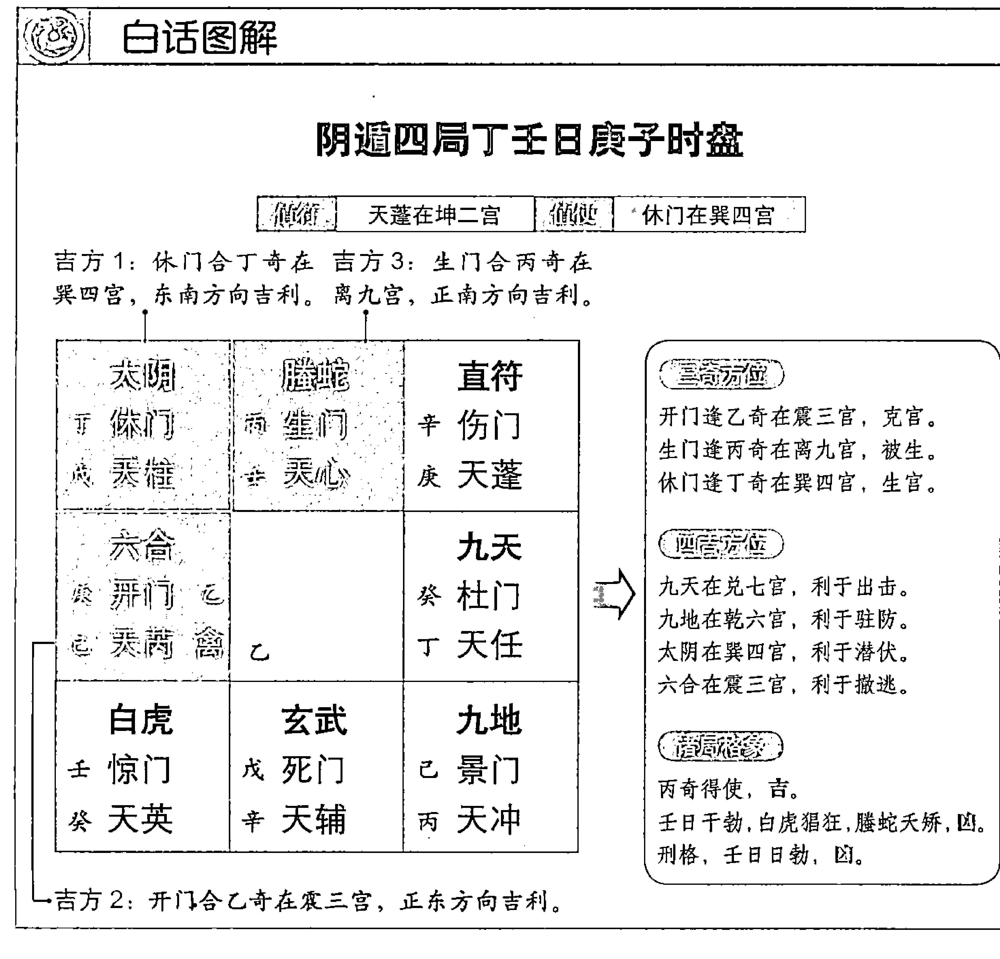

**诸局格象**：休门合丁奇在巽四宫，东南方向吉利。开门合乙奇在震三宫，正东方向吉利。生门合丙奇在离九宫，正南方向吉利。丙奇得使。壬日干勃。白虎猖狂。螣蛇天矫。刑格。壬日日勃。值符飞宫。

### 辛丑时：无奇门可出

## 【原文】

辛丑 天蓬星在坎一宫，休门在震三宫。时干遇凶星宿，时干逢凶。
杜门逢双乙奇在坤二宫，克宫，乙奇入墓。死门逢双丙奇在乾六宫，生宫，丙奇入墓。景门逢双丁奇在兑七宫，克宫。
九天在艮八宫，九地在震三宫，太阴在兑七宫，六合在坤二宫。
无奇门。时干在坎一宫。星符伏吟。三吉格。

## 【白话提要】

**符使宫位**：值符天蓬星在坎一宫，值使休门在震三宫。时干遇凶星宿，时干逢凶。

**三奇方位**：杜门逢双乙奇在坤二宫，克宫，乙奇入墓。死门逢双丙奇在乾六宫，生宫，丙奇入墓。景门逢双丁奇在兑七宫，克宫。

**四吉方位**：九天在艮八宫，九地在震三宫，太阴在兑七宫，六合在坤二宫。

**诸局格象**：无奇门。时干在坎一宫。星符伏吟。三吉格。

## 白话图解

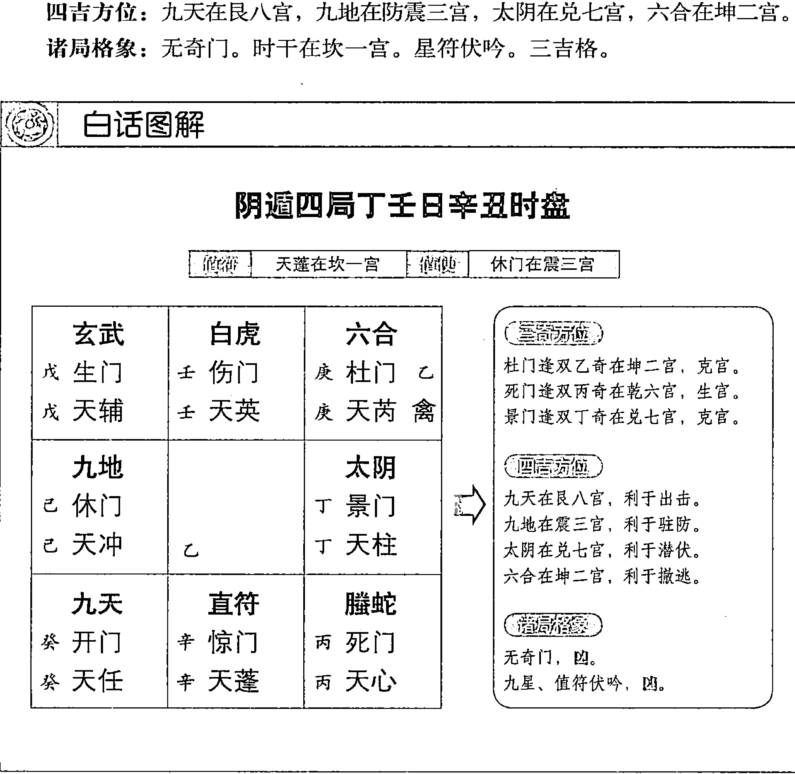## 壬寅时：无奇门可出

## 【原文】

壬寅 蓬九，休二。宿干凶。景艮义，惊巽制，死震害。天二，地七，阴三，合八。无奇门，龙反首，鸟跌穴，时干坎，大格，符冲，事同，仪刑。

## 【白话提要】

符使宫位：值符天蓬星在离九宫，值使休门在坤二宫。时干遇凶星宿，时干逢凶。

三奇方位：景门逢乙奇在艮八宫，生宫。惊门逢丙奇在巽四宫，克宫。死门逢丁奇在震三宫，被克。

四吉方位：九天在坤二宫，九地在兑七宫，太阴在震三宫，六合在艮八宫。

诸局格象：无奇门。青龙回首。飞鸟跌穴。时干在坎一宫。大格。值符相冲。六仪击刑。

## 白话图解

### 阴遁四局丁壬日壬寅时盘

值符 天蓬在离九宫 值使 休门在坤二宫

| 螣蛇 | 直符 | 九天 |
| --- | --- | --- |
| 丙 惊门 戊 天心 | 辛 开门 壬 天蓬 | 癸 休门 庚 天任 |
| 太阴 |  | 九地 |
| 丁 死门 己 天柱 | 乙 | 己 生门 丁 天冲 |
| 六合 | 白虎 | 玄武 |
| 庚 景门 乙 癸 天芮 禽 | 壬 杜门 辛 天英 | 戊 伤门 丙 天辅 |

三奇方位
景门逢乙奇在艮八宫，生宫。
惊门逢丙奇在巽四宫，克宫。
死门逢丁奇在震三宫，被克。

四吉方位
九天在坤二宫，利于出击。
九地在兑七宫，利于驻防。
太阴在震三宫，利于潜伏。
六合在艮八宫，利于撤逃。

诸局格象
青龙回首，飞鸟跌穴，吉。
无奇门，大格，六仪击刑，凶。

## 癸卯时：逢丁日不宜用事

## 【原文】

癸卯 蓬八，休一。宿吉干凶，丁日不用。惊丁兑伏，休合坎伏欢怡，开墓丙乾伏。天三，地四，阴六，合七。休与月合一正北，开与星合六西北，时干震，丁日伏干格，壬日飞干格，门伏，天网。

## 【白话提要】

符使宫位：值符天蓬星在艮八宫，值使休门在坎一宫。时干遇吉星宿，时干逢凶。逢丁日不宜用事。

三奇方位：惊门逢天盘乙奇与地盘丁奇在兑七宫，不相生克。休门逢丙奇在坎一宫，不相生克，奇仪相合，吉利。开门逢天盘丁奇与地盘丙奇在乾六宫，不相生克，丁奇入墓。

四吉方位：九天在震三宫，九地在巽四宫，太阴在乾六宫，六合在兑七宫。

诸局格象：休门合丙奇在坎一宫，正北方向吉利。开门合丁奇在乾六宫，西北方向吉利。时干在震三宫。逢丁日伏干格。逢壬日飞干格。八门伏吟。天网四张。

## 白话图解

### 阴遁四局丁壬日癸卯时盘

| 九地 己杜门 戊天冲 | 玄武 戊景门 壬天辅 | 白虎 壬死门 庚天英 |
| :--- | :--- | :--- |
| 九天 癸伤门 己天任 | 乙 | 六合 庚惊门 乙 丁天芮 禽 |
| 直符 辛生门 癸天蓬 | 休门 辛天心 | 太阴 丁开门 天柱 |

> ### 三奇方位
惊门逢天盘乙奇与地盘丁奇在兑七宫，不相生克。
休门逢丙奇在坎一宫，不相生克。
开门逢天盘丁奇与地盘丙奇在乾六宫，不相生克。

> ### 四吉方位
九天在震三宫，利于出击。
九地在巽四宫，利于驻防。
太阴在乾六宫，利于潜伏。
六合在兑七宫，利于撤逃。

> ### 诸局格象
逢丁日，为伏干格，凶。
逢壬日，为飞干格，凶。
八门伏吟，天网四张，凶。

吉方1：休门合丙奇在坎一宫，正北方向吉利。
吉方2：开门合丁奇在乾六宫，西北方向吉利。

## 甲辰时：西北方向吉利

## 【原文】

甲辰 英值符九，景值使九。辰至申阳，天辅，宿凶千吉。惊柱使兑伏，死芮日坤伏，心月开墓乾伏。天二，地七，阴三，合八。开与月合六西北，仪刑，符门伏，时干离，飞甲，自刑，阖。

## 【白话提要】

符使宫位：值符天英星在离九宫，值使景门在离九宫。时干遇凶星宿，时干逢吉。辰时至申时为五阳时，辰时为天辅释罪时。

三奇方位：惊门逢双丁奇在兑七宫，不相生克。死门逢双乙奇在坤二宫，不相生克。开门逢双丙奇在乾六宫，不相生克，丙奇入墓。

四吉方位：九天在坤二宫，九地在兑七宫，太阴在震三宫，六合在艮八宫。

诸局格象：开门合丙奇在乾六宫，西北方向吉利。六仪击刑。星符、八门伏吟。时干在离九宫。飞甲自刑，合。

## 白话图解

### 阴遁四局丁壬日甲辰时盘

| 腾蛇 | 直符 | 九天 |
|------|------|------|
| 戊 杜门 戊 天辅 | 壬 景门 壬 天英 | 庚 死门 乙 庚 天芮 禽 |
| 太阴 |      | 九地 |
| 己 伤门 己 天冲 | 乙   | 丁 惊门 丁 天柱 |
| 六合 | 白虎 | 玄武 |
| 癸 生门 癸 天任 | 辛 休门 辛 天蓬 | 丙 开门 丙 天心 |

三奇方位：
惊门逢双丁奇在兑七宫，不相生克。
死门逢双乙奇在坤二宫，不相生克。
开门逢双丙奇在乾六宫，不相生克。

四吉方位：
九天在坤二宫，利于出击。
九地在兑七宫，利于驻防。
太阴在震三宫，利于潜伏。
六合在艮八宫，利于撤逃。

诸局格象：
六仪击刑，飞甲自刑，凶。
九星、值符、八门伏吟，凶。

## 乙巳时：正西方向吉利

## 【原文】

乙巳 英五，景八。宿吉干凶。伤墓丙乾害，生丁兑义，杜合坎和。天七，地六，阴四，合三。生与日合七正西，乙下有丁，时干兑，飞符，丁日伏干格，壬日飞干格。

## 【白话提要】

符使宫位：值符天英星在中五宫，寄于坤二宫，值使景门在艮八宫。时干遇吉星宿，时干逢凶。

三奇方位：伤门逢天盘丁奇与地盘丙奇在乾六宫，被克，丁奇入墓。生门逢天盘乙奇与地盘丁奇在兑七宫，生宫。杜门逢丙奇在坎一宫，被生，奇仪相合。

四吉方位：九天在兑七宫，九地在乾六宫，太阴在巽四宫，六合在震三宫。

诸局格象：生门合乙奇在兑七宫，正西方向吉利。乙下有丁为奇仪相佐。时干在兑七宫。值符飞宫。逢丁日伏干格。逢壬日飞干格。

## 白话图解

### 阴遁四局丁壬日乙巳时盘

【值符】天英在中五宫，寄于坤二宫 【值使】景门在艮八宫

| 太阴 | 螣蛇 | 直符 |
| :--- | :--- | :--- |
| 己 惊门 戊 天冲 | 戊 开门 壬 天辅 | 壬 休门 庚 天英 |
| 六合 | (空白) | 九天 |
| 癸 死门 己 天任 | 乙 | 庚 生门 乙 丁 天芮 禽 |
| 白虎 | 玄武 | 九地 |
| 辛 景门 癸 天蓬 | 丙 杜门 辛 天心 | 丁 伤门 丙 天柱 |

- 三奇方位：
- 伤门逢天盘丁奇与地盘丙奇在乾六宫，被克。
- 生门逢天盘乙奇与地盘丁奇在兑七宫，生宫。
- 杜门逢丙奇在坎一宫，被生。

- 四吉方位：
- 九天在兑七宫，利于出击。
- 九地在乾六宫，利于驻防。
- 太阴在巽四宫，利于潜伏。
- 六合在震三宫，利于撤逃。

- 诸局格象：
- 乙下有丁，为奇仪相佐，吉。
- 逢丁日，为伏干格，凶。
- 逢壬日，为飞干格，凶。

吉方：生门合乙奇在兑七宫，正西方向吉利。

## 第一章 阴遁四局

## 丙午时：宜守户不出

## 【原文】

丙午 英六，景七。宿干吉，守户。开艮和，惊坎义，休震义。天一，地八，阴二，合九。开与星合八东北，得使，休与日合三正东，雀入江，龙走，龙反首，时干震，相佐乾。

## 【白话提要】

符使宫位：值符天英星在乾六宫，值使景门在兑七宫。时干遇吉星宿，时干逢吉。宜守户不出。

三奇方位：开门逢丁奇在艮八宫，被生。惊门逢乙奇在坎一宫，生宫。休门逢丙奇在震三宫，生宫。

四吉方位：九天在坎一宫，九地在艮八宫，太阴在坤二宫，六合在离九宫。

诸局格象：开门合丁奇在艮八宫，东北方向吉利，丁奇得使。休门合乙奇在震三宫，正东方向吉利。朱雀入江。青龙逃走。青龙回首。时干在震三宫。值符得地盘丙奇相助于乾六宫。

## 白话图解

### 阴遁四局丁壬日丙午时盘

值符 天英在乾六宫 值使 景门在兑七宫

吉方2：休门合丙奇在震三宫，正东方向吉利。

| 白虎 | 六合 | 太阴 |
| :--- | :--- | :--- |
| 辛 生门 戊 天蓬 | 癸 伤门 壬 天任 | 己 杜门 庚 天冲 |
| 玄武 |  | 螣蛇 |
| 丙 休门 乙 天心 | 乙 | 戊 景门 丁 天辅 |
| 九地 | 九天 | 直符 |
| 丁 开门 癸 天柱 | 庚 惊门 辛 天芮 乙 禽 | 壬 死门 丙 天英 |

三奇方位
开门逢丁奇在艮八宫，被生。
惊门逢乙奇在坎一宫，生宫。
休门逢丙奇在震三宫，生宫。

四吉方位
九天在坎一宫，利于出击。
九地在艮八宫，利于驻防。
太阴在坤二宫，利于潜伏。
六合在离九宫，利于撤逃。

诸局格象
丁奇得使，青龙回首，吉。
朱雀入江，青龙逃走，凶。

吉方1：开门合丁奇在艮八宫，东北方向吉利。

## 丁未时：无奇门可出

## 【原文】

丁未 英七，景六。宿凶干吉。死坎制，景丙乾制，惊艮和。天六，地一，阴九，合四。无奇门，时干坎，相佐兑，金入火。

## 【白话提要】

符使宫位：值符天英星在兑七宫，值使景门在乾六宫。时干遇凶星宿，时干逢吉。

三奇方位：死门逢丁奇在坎一宫，克宫。景门逢天盘乙奇与地盘丙奇在乾六宫，克宫。惊门逢丙奇在艮八宫，被生。

四吉方位：九天在乾六宫，九地在坎一宫，太阴在离九宫，六合在巽四宫。

诸局格象：无奇门。时干在坎一宫。值符得地盘丁奇相助于兑七宫。太白入荧。

## 白话图解

### 阴遁四局丁壬日丁未时盘

| 六合 | 太阴 | 螣蛇 |
| :--- | :--- | :--- |
| 癸 休门 戊 天任 | 己 生门 壬 天冲 | 戊 伤门 庚 天辅 |
| 白虎 | 乙 | 直符 |
| 辛 开门 己 天蓬 | | 壬 杜门 丁 天英 |
| 玄武 | 九地 | 九天 |
| 丙 惊门 癸 天心 | 丁 死门 辛 天柱 | 庚 景门 乙 丙 天芮 禽 |

【三奇方位】
死门逢丁奇在坎一宫，克宫。
景门逢天盘乙奇与地盘丙奇在乾六宫，克宫。
惊门逢丙奇在艮八宫，被生。

【四吉方位】
九天在乾六宫，利于出击。
九地在坎一宫，利于驻防。
太阴在离九宫，利于潜伏。
六合在巽四宫，利于撤逃。

【诸局格象】
无奇门，凶。
太白入荧，凶。

## 戊申时：逢壬日不宜用事

## 【原文】

戊申 英四，景五避五。宿干吉，壬日不用。景乙坤义，杜离义欢怡，死丁兑义。天九，地二，阴八，合一。无奇门，伏宫格，丁干勃时干震，丁日飞干格，壬日伏干格，事同。

## 【白话提要】

符使宫位：值符天英星在巽四宫，值使景门在中五宫，寄于坤二宫。时干遇吉星宿，时干逢吉。

三奇方位：景门逢天盘丁奇与地盘乙奇在坤二宫，生宫。杜门逢乙奇在离九宫，生宫，吉利。死门逢天盘丙奇与地盘丁奇在兑七宫，生宫。

四吉方位：九天在离九宫，九地在坤二宫，太阴在艮八宫，六合在坎一宫。

诸局格象：无奇门。伏宫格。丁日勃格。时干在震三宫。逢丁日飞干格。壬日为伏干格。

## 白话图解

### 阴遁四局丁壬日戊申时盘

| 直符 | 九天 | 九地 |
| :--- | :--- | :--- |
| 壬 伤门 戊 天英 | 庚 杜门 乙 壬 天芮 禽 | 丁 景门 庚 天柱 |
| 螣蛇 | 乙 | 玄武 |
| 戊 生门 己 天辅 | | 丙 死门 丁 天心 |
| 太阴 | 六合 | 白虎 |
| 己 休门 癸 天冲 | 癸 开门 辛 天任 | 辛 惊门 丙 天蓬 |

三奇方位
景门逢天盘丁奇与地盘乙奇在坤二宫，生宫。
杜门逢乙奇在离九宫，生宫。
死门逢天盘丙奇与地盘丁奇在兑七宫，生宫。

四吉方位
九天在离九宫，利于出击。
九地在坤二宫，利于驻防。
太阴在艮八宫，利于潜伏。
六合在坎一宫，利于撤逃。

诸局格象
无奇门，凶。
伏宫格，丁日勃格，凶。
逢丁日，为飞干格，凶。
逢壬日，为伏干格，凶。

## 己酉时：无奇门可出

## 【原文】

己酉 英三，景四。酉至亥阴，宿干凶。死合离义欢怡，景巽和，惊乙坤和。天四，地九，阴一，合六。无奇门，时干坎，飞宫，事同，火入金。

## 【白话提要】

符使宫位：值符天英星在震三宫，值使景门在巽四宫。时干遇凶星宿，时干逢凶。酉时至亥时为五阴时。

- 三奇方位：
- 死门逢丁奇在离九宫，生宫，吉利，奇仪相合。
- 景门逢乙奇在巽四宫，被生。
- 惊门逢天盘丙奇与地盘乙奇在坤二宫，被生。

- 四吉方位：
- 九天在巽四宫。
- 九地在离九宫。
- 太阴在坎一宫。
- 六合在乾六宫。

- 诸局格象：
- 无奇门。
- 时干在坎一宫。
- 飞宫格。
- 荧入太白。

## 白话图解

### 阴遁四局丁壬日己酉时盘

| 九天 | 九地 | 玄武 |
| --- | --- | --- |
| 庚 景门 乙 戊 天芮 禽 | 丁 死门 壬 天柱 | 丙 惊门 庚 天心 |
| 直符 |  | 白虎 |
| 壬 杜门 己 天英 | 乙 | 辛 开门 丁 天蓬 |
| 螣蛇 | 太阴 | 六合 |
| 戊 伤门 癸 天辅 | 己 生门 辛 天冲 | 癸 休门 丙 天任 |

- 三奇方位：
- 死门逢丁奇在离九宫，生宫。
- 景门逢乙奇在巽四宫，被生。
- 惊门逢天盘丙奇与地盘乙奇在坤二宫，被生。

- 四吉方位：
- 九天在巽四宫，利于出击。
- 九地在离九宫，利于驻防。
- 太阴在坎一宫，利于潜伏。
- 六合在乾六宫，利于撤逃。

- 诸局格象：
- 无奇门，凶。
- 飞宫格，荧入太白，凶。

## 庚戌时：正西与西北方向吉利

## 【原文】

庚戌 英二，景三。宿干凶。生墓丙乾义，休丁兑义，伤合坎和。天七，地六，阴四，合三。休与日合七正西，乙下有丁，生与星合六西北，丁下有丙，三吉，时干兑，丁日伏干格，壬日飞干格，刑。

## 【白话提要】

- 符使宫位：值符天英星在坤二宫，值使景门在震三宫。时干遇凶星宿，时干逢凶。

- 三奇方位：生门逢天盘丁奇与地盘丙奇在乾六宫，生宫。休门逢天盘乙奇与地盘丁奇在兑七宫，生宫。伤门逢丙奇在坎一宫，被生，奇仪相合。

- 四吉方位：九天在兑七宫，九地在乾六宫，太阴在巽四宫，六合在震三宫。

- 诸局格象：休门合乙奇在兑七宫，正西方向吉利。乙下有丁成奇仪相合。生门合丁奇在乾六宫，西北方向吉利。丁下有丙成星随月转。三吉格。时干在兑七宫。逢丁日伏干格，壬日飞干格。刑格。

## 白话图解

### 阴遁四局丁壬日庚戌时盘

| 太阴 | 螣蛇 | 直符 |
| :--- | :--- | :--- |
| 己 死门 戊 天冲 | 戊 惊门 壬 天辅 | 壬 开门 庚 天英 |
| 六合 | 乙 | 九天 |
| 癸 景门 己 天任 | | 庚 休门 乙 丁 天芮 禽 |
| 白虎 | 玄武 | 九地 |
| 辛 杜门 癸 天蓬 | 丙 伤门 辛 天心 | 丁 生门 丙 天柱 |

吉方1：休门合乙奇在兑七宫，正西方向吉利。

吉方2：生门合丁奇在乾六宫，西北方向吉利。

> 三奇方位
生门逢天盘丁奇与地盘丙奇在乾六宫，生宫。
休门逢天盘乙奇与地盘丁奇在兑七宫，生宫。
伤门逢丙奇在坎一宫，被生。

> 四吉方位
九天在兑七宫，利于出击。
九地在乾六宫，利于驻防。
太阴在巽四宫，利于潜伏。
六合在震三宫，利于撤逃。

> 诸局格象
乙下有丁，成奇仪相合，吉。
丁下有丙，成星随月转，吉。
逢丁日，为伏干格，凶。
壬日飞干格，刑格，凶。

## 辛亥时：正东与东北方向吉利

## 【原文】

辛亥 英一，景二。宿干吉。生震害，休艮害，伤巽伏。天八，地三，阴七，合二。休与月合八东北，生与星合三正东，龙走，鸟跌穴。时干离，符冲，事同。

## 【白话提要】

- 符使宫位：值符天英星在坎一宫，值使景门在坤二宫。时干遇吉星宿，时干逢吉。

- 三奇方位：生门逢丁奇在震三宫，被克。休门逢乙奇在艮八宫，被克。伤门逢丁奇在巽四宫，不相生克。

- 四吉方位：九天在艮八宫，九地在震三宫，太阴在兑七宫，六合在坤二宫。

- 诸局格象：休门合丙奇在艮八宫，东北方向吉利。生门合丁奇在震三宫，正东方向吉利。青龙逃走。飞鸟跌穴。时干在离九宫。值符相冲。

## 白话图解

### 阴遁四局丁壬日辛亥时盘

| 玄武 | 白虎 | 六合 |
| :--- | :--- | :--- |
| 丙 伤门 戊 天心 | 辛 杜门 壬 天蓬 | 癸 景门 庚 天任 |
| 九地 丁 惊门 己 天任 | 乙 | 太阴 己 死门 丁 天冲 |
| 九天 癸 休门 癸 天芮禽 | 直符 壬 开门 辛 天英 | 螣蛇 戊 惊门 丙 天辅 |

三奇方位

生门逢丁奇在震三宫，被克。
休门逢乙奇在艮八宫，被克。
伤门逢丁奇在巽四宫，不相生克。

四吉方位

九天在艮八宫，利于出击。
九地在震三宫，利于驻防。
太阴在兑七宫，利于潜伏。
六合在坤二宫，利于撤逃。

诸局格象

飞鸟跌穴，吉。
青龙逃走，值符相冲，凶。

吉方1：休门合丙奇在艮八宫，东北方向吉利。
吉方2：生门合丁奇在震三宫，正东方向吉利。

## 5. 戊癸日十二时局

### 壬子时：西南方向吉利

## 【原文】

壬子 英九，景一。子至丑阴，宿干凶。伤丁兑害，生墓乙坤伏，杜墓丙乾伏。天二，地七，阴三，合八。生与日合二西南，时干离，符门伏，反吟。

## 【白话提要】

- 符使宫位：值符天英星在离九宫，值使景门在坎一宫。时干遇凶星宿，时干逢凶。子时至丑时为五阴时。
- 三奇方位：伤门逢双丁奇在兑七宫，被克。生门逢双乙奇在坤二宫，不相生克，乙奇入墓。杜门逢双丙奇在乾六宫，不相生克，丙奇入墓。
- 四吉方位：九天在坤二宫，九地 in 兑七宫，太阴在震三宫，六合在艮八宫。
- 诸局格象：生门合乙奇在坤二宫，西南方向吉利。时干在离九宫。星符伏吟。八门反吟格。

## 白话图解

### 阴遁四局戊癸日壬子时盘

吉方：生门合乙奇在坤二宫，西南方向吉利。

| 螣蛇 | 直符 | 九天 |
| --- | --- | --- |
| 戊 开门 戊 天辅 | 壬 休门 壬 天英 | 庚 生门 乙 庚 天芮 禽 |
| 太阴 |   | 九地 |
| 己 惊门 己 天冲 |   | 丁 伤门 丁 天柱 |
| 六合 | 白虎 | 玄武 |
| 癸 死门 癸 天任 | 辛 景门 辛 天蓬 | 丙 杜门 丙 天心 |

- 三奇方位：伤门逢双丁奇在兑七宫，被克。生门逢双乙奇在坤二宫，不相生克。杜门逢双丙奇在乾六宫，不相生克。
- 四吉方位：九天在坤二宫，利于出击。九地在兑七宫，利于驻防。太阴在震三宫，利于潜伏。六合在艮八宫，利于撤逃。
- 诸局格象：九星、值符伏吟，凶。八门反吟，凶。

## 癸丑时：无奇门可出

## 【原文】

癸丑 英八，景九。宿吉干凶。杜巽伏，伤震伏，景离伏。天三，地四，阴六，合七。无奇门，符勃。时干兑，刑格，蛇天矫，虎猖狂，天网四张。

## 【白话提要】

符使宫位：值符天英星在艮八宫，值使景门在离九宫。时干遇吉星宿，时干逢凶。

三奇方位：杜门逢丁奇在巽四宫，不相生克。伤门逢乙奇在震三宫，不相生克。景门逢丙奇在离九宫，不相生克。

四吉方位：九天在震三宫，九地在巽四宫，太阴在乾六宫，六合在兑七宫。

诸局格象：无奇门。符勃格。时干在兑七宫。刑格。螣蛇天矫。白虎猖狂。天网四张。

## 白话图解

#### 阴遁四局戊癸日癸丑时盘

|  |  |  |
| :--- | :--- | :--- |
| 九地 戊杜门 戊天辅 | 玄武 壬景门 壬天英 | 白虎 庚死门 乙 庚天芮 禽 |
| 九天 己伤门 己天冲 | 乙 | 六合 丁惊门 丁天柱 |
| 直符 癸生门 癸天任 | 螣蛇 辛休门 辛天蓬 | 太阴 丙开门 丙天心 |

值符 天英在艮八宫 值使 景门在离九宫

### 三奇方位

- 杜门逢丁奇在巽四宫，不相生克。
- 伤门逢乙奇在震三宫，不相生克。
- 景门逢丙奇在离九宫，不相生克。

### 四吉方位

- 九天在震三宫，利于出击。
- 九地在巽四宫，利于驻防。
- 太阴在乾六宫，利于潜伏。
- 六合在兑七宫，利于撤逃。

### 诸局格象

- 无奇门，凶。
- 符勃格，刑格，凶。
- 螣蛇天矫，白虎猖狂，天网四张，凶。

## 甲寅时：逢戊日不宜用事

## 【原文】

甲寅 任值符八，生值使八。天辅，寅至午阳，宿干吉，戊日不用。柱使惊兑伏，芮日死墓坤伏，心月开墓乾伏。天三，地四，阴六，合七。开与月合六西北，时干艮，符门伏，地甲阖，合时。

## 【白话提要】

符使宫位：值符天任星在艮八宫，值使生门在艮八宫。时干遇吉星宿，时干逢吉。寅时为天辅释罪时。寅时至午时为五阳时。逢戊日不宜用事。

三奇方位：惊门逢双丁奇在兑七宫，不相生克。死门逢双乙奇在坤二宫，不相生克。开门逢双丙奇在乾六宫，不相生克。

四吉方位：九天在震三宫，九地在巽四宫，太阴在乾六宫，六合在兑七宫。

诸局格象：开门合丙奇在乾六宫，西北方向吉利。时干在艮八宫。星符、八门伏吟。地甲合。

## 白话图解

#### 阴遁四局戊癸日甲寅时盘

|  |  |  |
| :--- | :--- | :--- |
| 九地 戊杜门 戊天辅 | 玄武 壬景门 壬天英 | 白虎 庚死门 乙 庚天芮 禽 |
| 九天 己伤门 己天冲 | 乙 | 六合 丁惊门 丁天柱 |
| 直符 癸生门 癸天任 | 螣蛇 辛休门 辛天蓬 | 太阴 丙开门 丙天心 |

值符 天任在艮八宫 值使 生门在艮八宫

### 三奇方位

- 惊门逢双丁奇在兑七宫，不相生克。
- 死门逢双乙奇在坤二宫，不相生克。
- 开门逢双丙奇在乾六宫，不相生克。

### 四吉方位

- 九天在震三宫，利于出击。
- 九地在巽四宫，利于驻防。
- 太阴在乾六宫，利于潜伏。
- 六合在兑七宫，利于撤逃。

### 诸局格象

- 九星、值符、八门伏吟，凶。
- 地甲合，凶。
- 吉方：开门合丙奇在乾六宫，西北方向吉利。

## 乙卯时：宜守户不出

## 【原文】

乙卯 任五，生七。宿干吉，守户。死震害，景艮义欢怡，惊巽制。天七，地六，阴四，合三。无奇门，癸日飞干格，飞符，宫格，鸟跌穴，时干艮，龙走，符冲，飞符，太格，乙格，戊日勃。

## 【白话提要】

符使宫位：值符天任星在中五宫，寄于坤二宫，值使生门在兑七宫。时干遇吉星宿，时干逢吉。宜守户不出。

三奇方位：死门逢丁奇在震三宫，被克。景门逢乙奇在艮八宫，生宫，吉利。惊门逢丙奇在巽四宫，克宫。

四吉方位：九天在兑七宫，九地在乾六宫，太阴在巽四宫，六合在震三宫。

诸局格象：无奇门。逢癸日飞干格。飞宫格。飞鸟跌穴。时干在艮八宫。青龙逃走。值符相冲。大格。太乙格。戊日日勃。

## 白话图解

#### 阴遁四局戊癸日乙卯时盘

天任在中五宫，寄于坤二宫

生门在兑七宫

| 太阴 丙惊门 戊天心 | 螣蛇 辛开门 壬天蓬 | 直符 癸休门 庚天任 |
| :--- | :--- | :--- |
| 六合 丁死门 己天柱 | 乙 | 九天 己生门 丁天冲 |
| 白虎 庚景门 乙 癸天芮 禽 | 玄武 壬杜门 辛天英 | 九地 戊伤门 丙天辅 |

### 三奇方位

- 死门逢丁奇在震三宫，被克。
- 景门逢乙奇在艮八宫，生宫。
- 惊门逢丙奇在巽四宫，克宫。

### 四吉方位

- 九天在兑七宫，利于出击。
- 九地在乾六宫，利于驻防。
- 太阴在巽四宫，利于潜伏。
- 六合在震三宫，利于撤逃。

### 诸局格象

- 飞鸟跌穴，吉。
- 无奇门，凶。
- 逢癸日，为飞干格，凶。
- 青龙逃走，戊日日勃，凶。
- 大格，太乙格，飞宫格，凶。

## 丙辰时：西南方向吉利

## 【原文】

丙辰 任六，生六。宿干吉。惊合离害，死巽害，开乙坤和。天一，地八，阴二，合九。开与月合二西南，得使，火入金，时干艮，相佐乾，飞宫格，戊日伏干格。

## 【白话提要】

符使宫位：值符天任星在乾六宫，值使生门在乾六宫。时干遇吉星宿，时干逢吉。

三奇方位：惊门逢丁奇在离九宫，被克，奇仪相合。死门逢乙奇在巽四宫，被克。开门逢天盘丙奇与地盘乙奇在坤二宫，被生。

四吉方位：九天在坎一宫，九地在艮八宫，太阴在坤二宫，六合在离九宫。

诸局格象：开门合丙奇在坤二宫，西南方向吉利。丙奇得使。荧入太白。时干在艮八宫。值符得地盘丙奇相助于乾六宫。飞宫格。逢戊日伏干格。

## 白话图解

#### 阴遁四局戊癸日丙辰时盘

天任在乾六宫 值使 生门在乾六宫

吉方：开门合丙奇在坤二宫，西南方向吉利。

白虎 庚死门 乙戊天芮禽 六合 丁惊门 壬天柱 太阴 丙奇开门 庚天心 螣蛇 壬景门 己天英 玄武 辛休门 丁天蓬 九地 戊杜门 癸天辅 九天 己伤门 辛天冲 直符 癸生门 丙天任

### 三奇方位

- 惊门逢丁奇在离九宫，被克。
- 死门逢乙奇在巽四宫，被克。
- 开门逢天盘丙奇与地盘乙奇在坤二宫，被生。

### 四吉方位

- 九天在坎一宫，利于出击。
- 九地在艮八宫，利于驻防。
- 太阴在坤二宫，利于潜伏。
- 六合在离九宫，利于撤逃。

### 诸局格象

- 丙奇得使，吉。
- 荧入太白，飞宫格，凶。
- 逢戊日，为伏干格，凶。

## 丁巳时：正南与东南方向吉利

## 【原文】

丁巳 任七，生五避五。宿凶干吉。开巽制，惊震制，休离制。天六，地一，阴九，合四。开与星合四东南，休与月合九正南，门反吟，虎猖狂，蛇天矫，时干巽，相佐兑，刑格，三吉，击刑。

## 【白话提要】

符使宫位：值符天任星在兑七宫，值使生门在中五宫，寄于坤二宫。时干遇凶星宿，时干逢吉。

三奇方位：开门逢丁奇在巽四宫，克宫。惊门逢乙奇在震三宫，克宫。休门逢丙奇在离九宫，克宫。

四吉方位：九天在乾六宫，九地在坎一宫，太阴在离九宫，六合在巽四宫。

诸局格象：开门合丁奇在巽四宫，东南方向吉利。休门合丙奇在离九宫，正南方向吉利。八门反吟。白虎猖狂。螣蛇天矫。时干在巽四宫。值符得地盘丁奇相助于兑七宫。刑格。三吉格。击刑。

## 白话图解

#### 阴遁四局戊癸日丁巳时盘

| 宫位 | 八神 | 天盘 | 八门 | 地盘 | 星盘 |
| :--- | :--- | :--- | :--- | :--- | :--- |
| 巽四宫 | 六合 | 丁 | 开门 | 戊 | 天柱 |
| 离九宫 | 太阴 | 乙 | 休门 | 壬 | 天心 |
| 坤二宫 | 螣蛇 | 辛 | 生门 | 庚 | 天蓬 |
| 震三宫 | 白虎 | 庚 | 惊门 | 己 | 天芮（禽） |
| 中五宫 | （寄坤） | 乙 | | | |
| 兑七宫 | 直符 | 癸 | 伤门 | 丁 | 天任 |
| 艮八宫 | 玄武 | 壬 | 死门 | 癸 | 天英 |
| 坎一宫 | 九地 | 戊 | 景门 | 辛 | 天辅 |
| 乾六宫 | 九天 | 己 | 杜门 | 丙 | 天冲 |

值符 天任在兑七宫 值使 生门在中五宫，寄于坤二宫

吉方1：开门合丁奇在巽四宫，东南方向吉利。
吉方2：休门合丙奇在离九宫，正南方向吉利。

### 三奇方位

- 开门逢丁奇在巽四宫，克宫。
- 惊门逢乙奇在震三宫，克宫。
- 休门逢丙奇在离九宫，克宫。

### 四吉方位

- 九天在乾六宫，利于出击。
- 九地在坎一宫，利于驻防。
- 太阴在离九宫，利于潜伏。
- 六合在巽四宫，利于撤逃。

### 诸局格象

- 八门反吟，白虎猖狂，螣蛇天矫，凶。
- 刑格，击刑，凶。

## 戊午时：东北方向吉利

## 【原文】

戊午 任四，生四。宿干吉。惊坎义，死丙乾义，开艮和欢怡。天九，地二，阴八，合一。开与月合八东北，癸干勃，仪刑，时干坤，金入火，癸日日勃，戊日飞干格。

## 【白话提要】

符使宫位：值符天任星在巽四宫，值使生门在巽四宫。时干遇吉星宿，时干逢吉。

三奇方位：惊门逢丁奇在坎一宫，生宫。死门逢天盘乙奇与地盘丙奇在乾六宫，生宫。开门逢丙奇在艮八宫，被生，吉利。

四吉方位：九天在离九宫，九地在坤二宫，太阴在艮八宫，六合在坎一宫。

诸局格象：开门合丙奇在艮八宫，东北方向吉利。癸干勃格。六仪击刑。时干在坤二宫。太白入荧。逢癸日日勃。逢戊日飞干格。

## 白话图解

#### 阴遁四局戊癸日戊午时盘

| 直符 癸生门 戊天任 | 九天 己伤门 壬天冲 | 九地 戊杜门 庚天辅 |
| :--- | :--- | :--- |
| 螣蛇 辛休门 己天蓬 | 玄武 壬景门 丁天英 |  |
| 太阴 丙开门 癸天心 | 六合 丁惊门 辛天柱 | 白虎 庚死门 乙 丙天芮 禽 |

吉方：开门合丙奇在艮八宫，东北方向吉利。

### 三奇方位

- 惊门逢丁奇在坎一宫，生宫。
- 死门逢天盘乙奇与地盘丙奇在乾六宫，生宫。
- 开门逢丙奇在艮八宫，被生。

### 四吉方位

- 九天在离九宫，利于出击。
- 九地在坤二宫，利于驻防。
- 太阴在艮八宫，利于潜伏。
- 六合在坎一宫，利于撤逃。

### 诸局格象

- 癸日勃格，六仪击刑，太白入荧，凶。
- 逢癸日，为日勃格，凶。
- 逢戊日，为飞干格，凶。

# 己未时：逢癸日不宜用事

## 【原文】

己未 任三，生三。未至亥阴，宿吉干凶，癸日不用。惊墓丙乾伏，死丁兑义，开合坎义。天四，地九，阴一，合六。开与月合一正北，时干巽，三吉。

## 【白话提要】

符使宫位：值符天任星在震三宫，值使生门在震三宫。时干遇吉星宿，时干逢凶。未时至亥时为五阴时。逢癸日不宜用事。

三奇方位：惊门逢天盘丁奇与地盘丙奇在乾六宫，不相生克，丁奇入墓。死门逢天盘乙奇与地盘丁奇在兑七宫，生宫。开门逢丙奇在坎一宫，生宫，奇仪相合。

四吉方位：九天在巽四宫，九地在离九宫，太阴在坎一宫，六合在乾六宫。

诸局格象：开门合丙奇在坎一宫，正北方向吉利。时干在巽四宫。三吉格。

## 白话图解

#### 阴遁四局戊癸日己未时盘

| 九天 己伤门 戊天冲 | 九地 戊杜门 壬天辅 | 玄武 壬景门 庚天英 |
| :--- | :--- | :--- |
| 直符 癸生门 己天任 | 乙 | 白虎 庚死门 乙 丁天芮 禽 |
| 螣蛇 辛休门 癸天蓬 | 太阴 丙开门 辛天心 | 六合 丁惊门 丙天柱 |

### 三奇方位

- 惊门逢天盘丁奇与地盘丙奇在乾六宫，不相生克。
- 死门逢天盘乙奇与地盘丁奇在兑七宫，生宫。
- 开门逢丙奇在坎一宫，生宫。

### 四吉方位

- 九天在巽四宫，利于出击。
- 九地在离九宫，利于驻防。
- 太阴在坎一宫，利于潜伏。
- 六合在乾六宫，利于撤逃。

### 诸局格象

- 乙下有丁，为奇仪相佑，吉。
- 丁下有丙，为星随月转，吉。
- 吉方：开门合丙奇在坎一宫，正北方向吉利。

## 庚申时：东南方向吉利

## 【原文】

庚申 任二，生二。宿干凶。惊震制，死艮伏欢怡，开巽制。天七，地六，阴四，合三。开与月合四东南，门反吟，飞宫格，龙反首，鸟跌穴，癸日飞干格，戊日勃，时干艮，大格，符冲。

## 【白话提要】

符使宫位：值符天任星在坤二宫，值使生门在坤二宫。时干遇凶星宿，时干逢凶。

三奇方位：惊门逢丁奇在震三宫，克宫。死门逢乙奇在艮八宫，不相生克，好。开门逢丙奇在巽四宫，克宫。

四吉方位：九天在兑七宫，九地在乾六宫，太阴在巽四宫，六合在震三宫。

诸局格象：开门合丙奇在巽四宫，东南方向吉利。八门反吟。飞宫格。青龙回首。飞鸟跌穴。逢癸日飞干格。戊日日勃。时干在艮八宫。大格。值符相冲。

## 白话图解

#### 阴遁四局戊癸日庚申时盘

天任在坤二宫 值使 生门在坤二宫

吉方：开门合丙奇在巽四宫，东南方向吉利。

| 太阴 丙开门 戊天心 | 螣蛇 辛休门 壬天蓬 | 直符 癸生门 庚天任 |
| :--- | :--- | :--- |
| 六合 丁惊门 己天柱 | 乙 | 九天 己伤门 丁天冲 |
| 白虎 庚死门 乙 癸天芮 禽 | 玄武 壬景门 辛天英 | 九地 戊杜门 丙天辅 |

### 三奇方位

- 惊门逢丁奇在震三宫，克宫。
- 死门逢乙奇在艮八宫，不相生克。
- 开门逢丙奇在巽四宫，克宫。

### 四吉方位

- 九天在兑七宫，利于出击。
- 九地在乾六宫，利于驻防。
- 太阴在巽四宫，利于潜伏。
- 六合在震三宫，利于撤逃。

### 诸局格象

- 青龙回首，飞鸟跌穴，吉。
- 八门反吟，飞宫格，凶。
- 逢癸日，为飞干格，凶。
- 戊日日勃，大格，值符相冲，凶。

## 辛酉时：正西方向吉利

## 【原文】

辛酉 任一，生一。宿干凶。惊乙坤和，死离和，开丁兑伏。天八，地三，阴七，合二。开与月合七正西，时干乾，丙下有丁，得使。

## 【白话提要】

符使宫位：值符天任星在坎一宫，值使生门在坎一宫。时干遇凶星宿，时干逢凶。

三奇方位：惊门逢天盘丁奇与地盘乙奇在坤二宫，被生。死门逢乙奇在离九宫，被生。开门逢天盘丙奇与地盘丁奇在兑七宫，不相生克。

四吉方位：九天在艮八宫，九地在震三宫，太阴在兑七宫，六合在坤二宫。

诸局格象：开门合丙奇在兑七宫，正西方向吉利。时干在乾六宫。丙下有丁为丙奇朱雀。丙奇得使。

## 白话图解

#### 阴遁四局戊癸日辛酉时盘

| 玄武 壬景门 戊天英 | 白虎 庚死门 乙 壬天芮 禽 | 六合 丁惊门 庚天柱 |
| :--- | :--- | :--- |
| 九地 戊杜门 己天辅 | 乙 | 太阴 丙开门 丁天心 |
| 九天 己伤门 癸天冲 | 直符 癸生门 辛天任 | 螣蛇 辛休门 丙天蓬 |

吉方：开门合丙奇在兑七宫，正西方向吉利。

### 三奇方位

- 惊门逢天盘丁奇与地盘乙奇在坤二宫，被生。
- 死门逢乙奇在离九宫，被生。
- 开门逢天盘丙奇与地盘丁奇在兑七宫，不相生克。

### 四吉方位

- 九天在艮八宫，利于出击。
- 九地在震三宫，利于驻防。
- 太阴在兑七宫，利于潜伏。
- 六合在坤二宫，利于撤逃。

### 诸局格象

- 丙下有丁，为丙奇朱雀，吉。
- 丙奇得使，吉。

## 壬戌时：正东方向吉利

## 【原文】

壬戌 任九，生九。宿吉干凶。惊艮和欢怡，死坎制，开震制。天二，地七，阴三，合八。开与月合三正东，龙走，时干乾，雀入江。

## 【白话提要】

符使宫位：值符天任星在离九宫，值使生门在离九宫。时干遇吉星宿，时干逢吉。

三奇方位：惊门逢丁奇在艮八宫，被生，吉利。死门逢乙奇在坎一宫，克宫。开门逢丙奇在震三宫，克宫。

四吉方位：九天在坤二宫，九地在兑七宫，太阴在震三宫，六合在艮八宫。

诸局格象：开门合丙奇在震三宫，正东方向吉利。青龙逃走。时干在乾六宫。朱雀入江。

## 白话图解

#### 阴遁四局戊癸日壬戌时盘

值符 天任在离九宫 值使 生门在离九宫

| 螣蛇 辛休门 戊天蓬 | 直符 癸生门 壬天任 | 九天 己伤门 庚天冲 |
| :--- | :--- | :--- |
| 太阴 丙开门 己天心 | 乙 | 九地 戊杜门 丁天辅 |
| 六合 丁惊门 癸天柱 | 白虎 庚死门 辛天芮 禽 | 玄武 壬景门 丙天英 |

吉方：开门合丙奇在震三宫，正东方向吉利。

### 三奇方位

- 惊门逢丁奇在艮八宫，被生。
- 死门逢乙奇在坎一宫，克宫。
- 开门逢丙奇在震三宫，克宫。

### 四吉方位

- 九天在坤二宫，利于出击。
- 九地在兑七宫，利于驻防。
- 太阴在震三宫，利于潜伏。
- 六合在艮八宫，利于撤逃。

### 诸局格象

- 青龙逃走，朱雀入江，凶。

## 癸亥时：西北方向吉利

## 【原文】

癸亥 任八，生八。宿吉干凶。惊丁兑伏，死墓乙坤伏，开墓丙乾伏。天三，地四，阴六，合七。开与月合六西北，天网，时干艮，符门伏。

## 【白话提要】

符使宫位：值符天任星在艮八宫，值使生门在艮八宫。时干遇凶星宿，时干逢凶。

三奇方位：惊门逢双丁奇在兑七宫，不相生克。死门逢双乙奇在坤二宫，不相生克，乙奇入墓。开门逢双丙奇在乾六宫，不相生克，丙奇入墓。

四吉方位：九天在震三宫，九地在巽四宫，太阴在乾六宫，六合在兑七宫。

诸局格象：开门合丙奇在乾六宫，西北方向吉利。天网四张。时干在艮八宫。星符得八门俱伏吟。

## 白话图解

#### 阴遁四局戊癸日癸亥时盘

值符 天任在艮八宫 值使 生门在艮八宫

| 九地 戊杜门 戊天辅 | 玄武 壬景门 壬天英 | 白虎 庚死门 乙 庚天芮 禽 |
| :--- | :--- | :--- |
| 九天 己伤门 己天冲 | 乙 | 六合 丁惊门 丁天柱 |
| 直符 癸生门 癸天任 | 螣蛇 辛休门 辛天蓬 | 太阴 丙开门 丙天心 |

### 三奇方位

- 惊门逢双丁奇在兑七宫，不相生克。
- 死门逢双乙奇在坤二宫，不相生克。
- 开门逢双丙奇在乾六宫，不相生克。

### 四吉方位

- 九天在震三宫，利于出击。
- 九地在巽四宫，利于驻防。
- 太阴在乾六宫，利于潜伏。
- 六合在兑七宫，利于撤逃。

### 诸局格象

- 天网四张，凶。
- 九星、值符、八门伏吟，凶。
- 吉方：开门合丙奇在乾六宫，西北方向吉利。

## 第二章 阴遁三局

奇门遁甲时家奇门阴遁三局共有六十个时辰，即六十局。本章通过文字和各时辰的飞盘排布来说明各局的符使宫位、三奇方位、四吉方位和诸局格象。

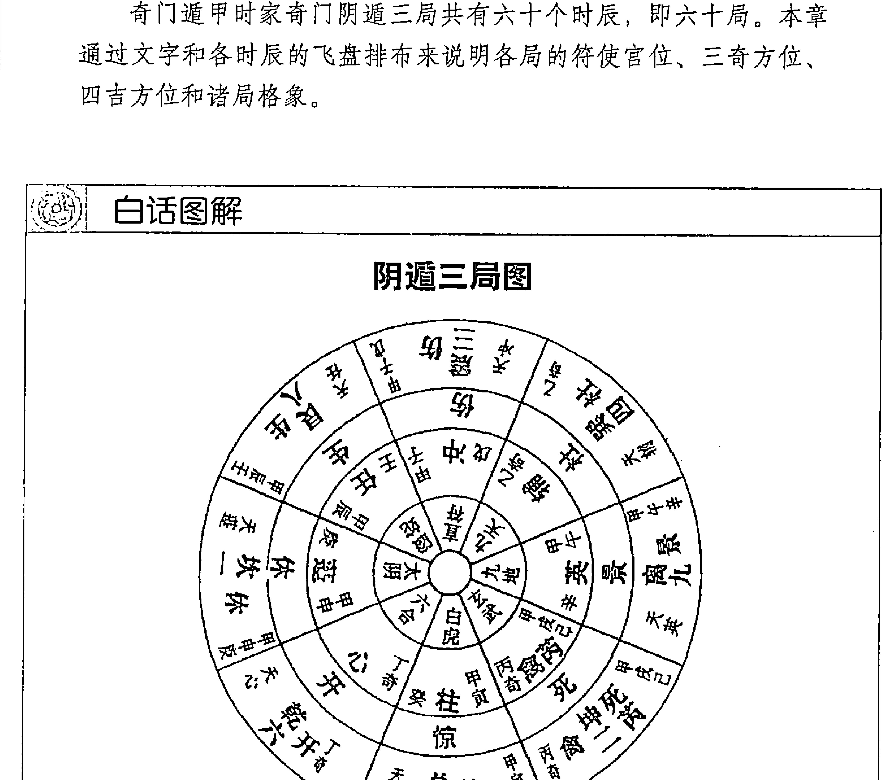

| 阴遁三局 | 夏至中元 | 白露中元 | 寒露下元 | 立冬下元 |
| :--- | :--- | :--- | :--- | :--- |
|  |  |  |  |  |## 每日时辰

奇门遁甲中一局为一元，一元有甲己、乙庚、丙辛、丁壬和戊癸五日，每日有十二个时辰，则一局就有六十个时辰，用六十甲子来表示，一个时辰为一小局。

| 甲己日 | 甲子 | 乙丑 | 丙寅 | 丁卯 | 戊辰 | 己巳 | 庚午 | 辛未 | 壬申 | 癸酉 | 甲戌 | 乙亥 |
| :--- | :--- | :--- | :--- | :--- | :--- | :--- | :--- | :--- | :--- | :--- | :--- | :--- |
| 乙庚日 | 丙子 | 丁丑 | 戊寅 | 己卯 | 庚辰 | 辛巳 | 壬午 | 癸未 | 甲申 | 乙酉 | 丙戌 | 丁亥 |
| 丙辛日 | 戊子 | 己丑 | 庚寅 | 辛卯 | 壬辰 | 癸巳 | 甲午 | 乙未 | 丙申 | 丁酉 | 戊戌 | 己亥 |
| 丁壬日 | 庚子 | 辛丑 | 壬寅 | 癸卯 | 甲辰 | 乙巳 | 丙午 | 丁未 | 戊申 | 己酉 | 庚戌 | 辛亥 |
| 戊癸日 | 壬子 | 癸丑 | 甲寅 | 乙卯 | 丙辰 | 丁巳 | 戊午 | 己未 | 庚申 | 辛酉 | 壬戌 | 癸亥 |

## 阴遁三局六十时符使表

奇门遁甲排盘时，最主要的就是寻找值符和值使，并确定其所在的宫位。下表就是阴遁三局六十个时辰的值符和值使，以及其所在的宫位。

| 时辰 | 甲子 | 乙丑 | 丙寅 | 丁卯 | 戊辰 | 己巳 | 庚午 | 辛未 | 壬申 | 癸酉 |
| :--- | :--- | :--- | :--- | :--- | :--- | :--- | :--- | :--- | :--- | :--- |
| 天冲 | 三 | 四 | 五 | 六 | 三 | 二 | 一 | 九 | 八 | 七 |
| 伤门 | 三 | 二 | 一 | 九 | 八 | 七 | 六 | 五 | 四 | 三 |
| 时辰 | 甲戌 | 乙亥 | 丙子 | 丁丑 | 戊寅 | 己卯 | 庚辰 | 辛巳 | 壬午 | 癸未 |
| 天芮 | 二 | 四 | 五 | 六 | 三 | 二 | 一 | 九 | 八 | 七 |
| 死门 | 二 | 一 | 九 | 八 | 七 | 六 | 五 | 四 | 三 | 二 |
| 时辰 | 甲申 | 乙酉 | 丙戌 | 丁亥 | 戊子 | 己丑 | 庚寅 | 辛卯 | 壬辰 | 癸巳 |
| 天蓬 | 一 | 四 | 五 | 六 | 三 | 二 | 一 | 九 | 八 | 七 |
| 休门 | 一 | 九 | 八 | 七 | 六 | 五 | 四 | 三 | 二 | 一 |
| 时辰 | 甲午 | 乙未 | 丙申 | 丁酉 | 戊戌 | 己亥 | 庚子 | 辛丑 | 壬寅 | 癸卯 |
| 天英 | 九 | 四 | 五 | 六 | 三 | 二 | 一 | 九 | 八 | 七 |
| 景门 | 九 | 八 | 七 | 六 | 五 | 四 | 三 | 二 | 一 | 九 |
| 时辰 | 甲辰 | 乙巳 | 丙午 | 丁未 | 戊申 | 己酉 | 庚戌 | 辛亥 | 壬子 | 癸丑 |
| 天任 | 八 | 四 | 五 | 六 | 三 | 二 | 一 | 九 | 八 | 七 |
| 生门 | 八 | 七 | 六 | 五 | 四 | 三 | 二 | 一 | 九 | 八 |
| 时辰 | 甲寅 | 乙卯 | 丙辰 | 丁巳 | 戊午 | 己未 | 庚申 | 辛酉 | 壬戌 | 癸亥 |
| 天柱 | 七 | 四 | 五 | 六 | 三 | 二 | 一 | 九 | 八 | 七 |
| 景门 | 七 | 六 | 五 | 四 | 三 | 二 | 一 | 九 | 八 | 七 |

# 1. 甲己日十二时局

### 甲子时：利于逃避

【原文】
甲子 冲三，伤三。子至辰阳，宿干吉。死坤伏，杜巽伏，开墓乾伏。天四，地九，阴二，合六。开与星合六西北，遁甲时，刑德在门，不利，利以逃亡，时干震，符门伏，遁甲，三吉。

【白话提要】
符使宫位：值符天冲星在震三宫，值使伤门在震三宫。时干遇吉星宿，时干逢吉。子时至辰时为五阳时。

三奇方位：死门逢双丙奇在坤二宫，不相生克。杜门逢双乙奇在巽四宫，不相生克。开门逢双丁奇在乾六宫，不相生克，丁奇入墓。

四吉方位：九天在巽四宫，九地在离九宫，太阴在坎一宫，六合在乾六宫。

诸局格象：开门合丁奇在乾六宫，西北方向吉利。甲子时，刑德在门，主客双方不利，利逃避。时干在震三宫。星符、八门伏吟。遁甲开。三吉格。

## 白话图解

值符 天冲在震三宫 值使 伤门在震三宫

九天
乙 杜门
乙 天辅

九地
辛 景门
辛 天英

玄武
己 死门 丙
己 天芮 禽

直符
戊 伤门
戊 天冲
丙

白虎
癸 惊门
癸 天柱

螣蛇
壬 生门
壬 天任

太阴
庚 休门
庚 天蓬

六合
丁 开门
丁 天心

三奇方位
死门逢双丙奇在坤二宫，不相生克。
杜门逢双乙奇在巽四宫，不相生克。
开门逢双丁奇在乾六宫，不相生克。

四吉方位
九天在巽四宫，利于出击。
九地在离九宫，利于驻防。
太阴在坎一宫，利于潜伏。
六合在乾六宫，利于撤逃。

诸局格象
星符、八门伏吟，凶。
遁甲开，吉。

吉方：开门合丁奇在乾六宫，西北方向吉利。

# 乙丑时：逢己日不宜用事

【原文】
乙丑 冲四，伤二。宿干吉，己日不用。杜兑害，生离和，死坎制。天九，地二，阴八，合一。生与日合九正南，时干离，龙走，蛇矫。

【白话提要】
符使宫位：值符天冲星在巽四宫，值使伤门在坤二宫。时干遇吉星宿，时干逢吉。逢己日不宜用事。
三奇方位：杜门逢丙奇在兑七宫，被克。生门逢乙奇在离九宫，被生。死门逢丁奇在坎一宫，克宫。
四吉方位：九天在离九宫，九地在坤二宫，太阴在艮八宫，六合在坎一宫。
诸局格象：生门合乙奇在离九宫，正南方向吉利。时干在离九宫。青龙逃走。螣蛇天矫。

## 白话图解

值符 天冲在巽四宫 值使 伤门在坤二宫

吉方：生门合乙奇在离九宫，正南方向吉利。

| 直符 | 九天 | 九地 |
| :--- | :--- | :--- |
| 戊 休门 乙 天冲 | 九天 | 辛 伤门 己 天英 |
| 螣蛇 | 丙 | 玄武 |
| 壬 开门 戊 天任 | | 己 杜门 丙 癸 天芮 禽 |
| 太阴 | 六合 | 白虎 |
| 乙 惊门 壬 天蓬 | 丁 死门 庚 天心 | 癸 景门 丁 天柱 |

三奇方位：杜门逢丙奇在兑七宫，被克。生门逢乙奇在离九宫，被生。死门逢丁奇在坎一宫，克宫。
四吉方位：九天在离九宫，利于出击。九地在坤二宫，利于驻防。太阴在艮八宫，利于潜伏。六合在坎一宫，利于撤逃。
诸局格象：青龙逃走，螣蛇天矫，凶。

### 丙寅时：正西方向吉利

【原文】
丙寅 冲五，伤一。宿干吉。伤坎和，休兑和，景震和欢怡。天七，地六，阴四，合三。休与日合七正西，己日飞干格，天乙与太白格，龙反首，时干坎，相佐离，火入金，事同。

【白话提要】
符使宫位：值符天冲星在中五宫，寄于坤二宫，值使伤门在坎一宫。时干遇吉星宿，时干逢吉。
三奇方位：伤门逢丙奇在坎一宫，被生。休门逢乙奇在兑七宫，被生。景门逢丁奇在震三宫，被生，吉利。
四吉方位：九天在兑七宫，九地在乾六宫，太阴在巽四宫，六合在震三宫。
诸局格象：休门合乙奇在兑七宫，正西方向吉利。己日为飞干格。天乙与六庚格。青龙回首。时干在坎一宫。值符得地盘丙奇相助于坤二宫。荧入太白。

## 白话图解

值符 天冲在中五宫，寄于坤二宫 值使 伤门在坎一宫

太阴: 庚死门、乙天蓬
螣蛇: 壬惊门、辛天任
直符: 戊开门、己天冲
六合: 丁景门、戊天心
九天: 乙休门、癸天辅
九地: 辛生门、丁天英
白虎: 癸杜门、壬天柱
玄武: 己伤门、丙、庚天芮禽

- 三奇方位: 伤门逢丙奇在坎一宫，被生。休门逢乙奇在兑七宫，被生。景门逢丁奇在震三宫，被生。
- 四吉方位: 九天在兑七宫，利于出击。九地在乾六宫，利于驻防。太阴在巽四宫，利于潜伏。六合在震三宫，利于撤逃。
- 诸局格象: 青龙回首，吉。荧入太白，凶。逢己日，为飞干格，凶。

吉方：休门合乙奇在兑七宫，正西方向吉利。

### 丁卯时：正东方向吉利

【原文】
丁卯 冲六，伤九。宿干吉。休震义，惊合坎义，伤离义。天一，地八，阴二，合九。休与月合三正东，金入火，仪刑，鸟跌穴，己日伏干格，时干离，相佐乾，击刑格。

【白话提要】
符使宫位：值符天冲星在乾六宫，值使伤门在离九宫。时干遇吉星宿，时干逢吉。

三奇方位：休门逢丙奇在震三宫，生宫。惊门逢乙奇在坎一宫，生宫，奇仪相合。伤门逢丁奇在离九宫，生宫。

四吉方位：九天在坎一宫，九地在艮八宫，太阴在坤二宫，六合在离九宫。

诸局格象：休门合丙奇在震三宫，正东方向吉利。太白入荧。六仪击刑。飞鸟跌穴。己日为伏干格。时干在离九宫。值符得地盘丁奇相助于乾六宫。击刑格。

## 白话图解

| 左上 | 上中 | 右上 |
| :--- | :--- | :--- |
| 白虎 癸 生门 乙 天柱 | 六合 丁 伤门 辛 天心 | 太阴 庚 杜门 己 天蓬 |
| 中左 | 中中 | 中右 |
| 玄武 休门 戊 天芮 禽 丙 | | 腾蛇 壬 景门 癸 天任 |
| 下左 | 下中 | 下右 |
| 九地 辛 开门 壬 天英 | 九天 乙 惊门 庚 天辅 | 直符 戊 死门 丁 天冲 |

三奇方位
休门逢丙奇在震三宫，生宫。
惊门逢乙奇在坎一宫，生宫。
伤门逢丁奇在离九宫，生宫。

四吉方位
九天在坎一宫，利于出击。
九地在艮八宫，利于驻防。
太阴在坤二宫，利于潜伏。
六合在离九宫，利于撤逃。

诸局格象
飞鸟跌穴，吉。
太白入荧，六仪击刑，凶。
逢己日，为伏干格，凶。

吉方：休门合丙奇在震三宫，正东方向吉利。

### 戊辰时：西北方向吉利

【原文】
戊辰 冲三，伤八。宿干吉。惊丙坤和，景乙巽和，休墓丁乾和。天四，地九，阴一，合六。休与星合六西北，仪刑，鸟跌穴，甲日伏干格，己日飞干格，时干震，符伏，己日勃。

【白话提要】
符使宫位：值符天冲星在震三宫，值使伤门在艮八宫。时干遇吉星宿，时干逢吉。
三奇方位：惊门逢双丙奇在坤二宫，被生。景门逢双乙奇在巽四宫，被生。休门逢双丁奇在乾六宫，被生，丁奇入墓。
四吉方位：九天在巽四宫，九地在离九宫，太阴在坎一宫，六合在乾六宫。
诸局格象：休门合丁奇在乾六宫，西北方向吉利。六仪击刑。飞鸟跌穴。逢甲日伏干格，己日飞干格。时干在震三宫。星符伏吟。己日日勃。

## 白话图解

| 九天 | 九地 | 玄武 |
| :--- | :--- | :--- |
| 乙 景门 | 辛 死门 | 己 惊门 丙 |
| 乙 天辅 | 辛 天英 | 己 天芮 禽 |
| 直符 | | 白虎 |
| 戊 杜门 | | 癸 开门 |
| 戊 天冲 | 丙 | 癸 天柱 |
| 螣蛇 | 太阴 | 六合 |
| 壬 伤门 | 庚 生门 | 丁 休门 |
| 壬 天任 | 庚 天蓬 | 丁 天心 |

三奇方位：
惊门逢双丙奇在坤二宫，被生。
景门逢双乙奇在巽四宫，被生。
休门逢双丁奇在乾六宫，被生。
四吉方位：
九天在巽四宫，利于出击。
九地在离九宫，利于驻防。
太阴在坎一宫，利于潜伏。
六合在乾六宫，利于撤逃。
诸局格象：
飞鸟跌穴，吉。
逢甲日，为伏干格，凶。
逢己日，为飞干格，凶。
六仪击刑，星符伏吟，己日日勃，凶。

吉方：休门合丁奇在乾六宫，西北方向吉利。

### 己巳时：无奇门可出

【原文】
己巳 冲二，伤七。巳至酉阴，天辅，宿吉干凶。景坎害，伤兑害，惊震制欢怡。天七，地六，阴四，合三。无奇门，巳日伏干格，龙反首。时干坎，相佐坤，火入金。

【白话提要】
符使宫位：值符天冲星在坤二宫，值使伤门在兑七宫。时干遇吉星宿，时干逢凶。巳时至酉时为五阴时。巳时为天辅释罪时。
三奇方位：景门逢丙奇在坎一宫，被克。伤门逢乙奇在兑七宫，被克。惊门逢丁奇在震三宫，克宫，吉利。
四吉方位：九天在兑七宫，九地在乾六宫，太阴在巽四宫，六合在震三宫。
诸局格象：无奇门。逢巳日伏干格。青龙回首。时干在坎一宫。值符得地丙助于坤二宫。荧入太白。

## 白话图解

值符 天冲在坤二宫
值使 伤门在兑七宫

| 太阴 | 螣蛇 | 直符 |
| :--- | :--- | :--- |
| 庚 开门 乙 天蓬 | 壬 休门 辛 天任 | 戊 生门 己 天冲 |
| 六合 | | 九天 |
| 丁 惊门 戊 天心 | 丙 | 乙 伤门 癸 天辅 |
| 白虎 | 玄武 | 九地 |
| 癸 死门 壬 天柱 | 己 景门 丙 庚 天芮 禽 | 辛 杜门 丁 天英 |

三奇方位
景门逢丙奇在坎一宫，被克。
伤门逢乙奇在兑七宫，被克。
惊门逢丁奇在震三宫，克宫。

四吉方位
九天在兑七宫，利于出击。
九地在乾六宫，利于驻防。
太阴在巽四宫，利于潜伏。
六合在震三宫，利于撤逃。

诸局格象
青龙回首，吉。
无奇门，凶。
荧入太白，凶。
逢巳日，为伏干格，凶。

### 庚午时：宜守户不出

【原文】
庚午 冲一，伤六。宿干吉，甲日不用，守户。惊乙巽制，景艮义，休丙坤害。天八，地三，阴七，合二。休与星合二西南，丁下有丙，飞宫格，甲日飞干格，时干兑，飞符，大格。

【白话提要】
符使宫位：值符天冲星在坎一宫，值使伤门在乾六宫。时干遇吉星宿，时干逢吉。宜守户不出。
三奇方位：惊门逢天盘丙奇与地盘乙奇在巽四宫，克宫。景门逢乙奇在艮八宫，生宫。休门逢天盘丁奇与地盘丙奇在坤二宫，被克。
四吉方位：九天在艮八宫，九地在震三宫，太阴在兑七宫，六合在坤二宫。
诸局格象：休门合丁奇在坤二宫，西南方向吉利。丁下有丙为星随月转。飞宫格。甲日为飞干格。时干在兑七宫。值符飞宫。大格。

## 白话图解

值符 天冲在坎一宫
值使 伤门在乾六宫

吉方：休门合丁奇在坤二宫，西南方向吉利。

| 玄武 | 白虎 | 六合 |
| :--- | :--- | :--- |
| 己 惊门 丙 乙 天芮 禽 | 癸 开门 辛 天柱 | 丁 休门 己 天心 |
| 九地 | | 太阴 |
| 辛 死门 | 丙 | 庚 生门 |
| 戊 天英 | | 癸 天蓬 |
| 九天 | 直符 | 螣蛇 |
| 乙 景门 | 戊 杜门 | 壬 伤门 |
| 壬 天辅 | 庚 天冲 | 丁 天任 |

- 三奇方位：惊门逢天盘丙奇与地盘乙奇在巽四宫，克宫。景门逢乙奇在艮八宫，生宫。休门逢天盘丁奇与地盘丙奇在坤二宫，被克。
- 四吉方位：九天在艮八宫，利于出击。九地在震三宫，利于驻防。太阴在兑七宫，利于潜伏。六合在坤二宫，利于撤逃。
- 诸局格象：丁下有丙，为星随月转，吉。飞宫格，大格，凶。逢甲日，为飞干格，凶。

### 辛未时：无奇门可出

【原文】
辛未 冲九，伤五避五。宿干凶。景墓丁乾制，伤墓丙坤制，惊合艮和。天二，地七，阴三，合八。无奇门，伏宫格，甲日伏干格，时干兑，飞宫。

【白话提要】
符使宫位：值符天冲星在离九宫，值使伤门在中五宫，寄于坤二宫。时干遇凶星宿，时干逢凶。
三奇方位：景门逢天盘丙奇与地盘丁奇在乾六宫，克宫，丙奇入墓。伤门逢天盘乙奇与地盘丙奇在坤二宫，克宫，乙奇入墓。惊门逢丁奇在艮八宫，被生。
四吉方位：九天在坤二宫，九地在兑七宫，太阴在震三宫，六合在艮八宫。
诸局格象：无奇门。伏宫格。逢甲日伏干格。时干在兑七宫。飞宫格。

## 白话图解

阴遁三局甲己日辛未时盘
| 螣蛇 | 直符 | 九天 |
| :--- | :--- | :--- |
| 壬 休门 乙 天任 | 戊 生门 辛 天冲 | 乙 伤门 己 天辅 |
| **太阴** | | **九地** |
| 庚 开门 戊 天蓬 | 丙 | 辛 杜门 癸 天英 |
| **六合** | **白虎** | **玄武** |
| 丁 惊门 壬 天心 | 癸 死门 庚 天柱 | 己 景门 丙 丁 天芮 禽 |

三奇方位
景门逢天盘丙奇与地盘丁奇在乾六宫，克宫。
伤门逢天盘乙奇与地盘丙奇在坤二宫，克宫。
惊门逢丁奇在艮八宫，被生。

四吉方位
九天在坤二宫，利于出击。
九地在兑七宫，利于驻防。
太阴在震三宫，利于潜伏。
六合在艮八宫，利于撤逃。

诸局格象
无奇门，凶。
逢甲日，为伏干格，凶。
伏宫格，飞宫格，凶。

### 壬申时：正东方向吉利

【原文】
壬申 冲八，伤四。宿吉干凶。杜合离义，生震害欢怡，死兑义。天三，地四，阴六，合七。生与日合三正东，时干坎，雀入江，虎猖狂。

【白话提要】
符使宫位：值符天冲星在艮八宫，值使伤门在巽四宫。时干遇吉星宿，时干逢凶。

三奇方位：杜门逢丙奇在离九宫，生宫，奇仪相合。生门逢乙奇在震三宫，被克，吉利。死门逢丁奇在兑七宫，生宫。

四吉方位：九天在震三宫，九地在巽四宫，太阴在乾六宫，六合在兑七宫。

诸局格象：生门合乙奇在震三宫，正东方向吉利。时干在坎一宫。朱雀入江。白虎猖狂。

## 白话图解

值符 天冲在艮八宫 值使 伤门在巽四宫

| 九地 | 玄武 | 白虎 |
| :--- | :--- | :--- |
| 辛 伤门 乙 天英 | 己 杜门 丙 辛 天芮 禽 | 癸 景门 己 天柱 |
| 九天 | | 六合 |
| 乙 生门 戊 天辅 | 丙 | 丁 死门 癸 天心 |
| 直符 | 螣蛇 | 太阴 |
| 戊 休门 壬 天冲 | 壬 开门 庚 天任 | 庚 惊门 丁 天蓬 |

三奇方位
- 杜门逢丙奇在离九宫，生宫。
- 生门逢乙奇在震三宫，被克。
- 死门逢丁奇在兑七宫，生宫。

四吉方位
- 九天在震三宫，利于出击。
- 九地在巽四宫，利于驻防。
- 太阴在乾六宫，利于潜伏。
- 六合在兑七宫，利于撤逃。

诸局格象
- 朱雀入江，白虎猖狂，凶。

吉方：生门合乙奇在震三宫，正东方向吉利。

### 癸酉时：东北与西北方向吉利

【原文】
癸酉 冲七，伤三。宿干凶。生艮伏，开丁乾伏，杜乙巽伏。天六，地一，阴九，合四。开与日合六西北，生与月合八东北，时干震，符冲，门伏，天网，三吉。

【白话提要】
符使宫位：值符天冲星在兑七宫，值使伤门在震三宫。时干遇凶星宿，时干逢凶。
三奇方位：生门逢丙奇在艮八宫，不相生克。开门逢天盘乙奇与地盘丁奇在乾六宫，不相生克。杜门逢天盘丁奇与地盘乙奇在巽四宫，不相生克。
四吉方位：九天在乾六宫，九地在坎一宫，太阴在离九宫，六合在巽四宫。
诸局格象：开门合乙奇在乾六宫，西北方向吉利。生门合丙奇在艮八宫，东北方向吉利。时干在震三宫。值符相冲。八门伏吟。天网四张。三吉格。

## 白话图解

值符 天冲在兑七宫 值使 伤门在震三宫

| 六合 丁 杜门 乙 天心 | 太阴 庚 景门 辛 天蓬 | 螣蛇 壬 死门 己 天任 |
| :--- | :--- | :--- |
| 白虎 癸 伤门 戊 天柱 | 丙 | 直符 戊 惊门 癸 天冲 |
| 玄武 生门 丙 天芮 禽 | 九地 辛 休门 庚 天英 | 九天 乙 开门 丁 天辅 |

吉方1：开门合乙奇在乾六宫，西北方向吉利。
吉方2：生门合丙奇在艮八宫，东北方向吉利。

**三奇方位**
- 生门逢丙奇在艮八宫，不相生克。
- 开门逢天盘乙奇与地盘丁奇在乾六宫，不相生克。
- 杜门逢天盘丁奇与地盘乙奇在巽四宫，不相生克。

**四吉方位**
- 九天在乾六宫，利于出击。
- 九地在坎一宫，利于驻防。
- 太阴在离九宫，利于潜伏。
- 六合在巽四宫，利于撤逃。

**诸局格象**
- 八门伏吟，天网四张，凶。
- 九星反吟，值符反吟，凶。

## 甲戌时：西北方向吉利

## 【原文】

甲戌 天芮值符二，死门值使二。戌至亥阳，宿凶干吉。辅使杜巽伏，芮月死坤伏，心星开墓乾伏。天七，地六，阴四，合三。开与星合六西北，己日干勃格，时干坤，符门伏，大格，飞甲，阖。

## 【白话提要】

- 符使宫位：值符天芮星在坤二宫，值使死门在坤二宫。时干遇凶星宿，时干逢吉。戌时至亥时为五阳时。
- 三奇方位：杜门逢双乙奇在巽四宫，不相生克。死门逢双丙奇在坤二宫，不相生克。开门逢双丁奇在乾六宫，不相生克，丁奇入墓。
- 四吉方位：九天在兑七宫，九地在乾六宫，太阴在巽四宫，六合在震三宫。
- 诸局格象：开门合丁奇在乾六宫，西北方向吉利。己日干勃格。时干在坤二宫。星符八门伏吟。大格。飞甲合。

## 白话图解

阴遁三局甲己日甲戌时盘

值符：天芮在坤二宫
值使：死门在坤二宫

九宫格：
| 太阴 | 螣蛇 | 直符 |
| 乙杜门 乙天辅 | 辛景门 辛天英 | 己死门 丙 己天芮 禽 |
| 六合 |  | 九天 |
| 戊伤门 戊天冲 | 丙 | 癸惊门 癸天柱 |
| 白虎 | 玄武 | 九地 |
| 壬生门 壬天任 | 庚休门 庚天蓬 | 丁开门 丁天心 |

三奇方位：
杜门逢双乙奇在巽四宫，不相生克。
死门逢双丙奇在坤二宫，不相生克。
开门双逢丁奇在乾六宫，不相生克。

四吉方位：
九天在兑七宫，利于出击。
九地在乾六宫，利于驻防。
太阴在巽四宫，利于潜伏。
六合在震三宫，利于撤逃。

诸局格象：
逢己日，为日干勃格，凶。
九星、值符、八门伏吟，凶。
大格，飞甲合，凶。

吉方：开门合丁奇在乾六宫，西北方向吉利。

# 乙亥时：逢己日不宜用事

## 【原文】

乙亥 芮四，死一。宿干吉，己日不用。惊艮和，休乙巽义，伤丙坤制欢怡。天九，地二，阴八，合一。休与月合四东南，丙下有乙，甲日飞干格，天乙与太白格，时干艮，事同，大格。

## 【白话提要】

- 符使宫位：值符天芮星在巽四宫，值使死门在坎一宫。时干遇吉星宿，时干逢吉。
- 三奇方位：惊门逢乙奇在艮八宫，被生。休门逢天盘丙奇与地盘乙奇在巽四宫，生宫。伤门逢天盘丁奇与地盘丙奇在坤二宫，克宫，吉利。
- 四吉方位：九天在离九宫，九地在坤二宫，太阴在坎一宫，六合在艮八宫。
- 诸局格象：休门合丙奇在巽四宫，东南方向吉利。丙下有乙为日月并行。逢甲日飞干格。天乙与六庚格。时干在艮八宫。大格。

## 白话图解

阴遁三局甲己日乙亥时盘

吉方：休门合丙奇在巽四宫，东南方向吉利。

| 直符 | 九天 | 九地 |
|------|------|------|
| 休门 丙 天芮 禽 | 癸 生门 辛 天柱 | 丁 伤门 己 天心 |
| 螣蛇 | | 玄武 |
| 辛 开门 戊 天英 | 丙 | 庚 杜门 癸 天蓬 |
| 太阴 | 六合 | 白虎 |
| 乙 惊门 壬 天辅 | 戊 死门 庚 天冲 | 壬 景门 丁 天任 |

> 三奇方位：惊门逢乙奇在艮八宫，被生。休门逢天盘丙奇与地盘乙奇在巽四宫，生宫。伤门逢天盘丁奇与地盘丙奇在坤二宫，克宫。
四吉方位：九天在离九宫，利于出击。九地在坤二宫，利于驻防。太阴在坎一宫，利于潜伏。六合在艮八宫，利于撤逃。
诸局格象：丙下有乙，为日月并行，吉。逢甲日，为飞干格，凶。大格，凶。

## 2.乙庚日十二时局

# 丙子时：逢庚日不宜用事

## 【原文】

丙子 芮五，死九。子至寅阳，宿干吉，庚日不用。景乙巽和，惊丙坤和，休墓丁乾和。天七，地六，阴四，合三。休与星合六西北，符勃，时干坤，相佐乾，符伏，龙反首。

## 【白话提要】

- 符使宫位：值符天芮星在中五宫，寄于坤二宫，值使死门在离九宫。时干遇吉星宿，时干逢吉。子时至寅时为五阳时。逢庚日不宜用事。
- 三奇方位：景门逢双乙奇在巽四宫，被生。惊门逢双丙奇在坤二宫，被生。休门逢双丁奇在乾六宫，被生，丁奇入墓。
- 四吉方位：九天在兑七宫，九地在乾六宫，太阴在巽四宫，六合在震三宫。
- 诸局格象：休门合丁奇在乾六宫，西北方向吉利。符勃。时干在坤二宫。值符得地盘丁奇相助于乾六宫。星符伏吟。青龙回首。

## 白话图解

阴遁三局乙庚日丙子时盘

| 太阴 | 螣蛇 | 直符 |
|---|---|---|
| 乙 景门 乙 天辅 | 辛 死门 辛 天英 | 己 惊门 丙 己 天芮 禽 |
| 六合 | | 九天 |
| 戊 杜门 戊 天冲 | 丙 | 癸 开门 癸 天柱 |
| 白虎 | 玄武 | 九地 |
| 壬 伤门 壬 天任 | 庚 生门 庚 天蓬 | 丁 休门 丁 天心 |

景门逢双乙奇在巽四宫，被生。
惊门逢双丙奇在坤二宫，被生。
休门逢双丁奇在乾六宫，被生。

九天在兑七宫，利于出击。
九地在乾六宫，利于驻防。
太阴在巽四宫，利于潜伏。
六合在震三宫，利于撤逃。

青龙回首，吉。
符勃，星符伏吟，凶。

吉方：休门合丁奇在乾六宫，西北方向吉利。

## 丁丑时：西南方向吉利

## 【原文】

丁丑 芮六，死八。宿凶干吉。生墓丙坤伏欢怡，杜墓丁乾符，死合艮伏。天一，地八，阴二，合九。生与日合二西南，乙下有丙，时干艮，相佐乾，飞宫，门反吟。

## 【白话提要】

- 符使宫位：值符天芮星在乾六宫，值使死门在艮八宫。时干遇凶星宿，时干逢吉。
- 三奇方位：生门逢天盘乙奇与地盘丙奇在坤二宫，不相生克，吉利，乙奇入墓。杜门逢天盘丙奇与地盘丁奇在乾六宫，被克，乙奇入墓。死门逢丁奇在艮八宫，不相生克，奇仪相合。
- 四吉方位：九天在坎一宫，九地在艮八宫，太阴在坤二宫，六合在离九宫。
- 诸局格象：生门合乙奇在坤二宫，西南方向吉利。乙下有丙为人遁。时干在艮八宫。值符得地盘丁奇相助于乾六宫。飞宫格。八门反吟。

## 白话图解

阴遁三局乙庚日丁丑时盘

| 值符 | 天芮在乾六宫 | 值使 | 死门在艮八宫 |
| --- | --- | --- | --- |

吉方：生门合乙奇在坤二宫，西南方向吉利。

| 白虎 | 六合 | 太阴 |
| --- | --- | --- |
| 壬 开门 乙 天任 | 戊 休门 辛 天冲 | 乙 生门 丁 天辅 |
| --- | --- | --- |
| 玄武 | 丙 | 螣蛇 |
| 庚 惊门 戊 天蓬 |  | 辛 伤门 癸 天英 |
| 九地 | 九天 | 直符 |
| 丁 死门 壬 天心 | 癸 景门 庚 天柱 | 己 杜门 丙 丁 天芮 禽 |

- 三奇方位
  - 生门逢天盘乙奇与地盘丙奇在坤二宫，不相生克。
  - 杜门逢天盘丙奇与地盘丁奇在乾六宫，被克。
  - 死门逢丁奇在艮八宫，不相生克。
- 四吉方位
  - 九天在坎一宫，利于出击。
  - 九地在艮八宫，利于驻防。
  - 太阴在坤二宫，利于潜伏。
  - 六合在离九宫，利于撤逃。
- 诸局格象
  - 乙下有丙，为人遁，吉。
  - 飞宫格，八门反吟，凶。

## 戊寅时：正东与正北方向吉利

## 【原文】

戊寅 芮三，死七。宿干吉，天遁。开合坎义，生震害，杜离义。天四，地九，阴一，合六。开与日合一正北，生与月合三正东，伏宫格，鸟跌穴，时干乾，乙日飞干格，火入金。

## 【白话提要】

- 符使宫位：值符天芮星在震三宫，值使死门在兑七宫。时干遇吉星宿，时干逢吉。成天遁格。
- 三奇方位：开门逢乙奇在坎一宫，生宫，奇仪相合。生门逢丙奇在震三宫，被克。杜门逢丁奇在离九宫，生宫。
- 四吉方位：九天在巽四宫，九地在离九宫，太阴在坎一宫，六合在乾六宫。
- 诸局格象：开门合乙奇在坎一宫，正北方向吉利。生门合丙奇在震三宫，正东方向吉利。伏宫格。飞鸟跌穴。时干在乾六宫。逢乙日飞干格。荧入太白。

## 白话图解

阴遁三局乙庚日戊寅时盘

| 九天 | 九地 | 玄武 |
|------|------|------|
| 癸 伤门 乙 天柱 | 丁 杜门 辛 天心 | 庚 景门 己 天蓬 |
| 直符 乙 生门 丙 天芮 禽 | 丙 | 白虎 壬 死门 癸 天任 |
| 腾蛇 辛 休门 壬 天英 | 太阴 乙 开门 庚 天辅 | 六合 戊 惊门 丁 天冲 |

吉方1：开门合乙奇在坎一宫，正北方向吉利。

吉方2：生门合丙奇在震三宫，正东方向吉利。

三奇方位
开门逢乙奇在坎一宫，生宫。
生门逢丙奇在震三宫，被克。
杜门逢丁奇在离九宫，生宫。

四吉方位
九天在巽四宫，利于出击。
九地在离九宫，利于驻防。
太阴在坎一宫，利于潜伏。
六合在乾六宫，利于撤逃。

诸局格象
飞鸟跌穴，吉。
伏宫格，荧入太白，凶。
逢乙日，为飞干格，凶。

# 己卯时：宜守户不出

## 【原文】

己卯 芮二，死六。卯至未阴，宿干凶，守户。生乙巽害，杜丙坤制，死墓丁乾义。天七，地六，阴四，合三。生与日合四东南，时干坤，相佐坤，符伏。

## 【白话提要】

- 符使宫位：值符天芮星在坤二宫，值使死门在乾六宫。时干遇凶星宿，时干逢凶。卯时至未时为五阴时。
- 三奇方位：生门逢双乙奇在巽四宫，被克。杜门逢双丙奇在坤二宫，克宫。死门逢双丁奇在乾六宫，生宫，丁奇入墓。
- 四吉方位：九天在兑七宫，九地在乾六宫，太阴在巽四宫，六合在震三宫。
- 诸局格象：生门合乙奇在巽四宫，东南方向吉利。时干在坤二宫。值符得地盘丙奇助于坤二宫。星符伏吟。

## 白话图解

阴遁三局乙庚日己卯时盘

值符：天芮在坤二宫
值使：死门在乾六宫

吉方：生门合乙奇在巽四宫，东南方向吉利。

| 太阴 | 螣蛇 | 直符 |
| :--- | :--- | :--- |
| 乙 生门 乙 天辅 | 辛 伤门 辛 天英 | 己 杜门 丙 己 天芮 禽 |
| 六合 | | 九天 |
| 戊 休门 戊 天冲 | 丙 | 癸 景门 癸 天柱 |
| 白虎 | 玄武 | 九地 |
| 壬 开门 壬 天任 | 庚 惊门 庚 天蓬 | 丁 死门 丁 天心 |

- 三奇方位
  - 生门逢双乙奇在巽四宫，被克。
  - 杜门逢双丙奇在坤二宫，克宫。
  - 死门逢双丁奇在乾六宫，生宫。
- 四吉方位
  - 九天在兑七宫，利于出击。
  - 九地在乾六宫，利于驻防。
  - 太阴在巽四宫，利于潜伏。
  - 六合在震三宫，利于撤逃。
- 诸局格象
  - 九星、值符伏吟，凶。

## 庚辰时：正北方向吉利

## 【原文】

庚辰 芮一，死五避五。宿干凶。惊兑伏，休坎伏，伤震伏。天八，地三，阴七，合二。休与月合一正北，得使，飞宫格，时干巽，乙日飞干格，门伏，火入金，庚日勃，飞符。

## 【白话提要】

- 符使宫位：值符天芮星在坎一宫，值使死门在中五宫，寄于坤二宫。时干遇凶星宿，时干逢凶。
- 三奇方位：惊门逢乙奇在兑七宫，不相生克。休门逢丙奇在坎一宫，不相生克。伤门逢丁奇在震三宫，不相生克。
- 四吉方位：九天在艮八宫，九地在震三宫，太阴在兑七宫，六合在坤二宫。
- 诸局格象：休门合丙奇在坎一宫，正北方向吉利。丙奇得使。飞宫格。时干在巽四宫。逢乙日飞干格，八门伏吟。荧入太白。庚日日勃。

## 白话图解

阴遁三局乙庚日庚辰时盘

| 玄武 | 白虎 | 六合 |
|------|------|------|
| 庚 杜门 乙 天蓬 | 壬 景门 辛 天任 | 戊 死门 己 天冲 |
| 九地 | | 太阴 |
| 丁 伤门 戊 天心 | 丙 | 乙 惊门 癸 天辅 |
| 九天 | 直符 | 螣蛇 |
| 癸 生门 壬 天柱 | 乙 休门 丙 庚 天芮 禽 | 辛 开门 丁 天英 |

三奇方位：
惊门逢乙奇在兑七宫，不相生克。
休门逢丙奇在坎一宫，不相生克。
伤门逢丁奇在震三宫，不相生克。

四吉方位：
九天在艮八宫，利于出击。
九地在震三宫，利于驻防。
太阴在兑七宫，利于潜伏。
六合在坤二宫，利于撤逃。

诸局格象：
丙奇得使，吉。
飞宫格，庚日日勃，凶。
逢乙日，为飞干格，凶。
八门伏吟，荧入太白，凶。

吉方：休门合丙奇在坎一宫，正北方向吉利。

# 辛巳时：逢乙日不宜用事

## 【原文】

辛巳 芮九，死四。宿干凶，乙日不用。景震和，惊合离害，休兑和。天二，地七，阴三，合八。休与星合七正西，虎猖狂，时干巽，雀入江。

## 【白话提要】

- 符使宫位：值符天芮星在离九宫，值使死门在巽四宫。时干遇凶星宿，时干逢凶。
- 三奇方位：景门逢乙奇在震三宫，被生。惊门逢丙奇在离九宫，被克，奇仪相合。休门逢丁奇在兑七宫，被生。
- 四吉方位：九天在坤二宫，九地在兑七宫，太阴在震三宫，六合在艮八宫。
- 诸局格象：休门合丁奇在兑七宫，正西方向吉利。白虎猖狂。时干在巽四宫。朱雀入江。

## 白话图解

阴遁三局乙庚日辛巳时盘

值符：天芮在离九宫
值使：死门在巽四宫

| 螣蛇 辛 死门 乙 天英 | 直符 己 惊门 丙 辛 天芮 禽 | 九天 癸 开门 己 天柱 |
|----------------------------|--------------------------------|----------------------------|
| 太阴 乙 景门 戊 天辅 | 丙                              | 九地 丁 休门 癸 天心 |
| 六合 戊 杜门 壬 天冲 | 白虎 壬 伤门 庚 天任      | 玄武 辛 生门 丁 天蓬 |

吉方：休门合丁奇在兑七宫，正西方向吉利。

三奇方位：景门逢乙奇在震三宫，被生。惊门逢丙奇在离九宫，被克。休门逢丁奇在兑七宫，被生。

四吉方位：九天在坤二宫，利于出击。九地在兑七宫，利于驻防。太阴在震三宫，利于潜伏。六合在艮八宫，利于撤逃。

诸局格象：白虎猖狂，朱雀入江，凶。

## 壬午时：无奇门不出

## 【原文】

壬午 芮八，死三。宿吉干凶。伤丁乾害，景艮义，惊乙巽制。天三，地四，阴六，合七。无奇门，符冲，时干坤，三吉。

## 【白话提要】

- 符使宫位：值符天芮星在艮八宫，值使死门在震三宫。时干遇吉星宿，时干逢凶。
- 三奇方位：伤门逢天盘乙奇与地盘丁奇在乾六宫，被克。景门逢丙奇在艮八宫，生宫。惊门逢天盘丁奇与地盘乙奇在巽四宫，克宫。
- 四吉方位：九天在震三宫，九地在巽四宫，太阴在乾六宫，六合在兑七宫。
- 诸局格象：无奇门。值符相冲反吟。时干在坤二宫。三吉格。

## 白话图解

阴遁三局乙庚日壬午时盘

| 九地 丁 惊门 乙 天心 | 玄武 庚 开门 辛 天蓬 | 白虎 壬 休门 己 天任 |
| 九天 癸 死门 戊 天柱 | 丙 | 六合 戊 生门 癸 天冲 |
| 直符 己 景门 丙 壬 天芮 禽 | 螣蛇 辛 杜门 庚 天英 | 太阴 乙 伤门 丁 天辅 |

三奇方位：伤门逢天盘乙奇与地盘丁奇在乾六宫，被克。景门逢丙奇在艮八宫，生宫。惊门逢天盘丁奇与地盘乙奇在巽四宫，克宫。

四吉方位：九天在震三宫，利于出击。九地在巽四宫，利于驻防。太阴在乾六宫，利于潜伏。六合在兑七宫，利于撤逃。

诸局格象：无奇门，凶。九星、值符伏吟，凶。

## 癸未时：正北方向吉利

## 【原文】

癸未 芮七，死二。宿吉干凶。景离伏，惊兑伏，休坎伏。天六，地一，阴九，合四。休与星合一正北，天网，时干乾，门伏，击刑，龙走，蛇矫。

## 【白话提要】

- 符使宫位：值符天芮星在兑七宫，值使死门在坤二宫。时干遇吉星宿，时干逢凶。
- 三奇方位：景门逢乙奇在离九宫，不相生克。惊门逢丙奇在兑七宫，不相生克。休门逢丁奇在坎一宫，不相生克。
- 四吉方位：九天在乾六宫，九地在坎一宫，太阴在离九宫，六合在巽四宫。
- 诸局格象：休门合丁奇在坎一宫，正北方向吉利。天网四张。时干在乾六宫。八门伏吟。击刑。青龙逃走。螣蛇天矫。

## 白话图解

阴遁三局乙庚日癸未时盘

| 六合 | 太阴 | 九天 |
|---|---|---|
| 辛 杜门 戊 天冲 | 乙 景门 辛 天辅 | 辛 死门 己 天英 |
| 白虎 |  | 直符 |
| 戊 伤门 壬 天任 | 丙 | 己 惊门 丙 癸 天芮 禽 |
| 玄武 | 九地 | 九天 |
| 壬 生门 庚 天蓬 | 丁 休门 庚 天心 | 癸 开门 丁 天柱 |

- 三奇方位
  - 景门逢乙奇在离九宫，不相生克。
  - 惊门逢丙奇在兑七宫，不相生克。
  - 休门逢丁奇在坎一宫，不相生克。
- 四吉方位
  - 九天在乾六宫，利于出击。
  - 九地在坎一宫，利于驻防。
  - 太阴在离九宫，利于潜伏。
  - 六合在巽四宫，利于撤逃。
- 诸局格象
  - 天网四张，八门伏吟，螣蛇天矫，凶。
  - 击刑，青龙逃走，凶。

吉方：休门合丁奇在坎一宫，正北方向吉利。

## 甲申时：西北方向吉利

## 【原文】

甲申 天蓬值符一，休门值使一。申至亥阳，天辅，宿吉干凶。禽使死坤伏，辅日杜巽伏，心星开墓乾伏。天八，地三，阴七，合二。开与星合六西北，天乙与太白格，伏宫格，时干坎，符门伏，地甲，阖。

## 【白话提要】

- 符使宫位：值符天蓬星在坎一宫，值使休门在坎一宫。时干遇吉星宿，时干逢凶。申时至亥时为五阳时。申时为天辅释罪时。
- 三奇方位：死门逢双丙奇在坤二宫，不相生克。杜门逢双乙奇在巽四宫，不相生克。开门逢双丁奇在乾六宫，不相生克，丁奇入墓。
- 四吉方位：九天在艮八宫，九地在震三宫，太阴在兑七宫，六合在坤二宫。
- 诸局格象：开门合丁奇在乾六宫，西北方向吉利。天乙六庚格。伏宫格。时干在坎一宫。星符八门伏吟。地甲合。

## 白话图解

阴遁三局乙庚日甲申时盘

| 玄武 | 白虎 | 六合 |
| :--- | :--- | :--- |
| 乙 杜门 乙 天辅 | 辛 景门 辛 天英 | 己 死门 丙 己 天芮 禽 |
| 九地 | 丙 | 太阴 |
| 戊 伤门 戊 天冲 | | 癸 惊门 癸 天柱 |
| 九天 | 直符 | 腾蛇 |
| 壬 生门 壬 天任 | 庚 休门 庚 天蓬 | 丁 开门 丁 天心 |

**三奇方位**
死门逢双丙奇在坤二宫，不相生克。
杜门逢双乙奇在巽四宫，不相生克。
开门逢双丁奇在乾六宫，不相生克。

**四吉方位**
九天在艮八宫，利于出击。
九地在震三宫，利于驻防。
太阴在兑七宫，利于潜伏。
六合在坤二宫，利于撤逃。

**诸局格象**
伏宫格，凶。
九星、值符、八门伏吟，凶。

吉方：开门合丁奇在乾六宫，西北方向吉利。

## 乙酉时：无奇门可出

## 【原文】

乙酉 蓬四，休九。宿干吉。景坎害欢怡，伤兑害，惊震制。天九，地二，阴八，合一。无奇门，门反吟，时干兑，火入金，庚日勃，乙日伏干格。

## 【白话提要】

- 符使宫位：值符天蓬星在巽四宫，值使休门在离九宫。时干遇吉星宿，时干逢吉。
- 三奇方位：景门逢丙奇在坎一宫，被克，吉利。伤门逢乙奇在兑七宫，被克。惊门逢丁奇在震三宫，克宫。
- 四吉方位：九天在离九宫，九地在坤二宫，太阴在艮八宫，六合在坎一宫。
- 诸局格象：无奇门。八门反吟。时干在兑七宫。荧入太白。庚日日勃。逢乙日伏干格。

## 白话图解

### 阴遁三局乙庚日乙酉时盘

值符 天蓬在巽四宫 值使 休门在离九宫

| 直符 | 九天 | 九地 |
| :--- | :--- | :--- |
| 庚 开门 乙 天蓬 | 壬 休门 辛 天任 | 戊 生门 己 天冲 |
| 螣蛇 | | 玄武 |
| 丁 惊门 戊 天心 | 丙 | 乙 伤门 癸 天辅 |
| 太阴 | 六合 | 白虎 |
| 癸 死门 壬 天柱 | 己 景门 丙 庚 天芮 禽 | 辛 杜门 丁 天英 |

- 景门逢丙奇在坎一宫，被克。
- 伤门逢乙奇在兑七宫，被克。
- 惊门逢丁奇在震三宫，克宫。

- 九天在离九宫，利于出击。
- 九地在坤二宫，利于驻防。
- 太阴在艮八宫，利于潜伏。
- 六合在坎一宫，利于撤逃。

- 无奇门，凶。
- 荧入太白，庚日日勃，八门反吟，凶。
- 逢乙日，为伏干格，凶。

# 丙戌时：逢庚日不宜用事

## 【原文】

丙戌 蓬五，休八。宿干吉，天遁，庚日不用。生震害，开合坎义，杜离义。天七，地六，阴四，合三。生与月合三正东，开与日合一正北，金入火，乙日飞干格，龙反首，时干震，相佐坤，刑格。

## 【白话提要】

- 符使宫位：值符天蓬星在中五宫，寄于坤二宫，值使休门在艮八宫。时干遇吉星宿，时干逢吉。成天遁格。逢庚日不宜用事。
- 三奇方位：生门逢丙奇在震三宫，被克。开门逢乙奇在坎一宫，生宫，奇仪相合。杜门逢丁奇在离九宫，生宫。
- 四吉方位：九天在兑七宫，九地在乾六宫，太阴在巽四宫，六合在震三宫。
- 诸局格象：生门合丙奇在震三宫，正东方向吉利。开门合乙奇在坎一宫，正北方向吉利。太白入荧。逢乙日飞干格。青龙回首。时干在震三宫。值符得地盘丙奇相助于坤二宫。刑格。

## 白话图解

### 阴遁三局乙庚日丙戌时盘

| 太阴 癸 伤门 乙 天柱 | 螣蛇 丁 杜门 辛 天心 | 直符 庚 景门 己 天蓬 |
| :--- | :--- | :--- |
| 六合 壬 死门 癸 天任 | 丙 | 九天 壬 死门 癸 天任 |
| 白虎 辛 休门 壬 天英 | 玄武 乙 开门 癸 天辅 | 九地 戊 惊门 丁 天冲 |

- 三奇方位：
  - 生门逢丙奇在震三宫，被克。
  - 开门逢乙奇在坎一宫，生宫。
  - 杜门逢丁奇在离九宫，生宫。
- 四吉方位：
  - 九天在兑七宫，利于出击。
  - 九地在乾六宫，利于驻防。
  - 太阴在巽四宫，利于潜伏。
  - 六合在震三宫，利于撤逃。
- 诸局格象：
  - 青龙回首，吉。
  - 逢乙日，为飞干格，凶。
  - 太白入荧，刑格，凶。

吉方1：生门合丙奇在震三宫，正东方向吉利。
吉方2：开门合乙奇在坎一宫，正北方向吉利。

## 丁亥时：正西方向吉利

## 【原文】

丁亥 蓬六，休七。宿干吉。惊合离害，景震和，休兑和。天一，地八，阴二，合九。休与星合七正西，时干兑，相佐乾，雀入江，虎猖狂。

## 【白话提要】

- 符使宫位：值符天蓬星在乾六宫，值使休门在兑七宫。时干遇吉星宿，时干逢吉。
- 三奇方位：惊门逢丙奇在离九宫，被克，奇仪相合。景门逢乙奇在震三宫，被生。休门逢丁奇在兑七宫，被生。
- 四吉方位：九天在坎一宫，九地在艮八宫，太阴在坤二宫，六合在艮八宫。
- 诸局格象：休门合丁奇在兑七宫，正西方向吉利。时干在兑七宫。值符得地盘丁奇相助于乾六宫。朱雀入江。白虎猖狂。

## 白话图解

### 阴遁三局乙庚日丁亥时盘

- 值符：天蓬在乾六宫
- 值使：休门在兑七宫

| 神 | 门 | 星 | 神 | 门 | 星 | 神 | 门 | 星 |
| :--- | :--- | :--- | :--- | :--- | :--- | :--- | :--- | :--- |
| 白虎 | 辛 死门 | 乙 天英 | 六合 | 己 惊门 丙 | 辛 天芮 禽 | 太阴 | 癸 开门 | 己 天柱 |
| 玄武 | 乙 景门 | 戊 天辅 | 丙 |  |  | 螣蛇 | 丁 休门 | 癸 天心 |
| 九地 | 戊 杜门 | 壬 天冲 | 九天 | 壬 伤门 | 庚 天任 | 直符 | 辛 生门 | 丁 天蓬 |

- 三奇方位
  - 惊门逢丙奇在离九宫，被克。
  - 景门逢乙奇在震三宫，被生。
  - 休门逢丁奇在兑七宫，被生。
- 四吉方位
  - 九天在坎一宫，利于出击。
  - 九地在艮八宫，利于驻防。
  - 太阴在坤二宫，利于潜伏。
  - 六合在艮八宫，利于撤逃。
- 诸局格象
  - 朱雀入江，白虎猖狂，凶。

吉方：休门合丁奇在兑七宫，正西方向吉利。

## 丙辛日十二时局

## ☁️ 戊子时：宜守户不出

## 【原文】

戊子 蓬三，休六。子阳，宿凶干吉，守户。休墓丁乾和，惊墓丙坤和，伤合艮制。天四，地九，阴一，合六。休与月合六西北，时干离，飞宫。

## 【白话提要】

符使宫位：值符天蓬星在震三宫，值使休门在乾六宫。时干遇凶星宿，时干逢吉。子时为五阳时。宜守户不出。

三奇方位：休门逢天盘丙奇与地盘丁奇在乾六宫，被生，丙奇入墓。惊门逢天盘乙奇与地盘丙奇在坤二宫，被生，乙奇入墓。伤门逢丁奇在艮八宫，克宫，奇仪相合。

四吉方位：九天在巽四宫，九地在离九宫，太阴在坎一宫，六合在乾六宫。

诸局格象：休门合丙奇在乾六宫，西北方向吉利。时干在离九宫。飞宫格。

## 白话图解

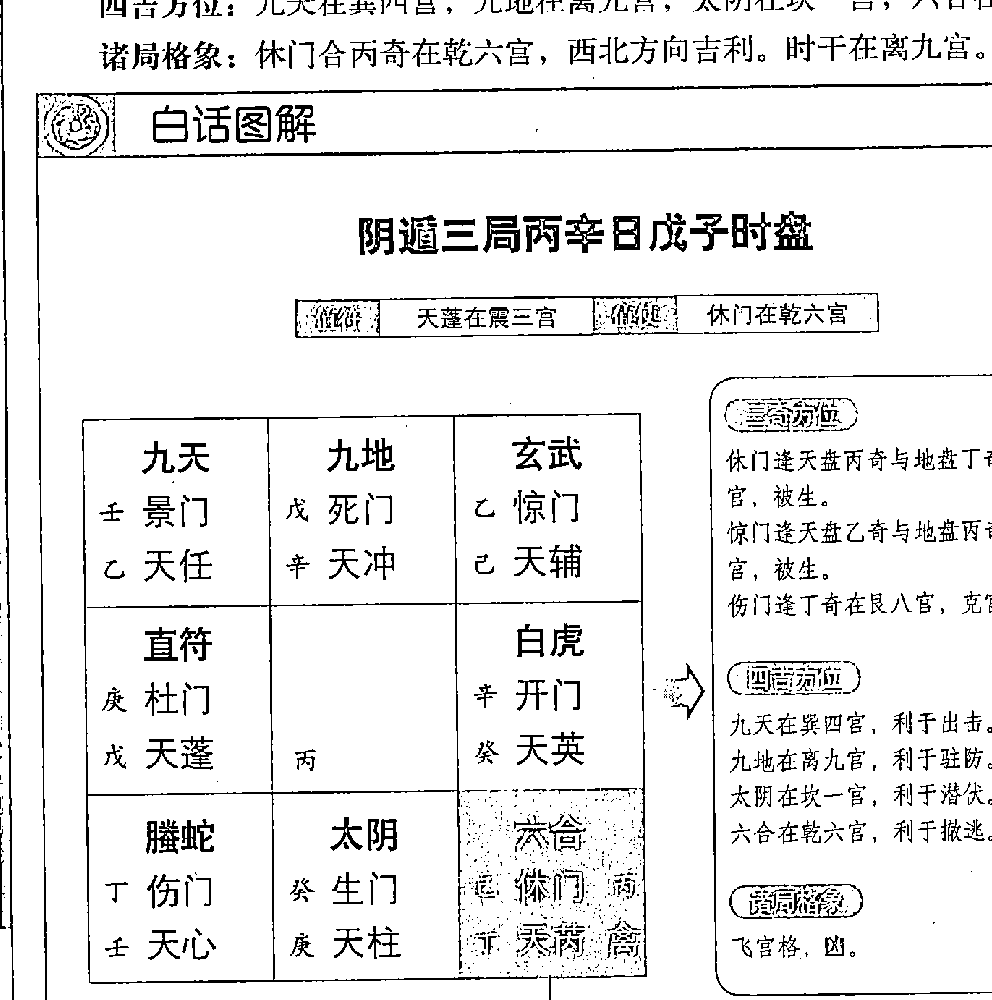

## 己丑时：正南方向吉利

## 【原文】

己丑 蓬二，休五避五。丑至巳阴，宿干凶。震死害，杜合坎和欢怡，开离害。天七，地六，阴四，合三。开与星合九正南，鸟跌穴，龙反首，刑格，时干震，相佐坤，金入火，丙日伏干格。

## 【白话提要】

符使宫位：值符天蓬星在坤二宫，值使休门在中五宫，寄于坤二宫。时干遇凶星宿，时干逢凶。丑时至巳时为五阴时。

三奇方位：死门逢丙奇在震三宫，被克。杜门逢乙奇在坎一宫，被生，吉利，奇仪相合。开门逢丁奇在离九宫利，被克。

四吉方位：九天在兑七宫，九地在乾六宫，太阴在巽四宫，六合在震三宫。

诸局格象：开门合丁奇在离九宫，正南方向吉利。飞鸟跌穴。青龙回首。刑格。时干在震三宫。值符得地盘丙奇相助于坤二宫。太白入荧。逢丙日伏干格。

## 白话图解

### 阴遁三局丙辛日己丑时盘

| 值符 | 天蓬在坤二宫 | 值使 | 休门在中五宫，寄于坤二宫 |
| :--- | :--- | :--- | :--- |
| 吉方：开门合丁奇在离九宫，正南方向吉利。 |  |  |  |
| 太阴 癸 惊门 乙 天柱 | 螣蛇 丁 开门 辛 天心 | 直符 庚 休门 己 天蓬 | 三奇方位 死门逢丙奇在震三宫，被克。 杜门逢乙奇在坎一宫，被生。 开门逢丁奇在离九宫，被克。 |
| 六合 己 死门 丙 戊 天芮 禽 丙 |  | 九天 壬 生门 癸 天任 | 四吉方位 九天在兑七宫，利于出击。 九地在乾六宫，利于驻防。 太阴在巽四宫，利于潜伏。 六合在震三宫，利于撤逃。 |
| 白虎 辛 景门 壬 天英 | 玄武 乙 杜门 庚 天辅 | 九地 戊 伤门 丁 天冲 | 诸局格象 飞鸟跌穴，青龙回首，吉。 刑格，太白入荧，凶。 逢丙日，为伏干格，凶。 |

## 庚寅时：东南方向吉利

## 【原文】

庚寅 蓬一，休四。宿干凶。伤墓丙坤制，休乙巽义，景墓丁乾制。天八，地三，阴七，合二。休与日合四东南，时干坎，符伏，击刑，辛日飞干格。

## 【白话提要】

- 符使宫位：值符天蓬星在坎一宫，值使休门在巽四宫。时干遇凶星宿，时干逢凶。
- 三奇方位：伤门逢双丙奇在坤二宫，克宫。休门逢双乙奇在巽四宫，生宫。景门逢双丁奇在乾六宫，克宫，丁奇入墓。
- 四吉方位：九天在艮八宫，九地在震三宫，太阴在兑七宫，六合在坤二宫。
- 诸局格象：休门合乙奇在巽四宫，东南方向吉利。时干在坎一宫。星符伏吟。击刑。逢辛日飞干格。

## 白话图解

### 阴遁三局丙辛日庚寅时盘

值符 天蓬在坎一宫 值使 休门在巽四宫

吉方：休门合乙奇在巽四宫，东南方向吉利。

| 玄武 | 白虎 | 六合 |
| :--- | :--- | :--- |
| 乙 休门 乙 天辅 | 辛 生门 辛 天英 | 己 伤门 丙 己 天芮 禽 |
| 九地 |  | 太阴 |
| 戊 开门 戊 天冲 | 丙 | 癸 杜门 癸 天柱 |
| 九天 | 直符 | 螣蛇 |
| 壬 惊门 壬 天任 | 庚 死门 庚 天蓬 | 丁 景门 丁 天心 |

### 三奇方位

伤门逢双丙奇在坤二宫，克宫。休门逢双乙奇在巽四宫，生宫。景门逢双丁奇在乾六宫，克宫。

### 四吉方位

九天在艮八宫，利于出击。九地在震三宫，利于驻防。太阴在兑七宫，利于潜伏。六合在坤二宫，利于撤逃。

### 诸局格象

星符伏吟，击刑，凶。逢辛日，为飞干格，凶。

## 辛卯时

## 【原文】

辛卯 蓬九，休三。宿干凶。开艮和，死丁乾义，生乙巽害。天二，地七，阴三，合八。生与星合四东南，开与月合八东北，时干坎，符冲，三吉，辛日飞伏格。

## 【白话提要】

符使宫位：值符天蓬星在离九宫，值使休门在震三宫。时干遇凶星宿，时干逢凶。

三奇方位：开门逢丙奇在艮八宫，被生。死门逢天盘乙奇与地盘丁奇在乾六宫，生宫。生门逢天盘丁奇与地盘乙奇在巽四宫，被克。

四吉方位：九天在坤二宫，九地在兑七宫，太阴在震三宫，六合在艮八宫。

诸局格象：生门合丁奇在巽四宫，东南方向吉利。开门合丙奇在艮八宫，东北方向吉利。时干在坎一宫。值符相冲。三吉格，逢辛日飞伏干格。

## 白话图解

### 阴遁三局丙辛日辛卯时盘

值符：天蓬在离九宫；值使：休门在震三宫

吉方 1：生门合丁奇在巽四宫，东南方向吉利。

| | 直符 | 九天 |
| :--- | :--- | :--- |
| **螣蛇** 丁 生门 乙 天心 | 庚 伤门 辛 天蓬 | 壬 杜门 己 天任 |
| **太阴** 癸 休门 戊 天柱 | 丙 | **九地** 戊 景门 癸 天冲 |
| **六合** 乙 开门 丙 壬 天芮 禽 | **白虎** 辛 惊门 庚 天英 | **玄武** 乙 死门 丁 天辅 |

**三奇方位** 开门逢丙奇在艮八宫，被生。 死门逢天盘乙奇与地盘丁奇在乾六宫，生宫。 生门逢天盘丁奇与地盘乙奇在巽四宫，被克。

**四吉方位** 九天在坤二宫，利于出击。 九地在兑七宫，利于驻防。 太阴在震三宫，利于潜伏。 六合在艮八宫，利于撤逃。

**诸局格象** 九星、值符伏吟，凶。 逢辛日，为飞伏干格，凶。

吉方 2：开门合丙奇在艮八宫，东北方向吉利。

## 壬辰时：逢丙日不宜用事

## 【原文】

壬辰 蓬八，休二。宿吉干凶，丙日不用。生兑义，开离害，杜坎和欢怡。天三，地四，阴六，合七。生与月合七正西，开与日合九正南，天乙与太白格，时干震，龙走，蛇矫，仪刑。

## 【白话提要】

符使宫位：值符天蓬星在艮八宫，值使休门在坤二宫。时干遇吉星宿，时干逢凶。

三奇方位：生门逢丙奇在兑七宫，生宫，开门逢乙奇在离九宫，被克。杜门逢丁奇在坎一宫，被生，吉利。

四吉方位：九天在震三宫，九地在巽四宫，太阴在乾六宫，六合在兑七宫。

诸局格象：生门合丙奇在兑七宫，正西方向吉利。开门合乙奇在离九宫，正南方向吉利。天乙与六庚格。时干在震三宫。青龙逃走。螣蛇天矫。六仪击刑。

## 白话图解

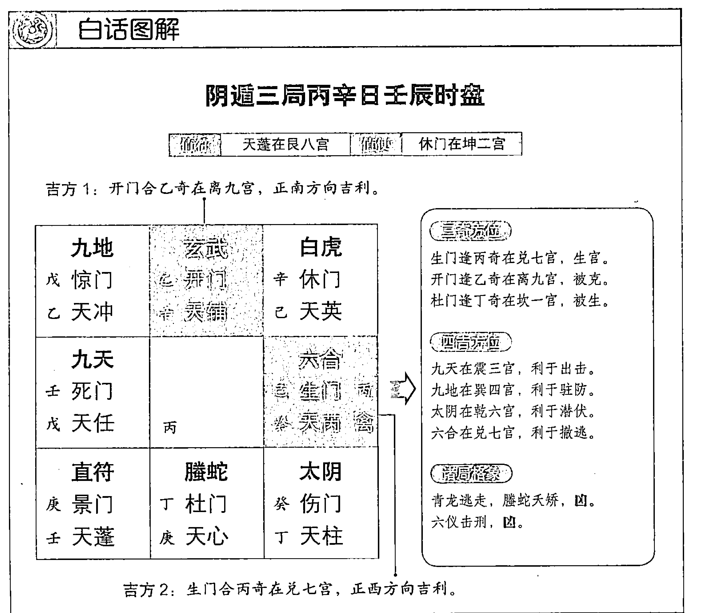

| 九地 | 玄武 | 白虎 |
| :--- | :--- | :--- |
| 戊 惊门 乙 天冲 | 己 开门 辛 天辅 | 辛 休门 己 天英 |
| 九天 | | 六合 |
| 壬 死门 戊 天任 | 丙 | 乙 生门 癸 天芮 禽 |
| 直符 | 螣蛇 | 太阴 |
| 庚 景门 壬 天蓬 | 丁 杜门 庚 天心 | 癸 伤门 丁 天柱 |

## 癸巳时：东北方向吉利

## 【原文】

癸巳 蓬七，休一。宿吉干凶。杜乙巽伏，生艮伏，死丙坤伏。天六，地一，阴九，合四。生与日合八东北，天乙与太白格，时干离，门伏，事同，大格，天网。

## 【白话提要】

- 符使宫位：值符天蓬星在兑七宫，值使休门在坎一宫。时干遇吉星宿，时干逢凶。

三奇方位：杜门逢天盘丙奇与地盘乙奇在巽四宫，不相生克。生门逢乙奇在艮八宫，不相生克。死门逢天盘丁奇与地盘丙奇在坤二宫，不相生克。

四吉方位：九天在乾六宫，九地在坎一宫，太阴在离九宫，六合在巽四宫。

诸局格象：生门合乙奇于艮八宫，东北方向吉利。天乙与六庚格。时干在离九宫。八门伏吟。大格。天网四张。

## 白话图解

### 阴遁三局丙辛日癸巳时盘

| 六合 | 太阴 | 螣蛇 |
| :--- | :--- | :--- |
| 己杜门 丙 乙天芮 禽 | 癸景门 辛天柱 | 丁死门 己天心 |
| **白虎** | | **直符** |
| 辛伤门 戊天英 | 丙 | 庚惊门 癸天蓬 |
| **玄武** | **九地** | **九天** |
| 壬蓬门 戊 天辅 | 戊休门 庚 天冲 | 壬开门 丁 天任 |

**三奇方位**
杜门逢天盘丙奇与地盘乙奇在巽四宫，不相生克。
生门逢乙奇在艮八宫，不相生克。
死门逢天盘丁奇与地盘丙奇在坤二宫，不相生克。

**四吉方位**
九天在乾六宫，利于出击。
九地在坎一宫，利于驻防。
太阴在离九宫，利于潜伏。
六合在巽四宫，利于撤逃。

**诸局格象**
八门伏吟，大格，天网四张，凶。

吉方：生门合乙奇于艮八宫，东北方向吉利。

## 甲午时：西北方向吉利

## 【原文】

甲午 英值符九，景值使九。午至戊阳，天辅，宿凶干吉。辅使杜巽伏，芮月死坤伏，心星开墓乾伏。天二，地七，阴三，合八。开与星合六西北，仪刑，时干离，符门伏，遁甲，自刑，阖。

## 【白话提要】

符使宫位：值符天英星在离九宫，值使景门在离九宫。时干遇凶星宿，时干逢吉。午时至戌时为五阳时，午时为天辅释罪时。

三奇方位：杜门逢双乙奇在巽四宫，不相生克。死门逢双丙奇在坤二宫，不相生克。开门逢双丁奇在乾六宫，不相生克，丁奇入墓。

四吉方位：九天在坤二宫，九地在兑七宫，太阴在震三宫，六合在艮八宫。

诸局格象：开门合丁奇在乾六宫，西北方向吉利。六仪击刑。时干在离九宫。星符八门伏吟。遁甲自刑，合。

## 白话图解

### 阴遁三局丙辛日甲午时盘

| 腾蛇 | 直符 | 九天 |
| :--- | :--- | :--- |
| 乙 杜门 乙 天辅 | 辛 景门 辛 天英 | 己 死门 丙 己 天芮 禽 |
| 太阴 | | 九地 |
| 戊 伤门 戊 天冲 | 丙 | 癸 惊门 癸 天柱 |
| 六合 | 白虎 | 玄武 |
| 壬 生门 壬 天任 | 庚 休门 庚 天蓬 | 丁 开门 丁 天心 |

值符 天英在离九宫 值使 景门在离九宫

- 三奇方位
  杜门逢双乙奇在巽四宫，不相生克。
  死门逢双丙奇在坤二宫，不相生克。
  开门逢双丁奇在乾六宫，不相生克。

- 四吉方位
  九天在坤二宫，利于出击。
  九地在兑七宫，利于驻防。
  太阴在震三宫，利于潜伏。
  六合在艮八宫，利于撤逃。

- 诸局格象
  六仪击刑，遁甲自刑，凶。
  九星、值符、八门伏吟，凶。

吉方：开门合丁奇在乾六宫，西北方向吉利。

## 乙未时：正南与正西方向吉利

## 【原文】

乙未 英四，景八。宿干吉。死震害，开合离害欢怡，生兑义。天九，地二，阴八，合一。开与月合九正南，生与星合七正西，辛干勃，时干震，辛日勃，鸟跌穴，雀入江，虎猖狂。

## 【白话提要】

- 符使宫位：值符天英星在巽四宫，值使景门在艮八宫。时干遇吉星宿，时干逢吉。
- 三奇方位：死门逢乙奇在震三宫，被克。开门逢丙奇在离九宫，被克，奇仪相合，吉利。生门逢丁奇在兑七宫，生宫。
- 四吉方位：九天在离九宫，九地在坤二宫，太阴在艮八宫，六合在坎一宫。
- 诸局格象：开门合丙奇在离九宫，正南方向吉利。生门合丁奇在兑七宫，正西方向吉利。辛干勃格。时干在震三宫。辛日日勃。飞鸟跌穴。朱雀入江。白虎猖狂。

## 白话图解

### 阴遁三局丙辛日乙未时盘

吉方1：开门合丙奇在离九宫，正南方向吉利。

| 直符 | 九天 | 九地 |
| :--- | :--- | :--- |
| 辛 惊门 乙 天英 | 己 开门 庚 天芮 禽 | 癸 休门 己 天柱 |
| 螣蛇 乙 死门 戊 天辅 | 丙 | 玄武 丁 生门 癸 天心 |
| 太阴 戊 景门 壬 天冲 | 六合 壬 杜门 庚 天任 | 白虎 庚 伤门 丁 天蓬 |

**三奇方位**
- 死门逢乙奇在震三宫，被克。
- 开门逢丙奇在离九宫，被克。
- 生门逢丁奇在兑七宫，生宫。

**四吉方位**
- 九天在离九宫，利于出击。
- 九地在坤二宫，利于驻防。
- 太阴在艮八宫，利于潜伏。
- 六合在坎一宫，利于撤逃。

**诸局格象**
- 飞鸟跌穴，吉。
- 辛干勃格，辛日日勃，凶。
- 朱雀入江，白虎猖狂，凶。

吉方2：生门合丁奇在兑七宫，正西方向吉利。

## 丙申时：无奇门可出

## 【原文】

丙申 英五，景七。宿干吉。伤离义欢怡，景兑制，惊坎义。天七，地六，阴四，合三。无奇门，时干兑，相佐坤，蛇矫，龙反首。

## 【白话提要】

符使宫位：值符天英星在中五宫，寄于坤二宫，值使景门在兑七宫。时干遇吉星宿，时干逢吉。

三奇方位：伤门逢乙奇在离九宫，生宫，吉利。景门逢丙奇在兑七宫，克宫。惊门逢丁奇在坎一宫，生宫。

四吉方位：九天在兑七宫，九地在乾六宫，太阴在巽四宫，六合在震三宫。

诸局格象：无奇门。时干在兑七宫。值符得地盘丙奇相助于坤二宫。螣蛇天矫。青龙回首。

## 白话图解

### 阴遁三局丙辛日丙申时盘

| | | |
| :--- | :--- | :--- |
| **太阴** 戊 生门 乙 天冲 | **螣蛇** 乙 伤门 辛 天辅 | **直符** 辛 杜门 己 天英 |
| **六合** 壬 休门 戊 天任 | | **九天** 己 景门 丙 癸 天芮 禽 |
| **白虎** 庚 开门 壬 天蓬 | **玄武** 丁 惊门 庚 天心 | **九地** 癸 死门 丁 天柱 |

- **三奇方位**
  - 伤门逢乙奇在离九宫，生宫。
  - 景门逢丙奇在兑七宫，克宫。
  - 惊门逢丁奇在坎一宫，生宫。

- **四吉方位**
  - 九天在兑七宫，利于出击。
  - 九地在乾六宫，利于驻防。
  - 太阴在巽四宫，利于潜伏。
  - 六合在震三宫，利于撤逃。

- **诸局格象**
  - 青龙回首，吉。
  - 无奇门，螣蛇天矫，凶。

## 丁酉时：逢辛日不宜用事

## 【原文】

丁酉 英六，景六。宿干吉，辛日不用，守户。杜兑害，死坎制，开震制。天一，地八，阴二，合九。开与星合三正东，龙反首，时干震，相佐乾，火入金，丙日飞干格。

## 【白话提要】

符使宫位：值符天英星在乾六宫，值使景门在乾六宫。时干遇吉星宿，时干逢吉。逢辛日不宜用事，宜守户不出。

三奇方位：杜门逢乙奇在兑七宫，被克。死门逢丙奇在坎一宫，克宫。开门逢丁奇在震三宫，克宫。

四吉方位：九天在坎一宫，九地在艮八宫，太阴在坤二宫，六合在离九宫。

诸局格象：开门合丁奇在震三宫，正东方向吉利。青龙回首。时干在震三宫。值符得地盘丁奇相助于乾六宫。荧入太白。逢丙日飞干格。

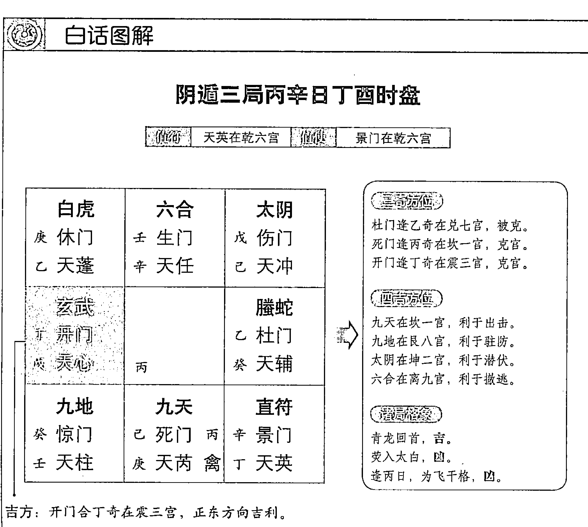

| 白虎 | 六合 | 太阴 |
| :--- | :--- | :--- |
| 庚 休门 乙 天蓬 | 壬 生门 辛 天任 | 戊 伤门 己 天冲 |
| 玄武 丁 开门 戊 天心 | 丙 | 螣蛇 乙 杜门 癸 天辅 |
| 九地 癸 惊门 壬 天柱 | 九天 己 死门 丙 庚 天芮 禽 | 直符 辛 景门 丁 天英 |

## 戊戌时：东北方向吉利

## 【原文】

戊戌 英三，景五避五。宿干吉。休艮害，伤乙巽伏，景丙坤义。天四，地九，阴一，合六。休与日合八东北，时干坎，大格。

## 【白话提要】

符使宫位：值符天英星在震三宫，值使景门在中五宫，寄于坤二宫。时干遇吉星宿，时干逢吉。

三奇方位：休门逢乙奇在艮八宫，被克。伤门逢天盘丙奇与地盘乙奇在巽四宫，不相生克。景门逢天盘丁奇与地盘丙奇在坤二宫，生宫。

四吉方位：九天在巽四宫，九地在离九宫，太阴在坎一宫，六合在乾六宫。

诸局格象：休门合乙奇在艮八宫，东北方向吉利。时干在坎一宫。大格。

### 【白话图解】

#### 阴遁三局丙辛日戊戌时盘

| 九天 | 九地 | 玄武 |
| :--- | :--- | :--- |
| 己 伤门 丙 乙 天芮 禽 | 癸 杜门 辛 天柱 | 丁 景门 己 天心 |
| 直符 辛 生门 戊 天英 | 丙 | 白虎 庚 死门 癸 天蓬 |
| 腾蛇 乙 休门 壬 天辅 | 太阴 戊 开门 庚 天冲 | 六合 壬 惊门 丁 天任 |

三奇方位：休门逢乙奇在艮八宫，被克。伤门逢天盘丙奇与地盘乙奇在巽四宫，不相生克。景门逢天盘丁奇与地盘丙奇在坤二宫，生宫。

四吉方位：九天在巽四宫，利于出击。九地在离九宫，利于驻防。太阴在坎一宫，利于潜伏。六合在乾六宫，利于撤逃。

诸局格象：大格，凶。

吉方：休门合乙奇在艮八宫，东北方向吉利。

## 己亥时：正西与正北方向吉利

## 【原文】

己亥 英二，景四。亥阴，宿干凶。死离和欢怡，开兑伏，生坎伏。天七，地六，阴四，合三。开与月合七正西，生与星合一正北，时干兑，相佐坤，蛇矫，龙走。

## 【白话提要】

符使宫位：值符天英星在坤二宫，值使景门在巽四宫。时干遇凶星宿，时干逢凶。亥时为五阴时。

三奇方位：死门逢乙奇在离九宫，被生，吉利。开门逢丙奇在兑七宫，不相生克。生门逢丁奇在坎一宫，不相生克。

四吉方位：九天在兑七宫，九地在乾六宫，太阴在巽四宫，六合在震三宫。

诸局格象：开门逢丙奇在兑七宫，正西方向吉利。生门合丁奇在坎一宫，正北方向吉利。时干在兑七宫。值符得地盘丙奇相助于坤二宫。螣蛇天矫。青龙逃走。

### 【白话图解】

#### 阴遁三局丙辛日己亥时盘

| 太阴 | 螣蛇 | 直符 |
| :--- | :--- | :--- |
| 戊 景门 乙 天冲 | 乙 死门 辛 天辅 | 辛 惊门 己 天英 |
| 六合 壬 杜门 戊 天任 | 丙 | 九天 己 开门 丙 天芮 禽 |
| 白虎 庚 伤门 壬 天蓬 | 玄武 丁 休门 庚 天心 | 九地 癸 休门 丁 天柱 |

三奇方位
- 死门逢乙奇在离九宫，被生。
- 开门逢丙奇在兑七宫，不相生克。
- 生门逢丁奇在坎一宫，不相生克。

四吉方位
- 九天在兑七宫，利于出击。
- 九地在乾六宫，利于驻防。
- 太阴在巽四宫，利于潜伏。
- 六合在震三宫，利于撤逃。

诸局格象
- 螣蛇天矫，青龙逃走，凶。

吉方1：生门合丁奇在坎一宫，正北方向吉利。
吉方2：开门逢丙奇在兑七宫，正西方向吉利。

## 4. 丁壬日十二时局

## 庚子时：西北方向吉利

## 【原文】

庚子 英一，景三。子至卯阴，宿干凶。生丁乾义，杜艮制，死乙巽害。天八，地三，阴七，合二。生与日合六西北，乙下有丁，飞宫格，伏宫格，时干离，符冲，飞伏。

## 【白话提要】

符使宫位：值符天英星在坎一宫，值使景门在震三宫。时干遇凶星宿，时干逢凶。子时至卯时为五阴时。

三奇方位：生门逢天盘乙奇与地盘丁奇在乾六宫，生宫。杜门逢丙奇在艮八宫，克宫。死门逢天盘丁奇与地盘乙奇在巽四宫，被克。

四吉方位：九天在艮八宫，九地在震三宫，太阴在兑七宫，六合在坤二宫。

### 【白话图解】

| 玄武 | 白虎 | 六合 |
| :--- | :--- | :--- |
| 丁 死门 乙 天心 | 庚 惊门 辛 天蓬 | 壬 开门 己 天任 |
| 九地 癸 景门 戊 天柱 | 太阴 丙 | 太阴 戊 休门 癸 天冲 |
| 九天 己 杜门 丙 壬 天芮 禽 | 直符 辛 伤门 庚 天英 | 螣蛇 乙 生门 丁 天辅 |

**三奇方位**
- 生门逢天盘乙奇与地盘丁奇在乾六宫，生宫。
- 杜门逢丙奇在艮八宫，克宫。
- 死门逢天盘丁奇与地盘乙奇在巽四宫，被克。

**四吉方位**
- 九天在艮八宫，利于出击。
- 九地在震三宫，利于驻防。
- 太阴在兑七宫，利于潜伏。
- 六合在坤二宫，利于撤逃。

**符使宫位**
- 乙下有丁，为奇仪相佐，吉。
- 飞宫格，伏宫格，凶。

吉方：生门合乙奇在乾六宫，西北方向吉利。

诸局格象：生门合乙奇在乾六宫，西北方向吉利。乙下有丁为奇仪相佐。飞宫格。伏宫格。时干在离九宫。值符相冲反吟。

### 辛丑时：无奇门可出

## 【原文】

辛丑 英九，景二。宿干凶。伤乙巽伏，景丙坤义，惊墓丁乾伏。天二，地七，阴三，合八。无奇门，仪刑，时干离。

## 【白话提要】

符使宫位：值符天英星在离九宫，值使景门在坤二宫。时干遇凶星宿，时干逢凶。

三奇方位：伤门逢双乙奇在巽四宫，不相生克。景门逢双丙奇在坤二宫，生宫。惊门逢双丁奇在乾六宫，不相生克，丁奇入墓。

四吉方位：九天在坤二宫，九地在兑七宫，太阴在震三宫，六合在艮八宫。

诸局格象：无奇门。六仪击刑。时干在离九宫。

### 【白话图解】

#### 阴遁三局丁壬日辛丑时盘

值符 天英在离九宫 值使 景门在坤二宫

| 螣蛇 | 直符 | 九天 |
| :--- | :--- | :--- |
| 乙 伤门 乙 天辅 | 辛 杜门 辛 天英 | 己 景门 丙 己 天芮 禽 |
| 太阴 戊 生门 戊 天冲 | 丙 | 九地 癸 死门 癸 天柱 |
| 六合 壬 休门 壬 天任 | 白虎 庚 开门 庚 天蓬 | 玄武 丁 惊门 丁 天心 |

### 三奇方位
- 伤门逢双乙奇在巽四宫，不相生克。
- 景门逢双丙奇在坤二宫，生宫。
- 惊门逢双丁奇在乾六宫，不相生克。

### 四吉方位
- 九天在坤二宫，利于出击。
- 九地在兑七宫，利于驻防。
- 太阴在震三宫，利于潜伏。
- 六合在艮八宫，利于撤逃。

### 诸局格象
- 无奇门，凶。
- 六仪击刑，凶。

## 壬寅时：正南方向吉利

## 【原文】

壬寅 英八，景一。宿吉干凶。景合坎害，惊震制，休离制欢恰。天三，地四，阴六，合七。休与星合九正南，天乙与太白格，时干兑，事同，金入火，刑格，门伏，符反吟。

## 【白话提要】

符使宫位：值符天英星在艮八宫，值使景门在坎一宫。时干遇吉星宿，时干逢凶。

三奇方位：景门逢乙奇在坎一宫，被克，奇仪相合。惊门逢丙奇在震三宫，克宫。休门逢丁奇在离九宫，克宫，吉利。

四吉方位：九天在震三宫，九地在巽四宫，太阴在乾六宫，六合在兑七宫。

诸局格象：休门合丁奇在离九宫，正南方向吉利。天乙与六庚格。时干在兑七宫。太白入荧。刑格。八门伏吟。星符反吟。

### 【白话图解】

#### 阴遁三局丁壬日壬寅时盘

值符 天英在艮八宫

值使 景门在坎一宫

吉方：休门合丁奇在离九宫，正南方向吉利。

| 九地 | 玄武 | 白虎 |
| :--- | :--- | :--- |
| 癸 开门 乙 天柱 | 丁 休门 辛 天心 | 庚 生门 己 天蓬 |
| 九天 己 惊门 丙 戊 天芮 禽 丙 |  | 六合 壬 伤门 癸 天任 |
| 直符 辛 死门 壬 天英 | 螣蛇 乙 景门 庚 天辅 | 太阴 戊 杜门 丁 天冲 |

**三奇方位**
- 景门逢乙奇在坎一宫，被克。
- 惊门逢丙奇在震三宫，克宫。
- 休门逢丁奇在离九宫，克宫。

**四吉方位**
- 九天在震三宫，利于出击。
- 九地在巽四宫，利于驻防。
- 太阴在乾六宫，利于潜伏。
- 六合在兑七宫，利于撤逃。

**诸局格象**
- 刑格，太白入荧，凶。
- 八门伏吟，星符反吟，凶。

## 癸卯时：逢丁日不宜用事

## 【原文】

癸卯 英七，景九。宿干凶，丁日不用。死墓丙坤伏，开墓丁乾伏，生合艮伏。天六，地一，阴九，合四。生与星合八东北，开与月合六西北，时干坎，丁日勃，飞宫，门伏，天网。

## 【白话提要】

符使宫位：值符天英星在兑七宫，值使景门在离九宫。时干遇吉星宿，时干逢吉。逢丁日不宜用事。

三奇方位：死门逢天盘乙奇与地盘丙奇在坤二宫，不相生克，乙奇入墓。开门逢天盘丙奇与地盘丁奇在乾六宫，不相生克，丙奇入墓。生门逢丁奇在艮八宫，不相生克，奇仪相合。

四吉方位：九天在乾六宫，九地在坎一宫，太阴在离九宫，六合在巽四宫。

诸局格象：生门合丁奇在艮八宫，东北方向吉利。开门合丙奇在乾六宫，西北方向吉利。时干在坎一宫。丁日日勃。飞宫格。八门伏吟。天网四张。

### 【白话图解】

#### 阴遁三局丁壬日癸卯时盘

| 六合 | 太阴 | 螣蛇 |
| :--- | :--- | :--- |
| 壬 杜门 乙 天任 | 戊 景门 辛 天冲 | 乙 死门 己 天辅 |
| 白虎 庚 伤门 戊 天蓬 | 丙 | 直符 辛 惊门 癸 天英 |
| 玄武 丁 生门 壬 天心 | 九地 癸 休门 庚 天柱 | 九天 己 开门 丙 丁 天芮 禽 |

### 三奇方位
- 死门逢天盘乙奇与地盘丙奇在坤二宫，不相生克。
- 开门逢天盘丙奇与地盘丁奇在乾六宫，不相生克。
- 生门逢丁奇在艮八宫，不相生克。

### 四吉方位
- 九天在乾六宫，利于出击。
- 九地在坎一宫，利于驻防。
- 太阴在离九宫，利于潜伏。
- 六合在巽四宫，利于撤逃。

### 诸局格象
- 丁日日勃，飞宫格，凶。
- 八门伏吟，天网四张，凶。

吉方1：生门合丁奇在艮八宫，东北方向吉利。

吉方2：开门合丙奇在乾六宫，西北方向吉利。

## 甲辰时：西北方向吉利

## 【原文】

甲辰 任值符八，生值使八。辰至申阳，天辅，宿干吉。心使开墓乾伏，辅日杜巽伏，芮月死坤伏。天三，地四，阴六，合七。开与星合六西北，仪刑，时干艮，符门伏，飞甲，自刑，阖。

## 【白话提要】

符使宫位：值符天任星在艮八宫，值使生门在艮八宫。时干遇吉星宿，时干逢吉。辰时至申时为五阳时。辰时为天辅释罪时。

三奇方位：开门逢双丁奇在乾六宫，不相生克，丁奇入墓。杜门逢双乙奇在巽四宫，不相生克。死门逢双丙奇在坤二宫，不相生克。

四吉方位：九天在震三宫，九地在巽四宫，太阴在乾六宫，六合在兑七宫。

诸局格象：开门合丁奇在乾六宫，西北方向吉利。六仪击刑。时干在艮八宫。星符，八门均伏吟。飞甲自刑，合。

### 【白话图解】

#### 阴遁三局丁壬日甲辰时盘

| 九地 | 玄武 | 白虎 |
| :--- | :--- | :--- |
| 乙 杜门 乙 天心 | 辛 景门 辛 天英 | 己 死门 丙 己 天芮 禽 |
| 九天 戊 伤门 戊 天冲 | 丙 | 六合 癸 惊门 癸 天柱 |
| 直符 壬 生门 壬 天任 | 螣蛇 庚 休门 庚 天蓬 | 太阴 丁 开门 丁 天辅 |

### 三奇方位
- 开门逢双丁奇在乾六宫，不相生克。
- 杜门逢双乙奇在巽四宫，不相生克。
- 死门逢双丙奇在坤二宫，不相生克。

### 四吉方位
- 九天在震三宫，利于出击。
- 九地在巽四宫，利于驻防。
- 太阴在乾六宫，利于潜伏。
- 六合在兑七宫，利于撤逃。

### 诸局格象
- 六仪击刑，飞甲自刑，凶。
- 九星、值符、八门伏吟，凶。

吉方：开门合丁奇在乾六宫，西北方向吉利。

## 乙巳时：西南方向吉利

## 【原文】

乙巳 任四，生七。宿干吉。景合艮义欢怡，休墓丙坤害，伤墓丁乾害。天九，地二，阴八，合一。休与日合二西南，乙下有丙，时干坤，丁日勃，飞宫。

## 【白话提要】

符使宫位：值符天任星在巽四宫，值使生门在兑七宫。时干遇吉星宿，时干逢吉。

三奇方位：景门逢丁奇在艮八宫，生宫，吉利，奇仪相合。休门逢天盘乙奇与地盘丙奇在坤二宫，被克，乙奇入墓。伤门逢天盘丙奇与地盘丁奇在乾六宫，被克，丁奇入墓。

四吉方位：九天在离九宫，九地在坤二宫，太阴在艮八宫，六合在坎一宫。

诸局格象：休门合乙奇在坤二宫，西南方向吉利。乙下有丙为星随月转。时干在坤二宫，逢丁日勃。飞宫格。

### 【白话图解】

#### 阴遁三局丁壬日乙巳时盘

吉方：休门合乙奇在坤二宫，西南方向吉利。

| 直符 | 九天 | 九地 |
| :--- | :--- | :--- |
| 壬 惊门 乙 天任 | 戊 螣蛇 辛 天冲 | 乙 休门 己 天辅 |
| 螣蛇 庚 死门 戊 天蓬 | 丙 | 玄武 辛 生门 癸 天英 |
| 太阴 丁 景门 壬 天心 | 六合 癸 杜门 庚 天柱 | 白虎 己 伤门 丙 丁 天芮 禽 |

**三奇方位**
- 景门逢丁奇在艮八宫，生宫。
- 休门逢天盘乙奇与地盘丙奇在坤二宫，被克。
- 伤门逢天盘丙奇与地盘丁奇在乾六宫，被克。

**四吉方位**
- 九天在离九宫，利于出击。
- 九地在坤二宫，利于驻防。
- 太阴在艮八宫，利于潜伏。
- 六合在坎一宫，利于撤逃。

**诸局格象**
- 乙下有丙，为星随月转，吉。
- 逢丁日，为日勃格，凶。
- 飞宫格，凶。

## 丙午时：宜守户不出

## 【原文】

丙午 任五，生六。宿干吉，守户。死乙巽害，生丁乾义，杜艮制欢怡。天七，地六，阴四，合三。生与日合六西北，鸟跌穴，龙反首，时干艮，相佐坤，符冲，壬日勃。

## 【白话提要】

符使宫位：值符天任星在中五宫，寄于坤二宫，值使生门在乾六宫。时干遇吉星宿，时干逢吉。宜守户不出。

三奇方位：死门逢天盘丁奇与地盘乙奇在巽四宫，被克。生门逢乙奇与地盘丁奇在乾六宫，生宫。杜门逢丙奇在艮八宫，克宫，吉利。

四吉方位：九天在兑七宫，九地在乾六宫，太阴在巽四宫，六合在震三宫。

诸局格象：生门合乙奇在乾六宫，西北方向吉利。飞鸟跌穴。青龙回首。时干艮。值符得地盘丙奇助于坤二宫。值符相冲。壬日日勃。

### 【白话图解】

#### 阴遁三局丁壬日丙午时盘

值符：天任在中五宫，寄于坤二宫；值使：生门在乾六宫。

| 太阴 | 螣蛇 | 直符 |
| :--- | :--- | :--- |
| 丁 死门 乙 天心 | 庚 惊门 辛 天蓬 | 壬 开门 己 天任 |
| 六合 癸 景门 戊 天柱 | 丙 | 九天 戊 休门 癸 天冲 |
| 白虎 己 杜门 丙 壬 天芮 禽 | 玄武 辛 伤门 庚 天英 | 九地 乙 伤门 丁 天辅 |

**三奇方位**：死门逢天盘丁奇与地盘乙奇在巽四宫，被克。生门逢天盘乙奇与地盘丁奇在乾六宫，生宫。杜门逢丙奇在艮八宫，克宫。

**四吉方位**：九天在兑七宫，利于出击。九地在乾六宫，利于驻防。太阴在巽四宫，利于潜伏。六合在震三宫，利于撤逃。

**诸局格象**：飞鸟跌穴，青龙回首，吉。值符相冲，壬日日勃，凶。

吉方：生门合乙奇在乾六宫，西北方向吉利。

## 丁未时：东南与西南方向吉利

## 【原文】

丁未 任六，生五避五。宿干吉。生丙坤伏，死艮伏欢怡，开乙巽制。天一，地八，阴二，合九。开与月合四东南，丙下有乙，时干坤，生与星合二西南，丁下有丙，相佐乾，大格。

## 【白话提要】

符使宫位：值符天任星在乾六宫，值使生门在中五宫，寄于坤二宫。时干遇吉星宿，时干逢吉。

三奇方位：生门逢天盘丁奇与地盘丙奇在坤二宫，不相生克。死门逢乙奇在艮八宫，不相生克，吉利。开门逢天盘丙奇与地盘乙奇在巽四宫，克宫。

四吉方位：九天在坎一宫，九地在艮八宫，太阴在坤二宫，六合在离九宫。

诸局格象：开门合丙奇在巽四宫，东南方向吉利。丙下有乙为日月并行。时干在坤二宫。生门合丁奇在坤二宫，西南方向吉利。丁下有丙为星随月转。值符得地盘丁奇相助于乾六宫。大格。

### 【白话图解】

#### 阴遁三局丁壬日丁未时盘

| 白虎 | 六合 | 太阴 |
| :--- | :--- | :--- |
| 乙 开门 丙 乙 天芮 禽 | 癸 休门 辛 天柱 | 丁 生门 己 天心 |
| 玄武 辛 惊门 戊 天英 | 丙 | 螣蛇 庚 伤门 癸 天蓬 |
| 九地 乙 死门 壬 天辅 | 九天 戊 景门 庚 天冲 | 直符 壬 杜门 丁 天任 |

三奇方位
- 生门逢天盘丁奇与地盘丙奇在坤二宫，不相生克。
- 死门逢乙奇在艮八宫，不相生克。
- 开门逢天盘丙奇与地盘乙奇在巽四宫，克宫。

四吉方位
- 九天在坎一宫，利于出击。
- 九地在艮八宫，利于驻防。
- 太阴在坤二宫，利于潜伏。
- 六合在离九宫，利于撤逃。

诸局格象
- 丙下有乙，为日月并行，吉。
- 丁下有丙，为星随月转，吉。
- 大格，凶。

## 戊申时：逢壬日不宜用事

## 【原文】

戊申 任三，生四。宿干凶，壬日不用。惊坎义，伤离义，景兑制。天四，地九，阴一，合六。无奇门，伏宫格，龙反首，蛇矫，时干巽，乙格，丁日飞干格，壬日伏干格。

## 【白话提要】

符使宫位：值符天任星在震三宫，值使生门在巽四宫。时干遇凶星宿，时干逢凶。逢壬日不宜用事。

三奇方位：惊门逢丁奇在坎一宫，生宫。伤门逢乙奇在离九宫，生宫。景门逢丙奇在兑七宫，克宫。

四吉方位：九天在巽四宫，九地在离九宫，太阴在坎一宫，六合在乾六宫。

诸局格象：无奇门。伏宫格。青龙回首。螣蛇天矫。时干在巽四宫。太乙格。逢丁日飞干格。逢壬日伏干格。

### 【白话图解】

#### 阴遁三局丁壬日戊申时盘

值符 天任在震三宫
值使 生门在巽四宫

| 九天 | 九地 | 玄武 |
| :--- | :--- | :--- |
| 壬 生门 乙 天冲 | 乙 伤门 辛 天辅 | 辛 杜门 己 天英 |
| 直符 壬 休门 戊 天任 | 丙 | 白虎 己 景门 丙 癸 天芮 禽 |
| 螣蛇 庚 开门 壬 天蓬 | 太阴 丁 惊门 庚 天心 | 六合 癸 死门 丁 天柱 |

三奇方位：
- 惊门逢丁奇在坎一宫，生宫。
- 伤门逢乙奇在离九宫，生宫。
- 景门逢丙奇在兑七宫，克宫。

四吉方位：
- 九天在巽四宫，利于出击。
- 九地在离九宫，利于驻防。
- 太阴在坎一宫，利于潜伏。
- 六合在乾六宫，利于撤逃。

诸局格象：
- 青龙回首，吉。
- 无奇门，伏宫格，凶。
- 螣蛇天矫，太乙格，凶。
- 逢丁日，为飞干格，凶。
- 逢壬日，为伏干格，凶。

# 己酉时：东北方向吉利

## 【原文】

己酉 任二，生三。酉至亥阴，宿吉干凶。伤乙巽伏，惊丁乾伏，休艮害欢怡。天七，地六，阴四，合三。休与月合八东北，时干艮，相佐坤，符冲，壬日勃，三吉。

## 【白话提要】

符使宫位：值符天任星在坤二宫，值使生门在震三宫。时干遇吉星宿，时干逢凶。酉时至亥时为五阴时。

三奇方位：伤门逢天盘丁奇与地盘乙奇在巽四宫，不相生克。惊门逢天盘乙奇与地盘丁奇在乾六宫，不相生克。休门逢丙奇在艮八宫，被克，吉利。

四吉方位：九天在兑七宫，九地在乾六宫，太阴在巽四宫，六合在震三宫。

诸局格象：休门合丙奇在艮八宫，东北方向吉利。时干在艮八宫。值符得地盘丙奇相助于坤二宫。值符相冲。壬日日勃。三吉格。

## 白话图解

### 阴遁三局丁壬日己酉时盘

值符 天任在坤二宫 值使 生门在震三宫

| 太阴 | 螣蛇 | 直符 |
| :--- | :--- | :--- |
| 丁 伤门 | 庚 杜门 | 壬 景门 |
| 乙 天心 | 辛 天蓬 | 己 天任 |
| 六合 | | 九天 |
| 癸 生门 | | 戊 死门 |
| 戊 天柱 | 丙 | 癸 天冲 |
| 白虎 | 玄武 | 九地 |
| 丙 休门 | 辛 开门 | 乙 惊门 |
| 壬 天芮 | 庚 天英 | 丁 天辅 |

三奇方位
伤门逢天盘丁奇与地盘乙奇在巽四宫，不相生克。
惊门逢天盘乙奇与地盘丁奇在乾六宫，不相生克。
休门逢丙奇在艮八宫，被克。

四吉方位
九天在兑七宫，利于出击。
九地在乾六宫，利于驻防。
太阴在巽四宫，利于潜伏。
六合在震三宫，利于撤逃。

诸局格象
九星、值符伏吟，凶。
逢壬日，为日勃格，凶。

吉方：休门合丙奇在艮八宫，东北方向吉利。

# 庚戌时：正南方向吉利

## 【原文】

庚戌 任一，生二。宿干凶。伤兑害，惊震制。休合离制。天八，地三，阴七，合二，休与星合九正南，雀入江，虎猖狂，时干乾，门反吟，飞符，丁日伏干格，壬日飞干格。

## 【白话提要】

符使宫位：值符天任星在坎一宫，值使生门在坤二宫。时干遇凶星宿，时干逢凶。

三奇方位：伤门逢丁奇在兑七宫，被克。惊门逢乙奇在震三宫，克宫。休门逢丙奇在离九宫，克宫。

四吉方位：九天在艮八宫，九地在震三宫，太阴在兑七宫，六合在坤二宫。

诸局格象：休门合丁奇在离九宫，正南方向吉利。朱雀入江。白虎猖狂。时干在乾六宫。八门反吟。值符飞宫。逢丁日伏干格，壬日飞干格。

## 白话图解

### 阴遁三局丁壬日庚戌时盘

值符 天任在坎一宫 值使 生门在坤二宫

吉方：休门合丁奇在离九宫，正南方向吉利。

| 玄武 辛 开门 乙 天英 | 白虎 己 休门 辛 天芮禽 | 六合 癸 生门 己 天柱 |
|---------------------------|-----------------------------|---------------------------|
| 九地 乙 惊门 戊 天辅 | （丙）                      | 太阴 丁 伤门 癸 天心 |
| 九天 戊 死门 壬 天冲 | 直符 壬 景门 庚 天任  | 螣蛇 庚 杜门 丁 天蓬 |

三奇方位：伤门逢丁奇在兑七宫，被克。惊门逢乙奇在震三宫，克宫。休门逢丙奇在离九宫，克宫。

四吉方位：九天在艮八宫，利于出击。九地在震三宫，利于驻防。太阴在兑七宫，利于潜伏。六合在坤二宫，利于撤逃。

诸局格象：朱雀入江，白虎猖狂，凶。八门反吟，值符飞宫，凶。逢丁日，为伏干格，凶。逢壬日，为飞干格，凶。

# 辛亥时：正西与正北方向吉利

## 【原文】

辛亥 任九，生一。宿干凶。杜震伏，开兑伏，生坎制。天一，地七，阴三，合八。开与日合七正西，生与月合一正北，得使，龙反首，时干乾，火入金。

## 【白话提要】

- 符使宫位：值符天任星在离九宫，值使生门在坎一宫。时干遇凶星宿，时干逢凶。
- 三奇方位：杜门逢丁奇在震三宫，不相生克。开门逢乙奇在兑七宫，不相生克。生门逢丙奇在坎一宫，克宫。
- 四吉方位：九天在坎一宫，九地在兑七宫，太阴在震三宫，六合在离九宫。
- 诸局格象：开门合乙奇在兑七宫，正西方向吉利。生门合丙奇在坎一宫，正北方向吉利。丙奇得使。青龙回首。时干在乾六宫。荧入太白。

## 白话图解

### 阴遁三局丁壬日辛亥时盘

符使：天任在离九宫 值使：生门在坎一宫

吉方2：开门合乙奇在兑七宫，正西方向吉利。

| 螣蛇 | 直符 | 九天 |
|---|---|---|
| 庚 景门 乙 天蓬 | 壬 死门 辛 天任 | 戊 惊门 己 天冲 |
| 太阴 | 丙 | 九地 |
| 丁 杜门 戊 天心 |  | 乙 开门 癸 天辅 |
| 六合 | 白虎 | 玄武 |
| 癸 伤门 壬 天柱 | 己 惊门 庚 天芮禽 | 辛 休门 丁 天英 |

- 三奇方位
  - 杜门逢丁奇在震三宫，不相生克。
  - 开门逢乙奇在兑七宫，不相生克。
  - 生门逢丙奇在坎一宫，克宫。
- 四吉方位
  - 九天在坎一宫，利于出击。
  - 九地在兑七宫，利于驻防。
  - 太阴在震三宫，利于潜伏。
  - 六合在离九宫，利于撤逃。
- 诸局格象
  - 丙奇得使，青龙回首，吉。
  - 荧入太白，凶。

吉方1：生门合丙奇在坎一宫，正北方向吉利。

## 5. 戊癸日十二时局

## 壬子时：东南方向吉利

## 【原文】
壬子 任八，生九。子至丑阴，宿吉干凶。景墓丁乾制，休乙巽义，伤丙坤制。天三，地四，阴六，合七。休与日合四东南，时干艮，符伏。

## 【白话提要】
符使宫位：值符天任星在艮八宫，值使生门在离九宫。时干遇吉星宿，时干逢凶。子时至丑时为五阴时。
三奇方位：景门逢双丁奇在乾六宫，克宫，丁奇入墓。休门逢双乙奇在巽四宫，生宫。伤门逢双丙奇在坤二宫，克宫。
四吉方位：九天在震三宫，九地在巽四宫，太阴在乾六宫，六合在兑七宫。
诸局格象：休门合乙奇在巽四宫，东南方向吉利。时干在艮八宫。星符伏吟。

## 白话图解

#### 阴遁三局戊癸日壬子时盘

吉方：休门合乙奇在巽四宫，东南方向吉利。

| 九地 乙 休门 乙 天辅 | 玄武 辛 生门 辛 天英 | 白虎 己 伤门 丙 己 天芮 禽 |
| 九天 戊 开门 戊 天冲 | 丙 | 六合 癸 杜门 癸 天柱 |
| 直符 壬 惊门 壬 天任 | 螣蛇 庚 死门 庚 天蓬 | 太阴 丁 景门 丁 天心 |

- 三奇方位：景门逢双丁奇在乾六宫，克宫。休门逢双乙奇在巽四宫，生宫。伤门逢双丙奇在坤二宫，克宫。
- 四吉方位：九天在震三宫，利于出击。九地在巽四宫，利于驻防。太阴在乾六宫，利于潜伏。六合在兑七宫，利于撤逃。
- 诸局格象：九星、值符伏吟，凶。

## 癸丑时：正北方向吉利

## 【原文】

癸丑 任七，生八。宿干凶。景离伏，休合坎义，伤震伏。天六，地一，阴九，合四。休与日合一正北，时干巽，戊日勃，金入火，刑格，门伏，天网。

## 【白话提要】

符使宫位：值符天任星在兑七宫，值使生门在艮八宫。时干遇凶星宿，时干逢凶。

三奇方位：景门逢丁奇在离九宫，不相生克。休门逢乙奇在坎一宫，生宫，奇仪相合。伤门逢丙奇在震三宫，不相生克。

四吉方位：九天在乾六宫，九地在坎一宫，太阴在离九宫，六合在巽四宫。

诸局格象：休门合乙奇在坎一宫，正北方向吉利。时干在巽四宫。戊日日勃。太白入荧。刑格。八门伏吟。天网四张。

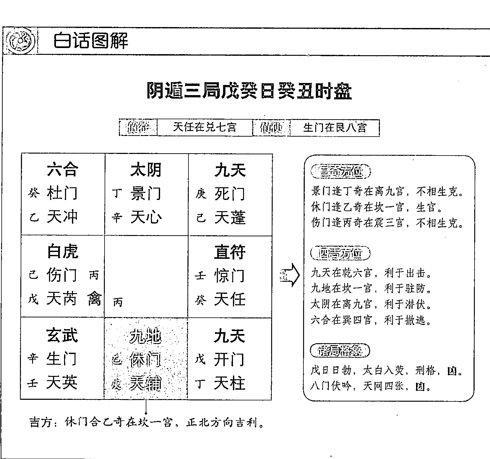

## 甲寅时：逢戊日不宜用事

## 【原文】

甲寅 柱值符七，惊值使七。天辅。寅至午阳，宿凶干吉，戊日不用。心使开墓乾伏，辅日杜巽伏，芮月死坤伏。天六，地一，阴九，合四。开与星合六西北，时干兑，符门伏，地甲，阖。

## 【白话提要】

符使宫位：值符天柱星在兑七宫，值使惊门在兑七宫。时干遇凶星宿，时干逢吉。寅时为天辅释罪时。寅时至午时为五阳时。

三奇方位：开门逢双丁奇在乾六宫，不相生克。杜门逢双乙奇在巽四宫，不相生克。死门逢双丙奇在坤二宫，不相生克。

四吉方位：九天在乾六宫，九地在坎一宫，太阴在离九宫，六合在巽四宫。

诸局格象：开门合丁奇在乾六宫，西北方向吉利。时干在兑七宫。星符与八门俱伏吟。地甲合。

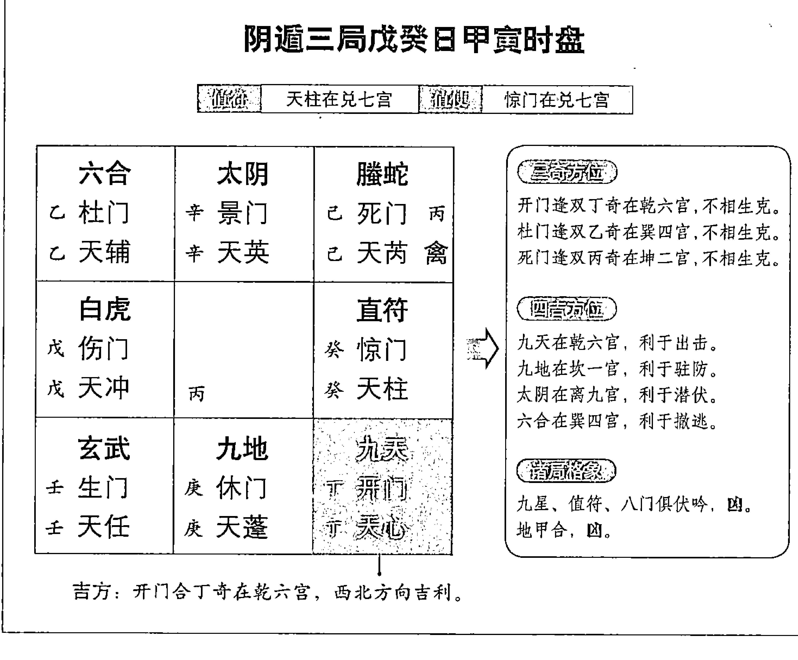

## 乙卯时：宜守户不出

## 【原文】
乙卯 柱四，惊六。宿干吉，天遁，守户。杜离义，开合坎义，生震害。天九，地二，阴八，合一。生与月合三正东，开与日合一正北，鸟跌穴，时干坎，戊日勃，金入火，刑格。

## 【白话提要】
符使宫位：值符天柱星在巽四宫，值使惊门在乾六宫。时干遇吉星宿，时干逢吉。宜守户不出。
三奇方位：杜门逢丁奇在离九宫，生宫。开门逢乙奇在坎一宫，生宫，奇仪相合。生门逢丙奇在震三宫，被克。
四吉方位：九天在离九宫，九地在坤二宫，太阴在艮八宫，六合在坎一宫。
诸局格象：生门合丙奇在震三宫，正东方向吉利。开门合乙奇在坎一宫，正北方向吉利。飞鸟跌穴。时干在坎一宫。戊日日勃。太白入荧。刑格。

## 白话图解

### 阴遁三局戊癸日乙卯时盘

值符 天柱在巽四宫 值使 惊门在乾六宫

吉方1：生门合丙奇在震三宫，正东方向吉利。

| | | |
|---|---|---|
| **直符** 癸 伤门 乙 天柱 | **九天** 丁 杜门 辛 天心 | **九地** 庚 景门 己 天蓬 |
| **螣蛇** 丙 生门 戊 天芮 禽 | **(中宫)** 丙 | **玄武** 壬 死门 癸 天任 |
| **太阴** 辛 休门 壬 天英 | **六合** 乙 开门 庚 天辅 | **白虎** 戊 惊门 丁 天冲 |

三奇方位
杜门逢丁奇在离九宫，生宫。
开门逢乙奇在坎一宫，生宫。
生门逢丙奇在震三宫，被克。

四吉方位
九天在离九宫，利于出击。
九地在坤二宫，利于驻防。
太阴在艮八宫，利于潜伏。
六合在坎一宫，利于撤逃。

诸局格象
飞鸟跌穴，吉。
戊日日勃，太白入荧，刑格，凶。

吉方2：开门合乙奇在坎一宫，正北方向吉利。

## 丙辰时：正西方向吉利

## 【原文】

丙辰 柱五，惊五避五。宿干吉。开兑伏欢怡，杜震伏，死合离和，天七，地六，阴四，合三。开与星合七正西，时干离，相佐坤，雀入江，虎猖狂。

## 【白话提要】

符使宫位：值符天柱星在中五宫，寄于坤二宫；值使惊门在中五宫，寄于坤二宫。时干遇吉星宿，时干逢吉。
三奇方位：开门逢丁奇在兑七宫，不相生克，吉利。杜门逢乙奇在震三宫，不相生克。死门逢丙奇在离九宫，被生，奇仪相合。
四吉方位：九天在兑七宫，九地在乾六宫，太阴在巽四宫，六合在震三宫。
诸局格象：开门合丁奇在兑七宫，正西方向吉利。时干在离九宫。值符得地盘丙奇相助于坤二宫。朱雀入江。白虎猖狂。

## 白话图解

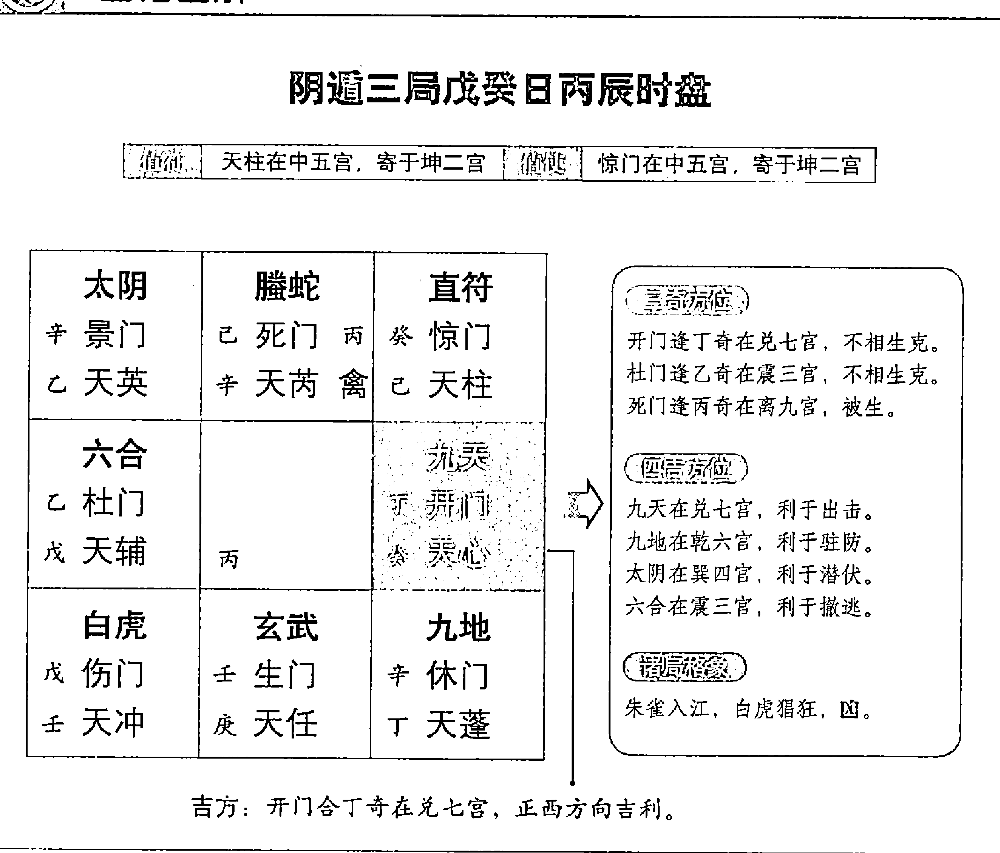

## 丁巳时：正南与正西方向吉利

## 【原文】

丁巳 柱六，惊四。宿干吉。杜坎和，开离害，生兑义欢怡。天一，地八，阴三，合九。开与日合九正南，生与月合七正西，得使，龙走，蛇矫，时干坎，相佐乾，癸日勃，击刑，仪刑。

## 【白话提要】

符使宫位：值符天柱星在乾六宫，值使惊门在巽四宫。时干遇吉星宿，时干逢吉。

三奇方位：杜门逢丁奇在坎一宫，被生。开门逢乙奇在离九宫，被克。生门逢丙奇在兑七宫，生宫，吉利。

四吉方位：九天在坎一宫，九地在艮八宫，太阴在坤二宫，六合在离九宫。

诸局格象：开门合乙奇在离九宫，正南方向吉利。生门合丙奇在兑七宫，正西方向吉利。丙奇得使。青龙逃走。螣蛇天矫。时干在坎一宫。值符得地盘丁奇相助于乾六宫。癸日日勃。六仪击刑。

## 白话图解

#### 阴遁三局戊癸日丁巳时盘

值符：天柱在乾六宫

值使：惊门在巽四宫

吉方1：开门合乙奇在离九宫，正南方向吉利。

| 白虎       | 六合       | 太阴       |
|------------|------------|------------|
| 戊 惊门   | 乙 开门   | 辛 休门   |
| 乙 天冲   | 辛 天辅   | 己 天英   |
| 玄武       |            | 螣蛇       |
| 壬 死门   | 丙         | 己 惊门 禽 |
| 戊 天任   |            | 癸 天芮 禽 |
| 九地       | 九天       | 直符       |
| 庚 景门   | 丁 杜门   | 癸 伤门   |
| 壬 天蓬   | 庚 天心   | 丁 天柱   |

三奇方位：杜门逢丁奇在坎一宫，被生。开门逢乙奇在离九宫，被克。生门逢丙奇在兑七宫，生宫。

四吉方位：九天在坎一宫，利于出击。九地在艮八宫，利于驻防。太阴在坤二宫，利于潜伏。六合在离九宫，利于撤逃。

诸局格象：丙奇得使，吉。青龙逃走，螣蛇天矫，六仪击刑，凶。逢癸日，为日勃格，凶。

吉方2：生门合丙奇在兑七宫，正西方向吉利。

## 戊午时：东南方向吉利

## 【原文】

戊午 柱三，惊三。宿干吉。开乙巽制，杜丁乾害，死艮伏。天四，地九，阴一，合六。开与星合四东南，丁下有乙，时干兑，符冲，门反吟，三吉。

## 【白话提要】

符使宫位：值符天柱星在震三宫，值使惊门在震三宫。时干遇吉星宿，时干逢吉。

三奇方位：开门逢天盘丁奇与地盘乙奇在巽四宫，克宫。杜门逢天盘乙奇与地盘丁奇在乾六宫，被克。死门逢丙奇在艮八宫，不相生克。

四吉方位：九天在巽四宫，九地在离九宫，太阴在坎一宫，六合在乾六宫。

诸局格象：开门合丁奇在巽四宫，东南方向吉利。丁下有乙为人遁。时干在兑七宫。值符相冲。八门反吟。三吉格。

## 白话图解

#### 阴遁三局戊癸日戊午时盘

值符 天柱在震三宫 值使 惊门在震三宫

吉方：开门合丁奇在巽四宫，东南方向吉利。

| 九天 | 九地 | 玄武 |
| :--- | :--- | :--- |
| 丁 开门 乙 天心 | 庚 休门 辛 天蓬 | 壬 生门 己 天任 |
| 直符 癸 惊门 戊 天柱 | 丙 | 白虎 戊 伤门 癸 天冲 |
| 螣蛇 己 死门 壬 天芮禽 | 太阴 辛 景门 庚 天英 | 六合 乙 杜门 丁 天辅 |

三奇方位：开门逢天盘丁奇与地盘乙奇在巽四宫，克宫。杜门逢天盘乙奇与地盘丁奇在乾六宫，被克。死门逢丙奇在艮八宫，不相生克。

四吉方位：九天在巽四宫，利于出击。九地在离九宫，利于驻防。太阴在坎一宫，利于潜伏。六合在乾六宫，利于撤逃。

诸局格象：丁下有乙，为人遁，吉。值符相冲，八门反吟，凶。

# 己未时：逢癸日不宜用事

## 【原文】

己未 柱二，惊二。卯未亥阴，宿干凶，癸日不用。开兑伏欢怡，杜丙震伏，死合离和。天七，地六，阴四，合三。开与星合七正西，时干离，相佐坤，雀入江，虎猖狂，龙反首。

## 【白话提要】

符使宫位：值符天柱星在坤二宫，值使惊门在坤二宫。时干遇凶星宿，时干逢凶。卯时至亥时为五阴时。逢癸日不宜用事。

三奇方位：开门逢丁奇在兑七宫，不相生克，吉利。杜门逢乙奇在震三宫，不相生克。死门逢丙奇在离九宫，被生，奇仪相合。

四吉方位：九天在兑七宫，九地在乾六宫，太阴在巽四宫，六合在震三宫。

诸局格象：开门合丁奇在兑七宫，正西方向吉利。时干在离九宫。值符得地盘丙奇相助于坤二宫。朱雀入江。白虎猖狂。青龙回首。

## 白话图解

#### 阴遁三局戊癸日己未时盘

值符 天柱在坤二宫 值使 惊门在坤二宫

| 宫位 | 天盘/门/神 | 地盘/星/奇仪 |
| :--- | :--- | :--- |
| 巽四宫 | 太阴、辛、景门 | 乙、天英 |
| 离九宫 | 螣蛇、己、死门 | 丙、天芮、禽 |
| 坤二宫 | 直符、癸、惊门 | 己、天柱 |
| 震三宫 | 六合、乙、杜门 | 戊、天辅 |
| 中五宫 | (寄于坤二宫) | 丙 |
| 兑七宫 | 九天、丁、开门 | 癸、天心 |
| 艮八宫 | 白虎、戊、伤门 | 壬、天冲 |
| 坎一宫 | 玄武、壬、生门 | 庚、天任 |
| 乾六宫 | 九地、辛、休门 | 丁、天蓬 |

### 三奇方位
* 开门逢丁奇在兑七宫，不相生克。
* 杜门逢乙奇在震三宫，不相生克。
* 死门逢丙奇在离九宫，被生。

### 四吉方位
* 九天在兑七宫，利于出击。
* 九地在乾六宫，利于驻防。
* 太阴在巽四宫，利于潜伏。
* 六合在震三宫，利于撤逃。

### 诸局格象
* 青龙回首，吉。
* 朱雀入江，白虎猖狂，凶。

吉方：开门合丁奇在兑七宫，正西方向吉利。

## 庚申时：东北方向吉利

## 【原文】

> 庚申 柱一，惊一。宿干凶。开合艮和，杜墓丙坤制，死墓丁乾义。天八，地三，阴七，合二。开与星合八东北，得使，时干震，飞宫，飞符，事同，癸日飞干格，戊日伏干格。

## 【白话提要】

符使宫位：值符天柱星在坎一宫，值使惊门在坎一宫。时干遇凶星宿，时干逢凶。

三奇方位：开门合丁奇在艮八宫，被生，奇仪相合。杜门合天盘乙奇与地盘丙奇在坤二宫，克宫，乙奇入墓。死门合天盘丙奇与地盘丁奇在乾六宫，生宫，丙奇入墓。

四吉方位：九天在艮八宫，九地在震三宫，太阴在兑七宫，六合在坤二宫。

诸局格象：开门合丁奇在艮八宫，东北方向吉利。丁奇得使。时干在震三宫。飞宫格。逢癸日为飞干格。逢戊日为伏干格。

## 白话图解

#### 阴遁三局戊癸日庚申时盘

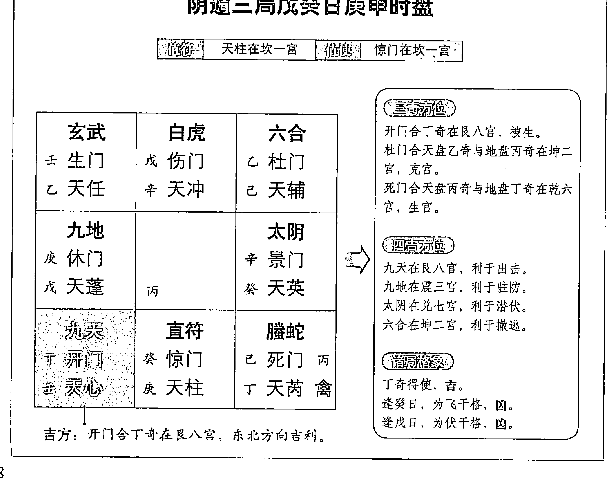

## 辛酉时：西南方向吉利

## 【原文】
辛酉 柱九，惊九。宿干凶。开丙坤和，杜艮制，死乙巽害。天二，地七，阴三，合八。开与星合二西南，丁下有丙，伏宫格，时干震，大格，乙格，戊日飞干格，癸日伏干格。

## 【白话提要】
符使宫位：值符天柱星在离九宫，值使惊门在离九宫。时干遇凶星宿，时干逢凶。
三奇方位：开门合天盘丁奇与地盘丙奇在坤二宫，被生。杜门合乙奇在艮八宫，克宫。死门合天盘丙奇与地盘乙奇在巽四宫，被克。
四吉方位：九天在坤二宫，九地在兑七宫，太阴在震三宫，六合在艮八宫。
诸局格象：开门合丁奇在坤二宫，西南方向吉利。丁下有丙为星随月转。时干在震三宫。大格。太乙格。逢戊日为飞干格。逢癸日为伏干格。

## 白话图解

阴遁三局戊癸日辛酉时盘
值符：天柱在离九宫 值使：惊门在离九宫
吉方：开门合丁奇在坤二宫，西南方向吉利。

| 螣蛇 | 直符 | 九天 |
| :---: | :---: | :---: |
| 己 死门 丙 | 癸 惊门 | 丁 开门 |
| 乙 天芮 禽 | 辛 天柱 | 己 天心 |
| **太阴** | | **九地** |
| 辛 景门 | | 庚 休门 |
| 戊 天英 | 丙 | 癸 天蓬 |
| **六合** | **白虎** | **玄武** |
| 乙 杜门 | 戊 伤门 | 壬 生门 |
| 壬 天辅 | 庚 天冲 | 丁 天任 |

三奇方位
开门合天盘丁奇与地盘丙奇在坤二宫，被生。
杜门合乙奇在艮八宫，克宫。
死门合天盘丙奇与地盘乙奇在巽四宫，被克。

四吉方位
九天在坤二宫，利于出击。
九地在兑七宫，利于驻防。
太阴在震三宫，利于潜伏。
六合在艮八宫，利于撤逃。

诸局格象
丁下有丙，为星随月转，吉。
大格，太乙格，凶。
逢戊日，为飞干格，凶。
逢癸日，为伏干格，凶。

壬戌时：正东方向吉利

【原文】

壬戌 柱八，惊八。宿吉干凶。开震制，杜兑害欢怡，死坎制。天三，地四，阴六，合七。开与星合三正东，时干离，火入金，龙反首。

【白话提要】

- 符使宫位：值符天柱星在艮八宫，值使惊门在艮八宫。时干遇吉星宿，时干逢凶。
- 三奇方位：开门合丁奇在震三宫，克宫。杜门合乙奇在兑七宫，被克，吉利。死门合丙奇在坎一宫，克宫。
- 四吉方位：九天在震三宫，九地在巽四宫，太阴在乾六宫，六合在兑七宫。
- 诸局格象：开门合丁奇在震三宫，正东方向吉利。时干在离九宫。荧入太白。青龙回首。

白话图解

阴遁三局戊癸日壬戌时盘

| 九地 | 玄武 | 白虎 |
|------|------|------|
| 庚 休门 乙 天蓬 | 壬 生门 辛 天任 | 戊 伤门 己 天冲 |
| 九天 丁 开门 戊 天心 | 丙 | 六合 乙 杜门 癸 天辅 |
| 直符 癸 惊门 壬 天柱 | 螣蛇 己 死门 丙 庚 天芮 禽 | 太阴 辛 景门 丁 天英 |

三奇方位

- 开门合丁奇在震三宫，克宫。
- 杜门合乙奇在兑七宫，被克。
- 死门合丙奇在坎一宫，克宫。

四吉方位

- 九天在震三宫，利于出击。
- 九地在巽四宫，利于驻防。
- 太阴在乾六宫，利于潜伏。
- 六合在兑七宫，利于撤逃。

诸局格象

- 青龙回首，吉。
- 荧入太白，凶。

吉方：开门合丁奇在震三宫，正东方向吉利。

癸亥时：西北方向吉利

【原文】

癸亥 柱七，惊七。宿干凶。开墓丁乾伏，杜乙巽伏，死丙坤伏。天六，地一，阴九，合四。开与星合六西北。时干兑，符门伏，天网。

【白话提要】

符使宫位：值符天柱星在兑七宫，值使惊门在兑七宫。时干遇凶星宿，时干逢凶。

三奇方位：开门合双丁奇在乾六宫，不相生克，丁奇入墓。杜门合双乙奇在巽四宫，不相生克。死门合双丙奇在坤二宫，不相生克。

四吉方位：九天在乾六宫，九地在坎一宫，太阴在离九宫，六合在巽四宫。

诸局格象：开门合丁奇在乾六宫，西北方向吉利。时干在兑七宫。九星、值符和八门都成伏吟格。天网四张。

白话图解

阴遁三局戊癸日癸亥时盘

| 六合 | 太阴 | 螣蛇 |
| :---: | :---: | :---: |
| 乙 杜门 乙 天辅 | 辛 景门 辛 天英 | 己 死门 丙 己 天芮 禽 |
| 白虎 | | 直符 |
| 戊 伤门 戊 天冲 | 丙 | 癸 惊门 癸 天柱 |
| 玄武 | 九地 | 九天 |
| 壬 生门 壬 天任 | 庚 休门 庚 天蓬 | 丁 开门 丁 天心 |

三奇方位

- 开门合双丁奇在乾六宫，不相生克。
- 杜门合双乙奇在巽四宫，不相生克。
- 死门合双丙奇在坤二宫，不相生克。

四吉方位

- 九天在乾六宫，利于出击。
- 九地在坎一宫，利于驻防。
- 太阴在离九宫，利于潜伏。
- 六合在巽四宫，利于撤逃。

诸局格象

- 九星伏吟，值符伏吟，八门伏吟，凶。
- 天网四张，凶。

吉方：开门合丁奇在乾六宫，西北方向吉利。

第三章 阴遁二局

奇门遁甲时家奇门阴遁二局共有六十个时辰，即六十局。本章通过文字和各时辰的飞盘排布来说明各局的符使宫位、三奇方位、四吉神方位和诸局格象。

白话图解

阴遁二局图

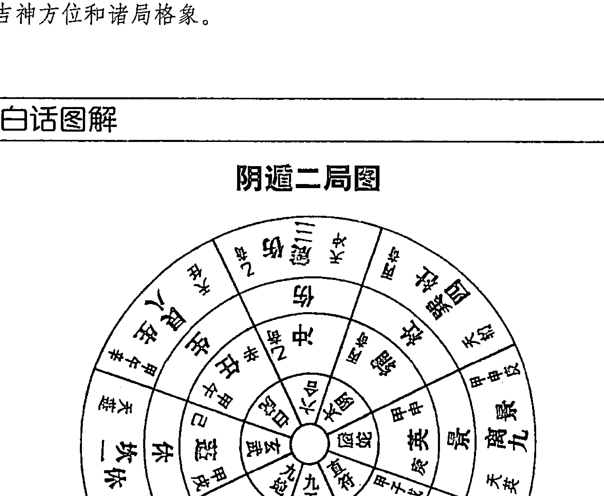

| 小暑中元 | 立秋上元 | 霜降下元 | 小雪下元 |
|----------|----------|----------|----------|

每日时辰

奇门遁甲中一局为一元，一元有甲己、乙庚、丙辛、丁壬和戊癸五日，每日有十二个时辰，则一局就有六十个时辰，用六十甲子来表示，一个时辰为一小局。

|      | 甲子 | 乙丑 | 丙寅 | 丁卯 | 戊辰 | 己巳 | 庚午 | 辛未 | 壬申 | 癸酉 | 甲戌 | 乙亥 |
|------|------|------|------|------|------|------|------|------|------|------|------|------|
| 甲己日 | 甲子 | 乙丑 | 丙寅 | 丁卯 | 戊辰 | 己巳 | 庚午 | 辛未 | 壬申 | 癸酉 | 甲戌 | 乙亥 |
| 乙庚日 | 丙子 | 丁丑 | 戊寅 | 己卯 | 庚辰 | 辛巳 | 壬午 | 癸未 | 甲申 | 乙酉 | 丙戌 | 丁亥 |
| 丙辛日 | 戊子 | 己丑 | 庚寅 | 辛卯 | 壬辰 | 癸巳 | 甲午 | 乙未 | 丙申 | 丁酉 | 戊戌 | 己亥 |
| 丁壬日 | 庚子 | 辛丑 | 壬寅 | 癸卯 | 甲辰 | 乙巳 | 丙午 | 丁未 | 戊申 | 己酉 | 庚戌 | 辛亥 |
| 戊癸日 | 壬子 | 癸丑 | 甲寅 | 乙卯 | 丙辰 | 丁巳 | 戊午 | 己未 | 庚申 | 辛酉 | 壬戌 | 癸亥 |

阴遁二局六十时符使表

奇门遁甲排盘时，最主要的就是寻找值符和值使，并确定其所在的宫位。下表就是阴遁二局六十个时辰的值符和值使，以及其所在的宫位。

| 时辰 | 甲子 | 乙丑 | 丙寅 | 丁卯 | 戊辰 | 己巳 | 庚午 | 辛未 | 壬申 | 癸酉 |
|------|------|------|------|------|------|------|------|------|------|------|
| 天芮 | 二 | 三 | 四 | 五 | 二 | 一 | 九 | 八 | 七 | 六 |
| 死门 | 二 | 一 | 九 | 八 | 七 | 六 | 五 | 四 | 三 | 二 |
| 时辰 | 甲戌 | 乙亥 | 丙子 | 丁丑 | 戊寅 | 己卯 | 庚辰 | 辛巳 | 壬午 | 癸未 |
| 天蓬 | 一 | 三 | 四 | 五 | 二 | 一 | 九 | 八 | 七 | 六 |
| 休门 | 一 | 九 | 八 | 七 | 六 | 五 | 四 | 三 | 二 | 一 |
| 时辰 | 甲申 | 乙酉 | 丙戌 | 丁亥 | 戊子 | 己丑 | 庚寅 | 辛卯 | 壬辰 | 癸巳 |
| 天英 | 九 | 三 | 四 | 五 | 二 | 一 | 九 | 八 | 七 | 六 |
| 景门 | 九 | 八 | 七 | 六 | 五 | 四 | 三 | 二 | 一 | 九 |
| 时辰 | 甲午 | 乙未 | 丙申 | 丁酉 | 戊戌 | 己亥 | 庚子 | 辛丑 | 壬寅 | 癸卯 |
| 天任 | 八 | 三 | 四 | 五 | 二 | 一 | 九 | 八 | 七 | 六 |
| 生门 | 八 | 七 | 六 | 五 | 四 | 三 | 二 | 一 | 九 | 八 |
| 时辰 | 甲辰 | 乙巳 | 丙午 | 丁未 | 戊申 | 己酉 | 庚戌 | 辛亥 | 壬子 | 癸丑 |
| 天柱 | 七 | 三 | 四 | 五 | 二 | 一 | 九 | 八 | 七 | 六 |
| 惊门 | 七 | 六 | 五 | 四 | 三 | 二 | 一 | 九 | 八 | 七 |
| 时辰 | 甲寅 | 乙卯 | 丙辰 | 丁巳 | 戊午 | 己未 | 庚申 | 辛酉 | 壬戌 | 癸亥 |
| 天心 | 六 | 三 | 四 | 五 | 二 | 一 | 九 | 八 | 七 | 六 |
| 开门 | 六 | 五 | 四 | 三 | 二 | 一 | 九 | 八 | 七 | 六 |

1. 甲己日十二时局

甲子时：无奇门可出

【原文】
甲子 芮二，死二。子至辰阳，宿凶干吉。杜巽伏，伤震伏，死坤伏。天七，地六，阴四，合三，无奇门，时干坤，符门伏，遁甲，阖。

【白话提要】
符使宫位：值符天芮星在坤二宫，值使死门在坤二宫。时干遇凶星宿，时干逢吉。子时至辰时为五阳时。
三奇方位：杜门逢双丙奇在巽四宫，不相生克。伤门逢双乙奇在震三宫，不相生克。死门逢双丁奇在坤二宫，不相生克。
四吉方位：九天在兑七宫，九地在乾六宫，太阴在巽四宫，六合在震三宫。
诸局格象：无奇门。时干在坤二宫。星符、八门伏吟。遁甲合。

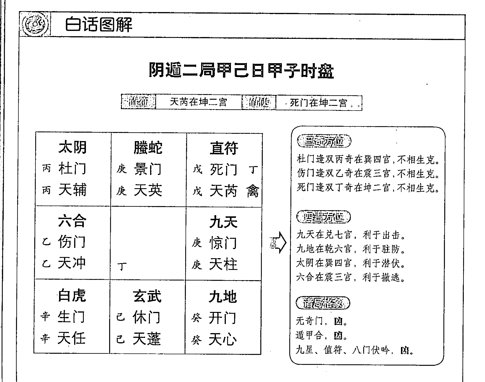

阴遁二局甲己日甲子时盘

| 太阴 | 螣蛇 | 直符 |
| :--- | :--- | :--- |
| 丙 杜门 丙 天辅 | 庚 景门 庚 天英 | 戊 死门 丁 戊 天芮 禽 |
| 六合 | | 九天 |
| 乙 伤门 乙 天冲 | 丁 | 庚 惊门 庚 天柱 |
| 白虎 | 玄武 | 九地 |
| 辛 生门 辛 天任 | 己 休门 己 天蓬 | 癸 开门 癸 天心 |

- 三奇方位：杜门逢双丙奇在巽四宫，不相生克。伤门逢双乙奇在震三宫，不相生克。死门逢双丁奇在坤二宫，不相生克。
- 四吉方位：九天在兑七宫，利于出击。九地在乾六宫，利于驻防。太阴在巽四宫，利于潜伏。六合在震三宫，利于撤逃。
- 诸局格象：无奇门，凶。遁甲合，凶。九星、值符、八门伏吟，凶。

乙丑时：逢己日不宜用事

【原文】

乙丑 芮三，死一。宿干吉，己日不用。死坎制，景乾制，开乙震伏。天四，地九，阴一，合六。开与星合三正东，丁下有乙，时干乾，己日勃，仪刑。

【白话提要】

符使宫位：值符天芮星在震三宫，值使死门在坎一宫。时干遇吉星宿，时干逢吉。逢己日不宜用事。

三奇方位：死门逢丙奇在坎一宫，克宫。景门逢乙奇在乾六宫，克宫。开门逢天盘丁奇与地盘乙奇在震三宫，不相生克。

四吉方位：九天在巽四宫，九地在离九宫，太阴在坎一宫，六合在乾六宫。

诸局格象：开门合丁奇在震三宫，正东方向吉利。丁下有乙为人遁。时干在乾六宫。己日日勃。六仪击刑。

白话图解

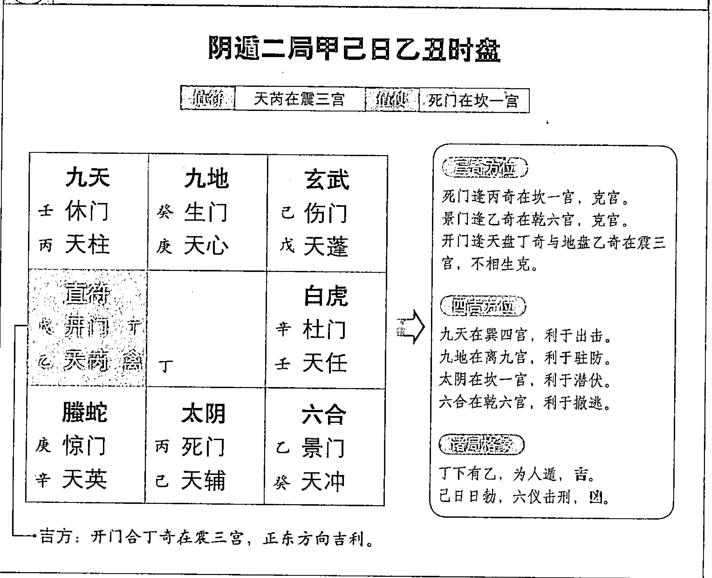

| | 九天 | 九地 | 玄武 |
|---|---|---|---|
| 上 | 壬 休门 丙 天柱 | 癸 生门 庚 天心 | 己 伤门 戊 天蓬 |
| 中 | 值符 乙 开门 丁 天芮 禽 | 丁 | 辛 杜门 壬 天任 |
| 下 | 螣蛇 庚 惊门 辛 天英 | 太阴 丙 死门 己 天辅 | 六合 乙 景门 癸 天冲 |

丙寅时：正北方向吉利

【原文】

丙寅 芮四，死九。宿干吉。伤合艮制，生坎制，景丙巽和。天九，地二，阴八，合一。生与日合一正北，得使，天乙与太白格，时干艮，相佐巽，事同，蛇矫，龙反首。

【白话提要】

符使宫位：值符天芮星在巽四宫，值使死门在离九宫。时干遇吉星宿，时干逢吉。

- 三奇方位：伤门逢丙奇在艮八宫，克宫，奇仪相合。生门逢乙奇在坎一宫，克宫。景门逢天盘丁奇与地盘丙奇在巽四宫，被生。
- 四吉方位：九天在离九宫，九地在坤二宫，太阴在艮八宫，六合在坎一宫。
- 诸局格象：生门合乙奇在坎一宫，正北方向吉利。乙奇得使。天乙与六庚格。时干在艮八宫。值符得地盘丙奇相助于巽四宫。螣蛇天矫。青龙回首。

白话图解

阴遁二局甲己日丙寅时盘

| 直符 | 九天 | 九地 |
| :--- | :--- | :--- |
| 戊 景门 丁 丙 天芮 禽 | 壬 死门 庚 天柱 | 癸 惊门 戊 天心 |
| 螣蛇 | | 玄武 |
| 庚 杜门 乙 天英 | 丁 | 己 开门 壬 天蓬 |
| 太阴 | 六合 | 白虎 |
| 丙 伤门 辛 天辅 | 乙 生门 己 天冲 | 辛 休门 癸 天任 |

吉方：生门合乙奇在坎一宫，正北方向吉利。

三奇方位

- 伤门逢丙奇在艮八宫，克宫。
- 生门逢乙奇在坎一宫，克宫。
- 景门逢天盘丁奇与地盘丙奇在巽四宫，被生。

四吉方位

- 九天在离九宫，利于出击。
- 九地在坤二宫，利于驻防。
- 太阴在艮八宫，利于潜伏。
- 六合在坎一宫，利于撤逃。

诸局格象

- 乙奇得使，青龙回首，吉。
- 螣蛇天矫，凶。

丁卯时：西南与东南方向吉利

【原文】
丁卯 芮五，死八。宿干吉。开丙巽制，惊乙震制，生丁坤伏。天七，地六，阴四，合三。生与星合二西南，丁下有丁，开与月合四东南，丙下有丙，时干乾，相佐坤，击刑，符伏吟，门反吟。

【白话提要】
符使宫位：值符天芮星在中五宫，寄于坤二宫，值使死门在艮八宫。时干遇吉星宿，时干逢吉。
三奇方位：开门逢双丙奇在巽四宫，克宫。惊门逢双乙奇在震三宫，克宫。生门逢双丁奇在坤二宫，不相生克。
四吉方位：九天在兑七宫，九地在乾六宫，太阴在巽四宫，六合在震三宫。
诸局格象：生门合丁奇在坤二宫，西南方向吉利。丁下有丁为奇入太阴。开门逢丙奇在巽四宫，东南方向吉利。丙下有丙为丙奇悖师。时干在乾六宫。值符得地盘丁奇助于坤二宫。击刑。星符伏吟。八门反吟。

白话图解

阴遁二局甲己日丁卯时盘

| 值符 | 天芮在中五宫，寄于坤二宫 | 值使 | 死门在艮八宫 |

吉方1：开门逢丙奇在巽四宫，东南方向吉利。
吉方2：生门合丁奇在坤二宫，西南方向吉利。

| 太阴 | 螣蛇 | 直符 |
| 丙 开门 | 庚 休门 | 丁 惊门 |
| 丙 天辅 | 庚 天英 | 丁 天芮 禽 |
| 六合 | 丁 | 九天 |
| 乙 惊门 |  | 壬 伤门 |
| 乙 天冲 |  | 壬 天柱 |
| 白虎 | 玄武 | 九地 |
| 辛 死门 | 己 景门 | 癸 杜门 |
| 辛 天任 | 己 天蓬 | 癸 天心 |

三奇方位

- 开门逢双丙奇在巽四宫，克宫。
- 惊门逢双乙奇在震三宫，克宫。
- 生门逢双丁奇在坤二宫，不相生克。

四吉方位

- 九天在兑七宫，利于出击。
- 九地在乾六宫，利于驻防。
- 太阴在巽四宫，利于潜伏。
- 六合在震三宫，利于撤逃。

诸局格象

- 击刑，凶。
- 星符伏吟，八门反吟，凶。

戊辰时：正东方向吉利

【原文】

戊辰 芮二，死七。宿凶干吉。伤丙巽伏，生乙震害，景丁坤义。天七，地六，阴四，合三。生与日合三正东，乙下有乙，时干坤，相佐坤，符伏吟。

【白话提要】

符使宫位：值符天芮星在坤二宫，值使死门在兑七宫。时干遇凶星宿，时干逢吉。

三奇方位：伤门逢双丙奇在巽四宫，不相生克。生门逢双乙奇在震三宫，被克。景门逢双丁奇在坤二宫，生宫。

四吉方位：九天在兑七宫，九地在乾六宫，太阴在巽四宫，六合在震三宫。

诸局格象：生门合乙奇在震三宫，正东方向吉利。乙下有乙为乙奇伏吟。时干在坤二宫。值符得地盘丁奇相助于坤二宫。星符伏吟。

白话图解

阴遁二局甲己日戊辰时盘

| 太阴 | 螣蛇 | 直符 |
|------|------|------|
| 丙 伤门 丙 天辅 | 庚 杜门 庚 天英 | 戊 景门 丁 戊 天芮 禽 |
| 六合 |      | 九天 |
| 乙 生门 乙 天冲 |      | 壬 死门 壬 天柱 |
| 白虎 | 玄武 | 九地 |
| 辛 休门 辛 天任 | 己 开门 己 天蓬 | 癸 惊门 癸 天心 |

- 三奇方位：伤门逢双丙奇在巽四宫，不相生克。生门逢双乙奇在震三宫，被克。景门逢双丁奇在坤二宫，生宫。
- 四吉方位：九天在兑七宫，利于出击。九地在乾六宫，利于驻防。太阴在巽四宫，利于潜伏。六合在震三宫，利于撤逃。
- 诸局格象：九星、值符伏吟，凶。乙下有乙，为乙奇伏吟，凶。

吉方：生门合乙奇在震三宫，正东方向吉利。

己巳时：无奇门可出

【原文】
己巳 芮一，死六。巳至酉阴，天辅，宿干凶。景兑制，杜墓丁坤制欢怡，惊坎义。天八，地三，阴七，合二。无奇门，时干巽，大格。

【白话提要】
符使宫位：值符天芮星在坎一宫，值使死门在乾六宫。时干遇凶星宿，时干逢凶。巳时至酉时为五阴时。巳时为天辅释罪时。
三奇方位：景门逢丙奇在兑七宫，克宫。杜门逢天盘乙奇与地盘丁奇在坤二宫，克宫，吉利，乙奇入墓。惊门逢丁奇在坎一宫，生宫。
四吉方位：九天在艮八宫，九地在震三宫，太阴在兑七宫，六合在坤二宫。
诸局格象：无奇门。时干在巽四宫。大格。

白话图解

阴遁二局甲己日己巳时盘

值符 天芮在坎一宫 值使 死门在乾六宫

| 宫位 | 神 | 门 | 天盘干 | 地盘干 | 星 |
| :--- | :--- | :--- | :--- | :--- | :--- |
| 坎一宫 (北) | 玄武 | 休门 | 己 | 丙 | 天蓬 |
| 艮八宫 (东北) | 九地 | 生门 | 癸 | 乙 | 天心 |
| 震三宫 (东) | 九天 | 开门 | 壬 | 辛 | 天柱 |
| 巽四宫 (东南) | 直符 | 惊门 | 戊 | 己 | 天芮 (禽) |
| 离九宫 (南) | 螣蛇 | 死门 | 庚 | 癸 | 天英 |
| 坤二宫 (西南) | 六合 | 杜门 | 乙 | 戊 | 天冲 |
| 兑七宫 (西) | 太阴 | 景门 | 丙 | 壬 | 天辅 |
| 乾六宫 (西北) | (空) | (空) | (空) | (空) | (空) |

### 三奇方位
- 景门逢丙奇在兑七宫，克宫。
- 杜门逢天盘乙奇与地盘丁奇在坤二宫，克宫。
- 惊门逢丁奇在坎一宫，生宫。

### 四吉方位
- 九天在艮八宫，利于出击。
- 九地在震三宫，利于驻防。
- 太阴在兑七宫，利于潜伏。
- 六合在坤二宫，利于撤逃。

### 诸局格象
- 无奇门，大格，凶。

庚午时：逢甲日不宜用事

【原文】
庚午 芮九，死五避五。宿干凶，甲日不用，守户。伤乙震伏，生艮伏，景离伏。天二，地七，阴三，合八。生与日合八东北，得使，甲日飞干格，龙走，时干巽，门伏，反吟，飞符，金入火。

【白话提要】
符使宫位：值符天芮星在离九宫，值使死门在中五宫寄于坤二宫。时干遇凶星宿，时干逢凶。逢甲日不宜用事，宜守户不出。

三奇方位：伤门逢天盘丙奇与地盘乙奇在震三宫，不相生克。生门逢乙奇在艮八宫，不相生克。景门逢丁奇在离九宫，不相生克。

四吉方位：九天在坤二宫，九地在兑七宫，太阴在震三宫，六合在艮八宫。

诸局格象：生门合乙奇在艮八宫，东北方向吉利。乙奇得使。逢甲日飞干格。青龙逃走。时干在巽四宫。八门伏吟。值符飞宫。太白入荧。

白话图解

阴遁二局甲己日庚午时盘

| 螣蛇 | 直符 | 九天 |
| :--- | :--- | :--- |
| 庚 杜门 丙 天英 | 戊 景门 丁 庚 天芮 禽 | 壬 死门 戊 天柱 |
| 太阴 | | 九地 |
| 丙 伤门 乙 天辅 | 丁 | 癸 惊门 壬 天心 |
| 六合 | 白虎 | 玄武 |
| 乙 生门 辛 天冲 | 辛 休门 己 天任 | 己 开门 癸 天蓬 |

三奇方位

- 伤门逢天盘丙奇与地盘乙奇在震三宫，不相生克。
- 生门逢乙奇在艮八宫，不相生克。
- 景门逢丁奇在离九宫，不相生克。

四吉方位

- 九天在坤二宫，利于出击。
- 九地在兑七宫，利于驻防。
- 太阴在震三宫，利于潜伏。
- 六合在艮八宫，利于撤逃。

诸局格象

- 乙奇得使，吉。
- 逢甲日，为飞干格，凶。
- 青龙逃走，太白入荧，凶。
- 八门伏吟，值符飞宫，凶。

吉方：生门合乙奇在艮八宫，东北方向吉利。

## 辛未时：正西与西北方向吉利

## 【原文】

辛未 芮八，死四。宿吉干凶。生墓乾义，休兑和，杜艮制。天三，地四，阴六，合七。休与日合七正西，生与月合六西北，时干坤，符冲，刑格，己日飞干格，伏干格。

## 【白话提要】

符使宫位：值符天芮星在艮八宫，值使死门在巽四宫。时干遇吉星宿，时干逢凶。

三奇方位：生门逢丙奇在乾六宫，生宫，丙奇入墓。休门逢乙奇在兑七宫，被生。杜门逢丁奇在艮八宫，克宫。

四吉方位：九天在震三宫，九地在巽四宫，太阴在乾六宫，六合在兑七宫。

诸局格象：休门合乙奇在兑七宫，正西方向吉利。生门合丙奇在乾六宫，西北方向吉利。时干在坤二宫。值符相冲。刑格。逢己日飞干格。伏干格。

## 白话图解

#### 阴遁二局甲己日辛未时盘

吉方1：休门合乙奇在兑七宫，正西方向吉利。

| 九地 癸死门 丙天心 | 玄武 己惊门 庚天蓬 | 白虎 辛开门 戊天任 |
| :--- | :--- | :--- |
| 九天 壬景门 乙天柱 | 丁 | 六合 乙休门 辛天冲 |
| 直符 戊杜门 丁 辛天芮 禽 | 螣蛇 庚伤门 己天英 | 太阴 丙生门 癸天辅 |

吉方2：生门合丙奇在乾六宫，西北方向吉利。

三奇方位
生门逢丙奇在乾六宫，生宫。
休门逢乙奇在兑七宫，被生。
杜门逢丁奇在艮八宫，克宫。

四吉方位
九天在震三宫，利于出击。
九地在巽四宫，利于驻防。
太阴在乾六宫，利于潜伏。
六合在兑七宫，利于撤逃。

诸局格象
刑格，伏干格，凶。
逢己日，为飞干格，凶。

## 壬申时：正南与正西方向吉利

## 【原文】

壬申 芮七，死三。宿干凶。开离害，惊丙巽制，生合兑义。天六，地一，阴九，合四。开与月合九正南，生与星合七正西，甲日伏干格，时干乾，火入金，飞宫，乙格，三吉，虎猖狂。

## 【白话提要】

符使宫位：值符天芮星在兑七宫，值使死门在震三宫。时干遇凶星宿，时干逢凶。

三奇方位：开门逢丙奇在离九宫，被克。惊门逢天盘乙奇与地盘丙奇在巽四宫，克宫。生门逢丁奇在兑七宫，生宫，奇仪相合。

四吉方位：九天在乾六宫，九地在坎一宫，太阴在离九宫，六合在巽四宫。

诸局格象：开门合丙奇在离九宫，正南方向吉利。生门合丁奇在兑七宫，正西方向吉利。逢甲日伏干格。时干在乾六宫。荧入太白。飞宫格。太乙格。三吉格。白虎猖狂。

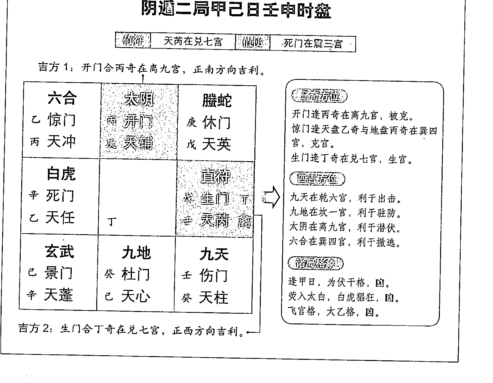

| 六合 | 太阴 | 螣蛇 |
| :--- | :--- | :--- |
| 乙 惊门 丙 天冲 | 丙 开门 癸 天辅 | 庚 休门 戊 天英 |
| 白虎 | (空) | 直符 |
| 辛 死门 乙 天任 | 丁 | 癸 生门 丁 壬 天芮 禽 |
| 玄武 | 九地 | 九天 |
| 己 景门 辛 天蓬 | 癸 杜门 己 天心 | 壬 伤门 癸 天柱 |

三奇方位
开门逢丙奇在离九宫，被克。
惊门逢天盘乙奇与地盘丙奇在巽四宫，克宫。
生门逢丁奇在兑七宫，生宫。

四吉方位
九天在乾六宫，利于出击。
九地在坎一宫，利于驻防。
太阴在离九宫，利于潜伏。
六合 in 巽四宫，利于撤逃。

诸局格象
逢甲日，为伏干格，凶。
荧入太白，白虎猖狂，凶。
飞宫格，太乙格，凶。

吉方 1：开门合丙奇在离九宫，正南方向吉利。

吉方 2：生门合丁奇在兑七宫，正西方向吉利。

## 癸酉时：西北方向吉利

## 【原文】

癸酉 芮六，死二。宿吉干凶。死丁坤伏欢怡，景合离伏，开墓乾伏。天一，地八，阴二，合九。开与星合六西北，得使，符勃，甲干勃，时干艮，门伏，鸟跌穴，雀入江，天网。

## 【白话提要】

符使宫位：值符天芮星在乾六宫，值使死门在坤二宫。时干遇吉星宿，时干逢凶。

三奇方位：死门逢丙奇与地盘丁奇在坤二宫，不相生克，吉利。景门逢乙奇在离九宫，不相生克，奇仪相合。开门逢丁奇在乾六宫，不相生克，丁奇入墓。

四吉方位：九天在坎一宫，九地在艮八宫，太阴在坤二宫，六合在离九宫。

诸局格象：开门合丁奇在乾六宫，西北方向吉利。丁奇得使。符勃格。甲干勃格。时干在艮八宫。八门伏吟。飞鸟跌穴。朱雀入江。天网四张。

## 白话图解

#### 阴遁二局甲己日癸酉时盘

| 神 | 门 | 星 |
| :--- | :--- | :--- |
| 白虎 | 辛 杜门 | 丙 天任 |
| 六合 | 乙 景门 | 庚 天冲 |
| 太阴 | 丙 死门 | 戊 天辅 |
| 玄武 | 己 伤门 | 乙 天蓬 |
| （空） | 丁 | （空） |
| 螣蛇 | 庚 惊门 | 壬 天英 |
| 九地 | 癸 生门 | 辛 天心 |
| 九天 | 壬 休门 | 己 天柱 |
| 直符 | 戊 开门 | 癸 天芮禽 |

吉方：开门合丁奇在乾六宫，西北方向吉利。

# 甲戌时：无奇门可出

## 【原文】

甲戌 蓬值符一，休值使一。戌至亥阳，宿凶干吉。伤冲使震伏，杜辅月巽伏，死芮星坤伏。天八，地三，阴七，合二。无奇门，时干坎，符门伏，飞甲，阖。

## 【白话提要】

符使宫位：值符天蓬星在坎一宫，值使休门在坎一宫。时干遇凶星宿，时干逢吉。戌时至亥时为五阳时。

三奇方位：伤门逢双乙奇在震三宫，不相生克。杜门逢双丙奇在巽四宫，不相生克。死门逢双丁奇在坤二宫，不相生克。

四吉方位：九天在艮八宫，九地在震三宫，太阴在兑七宫，六合在坤二宫。

诸局格象：无奇门。时干坎。星符、八门伏吟。飞甲合。

## 白话图解

#### 阴遁二局甲己日甲戌时盘

| 玄武 | 白虎 | 六合 |
| :--- | :--- | :--- |
| 丙 杜门 丙 天辅 | 庚 景门 庚 天英 | 戊 死门 丁 戊 天芮 禽 |
| 九地 | | 太阴 |
| 乙 伤门 乙 天冲 | 丁 | 壬 惊门 壬 天柱 |
| 九天 | 直符 | 螣蛇 |
| 辛 生门 辛 天任 | 己 休门 己 天蓬 | 癸 开门 癸 天心 |

三奇方位：伤门逢双乙奇在震三宫，不相生克。杜门逢双丙奇在巽四宫，不相生克。死门逢双丁奇在坤二宫，不相生克。

四吉方位：九天在艮八宫，利于出击。九地在震三宫，利于驻防。太阴在兑七宫，利于潜伏。六合在坤二宫，利于撤逃。

诸局格象：无奇门；飞甲合，凶。九星、值符、八门伏吟，凶。

# 乙亥时：逢己日不宜用事

## 【原文】

乙亥 蓬三，休九。己日不用，天遁。休合离制，生丁坤伏，杜墓乾害。天四，地九，阴一，合六。休与日合九正南，生与月合二西南，丙下有乙。

## 【白话提要】

符使宫位：值符天蓬星在震三宫，值使休门在离九宫。成天遁格。逢己日不宜用事。

三奇方位：休门逢乙奇在离九宫，克宫，奇仪相合。生门逢天盘丙奇与地盘丁奇在坤二宫，不相生克。杜门逢丁奇在乾六宫，被克，丁奇入墓。

四吉方位：九天在巽四宫，九地在离九宫，太阴在坎一宫，六合在乾六宫。

诸局格象：休门合乙奇在离九宫，正南方向吉利。生门合丙奇在坤二宫，西南方向吉利。丙下有乙成日月并行。

## 白话图解

#### 阴遁二局甲己日乙亥时盘

值符：天蓬在震三宫

值使：休门在离九宫

吉方1：休门合乙奇在离九宫，正南方向吉利。

吉方2：生门合丙奇在坤二宫，西南方向吉利。

| 九天 辛 开门 丙 天任 | 九地 乙 休门 庚 天冲 | 玄武 庚 生门 戊 天辅 |
| :--- | :--- | :--- |
| 直符 己 惊门 乙 天蓬 | 丁 | 白虎 庚 伤门 壬 天英 |
| 螣蛇 癸 死门 辛 天心 | 太阴 壬 景门 己 天柱 | 六合 戊 杜门 丁 癸 天芮 禽 |

三奇方位：休门逢乙奇在离九宫，克宫。生门逢天盘丙奇与地盘丁奇在坤二宫，不相生克。杜门逢丁奇在乾六宫，被克。

四吉方位：九天在巽四宫，利于出击。九地在离九宫，利于驻防。太阴在坎一宫，利于潜伏。六合在乾六宫，利于撤逃。

诸局格象：丙下有乙，成日月并行。吉。

## 乙庚日十二时局

# 丙子时：逢庚日不宜用事

## 【原文】

丙子 蓬四，休八。子至寅阳，宿凶干吉，庚日不用。景墓坤义，死兑义，开坎义。天九，地二，阴八，合一。开与星合一正北，时干兑，相佐巽，大格，龙反首。

## 【白话提要】

符使宫位：值符天蓬星在巽四宫，值使休门在艮八宫。时干遇凶星宿，时干逢吉。子时至寅时为五阳时。逢庚日不宜用事。

三奇方位：景门逢乙奇在坤二宫，生宫，乙奇入墓。死门逢丙奇在兑七宫，生宫。开门逢丁奇在坎一宫，生宫。

四吉方位：九天在离九宫，九地在坤二宫，太阴在艮八宫，六合在坎一宫。

诸局格象：开门合丁奇在坎一宫，正北方向吉利。时干在兑七宫，值符得地盘丙奇相助于巽四宫。大格。青龙回首。

## 白话图解

##### 阴遁二局乙庚日丙子时盘

值符 天蓬在巽四宫 休门在艮八宫

| 直符 | 九天 | 九地 |
| :--- | :--- | :--- |
| 己 伤门 丙 天蓬 | 辛 杜门 庚 天任 | 乙 景门 戊 天冲 |
| 螣蛇 | | 玄武 |
| 癸 生门 乙 天心 | 丁 | 丙 死门 壬 天辅 |
| 太阴 | 六合 | 白虎 |
| 壬 休门 辛 天柱 | 戊 开门 己 天芮 禽 | 庚 惊门 癸 天英 |

三奇方位
景门逢乙奇在坤二宫，生宫。
死门逢丙奇 in 兑七宫，生宫。
开门逢丁奇在坎一宫，生宫。

四吉方位
九天在离九宫，利于出击。
九地在坤二宫，利于驻防。
太阴在艮八宫，利于潜伏。
六合在坎一宫，利于撤逃。

诸局格象
青龙回首，吉。
大格，凶。

吉方：开门合丁奇在坎一宫，正北方向吉利。

### 丁丑时：西北方向吉利

## 【原文】

丁丑 蓬五，休七。宿干凶。生乾义，伤坎和欢怡，景乙震和。天七，地六，阴四，合三。生与日合六西北，符勃，时干震，相佐坤，鸟跌穴。

## 【白话提要】

符使宫位：值符天蓬星在中五宫，寄于坤二宫，值使休门在兑七宫。时干遇凶星宿，时干逢凶。

三奇方位：生门逢乙奇在乾六宫，生宫。伤门逢丙奇在坎一宫，被生，吉利。景门逢天盘丁奇与地盘乙奇震三宫，被生。

四吉方位：九天在兑七宫，九地在乾六宫，太阴在巽四宫，六合在震三宫。

诸局格象：生门合乙奇在乾六宫，西北方向吉利。符勃格。时干在震三宫。值符得地盘丁奇相助于坤二宫。飞鸟跌穴。

## 白话图解

##### 阴遁二局乙庚日丁丑时盘

| 太阴 | 螣蛇 | 直符 |
| :--- | :--- | :--- |
| 壬 死门 丙 天柱 | 癸 惊门 庚 天心 | 己 开门 戊 天蓬 |
| 六合 | | 九天 |
| 戊 景门 丁 乙 天芮 禽 | 丁 | 辛 休门 壬 天任 |
| 白虎 | 玄武 | 九地 |
| 庚 杜门 辛 天英 | 丙 伤门 己 天辅 | 乙 生门 癸 天心 |

吉方：生门合乙奇在乾六宫，西北方向吉利。

三奇方位
生门逢乙奇在乾六宫，生宫。
伤门逢丙奇在坎一宫，被生。
景门逢天盘丁奇与地盘乙奇在震三宫，被生。

四吉方位
九天在兑七宫，利于出击。
九地在乾六宫，利于驻防。
太阴在巽四宫，利于潜伏。
六合在震三宫，利于撤逃。

诸局格象
飞鸟跌穴，吉。
符勃格，凶。

### 戊寅时：正北与西北方向吉利

## 【原文】

戊寅 蓬二，休六。宿凶干吉。休乾和，生坎制欢怡，杜乙震伏。天七，地六，阴四，合三。生与月合一正北，休与日合六西北，符勃，仪刑，时干震，相佐坤，鸟跌穴。

## 【白话提要】

符使宫位：值符天蓬星在坤二宫，值使休门在乾六宫。时干遇凶星宿，时干逢吉。

三奇方位：休门逢乙奇在乾六宫，被生。生门逢丙奇在坎一宫，被克，吉利。杜门逢天盘丁奇与地盘乙奇在震三宫，不相生克。

四吉方位：九天在兑七宫，九地在乾六宫，太阴在巽四宫，六合在震三宫。

诸局格象：生门合丙奇在坎一宫，正北方向吉利。休门合乙奇在乾六宫，西北方向吉利。符勃。六仪击刑。时干在震三宫。值符得地盘丁奇相助于坤二宫。飞鸟跌穴。

## 白话图解

##### 阴遁二局乙庚日戊寅时盘

| 太阴 | 螣蛇 | 直符 |
| :--- | :--- | :--- |
| 壬 景门 丙 天柱 | 癸 死门 庚 天心 | 己 惊门 戊 天蓬 |
| 六合 戊 杜门 乙 天芮 禽 丁 | | 九天 辛 开门 壬 天任 |
| 白虎 庚 伤门 辛 天英 | 玄武 丙 生门 己 天辅 | 九地 乙 休门 癸 天芮 |

三奇方位：休门逢乙奇在乾六宫，被生。生门逢丙奇在坎一宫，被克。杜门逢天盘丁奇与地盘乙奇在震三宫，不相生克。

四吉方位：九天在兑七宫，利于出击。九地在乾六宫，利于驻防。太阴在巽四宫，利于潜伏。六合在震三宫，利于撤逃。

诸局格象：飞鸟跌穴，吉。符勃，六仪击刑，凶。

吉方1：生门合丙奇在坎一宫，正北方向吉利。吉方2：休门合乙奇在乾六宫，西北方向吉利。

# 己卯时：宜守户不出

## 【原文】

己卯 蓬一，休五避五。卯至未阴，宿吉干凶，守户。死乙震害，惊丙巽制，休丁坤害。天八，地三，阴七，合二。休与星合二西南，时干坎，符伏吟。

## 【白话提要】

符使宫位：值符天蓬星在坎一宫，值使休门在中五宫，寄于坤二宫。时干遇吉星宿，时干逢凶。卯时至未时为五阴时。宜守户不出。

三奇方位：死门逢双乙奇在震三宫，被克。惊门逢双丙奇在巽四宫，克宫。休门逢双丁奇在坤二宫，被克。

四吉方位：九天在艮八宫，九地在震三宫，太阴在兑七宫，六合在坤二宫。

诸局格象：休门合丁奇在坤二宫，西南方向吉利。时干在坎一宫。星符伏吟。

## 白话图解

##### 阴遁二局乙庚日己卯时盘

值符 天蓬在坎一宫 值使 休门在中五宫，寄于坤二宫

吉方：休门合丁奇在坤二宫，西南方向吉利。

| 玄武 | 白虎 | 六合 |
| :--- | :--- | :--- |
| 丙 惊门 丙 天辅 | 庚 开门 庚 天英 | 戊 休门 丁 戊 天芮 禽 |
| 九地 | | 太阴 |
| 乙 死门 乙 天冲 | 丁 | 壬 生门 壬 天柱 |
| 九天 | 直符 | 螣蛇 |
| 辛 景门 辛 天任 | 己 杜门 己 天蓬 | 癸 伤门 癸 天心 |

三奇方位
死门逢双乙奇在震三宫，被克。
惊门逢双丙奇在巽四宫，克宫。
休门逢双丁奇在坤二宫，被克。

四吉方位
九天在艮八宫，利于出击。
九地在震三宫，利于驻防。
太阴在兑七宫，利于潜伏。
六合在坤二宫，利于撤逃。

诸局格象
九星、值符伏吟，凶。

### 庚辰时：无奇门可出

## 【原文】

庚辰 蓬九，休四。宿干凶。杜兑害，景墓乾制，惊艮和。天二，地七，阴三，合八。无奇门，飞宫格，时干坎，飞符，符冲，刑格，乙格。

## 【白话提要】

符使宫位：值符天蓬星在离九宫，值使休门在巽四宫。时干遇凶星宿，时干逢凶。

三奇方位：杜门逢乙奇在兑七宫，被克。景门逢丙奇在乾六宫，克宫，丙奇入墓。惊门逢丁奇在艮八宫，被生。

四吉方位：九天在坤二宫，九地在兑七宫，太阴在震三宫，六合在艮八宫。

诸局格象：无奇门。飞宫格。时干在坎一宫。飞符。值符相冲。刑格。太乙格。

## 白话图解

##### 阴遁二局乙庚日庚辰时盘

| 螣蛇 | 直符 | 九天 |
| :--- | :--- | :--- |
| 癸 休门 丙 天心 | 己 生门 庚 天蓬 | 辛 伤门 戊 天任 |
| 太阴 | | 九地 |
| 壬 开门 乙 天柱 | 丁 | 乙 杜门 壬 天冲 |
| 六合 | 白虎 | 玄武 |
| 戊 惊门 丁 辛 天芮 禽 | 庚 死门 己 天英 | 丙 景门 癸 天辅 |

三奇方位
杜门逢乙奇在兑七宫，被克。
景门逢丙奇在乾六宫，克宫。
惊门逢丁奇在艮八宫，被生。

四吉方位
九天在坤二宫，利于出击。
九地在兑七宫，利于驻防。
太阴在震三宫，利于潜伏。
六合在艮八宫，利于撤逃。

诸局格象
无奇门，飞宫格，凶。
飞符，刑格，太乙格，凶。

# 辛巳时：逢乙日不宜用事

## 【原文】

辛巳 蓬八，休三。宿吉干凶，乙日不用。生丙巽害，伤离义，景合兑制。
天三，地四，阴六，合七。生与日合四东南，乙下有丙，庚干勃，时干震，火入
金，庚日勃，飞宫，三吉。

## 【白话提要】

符使宫位：值符天蓬星在艮八宫，值使休门在震三宫。时干遇吉星宿，时干逢凶。逢乙日不宜用事。

三奇方位：生门逢天盘乙奇与地盘丙奇在巽四宫，被克。伤门逢丙奇在离九宫，生宫。景门逢丁奇在兑七宫，克宫。

四吉方位：九天在震三宫，九地在巽四宫，太阴在乾六宫，六合在兑七宫。

诸局格象：生门合乙奇在巽四宫，东南方向吉利。乙下有丙为奇仪顺遂。庚干勃格。时干在震三宫。荧入太白。庚日日勃。飞宫格。三吉格。

## 白话图解

##### 阴遁二局乙庚日辛巳时盘

值符 天蓬在艮八宫 | 值使 休门在震三宫

吉方：生门合乙奇在巽四宫，东南方向吉利。

| 九地 乙 惊门 丙 天冲 | 玄武 丙 伤门 庚 天辅 | 白虎 庚 杜门 戊 天英 |
| :--- | :--- | :--- |
| 九天 辛 休门 乙 天任 | 丁 | 六合 戊 景门 丁 壬 天芮 禽 |
| 直符 己 开门 辛 天蓬 | 螣蛇 癸 惊门 己 天心 | 太阴 壬 死门 癸 天柱 |

三奇方位
生门逢天盘乙奇与地盘丙奇在巽四宫，被克。
伤门逢丙奇在离九宫，生宫。
景门逢丁奇在兑七宫，克宫。

四吉方位
九天在震三宫，利于出击。
九地在巽四宫，利于驻防。
太阴在乾六宫，利于潜伏。
六合在兑七宫，利于撤逃。

诸局格象
乙下有丙，为奇仪顺遂，吉。
庚干勃格，庚日日勃，凶。
荧入太白，飞宫格，凶。

### 壬午时：无奇门可出

## 【原文】

壬午 蓬七，休二。宿干凶。杜坎和，景合艮义，惊丙巽制。天六，地一，阴九，合四。无奇门，时干离，乙日伏干格，蛇矫。

## 【白话提要】

符使宫位：值符天蓬星在兑七宫，值使休门在坤二宫。时干遇凶星宿，时干逢凶。

三奇方位：杜门逢乙奇在坎一宫，被生。景门逢丙奇在艮八宫，生宫。惊门逢天盘丁奇与地盘丙奇巽四宫，克宫。

四吉方位：九天在乾六宫，九地在坎一宫，太阴在离九宫，六合在巽四宫。

诸局格象：无奇门。时干在离九宫。逢乙日伏干格。螣蛇天矫。

## 白话图解

##### 阴遁二局乙庚日壬午时盘

| 六合 惊门 丁丙 | 太阴 开门 壬庚 | 螣蛇 休门 癸戊 |
| :--- | :--- | :--- |
| 白虎 死门 庚乙 | | 直符 生门 己壬 |
| 玄武 景门 丙辛 | 九地 杜门 乙己 | 九天 伤门 辛癸 |

三奇方位
杜门逢乙奇在坎一宫，被生。
景门逢丙奇在艮八宫，生宫。
惊门逢天盘丁奇与地盘丙奇在巽四宫，克宫。

四吉方位
九天在乾六宫，利于出击。
九地在坎一宫，利于驻防。
太阴在离九宫，利于潜伏。
六合在巽四宫，利于撤逃。

诸局格象
无奇门，螣蛇天矫，凶。
逢乙日，为伏干格，凶。

## 癸未时：东北方向吉利

## 【原文】

癸未，蓬六，休一。宿吉干凶。生艮伏，伤乙震伏，景离伏。天一，地八，阴二，合九。生与日合八东北，得使。龙走，乙干勃，时干兑，击刑，金入火，门伏，天网。

## 【白话提要】

- 符使宫位：值符天蓬星在乾六宫，值使休门在坎一宫。时干遇吉星宿，时干逢凶。
- 三奇方位：生门逢乙奇在艮八宫，不相生克。伤门逢天盘丙奇与地盘乙奇在震三宫，不相生克。景门逢丁奇在离九宫，不相生克。
- 四吉方位：九天在坎一宫，九地在艮八宫，太阴在坤二宫，六合在离九宫。
- 诸局格象：生门合乙奇在艮八宫，东北方向吉利。乙奇得使。青龙逃走。乙干勃格。时干在兑七宫。击刑。太白入荧。八门伏吟。天网四张。

## 白话图解

## 阴遁二局乙庚日癸未时盘

| 六合 | 太阴 | 白虎 |
|------|------|------|
| 戊 景门 丁 庚 天芮 禽 | 壬 死门 戊 天柱 | 庚 杜门 丙 天英 |
| 螣蛇 | 丁 | 玄武 |
| 癸 惊门 壬 天心 | | 丙 伤门 乙 天辅 |
| 直符 | 九天 | 九地 |
| 己 开门 癸 天蓬 | 辛 休门 己 天任 | 乙 生门 辛 天冲 |

三奇方位
生门逢乙奇在艮八宫，不相生克。
伤门逢天盘丙奇与地盘乙奇在震三宫，不相生克。
景门逢丁奇在离九宫，不相生克。

四吉方位
九天在坎一宫，利于出击。
九地在艮八宫，利于驻防。
太阴在坤二宫，利于潜伏。
六合在离九宫，利于撤逃。

诸局格象
乙奇得使，吉。
青龙逃走，乙干勃格，击刑，凶。
太白入荧，八门伏吟，天网四张，凶。

吉方：生门合乙奇在艮八宫，东北方向吉利。

# 甲申时：无奇门可出

## 【原文】

甲申，英值符九，景值使九。申至亥阴，天辅，宿凶干吉。杜辅使巽伏，伤冲日震伏，死芮星坤伏。天二，地七，阴三，合八。无奇门，天乙与太白格，时干离，符门伏，地甲，阖，事同。

## 【白话提要】

- 符使宫位：值符天英星在离九宫，值使景门在离九宫。时干遇凶星宿，时干逢吉。申时至亥时为五阴时。申时为天辅释罪时。
- 三奇方位：杜门逢双丙奇在巽四宫，不相生克。伤门逢双乙奇在震三宫，不相生克。死门逢双丁奇在坤二宫，不相生克。
- 四吉方位：九天在坤二宫，九地在兑七宫，太阴在震三宫，六合在艮八宫。
- 诸局格象：无奇门。天乙与六庚格。时干在离九宫。星符、八门伏吟。地甲合。

## 白话图解

## 阴遁二局乙庚日甲申时盘

| 螣蛇 | 直符 | 九天 |
|------|------|------|
| 丙杜门 丙天辅 | 庚景门 庚天英 | 戊死门 丁 戊天芮 禽 |
| 太阴 | | 九地 |
| 乙伤门 乙天冲 | 丁 | 壬惊门 壬天柱 |
| 六合 | 白虎 | 玄武 |
| 辛生门 辛天任 | 己休门 己天蓬 | 癸开门 癸天心 |

三奇方位：杜门逢双丙奇在巽四宫，不相生克。伤门逢双乙奇在震三宫，不相生克。死门逢双丁奇在坤二宫，不相生克。

四吉方位：九天在坤二宫，利于出击。九地在兑七宫，利于驻防。太阴在震三宫，利于潜伏。六合在艮八宫，利于撤逃。

诸局格象：无奇门，凶。地甲合，凶。九星、值符、八门伏吟，凶。

## 乙酉时：无奇门可出

## 【原文】

乙酉，英三，景八。宿干吉。景合艮义，杜坎和，惊丙巽制。天四，地九，阴一，合六。无奇门，时干坎，乙日伏干格，蛇矫，龙反首。

## 【白话提要】

- 符使宫位：值符天英星在震三宫，值使景门在艮八宫。时干遇吉星宿，时干逢吉。
- 三奇方位：景门逢丙奇在艮八宫，生宫。杜门逢乙奇在坎一宫，被生。惊门逢天盘丁奇与地盘丙奇在巽四宫，克宫。
- 四吉方位：九天在巽四宫，九地在离九宫，太阴在坎一宫，六合在乾六宫。
- 诸局格象：无奇门。时干在坎一宫。逢乙日伏干格。螣蛇天矫。青龙回首。

## 白话图解

## 阴遁二局乙庚日乙酉时盘

值符 天英在震三宫

值使 景门在艮八宫

| 九天 | 九地 | 玄武 |
|------|------|------|
| 戊 惊门 丁 丙 天芮 禽 | 壬 开门 庚 天柱 | 癸 休门 戊 天心 |
| 直符 |   | 白虎 |
| 庚 死门 乙 天英 | 丁 | 己 生门 壬 天蓬 |
| 螣蛇 | 太阴 | 六合 |
| 丙 景门 辛 天辅 | 乙 杜门 己 天冲 | 辛 伤门 癸 天任 |

### 三奇方位
景门逢丙奇在艮八宫，生宫。
杜门逢乙奇在坎一宫，被生。
惊门逢天盘丁奇与地盘丙奇在巽四宫，克宫。

### 四吉方位
九天在巽四宫，利于出击。
九地在离九宫，利于驻防。
太阴在坎一宫，利于潜伏。
六合在乾六宫，利于撤逃。

### 诸局格象
青龙回首，吉。
无奇门，螣蛇天矫，凶。
逢乙日，为伏干格，凶。

# 丙戌时：逢庚日不宜用事

## 【原文】

丙戌，英四，景七。宿干吉，庚日不用。休乙震义，开艮和，伤离义。天九，地二，阴八，合一。开与日合八东北，得使，休与月合三正东，丙下有乙，甲日伏干格，龙反首，时干震，相佐巽，乙日勃，金入火。

## 【白话提要】

- 符使宫位：值符天英星在巽四宫，值使景门在兑七宫。时干遇吉星宿，时干逢吉。逢庚日不宜用事。
- 三奇方位：休门逢天盘丙奇与地盘乙奇在震三宫，生宫。开门逢乙奇在艮八宫，被生。伤门逢丁奇在离九宫，生宫。
- 四吉方位：九天在离九宫，九地在坤二宫，太阴在艮八宫，六合在坎一宫。
- 诸局格象：开门合乙奇在艮八宫，东北方向吉利。乙奇得使。休门合丙奇在震三宫，正东方向吉利。丙下有乙为日月并行。逢甲日伏干格。青龙回首。时干在震三宫。值符得地盘丙奇相助于巽。乙日日勃。太白入荧。

## 白话图解

## 阴遁二局乙庚日丙戌时盘

值符 天英在巽四宫 值使 景门在兑七宫

吉方 1：休门合丙奇在震三宫，正东方向吉利。

| 直符 | 九天 | 九地 |
| :--- | :--- | :--- |
| 庚 生门 丙 天英 | 戊 伤门 丁 庚 天芮 禽 | 壬 杜门 戊 天柱 |
| 螣蛇 丙 休门 乙 天辅 | 丁 | 玄武 癸 景门 壬 天心 |
| 太阴 乙 开门 辛 天冲 | 六合 辛 惊门 己 天任 | 白虎 己 死门 癸 天蓬 |

三奇方位
休门逢天盘丙奇与地盘乙奇在震三宫，生宫。
开门逢乙奇在艮八宫，被生。
伤门逢丁奇在离九宫，生宫。

四吉方位
九天在离九宫，利于出击。
九地在坤二宫，利于驻防。
太阴在艮八宫，利于潜伏。
六合在坎一宫，利于撤逃。

诸局格象
乙奇得使，青龙回首，吉。
逢甲日，为伏干格，凶。
乙日日勃，太白入荧，凶。

吉方 2：开门合乙奇在艮八宫，东北方向吉利。

## 丁亥时：正南与东南方向吉利

## 【原文】

丁亥，英五，景六。宿干吉。生离和欢怡，休丙巽义，杜合兑害。天七，地六，阴四，合三。生与月合九正南，休与日合四东南，丙日飞干格，符勃，虎猖狂，时干兑，相佐坤，火入金，庚日勃，飞宫格。

## 【白话提要】

- 符使宫位：值符天英星在中五宫，寄于坤二宫，值使景门在乾六宫。时干遇吉星宿，时干逢吉。
- 三奇方位：生门逢丙奇在离九宫，被生，吉利。休门逢天盘乙奇与地盘丙奇在巽四宫，生宫。杜门逢丁奇在兑七宫，被克。
- 四吉方位：九天在兑七宫，九地在乾六宫，太阴在巽四宫，六合在震三宫。
- 诸局格象：生门合丙奇在离九宫，正南方向吉利。休门合乙奇在巽四宫，东南方向吉利。逢丙日飞干格。符勃。白虎猖狂。时干在兑七宫。值符得地盘丁奇相助于坤二宫。荧入太白。庚日日勃。飞宫格。

## 白话图解

## 阴遁二局乙庚日丁亥时盘

吉方1：生门合丙奇在离九宫，正南方向吉利。吉方2：休门合乙奇在巽四宫，东南方向吉利。

| 太阴 乙 休门 丙 天冲 | 螣蛇 丙 惊门 庚 天辅 | 直符 庚 伤门 戊 天英 |
| --- | --- | --- |
| 六合 辛 开门 乙 天任 | 丁 | 九天 戊 杜门 丁 壬 天芮 禽 |
| 白虎 己 惊门 辛 天蓬 | 玄武 癸 死门 己 天心 | 九地 壬 景门 癸 天柱 |

三奇方位：生门逢丙奇在离九宫，被生。休门逢天盘乙奇与地盘丙奇在巽四宫，生宫。杜门逢丁奇在兑七宫，被克。

四吉方位：九天在兑七宫，利于出击。九地在乾六宫，利于驻防。太阴在巽四宫，利于潜伏。六合在震三宫，利于撤逃。

诸局格象：逢丙日，为飞干格，凶。符勃，白虎猖狂，凶。荧入太白，庚日日勃，飞宫格，凶。

# 3. 丙辛日十二时局

## 戊子时：宜守户不出

## 【原文】

戊子，英二，景五避五。子阳，宿凶干吉，守户。杜离义欢怡，伤丙巽伏，死合兑义。天七，地六，阴四，合三。无奇门，符勃，虎猖狂，时干兑，相佐坤，火入金，丙日飞干格。

## 【白话提要】

- 符使宫位：值符天英星在坤二宫，值使景门在中五宫，寄于坤二宫。时干遇凶星宿，时干逢吉。子时为五阳时。宜守户不出。
- 三奇方位：杜门逢丙奇在离九宫，生宫，吉利。伤门逢天盘乙奇与地盘丙奇在巽四宫，不相生克。死门逢丁奇在兑七宫，生宫。
- 四吉方位：九天在兑七宫，九地在乾六宫，太阴在巽四宫，六合在震三宫。
- 诸局格象：无奇门。符勃。白虎猖狂。时干在兑七宫。值符得地盘丁奇相助于坤二宫。荧入太白。逢丙日飞干格。

## 白话图解

## 阴遁二局丙辛日戊子时盘

| 太阴 | 螣蛇 | 直符 |
| :--- | :--- | :--- |
| 乙 伤门 丙 天冲 | 丙 杜门 庚 天辅 | 庚 景门 戊 天英 |
| 六合 |  | 九天 |
| 辛 生门 乙 天任 | 丁 | 戊 死门 丁 壬 天芮 禽 |
| 白虎 | 玄武 | 九地 |
| 己 休门 辛 天蓬 | 癸 开门 己 天心 | 壬 惊门 癸 天柱 |

### 三奇方位
杜门逢丙奇在离九宫，生宫。
伤门逢天盘乙奇与地盘丙奇在巽四宫，不相生克。
死门逢丁奇在兑七宫，生宫。

### 四吉方位
九天在兑七宫，利于出击。
九地在乾六宫，利于驻防。
太阴在巽四宫，利于潜伏。
六合在震三宫，利于撤逃。

### 诸局格象
无奇门，凶。
荧入太白，符勃，白虎猖狂，凶。
逢丙日，为飞干格，凶。

## 己丑时：正西与西北方向吉利

## 【原文】

己丑，英一，景四。丑至巳阴，宿干凶。休墓乾和，开兑伏，伤艮制。天八，地三，阴七，合二。开与日合七正西，刑格，符冲，休与月合六西北，时干离。

## 【白话提要】

- 符使宫位：值符天英星在坎一宫，值使景门在巽四宫。时干遇凶星宿，时干逢凶。丑时至巳时为五阴时。
- 三奇方位：休门逢丙奇在乾六宫，被生，丙奇入墓。开门逢乙奇在兑七宫，不相生克。伤门逢丁奇在艮八宫，克宫。
- 四吉方位：九天在艮八宫，九地在震三宫，太阴在兑七宫，六合在坤二宫。
- 诸局格象：开门合乙奇在兑七宫，正西方向吉利。刑格。值符相冲。休门合丙奇在乾六宫，西北方向吉利。时干在离九宫。

## 白话图解

## 阴遁二局丙辛日己丑时盘

吉方1：开门合乙奇在兑七宫，正西方向吉利。

| 玄武 | 白虎 | 六合 |
| :--- | :--- | :--- |
| 癸 景门 丙 天心 | 己 死门 庚 天蓬 | 辛 惊门 戊 天任 |
| 九地 |  | 太阴 |
| 壬 杜门 乙 天柱 | 丁 | 乙 开门 壬 天冲 |
| 九天 | 直符 | 螣蛇 |
| 戊 伤门 丁 辛 天芮 禽 | 庚 生门 己 天英 | 丙 休门 癸 天辅 |

吉方2：休门合丙奇在乾六宫，西北方向吉利。

三奇方位：休门逢丙奇在乾六宫，被生。开门逢乙奇在兑七宫，不相生克。伤门逢丁奇在艮八宫，克宫。

四吉方位：九天在艮八宫，利于出击。九地在震三宫，利于驻防。太阴在兑七宫，利于潜伏。六合在坤二宫，利于撤逃。

诸局格象：刑格，凶。九星、值符反吟，凶。

## 庚寅时：西南方向吉利

## 【原文】

庚寅，英九，景三。宿干凶。死丙巽害，景乙震和，开丁坤和。天二，地七，阴三，合八。开与星合二西南，天乙与太白格，时干离，符伏，击刑。

## 【白话提要】

- 符使宫位：值符天英星在离九宫，值使景门在震三宫。时干遇凶星宿，时干逢凶。
- 三奇方位：死门逢双丙奇在巽四宫，被克。景门逢双乙奇在震三宫，被生。开门逢双丁奇在坤二宫，被生。
- 四吉方位：九天在坤二宫，九地在兑七宫，太阴在震三宫，六合在艮八宫。
- 诸局格象：开门合丁奇在坤二宫，西南方向吉利。天乙与六庚格。时干在离九宫。星符伏吟。击刑。

## 白话图解

## 阴遁二局丙辛日庚寅时盘

值符 天英在离九宫 值使 景门在震三宫

吉方：开门合丁奇在坤二宫，西南方向吉利。

| 螣蛇 | 直符 | 九天 |
| :--- | :--- | :--- |
| 丙 死门 丙 天辅 | 庚 惊门 庚 天英 | 丁 开门 禽 天芮 |
| 太阴 | 丁 | 九地 |
| 乙 景门 乙 天冲 |  | 壬 休门 壬 天柱 |
| 六合 | 白虎 | 玄武 |
| 辛 杜门 辛 天任 | 己 伤门 己 天蓬 | 癸 生门 癸 天心 |

### 三奇方位
- 死门逢双丙奇在巽四宫，被克。
- 景门逢双乙奇在震三宫，被生。
- 开门逢双丁奇在坤二宫，被生。

### 四吉方位
- 九天在坤二宫，利于出击。
- 九地在兑七宫，利于驻防。
- 太阴在震三宫，利于潜伏。
- 六合在艮八宫，利于撤逃。

### 诸局格象
- 星符伏吟，击刑，凶。

## 辛卯时：正北与正东方向吉利

## 【原文】

辛卯，英八，景二。宿吉干凶。开坎义，惊乾伏，生乙震害。天三，地四，阴六，合七。开与月合一正北，生与星合三正东，丁下有乙，时干兑，辛日伏干格，仪刑。

## 【白话提要】

- 符使宫位：值符天英星在艮八宫，值使景门在坤二宫。时干遇吉星宿，时干逢凶。
- 三奇方位：开门逢丙奇在坎一宫，生宫。惊门逢乙奇在乾六宫，不相生克。生门逢天盘丁奇与地盘乙奇在震三宫，被克。
- 四吉方位：九天在震三宫，九地在巽四宫，太阴在乾六宫，六合在兑七宫。
- 诸局格象：开门合丙奇在坎一宫，正北方向吉利。生门合丁奇在震三宫，正东方向吉利。丁下有乙成人遁。时干在兑七宫。逢辛日伏干格。六仪击刑。

## 白话图解

## 阴遁二局丙辛日辛卯时盘

值符 天英在艮八宫 值使 景门在坤二宫

吉方1：生门合丁奇在震三宫，正东方向吉利。

| 九地 | 玄武 | 白虎 |
| :--- | :--- | :--- |
| 壬 伤门 丙 天柱 | 癸 杜门 庚 天心 | 己 景门 戊 天蓬 |
| 九天 | | 六合 |
| 庚 生门 丁 乙 英芮 禽 | 丁 | 辛 死门 壬 天任 |
| 直符 | 螣蛇 | 太阴 |
| 庚 休门 辛 天英 | 丙 开门 乙 天辅 | 乙 惊门 癸 天冲 |

吉方2：开门合丙奇在坎一宫，正北方向吉利。

三奇方位
开门逢丙奇在坎一宫，生宫。
惊门逢乙奇在乾六宫，不相生克。
生门逢天盘丁奇与地盘乙奇在震三宫，被克。

四吉方位
九天在震三宫，利于出击。
九地在巽四宫，利于驻防。
太阴在乾六宫，利于潜伏。
六合在兑七宫，利于撤逃。

诸局格象
丁下有乙，成人遁，吉。
逢辛日，为伏干格，凶。
六仪击刑，凶。

## 壬辰时：逢丙日不宜用事

## 【原文】

壬辰，英七，景一。宿干凶，天遁，丙日不用。生丁坤伏，休合离制，杜墓乾害。天六，地一，阴九，合四。休与月合二西南，休与日合九正南，得使，时干坎，门反吟，雀入江。

## 【白话提要】

- 符使宫位：值符天英星在兑七宫，值使景门在坎一宫。时干遇凶星宿，时干逢凶。成天遁格。逢丙日不宜用事。
- 三奇方位：生门逢天盘丙奇与地盘丁奇在坤二宫，不相生克。休门逢乙奇在离九宫，克宫。杜门逢丁奇在乾六宫，被克，丁奇入墓。
- 四吉方位：九天在乾六宫，九地在坎一宫，太阴在离九宫，六合在巽四宫。
- 诸局格象：生门合丙奇在坤二宫，西南方向吉利。休门合乙奇在离九宫，正南方向吉利。乙奇得使。时干在坎一宫。八门反吟。朱雀入江。

## 白话图解

## 阴遁二局丙辛日壬辰时盘

吉方1：休门合乙奇在离九宫，正南方向吉利。
吉方2：生门合丙奇在坤二宫，西南方向吉利。

| 六合 辛 开门 丙 天任 | 太阴 乙 休门 庚 天冲 | 螣蛇 丙 生门 辛 天辅 |
| :--- | :--- | :--- |
| 白虎 己 惊门 乙 天蓬 | 丁 | 直符 庚 伤门 壬 天英 |
| 玄武 癸 死门 辛 天心 | 九地 壬 景门 己 天柱 | 九天 戊 杜门 丁 癸 天芮 禽 |

三奇方位
生门逢天盘丙奇与地盘丁奇在坤二宫，不相生克。
休门逢乙奇在离九宫，克宫。
杜门逢丁奇在乾六宫，被克。

四吉方位
九天在乾六宫，利于出击。
九地在坎一宫，利于驻防。
太阴在离九宫，利于潜伏。
六合在巽四宫，利于撤逃。

诸局格象
乙奇得使，吉。
八门反吟，朱雀入江，凶。

## 癸巳时：正北方向吉利

## 【原文】

癸巳，英六，景九。宿吉干凶。惊兑伏，死墓丁坤伏，休坎伏。天一，地八，阴二，合九。休与星合一正北，天乙与太白格，时干震，辛日飞干格，事同，门伏，大格，天网。

## 【白话提要】

- 符使宫位：值符天英星在乾六宫，值使景门在离九宫。时干遇吉星宿，时干逢凶。
- 三奇方位：惊门逢丙奇在兑七宫，不相生克。死门逢天盘乙奇与地盘丁奇在坤二宫，不相生克，乙奇入墓。休门逢丁奇在坎一宫，不相生克。
- 四吉方位：九天在坎一宫，九地在艮八宫，太阴在坤二宫，六合在离九宫。
- 诸局格象：休门合丁奇在坎一宫，正北方向吉利。天乙与六庚格。时干在震三宫。逢辛日飞干格。八门伏吟。大格。大网四张。

## 白话图解

## 阴遁二局丙辛日癸巳时盘

| | | |
| :--- | :--- | :--- |
| **白虎** 己 杜门 丙 天蓬 | **六合** 辛 景门 庚 天任 | **太阴** 乙 死门 戊 天冲 |
| **玄武** 癸 伤门 乙 天心 | **丁** | **螣蛇** 丙 惊门 壬 天辅 |
| **九地** 壬 生门 辛 天柱 | **九天** 庚 休门 壬 天芮 癸 禽 | **直符** 庚 开门 癸 天英 |

### 三奇方位
- 惊门逢丙奇在兑七宫，不相生克。
- 死门逢天盘乙奇与地盘丁奇在坤二宫，不相生克。
- 休门逢丁奇在坎一宫，不相生克。

### 四吉方位
- 九天在坎一宫，利于出击。
- 九地在艮八宫，利于驻防。
- 太阴在坤二宫，利于潜伏。
- 六合在离九宫，利于撤逃。

### 诸局格象
- 大格，凶。
- 逢辛日，为飞干格，凶。
- 八门伏吟，大网四张，凶。

吉方：休门合丁奇在坎一宫，正北方向吉利。

## 甲午时：无奇门可出

## 【原文】

甲午 任值符八，生值使八。午至戌阳，天辅，宿干吉。伤冲使震伏，杜辅月巽伏，死芮星坤伏。天三，地四，阴六，合七。无奇门，时干艮，符门伏，遁甲，自刑，阖。

## 【白话提要】

符使宫位：值符天任星在艮八宫，值使生门在艮八宫。时干遇吉星宿，时干逢吉。午时至戌时为五阳时。午时为天辅释罪时。

三奇方位：伤门逢双乙奇在震三宫，不相生克。杜门逢双丙奇在巽四宫，不相生克。死门逢双丁奇在坤二宫，不相生克。

四吉方位：九天在震三宫，九地在巽四宫，太阴在乾六宫，六合在兑七宫。

诸局格象：无奇门。时干在艮八宫。星符、八门伏吟。遁甲自刑，合。

## 白话图解

#### 阴遁二局丙辛日甲午时盘

| 九地 | 玄武 | 白虎 |
|------|------|------|
| 丙 杜门 丙 天辅 | 庚 景门 庚 天英 | 戊 死门 丁 戊 天芮 禽 |
| **九天** | | **六合** |
| 乙 伤门 乙 天冲 | 丁 | 壬 惊门 壬 天柱 |
| **直符** | **螣蛇** | **太阴** |
| 辛 生门 辛 天任 | 己 休门 己 天蓬 | 癸 开门 癸 天心 |

### 三奇方位

- 伤门逢双乙奇在震三宫，不相生克。
- 杜门逢双丙奇在巽四宫，不相生克。
- 死门逢双丁奇在坤二宫，不相生克。

### 四吉方位

- 九天在震三宫，利于出击。
- 九地在巽四宫，利于驻防。
- 太阴在乾六宫，利于潜伏。
- 六合在兑七宫，利于撤逃。

### 诸局格象

- 无奇门，凶。
- 九星、值符、八门伏吟，凶。
- 遁甲自刑，凶。

## 乙未时：正南与正西方向吉利

## 【原文】

乙未 任三，生七。宿干吉。惊丙巽制，开离害，生合兑义。天四，地九，阴一，合六。开与月合九正南，生与星合七正西，得使，虎猖狂，时干巽，飞宫，火入金，丙日飞干格。

## 【白话提要】

符使宫位：值符天任星在震三宫，值使生门在兑七宫。时干遇吉星宿，时干逢吉。

三奇方位：惊门逢天盘乙奇与地盘丙奇在巽四宫，克宫。开门逢丙奇在离九宫，被克。生门逢丁奇在兑七宫，生宫。

四吉方位：九天在巽四宫，九地在离九宫，太阴在坎一宫，六合在乾六宫。

诸局格象：开门合丙奇在离九宫，正南方向吉利。生门合丁奇在兑七宫，正西方向吉利。丁奇得使。白虎猖狂。时干在巽四宫。飞宫格。荧入太白。逢丙日飞干格。

## 白话图解

阴遁二局丙辛日乙未时盘

| 值符 | 天任在震三宫 | 值使 | 生门在兑七宫 |
| :--- | :--- | :--- | :--- |

吉方1：开门合丙奇在离九宫，正南方向吉利。
吉方2：生门合丁奇在兑七宫，正西方向吉利。

| | 九地 | 玄武 |
| :--- | :--- | :--- |
| 惊门 乙 丙 巽四宫 | 丙 开门 庚 天辅 | 庚 休门 戊 天英 |
| **直符** | | **白虎** 辛 惊门 丁 壬 天芮 禽四宫 |
| 辛 死门 乙 天任 | 丁 | |
| **螣蛇** | **太阴** | **六合** |
| 己 景门 辛 天蓬 | 癸 杜门 己 天心 | 壬 伤门 癸 天柱 |

三奇方位

- 惊门逢天盘乙奇与地盘丙奇在巽四宫，克宫。
- 开门逢丙奇在离九宫，被克。
- 生门逢丁奇在兑七宫，生宫。

四吉方位

- 九天在巽四宫，利于出击。
- 九地在离九宫，利于驻防。
- 太阴在坎一宫，利于潜伏。
- 六合在乾六宫，利于撤逃。

诸局格象

- 丁奇得使，吉。
- 白虎猖狂，飞宫格，荧入太白，凶。
- 逢丙日，为飞干格，凶。

## 丙申时：西北与西南方向吉利

## 【原文】

丙申 任四，生六。宿干吉。惊合离害，开丁坤和，生墓乾义。天九，地二，阴八，合一。开与月合二西南，生与星合六西北，时干坤，相佐巽，龙反首，雀入江。

## 【白话提要】

符使宫位：值符天任星在巽四宫，值使生门在乾六宫。时干遇吉星宿，时干逢吉。

三奇方位：惊门逢乙奇在离九宫，被克。开门逢天盘丙奇与地盘丁奇在坤二宫，被生。生门逢丁奇在乾六宫，生宫，丁奇入墓。

四吉方位：九天在离九宫，九地在坤二宫，太阴在八宫，六合在坎一宫。

诸局格象：开门逢丙奇在坤二宫，西南方向吉利。生门合丁奇在乾六宫，西北方向吉利。时干在坤二宫。值符得地盘丁奇相助于坤二宫。青龙回首。朱雀入江。

## 白话图解

阴遁二局丙辛日丙申时盘

| 值符 | 天任在巽四宫 | 值使 | 生门在乾六宫 |
| :--- | :--- | :--- | :--- |

吉方1：开门逢丙奇在坤二宫，西南方向吉利。

| 位置 | 八神 | 天盘干/地盘干 | 八门 | 九星 | 备注 |
| :--- | :--- | :--- | :--- | :--- | :--- |
| 巽四宫（东南） | 直符 | 辛/丙 | 死门 | 天任 | |
| 离九宫（南） | 九天 | 乙/庚 | 惊门 | 天冲 | |
| 坤二宫（西南） | 九地 | 丙/丁 | 开门 | 天芮 | 吉方1 |
| 震三宫（东） | 螣蛇 | 己/乙 | 景门 | 天蓬 | |
| 中宫 | 丁 | | | | |
| 兑七宫（西） | 玄武 | 庚/壬 | 休门 | 天英 | |
| 艮八宫（东北） | 太阴 | 癸/辛 | 杜门 | 天心 | |
| 坎一宫（北） | 六合 | 壬/己 | 伤门 | 天柱 | |
| 乾六宫（西北） | 白虎 | 戊/癸 | 生门 | 天辅 | 吉方2 |

三奇方位

- 惊门逢乙奇在离九宫，被克。
- 开门逢天盘丙奇与地盘丁奇在坤二宫，被生。
- 生门逢丁奇在乾六宫，生宫。

四吉方位

- 九天在离九宫，利于出击。
- 九地在坤二宫，利于驻防。
- 太阴在艮八宫，利于潜伏。
- 六合在坎一宫，利于撤逃。

诸局格象

- 青龙回首，吉。
- 朱雀入江，凶。

吉方2：生门合丁奇在乾六宫，西北方向吉利。

## 丁酉时：逢辛日不宜用事

## 【原文】

丁酉 任五，生五避五。宿吉干凶，辛日不用，守户。伤兑害，杜墓干害，死艮伏欢怡。天七，地六，阴四，合三。无奇门，时干艮，相佐坤，符冲，刑格，门反吟。

## 【白话提要】

符使宫位：值符天任星在中五宫，寄于坤二宫；值使生门在中五宫，寄于坤二宫。时干遇吉星宿，时干逢凶。逢辛日不宜用事，宜守户不出。

三奇方位：伤门逢乙奇在兑七宫，被克。杜门逢丙奇在乾六宫，被克，丙奇入墓。死门逢丁奇在艮八宫，不相生克，吉利。

四吉方位：九天在兑七宫，九地在乾六宫，太阴在巽四宫，六合在震三宫。

诸局格象：无奇门。时干在艮八宫。值符得地盘丁奇相助于坤二宫。值符相冲。刑格。八门反吟。

## 白话图解

阴遁二局丙辛日丁酉时盘

天任在中五宫，寄于坤二宫。生门在中五宫，寄于坤二宫。

| 太阴 | 螣蛇 | 直符 |
| :--- | :--- | :--- |
| 癸 开门 丙 天心 | 己 休门 庚 天蓬 | 辛 生门 戊 天任 |
| **六合** | 丁 | **九天** |
| 壬 惊门 乙 天柱 | | 乙 伤门 壬 天冲 |
| **白虎** | **玄武** | **九地** |
| 戊 死门 丁 辛 天芮 禽 | 庚 景门 己 天英 | 丙 杜门 癸 天辅 |

三奇方位

- 伤门逢乙奇在兑七宫，被克。
- 杜门逢丙奇在乾六宫，被克。
- 死门逢丁奇在艮八宫，不相生克。

四吉方位

- 九天在兑七宫，利于出击。
- 九地在乾六宫，利于驻防。
- 太阴在巽四宫，利于潜伏。
- 六合在震三宫，利于撤逃。

诸局格象

- 无奇门，凶。
- 刑格，八门反吟，凶。

## 戊戌时：东北方向吉利

## 【原文】

戊戌 任二，生四。宿凶干吉。景兑制，死墓乾义，开艮和欢怡。天七，地六，阴四，合三。开与星合八东北，时干艮，相佐坤，符冲，刑格。

## 【白话提要】

符使宫位：值符天任星在坤二宫，值使生门在巽四宫。时干遇凶星宿，时干逢吉。

三奇方位：景门逢乙奇在兑七宫，克宫。死门逢丙奇在乾六宫，生宫，丙奇入墓。开门逢丁奇在艮八宫，被生，吉利。

四吉方位：九天在兑七宫，九地在乾六宫，太阴在巽四宫，六合在震三宫。

诸局格象：开门合丁奇在艮八宫，东北方向吉利。时干在艮八宫。值符得地盘丁奇助于坤二宫。值符相冲。刑格。

## 白话图解

阴遁二局丙辛日戊戌时盘

| | | |
|---|---|---|
| **太阴** 癸 生门 丙 天心 | **螣蛇** 己 伤门 庚 天蓬 | **直符** 辛 杜门 戊 天任 |
| **六合** 壬 休门 乙 天柱 | 丁 | **九天** 乙 景门 壬 天冲 |
| **白虎** 戊 开门 辛 天芮禽 | **玄武** 庚 惊门 己 天英 | **九地** 丙 死门 癸 天辅 |

值符 天任在坤二宫 值使 生门在巽四宫

三奇方位

- 景门逢乙奇在兑七宫，克宫。
- 死门逢丙奇在乾六宫，生宫。
- 开门逢丁奇在艮八宫，被生。

四吉方位

- 九天在兑七宫，利于出击。
- 九地在乾六宫，利于驻防。
- 太阴在巽四宫，利于潜伏。
- 六合在震三宫，利于撤逃。

诸局格象

- 刑格，凶。
- 九星、值符反吟，凶。

吉方：开门合丁奇在艮八宫，东北方向吉利。

## 己亥时：正东与东北方向吉利

## 【原文】

己亥 任一，生三。亥阴，宿吉干凶。休艮害欢怡，生乙震害，杜离义。天八，地三，阴七，合二。生与月合三正东，丙下有乙，休与日合八东北，得使，龙走，时干乾，丙日伏干格，金入火。

## 【白话提要】

符使宫位：值符天任星在坎一宫，值使生门在震三宫。时干遇吉星宿，时干逢凶。亥时为五阴时。

三奇方位：休门逢乙奇在艮八宫，被克，吉利。生门逢天盘丙奇与地盘乙奇在震三宫，被克。杜门逢丁奇在离九宫，生宫。

四吉方位：九天在艮八宫，九地在震三宫，太阴在兑七宫，六合在坤二宫。

诸局格象：生门合丙奇在震三宫，正东方向吉利。丙下有乙为日月并行。休门合乙奇在艮八宫，东北方向吉利。乙奇得使。青龙逃走。时干在乾六宫。逢丙日伏干格。太白入荧。

## 白话图解

阴遁二局丙辛日己亥时盘

值符 天任在坎一宫 值使 生门在震三宫

吉方1：生门合丙奇在震三宫，正东方向吉利。

| 玄武 | 白虎 | 六合 |
| :--- | :--- | :--- |
| 庚 伤门 丙 天英 | 戊 杜门 丁 庚 天芮 禽 | 壬 景门 戊 天柱 |
| **九地** | | **太阴** |
| 乙 生门 辛 天辅 | 丁 | 癸 死门 壬 天心 |
| **朱雀** | **直符** | **螣蛇** |
| 丙 休门 壬 天蓬 | 辛 开门 己 天任 | 己 惊门 癸 天蓬 |

三奇方位

- 休门逢乙奇在艮八宫，被克。
- 生门逢丙奇与地盘乙奇在震三宫，被克。
- 杜门逢丁奇在离九宫，生宫。

四吉方位

- 九天在艮八宫，利于出击。
- 九地在震三宫，利于驻防。
- 太阴在兑七宫，利于潜伏。
- 六合在坤二宫，利于撤逃。

诸局格象

- 乙奇得使，吉。
- 青龙逃走，太白入荧，凶。
- 逢丙日，为伏干格，凶。

吉方2：休门合乙奇在艮八宫，东北方向吉利。

## 丁壬日十二时局

### 庚子时：西南方向吉利

## 【原文】

庚子 任九，生二。子至卯阴，宿吉干凶。生墓丁坤，伤兑害，景坎害。天二，地七，阴三，合八。生与日合二西南，仪刑，飞宫格，时干乾，门反吟，飞符，大格，壬日勃。

## 【白话提要】

符使宫位：值符天任星在离九宫，值使生门在坤二宫。时干遇吉星宿，时干逢凶。子时至卯时为五阴时。

三奇方位：生门逢天盘乙奇与地盘丁奇在坤二宫，乙奇入墓。伤门逢丙奇在兑七宫，被克。景门逢丁奇在坎一宫，被克。

四吉方位：九天在坤二宫，九地在兑七宫，太阴在震三宫，六合在艮八宫。

## 白话图解

阴遁二局丁壬日庚子时盘

| 九地 | 玄武 | 白虎 |
|------|------|------|
| 丙 杜门 丙 天辅 | 庚 死门 庚 天英 | 戊 惊门 丁 戊 天芮 禽 |
| **九天** | | **六合** |
| 乙 杜门 乙 天冲 | 丁 | 壬 开门 壬 天柱 |
| **直符** | **螣蛇** | **太阴** |
| 辛 伤门 辛 天任 | 己 生门 己 天蓬 | 癸 休门 癸 天心 |

诸局格象：生门合乙奇在坤二宫，西南方向吉利。六仪击刑。飞宫格。时干在乾六宫。八门反吟，值符飞宫。大格。壬日日勃。

### 辛丑时：无奇门可出

## 【原文】

辛丑 任八，生一。宿吉干凶。杜乙震伏，景丙巽和，惊丁坤和。天三，地四，阴六，合七。无奇门，符伏，时干艮。

## 【白话提要】

符使宫位：值符天任星在艮八宫，值使生门在坎一宫。时干遇吉星宿，时干逢凶。

三奇方位：杜门逢双乙奇在震三宫，不相生克。景门逢双丙奇在巽四宫，被生。惊门逢双丁奇在坤二宫，被生。

四吉方位：九天在震三宫，九地在巽四宫，太阴在乾六宫，六合在兑七宫。

诸局格象：无奇门。星符伏吟。时干在艮八宫方位。

## 白话图解

阴遁二局丁壬日辛丑时盘

| 九地 丙 景门 丙 天辅 | 玄武 庚 死门 庚 天英 | 白虎 戊 惊门 丁 戊 天芮 禽 |
| 九天 乙 杜门 乙 天冲 | 丁 | 六合 壬 开门 壬 天柱 |
| 直符 辛 伤门 辛 天任 | 螣蛇 己 生门 己 天蓬 | 太阴 癸 休门 癸 天心 |

三奇方位

- 杜门逢双乙奇在震三宫，不相生克。
- 景门逢双丙奇在巽四宫，被生。
- 惊门逢双丁奇在坤二宫，被生。

四吉方位

- 九天在震三宫，利于出击。
- 九地在巽四宫，利于驻防。
- 太阴在乾六宫，利于潜伏。
- 六合在兑七宫，利于撤逃。

诸局格象

- 无奇门，凶。
- 星符伏吟，凶。

### 壬寅时：正东方向吉利

## 【原文】

壬寅 任七，生九。宿干凶。景乾制，死坎制，开乙震制。天六，地一，阴九，合四。开与星合三正东，天乙与太白格，伏宫格，时干巽，事同，乙格。

## 【白话提要】

符使宫位：值符天任星在兑七宫，值使生门在离九宫。时干遇凶星宿，时干逢凶。

三奇方位：景门逢乙奇在乾六宫，克宫。死门逢丙奇在坎一宫，克宫。开门逢天盘丁奇与地盘乙奇在震三宫，克宫。

四吉方位：九天在乾六宫，九地在坎一宫，太阴在离九宫，六合在巽四宫。

诸局格象：开门合丁奇在震三宫，正东方向吉利。天乙与六庚格。伏宫格。时干在巽四宫。太乙格。

## 白话图解

阴遁二局丁壬日壬寅时盘

| 六合 | 太阴 | 螣蛇 |
|------|------|------|
| 壬 休门 丙 天柱 | 癸 生门 庚 天心 | 己 伤门 戊 天蓬 |
| **白虎** 戊 开门 乙 天芮禽 | 丁 | **直符** 辛 杜门 壬 天任 |
| **玄武** 庚 惊门 辛 天英 | **九地** 丙 死门 己 天辅 | **九天** 乙 景门 癸 天蓬 |

三奇方位

- 景门逢乙奇在乾六宫，克宫。
- 死门逢丙奇在坎一宫，克宫。
- 开门逢天盘丁奇与地盘乙奇在震三宫，克宫。

四吉方位

- 九天在乾六宫，利于出击。
- 九地在坎一宫，利于驻防。
- 太阴在离九宫，利于潜伏。
- 六合在巽四宫，利于撤逃。

诸局格象

- 伏宫格，太乙格，凶。

吉方：开门合丁奇在震三宫，正东方向吉利。

## 癸卯时：逢丁日不宜用事

## 【原文】

癸卯 任六，生八。宿吉干凶，丁日不用。休墓坎伏，生合艮伏欢怡，杜丙巽伏。天一，地八，阴二，合九。生与月合八东北，休与日合一正北，符勃，天网，时干坤，门伏，壬日飞干格，鸟跌穴，蛇矫。

## 【白话提要】

符使宫位：值符天任星在乾六宫，值使生门在艮八宫。时干遇吉星宿，时干逢凶。逢丁日不宜用事。

三奇方位：休门逢乙奇在坎一宫，不相生克。生门逢丙奇在艮八宫，不相生克，好。杜门逢丁奇在巽四宫，不相生克。

四吉方位：九天在坎一宫，九地在艮八宫，太阴在坤二宫，六合在离九宫。

诸局格象：生门合丙奇在艮八宫，东北方向吉利。休门合乙奇在坎一宫，正北方向吉利。符勃。天网四张。时干在坤二宫。八门伏吟。壬日为飞干格。飞鸟跌穴。螣蛇天矫。

## 白话图解

阴遁二局丁壬日癸卯时盘

值符 天任在乾六宫 值使 生门在艮八宫

| 宫位 | 神 | 门 | 天盘干 | 地盘干 | 星 |
| :--- | :--- | :--- | :--- | :--- | :--- |
| 巽四宫 | 白虎 | 杜门 | 丁 | 丙 | 天芮禽 |
| 离九宫 | 六合 | 景门 | 壬 | 庚 | 天柱 |
| 坤二宫 | 太阴 | 死门 | 癸 | 戊 | 天心 |
| 震三宫 | 玄武 | 伤门 | 庚 | 乙 | 天英 |
| 中五宫 | | | | 丁 | |
| 兑七宫 | 螣蛇 | 惊门 | 己 | 壬 | 天蓬 |
| 艮八宫 | 九地 | 生门 | 丙 | 辛 | 天辅 |
| 坎一宫 | 九天 | 休门 | 乙 | 己 | 天任 |
| 乾六宫 | 直符 | 开门 | 辛 | 癸 | 天任 |

三奇方位

- 休门逢乙奇在坎一宫，不相生克。
- 生门逢丙奇在艮八宫，不相生克。
- 杜门逢丁奇在巽四宫，不相生克。

四吉方位

- 九天在坎一宫，利于出击。
- 九地在艮八宫，利于驻防。
- 太阴在坤二宫，利于潜伏。
- 六合在离九宫，利于撤逃。

诸局格象

- 飞鸟跌穴，吉。
- 符勃，天网四张，凶。
- 八门伏吟，螣蛇天矫，凶。
- 逢壬日，为飞干格，凶。

吉方1：生门合丙奇在艮八宫，东北方向吉利。
吉方2：休门合乙奇在坎一宫，正北方向吉利。

## 甲辰时：无奇门可出

## 【原文】

甲辰 柱值符七，惊值使七。辰至申阳，天辅，宿凶干吉。死芮使坤伏，伤冲日震伏，杜辅月巽伏。天六，地一，阴九，合四。无奇门，仪刑，时干兑，符门伏，飞甲，自刑，阖。

## 【白话提要】

符使宫位：值符天柱星在兑七宫，值使惊门在兑七宫。时干遇凶星宿，时干逢吉。辰时至申时为五阳时。辰时为天辅释罪时。

三奇方位：死门逢双丁奇在坤二宫，不相生克。伤门逢双乙奇在震三宫，不相生克。杜门逢双丙奇在巽四宫，不相生克。

四吉方位：九天在乾六宫，九地在坎一宫，太阴在离九宫，六合在巽四宫。

诸局格象：无奇门。六仪击刑。时干在兑七宫。八门、星符伏吟。飞甲自刑，合。

## 白话图解

阴遁二局丁壬日甲辰时盘

| 六合 | 太阴 | 螣蛇 |
| :--- | :--- | :--- |
| 丙 杜门 丙 天辅 | 庚 景门 庚 天英 | 戊 死门 丁 戊 天芮 禽 |
| **白虎** | | **直符** |
| 乙 伤门 乙 天冲 | 丁 | 壬 惊门 壬 天柱 |
| **玄武** | **九地** | **九天** |
| 辛 生门 辛 天任 | 己 休门 己 天蓬 | 癸 开门 癸 天心 |

三奇方位

- 死门逢双丁奇在坤二宫，不相生克。
- 伤门逢双乙奇在震三宫，不相生克。
- 杜门逢双丙奇在巽四宫，不相生克。

四吉方位

- 九天在乾六宫，利于出击。
- 九地在坎一宫，利于驻防。
- 太阴在离九宫，利于潜伏。
- 六合在巽四宫，利于撤逃。

诸局格象

- 无奇门，凶。
- 六仪击刑，飞甲自刑，凶。
- 九星、值符、八门伏吟，凶。

### 乙巳时：东北方向吉利

## 【原文】

乙巳 柱三，惊六。宿干吉。休艮害，死兑义欢怡，惊墓乾伏。天四，地九，阴一，合六。休与星合八东北，刑格，时干兑，符冲。

## 【白话提要】

符使宫位：值符天柱星在震三宫，值使惊门在乾六宫。时干遇吉星宿，时干逢吉。

三奇方位：休门逢丁奇在艮八宫，被克。死门逢乙奇在兑七宫，生宫，吉利。惊门逢丙奇在乾六宫，不相生克，丙奇入墓。

四吉方位：九天在巽四宫，九地在离九宫，太阴在坎一宫，六合在乾六宫。

诸局格象：休门合丁奇在艮八宫，东北方向吉利。刑格。时干在兑七宫。值符相冲。

## 白话图解

阴遁二局丁壬日乙巳时盘

| 九天 癸 伤门 丙 天心 | 九地 己 杜门 庚 天蓬 | 玄武 辛 景门 戊 天任 |
| :--- | :--- | :--- |
| **直符** 壬 生门 乙 天柱 | 丁 | **白虎** 乙 死门 壬 天冲 |
| **螣蛇** 休门 天芮 禽 | **太阴** 庚 开门 己 天英 | **六合** 丙 惊门 癸 天辅 |

三奇方位

- 休门逢丁奇在艮八宫，被克。
- 死门逢乙奇在兑七宫，生宫。
- 惊门逢丙奇在乾六宫，不相生克。

四吉方位

- 九天在巽四宫，利于出击。
- 九地在离九宫，利于驻防。
- 太阴在坎一宫，利于潜伏。
- 六合在乾六宫，利于撤逃。

诸局格象

- 刑格，凶。
- 九星、值符反吟，凶。

吉方：休门合丁奇在艮八宫，东北方向吉利。

## 丙午时：宜守户不出

【原文】
丙午 柱四，惊五避五。宿干吉，守户。杜乙震伏，休乾和，生坎制。天九，地二，阴八，合一。生与月合一正北，休与日合六西北，时干坎，相佐巽，龙反首，仪刑。

【白话提要】
- 符使宫位：值符天柱星在巽四宫，值使惊门在中五宫，寄于坤二宫。时干遇吉星宿，时干逢吉。宜守户不出。
- 三奇方位：杜门逢天盘丁奇与地盘乙奇在震三宫，不相生克。休门逢乙奇在乾六宫，被生。生门逢丙奇在坎一宫，被克。
- 四吉方位：九天在离九宫，九地在坤二宫，太阴在艮八宫，六合在坎一宫。
- 诸局格象：生门合丙奇在坎一宫，正北方向吉利。休门合乙奇在乾六宫，西北方向吉利。时干在坎一宫。值符得地盘丙奇相助于巽四宫。青龙回首。六仪击刑。

### 白话图解：阴遁二局丁壬日丙午时盘

值符：天柱在巽四宫，值使：惊门在中五宫；寄于坤二宫

|      | 巽四宫                   | 离九宫                   | 坤二宫                   |
| :--- | :----------------------- | :----------------------- | :----------------------- |
| 直符 | 壬 景门 丙 天柱       | 九天 癸 死门 庚 天心 | 九地 己 惊门 戊 天蓬 |
| 震三宫 | 螣蛇 戊 杜门 丁 乙 天芮 禽 丁 | 中五宫 （寄坤二宫）   | 兑七宫 玄武 辛 开门 壬 天任 |
| 艮八宫 | 太阴 庚 伤门 辛 天英 | 坎一宫 六合 丙 生门 乙 天辅 | 乾六宫 白虎 癸 休门 壬 天任 |

**三奇方位**
杜门逢天盘丁奇与地盘乙奇在震三宫，不相生克。
休门逢乙奇在乾六宫，被生。
生门逢丙奇在坎一宫，被克。

**四吉方位**
九天在离九宫，利于出击。
九地在坤二宫，利于驻防。
太阴在艮八宫，利于潜伏。
六合在坎一宫，利于撤逃。

**诸局格象**
青龙回首，吉。
六仪击刑，凶。

- 吉方1：生门合丙奇在坎一宫，正北方向吉利。
- 吉方2：休门合乙奇在乾六宫，西北方向吉利。

## 丁未时：正南方向吉利

【原文】
丁未 柱五，惊四。宿干吉。开离害，景艮义，死乙震害。天七，地六，阴四，合三。开与星合九正南，龙走，时干离，相佐坤，金入火，丁日飞干格。

【白话提要】
- 符使宫位：值符天柱星在中五宫，寄于坤二宫，值使惊门在巽四宫。时干遇吉星宿，时干逢吉。
- 三奇方位：开门逢丁奇在离九宫，被克。景门逢乙奇在艮八宫，生宫。死门逢天盘丙奇与地盘乙奇在震三宫，被克。
- 四吉方位：九天在兑七宫，九地在乾六宫，太阴在巽四宫，六合在震三宫。
- 诸局格象：开门合丁奇在离九宫，正南方向吉利。青龙逃走。时干在离九宫。值符得地盘丁奇相助于坤二宫。太白入荧。逢丁日飞干格。

### 白话图解：阴遁二局丁壬日丁未时盘

| 宫位 (八神) | 天盘 (八门) | 地盘 (九星) | 天干 |
| :--- | :--- | :--- | :--- |
| 太阴 | 惊门 | 天英 | 庚、丙 |
| 六合 | 死门 | 天辅 | 丙、乙 |
| 白虎 | 景门 | 天冲 | 乙、辛 |
| 腾蛇 | 开门 (寄坤) | 天芮、天禽 | 辛、己、丁 |
| 九天 | 生门 | 天心 | 癸、壬 |
| 玄武 | 杜门 | 天任 | 辛、己 |
| 直符 | 休门 | 天柱 | 壬、戊 |
| 九地 | 伤门 | 天蓬 | 己、癸 |

> 吉方：开门合丁奇在离九宫，正南方向吉利。

> 三奇方位
开门逢丁奇在离九宫，被克。
景门逢乙奇在艮八宫，生宫。
死门逢天盘丙奇与地盘乙奇在震三宫，被克。

> 四吉方位
九天在兑七宫，利于出击。
九地在乾六宫，利于驻防。
太阴在巽四宫，利于潜伏。
六合在震三宫，利于撤逃。

> 诸局格象
青龙逃走，太白入荧，凶。
逢丁日，为飞干格，凶。

## 戊申时：逢壬日不宜用事

【原文】
戊申 柱二，惊三。宿吉干凶，壬日不用。休离制，死艮伏，惊乙震制。天七，地六，阴四，合三。休与星合九正南，龙走，时干离，相佐坤，金入火，丁日飞干格，三吉。

【白话提要】
- 符使宫位：值符天柱星在坤二宫，值使惊门在震三宫。时干遇吉星宿，时干逢凶。逢壬日不宜用事。
- 三奇方位：休门逢丁奇在离九宫，克宫。死门逢乙奇在艮八宫，不相生克。惊门逢天盘丙奇与地盘乙奇在震三宫，克宫。
- 四吉方位：九天在兑七宫，九地在乾六宫，太阴在巽四宫，六合在震三宫。
- 诸局格象：休门合丁奇在离九宫，正南方向吉利。青龙逃走。时干在离九宫。值符得地盘丁奇相助于坤二宫。太白入荧。逢丁日飞干格。三吉格。

### 白话图解：阴遁二局丁壬日戊申时盘

吉方：休门合丁奇在离九宫，正南方向吉利。

| 太阴 庚 开门 丙 天英 | 腾蛇 丙 休门 癸 天芮 禽 | 直符 壬 生门 戊 天柱 |
| :--- | :--- | :--- |
| 六合 丙 惊门 乙 天辅 | 丁 | 九天 癸 伤门 壬 天心 |
| 白虎 乙 死门 辛 天冲 | 玄武 辛 景门 己 天任 | 九地 己 杜门 癸 天蓬 |

**三奇方位**
休门逢丁奇在离九宫，克宫。死门逢乙奇在艮八宫，不相生克。惊门逢天盘丙奇与地盘乙奇在震三宫，克宫。

**四吉方位**
九天在兑七宫，利于出击。九地在乾六宫，利于驻防。太阴在巽四宫，利于潜伏。六合在震三宫，利于撤逃。

**诸局格象**
青龙逃走，太白入荧，凶。逢丁日，为飞干格，凶。

## 己酉时：西北方向吉利

【原文】
己酉 柱一，惊二。酉至亥阴，宿干凶。休墓乾和，死合离和，惊丁坤和。天八，地三，阴七，合二。休与星合六西北，得使，鸟跌穴，时干震，壬日伏干格，乙格，丁日勃，蛇矫，龙反首，雀入江。

【白话提要】
- 符使宫位：值符天柱星在坎一宫，值使惊门在坤二宫。时干遇凶星宿，时干逢凶。酉时至亥时为五阴时。
- 三奇方位：休门逢丁奇在乾六宫，被生，丁奇入墓。死门逢乙奇在离九宫，被生。惊门逢天盘丙奇与地盘丁奇在坤二宫，被生。
- 四吉方位：九天在艮八宫，九地在震三宫，太阴在兑七宫，六合在坤二宫。
- 诸局格象：休门合丁奇在乾六宫，西北方向吉利。丁奇得使。飞鸟跌穴。时干在震三宫。逢壬日伏干格。乙格。丁日日勃。螣蛇天矫。青龙回首。朱雀入江。

### 白话图解：阴遁二局丁壬日己酉时盘

| 玄武 | 白虎 | 六合 |
| :--- | :--- | :--- |
| 辛 景门 丙 天任 | 乙 死门 庚 天冲 | 丙 惊门 戊 天辅 |
| 九地 |  | 太阴 |
| 己 杜门 乙 天蓬 | 丁 | 庚 开门 壬 天英 |
| 九天 | 直符 | 螣蛇 |
| 癸 伤门 辛 天心 | 壬 生门 己 天柱 | 丁 休门 癸 天芮 禽 |

吉方：休门合丁奇在乾六宫，西北方向吉利。

**三奇方位**
休门逢丁奇在乾六宫，被生。
死门逢乙奇在离九宫，被生。
惊门逢天盘丙奇与地盘丁奇在坤二宫，被生。

**四吉方位**
九天在艮八宫，利于出击。
九地在震三宫，利于驻防。
太阴在兑七宫，利于潜伏。
六合在坤二宫，利于撤逃。

**诸局格象**
丁奇得使，吉。
飞鸟跌穴，青龙回首，吉。
逢壬日，为伏干格，凶。
乙格，丁日日勃，凶。
螣蛇天矫，朱雀入江，凶。

## 庚戌时：东南与东北方向吉利

【原文】
庚戌 柱九，惊一。宿干凶。生丙巽害，惊坎义，开合艮和。天二，地七，阴三，合八。生与星合四东南，丁下有丙，开与月合八东北，时干震，飞符，壬日飞干格，蛇矫，龙反首。

【白话提要】
- 符使宫位：值符天柱星在离九宫，值使惊门在坎一宫。时干遇吉星宿，时干逢吉。
- 三奇方位：生门逢天盘丁奇与地盘丙奇在巽四宫，被克。惊门逢乙奇在坎一宫，生宫。开门逢丙奇在艮八宫，被生。
- 四吉方位：九天在坤二宫，九地在兑七宫，太阴在震三宫，六合在艮八宫。
- 诸局格象：生门合丁奇在巽四宫，东南方向吉利。丁下有丙为星随月转。开门逢丙奇在艮八宫，东北方向吉利。时干在震三宫。值符飞宫。逢壬日飞干格。腾蛇天矫。青龙回首。

### 白话图解：阴遁二局丁壬日庚戌时盘

吉方1：生门合丁奇在巽四宫，东南方向吉利。

| 螣蛇 癸 惊门 辛 天任 | 直符 壬 伤门 庚 天柱 | 九天 癸 杜门 戊 天心 |
| :--- | :--- | :--- |
| 太阴 庚 休门 乙 天英 | 丁 | 九地 己 景门 壬 天蓬 |
| 六合 丙 开门 辛 天辅 | 白虎 乙 惊门 己 天冲 | 玄武 辛 死门 癸 天任 |

**三奇方位**
生门逢天盘丁奇与地盘丙奇在巽四宫，被克。
惊门逢乙奇在坎一宫，生宫。
开门逢丙奇在艮八宫，被生。

**四吉方位**
九天在坤二宫，利于出击。
九地在兑七宫，利于驻防。
太阴在震三宫，利于潜伏。
六合在艮八宫，利于撤逃。

**诸局格象**
青龙回首，吉。
丁下有丙，为星随月转，吉。
逢壬日，为飞干格，凶。
腾蛇天矫，值符飞宫，凶。

吉方2：开门逢丙奇在艮八宫，东北方向吉利。

## 辛亥时：正西与西南方向吉利

【原文】
辛亥 柱八，惊九。宿干吉。伤坎和，开墓丁坤和，休兑和欢怡。天三，地四，阴六，合七。开与日合二西南，休与月合七正西，天乙与太白格，时干离，大格，事同，壬日勃，鸟跌穴。

【白话提要】
- 符使宫位：值符天柱星在艮八宫，值使惊门在离九宫。时干遇吉星宿，时干逢吉。
- 三奇方位：伤门逢丁奇在坎一宫，被生。开门逢天盘乙奇与地盘丁奇在坤二宫，被生，乙奇入墓。休门逢丙奇在兑七宫，被生，吉利。
- 四吉方位：九天在震三宫，九地在巽四宫，太阴在乾六宫，六合在兑七宫。
- 诸局格象：开门合乙奇在坤二宫，西南方向吉利。休门合丙奇在兑七宫，正西方向吉利。天乙与六庚格。时干在离九宫。大格。逢壬日勃。飞鸟跌穴。

### 白话图解：阴遁二局丁壬日辛亥时盘

| 值符 | 天柱在艮八宫 |
| :--- | :--- |
| 值使 | 惊门在离九宫 |

吉方1：开门合乙奇在坤二宫，西南方向吉利。

**三奇方位**
伤门逢丁奇在坎一宫，被生。
开门逢天盘乙奇与地盘丁奇在坤二宫，被生。
休门逢丙奇在兑七宫，被生。

**四吉方位**
九天在震三宫，利于出击。
九地在巽四宫，利于驻防。
太阴在乾六宫，利于潜伏。
六合在兑七宫，利于撤逃。

**诸局格象**
飞鸟跌穴，吉。
大格，凶。
逢壬日，为日勃格，凶。

吉方2：休门合丙奇在兑七宫，正西方向吉利。

## 5. 戊癸日十二时局

### 壬子时：正东与东南方向吉利

【原文】
壬子 柱七，惊八。子至丑阴，宿干凶。伤丁坤制，开乙震制，休丙巽义。天六，地一，阴九，合四。开与日合三正东，时干兑，休与月合四东南，符伏。

【白话提要】
- 符使宫位：值符天柱星在兑七宫，值使惊门在艮八宫。时干遇凶星宿，时干逢凶。子时至丑时为五阴时。
- 三奇方位：伤门逢双丁奇在坤二宫，克宫。开门逢双乙奇在震三宫，克宫。休门逢双丙奇在巽四宫，生宫。
- 四吉方位：九天在乾六宫，九地在坎一宫，太阴在离九宫，六合在巽四宫。
- 诸局格象：开门逢乙奇在震三宫，正东方向吉利。时干在兑七宫。休门合丙奇在巽四宫，东南方向吉利。星符伏吟。

### 白话图解：阴遁二局戊癸日壬子时盘

|| 六合 | 太阴 | 螣蛇 |
| :--- | :--- | :--- | :--- |
| 休门 天辅 | 庚 生门 庚 天英 | 戊 伤门 丁 戊 天芮 禽 |
| 白虎 开门 天冲 | 丁 | 直符 壬 杜门 壬 天柱 |
| 玄武 辛 惊门 辛 天任 | 九地 己 死门 己 天蓬 | 九天 癸 景门 癸 天心 |

吉方1：开门逢乙奇在震三宫，正东方向吉利。

**三奇方位**
伤门逢双丁奇在坤二宫，克宫。
开门逢双乙奇在震三宫，克宫。
休门逢双丙奇在巽四宫，生宫。

**四吉方位**
九天在乾六宫，利于出击。
九地在坎一宫，利于驻防。
太阴在离九宫，利于潜伏。
六合在巽四宫，利于撤逃。

**诸局格象**
九星、值符伏吟，凶。

吉方2：休门合丙奇在巽四宫，东南方向吉利。

## 癸丑时：无奇门可出

【原文】
癸丑 柱六，惊七。宿吉干凶。惊合兑伏欢怡，杜丙巽伏，景离伏。天一，地八，阴二，合九。无奇门，虎猖狂，时干坎，门伏，飞宫，火入金，戊日伏干格，天网。

【白话提要】
- 符使宫位：值符天柱星在乾六宫，值使惊门在兑七宫。时干遇吉星宿，时干逢凶。
- 三奇方位：惊门逢丁奇在兑七宫，不相生克，吉利。杜门逢天盘乙奇与地盘丙奇在巽四宫，不相生克。景门逢丙奇在离九宫，不相生克。
- 四吉方位：九天在坎一宫，九地在艮八宫，太阴在坤二宫，六合在离九宫。
- 诸局格象：无奇门。白虎猖狂。时干在坎一宫。八门伏吟。飞宫格。荧入太白。逢戊日伏干格。天网四张。

### 白话图解：阴遁二局戊癸日癸丑时盘

值符：天柱在乾六宫，值使：惊门在兑七宫

| 白虎 | 六合 | 太阴 |
| :--- | :--- | :--- |
| 乙 杜门 丙 天冲 | 丙 景门 庚 天辅 | 庚 死门 戊 天英 |
| **玄武** |  | **螣蛇** |
| 辛 伤门 乙 天任 | 丁 | 戊 惊门 丁 壬 天芮 禽 |
| **九地** | **九天** | **直符** |
| 己 生门 辛 天蓬 | 癸 休门 己 天心 | 壬 开门 癸 天柱 |

**三奇方位**
惊门逢丁奇在兑七宫，不相生克。
杜门逢天盘乙奇与地盘丙奇在巽四宫，不相生克。
景门逢丙奇在离九宫，不相生克。

**四吉方位**
九天在坎一宫，利于出击。
九地在艮八宫，利于驻防。
太阴在坤二宫，利于潜伏。
六合在离九宫，利于撤逃。

**诸局格象**
无奇门，凶。
八门伏吟，飞宫格，凶。
荧入太白，天网四张，白虎猖狂，凶。
逢戊日，为伏干格，凶。

## 甲寅时：逢戊日不宜用事

【原文】
甲寅 心直符六，开直使六，天辅。寅至午阳，宿干吉，戊日不用。死内使坤伏，伤冲日震伏，杜辅月巽伏。天一，地八，阴二，合九。无奇门，时干乾，符门伏，地甲，阖。

【白话提要】
- 符使宫位：值符天心星在乾六宫，值使开门在乾六宫。时干遇吉星宿，时干逢吉。寅时为天辅释罪时。寅时至午时为五阳时。逢戊日不宜用事。
- 三奇方位：死门逢双丁奇在坤二宫，不相生克。伤门逢双乙奇在震三宫，不相生克。杜门逢双丙奇在巽四宫，不相生克。
- 四吉方位：九天在坎一宫，九地在艮八宫，太阴在坤二宫，六合在离九宫。
- 诸局格象：无奇门。时干在乾六宫。星符、八门伏吟。地甲合。

### 白话图解：阴遁二局戊癸日甲寅时盘

| 白虎 | 六合 | 太阴 |
| :--- | :--- | :--- |
| 丙 杜门 丙 天辅 | 庚 景门 庚 天英 | 戊 死门（丁） 戊 天芮 禽 |
| 玄武 |  | 螣蛇 |
| 乙 伤门 乙 天冲 | 丁 | 壬 惊门 壬 天柱 |
| 九地 | 九天 | 直符 |
| 辛 生门 辛 天任 | 己 休门 己 天蓬 | 癸 开门 癸 天心 |

- 死门逢双丁奇在坤二宫，不相生克。
- 伤门逢双乙奇在震三宫，不相生克。
- 杜门逢双丙奇在巽四宫，不相生克。

- 九天在坎一宫，利于出击。
- 九地在艮八宫，利于驻防。
- 太阴在坤二宫，利于潜伏。
- 六合在离九宫，利于撤逃。

- 无奇门，凶。
- 九星、值符、八门伏吟，凶。
- 地甲合，凶。

## 乙卯时：宜守户不出

【原文】
乙卯 心三，开五避五。宿干吉，守户。伤坎和，开墓丁坤和，休兑和。天四，地九，阴一，合六。开与日合二西南，休与月合七正西，时干坤，大格，乙格，癸日伏干格。

【白话提要】
- 符使宫位：值符天心星在震三宫，值使开门在中五宫，寄于坤二宫。时干遇吉星宿，时干逢吉。宜守户不出。
- 三奇方位：伤门逢丁奇在坎一宫，被生。开门逢天盘乙奇与地盘丁奇在坤二宫，被生。休门逢丙奇在兑七宫，被生。
- 四吉方位：九天在巽四宫，九地在离九宫，太阴在坎一宫，六合在乾六宫。
- 诸局格象：开门合乙奇在坤二宫，西南方向吉利。休门合丙奇在兑七宫，正西方向吉利。时干在坤二宫。大格。乙格。逢癸日伏干格。

### 白话图解：阴遁二局戊癸日乙卯时盘

值符：天心在震三宫，值使：开门在中五宫，寄于坤二宫

吉方1：开门合乙奇在坤二宫，西南方向吉利。

| 九天 | 九地 | 玄武 |
| :--- | :--- | :--- |
| 己 死门 丙 天蓬 | 辛 惊门 庚 天任 | 乙 开门 戊 天冲 |
| 直符 |  | 白虎 |
| 癸 景门 乙 天心 | 丁 | 丙 休门 庚 天辅 |
| 螣蛇 | 太阴 | 六合 |
| 壬 杜门 辛 天柱 | 戊 伤门 丁 己 天芮 禽 | 庚 生门 癸 天英 |

**三奇宫位**
伤门逢丁奇在坎一宫，被生。
开门逢天盘乙奇与地盘丁奇在坤二宫，被生。
休门逢丙奇在兑七宫，被生。

**四吉方位**
九天在巽四宫，利于出击。
九地在离九宫，利于驻防。
太阴在坎一宫，利于潜伏。
六合在乾六宫，利于撤逃。

**诸局格象**
大格，乙格，凶。
逢癸日，为伏干格，凶。

吉方2：休门合丙奇在兑七宫，正西方向吉利。

## 丙辰时：无奇门可出

【原文】
丙辰 心四，开四。宿干吉。死艮伏，伤兑害，杜墓乾害欢怡。天九，地二，阴八，合一。无奇门，符勃，鸟跌穴，龙反首，时干乾，相佐巽，符门冲，刑格，癸日勃。

【白话提要】
- 符使宫位：值符天心星在巽四宫，值使开门在巽四宫。时干遇吉星宿，时干逢吉。
- 三奇方位：死门逢丁奇在艮八宫，不相生克。伤门逢乙奇在兑七宫，被克。杜门逢丙奇在乾六宫，被克，吉利，丙奇入墓。
- 四吉方位：九天在离九宫，九地在坤二宫，太阴在艮八宫，六合在坎一宫。
- 诸局格象：无奇门。符勃。飞鸟跌穴。青龙回首。时干在乾六宫。值符得地盘丙奇助于巽四宫。星符八门相冲。刑格。癸日日勃。

### 白话图解：阴遁二局戊癸日丙辰时盘

值符：天心在巽四宫，值使：开门在巽四宫

| 直符 | 九天 | 九地 |
| :--- | :--- | :--- |
| 癸 开门 丙 天心 | 己 休门 庚 天蓬 | 辛 生门 戊 天任 |
| 螣蛇 | 丁 | 玄武 |
| 壬 惊门 乙 天柱 |  | 乙 伤门 壬 天冲 |
| 太阴 | 六合 | 白虎 |
| 戊 死门 丁 辛 天芮 禽 | 庚 景门 己 天英 | 丙 杜门 癸 天辅 |

### 三奇方位
- 死门逢丁奇在艮八宫，不相生克。
- 伤门逢乙奇在兑七宫，被克。
- 杜门逢丙奇在乾六宫，被克。

### 四吉方位
- 九天在离九宫，利于出击。
- 九地在坤二宫，利于驻防。
- 太阴在艮八宫，利于潜伏。
- 六合在坎一宫，利于撤逃。

### 诸局格象
- 飞鸟跌穴，青龙回首，吉。
- 无奇门，凶。
- 符勃，刑格，癸日日勃，凶。
- 九星、值符、八门反吟，凶。

# ☰ 丁巳时：东南方向吉利

【原文】
丁巳 心五，开三。宿干吉。休丙巽义，死坎制，惊合艮和。天七，地六，阴四，合三。休与星合四东南，丁下有丙，得使，伏宫格，蛇矫，时干巽，相佐坤，击刑，事同，三吉。

【白话提要】
符使宫位：值符天心星在中五宫，寄于坤二宫，值使开门在震三宫。时干遇吉星宿，时干逢吉。
三奇方位：休门逢天盘丁奇与地盘丙奇在巽四宫，生宫。死门逢乙奇在坎一宫，克宫。惊门逢丙奇在艮八宫，被生。
四吉方位：九天在兑七宫，九地在乾六宫，太阴在巽四宫，六合在震三宫。
诸局格象：休门合丁奇在巽四宫，东南方向吉利。丁下有丙为星随月转。丁奇得使。伏宫格。螣蛇天矫。时干在巽四宫。值符得地盘丁奇相助于坤二宫。击刑。三吉格。

## 白话图解

## 阴遁二局戊癸日丁巳时盘

值符：天心在中五宫，寄于坤二宫 | 值使：开门在震三宫

吉方：休门合丁奇在巽四宫，东南方向吉利。

| 左 | 中 | 右 |
|----|----|----|
| 太阴 休门 丁 天芮 禽 | 螣蛇 生门 壬 天柱 | 值符 伤门 癸 天心 戊 |
| 六合 开门 庚 天英 | 丁 | 九天 杜门 己 天蓬 壬 |
| 白虎 惊门 丙 天辅 辛 | 玄武 死门 乙 天冲 己 | 九地 景门 辛 天任 癸 |

### 三奇方位
- 休门逢天盘丁奇与地盘丙奇在巽四宫，生宫。
- 死门逢乙奇在坎一宫，克宫。
- 惊门逢丙奇在艮八宫，被生。

### 四吉方位
- 九天在兑七宫，利于出击。
- 九地在乾六宫，利于驻防。
- 太阴在巽四宫，利于潜伏。
- 六合在震三宫，利于撤逃。

### 诸局格象
- 丁奇得使，吉。
- 丁下有丙，为星随月转，吉。
- 伏宫格，螣蛇夭矫，击刑，凶。

# ☁️ 戊午时：无奇门可出

【原文】
戊午 心二，开二。宿凶干吉。死丙巽害，伤坎和。杜合艮制。天七，地六，阴四，合三。无奇门，时干巽，相佐坤，蛇矫。

【白话提要】
符使宫位：值符天心星在坤二宫，值使开门在坤二宫。时干遇凶星宿，时干逢吉。

三奇方位：死门逢天盘丁奇与地盘丙奇在巽四宫，被克。伤门逢乙奇在坎一宫，被生。杜门逢丙奇在艮八宫，克宫。

四吉方位：九天在兑七宫，九地在乾六宫，太阴在巽四宫，六合在震三宫。

诸局格象：无奇门。时干在巽四宫。值符得地盘丁奇相助于坤二宫。螣蛇天矫。

## 白话图解

## 阴遁二局戊癸日戊午时盘

| | | |
|---|---|---|
| 太阴 戊 死门 丁 丙 天芮 禽 | 螣蛇 壬 惊门 庚 天柱 | 直符 癸 开门 戊 天心 |
| 六合 庚 景门 乙 天英 | 丁 | 九天 己 休门 壬 天蓬 |
| 白虎 丙 杜门 辛 天辅 | 玄武 乙 伤门 己 天冲 | 九地 辛 生门 癸 天任 |

### 三奇方位
- 死门逢天盘丁奇与地盘丙奇在巽四宫，被克。
- 伤门逢乙奇在坎一宫，被生。
- 杜门逢丙奇在艮八宫，克宫。

### 四吉方位
- 九天在兑七宫，利于出击。
- 九地在乾六宫，利于驻防。
- 太阴在巽四宫，利于潜伏。
- 六合在震三宫，利于撤逃。

### 诸局格象
- 无奇门，凶。
- 螣蛇天矫，凶。

# 己未时：逢癸日不宜用事

【原文】
己未 心一，开一。未至亥阴，宿吉干凶，癸日不用。死合兑义，伤丙巽伏，杜离义。天八，地三，阴七，合二。无奇门，时干艮。火入金，飞宫，戊日伏干格，虎猖狂。

【白话提要】
符使宫位：值符天心星在坎一宫，值使开门在坎一宫。时干遇吉星宿，时干逢吉。
三奇方位：死门逢丁奇于兑七宫，生宫，奇仪相合。伤门逢天盘乙奇与地盘丙奇在巽四宫，不相生克。杜门逢丙奇于离九宫，生宫。
四吉方位：九天在艮八宫，九地在震三宫，太阴在兑七宫，六合在坤二宫。
诸局格象：无奇门。时干在艮八宫。荧入太白。飞宫格。逢戊日为伏干格。白虎猖狂。

白话图解

| 玄武 | 白虎 | 六合 |
| :--- | :--- | :--- |
| 乙 伤门 丙 天冲 | 丙 杜门 庚 天辅 | 庚 景门 戊 天英 |
| 九地 |  | 太阴 |
| 辛 生门 乙 天任 | 丁 | 戊 死门 丁 壬 天芮 禽 |
| 九天 | 直符 | 螣蛇 |
| 己 休门 辛 天蓬 | 癸 开门 己 天心 | 壬 惊门 癸 天柱 |

### 三奇方位
- 死门逢丁奇在兑七宫，生宫。
- 伤门逢天盘乙奇与地盘丙奇在巽四宫，不相生克，
- 杜门逢丙奇在离九宫，生宫。

### 四吉方位
- 九天在艮八宫，利于出击。
- 九地在震三宫，利于驻防。
- 太阴在兑七宫，利于潜伏。
- 六合在坤二宫，利于撤逃。

### 诸局格象
- 无奇门，凶。
- 荧入太白，白虎猖狂，飞宫格，凶。
- 逢戊日，为伏干格，凶。

# 庚申时：无奇门可出

【原文】
庚申 心九，开九。宿干吉。死乙震害，伤乾害欢怡，杜坎和。天二，地七，阴三，合八。无奇门，天乙与太白格，时干艮，飞符，癸日飞干格，事同。

【白话提要】
符使宫位：值符天心星在离九宫，值使开门在离九宫。时干遇吉星宿，时干逢吉。
三奇方位：死门逢天盘丁奇与地盘乙奇在震三宫，被克。伤门逢乙奇在乾六宫，被克，好。杜门逢丙奇在坎一宫，被生。
四吉方位：九天在坤二宫，九地在兑七宫，太阴在震三宫，六合在艮八宫。
诸局格象：无奇门。天乙与六庚格。时干在艮八宫。值符飞宫。逢癸日飞干格。

## 白话图解

## 阴遁二局戊癸日庚申时盘

值符：天心在离九宫 值使：开门在离九宫

| 螣蛇 | 直符 | 九天 |
|------|------|------|
| 壬 惊门 丙 天柱 | 癸 开门 庚 天心 | 己 休门 戊 天蓬 |
| 太阴 |  | 九地 |
| 戊 死门 丁 乙 天芮 禽 丁 | 丁 | 辛 生门 壬 天任 |
| 六合 | 白虎 | 玄武 |
| 庚 景门 辛 天英 | 丙 杜门 己 天辅 | 乙 伤门 癸 天冲 |

### 三奇方位
- 死门逢天盘丁奇与地盘乙奇在震三宫，被克。
- 伤门逢乙奇在乾六宫，被克。
- 杜门逢丙奇在坎一宫，被生。

### 四吉方位
- 九天在坤二宫，利于出击。
- 九地在兑七宫，利于驻防。
- 太阴在震三宫，利于潜伏。
- 六合在艮八宫，利于撤逃。

### 诸局格象
- 无奇门，凶。
- 值符飞宫，凶。
- 逢癸日，为飞干格，凶。

# 辛酉时：无奇门可出

【原文】
辛酉 心八，开八。宿吉干凶。死墓乾义欢怡，伤合离义，杜丁坤制。天三，地四，阴六，合七。无奇门，时干巽，戊日勃，雀入江，鸟跌穴。

【白话提要】
符使宫位：值符天心星在艮八宫，值使开门在艮八宫。时干遇吉星宿，时干逢凶。
三奇方位：死门逢丁奇在乾六宫，生宫，吉利，丁奇入墓。伤门逢乙奇在离九宫，生宫。杜门逢天盘丙奇与地盘丁奇在坤二宫，克宫。
四吉方位：九天在震三宫，九地在巽四宫，太阴在乾六宫，六合在兑七宫。
诸局格象：无奇门。时干在巽四宫。戊日日勃。朱雀入江。飞鸟跌穴。

## 白话图解

## 阴遁二局戊癸日辛酉时盘

值符 天心在艮八宫 值使 开门在艮八宫

| 九地 | 玄武 | 白虎 |
| :--- | :--- | :--- |
| 辛 生门 丙 天任 | 乙 伤门 庚 天冲 | 丙 杜门 戊 天辅 |
| 九天 |  | 六合 |
| 己 休门 乙 天蓬 | 丁 | 庚 景门 壬 天英 |
| 直符 | 太阴 | 太阴 |
| 癸 开门 辛 天心 | 壬 惊门 己 天柱 | 戊 死门 丁 癸 天芮 禽 |

### 三奇方位
- 死门逢丁奇在乾六宫，生宫。
- 伤门逢乙奇在离九宫，生宫。
- 杜门逢天盘丙奇与地盘丁奇在坤二宫，克宫。

### 四吉方位
- 九天在震三宫，利于出击。
- 九地在巽四宫，利于驻防。
- 太阴在乾六宫，利于潜伏。
- 六合在兑七宫，利于撤逃。

### 诸局格象
- 飞鸟跌穴，吉。
- 无奇门，凶。
- 戊日日勃，朱雀入江，凶。

# 壬戌时：无奇门可出

【原文】
壬戌 心七，开七。宿干凶。死离和，伤艮制，杜乙震伏。天六，地一，阴九，合四。无奇门，时干坤，金入火，戊日飞干格，龙走。

【白话提要】
符使宫位：值符天心星在兑七宫，值使开门在兑七宫。时干遇凶星宿，时干逢凶。

三奇方位：死门逢丁奇在离九宫，被生。伤门逢乙奇在艮八宫，克宫。杜门逢天盘丙奇与地盘乙奇在震三宫，不相生克。

四吉方位：九天在乾六宫，九地在坎一宫，太阴在离九宫，六合在巽四宫。
诸局格象：无奇门。时干在巽四宫。太白入荧。逢戊日飞干格。青龙逃走。

## 白话图解

## 阴遁二局戊癸日壬戌时盘

值符 天心在兑七宫
值使 开门在兑七宫

| 巽四宫 | 离九宫 | 坤二宫 |
| :---: | :---: | :---: |
| 六合 庚 景门 丙 天英 | 太阴 戊 死门 丁 庚 天芮 禽 | 螣蛇 壬 惊门 戊 天柱 |
| 震三宫 | 中五宫 | 兑七宫 |
| :---: | :---: | :---: |
| 白虎 丙 杜门 乙 天辅 | 丁 | 直符 癸 开门 壬 天心 |
| 艮八宫 | 坎一宫 | 乾六宫 |
| :---: | :---: | :---: |
| 玄武 乙 伤门 辛 天冲 | 九地 辛 生门 己 天任 | 九天 己 休门 癸 天蓬 |

### 三奇方位
- 死门逢丁奇在离九宫，被生。
- 伤门逢乙奇在艮八宫，克宫。
- 杜门逢天盘丙奇与地盘乙奇在震三宫，不相生克。

### 四吉方位
- 九天在乾六宫，利于出击。
- 九地在坎一宫，利于驻防。
- 太阴在离九宫，利于潜伏。
- 六合在巽四宫，利于撤逃。

### 诸局格象
- 无奇门，凶。
- 太白入荧，青龙逃走，凶。
- 逢戊日，为飞干格，凶。

# 癸亥时：无奇门可出

【原文】
癸亥 心六，开六。宿吉干凶。死丁坤伏，伤乙震伏，杜丙巽伏。天一，地八，阴二，合九。无奇门，时干乾，天网，符门伏。

【白话提要】
符使宫位：值符天心星在乾六宫，值使开门在乾六宫。时干遇吉星宿，时干逢凶。

三奇方位：死门逢双丁奇在坤二宫，不相生克。伤门逢双乙奇在震三宫，不相生克。杜门逢双丙奇在巽四宫，不相生克。

四吉方位：九天在坎一宫，九地在艮八宫，太阴在坤二宫，六合在离九宫。

诸局格象：无奇门。时干在乾六宫。天网四张。星符、八门伏吟。

# 第四章 阴遁一局

奇门遁甲时家奇门阴遁一局共有六十个时辰，即六十局。本章通过文字和各时辰的飞盘排布来说明各局的符使宫位、三奇方位、四吉方位和诸局格象。

## 白话图解

## 阴遁一局图

- 大暑中元
- 处暑上元
- 秋分中元
- 大雪下元

# 每日时辰

奇门遁甲中一局为一元，一元有甲己、乙庚、丙辛、丁壬和戊癸五日，每日有十二个时辰，则一局就有六十个时辰，用六十甲子来表示，一个时辰为一小局。

| 甲己同 | 甲子 | 乙丑 | 丙寅 | 丁卯 | 戊辰 | 己巳 | 庚午 | 辛未 | 壬申 | 癸酉 | 甲戌 | 乙亥 |
| :--- | :--- | :--- | :--- | :--- | :--- | :--- | :--- | :--- | :--- | :--- | :--- | :--- |
| 乙庚同 | 丙子 | 丁丑 | 戊寅 | 己卯 | 庚辰 | 辛巳 | 壬午 | 癸未 | 甲申 | 乙酉 | 丙戌 | 丁亥 |
| 丙辛同 | 戊子 | 己丑 | 庚寅 | 辛卯 | 壬辰 | 癸巳 | 甲午 | 乙未 | 丙申 | 丁酉 | 戊戌 | 己亥 |
| 丁壬同 | 庚子 | 辛丑 | 壬寅 | 癸卯 | 甲辰 | 乙巳 | 丙午 | 丁未 | 戊申 | 己酉 | 庚戌 | 辛亥 |
| 戊癸同 | 壬子 | 癸丑 | 甲寅 | 乙卯 | 丙辰 | 丁巳 | 戊午 | 己未 | 庚申 | 辛酉 | 壬戌 | 癸亥 |

# 阴遁一局六十时符使表

奇门遁甲排盘时，最主要的就是寻找值符和值使，并确定其所在的宫位。下表就是阴遁一局六十个时辰的值符和值使，以及其所在的宫位。

| 时辰 | 甲子 | 乙丑 | 丙寅 | 丁卯 | 戊辰 | 己巳 | 庚午 | 辛未 | 壬申 | 癸酉 |
| :--- | :--- | :--- | :--- | :--- | :--- | :--- | :--- | :--- | :--- | :--- |
| 天蓬 | 一 | 二 | 三 | 四 | 一 | 九 | 八 | 七 | 六 | 五 |
| 休门 | 一 | 九 | 八 | 七 | 六 | 五 | 四 | 三 | 二 | 一 |
| 时辰 | 甲戌 | 乙亥 | 丙子 | 丁丑 | 戊寅 | 己卯 | 庚辰 | 辛巳 | 壬午 | 癸未 |
| 天英 | 九 | 二 | 三 | 四 | 一 | 九 | 八 | 七 | 六 | 五 |
| 景门 | 九 | 八 | 七 | 六 | 五 | 四 | 三 | 二 | 一 | 九 |
| 时辰 | 甲申 | 乙酉 | 丙戌 | 丁亥 | 戊子 | 己丑 | 庚寅 | 辛卯 | 壬辰 | 癸巳 |
| 天任 | 八 | 二 | 三 | 四 | 一 | 九 | 八 | 七 | 六 | 五 |
| 生门 | 八 | 七 | 六 | 五 | 四 | 三 | 二 | 一 | 九 | 八 |
| 时辰 | 甲午 | 乙未 | 丙申 | 丁酉 | 戊戌 | 己亥 | 庚子 | 辛丑 | 壬寅 | 癸卯 |
| 天柱 | 七 | 二 | 三 | 四 | 一 | 九 | 八 | 七 | 六 | 五 |
| 惊门 | 七 | 六 | 五 | 四 | 三 | 二 | 一 | 九 | 八 | 七 |
| 时辰 | 甲辰 | 乙巳 | 丙午 | 丁未 | 戊申 | 己酉 | 庚戌 | 辛亥 | 壬子 | 癸丑 |
| 天心 | 六 | 二 | 三 | 四 | 一 | 九 | 八 | 七 | 六 | 五 |
| 开门 | 六 | 五 | 四 | 三 | 二 | 一 | 九 | 八 | 七 | 六 |
| 时辰 | 甲寅 | 乙卯 | 丙辰 | 丁巳 | 戊午 | 己未 | 庚申 | 辛酉 | 壬戌 | 癸亥 |
| 天禽 | 五 | 二 | 三 | 四 | 一 | 九 | 八 | 七 | 六 | 五 |
| 死门 | 五 | 四 | 三 | 二 | 一 | 九 | 八 | 七 | 六 | 五 |

# 1. 甲己日十二时局

# 甲子时：无奇门可出

【原文】
甲子 蓬一，休一。子至辰阳，宿凶干吉。伤震伏，死墓坤伏，杜巽制。天八，地三，阴七，合二。无奇门，时干坎，符门伏，遁甲，阖。

【白话提要】
符使宫位：值符天蓬星在坎一宫，值使休门在坎一宫。时干遇凶星宿，时干逢吉。子时至辰时为五阳时。
三奇方位：伤门逢双丙奇在震三宫，不相生克。死门逢双乙奇在坤二宫，不相生克，乙奇入墓。杜门逢双丁奇在巽四宫，不相生克。
四吉方位：九天在艮八宫，九地在震三宫，太阴在兑七宫，六合在坤二宫。
诸局格象：无奇门。时干在坎一宫。星符、八门伏吟。遁甲合。

## 白话图解

## 阴遁一局甲己日甲子时盘

|  |  |  |
| :--- | :--- | :--- |
| 玄武 丁 杜门 丁 天辅 | 白虎 己 景门 己 天英 | 六合 乙 死门 癸 乙 天芮 禽 |
| 九地 丙 伤门 丙 天冲 | 癸 | 太阴 辛 惊门 辛 天柱 |
| 九天 庚 生门 庚 天任 | 直符 戊 休门 戊 天蓬 | 螣蛇 壬 开门 壬 天心 |

值符：天蓬在坎一宫
值使：休门在坎一宫

### 三奇方位
- 伤门逢双丙奇在震三宫，不相生克。
- 死门逢双乙奇在坤二宫，不相生克。
- 杜门逢双丁奇在巽四宫，不相生克。

### 四吉方位
- 九天在艮八宫，利于出击。
- 九地在震三宫，利于驻防。
- 太阴在兑七宫，利于潜伏。
- 六合在坤二宫，利于撤逃。

### 诸局格象
- 无奇门，凶。
- 遁甲合，凶。
- 九星、值符、八门伏吟，凶。

# 乙丑时：逢己日不宜用事

【原文】
乙丑 蓬二，休九。宿凶干吉，己日不用。杜墓乾害，惊丙震制，景坎害欢怡。天七，地六，阴四，合三。无奇门，时三震，己日飞干格，门反吟。

【白话提要】
符使宫位：值符天蓬星在坤二宫，值使休门在离九宫。时干遇凶星宿，时干逢吉。逢己日不宜用事。

三奇方位：杜门逢丙奇在乾六宫，被克，丙奇入墓。惊门逢天盘乙奇与地盘丙奇在震三宫，克宫。景门逢丁奇在坎一宫，被克，吉利。

四吉方位：九天在兑七宫，九地在乾六宫，太阴在巽四宫，六合在震三宫。

诸局格象：无奇门。时干在震三宫。逢己日飞干格。八门反吟。

## 白话图解

## 阴遁一局甲己日乙丑时盘

值符 天蓬在坤二宫 值使 休门在离九宫

| 太阴 | 螣蛇 | 直符 |
| :--- | :--- | :--- |
| 辛 开门 丁 天柱 | 壬 休门 己 天心 | 戊 生门 乙 天蓬 |
| 乙 惊门 丙 天芮 禽 癸 |  | 庚 伤门 辛 天任 |
| 己 死门 庚 天英 | 丁 景门 戊 天辅 | 丙 杜门 壬 天冲 |

### 三奇方位
- 杜门逢丙奇在乾六宫，被克。
- 惊门逢天盘乙奇与地盘丙奇在震三宫，克宫。
- 景门逢丁奇在坎一宫，被克。

### 四吉方位
- 九天在兑七宫，利于出击。
- 九地在乾六宫，利于驻防。
- 太阴在巽四宫，利于潜伏。
- 六合在震三宫，利于撤逃。

### 诸局格象
- 无奇门，凶。
- 八门反吟，凶。
- 逢己日，为飞干格，凶。

# 丙寅时：无奇门可出

【原文】
丙寅 蓬三，休八。宿干吉。杜离义，惊乾伏，景乙坤义。天四，地九，阴一，合六。无奇门，天乙与太白格，雀入江，时干离，相佐震，己日勃，事同，龙反首。

【白话提要】
符使宫位：值符天蓬星在震三宫，值使休门在艮八宫。时干遇吉星宿，时干逢吉。

三奇方位：杜门逢丙奇在离九宫，生宫。惊门逢乙奇在乾六宫，不相生克。景门逢天盘丁奇与地盘乙奇在坤二宫，生宫。

四吉方位：九天在巽四宫，九地在离九宫，太阴在坎一宫，六合在乾六宫。

诸局格象：无奇门。天乙与六庚成格。朱雀入江。时干在离九宫。值符得地盘丙奇相助于震三宫。己日日勃。青龙回首。

## 白话图解

## 阴遁一局甲己日丙寅时盘

值符 天蓬在震三宫 值使 休门在艮八宫

| 宫位/神 | 巽四宫 (九天) | 离九宫 (九地) | 坤二宫 (玄武) |
| :--- | :--- | :--- | :--- |
| 天盘干 | 庚 | 丙 | 丁 |
| 门 | 伤门 | 杜门 | 景门 |
| 地盘干 | 丁 | 己 | 乙 |
| 星 | 天任 | 天冲 | 天辅 |
| 宫位/神 | 震三宫 (直符) | 中五宫 (寄坤) | 兑七宫 (白虎) |
| 天盘干 | 戊 | (无) | 己 |
| 门 | 生门 | (无) | 死门 |
| 地盘干 | 丙 | 癸 | 辛 |
| 星 | 天蓬 | (无) | 天英 |
| 宫位/神 | 艮八宫 (螣蛇) | 坎一宫 (太阴) | 乾六宫 (六合) |
| 天盘干 | 壬 | 辛 | 乙 (兼癸) |
| 门 | 休门 | 开门 | 惊门 |
| 地盘干 | 庚 | 戊 | 壬 |
| 星 | 天心 | 天柱 | 天芮 (兼禽) |

### 三奇方位
- 杜门逢丙奇在离九宫，生宫。
- 惊门逢乙奇在乾六宫，不相生克。
- 景门逢天盘丁奇与地盘乙奇在坤二宫，生宫。

### 四吉方位
- 九天在巽四宫，利于出击。
- 九地在离九宫，利于驻防。
- 太阴在坎一宫，利于潜伏。
- 六合在乾六宫，利于撤逃。

### 诸局格象
- 青龙回首，吉。
- 无奇门，凶。
- 己日日勃，朱雀入江，凶。

# 丁卯时：正西与西南方向吉利

【原文】
丁卯 蓬四，休七。宿干吉。开乙坤和，伤坎和欢怡，休兑和。天九，地二，阴八，合一。开与月合二西南，丙下有乙，休与星合七正西，仪刑，时干兑，相佐巽，击刑，己日伏干格。

【白话提要】
符使宫位：值符天蓬星在巽四宫，值使休门在兑七宫。时干遇吉星宿，时干逢吉。
三奇方位：开门逢天盘丙奇与地盘乙奇在坤二宫，被生。伤门逢乙奇在坎一宫，被生，吉利。休门逢丁奇在兑七宫，被生。
四吉方位：九天在离九宫，九地在坤二宫，太阴在艮八宫，六合在坎一宫。
诸局格象：开门合丙奇在坤二宫，西南方向吉利。丙下有乙为日月并行。休门合丁奇在兑七宫，正西方向吉利。六仪击刑。时干在兑七宫。值符得地盘丁奇助于巽四宫。击刑。逢己日伏干格。

白话图解

# 阴遁一局甲己日丁卯时盘

| | | |
|---|---|---|
| 值符 | 天蓬在巽四宫 | 值使 | 休门在兑七宫 |

吉方1：开门合丙奇在坤二宫，西南方向吉利。

| 直符 戊 死门 丁 天蓬 | 九天 庚 惊门 己 天任 | 九地 开门 天冲 |
|---|---|---|
| 螣蛇 壬 景门 丙 天心 | | 玄武 丁 休门 辛 天辅 |
| 太阴 庚 杜门 辛 天柱 | 六合 乙 伤门 癸 戊 天芮 禽 | 白虎 己 生门 壬 天英 |

> （三奇方位）
开门逢天盘丙奇与地盘乙奇在坤二宫，被生。
伤门逢乙奇在坎一宫，被生。
休门逢丁奇在兑七宫，被生。

> （四吉方位）
九天在离九宫，利于出击。
九地在坤二宫，利于驻防。
太阴在艮八宫，利于潜伏。
六合在坎一宫，利于撤逃。

> （诸局格象）
丙下有乙，为日月并行，吉。
六仪击刑，凶。
逢己日，为伏干格，凶。

吉方2：休门合丁奇在兑七宫，正西方向吉利。

# 戊辰时：无奇门可出

【原文】
戊辰 蓬一，休六。宿凶干吉。杜丙震伏，惊墓乙坤和，景丁巽和。天八，地三，阴七，合二。无奇门，符伏，时干坎。

【白话提要】
符使宫位：值符天蓬星在坎一宫，值使休门在乾六宫。时干遇凶星宿，时干逢吉。
三奇方位：杜门逢双丙奇在震三宫，不相生克。惊门逢双乙奇在坤二宫，被生，乙奇入墓。景门逢双丁奇在巽四宫，被生。
四吉方位：九天在艮八宫，九地在震三宫，太阴在兑七宫，六合在坤二宫。
诸局格象：无奇门。星符伏吟。时干在坎一宫。

## 白话图解

# 阴遁一局甲己日戊辰时盘

值符 天蓬在坎一宫 值使 休门在乾六宫

| 玄武 | 白虎 | 六合 |
|------|------|------|
| 丁 景门 丁 天辅 | 己 死门 己 天英 | 乙 惊门 癸 乙 天芮 禽 |
| 九地 |  | 太阴 |
| 丙 杜门 丙 天冲 | 癸 | 辛 开门 辛 天柱 |
| 九天 | 直符 | 螣蛇 |
| 庚 伤门 庚 天任 | 戊 生门 戊 天蓬 | 壬 休门 壬 天心 |

三奇方位
杜门逢双丙奇在震三宫，不相生克。
惊门逢双乙奇在坤二宫，被生。
景门逢双丁奇在巽四宫，被生。

四吉方位
九天在艮八宫，利于出击。
九地在震三宫，利于驻防。
太阴在兑七宫，利于潜伏。
六合在坤二宫，利于撤逃。

诸局格象
无奇门，凶。
九星、值符伏吟，凶。

# 己巳时：正西方向吉利

【原文】
己巳 蓬九，休五避五。巳至酉阴，天辅，宿干凶。生合兑义，景合艮义，伤墓合乾害。天二，地七，阴三，合八。生与月合七正西，时干坎，符冲，大格。

【白话提要】
符使宫位：值符天蓬星在离九宫，值使休门在中五宫，寄于坤二宫。时干遇凶星宿，时干逢凶。巳时至酉时为五阴时，巳时为天辅释罪时。
三奇方位：生门逢丙奇在兑七宫，生宫。景门逢乙奇在艮八宫，生宫。伤门逢丁奇在乾六宫，被克，丁奇入墓。
四吉方位：九天在坤二宫，九地在兑七宫，太阴在震三宫，六合在艮八宫。
诸局格象：生门合丙奇在兑七宫，正西方向吉利。时干在坎一宫。值符相冲。大格。

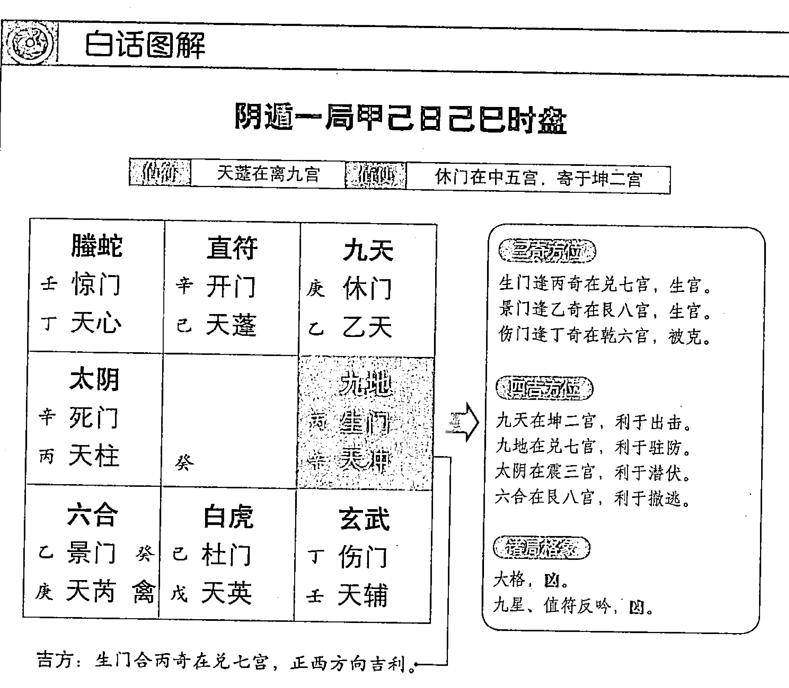

# 庚午时：逢甲日不宜用事

【原文】
庚午 蓬八，休四。宿吉干凶，甲日不用，守户。休丁巽义，杜兑害，生离和。天三，地四，阴六，合七。生与星合九正南，飞宫格，时干震，飞符，金入火，甲日飞干格，休与月合四东南，丙下有丁。

【白话提要】
符使宫位：值符天蓬星在艮八宫，值使休门在巽四宫。时干遇吉星宿，时干逢凶。逢甲日不宜用事，宜守户不出。
三奇方位：休门逢天盘丙奇与地盘丁奇在巽四宫，生宫。杜门逢乙奇在兑七宫，被克。生门逢丁奇在离九宫，被生。
四吉方位：九天在震三宫，九地在巽四宫，太阴在乾六宫，六合在兑七宫。
诸局格象：生门合丁奇在离九宫，正南方向吉利。飞宫格。时干在震三宫。值符飞宫。太白入荧。逢甲日飞干格。休门合丙奇在巽四宫，东南方向吉利。丙下有丁为丙奇朱雀格。

## 白话图解

# 阴遁一局甲己日庚午时盘

**值符**：天蓬在艮八宫
**值使**：休门在巽四宫

吉方1：休门合丙奇在巽四宫，东南方向吉利。
吉方2：生门合丁奇在离九宫，正南方向吉利。

| 九地 | 玄武 | 白虎 |
|---|---|---|
| 丙 休门 | 丁 生门 | 己 伤门 |
| 丁 天蓬 | 乙 天辅 | 乙 天英 |
| 九天 | | 六合 |
| 庚 开门 | 癸 | 乙 杜门 |
| 丙 天任 | | 辛 天芮 禽 |
| 直符 | 螣蛇 | 太阴 |
| 戊 惊门 | 壬 死门 | 辛 景门 |
| 庚 天蓬 | 戊 天心 | 壬 天柱 |

三奇方位
休门逢天盘丙奇与地盘丁奇在巽四宫，生宫。
杜门逢乙奇在兑七宫，被克。
生门逢丁奇在离九宫，被生。

四吉方位
九天在震三宫，利于出击。
九地在巽四宫，利于驻防。
太阴在乾六宫，利于潜伏。
六合在兑七宫，利于撤逃。

诸局格象
丙下有丁，为丙奇朱雀，吉。
飞宫格，太白入荧，凶。
逢甲日，为飞干格，凶。

# 辛未时：东北与东南方向吉利

【原文】
辛未 蓬七，休三。宿干凶。惊坎义欢怡，生丁巽害，开艮和。天六，地一，阴九，合四。开与星合八东北，生与日合四东南，时干离，三吉，鸟跌穴，蛇矫。

【白话提要】
符使宫位：值符天蓬星在兑七宫，值使休门在震三宫。时干遇凶星宿，时干逢凶。
三奇方位：惊门逢丙奇在坎一宫，生宫，吉利。生门逢天盘乙奇与地盘丁奇在巽四宫，被克。开门逢丁奇在艮八宫，被生。
四吉方位：九天在乾六宫，九地在坎一宫，太阴在离九宫，六合在巽四宫。
诸局格象：开门合丁奇在艮八宫，东北方向吉利。生门合乙奇在巽四宫，东南方向吉利。时干在离九宫。三吉格。飞鸟跌穴。腾蛇天矫。

## 白话图解

# 阴遁一局甲己日辛未时盘

符使： 天蓬在兑七宫 符使： 休门在震三宫

吉方1：生门合乙奇在巽四宫，东南方向吉利。

| 六合 | 太阴 | 螣蛇 |
| --- | --- | --- |
| 乙 杜门 庚 天辅 | 辛 伤门 己 天柱 | 壬 天英 乙 天心 |
| 白虎 | 癸 | 直符 |
| 己 休门 丙 天英 |  | 戊 景门 辛 天蓬 |
| 玄武 | 九地 | 九天 |
| 丁 开门 庚 天任 | 丙 惊门 戊 天冲 | 庚 死门 壬 天任 |

> 三奇方位
惊门逢丙奇在坎一宫，生宫。
生门逢天盘乙奇与地盘丁奇在巽四宫，被克。
开门逢丁奇在艮八宫，被生。

> 四吉方位
九天在乾六宫，利于出击。
九地在坎一宫，利于驻防。
太阴在离九宫，利于潜伏。
六合在巽四宫，利于撤逃。

> 诸局格象
飞鸟跌穴，吉。
螣蛇天矫，凶。

吉方2：开门合丁奇在艮八宫，东北方向吉利。

# 壬申时：正南方向吉利

【原文】
壬申 蓬六，休二。宿吉干凶，地遁。景艮义，开离害，死丙震害。天一，地八，阴二，合九。开与日合九正南，甲日伏干格，时干兑，火入金，飞宫，乙格，虎猖狂。

【白话提要】
符使宫位：值符天蓬星在乾六宫，值使休门在坤二宫。时干遇吉星宿，时干逢凶。成地遁格。
三奇方位：景门逢丙奇在艮八宫，生宫。开门逢乙奇在离九宫，被克。死门逢天盘丁奇与地盘丙奇在震三宫，被克。
四吉方位：九天在坎一宫，九地在艮八宫，太阴在坤二宫，六合在离九宫。
诸局格象：开门逢乙奇在离九宫，正南方向吉利。逢甲日伏干格。时干在兑七宫。荧入太白。飞宫格。白虎猖狂。

## 白话图解

# 阴遁一局甲己日壬申时盘

- 值符：天蓬在乾六宫
- 值使：休门在坤二宫

吉方：开门逢乙奇在离九宫，正南方向吉利。

| 白虎 己惊门 丁天英 | 六合 乙开门 癸天芮禽 | 太阴 戊休门 乙天柱 |
|---|---|---|
| 玄武 丁死门 丙天辅 | 癸 | 螣蛇 壬生门 辛天心 |
| 九地 丙景门 庚天冲 | 九天 庚杜门 戊天任 | 直符 戊伤门 壬天蓬 |

- **三奇方位**
  - 景门逢丙奇在艮八宫，生宫。
  - 开门逢乙奇在离九宫，被克。
  - 死门逢天盘丁奇与地盘丙奇在震三宫，被克。

- **四吉方位**
  - 九天在坎一宫，利于出击。
  - 九地在艮八宫，利于驻防。
  - 太阴在坤二宫，利于潜伏。
  - 六合在离九宫，利于撤逃。

- **诸局格象**
  - 逢甲日，为伏干格，凶。
  - 荧入太白，飞宫格，白虎猖狂，凶。

# 癸酉时：正北与西北方向吉利

【原文】
癸酉 蓬五，休一。宿吉干凶。开墓乾伏，伤丙震伏，休坎伏欢怡。天七，地六，阴四，合三。开与月合六西北，休与星合一正北，时干震，门伏，己日飞干格，天网。

【白话提要】
符使宫位：值符天蓬星在中五宫，寄于坤二宫，值使休门在坎一宫。时干遇吉星宿，时干逢凶。
三奇方位：开门逢丙奇在乾六宫，不相生克，丙奇入墓。伤门逢天盘乙奇与地盘丙奇在震三宫，不相生克。休门逢丁奇在坎一宫，不相生克，吉利。
四吉方位：九天在兑七宫，九地在乾六宫，太阴在巽四宫，六合在震三宫。
诸局格象：开门逢丙奇在乾六宫，西北方向吉利。休门合丁奇在坎一宫，正北方向吉利。时干在震三宫。八门伏吟。逢己日飞干格。天网四张。

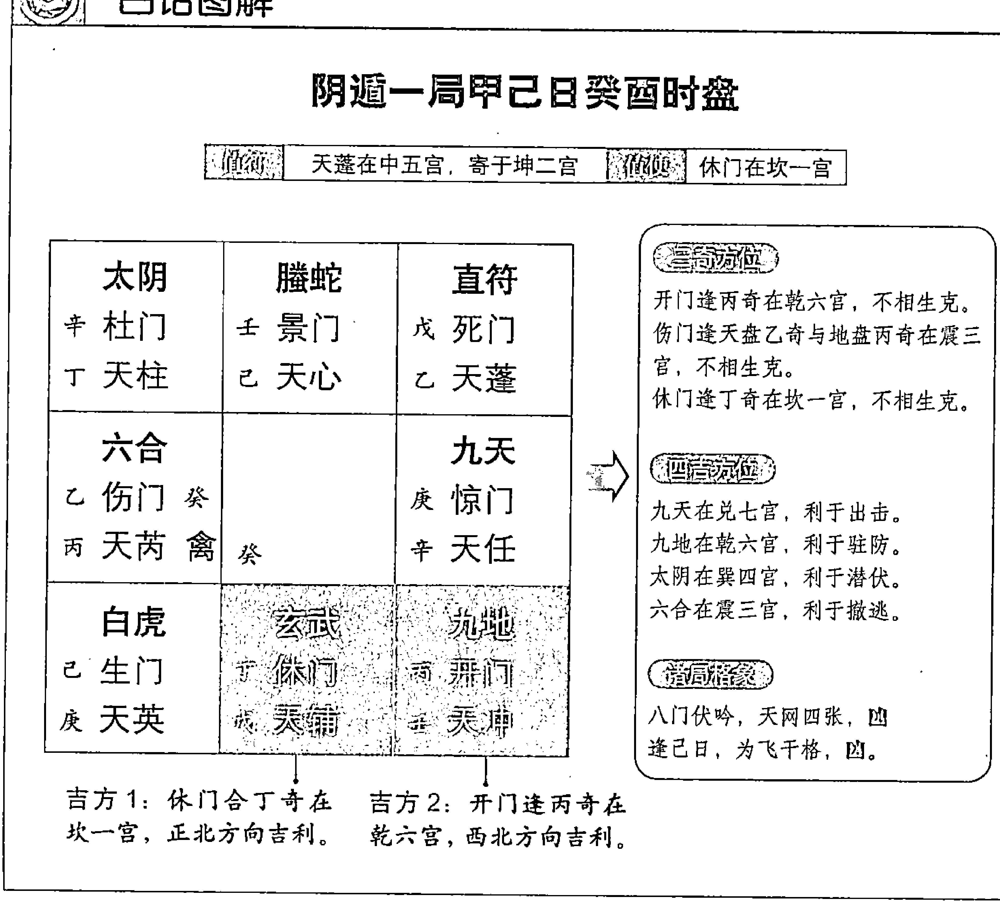

# 甲戌时：无奇门可出

【原文】
甲戌 英值符九，景值使九。戌至亥阳，宿凶干吉。芮使死墓坤伏，冲月伤震伏，辅星杜巽伏。天二，地七，阴三，合八。无奇门，时干离，符门伏，飞甲，阖。

【白话提要】
符使宫位：值符天英星在离九宫，值使景门在离九宫。时干遇凶星宿，时干逢吉。戌时至亥时为五阳时。
三奇方位：死门逢双乙奇在坤二宫，不相生克，丙奇入墓。伤门逢双丙奇在震三宫，不相生克。杜门逢双丁奇在巽四宫，不相生克。
四吉方位：九天在坤二宫，九地在兑七宫，太阴在震三宫，六合在艮八宫。
诸局格象：无奇门。时干在离九宫。星符与八门俱伏吟。飞甲合。

## 白话图解

# 阴遁一局甲己日甲戌时盘

| 螣蛇 丁杜门 丁天辅 | 直符 己景门 己天英 | 九天 乙死门 癸 乙天芮 禽 |
| 太阴 丙伤门 丙天冲 | 癸 | 九地 辛惊门 辛天柱 |
| 六合 庚生门 庚天任 | 白虎 戊休门 戊天蓬 | 玄武 壬开门 壬天心 |

### 三奇方位

- 死门逢双乙奇在坤二宫,不相生克。
- 伤门逢双丙奇在震三宫,不相生克。
- 杜门逢双丁奇在巽四宫,不相生克。

### 四吉方位

- 九天在坤二宫，利于出击。
- 九地在兑七宫，利于驻防。
- 太阴在震三宫，利于潜伏。
- 六合在艮八宫，利于撤逃。

### 诸局格象

- 无奇门，凶。
- 飞甲合，凶。
- 九星、值符、八门伏吟，凶。

# 乙亥时：逢己日不宜用事

【原文】
乙亥 英二，景八。宿干吉，己日不用。生兑义，惊丁巽制，开离害欢怡。天七，地六，阴四，合三。开与星合九正南，生与日合七正西，时干兑，金入火，事同，龙走，仪刑。

【白话提要】
符使宫位：值符天英星在坤二宫，值使景门在艮八宫。时干遇吉星宿，时干逢吉。逢己日不宜用事。
三奇方位：生门逢乙奇在兑七宫，生宫。惊门逢天盘丙奇与地盘丁奇在巽四宫，克宫。开门逢丁奇在离九宫，被克，吉利。
四吉方位：九天在兑七宫，九地在乾六宫，太阴在巽四宫，六合在震三宫。
诸局格象：开门合丁奇在离九宫，正南方向吉利。生门合乙奇在兑七宫，正西方向吉利。时干在兑七宫。太白入荧。青龙逃走。六仪击刑。

## 白话图解

# 阴遁一局甲己日乙亥时盘

值符 天英在坤二宫 值使 景门在艮八宫

吉方1：开门合丁奇在离九宫，正南方向吉利。

| 太阴 | 螣蛇 | 直符 |
|---|---|---|
| 丙 惊门 丁 天冲 | 丁 开门 己 天辅 | 己 休门 乙 天英 |
| 六合 | | 九天 |
| 庚 死门 丙 天任 | 癸 | 乙 生门 辛 天禽 芮 |
| 白虎 | 玄武 | 九地 |
| 戊 景门 庚 天蓬 | 壬 杜门 戊 天心 | 辛 伤门 壬 天柱 |

三奇方位
生门逢乙奇在兑七宫，生宫。
惊门逢天盘丙奇与地盘丁奇在巽四宫，克宫。
开门逢丁奇在离九宫，被克。

四吉方位
九天在兑七宫，利于出击。
九地在乾六宫，利于驻防。
太阴在巽四宫，利于潜伏。
六合在震三宫，利于撤逃。

诸局格象
太白入荧，青龙逃走，凶。
六仪击刑，凶。

吉方2：生门合乙奇在兑七宫，正西方向吉利。

# 2. 乙庚日十二时局

# 丙子时：逢庚日不宜用事

【原文】
丙子 英三，景七。子至寅阳，宿凶干吉，庚日不用。生丁巽害，惊坎义，开艮和。天四，地九，阴一，合六。开与星合八东北，生与日合四东南，鸟跌穴，时干坎，相佐震，龙反首，蛇矫。

【白话提要】
符使宫位：值符天英星在震三宫，值使景门在兑七宫。时干遇凶星宿，时干逢吉。逢庚日不宜用事。
三奇方位：生门逢天盘乙奇与地盘丁奇在巽四宫，被克。惊门逢丙奇在坎一宫，生宫。开门逢丁奇在艮八宫，被生。
四吉方位：九天在巽四宫，九地在离九宫，太阴在坎一宫，六合在乾六宫。
诸局格象：开门合丁奇在艮八宫，东北方向吉利。生门合乙奇在巽四宫，东南方向吉利。飞鸟跌穴。时干在坎一宫。值符得地盘丙奇相助于震三宫。青龙回首。腾蛇夭矫。

## 白话图解

# 阴遁一局乙庚日丙子时盘

吉方 1：生门合乙奇在巽四宫，东南方向吉利。

| 九天 | 九地 | 玄武 |
|------|------|------|
| 乙 生门 癸 丁 天芮 禽 | 辛 伤门 己 天柱 | 壬 杜门 乙 天心 |
| 直符 |  | 白虎 |
| 己 休门 丙 天英 | 癸 | 戊 景门 辛 天蓬 |
| 螣蛇 | 太阴 | 六合 |
| 丁 开门 庚 天辅 | 丙 惊门 戊 天冲 | 庚 死门 壬 天任 |

吉方 2：开门合丁奇在艮八宫，东北方向吉利。

三奇方位
生门逢天盘乙奇与地盘丁奇在巽四宫，被克。
惊门逢丙奇在坎一宫，生宫。
开门逢丁奇在艮八宫，被生。

四吉方位
九天在巽四宫，利于出击。
九地在离九宫，利于驻防。
太阴在坎一宫，利于潜伏。
六合在乾六宫，利于撤逃。

诸局格象
飞鸟跌穴，青龙回首，吉。
螣蛇夭矫，凶。

# 丁丑时：正东与正南方向吉利

【原文】
丁丑 英四，景六。宿干吉。生离和欢怡，惊艮和，开丙震制。天九，地二，阴八，合一。开与星合三正东，丁下有丙，生与日合九正南，虎猖狂，天乙与太白格，时干震，相佐巽，火入金。

【白话提要】
符使宫位：值符天英星在巽四宫，值使景门在乾六宫。时干遇吉星宿，时干逢吉。
三奇方位：生门逢乙奇在离九宫，被生，吉利。惊门逢丙奇在艮八宫，被生。开门逢天盘丁奇与地盘丙奇在震三宫，克宫。
四吉方位：九天在离九宫，九地在坤二宫，太阴在艮八宫，六合 in 坎一宫。
诸局格象：开门合丁奇在震三宫，正东方向吉利。丁下有丙为星随月转。生门逢乙奇在离九宫，正南方向吉利。白虎猖狂。天乙与六庚格。时干在震三宫。值符得地盘丁奇相助于巽四宫。荧入太白。

白话图解

阴遁一局乙庚日丁丑时盘

值符 天英在巽四宫 值使 景门在乾六宫

吉方2：生门逢乙奇在离九宫，正南方向吉利。

| 九天 | 九地 | 玄武 |
| :--- | :--- | :--- |
| 乙 生门 癸 己 天芮 禽 | 辛 伤门 乙 天柱 | 壬 杜门 辛 天心 |
| 螣蛇 |  | 六合 |
| 丁 开门 丙 天辅 | 癸 | 庚 死门 戊 天任 |
| 太阴 |  | 白虎 |
| 丙 惊门 庚 天冲 |  | 戊 景门 壬 天蓬 |

三奇方位
生门逢乙奇在离九宫，被生。
惊门逢丙奇在艮八宫，被生。
开门逢天盘丁奇与地盘丙奇在震三宫，克宫。

四吉方位
九天在离九宫，利于出击。
九地在坤二宫，利于驻防。
太阴在艮八宫，利于潜伏。
六合在坎一宫，利于撤逃。

诸局格象
丁下有丙，为星随月转，吉。
荧入太白，白虎猖狂，凶。

吉方1：开门合丁奇在震三宫，正东方向吉利。

# 戊寅时：东北方向吉利

【原文】
戊寅 英一，景五避五。宿凶干吉。休合艮害，死合兑义，惊墓合乾伏。天八，地三，阴七，合二。休与日合八东北，时干离，符冲，大格，乙日伏干格。

【白话提要】
符使宫位：值符天英星在坎一宫，值使景门在中五宫，寄于坤二宫。时干遇凶星宿，时干逢吉。
三奇方位：休门逢乙奇在艮八宫，被克。死门逢丙奇在兑七宫，生宫。惊门逢丁奇在乾六宫，不相生克，丁奇入墓。
四吉方位：九天在艮八宫，九地在震三宫，太阴在兑七宫，六合在坤二宫。
诸局格象：休门合乙奇在艮八宫，东北方向吉利。时干在离九宫。值符相冲。大格。逢乙日伏干格。

## 白话图解

# 阴遁一局乙庚日戊寅时盘

| 玄武 壬 伤门 丁 天心 | 白虎 戊 杜门 己 天蓬 | 六合 庚 景门 乙 天任 |
|---|---|---|
| 九地 辛 生门 丙 天柱 | 癸 | 太阴 丙 死门 辛 天冲 |
| 九天 乙 休门 庚 芮禽 | 直符 己 开门 戊 天英 | 螣蛇 丁 惊门 壬 天辅 |

> （三奇方位）
休门逢乙奇在艮八宫，被克。
死门逢丙奇在兑七宫，生宫。
惊门逢丁奇在乾六宫，不相生克。

> （四吉方位）
九天在艮八宫，利于出击。
九地在震三宫，利于驻防。
太阴在兑七宫，利于潜伏。
六合在坤二宫，利于撤逃。

> （诸局格象）
大格，凶。
九星、值符反吟，凶。
逢乙日，为伏干格，凶。

吉方：休门合乙奇在艮八宫，东北方向吉利。

# 己卯时：宜守户不出

【原文】
己卯 英九，景四。卯至未阴，宿干凶，守户。惊墓乙坤和，杜丙震伏，景丁巽和。天二，地七，阴三，合八。无奇门，符伏，时干离。

【白话提要】
符使宫位：值符天英星在离九宫，值使景门在巽四宫。时干遇凶星宿，时干逢凶。卯时至未时为五阴时。宜守户不出。
三奇方位：惊门逢双乙奇在坤二宫，被生，乙奇入墓。杜门逢双丙奇在震三宫，不相生克。景门逢双丁奇在巽四宫，被生。
四吉方位：九天在坤二宫，九地在兑七宫，太阴在震三宫，六合在艮八宫。
诸局格象：无奇门。星符伏吟。时干在离九宫。

## 白话图解

# 阴遁一局乙庚日己卯时盘

| 值符 | 值使 |
| 天英在离九宫 | 景门在巽四宫 |

| 螣蛇 丁 景门 丁 天辅 | 直符 己 死门 己 天英 | 九天 乙 惊门 癸 乙 天芮 禽 |
| 太阴 丙 杜门 丙 天冲 | 癸 | 九地 辛 开门 辛 天柱 |
| 六合 庚 伤门 庚 天任 | 白虎 戊 生门 戊 天蓬 | 玄武 壬 休门 壬 天心 |

- **三奇方位**
  - 惊门逢双乙奇在坤二宫，被生。
  - 杜门逢双丙奇在震三宫，不相生克。
  - 景门逢双丁奇在巽四宫，被生。

- **四吉方位**
  - 九天在坤二宫，利于出击。
  - 九地在兑七宫，利于驻防。
  - 太阴在震三宫，利于潜伏。
  - 六合在艮八宫，利于撤逃。

- **诸局格象**
  - 无奇门，星符伏吟，凶。

# 庚辰时：西北方向吉利

## 【原文】

庚辰 英八，景三。宿吉干凶。景丙震和，生墓乾义，伤坎和。天三，地四，阴六，合七。生与月合六西北，时干兑，飞符，三吉，飞宫格。

## 【白话提要】

符使宫位：值符天英星在艮八宫，值使景门在震三宫。时干遇吉星宿，时干逢凶。

三奇方位：景门逢天盘乙奇与地盘丙奇在震三宫，被生。生门逢丙奇在乾六宫，生宫，丙奇入墓。伤门逢丁奇在坎一宫，被生。

四吉方位：九天在震三宫，九地在巽四宫，太阴在乾六宫，六合在兑七宫。

诸局格象：生门合丙奇在乾六宫，西北方向吉利。时干在兑七宫。值符飞宫。三吉格。飞宫格。

## 白话图解

## 阴遁一局乙庚日庚辰时盘

| 九地 | 玄武 | 白虎 |
| --- | --- | --- |
| 辛 死门 丁 天柱 | 壬 惊门 己 天心 | 戊 开门 乙 天蓬 |
| 九天 |  | 六合 |
| 乙 景门 癸 丙 天芮 禽 | 癸 | 庚 休门 辛 天任 |
| 直符 | 螣蛇 | 太阴 |
| 己 杜门 庚 天英 | 丁 伤门 戊 天辅 | 丙 生门 壬 天辅 |

> 三奇方位
景门逢天盘乙奇与地盘丙奇在震三宫，被生。
生门逢丙奇在乾六宫，生宫。
伤门逢丁奇在坎一宫，被生。

四吉方位
九天在震三宫，利于出击。
九地在巽四宫，利于驻防。
太阴在乾六宫，利于潜伏。
六合在兑七宫，利于撤逃。

诸局格象
值符飞宫，飞宫格，凶。

吉方：生门合丙奇在乾六宫，西北方向吉利。

# 辛巳时：逢乙日不宜用事

## 【原文】

辛巳 英七，景二。宿干凶，乙日不用。惊乾伏，杜离义欢怡，景乙坤义。天六，地一，阴九，合四。无奇门，时干坎，鸟跌穴，雀入江，龙反首。

## 【白话提要】

符使宫位：值符天英星在兑七宫，值使景门在坤二宫。时干遇凶星宿，时干逢凶。逢乙日不宜用事。

三奇方位：惊门逢乙奇在乾六宫，不相生克。杜门逢丙奇在离九宫，生宫，好。景门逢天盘丁奇与地盘乙奇在坤二宫，生宫。

四吉方位：九天在乾六宫，九地在坎一宫，太阴在离九宫，六合在巽四宫。

诸局格象：无奇门。时干在坎一宫。飞鸟跌穴。朱雀入江。青龙回首。

## 白话图解

### 阴遁一局乙庚日辛巳时盘

| 六合 | 太阴 | 螣蛇 |
|------|------|------|
| 庚 伤门 丁 天任 | 丙 杜门 己 天冲 | 丁 景门 乙 天辅 |
| 白虎 | | 直符 |
| 戊 生门 丙 天蓬 | 癸 | 己 死门 辛 天英 |
| 玄武 | 九地 | 九天 |
| 壬 休门 庚 天心 | 辛 开门 戊 天柱 | 乙 惊门 壬 天芮 禽 |

- **三奇方位**
  - 惊门逢乙奇在乾六宫，不相生克。
  - 杜门逢丙奇在离九宫，生宫。
  - 景门逢天盘丁奇与地盘乙奇在坤二宫，生宫。
- **四吉方位**
  - 九天在乾六宫，利于出击。
  - 九地在坎一宫，利于驻防。
  - 太阴在离九宫，利于潜伏。
  - 六合在巽四宫，利于撤逃。
- **诸局格象**
  - 飞鸟跌穴，青龙回首，吉。
  - 无奇门，朱雀入江，凶。

# 壬午时：西南方向吉利

## 【原文】

壬午 英六，景一。宿吉干凶。景坎害，生乙坤伏，伤兑害。天一，地八，阴二，合九。生与月合二西南，丙下有乙，伏宫格，时干震，乙日勃，刑格，乙格，门反吟。

## 【白话提要】

符使宫位：值符天英星在乾六宫，值使景门在坎一宫。时干遇吉星宿，时干逢凶。

三奇方位：景门逢乙奇在坎一宫，被克。生门逢天盘丙奇与地盘乙奇坤二宫，不相生克。伤门逢丁奇在兑七宫，被克。

四吉方位：九天在坎一宫，九地在艮八宫，太阴在坤二宫，六合在离九宫。

诸局格象：生门合丙奇在坤二宫，西南方向吉利。丙下有乙为日月并行。伏宫格。时干在震三宫。乙日日勃。刑格。太乙格。八门反吟。

## 白话图解

阴遁一局乙庚日壬午时盘

| 值符 | 天英在乾六宫 | 值使 | 景门在坎一宫 |
|---|---|---|---|

吉方：生门合丙奇在坤二宫，西南方向吉利。

||白虎|六合|太阴||
|---|---|---|---|---||
|戊丁|开门 天蓬|庚 休门 己 天任|丙 生门 乙 天芮||
|壬丙|惊门 天心|癸|丁 伤门 辛 天辅||
|辛庚|死门 天柱|乙 景门 癸 戊 天芮 禽|己 杜门 壬 天英||

三奇方位
景门逢乙奇在坎一宫，被克。
生门逢天盘丙奇与地盘乙奇在坤二宫，不相生克。
伤门逢丁奇在兑七宫，被克。

四吉方位
九天在坎一宫，利于出击。
九地在艮八宫，利于驻防。
太阴在坤二宫，利于潜伏。
六合在离九宫，利于撤逃。

诸局格象
丙下有乙，为日月并行，吉。
伏宫格，乙日日勃，刑格，凶。
太乙格，八门反吟，凶。

# ☁ 癸未时：无奇门可出

## 【原文】

癸未 英五，景九。宿吉干凶。惊兑伏，杜丁巽伏，景离伏欢怡。天七，地六，阴四，合三。无奇门，龙走，时干兑，门伏，金入火，击刑，天网。

## 【白话提要】

符使宫位：值符天英星在中五宫，寄于坤二宫，值使景门在离九宫。时干遇吉星宿，时干逢凶。

三奇方位：惊门逢乙奇在兑七宫，不相生克。杜门逢天盘丙奇与地盘丁奇在巽四宫，不相生克。景门逢丁奇在离九宫，不相生克，吉利。

四吉方位：九天在兑七宫，九地在乾六宫，太阴在巽四宫，六合在震三宫。

诸局格象：无奇门。青龙逃走。时干在兑七宫。八门伏吟。太白入荧。击刑。天网四张。

## 白话图解

## 阴遁一局乙庚日癸未时盘

值符 天英在中五宫，寄于坤二宫 值使 景门在离九宫

| 太阴 丙 杜门 丁 天冲 | 螣蛇 丁 景门 己 天辅 | 直符 己 死门 乙 天英 |
| --- | --- | --- |
| 六合 庚 伤门 丙 天任 |  | 九天 乙 惊门 癸 辛 天芮 禽 |
| 白虎 戊 生门 庚 天蓬 | 玄武 壬 休门 戊 天心 | 九地 辛 开门 壬 天柱 |

三奇方位
惊门逢乙奇在兑七宫，不相生克。
杜门逢天盘丙奇与地盘丁奇在巽四宫，不相生克。
景门逢丁奇在离九宫，不相生克。

四吉方位
九天在兑七宫，利于出击。
九地在乾六宫，利于驻防。
太阴在巽四宫，利于潜伏。
六合在震三宫，利于撤逃。

诸局格象
无奇门，凶。
青龙逃走，太白入荧，凶。
击刑，八门伏吟，天网四张，凶。

# 甲申时：无奇门可出

## 【原文】

甲申 任值符八，生值使八。申至亥阳，天辅，宿干吉。伤冲使震伏，死芮日坤伏，杜辅星巽伏。天三，地四，阴六，合七。无奇门，时干艮，符门伏，地甲，事同，凶。

## 【白话提要】

符使宫位：值符天任星在艮八宫，值使生门在艮八宫。时干遇吉星宿，时干逢吉。申时至亥时为五阳时，申时为天辅释罪时。

三奇方位：伤门逢双丙奇在震三宫，不相生克。死门逢双乙奇在坤二宫，不相生克。杜门逢双丁奇在巽四宫，不相生克。

四吉方位：九天在震三宫，九地在巽四宫，太阴在乾六宫，六合在兑七宫。

诸局格象：无奇门。时干在艮八宫。星符与八门伏吟。地甲合。

## 白话图解

## 阴遁一局乙庚日甲申时盘

值符 天任在艮八宫 值使 生门在艮八宫

||九地|玄武|白虎|
|---|---|---|---|
|第一行|丁 杜门 丁 天辅|己 景门 己 天英|乙 死门 癸 乙 天芮 禽|
|第二行|九天 丙 伤门 丙 天冲 癸| |六合 辛 惊门 辛 天柱|
|第三行|直符 庚 生门 庚 天任|螣蛇 戊 休门 戊 天蓬|太阴 壬 开门 壬 天心|

> 三奇方位
伤门逢双丙奇在震三宫，不相生克。
死门逢双乙奇在坤二宫，不相生克。
杜门逢双丁奇在巽四宫，不相生克。

> 四吉方位
九天在震三宫，利于出击。
九地在巽四宫，利于驻防。
太阴在乾六宫，利于潜伏。
六合在兑七宫，利于撤逃。

> 诸局格象
无奇门，地甲合，凶。
九星、值符、八门伏吟，凶。

# 乙酉时：正西方向吉利

## 【原文】

乙酉 任二，生七。宿凶干吉。生合兑义，景合艮义欢怡，伤墓合乾害。天七，地六，阴四，合三。生与月合七正西，符伏，时干艮，符冲，乙日飞、伏干格，大格。

## 【白话提要】

符使宫位：值符天任星在坤二宫，值使生门在兑七宫。时干遇凶星宿，时干逢吉。

三奇方位：生门逢丙奇在兑七宫，生宫。景门逢乙奇在艮八宫，生宫，吉利，奇仪相合。伤门逢丁奇在乾六宫，丁奇入墓。

四吉方位：九天在兑七宫，九地在乾六宫，太阴在巽四宫，六合在震三宫。

诸局格象：生门合丙奇在兑七宫，正西方向吉利。星符伏吟。时干在艮八宫。值符相冲。逢乙日飞干和伏干格。大格。

## 白话图解

## 阴遁一局乙庚日乙酉时盘

值符 天任在坤二宫 值使 生门在兑七宫

| 太阴 | 螣蛇 | 直符 |
| :--- | :--- | :--- |
| 壬 惊门 丁 天心 | 戊 开门 己 天蓬 | 庚 休门 乙 天任 |
| --- | --- | --- |
| 六合 | (空白) | 九天 |
| 辛 死门 丙 天柱 | 癸 | 丙 生门 庚 英冲 |
| --- | --- | --- |
| 白虎 | 玄武 | 九地 |
| 乙 景门 癸 庚 天芮 禽 | 己 杜门 戊 天英 | 丁 伤门 壬 天辅 |

> 三奇方位
生门逢丙奇在兑七宫，生宫。
景门逢乙奇在艮八宫，生宫。
伤门逢丁奇在乾六宫，丁奇入墓。

> 四吉方位
九天在兑七宫，利于出击。
九地在乾六宫，利于驻防。
太阴在巽四宫，利于潜伏。
六合在震三宫，利于撤逃。

> 诸局格象
大格，凶。
九星、值符反吟，凶。
逢乙日，为飞干和伏干格，凶。

吉方：生门合丙奇在兑七宫，正西方向吉利。

# 丙戌时：逢庚日不宜用事

## 【原文】

丙戌 任三，生六。宿干吉，庚日不用。死丁巽害，休兑和，惊离害。天四，地九，阴一，合六。休与日合七正西，得使，时干巽，相佐震，金入火，龙反首。

## 【白话提要】

符使宫位：值符天任星在震三宫，值使生门在乾六宫。时干遇吉星宿，时干逢吉。逢庚日不宜用事。

三奇方位：死门逢天盘丙奇与地盘丁奇在巽四宫，被克。休门逢乙奇在兑七宫，被生。惊门逢丁奇在离九宫，被克。

四吉方位：九天在巽四宫，九地在离九宫，太阴在坎一宫，六合在乾六宫。

诸局格象：休门合乙奇在兑七宫，正西方向吉利。乙奇得使。时干在巽四宫。值符得地盘丙奇相助于震三宫。太白入荧。青龙回首。

## 白话图解

## 阴遁一局乙庚日丙戌时盘

| 值符 | 天任在震三宫 | 值使 | 生门在乾六宫 |
| :--- | :--- | :--- | :--- |

| 九天 | 九地 | 玄武 |
| :--- | :--- | :--- |
| 丙 死门 丁 天冲 | 丁 惊门 己 天辅 | 己 开门 乙 天英 |
| 直符 | | 白虎 |
| 庚 景门 丙 天任 | 癸 | 乙 休门 壬 辛 天芮 禽 |
| 螣蛇 | 太阴 | 六合 |
| 戊 杜门 庚 天蓬 | 壬 伤门 戊 天心 | 辛 生门 壬 天柱 |

三奇方位
死门逢天盘丙奇与地盘丁奇在巽四宫，被克。
休门逢乙奇在兑七宫，被生。
惊门逢丁奇在离九宫，被克。

四吉方位
九天在巽四宫，利于出击。
九地在离九宫，利于驻防。
太阴在坎一宫，利于潜伏。
六合在乾六宫，利于撤逃。

诸局格象
乙奇得使，青龙回首，吉。
太白入荧，凶。

吉方：休门合乙奇在兑七宫，正西方向吉利。

# 丁亥时：正南与西南方向吉利

## 【原文】

丁亥 任四，生五避五。宿干吉。休离制，杜乾害，生乙坤伏。天九，地二，阴八，合一。休与月合九正南，生与星合二西南，丁下有乙，时干坤，相佐巽，雀入江，门反吟。

## 【白话提要】

符使宫位：值符天任星在巽四宫，值使生门在中五宫，寄于坤二宫。时干遇吉星宿，时干逢吉。

三奇方位：休门逢丙奇在离九宫，克宫。杜门逢乙奇在乾六宫，被克。生门逢天盘丁奇与地盘乙奇在坤二宫，不相生克。

四吉方位：九天在离九宫，九地在坤二宫，太阴在艮八宫，六合在坎一宫。

诸局格象：休门合丙奇在离九宫，正南方向吉利。生门合丁奇在坤二宫，西南方向吉利。丁下有乙为人遁。时干在坤二宫。值符得地盘丁奇相助于巽四宫。朱雀入江。八门反吟。

## 白话图解

## 阴遁一局乙庚日丁亥时盘

| 庚 | 天任 | 丁 | 天任 | 庚 | 天任 |
|---|---|---|---|---|---|
| 丙 | 天蓬 | 癸 |  | 辛 | 天英 |
| 壬 | 天心 | 戊 | 天柱 | 乙 | 天芮 禽 |

休门逢丙奇在离九宫，克宫。杜门逢乙奇在乾六宫，被克。生门逢天盘丁奇与地盘乙奇在坤二宫，不相生克。

九天在离九宫，利于出击。九地在坤二宫，利于驻防。太阴在艮八宫，利于潜伏。六合在坎一宫，利于撤逃。

丁下有乙，为人遁，吉。朱雀入江，八门反吟，凶。

# 3. 丙辛日十二时局

# ☆ 戊子时：宜守户不出

## 【原文】

戊子 任一，生四。子阳，宿干吉，守户。开艮和欢怡，伤离义，休丙震义。天八，地三，阴七，合二。休与星合三正东，丁下有丙，开与月合八东北，符勃，虎猖狂，时干乾，飞宫，火入金，丙日飞干格，鸟跌穴。

## 【白话提要】

符使宫位：值符天任星在坎一宫，值使生门在巽四宫。时干遇吉星宿，时干逢吉。子时为五阳时。宜守户不出。

三奇方位：开门逢丙奇在艮八宫，被生，吉利。伤门逢乙奇在离九宫，生宫。休门逢天盘丁奇与地盘丙奇在震三宫，生宫。

四吉方位：九天在艮八宫，九地在震三宫，太阴在兑七宫，六合在坤二宫。

诸局格象：休门合丁奇在震三宫，正东方向吉利。丁下有丙为星随月转。开门合丙奇在艮八宫，东北方向吉利。符勃。白虎猖狂。时干在乾六宫。飞宫格。

## 白话图解

## 阴遁一局丙辛日戊子时盘

值符 天任在坎一宫 值使 生门在巽四宫

吉方1：休门合丁奇在震三宫，正东方向吉利。

| 宫位 | 八神 | 天盘 | 八门 | 地盘 | 九星 |
| :--- | :--- | :--- | :--- | :--- | :--- |
| 巽四宫 | 玄武 | 己 | 生门 | 丁 | 天英 |
| 离九宫 | 白虎 | 乙 | 伤门 | 癸、己 | 天芮、禽 |
| 坤二宫 | 六合 | 辛 | 杜门 | 乙 | 天柱 |
| 震三宫 | 九地 | 丁 | 休门 | 丙 | 天辅 |
| 中五宫 | (寄坤二宫) | 癸 | (无) | (无) | (无) |
| 兑七宫 | 太阴 | 壬 | 景门 | 辛 | 天心 |
| 艮八宫 | 九天 | 丙 | 开门 | 庚 | 天冲 |
| 坎一宫 | 直符 | 庚 | 惊门 | 戊 | 天任 |
| 乾六宫 | 螣蛇 | 戊 | 死门 | 壬 | 天蓬 |

三奇方位
开门逢丙奇在艮八宫，被生。
伤门逢乙奇在离九宫，生宫。
休门逢天盘丁奇与地盘丙奇在震三宫，生宫。

四吉方位
九天在艮八宫，利于出击。
九地在震三宫，利于驻防。
太阴在兑七宫，利于潜伏。
六合在坤二宫，利于撤逃。

诸局格象
飞鸟跌穴，吉。
符勃，白虎猖狂，凶。
飞宫格，荧入太白，凶。
逢丙日，为飞干格，凶。

吉方2：开门合丙奇在艮八宫，东北方向吉利。

荧入太白。逢丙日飞干格。飞鸟跌穴。

# 已丑时：正北方向吉利

## 【原文】

己丑 任九，生三。丑至巳阴，宿吉干凶。景乙坤义，开坎义，死兑义。天二，地七，阴三，合八。开与日合一正北，时干乾，刑格，辛日飞干格，三吉。

## 【白话提要】

符使宫位：值符天任星在离九宫，值使生门在震三宫。时干遇吉星宿，时干逢凶。丑时至巳时为五阴时。

三奇方位：景门逢天盘丙奇与地盘乙奇在坤二宫，生宫。开门逢乙奇在坎一宫，生宫。死门逢丁奇在兑七宫，生宫。

四吉方位：九天在坤二宫，九地在兑七宫，太阴在震三宫，六合在艮八宫。

诸局格象：开门合乙奇在坎一宫，正北方向吉利。时干在乾六宫。刑格。逢辛日飞干格。三吉格。

## 白话图解

## 阴遁一局丙辛日己丑时盘

| 值符 | 天任在离九宫 | 值使 | 生门在震三宫 |
|---|---|---|---|

| 螣蛇 | 直符 | 九天 |
| 戊 伤门 丁 天蓬 | 庚 杜门 己 天任 | 丙 景门 乙 天冲 |
| 太阴 |   | 九地 |
| 壬 生门 丙 天心 | 癸 | 丁 死门 辛 天辅 |
| 六合 | 白虎 | 玄武 |
| 辛 休门 庚 天柱 | 乙 开门 癸 丙 天芮 禽 | 己 惊门 壬 天英 |

### 三奇方位

- 景门逢天盘丙奇与地盘乙奇在坤二宫，生宫。
- 开门逢乙奇在坎一宫，生宫。
- 死门逢丁奇在兑七宫，生宫。

### 四吉方位

- 九天在坤二宫，利于出击。
- 九地在兑七宫，利于驻防。
- 太阴在震三宫，利于潜伏。
- 六合在艮八宫，利于撤逃。

### 诸局格象

- 刑格，凶。
- 逢辛日，为飞干格，凶。

吉方：开门合乙奇在坎一宫，正北方向吉利。

# 庚寅时：东南与西南方向吉利

## 【原文】

庚寅 任八，生二。宿吉干凶。惊丙震制，生墓乙坤伏，开丁巽制。天三，地四，阴六，合七。开与星合四东南，生与日合二西南，时干艮，符伏，门反吟，击刑，仪刑。

## 【白话提要】

符使宫位：值符天任星在艮八宫，值使生门在坤二宫。时干遇吉星宿，时干逢凶。

三奇方位：惊门逢双丙奇在震三宫，克宫。生门逢双乙奇在坤二宫，不相生克，乙奇入墓。开门逢双丁奇在巽四宫，克宫。

四吉方位：九天在震三宫，九地在巽四宫，太阴在乾六宫，六合在兑七宫。

诸局格象：开门合丁奇在巽四宫，东南方向吉利。生门合乙奇在坤二宫，西南方向吉利。时干在艮八宫。星符伏吟。八门反吟。击刑。六仪击刑。

## 白话图解

## 阴遁一局丙辛日庚寅时盘

吉方1：开门合丁奇在巽四宫，东南方向吉利。

吉方2：生门合乙奇在坤二宫，西南方向吉利。

| 九地 丁 开门 丁 天辅 | 玄武 己 休门 己 天英 | 白虎 乙 生门 癸 天芮 禽 |
| --- | --- | --- |
| 九天 丙 惊门 丙 天冲 | | 六合 辛 伤门 辛 天柱 |
| 直符 庚 死门 庚 天任 | 螣蛇 戊 景门 戊 天蓬 | 太阴 壬 杜门 壬 天心 |

**三奇方位**
惊门逢双丙奇在震三宫，克宫。
生门逢双乙奇在坤二宫，不相生克。
开门逢双丁奇在巽四宫，克宫。

**四吉方位**
九天在震三宫，利于出击。
九地在巽四宫，利于驻防。
太阴在乾六宫，利于潜伏。
六合在兑七宫，利于撤逃。

**诸局格象**
星符伏吟，八门反吟，凶。
六仪击刑，凶。

# ☁ 辛卯时：正北与西北方向吉利

## 【原文】

辛卯 任七，生一。宿干凶。休墓乾和，杜丙震伏，生坎制。天六，地一，阴九，合四。休与月合六西北，生与星合一正北，时干巽，辛日伏干格。

## 【白话提要】

符使宫位：值符天任星在兑七宫，值使生门在坎一宫。时干遇凶星宿，时干逢凶。

三奇方位：休门逢丙奇在乾六宫，被生，丙奇入墓。杜门逢天盘乙奇与地盘丙奇在震三宫，不相生克。生门逢丁奇在坎一宫，克宫。

四吉方位：九天在乾六宫，九地在坎一宫，太阴在离九宫，六合在巽四宫。

诸局格象：休门合丙奇在乾六宫，西北方向吉利。生门合丁奇在坎一宫，正北方向吉利。时干在巽四宫。逢辛日伏干格。

## 白话图解

### 阴遁一局丙辛日辛卯时盘

- 值符：天任在兑七宫
- 值使：生门在坎一宫

| 六合 | 太阴 | 螣蛇 |
|---|---|---|
| 辛 景门 丁 天柱 | 壬 死门 己 天心 | 戊 惊门 天蓬 |
| 白虎 | 菱 | 直符 |
| 乙 杜门 癸 丙 天芮 禽 | 癸 | 庚 开门 辛 天任 |
| 玄武 | 九地 | 九天 |
| 己 伤门 庚 天英 | 丁 休门 戊 天辅 | 丙 生门 壬 天冲 |

### 三奇方位

- 休门逢丙奇在乾六宫，被生。
- 杜门逢天盘乙奇与地盘丙奇在震三宫，不相生克。
- 生门逢丁奇在坎一宫，克宫。

### 四吉方位

- 九天在乾六宫，利于出击。
- 九地在坎一宫，利于驻防。
- 太阴在离九宫，利于潜伏。
- 六合在巽四宫，利于撤逃。

### 诸局格象

- 逢辛日，为伏干格，凶。

- 吉方1：生门合丁奇在坎一宫，正北方向吉利。
- 吉方2：休门合丙奇在乾六宫，西北方向吉利。

## 壬辰时：逢丙日不宜用事

## 【原文】

壬辰 任六，生九。宿吉干凶，丙日不用。死坎制，休丁巽义，惊艮和欢怡。天一，地八，阴二，合九。休与日合四东南，蛇矫，乙下有丁，时干坤。

## 【白话提要】

符使宫位：值符天任星在乾六宫，值使生门在离九宫。时干遇吉星宿，时干逢凶。逢丙日不宜用事。

三奇方位：死门逢丙奇在坎一宫，克宫。休门逢天盘乙奇与地盘丁奇在巽四宫，生宫。惊门逢丁奇在艮八宫，被生，吉利。

四吉方位：九天在坎一宫，九地在艮八宫，太阴在坤二宫，六合在离九宫。

诸局格象：休门合乙奇在巽四宫，东南方向吉利。螣蛇天矫。乙下有丁为奇仪相佐。时干在坤二宫。

## 白话图解

### 阴遁一局丙辛日壬辰时盘

值符 天任在乾六宫 值使 生门在离九宫

吉方：休门合乙奇在巽四宫，东南方向吉利。

| 白虎 乙 休门 丁 天芮 禽 | 六合 辛 生门 己 天柱 | 太阴 壬 伤门 乙 天心 |
| 玄武 己 开门 丙 天英 | 癸 | 螣蛇 戊 杜门 辛 天蓬 |
| 九地 丁 惊门 庚 天辅 | 九天 丙 死门 戊 天冲 | 直符 庚 景门 壬 天任 |

三奇方位
死门逢丙奇在坎一宫，克宫。
休门逢天盘乙奇与地盘丁奇在巽四宫，生宫。
惊门逢丁奇在艮八宫，被生。

四吉方位
九天在坎一宫，利于出击。
九地在艮八宫，利于驻防。
太阴在坤二宫，利于潜伏。
六合在离九宫，利于撤逃。

诸局格象
乙下有丁，为奇仪相佐，吉。
螣蛇天矫，凶。

## ☆ 癸巳时：东北与西北方向吉利

> 【原文】
癸巳 任五避五，生八。宿吉干凶。惊合兑伏，生合艮伏欢怡，开墓合乾伏。天七，地六，阴四，合三。开与星合六西北，生与日合八东北，辛日干勃，时干艮，事同，符冲，门伏，大格，天网。

## 【白话提要】

符使宫位：值符天任星在中五宫，寄于坤二宫，值使生门在艮八宫。时干遇吉星宿，时干逢凶。

三奇方位：惊门逢丙奇在兑七宫，不相生克。生门逢乙奇在艮八宫，不相生克，好。开门逢丁奇在乾六宫，不相生克，丁奇入墓。

四吉方位：九天在兑七宫，九地在乾六宫，太阴在巽四宫，六合在震三宫。

诸局格象：开门合丁奇在乾六宫，西北方向吉利。生门合丙奇在艮八宫，东北方向吉利。逢辛日干勃。时干在艮八宫。值符相冲。八门伏吟。大格。天网四张。

## 白话图解

### 阴遁一局丙辛日癸巳时盘

值符 天任在中五宫，寄于坤二宫 值使 生门在艮八宫

| 太阴 | 螣蛇 | 直符 |
| :---: | :---: | :---: |
| 壬 杜门 丁 天心 | 壬 景门 己 天蓬 | 戊 死门 乙 天任 |
| 六合 | | 九天 |
| 辛 伤门 丙 天柱 | 癸 | 丙 惊门 辛 天冲 |
| 白虎 | 玄武 | 九地 |
| 庚 生门 壬 天芮 禽 | 己 休门 戊 天英 | 丁 开门 癸 天辅 |

三奇方位
惊门逢丙奇在兑七宫，不相生克。
生门逢乙奇在艮八宫，不相生克。
开门逢丁奇在乾六宫，不相生克。

四吉方位
九天在兑七宫，利于出击。
九地在乾六宫，利于驻防。
太阴在巽四宫，利于潜伏。
六合在震三宫，利于撤逃。

诸局格象
逢辛日，为日干勃格，凶。
九星、值符反吟，凶。
八门伏吟，大格，天网四张，凶。

吉方1：生门合乙奇在艮八宫，东北方向吉利。
吉方2：开门合丁奇在乾六宫，西北方向吉利。

## 甲午时：无奇门可出

## 【原文】

甲午 柱值符七，惊值使七。午至戌阳，宿凶干吉，天辅。芮使死墓乾伏，冲月伤震伏，辅星杜巽伏。天六，地一，阴九，合四。无奇门，仪刑，时干兑，符门伏，遁甲，自刑，阖。

## 【白话提要】

符使宫位：值符天柱星在兑七宫，值使惊门在兑七宫。时干遇凶星宿，时干逢吉。午时至戌时为五阳时。午时为天辅释罪时。

三奇方位：死门逢双乙奇在坤二宫，不相生克，乙奇入墓。伤门逢双丙奇在震三宫，不相生克。杜门逢双丁奇在巽四宫，不相生克。

四吉方位：九天在乾六宫，九地在坎一宫，太阴在离九宫，六合在巽四宫。

诸局格象：无奇门。六仪击刑。时干在兑七宫。星符、八门伏吟。遁甲自刑，合。

## 白话图解

### 阴遁一局丙辛日甲午时盘

| 宫位 | 神 | 门 | 星 | 天干 |
|---|---|---|---|---|
| 巽四 | 六合 | 杜门 | 天辅 | 丁 |
| 离九 | 太阴 | 景门 | 天英 | 己 |
| 坤二 | 螣蛇 | 死门 | 天芮、禽 | 乙、癸 |
| 震三 | 白虎 | 伤门 | 天冲 | 丙 |
| 中五 | 癸 |  |  |  |
| 兑七 | 直符 | 惊门 | 天柱 | 辛 |
| 艮八 | 玄武 | 生门 | 天任 | 庚 |
| 坎一 | 九地 | 休门 | 天蓬 | 戊 |
| 乾六 | 九天 | 开门 | 天心 | 壬 |

三奇方位
死门逢双乙奇在坤二宫，不相生克。
伤门逢双丙奇在震三宫，不相生克。
杜门逢双丁奇在巽四宫，不相生克。

四吉方位
九天在乾六宫，利于出击。
九地在坎一宫，利于驻防。
太阴在离九宫，利于潜伏。
六合在巽四宫，利于撤逃。

诸局格象
无奇门，凶。
九星、值符、八门伏吟，凶。
遁甲自刑，六仪击刑，凶。

## 乙未时：正东与东北方向吉利

## 【原文】

乙未 柱二，惊六。宿凶干吉。杜离义，休艮害，生丙震害。天七，地六，阴四，合三。休与月合八东北，生与星合三正东，丁下有丙，得使，时干离，火入金，丙日飞干格，飞宫，虎猖狂。

## 【白话提要】

符使宫位：值符天柱星在坤二宫，值使惊门在乾六宫。时干遇凶星宿，时干逢吉。
三奇方位：杜门逢乙奇在离九宫，生宫。休门逢丙奇在艮八宫，被克。生门逢天盘丁奇与地盘丙奇在震三宫，被克。
四吉方位：九天在兑七宫，九地在乾六宫，太阴在巽四宫，六合在震三宫。
诸局格象：休门合丙奇在艮八宫，东北方向吉利。生门合丁奇在震三宫，正东方向吉利。丁下有丙为星随月转。丁奇得使。时干在离九宫。荧入太白。逢丙日飞干格。飞宫格。白虎猖狂。

## 白话图解

### 阴遁一局丙辛日乙未时盘

值符 天柱在坤二宫 值使 惊门在乾六宫

吉方2：生门合丁奇在震三宫，正东方向吉利。

| 太阴 | 螣蛇 | 直符 |
| :--- | :--- | :--- |
| 己 伤门 丁 天英 | 乙 杜门 癸 己 天芮 禽 | 辛 景门 乙 天柱 |
| 六合 | | 九天 |
| 丁 生门 丙 天辅 | 癸 | 壬 死门 辛 天心 |
| 白虎 | 玄武 | 九地 |
| 丙 休门 乙 天冲 | 庚 开门 戊 天任 | 戊 惊门 壬 天蓬 |

三奇方位
杜门逢乙奇在离九宫，生宫。
休门逢丙奇在艮八宫，被克。
生门逢天盘丁奇与地盘丙奇在震三宫，被克。

四吉方位
九天在兑七宫，利于出击。
九地在乾六宫，利于驻防。
太阴在巽四宫，利于潜伏。
六合在震三宫，利于撤逃。

诸局格象
丁奇得使，吉。
丁下有丙，为星随月转，吉。
荧入太白，飞宫格，白虎猖狂，凶。
逢丙日，为飞干格，凶。

吉方1：休门合丙奇在艮八宫，东北方向吉利。

## 丙申时：正西与西北方向吉利

## 【原文】

丙申 柱三，惊五避五。宿干吉。伤合艮制，开合兑伏欢怡，休墓合乾伏。天四，地九，阴一，合六。开与月合七正西，休与星合六西北，时干兑，相佐震，辛日勃，符冲，大格。

## 【白话提要】

符使宫位：值符天柱星在震三宫，值使惊门在中五宫，寄于坤二宫。时干遇吉星宿，时干逢吉。

三奇方位：伤门逢乙奇在艮八宫，克宫。开门逢丙奇在兑七宫，不相生克，好。休门逢丁奇在乾六宫，不相生克，丁奇入墓。

四吉方位：九天在巽四宫，九地在离九宫，太阴在坎一宫，六合在乾六宫。

诸局格象：开门合丙奇在兑七宫，正西方向吉利。休门合丁奇在乾六宫，西北方向吉利。时干在兑七宫。值符得地盘丙奇相助于震三宫。辛日日勃。值符相冲。大格。

## 白话图解

### 阴遁一局丙辛日丙申时盘

| 九天 | 九地 | 玄武 |
|------|------|------|
| 壬 景门 丁 天心 | 戊 死门 己 天蓬 | 庚 惊门 乙 天任 |
| 直符 辛 杜门 丙 天柱 | 癸 | 白虎 丙 开门 辛 天冲 |
| 螣蛇 乙 伤门 庚 天芮禽 | 太阴 己 生门 戊 天英 | 六合 丁 休门 壬 天辅 |

三奇方位
伤门逢乙奇在艮八宫，克宫。开门逢丙奇在兑七宫，不相生克。休门逢丁奇在乾六宫，不相生克。

四吉方位
九天在巽四宫，利于出击。九地在离九宫，利于驻防。太阴在坎一宫，利于潜伏。六合在乾六宫，利于撤逃。

诸局格象
大格，凶。九星、值符反吟，凶。逢辛日，为日勃格，凶。

吉方1：开门合丙奇在兑七宫，正西方向吉利。
吉方2：休门合丁奇在乾六宫，西北方向吉利。

## ※ 丁酉时：逢辛日不宜用事

## 【原文】

丁酉 柱四，惊四。宿干吉，辛日不用，守户。死丙震害，伤墓乾害，杜坎和。天九，地二，阴八，合一。无奇门，伏宫格，太白与天乙格，时干坎，相佐巽，乙格，辛日伏干格。

## 【白话提要】

符使宫位：值符天柱星在巽四宫，值使惊门在巽四宫。时干遇吉星宿，时干逢吉。逢辛日不宜用事，宜守户不出。

三奇方位：死门逢天盘乙奇与地盘丙奇在震三宫，被克。伤门逢丙奇在乾六宫，被克，丙奇入墓。杜门逢丁奇在坎一宫，被生。

四吉方位：九天在离九宫，九地在坤二宫，太阴在艮八宫，六合在坎一宫。

诸局格象：无奇门。伏宫格。六庚与天乙格。时干在坎一宫。值符得地盘丁奇相助于巽四宫。乙格。逢辛日伏干格。

## 白话图解

### 阴遁一局丙辛日丁酉时盘

| 直符 | 九天 | 九地 |
| :---: | :---: | :---: |
| 辛 惊门 丁 天柱 | 壬 开门 己 天心 | 戊 休门 乙 天蓬 |
| 螣蛇 | | 玄武 |
| 乙 死门 癸 丙 天芮 禽 癸 | | 庚 生门 辛 天任 |
| 太阴 | 六合 | 白虎 |
| 己 景门 庚 天英 | 丁 杜门 戊 天辅 | 丙 伤门 壬 天冲 |

三奇方位
死门逢天盘乙奇与地盘丙奇在震三宫，被克。
伤门逢丙奇在乾六宫，被克。
杜门逢丁奇在坎一宫，被生。

四吉方位
九天在离九宫，利于出击。
九地在坤二宫，利于驻防。
太阴在艮八宫，利于潜伏。
六合在坎一宫，利于撤逃。

诸局格象
无奇门，凶。
伏宫格，乙格，凶。
逢辛日，为伏干格，凶。

## 戊戌时：正南与西南方向吉利

## 【原文】

戊戌 柱一，惊三。宿凶干吉。杜乾害，休离制，生乙坤伏。天八，地三，阴七，合二。休与月合九正东，生与星合二西南，得使，时干震，三吉，雀入江，门反吟。

## 【白话提要】

符使宫位：值符天柱星在坎一宫，值使惊门在震三宫。时干遇凶星宿，时干逢吉。
三奇方位：杜门逢乙奇在乾六宫，被克。休门逢丙奇在离九宫，克宫。生门逢天盘丁奇与地盘乙奇在坤二宫，不相生克。
四吉方位：九天在艮八宫，九地在震三宫，太阴在兑七宫，六合在坤二宫。
诸局格象：休门合丙奇在离九宫，正南方向吉利。生门合丁奇在坤二宫，西南方向吉利。丁奇得使。时干在震三宫。三吉格。朱雀入江。八门反吟。

## 白话图解

### 阴遁一局丙辛日戊戌时盘

值符 天柱在坎一宫 值使 惊门在震三宫

吉方1：休门合丙奇在离九宫，正南方向吉利。
吉方2：生门合丁奇在坤二宫，西南方向吉利。

| 玄武 | 九地 | 九天 |
| :--- | :--- | :--- |
| 庚 开门 丁 天任 | 戊 惊门 丙 天蓬 | 壬 死门 庚 天心 |
| 六合 | | 直符 |
| 丁 生门 乙 天辅 | 癸 | 辛 景门 戊 天柱 |
| 白虎 | 螣蛇 | 太阴 |
| 丙 伤门 壬 天冲 | | 己 伤门 辛 天英 |

> 【三奇方位】
杜门逢乙奇在乾六宫，被克。
休门逢丙奇在离九宫，克宫。
生门逢天盘丁奇与地盘乙奇在坤二宫，不相生克。

> 【四吉方位】
九天在艮八宫，利于出击。
九地在震三宫，利于驻防。
太阴在兑七宫，利于潜伏。
六合在坤二宫，利于撤逃。

> 【诸局格象】
丁奇得使，吉。
朱雀入江，八门反吟，凶。

## 己亥时：正北方向吉利

## 【原文】

己亥 柱九，惊二。亥阴，宿干凶，天遁。景丁巽制，生坎制，伤艮制。天二，地七，阴三，合八。生与月合一正北，时干震，蛇矫，龙走，仪刑。

## 【白话提要】

符使宫位：值符天柱星在离九宫，值使惊门在坤二宫。时干遇凶星宿，时干逢凶。亥时为五阴时。成天遁格。

三奇方位：景门逢天盘乙奇与地盘丁奇在巽四宫，克宫。生门逢丙奇在坎一宫，克宫。伤门逢丁奇在艮八宫，克宫。

四吉方位：九天在坤二宫，九地在兑七宫，太阴在震三宫，六合在艮八宫。

诸局格象：生门合丙奇在坎一宫，正北方向吉利。时干在震三宫。螣蛇天矫。青龙逃走。六仪击刑。

## 白话图解

### 阴遁一局丙辛日己亥时盘

值符 天柱在离九宫 值使 惊门在坤二宫

| 螣蛇 | 直符 | 九天 |
| :--- | :--- | :--- |
| 乙 景门 癸 丁 天芮 禽 | 辛 死门 己 天柱 | 壬 惊门 乙 天心 |
| 太阴 | | 九地 |
| 己 杜门 丙 天英 | 癸 | 戊 开门 辛 天蓬 |
| 六合 | 白虎 | 玄武 |
| 丁 伤门 庚 天辅 | 丙 生门 戊 天冲 | 庚 休门 壬 天任 |

吉方：生门合丙奇在坎一宫，正北方向吉利。

## 4. 丁壬日十二时局

## ★ 庚子时：无奇门可出

## 【原文】

庚子 柱八，惊一。子至卯阴，宿干凶。惊坎义，杜乙坤制，景兑制欢怡。天三，地四，阴六，合七。无奇门，时干离，飞符，刑格，飞宫格。

## 【白话提要】

符使宫位：值符天柱星在艮八宫，值使惊门在坎一宫。时干遇凶星宿，时干逢凶。子时至卯时为五阴时。

三奇方位：惊门逢乙奇在坎一宫，生宫。杜门逢天盘丙奇与地盘乙奇在坤二宫，克宫。景门逢丁奇在兑七宫，克宫，吉利。

四吉方位：九天在震三宫，九地在巽四宫，太阴在乾六宫，六合在兑七宫。

诸局格象：无奇门。时干在离九宫。飞符。刑格。飞宫格。

## 白话图解

### 阴遁一局丁壬日庚子时盘

| 九地 | 玄武 | 白虎 |
| :--- | :--- | :--- |
| 戊 生门 丁 天蓬 | 庚 伤门 己 天任 | 丙 杜门 乙 天冲 |
| 九天 | | 六合 |
| 壬 休门 丙 天心 | 癸 | 丁 景门 辛 天辅 |
| 直符 | 螣蛇 | 太阴 |
| 辛 开门 庚 天柱 | 乙 惊门 癸 戊 天芮 禽 | 己 死门 壬 天英 |

三奇方位
惊门逢乙奇在坎一宫，生宫。
杜门逢天盘丙奇与地盘乙奇在坤二宫，克宫。
景门逢丁奇在兑七宫，克宫。

四吉方位
九天在震三宫，利于出击。
九地在巽四宫，利于驻防。
太阴在乾六宫，利于潜伏。
六合在兑七宫，利于撤逃。

诸局格象
无奇门，凶。
飞符，刑格，飞宫格，凶。

## 辛丑时：西南方向吉利

## 【原文】

辛丑 柱七，惊九。宿吉干凶。开墓乙坤和，景丙震和，死丁巽害。天六，地一，阴九，合四。开与日合二西南，时干兑，符伏。

## 【白话提要】

符使宫位：值符天柱星在兑七宫，值使惊门在离九宫。时干遇吉星宿，时干逢凶。
三奇方位：开门逢双乙奇在坤二宫，被生，乙奇入墓。景门逢双丙奇在震三宫，被生。死门逢双丁奇在巽四宫，被克。
四吉方位：九天在乾六宫，九地在坎一宫，太阴在离九宫，六合在巽四宫。
诸局格象：开门合乙奇在坤二宫，西南方向吉利。时干在兑七宫。星符伏吟。

## 白话图解

### 阴遁一局丁壬日辛丑时盘

值符 天柱在兑七宫 值使 惊门在离九宫

吉方：开门合乙奇在坤二宫，西南方向吉利。

| 六合 | 太阴 | 螣蛇 |
| :--- | :--- | :--- |
| 丁 死门 丁 天辅 | 己 惊门 己 天英 | 乙 开门 癸 乙 天芮 禽 |
| 白虎 | 癸 | 直符 |
| 丙 景门 丙 天冲 | | 辛 休门 辛 天柱 |
| 玄武 | 九地 | 九天 |
| 庚 杜门 庚 天任 | 戊 伤门 戊 天蓬 | 壬 生门 壬 天心 |

三奇方位
开门逢双乙奇在坤二宫，被生。
景门逢双丙奇在震三宫，被生。
死门逢双丁奇在巽四宫，被克。

四吉方位
九天在乾六宫，利于出击。
九地在坎一宫，利于驻防。
太阴在离九宫，利于潜伏。
六合在巽四宫，利于撤逃。

诸局格象
九星、值符伏吟，凶。

## 壬寅时：正南与东南方向吉利

## 【原文】

壬寅 柱六，惊八。宿吉干凶。杜兑害欢怡，休丁巽义，生离和。天一，地八，阴二，合九。生与星合九正南，休与月合四东南，天乙与太白格，时干坎，金入火，事同，丁日勃，虎猖狂。

## 【白话提要】

符使宫位：值符天柱星在乾六宫，值使惊门在艮八宫。时干遇吉星宿，时干逢凶。
三奇方位：杜门逢乙奇在兑七宫，被克，吉利。休门逢天盘丙奇与地盘丁奇在巽四宫，生宫。生门逢丁奇在离九宫，被生。
四吉方位：九天在坎一宫，九地在艮八宫，太阴在坤二宫，六合在离九宫。
诸局格象：生门合丁奇在离九宫，正南方向吉利。休门合丙奇在巽四宫，东南方向吉利。天乙与六庚格。时干在坎一宫。太白入荧。丁日日勃。白虎猖狂。

## 白话图解

### 阴遁一局丁壬日壬寅时盘

值符 天柱在乾六宫 值使 惊门在艮八宫

吉方1：生门合丁奇在离九宫，正南方向吉利。
吉方2：休门合丙奇在巽四宫，东南方向吉利。

| 白虎 | 六合 | 太阴 |
| :--- | :--- | :--- |
| 丙 休门 丁 天冲 | 丁 落门 己 天辅 | 己 伤门 乙 天英 |
| 玄武 | 癸 | 螣蛇 |
| 庚 开门 丙 天任 | | 乙 杜门 癸 辛 天芮 禽 |
| 九地 | 九天 | 直符 |
| 戊 惊门 庚 天蓬 | 壬 死门 戊 天心 | 辛 景门 壬 天柱 |

**三奇方位**
杜门逢乙奇在兑七宫，被克。
休门逢天盘丙奇与地盘丁奇在巽四宫，生宫。
生门逢丁奇在离九宫，被生。

**四吉方位**
九天在坎一宫，利于出击。
九地在艮八宫，利于驻防。
太阴在坤二宫，利于潜伏。
六合在离九宫，利于撤逃。

**诸局格象**
太白入荧，白虎猖狂，凶。
逢丁日，为日勃格，凶。

## 癸卯时：逢丁日不宜用事

【原文】
癸卯 柱五，惊七。宿吉干凶，丁日不用。景离伏，生艮伏，伤丙震伏。天七，地六，阴四，合三。生与月合八东北，得使，时干离，火入金，飞宫，门伏，虎猖狂，天网四张。

【白话提要】
符使宫位：值符天柱星在中五宫，寄于坤二宫，值使惊门在兑七宫。时干遇吉星宿，时干逢凶。逢丁日不宜用事。
三奇方位：景门逢乙奇在离九宫，不相生克。生门逢丙奇在艮八宫，不相生克。伤门逢天盘丁奇与地盘丙奇在震三宫，不相生克。
四吉方位：九天在兑七宫，九地在乾六宫，太阴在巽四宫，六合在震三宫。
诸局格象：生门合丙奇在艮八宫，东北方向吉利。丙奇得使。时干在离九宫。荧入太白。飞宫格。八门伏吟。白虎猖狂。天网四张。

## 白话图解

### 阴遁一局丁壬日癸卯时盘

| 值符 | 天柱在中五宫，寄于坤二宫 | 值使 | 惊门在兑七宫 |
| :--- | :--- | :--- | :--- |

| | | |
| :--- | :--- | :--- |
| 太阴 己 杜门 丁 天英 | 螣蛇 乙 景门 癸 己 天芮 禽 | 直符 辛 死门 乙 天柱 |
| 六合 丁 伤门 丙 天辅 | 癸 | 九天 壬 惊门 辛 天心 |
| 白虎 丙 生门 庚 天冲 | 玄武 庚 休门 戊 天任 | 九地 戊 开门 壬 天蓬 |

三奇方位
景门逢乙奇在离九宫，不相生克。
生门逢丙奇在艮八宫，不相生克。
伤门逢天盘丁奇与地盘丙奇在震三宫，不相生克。

四吉方位
九天在兑七宫，利于出击。
九地在乾六宫，利于驻防。
太阴在巽四宫，利于潜伏。
六合在震三宫，利于撤逃。

诸局格象
丙奇得使，吉。
荧入太白，天网四张，飞宫格，凶。
八门伏吟，白虎猖狂，凶。

吉方：生门合丙奇在艮八宫，东北方向吉利。

## 甲辰时：无奇门可出

【原文】
甲辰 心值符六，开值使六。辰至申阳，天辅，宿干吉。辅使杜巽伏，芮日死墓坤伏，冲月伤震伏。天一，地八，阴二，合九。无奇门，仪刑，时干乾，符门伏，飞甲，自刑，阖。

【白话提要】
符使宫位：值符天心星在乾六宫，值使开门在乾六宫。时干遇吉星宿，时干逢吉。辰时至申时为五阳时。辰时为天辅释罪时。
三奇方位：杜门逢双丁奇在巽四宫，不相生克。死门逢双乙奇在坤二宫，不相生克。伤门逢双丙奇在震三宫，不相生克。
四吉方位：九天在坎一宫，九地在艮八宫，太阴在坤二宫，六合在离九宫。
诸局格象：无奇门。六仪击刑。时干在乾六宫。星符、八门伏吟。飞甲自刑，合。

## 白话图解

### 阴遁一局丁壬日甲辰时盘

| 宫位/神兽 | 神兽 | 天盘干/门 | 地盘干/星 |
| :--- | :--- | :--- | :--- |
| 巽四宫 | 白虎 | 丁 杜门 | 丁 天辅 |
| 离九宫 | 六合 | 己 景门 | 己 天英 |
| 坤二宫 | 太阴 | 乙 死门 癸 | 乙 天芮 禽 |
| 震三宫 | 玄武 | 丙 伤门 | 丙 天冲 |
| 中五宫 | (寄坤二宫) | 癸 | |
| 兑七宫 | 螣蛇 | 辛 惊门 | 辛 天柱 |
| 艮八宫 | 九地 | 庚 生门 | 庚 天任 |
| 坎一宫 | 九天 | 戊 惊门 | 戊 天蓬 |
| 乾六宫 | 直符 | 壬 开门 | 壬 天心 |

三奇方位
杜门逢双丁奇在巽四宫，不相生克。
死门逢双乙奇在坤二宫，不相生克。
伤门逢双丙奇在震三宫，不相生克。

四吉方位
九天在坎一宫，利于出击。
九地在艮八宫，利于驻防。
太阴在坤二宫，利于潜伏。
六合在离九宫，利于撤逃。

诸局格象
无奇门，凶。
九星、值符、八门伏吟，凶。
飞甲自刑，六仪击刑，凶。

## 乙巳时：无奇门可出

【原文】
乙巳 心二，开五避五。宿凶干吉。杜艮制，死丁巽害，伤坎和。天七，地六，阴四，合三。无奇门，伏宫格，天乙与太白格，时干巽，乙格，丁日飞干，壬日飞干，蛇矫。

【白话提要】
符使宫位：值符天心星在坤二宫，值使开门在中五宫，寄于坤二宫。时干遇凶星宿，时干逢吉。
三奇方位：杜门逢丁奇在艮八宫，克宫。死门逢天盘乙奇与地盘丁奇在巽四宫，被克。伤门逢丙奇在坎一宫，被生。
四吉方位：九天在兑七宫，九地在乾六宫，太阴在巽四宫，六合在震三宫。
诸局格象：无奇门。伏宫格。天乙与六庚格。时干在巽四宫。太乙格。逢丁日飞干格。逢壬日伏干格。螣蛇天矫。

## 白话图解

### 阴遁一局丁壬日乙巳时盘

| 值符 | 天心在坤二宫 | 值使 | 开门在中五宫，寄于坤二宫 |
| :--- | :--- | :--- | :--- |

| 太阴 | 螣蛇 | 直符 |
| :--- | :--- | :--- |
| 乙死门 癸 丁天芮 禽 | 辛惊门 己天柱 | 壬开门 乙天心 |
| 六合 | | 九天 |
| 己景门 | | 戊休门 |
| 丙天英 | 癸 | 辛天蓬 |
| 白虎 | 玄武 | 九地 |
| 丁杜门 | 丙伤门 | 庚生门 |
| 庚天辅 | 戊天冲 | 壬天任 |

三奇方位：
- 杜门逢丁奇在艮八宫，克宫。
- 死门逢天盘乙奇与地盘丁奇在巽四宫，被克。
- 伤门逢丙奇在坎一宫，被生。

四吉方位：
- 九天在兑七宫，利于出击。
- 九地在乾六宫，利于驻防。
- 太阴在巽四宫，利于潜伏。
- 六合在震三宫，利于撤逃。

诸局格象：
- 无奇门，凶。
- 伏宫格，太乙格，螣蛇天矫，凶。
- 逢丁日，为飞干格，凶。
- 逢壬日，为伏干格，凶。

## 丙午时：宜守户不出

【原文】
丙午 心三，开四。宿干吉，守户。伤兑害，景坎害，生乙坤伏。天四，地九，阴一，合六。生与月合二西南，丙下有乙，门反吟，时干坤，相佐震，刑格，龙反首。

【白话提要】
符使宫位：值符天心星在震三宫，值使开门在巽四宫。时干遇吉星宿，时干逢吉。宜守户不出。
三奇方位：伤门逢丁奇在兑七宫，被克。景门逢乙奇在坎一宫，被克。生门逢天盘丙奇与地盘乙奇在坤二宫，不相生克。
四吉方位：九天在巽四宫，九地在离九宫，太阴在坎一宫，六合在乾六宫。
诸局格象：生门合丙奇在坤二宫，西南方向吉利。丙下有乙为日月并行。八门反吟。时干在坤二宫。值符得地盘丙奇助于震三宫。刑格。青龙回首。

## 白话图解

### 阴遁一局丁壬日丙午时盘

值符 天心在震三宫 值使 开门在巽四宫

吉方：生门合丙奇在坤二宫，西南方向吉利。

九天 戊 开门 丁 天蓬 | 九地 庚 休门 己 天任 | 玄武 丙 惊门 乙 天冲
直符 壬 惊门 丙 天心 | （空白） 癸 | 白虎 丁 伤门 辛 天辅
螣蛇 辛 死门 庚 天柱 | 太阴 乙 景门 戊 天芮 禽 | 六合 己 杜门 壬 天英

三奇方位
伤门逢丁奇在兑七宫，被克。
景门逢乙奇在坎一宫，被克。
生门逢天盘丙奇与地盘乙奇在坤二宫，不相生克。

四吉方位
九天在巽四宫，利于出击。
九地在离九宫，利于驻防。
太阴在坎一宫，利于潜伏。
六合在乾六宫，利于撤逃。

诸局格象
丙下有乙，为日月并行，吉。
青龙回首，吉。
八门反吟，刑格，凶。

## 丁未时：无奇门可出

【原文】
丁未 心四，开三。宿干吉。景墓合乾制欢怡，惊合艮和，杜合兑害。天九，地二，阴八，合一。无奇门，仪刑，时干乾，相佐巽，符冲，大格，三吉。

【白话提要】
- 符使宫位：值符天心星在巽四宫，值使开门在震三宫。时干遇吉星宿，时干逢吉。
- 三奇方位：景门逢丁奇在乾六宫，克宫，吉利，丁奇入墓。惊门逢乙奇在艮八宫，被生。杜门逢丙奇在兑七宫，被克。
- 四吉方位：九天在离九宫，九地在坤二宫，太阴在艮八宫，六合在坎一宫。
- 诸局格象：无奇门。六仪击刑。时干在乾六宫。值符得地盘丁奇相助于巽四宫。值符相冲。大格。三吉格。

## 白话图解

### 阴遁一局丁壬日丁未时盘

| 直符 | 九天 | 九地 |
| :--- | :--- | :--- |
| 壬 休门 丁 天心 | 戊 生门 己 天蓬 | 庚 伤门 乙 天任 |
| 螣蛇 辛 开门 丙 天柱 | 癸 | 玄武 丙 杜门 辛 天冲 |
| 太阴 乙 惊门 庚 天芮 禽 | 六合 己 死门 戊 天英 | 白虎 丁 景门 壬 天辅 |

三奇方位：
- 景门逢丁奇在乾六宫，克宫。
- 惊门逢乙奇在艮八宫，被生。
- 杜门逢丙奇在兑七宫，被克。

四吉方位：
- 九天在离九宫，利于出击。
- 九地在坤二宫，利于驻防。
- 太阴在艮八宫，利于潜伏。
- 六合在坎一宫，利于撤逃。

诸局格象：
- 无奇门，凶。
- 大格，六仪击刑，凶。

## 戊申时：逢壬日不宜用事

【原文】
戊申 心一，开二。宿凶干吉，壬日不用。惊离害，休兑和，死丁巽害。天八，地三，阴七，合二。休与日合七正西，时干艮，金入火，丁日勃，龙走。

【白话提要】
符使宫位：值符天心星在坎一宫，值使开门在坤二宫。时干遇凶星宿，时干逢吉。逢壬日不宜用事。
三奇方位：惊门逢丁奇在离九宫，被克。休门逢乙奇在兑七宫，被生。死门逢天盘丙奇与地盘丁奇在巽四宫，被克。
四吉方位：九天在艮八宫，九地在震三宫，太阴在兑七宫，六合在坤二宫。
诸局格象：休门合乙奇在兑七宫，正西方向吉利。时干在艮八宫。太白入荧。丁日日勃。青龙逃走。

## 白话图解

### 阴遁一局丁壬日戊申时盘

| 值符 | 天心在坎一宫 | 值使 | 开门在坤二宫 |
| :--- | :--- | :--- | :--- |

| 玄武 | 白虎 | 六合 |
| :--- | :--- | :--- |
| 丙 死门 丁 天冲 | 丁 惊门 己 天辅 | 己 开门 乙 天英 |
| 九地 | 太阴 | 太阴 乙 休门 癸 天芮禽 |
| 庚 景门 丙 天任 | 癸 | |
| 九天 | 直符 | 螣蛇 |
| 戊 杜门 庚 天蓬 | 壬 伤门 戊 天心 | 辛 生门 壬 天柱 |

三奇方位
惊门逢丁奇在离九宫，被克。
休门逢乙奇在兑七宫，被生。
死门逢天盘丙奇与地盘丁奇在巽四宫，被克。

四吉方位
九天在艮八宫，利于出击。
九地在震三宫，利于驻防。
太阴在兑七宫，利于潜伏。
六合在坤二宫，利于撤逃。

诸局格象
太白入荧，青龙逃走，凶。
逢丁日，为日勃格，凶。

吉方：休门合乙奇在兑七宫，正西方向吉利。

## 己酉时：正东与正北方向吉利

【原文】
己酉 心九，开一。酉至亥阴，宿吉千凶。开坎义，生丙震害，惊墓乾伏欢怡。天二，地七，阴三，合八。生与日合三正东，乙下有丙，开与星合一正北，时干艮，壬日勃，鸟跌穴。

【白话提要】
符使宫位：值符天心星在离九宫，值使开门在坎一宫。时干遇吉星宿，时干逢凶。酉时至亥时为五阴时。
三奇方位：开门逢丁奇在坎一宫，生宫。生门逢天盘乙奇与地盘丙奇在震三宫，被克。惊门逢丙奇在乾六宫，不相生克，吉利，丙奇入墓。
四吉方位：九天在坤二宫，九地在兑七宫，太阴在震三宫，六合在艮八宫。
诸局格象：生门合乙奇在震三宫，正东方向吉利。乙下有丙为奇仪顺遂。开门合丁奇在坎一宫，正北方向吉利。时干在艮八宫。壬日日勃。飞鸟跌穴。

## 白话图解

### 阴遁一局丁壬日己酉时盘

值符 天心在离九宫 值使 开门在坎一宫

吉方 1：生门合乙奇在震三宫，正东方向吉利。

| 巽四宫 | 离九宫 | 坤二宫 |
| :---: | :---: | :---: |
| **螣蛇** | **直符** | **九天** |
| 辛 伤门 | 壬 杜门 | 戊 景门 |
| 丁 天柱 | 己 天心 | 乙 天蓬 |
| **震三宫** | **中央** | **兑七宫** |
| **太阴** | 癸 | **九地** |
| 乙 生门 丙 | | 庚 死门 |
| 天芮 禽 | | 辛 天任 |
| **艮八宫** | **坎一宫** | **乾六宫** |
| **六合** | **白虎** | **玄武** |
| 己 休门 | 丁 开门 | 丙 惊门 |
| 庚 天英 | 戊 天蓬 | 壬 天冲 |

三奇方位
开门逢丁奇在坎一宫，生宫。
生门逢天盘乙奇与地盘丙奇在震三宫，被克。
惊门逢丙奇在乾六宫，不相生克。

四吉方位
九天在坤二宫，利于出击。
九地在兑七宫，利于驻防。
太阴在震三宫，利于潜伏。
六合在艮八宫，利于撤逃。

诸局格象
乙下有丙，为奇仪顺遂，吉。
飞鸟跌穴，吉。
逢壬日，为日勃格，凶。

吉方 2：开门合丁奇在坎一宫，正北方向吉利。

## 庚戌时：正南与西南方向吉利

【原文】
庚戌 心八，开九。宿吉干凶。休乙坤害，伤乾害欢怡，开离害。天三，地四，阴六，合七。开与月合九正南，休与星合二西南，丁下有乙，得使，飞宫格，时干巽，丁日伏干，壬日飞干，雀入江。

【白话提要】
符使宫位：值符天心星在艮八宫，值使开门在离九宫。时干遇吉星宿，时干逢凶。
三奇方位：休门逢天盘丁奇与地盘乙奇在坤二宫，被克。伤门逢乙奇在乾六宫，被克，吉利。开门逢丙奇在离九宫，被克。
四吉方位：九天在震三宫，九地在巽四宫，太阴在乾六宫，六合在兑七宫。
诸局格象：开门合丙奇在离九宫，正南方向吉利。休门合丁奇在坤二宫，西南方向吉利。丁下有乙为人遁。丁奇得使。飞宫格。时干在巽四宫。逢丁日伏干格，壬日飞干格。朱雀入江。

### 阴遁一局丁壬日庚戌时盘

| 九地 | 玄武 | 白虎 |
| :--- | :--- | :--- |
| 庚 惊门 | 丙 开门 | 丁 休门 |
| 丁 天任 | 己 天冲 | 乙 天辅 |
| **九天** | **六合** | **六合** |
| 戊 死门 | 己 生门 | **六合** |
| 丙 天蓬 | 辛 天英 | **六合** |
| **直符** | **螣蛇** | **太阴** |
| 壬 景门 | 辛 杜门 | 乙 伤门 癸 |
| 庚 天心 | 戊 天柱 | 壬 天芮 禽 |

三奇方位
休门逢天盘丁奇与地盘乙奇在坤二宫，被克。
伤门逢乙奇在乾六宫，被克。
开门逢丙奇在离九宫，被克。

四吉方位
九天在震三宫，利于出击。
九地在巽四宫，利于驻防。
太阴在乾六宫，利于潜伏。
六合在兑七宫，利于撤逃。

诸局格象
丁下有乙为人遁，丁奇得使，吉。
飞宫格，朱雀入江，凶。
逢丁日，为伏干格，凶。
壬日，为飞干格，凶。

## 辛亥时：正东与东北方向吉利

【原文】
辛亥 心七，开八。宿干凶。休丙震义，伤离义，开艮和。天六，地一，阴九，合四。休与星合三正东，丁下有丙，得使，开与月合八东北，天乙与太白格，时干坤，火入金，飞宫，事同。

【白话提要】
符使宫位：值符天心星在兑七宫，值使开门在艮八宫。时干遇凶星宿，时干逢凶。
三奇方位：休门逢天盘丁奇与地盘丙奇在震三宫，生宫。伤门逢乙奇在离九宫，生宫。开门逢丙奇在艮八宫，被生。
四吉方位：九天在乾六宫，九地在坎一宫，太阴在离九宫，六合在巽四宫。
诸局格象：休门合丁奇在震三宫，正东方向吉利。丁下有丙为星随月转。丁奇得使。开门合丙奇在艮八宫，东北方向吉利。天乙与六庚格。时干在坤二宫。荧入太白。飞宫格。

## 白话图解

### 阴遁一局丁壬日辛亥时盘

| 值符 | 天心在兑七宫 | 值使 | 开门在艮八宫 |
| :---: | :---: | :---: | :---: |

吉方 1：休门合丁奇在震三宫，正东方向吉利。

| | | |
| :---: | :---: | :---: |
| 六合 | 太阴 | 螣蛇 |
| 己 生门 | 乙 伤门 癸 | 辛 杜门 |
| 丁 天英 | 己 天芮 禽 | 乙 天柱 |
| 白虎 | | 直符 |
| 丁 休门 | | 壬 景门 |
| 丙 天辅 | 癸 | 辛 天心 |
| 玄武 | 九地 | 九天 |
| 丙 开门 | 庚 惊门 | 戊 死门 |
| 庚 天冲 | 戊 天任 | 壬 天蓬 |

三奇方位
休门逢天盘丁奇与地盘丙奇在震三宫，生宫。
伤门逢乙奇在离九宫，生宫。
开门逢丙奇在艮八宫，被生。

四吉方位
九天在乾六宫，利于出击。
九地在坎一宫，利于驻防。
太阴在离九宫，利于潜伏。
六合在巽四宫，利于撤逃。

诸局格象
丁下有丙，为星随月转，吉。
丁奇得使，吉。
荧入太白，飞宫格，凶。

吉方 2：开门合丙奇在艮八宫，东北方向吉利。

## 5. 戊癸日十二时局

### 壬子时：无奇门可出

【原文】
壬子 心六，开七。子至丑阴，宿吉干凶。景丁巽和，惊墓乙坤和，杜丙震伏。天一，地八，阴二，合九。无奇门，符伏，时干乾。

【白话提要】
符使宫位：值符天心星在乾六宫，值使开门在兑七宫。时干遇吉星宿，时干逢凶。子时至丑时为五阴时。
三奇方位：景门逢双丁奇在巽四宫，被生。惊门逢双乙奇在坤二宫，被生，乙奇入墓。杜门逢双丙奇在震三宫，不相生克。
四吉方位：九天在坎一宫，九地在艮八宫，太阴在坤二宫，六合在离九宫。
诸局格象：无奇门。星符伏吟。时干在乾六宫。

## 白话图解

### 阴遁一局戊癸日壬子时盘

值符 天心在乾六宫 值使 开门在兑七宫

| 巽四宫 | 离九宫 | 坤二宫 |
| :--- | :--- | :--- |
| 丁 景门 丁 天辅 | 己 死门 己 天英 | 乙 惊门 癸 乙 天芮 禽 |
| **震三宫** | **中五宫** | **兑七宫** |
| 丙 杜门 丙 天冲 | 癸 | 辛 开门 辛 天柱 |
| **艮八宫** | **坎一宫** | **乾六宫** |
| 庚 伤门 庚 天任 | 戊 生门 戊 天蓬 | 壬 休门 壬 天心 |

三奇方位
景门逢双丁奇在巽四宫，被生。
惊门逢双乙奇在坤二宫，被生。
杜门逢双丙奇在震三宫，不相生克。

四吉方位
九天在坎一宫，利于出击。
九地在艮八宫，利于驻防。
太阴在坤二宫，利于潜伏。
六合在离九宫，利于撤逃。

诸局格象
无奇门，凶。
九星、值符伏吟，凶。

## 癸丑时：正北与东北方向吉利

【原文】
癸丑 心五，开六。宿吉干凶。生艮伏，杜丁巽伏，休坎伏。天七，地六，阴四，合三。休与月合一正北，生与星合八东北，得使，时干巽，门伏，戊日勃，蛇矫，天网四张。

【白话提要】
符使宫位：值符天心星在中五宫，寄于坤二宫，值使开门在乾六宫。时干遇凶星宿，时干逢吉。
三奇方位：生门逢丁奇在艮八宫，不相生克。杜门逢天盘乙奇与地盘丁奇在巽四宫，不相生克。休门逢丙奇在坎一宫，不相生克。
四吉方位：九天在兑七宫，九地在乾六宫，太阴在巽四宫，六合在震三宫。
诸局格象：休门合丙奇在坎一宫，正北方向吉利。生门合丁奇在艮八宫，东北方向吉利。丁奇得使。时干在巽四宫。八门伏吟。戊日日勃。螣蛇天矫。天网四张。

## 白话图解

### 阴遁一局戊癸日癸丑时盘

值符：天心在中五宫，寄于坤二宫。值使：开门在乾六宫。

| 宫位 | 神 | 门 | 天干 | 星 |
| :--- | :--- | :--- | :--- | :--- |
| 巽四宫 | 太阴 | 杜门 | 乙、癸 | 天芮（禽） |
| 离九宫 | 螣蛇 | 景门 | 辛、己 | 天柱 |
| 坤二宫 | 直符 | 死门 | 壬、乙 | 天心 |
| 震三宫 | 六合 | 伤门 | 己、丙 | 天英 |
| 中五宫 | - | - | 癸 | - |
| 兑七宫 | 九天 | 惊门 | 戊、辛 | 天蓬 |
| 艮八宫 | 白虎 | 生门 | 丁、庚 | 天任 |
| 坎一宫 | 玄武 | 休门 | 丙、壬 | 天冲 |
| 乾六宫 | 九地 | 开门 | 庚、壬 | 天任 |

三奇方位
生门逢丁奇在艮八宫，不相生克。
杜门逢天盘乙奇与地盘丁奇在巽四宫，不相生克。
休门逢丙奇在坎一宫，不相生克。

四吉方位
九天在兑七宫，利于出击。
九地在乾六宫，利于驻防。
太阴在巽四宫，利于潜伏。
六合在震三宫，利于撤逃。

诸局格象
丁奇得使，吉。
八门伏吟，戊日日勃，凶。
螣蛇天矫，天网四张，凶。

吉方1：生门合丁奇在艮八宫，东北方向吉利。
吉方2：休门合丙奇在坎一宫，正北方向吉利。

甲寅时：逢戊日不宜用事

## 【原文】

甲寅 天禽值符五，死门值使五避五。寅至午阳，宿干吉，戊日不用，天辅。辅使杜门巽四宫伏吟，芮星死门坤二宫伏吟，冲星伤门震三宫伏吟。天七，地六，阴四，合三。无奇门，时干坤，符门伏，地甲，阖。

## 【白话提要】

符使宫位：值符天禽星在中五宫，寄于坤二宫；值使死门在中五宫，寄于坤二宫。时干遇吉星宿，时干逢吉。寅时至午时为五阳时。寅时为天辅释罪时。逢戊日不宜用事。
三奇方位：杜门逢双丁奇在巽四宫，不相生克。死门逢双乙奇在坤二宫，不相生克，乙奇入墓。伤门逢双丙奇在震三宫，不相生克。
四吉方位：九天在兑七宫，九地在乾六宫，太阴在巽四宫，六合在震三宫。
诸局格象：无奇门。时干在坤二宫。星符八门伏吟。地甲合。

## 白话图解

### 阴遁一局戊癸日甲寅时盘

| 太阴 | 螣蛇 | 直符 |
|------|------|------|
| 丁 杜门 丁 天辅 | 己 景门 己 天英 | 乙 死门 癸 乙 天芮 禽 |
| 六合 |  | 九天 |
| 丙 伤门 丙 天冲 | 癸 | 辛 惊门 辛 天柱 |
| 白虎 | 玄武 | 九地 |
| 庚 生门 庚 天任 | 戊 休门 戊 天蓬 | 壬 开门 壬 天心 |

> 三奇方位
杜门逢双丁奇在巽四宫，不相生克。
死门逢双乙奇在坤二宫，不相生克。
伤门逢双丙奇在震三宫，不相生克。

四吉方位
九天在兑七宫，利于出击。
九地在乾六宫，利于驻防。
太阴在巽四宫，利于潜伏。
六合在震三宫，利于撤逃。

诸局格象
无奇门，凶。
九星、值符、八门伏吟，凶。
地甲合，凶。

乙卯时：宜守户不出

## 【原文】

乙卯 天禽二宫，死门四宫。宿凶干吉，守户。死门丁奇巽四宫被克，开门乙奇坤二宫被生，乙奇入墓，景门丙奇震三宫被生。
天七，地六，阴四，合三。开门与日奇合于坤二宫西南，时干坤，值符伏吟。

## 【白话提要】

符使宫位：值符天禽星在坤二宫，值使死门在巽四宫。时干遇凶星宿，时干逢吉。宜守户不出。
三奇方位：死门逢双丁奇在巽四宫，被克。开门逢双乙奇在坤二宫，被生，乙奇入墓。景门逢双丙奇在震三宫，被生。
四吉方位：九天在兑七宫，九地在乾六宫，太阴在巽四宫，六合在震三宫。
诸局格象：开门合乙奇在坤二宫，西南方向吉利。时干在坤二宫。值符伏吟。

## 白话图解

### 阴遁一局戊癸日乙卯时盘

天禽在坤二宫  死门在巽四宫

吉方：开门合乙奇在坤二宫，西南方向吉利。

|  |  |  |
|---|---|---|
| 太阴 丁 死门 丁 天辅 | 螣蛇 己 惊门 己 天英 | 直符 乙 开门 乙 天芮 禽 |
| 六合 丙 景门 丙 天冲 | 癸 | 九天 辛 休门 辛 天柱 |
| 白虎 庚 杜门 庚 天任 | 玄武 戊 伤门 戊 天蓬 | 九地 壬 生门 壬 天心 |

三奇方位
死门逢双丁奇在巽四宫，被克。
开门逢双乙奇在坤二宫，被生。
景门逢双丙奇在震三宫，被生。

四吉方位
九天在兑七宫，利于出击。
九地在乾六宫，利于驻防。
太阴在巽四宫，利于潜伏。
六合在震三宫，利于撤逃。

诸局格象
九星反吟，值符反吟，凶。

丙辰时：无奇门可出

## 【原文】

丙辰 天禽三宫，死门三宫。宿干吉。杜门坎一宫被生，死门天盘乙奇与地盘丙奇震三宫被克，伤门丙奇乾六宫被克，丙奇入墓。
天四，地九，阴一，合六。无奇门，时干乾，值符得地盘丙奇相助于震三宫，三吉，青龙回首。

## 【白话提要】

符使宫位：值符天禽星在震三宫，值使死门在震三宫。时干遇吉星宿，时干逢吉。
三奇方位：杜门逢丁奇在坎一宫，被生。死门逢天盘乙奇与地盘丙奇在震三宫，被克。伤门逢丙奇在乾六宫，被克，丙奇入墓。
四吉方位：九天在巽四宫，九地在离九宫，太阴在坎一宫，六合在乾六宫。
诸局格象：无奇门。时干在乾六宫。值符得地盘丙奇相助于震三宫。三吉格。青龙回首。

## 白话图解

### 阴遁一局戊癸日丙辰时盘

值符 天禽在震三宫 值使 死门在震三宫

| 九天 | 九地 | 玄武 |
| --- | --- | --- |
| 辛 惊门 丁 天柱 | 壬 开门 己 天心 | 戊 休门 乙 天蓬 |
| 直符 |  | 白虎 |
| 乙 死门 癸 丙 天芮 禽 | 癸 | 庚 生门 辛 天任 |
| 螣蛇 | 太阴 | 六合 |
| 己 景门 庚 天英 | 丁 杜门 戊 天辅 | 丙 伤门 壬 天冲 |

- 三奇方位
  - 杜门逢丁奇在坎一宫，被生。
  - 死门逢天盘乙奇与地盘丙奇在震三宫，被克。
  - 伤门逢丙奇在乾六宫，被克。
- 四吉方位
  - 九天在巽四宫，利于出击。
  - 九地在离九宫，利于驻防。
  - 太阴在坎一宫，利于潜伏。
  - 六合在乾六宫，利于撤逃。
- 诸局格象
  - 青龙回首，吉。
  - 无奇门，凶。

丁巳时：正北与东北方向吉利

## 【原文】

丁巳 天禽四宫，死门二宫。宿干凶。生门丁奇艮八宫伏吟，杜门天盘乙奇与地盘丁奇巽四宫伏吟，休门丙奇坎一宫伏吟。
天九，地二，阴八，合一。休门与月奇合于坎一宫正北，生门与星奇合于艮八宫东北，戊日勃，六仪击刑，时干艮，值符得地盘丁奇相助于巽四宫，八门伏吟，击刑，螣蛇天矫。

## 【白话提要】

符使宫位：值符天禽星在巽四宫，值使死门在坤二宫。时干遇凶星宿，时干逢凶。
三奇方位：生门逢丁奇在艮八宫，不相生克。杜门逢天盘乙奇与地盘丁奇在巽四宫，不相生克。休门逢丙奇在坎一宫，不相生克。
四吉方位：九天在离九宫，九地在坤二宫，太阴在艮八宫，六合在坎一宫。
诸局格象：休门合丙奇在坎一宫，正北方向吉利。生门合丁奇在艮八宫，东北方向吉利。戊日日勃。六仪击刑。时干在艮八宫。值符得地盘丁奇相助于巽四宫。八门伏吟。击刑。螣蛇天矫。

## 白话图解

### 阴遁一局戊癸日丁巳时盘

值符：天禽在巽四宫
值使：死门在坤二宫

| 直符 | 九天 | 九地 |
|---|---|---|
| 乙 杜门 癸 丁 天芮 禽 | 辛 景门 己 天柱 | 壬 死门 乙 天心 |
| 螣蛇 己 伤门 丙 天英 | 癸 | 玄武 戊 惊门 辛 天蓬 |
| 太阴 丁 生门 庚 天辅 | 六合 丙 休门 戊 天心 | 白虎 庚 开门 壬 天任 |

- 三奇方位
生门逢丁奇在艮八宫，不相生克。
杜门逢天盘乙奇与地盘丁奇在巽四宫，不相生克。
休门逢丙奇在坎一宫，不相生克。
- 四吉方位
九天在离九宫，利于出击。
九地在坤二宫，利于驻防。
太阴在艮八宫，利于潜伏。
六合在坎一宫，利于撤逃。
- 诸局格象
戊日日勃，六仪击刑，凶。
八门伏吟，螣蛇天矫，凶。

吉方：生门合丁奇在艮八宫，东北方向吉利。
吉方：休门合丙奇在坎一宫，正北方向吉利。

戊午时：无奇门可出

## 【原文】

戊午 天禽一宫，死门一宫。宿凶干吉。杜门丁奇兑七宫被克，死门乙奇坎一宫克宫，伤门天盘丙奇与地盘乙奇坤二宫克宫，欢怡。
天八，地三，阴七，合二。无奇门，时干巽，癸日勃，刑格，鸟跌穴。

## 【白话提要】

符使宫位：值符天禽星在坎一宫，值使死门在坎一宫。时干遇凶星宿，时干逢吉。
三奇方位：杜门逢丁奇在兑七宫，不相生克。死门逢乙奇在坎一宫，克宫。伤门逢天盘丙奇与地盘乙奇在坤二宫，克宫，吉利。
四吉方位：九天在艮八宫，九地在震三宫，太阴在兑七宫，六合在坤二宫。
诸局格象：无奇门。时干在巽四宫。癸日日勃。刑格。飞鸟跌穴。

## 白话图解

### 阴遁一局戊癸日戊午时盘

值符 天禽在坎一宫
值使 死门在坎一宫

| 玄武 | 白虎 | 六合 |
|------|------|------|
| 戊 休门 丁 天蓬 | 庚 生门 己 天任 | 丙 伤门 乙 天冲 |
| 九地 |  | 太阴 |
| 壬 开门 丙 天心 | 癸 | 丁 杜门 辛 天辅 |
| 九天 | 直符 | 螣蛇 |
| 辛 惊门 庚 天柱 | 乙 死门 癸 戊 天芮 禽 | 己 景门 壬 天英 |

三奇方位：杜门逢丁奇在兑七宫，不相生克。死门逢乙奇在坎一宫，克宫。伤门逢天盘丙奇与地盘乙奇在坤二宫，克宫。
四吉方位：九天在艮八宫，利于出击。九地在震三宫，利于驻防。太阴在兑七宫，利于潜伏。六合在坤二宫，利于撤逃。
诸局格象：飞鸟跌穴，吉。无奇门，凶。癸日日勃，刑格，凶。

己未时：逢癸日不宜用事

## 【原文】

己未 天禽九宫，死门九宫。未至亥阴，宿吉干凶，癸日不用。杜门天盘丁奇与地盘丙奇震三宫伏吟，死门乙奇离九宫被生，伤门丙奇艮八宫克宫。
天二，地七，阴三，合八。无奇门，时干巽，荧入太白，飞宫格，戊日伏干格，白虎猖狂。

## 【白话提要】

符使宫位：值符天禽星在离九宫，值使死门在离九宫。时干遇吉星宿，时干逢凶。未时至亥时为五阴时。逢癸日不宜用事。
三奇方位：杜门逢天盘丁奇与地盘丙奇在震三宫，不相生克。死门逢乙奇在离九宫，被生。伤门逢丙奇在艮八宫，克宫。
四吉方位：九天在坤二宫，九地在兑七宫，太阴在震三宫，六合在艮八宫。
诸局格象：无奇门。时干在巽四宫。荧入太白。飞宫格。逢戊日伏干格。白虎猖狂。

## 白话图解

### 阴遁一局戊癸日己未时盘

| 螣蛇 | 直符 | 九天 |
| :---: | :---: | :---: |
| 己 景门 丁 天英 | 乙 死门 癸 己 天芮 禽 | 辛 惊门 乙 天柱 |
| 太阴 | | 九地 |
| 丁 杜门 丙 天辅 | 癸 | 壬 开门 辛 天心 |
| 六合 | 白虎 | 玄武 |
| 丙 伤门 庚 天冲 | 庚 生门 戊 天任 | 戊 休门 壬 天蓬 |

- 三奇方位
杜门逢天盘丁奇与地盘丙奇在震三宫，不相生克。
死门逢乙奇在离九宫，被生。
伤门逢丙奇在艮八宫，克宫。
- 四吉方位
九天在坤二宫，利于出击。
九地在兑七宫，利于驻防。
太阴在震三宫，利于潜伏。
六合在艮八宫，利于撤逃。
- 诸局格象
无奇门，凶。
荧入太白，飞宫格，白虎猖狂，凶。
逢戊日，为伏干格，凶。

庚申时：无奇门可出

## 【原文】

庚申 天禽八宫，死门八宫。宿吉干凶。杜门丁奇乾六宫入墓被克，死门乙奇艮八宫伏吟，伤门丙奇兑七宫被克。
天三，地四，阴六，合七。无奇门，事同，时干坤，符门冲，大格，乙格，癸日飞伏格。

## 【白话提要】

符使宫位：值符天禽星在艮八宫，值使死门在艮八宫。时干遇凶星宿，时干逢吉。
三奇方位：杜门逢丁奇在乾六宫，被克，丁奇入墓。死门逢乙奇在艮八宫，不相生克。伤门逢丙奇在兑七宫，被克。
四吉方位：九天在震三宫，九地在巽四宫，太阴在乾六宫，六合在兑七宫。
诸局格象：无奇门。时干在坤二宫。星符八门相冲反吟。大格。乙格。癸日为飞干、伏干格。

## 白话图解

### 阴遁一局戊癸日庚申时盘

| 九地 | 玄武 | 白虎 |
|---|---|---|
| 壬 开门 丁 天心 | 戊 休门 己 天蓬 | 庚 生门 乙 天任 |
| 九天 |  | 六合 |
| 辛 惊门 丙 天柱 |  | 丙 伤门 辛 天冲 |
| 直符 | 螣蛇 | 太阴 |
| 乙 死门 癸 庚 天芮 禽 | 己 景门 戊 天英 | 丁 杜门 壬 天辅 |

- 三奇方位：杜门逢丁奇在乾六宫，被克。死门逢乙奇在艮八宫，不相生克。伤门逢丙奇在兑七宫，被克。
- 四吉方位：九天在震三宫，利于出击。九地在巽四宫，利于驻防。太阴在乾六宫，利于潜伏。六合在兑七宫，利于撤逃。
- 诸局格象：大格，乙格，凶。九星、值符、八门反吟，凶。逢癸日，为飞干和伏干格，凶。

辛酉时：无奇门可出

## 【原文】

辛酉 天禽七宫，死门七宫。宿干凶。杜门丁奇离九宫生宫，死门乙奇兑七宫生宫，伤门天盘丙奇与地盘丁奇巽四宫伏吟。
天六，地一，阴九，合四。无奇门，时干乾，太白入荧，戊日飞干格，青龙逃走。

## 【白话提要】

符使宫位：值符天禽星在兑七宫，值使死门在兑七宫。时干遇凶星宿，时干逢凶。
三奇方位：杜门逢丁奇在离九宫，生宫。死门逢乙奇在兑七宫，生宫。伤门逢天盘丙奇与地盘丁奇在巽四宫，不相生克。
四吉方位：九天在乾六宫，九地在坎一宫，太阴在离九宫，六合在巽四宫。
诸局格象：无奇门。时干在乾六宫。太白入荧。逢戊日飞干格。青龙逃走。

## 白话图解

### 阴遁一局戊癸日辛酉时盘

| 六合 | 太阴 | 螣蛇 |
|---|---|---|
| 丙 伤门 丁 天冲 | 丁 杜门 己 天辅 | 己 景门 乙 天英 |
| 白虎 | | 直符 |
| 庚 生门 丙 天任 | 癸 | 乙 死门 辛 天芮 癸 禽 | 
| 玄武 | 九地 | 九天 |
| 戊 休门 庚 天蓬 | 壬 开门 戊 天心 | 辛 惊门 壬 天柱 |

三奇方位
杜门逢丁奇在离九宫，生宫。
死门逢乙奇在兑七宫，生宫。
伤门逢天盘丙奇与地盘丁奇在巽四宫，不相生克。

四吉方位
九天在乾六宫，利于出击。
九地在坎一宫，利于驻防。
太阴在离九宫，利于潜伏。
六合在巽四宫，利于撤逃。

诸局格象
无奇门，凶。
太白入荧，青龙逃走，凶。
逢戊日，为飞干格，凶。

壬戌时：无奇门可出

## 【原文】

壬戌 天禽六宫，死门六宫。宿吉干凶。杜门丁奇坤二宫克宫，欢怡，死门乙奇乾六宫生宫，伤门丙奇离九宫生宫。
天一，地八，阴二，合九。无奇门，时干艮，朱雀入江。

## 【白话提要】

符使宫位：值符天禽星在乾六宫，值使死门在乾六宫。时干遇吉星宿，时干逢凶。
三奇方位：杜门逢丁奇在坤二宫，克宫，吉利。死门逢乙奇在乾六宫，生宫。伤门逢丙奇在离九宫，生宫。
四吉方位：九天在坎一宫，九地在艮八宫，太阴在坤二宫，六合在离九宫。
诸局格象：无奇门。时干在艮八宫。朱雀入江。

## 白话图解

### 阴遁一局戊癸日壬戌时盘

| 白虎 | 六合 | 太阴 |
| --- | --- | --- |
| 庚 生门 丁 天任 | 丙 伤门 己 天冲 | 丁 杜门 乙 天辅 |
| 玄武 |  | 螣蛇 |
| 戊 休门 丙 天蓬 | 癸 | 己 景门 辛 天英 |
| 九地 | 九天 | 直符 |
| 壬 开门 庚 天心 | 辛 惊门 戊 天柱 | 乙 死门 癸 壬 天芮 禽 |

- 三奇方位：
杜门逢丁奇在坤二宫，克宫。
死门逢乙奇在乾六宫，生宫。
伤门逢丙奇在离九宫，生宫。
- 四吉方位：
九天在坎一宫，利于出击。
九地在艮八宫，利于驻防。
太阴在坤二宫，利于潜伏。
六合在离九宫，利于撤逃。
- 诸局格象：
无奇门，凶。
朱雀入江，凶。

癸亥时：无奇门可出

## 【原文】

癸亥 天禽五宫，死门五宫避五。宿吉干凶。杜门双丁奇巽四宫伏吟，死门双乙奇坤二宫入墓伏吟，伤门双丙奇震三宫伏吟。
天七，地六，阴四，合三。无奇门，时干坤，符门伏，天网。

## 【白话提要】

符使宫位：值符天禽星在中五宫，寄于坤二宫；值使死门在中五宫，寄于坤二宫。时干遇吉星宿，时干逢凶。
三奇方位：杜门逢双丁奇在巽四宫，不相生克。死门逢双乙奇在坤二宫，不相生克，乙奇入墓。伤门逢双丙奇在震三宫，不相生克。
四吉方位：九天在兑七宫，九地在乾六宫，太阴在巽四宫，六合在震三宫。
诸局格象：无奇门。时干在坤二宫。星符与八门俱成伏吟格。天网四张。

## 白话图解

### 阴遁一局戊癸日癸亥时盘

值符 天禽在中五宫，寄于坤二宫
值使 死门在中五宫，寄于坤二宫

| 太阴 | 螣蛇 | 直符 |
| --- | --- | --- |
| 丁 杜门 丁 天辅 | 己 景门 己 天英 | 乙 死门 癸 乙 天芮 禽 |
| 六合 |  | 九天 |
| 丙 伤门 丙 天冲 | 癸 | 辛 惊门 辛 天柱 |
| 白虎 | 玄武 | 九地 |
| 庚 生门 庚 天任 | 戊 休门 戊 天蓬 | 壬 开门 壬 天心 |

> 三奇方位
杜门逢双丁奇在巽四宫，不相生克。
死门逢双乙奇在坤二宫，不相生克。
伤门逢双丙奇在震三宫，不相生克。

四吉方位
九天在兑七宫，利于出击。
九地在乾六宫，利于驻防。
太阴在巽四宫，利于潜伏。
六合在震三宫，利于撤逃。

诸局格象
无奇门，天网四张，凶。
九星、值符、八门伏吟，凶。

## 附录

### 奇门遁甲相关诗文

### 奇门原始

是书谓之造宅三白之法，出自都天《撼龙经》八十一论。太乙紫微九总八卦者，天地之骨髓，星斗之枢机。八卦互变而及于无穷，五行推移而应乎无尽，以九星为之九总，以八门为之八卦，上可以补天地不全之化，下可以助君王不及之功，扶危助吉，发瑞生祥，既同游十二分之经图，又殊配二十八宿之格局。此书者，正天地之纪纲，明阴阳之经纬，幽探颐隐，显达通玄。试其八卦，门庭配列，九州蹊向，推迁六甲，驱使六仪，天乙直符俾之运局，太乙直使使之指挥。奇以六仪，偶以八节，上下招摇，内外表应。三盘运局，八卦皆通。值其吉，则万事堪为；值其凶，则一分莫举。

其一曰都天九卦，其二曰入地三元，其三曰行军三奇，其四曰造宅三白，其五曰遁形太白之书，其六曰八山撼龙之诀，其七曰转山移水九字玄经，其八曰建国安邦万年金镜，其九曰玄宫。获福救贫，生仙产圣，变祸福如反掌，使贫富如等闲。倘三叠之遇奇门，若蛟龙之得云雨；见六合之逢格局，如狼虎之产羽翼。忌取休囚，防其刑击。如得奇星来到，必须吉位门开。位位皆宜，门门俱吉；只要合得其所，仍须各论其时。干神不因，支神不克。神藏煞没，方知万事皆和；反吟伏吟，定是千殃数集。奇逢旺相，是为富贵之媒；门逢开休，方协英雄之应。遇青龙返首，值甲乙之妙详；若白虎猖狂，见庚辛之凶祸。若见螣蛇跃矫，知壬癸之峥嵘；倘逢朱雀投江，管丙丁之妖怪。飞鸟跌穴，便云百事皆祥；贵人登坛，管取九宫皆庆。通玄机而天地皆转，得妙用则触事亨通。若为文武官僚，修造职位皆增；或与良民庶士，迁茔扶危作福。建州府而民安物泰，兴县镇而富足租平，立宅室而福集人依，作庙宇而鬼安神妥。桥梁、船驿、井灶、路途以至其余行事，务在选择周全。或有太岁将军，尽在拱手；任是九良煞曜，莫敢当头不问，诸家运气，不超不开。犯著空亡禁杀，但求此局，却要有奇，可保千年，皆招百福。最堪动土破山，埋宗葬祖，务有奇星到坐，门户得开。有龙山者，必求反首青龙。有白虎者，忌其猖狂白虎。有玄武者，远其跃矫螣蛇。有朱雀者，怕其投江朱雀。如斯迎避，用意配求，万无一失之虞，动有十全之吉。分其头绪，布其提纲，具列千端，备述其蕴。非但谋猷之逢吉，实乃天地之献祥。助国安邦，济民利物，得之者，宜什袭于玉匮金滕，真所谓至圣皇家之宝也。

### 遁甲神机赋

两仪主使，三才攸分；步咒摄乎鬼神，存局通乎妙旨。前修删简灵文，裁整诸经要理。夫甲加丙兮龙回首，丙加甲兮鸟跌穴。回首则悦怿易遂，跌穴则显灼易成。身残毁兮乙遇辛而龙逃走，才虚耗兮辛遇乙而虎猖狂。癸见丁兮螣蛇跃矫跻，丁见癸兮朱雀投江。生丙临戊，天遁用兵，开乙临己，地遁安坟，休丁遇太阴，人遁安营。伏干格庚临日干，飞干格日干临庚，庚临直符。伏干格之名直符临庚，飞宫格之说大格庚临，六癸刑格庚临六己，按格所向既凶，百事营为不喜。时干克日干，乃五不遇而灾生；丙奇临时干，名为勃逆而祸起。三奇得使；众善皆臻。六仪击刑，百凶俱集。太白入荧贼即来，火入金乡贼将去。地罗遮障不占前，天网四张无走路。直符宫同天乙位而取，如逢急难宜从直符方而行。二至顺逆，妙理玄微。阳符左为前数，阴符右为前寻。阳遁从冬至前一十二气，直符后一为九天，后二为九地，前三为六合，前二为太阴。阴遁从夏至一十二气，直符前一为九天，前二为九地，前五为六合，前七为太阴。太阴潜形而隐遁，六合遁身而谋议。九天之上扬威武，九地之下匿兵马。天地备兮难量，神机妙兮莫测，学者欲临事有谋，存心斯赋无惑。

### 黄帝阴符经

阴阳逆顺妙难穷，二至还归一九宫。
若能了达阴阳理，天地都来一掌中。

## 附录 奇门遁甲相关诗文

三才变化作三元，八卦分为八遁门。
星符每逐时干转，直使常随天乙奔。
六仪六甲本同名，三奇即是乙丙丁。
三奇倘合开休生，便是吉门利出行。
万事从之无不利，能知玄妙得其灵。
直符前三六合位，前二太阴君须记。
直符后一名九天，后二宫神名九地。
地为伏匿天扬兵，六合太阴可藏避。
急从神兮缓从门，三五反复天道利。
已上若得三奇妙；不如更得三奇使。
得使犹来未为精，五不遇时损其明。
损明须知时克日，吟格相加尤不吉。
掩捕逃亡须格时，占稽行人信宜失。
斗中三奇游六仪，天乙会合主阴私。
讨捕须明时下克，行人信息遇三奇。
三奇上见游六仪，六仪更见五阳时。
兼向八门寻吉位，万事开三万事宜。
五阳在前五阴后，主客须知有盛衰。
阴后五子还须记，六仪加著更无利。
六仪忽然加三宫，更为刑击先须忌。
六仪击刑三奇墓，此时举动百事误。
太白人荧贼即来，火入金乡贼即去。
丙为勃兮庚为格，格则不通勃乱逆。
庚加日干为伏干，日干加庚飞干格。
庚加直符天乙伏，直符加庚天乙飞。
加己为刑道上格，加癸路中大格宜。
加壬之时为小格，更嫌岁月日时移。
当此之时皆不吉，遣将行师勿用之。
丙加甲兮鸟跌穴，甲加丙兮龙返首。
辛加乙兮虎猖狂，乙加辛兮龙逃走。

丁加癸兮雀入江，癸加丁兮蛇跃矫。
符加丙丁为相佐，使加六丁为守户。
生丙合戊为天遁，地遁乙合开加己。
休承丁合太阴人，天网四张时加癸。
蓬加英兮为返吟，伏吟之时蓬加蓬。
吉宿见之事更吉，凶宿逢之事愈凶。
天辅冲任禽心吉，天蓬天英芮柱凶。
阴宿禽心柱英芮，阳宿冲辅及蓬任。
天网四张无走路，阴阳逆顺妙无穷。
节气推移时候应，二至还归一九宫。
三元超遁用六甲，八卦周流遍九宫。