## 中国易学文化传承解读丛书

# 奇门与四柱

李万福 著

中国商业出版社

本书作者具有扎实的四柱命理学基础功底，他善于把四柱命理学知识巧妙地运用到奇门遁甲中去，并发现了年命或日干、值符与太岁三合局、三会局时都能达到预期的目的。在对奇门终身局的运用中，也有独到的见解和创新，他把四柱预测中的大运和奇门终身局结合运用，使两者各显特长、优势互补、相得益彰，取得令人满意的预测效果。

本书中，作者还选取了多个古今中外著名战争案例，力图结合奇门遁甲研究，探索战争艺术与国学之间的关系。在对这些战役、战斗的研究中，作者从奇门遁甲的运算规律着手，解剖战争、战役、战斗，从中找出事物之间的内在规律和相互联系，对于我们如何认识战争、认识世界以及如何把握未来，具有一定层次的军事意义和现实意义。

同时，作者用大量预测事例，对刑事案件、官司诉讼、地理风水环境、升学考试、婚姻恋爱等，运用奇门遁甲与四柱分析结合起来，大大提高了预测的准确率，进一步丰富和发展了奇门遁甲与四柱分析结合运用的理论，具有一定层次的意义。

定价：55.00元

中国易学文化传承解读丛书

# 奇门与四柱

李万福 著

中国商业出版社

# 图书在版编目(CIP)数据

奇门与四柱 / 李万福著. —北京：中国商业出版社，2010.6
(中国易学文化传承解读丛书)
ISBN 978-7-5044-6916-8
I. ①奇…  II. ①李…  III. ①奇门遁甲—研究—中国 ②命相—研究—中国  IV. ①B992

中国版本图书馆 CIP数据核字 (2010) 第 106249 号

责任编辑 孙启泰

中国商业出版社出版发行
010-63180647   www.c-cbook.com
(100053 北京广安门内报国寺1号)
新华书店总店北京发行所经销
北京龙跃印务有限公司印刷

710×1000毫米   1/16开   27.5印张   430千字

2010年8月第1版   2010年8月第1次印刷

定价：55.00元

(如有印装质量问题可更换)

# 《中国易学文化传承解读丛书》出版前言

中国传统文化以诗、书、易、礼、春秋为源头经典。《三字经》上曾讲“诗、书、易，礼、春秋，号六经，当讲求”，又说“有连山，有归藏，有周易，三易详”。在这六种（其中礼，有周礼、礼记二种）经典中，又以易经为最重要的经典。儒家将其列为群经之首，道家将其列为三玄之冠。因此，武汉大学哲学学院博士生导师唐明邦教授将易经称之为“中华文化的源头活水”。

易经文化的传承，一向分为两大部分，一部分是义理的传承，主要从哲学、政治学、社会学、伦理学等人文科学的方面进行阐释、发挥；另一部分就是数术的传承，主要从未来学、预测学、咨询文化的角度进行阐释、发挥，乃至创新、改造。

该套丛书，虽然也有部分文章着重从义理方面进行阐发解读，但大部分著作主要是从数术角度进行传承，进行解读。这十几部书涉及到数术中的绝大部分种类，既有古代称之为“三式”的太乙、奇门、六壬，又有八卦、六爻、梅花易数以及四柱命理等，都是作者近几年最新的研究和实践成果。

数术文化，源远流长。中华传统文化从本质上讲是一种没有宗教的文化（所谓本土宗教道教，也是在佛教等外来宗教传播的形势下，才以道家老子为鼻祖而新创的一种宗教），而易经数术文化在中国历史上在一定意义上发挥着“准宗教”的作用，起着抚慰广大人民心灵的作用，换言之，发挥着社会心理学的作用。这就是它“野火烧不尽，春风吹又生”，能够顽强生存下来，得到持久传承的原因。即使到现代科学如此昌明的今天，有人称之为电子时代，信息化社会，但它不仅未能消亡，反而仍然在生生不息地传承着。

当今社会上人们虽对数术文化有着不同见解和看法，但大多数人对其并不十分了解。

为了使广大读者能够深层次地了解传统文化中的数术文化，以便独立地确定自己的意见和见解，我们出版了这部“中国易学文化传承解读丛书”。参与解读的作者都是个人研究的心得和实验的成果，正确与否，只是一家之言，一得之见。广大读者可以从中辨别真伪，或赞同，或批判，或质疑，或否定。

本丛书的很多内容讲的是预测及占筮技术。对此，我们比较赞同著名作家柯云路先生的观点，他在给本丛书之一的《梅花新易》一书的序中写道：

> “占筮技术在当今的实际应用则是该谨慎的。一个，是因为这种占筮技术本身的作用还是有其限度的，现代人该更多依靠科学决策。另一个，这一行良莠不齐，很容易给各种江湖骗子可乘之机。所以，对于一般大众来讲，我的告诫常常是：命一般不算，起码要少算。算错了，被误导，就真不如不算，那很有损害。而要真正使自己活得好，倒是该从大处掌握《易经》中的道理，那就是乾卦讲的‘天行健，君子以自强不息’，还有坤卦讲的‘地势坤，君子以厚德载物’。大的道理是十分简易的，再加上做事中正，为人诚信，与时偕行，知道进退，《易经》的大道理就都有了”。

# 序

张志春

2010年春节过后，李万福同志将他一部新作书稿《奇门与四柱》送上我的案头，请我审阅并写序。

我通读书稿之后，感到有这样几点，值得易学爱好者留意和借鉴：

- （一）该书对奇门遁甲的来源及其在军事应用上的价值做了新的探讨和验证。

1996年我在对外传授奇门遁甲的教材中，第一次提出了奇门遁甲来源于军事上排兵布阵的论断，1999年在花山文艺出版社出版《神奇之门》一书中，我不仅对这一论断从理论上进行了阐述，而且还提供了几个案例。李万福同志不仅从历史小说《三国演义》和众多奇门古籍中进一步找到了证据，而且难能可贵的是将奇门古籍中的论述和我书中提出的判断思路，用众多古今中外著名战争案例，进行了详尽的对照性研究。虽然这只是事后的验证性研究，但无疑进一步证明了奇门遁甲作为古代军事运筹学的历史价值，对于我们今天如何批判地继承这一份宝贵遗产，并且如何加以改造、发扬，使它是否也能为现代战争及社会发展的方方面面服务，提供了更加广阔的视角。

- （二）该书对奇门测终身如何与四柱命理相结合，也做了初步探索，并取得了一些经验。

我从2004年开始举办的奇门高级研讨班内容中，关于奇门与四柱如何结合断终身就是一个重要课题。李万福同志向读者提供了他的一些探索经验，比如奇门遁甲如何帮助四柱分析选用神、断流年等等。这些经验，这些技法是否成功，是否具有普遍使用的价值，大家可以在实践中去验证。

- （三）该书将四柱命理中常用的地支三合、三会、六合、六冲巧妙地运用到奇门遁甲的分析判断之中，取得不少成功经验。这一技法，对提高奇门预测的准确率和判断应期的精确度，无疑有较大帮助。

- （四）关于遁甲穿壬问题，该书也提出了自己的观点，并初步做了验证性研究。

太乙、奇门、六壬，古称“三式”，起初都是用式盘进行推演的。随着历史发展，特别是到今天，由于我倡导纸上快速起局法，推演奇门的人几乎都摈弃了式盘；当代研究太乙、六壬的人也大都不再使用式盘，而改为纸上操作；甚至发展到将奇门、六壬起局、起课程式制成软件，利用易学掌上电脑，更加方便快捷。

清代《四库全书》编纂者纪晓岚等人，对于太乙，基本上持否定态度，认为太乙“乃秦、汉间纬书之遗，吉祥小数之曲说，不衷于正，宜为圣人所必斥”，而认为奇门遁甲“于方技中最有理致”， “而六壬其传尤古”， “究之遁通于壬，壬于人事为切，遁于天文为优，实亦未有以轩轾也”。他的意思是，肯定奇门与六壬的应用价值，而且二者相通，不分高下。

在古代，特别是宋元明清几代，奇门与六壬，是相当流行的两种咨询数术。由于“壬于人事为切”，六壬更加普及和流行。从至今留下的历史典籍中，宋代有六壬名家邵彦和的大量案例，明代有陈公献的大量案例，清代有更多人的案例，而奇门留下的案例少之又少，这种状况，就是明证。

中国古代是以天干、地支、六十甲子来作为记年记月记日记时的基本符号，阴阳五行生克制化的哲学思维，又是主流意识，六壬以地支为主，奇门以天干为主，而且“遁通于壬”，所以古人将二者结合运用是十分平常的事，并不会感到有什么困难。然而历史发展到今天，我们与国际接轨，采用公历、阿拉伯数字来记年、记月、记日、记时了，一般人连干支的基本知识和概念都没有了，所以既要熟练掌握奇门遁甲的技能，又要熟练掌握六壬的技能，还要能够“遁甲穿壬”，将二者结合使用，就更加难上加难了。

正是鉴于上述现实状况，所以我在传授奇门遁甲的过程中，在所著《神奇之门》、《开悟之门》等书中，一律删去了古代奇门遁甲中穿插的六壬知识，以便化繁为简，使现代人能够更快地掌握奇门遁甲的咨询技能。

在奇门与六壬研究已有相当普及的状况下，有人能够将六壬与遁甲结合起来运用，这当然是好事。而且我相信，如果你能将这二式都精通，都熟练掌握，并且善于遁甲穿壬，或者六壬穿甲，对提高咨询的准确率肯定有帮助。但对一般人来说，恐怕难以做到。

总之，看到跟我学过奇门的易学朋友不断有新作问世，我心中感到十分欣慰。弘扬优秀传统文化，不是某一个单位或某一个人的事，只有越来越多的人参与，并且长江后浪推前浪，经过几代人的努力，中华传统文化的精华才能逐步被传承并发扬光大，同时为世界人民所喜爱和接受。

是为序。

2010 年 3 月 5 日于石家庄

# 前言

奇门遁甲，简称奇门或遁甲，是几千年来被我国历代军事家极力推崇的一门军事预测学问，属于军事运筹学的范围，影响之大、流传之广、精确之最，为世所罕见。尤其是在民间，由于京剧艺术的极力渲染，更是被人们推崇之至，闻之肃然起敬，顶礼膜拜。当然，这主要是由于人们对姜子牙、张良、诸葛亮、刘伯温、岳飞、赵普等军事家、政治家的无比崇敬，因为他们在平定战乱，收复失地，保卫家园，安邦定国的伟大斗争中，作出了卓越的贡献，而在他们从事的宏伟事业中，又充分运用了奇门遁甲这一军事预测学。爱屋及乌，人们由此对奇门遁甲产生了过分的偏爱，乃至极力渲染奇门遁甲、推崇奇门遁甲的战斗功效，也就在情理之中了。之所以出现这种现象，其始作俑者，当然是由于《三国演义》的问世。由于这部长篇小说是描写战争生活的作品，更由于其思想性之深邃、艺术性之精湛，特别是其在艺术上的卓越成就，成功地刻画了诸葛亮、曹操、周瑜等一批军事家、政治家的典型形象，得到了我国人民一代又一代的喜爱。由于书中大量描写了诸葛亮在对敌作战中，充分运用了奇门遁甲这一军事预测学，更给人们以无限的好奇和惊奇，因此人们极力渲染奇门遁甲、推崇奇门遁甲，同样也就不难理喻了。而在京剧艺术中，以古典文学改编的剧目，又以《三国演义》独领魁首，从《吕布与貂蝉》到《安居平五路》等五十多出剧目，也就是从董卓人朝专权起一直写到诸葛亮五丈原逝世，几乎涵盖了整个《三国演义》全本，所以在我国民间，人们对《三国演义》，可以说是家喻户晓。而在《三国演义》中，诸葛亮是被浓墨重彩极力渲染的主要人物。在对诸葛亮极力渲染几乎神化的过程中，又无不极力宣扬他“识天书，通兵法”，所以才能“保定乾坤”，这里的天书就是指的奇门遁甲。由于京剧艺术的不恰当渲染，再加上《奇门遁甲》这门预测术本身又具有生涩难懂的特点，所以就导致《奇门遁甲》在人们的心目中越发神乎其神，几乎到了谈“遁”色变的地步。于是，随之而来的，人们就是要探究、弄清奇门遁甲这门学问的奥秘了。既然是老祖宗遗留下来的济世宝典，当然应当传之于世。

可惜的是，《三国演义》对奇门遁甲的介绍却寥若晨星，除在第四十六回《用奇谋孔明借箭，献密计黄盖受刑》和第四十九回《七星坛诸葛祭风，三江口周瑜纵火》两章中，通过诸葛亮和周瑜、鲁肃的对话，告诉人们，诸葛亮“早年曾遇异人，传授奇门遁甲天书，可以呼风唤雨”，并提出了“为将而不通天文，不识地利，不知奇门，不晓阴阳，不看阵图，不明兵势，是庸才也”的论断外，就只有第36回《玄德用计袭樊城，元直走马荐诸葛》中有一段叙述：且说单福（徐庶，字元直。因此时杀人在逃，故化名）得胜回县，谓玄德曰：“曹仁屯兵樊城，今知二将被诛，必起大军来战。”玄德曰“当何以迎敌？”福曰“倘若尽提兵而来，樊城空虚，可乘间夺之。”玄德问计，福附耳低言如此如此。玄德大喜，预先准备已定。忽报马报说“曹仁引大军渡河来了。”单福曰“果不出吾所料。”遂请玄德出军迎敌。两军对阵，赵云出马唤彼将答话。曹仁命李典出阵，与赵云交锋。约战十数合，李典料敌不过，拨马回阵。云纵马追赶，两翼军射住阵角。遂各罢兵归寨。李典回见曹仁，言“彼军精锐，不可轻敌，不如回樊城。”曹仁大怒曰“汝未出军时，已慢我军心，今又卖阵，罪当斩首！”便喝刀斧手推出要斩李典，众将苦告方免。乃调李典为后军，仁自引兵为前部。次日曹仁鸣鼓进军，布成一个阵势，使人问玄德曰：“识我阵势？”福登高处看毕，谓玄德曰：“此八门金锁阵也，八门者：休、生、伤、杜、景、死、惊、开。如从生门、景门、开门而入则吉；从伤门、惊门、休门而入则伤；从杜门、死门而入则亡。今八门虽布得整齐，只是中间通欠主持。如从东南角上生门击入，往正西景门而出，其阵必乱。”

玄德传令，叫军士把住阵角，命赵云引五百军士从东南而入，径往西出。 云得令，挺枪跃马，引兵径投东南角上，呐喊杀入中军。曹仁便投北走。云不追赶，却突出西门，又从西杀转东南角上来，曹仁军大乱。玄德麾军冲击，曹仁大败而退。

这是在《三国演义》120回本近100万字的鸿篇巨著中，惟一介绍运用奇门遁甲行兵打仗的一段文字。尽管文字很短，过程也很简单，但仍可以看出这个八门金锁阵的奥妙：东南角为巽宫逢生门，那么依次就是9宫（正南）伤门、2宫（西南）杜门、7宫（正西）景门、6宫（西北）死门、1宫（正北）惊门、8宫（东北）开门、3宫（正东）休门。根据“惊能擒讼有声名”的论断，惊门宜破阵擒敌，所以战斗一开始，曹仁看见赵云杀进阵来，便向北走，意欲把赵云引进惊门以擒之，但赵云牢记徐庶的话，不去追赶，仍旧从景门冲入往东南生门上来，所以曹军大乱。可惜，这个案例没有提供具体的作战时间，无法起出完整的奇门遁甲局进行分析，给我们留下了遗憾。

应当说，多少年来，我国许多奇门遁甲研究者、爱好者们，始终在不懈地努力着，他们在研究、探索奇门遁甲的道路上，付出了艰辛的劳动，取得了可喜的成就。尤其是张志春先生多年来呕心沥血写成的《神奇之门》和《开悟之门》两书，在全国影响之深、流传之广、震动之大，不能说绝后，但空前却是当之无愧的。两书一出，一时洛阳纸贵，人们争相阅读，成为中国周易研究舞台上一道无比亮丽的景观。在当代奇门遁甲研究史上，具有划时代的意义和里程碑意义。

但，迄今为止，我们不能不感到遗憾的是，作为军事运筹学的奇门遁甲学，还没有一部描述战争案例的书籍。

张志春先生的《神奇之门》虽然提出奇门遁甲是来源于军事上排兵布阵的论断，并提出三条理由，无疑是非常有道理的。但在他所著的这部书中，由于没有提供具体战例，所以此语一出，在博得广泛好评的同时，也引来不小的非议，被斥之为“一家之言”。但这些持不同意见者，搜肠刮肚，挖空心思，用尽人间所有的词汇，也说不出个具有真知灼见的子午卯酉来，因而反倒给人一种堂吉可德手持长矛攻击大风车的感觉。

事实上，奇门遁甲是否来源于军事上的排兵布阵，根本用不着争论！
从目前所见到的有关奇门遁甲的书籍中，可以明白无误地告诉我们一个不争的事实，那就是奇门遁甲本身就是为军事战争服务的专门工具。《金函玉镜奇门遁甲秘籍大全》开篇就说：奇门遁甲一书，是张良、诸葛亮两先生所著的一部秘籍。这部书所讲的固守、行军、出阵以及占验、隐遁等事，都能在战争实践中得到验证。张良从他的老师黄石公那里得到真传，在辅助汉高祖刘邦出兵打仗的时候，推演成 18 局，从而取得了与项羽决战并彻底击败项羽的功业。诸葛亮从隆中出山扶持汉室宗亲刘备，完成了三分天下的艰巨事业，他的神机妙算，都来源于奇门遁甲之术的三奇九宫。无奈，由于年代久远，世上流传的这部秘籍有很多错误。到了明朝，著名谋臣刘伯温为这部书搜罗编辑民间密传的文本，删改修订，使之成为完整无误的一部奇书。

而锡孟堣的《遁甲符经》、岳飞的《诸葛武侯奇门遁甲》、赵禹锡的《奇门法窍》、朱文清的《奇门旨归》等，无不是从行兵作战、排兵布阵谈起，尤其是刘伯温编著的《金函玉镜奇门遁甲秘籍大全》中所收集的《烟波钓叟赋》，在这首脍炙人口的歌诀中，北宋宰相赵普详尽地叙述了奇门遁甲在军事上的应用方法。至于后人极其推崇的奇门遁甲工具书、唐朝徐道符编著的《御定奇门宝鉴》，更是详尽地对每个时辰的奇门遁甲格局如何排兵布阵作出精到的诠释，而朱文清的《奇门旨归》还附有 25 个战例，则为我们研究奇门遁甲的军事价值，提供了可靠的佐证。

可惜的是，这些书籍虽然用大量的文字和篇幅叙述了奇门遁甲对军事的作用和运算方法，但却没有结合具体战例来上升到理论的高度。而没有具体战例的军事理论最终将滞留在原始阶段无法迈入应有的境界。即使有的书籍虽然载有战例，也是极其简单，没有从奇门遁甲理论的高度进行系统地、深入地剖析，从而给人以折服的理论根据。如清代朱文清的《奇门旨归》，虽然书后附录了 25 个战例，但记述的过于简单，给人以浮光掠影之感。

出现这种令世人尴尬而又无奈的窘境，主要有三种原因：一是，奇门遁甲古往今来被视为“帝王之术”，特别在古代，只有司天台、钦天监、太史令等掌管天文历法的国家大臣所掌握，一般老百姓是很难掌握的。二是，即使有些平民百姓掌握了一点奇门遁甲知识，也是以赚钱为目的，把研究奇门遁甲当作谋取经济利益养家糊口的出路，所以他们津津乐道的主要是民间日常生活中的琐事，譬如谁家孩子丢了，谁家的牛羊跑了、谁家女人生男孩还是女孩、谁家男人有了第三者等，再就是为生产经营者测测能否发财等，以此赚点钱花。谁也不愿意花费时间去研究军事，因为那是统治阶级的事。老百姓只是“人生天地间，为的吃活穿”，只要“三十亩地一头牛，老婆孩子热炕头”就满足了。诚然，日常生活也可以运用奇门遁甲进行预测，但日常生活预测是奇门遁甲的延伸，不是奇门遁甲的正宗。三是，缺乏军事资料，因为在具体的作战中，一般都是应用时家奇门，必须有准确的作战时间和攻击地点，而这些资料历代都是掌握在国家军事机关和科研机构的少数人手中，一般人是很难看到和搞到的。

尽管这样，作为被古往今来人们极力推崇的奇门遁甲，既然是起源于军事，至今还没有一部战争案例的专著，就不能不令人奇怪和不解了。既然奇门遁甲是被古人用来预测战争和军事的法宝，那么只有把奇门遁甲摆到一个相当的高度，才最能提升奇门遁甲的层次和水平。同时，由于奇门遁甲是来自军事，那么历代奇门遁甲研究者如姜子牙、张良、诸葛亮、刘伯温、岳飞、赵普等在对奇门遁甲的不断完善中，是针对军事、作战乃至战争、战役的需要，来对奇门遁甲中的各种运算符号进行假设、改进和修订的，使其更加符合作战要求。比如，奇门遁甲传到诸葛亮手中，他又增设了乙丙丁，号称“三奇”，强化三奇的作用。其出发点，就是因为在奇门遁甲局中，甲为领兵打仗的元帅，而庚是甲最危险的对手。因为庚属金、甲属木，金克木。只有用乙合庚，乙也属木，为甲的妹妹，把妹妹嫁给庚来和亲，以解除庚这个对手的威胁；用丁这个玉女来迷惑庚，通过美人计来解除庚的威胁；用丙火来制庚，因为丙为阳火能克金，对庚的杀伤力最大。因此，确切地说，奇门遁甲通篇、整体就是一个战争模拟运算构架，就像一架轰炸机，它本身是根据空中作战的需要所设计、制造出来的，它从骨子里就是战斗机的特征，每一个部件，必须符合空中格斗的需要。当然，也可以改装成民用飞机，因为战斗机和民用运输机的工作原理大致相同，其最主要的组成部件都是螺旋桨、发动机和机体。但二者毕竟不是一回事。战斗机要装置火炮、机枪、炸弹等火力，在空中飞行中要翻滚、俯冲、仰攻，不断打击、躲闪敌人，在有有效地打击敌人的同时又能有效地保护自己。而民用运输机只要保持良好的飞行状态，把旅客安全运送到目的地就完事大吉了。因此，战斗机比民用飞机的性能、功能和精密度要高得多。同样道理，奇门遁甲虽然也可以运用于民事预测，但同军事预测并不是一回事。

我在对许多古今中外著名战争典型案例进行分析研究的过程中惊奇地发现，将这些战役、战斗放在奇门遁甲这个模拟运算构架里进行对照，竟然非常吻合！

当然，一场战争、战役、战斗的胜利与失败，其因素是多方面的，奇门遁甲预测再准确，也只是属于运筹范围内的事，更重要的还是取决于双方军事力量的对比、双方统帅部特别是将帅们对谋略的运用程度、主观能动性的发挥程度以及战争的正义与否。正因为如此，古代军事家们在重视奇门遁甲之术预测功能的同时，更强调对将帅的选拔、谋略的研究，强调人的主观能动性的发挥。王实甫的《蟾宫令·怀古》中写道：“问从来，谁是英雄，一个农夫，一个渔翁。晦迹南阳，栖身东海，一举成功。八阵图名成卧龙，六韬书功在飞熊。”说的是诸葛亮最重要的贡献之一就是对八阵图的创造上，这里的八阵图与奇门遁甲有着密不可分的关系，但他在与鲁肃的对话中却强调指出：为将而不通天文，不识地利，不知奇门，不晓阴阳，不看阵图，不明兵势，是庸才也！强调指挥作战不但要懂得奇门遁甲，更要准确地了解敌人的兵力部署情况、地理地形以及天气变化情况对作战的影响等诸因素。而姜子牙所著的《六韬》一书，则更是强调军事韬略、战争谋略、战法战术、军队建设、战争准备的重要性。因而被历代的哲学家、政治家、军事家所推崇。在军事战略上，姜子牙主张正确判断全局态势，在全面准确地了解敌情的基础上作出正确的战略决策，进行集中统一的战略指挥，实行巧妙的战略伪装，隐蔽自己的战略企图，适时把握战略时机，正确选择主要战略方向等。进而强调，要实现这种不战而胜的“全胜战略”，必须以强大的政治、经济实力作后盾，大力发展“大农”、“大工”、“大商”，充实经济实力。将帅作为军队的最高指挥官，其水平的高低，对军队本身的建设、战争的胜负，乃至整个国家和民族的兴盛衰亡，都会产生重大影响。因此，《六韬》用了大量篇幅，从各个方面论述了选拔和考察将帅的方法等。而《奇门旨归》则对作战中的随地置变之术，作出过明确的叙述。

但我们不能不承认，在战争、战役、战斗中，如何才能全面准确地了解敌情并在此基础上作出正确的战略决策，进行集中统一的战略指挥，实行巧妙的战略伪装，隐蔽自己的战略企图，适时把握战略时机，正确选择主要战略方向呢？却需要人们进行正确的思维，这就是逻辑思维、形象思维和灵感思维。由于人们对各种思维方式的不同差异，就产生了军事家、科学家、艺术家的不同区别。在军事运筹中，往往这三种思维方式是无法截然分开的。孔子曾说过：

> > 古者包牺氏之王天下也，仰则观象于天，俯则观法于地，观鸟兽之文与地之宜，近取诸身，远取诸物，于是以作八卦，以通神明之德，以类万物之情

他认为，易学不是一门空洞无物纯粹抽象的理论，它是概括天下万事万物规律、能够指导实际行动的经典，用它判断、解决天下一切疑难问题。因此应当说，易学思维是一种宇宙全息思维，大到一个国家、小到一个房间，都是一个全息思维空间。而奇门遁甲，就是将天时（天上九星来代表）、地利（八卦方位来代表）、人和（八门来代表）、八神（自然界的神秘力量）组合到一起的立体运算构架，所以它提供的信息十分全面，集中地将逻辑思维、形象思维和灵感思维组合在一起，因此它也就能够全面地、科学地将准确了解敌情、并在此基础上作出正确的战略决策、进行集中统一的战略指挥，实行巧妙的战略伪装，隐蔽自己的战略企图，适时把握战略时机，正确选择主要战略方向这一系列的过程，大致形象地反映出来，为军事决策机构提供参考依据，具有非常重要的决策价值。

当今时代，科技发展日新月异，新一轮科技革命不断造就新的追赶和超越机会，引领新的发展方向。随着经济全球化进程的不断深入，科技发展对于国家综合国力和国际地位的影响从来没有像今天这样广泛而深刻，但是《金函玉镜奇门遁甲》这门远古时代的预测学，仍然如同那颗闪耀在宇宙天体上的北斗星座，不断放射出夺目的光芒。随着人们不断地挖掘、不断地完善、不断地总结，这门被古往今来誉为“帝王之术”的高超预测术，正在越来越被人们所感悟，所接受，所认同，对人们的生活和工作，不断地发挥着它应有的价值和作用。

写到这里，我们不难得出这样一个结论：奇门遁甲伴随着人类社会已经走过了数千年的历史，其生命力竟没有被岁月所淹没，相反却越来越旺盛。

追根寻底，就是一句话：奇门遁甲是科学的。当然，在今天，我们所处的时代毕竟已进入一个高科技时代，刀枪剑戟等冷兵器时代已一去不复返了。从上世纪末所发生的一些局部战争中，如伊拉克战争、科索沃战争等，可以看出，信息化、电子化、数字化已成为夺取战争胜利的主要因素。因此，现在的奇门遁甲研究和应用，已经早已不局限于军事和战争，而逐渐走进人们的日常生活中，不断延伸到新的领域，如升学考试、工作就业、生产经营、官司诉讼、刑事破案、地理环境、婚姻恋爱等。

在对奇门遁甲的研究中，我发现这门学问与四柱分析学有着密不可分的血缘关系。

在四柱命理分析中，四柱体现的是一个人出生后一生的四个阶段，即年、月、日、时四大运程，代表了这个人一生中所行走的四个大的段落，命学家把这4个段落分解成年上代表少年时代即1~15岁，月上代表青年时代即16~32岁，日上代表中年时代即33~47岁，而48岁以后就看时上了。但是每个人所行走的运程却是由具体的年、月、日、时来组成的，一年又有12个月，假如这个人活到80岁的话，那他要行走80年960个月，一个月按30天计算，那就是要行走28000多天，而每年每月每天每时的阴阳五行又是不一样的，对人的命运吉凶产生的作用也是不一样的。当然，命学家可以通过排大运、流年、小限、命宫来进行具体计算。但这种方法与奇门遁甲相比，则要逊色的多。因为四柱运算是平面的，仅能体现出这个命造的时间性，但每个生命的孕育特别是一生中的经历却不是固定在一个地方，山南海北，江河湖泊，跨国越界，甚至飞向太空，却是每时每刻都在受着空间阴阳五行的生克制化的。这就是为什么同样的生辰八字完全一样而命运却不一样甚至天差地别的根本原因。五行阴阳不仅具有时间性，即春天代表木、夏天代表火，秋天代表金，冬天代表水，还具有空间性，即北方代表水，南方代表火，西方代表金，东方代表木。而奇门遁甲是集天干地支、八门、九星和八神为一身的时空立体运算构架，把时间和空间都吸收到其中了，不仅吸收了天干地支，还吸收了代表天时的九星，也吸收了代表人事的八门，还吸收了人世间尚未认识却又无处不在发生着作用的自然界的神秘力量。如果把四柱比作平面照相，洗出来的照片只能反映一个人正面的情况，而奇门遁甲则好比是立体照相，可以从多个角度来拍照，让人看到你的正面、侧面、背面，从而全面地了解这个人所行走的每一步运程的吉凶情况。因此，把奇门遁甲与四柱分析结合起来运用，可以优势互补，大大提高预测准确率。

中国几千年的文明历史已经雄辩地证明，周易蕴涵着精湛的哲学思想，堪称宇宙代数学和经邦济世宝典。包括太极化生的宇宙观，三才统一的整体观，相反相成的矛盾观，对称互补的均衡观，穷变通久的变化观等。同时，周易展示了具有东方特色的多种思维方法，如观物取象的直观思维、取象比类的形象思维、类聚群分的逻辑思维、穷神知化的辩证思维、极数通变的相术思维等。这些各具特色的思维方法，较之西方哲学思维各有优势，对古代哲学理论、艺术创作、军事韬略、道德修养都具有深刻的指导意义。先哲遗留的这一重要文化遗产，哺育了中华民族一代又一代哲学家、文学家、艺术家、军事家、理财家。当然，无可讳言，周易也存在神秘主义，但理性主义是主导方面。它充分诱导了中华民族的精思睿智，使中华民族成为世界上具有高度智慧的民族，为世界文明的发展贡献了无限聪明才智。而具有军事运筹功效的奇门遁甲学，由于来源于八卦九宫和洛书河图，与周易关系最为密切，是周易研究领域里的最高境界和最高层次。

所以，在运用任何一种预测术的时候，特别是格局上出现了凶的信息的时候，千万不要惊慌，一定要稳住神，打起精神，努力寻求新的出路。而当格局上出现了吉利的信息时也不要得意忘形，其根本原因就是任何事物都是在变化之中。所谓的静态和动态都是相对的，表面看来是“静”，实则蕴藏着“动”的因素，一旦事物达到饱和状态，就要发生质的变化。好可以向坏处变，凶也可以向好处变，关键是预测之后要善于把握，即使面临绝地，只要沉着冷静，积极想办法，化险为夷、绝地逢生的例子，古今中外数不胜数。相反，如果得到一点喜讯或好的信息就沾沾自喜，甚至得意忘形，结果是煮熟的鸭子又飞走甚至“转眼乞丐人皆谤”的例子，古今中外也比比皆是。在这方面古圣先贤诸葛亮为我们树立了光辉的榜样。且不说诸葛亮在东吴协助周瑜破曹时，东吴阵营中处处暗藏杀机，诸葛亮随时随地都面临着被周瑜杀掉的危险；也不说周瑜死后诸葛亮如何不顾个人安危，以吊丧为名只身再渡江东为刘备寻求良才，最惊险地要算“空城计”了。当时面对司马懿几十万大军兵临城下，而诸葛亮身边只有几十个老弱病残的军士，其危险境地怎么形容都不过分。我想在这些行动中，诸葛亮肯定用奇门遁甲推演过当时的局势，而格局上显示的信息也肯定很凶险。但诸葛亮总是临危不惧，沉着冷静，机警地应对，所以每次都能在经历过巨大的险情之后化险为夷。其根本原因就是除了诸葛亮的神机妙算之外，就是他作为军事家特有的将帅风度和博大胸怀，能够在险象环生的两军阵前，一分为二地看问题、分析问题，仔细分析天时、地理、人和诸要素，努力寻找敌人的薄弱环节，最大限度地发挥自己的长处，将一个个不利的因素化解为有利因素。

因此，我们研究周易，研究四柱命理、研究奇门遁甲、研究大六壬、研究太乙神数、研究风水学等等，一定要努力吃深、吃透五行阴阳学说，牢牢把握五行阴阳学说的内涵和外延，认真钻研各种预测术的形成背景、演算规律、适用价值，发扬光大其科学、精华的部分，废除摒弃迷信、糟粕的部分，努力实践，不断创新，使周易研究沿着健康、科学的方向发展，让周易这一灿烂文化为我国各族人民、为国家经济建设、为创建和谐社会继续发挥出更加积极的作用。

也正是在这个意义上，我决定将自己一些还很不成熟的思考、见解写出来，“毒草共批判，奇文赏与析”。

这，就是我写作《奇门与四柱》的真实意图。

李万福

2010年2月于山东济南

# 目录

- 序 张志春
- 前言
- 第一章 奇门遁甲基本理论
  - 第一节 奇门遁甲的起源
  - 第二节 奇门遁甲术的纲领性篇章《烟波钓叟赋》
  - 第三节 奇门遁甲模型的结构
  - 第四节 论奇门遁甲中的主客关系
  - 第五节 论奇门遁甲的本质
  - 第六节 奇门遁甲如何判断应期
  - 第七节 地支三合、三会、六合、六冲在奇门遁甲中的运用
  - 第八节 关于六壬穿甲的运用
  - 第九节 关于置闰法与拆补法之比较
- 第二章 奇门遁甲具体应用
  - 第一节 古今中外著名战争案例
  - 第二节 刑事案件预测
  - 第三节 官司诉讼预测
  - 第四节 升学考试预测
  - 第五节 人体疾病预测
  - 第六节 怀孕分娩预测
  - 第七节 婚姻恋爱预测
  - 第八节 地理环境预测
  - 第九节 其他事项预测
- 第三章 四柱分析基本理论
  - 第一节 阴阳五行
  - 第二节 一般技术要领
  - 第三节 取用神
  - 第四节 地支合冲与格局辨析
- 第四章 四柱预测中的具体应用
  - 第一节 上等富贵命造
  - 第二节 中等富贵命造
  - 第三节 一般命造
  - 第四节 贫贱命造
  - 第五节 奇门遁甲与四柱分析结合运用
- 后记

## 第一章 奇门遁甲基本理论

### 第一节 奇门遁甲的起源

奇门遁甲与太乙神数、大六壬在我国古代被称为“三式”，历史上都是由国家钦天监、司天台、太史令等掌管天文、历法、军国大事的少数人所掌握。太乙以占测军国大事、自然灾害为主，奇门以占测行军制敌为主，六壬以占测日用百事为主。三式均离不开天干、地支、河图、洛书、八卦、象数。

奇门遁甲在初期共分为1080个格局，传到西周姜子牙时，他认为太繁琐。于是删改成72局。到西汉张良时期，张良认为还是过于繁琐，于是再次进行删简，形成流传至今的18局。也就是我们现在用到的阳遁9局和阴遁9局。

奇门遁甲，按时间分为年家奇门遁甲、月家奇门遁甲、日家奇门遁甲、时家奇门遁甲，我们一般情况下用的是时家奇门遁甲。

在时家奇门遁甲格局的运算中，首先遇到的问题就是十天干和十二地支。它们是奇门遁甲推演过程中最基本的运算元素。北宋宰相赵普在《烟波钓叟赋》中开篇就说：阴阳顺逆妙难穷，二至还乡一九宫。若能了达阴阳理，天地都在一掌中。我们的祖先认为，奇门遁甲格局的形成，首先是根据阴阳五行的原理，通过奇门遁甲局中的“密码信息”，进行综合分析，推测每一场战争、战役、战斗的阴阳五行生克制化关系，以及作战过程的引发和特殊符号的变化规律，从而领悟事前军事部署和实际战斗变化的微妙玄机与轨迹。通过破译其先天的“密码信息”，然后设计一套最完善的作战方案，以完成预定的作战计划。

那么，五行阴阳学说又是如何来应用于战争、战役和战斗的呢？我们的祖先认为世界万物都是阴阳二气运动和演化的结果。“气聚成形则形交气感，遂以形化而万物生生”阴阳二气自身的聚合产生了具体的物质和纷繁各异的生物，各类生物又禀气交感，便构成了丰富多彩、变化无穷的大千世界。每一场战争、战役、战斗，都要受到地理、地形条件的制约，这些地理、地形，包括山川、河流、树木、杂草，均是阴阳五行之气演化的结果。刚阳强健之气演化为高山、大川、大江、大河，阴柔和顺之气演化为平原、溪流、杂草、树木，一场战争、战役、战斗能否取胜，就要看交战的双方所占领位置的阴阳之气是否平衡、流通，是旺盛还是休囚，是受克还是受生，是得地、当旺还是失地、衰弱，是否受到刑冲克害。阴阳二气对战争、战役、战斗的支配是通过什么得以实现的呢？这就是五行。它是构成世界万事万物的五种基本元素，即金、木、水、火、土，因为五行来自于阴阳二气，一直处于运动和化合之中，所以叫“行”。五行各有其性，彼此之间有着因果的相生相克关系，同时阴阳二气周行于天，相互间的异位动静，便形成一年四季有秩序的周而复始的变化；五行俱于地，则又有方隅属性的不同。东方是阳气的散泄之处，因而生风，风生木。所以春从东方开始，木主东方，行春之令。南方阳极而生热，热生火，所以火主南方，行夏之令。西北阴气禁止而收，因而干燥，燥生金，万物得以收藏，所以金主西方，行秋之令。北方阴极，因而生寒，寒生水，所以水主掌北方，行冬之令。中央阴阳二气相交而混，混生土，故土居中央，土旺四季而不失其用，含吐万物，为物之家。但以上这些原理都是看不见、摸不着的东西，如何达到具体的认识和把握呢？于是我们的祖先就引进了一套非常重要的符号运算系统，这就是十天干和十二地支。

- 十天干：甲、乙、丙、丁、戊、己、庚、辛、壬、癸

#### 十天干在奇门遁甲中的基本含义：

在奇门遁甲中，因甲遁于六仪之下，实际只有九天干，十天干以戊、己、庚、辛、壬、癸、丁、丙、乙为次序，在确定的用局地盘九宫中，阳遁顺布，阴遁逆布。地盘与天盘的奇仪相加相遇，则代表天地之气相交后产生的另一种气场变化。

##### 十天干的象意：

甲：阳木，为青龙，为天福神。阳阴二遁，凡事遇之皆为上吉。补遗、远行、谒见贵人、求官、商贾吉，战利客，不宜嫁娶、移徙。阳星吉，阴星不利。伏吟不忌，闻事不实。

甲遁于六仪之下，显示甲为至尊至贵之神，预测中代表领导，上司，权威之人，贵人。

戊：阳土，为天门，为天武神。利远行、用兵，不宜上官、商贾。

预测中代表投资的资本、钱财、银行、会计、阳宅、地产、土地、陶制品、人体代表胃。

己：阴土，为地户，为明堂神。宜上官、迁调，利阴私、密图。此时闻虚吉，凶实。

预测中代表垃圾，一切肮脏的东西、库房、坟墓、阴沟、下水道、私欲、贪婪。人体代表脾。

庚：阳金，为白虎，为天狱神。

在预测中代表仇人、临天蓬为黑社会、敌方、凶犯、丈夫、男朋友、刀、剑、大道、阻力、压力、人体代表大肠

辛：阴金，为天庭，又为天庖神。行军主胜，上官先吉后凶，诸事不宜。

在预测中代表冶金、轧钢厂、炼钢厂、有色金属、耳环、项链、戒指、珠宝、玉器、也代表犯过错误的人、罪人、人体代表肺、辛也主颗粒之物。

壬：阳水， 壬为天牢神。诸事不宜，闻忧喜俱虚。

在预测中代表牢狱、壬主水、水主动、饮水机、河、水管、湖泊、人员流动的地方、车站、人才市场、人体代表肾脏、眼睛、痣。

癸：阴水，癸为天藏，又为天网。诸事不宜，只宜隐迹埋名。丁己癸三干临六合宫，宜逃亡；临太阴宫，宜伏藏；临九地，宜屯守。此乃善用癸者，克天网之咎。

在预测中代表困境、牢狱、下水道、脏水、池子、井、人体代表肾脏系统、癸也可代表现在的网络。

丁：阴火，丁星奇，为玉女，又为太阴。三奇中最灵者。宜入市、逃亡、隐匿，不宜用兵。

预测中代表少女、婚姻中代表男方的第三者、情人、丁字路、十字路口、针、刺、钥匙、蜡烛、打火机、香火、代表眼睛、手术刀、文章、文字、证件、签证、人体代表心脏。

丙：阳火，为月奇，天威神。吉星临之，无库墓、无受制可用。此时闻喜实，闻忧虚。

预测中代表丙火是阳干，乙奇是阴干，丙火是太阳之火，暴烈之火，中午之火，太阳正好到中午的火，太阳是万物的生杀权柄，战争中代表火炮、导弹、重型武器、测人临丙不怒而威。婚姻方面则代表女方的第三者、情人、丙为乱子、炎症、发烧、电视机、电脑、摄像机、复印机、音箱、人体代表小肠。

乙：阴木，乙日奇，天德神。宜移徙、上官、交易，不宜行威。

预测中代表妻子、女朋友、中药、医生、花草、椅桌、拐弯处、人体代表胆，肩。

天干与阴阳：甲丙戊庚壬为阳，即阳干；乙丁己辛癸为阴，即阴干。

天干与五行：甲乙为木，丙丁为火，戊己为土，庚辛为金，壬癸为水。

天干与方位：甲乙东方木，丙丁南方火，戊己中央土，庚辛西方金，壬癸北方水。

天干与四季：甲乙旺于春季，丙丁旺于夏季，庚辛旺于秋季，壬癸旺于冬季，戊己旺于四季末。

天干相生：甲乙木生丙丁火，丙丁火生戊己土，戊己土生庚辛金，庚辛金生壬癸水，壬癸水生甲乙木。

天干相克：甲乙木克戊己土，戊己土克壬癸水，壬癸水克丙丁火，丙丁火克庚辛金，庚辛金克甲乙木。

天干五合：甲己合化土，乙庚合化金，丙辛合化水，丁壬合化木，戊癸合化火。

天干四冲：甲庚冲、乙辛冲、丙壬冲、丁癸冲。

#### 天干与人体
甲胆乙肝丙小肠，丁心戊胃己脾乡。庚是大肠辛属肺，壬系膀胱癸肾藏。三焦也向壬中寄，包络同归入癸方。

#### 十干与生旺墓绝
甲木长生在亥、旺在卯、墓在未、绝在申；乙木长生在午、旺在寅、墓在戌、绝在酉；丙火长生在寅、旺在午、墓在戌、绝在亥；己土长生在酉、旺在巳、墓在丑、绝在子；庚金长生在巳、旺在酉、墓在丑、绝在寅；辛金长生在子、旺在申、墓在辰、绝在卯；壬水长生在申、旺在子、墓在辰、绝在巳；癸水长生在卯、旺在亥、墓在未、绝在午。

十干生旺墓绝不是用来衡量五行旺衰的尺度，而是一种五行运算的标志。它的用途很广泛、很精确，特别是在奇门遁甲学的应用中更是独树一帜，对迅速正确的推断军事、刑事、疾病等预测具有无与伦比的价值和作用。

#### 十二地支
子、丑、寅、卯、辰、巳、午、未、申、酉、戌、亥。

##### 地支与阴阳
子、寅、辰、午、申、戌为阳，即阳支；丑、卯、巳、未、酉、亥，即阴支。

##### 地支与五行
寅卯为木，巳午为火，申酉为金，亥子为水，丑辰为湿土，未戌为干土。

##### 地支与方位
卯为东方，辰巳为东南方，午为南方，未申为西南方，酉为西方，戌亥为西北方，子为北方，丑寅为东北方。

##### 地支与四季
寅卯辰为春季，巳午未为夏季，申酉戌为秋季，亥子丑为冬季。

##### 地支相生
寅卯木生巳午火，巳午火生辰戌丑未土，辰丑土生申酉金，未戌土有时生申酉金，有时不生，申酉金生亥子水，亥子水生寅卯木。

##### 地支相克
寅卯木克辰戌丑未土，未戌土克亥子水，辰丑土有时克亥子水，有时不克，亥子水克巳午火，巳午火克申酉金，申酉金克寅卯木。

##### 地支会合
1.  地支六合。子丑合化土，寅亥合化木，卯戌合化火，辰酉合化金，午未合化火或土；
2.  三合局。寅午戌三合火局，申子辰三合水局，巳酉丑三合金局，亥卯未三合木局。
3.  三会局。寅卯辰三会木局，巳午未三会火局，申酉戌三会金局，亥子丑三会水局。
4.  半合局。寅午、午戌半合火局，申子、子辰半合水局，巳酉、酉丑半合金局，亥卯、卯未半合木局。
5.  半会局。寅卯、卯辰半会木局，巳午、午未半会火局，申酉、酉戌半会金局，亥子、子丑半会水局。

##### 地支六冲
子午相冲、丑未相冲、寅申相冲、卯酉相冲、辰戌相冲、巳亥相冲。

##### 地支相刑
寅巳申三刑，丑戌未三刑，辰戌未三刑，辰午酉亥四刑，丑戌互刑，子卯互刑，寅巳互刑，辰辰自刑，午午自刑，亥亥自刑。

##### 地支藏干
干为人元，支为地元，支中所藏为人元。子藏癸，丑藏己、癸、辛，寅藏甲、丙、戊，卯藏乙，辰藏戊、乙、癸，巳藏丙、戊、庚，午藏丁、己，未藏己、丁、乙，申藏庚、壬、戊，酉藏辛，戌藏戊、辛、丁，亥藏壬、甲。

因为奇门遁甲推局主要来源于军事，姜子牙、张良和诸葛亮等军事家们演练的八阵图、八卦阵，实际就是洛书中的九宫格，即戴九履一、左三右七、四二为肩、八六为足的一个三阶幻方。这个从一到九，九个数字的排列，有两个明显的特点，一是奇数1、9、3、7占北、南、东、西四正位，偶数2、4、6、8均占斜位，即西南、东南、西北、东北，不论沿正位还是沿对角线，每三个字的和都是15。

如果按照这种数理格局来配置兵力、演练阵法，显然有三大妙处：一、每个方向、方位、方面兵力布置均相等，即都是15或15的倍数，比如150、1500、15000，等等，这样没有薄弱环节，敌人无论从哪个方向进攻，都会遇到几乎相同的兵力。二、这个从一到九的行军路线走的是一条类似横8字形的宇宙螺旋气场，符合进入功能后所走的罡步，这种螺旋气场中心或罡步的中心，形成一个稳定的隐蔽地带，便于保护军队指挥机关或主帅不受敌人侵犯。三、这种从一到九或从九到一的演练兵力的格局，既然是一个幻方、魔方，它就好似迷惑阵一样，从外边看起来眼花缭乱，九支部队不停地更换着方位，使敌人摸不着头脑，看不见主帅，无懈可击；而在我一方，又选择有利时机、有利方位，向敌人发起进攻，或者突围，或者退却。

以姜子牙、张良、诸葛亮为代表的古代军事家们在九宫八卦阵的基础上，根据天时、地利、人和这三种制约战争胜负的主要因素，逐步完善它、发展它，使奇门遁甲从最初只是一种演练部队的阵法，发展成将天时、地利、人和以及某种自然界尚未认识的神秘力量综合在一起以便预测决策战争的秘密武器、神秘工具。这些军事家的杰出代表人物除姜子牙、张良、诸葛亮外还有：孙武子、孙膑、陈平、李靖、赵普、刘伯温等人。

据天文学家考证，所谓洛书是古人对天空星象的观察，是我们祖先在晴朗的夜空，以北极星为坐标，以斗柄所指九个方向最明亮的星为标志，而画下来指导人们判定方位和方向的记号。天空中的这九组星，即正北方的一颗北极星，正南方九颗为一组的天纪星，正东方三颗为一组的河北星，正西方七颗为一组七公星，东北方八颗为一组的华盖星，东南方四颗为一组的四辅星，西南方两颗为一组虎贲星，西北方六颗为一组天厨星，正中央五颗为一组的五帝座，正好是洛书“戴九履一、左三右七、四二为肩、八六为足，中央为五”的格局和数字。所以，所谓洛书九宫，它来源于天文星相。这九个不同方位和九个基本数字描述和揭示宇宙间天人合一的规律符号，具有全信息思维特征。因此，奇门遁甲地盘上九宫的来源，又是奇门遁甲天盘九星的来源。

奇门遁甲将后天八卦时间空间方位图与洛书九宫组合在一起，就形成了地盘的九宫格局，这就是北方坎卦一宫，西南坤卦二宫，东方震卦三宫，东南巽卦四宫，中央五宫，西北乾卦六宫，西方兑卦七宫，东北艮卦八宫，南方离卦九宫。

这样一来，九宫除了具有时间和空间的信息含义以外，还具有八卦和万物的信息，因为《易经》以八卦代表万事万物。前面叙述的十天干和十二地支之间的生旺死绝、刑冲化合关系，是我们分析奇门遁甲格局各种关系之间胜负成败的重要依据。其中重用十天干。张志春先生曾强调指出：因为奇门遁甲来源于军事上的排兵布阵，十天干即甲乙丙丁戊己庚辛壬癸除去代表时间概念外，其最大特征是具有人格化的军事意义，明白了这一点，奇门遁甲就迎刃而解了。甲乙丙丁戊己庚辛壬癸这十个符号，在奇门遁甲预测中代表着各种具体的事物。但最重要的当属八门，即开、休、生、伤、杜、景、死、惊八门。八门的作用，赵普所著的《烟波钓叟赋》中讲得很明白：八门若遇开休生，诸事逢之总称情。伤宜扑猎终须获，杜好邀者及隐形。景上投书并破阵，惊能擒讼有声名。若问死门何所主，只宜吊死与行刑。

九宫八卦是代表地的，八门是代表人的，九星则代表天，这就是天时、天体运动对地球和人类的影响。古代军事家们从常见的行星中，根据他们歇宿的位置，选择其中有代表性的九颗，分别与地上的九宫八卦相对应。这就是与一宫对应的天蓬星，与二宫对应的天芮星，与三宫对应的天冲星，与四宫对应的天辅星，与五宫对应的天禽星，与六宫对应的天心星，与七宫对应的天柱星，与八宫对应的天任星，与九宫对应的天英星。

除八门、九星、天干、地支外，还有与八卦九宫相对应的八神即值符、腾蛇、太阴、六合、白虎、玄武、九地、九天。在预测中具有参考作用，也可以作为用神。

在奇门遁甲预测中最重要的是选用神。那么，什么是用神呢？奇门遁甲的创始人姜子牙、张良、诸葛亮等认为，奇门遁甲盘面上出现的种种符号，如八门、九星、十天干和十二地支以及八神等，犹如一篇文章的场面、情节、人物，一支军队中的兵卒、粮草、军械。文章没有主题，便没有灵魂，所有材料仍为一堆杂碎的死物，军队没有主帅，人马、装备再多也只能是一群散兵游勇，乌合之众。同理，奇门遁甲盘面上出现的种种符号，仅为运算、推演中的种种要素，各要素的地位是有一定的层次和比重的，它们之间又有一个占主导地位的符号统摄、制化着整个盘面中所有的符号，从而在不断地运动变化之中规定着一场战争、战役和战斗复杂而有秩序的结局。姜子牙、张良、诸葛亮等军事家们认为，高明的奇门遁甲运用者就在于能在奇门遁甲这篇错综复杂的文章中辨析出它的主题，看出材料与主题的关系，从一首支离破碎的朦胧诗中搜出诗眼，从千军万马中认出军队中行令的头目，秋毫毕见地洞察出这支军队的来龙去脉，从而准确地推算出战争、战役、战斗的进程情况。这种分析主题、诗眼、辨析头目、将帅的做法，在奇门遁甲运算中就叫选用神。

一般情况下，奇门遁甲用的最多的方法是用神断卦法，即根据不同的事物，确定不同的用神，看其落宫所处状态，以及同其他事物“代表其他事物的用神”之间的生合刑克关系，来判断其吉凶祸福。其主要特征与八卦预测相同，特点是比八卦更复杂。为此，张志春先生在其著述的《神奇之门》中作了精辟的阐述：比如十天干中的“乙”，在五行上属阴木，在时间上属于阳时，在人体上代表脖颈和肩膀，在体内主肝脏，在三奇中为日奇，在测婚姻中代表女子一方，在测病中代表医生、医药等。八门中的“开门”，在五行上属金，在测工作中代表工作、代表单位、代表领导，在测生产经营中代表门面、代表店铺、代表柜台，在诉讼中又代表法官等。九星中的“天芮星”，在五行上属土，在性质上属阴性，在测人上代表女性，在测胎上代表孕妇，在测病中代表疾病，在测走失六畜中代表牛羊猪狗等。八神中的“六合”，在五行上具有东方木的性质，在测婚姻中代表媒人，在交易中代表中介、经纪人，在诉讼中代表证人、证物，在人物走失中代表走失之方。在刑侦中代表逃犯等。九宫中的“六宫”，在八卦中代表乾卦，在方向上代表西北，在时间上代表戌、亥年月日时，在场所上代表京都、大城市、形胜之地，在人体代表头部、右腿、骨骼，在数字上代表一、六、四、九等。六爻预测，一般用神只有7个，即官鬼、父母、妻财、子孙、兄弟和世爻、应爻，而奇门遁甲中的所有符号都可以作用神，即十天干（特别是年、月、日、时）、八门、九星、八神、九宫、八卦和十二地支均可作为用神，加起来共有64个。如十天干落宫以后，以年干为父母、为最高领导，以月干为兄弟姐妹、为中层领导和同事；以日干为求测者本人；以时干为子女、为下级或基层群众等。八门落宫后，以开门为公职、为文官、为单位、为领导、为店铺；以休门为离休、退休干部、为公门人、为事务工作者、为休闲人，以生门为生意人、为老板、为财会人员、为房屋、为利息、为活着的人；以伤门为公安捕盗人员、为讨债人、为竞争对手、为汽车、为司机、为船只、为身体受伤部位；以杜门为武官、为军警单位、为保密单位、为躲藏之处、为闭塞不通、为血栓、为中风；以景门为考卷、为文章、为图画、为计划、为规划、为起诉书、为宴席、为饮酒、为酒店、为火器、为枪支、为血光；以死门为死尸、为地皮、为坟墓、为疮痕、为锁、为屠户、为行刑之人；以惊门为官司、为诉讼、为律师、为外交官、为教师、为歌星、为口舌是非，等等。其他九星、八神、九宫、八卦、十二地支也是如此。比如测抢劫杀人犯，以天蓬星为用神；测小偷小摸，以玄武为用神；测南方来的电话，可以离宫为用；有人用手指西南方向问一个人的情况，则可看坤宫；测父亲，可用乾卦为用神；测少男，则可看艮卦；测1973年则可看地支酉所在兑宫的格局；测1999年情况，则可看地支卯所在震宫的格局；等等。

正如张志春先生以上所述，由于奇门遁甲预测的参考系数多，我们可以从多种角度来观察同一事物，综合分析判断，故而准确度更高。在预测战争、战役、战斗时，首先要看庚与值符的关系，因为庚代表进攻方，值符代表守方；看庚与值符在九宫中所占的宫位中的格局搭配情况，向我们展示出双方的吉凶状态。同时还要看星、门、神所落宫位的搭配状态。天辅星、天任星、天禽星为阳星、吉星，代表正义、师出有名，天蓬星、天芮星代表性恶霸道，代表邪恶、侵略，是非正义的战争。但在具体的战斗中，天蓬星又代表大智慧，天芮星则代表敢冲敢上，上乘值符，则说明为正义的事业敢于牺牲、敢于冒险，而又富于智慧、以智取胜。但最重要的还是看双方落何方向，特别是所落之方居何门，是伤门、死门、杜门、惊门，还是开门、休门、生门、景门，以及是否空亡，是门生宫还是门克宫，是门克宫还是宫克门？八神中的白虎、玄武、螣蛇也与战争、战役、战斗有着密不可分的关系。螣蛇代表虚假、神秘、道路弯曲，玄武代表暧昧、马虎、水，说明临玄武之方适合偷袭，如德国闪击马其诺防线，就是因为马其诺防线西北方向的索姆河口临玄武，所以进攻方就是从这个方向突袭成功的。而星、门所临之天干以及天地两盘所形成的十千克应、八门克应也能进一步向你提供战争、战役、战斗的部位、特征和吉凶程度，乙、丙、丁为三奇，在作战预测中具有特殊的作用。如果遇到死、惊、伤等凶门，遇上乙、丙、丁，就可以减少凶的程度，而开、生、景门再有乙、丙、丁，那就更好了。当今时代，已进入高科技时代，战争的主要工具是信息、数字和科技，其中空军起到的作用占了主要的比重。如在伊拉克战争中，美军虽然也调集了大量的陆军进驻海湾，但那是为了迷惑伊拉克军队，作战的主要形式是空战。空军发挥了主要作用。因此，用神就要选取九天，因为在奇门遁甲中，九天代表飞机，临景门、丙、丁、螣蛇就代表轰炸机。就要看九天落何宫，看落宫的旺衰休囚，是否逢死墓绝空，看九天落宫对庚与值符的生克关系，来判断战争、战役、战斗的胜负。而对景门、丙火入戊墓或逢空亡的看法也要一分为二，不能简单地认为入墓逢空就不好或大吉。景门、丙火在现代战争预测中一般代表炸药、地雷、炮弹等火器装备。落乾6宫为入戊墓，但如果逢辰日、时来冲，火库大开，其威力是很大的。落入乾6宫的敌对双方，就有可能遭受到很大的杀伤。如第二次世界大战中的英美联军诺曼底登陆战役中，1942年6月4日23时，艾森豪威尔下令所有舰艇出航，向诺曼底方向进发：

甲申年，己巳月，庚子日，丙子时，阳遁2局。天冲星为值符落9宫，伤门为值使落5宫，月将为申。

|      | 天空大吉执 | 白虎功曹破 | 太常太冲危 |      |
| ---- | ---------- | ---------- | ---------- | ---- |
| 青龙神后定 | 九天<br>休门<br>天任星（丁）<br>巽四、庚 | 值符<br>生门<br>天冲星（己）<br>离九、丙 | 螣蛇<br>伤门<br>天辅星（庚）<br>坤二、戊空 | 玄武天罡成 |
| 勾陈登明平 | 九地<br>开门<br>天蓬星（乙）<br>震三、己 | 中五、辛 | 太阴<br>杜门<br>天英星（丙）<br>兑七、癸空 | 太阴太乙收 |
| 六合河魁满 | 玄武<br>惊门<br>天心星（壬）<br>艮八、丁 | 白虎<br>死门<br>天柱星（癸）<br>坎一、乙 | 六合<br>景门<br>辛天芮星（戊）<br>禽乾六、壬 | 天后胜光开 |
|      | 朱雀从魁除 | 螣蛇传送建 | 贵人小吉闭 |      |

从这个奇门遁甲局和世界地形图上看，美英联军选择的加莱地区位于法国的正北方向，在局上就是坎1宫的位置，宫中死门上乘白虎，很不适宜登陆。而诺曼底地区位于法国的西北方向，宫中景门上乘六合，而英国的英吉利海峡地区就位于诺曼底的西北方位，但如果从英吉利海峡向诺曼底进发就是向东南方位，东南4宫临九天之神，为“五不击”之方，也很不适宜登陆。

再看这场战斗是登陆作战，当然要看坎1宫的情况，而联军部队是从英吉利海峡的北岸向南岸进发，更要看坎1宫的格局。现在坎1宫逢死门上乘白虎，又是癸加乙乙奇入地网，说明对联军极为不利。更重要的是进攻的方位位于离9宫，宫中生门上乘值符，为典型的“五不击之方”，非常不利于美英联军登陆作战。

但必须强调的是，这场登陆作战是在空军大量作战飞机的配合下进行的，更要说明的是美英联军投入了大量航空兵师着陆。因此就要特别重视九天这个用神，因为九天代表飞机。现在看，九天落4宫，丁落4宫说明是战斗机，下临庚为进攻方。临休门代表水，说明是空军配合陆军渡海作战。休门落4宫为门生宫，说明陆海空三军配合作战顺利。4宫克2宫，说明作战能够成功。事实是，联军出动了3个航空兵师在诺曼底地区登陆，这就是美第82、101空降师和英第6空降师组成的突击梯队17000人，分乘1200架运输机，在登陆地段的浅近纵深进行了伞降。在空降过程中，虽然遭到德军的顽强抵抗，但都基本完成了预定任务，对保障从海上登陆起到了重要作用。特别是英军第6空降师行动比较顺利，空降着陆后很快加强了对奥恩河上桥头堡的防御并攻占了附近德军的海岸炮兵阵地，从而有效地保障了英军登陆部队的左翼安全。

### 第二节 奇门遁甲术的纲领性篇章《烟波钓叟赋》

《烟波钓叟赋》是我国古圣先贤刘伯温在他所著的《金函玉镜奇门遁甲秘籍大全》中，所收集的开篇，相传是北宋宰相赵普所著。

《烟波钓叟赋》，是研究整个奇门遁甲术的纲领性篇章，类似于国家颁布的每一部法律中的总纲部分。只要将《烟波钓叟赋》吃透、研究透、真正理解透，那么后边的东西就可以迎刃而解了。也就是说，只要你真正理解了《烟波钓叟赋》，也就掌握了奇门遁甲的纲领性的东西，就好比一个人要出远门，必须首先弄清所要去的方向和路线。在具体的遁甲格局运算过程中，不管是行兵打仗、刑事破案、职务升迁、生产经营、官司诉讼、疾病伤灾、婚姻恋爱等项，只要按照《烟波钓叟赋》中所讲的判断要领和运算方法，就可以对事物作出准确地判断了。因为，刘伯温在他所著的《金镜玉函奇门遁甲秘籍大全》的下编中，又分列出若干个具体的项目，相当于刑法学中的十大类型几百条具体犯罪条款，其中包括量刑标准。对这些具体的条文，如果你能够背下来当然更好，如背不下来也不要紧，可以现查书。有人担心，如果当着求测者的面翻阅书本，人家会说你水平不行。我看大可不必担心，关键是要测准，如果测得很准，人家又怎会笑话你呢！否则，即使你能把书上的东西倒背如流，但测出的结果却与事情的真相南辕北辙，那人家还不是照样笑话你纸上谈兵——活活马谡一个吗？再说，随着不断的实践和运用，那些具体的条文自然而然的就会娴熟于心，能不能背下来，关键还是取决于你对事物内涵理解的深浅，然后才是对事物外延的具体发挥。

先看《烟波钓叟赋》的开头：“阴阳逆顺妙难穷，二至还向一九宫。若能了达阴阳理，天地都来一掌中。轩辕皇帝战蚩尤，逐鹿经年苦未休。偶梦天神受符诀，登坛致祭谨乾修。神龙负图出洛水，彩凤衔书碧云里。因命风后演成文，奇门遁甲从此始。一千八十当时制，太公演成七十二。逮于汉代张子房，一十八局为精艺。先须掌上排九宫，纵横十五在其中。次将八卦论八节，一气统三为正宗。阴阳二遁分顺逆，一气三元人莫测。五日都来换一元，接气超神为准的。认取九宫分九星，八门又逐九星行。九星逢甲为值符，八门值使自分明。符上之门为值使，十时一位堪居凭。值符常遣加时干，值使顺逆遁宫去。六甲元号六仪名，三奇就是乙丙丁。阳遁顺仪奇逆布，阴遁逆仪奇顺行”。

这一段讲的是，五千多年前，轩辕皇帝在涿鹿这个地方与蚩尤进行大战，战斗进行多年没有结果，十分苦恼。有一天，他偶尔做了一个梦。梦见天神向他传授符咒，得到符咒之后，他命令军事风后根据“河图”和“洛书”推演出一套破敌制胜的法术。从此世界上就有了奇门遁甲术。“奇”，是指的十天干中的乙、丙、丁，“门”是指的开、休、生、伤、杜、景、死、惊八个门；“遁甲”这两个字是说将六甲隐藏在六仪（戊、己、庚、辛、壬、癸）中，这是因为在用奇门遁甲这种法术排演阵法中，六甲为带兵打仗的将帅，所以在整个阵法里甲是不能出现的。其中甲子为元帅，甲戌、甲申、甲午、甲辰、甲寅为五大将领。六甲将帅每人带班十个时辰，这样五天走完一个循环。这种循环是根据六十花甲子的形成理论而来的。因为在古时候，我们的祖先是用六十花甲子来纪年、月、日、时的。也就是十个天干和十二个地支两两相配，经过轮番五次，恰好形成六十个干支组合，每十个为一句，每旬的首领即是甲，分别为甲子、甲戌、甲申、甲午、甲辰、甲寅，这就是人们常说的六旬或花甲之年（即60岁）的由来。在具体的推演过程中，其遵循的基本法则还是阴阳五行学说，而在奇门遁甲中就分为阳遁和阴遁两种运算形式。从时间上来划分，从冬至到芒种为阳遁，而从夏至到大雪为阴遁。

在初期，风后军师把奇门遁甲共排演成1080个格局，传到西周姜子牙时，他认为太繁琐。于是删改成72个格局。到西汉张良时期，张良认为还是过于繁琐，于是再次进行删简，形成流传至今的18局。也就是我们现在用到的阳遁9局和阴遁9局。

奇门遁甲按时间分为年家奇门、月家奇门、日家奇门、时家奇门。我们一般情况下用的是时家奇门。

具体排演奇门遁甲阵法时，把后天八卦和洛书相配合，从左手的食指、中指和小指三个指头上，就可以看到9个方位，如果画到纸上，恰好就是一个九宫格局。于是出现了四正位和四隅位，也就是四正卦和四隅卦。四正即震、离、兑、坎，分别为震东三、离南九、兑西七、坎北一；四隅卦即艮、巽、坤、乾，分别为艮东北八，巽东南四、坤西南二、乾西北六。中为五。

排定后，纵向和横向之数的合均为十五。

其次是把八卦跟24节气配合，并以一个节气统领，包括这一节气在内的三个节气。

阳遁是顺布六仪逆布三奇；从夏至到大雪用阴遁，阴遁是逆布六仪顺布三奇。奇门遁甲术以5日为一元，一个节气15天，共三元，分别称为上、中、下元。每5日为一元，把每个节气的上元第一天的干头称为符头。

#### 阳遁歌

- 冬至惊蛰一七四，小寒二八五同推；
- 大寒春分三九六，芒种六三九是真；
- 谷雨小满五二八，立春八五二相随；
- 立夏清明四一七，九六三从雨水期。

#### 阴遁歌

- 夏至白露九三六，小暑八二五重逢；
- 秋分大暑七一四，立秋二五八流通；
- 霜降小雪五八二；大雪四七一相同；
- 处暑排来一四七，立冬寒露六九三。

#### 具体应用如下：

- 1. 把预测时的公历、农历及干支年月日时都记录起来， 如 1990年6月18日中午12时，农历为5月26日中午12时，干支就应记为庚午年壬午月甲寅日庚午时。再如1990年1月28日中午12时，干支就应记为：庚午 戊寅 己未 庚午。

- 2. 找出预测时的阴阳起局，正值何旬，天盘是什么星值符，人盘是什么门值使。如：

1990年6月18日中午12时，阳3局 甲子旬，
干支：庚午 壬午 甲寅 庚午 天冲星值符落5宫，伤门值使落9宫

再如1990年2月23日中午12时，阳3局，甲子旬。
干支：庚午 戊寅 己未 庚午 天冲星值符落5宫，伤门值使落9宫

- 3. 按阳顺阴逆顺序，确定当旬八神的位置。八神的变动较慢，每旬10时变动一次，如阳3局，甲子旬，值符在震宫，螣蛇在巽宫，太阴在离宫，九地在坎宫，九天在艮宫，六合在坤宫，白虎在兑宫，玄武在乾宫。甲戊旬值符在巽宫，螣蛇在离宫，太阴坤宫，六合在兑宫，白虎在乾宫，玄武在坎宫，九地在艮宫，九天在震宫。甲申旬值符在中宫（中五寄二宫），螣蛇在兑宫，太阴在乾宫，六合在坎宫……甲午旬值符在乾宫，甲辰旬值符在兑宫，甲寅旬值符在艮宫，其余各局旬都仿此。

再如阴3局，甲子旬，值符在震宫，螣蛇在艮宫，太阴在坎宫，六合在乾宫，白虎在兑宫，玄武在坤宫，九地在离宫，九天在巽宫；甲戌旬值符在坤宫，螣蛇在离宫，太阴在巽宫，六合在震宫，白虎在艮宫，玄武在坎宫，九地在乾宫，九天在兑宫。甲申旬值符在坎宫，甲午旬值符在离宫，甲辰旬值符在艮宫，甲寅旬值符在兑宫。

- 4. 按阳局仪顺奇逆（戊己庚辛壬癸丁丙乙）阴局奇顺仪逆（乙丙丁癸壬辛庚己戊）的顺序确定当时天盘九星，把天盘值符之星带本身奇仪移到地盘的本时之宫上。还以阳3局和阴3局的庚午时为例，用阴阳不同的三局作例子能鲜明地看出其中的规律性。阳3局甲子旬天冲星值符，甲子时值符之星天冲在本宫伏吟不动，乙丑时天冲甲子戊临坤宫，丙寅时天冲甲子戊临坎宫，丁卯时天冲甲子戊临离宫，戊辰时天冲甲子戊回本宫伏吟，己巳时天冲甲子戊临巽宫，庚午时天冲甲子戊临中宫（中宫五寄二坤）……因预测事物在此时故不再往下推。

阴3局甲子旬也是天冲星值符，甲子时值符之星天冲在本宫伏吟不动，乙丑时天冲甲子戊临巽宫，丙寅时天冲甲子戊临中宫（中宫五寄二坤），丁卯时天冲甲子戊临乾宫，戊辰时天冲甲子戊回震宫伏吟，己巳时天冲甲子戊临坤宫，庚午时天冲甲子戊临坎宫。此时的九星定位已就。预测时看天地二盘成何格，即预测判断为何事。

- 5. 按阳顺阴逆顺序，确定当时的人盘八门，把值使（人盘）一时一宫地加临到各宫卦上。如阳3局甲子旬伤门值使，甲子时伤门在本宫伏吟不动，乙丑时伤门临巽宫，丙寅时伤门临中宫，丁卯时伤门临乾宫，戊辰时伤门临兑宫，己巳时伤门临艮宫，庚午时伤门临离宫。
阴3局甲子旬也是伤门值使，甲子时伤门在本宫伏吟不动，乙丑时伤门临坤宫，丙寅时伤门临坎宫，丁卯时伤门临离宫，戊辰时伤门临艮宫，己巳时伤门临兑宫，庚午时伤门临乾宫。以下依次类推。

张志春先生在多年的研究实践中，提出了用拆补法起局的理论，其方法是：

按照万年历每年每月每日干支及二十四节气交接时辰，对照用局表，可以确定任何一天应使用的奇门遁甲局数。

##### 一、比如阳历 1996 年 2 月份的用局：

- 2 月 1 日戊辰日，在大寒之后，符头是甲子，子午卯酉为上元，应用大寒上元，大寒用局是三九六系统，故这一天应用阳遁 3 局。
- 2 月 2 日己巳日，正是符头所在之日，寅申巳亥为中元，故应用大寒中元即阳 9 局。
- 2 月 3 日庚午日，符头是己巳，自然也是阳 9 局。
- 2 月 4 日辛未日，这一天比较复杂，按历书知道这天的己亥时（21 时 08 分）交立春节，从凌晨戊子时至晚上戊戌时，这 8 个时辰在立春之前，故仍属于大寒中元，应用阳 9 局；从己亥时交立春以后，即进入立春八五二系统，而 2 月 4 日辛未、5 日壬申、6 日癸酉，符头仍是己巳，故应为中元，所以从辛未日己亥时开始一直到癸酉日癸亥时，这 25 个时辰应用立春中元，即阳 5 局。
- 2 月 7 日甲戌日，辰戌丑未为下元，故应用立春下元阳 2 局，一直到 2 月 11 日癸亥时。
- 2 月 12 日己卯日，子午卯酉为上元，故从这一天到 2 月 16 日癸亥时，应用立春上元，即阳 8 局。
- 2 月 17 日甲申日，寅申巳亥为中元，故从这一天开始应用立春中元阳 5 局。
- 2 月 19 日丙戌日丁酉时（17 时 01 分）交雨水节，从这个时辰开始进入雨水九六三系统，但丙戌日和丁亥日、戊子日均属中元范围，故应用雨水中元阳 6 局。
- 2 月 22 日己丑至 26 日癸巳，属于下元范围，应用雨水下元阳 3 局。
- 2 月 27 日甲午至 29 日丙申属于上元范围，故应用雨水上元阳 9 局。

##### 二、比如阳历 2002 年 12 月的用局：

12 月 1 日癸卯日，在小雪节内，符头是己亥，属小雪中元，小雪五八二，所以应用阴 8 局。

12 月 2 日甲辰至 6 日戊申，属小雪下元，应用阴 2 局。

12 月 7 日己酉日壬申时交大雪节，这一天从甲子时至辛未时仍属小雪范畴，故应用小雪上元阴 5 局；但从壬申时开始进入大雪四七一系统，所以从这时到 12 月 11 日癸丑日癸亥时，则应用大雪上元阴 4 局。

12 月 12 日甲寅至 16 日戊午，属大雪中元，应用阴 7 局。

12 月 17 日己未至 21 日癸亥，属大雪下元，应用阴 1 局。

12 月 22 日甲子日，这一天戊辰时交冬至节，辰时以前的甲子、乙丑、丙寅、丁卯 4 个时辰仍属大雪系列，符头是甲子，故这 4 个时辰应用大雪上元阴 4 局。从戊辰时开始交冬至节，进入阳遁的大系统，符头是甲子，所以应用冬至上元，冬至一四七，故应用阳遁 1 局，一直到 26 日戊辰日的癸亥时。

我在实践中感到，张先生提倡的拆补法确实值得我们充分运用。

直符和六甲密切相关，确定某一特定时辰的值符，要通过六甲的旬头进行。值符，指特定时辰里居于相应之宫里的星。值使也和六甲密切相关，确定某一特定时辰的值使即什么门，也要通过六甲的旬头进行。值使——特定时辰里居于相应之宫里的门。

符，即值符之上的门就是值使：具体为：天蓬为直符，则休门为值使；天任为直符，则生门为值使；天冲为直符，则伤门为值使；天辅为直符，则杜门为值使；天英为直符，则景门为值使；天心为直符，则开门为值使。每个直符和值使都管 10 个时辰，满 10 个时辰之后就移于另一宫。这样一来，这个时辰就就成了以另一个旬头为首的时辰，直符和值使也就成了另一个直符和值使。

拨转活盘的规则是：直符确定之后，拨转天盘，使直符对着标有时辰天干的那一宫，在六十花甲子表上，从正时的旬头数起，数出正时之数，然后按照阳顺阴逆的规则，从旬头去数，数到满数，所落之宫就是直使加临之宫。

> “吉门偶尔尔合三奇，值此须云百事宜。更合从旁加检点，余宫不可有微疵。”

三奇得使诚堪使，六甲遇之非小补。乙逢犬马丙鼠猴，六丁玉女骑龙虎。又有三奇游六仪，号为玉女守门扉。若遇阴私合和事，诸君但向此中推。”

三奇得使就可运用，六甲遇之百事大吉。所谓三奇得使，指天盘的三奇之一与地盘特定的六甲相遇，这是一种极为难得的大吉之局。

“乙逢犬马”即天盘乙奇得使；“丙鼠猴”即天盘丙奇遇地盘甲子（鼠）和甲申（猴），这是丙奇得使；“六丁玉女骑龙虎，即天盘丁奇遇地盘甲辰”龙“和甲寅”“虎”，这是丁奇得使。这就是上文“三奇得使”的具体情形。

地盘的三奇即丁奇游于时间的六仪之下，定局之后，丁奇正好下临值使之门，玉女在这里指丁奇。吉门即八门中的休门、生门、开门，如果与三奇中的一奇相合，此方位就是吉利的方位，百事大吉。

除了三个吉门之外，其他各宫的吉凶也要加以检查，方法是根据格局的性质判断吉凶，若得吉格则吉，得凶格则凶。

> “天三门兮地四户，问君此法何处。太冲小吉与从魁，此是天门私出路。”

地户除危定与开，举事皆从此中去。六合太阴太常君，三辰元是地私门。更得奇门相照耀，出行百事总欣欣。太冲天马最为贵，卒然有难难逃避。但当乘取天马行，剑戟如山不足畏。”

天三门和地四户的功用是推测阴私和合之事。

天三门即下文的太冲、小吉和从魁，地四户指下文十二支中的除、危、定、开。

十二神中的六合、太阴、太常三神所处的位置，就是地私门；如果六合、太阴、太常三神同时加临地私门，则出门百事大吉。

太冲即天马最为珍贵，如果突然之间遇到危险，仓皇之中难得奇门，只要朝天马方向走去，纵然刀剑如山也能避过凶祸，化险为夷。

但以上这几种情况，是指《大六壬》中的运算方法。因为古时候，我们的祖先都是把大六壬与奇门遁甲结合起来使用的。目前有些学者认为大六壬与奇门遁甲应该分开使用，不应混在一起。我个人的经验，还是古人的做法有道理。

> “三为生气五为死，胜在三兮衰在五。能识游三避五时，造化真机须记取。就中伏吟为最凶，天蓬加著地天蓬。天蓬若到天英上，须知即是反吟宫。八门反复皆如此，生在生门死在死。纵有吉宿得吉门，万事皆凶不堪使。六仪击凶何太凶，甲子值符愁向东。戌刑在未申刑虎，寅巳辰辰午刑午。三奇入墓好思维，甲日那堪相见未。丙奇属火火墓戌，此时诸事不须为。更兼六乙来临二，月奇临六亦同论。又有时干入墓宫，课中时下忌相逢。戊戌壬辰兼丙戌，癸未丁丑亦同凶。五不遇时龙不精，号为日月损光明。时干来克日干上，甲子须知时忌庚。奇与门兮共太阴，三般难得总加临。若还得二亦为吉，举措行藏必遂心。更得值符值便利，兵家用事最为贵。常从此地击其冲，百战百胜君须记。天乙之神所在宫，将宜居击对冲。甲乙丙丁戊阳时，神居天上要君知。坐击须凭天上奇，阴时地下亦如之。若见三奇在五阳，偏宜为客自高强。忽然逢着五阴位，又宜为主好裁详。值符前三六合位，太阴之神在前二。后一宫中为九天，后二之神为九地。九天之神好扬兵，九地潜藏可立营。伏兵但向太阴位，若逢六合利逃刑。天地人分三遁名，天遁日精华盖临。地遁月精紫云祥，人遁当知是太阴。生门六丙合六丁，此为天遁自分明。开门六乙合六己，地遁如斯而已矣。休门六丁共太阴，欲求人遁无过此。要知三遁何所宜，藏形遁迹斯为美。”

这段话的意思是说：按时辰从六甲数起，数到三和五分别为生气和死气，遇生气则吉，因此必胜，遇死气则凶，因此必败；要能趋三避五，即趋凶避吉，这种大自然的规律应当记住。

天盘天蓬加临地盘天蓬，称为九星伏吟，这是最凶的格局。

天盘坎一宫上的天蓬星加临地盘九宫的天英星，双方位置正好互相对冲，称为九星反吟。

八门反复即八门反吟、伏吟、百事皆凶，即使得奇门也不可用。

“六仪击刑”即六甲地支相刑和自刑，此格仍为凶险，万事不可做。

“三奇入墓”即乙、丙、丁三奇下临其墓库地支所在之宫，比较容易推演，只是六甲之日不可见未宫。丙奇为阳火，火墓在戌，这时什么事情也不能做。如果丙奇再加临乾六宫，同样凶险，百事不可为。

如果又有时干入墓即时支为时干的墓库，遇之则凶。

戊戌、壬辰和丙戌，以及癸未、丁丑这几种情况，都是时支为时干的墓库，同样凶险。

“五不遇时”即时辰的天干克日辰的天干，阳干克阳干，阴干克阴干，五五相对，自相克损，具体地谈，即甲日庚午时，乙日辛巳时，丙日壬辰时，丁日癸卯时，戊日甲寅时，己日乙丑时，庚日丙子时，辛日丁酉时，壬日戊申时和癸日己未时。

天盘为三奇之一，门盘为三吉门之一，若神盘又合太阴，这种情况难以遇到。如果有两者相合，也会百事顺心。

如果又得值符和直使之利，那么兵家兴兵征战最为可贵；只要能经常运用此局击对冲之方，打仗必定百战百胜。

天乙即天盘值符，如果打仗坐背天盘值符所临之方击对冲之方，必定胜利。假使值符居于离九之宫，从天英之方击天蓬之方，也必定胜利。

甲、乙、丙、丁、戊这五个阳干的时辰，都适宜于作客，出征要主动出击。此时若背坐天上星旺相得奇，去克地盘之方，必定大胜。若见三奇乙、丙、丁在五阳干的甲、乙、丙、丁、戊，也是如此。但是如果忽逢时干的己、庚、辛、壬、癸这五个阴干，都宜于为主，打仗应固守不出，待机后动。

值符在前，三位为六合神之位，太阴神居二位，九天神在后一宫之位，九地神在后二宫之位。八神从值符起，其顺序为值符、螣蛇、太阴、六合、白虎、玄武、九地、九天的位置或排列顺序。

九天所临之宫宜于出兵进击，九地之宫宜于屯兵固守，太阴之宫可埋伏重兵，六合之宫宜于退兵转移。

九遁之中，最重要的是天遁、地遁、人遁。九遁为：天遁、地遁、人遁、云遁、风遁、虎遁、龙遁、神遁、鬼遁。

生门合天盘丙奇，下临地盘丁奇，这就是天遁。

开门合天盘乙奇，下临地盘六己，这就是地遁。

休门合天盘丁奇，下临神盘太阴，这就是人遁。

天遁、地遁、人遁既宜隐藏形迹，又宜行百事，吉无不利。

> “庚为太白丙荧惑，庚丙相加谁会得。六庚加丙白人荧，六丙加庚荧人白。白人荧兮贼即来，荧人白兮贼须灭。丙为悖兮庚为格，格则不通悖乱逆。天丙加地庚为悖，天庚加地癸为格。丙加天乙为悖符，天乙加丙为正格。庚加日干为伏干，日干加庚飞干格。加一宫兮战在野，同一宫兮战于国。庚加值符天乙伏，值符加庚天乙飞。庚加癸兮为大格，加己为刑最不宜。加壬之时为上格，又兼岁月日时移。更有一般奇格者，六庚谨勿加三奇。此时若也行兵去，匹马只论无返期。六癸加丁蛇天矫，六丁加癸雀投江。六乙加辛龙逃走，六辛加乙虎猖狂。请观四者是凶神，百事逢之莫措手。丙加甲兮鸟跌穴，甲加丙兮龙回首。只此二者是吉神，为事如意十八九。”

这段话的意思是说，庚为太白金星，丙为荧惑火星，天盘六庚加地盘丙奇，天盘丙奇加地盘六庚，形成两个凶格，遇之则凶。

天盘六庚加地盘丙奇，为太白入荧惑，这是金人火乡，受克而凶；天盘丙奇加地盘六庚，这是荧入太白，火入金乡。

太白入荧感应防窃贼来侵，荧惑人太白窃贼惧而自退。遇此二格，都不宜冲击。

天盘六庚下临年干、月干、日干、时干，则构成岁格、月格、日格、时格；同理，天盘六丙下临年干、月干、日干、时干，则构成岁悖、月悖、日悖、时悖。悖即背，就是乱的意思，主纲纪混乱，行事皆凶。

天盘丙奇加地盘值符为悖符，天盘值符加地盘丙奇为飞悖，这里天乙为值符。

天盘六庚加临地盘日干，称为伏干；日干在天盘，加临地盘六庚，称为飞干。伏干格也称日格，战斗主客皆伤，都不利，主尤不利；飞干格战斗主客皆伤，都不利，客尤不利。

“加一宫”即天盘六庚加地盘值符，主战斗在于郊野；“同一宫”即甲申庚为值符，称为天乙太白，值符与六庚同行，加于地盘日干所在之宫，主战斗在于城内，此二格皆凶，主客皆不利。

天盘六庚加临地盘值符，称为天乙伏宫格，交战主客两不利。

天盘六庚加临地盘六癸，称为大格，百事皆凶；天盘六庚加临地盘六己，称为刑格，出征车毁马伤，最为不利。

天盘六庚加地盘六壬，称为上格即伏格，此时出师不利；天盘六庚加临地盘年干、月干、日干、时干，行事大凶。

天盘六庚加地盘乙奇、丙奇、丁奇，称为奇格，此时兴兵征战，会“匹马只轮无返期”，即全军覆没，大凶。

天盘六癸加临地盘丁奇，称为螣蛇天矫，此时百事不利；天盘六丁加临地盘六癸，称为朱雀投江，此时百事不利。

天盘六乙加地盘六辛，称为青龙逃走，此时百事不利，更不宜举兵交战；天盘六辛加地盘六乙，称为白虎猖狂，此时不宜做事。

以上四者即螣蛇天矫、朱雀投江，青龙逃走、白虎猖狂，都是凶格，百事不利。

天盘丙奇加地盘甲子，称为飞鸟跌穴，此时百事大吉；天盘甲子加地盘丙奇，称为青龙返首，此时虽无吉门也可以做事。

以上二者即飞鸟跌穴、青龙返首，都是大吉之格，做事十有八九能称心如意。

> “八门若遇开休生，诸事逢之总称情。伤宜扑猎终须获，杜好邀者及阴形。景上投出并破阵，惊能擒讼有声名。若问死门何所主，只宜吊死与行刑。”

这段话的意思是说，八门中的开门、休门、生门，为吉门，做事会称心遂情，如远行、征战、求名、求财等等；但伤门为凶门，出入易患病受灾，但宜于打猎、捕鱼；杜门也是凶门，但只要隐身不出，并无妨碍。

景门宜于上书、破阵；惊门宜于捕逃、诉讼；死门宜于吊丧、送葬、执行死刑。

> > 蓬任冲辅禽阳星，英芮柱心阴宿名。辅禽心星为上吉，冲任小吉未全亨。大凶逢芮不堪遇，小凶英柱不精明。大凶无气变为吉，小凶无气一同之。吉宿更能逢旺相，万举万全必成功。若遇休囚并废没，劝君不必进前程。要识九星配五行，各随八卦考义经。坎蓬星水离英火，中宫坤艮土为营。乾兑为金震巽木，旺相休囚看轻重。与我同行即为相，我生之月诚为旺。废于父母休于财，囚于鬼兮真不妥。假令水宿号天蓬，相在初冬与仲冬。旺于正二休四五，其余仿此自研究。

这段话的意思是说，九星中的天蓬、天任、天冲、天辅、天禽为阳星，天英、天芮、天柱、天心为阴星。

天辅、天禽、天心三星为大吉之星；天冲、天任为次吉之星；天蓬、天芮为大凶之星；天英、天柱为半凶之星。

九星即天蓬、天冲、天辅、天芮、天柱、天心、天禽，天任、天英星与九宫配合，每星主一宫，即天蓬主坎一宫，天芮主坤二宫，天冲主震三宫，天辅主巽四宫，天禽主中五宫寄于坤二宫，天心主乾六宫，天柱主兑七宫，天任星主艮八宫，天英星主离九宫。八门即休、生、伤、杜、景、死、惊、开8门，在九星之后也配人八宫，即：休门配人坎一宫，生门配人艮八宫，伤门配人震三宫，杜门配人巽四宫，景门配人离九宫，死门配人坤二宫，惊门配人兑七宫，开门配人乾六宫。

如果大凶之星无气会变成吉星；小凶之星无气也会变成吉星。

如果吉星又能逢上旺相阶段，无论干什么都会成功；但是如果遇上休囚废没，则无论干什么都要失败，因此不必进前程。

九星的五行属性，与各星所配的卦相关，具体情况是：

- 坎卦正北属水，天蓬在坎一宫，为水星；
- 艮卦东北属土，天任在艮八宫，为土星；
- 震卦正东属木，天冲在震三宫，为木星；
- 巽卦东南属木，天辅在巽四宫，为木星；
- 离卦正南属火，天英在离九宫，为火星；
- 坤卦西南属土，天芮在坤二宫，为土星；
- 兑卦正西属金，天柱在兑七宫，为金星；
- 乾卦西北属金，天心在乾六宫，为金星；
- 中央属土，天禽在中五宫，寄坤二宫，为土星。

对于一个特定的五行而言，生我者为父母，我生者为子孙，我克者为妻财，克我者为官鬼。九星各旺于我生之月，相于同一五行之月，死于生我之月，囚于官鬼之月，休于妻财之月。

天蓬为水星，相于初冬和仲冬，旺于正月、二月，休于四、五月。其余仿此类推。

> “急则从神缓从门，三五反复天路亭。十干为伏若加错，人库休囚急事危。”

这段话的意思是说，如果遭遇紧急危难之事，可以从天盘值符所在之宫和地盘值符所在之宫而去，可以吉无不利；如果事情和缓，可以选择三吉门之方而去。虽然有时得三吉门，有时得五凶门，变化无常，然而只要顺应天道，无论从神还是从门都可以吉而无凶。

> “十精为使用为贵，起宫天乙用无遗。天自为客地为主，六甲推兮无差理。劝君莫失此玄机，洞彻九宫扶明主。宫制其门不为迫，门制其宫是迫凶。天网四张无路走，一二网低有路踪。三至四宫行入墓，八九高强任西东。节气推移时候定，阴阳顺逆要精通。三元积数成六纪，天地未成有一理。请观歌里真妙诀，非是贤人莫与传。”

十干加伏吟，成为三奇入墓，则会欲吉反凶。

阳遁值使起于一宫，终于九宫；阴遁值使起于九宫，终于一宫。一宫与九宫直门相冲，一加九，其和为十。若能体察其中蕴涵的阴阳变化之理，用之为贵，可以出神入化。

天盘为客，地盘为主。以六甲为时之旬头以三奇和六仪，细加推求，参透奇门玄机妙理，洞知九宫变化，就可以用它来辅佐明君。

宫克门为“制”，门克宫为“迫”，门生宫为和，宫生门为义。门克宫称为被迫，吉门被迫，则吉事不成；凶门被迫，则凶事凶不起来。

#### 常用吉凶格

- 1. 青龙返首（又名龙回首）
天盘甲子戊加地盘丙奇，即戊加丙，因甲木为青龙，木生火，丙火为甲木之子，母子相顾，母亲回过头来看儿子，所以起名“龙回首”。因为丙火能克庚金，救护元帅甲木，所以为吉。宜就职、诉讼、迁移、求财、建造等，百事皆吉。
但是，遇到门克宫，或地盘为震三宫（子卯相刑）则吉事变凶。

- 2. 飞鸟跌穴（又名鸟跌穴）
天盘丙奇加地盘甲子戊，即丙加戊（与“龙回首”正好相反），因丙火为南方朱雀，回到母亲身边，好像鸟儿归巢一般，故起名“鸟跌穴”。因木火相生，故为吉格。宜就职、求财、诉讼、建造、婚姻等，百事吉。

##### 3. 九遁

- **天遁：** 天盘丙奇（月奇），地盘丁奇（星奇）。二奇并生门，二火生艮土（生门属土，位于艮宫），故为吉格。百事生旺，利行军、打仗、上书、求官、经商、婚姻等。
- **地遁：** 天盘乙奇（日奇）门盘开门，地盘六己。己为地户，开门又得日精之蔽，故百事皆吉。
- **人遁：** 天盘丁奇（星奇），门盘休门，神盘太阴。此遁得星精之蔽，其方可以保密、伏藏、和谈、求贤、结婚、交易等，均为吉。
- **风遁：** 天盘乙奇（日奇），门盘中开、休、生之一，地盘为巽四宫。巽木主风，又得乙奇和吉门，故为风遁。如风从西北方来，宜顺风击敌；如风从东南方来，敌在东南方，不可交战。
- **云遁：** 天盘乙奇（日奇），门盘中开、休、生之一，地盘六辛。此遁得云精之蔽，宜求雨、立营寨、造军械。
- **龙遁：** 天盘乙奇（日奇），门盘开、休、生之一，地盘坎（水中有龙）一宫或六癸。宜掩捕敌人、水战、修桥、穿井等。
- **虎遁：** 天盘乙奇（日奇），合休门或生门，临地盘六辛于艮（寅虎）八宫，或天盘甲申庚合开门下临地盘兑宫（庚辛金，均为白虎）都称为虎遁。宜安营扎寨、设隐埋伏、修筑建造等。
- **神遁：** 天盘丙奇（月奇）、门盘生门、神盘九天（九天之神）。宜攻虚、开路、塞河、造像，教化兵卒等。
- **鬼遁：** 天盘丁奇（星奇），门盘杜门（人间门被堵住），神盘九地（地狱有鬼），或丁奇、开门合九地。宜偷营劫寨，设伪伏虚。

##### 4. 三奇得使
三奇得使就是天盘乙、丙、丁加临地盘值使门，具体而言，就是天盘乙奇加临地盘甲戌己或甲午辛，天盘丙奇加临地盘甲子戊或甲申庚，天盘丁奇加临地盘甲辰壬或甲寅癸。也就是说，地盘在甲戌旬或甲午旬，天盘乙奇得使；地盘在甲子旬或甲申旬，丙奇得使；地盘在甲辰旬或甲寅旬，丁奇得使。得使可以用事，若无吉门亦有小助。这里，关键是“得使”，就是得到值使门。

##### 5. 玉女守门
丁奇又名玉女。玉女守门，就是门盘值使门所落之宫正遇地盘丁奇。具体时间是甲子旬的庚午时，甲戌旬的己卯时，甲申旬的戊子时，甲午旬的丁酉时，甲辰旬的丙午时，甲寅旬的乙卯时。玉女守门，其方利宴会喜乐之事、婚姻之事。

##### 6. 三奇贵人升殿
- 乙奇临震宫，为日出扶桑，有禄之乡，是贵人升于乙卯正殿。
- 丙奇到离宫，为月照端门，火旺之地，是贵人升于丙午正殿。
- 丁奇到兑宫，为星见西方，（酉为丁火长生之地）天之神位，是贵人升于丁酉正殿。

三奇贵人升殿之时，百事可为。

##### 7. 天显时格（又名天辅大吉时）
甲、己日的甲子时、甲戌时，乙、庚日的甲申时，丙、辛日甲午时，丁壬日的甲辰时，戊、癸日的甲寅时，一句话，值班的六甲大将透出之时，或与日干相合之时，虽然此时奇门格局也是伏吟，但不为凶，反而为吉。这些时辰宜行兵、战斗、上官、参谒、求财、远行皆吉。有罪者也能赦免。

##### 8. 三诈五假
三诈：凡做事出行宜用开、休、生三吉门所落之方位，若得乙、丙、丁三奇更好；若不得三奇，也可使用。如果开、休、生三吉门合乙、丙、丁三奇又上乘太阴、六合、九地三阴神相助者，则为三诈，经商、远行、婚娶，百事皆吉。
古代兵书曰“兵不厌诈”，诈也有运筹计谋，选择时空的问题。
具体而言，三吉门合三奇上乘太阴者，叫真诈。三吉门合三奇上乘六合者，叫休诈。三吉门合三奇上乘九地者，叫重诈。
吉门为上，奇在其二，诈再次，奇门皆合者为上吉。
五假：天假、地假、人假、神假、鬼假。所谓假，是指借锐气来用事，事情符合其气则有利，否则不利。五假忌迫墓。
景门合乙、丙、丁三奇，上乘九天，叫天假。宜争战诉讼、见贵求官，上书献策，扬兵颂号，申明盟约。
杜门合丁、己、癸，上乘九地或太阴或六合，均叫地假。宜潜藏埋伏、逃亡躲灾、谋探私事。
惊门合六壬上乘九天，叫人假。宜捕抓逃亡，如果再遇上“太白入荧”的格局，一定能抓到逃亡者。
伤门合丁、己、癸，上乘九地，叫神假（又叫物假），宜埋藏伏藏，使人难知。又一说伤门合丁、己、癸，上乘六合为物假（又叫神假），宜于埋藏、祈祷、索债、捕抓、交易、伏藏。
死门合丁、己、癸，上乘九地，叫鬼假（又叫神假），宜超度亡灵，抚慰安民，破土修茧、伐邪、狩猎。

##### 9. 三奇之灵
三奇乙、丙、丁，四吉神太阴、六合、九地、九天，三吉们开、休、生，各有其一，共临其方位，为吉道请灵，用事俱吉。

##### 10. 奇游禄位
乙奇到震（卯为乙木临官禄地）、丙奇到巽（巳为丙火临官禄地），丁奇到离（午为丁火临官禄地），为本禄之位，合三吉门，宜上官赴任，求财祁福等各种谋为都吉利。

##### 11. 欢怡
奇临六甲值符之宫为欢怡。凡事谋为皆有利，抚恤将士，众情悦服。

##### 12. 奇仪相合
乙庚、丙辛、丁壬为奇合，戊癸、甲己为仪合，得吉门，凡事有和之象，主和解、了解、平局、平分。

##### 13. 门宫和仪
凡宫生门为“和”，遇吉门凡事都吉；门生宫为仪，遇吉门凡事吉。

奇门凶格多与庚、辛、壬、癸有关，或五行之间刑冲克害入墓。主要凶格有：

##### 1. 青龙逃走（又名龙逃走）
天盘乙奇，加临地盘六辛，即乙加辛。乙木为青龙，辛金为白虎，辛金克煞乙木，虎强龙弱，故龙也要逃走，故名龙逃走。阴克阴，主凶。此时举兵主客皆伤，经商破财，百事为凶。测婚一般主女方先提出离婚。

##### 2. 白虎猖狂（又叫虎猖狂）
天盘六辛，加地盘乙奇，即辛加乙。与“龙逃走”正相反。白虎在天上横行，青龙反而潜伏地下，故名虎猖狂。阴克阴，主凶。此时举事主客两伤，出入有惊恐，远行多灾祸，婚姻修造大凶。测婚姻主男方主动提出离婚。

##### 3. 朱雀投江（又叫雀投江）
天盘丁奇，加地盘六癸。即丁加癸。丁属阴火，为南方朱雀，癸为阴水，似江河，天上朱雀落入地下江河之中，所以叫“雀投江”。阴水克阴火，主凶。故此时举事，主文书牵连、音信沉溺、官司口舌，或惊恐怪异，奸谋诡诈，百事凶。

##### 4. 螣蛇天矫（又叫蛇天矫）
天盘六癸，加地盘丁奇。即癸加丁。与“雀投江”正好相反。为癸属阴水，为北方玄武龟蛇，丁属阴火。天上癸犹如螣蛇掉进地上火中，被烧克而屈伸，故叫“蛇天矫”。阴水克阴火，主凶。故百事不利，虚惊不宁，文书官司。

##### 5. 荧入太白（又叫“荧入白”或“火入金乡”）
天盘丙奇，加地盘六庚。即丙加庚。丙火为荧惑火星，庚金为太白金星，丙火加到庚金之上，故名“荧入太白”。阳火克阳金，庚为贼人，故为“火入金乡贼即去”。

##### 6. 太白入荧（又叫“白入荧”）
天盘六庚，加地盘丙奇。即庚加丙。与“荧入白”正好相反。比“荧入白”更凶。此格占贼贼必来，须防贼来偷营。以固守为吉。

##### 7. 大格
天盘六庚，加地盘六癸，即庚加癸，叫大格。百事凶，求人不在，经商破财，出行车破马死。只宜捕抓罪犯。

##### 8. 上格（又叫“小格”）
天盘六庚，加地盘六壬。远行失迷道路，求谋破财得病。庚加壬又名移荡格，测工作，多有变动。

##### 9. 刑格
天盘六庚，加地盘六己。即庚加己。因甲申庚位有未，甲戌己位有有戌，未刑戌，故名刑格。主官司受刑，经商破财，出行患病。

##### 10. 奇格
天盘六庚，加地盘乙、丙、丁三奇。庚加乙，乙与庚合，又称合格。庚加丙，为白入荧，主贼来，所以又叫贼格。庚加丁，丁火克庚金，又叫破格。三奇格出行用兵均大凶。

##### 11. 伏宫格
天盘六庚，加地盘六甲值符宫。即庚加戊。比如阳遁一局，甲子旬，甲子戊为旬头，在地盘一宫；到丁卯时，天盘上甲申庚转到一宫，即庚加到地盘上值符甲子戊所在一宫，形成天盘上贼星庚金克煞地盘上潜伏在本宫的值符的局面，即形成庚克甲的格局，所以叫伏宫格。此格大凶，主客皆不利。求人不在，等人不来。出行在路上宜遇盗贼，或车折马死。

##### 12. 飞宫格
天盘六甲值符，加地盘六庚。即戊加庚。也就是形成甲加庚的格局，与伏宫格正好相反。由于值符在天盘上飞动而遇到地盘上庚金，所以叫飞宫格。同样大凶，尤不利客。因为一般以天盘为客，地盘为主，天盘值符六甲，遭到地盘庚金克煞，自然更加不利。作战主败亡，大将遭擒；做生意破财，必须换地方。

##### 13. 岁格
天盘六庚，加地盘年干（即地盘上三奇六仪十天干中，与当年天干相同者）。用事大凶。

##### 15. 日格
日格又叫“伏干格”
天盘六庚，加地盘日干。因日的天干伏在庚金之下，所以又叫“伏干格”主客皆伤，尤不利主。奇门预测，多以日干为求测者本人，犹如“四柱预测学”中以日主天干为求测者本人一样，今遇凶星庚金，自然大凶不利。

##### 16. 飞干格
天盘日干，加地盘六庚。与“伏干格”正好相反，因为日主天干，在天盘转动，遇上地盘凶星庚金，故叫飞干格。也为大凶，主客两伤，皆不利。

##### 17. 时格
天盘六庚，加地盘时干（即地盘三奇六仪中，与用事时辰的天干相同者），也主凶。
总之，年月日时的天干，与庚金相遇，均为凶格。这时行兵、远行、谋事皆不利，只宜捕抓盗贼或寻找走失之人。

##### 18. 六仪击刑
天盘值符，加地盘与值符相刑的宫。具体而言，即：
- 天盘甲子戊，加地盘震三宫（子刑卯）；
- 天盘甲戌己，加地盘坤二宫（戌刑未）；
- 天盘甲申庚，加地盘艮八宫（申刑寅）；
- 天盘甲午辛，加地盘离九宫（午自刑）；
- 天盘甲辰壬，加地盘巽四宫（辰自刑）；
- 天盘甲寅癸，加地盘巽四宫（寅刑巳）；
六仪击刑极凶，即使六仪为值符，也不可用。一动必有灾伤，若遇天网四张，必被捕抓，有牢狱之灾。

##### 19. 三奇入墓
天盘乙奇，加地盘乾六宫（乙木为阴木，长生于午，帝旺在寅，墓在戌）；或坤二宫（乙属木，按笼统讲，墓在未）；
天盘丙奇，加地盘乾六宫（戊为丙火之墓）；
天盘丁奇，加地盘艮八宫（丁为阴火，长生在酉，帝旺在巳，墓在丑）。

##### 20. 三奇受刑（又叫三奇受制）
丙奇、丁奇加临地盘坎一宫，或遇地盘六仪壬、癸水，为火入水乡；乙奇加临地盘乾六宫、兑七宫，或遇地盘六仪庚、辛金，为木入金乡，均受克制，故又叫三奇受刑或三奇受制，这时不可行动。

##### 21. 时干入墓
即用事时时辰天干在天盘，加临地盘所在之宫正是它的墓地，比如：
- 丙戌时，丙属阳火，火墓在戌，因而天盘丙地盘乾六宫，即为时干丙人墓；
- 壬辰时，壬属阳水，水墓在辰，天盘壬加地盘巽四宫，即为时干壬人墓；
- 癸未时，癸属阴水，墓在未，因而天盘癸加地盘坤二宫，即为时干癸人墓；
- 戊戌时，戊为阳土，墓在戌，天盘戊加地盘乾六宫，即为时干戊人墓；
- 己丑时，己为阴土，墓在丑，因而天盘己加地盘艮八宫时，即为时干己人墓；
- 丁丑时，丁属阴火，墓在丑，因而天盘丁加地盘艮八宫时，即为时干丁人墓。

##### 22. 门迫
门迫是讲人盘八门与地盘九宫之间的关系。其中门克宫为迫，宫克门为制，门生宫为和，宫生门为义。
故人有歌诀：
> 惊开三四休临九，
> 伤杜还归二八宫，
> 生死排来居第一，
> 景门六七总相同。
> 吉门被迫吉不就，
> 凶门被迫祸重重。
这就是说，惊门、开门属金，临震三宫、巽四宫，为金克木；休门属水，临离九宫，为水来克火；伤门、杜门属木，临坤二宫、艮八宫，为木克土；生门、死门属土，临坎一宫，为土克水；景门属火，临乾六宫、兑七宫，为火克金。以上均为门克宫，故人叫门迫或门被迫。
“吉门被迫吉不就，凶门被迫祸重重”，吉门被迫（吉门克宫），吉事不吉，做不成，但还不会有反面结果；如果凶门被迫（凶门克宫），事更凶，事情办不成，强办还会带来灾祸。

### **23. 伏吟**
伏吟有星伏吟、门伏吟、值符伏吟。凡九星在本宫不动，叫星伏吟；八门在本宫不动，叫门伏吟；六甲值符在本宫不动，比如甲子戊加甲子戊，甲午辛加甲午辛，叫值符伏吟。
凡六甲之时，门、星、符皆为伏吟。伏吟利主不利客，伏吟时一般不宜采取采取主动。伏吟主迟，主慢。
伏吟之时，不宜用兵，惟宜收敛财货，比如某单位和个人欠自己的款，宜去讨债催款。其中天蓬星加天蓬星、死门加死门、甲午辛加甲午辛时最凶，一般多遭遗失破财或死伤人口。凶灾日至，若不遇吉门吉格更凶，如遇吉门吉格为有救。
天显时，伏吟一般不凶，反而为吉。

### **24. 反吟**
反吟是指九星、八门、值符落到与它对冲的地盘宫内，故有星反吟、门反吟、值符反吟。
如天蓬星在坎一宫，落到离九宫，则为星反吟；休门本在坎一宫，落到离九宫，则为门反吟；天盘甲子午加临地盘甲子午，因子午相冲，故叫值符反吟。
反吟不吉，特别是门反吟更为不利，如遇三奇或吉门还问题不大，为有救，如果不遇，则凶灾将至。反吟利客不利主。反吟主快、主事有反复。
反吟主做事速度快，成败易分。如果出行，可能半途而回。如果做长久大事，可能有始无终。正如六爻预测中“新病逢冲则愈，久病逢冲则死”一样，近病反吟易愈，久病反吟难痊。测婚姻遇反吟则不成，测求财遇反吟往往空跑一场，无利反亏本。

### **25. 悖格**
天盘丙奇加地盘值符，或天盘值符丙奇，或丙加年、月、日、时干之上，均称为悖格。因为丙为天威，性格威猛，过于暴躁，容易出乱子，把事情搞乱。
悖格之时举事，多倒行逆施，纲纪紊乱，难达理想，易出乱臣贼子和叛逆之人。但丙又为三奇之一，如果三吉门相会，则可用。

### **26. 天网四张**
天网四张只有癸加癸，才能叫天网四张。只有甲寅旬中癸亥时才会出现这种格局。
> 故人有歌诀“天网四张不可挡，此时用事有灾殃。若是有人强出者，立便身躯见血光。虫禽尚自避于网，事忙匍匐出门墙。”

### **27. 五不遇时**
“五不遇时”，是指用事的时辰天干克当日的日干，而且必须是阳克阳、阴克阴。从日干数至被克的时干，正好是第七位，故四柱预测学上叫“七煞”，二干之间相隔五位，所以奇门遁甲中叫“五不遇时”。
具体而言，是指甲日庚午时（庚金克甲木），乙日辛巳时（辛金克乙木），丙日壬辰时（壬水克丙火），丁日癸卯时（癸水克丁火），戊日甲寅时（甲木克戊土），己日乙丑时（乙木克戊土），庚日丙子时（丙火克庚金），辛日丁酉时（丁火克辛金），壬日戊申时（戊土克壬水），癸日己未时（己土克癸水）。

### 第三节 奇门遁甲模型的结构
奇门遁甲共由四层构成。
第一层:地盘以洛书后天八卦为框架；
第二层:人盘以八门为代表；
第三层:天盘以九星为象征；
第四层:神盘以八神来显示宇宙中一种神秘场能。

奇门遁甲模型将天、地、人、神有机地结合起来，形成一个天地人三才一体的“天人合一”宇宙时空浓缩模型图。根据效仿天体运转，将时间与空间的变化演象，让人们从而来明天时，晓地理，知人事。因此最能直观立体的表达天时、地利、人和者，惟有奇门遁甲。

#### 一、地盘洛书后天八卦
奇门遁甲将后天八卦时间方位图与洛书九宫组合在一起，形成了地盘的九宫格局，这就是北方坎卦一宫，西南坤卦二宫，东方震卦三宫，东南巽卦四宫，中央五宫，西北乾卦六宫，西方兑卦七宫，东北艮卦八宫，南方离卦九宫。如图：
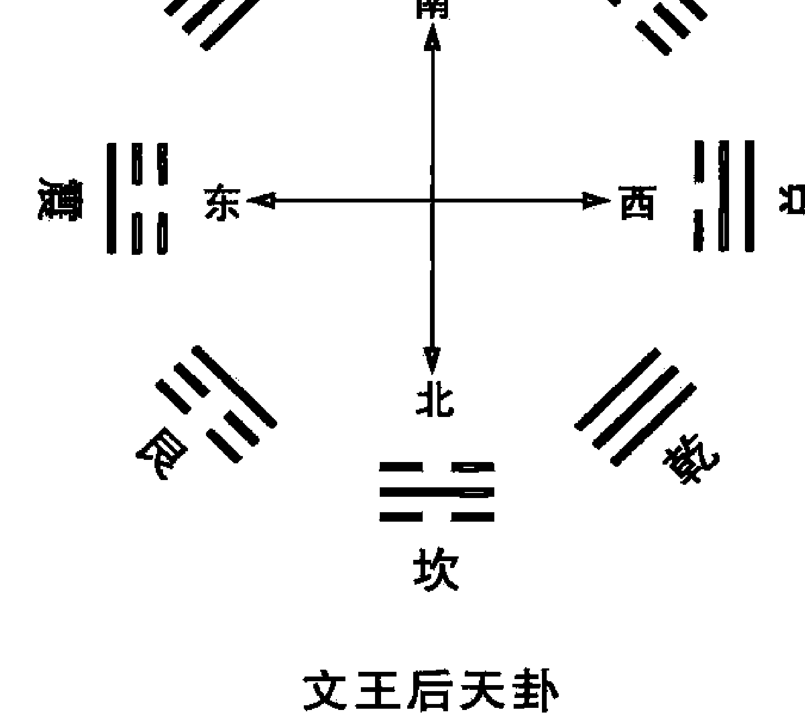
首先必须弄懂八卦所概括的特定内涵和外延，熟悉八卦的万物类象。现将张志春先生总结的九宫八卦万物类象摘录如下：

- 1. 乾卦：
   乾为天，为太阳，表现天的功能、意识及刚健的性质，还代表冰、雹、霰。
   在国家为国君，为主席，为总统；在单位为一把手，主要领导人；在家庭为父亲，为大人，为长辈人；在社会为名人，公门人，宦官；在性别为男，在年龄为老头。
   在场所为京都，为大城市，形胜之地，高亢之所。
   在方位为西北方，为南方（先天八卦），为上方，为高处。
   在时间为秋季，农历9、10月，戌、亥年、月、日、时，立冬至大雪45天。
   在数字为一（先天八卦数）、六（后天八卦数）四、九（五行金数）。
   在动物为马、象、天鹅、狮子。
   在静物为金玉、珠宝、圆物、木果、刚物、冠、镜。
   在人体为头、右腿（九宫位），肺、骨骼，男性生殖器。
   在颜色为白色、大赤色、玄色。
   在五味为辛、辣。

- 2. 坤卦：
   坤为地，表现地的功能、潜意识及柔顺的性质。在天时又为阴云、雾气、冰雹。
   在国家为皇后、第一夫人；在单位为职工、群众；在家庭为母亲、为祖母，为老母、后母、老妇人；在社会为众人，为乡人、为小人、为大腹人、为懦弱之人、吝惜之人；在年龄为老妇，老年女人。
   在场所为田野，为大地、为乡村、为平地。
   在方位为西南方，北方（先天八卦方位），下方、底层。
   在时间为农历六月、七月，未、申年、月、日、时，辰、戌、丑、未五行为土年月日时，立秋至白露45天。
   在数字为二（后天八卦数）、八（先天八卦数）五、十（五行土数）。
   在动物为牛，为牝马、为猫、为白兽。
   在静物为水泥、砖瓦、五谷、布帛、丝绵、方物、柔物，土中之物，牛食、食品、大车、锅。
   在人体为腹，右肩（九宫位），脾、胃、肌肉，女性生殖器。
   在颜色为黄色、黑色。
   五味中为甘味、甜味。

- 3. 震卦：
   震为雷，表示震动、奋起的性质和状态。在天象为雷雨、雷鸣、地震、火山喷发。
   在国家和单位为当权的第二把手；在家庭为长男；在社会为驾驶员、运动员，警察、法官、军人、飞行员、列车员、社会活动家、舞蹈演员、足球爱好者、狂人、壮士。
   在场所为工厂、广播电台、乐器店、游乐场、机场、发射场、车站、舞厅、闹市、战场、森林、草木茂盛之所。
   在方位为东方，东北方（先天八卦方位）。
   在时间为农历春二月，春分至谷雨45天，卯年、月、日、时。
   在数字为四（先天八卦数）、三（后天八卦数、五行木数）、八（五行木数）。
   在动物为龙、蛇，善鸣之鸟，百虫、鲫鱼。
   在静物为木、竹、苇、乐器、蔬菜、鲜花、树木、电话、飞机、汽车、火箭、鞭炮、闹钟、花草繁鲜之物。蹄、肉、山林野味。
   在人体为足，为肝胆，为左肋。
   在颜色为青、绿，碧色。
   五味为酸。

- 4. 巽卦：
   巽为风，表示自由活动和渗透性。天象代表刮风、台风、飓风、龙卷风等。
   在家庭为长女、大女儿；在社会为科技人员、教师、僧尼、仙道之人，气功师、练功者、商人、营业员、木材经营者、手艺人、能工巧匠、额头宽的人，头发细长而直的人，优柔寡断的人，自由职业者。
   在场所为邮局、管道、线路、隘路、过道、长廊、寺观、草原、竹林、芦苇荡、升降机、传送带。
在方向为东南方，西南（先天八卦方位）。
在时间为春夏之交，农历三、四月，辰、巳年、月、日、时，立夏至芒种45天。
在数字为五（先天八卦数）、四（九宫数）、三、八（五行木数）。
在人体为股、骸、胆、气管、神经、左肩（九宫位）、练功之元气。
在动物为鸡、鸭、鹅、蝶、蜻蜓、蛇、蚯蚓、带鱼、鳗鱼、鳝鱼、斑马等。
静物为树木、木材、木制品、纤维品、丝线、绳子、麻、风扇、干燥机、飞机、气球、气垫船、帆船、蚊香、木香、兰花、草药、羽毛、枝叶、腰带、海带、下面有口的器物。
在颜色为绿色、蓝色。
五味为酸。

##### 5. 坎卦：

坎为水，为月亮，表示艰难、险阻的状态。在天象为雨、雷、露、霜。
在家庭为中男，中年男子；在社会为江湖之人、舟人、盗贼、匪徒，为数学家、医生、律师、逃亡者、黑社会之人、诈骗犯、劳务人员、酒鬼、娼妇、自来水公司人员。
在场所为江河、海、湖、沟、渠、井、泉、下水道、洼地、酒店、冷饮店、浴室、澡堂、水族馆、地下室、暗室、自来水公司、鱼塘、饮食店、妓院。
在人体为肾脏、膀胱、泌尿系统、生殖系统、血液、内分泌系统、耳、肛门。
在动物为猪、鼠、狐狸、水鸟、鱼类、水中动物、美脊之马、劳苦之马、脊椎动物。
在静物为油、酒、酱油、饮料、石油、药品、水车、轮子、刑具、蒺藜、丛刺、带核的果品、冷藏设备、浮萍、潜水艇。
在方位为北方，西方（先天八卦方位）。
在时间为农历十一月，子年、月、日、时，冬至至大寒45天。
在数字为一（九宫数）、六（五行水数，一、六水）。
在颜色为黑色，或白色（悬空飞星颜色一白、二黑、三碧、四绿、五黄、六白、七赤、八白、九紫）。
五味为咸味。

##### 6. 离卦：

离为火，为日，表示光明、美丽的性质和状态。天象为晴天、热天、酷暑、烈日、干旱、虹光、霞光。
在家庭为中女、中年妇女；在单位为中层干部；在社会为中间层次人物，为媒人、美容师、文人、作家、艺术家、演员、明星、革命家、军人、画家、编辑、侦察员、纪检员人。
在场所为朝阳的场所、名胜古迹、圣地、教堂、华丽的街道、电影院、电视台、画院、美术馆、印刷厂、广告塔、电车站、冶炼厂、放射室。
在方位为南方，东方（先天八卦方位）。
在时间为夏天，为农历五月，为午年、月、日、时，夏至至大暑45天。
在数字为三（先天八卦数）、九（九宫数）、二、七（五行火数）。
在人体为眼、头部、心脏、小肠。
在动物为野鸡、孔雀、凤凰、仙鹤、为虾、蟹、螺、贝类、为鳖、龟、变色龙、萤火虫。
在静物为字、画、美术品、报纸、刊物、图书、杂志、契约、文书、合同、书信、照相机、摄影机、录像机、电视机、复印机、照明用具、广告、奖状、电报、连环画、化妆品、火炉、打火机、火柴、烧烤物品、焊枪、霓虹灯。
在颜色为红色、赤色、花色，紫色（九紫）。
五味为苦辣。

## 7. 艮卦:

艮为山，为土，表示静止和安定的状态。天象为云，为雾，为岚。
在家庭为少男，青少年；在社会为少年、儿童，为土建人员、宗教人员、官僚、贵族、继承人、警卫、守门人、矿工、狱吏、石匠、储蓄所人员。
在场所为山、山地、丘陵、高台、堤坝、休息室、坟场、阁寺、房屋、监狱、公安机关、派出所、大楼、城墙、仓库、宗庙、祠堂、矿山、采石场、银行、储藏室。
在方位为东北方，西北（先天八卦方位）。
在时间为冬春之交，农历十二月和正月，丑、寅年、月、日、时，立春至惊蛰45天。
在数字为七（先天八卦数）、八（九宫数）、五、十（五行土数）。
在人体为鼻、背、手指、关节、左腿（九宫位）、脚趾、乳房、脾、胃、结肠。
在动物为狗、为虎、鼠、狼、熊、牛等有牙、有角的动物，还有昆虫、爬虫、家畜等有尾的动物。
在静物为岩石、山坡、土堆、坟墓、墙壁、门槛、阶梯、台阶、门板、石碑、土坑、柜台、桌子、床。
颜色为黄色、棕黄、咖啡色，或白色（八白）。
五味为甘，甜味。

## 8. 兑卦:

兑为泽，为雨，表示喜悦和言辞。天象为潮湿天气，气压低、露水、阴雨连绵。
在家庭为少女、小女孩；在社会为与嘴有关的职业，如讲师、教授、演说家、讲解员、翻译、巫师、占卜者、媒婆、传达员、歌唱家、音乐家、相声演员、娱乐场所人员、娼妓、牙科医生、外科医生等。
在场所为沼泽地、峡谷、洼地、湖泊、池塘、滑冰场、游乐园、会议室、音乐厅、茶座、饭店、废墟、旧屋、山口、洞穴、井。
在方位为西方，东南（先天八卦方位）。
在时间为农历八月，酉年、月、日、时，秋分到霜降45天。
在数字为二（先天八卦数）、七（九宫数）、四、九（五行金数）。
在人体为口、舌、牙齿、咽喉、肺、右肋（九宫位）、肛门等。
在动物为羊、豹、豺、猿猴、水鸟、兔子、沼泽动物、鸡鸭。
在静物为石榴、胡桃、饮食用具、带口的器物、刀剑、剪刀、玩具、破损物品，垃圾箱等。
颜色为白色，或赤色（七赤）。
五味为辛、辣。

总之，在奇门遁甲中以九宫八卦涵盖了天、地、人、时间、空间万事万物。

#### 二、人盘八门

八门在奇门遁甲中象征人盘。门为人活动出入的关口，故以开、休、生、伤、杜、景、死、惊，代表八个不同的方位。人的趋向与人事的得失，在奇门遁甲中，八门占着很重要的因素，大致以开、休、生三吉门为最吉。《烟波钓叟赋》云：“八门若遇开休生，诸事逢之总称情”。五总龟云：“得门不得奇，可用，得奇不得门不可用”。但这种观点，只是大概分析而已。必须还要结合旺相休囚、门迫、三奇入墓等细节来最后定夺。也要根据事情的不同性质，择取不同性质的门。如：死丧、埋葬、就不能用生门，只能用死门，讨债，打猎用伤门。总之，要依所用事情的性质，来取用符合此事性质的八门。违背事物本身与八门性质的相悖，则吉事不成甚至变凶。这就要求对八门的象意一定要了解透彻，下面具体说一下八门的象意：

##### 1. 开门：为显扬之门，乾宫之使，其星六白，天心属金。乾者，健也，乾为天行健而不息，因对宫巽木受克而杜绝，造化终无闭绝之理，闭则复开，故谓之开门。开者，辟也，主旺于秋，庚辛申酉年月日时，将兵客胜，被围突出伏匿避难。
应用：宜上官赴任、求名、应举、远行、商贾、嫁娶、行兵、辟地、开疆拓土，所向通达。开门驭八宫之气，以镇乾也。
预测：代表工作、官职，文官、单位、工厂、企业、公司、店铺、柜台、门面，在测诉讼中代表法官，在测汽车中可代表发动机，在测航天中，可代表飞机等。

##### 2. 休门：为阴气之位，坎宫之使，其星为一白，天蓬属水，坎者，陷也，居五行之首而生物，不敢与离火相敌，故曰休门。主冬，旺于壬子癸亥年月日时方。
应用：宜上表章、选将、兴师、安营、谒贵、应举、迁移、嫁娶、求财、远行、商贾、休兵，凡举百事，皆宜休门，驭二宫之气，以镇坎也。
预测：代表公门人、坐办公室的人、迎来送往的人，事务工作者，休闲人，离休、退休人员、修心养性者、休门也主退缩、停止、在测婚姻中可代表婚姻、家庭，出行乘船可代表水路。

##### 3. 生门：为通泰之门，艮宫之使，其星八白，天任属土。艮者，止也，天地生物之化育，不能终止，终止则复生，生而不息，故谓之生门。生者，育也，主旺于四季，戊己辰戌丑未年月日时，将兵从生门引兵而击死，百战百胜。
应用：宜兴兵作战、上官赴任、婚姻、应举、远行、商贾、交易、经营，凡举百事所向，皆得。生门驭三宫之气，以镇艮也。
预测：代表房屋、土地、钱物，银行，财务，在测财中可代表财运、产业、资产、房屋、阳宅、生意、利息、利润等，在测病中用神临生门，代表身体没问题，或可起死回生。一般情况下，可代表活着的人，有生气的人，性格生龙活虎的人，或从事农业、种植业、养殖业的人等等。

##### 4. 伤门：为六害之门，震宫之使，其星三碧，天冲属木，震者，动也，动而受兑金之克，故曰伤门。伤者，损也，主旺于春，甲乙寅卯年月日时，将兵出战，士卒恐怖，只宜固守。
应用：宜捕捉、征伐、索债、博戏、求神、筌鱼蹄兔、收货、兴讼，伤门驭四宫之气，以镇震也。
预测：代表公安刑警，讨债人，竞争对手，代表汽车、船只、司机，也代表伤心、伤灾、伤害、受伤者，身体受伤部位、伤门在震宫也主变动。

##### 5. 杜门：为闭塞之门，巽宫之使，其星四绿，天辅属木，巽者，人也，受乾金对宫之克，敛迹退藏以避之，故曰杜门。杜者，绝也，主旺于甲乙寅卯年月日时，将兵不宜出战，只宜固守及邀截、隐匿。
应用：宜隐伏、讨逆、诛戮凶暴、判决、刑狱、填塞坑坎、邀截道路，不利兴兵征伐，宜坚壁固守，凡举百事俱凶。杜门驭九宫之气，以镇巽也。
预测：代表武官、军警单位、保密单位，代表躲藏之处，代表闭塞不通、血栓、梗塞、中风，代表性格内向，代表技术人员，杜门临巽宫主经络、主风、主气，因而也可代表修炼之人、闭关者，深山修真者。

##### 6. 景门：为进奏之门，离宫之使，其星九紫，天英属火。离者，丽也，因对坎水涵太阳日精，重明丽于天中，化生万物之故，故谓之景门。景者，大也，主旺于丙丁巳午年月日时，将兵量敌而进，破围突阵不凶。
应用：宜求贤、访士、上书、献策、受道、学业、觅职、求官。景门驭一宫之气，以镇离也。
预测：代表光明、风景、图画、计划、规划、技术指导、文章、考卷，文书，合同、起诉书，状纸、消息、信息，口舌、还可代表宴席、酒店、饮酒、酒量，代表火器、枪支、流血、血光，火光、火灾、出行代表旱路、道路等。

##### 7. 死门：为刑戮之门，坤宫之使，其星为二黑，天芮属土，坤者，顺也，因与艮土对应复生，有生则有死，故曰死门。死者，终也，主旺于四季，辰丑未戊己年年月日时，将兵对敌，背生击死则获大胜。来此门者，报仇、设伏、争斗，主有凶恶等事，宜谨防之。
应用：安葬、攻城、行刑、诛戮、射猎、筌鱼、网兽、开田、修路、余事不宜。出师失利，损将折兵。
预测：在测工作中可代表屠户、猎户、行刑之人、吊丧之人、救死扶伤的医务人员。也可代表地皮、地基、坟墓、阴宅，一般情况下还可代表死人、死尸、死肉、坏组织、疤痕、锁。或性格死气沉沉，死板固执，或心里不痛快，生闷气或事业不顺利，处于低潮，受困状态等等、死门也可代表痴呆、傻子。

##### 8. 惊门：惊门为奸谋之门，兑宫之使，其星七赤，天柱属金。因对震宫而感动，故谓之惊门。惊者，骇也，主旺于秋，庚辛申酉年月日时。将兵主士卒有惊伤、败亡、攻劫之虞。来此门者，主惊走、失逃、诡诈、虚惊，凶逆之事。
应用：宜捕捉盗贼、斗讼、恐惑乱众，虚诈诡谲、攻击伏兵，利于西方，凡百举事，忧祸随之。惊门驭六宫之气，以镇兑也。
预测：代表官司、诉讼、口舌是非，律师，也可代表外交官，教师、歌星、言官，纪检、监察部门工作人员等，还可代表受惊、惊慌、惊恐不安、担惊受怕、等状态。惊门在兑宫也主毁折，残缺。

#### 三、天盘九星

九星为北斗星群。天蓬（贪狼）、天芮（巨门）、天冲（摇光）、天辅（开阳）、天禽（玉衡）、天心（天权）、天柱（天机）、天任（天璇）、天英（天枢）。我们现在能肉眼看到的北斗星只有七个，摇光、开阳，玉衡、天权、天机、天璇、天枢，另两颗随着天体的运转，斗转星移，慢慢地隐去。
北斗道家称谓天罡，自古以来，道家对其特别重视，如道家的踏罡布斗，其实也是一种天人合一的方法。
奇门遁甲中的九星象征天时，在主客的区分上以天盘九星为客，地盘九星为主。九星的象意如下：

##### 天蓬：
天蓬星宜安守边寨、修筑城池、屯兵固守、开穴造葬、移徙，主火灾、营造、损胎孕、争斗、见血光、盗贼。春夏吉，秋冬不利。又名为贪狼星，与北方一宫坎卦相对应。歌云：“讼庭争竞遇天蓬，胜捷名威万里同。春夏用之皆为吉，秋冬用之半为凶。嫁娶远行皆不利，修造埋葬亦间空。须得生门同丙乙，用之万事皆昌隆。”天蓬为水贼，所入之宫不宜嫁娶，营造，搬迁等，但如遇生门并合丙奇，丁奇，则可用无妨。春夏可用，秋冬助水之势，不可用。

##### 天任：
宜安邦、建邑、选将、出兵、婚嫁、上官、商贾、求谋、造葬、应试、求名、谒贵，四时吉，又为左辅星，与东北八宫艮卦相对应，诗曰：“天任吉星事皆通，祭祀求官嫁娶同。斩绝妖蛇移徙事，商贾造葬喜重重”。天任为富室，求官，嫁娶，迁徙，经商，诸事皆吉。

##### 天冲：
宜选将、出师、交锋、战阵、报仇、捕贼、探围、射猎，余事不利，春夏吉，又为禄存星，与东方三宫震卦相对应。天冲为雷神，天帝，武士，宜出军报仇雪耻，征伐交战，鸣金击鼓，摇旗呐喊。不宜嫁娶，修造，迁徙，经商。有慈心助人为乐之德，并与农事活动有关。

##### 天辅：
宜选将、求贤、交锋、破阵、造葬、婚姻、娶嫁、应举求名、商贾交易、移徙、营建，春夏吉，又为文曲星，与东南四宫巽卦相对应。遇此星，特别利于升学考试，发展文化教育事业。

##### 天禽：
中宫土也，主旺于四季辰戌丑未年月日时，将兵交锋，大战报捷，开疆展土，四时皆利。加三、四宫利为客，临一宫利为主，四季吉，又名廉贞星，与中央五宫相对应。禽代表中宫，是遁甲元帅值符所在之地。天禽星临宫，百事皆宜，四时皆吉。

##### 天英：
宜面君、谒贵、上书、献册、干求、升擢、宴会，余事不宜。夏吉，又为右弼星，与南方九宫离卦相对应。天英之星居离宫之位，烈火炎炎，性躁易暴，虽如日中天，大放光明，但也和血光之灾有关。

##### 天芮：
宜屯兵、固守、训练士卒。又为巨门星，与西南方二宫坤卦相对应。在军事上，宜屯兵固守，不宜用兵交战。不宜嫁娶，迁徙，诉讼，营造，即使得奇门，也难为吉。天芮为土星，秋冬用之吉，春夏用之凶。

##### 天柱：
宜固守、屯兵、修筑茔垒、训练士卒、赡养锐气、修造、隐迹、埋形，余事不宜，秋冬吉，又名为破军星，与西方七宫兑卦相对应。天柱当金秋肃杀之气，喜杀好战，与惊恐怪异、破坏毁折有关。宜于训练士卒，屯兵因守，不宜出兵交战，经商远行，强行则车破马伤、士卒败亡、破财折本。

##### 天心：
宜选将、出师、扬威、布阵、捣巢、破敌、商贾、远行、营建，秋冬吉，春夏凶，又为武曲星，与西北方六宫乾卦相对应。天心星与乾卦相对应，因为乾为天、为父，故此长于心计，和领导才能、军事指挥，医疗疾病有关，故天心为高级官员，为名医，宜治病服药，练气功，经商。秋冬吉，春夏凶。

#### 四、神盘——宇宙中一种神秘的力量

神盘，古人也称做八诈盘。在奇门遁甲中，古人认为宇宙天地之中存在着一种目前还无法真正认识到的神秘场能，对人有着重要的影响。八神的象意如下：

- **值符**：禀东方木，为天乙之神，诸神之首，所到之处，百恶消散，但忌庚金七煞。在物品中代表高档货物、真品、精品、名品。在单位人事上代表领导、一把手。值符还可作为顶头上司，监考官、裁判、原告、放债人、银行、行情，在战争时可代表守方等。事急可从值符所临之方出，这就是下文中“急则从神”的说法。
- **螣蛇**：虚诈之神，此门多出怪异、恍惚不明之事，须得奇门会合之方，则不忌。禀南方火，为虚诈之神。性柔而口毒，司惊恐怪异之事。出螣蛇之方主精神恍惚，恶梦惊悸，如果问病可能是受惊吓，夜多噩梦，又可能被疾病困扰，久治不愈。另外，当预测一个人的喜好时，如果此人上乘螣蛇的话，则表示他可能对神秘文化感兴趣，或是信仰佛道，或喜欢易学文化等等。
- **太阴**：阴佑之神，可以埋伏兵马，有急难宜从此方避之，可免其患。可以密谋策划、避难。用神如果上乘太阴的话，表示可能有贵人暗中相助，或暗中策划。
- **六合**：护卫之神，可以埋伏、提防不测，人有急难，宜从此方而隐之，可免其患。六合之方宜婚娶、避害。六合代表中介人，婚姻，经纪人，行人走失方向，逃犯等。
- **白虎（勾陈）**：禀西方之金，为凶恶刚猛之神。性好杀，专司兵戈争斗杀伐之事，交通事故等。勾陈之方须防敌方偷袭。得奇门无忌。白虎下隐有勾陈，勾陈具有地户己土性质，己土长生在酉，故隐于白虎之下。另外，如果用神临吉星、吉门、吉格，而又上乘白虎的话则可以作为吉神来用，表示此人长得白，性格刚烈，有威严，有能力等。
- **玄武（朱雀）**：禀北方水，为奸谗小盗之神。性好阴谋贼害，专司盗贼逃亡口舌之事。玄武下隐有朱雀，朱雀原来属南方火神，但北方玄武子水之位，正是丙火怀胎之地，故朱雀隐于玄武之下，朱雀之方须提防奸细盗贼。得奇门则无妨。玄武主男女暧昧之事，如果用玄武来代表物品，则可能是腐烂变质或假冒伪劣商品；如果来代表人的话，则此人可能喜欢暗中行事，或是贪污盗窃犯，行贿受贿，或是拈花惹草、风流放荡之人。但如果用神临吉星、吉门、吉格而却上乘玄武的话，则表示此人除有原则性以外，还具有头脑灵活的一面，处理事情必然会上下有情，内外称意。玄武主要是用来代表小偷小摸，小贪污犯的用神符号。
- **九地**：坚固之神，可以屯兵、固守、保障城池，孙子曰：“善守者，藏于九地之下。”坤土之象，具有坤土的性质，有厚载之德，故为万物之母。为坚牢之神，时间很长的意思，性柔好静，滋生万物。九地之方，可以屯兵固守，坐地经商，搞房地产，播种养殖。
- **九天**：威悍之神，利于扬兵、布阵、呐喊摇旗。孙子曰：“善攻者，动于九天之上也。”乾金之象，为天为父，万物之父。古人称为威悍之神，性格刚强好动，性刚好动。九天之方，可以扬兵布阵，行军打仗，坐飞机。用神上乘九天吉神，可以主动出击，大展宏图。

#### 五、十千克应

十千克应，就是十天干在天盘和地盘相遇后的各种克应关系。奇门遁甲将甲阴遁起来，其余九干又分成三奇六仪，所以也就是奇仪之间的克应关系。即天盘的乙丙丁戊己庚辛壬癸和地盘的乙丙丁戊己庚辛壬癸相遇后的各种关系。那么，甲怎么用？甲常隐于六仪之下，也就是说，六甲以六仪为代表而看其克应关系。现将张志春先生总结的十千克应关系摘录如下：

##### 1. 天盘甲子戊加临地盘三奇六仪的克应关系

天盘的甲子戊加临地盘甲子戊，即戊加戊，甲甲比肩，名谓伏吟。遇此，凡事不利，道路闭塞，以守为好。
天盘的甲子戊加地盘乙奇，即戊加乙，甲乙会合，因甲乙均位于东方青龙之位，所以叫青龙和会，门吉事也吉，门凶事也凶。
天盘的甲子戊加地盘丙奇，即戊加丙，因青甲木龙生助丙火，故为青龙返首，为事所谋，大吉大利，若逢迫墓击刑，吉事成凶。
天盘的甲子戊加地盘丁奇，即戊加丁，因甲木青龙生助丁火，故为青龙耀明，宜见上级领导，贵人、求功名，为事吉利。若值墓迫，招惹事非。
天盘的甲子戊加地盘甲戌己，即戊加己，因为戊为戊土之墓，故为贵人入狱，公私皆不利。
天盘的甲子戊加地盘甲申庚，即戊加庚，因值符甲最怕庚金克煞，故为值符飞宫，吉事不吉，凶事更凶，求财没利益，测病也主凶。同时，甲庚相冲，飞宫也主换地方。
天盘的甲子戊加地盘甲午辛，即戊加辛，因辛金克甲木，子午相冲，故为青龙折足，吉门有生助，尚能谋事，若逢凶门，主招灾、失财或有足疾、折伤。
天盘的甲子戊加地盘甲辰壬，即戊加壬，因壬为天牢，甲为青龙，故为青龙人天牢，凡阴阳事皆不利。
天盘的甲子戊加地盘甲寅癸，即戊加癸，因甲为青龙，癸为天网，又为华盖，故为青龙华盖，又戊癸相合，故逢吉门为吉，可招福临门。逢凶门者事多不利，为凶。

##### 2. 天盘乙奇加临地盘三奇六仪所形成的克应关系

天盘乙奇加临地盘甲子戊，即乙加戊，乙木克戊土，为阴害阳门（因为阳为天门），利于阴人、阴事，不利阳人、阳事，门吉尚可谋为，门凶、门迫则破财伤人。
天盘乙奇加临地盘乙奇，即乙加乙，乙乙比肩，为日奇伏吟，不宜见上层领导、贵人，不宜求名求利，只宜安分守己为吉。
天盘乙奇加地盘丙，即乙加丙，乙木生丙火，为奇仪顺遂，吉星迁官晋职，凶星夫妻反目离别。
天盘乙奇加地盘丁，即乙加丁，为奇仪相佐，最利文书、考试，百事可为。
天盘乙奇加地盘甲戌己，即乙加己，因戊为乙木之墓，故为日奇人墓，被土暗味，门凶事必凶，得生、开二吉门为地遁。
天盘乙奇加地盘甲申庚，即乙加庚，庚金克乙木，故为日奇被刑，为争讼财产，夫妻怀有私意。
天盘乙奇加地盘甲午辛，即乙加辛，乙为青龙，辛为白虎，乙木被辛金冲克而逃，故为青龙逃走，人亡财破，奴仆拐带，六畜皆伤。测婚为女逃男。
天盘乙奇加地盘甲辰壬，即乙加壬，为日奇人地，尊卑悖乱，官讼是非，有人谋害之事。
天盘乙奇加地盘甲寅癸，即乙加癸，为华盖逢星，遁迹修道，隐匿藏形，躲灾避难为吉。

##### 3. 天盘丙奇加临地盘三奇六仪所形成的克应关系

天盘丙奇加地盘甲子戊，即丙加戊，甲为丙火之母，丙火回到母亲身边，好似飞鸟归巢，故名鸟跌穴，百事吉，事业可为，可谋大事。
天盘丙加地盘乙，即丙加乙，为日月并行，公谋私为皆为吉。

##### 4. 天盘丁奇加临地盘三奇六仪所形成的克应关系

天盘丁奇加地盘甲子戊，即丁加戊，为青龙转光，官人升迁，常人威昌。

天盘丁加地盘三奇乙，即丁加乙，为人遁吉格，贵人加官晋爵，常人财帛有喜。

天盘丁加地盘三奇丙，即丁加丙，为星随月转，贵人越级高升，常人乐里生悲，要忍，不然因小的不忍而引起大的不幸。

天盘丁加地盘三奇丁，即丁加丁，为星奇入太阴，文书证件即至，喜事从心，万事如意。

天盘丁加地盘甲戊己，即丁加己，因戊入火库，己为勾陈，故为火入勾陈，奸私仇怨，事因女人。

天盘丁加地盘甲申庚，即丁加庚，丁为文书，庚为阻隔之神，故为文书阻隔，行人必归。

天盘丁加地盘甲午辛，即丁加辛，为朱雀入狱，罪人释囚，官人失位。

天盘丁加地盘甲辰壬，即丁加壬，因丁壬相合，故主贵人恩诏，讼狱公平。测婚多为苟合。

天盘丁加地盘甲寅癸，即丁加癸，癸水冲克丁火，为朱雀投江，文书口舌是非，经官动府，词讼不利，音信沉溺不利。

##### 5. 天盘甲戊己，即六己加临地盘三奇六仪所形成的克应关系

天盘甲戊己加地盘甲子戊，即己加戊，因戊为犬，甲为龙，故为犬遇青龙，门吉为谋望遂意，上人见喜；若门凶，枉费心机。

天盘甲戊己加地盘乙奇，即己加乙，因戊为乙木之墓，己又为地户，故名墓神不明，地户逢星，宜遁迹隐形为利。

天盘甲戊己加地盘丙奇，即己加丙，为火悖地户，男人冤冤相害，女人必致奸淫。

天盘甲戊己加地盘丁奇，即己加丁，因戊为火之墓，故名为朱雀入墓，文书词讼，先曲后直。

天盘甲戊己加地盘甲戊己，即己加己，名为地户逢鬼，丙者发凶必死，百事不遂，暂不谋为，谋为必凶。

天盘甲戊己加地盘甲申庚，即己加庚，名为刑格返名，词讼先动者不利，如临阴星则有谋害之情。

天盘甲戊己加地盘甲午辛，即己加辛，名为游魂入墓，易遭阴邪鬼魅作祟。

天盘甲戊己加地盘甲辰壬，即己加壬，名为地网高张，狡童佚女，奸情伤杀，凶。

天盘甲戊己加地盘甲寅癸，即己加癸，名为地刑玄武，男女疾病垂危，有囚狱词讼之灾。

##### 6. 天盘甲申庚，即六庚加临地盘三奇六仪所形成的克应关系

天盘甲申庚加地盘甲子戊，即庚加戊，庚金克甲木，谓天乙伏宫，百事不可谋，大凶。

天盘甲申庚加地盘乙奇，即庚加乙，为太白逢星，退吉进凶谋为不利。

天盘甲申庚加地盘丙奇，即庚加丙，为太白如荧，测贼盗时看贼人来不来，太白如荧，贼定要来，为客进利，主破财。

天盘甲申庚加地盘丁奇，即庚加丁，名为亭亭之格，因私匿或男女关系起官司是非，门吉有救，门凶事更凶。

天盘甲申庚加地盘甲戌己，即庚加己，名为官符刑格，主有官司口舌，因官讼被判刑，主牢狱之灾。

天盘甲申庚加地盘甲申庚，即庚加庚，名为太白同宫，又名战格，官灾横祸，兄弟或同辈朋友相冲撞，不利为事。

天盘甲申庚加地盘甲午辛，即庚加辛，名为白虎干格，不宜远行，远行车折马伤，求财更为大凶。

天盘甲申庚加地盘甲辰壬，即庚加壬，为上格，壬水主流动，庚为阻隔之神，故远行道路迷失，男女音信难通。

天盘甲申庚加地盘甲寅癸，即庚加癸，名为大格，因寅申相冲克，庚为道路，故多主车祸，行人不至，官事不止，生育母子俱伤，大凶。

##### 7. 天盘甲午辛，即六辛加临地盘三奇六仪所形成的克应关系

天盘甲午辛加地盘甲子戊，即辛加戊，辛金克甲木，子午又相冲，故为困龙被伤，主官司破财，屈抑守分尚可，妄动则带来祸殃。

天盘甲午辛加地盘乙奇，即辛加乙，辛金冲克乙木，故名为白虎猖狂，家败人亡，远行多灾殃；测婚离散，主因男人。

天盘甲午辛加地盘丙奇，即辛加丙，名干合悖师，门吉则事吉，门凶则事凶，测事易因财物致讼。

天盘甲午辛加地盘丁奇，即辛加丁，辛为狱神，丁为星奇，故名为狱神得奇，经商求财获力倍增，囚人逢天赦释免。

天盘甲午辛加地盘甲戌己，即辛加己，辛为罪人，戌为午火之库，故名为入狱自刑，奴仆背主，有苦诉讼难伸。

天盘甲午辛加地盘甲申庚，即辛加庚，名为白虎出力，刀刃相交，主客相残，逊让退步尚可，强进血溅衣衫。

天盘甲午辛加地盘甲午辛，即辛加辛，因午午为自刑，故名为伏吟天庭，公废私就，讼狱自罹罪名。

天盘甲午辛加地盘甲辰壬，即辛加壬，壬为凶蛇，辛为牢狱，故名为凶蛇入狱，两男争女，讼狱不息，先动失理。

天盘甲午辛加地盘甲寅癸，即辛加癸，因辛为天牢，癸为华盖，故名为天牢华盖，日月失明，误入天网，动止乖张。

##### 8. 天盘甲辰壬，即六壬加临地盘三奇六仪所形成的克应关系

天盘甲辰壬加地盘甲子戊，即壬加戊，因壬为小蛇，甲为青龙，故为小蛇化龙，男人发达，女人产男婴童。

天盘甲辰壬加地盘乙奇，即壬加乙，名为小蛇得势，女人柔顺，男人通达，测孕育生子，禄马光华。

天盘甲辰壬加地盘丙奇，即壬加丙，名为水蛇入火，因壬丙相冲克，故主官灾刑禁，络绎不绝。

天盘甲辰壬加地盘丁奇，即壬加丁，因丁壬相合，故名干合蛇刑，文书牵连，贵人匆匆，男吉女凶。

天盘甲辰壬加地盘甲戌己，即壬加己，因辰戌相冲，故名为反吟蛇刑，主官讼败诉，大祸将至，顺守可吉，妄动必凶。

天盘甲辰壬加地盘甲申庚，即壬加庚，因庚为太白，壬为蛇，故名为太白擒蛇，刑狱公平，立剖邪正。

天盘甲辰壬加地盘甲午辛，即壬加辛，因辛金入辰水之墓，故名为腾蛇相缠，纵得吉门，亦不能安宁，若有谋望，被人欺瞒。

天盘甲辰壬加地盘甲辰壬，即壬加壬，名为蛇入地罗，外人缠绕，内事索索，吉门吉星，庶免蹉跎。

天盘甲辰壬加地盘甲寅癸，即壬加癸，名为幼女奸淫，主有家丑外扬之事发生，门吉星凶，易反福为祸。

##### 9. 天盘甲寅癸，即六癸加临地盘三奇六仪所形成的克应关系

天盘甲寅癸加地盘甲子戊，即癸加戊，戊癸相合，名为天乙会合，吉门宜求财，婚姻喜美，吉人赞助成合。若门凶迫制，反祸官非。

天盘甲寅癸加地盘乙奇，即癸加乙，名为华盖逢星，贵人禄位，常人平安。门吉则吉，门凶则凶。

天盘甲寅癸加地盘丙奇，即癸加丙，名为华盖悖师，贵贱逢之皆不利，惟上人见喜。

天盘甲寅癸加地盘丁奇，即癸加丁，因癸水冲克丁火，丁火烧烁癸水，故名为腾蛇天矫，文书官司，火焚也逃不掉。

天盘甲寅癸加地盘甲戊己，即癸加己，名为华盖地户，男女测之，音信皆阻，此格躲灾避难方为吉。

天盘甲寅癸加地盘甲申庚，即癸加庚，名为太白入网，主以暴力争讼，自罹罪责。

天盘甲寅癸加地盘甲午辛，即癸加辛，名为网盖天牢。主官司败诉，死罪难逃；测病亦大凶。

天盘甲寅癸加地盘甲辰壬，即癸加壬，因癸、壬均为水蛇，故名为复见腾蛇，主嫁娶重婚，后嫁无子，不保年华。

天盘甲寅癸加地盘甲寅癸，即癸加癸，名为天网四张，主行人失伴，病讼皆伤。

### 第四节 论奇门遁甲中的主客关系

主客关系在奇门遁甲的应用中很重要。对主客的正确分析，有利于对事物持有主动权，对一件事的决策起着重要的指导作用！故古人说：善于运用奇门的，先要明确主客的关系，然后再明预测的方法。严格的来说，除地盘代表主象外，天盘九星奇仪，人盘八门，八神，都代表客象。如去一个地方，以门为人为客，以所去之宫为主，如果宫克门，说明地方克人，对人不利，宫生门，则此地适合此人发展。门克宫，人能适应此地。门为人，宫为人所到之地，主客相生当然好了。

主客在具体判断时，以动为客，静为主；先动为客，后动为主；积极为客，消极为主；外为客，内为主；远为客，近为主；天盘九星奇仪为客；地盘九星奇仪为主；门为客，宫为主；时干为客，日干为主。反吟利客，伏吟利主；阳时利客，阴时利主。值符利客，九天利客，九地利主；太阴、六合主客皆利。在预测中如用神临：伤门利客，杜门利主，生门利客，死门利主，开门利客，休门主客皆利。惊门利客（惊门宜破阵，故利客）。

《统宗大全》中讲道：伏吟虽静，利主，但有时也宜动。要选取九天，值符、开门之宫，此三宫虽伏吟，但却利于动，利于客！在主客的关系上要根据时空具体分析，也不能墨守成规。

西周开国宰相姜子牙曰：凡主客动静不定，变化莫测，故主客不动之象，或以先动为客，后动为主，或以动为客，静为主，或以先声为客，或以天盘为客，地盘为主，诸事总有用诀，成败胜负，皆贵乎主以宾之紧要也。如出兵动众，以我为客，至彼地为主；或贼巢及贼所侵之城廓为主，或以阳为客，阴为主；或反客为主，反主为客。若选将求贤，招兵买马，干谒访友之类是我为客，彼为主。如有人来求我，或通知我，而我未知，是彼为客我为主。如在此对阵，或不在此对敌，再又分主客也。或此时交锋，若利客宜先耀武扬威，放炮呐喊，若利主，惟宜堰旗息鼓禁声而敌，埋伏取胜。

凡发兵，须看贼巢远近，如发兵时交战，或不同时交锋，不可以先动为客，待临敌取主客，到时而用之可也。如此时主客不利，只宜固守，倘若急迫，或被围困，宜以计胜，或运筹，或量敌，或乘天马，或书符念咒等类亦可。如国事都省，府县乡事，家宅官讼，坟茔，求谋名利，婚姻，行人，失脱，逃走，捕捉，即以地盘为主人，天盘为客人，事是多不能细述。大凡天盘诸星，生合地盘为上，地盘生合天盘次之，如客生主为称意美满，进益多端，主生客为耗散迟延必定自败。主客比和，行藏皆遂，主克客，乃半实半虚，自败虚花，事为不果，客克主，则战败无成，求吉皆凶。故善用奇门者，先分主客，然后再明占法。如此时利主，我即为主，此时利客，我即为客，或以进为客，不进为主，在我一心，不可执一，为客为主，任我可也。

### 第五节 论奇门遁甲的本质

古称奇门遁甲有“夺天地之造化之效”。今人对此术也有很高的评价，但从今天的研究方向来看，多数研究者侧重于预测部分。太乙以天时为要、六壬以人事为要、奇门以地理为要，三式虽都含有预测部分，但其侧重点却不同。奇门里面有遁甲，遁甲必须靠奇门，两者本为一体，不可分离，分离则有失奇门遁甲之本意！

对此，陕西宝鸡的孙小忠先生曾在“周易天地奇门遁甲论坛”发表过《论奇门预测与奇门应用》一帖。提出预测与应用是两种不同体系，用法有别。预测重日干，时干，用神。而应用、运筹则重时空。如纯粹以预测之思路来探索奇门遁甲中的精髓，则离奇门遁甲的本质越来越远，失遁甲之本来面目。奇门遁甲中非常重要的九遁等格局为什么在预测中发挥不了它的作用？《烟波钓叟赋》到底在说什么……

他认为，如今的奇门遁甲已人为复杂化，只知有奇门，而不知有遁甲，两者分离！择日多以日干为人，时干为事，以时干来生日干则吉，反之则不可用。也有人在时空的应用上以年命和日干来决择。所用之方位要和日干，年命相生相比才可用，如真是这样，那所谓的“急则从神缓从门”就有其局限性了。如遇急事，明知值符在此方可用，但却要看和日干年命的关系，相克就无法用此方位了。又去找和自己相生的方位来趋避。就如两军对阵，一方被敌方包围，明知面前就有一方位可突出重围，但却非得要用奇门遁甲来选择何方可出，当推演下来时，恐怕已全军覆没！

所以孙小忠先生认为，如果这样，那么真正的时空方位就根本无法用上。如一场大的战争，不是考虑某一两个人的生存或胜负。而是全面来衡量整个战争的胜败。对战略要地，更是敌我双方必争之地，谁取得主动权就对谁有利。为主为客除了靠指挥者本身的军事才能外，就要利用天时、地利、人和了。《烟波钓叟赋》云：九天之上好扬兵，九地潜藏可立营，伏兵但向太阴位，若逢六合利逃影。这就说明在某一特定的时空中，宇宙本身就存在着某一场能，而此场能恰好对于某些事情比较有利。古人特别注重对三吉门的运用：吉门偶尔合三奇。开休生门万事宜。如以现在的某些思路，那这些很重要的地方又能运用多少呢？能否真正的达到天人合一？怎样才能为主为客在我一心，任我可也？

有些人甚至认为即使所用之方临死门，只要来生日干年命就可用。对此，我赞成孙先生的观点：此论不妥。因为有些门、星、神，其本性就为凶，如来生日干，岂不为坏事主动来寻我，何益之有？又如阴宅择日，既要看日干、时干之生克关系，又要看坐山朝向是吉是凶，有的还要看死门宫中，天盘星与地盘星之关系。那么，如以死门为穴，那么坐山朝向在这里又代表什么？阴阳宅到底那个重向？那个重座？年命在什么情况下必看，什么情况下又不必看？

大道至简，在实际应用中如不抓住重点，则其用神就显的过多而难以掌握定向，又有其局限性。有些法则只适合于奇门静态预测类。动态应用是要考虑当时行动那一时辰的时空状态！金函玉镜中的日家奇门没有十天干，又怎样将人来定位呢？笔者认为，只所以要找日干者，就是为了要将当事人在局中定位，时干者为所用之事体，依次来横向比较得出利弊。此法在奇门预测中无可争议，但在奇门遁甲时空应用中则不符合“遁甲”之意，更不符合奇门遁甲时空统一论。过于注重人自身的作用，而忽略宇宙本身强大的磁场作用。人在茫茫宇宙中只是一个“微尘”而已！世上的万事万物无不受到宇宙强大的磁场所影响。如大的自然灾害，局部战争，2004年的海啸，一夜之间就可毁掉无数个生命和人们居住的环境。宇宙是一个大太极，人所居住的局部区域是个小太极，人本身又为一太极，大环境影响局部环境，局部环境则影响人，就如国运影响每一个人一样。人常说：“环境改变人。”奇门遁甲是效仿天体的运转模式而来，有其天文学背景。故依据此遁甲模式可以推演出某一时空中天体的气运变化，磁场的力量性质，和强弱分布，以此来指导人的行动方向，让人择其有利的时空点，去办有利的事情。人只要能和宇宙强大的磁场所感应，所融合，利用宇宙本身强大的磁场而为我所用，才能真正达到天人合一！我赞成孙先生的观点：这才是奇门遁甲之本质。

### 第六节 奇门遁甲如何判断应期

应期，是奇门遁甲预测中的一项重要内容。

所谓应期，就是运用奇门遁甲预测事物的应验日期。清代锡孟樨所著《奇门法窍》一书有一段论述，是目前我国诸多奇门遁甲研究者用来判断应期的主要方法。其论述如下：

> 奇门一盘，星门生克，奇仪吉凶，固然是确定的，但是应验的年、月、日、时，事情的远近，或应时日，从星门奇仪衰旺而断，须神而明之，不可执泥。先定地支，后配天干，得干支的方法，只在正时确定。假如，甲子值符加离九宫，为子午相冲，子与丑合，应验应当在丑年、月、日、时；甲午值符加坎一宫，也是子午相冲，午与未合，必然应在未日；甲寅值符加坤二宫，为寅申相冲，寅与亥合，应验在亥日；甲申值符加艮八宫，也为寅申相冲，巳与申合，应在巳日；甲戌值符加巽四宫，为辰戌相冲，卯与戌合，应验在卯日；甲辰值符加乾六宫，也是辰戌相冲，辰酉相合，应验在酉日。这是值符相冲法，定支也是如此。甲戌值符加坤二宫，为戌未刑，卯与戌合，应验在卯日；甲子值符加震三宫，为子刑卯，子与丑合，应验在丑日；甲寅值符加巽四宫，为寅刑巳，寅与亥合，应在亥日。这是值符相刑法，定支也是如此。值符落在旬空，必以出旬论断。假如甲子旬中空戌、亥，是甲在乾六宫，必然应验在戌、亥日，因为戌、亥为重，阳与阳比，阴与阴比。这是旬空法，定支也是如此。如果既不冲，又不刑，又不空，论断时必须看天盘六仪所带的地支来定支，也照看冲合，逢冲以其合定支，逢合以其所冲定支。天盘所带的地支又不冲，又不合，以星、门生克来确定。生逢生日，克逢克日。应验有先后的分别，符应主先，使应主后。

张志春先生对上述奇门遁甲断应期的主要原则和方法，进行了归纳：

+   1. 奇门断应期的原则有三：一是根据用神的旺衰长生墓绝，所处宫位是内盘还是外盘、格局是伏吟还是反吟来判断应期的远近、快慢，远慢断年月，近快断日时；二是先定地支，后配天干，以定应期的地支为主，兼看天干定应期；三是先以值符定应期，后以值使定应期。
+   2. 断应期的第一种方法是六甲值符定应期，刑、冲者以合为应期，旬空者以填实为应期。
+   3. 断应期的第二种方法是以天盘六仪所带的地支看其冲合，逢合以冲定地支，逢冲以合定地支。
+   4. 断应期的第三种方法，是以天盘所带的地支又不冲，又不合，则以星门生克来确定，生逢生日，合逢合日，克逢克日。

除此之外，还有几种断应期的方法：

+   5. 用神长生、旺相应期。
+   6. 用神死、墓、绝应期。
+   7. 庚格应期（庚临年、月、日、时）；阴日看庚上之干，阳日看庚下之干为应期；时干临阴星，看庚上之干，时干临阳星，看庚下之干为应期。庚格应期多用于破案和行人走失。
+   8. 旬空填实为应期，旬空冲实为应期。
+   9. 冲墓为应期。
+   10. 马星动为应期。
+   11. 值使门所临之干为应期，值使门所落宫数为应期。
+   12. 时干所落宫数为应期。
+   13. 日支、时支三合六合为应期。日支、时支刑冲克害为应期。

我个人在实践中认为，除了以上所述外，最重要的是要根据不同事物选择应期。因为，现实中的事情是多种多样、千变万化的，不可拘泥，墨守成规。如在工作就业预测中，一般是先笔试、后面试，而面试是笔试的进一步，面试被通过后，人们往往首先关心的何日、何时能得到被录用的信息。这个时候，是被录用者最难熬的阶段。因此，这个时候，就要看景门落宫的情况，看景门何时被冲起，因为景门代表消息。景门被冲，往往就是何时有消息被录用。那么，在得到被录用的消息之后，人们往往就要问何时能够正式上班工作。这个时候，就要看开门何时被冲起，因为开门代表工作，开门被冲，往往就是被单位通知正式上班工作的日期。如我在2009年6月预测南京某重点大学研究生刘某在应试北京一家金融机构面试、报到两个环节时，就是分别用了景门和开门两个用神。所测应期准确到时辰。

#### 例一

2009年6月16日8时，南京一位老同学刘某打来电话，说儿子今年在南京某重点大学研究生毕业，已经参加了北京一家大型金融机构的笔试和面试，问何时能有消息。我当即起局分析如下：

2009年6月16日8时，己丑年，庚午月，壬辰日，甲辰时，阳遁9局，天辅星为值符落4宫，伤门为值使落4宫。

+   1. 此格局为天显时格，日干、时干、值使门均在4宫，大吉大利。开门为工作落6宫，冲4宫并且6宫丁与壬合，也说明吉利。己土为太岁落1宫，不但生4宫，而且与4宫作合，也是大吉大利。
+   2. 其子的年命庚落2宫，与1宫的太岁、4宫的值符三会申子辰水局，更说明没有问题。
+   3. 时干、日干、值使门同落内盘主速，值使门落4宫，应在4天内有消息。那么具体是何日何时呢？就要看景门何日何时被冲起，现在景门落9宫，子午冲，显然在20日的丙申日、丙申时，申子辰三会水局时冲动9宫的景门，可能此日此时有消息。

2009年6月20日下午3时，正是丙申日丙申时，北京这家金融机构的一位内部人士打电话告诉我的老同学刘某，说他们已经研究决定录用其子。为此，老同学又于6月24日下午3时15分打来电话，要我再看一下，何时办理手续。

2009年6月24日下午3时15分，己丑年，庚午月，庚子日，甲申时，阴遁3局，天蓬星为值符落1宫，休门为值使落1宫。

+   1. 景门为消息落9宫逢空，但午火月景门正旺相，不以空论。宫中虽上乘白虎，但有青龙，同时辛与2宫的丙合，宫中有太岁，说明消息是真。

再看年命、日干、值使、时干均落同宫，为天显时格。太岁落2宫，与1宫值符作合，也说明消息是真的。
- 2. 要进这家金融机构就需要办理手续，就要看开门，因开门代表人事部门。现在看大局伏吟，时干、值使均落1宫，说明要在一个月左右。具体是哪一天呢？开门落6宫，应在丁日，查万年历，7月21日为丁卯日，首先丁合壬引动8宫冲2宫的太岁，因2宫太岁逢死门，说明领导目前顾不上，只有逢冲才能顾上。丁卯日卯落3宫，出现三会局，引动2宫的太岁。
- 3. 申子辰见寅为驿马星，7月20日为丙寅日，丙合起9宫的辛（景门为消息）到乙未时，乙合起1宫的庚，出现申子辰三合水局冲动9宫，所以20日13时45分（乙未时），正式接到北京这家金融机构人事部门的通知，要刘某21日下午3时30分到北京报到。

##### 例二、2009年6月27日10时43分北京这家金融机构的另一位人士，

也给老同学刘某打来电话，说下星期可能发通知让刘某之子到北京报到上班。刘某让我按照这个时间再看一下这个消息是真是假？

己丑年，庚午月，癸卯日，丁巳时，阴遁3局，天柱星为值符落6宫，惊门为值使落4宫

- 1. 时干、日干、值使一内一外，主慢。时干落1宫，应在1个月左右。值使落4宫大约在40天左右。甲寅旬中子丑空，办理手续应是人事部门应看9宫的开门，只有1宫冲起9宫才能动起来，既然断定一个月左右，就要查看丁日，到丁卯日，丁合壬合起3宫的卯冲动太岁，出现亥卯未三合，把本命太岁合起来，才能办理手续。
- 2. 7月20日丙寅，7宫的丙合起2宫的辛（景门消息）冲起8宫的庚，庚合起9宫的乙冲起1宫的丁，申子辰三会水局，可能接到通知。事实是此日才接到北京这家金融机构人事部门的通知，让其马上前来报到上班。

通过这个测例我有几点经验：

- 1. 在用神的选取上要灵活，如问消息要看景门何时被冲动，问何时办理手续就要看开门，问面试就要看惊门，因惊门代表嘴、代表口才。
- 2. 在看应期方面，要结合时干、值使门是伏吟还是反吟，首先大致定出一个时间来。如在6月27日的格局里，因开门落9宫，时干、日干、值使、年命分别落内、外盘，所以应按月断，时干丁落1宫，应断1个月，值使落4宫，应断40天左右。在6月24日的格局中，首先大局伏吟，值使门、时干均落1宫，说明需要一个月左右的时间。虽然时干值使均落1宫，但开门落6宫，代表人事部门，开门生日干，就应看丁日，由于前面我断定一个月左右，因此就要找7月份的最后一个丁日，查万年历7月21日为丁卯日，丁合起8宫的壬冲动2宫的太岁，开门又生其年命、日干，所以21日开始办理手续。事实是，从6月24日15时15分接到王先生的电话算起，为27天，比实际提前3天。
- 3. 要特别注意特殊用神的运用。现实生活多彩多样，用神也不能拘泥古板，要因地制宜。尤其是在对各门的运用上，不能简单地看其冲合，更要看对日干、年命是相生还是相克，比如开门代表工作，也代表办理手续的部门。如果开门克日干，那么就是能够冲起开门，也对日干不利。相反如果开门生日干，就不必看冲、合了。

### 第七节 地支三合、三会、六合、六冲在奇门遁甲中的运用

在几年的奇门遁甲研究中，我有一个重大发现，就是四柱命理学中的地支三合、三会、六合、六冲在奇门遁甲局中的作用非常大。

张志春先生在为我所著的《人生奥秘探析》一书所作的序中指出，传统易学预测是一种哲学符号模拟预测学。它有两大特质，一是以时间为主或以空间为主构筑的含有万物类象、数字和阴阳五行生克制化之理的模型，二是有以空间万物类象为主要特征的八卦、六十四卦和以时间为主要特征的天干地支两大主要符号系统。奇门遁甲不仅将天干地支和二十四节气的时间因素，九宫八方、河图、洛书等立体空间因素巧妙的构筑在一起，而且还把关乎事物成败的四大哲学要素即天时、地利、人和和神助也囊括其中，因而成就为古代方术之王，传统预测技术的集大成者。这就明白无误地告诉我们，以时间为主要特征的天干地支在奇门遁甲运算中占据着极其重要的地位。那么，我们应该如何在奇门遁甲运算中准确的将天干地支和八门、九星、八神结合起来运用，才能更好地提高准确率呢？根据我的实践和体会，主要是把握好地支三合、三会、六合、六冲之间的关系。

#### 一、奇门遁甲局中的地支三合、三会、六合、六冲具有直观性，吉凶立见分晓。

四柱命理中的地支三合、三会、六合、六冲所导致的后果，与奇门遁甲中地支三合、三会、六合、六冲所导致的后果，大致相同。但由于四柱中的三合、三会、六合、六冲，与大运、流年甚至有人还加进小限、命宫关系很大，并与整个格局发生再组合、再搭配，甚至还由于三合、三会、六合、六冲引出刑冲克害等复杂的局面，对其吉凶的判断有时难于把握。而奇门遁甲因为是一个立体模拟构架，12个地支的分布同时体现着非常明确的空间性，其引起的三合、三会、六合、六冲所导致的吉、凶，则容易立见分晓。这是四柱命理学无法比拟的。

在四柱命理中，三合局之后对命主带来的后果是吉还是凶，主要是看对日干是起到好的作用还是坏的作用，并不都是吉，如日干是丙丁火，如果生在巳、午月，其他三柱再出现寅午戌三合或巳午未三会火局，这个命主就有旺极之嫌，那就必须考虑化泄或者取官煞来克之或者按从论。如果丙丁火生在子月，那就是官煞旺极，这时如果其他三柱组成寅午戌三合火局或巳午未三会火局，自然就是喜事了。因为这个寅午戌三会火局或巳午未三会火局是帮丙丁火的，那就不怕官煞来克身了。而奇门遁甲局中的地支三合局或三会局，如果是问事局，因为与日干或年命所会局后其力量完全凝聚成一股力量，所以一般情况下应按吉来论（这里是指重大事情时要重用年命，如职务提升、生老病死、怀孕分娩、生产经营等，对一个人来说，都是重大事情。张志春先生在《神奇之门》一书中有专门论述，读者可参看其书）。这里必须说明的是如果不是当事人来问，而是别人来问其朋友、亲属就要重用年命，兼看他干。看会成的三合局是否与其年命合局、会局，看会成三合局之后是否来克其日干来论吉凶。如果三合局后来克日干就不能按吉来论。如某镇党委书记问提升一例：

乙酉年，戊子月，乙亥日，癸未时，阴1局，天英星为值符落2宫，景门值使落9宫。

在这个例子中，就是因为格局中出现了值符、年命和2006年丙火太岁三个落宫形成申子辰三合水局，而能否提升为副县级，对这个人一生的关系非常重大。如果晋升不上副县级，根据目前的人事制度，此人2006年就44岁了，在一个县里就意味着官运到头，顶多调整一下到县里干个局长，到48岁左右就得让位于他人、当个调研员等待退休回家了。所以对于他来说就是非常重大的事情了，因此在推演其官运时就必须重点看其年命。当时我就斩钉截铁地断定他在2006年阴历7月准要提拔晋升，这是因为在测官运时，值符代表上级领导，日干和年命代表本人（奇门遁甲主要创始人张良、诸葛亮等人都极其重用年命，特别在选拔将领和官吏时尤其注重年命），太岁代表批准机关。这样本人同直接领导、批准机关形成一股力量，岂有不提拔晋升之理呢？但最为重要的是，在这个奇门局中，乙木日干落7宫属金，与壬水年命落的1宫，是相生的关系。

再看下面问婴儿降生一例也是如此：2008年5月14日10时5分某京剧院一位老琴师问儿媳妇分娩。戊子年，丁巳月，甲寅日，己巳时，阳遁1局。天蓬星为值符落2宫，休门为值使落6宫。

以值符为产母、以六合为胎儿。现在值符落2宫、六合落1宫，也为母克子，主产速。六合落宫辛加戊为子午冲也说明产速。再看2宫虽克1宫，但申、子半合水局，酉时六合4宫中的辰，形成申子辰三合水局，说明5~7点可能产下孩子。阳日看庚下之干，今天是甲寅日为阳日，应看庚下之干，现庚落6宫下临癸，现在是巳时，顺排到癸，显然是癸酉时产下孩子。而癸落六宫冲动4宫也形成申子辰三合局，同时其母年命地支戌落6宫，冲动4宫形成三合局。说明孩子降生时间不是酉时就是21点戌时。4宫丁加辛为狱神得奇，在这里辛可以引申为在母腹中的婴儿，遇到了这样的吉神护佑，自然平安降生人世。是男孩还是女孩呢？坤宫为天蓬星为阳星，应为男孩，但八门为人事，惊门临之为阴门似乎为女孩，但戊土为阳土，也说明是男孩。按照古迹“大事看星”，应以星为主，所以应断男孩。

在这个例子中，必须强调的是，之所以断其酉时产下孩子，就是因为7宫空亡，而酉时六合4宫中的辰，而这个辰落4宫被值使门所冲，值使门也代表所问的事，这样值符产母、六合婴儿和辰时形成三合水局，所以断孩子平安降生。之所以不断戌时是因为值使门临马星主速，而酉时不但六合辰土引动申子辰三合局，也引动申酉戌三会金局来克其母年命落宫，而6宫逢开门下临壬正是其母年命，6宫逢开门代表手术又克3宫，所以断必须剖腹产。但6宫有戊与3宫卯作合，所以其母平安。在这个局中，三合、三会、六合、六冲全都用上了。

再举一个死亡的例子，就是由于巳酉丑三合金局直克其年命，就要按凶来断。而断其在申时咽气是因为申时组成申酉戌三会金局，印证了《滴天髓》关于三会的力量大于三合的论断，是非常正确的：

2008年5月5日上午，有两位朋友来找我，谈话中，他们告诉我，省里某部门一位领导同志患病住院了。我听了非常震惊，这位领导是我省卓有成就的一位业余京胡演奏家，经常和我们在一起演唱京剧。平时生活很在意，既不抽烟也不喝酒。前几天他还很高兴地告诉我，在最近举行的例行查体中大夫还说他啥病也没有。怎么会突然病得这么厉害呢？我连忙看了一下手表，此时是10时55分，于是立即起局分析：戊子年，丙辰月，乙巳日，辛巳时，阳遁8局，天英星为值符落2宫，景门为值使落7宫。

- 1. 此人是1948年戊子生人，现戊落3宫，为子卯相刑，上乘玄武为昏迷，说明人事不醒。戊下临壬必与壬有关，壬落4宫逢生门，但受制，为不吉。
- 2. 天芮星为病神落7宫为旺相，当前为辰月土来当令，辰酉合，填实兑宫，助其势，说明病势很重。直冲3宫，说明来势很猛。宫中景门代表血光，上乘螣蛇说明缠绕，也说明病得厉害。辛加乙为虎猖狂，说明病情很猛烈。下临乙病在头部。景门为值使、辛为时干均落7宫代表所问的事，克3宫，非常不利。但与日干比和，说明暂时无危险。同时7宫逢空亡，也说明暂时无凶险。
- 3. 一旦进入阴历巳月就有生命危险。因为巳酉合，到丑日形成巳酉丑三合金局冲其年命，就非常危险了。具体时间可能在酉时或丑时，即17点至24时之间。
- 4. 查万年历得知：5月13日为癸丑日，癸合起3宫的年命戊，冲动7宫的病神为填实，丑也合起7宫，到辛酉时，辛酉同落7宫填实，辛合1宫的丙冲起9宫的癸来合3宫的戊，7宫还有丁来合4宫的壬，巳酉丑三合局来冲3宫的年命戊，就是此人归天之时。
- 5. 15日下午2时，我到殡仪馆参加这位领导遗体告别仪式，看到介绍这位领导的生平，上面介绍逝世时间是13日17时15分。查干支历：这天是癸丑日辛酉时。这样再次引动巳酉丑三合局冲其年命，必死无疑。

那么为什么是在申时离世呢？显然问题就出在申时填实2宫，引动申酉戌三会金局来冲其年命，根据《滴天髓》关于三会局大于三合局的理论，显然应死在申时。此乃上天垂相，非人力可以挽回。

再举一例。2006年6月2日中午，我下班回到家，还没端起碗筷，我省风水专家刘成先生打来电话，约我出去吃饭，在宴席上认识了某林场刘主任。他提出让我看一下他的终身局如何。我起出局后发现其兄弟姊妹中有3人先后夭亡。刘主任拍案称奇，说的确有一个哥哥和两个妹妹早年夭亡。并让我看看其兄是何年离世的。我问其兄是何年生人，他说是1949年出生，我断是1969年或1973年死亡。他说是1969年死亡。我说如果是1969年死亡，定是死在阴历4月，他说很准，我还说必是死在1969年6月3日（阴历4月19日）的己巳月辛丑日。他说非常正确。但我并不满意，因为我还说了个1973年，另外刘主任随后又说不是6月3日，而是6月4日的壬寅日。原因主要是当时喝了一些白酒，脑子有点乱。没有仔细分辨格局，但我还是很高兴。因为这件事再一次印证了我创立的地支三合局理论在奇门遁甲运算中的正确性。而这个壬寅日恰好就是因为寅冲起2宫中的申，引起申酉戌三会局，根据三会局之力大于三合局之力的论断，6月4日其兄死亡就更符合命理要求了。刘主任，男，1953年3月13日19时出生，癸巳年，乙卯月，癸亥日，壬戌时 ，阳遁4局，天英星为值符落8宫，景门为值使落8宫。

我之所以敢铁口直断其兄已去世，主要依据是月令为卯落3宫，而月令是代表兄弟姐妹的。3宫中有死门上乘螣蛇凶神，宫中又有天芮病星，虽然死门、天芮落3宫受制，但月干乙也是兄弟姊妹的代号，天盘乙落6宫为入墓，逢伤门上乘九地，都是早年夭亡的信号。天盘乙落6宫虽为6数，但入墓不为旺，应断3数，而地盘乙也落3宫，所以也应断有3人已离世。再结合四柱来看，因为四柱有两癸两壬，说明是男女各2个，所以我断已有3个离世。同时，3宫天干为丙落3宫为沐浴不为旺，所以只能断有3人已不在人世。

那么为什么断其兄在1969年或1973年离世呢？这是因为刘主任告诉我其兄是1949年生人。1949年己丑，己落3宫有天芮凶星、死门上乘螣蛇，克地支丑所落的8宫，逢空，这个情况就可以断定其兄是死在酉年或丑年，而1973年为癸丑均落8宫填实，为应期。断1969年是因为此年干支为己酉，己落3宫酉落7宫，7宫冲3宫，酉不但冲3宫的卯木，而且邀动8宫的丑土会起金局。但一旦刘主任说出是1969年离世，我马上就断定是死在此年阴历4月，其根据就是一进入阴历4月（巳火月），巳与酉合并引动丑土三合金局来冲己土所落的3宫，其兄必死无疑。

因为《滴天髓》有“逢墓忌邀”的论断。巳酉丑三合，巳酉两个地支来邀，其力量是很大的。那么，具体是巳月的哪一天呢？6月3日辛丑日，就是填实之时。但刘主任说是4日，这天的干支是壬寅。壬落7宫直接冲其兄年命，寅落8宫冲2宫中的申，引起申酉戌三会局来冲其年命，这样巳酉丑三合、申酉戌三会均是金局，来冲其年命所属的震3宫，所以在此日必死无疑。

这里，还要特别注意的是，《滴天髓》还有“地支三合局必须有四正当值才能构成三合或半合”的论断。四正就是子午卯酉，如申辰没有子、寅戌没有午、巳丑没有酉、亥未没有卯就不能按合局来论。在奇门遁甲格局运算中也是一样，而我当时就是因多喝了些白酒脑子乱了，其实，刘主任之兄落震3宫逢死门，岂不是兑7宫的酉来冲吗，而1969年就是己酉，构成了三合局、三会局的首要条件。根本就不存在个1973年的问题。我在这里提出这个例子，就是特别要提醒大家注意的。如上面提到的那位领导一例，首先就是因为酉冲其戊土年命天干落在震3宫，所以就要重点观察构成三合局的条件，再看一下三会局的条件。

其次是看四正之宫临何门，如临死门来冲就为大凶，如临伤门就可能有伤灾，临惊门就有可能有官司缠身等等。

#### 二、问事局、事发局中各宫干支与其他落宫干支的冲合。看局中各宫干支合、会之后对日干构成的吉、凶。尤以用神落宫为重。

在问事局、事发局中，除了要看时干、值使门和日干的生克关系外，重点要看用神落宫与日干的关系，特别是在吉凶难辨的情况下，尤其要看用神落宫与日干、年命是否会局，方能一决雌雄。需要注意的是必须看当值用神与谁来合。如丙辛合，假如当值用神是丙落4宫，就要看辛落何宫。如果辛落8宫，那么就要看8宫中辛的情况，8宫中有寅丑，此年必然引动寅丑与其他宫中的地支发生关系。如果流年是辛，那么合的是丙，引动的是4宫中的辰、巳和其他宫中的地支发生作用。同样的道理，戊癸合，戊落2宫癸落6宫，如果当值用神是戊，那么合的是癸，必然引动6宫中的戌、亥与其他宫中的地支发生关系。如果流年是癸，那么合的是戊，引动的是2宫中的申、未与其他宫中的地支发生关系。这一先一后所引发的吉凶祸福有天差地别的区分，千万要注意分辨，万不可本末倒置。常言说，失之毫厘，差之千里。

在这里必须强调的是问事局、事发局、终身局三者之间最大的区别之处，就是问事局和终身局以日干为主要用神，而事发局特别是为他人或亲属问测则应以年命为主要用神。

另一个区别就是事发局和问事局在用日干或年命为用神时只以落宫论五行，而终身局则还要考虑日干的官禄之地。这是因为问事局和事发局体现的是某一个特定的小太极，这时的奇门格局展现的是这个特定的空间的五行阴阳生克制化状况。就像一个人被限制在一个特定的空间譬如在火车上的某一个包厢里，在天空航行的飞机的机舱里，游泳在一个海洋、湖泊、河道里，酣睡在某一个房间里等等，这时对你构成的安危主要考虑的是这个特定物体周围的因素。其他的就鞭长莫及了。而终身局展现的是你生命的长河，就像一个人在向着遥远的目标前进，这时就要考虑你的每一段路程的大致情况，所以主要就应考虑你的身体状况是否适应各个路段的条件，因此就应重点看他的官禄之地。因为在四柱中是把官禄作为一个人的成年之地来看待的，也就是走向社会长大成人的重要标志。所以，在奇门遁甲局中我们就把这个官禄之地当作重要的用神来对待。一旦这个用神受挫，就要发生灾祸。就像四柱中身弱不胜财官是一个道理。这是问事局、事发局不同于终身局的重要原因之一。同时，人的禄地如果在四柱里没有，还可以通过排大运和流年来寻找，但在一个具体的终身奇门局里却随时随地能够找到，金木水火土五行随处可见，与日干、年命、用神构成一个非常清晰的立体空间构架，吉凶极容易见分晓。所以在奇门终身局里就要以日干为主，重点看他的官禄之地临何宫，看其官禄之地受助还是受克，以此来判断吉凶。特别是地支组成三会、三合局来克日干官禄之地的时候，就是临于开休生吉门或值符、吉星也难以成事。其道理就是四柱理论中所叙述的“身弱不胜财官”，这就是为什么起出局来满盘都是吉神相助，结果最终败北的根本原因。

有人说，张志春先生在《神奇之门》里不是讲，大事要兼看年命吗？我认为，这里有三个条件必须注意：一是必须是重大事情特别是测财运、官运、婚姻时应该兼看年命，二是必须是年命与日干比和或相生，如果年命会成局之后来克日干就不好了。试想想，与年命会成的格局再好却来克日干又有什么用呢？结论只能是助纣为虐，雪上加霜。这一点必须充分注意，如果年命会成吉利的格局来生日干自然为吉，因为年命代表根基也代表父母，父母力量强大子女就可以不劳而获，但如果父母合成吉利的格局来克日干岂不是父母帮助别人来害自己的儿子吗？而在终身局里如果出现年干克日干的情况就更为严重了。三是在问事局中一旦遇到年干落凶门来克日干时，就要看日干的官禄之地是否安然无事，否则就要出事了。

如2008年6月11日12时泰安张先生问测工厂前景一例，格局中就出现了年命克日干的情况。表面上看寅午戌三合火局成功冲克日干，命主就要遭遇祸事了。但由于日干壬水落4宫虽遭寅午戌三合火局之克，但由于壬水的官禄之地就在6宫，所以只有6宫的亥水禄地遭巳午未三会来冲克之时，祸事才能真正出现；戊子年，戊午月，壬午日，丙午时，阳遁6局，天蓬星为值符落4宫，休门为值使落3宫。

- 1. 开门代表工厂落8宫为入墓，说明工厂不生产、停产了。
- 2. 壬水落4宫为入墓，下临丙正是所问的事落7宫，克4宫说明目前境况不好。丙+己代表原因，落8宫逢开门正是企业的事情。己+庚为刑格，说明工厂遇到麻烦，庚落9宫逢伤门上乘螣蛇说明有破坏性的事情缠绕。庚+辛白虎猖狂，家破人亡，工厂到了很凶的状态。庚下临辛正是张华利年命，辛落6宫逢死门上乘白虎，说明走到死路上来了。辛+戊为困龙被伤，说明遇到困境。辛+戊为子午冲，戊又代表钱财，逢冲财散。戊落3宫为子卯刑，说明破财在3万元左右。为什么事破财呢？问题就出在这个寅午戌三合火局上，

《滴天髓》云：“何处起源流，流向何处去。吉凶此中求，知来又知去。”

源就是开门所临的8宫，代表工厂，是因为工厂的事引发的祸灾，最后流到6宫年命辛为结果。辛金年命落6宫逢死门上乘白虎冲日干壬所落的4宫，也说明因为工厂走到死路上来了，对日干冲击很大。日干落4宫逢生门上乘值符，说明日主的财运受到很大的冲击和损失。那么，这里出现了年命落宫有死门上乘白虎很凶的格局，此年命主的身体会不会发生问题呢？应该不会发生大的问题。因为前面说过问事局以年命为主，虽然年命逢死门上乘白虎主凶，但来人主要问的是企业情况，所以在这里死门只能代表工厂走到死路上去了。但这个寅午戌三合火局毕竟将伤门和死门合起，而且冲起的是辰土。辰为壬水的墓库，日干必然要受到伤害。由于壬水的禄地为亥落6宫，戌冲辰虽使壬水受到伤害，毕竟还有亥水作为强根，暂时不会有什么## 三、在事发局中，除考虑年命、日干时，还要考虑特殊用神。

如测萨达姆被判处死刑一例：（根据中央电视台新闻联播时间起局）

丙戌年，戊戌月，戊戌日，壬戌时，阴遁5局，天英星为值符落1宫，景门为值使落1宫。

- 1. 在这个局中，萨达姆年命为丁丑，丁落2宫逢生门上乘六合，又是丁加辛朱雀入狱格，虽然，作为萨达姆这个昔日的伊拉克总统下临辛这个犯错误的符号，要丢失官位，但从地盘罪人辛的角度讲，遇丁奇为罪人释囚。所以，萨达姆应该不会被执行死刑。但根据张志春先生讲的“事发局应以日干为用神”，日干戊落8宫逢死门又逢空亡，而且萨达姆是1937年丁丑年生人，现在日干、年命丑均落8宫，逢死门上乘九天必死有生命之忧。死门又冲生门，所以非常危险。但因为审判的是一个国家的元首，所以应以年干丙火代表萨达姆。这样丙火就落在震3宫的位置上。

- 2. 萨达姆是在美、伊两国交兵时被俘获的。根据张志春先生讲的“军事两国之间可以庚代表进攻方，值符代表守方”的论断，显然应以庚代表美国、现落7宫为帝旺，说明美国势力强大，骄横跋扈，不可一世。逢惊门旺相，说明美国妄图称霸世界，主宰一切。上乘太阴，说明蓄谋已久，早就想把萨达姆置于死地。值符代表守方萨达姆落1宫，现在值符落宫逢空，《奇门遁甲符经》云：“值符逢空，年命不保”说明已败北，也说明必死无疑。景门、天英星属火入水乡，癸+壬为复见螣蛇格，主不保年华。

- 3. 审判萨达姆由法院来执行现落4宫，克萨达姆所落的8宫，但主宰萨达姆生死大权的是美国，而庚落的7宫克4宫，说明法院听命于美国，4宫中的己与7宫中的酉半合金局，更说明法院一切看美国的眼色行事。流年太岁丙落3宫合8宫的辛，引动8宫的寅来冲申，也引动丑来冲未，虽然到亥月冲巳可以引动巳午未三会南方火局来克7宫，说明有人为萨达姆呼吁，但3宫卯酉冲，不仅形成巳酉丑三合金局，而到戌月不但引动申酉戌三会金局，还冲起4宫的辰土来合酉共同冲丙火所落的3宫，这样三股力量来冲丙火，萨达姆就有死无生。不过目前8宫逢空，只要丑被引动就要发挥作用。地盘丁与天盘丁虽为比和，但死门来冲动生门自是凶险万分。

- 4. 那么何时为应期呢？戊土日干当值合1宫的癸水，合起子，到子月邀动丑土，又是值符被冲出之日也是萨达姆的应期。单等巳日构成巳酉丑三合局时，其力量最大来冲击丙落宫，必是萨达姆的死日。至于那个巳日呢？时干壬下临癸，癸落值使门，查万年历，子月的癸巳日就是阳历12月30日。这天癸水合起戊土，正是巳酉丑三合局之日。事实是就在这天萨达姆被执行死刑。

#### 四、终身局中，首看流年干支与其他干支之间的冲合，尤以流年干支的对冲之宫为重。

这种情况主要是指奇门遁甲终身局而言，而问事局就一般不作为重点来考虑。根据《滴天髓》关于天干如官员、地支如府衙的论断，流年天干落何宫，何宫的地支就发挥作用，尤以冲为重。《滴天髓》云：“地支尤以冲为重，刑与穿兮动不动”意思是说，冲者必是相克，及四库兄弟之冲，所以必动；至于刑穿之间，又有相生相合者存，所以有动不动之异。特别要注意的是，流年干支是当令之神，其力量最大。再就是地支所临何宫，一般会引起冲克，不临就不会引起冲克。

这里必须特别注意的是：在遇到相合与相冲同时存在的情况下，我们首要的是先看对冲之宫、看冲起的是什么，对命主是敌人还是援兵，因为对冲之宫好比埋伏着的队伍，好比战争中的战略预备队，是一支整装待发的队伍，战斗力往往最强。而公开对敌的两方，因为处于胶着状态，双方的力量又受着地域、时令的影响，平时很难看出谁胜谁负。而谁胜谁负，主要就看谁能首先得到援兵和救兵。这里还要注意的是，冲击的一方由于其主要力量去冲击对方，往往忽视与其相合的一方。就像两个人打仗，双方的精力都在注视对方，而对其朋友就往往自顾不暇，很难顾及朋友的存在。这是应该特别强调的。

如明朝一位吏部尚书的终身奇门局：壬辰年，壬子月，丁未日，癸卯时，阳4局，天柱星值符落9宫，惊门值使落7宫。

从奇门局上看，这位尚书的日干为丁落7宫为三奇贵人升殿，为得天时。但从四柱命理上看，丁火的官禄之地为午火落9宫，而8宫中的寅木和3宫中的卯木被合起的时候，必然就是他加官晋爵或有其他喜事发生的时候。显然这个寅、卯木就是丁火的原神。而当9宫中的午火受克时，也必然会给丁火日干带来灾难或不顺。下面，我们根据史料记载这位尚书几个流年的职务晋升情况，来看一看流年干支的合化对命主产生的作用。

乙丑流年乙落9宫丑落8宫，乙来合庚引动的是2宫，2宫中有申和未两个地支，申冲起8宫中的寅，而丑当值自然来冲未，如此看来寅午半合火局，午未半会火局，显然此年要有喜事发生。结果命主此年荣升为七品知县。

己巳流年，己落6宫已落4宫，甲己合，合的是甲午辛（张志春先生认为，所谓甲己合，一律以值符为准，因此合的是9宫，正是丁火日干的禄地，而己落的6宫有戊亥，已当值自然来冲亥，6宫还有壬与7宫中丁合，也就是与日干作合，7宫的酉冲动卯，形成亥卯半合木局，但也出现了9宫的午火被合起后冲起1宫的子水，形成亥子半会水来克9宫的午火。但由于亥子半会和亥卯半会同时存在，同时亥还合8宫中的寅木，而寅被合起后又与9宫中的午组成寅午半会火局，这样总的看木的力量大于水的力量。所以命主此年定有喜事发生。事实是此年命主提升为四品黄堂，贵为知府，相当于现在的地委书记。

丁丑流年，丁落7宫丑落8宫，丁来合壬引动6宫，6宫有戊亥，丑落8宫冲起2宫中的未，亥冲起4宫中的巳，形成巳午未三会南方火局，也引起午戌半会火局。此年提升为陕西布政司，相当于现在的省长。

丙戊流年，丙落4宫戊落6宫，丙来合9宫中的辛，形成巳午半会南方火，而戊落6宫形成午戌半合火局，戊又能冲起4宫中的辰，引动卯辰半会，整个看去，午火的势力空前壮大，喜用神全部到位。所以此年命主荣升为吏部尚书。

在以上的几个流年中，均遇到流年干支与其他干支逢冲克的问题，但却加官晋爵，惟独乙酉流年丧失了提拔的机会。据史料记载，这一年皇帝曾巡视陕西，对他的政绩大加赞赏，群僚异口同声他要加官晋爵，可惜遭小人诬陷，终被搁置不用，许多人皆为之叹息不已。从这个终身局上显示，就是因为乙酉流年乙落1宫酉落7宫，乙来合庚引动2宫，2宫有申与1宫的子半合水局，7宫的酉虽能冲动3宫的卯来合未生9宫的午火，但2宫有未冲起丑形成酉丑半合金局，而丑又与子水半合水局，这样亥子半会、申子半合水局来克9宫中的午火、酉丑半合金来助水，自然水势浩大，一点卯木难化波涛之水，丁火日主的禄地遭到严重的破坏。显然是个不吉之年。

### 第八节 关于六壬穿甲的运用

在运用奇门遁甲预测时，要特别重视对六壬穿甲的运用。六壬穿甲，不但在对战争、战役进行预测、解剖时，具有不可替代的作用，就是在日常生活预测中也绝不可忽视。当前，国内一些奇门遁甲研究者中，已对六壬穿甲抛弃不用，但实践证明，这是不正确的。北宋宰相赵普在《烟波钓叟赋》中，特别对六壬穿甲进行了系统的总结。《奇门旨归》和《奇门法窍》也专门指出六壬穿甲的重要作用。近年来，有些学者甚至提出，所谓遁甲实际是遁的六十甲子，而不专指六甲，是很有道理的。事实上，六十甲子穿行，是道家秘传法宝，一般人并不知晓。

早在北宋宰相赵普的《烟波钓叟赋》中，就明确地把六壬穿进遁甲中了。再如岳飞的《诸葛武侯奇门遁甲》，都有对六壬穿甲明确的论述，因此，可以说，在古代，姜子牙、张良、诸葛亮、刘伯温等军事家、战略家们，一直是把大六壬与奇门遁甲串联起来使用的。

> 如赵普在《烟波钓叟赋》中有“天三门兮地四户，问君此法如何处。太冲小吉与从魁，此是天门私出路。地户除危定与开，举事皆从此中去。六合太阴太常君，三辰元是地私门。更得奇门相照耀，出行百事总欣欣。太冲天马最为贵，卒然有难难躲避。但当乘取天马行，剑戟如山不足畏。”

其中，文中讲的：天三门和地四户的功用是推测阴私和合之事。天三门即下文的太冲、小吉和从魁，地四户指十二支中的除、危、定、开。十二神中的六合、太阴、太常三神所处的位置，就是地私门；如果六合、太阴、太常三神同时加临地私门，则出门百事大吉。太冲即天马最为珍贵，如果突然之间遇到危险，仓皇之中难得奇门，只要朝天马方向走去，纵然刀剑如山也能避过凶祸，化险为夷。

另外，朱文清的《奇门旨归》中对六壬穿甲尤其有独到的论述：

> **突围法：**我被兵围，不要忙，加时出路是天罡。太公曰：兵围千里，斗道必通。斗者天罡也。以月将加时，寻天罡其下一突可出，若从天罡方无路可出，当寻三宫时，三宫者；亥子丑也。若值绛宫申酉地。以月将加时，若亥临子午卯酉为绛宫，宜向天盘申酉下出。明堂时往太冲方。子临子午卯酉为明堂，宜向天盘卯方出。玉堂宜突天魁下。丑临子午卯酉为玉堂，宜向戌方出。利若锋铠八极张。逢豪强之贼，势不可当，向天罡可出，此为八极也。日辰上将相生吉，相克须防有损伤。日辰与上将年命相生则吉，克则小利，用兵者最宜详审。

> **察贼所在法：**闻贼未知贼所在，加时春乙、夏居丁。乙干寄辰、丁干寄未。秋辛冬癸名天目。辛干寄戊、癸干寄丑。贼当在下伏其形。以月将加时，视天目之方，贼在其下。天目者；春辰、夏未、秋戌、冬丑也。春占寻辰，余仿此。贼势濒临我未强，

> **抽军回避：**看天罡。以月将加时，看天罡落何宫，可避雄猛。系孟直须从右隐。辰为天罡，如加寅申巳亥四孟，从右道避之。仲季还宜向左藏。子午卯酉为四仲，辰戌丑未为四季，天罡加此向左藏无咎。从魁、小吉、太冲地。酉为从魁、未为小吉、卯为太冲，此三神为天三门，再得除、危、定、开四地户助之更吉。天上加临为好方。以将加时，看天盘卯酉未落何宫，可以避难。如遇时令旺方，亦不可去，如春不东去是也，余仿此。大吉、神后与紫盖，能藏万物形无害。大吉为紫房，神后为华盖，凡有急难避藏其下，人不能掩袭也。

占迷路法：如七月申时，以巳将加地盘申上，顺数辰时天罡在地盘未上，未为季、右道通，余仿此。黄石公曰：出行道逢三路，未知何道通，以月将加时占之，天罡加孟左道通，加季右道通，加仲中道通。寅申巳亥为四孟、子午卯酉为四仲、辰戌丑未为四季。

密访法：欲得贼消息，天目听之吉。天目日大吉、小吉方也。欲访机密事，地耳不须疑。地耳日、太冲、从魁方也。

占渡河：天有三河壬子癸，地有三井卯酉辰，月将加时看三河，一河临井必覆舟。又曰：太冲加日主风雨，神加季急渡则吉。

劫粮觅水法：我军欲劫粮，大小吉下详，我军欲求水，小吉太冲里。小吉、太冲为井泉神，地下觅之可得。

关于六壬穿甲在军事上的应用，我在本书的一些案例中，已经进行了阐述。这里就不一一举例说明了。我这里要重点一提的是，在日常生活的预测中，六壬穿甲也发挥出非常重要的作用。我在实践中发现，把大六壬与奇门遁甲串联起来使用有两大好处，一个是大六壬首重神煞、月将、天将，把神煞、月将、天将穿进奇门遁甲格局中，提供的信息会更加全面，更加丰富多彩，准确率更高；如在刑事案件预测中，大六壬中的天罡星加临辛金罪犯这个特定用神之上，往往犯罪嫌疑人都能够得到赦免。而在奇门遁甲局上，只有出现辛加丁之类的格局，才能透视出犯罪嫌疑人能够得到赦免的信息。再如青龙、贵人、天赦、皇恩、除、危、定、开等大六壬信息符号的出现，也能昭示出往犯罪嫌疑人能够得到赦免的信息。二是把大六壬穿进奇门遁甲格局中，可以增加三至四个日干用神，对日干的情况掌握的更加到位。当然，在学习运用六壬穿甲的过程中，更要善于运用独特的思维方法，善于变换不同视角，紧紧抓住矛盾的焦点来选取不同的用神，从而对事物作出准确的判断。现举一例说明：

2009年11月3日，我正在青岛办事。大约10时，杭州朋友胡某的妻子突然给我打来电话，说丈夫因合同诈骗被外地一家公安机关带走了，让我测一下吉凶如何。我看后告诉她，不会有什么事，在拘留所住几天就出来了。果然，过了10天，胡某被取保候审回到家中。

#### 己丑年，甲戌月，壬子日，乙巳时，阴遁6局。
甲辰旬 值符天芮落7宫 值使死门落1宫

| 左侧边 | 贵人天罡建 | 天后太乙除 | 太阴胜光满 | 右侧边 |
|--------|------------|------------|------------|--------|
| 螣蛇太冲闲 | 六合<br>休门<br>天冲星（辛罪人）<br>巽四、庚 | 太阴<br>生门<br>天辅星（庚丈夫）<br>离九、丁 | 螣蛇<br>伤门<br>天英星（丁）<br>坤二、壬 | 玄武小吉平 |
| 朱雀功曹开 | 白虎<br>开门<br>天任星（丙）<br>震三、辛 空 | 中五、己 | 值符<br>杜门<br>己天芮星（壬日干）<br>禽兑七、乙 | 太常传送定 |
| 六合大吉收 | 玄武<br>惊门<br>天蓬星（癸）<br>艮八、丙 空 | 九地<br>死门 值使门<br>天心星（戊）<br>坎一、癸 | 九天<br>景门<br>天柱星（乙年命时干）<br>乾六、戊 | 白虎从魁执 |
| | 勾陈神后成 | 青龙登明危 | 天空河魁破 | |

- 1. 这个局最大的好处就是辛金为罪人落4宫虽为入墓，但临天罡，说明必被释放，巳酉丑见亥为驿马星，逢戌亥动必被释放。值使死门落1宫，不能断1天，根据实际情况，应按10天左右来断，事实是2009年11月2日被公安机关拘留，13日壬戌日被释放。

- 2. 乍一看，乙木为其年命又为事体落6宫为人戊墓，不吉。但其妻问丈夫就要看庚，现在庚落9宫，逢天辅吉星，生门上乘太阴，又临丁奇，为真诈格，说明不会有大问题。年命乙落6宫下临戊为钱财，说明是为钱财之事而事发。

- 3. 壬水为日干落7宫，逢杜门说明是出在公安方面，下临乙为其丈夫年命，为乙奇入天牢，但临值符又临太岁，均说明其丈夫平安。

- 4. 值使门也代表事体落1宫，逢死门不吉，但戊癸合，癸临8宫逢惊门上乘玄武，说明是带有诈骗性质的案件。癸下临丙飞落3宫，逢为开门上乘白虎为办案机关，丙辛合，说明无大碍。

- 5. 壬水为日干落6宫为长生之地，亥又为驿马星，说明到亥日必被释放。具体日期应是11月14日左右。事实是，就是在11月13日壬戌被释放出来的。就是因为辰戌相冲，戌冲动天罡星辰之故。

应该说，在古时候，预测学家们对六壬学的应用程度，不亚于奇门遁甲。之所以这两种预测学问能够并驾齐驱，交相辉映，就是因为六壬学强调的是地支的作用，而奇门遁甲强调的是天干的作用。但这两种预测方法，均不能把干支割裂开来。而道家所尊崇的六十甲子在奇门遁甲中穿行，就是根据命理巨著《滴天髓》云“天全一气者，不能使地德莫之载；地全三物者，不能使天道莫之容”这一学说，通过天干在地支中的旺衰休囚、生克制化原理，得出的结论就更加精确。

六壬穿甲，不但在刑事案件中显示出独特的功效，就是在其他日常生活预测中也能够令人拍案称奇。这里，我把重庆陈颢先生预测的两个精彩案例附录如下，供奇门遁甲研究者、爱好者们欣赏玩味，从中进一步领略六壬穿甲的奥妙。并结合这两个例子讲一下六壬穿甲的排盘方法。因为，这两个例子是由上海的王晓鹤先生收集在他编著的《当代奇门遁甲名家案例赏析》一书中。许多读者给我来信或打来电话，要我进行解释。因此，在本书即将出版的时候，我详细地对这两个例子发表一些看法。不妥之处请各位同仁特别是陈颢先生指正。

#### 例一、2008年11月22日18时32分为一朋友断日前情况。

戊子年，癸亥月，丙寅日，丁酉时，阴遁5局。
甲午旬 天芮星为值符落8宫，死门为值使落8宫

| | 螣蛇河魁成 | 朱雀登明收 | 六合神后开5月 |
|---|---|---|---|
| 贵人从魁危 | 九地<br>开门<br>天心星（乙）<br>巽四、己7月 | 玄武 乙加己为地户<br>休门 逢鬼得罪职工<br>天蓬星（壬）<br>离九、癸3月 | 白虎 丁为时干代表<br>生门 事体下临辛说<br>天任星（丁）明在经<br>坤二、辛 济上出事 | 勾陈大吉闭 |
| 天后传送破 | 九天 求测者丙落3<br>惊门 宫居申地为甲<br>天柱星（丙）申旬<br>震三、庚6月 | 丙戊落5宫寄2宫，<br>天禽星转到艮8宫<br>中五、戊8月 | 六合 因为戊传卯为<br>伤门 甲寅旬落7宫<br>天冲星（庚）<br>兑七、丙1月 | 青龙功曹建 |
| 太阴小吉执 | 值符甲寅旬 乙卯居<br>死门 8宫，甲申旬丙<br>戊天芮星(辛) 戊到<br>禽艮八、丁2月 8宫 | 螣蛇<br>景门<br>天英星（癸）<br>坎一、壬4月 | 太阴 辰加何位逢<br>杜门 罪人必释放<br>天辅星（己）<br>乾六、乙 戌月释放 | 天空太冲除 |
| | 玄武胜光定 | 太常太乙平 | 白虎天罡满 |

在这里，陈颢先生仍旧没有局限于日干、时干、值使门的老路子，而是紧紧扣住日干丙下临庚这一对矛盾，逐步挖掘，巧妙地发现事情的来龙去脉。还是用六壬穿甲的方法，首先列出六壬式盘，找出日干丙的暗干落宫，然后根据丙所落宫情况做出判断。

首先，根据六壬式盘，可以看出，丙的禄地在巽地4宫，为甲辰旬为地盘，当然也落4宫，乙已在5宫、丙辰落6宫，这样6宫就暗藏一个丙。上传戊落6宫，戊上传卯为甲寅旬落7宫，这样乙卯落8宫、丙寅落9宫，这样9宫也有一个丙。再看丙火日干落3宫，宫中为申地为甲申旬，乙酉落4宫、丙戊落5宫寄2宫，此时转到8宫，这就是陈颢书中所说的“丙火居乙卯”的来历。8月为酉月，丙火逢死地被抓，9月为戌月，天罡临6宫，释放。

##### 戊子年，癸亥月，丙寅日，丁酉时寅将。

| 戊丙 | 卯戌 | 未寅 | 子未 |
| :--- | :--- | :--- | :--- |
| 螣蛇 | 朱雀 | 六合 | 勾陈 |
| 戌 | 亥 | 子 | 丑 |
| 贵人酉 | 丙落3宫为申地，在甲申旬，乙酉落4宫，丙戌落5宫寄2宫，此时到8宫。 | 寅 | 青龙 |
| 天后申 | | 卯 | 天空 |
| 未 | 午 | 巳 | 辰 |
| 太阴 | 玄武 | 太常 | 白虎 |

现在，我们就可以对局中的情况进行分析：首先丙火日干落3宫下临庚为仇人，说明遇到仇人了，逢惊门为官司，上乘九天说明事情很大。什么事情呢？地盘丙落4宫逢开门代表公司、工厂，乙加己地户逢鬼，说明遇到小人陷害。为什么事情陷害呢？庚代表仇人落7宫冲克3宫，逢伤门上乘六合说明得罪多人，下临丙正是日干，为何得罪人呢？时干丁为事体落2宫，逢生门，显然是为生意上的事，值使门也代表所问的事落8宫，乘值符说明此人是个头头，显然是因为工作中的事情得罪了群众。结合3宫天柱星、惊门、九天这些破坏性的符号，再结合2宫生门上乘白虎，说明单位在生意上漏洞多，日干是在整顿工作中力度太大，得罪了许多职工。但丁下临辛为官人失位，辛也代表出错。出何错呢？9宫有丙火，宫中逢天蓬星上乘玄武，说明有经济问题。壬加癸复见螣蛇，年华不保。丙落8宫逢死门，又有天芮病星，也说明有把柄被职工抓住，宫中戊土代表钱财，也说明是经济问题。逢死门说明难逃罗网要被抓进去。何时被抓？酉月为丙的死地，而酉月庚金为帝旺，群众的劲头也最大。但8宫、2宫均出现辛加丁和丁加辛的格局，说明有罪也能赦免。而6宫有天罡星辰土，书云：“天罡指处天地开”，天罡加临何处如测好事说明要坏事，但测坏事却说明罪犯要被释放。因此到9月的戌月就要出狱被释放。

#### 例二、2008年6月29日15时32分为重庆某女士测婚姻

我们首先列出六壬的式子：

戊子年，戊午月，庚子日，甲申时夏至后未将。

| 未庚 | 午未 | 亥子 | 戌亥 |
|------|------|------|------|
| 六合 | 勾陈 | 青龙 | 天后 |
| 辰 | 巳 | 午 | 未 |
| 卯 | 未上乘午，虽然午落2宫，为甲午旬，天盘也应在2宫，但午为青龙落9宫，所以甲午也落9宫。 | 申 | 白虎 |
| 寅 | | 酉 | 太常 |
| 丑 | 子 | 亥 | 戌 |
| 贵人 | 天空 | 太阴 | 玄武 |

再将六壬格式中的神煞配置在奇门遁甲局中：

戊子年，戊午月，庚子日，甲申时，阴遁3局。

甲申旬 天蓬星为值符落1宫 休门为值使落1宫

| 勾陈太乙收 | 青龙胜光开 | 天空小吉闭 | 马 |
|------------|------------|------------|----|
| 玄武<br>杜门<br>天辅星（乙）<br>巽四、乙 | 白虎 空亡<br>景门<br>天英星（辛）<br>离九、辛 | 六合 空亡<br>死门<br>丙天芮星（己）<br>禽坤二、己 | 白虎传送建 |
| 九地<br>伤门<br>天冲星（戊）<br>震三、戊 | 天禽星<br>中五、丙 | 太阴<br>惊门<br>天柱星（癸）<br>兑七、癸 | 太常从魁除 |
| 九天 地盘庚子居丁<br>生门 丑是在甲申旬<br>天任星（壬）<br>艮八、壬 | 值符<br>休门 日干、时干<br>天蓬星（庚）<br>坎一、庚 | 滕蛇 天盘庚子居戊<br>开门 子因甲午旬在<br>天心星（丁）9宫到<br>乾六、丁 6宫戌子 | 玄武河魁满 |
| 贵人大吉执 | 天后神后定 | 太阴登明平 | |

在这个奇门遁甲格局里，我们看出陈颢先生的高明之处在于，他不是首先看日干、时干、值使门，甚至连年命也不用问，而是根据来人从西南方向打来电话就首先看坤2宫，充分运用奇门择方的长处。因为根据日干、时干、值使门的落宫看，问婚姻应从乙、庚落宫情况进行分析，现在看，庚落1宫逢休门、值符、值使门，又是天显时格，显然不错。庚加庚兄弟雷攻，说明出了问题，再看乙木代表妻子落4宫，逢杜门上乘玄武，说明女方不讲理、野蛮。但究竟出了哪方面的问题，就很难显示出来。因为庚下面不临丁，而乙下面也不临丙，均不能说明男女双方有外遇而在感情方面出了问题。顶多从庚落1宫逢天蓬、乙落4宫逢玄武，可能是在经济方面出了问题，但1宫生4宫，说明男方不想与妻子离婚。其他问题则无从看出。

但根据西南方向来的电话，就可以变换视角来审视该局，问题就出来了：

西南方位的坤宫为己土，逢死门上乘六合，显然是婚姻问题，逢死门又逢空亡，天将为天空，显然婚姻已经空了，说明此女目前是孑然一身，己加己为阴人望信，信实难为，说明女人目前非常痛苦。那么，女方为何痛苦呢？因为问的是婚姻，这就要看男方了。与谁相合，谁就是其丈夫，现在己与1宫的值符庚作合，那么庚就是这个男人。庚逢开门上乘值符，说明这个男人有地位，又是个头头。那么，庚的情况如何呢？仅从传统的奇门遁甲方法看就显得捉襟见肘了。而如果从六壬穿甲的方法来看，问题就表现得比较充分了。

首先，根据大六壬的运算原理，庚的禄地是申落坤地，为甲申旬，为地盘，上乘未也落2宫，在甲午旬，落9宫，为天盘。那么，甲申落2宫、乙酉落3宫、丙戌落4宫、丁亥落5宫、戊子落6宫、己丑落7宫、庚寅落8宫，那么8宫就有一个庚金，再看天盘甲午旬，甲午落9宫、乙未落1宫、丙申落2宫、丁酉落3宫、戊戌落4宫、己亥落5宫、庚子落6宫，那么6宫就有一个庚。所以陈颢就说“天庚居戊子”。这里要注意一个问题，就是各旬的旬首必须严格跟随12天将行走，如这个甲午，虽然落在坤地，本应为甲午落2宫，但因青龙落9宫，所以此时甲午就落9宫了。原因很简单，就是六壬首重12天将。再看己土落2宫，显然就是甲戌旬，这样甲戌落2宫、乙亥落3宫、丙子落4宫、丁丑落5宫、戊寅落6宫、己卯落7宫、庚辰落8宫，这样8宫又出现一个庚。由于己与丙同宫，因此丙也是一个必不可少的参考系数。天盘丙落2宫，但地盘却在5宫，因此地盘丙也就在甲戌旬，那么地盘甲戌也就在中5宫，乙亥在6宫、丙子在7宫、丁丑在8宫。于是就出现陈颢先生的“地庚居丁丑、天庚居戊子一说”。

根据地盘代表过去的论断，现在8宫逢生门，又有壬加壬天牢重叠的格局，以及庚落8宫为入墓，可以断定这个男人经济上出过事而坐过牢狱。壬为流动，专指男女感情，所以，出事后生活放荡不羁。根据天盘代表现在的论断，甲午旬中的庚子落6宫，6宫中有两丁为玉女、为小蜜的象意，上乘腾蛇，说明还有两个情人。明庚落1宫，其妻为乙木落4宫逢玄武，说明其妻凶蛮，1宫生4宫，说明男方不想离婚。1宫、8宫临天后、神后，也说明这个男人生活淫乱。

根据以上格局显示的情况，陈颢判断这位庚金男子，除这位女士外，还有两个情人，家中还有明媒正娶的妻子。

通过以上两个案例的分析，我们就可以看出，六壬穿甲确实有用神多样、信息全面、多角度、全方位分析问题的优点，把这两种方法串联起来使用，的确能够把问题分析得更透彻，得出的结论更准确。比如为北方某人占运一例，单纯从奇门遁甲的角度，很难看出8月份被抓、9月份释放的信息，但如果按照六壬穿甲来看，6宫暗藏日干丙，不但6宫有12建神中的除，《烟波钓叟赋》云：“地户除危定与开，此是天门私出路”，说明有释放的可能，更重要的是6宫出现天罡星、白虎两凶神，如果测吉事，两凶神更凶，但测罪人遇天罡主释放出狱，逢白虎主速。同时，8宫和2宫出现了辛加丁和丁加辛罪人遇天赦，说明有罪能够豁免，这也是判断这个男人能够出狱的兆头，这种断卦思路很值得我们借鉴。

再如为重庆某女士测占一例，就更为神奇了。如果单纯从奇门遁甲的角度看，也很难看出那个男人的详细情况。在这个例子中，由于穿进六壬，所以那个庚金男人不但出现在1宫，也暗藏在6宫和8宫，不但8宫出现生门上乘九天，也出现贵人、大吉、12月建中的除、1宫出现定，而且6宫出现丁奇，这些都是能够被释放的信息。

所以，我们在研究奇门遁甲的过程中，一定要准确地领会古人的用意，科学的借鉴古人的经验，决不可轻言放弃，甚至不加分析的一概否定。这是非常不负责任的，也不是学习的正确态度。必须清晰地认识到，我们的祖先是经过多少实践甚至是经历过血的教训得出来的经验总结。我们务必要珍惜之、继承之、发展之，当然在研究和借鉴过程中，也要摒弃糟粕，取其精华，这才是研究科学、发展科学的惟一正确态度。

### 第九节 关于置闰法与拆补法之比较

2010年5月29日晚上8点多钟，胶东地区某企业老板打来电话，说有个在车间开天车的小伙子被天车砸坏，正在医院抢救，已经一个多星期了。刚才他从医院回来，觉得情况不妙。该老板让我用奇门遁甲测一下，看看这个小伙子究竟有无生还的希望。我立即起局分析，因为这个时辰的置闰法起局与拆补法起局不一样：用置闰法应该用阳遁6局，而拆补法则应用阳遁5局。其得出的结论是不一样的。用置闰法起出的阳遁6局得出的结论是没有事，死不了。但用拆补法起出的阳遁5局得出的结果是必死无疑，具体时间是在5月30日3点到5点之间。我反复比较后，决定采用拆补法起出的阳遁5局所得出的结果，并将这个分析意见告诉该老板，他立即告诉看护人员，重点注意后半夜（5月30日）3点到5点，严格看护。结果一进入5月30日3点，这个年轻人就停止了呼吸。医院随即将这个年轻人送进太平间，进入后事处理程序。

目前，我国奇门遁甲研究界在采用哪种方法起局的问题上，争论颇多，有坚持置闰法起局的，如刘广斌先生等，其学生张景宽还有专门论述文章，其见解很是精辟，我读后很受教益。也有坚持用拆补法起局的，如张志春先生等，此方法目前被大多数人所接受，本人也经常采用此方法起局。但由于两种方法有70%的格局是完全一致的，所以我在运用时凡遇到不一致的时候，两种方法互相兼顾，反复比较之后才下结论。因为我经过不断实践发现，这两种方法都有准确率，但又各有优劣，因此在遇到置闰时，不妨两种方法同时运用，在遇到格局显示的结局大相径庭时，重点观察结果不好的格局，让求测者做好防范，早有准备。

#### 2010年5月29日20时10分（转盘奇门——超接置闰法）

庚寅年 辛巳月 己卯日 甲戌时 阳遁6局
甲戌旬 值符天柱落7宫 值使惊门落7宫

| 玄武 杜门 天辅星（丙） 巽四、丙 | 九地 景门 天英星（辛） 离九、辛 | 九天 死门 乙天芮星（癸）空 禽坤二、癸 马 |
| :--- | :--- | :--- |
| 白虎 伤门 天冲星（丁） 震三、丁 | 天禽星 中五、乙 | 值符 日干 惊门 值使 天柱星（己时干） 兑七、己 空 |
| 六合 生门 天任星（庚） 艮八、庚 | 太阴 休门 天蓬星（壬） 坎一、壬 | 螣蛇 开门 天心星（戊） 乾六、戊 |

如果按照置闰法来分析，这个孩子死不了，因为虽然日干、时干、值符逢空，但死门逢空，也不克日干、时干。一般情况下，测人死亡主要应看年命落宫的情况，现在其年命丁落3宫，虽逢伤门上乘白虎，但克死门，所以不应断死亡。当然，书云“值符逢空，年命不保”，同时事发局应以日干为用神，现在日干、时干均落7宫逢空，也说明有生命危险。但总体看，断死亡的信息毕竟不足，难下结论。

#### 2010年5月29日20时10分（转盘奇门——拆补无闰法）

庚寅年 辛巳月 己卯日 甲戌时 阳遁5局
甲戌旬 值符天心落六宫 值使开门落六宫

| 白虎 | 玄武 | 九地 |
|---|---|---|
| 杜门 | 景门 | 死门 |
| 天辅星（乙） | 天英星（壬） | 戊天芮星（丁）空 |
| 巽四、乙 | 离九、壬 | 禽坤二、丁 马 |
| 六合 | 天禽星 | 九天 |
| 伤门 | 中五、戊 | 惊门 |
| 天冲星（丙） | | 天柱星（庚） |
| 震三、丙 | | 兑七、庚 空 |
| 太阴 | 螣蛇 | 值符 时干 |
| 生门 | 休门 | 开门 值使 |
| 天任星（辛） | 天蓬星（癸） | 天心星（己日干） |
| 艮八、辛 | 坎一、癸 | 乾六、己 |

这个局中，日干、时干落6宫，逢开门上乘值符，天心星为医院与其同宫，如果按照事发局以日干为用神的话，那么此人就不会有生命危险。但关键是此人年命逢空落2宫，逢死门上乘九地，很明显有归天之象。到庚辰日（明天）3时，寅木冲起2宫的马星申金，必然归天。事实是此日寅时归天。通过以上两个局的比较，似乎拆补法更加适应一些。但根据我的实践经验，有时候置闰法也非常准确。因此，在有时难以决断的时候，不妨两种方法同时兼看，互为参照，得出的结论会更加准确，给求测人提供更多的决策依据。象这个局，由于我看到拆补法出现这个孩子有归天的信息，果断地告诉该厂长要有所准备，具体时间在明天3时，该厂长当即做了安排，所以这个孩子死后，后事处理的井井有条，死者家属也比较满意。下面再举一个例子。那是5月4日下午，我突然接到上海一位大学教授打来的电话，他说一个月前，他将完成的一部书稿送交北京一家出版社，已经很多天了，但始终没有音信。为此，他刚才向这家出版社总编室一位熟人询问此事，这位熟人告诉他社里正在审查。这位教授放下那边的电话，即给我打电话，要我起局分析一下，书稿能否在社里通过。我看了一下表，时值16时48分，这时的奇门遁甲局就出现置闰与拆补两个局。一个是阳遁1局，一个是阳遁2局。

为了慎重起见，我分别起出这两个局进行分析，结果发现用置闰法起出的阳遁1局显示，此书要进行重大改动，因为格局中出现了八门反吟，而拆补法却显示不出来。于是我将这个结果告诉该教授，结果5月21日，这位教授接到北京出版社的电话，要他将书稿中近9万字的内容撤下来，增添新的内容。这位教授因为听了我的预测后早就有了足够的心理准备，因为他本来就对书中一部分内容心存疑虑，感到有些超前，估计到出版社可能对此提出异议。这部分内容调整后，出版社很快审查通过。现将这两个格局分析如下：

#### 2010年5月4日16时48分电话（置闰法）

庚寅年 庚辰月 甲寅日 壬申时 阳遁1局
甲子旬 值符天蓬落5宫 值使休门落9宫

| 九地 | 九天 | 值符 |
|------|------|------|
| 开门 | 休门 值使门 | 生门 |
| 天柱星（丁） | 天冲星（癸日干） | 天蓬星（戊） |
| 巽四、辛 | 离九、乙 | 坤二、己 |
| 玄武 时干 |  | 螣蛇 |
| 惊门 年命壬水 | 天禽星 | 伤门 |
| 壬天芮星（己） | 中五、壬 | 天任星（丙） |
| 禽震三、庚 |  | 兑七、丁 |
| 白虎 | 六合 | 太阴 |
| 死门 | 景门 书稿 | 杜门 |
| 天英星（乙） | 天辅星（辛） | 天心星（庚） |
| 艮八、丙 马 | 坎一、戌 | 乾六、癸 空 |

1. 景门为书稿落1宫，生4宫的开门，开门代表出版社，书稿落宫生出版社，说明能通过。
2. 值符为总编室落2宫，克书稿落宫，但2宫、1宫、4宫申子辰三会局，说明书稿没有问题，肯定能够通过。
3. 开门代表出版社落4宫，生日干癸水落的9宫，但景门落1宫克9宫，说明要有麻烦的事情出现。生壬水年命落的3宫，3宫生9宫，无大碍。申子辰三会局来克9宫的日干，也说明对作者不利。
4. 整个大局出现了八门反吟，说明事情有反复，景门为书稿属火落坎宫，为火入水乡，为受宫制，辛加午为子午冲，也说明书稿要出现反复，但宫中有天辅星，说明天时好，可能书稿内容要进行变动。
5. 时干壬水落3宫，逢惊门上乘玄武，说明书稿中的确有不太适宜的内容。壬加庚为太白擒蛇，刑狱公平，己加庚为刑格返名，也说明书稿中的一些内容出版后要引起一些麻烦。

再用拆补法起局看一下：

#### 2010年5月4日16时48分（转盘奇门——拆补无闰法）

庚寅年 庚辰月 甲寅日 壬申时 阳遁2局 甲子旬 值符天芮落6宫 值使死门落1宫

| 白虎<br>休门<br>天任星 (丁)<br>巽四、庚 | 玄武<br>生门<br>天冲星 (己)<br>离九、丙 | 九地<br>伤门<br>天辅星 (庚)<br>坤二、戊 |
| --- | --- | --- |
| 六合<br>开门<br>天蓬星 (乙)<br>震三、己 | 天禽星<br>中五、辛 | 九天<br>杜门<br>天英星 (丙)<br>兑七、癸 |
| 太阴<br>惊门 年命壬水<br>天心星 (壬时干)<br>艮八、丁 马 | 螣蛇<br>死门 值使门<br>天柱星 (癸日干)<br>坎一、乙 | 值符<br>景门 书稿<br>辛天芮星 (戊)<br>禽乾六、壬 空 |

1. 景门为书稿落6宫为入库，虽然上乘值符，但戊加壬青龙入天牢，辛加壬为白虎入天牢，均说明不吉利。说明书稿在出版社可能遇到麻烦，但6宫克3宫开门出版社，目前为辰月，6宫受冲，所以书稿还是能够被审查通过。同时6宫、3宫、2宫出现亥卯未三合局，所以能够通过终审。
2. 戊土为书稿，地盘戊落2宫，天盘为庚，庚加戊为天乙伏宫，大凶，庚又为年格，非常不利。但开门落3宫临乙，乙与庚合，说明出版社与太岁作合，同时2宫生6宫，也说明书稿能够在出版社通过终审。
3. 癸水为日干落1宫逢死门上乘腾蛇，说明作者焦虑不安，下临乙为出版社落3宫克年命，但与太岁庚作合，2宫与8宫比合，到壬午月，壬合丁冲6宫书稿，辛合丙冲3宫的出版社、乙合庚合起太岁，出现亥卯未三合局，书稿终审通过。

在这个用拆补法起出的奇门局中，虽然也能看出书稿在出版社审查中会遇到麻烦，但不如用置闰法起出的格局显示的清楚。

#### 再看一例：

##### 徐某问合同、发票丢失能否找到？（拆补无闰法）

2010年7月8日11时30分，朋友徐某给我发来短信，称“合同书、发票找不到了，心里非常焦急，请用奇门遁甲测一下，看能否找到？”刚交小暑，由于符头的关系，就出现了阴遁5局和阴遁6局两个奇门遁甲局。因此，我分别用拆补法和置闰法起出两个局进行分析，结果两种方法得出的验证结果基本相同：其合同书、发票遗忘在母亲那里，具体方位在母亲所住房子中的西北方位，东西放在比较高的物体上。下面先用拆补法起出的阴遁5局看一下：

庚寅年 癸未月 己未日 庚午时 阴遁5局
甲子旬 值符天禽落3宫 值使死门落8宫

| 九天<br>开门<br>天柱星（丙）<br>巽四、己 | 九地<br>休门<br>天心星（乙）<br>离九、癸 | 玄武<br>生门<br>天蓬星（壬）<br>坤二、辛 马 |
| --- | --- | --- |
| 值符<br>惊门<br>戊天芮星（辛）<br>禽震三、庚 | 天禽星<br>中五、戊 | 白虎<br>伤门<br>天任星（丁）<br>兑七、丙 |
| 腾蛇<br>死门 值使门<br>天英星（癸）<br>艮八、丁 | 太阴<br>景门<br>天辅星（己日干）<br>坎一、壬 | 六合<br>杜门<br>天冲星（庚时干、年干）<br>乾六、乙 空 |

1. 己土为日干落1宫，宫中景门就代表合同书，逢天辅星吉星，上乘太阴吉神，均为吉利。时干庚为丢失之物落6宫，生日干落宫，说明东西能找到。逢杜门说明东西放在比较难找的地方，上乘六合说明东西被合住，丢不了。庚下临乙也为合，也说明东西丢不了。庚为年干为长辈，代表父母，阴遁6宫为内盘，也说明年干为父母，显然东西放在母亲那里。乾6宫为西北，那么东西可能放在母亲家中西北方位的房间里。庚主高，说明东西放在一个物体比较高的地方。现在6宫逢空，可以兼看对冲之宫，对冲之宫为4宫，宫中开门上乘九天，说明东西放在一个比较好找的地方，九天主高也主圆，事实是放在立柜上方一个圆筒里。
2. 值使门也为所问的事落8宫，逢死门说明东西好找，上乘腾蛇，可能房间里摆放有神秘文化如菩萨、神像、念佛之类的物品。8宫虽克日干但生年干，说明东西能够找到。8宫为艮为高山，在这里说明放在一个比较高的地方。同时下临丁也代表发票、合同书，落8宫为入丑墓，更说明能够找到。
3. 丁火也代表合同书、发票落7宫，生日干落的1宫，也说明能够找到。下临丙必与丙有关，现在丙落4宫逢开门上乘九天，也说明放在一个比较高的物体上方。7宫生1宫日干，也说明东西能够找到。对冲之宫逢空，到晚上9时（亥时）6宫填实，合同书、发票准能找到。事实就是在亥时找到的合同书、发票。
4. 当晚23时50分，许某给我发来短信说：先生真是太神了，东西找到了！东西的确遗忘在我母亲家，方位就是西北方向那间房子，合同书和发票就放在那间屋子的立柜上方一个铁桶里。说来也怪，整整一个下午，就是没有找到。晚9点刚过，一下子就找到了。
5. 这里我们必须充分注意：在预测丢失物品、行人走失等事物时，如果遇到死门、杜门、入墓、庚格等格局，说明容易找到。但如果预测升学、晋职等事物时，反而就不吉了。

##### 2010年7月8日11时30分（超接置闰法）

庚寅年 癸未月 己未日 庚午时 阴遁6局
甲子旬 值符天心落4宫 值使开门落9宫| 值符 惊门 天心星（戊） 巽四宫、庚 | 九天 开门 值使门 天蓬星（癸） 离九宫、丁 | 九地 休门 天任星（丙） 坤二宫、壬 |
|---|---|---|
| 螣蛇 死门 天柱星（乙） 震三宫、辛 | 天禽星 中五宫、己 | 玄武 生门 天冲星（辛） 兑七宫、乙 |
| 太阴 景门 日干 己天芮星（壬） 禽艮八宫、丙 | 六合 杜门 天英星（丁） 坎一宫、癸 | 白虎 伤门 时干 天辅星（庚年干） 乾六宫、戊 空 马 |

1.  日干己土落8宫逢景门正是合同书、发票，与本人同宫，就说明丢不了。
2.  时干为庚代表事体落6宫，庚加戊为天乙伏宫，说明东西是丢在外边，落内盘，说明还是在自己家中。庚为年干代表长辈，落内盘为其父母，说明可能丢在其父母处了。其方位就在其父母家西北方位的居室内，临庚代表高，说明东西在高处。现在逢空，兼看对冲之宫，对宫临值符，吉利，丢不了。逢惊门主放在有口的东西里，天心星、惊门均属金，说明是放在一个铁桶里。
3.  开门为值使落9宫，上乘九天，逢开门说明难找。但癸下临丁也代表合同书、发票，落1宫，与8宫日干作合，说明能够找到。同时开门为值使落9宫属火，生日干，说明能够找到。
4.  何时能找到？时干、值使均落内盘主快，时干落6宫逢空，到乙亥时填实，乙合庚冲4宫，戊合癸冲1宫，丁来合壬，亥子丑三会局时，定能找到。

综合以上两个奇门局，用拆补法与置闰法所得出的结论基本相同。所以，这两种方法都有准确率。我们在实际运用中，一定要互相兼顾，万万不可以偏盖全。

## 第二章 奇门遁甲具体应用

### 第一节 古今中外著名战争案例

前面说过：在预测战争、战役、战斗时，首先要看庚与值符的关系，因为庚代表进攻方，值符代表守方；看庚与值符在九宫中所占的宫位中的格局搭配情况，向我们展示出双方的吉凶状态。同时还要看星、门、神所落宫位的搭配状态。天辅星、天任星、天禽星为阳星、吉星，代表正义、师出有名，天蓬星、天芮星代表性恶霸道，代表邪恶、侵略，是非正义的战争。但在具体的战斗中，天蓬星又代表大智慧，天芮星则代表敢冲敢上，上乘值符，则说明为正义的事业敢于牺牲、敢于冒险，而又富于智慧、以智取胜。但最重要的还是看双方落何方向，特别是所落之方居何门，是伤门、死门、杜门、惊门，还是开门、休门、生门、景门，以及是否空亡，是门生宫还是门克宫，是门克宫还是宫克门？八神中的白虎、玄武、螣蛇也与战争、战役、战斗有着密不可分的关系。螣蛇代表虚假、神秘、道路弯曲，玄武代表暧昧、马虎、水，说明临玄武之方适合偷袭，而星、门所临之天干以及天地两盘所形成的十干克应、八门克应也能进一步向你提供战争、战役、战斗的部位、特征和吉凶程度，乙、丙、丁为三奇，在作战预测中具有特殊的作用。如果遇到死、惊、伤等凶门，遇上乙、丙、丁，就可以减少凶的程度，而开、生、景门再有乙、丙、丁，那就更好了。当今时代，已进入高科技时代，战争的主要工具是信息、数字和科技，其中空军起到的作用占了主要的比重。因此，用神就要选取九天，因为在奇门遁甲中，九天代表飞机，临景门、丙、丁、螣蛇就代表轰炸机。就要看九天落何宫，看落宫的旺衰休囚，是否逢死墓绝空，看九天落宫对庚与值符的生克关系，来判断战争、战役、战斗的胜负。

#### 一、三国时期的赤壁之战

曹操基本统一北方后，作玄武池训练水兵，并对可能动乱的关中地区采取措施，随即于建安十三年七月出兵十多万南征荆州（在今湖北），欲一统南北。便率领20多万人马（号称80万）南下。此时孙权已自江东统军攻克夏口（今武汉境内），打开了西入荆州的门户，正相机吞并荆、益州（治成都），再向北发展；而依附荆州牧刘表的刘备，“三顾茅庐”得诸葛亮为谋士，以其隆中对策，制定先占荆、益，联合孙权，进图中原的策略，并在樊城（今湖北省襄樊市）大练水陆军。曹操军劳师、水土不服、短于水战、战马无粮、北方后患等弱点，坚定了孙权抗曹决心。孙权不顾主降派张昭等反对，命周瑜为大都督，程普为副都督，鲁肃为赞军校尉，率3万精锐水兵，与刘备合军共约5万，溯江水而上，进驻夏口。

曹操乘胜取江陵后，又以刘表大将文聘为江夏太守，仍统本部兵，镇守汉川（今江汉平原）。益州牧刘璋也遣兵给曹操补军，开始向朝廷交纳贡赋。曹操更加骄傲轻敌，不听谋臣贾诩暂缓东下的劝告，送信恐吓孙权，声称要决战吴地。冬，曹操亲统军顺长江水陆并进。

孙刘联军在夏口部署后，溯江迎击曹军，遇于赤壁。曹军步骑面对大江，失去威势，新改编及荆州新附水兵，战斗力差，又逢疾疫流行，以致初战失利，慌忙退向北岸，屯兵乌林（今湖北洪湖境内），与联军隔江对峙。

曹操下令将战船相连，减弱了风浪颠簸，利于北方籍兵士上船，欲加紧演练，待机攻战。周瑜鉴于敌众已寡，久持不利，决意寻机速战。部将黄盖针对曹军“连环船”的弱点，建议火攻，得到赞许。黄盖立即遣人送伪降书给曹操，随后带船数十艘出发，前面10艘满载浸油的干柴草，以布遮掩，插上与曹操约定的旗号，并系轻快小艇于船后，顺东南风驶向乌林。接近对岸时，戒备松懈的曹军皆争相观看黄盖来降。此时，黄盖下令点燃柴草，各自换乘小艇退走。火船乘风闯入曹军船阵，顿时一片火海，迅速延及岸边营屯。联军乘势攻击，曹军伤亡惨重。曹操深知已不能挽回败局，下令烧余船，引军退走。

孙刘联军水陆并进，追击曹军。曹操引军离开江岸，取捷径往江陵，经华容道（今潜江市以南、监利县以北地区）遇泥泞，垫草过骑，得以脱逃。曹操留曹仁守江陵，满宠屯当阳，自还北方。

赤壁之战，曹操自负轻敌，指挥失误，加之水军不强，且军中出现瘟疫，终致战败。孙权、刘备在强敌面前，冷静分析形势，结盟抗战，扬水战之长，巧用火攻，创造了中国军事史上以弱胜强的著名战例。

现在我们用奇门遁甲局来分析一下，看看曹军为何失败、孙刘联军为何取胜？关于孙刘联军向曹军发起的进攻时间，《三国志》和历史小说《三国演义》中均没有明确的记载。但我们可以大致定出其进攻时间应为 11 月 21 日乙丑时，也就是 11 月 21 日夜里 1 点到 3 点之间。为什么呢？一个是张志春先生在他所著述的《神奇之门》一书中，曾专门对此时的风向问题进行过精辟的论述，演示出此时必将东南风大起，有利于东吴军用火攻击曹军的战船。二是《三国演义》第 49 回中曾有如下叙述：

1.  是日，看看近夜，天色清明，微风不动。瑜谓鲁肃曰：“孔明之言谬矣。隆冬之时，怎得东南风乎？”肃曰：“吾料孔明必不谬谈。”将近三更时分，忽听风声响，旗幡转动。瑜出帐看时，旗脚竟飘西北。霎时间东南风大起；周瑜大惊曰：“此人如此多谋，使我晓夜不安矣！”当他派丁奉、徐盛二将杀诸葛亮、结果诸葛亮早已被赵云接走后，鲁肃曰：“且待破曹之后，却再图之。”瑜从其言，唤集诸将听令。
2.  黄盖在第三只火船上，独披掩心，手提利刃，旗上大书“先锋黄盖”。盖乘一天顺风，望赤壁进发。是时东风大作，波浪汹涌。操在中军遥望隔江，看看月上，照耀江水，如万道金蛇，翻波戏浪。
3.  曹操逃到岸上，纵马加鞭，一路奔逃，走至五更（五更：寅时，夜里的 3 时到 5 时）。

根据以上叙述，从东南风起到曹操逃到乌林的整个过程，是从子时到寅时，也就是从 11 点到后半夜的 3 点以后。因此，我们可以肯定东吴军发起的进攻时间应该在1点左右，也就是上述的阴历11月21日丑时。

公元2008年阴历11月21日丑时孙刘联军向曹军发起进攻

戊子年 甲子月 乙丑日 丁丑时 阳遁1局

甲戌旬 值符天芮落7宫 值使死门落2宫 丑为月将

| 左边标签 | 青龙太乙定 | 天空胜光执 | 白虎小吉破 | 右边标签 |
|----------|------------|------------|------------|----------|
| 勾陈天罡平 | 玄武<br>杜门<br>天冲星（庚）<br>巽四宫、辛 | 九地<br>景门<br>天辅星（辛）<br>离九宫、乙 | 九天<br>死门<br>天英星（乙）<br>坤二宫、己 | 太常传送危 |
| 六合太冲满 | 白虎<br>伤门<br>天任星（丙）<br>震三宫、庚 | 中五宫、壬 | 值符<br>惊门<br>壬天芮星（己）<br>禽兑七宫、丁 | 玄武从魁成 |
| 朱雀功曹除 | 六合<br>生门<br>天蓬星（戊）<br>艮八宫、丙 | 太阴<br>休门<br>天心星（癸）<br>坎一宫、戊 | 螣蛇<br>开门<br>天柱星（丁）<br>乾六宫、癸 空 | 太阴河魁收 |
| 马 | 螣蛇大吉建 | 贵人神罡闭 | 天后登明开 |

> 《御定奇门宝鉴》对该局的解释是：兵事，星生宫，门伏宫，又值时墓，不宜先举。结阵于西北，伏奇兵于坎艮二方。正南虚立旗帜，诱敌来犯。则阵兵从西遏其冲突，奇兵分为两翼，从后攻之，以应猖狂之势。敌若败退东走，则合兵疾击，以应入白之势。

这段话的意思是说，兵事，值符为天芮星属土落7宫为土生金，因兑7宫属金，所以为星生门，但惊门落7宫为门伏吟，伏吟宜静不宜动，时干丁为事体落6宫为戊地、戊为火的墓库，所以作战不宜先举。结阵于西北，是因为西北逢开门，坎1宫临太阴、艮宫逢生门，所以这两宫方位，适宜埋伏兵马。正南为离9宫逢景门适宜破阵擒敌，但因上乘九地，可以虚张声势，引诱敌人来犯，阵兵从西面值符之方迎敌，奇兵从南方的背后发起进攻，因为9宫有辛加乙为白虎猖狂，又临景门，天辅星，所以从这里出兵大吉。敌人如果从南方离9宫方位向东方败走，则西面、东面两军可以合兵夹击，因为东方震3宫有丙加庚为荧入太白为贼须退的格局。

现在，我们必须弄清曹操与孙刘联军的行动路线和交战之处，再结合以上奇门遁甲局的断语，看一下双方胜负情况，是否与以上断语相吻合。

数百年来，历史学界对于“赤壁”之战发生的地点问题争论颇多，大致有七种“赤壁说”：蒲圻说、黄州说、钟祥说、武昌说、汉阳说、汉川说、嘉鱼说。从现当代观点来看，争论的焦点在蒲圻说和嘉鱼说之间，而历史学出版物和已发现文物证据更偏向于蒲圻说。

> 阴法鲁主编的《古文观止译注》中写道：“那个赤壁，在今湖北省蒲圻县西北，长江南岸。”《元和郡县图志》亦称：“赤壁山在蒲圻县西一百二十里，北临大江，其北岸即乌林，即周瑜用黄盖策，焚曹公舟船败走处。”胡三省注的《资治通鉴》和谭其骧主编的《中国历史地图集》也采用了这一学说。

1970年以后，蒲圻市赤壁山及长江对岸的乌林连续出土了大量东汉时期的文物，包括1973年出土的铜马镫、“建安八年”（203年）字样的瓦砚，1976年赤壁山下土层中的沉船遗址、赤壁山上的各式汉朝带钩。1998年，蒲圻市正式改名为赤壁市。

所以，我们在这里就以蒲圻说，即赤壁大战的交战地点就是现在的湖北省赤壁市。根据前面我们的叙述和有关资料分析，曹操的进攻路线基本如下：

许昌——新野——襄阳（今湖北襄樊）（另派文聘防御江夏）——当阳——江陵——巴丘——赤壁。其败退路线，《资治通鉴》记载：操引军从华容道步走，遇泥泞，道不通，天又大风，悉使羸兵负草填之，骑乃得过。羸兵为人马所蹈藉，陷泥中，死者甚众。《汉末英雄记》记载：曹公赤壁之败，至云梦大泽，遇大雾，迷道。

如果两个记载吻合，那么“华容道”和“云梦大泽”应该是一个地方。三国时的华容道是在江汉平原上今潜江市以南、监利县以北的地方。而云梦大泽应该理解为包括南到洞庭湖，北到江陵的大片沼泽地和零星湖泊。

由此可以肯定：曹操从乌林途经华容，虽然中间路难行甚至迷路，但他们最终到达巴丘，并退到江陵。

> 《通典》记载：“洞庭湖中三江口有曹由州，曹公兵败之处。”《括地志》记载：“巴丘湖中有曹由州，曹公为孙权所败烧船处。”根据有关资料记载：上面说的巴丘，应为今天的湖北省岳阳市（湖北省监利县西南方向）。

> 孙刘联军行动路线：《三国志·刘备传》记载：“曹公以江陵有军实，恐先主据之，乃释辎重，轻军到襄阳。闻先主已过……及於当阳之长坂……先主斜趋汉津，适与羽船会，得济沔，遇表长子江夏太守琦众万餘人，与俱到夏口……权遣周瑜、程普等水军数万，与先主并力与曹公战於赤壁，大破之，焚其舟船。先主与吴军水陆并进，追到南郡”。

+   这个记载说明刘备的行军路线是：新野——襄阳——当阳（败）——汉津——夏口（汇合周瑜）——赤壁（胜）——华容道——南郡。

> 《三国志·周瑜传》记载：权遂遣瑜及程普等与备并力逆曹公，遇於赤壁……公军败退，引次江北。瑜等在南岸……军遂败退，还保南郡。备与瑜等复共追。曹公留曹仁等守江陵城，径自北归。由此可以断定，孙权的行军路线为：柴桑——夏口——赤壁——乌林——江陵。

+   孙权的行军路线为：柴桑——夏口——赤壁——乌林——江陵。

关于周瑜与诸葛亮在长江北岸陆路上的兵力部署，《三国演义》第 50 回有详细的描写，现叙述如下：

瑜从其言，唤集诸将听令。先教甘宁：“带了蔡中并降卒沿南岸而走，只打北军旗号，直取乌林地面，正当曹操屯粮之所，深入军中，举火为号。”第二唤太史慈分付：“你可领三千兵，直奔黄州地界，断曹操合肥接应之兵。”这两队兵最远，先发。第三唤吕蒙领三千兵去乌林接应甘宁，焚烧曹操寨栅，第四唤凌统领三千兵，直截彝陵界首，只看乌林火起，以兵应之。第五唤董袭领三千兵，直取汉阳，从汉川杀奔曹操寨中。看白旗接应。第六唤潘璋领三千兵，尽打白旗，往汉阳接应董袭。六队船只各自分路去了。却令黄盖安排火船，使小卒驰书约曹操，今夜来降。一面拨战船四只，随于黄盖船后接应。第一队领兵军官韩当，第二队领兵军官周泰，第三队领兵军官蒋钦，第四队领兵军官陈武：四队各引战船三百只，前面各摆列火船二十只。周瑜自与程普在大艨艟上督战，徐盛、丁奉为左右护卫，只留鲁肃共阚泽及众谋士守寨。

且说刘玄德在夏口专候孔明回来（从略）。

孔明便与玄德、刘琦升帐坐定，谓赵云曰：“子龙可带三千军马，渡江径取乌林小路，拣树木芦苇密处理伏。今夜四更已后，曹操必然从那条路奔走。等他军马过，就半中间放起火来。虽然不杀他尽绝，也杀一半。”云曰：“乌林有两条路：一条通南郡，一条取荆州。不知向那条路来？”孔明曰：“南郡势迫，曹操不敢往；必来荆州，然后大军投许昌而去。”云领计去了。又唤张飞曰：“翼德可领三千兵渡江，截断彝陵这条路，去葫芦谷口埋伏。曹操不敢走南彝陵，必望北彝陵去。来日雨过，必然来埋锅造饭。只看烟起，便就山边放起火来。虽然不捉得曹操，翼德这场功料也不小。”飞领计去了。又唤糜竺、糜芳、刘封三人各驾船只，绕江剿擒败军，夺取器械。三人领计去了。孔明起身，谓公子刘琦曰：“武昌一望之地。最为紧要。公子便请回，率领所部之兵，陈于岸口。操一败必有逃来者，就而擒之，却不可轻离城郭。”刘琦便辞玄德、孔明去了。孔明谓玄德曰：“主公可于樊口屯兵，凭高而望，坐看今夜周郎成大功也。”

又派关羽到华容道埋伏。关羽领了将令，引关平、周仓并五百校刀手，投华容道埋伏去了。在《三国演义》第50回中有一段诸葛亮与关羽的精彩对话，因系小说描写，故省略。

根据以上叙述，如果以乌林为太极点，曹军应以江陵为出发地，在奇门遁甲局上就是西北乾6宫方位，宫中逢开门上乘螣蛇，又逢空亡，丁加癸螣蛇天矫，显然不利于曹操一方。孙吴联军在东南方位的赤壁，局上为巽4宫方位，宫中逢休门上乘玄武，所进攻的方向为西北乌林，也就是西北乾6宫方位，宫中临开门显然也不吉。但东南之方临天罡星，书云：天罡指处天地开，出师行军任徘徊。又临青龙吉神，自然适宜出兵征战。

再看以上周瑜的部署，是让甘宁沿南岸而走，打北军旗号直取乌林地面，深入曹操屯粮之所；太史慈领兵直奔黄州地界，断曹操合淝接应之兵；吕蒙领三千兵去乌林接应甘宁，焚烧曹操寨栅，凌统领兵直截彝陵界首，接应乌林战斗。董袭领兵，从汉川杀奔曹操寨中。潘璋领兵往汉阳接应董袭。

而诸葛亮的部署是：赵云、张飞各领兵渡江到彝陵、乌林、华容道埋伏，是到乌林以西作战。

前面已叙述过：当时，周瑜率领的军队在樊口（与夏口很近）与刘备会合。然后逆水而上，行至赤壁，与曹军相遇。曹军新编及新附荆州水军，战斗力较弱，又遭瘟疫流行，以致初战不利。曹操不得不把军队“引次江北”，把战船靠到北岸乌林一侧。周瑜则把战船停靠南岸赤壁一侧，双相对峙。

北兵不惯船上生活，曹操下令用铁索将战船连锁在一起，以减轻风浪颠簸。周瑜部将黄盖建议采用火攻战术以败曹军：“今寇众我寡，难与持久。然观操军船舰首尾相接，可烧而走也。”周瑜采纳了黄盖的建议，并即决定让黄盖用诈降接近曹操战船。黄准备了十艘蒙冲斗舰，满载薪草膏油，外用帷幕伪装，上插与曹操约定的旗号。

时值隆冬，多刮北风，但按气象规律，在洞庭湖一带，因为地形风的原因，当天气放晴时，可能会逆吹东南风。这一点是北方长大的曹操所始料未及，而长江水边长大者的地利。几天严寒日过后，以常见有少暖之日，风向亦或变为东风，南风。据说，十一月十二日甲子日（合公元208年12月7日）这一天，晴空风暖，傍晚南风起，及至午夜风急，黄盖以准备的船舰出发，顺风驶向曹船。到了江的中心，黄盖手锯火把，使众兵齐声大叫：“降焉！”曹军官兵毫无戒备，“皆延颈观望，指言盖降”。离曹军二里许，黄盖遂令点燃柴草，同时发火，火烈风猛，船往如箭，烧尽北船，延及岸上各营。顷之，“烟炎张天，人马烧溺死者甚众。”

《荆州记》记载：“蒲圻县沿江一百里南岸，名赤壁。周瑜、黄盖于此乘大舰，上破魏武兵于乌林，乌林、赤壁其东西一百六十里。”

《江表传》记载赤壁之战的情况是这样的：“至战日，盖先取轻利舰十舫……时东南风急，因以十舰最著前，中江举帆……去北军二里于，同时发火，火烈风猛，往船如箭，飞埃绝烂，烧尽北船，延及岸边营柴”。

“东南风急”与“中江举帆”，说明冲乌林来的船来自乌林东南，这与“上破魏武兵”比较吻合。还有《三国志·吕蒙传》的记载：“是岁，又与周瑜、程普等西破曹公于乌林”。这里的“西破”与周瑜传的“逆”是一个解释。

这里要特别注意：根据上述记载，黄盖率领 10 艘战船中江举帆，时值东南风急，这一段描述正符合奇门遁甲局东南巽 4 宫临天罡星“出师行军任徘徊”的论述，所以成就了黄盖之功。

在南岸的孙军主力船队乘机擂鼓前进；同时刘备也自蜀山向乌林进发。盟军横渡长江，大败曹军。曹操见败局已无法挽救，当即自焚余船，引军退走。周瑜、刘备军队水陆并进，曹操途经巴丘，沿华容小道，向江陵方向退却，加以瘟疫、饥饿，曹军损失大半。以上奇门断语：正南虚立旗帜，诱敌来犯（黄盖诈降）。则阵兵从西遏其冲突（孙刘联军埋伏在乌林以西），奇兵分为两翼，从后攻之，以应猖狂之势（东吴兵在东、刘备军在西）。敌若败退向东，则合兵疾击，以应荧入白之势（曹操往北奔逃，孙刘联军早已埋伏好的兵马在不断截击曹操之后，会合成一个方向，一路赶到江陵城下）。

而曹操之所以最终逃脱，是因为，它从乌林逃上岸后，没有往东方逃跑，而是选择了基本为正西方向的华容小道，西方 7 宫临值符，是最佳逃跑路线。一直跑到江陵，基本是向着值符之方。7 宫虽临惊门，但除上乘值符吉神这个最主要的条件外，还有丁壬之合，说明他能遇上贵人帮助。事实上，他在华容道遇上当年曾过五关斩了曹操六员大将的关羽，那时候，曹操不但没有加害于关羽，反而赠袍送银成全了关羽的忠义之举。所以最终关羽还是把曹操释放以报答昔日不杀之恩。丁壬合，本来主淫乱，这里喻示关羽感念旧情而以私废公。当然，从局上看，也可以向西北方直奔他的老巢荆州，可惜西北方向虽逢开门却逢空亡，说明此路不通。事实上，西北方向为汉水，但他这时已失去了船只，到河边上去是自投绝路。所以只能往正西经华容到江陵，因为江陵有他的部队和船只。至江陵城下，曹操恐后方不稳，自还北方，留曹仁、徐晃守江陵，满宠驻当阳。

附图：赤壁之战行军路线图。

##### 赤壁之战行军路线图

##### 赤壁之战

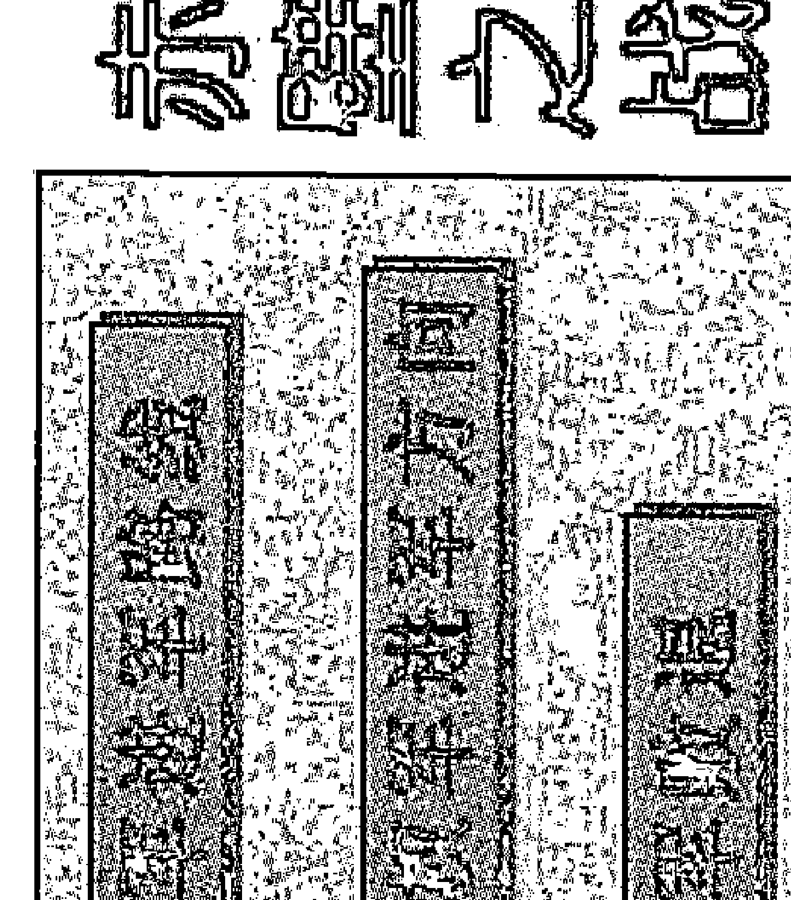

- ① 曹军进军路线：邺→野→长坂→江陵→乌林→赤壁
- ② 孙刘联军进攻方向：樊口→赤壁→乌林→江陵
- ③ 曹军败退：赤壁→华容→江陵→南郡→襄阳

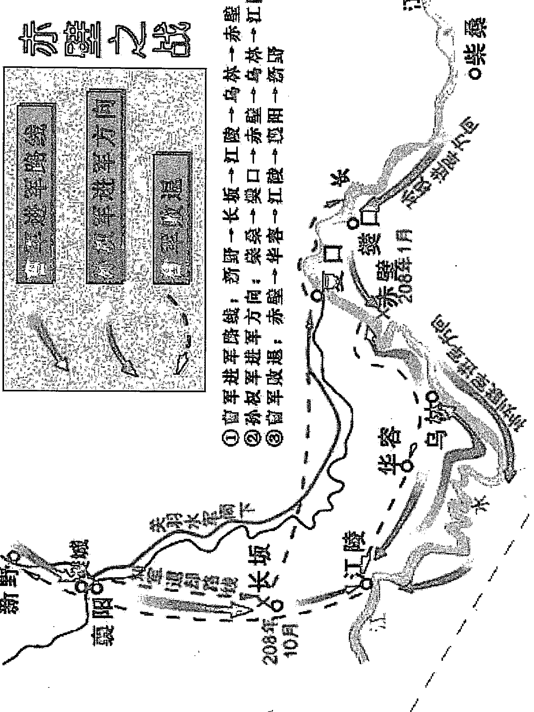

#### 二、悲情马其诺防线

1940年5月10日，一场可怕的战争猛然袭击荷兰、比利时、卢森堡和法国，向着部署在法国领土上的英国远征军，凶猛地扑了过来。第二次世界大战的法国战局由此拉开了序幕。巴黎陷落后，许多法国人仍然对战争报有很大的希望，因为他们寄希望于马其诺防线。

然而，这只是法国人美好的一厢情愿。6月13日，德军开始对马其诺防线发起全线进攻。15日清晨，法国北部边境的马其诺防线已被突破。到19日，整个马其诺防线全部被德军占领。50万法军如釜底游鱼，大部投降，只有极少数部队逃入瑞士境内。马其诺防线不可战胜的神话彻底破灭了。

德国军队于1940年5月10日5时45分对法国发起进攻。

庚辰年，辛巳月，癸丑日，乙卯时，阳遁4局。

甲寅旬 天英星为值符落3宫 景门为值使落1宫

|   | 天空登明满 | 白虎神后平 | 太常大吉定 |
|---|------------|------------|------------|
| 青龙河魁除 | 膛蛇 德国C集团军群<br>开门 第1、17集团军临<br>己天芮星（丙）膛蛇<br>禽巽四、戊虚张声势 | 太阴<br>休门<br>天柱星（辛）<br>离九、癸 | 六合 法国方位<br>生门<br>天心星（庚）<br>坤二、丙 |
| 勾陈从魁建 | 值符 德国B集团军<br>惊门 18、6集团军<br>天英星（癸）<br>震三、乙 | 中五、己 | 白虎<br>伤门 荷兰、比利时<br>天蓬星（丁）<br>兑七、辛阿登山森林 |
| 六合传送闭 | 九天 德国A集团军<br>死门 4、12、16集团军<br>天辅星（戊德国方位）<br>艮八、壬 | 九地<br>景门<br>天冲星（乙）<br>坎一、丁 | 玄武 卢森堡<br>杜门<br>天任星（壬）<br>乾心六、庚 |
|   | 朱雀小吉开 | 螣蛇胜光收 | 贵人太乙成 |

- 1. 《奇门宝鉴》断语；英符向东，得受生之利。而时干在坎，亦得生扶。且乙临九地之宫，乘九地之将，所谓藏身之固，盖得之矣。惜乎景使入坎受水之制，而反吟之格，亨通为难。又阴逢勾白（白虎），或有讼争之累。

兵事宫克门，宫生星，主客互有损益。西南太白人荧，又逢刑格，不能不战，严阵以待。密伏精锐于南。敌至尽发，邀其归路。出行宜出南方。

这段话的意思是说：在军事上，天英星值符为守方属火落3宫受震木所生，时干乙，为事体落1宫受水生。1宫临九地坚牢之神，适宜防守。但景门属火为值使也代表事体落1宫受水克，为门反吟利客不里主（不利于防守一方），吉利的程度减去一半。

- 2. 德国军队为进攻方以庚为代表符号落2宫，逢天心星落2宫为废地说明不占天时，逢生门为大吉，上乘六合为人多势众，庚落2宫为临官旺地说明自身力量强大，同时也说明准备充分，庚加丙为太白人萤，为客进利，说明适合发动战争。

- 3. 法国军队为守方以值符为代表符号落3宫，逢天英星说明占天时，是正义的防卫。逢惊门为凶门又克宫，说明处境艰难，国内一片惊慌之象。癸加乙为华盖逢星，贵人禄位，常人平安。门吉事吉，门凶事也凶。乙为禄位，说明阵地坚固，乙落1宫逢景门适合破阵，有能力对抗敌人的侵略。上乘九地为坚牢之神，乙加丁奇仪相随，百事可为。1宫又生3宫，说明法国的防卫能力很强。可惜1宫逢空亡，说明法国放松警惕，对德国的进攻估计不足。最为危险的是1宫的乙木合2宫的庚，这样一来就出现2宫、1宫与4宫的开门三合水局，战争格局即将发生重大变化。事实是，法军统帅部在制定作战计划时一致认为，其一德军不可能强攻正面坚固的法德边境上的马其诺防线（即从死门击生门）；二是在南格威到那慕尔之间的阿登山地森林，是兵家一向认为限制大兵团运动的地区，尤其对于装甲部队；其三，德军进攻方案不可能超出第二次世界大战的老路，把进攻的重点放在右翼，首先突入荷兰、比利时向西直抵海岸，然后一路扫荡，经平原侵入法国境内。基于这三点认识，法军在阿登山地森林只部署了一些战斗力很差的部队，将防御的重点放在了战线的北端（奇门局上就是坎1宫的位置，宫中逢景门上乘九地说明适宜埋伏重兵），即德军的右翼。但《奇门宝鉴》断语：乙临九地之宫，乘九地之将，所谓藏身之固，盖得之矣。惜乎景使入坎受水之制，而反吟之格，亨通为难。

- 4. 德国虽然居生门，但在地理方位上却居东北方向，虽然上乘九天适合发动战争，但 8 宫逢死门又逢空亡，说明地理位置极为不利。戊加壬为青龙入天牢，说明德国发动这场战争是铤而走险。而对冲之宫为法国逢生门为“五不击”之方，所以如果直取西南方显然不利。

但任何事情都是一分为二的，问题是战争的指导者如何驾御这场战争，如何发挥自己的主观能动性，变不利为有利，这是衡量一个战争指导者军事艺术是否高超、卓越的重要标准。而在这次对法战争中，希特勒就发挥出一个国家元首超群的睿智和卓越的指挥才能。他知道德国所处的地理位置十分不利，因此他采用了陆军第 35 军军长曼施坦因提出的大胆设想，让德军装甲摩托化部队通过茂密崎岖的阿登山地森林，绕过法国坚固设防的马其诺防线，从索姆河口对英法军队进行迂回奇袭。如果把法国作为守方的话，那么这个奇门遁甲局显示的就是整个法国马其诺防线的情况，西北方向为杜门上乘玄武应防偷袭，事实上这个西北方向的索姆河口为马其诺防线最为薄弱的突破口，所以德军统帅部决定选取索姆河口为突破口。

位于比利时境内的阿登山地森林，两千多年来为欧洲兵家必争之地。法军统帅部和整个欧洲都认为，这是一个充满恐怖的地方。但是，曼施坦因在认真请教德军装甲兵专家古德里安后认为，德军的装甲摩托化部队可以克服这一障碍。法国阵地的弱点位于马其诺防线的西北端，即马其诺工事与联军机动地段的接合部，如果德军的装甲摩托化部队能够从阿登山区直插索姆河口，就可以合围英法联军的精锐部队。这个计划得到希特勒的直接支持，陆军总司令布劳希奇和参谋总长哈尔德也同意将进攻重点转向阿登方向。

- 5. 这里就出现了一个问题，阿登山地森林位于比利时境内，从局上看就位于德国的西南方位，为坤 2 宫的位置，宫中生门上乘六合，也不利于直取。而荷兰又与比利时南北接壤，在局上就是正西方位兑 7 宫的位置，宫中伤门上乘白虎。换句话说，要到达阿登山地森林必须途经荷兰、比利时两个国家。因此，德国决定先将以上两个国家拿下。

- 6. 那么，如何才能将这两个国家拿下呢？这是需要动一番脑筋的。从地形图上看，由于比利时位于德国的西南面坤 2 宫方位，宫中逢生门为“五不击”之方。那么，只有从荷兰发起进攻最恰当。因为，荷兰位于德国的正西方向，局上就是兑 7 宫方位，宫中伤门上乘白虎，书云：伤宜捕猎终须获。而德国则落震 3 宫的方位，宫中逢值符，正为出击之方，非常利于发起进攻。这样一旦进入荷兰境内，就可以回兵向南进攻比利时，正应以上《御定奇门宝鉴》所云：出行宜出南方。更何况，比利时的北部与荷兰接壤的部分也位于德国的正西方位，也就是说其北部也落在兑 7 宫的位置。因此，德国制定了命名为“镰刀计划”的作战方案。其基本构思是：德军沿德荷、德比、德卢和德法边界依次展开 B、A、C 三个集团军群，以 141 个师（其中有 10 个装甲师）的兵力向法国实施全面进攻。具体部署是；博克大将指挥的 B 集团军群辖 18 和第 6 集团军，集结在北海至亚深一线，任务是进攻荷兰和比利时。伦德施泰大将指挥的 A 集团军群编成内有第 4、第 12、第 16 集团军和一个装甲集团军，准备从雷特根至德国、卢森堡和法国三国交界接壤处（因为是向西方出击，在局上也是兑 7 宫的位置）之间宽 170 公里的地带实施主要突击。勒布大将指挥的 C 集团军群编内有第 1 和第 7 集团军，任务是防守从法卢边界至巴塞尔的 350 公里地段，以积极的佯动迷惑法军统帅部，以便在马其诺防线和莱茵河一带牵制尽可能多的法国军队，并掩护突击集团的左翼。局上就是巽 4 宫的位置，也正符合东南巽 4 宫出现螣蛇的象意。

- 7. 7 宫虽然临伤门上乘白虎不为吉利。但宫中临太冲、太阴，说明有难能够逃避。事实是：5 月 24 日，被逼到敦刻尔克周围的 30 万英法联军，挤在一块很小的三角形地带，距海岸 110 公里。英法联军前有强敌，北靠大海，而又无力背水一战，眼看就要成为“瓮中之鳖”。正当德国要取得这次战役中最大一次胜利的关键时刻，希特勒突然下令坦克部队停止追击，这就给了被围的英法军队一次死里逃生的机会。这是希特勒自发动战争以来犯下的第一个后果严重的战略性错误，它使 30 多万英法军队绝处逢生，逃往英国。四年以后，正是这支逃往英国的军队，又从诺曼底登陆，成为最后埋葬希特勒的重要力量。

- 8. 让我们来看一下德国是如何向以上国家进行战斗的：5 月 10 日 5 时 45 分，德军第 18 集团军（从震 3 宫方位向兑 7 宫方向出击）从地面和空中向马斯河口实施主要突击，正是上乘值符宜对冲，于当日突破佩尔防线，迫使荷兰军队退守荷兰要塞。第 1 集团军占领海牙附近 3 个机场后向海牙继续进攻，并很快攻占马斯河大桥，从南面突入荷兰要塞，割裂了荷军的部署。南面虽有太阴，但逢休门又有神后为亭亭击白奸，非常有利于德国进攻。也正体现了《奇门宝鉴》关于：出行宜从南方的断语。5 月 12 日晚，荷兰女王及内阁大臣登上军舰逃往伦敦。14 日，荷兰军队宣布向德军投降。比利时的情况和荷兰差不多。也是 5 月 10 日 5 时 45 分，德军第 6 集团军对比利时发动了立体进攻，迅猛突破马斯河以西地区。在阿登山区（乾 6 宫位置），担任主攻任务的德军 A 集团军在德比边界粉碎了比利时边防部队的抵抗，迅速向前推进，于 12 日到达马斯河。这时，英法联军才如梦初醒：原来德军的作战目的最终是绕道法国南部的色当地区，并向索姆河口推进，然后从南面包围位于比利时境内的英法联军。5 月 27 日，比利时军队宣布向德国无条件投降。

6月13日下午5时，德军先头部队抵达巴黎北郊。随后德军B集团军群包围巴黎。随后，巴黎陷落。

6月13日，德军开始对马其诺防线发起全线进攻。从比利时境内的阿尔隆一带向法境进攻的德军几乎毫无阻挡。当晚，德军从左翼向凡尔登进袭，得手后向马其诺防线的背后迂回，力图形成对马其诺防线的分割包围。与此同时，德军另一路部队在萨尔布吕肯地区向马其诺防线正面发动攻势。经过两天战斗，德军占领了萨尔布吕肯地区前面的全部堡垒，突破了主要防线。6月15日，马其诺防线全部突破。6月17日，法国总理贝当元帅通过电台对法国人民发表讲话，宣布法国战败，向德国投降。

- 附图见下：
- 1. 1940年5月德军入侵法国的进攻路线示意图。
- 2. 荷兰、比利时、卢森堡地形图。

- 1. 1940年5月德军入侵法国的进攻路线示意图

##### ☆ 1940年5月，德军入侵法国的进攻路线及法军和英国远征军防御地带示意图。

比利时 布鲁塞尔 英国远征军

第34装甲军 第16装甲军 艾伯特运河 马斯特里赫特 埃本·埃马尔要塞 列日

比利时军队 滑铁卢 勒芬 尚皮永 那慕尔 沙特罗瓦 法国第1集团军

第15装甲军 第6装甲师 第7装甲师 第6、8装甲师 克莱斯特装甲集群 第41装甲军 第19装甲军

法国第9集团军 法国第2集团军 色当 蒙丹梅 罗克鲁瓦 伊尔松 马奇诺防线 圣芒热

卢森堡

5月14日上午德军的桥头堡 0 40公里

##### 2. 荷兰、比利时、卢森堡地形图

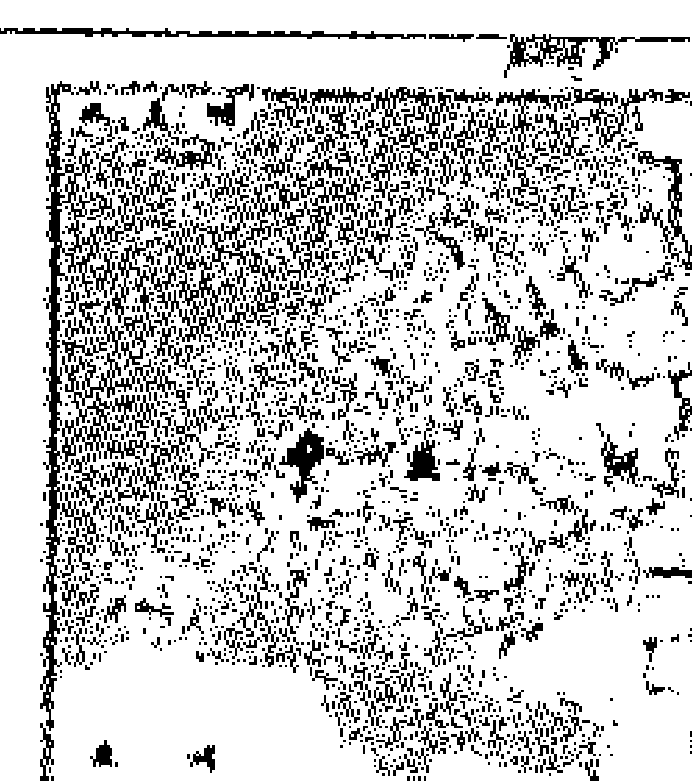

##### Sinomaps

##### 中国地图出版社

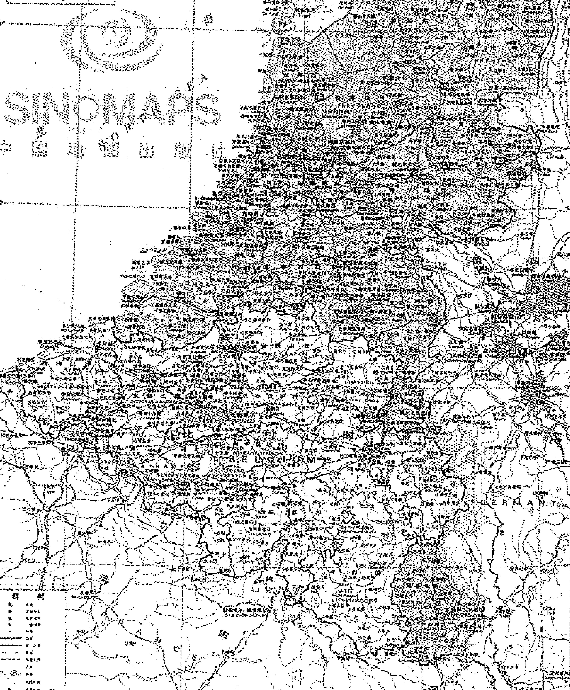

- 图例：
- 省界
- 国界
- 未定国界
- 地区界
- 铁路
- 公路
- 机场
- 港口
- 渡口
- 河流、湖泊
- 山峰
- 关隘
- 城市（含首都、省会、重要城市等）

#### 三、“狐”“鼠”争锋阿拉曼

作战时间：1942年10月至1943年1月

作战地点：埃及阿拉曼地区

参战兵力：德意非洲军拥有4个德国师、8个意大利师，总计10万人。英国第8集团军3个军（第10、第13和第30军）总兵力约19.5万人。

主要指挥官：蒙哥马利元帅，生于1887年11月17日，卒于1976年3月25日。隆美尔：德国陆军元帅，生于1891年11月15日，卒于1944年10月14日。

作战结果：德、意军共计死亡2万人，被俘3万人。英军第8集团军伤亡1.35万人。

战役意义：德、意军队在阿拉曼的失败，使德国和意大利丧失了非洲战场的主动权，宣告了轴心国企图占领北非、建立地中海帝国愿望的破灭。阿拉曼战役成为第二次世界大战非洲战场的转折点，从此，战场主动权完全转到盟军手中。

1942年，北部非洲刮起了隆美尔狂飙，他率领德意非洲军团，纵横驰骋，长驱直入，英军第8集团军败退数百公里，回缩到尼罗河的最后一个防御阵地——阿拉曼。照此发展下去，德国人征服埃及指日可待，英国在北非战场将失去立足之地。隆美尔则因其在沙漠地区所取得的辉煌战果，被冠称为“沙漠之狐”。

为了挽回败局，英国军事当局决定任命第1集团军司令蒙哥马利改任第8集团军司令。这是蒙哥马利一生中的重要转折，因为他凭借第8集团军打败了威震北非的“沙漠之狐”隆美尔。使他成为德意非洲军团惧怕的“沙漠之鼠”。

隆美尔是1941年来到北非战场的。广阔无垠的沙漠战场为他提供了用武之地。在一年多的时间里，他打了一个又一个胜仗，几乎把北非战场变成了德国人的一统天下。但是，随着武器、兵员物资补给的严重不足，到了1942年中，隆美尔的攻势开始减弱了。7月，德意非洲军团进攻英军阿拉曼防线失败，陷入僵局，隆美尔及德国最高统帅部已准备放弃进攻。然而，希特勒却不甘心，他命令隆美尔继续进攻尼罗河三角洲。在这种情况下，隆美尔只好执行希特勒的命令，决定再次进攻英军阿拉曼防线，突破苏伊士运河。

阿拉曼防线北濒地中海，向南延伸64公里至卡塔腊洼地的盐碱滩。由于该防线地势复杂，防守严密，没有装甲部队可迂回的开阔翼侧，无法从正面进攻。隆美尔遂决定以哈勒法山为突破口，在该地以东挥戈北上，再朝哈马姆方向进逼海岸。之后席卷英军阵地，击溃英军第8集团军。突破阿拉曼防线，前出至苏伊士运河地区，为夺取埃及铺平道路。

隆美尔准备以3个师的兵力对阿拉曼防线北部的英军第30军实施牵制性进攻，而以6个师的兵力，向防守战线最南端希迈马特的英军第13军实施主攻。该地段是英军防御的一个薄弱点，阵地前仅由雷区加以封锁。隆美尔的作战意图是，从南端突破英军防线，部分兵力向东推进32公里到达左侧的哈拉法山山脊，尔后迂回山脊，对英军主力实施包围与进攻。与此同时，部分兵力向北直插海岸，再向东突击，切断英军补给线，迫其原地抵抗，坐以待毙，或向西逃遁，放弃埃及。

对于隆美尔的计划和打算，英军蒙哥马利元帅了如指掌。原来，早在1939年，英国人就获得了德国最机密的密码机，并破译了该机所有的密码，可以轻而易举地了解德军电台传送的一切机密。因此，针对隆美尔的部署，蒙哥马利决定以重兵防守战线南端及哈拉法山地。英军防御兵力为8个师。北面由第9澳大利亚师重兵扼守特勒埃撒突出部，第1南非师把守第9澳大利亚师防区至鲁瓦伊撒特岭之间地区，第5印度旅据守鲁瓦伊撒特岭。英军44师和22装甲旅据守哈拉法山，第7装甲师配置在东南面隐蔽待命，一旦德军坦克企图突围，立即给予痛击。此外，英军还布置了6个相互连贯的布雷区，构成了坚固的炮兵阵地。

1942年8月30日10时，隆美尔的装甲部队开始向英军发起进攻。

> 壬午年，戊申月，乙卯日，丁亥时，阴遁4局。
甲申旬 天芮星为值符落7宫 死门为值使落8宫 月将为已

| 六合登明破 | 勾陈神后危 | 青龙大吉成 |
| :--- | :--- | :--- |
| 朱雀河魁执<br>六合<br>开门<br>天冲星（己）<br>巽四、 戊 | 太阴 卡塔拉洼地 空<br>休门 希迈马特东面32公里<br>天辅星(戊)为哈拉法山<br>离九、 壬 英军 13军 | 螣蛇 空<br>生门<br>天英星（壬）<br>坤二、 庚 |
| 螣蛇从魁定<br>白虎 苏伊士运河<br>惊门 地区<br>天任星（癸）<br>震三、 己 | 中五、 乙 | 值符<br>伤门<br>乙天芮星（庚）<br>禽兑七、 丁 |
| 贵人传送平<br>玄武<br>死门 值使门<br>天蓬星（辛）<br>艮八、 癸 | 九地<br>景门 地中海<br>天心星（丙）<br>坎一、 辛 英军 30 军 | 九天<br>杜门<br>天柱星（丁）<br>乾心六、 丙 |
| 天后小吉满 | 太阴胜光除 | 太乙玄武建 |

> 《御定奇门宝鉴》云：兑本金旺之乡，庚符临之，宜云得地。而丁奇先已得地，庚不敢复与争也。乙奇同行，日可以掩星光，乃亦制逢。乃虞渊既沉，长庚独曜矣。使反而乘玄武，虽宫门相比，正恐门诈衰竭，不免乐部胥原，降在皂隶耳。

兵事：门反奇格，不可行兵。西方兑地，乃四战冲击之地，亦不可驻军。宜从营南方，以就休息。远至60里、近10里外，乾坎二宫，皆伏探侦。置马弁递信、严刻漏、击刁斗，敌至无患。出行，秋月出东南，冬出正南。星门余气虽吉，惜不合奇，未为大利。

从以上奇门遁甲格局上，可以看出：庚为攻方代表德军、值符为守方代表英军均落7宫，似乎难分胜负。但天盘为客代表进攻方，地盘为主代表守方，那么庚为德军下临丁，丁为三奇贵人升殿代表英军，所以庚不敢与其争也。同时乙为甲之妹，乙合庚，庚被迷惑，难以与值符相争。丁又代表无线电技术、电台、密码技术，乙加丁为奇仪相随，天芮星为病星，在乙与丁的迷惑下，庚非出错不可。丁又为时干落6宫，逢杜门主技术，丁代表无线电技术，丙代表炮火，上乘九天代表尖端技术，杜门又代表保密。在这里正是代表无线电密码技术。庚面对的是英国的密码窃听技术。落乾6宫，说明密码技术来自西北方向，事实正是西北方向的英国一座别墅里。同时九天也代表飞机，丁加丙为火光，为轰炸机，说明进攻者还要遭到敌机的狂轰滥炸。还有天柱星为破军星，在这里代表破坏，逢丁、丙代表炸药，九天主圆，说明埋藏着地雷之类的火药。6宫有戌为丙火之库，说明埋藏着大量地雷。杀伤力很大。庚如向丁进攻，必然要落入杀伤力很大的地雷阵中。丁又为时干代表事体，天地盘均为火，天柱星代表推土机、装甲、坦克、炮车等破坏、杀伤性的物体，在这里理所当然代表装甲车和坦克，说明德、英双方要经过一场血与火的坦克大交战。丙为姐姐、丁为妹妹，丙火自然要助丁火，所以德军一旦进入英军阵地，必然要陷入英军飞机（宫中有九天）和地雷交织成的火海里。

值使门也代表事体落8宫，逢死门上乘玄武，谁为客谁不吉利。辛为客为天盘，癸水为地盘，天盘生地盘，为客必败。辛加癸为白虎入地牢，玄武代表失误，说明德军的决策失误。

从英军的兵力部署来看，北方临九地，南方逢太阴，均不利于德军发动进攻。因为书云：伏兵但向太阴位，九地潜藏可立营。说明南北两翼皆有英军埋伏。

8月24日晚10时，一轮苍白的月亮照耀着盖拉塔地波浪起伏的沙漠，隆美尔的装甲部队开始向英军的南线阵地迂回前进时，很快钻进英军的布雷区。当德军坦克部队通过英军的防御前沿时，只见英军士兵晃动着小型的手灯，将德军坦克带往自己布雷区的缺口。随后，德军的坦克部队便踏上征途，直向英军阵地开去。当德军的坦克进入英军的雷区时，德军工兵开始排雷。突然英军的轻重机枪、火炮和迫击炮一起开火。弹雨覆盖了在雷区的德军士兵，炮弹在德军坦克群中接连爆炸。

更为严重的事情发生了。凌晨2时，整个阵地被英军的照明弹照得通明透亮，英国空军开始了大规模的空袭。德国装甲军团的先头部队被死死地挤在布雷区里，成为飞机轰炸的目标。卡车、运兵车和坦克纷纷被炮弹和炸弹击中，燃起熊熊的烈火。火焰和伞兵部队的照明弹把整个战场照得如同白昼。

顿时；爆炸声、叫喊声和重机枪的哒哒声响成一片。显然，英军蒙哥马利元帅一直在等待着德军的到来。

一发迫击炮袭来，正在指挥作战的德国第21装甲师师长冯·俾斯将军身亡。几分钟后，一架英军战斗机轰炸了非洲军指挥官涅林的指挥车，摧毁了他的电台，他手下的许多军官被炸死。

当天下午，德国工兵冒着枪林弹雨，终于在布雷区打开一条通道。隆美尔决定继续进攻。

英军第22旅旅长罗伯茨准将在后来的回忆录中，真实描述了当时的作战情景：当德军的坦克部队冲过来时，我告诉部队，在敌人坦克进入1000米距离以前不允许射击，不久他们进入这个距离了，随后我们的坦克突然开火，激战随之而起。德军的75毫米坦克炮给我们造成很大伤亡，但敌人的坦克也遭到我们的重创，敌人停止了前进。但情况仍很严重，我们的防御阵地被打开了一个大缺口。我立即命令苏格兰骑兵第2团去堵这个缺口。这时敌人的坦克又出动了，我们的反坦克炮突然开火，敌人遭到重大伤亡。随后，炮兵向敌人开炮，德坦克部队终于败退下去了。

8月31日，英国空军又开始对完全暴露的德军进行猛烈的轰炸。大地上，到处是战火，到处是燃烧的坦克。英军的大炮也发出怒吼，把炮弹准确地倾泻到德军混乱不堪的阵地上。

9月1日拂晓，德军第15装甲师企图包围英军第22装甲旅，遭到遏制，被迫退却。下午重新发起攻击，再次被隐蔽在工事内的英军第10装甲师击败。

蒙哥马利元帅集中兵力紧缩包围圈。天黑前，德军曾三次试图突围，均未成功。

持续激战到9月2日上午，德军损失惨重，未能前进一步。

隆美尔只好放弃进攻，于夜间命令装甲部队撤至8月30日以前的出发阵地。与此同时，英军蒙哥马利元帅也下令停止战斗。德、英两国第一次在阿拉曼地区进行的战斗结束了。

阿拉姆哈勒法战斗，是蒙哥马利来到非洲后指挥的第一个胜仗。这一胜利，犹如一针兴奋剂，使英军第8集团军士气空前高涨。

通过“超级机密”和各种侦察手段，蒙哥马利对隆美尔的防御部署一清二楚。但是隆美尔所建立的防线，是一种由工事和爆炸性障碍物组成的防线，在沙漠作战的历史上，还没有人遇到过这种防线，如何才能突破这种防线呢？蒙哥马利经过认真思考，决定分三路同时出击；

第30军在北面担负主攻任务，负责突破德、意军防线中央以北防御，在雷区打通两条通路，一条通往腰子岭，一条越过迈泰尔亚岭。之后，第10军的装甲部队通过通路，在战线另一边的开阔地带占据阵地，迎战德军装甲部队的反击，

第13军在南面实施佯攻，诱使隆美尔相信英军主攻方向在南面，将德军的大量装甲部队牵制在那里。

在牵制德军装甲兵的同时，第8集团军首先对其步兵实施粉碎性打击，然后再以密集装甲群奋力追击德国非洲军的残余部队，并将其彻底消灭。蒙哥马利将这一作战称为“粉碎性作战”。

为保障战役成功，蒙哥马利的进攻计划以两项内容作为基础：诈敌计划和作战计划。首先，对轴心国军队实施欺骗战术，使之相信英军的主攻方向在南部，然后运用强大的火力优势，对北部防线实施大规模进攻。

在英军阵地前沿地区，德军看到了许多处巨大的弹药和其他作战物资堆集所。但是，这都是英军制定的假目标。

许多车辆在英军阵地频频调动，它们都是用假车辆假扮坦克和其他车辆。但在夜间，真的作战车辆把那些已经在位的假作战车辆替换下来，并用被称为“遮阳板” 的伪装物把战斗岗位上的火炮和坦克掩蔽起来。

这些措施，彻底把德军蒙蔽了。直到战斗打响的23日黄昏之前，德军的隆美尔元帅还在日记中写道：“23日那天过得像阿拉曼前线上的任何一天一样。”

1942年10月23日21点40分，大地发出一阵剧烈的颤抖，英军阵地上的1000多门大炮，同时向德军炮兵阵地、堑壕、碉堡、地雷场轰击，铺天盖地的炸弹，冰雹似地砸向敌军。

1942年10月23日10时，英军蒙哥马利元帅下令向德军发起进攻。

壬午年，壬戌月，己酉日，乙亥时，阴遁6局。

甲戌旬  天禽星为值符落7宫  死门为值使落4宫  月将为辰

|  | 朱雀河魁破 | 六合登明危 | 勾陈神后成 |  |
| --- | --- | --- | --- | --- |
| 螣蛇从魁执 | 六合 天盘辛为进攻死门 者为英军落3天冲星(辛) 宫入墓巽四、庚 逢死气门 | 太阴 庚为进攻者为英惊门 军下临丁为旺地天辅星 (庚英军)离九、 丁 | 螣蛇 空开门 开门落2宫虽空天英星 (丁德军)坤二、壬但戌月旺相 | 青龙大吉收 |
| 贵人传送定 | 白虎 英30军负责德意景门 防线中央以北是攻天任星(丙) 击值符震三、辛 之为大忌 | 中五、己 | 值符 逢空但天芮休门 逢戌月旺相,德军己天芮星 (壬) 方位禽兑七、 乙 空 | 天空功曹开 |
| 天后小吉平 | 玄武 英军主力为东北方进攻生门天蓬星(癸) 也为大艮八、丙 忌之方 | 九地时干乙木为客虽克戊伤门但乙在6宫,为入戊墓天心星(戊)戊土虽入墓坎一、癸 但戌月当令 | 九天 此方为德军阵地生门 临生门上乘九天天柱星(乙)所以不怕乾心六、戊 英军进攻 | 白虎太冲闭 |
|  | 太阴胜光满 | 玄武太乙除 | 太常天罡建 |  |

《御定奇门宝鉴》对该奇门局的解释是：兵事星生宫，宫克门，利为主。安营于正北，设伏于正南。待敌先动，未戌月出西北，申酉月出西南，以参将为先锋，背西击东，可以制胜。出行宜出西北、西南二方。

为什么要这么布阵？因为天盘为天禽星落7宫为星生宫，天盘生地盘，为客生主，所以适宜为主，对进攻者不利。北方坎宫临九地，“九地潜藏可立营”，南方离宫临太阴，“伏兵但向太阴位”。所以，书云：安营于正北，设伏于正南。如果敌人先动，未戌月土旺，从西北发起攻击，因西北6宫逢生门上乘九天，是最佳出击方向。申酉月出西南，因西南坤2宫逢开门，申酉月金旺，开门属金，从西南向东北出击为开门击杜门，再看值符落7宫，因为天禽星是跟随天芮转到7宫，因此可作为参将来看待。所以书云：以参将为先锋从7宫向3宫出击，可以制胜。因为西南坤2宫临开门、西北乾6宫临生门，所以这两个方向都是最佳出击方向。

现在看一下格局中德、英双方的情况，由此就不难判断出谁胜谁败来了：首先死门为值使代表事体落 4 宫，辛加庚白虎猖狂，逢死门说明要进行一场血战。上乘六合为大战。天地盘均属金，比和，似乎难分胜负。但天盘辛为客代表英军，落 4 宫为入辰墓，庚为主代表德军落 4 宫为长生旺地。显然对英军这个进攻者不利。

时干乙木为事体落 6 宫，乙在天盘为客为进攻方克地盘戊，但乙落 6 宫为入墓，戊落 6 宫虽入墓，但戌月土旺。显然对英军也不利。

再以庚为进攻方落 9 宫，下临丁为受克，9 宫是丁火的本家，为得地，对庚则大为不利，是冲进火网里了。丁为德军落 2 宫逢开门为得地，上乘螣蛇主善于应变，也说明德国指挥员应变能力强。值符守方代表德军落 7 宫，逢休门，恰恰大军就位于西方，这个位置为“五不击之方”，而英军从东方过来是震 3 宫的位置，宫中景门上乘白虎主凶，也说明英军要遭到重创。

再看德军所处的方位，均位于南、北太阴、九地之方，所以都不利于英军进攻。而现在隆美尔已退回出发前的位置，就是西北方位，局上就是乾 6 宫，宫中逢生门上乘九天，英军是很难攻破德军阵地的。当然，德军也在南方阵地布置了许多兵力，这也完全符合以上奇门遁甲局的情况。

英军的主力部队第 30 军位于战区的东北方位，局上就是艮 8 宫，宫中杜门上乘玄武，说明这个地方适合偷袭，宫中又有天蓬大盗之星，说明蒙哥马利选择这里做突破口正确。但临杜门，说明道路堵塞，前进困难。而德军位于西南坤宫，逢开门乘螣蛇，说明虽有空虚的一面，但毕竟逢开门，同时螣蛇在这里逢开门就代表善于应变。又有神后，为亭亭击白奸，所以英军要突破德军防线是很难的。

再看英军进攻的路线，由英 30 军在战线北部发起，其攻击的方向是由东击西，局上就是由兑宫击 3 宫的值符之方，为“五不击之方”，目标是打通腰子岭和迈泰尔亚岭。也就是后面所说的南通路、北通路。但并非易事。蒙哥马利把主战场选在北方坎 1 宫方位进行，实际错了，北方 1 宫临九地，说明德军有重兵，逢伤门落 1 宫为宫生门，利主，利于德军。所以战斗打响不久，德军就把南面阵地的装甲部队大量调往北方阵地参战。说明蒙哥马利的欺骗战术很快被隆美尔识破了。战斗打成胶着状态，对英军极为不利。

事实上，这场战斗的进程是：22时，英军第30军在战线北部开始进攻。与此同时，另一部英军在南部发起攻击，牵制德军主要装甲部队。冲在第30军前面的是工兵第3连连长穆尔带领的工兵部队，他们的任务是为进攻部队打开一条通道。刚刚接近地雷场，英军工兵部队就被德军发现了。机枪子弹哗哗地射了过来。在火力和烟雾中，英军部队紧张地排雷，这时德军从惊慌中镇静了下来，重新组织起火力向英军射击。越来越多的炮弹落在英军工兵的作业区。因为到处是地雷，英军无法展开部队，部队伤亡越来越大，向前推进的速度也越来越慢。到凌晨5时30分，第30军一半部队已达预定目标，两条重要的雷区通路均已打通（临玄武、天蓬适宜偷袭）。30军各师和第10军所属第1、第10装甲师尾随步兵之后，分别进入北通路和南通路。但是由于雷区纵深大，英军先头步兵部队和坦克在通路遭到越来越猛烈的炮火袭击，处于进退两难的境地（就是因为艮宫临杜门之故）。

24日下午，苏格兰步兵师和第1装甲师重新组织进攻，杀开通路冲过雷区，新西兰师的第9装甲旅也越过了迈泰尔亚岭。这又进一步说明了临玄武之方宜偷袭成功。

但在其南侧进攻的英军第10装甲师遭到德、意军的顽强阻击，直到次日清晨仍无法推进。英军坦克被迫停留在迈泰尔亚岭。这也说明艮宫临杜门有受阻的一面。

第13军在南面的助攻也不顺利，未能通过德军的布雷区，被迫停滞于德军主阵地前。为保存实力，蒙哥马利命令南部放弃进攻，北部仍按计划继续强攻。

在三天激战中，英军损失较大，6000人伤亡，坦克被击毁300辆。如果照此发展下去，要不了多久英军就将丧失攻势。

这种战况的出现，已经在上面的奇门遁甲格局中得到充分的体现。

为此，蒙哥马利决定在27日至28日，暂停大规模的进攻，重新调整部署：第30军和第10军进行休整，增补人员和装备，将南线第7装甲师调往北部战线，准备同澳大利亚师共同沿海岸公路一线发动决定性进攻；腰子岭和迈泰尔亚岭转入防御，由第 13 军防守；新西兰师改作预备队。

隆美尔确信蒙哥马利将进行大规模突破的尝试，而且进攻的主要方向在北部。据此，他决定将更多的德军从南部地段调往北面。仅把意大利部队和不能打仗的德军留在南边。就在当天下午，隆美尔看到一张缴获的英军地图，证实了他的判断是正确的。

晚上 10 点，震撼大地的火炮轰鸣声响起，英军又一次发起了大规模进攻。经过整整一个晚上的厮杀，英军的进攻被德军阻挡住了。之所以出现这种战况，从奇门遁甲的角度看，全凭坎 1 宫临九地之功！

英军再次进攻失利，使战场形势发生了一些新的变化。在这种情况下，蒙哥马利不得不重新考虑他的战略。经过 5 天的战斗，英军尽管突破了德军的前沿阵地，但是也付出了昂贵的代价，英军伤亡近万人，坦克和车辆也损失累累。他决定改变计划，实施大面积的机动，重新部署，建立一支强大的预备队，以实施猛烈的最后打击。于是，蒙哥马利下令第一装甲师撤出战斗，重新编组，第 30 军也暂时撤出战场，将这次战役打响后尚未参加战斗的南非师和第 4 印度师从侧翼调到右边，替下精锐部队新西兰师，让他们做短暂休整。他从一份情报中得知：隆美尔的全部精锐部队已投入北面地段，而且还表明隆美尔现在手头没有德军预备队了。在战斗打响前，蒙哥马利就说过：德国部队和意大利部队是交错配置在一起，如果能够把他们分开，那么突破纯由意大利部队构成的正面就不成问题了。现在看来，德军和意军完全分开配置了。这种情况的出现，为集中力量攻击战斗力较弱的意军提供了绝好的机会。为此，蒙哥马利决定：澳大利亚师在 10 月 30 日夜至 31 日凌晨之前向北猛攻，到达海边，把德、意军的注意力引向北面。然后在 10 月 31 日夜到 11 月 1 日凌晨前，在北通路北面，以新西兰师为主，在第 9 装甲旅和 2 个步兵旅增援下，向意大利军队发起强大攻势，打开一个深远缺口。之后，第 10 装甲军通过缺口，迫使德意军队在开阔地带决战。

1942 年 11 月 2 日凌晨 1 时整，英军在阿拉曼的总攻开始。

壬午年，壬戌月，己未日，乙丑时，阴遁 2 局。
甲子旬 天芮星为值符落 3 宫 死门为值使落 1 宫 月将为卯

|  | 朱雀小吉定 | 六合传送执 | 勾陈从魁破 |  |
| --- | --- | --- | --- | --- |
| 螣蛇胜光平 | 九天 休门天柱星 (壬)巽四、 丙 | 九地 10 月 30 日夜生门 至 31 日凌晨澳天心星(癸)大利亚师离九、庚 向北猛攻 | 玄武 地盘癸虽生乙木伤门 说明利客但乙在天蓬星 (己) 6宫入墓坤二、 戊 又空亡 | 青龙河魁危 |
| 贵人太乙满 | 值符 新西兰师由东开门 向西进攻打开丁天芮星(戊)突破口禽震三、 乙 德军 | 中五、 丁第 10 装甲军通过突破口 | 白虎 隆美尔在 6宫杜门 逢合利于逃遁天任星 (辛)兑七、 壬 | 天空登明成 |
| 天后天罡除 | 蛇惊门天英星 (庚英军)艮八、 辛 | 太阴死门 值使门天辅星 (丙)坎一、 己 | 六合隆美尔在西北方向景门 地盘癸水为主落天冲星(乙时干)亥为乾六、 癸 旺不空 | 白虎神后收 |
|  | 太阴太冲建 | 玄武功曹闭 | 太常大吉开 |  |

根据这个格局，我们首先看庚与值符的关系：庚为进攻方落 8 宫为入墓，天英星落 8 宫生宫，说明天时有利，时机选择得正确。但逢惊门上乘螣蛇，就说明慌乱、惊恐，天罡星逢吉日吉时说明容易出现麻烦。庚加辛白虎猖狂，说明麻烦更大。什么麻烦呢？首先看对冲之宫，因为对冲之宫往往是本宫信息的补充，对宫伤门上乘玄武，伤门代表搏斗，上乘玄武又临天蓬星，说明作战中要出现混乱，要遭受大的损失。而值符代表守方落 3 宫，克 8 宫，逢开门又是丁加乙吉格，六壬穿甲又穿进贵人，说明德军仍处于有利地位。但从地形图上可以看出：此时，隆美尔的主力部队特别是德军部队已经大部调往北部战场，局上就是坎 1 宫，宫中死门上乘太阴，显然不吉。六壬穿甲也显示 1 宫临玄武、12 建神闭，就更加不吉。尽管天盘丙为客生地盘己，但德军所处之地为死门就非常不妙。太阴虽为吉神，但逢死门乘太阴就不好了。而蒙哥马利首先下令澳大利亚师从南向北猛攻直至海边，在局上就是从离 9 宫向坎 1 宫方向发起攻击。也就是从生门击死门，显然这个攻击方向是非常正确的。而随后他又下令新西兰师从东往西向意大利军队发起强大攻势，从局上看，就是从震 3 宫向兑 7 宫进攻，是从值符之方发起攻击，显然也是最佳攻击位置。因此从这个局上，阿拉曼决战的胜负基本已见分晓了。

但从整个战区情况看，此时德军大部处在北方，如果战败只能向西北退却，也就是马特鲁方向。因为这是他的出发地，也是惟一的退路。因此，从此时的奇门遁甲局上看，马特鲁就位于乾6宫方位，宫中景门非常吉利，向这个方位退却很正确。从后来的战斗发展情况看，隆美尔在基本没有遭受损失的情况下，后撤了1100公里。就是因为他向西北方向的6宫撤退，宫中景门上乘六合，就更加利于撤退、转移、逃亡。书云；若逢六合利逃形，就是指的这种情况。6宫虽逢空亡，但在戊月土旺，不为真空。再看天盘乙为客、地盘癸为主，地盘虽生天盘，但乙落6宫为墓库之地，而癸落6宫为帝旺，说明得地得势。同时，乙加癸为乙奇入地网，说明为客不利。

再结合8宫中庚为进攻方入丑墓，宫中惊门上乘螣蛇，又是庚加辛白虎猖狂，以及对冲之宫出现的伤门上乘玄武等情况来看，还有值符落宫克庚落宫来看，英军虽能取胜，但作战结果也不会太理想。

下面看一下战斗进程，看一看隆美尔这个“沙漠之狐”是如何逃出蒙哥马利为他设下的“猎狐之网”的：30日夜，澳大利亚师按照计划发起进攻，他们在向海岸的进击中，遭到德军的顽强抵抗，进展困难。未能一直攻到海边，但在德、意军队的凶猛反突击中，他们守住了阵地，并夺得了许多阵地，俘获500名俘虏。

在此期间，英军加紧增压作战计划的准备工作。并于11月2日凌晨1时发起总攻。到凌晨5点，隆美尔驱车到前沿阵地，他得到报告说：凌晨1点，英军的坦克群和步兵在1000米宽的战线上突破了最重要的28号高地西面的防御工事，此刻正长驱直入，通过雷区，企图打开一条通道。血战正在激烈进行中。

11月2日一整天，英军整队的轰炸机对28号高地以西的德军残余防线进行了7次轰炸。英军的强大攻势使德国人惊慌万状，更令他们害怕的是英军使用了数百辆德国人曾未见过的美国谢尔曼M-4式坦克。这种坦克远比德军坦克厉害，它可以在1000米以外的距离上开火，而德国的88毫米高射炮几乎连它的装甲都无法穿透。看到德军在节节败退，隆美尔决定撤出战斗。尽管希特勒一再命令他坚决顶住，但隆美尔为了保住其有生力量，还是坚决地带领部队撤退。

在整个战役筹划中，蒙哥马利元帅把关注的焦点放在如何击败隆美尔上，但对于取胜后如何办就没有认真考虑。英国人罗纳德、卢因曾经指出：追击的最关键时刻是 11 月 4 日的白天和夜晚。在这段时间里，敌人是不可能跑掉的。但蒙哥马利却没有抓住机会。正像隆美尔在他进攻的头几个小时内就输掉了哈拉法山一样，蒙哥马利在他获胜后的头 24 小时内就扔掉了他的全部胜利果实。这就是因为庚落艮宫而对冲之宫所出现玄武之故。

当日，蒙哥马利给第 10 军和新西兰师的任务是：以第 4 轻装甲旅和第 9 装甲旅为先导，步兵第 5 旅和第 6 旅在其后，向西横过沙漠，然后向北转弯直奔富凯，第 1 装甲师向泰乐阿卡基尔西北面的埃尔哈拉什挺进；第 7 装甲师的前进目标是加扎勒。然后，第 1 装甲师在第 10 装甲师的跟随下沿着一条与海岸线平行的路线前进到富凯。这是一个大规模的向北包抄的追击计划，如果能够按照这一计划快速行动，完全可以切断隆美尔的退路。

但是，由于准备不充分和缺乏必要的组织，追击部队的行动十分缓慢。英军的缓慢行动，使“沙漠之狐”得以冲出“猎狐之网”。

隆美尔之所以能够安全地撤出英国等盟军的包围圈，从奇门遁甲学的角度看，最根本的就是他走的是乾 6 宫方位，宫中的景门上乘六合，是他安全撤退的最佳吉神。从地形图上看，隆美尔把南线主力部队向北调，是错误的，但撤退时选择向西北景门撤退则是完全正确的。当然此时景门落 6 宫克宫、入墓、空亡，景门又代表炮火，炮火入墓、空亡了，不就说明战争的硝烟散了，远离追击之敌了，也就安全了吗！更令人称奇的是，21 日，当他到达阿杰达比亚时，全部燃料已经耗尽，英国的追兵也在步步进逼。就在万分危机时刻，只见附近海岸边漂浮着成千上万的箱子和油桶。原来，这正是遭到英军袭击的德军油船上的货物。命运之神将它们送到隆美尔奄奄待毙的军队的脚下。靠着这些天赐的油料，这只“沙漠之狐”安然无恙地撤出阿杰达比亚。

下图为：阿拉曼战役示意图。

- 斜线阴影：德意志集团军部队
- 密斜线阴影：德意志集团军步兵部队
- 双虚线：德意志集团军防区
- 带箭头的虚线：集团军各部队的主进攻方向
- 带点划线：第8集团军布雷区的西部边界
- 带点虚线：第8集团军的作战边界

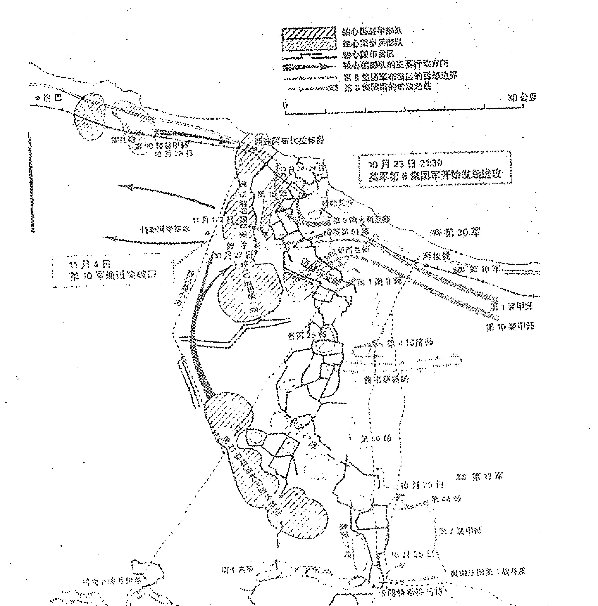

10月23日21:30 英军第8集团军开始进攻

11月4日 第10军通过突破口

#### 四、英美联军诺曼底登陆战役

诺曼底登陆战役，是第二次世界大战后期，美英联军在法国西北部的诺曼底半岛对德军实施的一次大规模登陆战役。1944年6月6日开始登陆，7月24日建立登陆场。7月25日开始转入进攻，8月26日占领巴黎及塞纳河沿线。这次战役的胜利，对于美英联军在西欧开辟第二战场具有决定性的意义。

这场战役的背景是，1944年初，德军在东线开始全线溃退，苏军的反攻矛头已经指向柏林。于是美英决定由艾森豪威尔为战役司令官，具体组织登陆战役。

美英联军参战兵力为39个师、10个装甲旅、10个突击队。作战飞机12837架，大小舰只5000余艘。

德军参战兵力为60个师，各种舰只330余艘，飞机500架。

登陆作战最怕两个环节，一个是在航渡时被对方歼灭于海上，另一个是在抢滩上陆时，被对方歼灭于水际滩头。因此，联军参谋长摩根中将奉命选择登陆地点。根据其登陆地点必须具备能得到英国机场起飞的战斗机掩护、航渡距离尽量要短和附近要有大型港口等三个条件的要求来衡量，登陆地域选择范围确定在从荷兰的弗利辛恩到法国的瑟堡之间的480公里的海岸线上。最后选出两个地带：一处是法国多佛尔海峡沿岸从敦刻尔克到索姆河口之间的加莱地区，另一处是冈城与科唐坦半岛之间塞纳湾沿岸的科唐坦半岛地区。经过反复比较，最后联军总部选定在诺曼底地区，在这里登陆的好处是：德军防守较弱，海滩情况虽然对登陆不太理想，但还可以使用，而且有科唐坦半岛作屏障，可以阻挡大西洋上刮来的西风；这里沿海地势开阔，可同时展开26至30个师的兵力。此外诺曼底距英国西南海岸的各大港口较近。虽然这里同样缺少优良港口，但登陆后不久就可夺取科唐坦半岛北部的良港——瑟堡港。而加莱地区最大的优点是距离英国海岸最近，同时盟国空军还能进行最大限度的支援，不利条件是该地区距英国港口较远，运送人员和物资不便。同时，这里又是德军的重点设防区。还有，这一地区缺乏内陆通道，不易向纵深发展。

1月21日上午10时，联军统帅部决定部队集中在冈城和卡朗坦之间登陆。第一梯队5个师，空降兵3个师。登陆正面为80公里，即从科唐坦半岛东南到奥恩河口，登陆地段分为5个，自西至东。其代号分别为犹他、奥马哈、哥尔德、朱诺、斯沃德。前两个为美军登陆海滩，后三个为英、加部队的上陆地段。

为达到出其不意的效果，让德军误以为联军是在加莱地区，而不是在诺曼底。必须采取欺骗战术。那么，要想让德军相信联军在加莱地区登陆，就必须在加莱地区对岸集结重兵。为此，联军在加莱地区对岸组建了一个假设的“美军第1集团军群”，实际只有少数无线电收发报工作人员。同时选派德国人惧怕的巴顿将军任这个集团军司令，让他频频露面。再就是让一个酷像蒙哥马利的人假扮蒙哥马利，到直布罗陀和阿尔及尔编组英美联军，准备进攻法国的加莱地区。然后又进行了两场假戏：一个是进行虚假的轰炸和空投。为隐蔽在诺曼底地区登陆的真实意图，故意对德军沿岸其他地区的雷达进行猛烈的轰炸。再就是进行模拟登陆和空降。特别使用一个特工队，在着陆后打开扩音器，播放已录好的大炮声、士兵喊杀声、呼救声和倒地声，同时施放一种化学药剂，产生薄薄的烟雾，制造战场气氛。

在这次战役中，首先踏上诺曼底这块具有历史意义土地的人，是8名负责组织空投假伞兵的盟军人员，他们拉开了战役的帷幕。

空投假伞兵的行动，代号为“泰坦”行动。其任务是要在驻有德军的地区把假伞兵投下去，给敌人造成“到处有盟军部队”的错觉，使其陷于盲目搜索之中。从而掩护真正的空降部队顺利着陆并建立起空降场。

这8名首先着陆的空降兵着陆后，播放事先录制的火炮声，士兵的叫骂声和指挥官的叫喊声，足有半个小时。德军被盟军这些把戏搞得丈二和尚摸不着头脑，他们不知道究竟有多少空降兵在法国着陆。随后盟军空降兵开始了大规模的空降。

1942年6月4日23时，艾森豪威尔下令所有舰艇出航，向诺曼底方向进发：

##### 甲申年，己巳月，庚子日，丙子时，阳遁2局。

##### 甲戌旬 天冲星为值符落9宫 伤门为值使落5宫 月将为申

| 天空大吉执 | 白虎功曹破 | 太常太冲危 |
| :--- | :--- | :--- |
| 青龙神后定<br>九天<br>休门<br>天任星（丁）<br>巽四、庚 | 值符<br>生门<br>天冲星（己）<br>离九、丙 | 螣蛇<br>伤门<br>天辅星（庚）<br>坤二、戊 空<br>玄武天罡成 |
| 勾陈登明平<br>九地<br>开门<br>天蓬星（乙）<br>震三、己 | 中五、辛 | 太阴<br>杜门<br>天英星（丙）<br>兑七、癸 空<br>太阴太乙收 |
| 六合河魁满<br>玄武<br>惊门<br>天心星（壬）<br>艮八、丁 | 白虎<br>死门<br>天柱星（癸）<br>坎一、乙 | 六合<br>景门<br>辛天芮星（戊）<br>禽乾六、壬<br>天后胜光开 |
| 朱雀从魁除 | 螣蛇传送建 | 贵人小吉闭 |

从这个奇门遁甲局和世界地形图上看，美英联军选择的加莱地区位于法国的正北方向，在局上就是坎1宫的位置，宫中死门上乘白虎，很不适宜登陆。而诺曼底地区位于法国的西北方向，宫中景门上乘六合，而英国的英吉利海峡就位于诺曼底的西北方位，但如果从英吉利海峡向诺曼底进发就是向东南方位，东南4宫临九天之神，为“五不击”之方，也很不适宜登陆。

再看这场战斗是登陆作战，当然要看坎1宫的情况，而联军部队是从英吉利海峡的北岸向南岸进发，更要看坎1宫的格局。现在坎1宫逢死门上乘白虎，又是癸加乙乙奇入地网，说明对联军极为不利。更重要的是进攻的方位位于离9宫，宫中生门上乘值符，为典型的“五不击”之方，非常不利于美英联军登陆作战。

但必须强调的是，这场登陆作战是在空军大量作战飞机的配合下进行的，更要说明的是美英联军投入了大量航空兵师着陆。因此就要特别重视九天这个用神，因为九天代表飞机。现在看，九天落4宫，丁落4宫说明是战斗机，下临庚为进攻方。临休门代表水，说明是空军配合陆军渡海作战。休门落4宫为门生宫，说明陆海空三军配合作战顺利。4宫克2宫，说明作战能够成功。事实是，联军出动了3个航空兵师在诺曼底地区登陆，这就是美第82、101空降师和英第6空降师组成的突击梯队17000人，分乘1200架运输机，在登陆地段的浅近纵深进行了伞降。在空降过程中，虽然遭到德军的顽强抵抗，但都基本完成了预定任务，对保障从海上登陆起到了重要作用。特别是英军第6空降师行动比较顺利，空降着陆后很快加强了对奥恩河上桥头堡的防御并攻占了附近德军的海岸炮兵阵地，从而有效地保障了英军登陆部队的左翼安全。

因此，从整体看，美英联军是能够顺利到达滩头阵地的，但能否全面进入诺曼底地区，胜利登陆，还要看整个战区的兵力部署情况，看各路部队具体的作战方位落何宫。

因为登陆地点选在诺曼底地区，那么，此时的奇门遁甲局显示的就是整个诺曼底地区的情况。从整个奇门局上看，虽然美英联军从北面向南面进攻处于不利的态势，但联军是从西向东分成5个地段发起登陆战役的，因此我们就应该分别看3宫、5宫、7宫的情况。

这样，从地形图上看，“犹他滩”位于兑7宫，宫中杜门上乘太阴，说明德军有埋伏，但7宫逢空亡，说明埋伏的兵力不多。“奥马哈”位于中间地段，在局上就是中5宫的位置。根据中5宫寄坤2宫的原理，此时落乾6宫，宫中景门上乘六合，戊加壬为青龙入天牢，辛加壬为白虎入天牢，均说明战斗非常惨烈。而在东线登陆的部队就顺利多了，那是英国第2集团军司令邓普中将指挥的3个师，分别在三段海滩登陆，分别是“哥尔德”、“朱诺”、“斯沃德”海滩。因为他们的方位居震3宫，宫中虽上乘九地但逢生门，为最佳攻击方位。

战斗的过程是：美第7军在乔·柯林斯军长的指挥下，向“犹他滩”突击。防守“犹他滩”的，是德军第709步兵师的一个团。这个团以德国预备队军人为骨干，由搜罗来的外籍志愿兵组成。空投到“犹他滩”背后的美军伞兵，切断了该团的退路。看到联军部队冲上岸滩，他们只抵抗了一会就举手投降了。当天傍晚，美军23000人登上“犹他滩”。

而位于“奥马哈滩”的美第5军，就遭到德军的顽强抵抗。因为，从地形图上看，“奥马哈滩”位于奇门局上的中5宫，根据中5宫寄坤2宫的原理，此时转到乾6宫。宫中景门上乘六合本为吉利之象。但景门落6宫为入墓，同时景门落6宫为门克宫，六合为兵力多，说明德军在这里伏有重兵。辛加壬为白虎入天网、戊加壬为青龙入天牢，说明战斗非常惨烈。

事实上，在美第5军在“奥马哈滩”登陆后，遭到德军猛烈的炮火袭击，美军无法藏身，被死死地压制在滩头上。伤亡很大，美国官兵的鲜血染红了海滩。一直持续6个小时，美军才前进了10米左右。为了夺取这块地方，美军伤亡了2500多人。原来，德军部署在这里的兵力只有一个团，后来又增派第352摩步师来加强防线。这样，美军在“奥马哈滩”所面临的敌人，实际上是一个师加一个团。德军巧妙地利用“奥马哈滩”的有利地形，构筑了多层次的防御工事。水下布设了三道钢铁或水泥障碍物，上面又挂有水雷。低潮时，海滩宽200多米，无任何可借以藏身的隐蔽物。接着海滩，是一道低矮的防波堤，再往后是沙丘和陡壁，有5条把陡壁割裂开的宽大壕沟，是通向内地纵深的必经之路。陡壁前的沙丘间及海滩上，遍设地雷。德军把炮位和火力点隐蔽地设置在陡壁上，既可以控制5条通向内地的壕沟，又可居高临下控制整个海滩。“奥马哈滩”成了为美军准备的可怕的地狱。这种布局，充分显示出景门在6宫入火库的可怕状态。而辛加壬、戊加壬又是这种可怕状况的进一步补充。

战后，美军第1集团军司令官布莱德雷，多次重返这里，寻觅美军士兵在这里前仆后继的足迹，凭吊那些战死在滩头的勇士。海风猎猎，浪涛声声，站在海滩上，他的耳畔仿佛又响起冲锋的呐喊，大炮的咆哮，飞机的轰鸣……

而英国第2集团军司令官邓普中将指挥的3个师，分别在哥尔德、朱诺、斯沃德三段海滩登陆，战斗就比较顺利。就是前面说过的：该集团军位于东线，局上就是震3宫的位置，宫中逢开门之故。

英军第50师的两栖坦克在哥尔德登陆后，很快就向内地突进了6公里。

加拿大的第3师在中间的朱诺海滩登陆，该师在第2装甲师的支援下，也击退了守敌，完成了当日的任务。

攻击斯沃德海滩的是英军第3师，登陆后向前推进6公里，抵达奥恩河畔，与空降第6师会合。

为进一步扩大登陆场，从6月6日至12日，登陆的盟军同德军在诺曼底展开了激烈的争夺战。6月6日5时40分，盟军大部登陆，此时的奇门遁甲局显示的情况如下：

**甲申年，庚午月，辛丑日，辛卯时，阳遁3局。**

甲申旬 天禽星为值符落6宫 死门为值使落3宫 月将为申

| 勾陈河魁满 | 青龙登明平 | 天空神后定 |
| :--- | :--- | :--- |
| 六合从魁除 | 白虎<br>惊门<br>天任星（癸）<br>巽四、己 | 玄武 空<br>开门<br>天冲星（戊）<br>离九、丁 | 九地 空<br>休门<br>天辅星（己）<br>坤二、乙 |
| 朱雀传送建 | 六合<br>死门<br>天蓬星（丙）<br>震三、戊 | 中五、庚 | 九天<br>生门<br>天英星（丁）<br>兑七、壬 |
| 螣蛇小吉闭 | 太阴<br>景门<br>天心星（辛）<br>艮八、癸 | 螣蛇<br>杜门<br>天柱星（壬）<br>坎一、丙 | 值符<br>伤门<br>庚天芮星（乙）<br>禽乾六、辛 |
| 贵人胜光开 | 天后太乙收 | 太阴天罡成 |

从这个奇门遁甲格局中可以看出，此时战斗的发展态势对盟军有利。虽然北方坎1宫临杜门上乘螣蛇，但南方虽逢开门却逢玄武，又逢空亡。再看盟军进攻的方位，很明显，对居于西方位置的美军有利，因为西方兑7宫逢生门上乘九天，又是丁加壬的格局，非常有利于美军发起进攻。但位于东方的英军就非常不利，虽丙加戊鸟跌穴吉格，但遇死门反而更加糟糕。

事实是，在西线的“犹他滩”和“奥马哈滩”，美第1集团军的第5军和第7军与德军在伊济尼和卡拉唐之间进行了反复的争夺。至6月12日终于突破了德军的拦截，建立起集团军统一的登陆场。

但英第2集团军当面，“奥马哈滩”推进的英军遭到了德军新调来的预备队的阻击，失去了向卡昂、“犹他滩”、巴犹公路以南扩大登陆场的能力。为了分散德军的抵抗，英军的第2梯队加速登陆，第30军和第1军分别从卡昂的东西两侧推进，从而对卡昂形成了合围态势。

到7月18日，西线美军攻占了法国西部的交通枢纽——圣洛。至此，盟军将登陆场扩大到卡昂——科蒙——圣洛——莱塞一线，形成了正面宽150公里，纵深35公里的集团军群统一的较稳定的登陆场。这时，盟军登陆法国的已有13个美国师、11个英国师和1个加拿大师共计100万人，并完成了下一步转入陆上突破的战役部署。作为盟军攻占西欧大陆的第一阶段——诺曼底登陆战役到此胜利结束。

下图为：诺曼底登陆战役示意图。

##### 1944年6月6日(D日) 盟军在法国诺曼底地区空降及德军部署情况示意图

- 空降地区
- 德军防御阵地
- 盟军空降地点
- D日2:00时开始空降
- D日3:00时预定空降地区

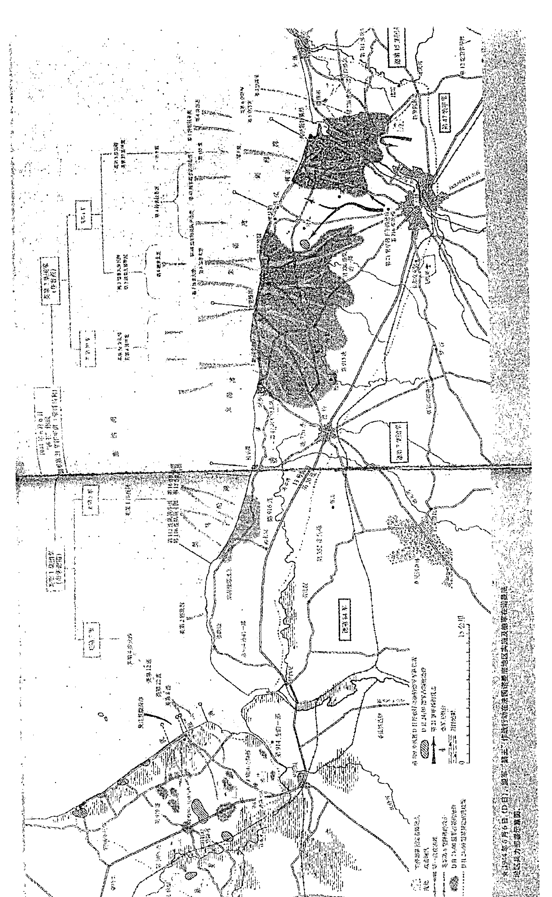

第82空降师 空降区域

第101空降师 空降区域

卡朗唐 德军防御阵地

圣梅尔埃格利斯 盟军空降地点

#### 五、凡尔登战役

凡尔登战役，是第一次世界大战中，德军和法军于1916年2~12月在法国凡尔登筑垒地域进行的战役。

1916年，德意志帝国决定把进攻重点再次转向西线，力图打败法国。德军统帅部选择法国的凡尔登要塞作为进攻目标。凡尔登是协约国军防线的突出部，对德军深入法国、比利时有很大威胁，它又是通往巴黎的强固据点和法军阵线的枢纽。1916年2月21日，德军集中前线所有大炮对凡尔登附近狭窄的三角地带连续轰击10多个小时，将这一小块地区的森林、山头、战壕夷为平地，随后以6个师兵力向前推进。法军总司令霞飞增派援军，任命H.P.贝当为凡尔登地区司令，组织法军拼死抵抗。双方出动飞机进行空战和轰炸对方的机场与补给线。德军首次使用光气窒息弹，杀伤大量法军并造成恐慌，但未能取胜。法英联军于6月底至11月中在索姆河一带对德军阵地发动强大攻势，英军首次使用新发明的36辆坦克，德军顽强抵抗，守住了防线。10~12月，法军在凡尔登调集部队，开始反攻，夺回大部分失地。德军战略进攻终于失败。战役结束后德皇威廉二世撤销法金汉的总参谋长职务，改任兴登堡为总参谋长，鲁登道夫为其副手。此役是典型的阵地战、消耗战，双方共投入近100万人，双方损失70多万人。由于伤亡惨重，凡尔登战场被称为“绞肉机”、“屠场”和“地狱”。这次决定性战役是第一次世界大战的转折点，德意志帝国从此逐步走向最后失败。

战役企图和兵力部署：1916年初，德军统帅部计划在东线进行防御，集中兵力对西线法军的凡尔登突出部实施突击，以牵制和消耗法军主力，迫使法国投降。受领进攻任务的部队是德国皇太子威廉指挥的第5集团军（辖7个军共18个师，1200余门火炮、约170架飞机；后增至50个师，约占西线德军总兵力的1/2）。其部署是：第7、第18、第3军（6个半师，879门火炮、202门迫击炮）在孔桑瓦至奥恩河15公里宽正面上实施主要突击，第5军掩护其左翼；第15军在奥恩河以南6公里处实施辅助突击，第6军在默兹河西岸采取牵制行动。在主突方向上，德军步兵比法军步兵多两倍，炮兵多3.5倍。为达成战役突然性，德军于同年1月在西线实施一系列佯动。凡尔登距法德边境 50 公里左右，是法国首都巴黎的东北门户，为双方必争之地。法军凡尔登筑垒地域横跨默兹河两岸，正面宽 112 公里，纵深 15~18 公里；有四道防御阵地，前三道为野战防御阵地，第 4 道是由要塞永备工事和两个筑垒地带构成的坚固阵地，居高临下，易守难攻。法第 3 集团军（辖 11 个师，630 余门火炮，由 F.埃尔将军指挥；后增至 69 个师，约占法军总兵力的 2/3）5 个师防守凡尔登以北地区，3 个师防守凡尔登以东和东南地区，另 3 个师作为预备队配置在凡尔登以南默兹河西岸地区。

战役经过：2 月 21 日 7 时 15 分，德军开始炮火准备。为隐蔽主突方向，德军炮兵在宽 40 公里的正面上同时实施炮击，航空兵首次对法军阵地实施轰炸，摧毁部分防御阵地，并杀伤大量有生力量。16 时 45 分，德军步兵发起冲击，当日占领第一道防御阵地。在以后四天中，又先后攻占第二、第三道防御阵地，向前推进 5 公里，占领重要支撑点杜奥蒙堡。2 月 25 日，法军统帅部任命第 2 集团军司令 H.P.贝当为凡尔登前线指挥官（5 月 1 日起由 R.-G.尼韦勒继任），并调集一切可以动用的部队，决心在凡尔登地区与德军决战。26 日，贝当下令夺回杜奥蒙堡。法军经四天激战，损失惨重，未果。自 2 月 27 日起，法军利用唯一与后方保持联系的巴勒迪克-凡尔登公路（又称“圣路”），源源不断地向凡尔登调运部队和物资，一周内组织 3900 辆卡车，运送人员 19 万、物资 2.5 万吨。这是战史上首次大规模汽车运输。法军大批援军及时投入战斗，加强了纵深防御，对战役进程产生了重大影响。至月底，德军弹药消耗很大，且战略预备队未及时赶到，攻击力锐减，从而丧失了突破法军防线的时机。

3 月 5 日起，德军扩大进攻正面并将主突方向转移到默兹河西岸，企图攻占 304 高地和 295 高地，解除西岸法军炮兵的威胁，并从西面包围凡尔登；同时继续加强东岸的攻势，由急促攻击改为稳步进攻，但遭法军顽强抵抗，付出巨大伤亡后仅攻占几个小据点。4~5 月间，德军集中兵力兵器包括使用喷火器、窒息性毒气和轰炸机，对西岸法军实施重点突击，但步兵进抵 304 高地和 295 高地一线后，遭法军炮火猛烈反击，5 月底停止进攻。在东岸，法军频繁轮换作战部队，不断实施反击，与德军反复争夺，迟滞德军进攻。6 月初，德军再次发动大规模攻势，经七天激战切断沃堡与法军其他阵地的联系，迫使沃堡守军于7日投降。6月下旬，德军首次使用光气窒息毒气弹和催泪弹猛攻苏维耶堡，在4公里宽的正面上发射11万发毒气弹，给法军造成重大伤亡，一度进抵距凡尔登不足3公里处，但终被击退。

俄军1916年夏季进攻战役和西线索姆河战役开始后，德军在凡尔登方向未再投入新的兵力，尔后的进攻行动只是为了牵制当面法军。经数月苦战，德军虽在凡尔登以北、以东地区楔入法军防线7~10公里，但未能达成战役突破。8月29日，E.von法尔肯海恩被免职，P.von兴登堡元帅接任德军总参谋长。9月2日，德皇批准停止进攻。10月24日，法军发起大规模反攻，于11月初收复杜奥蒙堡和沃堡。12月15~18日，法军再次发动反攻，基本收复被德军攻占的阵地。战役至此结束。

##### 1916年2月21日16时45分，德军步兵发起冲击

丙辰年 庚寅月 戊子日 庚申时 阳遁6局
甲寅旬 值符天芮落8宫 值使死门落8宫 月将为亥

| 行标题 | 白虎传送收 | 太常从魁开 | 玄武河魁闭 |
| :--- | :--- | :--- | :--- |
| 天空小吉成 | 太阴<br>开门<br>天心星（戊）<br>巽四、丙 | 六合<br>休门<br>天蓬星（壬）<br>离九、辛 | 白虎<br>生门<br>天任星（庚）<br>坤二、癸 |
| 青龙胜光危 | 螣蛇<br>惊门<br>天柱星（己）<br>震三、丁 | 天禽星<br>中五、乙 | 玄武<br>伤门<br>天冲星（丁）<br>兑七、己 |
| 勾陈太乙破 | 值符<br>死门<br>乙天芮星（癸）<br>禽艮八、庚空 | 九天<br>景门<br>天英星（辛）<br>坎一、壬空 | 九地<br>杜门<br>天辅星（丙）<br>乾六、戊 |
| 马 | 六合天罡执 | 朱雀太冲定 | 螣蛇功曹平 |

《御定奇门宝鉴》对此局的解释是：兵事：星门俱比，阴时利主。但门符俱反，不利交战。坤艮之间，必有格斗。大将宜从天乙而飞，据其东北山。岗。奇兵分伏于乾巽，敌至而从应，不宜先动。出行：无奇门会合，又遇反吟，诸事反复无成，不宜出行。

这段话的意思是说：从各个落宫的情况，星与门都是比和的关系，如2宫的天任星属土、落本宫的生门也属土，再如4宫的天心星属金，落本宫的开门也属金，其它各宫皆是如此，所以说星门俱比。这样似乎在军事上就难分胜负，但庚申时为阴时，而阴时利主不利客。即不利于发动者，而利于防守一方。德军为发动进攻的一方，对其不利。法国是防守的一方，自然对其有利。同时，门符反吟，不利交战。就是说，八门与值符落到相反的对冲之宫，主做事容易出现反复，所以遇到反吟时就不利于出兵交战。坤艮之间，必有格斗。因为庚为进攻方落2宫，宫中生门为“坐生击死”，适合出击，但庚加癸为天地大格，寅申相冲，庚又为道路，多主车祸，行人不至，生育母子俱伤，大凶。在这里就主德国。值符为守方代表法国落8宫，宫中癸加庚为太白入网，因为癸为地网、庚为太白，是太白自己钻到地网里来了，为自罹罪责。8宫虽逢空亡，但临驿马星，不以空论。更重要的是8宫出现天罡星，《奇门旨归》云：我兵被围不要忙，加时出路是天罡。又云：天罡指路天路开，出军行师任徘徊。《奇门法窍》云：月将加时看天罡临孟为左，临仲为中，临季为右，行吉。子午卯酉为仲，寅申巳亥为孟，辰戌丑未为季。意思是说，天罡星临1、3、7、9者为临子午卯酉，应向中间突围；临8、2、4、6宫因为有寅申巳亥，就应向左边也即东边突围；临8、2、4、6宫因为还有辰戌丑未，说明也可以向右边突围。大将宜居天乙而飞，是说8宫临值符，适合从东北方向发起进攻，为指挥官所居之地。东南4宫临太阴、西北6宫临九地，宜埋伏部队。事实上，正如上述，法军除5个师防守凡尔登以北地区外，部署3个师防守凡尔登以东和东南地区，另3个师作为预备队配置在凡尔登以南默兹河西岸地区。无奇门会和，又遇反吟，诸事反复无成，不宜出行。是说整个格局均为反吟之势，不是门克宫就是宫克门，总有三奇也无济于事，独龙难以行雨，因此不宜出行办事，当然也不利于出兵交战。就这次战役而言，也就不利于德军出兵侵略法国。

现在，让我们从凡尔登战役作战过程示意图和上面的奇门遁甲局上，看一看德、法两军的兵力部署情况和交战情况吧：前面说过，德军这次作战的目的是夺取法国的核心城市巴黎，最终灭亡法国。而凡尔登就位于巴黎的东北方向上，前面说过，德军统帅部之所以选择法国的凡尔登要塞作为进攻目标，是因为凡尔登系以德国为轴心国的协约国军防线的突出部，对德军深入法国、比利时有很大威胁，同时它又是通往巴黎的强固据点和法军阵线的枢纽。德国皇太子威廉指挥的第5集团军所属的第7、18、3军沿孔桑瓦至奥恩河15公里宽正面上实施主要突击，在奇门遁甲局上就是从坎1宫方位向离9宫方位发起进攻。坎1宫的格局是逢景门上乘九天，其攻击位置再好不过了。同时，九天又代表飞机，说明有大量飞机出动，配合作战。而法军所居的离9宫的格局是休门上乘六合，兵败溃散之象。更不要说，在这个德军主突方向上，德军的兵力为法军的两倍。所以，德军在连续几天中，先后攻占第二、第三道防御阵地，占领重要支撑点杜奥蒙堡。26日，贝当下令夺回杜奥蒙堡，但法军四天激战未果，却损失惨重。之所以未夺回杜奥蒙堡，就是因为法军居离9宫、逢休门上乘六合之故。

但是，我们从《凡尔登战役作战示意图》上已经看到，在凡尔登的西南方向上，从巴勒迪克—凡尔登有一条公路，正是这条公路，自2月27日起，使法军大本营源源不断地向凡尔登调运部队和物资，法军大批援军及时投入战斗，德军攻击力锐减，从而丧失了突破法军防线的时机。而这条公路，在奇门遁甲局上就是西南坤2宫的方位，宫中逢生门又临天任吉星。而从西南往东北去的方向又临天罡星，正所谓 “天罡指路天路开，出军行师任徘徊。”

正因为这样，从3月5日起，德军扩大进攻正面并将主突方向转移到默兹河西岸，企图攻占304高地和295高地，解除西岸法军炮兵的威胁，并从西面包围凡尔登，但遭法军顽强抵抗，付出巨大伤亡后仅攻占几个小据点。出现这个状况，就是因为从奇门遁甲局上看，西面临兑7宫，宫中伤门上乘玄武，说明西面战线有薄弱环节，适合从这里发起进攻，但伤门落7宫受宫克，利主不利客，利于法军防守而不利于德军进攻。因此到5月底德军只好停止进攻。

6月初，德军再次发动大规模攻势，经七天激战切断沃堡与法军其他阵地的联系，迫使沃堡守军于7日投降。出现这种状况，从奇门遁甲局上看，是因为东面为震3宫，宫中逢惊门落3宫为门克宫，利客不利主，适合德军发动进攻。上乘螣蛇，说明法军在东线兵力空虚。

从10月24日至12月18日，法军曾先后两次向德军发起大规模的反攻，基本收复被德军攻占的阵地。战役结束。

从《凡尔登战役示意图》上看，此时法军发起进攻的方向，就是从西南坤2宫方位向东北方向，东北艮8宫虽临值符，为“五不击之方”，但逢空亡，虽临马星，毕竟逢空就不吉，难以发挥作用。法军是“坐生击死，无往而不胜”，所以进攻顺利，收复失地。

##### 凡尔登战役示意图

##### 凡尔登战役（1916年2月21日—12月18日）


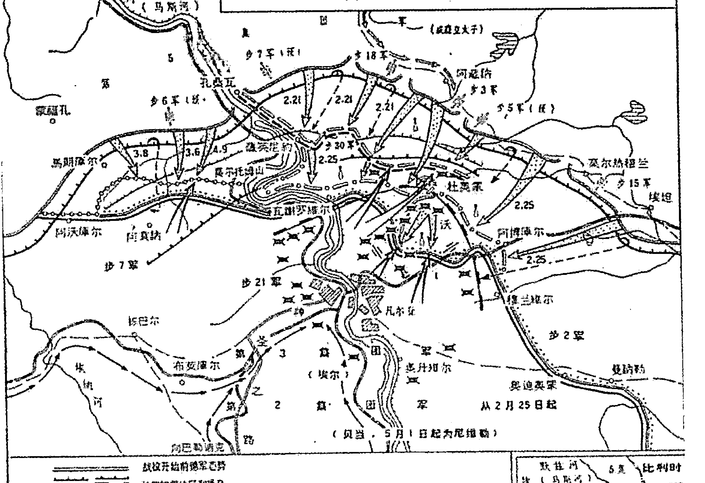

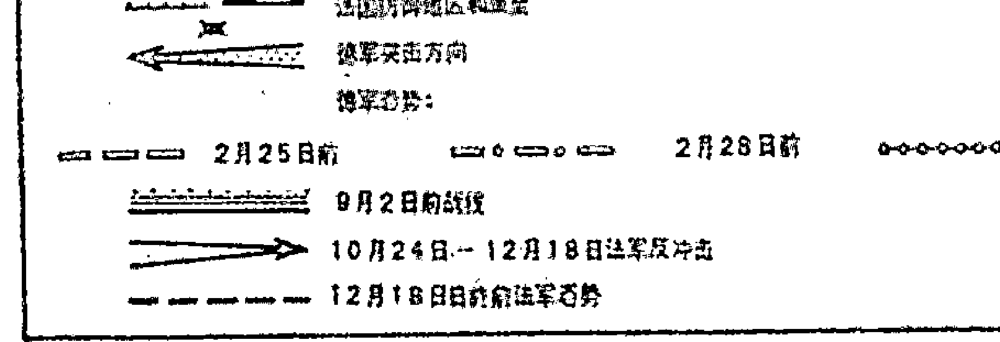

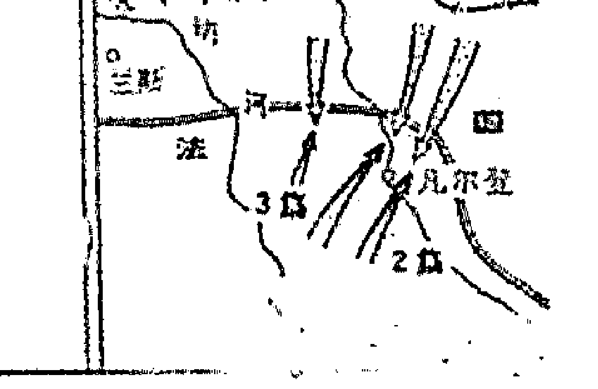

#### 六、索姆河战役

索姆河战役，是第一次世界大战中期，英、法军队在法国北部索姆河地区对德军的阵地进攻战役。战役从1916年6月24日开始，至11月中旬结束。其目的是突破德军防御，以便转入运动战，同时减轻凡尔登方向德军对法军的压力。当时战线由南向北，在亚眠以东50多公里的地方穿过索姆河。德军在该地区构筑了号称“最坚强的”防线，包括3道阵地和一些中间阵地。主要阵地有坑道工事，阵地前面有多层铁丝网。守军为德军第2集团军，防御正面宽58公里，其第一线为9个师，预备队4个师。以后兵力增加到67个师。英、法方面原计划以法军担任主攻，但因凡尔登战役动用了法军大量兵力，改以英军为主。最初投入兵力为39个师（战役过程中增加到86个师），其中英军25个师，以第4集团军为主、第3集团军为辅，在索姆河北岸卡尔诺以北地区进攻，正面25公里；法军第6集团军14个师，跨索姆河在英军右侧进攻，正面15公里。英、法军炮兵和空军都占优势。采取对有限目标逐次攻击战法，企图通过消耗德军兵力达到突破的目的。为协调两军行动，规定每次进攻到达线不能自行超越。从6月24日起，英、法联军进行了7天的炮火准备，7月1日晨7时半步兵在炮火支援下发起进攻。当天法军和主攻方向上的英军都突破了德军第一道阵地，但英军左翼则毫无进展。英军以密集队形前进，遭到德军机枪和炮兵火力的严重杀伤，第一天即伤亡近6万人。7月3日英军右翼和法军占领了德军第二道阵地。德军利用对方进攻的间歇，迅速调集兵力，加强纵深防御，并在一些地段上实施反击。英、法军于7月中、下旬再度发起进攻，南岸法军占领了第三道阵地，但未能发展为战役突破。9月3日，英军32个师、法军26个师第三次发起进攻，截至12日向德军纵深只推进了2~4公里。9月15日，英军在进攻中首次使用坦克，共出动49辆，而实际参加战斗的18辆（被德军击毁10辆），步兵的进攻速度因而有所增加，当天占领了第三道阵地的几个要点。在战争史上这是第一次使用坦克。在9月下旬和11月的进攻中，英军又两次使用坦克，但数量较少，收效不大。

索姆河会战，是第一次世界大战中规模最大的一次战役。英、法军未达到突破德军防线的目的，但钳制了德军对凡尔登的进攻，进一步削弱了德军实力。

##### 1916年7月1日7时30分英、法军发起进攻

丙辰月 甲午月 己亥日 戊辰时 阴遁3局
甲子旬 值符天冲落3宫 值使伤门落8宫 酉为月将

|              | 太阴河魁除 | 天后登明满 | 贵人神厘平 |              |
| :----------- | :--------- | :--------- | :--------- | :----------- |
| 玄武从魁建   | 九天<br>景门<br>天辅星（乙）<br>巽四、 乙 | 九地<br>死门<br>天英星（辛）<br>离九、 辛 | 玄武<br>惊门<br>丙天芮星（己）<br>禽坤二、 己 | 螣蛇<br>大吉定 |
| 太常传送闭   | 值符<br>杜门<br>天冲星（戊 德国）<br>震三、 戊 | 天禽星<br>中五、 丙 | 白虎<br>开门<br>天柱星（癸）<br>兑七、 癸 | 朱雀<br>功曹执 |
| 白虎小吉开   | 螣蛇<br>伤门 值使门<br>天任星（壬）<br>艮八、 壬 | 太阴<br>生门<br>天蓬星（庚英、法）<br>坎一、 庚 | 六合<br>休门<br>天心星（丁）<br>乾六、 丁 | 六合<br>太冲破 |
| 马           | 天空胜光收 | 青龙太乙成 | 勾陈天罡危 | 空           |

《御定奇门宝鉴》对此局的解释是：兵事：门克宫利为客，兵宜先举。出西北休门，以合休诈之吉。安营于正南，伏兵于正北，大将宜背正东卯孤，直击对冲，亦可御敌。然遇奇墓击刑己兵亦防有损。出行：西北可行。

这段话的意思是：值使伤门属木落8宫为门克宫，利于为客，所以利于先动。出西北逢休门上乘六合又临丁，为休诈之格，所以适合出西北乾宫之方。南方离9宫逢九地，书云：九地潜藏可立营，所以可安营于正南。北方为坎1宫，宫中遇太阴，书云：伏兵但向太阴位，所以可以在北方埋伏兵马。震3宫逢值符，书云：大将宜居击对冲，所以应从值符之方出击。即从东方出兵击西方之敌。但甲子戊落3宫为子卯为六仪刑，所以自己也可能损兵折将。8宫壬加壬为辰辰自刑，所以从8宫出击也将遇到己方损兵折将的情况。由于西北乾6宫构成休诈之格，所以出行宜到西方。

再看这个局，九星、十干伏吟，天时不利，不适合两军交战。再看庚为进攻方代表英、法联军落1宫，逢生门上乘太阴，庚加庚为战格，兄弟雷攻，不为吉利。德国为守方用值符代表落3宫，1宫生3宫，显然对英、法联军也不吉利。所以，从总体看，交战的双方就很难分出胜负来，而作为主动进攻的英、法联军来说，如果在作战方位、交战的地点又违背奇门遁甲的要求的话，恐怕就更难以达到目的了。下面让我们看一看双方是如何交战的：

这场战役是协约国在1916年总战略进攻计划的一部分，前面曾有叙述，在这次战役中，其具体的作战行动是：约勒将军率领的法国第6集团军和罗林森将军的英国第4集团军在福煦将军的统一指挥下，突破围驻在富科库尔、埃比泰讷 (40 公里) 地区的德国冯·贝洛将军之第2集团军的防御阵地；将骑兵兵团调向法军负责的佩罗讷、莫伯日和英军负责的巴波姆、康布雷打开突破口。

7月1日，英国第4集团军 (由罗林森将军指挥) 从马里库尔至埃比泰恩25公里正面向巴波姆方向实施主要突击，由英国第3集团军第7军在其左翼掩护；法国第6集团军 (由法约勒将军指挥) 从罗西耶尔以北索姆河两岸向佩罗讷方向实施辅助突击。

从《索姆河战役作战示意图》上，我们可以看到：英国第4集团军从马里库尔至埃比泰讷 25公里正面向巴波姆方向实施主要突击，在图上就是从西南方位向东北方向突击，因为作战示意图上的马里库尔就位于西南，在奇门遁甲局上就位于西南坤2宫的位置，宫中惊门上乘玄武，临玄武说明适宜从这个方位偷袭，但逢惊门就不吉了。而巴波姆就在东北方向，在奇门遁甲局上就位于东北艮8宫的位置，宫中伤门上乘腾蛇，说明向这个方向出兵必将遇到一场恶战。

再从《索姆河战役作战示意图》上，我们又看到：法国第6集团军 (由法约勒将军指挥) 从罗西耶尔以北索姆河两岸向佩罗讷方向实施辅助突击。在图上就是从西方向东方出击，在奇门遁甲局上就是从兑7宫向震3宫方向出击，兑7宫的格局是逢开门上乘白虎，癸加癸天网四张，但7宫为网高，可推贵格。震3宫虽逢杜门却上乘值符，为“五不击之方”，所以法军虽能取胜，但很难打败德军。

当日，法军和英军右翼突破德军第一道阵地，但英军左翼为德军壕沟阵地所阻。英军采用密集队形突击，遭德军马克沁机枪的强大火力杀伤，损失近6万人。

7月2~3日，英军右翼和法军攻占德军第二道阵地，法军一度占领巴尔勒、比阿什等德军防御要地。此后数日，由于德军投入预备部队以及英、法联军本身在突破战术和指挥调度方面存在着严重缺点（对各地区的突击规定繁琐，限制了军队的主动性等），以致推进缓慢。

7月19日，德军指挥部又投入新一波预备部队，为便于指挥，将第2集团军分编为由贝洛将军指挥的第1集团军和加尔维茨将军指挥的第2集团军。并在防御上加长纵深，构筑了补充防御地区。

7月中旬，英、法联军仅向前推进数公里，未达成作战的预期目标。

7月底至8月中旬，英、法联军将其部队增强至51个师、飞机增加至500架；而德军增加到31个师、飞机增到300架，由于作战的迟缓、胶着，遂转变成为消耗战。

值得特别一提的是，从《索姆河战役作战示意图》上，我们还看到：从9月3日起，法国米舍莱将军的第10集团军、英国加夫将军的第5集团军分别投入战斗，战场正面范围扩大到50公里宽的战线。德军增强至40个师，又不停加强阵地的防御工事。因此英、法军队的推进速度平均每昼夜仅有150至200米。为什么会出现这种情况，就是因为法军第10集团军投入战斗后，是从西南坤2宫方位向东北艮8宫方向进攻的，其格局仍如前述。而英国第5集团军投入战斗后，则是从西方兑7宫方位向东方震3宫方向，其格局也如前述。所以 虽然从9月15日开始，英军第一次使用新式兵器--坦克（共49辆坦克，实际参战仅18辆），配合步兵进攻，推进了4至5公里。这是战争史上第一次使用坦克，对守备方的德国步兵产生了心理震撼，使他们放弃阵地不战自退。但由于坦克的技术与装备尚未完善，加上战线宽广（10 公里 18 辆坦克），仍然没有达成打开突破口的作战目标。战术层级的运用成功并未能引导作战胜利。虽然英军后来又使用了两次坦克，同样收效不大，倒让德军开始学习如何对付敌方这个庞然巨物。

进入秋季后，气候开始恶化，由于阴雨连绵、道路泥泞，战斗渐渐平息，到了 11 月完全停止，英、法两国的作战计划宣告失败。

索姆河战役是第一次世界大战中典型的、双方伤亡皆极为惨重的阵地战。不论是双方所投入的兵力、兵器，都是本次大战中最大的战役。英军投入作战的部队有 54 个师，法军 32 个师，德军为 67 个师。英、法联军伤亡 79 万 4 千人，未能突破敌方防御，仅推进 5~12 公里。德军损失 53 万 8 千人，虽然失去 240 平方公里的壕沟阵地，却成功拦截了协约国的战略目标。但进攻方在西南战线的胜利仍使得战局的主导权逐渐从德国移向协约国一方。


##### 索姆河进攻战役（1916年7月1日 - 11月18日）

比例尺：5 0 5 10公里

3集(英)

6集(德)

安刻提斯

步7军 (英) 米克维茨

索姆河

步2师 (英) 阿尔贝

步8军 (英)

1集(法) (7.19起)

贝坦库尔

巴波姆

5集(英) (9.3起) 预 瓦特勒库尔

步52师

鲁瓦

预14军

梅欧堡

步10军 (英)

步26师

9月—10月 华普瓦勒

4集(英)

步3军 (英) 梅多尔

步28军

步15军 (英) 泰利瓦尔

2集(德) (7.19起)

莫瓦尔

孔布勒

步10师预

阿尔贝

步13军 (英) 后方供应

奥米耶尔

梅济耶尔

步20军 (法)

步4军 预

步1军 (法)

步6军(9.9前) 步9军(9.9起) 勒罗讷

布斯

6集(法)

格里西布尔伊

步35军 (德) 勒瓦亚尔

11师

步24军 预

2集(德) (7.19起)

索姆河

步17军

10集(德) 预

步30军

皮克勒维尔

图例：
- 6月30日前阵线
- 7月1日—11月18日联军突击方向：联军、德军的反突击、英军主攻
- 7月底以前
- 八月进攻后
- 九月进攻后
- 瓦瓦勒地区攻不克

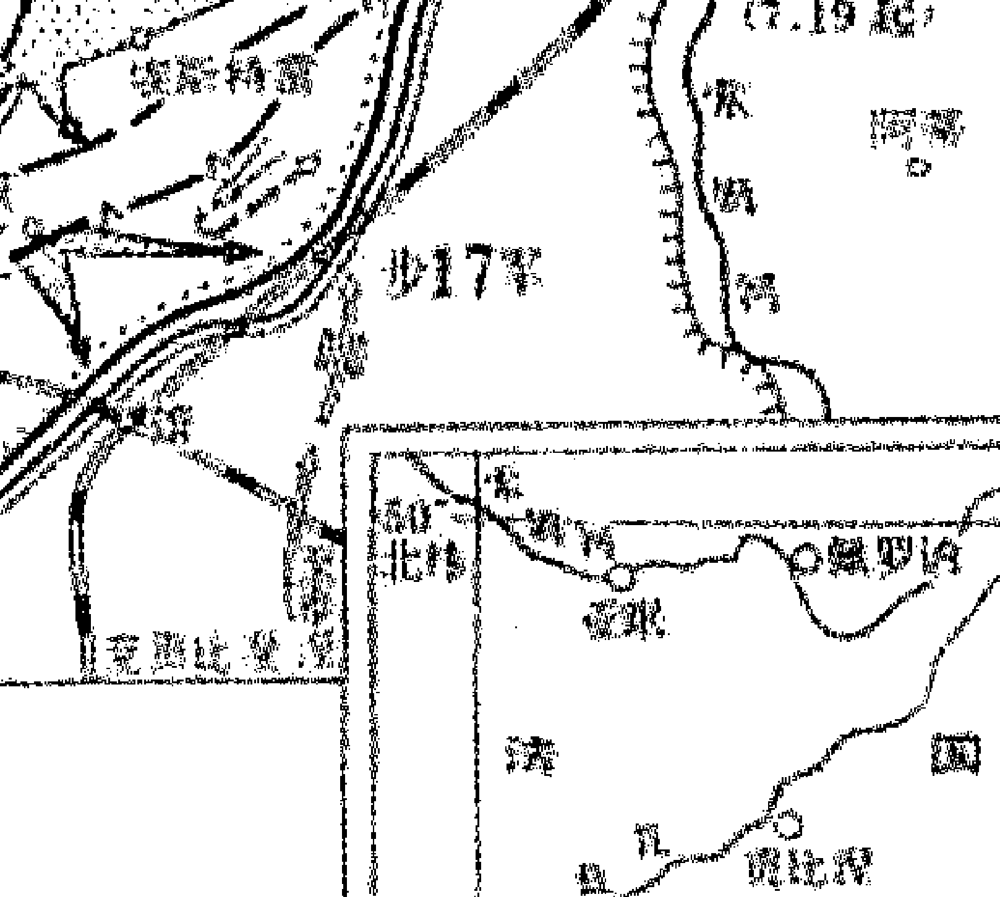

比例尺

法国

巴黎

亚眠

鲁昂

贡比涅

兰斯

#### 七、马恩河战役

马恩河战役是第一次世界大战初期发生在法国境内马恩河地区的一次重要战役。1914年8月，德军同法、英军队在法国边境展开激战，双方共投入350万大军。法军和英军被迫南撤。马恩河战役使德军包抄法军的计划失败，德国在西线速决战略破产，总参谋长毛奇被德皇威廉二世撤职，改由法金汉担任。

1914年8月法国边境之战后，法第4、第5集团军和英国远征军于9月初撤至马恩河以南，在巴黎至凡尔登一线布防。法军总参谋长霞飞将军组建第6、第9集团军，分别部署在巴黎外围以及第4和第5集团军之间，准备实施反攻。德第1、第2集团军为追歼法第5集团军，偏离原定进攻方向前出到巴黎以东地区，暴露了第1集团军的右翼。德军总参谋长毛奇获悉法军即将反攻后，于9月4日命令第1、第2集团军在巴黎以东转入防御，第3、第4、第5集团军南下，协同从东面进攻的第6集团军合围凡尔登以南的法军。但德第1集团军司令克卢克拒不执行命令，继续率军南下，形成有利于联军反击的态势。同日，霞飞命令法第5、第6集团军和英远征军对德第1、第2集团军实施主要突击，法第9、第4集团军牵制敌第3、第4集团军，法第3集团军在凡尔登以西实施辅助突击。此时，在巴黎至凡尔登一线，英法联军的兵力为66个师108.2万人，德军为51个师90万人；在主攻方向上，联军兵力是德军的两倍。

9月5日，法第6集团军先头部队与德第1集团军在乌尔克河西岸遭遇。法军首次使用汽车（共1200辆）把第6集团军一部由巴黎运往前线。克卢克发觉右翼和后方受到威胁后，命令所部于8日全部撤至马恩河北岸，遂与第2集团军之间出现宽50公里的防御间隙。6日，法第5集团军和英远征军从德军防御间隙地带穿插，8日逼近马恩河，构成对德第1集团军的包围态势。同时，德第2集团军业已暴露的右翼也面临被围的危险。9日，德第1、第2集团军被迫后撤。德军在其他地段虽略占上风，但鉴于第1、第2集团军所面临的态势，毛奇于10日下令全线停止进攻，撤至努瓦永至凡尔登一线。此次战役以德军失败告终。英法联军在200公里的战线上推进60公里，伤亡25万人，德军损失30万人。此役双方均有失误：毛奇远离战场，对前线战况不明、指挥不当，各集团军缺乏协同，导致速胜计划破产；英法联军行动迟缓，坐失战机，使德军保存了实力。

德国的战争计划是前总参谋长施利芬在1905年制定的，其核心是：集中强大兵力于西线，通过防务空虚的比利时、卢森堡和荷兰，从侧翼包围法军，速战速决打败法国。然后挥师东进，再去对付俄国。战争爆发后，德军总参谋长小毛奇遵循其前任的计划，仅用9个师的兵力监视俄国，而在西线则集中了7个集团军，共78个师，以梅斯为轴心分为左右两翼。左翼2个集团军，共23个师，守卫梅斯以南法德边境的阿尔萨斯和格林地区的阵地；右翼5个集团军，共55个师，借道比利时、卢森堡和荷兰突破法国北部边境。

自普法战争结束后，法军为报失败之仇，从1872年起开始就制定了一个又一个的对德作战计划，到开战前已有17个之多。最新的计划是由法军总参谋长的霞飞将军制定的，即“第17号计划”。该计划假定德国不会把预备役用于第一线，而只能动员100万人的兵力，这就不可能做到既可以从比利时发动大规模迂回进攻，同时又有足够的兵力在法德边界挡住法军的攻势。法军副总参谋长德卡斯特尔诺认为：要发动一场强有力的攻势，标准的兵员密度是每米5~6人，如果德国人把战线向西拉到里尔，力量就会分散到每米2~3人，只会对法军有利。所以法国的对策是：只要德国人远道迂回包抄法军侧翼，法军就计划发动钳形攻势，在德军设防的梅斯地区的两侧突破德军中路和左翼，并乘胜切断德军右翼同后方基地的联系使其无法出击。因此，该计划强调：德军将集结在设防巩固的法德边境线上，因此法军要在这里展开积极主动的攻势，并一举收复在普法战争中失去的阿尔萨斯和格林两省。

1914年9月6日3时法国军队发起全线反攻

甲寅年 壬申月 乙未日 戊寅时 阴遁9局
甲戌旬 值符天任落9宫 值使生门落4宫 已为月将

|  | 太常传送平 | 玄武从魁定 | 太阴河魁执 |  |
| :--- | :--- | :--- | :--- | :--- |
| 白虎小吉满 | 螣蛇 生门 值使 天蓬星 (乙) 巽四、癸 | 值符 伤门 天任星 (己英、法) 离九、戊 | 九天 杜门 天冲星 (丁) 坤二、丙 空 | 天后登明破 |
| 天空胜光除 | 太阴 休门 天心星 (辛) 震三、丁 | 天禽星 中五、壬 | 九地 景门 天辅星 (癸) 兑七、庚 空 | 贵人神厓危 |
| 青龙太乙建 | 六合 开门 天柱星 (庚 德国) 艮八、己 | 白虎 惊门 壬天芮星 (丙) 禽坎一、乙 | 玄武 死门 天英星 (戊) 乾六、辛 | 螣蛇大吉成 |
|  | 勾陈天罡闭 | 六合太冲开 | 朱雀功曹收 |  |

《御定奇门宝鉴》对此局的解释是：兵事：宫克门，不利客。兵宜后举，出东南巽方，以应东南风遁之吉。安营于西，伏兵于东，背东南击西北，可获全胜。

这段话的意思是说：生门为值使落4宫，生门属土，巽宫属木，生门落4宫为木克土，所以为宫克门，不利于先发动战事。德国是先发动战事的一方，所以对德国不利。东南方逢生门上乘螣蛇又有乙奇，形成风遁格局，所以宜出东南击西北乾宫，为“坐生击死”。西方7宫临九地，所以适宜安营扎寨。东方3宫临太阴，所以适宜埋伏兵马。从东南出兵击西北之敌，能够大获全胜。

根据以上德军与英法联军的兵力部署与奇门遁甲格局显示，我们可以看出：德军前总参谋长施利芬制定的作战计划即“施利芬计划”：集中强大兵力于西线，通过防务空虚的比利时、卢森堡和荷兰，从侧翼包围法军，速战速决打败法国。是非常正确的。因为，从此时的奇门遁甲局上看，以梅斯为轴心，东线为右翼落3宫逢休门，西线为左翼逢景门适宜破阵擒敌，又遇贵人、神厓。所以战争爆发后，德军总参谋长小毛奇遵循其前任的计划，仅用9个师的兵力监视俄国，而在西线则集中了7个集团军，共78个师。左翼2个集团军，共23个师，守卫梅斯以南法德边境的阿尔萨斯和格林地区的阵地；右翼5个集团军，共55个师，借道比利时、卢森堡和荷兰突破法国北部边境。而借道比利时，在奇门遁甲局上就是从东北向西南出击，东北临开门，又临天罡星，正所谓“出军行师任徘徊”，最适宜出兵征战。西南2宫虽上乘九天好扬兵，可惜逢空亡。说明法军准备不足，警惕性不高。再看法军总参谋长 “17 号计划” 的核心是：德军将集结在设防巩固的法德边境线上，因此法军要在这里展开积极主动的攻势，并一举收复在普法战争中失去的阿尔萨斯和格林两省。这个法德边境，在奇门遁甲局上，就是震3宫的位置，宫中逢休门又是辛加丁官人失位的格局，辛又是犯错误的信号，显然霞飞的判断与实际情况严重失误。

战役的发展经过如下：

1914年8月4日，右翼德军侵入比利时，遭到比利时军队的顽强抵抗，在列日要塞被阻3天，到20日才占领布鲁塞尔。此时，法军的几个主力集团军却在按照“第17号计划”发起对德军左翼的进攻。然而，初期的战斗表明，“第17号计划”糟糕得很。在格林，法国第1集团军和第2集团军在进攻萨尔堡和莫朗日两地德军的防线中，被打得焦头烂额。这就是因为东线震3宫临太阴之故。右翼德军在占领了比利时后，其5个集团军的近百万人马，像一把挥舞的镰刀，从比利时斜插入法国。走在最右面的是克卢克指挥的第1集团军，约30万人，被视为右翼的主力和向巴黎进军的主攻部队。该集团军于8月24日由比利时进入法境。8月25日，德军攻占那慕尔。霞飞为阻滞这支德军右翼部队的前进，从格林战场调集兵力，组建了法国第6集团军，由毛老里任司令。

9月2日，德军克卢克集团军的先头部队已挺进到距巴黎仅有15英里的地方了，霞飞指挥的法军主力为阻遏德军右翼所作的努力已告失败。巴黎人心惶惶，法国政府也迁往波尔多。

9月3日晚，克卢克抵达马恩河，而他所追赶的法第5集团军和其外侧的英国远征军已在当天早些时候渡过了马恩河。这两支仓促退却、陷入疲惫和混乱之中的部队，虽曾一再接到炸毁桥梁的电令，但都未去炸毁。克卢克占领了这些桥头堡之后，不顾柏林最高统帅部要他与比罗的第2集团军保持齐头并进的命令，准备于次日清晨渡河，继续他追逐法第5集团军的行动。

9月4日，克卢克一面向前挺进，一面直言不讳地告诉最高统帅部，他无法执行要他留在后面作为德军第2集团军侧卫的命令。如果等比罗的德第2集团军赶上来，势必停止进军两天，他认为这将削弱德军的整个攻势，给法军以重振旗鼓、自由行动的时间。事实上，比罗的第2集团军也同样疲惫不堪。于是，克卢克把最高统帅部的命令摆在一边，继续向东南推进，换言之对于巴黎是越走越远了。

从奇门遁甲局上看，如果克卢克率领的德国第一集团军始终按照原定计划前进，不日即可攻占巴黎，但他却改变进攻路线改道向东南追击法军，也就是从西北向东南进攻。西北6宫逢死门上乘玄武，而东南4宫为逢生门上乘塍蛇，显然选错了进攻方向。而英法联军向马恩河南岸撤退，从局上看正是向值符之方，无疑是非常正确的。

9月4日早上，法军侦察机的报告使巴黎卫戍司令官加利埃尼看到了“必须立即行动”的时机。克卢克部队向巴黎东南方向的冒险挺进，已使他的殿后部队成了毛老里的法第6集团军和英军进攻的目标。上午9时，在还未取得霞飞同意的情况下，加利埃尼就向毛老里发布预令，让他先作好战斗准备。然后他给总司令部打电话，请霞飞下达攻击的正式命令。但霞飞未置可否。下午，当加利埃尼又打电话来时，霞飞终于批准让毛老里的第6集团军从马恩河北岸发动进攻，并且于当晚10时下令法军其他部队停止后撤，于9月6日开始发动全面反攻。

9月6日凌晨，法军发起全线反攻。法第6集团军继续与德第1集团军在奥尔奎河上激战；法第5集团军也掉转头来，变撤退为进攻，同德第1集团军厮杀，并同德第2集团军右翼交火；法第4和第9集团军则截住德第3、第4集团军，使德第1、第2集团军陷于孤立。9月8日，关键时刻，弗伦奇率领英军的3个军悄悄地爬进了德第1集团军和第2集团军之间的缺口，将德国第1集团军与第2集团军隔开了，使克卢克和比罗面临着被分割包围的危险。于是，比罗遂在9月9日下令他的第2集团军撤退。当时克卢克的第1集团军虽暂时击败毛老里，可此时他也处于孤立的境地，不得不于同一天也向后撤退。至9月11日，德军所有的军团都后撤了。至此，马恩河战役结束。协约国军粉碎了德军的速战速决的计划，保住了巴黎，遂使第一次世界大战中的西线战场形成了胶着状态。这场会战的战略性结果十分巨大，德国人丧失了其优先击败法国再转过身来对付俄国的唯一机会。

以上战斗结局，正是因为英法联军位于东南巽4宫位置，是“坐生击死”，所以英法联军为获胜者。

马恩河战役还告诉我们：战争必须奇正结合，在大兵团正面会战之时，只是调集军队参加正面会战是极其低劣的战争指挥策略。在大兵团正面会战之前，就应该考虑如何运用奇兵出奇制胜。例如：马恩河会战中，如果有一支奇兵迂回到英法联军后方结果就不一样了。一般来说，奇正力量的对比应该是1：2，奇兵力量不能太弱，否则会因力量不足而无法达到效果。奇兵力量又不能太强，否则兵力分散，正兵太弱不能完成正面攻击的任务。

用少量奇兵牵制对方大量兵力，再用正兵出奇制胜是最佳的奇正结合方案。施利芬计划显然是一个最佳的奇正结合方案，施利芬用少量兵力在阿尔萨斯和洛林牵制法军主力，然后用德军主力包抄巴黎。施利芬计划的核心是“左翼牵制，右翼包抄，攻克巴黎”，要求右翼力量必须强大。小毛奇自作聪明地削弱了右翼力量和被胜利冲昏头脑的德国第一集团军没有按计划乘势攻入巴黎，是一战中德国的施利芬计划彻底破产的两大原因。

特别值得一提的是，9月5日，当克卢克集团军经过巴黎东面，可以望见埃菲尔铁塔时，其右后方侧翼受到毛老里的法第6集团军的袭击。克卢克立即命令第3和第9军回过头去对付毛老里，而这两个军的任务是负责掩护德第2集团军的右翼的。所以他们的撤退，使德第1集团军和第2集团军之间，产生了一个宽达20英里的缺口。因为面对着这个缺口的英军，已经迅速地撤退，所以克卢克才敢冒这个危险。对德军来说，取胜的关键就在于它能否在法军主力部队和英军利用这一缺口突破自己的蜂腰部之前，击溃法军的两翼，即毛老里的第6集团军和福煦的第9集团军。

克卢克重点对付毛老里的部队。毛老里快要顶不住时，请加利埃尼从巴黎城内速派兵增援。这一要求启发加利埃尼组织了战史上第一支摩托化纵队，即马恩出租汽车队。加利埃尼命令巴黎警察征集了大约600辆出租汽车，将1个师的兵力输送到战场，使毛老里最终没被克卢克打垮。

这个情况的出现，反映在奇门遁甲局和《马恩河战役示意图》上，就是当克卢克集团军经过巴黎东面毛老里的法第6集团军的袭击时，他命令第3和第9军回过头去对付毛老里时，从局上看，克卢克集团军是在震3宫的位置，而毛老里的法第6集团军就位于兑7宫的位置，7宫虽临六合但逢景门又临天辅大吉之星，还有贵人、神垕等吉神，所以在他快要顶不住的时候，加利埃尼征集的600辆出租汽车，将1个师的兵力及时输送到战场，有力的支援了毛老里集团军，保证了战役的胜利。

- 附：1. 马恩河第一次战役作战示意图。
- 2. 马恩河第一次战役战前9月5日之前态势图。

##### 1. 马恩河第一次战役作战示意图

##### 西汉形势图

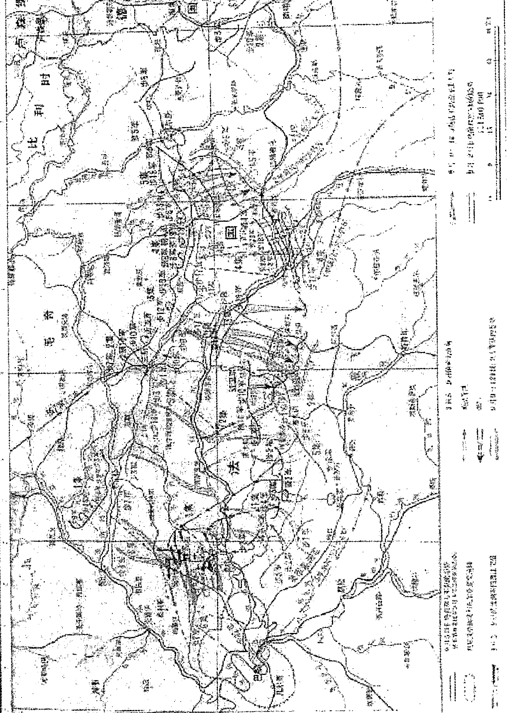

图例：
1:2500万
州郡界
国界
都城
州郡级驻所
河流
长城
武帝后郡国界

##### 2. 马恩河第一次战役战前9月5日之前态势图

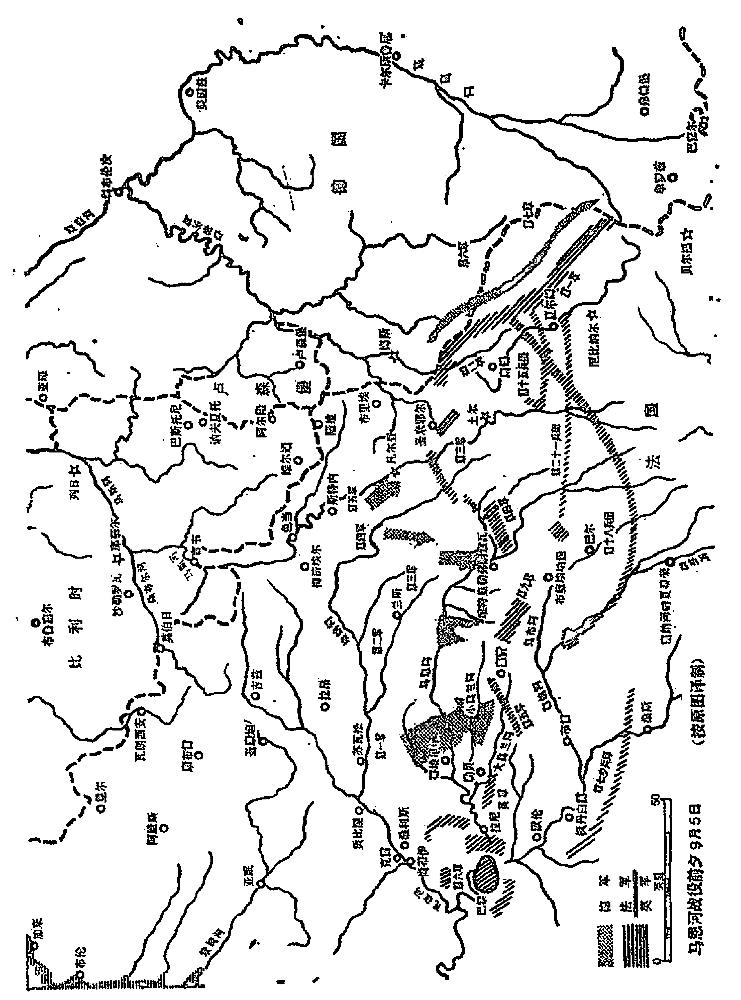

##### 马恩河战役前的9月6日

**图例：**
- 阴影区域：德军
- 横线区域：法军
- 竖线区域：英军

**比例尺：** 0 - 50公里

**制图说明：** (按原图缩制)

### 第二节 刑事案件预测

刑事犯罪包括偷盗、抢劫、流氓、杀人以及贪污受贿等经济犯罪。在奇门预测中，一般性偷盗财物、流氓强奸、轻微经济犯罪，多以玄武为用神；抢劫杀人、奸情杀人，重大贪污受贿犯罪，多以天蓬星为用神；同时，甲午辛为罪人，凡是犯错误或犯罪之人，都还可以同时以六仪辛为用神，来帮助判断之。

罪犯特征，一般以用神落宫旺衰，结合所临星、门、神、三奇六仪，来判断其职业、长相、身高、性格等。蓬、玄临庚多为老奸巨滑的重大案犯，临辛多为惯犯或曾被劳驾关押者，临壬、癸多为在逃罪犯。

作案工具，蓬、玄临伤门或伤门生蓬、玄，多为用车；临景门或景门生蓬、玄，多为使用枪支火器；临庚、辛或庚、辛生蓬、玄，多为使用尖刀、匕首等金属器械；临巽宫或腾蛇，多以绳索将人勒死或以手掐颈而致死人命；临甲、乙或伤、杜二门，也可能用木棍或木制东西将人打伤或致死。

星门伏吟或用神落内盘，则可能是本地人或单位内部之人所为；星门反吟或用神落外盘，则可能是外地、外单位之人或流窜犯再次作案。

罪犯逃跑、藏匿方向，一般以六合为逃犯，以杜门落宫为藏匿方向。以内盘、外盘、杜门所落之宫数，来判断其远近。发现无名尸首，一般以死门为其代表符号。死门临甲子戊，可能是为钱财而被杀；临乙、庚、丁、壬或桃花者，多为奸情所杀；乘太阴、六合，多为隐私暧昧之事所杀。

能否破案，一般以伤门、白虎、六仪中的庚和值使门为公安捕盗人员。公安捕盗人员落宫旺相，冲克罪犯落宫者，案一定能破；相反则难破或破不了案。星门伏吟者，难破，反吟则能破或案犯再次作案时可破。同时，有庚格，即庚临年、月、日、时者，能破；不格者，不破或难破。另外，杜门逢庚、辛、壬、癸，或天盘六仪克地盘六仪，或地盘六仪生天盘六仪，一般也能破案。

破案时间，多以庚格而断。庚临年干，一般年内可破；庚临月干，月内可破；庚临日干，当日可破；庚临时格，本时辰内或表示较短时间内可破。如果一局中同时出现两个庚格，则表示该案一定能破，而且时间较短。具体破获时间，还可结合阳日看庚下之干，阴日看庚上之干，或时干临阳星看庚下之干，时干临阴星看庚上之干等方法来判断。还可以按旬空出空、马星动，值使门落宫等方法来判断。

另外，古籍中还有“死门加壬，主讼人自讼”和壬临坤宫凶犯自首的经验。

#### 例一、经济罪犯真狡猾，难逃奇门显神功。

那是2005年7月8日上午9时，西南地区某省一位企业家给我打来电话，说他们向检察机关举报了一起重大经济犯罪案件，当天一大早检察院来了四个同志进行调查，让我看看能否立案查处。

于是，我按照来电话的时间2005年7月8日上午9时，起出奇门遁甲格局，看看某市检察院初查的情况怎么样。

乙酉年，癸未月，癸巳日，丙辰时，阴5局
甲寅旬 天英星为值符 景门值使

| 六合 | 太阴 | 螣蛇 |
| :--- | :--- | :--- |
| 生门 天任星（丁） 巽四、己 | 伤门 天冲星（庚） 离九、癸 | 杜门 天辅星（己） 坤二、辛 |
| 白虎 |  | 值符 |
| 休门 天蓬星（壬） 震三、庚 | 天禽星 中五、戊 | 景门 天英星（癸） 兑七、丙 |
| 玄武 | 九地 | 九天 |
| 开门 天心星（乙） 艮八、丁 | 惊门 天柱星（丙） 坎一、壬 | 死门 戊天芮星（辛） 乾六、乙 |

1. 时干丙为所问之事。丙落坎1宫，临惊门主官司，临天柱破军星，上一桩很棘手的官司，上乘九地主长久，说明这件官司时间比较长了；丙加壬为火入地网，为客不利，是非颇多，天盘壬在3宫临天蓬凶星，正代表这起蓄谋骗财的重大案犯，正是这伙案犯设下的天罗圈套，将刘强的公司套住。坎宫现正逢空亡，主事件无着落。事实是，刘强公司的前任老总在两年前与省某国有公司合作成立了一家联合公司。公司成立后，他们就互相作担保向4家银行贷款近一个亿。但不久，省里这家国有公司就以股权转让为名，把这一个亿的贷款转到刘强的公司。刘强当时是这家公司的一个中层领导，被任命为老总后才发现，这一个亿的贷款早被他们抽走，刘强顿时叫苦不迭。而前任老总早已跑得无影无踪。而当初所贷款项已到期，银行便向法院起诉，要求刘强还上这一个亿的贷款。逼得刘强走投无路，心力交瘁。

2. 开门代表党政机关。但根据我国宪法规定，法院、检察院属于司法机关，那么它们应用何门来代表呢？古籍中没有专门论述。我的实践体会是，在奇门遁甲中除军队、公安等武装性质的单位用杜门来代表外，凡属国家权力部门都应用开门来代表。当然，检察机关中的反贪污贿赂局也是侦查部门，行使的职权与公安机关一样，但因它是设置在检察机关之下，一件案子能否被立案侦查，其决定权在检察长。所以，在国家工作人员经济犯罪案件的预测中，应以开门代表检察机关。因此在这个奇门遁甲格局中，8宫中的开门就代表检察机关，临天心吉星，说明检察机关很称职，有能力管辖此案。开门临乙奇年干，表明必须经省级以上检察机关插手才行，上乘玄武，说明检察机关目前对此案尚不清楚，开门宫克时干宫，表明检察机关一定能解决这件案子，但甲寅旬中子、丑空，艮8宫也逢空亡，说明目前尚未插手此案。但目前未月土旺，8宫旺相，又申子辰马星在寅，8宫临马星，表明不是真空，已经开始插手调查此案了。

3. 此经济犯罪大案能否在检察机关立案？景门为诉状落7宫，不空亡，相反未月生金，整7宫为相，说明诉状所诉之事真实、恳切。开门为检察院，生景门宫，表明检察院一定会立案。六合为证据，在4宫不空亡，又临生门、丁奇，而开门宫乙加丁，说明一定会拿到有力证的证据。

4. 破案一般以白虎、伤门、庚或值使门为用神，现在白虎与天蓬同宫说明案犯很凶，伤门与庚落9宫，天蓬凶星在3宫生9宫，表明案犯会拉拢破案人员，再看值使门景门落7宫，冲克天蓬所在3宫，又未月金相木囚，表明一定能侦破此案。

5. 天蓬星为案犯，落震3宫，临休门，表明是公门人，是国家公职人员，上乘白虎很凶狠狡猾，临壬为逃犯。但是壬下临庚，庚为阻隔之神，为破案人员，壬加庚为太白擒蛇格，早晚会被侦办人员抓获。

6. 伤门、庚代表侦破人员所在的离9宫又逢庚加癸月格，也表明能破此案，但既逢月格，那么就应按月来断，月格在9宫，应按9个月来断，即第9个月可以破案，从2005年7月数起，第9个月就是2006年4月，表明2006年4月可以破案。

7. 再一种断破案的方法是看日干或时干，即阳日看庚下之干，阴日看庚上之干，或时干临阳星看庚下之干，时干临阴星庚上之干。此格局癸水日干为阴日，应看庚上之干，庚上自干在3宫为壬；时干丙临天柱阴星，则也应看庚上之干，也是3宫的壬；结合9宫逢月格应断9个月破案；即2006年4月，查2006年4月干支正是壬辰，说明一定会在2006年4月即壬辰月侦破此案。

事实是，检察机关的同志在刘强的配合下，对举报信中反映的问题，进行了认真的调查，认为这个案件的背后隐藏着重大经济犯罪。回去以后，他们立即形成书面报告，因为这个案子牵涉到两个地级市，还有省某厅，故需要省检察院出面协调。但由于该市检察院反贪局正在查处另一起重大经济犯罪案件，根本抽不出人来查处刘强所举报的案件。

2006年3月24日，某市检察院正式立案，29日（壬辰月丁巳日）几名主犯被检察机关逮捕。但其中一名要犯畏罪潜逃。而这名要犯是突破全案的关键，因此检察机关立即上网追捕。这天下午3时我得知这一消息，也非常着急，于是立即起局，看一下这个主犯能否抓住。

##### 2006年4月6日（阴历3月9日）下午3时15分。

丙戌年，壬辰月，乙丑日，甲申时，阳4局。

甲申旬 天心星为值符 开门为值使

|  |  |  |
| :--- | :--- | :--- |
| 白虎 杜门 天辅星 (戊) 巽四、戊 | 玄武 景门 天英星 (癸) 离九、癸 | 九地 死门 己天芮星 (丙) 坤二、丙 |
| 六合 伤门 天冲星 (乙) 震三、乙 | 天禽星 中五、己 | 九天 惊门 天柱星 (辛) 兑七、辛 |
| 太阴 生门 天任星 (壬) 艮八、壬 | 螣蛇 休门 天蓬星 (丁) 坎一、丁 | 值符 开门 天心星 (庚) 乾六、庚 |

起局后，我分析一定能抓住该要犯：

1. 以六合为逃犯，现落震3宫；杜门为躲藏方位，现落巽4宫，开门为检察机关又为值使门，即破案人员，临庚，庚也是破案人员，均落乾6宫，既克六合落宫，又正冲克罪犯所躲藏的巽4宫，所以一定能够抓住逃犯。
2. 4宫为东南方向，阳遁为内盘，故应断在本地离案犯40公里左右的东南方向，逢冲，应期应看合日，现检察机关落外盘，罪犯在内盘，按说主迟，但白虎、伤门均为追捕人员，现与罪犯同宫，所以应主快。又6宫庚加庚（甲申）为时格，也主快。故应以日来断，辰戌冲，卯与戌合，故应该在4月8日丁卯日抓获。

结果，4月8日，检察机关从监控电话中获知该要犯正是躲藏在某滨海城市东南方向一个亲戚家，9日凌晨检察人员以迅雷不及掩耳之势，如同神兵天降出现在该要犯的面前。该犯顿时傻眼，只好乖乖就擒。至此，这起特大经济犯罪案件全线告破。

例二、刘先生问赵某、曲某能否无罪释放。

2008年8月21日11时30分
戊子年，庚申月，癸巳日，戊午时，阴遁8局。

甲寅旬 天冲星为值符落8宫 伤门为值使落8宫

| 朱雀 太乙 闭 | 六合 胜光 建 | 勾陈 小吉 除 |
| :--- | :--- | :--- |
| 九地<br>景门<br>天英星 (乙)<br>巽四、壬 | 玄武 甲午旬<br>死门<br>辛 天芮星 (丁)<br>禽离九、乙 | 白虎 甲申旬<br>惊门<br>天柱星 (癸)<br>坤二、丁 |
| 九天 卯为天赦，到<br>杜门 亥月合起天赦<br>天辅星 (庚)<br>震三、癸 | 天禽星<br>中五、辛 | 六合<br>开门 天盘庚<br>天心星 (壬)<br>兑七、己 |
| 值符<br>伤门 值使门<br>天冲星 (己)<br>艮八、戊 (空) | 螣蛇<br>生门<br>天任星 (戊)<br>坎一、丙 (空) | 太阴<br>休门<br>天蓬星 (丙)<br>乾六、庚 地盘庚 |

问朋友可直接看月干，现在月干为庚落3宫，癸加庚为六仪击刑，逢杜门为保密，上乘九天，说明事情很大。逢杜门说明与公安机关有关。但临卯为天赦，有罪也能够被赦免。落3宫，说明出事的有三个人左右。甲申庚落2宫，逢惊门上乘白虎、勾陈，说明正在吃官司。癸加丁蛇天矫，说明正在受刑，丁落9宫逢死门上乘玄武，说明遭到陷害。临辛为天狱，也说明被囚禁。地盘庚落6宫，根据六壬穿甲的原理，甲午旬中的庚子也落6宫，宫中逢天蓬凶星、白虎、丙加庚，也说明遇到麻烦，6宫有戊为天狱，也说明被抓。戊为时干落1宫，逢生门、又是戊加丙龙回首，说明逢凶化吉。年命为壬寅落7宫，根据六壬穿甲的原理，天盘为甲申旬中的庚寅也落7宫，宫中逢开门与检察机关同宫，开门克杜门，说明检察机关与公安机关意见不一致。2008年太岁为戊子落1宫，与其年命相生，也与3宫的月干庚相生，这就说明一定能够无罪释放。何时释放呢？现在1宫逢空，上乘螣蛇主反复，说明要经过几个回合。只有到亥月冲起4宫的巳火，与7宫形成巳酉丑三会金局的时候，检察机关的力量才能对公安机关构成威胁。

事实是，辛酉月，虽然酉冲动3宫的卯，检察机关作出不予批捕的决定，但由于辛落9宫合起6宫的戌，出现了寅午戌三合火局克制7宫的局面，而9宫的丁合起7宫的壬，由此冲起3宫的卯，出现卯戌化火，进一步加大了火的力量，因此检察机关虽然作出不予批捕的决定，但遭到公安机关的抵制。后来，在当地有关部门的强压之下，区检察院只好作出批捕决定，将赵某等人再次送进看守所。

到癸亥月，癸合起1宫的子水，不但出现申子辰三会水局冲克9宫的火，更重要的是亥冲起4宫的巳，出现巳酉丑三会金局冲克3宫的杜门，这个力量是非常强大的。在这样的攻击之下，公安机关实在无力招架，只好将赵某等人无罪释放。

事实是，公安机关再次将赵某等人送进拘留所之后，受害人的妻子闻讯，立即致信省检察院检察长，要求省院予以过问此案。省院检察长高度重视，下令某市检察院赴省院汇报情况。11月21日（癸亥月乙丑日）癸合1宫的戊、亥会起1宫的子，省院检察委员会经认真研究并很快作出决定：某市有关部门让区检察院作出的批捕决定是错误的，必须立即撤消并将三人无罪释放。11月25日（癸亥月己巳日）巳火再次冲动亥水，己土填实8宫，巳酉丑三合金局发挥效力，三人被无罪释放。

张志春先生在本书的序言中说过，在古代，特别是在宋元明清几代，奇门与六壬，是相当流行的两种咨询数术。由于“壬于人事为切”，六壬更加普及和流行。从至今留下的历史典籍中，宋代有六壬名家邵彦和的大量案例，明代有陈公献的大量案例，清代有更多人的案例，而奇门留下的案例少之又少，这种状况就是明证。他认为，在奇门与六壬研究已有相当普及的情况下，如果能将这二式都精通，遁甲穿壬或六壬穿甲，对准确率的提高，必定会有帮助。下面就用六壬之法再看一下：

戊子年，庚申月，癸巳日，戊午时，午将（庚申在甲寅旬）

| 丑癸 | 丑丑 | 巳巳 | 巳巳 |
| :--- | :--- | :--- | :--- |
| 朱雀 | 六合 | 勾陈 | 青龙 |
| 巳 | 午 | 未 | 申 |
| 螣蛇 辰 | | 酉 天空 |
| 贵人 卯 | | 戌 白虎 |
| 寅 | 丑 | 子 | 亥 |
| 天后 | 太阴 | 玄武 | 太常 |

癸水日干上临丑土官鬼，三传丑戌未俱是官鬼重重克身，说明遭小人陷害。且处境艰难。支巳上神临螣蛇代表文书、口舌，说明是为口舌之类事引起的祸殃。事实是为网贴引起，公安机关以诽谤罪立案并刑事拘留。

但必须注意的是，这是问的朋友，所以用神主要看月干。现在看，月干为庚申落申地逢青龙喜神。日干癸水虽临重重官鬼来克，但有庚申来化泄生日干，所以就可能遇到贵人搭救。其年命为壬寅，落6宫逢太常喜神，亥又为驿马，到亥月亥卯未合起贵人卯木，可能此月释放。癸巳日亥为驿马，更说明亥月释放，巳日冲亥，说明在亥月巳日。事实是，癸亥月己巳日释放。如果把六壬穿进遁甲里去，事情就比较明显了。

例三、专案组里有内奸。

2006年9月9日2时5分，在东北某公安机关担任经侦支队领导的战友老周打电话找到我，说最近他们抓到一个经济犯罪嫌疑人，审讯两个月了，就是不开口。他们很着急，问我能否预测一下原因。我立即根据问事时间，起出奇门格局。随后，我告诉他，这个办案组中有奸细为嫌疑人通风报信，导致嫌疑人缄口不言。这个人是个女的。老周闻言，马上醒悟过来，连声说是有这么个人，我们早就怀疑到她了。随后，他们迅速调整了专案组，并变更了关押地点。结果，很快突破了案件，罪犯受到法律应有的制裁。

丙戊，丁酉，辛丑，乙未，阴遁3局。

甲午旬 天英星为值符落四宫 景门为值使落3宫

| 值符 | 九天 | 九地 |
| :--- | :--- | :--- |
| 惊门 | 开门 | 休门 |
| 天英星（辛） | 丙天芮星（己） | 天柱星（癸） |
| 巽四、乙 | 离九、辛 | 己坤二、己 |
| 螣蛇 伤加惊 | | 玄武 |
| 死门 | 天禽星 | 生门 医院 |
| 天辅星（乙事体） | 中五、丙 | 天心星（丁） |
| 震三、戊 | | 兑七、癸 |
| 太阴 | 六合 | 玄武 |
| 景门 | 杜门 | 生门 医院 |
| 天冲星（戊） | 天任星（壬） | 天心星（丁） |
| 艮八、壬 | 坎一、庚 | 兑七、癸 |

1. 辛为犯罪嫌疑人也为黄某落巽宫，辛入辰为墓库，说明已被关押，但目前酉月金旺为入库，不为入墓。临惊门说明吃官司，目前惊恐不安。上乘值符，说明有人暗助。其年命甲午辛也落此宫。辛加乙为白虎猖狂，说明目前气焰很嚣张。同时惊门主口舌，甲午旬中辰巳空，也说明嫌疑人不招供。
2. 时干乙未主事体必与乙有关，落震3宫，宫中死门加伤门，凶上加凶。上乘螣蛇，主缠绕，也说明目前审讯进入艰苦阶段，对手非常狡猾、顽固。
3. 伤门、白虎、庚金为办案人员落乾6宫，宫中天蓬星主办案人员有力量。恰好与嫌疑人正冲，但嫌疑人宫逢空说明冲不动，审讯一时难以进展。
4. 庚加丁为破格，说明案情能够突破。
5. 日干、时干均落外盘，同时赵某落外盘，办案人员白虎、伤门落内盘，一内一外也主慢，应按年月断，因此应在10月8日交寒露节以后进入戊月冲开辰库，才能攻破赖某。
6. 那么嫌疑人为什幺如此嚣张呢？显然是有人为其通风报信，使其心中有底，所以他才如此嚣张。景门主消息也为值使门代表所问的事落8宫，戊下临壬必与壬有关。壬飞临1宫上乘六合代表证据，生嫌疑人所落的巽宫，巽宫逢杜门代表保密，显然就是这个壬把具有证据作用的东西秘密传给了嫌疑人。那么这个壬又是通过什么手段把消息传给嫌疑人的呢？这就要看这个杜门了，而这个杜门正是公安机关的代号，显然是通过公安机关的人。那么又是通过公安机关的什么人呢？壬与六宫中的丁相合，丁上临庚、宫中的伤门、白虎均代表办案人员。显然办案人员中有奸细，而这个奸细必是个女人。因这个丁代表少女，但丁落乾宫为头，同时可能是个有一定职务的人。又因为乾宫属阳，所以这个女人具有男人性格。

例四、蓝女士2008年12月29日11点15分来电话问李某是否判刑。

戊子年，甲子月，癸卯日，戊午时，阳遁7局。
甲寅旬 天冲星为值符落7宫，伤门为值使落7宫

| 六合 神后 闭 | 朱雀 大吉 建 | 螣蛇 功曹 除 |
| :--- | :--- | :--- |
| 勾陈 登明 开<br>玄武<br>开门<br>天心星（乙）<br>巽四、丁 庚午 | 九地 癸亥<br>休门<br>天蓬星（辛）<br>离九、庚 | 九天<br>生门<br>天任星（己）<br>坤二、壬 |
| 青龙 河魁 收<br>白虎 天赦 临卯月释放<br>惊门<br>天柱星（戊李曰仁）<br>震三、癸 | 天禽星<br>中五、丙 | 值符<br>伤门<br>天冲星（癸）<br>兑七、戊 |
| 天空 从魁 成<br>六合<br>死门<br>丙天芮星（壬）空<br>禽艮八、己 | 太阴<br>景门<br>天英星（庚）<br>坎一、辛 | 螣蛇<br>杜门<br>天辅星（丁）<br>乾六、乙 |
| 白虎 传送 危 | 太常 小吉 破 | 玄武 胜光 执 |

问朋友首先看月干，现在月干甲子落3宫逢惊门上乘白虎，说明有官灾横祸。甲子戊又是时干，代表所问的事，也落3宫，逢惊门上乘白虎，也说明有官灾横祸。但戊土本身是太岁，既然与太岁同宫，就说明不会有多大凶险。再看地盘甲子旬落8宫，宫中死门上乘六合，又有天芮凶星，显然不佳。天盘甲申落1宫，辛落2宫、壬落3宫、癸落4宫、戊落5宫，根据5宫寄2宫的原理，现在也落8宫，宫中格局同上。均说明李某2008年有大灾。是什么事情引发的灾祸呢，戊本身就代表钱财，所以说明是因为钱财导致的祸灾。如果把六壬中的甲子也放到奇门局里进行考察，那么这个甲子就落4宫，说明4宫有暗戊，宫中临玄武，说明是为钱财之事犯事。逢勾陈，也说明是为钱财犯事。但宫中临开门、天心吉星，又有乙加丁的佳格局，也说明吉利。

根据10天干寄生12宫生旺死绝的运行原理，戊土在酉月临死地、戌月临墓地、亥月临绝地，说明在阴历9月被抓。亥月被整得最厉害。子、丑月为胎、养之地，这时候开始有人搭救，但属于脱胎换骨，所以也不行。到2009年正月（寅月）逢长生，说明开始搭救有力，到卯月为沐浴，是受保护的时期。就像婴儿已经出世受到父母的保护一样，获得新生。

为什么出现这种情况，而不能断定要判刑呢？这主要是因为该案是公安机关办的案子，而公安机关只是侦查机关，最终能否定罪要看人民法院的判决。这里开门代表法院落4宫、杜门代表公安落6宫，6宫与4宫逢冲，说明法院和公安机关的意见不一致。6宫属金、4宫属木，金克木，说明公安机关有胁迫法院的迹象，但冬季水当令，水能泄金生木，而到春天木旺金囚，所以到阴历2月的卯月，法院落宫旺相有力，而公安落宫逢囚无力，李某就可以被释放了。再从六壬的角度看一下：

戊子年，甲子月，癸卯日，戊午时，丑将

| 申癸 | 卯申 | 戌卯 | 巳戌 |
| :--- | :--- | :--- | :--- |
| 六合 | 朱雀 | 滕蛇 | 贵人 |
| 子 | 丑 | 寅 | 卯 |
| 勾陈亥 | | | 辰天后 |
| 青龙戌 | | | 巳太阴 |
| 酉 | 申 | 未 | 午 |
| 天空 | 白虎 | 太常 | 玄武 |

甲子落4宫，地盘为甲辰落3宫，甲子戊落5宫寄2宫，现在转到8宫。天盘甲子落4宫不动。壬戌月寄8宫逢死门，逢死门被抓。

癸水上神为申为白虎临身，主有灾难降临。申上传卯为贵人，卯上传戌为青龙吉神，卯戌作合，大吉大利。戌上传巳为财星，克制申金白虎，但巳上传子水克火，目前又为子月，火的力量受克，不能发挥作用。巳为钱财，说明是为钱财致祸。三传巳火财星，戌为官星也为巳火之墓，说明要交纳一定钱财，才能释放。卯月贵人当令，合起戌土官星，说明要到卯月才能释放。

再看问的是朋友，应兼看月干。今月干为甲子，甲上神为酉为皇恩日，说明有罪能够得到赦免。子上神为未土，太常代表喜庆。但现在遇天空，说明逢空，待卯月合起未土，才能设宴庆祝出狱之喜。甲子又为天赦日，也说明遇难呈祥。

例五、杨先生2007年3月22日上午11时15分问测同乡吉凶。

丁亥年，癸卯月，乙卯日，壬午时，阳遁9局。

甲戌旬 天蓬星为值符落4宫 休门为值使落9宫

| | 螣蛇 河魁 闭 | 贵人 登明 建 | 天后 神后 除 | |
| :--- | :--- | :--- | :--- | :--- |
| 朱雀 从魁 开 | 值符 开门、<br>天蓬星（己）<br>巽四、壬 | 螣蛇 休门<br>天任星（乙）<br>离九、戊 | 太阴 生门<br>天冲星（辛）<br>坤二、庚 空 | 太阴 大吉 满 |
| 六合 传送 收 | 九天 惊门<br>天心星（丁）<br>震三、辛 | 天禽星<br>中五、癸 | 六合 伤门<br>天辅星（壬）<br>兑七、丙 空 | 玄武 功曹 平 |
| 勾陈 小吉 成 | 九地 死门<br>天柱星（丙）<br>艮八、乙 | 玄武 景门<br>癸天芮星（庚）<br>坎一、己 | 白虎 杜门<br>天英星（戊）<br>乾六、丁 | 太常 太冲 定 |
| | 青龙 胜光 危 | 天空 太乙 破 | 白虎 天罡 执 | |

问朋友首先看月干，现在月干癸落1宫，宫中临庚为其年命，临玄武为经济罪犯的信号，逢生门说明与钱财有关，是经济犯罪。癸加己为华盖地户，男女测之，音信皆阻。庚加己为官符刑格，因官讼被判刑，主有牢狱之灾。1宫虽生4宫开门，并与值符作合，说明能找上检察院的人帮忙，但4宫己加壬为地网高张，又逢朱雀，螣蛇、闭等凶的符号，说明找上的人也帮不了大忙。再看辛金代表罪犯落2宫虽逢生门上乘太阴，但2宫逢空亡，吉者不吉。同时2宫不遇丁奇、天罡星，说明难逃法网。

酉为皇恩、戊寅为天赦均不降临日干、年命落宫，这些信息均说明要被判实刑。再看其四柱情况：庚子年 丙戌月 庚辰日 壬午时，日干庚金生于戌月为通根印星，坐下辰土也为印星，为印星旺。时上午火官星生印，印旺不劳官生。官煞为病，喜食神泄身制煞为用，但子水太弱，因此此格局土的气势占主导优势，应按假从来论。因此喜行火、土、金的运程，忌行水、木的运程。此人26岁行己丑大运，辰、戌、丑三刑成功，子丑化土，四柱一片火土，故此10年为佳运。1997年36岁行庚寅大运，为忌神大运，但由于地支形成寅午戌三合火局，命局基本保持平衡流通的气势。但到2007年丁亥，亥与子半会水局，天干透出丁火正官，为伤官见官之年，显然此年不吉。亥子半会的力量，显然不是火土的对手，又没有强旺的申酉来化泄重重厚土，土可以越过庚金来制水，水为财星之源，所以此年准有灾祸。2007年寅月，不但引动寅亥合，也引动亥子半会，子水开始冲击丁火，为伤官见官出现，所以此月被检察机关立查。是因财致祸。起诉法院后，被判处有期徒刑5年。

例六、徐先生来电话问测某女士被检察机关拘留。

2008年12月10日20时24分，徐先生从上海打来电话，称朋友某女士前些日子被该县检察院以涉嫌贪污罪刑事拘留，家里人很着急，想请我用奇门遁甲预测一下，看该女士会不会被判刑。我用奇门遁甲预测后告诉徐先生，该女士没有任何危险，到16日保证会被检察机关无罪释放。结果正如所测。

戊子年，甲子月，甲申日，甲戌时，阴遁7局。
甲申旬 天心星为值符落6宫 开门为值使落6宫

| | 勾陈 从魁 成 | 六合 河魁 收 | 朱雀 登明 开 | 马 |
| :--- | :--- | :--- | :--- | :--- |
| 青龙 传送 危 | 白虎<br>杜门<br>天辅星（辛）<br>巽四、辛 | 六合 空亡<br>景门<br>天英星（丙）<br>离九、丙 | 太阴 空亡<br>死门 庚为日干<br>庚天芮星（癸）<br>禽坤二、癸 | 螣蛇 神后 闭 |
| 天空 小吉 破 | 玄武 女人年命<br>伤门 1964年出生<br>天冲星（壬）<br>震三、壬甲辰 | 天禽星<br>中五、庚 | 螣蛇 丑为皇恩日<br>惊门 戊遁甲子为天赦<br>天柱星（戊月干）<br>兑七、戊 | 贵人 大吉 建 |
| 白虎 胜光 执 | 九地<br>生门<br>天任星（乙）<br>艮八、乙 | 九天<br>休门<br>天蓬星（丁）<br>坎一、丁 | 值符<br>开门 值使门<br>天心星（己 时干）<br>乾六、己 | 天空 功曹 除 |
| | 太常 太乙 定 | 玄武 天罡 平 | 太阴 太冲 满 | |

1. 问朋友首先看月干戊土落7宫，宫中惊门说明有官讼是非相缠，上乘螣蛇，说明被缠住，难以脱身。逢天柱星旺相，为破军星，对其有伤害。戊加戊说明为钱财之事。
2. 此女1964年出生为甲辰落3宫，逢伤门说明有灾难发生，上乘玄武说明是为经济问题出的事。
3. 日干庚为求测者落2宫逢死门上乘太阴，说明非常危险。癸加癸为天网四张凶格。庚加癸为刑格，说明此女目前灾难不小。又逢空亡，凶上加凶。
4. 现在此女被检察机关刑事拘留，就要看辛金落宫情况，因为辛金代表罪犯，现在辛金落4宫入辰墓，宫中逢杜门上乘白虎，说明已被关押。落4宫说明出事的还有3个人左右。但宫中有天辅星大吉之星，说明不会有大的问题。开门代表检察机关落6宫虽冲4宫，但与月干戊土比和、与庚金日干相生。也与其年命壬落宫组成亥卯未三合局，说明检察机关最终会释放她。
5. 六合为证据落9宫属火，克6宫的开门，说明检察机关目前还没有掌握此女的证据，逢空亡更说明没有掌握真凭实据。或者目前检察机关掌握的证据不足以给此女定罪。
6. 日干、时干、值使门均落内盘，落6宫说明需要6天。具体时间12月15日的己丑日释放回家。
再根据六壬穿甲的原理做一剖析：因为问的是朋友，我们就应兼看，而且月干应为主要用神。月干为甲子，甲落8宫为甲寅旬，8宫逢生门上乘九地又临乙为诈格，吉利。能够脱离险境。天盘午上传戌落9宫，为甲戌旬，9宫逢景门上乘六合，克制6宫检察机关落宫，目前虽逢空亡，但子月冲动9宫，所以9宫火的力量能够发挥出来。同时8宫、9宫、6宫三合局，也说明没有危险。

戊子年，甲子月，甲申日，甲戌时，大雪未到冬至仍用寅将

| 午甲 | 戌午 | 子申 | 辰子 |
| :--- | :--- | :--- | :--- |
| 勾陈 | 六合 | 朱雀 | 螣蛇 |
| 酉 | 戌 | 亥 | 子 |
| 青龙 申 | | 丑 贵人 |
| 天空 未 | 甲子为月干用神。<br>天罡星临甲子必定释放，<br>具体时间在子月。 | 寅 天后 |
| 午 | 巳 | 辰 | 卯 |
| 白虎 | 太常 | 玄武 | 太阴 |

课义：人盛宅隘，我成他败，干上脱空，三传可解。也说明在子月可以解除关押。

甲落8宫上传午为白虎，说明有凶灾，午上传戌为六合。申上传子见螣蛇说明有灾祸，子上传辰为天罡，说明灾祸降临。逢玄武，说明是因为经济问题出事。三传申子辰水局，为财生官、官生印、印生身，说明有难可以化解。

还必须注意，因为问的是朋友，因此，月干甲子为主要用神。甲子本身为天赦星，说明遇难呈祥。天罡星临地盘甲子，如果测吉事，非出麻烦不可，但因为问的是被关押之人，说明很快能够释放回家。而且就在甲子月。

甲申日临丑为皇恩日，天盘戊就是甲子临丑，既为大吉之星也为皇恩日，因此释放必在丑日。从甲申日算起，到第6天恰好是己丑日，也就是12月16日一定会被释放回家。事实就是在这天被释放回家。

例七、潘女士2010年1月11日11时问姐姐吉凶。

己丑年，丁丑月，辛酉日，甲午时，阳遁5局。

甲午旬 值符天任落8宫 值使生门落8宫

| | 朱雀 神后 闭 | 螣蛇 大吉 建 | 贵人 功曹 除 | 马 |
| :--- | :--- | :--- | :--- | :--- |
| 六合 登明 开 | 太阴<br>杜门<br>天辅星（乙）<br>巽四、乙 | 六合<br>景门<br>天英星（壬）<br>离九、壬 | 白虎<br>死门<br>戊天芮星（丁）<br>禽坤二、丁 | 天后 太冲 满 |
| 勾陈 从魁 收 | 螣蛇<br>伤门<br>天冲星（丙）<br>震三、丙 空亡 | 中五、戊 | 玄武<br>惊门<br>天柱星（庚姐姐）<br>兑七、庚 | 太阴 天罡 平 |
| 青龙 河魁 成 | 值符<br>生门<br>天任星（辛）<br>艮八、辛 | 九天<br>休门<br>天蓬星（癸）<br>坎一、癸 | 九地<br>开门<br>天心星（己）<br>乾六、己 | 玄武 太乙 定 |
| | 天空 传送 危 | 白虎 小吉 破 | 太常 胜光 执 | |

1. 此格局为天显时格，大吉大利。虽然满盘伏吟，但利于举事。
2. 问其姐可看月干丁落2宫，但其姐年命为戊（戊戌年）落2宫，戊本居中宫，是转到2宫的，因此是附属性质的问题。2宫逢死门上乘白虎，说明要出事。不过，戊为本命太岁，与流年太岁己土落6宫是相生的关系，就不会有什么大事。
3. 日干、时干、值使门均落8宫，逢生门上乘值符，说明非常吉利。最关键是与流年太岁作合又相生。
4. 辛金为日干，庚金为同类就应该看作是其姐，现在庚落7宫临天罡，说明其姐有官灾。但庚下临戊，戊为太岁，又是天赦，说明能够有救。同时7宫逢惊门，上乘玄武，说明是因口舌或经济问题惹的官司。但7宫空亡，凶不为凶。
5. 时干甲午落8宫逢生门，又与值符同宫，大吉大利。综合判断，其姐无大的危险，事情能够圆满解决。

#### 例八、胡女士2009年12月25日14时00分问讨债。

己丑年，丙子月，甲辰日，辛未时，阳遁4局。

甲子戊  值符天辅落7宫  值使杜门落2宫

| 玄武 生门 天蓬星（丁）巽四、戊 | 九地 伤门 天任星（壬日干）离九、癸 | 九天 杜门 天冲星（乙年命）坤二、丙 |
| :--- | :--- | :--- |
| 白虎 休门 天心星（庚）震三、乙 | 中五、己 | 值符 景门 天辅星（戊）兑七、辛 |
| 六合 开门 天柱星（辛时干）艮八、壬 | 太阴 惊门 己天芮星（丙）禽坎一、丁 | 螣蛇 死门 天英星（癸）乾六、庚 空亡 |

这是北京一位女老板特意来济南通过朋友找到我要求预测的一件事：5年前，她认识了一位朋友，是大连人。当时，她看此人生意场上失意，情绪低落，但觉得此人为人忠厚老实，就动了恻隐之心，把他留在自己公司并做了自己的助手。但没有料到这个人竟欺骗自己：就在去年秋天，他声称能够为公司融资两个亿，从她那里要走600万元，现在发现完全是骗局。拿走这600万元后，此人就杳无音信了。为此，她想向公安机关报案。

我根据问事时辰起出奇门遁甲局一分析，认为他俩是情夫、情妇的关系，根本不存在诈骗的问题，是女方自愿给他的。公安机关也无法办理此案。根本要不回来。我劝她好合好散，以诚待人，不要把事情做绝了。

-   1. 600万钱款被人诈骗，应以天蓬星为大盗落4宫，为星生门旺相，逢生门正是钱财之事，下临戊也代表钱财，戊落7宫应为700多万元左右。目前是水月，也是旺相时期。说明大胆狂妄，肆无忌惮。
-   2. 壬水为日干落9宫，4宫不但生日干，而且丁壬作合为淫乱之合。说明韩女士与此大盗是淫乱苟合的关系。其关系非同一般。
-   3. 杜门为公安机关落2宫属土，4宫克2宫，说明目前公安机关无能为力。伤门、白虎、庚为办案人员，均不克天蓬星落宫，说明很难破案。
-   4. 问讨债看值符为放债人，天乙为欠债人，伤门为讨债人。现在天乙为天柱星落8宫逢开门为时干，辛下临壬落9宫正是欠债人，9宫生8宫、8宫生值符，均说明放债人与欠债人关系非同一般。伤门为讨债人落9宫，生8宫，也说明所欠债务要不回来。

后来，我听北京的朋友来电话说，此女士多次找公安机关要求对那男人立案侦查，但都被公安机关以证据不足不具备立案条件而拒绝了。

### 第三节 官司诉讼预测

凡预测官司诉讼，一般以值符为原告，以天乙（值符落宫地盘之星）为被告，以开门为法官，以六合为证人证据，以景门为诉状，以丁奇为传票，以惊门为律师。

值符落宫旺相有气，又乘吉门、吉星、吉格来克天乙宫者，原告胜。如果天乙落宫旺相有气，又乘吉门、吉星、吉格来克值符宫者，被告胜。如果二宫比和，则可能和解。如果值符宫生天乙宫，可能原告主动求和；如果天乙宫生值符宫，则可能被告主动求和。

开门落宫既克值符宫，又克天乙宫者，法官铁面无私，公平审判。开门生值符，法官向原告；开门生天乙，法官向被告。如果开门入墓，则法官糊涂，审不明白；开门落宫空亡，不予审理，反吟，需换法官来审。

起诉书是否被法官受理，以景门为用神，代表起诉书。如果景门落宫旺相，又得三奇吉格，说明情词恳切，不被开门宫冲克者，即被受理。如果受开门宫冲克，则不予受理。如果景门落宫空亡，又乘玄武或腾蛇者，主所诉事情不实。如果六合宫逢空，则说明证据不足。

预测是否判刑，以甲午辛为罪人，以壬为天牢，以癸为地网，甲午辛临壬、癸者，则可能无罪释放。再结合与开门落宫的生克关系，综合判断之。

如果是犯罪本人或亲属预测，还可以以日干或按六亲关系取用神，以辛为天狱，壬为地牢，癸为地网。如果用神落宫，下临辛，主被囚禁；临壬、癸者为误入天罗地网，待冲破之日可出。如果天盘壬、癸之干下临地盘辛者，为网罗蒙头，主囚禁时间长。如果用神落空亡之宫，则不会被囚禁。

#### 乙酉年，壬午月，戊子日，丙辰时，阴3局。

##### 甲寅旬 天柱星为值符落2宫 惊门值使落2宫

| | 青龙传送除 | 勾陈从魁满 | 六合河魁平 | |
| :--- | :--- | :--- | :--- | :--- |
| 天空小吉建 | 太阴<br>景门<br>天英星（辛罪犯）<br>巽四、 乙 | 螣蛇 年命丙申<br>死门<br>己天芮星 丙 时干<br>离九、 辛 | 值符 地盘壬午落宫<br>惊门<br>天柱星（癸）<br>坤二、 己 | 朱雀登明定 |
| 白虎胜光闭 | 六合<br>杜门<br>天辅星（乙）<br>震三、 戊 | 天禽星<br>中五、 丙 | 九天天盘壬子落7宫<br>开门 2007年丁亥<br>天心星（丁）<br>兑七、 癸 | 螣蛇神后执 |
| 太常太乙开 | 白虎<br>伤门<br>天冲星（戊日干）<br>艮八、 壬 | 玄武<br>生门<br>天任星（壬）<br>坎一、 庚 | 九地丑临戌地为矮子<br>休门 丁亥年贵人<br>天蓬星（庚）出现<br>乾六、 丁 | 贵人大吉破 |
| | 玄武天罡收 | 太阴太冲成 | 天后功曹危 | |

#### 例一、黄某问李女士刑事申诉减刑之事。

战友老黄的小姨子被法院判处10年有期徒刑，一家人觉得很冤枉，便向省高级人民法院提起申诉。老黄要我测一下结果。

2005年7月3日8时。

乙酉年，壬午月，戊子日，丙辰时，已过夏至用未将（甲申旬空午未）

| 申 戌 | 亥 申 | 卯 子 | 午 卯 |
| :--- | :--- | :--- | :--- |
| 青龙 | 勾陈 | 六合 | 朱雀 |
| 申 年命 | 酉 | 戌 | 亥 |
| 天空 未 |  | 子 | 螣蛇 |
| 白虎 午 |  | 丑 | 贵人 |
| 太常 | 玄武 | 太阴 | 天后 |

戊土日干上传申为青龙吉神，申为其年命，坐巳为太乙之地，为惊恐怪异之地，青龙临蛇地为龙蛇混杂，说明处境艰难。地支子上传午为白虎甲午，克申金，说明从午月就有刑事案加身。申上传亥为朱雀，冲克戊土本家巳火，说明亥月最危险。但申临巳为长生之地，临驿马星，又有青龙加身，所以有危险也是暂时的。那么何时才能出狱释放呢？只有驿马星受冲之时才能释放，亥来冲巳，所以必到亥年亥月释放。申下临巳为长生，申巳合为蛇化龙，有出狱之象。午月见卯为皇恩，但被未传勾陈酉所克，勾陈又为2005年太岁，所以2005年不会出狱。中传甲午为天赦，但逢空，所以也不起作用。那么2006年丙戌年如何呢？辛金为罪犯本为戌上乘丑土贵人，说明到9月份有贵人搭救。但由于戌年驿马星不出现，所以应到2007年亥月出狱。事实是2006年戌月，省法院下达改判6年、减刑4年判决。但根据服刑需一半以上即3年半才能假释出狱的规定，所以直到2007年10月才被假释出狱。二课上传亥与巳对冲，也说明要到2007年亥年亥月出狱。

根据六壬穿甲的原理，把以上符号套进以下奇门遁甲局中：

-   1. 首先看日干戊土落8宫，逢伤门上乘白虎，又是戊加壬青龙入天牢凶格，显然发生过凶灾之事。那么是何年呢？地盘壬为月干落8宫也落2宫，两宫对冲，2003年癸未，显然从2003年起就发生纠葛了。2004年甲申，地盘庚落1宫逢玄武、生门，说明在经济上出现纠纷，壬加庚太白擒蛇，天盘出现庚加丁，出现贵人、大吉之星，也出现天蓬凶星、破、危等凶的信息。到亥子月，天蓬凶星旺相，最能发挥凶的作用，所以到亥月被判入狱。
-   2. 天盘壬子落7宫逢开门上乘九天，开门代表检察机关和审判机关，冲克3宫的杜门，说明检察机关与公安机关意见不一致。但7宫出现螣蛇、神后等凶神，说明检察机关和审判机关中的某些人有虚假的成分。丁加癸蛇天矫，说明检察机关和审判机关斗争激烈，也说明要受到他们的刁难和整治。但总体上看，对问事人不利。因丙为时干落9宫，丙又是其年命，现在9宫逢死门上乘螣蛇，说明其处境很危险，下临辛为罪犯，辛落4宫为入墓，宫中景门代表诉状，上乘太阴说明正在筹划，4宫生9宫，说明有利，9宫丙为2006年太岁，说明到2006年就要发挥作用。同时，丙又为省级以上法院。9宫克7宫，说明要到2006年才能起作用。而4宫、7宫、8宫三会局，也说明法院最终能够改判。7宫为法院逢丁，说明要到丁亥年，而亥冲4宫才能出现巳酉丑三会局，也说明要到丁亥年才能出狱。结合六壬局显示的情况，应该在2007年亥年亥月出狱。
-   3. 辛为罪犯，辛落4宫为入墓，正是入狱被囚之象。但地盘辛在9宫，与时干、年命丙相合；天盘辛又生时干丙，也是丙与辛合；辛下又临乙奇，乙奇为太岁，说明上边有人帮忙；辛又与天盘乙奇比和，也说明上边有人帮忙，天盘乙奇又生助9宫丙，还有，已知某庭长1961辛丑年生人，景女士年命丙午，丙与辛合，这位庭长也一定会帮忙。

结果：2006年阴历9月（戊戌月），省高级法院审判委员会经过讨论，认为景女士有自首情节和主动补缴税款情节，应减轻处罚，改判有期徒刑6年，也就是说减去4年有期徒刑。按照刑法规定：实际服刑一半刑期就可假释释放，其已服刑2年零7个月，也就是说2007年丁亥年正月为3年，但法律要求的是服刑一半以上，所以又等了半年，直到戌月才正式释放回家。

之所以在戌月才释放回家，关键是亥为驿马虽冲巳火，但辛为罪犯，落辰墓，必得逢戌来冲才行。

#### 例二、胶东王某大楼拍卖执行案。

2007年元旦刚过，北京大盛律师事务所律师刘某带领胶东半岛某房地产公司老总王某来找我：去年3月，胶东建设银行起诉开发区远洋公司欠款一案，胶东半岛地区中级人民法院判决并经省高院终审判决建设银行胜诉。于是建设银行公开拍卖远洋公司的一座大楼，由王经理中标买下。但这座大楼起先是由一个叫刘某的人租赁使用多年，此人赖着不走。于是王某申请法院强制执行。我经过认真分析后告诉他，要到阴历3月份，也就是2007年甲辰月上才能进入执行程序。

事情的结果正如所测，今年4月19日（甲辰月癸未日）这座大楼由法院强制执行完备，正式交给老王。现将前后4次起局分析如下：

##### 2007年1月6日晚上5时30分问官司之事（第一次）

丙戌年，庚子月，庚子日，乙酉时，阳遁8局。

甲申旬 天蓬值符落7宫 休门值使落2宫

| 玄武<br>惊门<br>丁天芮星（辛）<br>巽四、 癸 | 九地<br>开门<br>天柱星（乙）<br>离九、 己 | 九天<br>休门<br>天心星（丙）<br>坤二、 辛 |
| :--- | :--- | :--- |
| 白虎<br>死门<br>天英星（己）<br>震三、 壬 | 天禽星<br>中五、 丁 | 值符<br>生门<br>天蓬星（庚）<br>兑七、 乙 |
| 六合<br>景门<br>天辅星（癸）<br>艮八、 戊 | 太阴<br>杜门<br>天冲星（壬）<br>坎一、 庚 | 螣蛇<br>伤门<br>天任星（戊）<br>乾六、 丙 |

-   1. 庚金为日干落兑7宫为旺相，下临乙为时干也为所问之事落离9宫克日干宫，说明事情对日干不利。但因逢空，克不住。
-   2. 值符为原告落日干宫，天柱星为被告落离9宫与法院同宫，一起克日干。说明法院倾向被告，但目前正逢空克不动，只是目前正是子月天柱星属金生水正逢旺相，说明被告活动激烈，气焰嚣张。乙加己为日奇入墓即被告人墓，逢开门但开门落9宫为门迫吉不就。说明被告虽嚣张活动力强，但最终还要失败。
-   3. 乙奇也代表法院，与日干乙作合，庚乙同宫又受庚克，说明法院还是受到老王的克制。老王落宫逢天蓬星正是子月为相，天蓬星主大智慧，说明老王有办法、有能力对付被告。
-   4. 值使门也为所测之事，宫中休门加死门，问官司事不吉。逢天心吉星，上乘九地吉神，说明能够找到贵人相助，丙也为所问之事，下临辛正是老王年命作合，谋事能成，测病不凶，在这里，辛又是个犯错误的符号，但因丙辛合，又逢天心星为医学星座，说明有病也能医好。这里说的病不是身体有病，是指官司。天心星也属金，子月有力量，足以和天柱星抗衡。虽逢空，但旺不为空，找的贵人能帮上忙。
-   5. 老王1954年生人为甲午落巽4宫，宫中惊门正主有官司缠身，上乘玄武主暧昧，说明自己做了不符合情理的事。辛下临癸为天牢华盖，日月失明，误入天网，动止乖张。也说明老王做了失理的事情。
-   6. 因为这个官司法院已经作出终审判决，从大的方面没有问题。现在主要是如何执行的问题。伤门主搏斗，在这里就代表执行人员。因此就要看伤门的格局，现在伤门落乾6宫，与值使门相生，与老王的年命落宫正冲，但与老王日干落宫比和。奇门遁甲书上要求兼看年命，但主要看日干。巳酉丑驿马星在亥在6宫，逢辰、巳月冲必动。日干、时干、值使门均在外盘主慢，应按月断，因此断2007丁亥年甲辰月行动，最晚乙巳月完成执行任务。

2007年4月11日上午9时45分，我正在班上看一份材料，老王突然打来电话，告诉我，省法院已经办理完变更主体手续和强制执行手续，测一下法院何时能把刘某赶走。我立即起局分析如下：

##### 丁亥年，甲辰月，乙亥日，辛巳时，阳遁7局（第二个格局）

甲戌旬 天任星值符落1宫 生门值使落6宫

| 六合<br>死门<br>天英星（庚）<br>巽四、 丁 | 白虎<br>惊门<br>丙天芮星（壬）<br>离九、 庚 | 玄武<br>开门<br>天柱星（戊）<br>坤二、 壬 |
| :--- | :--- | :--- |
| 太阴<br>景门<br>天辅星（丁）<br>震三、 癸 | 天禽星<br>中五、丙 | 九地<br>休门<br>天心星（乙）<br>兑七、 戊 |
| 螣蛇<br>杜门<br>天冲星（癸）<br>艮八、 己 | 值符<br>伤门<br>天任星（己）<br>坎一、 辛 | 九天时干<br>生门<br>天蓬星（辛被告）<br>乾六、 乙 |

-   1. 日干代表老王，落7宫，时干落6宫，二宫比和。7宫乙加戊为阴害阳门，利于阴人阴事，不利阳人阳事。执行是根据法院的判决，当然是阳人阳事。所以不利于执行。逢休门虽主贵，上乘九地，主慢，又逢空亡，说明事情还在运作之中。
-   2. 开门为法院落坤2宫，虽生日干但逢空亡，上乘玄武，说明说假话。说明法院里面有问题。
-   3. 值符为原告落1宫，己加辛为幽魂入墓，易遭阴邪鬼祟作祟。伤加休说明托人办事不利。同时法院落宫属土，克原告。也说明法院有人从中作梗。但考虑到1月6日的格局为辰月现在又是辰月，法院落宫有申、值符己土为原告并与伤门同宫，申子辰三合局，辰月又冲被告落的乾6宫，这就不能看日干、时干同落外盘主慢，应该断辰、巳日。为此，我告诉老王，这次一定能执行成功。但考虑到法院落宫上乘玄武，又逢空亡，因此，我要他继续加大做法院工作的力度，抓住、抓紧不放松，以免夜长梦多。闹不好要生出其他变故来。
-   4. 4月16日，星期一，上午9时28分，老王又打来电话，告诉我法院执行局的同志答应星期三前往执行，问执行情况如何。

##### 丁亥年，甲辰月，庚辰日，辛巳时，阳遁4局（第三次格局）

甲戌旬　天禽星值符落7宫　死门值使落2宫

| 玄武<br>惊门<br>天冲星（乙）<br>巽四、　戊 | 九地<br>开门<br>天辅星（戊）<br>离九、　癸 | 九天<br>休门<br>天英星（癸）<br>坤二、　丙 |
| :--- | :--- | :--- |
| 白虎<br>死门<br>天任星（壬）<br>震三、　乙 | 天禽星<br>中五、己 | 值符<br>生门<br>己天芮星（丙）<br>兑七、　辛 |
| 六合<br>景门<br>天蓬星（丁）<br>艮八、　壬 | 太阴<br>杜门<br>天心星（庚）<br>坎一、　丁 | 螣蛇<br>伤门<br>天柱星（辛）<br>乾六、　庚 |

-   1. 日干为老王落坎1宫，时干辛落乾6宫，时干生日干，事情吉利之象。伤门为执行局，天柱星为破军星落6宫为得地，说明执行力度大。但上乘螣蛇主虚假，说明有人说假话糊弄老王。但总体上讲是积极的。
-   2. 日干冲克法院，庚下临丁为太岁，太岁丁天盘落艮8宫，说明老王找到高层领导做工作。法院落宫生艮宫，说明法院听领导的话。
-   3. 生门为房屋落7宫生日干，说明房屋即将落入己手。但逢空，待逢冲或填实之日才能到手。

根据以上分析，我告诉老王，这次没有问题，一定能执行成功。放心吧。

4月19日上午8时28分，老王从烟台打来电话，说执行局的同志今天8点就出发去了执行地。要我再起局看看执行情况如何。

##### 丁亥年，甲辰月，癸未日，丙辰时，阳遁4局（第四次格局）

甲寅旬　天英星值符落2宫　景门值使落2宫

| | | |
| :--- | :--- | :--- |
| 九地<br>伤门 执行局<br>天冲星（乙）<br>巽四、 戊 | 九天<br>杜门<br>天辅星（戊）<br>离九、 癸 | 值符<br>景门 值使门<br>天英星（癸）<br>坤二、 丙 |
| 玄武<br>生门<br>天任星（壬）<br>震三、 乙 | 天禽星<br>中五、己 | 螣蛇<br>死门<br>己天芮星（丙）<br>兑七、 辛 |
| 白虎<br>休门<br>天蓬星（丁）<br>艮八、 壬 | 六合<br>开门<br>天心星（庚）<br>坎一、 丁 | 太阴<br>惊门<br>天柱星（辛被告）<br>乾六、 庚 |

-   1. 日干为老王落坤2宫，丙火为时干落兑7宫，为日干生时干。日干癸下临丙，正是所问的事。丙辛合，为谋事能成。
-   2. 伤门为执行局落巽4宫为旺相有力，开门为法院落坎1宫，癸水日干为老王落坤宫上乘值符大吉大利，三宫形成申子辰三合局，说明三方的力量拧成一股绳。天柱星为被告，现在4宫正冲天柱星落宫。辰月木旺金囚，乾宫休囚无力。
-   3. 时干为所问之事落7宫，宫中天芮病星旺相，说明这件事有毛病，死门上乘螣蛇，说明事情办起来不会太利索，螣蛇又主羁留、合伴，说明执行中还会留下后遗症和尾巴。
-   4. 生门主房屋落震宫克制日干，又和时干对冲，上乘玄武，也说明房屋不会顺顺当当地执行完备。

根据以上分析，我断定执行没有问题，但还会留下尾巴。
果然，中午12时，老王打来电话告诉我说，整座大楼已经执行成功。但还有几间房子被刘某赖着不走。法院也感到为难，告诉老王说，剩下的几间房屋，法院就不管了。双方自己协商解决吧。我说，那怎么能行，执行的依据是法院的判决书。必须严格按照判决书所列各项执行。老王立即找到法院院长，力陈己见。院长也觉得老王说的有理，再次下令执行局进行扫尾，不留尾巴。

下午4时左右，老王高兴地打来电话告诉我，大楼的执行工作全面结束。

#### 例三、杨某2005年阴历7月29日上午10时45分问其兄被关押能否判刑？

乙酉年，癸未月，丙辰日，癸巳时，阴遁1局

甲申旬 天任星为值符落2宫 生门为值使落8宫

| 太阴<br>杜门<br>天心星（壬）<br>巽四、丁 | 螣蛇<br>景门<br>天蓬星（戊）<br>离九、己 | 值符<br>死门<br>庚天任星（癸）<br>坤二、乙 |
| :--- | :--- | :--- |
| 六合<br>伤门<br>天柱星（辛）<br>震三、丙 | 天禽星<br>中五、癸 | 九天<br>惊门<br>天冲星（丙）<br>兑七、辛 |
| 白虎<br>生门<br>癸天芮星（乙）<br>艮八、庚 | 玄武<br>休门<br>天英星（丁）<br>坎一、戊 | 九地<br>开门<br>天辅星（己）<br>乾六、壬 |

-   1. 测其兄应以月干癸水为用神，同时又是所问之事，现落坤二宫属土，落死门，主有灾，且死加死，又逢月、时大格，为大凶之像。但上乘值符，本人为癸水坐申地为旺相，主有贵人暗中相助。时干与日干比和，也是事情有救之象。
-   2. 生门为值使也代表所问的事落8宫属土，生日干落宫，更重要的是太岁乙木落8宫，生日干，说明上层领导还是想保护杨某。
-   3. 丁火为证据落1宫生辛金落宫，说明证据对杨某之兄有利。法院、检察院落宫生丁落宫，说明法院、检察院采信这些证据。
-   4. 开门为法院、检察院现落乾六宫属金，克辛金落宫，也克公安机关。

落宫，说明法院、检察院公正。更重要的是法院落宫亥、月干癸水为其兄落坤宫中的未和代表罪犯的辛金也为杨某年命落宫震宫组成亥卯未三合局。这就说明事情对杨某非常有利。

##### 5. 何时救出呢？
现在杜门为公安人员落巽四宫属木，克制杨某落宫坤宫，但受乾六宫法院克制，因此只有等到法院和公安两宫冲克之时，则为释放之日，因为法院管判决。公安机关的侦查活动是否有效，最终要接受法院开庭宣判才有效。那么，法院落宫为戌、亥，公安落宫为巽地有辰、己，也就是到阴历9月戌冲辰或亥月亥冲己才能释放。事实就是戌月被释放。

#### 例四、高某，2005年11月17日下午3时20分开庭审理偷盗案。
乙酉年，丁亥月，乙巳日，甲申时，甲申旬。天蓬星为值符 休门为值使落坎一宫 阴3局

| 玄武<br>杜门<br>天辅星（乙）<br>巽四、乙 | 白虎<br>景门<br>天英星（辛）<br>离九、辛 | 六合<br>死门<br>丙天芮星（己）<br>坤二、己 |
| :--- | :--- | :--- |
| 九地<br>伤门<br>天冲星（戊）<br>震三、戊 | 天禽星<br>中五、丙 | 太阴<br>惊门<br>天柱星（癸）<br>兑七、癸 |
| 九天<br>生门<br>天任星（壬）<br>艮八、壬 | 值符<br>休门<br>天蓬星（庚）<br>坎一、庚 | 螣蛇<br>开门<br>天心星（丁）<br>乾六、丁 |

##### 1. 此格局八门、九星伏吟，大凶之像。
##### 2. 乙木为高某落巽四宫属木，上乘玄武为小偷，临天辅星吉祥，主有贵人帮助活动。
##### 3. 所问之事为庚金落坎一宫属水，与开门法院乾宫相生，上乘值符也主事情的发展对高某有利。宫中休门也主见贵。
##### 4. 法院落宫与高某落宫逢冲，逢冲看合日，现在为丁亥月，与巳正冲，应断寅月释放。阴遁巽四宫为外盘，主远，应断为寅月，即 2006 年正月释放。实际情况是：2005 年 11 月 29 日，法院判决高某拘役 6 个月。
##### 5. 高某是 2005 年阴历 7 月被抓获的，现在已被押 3 个月，因此明年正月15 日壬申日释放。

#### 例五、张先生 2009 年 7 月 13 日 19 时 45 分问检察机关能否批捕罪犯。
己丑年，辛未月，己未日，己巳时，阴遁 5 局。
甲子旬 天禽星为值符落4宫 死门为值使落9宫

| 值符<br>景门<br>戊天柱星（辛罪犯）<br>禽巽四、 己 | 九天<br>死门 值使门<br>天心星（丙）<br>离九、 癸 | 九地<br>惊门<br>天蓬星（乙）<br>坤二、 辛 |
| :--- | :--- | :--- |
| 螣蛇<br>杜门<br>天芮星（癸）<br>震三、 庚 | 天禽星<br>中五、 戊 | 玄武<br>开门<br>天任星（壬）<br>兑七、 丙 |
| 太阴<br>伤门 时干<br>天英星（己日干）<br>艮八、 丁 太岁 | 六合<br>生门<br>天辅星（庚）<br>坎一、 壬 | 白虎<br>休门<br>天冲星（丁）<br>乾六、 乙 空亡 |

辛金为罪犯落4宫为入辰墓，说明被抓，关进拘留所。罪犯能否被判有罪，必须经过检察机关批准逮捕并向人民法院提起公诉。所以，首先就要看检察院的态度。

以开门代表检察院落7宫，上乘玄武说明态度暧昧。杜门代表公安机关落3宫，7宫直冲3宫，说明检察机关与公安机关的意见严重对立。

7宫虽然也克4宫，但4宫辛上乘值符，更重要的是4宫、7宫、8宫三会局，说明检察机关不会批准逮捕罪犯。随后，他又打来电话，要我再预测一下：

2009 年 7 月 15 日 12 时 21 分。
己丑年，辛未月，辛酉日，甲午时，阴遁 5 局。
甲午旬 天禽星为值符落 4 宫 死门为值使落 9 宫

| 太阴 空亡 | 螣蛇 | 值符 日干 年命 |
| :--- | :--- | :--- |
| 杜门 | 景门 | 死门 值使门 |
| 天辅星 (己太岁) | 天英星 (癸) | 戊天芮星 (辛时干) |
| 巽四、 己 | 离九、 癸 | 禽坤二、 辛 |
| 六合 | | 九天 |
| 伤门 | 天禽星 | 惊门 |
| 天冲星 (庚) | 中五、 戊 | 天柱星 (丙) |
| 震三、 庚 | | 兑七、 丙 |
| 白虎 | 玄武 | 九地 |
| 生门 | 休门 | 开门 |
| 天任星 (丁) | 天蓬星 (壬) | 天心星 (乙) |
| 艮八、 丁 | 坎一、 壬 | 乾六、 乙 |

现在看，辛为罪犯落 2 宫，虽逢死门，但上乘值符，又临马星，显然有释放的可能。再看检察机关为开门落 6 宫，2 宫生 6 宫，也说明罪犯找到检察机关的关系了。说明仍然不能批准逮捕。

张问：“一个是 1975 年属兔的，一个是 1973 年属牛的，两个人中哪一个批捕的可能性大?” 1975 年乙卯落 6 宫，与检察机关同宫，说明检察机关里关系很硬。1973 年的癸丑落 9 宫属火，目前火旺，克 6 宫，所以这两个都不能批捕。

结果：后来得知，这两个人都没有被检察机关批捕。

#### 例六、法律不保护三无产品，二审、再审必胜诉。
小齐是某市郊区的一位企业家，主要从事织布生意。小伙子聪明能干，企业搞得很红火。2004 年冬天，他从广东买了一批织布设备，当时对方派人来安装时，由于年关将近，来安装的几个小伙子匆匆忙忙把设备安装完备就要走。本来应该调试一段时间才能在货单上签字，由于缺乏经验，小齐见那几个年轻人急着要回家过春节，没有多想就签了字。没有想到，过了两天，才发现这些设备是以次充好，再一细看，这些设备竟然是“三无产品”，但找对方，对方却以用货单位签字为由，不承认是次货。随后，海南方面向某市中级人民法院提起追款诉讼。某市中级人民法院在审理中认为，虽然是“三无产品”，但因用货方已在合同上签字验收，不影响合同的执行。为此一审判决小齐还款150万元。

小齐当然不服气，随即上诉到省高级人民法院。

2005年阴历4月26日上午9时25分，小齐来到我家，要我预测一下二审能否打赢。我预测后告诉他，省高院会公正的审理此案，可以放心上诉。

##### 2005年阴历4月26日上午9时25分问测二审官司一事。
乙酉年，辛巳月，丁巳日，乙巳时，阳遁2局。
甲辰旬 天心星为值符落1宫 开门为值使落7宫

| 六合 | 白虎 | 玄武 |
| :--- | :--- | :--- |
| 景门<br>天冲星 (己)<br>巽四、 庚 | 死门<br>天辅星 (庚)<br>离九、 丙 | 惊门<br>天英星 (丙)<br>坤二、 戊 |
| 太阴<br>杜门<br>天任星 (丁)<br>震三、 己 | 天禽星<br>中五、 辛 | 九地<br>开门<br>辛天芮星 (戊)<br>兑七、 癸 |
| 螣蛇<br>伤门<br>天蓬星 (乙)<br>艮八、 丁 | 值符<br>生门<br>天心星 (壬)<br>坎一、 乙 | 九天<br>休门<br>天柱星 (癸)<br>乾六、 壬 |

##### 1. 值符为原告落坎一宫属水，天乙为被告落8宫属土，被告克原告。开门为法院落兑七宫属金，生被告，主法院倾向原告。丁火为日干落3宫，开门克日干，说明法院不倾向被告。六合为证据、景门为诉状均落4宫，法院落宫克4宫，说明法院不采信小齐提供的证据。
##### 2. 值使门为所问的事和法院同宫克日干，说明这个官司不利于被告。再看时干乙木落8宫下临丁为奇仪相随，但宫中天蓬凶星、伤门上乘螣蛇，为大凶之格。虽生法院落宫却逢空，说明找不上关系。形势对小齐的确不利。
##### 3. 但小齐年命壬子均落1宫，法院落宫也来生助其年命，戊癸合，说明可以通过癸找到主审法官。而癸就落在6宫，癸临壬为复见螣蛇，说明这个官司要换人换地方，正应到省法院二审，宫中休门上乘九天说明有贵人帮忙，逢天柱星说明力度大。与法官是比和的关系，说明可做法院的工作。
##### 4. 法院落宫克景门、诉状落宫，说明诉状要重写，证据要重新收集。惊门代表律师落2宫生法院落宫，丙下临戊为鸟跌穴吉格，而戊落7宫正是法院。看来应找一个能言善变的律师，而此律师就能帮助做法院的工作。小齐根据我的预测和建议，从省城找到一个很有名气的律师，并帮助他重新收集了证据，起草了诉状，一并递交省高院。

7月15日，小齐接到省高院下达的通知书，告知他7月26日上午9点，在高院第二审判庭开庭审理此案。小齐要我再测一下开庭情况，能否胜诉？其奇门格局如下：

乙酉年，癸未月，辛亥日，癸巳时，阴遁7局。
甲申旬 天禽星为值符落5宫寄2宫 死门为值使落2宫

| 太阴<br>杜门<br>天辅星（辛）<br>巽四、辛 | 螣蛇<br>景门<br>天英星（丙）<br>离九、丙 | 值符<br>死门<br>庚天芮星（癸）<br>禽坤二、癸 |
| :--- | :--- | :--- |
| 六合<br>伤门<br>天冲星（壬）<br>震三、壬 | 中五、庚 | 九天<br>惊门<br>天柱星（戊）<br>兑七、戊 |
| 白虎<br>生门<br>天任星（乙）<br>艮八、乙 | 玄武<br>休门<br>天蓬星（丁）<br>坎一、丁 | 九地<br>开门<br>天心星（己）<br>乾六、己 |

##### 1. 值符为原告、天乙为被告均落 2 宫，逢死门又见空亡，又是癸加癸天网四张凶格，这就说明原告、被告都被天网罩在里边了。双方的处境都很困难。这个原告、被告都落同宫，都来生开门法院，说明双方都在做法院工作了。
##### 2. 现在看来似乎是难分胜负。但张志春先生说过，不管情况多么复杂，日干、时干永远是纲领性的用神。古人也说，大事必须兼看年命，这150万元的官司对于一个农民企业家来说，可不是一个小事，当然还要兼看年命了。如此分析，小齐无疑就出现了柳暗花明又一村的景象，这就是日干辛落4宫虽为入墓不吉。但他的年命天干壬落3宫、法院所落的6宫有亥和时干、值使门所落的2宫中有未，三宫组成亥卯未三合木局，而年命壬和日干辛两宫虽克太岁乙落的8宫，但4宫、7宫（有年命地支酉）和8宫又组成巳酉丑三合金局。

如此看来，谁胜谁负，就不难看出分晓了。只要把握的好，小齐完全可以稳操胜券。因为，根据我几年来的实践经验看，凡是用神与日干、年干组成三合局的，没有办不成的事情。

关于应期，一般以时干、值使门为应期，现时干、值使门均在外盘，应按月断，时干、值使门落宫有2、5两个数，逢空亡应减半，应在两个半月左右。

国庆节过后不久，也就是两个多月之后，省高院经过认真审理，认为广东卖给小齐的织布机系“三无产品”，依法不受法律保护。某市中院的判决错误，明显违反《产品质量法》规定，故撤销某市中级法院的错误判决，改判小齐胜诉。

但是，海南方面并没有因此罢休，四处找人活动，要求省高院再审。

他们的活动是有效的。2006年6月的一天，小齐突然接到省高院审判监督庭的通知，要小齐于6月19日下午两点赶到省高院第五审判庭，参加开庭听证。

小齐有些担心，问我会不会发生变故。我按照开庭的时间，再次起局进行分析，告诉他没有问题，高院不会改变判决。当然，广东方面向高院申诉，那是当事人的合法权利，省高院开庭听证并无不妥，同样符合法律规定。但有一点你尽可放心，必须以事实为依据，以法律为准绳。没有理由、凭据，到哪里活动也是徒劳的。

##### 丙戊年，甲午月，己卯日，辛未时，阳遁6局。
##### 甲子旬 天心星为值符落9宫 开门为值使落4宫

| 九天<br>开门<br>天柱星（己）<br>巽四、丙 | 值符<br>休门<br>天心星（戊）<br>离九、辛 | 螣蛇<br>生门<br>天蓬星（壬）<br>坤二、癸 |
| :--- | :--- | :--- |
| 九地<br>惊门<br>乙天芮星（癸）<br>禽震三、丁 | 中五、乙 | 太阴<br>伤门<br>天任星（庚）<br>兑七、己 |
| 玄武<br>死门<br>天英星（辛）<br>艮八、庚 | 白虎<br>景门<br>天辅星（丙）<br>坎一、壬 | 六合<br>杜门<br>天冲星（丁）<br>乾六、戊 |

##### 1. 己土日干落4宫为临官旺地，说明小齐各方面都作好充分准备。宫中开门为法院，说明法院还是站在小齐一边。虽然生原告落的9宫，但值符落宫是戊加辛困龙被伤的格局，戊下临辛为错误，说明他们自身有错。错在哪里呢？辛落8宫逢死门，上乘玄武为欺瞒，下临庚为白虎猖狂，说明他们过于得意。
##### 2. 当然，这个时干辛也代表被告小齐一方，不过综合整个格局来看，在这里只能理解为小齐一方非常生气，上乘玄武说明做了一些手脚。但结合1宫中的景门代表诉状直克原告，9宫克六合但6宫逢空来看，说明广东方面还是理屈词穷。
##### 3. 日干己土下临丙，丙为太岁落1宫下临壬为小齐年命，壬落2宫有申。这就不难看出，又是一个对小齐非常有利的申子辰三合水局的吉利格局。
##### 4. 结果，不久，省法院审判监督庭再次作出判决，维持本院二审判决。
##### 驳回再审请求。

#### 例七、朱某之妻 2009 年 5 月 27 日 10 时 55 分问丈夫能否判刑。
戊子年，丁巳月，丁卯日，乙巳时，阳遁 5 局。
甲辰旬 值符天英落 4 宫 值使景门落 1 宫

| | 六合传送建 | 朱雀从魁除 | 螣蛇河魁满 | |
| :--- | :--- | :--- | :--- | :--- |
| 勾陈小吉闭 | 值符<br>开门 法院、检察院<br>天英星 (壬)<br>巽四、 乙 | 螣蛇 年命丁酉<br>休门 2008年太岁<br>戊天芮星 (丁日干)<br>禽离九、 壬 | 太阴<br>生门<br>天柱星 (庚)<br>坤二、 丁 | 贵人登明平 |
| 青龙胜光开 | 九天<br>惊门<br>天辅星 (乙时干)<br>震三、 丙 空亡 | 戊加壬青龙入天牢<br>天禽星<br>中五、 戊 | 六合<br>伤门<br>天心星 (己)<br>兑七、 庚 | 天后神后定 |
| 天空太乙收 | 九地 地盘辛落8宫逢<br>死门 死门虽临天罡又<br>天冲星(丙)逢但空亡<br>艮八、 辛 空亡 | 玄武 辛下临癸为囚禁<br>景门 又冲克日千年命<br>天任星 (辛) 值使门<br>坎一、 癸 | 白虎<br>杜门 癸落6宫可能要<br>天蓬星(癸)判6年<br>乾六、 己 有期徒刑 | 太阴大吉执 |
| | 白虎天罡成 | 太常太冲危 | 玄武功曹破 | |

##### 1. 时干乙落3宫逢惊门说明有官司缠身，上乘九天说明官司很大。虽有乙加丙吉格又逢天辅星临身，又有青龙、开，但逢空亡，吉神使不上力气。
##### 2. 值使门也代表所问的事情，现在景门值使落1宫为火入水乡，显然不吉。上乘玄武说明是为经济官司犯事。辛为罪人下临癸为地网，《奇门法窍》云：辛为罪人，临地盘癸必被囚禁。显然必被判刑。癸落6宫，可能要判6年以上有期徒刑。
##### 3. 日干丁也是朱某年命落9宫，丁加壬为贵人恩诏，说明能找到贵人帮忙。但戊加壬为青龙入天牢，逢休门但水入火乡，说明虽有贵人帮忙但事情也麻烦。上乘螣蛇，说明难以脱身。但与太岁戊土同宫，说明有罪也判不重。
##### 4. 开门为法院、检察院落4宫，生9宫，辛为罪人落1宫，生4宫，说明法院同情朱某。但4宫临勾陈、闭，说明无罪释放是不可能的。
##### 5. 综合看，朱某必被判刑。但判不重。顶多6年左右。结果：后来朱某果然被法院判处6年有期徒刑。

#### 例八、江南刘老板2009年10月21日16时间官司。
己丑年，甲戌月，己亥日，壬申时，阴遁9局。甲子旬 值符天英落5宫 值使景门落1宫

| 太阴<br>开门<br>天冲星(丁沈总年命)<br>巽四、 癸 | 螣蛇<br>休门<br>天辅星(癸原告丈夫)<br>离九、 戊 | 值符 原告<br>生门<br>天英星(戊原告年命)<br>坤二、 丙 |
| :--- | :--- | :--- |
| 六合<br>惊门<br>天任星 (己日干)<br>震三、 丁 | 中五、 壬 | 九天<br>伤门 壬水时干<br>壬天芮星 (丙被告)<br>禽兑七、 庚 |
| 白虎<br>死门<br>天蓬星 (乙)<br>艮八、 己 | 玄武<br>景门 值使门<br>天心星 (辛)<br>坎一、 乙 | 九地<br>杜门<br>天柱星 (庚)<br>乾六、 辛 空 |

这是江南某公司总经理刘先生让我为其预测的一件事情。当时我正在上海。那天，我因事到好友蒋某办公室，恰好刘先生在座。一进门，蒋某告诉我，刘老板此番来是因为公司出了一件怪事：5年前，一位合伙人看到公司效益前景不佳提出退伙，公司董事会当即同意并进行了一次性清算。从此就没有了任何来往。谁知，现在此人看到公司效益好了，竟提出要公司再给他1000万元。公司董事会当然不能同意，岂料此人竟拿出董事长的录音承诺，并起诉到市中级人民法院。公司一时拿不准该如何办了，就委托总经理刘先生到市里找关系疏通。蒋某让我用奇门遁甲局看看怎么会出现此等怪事！我看后告诉刘某，这个合伙人是个女人，是你们董事长的情妇，这个录音是她们两人在一起时，女人诱惑男方作出承诺，并偷偷放了录音机偷录下来的。我告诉他，这种丑恶勾当不能做证据使用，法院也不会采纳。同时，增加数额必须经过董事会。董事长无权作出这样的承诺。后来，刘总来电话告诉我，法院果然驳回这女人的起诉。

##### 1. 当时我走进蒋某办公室时，发现刘老板坐在东南巽位，宫中开门上乘太阴，说明有隐私之事但已公开。丁合7宫的壬为淫乱，也说明有私匿之事。但壬是中宫转到7宫的，是从属关系，显然不是刘老板。再看值符为原告落2宫，下临丙为第三者男人落7宫，恰是被告。再看董事长沈某为1967年丁未落4宫，显然是沈某与原告有暧昧关系。壬又为时干，代表所问的事情。
##### 2. 值使门也为所问的事情落1宫，逢景门代表筹划、谋划，上乘玄武代表暗中交易，辛加乙为虎猖狂，说明胆量很大。4宫、1宫、2宫三会局，很明显是一起合谋案件。
##### 3. 辛落1宫是丙火第三者男人的正妻，7宫生1宫、1宫生4宫，均说明丙火家庭稳定。再看原告女人为戊落2宫，其丈夫为癸水落9宫，生2宫，4宫沈某年命丁克2宫，均说明沈某与这个女人关系破裂了，4宫有辰、巳，6宫有戌、亥但逢空，阴历9月填实冲4宫，两人关系破裂，所以闹了起来。
##### 4. 开门为法院落4宫，克2宫，说明法院不倾向原告。
##### 5. 六合为证据落3宫也克2宫，说明证据对原告不利。
##### 6. 总体看，原告必败诉，果然，不久，某市中级法院驳回原告请求。

### 第四节 升学考试预测
凡求学考试，如果是考生本人求测，则以日干为考生；如果是父母求测子女考学情况，则以时干为考生；同时，还可看考生年命，以年命为用神。

一般以天辅星为考试院，以值符为主考或监考官，以值使为副主考或副监考官；以丁奇为文章，以景门为试卷；以年干为录取学校。

考生落宫旺相，得三奇、吉门吉格，又得天辅星、值符、年干相生者，能考入理想学校。考生落宫旺相，得三奇、克天辅星、值符、年干相生者，也能考入较好学校。考生落宫休囚无力，又不得奇门吉格者，但得天辅星、值符、年干相生者，虽考试成绩不佳，但也能被录取。如果考生落宫死绝入墓或空亡，又凶门凶格，又受天辅星、值符、年干相克者，定是考不上。

丁奇为考生文章、景门为试卷，二者落宫状态及与受天辅星、值符、年干的生克关系，以此来判断考试答题的优劣及得分情况。

#### 例一、姜某问女儿考研究生。
2008年7月7日晚上22时，朋友姜某打来电话，要我测其女儿能否考上研究生。他说女儿刚考完试。

2008年7月7日22时45分。
戊子年，己未月，戊申日，癸亥时，阴遁5局。
甲寅旬 天英星为值符落9宫 景门为值使落9宫

| 腾蛇<br>杜门<br>天辅星（己）<br>巽四、己 | 值符<br>景门 值使门<br>天英星（癸时干）<br>离九、癸 | 九天<br>死门 戊日干<br>戊天芮星（辛）<br>禽坤二、辛 |
| :--- | :--- | :--- |
| 太阴<br>伤门<br>天冲星（庚）<br>震三、庚 | 天禽星<br>中五、戊 | 九地<br>惊门<br>天柱星（丙）<br>兑七、丙 |
| 六合 空亡<br>生门<br>天任星（丁）<br>艮八、丁 | 白虎 空亡<br>休门<br>天蓬星（壬）<br>坎一、壬 | 玄武<br>开门<br>天心星（乙）<br>乾六、乙 |

##### 1. 戊土日干落2宫逢死门，说明心情烦躁。为什么事情烦恼呢？天芮星代表学生，说明是为学习上的事。上乘九天，说明思想斗争激烈。
##### 2. 时干为所问的事落9宫，生日干落宫，同时女儿为1984年甲子生人，其年命为戊落2宫，在这里也代表女儿。那么时干来生其年命，自然事情有望成功。

情为吉利。

3. 景门为值使门，也代表所问的事情也落9宫，同时景门代表考试卷，上乘值符为判卷老师生其年命，同时癸与戊作合，也说明考试成绩不错。

4. 戊土为其年命，也是2008年太岁。太岁代表录取学校，既然本人与太岁同宫，而且景门也生年命落宫，说明录取没有问题。后果被某大学录取为研究生。

#### 例二、孙某2008月7月2日16时15分问女儿明年考研究生如何。

戊子年，戊午月，癸卯日，庚申时，阴遁3局。

甲寅旬　天柱星为值符落1宫　惊门为值使落4宫

| 玄武 | 白虎 | 六合 |
| :--- | :--- | :--- |
| 惊门 值使门<br>天任星（壬）<br>巽四、 乙 | 开门<br>天冲星（戊年命戊辰）<br>离九、 辛 | 休门<br>天辅星（乙）<br>坤二、 己 |
| 九地 | | 太阴 |
| 死门<br>天蓬星（庚时干）<br>震三、 戊 | 天禽星<br>中五、丙 | 生门<br>天英星（辛）<br>兑七、 癸 |
| 九天 | 值符 | 螣蛇 |
| 景门<br>天心星（丁）<br>艮八、 壬 | 杜门<br>天柱星（癸日干）<br>坎一、 庚 | 伤门<br>丙天芮星（己）<br>禽乾六、 丁 |

1. 父亲问女儿应该看时干，现在时干为庚落3宫，逢死门，说明着急，不放心。逢天蓬星落3宫为得天时，也说明女儿决心大，同时天蓬又是大智慧之星，说明女儿敢于竞争、敢于胜利。庚下临戊为其女儿年命，值符飞宫为凶。但戊飞临9宫逢开门，同时戊又是2008年太岁，也代表录取学校。既然年命与太岁同宫，就说明能够被录取。戊下临辛为为子午冲，吉门有生助，谋事有望。今逢开门，自然可以成事。同时，开门也代表录取学校。

2. 值使门也代表所问的事落4宫，宫中惊门说明内心不稳，惶恐不定，上乘玄武说明迷糊，拿不准。对事情结局如何搞不清楚。但壬+乙为小蛇化龙得势吉格。百事皆吉。

3. 日干为癸水落1宫属水，克9宫，但癸又与9宫戊作合，到子月就能克住，吉利之象。

4. 问题是3宫出现庚加戊值符飞宫，逢死门又是空亡，说明要换地方。事实是，原先其女儿报考的是南方某军事院校，后来被地方一所大学录取。结果，其女儿顺利被省里一所建筑大学录取。

#### 例三、王某的儿子2007年6月22日晚上18时45分问考试成绩。

2007年6月21日晚上，朋友王某打来电话，说儿子今年参加高考已结束，要我推演一下儿子考试的分数，同时看看报考什么院校好。我根据奇门遁甲局显示的信息，不但准确测出其考试成绩，而且极力主张让他报考山东公安学院，最后果然被山东公安学院录取。

丁亥年，丙午月，丁亥日，己酉时，阴遁3局。

甲辰旬 天任星为值符落2宫 生门为值使落3宫

| 太阴<br>伤门<br>天心星 (丁)<br>巽四、 乙 | 螣蛇<br>杜门<br>天蓬星 (庚)<br>离九、 辛 | 值符<br>景门<br>天任星 (壬)<br>坤二、 己 |
| :--- | :--- | :--- |
| 六合<br>生门<br>天柱星 (癸)<br>震三、 戊 | 天禽星<br>中五、 丙 | 九天<br>死门<br>天冲星 (戊)<br>兑七、 癸 |
| 白虎<br>休门<br>丙天芮星 (己)<br>禽艮八、 壬 | 玄武<br>开门<br>天英星 (辛)<br>坎一、 庚 | 九地<br>惊门<br>天辅星 (乙)<br>乾六、 丁 |

1. 丁火日干为王明伦落4宫为帝旺之地，下临乙为奇仪顺随，特别利于升学考试。宫中伤门主搏斗，上乘太阴主准备充分。落帝旺之地说明自身素质好。

2. 景门为试卷上乘值符落2宫为门生宫，生王明伦年命戊，同时日干丁克景门说明考试成绩不错。同时丁与壬合也说明考试成绩不错。

3. 天辅星为考试院落6宫冲克日干，但与年命落宫比和。同时地盘丁也落6宫，也说明考试成绩不错。

4. 己土时干为所问的事落8宫，宫中天芮星为病星，在这里代表答题上有毛病，上乘白虎凶神，也说明答题有些问题。同时时干宫逢空，说明考试成绩不是很突出，属于中等偏上。值使门也代表所问的事，现落3宫，上乘六合吉神，说明考试成绩不错可惜逢空亡，说明吉的程度要减去一些。但癸落2宫为旺地，同时癸与戊合，戊又是王明伦的年命。

5. 具体考试成绩：综合以上情况，王某的成绩在中等偏上。省里规定满分为700，值使门为分数，现值使门落宫为震3宫，震宫主3、8之数，因日干丁落4宫为帝旺之地，应断8数。时干在艮8宫，艮为8数，也应按8断。那么，断那个8数呢？断680分过高，断480分偏低。既然判断是中等偏上的成绩，那就取中间分数段，因此应为580分上下（据家长反馈，实际成绩为577分）。丁为2007年太岁，代表录取学校，与本人同宫，大吉大利。开门也为录取学校落1宫，与2007年太岁落宫相生，也说明录取没有问题。根据奇门遁甲关于象数理三结合的要求，既然断定学校录取没有问题，那么此人的分数线也应该在国家规定的录取线上。再看，现在局上显示：景门试卷、开门、日干组成申子辰三会水局，也表明可以升入一个比较好的学校。关于报考院校：日干落4宫为伤门加杜门，伤门、杜门均为军队和警察的代号，所以，报考公安一类院校最为合适。本人适合做公安工作，而且伤门落4宫为比和，将来干公安机关，发展前途非常大。再从终身局上看也是日干落4宫杜门，也说明干公安机关发展前途大。

#### 例四、李先生 2009 年 6 月 10 日 12 时 30 分问儿子今年高考情况。

己丑年，庚午月，丙戌日，甲午时，阳遁3局。

甲午旬 天心星为值符落6宫 开门为值使落6宫

白虎<br>杜门<br>天辅星（己）<br>巽四、 己	玄武<br>景门<br>天英星（丁）<br>离九、 丁	九地<br>死门<br>庚天芮星（乙）<br>禽坤二、 乙
六合<br>伤门<br>天冲星（戊）<br>震三、 戊	天禽星<br>中五、 庚	九天<br>惊门<br>天柱星（壬）<br>兑七、 壬
太阴<br>生门<br>天任星（癸）<br>艮八、 癸	腾蛇<br>休门<br>天蓬星（丙）<br>坎一、 丙	值符<br>开门<br>天心星（辛）<br>乾六、 辛

1. 首先，该局为天显时格，利于举事。

2. 问儿子首先看时干，现在时干辛落6宫逢开门上乘值符，大吉大利。同时，值符、时干落同宫，说明事情顺利。丙火为日干落1宫，时干、值使门均落6宫，且与日干丙作合，也说明事情顺利。

3. 景门代表试卷落9宫，生2宫李某的年命，说明考试成绩不错。但景门上乘玄武，说明考试成绩不是最佳。4宫天辅星代表考试院，己土为太岁，代表录取学校，克2宫李某年命，显然不吉。

4. 虽然出现4宫克2宫的不利情况，但丙火为日干落1宫，这样，2宫、1宫、4宫出现申子辰三会局，也就是说，本命太岁与流年太岁相克的问题就解决了。三会局，当然可以解除相克的问题。

5. 既然这样，考生李某在2009年夏季高考中能得多少分呢？时干、值使门落6宫，离不开6数，那么断660分呢，还是断560，或是460分，我的经验是：既然本命太岁与流年太岁出现三会局，就应取中间数，也就是说，李某考分为560分左右。结果为564分。

#### 例五、王先生2009年4月25日11时50分问一女孩下午1时面试报考法院。

己丑年，戊辰月，庚子日，壬午时，阳遁2局。

甲戌旬 天冲星为值符落6宫 伤门为值使落2宫

| 白虎<br>休门<br>天柱星（癸）<br>巽四、 庚 | 玄武<br>生门 年命<br>天心星（壬时干）<br>离九、 丙 | 九地<br>伤门 值使门<br>天蓬星（乙）<br>坤二、 戊 地盘甲戌 |
| :--- | :--- | :--- |
| 六合<br>开门 天盘庚申<br>辛天芮星（戊）<br>禽震三、 己 | 天禽星<br>中五、辛 | 九天<br>杜门<br>天任星（丁）<br>兑七、 癸 |
| 太阴<br>惊门 地盘庚辰<br>天英星（丙）<br>艮八、 丁 | 螣蛇<br>死门<br>天辅星（庚日干）<br>坎一、 乙 | 值符 评委<br>景门<br>天冲星（己太岁）<br>乾六、 壬 天盘甲寅 |

1. 庚金日干落1宫逢天辅星为文昌落1宫受庚生，说明自身条件好，同时天辅星为考试院，与考试院同宫自然为吉。临死门说明紧张，上乘螣蛇说明焦虑不安。下临乙为值使门落2宫，乙庚合出现申子辰三会局为吉利。

2. 己土为太岁代表录取单位落6宫、值符代表评委也落6宫、景门为文章也落6宫，6宫生1宫，说明评委对其欣赏。更重要的是己土为太岁，太岁欣赏说明保证能够被录取。这里出现了年命壬落9宫、时干也落9宫来克6宫的情况，但9宫、6宫和8宫为三合局，合成局后生1宫的日干，也说明录取没有问题。

3. 从六壬穿甲的情况来看，己丑年 戊辰月 庚子日 壬午时酉将，地盘为甲戌旬落2宫，庚辰落8宫，天盘为甲寅旬落6宫，庚申落3宫。天庚落3宫逢开门上乘六合，庚合2宫与6宫出现亥卯未三合局，2宫又是值使门，也说明没有问题。

4. 何时录取？现在6宫逢空，6宫有己说明要到己巳月才能录取。2宫为值使门，可能20天左右。结果，此女孩20天后被法院录取。

#### 例六、杨先生2009年11月2日17时17分问职称。

己丑，甲戌，辛亥，丁酉，阴遁5局。

甲午旬  值符天芮落8宫  值使死门落8宫

| 九地 | 玄武 | 白虎 |
| 开门 工作<br>天心星（乙）<br>巽四、 己 空 | 休门<br>天蓬星（壬）<br>离九、 癸 | 生门<br>天任星（丁）<br>坤二、 辛 |
| 九天<br>惊门<br>天柱星（丙）<br>震三、 庚 | 中五、戊 | 六合<br>伤门<br>天冲星（庚）<br>兑七、 丙 |
| 值符<br>死门<br>戊天芮星（辛）<br>禽艮八、 丁 | 螣蛇<br>景门<br>天英星（癸）<br>坎一、 壬 | 太阴<br>杜门<br>天辅星（己）<br>乾六、 乙 |

1. 辛为日干同时也为其年命，落8宫下临丁，经商倍获财利，同时值使也为所问的事情落8宫，逢死门说明担心，但死加生，为先凶后吉。值符代表评委，与其同宫，说明评委支持。

2. 能不能获得高级职称，关键看太岁，因为太岁代表审批机关。现在太岁落6宫临天辅吉星，8宫生6宫，且太岁与值符作合，说明肯定能够批准。

3. 开门代表职称落4宫，克8宫，但逢空，克不动。

4. 时干丁为所问的事情落2宫，丁下临辛恰是杨的年命，又逢生门，所以就不能按官人失位来论，在这里辛遇到丁是吉利的象征。8宫、2宫比和，也说明没有问题。

5. 评职称的关键是看太岁，只要太岁与其作合，就可以高枕无忧。

综合看，这次评职称肯定没有问题。

具体时间，时干、值使一内一外主慢，但巳酉丑驿马在亥，现在是亥月，到亥日可能有消息。12日为辛亥日，值使门落8宫可能8天左右，但临辛，应该在12日的辛亥日有消息。事实是，11月13日壬戌日院里通知其填表上报市文化局。正是壬水合起2宫的丁、戊冲起4宫的职称开门，才揭晓的。

通过这个例子，我们在断卦的时候，一定要注意驿马星的运用。同时还要重点看八门，开门代表职称，只有把开门冲起来，事情才能动起来。这一点，许多人至今还不明白，只是从日干、时干上作文章是不行的。这就是多种用神的作用。

#### 例七、傅先生2009年2月11日8时22分问女儿参加中央某机关考试能否录取。

己丑年，壬寅月，丁亥日，甲辰时，阳遁5局。

甲辰旬 天英星为值符落9宫 景门为值使落9宫

| 九天 | 值符 | 螣蛇 |
| :--- | :--- | :--- |
| 杜门<br>天辅星（乙）<br>巽四、 乙 | 景门<br>天英星（壬日干）<br>离九、 壬 | 死门 年命<br>戊天芮星（丁日干）<br>禽坤二、 丁 |
| 九地 | 天禽星 | 太阴 |
| 伤门<br>天冲星（丙）<br>震三、 丙 | 中五、戊 | 惊门<br>天柱星（庚）<br>兑七、 庚 |
| 玄武 | 白虎 | 六合 |
| 生门<br>天任星（辛）<br>艮八、 辛 | 休门<br>天蓬星（癸）<br>坎一、 癸 | 开门<br>天心星（己）<br>乾六、 己 |

1. 此格局为天显时格，大吉。

2. 女儿年命戊寅落2宫封死门上乘螣蛇说明眼下焦虑不安、担心。

3. 日干为丁火落2宫，壬水代表试卷、值符代表判卷老师均落9宫不但生2宫，而且与其作合，说明试卷必是上乘之作。天辅星代表招考办落4宫生9宫，说明招考办比较满意。

4. 2009年太岁为己丑落6宫，与2宫相生，又与9宫作合，寅月填实8宫，为三合寅午戌火局，而己土太岁、开门代表录取单位，说明肯定能够被录取。结果被顺利录取。

### 第五节 人体疾病预测

根据易学象数理模型的模拟性，奇门预测人体健康与疾病状况，首先以奇门的九宫代表头部，巽四宫代表左臂，坤二宫代表右臂，震三宫代表左肋左腰，兑七宫代表右肋右腰，艮八宫代表左腿，乾六宫代表右腿，坎一宫代表泌尿生殖系统。这是大致的比附。

具体结合八卦五行属性、奇门内盘外盘，又以离九宫在体表代表头部、眼部、面部；离为火，在体内又主心脏、心血管、脑血管等。坤二宫在体表代表右耳、右臂、右手、人体肌肤；坤属土，在体内又主脾胃、食道、胰脏等消化系统。巽四宫在体表代表左耳、左臂、头发；巽属风，在体内又主肝胆、血管、经络、气血等。震三宫在体表代表左肋、左腰，震为运动，故又主足部；震属木，在体内又体表肝胆、左肺等。兑七宫在体表代表右肋、右腰，兑为口，故又代表口舌、牙齿等；兑属金，在体内又体表肺部、气管、右肺等。艮八宫在体表代表左腿、左脚，艮为山，在面部又代表鼻子；艮属土，在体内又代表肠胃消化系统。乾六宫在体表代表右腿、右脚，乾为天为首，故又代表头部；乾属金，在体内又代表脊髓、筋骨、大肠。坎一宫在体表代表男女外阴部，坎属水，在体内又代表肾脏、膀胱、内分泌系统。

预测疾病以九星中的天芮星为疾病的主要代表符号，同时兼看八门中的死门、伤门、惊门、杜门、景门等，还要看天芮星所临的三奇六仪，以及上乘八神状况，据此来判断疾病的性质和部位，再根据奇门格局的吉凶，节令时令的旺相休囚以及与求测者本人的生克情况，综合判断疾病的轻重、发展态势以及预后情况。

又以天心星和以奇为医生和医药的代表符号，看其落宫与病星天芮落宫的生克关系，以此判断治疗的成败效果。

#### 例一、曹某问测王某病情。

2005年11月25日上午10时多，战友老曹从省立医院打来电话，说明友王某发病，问我能否测一下他该不该走（指能否死亡），此人我也认识，去年查出肺癌，但治疗比较及时，病情得到遏制。国庆节老曹的儿子结婚时，我们还见过面，气色还不错。老王今年才49岁，是知名的报告文学作家，我衷心希望他早日康复。于是遵嘱起局。

2005年11月25日上午10时。

乙酉年，丁亥月，癸丑日，丁巳时，阴5局。
甲寅旬 天英星为值符 景门为值使，落离9宫

| 九地<br>休门<br>天柱星 (丙)<br>巽四、 己 | 玄武<br>生门<br>天心星 (乙)<br>离九、 癸 | 白虎<br>伤门<br>天蓬星 (壬)<br>坤二、 辛 |
| :--- | :--- | :--- |
| 九天<br>开门<br>辛天芮星 (戊)<br>震三、 庚 | 天禽星<br>中五、 戊 | 六合<br>杜门<br>天任星 (丁)<br>兑七、 丙 |
| 值符<br>惊门<br>天英星 (癸)<br>艮八、 丁 | 螣蛇<br>死门<br>天辅星 (己)<br>坎一、 壬 | 太阴<br>景门<br>天冲星 (庚)<br>乾六、 乙 |

1. 癸水为曹某也为问事之人落艮8宫，其朋友王某为丁火也为所问之事落兑7宫。丁火坐酉地为长生之地为旺相。按说，王某不该死，可惜，天心星为医院属金，乙木为药物，同落离9宫属火，与病星落宫相生，克制王某落宫，主医院也没有办法。

2. 11时30分曹某又问王某何时咽气？答：看病人能否死亡，应先看死门能否被克住，现在死门落坎一宫属水，被王某落宫所生，死门又与病星相生，病星又生助医院、药物，而医院、药物不但不治王某的病，反而紧克王某落宫，形成连环套式的进攻。说明王某凶多吉少。

3. 最重要的一点，事发局应以日干和年命为主要用神。日干癸为日干下临丁又为王的年命落艮8宫空亡，空亡就说明人已死亡，或苟延残喘，现在既然断王某必死无疑，时干丁为病落兑7宫为阴遁内盘主近、主速，就要看死门之干，现在死门落坎一宫，天盘为己，查一下干支时表为己未时，所以王某己未时可咽气。即进入下午1时就不行了。同时己未时又来冲实8宫，必死无疑。实际情况是医院下午1时零4分宣布停止抢救的。

#### 例二、李女士2008年12月8日11时35分问丈夫病情。

戊子年，甲子月，壬午日，丙午时，阴遁4局。

甲辰旬 天英星为值符落6宫 景门为值使落7宫

| 白虎<br>生门<br>天蓬星（辛李女士）<br>巽四、戊 | 六合<br>伤门<br>天任星（癸）<br>离九、壬 | 太阴<br>杜门<br>天冲星（己）<br>坤二、庚 |
| :--- | :--- | :--- |
| 玄武 空亡<br>休门<br>天心星（丙时干）<br>震三、己 | 天禽星<br>中五、乙 | 螣蛇<br>景门 值使门<br>天辅星（戊）<br>兑七、丁 |
| 九地<br>开门 空亡<br>天柱星(丁年命入墓)<br>艮八、癸 | 九天<br>惊门<br>乙天芮星（庚丈夫）<br>禽坎一、辛 | 值符<br>死门<br>天英星（壬日干）<br>乾六、丙 |

1. 问丈夫首先看庚，现在庚落1宫逢绝地，逢天芮星为病情落1宫，庚加辛为白虎猖狂，上乘九天说明病情严重，逢庚、辛说明为不治之症，上乘九天说明有升天之象。但临子月天芮星为废地，说明目前还没有危险。

2. 郑先生1956年出生为丁酉，丁落8宫逢空亡为“年命逢空，十有九亡”，说明病情非常严重，逢开门说明要开刀，上乘九地为入阴曹之象。丁加癸为朱雀投江大凶之象。

3. 壬为日干落6宫为旺地，逢死门说明李女士内心烦闷，下临丙说明是为丙火的事烦闷。丙又恰好为所问的事情落3宫为空亡，同时天心星为医院，逢空亡，说明医院已经放弃努力。上乘玄武，说明对病人隐瞒真情。丙下临己为丙入戊墓，说明病入膏肓。乙木为药物落1宫与庚同宫，说明药物不起作用。李女士年命为辛卯落4宫，那么丙与辛合，显然丙就是其丈夫。地盘丙落6宫为入墓，天盘丙加己也为入墓，所以也说明非常危险。

4. 日干、值使落内盘，年命丁、时干丙均落外盘，说明应按月断。寅午戌逢申为驿马星落2宫逢冲主速，值使门落7宫为衰应该断30天左右。同时8宫的丑土又为丁火之墓库。2009年1月15日庚申日冲动8宫丁火年命，申又为驿马星冲8宫，到丁亥时，丁火填实8宫，亥水冲巳，巳酉丑三合金局，邀起丑土墓库，所以亥时归天。从12月8日到1月15日为37天。

#### 例三、张先生 2009 年 5 月 2 日 16 时 56 分问其父病情。

己丑年，戊辰月，丁未日，戊申时，阳遁8局。

甲辰旬  天冲星为值符落8宫  伤门为值使落7宫

| 太阴<br>开门<br>天英星（己时干）<br>巽四、 癸 | 六合<br>休门<br>丁天芮星（辛）<br>禽离九、 己 | 白虎<br>生门<br>天柱星（乙）<br>坤二、 辛 |
| :--- | :--- | :--- |
| 螣蛇<br>惊门<br>天辅星（癸）<br>震三、 壬 | 天禽星<br>中五、 丁 | 玄武<br>伤门 值使门<br>天心星（丙）<br>兑七、 乙 |
| 值符 驿马星在寅<br>死门 1922 年壬戌<br>天冲星（壬）<br>艮八、 戊 空 | 九天<br>景门<br>天任星（戊）<br>坎一、 庚 空 | 九地<br>杜门<br>天蓬星（庚）<br>乾六、 丙 |- 1. 其父1922年壬戌生人落8宫逢死门，虽上乘值符但逢空亡，《遁甲符经》云：“值符逢空，年命不保”，填实之时，必是归天之日。

- 2. 日干、时干、值使门均落外盘，应按慢断，但其父年命落8宫为临驿马星，主快。

- 3. 事发局以日干为用神，日干丁为其父落9宫为帝旺，《滴天髓》云：“老怕帝旺少怕衰”，逢冲就有生命危险。到8日的癸丑日癸丑时，癸合1宫的戊，不但形成亥子丑水局冲动丁火日干，更重要的是填实8宫，所以到8日凌晨1时进入丑时，其父就要归天。同时丑又为丁之墓库，所以丑时归天。

- 4 事实是：其父就是此时归天。

#### 例四、刘女士2009年5月15日17时问母亲病情。

己丑年，己巳月，庚申日，乙酉时，阳遁7局。

甲申旬 天英星为值符落6宫 景门为值使落1宫

| 白虎<br>开门<br>天蓬星（辛）<br>巽四、 丁 | 玄武<br>休门<br>天任星（己）<br>离九、 庚 | 九地<br>生门<br>冲星（癸）<br>坤二、壬 |
| --- | --- | --- |
| 六合<br>惊门<br>天心星（乙）<br>震三、 癸 | 中五、 丙 | 九天<br>伤门<br>天辅星（丁）<br>兑七、 戊 |
| 太阴<br>死门<br>天柱星（戊）<br>艮八、 己 | 螣蛇<br>景门<br>丙天芮星（壬）<br>禽坎一、 辛 | 值符<br>杜门<br>天英星（庚）<br>乾六、 乙 |

- 1. 问其母首先看其母年命，现在其母年命甲子戊落8宫，逢死门上乘太阴，升天入地之象。

- 2. 其母现在居住南非，从地图上看，在安徽西南，局上就是坤2宫方位。宫中逢生门逢空，说明要离开南非。到何处去呢？显然是回安徽，而安徽位居东北，局上就是8宫的位置，宫中逢死门上乘太阴，显然是升天之象。

- 3. 天心星为医院落3宫，天芮病星落1宫，天心星代表医院落3宫属水、乙木代表药物也落3宫，均不克天芮星，说明无法治了。

- 4. 己土年干也代表母亲落9宫，上乘玄武主昏迷，说明目前昏迷不醒。己加庚为阻隔，说明暂时走不了，待到丑日庚金阻隔之神入墓，就是其母归天之日。

- 5. 时干、年命、值使门均落内盘，主速。值使门庚下临乙，应在乙丑日，落6宫也说明6天左右。

- 6. 其母年命落8宫，待到丑日就是归天之日。即20日下午3至5点申时或1至3时未时冲动丑土即要归天。也可能到21日寅日下午3至5点申时冲动寅木即要归天。

事实是：20日下午3时左右，刘大姐打来电话说，其母已谢世。

#### 例五、马女士2008年8月25日9时40分问三舅病情。

戊子年，庚申月，丁酉日，乙巳时，阴遁1局。

甲辰旬 天心星为值符落2宫 开门为值使落2宫

| 太阴<br>死门<br>癸天芮星（乙）<br>禽巽四、 丁 | 螣蛇<br>惊门<br>天柱星（辛）<br>离九、 己 | 值符<br>开门<br>天心星（壬）<br>坤二、 乙 |
| --- | --- | --- |
| 六合<br>景门<br>天英星（己）<br>震三、 丙 | 天禽星<br>中五、 癸 | 九天<br>休门<br>天蓬星（戊）<br>兑七、 辛 |
| 白虎<br>杜门<br>天辅星（丁）<br>艮八、 庚 | 玄武<br>伤门<br>天冲星（丙）<br>坎一、 戊 | 九地<br>生门<br>天任星（庚）<br>乾六、 壬 |

- 1. 外甥问舅舅可看年命和本人年命，现在戊落7宫为死地，逢休门上乘九天为升天入地之象。戊加辛为子午冲，辛落9宫逢惊门上乘螣蛇克7宫，说明有疾病缠身。

- 2. 乙为时干也代表所问的事，在这里也代表所问的病。天芮病星落4宫受制，乙下临丁为日干，时干克日干不吉。但本人年命为甲申庚落6宫，克天芮病星，目前是申月金旺，正当令，说明暂时没有生命危险。而6宫逢生门上乘九地，也说明暂时没有生命危险。

- 3. 值使门也代表所问的事落2宫，宫中逢开门上乘值符，也说明暂时没有危险。

- 4. 丁为日干落8宫为入墓，又逢空亡，也说明有升天之象。逢空填实为应期。说明要到丑月或2009年丑年。但问他人关键要看其年命，其三舅年命庚落6宫，逢4宫死门上乘太阴来冲不吉，但6宫为金地，又是酉月，所以克不动。也说明暂时没有危险。但巳火当令之时，庚就有危险了。具体地说就是2009己丑年己巳月，己合2宫的值符，引起未冲丑，而丑又是庚金的墓库，巳火不但冲动6宫的亥水，而且引动己酉丑三会局邀动丑库。到4月24日癸亥，癸合起7宫的戊，冲动3宫的己来合2宫的值符，冲8宫，而且由于上述之合邀动了丑库。而到癸丑时，填实8宫，就是其舅父归天之时。

- 5. 事实是：其舅父于2009年己巳月癸亥日癸丑时去世。

#### 例六、体检认为胰腺癌，复查方知是虚惊。

我的同乡李某退休前为省某银行办公室主任，今年70岁了，平时一不抽烟，二不喝酒，老两口退休后赋闲在家，非常注意保健。谁知今年4月8日在单位组织的例行老干部体检中，被查出胰腺癌。其妻偷偷给我打来电话，让我赶紧预测一下，我起出奇门格局一看，认为是医院误诊，因为格局上没有出现癌症的信息符号。10日一早，李某夫妇到省立医院经认真检查，果然没有发现胰腺癌的任何征兆。遂排除胰腺癌嫌疑。

2008年4月8日上午11时30分。

戊子年，丙辰月，庚辰日，壬午时，阳遁4局。

甲戌旬 天禽星为值符落8宫 死门为值使落4宫

| 太阴<br>死门<br>天心星（庚）<br>巽四、戊 | 六合<br>惊门<br>天蓬星（丁）<br>离九、癸 | 白虎<br>开门<br>天任星（壬）<br>坤二、丙 |
| --- | --- | --- |
| 滕蛇<br>景门<br>天柱星（辛）<br>震三、乙 | 天禽星<br>中五、己 | 玄武<br>休门<br>天冲星（乙）<br>兑七、辛 |
| 值符<br>杜门<br>己天芮星（丙）<br>禽艮八、壬 | 九天<br>伤门<br>天英星（癸）<br>坎一、丁 | 九地<br>生门<br>天辅星（戊）<br>乾六、庚 |

- 1. 李女士问丈夫应首先看乙和庚的关系，因为乙庚代表夫妻。现乙为丈夫李某落7宫逢死地，乙加辛龙逃走凶格。又逢空亡，说明很凶。上乘玄武，说明自己还不清楚。但空亡暗藏玄机。消息是真是假呢？乙下临辛，必与辛有关，辛又是错误的符号，现在辛落3宫，宫中景门代表消息，上乘滕蛇，说明这个消息是假的。说明医院的诊断错误。

- 2. 天芮病星落8宫逢辰月为旺相，不克乙木落宫，也不克李某年命所落的6宫。8宫又临值符天禽大吉之星，更重要的是天芮病星落宫不临庚、辛、癸等凶神，说明不是癌症。

- 3. 日干庚为问事人，值使门也代表所问的事同落本宫，逢死门说明李女士苦恼，上乘太阴，说明李女士有心计。时干壬为所问的事落2宫，4宫既克2宫也克8宫，能克住病。同时天心星代表医院也落4宫，说明医院的诊断给这个家庭带来阴暗的气氛。庚加戊为天乙伏宫，说明要换人换地方，戊飞落6宫为其年命，上临庚为值符飞宫，但宫中有天辅星吉星、生门上乘九地。格局清纯，说明李某身体很好，没有病。6宫属金、4宫属木，6宫克4宫，更说明医院诊断有假。也说明必须换一家医院诊断诊断，才能明确是否为癌症。

- 4. 年命戊土落6宫，又是流年戊，与太岁同宫必然无灾。虽入墓但辰月土旺不为入墓。虽然生门冲死门，但8宫年命寅与亥合，可解除亥巳冲。所以安然无恙。

#### 例七、郭女士2009年9月19日22时30分问父亲病情。

己丑年，癸酉月，丁卯日，辛亥时，阴遁9局。

甲辰旬 值符天禽落6宫 值使死门落7宫

| 白虎<br>伤门<br>天任星（己父亲）<br>巽四、 癸 | 六合<br>杜门 日干<br>天冲星（丁父年命）<br>离九、 戊 1927年 | 太阴<br>景门<br>天辅星（癸）<br>坤二、 丙 |
| --- | --- | --- |
| 玄武<br>生门<br>天蓬星（乙）<br>震三、 丁 空 | 天禽星<br>中五、壬 | 螣蛇<br>死门 值使门<br>天英星（戊）<br>兑七、 庚 |
| 九地<br>休门 丁到丑月入墓<br>天心星（辛时干）<br>艮八、 己 空 | 九天<br>开门<br>天柱星（庚）<br>坎一、 乙 | 值符<br>惊门<br>壬天芮星（丙）<br>禽乾六、 辛 |

- 1. 首看其父年命丁落9宫，旺相，再看病神天芮落6宫，丙加辛说明病情不重。上乘值符也说明暂时没有危险。但流年太岁己也代表父亲，逢空、休门上乘九地，均说明不吉。同时，事发局又以日干为用神，8宫有丑为丁日干之墓，到阴历12月（丑）填实，必有危险。

- 2. 年干己土落4宫逢伤门上乘白虎为凶，己下临癸为癌症。病神落6宫直冲4宫，非常不利。目前酉月病神落6宫旺，说明很不好。

- 3. 死门为值使也代表事体落7宫上乘螣蛇，克3宫地盘丁，3宫也逢空，到阴历10月（乙亥月），乙合庚冲年命丁落的9宫、亥冲4宫的巳，组成巳酉丑三合局冲3宫地盘丁，可能病情加重。同时亥子丑三会水局，引动8宫的墓库，也说明有危险。戊加庚为值符飞宫，严重、危险。

- 4. 应期：日干、时干、年命分别落内外盘，主慢，可断月，值使门落7宫，7宫有2和7两个数，说明最少2个月、最多7个月。值使门临戊，就应断戊寅月，也就是断5个月比较合适。

- 5. 到戊寅月丁亥日巳时（2月6日，腊月23日，实际已进入戊寅月第3天）丁合壬、亥冲巳，乙卯时，乙合庚、卯冲酉，引动巳酉丑三合局，就是丁火的墓库。应在此时升天。

但实际是2月5日巳时归天。此日为丙戌日，丙合辛激动8宫冲2宫的癸、癸合戊冲起3宫的乙合1宫的庚，引动亥子丑三会，到巳时激动巳酉丑三合，均引动丁火的墓库。所以此时升天。比我预测的提前1天离世。

#### 例八、2010年5月11日09时20分自测病情。

庚寅年 辛巳月 辛酉日 癸巳时 阳遁7局

甲申旬 值符天英落3宫 值使景门落9宫

| 螣蛇 杜门 丙天芮星（壬年命）禽巽四、丁 | 太阴 景门 值使门 天柱星（戊）离九、庚 空 | 六合 死门 天心星（乙）坤二、壬 空 |
| --- | --- | --- |
| 值符 伤门 天英星（庚）震三、癸 | 天禽星 中五、丙 | 白虎 惊门 天蓬星（辛日干）兑七、戊 |
| 九天 生门 天辅星（丁）艮八、己 | 九地 休门 天冲星（癸时干）坎一、辛 | 玄武 开门 天任星（己）乾六、乙 马 |

5月10日上午，张增城先生前来找我，说潍坊几位朋友来了，要见我。说实话，我这几天有点感冒，头痛、咳嗽，但考虑到并不严重，也就去了。跟他们办完事，就到历山路上的西北饺子城饭店吃饭，中间喝了几杯啤酒，又抽了几根烟。下午回到家，就感觉不好，急忙吃了几片药，就睡下了。傍晚起床觉得好多了。这时接到莱芜内弟电话，说他跟朋友到济南来了。我只好接待，又到一家酒店吃晚饭。本来我不想喝酒，但由于大家一再相劝，说喝点白酒出出汗，可能就好了。于是，我又喝了几杯白酒。谁能料到，这下坏了，回到家就头痛得厉害，当即又服上药睡下。此日（5月11日）早上醒来，感觉身体沉重，更为严重的是，竟然鼻子出血，吐痰见黑血块，我不禁大惊失色，莫非应了“人有旦夕之祸福，天有不测之风云”的古训。于是我当即起出奇门遁甲格局演示，局上显示没有事。4天后就好了。于是，我又给省立二院的朋友吴大夫打电话，他说感冒这种病，关键是看发烧是否超过38度以上，如果超过38度以上，就要输液。如不发烧，就可以服用阿莫西林药片，一般服用2~3天就好了。如果青霉素过敏，就服用头孢拉丁药片也行。我随即到院医务室请大夫为我量体温，结果体温正常。要了阿莫西林药片一包，回到家就服用了。5月12日，上午没事，下午发烧。5月13日一天也是如此，上午没事，但到下午就又开始发烧起来，傍晚时分，好友老邢打来电话，问病情怎么样了，我说不行，看来明天要去医院。因为按照吴大夫说的，服用阿莫西林药片已经两天了，为什么仍不见效？老邢当即跟济南市中心医院联系好，并定于明天（5月14日）一早就来接我一起到医院为我看病。我十分感谢老邢的体贴关心。但5月14日一早，我明显感觉好多了，最明显的是吐痰中没有了黑色血块，精神顿时为之一振。也不由进一步领略了奇门遁甲之神奇。同时也对吴大夫的精湛医术表示由衷地钦佩。但此事也警告我们，感冒时不能抽烟喝酒。当时的格局分析如下：

- 1. 天芮病星落4宫，受制。病落4宫主病在头部，也主神经系统，逢腾蛇，主心焦、烦乱、失眠，杜门主憋气、胸闷，这些都符合我的病状。但天芮星落4宫不必担忧。书云“天芮落3宫、4宫，不治而愈”。

- 2. 天心星代表医院、乙木代表药物均落2宫，又受4宫所克，所以不需要到医院。那么，有病不吃药行不行呢？问题是9宫为值使门也代表事体，宫中出现戊加庚的格局，说明就要换药物或者换医院。现在看4宫克2宫，似乎不吃药也行，但2宫既然逢空，就要转看4宫，4宫的格局又逢杜门上乘螣蛇，壬加丁为淫乱，说明自己吃的药有问题。9宫逢空转看6宫，逢开门正冲4宫，逢开门代表正规的大医院，上乘玄武说明暗中找大夫。临马星主快，说明吃上药就起作用。5月14日己巳时冲动6宫的马星，所以此事病情好转。

#### 例九、2010年3月24日15时43分弟弟来电话问家父病情。

3月24日下午，我正在家睡觉，突然接到弟弟打来的电话，说家父患重感冒几天了，但连续输液3天一点效果都没有，因为家父八十多岁了，弟弟非常担心，要我有点思想准备。我听后再也无心入睡，连忙起身起出奇门遁甲局进行演示，结果局上显示家父没有问题，到晚上5点以后定有好转，结果正如所测。

庚寅年 己卯月 癸酉日 庚申时 阳遁9局
甲寅旬 值符天禽落2宫 值使死门落2宫

| 九地 杜门 天辅星（壬） 巽四、 壬 | 九天 景门 天英星（戊） 离九、 戊 | 值符 日干 时干 死门 值使门 癸天芮星（庚年命） 禽坤二、 庚 |
|---|---|---|
| 玄武 伤门 天冲星（辛） 震三、 辛 | 中五、 癸 | 螣蛇 惊门 天柱星（丙） 兑七、 丙 |
| 白虎 生门 天任星（乙） 艮八、 乙 空亡 | 六合 休门 天蓬星（己） 坎一、 己 空亡 | 太阴 开门 天心星（丁） 乾六、 丁 |
| 马 | | |

- 1. 问父亲看年命庚落2宫为旺地，日干、时干、值使均落同宫，虽逢死门但上乘值符，说明吉利。

- 2. 乙木为药物落8宫，虽逢空，但临马星，不以空论。乙庚作合，说明药物起作用。

- 3. 现在为卯月木旺，克土，有病也凶不起来。乙木为药物临卯月正为临官旺地，能克住天芮病星。到辛酉时，天芮病星转到3宫被制。遁甲符经云“天芮落3、4两宫，有病不治而愈。”所以到17时以后，就可以明显见效。

- 4. 景门主消息，落9宫上乘九天，主不实。说明弟弟的话有夸大的成分。

- 5. 满盘伏吟，落外盘，主慢，恢复起来慢。但临马星又主快。说明服药打针之后，病情很快能够遏制住。

- 6. 晚7时，妹妹打来电话告诉我，父亲的病情已经明显减轻，让我放心好了。

果然，到26日乙亥，乙合起庚、亥不但合起寅，而且亥卯未三合，进一步加大了乙木的力量。父亲就能下地活动了。

### 第六节 怀孕分娩预测

- 1. 判断胎儿性别，以坤宫天芮星为母亲，以天盘临坤宫之星为胎儿，阳星为男胎儿，阴星为女胎儿。其中天禽星临坤宫为双生，阳干是男孩，阴干是女孩。又以坤宫所临之门为胎儿，阳门为男胎，阴门为女胎。又可以日干为母，以时干为子，以时干阴阳和所临之星、门、宫来判断男女。还有以值符为产母，以六合或值使为胎儿来取用神的。

- 2. 判断胎位情况是否顺利，以坤宫为产室，天芮星为产母，天盘所临之星为胎儿。天芮克天盘之星者，主产速。天盘星生地盘星天芮者，子恋母腹，产迟。天盘星克地盘天芮者，主母凶；地盘天芮克天盘星者，为母克子，主子亡，但得旺相之气，及奇门吉格者则不碍事。如果时干所临天盘星落地盘墓，主子死母腹内。天地两盘如果乘凶门凶格者，子母俱凶。

#### 例一、刘女士2009年5月29日14时45分问侄媳妇生产。

己丑年，己巳月，甲戌日，辛未时，阳遁8局。

甲子旬 天任星为值符落2宫 生门为值使落6宫

| 九地<br>死门<br>天心星（丙）<br>巽四、癸 | 九天<br>惊门<br>天蓬星（庚）<br>离九、己 | 值符<br>开门<br>天任星（戊）<br>坤二、辛 |
|------------------------------------------|------------------------------------------|------------------------------------------|
| 玄武<br>景门<br>天柱星（乙）<br>震三、壬 | 中五、丁                                 | 螣蛇<br>休门<br>天冲星（壬）<br>兑七、乙 |
| 白虎<br>杜门<br>丁天芮星（辛）<br>禽艮八、戊 | 六合<br>伤门<br>天英星（己）<br>坎一、庚 | 太阴<br>生门<br>天辅星（癸）<br>乾六、丙 |

- 1. 坤宫为产室落2宫，宫中逢开门说明要动手术，上乘值符说明平安无事。戊加辛为子午冲，说明速度快。天任星为阳星说明是男孩，戊土为阳土，也说明为男孩。

- 2. 六合为胎儿落1宫，天英星为阴星、己土为阴土，说明是女孩。但地盘为天蓬星，说明是男孩。

- 3. 时干为胎儿落8宫，逢天芮星阴星、辛金为阴干，说明是女孩。但天禽星为阳星，说明是男孩。

- 4. 值使门为胎儿落6宫，6宫为乾宫代表男子，生门为阳门说明是男孩。天辅星为阳星也说明是男孩。综合判断；应为男孩。

- 5. 日干为甲戊己落1宫，与2宫的值符作合，出现申子辰三会局，同时己土为太岁，与太岁同宫必然平安、吉利。与值符作合更加吉利。母子必然平安无事。

- 6. 子午冲，主速。壬申时，壬为其妻年命，逢休门主有吉神保佑。壬合丁合起寅、申冲寅，冲动时干落宫，孩子应该在下午3点至5点平安降生。事实，婴儿就是在下午4点降生的。

#### 例二、刘先生2008年12月8日9时45分问妻子怀孕。

戊子年，甲子月，壬午日，乙巳时，阴遁4局。
甲辰旬 天英星为值符落2宫 景门为值使落8宫

| 太阴<br>惊门<br>天冲星（己）<br>巽四、 戊 | 螣蛇<br>开门<br>天辅星（戊）<br>离九、 壬 | 值符<br>休门<br>天英星（壬）<br>坤二、 庚 |
| --- | --- | --- |
| 六合<br>死门<br>天任星（癸）<br>震三、 己 | 天禽星<br>中五、 乙 | 九天<br>生门<br>乙天芮星（庚）<br>禽兑七、 丁 |
| 白虎<br>景门<br>天蓬星（辛）<br>艮八、 癸 | 玄武<br>杜门<br>天心星（丙）<br>坎一、 辛 | 九地<br>伤门<br>天柱星（丁）<br>乾六、 丙 |

- 1. 坤宫为产室落2宫，天英星为阴星，说明是女孩，但壬水为阳干，应为男孩。休门为阳门，也应断男孩。

- 2. 时干代表胎儿落7宫，逢生门阳门、庚为阳干，也应断男孩。

- 3. 值使门也代表所问的事情落8宫，辛金为阴干，应为女孩，但宫中天蓬星为阳星，应断男孩。

- 4. 日干落2宫下临庚，为手术之象。但上乘值符，说明母子平安无事。

后果然产下一男孩，母子均平安。

#### 例三、武先生2008年5月14日10时5分问儿媳妇分娩。

戊子年，丁巳月，甲寅日，己巳时，阳遁1局。
甲子旬 天蓬星为值符落2宫 休门为值使落6宫

### 第七节 婚姻恋爱预测

测恋爱婚姻一般以天盘乙奇为女方，天盘庚为男方。如果两者落宫相生和比和，又逢吉门吉格，则恋爱可成，婚姻美满。如果两宫相冲相克，婚事难成，或夫妻关系不好。又以六合为媒人，六合落宫生乙奇落宫，媒人偏向女方；六合落宫生庚落宫，媒人偏向男方。

乙奇落宫所临门、星、神及格局，代表女方性格、身材、长相及职业状况。庚落宫所临门、星、神及格局，代表男方性格、身材、长相及职业状况。

已婚者，还可以用神相合之干为配偶的代表符号，以他们二者落宫的生克刑冲害等状态，来判断他们婚姻的美恶吉凶。

如果预测成婚或离婚等大事，还可以分别看男、女双方的年命落宫情况，以此帮助判断他们之间恋爱或婚姻的结局。

#### 例一、问王某说话是否有假。

临沂张某在济南某饭店工作，前段时间结识了一位女友姓王，是泰安人，也在济南打工。但最近张某发现王某行止有些反常，说话有时支支吾吾，打电话找她也有意推脱。为此，张某又于 8 月 30 日 11 时约她出来吃饭，但王某又推说有事。张某遂怀疑王某说假话。我起局后告知张某，王某没有变卦，而是这段时间确实很忙，到明天（戊申日晚 9 点以后准与你联系），结果次日晚 10 时 20 分张某告诉我，王某真的在 9 点以后打来电话约他见面，并对他很关心。

2009 年 8 月 30 日 11 时。

己丑年，壬申月，丁未日，丙午时，阴遁 7 局。

甲辰旬 值符天冲落 9 宫 值使伤门落 1 宫

| 螣蛇 | 值符 | 九天 |
| --- | --- | --- |
| 死门<br>天任星（乙）<br>巽四、 辛 | 惊门<br>天冲星（壬）<br>离九、 丙 | 开门<br>天辅星（辛）<br>坤二、 癸 |
| 太阴<br>景门<br>天蓬星（丁）<br>震三、 壬 | 天禽星<br>中五、庚 | 九地<br>休门<br>天英星（丙）<br>兑七、 戊 |
| 六合<br>杜门<br>天心星（己）<br>艮八、 乙 | 白虎<br>伤门<br>天柱星（戊）<br>坎一、 丁 | 玄武<br>生门<br>庚天芮星（癸）<br>禽乾六、 己 |

1. 丁火为日干落3宫，下临壬正是隐私和合之事，在这里指男女恋爱之事。上乘太阴，也说明是谈情说爱之事，景门代表人事为门生宫，代表顺利。天蓬星落3宫为我生之宫旺相，说明得天时，说明两人堕入爱河。张某为1987年丁卯、王某为1982年壬戌，丁壬合，说明两人早已同床，阴遁3宫为外盘主远，说明是在3年前就同居了。丁落3宫生9宫天盘壬，说明张某追求王某。但3宫逢空说明好久没有在一起了。3宫主三、八之数，丁落3宫为病地，应断3数。逢空减半，可能有一年半不在一起了。张某证实：的确有一年半不在一起了。

2. 壬水为王的年命落9宫，上乘值符说明为人正直，逢惊门胆惊受怕，怕事情败露，所以不敢和张某同居下去了。

3. 丙为时干代表所问的事情，冲克3宫，说明王某的确有事出不来。但丙下临戊为值使门落1宫，下临丁为日干，1宫生3宫，说明王某没有变卦。但逢伤门说明忙得不可开交，上乘白虎说明工作压力大。确实脱不开身。

4. 何时能见面呢？值使门落1宫说明明天就有可能跟张某联系，值使为戊，应为戊申日，戊合6宫的癸，引动亥子丑三会，到晚9时癸亥时亥冲起4宫的巳，癸合戊再次引动丑，巳酉丑三会金局冲起3宫，所以王某必在此时给张某打电话联系。

#### 例二、你们两人只能是露水鸳鸯，决不会成为正式夫妻。

2007年1月13日是星期六，下午5点多，烟台一对自称是夫妻的青年男女通过朋友到济南找到我，要我给他们测一下婚姻问题。

丙戊年，辛丑月，丁未日，辛亥时，阳遁5局。

甲辰旬 天英星为值符落8宫 景门值使落7宫

| 太阴 生门 天柱星 (庚) 巽四、 乙 | 六合 伤门 天心星 (己) 离九、 壬 | 白虎 杜门 天蓬星 (癸) 坤二、 丁 |
| 螣蛇 休门 戊天芮星 (丁) 禽震三、 丙 | 天禽星 中五、戊 | 玄武 景门 天任星 (辛) 兑七、 庚 |
| 值符 开门 天英星 (壬) 艮八、 辛 | 九天 惊门 天辅星 (乙) 坎一、 癸 | 九地 死门 天冲星 (丙) 乾六、 己 |

1. 日干丁火落震3宫，与其相合的壬就是其丈夫，丁克壬又逢空亡，说明两人已经分离。

2. 丁为张女士的年命落3宫，其丈夫的年命癸落2宫，3宫克2宫，说明两人关系不好。宫中有螣蛇主虚假、变化，丁下临丙为第三者男人。丙落6宫逢死门克丁火，说明有第三者男人在追求她。丙落6宫为入墓，戊中有辛，丙辛合，说明这个男人有家室。

3. 再看乙庚的关系。乙为妻子落1宫，庚为丈夫落4宫，1宫生4宫，说明二人没有分开，虽离婚但仍在一起生活。

4. 六合为家庭落9宫，乙木克六合，说明妻子不想维持家庭。庚落3宫生六合宫，说明丈夫不想离婚，还想维持家庭。

5. 时干辛为子女落7宫生乙木，说明孩子倾向母亲。克庚落宫，说明孩子不倾向父亲。

6. 王经理与张女士不可能结为正式夫妻，原因一是两人的年命丁、壬分别落空亡之地，二是女方和原丈夫没有正式分离，乙庚之间是相生的关系，而且是乙生庚，说明女方没有从心里放弃丈夫，三是男方与妻子之间的关系是丙辛合，分别落6宫和七宫，是比和的关系，其家庭也散不了；四是丁壬合本身是淫乱之合，说明两人的关系最终是分手。结果不久朋友告诉我，两人不久就分手了。

#### 例三、闫经理 2008 年 2 月 26 日 9 时 35 分问同学遇到一件棘手的事。

丁亥年，癸丑月，乙丑日，辛巳时，阳遁3局。

甲戌旬 天辅星为值符落6宫 杜门值使落2宫

| 白虎 生门 天心星（辛） 巽四、己 | 玄武 伤门 天蓬星（丙） 离九、丁 | 九地 杜门 天任星（癸） 坤二、乙 |
| 六合 休门 天柱星（壬） 震三、戊 | 天禽星 中五、庚 | 九天 景门 天冲星（戊） 兑七、壬 |
| 太阴 开门 庚天芮星（乙） 禽艮八、癸 | 螣蛇 惊门 天英星（丁） 坎一、丙 | 值符 死门 天辅星（己） 乾六、辛 |

1. 问同学看月干癸水落2宫逢杜门主保密，有难言之隐，上乘九地，说明事情很久了。癸加乙必与乙有关。乙落8宫逢庚为夫妻，直冲月干、年干，说明是夫妻之间有了矛盾。乙加癸华盖逢星，庚加癸为刑格，说明夫妻矛盾很深。逢开门上乘太阴，又逢乙奇，说明暂时没有危险。乙落8宫为帝旺，逢开门上乘太阴，说明这个女人自身条件不错，长相好。庚落8宫逢开门说明男人有公职，是个领导。但庚落8宫逢丑为入墓，说明有官不大。8宫为四隅位，说明是个副职。实际是个煤矿副矿长。

2. 与癸相合的戊为其妻，戊落7宫为逢空，妻逢空说明其妻要走或已经走了。癸为年命也为月干也逢空，也说明夫妻不能在一起了。
那么为什么两个人不在一起了呢？戊下临壬主流动，也主淫荡，说明这个戊土是个淫荡的人，壬落3宫上乘六合代表家庭，克乙庚落宫，说明家庭不容纳这一对夫妻。那么这种关系既然不被家庭容纳，就不是正当的夫妻关系。壬落3宫为六仪击刑，为子卯刑，为无礼之刑，上乘六合说明这个女人要破坏人家的家庭。也说明自己的家庭受到伤害。显然，这是一对不正当的男女关系。

3. 这件事情会是个什么结局呢？首先看时干辛，辛代表所问的事。辛落4宫为入墓，说明是一件很麻烦的事，也说明暂时没有公开。宫中生门克月干、年命，说明有破财之事发生。上乘白虎说明破财数目大，生门在4宫受制，说明破财的数目可能不会太大。为什么事破财呢？前面已经断出是不正当的夫妻关系，显然要在男女关系上破财。按照一般惯例，是女方向男方索要钱财。戊土既代表第三者女人，也代表钱财。戊与癸合，是女人主动与癸和，所以更应当断为女方向男方要钱。具体数目，时干辛代表数目，落4宫入墓不为旺，那么是断2万还是20万？按说生门受制辛又入墓可按2万元断，但生门上乘白虎，说明对方狮子大开口，可视为20万元。值使门也为数目，坤2宫代表2、5两个数，现在逢空，可断25万元左右。

4. 问此事凶的程度如何，癸水为其朋友的年命落2宫，克太岁丁的年命所落的坎1宫，太岁逢克必有灾，但开门代表工作单位，与月干、年命比和，同时月干、年命、太岁丁、时干辛为申子辰三合水局，值符、年命卯、月干为亥卯未三合木局，说明不会有什么大的灾难。因开门不克月干，说明工作不会受大的影响。只是要破财罢了。

#### 例四、王先生2009年9月30日11时问婚姻。

己丑年，癸酉月，戊寅日，戊午时，阴遁4局
甲寅旬 值符天任落4宫 值使生门落4宫

| 值符<br>生门<br>天任星（癸）<br>巽四、 戊 | 九天<br>伤门<br>天冲星（己）<br>离九、 壬 | 九地<br>杜门<br>天辅星（戊）<br>坤二、 庚 |
| :--- | :--- | :--- |
| 螣蛇<br>休门<br>天蓬星（辛）<br>震三、 己 | 中五、乙 | 玄武<br>景门<br>天英星（壬）<br>兑七、 丁 |
| 太阴<br>开门<br>天心星（丙）<br>艮八、 癸 | 六合<br>惊门<br>天柱星（丁）<br>坎一、 辛 | 白虎<br>死门<br>乙天芮星（庚）<br>禽乾六、 丙 |

1. 首先王某的办公桌坐东朝西，说明容易犯桃花，花钱大手大脚。再看王某坐在西方位置，就要看7宫中的情况。现在7宫逢景门上乘玄武，又是壬加丁淫乱之合的格局，说明在钱财上遭受到损失，破财了。因为丁为少女，景门为酒吧、娱乐场所，显然是在小姐身上破费钱财了。戊土为钱财落2宫，为旺，应为5000元左右。

2. 六合为婚姻家庭落1宫，下临辛为官人失位，上乘六合又逢空，说明家庭解体了。第一次婚姻应是2002年壬午，天干壬合丁、地支午冲1宫六合。但丁又为王某年命，己土太岁当值落9宫冲1宫，说明2009年5月又结婚了。

### 第八节 地理环境预测

预测地理环境，一般以日干为住宅。时干临三奇吉门、吉星、吉神、吉格乘旺相来生日干，则为最佳住宅，此居住环境对人最为有利。如果时干不临三奇吉门，但临吉星、吉神、吉格乘旺相来生日干宫，也为较好住宅。如果时干所临有吉有凶，则为一般住宅。如果时干临凶门、凶星、凶神、凶格，有来克日干宫，自然就是大凶之宅了。具体吉凶，再根据星、门、宫等的生克关系来具体分析。

测阴宅，一般以死门为用神，死门落宫地盘为死者，天盘为生者，吉神吉星又得三奇，上下相生者吉，凶神凶星不得奇且，上下相克者凶，天盘克地盘，对死者不利，地盘克天盘，对生者不利。再者，死门落二、五、八、九宫为吉，落六、七宫次吉，落一、三、四宫不吉。

#### 例一、2007年11月4日10时30分为冯某现场测工厂情况。

丁亥年，庚戌月，壬寅日，乙巳时，阴遁8局。

甲辰旬 天辅星为值符落9宫 杜门值使落3宫

| 滕蛇<br>景门<br>天冲星（癸）<br>巽四、 壬 | 值符<br>死门<br>天辅星（壬）<br>离九、 乙 | 九天<br>惊门<br>天英星（乙）<br>坤二、 丁 |
| --- | --- | --- |
| 太阴<br>杜门<br>天任星（戊）<br>震三、 癸 | 天禽星<br>中五、辛 | 九地<br>开门<br>辛天芮星（丁）<br>禽兑七、 己 |
| 六合<br>伤门<br>天蓬星（丙）<br>艮八、 戊 | 白虎<br>生门<br>天心星（庚）<br>坎一、 丙 | 玄武<br>休门<br>天柱星（己）<br>乾六、 庚 |

1. 壬水日干为冯某落9宫，宫中天辅吉星上乘值符为吉利，逢死门说明决心大。壬下临乙为时干落2宫，为所问的事。逢惊门主官讼是非，上乘九天主大。什么官司呢？乙下临丁，必与丁有关，丁落7宫为三奇贵人升殿，宫中开门正是工厂，说明工厂自身条件很好。但临天芮病星，一方面说明天时很好，得到领导和社会的支持。但临辛说明有错误，临天芮更说明毛病出在自己身上。那么是什么毛病呢？丁下临己必与己有关，己落6宫逢休门为吉利，但己下临庚为刑格，上乘玄武为暧昧，6宫阴遁为内盘，说明问题出在内部。己下临庚为冯某的年命落1宫，庚加丙为贼必来，上乘白虎主刑伤。什么刑伤呢？白虎主道路，生门在1宫为门迫，说明财运不佳，经济受损失。再看庚下临丙，主受何伤？现在丙落8宫逢伤门，伤门主车辆，宫中天蓬星为凶星，说明遇到车祸。上乘六合说明遇到多次车祸。8宫逢空更说明暗藏玄机，填实为应期。庚中有丙，说明是丙年，恰好是2006年正月（寅月），据冯经理反馈2006年遇到3次车祸。

2. 开门工厂落7宫生冯某年命庚落宫坎，生门代表利润与冯某年命同宫，生门生值使门，值使门又生日干冯涛。这种连环套式的相生形成一个很好的良性循环。说明工厂有利润，效益好。2007年丁亥太岁与工厂同宫，一起来生冯某和生门，说明2007年不错。2008年戊子落3宫，又是值使门，值使门下临癸，癸又是工厂所在方向，戊癸合，说明2008年也很好。生门在1宫，说明2008年可获纯利润100万元以上。

3. 戊土代表资本落3宫，说明当初建这个厂投资30万元左右。

5月底的一天，冯某来看我，说：截至到目前，还不到半年的时间，其利润已超过去年全年的利润。

#### 例二、这个地方不适合建休养院。

2007年10月28日10时15分，北京的张先生来电话说，他明年就要退休了。为此在北京郊区密云境内选了块地，想和几个朋友一道建一个休养院，共同经营。要我过去给他们看一下。我说奇门遁甲不需要到实地察看就知端倪。于是，我根据他打电话的时间起出奇门格局分析如下：# 丁亥年 庚戌月 乙未日 辛巳时 阴5局
甲戌旬 天辅星为值符落2宫 杜门为值使落6宫

| 太阴<br>开门<br>天任星（丁）<br>巽四、己 | 螣蛇<br>休门<br>天冲星（庚）<br>离九、癸 | 值符<br>生门<br>天辅星（己）<br>坤二、辛 |
| --- | --- | --- |
| 六合<br>惊门<br>天蓬星（壬）<br>震三、庚 | 中五、戊 | 九天<br>伤门<br>天英星（癸）<br>兑七、丙 |
| 白虎<br>死门<br>天心星（乙）<br>艮八、丁 | 玄武<br>景门<br>天柱星（丙）<br>坎一、壬 | 九地<br>杜门<br>戊天芮星（辛）<br>禽乾六、乙 |

1. 时干辛为事体落6宫为冠带之地，说明工作正在准备之中，并有一定进展。逢杜门说明有阻力，也说明此地交通不便，遇九地说明进展缓慢。逢天芮星临6宫说明旺相得天时相助。也说明这个地方有毛病，什么毛病呢？辛加乙虎猖狂凶格，说明损失比较大，家破人亡。为什么会出现这种状况呢？辛下临乙，必与乙有关，现乙落8宫逢死门上乘白虎主凶，乙正是日干张先生，逢死门说明决心大，上乘白虎说明有雄心，魄力大，决心把这个事情作成。但同时也说明逢死门说明走到死路上去了，上乘白虎更说明这个事情凶险。

2. 死门为地皮落8宫，也代表所选地址。宫中乙加丁吉格又有天心吉星的格局，说明这个地方不错，但与生门形成对冲之势。选这个地方目的是为建养老院，生门代表生者，死门来冲生门一是说明这个地方不适合建疗养院；二是也不会有利润；三是生门逢空，来入住的人不会太多。

3. 这个事情能不能作成呢？乙下临丁必与丁有关，现在丁落4宫逢开门代表政府机关克日干，说明政府不会支持。同时也与时干落宫形成对冲之势。丁又是太岁，代表领导机关。太岁克日干，又与年命戊落宫相冲。与太岁相冲必然不顺。逢死门又说明走到死胡同里去了，上乘白虎说明事情更凶。虽有乙加丁吉格又有天心吉星的格局，但八门代表人事又上乘白虎，说明凶。再看戊戌年命落6宫为入墓，说明要在这里被这个项目困住。

4. 这个地方位于村子正东方向落震3宫，正是在村子的正东方，宫中天蓬星旺相主水大，逢壬为大水，逢庚为高山流水，逢惊门为口主有山泉，上乘六合主有多处山泉，说明这个地方水源充足。但开门、惊门均克日干，说明这个地方对日干不利。同时惊门落3宫为门克宫，凶门克宫事更凶，主麻烦事不少。上乘六合主多处麻烦。生门逢空说明前来疗养的人也不会太多。壬加庚为太白擒蛇格，壬为蛇，庚为太白。蛇遇太白被阻，凡事难以进展。

5. 年命戊土落6宫克3宫也克开门同时日干又生6宫，又临马星说明张先生要下决心干这件事情，但年命入墓，说明要被这件事情困住，并难以自拔。因此虽然克开门、杜门，但因入墓为无力，克不动这件事。

6. 生门为利润与年命相生，虽逢空旺但目前是戊月2宫不为空，但与日干形成对冲之势，而且天心星与天辅星又形成对冲之势，说明有利润但风险比较大。

7. 总体看这个地方不适合建养老院。

为了慎重起见，我又通过我的老师张志春先生找到北京一位风水专家，让他再从风水学的观点给张先生实地看一下。可惜出场费太贵，张先生没有请他出山。而是在几个朋友的极力撮合下，硬是上了马，结果真的被套在里面了，从此叫苦不迭，后悔没有听我的话。

#### 例三、鲁中之行话奇门。

2007年5月19日，9时25分，我受朋友之邀来到淄川，在该公司董事长黄先生的陪同下，首先来到他们原先的公司场地。我起出奇门遁甲格局如下：

丁亥年，乙巳月，癸丑日，丁巳时，阳遁4局
甲寅旬 天英星为值符落1宫，景门为值使落3宫

| 六合<br>死门<br>天心星（庚）<br>巽四、戊 | 白虎<br>惊门<br>天蓬星（丁）<br>离九、癸 | 玄武<br>开门<br>天任星（壬）<br>己坤二、丙 |
| --- | --- | --- |
| 太阴<br>景门<br>天柱星（辛）<br>震三、乙 | 天禽星<br>中五、己 | 九地<br>休门<br>天冲星（乙）<br>兑七、辛 |
| 螣蛇<br>杜门<br>己天芮星（丙）<br>艮八、壬 | 值符<br>伤门<br>天英星（癸）<br>坎一、丁 | 九天<br>生门<br>天辅星（戊）<br>乾六、庚 |

1. 九星反吟，大凶之象。
2. 癸水为日干代表问事人落坎1宫。天英星代表问事人所从事的事业落坎宫为火落水乡，癸加丁为蛇天矫凶格说明进入困境。癸下临丁正是时干也代表所问之事现在落离宫，组成丁加癸朱雀投江凶格，当年曹操与周瑜在赤壁决战时曾占得此格局，也说明进入困境。时干也代表所问的事，宫中惊门代表官司，上乘白虎更主凶，更说明此地官司不断，而且是比较大的官司缠身。
3. 求财看生门，现在生门落乾6宫，虽生日干落宫但受时干落宫所克，说明经营不善，生产效益不好。宫中戊加庚为值符飞宫，说明此地不比他地，必须换地方走人。
4. 值使门也代表所问之事。现在值使门落3宫，景门属火落3宫虽受宫生，但宫中辛加乙为虎猖狂凶格。辛代表骨骸也代表坟墓，上乘太阴，说明此地阴气重。天柱星为破军星代表杀伤力强，说明这个地方被破坏过，景门逢辛金白虎又有天柱星破军星，说明曾发生过血光之灾。逢卯位，可能发生在卯年。具体哪个卯年，这要看震宫之数，震为3、8之数。2007年之前的2004年是甲申，显然不是3年前。那么必然是8年前的1999己卯年。死者是男是女呢？辛下临乙必与乙有关，乙落兑宫为少女，死者必然是个年轻姑娘。黄先生回忆说，是在1999年公司一位女出纳员在这里遇车祸而死，那是个很年轻的女孩子，是刚从财会学校毕业的学生。真叫人痛惜啊！

经黄先生介绍，以上情况全部验证属实：自公司搬到这里，事事不顺利，真是官司连连不断，最大的一起官司的标的额为2000多万元，生产经营状况不好。在公司不远处有一片坟墓。

驱车离开旧厂址，我们径直来到位于市内黄先生的办公室。这是租赁的楼层，整个大楼为7层。黄先生的办公室在5楼。

一进办公室，我看了一下手表，时针指向12时30分，其奇门遁甲格局如下：

##### 丁亥年，乙巳月，癸丑日，戊午时，阳遁4局
甲寅旬　天英星为值符落4宫　景门为值使落4宫

| 值符<br>景门<br>天英星（癸）<br>巽四、 戊 | 螣蛇<br>死门<br>己天芮星（丙）<br>离九、 癸 | 太阴<br>惊门<br>天柱星（辛）<br>己坤二、丙 |
| --- | --- | --- |
| 九天<br>杜门<br>天辅星（戊）<br>震三、 乙 | 天禽星<br>中五、己 | 六合<br>开门<br>天心星（庚）<br>兑七、 辛 |
| 九地<br>伤门<br>天冲星（乙）<br>艮八、 壬 | 玄武<br>生门<br>天任星（壬）<br>坎一、 丁 | 白虎<br>休门<br>天蓬星（丁）<br>乾六、 庚 |

很明显，这个办公室的确对黄先生不利。开门代表办公室落兑7宫，既克日干也克时干。幸好黄的年命辛地盘落开门宫，天盘辛落坤宫，而且辛落2宫、7宫均旺相有力，但临惊门，虽辛下临丙作合，但为干合悖师，门吉事也吉，门凶事也凶，测事易因财物致讼。临惊门自然为凶，因此，定因财产之事发生过官司诉讼之凶事。那么，是何时发生过官司之凶事呢？辛下临丙，必然在丙年，2006年就是丙戌年，现丙落离9宫，地支太岁戊落乾6宫冲日干。必然在2006年3月开始引发官司。再看离宫的组合，宫中丙加癸为华盖悖师，阴人害事，灾祸频生。逢天芮病星，说明问题出在自身。逢死门上乘螣蛇，说明事情很危险如同被毒蛇缠住，久久不能脱身。黄先生无限感慨地说：“您推算的太准了！的确，去年3、4月份之间发生了一件非常棘手的事情，是因为我公司在对外业务交往中，由于工作疏忽，受到南方一家公司的纠缠，声言要到法院起诉我们，要我们赔偿几千万。后来惊动了有关部门，最后经有关部门从中调停，事情才平息下来。这件事，把我们整个公司折腾的不亦乐乎，弄得我筋疲力尽，干什么也没有心了。一直到阴历9月份才消停下来。”

#### 例四、2008年5月8日下午17时为泰安一企业家测工厂环境。

戊子年，丙辰月，戊申日，辛酉时，阳遁7局。
甲寅旬  天冲星为值符落1宫  伤门为值使落1宫

| 六合<br>死门<br>丙天芮星（壬）<br>禽巽四、丁 | 白虎<br>惊门<br>天柱星（戊）<br>离九、庚 | 玄武<br>开门<br>天心星（乙）<br>坤二、壬 |
| --- | --- | --- |
| 太阴<br>景门<br>天英星（庚）<br>震三、癸 | 天禽星<br>中五、丙 | 九地<br>休门<br>天蓬星（辛）<br>兑七、戊 |
| 螣蛇<br>杜门<br>天辅星（丁）<br>艮八、己 | 值符<br>伤门<br>天冲星（癸）<br>坎一、辛 | 九天<br>生门<br>天任星（己）<br>乾六、乙 |

1. 戊土为日干落9宫为旺，说明自身条件非常好。戊加庚为值符飞宫凶。说明是不得已才搬到这里的。再看9宫中天柱星为破军星在9宫受制，惊门也为凶门在9宫也为受制状态，上乘白虎更凶。说明在原址官讼是非颇多。
2. 值使门代表旧厂房、值符代表新厂房同落1宫，如何进行分辨呢？生门代表工厂落6宫，为门生宫，说明是新厂房，应为戌年或亥年搬过来的。对冲之宫有丙、壬，显然是丙戌年搬过来的。再看天任星落6宫为旺地，也说明是新厂房。旧厂房是何时建的呢？上面我们已经看出戊加庚为值符飞宫，说明要换人换地方。这样，我们可以再看伤门，伤门落1宫为宫生门，1宫中有1、6两个数，旺相就应断6，说明是6年前建的旧厂，1宫逢空，就应看对冲之宫，对冲之宫为9宫，午冲子，显然是在午年。那个午年呢？既然前面断6数，显然是在2002年的壬午年建的旧厂房。
3. 开门代表工厂落2宫为宫生门，又生生门，说明适合在这里建厂。不过上乘玄武说明有偷盗事情发生。克1宫，1宫中有伤门代表车辆，说明有汽车被盗窃过。具体时间应看对冲之宫，因为对冲之宫逢空亡，空亡就有玄机。8宫中有丁，丁下临己，己落6宫，6宫中有戊、亥，显然是丁亥年。又因为9宫中戊与1宫中的癸作合，所以汽车被合住，再加上癸加辛为白虎入天牢，也说明有惊无险。癸下临辛，辛落7宫下临戊，为子午冲，逢冲必财散。7宫又有天蓬破财之星，戊落9宫为值符飞宫凶格，结合这些信息分析，此年必有破财。玄武落2宫受土制，数量不会太大。可能盗走2万元左右。同时，也说明这个地方被多次被盗。2宫有2、5两个数，说明在5次左右。实际是4次。
4. 生门落6宫说明2006、2007两年效益很好。
5. 死门冲动年命落宫，说明在2000、2001年里父亲得过大病。

这位企业家告诉我，以上情况全部应验。

#### 例五、为台商张先生测场地。

张先生哥俩是从上海转到山东某县城投资搞建材生意的。通过石化公司的王经理认识了我，一再要求我到他们那里看看，并指点一下今后的发展道路。盛情难却，只好利用一个星期六的下午，驱车到了他们公司的驻地。在现场，我起局对他们从台湾来大陆的经过进行了全方位的预测。经哥俩当场证实，与实际情况一致。包括中间经过的几场官司。

##### 丁亥年，辛亥月，乙卯日，癸未时，阴遁9局。
甲戌旬 天任星为值符落4宫 生门为值使落8宫

| 值符<br>杜门<br>天任星 (己)<br>巽四、 癸 | 九天<br>景门<br>天冲星 (丁)<br>离九、 戊 | 九地<br>死门<br>天辅星 (癸)<br>坤二、 丙 |
| :--- | :--- | :--- |
| 螣蛇<br>伤门<br>天蓬星 (乙)<br>震三、 丁 | 天禽星<br>中五、壬 | 玄武<br>惊门<br>天英星 (戊)<br>兑七、 庚 |
| 太阴<br>生门<br>天心星 (辛)<br>艮八、 己 | 六合<br>休门<br>天柱星 (庚)<br>坎一、 乙 | 白虎<br>开门<br>壬天芮星 (丙)<br>禽乾六、 辛 |

1. 日干乙木落3宫为三奇贵人升殿，逢伤门主竞争，敢于搏斗、竞争，上乘螣蛇说明善于变化，随机应变。
2. 时干癸为事体代表厂房落2宫封死门，说明地方不太好，附近有一片坟墓，但日干克死门，而且日干旺相同时宫中有天辅吉星。
3. 值使门也代表所问的事，落8宫。宫中生门代表利润与哥哥张先生同宫吉利。宫中逢己说明有坟墓，落8宫有80余座坟墓，上乘太阴，说明这个地方有阴气。
4. 开门代表工厂落6宫，冲克张先生落宫，说明张先生自从来到这里身体受到损害，天芮星代表病神落6宫为乾宫，乾为首为头部，说明头部出现了问题。但丙辛合，说明有病不严重。丙下临辛正是其哥哥张先生的年命落8宫，8宫生门生开门，说明工厂利润好，有生产效益。特别是到2009年以后生门主事定有大的效益。
5. 这个地方位于济阳县的正北方向，在奇门局上就是坎1宫的位置，宫中休门吉利，生张博钦的年命也生日干，说明这个位置选得对，选得好。上乘六合说明是多人合伙办的，庚加乙，正是日干、张博钦的年命落3宫，受坎宫生非常吉利。
6. 该公司生产的是建筑上用的塑料盖之类的东西，艮宫为生门，艮代表高山，在这里可引申为高楼、房架等高层建筑，正应此类产品，说明该产品将产生好的效益。
7. 关于该厂投资，戊落7宫主7数，主投资700万或700万，下临庚为阻力，说明资金不能一步到位，可能分几次投资到位。据日主讲，第一次投资600万美元折合人民币4800万元，第二期工程准备2008年上马。
8. 张家哥俩是2004年从台湾来到上海与人投资办厂的，2004年是甲申年，在奇门局上就是坤2宫的位置，宫中有癸为癸未年，说明2003年就准备过来或年底过来，宫中死门，又是癸加丙为华盖悖师的组合，阴人害事，门吉事也吉，门凶事也凶，现在逢死门自然不吉。2005年乙酉落7宫，逢惊门，代表官讼是非，上乘玄武主破财，说明经济遭受损失，被人欺诈。戊加庚为值符飞宫，说明在上海不能待了，必须换人换地方。

说到这里，张家哥俩都说完全符合他们的实际情况。然后他们关心的问起这起官司的情况，说已起诉到江苏省高级人民法院，是在2004年和一个台湾人合伙投资到上海做生意，后来发现这个人不地道，有欺诈行为，只好分伙。于是就向省法院提起诉讼，法院虽开过一次庭，但至今没有宣判。哥俩一致要我看一下这个官司的情况如何。下面看一下这个官司的情况。

1. 值符为原告为张家哥俩落4宫属木，己土落4宫为帝旺，说明自身力量很强。天乙为被告落2宫逢死门，说明对方死缠，上乘九地主暗中活动，癸加丙为华盖悖师，门凶事也凶，说明被告死心踏地要对抗到底，坤宫生开门说明正积极活动。开门克值符，说明法院不倾向张家哥俩。
2. 9宫中有丁火太岁为高层领导生被告，太岁丁与法院落宫中的壬作合，说明对方找到一位领导从中说话。
3. 离9宫景门为诉状，生坤2宫，说明诉状对被告有利。景门克开门说明诉状对法院有影响，但六合为证据落坎1宫克诉状，说明诉状虽然对对方有力，但对方提供的证据有问题，而开门生1宫，说明法院相信证据不相信诉状。而1宫生张某，说明证据对张家哥俩有利。
4. 惊门代表律师上乘玄武，说明律师态度暧昧，7宫克4宫说明律师有问题，可考虑更换律师。宫中戊加庚也说明必须更换律师。
5. 天乙、律师两宫均逢空，值符虽克但克不住。
6. 根据以上情况，可能一审要败诉，那就打二审。因为根据我国法律规定，二审才生效。二审是北京，位于坎一宫方向，生张博强，也生4宫值符。二审胜诉无疑。但必须更换律师。
7. 关于时间：值符、原告和日干、时干均一内一外，说明慢，但值符临马星主快，现在是亥月，正是马星逢冲的时候，10天内必有消息。

这个官司在省高院一审中败诉，他们根据我的建议向最高法院上诉，最终得到改判、胜诉。

### 第九节 其他事项预测

#### 1. 关于庚格的运用

张志春先生在他所著的《开悟之门》一书中，专门对庚格的运用作了详细的论述，颇有见地，是对奇门遁甲研究的高度概括。我在大量实践中体会到，这是先生对奇门遁甲预测术的深层次领悟，大家应该深入学习、领会，对于提高奇门预测，必定有极大的帮助。

现将张先生在《开悟之门》一书第101页中的一段精辟论述摘录如下：在奇门预测中甲与庚是一对主要矛盾，庚被称为阻隔之神，换句话说，庚是表示事物受阻的主要符号。好事受阻，自然不吉，比如血管受阻为中风，脑血管受阻为脑血栓、脑梗阻，心血管受阻为心梗，食道受阻为食道瘤，胃受阻为胃癌，肠受阻为肠梗阻、肠癌；事业受阻，难以升职；经商受阻，难免破财；年干受阻，流年不利；月干受阻，当月不顺；日干受阻，当日不顺；时干受阻，一时不顺；等等。而坏事受阻，需要拦截、阻挡、阻止的事，遇到庚，自然就成为好事了。所以，在奇门中遇到庚并非都是凶，都不吉，需要发挥庚的阻隔作用时，庚就是吉的符号了。这就是事物的辩证法，这就是辩证逻辑思维。

在庚格的运用上，我有许多成功的经验，但也有不少失败的教训。这里，成功的例子就不一一列举了，我只将几个不太成功的例子列举如下，供诸位同仁予以借鉴，以尽量在预测中减少失误。

##### 例一、孙先生2010年2月2日16时15分问某生物公司能否继续承建。

庚寅年  戊寅月  癸未日  庚申时  阳遁8局
甲寅旬  值符天辅落1宫  值使杜门落1宫

| 六合<br>惊门<br>天柱星（乙）<br>巽四、癸 | 白虎<br>开门<br>天心星（丙）<br>离九、己 | 玄武<br>休门<br>天蓬星（庚时干）<br>坤二、辛 |
| --- | --- | --- |
| 太阴<br>死门<br>丁天芮星(辛)孙先生<br>禽震三、壬 生年命 | 天禽星<br>中五、丁 | 九地<br>生门<br>天任星（戊朋友）<br>兑七、乙 |
| 九天<br>景门<br>天英星（己）<br>艮八、戊 空 | 值符<br>杜门 值使门<br>天辅星（癸日干）<br>坎一、庚 空 | 螣蛇<br>伤门<br>天冲星（壬）<br>乾六、丙 |
| 马 |  |  |

陕西省宝鸡市的孙先生在今年2月2日16时给我发短信称：因去年我随朋友去某市与当地一老板合作筹建生物公司（此老板有4个公司，不过都在筹建中），但在建厂期间老板因车祸故去，所以厂子建到一半停下。现只有老板的大儿子以后可能要接替他父亲的基业。可老板大儿子现在还在部队服役。自我们回来2个多月里，上面公司也未曾给我们任何答复。可以说现在某市那里没人管事。我的朋友当时合作协议是生物公司的总经理，公司建成后，由我朋友主管。所以我想让你看看，过完年后，某市那边还会继续建设吗？大概在何时了？如没有希望，后年我就要另做打算。

我当时的判断认为：这个局实际上是为朋友预测。因为朋友的事情有了着落，孙某才有着落，所以只看月干戊的情况即可。现在朋友戊落7宫，逢生门适合求财，时干庚为合作方落2宫，生戊落宫，但逢休门上乘玄武就说明暧昧。为什么暧昧？下临辛必与辛有关，辛落3宫逢死门上乘太阴，显然是因为合作方出现凶灾引起的事情。辛下临壬主流动，落6宫逢伤门上乘螣蛇，3宫丁与壬合，2宫、3宫、6宫构成亥卯未三会局，会到时干宫，显然是因为合作方老板出了灾祸导致朋友戊土的生意停顿下来。因为三个宫会局，死门为四正，时间应是阴历10月（亥月会起卯）发生的事故。

庚为时干落2宫为天盘，是现在的情况，地盘庚落1宫代表将要发生的事情，现在庚落1宫为年格，又逢空，同时又是值使门，也代表所问的事，逢年格，恐怕2010年里不好办。1宫逢空又是日干，因是短信预测人不在跟前，可以飘着看一下先天卦中的信息。因为逢空则只有20%的信息，所以可以兼看先天宫的信息。先天宫位的信息约占80%。坎1宫的先天宫位在兑宫，兑宫逢生门，恰是其朋友戊土。2010年太岁庚落2宫，生7宫，所以看来2010年回民老板的生意还可能要做。8宫临马星，也说明2010年这个公司还可能要继续建设。临马星，可能正月就有消息。

地盘戊土落8宫临马星，又逢景门代表项目、9宫开门代表厂子，也说明还要继续建设。

综合分析：这个公司可能继续扩建。同时某市位于宝鸡的西面，落兑宫逢生门，说明适合到天水求财。

但是，到3月24日12时40分，孙先生又给我发来短信，称“此事看来不行了，因为我们最近刚去了某市，那边说老板已离世，公司的事情无人料理，同时资金也不足，这个项目只好搁浅！”

现在重申一下当时的格局，发现问题就出在对庚格的理解不当上。因为，虽然孙先生问的是朋友，但这是一个事发局，就应该以日干为主要用神。神，因为孙先生与朋友一起干这个事，两人应视为一体，而不应当再单独看朋友的情况。日干癸水下临庚，既是2010年太岁，太岁来阻挡，就已经清楚地表明这件事在2010年是办不成的。逢空亡事更凶。同时庚又为时干为事体，落2宫下临辛为其年命，逢休门说明此事休矣！上乘玄武主暧昧，也说明对方不想干了。辛为其年命落3宫逢死门上乘太阴，下临壬主流动，但丁来合壬，主动不了。逢死门更说明事情死住了，难以起死回生。

##### 例二、北京某重点大学研究生刘某参加某金融集团考试。

刘某是北京某重点大学2009年夏季博士毕业生，曾在2008年年底参加了北京一家大型金融集团的招聘活动。12月12日15时10分刘某参加完这家金融集团的考试后其父打来电话让我预测一下，看能否录取。

2008年12月12日15时10分
戊子年 甲子月 丙戌日 丙申时 阴遁7局
甲午旬 天辅星为值符落9宫 杜门为值使落2宫

| 螣蛇<br>生门<br>天冲星（壬）<br>巽四、辛 | 值符<br>伤门<br>天辅星（辛）<br>离九、丙 | 九天<br>杜门 值使门<br>天英星(丙日干、时干)<br>坤二、癸 |
| 太阴<br>休门<br>天任星（乙）<br>震三、壬 | 天禽星<br>中五、庚 | 九地庚为年命下临戊<br>景门为值符飞宫，主<br>庚天芮星(癸) 换人<br>禽兑七、戊 换地方 |
| 六合<br>开门<br>天蓬星(丁)<br>艮八、乙驿马星在寅 | 白虎<br>惊门<br>天心星（己）<br>坎一、丁 | 玄武<br>死门<br>天柱星(戊2008年太岁)<br>乾六、己 |

1. 日干、时干为丙均落2宫，杜门为值使也落2宫，均说明事情对日干有力。逢杜门说明思路不太清晰。上乘九天说明出题范围太大。丙下临癸，说明事情必与癸有关。现癸落7宫逢天芮星为学生，正是刘某。逢景门代表试卷，正应某集团招考之事，景门克宫，说明发挥得不会太好。上乘九地，说明分数不会太高。但景门与2宫比和，说明刘某考试成绩不会太差。

2. 值符为评委，天辅星为考试院均落9宫属火，生2宫，9宫辛与丙为作合，丙正是刘某，说明评委、考试院均赏识刘某。

3. 大事必须兼看年命。刘某年命为庚申落7宫，癸加戊，戊为太岁代表某集团领导，说明有关系能够找到领导层说话。

当时，我断定此考生能够被录取，理由是7宫虽然出现庚加戊天乙伏宫，但庚为刘某年命，按照古籍论述“庚加戊为值符伏宫，多成多败，此地不比他地”，庚为其年命，站在庚的角度看，遇到戊，就不能以凶论。所以我当时断刘某能够被录取。但结果是刘某名落孙山。其原因是录取时间为此年3月，也就是阴历2月的卯月，木旺金囚，庚被囚住，成多败之势。所以刘某最终没有被录取。当然现在仔细研究一下，还有一个重要原因，戊土为太岁，落6宫，不但入戊墓，而且逢死门上乘玄武，也说明找不上很硬的关系。太岁难以发挥作用。

##### 例三、薛某2010年3月30日9时22分问何时与某领导联系。

在日常生活预测中，我们大量遇到预测办事是否成功的案例。按照一般的论述，日干、时干、值使门一旦遇到庚金这个阻隔之神，事情很难办成。但日干、时干、值使门落同宫，又代表事情顺利。这时候往往出现喜忧参半的情况。如下面这个例子：

薛某原为省政府部门领导，从工作岗位退下来几年了，经常有朋友邀请他出面协调一些事情。3月30日9时22分，薛某前来找我，说明朋友刘某与省直机关某厅合作一个项目，委托薛某去做某厅的工作，让他占有51%的股份，但薛某多次与该厅领导联系，该领导却始终不接电话。薛某遂产生怀疑，因为是不是因为自己退居二线而受到该领导的冷落。为此，薛某让我测一下何时能见上该领导？见上能否谈成此事？遂起出奇门遁甲局进行演示。

庚寅年 己卯月 己卯日 己巳时 阳遁4局
甲子旬 值符天辅落五宫 值使杜门落九宫

|       |           |           |       |
|-------|-----------|-----------|-------|
| 九地  | 九天      | 值符      |       |
| 伤门  | 杜门 值使门 | 景门 项目 |       |
| 天任星（壬） | 天冲星（乙） | 天辅星（戊年命） |       |
| 巽四、戊 | 离九、癸   | 坤二、丙   |       |
| 玄武  | 中五、己   | 螣蛇      |       |
| 生门  |           | 死门      |       |
| 天蓬星（丁） |           | 天英星（癸） |       |
| 震三、乙 |           | 兑七、辛   |       |
| 白虎  | 六合      | 太阴      |       |
| 休门  | 开门      | 惊门 日干、时干 |       |
| 天心星（庚太岁） | 天柱星（辛） | 己天芮星（丙） |       |
| 艮八、壬 | 坎一、丁   | 禽乾六、庚 空亡 |       |
| 勾陈  | 马星亥落6宫 | 马         |       |

1. 月干、日干、时干均落6宫，说明能够见上面。6宫临马星亥，逢巳来冲，一定能够见上面，哪个巳日呢？值使门落9宫，乙下临癸，本来应按9天来断，但6宫临马星主速，到4月1日辛巳，辛合6宫的丙冲动4宫，巳冲亥驿马星动，显然是在辛巳日，丁巳时，丁合壬冲6宫，显然此时该领导应该与薛某见面。

2. 景门为项目落2宫，生6宫，说明事情能够成功。 为此，我告诉薛某，4月1日上午9时一定能够见到该领导。事情一定能够办成。

3. 结果，3月31日上午，薛某与该领导取得联系，该领导答复说：4月1日上午9点在他办公室与薛某见面。薛某当即给我打电话，说测得非常准确，果然该领导约他在4月1日上午见面，并让我再看一下能否谈成此事，我毫不犹豫的告诉他放心，一定能谈成。

结果，4月1日下午3时，薛某来电话告诉我，见面的时间测得非常准确，但事情没有谈成。该领导没有同意将51%的股份转让给他的朋友。

那么，这个失误出在那里呢？现在反思起来，问题就出在时干落宫遇到庚这个阻隔之神。

#### 2. 关于日常生活的预测

对于日常生活的预测，一般情况下，应根据不同事物选择用神，灵活运用，不必拘泥。现举两例：

##### 例一、徐某2010年1月21日13时45分问陵县同学是否过来。

这天下午13时45分，朋友徐某打电话给我说，他的同学早上来电话说今天要来济南找他，但等了一个上午这小子也没有来，打电话问他说正在省财政厅办事。徐某要我看一下，这小子还过来不过来。我起出奇门遁甲局一分析，认为这小子已经回到陵县，不可能来了。到了晚上7点多，徐某告诉我，这小子果然回了陵县，因为经仔细查看手机，发现这小子下午1时打来的电话显示区号是0534，而这个区号恰是德州的区号，因为陵县属于德州管辖，他不是回了陵县又是什么呢？

己丑年 丁丑月 辛未日 乙未时 阳遁9局
甲午旬 值符天冲落8宫 值使伤门落4宫

|      |      | 马   |
|------|------|------|
| 玄武<br>杜门<br>天辅星（戊）<br>巽四、戊空 | 九地<br>景门<br>天英星（癸）<br>离九、癸 | 九天<br>死门 丙申时<br>己天芮星（丙）<br>禽坤二、丙 |
| 白虎<br>伤门<br>天冲星（乙）<br>震三、乙 | 中五、己 | 值符<br>惊门 日干<br>天柱星（辛时干）<br>兑七、辛 |
| 六合<br>生门<br>天任星（壬）<br>艮八、壬 | 太阴<br>休门<br>天蓬星（丁）<br>坎一、丁 | 螣蛇<br>开门<br>天心星（庚）<br>乾六、庚 |

1. 时干乙为来人，落 1 宫临开门上乘九天，主动。可能已经离开济南了。
2. 丁为其朋友落 7 宫逢死门上乘玄武，说明说假话。
3. 值使门落 4 宫逢空，又克日干，说明不会来了。4 宫临马星，也说明此人走了。

##### 例二、徐某 2009 年 12 月 27 日 12 时 15 分问干活的何时到？

己丑年 丙子月 丙午日 甲午时 阳遁 4 局
甲午旬 值符天柱落 8 宫 值使死门落 4 宫

| 马 |  |  |  |
| --- | --- | --- | --- |
|  | 太阴<br>伤门 值使门<br>天英星（戊）<br>巽四、 壬 空亡 | 六合<br>杜门<br>癸天芮星（庚）<br>禽离九、 戊 | 白虎<br>景门<br>天柱星（丙）<br>坤二、 庚 |
|  | 螣蛇<br>生门<br>天辅星（壬）<br>震三、 辛 | 中五、 癸 | 玄武<br>死门<br>天心星（丁同学）<br>兑七、 丙 |
|  | 值符<br>休门<br>天冲星（辛日干）<br>艮八、 乙 | 九天<br>开门<br>天任星（乙时干）<br>坎一、 己 | 九地<br>惊门<br>天蓬星（己）<br>乾六、 丁 |
|  |  |  |  |

1. 问干活应该以开门为用神，这个局是八门、九星、八神伏吟，因此主慢。但此格局又为天显时格，利于举事。而 2 宫临驿马星，玄机暗藏在 2 宫。现在开门落 6 宫伏吟。只有开门被冲动时，干活的才能过来。
2. 现在是甲午时，落 7 宫，辛加辛伏吟天庭，显然不会动。到乙未时，乙虽然来合庚，但未落 2 宫也为伏吟，因此也不会动。
3. 只有到丙申时，申为马星，丙合起 7 宫的辛，冲动 3 宫的卯，引动乙来合 6 宫的庚，6 宫开门动起来，干活的就来了。
4. 事实是，到下午3点，小徐兴冲冲地打来电话说，果然干活的过来了。时间是正好3点。并连声说：太神奇了！太神奇了。

这个例子说明两点；一是空亡就有玄机，只要是空亡就应重点关注。现在正好开门落6宫，对冲之宫逢杜门上乘玄武，说明干活的干活磨蹭、耍懒，逢杜门说明躲到什么地方去了。二是注重驿马星，对于伏吟局来说，驿马星是一匹吃饱喝足、整装待发的马匹。非常利于举事。所以，是重点关注的对象。三是注重三合局的运用。到丙申时，驿马星动，丙合辛冲动3宫的乙木，导致乙庚合，6宫、3宫、2宫三会局，冲动时干辛、值使门，所以事情就动起来了。

##### 例三、刘某在云南问赌石真假。

2010年6月29日16时10分，朋友刘某从云南打来电话，称此时他正在某市一家赌石商店里，看好一块玉石，明码标价是9800元。一旦付钱，商家当场为客户切割，真伪立见。但由于是赌石，带有极大的风险性。这种活动，我们也曾在电视上见到过，闹不好就要赔钱。还有的因此跳楼自杀。因此，刘某要我用奇门遁甲预测一下真伪。我当即起局分析，认为这块石头是真货，肯定能赚钱。赚多少呢？生门落8宫，说明能赚8万或8千元。刘某说，不会是8千，但也赚不了8万。刘某交钱后，在商家进行切割时有些狐疑不定，又给我来电话说如果是假玉，那这9800元就白白赔进去了。言外之意，是有些后悔。我又反复看了一下奇门遁甲局，斩钉截铁地告诉他，绝不会是假玉，放心吧！随后，我给他发去短信：如果赚了，我分文不要，如果赔了，我承担一半损失费。刘某笑道：那倒不用！一个小时后，这块石头切割完了，果然是一块上等玉石，但剖面上显示个别地方有裂纹，刘某遗憾地告诉我赚钱是没有问题，但赚不了8万。我听了也有些遗憾，暗想奇门遁甲也有不尽人意之处。谁知半个小时后，刘某又打来电话说，刚才他找到当地权威人士看过，人家要他再交2万元加工费加工后，可以卖10万元。刘某当即又交了2万元加工费。后来，刘某果然卖了10万元，净赚7万元。刘某乐得大笑不止。这个结果与奇门遁甲局显示果然大体一致。现将当时的奇门遁甲局分析如下：

2010年6月29日16时10分。
庚寅年 壬午月 庚戌日 甲申时 阴遁9局
甲申旬 值符天柱落7宫 值使惊门落7宫

|  |  |  |  |
| --- | --- | --- | --- |
| 六合<br>杜门<br>天辅星（癸）<br>巽四、 癸 | 太阴<br>景门 投资<br>天英星（戊）<br>离九、 戊 空 | 螣蛇<br>死门<br>壬天芮星（丙）<br>禽坤二、 丙 空 |  |
| 白虎<br>伤门<br>天冲星（丁）<br>震三、 丁 | 天禽星<br>中五、 壬 | 值符<br>惊门 值使门<br>天柱星（庚日干）<br>兑七、 庚 时干 |  |
| 玄武<br>生门 利润<br>天任星（己）<br>艮八、 己 | 九地<br>休门<br>天蓬星（乙）<br>坎一、 乙 | 九天<br>开门<br>天心星（辛年命）<br>乾六、 辛 |  |
| 马 |  |  |  |

1. 此格局为天显时格，利于举事。
2. 庚为时干、值使门、日干均落7宫，宫中逢惊门，惊门代表裂口、缺口，临天柱星代表破坏，庚加庚兄弟雷攻，说明这块石头有裂口、裂纹，但上乘值符又不逢空亡，说明货真价实，有一定价值。
3. 生门代表利润落8宫，生7宫，说明有利润，临马星主很快就能出手。但上乘玄武就代表有风险，也带有一定的投机性。正符合赌石的特征。但生门落8宫不受宫制、门迫，又不逢空亡，说明肯定能够赚钱。
4. 戊土代表投资落9宫，逢空减半，但午火月正旺，不以空论，说明在9000元左右。
5. 9宫生8宫，说明买下来之后，就有利润可赚。生门落8宫必与8有关，说明不是赚8千元就是8万元。

##### 例四、宋女士问楼房何时拿到手中。

我在前面讲过，在奇门遁甲断应期的运算中，地支三会局所起的作用非常大，因此在这里我还要强调一点，就是在运用地支三会局的时候，一定要注意两个问题：一个是地支的冲，因为地支相冲的力量很大，所以首先要注重冲，只有冲才有动，比方亥卯未三合，一旦出现卯酉对冲的情况，就要着重看巳与亥冲，我在下面一例中断宋女士阴历4月份能够拿到楼房，就是因为宋女士落3宫冲执行局，出现卯冲酉，而巳月冲亥，出现亥卯未三会来冲7宫。另一个就是看当值的天干与其它落宫天干地支的合化关系，断出具体的时间。如在下面一例中，壬午月，8宫的壬合6宫的丁冲4宫的开门，开门代表法院，法院动起来了，事情也就动起来了。2010年3月19日10时41分，胶东半岛地区房地产商宋女士通过朋友介绍，来到济南找到我，她告诉我，3年前，她通过法院拍卖，在某市买下一座楼房。并全部缴纳了购房款。但谁能料到，现在诉讼当事人双方又闹起争执，直接影响到楼房的执行。3年过去了，至今楼房也没有交给她。我看了省法院的终审判决书，认为不管申诉到那里，法院也决不会改判。既然法院的判决没有问题，当然就不能影响执行。我起出奇门遁甲局一分析，因为问题出在法院执行局方面，为此，我让宋女士进一步加大对法院的工作力度，只要法院下决心，执行局最终就得按法院的意见办。宋女士问，何时能够执行成功。我告诉他，最迟阴历5月份把楼房拿到手。果然，2010年6月28日9时16分，也就是阴历5月17日，宋女士给我打来电话说，这座楼房已完满地交给了她。此例虽然与司法有关，但基本属于日常生活预测，故放在此处。

2010年3月19日10时41分。
庚寅年 己卯月 戊辰日 丁巳时 阳遁3局
甲寅旬 值符天任落9宫 值使生门落2宫

| | | | |
|---|---|---|---|
| 九天<br>开门 法院<br>天蓬星 (丙)<br>巽四、 己 | 值符<br>休门 申请执行人<br>天任星 (癸)<br>离九、 丁 | 螣蛇<br>生门 房地产<br>天冲星 (戊日干)<br>坤二、 乙 | |
| 九地<br>惊门 宋女士落座东方<br>天心星 (辛)<br>震三、 戊 | 中五、 庚 | 太阴<br>伤门 法院执行局<br>天辅星 (己)<br>兑七、 壬 | |
| 玄武<br>死门<br>天柱星 (壬年命)<br>艮八、 癸 空亡 | 白虎<br>景门 2010年太岁<br>庚天芮星 (乙)<br>禽坎一、 丙 空亡 | 六合<br>杜门 被告<br>天英星 (丁时干)<br>乾六、 辛 | |
| | | | 马 |

1. 宋女士落座东方震位，宫中惊门代表官司，上乘九地说明时间很长了。伤门为法院执行局落7宫，与3宫对冲，也克4宫的开门，开门代表法院，说明法院执行部门抵制。
2. 值符为申请执行人落9宫，4宫生9宫，说明法院倾向申请人，9宫生2宫的生门，说明能够要回房屋。
3. 天英星为被告落6宫，冲4宫，说明被告与法院严重对立。
4. 辛金为宋女士，与该地法院院长年命落同宫，辛与4宫的丙作合，说明法院院长支持宋女士。
5. 到辛巳月（阴历4月）巳火冲动6宫的亥水，出现亥卯未三合木局，冲动7宫的伤门（法院执行局），三会木局的力量非常强，所以到阴历4月法院执行的力量加大。到壬午月，壬合丁冲4宫开门，丙合辛冲7宫的法院执行局，定能大功告成。
6. 宋女士年命甲辰壬落8宫，出现壬加癸、1宫乙庚逢空，说明家庭已经解体。

## 第三章 四柱分析基本理论

### 第一节 阴阳五行

四柱分析学，又称为八字命学、八字命理学、命理学，在中国已有上千年的历史，其理论可谓源远流长，深入人心。一个传统的中国人在刚刚成年的时候，他的父辈就会告诉他关于命运的知识，并且会神情严肃地喻示他的一生将由命运主宰。于是四柱分析学就这样一代又一代地获得了强大的生命力，并且一代又一代地相传下来。而且由于人们思维的精密和演算经验的丰富，使四柱命理学逐渐形成一个非常庞大的演算系统，并且逐步复杂化，以至于只有命学家才能掌握。四柱命理学理论深深植根于我国传统文化的土壤之中，它的理论就是中国五千年文化的基础。

四柱分析学的形成是根据阴阳五行的原理，通过一个人出生的年月日时的“密码信息”，进行综合分析，推测其四柱（年柱、月柱、日柱、时柱）命局的阴阳五行是否平衡流通，以及岁运的引发和特殊符号的变化规律，从而领悟先天运势和后天变化的微妙玄机与轨迹，通过破译其先天的“密码信息”，然后设计一套最完善的后天生存方式，以完成美满的人生道路。

那么，五行阴阳学说又是如何来预测人生命运和吉凶祸福的呢？在前面奇门遁甲部分，我们说过，地理、地形，包括山川、河流、树木、杂草，均是阴阳五行之气演化的结果。在这里，我们还要进一步说明，人是生物的一种，人类的产生，也是气化的结果，阴阳强健之气演化为男女并形成父道，阴柔和顺之气演化为母道，然后男女之间互相交合，生育繁衍了芸芸众生，构成了人类社会。人是父母交感时受“真精妙合”之气而凝结成胎的产物。所以成男成女在于所受禀于天地，父母一时之气的不同。孩子聪慧与否，也决定于禀受到的阴阳之气的清浊。阴阳之气对人的支配是通过什么得以实现的呢？这就是五行。其运算符号系统就是十天干和十二地支。其原理与前面奇门遁甲所叙述完全相同。其中四柱分析学重用地支，尤其是重用十二地支的生克制化、三合、三会、六合、六冲，这里不再赘述，读者可参看前面。

### 第二节 一般技术要领

#### 一、十神

四柱中所混杂的五行，不但各自具有阴阳的属性，而且它们还有相生、相克、相比和的关系。四柱中共有八个字，八个字中有天干，有地支，又把地支转化成天干成分，四柱就好比一个熔炉，这些天干五行在熔炉中发生一系列的反应，诸如相比和、相生、相克等关系，为了更清楚地认识和表达这些关系，于是就有了八字十星，十星又叫十神，即是：比肩、劫财、正官、七煞、正印、偏印、正财、偏财、伤官、食神。这十星的名称，都是围绕着日干来定的。它们是由十干与日干发生的生助克泄耗的关系而产生的。

与日干阴阳、五行相同者为比肩，比如甲木日干，遇甲木、寅木为比肩；与日干同五行，为不同阴阳的，为劫财，比如甲木日干，遇乙木、卯木为劫财。因为它们是帮助日干的，所以比肩与劫财又称为助神。

日干所生者、为同阴阳的是食神，比如甲木日干，遇丙火、巳火为食神；日干所生者，为不同阴阳的是伤官，比如甲木日干，遇丁火、午火为伤官。因为他们是泄秀日干的，所以食神与伤官又称泄神。

日干所克者，为同阴阳的为偏财，比如甲木日干，遇戊土、辰土、戌土为偏财，日干所克者，为不同阴阳的为正财，比如甲木日干，遇己土、未土、丑土为正财。因为它们是耗损日干的，所以偏财与正财又称耗神。

克日干者，为同阴阳的是偏官（也叫七煞），比如甲木日干，遇庚金、申金为七煞；克日干者，为不同阴阳的是正官，比如甲木日干，遇辛金、酉金为正官。因为它们是克制日干的，所以七煞与正官又称克神。

生日干者，为同阴阳的是偏印（也叫枭神），比如甲木日干，遇壬水、亥水为偏印；生日干者，为不同阴阳的是正印，遇癸水、子水为正印。因为它们是生扶日干的，所以偏印与正印又称生神。

#### 二、六亲

六亲指的是父亲、母亲、妻子、儿女、祖父、祖母、兄弟、姊妹、外祖父、外祖母等。现以甲木代表男命，乙木代表女命，看甲男乙女同其他十个天干发生生助克泄耗关系后，所产生的十神与对应的六亲所代表的关系名称。天干所标示的六亲及其生克关系，都以日干为主。日干与四柱其他天干及地支所藏天干的六亲发生作用，从而产生生克关系。其天干是阳干见阴干，阴干见阳干为正，阳干见阳干，阴干见阴干为偏。与日干五行相同者为比肩劫财，劫财为正，比肩为偏。

**如甲木日干的男命：**遇甲木为比肩代表兄弟；遇乙木为劫财代表姊妹；遇丙火食神代表儿子；遇丁火伤官代表女儿；遇戊土偏财代表父亲；遇己土正财代表妻子；遇庚金七煞代表儿子；遇辛金正官代表女儿；遇壬水枭神代表继母；遇癸水正印代表母亲。

**乙木日干的女命：**遇甲木为劫财代表兄弟；遇乙木为比肩代表姊妹；遇丙火伤官代表儿子；遇丁火食神代表女儿；遇戊土正财代表妻子；遇己土偏财代表父亲；遇庚金正官代表丈夫；遇癸水枭神代表母亲；遇壬水正印代表继母。

由命造四柱的五行生克，可演化出基本的正官、七煞、正印、偏印、比肩、劫财、食神、伤官、正财、偏财等十种特性，以彼此的交互作用来判断命运的吉凶。命造排好之后，要以该造的五行分布状况研判出该人对五行各别的喜与忌，通常称为喜神与用神。

#### 三、四柱中常用的术语

比劫帮身、比肩劫财与日干属同类之物，均可助日干之力，如甲见甲（比）、乙（劫）、寅（禄）、卯（刃）之类，正如一个人打不过人家，有兄弟帮忙或壮胆，就能打过人家。日干弱不能胜任财官食神之消耗，柱见比劫则为喜，如柱中财多身弱，喜比劫帮身克财；柱中官煞旺而身弱，喜比劫帮身泄气也，行运亦如之。人命逢之，兄弟有情，朋友得助，社会关系良好，发达亦是必靠兄弟朋友之助。日干本强，又见比劫来帮身，则为祸也。

比劫夺财，又叫“比劫争财”。日干强，柱中又有多比劫，则比劫之帮身则为凶兆，盖旺上加旺，物极必反，柱中财星本为日干所享，却被比劫争夺去，行运也如。比劫过旺，需官煞制伏比劫方为福。人命逢比劫夺财，一生财物每多虚耗，经济观念不强，浪费成性，且一生又多遇小人夺财，兄弟无情义，行运遇此，多主遭人算计而破败。柱中日干强，比劫多而成为忌神，须柱有官煞制之，行运也宜官煞旺乡。

财多身弱，又叫“财旺身衰”。柱中日干弱而偏正财之力强，日主不能胜任之，其财反不能享，如三岁小儿要挑一百斤东西。凡财多身弱者，而柱中又有官煞，则财生官煞来克日主，其祸不可胜言。或柱中又有食伤，泄尽日干元气生在财上，其祸也重。财多身弱，宜见柱有比劫帮身为福，行运遇比劫则发，或柱有印星也吉，惟须比劫制财以护印。

贪财坏印，又叫“财星破印”。日干弱，喜印星生扶日干，则不喜财星，因财可克印也。若柱中以印为用神，而逢柱中有财星冲、克印星，则为不吉之兆，人命逢此，一者背井离乡，二者职业不定，三者学业难就，四者因财致祸，五者早克父母亲，六者体弱病多，七者经常搬迁，八者为人虚浮无才学，九者婆媳不睦，以上诸等，必犯一二，又看此财印居于何柱而详言之。行运遇之，多主有灾，或丢掉公职，或因财丧命。凡财星破印，须有比劫制财方佳，行运也同。

印绶护身。日干弱，当赖正偏印生身而旺。凡印星护身，忌财星克印，喜官煞生印。若柱中日干本强，又有印星来生，或遇过多之印生日，反不为吉，则又喜财星克去有余之印。流年大运同。

官印相生，或“煞印相生”。柱中官煞克日，须印星泄官煞之力而生身，或身强印弱，喜官煞生印。有云：官生印，印生身，富贵两全。煞不离印，煞印相生，功名显达。

财旺生官。身旺，财旺，官弱，喜财生起官星为用也。

官星卫财。柱中财神，被比劫夺去，犹喜官煞克去比劫，使财为日干所享，此官星卫财也。

官煞混杂。柱中既有官星，又有七煞，且官煞成党，克伐日主，则凶不可测。日干旺，比劫多，喜官煞相混，日干旺，印星多，不忌官煞。身衰而官煞混杂，必然贫贱，身强而官煞混杂，宜去官留煞，或去煞留官，具体而定。凡官煞混杂，喜印星化官煞而生日主，喜比劫代替日干而受官煞之克。若日干不弱，又喜食伤制去官煞之力，若身弱则喜印星化官煞生身，不宜食伤也，当知，身弱又逢克泄交加，贱命无疑。

官变为鬼。又叫“身衰遇鬼”。日干衰，有重重官星来克日干，此非官也，实乃克身之鬼也，官多无官，与七煞无异，祸不可测，惟喜印星化之。大忌柱中有财及运逢财地，必遭大祸。

伤食泄秀。日干强，比劫多，无官煞，须伤官或食神泄日干之力，以趋中和，此为泄秀，而尤喜柱中有财星，则比劫生食伤，食伤生财星，财为我享用。日干衰弱，再不宜逢伤食盗泄日主之气，则弱上加弱也，又宜取比劫代身泄气，或印星制去食伤。岁君大运同。

偏印夺食，又叫“食神逢枭”。日干强，无官煞，宜食神泄气以求中和，而生财星为福，却柱有偏印，克去食神，又使日干更旺，此为凶也。此非独食神、偏印也，伤官、正印亦如之。凡伤食泄秀而用，不宜见印星也，若遇之，又宜财星克去正偏印为福。

伤官见官。柱中以伤官为用，或柱中伤官气盛，则不喜官星，缘伤官与官星相战，其祸不可胜言，行运同此。凡伤官见官之格，最难分辨。

食神制煞。日干衰，有食神，又有七煞攻身，煞虽不宜见之，妙在有食神制去七煞也。或日干旺，七煞也强，无印星，惟以食神制伏七煞，化为权星也。古诗云：偏官有制化为权，垂手登云发少年。此不单食神可制，伤官也可制，其理同。惟日干强，七煞弱，不可制也，反宜行财煞旺乡助起七煞也。日干强，七煞强，可制，但不可制过头，如叠叠伤食，七煞被制过分，又为凶兆，不能发达。日干衰，七煞过强，不可制也，反宜印绥化煞生身为上。

羊刃驾煞。日干强，柱中又有羊刃，喜见七煞，此七煞不可制，名羊刃驾煞，兵权贵显。如七煞过重，又宜略略制之，或有印化之，制者宜行制伏运，不宜印运，化则宜行印运，不宜行财运克印。凡命中羊刃驾煞者，以制为佳，以印化煞并不一定很好。

官星带刃，日干强，柱有羊刃，喜见正官，尤喜正官通根透干，制伏羊刃，名官星带刃，掌万将之威权。柱中羊刃重而官弱，而又宜财生官，或煞混官，行运亦如。惟羊刃不喜在地支来冲也，反为大凶之兆，名羊刃倒戈，必作无头之鬼。如甲以卯为刃，不喜酉来冲，丙以午为刃，不喜子来冲，流年大运同。

#### 四、排演布局

四柱是由年干、年支、月干、月支、日干、日支、时干、时支八个字组成的，每一个组合称为柱，形成年柱、月柱、日柱、时柱，所以四柱学也叫八字学。通过四柱我们就可以推演命运。命运包括两个含义，一是命，即生命或性命，二是运，即运气。生命有生死寿夭，运气有盛衰穷通。命指的是自然性或先天性，即所具有或可能具有的生死寿命状况及其结局、趋势；运则更多指社会性或后天性，即人生所经历的种种方式、程度与可能性。运气分为大运、小运及流年。大运管十年，由生月的干支顺推或逆推。小运及流年管一年，小运是在命造中推出来的，而流年由每年黄历的干支与命造交参做判断。如果遇到与自己出生年相同、相冲、相刑的地支便称为犯太岁。这样一来，命运就包括富贵贫贱、祸福吉凶等。是指生死寿夭、富贵贫贱的格局状况或祸福吉凶、盛衰兴废、穷通进退、荣辱忧吉等一切遭遇的总的结局特点和趋势。

四柱预测分为三个步骤：排演、分析、断事。

##### 第一，排演阶段。

主要指排四柱、起大运、抓喜用神以定大运流年的沉浮。

首先要排四柱。排四柱是推命的第一步，即由命主出生之年月日时排出其四柱。四柱顺序为年柱、月柱、日柱、时柱，也叫排八字。

年柱，即人出生的年份用农历的干支表示。注意上一年和下一年的分界线是以立春这一天的交接时刻划分的，而不是以正月初一划分。

月柱，即用农历的干支表示人出生之年月所处的节令。注意月干支不是以农历每月初一为分界线，而是以节令为准，交节前为上个月的节令，交节后为下个月的节令。我们现在用的农历也叫夏历，是建寅月的，即每年正月为寅月，二月为卯月，直到12月为丑月。月柱中的地支每年固定不变，从寅月开始，到丑月结束。

###### 节令的含义：

- 正月立春：立是开始的意思，表示万物复苏的春天又开始了，天气回暖，万物将更新，是农事活动开始的标志。立春是公历的2月4日或5日。
- 二月惊蛰：春雷开始轰鸣，惊醒了蛰伏在泥土里冬眠的昆虫和小动物，过冬的虫卵快要孵化了，这个节气表示春意渐浓，气温升高。惊蛰是公历的3月6日或7日。
- 三月清明：这个节气表示气温已变暖，草木萌动，自然界出现一片清秀明朗的景象。清明是公历的4月5日或6日。
- 四月立夏：这个季节表示夏季开始，炎热的天气将要来临，农事活动已进入夏季繁忙季节了。立夏是公历的5月6日或7日。
- 五月芒种：“芒”是指果实尖端的细毛，在北方是割麦种稻的时候，也是耕种最忙的时节，芒种是公历的6月5日或6日。
- 六月小暑：这个节气表示已进入暑天，炎热逼人，小暑是公历的7月7日或8日。
- 七月立秋：这个节气表示炎热的夏季将过，天高气爽的秋天开始。立秋是公历的8月7日或8日。
- 八月白露：这个节气表示天气更凉，空气中的水气夜晚常在草木等物体上凝结成白色的露珠，白露是公历的9月7日或8日。
- 九月寒露：这个节气表示冬季的开始，于是气候的寒凉程度将逐渐加剧，寒露是公历的10月8日或9日。
- 十月立冬：这个节气表示清爽的秋天将过去，寒冷的冬天开始，立冬是公历的11月7日或8日。
- 十一月大雪：这个节气表示降雪来得较大，大雪是公历的12月7日或8日。
- 十二月小寒：这个节气表示开始进入冬季最寒冷的季节，会有霜冻，小寒是公历的1月5日或6日。

月柱中每月的天干有所不同，虽不像地支那样固定，但也是有规律可循的。古人有“五虎遁歌诀”一首：

- 甲己之年丙作首，
- 乙庚之年戊为头，
- 丙辛之年寻庚上，
- 丁壬壬寅顺水流，
- 若问戊癸何所起，
- 甲寅之上好追求。

意思是说，凡甲年己年，一月天干为丙，二月天干为丁，以下类推。一般查万年历即可。

日柱，即用农历的干支代表人出生的那一天。干支记日为60天一循环，由于大小月及平闰年不同的缘故，日干支需查万年历。日柱，在命理学上是以晚上子时开始顺时针到亥时，12个时辰为一天，每一个时辰占两个钟点。日与日的分界线是以子时来划分的，即晚上的11点。11点以前是上一日的亥时，过了11点就是次日的子时。这一点必须特别注意，而不要认为午夜12点就是一天的分界点。

时柱，用农历干支表示人出生的时辰。一个时辰在农历记时中跨两个小时，故一天共12个时辰。详见下表：

###### 日时干支表

| 日、时 | 甲己 | 乙庚 | 丙辛 | 丁壬 | 戊癸 |
|---|---|---|---|---|---|
| 自清晨零时至上午1时子(早) | 甲子 | 丙子 | 戊子 | 庚子 | 壬子 |
| 自上午1时至上午3时丑 | 乙丑 | 丁丑 | 己丑 | 辛丑 | 癸丑 |
| 自上午3时至上午5时寅 | 丙寅 | 戊寅 | 庚寅 | 壬寅 | 甲寅 |
| 自上午5时至上午7时卯 | 丁卯 | 己卯 | 辛卯 | 癸卯 | 乙卯 |
| 自上午7时至上午9时辰 | 戊辰 | 庚辰 | 壬辰 | 甲辰 | 丙辰 |
| 自上午9时至上午11时巳 | 己巳 | 辛巳 | 癸巳 | 乙巳 | 丁巳 |
| 自上午11时至下午1时午 | 庚午 | 壬午 | 甲午 | 丙午 | 戊午 |
| 自下午1时至下午3时未 | 辛未 | 癸未 | 乙未 | 丁未 | 己未 |
| 自下午3时至下午5时申 | 壬申 | 甲申 | 丙申 | 戊申 | 庚申 |
| 自下午5时至下午7时酉 | 癸酉 | 乙酉 | 丁酉 | 己酉 | 辛酉 |
| 自下午7时至下午9时戌 | 甲戌 | 丙戌 | 戊戌 | 庚戌 | 壬戌 |
| 自下午9时至下午11时亥 | 乙亥 | 丁亥 | 己亥 | 辛亥 | 癸亥 |
| 自下午11时至下午12时子(夜) | 丙子 | 戊子 | 庚子 | 壬子 | 甲子 |

##### 第二，分析阶段。

主要分析命局。命局是一个庞大的信息库，四柱日主的富贵贫贱，寿夭荣枯，包括六亲的整体信息，这些信息是与生俱来的，是不可更改的，这些信息不会随岁运的变化而变化，而是经过岁运来体现。因此分析命局是四柱预测的第一关，从原局确定日主的先天信息，而不能通过岁运来分析，只有通过岁运的变化来体现，一个不为官的四柱，即使走在好的岁运也不可能为官，只是比较平顺而已。四柱是富贵双全的四柱，走到吉运就会发财、升官是必然的。走到败运，也只是生活工作不顺罢了。学习命理，进行预测，全面分析是至关重要的。只有思路清晰地分析全面，知道目前的状况与基本情况才能在岁运表现，否则预测的准确度是没有的。

生克制化冲合会刑的涵义要确实理解。怎样生？如何克？怎样制化？如何冲合会刑穿？什么叫冲？譬如巳亥冲，一个在年支，一个在月支，冲出来会有什么现象？哪一个胜哪一方败？刑又代表什么？在讨论六亲和感应方面，都脱离不了这些冲合会刑穿。

宫位的考虑。在卦理的论法上来说，上爻为首、五爻为颈、四爻为胸、三爻为腹、二爻为臀部、初爻为足，这是卦爻在身体的宫位。也可以把上卦（外卦）当上半身，下卦（内卦）当下半身。同理，四柱也可把它当成一个卦，如果天干受克的话，伤到表面，地支受冲的话，就伤到内腑。如果把四柱比成身体的方位来看，年支为左脚，时支为后脚，这些都可以参考。如果以居住环境来看，天干为后面，地支在前方。六亲的高低、官煞印星在上或后，食伤财星在下在前，这些都是宫位的考虑。

运限的用法。从卦理上看，初爻可视为正月、二爻为二月——上爻为六月，再由初爻为七月顺序循环。命理上的四柱，古代先贤圣祖就是依卦的将它分成几个阶段。年柱管出生至16岁的运限，月柱管17岁至32岁的运限，日柱管33岁至48岁之运限，时柱管49岁至64岁之运限，64岁以后再由年柱开始，依次原理，算流月时，是否也可以每柱管三个月的方式输完四柱刚好一年？至目前为止流月尚无求证。

空亡。以年柱、日柱干支，分别对照旬中所属空亡之支字，再观四柱地支是否逢之。日主空亡在年柱，表示与双亲之一缘分淡薄，或远离家乡到别处谋生比较容易得到机会；日柱空亡在月柱，暗示与兄弟缘淡，得到兄弟与同僚的帮助少；日坐空亡，一般对女性作用较强，暗示结婚运差，家庭不美满；三空，从年上看，月日时柱为空亡，暗示此人命势非同寻常，将异常发达。

辨格局：依命局五行、诸神配置，先从变格（外格，或特殊格局）斟酌，是否入格？入格则取变格为格局。不入格，则以日干对照月支。

日主强弱旺衰：以四柱干支阴阳五行之含气数增减，配合月支加减计算，以论日主强弱旺衰。判断日干旺衰，是推命最关键的一步，一生吉凶祸福的推断由此开始。日干旺衰；日干旺包括四个方面：得令、得地、得生、得助。

- 得令：日干旺于月支，处长生、沐浴、冠带、临官、帝旺之地为得令。
- 得生：日干得四柱干支中的正偏印之生为得生。
- 得地：日干在其余各支中得长生，禄刃，或逢墓库。
- 得助：日干与四柱其他天干同类为逢比肩劫财帮身，此为得助。

身旺的判断条件：首先，日干得令是判断身旺的最重要的方面。其次，在得令的前提下，得地、得生或得助再占其一，可以肯定是身旺。占其二为偏强偏旺。三者都占就为过旺。其三，在不得令的前提下，得地、得生，或得助再占其二项以上，为身旺或偏旺。其四，在不得令的前提下，得地、得生或得助只占一项，但四柱中三合局或三会局为生身之印局，或为帮日干之比局，为身旺。其五，在不得令的前提下，如过得地，得生或得助有力且众，虽占两项仍为身旺，但如得地中长生、禄、刃，墓中占的成分少，势必地支中克我、耗我、泄我的成分就多。日干便处于较为平衡的不旺不弱之间，不宜定出旺衰，用神就不好找，走什么运好就无从论起。在这种情况下：（1）如果天干化合的五行或地支合化的五行是生身帮身，就为身旺；是克制我，耗我气或泄我气的便为身弱。（2）地支半合或半会生身帮身五行的，也为身旺；是克制我，耗我气的便是身弱。（3）克我，耗我或泄我之气的处在弱地（不得令），而生我，帮我之气处在旺地，则为身旺。反之为弱。（4）克我，耗我或泄我的干支逢冲，被制服，被合去，或离得远，仍为身旺。反之为弱。

取用神，明喜忌。命理学家认为，选用神的关键是专求月令，其作用就相当于京剧中的板眼，是整个四柱的纲，其他都是目。所以选用神专注月令提纲。吉神、凶神在命理中没有绝对的善恶之分，犹如中药中的人参虽为吉祥的神药，用之不当，同样可以杀人；长枪、大刀本为凶器，但在英雄豪杰手里则能建功立业，关键在于使用的是否恰当。

> 我国命理学的创始人刘伯温所著《滴天髓》中说“能知衰旺之真机，其于三命之奥，思过半矣。”用神的根本精髓，就在于懂得命学的衰旺之理，求其中和。《滴天髓》又说：“旺则宜伤，衰则宜帮”。因此，用神有三条基本原则：旺则损之；衰则扶之；过则顺之。欲求用神之所在，就应该了解四柱中衰旺的真相。用神太旺，就应有神煞来抑制它。用神太衰，就应有神煞来扶助帮助它。用神过旺，如同决堤之水，就应乘势疏导它，这样才不至于酿成大祸，反之凶不可言。所以，我国古代另一命学家徐子平说：“故用神者，四柱之枢纽也。所取用神未真，命无准理，故评命以取用神为第一要义。”

另外命宫、胎元、大运、小运、流年等也不可等闲视之，特别是大运和流年的地位在四柱推命中的地位极其重要。
命宫，以生月、生时取之。以命局、胎元之支，与命局四支共论含气之数，是否会成三会、三合局。
行运，分男女、年干阴阳，而定顺逆行运。阳男阴女，顺行运，以出生日后之下一个节人时间扣减出生之月、日、时。阴男阳女，逆行运，以出生之月、日、时，扣减出生日前之上一个节人时间。出生之月、日、时，与节人时间相同者，不论男女，不分年干阴阳，一律以一岁立行运。

##### 第三，断事阶段。

在大运排列上，以月柱干支为基准。大运是对命局信息的体现，对命中的用神、忌神起到扶抑的作用，但不是走用神运十年全部应吉，它只是提示此阶段大致的吉凶，而真正流年的吉凶，要视大运、流年的作用结果而定。而流年是真正体现命局信息的指挥者，它与运的作用关系而使吉凶产生，它是四柱吉凶的形象使者。流年的具体吉凶，也受大运的控制，也就是流年通过大运而作用命局，流年自己不可直接作用命局。如果流年到来时是用神，或忌神，而由于大运的作用，使流年不能完全发挥为吉、为凶的能力。如流年为忌神时，而受制于大运，应吉。古籍有两句话可以概括：制吉不成反为喜，制凶不成反为凶。
如果四柱中日主有为官的信息，那么行运阶段正好生扶官星，或原局官为忌神受制，而行制官运，那么日主就会升官。假如日主有发财信息，此大运正好此信息，那么日主就会发财。

顺行：阳男阴女，以月柱干支之次一位干支为第一柱，再依次顺行排至第七柱止。

逆行：阴男阳女，以月柱干支之上一位干支为第一柱，再依次逆行至第七柱止。

### 第三节 取用神

#### 一、什么叫用神

在预测人生命运和吉凶祸福的过程中，最重要的是选用神。其原理和意义与前面奇门遁甲选用神完全相同。对四柱预测选用神，是最难理解和最难学会的一关，我曾听到不少人说过，自己研究了多年，有的人研究了一辈子命学，甚至把命书背得滚瓜烂熟，但遇到具体某个人的四柱就傻眼了，批不了，其根本原因就是不会选用神。

#### 二、取准用神的先决条件

1. 精确衡量日主强弱。这是取用的根据。有些四柱，日主强弱很难分辨，如果误将稍微偏弱的日主判为偏弱，则本来该抑却反而去扶，这样就会引起根本性的错误，照此推断命主的吉凶就会南辕北辙。所以，在判断日主强弱时必须细细斟酌，半点马虎不得。这里最为重要的是，要特别留意命局的刑冲克害、合局与破局，三合局、三会局、六合局、六冲、三刑等格局的出现。只有仔细分析局中的每一个干支与他支的生合、克制情况，才能准确的判断一个人命局的强弱，然后决定选取是扶还是抑，是生还是泄，从而达到趋吉避凶、顺利走完人生历程的目的。如某省一位部门领导命造：甲午、丙寅、乙卯、己卯，命主乙木生于寅月为帝旺，日、时两卯，四柱木气森森，参天成林，命主旺极，但仔细一看，月上寅木与年上午火半会火局天干丙火透出为会局成功，也就是月令由比劫变换成伤官，而伤官是泄其气的，旺身行食伤运最为吉利，这样一来命主的旺气变为中和状态。更喜天干形成甲木生丙火，丙火生己土财星的五行流通局面。所以此格局为上等格局。2006年丙戌，大运辛未，寅午戌三合火局成功，此年提升官职。再如明朝将领洪成畴，其四柱为：癸巳、壬戌、癸酉、壬戌，命主癸水生于戌月为官星当令，日主弱极，但坐下酉金与两戌半会印局，为官星化印，天干一片比劫，命主由衰变旺，因此官煞本克身为忌神，现在就变为用神来制劫，用火作喜神来损印，很明显行火土运吉利，行金水运不吉。年上巳中丙火为“一个玄机暗里藏”，一旦流年丙丁透出就要发挥作用。24岁己未大运流年丙辰，天干丙火出干登进士，33岁行戊午大运，43岁行丁巳大运，皆一路佳运，爵禄高登。38岁授延绥巡抚，39岁授陕西三边总督，42岁监督河南、陕川军务，加太子太保，兵部尚书。47岁授苏辽总督。经过己未、戊午、丁巳三运，30年间，借土制水，火制金，扬眉吐气，任重操权。49岁仍在辛巳运上，流年癸酉，巳酉会金局，天干透出辛金、癸水忌神，兵败被擒。50岁流年壬午，壬水盖头，小限壬申，投降清兵，都是因为出现巳酉丑与申酉戌金水有余，岁最忌也。再如曾国藩，其四柱是，辛未、己亥、丙辰、己亥，日主丙火生于亥月官星当令，坐下辰土食神，年时未、亥为官星、伤官，表面看起来克泄交加，但仔细分析，两亥中藏甲为比劫，辰未中藏乙木为比肩，共四木生丙火，制服四土。23岁酉运癸巳，入县学，24岁酉运甲午，举乡试，28岁丙戌，成进士，28岁丙申运，戊戌年，该翰林院编修，31岁乙运丁未，任内阁大学士。42岁甲午大运，喜用神到位有力，生擒李秀成，加太子太保，封一等侯爵，督理两江，皆因甲生木火，午火助之。56岁大运癸巳，亥水冲巳火，冲去用神，天干又透癸水克用神，官煞出干两亥一辰，癸水官煞太重克身，58岁戊午，三河镇战败，全军覆没。62岁壬申，死于江督任上。再如戚继光命造：戊子、癸亥、己巳、乙亥，己土生于亥月为财星当令，与年上子水会成财局，时上也是亥水，可谓财星重重，幸亏坐下巳火为阳刃强根帮身，因此喜神明显为木火运，而两亥虽然克巳火印星，但两亥中各藏甲木官星生火。25岁行丙寅大运，喜用神出现，26岁任团练使，29岁任参将，小试牛刀，此乃木运泄水之效，土年制水之故。35岁大运丁卯，流年壬戌，攻占浙江抢占头功，任总兵官。36岁以后，战功卓著，名扬天下，只因卯亥合，丁火生土。40岁到55岁期间都是木火运，先后担任都督同知，总理蓟州、昌平、保定三府，创建炮台1200多座，声势浩大，进位左都督，加太子太保。即因卯木得丁，辰土得戊，盖头助日之功。66岁流年丁亥，三亥冲巳又自刑，此年逝世。再举一个平民百姓的命造，如丙戌、庚寅、乙丑、己卯，日主乙木生于寅月为帝旺，月透庚金官星与其作合，可惜年透丙火伤官克制官星，非常不利。也说明早年辛苦、多病多灾。同时一生与官府作对。24岁到44岁行巳火、午火大运，特别是32岁午火大运，与原局形成寅午戌火局也就是形成伤官局，非常艰难，处处受到官府的排挤。44岁以后行乙未大运，按说行土运就可以转运，可惜，丑戌未构成三刑，多成多败，艰难坎坷。每逢丑年如1973、1985、1997年都有伤筋动骨或倒霉事发生。1983年癸亥，癸水枭神克制丙火伤官，亥与寅会成比劫局，群劫夺财，此年丧父。1979年己未，丑戌未三刑成功，其妻身患重病。2000庚辰寅卯辰三会木局成功，又是群比争财，此年必然破财。

而另一军官命造：癸卯、丙辰、癸巳、辛酉，乍一看日主癸水生于辰月为身弱，官煞当令克身，坐下巳火为财星生官星加大克身的力量，时上虽有酉金印星帮身，但被巳火财星所克，日主克泄交加，似乎一贫贱之造。但仔细分析，时上酉金虽被巳火所克，但巳酉半合印局天干透辛为会局成功，巳火财星由忌神变为吉神。这样一来，辰土官星克身但有印星化官生身，书云：“逢煞看印，遇印而荣华”，显然此造为一贵造，命主必定为官场之人，行金、水运定有锦绣前程。此人4岁起运初运乙卯，家景贫寒，生活艰辛。14岁甲寅，寅卯辰三会伤官局，命主十分劳苦，逢1981年辛金流年，引动巳酉会印局，用神制伤有力，此年考入公安专科学校。24岁癸丑大运，按说官煞混杂不吉，但巳酉丑三会印星局成功，也为去煞留官，格局顿时变得清纯无杂，无疑这是一步升官发财的佳运。事实是1993年癸酉，又是一个酉金印星出现的年份，此年命主30岁，提升为正营级。1996年大运仍为癸丑，流年丙子，天干丙辛合化水，地支子辰半会水局，官星化比劫，比劫通透帮身有力，此年提升为副团职。2002年命主39岁，大运壬子，为比劫帮身运，也为佳运，此年干支壬午，子水比劫通透帮身有力，此年提升为正团。需要注意的是，这里有个大运冲流年的问题，就是子午相冲，按照一般人的看法，子午冲是不吉利，为水克火。但关键是看命主喜什么、忌什么。在这个命局中，命主喜金水而忌木火，所以冲去忌神当然有喜事发生。再如某市一位女局长，其四柱为：庚寅、甲申、乙巳、己卯，日主乙木生于申月为官星当令，乙庚合化为金无疑合化是成功的，但遭寅冲无疑化神不真反以克论，因此急需印星化煞生身，但四柱无印星出现，申金中虽有壬水印星通源，但寅申冲导致申中庚金克寅中甲木，寅中戊土克申中壬水，从而出现财印两伤的局面。还有坐下的巳火伤官，伤官见官为祸百端。如此看来，命主很难说是富贵中人。但仔细审查此命局，我们不难发现，月令申金与坐下巳火为六合化为水，而这个水就是命主需要化煞生身的印星。申月金水旺盛，虽然天干不透壬水，但这个申巳合化水无疑是成功的，这样伤官化印转忧为喜，显然此造就是一个佳造。虽然从命主所行的运程来看，并不太好，因为命主喜行金水的运程，忌行木火的运程。加官晋爵的黄金岁月是她的青年时代，而此人早年行的恰恰是一路木火的忌神运程，所以难享高官厚禄之福。但我们仍可以发现，她在仕途上虽不能飞黄，却仍可以腾达。1971年辛亥，按说亥水冲坐下巳火，打破申巳合，应为不吉之兆。但此年命主却被保送到一所重点大学读书，毕业后留在这所大学的外语系任教。1983年癸亥提升为系副主任。1995年调人某地级市担任外贸局局长。那么，为什么，这三个亥水冲巳火的年份命主却没有祸事发生反而有提升之喜呢？其奥妙之处就在于这个申巳合化印星水成功，因为亥为水，水见水当然不能为冲而应为加力来论。所以，在这三个亥水冲巳火的年份里，命主不但没有祸事反而有好事出现。所以，我们在判断一个命局的时候，必须仔细分析局中的每一个干支与他干支的生合、克制情况，才能准确的判断一个人命局的强弱，然后决定选取是扶还是抑，是生还是泄，从而达到趋吉避凶的目的。

##### 2. 分清格局。
普通格局取用原则是抑强扶弱，以求日主中和与命局平衡，如江南某省京剧院著名老生演员黄先生，其命造为：**丙戌、己亥、丙午、戊子**，命主丙火生于亥月为官星当令，坐下午火本为阳刃帮身抗官煞，如果没有时上子水煞星来冲，或换成寅、卯之类，其命造就可能是一佳造。可惜午火喜神被时上子来冲，形成亥子左右夹攻之势，强根被拔，所以一生十分坎坷不平。首先根据身弱不胜财官的论断，其婚姻就非常不幸，按照财星为妻的定义，年上戊土暗藏辛金，辛金就是其妻，但年上的丙火与戌中的辛金暗合，显然其娶的妻子明眼人一看就知道是一个结过婚的女人。食伤为子息，月上己土为子息，己土本通根午，可惜午被子冲，子息被连根拔去，那里还有子息可言。再看事业，既然官煞为病，就需要印比生扶，无疑此造应选木火为用神。此人24岁至44岁之间行寅卯两运，在这20年间即从1970年到1990年间事业有成，他主演的一部现代戏被八一电影制片厂拍成电影，但1976年丙辰、1977年丁巳，大运壬寅，巳亥冲、辰戌冲，虽寅午戌三合局帮身，其中也有水火交战的一面，因是“四人帮”抓的一部戏，电影不但没有向社会放映，还将几个主要演员隔离审查。而特殊格局取用必须顺其气势，过强不可抑，弱极不可扶，讲求的是命局的气势贯通，而不讲求五行平衡（事实上特殊格局往往五行不全），所以与普通格局取用原则并不一致。如：戊子、甲子、乙酉、丁亥，这是我的一位战友的四柱，这个格局年、月两子当令，时上亥水，坐下酉金，四柱金水连环，命主乙木只能顺其旺势，保持命局金水的气势，虽然月透甲木并通根时上亥水，但不能取土来破印为用。也不能走火运。从其一生走过的道路来看，也雄辩地证明了这一点。此人15岁至25岁行丙寅大运，25岁至35岁行丁卯大运。在这20年中命主留下一串串黄金一样的灿烂足迹，很令他本人和我们这些战友以及熟悉他的人称道和赞扬。请看，他1968年20岁大运丙寅，流年戊申，天干透戊土忌神被甲木所制，此年参军。1969年己酉提升为排长，1974年甲寅，在《解放军文艺》发表小说，1975年乙卯出版中篇小说《鄱阳湖边》，被总政治部列为全军连队文艺读物，1980年在《电影文学》发表电影剧本《乡风》，此后调解放军文艺出版社工作。1985年37岁大运戊辰，1995年47岁己巳，在这些年里，他就一路行下坡运，期间虽曾多次萌发凌云壮志，可惜不走运，因此虽然忙忙碌碌，却始终找不到人生的第二次坐标点，到如今也没有什么发展。尽管他几次跟我谈起一些事业发展计划，结果全部成为水中泡影。我常常跟朋友们为他感叹不已：一代英才眼看被埋没矣！2005年55岁庚午，时柱丁火食神遇到强根，同时午火又是年上戊土财星的强根，月干甲木也通根时上亥水，整个四柱形成甲木生丁火、丁火生戊土财星的流畅局面，看来此运开始发财了。

在审查四柱的时候，还有一种情况值得特别留意，就是往往容易把专旺格看成日主强旺的普通格局，扶抑用神多会取错。也有一种情况，将专旺格局看成普通格局，以官煞食财伤为用，当遇食伤岁运时也能断准吉凶，这是与专旺格取用的巧合，如果遇财官煞之岁运，推断出的吉凶就大错特错了。而上面提到的某省那位部门领导命造：甲午、丙寅、乙卯、己卯，命主乙木生于寅月为帝旺，日、时两卯，四柱木气森森，参天成林，命主旺极，就是一个专旺格局的命造，象这种格局的命造，既不能扶，也不能抑，只能顺其气势，如果行水运就要克制用神丙火，如果用金来克制，必然触怒木性，引发灾咎。比如2004年甲申、2005年乙酉，当时他曾跟我讲起，有两人都说他这两年有晋升之喜，但我斩钉截铁地告诉他决不可能，不出祸事就不错了。因此要倍加小心，谨小慎微才行。结果这两年虽有提升机会，却均与他无缘。2005年年底，他问我2006年怎么样，我毫不犹豫地告诉他，2006年准有晋升之喜。他又问我2006年几月，我说阴历5月。因为，2006年丙戌，寅午戌三合火局天干又透丙火喜神，而午月火旺当令，所以此时不提，更待何时？结果就是这年阴历5月提升。其他格局也有类似情况。所以分清格局至关重要。日主强，看强到什么程度，是否专旺；日主弱，看弱到什么程度，是否从格；还有一种日主与另外某行皆十分强旺，多为两行成象或两气成象格，也必须按特殊格局的取用原则选取用神，千万不可误判。

##### 3. 找准命局关键的病，配用最恰当的药。
比如日主之所以弱，可能是因为印太轻，也可能是因为比劫太少，也可能是因为食伤多而泄身太过，也可能是因为财星重而耗身过分，也可能是因为官煞制身太过，这些原因有时会并存，但其中必有一种原因最关键，影响最大，其余的都处于次要地位，所以必须在众多致病原因中找出这个最关键的原因，然后再对症下药。病的关键若在官煞制身太过，就要选取能转化官煞的印或帮身抗官煞的比劫，其中又要看选印好还是用比劫恰当；一般情况下，如果官煞旺，就要选印星化煞生身比较好。在大量的命局中，凡是官煞旺又有印星来化煞的，都是官府之人。如明朝一位吏部尚书的命造：壬辰、壬子、丁未、癸卯，此造子辰会水局官煞当令，丁火在子月为寒冬微火，实在不堪一击，岌岌可危。所喜时上卯未半合印局，足可以化煞生身，因此贵为尚书。综观此人一生的命理走势，一生都是印星在起着化煞、生身、生食伤来制，当然还有天干丁壬合，一旦大运和流年出现寅卯的时候，定然化木发挥作用。再如某省部门领导焦某命造；辛卯、己亥、丙辰、戊戌，此造命主丙火生于亥月为官煞当令克身，坐下辰土、时上戌土为食神泄其身，命主克泄交加，年上辛金财星又不通根，早年困苦无疑。所喜年上卯木与亥水官星半合为木局印星化煞生身兼制食神两土，显然此人必是官府之人无疑。命主33岁开始行乙未大运，整个命局组成亥卯未三合木局天干又透出乙木印星，在这10年间，命主官运亨通，青云直上。43岁开始行甲午大运，枭神夺食，父亲、妻子连连去世。2003年有时亥卯未三合局，命主当上部门正职。当然印星过旺必然克制财星，命理上的财星是既代表钱财，也代表父亲、妻子的，所以在这一运上，出现丧父又丧妻就是必然的事了。

当印星比劫都无力而不可取时，只好死马当活马医，取食神以制官煞。一句话，要尽量选取能治病救命的药为用神。如某酒店女经理命造：丁未、己酉、乙未、戊午，此命造生于酉月为七煞当令，按常规当然是首先选取壬癸亥子水和甲乙寅卯木为用神来化煞生身、扶身为喜用，但四柱没有水也没有木，那就只好选取丁火食神为用神，命主一生克泄交加，十分辛苦。但也只能如此，虽然辛苦，但天干形成丁火生己土财星，财运还是不错的。总之，应视具体命局具体的情况而定，不可教条地见强就抑，见弱就扶，否则就会引起推断的失误。

##### 4. 注意把握岁运变化引起的用神变化。
对于普通格局，一般情况下，只要遵循逢强用抑、逢弱用扶的规律，重新选取新的用神来平衡命局就可以了。但最难分辨、最难选取的是从格中用神的变化。因为从实践中可以看出，许多命理研究者只要掌握了批命的一般规律，对一般普通格局选用神是不会错的。常常出现错误的倒是那些特殊格局，特别是专旺、从格、两神成象、两气成象甚至在行运中出现三神成象的情况，这时候要重点把握住五行流通的气势平衡、源头、流向，最终流向何处，对日主是生合还是克制。如果是生合就是吉利的，而克制日主就是祸事了。如某市首富李老板的命造：癸巳、乙卯、辛未、辛卯，此造两卯一未，卯木当令，天干透出乙，化出一片财星，时上透辛为比为太弱格，年上巳火透癸为盖头，因此命主从财无疑。喜行水木运。行水运年上癸水食神遇旺地，生财。陈素庵《命理约言》中说：“日主无根，势曲不堪培植，他神满局，党多难以降伏，贵达权以通变”，该造命不仅只是日主辛金无根，无生无助，一片克泄耗，从弱得真而获如此富贵；更重要的是还应看到辛金生癸水、癸水生乙木这样一个依次相生、五行之气相生不悖而有情的平衡流通，在发挥美好的作用；这样便形成了一个有源头、有渠道、有流向，而又是从弱格局最喜的“泄流”之主导气势；才会使命局从弱格得真，给日主从弱而“贵达权以通变”奠定了好的基础。

《滴天髓》中关于“假从亦能发其身”的论断，讲的就是这种情况，假从（含太弱格）喜忌的选取，与真从大同小异。命局财旺则喜财，官之旺势则喜官，食伤旺则喜食伤，从财，行食伤财运则富；从官，行财官运则贵。假从变真从，即太弱格变为弱极格，即为命主的好运，即能兴发。命局财旺，行食伤财地则发财；官旺，行财官之地则升官。

1978年命主25岁行壬子大运，为伤官生财运，本应为佳运，可惜出现子卯相刑的局面，子水本来生卯木财星，但四柱卯木过旺，把子水吸干，因此当然就不能以佳运来论。事实上，这一运命主非常艰难，屡屡受挫，有志难伸。

1988年辛亥大运命主35岁，亥卯未三会木局，辛金生癸水，癸水生乙木，到此打住的流通局面。这个10年，是命主最好的发财时期。到1998年命主的资产达到8个亿之多。

问题的关键是到了1998年命主45岁行庚戌大运的时候，这里出现了戊土生辛金、庚金扶辛金的局面，按照某些权威大师“从而不从，生扶有灾”的论断，命主应该走下坡路。但笔者却认为，虽然从弱格日主不喜庚戌生助，但是戊土生辛金，天干庚金克乙木不吉，却有癸水通关，这样有命主辛金作为戊土相生的“桥梁”，形成一条土、金（日主）、水、木之间既有生流又有源流，依次顺泄的平衡流通渠道，使土金之气顺势化泄、为我所用。从1998年到2007年间，命主上缴利税达到15个亿，为国家作出卓越的贡献，在从格的用神选取上，不管是大运或者流年，要紧紧把握住“从弱得真生和则吉，从而不从克战则凶，流通顺泄化险为夷”的平衡流通技巧，便会审视出各种命造的吉凶祸福。如某市那位首富，在2007年丁亥流年上，因为天干透出丁火，丁火又通根年上巳火，于是天干就形成了辛金生癸水、癸水生乙木、乙木生丁火，丁火流到命主辛金处打住，恰好克辛金命主，此年就可能有官场上不如意的事情发生。同时年上巳又是丁火的阳刃，2007年丁亥，亥冲巳为阳刃逢冲，古籍：“太岁冲合岁君，灾祸赫然而至”，事实是此人因对国家作出了巨大的贡献，受到省、市的高度评价。再如我那位战友的四柱：戊子、甲子、乙酉、丁亥，在15岁至35岁这20年间，用神到位，工作、事业均很顺利。但35岁开始行戊辰大运，忌神戊土出现且通根辰土，显然这是一步欠佳之运，所幸子辰半会水局，辰酉合金，均与水势不悖，所以在这期间倒也没有出现大碍。1985年37岁大运甲辰，流年乙丑子丑合土，但酉丑也合金，五行仍呈流通之势，所以此年转业回到济南进了省直机关一家杂志社工作。45岁己巳，巳火本为喜神出现，因为巳为伤官可生年上戊土财星，可惜巳酉合，巳火化金，伤官变七煞。所以在这一运上多成也多败，逐步走下坡路。55岁行庚午大运，食神出现，清纯无杂，显然是一步佳运。

#### 三、用神与命运吉凶
用神是医命运之病的药，病得治，则吉，反之则凶。能否治愈病，就看药的效力如何，也就是用神的有效力量如何。这就是用神的层次与格局高低的问题。这个问题比较复杂，不是三言两语能讲清楚的，而且需要在亲身的预测实践中体验才能有深刻的认识。粗略地说，原局用神有力，行运配合又好，则吉上加吉；原神用神力量不足，行运能弥补，则富贵有望；原局用神有力，而行运配合不好，则会降低原来的命运层次，但一般情况下尚可勉强支撑；原局用神乏力，甚至无用神，行运又无补，多为凶夭贫贱之命；四柱相同用神也相同，而命主性别不同，则大小运不同，命运差别较。《子平真诠》一书中有段话很值得深思和借鉴：“凡八字同一格局而有高低”。高低之别，从大体言之，即是成败救应与用神纯杂；若细论之，则干支之藏透，位置之配合次序，喜忌闲神与日元之间隔与贴近，或喜用与日元之进气与退气，皆为格局高低之分。故有情无情、有力无力八个字，各个命造不同。学者多看四柱，神而明之，自然会悟，非文字所能详说也。

试举例如下：

| 比肩 | 七煞 | 日主 | 七煞 |
| :--- | :--- | :--- | :--- |
| 戊子 | 甲寅 | 戊午 | 甲寅 |
| 比劫 | 偏印 | 日主 | 七煞 |
| 己亥 | 丙寅 | 戊子 | 甲寅 |

此两造同为煞重用印。上造日元坐午，两寅夹拱，财在年支，助煞生印，印在坐下，贴近有力，两煞拱护，相生有情。下造同一用印，印复透干，但日元坐财，忌神贴近。两造贵格，同为煞印相生，而下造不及上造，所谓同一格局而有高低也。

身强煞旺而食神又旺，如乙生酉月，辛金透，丁火刚，秋木盛，三者皆备，极等之贵，以其有力也。官强财透，身逢露刃，如丙生子月，癸水透，庚金露，而支坐午，三者皆全，遂成大贵，亦以其有力也。

此为用官用煞之别。身强煞旺宜食制，身强官旺喜财生。乙生酉月，辛金透出，七煞格也。乙木支坐寅卯亥，干透比劫，秋木盛也。丁火透出，木盛则火亦有力。三者皆备，运行制煞之乡，必为极等之贵。以身煞食神均旺而有力。

举例如下：## 四、用神的取用原则及方法

普通格局的命局平衡是以日干强弱为衡量标准的。日干中和，命局平衡；日干强或弱都使命局失衡。选取用神的目的之一就是使日干趋向中和（特殊格局为顺势）。使日干趋向中和的方法，概括地说就是“通关、扶抑、顺势”。另外还要兼顾调节命局的寒暖燥湿，使之适中，叫做“调候”。

##### 1. 通关

把忌神的力量通过“加工”转移到喜用神身上，进而使日主趋向中和的方法，称为“通关”。

能治百病的药才为灵丹妙药。如日干为水太弱，土太强为病，取木可制土，但同时又泄日主之气，这时就要想个两全其美的办法，既要制住强土，又要补益弱水。取木制土为强攻，强攻必然损耗日干之力，因此最好是智取，派个特工（通关用神）说服土不要克水。这个特工必须是既与土关系亲密又愿意帮助水的人。在五行中火生土，火土关系亲密，土生金，土金关系也最亲密，但火与水本是敌对的关系，它生土是与土狼狈为奸而共同对付水，而金则是生水的，愿意帮助水，它先从土那里取得力量，然后再把力量输送给水，实际上土克水的力量就通过金这个加工站化成了生水的力量，土看在金的面上，也只好这样做。这样的金就是灵丹妙药。

如：戊午 己未 壬申 庚子
未月土当令，年月戊己并透，直逼壬水，壬水虽通根时支，又坐下印地，但其失令，以弱抗强，毕竟抵敌不过，这时就可求助于庚金。土是生金的，庚金吸纳了土的力量，使土相对削弱，而庚金吸纳土的力量之后，自身力量则增强，它就具备了生助壬水的能力，这样，日干壬水得生，便可由弱变强，趋于平衡。当然，在原局中，庚申金自身能力有限，只能把众土的力量吸纳一部分，所以土剩余的力量仍旧克壬水，日主仍处于劣势。但当在岁运上再遇金化土生水，则日主由弱变强，趋于中和。金就是该造的通关用神。

土经过通关而生水，是出于勉强，并非甘心情愿，所以，具有反叛性。当通关用神（金这个）“特工”能力太差（力量太小）时，既无力生助水，又无力说服土（吸纳土之力量），这时土就不再看金的面子而记起与水的前仇，恶性复发，越过金的关口，依旧克水。所以通关用神必须有力，才能真正起到通关作用，否则就爱莫能助。

如：戊午 己未 壬辰 庚子
与前造只换一个辰字，庚金虚浮无根，不但无力吸土的力量，反致金弱从土，岂有余力生助日干壬水呢？但遇岁运之强金（庚申、辛酉）扶起，仍可化土生水，起到通关的作用。
所以通关用神存在有力无力之层次差异，这是格局层次高低之别因素之一。

日干为水太旺，若取财为用而财又太弱，则导致水灭火而日主仍不能趋于中和，这时取金通关可泄身生财，使日主趋于中和，这种泄也是通关。我们不要单纯地认为身弱煞旺才需要通关，身强财弱也需通关。所以通关包括生益日主和泄泻日主两种类型。

如：甲戌 丙寅 甲戌 乙亥
身强财弱，若取戌中戊土为用，则因土弱而难耗日主之旺气，宜取丙火为通关，泄身生财，运行南方火地，用神得力，名利双收。

应该注意的是，通关用神在具体命局中并非一成不变，当日主自身力量在岁运中发生重大改变时，原来的通关用神便失去了应有的平衡疏通作用，这时便不宜取用，但当此段岁运一过，日主恢复到接近原来的强弱状态，则原来的通关用神又继续有用。

如：戊辰 己未 壬申 庚子

日主壬水虽失令，但地支三合水局，又得印生，较之当令之土，力量不太悬殊，只是偏弱一点而已。原局宜用印通关。运行庚申、壬戌、癸亥、甲子一路西北金水之运，日主由弱变强，反而不宜用印通关，而宜用木火泄耗强身（此即行运用神变化），使之中和平衡。这时若人为地调整生活、工作的方位至东、南方，则命主必左右逢源，事事称心。

##### 2. 扶抑

日干弱，需要印生或比劫扶助才能趋向中和，称为扶。那么到底是用印还是用比劫呢？这必须视其具体的情况而定。

###### (1) 日干弱，官煞强旺。

这种情况下比劫必弱，如果取比劫助身，虽可同仇敌忾，抵御官煞，但是毕竟是两种五行交战，双方耗力；遇岁运比劫力量强大，帮扶日主尚可立住脚跟，如果比劫力量不足，先自败下阵来，对日干的帮扶就力不从心。官煞是生印的，印又生身，所以，取印为用，就可化官煞生身，在削弱官煞的力量的同时通过印星部分地移给了日主，使日主趋向中和。用比劫为强攻，双方耗力，用印星为智取，化敌为友，五行流通。孙子兵法云：“攻心为上，攻城为下。”所以，如果有印星就取印为用，实在无印，也就只有取比劫为用了。

如：戊戌 己未 癸亥 庚申

此造土众又当令，日干虽坐下亥水，又得金生，毕竟土太过，金不能化尽官煞，所以日干仍弱。失令之水，非当令之土的对手，只宜用印化官煞生身，水为喜神调候助身。未月土燥，不宜在岁运中再逢火土。

如：乙巳 辛巳 辛未 庚寅

日干坐下燥土，地支皆藏火，火当令又得木生更旺，巳中虽藏庚金，但被旺火克住，虽有若无。如此天干虽透三金，毕竟虚浮，日主身弱。取比劫与官星对抗，似仇人相见，“弱金逢火，必见销熔”，故强攻断不可取，幸日主坐下未土，四支又皆藏土，尚可通关，故取印为用。

如：乙卯 癸未 己卯 己巳

未土虽当令，但被三木围克，日主虽得时而不强，未土被制，难助日主，惟时柱己巳比印尚可帮身，且未月为季夏，火的余焰犹存，巳火化木之力亦不弱，故宜取巳中丙火为用，土为喜神。

这里需要注意一个问题是，当印星太弱，而比劫稍有力时，应取比劫为用而不能取印星为用，因为印太弱则不受官煞之生，也无力生身，起不到通关作用，这时官煞越过印星照样克伐日主。

如：壬子 壬子 丁巳 乙巳

日主衰弱，乙木偏印无根，水多木漂，不能通关，而且柱双体，日时两已结朋，火的力量比木强，取巳中丙火为用而不用乙木。

如：癸丑 丙辰 癸未 癸丑

土强水弱，但丑辰为湿土，皆藏水，且年时干透癸，虽弱但有根可用，而丑中虽也藏辛金，但毕竟有众土埋金之嫌，力量不及癸水，故首选癸水为用，辛金为喜神。若原局印星、比劫都极弱，为原局用神不得力，则只有靠岁运喜用神运弥补。

###### (2) 日干弱，财星强旺。

财克印，印弱生身不力，宜取比劫抑财助身，既克制了财的力量，使其耗身之力削减，又与日结党，增强日主之力，但若无比劫或比劫弱而印星较强，也只有取印为用，生身耗财，苦撑一下。

如：戊戌 乙 癸丑 丁卯

日干身弱，财星强旺，若取辰丑之中藏癸水生身，则因土是水的头号克星，土的力量太强而使癸水难以出头，水土相战水必败，难以生身，而甲木通根时支，又盘根在辰土，且有月干乙木紧贴，足可取乙木帮身胜财。

如：己丑 戊辰 甲辰 丁卯

财太过，但日主在辰月有余气，甲木可盘根于辰，所以只是身弱而非从财格。如果取辰中乙木劫财帮身为用，总嫌土太众太旺，使乙木盘曲难伸。只能取时支卯木护身胜财。

###### (3) 日干弱，食伤强旺。

病在食伤，印为食伤的克星，又可生身，所以首先考虑取印为用；若无印星或印太弱，则取比劫，也可助身抗泄。

如：癸丑 壬戌 庚子 丁亥
支全亥子丑水局，干透壬癸，水呈汪洋之势，戊土虽当令，匹夫之勇，难挡泛滥之水，以致狂水泻泄日主致身弱，水为病；若取比劫帮身，金生水，反而助水之势，无奈只有取土止水，原局土势孤弱，为用神不得力，只有靠岁运弥补了。

如：己丑 庚午 丙子 戊戌
日主虽当令，所嫌被众土泄身太过，旺而不强，本应取木制土生身，但四柱无木可取，只好以午火为用，岁运遇有力之木可为喜神。

##### 3. 日干强

需要官煞克或食伤财星泄耗，使日干趋向中和，这种克泄耗的方法就是抑。什么情况下取官煞，什么情况下取食伤或财星呢？也要对症下药：

###### （1）日干强，印星（有气但不很强）为病。

财星最能制印，财又能耗身，故首取财星为用，泄身耗印。官煞本可制身，但因官煞生印，当日干强、印星众时官煞则相对较弱，官煞要制身，必须先越过印星之关，而印对日干起化煞生身的作用，反而使日主更强，所以这种情况是不能取官煞为用的，官煞反为忌神。只有当官煞强旺到了“官煞多而埋印”的程度时，官煞才可越过印星而克制日主，但命局在能够埋住众印的情况下日主就不一定身强了，也未必需要取官煞为用。

如：丙申 乙未 丙申 丙申
柱中若无乙木，日主较为中和，现乙木生火而身强，其病在乙。金势众力强，可以制木，故取申中庚金为用。原局庚金不透，制乙木不力，岁运透金则为用神到位。若取申中壬水制身，反而生木进而生身为忌。

如：乙巳 乙酉 乙亥 乙酉
酉月金旺，年月巳酉半合，正谓火炼秋金，金旺木死，似乎日主身弱；

不料天干四木一气，更妙日支亥水，既藏乙木之根，又吸纳两金之气，通金木之关，日主由弱变强。身强在官煞、伤、食、财星中找用神。若取官煞，有水通关生身，不宜；若取巳中戊土财星，因其太弱起不了作用；火为巳的本气，可泄身耗印，故取巳中丙火为用，乃最佳选择。水为忌神。

###### (2) 日干、印星两强。

这种情况又有分别：四柱只有日主比劫和印星两种五行，或虽有第三种五行，却被合会成与日主或印星相同之格局，前者称为两行成象格，后者称为两气成象格，属于特殊格局。取用宜顺其气势，不可触犯旺神。

如：己酉 辛未 庚戌 庚辰

土金一气，身印两强，若按普通格局之常规，首取财星制印耗身。命局未、辰之中皆藏乙木正财，似可取用。不知以财制印，印太强旺而财太衰弱（处月建墓地），土重木折，以财耗身更是“木弱逢金，必为砍折”；原局本来土金相生，并无争战之弊，现用财反致木土混战，金木混战，破坏了原局和顺之势。混战的结果，只能惹发土金之旺气，身强被激，无处发泄，必生无妄之灾。所以绝不可取财为用。既然土金一气，势不可逆，则顺其气势，取土金为用。此造为两行成象格，这种格局，一般情况下忌财星，但当财星力量强大，可抗金克时，则又不忌；其最忌财星虚浮，力量较弱时，则造成众兄劫财，便为破格。

###### (3) 日干强、比劫强。

比劫为病，官煞为首选用神，可制比劫抑强身；若无官煞或官煞太弱，则可取伤食、财星，以耗泄比劫和日主。

如：癸丑年 甲子月 癸卯日 癸亥时

亥子丑会北方水局成化，干支一片汪洋大海，日主极强。若取官煞制身，抑其强旺之势，必致水土交战，且丑与亥子会局，土无可倚；局中虽有水多木漂之嫌，幸甲木通根得令，可取之为用，以泄身吐秀。岁运逢食伤，用神得助而发用。原局取财则水火交战，现原局无财，不予考虑。故此造用食伤而忌财官虚浮。

##### 4. 顺势

属于特殊格局的命局，五行并不平衡（往往不全），当其某一行（有时为两行）特别强旺，足以左右整个命局的气势，如果取某一行作为用神强行克制其特别强旺之行，不是“蚍蜉撼树”就是“以卵击石”。为了顾全性命，只有顺其气势，故称“顺势”。

在特殊格局中，五行强旺之势集于日干的只有专旺格，其余都不在日干。所以，顺势的含义并非顺日干之势，而是顺全局之势，而专旺格只是日主强旺之势与命局一致。

强旺而使其更加强旺，或以印生或以比劫助，为顺其势而发展，水满则溢，挖一条渠道让其流通，为顺势疏导。所以，顺势分为印生、比劫助、食伤三种形式。印、比劫、食伤就是专旺格局的喜用神。

财星官煞都与专旺格局气势相逆，为忌神。

- 如：庚申 乙酉 庚戌 乙酉
  从革格，土金水为喜用，木火为忌。
- 如：癸亥 癸亥 癸亥 癸亥
  润下格，金水木为喜用，火土为忌。
- 如：丁巳 丙午 丙午 乙未
  炎上格，木火土为喜用，金水为忌。
- 如：庚戌 乙酉 丙申 己丑
  从财格，土金水为喜用，木火为忌。
- 如：壬子 壬子 丙子 庚子
  从煞格，水金为喜用，火土为忌。

从以上例子中可以看到，身强有时喜官煞而忌财星，有时喜食伤而忌官煞，身弱有时喜印、比劫，而有时则印为用比劫为忌；特殊格局取用则必须顺势。由此可见取用之复杂性和灵活性。我们必须深刻理解用神的含义，根据取用原则针对具体的命局作具体分析，首先找准病在何处，然后对症下药，而绝不可胡乱下药，否则取不准用神，就推断不准命运的吉凶。

##### 5. 调候

人禀天地五行之气而生，既要五行平衡，又要寒暖燥湿中和适度。

> 《滴天髓》云：“天道有寒暖，发育万物，人道得之，不可过也。地道有燥湿，生成品汇，人道得之，不可偏也。”

冬天金木皆寒，水土皆冻，夏天五行燥热，春天五行寒暖燥湿则较为适度。所以冬天生者，其命局多偏寒湿，夏天生者，其命局多偏燥热，偏则需要调节使之中和适度，谓之“调候”。冬天生者，以火驱寒湿，夏天生者以水降燥热。其水火称为“调候用神”。

- 如：癸卯 乙丑 己亥 丙寅
  命局五行寒湿，以丙火调候。

- 如：丁丑 丙午 丙申 壬辰
  命局烈火升腾，取壬水调候，降其火势。

上述两个命局，调候用神正是其扶抑用神，所以这样的用神就起了双重作用，照顾了全面。但有的命局，调候用神往往与扶抑用神不一致，有时甚至产生对立。

- 如：己丑 己丑 己丑 壬申
  日主当令身强，宜取食伤为用，遇火则生身更强为忌，但日主生于冬季，若要调候就得取火，火克金，用神与忌神交战，反而破坏命局平衡。这种情况下的调候用神从扶抑的角度来讲就是忌神，不能取用；否则，调候的结果连命也给丢了。这就好比一个病毒扩散的病人，需要截肢以保命，否则，不但腿治不好，还危及生命。所以在这种情况下，还是顾命要紧，以扶抑用神为主，但这种命局往往不能令人如意。这里值得注意的还有另一种特殊情况：

命局暖极寒无根，寒极暖无根，皆不宜调候，反宜行运去其无根之寒或暖，以顺其势。否则，寒暖无根，岁运帮之，反致水火交战而生灾。

- 如：癸未 丁巳 丙午 癸巳
  命局巳午未会火成化，干透丙丁，烈焰炙人，可谓暖极。年时透癸似可调候，实则弱水无根，不可为用，运行壬子，原局弱水逢根，水火交战，家破人亡。

寒极暖无根，其理一样。

喜忌与吉凶善恶的区别，举两造为例：

- 例一：乙巳 乙酉 乙亥 乙酉
- 例二：乙巳 乙酉 乙未 乙酉

两造皆为男命，日主同为乙木，前造身强，以巳中丙火为用，水为忌；后造身弱，喜水木，壬子年，壬午运，前造命主因财入狱，后造命主提干。究其原因，前造壬水正印为忌，通根太岁有力，化煞生身，使日主过强，身强煞弱而见印为祸，后造壬水正印则生扶弱身，使之身煞两停而升官。同为正印正星，吉凶善恶各异。

### 第四节 地支合冲与格局辨析

地支的六合与六冲是五行生克制化、刑冲合害大法中一个非常重要的组成部分，地支六合与六冲在四柱命局中有着十分复杂的表现形式，其复杂多变能够引起一系列命理吉凶的信息现象。六合与六冲的规律看似简单，但实质上却是命理学中的难点和重点。对六合与六冲规律准确地把握，是推断命局吉凶的关键所在。也是众多命理研究者经常感到困惑的难点之一。

#### 论六合

##### （一）藏支藏干对六合的影响

六合就是指12地支中子丑合、寅亥合、卯戌合、辰酉合、巳申合、午未合。《子平真诠评注》中说：六合者，子与丑合之类，乃日与月建相合也。日辰右转，月建左转，顺逆相值，而生六合也。由此可见，六合取义来自星相，日辰与月建相合及其背向运动，是六合形成的依据。

关于合化的一般规律，经典命学理论都将其规定为：子丑化土、寅亥化木、卯戌化火、辰酉化金、巳申化水、午未化土。这一规律，是先贤圣祖在实践中总结出来的宝贵经验，无疑是正确的。但必须看到，这种合化的规律只是一般原则，在实际应用中还须视具体情况而定。

律只不过是一种独立的静态分析，没有考虑命局的各种因素对地支合化的影响。许多人只要一见六合不论成化与否便作化论。实际上，六合的亲和力与合化与否，在很大程度上受着地支藏干、时令及命局组合的影响。古人云：易者，变也。无不在强调事物的运动变化规律，因此，我们对命局中的六合之象，我们必须运用变化的观点对其进行动态分析，才能准确地把握命局吉凶迁变的脉搏。

地支藏干是影响六合的内部因素。地支藏干不同，会使六合之间产生巨大的差异。如寅亥合化木、辰酉合化金、午未合化土，极易成化。相对来说，子丑合化土、卯戌合化火、巳申合化水就要困难得多。地支合化与否，与其自身的条件密切相关。如果说时令及命局组合是影响着六合的外因，那么地支藏干的自身条件则是决定六合成化与否的内因。可以说，地支藏干气数是决定合化的首要条件。

六合按其生克形式可分为生合与克合两种。生合包括寅亥合、辰酉合、午未合三种。按合化论，一般来说，生合极易成化，基本上不需要外力的引助催化，就能合化成功。譬如寅亥合木，寅支所藏人元为甲、丙、戊，以甲木为其本气；亥中藏干为壬、甲，以壬水为本气，甲木为中气。寅亥合，亥中壬水生寅中甲木，且亥中甲木又与寅中甲木聚合，更增强了木的力量。寅亥合一般不需要化神，因为寅木本身就充当化神的角色。

辰酉合金，辰支藏人元为乙、戊、癸，其中戊土为本气、乙木为9气，癸水为3气，以戊土为其本气；酉中藏干为辛金，纯而无杂。辰酉合，辰中戊土生助酉中辛金，癸水也有润土制火卫金之功，致使金气更盛，且酉金本身就充当着化神的角色，因而辰酉合金极易成功。

午未化土，午中藏干为丁、己，以丁火为其本气、己土为中气；未支藏干为乙、己、丁，其中以己土为本气，丁火为余气，乙木为中气。午未合，午中丁火生未中己土，且午中己土与未中己土聚合，土之力量更强，且未土本身就代替了化神的作用，故午未合土极易成功。

与生合相比，克合的合化情形就大不一样了。克合由于其自身条件的先天不足，若要成化就特别需要外力的引助催化。如卯戌合，卯支藏干乙木，无杂气，戌中藏干为戊、丁、辛，其中以戊为本气、丁为中气、辛为余气。卯戌合，卯中乙木克戌中戊土，故戌中的土性被抑制。而戌中辛金又冲克卯中乙木，卯中木的特性也不能充分发挥，故卯戌合，木土两行皆难成化。惟有卯中乙木生成戌中丁火，且有木、土两行制水卫火，戌中一点丁火得以生发，故有卯戌合火之意。但戌中丁火不为本气，其势不盛，又蓄于库中，无从引化，故卯戌合火若无外力引助则不易成化。

巳申合，巳中藏干为丙、戊、庚，其中丙火为本气，戊土为余气，庚金为中气，丙火之气流向戊而归于庚，故庚丙得以共存，庚金又长生于巳。而申支藏人元为庚、壬、戊，庚为本气，壬为中气，戊为余气，申中壬水长生于庚金，为方长之气。故巳申合金得盛而水得生。但巳申合，申中壬水为方长之气，其势较弱，一般较难成化，若无外力引化，不以化论。

子丑合，子中藏癸水，气清不杂。丑中藏干为己、辛、癸，以己土为其本气，辛为中气，癸为余气。子丑合，丑中己土以本气之力克子中癸水，欲使癸水臣服于己土，则子水的特性受到抑制，不能显现，从而从土而化。但子丑合，支中人元癸水加盟，水势大增，加之丑中己土生辛金，辛金又生癸水，故子丑合土更难成化。若无外力催化，一般不以化论。

国内有些学者在实践中发现，即使在克合中，巳申合与卯戌合、子丑合这三组来说，一般来说，巳申合水比其它两组合局相对容易一些，子丑合土相对来说最难成化一些。这是因为巳申合水，申为水的长生之地，申中壬水为中气，气数较强，且水为方长之气，进一步讲，巳中藏人元丙、戊、庚，丙火生戊土，戊土生庚金，庚金本身就是水的原神，申中藏人元戊、庚、壬，戊土生庚金，庚金生壬水，相合相生的最终收益者是水，故易成化一些；而卯戌合火，戌为火的墓库之乡，戌中丁火，气数较弱，且火处墓绝之地，其气已退，故不易成化；而子丑合土，之所以最难成化，是因为子丑两支会合，支中癸水加盟，水势增加，虽有丑中己土制水，但丑中有辛金通关，化泄土气，己土止水乏力；故子丑合土更难成化，若土不当令得势，又无比扶党助，一般不以化论。

从上述分析中可以十分清晰地看到，地支藏干是决定六合成化与否的先决条件。生合一般在命局中性质较为稳定，不容易受外力的影响；克合一般在命局中变化较大，迁变性较高，合化或合而不化，随时都会受到大运、流年的影响，而使命局的吉凶情况发生重大变化。因此准确把握地支合化与合而不化，及合化的深浅是判断命局吉凶至为关键的一环。

#### (二) 时令对六合的影响

时令对合化的影响，其形式虽然简单，但论其作用的重要性来讲，却至关重要。如果我们把合化比作是化学变化的话，那么时令就象化学反应中的温度一样，温度越高，分子的化学性质就越活泼，其化学反应就越激烈、越充分，即使化学性质比较稳定的物质，在适宜的温度下，也能进行化学反应。反之，如果温度越低，物质的化学性质就越不活泼，化学反应必然进行得越不充分。如果是化学性质本来就不活泼的物质，在温度低的情况下，就无法发生化学反应。万法同宗，五行取向于人事、自然，以理类推，地支的合化与此无疑。譬如生合，寅亥合化木、辰酉合化金、午未合化土等，就好比是化学性质极为活跃的物质一样，极易成化，基本上不需要有适宜的温度，就更能加速其反应的进程。如寅亥化木，若在春月，其木质愈坚，有参天之势。在夏月，虽也能化，但其华虽茂。

#### (三) 命局气势对合化的影响

命局的气势，有因当令而成，有因会合而成，也有因某五行党众而成。命局的气势是决定合化与否的关键，有的六合不得时当令，而因气势所在而成化者；也有得时当令者，因气势所异而不能成化者，其中之理，尤以细究。如寅亥合，本极易化木，若生冬令，木得水生，似乎更易成化，但如局中水势泛滥，木不但不能成化，反致水多木飘，木虚极而漂浮。

如：壬寅 辛亥 壬子 庚子

局中冬水当令，水势泛滥，格成汪洋之势，其势可顺不可逆，寅亥合乃是有影无形之合，木虚极不受水生，已成漂木之势。又如辰酉合，本极易化金，若局中土多，反有埋金之嫌，厚土埋金无光，皆不依化论。

如：甲戌 戊辰 乙酉 癸未

戊戌 己未 己酉 戊辰

局中旺土叠叠，辰酉合不依化金论，乃土多埋金之故。

午未合，虽极易成化，但若局中火多，气势偏于一行，午未两字当作半会火局论。

如：丙午 乙未 甲午 丙寅

未月火有余焰，柱中寅午半合火局。命局四木六火，两丙透出，势成炎上，午未合不能化土，乃从其火势作半会火局论。

卯戌合，若生冬令，本极难成化，若得局中气势在火，则有可从火而化。

如：丙午 己亥 甲戌 丁卯

亥水虽当令，但有己土盖头，加之亥中藏有甲木，柱中火土两逼，水又无金之生，全无泛滥之势。柱中卯戌合，丙丁之火通根于午、戌，引发火势，若行乙巳、丙午、丁未，一路南方火乡，化象更真也。

巳申合，其合化情况较为复杂，巳申合一般正化为水，倘若局中气势在金，巳申合反能拱助金之旺气；若局中气势在水，或运行水之旺地，纵然生于四季土旺之月，也能成化。

如：戊戌 辛酉 丙申 癸巳

局中金气当令而众，又申酉戌三会金局，巳申合虽有癸水化神透出，但癸水虚极，不受金生，反有金多水浊之嫌，此化神虽有若无。局中气势在金，引通巳中庚金之气，庚金当令而旺，巳又为金的长生之地。故巳申合不化水反化为金。

假若将年月支化为申金，则局中三申皆为水之长生之地，申中又藏壬水，癸水之源更长，则水不浊而反清，巳申合则又当以化水论，可见一字之差，则情势大异，命理之精微，全系于毫厘之间。

如：壬子 甲辰 癸巳 庚申

土旺提纲，巳申合水本极难成化，但局中申子辰三合水局，又得壬、癸并透，水局合化成功，辰土不但不能克抑局中之水，且助水之旺势。全局气势在水，故巳申合水顺利成化。

子丑合，正化为土。若生冬令，则极难成化，多以半会水局论。但若局中气势在土，厚土叠叠，终成堤岸，则子丑合土顺利成化。若生于四季土旺之月，子丑合土则极易成化，倘若局中气势在水，则又以子丑半会水局论。

如坤造：辛丑 庚子 庚子 庚辰

柱中子水当令而旺，又得天干一片庚辛之金相生，其势滔滔，子辰半合水局，更助水势。子丑二字，只论半会水局，切不可以子丑化土论。金水两气成象，格成金白水清。

又如：己丑 丙子 戊戌 己未

柱中厚土叠叠，子水虽当令，但局中气势在土，子丑合从强而化，格成稼穑。

再如：癸亥 壬戌 壬子 辛丑

土旺提纲，子丑合土本极易成化，但无奈天干一片金水，通根禄刃，地支三会水局，引化成功，自成体系，全局气势在水，故子丑合不以化土论。

由以上各例分析中可以看出，命局气势对合化的影响是巨大的，命局的气势给命局中的各个干支形成了一种特定的生存环境，每个干支都会在一定程度上呈现出某种适应环境的倾向，六合成化的实质就是从强而化。

#### (四) 命局组合（结构）对六合的影响

命局组合，换言之，即是指命局的结构。事物的结构，往往决定着事物的性质和功能，命局的结构也是一样，可以说决定着人事的吉凶的信息现象。如果组成命局的元素相同、而结构相异的两个四柱，其人事吉凶的信息现象就会产生天壤之别。往往演习命理学的人，一般都不太重视对命局组合（结构）的研究，或者说，根本还没有形成研究命局组合（结构）的意识。

实际上，命局的吉凶信息现象有80%以上都是由于命局的结构引起的。正如民国命理学家徐乐吾在《子平真诠评注》一书所论：“先后地位，最为紧要，有同此四柱，而在此为吉，在彼为凶，在此可用，在彼不可用者，贫富、贵贱、寿夭截然不同。此中变化无定，非程式可以说明。如鄙人贱造：丙戌、壬辰、丙申、丙申，生于清明后一日，乙木余气可用，以印化煞，今年届知命，若生于清明十二日后，土旺用事即非此论。舍亲某男，为丙戌、丙申、丙申、壬辰，八个字完全相同，而生于七月，乙木休囚，不能为用，财党煞以攻身，青年夭折。”由徐氏之论可以看出，两造八个字完全相同，但一个是寿享高年，名垂后世，而另一个却是庸碌一生，青年夭折，都是因为命局组合结构不同的缘故。由此可见，命局的组合实在重要。

> 正如民国命理学家徐乐吾在《子平真诠评注》一书所论：“先后地位，最为紧要，有同此四柱，而在此为吉，在彼为凶，在此可用，在彼不可用者，贫富、贵贱、寿夭截然不同。此中变化无定，非程式可以说明。如鄙人贱造：丙戌、壬辰、丙申、丙申，生于清明后一日，乙木余气可用，以印化煞，今年届知命，若生于清明十二日后，土旺用事即非此论。舍亲某男，为丙戌、丙申、丙申、壬辰，八个字完全相同，而生于七月，乙木休囚，不能为用，财党煞以攻身，青年夭折。”

命局的组合，无外乎远近、紧贴、阻隔、藏透、盖头、截脚等多种形式，这些看似简单的结构形式，在五行的生克制化、刑冲合害的作用中就会表现出复杂多变的命理现象。在命局复杂的结构形式中，对六合起着决定性影响的因素一般表现在透干、紧贴、阻隔等方面。另外，争合在一定程度上也是影响着合化成功与否的重要因素。

##### 1. 透干对六合的影响

-   (1) 天地交泰，升降有情，最宜合化之机

地支合化，最宜天干化神透出。合化之机，在于天覆地载，升降有情，若得地支之气上升，天干之气下降，天地交泰，流通生化，干支调剂得宜，彼此呼应配合，则化象愈真。若是天全一气，而地德不载；地全三物，而天道不容，彼此盖头截脚，覆载无情，合化之机，无从引助，天干反以仇忌之物盖之，则合化更是难之又难。可以说天干也是影响合化的重要因素。地支六合，若得天干化神透出而有用，纵使失令非时，也能成其合化之象。

-   (2) 盖头截脚，覆载无情，难现合化之情

> 如：庚子 壬午 壬戌 癸卯

午火当令，卯戌合火当令得时，本极易成化，然不料天干金水覆之，且通根于子，平湖扬波，又子午冲战，午火顿失其炎，虽气入炎夏，犹六伏生寒，酷夏而逢连阴雨，午火尚不足以自保，卯戌又从何而论合化呢？若将年支子水换为申金，卯戌合化仍然倍感艰难，心有余而力不足，若论合化也只有十之四、五。总而言之，透干在合化中起着举足轻重的作用。一般来说，天干主动，地支主静，天干就好比是六爻纳甲筮法中的动爻一样，事之兆吉尽显于动变之中；地支就好比是适一样，决定着动爻的旺衰，巡查六爻之善恶。天干地支互为表里，地支为体，天干为用，彼此呼应，相互配合。所以，天干对地支合化的影响是不容忽视的。

##### 2. 阻隔对合化的影响

所谓阻隔，就是在相互作用的两组干支中，介入其他干支构成障碍，称之为阻隔。在这里，狭义地讲，就是在相合的两个地支中，介入其他地支，致使六合之力和合化的程度受到影响，视之为阻隔。一般称之为隔合或遥合。

###### (1) 阻隔的距离对六合之力的影响

一般来说，六合两支之间的合力，是影响合化程度的条件。六合两支之间，是先有亲合，后有合化，没有合，就没有化。地支合化，是一个由物理变化向化学变化转换的过程。因此，研究六合两支之间的合力大小是十分必要的。影响六合两支之间合力大小的因素是十分复杂的，诸如阻隔、距离、时令、透干、气势、刑冲、会合等，都在不同程度上影响着合力的大小、强弱。而在命局的结构中，其中以相合两支距离远近最为紧要，影响最为显著。然而如何计算相合两支之间合力与距离的关系的系数值，倒是一个需要解决的问题。历来命学先贤和命理典籍对此都是缄口不言、避而不谈，有的偶有提及也是语意不详。值得借鉴的是，近代物理学上牛顿的万有引力定律为我们解决此问题提供了捷径。命理学中五行生克制化、刑冲合害的规律，都是客观世界的普遍规律。万法同宗一理，如果我们将客观世界的普遍规律引入命理学中，进行命理现象的观察和分析，彼此互相映证，的确不失为一种行之有效的方法和手段。根据牛顿万有引力定律的提示，物体之间的引力与它们之间距离的平方成反比。也可以说，在命局中，相合的两支之间的合力与它们之间的距离的平方成反比。

从以上分析中可以看出，六合的空间结构是影响合化与否的先决条件。六合两支的距离越近，则合力越大，合力越大，则合化的成功率就越高；反之距离越远，则合力越小，合力越小，则合化的成功率就越低。明白了这个道理，我们就可以知道，阻隔首先是在空间距离上减弱了六合之力，其次是阻隔之支也极大地影响了合化的成功率，这就是六合在阻隔的情况下一般不易成化的原理。

###### (2) 阻隔干支对合化的影响

当前易学界有一种较为流行的观点，即认为：地支合化与否，须看两支是否紧贴，且天干须透出地支合化之五行方克论化。这种观点，按照理论来推敲，是十分片面的，按照这种观点分析，合而不化的命局将会普遍存在，将会把许多合化的命局当作合而不化的命局来批断，那么命局的喜忌和预测的准确率势必将会发生极大的偏差。如：庚午 壬午 壬戌 癸卯，柱中卯戌合火，天干不但未透出合化之五行，反以一片金水盖之，卯戌如淋骤雨，似乎是合而不化。但细看之下，节入炎夏，午旺提纲，两午结党，自成体象，午戌半合火局成化，更助火势，虽有金水盖头，但午月之金水，处死绝之地，水火相蒸，外虽寒而内炽烈，无源之水，难掩火势，故卯戌合火也随其气势而化。需要注意的是，此造中存在两个合局，一个午戌合火，另一个是卯戌合火，大家可能会有疑问，午戌半合火局成化后，卯戌合是否还能成立呢？这就涉及到一个争合的问题。实际上，卯戌合火是仍然成立的，午戌半合，反而加大卯戌合火，戌土只不过是身兼两职而已。

至于“地支合化，须两支紧贴”的观点，又是否正确，看下例：

-   A. 六合两支紧贴，最宜合化之情

六合两支紧贴，其合力最大，合局稳固。若无外力强烈干扰，一般不容易破合，有利合化。若两支隔合或遥合，其合力以平方差的形式递减，不牢之合，在外力的干扰下较易破合，故不利于合化。

-   B. 隔合、遥合一般较难成化

若阻隔之物为所化之五行的忌神，则合化愈难，但如阻隔之物为化神，则不但不碍合化，反使化象更真。

如坤造：庚戌 辛巳 甲午 丁卯

原局卯戌遥合，若按“地支合化，须两支紧贴”的观点，似乎是合而不化。但细察之下，局中巳旺提纲，午火当令，巳午会成火海，已成燎原之势，时柱丁火透干，烈焰喷薄而出。卯戌虽遥合，但中隔巳午化神，犹如形成了一股强大的磁场，在这种磁力场的作用下，巳午火不但不碍合化，反而更加大了卯戌合火的力量和催化作用，使卯戌合火顺利成化，且化象愈真。格成从儿之象，喜行火土之运，最怕金水之乡破其气势，而生灾咎。

由此可知，“地支合化，须两支紧贴”的立论是不够严谨的，隔合或遥合不是影响合化的决定因素和必要条件。不但地支的合化是如此，而且天干的合化也与此同论，只要隔合的两干之间，阻隔之物为化神，天干合化同样能够成功。

如乾造：壬子 甲辰 甲申 丁卯

天干丁壬遥合，若按俗论则不以化论。但两甲并透，皆通根地支，申金虽截甲木之脚，但所喜支合水局，向木背金，转而生身，化敌为友，金木握手言欢，化干戈为玉帛。局中水不当令，全无泛滥之象。甲木天透地藏，其根牢固，也无漂木之忧。故两甲并透，不但没有起到丁壬化木的障碍作用，反而大大加强了丁壬化木的催化作用。两甲并透，犹如是丁壬化木的催化剂和磁力场一样，不但加大了两干的亲合之力，而且还大大加速了催化作用。这样的隔合和遥合是极易成功的，不论是地支六合还是天干五合，其合化的道理都是一样的。正如命学经典《滴天髓》一书所论：“关内有织女，关外有牛郎，此关若通也，相邀入洞房”，此虽云通关，但合化之理，亦当与此无疑。

##### 3. 争合对合化的影响

关于争合，其表现形式在地支一般为两支争合一支，或三支争合一支。在天干一般表现为两干争合一干，或三干争合一干。也有会合局与六合并存而相争者，如申子辰见酉，申酉戌见卯等。但无论是天干争合还是地支争合，其原理基本上是一致的，下面只谈地支争合的问题。

关于争合，纵观诸多命理书籍，仅是偶有提及而没有论述，致使后人在研习命理之时，对争合的概念十分模糊。而争合的现象在命局中却是普遍存在的，因此，命局中的争合现象是一个不容忽视的学术问题。

争合最终要解决的还是合化的问题。合而不化，为羁绊，争合的干支力量都会在一定程度上受到相互制约和牵制，而不能充分发挥。争合成化，按合化后的五行论生克吉凶。

实质上，争合与单纯六合合化的原理在本质上是一致的，都是从强而化，所化五行弱则化不完全或合而不化，只是其作用的形式不同而已。

如寅亥合，在争合的前提下，不同的争合情形就会有不同的结果。如果寅木当令，旺于提纲，亥水失令休囚，在此种情形下，若逢两亥争合一寅，则一寅能敌两亥，能将亥水化尽，一般以寅亥合化木论，以数目论，一寅两亥，亥水数目虽多但能量不大，都是些衰微颓废之物，小财难以大用。若逢亥水当令，旺于提纲，寅得长生之气，亥中藏甲木，此时两亥争合一寅，虽仍可合化成功，但亥水的力量较富裕，寅木之根不固，处于飘摇之中，此争合为不牢之合，若柱中再见金水，则当以水泛木漂之论。

如乾造：己亥 丙寅 己未 乙亥

大运：癸亥 流年：己未 小运：甲寅

此造寅旺提纲，有参天之势，得丙火解冻，水润木生，有得天独厚之美。局中木旺水衰，故年月寅亥合木，日时亥未拱木，一气呵成。且月时寅亥隔合也随其大势而化，故此造煞强身浅，身弱难任财星，且财星被化，故此造不利父的信息十分明显。

运行癸亥，三亥争合一寅，水势大增，一寅难纳三亥，不能将亥水化尽，癸水父星通根得地，本是利父之运。但不料岁至己未，太岁双体之土对全局之水形成威胁，小运甲寅，全局两寅三亥，癸水父星之根被合而化木，实为木盛水缩，加之土众克水，癸水父星克泄交加，故命主该年丧父。

如：丁亥 壬寅 丁亥 辛丑

此造寅木当令，独旺提纲，其势参天，亥水虽其数多于寅木，但休囚势衰，乃失时之物，被寅木化于无形，故此造两亥争合一寅，合化十分成功。另外，此造天干两丁争合一壬也被地支所化，天干争合的道理与地支争合的道理是比较一致的。
又如：丁丑 辛亥 戊寅 癸亥
此造亥水当令，柱中湿土，难止其流，亥水力量过于强大，两亥争合一寅，寅木如水中浮根，处于游离状态，论合化已十分勉强，充其量也只有十分之四、五左右成化，此争合乃为不牢之合。
三亥争合一寅，其合化为木的情形愈难，有水泛木漂之危，但如得柱中木力量相当大，则仍可成化。
如：己亥 乙亥 甲寅 乙亥
天干一片甲乙成林，地支人元甲木透出主事，木力量强过水，三亥争合一寅，合化成功。
又如：壬寅 辛亥 癸亥 癸亥
柱中一片金水，寅木随波逐流，不以化论。
如得两寅争合一亥，三寅争合一亥，亥水被分夺至尽，化于无形，其合化则十分成功。
辰酉争合与寅亥争合的道理基本上是一致的，不再赘述。
再以子丑合土为例，子丑合是一种比较特殊的六合形式，其合化一般有两种倾向：不化土则化水，但若在争合的情况下，这两种倾向则会表现得更加显著。子丑争合，若局中水势强于土势，则以会水论；若土势强于水势，则以化土论。这实际上是从强而化。午未争合的情形也如此。其余卯戌争合，若柱中火势主导全局，则争合仍能成化；申巳争合，若柱中统帅全局，则争合仍能成化。此类争合，主要是寻其气势所在。
除了六合之间存在着争合外，另外三会局、三合局也会遇到类似六合争合的情况。如寅亥合逢卯未、辰酉合逢申子，卯戌合逢申酉等等。一般来说，三会、三合局较能强有力地破六合局。因为三会局集一方之气，三合局则集长生、帝旺、墓库三支之气，结构稳固，其气势强大，主导全局，在争合中常占上风。
此仅就常规而论，但也不能将这种情形绝对化，在具体的命局组合中，由于干支的配合和局中的气势所异，也有会合而不能破六合者。
如：壬子 戊申 壬辰 己酉
壬子双体，秋水通源，其势滔滔，戊土虽克壬水，但申金当令，被坐支所化，且壬水双透，支合水局成功，辰土被申子两支合而化水，反泄金气，故破辰酉之合。
又如：戊子 庚申 乙酉 庚辰
此造中有申子辰三合，申酉半会，辰酉六合，到底以何局为主呢？哪些合局成立，哪些不成立呢？先观局中气势所在，秋月之金，结党成朋，其气锐不可挡，自成体象，天干乙庚化金，更助金之旺势，地支酉辰合金，牢不可破，申酉虽半会，但实质上使辰酉合金化象更真，愈加坚固。子水被戊土盖头，其力受损，局中金多水浊，三合水局被破。
再如：戊子 庚申 庚辰 乙酉
此造与上造只交换一下日主和时柱的位置，而八个字完全，申子辰三合水局同样不能破辰酉之合金，但由于空间位置的交换，申子辰三支紧贴，其三合水局的情形已有十之四、五成化。若再逢上大运流年的介入，其化金与化水的情形就将会产生较为复杂的交替变化。
此种争合，双方欲化出之五行各不相同，各不相让。但也有相争合者双方化出之五行相同者，如寅午与卯戌化火、卯未与寅亥争合化木、子辰与巳申化水、巳丑与辰争酉化金，此名为相争，实为相帮，双方是互惠互利，同心协力，共同进取的关系，故这种争合一般情况下更有利于双方合化。

#### 4. 六冲对六合的影响

所谓合化，顾名思义，一般是先有合，才有化，没有合，化就失去了物质基础和前提条件。可见，六合的结构是影响合化的重要条件，而六冲又是直接改变六合结构的重要因素之一。其表现形式就是“破合”。由于六冲的介入，使合化的情形就显得更为复杂了。
如：戊申 庚申 戊寅 癸亥
秋月木凋金锐，两申冲克一寅，破寅亥之合。
如：戊申 辛酉 甲戌 丁卯
戌被金会，卯被酉金冲克，破卯戌之合。
再如：壬申 壬子 丙午 乙未
天干两壬克丙，地支子午相冲，破午未合。
但也有冲合并见，而合不破者，如有通关、引动或六冲之支为六合之化神者，此等六冲皆不能破六合，但不能一概而推，须视具体命局而定。
如：甲寅 乙亥 庚申 甲申
亥水当令，能化申金肃杀之气，申金虽众，但终为失令休囚之物，亥水泄其锐气，周旋其间，通关有情，起到了天然的屏障作用，故虽有两申冲寅而不能破寅亥之合。
又如：辛卯 丁酉 庚辰 甲戌
秋月金刚木折，卯酉相冲，酉胜卯败；辰戌相冲，反激起土气生金，虽四冲俱全，但均不能破酉金之合，反而引动土金之气，使合象更真。辰酉合金合化成功。
再如：丙辰 甲午 己未 乙丑
局中午为提纲，又得丙火透出，午未合似乎有半会火局的倾向，但得年支一辰、时支一丑，能晦火之烈，止火之焰，故午未合土无疑。柱中丑未冲，不但不破午未之合，反激起土气，使午未化象更真。
子丑合土的情形也与此类似，丑未冲，非但不破子丑合，反而因未土充当了子丑合土化神的角色，使子丑合土化象更真。
申巳合，遇亥冲，其合不破，反而催化申巳合水之象，使其合愈固。
以上仅就命局的结构组合来探讨六合的一般规律。而实际的命局分析当中，往往要兼顾多方面的因素，认真分析六合藏干、时令、命局气势、命局结构等对化合的影响，才能得出正确的结论。切不可顾此失彼，以偏概全，抓住一点，而不顾其余，把书中一些错误的观点奉为经典，这种治学态度是十分有害的。

#### 论六冲

##### 1. 人元分析

六冲者，是指十二地支中子午冲、丑未冲、寅申冲、卯酉冲、辰戌冲、巳亥冲。以子午卯酉为四正，寅申巳亥为四孟，辰戌丑未为四库。其相冲之理，皆因方位相对，阴阳相斥。子午冲，子中癸水克午中丁火，午中己土亦克子中癸水；卯酉冲，卯中乙木克酉中辛金，酉中辛金亦克卯中乙木；寅申冲，寅中甲木克申中戊土，申中庚金亦克寅中甲木；巳亥冲，巳中丙火克亥中壬水，亥中壬水亦克巳中丙火；辰戌冲，辰中癸水克戌中丁火，戌中辛金亦克辰中乙木；丑未冲，丑中癸水克未中丁火，未中丁火亦克丑中辛金。此乃地支人元两两作用之基本规律。
地支为体，人元为用。六冲之支除方位相敌，阴阴或阳阳相斥外，支中人元也会发生激烈的战克，人元的最终胜负决定了地支力量的损益程度。故研究六冲，必须先分析支中人元两两作用后的生存状态，方可重新确定命局的生克秩序。地支为体，人元为用，体为表，用为里，用伤则体病，用显则体健。

##### 2. 六冲之支人元分析

地支为体，人元为用。六冲之支除方位相敌，阴阴或阳阳相斥外，支中人元也会发生激烈的战克，人元的最终胜负决定了地支力量的损益程度。故研究六冲，必须先分析支中人元两两作用后的生存状态。方可重新确定命局的生克秩序。地支为体，人元为用，体为表，用为里，用伤则体病，用显则体健。
寅申巳亥冲。支中人元互相混战，战克不已，最为激烈，不论最终胜负如何，往往是两败俱伤，双方均有伤损，败者重创，胜者损力。如寅申相冲，申中庚金克寅中甲木；寅中丙火，未尝不克申中庚金；申中壬水克寅中丙火，寅中戊土，未尝不克申中壬水，双方一团混战，战克不静。若论胜负，一般为主克者、得令者和势众者占优势，但须视具体命局组合而定。
子午卯酉之冲，乃天地四正之气之冲，支中所藏人元单纯无杂，生克形式简单，胜负易分，一目了然。但这只是单纯从生克角度出发而进行的一种静态分析，而在一个实际的命局中，六冲最终的胜负还要看时令、多寡以及命局的组合而定。
辰戌丑未冲，本气皆为土，乃属同类，不过冲动而已，无战克之意。故四库之冲，土之本气叠加，因冲而动，土因激起而愈旺。故六冲之支一般皆有伤损，惟四库之冲反增其旺气。至于四库所藏之神，除本气之外，均有伤损。辰戌冲，辰中癸水，克戌中丁火；戌中辛金，克辰中乙木；丑未冲，丑中癸水，克未中丁火，未中丁火，克丑中辛金，丑中辛金克未中乙木；杂气人元，彼此混战，自相残杀，无一幸免。四库之冲，激起土气，土动土旺，支中杂气人元便不能生存，土旺则火晦、金埋、木折、水淤，形神俱废，皆不能主事发用。

##### 3. 五行特性对六冲胜负的影响

地支六冲，看似复杂多端，但化繁为简，其实质归根结底就是一个生克的问题，生克的结果，必然会涉及到一个胜负的问题。两支相冲后的胜负状态，是由多元因素的影响而造成的。而支神的五行特性，就是影响六冲胜负的重要因素之一。
按五行特性论，一般是木克土、土克水、水克火、火克金、金克木的制约秩序。从五行特性的角度来看，水克火，乃众胜寡；火克金为精胜坚；金克木，为刚胜柔；木克土，为专胜散；土克水，为实胜虚。因此，五行本身的特性是决定六冲生克胜负的物质基础和先天条件，故单纯地从五行的角度讲，寅申冲，申胜寅败；卯酉冲，酉胜卯败；子午冲，子胜午败；巳亥冲，亥胜巳败。辰戌丑未之本气相冲，不在此例。

##### 4. 时令对六冲胜负的影响

时令主宰天地之气，为干支之提纲，万物之主宰。人事之兴衰，草木之荣枯，莫不是时令使然。故时令为天君，辖万物兴衰之权，司人事进退之举。而五行干支乃象征人事万物的符号，亦以“生旺死绝”和“旺相休囚死”而类之，以寓人事之理。故六冲之支，当令得气者兴，失时退气者衰，旺可胜衰，强可胜弱，故有“金能克木，木坚金缺；火能克金，金多火熄；水能克火，火多水干；土能克水，水多土流；木能克土，土多木折”之理，此乃五行乘旺反侮之象，六冲之莫不如此。
如：癸卯 甲寅 庚申 乙酉
此造寅申卯酉四冲俱全，但春月木处帝旺之地，有参天之势，金处死绝之地，形虚气弱，金木相战，犹如一把质秀刃钝的小刀去砍一棵参天大树一样，自然是木坚金缺。
又如：丁巳 丙午 壬子 辛亥
此造四冲俱全，水火力量似乎旗鼓相当，但夏月火旺水囚，虽水可克火，但休囚失时之水，难敌当令得时之火，水火相蒸，自然是火胜水败。

##### 5. 命局组合对六冲的影响

前面讲过，事物的结构，往往决定着事物的性质和功能。命局的结构也是一样。组成命局的干支五行并无好坏优劣之分，而命局的格局高低，吉凶休咎，全在于命局结构之造化。可以说，命局的优劣和信息现象有80%是由结构决定的。这就如物质世界中煤炭和金刚石一样，虽然二者都是由碳元素组成，但由于分子间的结构和化学键不一样，致使二者一个是脆如散沙，质地低廉，一个是坚硬无比，价值昂贵。五行之理乃寓于人事之中，它们之间的道理都是一致的。因此，研究命理现象的分析，最终都要归结到命局的结构上来，对地支六冲的分析也是如此。

###### (1) 众寡对六冲的影响

五行、人事常以众胜寡、多胜少，此乃天地万物普遍之理，六冲之支也不能例外。但俗云六冲之规：子午相冲，必是一子冲一午，或一午冲一子，二午不冲一子，二子不冲一午，其他仿此。如此云云。此理甚谬矣，试想：相冲之支，先暂不论其冲而仅论五行之克，如子午克，乃水克火，午火尚不能自保，若再遇一子克之，二子汇成洪流，一浪高过一浪，午火岂有存身之地？若再遇冲力，冲者，斥也，子水以其冲奔之势，又冲又克，势不可挡，午火更是灰飞烟灭，又岂有二子不冲一午的道理？其余寅申巳亥、辰戌丑未之冲皆与此同理。
如：庚辰 戊寅 戊寅 丙辰
大运：癸未 流年：甲戌
此造四土一火，看似身强，但须不知春木森森，叠叠成林，火土虽众，但皆为失时休衰之物，乌合之众，难任大用，局中再逢两组寅辰拱会木局，日主依倚之势大失，故此造中和偏弱，原局当取印比为喜用神。
运行癸未，日主通根未支燥土，力量大增。局中干透丙火，运支未藏丁火，运干癸水，得局中两戊争合拱火，虽为合而不化，但毕竟向土背木，扶助日主。故此运日主骤然身强，用神变化，当以克、泄、耗为其喜用。
流年甲戌，甲木七煞通根原局而有力，克抑旺身，岁戌土，又扶助日主，表面看来该年日主有克有帮，有得有失，两不相欠，收支平衡，似乎是风平浪静之境。殊不知，原命局与太岁构成两辰冲一戌，土与土相冲，激起土旺，日主身强又行身旺地，必罹其难。又辰、戌相冲，戌为金舆星，有车相，故该年命主出车祸而住院。此造若按俗论六冲规，谓二辰不冲一戌，又怎能识得个中玄机？
再如：壬子 丙午 壬子 甲辰
午火虽当令，但难敌势众之水的围攻，形神俱毁。
又如：戊寅 庚申 戊寅 甲寅
此造秋月金旺木死，庚申双体，又得印星戊土之生，貌似强大，但不料三寅一申，申金寡不敌众，受到创伤。此造寅申冲，若无时支寅木之力，一申仍可胜两寅。
再如：癸卯 辛酉 乙卯 癸未
秋月水凋金锐，但两卯冲酉，以多敌少，仍可匹敌，且得癸水泄金生木，卯木仍可略胜一筹，故此造作身强论。

###### (2) 透干对六冲的影响

一般而言，地支为静，天干为动；地支为体，天干为用。六冲之支，若得干覆盖有情，天地呼应配合，上下情协，左右同志，其支愈增益其力。反之，干支盖头截脚，天地反悖，覆载无情，天干不能得气于地，地支不能发用于外，六冲之支锐气受挫。是故有旺者不胜，衰者不败之理。
如：丁未 丁未 丙申 庚寅
此造申寅冲，均非当令得时之物，其旺度停匀相差无几，金木相战，似乎刚可胜柔，但不料申金丙火盖头，天干一片木火溶金，申金不战自败。
又如：丙寅 癸巳 癸亥 庚申
此造巳亥冲，休囚之水，似乎难胜当令之火，但得金水盖头，里应外合，巳火腹背受敌，亥水恃强而胜。
再如：庚辰 戊子 丙午 癸巳
此造子午相冲，以当令之水，冲克失时之火，似乎可以轻易而举、手到擒来。但不料天干覆之以火土，制水卫火，年柱庚金虽泄戊土，但戊通根于辰，时柱癸水虽通根月支克制丙火，但丙又通根于巳，这样一去一来，各不相欠，有失有得，丙戊两干皆有情于午火，向火背水，子水当令不强，午火失时不弱，二者势均力敌，可以背水一战。

###### (3) 距离、阻隔对六冲的影响

六冲之支，以邻冲（紧贴之冲）最为激烈，隔支之冲，其斥力与距离的平方成反比而递减。遥冲之支，其斥力甚弱，若再逢上阻隔之支的干扰破坏，其斥力几乎丧失殆尽，影响甚微，一般可以忽略不计。可见，距离对六冲的影响是非常大的。
阻隔之支对相冲之支，一般情况下能起到隔离和屏蔽的作用。但这种情况也并非是绝对的，如果阻隔之支为相冲之支的同类，则不但不能起到隔离和屏蔽的作用，反而党助六冲之支互相冲战，更加助纣为虐。同类之支由于其力的性质相同，力的方向相同（或基本一致），并且由于同类之支结党成朋，使被冲之支受到重创。
如：甲申 癸酉 癸酉 甲寅
此造申寅遥冲，按俗论其冲力甚弱，可以忽略不计。殊不知申酉三支结党同心，力的性质相同，力的方向一致，申寅遥冲，中隔二酉完全起着传递的作用，申金冲寅之力丝毫不减，毫不懈怠，反被二酉激发而斗志昂扬，寅木受到重创。
又如：庚申 壬午 戊午 甲寅
申寅遥冲，中隔二午，烈火熔金，故申不能自保；火多木焚，故木不能自存，申寅两支自顾不暇，虽有冲之心，却无冲之力。
再如：甲申 乙亥 癸亥 甲寅
申寅遥冲，中隔二亥，申金被亥水化于无形，转生寅木，贪生忘冲。阻隔对六冲的影响远远不止如此，其往往通过扶抑拱合泄耗等方式以多种形式并存，难以尽列。

###### (4) 会合对六冲的影响

会合对六冲的影响，实际上就是一个合冲并见的问题。合冲并见，到底是以合为主，还是以冲为主？古典命理诸书，对此都没有论述。只有民国命理学家徐乐吾在《子平真诠评注》一书中有所论及。但徐氏的论述又缺乏条理性、系统性和完整性，使人读后仍不得要领，且其观点也不尽正确。
分析合冲并见，必须从两个前提入手，一个是合而不化，另一个是合而成化。
1.  在合而不化的前提下，合冲并见，往往是旺支之冲能破衰支之合，衰支之冲不能解旺支之合，而且在合而不化的前提下，不论旺支衰支，单支逢合均不能解冲，只有双冲的双支被合才能解冲。譬如巳申合而不化，遇寅冲，若寅为旺支，当令得时，能破巳申之合。但巳申合，不论其旺衰，均不能解寅申之冲。
这里有一个难点，为何单支被合不能解冲呢？既然合为绊住，为牵制，为什么还能去冲他支呢？我们仍以寅、巳、申三支为例，巳申合，申金受到羁绊、牵制，自然是不能再去冲寅，但寅仍可去冲申。由于相冲之支一静一动，相向运动的相对速度减低了一半，其能动量大大减弱，冲克受损的程度也大大降低。
但若相冲之支均被他支两两相合，则合方能解冲。如巳亥紧贴相冲，巳逢申合，亥逢寅合，则解巳亥之冲。申寅紧贴相冲，申逢巳合，寅逢亥合，则解申寅之冲。
2.  在合化的情况下，合冲并见的情形就大不一样了。前面讲过，合化是一种类似化学变化的结果，是生成了新的物质；合化的结果，是改变了相冲相合之支的五行，使相冲不复存在，或转化为另一种形式的对抗。
譬如寅申相冲，若申遇巳合而化水，则化出之水转而生寅木，申金不复存在，为合能解冲；若寅遇亥合而化木，则寅木愈增其力，寅申相冲变本加厉。但此时亥水的旺衰和所处的位置就显得比较重要了，若亥水较强且处于寅申之间，则能起到金木相战的通关作用，变成金生水，水生木的关系了，虽说是相生，但相冲仍然存在，寅木从中受益，申金却受到重创。
如乾造：己亥 丙寅 己未 乙亥
大运：乙丑 流年：辛丑 小运：壬申
春木茁壮，但寅月之木，犹有余寒，得丙火一阳解冻，顿显生发之机，喜亥水滋根润身，乃有舒畅之美。年月寅亥合木，化象真切，日时亥未拱木，得时当令，又得乙木透干，拱木十分有力，且月时寅亥隔合仍可随其大势而化，时支亥水一番分夺所剩无几，命主煞旺身弱，身弱难胜财星，且财星被化难留，故此造父、妻互不利的情况比较严重。
大运乙丑，流年辛丑，小运壬申：壬水父星虽坐下申金生之（当原局与岁运均无偏财父星时，须以正财为父），本得长生之气，但不利于被月寅木冲破（原命局中虽有寅亥合，但寅亥合木只是加大了寅木冲申金的力量）。壬水父星难倚虚浮之根。再加上岁运组成两丑冲一未，土动克水（土与土相冲，激起土旺，丑中癸水也被伤），故此年不利父亲。实际母与父亲离婚，命主随母而走。
巳亥冲，若巳遇申合而化为水（亥水也能充当化神的作用），则巳不复存在，为合能解冲；若亥逢寅合而化为木，则亥不复存在，是为木火相生，亦为合而解冲。
子午冲，若子遇丑合而化土，则子不复存在，是为火土相生的关系，因合而解冲；若子丑半会水局，仍不能解子午之冲。若午逢未合而化土，则午火不复存在，子午之冲虽解，但土众克水更甚；若午未半会火局，则仍不能解子午之冲。
卯酉冲，若卯逢戌合而化火，则卯酉冲转化为火克金；若酉戌两支紧贴相帮，半会金局，则酉冲卯更甚。若酉逢辰合而化金，则金木冲战愈烈；若卯当令与辰紧贴半会成木局，则更助卯冲酉之力。
辰戌冲，若辰遇酉合而化金，或戌逢酉会金局而化（不致土多金埋）皆为土金相生之关系，不以冲论。若戌逢卯合而化火，转为火土相生，是为合能解冲，若卯辰半会木局成化，则辰戌冲转而为木土相战。
丑未冲，丑逢子合而化土（未土本身也能充当化神的角色），反助丑未之冲，是为合不能解冲；若子丑半会水局成化，则丑未冲转化成了土水相克的关系。如未逢午合而化土，亦不能解丑未相冲之患；若午未半会火局成化，是为火土相生，丑未相冲得到解除。
以上所述合冲并见，虽以六合六冲为例，但其于三合局、三会局、半三合局、半三会局对六冲的影响的道理却是完全一致的，只是在常规的情况下，三合局、三会局的力量要大于六合六冲而已。但无论命局怎样复杂多端，千变万化，但万变不离其宗，道理只有一个，一句话，就是顺应气势，大势所趋，从其强势而定，则冲合之理立见分晓矣。

#### 论格局辨析

月令为命局之提纲，日干为命局之核心。月令中藏干与日干必有某种对应的十神关系。月令藏干的旺衰强弱、透与不透势必对日主有不同的影响，这种影响与命运休戚相关，其影响程度的不同，命主贵贱贫富吉凶寿夭的层次就不同。这种不同的影响就形成了不同类型的命局，就是我们平常所说的格局。格局分为普通格局和特殊格局两类。

##### 一、普通格局

普通格局里分正印格、偏印格、正官格、七煞格、正财格、偏财格、伤官格、食神格，共9种格局，故称为9格，又称为内格。
内格的确定一般是根据四柱月支藏干与日干的关系决定的。如果月支本气透出则以透出之干与日主关系定格，如：

| 官 | 印 | 日主 | 财 |
| :--- | :--- | :--- | :--- |
| 甲子 | 丙寅 | 己未 | 壬申 |

月支本气甲木透于年干，甲为日主的正官，故此造为正官格。
如果月支本气未透，而透出其他某一藏干，则以所透之干定格局。如：

| 比 | 印 | 日主 | 财 |
| :--- | :--- | :--- | :--- |
| 己丑 | 丙寅 | 己未 | 壬申 |

月支本气甲木未透，而透藏干丙火，丙为日主之正印，故此造为正印格。

格。
月支藏干中的比劫透出，八格里不取为格。
如果月支藏干并透，依有力者定格。
如果月支藏干全不透，则根据日主所需取月支人元酌定其格。

下面以甲日干为例，将生于一年12个月的定格方法列举于下（其余9个日干依次类推）：

- 生于寅月，为建禄格；
- 生于卯月，为阳刃格，不在八格之内；
- 生于辰月，干透戊土，为偏财格；透癸水为正印格。二者都不透，酌取其一。
- 生于巳月，干透丙火，为食神格；透戊为偏财格。透庚为偏官格。
- 生于午月，干透丁火，为伤官格；透己为正财格。
- 生于未月，干透己土，为正财格；透丁为伤官格。
- 生于申月，干透庚金，为偏官格；透戊为偏财格；透壬为偏印格。
- 生于酉月，干透辛金，为正官格。
- 生于戌月，干透戊土，为偏财格；透丁为伤官格；透辛为正官格。
- 生于亥月，干透壬水，为偏印格。
- 生于子月，干透癸水，为偏印格。
- 生于丑月，干透己土，为正财格；透癸为正印格；透辛为正官格。

格局名称虽各不相同，用神还是根据日主和整个命局的需要进行选取。
格局有高低之分，格局高，则命主富贵福寿；格局低，则命主夭折。格局的高低取决于用神的成败，而用神成败不但与原命局有关，也受岁运的影响，所以衡量某一格局的高低，应该把原命局与岁运结合起来看。原命局格局再高，早年即逢极凶的岁运，也可能夭折。原命局格局低一点，岁运用神到位有力，可弥补其不足，也可风光一时。当然，格局高，行运又好，则自然荣华富贵，春风得意。

##### 二、特殊格局

以上讲的九格，是常见的一类格局，从数量讲，在所有命局中占大部分。但事物也有超出常理而以它自己独特的规律运动变化存在于宇宙空间的。格局也是一样，普通格局之外，还有特殊格局。之所以特殊，主要在于这种格局的取用原则与普通格局中的强抑弱扶完全不同，因此而得名。

如果我们误把特殊格局当成一般格局分析，由于用神取不准，对命运的推断往往南辕北辙，自己却找不出原因。

###### （一）专旺格

所谓专旺，就是四柱干支五行与日主一气，使日主极端强旺，整个命局的气势与日主一致，大有“顺我者昌，逆我者亡”之势。专旺格的特点就是四柱中与日主同类的某一行特别强旺，并且不受克破。金木水火土共五行，所以专旺格有5种。

###### 1. 从革格

金曰“从革”，四柱之金一气专旺称为“从革格”，其构成条件是：

- （1）日干为庚辛金。
- （2）月支为申、酉、辰、戌、丑、巳。
- （3）地支巳酉丑三合或申酉戌三会金局成化（或地支虽无三合三会金局，但金气汇聚），干透庚辛金或干支皆土金（土少金多）而无能够破格的木火。

例 1：戊申 辛酉 辛巳 己丑
日干辛金生于酉月当令，支合巳酉丑成化，天干土生金，金更旺，命局无火木克耗破格，构成从革格。

例 2：戊申 庚申 辛酉 戊戌
与例 1 大同小异，前者三合金局，此造三会金局，其势更旺。

例 3：戊申 庚申 庚申 庚辰
土气尽泄于金，金气专旺。

例 4：庚申 乙酉 庚戌 乙酉
本造虽有乙木，但乙庚化合为金成化，不能破局，仍为从革格。倘若有火破格，则不为从革格。

###### 2. 曲直格

构成条件是：

- (1) 日干为甲乙木。
- (2) 月支为寅卯亥子未辰。
- (3) 地支亥卯未三合或寅卯辰三会木局成化，干透甲乙，或干支木势强旺又得水生，又无能破局的庚辛申酉及戊己丑戌等字。

如：癸亥 甲寅 乙卯 癸未
癸卯 甲寅 甲辰 乙亥
壬寅 癸卯 甲辰 甲子
以上皆为曲直格。

###### 3. 润下格

构成条件是：

- (1) 日干为壬癸。
- (2) 月支为亥子申丑辰。
- (3) 地支三合或三会水局成化，干透壬癸，或命局水势极旺又得少许金生，四柱无能破局的土木。

如：癸亥 癸亥 癸亥 癸亥
壬子 壬子 壬子 庚子
壬申 壬子 壬辰 庚子
辛亥 庚子 癸亥 癸丑
以上皆为润下格。

###### 4. 炎上格

构成条件是：

- (1) 日干为丙丁。
- (2) 月支为巳午未寅卯戌。
- (3) 地支寅午戌三合或巳午未三会火局成化，干透丙丁，或命局火势极旺又得少许木生，四柱无能破局的金水。

如：丁巳 丙午 丙午 乙未
丁巳 丙午 丙午 甲午
丙戌 甲午 丁巳 壬寅 (壬水无根又被合不能破局)
乙未 辛巳 丙午 甲午 (丙辛合从丙化火也不能破局)
以上皆为炎上格。

###### 5. 稼穑格

构成条件是：

- (1) 日干为戊己。
- (2) 月支为辰戌丑未巳午。
- (3) 地支辰戌丑未四库全 (至少两库其余地支须合化为土) 干透戊己，或四柱纯土，或土势极旺又得少许火生，四柱无能破局的水木。

如：戊戌 己未 戊辰 癸丑
戊辰 己未 戊辰 己未
己未 丁丑 戊子 己未 (子丑化土不破格)
丙辰 戊戌 己未 己巳
以上皆为稼穑格。

###### (二) 从格

专旺格的日主与命局气势一致，但有些命局，日主极弱，而与日主异类的某一行却十分强旺，如果按普通格局的取用方法选取用神，不但制不了强旺之神，反而会激怒旺神，这样，旺神就会先打倒用神，再将余怒发泄到日主身上，使日主遭祸，在这种情况下，日主只好顺从其势，以求相安无事。这种命局就是从格。根据所从强旺之神的不同，又分为以下几种：

###### 1. 从财格

构成条件：

- (1) 日主衰弱无倚 (干支无日主比劫，余皆同)。
- (2) 或月支本气为财，或地支合、会财局成化，且天干透财星；或旺财又得食伤之生，总之，命局的强旺之气全集中于财星，又无克破，财星的气势可顺而不可逆。

例 1: 庚戌 乙酉 丙申 己丑
表面上看，日干丙火通根年支，又得月干紧贴相生，殊不知秋季火囚，加之申酉戌会局成化，戌中丙火完全被抑制住；乙木虚浮无根，被庚合化。如此，藏透之木火，虽有若无。命局金本强旺，又得土生，别无抑制，其势可谓帝旺；而日主丙火，孤若无依，欲制强金，无疑蚍蜉撼树，只宜顺从旺势，“明哲保身”。这就好比一座金山，你搬不动，不如住在金山上享用。

例 2: 戊戌 丙辰 乙未 丙戌
四柱土重木折，月时两丙，夹泄日主，一点弱木，泄耗无生，怎有余力挑财，只得从财之势。

例 3: 戊申 辛酉 丁巳 辛丑
丁虽坐下巳火，无奈金太强旺，地支巳酉丑合化成功，大势所趋，巳火向金背日，日干丁火弱而无依，只好从财随金。

###### 2. 从煞格

构成条件：

- (1) 日主衰弱无倚。
- (2) 四柱官煞太旺太多，既无印化，又无食伤制，或反得财来生官煞。

如：壬子 壬子 丙子 庚子 (夜子时)
水势滔滔，七煞双透，日主虚浮弱极，与水相敌，何异以卵击石，只好臣服，以保平安。

###### 3. 从儿格

从儿格即从食伤，其构成条件是：

- (1) 日主衰弱无倚。
- (2) 食伤强旺，无印克制。
- (3) 一般要求四柱有财，以形成食伤生财之势。

如：癸亥 辛酉 戊申 辛酉
日主衰弱无依，金势强旺，干透癸水，伤官生财，无印破局，构成从儿格。

在从格里，还有一种情况，四柱中有两行气势，这两行都可顺不可逆，通常称为两气成象格，在特殊格局里是比较复杂是一种。

另外，还有两行、三行成象格，多从格，取用的原则仍然是顺其旺势。

在其它四柱命理书籍中，还专门提出化气格，实际上仍然属于从格的范畴。本书之所以把特殊格局提出来与普通格局相区别，目的是为了让读者认识命局的普通规律和特殊规律。由于各自的内部规律不同，选取用神的原则就不同。有的初学者不知道特殊格局的特殊规律，把从强格看成普通的身弱四柱，把专旺格看成普通的身强四柱。仍然按普通格局的原则取用，很多信息都测不准，却又找不到原因。所以，辨别格局是取准用神的先决条件。

专旺格与从格是特殊格局里面最具代表性的两种格局，二者一刚一柔，对比最为明显。专旺格日主至刚至强，它神至柔至弱；从格日主至柔至弱，它神至刚至强。二者互为阴阳，成为特殊格局的两条主线。从这里我们可以总结出一个规律，五行至强可以成格，至弱也可以成格。这与正格的中和为贵是完全不同的一种规律，在其它特殊格局的身上，包括成格原理和格局喜忌等方面我们都可以看到它的痕迹。这个规律便是所有五行取格法之特殊格局最基本的格局原理。所以只要弄懂了专旺格和从格的格局原理，掌握了它们的批断技巧，对其它特殊格局中遇到的所有疑难问题，便可迎刃而解了。

###### （三）专旺格之喜忌要点

专旺格日主集旺于一身，通常情况下其最喜比劫、印绶助旺格气势，最忌官煞，财星破格，驳乱格局气势。但某些特殊情况下，比劫、印绶不仅不为格局所喜，官煞、财星也并不为格局所忌，这里面主要涉及到一个成格破格的问题，成格不忌，破格则忌，下面我们就这个问题予以详细论述。

岁运逢至强印绶运，其能扶旺格局气势，是为成格，印绶便为喜用神；岁运逢至弱印绶运，其无力扶助格局，也无力杂乱格局，不关格局休咎为命局闲神，此也可算作成格；岁运若逢介人至强至弱二者之间衰弱印绶运，其虽无力扶助格局，却足以杂乱格局纯势，此中情况即为印绶破局，是为格局之忌。

同理，岁运逢至强官煞，其可改变格局，是为成格；岁运逢至弱官煞运，其于格局无碍，也是成格；岁运逢介人至强至弱二者之间衰弱官煞运，其驳逆格局气势，是为破格。其余，食伤财星岁运与官煞运道理相同。

至强至弱的岁运可以成格，介入二者之间的衰弱岁运即破格，那么，至强至弱和介入二者之间的衰弱岁运是指哪种干支组合呢？此问题即是批断特殊格局的关键诀窍之所在，也是批断点窍中的最精华的部分，这是我在近20年预测实践中，在关于特殊格局的应用中摸索出来的宝贵经验，希望大家好好珍惜、掌握运用。就是至强岁运主要是指干支为双体或覆载相生的组合，一方的力量因得到对方对方的补充或加强，而能得以充分体现，发挥自己的力量。各行至强干支组合主要有：

- 木：甲寅、乙卯、甲子、乙亥、壬寅、癸卯、六种组合。
- 火：丙午、丁巳、丙寅、丁卯、甲午、乙巳六种组合。
- 土：戊辰、戊戌、己丑、己未、戊午、己巳、丙辰、丙戌、丁丑、丁未十种组合。
- 金：庚申、辛酉、庚辰、庚戌、辛丑、辛未、戊申、己酉八种组合。
- 水：壬子、癸亥、壬申、癸酉、庚子、辛亥六种组合。

至弱岁运主要是指干支为盖头截脚或覆载的组合，一方的力量因被对方克制或化泄，使本身的力量不能显现，也不能发挥。各行至弱干支组合有：

- 木：甲申、乙酉、甲午、乙巳、庚寅、辛卯、丙寅、丁卯八种组合。
- 火：丙子、丁亥、丙辰、丙戌、丁丑、丁未、壬午、癸巳、戊午、己巳十种组合。
- 土：戊寅、己卯、戊申、己酉、甲辰、甲戌、乙丑、乙未、庚辰、庚戌、辛丑、辛未十二种组合。
- 金：庚午、辛巳、庚子、辛亥、丙申、丁酉、壬申、癸酉八种组合。
- 水：壬辰、壬戌、癸丑、癸未、壬寅、癸卯、戊子、己亥、甲子、乙亥十种组合。

介入至强至弱二者之间的衰弱岁运主要是指干支为盖头截脚的组合，这是一种断链组合，一方因克制对方而使本身力量变弱，同时，又因没有对方的制约，而勉强显现自身的力量，但因其力量受到耗损，所以也不能充分发挥。各行断链组合有：

- 木：甲辰、甲戌、乙丑、乙未、戊寅、己卯六种组合。
- 火：丙申、丁酉、庚午、辛巳六种组合。
- 土：戊子、己亥、壬辰、壬戌、癸丑、癸未六种组合。
- 金：庚寅、辛卯、甲申、乙酉四种组合。
- 水：壬午、癸巳、丙子、丁亥四种组合。

上面这24种断链组合，即是命局破格的根源所在。如：木专旺格逢戊辰、戊戌等至强土运，土的力量强大能使格局变为木土两气成象格，即不算是破格。若岁运逢甲辰、甲戌等至弱土运，土的力量十分弱小不能显现出来，其不足以驳木之专势，故也不算破格。若岁运逢壬辰、壬戌等断链土运，其力量虽很小但却能显现出来，虽不能抵抗旺木改变格局，即足以驳乱木之专势，此中情况才是真正的破格，实际预测中遇此情况，命主都有较大灾厄，特别是官煞财星的破格灾厄尤甚。

上面只是举例论述问题，并没有针对命局具体分析，实际预测中分析岁运破格比这要复杂的多。下面举例说明。

###### 一、合化可引发破格之灾

例：甲寅 丁卯 辛卯 壬辰
此造支会木局，月时干丁壬化木，从财格真。若岁运逢辛亥，表面看辛亥不是断链组合，实际上这里的亥水是泄不了金的，因为亥水与原局卯木，寅木皆化木，亥水转换为木的特性，所以辛亥照样为断链组合，如整个命局没有丙火将辛金合去，辛亥仍然为断链、破格、忌神。

###### 二、合化可解破格之灾

例：壬申 壬子 辛亥 壬子
该造支合水局，从儿格成。如岁运逢甲申，表面看甲申是一组断链组合。殊不知这里的申金与原局申子辰三合水局，不但不是断链组合，反而加旺格局水之气势，成为命局喜用神。

###### 三、湿土破格的特殊性

关于湿土破格的特殊性问题，是我在长期实践中的重大发现。也就是说，一个命局不管是不是炎上格、木火通明格，只要整个命局气势在火，原局或岁运遇湿土没有被合化成功，就为湿土破格。出现这种情况，均主名誉受损或主其它灾厄或不顺。

例：丙午 甲午 丁巳 丙午
干支一片火海，格成炎上。岁运若逢湿（丑、辰）土，均为破格。相对来讲，丑土破格重，辰土破格灾厄轻些，是因为辰土易与一般命局会合成局，丑土既是会合成局也易构成相战的忌神。

###### （三）从格之喜忌要点

从格日主至弱，而从神专旺，通常情况下其最喜生助从神的岁运，最忌衰弱（断链）比劫运引日主破格。

岁运逢至强生从神运，其扶旺格局，是为成格；岁运逢至弱从神运，其无碍格局气势，也算成格；岁运逢断链生从神运，其无力生扶旺格局，却杂乱格局气势，是为破格。其余克从神、泄从神者及比劫运道理相同。

如，从官格逢至强比劫运，其可改变格局，是为成格；若逢至弱比劫运，其无碍格局旺势，也为成格；若逢断链比劫运，其成局不足，败局有余，是为格之大忌。

## 第四章 四柱预测中的具体应用

### 第一节 上等富贵命造

例一、诸葛亮，男，汉灵帝光和四年7月23日巳时生人，其四柱是：

印 财 日主 财
辛酉 丙申 癸丑 丁巳（3岁起运）

《穷通宝鉴》云：“七月癸水，正母旺子相之时。癸虽死申，殊不知申中有庚生之，明死处逢生，弱中复强；运行西北，亦不死也。但庚司令，刚锐极矣，必取丁火为用。或丁透有甲，名有焰之火，必主科甲；或丁透无甲，又无壬癸，即有一二庚金，亦有生监；有二庚更妙，或金多乏丁制者，贫困之人。”又云“或一丁坐午，名独财格，主金玉满堂，富中取贵；若在未戌，则是常人。”

根据《穷通宝鉴》这个论断，先贤袁树珊把诸葛亮这一命造当作普通格局来推，认为“癸水生于申月为印星当令，年上辛金也为印星，为印星太旺，印格用食神，食神生财损印，因此喜行木火运为吉。27岁丁亥，刘备三顾茅庐，28岁戊子，说服孙权共同破曹，大获全胜。29岁己丑，周瑜分荆州南岸给刘备。31岁辛卯，进军西川，刘璋迎接刘备入蜀。33岁癸巳，诸葛亮留守荆州，这5年对于建立西蜀大业关系重大。否则，刘璋不会来请刘备入蜀。孙权也不会把其妹嫁给刘备。34岁甲午，庞统中箭而死，诸葛亮赶赴西川，协助刘备攻成都，降马超，定都西川，从此建立西蜀王朝，刘备自立汉中王。诸葛亮一生伟业，基础在此。35岁以后，至43岁为壬运，只留守成都，没有发展，且国家祸事连绵。43岁至48岁为辛运，尤其是戊申年即48岁这年马谡失守街亭，自请官贬三级，只因幸运，戊申年，金多生水，其余4年，岁逢木火，平安无事。54岁甲寅，大运在庚出兵伐魏，其年8月癸酉，28日庚辰归天。除寅申相冲外，然无酉月庚辰日，助纣为虐，尚不致之烈。

但笔者认为，这个格局应按从印格来推，你看，月令为申金当令，巳酉丑三合金局天干透辛为合局成功。四柱一片金，月令天干丙火虽通根巳火，但被辛合化为水，时上虽有丁火并通根坐下巳火，但这个巳火之根已被化掉，根据五行生化原理，巳火在此时就不能作为丁火的强根来用，因此这一点丁火就不能发挥作用，因此当行运遇到水旺之时彻底拔掉丁火，就是命主事业有成的时候。显然，此造喜行土、金、水三运，忌行木、火运。下面，让我们来看一下诸葛亮一生走过的道路，来验证一下这个四柱是普通格局还是从强格局：

3岁到13岁，行乙未大运。我们从有关史料中得知，诸葛亮出生于东汉末年，正是汉灵帝驾崩、十常史作乱、董卓入朝专权、奸臣当道、军阀四起、战祸频生，人民颠沛流离失所，生活困苦，处于水深火热的年代。诸葛亮则出生在这样一个时期，他的家乡是现在的山东省沂南县（汉朝时为琅琊郡）东南一个山村里，他的父亲在县衙里当一个小官，家境还算不错。但不久父亲因得罪上司被贬，忧愤而死，随之，母亲也含恨离开人世。诸葛亮的家境就急剧变迁，生活变得非常困难。这年诸葛亮才14岁，身边还有一个弟弟诸葛钧，长兄诸葛瑾早年投军在外，也顾不上照管年幼的兄弟二人。而从命理上讲，这个乙未大运，与时上的巳暗拱午，天干透出丁火为得化，但不知巳、未的力量与当旺的金相比无疑为鹅卵击石，自取其祸，天干的乙木虽可生火，但形成的链条是癸水生乙木、乙木生丁火，丁火当然全力来助哥哥丙火攻击辛金，哪料到丙与辛合，见辛反怯，而丙辛化出的是水，反过来攻击丁火，这对于饥寒交迫中的诸葛亮岂不是雪上加霜吗？所以这一运对于诸葛亮来说，是倒霉的一运。

13~23岁，这一运行甲午大运。干支皆为忌神，与用神相悖倒行逆施，当然也是十分艰难的运程。只因巳午会火激起旺金，其道理与乙未大运大同小异，也是甲木生丁火、丁火助丙火，但丙与辛合，见辛反怯，而丙辛化出的是水，反过来攻击丁火，结果可想而知。

14岁那年，在荆州之主刘表手下做官的诸葛亮之叔父诸葛玄，看到两个侄子实在可怜，只好回到沂南老家把两个年幼的侄子接到荆州，并在其辖制的襄阳以南20华里的卧龙岗，给兄弟俩购置了田园，从此诸葛亮和弟弟才有了安身之处。两个年幼的孩子，操持着这样一份家业，其困难景况就可想而知了，再加上到襄阳不久，其叔父诸葛玄也因积愤成疾，忧郁而死，诸葛亮兄弟俩的生活就更加困难了。但年幼的诸葛亮从小就有很大的政治抱负，他不甘贫困，而是发奋读书，并拜一位老中医为师，学习医学，为人民治病。这时候，他遇到了两个人，一个是他的老师后来成为他岳父的黄承彦先生，另一个就是后来和他一起辅佐刘备建立西蜀霸业的庞统的叔父庞德公先生。黄承彦和庞德公是荆襄地区最有名望的大学问家，黄承彦擅长诗琴书画，庞德公擅长天文地理、兵法，尤其通晓太乙神数、奇门遁甲和大六壬。太乙明天文，遁甲晓地理，六壬知人事。诸葛亮后来辅佐刘备建立大业，与他熟练掌握这三门知识是分不开的。特别是奇门遁甲对于军事上的贡献，被历代军事家所传诵。也就是说，诸葛亮在这一运上是发奋读书，苦练本领的时期，其中艰辛，较之常人，只有加倍。

23~33岁行癸巳大运，再次引动原命局巳酉丑三合金局成功，正所谓喜神出现，天干透出癸水，癸水克掉时上丁火，无疑这是一步时来运转的佳运。在这一时期，诸葛亮不但刻苦学习军事、兵法、天文地理并获得庞德公先生的大加赞赏，黄承彦先生还把他的爱女许配给诸葛亮，并完婚。在当时，能够成为黄承彦先生的佳婿，无疑大大提高了诸葛亮的知名度，通过黄承彦的引见，诸葛亮还结识了一大批在当时很有名望和才学的名人志士，这些人中就有庞统、司马镜辉、徐庶、孟公威、崔州平等人。诸葛亮和庞统的才学，在当时被文化、学术界誉为“伏龙、凤雏如得一人，天下唾手可得”。27岁那年流年丁亥，虽然亥水冲巳火，似乎有灾，但因为巳火与酉丑会成金局，金生亥水而解亥与巳冲，天干丁火被癸水克制，此年受刘备三顾之恩，毅然出山辅佐频临覆灭、走投无路的刘备，并发表了震惊中外，流传千古的“隆中对”，从此，诸葛亮登上了历史政治的大舞台。

千古的著名演说——《隆中对》，指出了三分天下有刘氏的科学论断，为刘备规划了：“先取荆州为家，后取西川建基业” 和 “横跨荆益，保其岩阻，内修政理，外结孙权，西和诸戎，南扶彝越” 的宏伟蓝图。而刘备从这时一直到建立西蜀王朝，完全是按照这一规划完成的，如果刘备不是一意孤行，非要为关、张二人报仇雪恨，而遭兵败被陆逊火烧连营七百里，白帝城吐血而死的话，西蜀王朝的版图还要扩大，一定会与孙权平分华夏，各占半壁江山。而这个癸巳大运，就是用神、喜神全部到位。28岁那年流年戊子，天干出现火生土、土生金、金生水五行流畅的局面，此年诸葛亮演说东吴成功，形成破曹联盟，大败曹操于赤壁并获取荆州，建立了坚强的根据地，跨出了建立西蜀王朝的关键性一步。31岁辛卯，卯虽为忌神，但被辛截脚，起不到坏的作用。此年进军西川，刘璋迎接刘备入主成都，初步完成了《隆中对》中的第一步。

34岁大运壬辰，辰酉合化金，天干透壬，虽与丁有合化之意，但不遇化地为合而不化以克论，所以壬仍克丁火，所以此运仍是一步佳运。在这一运上，诸葛亮协助刘备先后完成了收伏马超、平定西凉，进位汉中王，完成三足鼎立的王霸之业，并最终辅佐刘备登上九五之尊，成为西蜀王朝的昭烈皇帝。

43岁大运辛卯，虽然卯被辛金截脚，对整个命局的气势起不到太坏的作用。但根据大运主要看地支的要求，毕竟不是好的兆头。而且天干上的丙火由于出现两个辛金，从而两辛金争合一丙火，导致合而不化，丙火通根巳火又有卯木来生变得有力，卯木又有癸水日干来生，这样丙火在有力的后援下来克强金。而被触怒的强金则首先把怒火发泄在卯木上，把卯木制服后，再迁怒日干，命局顿时动荡起来，所以在这一运上，诸葛亮十分劳累，特别是刘备的溘然而逝，对诸葛亮是一个沉重的打击，昔日心心相印、言听计从的主公走了，扔下一个只知玩乐，对国事毫无主见的酒囊皇帝刘禅，事无巨细，几乎全都要靠诸葛亮来定夺，只累得诸葛丞相整日汗流浃背，茶饭不思，身体日渐衰弱。所以司马懿在北原被诸葛亮围在城下时，不管蜀军如何叫骂、搦战甚至以女人裙子相赠羞辱司马懿，但司马懿坚决不出战，他满有把握地断言：“孔明如此辛劳，岂能长久，我等不必迎战，只静观其变，孔明一死，西蜀不攻自破！”

54 岁庚寅大运，流年又是甲寅，这样与原局重新组合后，出现了这样几组冲合：一个是寅、巳、申三刑，一个是巳酉丑三合局，再一个是寅申冲这样三组情况。那么这三种情况究竟哪一个成立，哪一个不成立，最后会给诸葛亮带来什么样的后果呢？

这个寅、巳、申三刑，首先要看一下寅刑巳的情况，现在是两寅刑一巳，而且是流年甲寅，无疑这个甲寅为最当旺的时期，两寅来刑一巳天干又透甲木、丙火，显然巳火的力量是强有力的，同时还有个当旺寅木来冲申金的问题，那么巳火来克申金的力量是非常大的，更何况还有个两寅来冲申金的问题。如此看来，巳酉丑三合局被打破无疑，也就是说原局一片金旺的格局被摧毁，而天干形成甲木生丙、丁火，丙、丁火克辛金的局面。有人也许会说，不是还有个酉丑半会金局吗？我们知道酉金与丑土是一个土生金的关系，所以能够相会，但，那是有辛金这个天干作为官府的官员临衙，酉丑才能真正相会，形成一股力量。如果官员不临府衙，此时的酉丑就难以发生作用，更何况酉与丑中间隔一个申金，原局之所以构成一片金旺之势，申金发挥着非常重要的桥梁作用。问题是现在申金这个桥梁被巳火摧毁了，他们的联盟自然就会自动解体了。就像当年孙刘联盟，那是因为孙权把妹妹嫁给了刘备，可是当孙尚香跑回东吴，这个联盟也就自动瓦解而相互成为仇家和死敌。这里也是一样，而丑土这个昔日的联盟，现在自然也就显出土的本性，丑土遇到两寅并透出甲木的克煞，自然束手就擒。如此看来，癸水面临着木、火克泄交加的残酷打击，实在难免一死。所以，诸葛亮在这一年的秋天与司马懿会战于五丈原时就力不能支，终于在祈祷上苍再赐阳寿一纪的第六天晚上，一命归天了。

有人也许会说，秋天不是金旺、火衰、土死吗，那诸葛亮不是可以再支撑一阵子吗，我们知道大运是管 10 年的，而大运只能起导向作用，真正的吉凶祸福的具体兑现主要还是看流年的干支组合情况，流年出现大凶的信号一般是不容易避免的。《滴天髓》云：“休囚系乎运，尤系乎岁。”意思是说，日主譬如我身，局中之神，譬如车马引从之人，大运譬之所到之地，故重地支。而太岁譬之所遇之人，故重天干。因此，既然前面已经断定此年诸葛亮是大凶的年份，即使出现流月有所营救，那也不过是回光返照，勉强支撑一下，大局是难以挽回了。当然，如果诸葛亮不是在战斗的前线而是在成都过着休养的生活，依着他的地位和待遇，经过太医们的精心调理，很有可能再活一年半载的。这种可能性不是不存在的，因为命理学只是演化的先天真元之气，而后天的水谷之气也是不容忽视的。为什么一个农民和一个城市工人，四柱八个字完全一样，但那个农民活到 60 岁就死了，而那个城市工人活到 80 岁却很健康，就是因为两人生活环境、医疗条件不一样。但是，可以肯定的断言，就是再好的条件，诸葛亮也活不了多久，因为他这时已是病入膏肓，很难再支撑下去了。更何况，诸葛亮还是在前线“夜间步罡踏北斗，白天继续指挥战斗”，他又怎么能不被活活的累死呢？事实上，诸葛亮手下的将领特别是姜维曾力主让他回成都疗养，而后主刘禅也曾下诏调诸葛亮回去，但诸葛亮执意不听，坚持鞠躬尽瘁死而后已。我们研究命理学的目的，就是要让人们趋吉避凶，预测所去的方向凶险，就要躲避，否则你找人家预测还有什么意思呢？事实上，诸葛亮出兵之前，钦天监焦周曾上表，称此年天时不利，建议不宜出兵，但被诸葛亮拒绝了。当然诸葛亮是一个伟大的军事家、政治家和思想家，他知道自己肩负的国家重任，而他自己本身就是一个造诣非常、神机妙算的大命理学家，他对自己的生死肯定是早就测算过的，所以像他这样的伟人，让我们这些后辈来推算这他的命运吉凶就未免有些不自量力了。笔者不揣冒昧，在这里写出这个例子，主要是因有前人批断过，在本书里提出一些不同见解，与同行们一起讨论，共同提高对命理学的认识。笔者认为刘备白帝城托孤，使他下决心为西蜀王朝贡献出自己的一切，而对自己的生死是置之度外的。正如他在给后主刘禅的《出师表》里所言：“亮躬耕于南阳，蒙先帝三顾之恩，不甘丝毫懈怠。惟愿鞠躬尽瘁，死而后已。”为了践行他的誓言，他宁愿死在战斗岗位上，也不愿延缓一年半载的生命，因为像诸葛亮这样的伟人，对生死是达观的，他那宽阔的胸怀和崇高的境界，使他觉得不能对国家对人民有所贡献的生命，活一天也是多余的。所以，他带着沉疴的病体六出祁山讨伐魏国。这就是为什么他不是死于火旺金囚的夏季，而是死于火休金旺的秋天的原因了。从而让我们这些后人感叹他“出师未捷身先死”从而常常“泪满襟”。因此，笔者认为，诸葛亮此时死于“秋风星落五丈原”，并不是袁树珊先贤所说的那样，是因为除寅申相冲外，然无酉月庚辰日，助纣为虐，尚不致之烈。而是诸葛亮明知自己难逃此劫，而坚持死在战斗岗位上，以报答刘备白帝城托付给他的重任，坚决做到“鞠躬尽瘁，死而后已”的结果。

#### 例二、某男造：

| 印 | 财 | 日主 | 劫 |
| --- | --- | --- | --- |
| 辛卯 | 丁酉 | 壬戌 | 癸卯 (3岁起运) |

《穷通宝鉴》云：“八月壬水，辛金司令，正金白水清。忌戊土为病，专用甲木。甲木一透制戊，壬水彻底澄清，名高翰源。若甲出干，功名显达。设见庚破，又属常人。甲藏支无庚，秀才可许。”此造 日主壬水生于酉月为印星当令，出现了酉戌半会金局天干又透出辛金，无疑合化成功，日坐戌与时上卯化火天干也透丁火，这两种合化究竟哪一个是成功，哪一个是失败呢？根据前面讲的“命局的气势是决定合化与否的关键”和“六合成化的实质就是从强而化”和“三会、三合局较能强有力的破六会局。因为三会局集一方之气，三合局则集长生、帝旺、墓库三支之气，结构稳固，其气势强大，主导全局，在争合中常见上风”的原理，因此，虽然卯戌合化有天干丁透出，但木在酉月为死地，不当令，年上卯木虽能助时卯，但被辛金截脚，不起作用，而酉金正当令，与戌会合一起，戌被金生化无疑。显然此造为印旺 ，坐下戌土官星被化为印星。日主变得身强，用神应选食伤生财、损印为用。喜行水木火三运，忌行土金运。

推断命运吉凶离不开岁运与原命局的组合关系，将流年、大运等与原局综合起来分析，情况就复杂多了，这时往往是多种生克形式并存。在将他们分成几种类别之后，权衡生克力量的强弱，再看生克的结果对于支的合化有利还是有害。如果生克的结果使化神强旺，则合能成化；反之，生克的结果使化神衰弱甚至完全被克破，则合而不化甚至破合。

在一般情况下，人们前来找命理师论命，最关心的莫过于三件大事，即婚姻家庭、事业发展和职务升迁。在为人论命的时候，要紧紧把握住这三个要件，只要把这三件事推准了，你的命理水平就会得到人们的认同。主要的事情推断不准，其他的说一千道一万，也是没有用的。那只能是牵强附会，遭人嘲弄而已。

我们看，这位命主 13 岁行的是乙未大运，地支卯未半合，天干透出乙木印星，形成金生水、水生木、木生火，最终是火来损金，因此在这一运上命主有喜事出现。是什么喜事呢？从命局上看，命主虽然印星为旺身强能够早胜财官，但代表异性的桃花只有在 22 岁以后才出现，而这一运上的未土又与坐下戌土发生刑克，所以不会有婚姻之喜。从年龄上讲，也不可能有当官之事发生。显然，只有在考学或参加工作上有喜事出现。逢 1974 年甲寅流年，命主 23 岁，亥卯未三会木局，寅亥六合木局，天干上透出甲木食神，形成水生木、木生火、火克金的局面，命局出现高度平衡，最终流向的是用神来损忌神，所以此年命主被选拔到某重点大学读书。《滴天髓》所云：“何处起源流，流向何处去。吉凶此中求，知来又知去。”核心就在这里。我们之所以推断他是此年上大学，是从整个命局上综合平衡考虑得出的结论，因为从整体看，命主印旺，印主文，命主应有比较高的文化水平才对。再从行运情况上看，这个命造的最好年华是 22 岁至 62 岁，一路木火运，也就是食神生财运，这种运程的人，纵观历史上的高官厚禄，多是这种命局。因此可以断定此人为高官，既然是高官，没有一定的文化层次又怎么能够胜任呢？因此，可以坚定不移的推断出在这一运上命主有文途之喜。

> 《滴天髓》所云：“何处起源流，流向何处去。吉凶此中求，知来又知去。”

命主 23 岁行甲午大运，午为桃花，与坐下戌半合火局，把代表妻子的桃花合进命局中，可以看出，命主在这一运上就有洞房花烛之喜。实际命主 1978 年戊午年 27 岁那年结婚，正如《穷通宝鉴》所云：“见戊土透出，须有甲制。甲木一透制戊，壬水彻底澄清，名高翰源。若甲出干，功名显达。”可以看出，在这一运上，命主可谓早年得志，仕途发达。1984 年 33 岁，流年甲子，命主被提升为省政府某部门处长。

> 《穷通宝鉴》所云：“见戊土透出，须有甲制。甲木一透制戊，壬水彻底澄清，名高翰源。若甲出干，功名显达。”

命主 33 岁开始行癸巳大运，巳酉半会金局，加大了印星的力量，似乎为不吉之运，但这个巳与酉合，从表面上看，这个合化是成功的，因为酉金当令。但仔细分析，天干癸水盖头，巳火与酉金的关系再怎么亲密，但在遇到酉金与癸水这种先天上就是从骨子里亲的母子关系也得退避三舍。更何况这个巳酉合还有相克的一面。所以巳与酉合顶多也就是保持个表面相合但骨子里却是敬而远之，一旦遇到木火流年，巳火绝对要和木火齐心协力来对付酉金的，人们常说：远亲不如近邻，近邻不如对门，移用到这里是再恰当不过的了。从这个意义上讲，命主所行的巳火运仍属于佳运是毫无疑问的。1991 年辛未，命主 40 岁，仍行癸巳大运，巳、未相见天干透丁，暗拱午火必然十分迫切，就像两个相爱的人一旦有月老作合，必然早结连理，《滴天髓》云：“关内有织女，关外有牛郎，通关若有情，相邀入洞房”，讲的虽是通关，道理却是一样的。所以此年提升为省政府某部门副主任。但 1992 年壬申，申巳合、申酉会、巳酉会，这种情况是复杂的，到底会成什么结果，将直接关系到命主的兴亡盛衰，是提拔还是降职，是变好还是变坏。根据三会的力量大于三合、六合的定理，在 1992 年里，申酉戌三会金局，无疑是最成功的。因此申巳合化水是不可能的，而巳酉化金也是成功的。这样一来 四柱金旺将木彻底制于死地，日干壬水无泄，此年命主的前程如何就可想而知了。事实上，此年命主被调到省会城市政府某部门任正职，级别没有降，但终究不被重用。

命主 43 岁行壬辰大运，辰酉化金，虽然遇到坐下戌土来冲，但辰戌的本气都是土，越冲土越旺，而土是生金的，这种合化在金当令的情况下合化是最容易成功的。而天干又有辛金引化，致使金水生化有情不悖。戌土既然打不破辰酉合金，那么卯戌合化火也就是必然的了。就像有个婆娘想去找个男人，而这个男人和自己的妻子关系又很好，戌土和丈夫卯木本来感情就没有破裂，现在一看勾引不成，又看在丁火这个孩子的面上，于是两人和好如初就是理所当然的了。问题的关键是，卯戌化成的是火，辰酉化成的是金，而火金是相互克战的。那么，这一运，命主的吉凶情况就要看交战的双方是寡不敌众，还是力量平衡，如果力量平衡，根据《滴天髓》所讲的“五行平衡则吉，五行失衡则凶”的论断，就是佳运，否则就是凶运了。
1996年丙子，子辰半合水局天干透壬为会局成功，辰酉又合金，金水的力量大于火的力量，而卯与戌的合化遭到严重的破坏。因为天干上的丙与辛合化为水，本来丙是来帮助丁火的，但丙见辛贪合忘助，而丁本来就与壬水情切切意绵绵，一见大姐投降缴械，也连忙与情郎哥哥携手归顺，而卯戌作合本不当令，之所以暂时作合，是因为有丁这个官员降临才临时组成的衙门，《滴天髓》云：“地支如府衙，天干如官员。有府衙无官员，犹如官不临府。”所以众衙役也只好树倒猢狲散，各奔东西南北中去了。显然坐下的戌土，无疑又恢复到过去酉戌会金的状态了，至于时上的卯木，在这种情况下，必然被子水吸干，这就是我们在前面讲过的子刑卯的情形。如此看来，在1996年的丙子年里，也是天干地支一片金水气势流通，水木生化有情，无疑是一个加官晋爵受皇封的好年份。所以此年命主提升为某地级市领导。
命主53岁行辛卯大运，也是喜神出现，虽然卯木被辛金截脚，但天干有丁火克制。所以仍能提拔晋升。2007年丁亥，亥卯未三合木局，天干丁火制辛，为财损印有力，所以此年提升为某省领导。

#### 例三、某男造：

| 印 | 财 | 日主 | 劫 |
| --- | --- | --- | --- |
| 戊戌 | 乙卯 | 癸卯 | 甲寅（3岁起运） |

2006年夏季的一天晚上，我正在家中伏案研读奇门遁甲，突然接到一个神秘的电话，声称与我早年认识，随后他报出四柱，要我推演一下他的命运。我推完以后断定此人定是一位高官，并在电话上进行了交流，结果得知他是某省一位领导。

《滴天髓》云：“癸水乃阴至纯而至弱，故扶桑有弱水也。达于天津，随天而运，得龙以成云雨，乃能润泽万物，功化斯神。凡柱中有甲乙寅卯，皆能运水气，生木制火，润土养金，定为贵格，火土虽多不畏。至于庚金，则不赖其生。”这段话的意思是说，癸乃纯阴之水，发源虽长，其性至静而至弱，所谓五阴皆阴癸为至也。不愁火土者，至弱之星，见火土多则从化矣。不论庚辛者，弱水不能泄金，而金多反浊，即指癸水而言。合戊见火者，戊土燥厚，四柱见丙辰，引出化神，化神乃真也。

> 《月建诗诀》云：“癸日无根卯月逢，局中有火反成功。如行身旺多财富，若至官乡权必终。”

如果局中火少应行火运来化泄木的力量才为吉运。根据古人经典所述，我们不难看出，这个命造是一个极等贵命。在命理巨著《滴天髓》中有从儿格一章，书云：“一出门来只见儿，我儿成器构门闾；从儿不管身强弱，只要我儿又得儿。”

> 书中还说：“此与成象、从象、伤官不同，只取我生者为儿。如木生火，成气象，如戊己日遇申酉戌西方气，或巳酉丑全会金局，不论日主强弱，而又看金能生水气，转成生育之意。此为流通，必然富贵。”

在这里，必须重点强调的是，顺者，我生之也；只见儿者，食伤多也；所以必须具备两个条件才能为贵格，否则不能为贵格：一是构门闾者，月建逢食伤也，月为门户，必要食伤在提纲也；不论身强弱者，四柱虽有比劫，仍去生助食伤也；二是必须我儿又得儿，也就是必要局中有财，以成生育之意也。就好比己身碌碌庸庸，无所作为，得子孙昌盛，振起家声，又要运行财地，儿又生孙，可享儿孙之荣矣，故为顺局。从儿与从财官不同也，然食伤生财，转成生育，秀气流行，名利皆遂。故以食伤为子，财即是儿孙，孙不能克祖，可以安享荣华。如见官星，为孙又生儿，则曾祖必受其伤，故见官煞必为己害。如见印绶，是我之父，父能生我，我自有为，焉能容子？子必遭殃。无生育之意，其祸立至，是以从儿格最忌印运，次忌官运。官能泄财，又能克日，而食伤又与不睦，忘生育之意，起争战之风，不伤人丁，则散财矣。

在这里，古圣先贤刘伯温先生还举了一位吏部尚书的四柱命例：

| 财 | 劫 | 日主 | 财 |
| :---: | :---: | :---: | :---: |
| 丁卯 | 壬寅 | 癸卯 | 丙辰 |

癸水生于孟春，支全寅、卯、辰，东方一气，构成水木从儿，以时干丙火为用，所谓儿又生儿，只嫌月干壬水为病，喜丁火合壬化木，反生丙火，转成生育之意。所以早登科甲，置身翰苑，官封一品总督。

此人的命造与清朝这位吏部尚书的命造基本相似，这里关键是从儿格必须是月令为伤官、食神，否则不能以从儿格。

此造癸水日干生于卯月为伤官当令，卯戌六合为火，时上寅与月、日两卯半会，皆为木，天干透出甲、乙，卯月为食神当令，因此格成从儿，喜行水、木、火三运。这是第一个要点。第二就要看有没有丙火财星，只有四柱出现丙火财星才能算真正的贵命。在这个四柱中，天干虽然没有透出丙火，但时上的寅中暗藏丙火，年上的戌土中暗藏丁火，书云：“一个玄机暗里藏”，只要遇到岁运的引发，丙火的作用必然喷薄而出。更何况，年上戌与月上卯紧贴作合，更是随时待命出征，只等岁运、流年这个指挥官的令旗摆动了。而这个令旗就是丙、丁火的透出。特别是遇到巳、午、未大运或年份的强根，命主无疑会爵禄高登、名震翰苑的。

分析到这里，让我们看一下此人的行运情况吧：

1971年命主13岁行丁巳大运，丁火用神出现通根巳火有力，无疑是一步好运。1975年丙辰考人师范学校，1978年中专毕业留校当了团委书记。不久调任团市委任书记。

1981年命主23岁行戊午大运，1986年丙寅，寅午戌三会火局天干透丙，喜用齐来，此年担任某县领导。当时为全国最年轻的一位县领导。

1991年命主33岁行己未大运，卯未合木局，甲己合化土化出七煞，无疑这一运为食神制之运，也就是《滴天髓》所讲的“食神制，英雄独压万人”，很明显，命主这10年大运理所当然地要被加官晋爵受皇封了。

1996年甲戌，天干透出丙火用神，此年命主36岁，担任长江三角洲地区的一个地级市市长。

1998年戊寅，命主38岁，担任该市一把手。

2001年命主43岁，此年辛巳，为己未运的最后一年，巳未暗拱午，此年晋升为省领导。

2001年之后，命主进入庚申大运，也就是忌神出现，按照《滴天髓》关于“运至官乡权必终”的论断，显然就是一步欠吉之运。事实上，在2001到2006这6年里，命主的工作一直就很不顺利。但遇到木火流年，还

#### 例四、某男造：

| 官 | 官 | 日主 | 煞 |
| --- | --- | --- | --- |
| 壬辰 | 壬子 | 丁未 | 癸卯 (3岁起运) |

此为明朝吏部尚书命造。丁火日干生于子月，官星当令，子辰半会水局，天干三透壬癸水，可谓官煞旺透，一点寒火衰弱至极。《四言独步》云：“先天何处，后天何处，要知来处，便知去处。”意思是说，凡事都必须先从命局的先天组合着手，在找出命局的喜忌和查明柱中的吉凶信息之后，再结合岁运的引发情况，就能掌握一个人的吉凶祸福了。

就丁火生于冬天的命局，徐乐吾先贤在《穷通宝鉴评注》中用了一个例子：乙卯 丁亥 丁未 庚戌，他说：此八字为正官格。甲木逢生，庚透壬旺，状元命造。亥卯未三合木局，乙木出干，官星气泄。以庚金破印存官，亥宫壬水得禄，为财官格也。徐先生认为，这个命造是因为亥卯未三合木局，乙木出干，官星气泄，以庚金破印存官。对此，台湾命理专家李铁笔认为，徐先生的说法值得商榷，笔者赞同他的观点：这个八字，丁火生于亥月，不管日主为强为弱，论命的重点全在于命局寒湿，必须调候暖局为先。因此自当取丁火比肩有力，且丁火近贴日主团结有情，乃为一上等理想之用。即本造应为一上等命造，故能贵为状元。

书中还说，或时月二壬争合，取戊破之。有戊稍有富贵，无戊常人。李铁笔反驳道，丁火生于冬天的时候，如果八字上月干及时干，出现了壬水争合日主时，必须一定要有戊土克之吗？答案是不一定。因为，丁壬争合，并非此八字推论的唯一重点，应该对全部干支综合平衡加以判断。也就是说，丁火生于冬天时，命局寒湿而需调候暖局，方是论命的重点所在，依此来择取用神，以论本命之高低。并不直接影响用神之选择，故据此论人命之高低，实在是毫无半点道理。无疑，李铁笔先生的批断是非常正确的，就拿上述这位吏部尚书的命造来说，丁火生于子月，天寒地冻，天干三透壬癸水，日干丁火犹如洪水冲天而至，随时都有沉没沦丧的危险。所幸坐下未土与时上卯木半合木局，无疑为丁火组成一道坚强的防洪堤坝，虽然与强大的洪水相比，仍有些悬殊，但毕竟是一道天然的屏障，为丁火的生存带来了生还的希望。如果再有强大的援兵救援，那就一定会战胜洪水并将洪水制服，从而让洪水变为为社会和人类造福的宝贵资源。

> > 书云：“君子不刑并不发，若逢仕途多腾达。小人遭此必为灾，不然也遭官鞭打。”

意思是说，当一场灾难到来的时候，如果一个人有能力去应付并善于驾驭，那这场灾难无疑给他提供了一个施展才华的舞台。而如果你无力驾驭他，那这场灾难无疑就成为你的灭顶之灾，关键是看你有没有能力驾驭这场灾难了。这个能力包括自身的条件和各方面力量的援助。这就是命理上的天道、地道、人道，在一个人行运中的多助和寡助。在这位吏部尚书的命造中，如果他行的是木火援助之运，无疑，他完全可以战胜滔滔洪水，并将洪水造福人类。至于两壬与丁火日主争合，按照李铁笔先生的论断，完全可以不去管它，当然如果行运遇戊土合去癸水为伤官制煞，当然也为好事。而丁壬化木化出吉神，虽然在冬令不化，但毕竟为将来合化打下基础，一旦遇到甲乙寅卯大运，就可以化合成功发挥吉的作用了。让我们看一下这位尚书的行运情况，3岁癸丑，13岁甲寅，23岁乙卯，33岁丙辰，43岁丁巳，53岁戊午，63岁己未，73岁庚申，从这位尚书的行运来看，3岁至13岁行乙丑大运，在这个强大的水势四柱中子丑必然化水成为忌神，并且丑未冲，打破卯未半合木局，导致天然屏障受到破坏，这样滔滔洪水就只有一个地支卯木来化泄洪水了，命主在这一运上所遇到的坎坷是可想而知了。据史料记载，这位尚书童年时代家境十分贫寒，在8岁那年差一点饥饿而死。13岁至33岁行甲乙寅卯大运，与卯未组成强大的抗洪大军，我们知道甲乙寅卯木是可以化水生身的，无疑对于命主来说这是一段不错的运程，事实上命主在21岁考上进士，33岁当上知县。33岁至43岁行丙辰大运，子辰虽会水局，似乎加大原局水的力量来克身，但丙为辰土的盖头，辰中虽有癸水，但被丙火盖住不能引化，无法引动子辰会水局，且33岁是日干的大限，辰与时上的卯倒是贴近生情同为一气，半会东方木局。而天干透出丙火喜神助日干，丙火虽无强根，但卯辰会、卯未合，均为丙火的印星，其后备力量是很大的。一旦遇到巳、午、戌等火的流年，定有加官晋爵之喜。显然，此运也是一步佳运。命主37岁时恰逢己巳流年，丙火遇到强根，天干透出己土伤官，形成火生土、土制水，也就是身旺、官旺、食伤旺，根据《滴天髓》“食神制煞，英雄独压万人”的论断，命主此年定有升迁之喜。据史料记载，此年命主升为知府，荣登四品黄堂。43岁至53岁行丁巳大运，天干地支双体为火，命主遇到强根，明眼人一看就知道，这是一步提拔升迁的吉利之运。命主45岁那年流年丁丑，构成丑、辰、未三刑，刑起旺土，也就是食神被刑旺，又是食神制煞，此年命主荣升为陕西布政司，相当于现在的省部级官员。53岁至63岁戊午，天干戊癸合，为伤官合煞，为去煞留官，格局纯正无杂，气势专一，地支午未合化土，卯未合成木，地支组成水生木、木生火，火生土的流畅局面，最终归结到土来制水，也就是命主此时身强能抗官煞，足以担当国家重任的最佳时期。54岁那年丙戌，午戌半合火局、卯未半合木局，喜用齐来，命主荣升吏部尚书。

### 第二节 中等富贵命造

##### 例一、某男造：

枭 官 日主 财
乙酉 壬午 丁巳 庚戌（3岁起运）

> 《穷通宝鉴》云：“五月丁火，时归建禄，不宜乱用甲木。建禄生提月，财官喜透天。不喜身再旺，惟喜茂财源。遇年透隔位之壬，不贪丁合者，虽而且厚。或支成火局，干见火出，得庚壬两透者，科甲定然。土透制壬，常人。得一癸透，名独煞富权。出人头地。”

根据《穷通宝鉴》这一论断，这个命造无疑是一个富贵造。丁火日干生于午月为禄地为身旺，天干透出壬水正官，但无根，需用时上庚金财星来生壬水，而庚金通根年上酉、坐下巳、时上戌，可谓“茂财源”，根据“得庚壬两透者，科甲定然”的论断，显然此人定为政府官员。至于丁壬紧贴，但不在化地，为合而不化，根据合而不化以克论的要求，壬水仍能发挥官煞的作用。只有到了寅、卯运上，才能够化木，喜行生化之运。

1958年命主13岁行庚辰大运，辰酉合天干透庚，无疑合化金成功，在这一运上，命主就有参加工作或升大学的可能。但众所周知，这一运正是“文革”时期，高等院校一律停课闹革命，所以不可能升大学。1964年甲辰，命主19岁，正是国家开展四清运动时期，命主被选拔参加四清工作队，从此成为国家机关工作人员。

1968年命主23岁行己卯大运，日干与壬水官星作合遇到化地，天干有乙木引化，为合化成功。在这一运上，命主喜行水来生助。天干形成丁火生己土、己土生庚金、庚金生壬水、壬水生乙木五行流畅的局面，显然这是一步好运。

1971年命主26岁，担任公社团委书记。
1972年辛亥，命主27岁，担任公社领导。
1978年命主33岁行戊寅大运，仍行生化之运。1980年庚申，申冲寅，冲击化地，打破化神格局，又恢复原来的命局结构，天干仍是一气相生，所以此年担任县领导。
1982年壬戌，命主37岁，命主担任县主要领导。

1988年命主43岁行丁丑大运，与命局组成巳酉丑金局，天干透庚为会局成功，四柱财旺，金生水足，而日主一下子变得身弱，需要甲乙木来生扶为吉。

1990年庚午，火的力量加大，引动巳午会火，也引动午戌会火局，群劫蜂起争财，打破巳酉丑金局，同时午午自刑。显然此年不吉，所以命主此年被调任市某部门领导。这种安排在该市从地区到改市的几十年来，只有两个人是从县主要领导岗位上调到市某部门领导的。只因命运使然，怪不得任何人。

1991年辛未，命主46岁，巳午未三会火局，但也恢复了巳酉丑金局，命局出现高度平衡的局面，命主此年被平调至省某部门任处长。

1992年壬申，命主47岁，财官相生，申巳化水，日主与官星壬水作合，因巳酉丑会金局，申巳合水，金来生水，所以财局不被打破，这样财生煞旺，日主与官星壬水作合，官煞制劫有力，此年被提升为某市领导。

1998年戊寅，命主53岁，寅午戌再次三会火局，日主由弱变旺，与巳酉丑财局形成高度平衡，所以此年被提升为省政府某部门正职。

2004年甲申，命主59岁，整个命局在巳酉丑会金局的大势下，申的出现无疑增强了财星的力量，同时也构成了申酉戌三会西方金的格局，使得时上能够惟一帮助日干午火的戌土也倒戈投敌，这就导致了四柱金气处于鼎盛、而午火虽处月令提纲，却成了光杆司令的景况，午火纵有西楚霸王项羽恨地无环的勇力，又如何经得起十面埋伏的汉军的围困呢。显然此年是个不吉之年。事实是此年命主并不到退休年龄，却被迫提前离开工作岗位，退到二线。

所以，前面说过，事物的结构，往往决定着事物的性质和功能，命局的结构也是一样，可以说决定着人事的吉凶的信息现象。如果组成命局的元素相同、而结构相异的两个四柱，其人事吉凶的信息现象就会产生天壤之别。我们拿过一个四柱的时候，必须首先对命局组合情况进行深入细致的研究，牢固树立研究命局结构的意识。同时，紧密结合命运流程中的岁运、流年，天干透与不透、地支合与不合或者冲合并见等情况，认真分析各种格局的旺衰、相冲还是相合，是会成一气还是两神相悖，只有综合平衡，从错综复杂的变化中，丝丝入扣地进行分析，不放过任何蛛丝马迹，这样才能准确地推断出一个人的吉凶祸福来，才能让来者乘兴而来满意而去。

#### 例二、某男造：

| 财 | 食 | 日主 | 煮 |
| :--- | :--- | :--- | :--- |
| 甲辰 | 壬申 | 庚子 | 丙戌 （6岁起运） |

##### 这个命造的主人，是笔者的一位好朋友。

此人可谓少年得志，爵禄早登。1985年19岁考上大学，1989年大学毕业分配到某县，给县委领导当秘书，1992年被选调到省报总编室工作，1995年调到省里，给省领导当秘书，此时29岁，为正处级秘书，1998年到某县担任县主要领导。2001年阴历9月遇车祸，被高位截瘫，此年37岁，从此一直卧病在床，这么一位风华正茂，前程似锦的年轻人，突然遭遇到这么一个打击，无疑如晴天霹雳，不但他本人痛心疾首，万念俱灰，就是我们这些朋友和得知这一消息的人也无不为之扼腕叹息，感慨不已。难道是命运的使然，还是别的什么原因？作为一个命理学研究者，笔者一直在琢磨、深思，终于发现了问题的端倪。先贤刘伯温说：“万般皆是命，半点不由人”，此话一点不差。下面，我们就循着此人命理运程的轨迹，看一下这位29岁就贵为正县级干部（这么年轻的正县级干部在我省也是凤毛麟角），政治仕途一路看好的年轻人，为什么会在官运亨通如芝麻开花节节高的时候，突然栽倒在万丈深渊而一蹶不振。

> 《穷通宝鉴》云：“七月庚金司令，刚锐已极，专用丁火锻炼，次取木引丁。如得丁甲两透，定平步青云。若有丁无甲为俊秀，有甲无丁是常人。丁甲两无无用物，只堪门下作闲人。”又云：“或支成水局，乏丁用丙，柱中即有丙火，不见甲木者，必主愚钝。何也？当金水两旺，金生水以制火，何能发达？或见甲引出丁，可云生监。”

另有命学家认为，七月壬水长生，再成水局，水旺极矣，虽在地支，丙丁之气自慑，何能煅庚成器，非见甲木泄水生火，焉能显其用乎？有甲木出干，不失为贡监生员；甲藏无力，难以显贵。

> 对此，李铁笔先生则认为，庚金生于七月的时候，如果八字地支见五行水星成方会局时，当先判断庚金日主是强或弱？若日主为弱，则自不可能喜五行火再来克日主。若日主为强时，方可能喜见五行火来克日主。至于书中说，由于金水两旺，金生水下，取丙火为用神而未见甲木明显，主其人不能发达，是不太正确的。因为，喜五行火来克制日主庚金为用神，即代表日主庚金必然是强。既然日主庚金为强，当然是喜五行火来克制日主庚金为用神。

根据《穷通宝鉴》这段论述和李铁笔先生的意见，这个命造日主庚金生于申月为临官禄地自然当令，为建禄格。《月建诗》云：“建禄生提月，财官喜透天，不喜身再旺，惟喜茂财源。”但四柱坐下子水，年上辰土，恰好组成申子辰三会水局天干透壬，无疑申子辰三会水局成功。同时申月秋水通源，这样就把比劫、印星全部化为食伤，而食伤是代表一个人的思想和言行的。辰土为印是约束一个人的思想言行的，比劫是帮身的，现在把辰土、比劫化为一气，这就代表着此人喜欢自由，不喜欢受人约束，因为食伤旺的人，一般思想都比较奔放热烈，同时有一帮哥们包括领导都喜欢和他做朋友，从而成为他的靠山。难怪，他年仅29岁就荣升为正县级干部。时上戊土为印，天干透丙为七煞，通根戊土为煞有力，这样天干透出壬水食神、丙火七煞，正是《滴天髓》所云：“食神制煞，英雄独压万人”，这样看来，食神的力量大大超过丙火，按照“五行流通则吉，五行失衡则凶”的论断，必须加大木、火的力量，才能保持命局的平衡。也就是喜欢行财官的运程，即木、火的运程，忌行金、水的运程。行土运也不利。而天干透出甲木，无疑为喜神，形成壬水旺相但有甲木化泄、而甲木是生丙火的局面。

> > 《月建诗》云：“建禄生提月，财官喜透天，不喜身再旺，惟喜茂财源。”

> > 《滴天髓》所云：“食神制煞，英雄独压万人”

但是，必须注意的是，这个月令申金表面看是庚金日干的旺地，但出现了申子辰三会水局，申化为水。一旦遇到流年的引化，申就变为泄身之物。因此，这个申金就像茫茫大海中的一艘小船上扬帆的桅杆，支撑着整个命局的运行，一旦这根桅杆折了，小船随时会沉入海底而船毁人亡。这个命造就是这样，表面看上去非常健壮，实际上隐藏着很凶的隐患。

1981年命主16岁行甲戌大运，天干透甲为喜神，地支戌土虽与辰相冲，但辰与申子会成水局，形不成冲克。所以，戌土发挥的是丙火之库遇到强根旺地的作用，显然是不错的一步佳运。1985年乙丑，此年考上大学。1989年己巳，丙火七煞遇禄地有力，此年大学毕业分配到县里给县领导当秘书。

1991年命主26岁行乙亥大运，甲木遇到长生之地，天干透乙木也为吉利。财生煞，无疑这又是一步极佳之运，1990年庚午，午戌半会火局，食神、七煞出现高度平衡，此年调任省报总编室工作。1994年甲戌，天干又透甲木，戊土仍为丙火强根，此年调任省里工作，就在此年被提升为省领导的正处级秘书。1998年戊寅，寅亥化木，此年下到某县担任县主要领导。

2001年辛巳，是大运亥水冲巳火的年份，按说此年不吉，因为他就是此年出的车祸。也正是在这个问题上，笔者与几位易友发生争论。因为《滴天髓》云：“阳刃冲克岁君，大祸赫然而至”，按照《滴天髓》：“只有五阳干遇子午卯酉为阳刃，五阴干则无阳刃”的论断，亥冲巳不应按冲克岁君来论，但亥水冲巳火如四柱无营救必为血光之灾的说法，却被许多命理学家所认同。笔者在实践中也遇到几个类似的例子，如四柱无营救即使不出现血光之灾也会出现官灾、刑灾之类的灾祸。但按照这个论断，命主是6岁零8个月开始行大运，而2001年阴历9月他就开始行丙子大运了，按说如果要出车祸的话也应该在此年的巳、午火旺之月的时候，但为什么却偏偏在刚刚交入丙子大运的时候出现车祸呢？有位研究四柱的朋友则说，问题就出在两个大运交接的时候，因为大运就好比汽车走的一段一段的路程，从这一段拐到另一段时有个惯性的问题，往往要往前再滑行一点。对此，笔者倒也不完全反对，从力学的观点，这个比喻还是有些道理的，笔者在实践中也遇到过类似的问题，的的确确如这位朋友所说，但一般都是两个交接的运程反差太大，如极好之运向极差之运交接的时候容易出现吉凶反差过大的现象。就这个命造来看，2001年6月之前行的大运辛亥是水，而与其交接的大运是丙子，两个大运都是水，就好比汽车行驶的前一段公路是笔直的柏油马路，下一段行驶的也是笔直的柏油马路，而不是一下子从笔直的柏油马路拐入羊肠小道，那么，为什么会出现这么大的命运反差，难道真的如有些人所叹息的那样，是上天在故意捉弄人吗？

笔者反复思考，最终得出的结论还是万变不离其宗，一切还得从命理学的规律谈起，从五行的旺衰休囚、刑冲化合谈起，2001年，命主36岁，行辛巳大运，在巳月的时候，出现了亥巳冲，按照一般说法，应该在这个月份出事。但笔者认为，正是这个亥巳冲，才把这场横祸暂时解除。我们在前面分析过，这个命造基本上是五行平衡、流通，食神制煞英雄独压万人的一个佳造，在行运过程中最怕出现五行配置失衡的局面。亥水的出现无疑加大了水的力量，有制煞太过之嫌，而已火的出现则与申金化水，无疑会造成一片汪洋冲垮丙火，结局是可想而知的。但亥水冲去巳火，两相抵消，使命局继续保持平衡，所以这场横祸暂时解除了。前面说过，这个申金就像茫茫大海中的一艘小船上扬帆的桅杆，支撑着整个命局的运行，一旦这根桅杆折了，小船随时会沉入海底而船毁人亡。根据节气和运程交接，到阴历9月转入丙子大运，这个巳火与申金自然就要产生化合，而巳火太岁是管一年之灾咎的，并不是过去巳午月就不起作用了。因此申巳化水无疑，这样四柱本身就是申子辰三会水局，大运丙子也是水，巳申相见，在这样的水势下，又如何不被化水呢？显然，此时整个命局就出现一片汪洋来冲垮丙火，前面还说过，辰被申子会化水不能冲戌，戌却仍然冲辰，现在逢流月引发，必然来冲辰，但无疑鹅卵击石，自取灭亡。正如《滴天髓》云：‘旺者冲衰衰者拔，衰者冲旺旺者发’，滔滔江水冲克丙火，根据强水冲克弱火主血光之灾的论断，此年遭遇车祸之灾就十分应验。

#### 例三、某男造：

+   - 印 印 日主 官
- 丁亥 丁未 己酉 甲戌 (7岁起运)

> 《穷通宝鉴》云；“三夏己土，时值禾稼在田，急需甘露为润，取癸为要，次用丙火，夏炎用丙何在也？夏无太阳，禾稼不长。愈炎愈长，故无癸曰旱田，无丙为孤阴。己为衰竭之土，性质与戊土不同，生于夏令，调和气候，癸水为先，论其性质，宜助宜帮，旱田孤阴之喻，正以示癸丙不可离也。丙癸两透，又加辛金发癸之源，富贵极品。戊出干则伤癸晦丙，不可不辨，或丙火上炎，支藏癸水，又见辛金生之，名水火既济，科甲有准，或有癸，即不科甲，也高才选拔之士。有丙无癸，有壬也可，但不大发。或有甲木，又加丙丁重重，无滴水解炎，则偏枯已极，孤贫到老。即有壬解，不得庚辛生水，水被土克，不为鳏孤，必犯目疾心肾之灾。有庚辛生水，富贵非轻。”

按照这段论述，己土生于未月为比劫当令，甲己合化为真化，吉利。此造两透丁火，亥中为癸水强根，一旦癸水透干，定为官乡贵客，前程似锦。同时坐下酉金与戌半会金局，作为癸水之源，富贵非轻。

1964年命主17岁行乙巳大运，巳冲亥，为用神互相交战，运程一般。但巳与酉合，引动坐下桃花，在这一运上就有花烛之喜。逢1969年己酉，再次引动巳酉合，所以此年结婚。

1974年命主27岁，甲辰大运，天干透甲生丁火，地支辰与酉化金，此运一般。1974年甲寅，寅亥合天干透甲为官星，官星旺有丁火印星来化，此年担任某中学教导主任。

1984年大运癸卯，天干透出癸水，按照《穷通宝鉴》的论述，这时亥卯未三合官星局，天干有癸丁透出，此运为最好的仕途运程。1984年甲子，癸水遇到旺地，此年命主40岁，提升为县领导。1986年丙寅，天干丙火透出，真神得用，寅又为丙之长生之地，此年提升为县主要领导。1992年壬申，申酉戌三会金局，与亥卯未三合木局形成食神制煞格局，命局达到高度平衡，此年被提升为某市公安局领导。

1994年命主47岁，大运壬寅，根据《穷通宝鉴》的论述，无疑这又是一步佳运。1994年甲戌，天干透甲通根，戌土又为丙之火库，天干又透丁，所以此年提升为市领导。2003年癸未，天干再次透出第一用神癸水，此年提升为市主要领导。

2004年命主57岁，大运辛丑，酉丑会金局，天干透辛，也为日干之用神，逢2006年丙戌，《穷通宝鉴》要求的癸、丙、辛三用神全部到位，所以此年提升为正厅级。

但是，断完这个命造，又看到李铁笔先生写的《穷通宝鉴评注》中有这样一端评述：

> > “己土生于夏天的时候，命局炎热而喜土金水、忌水火，并非如古贤所言先用癸水而次用丙火。故丙癸两透并非富贵命格之象。如果说八字上有癸水透出天干，可以取之为用神，再能见命局有辛金来生扶癸水时，则癸水乃为一上等理想之用，为此方能断为富贵命格，亦即与丙火毫无关系。当取癸水为用神时，自然是不喜见戊土来克合癸水。至于说，三夏己土，若八字有丙无癸可用壬水，但较不发达，仍非很正确的说法。因为，事实上，若从调候消暑的立场而言，壬水之消暑制火之力必强于壬水，故认为三夏己土用癸水佳于用壬，纯古贤主观自以为是之见罢了。”

笔者认为，李先生这段论述无疑是很有道理的，那么，这个命造从一生走过的运程来看，的确是丙、癸、辛等岁运透出时才得以提升官职的。我想关键是根据命局的喜忌来选取用神。

> 《滴天髓》云：“富贵定于命，穷通系乎运。命如植物之种子，而运则开落之时节也。虽有佳命而生不逢时，则英雄无用武之地，反之，八字平常而能补其缺，也可乘时崛起，所以有‘命好不如运好’之说也。取用之法，不外助我喜用，补其不足，成败变化，大致相同”。

就拿此命造来说，己土虽生于未月为当令，但坐下酉金与时上戊土紧密相贴，组成半会金局也就是食神泄身太重，年上亥水为财，与未暗拱卯为财局，如此看来，日干己土为克泄交加，即身弱、食神旺、财旺。惟一可喜的就是时上的甲木官星与日干合化有情。根据“五行流通则吉，五行失衡则凶”的论断，此造就必须用火来生扶己土，行运中如果有丙丁巳午火出现，显然这是一个火生土、土生金、金生水、水生木的佳造。而亥为壬癸之根、酉为庚辛之根，只要流年透出就必然发挥作用。

如此一分析，这个命造的用神选取显然就是丙、癸、辛。难道是与《穷通宝鉴》中那段论述巧合吗？肯定不是，《穷通宝鉴》的作者已经仙逝几百年了，而本造的主人是仍然健在的一位领导同志，两人不可能认识，后者也不可能找到前者论命。我想根本的原因还是根据具体八字具体对待，不可拘泥执一。

> 先贤徐乐吾在《子平真诠》中说过：命之格局，成于八字，亦有成格变格之权。逢运配合，突然变幻，其喜忌祸福，有非常理所能推测者，与行运助用害用有别。并举他家乡一位官居两淮盐运使的同乡的例子说明：

财 印 日主 食
辛未 甲午 丙申 戊戌

月令阳刃，两丙临申位，旺而不旺，虽以食神为用，究嫌气势不足。至寅运，格局突然变幻，寅午戌三合。身旺泄秀，为阳刃用食，气势回殊，格局顿清。因原局午戌半会而隔申。逢寅冲而会齐火局，否则不能去申而代之。

#### 例四、某男造：

| 比 | 财 | 日主 | 煞 |
|---|---|---|---|
| 己丑 | 癸酉 | 戊辰 | 甲寅 (8岁起运) |

> 《穷通宝鉴》云：“三秋戊土，阳气渐人，寒气渐出。先丙后癸，甲木次之。丙癸、甲透者，富贵极品；癸藏丙透，不仅秀才；丙甲两透，癸水会局藏辰，亦不失富贵。无丙得癸甲透，此人清雅，家富千金。无癸甲者，常人；有丙火，妻贤子肖。若丙甲癸俱无，下流之命。”又云 “八月戊土，金泄身寒，赖丙照暖，喜水滋润；先丙后癸，不必木疏。丙癸两透而不相碍，日元得印之生，月令伤官生财为用，秀气流动，必出身科甲，富贵兼全；丙透癸藏，富贵较逊；癸透丙藏，财星得用。《滴天髓》所谓日元得气遇财星也。异途出身。若丙藏无癸，或丙癸多而不透，此皆常人。才印俱无，日元又弱而泄气，偏枯之象。”

日元戊土生于酉月为伤官当令，坐下辰土、时上寅中戊土和年上丑土帮身，日干不弱。根据《穷通宝鉴》的论述，这个命造天干透出癸、甲，天干虽不透丙，但寅中暗藏丙，显然一旦遇到巳、午南方火运或是丙火透出的时候，命主定可加官晋爵，那么这个命造无疑就是一个富贵造。显然，命主喜行水、木、火三运，忌行土、金运。

- 1966年流年丙午，大运辛未，此年命主从中学被选拔到锦州步兵学校读书。
- 1969年流年己酉从步兵学校毕业，分配到部队。
- 1971年流年辛亥提升。
- 1979年流年己未，命主30岁，大运庚午，戊癸合化火，此年提升。
- 1983年癸亥，命主34岁，命主提升。
- 1989年己巳，大运仍是庚午，巳午未三会南方火。此年庚午，再次提升。
- 1996年流年丙子，天干透出丙通根寅，此年提升。

2000年命主48岁，大运庚辰，流年庚辰，为三辰伏吟，这一运程显然不为吉运。可以说，官运已经到头，往后的仕途日见渺茫。此年平调。

2004年甲申，申酉会，伤官旺极。此年退休，现在赋闲在家。

从以上命主走过的运程中，我们不难看出，命主一生就幸亏有时上寅中的丙火在起着重要的化煞生身的作用。

> 《滴天髓》云：“巍巍科第迈迈论，一个玄机暗里存。凡看命看人之出身最难，如状元出身，格局清奇迥异；若隐若露，奇而难决者，必有玄机，须搜寻之。”

这就是说，为人论命之出身最难，故有玄机存焉。

> “玄机者，不特格局清奇迥异，用神真假之分，须究支中藏神司命，包罗用神喜神，使闲神忌神不能争战，反有生拱之情。又有格局本无出色处，而名冠群英者，必先究其世德之美恶，次论山川之灵秀，所以钟灵毓秀，从世德而来者，不论命也，故世德心田居一，山川居二，命格居三。然看命之要，非煞印相生为贵，官印双清为美也。如显然煞印财官，动人心目者，必非佳造；若用神轻微，喜神安伏，秀气深藏者，初看无好处，越看越有精神，其中必有玄机。宜仔细搜寻。”

像这个命造，一般人很难做富贵格推，你看，月令酉金伤官，既与年上丑土合化金，又与日主坐下辰土形成六合，虽然天干不透庚辛金，但酉金是当令之金，按照“从强而化”的理论，这个辰土、丑土无疑被酉金所化。那么，戊土日元一下子变得虚浮无力，时上寅木七煞天干透甲紧贴克身，而月上癸水财星有秋水通源生煞，这样一来，命主克泄交加，哪里还有富贵可言？

但妙就妙在“一个玄机暗里存”上，寅中暗藏的戊土比肩和印星巳火，就像“山穷水尽疑无路，柳暗花明又一村”一样，让人在峰回路转的崇山峻岭中跋涉，找不到出路的时候，突然面前出现了一座桃李飘香，满园春色的山村，一切就有了新的转机。当然，仅是一座山村还是不行的，如果没有好的运程，那么，你待在这个小山村里又有什么用呢？顶多当个种田的庄稼汉，过个丰衣足食的日子而已，很难有什么惊天动地的作为，更谈不上荣宗耀祖了。任何事物的成功，必须同时具备一定的条件，有时是几个甚至多个条件才行。这就是在行运过程中，出现的命局再组合、再搭配，否则就难作富贵来推。

1966年命主18岁，行辛未大运，这个辛未由于天干透出己土，无疑构成丑、未、辰三刑土旺，就破坏了酉丑合、辰酉合，这样丑土、辰土就恢复了原来的五行前来帮身。所以，这一运程就不能当作日主弱来看待。那么，此时日主就有足够的力量来满足酉金食神的战斗需要，让酉金来克制甲木七煞的攻击，根据“食神制煞，英雄独压万人”的论断，所以，命主在这一运上就从中学被选拔到步兵学校读书，为今后在军队上深造奠定了一个坚实的基础。

1976年命主28岁，开始行己巳大运。在这一运上，命局就出现了巳酉丑三合金局和寅巳相刑两种组合。那么，究竟是哪一种组合成功，哪一种组合不成功？成功后给命主带来什么样的结果呢？

无疑，巳酉丑三合金局是成功的，但我们在前面说过，

> 《滴天髓》云：“地支如同府衙，天干如同官员。天干不透，地支如同散兵游勇，难以发挥作用。”

显然，天干透出甲木的寅木与巳火构成相刑的条件，由于寅巳相刑，刑旺巳火，无疑加大了印星生助戊土的力量，如此看来，此运就是一步升官发财的佳运。在这一运的10年里，命主一路提升，职务虽不算很高，但在10年的时间里就以如此速度提升，也足以令亲朋好友、邻里同窗大大钦慕不已了。

1986年命主38岁，开始行庚午大运，寅午半会火局，煞逢印化，显然又是一个加官晋爵的极佳运程。1990年庚午，虽然天干不透丙火，但两午一寅，火的力量与食神的力量达到高度平衡，地支一派清气纯正无杂，冉冉升起，如同一股春潮涌动，种子怎会不发芽。所以此年提升。而1996年丙子，正是用神丙火透出，寅午会火局如同群星簇拥北斗、十万铁骑恭迎元帅升帐，显然此年命主就要执掌兵权、挂帅出征，掌管一支劲旅了。所以此年命主被提升。

1996年以后命主48岁，行庚辰大运，天干透出庚金食神，地支无疑形成酉丑合、辰酉合化金成功，食神的力量大大超过甲木的力量，为制煞太过，但有财星癸水化泄，倒也不会出现什么不测，但毕竟地支浊气上升，清气下降，命主开始走下坡运了。所以，2000年流年庚辰，命主被平调。

### 第三节 一般命造

#### 例一、某女命造：

| 煞 | 印 | 日主 | 官 |
|---|---|---|---|
| 癸巳 | 乙卯 | 丁亥 | 壬子（10岁起运） |

这个命造是我在东北地区当兵时，遇到的一位在野战医院当过护士的女士的命造。因对她的情况比较熟悉，现结合她所走过的人生之路，从命理学的观点作一求证。

> 《阴命赋》云：“凡观女命，先观夫主之盛衰，次论身荣。”

今命主丁火坐下亥水官星，时上子水煞星，亥子半会官煞局，天干透出壬水官星，时上透出癸水七煞，为官煞混杂。古书云：“女命逢官煞混杂，必有二婚。”显然，此造先天上就有婚姻不顺的征兆。

此造年上癸水七煞通根亥子为煞旺，因为这个癸水克丁火为阴克阴，比较凶狠，年上的巳火为丁火的强根，而癸水盖头相克，可以把癸水看作丁火日干的第一个丈夫，而癸水自坐巳火财地，说明第一个丈夫家景相当不错。

> 《醉醒子》云：“癸水应非雨露淋，通根亥子即江河”，

这同时说明第一个丈夫有相当的势力。但幸亏月上有乙木印星化泄，说明对日主还不至于造成致命的伤害。时上壬水正官星与时干作合，为淫乱之合，说明第二次婚姻也是始乱终弃，也就是第二个丈夫也不会明媒正娶，只能是媾和，晚年的结局非常悲惨。从以上分析中可以看出，命主是一个私生活相当随便的淫贱之人。

1963年命主10岁行己卯大运，亥卯会，引动坐下亥水夫宫，在这一运上，命主就有桃花风流韵事发生。1968年戊申，申与巳合化出官星，为丈夫星出现。申亥穿，亥为命主的日干支也为其下身。下身被穿就是女人破身的信号。此年命主15岁，参军到部队当了一名医院的护士。次年16岁，与一名有妇之夫勾搭成奸。幸亏那男人神通广大，出事后把她调入另一个部队医院，才避免遭到提前退役遣送回家的下场。但和那位比她大得多的男人却始终保持着暧昧关系，直到那男人万般无奈将她介绍给自己的弟弟并结了婚，两人的关系才被迫了断。

但，很快，她的新婚丈夫就发现了其中的端倪。因为丈夫在新婚之夜就发现她不是处女，于是追问那男人是谁。她被逼不过，只好告以实情，丈夫听后真是哑巴吃黄连，有苦无处诉，家丑不可外扬，总不能把自己的亲哥哥告上法庭啊！

但那男人也不是吃素的，于是在外寻花问柳，并经常把外边的女人带回家，当着她的面与那女人同枕共眠。对此，她也是哑巴吃黄连，有苦无处诉，她知道丈夫是以牙还牙啊。与此同时，婆婆也知道了事情的原委，当然瞧不起她，对待她就像对待旧社会的童养媳一样，几乎到了虐待的地步。

她惟一感到自慰的是，靠着大伯哥，就是昔日的情人的关系，转业后被安排到沿海一个大城市，进了一家国家设置在这个沿海城市的大区银行，在这家银行负责文秘工作。到1996年就被提升为正处级干部。写到这里，我们应当回过头来看看她的另一面，即事业、工作、发展方面。古书云：

> 逢煞而看印，遇印而荣华

你看，亥子会成官煞局克身，但同时又与月上的印星卯半会印局，也就是以煞化印，并且月上又透出乙木印星。必须特别注意的是，在这里官星的力量和印星的力量是对等的，也就是印星的力量足以化泄官煞的力量，这样天干就形成癸水生乙木印星、乙木印星生丁火日干，五行流畅的局面。这就是为什么她能转业后安排到一个大区银行工作并成为正处级干部的命理因素。如此看来，命主喜行水、木、火三运，忌行土、金运。但任何事物都是相辅相成的，此好彼坏，此凶彼吉，永远贯穿在事物的对立与统一中。太阳不会永远停留在张家的门口，而乌云也不会永远笼罩在王家的上空。命主虽然在官场上是得意的，但在1983年到1993年的这段岁月里，行的却是辛巳大运，也就是命主最忌讳的10年运程。大运巳火冲击命主坐下的亥水，水火交战，必然导致夫妻失和反目。这个巳亥冲，就是她们夫妻婚后激烈冲突、互相谩骂、大打出手，最后吃亏的当然是她的命理垂相。

1993年大运壬午，命主40岁，丁壬合，也就是正官出现，说明第二个丈夫出现了。按说，正官应该是吉利的象征。因为命理上的正官就是正位的意思，是正当的夫妻相配。但前面说过，凡逢这种合化都为淫乱、乱伦的关系，象征着这样的夫妻为男盗女娼，狼狈为奸、始乱终弃。这是经过多少代古圣先贤反复实践验证的结果，而且在实践中百发百中。所以丁壬之合，是十天干两两相配中的五种合化中最不好的一种。而她的四柱时干就是壬，其日主就是丁，所以此人的婚姻，天生的就是淫乱、乱伦的关系，说来是既可怕又可悲。事实上，就在此年，她所在单位一个超过她的年龄近20岁的领导干部，对她产生了好感。这位领导干部虽然接近退休的年龄，但青春活力不减。这位领导干部不但生得身材高大，潇洒飘逸，而且对她温情脉脉，关爱有加。而命主呢，自结婚以来就没有人这么关爱过她，特别是婆婆对她管教起来简直不亚于监狱里的管教对待囚犯。真像《李二嫂改嫁》里那位青年寡妇所唱的 “17岁我把这李家大门进，吃粗饭穿破衣谁拿我当人。”此时此刻，一下子碰上这么个知疼知热，对她情意绵绵的老 “张小六”，怎么能不感激零涕，投怀送抱呢？就像久旱的禾苗逢甘霖，两人很快就媾和在一起。当然，这位领导干部也是有家有室当爷爷的人了。所以他也只能扮演个老情夫的角色。写到这里，让我们再变换一下太极点，看一下命主的第一个丈夫癸水官星，在此时是个什么状态呢？我们在前面分析过，命主虽然官煞旺相，但印星也很旺相，根据《滴天髓》 “何处起源流，留到何方住。吉凶此中求，知来又知去” 的要求，这个命造从亥水起，流到年上的巳火就打住，巳火为比劫，而比劫是劫财的。财星为官星的原神，财星被劫，官星就岌岌可危了。而这段运程恰恰就是巳火劫财的运程。

1994年甲戌，午戌半会火局，比劫旺相有力，所以命主就起了搬出婆家的不良之意，此年年底就悄悄搬出婆家，让老情夫拿钱在一个花园小区给她买了一套非常讲究的房子，一个人独居了起来。当然，和老情夫交往成欢起来就更方便了。

1995年的丁亥流年，再次引动亥子半会官煞局，虽然月上卯木印星仍能起到化煞的作用，但最终流向的是丁火比肩。从各个五行的力量对比上讲，由于亥中两透壬水，而亥是壬水的官禄旺地，甲木在亥中仅处于长生的地位，在天干两透壬水的情况下，此时亥卯合化木的力量相对就小多了，所以亥水可以越过卯木印星来克丁火命主。所以，此年命主的前任丈夫向法院提起离婚诉讼，因为这时那男人也在外边找了一个比她小得多的女人。这女人一再催促那男人赶紧离婚，以便和她结婚。

接下来的1996年丙子，也是官煞当道，子水为阳水，气势汹汹，咆哮奔腾，直逼命主，所以此年命主与前一个丈夫离了婚。到此，命主的第一次婚姻就这样结束了。

这时候，命主已经43岁了，也就是进入日主的运限，丁壬之间淫乱媾和的运限。从这一天开始，命主和老情夫就过上明铺暗盖的露水夫妻生活，虽说在同一个单位，只能偷偷摸摸，但毕竟老情夫有权有势，较之命主没离婚之前，还是方便多了。

2003年命主50岁，开始行癸未大运，亥卯未三合印星局，此时印星的力量占了主导地位。官煞的力量被化于无形，而印星一旦过旺就会成为忌神，导致命主作出逾越礼法的事情来。而命主这时行到时上晚年的运限，而时上就是壬水，丁壬之间的淫乱媾和达到登峰造极的地步。而那位领导干部也已退休回家，无权无势，再加上老伴看得紧，领导上也找他谈话，不允许他和老伴离婚，渐渐和命主断了联系。后来，那位领导干部在外出旅游中出了车祸身亡。这时，命主虽然年过半百，人老珠黄，但却喜欢老来俏，仗着老情夫在世时给她的钱多，跑到广州、上海搞美容，把自己打扮得像个老妖精。今天和这个搞，明天和那个睡，就像《林海雪原》里那个蝴蝶迷所唱的“阔小姐开窑子，不图钱图个快活”。

2005年乙酉，忌神出现，酉金会巳火，天干透辛为巳酉会金成功，会出财星旺局冲乙卯为财星破印星，冲破月令提纲，此年大凶。就在这年阴历7月的申月，命主被一个曾向她信誓旦旦、发誓要与她白头偕老共度夕阳晚景的作家骗走了50万元的财产，其中包括价值近30万元的名人字画。紧接着在8月的酉月里（酉冲卯为正冲，最为狠毒）遭遇车祸，在医院躺了将近半年才出院。这还不算，她前几年在广州、上海作过美容的身体上的几个关键部位，此时也化脓感染，出现大面积溃烂，真是祸不单行。从命理上讲，就是财破印造成的，是因财致祸。

以后的运程：2013年甲申、2023年乙酉，都是忌神出现的运程，下场可想而知。

#### 例二、某男造：

| 财 | 印 | 日主 | 劫 |
| --- | --- | --- | --- |
| 壬寅 | 丁未 | 戊辰 | 己未 (4 岁起运) |

日干戊土生于未月为当令，坐下辰土为比劫，旺相帮身。天干透出丁火印星帮身。身旺不劳印生，但被年上壬水合克，遇到印地为合化。应取食神泄身生财为用，即行金水运吉利。行土运也吉。行官运、印运即行木、火运为忌。印星旺容易失去理智。

> 《穷通宝鉴》云：“六月戊土，遇夏干枯，先看癸水，次用丙火甲木。癸丙两透，科甲中人。或有癸无丙见甲，亦可作秀才。”

据此推论，此造应取水木调候疏土为用神，忌行印和比劫运，行食伤也可。

> 古书有云：“五行太旺，不遵礼法而行”。

日干戊土生于未月处衰地失令，今戊土生于大暑节气已是己土司令，日干应作得令论，且通根于月日时支本气强根，又得时上己土相助，日干强旺。从这一点上就可以看出，命主是个脾气暴躁，不遵礼法之人。年上寅木七煞毫无食伤克制，月上虽有丁火印星但被水克，寅木仍可越印制身。若是我们把这个寅木官煞当作国家司法机关来类化的话，这就表明他的这种冲动迟早会受到国家法律的制裁。

事实上，命主从小不爱读书，小学没毕业就辍学了。父亲是位退休的县局领导干部，见自己最钟爱的小儿子不喜读书，却喜欢模仿电影《少林寺》中那些武和尚的样子，整日拿根棍子比比划划，嘴里不住的“嘿嘿”“呀呀”，好像对武术情有独钟，而这位领导干部此时已患肝癌晚期，在生命的最后岁月里，他对小儿子很是放心不下。他知道，飞速发展的当今社会，没有文化知识最终是难以立足社会的。为了给小儿子找一个未来生活的饭碗，于是一咬牙，拿出一笔钱让儿子学习棍棒拳脚，几年下来，竟然练得飞檐走壁，其鼎鼎大名很快传遍方圆百里。于是一些游手好闲、不学无术的年轻人就积聚到他的门下，成为他的忠实信徒。很快，这帮人就形成一个蔑视政府、欺行霸市、天马行空、胡作非为的恶势力团伙。这就是命主在四柱命理垂相中的现实写照。因为，四柱中比劫气势旺盛的人，求财的方式连巧取都不用，只会强行抢夺，而大打出手就是其习以为常的惯用手段。事实上，命主在当地无人敢管。难道是政法机关无能或者说是怕他吗？是，也不完全是，但往往前脚抓进去后脚就被释放出来了。这种情况的出现，在命理上又有什么体现呢？这就是月干上的丁火印星在起着保护命主的作用。我们在前面所举的例子中一再说过，印星是起着化泄官煞的作用的，在这个命局中虽有年上丁壬合，但因月令没有化神寅卯，所以丁壬无法化合，只能以克论，而壬水在未月是休囚无力的，根本发挥不了克制丁火的作用。在整个命局比肩林立，气贯长虹的情况下，壬水如同广袤无垠的大沙漠里的一点浊水，实在是不足挂齿的。而丁火却通根月令未土和时上未土，后劲十足，那里还会把壬水放在眼里。因此，丁火对戊土日主在发挥着强有力的保护作用。这种保护的结果，只能推动命主满脑子都是强取豪夺来聚敛钱财的邪恶意识不断膨胀，从而导致命主在邪恶的道路上越走越远。这种情况，如果让我们的脑海略略展开想像的翅膀，就可以看出这个印星就是当地党政机关的一些干部充当了命主的保护伞。因为，有官有印才叫官，官星无印叫孤官无辅，官星必须有印来维护才能有官威。所以，印星对官煞的作用是唇亡齿寒、休戚与共的关系。换句话说，这些为命主充当保护伞的人，在党政机关里是一些虽不能掌握大权，却是办理具体事务的人，这个印一方面可以理解为政府的公章，一方面还可以理解为具体的执行者和操作者。一般情况下，这些具体承办人具有很大的实际操作权。正因为如此，命主才能够在政法机关里游刃有余，前脚进去，后脚就能出来。

1975年命主13岁行己酉大运，日支辰酉合局，天干透庚，把桃花酉合进命中，命主在这一运上就有结婚生子的可能。1984年甲子，命主22岁，申子辰三会桃花局，命主此年结婚。这个酉金就是命主的伤官，而这个伤官的出现，就是能够起到引导命主正确寻求财路的吉神。应该说，在这一运上的十年里，命主还是比较循规蹈矩，老老实实靠自己的辛勤劳动，赚钱养活自己和家人的。其功劳应该归功于酉金这个伤官的正确引导和化泄。

1985年命主23岁行庚戌大运，两未刑一戌，刑起旺土比劫，比劫的势力如同天降洪水，波涛汹涌，一泻千里。在这种情况下，只能运用食神伤官来化泄，可惜四柱和大运虽有庚金食神透出，但被丁火印星所制，不能化泄强大的比劫。所以此时命主大脑里除了强取豪夺以外，没有半点生财之道。不过，这种局面的出现，命主离大祸降临就是指日可待的事了。

1994年甲戌，再次引动未戌刑，天干透出甲木七煞，由隔干相克变为直接相克，同时也引发柱中的辰戌相冲，比劫通透有力，使得日干变得更加强旺，身旺煞弱无制。此时命主的个性显然会更加冲动、更加暴躁，难以管制。事实上，在这十年中，命主的恶势力空前膨胀，只要看中谁的地盘、产业，就采取强硬手段夺取，凡是外地来此地投资办厂的业主，必须先向他交纳保护费。否则，说叫你什么时候滚蛋你就得什么时候滚蛋，甚至被打得鼻青脸肿，有怨无处诉。

而在此年，命主和人发生冲撞，遭遇车祸，两腿被摔断，住院半年多才痊愈。同时，财星也为妻子的代号，古书云：“比劫重重必克妻”，明眼人一看便知，在这一运上，他和妻子的关系也达到高度的紧张。就在此年，命主与妻子离婚。

1996年命主34岁行辛亥大运，寅亥合，天干财星壬水遇到强根，丁火印星受到重创，强大的官煞可以越过丁火直克命主。如果再碰上寅卯木的流年，命主就有锒铛入狱的危险。

1997年丁丑，又一次引动丑未辰三刑，刑起旺土，天干又有丁火印生，可以看出命主在此年必然会惹是生非，结果就在此年腊月，与人发生争执，连伤三条人命。

1998年阴历二月（寅月）流年戊寅，流月甲寅，命主被公安机关逮捕。从命理上讲，就是两寅与亥合化木，天干又透甲木七煞，官煞的力量相当强。

旺，此年遭到官府的制裁就是理所当然的了。幸好，事出有因，经过审判机关审理，主要责任不在命主，故只判两年有期徒刑。这种情况的出现，从命理垂象上看，还要归功于月上丁火印星对官煞的化泄。因为寅木中隐藏着丙火印星，天干丁火如同丙火的同胞姐妹，丁火在强大的寅木官星的出击之下，是化泄不了官煞的力量的。但三寅中暗藏的姐姐丙火见到妹妹无力招架有灰飞烟灭、香消玉殒之险，岂有袖手旁观、坐视不救之理，于是这三寅中暗藏的三个丙火姐姐自然要挺身而出，拼死相救了。就像当年蒋介石恨透了宋庆龄，曾秘密安排特务头子戴笠暗杀宋庆龄，但一旦被宋庆龄的妹妹宋美龄发现，宋美龄毫不犹豫地找到戴笠破口大骂，声言姐姐如有不测，她决不吝惜子弹。为此，戴笠只好诺诺而退。

在这里，我们必须反复强调的是比劫的作用。比肩、比劫如同兄妹姐弟，在困难面前绝对能够做到同患难，但却绝对作不到共甘甜。一旦遇到发财的机会，必然会产生祸端。这就是，命主在 1994年到2004年行走的比劫大运里，为什么会一再发生祸事的致命原因。万幸的是，在这一运上，天干毕竟透出庚金食神，虽被丁火印星所制，但毕竟在未月庚金处于进气的冠带之地，多少还可以发挥一定的化泄作用，命主才不至于作出更大的祸事，否则后果不堪设想。事实上，在这一运上，命主多次被公安机关刑事拘留，常常被打得皮开肉绽，全身伤疤累累。从古书上所阐述的道理中，也有这种描述，就是犯三刑的人必有牢狱之灾，同时身上多留残疾。

2004年甲申流年，天干食神遇到申金强根，显然此年他必定会遇到一个极好的发财机会。由于他在当地方圆几百里内是有名的恶势力头子，所以有一家非常有名的企业聘请他去索要欠债，回报的利润是很可观的。仗着他的“英雄气概”和“赫赫威名”，他为这家企业要回上亿元的欠债，为此他得到上百万元的回报。

2005年乙酉，同样是天干庚金食神的旺地，由于他在2004年为那家企业追讨欠款有了名气，所以远近闻名的几家企业也纷纷出重金来聘请他去追讨债务。结果一年下来，又赚取近两百万元的回报。这样两年下来，命主已是当地非常有名的大财东了。

从命理上讲，就是因为这两年命主行的是申酉食伤运。我们知道财富是要靠自己的努力拼搏才能得到的，这种求财的方式就是要通过适当的食伤去化泄，财源才会滚滚而来。
2006年命主44岁开始行壬子大运，子辰半会水局，天干透出壬水财星。比劫会局为比劫化财，显然是一个好的兆头。《千里命稿》云：“官星卫财者，必作富推。”显然，从此命主将走向正规的求财之路。求财的方式也将变得理性化。
无疑，这一运程是非常好的一步发财之运。

> “官星卫财者，必作富推。”

##### 例三、某男命造：

| 官 | 财 | 日主 | 财 |
|---|---|---|---|
| 辛卯 | 己亥 | 甲寅 | 己巳 |（1岁起运）

日干甲木生于亥月为印星当令，坐下寅亥合，年上亥卯合，四柱一片比劫林立，日主身旺已极。印星当令，日主应是姊妹8人。年透官，但印格不劳官生。说明行官运不吉。同时甲木生于10月立冬之后第二天，万木凋零，天气转寒，急需丙丁火调候，根据《滴天髓》所讲的“甲木参天，脱胎要火”和身旺喜泄不喜克的理论，此造明显应选食伤火来生土财为用神。忌行金水运。
此人从31岁开始行乙未大运。亥卯未三会木局，加上寅亥会，木的力量太大，巳火的力量化不掉木的力量，群木可以越过巳火克己土，命局严重失去平衡，出现群比争财的不利局面。更要命的是，未土本是财星，本来未土为南方火运，应是用神开始降临的时候，非常不幸的是，这个亥卯未三会局天干透出乙木为会局成功将未土财星合化为比劫，因此出现群比争财的局面就在所难免了。而此前的申、酉两运为忌神运，更说明命主早年辛苦非常。在乙未大运的10年里，命主同样十分艰难。正所谓“断头流血意若何，创业艰难百战多。”在求财的道路上，坎坎坷坷，多成多败。41岁开始行甲午大运，也就是用神出现。查万年历，命主1989年38岁，虽然行乙未大运，但此年正是己巳年，也就是用神食伤提前3年到来了。“此去泉台集旧部，兴师十万斩阎罗”。乘风破浪正当时，从这一年开始，命主的事业开始兴旺发达。从1989年到2007年的18年，是命主事业大发展的18年。

2000庚辰流年，命主49岁，正行庚午大运，寅卯辰三会东方木局，再加上亥卯会木局，午火与巳火的力量加起来难以化泄甲木的力量，再一次出现命局失衡群比争财的现象。所以命主此年事业必然出现有人横刀夺财的现象。命主告诉笔者说：“不错！这时公司业务开展得很红火，效益也很好，但有一位领导平时躲在峨眉山上不支持抗战，眼见我们的效益好起来就眼馋想下山摘桃吃了。他以搞改革为名，想吞并我们这个公司。我们当然不同意，这下惹恼了他，对我们施加高压态势逼我们就范，但我们就是不妥协，勇敢地跟他作斗争，最后终于挺过来了！”

> 此人属于晚婚型。古书云：“比劫重重必克妻”，此命局一片比劫，己土财星通根时上巳火强根，按说应是早婚之命，天干两己夹合日干，应该两个女人与其相争，也就是先天上就是双妻之命。地支月与日合，所以应该早婚才对。但21岁行丙申大运，申冲寅，冲破夫妻宫，打破寅亥合的格局。申巳合，寅申冲，引动到子息宫，运干透出丙火，天干形成木生火、火生土的流畅局面，按说应该在这一大运上娶妻生子。但正因为天干透出丙火，构成寅巳刑的条件，古书云：“木旺火焚”，这样就把巳火食伤刑得一干二净。财星之根被夺，也就等于断了妻星，所以必须等到流年出现喜神破局时才能有花烛洞房之喜。1981年流年癸酉，时支巳酉合，运支申酉会，解除寅申冲，恢复寅亥合的格局，把酉金桃花合进命局中，这样木的力量和金的力量处于高度平衡状态。天干形成癸水生甲木日干，日干生丙火，丙火生财星己土，所以命主应在1981年结婚，1982年生子。

此人在婚姻上属于双妻之命，原因就出在月干和时干同为己土共同争合日干甲木上，而且时干己土自坐巳火强根，说明第二个女人在1989年己巳流年与其相合，而且自身条件比较好。如果我们把这个巳火看作是己土的印星的话，那么说明这个女人很有心机、很有理智，同时也很有决心和耐性。而头一个妻子自坐亥水财星，月令为病地，虽生日干也是处于可怜的境地，再加上亥卯会化成官星，而己土受到群官的克制，身弱实在难胜财官。看来如果不自动引退，恐怕也只有落花流水空自伤了。同时这个寅亥合实际上是水生木，也就是头一个女人恋着丈夫，而第二个女人则是寅刑巳，实际是木生火，也就是丈夫的内心里恋着第二个女人。分析至此，聪明的人一眼就可以看出此人的婚姻会是个什么结局了。作为一个命理研究者，实在无法继续说下去了。古人云：“宁拆十座桥，不破一桩婚”，就是指的这种情况。上天垂相，恩泽万物，周流复始，一切随缘。命里有的终须有，命里没有莫强求。

### 第四节 贫穷命造

### 例一、某男造:

| 财 | 财 | 日主 | 比 |
|---|---|---|---|
| 丁未 | 丁未 | 癸卯 | 癸丑 | (3岁起运)

> >《穷通宝鉴》云：“六月癸水，有上下月之分。下半月庚辛有气，上半月庚辛休囚。凡六癸日，多不验，何也？俗士不知此理，因未中有乙己同宫，破而不破，故癸水不能从煞。所以专用庚辛。如上半月金神衰弱，火气虽烈，宜比劫助身。可云富贵。与五月一理。下半月庚辛有气，即无比劫也可。又忌丁透。”

对此，李铁笔先生不赞成此论，他认为，不应这么分上下半月，事实上，六月癸水，仍属夏天期间，命局炎热，当调候消暑为急，故喜金水而忌木火。
笔者赞同李铁笔先生的观点。
癸水生于未月为七煞当令，年上未土、时上丑土皆为七煞，整个命造三重煞攻身。坐下卯未合局化木为食神泄身，为克泄交加。年月两透丁火财星生煞，无疑雪上加霜，导致七煞更加肆虐。时上一点癸水比肩通根丑土助身，又受两未之冲，导致丑未中的丁火、乙木、辛金、癸水互相厮杀，形成水生木、木生火、火克辛金的结果。而辛金为印星代表母亲，说明惟一关心他的母亲，是最劳累、最辛苦的。而这种互相克煞的结果，是导致官煞更加旺相来克身。

我们知道官煞是代表社会环境和工作状态的，如今三重土来克身，说明命主的压力会非常大的。而食神则是代表其言行和行动的，在这种环境中命主的言行和举动也是失控的，原因是缺乏印星来化煞助身。而卯未合化，是把七煞化为食神，是消耗日主癸水的，卯为桃花，与未土七煞合化为桃花，一起来盗泄命主的元神。七煞在命理上代表小人，古书云：“七煞无制为小人”。而酒色是最能消耗人体精力的东西。所以在这里，我们可以把这个卯未合引申为一帮狐朋狗友常常拉拢他下馆子、泡酒吧。

这个命造是我家乡一位远亲的孩子。据我所知，此人1992年结婚，1993年生子，1997年老婆跟人跑了，从此患精神分裂症住院。1999年两人离婚。2002年第二次结婚，2005年年初再次离婚，随后又犯精神分裂症住进医院，至今仍没出院。此人的最大嗜好是喜欢喝酒，常常和一帮朋友喝得醉醺醺，昏沉沉，人事不省，被人搀扶或抬回家，为此夫妻经常吵闹不休。连续娶了两个老婆都忍受不了他这种恶习而不得不离他而去。他的母亲年近七旬，看到惟一的儿子如此不争气，整日以泪洗面，愁苦不堪。

现在，我们就根据命理学的要求，来探讨一下他为什么会出现这种悲惨的结局。

先看一下婚姻状况，为什么会出现连娶两房妻子都不能相守终生，最终都离他而去，导致了然一身呢？这是因为，年月两未争合坐下卯木，而卯木为妻宫，妻宫被两未来合，显然就要结两次婚。那么为什么两次结婚都要离婚呢？这是因为时上的丑土来冲之故，所以两次结婚都不能白头皆老。

那么，命主为什么会在两次离婚之后，又两次患精神分裂症呢？最近一些命理学家根据大量的实践，把这种病归纳为两类，一种是先天性带来的。另一种则是后天环境造成的。因为，木这一五行在人体上就代表着神经系统，一旦它出了问题，那精神上当然就会出现故障。

而后天环境造成的精神病患者，大多是受到某种打击所引起的，这在命理上也有两种体现形式：一种是官煞制身太过所致。另一种则是食伤泄身太过所致。官煞制身太过，是因为官煞这一五行在日常生活中，既代表着压力也代表着受到某种事情的打击，而食伤泄身太过所致引起的精神病患者，一般都是过于感情专一（对男命而言），受到婚姻破裂的打击所致。

笔者赞成这一观点。

1977年命主9岁行丙午大运，午未合天干透丙火财星，显然这是不吉之运。从命造上可以看出，命主小时候家境非常富有，这是因为年上丁火为财星通根未土为旺地，说明家景不错。但也加强了官煞的力量来克制日主，所以命主在这一运上得过脑膜炎，差一点死去。由于没有印星的保护，导致食伤疯狂泄身，命主没有约束，思想像一匹脱缰的野马，对学习毫无兴趣，严重厌学，经常和一帮野孩子混在一起惹是生非，打架斗殴。学习成绩是全校最差的。

1987年命主19岁行乙巳大运，巳未暗拱午，巳丑暗拱酉，午、酉为均为桃花，这就暗示在此运上命主就有洞房花烛之喜。但根据身弱不胜财官的论断，如果出现午火的流年，财星更旺，命主是不可能成婚的。而逢酉的流年，巳酉丑会成金局，印星旺相生身可胜财官，所以在酉年结婚的可能性大。所以，1993年癸酉，虽然酉金冲卯木，但巳酉丑三会金局成功，为“桃花逢合又逢冲”，因而“新娘早在洞房中”，所以此年结婚。次年生子。

1997年命主29岁行甲辰大运，天干甲木伤官透出，辰卯半会伤官局成功，同时导致丑、辰、未三刑，刑起旺煞攻身。而天干形成癸水生甲木、甲木生丁火财星的局面，财旺又生官煞，官煞克身的力量进一步加大。显然此运对命主来说，无疑如林黛玉葬花时唱得那样：“风刀霜剑严相逼”，而1997年流年丁丑，又是一个官煞出现，天干又透一个丁火财星，众煞如同一群猛虎下山袭击一只病入膏肓的羔羊，其结局就可想而之了。而财星又为妻子的符号，财星只顾生煞，就像《水浒传》中的潘金莲一味曲意逢迎奸夫西门庆，哪管亲夫武大郎的死活。所以此年妻子跟人私奔，这种结局对命主的打击是非常沉重的，我们在前面说过，后天环境造成的精神病患者，在命理上的体现形式一是官煞制身太过，二是食伤泄身太过。而从这个命造上看，这两种情况同时存在。那么，此年命主患精神病住院就是理所当然的了。

由于流年所反映的是一年的情况，但一个大运管十年，因此看十年的情况，应综合看大运。在这个甲辰大运上，虽然辰土的出现，加大了官煞克身的力量，而卯辰半会天干透甲也加大了食伤耗身的力量，导致命主克泄交加。但换一个角度，这个卯辰半会木局是成功的，但还有一个卯未半合木局成功的问题，这样两个木局加起来，无疑导致食伤的力量和官煞的力量高度平衡的状态。这就是官煞克身有食伤来制的状态，因此，从整体来看，命主在这一运上还不至于出现太大的灾祸。

因此，逢2002年壬午流年，桃花出现，午未合，再次把桃花合进命局中。显然此年命主就会梅开二度又逢春了。就在此年，命主又经人介绍，和另一女人结婚，

但逢2005年乙酉流年，辰酉合、酉丑合，把辰丑均化为印星，虽然官煞的力量减轻了，但印星这时出现亢旺的状态，酉金合辰土不但打破卯辰半会食神格局，同时酉来冲卯木，也打破卯未半合食神格局，导致食神全线溃败的局面，也就是枭神夺食的局面。古书云：“枭神夺食父必旺”，但命理上的财星是既代表父亲也代表妻子，所以此年不但父亲去世，同时第二个妻子也再次跟人私奔。这两个打击也再次把命主逼上崩溃的边缘，此年丙戌，精神病复发，再次住进精神病院，至今未愈。

此后的癸卯、壬寅、辛丑皆是令人讨厌的忌神大运，其晚景之悲惨可想而知。

#### 例二、某女造：

| 印 | 财 | 日干 | 财 |
|---|---|---|---|
| 辛丑 | 丁亥 | 癸丑 | 丁巳 |

> 《穷通宝鉴》云：“十月癸水，旺中有弱，何也？因亥水摇木，泄散元神。宜用庚辛为妙，得庚辛两透，不见丁伤者，功名有准。”

对此，李铁笔先生反驳说，癸水生于十月的时候，正为亥水当令司权之际，原本是癸水甚为强旺之象。但是，古贤又再次夸张亥中做藏寅木之功能，言其大有泄水、并泄弱了癸水之虞，即反视十月癸水必然由旺转变为弱，必须庚辛二金来生扶癸水为用神。若真的如古贤所夸张的一般，亥水中所藏之寅木能使十月的癸水变弱，那么，不等于是是否定了“水旺于冬”之基本原理吗？事实上，十月癸水日主为强的几率必然是最高，但重点更在于冬月命局更加寒湿，故十月癸水必须调候暖局为急为先，即必喜木火土而忌金水。

笔者认为，李铁笔先生的这段论述是很有道理的。就拿此造来说，癸水日干生于亥月为阳刃之地为身旺，年透天干辛金印星通根丑土扶身，日主应视为身强。年月两丑土、时上巳中暗藏戊土正官，为三重土也即官煞混杂，天干两透丁火财星通根巳火生煞。如此看来，女命主身旺、官煞旺、财旺，按说应是富贵命造。但此人却偏偏是一位贫穷之命。干什么都不挣钱，挣多少赔多少，至今过着劳累不堪、艰辛度日的生活。

笔者认为，问题就出在整个四柱的搭配组合上。《阴命赋》云：“凡观女命，先观夫主之盛衰，次论身荣。”首先是柱中三重土也即一官两煞，按照古书的说法就是“女逢官煞混杂必二婚”，“女逢官多煞众多必淫乱”，此造就是一个非常典型的例子。年、日两个丑土为七煞，在局中处于伏吟的位置上。古书云“伏吟见伏吟，两眼泪淋淋”、“伏吟重重克性大”，而这个丑土显然就处在夫宫的位置上，这就是说命主癸水在47岁以前，必然要遇到两个不能成为她正式丈夫的丈夫，这种划分是当前命学界比较流行和比较一致的意见。就是说把日干的运限界定在47岁以前或者50岁以前。而这两个己土由于与癸水是阴克阴的关系，所以这两个男人对命主都不会体贴关心，更做不到怜香惜玉，也不会有什么挣大钱的本事让命主过上富足的生活。原因就是己土七煞天干不透，而时上的巳火就是己土七煞的强根，所以这个己土煞星就是想挣钱发大财也找不到门路。而命主通根亥水月令旺地，比劫非常强旺，遥克时上巳火，对巳火财星虎视眈眈，年日两个丑土七煞无力制劫，更何况两丑土中还暗藏癸水作为日主的比肩来助身呢！比劫的气势非常强旺，而比劫气势强旺的人，对钱财的欲望相当强烈。因此从这一点就可以看出，日主是一个爱财如命，把钱财看得很重的人。癸水日主又与巳中的戊土正官星暗中作合，天干又两透丁火财星不断对癸水频频引诱，命主满脑子想嫁个有钱有势的阔男人享尽人间荣华富贵，哪里还会和这两个无能的男人真心过日子呢？再加上命主27岁至47岁这段岁月行的是食伤制官煞运，是排斥异性的30年大运，因此，在这30年中命主肯定不会找到真爱的男人。分析到这里，我们不难看出，根据“女命身旺必伤夫”的论点，命主喜官煞来克，即喜行土运，那么财星则为喜神。但《滴天髓》却云：“身旺喜泄不喜克，只因所制之物为失令之物，无力来克。”因此，选寅卯木为好，但如选寅卯木则为食神制煞，显然不利婚姻。

下面，让我们看一看，命主是如何走过来的吧：

1968年命主行庚子大运，亥子丑三会水局天干透庚金正印，可谓比劫重、身旺已极，而庚金作为印星无疑为忌神。而印主文，既为忌神，而这个运程正是读书上学的年龄，那么就说明命主不会是一个品学兼优的好学生。学习成绩绝对上不了中等。

1978年命主17岁行辛丑大运，为七煞运，出现了三丑伏吟的局面。但根据身旺喜煞的论断，在这一运上命主就有结婚生子的可能。1988年戊辰，戊癸合，戊为正官星，所以命主此年结婚，此年生子。这段时间命主在一家工厂参加了工作。

1988年命主27岁行壬寅大运，为伤官大运，寅亥合，把亥水比劫也化为伤官，伤官的力量非常强大，与己土官星发生了强烈的对抗。显然，命主的婚姻开始出现裂痕。《滴天髓》云：“己土为中正之土，卑湿之土，能培木之根，止水之泛。见甲则合而有情，故不愁木盛；见水则纳而能蓄。此为己土无为之妙用。但欲滋生万物，则宜丙火去其卑湿之气，戊土助其生长之力，方足以充盛长旺也。” 因此，可以看出命主找的这第一个男人虽没有多大本事，但也是一个老实厚道的男人。所以，命主在结婚不久即与男人分居，一直到2000年也没有办理离婚手续。

而从1988年到1998年这段时间里，命主从一个工厂的工会干事辞职下海做起服装生意。在这10年间，命主挣到一些钱，能够维持正常的生活费用。原因是寅木为甲木、丑土为己土，正如上述所云：“见甲则合而有情，故不愁木盛；见水则纳而能蓄。此为己土无为之妙用。”

1998年命主37岁行癸卯大运，为食神大运，为食神制煞运，所不同的是大运干头为癸水，而上一个壬寅大运虽然干头出现的壬也是水，但遇丁火逢寅地为化地合化为木，木为伤官可以生财。但癸水为比肩见丁火财星不能化合，则以夺财来论。这样天干形成的是辛金生癸水、癸水克丁火。显然这个10年大运是命主财运衰败的10年。

2001年辛巳，命主辛苦一年挣得十几万元，正在高兴得意之时，不料一位小姊妹突然兴冲冲地跑来告诉她，某只股票上涨势头看好，连日来一路飙升，撺掇他赶紧买股，准能发一笔大财。她本来就对炒股知识一窍不通，也不知怎么一阵心血来潮，哪还顾及后果如何，在满眼都是大把钞票的浑浑噩噩中，命主恍恍惚惚跟随小姐妹来到股市，一下子把十几万元全部投入这家上市公司。哪料想，随之，这只股票来了个大暴跌，十几万元顷刻之间化为乌有。当然确切一点讲，还剩下几千元的底数。命主一下子傻眼了。这真是劫财没商量啊！可是这能怨谁呢？只能是归咎于命运的使然。因为此年的流年巳火使命主癸水遇到了财地，但天干的辛金印星生助两个癸水，推动了比肩癸水劫财的贪欲。“枪打出头鸟”，就是因为财星透出，所以古书云：财宜藏不宜露。

逢2003年癸未流年，亥卯未三合木局，食神的力量进一步加大。食神为子女，此时食神过旺必然就成为忌神，所以儿子此年出现灾祸就是难免的事了。就在此年阴历6月，也就是未月，儿子在学校升旗时被旗杆顶上的角铁掉下来打破了脑袋，虽经抢救脱险，但留下后遗症。同时，这个亥卯未三合把亥水比劫和官煞未土全部化为消耗日主的食神，这就意味着她在生意场上不但要遭到同行们的排挤，还要得罪执法部门的人员，一起来攻击她。事实上，在这一年上，她先后培训过的两帮学员背弃了她，在她那里学会技术纷纷离她而去搞单干导致她遭受极大的损失。

2005年乙酉，巳酉丑三会金局，印星的力量加大，为枭神夺食。此年命主又遭到极大的打击，她所开得商店发生火灾，损失20余万元。所有积蓄，所剩无几，命主几近绝望，几次欲跳河自尽都幸亏被人救起，才免于一死。

在这段岁月里，命主不但和第一个丈夫离了婚，后来相处的一个男人也在她炒股遭受十几万元的损失后，和她分道扬镳。

接下来的 47 岁行甲辰大运，正官出现，命主可能在这一运上能够找到一个真正爱她的男人，不过这个男人要比他大得多，因为戊癸合为无情之合。

57 岁以后的乙巳、丙午大运，行的是财运，命运有所改观。但已是“夕阳无限好，只是近黄昏”了。

#### 例三、某女士命造：

劫　印　日干　伤
庚子　己丑　辛亥　壬辰 (4岁起运)

> 《穷通宝鉴》云：“十二月辛金，寒冻之极。先丙后壬，无丙不能解冻，无壬不能洗淘。丙壬两透，金马玉堂之客。有丙无壬，富真贵假。有壬乏丙，贱而且贫。”

此女士是某省一位老画家家的保姆。

根据《穷通宝鉴》这段论述，此造首先就应选丙火调候，次用木来生火，用土来制水。但是，命主辛金生于丑月为印星当令，但天干一片金水，地支亥子丑三合水局，无疑化水成功，年上辰为水库。在这样的气势下，辰土理所当然地也被化为水，命主为从儿格无疑，天干虽透己土印星，但丑土被化虚浮无根，一时不会掀起风浪，一旦流年遇到巳午强根，恐怕就要发生灾祸了。特别是柱中出现丑、辰两土，一旦遇到戌、未的大运流年，组成三刑格局，己土就要兴风作浪，对命主构成危害了。显然，此造就喜行水、木、火的运程。兼用丙丁火调候暖局。忌行土、金的运程。

由于局中出现丑、辰两土，必须特别注意戌、未土出现在岁运中，因为一旦构成三刑，就要改变格局，所带来的吉凶祸福就是难以预料的。其次，是酉金出现的岁运，容易引起丑、辰与酉化金，从而改变格局，也要引起难以预料的后果。

这样的命造，食伤这么强旺，应是结婚比较晚的命局，因为食伤排斥官星。对于女命来说，一般情况下，官星为其丈夫。1984年命主24岁，刚交丙戌大运，丙火官星出现。此年甲子，天干形成辛金生壬水、壬水生甲木、甲木生丙火、丙火生己土、己土生辛金日干的五行流畅局面，而戊土中暗藏着辛金，这里可以把戊土引申为命主的家，那么显然此年命主将会有洞房花烛之喜。此年巳月，丙火官星遇到强根，命主与一男子结婚。同时时干子息宫辰戌相冲，感应到子息宫。所以来年生子。但是这不过是昙花一现，因为丙火官星如同干枯的一盏油灯，不但处在波涛汹涌的大海之中，随时都有被湮灭的危险。前面说过，局中的丑辰两土也在虎视眈眈，随时可以引发三刑将丙火化为无形，一旦出现未、戌的流年，就会构成三刑格局。所以这个丙火官星是靠不住的。也就是说，在这一运上，因为大运是丙戌，已经构成命中的三刑条件，所以命主虽然有结婚的喜事发生，但也隐藏着丧夫的危机。

1994年甲戌，命局构成丑、戌、辰三刑的条件，打破了亥子丑水局和子辰半会水局，根据三合局要小于三刑的论断，此时的三刑土独旺局中，把丙火化泄得筋疲力尽。所以此年命主遇到车祸轧断双腿，长期卧床不起。

1994年命主34岁行乙酉大运，酉丑会金、酉辰六合金局，格局变成金水两气成象格局。行运最忌木、火运。

2001年辛巳，大运、流年组成巳酉丑三合金局。按说，此年应是一个平顺的年份。但细究之，我们不难发现，局中暗藏杀机。因为，古书有云：“柱中不现可平安，柱中若逢必大凶”，意思是说，如果这个官星不现，就不会有凶险的事情发生，但如果大运和岁于出现又逢冲克，必有凶险发生。现在，这个巳火官星就在2001年的流年出现了。那么，会发生什么后果呢？

这个巳酉丑三合金局成功，就把巳中的丙火官星化为乌有。更严重的是，巳火为当令之火，同时与命主坐下的亥水发生冲击，而亥又遥会子一齐攻击巳火，形成水火交战。在这种情况下，丙火官星就有死无生，只能踏上黄泉路了。所以，此年命主的丈夫因病医治无效，一命呜呼，撒手人寰。

这还不算，由于巳亥冲，亥中甲木来克巳中戊土，亥中壬水伤官也遭到巳中戊土的克煞，在巳火当令的情况下，壬水被克难以起死回生。有人说，年上不是还有个子水吗，我们知道，原局中还有个子丑合，这个子丑合是既可以化为水，也可以化为土。原局天干既透出壬水，也透出己土，根据从强而化的原则，原局是丑土当令，在不受外部力量干扰的情况下，原局应以化水而论。但此年出现巳酉丑三合金局，原格局被打破，在巳火当令的情况下，子丑显然应该按化土来论。如此看来，子也被丑化为乌有，这样一来，就等于子女也被化掉。因此，此年命主惟一的儿子也喝药死了。这真是破屋偏遭连阴雨，船破偏偏遇顶风。福不双降，祸不单行。

此后的甲申、癸未两运，也难免起风浪。

### 第五节 奇门遁甲与四柱分析结合运用

#### 一、上等富贵格局

##### 例一、明朝吏部尚书赵某命造：

**壬辰年，壬子月，丁未日，癸卯时，阳 4 局。**

**甲午旬 天柱星值符 惊门值使**

| 九天<br>杜门<br>己天芮星（丙）<br>巽四、 戊 | 值符<br>景门<br>天柱星（辛）<br>离九、 癸 | 螣蛇<br>死门<br>天心星（庚）<br>坤二、 丙 |
| --- | --- | --- |
| 九地<br>伤门<br>天英星（癸）<br>震三、 乙 | 天禽星<br>中五、 己 | 太阴<br>惊门<br>天蓬星（丁日干）<br>兑七、 辛 |
| 玄武<br>生门<br>天辅星（戊）<br>艮八、 壬 | 白虎<br>休门<br>天冲星（乙）<br>坎一、 丁 | 六合<br>开门<br>己天任星（壬年命）<br>乾六、 庚 |

- 1. 看奇门终身局应先看阳遁、阴遁。张志春先生曾提出：在天禽星随何宫运转的问题上，冬至后为阳遁，天禽星落 8 宫，随同天任星转。夏至后同用阴遁，所以天禽星就随天芮星转到 2 宫。我在实战中感到，张先生这一论断值得我们加以运用。现在这位尚书生在冬至节以后，显然应随天任星转到乾6宫，与天任星，开门、六合组成吉利格局。年命壬落6宫为官禄之地，也为旺相。

- 2. 日干丁奇落兑7宫为三奇贵人升殿，宫中天蓬星主大智慧，能成大气候，大事业，大成就之象。古人说，此星如果旺相，定为镇守边疆之将帅。但天蓬星也主胆量太大，也容易出乱子。虽然天蓬星落兑宫为废地不怕，但生于子月为相地，也说明很旺，容易自作主张，不计后果。因此要注意做事不要过火。古人提出，天蓬星旺相遇凶神为叛军之将。

- 3. 看官运要看值符和值使门和日干、年命的关系。现在值符天柱星为金落离宫，生天蓬星说明得天时，天柱星在天盘上转动，代表天时得天助。再看与年命壬落宫关系，是比和，与天任星是相生的关系。丁奇落兑宫为得地，惊门落本宫为吉利，主口才好，说明得人和。天时、地利、人和都很好。上乘太阴吉神，说明有谋略。

- 4. 开门为官职落乾6宫与年命同宫，又旺相，上乘六合，说明此人定为高官，到亥年填实或者巳火年冲动开门时就要提拔。己巳年里，命主33岁，己合9宫的值符，巳火冲起6宫的开门，到乙亥月填实6宫，乙合2宫的庚冲8宫的戊土，戊土合3宫的癸水冲7宫的丁火日干，丁火合起6宫的年命，此年提升为五品官员，相当于副知府。丁丑年里，丁落7宫合6宫的年命壬，引动开门，到辛亥月，辛合丙引动4宫冲6宫，同时亥水也填实6宫，此年晋升为知府。丙戌年，丙火填实4宫，地支引动辰戌冲，开门被冲起，此年晋升为知府。

- 5. 据史料记载这位尚书在布政司位置上的乙酉年里，朝廷曾派员考察过他，但没有提拔。那么，从这个终身奇门局上显示的情况如何呢？离9宫为值符，为直接领导，克日干丁所在的7宫，也克年命壬所在的6宫。直接领导这一关过不去，当然提升之事也无从谈起。史料还记载一位当朝的钦天监为这位布政司起的一次问事局：

> 乙酉年，戊子月，乙亥日，癸未时，阴1局。
甲戌旬 天英星为值符 景门为值使落9宫

| 太阴<br>杜门<br>天冲星（丙）<br>巽四、丁 | 螣蛇<br>景门<br>天辅星（丁）<br>离九、己 | 值符<br>死门<br>天英星（己）<br>坤二、乙 |
| --- | --- | --- |
| 六合<br>伤门<br>天任星（庚）<br>震三、丙 | 天禽星<br>中五、癸 | 九天 空亡<br>惊门<br>癸天芮星（乙）<br>兑七、辛 |
| 白虎<br>生门<br>天蓬星（戊）<br>艮八、庚 | 玄武<br>休门<br>天心星（壬）<br>坎一、戊 | 九地<br>开门<br>天柱星（辛）<br>乾六、壬 |

从这个局上显示的情况看，也是一样。你看，此人的日干乙木与太岁同宫，与太岁同宫说明朝廷想重用他，但逢空亡，乙加辛为龙逃走，说明朝廷没有人给他说话。再看值符虽生其日干，但逢空也生不了。而值符又克其年命，也说明直接领导这一关通不过去。当然提升不了。

但我们从这个局上可以看出，虽然我们在这份史料上看不出这个乙酉年是公元的哪一年，但可以知道次年就是丙戌。而值符所落的坤2宫、年命壬所落的坎1宫和丙所落的巽4宫（该尚书的年命地支辰也落4宫）恰好组成申子辰三合局。显然次年准有提升之喜。事实上，这位布政司就是丙戌年提升为吏部尚书的。

下面，我们再看一下这位尚书的大运情况，看一看他在乙酉年为什么没有提拔成功？

###### 壬辰 壬子 丁未 癸卯

丁火生于子月，天寒地冻，天干三透壬癸水，日干丁火犹如洪水冲天而至，随时都有沉没沦丧的危险。所幸坐下未土与时上卯木半合木局，无疑为丁火组成一道坚强的防洪堤坝，虽然与强大的洪水相比，仍有些悬殊，但毕竟是一道天然的屏障，为丁火的生存带来了生还的希望。如果再有强大的援兵救援，那就一定会战胜洪水并将洪水制服，从而让洪水变为为社会和人类造福的宝贵资源。书云：“君子不刑并不发，若逢仕途多腾达。小人遭此必为灾，不然也遭官鞭打。”

##### 例二、某男命造：

戊戌年，乙卯月，癸卯日，甲寅时，阳9局。
甲寅旬 天禽星为值符落5宫寄2宫 死门值使落2宫

| 太阴<br>杜门<br>天辅星（壬）<br>巽四、 壬 | 六合<br>景门<br>天英星（戊）<br>离九、 戊 | 白虎<br>死门<br>天芮星（庚）<br>坤二、 庚 |
|---|---|---|
| 螣蛇<br>伤门<br>天冲星（辛）<br>震三、 辛 | 天禽星<br>中五、 癸 | 玄武<br>惊门<br>天柱星（丙）<br>兑七、 |
| 值符<br>生门<br>癸天禽星（乙）<br>艮八、 乙 | 九天<br>休门<br>天蓬星（己）<br>坎一、 己 子 | 九地<br>开门<br>天心星（丁）<br>乾六、 丁 |

- 1. 癸水日干在甲寅时为天显时格，为六甲大将透出，吉利。
- 2. 日干癸水落艮宫为冠带旺地，宫中生门为值使、天禽星为值符均与其同宫，说明得天时、地利。年命为戊落离宫为旺相，克制官职开门落乾宫。但日干生官职开门落乾宫。宫中癸加癸为天网四张，在艮8宫为网高，可推贵格。
- 3. 1995年37岁正行艮8宫大运。太岁乙亥落艮宫中的寅与官职落宫乾宫中的亥会局，提升为某市领导。1998年太岁戊落离宫、地支太岁寅落宫艮与官职落宫乾三会寅午戌（戊又是本人地支年命）火局，担任某市一把手。2001年太岁辛巳落宫卯、与本人年命落宫戊会局，再次提升。
- 4. 2006年太岁丙戌落兑宫冲日干卯，2007年太岁丁亥落乾宫，癸水日干落宫、年命戊土落宫、2007年太岁丁亥落宫组成寅午戌火局，此年级别虽没有提升，但却被重用。
- 5. 其大运为30~45岁看艮宫。46~60岁看震宫。该宫辛加辛为午午自刑，说明麻烦是自己找的。伤门上乘螣蛇，均为凶。

###### 再看一看四柱运行情况：

| 官 | 食神 | 日主 | 伤 |
|---|---|---|---|
| 戊戌 | 乙卯 | 癸卯 | 甲寅 |

> 《月建诗诀》云：“癸日无根卯月逢，局中有火反成功。如行身旺多财富，若至官乡权必终。”

根据古人经典所述，我们不难看出，这个命造是一个极等贵命。在命理巨著《滴天髓》中有从儿格一章，书云：“一出门来只见儿，我儿成器构门闾；从儿不管身强弱，只要我儿又得儿。”

此造癸水日干生于卯月为伤官当令，卯戌六合为火，时上寅与月、日两卯半会，皆为木，天干透出甲、乙，卯月为食神当令，因此格成从儿，我在前面说过，这种格局，这是第一个要点，喜行水、木、火三运；第二就要看有没有丙火财星，这个命局中虽然天干没有透出丙火，但时上的寅中暗藏丙火，年上的戊土中暗藏丁火，书云：“一个玄机暗里藏”，只要遇到岁运的引发，丙火的作用必然喷薄而出。更何况，年上戊与月上卯紧贴作合，更是随时待命出征，只等岁运、流年这个指挥官的令旗摆动了。而这个令旗就是丙、丁火的透出。特别是遇到巳、午、未大运或年份的强根，命主无疑会爵禄高登、名震翰苑的。

2001年之后，命主进入庚申大运，也就是忌神出现，按照《滴天髓》关于“运至官乡权必终”的论断，显然就是一步欠吉之运。事实上，在2001到2006这6年里，命主的工作一直就很不顺利，许多比他提拔晚得多的人中，有好几位跑到他的前头去了。

2006年如果不能提升，往后就不会有什么大的作为了。

那么，我们就来分析一下这位领导此年有没有晋升的机会吧。大运为庚申，虽然不利，特别是天干透出庚金印星制甲木，但被乙合，正所谓“甲以乙妹嫁庚，庚不伤甲木”，逢2006年丙戌，可谓用神到位有力，卯戌合化火天干透出，为得化成功。而命主此年被重用，就是《月建诗诀》云中所说的：“局中有火反成功”，在这个流年里淋漓至尽的体现。

而53岁以后的辛酉大运，因触怒旺神，则是凶多吉少了。

##### 例三、某男命造：

辛卯年，丁酉月，壬戌日，癸卯时，阴遁6局。
值符天冲星落1宫 伤门为值使落3宫

| 玄武<br>杜门<br>己天芮星（壬）<br>巽四、庚 | 白虎<br>景门<br>天柱星（乙）<br>离九、丁 | 六合<br>死门<br>天心星（戊）<br>坤二、壬 |
| --- | --- | --- |
| 九地<br>伤门<br>天英星（丁）<br>震三、辛 | 禽星<br>中五、己 | 太阴<br>惊门<br>天蓬星（癸）<br>兑七、乙 |
| 九天<br>生门<br>天辅星（庚）<br>艮八、丙 | 值符<br>休门<br>天冲星（辛）<br>坎一、癸 | 螣蛇<br>开门<br>天任星（丙）<br>乾六、戊 |

- 1. 日干壬水落巽宫为入墓，说明不得地利。伤门值使落震宫，与日干比和，说明得人和。天英星生日干天芮星得天时。
- 2. 年命辛卯，辛落坎宫为长生之地，旺相。宫中天冲星，休门上乘值符，说明年命占天时。开门为官职生助年命，说明为作官人。生门来克，说明不能做生意，也不是生意人。
- 3. 年命辛落坎宫，应该在辛年或子年都有提升的机会。1984年甲子戊太岁落宫坤、值符落宫坎与日干落宫巽组成申子辰水局，担任处长。1991年辛未太岁落宫中有值符、流年太岁辛，同时辛又是其年命，所以担任省某部门副职。同时开门为官职落乾6宫、值使门震宫与地支未所在的坤2宫形成亥卯未三合局。1996年丙子年，太岁丙落乾宫生年命落宫，提升为正职。
- 4. 日干、生门都落外盘，且日干克生门，说明在外创业。祖业难留。
- 5. 2008年太岁戊落宫坤、值符、年命落宫坎子与日干壬组成三合水局，巽宫辰冲动开门宫戊，可能要提升。按照一般惯例，如果2008年提升的话，2007年下半年就要开始考察。所以，这个2007年是至关重要的。现在看，2007年太岁为丁亥，丁落3宫恰好是命主年命地支卯所落之宫，而日干壬水地盘落坤2宫，这样与代表官星的开门所落6宫（6宫中有亥），三宫形成亥卯未三合局。因此，在此年选举也是毫不成问题的。事实上，命主在此年的阴历年年底、阳历2008年1月27日被提升。

下面再看从四柱命理组合上，看一下此人的行运情况：

辛卯 丁酉 壬戌 癸卯

根据穷通宝鉴关于“八月壬水，辛金司令，正金白水清。忌戊土为病，专用甲木。甲木一透制戊，壬水彻底澄清，名高翰源。若甲出干，功名显达。设见庚破，又属常人。甲藏支无庚，秀才可许。”和“命局的气势是决定合化与否的关键”和“六合成化的实质就是从强而化”和“三会、三合局较能强有力的破六合局。因为三会局集一方之气，三合局则集长生、帝旺、墓库三支之气，结构稳固，其气势强大，主导全局，在争合中常见上风”的论断，此造日主壬水生于酉月为印星当令，酉戌半会金局天干又透出辛金，无疑合化成功，为印旺，用神应选食伤生财、损印为用。喜行水木火三运，忌行土金运。我们看，这位命主13岁行的是乙未大运，地支卯未半合，天干透出乙木印星，形成金生水、水生木、木生火，最终是火来损金，因此在这一运上命主有喜事出现。从整个行运情况看，这个命造的最好年华是22岁至62岁，一路木火运，也就是食神生财运。在此运上命主定有文上之喜。1972年丁亥，亥卯未三合木局天干透出丁火，此年被保送到某重点大学读书。

命主23岁行甲午大运，根据

> 《穷通宝鉴》：“见戊土透出，须有甲制。甲木一透制戊，壬水彻底澄清，名高翰源。若甲出干，功名显达。”

可以看出，在这一运上，命主可谓早年得志，仕途发达。1984年33岁，流年甲子，天干透甲，命主被提升为处长。

命主33岁开始行癸巳大运，巳酉半会金局，加大了印星的力量，但天干有癸水盖头，所以巳火与酉金的相合是难以成功的。1991年辛未，命主40岁，仍行癸巳大运，巳、未相见天干透丁，暗拱午火，所以此年提升为省某部门副职。

命主53岁行辛卯大运，也是喜神出现，虽然卯木被辛金截脚，但天干有丁火克制。所以仍能提拔晋升。2007年丁亥，亥卯未三合木局，天干丁火制辛，为财损印有力，所以此年提升。

#### 二、中等富贵格局

##### 例一、某男造：

```
煞    伤    日干    比
丁丑  壬子  辛卯    辛卯
```

1943年6岁辛亥、1953年16岁庚戌、1963年26岁己酉、1973年36岁戊申、1983年46岁丁未、1993年56岁丙午、2003年66岁乙巳、2013年76岁甲辰

日主辛金生于子月天干壬水透出为伤官格。

> 《滴天髓》云：“伤官者，窃命主之原神，既非善良；伤日干之贵气，更肆纵横。然善恶无常，但须驾驭，而英华发外，多主聪明。若见官之可否，须就原局权衡，其间作用，种种不同，不可执一而论也。有伤官用印，伤官用财，伤官用劫，伤官用伤，伤官用官。若伤官用财者，日主旺，伤官亦旺，宜用财；有比劫可见官，无比劫有印绶，不可见官。日主弱，伤官旺，宜用印，可见官而不可见财；日主弱，伤官旺，无印绶，宜用比劫，喜见劫印，忌见财官。日主旺，无财官，宜用伤官，喜见财伤，忌见伤印；日主旺，比劫多，财星衰，伤官轻，宜用官，喜见财官，忌见伤印。所谓‘伤官见官，为祸百端’者，皆日主衰弱，用比劫帮身，见官则比劫受克，所以有祸。若局中有印，见官不但无祸，而且有福也。运行财旺伤旺之乡，未有不贫贱者也。伤官用财，财星得气，运逢财旺伤旺之乡，未有不富厚者也；运逢印旺劫旺之地，未有不贫贱者也。伤官用劫，运逢印旺必贵；伤官用官，运颈财旺必富；伤官用伤，运遇财乡，富而且贵，与用印用财者，不过官有高卑，财分厚薄耳。宜细推之。”

这个命造就是子水伤官当令，辛金日干支无申酉禄刃，日时两卯财星，正所谓克泄交加。可谓弱极。幸好年上丑土印星、时上透出辛金比肩，生身帮身制伤。根据《滴天髓》“若局中有印，见官不但无祸，而且有福也。”和“伤官用劫，运逢印旺必贵”的论断，显然此造就应选丑土、辛金、丁火为用。尽管年上丁火与月上壬水作合，但处在子月为合而不化。应以克论。同时，根据《子平真诠》关于“印赖煞生，而冬令金水伤官，兼赖丙火调候暖局为贵”的论断，那么，如果行火、土、金三运则富而且贵；行水、木两运则为贫贱之客。

同时，根据《滴天髓》“何处起源流，流到何方住。吉凶此中求，知来又知去”的论断，此命造从子水起流向卯，到财星处即打住。因此应作为贵格推。

现在，我们就按照《滴天髓》和《子平真诠》中的上述论断，来验证一下此人所走过的道路吧：

1943 年命主6岁行辛亥大运，为食神大运，很明显，命主年幼时家景贫寒无疑。

1953 年命主16岁行庚戌大运，为印比运，开始进入佳境。但出现丑戌相刑，丑中辛金与戌中丁火互相克煞，用神受伤。此运平平。1955年18岁，流年乙未，构成丑戌未三刑，此年定有伤灾。

1963年26岁行己酉大运，酉丑化金局，印星旺，1965年乙巳，28岁，巳酉丑三会金局，天干形成土生金、金生水、水生木、木生火，五行流畅，此年提升为车务段团委书记。1973年癸丑，再次引动酉丑会金局，此年担任车务段段长。

1973年命主36岁，行戊申大运。天干透出戊土正印，地支为日干之帝旺之地，显然此运为佳运。逢1976年丙辰流年，虽然申子辰三会水局，但天干壬被戊制不为会局。丙火为官星与日干作合，此年被提升为某铁路分局副职。1980年庚申，日干再次遇帝旺之地，此年被提升为某铁路分局正职。

1983年命主46岁，行丁未大运，遇煞印相生之地，正是《滴天髓》所谓“伤官用劫，运逢印旺必贵”之地。1985年乙丑，此年提升为局领导。1990年庚午，午未合化火，丁火通根有力，此年提升为铁路局主要领导。

再用奇门遁甲终身局验证一下其运程：

丁丑年，壬子月，辛卯日，辛卯时，阳遁4局。

甲申旬 值符天心星落7宫 开门为值使落4宫

| 玄武 | 九地 | 九天 |
| :--- | :--- | :--- |
| 开门 | 休门 | 生门 |
| 天英星（癸） | 天芮星（己） | 天柱星（辛） |
| 巽四、 戊 | 离九、 癸 | 坤二、 丙 |
| 白虎 | 天禽星 | 值符 |
| 惊门 | 中五、己 | 伤门 |
| 天辅星（戊） | 天心星（庚） | 天蓬星（丁） |
| 震三、 乙 | 兑七、 辛 | 乾六、 庚 |
| 六合 | 太阴 | 螣蛇 |
| 死门 | 景门 | 杜门 |
| 天冲星（乙） | 天任星（壬） | 天蓬星（丁） |
| 艮八、 壬 | 坎一、 丁 | 乾六、 庚 |

- 1. 日干辛金落3宫为帝旺之地，说明占地利。天心星与天柱星比和，说明占人和。生门生开门说明人和欠佳。宫中天柱星得地，说明有创造性、敢为人先、敢于闯天下，临生门与宫比和，说明适合搞企业性质的工作，与值符比和，说明能够得到领导层的赏识。开门宫来克日干，说明工作压力大。年命落宫克开门，说明能够胜任领导工作。

- 2. 辛金日干下临丙，丙辛合化水，说明此人的前程必与丙有关。那么丙是干什么的呢？现在丙落9宫逢休门上乘九地为贵人，9宫又生2宫，说明此人一生都有贵人相帮。1976年丙辰，丙落9宫生日干，辰落4宫，地盘丁落1宫，三宫组成申子辰水局，此年提升为铁路分局副职。

- 3. 此人的年命丁落6宫，下临庚，其命运与庚有关。庚落7宫下临辛正是日干辛。宫中值符为领导，如果逢庚的年份可能要提升，因这个庚的流年为太岁，日干与值符又相生。所以1980年庚申、1990年庚午分别提升为分局长、路局领导。

- 4. 此人地支年命丑落8宫，冲克日干落宫。而且8宫中逢死门，不为吉利。但8宫中的乙与7宫中的庚金值符作合又相生，同时又与其年命天干丁火落宫也相生。所以到乙木当值太岁的流年也能够提升。1973年癸丑提升为车务段段长，1985年乙丑提升为路局领导。

#### 例二、风华正茂遭不幸。

这个命造的主人公，就是笔者前面提到的那位29岁就贵为省领导的正处级秘书的朋友。笔者在前面用四柱命理知识对他的遭遇进行了解剖，但此后仍感到有些茫然，似乎有余兴未尽之感。因为，笔者和他太熟悉了，自他出事至今转瞬就是六年。六年来他那痛苦的情状无时无刻不在撞击着我的心，也促使笔者对他的命理因素时时苦苦地追寻和探求着，希望能查个水落石出。在通过六年的命理探索中初步找到满意的答案之后，笔者再用奇门遁甲这个CT透视器，对他在2001年的辛巳年里的不幸遭遇做一深层次地剖析。以期对这样的命局起到警世、防范的效果。

1964年8月19日（阴历7月2）19时40分。

##### 甲辰年，壬申月，庚子日，丙戌时，阴5局。

##### 甲申旬 天冲星为值符落7宫 伤门为值使落1宫

| 六合<br>死门<br>天心星（乙）<br>巽四、 己 | 太阴<br>惊门<br>天蓬星（壬）<br>离九、 癸 | 螣蛇<br>开门<br>天任星（丁）<br>坤二、 辛 |
| :--- | :--- | :--- |
| 白虎<br>景门<br>天柱星（丙）<br>震三、 庚 | 天禽星<br>中五、 戊 | 值符<br>休门<br>天冲星（庚）<br>兑七、 丙 |
| 玄武<br>杜门<br>天芮星（辛）<br>禽艮八、 丁 | 九地<br>伤门<br>天英星（癸）<br>坎一、 壬 | 九天<br>生门<br>天辅星（己）<br>乾六、 乙 |

- 1. 从这个奇门终身格局里可看出，这个命局的结构也是非常不错的。你看，天冲星为值符与他同宫，可谓占天时，庚金日干落7宫为帝旺，说明他很得地利。只是人和欠佳，因为休门生伤门。但宫中逢休门又是宫生门，上乘值符，说明他适合做接待、礼宾一类的官员，这也符合他做省领导秘书的经历。同时开门代表官职又来生他，说明他适合做官员。
- 2. 生门落6宫，与日干宫是比和的关系，说明这个人的财运不错。
- 3. 但我们也可以看出，这个人一生并不平静，在一片富贵祥和的外表下掩盖着四面危机。你看，庚金日干下临丙，为太白入荧贼须来的格局，而丙飞落3宫中天柱凶星为破军星，逢景门主血光，上乘白虎主道路，该宫又直冲日干落宫。这就说明他一生中的车祸信息相当明显。
- 4. 他是1964年甲辰年生人，天干壬落9宫，壬加癸为复见藤蛇凶格，测婚姻主两次婚姻，测工作主中途换地方换人。宫中天蓬凶星落火宫为大凶，逢惊门上乘太阴。更严重的是年命宫逢空亡，苦者更苦。壬下临癸，癸落1宫逢伤门，宫中天英星属火。该宫也是直冲年命落宫，而伤门代表车辆，也显示出他因车辆受伤的信息比较明显。
- 5. 他的年命地支为辰落4宫，宫中乙加己为日奇人墓，被土暗昧，门凶事必凶。现在宫中逢死门，虽上乘六合吉神，但也只能说明他遇不测能够死里逃生，遇天心星和乙奇说明遇凶险能够得到医院的救治和药物的及时治疗。
- 6. 2001年辛巳流年，辛落8宫、合3宫的丙，来冲7宫的庚金日干，已冲6宫的亥，出现亥卯未三会局来冲庚金日干，这里必须说明的是，这个三合、三会的关键是出现了四正（卯）才构成会局的首要条件。就是由于辛合起3宫的丙，3宫有卯，否则不能以会局来论。而3宫逢景门主血光，上乘白虎主道路，丙加庚为悖格，说明要出乱子，而庚正是日干，因此在此年命主遭遇车祸的信息非常明显。那么，具体在何月何日应验呢？由于辛来合丙，显然就应重点注意辛酉月，辛合丙，酉冲卯，而阳历10月14日（庚戌）日就是最危险的日子，事实就是在这天出的车祸。此日庚合4宫的乙，引动4宫冲6宫，不但出现亥卯未三合来冲7宫，同时戌冲辰，也引动寅卯辰三会来冲7宫，其冲击力是相当大的，而4宫又恰逢死门，所以此月就难逃血光之灾。最有意思的是车祸就发生在此日下午3时，也就是申时，冲起8宫的寅，寅卯辰三合的力量更大，所以在此时命主与一大货车相撞，当即昏迷过去。随后高位截瘫，卧床不起。

如果我们再结合前面对命主所做的命理分析，就会发现奇门遁甲局与四柱两者所显示的信息竟然如此的吻合，真有异曲同工之妙：

你看：这个命造日主庚金生于申月为临官禄地自然当令，为建禄格。申子辰三会水局，把比劫、印星全部化为食伤，把辰土印星、申金比劫和子水食伤化为一气，把包括领导在内的所有人都化为他的靠山。时上戌土为印，天干透丙为七煞，通根戌土为煞有力，这样天干透出壬水食神、丙火七煞，正是《滴天髓》所云：“食神制煞，英雄独压万人”，这种状况如奇门遁甲局中日干所落之7宫出现的情况一致：庚金日干落7宫为帝旺，休门上乘值符，组合极佳。但是根据张志春先生所要求的“必须横看、竖看、高低、旺衰”的要求，全面的看，就可以看出他的危机四伏来了。在四柱中所体现的也是同样，那就是这个月令申表面看是庚金日干的旺地，由于出现了申子辰三会水局，申化为水。一旦遇到流年的引化，申就变为泄身之物。因此，这个申金就像茫茫大海中的一艘小船上扬帆的桅杆，支撑着整个命局的运行，一旦这根桅杆折了，小船随时会沉入海底而船毁人亡。所以这个命造表面看上去非常健壮，实际上隐藏着很凶的隐患。

所以当 2001 年辛巳流年，命主 36 岁，正行乙亥大运，在巳月的时候，出现了亥巳冲，亥水冲去巳火，两相抵消，使命局继续保持平衡，所以这场横祸暂时解除了。但到了阴历 9 月转入丙子大运，这个巳火与申金产生化合，申巳化水无疑，这样四柱本身就是申子辰三会水局，大运丙子也是水，整个命局就出现一片汪洋来冲垮丙火。根据强水冲克弱火主血光之灾的论断，所以此年命主遭遇车祸之灾被高位截瘫。

两种工具，两种方法，所揭示的结果竟是如此的一致，充分说明把四柱命理和奇门遁甲两种预测术结合起来运用，会大大提高准确率，可以达到事半功倍的效能。

#### 例三、不到 2006 年午月难提升。

我的同学傅某，毕业后分配到西北地区某省工作，2004 年春节期间，他从西北回济南探望父母。他告诉我当年上半年他们机关要提升一批干部，现在从各方面看应该在这次机关职务提升中考虑到他，大伙舆论也是这样，要我看一下有无希望。因为奇门遁甲是要求有具体的事物做参照才行，由于没有具体的信息，我只能用四柱预测。

其四柱为：

| 劫 | 伤 | 日主 | 财 |
| :--- | :--- | :--- | :--- |
| 甲午 | 丙寅 | 乙卯 | 己卯 |

日主乙木生于寅月为阳刃当令，坐下、时上卯木，一片比劫林立，木气森森，日主身旺已极，因此喜泄不喜生，幸好寅午会成火局，月上又透出丙火伤官，更喜时上己土财星，构成伤官生财格局，《滴天髓》有一段著名论断“何知其人富，财气通门户”就是指的这种格局。此种格局的人，用神自然是木、火、土，不喜行金、水运，因金运克木，触怒旺神，自然不吉。2004 年为甲申，克木，自然不好，但乙木与申暗合，倒也不会出什么事。

但加上本身是三个乙木，都来与申暗合，为妒合、争合，有好事也难成。因此，我告诉他，今年有提升的机会，但是很难成功，因为有两个竞争对手，谁也上不去。

##### 再看其四柱奇门格局显示的信息。

##### 甲午年，丙寅月，乙卯日，己卯时，阳6局。

甲戌旬 天柱星为值符落7宫 惊门为值使落7宫

| 玄武<br>开门<br>天辅星（丙）<br>巽四、 丙 | 九地<br>休门<br>天英星（辛）<br>离九、 辛 | 九天<br>生门<br>天芮星（癸）<br>坤二、 癸 |
| :--- | :--- | :--- |
| 白虎<br>惊门<br>天冲星（丁）<br>震三、 丁 | 天禽星<br>中五、乙 | 值符<br>伤门<br>天柱星（己）<br>兑七、 己 |
| 六合<br>死门<br>天任星（庚）<br>艮八、 庚 | 太阴<br>景门<br>天蓬星（壬）<br>坎一、 壬 | 螣蛇<br>杜门<br>天心星（戊）<br>乾六、 戊 |

- 1. 乙木日干为傅某落坤宫为养地，年命甲午辛落离宫为病地。值符天柱星受天芮星所生。值使伤门克制日干落宫。天时、人和都不占。值使门生年命，也可以按占人和论。但不占地利。
- 2. 日干落宫坐生门说明日干适合作生意。但开门官职生助年命辛落宫，克制日干落宫。所以作官也行，做生意也行。总的看，作官、发财两不耽误。
- 3. 逢戌、亥冲动开门官职落宫之年都有提升的机会。如1994年甲戌、2006年丙戌。1998年戊落乾宫地支寅落艮宫、开门落宫巽和日干乙落坤形成寅午戌三合局，冲动开门，也可能提升。
- 4. 2007年丁亥，太岁丁落震宫形成亥卯未三会木局，2006年阴历10月（亥月）冲动开门可能提升。
- 5. 2003年癸未、2004年甲申、2005年乙酉太岁均落坤宫不会局，所以不能提升。
- 6. 生门和日干同宫，说明有钱。特别是 2003 年癸未、2004 年甲申、2005 年乙酉三年可能发财。阳遁坤宫为外盘，所以主在外发财。

结果到了阴历7月，也就是申月，果然机关开始调整职务，一开始，看苗头满有希望，谁知到头来没有提升他，结果正如我所料，有两个人和他竞争。但名额就是一个，没办法，领导决定一个也不提了。当时，一公布结果，他情绪非常低落。我劝慰他不要太当回事，凡事都由天定，不是人力能够左右了的。他又问我，2005年怎么样，我说，2005年为乙酉年，恰是冲击日主乙卯，而且同类相冲，比较厉害。但也不会发生什么大事。因为月干是丙火伤官来制酉金，逢凶也会化吉。2006年丙戌，丙落巽宫，太岁生年命辛，地支戌冲动开门，很有可能要提升。

果然，2006年5月22日下午，他所在机关开始动员，接着2时开始民意测验。2时28分他从西北打来电话要我预测一下结果如何，于是我起局分析如下：

##### 分析如下：

2006年5月22日（阴历4月25日）下午2时28分。

丙戌年，癸巳月，辛亥日，乙未时，阳5局。

甲午旬 天任星为值符 生门为值使

| 值符<br>休门<br>天任星（辛）<br>巽四、乙 | 螣蛇<br>生门<br>天冲星（丙）<br>离九、壬 | 太阴<br>伤门<br>天辅星（乙）<br>坤二、丁 |
| :--- | :--- | :--- |
| 九天<br>开门<br>天蓬星（癸）<br>震三、丙 | 天禽星<br>中五、戊 | 六合<br>杜门<br>天英星（壬）<br>兑七、庚 |
| 九地<br>惊门<br>天心星（己）<br>艮八、辛 | 玄武<br>死门<br>天柱星（庚）<br>坎一、癸 | 白虎<br>景门<br>天芮星（丁）<br>乾六、己 |

- 1. 日干辛金为傅某落巽4宫属木，其年命甲午辛也落4宫属木，宫中休门落巽宫为门生宫吉利、上乘值符，天任吉星，说明情况非常好。甲午旬中辰巳空，年命虽落空亡之地，但日干甲木落巽宫为木为得地，古人云“旺不为空”，所以自身条件好。
- 2. 值使门为生门落离九宫属火为宫生门也主大吉大利，流年丙戌太岁也落离9宫，与傅某落宫相生。
- 3. 所问之事为乙木落坤2宫，也代表投票群众，宫中乙加丁为奇仪相佐，最利文书考试，受傅某所克，同时坤宫申与巽宫巳相合，主竞争激烈。宫中天辅星吉神，上乘太阴吉神，主投票情况情况良好。
- 4. 日干落宫逢空，主要离开原地。也可能安排虚职。
- 5. 关于应期：为阳历6月1日辛酉日。因为酉日冲动开门。

实际情况是：6月2日被正式提拔。

#### 例四、河南某富贵男命造：

| 煞 | 伤 | 日主 | 劫 |
| :--- | :--- | :--- | :--- |
| 丁酉 | 壬子 | 辛酉 | 庚子 |

> 《穷通宝鉴》云：“十一月辛金，癸水司令，为寒冻雨露。切忌癸出冻金而困丙火。壬丙两透，不见戊癸，衣锦腰金；即壬藏丙透，一榜坎图。辛金不离壬丙，而十一月寒冻，庚以丙为主要。如月令癸水透出，困住丙火，难望发展也。壬丙两透，不见戊土困壬，癸水困丙，则为极品之贵；即壬水藏支，只要有丙透，自有功名。”

> 《滴天髓》云：“辛金软弱，温润而清；畏土之多，乐水之盈；能扶社稷，能救生灵；热则喜丙，寒则喜丁。”

这段话的意思是说，辛金清润之质，乃三秋温和之气也。戊土太多，则固水埋金；壬水有余，则润土泄金。辛为甲之君，丙火能焚甲木，辛合丙化水，转克为生，岂非扶社稷求生灵乎？生于夏而火多，有己土则晦火而生金；生于冬而水旺，有丁火则暖水而养金，故以为喜也。

根据《滴天髓》这一论述，从刘先生命造格局上看，日干生于子月为伤官，天干透壬为伤官格，有两酉帮身，日元不弱，但天寒地冻，辛金难以生发，所以急须丁火调候。书云：有伤官用官者，他格不用，金水独宜，然要财印为辅，不可伤官并透。如戊申、甲子、庚午、丁丑，藏癸露丁，戊申为辅，官又得禄，所以为唐代丞相。若孤官无辅，或官伤并透，则发福不大矣。伤官用官非金水所独有，惟冬金夏木为最贵耳。以官为用者，身旺以财为辅，身弱以印为辅。如此造日元庚金禄于申而得印生，官星丁火禄于午而得财生，申子会解冲，子丑合化印，土金水木循环相生，虽身旺以财生官为用，而行印地生化。究因身旺，运行东南木火旺地为贵。而刘先生此造丁酉壬子辛酉庚子，天干虽透出丁火七煞，柱中不见巳、午、未强根，又被壬水伤官合克，丁火有则若无，行运到 52 岁才见丙午，所以难以在仕途上有所发展。又云，金水伤官之喜见官星，取以调和气候，非必以官星为用。用官者必以财印为辅，这一点，必须牢牢记住。

那么，虽然刘先生这个命造不为高官格局，但却为一生的发展奠定了一个坚实的基础。只要行运得宜，当然会有一定的造化。这个格局，因为天干透出官煞被壬水伤官所制，所以此造构成的基本元素是两酉两子，为两神成象格，应顺从金水的旺势。显然，行金、水运则为佳运。根据“以官为用者，身旺以财为辅，身弱以印为辅”的要求，此造身旺，应以财星为辅，所以行甲、乙、寅、卯运也为好运。如此看来，命主喜的是金水木火的岁运，惟独不喜土运，原因就是命主身旺不喜印生。但如遇五行顺利流通，也无大碍，关键是必须有引化。

1979 年命主 22 岁，大运己酉，1985 年流年乙丑，酉丑会金，印助比劫，天干透出财星乙木，推动了命主跃跃欲试、一展身手的求财欲望。此年从工厂辞职下海，自己办起了工厂。1989 年命主 32 岁，大运戊申，期间经过了 1986 年丙寅、1987 年丁卯、1988 年戊辰、1989 年己巳、1990 年庚午、1991 年辛未、1992 年壬申、1993 年癸酉等木、火、金的年份，无疑这些年份都是喜用神到位的年份。所以到 1994 年命主的资产达到 500 万元，在郑州市也是名列前茅的乡镇企业家了。

1999 年命主 42 岁，开始行辛未大运，无疑为衰弱岁运，未的力量被辛金盗取，不是强旺岁运，无法与金水的力量相抗衡，只能驳乱命局的气势，所以此运不为吉运。不过，前面我们说过，大运只起导向作用，具体的吉凶还得看流年的作用。所以 2000 年庚辰为辰酉化金、2001 年辛巳为巳酉化金，所以到这个时候，命主的事业达到上亿的资产。但 2002 年壬午，午火被壬水盖头、2003 年癸未，未土驳乱命局的气势，从此年开始走下坡路。同时，未土为辛金的枭神，是克制食神的，为枭神夺食，根据“枭神夺食父必亡”的论断，所以在这一运上，命主必然有丧父之痛。2004 年甲申，财星出干，财为父，群金围克甲木，父亲此年去世。

2007 年丁亥、2008 年戊子，都是喜用神年份，财运不错。

2009 年命主 52 岁，大运转入丙午，2019 年 62 岁，大运丁巳，也就是命主行运的最好时期，可以断言，命主的前程不可估量。

##### 再用奇门终身局看一下其一生情况

1957 年阳历 12 月 15 日晚 12 时 30 分出生。

丁酉年，壬子月，辛酉日，戊子时，阴遁 1 局。

甲申旬 天任星为值符落1宫，生门为值使落4宫

| 玄武<br>生门<br>天英星（己）<br>巽四、 丁 | 白虎<br>伤门<br>天芮星（癸）<br>禽离九、 己 | 六合<br>杜门<br>天柱星（辛日干）<br>坤二、 乙 |
| :--- | :--- | :--- |
| 九地<br>休门<br>天辅星（丁年命）<br>震三、 丙 | 中五、 癸 | 太阴<br>景门<br>天心星（壬）<br>兑七、 辛 |
| 九天<br>开门<br>天冲星（丙）<br>艮八、 庚 | 值符<br>惊门<br>天任星（庚）<br>坎一、 戊 | 螣蛇<br>死门<br>天蓬星（戊时干）<br>乾六、 壬 |

- 1. 辛金日干落2宫为帝旺，逢杜门说明性格内向，逢天柱星旺相说明有闯劲，敢于破坏旧世界建立新世界。辛加乙为虎猖狂，说明想把事业搞大，上乘六合，说明不是一个行业，是多种经营。

目前所在的地方为郑州市西南方向的2公里处，应以该村为一个太极点。刘家居住在该村的正东边，奇门格局上显示的就是震3宫的位置，宫中天辅星为文昌星，休门上乘九地，说明这个地方有高人在这里人地休息，什么高人呢？丁加丙为星随月移，说明是大学士一类前辈。再看巽宫为其家南边，宫中逢己为坟墓，上乘玄武为文状元，说明其家的南边埋葬着前科状元一类的高人。巽宫主河道，宫中有辰为水库，说明村南有个水库或者河流。在水库或河流的西边也就是其家的偏南、村子的正南是其厂房，居离9宫，宫中伤门主车辆落9宫主车辆多，逢白虎主马路，落9宫主马路多。9宫生日干也生开门，说明适合办厂。受生门所生，说明利润大。据刘先生反馈说，1986年在这里建厂自己干的，效益出奇的好，1994年又上一个大台阶，一直到2001年，一年一个台阶，不断翻番。他讲的这一切，从奇门遁甲格局上也反映的清清楚楚：1986年丙寅落8宫，宫中开门，正应此年建厂之事。1987年丁卯落3宫，宫中天辅星、休门、上乘九地，丁加丙，1988年、1989年为戊辰、己巳落4宫或对冲之宫，均是生门主事。1990年庚午到离宫逢伤门白虎，正是搏斗、竞争甩开膀子大干的时候，但也有麻烦，或主出过凶杀之事。1991、1992两年到坤宫逢杜门，日干落本宫为帝旺，踌躇满志，上乘六合逢杜门说明刘先生面对大好发展形势，暗暗酝酿新的计划，逢天柱星临宫说明有新的大胆计划，但说明这段时间与公安部门有麻烦。1993年酉落兑宫，计划在论证中，1994年甲戌、1995年乙亥到乾6宫，戊加壬为小蛇化龙，说明新的机遇来了，逢死门为横下一条心，上乘螣蛇说明善于运用智谋，善于适应千变万化，也说明在计划实施中遇到一些麻烦和缠绕。但因冲动生门，所以利润很好。又上一个大的台阶。1996年丙子落1宫，宫中惊门，说明有麻烦、官司之事，但上乘值符，千灾万祸化为尘。1997、1998年为丁丑、戊寅，地支落8宫，此后1999年到震3宫，2000年、2001年到4宫，均是开休生三门所临之地，事业蒸蒸日上。2002年临伤门，2003、2004年临2宫为杜门，这个时候买下西南方向这块100亩的土地。这个位置不好，临杜门，与开门正冲，被生门所克，受伤门所生，所以效益不好，连连出事。

因为这个地方地势低，逢杜门说明不繁华，环境比较幽静、闭塞，上乘六合，说明企业多，或者摊位多，辛主坟墓、骨核，说明这个地方有坟墓，且多个坟墓。逢天柱星说明这个地方被挖过，被破坏过。逢乙木主树木，乙逢绝地，说明树木不多。日干落该宫，说明适合刘先生在这里创业。辛下临乙应看乙落宫情况，现乙落9宫，9宫中逢天芮病星，说明这个地方有毛病，风水不好，逢伤门上乘白虎主争斗，9宫生2宫，凶门相生事更凶。

生门落4宫属木，克坤宫，说明这个地方利润不行。开门宫克之，说明建工厂不行，开门克2宫，日干也落该宫，说明身体不好。克时干落宫，说明产品销路不好。

从奇门遁甲格局上看，16~30岁行坎宫运，宫中天蓬凶星，逢死门、上乘螣蛇，说明非常艰辛。31~45岁行坎宫运，生生门，经过努力可以获得利润，但该宫逢惊门，说明官司是非多，庚加戊为值符飞宫，说明换过地方或产品行业，时间是1998年或2000年。

46岁以后行艮宫运，格局很好，逢开门上乘九天，说明买卖做的很大。但丙加庚为悖格，出的乱子也不少，开门冲杜门，说明和公安机关冲突比较多，但丙辛合，说明最后都解决了。丙加庚为贼须退，也说明最后把矛盾都化解了。

现在的问题，就是生门克开门，也克西南坤宫。克刘先生所在的地方，非常不好，说明这个地方的风水有问题，发展下去，还要影响到刘先生的身体。因此建议把西南这100亩的地方卖掉，更换地方。

2004年甲申，落庚所在1宫，下临戊为值符飞宫凶格。戊落乾宫逢死门、螣蛇、天蓬凶星，乾宫为父，其父必死无疑。

从目前的情况看，应改变经营地点，换地方。最好到正南方向，生门来生有利润，生开门说明适合建厂，逢伤门说明竞争力强，逢白虎说明道路宽广。到正东或东南方向也不错。但最佳方位还是正南方向。

#### 例五、江南某富贵男命造：

印 伤 日主 劫
庚寅 乙酉 壬申 癸卯 (1岁起运)

这是我的一位老战友的命造，此人现在为江南一家大型金矿的老板，原为总部驻沪宾馆总经理，正团职干部转业后自筹资金开发了一座金矿。前景非常远大。

> 此造若按《穷通宝鉴》云 “八月壬水，辛金正印秉令，故云金白水清。忌戊土克制，专喜甲木食神为用，制戊泄壬，则壬水澄清，名高翰苑。若甲出时干，功名显达。如见庚破，又属常人。即使甲木藏于地支但八字上不见庚金，仍主其人能有秀才可期。”

> 对此李铁笔先生却说：“壬水生于八月份的时候，乃为酉金司权。正是金白水清之际，故最忌戊土——八字之大病所在。以上古贤之论述，实在毫无半点道理。因为，八月癸水，乃金旺、水相之际，日主壬水为强的几率亦甚高——五行金为病的几率亦甚高，绝不可能是五行土。若八字合参的结果，确定日主壬水为强，则必喜金水而喜木火土。换言之，八月壬水，大病不一定是五行土，亦不一定五行木疏土为用神。症结全在于古贤偏执于金白水清的说法，认为水清即是最佳。但是，假如水很清而水太泛滥时，是否仍须视五行土为病呢？或是当喜五行土来制水呢？”

笔者认为，李铁笔先生的话是很正确的。命局中的用神喜忌完全视平衡全局之后才能取舍。就拿我这位战友的命造来说，壬水日干生于酉月为印星当令，天干透庚为正印格无疑。印格喜行伤、食运，但天干透乙木伤官却被庚金合化为印。癸水透时为比劫，这样天干只有庚金生比劫，比劫是劫财的，因此应选财星火来制印，火生土即官煞来制劫。既然财官为喜神，显然伤官为忌神。

这个命造为正印格。按照《子平真诠》的论断，月令印绶，除身弱泄重，用印滋助日元外，大都不能以印为用。印格取运，即以印格所成之局，分而配之。其印绶用官者，官露印重，财运反吉，伤食之方，亦为最力。在这里，作者举了四个例子来说明印格取用神的几种情况，我觉得很好。从读小学到读大学，我就养成一种习惯，遇到一个较复杂的习题，不妨先看看人家的例题解析，尽管不可能是同样的内容，但其运算原理都是一样的。研究命理以来，我还是沿袭这个习惯不改，拿过一个较复杂的命造，总是先翻一翻古人或名家们写的命造分析，不管是对还是错，仔细研究一翻，总会有些启发或者帮助。

现在，让我们看一看先贤对印格是如何论述的。

##### 张参政造：

官 印 日主 印
丙寅 戊戌 辛酉 戊子
大运：己亥 庚子 辛丑 壬寅 癸卯 甲辰

张参政这个命造就是丙火官星透出年上，官之气尽泄于戊土印星，身旺印强。所以官、印都不能作用神。在这种情况下，只能选食神泄身吐秀为用，也就是选时上的子水。既以金水伤官为用，自以财及食伤运为最利，比劫运亦可行。此造从亥至辰55年，一路金水木运，诚不易也。

如果是月令印绶，干透官印，兼并伤食，当以印绶制伤护官为用。

##### 如朱尚书造：

官 印 日主 伤官
丙戌 戊戌 辛未 壬辰
大运：己亥 庚子 辛丑 壬寅 癸卯 甲辰

此造与张参政命造不同之点，张造子水在支，酉金相生，戌不能克，此造伤官透干，为印所制，故不能以泄秀为用也。官伤两透，以印制伤，兼以护官。用神若取印，则有土重金埋之惧，故以寅卯甲财运，制印泄伤生官为美。若印轻则忌财运破印矣。

##### 如临淮侯命造：

印 食 日主 官
乙亥 己卯 丁酉 壬寅
大运：戊寅 丁丑 丙子 乙亥 甲戌 癸酉

此造也是用印制食护官，与朱尚书命造用印制伤相同。所异者食伤运为忌。朱尚书命造行食伤运，有印回克，此造则乙印在年，救护有所不及也。丑运虽会酉化金，而无妨碍，盖官星不旺，且与印相隔，财虽旺而不破印，并解酉之冲为美也。子亥官乡，甲乙印地，均为美运。

印绶而用伤食，财运反吉，伤食亦利，若行官运，反见其灾，如李状元造：

| 印   | 日主 | 伤   | 食   |
| :--- | :--- | :--- | :--- |
| 戊戌 | 乙卯 | 丙午 | 己亥 |

大运：
- 丙辰
- 丁巳
- 戊午
- 己未
- 庚申
- 辛酉

李状元这个命造就是月令乙木坐卯为印旺，干头伤官食神并透。身强印旺，以食伤为用。故食伤财运均吉。官运反见其灾者，以伤官见官也。用食伤者，不忌比劫。

分析完以上几个人的命造，现在再来看一下我这位战友的命造，其思路就比较清晰了：

该造天干透出乙木被庚金枭神合化固然不好，因为天干所形成的局势就是金生水足。在这种情况下，是万万不能透出甲木来制土的。事实上，他提升职务的几个年份大都是戊、己土透出的年份。因此，喜用神的选取，必须视全局平衡之后才能决定是火土还是金水。下面看看命主走过的道路吧：

1968年命主18岁行丁亥大运，亥卯会成食神局天干透丁制庚，此年命主参军到部队。

1970年庚戌，卯戌化火化出火为财星，此年提升为干部。

1972年命主21岁，行戊子大运，申子半会水局，把桃花子水合进命局中，命主在这一运上就有洞房花烛之喜。1976年丙辰，申子辰三会水局为会成桃花局，所以此年结婚。

1978年戊午，子水虽与午冲，但有卯木引化，形成金生水、水生木、木生火的流畅局面，戊癸又化火，此年提升。

1979年己未，为正官出现，干支双体，为官星强旺，五行继续保持高度平衡，此年调动。

1982年命主31岁行己丑大运，同样为干支双体。也为正官运，是比较好的10年。此年流年壬戌，丑戌相刑，天干有己土透出，刑起旺土，为官煞旺，制劫有力，此年调回上海老家某部办事处工作。年底该办事处移交改为招待所。1986年丙寅，喜用齐来，此年担任招待所所长，并提升职务。1988年戊辰，官煞双体，又是戊癸化，为比劫化财吉格，此年提升职务。

前面说过，丙火为妻星，在这个命局中丙火处于死地，所以夫妻长久不了，必须两次婚姻才能稳定下来。这个丙火妻子暗藏在年上的寅木中，只要透出天干，就必然要遭到癸水比劫的克煞。逢1996年丙子，丙火透出天干，癸水遇到子水强根，丙火没有根基虚浮无力，遇到强旺之水当然无生还之力。所以此年婚姻出现裂变。那么，为什么1986年丙寅年丙火透干不出现这种情况呢，这是因为丙火自坐寅木强根并与卯会局，食神强旺，能够化泄癸水，比劫无力克丙，所以此年不会出现问题。

坐下申金也为印星，申酉会成西方金局，说明其母亲身体好。而火代表父亲在酉月为死地，但年上寅中丙火为暗藏，财星也代表妻子，也说明婚姻不顺，应该两次婚姻。

1982年命主31岁行己丑大运，为正官运。己丑双体为强势，与月令酉金化合为金，整个命局形成土生金、金生水五行流畅的局面，所以这一运是仕途上比较好的10年。在这一运上，命主由一个营级干部，提升为驻上海招待所所长。1986年丙寅提升，1988年戊辰再次提升。

1992年命主41岁行庚寅大运，为食神大运，寅木食神与坐下申金印星产生激烈的冲撞，不但预示着夫妻感情出现裂痕，同时冲撞的结果，是寅中的丙火财星与申中的庚金产生交战，从表面上看，天干庚金透出为枭神夺食，对命主不吉。但这个寅木是当令之神，在这一运上，寅木始终起着导向作用。更何况年上还有个寅木、时上还有个卯木在帮助它呢！事实是，在这一运上，命主所在的单位被卖给地方一家宾馆，暗示着命主的仕途生涯结束了。从命理上讲，出现了枭神夺食，显然是不吉之运。食神是生财的，而财为官星的原神，原神被灭，官运自然就到头了。1996年庚子，所在的总部招待所正式交给地方。命主就办了退休手续，而在这段时间里，命主也通过与人合作开发项目，有了一定的积蓄。这些积蓄，我们就视为财星的一种，这就是两寅中的丙火财星产生的作用。因为，申中的庚金竭力克煞寅中的甲木食神是非常不吉的一面，但寅中的丙火和戊土也在分别奋力的克煞申中的庚金和壬水，这种冲战无疑就有吉凶两个方面的事情发生。所以如1994年甲戌、1995年乙亥、1996年丙子、1997年丁丑、1998年戊寅、1999年己卯，在这些年份里，命主都有发财的可能。退下来之后，就来到安徽一个待开发的金矿，与美国一家老板合伙筹备开矿事宜。从命理上看，寅卯会加大了食神的力量，与印星形成持平的状态，天干庚金印星截脚，但有癸水通关，食神得以顺利流通。所以此运是命主投资开发金矿的运程。行食神运是个非常劳累的过程，因为食神是消耗人的力量的一种符号。

2002年命主51岁行辛卯大运，是伤官大运，其性质和食神一样，也是消耗人的力量的一种符号。事实上，截止到笔者见到这位战友的时候，是2008年的元旦，在上海我们谈起他开发金矿的事情，他说到目前为止还没有投产，正在勘探阶段。所发生的情况与我所测基本一致，当然还运用了奇门遁甲的推算方法，后边在奇门遁甲章节中还要涉及此例。他问我什么时候才能见效益，我从这一辛卯大运上看，应该从2008年戊子开始见效益，因为癸水比劫虽然遇到强根，但被戊土官星所合，无疑这是个财运很好的兆头。2009年己丑，官星双体强旺，明眼人一看就知，此年肯定很好。2010年庚寅、2011辛卯均为食伤聚会，与申酉印星发生大战，但有癸水通关，也无大碍。此后的2012壬辰、2013年癸巳、2014年甲午、2015年乙未、2016年丙申、2017年丁酉都是很好的年份。尤其是2014年甲午，可能大发其财，是效益最好的一年。

2002年壬午，寅午半会，午为桃花，再一次把桃花合进命中，在这一运上，命主就有第二次结婚的可能。2006年丙戌，寅午戌三会火局为桃花会局，所以在此年再次结婚。

命理意义上的桃花有两种，一种是墙里桃花，一种是墙外桃花。原则上，桃花会局指的是正式结为夫妻。

总的看，1992年至2012年是命主求财路上比较辛苦的20年。在这20年里，多成也多败。有收获，也有损伤。

2012年以后命主61岁行壬辰大运，辰酉合金，四主一片金旺。金水的气势占主导地位，应该为最佳运程。

此后的运程，都为一路好运。

再用奇门终身局看下一生情况：

1950年10月4日早5时出生。

庚寅年，乙酉月，壬申日，癸卯时，阴1局

甲午旬 天柱星为值符落2宫 惊门值使落7宫

|          |          |          |
| :------- | :------- | :------- |
| 太阴<br>杜门<br>天英星 (己)<br>巽四、 丁 | 螣蛇<br>景门<br>癸天芮星 (乙)<br>离九、 己 | 值符<br>死门<br>天柱星 (辛)<br>坤二、 乙 |
| 六合<br>伤门<br>天辅星 (丁)<br>震三、 丙 | 天禽星<br>中五、 癸 | 九天<br>惊门<br>天心星 (壬)<br>兑七、 辛 |
| 白虎<br>生门<br>天冲星 (丙)<br>艮八、 庚 | 玄武<br>休门<br>天任星 (庚)<br>坎一、 戊 | 九地<br>开门<br>天蓬星 (戊)<br>乾六、 壬 |

1. 日干为壬水落7宫为沐浴，天柱星与天柱星比和为占天时，与惊门值使同宫说明占人和。年命庚落1宫代表父母，下临戊为值符飞宫为父亲早亡，地盘庚落8宫为入墓，1986年丙寅均落8宫，虽逢生门但死门来冲，说明此年丧父。
2. 他们的金矿在贵州某地。我问是哪一年开始干起的。回答是从1999年开始干起的。那就先从震3宫看起，因为1999年是己卯年，而卯就是震3宫的位置。

1999年己卯，逢伤门主搏斗、竞争，说明是在日主有决心、有魄力，但也说明竞争性强。上乘六合，说明是与人合作，合作伙伴有6~7人。伤门冲日干说明此年遇到车祸。

2000年庚辰、2001年辛巳两年落巽4宫逢杜门上乘太阴，说明这两年遇到的阻力比较大，工作艰难，上乘太阴主积极谋划，想方设法，处心积虑。

2002年落离9宫逢景门上乘螣蛇，说明麻烦事很多，又临天芮病星，宫中又有癸水天网，说明这一年非常不好。

2003年、2004年这两年走到坤2宫，逢死门、天柱星，又是辛加乙虎猖狂凶格，说明这2年走到死胡同里来了，也是最不顺利的时候。幸亏上乘值符，说明有贵人相助，千灾万祸化为尘。

2005年乙酉落7宫逢惊门，说明有官司，逢天心吉星，官司不是很大。

2006年、2007年这两年落乾6宫，逢开门说明开始见效益，但逢天蓬星为破财之星，戊加壬为青龙入天牢，又逢杜门来冲，说明有凶事发生。杜门为公安，说明有公安人员介入，必是伤亡事故发生。损失6万元之多。

开门代表这座金矿，现与日干比和，说明日主适合搞这座金矿，宫中有戊代表资金，戊落6宫为入墓，说明投入的资金很多。逢天蓬主破财，说明投入的资金受到损失。

生门代表利润落艮8宫，生助日干，说明能够获得一定利润。生门生戊土资本，说明必须不断加大投资，就能获得利润。戊土落6宫代表600万或6000万元。生门落8宫代表获得8000万元利润。

2008年戊子落1宫逢休门，宫中庚加戊值符飞宫，说明要换地方，上乘玄武注意受人诈骗。

2009年后跨入生门，说明开始获取利润。而且利润比较大。连续15年都很好。

关于日主适合做那方面的事业呢，首先看开门，开门代表国家机关，杜门代表军事单位，生门代表财运。日干壬水落7宫克杜门，年命庚落1宫生4宫，均说明适合做部队工作。但开门代表官运落6宫冲克杜门，说明有官也做不很大。而生门落8宫生助日干落宫，说明如果从事财运比任何事业都更适合命主。

再看婚姻情况，六合代表婚姻、家庭落3宫。首先先乙庚的关系，乙落9宫，庚落1宫形成对冲之势，庚又恰好是他的年命，显然夫妻难以到底。再看壬丁的关系，丁落3宫、壬落7宫，又是对冲，显然也说明夫妻不到底。必须两次婚姻，家庭才能稳定下来。事实是两次婚姻。

#### 三、一般格局

##### 例一、乙酉年里为何被摔伤。

今年春节期间，南京市一位干部给我打电话拜年。谈话间，他报出自己儿子的四柱，要我看一看以后发展如何。其终身局是：

张某，男，1989年12月11日下午4点出生。

己巳年，丙子月，乙巳日，甲申时，阴遁1局。

甲申旬 天任星为值符落8宫 生门值使落8宫

|          |          |          |
| :------- | :------- | :------- |
| 九地<br>杜门<br>天辅星（丁）<br>巽四、丁 | 玄武<br>景门<br>天英星（己）<br>离九、己 | 白虎<br>死门<br>癸天芮星（乙）<br>禽坤二、乙 |
| 九天<br>伤门<br>天冲星（丙）<br>震三、丙 | 天禽星<br>中五、癸 | 六合<br>惊门<br>天柱星（辛）<br>兑七、辛 |
| 值符<br>生门<br>天任星（庚）<br>艮八、庚 | 螣蛇<br>休门<br>天蓬星（戊）<br>坎一、戊 | 太阴<br>开门<br>天心星（壬）<br>乾六、壬 |

从格局上看，日干乙木落坤2宫，宫中天芮凶星，逢死门上乘白虎，似乎不吉。但日干落宫有死门上乘白虎，无疑是很凶的格局。乙木落2宫虽有未通根，但逢空亡，这就更凶了。这是就要重点看3宫的官禄之地了。一旦3宫的卯木受到伤害，就是日干发生伤灾的时候。虽然伤门落9宫克日干落宫，但伤门在这里就不凶了？这时候首先就要看对冲之宫，那就是7宫有酉。每逢酉来冲卯木的时候，就要特别注意了。命主是1989年己巳出生，到现在的2008年一共经过了两个酉年，一个是1993年癸酉，一个是2005年的乙酉。那么，我们就来分析在这两个酉年里命主会不会发生伤灾。先看1993年癸酉，癸落2宫合1宫的戊，引动申子辰会水局，冲克的是9宫中的午火，也就是年命受冲，但9宫没有凶的符号，而且生日干落宫。这样看来1993年不会有伤灾发生。再看2005年乙酉，乙落2宫合8宫中的庚，引动8宫中的丑、寅两个地支。寅冲起2宫的申，丑冲起2宫的未，这样就出现了申酉戌三会西方金和巳酉丑三合金局，还出现了巳午未三会南方火，但因9宫逢空，根据三合、三会必须有四正出现的论断，这里的巳午未就不能按会局成功论，当然还出现了卯未半合的情况，似乎加大了卯木的力量。但和强大的西方金局相比，卯木的力量实在是微乎其微了。如此看来，命主在2005年里就出现了危险的信号，一旦遇到流月的引发，就会出现伤灾之事不可。

那么应该注意那个流月呢？当然首要的是酉月，那么酉月的天干如果还是乙，那这场灾祸就是难免的了。查万年历，2005年的酉月天干正是乙木。看来，此月发生伤灾的几率就非常高。这时候，我们就要重点看一下酉月是否还有个乙酉日。9月7日白露进入酉月，一直到秋分的最后一天都没有乙酉日。那么，哪个干支能够引动2宫的申酉戌三会呢？只有10月7日（阴历9月初5，因没有过秋分仍为酉月）的甲子日落1宫。戊合起2宫的癸，引动2宫的申、未，未冲起8宫的丑土，申冲起寅，加大了卯木的力量。而丑土生酉金。显然，寅木虽然增强了卯木的力量，但和金的力量相比较还是处于劣势。所以此日从六楼上摔到地上，伤得很厉害，不但摔断了3根肋骨，还摔掉6个牙齿。

从这里可以看出，命主的用神选木、火，忌行土金运。

再看一下四柱的情况，乙木日干生于子月为印星当令，申巳化合水又逢月令化神，四柱水势浩大。天干透出丙火伤官通根巳火，又透财星己土，为伤官生财格。用神明显应该选木、火，用木来化泄水生火。再从乙木生于寒冷季节也应选木火来调候为先。也是忌行土金运。

财 伤 日主 劫
己巳 丙子 乙巳 甲申

2005 年命主 16 岁，正行甲戌大运，流年乙酉，为申酉戌三会金局，同时巳酉半会金局，四柱一片金。子水不能化泄金，金可越过子水来制乙木。所以酉月出现摔伤之事。

2013 年大运癸酉，流年癸巳，天干透出癸水，申巳合化水成功，天干水大，为印星旺。巳酉半会金，但流年是巳火为太岁，天干有癸水截脚，天干没有庚金透出，所以不能化金。整个命局是金生水足，水的力量可以化泄金的力量，但问题是丙火也遇到巳火强根，与水发生交战。水火交战为血光之灾，尤其是阴历 10 月、11 月厉害。

现实生活中的情况是多种多样，芸芸众生，各个不一。格局千变万化，错综复杂，不可拘泥执一。因此，我们一定要紧紧抓住五行阴阳生克制化这个根本，仔细分辨每一个格局，认真分析各宫的天干、地支、星、门、神之间的关系，善于从复杂的表象中发现事物的本质。凶的格局中隐藏着吉的因素，而吉的格局中也潜伏着凶的信息。凶和吉都是在变化中，不要一看到凶的表象就魂飞魄散，而一看到吉的信号就手舞足蹈。《烟波钓叟赋》中不是说：

> “吉星若能遇旺相，万事万全必成功。若逢休囚死墓绝，劝君不必进前程”

吗，《金函玉镜奇门遁甲秘籍大全》中也曾说过：

> “天辅为文昌，得气者文雅仕官；失地利僧道画工”，“天芮不可得地，逢奇门曹董之流。蓬星位镇北垣，得奇门叛君之贼”

这段话的意思是说；天辅星为文昌大吉之星，但必须是得地利，如落在9宫，再逢开休生三吉门、乙丙丁这些吉神护佑，可以当到很大的文官。但如落乾、兑两宫受制，再遇伤门、死门、惊门以及癸加丁、丁加癸这样的凶格，那这个人充其量也就是个和尚道士或者画画、装裱之类的人。天芮、天蓬为大凶之星，但如果落震、巽两宫再遇开休生三吉门、乙丙丁这些吉神护佑，就可以当到董卓、曹操一类的宰相级的大官。

就像上面说的南京市委党校那位干部的孩子那个格局，天芮为凶星落2宫旺相，逢死门上乘白虎与日干同宫，看似很凶，但日干本身就是三奇之一，凶星、凶门、凶神都不克日干，自然就不能按凶论。如果不是逢空亡，此子将来未必就不是高官厚禄。而伤门落3宫虽克日干落宫，但3宫的卯又是乙木的官禄之地，也就是我们常说的人元。因此伤门在这里也就不为凶门了，而是帮助日干的。相反，这个伤门遇到冲克的时候就是乙木遭遇伤害的时候。在《滴天髓》一书中，刘伯温曾重点强调过人元的作用，指出：天干代表天，地支代表地，而暗藏在地支中的天干才是日干本人。这一论述也同样适用奇门遁甲。所以，我主张在看奇门局时必须注重日干的官禄之地。

相反，有些格局虽没有凶神、凶门、凶神，但如遇空亡、入墓，即使宫中格局再好，也按凶的信息论。而宫中出现的吉利符号也就不成其为吉利的符号了。如下面这个格局：

##### 例二、女儿的父亲为何死在丙子年。

这是2004年6月中旬，我在淄博工作的一位女同学来济南找我，吃饭的时候，她要我看看女儿刚参加完高考，其成绩如何，能否考上大学。我根据其女儿的四柱，不但推断出能考上大学，而且还从她女儿的奇门终身局上断出其丈夫在1996年已去世。其女儿1986年8月4日22点出生。

丙寅年，乙未月，庚辰日，丁亥时，阴遁7局。

甲申旬 天禽星为值符落1宫 死门值使落2宫

| 玄武<br>杜门<br>天蓬星（丁）<br>巽四、 辛 | 白虎<br>景门<br>天任星（乙）<br>离九、 丙 | 六合<br>死门<br>天冲星（壬）<br>坤二、 癸 |
| :--- | :--- | :--- |
| 九地<br>伤门<br>天心星（己）<br>震三、 壬 | 天禽星<br>中五、 庚 | 太阴<br>惊门<br>天辅星（辛）<br>兑七、 戊 |
| 九天<br>生门<br>天柱星（戊）<br>艮八、 乙 | 值符<br>休门<br>庚天芮星（癸）<br>禽坎一、 丁 | 螣蛇<br>开门<br>天英星（丙）<br>乾六、 己 |

在这个格局中，日干为庚金落1宫，宫中天芮逢水地为休，但未月旺相为得令，休门落本宫也为得地并上乘值符，庚下又临丁奇，显然是一个好的格局。开门又来相生，好上加好。1996年丙子，丙为太岁落6宫逢开门均代表录取学校，丙合起7宫中的辛，7宫有文昌来代表考试院生日干，那么此年该生肯定高考成绩不错，并能升入重点大学。事实是，该生此年考试成绩很好，被北京一所重点大学录取。

但这个孩子的家境不会好，原因就是年上丙火代表父亲落6宫虽逢开门但入墓，而代表母亲的坤宫逢死门又是壬+癸，上乘六合代表婚姻家庭，这些信息就告诉我们其父可能早亡，母亲可能再嫁。但2宫空亡，说明母亲也可能独守空房。只是遁甲书云：“诸格忌逢空亡。苦者更苦，吉者减昌。”所以，这个孩子的早年的家境比较贫困。

再看其父1955年乙未生人，乙落9宫逢天任吉星、景门平门，虽上乘白虎，但有乙+丙星随月移吉格，其父应有工职而且还是有一定文化之人。可惜9宫逢空旺，地支未落2宫也逢空亡，这就不好了。再看四柱中的乙木在月上，而月是代表16岁以前的运限，乙又是其父的年命，结合年干丙火入乾墓的情况，恐怕其父在她16岁以前就死亡了。那么，是因何死亡的呢？坎1宫有天芮病星直克9宫，显然其父定是因病而死的。那么是死于哪一年呢？

1996年丙子，再次引动年干父亲丙火的墓库，地支子落1宫冲克9宫其父年命乙，到申月组成申子辰三合水局，冲克9宫的乙木，其父此月就有生命之忧。那么是申月的哪一天呢？丙落6宫合7宫的辛，查万年历：丙申月辛亥日，引动亥子丑三会水局，根据三会大于三合局的论断，其父就是在这天去世的。再看四柱显示的信息：

煞 财 日主 官
丙寅 乙未 庚辰 丁亥

庚金生于未月为正印，坐下辰土也为印星，天干透出丙火官星、丁火煞星为官煞混杂。印格喜行食神生财运。即喜行水木云，忌行火、土运，行金运也可。因比劫能够化印助身。因此2004年流年甲申，大运甲午，此年考入北京一所重点大学。

偏财寅木为父天干透财被化，1996 年丙子，大运甲午，寅午会火局天干透出丙火为会火局成功，地支子辰会、亥子会，水势陡长，偏财被午火化为官煞不能化泄水势，导致水火交战，就连惟一的未土印星也被午火化为官煞，这样整个命局是水的力量和火的力量平衡，所以此年丧父。

##### 例三、某中学教师冯女士问婚姻。

这是 2009 年春天里的一个周末，江苏省徐州市一位企业家打电话过来，说某中学有位女教师要找我咨询一下婚姻情况。处于朋友之间的情面，我只好答应了。见面之后，我才知道这位女教师是江南某师范大学中文系毕业的学生，曾在多家报刊杂志发表过小说、散文，有的作品我还拜读过，颇有文采。但就是这么一位才女，竟然婚姻不幸。她读过不少中外文学名著，也曾找过不少算命先生算过命，但就是找不到答案。冯女士告诉我，她和前夫是青梅竹马的恋人，并对他大恩有加。她们是同村人，从小学起就在一个班级读书。他家里很穷，考上大学之后家中无钱供读，她省吃俭用帮助他完成学业。大学毕业后双双同时考上南方一所重点大学的研究生，但为了他，她毅然放弃研究生学习，早早参加了工作，挣钱供他读完研究生，并在那所大学留校任教，现在是那所大学的拔尖人才。谁知他竟背信弃义，喜新厌旧背叛了她而另寻新欢。说到这里，冯女士一把鼻涕一把泪，口口声声骂那男人没良心，天杀的骗人感情。看到她满腔悲愤的样子，我也不由对那个忘恩负义、见新弃旧的陈世美产生几分憎恨。于是决心从命理上探讨一下一腔痴情的冯女士为什么会遭到那个花心男人的始乱终弃。

让我们先来看一看冯女士的四柱分析：

| 印 | 官 | 日主 | 劫 |
| :--- | :--- | :--- | :--- |
| 壬子 | 辛亥 | 甲辰 | 乙亥 |

- 1973 年 1 岁庚戌、1983 年 11 岁己酉、1993 年 21 岁戊申、2003 年 31 岁丁未、2013 年 41 岁丙午、 2023 年 51 岁乙巳、2033 年 61 岁甲辰、2041 年 71 岁癸卯

日干甲木生于亥月为印星当令，亥子半会水局，时上又是亥，四柱水旺，必须用比劫来化泄，月干辛金为病，喜用火来克。所以喜行木火运。忌行金水的运程。由于这个四柱两亥暗藏两甲木，又透乙木通根辰土，所以不能论从。由于天干透出辛金官星，所以行财运也不利。

那么，从这个命局上，我们能看出冯女士终生的婚姻状况有哪些命理垂相吗？

首先，命局中在年上出现子水，按照《滴天髓》的定义，子午卯酉为四桃花，从命理意义上讲，桃花是男女恋爱、结婚的信号。一旦桃花引动，命主就有谈情说爱的可能。我们不难发现，年上的桃花子水不但与坐下辰土遥合，更与月上亥水半会。根据《滴天髓》：“三会局大于三合局”的理论，这个子辰半会就要让位于亥子半会，同时，时上的亥水也与年上的子水遥合，从这里可以看出，命主早年遇到的这个恋人要被别的女人夺走。同时也说明，命主早年遇到的这个男人是一个花心男人，天生生就的一副花花肠子。《滴天髓》有云：对于女命来说，官星就是女人的丈夫。从整个四柱上看，月干辛金官星纯正无杂，非常清纯。但仔细看去，辛金通根坐下的辰土，辰土为辛金的墓库。根据《滴天髓》关于十天干寄生十二地支的天干为人元的论述，月上的辛金通根坐下的辰土，按照十天干在地支中旺衰休囚的十二个阶段来看，这个辰土就是辛金的墓库。《滴天髓》又云：墓库可以引申为天干的家室。那么，这个辰土显然就是辛金的家庭。《滴天髓》还强调“观女命首看夫星”。那么，我们是否就可以看出，命主真正的丈夫应该是一个结过婚的男人。本来，有月上辛金官星制身，是能够克制命主的思想和行动的，可惜辛金虚浮无力，被一片旺水所化，辛金约束不了命主的思想言行。而辛金出现在月上父母的宫位，也说明命主不听父母的规劝。

根据《滴天髓》身弱不胜财官的论断，命主甲木生于亥月为寒木，为印旺身弱，按说是晚婚之命。但问题就出在这个辰与子遥合上，一旦早年行桃花运，就非出现早恋的景况不可。

1983年命主11岁，行己酉大运，辰酉合，把桃花合进命中。在此运上命主就有谈恋爱的可能。具体时间应是1989年己巳以后。1993年命主21岁行戊申大运，申子辰三合水局，把年上的桃花子水正式合到命主的配偶宫，而 1993 年流年为癸酉，酉也为桃花，辰酉合，此年就要确定恋爱关系。 1996 年丙子，丙合辛化水，把官星化为水，命主彻底失去了约束。而这个子水直接引动坐下的辰 ，再次引动申子辰三合水局，所以此年定有洞房花烛之喜。

但是，我们在前面说过：这个子辰合合的是年上的子，为命主的第一次婚姻，但月上亥与子半会，就意味着这个年上的子水要被亥水拦腰截击，也就是被别的女人横刀夺爱。

2000 年庚辰，大运仍为戊申，再次引动申子辰三合水局，但必须注意的是这个申子辰三合水局，是流年庚辰所会，不是坐下的甲辰所会。而这个流年辰与坐下的辰为同类，这就说明年上的子水夫星要被别的女人合走，也说明此年丈夫有了外遇。

2003 年命主 31 岁行丁未大运，出现丁火伤官， 《滴天髓》云：“伤官见官，为祸百端”，而伤的又是辛金夫星，坐下辰、未相刑，夫妻之间的矛盾开始升级，并不断导致白热化。

> 《滴天髓》云：“伤官见官，为祸百端”

2005 年乙酉，桃花出现来合坐下辰土。说明又一个男人出现了。这里必须注意，在 1993 年癸酉年里，也是酉来合辰，但 1993 年行的是戊申大运，出现了申子辰三合水局，把甲木的辰土根基统统化为水，甲木处于飘零在一片大水上的境地，命主就毫无理智，顺水漂流。本来辛金作为官星遇到申金帝旺强根，按说辛金官星的力量加大，可以约束命主的思想言行。可惜这个申子辰三合水局，把申金化为大水，也把辰土化为大水，从而使命主失去了理智。到 1996 丙子流年，丙火食神合辛金又把官星化为乌有。我们知道，官星还代表官府、领导、长辈，一个人如果失去了官府、领导、长辈的约束，就要出大事、犯错误的。子水的出现，把子辰遥合变为直接之合，再加上大运戊申的导向作用，于是申子辰三合水局成功。命主就在此年有了洞房花烛之喜，从此埋下了婚姻的苦果。而 2005 年所行的是丁未大运，流年乙酉，又是酉辰来合。那么，此年出现的这个男人是个什么样的男人呢？难道还会像前边的男人一样吗？

这个乙酉流年出现的男人，无疑使辛金正官遇到旺地，坐下的辰酉合进一步加大了辛金官星的力量。但由于大运是丁未，使甲木遇到旺库，命主自身的力量得到加强，同时辰未相刑，破坏了辰酉合，所以命主与这个男人仅仅是谈谈可以，要想胡来就不行。但毕竟出现了辰未两个土，刑旺的是土，也就是财星旺，财旺生官星，官星来克身，同时丁火为伤官，《滴天髓》云：“伤官见官，为祸百端”，而辰未刑，刑的是配偶宫。根据“身弱不胜财官”的论断，命主在此年离婚就是在所难免的了。

现在再来看一下2005年出现的这个男人如何？我们从其大运上可以看出，这时候，命主已经33岁，走到日主的运限，这时主要看甲辰这两个干支与它干支发生的关系。那么，恰恰是月上辛金官星发生作用的时候了。如果把辛金比作丈夫，那么水就是其子女，子辰半会，不就是把子女合进辰土这个水库中，岂不是说明这个辛金就是一个带孩子的男人吗？这就说明这个男人是一个有家室的男人。2006年丙戌，再次出现丙辛合，把辛金官星化为水，命主的思想又一次失去了控制，坐下辰戌冲，也引动辰、戌、未三刑，均感应到夫妻宫，所以此年命主就和这个男人同居到一起去了。我们前边说过，这个辰土可以看作是辛金官星的家，而2006年丙戌，辰戌冲和辰戌未三刑，岂不是可以看作是把这个家拆掉了吗？那么，很明显，这个男人在此年里就办理了离婚手续，和命主同居到一起来了。

命主问：如果和现在这个男人结合，还会不会再出现离婚的情况。答案应该是不会的。因为前面说过，36岁以后命主就行日干辰土的运程。未土是命主甲木的库，甲己之合遇化地，也是中正之和，说明甲木真正找到自己的归宿了。同时未中有丁火，为甲木的儿子，说明在这一运上命主有生子的可能。所以这个家庭应该是比较稳固的，命主大可不必担心。而往后行的都是一路佳运。

这样综合看来，命主是可以和这个男人结婚的。

我在实践中体会到，为人论婚姻是最难的一件事，如果失误，将会给求测者带来难以预料的不良后果。本来，预测这一行当在社会上名声就不佳，再加上一些江湖骗子以此为混饭吃的手段之一，导致人们对周易研究怀有一定偏见。那么，作为一个真正的周易研究者就应该拿出真本事来，一丝不苟地对求测者的全部情况仔细推敲，切实为求测者谋划好，才能树立起周易的神圣旗帜来。

正是本着这个目的，下面再从奇门遁甲终身局上看一看这个男人的情况：

###### 壬子年，辛亥月，甲辰日，乙亥时，阴遁3局。
甲戌旬  天芮星为值符落4宫   死门为值使落1宫

| 值符<br>休门<br>天芮星（己）<br>巽四、乙 | 九天<br>生门<br>天柱星（癸）<br>离九、辛 | 九地<br>伤门<br>天心星（丁）<br>坤二、己 |
| :--- | :--- | :--- |
| 螣蛇<br>开门<br>天英星（辛）<br>震三、戊 | 天禽星<br>中五、丙 | 玄武<br>杜门<br>天蓬星（庚）<br>兑七、癸 |
| 太阴<br>惊门<br>天辅星（乙）<br>艮八、壬 | 六合<br>死门<br>丙天冲星（戊）<br>禽坎一、庚 | 白虎<br>景门<br>天任星（壬）<br>乾六、丁 |

- 1. 日干为甲辰壬落6宫，这个日干应该为甲木，落6宫为长生之地，其年命壬也落6宫为官禄之地。当6宫受到巳火特别是巳午未三会火局的时候，甲木就要受到冲击，就有祸事发生。
- 2. 六合为婚姻落1宫逢死门，又是戊加庚值符飞宫，说明两次婚姻。
- 3. 庚落7宫为桃花之地，说明丈夫长相好。也容易沾花惹草。庚为丈夫，1996年丙子，丙子均落1宫，丙合辛引动卯冲酉，7宫动，引动庚来合乙，戊癸合引动午冲子，形成子丑合，均引动8宫丑库。此年应该结婚。但六合宫为戊加庚的格局，说明这个婚姻是不成功的。
- 4. 2000年庚辰，辰落4宫合酉，但庚合乙引动丑宫，形成巳酉丑三合桃花局，所以此年丈夫有外遇。苟合到一个有夫之妇。丑土为庚金之库，也为丁之库，也说明这个女人有家。
- 5. 2001年辛巳，辛落3宫巳落7宫。辛和1宫的丙冲起午火形成巳午未三会南方火局，冲克8宫的壬水年命和日干所落的6宫，但更为重要的是辛合丙1宫有六合，戊癸和也引动子午冲，六合代表婚姻、家庭，所以家庭陡起风波。此年闹起离婚。
- 6. 日干甲辰壬落6宫，但日干甲木的禄地在8宫。因此，当8宫的寅木受冲时对日主的打击也很重。2004年甲申落7宫，庚来合乙引动8宫，形成寅冲申、未冲丑，不但形成巳酉丑三合金局，也引起申酉戌三合金局，都来冲动甲木，此年对命主的打击很大。
- 7. 2005年乙酉，乙落8宫合7宫中的庚，7宫有酉，8宫中的丑、寅冲起2宫中的未，引动亥卯未三合木局，也引动申酉戌三会金局、总体看金当令，打击的是甲木。而寅午戌三合火局克的是1宫的六合，此年家庭解体。
- 8. 2006年丙戌，丙落1宫合起3宫的辛，引动7宫的庚来合乙，此年命主可能遇到一个男人。因为乙宫有丑为庚之库，所以这个庚也是个有家庭的人。而这个男人为1971年辛亥生人，下临戌，子午冲，戌落1宫为六合逢死门，说明家庭已解体。
- 9. 2007年丁亥，丁落2宫合壬，合进自己的年干，组成申酉戌三会金局，看来两人已同居。
- 10. 2008年己丑，己落4宫丑落8宫。己落4宫与值符作合，同时冲动6宫的戌、亥，引动亥子丑三会水局引动六合，丑冲未，引动亥、卯未三合木局，冲起庚丈夫落宫，乙落8宫生庚。说明此年要结婚。
- 11. 冯女士问：与1971年阳历11月26日亥时出生的孙先生结合是否合适。从命局上看，应该不错。

由于冯女士最关心的是和现在的男朋友婚后的情况，那就让我们来看一看这个男人的四柱分析和奇门终身局所显示的情况吧：

| 煞 | 煞 | 日主 | 食 |
| :--- | :--- | :--- | :--- |
| 辛亥 | 辛亥 | 乙卯 | 丁亥 |

1978 年 6 岁庚戌、1988 年 16 岁己酉、1998 年 26 岁戊申、2008 年 36 岁丁未、2018 年 46 岁丙午、2028 年 56 岁乙巳、2038 年 66 岁甲辰、2048 年 76 岁癸卯

乙木日干生在亥月为印星当令，坐下卯木比肩，时上也是亥水，印比重重，应取火来泄身为用神，月上七煞为病。喜行木火运，忌行金水运。时上丁火为喜神，说明子女有发展前途。辛金为官煞，被印星化为无形，说明喜欢自由，不喜欢受管束。但从 16 岁到 36 岁的 20 年行的是申、酉大运，为官煞运，不吉。

这个四柱所显示的第一个信息，就是此人的婚姻多变，因为命主乙木的坐下卯木为桃花，柱中三亥来合，不就说明命主的妻子被多人来追求吗？反映在现实生活中岂不是说明这个女人生活作风淫乱不堪吗？所以命主的婚姻是不稳定的。

从这个局上看，印比重的人，一般求财欲比较强烈。反映在婚恋上就是找对象比较早。1988 年命主 16 岁，行己酉大运。酉来冲卯，引动夫妻宫。此运命主就有追求异性的可能。1993 年癸酉，再次冲动坐下桃花卯木，天干透出癸水生日主乙木，推动命主追求异性的欲望。此年命主就有可能遇到一个风流女子。1996 年丙子，亥子半会，把桃花合进命中，这样四柱一片桃花聚会，到此年的丑月为亥子丑三会桃花局，应该在此月结婚。那么，此年结婚的这个女人，与命主能否白头偕老呢？这就要从己土说起，这个己酉大运的天干透出财星己土，与三亥中的三个甲木所合，显然命主在此运上遇到的女人就是一个作风淫荡的女人。同时，丁火生助己土，说明这个女人喜欢钱财，己土又生辛金官煞，官煞又被印星所化不能制比劫。旺水破土，财被冲散，有妻难留。2003 年亥卯未三合木局，把代表妻子的财星化为比劫，而比劫是争财的，岂不是说明妻子被别人合走或者妻子有外遇吗？而官星是卫财的，但辛金官星不能制比劫，却被印星所化，只能起到帮助比劫争财的作用。

2004 年甲申，甲己合，亥中的甲木透出，说明妻子早年的恋人又出现了。申金与卯暗合，也说明妻子有了外遇，此年妻子与原来的情人走到一起。

2005年乙酉，天干透出比肩乙木劫财，地支两酉来冲卯，此年命主的婚姻就出现摇摇欲坠的景况，非常危险岌岌可危了。但也说明命主此年又遇到一个女性。

2006年，大运仍为己酉，流年丙戌，天干丙火为伤官合辛，为伤官制煞化水，化出的是印星，地支卯戌合化火，化出喜神，可惜丙火被辛金所化化为忌神，戌又与酉金形成半会性质改变反而来生水。这样妻子就要与命主分道扬镳走人了。

2008年命主36岁，行丁未大运，已经走到日干的运限，出现亥卯未三合的局面。那么，这个亥卯未三合会给命主带来什么样的后果呢？首先，这个亥卯未三合是把印星亥水、卯木比肩和财星未土统统化为比肩。前面说过，土为财星是生助官煞的，显然土为忌神，而现在是把忌神化为喜神了。也就是说，从此以后，这个妻子就要与命主同心协力来化泄印星，共同走向幸福的生活了。而天干透出丁火食神来化泄日主，无疑为佳运。

##### 再看奇门终身局显示的信息：

辛亥年，辛亥月，乙卯日，丁亥时，阴遁8局。

甲申旬  天心星为值符落2宫  开门为值使落3宫

| 太阴 | 螣蛇 | 值符 |
| --- | --- | --- |
| 休门 | 生门 | 伤门 |
| 辛天芮星（丁） | 天柱星（己） | 天心星（庚） |
| 禽巽四、壬 | 离九、乙 | 坤二、丁 |
| 六合 | 天禽星 | 九天 |
| 开门 | 中五、辛 | 杜门 |
| 天英星（乙） | 兑七、己 | 天蓬星（丙） |
| 震三、癸 |  |  |
| 白虎 | 玄武 | 九地 |
| 惊门 | 死门 | 景门 |
| 天辅星（壬） | 天冲星（癸） | 天任星（戊） |
| 艮八、戊 | 坎一、丙 | 乾六、庚 |

- 1. 日干乙木落3宫为三奇贵人升殿，为占地利，逢开门说明是国家机关工作人员。天英星克天心星说明不占天时。与开门同宫说明占人和。
- 2. 从乙、庚之间的关系来看，六合落宫与乙木同宫均克2宫的庚，同时庚宫逢空，说明婚姻不顺之象。1996年丙子，丙落7宫子落1宫。丙落7宫酉冲起3宫的卯，冲动六合宫，形成卯未合，子落1宫冲起9宫的午火，形成午未合。此年就要结婚组建家庭了。
- 3. 2006年丙戌，丙落7宫冲动卯又冲动六合宫，但戌落6宫冲起4宫的辰土，引动辰酉合来冲六合落宫，而丙来合辛引动4宫，不但引动辰酉合，也引动巳酉丑三合，力量非常强大，这样的冲击必然导致家庭解体。

2009年己丑，己落9宫冲起1宫的子水，丑落8宫冲起2宫的未引动卯未半合，引动六合，子水生六合也引动六合，均说明在2008年就要开始第二次婚姻。

##### 例四、南通市一对野鸳鸯问婚姻。

2008年元宵节刚过，正月十六日，星期六下午。江苏省南通市一对自称是夫妻的年轻人，经南京一位朋友介绍来到济南找到我。男的在南通市一家金融机构当信贷科长，女的是该市一家医院的护士。他们此次来济的目的，是让我为其推算两人的婚姻前景如何，看一看他俩的夫妻关系能否长久。根据他俩的要求，我首先看了一下他俩的四柱，随后又用奇门遁甲格局推演一番，由此断定这是一对露水夫妻，各自都有自己的家庭。

我首先说女方在1998年处过一个男友，但是很不幸，大约在2000年就遇难身亡了，很有可能是遭遇车祸而死。2002年找了第二个男人，2003年结婚，但她对这个男人不满意。于是，另寻新欢。

我又告诉这对年轻人，你俩是2005年阴历十二月认识的，感情发展很快，大概在2006年阴历三月就到一起了。不过，目前已发展到不可收拾的地步。这对年轻人听后大惊失色，说这些你是怎么看出来的，莫非你是神人不成。

随后，这对年轻人要我给他俩指点迷津。按照一般惯例，我是宁拆十座桥，不拆一桩婚。不过，看了这两个人的四柱和奇门遁甲格局显示的信息，即使劝说他们悬崖勒马也是徒劳的。因为一方面，他俩的关系已发展到不可分离的地步，谁也离不开谁。二是即使他俩愿意回到各自的家庭，也是不可能的了。他俩告诉我，她们各自的配偶都已在春节前就向当地法院提起离婚诉讼，坚决不和他们在一起了。现在之所以来济南找我，就是让我给他俩推算一下，他俩结合以后能否过得幸福。因为前段时间，他们先后到广州、武汉、西安，找到几个全国闻名的大师算过命，都说他俩在一起没有幸福，原因是命相犯冲。听朋友说我算得很准，特意跑到济南，让我为他们一决。

我仔细推敲了一下他俩的四柱和奇门遁甲局，端详着这对年轻人一脸迷惘、无助而又对我怀有无限企盼的神情，觉得这件事真不好回答。最后，我想了想，事已至此，看来再劝说他们回头已失去了意义。从维护社会稳定，创建和谐社会的角度出发，既然各自的家庭已不再容纳他们，倒不如顺水推舟，让他们早日结成连理。兴许，对他们和他们各自的家庭都是最好的解脱。其实，从命理垂相上讲，这也是天命使然。

男，1974年12月3日2时出生。

甲寅年，乙亥月，戊寅日，癸丑时，阴遁2局。

甲辰旬 天柱星为值符落6宫 惊门为值使落7宫

| 白虎 杜门 天冲星（乙） 巽四、 丙 | 六合 景门 天辅星（丙） 离九、 庚 | 太阴 死门 天英星（庚） 坤二、 戊 |
|----------------------------------|----------------------------------|----------------------------------|
| 玄武 伤门 天任星（辛） 震三、 乙 | 天禽星 中五、 丁                 | 腾蛇 惊门 丁天芮星（戊） 禽兑七、 壬 |
| 九地 生门 天蓬星（己） 艮八、 辛 | 九天 休门 天心星（癸） 坎一、 己 | 值符 开门 天柱星（壬） 乾六、 癸 |

- 1. 戊土为日干落7宫逢天芮病星，不占地利。天芮星生天柱星，说明天时欠佳。惊门落本宫，说明占人和。
- 2. 戊土日干与丁同宫，下临壬，壬为移荡格。壬落6宫逢开门上乘值符，两宫为比和的关系。而壬下临癸，癸为其年命，下临己，己落8宫又是其地支年命寅所在地。丁落7宫为三奇贵人升殿，说明贵人恩诏，能遇到贵人提携。
- 3. 2004年甲申，庚为甲申的代号落2宫，应以庚为此年太岁，生日干戊，戊落7宫，庚加戊为值符飞宫，说明此年要换地方。但庚宫生戊宫为太岁来生，7宫与开门比和，开门代表官职，所以此年从分行下到支行担任信贷科长。

2005年乙酉，乙落4宫，酉落7宫，7宫克乙木落的4宫，但4宫中辰与7宫中酉合，而戊土所落之宫为桃花之地，可能此年遇到一个妙龄少女，此年命主交了桃花运。但问题是，4宫中的巳又与7宫中的酉、年命地支寅所落的8宫三合会成桃花局，那么这个桃花就是此少女。而7宫又有丁为少女、还有丁壬合，8宫的丑又为丁之墓库。根据《滴天髓》关于墓库可以引申为天干的家室的论断，很明显这个少女实际是一个结过婚的人。

再看一下这个1980年出生的女孩为庚申，均落坤2宫，庚加戊为天乙伏宫，如泰山压顶一般。对于庚来说是好事，反而为吉利。说明这个女人将此人控制在手，不好脱身。同时，2宫生7宫，说明这个少妇主动勾引他。逢死门说明横下一条心，上乘太阴说明蓄谋已久。

但地盘戊又为日干，宫中又逢死门上乘太阴，一生中定有伤灾之事经常发生。1998年戊寅，戊落7宫冲起伤门，寅落8宫冲起死门，此年必有伤灾之事发生。事实是1998年正月（寅月）骑摩托车摔伤，当时摔得非常严重，至今耳朵还有点聋。

再从四柱命理学的观点看一下此人的一生运程。

| 煞 | 官 | 日主 | 财 |
| --- | --- | --- | --- |
| 甲寅 | 乙亥 | 戊寅 | 癸丑 |

1976年1岁丙子、1986年11岁丁丑、1996年21岁戊寅、2006年31岁岁、己卯、2016年41岁庚辰、2026年51岁辛巳、2036年61岁壬午、2046年71岁癸未

> > 《穷通宝鉴》云：“十月戊土，时值小阳，阳气略出。先用甲木，次取丙火。非甲，土不灵，非丙土不暖，安能发生万物。甲丙两出，富贵中人。若不见庚金，甲木藏之，丙火高透，科甲有之。”又云：“庚丁不透墨家丙藏之，亦云富贵。但惟须行东南之地，引出甲丙。壬透得戊救丙，主富中取贵；丙甲俱无，必为僧道。”

此四柱虽为财星亥水当令，但逢两寅夹合，天干又透甲乙木，官煞之气太旺。只有时干丑土为比劫助身，力量非常微弱。因此喜行火、土运程。忌行水木的运程。行金运生财，但特劳累。

此人早年行运不吉。幸好有两寅中暗藏的丙火来化煞生身。但21岁到41岁所行的是寅、卯官煞忌神运程，不为佳运。

2004年、2005年行食伤大运，为伤官生财运，这两年开始与人合伙搞采石厂，投资100万元，2006年获利60万元。

2006年丙戌，天干透丙通根戊，此年应有提升。但可能在6月份不行了。原因是出现了丑戌刑，6月为未月，构成丑戌未三刑。所以此年丢失了一个提升的机会。

根据身弱不胜财官的论断，此人似乎为晚婚之命，但1999年己卯流年，命主25岁那年结婚，其妻也为1974年生人，这是因为大运、流年出现寅卯亥桃花逢合，所以此年结婚。

这个命局有两点值得注意：一是年上、日上都是寅木，说明有两次婚姻。二是月令财星当令，天干透出乙木官星，使得官星更加旺相，日主被制得厉害，难以承受。而亥中的壬水偏财就是其妻，有趣的是左右两寅夹亥，说明这个女人要结两次婚才对。时上的癸水与日主作合，而癸水自坐丑地为冠带之地，说明第二个妻子的年龄要比其小得多。

女，1980年阴历十一月五日早8~9点出生。

庚申年，戊子月，戊午日，丙辰时，阴遁7局。

甲辰旬 天芮星为值符落9宫 死门为值使落9宫

| 螣蛇 | 值符 | 九天 |
| :--- | :--- | :--- |
| 景门<br>天英星 (丙)<br>巽四、 辛 | 死门<br>庚天芮星 (癸)<br>禽离九、 丙 | 惊门<br>天柱星 (戊)<br>坤二、 癸 |
| 太阴<br>杜门<br>天辅星 (辛)<br>震三、 壬 | 天禽星<br>中五、庚 | 九地<br>开门<br>天心星 (己)<br>兑七、 戊 |
| 六合<br>伤门<br>天冲星 (壬)<br>艮八、 乙 | 白虎<br>生门<br>天任星 (乙)<br>坎一、 丁 | 玄武<br>休门<br>天蓬星 (丁)<br>乾六、 己 |

- 1. 戊土为日干落2宫为不占地利，天芮星生天柱星说明得天时，死门生惊门说明占人和，戊下临癸代表其丈夫。癸落9宫逢死门上乘值符，又生日干宫，说明能够得到父母、长辈、领导的关爱。也说明丈夫对自己关爱有加。但从乙庚作为夫妻的代号来看，乙落1宫，与庚落宫形成对冲之势，又为水火不相容之格局。再看六合代表家庭落8宫逢空亡，又冲日干落宫，2宫天柱星克8宫天冲星，也说明家庭关系不稳固。天盘戊土落2宫，地盘戊土落7宫逢桃花之地，2006年丙戌，丙落4宫有辰、巳，戌落6宫有戌亥，戌、亥冲动4宫引动辰、巳，引起辰与7宫酉会，也引起巳酉丑三会桃花局，显然此年命主遇到一个男人，而这个男人也是有家室的男人。就在此年辰月两人坠入婚外恋的爱河。那么，这种相恋会导致什么样的后果呢？我们知道，天盘上的庚金和与戊土日干之相合的癸水应视为命主现在的丈夫落9宫属火，而一旦逢子年或引动申子辰三会水局的流年，就会对庚金、癸水丈夫形成危害，更重要的是这个庚金又落在死门上。因为原局上就有子水，所以一旦遇到庚辰年就要引动申子辰三会水局。这就是为什么2000年的庚辰流年里其所处的男友要遭遇车祸的致命原因。而2008年的戊子流年，戊落2宫、子落1宫再次引动申子辰三会水局，直冲庚金落宫，而庚金落宫有天芮病星、庚、癸，这些都是癌症的标志。所以此年命主的丈夫将有生命危险。
- 2. 天辅星代表文化落3宫、景门也代表文化落4宫，都属木，克日干落宫，3宫又逢空亡，说明此女文化不会太高。生门代表财运克年命不吉，但日干落宫有申与1宫、4宫三会水局，说明申年申运也会有财星临门。
- 3. 开门代表工作落7宫，日干宫生开门说明有工职。工作性质一般。

再从四柱命理学的角度分析一下此人的一生走势：

| 食神 | 比 | 日主 | 印 |
|------|----|------|----|
| 庚申 | 戊子 | 戊午 | 丙辰 |

1982年1岁丁亥、1992年11岁丙戌、2002年21岁乙酉、2012年31岁甲申、2022年41岁癸未、2032年51岁壬午、2042年61岁辛巳、2052年71岁庚辰

> > 《穷通鉴》云：“十一、二月严寒冰冻，丙火为尊，甲木为佐。丙甲两透，桃浪之人。丙出甲藏，佐杂前程。有丙无甲者，豪富。有甲无丙者，清贫。丙甲全无，下贱之造”，这段话的意思是说，如果八字上丙火及甲木二者皆透出天干，主其人必定为科甲之人。如果是丙火透出天干而甲木暗藏地支，则主其人能够丰衣足食。如果是透出甲木天干而丙火暗藏地支，则主其人佐杂前程。如果八字上有甲木明显而丙火全无，则主其人为一清贫之人。如果八字上丙火及甲木二者全无，则主其人为一下贱之命。

此造日干戊土生于子月为财格，年上申金食神与子会局为食神化财，显然此造财旺。坐下午火时上丙火透出为印星生身，又有时上辰土帮身，显然为一富命。但申子辰三会水局，会成财神局，一齐来冲坐下午火，为财星破印，非常不好。四柱又不见甲乙寅卯来化泄，所以富而不贵。一旦遇上壬癸亥子水出现的年份，就要出现问题如伤夫、伤母之痛。特别是申子辰三合水局的年份更凶。同时结合遁甲局上显示的信息，没有甲木官星生印，所以此人文化不会很高。而戊土生在子月为寒土，急需丙丁火来调候。因此，命主喜行木、火、土的运程。忌行金水的运程。

此女的前半生比较辛苦，特别是21岁到31岁这10年行食神、伤官大运，也就是行的酉申大运为食神大运，按说食伤是排斥官星的，但1998年命主18岁上，流年戊寅，大运戊戌，与命局组成寅午戌三合火局也就是合成桃花局，这个年龄正是读高中的时候，此年应该谈过一个对象。但这个对象不会有好的结果，原因是逢年上申来冲破。因为戊土为命主，官星代表女命的丈夫。而这个官星为乙木，现在藏于时上辰中，说明真正的丈夫是一个结过婚的人。2000年流年庚辰，此年命主20岁，申子辰三会局成功，此年命主有灾难。因为此年出现了庚辰流年与原命局组成申子辰三会局。这个申子辰三会把财星、比劫、食神通通化为桃花，一齐来冲击午火日支，此年命主就有可能失身。但此年命主不可能找到真正的丈夫，真正的丈夫藏在辰中，而随着申子辰三合水局，就把代表丈夫的官星化为乌有。这个信息显示的是此年命主有丧夫之痛，但必须注意的是，此年命主只有20岁，按照目前一般惯例，似乎不应看作是结婚的标志。因此这里就有三种可能，一种情况是此女可能此年失身。因为子午冲为桃花犯刑，从命理上讲，地支为女命的下身，现在子来刑午就是刑的其下身。二是如果已结婚的话，此年丈夫就有身亡的可能。三是这个午火为印星，代表其母亲，说明此年可能有丧母的可能。根据水克火主血光之灾的论断，此年命主或命主的亲人就有可能遭遇车祸之类的事情。所以2000年对命主的打击是很大的。据命主证实，她的确在1998年谈过一个对象，但在2000年里遭遇车祸身亡。这就说明对她在2000年里的推断是非常正确的。

1999年命主19岁行丙戌大运，由于这个丙戌是戊土的火库，天干又透出火、土，命主一下子变得身旺起来，印来生身、比劫助身，于是就推动命主早寻夫主的欲望。2002年壬午流年，命主22岁，引动午戌会火局，午戌会、子午冲，此年就有喜房花烛之年。据命主讲，此年她与男友订婚，此年2月正式结婚。

但从总体上看，命主这年结婚存在着很深的危机。因为2002流年的天干出现了壬水，导致申子辰三会水局成功，也同时加大了食伤的力量。而到了2006年丁亥、2008年戊子，由于进一步加大了财星的力量来冲击坐下午火。导致命主难以承受。所以这两年命主与丈夫反目成仇，矛盾尖锐，几乎到了水火不相容的地步。

根据他俩问事的时间起局推演二人的婚姻前景：

2008年2月22日9时27分。

戊子年，甲寅月，壬辰日，乙巳时，阳遁3局。

甲辰旬  天柱星为值符落2宫  惊门值使落8宫

| 九地<br>休门<br>天英星（丁）<br>巽四、 己 | 九天<br>生门<br>庚天芮星（乙）<br>禽离九、 丁 | 值符<br>伤门<br>天柱星（壬）<br>坤二、 乙 |
| --- | --- | --- |
| 玄武<br>开门<br>天辅星（己）<br>震三、 戊 | 中五、庚 | 螣蛇<br>杜门<br>天心星（辛）<br>兑七、 壬 |
| 白虎<br>惊门<br>天冲星（戊）<br>艮八、 癸 | 六合<br>死门<br>天任星（癸）<br>坎一、 丙 | 太阴<br>景门<br>天蓬星（丙）<br>乾六、 辛 |

- 1. 既然两人问的是婚姻能否幸福，就应把二人作为夫妻来作为用神，事实上两人已经暗中结合到一起几年了。现在看乙庚均落9宫，逢生门上乘九天，说明适合作夫妻。
- 2. 六合代表家庭，在这里就代表各自的家庭，这是因为两人尚未正式办理离婚手续。现在看，六合落1宫逢死门，说明各自的家庭已经走到死门上来难以为继。六合落宫又冲乙庚落宫，说明各自的家庭已不能容纳他们了。
- 3. 男方1974年甲寅落1宫，女方年命庚落9宫，形成对冲不吉。但男方地支年命为寅落8宫，女方年命地支申落2宫，也是对冲，似乎不吉。但奇门遁甲是以落宫论五行，8宫、2宫同属土，两宫比和。同时男方甲寅落1宫是因为甲寅为大将遁迹在1宫，但实际上甲木作为日干来说，是应该落在8宫的。8宫中的癸是甲寅的代号，如果单纯看日干，就不能只看癸。这个问题，在后面第三章第八节中还要专门论述。这一点必须注意。如此看来，女方年命庚落9宫生甲木，说明两人的感情基础是比较牢固的。

如果单单从两人的年命来看，是不适合做夫妻的，因为两个人的年命天克地冲，是非常不吉利的。但大量实践充分证明：这一说法是不足取的，也是非常片面的。因为，看两个人能否结合，应该综合两个人的四柱，看看两个人的五行是否优势互补、是否中和，才是决定两人最终结合的关键。命学家通过大量的实践来看，年命犯冲的大有人在，但配成夫妻后恩爱有加、白头偕老的却数不胜数。就这两个人的四柱来看，应该视为比较好的组合，因为从女方来看，明显缺乏的是木，而男方四柱上木过旺，这样男方的木可以弥补女方木气之短缺。尽管女方的四柱上没有能够弥补男方不足的火，却可以化泄男方五行之过剩，使其五行得以流通不悖。否则，男方的五行被阻隔不通，同样也无法富贵。因为，五行之气最重要的是必须保持流通不悖，这是衡量男女之间能否做夫妻的重要标准。如果背离了这个标准，就从根本上失去了批断四柱的意义。许多命理师就是因为没有抓住这个纲领性的要害，胡乱给人批断，结果产生的后果大多和实际情况南辕北辙，追根溯源，最根本的一条，就是没有抓住这个要义，结果误人终生。同时，两人虽然年命犯冲，但作为本人的日主却是相生的关系，即男方日主戊寅生女方日主戊午。这也可以弥补两人年命犯冲之不足。

#### 四、奇门遁甲如何帮助四柱分析选用神

在前面四柱分析一章中，我曾引用古圣先贤刘伯温的话：能知衰旺之真机，其于三命之奥，思过半矣。这个三命之奥，就是选用神。而用神的根本精髓，就在于懂得衰旺之理。但对于一般人来讲，这一关相当难过。而奇门遁甲终身局，对分辨命主的四柱命理之真机，又能起到一定的帮助作用。
在四柱中，选用神要平衡日干的月令旺衰休囚来选择是生还是扶，是选择印比还是选择伤食，还是选择财官，情况比较复杂。尤其是从格的辨别，是真从还是假从，有时比较难辨。但通过奇门局来辨别旺衰就比较容易。由于奇门遁甲格局提供的阴阳五行更加具体全面，所以用奇门终身局看人的一生，选取用神更加便捷、明显。但必须强调的是，在这里，与问事局相比，两者有一个最大的区别就是不能简单地以落宫论五行，而必须以五行之间的生克制化论喜忌。再者，对于日干为甲木者，由于在奇门局中都是用六仪来分别代表甲子、甲戌、甲申、甲午、甲辰、甲寅，但五行中却不能这样看，而应按原五行来论。其旺衰就以落宫来论，而不能按月令来论。如北京大学一位女研究生命造：

##### 一位女研究生命造：

1979年4月7日甲子时出生，9岁起运。
己未年，戊辰月，甲辰日，甲子时，阳遁7局。
甲辰旬 天柱星值符落7宫 惊门值使落7宫

大运：1988年9岁己巳、1998年19岁庚午、2008年29岁辛未

| 玄武<br>杜门<br>天辅星（丁）<br>巽四、 丁 | 九地<br>景门<br>天英星（庚）<br>离九、 庚 | 九天<br>死门<br>天芮星（壬）<br>坤二、 壬 |
| :--- | :--- | :--- |
| 白虎<br>伤门<br>天冲星（癸）<br>震三、 癸 | 天禽星<br>中五、丙 | 值符<br>惊门<br>天柱星（戊）<br>兑七、 戊 |
| 六合<br>生门<br>丙天任星（己）<br>禽艮八、 己 | 太阴<br>休门<br>天蓬星（辛）<br>坎一、 辛 | 螣蛇<br>开门<br>天心星（乙）<br>乾六、 乙 |

像这个命造，日干为甲辰壬落2宫，这里壬就不能作为日干来论，日干还是甲木，甲木的官禄之地就在8宫，与年干同宫逢生门上乘六合，与日干壬落宫又是比和的关系。所以，断一生的运程就不能看2宫，就应该看8宫与它宫的组合状况。1998年戊寅，戊落7宫合起3宫的卯，寅落8宫冲起2宫中的申与酉半会来克卯，但也组成申子辰三合水局来生木，更何况根据三合局大于半会的论断，申酉半会要让位于三合水局，所以此年被保送到北京一所重点大学。
2002年壬午，壬落2宫合丁引动巳午未三会火局，但也引动寅卯辰三会东方木局，同时也引动午落9宫冲起子水，引动申子辰三合水局，所以木的力量加大，此年顺利考入北京一所大学研究生院学习。而从四柱的角度看，2002年壬午，壬水透出天干，为子辰半会水局的力量。

2005年乙酉，乙落6宫有戌、亥冲起4宫的辰、巳，也合起9宫的午不但形成巳午未三会火局，也形成寅卯辰三会东方木局，而酉落7宫冲卯，引起亥卯未三会木局。如此看来，此年加大了木的力量，所以此年命主顺利考入中央国家机关。

从以上命主所遇到的几个重要年份都是水、木流年来看，命主应为正格。喜行印比运，忌行火、土运。天干有壬水透出，行官、煞运也可。

再如一位女领导，其四柱是：

| 印 | 财 | 日柱 | 财 |
|---|---|---|---|
| 丙申 | 壬辰 | 己酉 | 壬申 |

像这个命造虽然己土通根月上辰土，应为比劫当令，年透丙火印星，一般的看法应按正格来论，喜行木火运。但辰酉合，整个四柱一片金气森森，天干虽透丙火，却不通根，应按假从来论，喜行金水运，从其提拔晋升的几个年份来看，几乎都是土、金、水的年份。请看以下奇门局显示的信息。

| 太阴<br>景门<br>己天芮星（丙）<br>禽巽四、戊 | 六合<br>死门<br>天柱星（辛）<br>离九、癸 | 白虎<br>惊门<br>天心星（庚）<br>坤二、丙 |
|---|---|---|
| 螣蛇<br>杜门<br>天英星（癸）<br>震三、乙 | 天禽星<br>中五、己 | 玄武<br>开门<br>天蓬星（丁）<br>兑七、辛 |
| 值符<br>伤门<br>天辅星（戊）<br>艮八、壬 | 九天<br>生门<br>天冲星（乙）<br>坎一、丁 | 九地<br>休门<br>天任星（壬）<br>乾六、庚 |

1993年癸酉，癸落3宫酉落7宫，癸合戊引动8宫，8宫中有寅、丑，寅午半会火局，酉落7宫冲起卯，又是寅卯半会，所以此年提升。

1987年丁卯，丁落7宫合6宫中的壬，6宫有戌亥，亥卯半会、午戌半会，此年有提升。

1997年丁丑，丁落7宫丑落8宫，丁壬合引动6宫，6宫中有戌、亥，酉冲卯，出现午戌会，卯戌合，均引动禄地，此年提升。

2006年丙戌，丙落4宫合9宫中的辛，9宫有午火，是命主的禄地，戌落6宫，午戌半会火局，此年有提升。

2007年丁亥，丁落7宫合6宫中的壬，6宫有戌亥，亥冲巳引起巳午会，酉冲起卯，引起卯戌合此年提升。

再如下面这个格局：壬寅年 癸卯月 辛亥日 壬辰时，不但出现亥卯半会木局，也出现了寅卯辰三会东方木局，按照一般的说法似乎应按从格来论，天干虽然三透食伤，但均不通根，所以可按假从来论，喜行水木运。请看以下分析：

壬寅年，癸卯月，辛亥日，壬辰时，阳遁1局。

甲申旬 天冲星值符落2宫 伤门值使落2宫

| 九地<br>休门<br>天蓬星（戊）<br>巽四、辛 | 九天<br>生门<br>天任星（丙）<br>离九、乙 | 值符<br>伤门<br>天冲星（庚）<br>坤二、己 |
| :--- | :--- | :--- |
| 玄武<br>开门<br>天心星（癸）<br>震三、庚 | 天禽星<br>中五、壬 | 腾蛇<br>杜门<br>天辅星（辛）<br>兑七、丁 |
| 白虎<br>惊门<br>天柱星（丁）<br>艮八、丙 | 六合<br>死门<br>壬天芮星（己）<br>禽坎一、戊 | 太阴<br>景门<br>天英星（乙）<br>乾六、癸 |

1982年壬戌，壬落1宫戌落6宫，壬落1宫合8宫中的丁引动寅冲申，丑冲未引动亥卯未会木局，也引动寅午半会火局来克日干，所以此年考学失败。

1984年甲子落4宫，戊合癸，引动巳酉半合金局，辰酉六合金局，加大金的力量，子落1宫冲9宫中的午火来克辛金，但总体看，金的力量大于火的力量，所以此年毕业分配还不错，败中取胜。年底安排到厂部工作。

1987年丁卯，自办工厂赚钱20万元。

1995年乙亥，乙亥均落6宫，乙来合2宫的庚引动申酉半会金局，亥冲巳引动巳酉半会金局，辛金的力量加大，此年从企业调入银行工作。

2007年丁亥，丁落8宫合起日干壬落的1宫，冲起9宫中的午火，己合2宫引起申未冲寅、丑，亥冲巳引动巳酉丑会金局，同时也出现申酉半会，金的力量加大，显然这是一个不错的年份。事实是此年炒股赚钱30多万元。

2008年戊子，戊落4宫合癸不但引动卯来冲酉，也引动辰、巳冲6宫中的戌、亥，出现亥卯未三会木局，午戌半会火局来克辛金的局面。所以此年不吉。事实是此年炒股赚的钱被人煽动开饭店，结果几乎赔光。

从以上行走的运程中的几个年份来看，主要是水木的年份有喜事发生。所以应选水木为用神，那么此格应按从财格来论。

再如前面叙述的那位副省长的终身局：乙卯月 癸卯日 甲寅时 阳9局寅旬，天禽星为值符落5宫寄2宫，死门值使落2宫。

从其提升晋级的几个重要年份来看，主要是木火的流年引动癸水日干遇到旺地，所以应选木火为用神。显然这个命造应按从格来论。

#### 五、奇门与四柱结合辨析化气格局

所谓化气，一般是指日干与时干或月干的合化，比如甲己合化土、乙庚合化金、丙辛合化水、丁壬合化木、戊癸合化火，一般情况下，只要化合得令如甲己合遇辰戌丑未、乙庚合与申酉月、丙辛合遇亥子月、丁壬合遇寅卯月、戊癸合遇巳午月，即一律按合化成功论。但大多数四柱虽然出现日干与时干或月干作合的情况，但往往不得月龄，所以常常被忽视，结果就导致判断失误的事情发生，从而影响预测的准确率。这里就必须充分注意行运与流年的合化条件是否构成。我的实践是，在流年与岁运中，一旦构成合化的条件，照样能够发挥作用。这一点，必须充分注意和高度重视。当然，合化成功后的吉凶还要视具体情况而定。

##### 1. 同为印星当令、化气的格局，但为什么用神不同？

我们在这里援引某省直机关两位处长的四柱，通过对两位处长命局用神的选取，看一看对于看似相同实则区别很大的命局，用神选得准确与否，事关非常重大。一个是张某，其命造为：癸卯年、乙卯月、丁丑日、壬子时，另一个是郭某为：甲午年、丁卯月、丁丑日、壬寅时，《子平真诠》云：“有印透官者，身强用官，喜财生官破印，身弱用印，忌财破印。此就行运之喜忌而言，若专论八字，身强印旺，不愁官星太过，盖喜其旺也。只要官星清纯，即是好八字矣。如张参政之造丙寅年 戊戌月 辛酉日 戊子时，火旺土燥金脆，所喜者时逢戊子，润土生金，且以泄金之秀，故运行东北金水木地而发。非但不用官星，且不用印，所重者在食神，乃儿能救母也。”“有印而用伤食者，身强印旺，恐其太过，泄身以为秀气。如戊戌年 乙卯月 丙午日 乙卯时，李状元之命，若印浅身轻，而用层层伤食，则贫寒之命也。身强印旺，用戊土泄其秀气，而戊土透出，官星不见，用神较为明显也。若印浅身轻而伤食重，则当以印为用，运行印比之地，也可比就，但不显贵也。”

显然，这两个命造的区别就在于，张某是丁火生于卯月为身弱，日支、时支为子丑会成官煞局，喜印星来化煞生身，用神全在于卯木印星，因为卯木能够生火来抗官煞，所以喜行木火运。同时，丁壬合化木逢卯月为得化，所以喜行化地，因此也喜行水木运。由于，金能破坏卯木印星，印星被破坏，命主就变得虚浮无力，因此就不喜欢行财星金运。当然也不喜欢行土运，虽然土能制煞，但却泄日主丁火之气，同样也使日主变弱，尤其是在官星透出天干的时候，更不喜食伤出干。所以，张造喜行水、木、火三运，忌行土、金的运程。从命主的行运情况来看，1982年行癸丑大运，1983年癸亥，大学毕业分配到省地税局工作，1992年29岁行壬子大运，1996年丙子，提升为副处长。2000年37岁仍行壬子大运，此年庚辰，为子辰会水局，提升为处长。

而郭某命造：甲午年、丁卯月、丁丑日、壬寅时，除了丁火生于卯月外，年上出现甲午比肩，时上又出现印木印星，四柱印比重重，显然应选土来泄丁火之气、用金来损印、用水来制比劫，尽管此四柱也有丁壬合在卯月为得化，但却只喜土、金、水的运程，不喜木火的运程。原因就是木火太旺，必须用金水来克木制火。

事实是，郭某的行运情况是：1969年14岁行己巳大运，为忌神运，逢1972年壬子，用神出现，此年参军。1978年戊午，四柱一片木火，幸有天干戊、己土引化，此年提干。有人可能会问，既然是四柱一片火，那么一点戊己土就能把那么多火引化吗？这个问题问得好，一开始笔者也是这么认为的，但仔细一看，虽然巳、午为火无疑，但我们不要忘记，巳、午同时也是戊、己土的旺地，巳是丙火的临官之地，同样也是戊土的临官之地，午是丁火的临官之地，同样也是己土的临官之地，大家必须牢记丙戊同宫和丁己同宫的道理，因此，在天干戊己土透出的时候，戊、己土当然能够顺利完成引化巳、午火的任务，就不足为怪了。所以，命主能够在1978年里提升为军官。此后，命主由一名普通军官直到提升为正团职干部的历程中，都是土、金、水的年份，如1983年癸亥、1985年乙丑，1992年壬申、1995年乙亥等。而1999年己卯，命主45岁，按说正是壮年，但却偏偏在此年被确定转业到地方工作。当然，在人生命运的征途上，转业到地方工作也并不都是坏事。事实上，此年命主转业到了省地税局工作，也是进的省直机关。如果从命理因素上去寻求原因的话，应该归功于天干己土的引化。

所以，在对待化气格的问题上，还是以平衡五行的阴阳之气为主，万不可一见化气格就盲目地选择化气之地。事实上，一旦离开阴阳五行之气的平衡流通理论，一切就成为无源之水，无本之木。在任何时候，五行平衡流通理论是纲领性的东西，离开纲领性的东西去批断，那么，得出的结果势必与真实情况南辕北辙，大相径庭。

现在再用奇门遁甲的方法，分别对这两个命造进行验证一下，以进一步探求他们在各个流年里的吉凶祸福。

张造：癸卯年，乙卯月，丁丑日，壬子时，阳遁6局。

甲午旬 天英星为值符落8宫 景门值使落6宫

| 太阴<br>休门<br>天柱星（己）<br>巽四、丙 | 六合<br>生门<br>天心星（戊）<br>离九、辛 | 白虎<br>伤门<br>天蓬星（壬）<br>坤二、癸 |
| :--- | :--- | :--- |
| 值符<br>开门<br>乙天芮星（癸）<br>禽震三、丁 | 天禽星<br>中五、乙 | 玄武<br>杜门<br>天任星（庚）<br>兑七、己 |
| 螣蛇<br>惊门<br>天英星（辛）<br>艮八、庚 | 九天<br>死门<br>天辅星（丙）<br>坎一、壬 | 九地<br>景门<br>天冲星（丁）<br>乾六、戊 |

1983年癸亥流年，天干太岁癸落3宫，与本命太岁同宫，地支太岁亥落6宫与日干同宫，从表面上看，日干克太岁，但3宫中有卯，与6宫中的戌合，亥又与卯半合，癸水太岁落本人年命宫，此年毕业分配到省地税局。

1996年丙子，丙落1宫，子也落1宫，生本人年命癸落宫，此年提升为副处长。

2002年壬午，壬落2宫，午落9宫，从表面上看，癸水年命克壬落宫似乎不吉。但从地支上看，日支丑落8宫与午落宫、丁火落6宫形成寅午戌三会火局，而壬落宫、年命癸落宫、日干丁落宫形成亥卯未三会局，所以此年提升为处长。

2008年戊子，戊落9宫、子落1宫。戊与癸两个太岁合又是相生的关系，同时戊下临辛，辛落8宫逢日支丑土，与戊落宫、日干落宫形成寅午戌三会局，所以此年又要提升职务。

时干庚落7宫逢杜门上乘玄武，说明孩子性格内向，上乘玄武说明不喜欢学习。庚下临己为其年命己，己落4宫为帝旺，巳也落4宫，4宫空旺，但旺不为空。景门代表文化落6宫冲克年命，也说明学习不太好。2008年高考，就要看戊子太岁落宫情况，现在戊落9宫，子落1宫，4宫生9宫为吉，子水落1宫生4宫也为吉利。戊癸合，说明其父应该进行帮助做学校的工作。总体看，考试成绩不会太好，但能被录取。因为天辅星代表考试院生助孩子年命落宫。

郭造: 甲午年, 丁卯月, 丁丑日, 壬寅时, 阳遁6局。

甲戌旬 天英星为值符落1宫 景门值使落8宫

| 六合<br>惊门<br>天心星（戊）<br>巽四、丙 | 白虎<br>开门<br>天蓬星（壬）<br>离九、辛 | 玄武<br>休门<br>天任星（庚）<br>坤二、癸 |
| :--- | :--- | :--- |
| 太阴<br>死门<br>天柱星（己）<br>震三、丁 | 天禽星<br>中五、乙 | 九地<br>生门<br>天冲星（丁）<br>兑七、己 |
| 螣蛇<br>景门<br>乙天芮星（癸）<br>禽艮八、庚 | 值符<br>杜门<br>天英星（辛）<br>坎一、壬 | 九天<br>伤门<br>天辅星（丙）<br>乾六、戊 |

- 丁火日干落7宫为三奇贵人升殿，说明占地利。天冲星生天英星不占天时，景门生生门为占人和。
- 1972年壬子，壬落9宫下临辛为其年命，辛落1宫下临壬主移荡逢杜门，此年参军。
- 1978年戊午，戊落4宫，与日干、支组成巳酉三会局，辛金年命逢值符生戊土落宫，年命落宫逢杜门代表军警单位。此年提干。
- 1980年庚申，庚申均落2宫生7宫，申子半会水局，此年晋升职务。
- 1985年乙丑，乙丑均落8宫，生日干，此年提升职务。
- 1995年乙亥，乙落8宫，亥落6宫，提升职务。
- 1999年死门逢天柱星来冲，必有不吉之事。此年转业到地方工作。
- 1987年丁落日干宫，但卯来冲日干，3宫地盘又为丁，此年也不顺。
- 2002年壬午落9宫克日干又与年命辛落宫正冲，9宫中有天蓬凶星上乘白虎主刑伤，壬下临辛为为螣蛇相缠，纵得吉门也不得安宁。而年命下临壬，为凶蛇入狱，两男争女，讼狱不息，先动失理。

通过以上两个奇门遁甲格局，我们就可以发现张某的喜用神是水、木、火，但水木火的年份很多，如1995年乙亥、1996年丙子、2002年壬午、2003年癸未，究竟选哪个流年，就很难确定。但从奇门遁甲格局里，事情马上就可以立见端倪：

先看张造：癸卯年，乙卯月，丁丑日，壬子时，阳遁6局。

| 太阴<br>休门<br>天柱星（己）<br>巽四、丙 | 六合<br>生门<br>天心星（戊）<br>离九、辛 | 白虎<br>伤门<br>天蓬星（壬）<br>坤二、癸 |
| :--- | :--- | :--- |
| 值符<br>开门<br>乙天芮星（癸）<br>禽震三、丁 | 天禽星<br>中五、乙 | 玄武<br>杜门<br>天任星（庚）<br>兑七、己 |
| 螣蛇<br>惊门<br>天英星（辛）<br>艮八、庚 | 九天<br>死门<br>天辅星（丙）<br>坎一、壬 | 九地<br>景门<br>天冲星（丁）<br>乾六、戊 |

你看，张某在1995的乙亥年里就很难提升，而在1996年里就有很大的可能。原因是1995年天干乙落3宫，而地支亥落6宫，两宫形成对冲之势。按照一般的看法，就为不吉之兆。而1996年丙子，丙落1宫，子也落1宫，同时生助癸水年命落宫，所以此年提升就比较明显。

而2000年庚辰，庚落7宫，与癸水年命落宫正冲，更是犯了大忌。按照一般的看法，恐怕是不可能提升的。但我们应该看到，庚下就是己土，己土飞落4宫就是地支辰土所落的4宫，而辰土与7宫中的酉作合，4宫和3宫又是比和的关系。还应该看到，4宫中有巳，与7宫中的酉、8宫中的日支丑土组成巳酉丑三合金局。这两个条件就足以说明，命主此年就要提升。

再看郭先生命局也是如此，就拿1972年壬子年当兵来说吧，乍一看，流年太岁壬落9宫，与年命辛落宫对冲，壬落宫又克7宫日干，似乎为不吉之兆：

| 六合<br>惊门<br>天心星（戊）<br>巽四、丙 | 白虎<br>开门<br>天蓬星（壬）<br>离九、辛 | 玄武<br>休门<br>天任星（庚）<br>坤二、癸 |
| :--- | :--- | :--- |
| 太阴<br>死门<br>天柱星（己）<br>震三、丁 | 天禽星<br>中五、乙 | 九地<br>生门<br>天冲星（丁）<br>兑七、己 |
| 螣蛇<br>景门<br>乙天芮星（癸）<br>禽艮八、庚 | 值符<br>杜门<br>天英星（辛）<br>坎一、壬 | 九天<br>伤门<br>天辅星（丙）<br>乾六、戊 |

但仔细审查就可发现，壬落宫虽与辛落宫正冲，但地支太岁子却落辛之宫。而开门代表地方征兵机关，杜门代表接兵部队，1宫冲9宫说明接兵部队与地方征兵机关有矛盾，而壬落宫虽克日干，但丁壬合，说明只要做工作就能够成功。

再如1999年己卯，从命造分析上看，1999年己卯流年还不太明显的话，那么从奇门遁甲局的现实就再清楚不过了。你看，己卯均落3宫，宫中天柱星代表破坏力强，逢死门上乘太阴直冲日干，还不够凶吗？所以此年被确定转业到地方工作。

##### 2. 从丙辛合的格局中看化气的条件。

这里选取的是李某、马某两个人的命局。有趣的是这两个人的日干同为丙火，与其相邻的也都是辛，但有的合化，有的却不合化。李某的命造为：壬子年、戊申月、丙戌日、辛卯时；马某的命造为：壬寅年、辛亥月、丙子日、丁酉时；特别应该注意的是马某的日干丙与月干辛合不但得月令，而且天干透出化神壬水，完全具备合化水的条件，据此，命主就应该喜行金水的运程。但偏偏命主就不喜金水的年份，尤其是在1岁至11岁的壬子运上，命主体弱多病，最为严重的是1972年的壬子年上，命主差一点病死。而李造的日干丙火生在申月，并且通根坐下戌土，月上戌土又克化神壬水，按说不可能合化，但偏偏此人却喜行金水的运程。

究其根本原因，就是因为化气的首要条件是从强，尤其是五阳干，只要稍有气就难以从化。如马某的命造：壬寅 辛亥 丙子 丁酉，

> > 《穷通宝鉴》云：“十月丙火，太阳失令。得见甲戊庚出干，可云科甲。主为人性好清高，斯文，领袖。如辛透见辰，名化合逢时，主大贵。但化气之中，丙火见辛，最不宜合化，较甲木见己为尤甚。盖丙火阳刚之性，以我克、化而为克我。非地支全见金水，丙火气势死绝，不易化也。生于亥月水旺之时，年或时见壬辰，方为真化。化合得其时，主大富贵。”

根据《穷通宝鉴》这段论述可以看出，丙火日干为马相华生于亥月为官星当令，与坐下子水会成水局为官煞重，克身。本来，月透辛金为财星应视为丙辛合化遇化地，丙辛化为水，可以以富贵格局来推。但按照以上论断，就不能按化论。特别应该看到的是，丙火通根年上寅木长生之地，寅亥化木，把化神化为印星，就更不可能合化了。这样看来，亥子半会水局天干又透出壬水官煞，辛金财星又生煞，克身重。所以行水运不吉。如此看来，此命造就应选木、火、土（未、戌）三运为喜、用神。忌行金水的运程。

命主1岁至11岁行壬子大运，水势滔滔，汪水克身，身体多病多灾。尤其是1972年有性命之忧。11岁至21岁行癸丑大运，亥子丑三会水局，天干又透出壬癸水，所以也是很差的运程。1984年也非常不好。但1984年开始行甲寅大运，从此开始进入佳境。1985年亥子丑三会北方水局，会成桃花局，天干透出乙木印星。天干形成金生水、水生木、木生火五行流畅的局面，所以此年有新婚之喜。

1994年命主31岁，开始行乙卯大运，更是一步佳运。因为寅亥会木、亥卯也半会木，会出的是印星喜神。2003年癸未，亥卯未三会木局，此年也是好年份。1998、1999、2000三年均有职务晋升、发财之类的喜事发生。

但2004年甲申，申子辰三会局，此年有灾。

2004年命主41岁行丙辰大运，丙辛合遇化地，命学界比较一致的看法是丙辛遇辰为真化，那么命主的这段运程无疑更是一步佳运。2014年以后运程也很好。晚运更佳。

而李某的命造：壬子 戊申 丙戌 辛卯，根据《穷通宝鉴》关于“七月丙火，太阳转西，阳气衰矣。日近西山，见土皆晦，惟日照江湖，暮夜光天，故仍用壬水辅映光辉”的论述，应该选壬水做用神。但结合本造来看，其根本原因是丙火虽通根坐下戌土火库，但被卯合，虽然化出的是比肩，但因天干不透丙，所以不以化论而以克论。同时时上的卯木与月上的申金暗合，在申金当令的情况下，卯木必然与申金合成一气，同时克制戌土，在申月为壬水的长生旺地，为得化，所以喜行金、水的运程。这样日主丙火的性质就不是火而是改变为水的性质，行木运也可，但不能行火、土的运程。

因此，可以看出命主从1997年开始行辛亥大运，亥子半会水局，是一步不错的运程。特别是2000年庚辰，申子辰三合水局，2001年辛巳为巳申化水、2002年壬午天干透出壬水、2003年亥卯未三合木局，一直到2005年乙酉，2006年丁亥、2007年戊子这些年份都是发财的好年份。

2007年到2017年，命主35岁行壬子大运，是一生中最好的10年运程。

2017年到2027年癸丑，为子丑会水局，也是非常好的发财运程。此后的运程为甲寅、乙卯两运也不错。

1993年命主21岁，大运庚戌，流年癸酉，申酉戌三会桃花局，根据《滴天髓》关于“三会桃花是婚期”的论断，应该在此年结婚。同时卯戌合，为桃花逢合，根据“桃花逢合又逢冲，新娘早在洞房中”的另一论断，也应该在此年结婚。

只是1993年癸酉，酉来穿戌穿到配偶宫不吉，此年12月的丑月有别扭事情发生。

另外，亥来穿申，申为月干代表兄弟姐妹，在亥年里可能有兄弟姐妹夭折，如1971年、1983年、1995年。从四柱上看，命主兄弟姐妹4人，但有一人夭折。

辛金为喜，说明孩子很好。

再看一下马、李两人的奇门终身格局显示的情况

马某，1962年12月4日17时。

壬寅年，辛亥月，丙子日，丁酉时，阴遁2局。

###### 甲申旬 天英星为值符落3宫 景门为值使落8宫

| 太阴<br>开门<br>天心星（癸）<br>巽四、 丙 | 螣蛇 空<br>休门<br>天蓬星（己）<br>离九、 庚 | 值符 空<br>生门<br>天任星（辛）<br>坤二、 戊 |
| :--- | :--- | :--- |
| 六合<br>惊门<br>天柱星（壬）<br>震三、 乙 | 天禽星<br>中五、丁 | 九天<br>伤门<br>天冲星（乙）<br>兑七、 壬 |
| 白虎<br>死门<br>丁天芮星（戊）<br>禽艮八、 辛 | 玄武<br>景门<br>天英星（庚）<br>坎一、 己 | 九地<br>杜门<br>天辅星（丙）<br>乾六、 癸 |

1.  丙火日干落6宫为入墓，不占地利。天辅星生天英星为天时欠佳，杜门生景门为人和欠佳。逢杜门说明适合做军警方面的工作。克开门，难以在国家机关工作。
2.  生门落2宫生6宫，说明财运好。但逢空亡，说明只有逢冲或填实时才能有效。如1998年提升为交警队教导员。就是因为1998年戊寅，戊为太岁落8宫，不但生日干，而且冲动2宫，冲起生门来生日干宫。这与四柱所显示的情况一致。
3.  1985年乙丑，乙落7宫，冲动六合落宫，丑落8宫冲动生门，引起丙辛合又生日干落宫，所以此年结婚。
4.  时干为丁火落8宫逢死门上乘白虎又逢子午冲，主有子女中途夭折之事发生。事实是有两个孩子幼年夭折。同时，死门冲2宫，对母亲不利。1997年或2003年母亲有生死之劫。事实是2003年母亲动过手术。

李某，男，1972年8月23日6时30分出生。

壬子年，戊申月，丙戌日，辛卯时，阴遁5局。

###### 甲申旬 天冲星为值符落1宫 伤门为值使落4宫

| 太阴<br>休门<br>天蓬星 (壬)<br>巽四、 己 | 螣蛇<br>生门<br>天任星 (丁)<br>离九、 癸 | 值符<br>伤门<br>天冲星 (庚)<br>坤二、 辛 |
| :--- | :--- | :--- |
| 六合<br>开门<br>天心星 (乙)<br>震三、 庚 | 天禽星<br>中五、戊 | 九天<br>杜门<br>天辅星 (己)<br>兑七、 丙 |
| 白虎<br>惊门<br>天柱星 (丙)<br>艮八、 丁 | 玄武<br>死门<br>戊天芮星 (辛)<br>禽坎一、 壬 | 九地<br>景门<br>天英星 (癸)<br>乾六、 乙 |

1.  丙火为日干落8宫为长生之地，为占地利，天柱星克天冲星为不占天时，惊门克伤门为人和欠佳。
2.  丙火落8宫逢天柱星、惊门上乘白虎，说明干事创业有闯劲，丙下临丁为星随月移吉格。丁落9宫为旺地，虽然9宫逢空，但旺不为空，宫逢生门为宫生门，9宫来生8宫，说明此人适合做生意。能够发大财，挣大钱。
3.  地盘年命壬子落1宫逢天芮病星、死门说明小时候得过重病，具体时间是1978年戊午，地支午落9宫冲1宫，上乘玄武主昏迷，说明得病时昏迷不醒，大约6天左右。
4.  伤门来克日干丙落宫注意车祸。但伤门上乘值符，说明有灾也能免灾。
5.  日干丙下临丁为玉女，说明有第三者跟随。丁落9宫生8宫，更说明容易沾花惹草。年命壬落4宫不但生9宫的丁，而且还出现丁壬合，这种合为淫乱之合。2007年丁亥，亥落6宫冲动4宫，引动壬来合丁，此年必有外遇。壬中有辰、巳，2005年乙落3宫，地支酉在7宫，出现辰酉合、巳酉丑三合两种桃花局，而丑落8宫正是日干宫，因此遇到的这个玉女是一个结过婚的少妇。但乙木为其妻落3宫上乘六合克8宫中的日干，也克2宫中的庚，说明家庭不会发生变故。同时乙落3宫为正位，下临庚为乙庚同宫，也说明家庭不会发生变故。

# 后记

从伏羲画八卦，夏代出现《连山易》，商代出现《归藏易》，西周初期经文王姬昌演绎整理而形成《周易》，再到汉代又将孔子等人解说《周易》的十篇文章纳入《周易》之中，从此《周易》就被我们的祖先视为经邦济世宝典而尊称为《易经》，并一跃成为我国的群经之首而独放异彩，在我国国学发展史上乃至世界古文化发展史上，占据着非凡的地位。曾经在我国几千年的军事、政治、经济发展史上以及日常生活中产生了巨大的影响。而具有军事运筹功效的奇门遁甲学，由于来源于八卦九宫和洛书河图，与周易关系最为密切，是周易研究领域里的最高境界和最高层次。

我自幼酷爱祖国传统文化，尤其对奇门遁甲学有着特殊的兴趣，因为我从小就喜欢读、听《三国演义》的故事，知道诸葛亮等军事家运用奇门遁甲之术来排兵布阵、克敌制胜，常常取得非常满意的作战效果。但阅读了许多关于奇门遁甲的书籍之后，却如入云里雾里，摸不着半点头脑，只好中途搁浅。直到阅读了张志春先生的《神奇之门》和《开悟之门》两书，我才冲出迷雾，真正明白了奇门遁甲的来历和演算方法，从此进入了这座神圣的殿堂。一直到现在，我仍在矢志不渝，笔耕不辍，勤奋努力，刻苦钻研，渴望更多地挖掘一些古圣先贤们的哲学思维方法，更好地为社会服务、为创建和谐社会、发展精神文明和物质文明服务。

渐渐地，我悟出了奇门遁甲里许多闪光的东西，闪烁着人类智慧光芒的东西。就我本人来说，由于长期在检察机关工作，接触到的多是与政法工作有关的事情，特别是刑事破案、官司诉讼（包括离婚诉讼），我曾经大量运用奇门遁甲进行预测，竟然常常得到意想不到的应验。当然由于水平所限，失误之处也常常发生。但我仍如饥似渴的在追求、钻研，断卦的能力也就在不断长进，慢慢的，在社会上就有了些许名气，由此推演奇门遁甲的范围就由刑事、诉讼扩展到升学考试、地理环境、生老病死、求职就业等多个方面。其应验率也就越来越高，有时准确到连我自己也不敢信以为真。我发现，奇门遁甲真的是祖国传统文化里的精品之一，是祖先为我们遗留下来的宝贵文化遗产。

后来，我对奇门遁甲的研究转向了军事领域，因为奇门遁甲的起源就是军事。可惜的是，查遍所有奇门遁甲的书籍，尽管这些书籍无不是从军事运算入手，包括所设置的所有符号也无不与军事有关，却至今没有一部有关奇门遁甲军事案例的书籍，就不能不令世人感到遗憾了！为此，一些战友特别是一些仍在军队工作的战友常常向我提出：为什么至今没有一部这样的书？于是，我决心大胆的尝试一下，将古今中外发生的一些著名战争案例，放进奇门遁甲这个运算工具里进行验证，是否符合奇门遁甲的推演原理。谁料，竟然非常吻合，当然有个别战例也不尽然。我想，这主要是由于奇门遁甲排盘方法之间的差异以及史料上误差所致，以及自身水平所致，并不是奇门遁甲本身的问题。

本书选用了古今中外著名战争案例7个。其中三国时期的战例1个，第一次世界大战时期案例3个，第二次世界大战中的外军战例3个。其资料来源具有权威性、真实性、可靠性。详细参考书目见附后。

至于书中选用的大量日常生活预测案例，都是我几年来把书本理论和现实生活相结合，精心推演，用铁的事实证明了的精彩案例，具有独到的理论价值和应用价值。相信，广大读者特别是奇门遁甲研究者和爱好者会引起一定的兴趣，对于推动我国传统文化的发展兴许会产生积极的作用。当然，由于作者学识有限，错误之处在所难免，请读者特别是奇门遁甲研究者、专家、学者提出宝贵意见！作者将不胜感激。

易学同仁及读者们如有学术方面的交流与问题，可直接与我联系，联系地址：山东省济南市二环东路5592号；邮政编码：250013；联系电话：济南（13954170268）、上海（13042147696）。

李万福
2010年2月于济南

# 本书主要参考书目

- 《金函玉镜奇门遁甲秘籍大全》 作者 刘伯温
- 《诸葛武侯奇门遁甲》 作者 岳飞
- 《奇门法窍》 作者 赵禹锡
- 《奇门旨归》 作者 朱文清
- 《遁甲符经》 作者 锡孟堸
- 《御定奇门宝鉴》 作者 徐道符
- 《滴天髓》 作者 刘伯温
- 《神奇之门》 作者 张志春
- 《开悟之门》 作者 张志春
- 《四柱玄机》 作者 李顺祥
- 《奇门遁甲应用初探》 作者 孙小忠

需要特别加以说明的是，本书中第二章第一节7个古今中外著名战争案例，参考的书目与网站资料有：

1.  三国时期的赤壁之战案例，文字资料与图片主要参考百度百科网站（网址为：http://www.baidu.com）、历史小说《三国演义》、作者罗贯中、中华书局2005年出版。
2.  第一次世界大战案例3个：凡尔登战役、马恩河战役、索姆河战役，其文字资料与图片主要参考百度百科网站（网址为：http://www.baidu.com）。
3.  第二次世界大战案例3个：悲情马奇诺防线案例，主要参考《西线四大战役全画传》、侯鲁梁编译、京华出版社2009年出版，阿拉曼战役、诺曼底登陆战役等2个案例，主要参考《决定性四大战役全画传》、侯鲁良编译、京华出版社2005年出版。