# 奇门堪舆学


## 奇門堪輿秘訣

同元一氣人我齊，
門水山向龍脈系。
榮枯興衰顯根基，
三元河洛助生機。

### 序言

在繽紛複雜的世界里，人們常常處在複雜的事情中，不斷的理順、調整周圍的一切，千方百計的想使周圍一切按自己的意願行事，日復一日，月復一月，年復一年，似乎明白又不明白，好像清楚又不清楚，問題解決了一個又來一個，欲望滿足了一個又生一個，在時間的流逝中自我滿足或自我內耗。而如此種種，是什麼在主宰操縱這一切？冥冥之中又有什麼呢？似乎無形無象，但又時隱時現。

大道至簡至易，太陽就是太陽，月亮就是月亮，各自運行在自己的軌道上各行其職。大道在眼前，這眼前是什麼？不就是日常相伴的住宅麼！人們大部分時間幾乎都是在住宅居室中渡過。不同的住宅房間結構就有吸納相應的宇宙信息的功能。一種巨大的潛在信息能量時時刻刻滲透着人的每個毛細孔，這種滲透無聲無息，驅使左右人的言行於不知不覺中。

東方三式絕學源遠流長，歷代在天文、地理、人事等方面的運用與實踐印證均精妙絕倫，而奇門堪輿融匯了奇門遁甲、大六壬、太乙神數、紫微斗數、鐵版神數和星相學的精華，以先天河圖、後天洛書為參照，定陰陽旋轉之法，分天地氣機之行，不僅能從堪輿盤中辨生死禍福、枯榮興衰，更將改變事物運程的精華合於盤內。一點動則萬象更，使人明天地之機，合陰陽之理，自掌吉凶，快樂自在。其種種功用在奇門總訣中早有說明：生於天地間，無有生兩邊。人生於天地之間，只要順道歸理，無與有自在人兩邊任意調遣。

奇門堪輿繼前幾本預測書出版後推出，在撰寫此書的過程中樂趣遠超過前幾本。天地造化玄妙無比，奇門堪輿具備了最直接改變一切事物的基本因素。《黃帝內經》中講的：陰陽不測謂之神。在冥冥之中的神即為氣運轉化之身，在明白氣運之規理時，神與人只一步之隔，這一步即是堪輿的最高境界：神傳心悟。達到人神合一的境地絕非一朝一夕所能辦到。經驗的積累，刻苦的鑽研，師長的點撥，信息的接通，心性的圓融都是必不可少的基本要素。

奇門訣云：奇門真機有，切莫胡亂走，修行非一日，道行豈輕就。生命的意義在於求知、探索。在奇門博大精深的法門內，真機妙意比比皆是，在修行求知的路上只有循序漸進，先打下堅實的地基，方保水到渠成。胡走亂行只會空耗生命、浪費錢財。想要一步登天的人更是坐井觀天、掩耳盜鈴。只有那些踏踏實實一步一個腳印的求道者，才會成為真正的高手。

奇門堪輿在地理山水、住宅環境、坐向、門向、室內布局方面判吉凶、定禍福，在有限的空間通過移物接氣之法來化解災厄、保人平安，為有緣之人造福祥瑞。奇門堪輿的本質是反映人事枯榮興衰，精髓是易數，色彩、方位是調整手段，以時空為範疇，氣數為基點，九星為代表，河圖洛書為本源，構築了整個堪輿體系的框架，人在這個結構中是總體場源的最終承受者。

人承氣而生，失氣而亡，氣與人息息相關，這正是奇門堪輿運用得氣則吉，失氣則凶的基本定律來解釋一切現象的原由。為什麼有人一夜之間暴發橫財？為什麼有人頻頻高升？為什麼一段時間運勢很高，過後又一落千丈？那些靠陷害人或靠整人擾人而發跡的人，氣亂氣雜，最終也被人踩下去，這都是與氣有關。隨著時空的推進，氣數也在作相應的調整，正好合運得氣就會升官或發財，心正者趁得勢時多做一些善事，多積一些陰德，致心一處，正心正念才能向新的氣運轉化，否則一旦時空轉換氣運變更後，氣衰數退，若還執著於眼前的名利和恩怨，則時過境遷，運衰勢退，門庭冷落淒涼，甚至會遭受刑傷剋損。千金一朝聚，日落還復歸。這正是因為不曉得堪輿之秘而任由氣運擺佈的結果。

在堪輿學的理論基礎中包括：周易、奇門遁甲、太乙、大六壬的綜合基礎知識，是四者合體的升華。理論是實踐的中心，弄清理論是關鍵中的關鍵。若對預測基礎知識不熟悉者要先理清，記熟預測基礎知識，才能往下研讀，否則吃力不討好；難達上層。

此書是在借鑒了先賢們理論與實踐的基礎上著述而成。其在實際印證上所花時間著實不短，同時融入一些有關實踐中的經驗介紹及心得體會的文章，希望能為讀者解決一些學習中的障礙與困惑。理論落於紙即成形，在實際運用中卻不可生搬硬套，要細心揣摩要領，特別是書中訣的妙意，因人因形而定，沒有固定格式。要進入高層次修習，則必須面師心傳口授。

天旋地轉生宇宙，氣運化數蘊禍福，得運昌興人安樂，失氣災害連手負，若得真經妙法義，易變數起關轉路。在福與禍面前本有路可尋，有畿可牽，願奇門堪輿帶給你幸福、吉祥！

魯揚才 於關壘書齋
2000年6月

# 第一部 基础部分

## 第一章 奇门堪舆学概论

奇门法妙无边，堪舆兴衰数百年。龍脉起始雨飞露，浪花逐去顯真言。

奇门堪舆有两大特点：一是奇，二是訣。奇是说平淡之中顯奇宗，奇中之妙妙味真。訣是说奇门秘術密法訣，是以訣領真言，通訣顯其神，在訣中悟，悟中通。任何一门高深的玄学只有心悟、心通时才能真正把握其中的特点，奇门堪舆学也同样如此。

奇门堪舆学是关于天地气运变化规律的学说。堪为天，舆为地，天地之阴阳气运的輪回運轉，造成了人类社会的进步演绎和人世间的兴衰成败。天地气运是气血运转、生老病死、万物枯荣的主宰，表体看是病，實是气的根源导致。人乃气组成，气纯气足者长寿无病，气杂气弱者则多灾多疾。奇门堪舆在人体与气运的息息相関及运轉生化关系中，以实物的环境效应来加以说明。它涉及地磁、气候、景观、生态、建筑、室内装璜、人体生命信息、宇宙星体、天文地理等多种学科，并将其融为一爐，以一气領多象的组合方式，用多维的思維来立体地解释世間的事物更替內在的奥妙之機。

当一个人处在一种固定的外界环境中，就犹如进入了一个衛星接收器，而其所接受的天地信息在一定时空内也是固定不变的。這種信息伴隨著人的每一個細胞，無形中左右著人的運程、事業、愛情、家庭、性格、緣運等，給人們的機緣改變頻率裝上了一個固定的模式。一般人對此不得而知，而有的人只是隱隱感應到，卻并不知道這其中內生的機因，而知道這種因由的人又會怎樣去想？怎樣去做呢？

奇門堪輿學是揭示天地理和運行法則的學問，它不但揭示人與地、人與天的對應關係，揭示為什麼哀，為什麼枯的機理，而且將告訴人們怎樣才能與天地良好對應，怎樣才能興盛、怎樣才能發展。路不同，目標卻是一致的。奇門堪輿與奇門預測術一樣都希望給人們帶來吉祥如意，通過改變宅地居住環境，潛移默化地使人們走上幸福祥和的大道，這才是奇門堪輿的主旨與初衷所在。

奇門堪輿學中包括三條主綫。要想快速而全面地掌握堪輿絕學，以下三條主綫是關鍵。

- 第一條是明白天地人相互對應的關係。天時不如地利，地利不如人和。這句話看似簡單，實則奧妙無窮，因為它已把天地人的主次分清道明了。天為尊，地為卑，為何天時不如地利？人生活在天地之中，腳踏大地，頭頂藍天。地為田，母親生養哺育我們。沒有大地母親的哺育，哪來人子的存在？！這就是天時不如地利，教人勿忘大地養育情深，情血交融、絲絲相扣、母子連心。地利不如人和，是指田育數子，望其長大成人，建功立業，創守家園。這就需要團結大家的力量才能完成。各行各道，方歸至真。只要各自發揮自身的專長，齊心協力，才能不負天地之期望。若數子只顧自身，勾心鬥角、踐害生靈，父母豈容。人因不負天地父出之好生之德，在天旋地轉的變化中找準自身的位置，放出自身的光芒，才能與天地同在。這便是奇門堪輿學將有形之點化化為無形之升華的天地人對應之法則。

- 第二條是堪輿學中對金、木、水、火、土的認識和研究，五行相生相剋構成千變萬化的世界。堪輿學的本質內容是充分挖掘發揮這五種物質元素生剋制化的不滅氣機隨天地演變中的規律以及與人的影響和關係。五行的內涵和其演化規律不只表面的生剋制化，其內的氣運轉化只有在心傳神會中豁然開朗。只有真正懂得了五行、五色、五韻所對應人類而演變的道理，才能看清人類自己，看清人類在廣闊的天地間是如何的精靈剔透，充滿了生機和創造力。生剋制化明五色，陰陽合和此中神。運轉宅氣旋九星，奇門堪輿精義存。

- 第三條是《道德經》中的“三生萬物”。無是道之源、道之本，三是道之形、道之體。三是物質初具模型的原始面貌。它似形又非形，飄渺於天地之中，成得於地脈之氣運內，歸屬於乾坤之二頂中。三是陰陽產物，一龍生九子，九子各不同。在這不同又相同之間的分寸把握，正是差之毫釐，謬之千里之處。人與天地的對應呼應關係，正有着這“三生萬物”的差別。如何將這規律運用得嫺熟無誤，却是提高堪輿水平高低的關鍵。三生萬物物種千，境界超脫五行緣。

這三條主綫只是大概的涵蓋，并不能代表全面。若將三條主綫把握再往下研究，就可以完整而系統地掌握奇門堪輿之術了。

奇門堪輿學由幾部分組成：河圖、洛書、先天八卦、後天八卦、三元九運、地支藏天干、納甲、九星。它們逐個獨立又相互聯系，在錯綜復雜的關系中，把人的方方面面的特點全都一一顯示出來。神在某種意義上來說即是人的一種境界的表現形式，人在接收其信息後與其保持著數場相仿的息息相應性。奇門堪輿以數為理點，即以河圖為靈，洛書為肉，完成靈肉的交融匯合。先天八卦從河圖中演變而出，奠定了先天的八卦方位，把時空場定位定格；後天八卦來自先天八卦，是人、事物道軌物迹的宗源。奇門堪輿學中，卦數對應，時空成形，再論對人的影響輻射。三元九運、地支藏干、納甲、九星等，也都是奇門遁甲中的基礎知識，也是天地中具體劃定星神的範圍與職權及其個性特點的理論依據。這些人格化的星神在相互飛轉生化剋制的進程中，劃出一條條生命的軌迹，但相應於軌迹而生存的人或能隨機轉運的人就是進入了大場或具備高基能的人。

在奇門堪輿中講究山、水、格局、氣運、門向。高一寸為山，低一寸為水。山易為靠山，水亦為財運。依山傍水是極佳格局，若逢運生旺，則大吉大利。而宅向（門向）是風水進氣的關鍵入口，是吸納氣機改變命運的樞紐。門向若與人的屬相，時運配合選取，則是改變運程的重要手段。人們若能在實際運用中仔細體會各個位置的作用，就能以變應變，以化制化，始終與時運天道保持一致。順天者昌，逆天者亡。然而何為順？何為逆？如何順？如何由逆轉順？是其中具體的實際運用。在參透其中具體章節的內容後，在實踐中多摸索、多總結。天道不變，人易變。要在變與不變中找出一條紐帶，將天、地、人有機地統一起來，而不是孤立地看待問題，這樣才能通曉理天應地之機。

奇門堪輿學中包括太乙神數、大六壬、奇門遁甲中的預測基礎知識。在未知中求已知，在不變中尋易變。

太乙、六壬、奇門遁甲是奇門預測體系的三大分支。它們分別以天干、地支、五行、陰陽及八卦、九星、十二神的相互作用來揭示人、事物的走向。而在奇門堪輿的九星二十四山圖中，將三大預測體系的精華部分有機融合了起來，來分析天地氣機時運變幻莫測之理。天以氣的形式包容地表，地以象的方式回報宇宙，有情互應中體現了道的真樞。萬物宗入道之源，幻形成象應天機，人世沉浮福祿壽，皆為道中體悟期。

奇門預測學是奇門堪輿的基礎來源。它把天地的形式以固定的文字定義機括出來，使堪輿術有法可依，有道可行。預測學與堪輿學有相互對應的關係，預測中可觀察出風水環境；堪輿中可判定禍福改變其凶。兩者相互依存，互為腹背，從不同的角度來闡述同一個問題。預測學與堪輿術的主線是相通的，預測學對堪輿術有輔助和促進作用，同時也是理論與實踐的統一。預測學的演繹過程，可以指導堪輿學的發展方向和改變過程，並作為驗證的手段之一，能使人如虎添翼，縱橫四海，及時有效地把握時空和機遇。

而奇門堪輿術也可造就一代預測大師的形成出現，采天地之靈氣而弼佑子孫，富貴吉祥妙不可言。風水寶地出人才，人乃秉天地之靈氣而生，是氣的實體。而預測術的發揚光大必須依靠一位位灵秀出奇的人才，在前人的基础上不断完善总结并发扬光大。预测术的最高境界就是改变一切，而堪舆术就是改变的一种方式，而这种改变的后遗症是很微小的。

人类生存在星球中，无为之中把宇宙划分层次，使人有了高低贵贱之分。人类从低级走向高级，从石器时代走向高科技时代，这种人类生物的进化场与堪舆绝学有莫大的关联。奇门堪舆从社会的另一个角度揭示了不同时代，人类生存的山脈氣勢對人類進化和生息的影響與關係都不盡相同，接收的信息場也隨之轉換。這就是“改朝換代”、“風水輪流轉”、“三十年河西、三十年河東”的俗語道理所在。這一語道破天機。天無貧賤之分，無聲無息的輪回就是道的演繹。在演變中萬物都在不斷淨化自身場的屬性與雜質。人也同樣，當進化到一定程序中，陽極陰生。人從宇宙中來，回到天地之間去。在這來與去的時間空間里，演繹了多少的悲歡離合。奇門堪輿與生物進化場的聯系是天地的變相形式的表現。只要不斷提高自我對宇宙混元之極的真意領悟，才能了然生死。生物在不斷的死亡、淘汰中產生新的生命形式，每一種新的生命形式的出現就展示了奇門堪輿中氣運的變換。奇門堪輿學與預測學所述的天地人的轉換就是場與運的——對應關係，生物場的螺旋進化不斷應驗了堪輿奧秘中的內在必然性。而人作為天之驕子，也必然順應天道在走。

天地常旋生死門，時運合向水中情。露山成象氣萬紫，白綠相應路無邊。奇門堪輿的最高境界是與天地同呼應。人為中脈通天地，把脈向之氣結合天地的靈氣樞口，應運而生的傳導给人類。在紛繁的物質世界變化中，堪輿學讓人們把握一條通天達地的主綫，把天人地緊緊的聯絡在一起，成爲一個有機的整體。當需要細節調整時，從主綫那兒理出頭緒來，一一擊中要害，避凶就吉。堪輿術反映了天之星宿的氣場聚能，演化萬千的能量源，反映了地場有形格局的設定及這種格局對人產生左右興盛的氣機動力源。

人離不開氣的補給，而每個人的生氣補給來源皆不盡相同。陰宅之氣主沉，陽宅之氣主浮，在沉與浮的命運變匯點，即是上升的沖發處。分清主與次、體與用的關係是至關重要的，這樣才能更好地把握機遇帶來的創新，因此，奇門堪輿從某方面論述了人氣之靈性的原始導向場的由來出處。氣中神通達，無礙九神州。元虛的腦海中人的天場對應左右着人的思想和行爲及判斷推導能力。在複雜的宇宙信息中同氣相求，同類合并，把事物信息加以秩序化條理化。要想得到幸福，首先自身的氣質必須清純，否則容易衰敗下去。

隨着社會的不斷進步，把人類的使命與責任更加明確，通過不同方式表現出來。奇門作爲一條通天捷徑，不是每個人都可以精通的，這講究一種數與場的對應關係。數場的轉化在某種意義上是病生氣逆，在理順氣機後再加以固定和擴大周圍環境的影響力。奇門堪輿，大到朝代的氣數運轉，小到人的喜怒悲歡，都在山盤中一一顯現出來。興衰、榮辱、成敗之因，在堪輿絶學中尋找，它可以爲你提供不可多得的良好生存空間與發展途徑，最大限度地發揮人的靈性能動力。

物華生靈時變遷，河絡兩數始成率。庭院亭塔深處臥，背山向水財氣來。堪輿學在有德懂道的高人意念場調控下就能改變某一個人的主體信息軌道。在社會發展到必要階段，堪輿起到了推波助瀾的作用。無論時代如何變化，河洛的數字飛轉星移，在天成氣，在地成形，時機一至，堪輿術即產生巨大的佐輔之功。

奇門堪輿學的作用：是把人類的視野開拓至廣闊無限的宇宙世界。學習奇門堪輿學可以改變自身及他人的根基場，可以借力而上。堪輿學把脈勢的大概輪廓總結出來，對於不完備的狀態形式，以圓滿靈性的法旨領悟，從而達到物以形避。堪輿學可指導人們更好的修煉，以地之長補己之需。堪輿學的內容涵蓋了人世間的法道規範，使無言無形無質的道法以自然的形式表現出來。

> > 堪輿造就天地人，領氣獨運富貴成。靈蔭扶弼千秋代，功德天星道機藏。

奇門堪輿學的意義：揭示了人和事物之間緊密相扣的自然法則；揭示了人類生靈的動力氣場源出處及生命的始終落地；揭示了地脈氣運的結合可以改變人的運程；揭示了物質事體的總體涵蓋的作用分散點；揭示了山水啟蒙之間的原生幻生的機理；揭示了物質的有與無的內涵及相應的運轉。

奇門堪輿研究探索的是自然對現存人的影響程度及規律，而事實中有許多卻是天知地知。近的暫不說，在二千多年封建社會中有兩個強盛的王朝，一個是秦朝，一個是隋朝，他們在當時都十分強大，不可一世，卻很快又敗落下來。撤開其它短命因素不说，这两个王朝都有一个共同的特点：大兴土木。一个修建万里长城，一个开凿大运河，这在堪舆中叫做大动血肉。这种事实十分耐人寻味，也许是一种巧合……。长城一脉揽秦地，运河千里奄隋基，民心天意龙穴气，心血气乱乾坤替……。 (有关此方面详细叙述见拙著《历代王朝气运兴衰史》)

海阔天地任遨游，显露真机造化深。旋转百数时空场，天地定局化运量。充分发挥堪舆学的本领，把人的最大能动性调动起来。社会的发展离不开堪舆，在万千变化的真灵中找到一条真正属于自己的路，也是最值得高兴的。修真悟道本为明中见性，执著求取何益浊中观清。

## 第二章 基礎知識

### 第一節 二十四山

壬子癸屬坎一宮，丑艮寅屬艮八宮，甲卯乙屬震三宮，辰巽巳屬巽四宮，丙午丁屬離九宮，未坤申屬坤二宮，庚酉辛屬兌七宮，戌乾亥屬乾六宮。

### 第二節 三元

三元即為天元、地元、人元。或稱為天元龍、地元龍、人元龍。

- 1、天元龍：子午卯酉 乾巽艮坤（領中氣稱父母）
- 2、地元龍：甲庚壬丙 辰戌丑未（不與父母同行，稱逆子）
- 3、人元龍：乙辛丁癸 寅申巳亥（與父母同行，稱順子）

### 第三節 陰陽

規則：

陰：子午卯酉、辰戌丑未、乙辛丁癸

陽：乾巽艮坤、甲庚壬丙、寅申巳亥

### 第四节 天地山向盘

- 1. 地盘：以二十四山確立，位置方向不變的盤叫地盤，又叫固定盤。
- 2. 天盤：以三元九運當時運為起點順佈九星於九宮的盤叫天盤，又叫運盤。
- 3. 山盤：以坐立的位置對應相應的運數星，以此運數星入中宮順（逆）佈九宮，產生出的星盤叫坐山盤。
- 4. 向盤：以朝向位置對應相應的運數星，以此運數星入中宮順（逆）佈九宮，產生出的星盤叫向星盤。

### 第五節 先天與後天

- 1. 訣：天地定位，（南為天，北為地）
   山澤通氣，（東南為澤，西北為山）
   雷風相薄，（東北為雷，西南為風）
   水火不相射。（東為火，西為水）
   注：此訣以先天八卦為準。
- 2. 聖人生天地之中，同聲相應，同氣相求。
   雲從龍，風從虎，有生有形，各以類聚。
- 3. 夫婦即陰陽，陰陽即為相對論。
   （1）一白坎與九紫離對，二黑坤與八白艮對，三碧震與七赤兌對，四綠巽與六白乾對，顛顛倒都合而為十。
   （2）坎宮藏一二三，離宮藏七八九。壬為三，丙為七；癸為一，丁為九，合則都為十。

## 第六节 零神与正神

一、当运的方位为正神，对方为零神。

- 1. 一运一坎位为正神，对方九离位为零神。
- 2. 二运二坤位为正神，对方八艮位为零神。
- 3. 三运三震位为正神，对方七兑位为零神。
- 4. 四运四巽位为正神，对方六乾位为零神。
- 5. 五运有二十年，五运属土，而上元二坤及下元八艮也属土，所以五运前十年运与二运相同，以八艮位为零神。后十年运与八运相同，以二坤位为零神。
- 6. 六运六乾位为正神，对方四巽位为零神。
- 7. 七运七兑位为正神，对方三震位为零神。
- 8. 八运八艮位为正神，对方二坤位为零神。
- 9. 九运九离位为正神，对方一坎位为零神。

二、山顺者即为正神，水逆者为零神。

- 1. 顺者顺数：123456789。
- 2. 逆者逆数：987654321。
- 3. 零正即阴阳，相对而已。
- 4. 上元一运以一为正神，九为零神。
- 5. 下元九运以九为正神，一为零神。

## 第七节 三元九运

一、紫白九星顺序规则：一白二黑三碧四绿五黄六白七赤八白九紫。

二、基本意思：一白六白八白为三吉；二黑三碧为小凶；五黄七赤为大凶；四绿九紫吉凶相并。

三、斗辅九星顺序规则：一贪狼、二巨门、三禄存、四文曲、五廉贞、六武曲、七破军、八左辅、九右弼。

四、上元统：一白运、二黑运、三碧运。中元统：四绿运、五黄运、六白运。下元统：七赤运、八白运、九紫运。

五、初局：甲子甲戌二旬，一四七等运值之。中局：甲申甲午二旬，二八五等运值之。末局：甲辰甲寅二旬，三六九等运值之。

六、元运之年限，每运统二十年。

- 一运：1864年～1883年
- 二运：1884年～1903年
- 三运：1904年～1923年
- 四运：1924年～1943年
- 五运：1944年～1963年
- 六运：1964年～1983年
- 七运：1984年～2003年
- 八运：2004年～2023年
- 九运：2024年～2043年

## 第八节 河图洛书

> > 老子《道德经》：知其白，守其黑。

（3）乾宫藏四五六，巽宫藏四五六。巳为四，亥为六；戌为四，辰为六，合则都为十。

（4）艮宫藏七八九，坤宫藏一二三。申为一，寅为九；未为二，丑为八，合则都为十。

（5）震宫藏一二三，兑宫藏七八九。甲为一，庚为九；辛为七，乙为三，合则都为十。

此为一卦三山，配夫妇法。

4、洛书的北方为一，相对的南方为九。洛书的西南为二，相对的东北为八。洛书的东方为三，相对的西方为七。洛书的东南为四，相对的西北为六。洛书的五和十，居于中央。

## 第九节 五行、八卦、九宫、九星

### 一、八卦九宫

| 巽4 | 9离 | 2坤 |
|---|---|---|
| 震3 | 5中 | 7兑 |
| 艮8 | 1坎 | 6乾 |

八卦九宫为固定不变方位图

奇门堪舆学

一为坎，坎为水，为正北。二为坤，坤为土，为西南。三为震，震为木，为正东。四为巽，巽为木，为东南。五为中，中为土。六为乾，乾为金，为西北。七为兑，兑为金，为正西。八为艮，艮为土，为东北。九为离，离为火，为正南。

### 二、五行相生相克

- 1. 相生：水生木，木生火，火生土，土生金，金生水。
- 2. 相克：土克水，水克火，火克金，金克木，木克土。

### 三、九星表

| 卦 | 数 | 方 | 星 | 奇门 | 九星 | 尊号 | 门神名 | 垣局 | 洪范 | 五行 |
|---|---|---|---|---|---|---|---|---|---|---|
| 坎 | 一 | 白 | 贪 | 休 | 轩辕 | 阳明 | 天英 | 玄武 | 天五行 | 水 |
| 坤 | 二 | 黑 | 巨 | 死 | 招摇 | 阴精 | 天任 | 人门 | 人五事 | 土 |
| 震 | 三 | 碧 | 禄 | 伤 | 天符 | 真人 | 天柱 | 青龙 | 人八政 | 木 |
| 巽 | 四 | 绿 | 文 | 杜 | 青龙 | 玄冥 | 天心 | 地户 | 天五纪 | 木 |
| 戊己 | 五 | 黄 | 廉 | 中 | 咸池 | 丹玄 | 天禽 | 天心 | 地皇极 | 土 |
| 乾 | 六 | 白 | 武 | 开 | 太阴 | 北极 | 天辅 | 天门 | 人三德 | 金 |
| 兑 | 七 | 赤 | 破 | 惊 | 天乙 | 天阙 | 天冲 | 白虎 | 天稽疑 | 金 |
| 艮 | 八 | 白 | 辅 | 生 | 太乙 | 洞明 | 天芮 | 鬼路 | 天庶征 | 土 |
| 离 | 九 | 紫 | 强 | 景 | 摄提 | 隐光 | 天蓬 | 朱雀 | 人六极人五福 | 火 |

## 第十节 十二支基本定义

- 1. 唇穴为天罡，为土，为建，为宿，为破军，为青龙，为

奇门遁甲学

- 1. 叙文，为魔，为天罡，为阴。
  罗 之山长房凶，凶在长房子息宫，
  更主过房井抱养，后代儿孙一二同。
  罗 白蚁当头入，牛羊公事损人丁，
  水来左边右边人，看他气脉悉知倩。

- 2. 臆穴为紫气，为紫微，为太乙，为火，为元，为明堂，
  为贵人，为巨，为阳。
  紫炁之星粟满仓，贵催科甲富余粮，
  田庄财帛年年进，三年两载便荣昌。
  紫炁之星紫微生，儿孙富贵且尊荣；
  清秀儿郎勤学业，合和义聚旺门庭。

- 3. 目穴为胜光，为火，为满，为禄，为存，为天刑，为天狱，为天耗，为天败，为死。
  火星之宿出南方，解州公事为田塘，
  更因死事相罷赖，孤孀目害与离乡。
  火星之祸不寻常，破耗官灾及少亡；
  纵有聪明人不久，必然招祸外来郎。

- 4. 尾穴为太阴，为小吉，为土，为平，为房，为廉贞，为朱雀，为地狱，为天威，为绝。
  太阳之星出孤寡，自吊贼盗目无光。
  换妻少死女人疾，杀人徒配赴军亡。
  太阴水浸损亡人，棺内形骸或转身；
  头上推居足下去，其家少女死频频。

- 5. 颏穴为传送，为金，为定，为心，为贪狼，为金柜，为

奇门堪舆学

资财，为銮舆，为天宝，为生。
太阳吉宿旺儿男，读书一举便为官；
定主因妻财物富，牛羊六畜遍山川。
太阳紫茜满棺生，定主儿孙进外庄；
满秀特朝官位至，四位俱迎贵显应。

- 6. 腹穴为没神，为从魁，为金，为熟，为瓦，为六畜，为天德，为进宝，为天财，为辅弼，半吉半凶为旺。
没神之位共贪狼，家贫荣盛少年郎；
若得水从朝上揖，定见中房福禄强。
没神渐渐主荣昌，进益田园玉满堂。
御街引马当流至，万里云霄直上昂。

7. 角穴为计都，为河魁，为土，为破，为箕，为白虎，为天败，为天突，为天刑，为晦。
计都主人服毒亡，悖逆儿孙配远方；
内乱蛇伤并火发，瘟痨风疾主人伤。
计都又主少年亡，水浸死尸却是塘；
先产白蚁后生水，定有流徙悖逆郎。

8. 耳穴为木星，为登明，为水，为危，为斗，为武曲，为玉堂，为禄库，为天库，为临官，为少微，为一金，为和，子贵。
木星朝穴向难遇，此穴须知众吉昌；
长房发家资财盛，人旺财豪富贵乡。
亡人紫茜生棺椁，木根水蚁定无伤。
田蚕牛马俱兴旺，贵享千钟禄万仓。

9. 腰穴为月孛，为神后，为水，为成，为牛，为廉贞，为天牢，为天瘟，为天刑，为虚。
月孛凶星主少亡，公事投河及产伤；
自吊更招家内乱，官火灾盗急须防。
棺内更多生白蚁，目盲更有病连床；
劳瘵传尸多夭折，偏多横事恼心肠。

10. 足穴为水星，为大吉，为土，为奴，为女，为禄存，为元武，为天耗，为地耗，为备。
水星凶曜主何殃，罹赖官司公事忙；
多因室女生公讼，脚病风波更天亡。
水曜原来白蚁多，却来面上做泥窝；
水浸乾时蛇鼠入，年年岁岁被鬼魔。

11. 鼻穴为金星，为功曹，为土，为开，为虚，为巨门，为司命，为文星，为天官，为凤鸾，为真。
西方太白吉星辰，定主儿孙德业荣；
资财进益田园盛，更兼富贵旺人丁。

12. 肠穴为主星，为太冲，为木，为开，为危，为廉贞，为勾陈，为天灾，为狼籍，为小祸，为乖。
土宿之星道和僧，九流艺术自经营。
田园退尽无生计，却宜片舌动公卿。
土星满棺生风疾，伤足儿孙扶杖行。
白蚁损棺三子败，九流目疾病多侵。

## 第十一节 二十四山五行各属水法长生

1、诀：天道不变正行推，地育山川原行轨；人别异形纳音断，道分三类万物归。

2、原五行诀：甲寅辰巽大江水，戌坎申辛水总同。震艮巳山原属木，离壬丙乙火为宗。兑丁乾亥金生处，丑癸坤庚未土中。

3、正五行长生诀：水土长生在申，木局长生在亥。火局长生在寅，金局长生在巳。

4、九星与十二名词：（1）十二名词顺序：长生、沐浴、冠带、临官、帝旺、衰、病、死、墓、绝、胎、养。（2）十二名词配九星：养生贪狼位，冠带沐浴文；武曲临官旺，逢衰是巨门；廉贞多病死，大墓属破军；绝胎是禄存，七曜一齐分。

### 一、水土局长生图

水土局起长生表：
长生申，庚贪狼，酉沐浴，
辛文曲，戌冠带，乾文曲，
亥临官，壬武曲，子帝旺，
癸武曲，丑衰，艮巨门，
寅病，甲廉贞，卯死，
乙廉贞，辰墓，巽破军，
巳绝，丙禄存，午胎，
丁禄存，未养，坤贪狼。

### 二、木局起长生图：

木局起长生表：
亥长生，壬贪狼，子沐浴，
癸文曲，丑冠带，艮文曲，
寅临官，申武曲，卯帝旺，
乙武曲，辰衰，巽巨门，
巳病，丙廉贞，午死，
丁廉贞，未墓，坤破军，
申绝，庚禄存，酉胎，
辛禄存，戌养，乾贪狼。

奇门堪舆学

### 三、火局起长生图

火局起长生表：
寅长生，甲贪狼，卯沐浴，
乙文曲，辰冠带，巽文曲，
巳临官，丙武曲，午帝旺，
丁武曲，未衰，坤巨门，
申病，庚廉贞，酉死，
辛廉贞，戌墓，乾破军，
亥绝，壬禄存，子胎，
癸禄存，丑养，艮贪狼。

### 四、金局起长生图

金局起长生表：
巳长生，丙贪狼，午沐浴，
丁文曲，未冠带，坤文曲，
申临官，庚武曲，酉帝旺，
辛武曲，戌衰，乾巨门，
亥病，壬廉贞，子死，
癸廉贞，丑墓，艮破军，
寅绝，甲禄存，卯胎，
乙禄存，辰养，巽贪狼。

## 第十二节 六十四卦

### 一、乾

乾为天，运属中元甲辰、甲寅。于数合西方四九。

- 配坎为天水讼卦：水吉山凶。
- 配艮为天山遯卦：砂吉水凶。
- 配震为天雷无妄卦：水吉山凶。
- 配巽为天风姤卦：水吉山平。
- 配离为天火同人卦：山龙上吉水凶。
- 配坤为天地否卦：水吉砂凶。
- 配兑为天泽履卦：山龙上吉水凶。

### 二、兑

兑为泽：运属下元甲子、甲戌。于数合西方四九。

- 配乾为泽天夬卦：山退中吉，水平吉。
- 配坎为泽水困卦：砂水兼收吉水吉。
- 配艮为泽山咸卦：龙砂吉水凶。
- 配震为泽雷随卦：山中凶水吉。
- 配巽为泽风大过卦：水吉山凶。
- 配离为泽火革卦：山龙上吉水凶。
- 配坤为泽地萃卦：水吉山凶。

### 三、离

离为火：运属下元甲辰、甲寅。于数合南方二七。

- 配坤为火地晋卦：山龙平吉水吉。
- 配兑为火泽睽卦：砂平吉，水次凶。
- 配乾为火天大有卦：砂秀吉，水次凶。
- 配坎为火水未济卦：山向兼收吉水吉。
- 配艮为火山旅卦：山退次吉水次吉。
- 配震为火雷噬嗑卦：龙吉砂凶，水次吉。
- 配巽为火风鼎卦：水吉山凶。

### 四、震

震为雷：运属上元甲辰甲寅，于数合东方三八。

- 配巽为雷风恒卦：山龙上吉水凶。
- 配离为雷火丰卦：砂次吉水吉。
- 配坤为雷地豫卦：砂次吉冲则凶，水次吉。
- 配兑为雷泽归妹卦：水吉砂凶。
- 配乾为雷天大壮卦：水吉砂凶。
- 配坎为雷水解卦：山次吉水次凶。

### 五、巽

巽为风：运属中元甲子甲戌，于数合东方三八。

- 配离为风火家人卦：水吉山凶。
- 配坤为风地观卦：砂退水次凶。
- 配兑为风泽中孚卦：山龙上吉水凶。
- 配乾为风天小畜卦：向水兼收吉、水吉。
- 配坎为风水涣卦：山平退尖峰吉水吉。

奇门遁甲学

配艮为风山渐卦：山水均次吉。

配震为风雷益卦：山吉水凶。

### 六、坎

坎为水：运属上元甲子、甲戌，于数合一六。

- 配艮为水山蹇卦：水吉砂平。
- 配离为水火既济卦：向水兼收吉砂实凶。
- 配震为水雷屯卦：山龙上吉水凶。
- 配巽为水风井卦：山龙上吉水凶。
- 配坤为水地比卦：山龙吉水凶。
- 配兑为水泽节卦：山次凶水吉。
- 配乾为水天需卦：山次凶水吉。

### 七、艮

艮为山：运属下元甲申、甲午，于数合中央五十。

- 配震为山雷颐卦：水吉砂凶。
- 配巽为山风蛊卦：水吉山凶。
- 配离为山火贲卦：山龙上吉水凶。
- 配坤为山地剥卦：水吉山凶。
- 配兑为山泽损卦：水平山退。
- 配乾为山天大畜卦：山平水次吉。
- 配坎为山水蒙卦；水吉山凶。

八、坤
坤为地：运属上元甲申、甲午，于数合中央五十。
配兑为地泽临卦：水吉山凶。
配乾为地天泰卦：水吉龙次吉。
配坎为地水师卦：山退中吉。
配艮为地山谦卦：水吉山凶。
配雷为地雷复卦：山吉水凶。
配巽为地风升卦：山龙吉水凶。
配离为地火明夷卦：水吉山凶。

## 第十三节 论基定宅

乾将三男震坎艮悉属阳位。坤将三女巽离兑悉属阴位。阳不独旺，以阴为德。阴不独旺，以阳为德。冬以温暖为德；夏以凉冷为德。男以女为德；女以男为德。阴得阳如暑得凉、五姓咸和、百事俱昌。所以德位高壮蔼密，即吉。重阴重阳则凶，阳宅更招东方、北方；阴宅更招西方，南方为重。东面为辰南，西面为戌北之位。斜分一条为阴阳之界；阳宅有阳气抱阴；阴宅即有阴气抱阳；阳宅之宅者，即龙也。

奇门堪舆学

阳宅龙头在亥，尾在巳。阴宅龙头在巳，尾在亥。从巽向乾：从午向子，从坤向艮，从酉向卯，从戌向辰移已上移转及上宫悉名入阳。从乾向巽：从子向午，从艮向坤，从卯向酉，从辰向戌移已上移转及上宫悉名入阴。福德之方：勤依天道、天德、月德、生气，到其位即修：令清洁润厚，即一家获安，荣华富贵。入阴入阳是名无气。三度重入阴阳，谓之无魂。四入谓之无魄。魂魄既无，家破逃散，子孙绝后。阴阳往来合大道，自然吉昌又久长。设要重往，即须逐道，住四十五日七十五日，往之无咎；仍宜生气，福德之方始吉；更犯五鬼，绝命刑祸者尤不利。行不得度，不如复故。其宅乃穷，急翻故宫，宜折刑祸方舍；却益福德方。翻宅平墻，可为削殃。办宅者，皆取移来方位：不以街北街东为阳、街南街西为阴。移来不论远近一里、百里、千里、十步、百步。

二宅修建：唯见天道、天德、月德、生气到即修。凡欲修造动治：须避四王神也叫帝车、帝辂、帝舍。假如三月东方为青帝木王，寅为车，卯为辂，辰为舍。正月、二月、三月不得东。若犯帝车杀父，犯帝辂杀母，犯帝舍杀子孙。夏及秋冬三个月仿此为忌。每年十二个月，每月有生气死气之位。修月生气之位福来。集月生气与天道月德合，其吉路犯月死气位，有凶灾。

- 正月生气在子癸，死气在午丁。
- 二月生气在丑艮，死气在未坤。
- 三月生气在寅甲，死气在申庚。
- 四月生气在卯乙，死气在酉辛。
- 五月生气在辰巽，死气在戌乾。
- 六月生气在巳丙，死气在亥壬。
- 七月生气在午丁，死气在子癸。
- 八月生气在未坤，死气在丑艮。
- 九月生气在申庚，死气在寅甲。
- 十月生气在酉辛，死气在卯乙。
- 十一月生气在戌乾，死气在辰巽。
- 十二月生气在亥壬，死气在巳丙。

修药建造土气所冲之方，即有灾殃。正月土气冲丁未方，二月坤方，三月壬亥，四月辛戌，五月乾，六月寅甲，七月癸丑，八月艮，九月丙巳，十月辰乙，十一月巽，十二月申庚。

## 第十四节 五子元遁

- 一、年上起年（或日上起时）甲己还生甲，乙庚丙作初，丙辛从戊起，丁壬庚子头，戊癸起壬子，年时由此求。
- 二、年上起月：甲己之辰起丙寅，乙庚之年戊寅行，丙辛便起庚寅始，丁壬壬寅亦顺寻。戊癸甲寅定时候，五门得合是元因。
- 三、月上起日推算日干用阳历，元旦日干做为基，一四五月各减一，三月减二支加十，二六七月不加减，八月加一九加二，冬月两月各加二，十月加二要牢记，闰年三月后加一，得数去整取零整。

## 第十五节 二十四山九星盘

- 1、六壬固定盘和后天八卦盘。
- 2、固定盘天干寄宫左顺上排与寄宫地支并排，戊己在中央。
- 3、四维布后天八卦中的乾艮巽坤。
- 4、十二地支、八天干、四维卦共组成二十四山。
- 5、布九星诀：子癸甲申贪狼寻，卯乙未坤壬巨门；乾巽六位皆武曲，艮丑酉辛丙破军；若向午丁寅庚下，统统排来右弼星。
- 6、坤壬乙一二三，上元甲子统卦气；艮丙辛八九七，下元甲子统卦气；巽辰亥四五六，中元甲子统卦气。
- 7、坎水首魁是贪狼，统领坤震为主宰。坤之子申震子甲，归坎同属为贪狼。坤未媾合，卯乙同位，坎之子壬，皆归巨门。巨门循环经纬游，共理上元兴衰事。下元兑七来主事，统领艮八和离九；主宰下元甲子运，五行生旺艮离分。兑卦之子庚，艮卦之子寅。离卦之子是午丁，皆属右弼下元兴。三元已定了分明，惟有中元乾和巽；排星正卦清一色，干支不须假借分。一是贪狼二巨门，三为禄存四文曲；五来廉贞六武曲，七现破军八左辅。九得右弼助明主，三元九运天地谱；上元禄存中元文曲，下元左辅盘事主。

附：二十四星山九星图

## 第十六节 变运纳音

1、二十四山大五行为正运，用本年五子元遁数到本山的墓库，其墓库的纳音为变运。

2、墓库的纳音随岁运而变。取太岁纳音与本年墓库纳音相生合为吉。正运纳音克太岁纳音为上吉，惟忌流年年月日时的納音刻正運納音。

用五子元遁與七政自冬至起算，上年冬至屬今年，今年冬至屬明年。

天地之運都從子開始，而五子元遁始於子終於亥，一歲統四時。冬至後丑月歲月未更，墓運已改為丑為金墓，所以金山的墓運冬至後還是金的墓運。

丙山正運屬火，火墓在戌，乙庚年五子元遁自丙子順數得丙戌，納音屬土，即為土運。

乾山屬金，金墓在丑，甲己年五子元遁自甲子順數得乙丑，納音屬金，即為金運。

冬至後屬乙庚，用乙庚年五子元遁自丙子順數得丁丑或用甲己年五子元遁，自甲子順數至乙亥又進而順數到丑，得丁丑納音屬水，即為水運。

## 第十七節 六十甲子納音表

## 六十甲子納音表

| 干支 | 納音 | 干支 | 納音 | 干支 | 納音 | 干支 | 納音 | 干支 | 納音 |
|------|------|------|------|------|------|------|------|------|------|
| 甲子 | 海中金 | 丙子 | 澗下水 | 戊子 | 霹靂火 | 庚子 | 壁上土 | 壬子 | 桑柘木 |
| 乙丑 | 海中金 | 丁丑 | 澗下水 | 己丑 | 霹靂火 | 辛丑 | 壁上土 | 癸丑 | 桑柘木 |
| 丙寅 | 爐中火 | 戊寅 | 城牆土 | 庚寅 | 松柏木 | 壬寅 | 金箔金 | 甲寅 | 大溪水 |
| 丁卯 | 爐中火 | 己卯 | 城牆土 | 辛卯 | 松柏木 | 癸卯 | 金箔金 | 乙卯 | 大溪水 |
| 戊辰 | 大林木 | 庚辰 | 白蠟金 | 壬辰 | 長流水 | 甲辰 | 覆燈火 | 丙辰 | 沙中土 |
| 己巳 | 大林木 | 辛巳 | 白蠟金 | 癸巳 | 長流水 | 乙巳 | 覆燈火 | 丁巳 | 沙中土 |
| 庚午 | 路旁土 | 壬午 | 楊柳木 | 甲午 | 沙中金 | 丙午 | 天河水 | 戊午 | 天上火 |
| 辛未 | 路旁土 | 癸未 | 楊柳木 | 乙未 | 沙中金 | 丁未 | 天河水 | 己未 | 天上火 |
| 壬申 | 劍鋒金 | 甲申 | 泉中水 | 丙申 | 山下火 | 戊申 | 大驛土 | 庚申 | 石榴木 |
| 癸酉 | 劍鋒金 | 乙酉 | 泉中水 | 丁酉 | 山下火 | 己酉 | 大驛土 | 辛酉 | 石榴木 |
| 甲戌 | 山頭火 | 丙戌 | 屋上土 | 戊戌 | 平地木 | 庚戌 | 釵釧金 | 壬戌 | 大海水 |
| 乙亥 | 山頭火 | 丁亥 | 屋上土 | 己亥 | 平地木 | 辛亥 | 釵釧金 | 癸亥 | 大海水 |

## 第十八節 奇門大卦

一、使用奇門大卦，要分清天地人三元卦氣，然後根據來龍和山向調配，取其純清一卦為上乘法。

1、規則：

+   ①、龍與山要合成十之數，向與水要合成十之數。
+   ②、山與向要合成十之數，龍與水要合成十之數。
+   ③、龍與山要合生成之數，向與水要合生成之數。

2、六十四卦分別以南北線為起點，從南以乾開始逆行同上爻開始轉行由乾宮開始上爻動則變為澤天夬卦，由乾卦開始逆行配其它八卦為上卦，合成宮卦。

如下表：

| 上卦下卦 | 乾 | 兌 | 離 | 震 | 巽 | 坎 | 艮 | 坤 |
| :---: | :---: | :---: | :---: | :---: | :---: | :---: | :---: | :---: |
| **乾** | 乾 | 夬 | 大有 | 大壯 | 小畜 | 需 | 大畜 | 泰 |
| **兌** | 履 | 兌 | 睽 | 歸妹 | 中孚 | 節 | 損 | 臨 |
| **離** | 同人 | 革 | 離 | 豐 | 家人 | 既濟 | 賁 | 明夷 |
| **震** | 無妄 | 隨 | 噬嗑 | 震 | 益 | 屯 | 頤 | 復 |
| **巽** | 姤 | 大過 | 鼎 | 恒 | 巽 | 井 | 蟲 | 升 |
| **坎** | 訟 | 困 | 未濟 | 解 | 渙 | 坎 | 蒙 | 師 |
| **艮** | 遁 | 咸 | 旅 | 小過 | 漸 | 蹇 | 艮 | 謙 |
| **坤** | 否 | 萃 | 晉 | 豫 | 觀 | 比 | 剝 | 坤 |

3、先天八卦卦序：乾一，兌二，離三，震四，巽五，坎六，艮七，坤八。因陽居南，陰居北之故，按六十四卦分排，由南起逆排到北為陽卦。由南起順排到北為陰卦。

4、

+   (1)、北父卦：貪狼一白 乾、兌、離、震、巽、坎、艮、坤。
+   (2)、南母卦：右弼九紫 否、咸、未濟、恆、益、既濟、損、泰。
+   (3)、江西卦：
    +   ①、巨門二黑，天元 無妄、革、睽、大壯、觀、蹇、蒙、升。
    +   ②、祿存三碧，人元 訟、大過、晉、小過、中孚、需、頤、明夷。
    +   ③、文曲四綠，地元 遯、萃、鼎、解、家人、屯、大畜、臨。
+   (4) 江東卦：
    +   ①、武曲六白，地元 履、夬、噬嗑、豐、渙、井、剝、謙。
    +   ②、破軍七赤，人元 同人、隨、大有、歸妹、漸、比、蠱、師。
    +   ③、左輔八白，天元 姤、困、旅、豫、小畜、節、賁、復。

## 第十九節 三般大卦

三般大卦由天父卦、地母卦和壺中鬼卦組成。

一、天定卦

1、天定卦以乾艮坎震從後天四陽卦橫列於下，離巽坤兌後天四陰卦橫列於上。

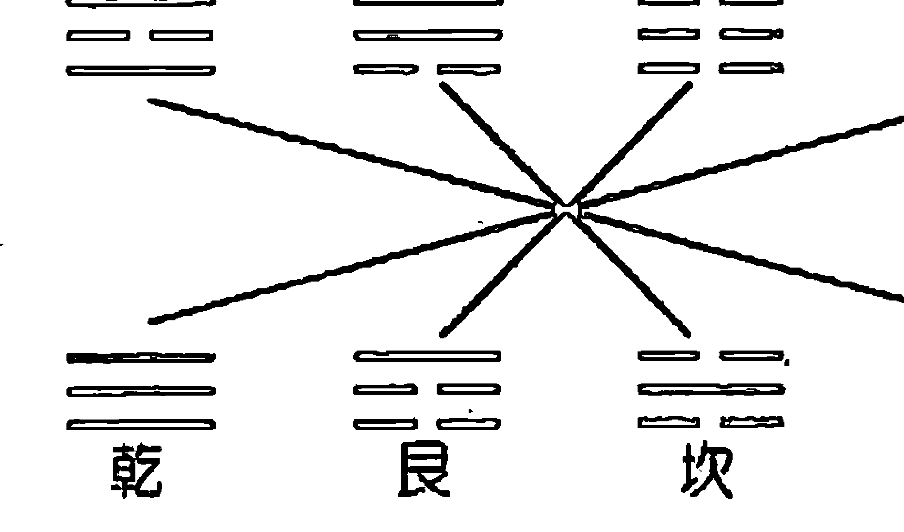

2、按先天的順序：乾與兌對，震與離對，巽與坎對，艮與坤對，自本宮對卦一上一下順序翻之，中起中落，傍起傍止。按天定卦上取本卦的上爻變則為對卦。所以便於翻轉究之。

二、天父卦

天父卦從乾翻起自上而下，而復中而復上，以次遞變乾上爻變為兌為貪狼，兌中爻變為震為巨門，震下爻變為坤為祿存，坤中爻變為坎為文曲，坎上爻變為巽為廉貞，巽中爻變為艮為武曲，艮下爻變為離為破軍，離中爻變為輔弼，是為傍起傍落。

規則：以貪巨祿文廉武破輔弼（輔弼同一卦）確定三吉六秀十貴。

三吉：艮、巽、兌。

六秀：艮納丙、巽納辛、兌納丁并三吉為六秀。

十貴：兌卦合巳丑，震卦三合亥未并六秀為十貴。

### 三、地母卦

地母卦從坤翻起，坤上爻變艮為貪狼，艮中爻變為巽為巨門，巽下爻變為乾為祿存，乾中爻變為離為文曲，離上爻變為震為廉貞，震中爻變為兌為武曲，兌下爻變為坎為破軍，坎中爻變歸本宮為輔弼即為中起中落。

以坤為本宮，坤為地。諸山所托，三吉六秀勢定於此卦。三吉只求來勢好，但以地母卦為主。其艮丙巽辛兌丁巳丑震庚亥未十二陰龍所托，即由坤母卦翻變而來。

三般大卦如何起，元女當年親口傳；

三吉只求來勢好，向家須變鬼爻看。

坤為地母，察龍坤卦索求三吉，本龍以鬼爻求三吉而收四方砂之局氣，向卦以鬼爻索求流水之吉凶，次定三吉而成消納之吉氣。

三吉來山，陽山陰落，陰山陽落，上吉。陽山陽落而陰水朝，陰山陰落而陽水朝則為次吉。

如坤為本龍，艮為貪狼，巽為巨門，兌為武曲，故以艮巽兌為三吉。艮納丙，巽納辛，兌納丁，故以丙辛丁并三吉為六秀，又艮巽震兌四卦抽去中爻余上下二爻都為陰陽得配謂之九六中和。震卦廉貞雖凶而得配為吉。震納庚故以庚并三吉六秀為八貴。而兌的三合為巳丑，震的三合為亥未，以巳丑亥未并八貴為十二吉山都由地母卦而定。八宮都有九曜，地母卦得天定卦的離震相對，艮坤相沖，天父卦得天定卦的乾兌相對，巽坎相對。

地母卦的作用：以貪巨武水到堂為吉，祿文廉破凶，輔半吉。

+   1. 看來水卦的斗輔九星定其福禍。
+   2. 以坐山排九星。
+   3. 九星的順序：輔武破廉貪巨祿文。

兌卦上爻變為乾為貪狼，乾中爻變為離為巨門，離下爻變為艮為祿存，艮中爻變為巽為文曲，巽上爻變為坎為廉貞，坎中爻變為坤為武曲，坤下爻變為震為破軍，震中爻變復為兌為輔弼。

巽卦上爻變為坎為貪狼，坎中爻變為坤為巨門，坤下爻變為震為祿存，震中爻變為兌為文曲，兌上爻變為乾為廉貞，乾中爻變為離為武曲，離下爻變為艮為破軍，艮中爻變復為巽為輔弼。

坎卦上爻變為巽為貪狼，巽中爻變為艮為巨門，艮下爻變為離為祿存，離中爻變為乾為文曲，乾上爻變為兌為廉貞，兌中爻變為震為武曲，震下爻變為坤為破軍，坤中爻變復為坎為輔弼。

艮卦上爻變為坤為貪狼，坤中爻變為坎為巨門，坎下爻變為兌為祿存，兌中爻變為震為文曲，震上爻變為離為廉貞，離中爻變為乾為武曲，乾下爻變為巽為破軍，巽中爻變復為艮為輔弼。

震卦上爻變為離為貪狼，離中爻變為乾為巨門，乾下爻變為巽為祿存，巽中爻變為艮為文曲，艮上爻變為坤為廉貞，坤中爻變為坎為武曲，坎下爻變為兌為破軍，兌中爻變復震為輔弼。

離卦上爻變為震為貪狼，震中爻變為兌為巨門，兌下爻變為坎為祿存，坎中爻變為坤為文曲，坤上爻變為艮為廉貞，艮中爻變為巽為武曲，巽下爻變為乾為破軍，乾中爻變復離為輔弼。

按翻卦之法都以上一爻變為生氣貪狼，上二爻變為天醫巨門，下一爻變為五鬼廉貞，下二爻變為福德武曲，上下二爻變為遊魂文曲，中爻變為絕命破軍，三爻變為絕體祿存，三爻都不變為伏輔弼。

取上一爻變，上二爻變或下一爻變，下二爻變者則乾坤坎離四陽卦，必變震艮兌巽四陰卦，而四陰卦必變為四陽卦。
坐山以三吉為用。即所謂陽龍坐陰山，立陽向陰，陰龍坐陽山，立陰向陽。

### 四、壺中鬼卦

+   1、以本山起，如乾山巽向即從乾山上起輔武破廉貪巨祿文，看其砂的吉凶。
+   2、又從本山下羅經，即從鬼爻倒數即為壺中鬼卦。如乾山即從巽上起輔九星以觀水吉凶。
+   3、如坤山就從震上起倒數與五鬼同行，此即所謂壺中鬼卦。也就是坤山的第一陰爻變為陽爻，即為震卦。再配天星五鬼，即為震、兌、乾、離、艮、巽、坎、坤。再按：五鬼、絕命、天醫、生氣、遊魂、絕體、福德、本宮。

## 奇門堪輿學

順變卦相對應配上納甲則為：

+   - 一變 震庚亥未五鬼
+   - 二變 兌丁巳丑絕命
+   - 三變 乾甲天醫
+   - 四變 離壬寅戌生氣
+   - 五變 丙艮游魂
+   - 六變 巽辛絕體
+   - 七變 坎癸申辰福德
+   - 八變 本宮坤乙。

4、每個坐山卦起變第一爻卦序：

+   - 艮變離 巽變乾 坎變兌 震變坤
+   - 兌變坎 離變艮 乾變巽 坤變震

5、規則：

+   - A、每卦均從第一爻由下而上，由上而下來回八次。
+   - B、配上納甲和地支三合的地支。
+   - C、以五鬼對應第一變爻順佈：二絕命，三天醫、四生氣、五游魂、六絕體、七福德。
+   - D、天定八卦都抽出中爻後，只有巽艮兌震四配對成吉，由此而得三吉、六秀、十貴。
+   - E、當八卦都抽出中爻後上下二爻，陰陽相配則吉，失配則凶。
+   - F、八卦內只有巽艮兌震為四吉。震雖屬廉貞五鬼而取其配對故稱十貴之一。
+   - G、內變爻卦加上九星，以爻變序數為準。

## 奇門遁甲學

+   * 一變艮丙、貪狼、生氣、木。
+   * 二變巽辛、巨門、天醫、土。
+   * 三變乾甲、祿存、絕體、土。
+   * 四變離壬戊寅、文曲、游魂、土。
+   * 五變震庚亥未、廉貞、五鬼、火。
+   * 六變兌丁巳丑、武曲、福德、金。
+   * 七變坎癸申辰、破軍、絕命、金。
+   * 八變坤乙、輔弼、本宮、木伏。

山與向既有陰陽的不同，故論向則由自本宮五鬼方的對位起貪狼，而以本宮與五鬼互易稱五鬼卦。如乾為本宮，巽為五鬼，順次為絕命、天醫、生氣、游魂、絕體、福德、本宮。乃轉以五鬼巽為本宮，自巽上對宮坎起貪狼，坤上為巨門，震上為祿存，兌上為文曲，乾上為廉貞，離上為武曲，艮上為破軍，巽上為輔弼。

然後，乾巽互易仍以乾為本宮，巽為五鬼，則所得坎坤離三吉。又皆與乾本宮淨陽而其卦變逐一上一下，以輔武破廉貪巨祿文為序，然則變卦的吉凶皆以所分的陰陽定。

先天八卦上一爻變者，本象所生陰陽相配。相生相比是猶同氣而相得，故為生氣。上二爻變者，本羲所生奇偶，相配相制而不相害，是補偏而效弊。

而天醫一爻變者，陽往交陰，陰往交陽，往為屈，屈為鬼，而卦序皆相隔五位，故為五鬼；下二爻變者，老少同儔陰陽，交易志相得氣，相生故為福德；上下二爻變者陽儀隔位而交於陰陽儀位隔而交於陽，陰陽奇偶都不相配，故說游魂。中一爻變者陽爻隔位而還於陽陰爻隔位，還於其氣反歸而交克所以叫絕命。另外如果三爻都變則卦位對沖，全非本體所以叫絕體。三爻都不變則自得本宮叫伏位，也叫伏吟。

在八宮卦象則上爻持世卦為本宮伏位，初世卦為五鬼，二世卦為福德，三世卦為絕體，四世卦為天醫，五世卦為生氣，游魂卦為游魂，歸魂卦為絕命。

### 五、小游年變卦

小游年變卦也叫九曜又名翻卦。從乾卦翻則為天父卦，從坤卦翻則為地母卦。都由天定卦翻變而出净阴净阳三吉六秀八贵十二吉龙。因阳宅又有游年变卦之法。故此小游年其法以贪狼、巨门、禄存、文曲、廉贞、武曲、破军、左辅、右弼为序，以八卦而论则右弼与左辅同宫。

以九宫而论，则贪狼为一白属水，巨门为二黑属土，禄存为三碧，文曲为四绿属木，廉贞为五黄属土，武曲为六白属金，破军为七赤属金，左辅为八白属土，右弼为九紫属火。

以五星而论则贪狼为生气属木，巨门为天医属土，禄存为绝体属土，文曲为游魂属水，廉贞为五鬼属火，武曲为福德属金，破军为绝命属金，辅弼从本宫无属。

从龙上起：以贪狼、巨门、武曲、廉贞为吉禄，禄存、文曲、破军、弼辅为凶。

从向上起：以贪狼、巨门、武曲、文曲为吉，禄存、廉贞、破军、辅弼为凶。

### 六、大游年变卦

大游年变卦相宅家用之选择，有以宅长行年配合修造之说。故名游年。有游年變卦之法，故此名大游年小陰而太陽，其法也由天定卦翻變而出。以乾坤艮兌為西四宅，震巽坎離為東四宅。

以貪狼、廉貞、武曲、文曲、祿存、巨門、破軍、輔弼為序。如乾為本宮，乾上爻變為兌為貪狼，兌中爻變為震為五鬼，震下爻變為坤為武曲，坤中爻變為坎為文曲，坎上爻變為巽為祿存，巽中爻變為艮為巨門，艮下爻變為離為破軍，離中爻變復為乾為輔弼。凡大門方位，須與坐山之卦，東不雜西，西不雜東者為吉。

陽宅之法，以乾兌為老陽，艮坤為老陰，離震為少陰，巽坎為少陽。二老相配為西四宅，二少相配為東四宅。東西各自相配為吉，交錯相配為凶。所以變卦的吉凶與小游年有同异。

翻卦之法皆以上一爻變為生氣貪狼，下二爻變為天醫巨門，三爻俱變為延年武曲，三爻俱不變為伏位輔弼。

上一爻變者則乾兌互變，艮坤互變，離震互變，巽坎互變，下二爻變者則乾艮互變，兌坤互變，離巽互變，震坎互變。三爻俱變者則乾坤互變，兌艮互變，離坎互變。三爻俱不變者則自得本宮。皆老少各相配故為吉，此外則老少交錯相配為凶。也在八宮卦象則上爻持世卦為伏位，初世爻卦為禍害，二世爻卦為天醫，三世爻卦為延年，四世爻卦為五鬼，五世爻卦為生氣，游魂卦為六煞，六世爻歸魂卦為絕命與小游年例也有异同。

規則 1：以貪廉武文祿巨破輔為順序，佈於天定卦對宮，以生氣配貪狼。

艮丙貪狼（生氣）木，
巽辛巨門 (天醫) 土。
乾甲祿存 (禍害) 絕體土。
離壬寅戌文曲 (六煞) 游魂木。
震庚亥未廉貞 (五鬼) 水。
兌丁巳酉武曲 (延年) 福德金。
坎癸申辰破軍 (絕命) 金。
坤乙輔弼 (本宮) 木。

+   1. 乾坤艮兌為西四宅，
+   2. 震坎巽離為東四宅。

### 七、佈天父、地母、游年卦規則：

+   1. 從左到右，卦起第二行和第三行則逆數。
+   2. 從左到右，卦起第一行或第四行則順數。
+   3. 中起中落，傍起傍落。

+   (1) 離5巽7坤1兌3
        乾6艮8坎2震4
+   (2) 離3巽1坤7兌5
        乾4艮2坎8震6
+   (3) 離8巽6坤4兌2
        乾7艮5坎3震1
+   (4) 離7巽5坤3兌1
        乾8艮6坎4震2
+   (5) 離6巽8坤2兌4
        乾5艮7坎1震3
+   (6) 離1巽3坤5兌7
        乾2艮4坎6震8
+   (7) 離4巽2坤8兌6
        乾3艮1坎7震5
+   (8) 離 巽 坤 兌
        乾 艮 坎 震

## 第二十節 日時擇吉法

+   1. 訣：正七起子二八寅，三九原來卻在辰；四十須知午上起，五月十一并居申；六十二月起於戌，黃道為祥黑道凶。

黃黑道日時順序：青龍、明堂、天刑、朱雀、金匱、天德、白虎、玉堂、天牢、玄武、司命、勾陳。
黃道：青龍、明堂、金匱、天德、玉堂、司命。
黑道：天刑、朱雀、白虎、天牢、玄武、勾陳。

| 月日 | 寅申 | 卯酉 | 辰戌 | 巳亥 | 子午 | 丑未 |
| :--- | :--- | :--- | :--- | :--- | :--- | :--- |
| 起青龍 | 子 | 寅 | 辰 | 午 | 申 | 戌 |

定義：

青龍：主人事運動前途順利，吉瑞環繞之象。宜開業、慶典、建房、財官。

明堂：主人事運動前景光明之象。宜求學、謀職、搬遷、考試。

天刑：主人事運動困難層層，耗力神散之象。為爭執、謀鬥。

朱雀：主人事運動中有小人作梗，環境復雜之象。宜文藝、體育、演講。

金匱：主人事運動中有財源，喜樂之象。宜炒股、打牌、彩票、官祿。

天德：主人事運動中受天之弼佑，轉危為安，吉星高照。宜搬遷、婚喜。

白虎：主人事運動中矛盾沖突之象。諸事宜緩。為擯責。

玉堂：主人事運動中受貴人譽、提之象。宜合作、導師、拜友、吉財。

天牢：主人事運動被囚，停滯，不動之態。宜看書、煉功。

玄武：主人事運動變幻不定，神秘、飄蕩之態。諸事不吉。

司命：主人事運動受上天之命進行發展之態。宜生產、合作、求道、仕途。

勾陳：主人事運動復雜，勾連不斷之態。諸事不順。

### 2、天德日訣:

天德財旺聖賢出，福佑常蔭寶地豐。

兒孫孝義顯大貴，事逢天德朝廟中。

範圍：表示解百禍，凶變吉，尊長貴人喜。表示顯貴，逢凶化吉之妙，但逢凶神或惡煞刑沖或落空亡則不為貴。

正月在丁（未），二月在申（庚），三月在壬（亥），四在辛（戌），五月在亥（壬），六月在甲（寅），七月在癸（亥），八月在寅（甲），九月在丙（巳），十月在乙（辰），十一月在巳（丙），十二月在庚（申）。

### 3、月德日訣:

月德小村出權貴，相稱朝人萬人仰。

事遇月德多財路，金車銀具不用張。

範圍：表示尊長貴人和合，也表示解百禍。表示福氣，女性逢此，性情溫順賢良，而且為貞操之人，也有逢凶化吉之妙用，人命天德、月德，必福祉長壽。

一、五、九月在巳（丙），三、七、十一月在亥（壬），二、六、十月在寅（甲），四、八、十二月在申（庚）。

## 第一章 運算規則及判斷步驟

### 第一節 奇門堪輿推演規則及步驟

#### 一、提要

+   1. 查當時所在元和運，排出當運盤。
+   2. 確定山和向并演運盤。
+   3. 確定城門。
+   4. 確定格局。
+   5. 分析判斷。

#### 二、步驟：

第一步：確定山和向
規則：山即山所座的位置，向即所朝的方向。
當運的方位為正神，對方為零神。正神為當元的旺神，零神為出元的衰神。

第二步：以所行運的數為起始點佈入中宮，再以此運數順佈九宮。

第三步：由第二步順宮佈的數相對應的宮，找到與山和向對應的數。

第四步：以到山的落宮數為準，看山是落在三元中哪一元。
規則：
坐山的干支卦為地元龍，與向對應的干支卦也為地元龍。
坐山的干支卦為天元龍，向的對應的干支卦也為天元龍。

坐山的干支卦为人元龙，向的对应的干支卦也为人元龙。若落宫数属阳，则以此宫数为起点，在中宫顺布九宫数，若落宫数属阴，则以此宫数为起点，在中宫逆布九宫数。注：山向的阴阳是以山向数入中宫，找出后天八卦中山向之数所对应的同一元龙的阴阳来定的。

第六步：以向所落宫数为准，根据上面的规则可知山与向必为相应同元龙。若向宫属阳，则以此宫数为起点，在中宫顺布九宫。若向宫属阴，则以此宫数为起点，在中宫逆布九宫。

例如：现七运，造作壬山丙向之局。要点：壬为地元龙，丙也为地元龙。壬山在坎一宫（壬子坎）丙向在离九宫（丙午）。根据年限布好运盘后，再按所定之山向找到对应宫位之九星，依天地人三元阴阳飞布各宫。阳顺布，阴逆布。

- 1. 先布好七运盘。七运则七进中宫，顺布九宫。

| 巽6 | 2离 | 4坤 |
|-----|-----|-----|
| 震5 | 7中 | 9兑 |
| 艮1 | 3坎 | 8乾 |

根据此运盘来布山星盘和向星盘。

## 2、布山星

#### (1) 确定起始点。

在七运盘中壬居坎宫现由三碧星主管，则把三碧作起始点布入中宫。

#### (2) 同元一气阳顺布，阴逆布。

由于三碧在固定盘为震宫甲卯乙，甲和壬同为地元阳龙，所以顺布九宫数，即四绿到乾宫，五黄到兑宫，六白到乾宫，其它依此类推。

| 2巽 | 7离 | 9坤 |
|-----|-----|-----|
| 1震 | 3中 | 5兑 |
| 6艮 | 8坎 | 4乾 |

(山星盘)

## 3、布向星

#### (1) 确定主管星。

在七运盘中丙居离宫现由二黑星主管，则把二黑星作起始点入中宫。

#### (2) 同元一气阳顺布，阴逆布。

由于二黑在固定盘为坤二宫未坤申，与丙同元的为未，而未为地元阴龙，阴则逆布，所以逆布九宫数，即如图所示。

| 3 巽 | 7 离 | 5 坤 |
|-----|-----|-----|
| 4 震 | 2 中 | 9 兑 |
| 8 艮 | 6 坎 | 1 乾 |

(向星盘)

4、将七运盘、山星盘及向星盘合为一体，成为下元七运壬山丙向飞星总图，并标上坐标。如图所示：

### 下元七运壬山丙向飞星总图

↑ 丙向

| 2 3<br>巽六 | 7 7<br>离二 | 9 5<br>坤四 |
| 1 4<br>震五 | 3 2<br>中七 | 5 9<br>兑九 |
| 6 8<br>艮一 | 8 6<br>坎三 | 4 1<br>乾八 |

壬山

说明：此飞星总图中的每组数字，第一位为运，第二位为山（坐向），第三位为向（朝向），以下均同。

### 第二节 布年、月、日、时星

## 一、布年星盘。根据元运推算，找出每年入中宫之主管星，再以这星为主布九宫。它则主管所要运算的那年祸福状况。

规则：上元甲子一白求，中元甲子四绿游，下元甲子七赤位。

### 解释：

- 1. 上元甲子之年一白布入中宫，乙丑之年九紫布入中宫，丙寅之年八白布入中宫，其它以此类推。
- 2. 中元甲子年四绿布入中宫，推算法同上。
- 3. 下元甲子年七赤布入中宫，推算法同上。

### 例如：找下元七运庚辰年是什么星主管。

- (1) 根据下元甲子年七赤布入中宫，则乙丑年是六白，丙寅年是五黄，依次类推，己卯年一白，庚辰年是九紫。所以把九紫布入中宫。
- (2) 然后顺布九宫，即一白入乾，二黑入兑，...如图所示，庚辰年全年各个星主管各个宫。
- (3) 将年星盘与山和向两星盘作全年比较定吉凶。

| 8巽 | 4离 | 6坤 |
|-----|-----|-----|
| 7震 | 9中 | 2兑 |
| 3艮 | 5坎 | 1乾 |

年星盘

#### 二、布月星盘

在年星的基础上推算月星。

规则：月份顺数，星逆行。注意节气。

- 1. 子午卯酉之年正月起八白。
- 2. 辰戌丑未之年正月起五黄。
- 3. 寅申巳亥之年正月起二黑。

例如：庚辰年二月

- (1) 根据辰戌丑未之年正月起五黄和“月份顺数，星逆行”的规则。庚辰年正月五黄布入中宫，二月四绿入中，三月三碧入中，依次类推。二月四绿布入中宫。
- (2) 然后顺布九宫，如图所示。
- (3) 布好月星盘后，将月星盘与年星盘、山盘及向盘作比较定吉凶。

| 3巽 | 8离 | 1坤 |
|-----|-----|-----|
| 2震 | 4中 | 6兑 |
| 7艮 | 9坎 | 5乾 |

### 月星盘

#### 三、布日星盘

规则：冬至——芒种末日是顺数；夏至——大雪末日是逆数。

- 1. 冬至后甲子日用一白入中宫。
- 2. 雨水后甲子日用七赤入中宫。
- 3. 谷雨后甲子日用四绿入中宫。
- 4. 夏至后甲子日用九紫入中宫。
- 5. 处暑后甲子日用三碧入中宫。
- 6. 霜降后甲子日用六白入中宫。

例如：庚辰年二月初三日（乙丑日）

- 1. 二月初三为雨水后，根据冬至——芒种末日顺数以及雨水后甲子日用七赤入中宫，甲子日用七赤，所以乙丑日用八白入中宫。
- 2. 八白布入中宫，然后顺布九宫，即九紫到乾宫，一白到兑宫等等，如图所示便为庚辰年二月初三日（乙丑日）日星盘。

| 7巽 | 3离 | 5坤 |
|-----|-----|-----|
| 6震 | 8中 | 1兑 |
| 2艮 | 4坎 | 9乾 |

### 日星盘

将日星盘与月、年、山、向等各星盘对比定吉凶。

#### 四、布时星盘

规则：
- 1. 子午卯酉日
  - 冬至后：子时由一白入中顺布。
  - 夏至后：子时由九紫入中逆布。
- 2. 辰戌丑未日
  - 冬至后：子时由四绿入中顺布。
  - 夏至后：子时由六白入中逆布。
- 3. 寅申巳亥日
  - 冬至后：子时由七赤入中顺布。
  - 夏至后：子时由三碧入中逆布。

例如：庚辰年农历二月初三日巳时（乙丑日巳时）

- (1) 二月乙丑日巳时为冬至后，子时由四绿入中主管顺数，所以子时为四绿，丑时为五黄，寅时为六白，卯时为七赤，辰时为八白，巳时为九紫，即九紫入中。
- (2) 九紫入中，其它星顺布九宫，即一白乾宫，二黑兑宫等等，如此便布好了时星盘。

| 8巽 | 4离 | 6坤 |
|-----|-----|-----|
| 7震 | 9中 | 2兑 |
| 3艮 | 5坎 | 1乾 |

时星盘

- (3) 将时星盘与日、月、年、山、向等各星盘作对比定吉凶。

### 第三节 五黄排法规则

五黄在坐山或朝向时山向盘的排法:

- 1. 首先以当时元运所居的宫作为五黄的寄宫，如七运时五黄则寄在七宫 (兑宫)，九运时则五黄寄在九宫 (离宫)。
- 2. 其次再看此运坐山朝向的元龙，再在寄宫中找出其同元龙定阴阳，阴逆阳顺。

例如：九运丁山癸向。

规则:

- 1. 先排九运的时运盘。

九入中宫，一入乾宫，二入兑宫，三入艮宫，四入离宫，五入坎宫，六入坤宫，七入震宫，八入巽宫，即坐山上落四，坐向上落五。

- 2、排四绿的山星盘。
癸为人元龙，找出四绿在巽宫中的同元龙，即对应巳的元龙属阳，故顺数。五落乾宫，六落兑宫，七落艮宫，八落离宫，九落坎宫，一落坤宫，二落震宫，三落巽宫。

- 3、排五黄的向星盘。
五黄按时运寄在时运宫（九宫）中，即在九宫（离宫）中找出与癸向相应的同元龙，属阴，故五黄阴逆数。则四绿入乾宫，三碧入兑宫，二黑入艮宫，一白入坤宫，九紫入坎宫，八白入坤宫，七赤入震宫，六白入巽宫。

丁山
| 3 6 八 | 8 1 四 | 1 8 六 |
| :---: | :---: | :---: |
| 2 7 七 | 4 5 九 | 6 3 二 |
| 7 2 三 | 9 9 五 | 5 4 一 |
癸向

### 第四节 太阳到山到向三合照

| 二十四山 | 太阳到山 | 太阳到向 | 太阳三合照 |
| :--- | :--- | :--- | :--- |
| 壬 | 立春到山 | 立秋到向 | 芒种到坤。寒露到乙。 |
| 子 | 大寒到山 | 大暑到向 | 小满到申。秋分到辰。 |
| 癸 | 小寒到山 | 小暑到向 | 立夏到庚。白露到巽。 |
| 丑 | 冬至到山 | 夏至到向 | 谷雨到酉。处暑到巳。 |
| 艮 | 大雪到山 | 芒种到向 | 清明到辛。立秋到丙。 |
| 寅 | 小雪到山 | 小满到向 | 春分到戌。大暑到午。 |
| 甲 | 立冬到山 | 立夏到向 | 惊蛰到乾。小暑到丁。 |
| 卯 | 霜降到山 | 谷雨到向 | 雨水到亥。夏至到未。 |
| 乙 | 寒露到山 | 清明到向 | 立春到壬。芒种到坤。 |
| 辰 | 秋分到山 | 春分到向 | 大寒到子。小满到申。 |
| 巽 | 白露到山 | 惊蛰到向 | 小寒到癸。立夏到庚。 |
| 巳 | 处暑到山 | 雨水到向 | 冬至到丑。谷雨到酉。 |
| 丙 | 立秋到山 | 立春到向 | 大雪到艮。清明到辛。 |
| 午 | 大暑到山 | 大寒到向 | 小雪到寅。春分到戌。 |
| 丁 | 小暑到山 | 小寒到向 | 立冬到甲。惊蛰到乾。 |
| 未 | 夏至到山 | 冬至到向 | 霜降到卯。雨水到亥。 |
| 坤 | 芒种到山 | 大雪到向 | 寒露到乙。立春到壬。 |
| 申 | 小满到山 | 小雪到向 | 秋分到辰。大寒到子。 |
| 庚 | 立夏到山 | 立冬到向 | 白露到巽。小寒到癸。 |
| 酉 | 谷雨到山 | 霜降到向 | 处暑到巳。冬至到丑。 |
| 辛 | 清明到山 | 寒露到向 | 立秋到丙。大雪到艮。 |
| 戌 | 春分到山 | 秋分到向 | 大暑到午。小雪到寅。 |
| 乾 | 惊蛰到山 | 白露到向 | 小暑到丁。立冬到甲。 |
| 亥 | 雨水到山 | 处暑到向 | 夏至到未。霜降到卯。 |

### 第五节 月行二十四山

| 月 | 二十四山 | 节 | 气 | 太阳到山 |
| --- | --- | --- | --- | --- |
| 一月 | 壬 | 立春 |  | 太阳立春到壬山 |
| 一月 | 亥 |  | 雨水 | 太阳雨水到亥山 |
| 二月 | 乾 | 惊蛰 |  | 太阳惊蛰到乾山 |
| 二月 | 戌 |  | 春分 | 太阳春分到戌山 |
| 三月 | 辛 | 清明 |  | 太阳清明到辛山 |
| 三月 | 酉 |  | 谷雨 | 太阳谷雨到酉山 |
| 四月 | 庚 | 立夏 |  | 太阳立夏到庚山 |
| 四月 | 申 |  | 小满 | 太阳小满到申山 |
| 五月 | 坤 | 芒种 |  | 太阳芒种到坤山 |
| 五月 | 未 |  | 夏至 | 太阳夏至到未山 |
| 六月 | 丁 | 小暑 |  | 太阳小暑到丁山 |
| 六月 | 午 |  | 大暑 | 太阳大暑到午山 |
| 七月 | 丙 | 立秋 |  | 太阳立秋到丙山 |
| 七月 | 己 |  | 处暑 | 太阳处暑到己山 |
| 八月 | 巽 | 白露 |  | 太阳白露到巽山 |
| 八月 | 辰 |  | 秋分 | 太阳秋分到辰山 |
| 九月 | 乙 | 寒露 |  | 太阳寒露到乙山 |
| 九月 | 卯 |  | 霜降 | 太阳霜降到卯山 |
| 十月 | 甲 | 立冬 |  | 太阳立冬到甲山 |
| 十月 | 寅 |  | 小雪 | 太阳小雪到寅山 |
| 十一月 | 艮 | 大雪 |  | 太阳大雪到艮山 |
| 十一月 | 丑 |  | 冬至 | 太阳冬至到丑山 |
| 十二月 | 癸 | 小寒 |  | 太阳小寒到癸山 |
| 十二月 | 子 |  | 大寒 | 太阳大寒到子山 |

### 第六节 紫白、洛书、九星、飞布八方

一、规则：坎宅一白入中，二黑乾，三碧兑，四绿艮，五黄离，六白坎，七赤坤，八白震，九紫巽。
八宅均以本宅入中，照此飞去。

二、九星各有五行：一白水，二黑五黄八白土，三碧四绿木，六白七赤金，九紫火。

三、
- 1. 乾宅遇二黑五黄八白土是八方来生中宫为旺。
- 2. 乾宅遇一白水是中宫去生八方，为退。
- 3. 乾宅遇七赤金，是与中宫为比和。
- 4. 乾宅遇九紫火，是八方来克中宫为杀。
- 5. 乾宅遇三碧四绿是中宫去克八方，为死。

四、要点：三元是为上中下，生旺退杀，都以三元气运为主，得运元则吉，失运元则凶。

- 1. 一白水遇六七金为生，为旺。然未交金水元运，则水不得令仍为衰废。
- 2. 一白水遇三四木则为退，遇二八土为杀。当正交金水元运，则一白得令。

### 第七节 河图洛书相互为用

一、河洛相参
- 1. 以洛书的九星，遇河图的五子运，喜生旺比和，忌死退克杀。
- 2、洛书的三四木星，遇河图庚子运，木被金克，故逢劫盗。
- 3、洛书的九紫火星，遇河图戊子木运，木能生火，故沐恩荣。

#### 二、洛书之运：大元小运，共兼齐管

- 1、大运、小运
  - ①、上元一白，中元四绿，下元七赤，各管六十年，谓大运。
  - ②、上元一二三，中元四五六，下元七八九，各管二十年则为小运。

上元大运中，一白统管六十年；而前二十年中小运一白管，中二十年二黑管，后二十年三碧管。

中元大运中，四绿统管六十年；而前二十年小运四绿管，中运二十年五黄管，后二十年六白管。

下元大运中，七赤统管六十年；而前二十年小运七赤管，中元二十年八白管，后二十年九紫管。

上中下三元，共一百八十年。九星则一白到九紫，周而复始。

#### 三、元运既分，吉凶论局

- 1、三元之运，生旺退杀，俱由此别，吉凶应验，均在局上。局者为龙穴砂水方位。
  - ①、上元前二十年，大小运都由一白司今，若所住屋的龙砂水都为一白，为元龙主运，发福无疆。

元即三元，龙即龙穴。一白龙遇一白运，则为一白专主，不杂他运，所以叫做主运。

- ②、中元二十年小运是二黑司令，住屋的龙穴砂水都为二黑，一样能发福。
- ③、上元前中二十年如此，后二十年可知。
- ④、但二者不可得兼，当一白司命，而震巽受元运之生，四绿乘时，而震巽合元运之旺，此方居住，余庆吉祥。
- ⑤、主运不可得，或一白运，震巽受生气，四绿运，震巽受旺气，住震巽方之屋，也主获福。

#### 四、先天返后天，后天返先天

##### 1、兑金坤土

当上元一白水运，则金生水为退气，土克水为死气，然而先天的坎在后天的兑位，后天的坎在先天的坤位，兑虽为后天的退气，而先天却得令，坤虽为后天的死气，而先天为乘旺气，坤兑都为先天之吉而不为衰。

先天的巽在后天的坤位，坤虽被中元木克，而先天巽木是得令的。后天的巽在兑位，兑虽克中元木，而先天巽木正值得令，是中元木运，坤兑也是先天之吉，所以为旺。

##### 2、河图：一六共宗，二七同道，三八为朋，四九为友

一白司上元，而六白同旺。四绿主中元，而九紫均兴。七赤居下元而二黑并发。

当局未得运，而局的生旺财方，与运山向盘的六种关系相关联而得到者，也是一样的发福。

3、水为第一，山为第二，高楼殿塔亭台为第三。再以其山与之相应的六种关系，或行大运，或行小运，都可富荣。

尊看其局，重在河洛二运。

局外六事：凡屋外桥庙山物都是。
局内六事：凡楼层、屋内、门户、井灶都是。

这些都必须从局的山上飞布九宫，生旺为福，克泄为祸。六事排在局、山、楼层房间的生旺方，不犯关煞。若交河洛二运，发福非常。即使运没交上也为小康。若排在关杀方不交运还可以，一得运则兴灾作祸，有的甚至不可阻挡。

### 第八节 河图五子运与楼层房间的关系及作用

一、河图之数；一六水，二七火，三八木，四九金，五十土。一生一成，顺排其序。

#### 规则 1:

- 甲子十二年为水运，丙子十二年为火运，戊子十二年为木运，庚子十二年为金运，壬子十二年为土运，此为河图五子运。

##### 规则 2:

- 一六同宗，二七同道，三八为朋，四九为友。
楼房的楼层和房间喜五子运生旺，忌退杀死。
楼房的第一层的第一间和第六层的第六间都为水数。
楼房的第二层的第二间和第七层的第七间都为火数。
楼房的第三层的第三间和第八层的第八间都为木数。
楼房的第四层的第四间和第九层的第九间都为金数。
楼房的第五层的第五间和第十层的第十间都为土数。

#### 规则 3:

- 当楼房超过十层后则用十来除，余数为几，就是几层的生成数。

规则 4： 楼房的顺序以进房后为第一间，或两边都有路者，从左边起数为1顺排。

规则 5： 一楼的第一间和六楼的第六间都为水数。

- ①、当逢庚子金运到时，金生水数，运生楼层房间则为发丁而渐荣。
- ②、当逢丙子火运来时，楼层水数克丙子火运，克运则损丁吉凶参半。
- ③、当逢戊子木运来时，水数楼房生戊子木运，生运则为退，退则必为冷退、贫穷、绝嗣。
- ④、当逢甲子水运来到时，同类则旺，旺运发禄而骤富。
- ⑤、当逢壬子土运来到时，水数楼房被运克为杀，有祸生、不测或官事连绵之忧。

#### 二、河图五子运在奇门堪舆中的作用

- 1、河图五子运最能影响人的官职及社会地位的高低，得运者高官连升，社会影响逐渐加大。
- 2、河图五子运在人事的进程中可以通过调房接五子运来改变或转折。
- 3、河图五子运逢生旺时，人口兴盛并发财旺家。
- 4、河图五子运在宅居中的厨房位与五子运旺相，则家资逐渐雄厚。
- 5、卧床方位得五子运生旺，人口丰满，财物不愁。
- 6、厨房、卧室喜五子运。厕所、客厅不喜五子运，此二处为散气之地，对家中的人口不利。

#### 三、河图五子运与三元九运的区别

## 奇门堪舆学

- 1、五子运主管人事、根基、家族人丁。
  九运主管财物、妻妾。
- 2、五子运在阳宅中若进气为五子运为最佳，其次为朝向，主根基深厚，荫佑后代子孙。
  九运在阳宅中若居卧室、厨房、副房也为主，可主在室内居者兴旺、得力、发达、事业易得周围人的帮助。
- 3、五子运在总体局中以判大事为主。
  九运则与之相反，相对于个体而言。
- 4、五子运在场未完全相应时，即时空未到时不可借代超越。
  九运则可通过打劫借气接未来之运气。

### 第九节 三元九运与楼层、房间号的计算规则及作用

#### 一、计算规则：

##### 规则 1：

- ①以当运的令星为主，楼房以第一层为当运令星的起始数推数到所住的楼层止。
- ②再以所到的楼层数为起始点，按门牌号数到所住的房间门牌号为止。

由此得第一组数中两个数。一为由运推数的楼层星数，另一个为由楼层星数推数的门牌星数，此为第一组数。

##### 规则 2:

- ①、根据流年口诀，推数出当年的流年的主管星。
- ②、以流年主管星为第一层的起始数，顺数到所住的楼层为止。
- ③、再以所得的楼层数为起始点，从一楼的一号门推数到所住的门牌号为止。

由此得出第二组中的两个数。由流年推数的楼层星数和由楼层星数推数的门牌星数。此为第二组数。

#### 二、第一组数（当运楼层数和门牌号星数）与运山向星盘的关系及作用。

- 1. 第一组数代表局部的性质；山向盘代表整体的气运接纳情况。
- 2. 第一组数代表每户在三元九运中个体的发展趋势；山向盘表示整座楼的二十年气运的形势。
- 3. 第一组数作用具体的哪一家；山向盘则作用于方位相同的任何一家。
- 4. 第一组数的能量发挥受控于山向盘。
- 5. 第一组数的发展趋势参照每户居于山向盘中的方位的数，比较参用定吉凶。
- 6. 第一组数被三元九运生合的当令星的五行则吉。
- 7. 第一组数被五子运生合或合成生成数则大吉。
- 8. 若第一组数的楼层数克门牌数又不得运气生旺则小凶。
- 9. 若第一组数的楼层数生门牌数则小吉。
- 10. 若门牌数生楼层数又不得运数相生则损财，耗气。
- 11. 若门牌数受克于楼层数又受制于运数则凶不可免。
- 12. 若门牌数与楼层数比和逢九运来生时，增财添喜。
- 13. 层楼数为阳，为外，门牌数为阴，为内。

以上分析是大运二十年内的情况，而第二组数与当运星向## 第十節 三元六甲納音

三元和六甲同臨一個宮，其中宮的干支、納音則不同，又叫統臨。

- 六甲為：甲子、甲戌、甲申、甲午、甲辰、甲寅。

### 一、三元六甲論生剋

規則：以入中宮干支的納音五行與八山相比論生剋。生山則吉，剋山則凶。

三元：上元甲子在坎宮，中元甲子在巽宮，下元甲子在兌宮。

- (1) 上元坎上起甲子，逆數到中宮止，得出中宮的納音：離為乙丑，艮為丙寅，兌為丁卯，乾為戊辰，中為己巳。己巳納音為大林木，為木音。
- (2) 中元巽上起甲子，震上為乙丑，坤上為丙寅，坎上為丁卯，離上為戊辰，艮上為己巳，兌上為庚午，乾上為辛未，中為壬申。壬申納音為劍鋒金，為金音。
- (3) 下元兌上起甲子，乾上為乙丑，中宮為丙寅，丙寅納音為爐中火，為焰。

### 二、六甲原坐與飛星生剋

- 1、原坐即為上元甲子在坎，甲子為原坐。
- 2、飛星即以六甲旬飛到八山的干支，又叫專臨或臨坐。
- 3、運算規則：
    - A、上元甲子到坎宮逆數到癸酉為第一飛星，再以癸酉入中宮順飛，到坎為戊寅為第二飛星，即以戊寅與原甲子合論生剋。
    - B、第一次飛來所臨宮的坐星，和第二次飛到星，與山相生，則為生見生，相剋則為生見殺。
    - C、第一次飛來臨宮的坐星，為此山為旺，而第二次到的星，與山又相生，則為旺見生。
- 4、所臨坐星被山剋，則為旺見退，生旺退殺，禍福都有。
- 5、統臨、專臨總斷規則：
    - A、統臨、專臨都善，為大吉大利。
    - B、統臨不好，專臨卻善，不失為吉。
    - C、統臨善而專臨不善，不免有凶而無難。
    - D、統臨、專臨都不善，凶不可免。
    - E、統臨、專臨重在專臨。
    - F、流年干支入中宮順飛，雖不得九星之吉，歲音之生旺，修動也能獲吉。

### 三、三元六甲納音與八山

- 1、六甲納音揭示了物質的結構組織的基本來源和出處。
    - A、三元六甲納音五行與八山的生剋代表人事間物質結構的組成的協調性，即事物內部構造的完整性，從中可以看出結果的預兆。
    - B、原坐與八山的生剋代表事物的起因及貴人的力量級別與誠意。
    - C、飛星與八山的關係主要是表示事物的隨機改變性的系數大小。八山剋飛星則改變性系數小，八山生飛星則改變性系數大。
    - D、在人事看流年的官級品位也可依此法判之，此為外事門中的官祿法，指小的調動，大的變動（如國家行政官員）必須結合五子運。

### 四、三元六甲原坐與飛星的作用及意義

- 1、原坐與臨坐的關係表示內事門和人心向背、家庭、根基。也表示夫婦之間、主客之間、商賈之間，凡暫時發生的事物，有極強的階段性的都可以用此法判之。
    > 原生臨為大吉，原剋臨為凶，
    > 臨剋原為大凶，臨生原為耗力，小吉。

### 五、流年納音生旺的作用

- 1、流年干支入中宮順佈九星。
- 2、流年生旺法主要用於對一年內的事物進程的管轄。
- 3、範圍：情感方面、兒女、私財、家庭內部、工作伙伴等。
- 4、看其五行主年內主管事物的五行。

### 第十一節 奇門與八宮

#### 一、八門

- 1、八門即休門、生門、傷門、杜門、景門、死門、驚門、開門。其五行與對應宮五行相同。
- 2、八門加臨八山：乾山艮上起休門，坎山震上起休門，艮山巽上起休門，震山離上起休門，巽山坤上起休門，離山兌上起休門，坤山乾上起休門，兌山坎上起休門。

順佈八門於八宮，以休門、生門、開門三門為最吉。門生宮和宮門比和為吉，宮剋門則次，宮生門則凶，門剋宮則大凶。

##### 3、起門方法

- (1) 上元甲子起乾：順行四維，乾艮巽坤，周而復始。
- (2) 中元甲子起坎：順行四正，坎震離兌。
- (3) 下元甲子起艮：順行四維，艮巽坤乾。

四維四隅之方，每年起法，只就四維，不用四正。

##### 4、上元甲子年，乾上起休門；乙丑年艮上起休門；丙寅年巽上起休門；丁卯年坤上起休門。

##### 5、上元甲子年，乾上起休門、坎生門、艮傷門、震杜門、巽景門、離死門、坤驚門、兌開門；中元甲子坎上休門；下元甲子艮上起休門。

- (1) 看干支陰山陽山，陽順佈，陰逆佈，即八宮起休時以二十四宮陰陽為準。
    例如：震宮局。震分甲卯乙三山。以當年震起休，則甲卯乙三山都起休門，但其中甲為陽干，陽山為順，即震休門、巽生門、離傷門、坤杜門、兌景門、乾死門、坎驚門、艮開門。
- (2) 若奇門來生宮，得生氣。休到本宮，宮被門生得旺氣。休門到水宮都吉；休門到土宮為宮剋門為凶；休門到金宮，宮生門為泄氣；休門到火宮，門剋宮為大凶。

#### 二、八門與宮的作用

- 1、門與宮之間的生剋揭示物體外部環境與內部環境的影響力的程度。
- 2、揭示事物的賓主在大體走勢上的力量的狀態。
- 3、門與宮的生剋揭示事物內部成員與上司人員的關系。
- 4、門與宮的生剋揭示企業公司的成敗及子孫的吉凶。
- 5、以宮為我為內在因素，門為三元九運大環境。

### 第十二節 九星收替

一、三元九星，入中飛佈，均為收回。而年替年，月替月，層替房，門替間，都為替。

二、年替年：上元甲子年子在坎宮，一白入中順行九宮，坎上飛到六白，當以歲支的六白入中，順行九宮，而坎又有二黑飛到。

三、月替月訣：
四仲之年正月八，四孟二黑卻相逢。
若問四季如何取，正月黃星逆數通。
子午卯酉為仲年，正月八白入中，二月七赤入中，三月六白入中......
寅申巳亥為孟年，正月二黑入中，二月一白入中，三月九紫入中......
辰戌丑辰為季年，正月五黃入中，二月四綠入中，三月三碧入中......
每月逆數九星：九紫、八白、七赤、六白......

#### 四、層替房：

以樓層入中宮，如二樓二黑入中，門開在離方，則六白飛至離位，則六白為門星。流年辛亥年五黃入中，九紫到門，剋原坐金星，又以九紫入中，輪數八方，六白到坤即第七週是門替岡。

#### 五、九星收替的作用

適用情況：當流年門星剋原坐門星時可用。

- 1、以剋原門星的流年星數入中宮，順佈九宮，找出原坐星的落宮數。
- 2、以落宮數所在的宮為基點，以此基點，找出對應河圖生成數為替岡。也就是所落的宮為生數則找另一個成數（方位）為替岡，或落宮數為河圖成數則找另一個生數（方位）為替岡。
- 3、作用：
    - (1) 有化解門煞的作用。
    - (2) 可以把床放在替岡方位來接補運氣，化解災害。
    - (3) 在替岡方位開進氣口可減少旺氣的衰退、流失。
    - (4) 在替岡方供奉神位也可保平安，健身心。
    - (5) 在替岡掛有價值的山水畫，特別是圖畫也有收氣、定神、保平安的作用。

### 第十三節 替卦起例法

替卦起例法：若超出本坐山九度，則替卦法，按照替卦訣去找對應的星代替入中飛佈九宮。

例如：二運乾山巽向兼亥巳或兼戍辰。

| 3 2<br>一 | 7 6<br>六 | 5 4<br>八 |
| 4 3<br>九 | 2 1<br>二 | 9 8<br>四 |
| 8 7<br>五 | 6 5<br>七 | 1 9<br>三 |

按規則：坐山山星三碧為震宮，對應天元龍卯為陰。替中卯為二，則二代替原山星三碧入中，因卯為陰，故逆飛，一白到山，三碧到向。向星一白為坎宮，對應天元龍子為陰替卦中子為一，則用一入中逆飛，九紫到山，二黑到向。其餘各運各山的替法依此類推。

## 第二章 基本格局

### 第一節 正向、兼向、直向

#### 一、正向

在整個形局中，運盤、山盤、向盤的零正星都符合當元之正神正位之理氣，不須借助左右兼爻用之局，則為之正向。

#### 二、兼向

兼向又叫替卦和變卦。

- 1、以出宮兼及本宮陰陽互兼則用替星。
- 2、陰陽互兼則犯差錯。出宮兼向則卦氣龐雜，二者都因山川的情勢不得已而為之。所以必須以逢時合運才為佳。犯陰陽差錯其咎難免，而出卦則有凶災。
- 3、凡立向貴在清純，不以地元龍為是，也不以天、人元龍為不是。
- 4、當有正向不能取得旺星而用替或轉成三吉五吉，來補救也是可以的。
    例如：壬子癸三山，壬為地，子為天，癸為人。子癸同屬陰，故子字出脈，轉癸字可用。轉壬字即為陰陽差錯，轉到丑則出卦了，因為在一卦內有差錯，而又出卦則更不妙。
- 5、二十四麓管三卦，運星一卦，山星和向星各一卦。地元龍屬陽順行，八神甲庚壬丙丑辰未戌只有一卦可用，左不能兼人元，右不能兼天元，若從其它方向來則可兼。
- 6、天人兩卦，在坎為子天癸人，子癸為陰逆行。而子癸、午丁、卯乙、酉辛、艮寅、坤申、巽巳、乾亥，因陰陽同類，彼此可兼用。
- 7、一般在本神左右各 4.5° 內則不能兼，當超出 4.5° 時可兼，山水稱狀，有可兼和不可兼，有不得不兼和絕對不能兼，千言萬語，不能盡述其妙，須心傳口授，方能盡其明。
- 8、凡令星到山和向之局，如二八運中的乾巽、巳亥、亥巳、丑未、未丑。三七運中的辰戌、戌辰、卯酉、酉卯、乙辛、辛乙。四六運中的甲庚、庚甲、艮坤、坤艮、寅申、申寅。五運中的子午、午子、癸丁、丁癸、卯酉、酉卯、乙辛、辛乙、辰戌、戌辰、丑未、未丑等一般是不能兼的，兼則氣不純。
- 9、雙山雙向即為兼左兼右。
- 10、向上有水無水的區別在於：向上無水，前十年作本向論，後十年作替星論。若向上有水，則不限於前後十年而都從替星流轉的方向推斷，然後都以飛星排佈而論吉凶。
- 11、(1) 當正向兼向無替可尋，則將正向某字飛一盤，又將兼向某字飛一盤，兩盤相比較以觀水路的吉凶。
    (2) 真正的替卦是在兼線時才用，替即代替，也是顛顛倒。替卦即用某卦代替原卦之用。
    (3) 能用替字者十三個字，不能用替者十一個字，共二十四個字。也就是在二十四山中有的可用替，有的則不能用替。
    (4) 一般向上有替則可用向上的，向上無替則可用山，山和向都有替可尋，而兼向則不能用山替。
- 12、(1) 山水性情各有不同，而真麗結構之地，不能毫厘差錯。所以天元龍的來脈，必以天元龍的向葬之。人地二元龍也是如此。
    (2) 訣：子癸午丁天元宮，卯乙酉辛一路同，若有山水一同到，半穴乾坤艮巽宮。
    此訣講雙星入脈首，則以人元龍為主。
    若龍在子，而癸只有一半，當子龍右旋穴時必坐乾向巽。乾為一半則巽向人元龍也為一半。龍在子則為正格，城門在午，變格城門在卯。而龍與穴必經四位向，與水口也必經同元龍上位，為一卦純清，天元如此，人地兩元可知，此為造作第一關鍵。
- 13、地吉而時不利，須待時而葬，但有時遇到一小塊不毛之地，龍氣較雜，雖非其時，若配合卦爻理氣得法，葬後也能獲福。
- 14、二十四山替卦圖表。

| 宮位 | 坐山與替星 | 替卦說明 |
|---|---|---|
| 坎宮 | 壬巨、子貪、癸貪 | 此卦中只有壬可用替。 |
| 離宮 | 丙破、午弼、丁弼 | 此卦中只有丙可用替。 |
| 震宮 | 甲貪、卯巨、乙巨 | 此卦中三字都可用替。 |
| 兌宮 | 庚弼、酉破、辛破 | 此卦中只有庚可用替。 |
| 乾宮 | 戌武、乾武、亥武 | 此卦中三字都可用替。 |
| 巽宮 | 辰武、巽武、巳武 | 此卦中三字都可用替。 |
| 坤宮 | 未巨、坤巨、申貪 | 此卦中只有申可用替。 |
| 艮宮 | 丑破、艮破、寅弼 | 此卦中三字都可用替。 |

- (1) 坎宮壬子癸本屬貪狼，除了壬用替成為二黑巨門外，子癸乃是一白貪狼，故不能用替卦。
- (2) 離宮丙午丁本屬九紫右弼，除了丙用替卦成為七赤破軍外，午丁仍是九紫右弼，所以不能用替卦。
- (3) 用替卦向首所到之星，雖不是本運旺星，而水口正合城門，旺星或得生成數合十者也吉。
- (4) 替卦多用在正向仍不能當令的山向，如到山到向等。試用替卦來排盤，若合運則用替卦起星的坐向來定宅。
- (5) 當外向用替卦則須乘時合運。若平原丘陵也帶以水為龍脈，以水界氣，雖然水聚與山盤有區別，只要迎龍立向，以朝有情之水，而取者三吉五吉。

#### 三、直向

- 1、立向之法，除正向和兼向之外，還有所謂直向。
- 2、以運所排到向宮而得向數，由此數在後天固定盤對應三元（二十四山九星圖）相應所求三元龍之一的星，當此星得出，則以此星的後天九星順序數，以此數排進向宮，再以向宮為起點順佈九宮。

例如：一白運坐乙向辛

| 山 | | | |
|---|---|---|---|
| 8 1<br>九 | 4 6<br>五 | 6 8<br>七 | |
| 7 9<br>八 | 9 2<br>一 | 2 4<br>三 | → |
| 3 5<br>四 | 5 7<br>六 | 1 3<br>二 | 向 |

此局八到山，而八的人元是寅，寅為右弼，根據替卦訣，右弼為九，再以此數九排到山宮順佈九宮，三到向，三在後天固定盤中為人元為乙，根據替卦訣，乙為巨門。巨門在後天九星順序中數為二，由此，以此數二放到向宮，以向宮為起始點順行九宮。

- 3、直向的作用：生成天數自有靈通，凡入我目皆可調用。
    - (1) 直向可以借九運之氣為我所用，旺則貴，衰則家族破滅。
    - (2) 直向可以借家族的福德場得以借調，保子孫昌興。
    - (3) 直向可以在更大的範圍內找到陰宅的適宜方位。
    - (4) 直向可以為陰宅之主提供早 10 年的信息線索，以趨吉避凶。
- 4、直向的運作方法。
    常直向中山水俱佳時，看子數中的生成，若有生成數合此方位則佳，與方位互剋者則不能用。或三數相互剋制也不能用。

### 第二節 向水

一、立向之道，首先要辨明來龍的天地人三元龍局，其次排定上中下三元之運。然後宜兼貪或兼輔，但貪輔為向上來去之水，不是向上的地盤或運星，而且向星與山星不同。如一白運，山上宜上元當令的星到坐山，向上宜衰令的星到水口為吉，每運都是如此。

- 1、支向必須主干水，主干向必須支水，方為合法。所以子午卯酉向要有乾坤艮巽來去的水，乙辛丁癸山向要寅申巳亥來去的水為清純不雜。
- 2、乾坤艮巽山向如兼寅申巳亥而得不到子午卯酉來去之水則凶，而得到乙辛丁癸來去的水也可以用。子午卯酉兼乙辛丁癸也是如此。辰戌丑未兼乾坤艮巽，得子午卯酉來去的水一樣可用。

二、看水文法無論來去之水仍以元運論。

- 1、坐山為天元，則以收天元之水。天元卦：子午卯酉乾坤艮巽。
- 2、坐山為地元，則以收地元之水。地元卦：戌丑辰未甲庚壬丙。
- 3、坐山為人元，則以收人元之水。人元卦：寅申巳亥乙辛丁癸。

### 第三節 上山下水

一、水星排龍旺星應在低窪處則旺財源。若反躍到高處則為水里龍神上山，不僅破財，而且傷丁，陰卦傷女丁，陽卦損男丁。不見得要有高大物象，三尺墩阜也能發禍。但上山後，更有吉水排到，其凶稍減。以水的旺星到向為吉，若向上却逢牆垣高阜，形與氣背，仍作犯上山看。雖飛臨坐後犯上山，然有水可收也能致福。

二、山上排龍旺星排在高處，主旺丁氣。若反落低窪為山上龍神下水，以致傷丁。而山的旺星到坐為吉，坐後却有池塘河流，為局非所用則犯下水。若與向上旺星同臨，又得水，外有山的格局也能添丁。雖不很旺則為雙星合會於向首。

- 1、到山之局，必須配背山面水之地為合法。
- 2、上山下水若配坐空朝滿之局，龍的真穴也能發福。因上山而仍遇水，下水而又逢山故。雖然巧奪天工，天造地就，終究不及旺星到山到向的悠遠不替，雙星會於坐山，也不達到合於向首。向首一星納衰旺之氣，執掌灾福之柄非山上飛星可相提并論的。所以犯下水猶可，同上山斷則萬萬不可。這不僅是山向兩星所謂前低後高之說法，而是向首乘天陽之氣，朱雀發源處可施權特別大的原故。
- 3、例如：七運甲山庚向。

| | 甲 | | | 庚向 |
|---|---|---|---|---|
| 4 8<br>六 | 9 4<br>二 | 2 6<br>四 | |
| 3 7<br>五 | 5 9<br>七 | 7 2<br>九 | |
| 8 3<br>一 | 1 5<br>三 | 6 1<br>八 | |

    - (1) 甲為陽為地元。
    - (2) 庚為陽為地元。
    - (3) 山星為5，為無方位。
    - (4) 向星為9，為離為陽為丙，丙為地元。
    - (5) 坐山5，5的本位為甲，甲為陽，陽則順，順排到向宮為7，7為當令運星，為山星下水。
    - (6) 向星為9，9入中後，9 為離，離宮中丙為地元為陽，陽則順，順佈九宮。旺向星 7 到山，為水里龍神犯上山。由向星排出的當運令星不到向到山，為犯上山。山上龍神排到向首，見水為丁星，水主損丁。而山上龍神為兌卦，屬陰卦，所以傷女丁。

陽卦：乾、震、坎、艮
陰卦：坤、巽、離、兌

### 第四節 暗建

太歲年月入中佈九宮，所臨坤二黑宮的年月為暗建。暗建忌修理建造，犯則凶禍，見應避開為上。
如中元四運，甲子年四綠入中，當太歲一白到坤，坤為二黑，即為暗建。如正月八白入中，九紫在乾，一白在兌，二黑在艮，所以暗建在艮；二月七赤中居，八白在乾，九紫在兌，一白在艮，二黑在離，所以暗建在離，每月退一位。乙丑年三碧入中，太歲八白到坎，則以每月調遞的一白為暗建煞。

### 第五節 城門使用

一、城門為穴內進氣的關鍵，水的三叉聚會或旺穴有情權力獨勝處，而又合乎五行生旺的方位。天人兩元之間遇運星一三七九飛到鄰向和地元間逢二四六八飛臨即合城門。

- 1、立穴定向以城門為重，以生旺之星排到城門則為吉。若稍衰稍星也能轉禍為福。但城門為衰死之星，不免有凶到了。
- 2、城門通常是指向首兩旁的水或三叉水或水的出入口。廚房的水龍頭為來水口，渠口為去水口。而城門又分正副。正城門又叫正馬，指山為祿，左為正馬，右為副馬。
- 3、正城門以地盤後天八卦方位為準，若與向合生成數都是：一六同宗、二七同道、三八為朋、四九為友等。
- 4、副城門則與向不相合，一般十字路口、巷道的入口，有人走動頻繁的門路（為來去水口）等都是。
- 5、使用城門之法得當有發如雷、敗如灰之應。有推官貴之神速，也有牢獄災難。總之城門決禍之應比較快，但形局要配合，以水為主，每個山向都有正城門和副城門之分，向旁兩邊即是。
- 6、龍的真穴處，當運則旺，過運即敗，而且發達時比旺山旺向還要快。如七運用的城門為吉，到了八運則陰陽差錯。適逢旺山旺向，趁此時，建碑修理調整仍可接替。若待出運後則就來不及了。
    例如：六運甲山庚向為地元龍，相應城門也要取地元龍才對。即三甲七庚，甲庚都為陽，順排。當排到未方的是九（三入中）。戌方是八（七入中），都不是當令的六，所以不能當作城門。
- 7、四面環山的地，若只有一個缺口，那個缺口又合於城門要求而排的星則可用。如缺口太多的則不能用。因那叫凹風煞，射穴不吉。
- 8、正、副城門表

| 城門\山向 | 壬山丙向<br>子山午向<br>癸山丁向 | 丑山未向<br>艮山坤向<br>寅山申向 | 甲山庚向<br>卯山酉向<br>乙山辛向 | 辰山戌向<br>巽山乾向<br>巳山亥向 | 丙山壬向<br>午山子向<br>丁山癸向 | 未山丑向<br>坤山艮向<br>申山寅向 | 庚山甲向<br>酉山卯向<br>辛山乙向 | 戌山辰向<br>乾山巽向<br>亥山巳向 |
| :--- | :---: | :---: | :---: | :---: | :---: | :---: | :---: | :---: |
| 正城門 | 巽 | 兌 | 坎 | 震 | 乾 | 艮 | 離 | 坤 |
| 副城門 | 坤 | 離 | 乾 | 兌 | 艮 | 坎 | 巽 | 震 |規則：用運盤之星找對應宮分陰陽，陽則順，陰則逆之法。如能將當運之星佈到城門位，則有城門用，否則，無城門用。

## （1）例如：七運申山寅向

正城門位在震宮，震宮運盤星為五黃，五在固定盤中無定位，作震宮論，震宮甲卯乙，乙與坐山向為同元一氣，乙為陰，所以逆佈九宮，即五黃入中宮，六白入巽宮，七赤當運是令星入震宮，因此有正城門用。

副城門位在坎宮，坎宮運盤星為三碧，三在固定盤中為震宮，震宮甲卯乙，乙與坐山向為同元一氣，乙為陰，所以逆佈九宮，即三碧入中宮，四綠入巽宮，五黃入震宮，六白入坤宮，七赤當運令星入坎宮，因此有副城門用。

|   | 巽六 | 離二 | 坤四 |
|---|---|---|---|
| 震五正 | 7 5 | 5 3 | 3 1 |
| 中七 | 5 3 | 3 1 | 1 8 |
| 兌九 | 3 1 | 1 8 | 8 6 |
| 艮一 | 2 9 | 9 7 | 4 2 |
| 坎三副 | 9 7 | 4 2 | 2 9 |
| 乾八 | 4 2 | 2 9 | 9 7 |

申山

寅向

這局如果形局合，配上正副城門則發如雷，其余各運依此類推。

## （2）除正副城門外，也有單城門之使用，禍福量減少些。

## 例如：七運辛山乙向

| 2 5<br>巽六 | 6 1<br>離二 | 4 3<br>坤四 |
| 3 4<br>震五 | 1 6<br>中七 | 8 8<br>兌九 |
| 7 正 9<br>艮一 | 5 2<br>坎三 | 9 7<br>乾八 |

辛山乙向正城門在艮兌，現艮宮運盤星為一白，對應固定盤為坎宮壬子癸，癸與坐山向同元一氣，癸為陰，因此一白佈入中宮為起始點，其它星逆佈九星，即二黑入巽，依此，七赤當令星佈入艮到宮，所以有城門用。
辛山乙向副城門在巽宮，現巽宮運盤星為六白，對應固定盤為乾宮戌乾亥，亥與坐山向同元一氣，亥為陽，因此六白佈入中宮為起始點，其它星順佈九宮，即七赤當令星入乾，依此，五黃入巽，所以副城門之星不是當令星，不能作城門論。

### 第六節 暗城門

-   1. 暗城門運算規則
暗城門由生數和成數合成。其中生數和成數有一是向星數，當向星數確定後，另一是固定盤數。也就是向星數加固定盤數（有時加運數五）合為成數，向星數有水的即為暗城門。

2. 名詞解釋
正城門：為穴內進氣之關鍵，是影響整個宅面的氣場來源之處。

副城門：是穴內健長的為穩定輔助進氣，影響人的健康。

暗城門：是暗於正副城門之間的暗財來源之方向，主橫財暴富。

共同點：

-   1. 都是外氣的進穴之處。
2. 城門是物質類源分門進處之處。
3. 城門是穴屬根據方向接受宇宙物質射綫的切入點。
4. 城門是暗物質的出入口。
5. 城門是人事運動的接洽點的盛衰點。

區別：正城門表示房主人事、風水（宅內）的佈局和家庭成員的主要健康、財物、事業等運程氣數的主體走向。

副城門表示家庭其他成員的氣運走向及受正城門的影響程度。

暗城門是表示暗財來源的關鍵，也是房主人的福德的承受力。

### 第七節 反吟伏吟

一、反吟伏吟共有十二山向。

1、一九運的壬丙、丙壬，二八運的艮坤、坤艮，寅申、申寅，三七運的甲庚、庚甲，四六運巽乾、乾巽，亥巳、巳亥，五運的艮坤、坤艮、寅申、申寅此運犯反吟和犯上山下水，其禍害比上山下水還要甚，遇則主家破人亡。

如一運壬山丙向，一白入中，五到離，再以五入中順行，九到山，一到向，與二十四山地盤字字相同，即為伏吟。二五八運坤艮宮，三七運震兌宮，四六運巽乾宮，一九坎離宮。

2、凡山向的飛星五入中順行，離又遇離，坎又遇坎，飛星的數與地盤相同，即為伏吟。逆行一到離宮，九到坎宮，即為反吟。

五黃入中指每運的山和向飛星，非五黃運的五黃。反伏二字，以俗言其賁易則反復。

七運卯山西向，八在乾謂之伏吟方，固定盤的八遇飛星的八，此方在得令時反能致福，一失令必致灾禍。

八運卯山西向，八入中，九在乾，一到兌，再以一入中，九到乾叫伏吟，此由天盤所生。

> 例如：九運壬山丙向

↑ 丙

| 4 5 八 | 9 9 四 | 2 7 六 |
| 3 6 七 | 5 4 九 | 7 2 二 |
| 8 1 三 | 1 8 五 | 6 3 一 |

↓ 壬

運局坐山山星一白回到原地盤坎宮，為山星伏吟，向星為九紫回到原地盤離宮，為向星伏吟。

## 例如：一運壬山丙向

| 7 4 九 | 2 9 五 | 9 2 七 |
|---|---|---|
| 8 3 八 | 6 5 一 | 4 7 三 |
| 3 8 四 | 1 1 六 | 5 6 二 |

運局坐山山星一白回到原地盤坎宮為山星伏吟，如一白飛到離宮為反吟。向星九紫飛回到原地盤離宮為向星伏吟，如九紫飛到坎宮者為反吟，其餘依此類推。

### 第八節 納甲與山向

-   一、 納甲由來是本家，玄關一處竅中發。
中間為甲兩旁關，洛水河畔鎖玄關。
若問納甲訣中意，玄關兩旁向水關。

玄者令星當運數，關居天根山向中。
城在運中星入宮，門竅一絕錢財通。

# 奇門堪輿學

知妙道，玄關一訣為至要。
識真情，玄上天機竅上分。
漫說天星并納甲，且將左右問原因；
先觀水到向何依，玄關造化此中求。
山向玄關同一竅，綿綿富貴永無休。
一竅通關作大媒，功臣宰輔無需求。

重重生氣入關中，連逢三五位三公，
轉關一節逢節旺，便知世代出豪雄。
不論陰陽純與雜，猶嫌墓氣暗相攻。
山向星通當運卦，便知珠寶在路中。
旺山旺水珠寶綾，上山下水火坑通。

二、乾納甲壬，兌納丁，坤納乙癸，震納庚。坎納戊，離納己，巽納辛，艮納丙。

三、納甲的作用：

-   1. 納甲是天地卦與象互演成象的概括。可顯示人事的主綫所在。
2. 納甲是人世中的物質成份的轉化方法。
3. 納甲的範疇是易數的精髓轉變的範疇。
4. 納甲的中心原點迸發的能量可以在瞬間再生或毀滅生物的原靈。
5. 納甲的規則排佈演示的陰陽是天地轉換的程序與規則。
6. 納甲的天干地支決定了事物的必然走向。

### 第九節 周易說卦

## 八卦訣

-   - 乾卦開天門，兌卦領雄兵。
- 艮山封鬼戶，離火駕焰輪。
- 坎水激波濤，坤地留人門。
- 震宮霹靂響，巽風吹山崩。
- 吾在中宮位，八卦護我身。

> > 《陰符經》
> 天發殺機，移星易宿。
> 地發殺機，龍蛇起陸。
> 人發殺機，天地反覆。
> 天人合發，石化定基。

-   1. 天地定位：表示人事大數範圍，大事定格趨勢已定在了一定區域內，言明事態發展必然所向，并穩定下來。
2. 山澤通氣：表示事物已孕育成熟，從量變轉化到質變。通氣為順暢，表示事物貫通於有利的條件，事與事之間開始交流信息。
3. 雷風相搏：雷與風互為助勢，虛張聲勢。表示事物已進入運行軌跡，但事態發展嚴峻，需要閃電雷鳴般地快速搏擊，速戰速決，不可戀戰持久。
4. 帝出乎震：震為木氣之陽，生發於帝，帝為天、為麗，天之造化之紐。震爲天之儀表，華從震之升華。表明事物事出有因，可以造化。皆由貴人承接天之大任，行名於天下。

-   5、水火不相射：水火兩類物質互爲剋制，規範對方的行爲。表明事物正處在水火既濟、利潤滋澤萬物生長的時期。
6、齊乎巽：表明天子大釋於天下，萬事俱備，天時已到。齊爲時機已到，萬物整待於巽處，巽爲木之陰，表示事物。表明事物集合，等待於分配中，也可爲整裝待發，嚴命於軍中。
7、相見乎離：離，明麗之處，表明事物發展已處於明朗時期。
8、致役乎坤：役，致力於準備待袭；坤，爲萬物成長之處。言明事物正處在期待、謀爲、播種、廣發、信使、孕育新的生機時期，天時利於成長萬物，萬物開始入土萌芽。
9、說言乎兌：兌爲口，說爲願，天時於行合，言明事物的發展利於宣傳，處在鼓動、收穫及慶悅時期。
10、戰乎乾：戰，爲爭爲鬥；乾，爲天門之處，陰陽互變之時，天地動，風氣轉，鬥志現。表明事物處在奮鬥、爭取、努力、實踐、拼搏時期，陷於騷動之中。
11、勞於坎：勞爲疲勞，神倦；坎，爲寒陰之所，收藏利養之時。言明事物發展處於謀略、整頓、調查、休養生息之時。
12、成言於艮：艮，爲終止，功曹之處；成，爲成功。表明人事運動的發展行動止，成敗都處在功記行論當中。

### 第十節 局與山

一、局者：向首承氣之局。宅論坐山。遇退殺可無嫌，逢生旺而益利。年與運固須并論，運與局重參觀。運氣雙逢分大小，年月加會辨三元。住宅以局方為主，層間以圖運為君。水在離宮為坎局，水在兌宮為震局。朝南為坎宅，朝西為震宅。

## 1、層與間的得失運，較生剋判吉凶。

-   ①局為體，山為用。山為體，運為用；體用一元合天地之動靜。

直意：先看局；以局上分別山的吉凶，是局為體，山為用。
先看山；以山上分別運的生旺退洩怎樣，則以山為體，運為用。

-   ②山為君，層為臣；層為君，間為臣。君臣合德，動靜得昌。君即為主，臣即為輔。

直意：以看坐山為主，某山應配幾層，是層從山而定。
以看層為主：幾層位應配幾間，是間以層而定。
君為臣合德則為山與層相生旺而不剋洩，層為間也亦然，是君臣合德，鬼神不見也驚异。

-   ③局雖交運；而八方六事，亦懼廉貞戊己疊加。

-   ④山雖逢元；而死位退方，猶懼巡邏天罡助虐。

直意：局雖交生旺元運，而局上八方有六事。流年戊己廉貞，凶星重疊，而臨也懼六事。
六事又分內外。內六事為宅內：如門、戶、井、床、竈、房等。外六事為宅外：如橋、梁、殿、塔、亭、閣等。凡能看見照著的都是，雖說六盤，而實際不止。

-   2、戊己每年用虎遁，遁到戊己二方為戊己煞。

①甲己之年丙作初，甲子年寅上丙寅，卯上丁卯，辰上戊辰，是戊煞，己上己已是己煞。

②廉貞為五黃。山雞交生旺元運，而山的死退方有巡邏的天罡，惡煞加臨，最為可怕。

③巡邏每年太歲為建，對宮為破，破為河魁。

其法：每年從辰上起子逆行，遇太歲落宮即是。

> 吉凶原由星判，降替乃由運分。
局運興，屋運敗，從局則吉。
山運敗，層運興，從層征祥。

## 二、局山訣

-   1、星的吉者為吉，凶者為凶。

星吉又得生旺，元運則愈吉愈隆。
星雖吉而逢死退的元運，雖吉為替。
局得元運而興，屋失元則敗，從局而舍屋。
山失元運而敗，局得元運而興，從局而舍山。
圖書氣運，體用參詳；
局山層間，吊替多方。
九星辦生旺退殺，氣運判盛衰興廢。
屋生運來則為退，運來剋屋則為殺。
得元運則為生旺，失元運則為衰廢。

-   2、若明氣運之真，先識九宮之數。

# # 奇門堪輿學

年分甲子，運轉三元。
上元一白為君，坤震為輔。
中元四綠居首，五六相承。
下元七赤是甲，艮離上旺。
春榮秋落，莫等出運之龍。
陽往陰來，須過本宮之水。
正偏曲直，性質格清。
廣狹淺深，只求到位。

-   3. 水為引氣神，察其來又看兜抱。
   風多動氣之力，性主散須用遮關。
   呼吸須辨陰陽，化機總歸一局。
   風之所吸，交類牝牡。
   如影隨形，應若宮商。
   水氣在土膚之上，當以光交；
   風氣來空虛之中，但隨質取。
   光交親憑目睹，質取變有多端。
   若逢空缺即為來，一有遮關旋作止。
   辨明止來二氣，六知嘘吸嬰機。
   形局的模糊猶可，方隅的雜亂難言。
   曠野平原，端取流結體，
   關廂村落，多將路分蹤，
   城隅依城為憑，山欲傍山立局，
   高樓峻宇，嶠星借插於鄰家。

# 奇門堪輿學

堪顯橋梁，動氣沖乎轍迹。
墻垣都能障蔽，竹木也可禦擋。

-   4、更有宅神，尤多妙用；
權衡内外，變化吉凶。
内氣即是宅内的方隅，外氣則為宅外的風水。
内外俱凶成廢宅，内外俱吉是仙宫。
外凶内吉，僅許小康。
外吉内凶，難除瑕玷。

-   5、若接天宇連屋脊，尤重升堂和入室。
略述規則法度，以備日後推求。
大體先論宅形括，更看門向於來路。
四方正直，各有八宫，
扁濁直長，偏居二卦；
一曲須論首尾，三灣也取兩頭。
長短消除，廣狹轉變。
均齊方正，有左衰右旺之時，
缺曲偏斜，辨此濁彼清之界。
卦有定理，格不一方。

-   6、震兌横若幾様，二卦適均。
艮坤折若磬形，兩宫并到。
試問門開何地，方知氣入之源。

# # 奇門堪輿學

嚴搜內宅何方，始定歸根之路。
若門通前後，卦不一家。
更臥室居中，氣收兩舍。
向兼寅甲，坐雜亥壬。
東房富則西房必貧。
南枝榮則北枝定萎。
察重輕於門路，測深淺於卦爻。
祈龕乃彰，舍居不判。
欲轅門之力量，也辨之形模。
方宅四周，門通八方。
如其曲折，難以推移；
坤向深沉，兌離二門都不應。
正南重疊，一邊獨領真偽。
全憑內路的曲折，真長引神入室。
并審旁門的有無，純雜漏氣奪胎。
多門不如一門的專稱，遠路豈同近路的親切。
總門統一家的隆替，房門辨夫婦的安命。
別有男女弟兄，驗分居之房閤。
下至婢奴妾妝，查據受之一屋。
數網池中，也有鯨魚漏網。
萬花谷里，豈無一樹先零。
宅大所招之勢必遠，宅小所受之蔭也微。
總求領氣為樞機，細審貞方分順逆。
改一門，頓分枯榮。
移一巷，立判災祥。
折屋添房，看取東宮西舍。
整新換舊，須知旺位衰方。
陽宅氣從門入，盡有失元之地。
改一旺門，便能起衰；
得元之地，行一衰門，便至減福。
愚人不識氣機，輒議全宅無法。
不見芳春綠蓐，損秋霜而自凋。
譬諸大旱赤苗，沛甘霖而立起。
實有天心適符地脈。
常見運轉逢合山向。

### 第十一節 層與向

-   一、方即本方的星論生剋。
1、方與局、山、層飛到的星，結合河圖、洛書二運觀其得失，得運則吉，失運則凶。
本方為坎，又遇六白七赤飛到，金來生水，為生。
遇二黑八白到，土來剋水為剋，生旺則得，剋洩則失。
2、方星宜配局坐山，更配層星才為善，
門星必合山合層，數到合方位為佳。

-   二、間即本間的星論生剋。
1、間與山、層的星同到，再以此間值河圖洛書何運，年月星又為何星，看其氣得失，休咎。生旺得氣為休，失氣為咎。
生我者為恩為父，剋我者為難為官，我生者為子為洩，我剋者為財為退，遇剋殺退泄則用制化。

## 2、閣論層：河圖配合，再以層的恩難，山的父子，局的財官，星的制化。

-   ①木間逢一白為生氣，添丁不育，必因星到艮坤。

-   ②火厝遇木運為財宮，官累不休，必是年逢戊亥。

故遇煞未可言煞，須求化煞為權。逢生未可言生，搃權恩星受制。

簡意：一白水生木間，主生子，又因遇八白土來剋，所以添丁不育。木運能生火厝故運生者為敗，但火墓於戌，絕於亥，所以當交戌亥則有官灾。

-   ③八卦六白屬金，九星中的二黑土，以此為老父配老母，到三層則木來剋土則為財少。當入兌局則星到生宮而人興。逢木元則為得運，而為科名財丁并茂。

簡意：在河圖八卦方位中，乾位屬西北金，洛書二黑屬土，二黑到乾，土來生金所以為善，乾金喜二黑來生。若乾宅層造三屋木，二黑飛到即遇木剋，不能生金，所以財少。兌局為金，二黑飛到，則土來生金主發丁，故人興旺。兌七先天火，後天九紫屬火，元運屬木，木生火為運生星。元運為土，火生土星運相生，所以丁財覺都發。

-   ④河圖四間屬金，洛書四綠屬木。

入兌方，則文昌破體而出孤，入坤局，則土重埋而出寡。若以一層坎震之鄉為得氣，而增人口，科甲傳名。

簡意：河圖水一、火二、木三、金四，第四間屬金。洛書一白、二黑、三碧、四綠，第四間屬木。河圖之金剋洛書之木。

而在兌方，兌屬金，金又剋木，四綠為文昌被剋，則體破四綠位。巽為稚木，受兌金剋，兌為女，女強則剋，而稚木受剋為灾，則出孤。

四層金屋在坤局，坤為土，土勢強，土重金埋，坤為老母勢強剋夫。所以出寡，一屋屬水，若在坎方，木見水為旺。在震方則水層生木為生。層和方互為生旺，則為得氣，而發丁發貴，理所當然。

## 三、層向訣

-   住居成敗所系，葬處興廢攸關。
氣口司一宅之樞，龍穴樂三吉之輔。
陰陽雖云四路，宗支只有兩家。
數列五行體用，恩仇始見星分。
九星吉凶，悔吝斯章：
宅神不可遭損傷，龍穴入首宜健旺。
逢難不傷水低平，難歸闢地無動處。
遇恩不發不當令，向水被剋落仇宮。
龍貴當旺，剋也順吉。
吉穴龍水不當令，諸星來剋孤難支。
火炎土燥，南離何益艮坤。
水冷金寒，坎癸不滋乾兌。
四卦互爻，固取生旺；
八宮締合，自有真贗。

地天為泰，老陰之土生老陽。
坤配兌女，庶妾難合寡母心。
澤山為咸，少男之僞屬少女。
艮配純陽，鰥夫難生柔僞意。
乾兌托假鄰之誼，山水皆可互相兼。
坤艮通偶爾之情，二八為配取比肩。
雙木成林，雷風相薄。
坎離互易中爻配，天地交泰水火濟。
木為火神之本，火為木氣之元。
巽陰就離，風散則火易息。
震陽生火，雷奮而火尤明。
震與坎為乍交，離共巽而暫合。
坎元生氣，得巽木而附寵聯歡。
乾王元神，而兌當令亦得生旺。
風行地上，決定傷脾。
火照天門，必當吐血。
木見戊乾，莊生難免鼓盆之嘆。
坎流坤位，貴臣常遭婦賤之羞。
艮土木尅，筋傷股折。
兌不利口，唇亡齒寒。
坎宮缺陷而墮胎。
離位峻岩而損目。
輔臨丁丙，位列朝班。
巨入艮坤，田園千傾。

-   - 名揚科第，貪狼星在巽宮。
- 職掌兵權，武曲鋒當庚兌。
- 乾首坤腹，八卦推詳；
- 離目坎耳兌為口，震足巽股艮為手。
- 癸足丁心，十干類取；
- 甲頭乙項丙為肩，丁心戊脅己是脾。
- 庚臍辛股壬為脛，此為十干應軀干。
- 十二地支應疾病，部位分明必記清。
- 子為疝氣丑脾肝，寅背連肱卯目手。
- 辰在背胸巳面齒，午心腹部未脾脅。
- 申多咳嘔酉背肺，戌為頭頂亥肝腎。
- 木四一坎來同宮，風池身實應上元。
- 金居艮位福氣環，鳥府求名應下元。
- 金取土培，火宜木相。

## 第三章 判断精要

### 第一節 主判

-   1、三元氣運：判盛衰興廢。（衰死煞氣遇水則化）

-   2、紫白九星：辨生旺退殺。

-   3、斗輔九星：各星職能，詳其吉凶。

-   4、上元一運，一白為旺氣，二黑為生氣，三碧為進氣。中元四運，四綠為旺氣，五黃為生氣，六白為進氣。下元七運，七赤為旺氣，八白為生氣，九紫為進氣。

### 第二節 向

-   1、陰宅重向水，陽宅重門向。

-   2、九星各有旺衰生死。當運則旺，將來則生，已過則衰，久過則死。

-   3、外為屋向，內為門向。外凶內吉，為小吉；外吉內凶，為小凶。吉凶全以星的當令與失令為準。可乘旺開門。

### 第三節 二十四山向訣斷

-   1、金乾山岡，巽巳丙來長，庚酉旺方皆吉利，大江流去不尋常。流寅甲出公郎，流破庚申定逃亡；辰巽若從當面去，其家長子切須防，佝僂不風光。

# # 奇門堪輿學

2. 金亥山臨，貪狼巽巳好，申庚辛戌自南來，積玉堆金進橫財。丁水去錦衣歸，午未走入女懷胎；流破辛庚兼辰巽，三年兩度哭瞽悲，家業化成灰。

3. 火壬山奇，寅甲貪狼星，蛇馬湖來還更好，流歸庚戌正相宜，家富足出賢郎。巳丙去，長子受孤 ，但遇朝來為上相；流破寅甲定蹺蹊，妻子兩分離。

4. 水子山地，庚未及坤申，四位朝來多富貴。酉辛射入婦人淫。龍辰走入定遭刑，流破生旺不須尋，文曲朝來瘟火動。如流丙巽出公卿，來去要分明。

5. 土癸山來，穴向未坤裁。更得申庚來拱入，須防辰巽反流回。丙宮水去永無灾，酉辛水入定為乖。朝入風聾井落水，三年兩載哭哀哀，軍賊損資財。

6. 土丑山高，未坤水滔滔，萬派朝來坐下水，亥壬拱入大堅牢，亡者安，紫綾袍。丙巽水去出英豪，辰午逆行家退敗；出入疾患主風癆，忤逆動槍刀。

7. 木艮山峰，龍虎兔來雄。乾位戌豬從左入，須尋卯乙兇仙踪。庚丁去，位三公，丙辛水破也無凶。只怕丁宮并酉位，這般來水若相沖，即便主貧窮。

8. 水寅山長，申庚水過堂，亥壬子橫來吉，流歸辛酉正相當。巳午丑位最無良，宜去不宜橫箭射，朝來入門敗其家，婦女守空房。

9. 水甲山庚，壬子及坤申，二水名為貪狼位，來朝入進昌榮家。辛酉去，旺人丁，返過明堂人少死，安墳立宅主孤貧，災禍起重重。

# 奇門堪輿學

- 10、木卯山強，金雞最不良。朝宮戊亥皆為吉，折歸庚去出朝郎，物產不尋常。未坤水來實難當，穴前流入主瘟疫；不問人家并寺觀，年年水厄動官方，家宅落空亡。
- 11、火乙山辛，巳午兩邊迎，寅甲右邊朝二水，遷合皆昌榮。此局流乾壬，寶過孟嘗君。猴鼠兩來君莫下，犬方來水定遭刑，室女被人凌。
- 12、水辰山奇，雞犬不相宜，但喜申庚壬子癸朝出最為奇，辛酉去，著緋衣。庚壬流破損頭妻。若得龍真并穴正，千門萬戶足光輝。
- 13、水巽山乾，坤坎要朝墳，此水入來為第一。庚辛申酉不堪聞，來水定遭瘟。申子去，命難存，人丁夭折絕家門，昔日顏回葬死地，至今世代盡傳名，術者細推尋。
- 14、木巳山亥，乾壬戌水來，寅卯引龍東折去，世家富貴永無災。庚癸去，旺田財，不宜牛鼠逆行回，坤未寅甲皆不利，頻頻流水養尸骸，水流浸棺材。
- 15、火丙山壬，虎牛過堂流，戌去更兼馬上起峰巒，位位旺田莊；彭祖壽不亡，內抱長吉昌，三五十年無破敗，若還戌入定遭災，缺陷配他鄉。
- 16、火午山子，砂水要相顧，艮丑寅甲向潺潺決，須流歸乾壬路，世代家富豪。犬回顧，鼠趕虎，投軍做賊敗祖宗。請君仍向巽宮扦，兒孫拜相為宰輔，田地遍他府。
- 17、金丁山頭，庚酉要橫流。但愛龍真并穴正，水流甲乙足堪求，田地萬餘丘。巽巳朝入旺田牛，丙宮富貴真歡羨，賽過小揚州。
- 18、土未山龍，卯乙怕相逢。子水朝來真可下，坤申後入一般同，福祿永無窮。宜流甲乙，主財豐，富旺石崇公。
- 19、土坤山裁，亥壬子癸水流來，流歸丙乙去無災，安墳立宅足錢財。龍擺去虎頭回，家業盡成灰，連年災禍起，不聞鼓樂只聞災，室女定懷胎。
- 20、水申山頭，豬趕鼠牛走，三宮朝入水，女作宮妃男作侯，富貴在他州。甲丙去永無憂，寶馬金鞍侍冕旒，不論三房并四戶，人人起屋架高樓，錢旺主鄉州。
- 21、土庚山長，壬亥朝來皆大旺，但得三灣并五曲，一灣抱處得榮昌，龍安靜兮虎伏藏，閨中室女淑賢良。最怕死兔和病虎，若還逆轉退田莊，歲歲動瘟瘍。
- 22、金酉山金，龍蛇大會總，朝迎四季，流來添財進寶。逆流艮土出公卿，世代仕專城。庚辛立宅好安墳，四個祿存流盡處，兒孫跨馬入朝門，個個盡超群。
- 23、水辛山真，水宜未坤中，左右兩邊橫在穴，宜流丙甲忌流辰，仔細認朝迎，旺方勝，扞穴下未坤，龍趕馬兔逆行，坤申流破定遭瘟，少死絕人丁。
- 24、水戌山辰，子癸及坤申，此水貪狼并武曲，兩宮扞穴旺人丁，金玉滿堂新，東南去，數孤貧嫌俗，左右山砂無回顧；主人長壽，亡者寧，誰識富貴墳。

### 第四節 山星與向星的關係及吉凶

- 1. 以卦象論；以五行生剋論；以河圖先天數與洛書後天數相配合論。
- 2. 地盤星見天盤星；地盤星見山盤星；地盤星見向盤星；山盤星見向盤星；山盤星見天盤星；天盤星見向盤星。
- 3. 當運為正神，正神有收氣之功。
- 4. 向星五黃進中宮為皇極居正位（飛臨外宮為廉貞）至尊，有逢凶不凶之功。五黃宜靜不宜動，不論生剋，到處成凶，動則招殃。
- 5. 山管人丁，水管財。山上令星到向為下水，損傷人丁；向上令星到山為上山勞命傷財。

### 第五節 氣論斷

> 宇宙有大關，會炁運為主；
山川有真僑，性氣勢為先。
地運有推移，天炁從之；
天運有轉徙，地氣應之。
天炁動於上，人為應之；
人為動於下，天氣從之。
聚講行講坐講，則氣聚於龍；
權星尊星雄星，則氣聚於勢。
蓋胎夾胎乘胎，氣聚於穴。
收襟收堂收關，氣聚於局。
陰勝逢陽則止，陽勝逢陰則住。
雄龍須要雌龍御，雌龍須要雄龍簇。
大地無形看氣概，小地無勢看精神。
水成形山上止，山成形水中止。

- 認氣於大，父母看尊星。
- 認氣於真，子息看主星。
- 認氣於方，交媾看胎伏星。
- 認氣於成，胎育看胎息星。
- 認氣於化，煞為權看解星。
- 認氣於逢，絕而生看恩星。

認龍之氣以勢，認穴之氣以情。龍備五行之全，故山之形體象龍。龍極變化之神，故山之變幻象龍。龍之體純乎陽，故山逢陽而化，遇陽而生。龍之性喜乎水，故山夾水為界，得水而住。龍之行御乎風，故山乘風則騰，藏風而歇。龍必得巢乃棲，故山以有關有局為聚，無局無關為散。龍遇物則配，故山以有配有合而止，無配無合而行。

辨龍生死，須分三陰三陽。辨穴生死，須識陽多陰少。龍有變體，或時頓住勒住。穴有變格，或為墜宮篡宮。星體有正有附，兼襯貼之當辨。穴情有顯有晦，并氣影之宜詳。蓋脈不開龍不巢，輪晕不覆穴不住。束咽不細氣不聚，泥丸不滿氣不聚。

五星不離水土體，九星常要輔弼隨。
土星不作倚，五星皆有撞。
水火不可蓋，水土豈能粘。
坐穴生旺坐煞，是為坐法。
全胎保胎破胎，是為作法。
挨生傍煞，或為脫殼借胎，或為子投母腹。
脫煞逢生，或為借母葬子，或為以子救母。
脫龍救局納前朝，只為半偏半真。
撩山劈硬處平基，只畏直來直受。
平洋之氣，常舒常散，須要湯里浮酥。
山隴之氣，常急常斂，當看水面的蟠蛇。
沒水之牛，氣仰而吹，宜乘其氣。
出洞之龍，氣直而吐，宜乘其餘精華。
外露之氣如華，宜葬其皮。
精華之氣內斂，宜葬其實。

龍穴有陰陽，砂水亦有陰陽。
龍穴有生死，砂穴亦有生死。
氣有虛實，法當以實投虛，以虛乘實。
氣有先後，法當以先到先收，後到後收。
傍城借主須詳審乎托落。
就向坳麓當消息於明堂。
有弦有棱則形真，若湧若凸則氣到。
認氣難於認脈，葬脈豈如葬氣。

法葬之葬，法在形里，會意之葬，意在形表。
龍之寶賤以格辨，
龍之干支以祖辨，
龍之大小以干辨。
故同龍論格，同格論祖，同祖論干。
龍之去以局辨。
龍之正偏以堂辨。
龍之真偽以座辨。
故同龍論局，同局論堂，同堂論座。
凶星不無夾雜，只要有胎有化。
吉曜總然雄聳，亦要有穡有神。
山谷變遷，山川變色，造物固自有時。
控制山川，打動龍虎，作用各自有法。

### 第六節 理氣斷

地無精氣，以星光為精氣。
地無吉凶，以星氣為吉凶。
用先天以統龍，若辨於四龍天星。
用後天以佈局，龍宜審乎三般卦例。
以龍定穴，須審入路陰陽，
以水定向，須審歸路陰陽，
入首入手，則龍與脈取由辨。
分金與經，則來與生取由分。
脈看左右落，則脈可辨真偽。
炁審左右加，則炁可別淳灑。
龍脈有順逆，乘炁自當有辦。
五行有顛倒，作用各自有法。
炁有乘本脈而不容他雜者。
炁有借傍脈而可隔山取者。
炁有合初分脈而不為遙遠者。
炁有串渡映脈而不為邀截者。
龍氣無尺寸之移，受氣有腰耳之異，
分金有轉移之巧，炁纖無毫髮之差。

中炁當避，乘氣故取三七放棺，
旺氣宜乘，分金亦取三七加向。
脈不直而氣直，何畏直來直受。
氣不斜而棺斜，乃為正貫正乘。

龍以脈為主，穴以向為尊。
水以向而定，向以局而分。
來路看四生，坐下看四絕；
局內看三合，向上看雙金。
制煞莫如乘旺，脫離正以扶生。
扶煞乃化為權，留煞正爾迎官。
客水客砂，尚可招邀取；
真夫真婦，終嫌半路相逢。
陰用陽朝，陽用陰應，合之固眷屬一家。
山運收山，水運收水，分之亦互為生旺。
主有主炁，內宜秘乎五行。
堂有堂氣，外宜親乎四勢。
龍為地炁，當從骨脈實處察其內而注之。
水為天炁，當從向方虛處察其外而引之。
在天成象，在地成形，同乎一炁。
故天象以太陽為尊，
而地法以廉貞為祖；
同以火星為萬象之宗。
象垂吉凶，形為禍福，同乎一域。
故星光以歲星為德，
而地法以貪狼為貴；
同以木星為萬象之華。

先天以一陰一陽對配為主，
故四龍天星惟取相配，陰與陽，陽與陰合。
後天以分陰分陽致用為主，故八方坐向，
可借為配，坐陽收陰，坐陰收陽。

先後二天，先為體而後為用，貫通其體。
陰陽兩炁，陰非貴而陽非賤，在適其宜。
地以八方定位，正坤道之輿圖，
以正子午為地盤，居內以應地之質；
天以十二分野，正躔度之次舍；
故以王子丙午為天盤，居外以應天之虛。

### 第七節 向水斷

- 1. 天機妙訣本不同，八卦只有一卦通。內藏黃金斗，外掩時人口。
一卦即當運之卦，也為正神。凡立旺向，本為大吉，然又當觀附近穴點，龍脈有無剋洩；運剋龍叫剋，龍剋運叫洩。逢剋則絕，逢洩則衰，此為生剋制化。
- 2. 辛入乾宮百萬莊，癸歸艮位發文章。
乙向巽流清當貴，丁坤終是萬斯箱。
辛癸乙丁人元龍。城門辛在乾，癸在艮，乙在巽，丁在坤。同宮的亥寅巳申也包括乾艮坤巽四卦內。用四正卦為赦貧黃泉。
- 3. 庚向水朝流入坤，管教此地出賢英。
丙向水朝流入巽，兒孫世代為官定。
甲向朝來入艮流，管教此地出公侯。
壬向水朝流入乾，兒孫金榜姓名傳。
庚丙甲壬的向都為四正卦的地元龍，由右向左逆流。
一般向的左右水，合元運即為城門。所以庚在坤，丙在巽，甲在艮，壬在乾。辰戌丑未包括在乾坤艮巽之內，到黃泉不言天元。
(1) 甲山庚向以坤為城門，癸山丁向也以坤為城門。庚為地元，城門應在未。丁為人元，城門應在申，而見到是坤天元，則犯差錯，故以黃泉看待。
(2) 艮山坤向的城門在離兌二宮。坤為天元為陽，而離宮中的午，兌宮中酉應為城門，若用離宮中的丁和兌宮中的庚則犯陰陽差錯，因丁和庚都為地元龍。
(3) 乾山巽向的城門在震離二宮。巽為天元，而相應的震宮中的卯，離宮中的午為城門，卯和午都為天元。若用離宮中的丙，震宮中的乙，則犯差錯，丙和乙都為人元。
同元一氣即為城門標準，否則犯差錯。
向前無水，決不能結地，以星運為重，以神煞為輕。
- 4、向水訣
定宅形局理氣，得運簿長景岡。
相其陰陽，觀之山向。
顛顛倒，二十四山有珠寶。順逆行，二十四山有火坑。
九五臨，火炎土燥產愚癡。
三碧色，蚩尤好勇鬥狠神。
巨門病，飛二臨五山向忌。
一四同宮，得主功名失主淫。
九五進氣，定犯眼瞎目疾。
陽宅門骨，路為筋，吉門惡路難入清。
四二五同宮，土塞主失音。
七二九同宮，陰神滿地成群，紅粉場中弄裙。
五黃到處不留情。
巽宮水路纏乾，懸梁之厄危險。
向得令星吉水照，丁財並茂興隆高。
脫運之星名煞曜，未交之宿不堪用。
反吟伏吟須得令，一脫元時禍及身。
六白龜配一白水，科甲揚名。
灾福之柄，操於向首一星。

### 第八節 九星水法斷

- 1、貪狼星：五行長生則大吉。
水來門則富貴興旺，水去則人物零替。
訣：貪狼水來旺長房，水去長房敗不強；煞高長房多損傷，寡婦淫亂僧道常。
- 2、巨門：水來去都吉。
如人左右鼻，宜氣息往來，出入而調和，不得出入而閉塞，來去俱宜。
訣：巨門水來發二房，水去二房敗不強；煞大富貴人丁旺，定出為官紫衣郎。
- 3、祿存：值絕胎，水宜流去則大吉，來朝則大凶。
訣：祿存水來主守寡，女子呻吟善當家。
水去催官上馬水，水來頭邪破腳強。
- 4、文曲：五行值沐浴、冠帶，水流去則吉，來朝主淫欲而不吉，宜去不宜來。
訣：文曲水來敗中房，水去淫女得外糧；頭禿眼瞎因水去，煞高好欲定淫娼。
- 5、廉貞：五行值病死，水宜放去，不宜收納；忌水流明堂，主火災非病退財。
訣：廉貞水來出盜賊，水去做賊偷財糧；煞大忤逆刁蹬江，污名牢獄惹官防。
- 6、武曲：名為學堂水，五行值臨官、帝旺，水來朝主出人聰俊，不宜流去。又號華蓋水，主官貴多金谷，宜來朝不宜流去。
> 訣：武曲水來發長房，水去小房敗不強；
此者名為學堂水，煞來老公欺小娘。
- 7、破軍：五行值墓，水來朝不吉，主配軍出不孝之人。瘟疫病顛狂，退盡田園絕人丁，不宜來朝，去則吉。
> 訣：破軍水去宜大吉；水來其家必主凶；
煞高倉庫朝寶印，插笏甲第出官人。
- 8、左輔、右弼：水來去都吉。
> 訣：左輔右弼犯此凶，男孤女寡守空房；
父南子北人少死，少爺無子受饑貧。

### 第九節 水斷

## 水斷訣

> 一二三四凶水至，
少子無才匪張狂。
六七八九吉水照，
物豐人旺美名揚。

## 一白方

一白坎卦中男游，辛勞卦象凶水愁。
壬方出處少子息，二房丁少命難立。
似箭橫射壬子方，幼子短福易折傷。
水流葫蘆似氣脹，腰處酸痛常損康。
池溪塘河四季蓄，陰處易患難言瘡。
子水溝長無精神，絕嗣身飄异鄉魂。
水狀袋形女命休，癸流無子被君丟。
多情怨婦夜難眠，孤單常伴寡霜連。
形無規矩悍姑欺，狀如槍形寡婦泣。
白水流乾或艮鄉，老父乖張俊兒郎。
一心詩書身難顧，聰明有余疑自誤。
巽位二房無火香，形亂財物難進倉。

## 二黑方

二黑坤卦老田方，男歡女愛滋陰場。
未水賊寇產充官，形斜飛去革尸藏。
坤流賢妻命不長，形近破軍腹脹亡。
申傷小女客路喪，水團圓流妻私走。
巫婆姑仙坤水前，金鄉接水陰邪纏。
水分三支勿驚婦，黑水無情傷且亡。

## 三碧方

三碧長男震卦星，貴卦遇水愁纏綿。
甲貧長衰無旺氣，斜飛長子他鄉寄。
炎腫疾病纏長宮，長男終歸利無功。
不戀家貧僧道同，卯水同人小財拱。
水深方聚近城門，吉凶互置假與真。
叔嫂互悅乙曲鉤，雜亂無章肝癌留。
臨卦運亂富不久，三溝塘破逢春破。
通巽交艮流神意，無過怒目兄弟擠。

## 四緑方

四綠巽卦長女秀，偷情尋歡四中求。
辰水盜賊劫家財，槍形命因惡事終。
三點交形軍賊命，不正形亂業無明。
巽水女淫愛長男，鴨腳定主公媳纏。
斜飛私婚他鄉去，公堂口舌訟此章。
巳水禿君僧偷香，夫無髮發難久長。
七八分又春樓妓，四綠全卦匪狂張。
嫖賭五毒將家亡，流水入坎搶人娘。
水流聚坤傷妻房，震位兄郎游西方。

## 六白方

六白朝方老父卦，喜水惡砂壽久長。
水土積戊通賊處，性惡醫狼煞氣漲。
破形被囚妻無義，戊積豪匪人如獐。
乾水且長父安康，面寬仕官少子旁。
曲則光露書名養，亥水短壽夜哭郎。
六水滿蠱無短長，天奎照射文昌揚。
不斜飛至官名香，陰陽兩宅瑞氣祥。

## 七赤方

七赤兌卦少女婿，說卦游水賢壓輝。
庚水皇恩卦誥承，官拜文武子孫真。
水傍峻山出戰將，威名遠播雄巾湯。
一綫酉水風流揚，形寬女愁關難長。
辛秀形正出佳麗，無論方寬運昌吉。
赤位長流遇暴財，流通丙午金土埋。
水至乾處父子師，陰陽不分和氣生。

## 八白方

八白艮卦少男鄉，財卦福運并兩旁。
丑水肥莊氣勢強，形寬暗財匪共商。
兒郎多出艮水高，人丁興旺文錦超。
寅水玲瓏出醫聖，絲竹不愁隱真名。
水汪八白強子胎，家樂子香少男抬。
長男致富中為仕，小媳無為拜高堂。
通午流兌福生游，坎巽分流福有愁。

## 九紫方

九紫離卦中女虛，財卦臨水功壓居。
丙出中艮發兒郎，少水不濟催財官。
桃花愁煞午水來，形歪財耗嫖賭懷。
丁中艮田身安閒，文昌少勤福壽綿。
離水全通三陽功，父方流去八代之。
龍神出兌田舍崩，有吉有凶意無窮。

### 第十節 放水斷

放水之法，只放天干，
陰以放陰，陽以放陽。
兌巽艮放丙辛丁，
丙辛丁放兌巽艮六處放水為空亡。
亥山放巳丙、艮放丙庚、巽山放丁兌，
丁山放辛、庚山放艮、酉卯放丙壬。
離山放乙，坤山放寅，水放十處是花羅。
馬上御街為建才，馬不上街不及第。
十年寒窗多辛苦，秀才空有好文章。
為官定出真山水，乾坤艮巽貴人鄉。
甲乙丙丁為正馬，子午卯酉為旗槍。
乾為帝座稱天祿，坤為帝釐號玉堂。
文權一例推艮巽，天門原來推甲門。
風祿風馬起丁巽，乙辰巽上馬蹄忙。
馬蹄踏破御街水，秀才出去狀元郎。
丙宮合格朝天馬，辛是朝中御筆方。
墓宅折水放花羅，人家百事見榮亨。
水流出去家門吉，文譽英豪動帝京。
空亡之水主錢財，一則榮宮二濟美。
不論凶山并要水，亡靈安隱益生人。
建才之水自然昌，墓水須流不可忘。
合得仙機折此水，人家富貴足千倉。
寅申巳亥為亡神劫煞之位。
子午卯酉為桃花咸池之位。
辰戌丑未為墓庫黃泉之位。
遇太歲沖年則發禍殃。
放水忌沖梁棟架，直去禍來應甚速，
乾坤艮巽為孟居長，甲庚丙壬為仲主中，
乙辛丁癸為季主小，放水宜小不宜大。
溝頭撞命半步差，邏陰陽則灾禍殃。
四個星辰五墓龍，山頭雖吉莫相逢，
須知葬下人丁絕，財散人離事事空。
乾坤甲乙為權武，艮巽丙辛清貴人，
甲乙丙辛為正馬，乾坤艮巽祿為真，
若見此宮山水應，讀書一舉便成名。
山穴陰陽遇四神，富貴足平生。
十干行龍主不祥，官灾及少亡。
十二支神水不吉，下後灾殃出。
辰戌丑未可有悔，牛羊公事至。
死盡豬羊及馬牛，小口一時休。
辰戌逃移井自吊，換妻損少年。
丑未牛羊及血光，盜賊起官方。
子午卯酉水不好，官事常常遷。
賊盜軍徒主煞傷，刺面不風光。
子午離鄉井曲脚，卯酉風聲惡。
寅申巳亥有何說，田塘公事發。
小主瘟火起官灾，財帛化成灰。
寅申斷定出花酒，巳亥為奴婢。
甲庚丙壬正好求，下後旺田牛。
乙辛丁癸富與貴，一舉登科第。
乾坤艮巽足金銀，名譽滿朝廷。
三吉水來四神應，榮顯於斯定，
庚壬二向穴分明，朱紫滿朝廷。

### 第十一節 放水訣

若論門庭先論水，家道興隆從此起；
中堂天井兩分流，引得外人相窺視。
其次稱詳總出水，水要流行須吉位，
陽山宜放陽字水，陰山須放陰水去；
合得陰陽不駁雜，去來皆要星辰利。
假如坐亥向巳方，巽巳長生去有妨；
但得斜穿丙丁去，不然左穿出乙方；
折歸巳巽橫斜過，却穿丙丁去亦良；
仍忌午與坤申位，更有吉辰非去方；
舉此凡例可類取，別有圖說為君詳。
尋龍須向地中來，放水却從天上去，
宜放天干之處水，不宜放流地支水，
四路黃泉能殺人，辰戌丑未有破軍，
四路黃泉能救人，辰戌丑未有巨門，
犯殺少丁人忤逆，家有長病禍連城。
庚丁坤上是黃泉，乙丙須防巽水先，
甲癸向上憂先艮，辛王水路怕當乾。

### 第十二節 十二長生名詞收入訣斷

第一養生水到堂，貪狼星照顧文章；
長位兒孫多富貴，人丁昌熾性忠良。
水曲大朝官職重，水小灣環福壽長。
養生流破終須絕，少年婦女守空房。
沐浴水來犯桃花，女人淫亂不由他。
投河自縊隨人走，血病官灾破敗家。
子午方來田業盡，卯酉流來好賭奢，
若還流破生神位，墮產淫刑帶鎖枷。

冠帶水來人聰慧，也主風流好賭奢；
七歲兒童能作賦，文章博士萬人誇。
水神流去諸房吉，髫髪兒童死不差。
更損深閨嬌態女，此方定畜乃為佳。

臨官方位水迎環，祿馬朝元吉氣新。
少年早入青雲路，賢相籌謀助聖君。
最忌此方山水去，成才之子早歸陰。
家中少婦常啼哭，財谷虛空徹骨貧。
水大女人淫亂走，水小私情暗對期。
此處只宜為水口，祿存流盡佩金魚。
貪巨武水宜朝來，注聚巨水宜倒右。
武水宜倒左，丙水宜倒右；
乾水不拘左右，破水宜去倒左；
祿水宜去倒右。

帝旺來朝聚面前，一堂旺氣發莊田。
官高爵重威名顯，金谷豐盈有剩錢。
最怕休囚來激散，石崇富貴不多年；
旺方流去根基薄，乏食貧寒怨上天。

衰方管局巨門星，學堂水到發聰明；
少年及第文章富，長壽星高金谷盈。
出入起居乘四馬，宴游歌舞玉壺傾，
旺極總宜來去吉，也須彎曲更留情。
墓庫之方怕水臨，破軍流去反為禍；
陣上揚名文武貴，池湖開蓄富春申。
蕩然直去家貧薄，欠債終年不了人。
水來充軍千里外，三男二女絕凋零。

病死二方水莫來，天門地產不為乖；
更有科名官爵重，水若斜飛起大災。
換妻毒藥刀兵禍，軟腳癱痰女墮胎。
必主其家遭此害，癆瘵蒸損形骸。

絕胎水到不生兒，孕死休囚絕後嗣；
總使有生難收養，父子分情夫婦離。

### 第十三節 砂斷

## 砂斷訣

道路橋梁廟堤墩，村莊平地塔為沙。
城垛石人石馬堆，石碑機房秀沙為。
一二三四吉砂場，文武名章帝位綱。
六七八九凶總樞，家財難聚人損傷。

### 〈一〉一白方

王砂武貴峰權位，勢從佳異名譽賢。
兒孫文會丙水旺，砂水相宜海內威。
子孫財發金錢庫，形破興家主寡婦。
午水遠近照坎方，顏面盡失丑名揚。
癸女當家發元中，悍妻懼內男失恭。
丁秀水來財興發，葫形水蟻矮郎怕。
一砂棱曲陰陽宅，離水無照富且孤。

### 〈二〉二黑方

未砂不正財路來，賊匪互勾臭街鄰。
形秀丑水照當懷，買田造莊樂開懷。
坤砂重起上元花，婦持家政酒桑麻。
美女出坤福無疆，臨門運當萬年樁。
艮水照坤形破軍，又飛斜去血財淫。
申砂兒女圓潤長，形秀相兼勤通理。
寅水照申螢妙境，此女堪稱絕世麗。
母方全砂陰陽和，上中丁財俱豐樂。
艮水又顧母方位，官正福壽有內賢。

### 〈三〉三碧方

甲龍砂形上中勢，大吉不違時世功。
庚酉水神順運通，砂入水天鵝若雁。
卯沙發富血財邊，長子浪蕩脩色態。
幾案拱沙威名震，形若雞爪軍賊生。
若是酉水來相照，其家必定多女姪。
乙砂文揚滾書郎，形笏勢立朝堂上。
笏筆名文字亦香，迥水辛抱內賢良。
碧位全砂文武興，上中鮮花乾兌配。
形似貪狼分外佳，砂水合合運成家。

### 〈四〉四綠方

辰富匪入家中住，不正財路名不顧。
六親無緣似陌路，形破斜遭他傷故。
巽砂女主交口讚，形貪男女名鼎揚。
乾水臨照上元發，綠方砂吉主無煞。
巳砂文名中稱豪，形若蛇嬌官清高。
提籃有子出方丈，尖峰財厚名氣長。
綠卦砂齊全正助，吉人幸福顯中眠。
乾午水流父子賢，官正心高不貪錢。

### 〈五〉六白方

戊砂回祿驚人心，形尖破碎妻早行。
不投軍舡反鬥背，迥迂辰水亂逆行。
乾砂傷父子泪汪，形破命嬰非平常。
形單入巽私奔娘，巽勺井欄公媳床。
半夜哭鬧亥啼郎，形若十丈富不長。
巳水方照僧入房，夫禿醜名勿伸張。
六白全砂上中敗，老父心亂事如麻。
砂過巽位野桃花，少長子媳斜飛絕。

### 〈六〉七赤方

庚砂招禍殺見官，甲水相照長嗣斷。
形似飛刀定不安，酉出硬砂私懷胎。
毒入口中啞兒來，長兒多被斬嗣災。
絕朞少丁有愁懷，卯水照臨主破財。
辛沙肺病似刀亡，乙水迂見小兒傷。
香火無續兌砂滿，遷婦口舌男女怨。
官非不斷心不善，辰巽水流奸詐現。

### 〈七〉八白方

丑砂賊盜名被辱，拖刀屠夫有妙招。
少男無子人爭財，家產不安人心患。
艮處有沙絕嗣郎，必是胎元受有傷。
幼兒難養家不旺，形若丫叉絕小房。
坤流對照婦腹亡，寅沙僧道醫師妙。
形如三角犬狼到，福慧出自靈心道。
艮砂凶現三元中，形雜不正是非纏。
窮郎乞討惹人厭，婿散未坤水相戀。

### 〈八〉九紫方

丙砂勢弱中子盲，高尖砂起吐血亡。
王水對照絕二房，午砂竈郎非命喪。
三角砂形雙目傷，小事痛心田揚。
子水相會吐血黃，丁砂常病藥留房。
槍形遭傷命非常，賊軍槍亡探砂鑲。
癸水清聚寡婦娘，下元敗家離卦砂。

### 第十四節 五星斷

金星圓如覆釜，遇火聳而為殃；
方出頭而是美，剝換淨兮高強。
屈曲行喜相生，來者水土欣欣；
若手足并斜側，來則傷必有刑。
木星直如頓笏，動則乃是恩星；
忌其圓而高起，錐取純遠為尊。
若斜仄火來傷，木火相生口不張。
脚根水土星實，成名外邦聞。
水星動似蛇游，其來長遠堪求；
更取純而不雜，麓中最上籌頭。
不宜側火勢侵，做賊興瘟無躲。
火星尖而秀出，居於南面離宮；
喜直惡動本性，登山細認巒峰；
秀時一舉成名，頭身斜為軍賊。
石欹斜神廟靈，善男信女群群。
土星方而平厚，形如覆盆相同，
忌木喜火為伴，登山須辯眞宗。
金書玉軸幾求，更生一直起雄；
庶人之子朝天去，田園家寶山林樹；
平平常常認元機，坦來取突最爲奇。
直來取曲曲中直，幾處須尋飽處宜。

### 第十五節 山水斷

- 三吉：貪主文，武主武，巨主福祿。生炁官爵，天醫財貨，福德主人才。
- 五凶：五鬼橫禍官災，絕命敗絕死亡；絕體殘疾刑傷，游魂逃移淫蕩；本宮孤寡敗亡。
- 三吉方：水朝入上吉，流去次吉；長流大吉，短流次吉。
- 五凶方：水朝入大凶，流去小凶；長流大凶，短流小凶。

亥紫微帝極，下宰群生，位極於亥。
北斗七星，居天之中，翊衛天帝之座，
上合八卦，下配八門；
旁制四時，出度授政；
主使十六神和風雨水旱；
設政施令和生殺萬物。
真氣上騰而爲曜星；
精氣下降而爲山岳；
在天成象，在地成形；
在野成物，在朝象官。
天沖四極，崑崙之墟；
天門明堂，泰山之精；
中抵三臺，五靈諸侯；
四方名山大川；
都為四方之宿。
北極近西邊四星叫做上相；
西邊之南四星叫做次相；
前後左右四執法，
其中一星最赤明，即為天皇帝座。
下照亥地骨脈清奇。
形局合規產爵貴之人。
其次王公卿相，高壽神仙。
喜丙丁艮震砂水朝應，
巳宮磁星之照亦主大貴顯。
艮木貪狼生氣，艮宮陰中之陽；
配合納丙，陰中之陰。
下值天任，為紫氣壽心。
房心東北二十二星曰天市。
艮中有一星最赤明者甲帝座。
下照艮地為天子之象，
天祿之府主產爵貴之人；
其次王公卿相，節度神仙；
皇親國戚，生人美髯須。

張度之北四星拱列曰少微丙。
下照丙地，也為將相東宮大夫官之位。
多回龍，喜側落。
艮山艮落，艮山兌落；
艮山庚兌落，艮山巽巳落；
艮山乾亥落，艮山辛兌落；
都是從陽入陽，陰水朝至次吉，不至不吉。
艮山巳丙落，艮山丁未落，
艮山丑癸落，艮山壬亥落；
艮山辛戌落。
都是從陽入陰，無陽水朝至，也為上吉。
艮水兌出，艮水巽出，
若值陰山上吉，否則不吉。
艮水丙出，艮水辛出，艮水丁出，
都從陽入陰，都為吉。
丙山巳丙落，丙山壬亥落；
丙山辛戌落，丙山丁未落；
都從陰入陰，有陽水朝至次吉，無則不吉。
丙山艮落，丙山巽落，丙山兌落；
都從陰入陽，都為上吉。
丙山丑艮落，庚兌落，乾亥落，辛兌落；
都從陰入陽，有陰水朝至，驟發富貴。
即使沒有陰水至也為上吉。
丙水丁出，或辛出、已出、亥山，
都從陰入陽，有陽山上吉，陰山不吉。

# 奇門堪輿學

艮龍主文，皇親國戚，忠良正直，孝義慈愛；
喜丙丁折入，主少子中子先福。
辛水辛峰，主少科甲；壬午水入，中子不利。
巽卯水入主爵者貪而祿者天。
已亥水入，諸房均福；
酉庚水入，文武全才；
辰水朝入，主學佛老。
坤申水入，主有孤寡；
乾乙水入，主生白蟻；
坎癸水入，主禍災殃。
丙龍為赦，主祿貴旺人丁，
喜艮砂水，主長壽，中少先發。
喜回龍側落，三陽水會累世富貴。
子午水仲房軍賊；
申寅水秀子不祥；
辰戌丑未孤寡少亡天；
癸水長生災殃；
乾水禍生不測。
艮丙水去長來遠，
主學問智謀文武全才，金紫不絕；
入巽辛兌丁，大富貴，先旺中小蔭。
亥卯未寅午戌，大發財祿。
申子辰先進小房，
丑寅利中房，應二與八年。

巽土星巨門天醫巽，陰中之陽。
配合納辛，陰中之陰。
下值天輔主陰德，薦為天帝文章之府。
天屏巳，東維五星曰尚書，下照巽，也為天子之象。
其次公侯卿監牧郎官；
五里以下者，非足金旺財祿，
骨脈清奇，魁元甲第，或因姻親榮顯。
庚龍季殃，
遇坤申寅甲水入長子殃，
甲水入長子殃，辰戌丑未小子不祥。
酉水軍徒，子午仲房軍賊。
壬癸長房瘟癆，子丑寅年利。

辛龍辭藻文章胃昴。
東二星最赤明者，下照辛地；
出高壽神仙，忠貞義士，多辦才，旺人才。
震艮巽砂水，主中房發福。
三陽會辛水，主少年科甲。
亥流而入，積世公卿。
巽水入，多厚祿。
卯水入，主兵權。
丙丁水入，主長壽。
寅甲水入，主凶豪。
巳水入，主仲吉。
乙水入，主長凶。
戊乾水入，小長皆刑。
辰戌間，主自刎。
子癸入，主饑寒。
壬午水入，易離鄉。
丑午水入，主淫盜。
子丑寅辰巳利卯，牛羊皆利。
巽辛水入來，長遠大富貴，女主施權。
若艮丙先進，中男主財祿。
若入兌丁，主科甲爵。
算艮峰，小男貴顯。
應在申子辰旺財祿，五年十載內大旺。
巽山辛戌落，辛兌落，壬亥落，巳丙落。丁未落，都從陽入陰，無陽水朝至，也為上吉。
巽山巽落，兌落，艮落，乾亥落，都從陽入陽，有陰水朝至次吉，否則不吉。
巽水艮出，或兌出，若值陰山上吉，否則不吉。
巽水辛出，亥出，丁出，丙出，都從陽入陰上吉。

辛山辛落，巳丙落，丁未落，辛兌落，巽巳落，都從陰入陰，有陽水朝至次吉，否則不吉。
辛山巽落，庚兌落，艮落，乾亥落。
都從陰入陽，有陰水朝至，主驟富貴，即使無陰水朝至，也為上吉。
辛水兌出，巽艮山，都從陰入陽，為上吉。
辛水丙出，丁出；陽山上吉，陰山不喜。

辛金武曲福德兌宮，陰中之陽。
配合納丁，陰中之陰，下值天柱，少微之宮，
為天帝之臣，為國將金戈之庫，詞藻文章之府。
主文章閤譽，主岡陽。兌為賓曜，胃昴之東二星最赤明者，
曰天乙貴人，下照兌宮辛位，出文武全才，謀略家，高壽神仙家。
喜丙丁砂水丁艮之氣，主長子事。
巽流厚祿，卯水兵權。
戌水小凶，乾水長禍。
巳水仲吉，乙水長殃，
離壬淫盜，沖射離鄉。
亥流富貴，左旋迴吉。
辰戌閤自冽，寅甲多主豪強。
子癸饑寒，丑未孤窮，艮主重祿。
丙入子辰巳午未年利葬。

# 奇門堪輿學

兌山乾落，艮落，丑落，巽巳落，庚兌落，震落，亥坎落，都從陽入陽，有陰水朝至次吉，否則不吉。
兌山丁未落，巳丙落，壬癸落，都是從陽入陰，即無陽水朝至，也主上吉。
兌水巽出，艮出，都從陽入陽，陰山上吉，陽水不吉。
兌水丙出，辛出、亥出，都從陽入陰，上吉。
酉少微之南一星，名曰老人星，秋分丑時出地二丈，常出丙入丁，產偏方英雄之主，主后妃夫人，公卿大夫，公候將相，十里卿監，八九里郎官。
丁方低陷，文人不爵。
庚酉水至，眾房均福。
坤水內淫外亡，艮辛仲吉，亥卯長貴；丙主濤貴，巽招女貴；丑寅僧道，子癸孤寡，寅甲橫滅，王位水厄，乾戌白蠣利，子辰巳未申半吉。
丁山丁落，艮落，乾亥落，巽巳落，震落，都從陰入陽，無陽水朝至，也為上吉。
丁水兌出，艮出，巽出，都從陰入陽，都為上吉。
丁水丙出，辛出，陽山上吉，陰山不喜。
兌山低陷，利名遲緩；初年少微積水，土無寶行而貧；兌山低，多主陣亡。
庚兌井出，武職刑孤；辛酉井出，科甲連登應小房。
兌水丁山長遠，人才蕃盛。
入巽辛艮丙，出王佐之才。
巳酉丑年，大進財祿，應四與八年。

乾主离乡淫贱，离主火殃劫煞；
艮丙主兵权，巽主文明，坤主横法。
震属火廉贞，五鬼震宫，阴中之阳。
配合纳庚，阴中之阴。
下值天衡，主天狱，天潢，为红旗。
为天帝之纠煞，以伐无道者也。
离水文曲，游魂离宫，阳中之阳。
配合纳壬，值天英，阳中之阴。
为文明之象，为天厨、天马、主音律，
好杀伐，旁制有罪。
紫微之东四星曰四辅，下照亥地，
位北斗出度授政，骤富贵不绵远，先败小房。
同丙至必主回禄。
亥主遭刑，见庚丙，女人好学。
坎二金破军，绝命坎宫，阳中之阳。
配合纳癸，阳中之阴。
下值天蓬，主瑶光，
为天宫上将之威权，荣官骤富；四周兵盗应之。
癸主名誉，大职多，
癸水阳配产双，即主骤发。
乾二土禄存，绝体乾宫，阳中之阳。
配合納甲，下值天心，陽中之陰。
主機星相君，象北極之大將，為天歟，為白霧。
坤三木輔弼，本宮坤宮，陰中之陰。
配合納乙，下值天芮，陽中之陰。
主武門招搖，好友陷奪稅務大臣，為天穿。
凡三吉之山，有震庚砂水朝揖，驟發財福，速進官祿，兼有權勢。
見坎離山水，主訟滅。
乾坤忤逆刑禍，產智謀家，商賈發財。
喜庚辛巽支，砂水葬利。
寅卯巳午，戊歲福德，應與二八年分。
三吉水俱長遠，而砂水合規，大富貴之地，
如無朝迎，也主富貴。但得一水長運，
水行旺，迎水作穴，即大富貴，不必拘山阜作。
主最喜陰陽雙上，山高旺氣。
如兌龍丙丁起，艮龍丙辛丁相應。
測龍審其方，不必拘於曲折，
大轉換則測其變龍之炁，不必以入首拘泥。
立法雖神，妙在用法。

卦山為陽：
- 陽入陽：陽山陽落，陰水來則次吉，不來不吉。
- 陰入陰：陰山陰落，有陽水來次吉，無則不吉。
- 陽入陰：陽山陰落，無陽水也上吉。
- 陰入陽：陰山陽落，陰水來則大富貴，陽水來次吉，不來則不吉。

干支水為陰：
- 陽入陽：陽水陽出，有陰山朝則吉，不來則不吉。
- 陰入陰：陰水陰出，有陽山朝則吉，無則不吉。
- 陽入陰：陽水陰出，上吉。
- 陰入陽：陰水陽出，上吉。

### 第十六節 龍穴斷

- 定穴之法，如人有腋。
- 細审阴阳，熟辨形势。
- 若差毫厘，谬诸千里。
- 亥龙王穴微加乾，四垣星照局周旋；
- 迁都立穴俱宜此，墓兆民居福寿绵。
- 乾穴挨西左气锺，仲宜先福坐宜空。
- 癸穴挨乾气右耳，嗣续千秋名利崇。
- 亥穴旁扦柏脑冲，气从耳入利途通。
- 巍然形局登卿相，大地春回自殿宫。
- 庚卯二向脉气乘，凶强军贼堕家声。
- 酉向旺丁催不转，艮辛二向利无名。
- 离午向淫甲向黩，乙虎鸾伤唇缺嘴。
- 未为僧道恶逆凶，坤申寡淫漏讼起。
- 艮龙穴癸气左耳，叠锦荣归耀闾里。
- 甲穴挨丑氣右乘，富貴文武誰肩呂。
- 壬穴腦氣配陰陽，局奇科甲顯文章。
- 乙穴氣腦逢吉局，監司郡守與賢良。
- 卯穴挨脈後嗣昌，關關門楣福未央。
- 乾穴腦氣婚姻貴，屋潤家肥只天殤。
- 龍局縱美難覓貴，孤寡孀亡未向尋。
- 乙辰臭水土災臨，午淫乾蠱申傷長。
- 巽龍乙穴富盛錢，班值宸官上德宣。
- 已穴挨辰先福大，大富小貴產英賢。
- 坤穴腰乘古窖發，詩書富貴高門閥。
- 甲穴賈商柜滿金，局奇刑權司賞罰。
- 兌向曜煞絕長房，子癸甲水凶無比。
- 坤蠱敗長主殤淫，寅木戊瘟戳乾蠱。
- 兌龍坤穴左進挨，滿貫文章典州郡。
- 乾穴挨庚金氣饒，局清年少功名振；
- 陰陽正配兌山丁，人財并至貴偏輕。
- 轉亥結穴氣從耳，公侯富貴樂耆英；
- 金鷄蹄向扶桑東，氣沖腦散衄神巧。
- 庚辛受穴乃為吉，官職橫霸資財豐。
- 壬穴氣自右腰乘，福爵先從小子膺。
- 水放庚丁辛酉去，更期富貴旺人丁。
- 已向曜煞長兒當，乙辰回祿敗堪傷。
- 寅甲木根壬子水，午孤兔穴更淫亡。
- 辛龍乾穴氣沖右，中男及第紆紫綬。
- 酉穴挨要巡警官，定主英豪軍賦富。
- 坤穴右脇玉堂賢，兒孫俊雅進田園。
- 壬穴右脇人財旺，局秀雲程一着鞭。
- 癸穴氣充正脇加，人丁貴富錦生花。
- 亥穴左挨氣耳受，長嗣人財亦可夸。
- 寅溺蛇虎甲奸淫，乙生白蟻丑穴臨。
- 坎癸壬辰俱水厄，壬看回祿禍來侵。
- 丙龍坤穴氣鐘右，舟車睿發局奇秀。
- 巳穴右挨午半分，更過水朝財祿顯。
- 乙穴右脇產英才，局奇弈命黃金街。
- 甲穴脇氣入富豪，丙奇旺氣合收裁。
- 卯穴左脇長先發，旺財并許旺人丁。
- 丙穴局奇偏有貴，庵觀中人入泉肩。
- 癸向風頭乾戌蟻，子水寅甲木根傷。
- 丁龍坤穴微加午，富爵官奇還守土。
- 巳穴挨未只富隆，局吉官小仍可數。
- 乙穴左脇富爵榮，局奇清貴產人龍。
- 兌向左脇陰陽配，面東亦主人財富。
- 壬向絕淫并蟻土，申寅戌向木根枯。
- 乾水血光丑敗亡，坎癸土蟻凶難數。
- 震龍丙穴宜挨乙，膽略英雄宦武秩。
- 乙穴挨甲氣石乘，先文後武誰能匹。
- 卯穴旁扦富豕孫，不然孤兔入羅。
- 癸穴左腦人富爵，小可功名別有春。
- 巳穴左腦福驟發，震生來去分生煞。
- 丙艮二向氣腰乘，俱主人財無貫闕。
- 未穴朝來季財豐，午侵水土坎壬同。
- 乾戌水蟻還妨長，坤申水曜零淫風。
- 庚龍酉穴微加申，威武人財并出塵。
- 坤穴右加崇左道，更有忠貞富足人。
- 乾穴右腦局清貴，文武婚姻發財利。
- 壬穴腰乘嗣繼昌，或逢古藏興家計。
- 甲向孤勞跛而禿，丑穴寅痼離螟蛉。
- 乙殇殤繼子癸泉，辰瘟刑配天年促。
- 巳龍乙穴通左氣，局中奇貴及小貴。
- 巳穴旁扦蠡畜豐，經商業進同宗契。
- 坤穴右腰震巽砂，牙檣進產斷無差。
- 酉為對曜莫扦封，專向須知禍震宮。
- 子癸甲泉乾白蟻，戊壬寅向木根凶。
- 離龍丙穴右加丁，陽朝陰應武文并。
- 丁穴鬱砂朝水至，富豪翰苑顯功名。
- 寅龍坤向壬坎朝，乙流峰應財祿饒。
- 申午乾戊仍堪向，一度春花妒百嬌。
- 巽庚酉未亥淵源，巽辛白蟻丙丁根。
- 庚敗賊軍已煞小，酉傷更生陣亡魂。
- 申龍庚穴砂水雄，長兒財祿可兼雄，
- 乙向水朝仍福長，壬寅二向亦財豐。
- 亥申蛇鑱辰甲凶，卯軍獄敗一根同，
- 艮酉巽賈應先劫，丑換妻傷獄寡窮。
- 丑龍金煞丁堪向，艮穴左道財興旺；
- 丙庚辛酉向中裁，砂水拱朝方可尚。
- 坤申白鑱戌水土，午根乙鑱樹雷傷；
- 丁忌乾流丙忌未，辰為臭水土根傷。
- 未龍亦犯鬼金煞，艮向天然福祿達。
- 丑艮僅主巫醫財，亥卯向水福驟發。
- 寅申出人多伶仃，癸賞花酒戊非應。
- 乾位木根并白鑱，須知壬子鑱更生。
- 戊龍軍賊癸隨傾，寅午向凶隨有利。
- 巳宮入穴觀蛇鑱，未煞天宮丁亦鑱。
- 艮丑伶仃聾禍鐘，卯巽丙兮凶莫比。
- 庚穴左臘氣中乘，子癸乾砂水應榮。
- 午穴挨丁柏腦沖，面朝砂水利方盈。
- 亥曜鑱穴長災殃，辛為八煞更瘟癆。
- 艮卯木根泉兌鑱，丑單敗絕又孤孀。
- 壬龍坎穴宜挨左，龍異局奇發如火；
- 奎峰高照三陽聳，科甲文章非小可。
- 艮穴右腰長富足，寅扦却主中兒福。
- 甲乙穴向膩氣乘，麗宮忽覺春回速。
- 卯廉水木傷宅母，未孤淫絕臭水侵。
- 坎龍挨壬扦午向，麗興科甲文官祥。
- 更將艮穴挨壬扦，穴暖局富仍堪尚。
- 辰曜敗絕巽辛泉，丁未蟻水土相煎。
- 卯酉丙寅俱蟻水，蛇傷虎咬長禍連。
- 癸龍子穴右挨丑，局備功名須唾手；
- 午砂水秀坤申朝，富貴一番無出右。
- 艮穴砂水并離乾，寅甲流午名利全。
- 寅穴挨左局周密，庵觀發達富田蠶。
- 巽辛水淫丙瘟水，丁蟻木鬼偷錢谷。
- 卯艮酉未俱水蟻，巳穴雷虎傷并獄。
- 坤龍丁穴右挨申，局吉榮華顯富殷。
- 庚穴挨未財名振，星虛奎照作王臣。
- 丑蟻木根凶賊族，艮木煞長孤淫欲。
- 卯根亥水亦長凶，戍乾辰向俱無福。
- 乙龍巽坐穴左倚，軍賊牙僧應隨否。
- 艮穴次因女訟興，午戌壬向俱微取。
- 庚酉兌丁防白蟻，庚殤酉獄更生殃。
- 辛丑木根水螻傷，辛酉二向休云好；
- 家資接腳少年郎，看穴定向非平常。
- 甲龍艮穴右挨震，異道一番財祿進。
- 巽穴蟲訟一紀昌，破窟瘟魔生禍殃。
- 庚酉巳丁未臭水，庚窟火盜酉孤貧。
- 辛勞刑瘟傷風跛，丙泉亥木蟻成群。
- 乾龍巽向右挨星，局吉天財發异常，
- 庚酉局奇仍驟富，到頭不免窟風傷。
- 巽穴遭瘟寡孤淫，巳同巽禍長先臨。
- 卯丙木根穿椁內，丁官產厄害難禁。
- 辰龍墓煞亦無妨，乾向興衰先長房。
- 戊向稅溫終癆火，壬坤二向瘟中殃。
- 丁未庚酉丑白蟻，辛宮臭水尸棺毀。
- 艮地須知穿木根，亥水土侵頻有泚。
- 龍辨中鞘左右落，局看性情砂水活。
- 活眼圈智巧扦裁，悔吝吉凶始無錯。
- 氣從耳入福易期，氣入臉入宮應遲；
- 耳臉分數有多寡，乘氣慎弗差毫厘。
- 龍喜地支，水用天干。
- 武貪巨門輔弼龍，方可登山細認蹤；
- 水來水去皆是吉，不離四吉在其中。
- 未論星辰與廟樂，先觀橫案與前峯；
- 若還撩龍來沖射，定是凶神隨後龍。
- 萬水喜從天上至，群龍宜向地中行；
- 田莊衣祿年年近，家業亨通百事成。
- 尋龍測脈尋三節，父母宗支無分別；
- 孟山更喜仲山連，仲山又喜季山接。
- 尋龍過氣紛紛壓，支不支兮偶不偶；
- 若犯陰錯與陽錯，此龍宜作護龍究。
- 行龍宜轉支龍過，若帶干龍又不同。
- 乾坤艮巽天龍穴，水朝當面是真龍。
- 子午卯酉龍虎地，自然結穴亦藏風。
- 寅申巳亥乳頭穴，斷然垂掌起高峯。
- 辰戌丑未穴斜仄，難鐘秀氣不真融。
- 欣然四吉得真龍，應在三年五歲中；
- 富貴雙全容易得，剋期定日見興隆。
- 二十四山四穴半，用者須當仔細算。
- 乾坤艮巽丙為吉，余煞十九俱不算。
- 貪狼何事發來遲，穴吉向凶未可知；
- 立宅安墳過二紀，方知富貴應孫兒。
- 八干行龍不可扞，任教水秀與砂清；
- 安墳立宅皆須忌，誤殺閻浮地理人。
- 夫婦行龍節節來，安墳立宅任君裁。
- 來山合得龍為主，富貴何愁地不摧。

## 奇門堪輿學

> 主僕行龍不可扞，安墳立宅禍連綿，
名為陰陽差錯穴，亥字看看合得乾。
陰陽二錯只一穴，乾亥來龍宜乙（辛）作；
艮寅來山丁（癸）向扞，巽巳來龍辛（乙山辛）作；
坤申來龍癸（丁山癸）位蹟，此是真人真口訣。
子午卯酉四山龍，丙壬庚甲在其中；
寅申巳亥駱龍虎，乙辛丁癸水長流。
若有此山井此水，白屋科名求不休。
祿馬隨龍四位山，甲庚寅申在其間；
亥壬巳丙皆宜向，更看前朝有水澄。
來龍若見後來空，坐若空時勢莫夸；
帝聳帝都并帝祿，帝宮帝闕後當空。
斷山橫塹勢來雄，切莫安墳向此中；
禹代流傳皆禁斷，真言秘訣顧江東。
斜名掃蕩，偏號燥火，獨來孤曜，破破碎天罡。
天機出煞出，何煞不出災殃發，
最怕雙金射墳，避得是仙人。
正雙金神，穴起子癸；
坐向雙雙，依得是訣。

丙壬子午猴門宿，甲庚卯酉虎頭當。
坤艮寅申居子位，乾巽巳亥馬頭藏。
乙辛辰戌龍宮上，丁癸丑未戌來裝。
二十四山十九煞，舉世何人識此法，

有人會得此天機，寅時立山卯時發：
寅申巳亥龍，乙辛丁癸，乾坤艮巽。
子午卯酉龍，乾坤艮巽，甲庚丙壬。
辰戌丑未龍，甲庚丙壬，乙辛丁癸。
甲庚丙壬龍，乾坤艮巽，乙辛丁癸。
乙辛丁癸龍，甲庚丙壬，乾坤艮巽。
乾坤艮巽龍，丁癸乙辛，甲庚丙壬。

### 第十七節 龍砂斷

龍喜出身長遠；砂喜左右回旋。
貴則清秀奇蹟；富則厚重豐盈。
八風不吹名聚煞；四水歸朝曰迎財。
脫胎則有吉有凶；審氣則知貴知賤。
孟仲季行最嫌帶刃；祿馬隨行最喜來朝。
頂中認脈要全一氣；窩內穿筋但看雙肩。
破軍右弼與廉貞，破軍巨門貪狼星；
破軍左輔文曲位，破軍武曲祿存臨。
陰陽死絕生旺晦和；神通得道何必由山。
暗金五墓五鬼同；暗曜耗頭到天沖，
天羅血光白衣并；地網天罡逆鱗終。
暗金暗里受刀槍；暗被他人受殺傷。
若值羅喉生炁疾；更將財舍死他鄉。
加臨五墓多翻胃；屋內常常有賊窺。
女子顛狂懷鬼妊；更兼淫亂醜聲揚。

火星多招回祿禍；瞎眼郎君四外游。
暗曜凶星失明斷；家生淫亂毒蛇侵。
太陰養女貌如花；怎奈巫山事更賒。
若值耗頭徒配遠；兒孫公訟起喪家。
天沖家計倆空亡；跏跋風醫病又加。
惟有沒神多償負；田園賣盡少榮華。
天羅養馬堪羅計；疾病留連久臥床。
要識計都無仁義；被人氣死奪妻房。
膿血頻頻生惡疾；女人撏恐產中亡。
若值白衣多孝服，婦人淫泆却無常。
月孛多曆生氣疾；更防妻妾有猗郎。
地網遭殃人枉死，父母妻兒沒下場。
水星淫亂風醫起；疝氣腰駝害血光。
天罡陣亡及外死；火焚樹壓及雷傷。
逆鱗賭博鄉村擾；花酒成勞事不寧。
土宿爭田公訟起；更遭癆病及奸情。
紫氣照臨家大富；太陽主中科名甲。
木星房房子孫賢；金星武曲主權衡。
左輔巨門宜長子；武曲一星仲子強。
貧郢二星屬小位；下穴逢之定不祥。
天罡多煞長，孤曜小房當；
燥火與掃蕩，二五中子亡；
太陽宜長子，金水二男昌；
太陽井四木，小子富豪強；

添財還盆爵，下穴細推詳。
認取龍神起祖，看他穴面出身。
太陽紫氣貫之最，太陰木星貴超群。
天財乃金谷之主，蓋印亦奏納之官。
太陽夾帝座鑾輿，男為臣子。
太陰夾龍池帝螢，女入皇宮。
金水得朋，望重邊疆，
紫氣入宮，身居宰輔。
依龍節，數後代盛衰；
看山頭，定長房中少；
一節看一代，三房排九宮。

華蓋生成將相，功曹定入中書。
乙上金水直符司兵馬之權；
辛上太陰寶蓋定三公之位。
坤上天財鳳閣為臺省之職；
艮上木星寶殿出公卿之貴。
巽上木星龍樓相接於龍池；
乾上太陽艮上木星文明之象。
子上太陽丁上太陰清濯之才；
玉葉金枝得之而聖賢子孫。
亥上太陽已上木星玉印金箱；
得遇之而左丞右相。
申上天財寅上金水赦文帶鬼劫，

甲辰上太陰醫振華夷三臺照威池。

壬上木星名登宰相貴人入劫煞。

丙庚上木代有公卿帝座兼麗池。

丁上太陽富天財轉金枝登金榜。

已上天財金水入寶殿，位至專城。

金水入巽龍池帶劫煞，官居內府。

丙庚太陰天馬帶五吊，職掌外臺。

天財在丑地劫化龍樓，富而且貴。

太陽在戊寅盞帶鬼，劫豐而且盈。

辰申上金水劫煞化龍墀，女入王宮。

丙上太陰鬼劫化寶殿，官居司諫。

申辰上木星太陽夾玉葉，職居宰輔。

太陽在亥太陰夾玉印，女作皇妃。

太陰居申木曜夾金枝，姓入中書。

木星居寅帝璧同鸞鴻，位極崇高。

太陽在子癸劫煞化帝座，身為丞相。

太陰居旺功曹參帝璧而乘，

金水在辛直符并鸞鴻而列，

太陰居癸寶盞高懸於帝座，

天財居子太陰并列於龍墀；

太陰居午看水朝迎定富貴。

龍樓夾玉葉并出，內相外臺；

子癸二宮太陽行龍，寶殿與金枝同行，出將入相；

午丁二宮太陰行龍，鸞鴻夾金箱而去，半紀狀元；

- 卯巳金水行龍扦後，半紀即發，寶蓋懸玉印而行，十年宰輔。
- 酉辛太陰占十年即歷將軍連功曹，兄弟拜相。
- 巽巳木星直符共華蓋，父子發祥。
- 乾亥太陽帝璽入龍媏；
- 坤申天財御座隨鑾駕。
- 艮寅木星以上八位，俱是雙行。
- 一節二節未為奇，三變五變始為上。
- 掃蕩咸池若在壬，定出孤辰寡宿人。
- 太陽帝座子宮壬，鎮壓邊疆出大官。
- 太陽鑾駕居癸位，兒孫聰明更秀麗。
- 丑逢天吊及孤曜，异姓相隨种社廟。
- 艮逢紫氣及木星，天下為官稱第一。
- 寅上金星并玉印，左丞右相天生定。
- 天罡更改東方甲，孤剋兒孫人絕却。
- 卯上將星金水連，鎮壓邊疆才更良。
- 巽逢紫氣并木星，文武為官遠播名。
- 金枝玉葉已宮臨，他年白屋出公卿。
- 天吊炎烈丙上詳，男孤女寡守公房。
- 離午龍媏并太陰，六部尚書第一人。
- 丁位帝璽太陰金，男為駙馬女妃嬪。
- 掃蕩劫煞未宮祥，少年孤寡泪汪汪。
- 天財玉印申宮寓，利名赫赫跨寰宇。
- 天財玉印申宮居，尚書宰輔佐京畿。

太陰玉印辛位當，富貴雙全近帝王。
戌宮爁火并劫煞，鬥爭刑戳受悲傷。
太陽玉葉居乾宮，公孫父子做官郎。
太陽玉葉亥宮臨，子孫清顯滿朝廷。
掃蕩之星壬宜詳，富貴驟通在茲決。
乾亥乃太陽之地，龍樓同玉葉芬芳。
巽巳是紫炁之宮，寶殿與金枝照耀鳳閣。
寅艮木曜夾金箱坤申，天財玉印連寶蓋。
太陽子癸，帝座與鑾輿同行；
太陽午丁，帝鼙與龍墀聚會；
太陰辛酉，直符華蓋并臨；
金水乙卯，將軍功曹當位。
甲為天吊掃蕩未壬，天煞咸池。
甲辰號天罡鬼劫。天魁侍立庚戌兩宮，名燎火，劫煞天殺相侵。

羅睺辰唇紫氣已勝。
火星午目太陰未尾。
太陽申顙祿存酉腹。
計都戌角，木星耳亥。
月孛子腰水星丑足。
金曜寅鼻，土星卯肠。

### 第十八節 雙龍斷

四孟雙行龍：四生寅甲、祿申庚、日月己丙，祿亥壬。蔭乙辛丁癸全吉，乾坤艮巽次吉。

四仲雙行龍：四旺子癸，空午丁，馬卯酉乙辛富

四季雙行龍：四庫戌乾，刑辰巽，罡刑丑艮未坤庫，甲庚丙壬全吉，乙辛丁癸次吉。

子癸來龍，丙是優扞，著有聲名。
水流坤位，來朝向艮，坤大發旺。
四神拱揖無空缺，葬下人丁列面前；
串珠水來迎，輔國佐明君。
子乃北極之尊神，貴主文章佐帝廷。
若來作穴看元妙，細認眞形如丙旺。
乾坤艮巽皆云吉，十字山頭仔細分。
龍若會時水便合，紫繞在斯墳。

丑艮來龍，丁癸扞葬，著大豐榮。
看他鉗乳向何邊，作法不須言。
前有甲庚丙壬水，丙庚向可取案前。
又有公服山，代代出官班。
丑與艮合：右弼同萬古，誰知丑艮功；
若遇前流庚甲位，田財進益祿豐隆。
朝來左右丙壬吉，落空須知在癸丁。

若得分開裁正穴，一舉登科顯地靈。
寅甲跌斷來龍出，坤艮穴是的。
乙星紫氣木星強，二子貴非常，
丁癸若迎山對丁向人富貴。
長男興旺色衣郎，癸穴合太陽。
若迎山帶甲龍，家業見貧窮。
此是天羅星向穴，下後長房絕。
水浸之人卻是塘，爐火官事忙。
寅甲主富自天排，卻恐時師不會裁。
明堂若見乙辛至，丁癸二神又會來。
六神吉處向坤寬，兒孫樂顯彩衣回。

卯乙來岡庚位扦，富貴永綿綿。
此是木星貪狼穴，水朝尖峰列，
看他擺躍向何邊，乾坤向可安。
前山吉水疊來朝，代代出官僚。
若還旋轉辰頭落，鬼劫來湊泊。
卯乙來龍庚可安，巽為紫氣果非常，
乾上木星坤陽位，下後兒孫必顯揚。
辰巽丁運辛共臨，下後方知有好音。
滔滔寅甲長流至，太陽金宿於中心。
忽然吉宿當前朝，紫氣木星居丙壬，
若還合取真經訣，祿重王朝更后名。

辰巽來龍巽落頭，辛未永無休。
若還孟仲季不夠，代代朱紫滿朝廷。

巳丙落脈向何朝，辛癸最為高。
五七年內官僚，此是龍神照。
若作朝乾向亦奇，代代出緋衣。

丁午來龍定是奇，壬癸向無移。
乾艮二向穴分明，紫衣纔棺生。
已亥逆鱗及天沖，端的二星凶，
若還作向小房絕，小滿棺斜側。
雖是南方火旺神，共連庚甲丙壬真。
若知乾巽俱為吉，須使坤流艮共分，
赫赫功名成奕世，紫衣纔繞滿棺生。

未坤定有癸穴配，富貴人無比。
此是貪狼朝穴奇，不與俗師知。
壬甲二向落穴真，富貴定元亨。
申庚來龍申落頭，艮位穴堪求。
來龍跌轉左右真，乙癸穴分明。
水口倉庫離星應，富貴天然定貴人。
文星照其前，一舉中魁元。

酉辛來龍落脈地，艮坤神仙訣乳頭。

若還生向東，甲向好施功；
案前水繞秀峰列，象筒拜金闕。
若還作辰犯血光，二子絕離鄉。

酉與辛同共一家，更同庚申福無差；
乾坤艮巽為吉，朱紫盈門實可夸。
戊乾落脈辛是真，乙向小兒榮。
丙甲二向穴相當，賢名播四方。
前朝若有催官水，執政名無對丙方。
若有秀峰列，單子實潘岳。
戊是乾家發旺龍，丙壬庚申吉相臨。
若得四星皆大吉，著緋衣紫。

亥壬來龍巽是親，葬者富無倫。
龍頭若還轉左右，丁乙天然湊。
有人下著更興隆，朱紫滿朝廷。

### 第十九節 龍穴三行斷

孟仲季龍定富貴，獲得巽訣吉祥隨。
乾坤艮巽四山凹，節節單行不混淆；
前有甲庚丙壬向，兒孫裂土各分茅。
乾坤艮巽單行龍，葬之家家福德洪；
大則將相與公卿，小則兒孫皆富盈。
子午卯酉四山襲，乙辛丁癸水貪狼；

若得乾坤艮巽穴，依經下蓍三公旺。

## 上局行水訣法：

乙辛丁癸位，坎離震兌，排來其本宮。
子午行龍落旺丙，卯酉來脈甲庚乘；
若是沒神貪狼穴，葬下徐徐發福臻。
乾巽居長坤居二，貪狼卻旺小兒宮；
若依子午卯酉穴，長房必定絕其宗；
乙辛丁癸殺其母，辰戌丑未次兒凶；
寅申巳亥殺小口，甲庚丙壬久後隆。
若值癸水來朝穴，烏鴉白子產雙黃。

寅申巳亥發來龍，甲庚丙壬一例裁；
前有乙辛丁癸穴，朝貧暮富實奇哉。
寅申巳亥四山裝，甲庚丙壬水流長，
若遇乙辛丁癸穴，家門豐富顯文章。

## 中局行水訣法：

甲庚寅申同，巳亥壬丙位，來山共一宗。
寅申發坤艮吉，巳亥來龍乾巽艮；
此是沒神貪狼穴，下後徐徐見吉昌。
乙辛居長丁居二，貪狼旺小地神催；
若作寅申巳亥穴，長房出外永無回。
甲庚丙壬生內亂，辰戌丑未絕中房；
乾坤艮巽長兒衰，子午卯酉起瘟災。
辰戌丑未四山岡，乾坤艮巽一般裝，

## 專門堪輿學

前有甲庚丙壬向，貧者遇之主財祿。
辰戌丑未四山尊，水流艮巽入乾坤，
甲庚丙壬為財祿，八位流來旺子孫。
下局行水訣法：
戌乾丑未宮，坤艮辰巽位，八位總相同。
辰戌來龍乙辛鄉，丑未丁癸同貪狼；
暗金羅喉破軍煞，二十四山仔細詳；
吉凶口訣憑斯局，括盡陰陽在此章。
甲庚居長丙壬二，貪狼却旺小兒郎；
若作辰戌丑未向，長房必定赴法場。
乾坤艮巽出覓死，寅申巳亥自縊亡；
子午卯酉瘟廣煞，此訣由來不比常。

五總龜龍過孟山，幾多休咎在其間；
文武定是離鄉位，不怕雙來不怕單。
寅申巳亥出富貴，配兼夫婦出雜職。
三節不亂，大富貴。
一節便亂，發不過三代便退外郡田莊。
五總龜龍過仲山，乾坤艮巽出官班，
水來水去皆財祿，何用出身龍虎灣。
子午卯酉出大富貴，三節三亂之武職，
一節便亂科舉不及第，赴任失職兼失婦，七品至五品。
五總龜龍過秀山，只宜寺院鬼神壇。
前頭總有天然穴，水走東西與北南。

### 第二十節 妙斷

天星地形，上下相因，山不入相，形不入星。
崎碎反擺，家業主凶。
由本尋末，由干尋枝，山異枝，水異源；
陰陽之理，存乎其間。
陰陽交而天地泰，山水會而氣脈和。
雌雄相殄，牝牡相應。
山不葬者，單雌單雄。
水不用者，孤陰孤陽。
山不離水，水不離山，子孫其昌，人鬼其安；
不離之道，回曲闌闥，山夾水行，水隨山轉。
辰高如停應天之星，十里之中公候所生。
後氣不隨，前氣不迎，二氣不降，五逆囚兵。
其住如祿，其行如馬，其降如龍，其伏如虎。
陰陽得位而後成形，若也差殊反招孤寡。
萬里之山，各起祖宗而見父毋，胎息孕育，然後成形，
認形取穴，明其父之所生，毋之所養。
天門必開，山水其來，地戶必閉，山水其回。
天門水來處，地戶水去處；
開三之道不露風，閉五之道以藏氣。
反棺轉尸，風之所吹，泥沃水積，氣之所離。
日月不照，龍神不依。
山的者逆，水箭者絕。

死魄不安，生人所害。
正道之訣，道眼為上，法眼次之。
揣意臆度，灾禍必隨。
山脈十二，水脈隨之。
欲識其子，先看父田；
山狂則度，水狂則怒。
欲識其孫，先看其祖。
望山之要，兄弟二氣，同歸一路。
脈之不斷，其連如纔；
大江大河，終不能界。
法有九變十二換，然後成龍。
地勢平夷，氣脈所藏；
穴居其中，不居其旁。
中則福身，旁則禍家；
隱隱隆隆，四方來同。
突中有窟，高處低也。
窟中有突，低處高也。
狀如仰掌，左宮左取，右宮右裁。
山形曲屈，長短异廳；
方員大小，迎財就祿。
迎財收迎，砂也就祿，對秀案也。
尺寸高低，隨勢變移。
明堂正隱，以次而知。
福厚之地，人多富壽；

## 奇門堪輿學

秀颖之地，人多轻清；
湿下之地，人多重浊；
高亢之地，人多狂躁；
散乱之地，人多游荡；
尖恶之地，人多杀伤；
顽浊之地，人多执拗；
平夷之地，人多忠信。
后山欲福，前山欲禄；
左山欲曲，右山欲肉。
坐穴如屋，明堂如局。
三阳不促，六建俱足；
三阳：明堂为内阳，案山为中阳，案外朝山为外阳。
六建：水抱左为天建，抱右为地建，前为人建。禄建、马建、命建，照于前即是。
天乙太乙，富贵之本原；
天禄天马，富贵之任用；
文宫武库，富贵之应验；
左辅右弼，富贵之维持；
男仓女库，富贵之设施；
寻地之要，贵全不亏。
若山厚则力胜，山长则力久。
势远则难改，势近则易成。
倾欹、斜仄、孤单、蕃缩、背戾，
惊狂、反逆、尖射如此之类俱不成地。

- 一不相頑石，二不相急水急流；
- 三不相窩源絕境，四不相單獨龍頭；
- 五不相神前佛後，六不相墓宅休囚；
- 七不相山岡撩亂，八不相風水悲愁；
- 九不相坐下低軟，十不相龍虎尖頭。

養生沐浴冠帶旺兮表六相之濬澤。

八干兮鐘天氣之清，

二氣兮分真純駁雜之始。

四隅四正合，取八卦之變通。

四墓四絕兮，擇五氣之獨而不理。

天氣曰魂，地氣曰魄。

八支謂之地濁，

八干八卦謂之天清。

內事用柔日，外事用剛日。

- 鎮龍頭避龍尾坐龍頭坐龍耳；
- 懸壁水，坐龍鼻，坳污里，坐龍頂。
- 鎮者按其前，生者居其上，避者遠而弃之。
- 鎮龍髻避龍背坐龍肩堪負載，
- 坐龍頂當曲會，避龍頸如伸臂。
- 鎮龍腹避龍腰，坐龍臚自然坳，
- 坐龍乳如垂髪，避龍膏不堅牢。
- 鎮龍脚坐龍腕，避龍肘勢反散；
- 坐龍胯聚內氣，避龍爪前尖利。

四鎮者頭頂腹腳。

十坐者：
- 額
- 耳
- 鼻
- 齒
- 肩
- 項
- 臍
- 乳
- 腕
- 胯

穴龍之法宗、攀、騎、承。
穴龍之地：噴脅潦勢；
來龍奔赴，宗其頓息曰宗龍之噴。
來龍橫臥，攀其肩井曰攀龍之背胛。
來龍蟠環，騎其源護曰騎龍之。
來龍磅礴，承其顧眷凝滯曰承龍之勢。
宗龍當中受嘘之地，橫臥之龍最怕脫氣；
龍蟠穴源亦恐脫氣。氣概宏肆，極難驟止。
天運夾鐘卯以降天神；
地運林鐘未以降地祇；
人運黃鐘子大呂醜以祇人鬼。

赴臥蟠三奇之山，橫朝繞三奇之水。
迢遙遠到曰赴，橫倒曰臥，首尾相顧曰蟠。
面前經過曰橫，當面推來曰朝，抱於左右曰繞。
凸濁粗蠢暴，形不住氣不到。
雄尊高特顯，峻而平，險而展。
沖檐直傾脫，更崩唇更夾脅。
急反分枯割，源之診流之背。
橫長彎鎖繞，皆溪潤皆池沼。
平寬朝澤抱，山之限氣之造。

來山為勢，結的成形。
有勢無形曰枉住，有形無勢曰認結。
枉住則前散，認結則後絕。

### 第二十一節 主客論

一、先到者為主，後來者為客。

1、地輿運：以地盤為主，運盤為客。運與山：以運盤為主，山盤為客。山上飛盤以山盤為主，向盤為客；向上飛星以向盤為主，山盤為客。

2、生剋出入，以山、向、運盤增生地盤為佳。

3、若旁六宮無須辨主客，不重運盤，專取山盤所排之星并看吉凶，九星因時各有吉凶，山向上最為關鍵。

二、主客關係與作用。

1、主剋客為剋出，客剋主為客入。
主生客為生出，客生主為生入。

2、剋出者旺；生入者旺；剋入者凶；生出者休；比肩者和。

3、剋出者發福速而短，生入者發福遲而久。

4、山上宜生入，主旺丁。忌剋入，不忌生出，山之吉凶，應驗遲緩。
向上宜剋出，主財旺。忌剋入并忌生出，向之吉凶，應驗速快。

三、理氣以三重飛星。

吉凶以向為重；

當令取用以水為重；

水以交地處爲重。

以重而取之，得當元的吉星照有情，旺水自能發福。

### 第二十二節 奇門堪輿密訣

### 〈一〉

- 來龍來路從何至，陽宅以路爲入氣。
- 來脈來路卦入中，中宮如天北斗星。
- 衆星環拱八方定，中宮山向由此興。
- 九星旋轉由北極，月窟天根常相依。
- 山川氣騰爲雲雨，陰陽吉卦蓮花蒂。
- 夫婦相逢於道路，却嫌阻礙不通情；
- 夫向吉方宜有水，婦山吉方更需山。
- 相見而得其所，自有福祿之蔭；
- 相見不得其所，便是禍咎之根。
- 無山無水來其應，阻隔上山與下水。
- 兒孫盡在於門庭，撫恐凶頑非孝義；
- 一卦三山脈左右，此爻則吉彼爻凶，
- 子癸爲吉壬子訟，三字真假在其中。
- 人元順子地逆子，天兼人地地否天，
- 猶如父母帶子息，喜順惡逆是真意，
- 若爲一卦最純清，山向吉方有一砂，
- 水來相應固然佳，然忌性情頑形勢，
- 不能端拱朝拜揖，何談順母生孝意，
- 他日子孫雖滿堂；必難望其孝順義。

推氣用卦明理斷，以辨吉凶。
因形察氣氣求形，以摧休咎。
卦爻雜亂，异性同居；
吉凶相并，螟蛉爲嗣；
出卦雜亂，异性同居；
向上排來，已有吉水，
山上排來，又伴凶巒。
更無吉砂來朝拱，有財無丁螟蛉嗣。
山風值而泉石膏肓，艮止巽伏山村隱士。
止伏相投泉石癡，不事王侯高尚士。
午酉相遇源花酒，離兌相逢應花柳。
奎木壁水乾戌間，水木相生金制化。
一六同宗兼兩元，八代文人翰墨神。
六運直聯七八九，六九相兼火金爍。
胃入斗牛干箱玉，胃土酉庚入艮丑。
斗木牛艮天市垣，入天順道雞無憂。
鍋兌鼠坎和奔流，歲君到來犯徒愁。
雷地相射又相沖，流年三碧程秸終。
七九同宮先後火，上山下水不當元。
流年一白火災見，一九相激言不傳。

### 〈二〉

土能制水復生金，自定自生田莊興。
土本尅水金制化，金水相生土生金。
雖不當元亦不驚，得運定主財源包。

## 奇門堪輿學

-   一六流年加坤艮，克制一白土生金。
-   乾金坤財坎為納，田莊之應業大發。
-   木見火生聰明士，木火通明文明世。
-   雖不當元聰靈降，山上排是震和巽。
-   水里排來遇離明，火土相生頑愚夫。
-   火炎土燥星當元，頑鈍愚痴也能傅。
-   有山無水無歸期，東奔西走不定依。
-   南方方位諸卦首，本卦無水南北有。
-   孤陰無陽難行走，寄食依人小富有。
-   多儀如掀裙舞袖，抱挨背砂形不潔。
-   媒約立穴定得宜，私約私合兩卦隨。
-   反伏沖剋上山下水，顛倒誤用反恩為仇。
-   正配一交夢蘭兆，干神雙至多折桂。
-   當元合令得其位，相剋反有相濟功。
-   陰陽相見冤仇無，陰喜陽來陽護陰。
-   陰陽正配也無傷，上山下水為陰陽。
-   坐下雖然無龍氣，若得外山蕃我意。
-   明堂來水合河洛，嬌妾生子而發貴。
-   支兼支出豪雄義，干神四正又四維。
-   山上水星雙至吉，滿純為重一卦占。
-   山非一山水非水，用之合宜多折桂。
-   山陰水神妻妾群，紅粉場中空樂尋。
-   四七九二見陰神，陰宅疊見向水口。
-   陽宅重遇門方向，男女貧淫而無子。

## <三>

山得陽星水得陽，貴而不富總文章。
火星尖秀為峻峰，一六二七三八通。
四九九一又一四，文筆之砂登科志。
水若反弓相合淫，并砂不吉雜亂從。
一九二六和三四，七八正配也不同。
山迎水抱雌雄配，山水陰陽出入對。
山陽水陰正相對，水陽出陰賢良配。
以排霞木加於離，出乎震者復見離。
如挨廳堂乾排坎，成乎地者生乎天。
九紫運從乙卯來，午山子向兼丁癸。
運到發木生火，龍來三九逆穴穴。
八十富貴不問歇，當運氣旺財丁茂。
天地生生不止息，無有生氣有旺神。
宜生宜旺不宜衰，趨吉避衰最上乘。
陰宅水上無生旺，陽宅向首門路衰。
入首生旺水來救，吉水會向財富厚。
相剋而有相濟之功，相生而有相凌之害。
山水生旺相剋無礙，山水不合相生也凶。
木傷土而金位重重，雖禍有救，
火剋金而水神疊疊，故不為害。
壬涸水而木旺無妨，金伐木火焚何忌。
不以生剋定吉凶，得失時運自然分。
逢時生剋都為吉，失時生剋有分爭。

## 奇門堪輿學

吉神衰弱忌神旺，室內操戈吉也凶。
凶神旺強吉神衰，猶如開門揖盜來。
忌神山上凶水星，當元生旺山水弱，
三七山方水強大，眾凶剋主力難支。
既不當令重重剋，消亡之禍衰敗氣。
陰陽二宅生生旺，向首水口加門路。
疊見生氣逢旺神，添丁發財生位來。
他不剋我我剋他，山上排龍出孤窮。
不生我來我自生，雖不當元生俊子；
向首為我是家人，有生有剋左右爻，
干支卦爻正和旁，正湊旁雜合與分。
為父所剋，男不招兒，
為母所傷，女不成嗣。
後人不肖，因生方的反背；
賢嗣承宗，緣生位的端拱。
四語兩卦言夾雜，乾雜震巽父來剋。
當令陽星即破碎，長子難招金剋木。
三四夾七母來傷，土剋水來仲子亡。
生旺之處水沖斷，離路直沖衰敗方。
為女無嗣雞成蔭，陰處天山不育子。
因形察氣氣求形，兼形氣理推休咎。
後人不肖旺水跳，來龍反背離生旺。
生位有情拱朝顧，雖不當元也生嗣。
旺主當時生將來，後代全賴生方山。

我去剋彼遭其辱，因為財帛喪其身。
山上之星剋水星，時運過失喪財應。
我生之彼反有灾，難產致死時不當。
我不當令去生彼，山星水星生剋急。
山形兇惡又破碎，生剋過猶氣乖戾。
坤腹坎水土衰時，腹多水存而膨脹。
震足乾兌不當令，足以金多而踽跚。
巽宮水路繞乾處，兌口血肝震為肝。
乾巽相沖牽首紊，如不當元懸梁閣。
兌位明堂來破震，山三水七達向首。
定生吐血灾不省，風行地破直難擋。
室有欺姑發辣婦，坤姑巽婦木剋土。
形來硬直如令失，姑嫂不和惡相鬥。
火燒天門而相鬥，家生罵父兇兇露。
乾金受剋於離火，更有張牙勢難平。
立穴定向宜斟酌，換逆為順有功名。
兼形兼氣形氣剋，八卦九星積微得。
兩局相關靜和動，陰陽交界立向處。
若得當時生旺運，辛戌二山峰連峰。
一吉二兇兩卦逢，禍不單行兩局凶。
兩局皆吉雙子迭，孤龍單結獨夫通。
若知禍福緣因由，卦內卦外由我心。
坤壁堤身震犯土，大壯途中蹶足。
震足乾人主跌絆，小畜差徭勞碌。

## 奇門堪輿學

巽為命令乾大人，乙辛家室有離分。
震夫出反兌妻妾，流年巳虎唾三刑。
王甲排庚氣勢宏，最昇龍陣摧屋角。
坎云兌澤震坎生，雲麓沖兌龍朦象。
艮狗坤牛都有份，巽巳蛇到流年毒。
青樓染疾聾同莫，兌妾離心悅少女。
五黃性毒患淫瘡，三廉夾綠貪遭瘟。
赤紫先後灾有數，黑黃酸疾堪憂傷。
一二運黑為天醫，余至病符同黃疾。
交至乾坤各心起，乾金無厭坤名奮。
同事震巽味無常，震出巽入事不當。
戊未僧尼，自我有緣何益。
戊僧未尼，失時相生何用。
乾坤神鬼，與他相剋非祥。
四蕩一淫，淫蕩者扶之歸正。
碧風綠魔，他處廉貞英見。
四為風蕩水趨下，須識七剛和三殺。
得時為吉失時凶，雷風溫病五黃壓。
剛殺有制則生殃，三七剋制禍更猖。
紫黃毒藥，鄰宮兌口休嘗。
火味五毒，兌金貪五藥入口。
酉辛年戊己吊來，喉閭有疾。
子癸太歲有廉貞至，陰處生瘍。
坎腎陰處五血膿。

## 奇門堪輿學

雷地坤昌木剋傷，巽方木到腹下痢。
頭響六三，乳癟四五。金泄坤腹氣下痢。
乾首震醫肝頭鳴，血乳五腰血自行。
火暗神志難清靜，風鬱氣機身不平。
離宮幽暗主神昏，在天為風人為氣。
巽宮窒塞有此應，順天理氣身安寧。
切莫傷坤內震筋，豈堪損離心艮鼻。
方位不可有惡形，震醫巽色向背明。
乾寒坤熱往來記，乾坤清兼震巽明。
往來形勢與門路，乾坤雙至三陰疾。
須識乾爻門向，長子痴迷，
誰知坤卦庭中，小作憔悴。
乾戌知，健失痴迷。
二到艮，病生符至。
因星度象，板側無仁，
以象推星，水欹斜失態。
反側形說震為仁，坎腎主志欹斜形。
砂形破碎，陰神值而淫亂無羞。
水勢斜沖，陽卦懸則是非牽累。
陰神陰卦二四七九。
陽神陽卦一三六八。
巽如反臂，總憐流露無歸，
乾若懸頭，更痛遭形莫避。
四綠到處砂反抱，流落他鄉性飄蕩。

## 奇門堪輿學

懸頭斷頭砂中路，運到逢時遭殺戳。
七有葫蘆之異，醫卜興家，
七逢刀盞之形，屠沽居肆。
七刑西屠口舌潔，七形除惡醫卜砂。
旁通推測，木工因斧鑿三宮。
觸類引伸，鐵匠緣鉗椎土地。
砂形推斷無有定，千變萬化形與星。
至若蛾眉魚袋，衰卦非宜，
拖之旗鼓刀槍，賤龍則忌。
蛾眉女貴魚袋男，失運則賤不用談。
旗鼓刀槍不得法，反為盜賊受天罰。
赤為星忌射齊水方，碧本賊怕見探頭山。
射齊探頭最為凶，七三若到禍更甚。
若夫申尖興訟，辰碎遭兵。
破近文貪，秀麗乃溫柔之本。
尖峰一九為文章，在四靈筆中為訟。
赤運碧紫，聰明刻薄之萌。
五黃飛到，三又尚嫌多事。
太歲推來，向首龍宮堪驚。
豈無騎線游，鬼神入室。
更有空縫合卦，夢寐牽情。
已丙丁未騎線向，游魂如見八卦中。
失運靈面見鬼神，九運坐山己丙向。
堂中黑暗巳氣多，丙少午後見鬼神。
一卦空縫丙午岡，逢心無用夢繁燿。
寄食依人，原卦倩之戀美。
拋家背父，見星性之貧生。
承上騎縫空縫合，九運亥壬申庚向。
宅向外庚承乾氣，亥九生壬五戀饔。
庚七坤二喜貧生，寄食依人拋家去。
助吉助凶年星推，應先憑後歲經營。

### 第二十三節 納音作用

### 一、出生的年、月、日、時的納音作用。

1.  年納音：一生走勢。
2.  月納音：家庭、兄弟、朋友、合作。
3.  日納音：升官。
4.  時納音：具體的事情、財運、工廠、公司、交易。
5.  持續運勢以月納音為主。
6.  具體走勢以時納音為主。

### 二、出生的納音與正運納音、流年方位納音的關係作用:

#### 1、出生納音與正運納音的關係

1.  正運納音生出生納音大吉，辦事易成。
2.  正運納音剋出生納音吉，求財則發，不利公事。
3.  正運納音與出生納音相比，為平安、豐盛、和諧。
4.  出生納音剋正運納音有灾，不順。
5.  出生納音生正運納音耗財，耗力。

#### 2、出生納音與流年方位納音:

## 奇門堪輿學

1.  流年方位納音生出生納音有官、印、權。
2.  流年方位納音剋出生納音為進財方位。
3.  流年方位納音與出生納音相比則穩中有升。
4.  出生納音剋流年方位納音耗財方。
5.  出生納音生流年方位納音則為有凶，不順方。

#### 3、流年納音與正運納音關係:

1.  流年納音生正運納音為小吉、平穩、順。
2.  流年納音剋正運納音為凶、有阻、凡事不宜。
3.  正運納音與流年納音相比可借貴人之力行事。
4.  正運納音生流年納音為吉，宜求名。
5.  正運納音剋流年納音為吉，宜求財。

### 三、方位的輕重次序:

1.  以出生方位納音，流年方位納音，正運方位納音為序。
2.  奇門遁甲方位量變；奇門堪輿方位質變。

### 四、納音運行圖:

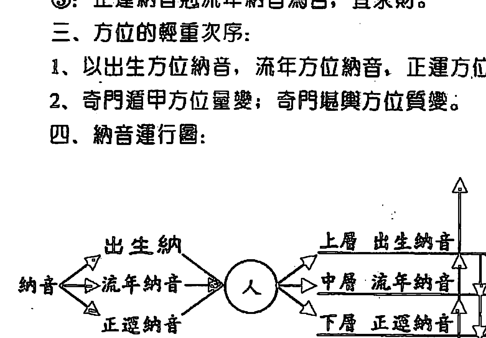

## 第四章 官祿吉凶判斷

### 第一節 八六吉凶

1.  更言武曲青蔔，喜逢左輔善曜。六八武科發迹，否亦韜略榮身。八六文士參軍，或則异途提用。旺生一遇則吉，死退雙臨還佳。直意：武曲六白，左輔八白，都是吉宿。六遇八則為發武，八遇六則發文。若在局上為旺為生，六或八有一星到來也吉。當在局上為死為退，而六八同時到來還是為吉佳。
2.  九紫雖司喜氣，然六會九而長房血症，七九之會尤凶。四綠固號文昌，然八會四而小口殞生，三八之逢更惡。直意：六白金遇九紫火剋，為血症。六白屬乾，乾為老父，應長男。七赤金遇九紫火剋，七兌應少女受灾。六白為吉星，逢剋已凶。七赤星是破軍惡星則尤凶。八白土遇四綠木剋，八白艮為少男，應小口。八白土遇三碧木剋為小口不利。四綠是吉星，逢剋則凶。三碧是祿存惡星，則為更惡。
3.  八逢紫曜，婚喜重來，六遇輔星，尊榮不次。如遇會合之道，蟲同一四之中。直意：八白本吉星，九紫又為喜星，九紫火來生八白土，故有婚喜重來。六白本為吉宿，八白又為喜曜，八白土來生六白金，則有不低的榮曜。當六八二星同度時，其吉的征兆與四一同宮一樣論。
4.  欲求嗣續，紫白隹取生神，至論帑藏，飛星宜得旺氣。紫白吉曜，生主發丁。九紫火來生土，一白水來生木。直意：六白金來生水，八白土來生金，都為生神，加上紫白則發丁，飛來的旺星都為紫白吉星，旺星來則發財帛。
5.  二黑飛乾，逢八白而財源大進，遇九紫人丁延綿。三碧臨庚七，逢一白而丁口頻添，交二黑則食財豐茂。先旺丁後旺財，於中可見。先旺財後旺丁，於理易詳。直意：坎宅二黑飛乾，二黑為土，遇流年八白土也到乾，土見土為旺，八白又為吉星則為發財。二黑土遇九紫火來生，九紫為吉星，故為發丁。坎宅三碧飛兌，三碧為木，遇流年一白水也來到兌，水生木為生，一白為吉星，故為發丁。三碧木剋二黑土，我剋為財，所以交二運則為發財。規則：生星先到，旺星後到，則先發丁而後發財。旺星先到，生星後到，則生旺發財而後發丁。

### 第二節 四一同宮

四一同宮，發科中甲之顯。直意：一白宅的方位，流年一白又到。四綠宅的方位，流年四綠又到，即為還宮復位。一白宅的方位，流年四綠來到。四綠宅的方位，流年的一白到來，即為交相互疊。一白為官星，四綠為文昌主宰文章。還宮復位為佳，交相互疊也美。

### 第三節 三六九、二五八、一四七

1.  三九、九六、六三，惟乾離震三宮攀龍有慶。二、五、八位也可蜚聲。
    -   直意：三九，三碧九紫。震宅三碧入中宮，乾方是四綠，遇流年九紫入中宮，乾方則為一白。離宅九紫入中宮，乾方為一白，流年三碧入中宮，乾方則是四綠。三九之宅，乾方為四一同宮。
    -   九六：九紫六白。離宅九紫入中宮，離方則為四綠，遇流年六白入中宮，離方為一白。乾宅六白入中宮，離方是一白，當流年九紫入中宮，離方則為四綠。所以，九六之宅，離方四一同宮。
    -   六三：六白三碧。乾宅六白入中宮，震為四綠，流年三碧入中宮，震方為一白。震宅三碧入中宮，震方為一白。當流年六白入中，震方為四綠，所以六三之宅，震方四一同宮。
2.  二、五、八位蜚聲揚名
    -   二即為第二間，對三九而言。震宅三碧入中（此處中宮表示樓層數，也為樓層平面房間的第一間的起始數，然後順排房間九宮數。）運星數為第一層樓數，順着運星數往後數，為第二層樓，第三層樓......運星數為樓層的起始數，如現為七運，七、八、九、十......則相應為一層、二層、三層、四層樓，三碧也為運數，將三碧加到第一間（中宮上），順數到第二間為四綠。流年星九紫入中宮，將九紫加到第一間（中宮）順數到第二間是一白，所以第二間內四一同宮。離宅與三碧流年一樣。
    -   五謂第五間，指九六。離宅九紫入中宮，將九紫加到第一間，順數到五間是四綠；流年遇六白入中宮，將六白加到第一間上，順數到第五間為一白，所以第五間四一同宮，乾宅與九紫流年一樣。
    -   八即指第八間，對六三而言。乾宅六白中，將六白加到第一間上，順數到第八間，則為一白。當流年遇三碧入中宮後，將三碧加到第一間，順數到第八間是一白，所以第八間內四一同宮。震宅與六白流年一樣。不光乾離震三宮的方位遇四一可發科名。而二五八間逢四一也可蜚聲揚名。
3.  一、四、七
    -   一七、七四和四一，坤艮中附風為祥。四、七、一之房，均堪振羽創業。直意：艮坤中春，艮指一七，艮上四一同宮。坤指七四，坤上四一同宮。中即中宮指四一，中宮四一同宮。
    -   四、七、一者；四為第四間，指一七，坎宅一白入中，將一白加到第一閭上，順數到第四閭則為四綠。流年七赤入中宮，將七赤加到第一閭，上數到第四閭為一白，所以第四閭內為四一同宮。兌宅與一白流年一樣。
    -   七謂第七閭，指七四。兌宅流年七赤入中宮，將七赤加到第一閭，順數到第七閭則為一白。四綠入中宮，將四綠加到第一閭，順數到第七閭則是四，所以第七閭內四、一同宮。巽宅與七赤流年一樣。
    -   一即第一閭，指四一。巽宅四綠入中宮，將四綠加到第一閭上。本位為四，流年逢一白入中宮，將一白加到第一閭上，所以第一閭內四一同宮。坎宅與四綠流年一樣。附風振羽飛騰意，四一到閭妙同期。
4.  八二、二五和五八，兌巽坎登雲足賀。而三、九、6之屋，俱足題名，必生輝。直意：兌巽坎者，兌上指八二，兌上四一同宮。巽指二五，巽上四一同宮。坎指五八，坎上四一同宮。
5.  三、九、6三個數中的三者即指八二宅的第三閭。當艮宅八白入中宮，將八白加到第一閭順數到第三閭則為一白，流年遇二黑入中宮，順數到第三閭則為四，所以第三閭四一同宮。坤宅與八白流年一樣。
6.  九為第九間，對二五宅而言。坤宅二黑入中宮，將二黑加到第一間順數到第九間是一白。流年五黃入中宮，將五黃加第一間上順到第九間是四綠，所以第九間內四一同宮。中宮與二黑流年一樣。
7.  六為第六間，指五八宅而言。五黃局五黃入中宮，將五黃加到第一間上順數到第六間是一白。當流年八白入中宮，將八白加到第一間上順數到第六間則為四綠。所以第六間內四一同宮。艮宅與五黃流年一樣。俱足題名三、九、6間，運在兌巽坎發貴全。
8.  坤局兌流，左輔運臨科名盛。艮山庚水，巨門運到甲第連。下元癸卯，坎局之中宮發科名。歲在壬寅，兌宅的六門入泮。直意：坤局二黑入中，兌上是四綠，左輔即八白，交八運，兌上為一白，所以兌上四一同宮，艮山八白入中，兌上是一白，巨門即二黑，當交二運，兌上則為四，所以兌上四一同宮。下元癸卯年，四綠入中，坎局本為一白入中，流年四綠又入中宮，則為四一同宮。
9.  兌宅七赤入中宮，順數九間，六白到巽，為巽六門。下元壬寅年，五黃入中順數九間，四綠到巽，所以兌宅六門入泮，四六同到、文曲武曲會合變妙，但只能入泮，而不能發科，因未得一四同宮。
10. 白衣求官，秀士赴舉，推之各有其法。下僚求升，罷官思起，作之異其方。求官重一白官星，求名重四綠文昌。旺，須求身旺為佳，造塔堆山，龍極旺宮加意。殺位強盛，當於龍局宅生旺之方堆高，生方高則泄殺氣，旺方高則助主山。制殺不如化為貴，鐘樓鼓閣，局山生旺施工，殺者必須制化意。坎局以土為殺，金為生水為旺。當遇土殺，則於金水二方起金水星的樓閣，或用宅主金水的年命，或用金生月日時，而土來生舍，貪生忘剋。兩水比和，身處強不畏剋，雖不與殺為敵，殺自也不能為害，此為化殺。

### 第四節 九七合轍

1.  九七合轍，常招回祿之灾。
    -   九紫為後天火星，七赤為先天火數，旺宮單遇，動始為殃，煞處重重，靜也肆虐。先天之數，二七為火，所以七赤為先天火數，九紫屬離，離為火，所以九紫為後天火星，都為患失。局山的旺方，七赤九紫只要有一個到位，動則便有火發，不動則無慮。在局山的殺方而七九同到，即使不動也會火發。
    -   或為廉貞疊至，或為都天加臨，即使有動靜之分，均有火災之患。直意：廉貞即為五黃，都天為流年神煞。七赤九紫又遇五黃，都天同臨，眾煞相聚，群丑會集，都有火災。所以壬亥方的水路要通暢，如閉塞則登時作祟。右弼方的池塘可鑿再加大，加大的池塘若又填上則即生禍殃。亥壬二宮屬水，水可制火，所以不能閉，閉則火無水制。右弼九紫方位，火方有水，所以制火，故不可填塞。
    -   廟宇刷紅，在一白煞方，則有瘟火。樓臺簷梠，當七赤旺地，難免火災。直意：廟宇紅色屬火，流年月一白飛到九七組合星位，在一白方似乎有制，而一白却落在局山的九七煞地，煞地見火，水不能制，所以瘟火不免。七赤在旺地，已主發火了。若於七赤上高造樓閣，又灾患能免。
    -   建鐘樓於煞地，不特亢旱常遭。造高塔於火宮，須知生旺難恃。若一宮二星同到，必片刻萬室全灰。直意：局山的煞地，以為凶方，又要去鐘樓，當鐘鳴則催動煞氣，不但有火患，而且犯訟病。九紫七赤本是火宮，雖在局山生旺之方位，但高聳則火星強盛，況且塔形尖利又是象火形，生旺則有灾。若九紫七赤會於一處，火灾之慘，遍地皆紅。巽方庚子造高樓，坎艮二局俱焚，坤局之界則不犯。直意：庚子即中元，當流年四綠入中宮，七赤飛艮，九紫飛坎。一白飛坤，巽方本九紫火星之位，建造高樓則火動。艮的七赤為先天火數，坎的九紫為後天火宮，當流年飛到的星是最重的，所以坎艮俱焚。坤上流年是一白飛到，水能制火，所以不犯，此為坎離定位，分為八方。
    -   巳上丙午興杰閣，巽中離兌皆火窟。 艮局遠方則不侵，知此明徹禍則避。直意：丙午為中元，是年七赤入宮，所以中宮有火。九紫到兌，兌宮有火。二黑到離，二為先天火數，故離宮也有火，巽方本為九紫火宮。在此建造樓閣，動則有灾殃。

### 第五節 二五交加

二五交加：損傷重病。二黑為巨門，五黃為廉貞。正煞為五黃，不拘臨方到閤，為人口常損。 病符為二黑，無論流年小運，疾病叢生。 五為孕婦受災，黃遇黑時出寡婦。 二主宅母多憂疾，黑逢黃到出鰥夫。直意：五黃中央土，為正關煞，故最凶。二黑屬為病符，故主病。五黃為陽土，二黑坤為陰土，為肚腹，為孕婦有災。黃上加黑陰壓陽，故出寡婦。二黑坤為老母，故應宅母，黑上加黃，陽壓陰，所以出鰥夫。

## 奇門堪輿學

運若已退，五黃貞逢處過失不一，總以艮為避之所。
運若未交，二巨門交會病方深，必須遷之才能吉。

廉貞即五黃，已失生旺運時，遇災難來到，惟避開為好。
巨門二黑，未交生旺運時，見病則不能免，只有遷始才吉。

### 第六節 三七疊臨

三七疊臨：被盜官災。
三碧為蚩尤：好勇鬥狠之神。
七赤破軍：盜賊訟訟。肅殺劍鋒之象，是以交劍煞與多劫掠。斗牛煞起惹官刑。
七逢三到生財，豈知財多被盜。
三逢七臨生病，那知病愈遭官。
三碧蚩尤喜鬥爭，七赤破軍主肅煞。
七赤遇六白金見金，名交劍煞。
三碧遇坤艮木剋土，名斗牛殺。
三碧木來被七赤金剋，我剋為財，但赤是賊星故為被盜。
三碧木遇七赤金剋，剋我則病，三碧喜戰鬥，故又遭害。

### 第七節 財丁貴秀

一、看財丁的貴秀以太歲來斷，看太歲是何神，立地見分明。
財以水斷，以向水或旁水加上太歲推其吉凶。
丁以山斷，須坐山環抱，或水口加太歲，或搬進住房的年份合年命加以判斷吉凶。

若論貴秀以山穴的坐立而斷，陽脈入首，不過人丁家族興旺而已。穴後有穴或墩阜形態端秀者主發貴。
平原龍穴則看前後左右水流曲折，愈折愈曲愈貴。

二、太歲地盤年盤的區別：
地盤太歲即為子年在子，丑年在丑等。
年盤太歲即為子年屬一白，丑年屬八白等。

### 第八節 向不當旺

陰陽兩宅若衰死到向為一個數字，而逢流年客星到向也是此數字，則主傷人丁。

- 逢流紫白旺星排到向，也主有禍。

如八運壬山丙向。旺星到山，到了甲午年，年星四綠入中，八白到向，則便有禍到。

- 水里龍神上山之局，以坐山來斷。

如七赤運子山午向。向上旺星到坎山，則犯水里龍神上山，若坎方頹實或有高山高屋已屬不吉，而飛星雙七臨坎天盤三到坎，當交八運後七為衰氣，到了癸卯流年二月乙卯客星三又到坎，為三七迭臨，必遭劫盜、官訟之禍。

見下例：
例如：癸卯年，八運壬山丙向

| 5 2 七 | 9 7 三 | 7 9 五 |
| :---: | :---: | :---: |
| 6 1 六 | 4 3 八 | 2 5 一 |
| 1 6 二 | 8 8 四 | 3 4 九 |

丙
壬山

| 3 | 8 | 1 |
| :---: | :---: | :---: |
| 2 | 4 | 6 |
| 7 | 9 | 5 |

癸卯年四綠入中

甲子年八白旺星到向，本該以吉來看，因向首之為退氣，流年旺星排到，反而有禍。

又例如：癸卯年2月
七運子山午向，坐方為水里龍神上山格局

| 4 1 六 | 8 6 二 | 6 8 四 |
| 5 9 五 | 3 2 七 | 1 4 九 |
| 9 5 一 | 7 7 三 | 2 3 八 |

| 3 | 8 | 1 |
| 2 | 4 | 6 |
| 7 | 9 | 5 |

| 6 | 2 | 4 |
| 5 | 7 | 9 |
| 1 | 3 | 8 |

癸卯年四綠入中，卯為太歲，卯在震三宮，三為飛星太歲落坎宮。正月起八白，逐月逆星次排，二月為七赤入中。

- (1) 流年旺星到向，而原向星為2，而流年旺星8到向不為旺。
- (2) 財星上山，山向兩盤雙七到坎宮，向星為財星。逢三為穿心煞，為凶。
- (3) 三為震，即乙卯。震為木，即亥卯未，坐子方為壬子癸，所以不利乙卯、癸未年出生的人。

太歲所到的宮與山向星相剋則有灾，相生則吉。

### 第九節 生肖發迹

善相陰宅的人，首先察看龍穴的真偽，其次看星運的衰旺而斷其能否發迹。山川秀美，又得令，而辨其地理位置，然後進一步推其生肖。大都陰宅所發那一個生肖，可以從出脈入首處的數字而斷。換句話說，即從坐向上斷。

- 1、如子山午向，即斷生肖屬鼠的發跡。但入首處還有亥則斷其屬豬發跡。不必用飛星推斷。山上旺星到向，則可從向上原地盤某字斷所發生肖。
- 2、如雙星會合於向首之局，立子山午向，推斷屬馬者發。立午山子向，斷屬鼠者發。以此類推，但不可死板，有時當以飛星來斷。
- 3、四山環繞獨缺一口，顧看地盤對應此口的數字，即可斷其生肖絕。若其缺口適合城門鎖鑰正氣，反主大吉。

斷陰宅能發跡的生肖，是指後人的生肖。其方法非常簡單不須用飛星，只用地盤。

- (1) 從來脈論之 (以穴星為主)
- (2) 以坐方來斷之。

進一步的方法卻要配合飛星，逢雙星到向之局，向首地盤屬何數字，便發跡此數字生肖。
如果一地四山環繞，獨缺一口，此方的生肖便不利，若合城門，反大利這生肖。如缺口為亥方山，則損生肖屬豬的。不過，亥方合城門，反主大利生肖屬亥的人。

### 第十節 時運與穴位

> 我葬出王侯，人葬出盜賊。

巒頭雖美好，也要畿位當運，否則容易發生災禍。
巒頭影響子孫的日後成就。而畿位則決定此地何時出人才。

### 第十一節 收山出煞

山上龍神不下水，水里龍神不上山。此句點明吉凶之樞紐，福禍之關鍵。

要點：當運旺山星旺氣宜放高處，衰死之氣宜放低窪水里。向的衰死之氣宜放高處，向的旺氣宜放水里。
山主人丁，水主財源，即為龍神得失關鍵所在。即使偶爾顛倒則損丁破財，為禍自端。所以山上排龍切忌下水，旺星必放高山實地。即使下山必是在低窪處和河池旁。而水里排龍則忌上山。

例如：七運乙山辛向

| 6 1 | 1 5 | 8 3 |
|-----|-----|-----|
| 六  | 二  | 四  |
| 7 2 | 5 9 | 3 7 |
| 五  | 七  | 九  |
| 2 6 | 9 4 | 4 8 |
| 一  | 三  | 八  |

(1) 山上排以運盤到山，乙屬陰逆行，入中佈山星盤：山上飛星七到山；七為當令星為旺氣，八排到坤，八為將來生氣。所以七八兩方要高。九在坎遇高地，則為山上龍神為得其所，山的生旺之氣放在高處則旺人丁。
(2) 六為衰氣臨巽方，四為死氣，臨於乾方。假若巽乾兩方有高地則為衰死氣得力，所以巽乾方要有水，衰死之氣遇水才能煞氣消脫。
(3) 水里排龍運盤九到向，用九入中，九為丁陰逆行，佈向星盤，向上的飛星到向，七為當運的旺氣，八到乾為未來的生氣，所以兌乾兩方有水則為水里龍神得其所。生旺之氣放在水里旺財源。
(4) 六為衰氣，五四為死氣，若有水則衰死之氣得力而煞存水聚氣，所以艮離坎三方宜高而不能有水，將衰死之氣放在高處，風吹氣散。

而且水里排龍生旺，宜排到水里。而山上的排龍的衰死之氣也要放在水里。由此兌乾兩方有水為一舉兩得。反之震坤坎三方有山，也各得其宜。這就是收山出煞的妙用所在。

- ① 震坤坎方見山則利丁，乾巽方見山則損丁。乾巽方見水為煞脫。
- ② 兌乾方見水主利財，艮離坎方見水則破財，也為煞聚煞存。若艮離坎方見山則為衰死之氣放在山上，屬於收山。

### 第十二節 七星打劫

識得父母三般卦，便是真神路，北斗七星打劫處，離宮要相合。

- 1. 父母是經四位的父母，三般是坎到巽，巽到兌，兌到坎，顛倒顛之三般。
- 2. 北斗者，隨時立極之氣。七星者，由現在而逆推到第七位。此處五行正與立極之氣相反，最易發禍，要相合者，即使發禍者變而為發福。
  再以山承形氣生剋制化之理也通達，方得最上一乘的作用。由現在推到第七者，由一逆數到四：一九八七六五四。由四逆數到七：四三二一九八七。而二五八和三六九也是如此。一四七，二五八，三六九都為三般卦到。
- 3. 元運相反，形氣變更發禍。要轉而發福者，要在所立之山向，處處合吉。
  而真能打劫者，僅有坎、離二宮。
  （1）如坎宮的子癸，離宮的午丁，山向飛星，五運則到山到向，一九運則打劫，壬山丙向，丙山壬向，五運則上山下水。

一九运虽二一到山到向，却不能作未来之气论，以犯反伏吟。
若二八三七四六等运其飞星一顺一逆。顺则由离而坎，逆则由坎而离，一种流行的气均由能由现在的运以劫未来的能量之气。

（2）如一运子山午向和午山子向，都有二字则到向或到山，二者未来之气，在一运中能劫而用之。
二运壬山丙向和丙山壬向，子山午向，午山子向，癸山丁向，丁山癸向，都有三字到山或到向，三者未来之气，在二运中能劫用之。

- 4、劫未来之气，上元劫中元之气，中元劫下元之气，下元劫上元之气。
- 5、父母三般卦与三般卦区别

如一运一入中则二五八在乾离震三方，三六九在兑坎巽三方面，一在中艮坤为生死之门，则艮坤必四七。

- （1）三般卦：一二三，二三四，三四五，四五六，五六七，六七八，七八九，八九一。此三般卦适用于零正两神。
  ①总之后天卦位离九坎一合十（五运合十）在一二三四各运虽不能对合十，然其变化，中宫与坎必合生成之数。
  如一入中，坎宫为六，一六共宗。二入中，坎宫为七，二七同途。三入中，坎宫为八，三八为朋，四入中，坎宫为九，四九为友。
  ②在六七八九四个运中宫之数，必离宫合生成之数。
  六入中，离宫为一，一六同宗。七入中，离宫为二，二七同途。
  八入中，離宮為三，三八為朋，九入中，離宮四，四九為友。

北斗打劫，不外生成二字，生者為因，成者為果。

- (2) 凡能北斗打劫者，天盤與山向飛星，其氣一貫，可悟因果二字之理。

所謂北斗打劫者，無非坎離中三宮，處處合成生成。

- 1. 乾上飛星與離宮相合，為真打劫。
- 2. 若旺星到向巽上飛星與坎宮相合，為假打劫。有時也可用。
- 3. 可知動奪未來之元氣，是指元而言，非指運而言一九兩運，無旺星到山到向之局，立向最難。

### 第十三節 三星五吉

一、三星者: 每運入中元的令星，山和向所到的飛星。
二、五吉星: 即替卦，因一卦有兩卦之用，山向之飛星有四合，以元運的令星。
上元一二三為三星，以左輔右弼來兼取入穴中為五吉。

由此得：

- 1. 上元五吉: 一白二黑三碧加八白九紫。
- 2. 中元五吉: 四綠五黃六白加一白二黑。
- 3. 下元五吉: 七赤八白九紫加一白六白。

### 第十四節 令星入囚

一、令星入中叫做囚，陰陽二宅，逢囚必敗。
1. 然有囚得住和囚不住之分。如一運立戌向，運星二到向，到了二黑運進中即為入囚。
  但坤方陽宅有門路，陰宅有水則不能囚，坤方為五黃所臨故，向上的飛星的五黃。只有五黃入中則不為囚。五黃中土，皇極至尊至大。
2. 地運之長短，看向上的令星入中為準，名叫入囚。如一運午向，令星為午（五到離宮），五運入中即為囚。

- （1）凡到山到向為不毛小地，其運的長短於向上求之。如一運立戌向，運止二十年。此小三元。
- （2）若中吉之地，八卦城門左右二宮齊到，可得一百八十年。
- （3）若系大地來脈綿長，又年生成合十，可得五百四十年，重之則一千零八十年，此伏大三元。

地定之長短，即於向星的入囚而定。
如二八的巽山乾向，巳山亥向，三五七運的辰山戌向都旺。然運止二十年。若乾山巽向，亥山巳向，戌山辰向則一百六十年，三五七運的卯山酉向，乙山辛向，四六運的甲山庚向都旺，然運止四十年。
四、六運的艮山坤向，申山寅向，二五八運的未山丑向，都旺，然運止六十年。
若艮山坤向，寅山申向，丑山未向為一百二十年。
五運的子山午向，癸山丁向都旺，而運止八十年。
若甲山子向，丁山癸向則一百年。
壬兩雖無旺運，然丙向得八十年，壬向得一百年。

## 第五章 八卦、九星基本定义

### 第一节 八卦基本象义

- **坎卦为水星、贪狼，数为一白。其性浮而荡。**
  - 天时：月、雨、雪、露、霜、水。
  - 地理：北方、江湖、溪涧、泉井、卑湿之地；溝澗、池沼、有水之处。
  - 人物：中男、江湖之人、舟人、盗贼、匪。
  - 人事：险陷卑下，外示以柔，内序以利，漂泊不成，随波逐流。
  - 身体：耳、血、肾。
  - 时序：冬十一月，子年月日，一、六月日。
  - 静物：水、带子、带核之物、弓轮、矮柔之物、酒器、水具、工、棗、丛棘、蒺藜、桎梏、盐、酒。
  - 动物：猪、鱼水中之物、狐、水族。
  - 屋舍：向北之居、近水、水阁、江楼、茶洒长器、宅中湿地之处。
  - 饮食：猪肉、酒、冷味、海味、汤、酸味、宿食、鱼带血、掩藏、有带核之物、水中之物、多骨之物。
  - 家宅：不安、暗昧、防盗、匪。
  - 婚姻：利中男之婚，宜北方之婚，不利成婚，不可在辰戌丑未月婚。
  - 生产：难产有险，宜次胎，男、中男、辰戌丑未月有损，宜北向。
  - 求名：艰难，恐有灾险。宜北方之任，鱼盐河泊之职，酒兼醋。
  - 求利：有财防失，宜水边财，恐有失险，宜鱼盐酒货之利、防阴失、防盗。
  - 交易：不利成交，恐防失陷，宜水边交易，宜鱼盐货、酒之交易，或点水人之交易。
  - 谋望：不宜谋望，不能成就，秋冬占可谋。
  - 出行：不宜远行，宜涉舟，宜北方之行，防盗匪，恐遇险阻陷溺之事。
  - 谒见：难见，宜见江湖之人，或有水傍姓氏之人。
  - 疾病：耳痛、心疾、感染、肾疾、胃冷水泻、过冷之病、血病。
  - 官讼：不利，有阴险、有失因讼、失陷。
  - 姓字：点水旁之姓氏。
  - 数目：一、六。
  - 方道：北方。
  - 五味：咸酸。
  - 五色：黑。

二、坤卦為地星、巨門，數為二黑。其性柔而靜。

- 天時：陰雲、霧氣、冰霜。
- 地理：田野、鄉里、平地、西南方。
- 人物：老母、後母、農夫、鄉人、眾人、老婦人、大腹人。
- 人事：吝嗇、柔順、懦弱、眾多、小人。
- 身体：腹、脾、肉、胃。
- 時序：辰戌丑未月、未申年月日時、八五月日。
- 靜物：方物、柔物、布帛、絲棉、五谷、輿斧、瓦器。
- 動物：牛、百獸、牝馬。
- 屋宿：西南方、村居、田舍、矮屋、土階、倉庫。
- 家宅：安穩，多陰氣，春占宅舍不安。
- 飲食：牛肉、土中之物、甘味、野味、五谷之味、芋筍之物、腹藏之物。
- 婚姻：利於婚姻，宜稅產之家、鄉村之家、或寡婦之家，春占不利。
- 生产：易产，春占难产、有损或不利于母，坐宜西南方。
- 求名：有名，宜西南方或敦官、农官守土之职，春占虚。
- 交易：宜利交易，宜田土交易，宜五谷利，贱货、重物、布帛，静中有财，春占不利。
- 求利：有利，宜土中之利，贱货重物之利，静中得财，春占无财，多中取利。
- 謀旺：利求謀、鄰里求謀、靜中求謀，春占少遂或謀於婦人。
- 出行：可行，宜西南行，宜往鄉里行，宜陸行，春不宜。
- 谒见：可见，利见乡人，宜见亲友或阴人，春不宜见。
- 疾病：腹疾、脾胃之疾、饮食停滞、谷食不化。
- 官讼：理顺，得众情，讼当解散。
- 姓字：带土姓人，行位八五十。
- 数目：八五十。
- 方道：西南。
- 五味：甘。
- 五色：黄、黑。

三，震卦為雷星、祿存。數為三碧。其性勁而直。

- 天时：雷。
- 地理：东方、树木、闹市、大途、竹林、草木茂盛之所。
- 身体：足、肝、发、声音。
- 人物：长男。
- 人事：起动、怒、虚惊、鼓噪、多动少静。
- 时序：春二月、卯年月日时，四三八月日。
- 静物：木竹、苇、乐器（竹木）、花草繁鲜之物核。
- 动物：龙、蛇、百鸟、马鸣。
- 屋舍：东向之居、山林之处、楼阁。
- 家宅：宅中不时有虚惊，春冬吉，秋占不利。
- 饮食：蹄、肉、山林野味、鲜肉、果酸味、菜蔬、鲤鱼。
- 婚姻：可，有成、声名之家、利长男之婚，秋占不利。
- 求利：山林竹木之财，动处求财，或山林、竹木茶货之利。
- 求名：有名，宜東方之任、施號發令之職、掌刑獄之官、有茶木税深之任、或開市市賈之職。
- 生产：虚惊、胎动不安、头胎必生男、坐宜向东，秋不吉。
- 疾病：足疾、肝經之疾、驚恐不安。
- 謀旺：可旺、可求，宜動中謀，秋占不遂。
- 交易：利於成交，秋占難成，動而可成，山林、木竹茶貨之利。
- 官訟：健訟、有虚驚、行移取勘反復。
- 謁見：可見，宜見山林之人，利見宜有聲名之人。
- 出行：宜行利東方、利山林之人，秋占不宜行，但恐虚驚。
- 姓字：帶木姓人，行位四八三。
- 數目：四八三。
- 方道：東。
- 五味：甘、酸味。
- 五色：黑青、綠碧。

四、巽為風星、文曲、數為四綠。其性和而緩。

- 天時：風。
- 地理：東南方之地、草木茂秀之所，花果菜園。
- 人物：長女、秀士、寡婦之人、山林仙道之人、僧道。
- 人事：柔和、不定、鼓舞、利市三倍、進退不果。
- 身体：脇、股、氣、風疾。
- 時序：春夏之交，二五八之時月日、三月、辰巳月日時、四月。
- 靜物：橋、繩、直物、長物、竹木、工巧之器、臭、雞毛、帆、鼠、臼。
- 動物：雞、百禽、山林中之禽蟲，蛇。
- 屋舍：東南向之居、寺觀樓臺、山林之居。
- 家宅：安穩利市，春占吉，秋占不利。
- 飲食：雞肉、山林之味，蔬果酸味。
- 婚姻：可成，宜長女之婚，秋占不利。
- 生产：易生，头胎产女，秋占损胎，宜向东南坐。
- 求名：有名，宜文職有風憲之力，宜入風憲。宜茶果竹、木稅貨之職，宜東南之任。
- 求利：有利三倍，宜山之利。竹貨木貨之利，秋不利。
- 交易：可成，進退不一，交易之利，山林交易、山林木茶之利。
- 謀旺：可謀旺，有財可成，秋占多謀少遂。
- 出行：可行，有出入之利，宜向東南行，秋占不利。
- 謁見：可見，宜見秀士、文人，秋不宜。
- 疾病：股肱風疾、腸風、中風、寒邪、風疾。
- 官訟：宜和、利申訴、可散。
- 姓字：草木旁姓氏，行位五三八。
- 數目：五三八。
- 方道：東南。
- 五色：青綠、碧滄白。

五、離卦為火星、右弼，數為九紫。其性烈而揚。

- 天時：日、電、虹、霓、霞。
- 地理：南方、干亢之地、竈、爐冶之所、剛燥厥地、其地面陽。
- 人物：中女、文人、大腹、目疾人、甲胄之士。
- 人事：文畫之所、聰明才學、相見心直、書畫。
- 身体：目、心、上焦。
- 時序：夏五月，午年月日時，三二七月日。
- 靜物：火、書、文、甲骨、乾戈、槁木、電器。
- 動物：雉、龜、鱉、蟹、螺、蚌。
- 屋舍：南向之居、陽明之宅、明窗、虛室。
- 家宅：安穩，冬占不利，防火燭。
- 飲食：雉肉、煎炒、燒炙之物、乾脯、熟肉。
- 婚姻：利中女之婚，夏占可成，冬占不利。
- 生产：易產，頭胎生女，坐宜向南，冬占有損。
- 求名：有名，宜南方之任、文職、掌文學、光明之職。
- 求利：有財，宜南方之利、文書之利、燈燭之財。
- 交易：可成，宜文書交易、夏占利成。
- 謀旺：可謀、可求，宜南方謀，冬占不成。
- 出行：可行，宜南方行、利見貴，冬不宜。
- 謁見：可見，南方之貴、文書之人。
- 疾病：目疾、心疾、上焦、夏占伏熱、血病。
- 官訟：易散、得理、夏占失理。
- 姓字：帶火及立人旁姓氏，行位三二七。
- 數目：三二七。
- 方道：南。
- 五味：苦。
- 五色：赤、紫、花色。

六、乾卦為天星、武曲，數為六白。其性剛而勁。

- 天時：天、冰、雹、震。
- 地理：西北方、京都、大郡、形勝之地、高亢之所。
- 人物：君、父、大人、老人、長者、宦官、名人、公門人。
- 人事：剛健武勇、果決、多動少靜。
- 身体：首、骨、肺。
- 時序：秋、九十月之交，戌亥年月之時，五金年月日時。
- 動物：馬、天鵝、獅子、象。
- 靜物：金玉、寶珠、圓物、水果、剛物、冠、鏡。
- 屋宿：公廨、樓臺、高堂、大廈、驛宿、西北向之居。
- 家宅：秋占宅興隆，夏占有禍，冬占冷落，春占亨利。
- 婚姻：貴官之眷，有聲名之家，秋占宜成，冬夏不利。
- 飲食：馬肉珍味、多骨、肝肺、乾肉、水果、諸物之首、圓物、辛辣之物。
- 生产：易生，秋占生貴子，夏占有損，坐宜向西北。
- 求名：有名，宜隨內任、刑官、武職、掌權、驛官，宜向西北之任。
- 謀旺：有成，利公門，宜動中有財，夏占不成，冬占多謀少遂。
- 交易：宜金、玉、珍寶珠貴貨，易成，夏占不利。
- 求利：有財，金、玉之利，公門中得財，秋占大利。
- 出行：利於出行，宣入京師，利西北之行，夏占不利。
- 謁見：利見大人、有德行之人，宜見貴官，可見。
- 疾病：頭面之疾、肺疾、筋骨疾、上焦疾，夏占不安。
- 官訟：健訟，有貴人助，秋占得勝，夏占失理。
- 方道：西北。
- 五色：大赤色。
- 姓字：帶金旁者，行位一四九。
- 數目：一四九。
- 五味：辛、辣。

七、兌為澤星，破軍、數為七赤。其性決而利。

- 天時：雨澤、新月、星。
- 地理：澤、水際、缺池、廢井、山崩破裂之地，其地為剛鹵。
- 人物：少女、妾、歌妓、伶人、譯人、巫師、奴僕、婢。
- 人事：喜悅、口舌、讒毀、謗說、飲食。
- 身体：舌、口、喉、肺、痰、涎。
- 時序：秋八月，酉年月日時，金年月日。二四九月日。
- 靜物：金刀、金類、樂器、廢物、缺器之物、代口之物、毀折之物。
- 動物：羊、澤中之物。
- 屋舍：西向之居、近澤之居、敗牆壁宅、戶有損。
- 家宅：不安、防口舌，秋占喜悅，夏占家宅有禍。
- 飲食：羊肉、澤中之味、辛辣之味、宿食。
- 婚姻：利少女之婚，秋占可成，夏占不利。
- 生产：易生，頭胎產女，秋占有損，宜向西坐。
- 求名：有名，宜西方之任、武職、掌刑、譯官。
- 求利：有利，宜澤中之貨、金刀之利，秋占大利，夏占不利。
- 交易：可成，防口舌，秋占吉成。
- 謀旺：可謀，防口舌，秋占可成。
- 出行：可行，宜西方行，防口舌，夏占不宜。
- 謁見：利見女人，宜西方之貴。
- 疾病：口舌、咽喉之疾、氣逆喘嗽、肺疾。
- 官訟：爭訟、防敗、秋占得勝。
- 姓字：帶金口姓氏，行位二四九。
- 數目：二四九。
- 方道：西。
- 五味：辛辣。
- 五色：白。

## 第八、艮卦為山星、左輔，數為八白。其性安而止。
- 天時: 雲、霧、山嵐。
- 地理: 山徑路近山城，丘陵、墳墓、東北方、門闕。
- 人物: 少男、閑人、山中人、童子。
- 人事：阻隔、守靜、進退不決、反背、止住、不見。
- 身體：手指、胃、鼻、背。
- 時序：冬春之月，十二月丑寅年月日時，七五十月日，土年月日時。
- 靜物：土石、瓜果、黃物、土中之物、閹寺、木生之物、藤生之瓜。
- 動物：虎、狗、鼠、百獸、谿喙之物、狐。
- 家宅：安穩，諸事有阻，家人不睦，春占不安。
- 屋舍：東北方之居，山居近石、近路之宅。
- 飲食：土中物味，諸獸之肉，墓畔竹筍之屬，野味。
- 婚姻：阻隔難成，成亦遲成，利少男之婚，宜對鄉里婚，春占不利。
- 求名：阻隔無名，宜東北方之位，宜土官山城之職。
- 求利：求財阻隔，宜山林中取財，春占不利有失。
- 生產：難生，有險阻之厄，宜向東北，春占有損。
- 交易：難成，有山林田土之交易，春占有失。
- 出行：不宜遠行，有阻，宜近陸行。
- 謁見：不可見，有阻，宜見山林之人。
- 疾病：手指之疾，胃脾之疾。
- 官訟：貴人阻滯，官訟未解，牽聯不決。
- 姓字：帶土旁之姓氏，行位五十七。
- 數目：五七十。
- 方道：東北方。
- 五色：黃。
- 五味：甘。

## 第九、離為火星、右弼，數為九紫。其性躁而烈。
- 天時：日、電、虹、霓、霞。
- 地理：南方，乾元之地，窯、鑪冶之所，剛燥劇地，其地而陽。
- 人物：中女、文人、大腹、目疾人、甲胄之士。
- 人事：文化之所，聰明才學，相見虛心，書事，美麗。
- 身體：目、心、上焦。
- 時序：夏五月，午火年月日時，三二七日。
- 靜物：火、書、文、甲骨、干戈、槁木、槁衣、乾燥之物。
- 動物：雉、龜、鰲、蚌、蟹。
- 屋舍：南舍之居，陽明之宅、明窗、虛室。
- 家宅：安穩、平善，冬占不安，剋體主火災。
- 飲食：雉肉、煎炒、燒灸方物、乾脯之體，肉。
- 婚姻：不成，利中女之婚，夏占可成，冬占不利。
- 生產：易生，產中女，冬占有損，坐宜向南。
- 求名：有名，宜南方之職，文官之任，宜鑪冶窑場之職。
- 求利：有財宜南方求，有文書之財，冬占有失。
- 交易：可成，宜有文書之交易。
- 出行：可行，宜動向南方，就文書之行，冬占不宜行，不宜行舟。
- 謁見：可見南方人，冬占不順，秋見文書考察才士。
- 官訟：易散，文書動，辯訟明辯。
- 疾病：目疾、心疾、上焦病，夏占伏暑，時疫。
- 姓字：帶火或立人旁人士姓氏，行位三二七。
- 數目：三二七。
- 方道：南。
- 五色：赤、紫、紅。
- 五味：苦。

### 第二節 河圖生克判斷
河圖判斷：
- 一、一六水：逢生旺則為文秀，為榜首，為才藝聰明；事多順吉，有人扶助，光明。逢剋則為淫佚，寡婦，溺水，漂蕩，乞丐，事則滯停，昏暗不明。
- 二、二七火：逢生旺則為橫財巨富，多女，氣燥有闘勁；事則急、快、猛、來去迅速。逢剋則為吐血，墜胎、難產、天亡橫禍，家產破敗。事則遇剋災深，不易求助，易散去。
- 三、三八木：逢生旺為文才，元魁、多男、長官、駙馬；事物則生發、逢勁、前景光明。逢剋則為少亡、自溢、絕後；事則進入絕境，無援助，九死一生。
- 四、四九金：逢生旺為巨富，俠客、好義、多男；事多險、高、有肅殺，權霸一方之勢。逢剋則為刀兵、孤伶、自縊、戰爭。事則陰緩、氣沉、勢低、無光明。
- 五、五十土：逢生旺則為驟發、升高、加祿、多子孫；事則助人為樂、德施得心、穩中前進。逢剋則為瘟瘂、孤孀、喪亡，事多孤立無援，希望渺茫，信心不足。
- 而五行相臨，喜木金水，忌火土。火土興廢無常，不耐久長。一六生木，巽旺。坎剋離中午。二七生艮，坤旺。離剋乾兌。三八生離旺震巽，剋坤艮。

### 第三節 洛書判斷
- 1. 一白水：為中男，為魁星生旺，少年科甲，名揚四海，事業成就，多生聰慧男子，遇事隆吉興昌。逢剋則刑妻、瞎眼、天亡、飄蕩、呆板，事遇則遲緩滯旋，有水灾。
- 2. 二黑土：為老婦，生旺則發田財，旺人丁，不出文人，而出武賢，妻奪夫權，陰謀鄙卑，吝嗇。遇事則陰隕陽滯。逢剋則寡婦相傳，產難形耗，腹疾惡瘡，神色氣衰，事則陰煞不斷。
- 3. 三碧木：為長男，生旺則財祿豐盈，興家創業，事則根深底厚，有望大成。長房大旺。逢剋則為瘋癲哮喘，殘疾刑妻，是非官訟，血光之災，事則空喜一場，虛幻迷惑。
- 4. 四綠木：為長女，為文昌，生旺文章名世，科甲聯芳，好容貌端麗，聯姻貴族；事則吉瑞祥繞，實喜連連。逢剋為瘋哮血縊，婦女淫亂，男子酒色破家，漂流絕滅，事則耗神寶力，飄浮不定，男盜女娼。
- 5. 五黃土：為戊己大煞，不論生剋都凶，宜安靜不宜動作，年星并臨則損人丁，輕則灾病，重則連喪到五數止。季子則錯迷痴呆，孟仲官訟淫亂，事則宜守不宜動。
- 6. 六白金：為老陽，生旺威權震世，武職重貴，巨富多丁，事物则金气盛，前景非凡，有实力。逢克则刑妻孤独，穷母守家，平贫无助。事则物损两边，泪面悲伤。
- 7. 七赤金：为少女，生旺发财旺丁，武途仕宦，小房发福。事则旁门左道相扶，柔顺刚逆。逢克为盗贼离乡，投军横死，牢狱口舌，火灾招丁，事则口舌灾伤，飞来横祸。
- 8. 八白土：为少男，生旺孝义忠良，富贵绵长，小房福洪。事遇则贵人生扶，福伴四方，大吉。逢克则为小口损伤，蛊病膨胀。
- 9. 九紫火：为中女，生旺文章科第，显赫，中房受荫，易起易落，易废易兴。事则沉浮起落，喜忧相伴。逢克则为吐血蛊胀，目疾产死，降禄官灾，牵连无辜，事则灾险重重，不见天日。

### 第四節 六親吉凶判斷
九星有生克之归，六亲有休咎之应。
- 1. 乾为父，六白居之属金，怕九紫火克，其性喜土，赖八白土生配以坤，内助贤贤。得艮则中和吉庆，逢其克则麻烦忧虑，遇生则老者精神焕发。
- 2. 坤为母，属土，二黑主之，喜火生，九紫到享闺房之福。土怕木克，三四加临，有舍财之忧。
- 3. 震为长男，为三碧木，木由水生。一白到则欣欣向荣，六七来加临，则萧萧日瘁。
- 4. 坎为中男，其数一白，属水。遇六七加临，仲房发达，逢二八加临，中子受殃。
- 五、艮為少男，其數八白，怕伯兄之剋，然木雖無情，得仲姐之生，九紫來助，風行壓制，坤母扶助，二五可安。
- 六、巽為長女，為木，代母行權，為父剋不和，季妹七赤來，則閨中狼狽，當仲弟一白到，壺內漏瘉。
- 七、離為中女，九紫屬火，火熾熱來於木，三四助之。火滅則來自於水即一白剋之。當其熾熱，則仲又福集閨房，當其滅時，仲婦則災生床席。
- 八、兌為少女，陰氣，父六白來臨，助二黑飛至，母親歡喜。金生水則泄氣，當一白到不免生灾。火制金為煞地。九紫來怎能安寧。生旺比和，一家均獲休祥，安樂。逢死敗墓絕，則六親災處。

### 第五節 八卦納甲玄關竅
- 一、乾納甲壬，坤納乙癸，震納庚，巽納辛，坎納戊，離納己，艮納丙，兌納丁。
- 1. 玄者即為當運令星入中宮。
- 2. 關者即為天根以山向所排得的星入中宮。
- 3. 竅者即為城門所排得的星入中宮。
- 二、訣
- （一）
玄上天機竅上分，城門之處義最真。
漫說天星井納甲，且將左右同原因。
先觀水到向何流，玄關造化此中求。
內外雲關同一竅，山內向外飛星到。
天元可兼人和地，同元一氣通奧義。
綿綿富貴永無休，一殿通天城入中。
- （二）
玄關交媾也堪求，公爵將相王伯侯。
局堪圖畫沒來由，若是玄關俱不媾。
重重生氣入關中，連逢三五位三公。
轉關一節逢生旺，便知世代出豪雄。
不論陰陽純與雜，總兼墓氣暗相攻。
其間造化真玄奧，六道自然宇宙中。

### 第六節 九星判斷
| 九宫 | 一 | 二 | 三 | 四 | 五 | 六 | 七 | 八 | 九 |
| --- | --- | --- | --- | --- | --- | --- | --- | --- | --- |
| 九色 | 白 | 黑 | 碧 | 綠 | 黃 | 白 | 赤 | 白 | 紫 |
| 天干 | 壬癸 |  | 甲乙 |  | 戊己 |  | 庚辛 |  | 丙丁 |
| 九星 | 貪 | 巨 | 祿 | 文 | 廉 | 武 | 破 | 輔 | 弼 |
| 地支 | 子 | 未申 | 卯 | 辰巳 |  | 戌亥 | 酉 | 丑寅 | 午 |

### 第七節 九運旺相星
- 一、一運以貪狼為令星，令者旺，貪狼旺，而巨門祿存為相。
- 二運以巨門為令星，巨門旺，祿為相進氣。
- 三運以祿存為令星，祿存旺，文曲為相。
- 四運以文曲為令星，文曲旺，廉貞武曲為相。
- 五運以廉貞為令星，廉貞旺，武曲為相。
- 六運以武曲為令星，武曲旺，破軍為相。
- 七運以破軍為令星，破軍旺，左輔右弼為相。
- 八運以左輔為令星，左輔旺，右弼為相。
- 九運以右弼為令星，右弼旺，貪狼為相。
- 周而復始，循環不窮。旺相皆本運的吉星。
- 二、一二運以五七為殺氣，
- 三四運以七九為殺氣，
- 五運以二九為殺氣，
- 六運以二三為殺氣，
- 七運以二三四為殺氣，
- 八運以三四五為殺氣。
- 九運以四五為殺氣。
- 上元一白主事，以八輔為佐。
- 中元六白主事，以一貪八輔為佐。
- 下元八白主事，以一貪為佐。

### 第八節 斗輔九星基本意思
- 1、一白先天在乾，後天在坎位，應貪狼，號為文昌。屬水，士人逢之，必得其祿。百姓遇之，定進財喜，為第一吉神。為剋煞，仕途坎坷，人財兩空或有損傷。欲途難抑，險例，孤寡之象。
- 2、坤二黑属土，叫巨门。发田财财源广进，旺子孙则子孙众多。然为晦气，忧愁抑郁，在所难免，暗闯淹延。为剋煞，孕妇有坐草之虑，或涉妇人而兴官司。或因女子而招是非，一般此方不宜修动，犯者阴人不利，其病必久。是非多发之门，集田广动财路多，子孙旺相依福托。
- 3、震宫三碧禄存，属木。逢其生兴家立业，当其旺则富贵功名。遇其剋则官灾讼非。遭其凶则贱病刑妻。犯之者则缠血之灾，触之者足疾大祸。禄存之地多融洽，开门进财看旺相，若有凶星临照，人伤财动心不安。
- 4、巽四绿文曲，属木。当其旺则登科甲第，君子加官，小人进产。为剋煞，有缢脖血缢之灾不可免。为势所迫，则有淫佚流荡之失。是家宅落破之象。
- 5、五黄廉贞，属土。位镇中央，威扬人表。宜静不宜动，动则终凶。宜补不宜剋，剋之则有祸，叠戊己大煞，灾害并至。会太岁岁破，祸患频频，故而此星值方在平坦之地，门路短散，皆有脐贫涉寒忠贯之象，犹有疾病。临高峻之处，门路长聚，有丰碑之赘，定主伤人。值其凶则遭回禄之灾，万室咸烬。以土为五行之主中，为建极之基，有天子之尊，司万物之命，不可轻犯。
- 6、乾六白武曲，属金，性刚。其生旺则权威震世，独断专横气势强，巨富多丁。为剋煞则孤苦伶仃，智满欲溢，刑妻伤子。
- 7、七赤破军位正西，属金，有小人之状，盗贼之称。其生旺则财丁大增，福祸急转之兆。为剋煞则官非口舌。人丁涣散败落之象。秋金主殺，九紫可制，柔順利貞之象。夏月忌臨，八白和之，勢如破竹。
- 8、艮八白左輔，屬土。生旺則富貴功名，應事利男。為剋煞則小口損傷，忌車宜墨守成規。性本慈祥，能化凶神，故與一六同歸吉論，并稱三白。
- 9、離九紫右弼，屬火。性最燥，吉者遇之立刻發福，凶者逢之勃然大禍，急轉急下女人殃。因此，一般都以此為趕煞催貴之神。但火性剛，不能容邪，宜吉不宜凶。右弼之處善緣結，速成速敗恩怨多。

### 第九節 紫白九星判斷
- 1、一白貪狼：
  - 水星訣：水性揚名不厭貪，名利科甲顯四鄉。生就孤疑智不缺，酒色傷身會有偏。
  - 當運：外亦有水光反照，文峰起，主出少年科甲，名揚四海，丁財兩旺。宜經營文化用品的主財。
  - 當衰：則為刑妻，酒色淫蕩，流血事常見。易飄蕩他鄉、夭折、腎虧、盜賊。
  - 人事：險陷卑下，外柔內利，漂泊不成，隨波逐流。
  - 人物：為中男、江湖之人、盜賊、匪。
  - 身體：耳、血、腎。
  - 天時：月、雨、雪、霜。
  - 氣象：冬。
  - 地理：北方、江湖、溪澗、池、有水之處。
  - 動物：豬、魚、水中之物。
  - 疾病：耳痛、心疾、感染、腎疾、胃冷、水瀉、血病。
  - 數目：一、六。
  - 色彩：黑色。
  - 求利：宜水邊財，宜魚鹽酒貨之利，防陰失。
- 2、二黑、巨門：
  - 土星訣：福祿貴宅進此門，是非交易共悲悶。時運若逢衰落星，陰險吝嗇婦產癰。
  - 當運：主有田莊之富，出神童、博士、醫師，又出武貴。平民能進財，居官能升職。
  - 當衰：婦奪夫權，陰險吝嗇。山水同見，必絕長房之老或長女，有難產腹病，常被小人暗算。
  - 人事：吝嗇、柔剛相濟、懦弱。
  - 人物：婦人、小人。
  - 身體：腹、脾、胃。
  - 天時：陰雲、霧氣，冰霜。
  - 氣象：夏秋間。
  - 地理：田野、鄉里、平地、西南方。
  - 動物：牛、牡馬、百獸。
  - 疾病：腹疾、脾胃。
  - 數目：二、五、八、十。
  - 色彩: 黃、黑。
  - 求利: 房土產交易、靜中之財。
- 3、三碧禄存:
  - 木星訣: 大志弘揚財祿滾，才學淵博爵長寢。運勢低落慘遭損，頭足有疾魔纏身。
  - 當運: 財祿豐盈、興家創業、易賜成名、長房大利。
  - 當衰: 離祖過房，病魔、哮端、形體殘廢、刑妻、行事狂妄、產亡、淫亂、事非官訟或為錢財被盜。
  - 人物: 長男。
  - 人事: 起動、虛驚、怒、鼓躁、多動少靜。
  - 身體: 足、肝、頭、聲音。
  - 天時: 雷。
  - 氣象: 春。
  - 地理: 東方、草木茂盛之所。
  - 動物: 龍、蛇、百蟲、鳥鳴。
  - 疾病: 足疾、肝經之疾、驚恐不安。
  - 數目: 四、八、三。
  - 色彩: 碧綠、黑青。
  - 求利: 木竹茶貸，果田之利。
- 4、四綠文曲:
  - 木星訣: 風流才子曠世尋，文風常得眾人賞。游山玩水佳人樂，溫顯灑灑灑色迷。
  - 當運: 文章蓋世，科甲聯芳，多產美貌女子，能聯婚於貴族。
  - 當衰: 主淫亂、虛詐多技巧，好賭博、游蕩好閒。男兒因酒色而破家，女為逸樂而走他鄉。有失火、水厄、跛足、中癱之象。
  - 人物: 柔和、鼓舞、利市。
  - 人事: 長女、秀士、窮婦、仙僧道。
  - 身體: 肱、氣、股。
  - 天時: 風。
  - 氣象: 春夏間。
  - 地理: 東南方、花果菜園、草木茂秀之所。
  - 動物: 鷄、百禽、山林中之蟲、蛇。
  - 疾病: 股肱之疾、風疾、腸疾、血癌。
  - 數目: 四、五、三、八、九。
  - 色彩: 青綠、碧。
  - 求利: 山林之交易。
- 5、五黃廉貞:
  - 土星訣: 清正廉明苦征程，靜守家業喚黎明。孤狂自傲易成名，殘傷重疾灾禍生。
  - 當運: 大發財才，出大官，出偉人。
  - 當衰: 出賣國求榮之人或出賊頭，狂惡、欺詐、買賣毒品或吸毒，出現瘟疫、腸胃癌、吐血之病。為雷傷、電傷、電死、車傷、車禍，重則連喪五人。
  - 人事: 狂。
  - 人物: 長輩、領袖。
  - 身體: 腹、胃、血。
  - 天時: 四季隨運。
  - 氣象: 四季中和。
  - 地理: 中央、端。
  - 疾病: 血癌、胃癌、熱毒病、血症之病。
  - 數目: 五、十、十五。
  - 色彩: 黃、清黑。
  - 求利: 宜靜守業。
- 6、六白武曲:
  - 金星訣: 富貴權威照乾坤，一輪紅日起騰程。路見不平身相助，身運不濟陷囹圄。
  - 當運: 富貴雙全，主高爵，且多為權威震地、武將輩出。
  - 當衰: 刑妻孤獨或寡婦守寡，持刀兵自刎、劫取，常因打鬥而進牢獄。
  - 人事: 剛健武勇、多動少靜。
  - 人物: 群之君、老人、父、公門人、長輩。
  - 身體: 首、骨、肺。
  - 天時: 天、冰、雹。
  - 氣象: 秋冬之間。
  - 地理: 西北、京都、名勝之地。
  - 動物: 馬、獅子、象。
  - 疾病: 頭面、肺、骨。
  - 數目：一、六、四、九。
  - 色彩：黃。
  - 求利：公門有關之財。
- 7、七赤破軍：
  - 金星訣：金革鐵馬將帥征，披荊斬棘勢破竹。運落八方劫匪徒，自殘久臨必絕後。
  - 當運：出武權，出女實，小房大利，丁財兩旺。
  - 當衰：出凶暴之徒，劫掠好訟或家出盜賊或投軍戰死，出現聾啞，身體殘缺，出貪花戀酒之男兒，出淫亂之女，宜靜不宜動，久必絕後。
  - 人事：口舌、謊說、飲食。
  - 人物：少女、妾、歌妓、伶人、巫師、奴僕、婢。
  - 身體：舌、喉、肺。
  - 天時：雨澤、流星、雨水、霧、露。
  - 氣象：秋。
  - 地理：西方、澤水際、廢井、缺池、山崩破裂之地。
  - 動物：羊、鵝、澤中之物。
  - 疾病：口、舌、咽喉、氣喘疾。
  - 數目：七、四、二、九。
  - 色彩：白。
  - 求利：多為口舌之財。
- 8、八白左輔：
  - 土星訣：輔弼造化定天元，功高名舉忠孝義。身微命賤敗運時，敗財易散損妻兒。
  - 當運：文章科第、忠孝良義、男高官、女命貴，多為中小房大利。
  - 當衰：夫妻成仇、損傷小口、敗產易散、瘟疫腹脹。
  - 人物：少男、文人、大腹、軍人、目疾人、閑人。
  - 人事：文化之所，聰明才學、書事、寧靜、反背、阻隔。
  - 身體：手指、骨、鼻、背。
  - 天時：雲、霧、日、電、虹、霧、火、烟。
  - 氣象：春冬。
  - 地理：東北、山徑路、山城、丘陵、乾亢之地。
  - 動物：虎、狗、狐、蛙、蟹。
  - 疾病：手指、背。
  - 數目：三、二、五、七。
  - 色彩：赤紫、黃。
  - 求利：南方文書之財或宜山林中取。
- 9、九紫右弼：
  - 火星訣：九紫亮端出師將，朝立功勳財物茂。暗氣病出桃花鄉，浪子五毒自火招。
  - 當運：光亮與端嚴，兒孫進班朝，中房元帥招，美女錢財，齊慶大功。
  - 當衰：桃花之病暗中生，嫖賭逍遙在他鄉，血症、風癱與婦病，目疾、火起、回祿災。
  - 人事：中女、大腹、軍人。
  - 人物：文化、才學、權貴。
  - 身体: 目、心。
  - 天时: 日、電、虹、露、翳。
  - 气象: 夏。
  - 地理: 南、山、丘陵。
  - 动物: 虎、豹。
  - 疾病: 血病、心血管、目疾。
  - 数目: 四、九。
  - 色彩: 紅、紫。
  - 求利: 東南、水木中取。

## 第六章 雙星判斷
### 第一節 雙星斷訣
- 1、一白
  - [一、一]
    訣：一代佳人多悲切，亂世紅塵化名權。文才麗人根基緣，貪得無厭薄福淺。
    旺：利文才，利文職，對三碧四綠有利。
    衰：坎峯高壓主耳聾。水斜射人失志，墜胎，有血症之危、酒淫之災，為桃花、烟花地，出門犯賊險。
  - [一、二]
    訣：男文女昌黑白顛，陰陽順逆是偏關。詭詐狐疑乖巧事，廣納多謀運勢窮。
    旺：母患腸胃之病或婦科病，男也有內臟之疾。
    衰：夫遭婦辱，主婦當權，家人易得腎泄之病，中男絕滅他鄉，腹多水脹。
  - [一、三]
    訣：財宮有金震威名，險中勝貴人行。祖基盛世易衰零，財大壓身是非雲。
    旺：長子得貴或利三木命人，丁財大旺。
    衰：長房落敗或有官司牢獄之苦，爭執、吵鬧、勞氣、官非、盜賊、破財或有肝足之疾，被迫遷居。

### [一、四]
- 訣：妙筆生文四海名，出入豪門利功成。
結得善緣苦命人，邁屢賤淫婦幼吟。
- 旺：名揚四海，外遇文章之妙，被賞賞，讓名書成名，出門有利，升職加薪。
- 衰：亦有考場登科之士，但貴中有賤，或因貴而淫蕩。若外有土形之物，則出書腐，有幼兒早夭、婦人不育之象。

### [一、五]
- 訣：宅運生旺氣轉通，雍榮華貴顯靈通。
訛詐之心禍根生，中加向星論吉凶。
- 旺：可得財貴（視中宮向星代之）。
- 衰：輕則陰處生瘡，重則腎腰衰竭或食物中毒。如一加二五，則中子早夭、血癌、血症、尿毒、流產。

### [一、六]
- 訣：勞苦功高守疆城，盛氣凌人將軍標。
黎民百姓遇陷困，財官兩空心骨痛。
- 旺：諸事吉，得武貴（當軍警顯貴），若合乾山乾向乾水，則能啟八代文章，大發富貴之應。
- 衰：易得頭、骨、心之病或被刀屬之傷或中子而丟官，或因財而走絕路，水冷金寒之故。

### [一、七]
- 訣：出門求財有魄力，風流才子多情義。
口舌紛爭遭毒計，忌金防水屋檐低。
- 旺：出門有利，有桃花之運，易得財富或女人財。
- 衰：金水情多，酒色淫亂，導致風流性病難治好，甲到庚屋角或沖射物必被犬傷或逢毒蛇或因口舌事非而被刀傷。

### [一、八]
- 訣：求學求財總相宜，流年之運水土情。
婦幼防疫祖墳移，才子官貴有後繼。
- 旺：文財得利，但小兒有水灾之險，耳疾。
- 衰：艮坤見坎動，中男必絕滅在他鄉。婦女不育，有耳疾，貧血之苦，有子早夭或被狗咬傷。

### [一、九]
- 訣：水火濟既人丁齊，聰穎之子性多僻。
若得家合萬事興，方能進財得扶助。
- 旺：水火合和，大利錢財，多生聰明之子。
- 衰：夫妻反目，兄妹不和，風濕、心病、性病、皮膚病。

## 2、二黑：
### [二、一]
- 訣：宅吉運旺暗中起，陰盛陽衰是天意。
是非之門莫貪購，姻緣淡薄傷和氣。
- 旺：有地產之富，家旺丁盛，老母長康。
- 衰：惡婦剋夫，艮坤動坎，中男早亡，坤艮四季傷中子，寡婦當家，男女腸胃腎病，夫妻情薄或婦爭權。

### [二、二]
- 訣：田產肥沃利充盈，盡用賙權幫友人。
宅運衰落竈煩神，醫名狼籍女不安。
- 旺：田財豐盈，武職利權，二運特應。
- 衰：陰神滿地成群，女色淫蕩，老母多病，家醜四聞、男女腸胃病、內臟病。在外面防小人暗算。

### [二、三]
- 訣：一方霸主財路通，爭權立勢事非爭。
宅落荒田走地運，一代家業頻凋零。
- 旺：老母掌權或爭權，家財邪積，惟長子不肖。
- 衰：斗牛之煞，官非事非，男兒淫蕩敗家，婦女滯食腹病，夫妻不和，婦被夫欺，田園荒廢，逢三重有失財之象。

### [二、四]
- 訣：婦人當權人丁旺，半斗足食衣不缺。
文曲照命方化運，縱有災煞繞陰人。
- 旺：家中婦人掌管權力，家旺多丁。
- 衰：婆媳不和，悍婦欺姑，男兒外藏倩婦，老母孤憐，或出家為尼，易有腸胃及股肱病，家室陰暗病中見鬼影，宜有風寒症，審申觸已，虎咬家人或犬蛇傷。

### [二、五]
- 訣：勤儉持家財運旺，夫妻合合地產興。
前世緣薄半生離，二五衰竭病纏休。
- 旺：財運好，尤其地產業興旺。
- 衰：二五交加必損主人，出孤寡，百病滋生，老婦病重，有腸胃病，重者有血症，胃癌至死亡、流產、熱症。

### [二、六]
- 訣：祖基興旺財元正，家教子女順和興。
運衰父病惹事身，調換宅基避灾運。
- 旺：進田莊之喜，買賣各當，乾坤之交，子女順和，家業興盛或成為行醫濟世之家或武職官員。
- 衰：老父病多或父子成仇，客主爭執，官事糾身，常有頭痛病。

## 奇門遁甲學
### [二、七]
- 訣：七運之財多福承，口舌之爭血光顯。
是非禍患女人心，提早防範不傷身。
- 旺：七運財星旺星，橫財巨富，多產女丁，有財化官，復因桃花或女人產業而破敗。九紫命有利。
- 衰：女女多爭執，又為庶妾難投寡母之歡心，二七為先天之火，五黃到，易有火災或血光之災，家人常見泄痢之病。男招桃花或因口舌是非被刀傷。

### [二、八]
- 訣：豐功創業貴人緣，奔走田園輔人願。
運衰之時靜為上，詩書禮儀常休習。
- 旺：有進田置業之喜事，利遷移。
- 衰：常有小口病，婦人有出家之象。

### [二、九]
- 訣：家業積聚運宅西，顯示文筆婦人麗。
命中福薄德行少，敗主敗業價還高。
- 旺：文筆生輝，田財積聚。
- 衰：陰神入室，男女淫蕩，財富耗盡，生愚鈍之夫，有血光之災，連世出寡婦或婦不育，有傷眼目之人或連世突目之人。

## 奇門堪輿學
## 3、三碧：
### [三、一]
- 訣：才氣揚名震四方，長男長女有志向。
遭衰破財多納諫，骨肉酸痛無大礙。
- 旺：大發丁財，長子得貴，科甲提名，揚四方。
- 衰：爭吵、激氣、官非、破財又特別長房或有搬遷之象，且四肢有傷痛。

### [三、二]
- 訣：主宅之氣利長男，求財之地在西南。
做事常留慈悲心，縱有災禍亦還生。
- 旺：得田莊地產之富，長子大發丁財。
- 衰：巽震配坤艮，少男老母在家喪。即意斗牛煞氣、官非、爭執或因傷骨而停食，或因爭鬥而傷足、破財，易有色禍及車舟之意外。

### [三、三]
- 訣：祖基興旺載人運，家基旺相和人親。
否則遭衰易浮萍，手足之債侵財空。
- 旺：盛氣凌人，名聲顯耀，興家立業，特旺之運。
- 衰：家出盜賊或被盜賊所劫，常有手足之傷或和別人爭鬥而遭官非。

### [三、四]
- 訣：三男三女利男丁，後繼有子有孝心。
命中若是剋宅運，常濟衣食於窮苦。
- 旺：三男三女，女來就男，移船就，利男兒桃花，又為正配得賢子，財運事業都正常。
- 衰：家乞丐或盜賊，出入常誤事，有風濕、股肱、四肢之病或有膽、肝之痛，遇太歲有色難或被蛇咬。

### [三、五]
- 訣：旺相之時不易動，財貴官運有道行。常淤肝火風濕病，解怨化仇積德性。
- 旺：得財貴，有官運。
- 衰：身生風濕五毒，心起叛逆情緒，易得肝、足病，工作中有被開除或離職之慮，或因財而死亡、蛇傷之死亡。

### [三、六]
- 訣：一展鴻圖天緣遠，心高氣傲業有成。運衰之時燥不安，緊防出外是非端。
- 旺：官場上奔走，事業有成就，或成為上司的得力助手。
- 衰：被官家所排擠，或遭刀兵之禍或因跌撲、刀金而傷手足或有肝病時有頭鳴、家庭不和有爭權之象。

### [三、七]
- 訣：七運當旺財有積，文臣武將權貴相。一衰一竭廢門風，防範酒淫長子殃。
- 旺：七運時，七當旺，仍得財源廣進，有文臣或武將之權貴。
- 衰：三七為穿心煞，會有手足及肝膽之病，病後而又遭官非，兌方有破損，肺損而吐血，家有酒淫之人，敗廢家門。破財，官事多，長子遭殃。

### [三、八]
- 訣：旺相運宅文才魁，祖牲根基發丁財。
宅運衰落易傷子，爭財破財招官非。
- 旺：有文才元魁，又發丁財。
- 衰：損小口，不利兒童，小童三歲前易有心漏病，哮喘甚至跌死，筋肱易傷，有被狗咬、小產，兄弟和不來，爭財產招官，破財或有男性同性戀，八逢三四必傷小口郎。

### [三、九]
- 訣：雷奮光明奇才出，富貴貧賤自命歸。
自幼兒女體聰靈，最怕運衰火災臨。
- 旺：雷歷而火更明，有萬堂再顯之氣，文才奇士，多年富貴，子女聰明靈活，但吝嗇。
- 衰：官非累不休，常患眼頭之病，并易有火險。

## 4、四綠：
### [四、一]
- 訣：文曲當運坎水門，連出科第運亨通。
貪圖酒色喪人丁，遠走他鄉獨一人。
- 旺：鳳池身貴，大利文才學業，連出科第，子女讀書聰明，兄長科甲提名，出門業務順利，財運通，遠走他方。
- 衰：易患中風之疾或酒色淫亂，家醜外揚，子早夭，無生育。

### [四、二]
- 訣：財運平平女掌權，多子多田運常常。
衰運之時陰神擾，婆媳不和由遭殃。
- 旺：有財貴，婦女掌權，多丁。
- 衰：婆媳和不來，悍婦剋夫而欺姑，家中陰氣重重，陰神困擾，風疾胃病纏身，老母遭殃，事業衰敗，家風醜陋。或有出家象或有被狂犬所傷。

### [四、三]
- 訣：家風和睦子女孝，小康之家財貴顯。
若是衰運當頭臨，夫妻反目子不孝。
- 旺：陰陽正配，家境和睦，子女順和，頗有財貴。
- 衰：少女發瘋，男星飛臨為男奸女之象。或夫妻反目，意向僧尼，或出遊蕩不孝之子，有風濕、股肱及四肢之病痛。

### [四、四]
- 訣：雙星吉旺利文人，東南之方有喜神。
五湖四海滾有情，人丁敗落寒病身。
- 旺：文曲雙到，桃花，兒女成績優異，喜逢登科，大利文才，有賢望。
- 衰：漂泊四海或成僧尼，風疾不斷，寡婦當家。男兒離家出走，葬身於雲水之中。

### [四、五]
- 訣：文才物豐賢望提，各方吉星照前程。
三運之後基業低，怪異之災絕後繼。
- 旺：頗有文才物富，各方都順利。
- 衰：視五黃而定，癲疾不斷，田園荒廢，家室陰暗，常見鬼，乳癌，主婦多病，常向僧尼許願，難生兒女，家敗落，或因財而死。

### [四、六]
- 訣：文武之道皆通利，禮尚往來行交易。
二星若照沖運星，遠行搬遷勞苦人。
- 旺：兵軍不侵，官以禮待，頗具財祿。
- 衰：煩惱事先合而後散，父虐妻嫂，巽宮水路纏乾，主有吊梁之厄，相生而又有相廢之害，後天之金木交并也。家庭爭執易患肝膽股肱之病，四木六金又為風疾驛馬之狀，故家人有遠行搬遷、勞役之苦。

### [四、七]
- 訣：西方紅運得令時，當家作主女能人。
男悲女淫貪戀情，家基敗落兒女貧。
- 旺：七運桃花當時得令，財色兼收，多為婦女主政，強悍過人。
- 衰：陰神滿屋，男女貪淫，兒女文章不顯，又有吐血早天，在外諸多口舌，婆媽當市，多犯桃花劫。

### [四、八]
- 訣：四八當運人有喜，舉家和睦賢婦子。
運衰之時離故居，兒女之事常奔離。
- 旺：進出田莊之喜，賢婦數子。
- 衰：女有同性之戀，損小口，家有山石之癮，或入山為隱士，入寺為僧，兒女病多，易患鼻炎、風疾，或蛇、狗所咬傷。

### [四、九]
- 訣：先天之數造化奇，一代之豪文章奇。
離火若遇陰風熄，多防女人不正妻。
- 旺：合先天之金，木火通明，為聰明俊秀之象，頗得財貴。家出文章之士。四運西山向有文峰出秀子。
- 衰：不正桃花，女同性戀，家嫂掌權，婦人不和，常犯眼疾，或火災之厄，男士因女破財，巽風陰就離，風散則火易熄。

## 5、五黃：
### [五、一]
- 訣：五黃當運財丁旺，土多水少實不利。古怪病症常隨身，衰落星運現凶光。
- 旺：大發丁財，受二房（有二妻者）絕，或中子早天。
- 衰：有大病纏身，尤其膀胱、泌尿系統之病，女性為婦科病，有耳病，瘡，膿血之苦，家人百病不離，子癸之歲五飛到，陰處生瘡。流產、怪胎、血癌、損壯丁。

### [五、二]
- 訣：坤運當家母當權，家運丁旺財氣足。五黃若遇二黑時，衰落行運父母殃。
- 旺：母當權，易發大財人丁旺。
- 衰：百病叢生，黃遇黑時出寡婦，或太歲加臨，父當病死，易有腸胃之病，手腳受傷，尤是父母為病重。

### [五、三]
- 訣：五黃三碧長男福，財運東方久運利。破運傷身衰路時，只因運程已過北。
- 旺：大發丁財，長男得福多。
- 衰：破財傷身，窮途病因再遭殃，易有肝脾之病，肢陰生瘡毒瘡疥癬，男有叛逆之心，脚傷，離職，一家不寧。

### [五、四]
- 訣：五四當運才富顯，事業亨通順暢達。田園廢蠱最是凶，只因五黃忌四木。
- 旺：具有文才物富，事業順利。
- 衰：乳痛兮四五，五黃最忌三四木，田園廢蠱，大凶。男博（賭博）好飲，女生乳毒之瘡，常有風疹病，家嫂意為尼，家境敗落，肝癌。

### [五、五]
- 訣：人丁兩旺家業穩，八面來風身比翼。運衰之時財耗盡，凶神惡煞病不輕。
- 旺：丁財兩旺，家業盛。
- 衰：兩重灾病星，凶煞橫行，無可擋，有血光之灾。五主孕婦受灾，輕者有膿血瘡毒，重者連死五人，橫禍惡死，大灾。

### [五、六]
- 訣：主人權威有淨地，財運兒女皆如意。為官難斷是非事，遠離灾殃保家人。
- 旺：頗得錢財，兒女孝順，但主不受，六金化五土吉。
- 衰：主有頭痛、骨痛，重則命厄，外出必遇衰煞，為官者多難題，甚至弄得焦頭爛額，乾爻門向，長子癡迷，橫禍，中風。

### [五、七]
- 訣：五七之運家業吉，財源雖旺來路迷。
口舌訟事泄運氣，多防女性破財運。
- 旺：七赤金化五黄土，土生金，七运吉，家业钱财旺。
- 衰：官非、口舌不断，或因淫荡而破财，或因女色而遭官，少女多病，大人筋骨酸痛，常有口病，刀剑之伤。

### [五、八]
- 訣：五八大运扶财气，田庄地产儿女孝。
若是筋骨关节疾，气衰滞阻亲反目。
- 旺：有田庄地产之富，儿女孝顺。
- 衰：小男多病，大人筋骨酸痛，运气衰滞，家应有小亡，只为冲残子息卦，坐骨神经痛、关节炎，亲友反目。

### [五、九]
- 訣：儿女聪明财运转，若逢太岁咒化难。
五黄之星降灾煞，小伤小病成大疾。
- 旺：儿女聪明，财运亦好。
- 衰：生旺灾星五黄星，主大凶，妇生愚钝之子，家人多有眼病，或有头痛、心闷、胃病，若逢太岁，恐有血光之灾，生之反而被灾，为难产至死，肠癌，烫伤。

## 6、六白：
### [六、一]
- 訣：六一先天生成运，官运亨通财势高。
宅基大运子孙昌，福禄文章运不退。
- 旺：金生水，桃花旺，得先天生成之数，官运亨通，财富丰富。合局者儿女科甲八代文章郎。
- 衰：官禄不退，但家人有头、颈、骨痛之病，或遇水患。

### [六、二]
- 訣：天生我才行仗義，恩德交惠基業隆。
誰能當運長如此，敗落僧尼夫妻離。
- 旺：大發田莊，堆金積玉，乾坤交泰，行醫濟世。
- 衰：貪得無厭，吝嗇如鬼，或出家為僧尼，夫妻分離，常有頭骨、腸胃之病，婦科病，戊未僧尼。

### [六、三]
- 訣：宏運威名震四方，財利雙收官運亨。
若得吉運照當頭，父子和合家安康。
- 旺：財官運好，權威蓋世。
- 衰：有兵刀之苦，有頭手腳傷痛損或父子不和或有孝服穿戴之事。

### [六、四]
- 訣：人生基運勞碌命，貿易財富積玉來。
若能配運武將出，否則剋妻勞役苦。
- 旺：得貿易市場之富，長途販運之財，得派出之武官。
- 衰：有先合後散，剋妻之暴，有勞役之苦，有婦不堪虐而吊梁之狀，家人有股肱、頭風之癥，婦科病。

### [六、五]
- 訣：五黃惡煞總不吉，順運才見財官印。
總有小人受捉弄，災殃不斷須提防。
- 旺：視五黃定，財運官運頗好，但小人在暗算。
- 衰：小人發難，丟官受捉弄，家主多病，多災，尤為頭病，甚至神經失常而服毒自殺，須識乾門向，老人痴呆症，肺癆，中風。

### [六、六]
- 訣：六六大順隨心願，物極必反智滿漲。
以權壓勢路不平，是是非非難脫身。
- 旺：官運通，財運好，權登極位。
- 衰：官非難脫身，或逃避遠行，或有刀徒追殺，破財損傷，易有交通意外，頭傷骨折，六白方之山忌開路，有斷頭之應。

### [六、七]
- 訣：六七之運財權豐，利於西北忌西行。
大材小用辛苦命，運落之時一場空。
- 旺：文官武職，大權在手，財運亦好。
- 衰：六七交劍煞，大凶，有因合作或合伙“籠裏雞”作反，或有部屬作反，七運中，男女不和，女比男惡，勾心鬥角，互踐沙泥，家中有盜賊劫財，因口舌而遭官，有頭痛、口喉疾病，多生女兒，手腳受損，牲病，皮膚病。

### [六、八]
- 訣：文武雙全家興旺，功名利祿豐滿園。
縱是運衰有小疾，官場涉交貴人吉。
- 旺：文武齊用，功名利祿一齊來，家業盛，子孫受蔭，亦有財宅。
- 衰：官祿不減，但有頭骨之病。

### [六、九]
- 訣：六九宅旺出將才，人丁兩旺壽主長。
南方最忌火光盛，教子有方和家興。

## 7、七赤金：
### [七、一]
- 訣：艮山武運合運遷，兒女當行桃花煞。
若得背運衰落時，背信弃義招是非。
- 旺：武職升遷，兒女當行桃花運。
- 衰：水冷金寒，或背義忘恩，太歲當值，招得無限事非，
或為賊人劫，或下腹疾病。肺癆吐血，刀槍傷。

### [七、二]
- 訣：七二艮坤合陰陽，大運田產財萬貫。
若得向山水運和，天元合坤大富貴。
- 旺：合先天之數，利二黑、五黃、八白命，田財萬貫。升官進職之喜，燈火輝煌，熱鬧興旺，七運酉山辛山向上有水，天元合丙坤，大富大貴。
- 衰：有回祿之災，淫蕩無度，陰神滿地，婦人不和，難以相處，或寡母當家，虐待少婦造成服毒自殺或食物中毒，有口疾病，痢疾症。

### [七、三]
- 訣：七三旺局天地運，文韜武略將帥才。
威震四方子息穎，若是大凶主財失。
- **旺：** 有文臣武將之權，出文韜武略之人，四方歸服，子女出類拔萃。
- **衰：** 大凶。七逢三主多財被盜。

### [七、四]
- **訣：** 艮山鬼戶官祿旺，貴婦桃花見一端。衰敗陰神糾纏起，家庭不和婦當家。
- **旺：** 官祿兩旺，有桃花之運，婦人特顯高貴。
- **衰：** 陰神滿地成群，男女淫亂，有桃花劫，婦人當家掌政，家庭不和，有刀槍之災，有吐血身亡之狀，七居巽方，顯疾病、癌症應。

### [七、五]
- **訣：** 七五五黃定乾坤，財貴當運勢氣高。逢得天運敗落時，災惡凶毒是非多。
- **旺：** 觀五黃定，當必大發財貴，不可阻擋之勢。
- **衰：** 刀厄、火災、服毒、吸毒、性病、肺癌、口腔癌、口舌是非，且有桃花之劫。

### [七、六]
- **訣：** 六運折起波瀾，旺運財權旺門丁。最怕逢至衰運期，刀劍車傷家離和。
- **旺：** 文財武庫，官財丁同旺，持憑武職。
- **衰：** 交劍煞，有刀劍之傷，車禍、流血之苦。官場爭執，家庭不和。

### [七、七]
- 訣：七七雙星飛祿爵，運逢相合福空臨。衰運火光口舌至，遍開桃花惹官司。
- 旺：橫財易得，財權神助，七運大旺。
- 衰：劫賊入室，火災臨門，口舌事非，男女淫亂，色難官非等。

### [七、八]
- 訣：七八旺運財勢鴻，輔佐上級立功勳。運低破財易兇災，常積口德留清白。
- 旺：財源萬貫，子女孝，逢官升，逢民進財。
- 衰：財易有散失，口生异物、怪瘡。

### [七、九]
- 訣：七九旺氣來當運，明堂之地暗藏災。調山調水調陰宅，住得陽宅血光灾。
- 旺：丁財兩旺，火照廳堂。
- 衰：有回祿之災，七九之方一白到，必有火災，在向上動，則起火，九七在山逢二黑和煞，不動也起火，外有紅廚火型之物，也有瘟火，若逢五黃則有血症，大灾之隱。

## 8、八白：
### [八、一]
- 訣：八白當運財氣旺，田園子女慶豐年。
若是衰落星運到，小兒滅絕他鄉。

### [八、二]
- 訣：八一八二皆相同，當運田產財萬貫。
若是反背護砂見，離鄉背井僧尼鄉。
- 旺：有田莊地產之富，腰貫萬金。
- 衰：有反背之護砂。則有離家背井之人或出家為尼，或死於他鄉。有小口損傷，狗咬之象，腸胃病為多。

### [八、三]
- 訣：巨運發達財富旺，先天之位權貴揚。
破財丟職婚姻急，傷殘小口不安寧。
- 旺：聚增權力，得先天之數，合作而大發財富。
- 衰：破財傷官；丟職丟權，離婚，無生育；不利幼兒，或死或傷四肢，八逢三四必損傷小口，有自殺、腰痛、肝胃之疾。

### [八、四]
- 訣：得聚旺氣女掌權，土地田產掌中財。
逢四傷小婦奪權，婚姻家庭實堪憂。
- 旺：有地產田莊之財，但婦人掌政。
- 衰：婦奪夫權，家庭不和，在外有車舟之禍，或有山林之隱士，有離婚之象，姑婆，不孕孕，吊頭，服毒。膽結石，腰痛病，寅申觸巳方，被犬咬，蛇毒。

### [八、五]
- 訣：八五財祿運勢方，氣魄非宏旺氣升。
如得五黃衰敗地，破財反目少年亡。
- 旺：運勢大好，大發財祿。

## 奇門堪輿學

### [八、六]

訣：前世福報今世榮，武將尊榮堪稱謂。
如若低運現落敗，父子有隙頭骨酸。

旺：男為兵人，尊榮不次，富貴，福德全。

衰：父子不和，頭痛骨酸之痛病。

### [八、七]

訣：八七大運才勢高，文武財祿兩雙全。
損丁破財夫妻爭，只因衰氣入局中。

旺：文職武權，財祿兩全，家庭和順。

衰：夫妻成仇，損幼丁，破產。

### [八、八]

訣：當運之時喜事頻，文史學業雙喜臨。
運衰口碑皆凋零，若得高貴識高人。

旺：大利文事學業，有雙喜臨門之應，丁財并進。

衰：破財業衰，有肩骨酸痛之苦，傷損少男兒。(天辛：示市合丙坤、富貴。)

### [八、九]

訣：八九之氣走天運，扶弱造化定官身。
運衰之時忌薄情，遠離火鄉黑白運。

旺：富可敵國，高官入朝，喜事重來，丁財官同進。

衰：有火災之厄，鼻眼之病，熱腹便血疾，因女人而離婚。

## 九、九紫火：

### [九、一]

訣：九一富貴吉慶運，陰陽合和太極轉。
男丁興旺桃花盛，逢七飛到必有灾。

旺：主桃花運，陰陽正照，家多喜慶。多生男兒，聚富貴，出讀書人。

衰：中房敗落，目疾耳鳴，逢七飛到必有火災，貪色而有性病。

### [九、二]

訣：九二當令才子出，家園富足母掌權。
富中不美愚子嫌，只因運敗危機伏。

旺：有田莊之富，但母當政，當令合局出秀士。

衰：生愚子，大災莊園，胃便血病，有目疾、腸胃病之苦，婦科病，淫蕩。

### [九、三]

訣：九三大運吉星照，光宗耀祖權位揚。
不得吉運落敗時，卻是名敗官非起。

旺：權高極位，威望四方，兒女聰明得志，光宗耀祖。

衰：火災之厄，男兒暴政，名敗四起，淫亂、官非、目疾、足傷。

### [九、四]

訣：大運當令財富聚，文才伉儷兩相隨。
卻有身財名裂時，只因運落財傷損。

旺：文才優异，財富聚積，有不正常桃花，同性戀。但堂室煥發，夫唱婦隨。

衰：男女淫亂，身敗名裂，有目疾、股肱、腰痛之苦，丙臨文曲。丁近傷官，人財因之而耗損。

### [九、五]

訣：九五生旺那堪急，至尊之處顯蒼黃。
子女落敗宅不安，此是敗運當令官。

旺：覩五黃，生旺五黃，主人熱症，血病，腸胃病。

衰：生愚子，有損傷目之子，產亡，外有破蜂，家中子女文才不顯，火灾、灼傷、燙傷、突目之人。

### [九、六]

訣：當運之時宅門興，文才顯耀財轟封。
若是家門逆子出，原是運落照家門。

旺：家主長壽，文才顯耀，有武庫之財。

衰：火燒天門，遇鬼神指責，家出厲父之子，九運丙山兼三分，收丙兼午，午兼丙來龍，亥兼乾，亥兼壬來水，則應逆子，火剋金肺，有吐血，腦病。上三焦之一。

### [九、七]

訣：九七當運別處現，能發橫財驚人嘆。
如得敗落運低陷，財產散盡灾淫亂。

旺：橫財到手。

衰：有回祿之災，男女酒色淫欲。財產散盡，有火灾，官灾之時，有心臟病，九運丑山癸，向上有水應灾淫。

### [九、八]

訣：九八旺運喜事連，廣進財源升官職。八逢紫曜喜重來，却有火爆愚子生。

旺：有文職升官，田莊地產財富，喜事重來。

衰：火炎土燥，生愚子，火胃病之苦，有目病或突目得之，吐血症，八逢紫曜婚喜重來，或離婚之象。

### [九、九]

訣：九九歸一旺貪本，歷盡千辛美名傳。
風流好事運不長，總有陰影龍四方。

旺：文章顯耀，名揚四方，聚丁財積，家廳輝煌。午山午向午來堂，大將值邊疆。

衰：產女兒多，男女都好色，房屋易有血光之災，有眼疾，瞎目之人。

### 第二節 化氣法

- 1、一二組：腹疾、腎病、耳病。用金泄土氣，使土生金，金生水，掛六個銅鈴或銅錢，便能化解土剋水之憂，或用黃白色化解。

- 2、一五組：花柳暗病，用四枝竹去化解，以木泄水，或用白色黃金色泄土氣。

- 3、一八組：耳病、腎病。用圓形金鐘化解，或用金黃色化解。

- 4、一九組：用四綠去化解，四九金，金生水，水生木，且四一同宮，利文昌。

- 5、二三組：斗牛煞，用火泄木氣，放紅地氈或紅亮燈化解木氣，用圓形魚缸化二黑病符，養二條黑金魚。

- 6、二四組：用一枝富貴竹，變成一四同宮之妙，或用紅色去泄四綠木，不剋二黑土。

- 7、二五組：用銅鈴或黃金色去化解。

- 8、二六組：用銅鈴泄二黑病符星。

- 9、二八組：用圓形鐘化解。

- 10、三八組：以紅色為主之物化解。

- 11、三六組：用黑色之物化解。

- 12、三九、四三、四八組：用紅色之物化解。

- 13、五四組：用五層風鈴化解或六個銅鈴化解。

- 14、六四組：用金魚缸養黑金魚化解。

- 15、六七組：交劍煞，用黑醋或梘水化解。

- 16、七三組：用魚缸養六條黑魚化解。

- 17、九五組：用銅鈴化解。

- 18、九六組：用黃色物品化解。

- 19、九七組：用黃色物品化解。

- 20、九八組：用紅色物品化解。

- 21、二七、七九組：方位有尖角、沖射或一白、五黃飛臨則有火災，於七赤方放黑色物品六件。

### 第三節 五黃不利之方

- 1、五黃加太歲并臨，必發大災難。
- 2、五黃遶三七，正關煞加穿心煞，非成兵匪則為賊劫或四肢重傷。
- 3、五黃逢三二，正關煞加斗牛煞，非家庭爭鬥則磷田橫死。
- 4、五黃遇六七，正關煞加交劍煞，煞非爭權奪利則狀告京師。
- 5、五黃加二五，病死又見病見鬼。
- 6、五黃加七九，血光大災難。
- 7、五黃會力土方不宜造作，犯之家長立即死亡。

- ①一運：戊辰年在巽。
- ②二運：癸巳年在坤，丁酉年在乾，己亥年在艮。
- ③三運：甲辰年在巽。
- ④四運：己巳年在坤，癸酉年在乾，乙亥年在艮，庚辰年在巽。
- ⑤六運：乙巳年在坤，己酉年在乾，辛亥年在艮，丙辰年在巽。
- ⑥辛巳年在坤，四月疊五黃更凶。
- ⑦乙酉年在乾，丁亥年在艮，壬辰年在巽。
- ⑧丁巳年在坤，辛酉年在乾，癸亥年在艮。

## 第七章 论城市穴砂水明堂及四者的关系

在堪舆学中穴、砂、水、明堂是常用术语、专用名词。它们四者相互影响、相互制约形成特有的风水要素。一个地理位置的好坏与穴、砂、水、明堂所处的位置有着直接的关系。

一、穴是风、气、水的汇合点。如同人的气穴一样形成神经的交汇敏感区。穴位在地理中，它是汇集此地的风水精华的主地。穴的确定直接影响到风水好坏的正确选择，一般在确定风水良好最佳点时，首先要看穴位居于何方。以穴位为主脉区，在方圆10—1500米范围内，看穴位四周其它要素的影响来确定最佳选择处。那么穴位如何确定呢？

- 1. 要看坡度的走向。如果四面高坡，一般选择北坡与西坡来找穴位。
- 2. 要看四面路的走向。一般一曲路对应处都有穴位，其形状要呈“∩”形或“∞”形。
- 3. 看平坦之地。在要选择的区域划一“井”字，在“井”字的正中就是穴点。
- 4. 要看土的湿润度。水土适中地不干裂，不形成泽地。
- 5. 要看植物长势在最佳点上。植物长势旺盛，此地自然灾害少，这样的地多数为穴位点的区域地带。
- 6. 要考察此地要选择穴点与周围居住区的建筑对应，要选择的点的影响。
- 7. 要看体感的感觉。一般站在穴位点，周身发热，手感气往上冲，這個點是個好位置。如果氣感發麻或往下沉，此地不是真正的穴位。
- 8、要看光象。光象明亮處為穴位，光象灰暗處不是穴位。

以上 8 種須相互驗證、考察，形成要找的穴位點。

如果在室內找穴位，一般有以下幾點方法。

- 1、按建築的面積大小。根據居室門的方位及距離數來確定。確定的方法為：門直到對面的距離與門左右牆 1/2 點的連線為穴點。
- 2、有的室內多數門常以正門為主。正門兩個門時以東面或陽光直射到點的位置為主穴，其它穴為附穴。
- 3、如果是多邊形的牆壁，如圖 1 示的門左右牆壁的中線可把各邊之和除以 2 或找門的牆壁與對應的牆壁平行連線如圖 2 示。

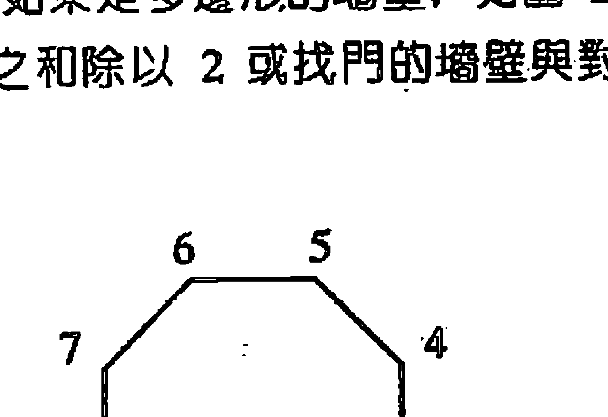

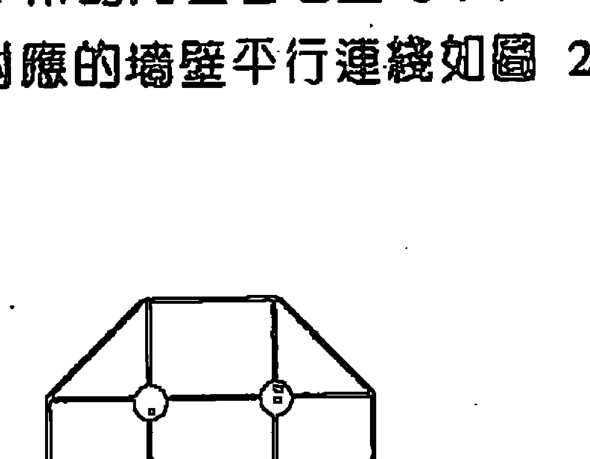

穴的確定必須幾種方法綜合起來考察，才能正確地確定穴位。

## 二、砂，是穴位的對應點。

砂有阻擋不良氣息和保護穴的作用。一般一個穴必須對應一個砂點，砂也可稱散氣處。此處不適合主建築。砂位在般情況下，氣散水不攏，神散風不聚。砂位散形容。確定砂位有幾點方式：

- 1. 在地勢最低窪點處。
- 2. 在穴位對應的高坡南坡或北坡的對應點處。
- 3. 水之流處“U”或“∞”點處。
- 4. 平原地帶要選擇在“井”字形中“十”字帶是砂點處。
- 5. 要看植物長勢不旺盛。
- 6. 砂點處有的土壤太濕，形成沼澤地。有的過於乾燥，形成乾裂狀。
- 7. 站在砂處時，體感氣沉壓抑不輕鬆，用手探其穴位氣下沉或有麻痛的感覺。
- 8. 光象灰暗或呈灰黑色光，定是不好位置。

如在建築室內找砂的方法是：

- ①與穴點平行對應處的點，陰面陽光照射不到。如果多門對應的門與左右牆壁對1/2連接點。如不符合穴位必是砂位。
- ②有的室內形成多砂點，體感如果氣下沉，周身發麻、壓抑是砂位。
- ③光象發暗發灰時，此點是砂位。

總之，砂是不良點，但砂點有吸收和散發不良氣息的作用。因此，它有保護穴的作用。它與穴對應使穴位的氣息得到良好的保護。

## 三、水是風水重要的要素。水的好壞也直接影響到此地的風水好壞。此水有二種含義：一種是實地的湖泊、河流、沼澤、坑窪地帶。另一種是城市的低平地帶。如大路、山路及溝渠地帶。如果穴成氣聚點的話，那麼水則可稱為神。神足氣不散，神弱氣下沉。水與穴位相互滲透，相互提高自身的能量與質值。因此，水的流向形成調節風水好壞的主要方式。看其水是否符合穴的要求，主要看：

- 1. 實水的流向對穴位不是直形。一般形成“∩”或“〰”九曲十八彎的河流走向在對應的穴位處是好地帶，聚氣的能力和藏風的強度就大些。
- 2. 形式上的水。如大路對應的穴位，不是直形如“U、〰”。此地的水對穴有着散氣的作用不聚神。在測定水與穴的對應點時，多不選此位。
- 3. 路的走向不直接對居住門口。如“T”直沖門口煞氣多。來往行人風帶走，故不選此位。
- 4. 一般情況下，多以水塘在門前，路在屋後來衡量水對穴的作用。水是接收宇宙氣息最活的標畿。就象人的血液一樣，形成人的生命能量源泉。水具有可調整性。由於它比較隨意性，不好的水可按條件改變。如所建之路對建築不利，可重建路。水流的彎處對建築不利可增補或在要建的房前建立水池，形成聚氣藏風帶，使神氣實足，調節氣場的強弱。故此看風水最佳點：一看穴，二看水。選好這個要素，是好風好水的關鍵。

水多以路的走向或低窪平坦地帶所代替。因此，路成為水的標志，字義上雖有變化，其形與音不同，但作用則可相同論之。

## 四、明堂。明堂即明或亮的地带。各區域都有它的光亮處，因此，一個區域內，一旦定下方位，就有明堂處，大小明堂雖不同，但實質是一致的。在風水處，明堂多是指整個空間內入口處，人眼直接觀望處的明亮區域或指穴周圍的區域。明堂多居平坦明亮地帶，故此，在建築上多選明堂地域來建築。明堂的確定方法有以下幾種：

- 1. 四周環坡，穴下中間區域平坦或盆地帶。
- 2. 河流走向處穴位點向下方或上向“拳”狀輻射區域。
- 3. 兩山或二河夾脊地帶。
- 4. 氣走向上，明堂處氣比較柔和，光亮不強不弱，給人以舒適感。
- 5. 明堂處，草木旺盛，地質肥沃。大的區域走勢平坦寬闊。

如果在室內，多以一進門來衡量明堂輻射範圍或以窗戶進光處來區分明堂處。如無窗戶和門，多以中間點為明堂輻射發射點。

在風水中明堂成為主要論點之一。水也好，穴也好，只是其一點，而明堂處是面和空間領域，它容納了氣與神、水與穴的良好信息。在明堂範圍內，再找穴點是此位的最佳點。在風水的演變中，多以確定了穴和水後，再測定明堂的範圍。此明堂處就成為藏風聚氣的口袋，在此口袋里再建築或室內放置床位，形成風水的良好格局。

綜上所述，穴是風水最佳基點，砂是穴的對照點，水是穴位連帶輔助參考點，明堂是納氣聚神的綜合點，四者在堪輿學中相互制約，互相呼應，形成堪輿學所要測定的四要素。那麼穴、砂、水、明堂會不會變化呢？根據春夏秋冬四季而言，四要素總體上不會有大的變化，只是穴位的確定與陽光的輻射等條件有關系，故整體變化不大。因此，四要素變化也不大。只是在氣感上春夏秋冬氣強點不一致，但強弱變化不大，故總體上可以作測定的時間即季節衡量風水的好壞。

## 第八章 住宅環境效應得失判斷

1、城鄉風水訣：

城鄉山水兼得佳，鄉村山水直曲彎。
都市街水高為山，凹低濁水凸狹山。

看城市和鄉村的山水標準是不一樣的。鄉村氣散，一般以山水全具備為最好。而都市氣聚，雖然沒有明水河流，然而有高低、凸凹的樓房和濁狹、曲直的街道。一般以濁者、低者、曲者、凹者為水，以狹者、高者、直者、凸者為山。

2、布運排星訣：

陰陽同運星臨用，陽水陽門向為重。
門外水路財丁旺，衰盛憑水權在星。

陰宅和陽宅的排運佈星是一樣的。以受氣的元運為體，山向飛星與流年的客星的加臨為用。陰宅重水向，陽宅重門向。若門外有水路放光則顯得更為重要。而在都市，這水路即馬路，繁華通暢，即為水路放光。

3、屋向門向訣：

屋向門向齊長高，孰重孰輕細查校。

建造新房，屋向和門向一樣重要。而在實際應用中二者取其一。若屋向能驗證六親的得失則不用門向。若屋向不能應驗，則用門向來驗證。而屋向與門向是有區別的：屋向坐南向北，屋門卻是坐東向西。

定屋向規則如下：

- ①訣：屋門相并出一路。以大門作屋向，門向就是屋向。
- ②訣：近街臨道本家向。挨房屋最貼近的街道為向。
- ③訣：大宅入總向居此。大廈的總入口為定向。
- ④訣：明窗發處源向落。一間住宅中，哪一方的窗門最多，引入光線也就最多，以此來得向。
- ⑤訣：多門以牌判衰盛。一家住宅有兩個以上的門，以有門牌的一方來定向。
- ⑥訣：前開向存山後背。背山面水，屋後是山，屋前是水，則以面水為向。

## 4、住宅格局訣：

陽究山脈氣勢局，細查路氣六親鄰。
橋旗墳樹安住入，星宮得失吉凶定。

一般查看住宅，首先看是否合山川形勢氣脈，其次再察氣路與周圍的鄰家屋脊、牌坊、旗杆、墳墩、古樹等建築物落於何星宮，以此辦衰旺以斷吉凶。

## 5、開大門訣：

門旁開口兩盤觀，房門內外向周遭。
外吉內凶有瑕疪，外凶內吉僅小寬。

正屋向與大門向兩盤佈運排星合而觀看。外是屋向，內是門向。外吉內凶麻煩不斷，外凶內吉小康之家。

## 6、屋大門小訣：

屋門大小須相稱，門如瓶口吉積聚。屋小門大常遭損，屋門雙興盈有余。屋與門大小最好協調、相稱。屋小門大則不利。屋向門向都逢旺則吉慶有余。屋大門小如瓶收氣。

## 7、旺運開門訣：

乘旺開門舊屋造，飛星時至運推算。干支相兼氣通天，同元之勢力挽瀾。

舊屋的門旺，一般以建造時間起運佈星來推算。運到星旺星門開，開旺星之方的門吸收旺氣，必須通山向同元而論，也就是山與向和來運旺星的方位元龍要一致。如一運王山丙向，到三運時，宜在震方甲外重新開門，震方為三碧星飛到。三碧星為旺星，為大吉，震方為三運為正神，宜開門。而選擇甲處，王丙甲都同元龍同陰陽，都為地元龍。

## 8、新開旺門訣：

舊屋新門用門向，陰陽順逆舊門合。時旺同元氣通暢，龜房皆為門指路。

在舊屋中重開一個新門，此門與旺星通氣，以前所用的火門則閉而不用，而屋向仍然不變，不再以新門來排星盤。但在判斷時，則以門向為準，龜房也以門向定。具體方位取同元一氣。也就是以前建築的坐元與現所開門的向元要一致。

## 9、旺門蔽塞訣：

旺門蔽塞便來輔，屋方坐向大為主。

由於住宅環境條件所限，旺門一方蔽塞不通達，這時可以從旺星方開一小門，以通達旺氣，而此小門僅僅只作通氣而已，它只有輔助作用，不能作為屋的坐向。

## 10、旺門地高訣：

門基勝屋旺水流，虛水過屋勿擔憂。

旺門之方有水為吉，而因門基反高於屋基，雖有旺水卻不能吸收，門基高於門內的明堂。若門外有路則當別論，路為虛水，並不是真水，所以高於屋基也不用怕。

## 11、胡同巷向訣：

暗日陰埸煞凝生，二黑五黃神難真。

宅內陰暗胡同煞氣重，若二黑或五黃加臨則家人心神不寧。不逢二黑、五黃也是如此。

## 12、廚房竈位訣：

火門向一為既濟，三碧四綠吉中竅。
八白九紫依順排，六七二五不宜照。

建竈之位不論旺衰，但生旺氣方能避則避。火門向一為水火既濟。向三碧四綠為木生火，都為吉竈有利。向八白竈則為火生土為中吉，九紫之處為次吉。六白七赤火門向不宜，即火剋金。二黑五黃更不宜，火生土易有疾。

## 13、垃圾糞坑訣：

穢處退離氣飛散，五黃陰晦黑疾病。

屋向要遠離污穢之地。

## 14、隔運加屋訣：

隔運添造視其門，前後同進初運論。
二進便生兩運排，後加前封新運順。

- ①若舊房歷經幾屋現又再添加新屋，所加的新屋不論在老屋的前後左右，都不另開大門，還得以老屋建造時的運為準，不再作兩運排或新運看。
- ②若新加的房間又開一個新門，則作兩運來看。
- ③若新加房間後，大門又另開了，原大門又封閉了，則以新運論斷。

## 15、分房布星訣：

一家兩家私門用，星運始終運氣同。

前運時建造了一間房，到後運時又增建一房，對此類房的判斷方法，仍以前運建房時所佈星運圖為主，而因分房而變動。也就是說，一間大房，若有兩家同住，兩家各自有自己的房門，這時大房則為次了，而星盤不會因分房而有所改變。

## 16、多家同堂訣：

數家同居私門重，門內路經氣親疏。

在判斷時，以每家的門為主，各家往來的路為用，看其路的遠近衰旺，就知其氣的親疏得失。

## 17、一房兩室訣：

分宅內室私門起，全家通達不分離。

在一間兩室中，另開一個門，則以此門推算，不作兩宅算。

## 18、迭囚不囚訣：

明堂化水囚落空，二四六八居其中。若是一三五七運，囚禁若脫向水通。

一間大房里中間有一個明堂，明堂氣空可以作為水論，當向星入水則囚不住。逢二四六八進的屋，天井在中央，中央為虛水則囚不住。當一三五七進的屋，中央是房屋。假若向見不到水，仍作入囚看。

## 19、商店鋪行訣：

店堂看重門銀神，門納旺向吉曜靈。

一般商店鋪行，門向第一，要納旺向。第二為收銀櫃，要擺在吉方位。第三，神位也要設在吉方位。
衰旺之氣都被門向吸收，門吉曜凶或神堂凶則吉中有疵，表示職員不和或事多阻隔不順。

## 20、方位得失訣：

吉高星興泄為凶，凶凸星剋勝生助。
龍神山星左上居，流年月來興衰受。

住房的吉方有高大的形勢聳立，當年月飛星來相生時則吉，若剋泄則凶。若山星處有高山，如七運酉山卯向，當星排山酉時，為七，山上龍神為七赤，當流年月飛星八白土和六白七赤金來生助則吉。若流年月九紫火來剋或一白水來泄則為凶。旺氣被泄。
七運山巽向乾。坐方巽有高山，星盤山上龍神為五黃星，五黃在七運中為已過去的運，為衰死之氣。當流年月飛星三碧木、四綠木及六白金七赤金排到巽方則吉，因衰死之星受到制化。
當流年月九紫火和二黑土、八白土、五黃土排到巽方則凶，因為衰死之星受到幫助。

## 21、竹木遮蔽訣：

鮮竹疏朗遮無礙，衰竹樹木事事妨。

在住宅的旺方有樹木遮蔽則不吉，而有竹林遮掩，疏密有度則無礙。衰竹枯木則事事有妨。

# 奇門堪輿學

致，則無礙，竹林通氣強，但衰死方位有竹林則不宜。

## 22、一白衰方訣：

一白衰忌屋沖射，加獸更勝過水亡。

住宅的一白方又為衰氣，有附近的屋脊沖射則灾晦相浸，有獸頭形則更重。

## 23、財旺丁秀訣：

山管人丁水管財，向水旁旺財來。

財氣一般從住宅的向水或兩邊水看。旺在那一方，加上太歲來判斷。功名則從向上的飛星一白四綠兩方來，山巒後峰或三叉會處，加太歲合年命一起判斷。人丁興旺之氣從宅的坐向及當運的山星來斷。

訣：旺方太歲飛星到，一白四綠山水匯。

木山顯形功名成，陰宅歲配命功對。

名揚科場，貪狼星在巽宮。當住宅星盤上在巽宮見一白四綠，此家必有人功名成就。而太歲配合年命來推斷哪年出生的人出功名，則為陰宅之法。

## 24、流年衰旺訣：

流年衰死重臨地，傷丁禍伏一年中。

退旺相疊亦堪憂，向方衰死流旺終。

住宅衰死之數到向，而流年的飛星也是同此數到向，則人口有損傷。旺星不到向，逢流年的旺星到向，也有灾禍。

如七運子山午向，己巳年，二入中，六白到向，而原局六白在運為退氣、流年己巳年六白退氣又到向，退氣重現，所以人口損傷不利。

七運庚山甲向，辛未年九入中，七赤星到向，原局向方三碧為衰死之氣，當流年旺星（七運七赤為旺星）飛到，也不利人丁。

## 25、陰森煞氣訣：

衰死方位出陰陽，陰陽卦中鬼怪跟。
太歲細時臨日應，初影後弄戲人生。

住宅處的衰死方有高山屋脊，站在房屋內或站在樓頂能看到屋後的山，後山即為暗探，也叫探頭砂，或看到另一幢的屋脊屋角直沖自己。在屋運衰時，陰則陰森森，陽則怪里怪氣。陰陽并見則神煞，而這些都是在太歲月日時加臨時才應。開始時有影無形，久則彌顯甚或物件顛倒，捉弄生人。枯樹沖射也是如此。

## 26、大道小路訣：

路氣運近忌沖射，穿砂有凶無吉照。
若合三般生旺處，穿吉沖起無價寶。

一般道路為進氣的由來，衰旺隨之吸引。離住宅遠則影響不大，但忌直來直去的沖射，這種沖射，也叫穿砂，有凶無吉。當合三般卦及生旺方，逢穿砂為吉論。

緊挨住宅的路和住宅中內路吉凶關係重大。故內路宜取向上的飛星的生旺方，合三般者吉。而外路看其方位落在何星卦，彎曲處則來氣，橫直者止氣。

如七運巽乾下卦，也為三般卦，巽方為旺星，見路為吉。而坎方及兌方為一條街道的兩頭即為止氣。近乾方位置的街道彎曲，可看作來氣論。

## 27、泉秀井深訣：

井眞氣凝旺文筆，泉水主財衰凶禍。
井爲有源之水光，也爲眞水之處，氣凝聚而騰升，在水里龍神的生旺方可作文筆論，當落衰死剋煞方則有灾晦。

## 28、塔端樓秀訣：

塔挺端秀文筆名，當運科名失則秀。
飛止七九二五災，陰陽同斷煞亦就。
塔樓挺秀也叫文筆，在飛星的一四、一六方當運則主科名，失運也文秀。若在飛盤的七九、二五則興災作禍。

## 29、一石二橋訣：

橋旺可受蔭強護，衰死之時殃招住。
住宅的生旺方有橋，則能得到蔭佑，當落衰死方時則招禍殃。而石橋力大，木橋力輕。

## 30、田頭地尾訣：

田角反背尖射忌，房前屋後福禍依。
在住宅的前後左右，忌田和地角沖射，也就是房前屋後忌田角相對沖。

## 第九章

### 淺論城市住宅環境觀察步驟及調整技巧

古老的堪輿學中藏風聚氣等理論，如生搬硬套在城市住宅則不盡適用。故此，找到城市住宅區的特點，研究其堪輿的觀察要點，已成為堪輿學新的延伸領域。

首先確定城市住宅堪輿的觀察步驟。

- 觀察現有住宅時，須看其座落的方位以及正門的朝向。
- 觀察房前屋後及左右有何標志及妨礙物。
- 觀察路的走向，以及星空、星相對應房室的方向。
- 觀察宅室內的物品，家具以及花草魚鳥的擺設。
- 重點察看高層建築或樹木等所對應住宅的走向。
- 對欲要興建住宅地基，則要看龍穴的位置（A、看花草茂盛之處。B、四面高坡，坡應朝南或朝東的下半坡處）
- 找到最佳範圍內的最佳點，儘量排除外圍不良信息的影響。
- 觀測東南西北的風口，對將要興建的住宅之影響。觀測所建大道對要興建住宅的影響。
- 用體感測察住宅氣場對人身的感覺。
- 觀察光能，看住宅周圍是否有黑色灰色的不良氣息。
- 觀看花草樹木長勢是否旺盛。

總之，城市住宅風水觀察的要點在於：

- 風的走向對住宅的影響。
- 周圍建築及花草樹木對住宅氣相的影響。
- 住宅光象是否良好。
- 人自身對周圍的第一感覺。
- 看周圍的光象，光象一定要亮。發黑或灰色是不好的氣象。
- 花草樹木長勢旺盛之處必是好的風水地。

如遇到不好的風水，調整時注意如下幾點:

- 如建築房宅門不是正東或正南時，對門的走廊處要掛一面鏡子。
- 窗前如對高屋建築物，窗前掛一面鏡子或一幅室外風水畫。最好是大海或天空，直對窗口，把窗外的景色調整過來。

正確調整住宅的技巧:

第一，觀看住宅的方位時，城市住宅門應該朝向正東或正南。如果樓房則要看樓房頂樓立窗的走向是否對東或對南。

第二，窗前避開高層建築物，特別是電綫杆或電視天綫杆和避雷針。

第三，大道、直路或丁字路不能對正門。

第四，家具的擺放占明堂（指整個房宅最高點區域）的周圍，一般情況氣場弱的地方，放置一盆花草加以調整；場強的地方放床位，床頭向南或北。

第五，一般情況下，窗前不得對準高層建築，門前不得有單一樹木。

第六，將要興建的住宅測定其龍穴，龍穴要擇定氣場強、磁場好的地方。一般情況下，四面高坡向南或向東的地面下坡處，必是磁場好的地段。此處建築氣場必好。

第七，建築房屋時，如外圍有電視塔及避雷針應盡量避開。

第八，風口處，一定是四面聚風處，四面聚風起高樓。

第九，直路不橫走住宅，不直沖住宅門口。

第十，體察磁場時，周身發熱通暢是好的氣場。發涼則弱一些。發麻、發抖是陰氣太盛。

第十一，直路如直對橫路或丁字路口，正門貼一幅“喜”字或紅“福”字。

第十二，氣對人周身有熱感的地方，此處是好的氣場，不要放置家具或花草，可放魚缸或鳥籠。

第十三，神位佛堂一定選在面朝南或東，放在明堂亮處或直對門。

總之，奇門堪輿學注重常規與自身的生物場能結合起來，把人的先天本能與參照物結合起來，測定住宅環境良好與否，務必根據實地情況進行合理的調整。

## 第十章 厨房在室内堪舆学中的作用

### 第一节 奇门厨房风水秘诀

一、厨房本源禀命火，常居火鄉結碩果。本命火居最為勝，衣食無缺財源剎。

二、厨房不宜乾坤位，乾位壓住房主頭。常為生計圖謀略，心力人緣不隨從。做官常被地頭欺，求財他鄉常奔馳。坤位雖能收火氣，有財不發是大忌。女客操心煩神事，不定心神總不宜。問題出在坤土盛，杯薪之火不救急。有財需要耐心等，小財小源充生意。

三、厨房若居兌酉方，有財外來妄居家，□頭許財不間斷，翻飛故里不應該；酉方本是私財鄉，火居之處財不安，常得珠寶手飾物，家私滿實總徒然，來者不存他鄉去，少婦少女不易安。

四、厨房若居正北方，財源類落不分明，客主虛寒氣不足，二火三氣可壓寒，寒若有制反增旺，競爭之中財奪來。北方亦屬官居位，事業女助定不虛，陰陽之地可變換，巧中取勝明事非。

五、厨房若居东北位，本气之根生火源。凡是厨房居于此，远处财源是等闲，要到秋时财易落，客主居家财须还，千方百计图谋略，长男长女势气强。

六、厨房若在东方位，正是和神助长穷，吃穿居住坐生乡，利息总养子孙享，若得此财来救助，车水马龙靠庭前。

七、厨房居在东南处，虽犯小人心不安，口舌之争东方起，阴雨过后天晴然，火居之处有人助，遇事总得左右缘，善巧数术和医道，点火点燃出状元。

八、厨房居处离方位，艮火相助财速发。

九、风水得势看命里，命刑火燃衣食损，火刑命里身体衰。

十、火刑命来命合火，都得财助宜生意，事业有成财有存。

十一、命若生火，徒操劳，付出总比得到多。

十二、命剋火处有财权，最易工商财权位。

十三、要求官来命里穿，香火夹命仕途前，状元文昌火处燃，高考孙山甩后边。

十四、子孫盛旺看火頭，子孫辛勞火頭清。子孫之位不易壓，順勢利導可分明。香火點起一支香，遍履財鄉仕途連。三合之位三把火，急來急去小心行。三合之火龍頭君，安然過後送財神，一人得助十方力，如有福份可行船。

十五、總居廚房分居處，東南西北分別述，如居乾坤易沖掉，東北東南落窩安。南方本旺窩東北，東北之處窩安南。

### 第二節 廚房的運用

- 揭示了人們飲食來源及種類和人體消化吸收情況。
- 反映了人們大腦的思維狀態結構。
- 反映了人的職位高低。
- 反映了鄰里關係。
- 反映了錢財的走向。
- 反映了事物的中間環節，人們把握的情況。
- 反映了人們對事物的判斷能力高低。
- 反映了家庭內部成員的關係。
- 反映人們對周圍人群或下級人員的關心程度。
- 反映人們物質本源的導向性。

忌：
- 忌油煙過大。
- 忌空曠不聚氣。
- 忌雜物過多。
- 忌水流不暢。
- 忌貯藏食物過多，發生霉變。
- 忌昏暗、潮濕。
- 忌在廟旁建廚房。
- 忌光線晝夜不減。
- 忌竈與水源過於接近。
- 忌進大門就見廚房。
- 忌與房門相沖。
- 忌與神龕相對。
- 忌客人常出入廚房。
- 忌在山腳下。
- 忌長期無煙火（不使用）
- 忌在廚房內爭吵。

宜：
- 宜光線充足。
- 宜通風良好，空氣清新。
- 宜乾淨無油污。
- 宜擺設花果。
- 宜貯滿生活用水。
- 宜柴火，燃料充足。
- 宜在五鬼、禍害處設廚房。
- 宜陳設簡單，與整體佈局相匹配。
- 宜常清除垃圾。
- 主廚不要常換宜固定人選。
- 宜在東南角設廚房。
- 宜多開窗戶，通通空氣。

## 第十一章 二十四山向局

概要：旺山旺向，合十，打劫，城門訣，反、伏吟，上山下水。

## 1、天元子山午向

五運獨旺。

三、七運全局合十。

一、三、六、八運離宮打劫。

城門五、七、九運不用。一、四運坤巽吉，二、八運巽，三、六運坤吉。

## 2、天元午山子向

五運獨旺。

三、七運全局合十。

二、四、七、九運坎宮打劫。

城門一、三、五運不用。六、九運艮吉，四、七運艮，二、八運乾吉。

## 3、天元卯山酉向

三、五、七運獨旺。

一、八運坎宮打劫。

城門五、七運不用。六運乾、坤吉，一、三、四運坤吉，二、八、九運乾吉。

## 4、天元酉山卯向

三、五、七運當旺。

二、九運離宮打劫。

城門三運不用。四運巽艮吉，一、二、八運巽吉，六、七運艮吉。

## 5、天元乾山巽向

- 二、八運當旺。
- 一、九全局合十。一、四運坎宮打劫。
- 城門一、四、七運不用。三、五運卯午吉，二、七、九運卯吉，一、六、八運午吉。
- 四、六運犯反吟、伏吟。

## 6、天元巽山乾向

- 二、八運當旺。
- 一、九運全局合十。六、九運離宮打劫。
- 城門六運不用。五、七運子酉吉，一、三運酉吉，二、四、九運子吉。
- 四、六運犯反吟、伏吟。

## 7、天元艮山坤向

- 四、六運當旺。
- 城門二、四、九運不用。一、三、五、八運午酉吉。七運酉吉，六運午吉。
- 二、五、八運犯反吟、伏吟；然全局合成三般卦。

## 8、天元坤山艮向

- 四、六運當旺。
- 城門一、六、八運不用。二、五、七、九運子、卯吉。三運卯吉，四運子吉。
- 二、五、八運犯反吟、伏吟，然全局合成三般卦。

## 9、人元寅山申向

四、六運當旺。

城門二、四、九運不用。一、三、五、八運丁、辛吉。一、七運辛吉，六運丁吉。

二、五、八運犯伏吟、反吟，全局合成三般卦。

## 10、人元申山寅向

四、六運當旺。

城門一、六、八運不用。二、五、七、九運乙癸吉，三運乙吉，四運癸吉。

二、五、八運犯反、伏吟，然全局合成三般卦。

## 11、人元巳山亥向

二、八運當旺。

一、九運全局合十，六、九運離宮打劫。

城門六運不用。五、七運癸、辛吉，一、三、八運辛吉，二、四、九運癸吉。

四、六運犯反吟、伏吟。

## 12、人元亥山巳向

二、八運當旺。

一、九運全局合十，一、四運坎宮打劫。

城門四運不用。三、五運乙丁吉。二、七、九運乙吉，一、六、八運丁吉。

四、六運犯反吟、伏吟。

## 13、人元乙山辛向

三、五、七運當旺。

一、八運坎宮打劫。城門五、七運不用。六運申亥吉，一、三、四運申吉，二、八、九運亥吉。

## 14、人元辛山乙向

三、五、七運當旺。

二、九運離宮打劫。城門三、五運不用。四運寅巳吉，一、二、八運巳吉，六、七、九運寅吉。

## 15、人元丁山癸向

五運獨旺。

三、七運全局合十。二、四、七、九坎宮打劫。城門一、三、五運不用。六、九運寅亥吉，四、七運寅吉，二、八運亥吉。

## 16、人元癸山丁向

五運當旺。

三、七運全局合十。一、三、六、八運離宮打劫。城門五、七、九運不用。一、四運巳申吉。二、八運巳吉，三、六運申吉。

## 17、地元辰山戌向

三、五、七運當旺。一、四運離宮打劫。城門五、七運不用。六運壬、庚吉。一、三、八運壬吉，二、四、九運庚吉。

## 18、地元戌山辰向

三、五、七運當旺。
六、九運坎宮打劫。
城門三、五運不用。四運丙甲吉。二、七、九運丙吉，一、六、八運甲吉。

## 19、地元丑山未向

二、五、八運當旺。
二、八運全局合十。
城門一、三、五、八運不用。二、四、九運丙庚吉，七運丙吉，六運庚吉。
四、六運全局合三般卦。

## 20、地元未山丑向

二、五、八運當旺。
二、八運全局合十。
城門二、五、七、九運不用，一、六、八運甲壬吉，三運壬吉，四運甲吉。
四、六運全局合三般卦。

## 21、地元甲山庚向

四、六運當旺。
四、六運全局合十。二、九運坎宮打劫。
城門六運不用，五、七運未戌吉。一、三、四運戌吉，二、八、九運未吉。
三、七運犯反吟、伏吟。

## 22、地元庚山甲向

四、六運當旺。

四、六運全局合十，一、八運離宮打劫。
城門四運不用。三、五運辰、丑吉，一、二、八運丑吉，六、七、九運辰吉。
三、七運犯反吟、伏吟。

## 23、地元壬山丙向

無當旺運。
二、四、七、九運離宮打劫。
城門一、四、六運不用。五、七、九運未辰吉。二、八運未吉。三運辰吉。

## 24、地元丙山壬向

無當旺運。
一、三、六、八運坎宮打劫。
城門六、九運不用。一、三、五運丑戌吉。四、七運戌吉，二、八運丑吉。
一、九運犯反吟、伏吟。

## 第十二章 三元九運表

| 日期事件 | 元运信息 |
|----------|----------|
| 公元前 837 周共和行政 5 年楚熊嚴元年甲子 | 上元 一運 白貪 |
| 公元前 817 周宣王靜 11 年甲申 | 上元 二運 黑巨 |
| 公元前 797 周宣王靜 31 年甲辰 | 上元 三運 碧祿 |
| 公元前 777 周幽王宮涅 5 年甲子 | 中元 四運 綠文 |
| 公元前 757 周平王宜臼 14 年甲申 | 中元 五運 黃廉 |
| 公元前 737 周平王宜臼 34 年甲辰 | 中元 六運 白武 |
| 公元前 717 周桓王林 3 年甲子 | 下元 七運 赤破 |
| 公元前 697 周桓王林 23 年甲申 | 下元 八運 白輔 |
| 公元前 677 周釐王胡齊 5 年甲辰 | 下元 九運 紫弼 |
| 公元前 657 周惠王閬 20 年甲子 | 上元 一運 白貪 |
| 公元前 637 周襄王鄭 15 年甲申 | 上元 二運 黑巨 |
| 公元前 617 周頃王王臣 2 年甲辰 | 上元 三運 碧祿 |
| 公元前 597 周定王瑜 10 年甲子 | 中元 四運 綠文 |
| 公元前 577 周簡王夷 9 年甲申 | 中元 五運 黃廉 |
| 公元前 557 周靈王泄心 15 年甲辰 | 中元 六運 白武 |
| 公元前 537 周景王貴 8 年甲子 | 下元 七運 赤破 |
| 公元前 517 周敬王丐 3 年甲申 | 下元 八運 白輔 |
| 公元前 497 周敬王丐 23 年甲辰 | 下元 九運 紫弼 |
| 公元前 477 周敬王丐 43 年甲子 | 上元 一運 白貪 |
| 公元前 457 周貞定王介 12 年甲申 | 上元 二運 黑巨 |
| 公元前 437 周考王嵬 4 年甲辰 | 上元 三運 碧祿 |
| 公元前 417 周威烈王午 9 年甲子 | 中元 四運 綠文 |
| 公元前 397 周安王翳 5 年甲申 | 中元 五運 黃廉 |
| 公元前 377 周安王翳 25 年甲辰 | 中元 六運 白武 |
| 公元前 357 周顯王扁 12 年甲子 | 下元 七運 赤破 |
| 公元前 337 周顯王扁 32 年甲申 | 下元 八運 白輔 |
| 公元前 317 周慎靚王定 4 年甲辰 | 下元 九運 紫弼 |
| 公元前 297 周赧王延 18 年甲子 | 上元 一運 白貧 |
| 公元前 277 周赧王延 38 年甲申 | 上元 二運 黑巨 |
| 公元前 257 周赧王延 58 年甲辰 | 上元 三運 碧祿 |
| 公元前 237 周赧王延 39 年甲子 | 中元 四運 綠文 |
| 公元前 217 秦始皇嬴政 30 年甲申 | 中元 五運 黃廉 |
| 公元前 197 漢高祖劉邦 10 年甲辰 | 中元 六運 白武 |
| 公元前 177 漢文帝劉恒 3 年甲子 | 下元 七運 赤破 |
| 公元前 157 漢文帝劉恒后元 7 年甲申 | 下元 八運 白輔 |
| 公元前 137 漢武帝劉徹建元 4 年甲辰 | 下元 九運 紫弼 |
| 公元前 117 年漢武帝劉徹元狩 6 年甲子 | 上元 一運 白貧 |
| 公元前 97 漢武帝劉徹天漢 4 年甲申 | 上元 二運 黑巨 |
| 公元前 77 漢昭帝劉弗陵元鳳 4 年甲辰 | 上元 三運 碧祿 |
| 公元前 57 漢宣帝劉詢五鳳元年甲子 | 中元 四運 綠文 |
| 公元前 37 漢元帝劉奭建昭 2 年甲申 | 中元 五運 黃廉 |
| 公元前 17 漢成帝劉驪鴻嘉 4 年甲辰 | 中元 六運 白武 |
| 公元 4 漢平帝劉衎元始 4 年甲子 | 下元 七運 赤破 |
| 公元 24 淮陽王劉玄更始 2 年甲申 | 下元 八運 白輔 |
| 公元 44 漢光武帝劉秀 20 年甲辰 | 下元 九運 紫弼 |
| 公元 64 漢明帝劉莊 7 年甲子 | 上元 一運 白貧 |
| 公元 84 漢章帝劉炟建初 9 年甲申 | 上元 二運 黑巨 |
| 公元 104 漢和帝劉肇永元 16 年甲辰 | 上元 三運 碧綠 |
| 公元 124 漢安帝劉祜延光 3 年甲子 | 中元 四運 綠文 |
| 公元 144 漢順帝劉保漢安 3 年甲申 | 中元 五運 黃廉 |
| 公元 164 漢桓帝劉志延熹 7 年甲辰 | 中元 六運 白武 |
| 公元 184 漢靈帝劉宏光和 7 年甲子 | 下元 七運 赤破 |
| 公元 204 漢獻帝劉協建安 9 年甲申 | 下元 八運 白輔 |
| 公元 224 后主劉禪建興 2 年甲辰 | 下元 九運 紫弼 |
| 公元 244 后主劉禪延熙 7 年甲子 | 上元 一運 白貪 |
| 公元 264 后主劉禪炎興元年甲申 | 上元 二運 黑巨 |
| 公元 284 晉武帝司馬炎太康 5 年甲辰 | 上元 三運 碧綠 |
| 公元 304 晉惠帝司馬衷永安元年甲子 | 中元 四運 綠文 |
| 公元 324 晉明帝司馬紹太寧 2 年甲申 | 中元 五運 黃廉 |
| 公元 344 晉康帝司馬岳建元 2 年甲辰 | 中元 六運 白武 |
| 公元 364 晉哀帝司马丕興寧 2 年甲子 | 下元 七運 赤破 |
| 公元 384 晉孝武帝司馬曜太元 9 年甲申 | 下元 八運 白輔 |
| 公元 404 司馬德宗元興 3 年甲辰 | 下元 九運 紫弼 |
| 公元 424 宋少帝劉義符景平 2 年甲子 | 上元 一運 白貪 |
| 公元 444 宋文帝劉義隆元嘉 21 年甲申 | 上元 二運 黑巨 |
| 公元 464 宋孝武帝劉駿大明 8 年甲辰 | 上元 三運 碧綠 |
| 公元 484 齊武帝蕭賾永明 2 年甲子 | 中元 四運 綠文 |
| 公元 504 梁武帝蕭衍天監 3 年甲申 | 中元 五運 黃廉 |
| 公元 524 梁武帝蕭衍普通 5 年甲辰 | 中元 六運 白武 |
| 公元 544 梁武帝蕭衍大同 10 年甲子 | 下元 七運 赤破 |## 奇門堪輿學

| 左列 | 右列 |
|------|------|
| 公元 564 陳文帝陳蒨天嘉 5 年甲申 | 下元 八運 白輔 |
| 公元 584 陳后主陳叔寶至德 2 年甲辰 | 下元 九運 紫弼 |
| 公元 604 隋文帝楊堅仁壽 4 年甲子 | 上元 一運 白貧 |
| 公元 624 唐高祖李淵武德 7 年甲申 | 上元 二運 黑巨 |
| 公元 644 唐太宗李世民貞觀 18 年甲辰 | 上元 三運 碧祿 |
| 公元 664 唐高宗李治麟德元年甲子 | 中元 四運 綠文 |
| 公元 684 唐武則天光宅元年甲申 | 中元 五運 黃廉 |
| 公元 704 唐武則天長安 4 年甲辰 | 中元 六運 白武 |
| 公元 724 唐玄宗李隆基開元 12 年甲子 | 下元 七運 赤破 |
| 公元 744 唐玄宗李隆基天寶 3 年甲申 | 下元 八運 白輔 |
| 公元 764 唐代宗李豫廣德 2 年甲辰 | 下元 九運 紫弼 |
| 公元 784 唐德宗李適興元元年甲子 | 上元 一運 白貧 |
| 公元 804 唐德宗李適興元 20 年甲申 | 上元 二運 黑巨 |
| 公元 824 唐穆宗李恆長慶 4 年甲辰 | 上元 三運 碧祿 |
| 公元 844 唐文宗李昂大和 4 年甲子 | 中元 四運 綠文 |
| 公元 864 唐懿宗李漼咸通 5 年甲申 | 中元 五運 黃廉 |
| 公元 884 唐僖宗李儇中和 4 年甲辰 | 中元 六運 白武 |
| 公元 904 唐昭宗李曄天復 4 年甲子 | 下元 七運 赤破 |
| 公元 924 後唐莊宗李存勖同光 2 年甲申 | 下元 八運 白輔 |
| 公元 944 後晉高祖石敬瑭天福 9 年甲辰 | 下元 九運 紫弼 |
| 公元 964 宋太祖趙匡胤乾德 2 年甲子 | 上元 一運 白貧 |
| 公元 984 宋太宗趙炅太平興國 9 年甲申 | 上元 二運 黑巨 |
| 公元 1004 宋真宗趙恆景德元年甲辰 | 上元 三運 碧祿 |
| 公元 1024 宋仁宗趙禎天聖 2 年甲子 | 中元 四運 綠文 |

## 奇門遁甲學

| 公元年份和皇帝信息 | 元 | 運 星 |
|------------------|----|-------|
| 公元 1044 宋仁宗趙禎慶歷 4 年甲申 | 中元 | 五運 黃廉 |
| 公元 1064 宋英宗趙曙治平元年甲辰 | 中元 | 六運 白武 |
| 公元 1084 宋神宗趙頊元豐 7 年甲子 | 下元 | 七運 赤破 |
| 公元 1104 宋徽宗趙佶崇寧 3 年甲申 | 下元 | 八運 白輔 |
| 公元 1124 宋徽宗趙佶宣和 6 年甲辰 | 下元 | 九運 紫弼 |
| 公元 1144 宋高宗趙構紹興 14 年甲子 | 上元 | 一運 白貪 |
| 公元 1164 宋孝宗趙昚隆興 2 年甲申 | 上元 | 二運 黑巨 |
| 公元 1184 宋孝宗趙昚淳熙 11 年甲辰 | 上元 | 三運 碧綠 |
| 公元 1204 宋寧宗趙擴嘉泰 4 年甲子 | 中元 | 四運 綠文 |
| 公元 1224 宋寧宗趙擴嘉定 17 年甲申 | 中元 | 五運 黃廉 |
| 公元 1244 宋理宗趙昀淳祐 4 年甲辰 | 中元 | 六運 白武 |
| 公元 1264 宋理宗趙昀景定 5 年甲子 | 下元 | 七運 赤破 |
| 公元 1284 元世祖忽必烈至元 21 年甲申 | 下元 | 八運 白輔 |
| 公元 1304 元成宗鐵穆耳大德 8 年甲辰 | 下元 | 九運 紫弼 |
| 公元 1324 元泰定帝也孫鐵木兒泰定元年甲子 | 上元 | 一運 白貪 |
| 公元 1344 元惠宗妥懽帖睦爾至正 4 年甲申 | 上元 | 二運 黑巨 |
| 公元 1364 元惠宗妥懽帖睦爾至正 24 年甲辰 | 上元 | 三運 碧綠 |
| 公元 1384 明太祖朱元璋洪武 17 年甲子 | 中元 | 四運 綠文 |
| 公元 1404 明成祖朱棣永樂 2 年甲申 | 中元 | 五運 黃廉 |
| 公元 1424 明成祖朱棣永樂 22 年甲辰 | 中元 | 六運 白武 |
| 公元 1444 明英宗朱祁鎮正統 9 年甲子 | 下元 | 七運 赤破 |
| 公元 1464 明英宗朱祁鎮天順 8 年甲申 | 下元 | 八運 白輔 |
| 公元 1484 明憲宗朱見深成化 20 年甲辰 | 下元 | 九運 紫弼 |
| 公元 1504 明孝宗朱祐樘弘治 17 年甲子 | 上元 | 一運 白貪 |

## 奇門堪輿學

- 公元 1524 明世宗朱厚熜嘉靖 3 年甲申 上元 二運 黑巨
- 公元 1544 明世宗朱厚熜嘉靖 23 年甲辰 上元 三運 碧祿
- 公元 1564 明世宗朱厚熜嘉靖 43 年甲子 中元 四運 綠文
- 公元 1584 明神宗朱翊鈞萬曆 12 年甲申 中元 五運 黃廉
- 公元 1604 明神宗朱翊鈞萬曆 32 年甲辰 中元 六運 白武
- 公元 1624 明熹宗朱由校天啟 4 年甲子 下元 七運 赤破
- 公元 1644 明毅宗朱由檢崇禎 17 年甲申 下元 八運 白輔
- 公元 1664 清聖祖玄燁康熙 2 年甲辰 下元 九運 紫弼
- 公元 1684 清聖祖玄燁康熙 23 年甲子 上元 一運 白貪
- 公元 1704 清聖祖玄燁康熙 43 年甲申 上元 二運 黑巨
- 公元 1724 清世宗胤禛雍正 2 年甲辰 上元 三運 碧祿
- 公元 1744 清高宗弘曆乾隆 9 年甲子 中元 四運 綠文
- 公元 1764 清高宗弘曆乾隆 29 年甲申 中元 五運 黃廉
- 公元 1784 清高宗弘曆乾隆 49 年甲辰 中元 六運 白武
- 公元 1804 清仁宗顒琰嘉慶 9 年甲子 下元 七運 赤破
- 公元 1824 清宣宗旻寧道光 4 年甲申 下元 八運 白輔
- 公元 1844 清宣宗旻寧道光 24 年甲辰 下元 九運 紫弼
- 公元 1864 清穆宗載淳同治 3 年甲子 上元 一運 白貪
- 公元 1884 清德宗載湉光緒 10 年甲申 上元 二運 黑巨
- 公元 1904 清德宗載湉光緒 30 年甲辰 上元 三運 碧祿
- 公元 1924 民國十三年甲子 中元 四運 綠文
- 公元 1944 民國三十三年甲申 中元 五運 黃廉
- 公元 1964 中華人民共和國甲辰年 中元 六運 白武
- 公元 1984 中華人民共和國甲子年 下元 七運 赤破

## 奇門堪輿學

| 年份 | 三元運星 |
|------|----------|
| 公元 2004 年甲申 | 下元 八運 白輔 |
| 公元 2024 年甲辰 | 下元 九運 紫弼 |
| 公元 2044 年甲子 | 上元 一運 白貪 |
| 公元 2064 年甲申 | 上元 二運 黑巨 |
| 公元 2084 年甲辰 | 上元 三運 碧祿 |

### 第十三章 運盤規則詳解

#### 第一節 九星軌迹

地盤：順飛或逆飛軌迹圖解：供讀者對照使用方便：

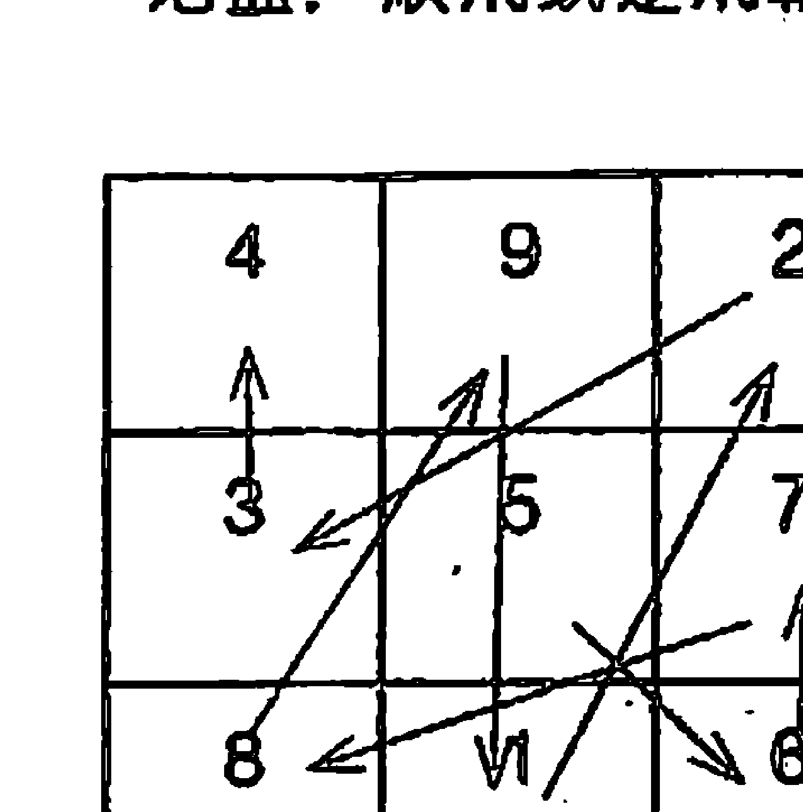

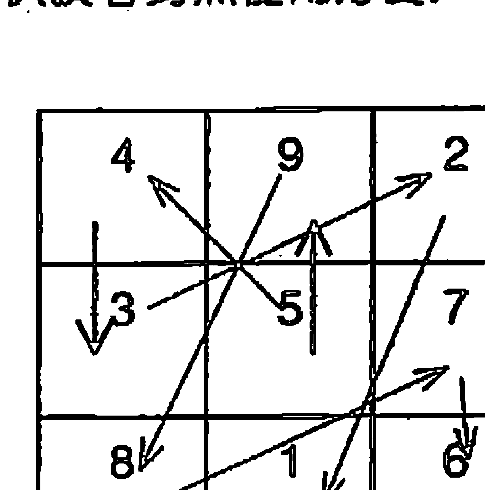

## 一入中順飛盤

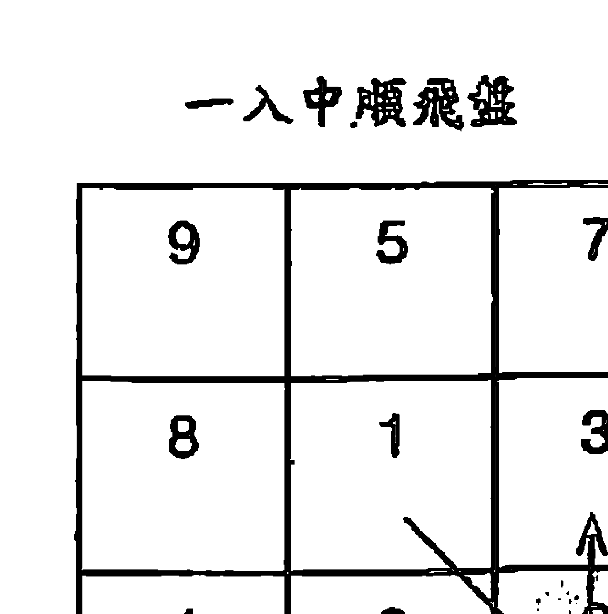

## 一入中逆飛盤

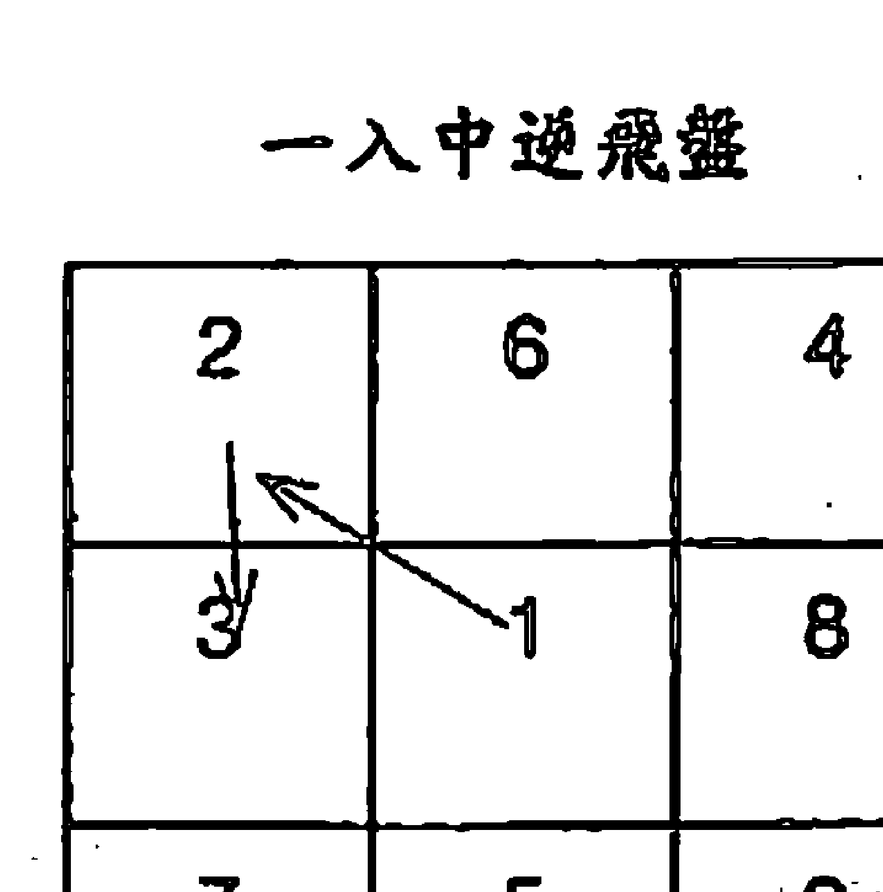

## 二入中順飛盤

| 1 | 6 | 8 |
| 9 | 2 | 4 |
| 5 | 7 | 3 |

## 二入中逆飛盤

| 3 | 7 | 5 |
| 4 | 2 | 9 |
| 8 | 6 | 1 |

## 三入中順飛盤

| 2 | 7 | 9 |
| 1 | 3 | 5 |
| 6 | 8 | 4 |

## 三入中逆飛盤

| 4 | 8 | 6 |
| 5 | 3 | 1 |
| 9 | 7 | 2 |

## 四入中順飛盤

| 3 | 8 | 1 |
| 2 | 4 | 6 |
| 7 | 9 | 5 |

## 四入中逆飛盤

| 5 | 9 | 7 |
| 6 | 4 | 2 |
| 1 | 8 | 3 |

## 五入中順飛盤

| 4 | 9 | 2 |
| 3 | 5 | 7 |
| 8 | 1 | 6 |

## 五入中逆飛盤

| 6 | 1 | 8 |
| 7 | 5 | 3 |
| 2 | 9 | 4 |

## 六入中順飛盤

| 5 | 1 | 3 |
| 4 | 6 | 8 |
| 9 | 2 | 7 |

## 六入中逆飛盤

| 7 | 2 | 9 |
| 8 | 6 | 4 |
| 3 | 1 | 5 |

## 七入中順飛盤

| 6 | 2 | 4 |
| 5 | 7 | 9 |
| 1 | 3 | 8 |

## 七入中逆飛盤

| 8 | 3 | 1 |
| 9 | 7 | 5 |
| 4 | 2 | 6 |

## 八入中順飛盤

| 7 | 3 | 5 |
| 6 | 8 | 1 |
| 2 | 4 | 9 |

## 八入中逆飛盤

| 9 | 4 | 2 |
| 1 | 8 | 6 |
| 5 | 3 | 7 |

## 九入中順飛盤

| 8 | 4 | 6 |
| 7 | 9 | 2 |
| 3 | 5 | 1 |

## 九入中逆飛盤

| 1 | 5 | 3 |
| 2 | 9 | 7 |
| 6 | 4 | 8 |

#### 第二節 怎樣排山盤和向盤

- 1. 分清楚二十四山所在之宮位：乾宮分戌乾亥三山。巽宮分辰巽巳三山。艮宮分丑艮寅三山。坤宮分未坤申三山。坎宮分壬子癸三山。離宮丙午丁三山，震宮分甲卯乙三山。兌宮分庚酉辛三山。

- 2. 分清楚二十四山陰陽：戊為陰、乾為陽、亥為陽、辰為陰、巽為陽、巳為陽、丑為陰、艮為陽、寅為陽、未為陰、坤為陽、申為陽，壬為陽、子為陰、癸為陰、丙為陽、午為陰、丁為陰、甲為陽、卯為陰、乙為陰、庚為陽、酉為陰、辛為陰。

- 3. 分清楚二十四山天地人三元龍：戊為地元龍，乾為天元龍，亥為人元龍，辰為地元龍，巽為天元龍，巳為人元龍，丑為地元龍，艮為天元龍，寅為人元龍，未為地元龍，坤為天元龍，申為人元龍，壬為地元龍，子為天元龍，癸為人元龍，丙為地元龍，午為天元龍，丁為人元龍，甲為地元龍，卯為天元龍，乙為人元龍，庚為地元龍，酉為天元龍，辛為人元龍。

- 4. 二十四山圖記法：
  (1) 地元龍：甲庚丙壬——陽，辰戌丑未——陰。
  (2) 天元龍：乾坤艮巽——陽，子午卯酉——陰。
  (3) 人元龍：寅申巳亥——陽，乙辛丁癸——陰。

- 5. 分清楚二十四山地元龍、天元龍、人元龍後，再根據地天人三元龍的陰逆陽順規則排山向盤。

- 6. 排運盤和山向的規則：
  (1) 先根據元運排好當運之盤——叫運盤。
  (2) 根據運盤所排好之星，找坐山宮所對應之數，按同元一氣之法分陰陽，陰則逆飛九宮，陽則順飛九宮——所產生之盤叫坐山山盤。
  (3) 根據運盤所排好之星，找向宮所對應之數，按同元一氣法分陰陽，陽則順飛，陰則逆飛——所產生之盤叫坐向向盤。

#### 第三節 七運二十四山排盤和分析

### 一、壬山丙向

丙向 ↑
| 2 3 六 | 7 7 二 | 9 5 四 |
| 1 4 五 | 3 2 七 | 5 9 九 |
| 6 8 一 | 8 6 三 | 4 1 八 |
壬山

- 1. 本局坎、坤、離、卯、乾宮有山，山要圓滑秀麗為貴。
- 2. 艮、離、坤、兌宮有水為財，水要彎曲環抱為有情。
- 3. 斷：少房、中房發財快、但少房人丁少，三碧七赤之年中房應推實期。

### 二、子山午向

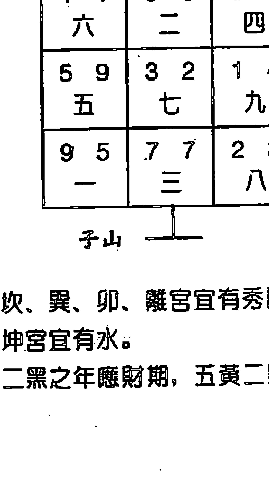

- 1. 本局艮、坎、巽、卯、離宮宜有秀麗之山。
- 2. 卯、坎、坤宮宜有水。
- 3. 斷：六白二黑之年應財期，五黃二黑三碧之年應文人。

## 奇門遁甲學

### 三、癸山丁向

丁向 ↑

| 4 1 六 | 8 6 二 | 6 8 四 |
| 5 9 五 | 3 2 七 | 1 4 九 |
| 9 5 一 | 7 7 三 | 2 3 八 |

癸山 —

- 1. 本局坎、艮、巽、離宮應有山。
- 2. 巽、離、坎、坤應有水。
- 3. 二黑三碧之年少房應發財、官雙收。二房出文秀，五黃之年長房應出貴或秀士。

### 四、丑山未向

| 9 5 六 | 5 9 二 | 7 7 四 |
| 8 6 五 | 1 4 七 | 3 2 九 |
| 4 1 一 | 6 8 三 | 2 3 八 |

*(丑山 ↙, 未向 ↗)*

本局為雙星到向，若向上有水又有山則應少房添丁發財，若震巽峰起，八白之年應中大房能人。

### 五、艮山坤向

| 2 3 六 | 6 8 二 | 4 1 四 |
| 3 2 五 | 1 4 七 | 8 6 九 |
| 7 7 一 | 5 9 三 | 9 5 八 |

本局若坎、離兩宮來水，三碧四綠之年應財富。若兌、乾、艮峰起，當運少房應出官貴。

### 六、寅山申向

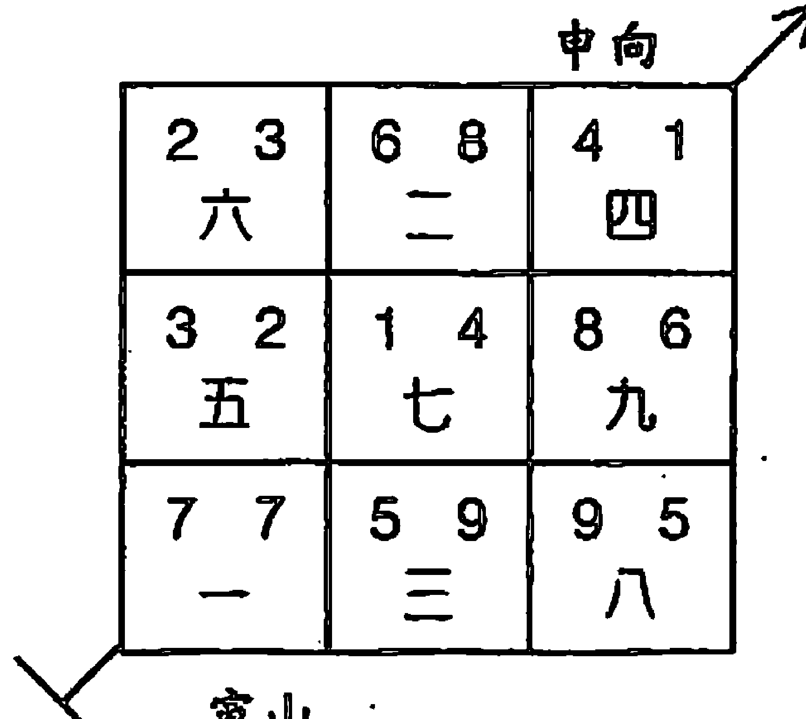

本局若離、兌來水，五黃之年應長少房財富。乾、艮宮峯起，六白三碧之年中少房應官貴。

## 奇門堪輿學

### 七、甲山庚向

甲山 | 4 8 六 | 9 4 二 | 2 6 四 | 庚向
--- | --- | --- | --- | ---
 | 3 7 五 | 5 9 七 | 7 2 九 | 
 | 8 3 一 | 1 5 三 | 6 1 八 |

- 1. 本局艮、兌局如有山。
- 2. 巽、卯、乾有水應發財富。
- 3. 斷：九紫之年應中少房出能人，但少房卯桃花劫。長房損人，少房退財。

### 八、卯山西向

| 6 1 六 | 1 5 二 | 8 3 四 |
| 7 2 五 | 5 9 七 | 3 7 九 |
| 2 6 一 | 9 4 三 | 4 8 八 |

卯山 →

→ 酉向

- 1. 本局坤、坎、巽宮應有山，兌、乾宮應有水。
- 2. 斷：九紫、五黃之年應推官期，長房以武職為主。六白七赤之年應少房發財氣。

## 奇門堪輿學

### 九、乙山辛向

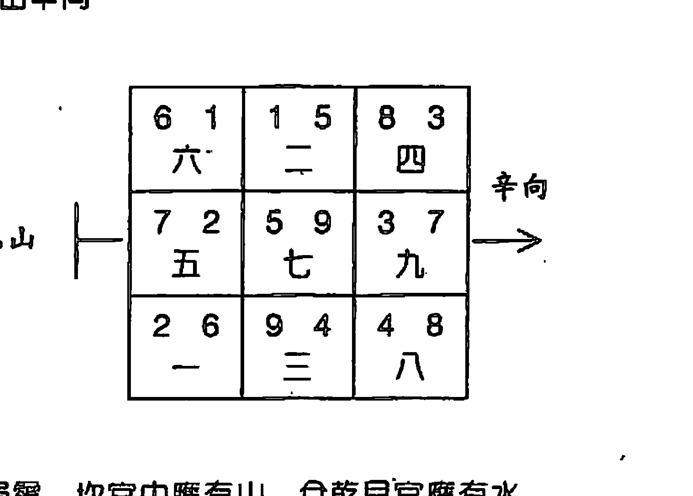

- 1. 本局震、坎宮中應有山。兌乾艮宮應有水。
- 2. 斷：七赤之年長房應武職，中少房應財富。五黃之年少房進財，但有眼傷之就應，中房同論。

### 十、辰山戌向

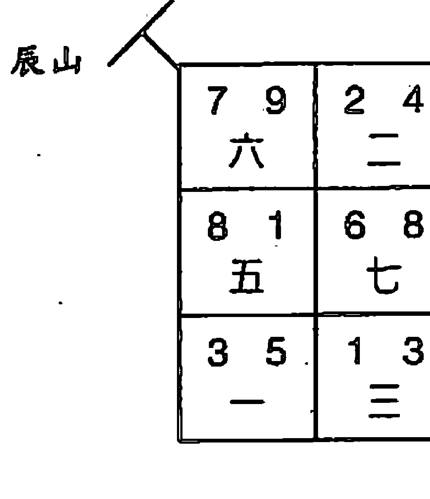

1. 本局旺山旺向，震、巽、坎應有山，乾震方應有水。

2. 斷：本局財丁平收，六白之年、八白之年應喜期。

### 十一、巽山乾向

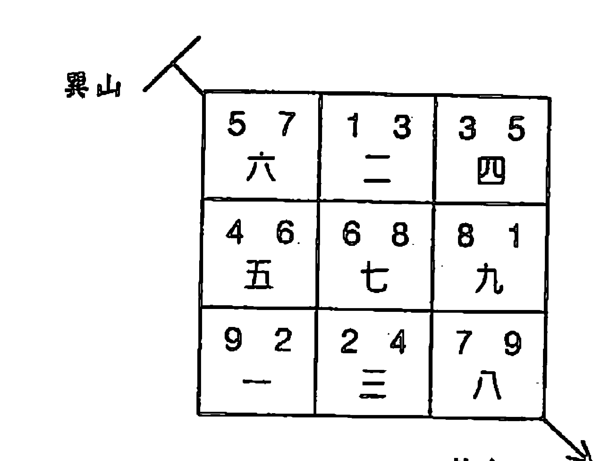

本局坎乾兌如有水，即應長房或長女，中房大发財富，但中房必有一女被金匱所傷。兌、艮宮有山，二黑年應中房、少房出官貴。

### 十二、巳山亥向

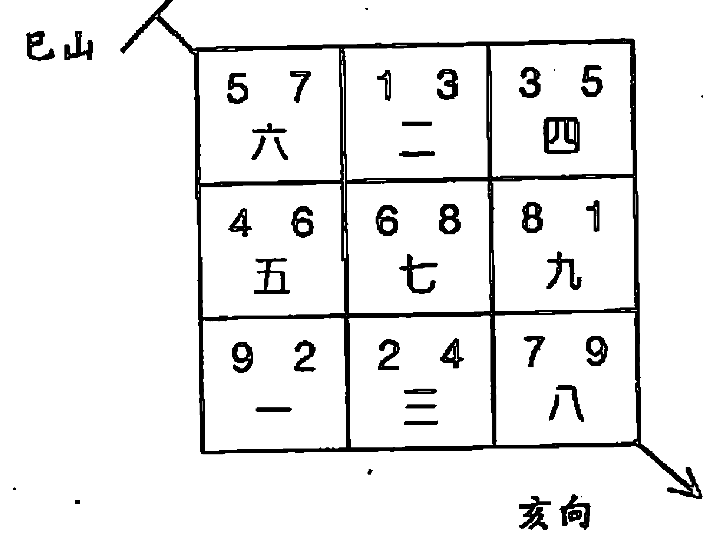

本局犯上山下水，如向上有水，則少房利二房發財富，坎宮有水更發。兌宮艮宮有秀麗山峯，一白之年應推官出秀士。

### 十三、丙山壬向

丙山
| 3 2 六 | 7 7 二 | 5 9 四 |
| 4 1 五 | 2 3 七 | 9 5 九 |
| 8 6 一 | 6 8 三 | 1 4 八 |
壬向

本局離、震、艮、兌、乾應有秀麗圓滑之山，則中少房出文人、官貴。坤坎乾宮有水則應長房少房發財富，二黑六白之年應。

### 十四、午山子向

午山

| 1 4 六 | 6 8 二 | 8 6 四 |
| 9 5 五 | 2 3 七 | 4 1 九 |
| 5 9 一 | 7 7 三 | 3 2 八 |

子向

1. 本局巽、坎、震、坤宮有山為妙。
2. 艮、坎宮有水為財。
3. 斷：二黑、五黃、一白之年應文秀之士，多應在女兒方。二黑三碧六白應財期。

### 十五、丁山癸向

丁山 | 1 4 六 | 6 8 二 | 8 6 四 |
|------|--------|--------|--------|
| 9 5 五 | 2 3 七 | 4 1 九 |
| 5 9 一 | 7 7 三 | 3 2 八 |
癸向

本局巽離坎坤震有山。艮坎宮有水，則二黑八白應出人，文武兼收，多為二房。少房人丁少，或生女多且發財富，外養僕婦。

### 十六、未山丑向

| 未山 |
|------|
| 5 9 六 | 9 5 二 | 7 7 四 |
| 6 8 五 | 4 1 七 | 2 3 九 |
| 1 4 一 | 8 6 三 | 3 2 八 |

本局如坎艮震宮有山，震巽有水，則七赤四綠之年應利甲，但二房有逆子，九紫八白之年少房應財富。

### 十七、坤山艮向

| 3 2 六 | 8 6 二 | 1 4 四 |
| 2 3 五 | 4 1 七 | 6 8 九 |
| 7 7 一 | 9 5 三 | 5 9 八 |

本局如坤離艮峰起，艮坎乾方向有水，則中少房大發財富，四綠三碧之年應發期，二房長女、長房二女應科名。

### 十八、申山寅向

| 3 2 六 | 8 6 二 | 1 4 四 |
| 2 3 五 | 4 1 七 | 6 8 九 |
| 7 7 一 | 9 5 三 | 5 9 八 |

本局如坎兌坤起蟬，五黃六白八白之年應推官。艮震兌向有水，五黃九之年長房應大發財富，小房發三八。

### 十九、庚山甲向

| 8 4 六 | 4 9 二 | 6 2 四 |
| 7 3 五 | 9 5 七 | 2 7 九 |
| 3 8 一 | 5 1 三 | 1 6 八 |

本局巽離乾應有山，三碧之年應文科。但有一少亡或損傷，本局犯上山下水大凶，如山後水即發，但到八運即敗絕。

### 二十、酉山卯向

| 1 6 六 | 5 1 二 | 3 8 四 |
| 2 7 五 | 9 5 七 | 7 3 九 |
| 6 2 一 | 4 9 三 | 8 4 八 |

本局兌乾巽有山為妙，向上有水，則當運即發財富官貴一齊到，多廳一白九紫之年，五黃之年廳出人，但少房應退財。

## 二十一、辛山乙向

|   |   |   |
|---|---|---|
| 一 六 六 | 五 一 二 | 三 八 四 |
| 二 七 五 | 九 五 七 | 七 三 九 |
| 六 二 一 | 四 九 三 | 八 四 八 |

本局旺山旺向，向上有水，發財快速，坐山山峰起，乾峰起應官貴。五黃九紫之年應少房得旺。

## 二十二、戊山辰向

| 九 七 六 | 四 二 二 | 二 九 四 |
| 一 八 五 | 八 六 七 | 六 四 九 |
| 五 三 一 | 三 一 三 | 七 五 八 |

本局旺山旺向，向上若有水，少房应财富。震坤巽宫有峰起，七八九运都有能人出，多少房女、中房女。

## 二十三、乾山巽向

| 七 五 六 | 三 一 二 | 五 三 四 |
| 六 四 五 | 八 六 七 | 一 八 九 |
| 二 九 一 | 四 二 三 | 九 七 八 |

本局為犯上山下水局，如向上有水者，則損丁退財，應期快，多應少房。也有服毒自殺或吸毒或被毒物所傷應。

## 二十四、亥山巳向

| 七 五 六 | 三 一 二 | 五 三 四 |
| 六 四 五 | 八 六 七 | 一 八 九 |
| 二 九 一 | 四 二 三 | 九 七 八 |

本局為犯上山下水局，如向上有水者，小者退財，水大者，家破人亡。三碧年應凶期。

#### 第四節 八運二十四山排盤

- 1、壬山丙向：山盤四綠為巽宮，辰陰，逆佈九宮，則九紫星到向，八白星到坐山，向盤三碧為震宮，甲陽，順佈九宮，則七赤星到向，八白星到坐。

丙山
↑
| 5 2 七 | 9 7 三 | 7 9 五 |
| 6 1 六 | 4 3 八 | 2 6 一 |
| 1 6 二 | 8 8 四 | 3 4 九 |
↓
壬向

- 2、丙山壬向：山盤三碧為震宮，甲陽，順佈九宮，則七赤星到坐山，八白星到向。向盤四綠為巽宮，辰陰，逆佈九宮，則九紫星到山，八白星到向。

| 丙山 |   |   |
|---|---|---|
| 2 5 七 | 7 9 三 | 9 7 五 |
| 1 6 六 | 3 4 八 | 5 2 一 |
| 6 1 二 | 8 8 四 | 4 3 九 |
| 壬向 |   |   |

- 3、子山午向或癸山丁向：山盤四綠為巽宮，巽已陽，順佈九宮，則八白到向，九紫到坐山；向盤三碧為震，卯乙陰，逆佈九宮，則八白星到向，七赤星到坐山。

| 午或丁向 |   |   |
|---|---|---|
| 3 4 七 | 8 8 三 | 1 6 五 |
| 2 5 六 | 4 3 八 | 6 1 一 |
| 7 9 二 | 9 7 四 | 5 2 九 |
| 子或癸山 |   |   |

- 4、午山子向或丁山癸向：山盤三碧為震宮，卯乙陰，逆佈九宮，則八白到坐山，七赤到向；向盤四綠為巽宮，巽巳陽，順佈九宮，則八白到坐山，九紫到向。

午丁山

| 4 3 七 | 8 8 三 | 6 1 五 |
| :---: | :---: | :---: |
| 5 2 六 | 3 4 八 | 1 6 一 |
| 9 7 二 | 7 9 四 | 2 5 九 |

子癸向

- 5、丑山未向：山盤為二黑坤宮，未陰逆佈九宮，則八白到山，五黃到向；向盤五黃，為未陰，逆佈九宮，則二黑到山，八白到向。

未向

| 3 6 七 | 7 1 三 | 5 8 五 |
| :---: | :---: | :---: |
| 4 7 六 | 2 5 八 | 9 3 一 |
| 8 2 二 | 6 9 四 | 1 4 九 |

丑山

- 6、未山丑向：山盤為五黃，未陰，逆佈九宮，則二黑到向，八白到山；向盤二黑為坤，未陰，逆佈九宮，則八白到向，五黃到山。

| 6 3 七 | 1 7 三 | 8 5 五 |
| :---: | :---: | :---: |
| 7 4 六 | 5 2 八 | 3 9 一 |
| 2 8 二 | 9 6 四 | 4 1 九 |

- 7、艮山坤向或寅山申向：山盤二黑為坤宮，坤申陽，順佈九宮，則五黃到山，八白到向；向盤五黃，為坤申陽，順佈九宮，則八白到山，二黑到向。

| 1 4 七 | 6 9 三 | 8 2 五 |
| :---: | :---: | :---: |
| 9 3 六 | 2 5 八 | 4 7 一 |
| 5 8 二 | 7 1 四 | 3 6 九 |

- 8、坤山艮向或申山寅向：山盤五黃為坤宮，坤申陽，順佈九宮，則八白到向，二黑到山；向盤二黑為坤宮，坤申陽，順佈九宮，則五黃到向，八白到山。

| 坤申山 |   |   |
|---|---|---|
| 4 1 七 | 9 6 三 | 2 8 五 |
| 3 9 六 | 5 2 八 | 7 4 一 |
| 8 5 二 | 1 7 四 | 6 3 九 |
| 艮寅向 |   |   |

- 9、甲山庚向：山盤為六白乾宮，戌陰，逆佈九宮，則八白星到山，四綠到向；向盤一白為坎宮，壬陽，順佈九宮，則三碧到向，八白到山。

| 甲山 |   | 庚向 |
|---|---|---|
| 7 9 七 | 2 5 三 | 9 7 五 |
| 8 8 六 | 6 1 八 | 4 3 一 |
| 3 4 二 | 1 6 四 | 5 2 九 |

- 10、庚山甲向：山盤一白為坎宮，壬陽，順佈九宮，則三碧到山，八白到向；向盤六白為乾宮，戊陰，逆佈九宮則四綠到山，八白到向。

| 庚山 |   | 甲向 |
|---|---|---|
| 9 7 七 | 5 2 三 | 7 9 五 |
| 8 8 六 | 1 6 八 | 3 4 一 |
| 4 3 二 | 6 1 四 | 2 5 九 |

- 11、卯山酉向或乙山辛向：山盤六白為乾宮，乾亥陽，順佈九宮，則八白到向，四綠到山；向盤一白為坎，子癸陰，逆佈九宮，則八白到向，三碧到山。

| 卯乙山 |   | 酉辛向 |
|---|---|---|
| 5 2 七 | 1 6 三 | 3 4 五 |
| 4 3 六 | 6 1 八 | 8 8 一 |
| 9 7 二 | 2 5 四 | 7 9 九 |

- 12、酉山卯向或辛山乙向：山盤一白為坎宮，子癸陰，逆佈九宮，則八白到山，三碧到向；向盤六白為乾宮，乾亥陽，順佈九宮，則八白到山，四綠到向。

酉辛山

| 2 5 七 | 6 1 三 | 4 3 五 |
| 3 4 六 | 1 6 八 | 8 8 一 |
| 7 9 二 | 5 2 四 | 9 7 九 |

卯乙向

- 13、辰山戌向：山盤七赤為兌宮，庚陽，順佈九宮，則八白到向，六白到山；向盤九紫為離宮，丙陽，順佈九宮，則一白到向，八白到山。

辰山

| 6 8 七 | 2 4 三 | 4 6 五 |
| 5 7 六 | 7 9 八 | 9 2 一 |
| 1 3 二 | 3 5 四 | 8 1 九 |

戌向

- 14、戌山辰向：山盤九紫為離宮，丙陽順佈九宮，則一白到山，八白到向。向盤七赤為兌宮，庚陽順佈九宮，則八白到山，六白到向。

| 戌山 |   | 辰向 |
|---|---|---|
| 8 6 七 | 4 2 三 | 6 4 五 |
| 7 5 六 | 9 7 八 | 2 9 一 |
| 3 1 二 | 5 3 四 | 1 8 九 |

- 15、巽山乾向或巳山亥向：山盤七赤為兌宮，酉辛陰，逆佈九宮，則八白到山，六白到向；向盤九紫為離宮，午丁陰，逆佈九宮，則八白到向，一白到山。

巽巳山

| 8 1 七 | 3 5 三 | 1 3 五 |
| 9 2 六 | 7 9 八 | 5 7 一 |
| 4 6 二 | 2 4 四 | 6 8 九 |

乾亥向

## 奇門堪輿學

- 16、乾山巽向或亥山巳向：山盤九紫為離宮，午丁陰，逆佈九宮，則八白到山，一白到向；向盤七赤兌宮，酉辛陰，逆佈九宮，則九紫到山，八白到向。

巽巳向

| 1 8 七 | 5 3 三 | 3 1 五 |
| 2 9 六 | 9 7 八 | 7 5 一 |
| 6 4 二 | 4 2 四 | 8 6 九 |

乾亥山

從八運排盤中可知，犯上山六局，犯下水六局，旺山旺向六局，犯上山下水六局，各位學者如認清以上各局的來龍去脈，龍水交會，要它衰或旺者握在你的掌中。

#### 第五節 九運二十四山排盤

- 1、壬山丙向：山盤五黃為坎宮，壬陽，順佈九宮，則九紫到向，一白到山；向盤四綠為巽宮，辰陰，逆佈九宮，則九紫到向，八白到山。

- 2、丙山壬向：山盤四綠為巽宮，辰陰，逆佈九宮，則九紫到山，八白到向；向盤五黃為坎宮，壬陽，順佈九宮，則九紫到向，一白到山。

- 3、子山午向或癸山丁向：山盤五黃為坎宮，子癸陰，逆佈九宮，則一白到向，九紫到山；向盤四綠為巽宮，巽巳陽，順佈九宮，則八白到向，九紫到山。

午丁向

| 6 3 八 | 1 8 四 | 8 1 六 |
| 7 2 七 | 5 4 九 | 3 6 二 |
| 2 7 三 | 9 9 五 | 4 5 一 |
| 子癸山 |   |   |

- 4、午山子向或丁山癸向：山盤四綠為巽宮，巽巳陽，順佈九宮，則八白到山，九紫到向；向盤五黃為坎宮，子癸陰，逆佈九宮，則一白到山，九紫到向。

午丁山

| 3 6 八 | 8 1 四 | 1 8 六 |
| 2 7 七 | 4 9 九 | 6 3 二 |
| 7 2 三 | 9 9 五 | 5 4 一 |

子癸向

- 5、丑山未向：山盤三碧為震宮，甲陽，順佈九宮，則六白到山，九紫到向；向盤六白為乾宮，戊陰，逆佈九宮，則三碧到山，九紫到向。

丑山

| 2 7 八 | 7 2 四 | 9 9 六 |
| 1 8 七 | 3 6 九 | 5 4 二 |
| 6 3 三 | 8 1 五 | 4 5 一 |

未向

- 6、未山丑向：山盤六白為乾宮，戊陰，逆佈九宮，則九紫到山，三碧到向；向盤三碧為震宮，甲陽，順佈九宮，則六白到向，九紫到山。

未山

| 7 2 八 | 2 7 四 | 9 9 六 |
| 8 1 七 | 6 3 九 | 4 5 二 |
| 3 6 三 | 1 8 五 | 5 4 一 |

丑向

- 7、艮山坤向或寅山申向：山盤三碧為震宮，卯乙陰，逆佈九宮，則九紫到山，六白到向；向盤六白為乾宮，乾亥陽，順佈九宮，則九紫到山，三碧到向。

艮寅山

| 4 5 八 | 8 1 四 | 6 3 六 |
| 5 4 七 | 3 6 九 | 1 8 二 |
| 9 9 三 | 7 2 五 | 2 7 一 |

坤申向

- 8、坤山艮向或申山寅向：山盤六白為乾宮，乾亥陽，順佈九宮，則九紫到向，三碧到山；向盤三碧為震宮，卯乙陰，逆佈九宮，則九紫到向，六白到山。

坤申山

| 5 4 八 | 1 8 四 | 3 6 六 |
| 4 5 七 | 6 3 九 | 8 1 二 |
| 9 9 三 | 2 7 五 | 7 2 一 |

艮寅向

- 9、甲山庚向：山盤七赤為兌宮，庚陽，順佈九宮，則九紫到向，五黃到山；向盤二黑為坤宮，未陰，逆佈九宮，則九紫到向，四綠到山。

甲山

| 6 3 八 | 2 7 四 | 4 5 六 |
| 5 4 七 | 7 2 九 | 9 9 二 |
| 1 8 三 | 3 6 五 | 8 1 一 |

庚向

- 10、庚山甲向：山盤二黑為坤宮，未陰，逆佈九宮，則九紫到山，四綠到向；向盤七赤為兌宮，庚陽，順佈九宮，則九紫到山，五黃到向。

庚山

| 3 6 八 | 7 2 四 | 5 4 六 |
| 4 5 七 | 2 7 九 | 9 9 二 |
| 8 1 三 | 6 3 五 | 1 8 一 |

甲向

- 11、卯山酉向或乙山辛向：山盤七赤為兌宮，酉辛陰，逆佈九宮，則五黃到向，九紫到山；向盤二黑為坤宮，坤申陽，順佈九宮，則四綠到向，九紫到山。

卯乙山

| 8 1 八 | 3 6 四 | 1 8 六 |
| 9 9 七 | 7 2 九 | 5 4 二 |
| 4 5 三 | 2 7 五 | 6 3 一 |

酉辛向

- 12、酉山卯向或辛山乙向：山盤二黑為坤宮，坤申陽，順佈九宮，則四綠到山，九紫到向；向盤七赤為兌宮，酉辛陰，逆佈九宮，則五黃到山，九紫到向。

酉辛山

| 1 8 八 | 6 3 四 | 8 1 六 |
| 9 9 七 | 2 7 九 | 4 5 二 |
| 5 4 三 | 7 2 五 | 3 6 一 |

卯乙向

- 13、辰山戌向：山盤八白為艮宮，丑陰，逆佈九宮，則七赤到向，九紫到山；向盤一白為坎宮，壬陽，順佈九宮，則二黑到向，九紫到山。

辰山

| 9 9 八 | 4 5 四 | 2 7 六 |
| 1 8 七 | 8 1 九 | 6 3 二 |
| 5 4 三 | 3 6 五 | 7 2 一 |

戌向

- 14、戌山辰向：山盤一白為坎宮，壬陽，順佈九宮，則二黑到山，九紫到向；向盤八白為艮宮，丑陰，逆佈九宮，則七赤到山，九紫到向。

戌山

| 9 9 八 | 5 4 四 | 7 2 六 |
| 8 1 七 | 1 8 九 | 3 6 二 |
| 4 5 三 | 6 3 五 | 2 7 一 |

辰向

- 15、巽山乾向或巳山亥向：山盤八白為艮宮，艮寅陽，順佈九宮，則九紫到向，七赤到山；向盤一白為坎宮，子癸陰，逆佈九宮，則九紫到向，二黑到山。

巽巳山

| 7 2 八 | 3 6 四 | 5 4 六 |
| 6 3 七 | 8 1 九 | 1 8 二 |
| 2 7 三 | 4 5 五 | 9 9 一 |

乾亥向

- 16、乾山巽向或亥山巳向：山盤一白為坎宮，子癸陰，逆佈九宮，則九紫到山，二黑到向。向盤八白為艮宮，艮寅陽，順佈九宮，則九紫到山，七赤到向。

乾亥山

| 8 2 七 | 4 6 三 | 6 4 五 |
| 7 3 六 | 9 1 八 | 2 8 一 |
| 3 7 二 | 5 5 四 | 1 9 九 |

巽巳向

## 奇門堪輿學

從以上九運排盤中可知，有十二局犯上山，有十二局犯下水，沒有旺山旺向。

因篇幅關係，一至六運暫略。

## 第十四章 奇門堪輿心法

天地乾坤旋，陰陽相依伴，
河洛生吾意，由中是非里。
若是事因地，運飛氣運展，
凌霄寶靈見，法力場再現。
山向合此中，五為運轉機。
生成命中理，事為若有為。
靈山脈真氣，大河水獨流。
山斷無真氣，假流是非理。
真水多情義，穴居長龍里。
分為無為心，方入眾妙里。
真龍祖始在，山川河長流。
北斗七星地，仙人出道間。
飛身崖邊立，志在有情生。
身命兩相伴，穴水山中居。
三元九運勢，花開自在時。
常隨法力轉，自在神相專。
氣清無雜卦，便是真機理。
天人合一處，自在福多邊。
任用花兩邊，無常在靈宣。
有氣無運助，有力無處發。
運來氣生旺，禍福兩相幫。

## 奇門堪輿學

凝神細觀處，河洛兩重合。
灰飛煙滅生，春風潤無聲。
場力隨風起，巽為真機行。
是倆真出處，靈禽相護守。
奇形异物在，天地造化處。
本醫無主居，吾便尋自身。
相生無畏處，要查運氣數。
路途本性差，切忌相纏合。
飛雲渡日路，武山靈路顯。
心真誠堅票，事奉師長道。
一顆向道心，榮華利祿倒。
月黑清風里，心涼不自燥。
備字愛無限，生靈廣含草。
福氣無需求，祿名自相走。
開心無為時，天地合人遊。
翅飛志萬里，祖師心中有。
完成眾心願，強佑造化宿。
凡塵本自在，皆因心牽扣。
路旋數易成，天地合道真。
灾成福後路，無在福中留。
人若生異心，灾澁也不逃。
山河邊生異，靈草口中求。
心法始邊處，就是決中究。
歷代各師願，心念絲絲就。

## 奇門堪輿學

堪輿奇學門，心真自入道。
家務無雜事，處真也無要。
修煉齊穴鬼，常存平等心。
方顯霧花艷，秋明月春圓。
至拜師奪至，堪天輿地接。

陰陽順逆妙無窮，天下雌雄對不同。
雌雄來龍行度間，龍家雌雄四軌辨。
仰窩為陽覆脊陰，可占真龍吉度行。
水火之局乾坤地，甲乙壬癸雄龍緩。
金木之局艮巽地，丙辛丁庚雌龍秀。
旖緩清秀辨雌雄，占得形體貴賤分。
八宮四盞以為雄，八干四土化雌龍。
雌雄配卦納甲中，可占一氣應吉凶。
氣行於內雌龍至，氣溢地外雄龍來。
山水交會雌雄體，占形止氣蓄昌吉。
左旋氣生男立世，右旋氣成入女宮。
先看金龍動不動，次認血脈定來龍。
水路通則金龍動，辰戌丑未四墓中。
金龍去水到墓吉，相反離墓水凶迹。
水神發源是來龍，龍隨水行水源龍。
察去金龍認入穴，認來血脈辨來龍。
龍分兩片陰陽取，水看三叉細認蹤。
龍氣陰陽以形應，左行為陽右行陰。

## 奇門堪輿學

陽龍陰水自相配，陰龍陽水儀義對。
左右合襟水交前，便是麓首胎始聯。
江南龍尋江北住，江西龍望大江東。
水橫過墓交砂結，龍氣未止穿田渡。
只因客水非界水，龍隨身過江尋。
須觀四顧朝何應，關鎖欄內無行。
真龍現身起伏延，南北西東相對綿。

二十四山順逆通，認取陰陽祖與宗；
陽龍左順陰右逆，各以起始為祖宗。
陽龍左轉陰水右，陽龍右逆陽水左。
山水相見配陰陽，雌雄交媾妙理堂。
得龍失穴是為絕，時日不善吉變劣。
卜年占時後立室，吉上加吉妙適宜。
朱雀發源生旺位，生旺方來死絕去。
山旺內乘穴中取，水神外源堂前舉。
山之生旺入首處，水旺是源流死絕。
河圖先天十二位，洛書八干後天配。
乾坤艮巽配四維，八干相對四正位。
四維八干輔支位，母子公孫同一類。
天地生氣行四隅，寅申巳亥由此居。

二十四山雙雙起，立法奧義妙識趣。
五行拔配二十四，俯察仰觀盤格制。

## 奇門遁甲學

以此來推地中氣，至滿至妙取用期。
心通天地巧取擇，氣行地中考盤格。
知其生旺死絕根，可推榮枯死與生。
識得精微五行通，天地造化氣運中。
申子辰與坤壬乙水，巳酉丑與巽庚癸金。
亥卯未同乾甲丁木，寅午戌同艮丙辛火。
三合五行起生死，先天支合後干合。
同元一氣先後天，互為表里河洛間。
山上龍神不下水，水里龍神不上山。
來龍入首看五行，本山納音起長生。
流出水神觀墓庫，本墓音上起長生。
方上之山何生旺，方上之水觀生旺。
山水龍神切勿混，法同祖異難準。

二十四山論五行，分清山水出和入。
五行之氣山水中，陰陽互異各不同。
三合法立生旺囚，吉凶福禍詳察由。
尋龍要法四步走，山之量山水量水。
首推五運二陰陽，再詳三合觀生旺。
順行逆行在尋祖，或山或水認氣走。
天地本在顧圖行，人心自清道體明。
龍家之氣穴乘之，水神之氣向乘之。
山自主穴從山，水自立向從水。
淨陰淨陽實為謬，收龍旺向功自到。

## 奇門堪輿學

收山出煞有妙法，前後八尺須無雜，
坎癸申辰坤乙星，離壬寅戌兼乾甲，
此是陽山起頂臺，收山出煞正宜裁。
斜側收入陰陽取，緩逢生旺寶奇哉，
陽氣之龍正大直，身輕體緩性清盈，
脈路所來立穴擇，或蓋或遮斜正側。
左陽耳受右腰受，裁穴宜正右挨右。
旺龍乘旺生乘生，功勿右轉而右奔。
此是脫生離脈路，陽脈逢緩迎斗收，
只為乘氣出煞圍，若脫正脈反傷柔。
艮丙兌丁并巳丑，巽辛震庚亥未受，
陰山入穴來於此，立向何須拘左右。
若逢順逆由此來，取脈論方向上裁。
陰龍之氣雄壯剛，性急而迫直沖搐。
立宅乘氣察正脈，或粘或倚左右設。
避其直沖旺氣劫，龍勢順逆收入穴。
轉左挨右向對方，迎逢正脈犯剛殺。
陽龍離脈固不可，陰龍進脈猛成災。
收山出煞法同書，來龍入首取一節，
只要龍神得生旺，陰陽却與穴中殊，
盤格立穴定下向，前方來龍何字亮，
落頭方知陰陽山，落頭一節取其穴。
龍行陰陽知氣旺，龍氣陰陽與山昇，
更看明堂并朝水，文庫大小俱得位。

截定生旺莫教流，直射直流家敗途。
射破生方主少亡，沖破旺方財狠當。
沐浴來時男女亂，庫方來到吉事散。

收山出煞向上法，只對陰陽不交言。
若是雌雄交媾處，明堂水朝合法住。
相聚陰陽不合拍，山音佈運觀水脈。
不合法則別向收，向與龍家兩處受。
如用龍山納音推，未受龍福水禍先。
立向須依水法路，勿以龍山為尺度。
龍以靜守為守位，水以動直司禍福。
龍有緩急穴乘氣，以穴避之忌太急。
水有吉凶向堂氣，用向避之同理推。
山管山者水管水，山音量山勿用水。
尋龍入首定陰陽，以性尋龍長生位。
長生帝旺臨官山，人丁興旺財祿會。
三地若無高峰聳，人少物稀財也貧。
衰病死墓絕方接，不宜高來應取缺。
四地凹陷吉壓吟，山起反惹殃成林。
坐向須明生剋化，進退水路非輕話。
來龍水神合生旺，立向乘之富家當。
察其生剋制化理，以明吉凶應之彰。
龍向之中生剋理，水路進退認山險。
生出剋出為退曜，生入剋入為進神；

## 奇門堪輿學

內水溝塘住家宅，外水朝向大江河；
剋入生入外對內，剋出生出內對外。
外水生內或剋內，進神得氣宅安壓。
內水剋外或生外，妄使氣力退曜凶。
退水何愁千百步，進水須數流入戶；
來水從向去從穴，來主官祿去主丁；
陰陽相配生旺位，無須此法量定規；
陰陽不交旺失位，山音水音來去水。
予之奪之，彼無義怎能濟？
生入剋入，惰即去而復留。
內局流辰外流未，水生木出為退曜，
內局流未外亦未，金剋木出同為退。
外局流未內流戌，木生火入為進神，
外局流戌內流丑，火剋金入亦為進。
此處金木水火行，是以三合位來定。
進神得位出公卿，大旺人丁家聚金。
救人丁，去水收生剋於龍穴中，
回財祿，來水收生剋於向水前。
天上星辰似織羅，水神三八要相過；
水發城門須要會，却似湖里雁交鵝。
本龍從右輔從左，交叉相會向前合，
本龍為內輔為外，一縱一橫似交錯。
外水三合登御階，辰戌丑未右團入。
乾坤艮巽接為神，內水三合自向前；

## 奇門堪輿學

乙辛丁癸左小行，甲庚丙壬中路徑。
寅申巳亥四隅處，由此小中入大神。
水名消息要知音，却向元空里面尋。
乾坤艮巽先發長，寅申巳亥長伶仃，
甲庚丙壬中男發，子午卯酉中男殺，
乙辛丁癸小男強，辰戌丑未少男殊。
水喜天干位上來，水去地支位中吉；
若從支來干上去，長中少公禍中一。
溝壑明堂定方隅，便以曲折審迂回。
引水出門三合管，生旺流長死流短，
四尺五寸為一步，折取須教向所去。
小神須要入中神，中神流入大神位。
三折更上御階前，一舉成名傳萬年。
奇貫貪狼并祿馬，三合聯珠貴無價。
小神流短大神長，富貴聲名天下揚。
乙丑丁奇丑為貴，生氣貪狼三合會。
天祿艮離馬乾離，官祿武曲相見對。
導引入堂三折行，休囚死絕凶即凌。
短三長九溝水堂，惡神宜短吉欲長。
零星微水雖為輕，關系禍福外水浸。
合奇貫祿馬到堂，三合聯之貪轉強。
申子辰收坤乙壬，寅午戌收艮丙辛。
巳酉丑聯巽庚癸，亥卯未聯乾甲丁。
支合先天生發地，干附支合旺人氣。

## 奇門堪輿學

山水須要明理追，禍福更向此中推。
水土之氣行地中，其氣始終於地支。
水土之氣行地外，其氣始終於天干。
坤壬乙附申子辰，氣運聯合之玄妙。
水龍之合來立向，長生旺方不能放，
龍以向水口三合，龍向即定禍福設。
左行子丑向未揚，申酉抵亥左為陽。
右行午巳辰卯寅，向子猴羊右為陰。
二十四山分五行，藏在順逆里面尋。
立向之法有三種，生龍旺向旺龍生。
依此不必尋納甲，生旺坐向陰陽生。
本墓作向此為真，此謂三合聯局法。

顛顛倒，二十四山有珠寶，
順逆行，二十四山有火坑。
雌與雄，須令交會合元空，
雄與雌，必向元空卦內推。
天之地氣通無阻，造化能改命中有。
辨雌雄之交，穴乘生旺，
明順逆之運，向指沖和。
陽龍順行入首，陰水逆來交陽；
陰龍逆行入首，陽水順行會陰。
陰陽相見氣沖和，葬乘生氣鬼人福。
目不可見，言不可喻；

## 奇門遁甲學

二氣交感萬物化醇，氣行地中即言元空。
合元空，三年大發福無窮，
局金龍，經緯陰陽義不同，
動不動，自有高人施妙用。
天道左旋陽氣順，地道右旋陰氣逆。
陰用陽，朝地得天而氣交，
陽用陰，應天得地而氣合。
二氣沖和靈粹所鍾，
富貴以生言應迅從。

### 二

龍有藏否首須知，穴無巧拙難整齊。
好田偏生奇醜女，名園不擇俊嬌妻。
高人論德不論色，閱閱只問誰氏兒。
天機好處從來秘，不教俗眼知奇异。
尋得龍真沒穴遷，地作茅叢容易弃。
欹斜缺折不必問，但於局面低中尋。
自是蒹葭成穗小，由來芻藁結苞深。
梧桐葉上生偏子，楊柳枝頭出正心。
杞梓槎牙難見寶，要從變處識精金。
蓮花裏水東西點，未必條條害地尋。
一點露華垂草尾，十分香味在花心。
岸上樓臺沉水影，山中木直畫田陰。
龍頭必向雲中出，蛇頸難從山上擒。

## 奇門堪輿學

此義仙人傳授，高明通曉在中襟。
若知始祖傳家好，更有前砂識幸心。
西岸月生東岸白，上方雲起下方陰。
若還只問好頭面，假穴常常真乳見。
開枝依舊有遮攔，過形只是無針錢。
說水談山世俗多，有拙不能爭奈何，
識葬每因求正面，不遷渾是弃斜坡。
豈識真元奇妙處，仙人多是下偏坡。
好婦不須全俊美，福人何有大囉嗦。
只有源流來處好，起家須是好公婆。

### 四

曲盡地理賅福躍，真參質化育大道。
審來龍以辨雌雄，察金龍以定來路。
觀血脈以究源流，認三叉以明聚散。
陰陽以明運嫡情，須逆以求祖來源。
尋龍之法堪輿蘂，龍神山水成地靈。
十二方山收龍吉，來龍三合以量山。
向上元空三合納音而論水，
收十二路水神形譬而成妙。
山管山，水管水。
五行各專生旺氣，吉凶之應昭然矣。
二十四山分陰陽，以定穴情之可否；
正來饒滅，進退迎縮之法明。

穴順來龍，向依水法而消煞。
溝壑水路出入法，生剋交運順其度。
鬼神不能司禍福之機，
天地不得擅化育之宰。
五行生剋元運氣，正心正念造化機。

### 五

山之血脈乃為水，內助外洩行龍旨；
自然好水相負龍，天星來去宜合規。
三陰二合并四氣，九曲三叉俱富貴。
陽局朝迎發福多，惟有二辰并輔癸。
三陽水朝砂聳翠，龍奇穴吉最為貴。
三陽無砂水不榮，只主因親發則利。
丁丙巽流麗入艮，太陽正格貴仙眷。
太陽特朝城郭完，極貴極富尊南面。
更有御街金魚格，負龍巽丙丁源澤。
轉兌經辛入亥流，貴極扶君富敵國。
三陽水朝歸鬼鄉，義門壽考同休光。
辛逢巽水神仙客，兌逢丁水壽齡長。
三金流麗入艮地，或震艮流三金位；
或亥入南更入西，皆主大貴及小貴。
巽宮砂水朝為貴，更有雙峰聯甲第。
中男季子女花榮，駙馬妃嬪增官貴。
巽巳雙朝破陽局，那更太乙生峰堆；

## 奇門堪輿學

雖有閨女顏如玉，墮胎玷污春風客。
巳朝兼巽丙為強，百倍田疊入蛇艮。
穴山當金馬，摧折天年舊產荒。
丙砂少主折臂卿，地旺田疊盪冶興。
天財繼獲終均福，富貴女認進金牲。
午砂離水入兌流，離坎破陰總淫戾。
游魂陰樞水兼入，寅午戌歲燒天紅。
葬法多注兌亥氣，回祿制殺態潛蹤。

丁水多忌人聽斷，利名兩遂增龜算。
產添絕產旺牛羊，買利變金家貴干。
艮龍巽水為天殤，宜淆丙丁庚辛方。
陰樞南極水兼入，四神八干砂積倉。
微垣良弼鰲頭占，老萊戲彩芝蘭芳。
丙丁庚辛赦文水，禍刑洗淨永傷胃。
未進田疊生氣畜，次主病訟傷骨肉。
震山來水雷電交，未與孤寡悲沉疴。
中正生離傷橫訟，次看三五福偏多；
天潢天闕水兼入，兇免禍刑遭紛云。

庚水權謀敦義睦，興家進產卻因親。
天潢天命水朝墳，敵國富豪真無倫。
震庚有峯入雲表，英雄將帥麾三軍。
有朝三陽艮應星，大進莊田八子榮。

## 奇門堪輿學

辛水不從樞寶玉，漢貞忠孝擅文名。
戊水朝來財利通，外亡橫禍至貧窮。
乾朝顯富次風波，鰥寡孤獨無人跡。

亥水降福自天宮，爵考富貴總興隆。
戊亥雙朝因病火，戊朝暗啞并盲聾。
壬朝甲利書香貴，離壬來去離鄉位。
子水特朝一度春，流歸北極標懷郎。
坎癸病腫憂忡忡，瘟火病疫并喉風。
雙生女子家漸退，縊亡落水災殃重。
癸朝貪富屬須人，聚錢置產進牲銀。
丑朝亦主田蠶旺，刑傷骨肉疾生嗔。
陰光牽牛入冢內，隨母聘嫁之姻宗。
少亡毒藥因女禍，兄弟鬩牆交相攻。

艮水粟陳金玉輝，巽山艮水官曜期。
寅水生財兇清貧，凶井賭博兼淫離。
甲水佛利賈利通，天機天栝主盲風。
震水英豪家眾富，局奇龍命拜天宮。
乙朝富且享龜年，凶事訟病迭相綿。
辰朝暫享田蠶利，病痛伶仃禍踵旋。
陽閣懶緩亢水入，唇齒缺露含糊醫。
坎龍亢水忌來去，全家受祿無余丁。

## 奇門堪輿學

辰戌流注非吉地，少亡惡逆無忠良。
四金對射風門入，翻棺覆槨災非輕。
黃泉曜氣最凶煞，陰陽渾雜家零落。
龍行關節帶微骨，受穴朝流亦差錯。

龍真局備砂水環，攀龍附鳳良非難。
真龍迢迢勢局奇，到頭偏氣非純完。
陽朝穴秀砂水助，搏龍合向方為貴。
正面特朝固為最，旁朝叶吉梯雲端。
抱城繞穴方為吉，直流合規朝天闕。
來似之元抱如帶，流非吉地家貧寒。
反似翻弓直如瀉，六秀庚辰多旺官。
穴高朝源要長遠，官貴亦主人安康。
朝源高低與穴等，驟發富貴非為難。
誰云無朝發福遲，龍真穴正局搶局。
但合四龍天星者，無水仍將富貴催。
休論諸害及五姓，何須更論幾般形。
此是天機真妙訣，非人弗示萬金輕。
如有輕視遭天戮，王刑國法亦來侵。
若不貞戒受天遘，天地陰陽決不鎔。
龍頭為巽天宮乙，二樞艮內陰樞丙；
三陽全來艮巽兌，天門地户是乾坤。
瑶光見癸太乙辛，南極現丁天關申。
天機為甲天格寅，陽閣為兌亢水辰。

### 六

砂佈局法相真龍，前砂後落隱旁通；
穴花局假龍不歇，見砂見官氣便鍾。
龍後行運爲鬼劫，官居南坐印西東；
方隅貴賤憑龍取，局中見者是真容。
北高南下天地形，局只一格法其傳；
乾巽宜遠坤艮近，丙庚高貴甲壬清。
五行三曜并八局，陰陽各要不相凌；
更主山音推卦例，若還合此是天星。
四維屹立官爵強，低峰疊疊干斯倉。
奇峰列秀有三角，黃金白壁增輝光。
烏石斑駁家蕭索，路破峰幽訟敗傷，
此是先天三生地，最宜高聳乃爲良。
世登要路聳機峰，龍頭獨步氣如虹。
低圓正麗仍科甲，乾峰低小富家翁。
陰陽雙起伏爲貴，甲峰壓冢却生凶。
巽乾入庚生輔相，龍奇局備位三公。

巽峰獨秀經略才，小峰參尉低盈財；
一峰一子登科第，兩峰兄弟上金罍。
遠峰列秀天涯青，文與韓柳爭馳名。
山水揖朝甥婿貴，女貌美麗爭寵榮。
巽峰低伏辛峰聳，亦主亞榜魁明經。
曜氣文聰狀元出，艮峰疊秀相神京。

## 奇門堪輿學

艮峰如筆列三臺，以國寢親勳爵開。
巍然獨秀魁黃甲，小阜端圓金帛堆。
被石點破官摧落，艮丙配合歲榮階。
艮峰低伏丙峰聳，優游財祿莫猜疑。
坤各田地嫌低敞，乙峰主拱登天榜。
奇形卓立似旗麾，男軍女將兵權掌。
如旗而側巡鑾軍，乾峰低小都牙仗，
更有圓尖似缽盂，或出尼姑或和尚。
掀裙抱花砂雜陣，淫欲歡場常來往。

乙峰圓秀應財星，二田切忌欺塗壞。
太陽升殿超難得，貴敵至尊富敵國。
太陰入廟女皇妃，男婚國戚高年百。
日月不時太陽高，太陰得地似富豪。
假饒缺陷弁低伏，總有真龍福不牢。
四水大木金水照，我剋為財生官曜。
通喜中不畏煞金，尋分度位覓真踪。
天官地祿人爵星，翰林風月擅文明。
弁極三陽高秀麗，壽考富貴旺人丁。
火星不起官不顯，不握重權或閒殿，
火星小起日月星，家生貴子真堪羨。
入雲帝座聳屏星，天門地戶兩朝迎。
人鬼峰巒高遠應，龍奇南面佐王廷。

高峰高秀侍君王，少年科第夸文章。
瑶峰六煞惡蛇子，柏壓墓穴啜蟻傷。
兌宮疊峰號北軍，兵刑官貴醫瞳神。
逃軍尖射并低陷，定廳變陣表其身。

丁峰特聳鐘元老，雙上添丁福壽殷。
遠秀山喬和應草，名錄丹臺邊出塵；
若逢歷家滯初年，庚峰獨聳減威名；
雲繞五湖馳驛馬，高騰顯貴田連野；
雲霄萬丈燭星奎，為國棟梁鬱大廈；
煥暨天祿要崔巍，華貴人星獨占魁；
貴祿馬將能向取，配合干支次第推；
推官祿貴山低陷，雖有文章不顯榮。
良離朝峰俱失陷，官不食祿名虛稱；
卯分西南及東北，西煞南星文武格。
東北只主雜流官，度位吉凶宜辨清。
商革印綬分金銀，和井三陽接石臣；
赤蛇繞印如圓正，斗印腰橫才出倫；
寅甲師巫左道貴，里慈戲贈加厭頻。
離育中子全家困，子癸丑未墜胎神。
庚酉辛中屬金袋，柱石朝廷和宰輔。
瑶光泉上水魚兒，魚鱉山川隨處賞。
甲乙宜作木魚看，僧道拜持神佛力。

## 奇門堪輿學

坎癸四墓號橫尸，大魚繞殿岐黃術。
巽辛文筆擢科名，寅甲迫筆妙丹青；
一揮判筆庚辛兌，生殺陽秋斷案平。
牙刀却有真刀位，造葬合規方為貴；
玄武象位威不施，寅甲乙上本工藝。
四金唇僭軍賊兒，辰戌定主刀兵鑑。
頭盔劍乾兌庚出，將軍威武開邊地。
坤豎旗旄出女軍，賊旗斜插魁罡位。
翻棺覆郭更如何，四墓低虧風氣多；
寅甲坤申及癸丑，總宜位上起崇坡。
丙峰鵝頭濮上流，艮坤丑未向山求；
和寵抽出蛾眉樣，四野桃花惹玩遊。

八局周旋四神起，山水葉吉福無比；
五音生氣官爵高，方位合卦為次美；
只合陰陽又次之，大要又宜平墓鬼。
高昂惡濁生兇禍，缺陷低虧風響戶。
局砂秀聳居上吉，端正高大為木器。
低平四顧得中和，總宜參合天星位。
吉形吉位全福固，吉若低虧減分數；
山形雖美位凶方，歲久恐非為吉助。
形局偽文予不取，空談禍福無根柢；
舜羽重瞳仁暴分，可見內外本末耳；
假饒舍氣以就形，形氣性情原一理；

因形察位分度求，笑談指顧分臧否。

### 七

往來干多支少半吉，支多干少大凶。
干清流長，支濁流短。
雙行雙去駁雜，干來雜去如法。
小不入中，或中不入大尤不佳；
僅聚大神，而干水不來無祿馬；
無祿無馬，則平穩無福不大發。
水法皆忌，地支十二方位。

甲乙艮兼丁丙巽，辛庚坤與癸壬乾；
貴人三合連珠水，合此水法富臨門。
辛入乾宮百萬莊，癸歸艮位發文章。
乙向巽流清當貴，丁坤終是萬斯箱。
巽坐水流乾上去，金水相生富且貴；
若流辛戌亥壬方，失火徒流遭幾殃。
乾山巽水山朝官，來水去水終一般；
莫教巳辰來去見，男孤女寡出貧寒。
坤山艮水出富豪，為官分外見清高，
切忌丑寅支上去，瘟癩虎咬慘境遭。
艮山坤水還主富，廣置田地開當舖。
莫向申未兩宮流，費盡田園并絕戶。
甲乙艮格坤申龍甲向，乙水入堂流艮千步吉；

## 奇門堪輿學

艮木生乙火，丙乙坤正馬正祿；
丙水同歸艮，正馬正祿上御街。
丁丙巽格亥龍丙向，丁水流巽吉；
巽水生巳木，巳木生丙火；
丙火剋丁金，生入剋出吉。
辛甲二水流巽名祿馬步濁門，辛巽正馬，甲巽正祿。
辛庚坤格巽龍庚向，辛水流坤富；
乙水同入坤，祿馬上御街。
壬癸乾格巽巳龍旺向，甲癸辛流乾吉；
甲乾正馬辛乾正祿，乾金生甲水，癸土生乾金，
乾金生辛水，金馬玉堂格。
辛入乾宮格巽巳龍辛向，辛水流乾吉。
喜甲癸丁庚水佐之。
癸歸艮位格坤龍癸向，壬水流艮，又丙乙兩水佐之。
乙向巽流格甲龍乙向，甲水過堂流巽長吉。
巽向乾借馬上街。
丁坤萬箱格寅艮龍丁向，乙辛丙水歸坤吉。
乙坤正馬，丙坤正祿，祿馬步濁門。
坤土生丁金，乙火生坤土，陰陽會合最吉。
乾坤艮水不宜來，巽水可來可去；
寅申巳亥四生長，宜來不宜去。
生入剋出吉，生出剋入凶。
宗廟水法，專取淨陰淨陽；
不識生剋消息，是故禍福不明。

## 奇門堪輿學

庚向癸水流巽貧，甲向丁水流乾貧；
丙向辛水流艮富，壬向乙水流坤富。
巽庚癸兼乾甲丁，艮丙辛與坤壬乙；
四貧狼格真奇異，富貴綿長永無休。

三奇過度格如下，丙向癸水流乾；
甲向辛水流坤，庚向乙水流艮；
壬向丁水流巽，陰陽二宅合此福。

乾癸坤辛正是奇，艮乙巽丁過度時；
若是相逢依逆順，為官攀折月中桂。
前後左右陰陽宅，溝渠磚墓塋長河；
合格發福長久遠，不合縱發也易退。

甲水不流辰，乙水不流卯；
丙水不流未，辛水不流申；
丁水不流巳，庚水不流戌；
壬水不流亥，癸水不流丑；
八干不流支，犯此主貧寒。

乾宮正馬甲方求，借馬原來丙上游；
辛是乾宮之正祿，三方齊到福無休。
巽辛正馬甲正祿，艮丙馬兮祿乙搜；
坤是乙方為正馬，丙為正祿更溫柔。
辛水流乾祿也是，乾於巽借馬上街；
甲水流巽祿也是，巽於乾借馬上街；
乙水流艮祿也是，艮於坤借馬上街；
甲乃乾馬乙坤馬，丙乃艮馬辛巽馬；

四大神水去，祿馬要上街。
正馬不如借馬快，六年之後發富來。
凡人家放水，先取御街次祿馬；
先祿後馬或馬後祿，合此富貴長久遠。
乾水長流數百步，甲水來是乾正馬。
辛水來是乾正祿，借馬借祿上御街。
巽水長流數百步，辛水來是正馬；
甲水來是正祿，祿馬上街丁水來佐。
巽於兌宮借馬，丁乃兌宮馬。
又乙水來合金馬玉堂格。
巽艮六秀水大貴，乾坤只主大富位。
水流小神長，不入大神位；
中央隔斷時，不發財官貴。
若流大神干無來水，無祿無馬不發富貴。
四尺八寸為一步，水緩三年行一步；
水急一步行三年，不急不緩一年一步。
太歲沖動定吉凶。
龍穴真驗乾坤艮巽為水之宗，
能納八卦水，八干水。
祿馬貴人鄉喜水來，折四維去則吉；
不折四維則為凶，地支放水同前功。
禍福在水穴在山。
點穴之法以水定，山婦水夫依夫貴。
有山取山斷，無山取水斷。

石為山骨土為肉，草木皮毛水血脈，
山體肉軀水貫通，定穴福賁血脈中。
只用天干不用支，水法有與山法同。
乾坤艮巽大神位，甲庚丙壬中神宮；
乙辛丁癸小神地，三春即為內三神。
寅申巳亥支大神，子午卯酉正中神；
辰戌丑未小神種，大中小神要認真。
地支不須問坐向，放水來去都為凶；
太歲沖動則見禍，依攄五行定吉凶。
納甲正馬對納祿，乾坤艮巽御街入。
水法不一上中下，四大水神六秀卦；
收裁合此為上局。陰陽合和生旺順；
六秀得一為中局。無卦可收又無秀；
不雜山水取陰陽，有此無吉為下局。

### 八

龍神二字尋山脈，神是精神龍是質。
莫道高山方有龍，卻來平地失真蹤。
平地龍從高脈發，高起星峰低落穴。
高山即認星峰起，平地兩旁尋水勢；
莫令山反枝葉散，山若反兮水散漫；
處山百星作羅城，此是平洋龍局假。
星峰頓伏落平去，外山隔水來相顧；
平中仰掌似凹窠，隱隱微微立丘阜；傾從丘阜覓凹窠，或有多夾如旋螺。
勾夾是窠螺是穴，水去明堂聚氣多。
水繞山環聚一窩，四傍護護如城郭。
霜降水涸尋不見，春夏水高龍背現；
此是平洋看龍法，過處如絲亦如線。
高水一寸即是山，低水一寸水回環。
水纏便是山纏樣，纏得真龍如仰掌。
窠心掌星或乳頭，端然有穴明天象。
水繞山纏在平坡，遠有岡陵近有河。
只愛山來抱身體，不受水返去從他。
水到應知山來抱，水不抱兮山不到。
莫道高山龍易識，行到平洋失蹤跡。
藕斷絲連正好尋，退卸愈多愈有力；
高龍多下低處藏，四沒神機便尋得。
祖宗父母數程遙，誤得時師皆不識。
凡到平地莫問蹤，只觀環繞是真龍。
念得龍經無眼力，萬卷輿藏也是空。

## 第十五章 奇門堪輿學圖表

年紫白九星入中表（一）

| 年 | 上元一運 | 中元四運 | 下元七運 | 年 | 上元二運 | 中元五運 | 下元八運 | 年 | 上元三運 | 中元六運 | 下元九運 |
|---|---|---|---|---|---|---|---|---|---|---|---|
| 甲子 | 一 | 四 | 七 | 甲申 | 八 | 二 | 五 | 甲辰 | 六 | 九 | 三 |
| 乙丑 | 九 | 三 | 六 | 乙酉 | 七 | 一 | 四 | 乙巳 | 五 | 八 | 二 |
| 丙寅 | 八 | 二 | 五 | 丙戌 | 六 | 九 | 三 | 丙午 | 四 | 七 | 一 |
| 丁卯 | 七 | 一 | 四 | 丁亥 | 五 | 八 | 二 | 丁未 | 三 | 六 | 九 |
| 戊辰 | 六 | 九 | 三 | 戊子 | 四 | 七 | 一 | 戊申 | 二 | 五 | 八 |
| 己巳 | 五 | 八 | 二 | 己丑 | 三 | 六 | 九 | 己酉 | 一 | 四 | 七 |
| 庚午 | 四 | 七 | 一 | 庚寅 | 二 | 五 | 八 | 庚戌 | 九 | 三 | 六 |
| 辛未 | 三 | 六 | 九 | 辛卯 | 一 | 四 | 七 | 辛亥 | 八 | 二 | 五 |
| 壬申 | 二 | 五 | 八 | 壬辰 | 九 | 三 | 六 | 壬子 | 七 | 一 | 四 |
| 癸酉 | 一 | 四 | 七 | 癸巳 | 八 | 二 | 五 | 癸丑 | 六 | 九 | 三 |
| 甲戌 | 九 | 三 | 六 | 甲午 | 七 | 一 | 四 | 甲寅 | 五 | 八 | 二 |
| 乙亥 | 八 | 二 | 五 | 乙未 | 六 | 九 | 三 | 乙卯 | 四 | 七 | 一 |
| 丙子 | 七 | 一 | 四 | 丙申 | 五 | 八 | 二 | 丙辰 | 三 | 六 | 九 |
| 丁丑 | 六 | 九 | 三 | 丁酉 | 四 | 七 | 一 | 丁巳 | 二 | 五 | 八 |
| 戊寅 | 五 | 八 | 二 | 戊戌 | 三 | 六 | 九 | 戊午 | 一 | 四 | 七 |
| 己卯 | 四 | 七 | 一 | 己亥 | 二 | 五 | 八 | 己未 | 九 | 三 | 六 |
| 庚辰 | 三 | 六 | 九 | 庚子 | 一 | 四 | 七 | 庚申 | 八 | 二 | 五 |
| 辛巳 | 二 | 五 | 八 | 辛丑 | 九 | 三 | 六 | 辛酉 | 七 | 一 | 四 |
| 壬午 | 一 | 四 | 七 | 壬寅 | 八 | 二 | 五 | 壬戌 | 六 | 九 | 三 |
| 癸未 | 九 | 三 | 六 | 癸卯 | 七 | 一 | 四 | 癸亥 | 五 | 八 | 二 |

凡排五黃，即查入中年星對待合十之數便是。如一入中，五黃在離九，二入中，五黃在艮八，余類推。

### 月紫白九星入中表（二）

| 月別 | 節候 | 子午卯酉年 | 辰戌丑未年 | 寅申巳亥年 |
|---|---|---|---|---|
| 正月 | 立春雨水 | 八白 | 五黃 | 二黑 |
| 二月 | 驚蟄春分 | 七赤 | 四綠 | 一白 |
| 三月 | 清明谷雨 | 六白 | 三碧 | 九紫 |
| 四月 | 立夏小滿 | 五黃 | 二黑 | 八白 |
| 五月 | 芒種夏至 | 四綠 | 一白 | 七赤 |
| 六月 | 小暑大暑 | 三碧 | 九紫 | 六白 |
| 七月 | 立秋處暑 | 二黑 | 八白 | 五黃 |
| 八月 | 白露秋分 | 一白 | 七赤 | 四綠 |
| 九月 | 寒露霜降 | 九紫 | 六白 | 三碧 |
| 十月 | 立冬小雪 | 八白 | 五黃 | 二黑 |
| 十一月 | 大雪冬至 | 七赤 | 四綠 | 一白 |
| 十二月 | 小寒大寒 | 六白 | 三碧 | 九紫 |

## 上元日紫白九星順局表（三）

此表推算法：每歲在冬至後之甲子日甲子時起一白，順佈推算至芒種後癸亥日九紫入中為止。以下即與夏至後之甲子日，九紫入中對頭。

| 冬至 | 雨水 | 谷雨 |
| :--- | :--- | :--- |
| 小寒 | 驚蟄 | 立夏 |
| 大寒 | 春分 | 小滿 |
| 凡在此三節後之甲子日以前概屬大雪節算 | 凡在此三節後之甲子日以前概屬立春節算 | 凡在此三節後之甲子日以前概屬清明節算 |
| 立春 | 清明 | 芒種 |
| 凡在此節後之甲子日概歸雨水節算 | 凡在此節後之甲子日概歸谷雨節算 | 凡在此節後之甲子日概歸夏至節算 |
| 一白 | 七赤 | 四綠 |
| 二黑 | 八白 | 五黃 |
| 三碧 | 九紫 | 六白 |
| 四綠 | 一白 | 七赤 |
| 五黃 | 二黑 | 八白 |
| 六白 | 三碧 | 九紫 |
| 七赤 | 四綠 | 一白 |
| 八白 | 五黃 | 二黑 |
| 九紫 | 六白 | 三碧 |

| 甲子 | 乙丑 | 丙寅 | 丁卯 | 戊辰 | 己巳 | 庚午 | 辛未 | 壬申 |
|---|---|---|---|---|---|---|---|---|
| 癸酉 | 甲戌 | 乙亥 | 丙子 | 丁丑 | 戊寅 | 己卯 | 庚辰 | 辛巳 |
| 壬午 | 癸未 | 甲申 | 乙酉 | 丙戌 | 丁亥 | 戊子 | 己丑 | 庚寅 |
| 辛卯 | 壬辰 | 癸巳 | 甲午 | 乙未 | 丙申 | 丁酉 | 戊戌 | 己亥 |
| 庚子 | 辛丑 | 壬寅 | 癸卯 | 甲辰 | 乙巳 | 丙午 | 丁未 | 戊申 |
| 己酉 | 庚戌 | 辛亥 | 壬子 | 癸丑 | 甲寅 | 乙卯 | 丙辰 | 丁巳 |
| 戊午 | 己未 | 庚申 | 辛酉 | 壬戌 | 癸亥 | | | |
| 中 | 巽 | 震 | 坤 | 坎 | 離 | 艮 | 兌 | 乾 |
| 乾 | 中 | 巽 | 震 | 坤 | 坎 | 離 | 艮 | 兌 |
| 兌 | 乾 | 中 | 巽 | 震 | 坤 | 坎 | 離 | 艮 |
| 艮 | 兌 | 乾 | 中 | 巽 | 震 | 坤 | 坎 | 離 |
| 離 | 艮 | 兌 | 乾 | 中 | 巽 | 震 | 坤 | 坎 |
| 坎 | 離 | 艮 | 兌 | 乾 | 中 | 巽 | 震 | 坤 |
| 坤 | 坎 | 離 | 艮 | 兌 | 乾 | 中 | 巽 | 震 |
| 震 | 坤 | 坎 | 離 | 艮 | 兌 | 乾 | 中 | 巽 |
| 巽 | 震 | 坤 | 坎 | 離 | 艮 | 兌 | 乾 | 中 |

### 奇門堪輿學

### 中元日紫白九星順局表（四）

此表推算法：每歲在雨水後之甲子日起七赤，順佈推算至立秋後丁巳日九紫入中為止。以下倒數六日即與處暑後甲子日碧入中相符合。

| 雨水<br>驚蟄<br>春分 | 谷雨<br>立夏<br>小滿 | 夏至<br>小暑<br>大暑 |
| :--- | :--- | :--- |
| 凡在此三節後之甲子日以前概屬立春節算 | 凡在此三節後之甲子日以前概屬清明節算 | 凡在此三節後之甲子日以前概屬芒種節算 |
| 清明 | 芒種 | 立秋 |
| 凡在此節後之甲子日概歸谷雨節算 | 凡在此節後之甲子日概歸夏至節算 | 凡在此節後之甲子日概歸處暑節算 |
| 七赤 | 四綠 | 一白 |
| 八白 | 五黃 | 二黑 |
| 九紫 | 六白 | 三碧 |
| 一白 | 七赤 | 四綠 |
| 二黑 | 八白 | 五黃 |
| 三碧 | 九紫 | 六白 |
| 四綠 | 一白 | 七赤 |
| 五黃 | 二黑 | 八白 |
| 六白 | 三碧 | 九紫 |

| 甲子 | 乙丑 | 丙寅 | 丁卯 | 戊辰 | 己巳 | 庚午 | 辛未 | 壬申 |
| 癸酉 | 甲戌 | 乙亥 | 丙子 | 丁丑 | 戊寅 | 己卯 | 庚辰 | 辛巳 |
| 壬午 | 癸未 | 甲申 | 乙酉 | 丙戌 | 丁亥 | 戊子 | 己丑 | 庚寅 |
| 辛卯 | 壬辰 | 癸巳 | 甲午 | 乙未 | 丙申 | 丁酉 | 戊戌 | 己亥 |
| 庚子 | 辛丑 | 壬寅 | 癸卯 | 甲辰 | 乙巳 | 丙午 | 丁未 | 戊申 |
| 己酉 | 庚戌 | 辛亥 | 壬子<br>癸丑 | 甲寅 | 乙卯 | 丙辰 | 丁巳 | |
| 戊午 | 己未 | 庚申 | 辛酉 | 壬戌 | 癸亥 | | | |
| 中 | 巽 | 震 | 坤 | 坎 | 離 | 艮 | 兌 | 乾 |
| 乾 | 中 | 巽 | 震 | 坤 | 坎 | 離 | 艮 | 兌 |
| 兌 | 乾 | 中 | 巽 | 震 | 坤 | 坎 | 離 | 艮 |
| 艮 | 兌 | 乾 | 中 | 巽 | 震 | 坤 | 坎 | 離 |
| 離 | 艮 | 兌 | 乾 | 中 | 巽 | 震 | 坤 | 坎 |
| 坎 | 離 | 艮 | 兌 | 乾 | 中 | 巽 | 震 | 坤 |
| 坤 | 坎 | 離 | 艮 | 兌 | 乾 | 中 | 巽 | 震 |
| 震 | 坤 | 坎 | 離 | 艮 | 兌 | 乾 | 中 | 巽 |
| 巽 | 震 | 坤 | 坎 | 離 | 艮 | 兌 | 乾 | 中 |

### 下元日紫白九星順局表（五）

此表推算法：每歲在谷雨後之甲子日起四綠，順佈推算至寒露後辛亥九紫入中為止。以下倒數十二日即與霜降後甲子日，六白入中相符合。

| 谷雨 | 夏至 | 處暑 |
|------|------|------|
| 立夏 | 小暑 | 白露 |
| 小滿 | 大暑 | 秋分 |
| 凡在此三節後之甲子日以前概歸清明節算 | 凡在此三節後之甲子日以前概歸芒種節算 | 凡在此三節後之甲子日以前概歸立秋節算 |
| 芒種 | 立秋 | 寒露 |
| 凡在此節後之甲子日概歸夏至節算 | 凡在此節後之甲子日概歸處暑節算 | 凡在此節後之甲子日概歸霜降節算 |
| 四綠 | 一白 | 七赤 |
| 五黃 | 二黑 | 八白 |
| 六白 | 三碧 | 九紫 |
| 七赤 | 四綠 | 一白 |
| 八白 | 五黃 | 二黑 |
| 九紫 | 六白 | 三碧 |
| 一白 | 七赤 | 四綠 |
| 二黑 | 八白 | 五黃 |
| 三碧 | 九紫 | 六白 |

## 奇門堪輿學

| 甲子 | 乙丑 | 丙寅 | 丁卯 | 戊辰 | 己巳 | 庚午 | 辛未 | 壬申 |
| :---: | :---: | :---: | :---: | :---: | :---: | :---: | :---: | :---: |
| 癸酉 | 甲戌 | 乙亥 | 丙子 | 丁丑 | 戊寅 | 己卯 | 庚辰 | 辛巳 |
| 壬午 | 癸未 | 甲申 | 乙酉 | 丙戌 | 丁亥 | 戊子 | 己丑 | 庚寅 |
| 辛卯 | 壬辰 | 癸巳 | 甲午 | 乙未 | 丙申 | 丁酉 | 戊戌 | 己亥 |
| 庚子 | 辛丑 | 壬寅 | 癸卯 | 甲辰 | 乙巳 | 丙午 | 丁未 | 戊申 |
| 癸亥 | 壬戌 | 辛酉 | 庚申 | 己未 | 戊午 | 丁巳 | 丙辰 | 乙卯 |
| 己酉 | 庚戌 | 辛亥 | 壬子 | 癸丑 | 甲寅 | 乙卯 | 丙辰 | 丁巳 |
| 甲寅 | 癸丑 | 壬子 | | | | | | |
| 戊午 | 己未 | 庚申 | 辛酉 | 壬戌 | 癸亥 | | | |
| 中 | 巽 | 震 | 坤 | 坎 | 離 | 艮 | 兌 | 乾 |
| 乾 | 中 | 巽 | 震 | 坤 | 坎 | 離 | 艮 | 兌 |
| 兌 | 乾 | 中 | 巽 | 震 | 坤 | 坎 | 離 | 艮 |
| 艮 | 兌 | 乾 | 中 | 巽 | 震 | 坤 | 坎 | 離 |
| 離 | 艮 | 兌 | 乾 | 中 | 巽 | 震 | 坤 | 坎 |
| 坎 | 離 | 艮 | 兌 | 乾 | 中 | 巽 | 震 | 坤 |
| 坤 | 坎 | 離 | 艮 | 兌 | 乾 | 中 | 巽 | 震 |
| 震 | 坤 | 坎 | 離 | 艮 | 兌 | 乾 | 中 | 巽 |
| 巽 | 震 | 坤 | 坎 | 離 | 艮 | 兌 | 乾 | 中 |

## 三元時紫白順逆合局表（六）

表分上中下三元，各元照各元節氣分為順逆與日紫白，每歲順逆佈法遞相符合。如上元冬至後子日子時順局，為一白入中，夏至後子日子時逆局，為九紫入中，此即合十之義，且與日白順逆兩局相符。

## 奇門堪輿學

| 區分 | 子項 | 1 | 2 | 3 | 4 | 5 | 6 | 7 | 8 | 9 | 備註 |
|------|------|---|---|---|---|---|---|---|---|---|------|
| 冬至 | 上元冬至後 甲子日起 | 一白 | 二黑 | 三碧 | 四綠 | 五黃 | 六白 | 七赤 | 八白 | 九紫 | 順數順色 |
| 冬至 | 中元雨水後 戊午日起 | 白 | 黑 | 碧 | 綠 | 黃 | 白 | 赤 | 白 | 紫 | |
| 冬至 | 下元谷雨後 壬子日起 | | | | | | | | | | |
| 夏至 | 上元夏至後 甲子日起 | 九紫 | 八白 | 七赤 | 六白 | 五黃 | 四綠 | 三碧 | 二黑 | 一白 | 逆數逆色 |
| 夏至 | 中元處暑後 戊午日起 | 紫 | 白 | 赤 | 白 | 黃 | 綠 | 碧 | 黑 | 白 | |
| 夏至 | 下元霜降後 壬子日起 | | | | | | | | | | |
| 孟仲季 | 子卯 午酉 四 孟日 | | | | | | | | | | |
| 孟仲季 | 丑辰 未戌 四 仲日 | | | | | | | | | | |
| 孟仲季 | 寅巳 申亥 四 季日 | | | | | | | | | | |
| 時 | 子酉 | 中 | 乾 | 兌 | 艮 | 坎 | 坤 | 離 | 震 | 巽 | |
| 時 | 丑戌 | 巽 | 中 | 乾 | 兌 | 艮 | 坎 | 坤 | 離 | 震 | |
| 時 | 寅亥 | 震 | 巽 | 中 | 乾 | 兌 | 艮 | 坎 | 坤 | 離 | |
| 時 | 卯 | 離 | 震 | 巽 | 中 | 乾 | 兌 | 艮 | 坎 | 坤 | |
| 時 | 辰 | 坤 | 離 | 震 | 巽 | 中 | 乾 | 兌 | 艮 | 坎 | |
| 時 | 巳 | 坎 | 坤 | 離 | 震 | 巽 | 中 | 乾 | 兌 | 艮 | |
| 時 | 午 | 艮 | 坎 | 坤 | 離 | 震 | 巽 | 中 | 乾 | 兌 | |
| 時 | 未 | 兌 | 艮 | 坎 | 坤 | 離 | 震 | 巽 | 中 | 乾 | |
| 時 | 申 | 乾 | 兌 | 艮 | 坎 | 坤 | 離 | 震 | 巽 | 中 | |

### 上元甲子向運表（七）

| 龍別 | 向別 | 運向 | 山向衰旺 | 星運全局 | 打劫 | 父母三般卦 | 城門 | 反伏吟 | 入囚 |
|------|------|------|----------|----------|------|------------|------|--------|------|
| 天元 | 子午 | 一運 | 下水 | | 離宮 | 離乾震一四七 | 巽坤 | | 九運 |
| | | 二運 | 上山 | | | | 巽 | | 六運 |
| | | 三運 | 下水 | | 離宮 | 離乾震三六九 | 坤 | | 二運 |
| | 午子 | 一運 | 上山 | | | | | | 六運 |
| | | 二運 | 下水 | | 坎宮 | 坎兌巽二五八 | 乾 | | 三運 |
| | | 三運 | 上山 | 合十 | | | | | 八運 |
| | 卯酉 | 一運 | 下水 | | 坎宮 | 兌巽坎一四七 | 坤 | | 五運 |
| | | 二運 | 上山 | | | | 乾 | | 四運 |
| | | 三運 | 到山到向 | | | | 坤 | | 五運 |
| | 酉卯 | 一運 | 上山 | | | | 巽 | | 八運 |
| | | 二運 | 下水 | | 離宮 | 震離乾二五八 | 巽 | | 七運 |
| | | 三運 | 到山到向 | | | | | | 一運 |
| | 乾巽 | 一運 | 下水 | 合十 | 坎宮 | 巽坎兌一四七 | | | 八運 |
| | | 二運 | 到山到向 | | | | 卯 | | 一運 |## 奇門堪輿學

| 龍別 | 向別 | 運向 | 山向衰旺 | 星運全局 | 打劫 | 父母三般卦 | 城門 | 反伏吟 | 入囚 |
| :--- | :--- | :--- | :--- | :--- | :--- | :--- | :--- | :--- | :--- |
| | | 三運 | 上山下水 | | | | 午卯 | | 二運 |
| | 巽乾 | 一運 | 上山 | 合十 | | | 酉 | | 三運 |
| | | 二運 | 到山到向 | | | | 子 | | 三運 |
| | | 三運 | 上山下水 | | | | 酉 | | 四運 |
| | 艮坤 | 一運 | 下水 | | | | 酉午 | | 七運 |
| | | 二運 | 上山下水 | 合三般 | | | | 反伏 | 八運 |
| | | 三運 | 下水 | | | | 酉午 | | 九運 |
| | 坤艮 | 一運 | 上山 | | | | | | 四運 |
| | | 二運 | 上山 | 合三般 | | | 子卯 | 反伏 | 五運 |
| | | 三運 | 上山 | | | | 卯 | | 六運 |
| 地元 | 辰戌 | 一運 | 下水 | | 離宮 | 乾震離一四七 | 壬 | | 三運 |
| | | 二運 | 上山下水 | | | | 庚 | | 三運 |
| | | 三運 | 到山到向 | | | | 壬 | | 四運 |
| | 戌辰 | 一運 | 上山 | | | | 甲 | | 九運 |
| | | 二運 | 上山下水 | | | | 丙 | | 一運 |
| | | 二運 | 到山到向 | | | | | | 二運 |
| | 丑未 | 一運 | 上山 | | | | | | 七運 |
| | | 二運 | 到山到向 | 合十 | | | 庚丙 | | 八運 |
| | | 三運 | 下水 | | | | 壬 | | 六運 |
| | 未丑 | 一運 | 下水 | | | | 甲壬 | | 四運 |
| | | 二運 | 到山到向 | 合十 | | | | | 五運 |
| | | 三運 | 下水 | | | | 壬 | | 六運 |
| | 甲庚 | 一運 | 上山 | | | | 戊 | | 三運 |
| | | 二運 | 下水 | | 坎宮 | 兌巽坎二五八 | 未 | | 六運 |
| | | 三運 | 上山下水 | | | | 戊 | 反伏 | 五運 |
| | 庚甲 | 一運 | 下水 | | 離宮 | 震離乾一四七 | 丑 | | 六運 |
| | | 二運 | 上山 | | | | 丑 | | 九運 |
| | | 三運 | 上山下水 | | | | 丑辰 | 反伏 | 一運 |
| | 壬丙 | 一運 | 上山 | | | | | 伏吟 | 五運 |
| | | 二運 | 下水 | | 離宮 | 離乾震二五八 | 未 | | 一運 |
| | | 三運 | 上山 | | | | 辰 | | 七運 |
| | 丙壬 | 一運 | 下水 | | 坎宮 | 坎兌巽一四七 | 戌丑 | 伏吟 | 二運 |
| | | 二運 | 上山 | | | | 丑 | | |
| | | 三運 | 下水 | | 坎宮 | 坎兌巽三六九 | 戌丑 | | 四運 |
| 人元 | 乙辛 | 一運 | 下水 | | | | 申 | | 五運 |
| | | 二運 | 上山 | | | | 亥 | | 四運 |
| | | 三運 | 到山到向 | | | | 申 | | 五運 |
| | 辛乙 | 一運 | 上山 | | | | 巳 | | 八運 |
| | | 二運 | 下水 | | 離宮 | 震離乾二五八 | 巳 | | 七運 |
| | | 三運 | 到山到向 | | | | | | 一運 |
| | 丁癸 | 一運 | 上山 | | | | | | 六運 |
| | | 二運 | 下水 | | 坎宮 | 坎兌巽二五八 | 亥 | | 三運 |
| | | 三運 | 上山 | 合十 | | | | | 八運 |
| | 癸丁 | 一運 | 下水 | | 離宮 | 離乾震一四七 | 巳申 | | 九運 |
| | | 二運 | 上山 | | | | 巳 | | 六運 |
| | | 三運 | 下水 | 合十 | 離宮 | 離乾震三六九 | 申 | | 二運 |
| | 寅申 | 一運 | 下水 | | | | 辛 | | 七運 |
| | | 二運 | 上山下水 | 合三般 | | | | 反伏 | 八運 |
| | | 三運 | 下水 | | | | 辛丁 | | 九運 |
| | 申寅 | 一運 | 上山 | | | | | | 四運 |
| | | 二運 | 上山下水 | 合三般 | | | 乙癸 | 反伏 | 五運 |
| | | 三運 | 上山 | | | | 乙 | | 六運 |
| | 巳亥 | 一運 | 上山 | 合十 | | | 辛 | | 二運 |
| | | 二運 | 到山到向 | | | | 癸 | | 三運 |
| | | 三運 | 上山下水 | | | | 辛 | | 四運 |
| | 亥巳 | 一運 | 下水 | 合十 | | | 丁 | | 八運 |
| | | 二運 | 到山到向 | | | | 乙 | | 一運 |
| | | 三運 | 上山下水 | | | | 丁乙 | | 二運 |

## 中元甲子向運表（八）

| 龍別 | 向別 | 運向 | 山向衰旺 | 星運全局 | 打劫 | 父母三般卦 | 城門 | 反伏吟 | 入囚 |
| :--- | :--- | :--- | :--- | :--- | :--- | :--- | :--- | :--- | :--- |
| 天元 | 子午 | 四運 | 上山 | | | | 巽坤 | | 八運 |
| | | 五運 | 到山到向 | | | | | | 九運 |
| | | 六運 | 下水 | | 離宮 | 震離乾三六九 | 坤 | | 五運 |
| | 午子 | 四運 | 下水 | | 坎宮 | 巽坎兌一四七 | 艮 | | 五運 |
| | | 五運 | 到山到向 | | | | | | 一運 |
| | | 六運 | 上山 | | | | 乾艮 | | 二運 |
| | 卯酉 | 四運 | 上山下水 | | | | 坤 | | 六運 |
| | | 五運 | 到山到向 | | | | | | 七運 |
| | | 六運 | 上山下水 | | | | 坤乾 | | 八運 |
| | 酉卯 | 四運 | 上山下水 | | | | 艮巽 | | 二運 |
| | | 五運 | 到山到向 | | | | | | 三運 |
| | | 六運 | 上山下水 | | | | 艮 | | 四運 |
| | 乾巽 | 四運 | 下水 | | 坎宮 | 兌巽坎一四七 | | 反伏 | 二運 |
| | | 五運 | 上山下水 | | | | 午卯 | | 四運 |
| | | 六運 | 上山 | | | | 午 | 反伏 | 五運 |
| | 巽乾 | 四運 | 上山 | | | | 子 | 反伏 | 五運 |
| | | 五運 | 上山下水 | | | | 子酉 | | 六運 |
| | | 六運 | 下水 | | 離宮 | 離乾震三六九 | | 反伏 | 八運 |
| | 艮坤 | 四運 | 到山到向 | | | | | | 一運 |
| | | 五運 | 上山下水 | 合三般 | | | 酉午 | 反吟 | 二運 |
| | | 六運 | 到山到向 | | | | 午 | | 三運 |
| | 坤艮 | 四運 | 到山到向 | | | | 子 | | 七運 |
| | | 五運 | 上山下水 | 合三般 | | | 卯子 | 反吟 | 八運 |
| | | 六運 | 到山到向 | | | | | | 九運 |
| 地元 | 辰戌 | 四運 | 下水 | | 離宮 | 離乾震一四七 | 庚 | | 六運 |
| | | 五運 | 到山到向 | | | | | | 六運 |
| | | 六運 | 上山 | | | | 壬庚 | | 七運 |
| | 戌辰 | 四運 | 上山 | | | | 丙甲 | | 三運 |
| | | 五運 | 到山到向 | | | | | | 六運 |
| | | 六運 | 下水 | | 坎宮 | 兌巽坎三六九 | 甲 | | 四運 |
| | 丑未 | 四運 | 上山下水 | 合三般 | | | 庚丙 | | 一運 |
| | | 五運 | 到山到向 | | | | | | 二運 |
| | | 六運 | 上山下水 | 合三般 | | | 庚 | | 三運 |
| | 未丑 | 四運 | 上山下水 | 合三般 | | | 甲 | | 七運 |
| | | 五運 | 到山到向 | | | | | | 八運 |
| | | 六運 | 上山下水 | 合三般 | | | 庚壬 | | 九運 |
| | 甲庚 | 四運 | 到山到向 | 合十 | | | | | 六運 |
| | | 五運 | 上山下水 | | | | 未戌 | | 七運 |
| | | 六運 | 到山到向 | 合十 | | | | | 二運 |
| | | 四運 | 到山到向 | 合十 | | | | | 八運 |
| | | 五運 | 上山下水 | | | | 丑辰 | | 三運 |
| | | 六運 | 到山到向 | 合十 | | | | | 四運 |
| | 壬丙 | 四運 | 下水 | | 離宮 | 震離乾一四七 | | | 三運 |
| | | 五運 | 上山 | | | | 辰未 | | 九運 |
| | | 六運 | 上山 | | | | | | 一運 |
| | 丙壬 | 四運 | 上山 | | | | 戌 | | 九運 |
| | | 五運 | 上山下水 | | | | 戌丑 | | 一運 |
| | | 六運 | 下水 | | 坎宮 | 巽坎兌三六九 | | | 七運 |
| 人元 | 乙辛 | 四運 | 上山下水 | | | | 申 | | 六運 |
| | | 五運 | 到山到向 | | | | | | 七運 |
| | | 六運 | 上山下水 | | | | 申亥 | | 八運 |
| | 辛乙 | 四運 | 上山下水 | | | | 寅巳 | | 二運 |
| | | 五運 | 到山到向 | | | | | | 一運 |
| | | 六運 | 上山下水 | | | | 寅 | | 四運 |
| | 丁癸 | 四運 | 下水 | | 坎宮 | 巽坎兌一四七 | 寅 | | 五運 |
| | | 五運 | 到山到向 | | | | | | 一運 |
| | | 六運 | 上山 | | | | 亥寅 | | 二運 |
| | 癸丁 | 四運 | 上山 | | | | 巳申 | | 八運 |
| | | 五運 | 到山到向 | | | | | | 九運 |
| | | 六運 | 下水 | | 離宮 | 震離乾三六九 | 申 | | 五運 |
| | 寅申 | 四運 | 到山到向 | | | | | | 一運 |
| | | 五運 | 上山下水 | 合三般 | | | 辛丁 | 反吟 | 二運 |
| | | 六運 | 到山到向 | | | | 丁 | | 三運 |
| | 申寅 | 四運 | 到山到向 | | | | 癸 | | 七運 |

## 奇門遁甲學

| 龍別 | 向別 | 運向 | 山向衰旺 | 星運全局 | 打劫 | 父母三般卦 | 城門 | 反伏吟 | 入囚 |
| :--- | :--- | :--- | :--- | :--- | :--- | :--- | :--- | :--- | :--- |
| | | 五運 | 上山下水 | 合三般 | | | | | 九運 |
| | | 六運 | 到山到向 | | | | | | 九運 |
| | 巳亥 | 四運 | 上山 | | | | 癸 | 反吟 | 五運 |
| | | 五運 | 上山下水 | | | | 癸辛 | | 六運 |
| | | 六運 | 上山 | | 離宮 | 離乾震三六九 | | 反伏 | 八運 |
| | 亥巳 | 四運 | 下水 | | 坎宮 | 兌巽坎一四七 | | 反伏 | 二運 |
| | | 五運 | 上山下水 | | | | 丁乙 | | 四運 |
| | | 六運 | 上山 | | | | 丁 | 反伏 | 五運 |

## 下元甲子向運表（九）

| 向別 | 運向 | 山向衰旺 | 星運全局 | 打劫 | 父母三般卦 | 城門 | 反伏吟 | 入囚 |
| :--- | :--- | :--- | :--- | :--- | :--- | :--- | :--- | :--- |
| 子午 | 七運 | 上山 | 合十 | | | | | 二運 |
| | 八運 | 下水 | | 離宮 | 乾震離二五八 | 巽 | | 七運 |
| | 九運 | 上山 | | | | | | 四運 |
| 午子 | 七運 | 下水 | 合十 | 坎宮 | 兌巽坎一四七 | 艮 | | 八運 |
| | 八運 | 上山 | | | | 乾 | | 四運 |
| | 九運 | 下水 | | 坎宮 | 兌巽坎三六九 | 乾艮 | | 一運 |
| 卯酉 | 七運 | 到山到向 | | | | | | 九運 |
| | 八運 | 下水 | | 坎宮 | 巽坎兌二五八 | 乾 | | 三運 |
| | 九運 | 上山 | | | | 乾 | | 二運 |
| 酉卯 | 七運 | 到山到向 | | | | 艮 | | 五運 |
| | 八運 | 上山 | | | | 巽 | | 六運 |
| | 九運 | 下水 | | 離宮 | 離乾震三六九 | 艮 | | 五運 |
| 乾巽 | 七運 | 上山下水 | | | | 卯 | | 六運 |

## 第三部分 基礎理論

### 第一章 奇門堪輿學的精髓——易數

無始無終數本真，有始有終解方程；奇門堪輿精易數，陰陽交變方程根。在人類不斷的追尋與探索中，隨自身場能與大場轉換的同步運轉，天地即已微微綻開笑容，在那天地玄妙之門的空間，有着千百年人類的渴望與答案。

事物的本源自自有它特定的時空和規律，而其本源又都是數演化推行的結果，事物的形成過程就是數推演的過程。由於數的多變與不可捉摸產生了事物的複雜與多面性，這也是道的翻版。伴隨着0、1、2、3、4、5、6、7、8、9這十個數字的層層推進與交合互換，反映在人世間則為生、老、病、死即榮、盛、枯、衰的具體對應。

奇門堪輿的本質是枯榮盛衰，而數的易變是導致場的性質發生更變的關鍵。誰想調控局面，掌數之機，運數之巧，便是生命本源的再造之端。所以，易數堪稱奇門堪輿中的精髓。

數的無聲運轉變成有形的圖象，源自河圖洛書。河圖洛書中對數的變化及組成規律的揭示，高度概括了宇宙生生不息的道法本象。天行健，君子自強不息。生生滅滅本陰陽互轉，何為長生不老，豈能獨陽在而陰不存？天體在固定的軌跡上運行不息。無聲無息的道體包容了一切，也毀滅了一切，事物的重演只是循環的輪迴再現，不執着於表象才能進入本體之中領略真意。

奇門堪輿的發展史也是數的推演史。在實踐中人們隱約感到有形之後無形的巨大能源動力作用，嘗試着用有形去解釋無形，用模型去闡釋規則。這只是提高層次的一種方法，而要真正領悟并與無形的變化融為一體，有形無象的心傳才是根本的源頭。

數按種類、量級的不同分為不同種的數。何為易？何為數？易數又為何？解開問題之謎便是進入奇門堪輿學中心殿堂的導引綫。

易是物質內部組織基因分子活動的概括，也是場與場之間互相交匯的規律。數是物質能量反應的量級分類，也是物質歸於本真的綫索，是事物特征及發展連貫性的表現形式的總和。易數是場與場之間發生各種機變運動而相互變幻，相互吸引的代稱。易數是物質在一定條件下放出內貯能源力的升場作用，即數的轉化變量。

易以數為基礎，進行着能量的轉化和場變。數以易為前提，進行着不同事物的適應性和跳躍性。

如9756易數為5679，兩組數的組合交變後無論在數量上還是等級上都各不相同，通過數字排列和重組來改變物質的根本。

易數能放射一種特殊的物質——質能，這種物質可自動將人與其對應的生存環境進行智能化的溝通連貫，并且可以將此物質的精華作用於後代子孫身上，以承接先祖之精華。這就是以形來論數，以數來化形。中國古代帝王之陵通常運用這種日月交替陰陽互合的黃金空隙，用易數的質能溝通，承納大場天地的運化之氣，找到了與自身場屬對應的補充點為地陵，在互補的同時增強自身的場源合和性，并打下堅實的根基，形成一定的走勢格局順應天地自然脈氣的走向。順者榮昌興旺，逆者國破家亡。

易數是改變人事運數、氣數的關鍵。以數化氣，以氣化運，是人事改變過程中的規律規理。以數的轉換來達到場的改變，適應了大場的運動趨勢，可以承氣接運，興旺發達。奇門堪輿中家宅門向是納氣口。納氣口數的不同，表示宅內氣運接收情況的差別，明通易數之學，可以以數的易通來找到相應大運的納氣方位，來改變運氣之數，調整不利，使小場與大運的能源接收保持一致，從而達到一種平衡與協調。

成敗之因數中尋，易為變化數為君，數掌管着人的生死、禍福及事物的成敗。這些皆為定數、運數、劫數作用的結果。數的調控，是人類對宇宙本質認識的新的飛越。此時，人從某種程度上改變了自身，是一個層次向另一個層次的邁進。數場在其程序預定以後，若不再調整，就會有相應的定數、運數、劫數排列。易的根本是調換。數在易的作用下其相應的定數、運數、劫數也可作一定的調整。定數是生死數、成敗數；運數為福數、吉數；劫數為禍數、凶數。奇門堪輿學抓住了人與外部環境相應的程度可反映到吉凶禍福這條主綫，運用後天返先天，數場顛倒顛的原理，使人天對應，并在人的潛能進發的同時不斷接受天體的能源補充，在相互交替輪換中淨化雜垢，不斷上升層次，使人的各方面都在作相應的調整。調整即為改變，改變要德來承納。

改即是一種能量補充與轉化，在無形中得，要以有修行的人的德來護持。否則場向失去平衡，改變只是暫時的，終究還會被無形的定數所左右。易數在改變中起到了催化劑的作用，將無形的場能轉化為有形的影響，這便是奇門堪輿學中“以數改運”的核心機理。

# 奇門堪輿學

| 向別 | 運向 | 山向衰旺 | 星運全局 | 打劫 | 父母三般卦 | 城門 | 反伏吟 | 入囚 |
| :--- | :--- | :--- | :--- | :--- | :--- | :--- | :--- | :--- |
| | 八運 | 到山到向 | | | | 午 | | 七運 |
| | 九運 | 上山 | 合十 | | | 卯 | | 八運 |
| 巽乾 | 七運 | 上山下水 | | | | 子酉 | | 八運 |
| | 八運 | 到山到向 | | | | 酉 | | 九運 |
| | 九運 | 下水 | 合十 | 離宮 | 震離乾三六九 | 子 | | 二運 |
| 艮坤 | 七運 | 上山 | | | | 酉 | | 四運 |
| | 八運 | 上山下水 | 合三般 | | | 酉午 | 反伏 | 五運 |
| | 九運 | 上山 | | | | | | 六運 |
| 坤艮 | 七運 | 下水 | | | | 卯子 | | 一運 |
| | 八運 | 上山下水 | 合三般 | | | | 反伏 | 二運 |
| | 九運 | 下水 | | | | 卯子 | | 三運 |
| 辰戌 | 七運 | 到山到向 | | | | | | 八運 |
| | 八運 | 上山下水 | | | | 壬 | | 九運 |
| | 九運 | 上山 | | | | 庚 | | 一運 |
| 戌辰 | 七運 | 到山到向 | | | | 丙 | | 六運 |
| | 八運 | 上山下水 | | | | 甲 | | 七運 |
| | 九運 | 下水 | | 坎宮 | 坎兌巽三六九 | 丙 | | 七運 |
| 丑未 | 七運 | 下水 | | | | 丙 | | 四運 |
| | 八運 | 到山到向 | 合十 | | | | | 五運 |
| | 九運 | 下水 | | | | 庚丙 | | 六運 |
| 未丑 | 七運 | 上山 | | | | | | 一運 |
| | 八運 | 到山到向 | 合十 | | | 甲壬 | | 二運 |
| | 九運 | 上山 | | | | | | 三運 |
| 甲庚 | 七運 | 上山下水 | | | | 未戌 | 反伏 | 九運 |
| | 八運 | 上山 | | | | 未 | | 一運 |
| | 九運 | 下水 | | 坎宮 | 巽坎兌三六九 | 未 | | 四運 |
| 庚甲 | 七運 | 上山下水 | | | | 辰 | 反伏 | 五運 |
| | 八運 | 下水 | | 離宮 | 離乾震二五八 | 丑 | | 四運 |
| | 九運 | 上山 | | | | 辰 | | 七運 |
| 壬丙 | 七運 | 下水 | | 離宮 | 乾震離一四七 | 辰未 | | 六運 |
| | 八運 | 上山 | | | | 未 | | 三運 |
| | 九運 | 下水 | | 離宮 | 乾震離三六九 | 辰未 | 伏吟 | 八運 |
| 丙壬 | 七運 | 上山 | | | | 戌 | | 三運 |
| | 八運 | 下水 | | 坎宮 | 兌巽坎二五八 | 丑 | | 九運 |
| | 九運 | 上山 | | | | | 伏吟 | 五運 |
| 乙辛 | 七運 | 到山到向 | | | | | | 九運 |
| | 八運 | 下水 | | 坎宮 | 巽坎兌二五八 | 亥 | | 三運 |
| | 九運 | 上山 | | | | 亥 | | 二運 |
| 辛乙 | 七運 | 到山到向 | | | | 寅 | | 五運 |
| | 八運 | 上山 | | | | 巳 | | 六運 |
| | 九運 | 下水 | | 離宮 | 離乾震三六九 | 寅 | | 五運 |
| 丁癸 | 七運 | 下水 | 合十 | 坎宮 | 兌巽坎一四七 | 寅 | | 八運 |
| | 八運 | 上山 | | | | 亥 | | 四運 |
| | 九運 | 下水 | | 坎宮 | 兌巽坎三六九 | 亥寅 | | 一運 |
| 癸丁 | 七運 | 上山 | 合十 | | | | | 二運 |
| | 八運 | 下水 | | 離宮 | 乾震離二五八 | 巳 | | 七運 |
| | 九運 | 上山 | | | | | | 四運 |
| 寅申 | 七運 | 上山 | | | | 辛 | | 四運 |
| | 八運 | 上山下水 | 合三般 | | | 辛丁 | 反伏 | 五運 |
| | 九運 | 上山 | | | | | | 六運 |
| 申寅 | 七運 | 下水 | | | | 癸 | | 一運 |
| | 八運 | 上山下水 | 合三般 | | | | 反伏 | 二運 |
| | 九運 | 下水 | | | | 乙癸 | | 三運 |
| 巳亥 | 七運 | 上山下水 | | | | 癸辛 | | 八運 |
| | 八運 | 到山到向 | | | | 辛 | | 九運 |
| | 九運 | 下水 | 合十 | 離宮 | 震離乾三六九 | 癸 | | 二運 |
| 亥巳 | 七運 | 上山下水 | | | | | | 六運 |
| | 八運 | 到山到向 | | | | 丁 | | 七運 |
| | 九運 | 上山 | 合十 | | | 乙 | | 八運 |

# 零神正神逐運方位表（十）

| 元運擎正地盤 | 坎 | 坤 | 震 | 巽 | 乾 | 兌 | 艮 | 離 |
| :--- | :--- | :--- | :--- | :--- | :--- | :--- | :--- | :--- |
| 一運 | 龍：正神<br>水：正煞 | 龍：氣平<br>水：凶照 | 龍：氣平<br>水：凶照 | 龍：氣平<br>水：催煞 | 龍：氣死<br>水：催吉 | 龍：氣死<br>水：吉照 | 龍：氣死<br>水：吉照 | 龍：正凶<br>水：零神 |
| 二運 | 龍：氣退<br>水：凶照 | 龍：正神<br>水：正煞 | 龍：氣平<br>水：催煞 | 龍：氣平<br>水：凶照 | 龍：氣平<br>水：吉照 | 龍：氣死<br>水：催吉 | 龍：正凶<br>水：零神 | 龍：氣死<br>水：吉照 |
| 三運 | 龍：氣死<br>水：凶照 | 龍：氣退<br>水：催煞 | 龍：正神<br>水：正煞 | 龍：氣平<br>水：凶照 | 龍：氣死<br>水：吉照 | 龍：正凶<br>水：零神 | 龍：氣死<br>水：催吉 | 龍：氣死<br>水：吉照 |
| 四運 | 龍：氣死<br>水：催煞 | 龍：氣死<br>水：凶照 | 龍：氣退<br>水：凶照 | 龍：正神<br>水：正煞 | 龍：正凶<br>水：零神 | 龍：氣死<br>水：吉照 | 龍：氣死<br>水：吉照 | 龍：氣死<br>水：催吉 |
| 五運上旬（前十年） | 龍：氣死<br>水：催煞 | 龍：氣死<br>水：正煞 | 龍：氣退<br>水：凶照 | 龍：正神<br>水：正煞 | 龍：正凶<br>水：戌方零神 | 龍：氣死<br>水：吉照 | 龍：氣死<br>水：丑方零神 | 龍：氣死<br>水：催吉 |
| 五運下旬（後十年） | 龍：氣死<br>水：催吉 | 龍：氣死<br>水：未方零神 | 龍：氣死<br>水：吉照 | 龍：正凶<br>水：辰方零神 | 龍：正神<br>水：正煞 | 龍：氣平<br>水：凶照 | 龍：氣平<br>水：正煞 | 龍：氣平<br>水：催煞 |
| 六運 | 龍：氣死<br>水：催吉 | 龍：氣死<br>水：吉照 | 龍：氣死<br>水：吉照 | 龍：正凶<br>水：零神 | 龍：正神<br>水：正煞 | 龍：氣平<br>水：凶照 | 龍：氣平<br>水：凶照 | 龍：氣平<br>水：催煞 |
| 七運 | 龍：氣死<br>水：吉照 | 龍：氣死<br>水：催吉 | 龍：正凶<br>水：零神 | 龍：氣死<br>水：吉照 | 龍：氣退<br>水：凶照 | 龍：正神<br>水：正煞 | 龍：氣平<br>水：催煞 | 龍：氣平<br>水：凶照 |
| 八運 | 龍：氣死<br>水：吉照 | 龍：正凶<br>水：零神 | 龍：氣死<br>水：催吉 | 龍：氣死<br>水：吉照 | 龍：氣死<br>水：凶煞 | 龍：氣退<br>水：催煞 | 龍：正神<br>水：正煞 | 龍：氣平<br>水：凶照 |
| 九運 | 龍：正凶<br>水：零神 | 龍：氣死<br>水：吉照 | 龍：氣死<br>水：吉照 | 龍：氣死<br>水：催吉 | 龍：氣死<br>水：催煞 | 龍：氣死<br>水：凶照 | 龍：氣死<br>水：凶照 | 龍：正神<br>水：正煞 |

## 實例

1999年春應邀到××縣城去看王某家宅。

王某宅 7運樓房 癸丁兼丑未三度

羅盤使用方法：

- 1、把羅盤放至房屋的後牆方度量即可。
- 2、用線繩在門的兩邊拉緊，把羅盤放到門中間線繩邊度量即可。
- 3、從以上度量法知道王某宅的房屋為癸丁兼丑未三度。

一、佈運盤、山盤、向盤。(如圖)

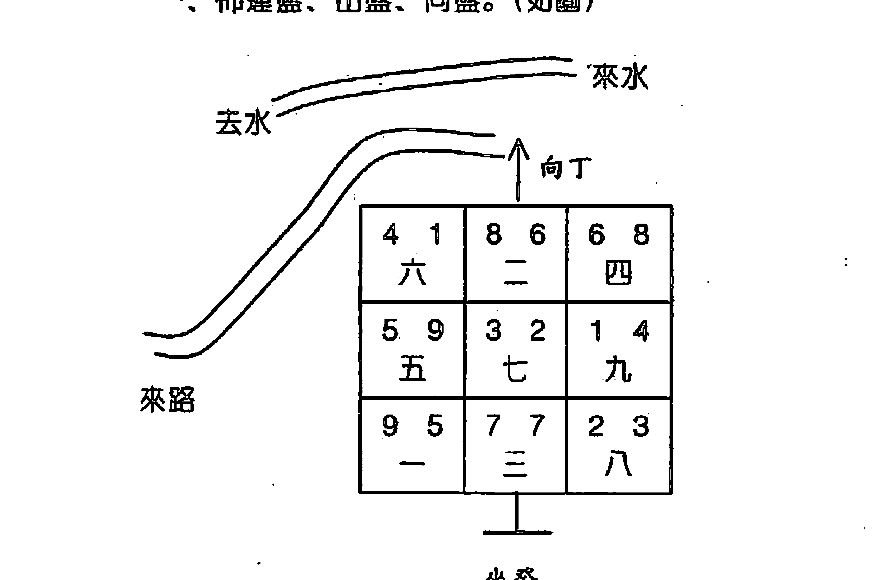

# 二、宅內外環境

外入路由東來轉東南至南入大門。來水從南來至東南洉。在東方離宅約80米處，有一高大樓，外裝有色玻璃，陽光反射強烈。室內，主人房位於坎宮，長子房位於西北，次子房位於東北，客廳位於中，廚房位於東南，衛生間A位於西南，大門位於離，側門位於東。

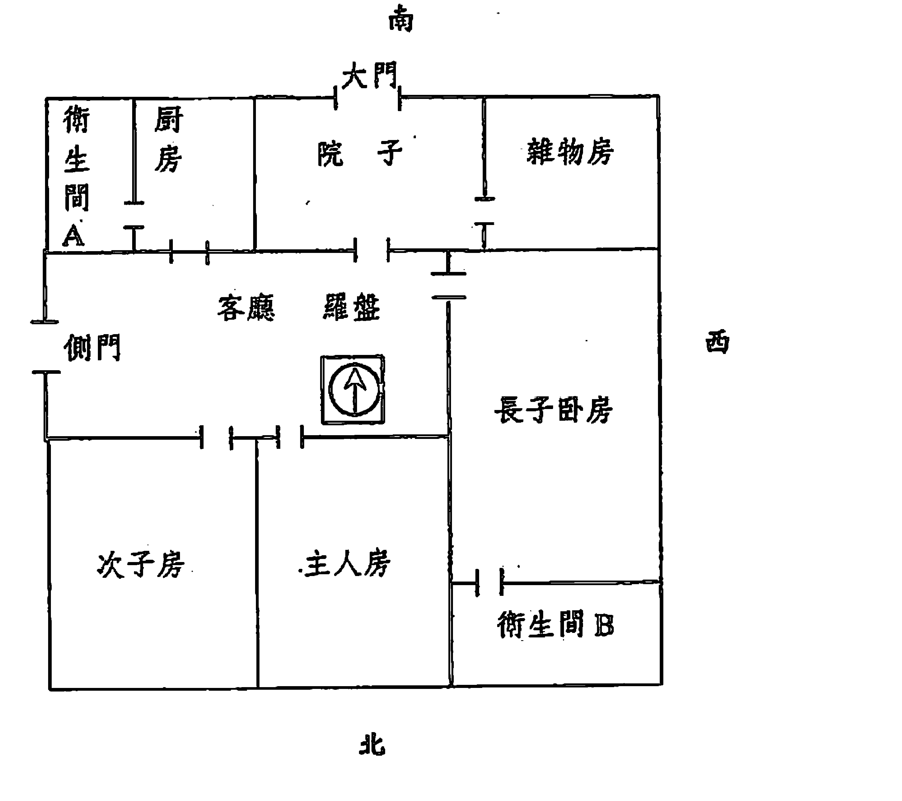

# 三、住宅內人員情況：

王某 1944 年出生，王妻 1945 年出生，長子 1972 年出生，長媳婦 1973 年出生，次子 1976 年出生。

搬入住宅時間：1994 年秋季

經常出入的門：側門、大門

# 四、分析判斷：

- 1. 1995 年，五黃入中，全局伏吟為凶象，向星六白本身生出向水，使向水更旺回頭剋九紫火，九為中房，所以年上對中房不利。
三碧到入口和外大樓玻璃反光處，助旺九紫火，使九紫又生旺五黃大凶星，擴發五黃的血毒毒素。由側引入屋，因火燒土焦之故，使其五黃毒回頭剋剋殺九紫星，九本為中房，所以應中房者病毒。
8 月份四綠入中，二黑病符星飛到入口，使其年五黃、月二黑交會。飛星斷：二五交會，必有流血或傷損人丁之應。而中宮月四綠剋年五黃，再加他次子為六白命，住房為艮位，本為金火相剋，月七赤星到艮與九紫合為先後天火生旺五黃毒星，從外到內重重殺氣，重重剋殺中房，無中房應中子故也。
故斷：1995 年 8 月，家中有人患血症病，重者損丁，輕者離疾，應在次子身上。

- 2. 1996 年，四綠入中，八白到向生旺六白官星，立秋後三碧賊星到向，造成六三相會為官財相半之局，同年 12 月份六白入中，一白到向，合成一六八，三吉聚會喜事來，四綠到側門與九紫合成桃花旺星，合喜之局。
故斷：1996 年立秋後，有一場因錢財而起的官非；12 月有婚宴喜慶事，破歡喜財之應。

- 3、1997年，三碧賊星入中宮，6月份八白入中，三碧賊星又到向水上，造成內外受到盜賊之局，日上旺七赤與三碧會合時應期到也。
故斷：1997年6月家中有財物被盜或失物之應。

- 4、1998年，二黑病符入中，七赤到主人房。7月份一白入中五黃到向，王妻命為五黃和房間之數不對應，造成重重生出和帶動中宮病符煞星之故。
故斷：1998年7月王妻因內臟病而退財。

# 五、實際情況：

- 1、1995年8月，王某次子因患血癌病，醫治無效死亡。
- 2、1996 年，春季，王某長子擔保朋友向銀行貸款，誰知在秋季貸款到期時，他的朋友不知去向，銀行起訴後，法院只好找擔保人，發生了意外官非。同年 12 月長子結婚，破歡喜財。
- 3、1997年6月8日早上，王某家中無人，小偷光顧王某家，已把門鎖撬開，此時正好鄰居李某回家看到，叫了一聲捉小偷，小偷嚇跑了，家中的財物沒有被盜。但同一天早上，王某的女式 50C 摩托車在街邊雜貨店門前被盜。
- 4、1998年7月，王妻因胃出血加上腎結石住院治療，破財。

# 六、房屋調整之法暫略。

奇门堪舆学

时，而结果会更可怕。平衡的原则无处不在，不要因小贪而失大利，在德的感化下得到天的相助，才能化险为夷，有惊无险。天德与天得，道得与得到，顺逆场互禀，德得需天平。天地奇玄易数门，场内数外是机贞。切莫常绷施法术，玄关难渡全凭生。

奇门堪舆的精髓——易数，在堪定外围环境与内部结构与天体三元九运五子大运相互对应的具体情况后，易数便成了调场转运的根本。易数在堪舆中的作用：

-   1、易数可以通过山向方位的调整来迎合大运之势，改变人世的顺逆方向和程度。

堪舆中三元九运各有其主，各隐其隐。二十年为一小运，六十年为一大运。无论大运、小运都脱不了运气对地脉的影响，形成了不同结构层次的气运分布图。堪舆是为了掌握特定时空下的气运分布情况及宅屋在分布图中受气的位置与状态。易数则是运用数的特征来对宅屋加以调整，以应天运接地气。在二十四山向气运盘中，每一点都是信息网络的接受点。而信息纯杂与旺衰决定了此点的运动走向。这种运动对人世产生同类共振的影响力，从而使事物按一定的程序向前推演。易数的对应点的调整具体应用就是山向的调换。山为坐向，向为朝向。山向与大运同道则人世顺吉、荣盛。

-   2、易数可以通过内部物体、颜色、数量构成配比来加以改命运势，接纳运气。

堪舆中，紫白九星以九种不同的色彩来对应数字。易数亦可运用颜色的调配来接斗辅九星的场力辐射，达到顺天承运的目的。

-   3、易数可以以人的运程顺应大场，水涨船高。

世间的兴衰皆为运气变化而致。易数在接通大场后，人的运程自与大场合拍，兴即兴，衰则衰。

-   4、易数可作用于后一代子孙的智力商数。

父母与孩子的血缘之亲可互调其场能场力。易数使宅运发生变化，首先使孩子的智慧场发生变化。孩子的气息较大人纯净，易与运气相通相接，成为第一个受益者。出磷子运，天人同应。穑灵运化，数满易蕊。

-   5、易数可以提摄命理的精华聚于一点，为借力登场打下基础。

易数的顺运布气，可以借运力提摄生命的精华于一点。在此点迸发强大的能源时借力而越场上升，改变场向的归属，完成生命的飞跃。

-   6、易数有避化宅运煞气的作用。

对于宅运中煞气的作用，运用易数来克制其势力范围及程度。在普通人中，调换新宅不容易办到，有限的财力限制了改变的途径。易数的运用可以借调宅内旺运位星之气来化其煞气之力，减缓灾厄的势力。

-   7、易数可以在山向盘中找出财源点，使人在有限的宅内通过物品的移动来增财发富（福）。

山向盘中可运用城门诀来增财，这是易数的另一种表现方法。数与八卦的磨合，九星能源的辐射，在宅内有一最佳纳气口。找到对应的纳气口后，进行对应时空下的能源切换点进行转换，达到增财积福的目的。

数的微妙变化，使易数插上了翅膀，只要抓住它与时空的关键所在，就能轻松地与人间的精气融合。顺天则昌，逆天则亡。易数象一座艺术长廊，为我们展现了一幅人天共和的画卷。它也为我们提供了摆脱凡欲的天梯，为人类的升华与发展立下了汗马功劳。

易为数动，数为场牵，数场交替，意旨象衡。易数的物天数变是宇宙高层数的重组接气，这种组合决定了人的生命原体的归属方向。能真正懂得数运转换与接收频率数隅，即可调到天地时空场中的频率密礴中，所有的神通，只在与之相通中。

易数揭示了数字组合的成分。由于信息轨迹的出发点不同，造成信息内部基因的相互关系的确定组合不同。在这种关系的引导下产生碰撞、摩擦、重组、交合形成新的内含基质成分及信息轨迹走向，确定生命物质场能的来源，通过数变来直通内部因子，对症下药，综合场能再启引其发展趋向。

易数揭示了物质升华的有效捷径及调取能源的通天路径，对人类生产、生活、修行、渡世提供了威力无比的运化工具。

易数揭示了天地信息坐标由数字组成。数即道，即经纬，即天、即地、即人、即物、即色、即象。

易数是奇门堪舆学中的精髓。它涵盖了所有堪舆学中的真义，是堪舆实现社会价值的必然手段，也是体悟真理的天地之脉。天地人为数之始幻，本源归真的融合才有真的玄妙。奇门堪舆自规理，易数场中问来由。千山万水艰辛路，只向穹宇问天由。天地本身相通意，缘结缘了数内究。

### 第二章 河图洛书的相互关系及作用

### (一)

数字起源于远古，河洛上溯到新石器时代。

当人们在日常生活中离不开这 10 个数字时，是否想过，这些数字里曾有什么含义？什么规律？数字的作用上至天文，下至地理，中通人事，无所不包，无所不容。广阔的天空还处于虚无中时，数字早已应运而生。它不以任何意志为转移，始终在追寻着一定的规律，循环往复。它们没有喜怒哀乐，仿佛置身于闹市当中，围绕着每个生灵，却不与生灵同流合污，它们永远在追寻着自己的轨迹在旋转在运行。河图与洛书是数字规律道义的有形显象。有龙马出于黄河，神龟出于洛水，二者背上皆有有规律的数字排列。前者称为河图，后者称为洛书。

面对神秘的数字排列，人们叹为观止，惊叹天地竟有如此造化之力，将一个活生生的无形规律以密码形式展现于世人眼前。河图排列：一六共宗居北，二七为朋居南，三八为友居西，四九同道居东，五十相守居中。洛书顺序：戴九履一，左三右七，二四为肩，六八为足。

那么，河图洛书揭示的是什么？河图为先天之灵，洛书为后天之根，相对来说，洛书源自于河图。在天成象，在地成形，象的幻化无有定形，形的本质一锤定音。河通洛，即为象。自由自在的信息传递，看似杂乱却很有章法；洛通河，地呈天意现成象，有形化无形，无形通有形。河图之灵在天地，洛书之魂源出图。河生阴阳制化道，图成福禄生两边。

河洛之灵在人世间天地中无处不在。奇门秘诀有数到场到、场到力到之说。如果说宇宙是由不同的场组合成的，那么这些数字就是连接场与场的通道。一旦你掌握了这些通道，就可以在宇宙间自由驰骋，无拘无束。若截断这些通道，天地将变得死气沉沉、毫无生命的活力。成败自有天意，花开只为春来。功过自在化无为，洛书出愿逆行。在天体的运行中始终围绕着一个不变的天道在旋转、替换。在这种旋转替换过程中与生命的流传形式相应的反差，使人类的现象一次次重新演绎。在河图洛书出现的瞬间，人与宇宙是相通的，可以快速地领悟其中的真谛。

由于千百年来的历史演变流传，能保留下来的先哲先圣们的领悟良言已不多了。人们只有运用想象去描述其中的奥妙，知其妙，却不知从何来，有何用，如何用。许多疑团浮出水面，有待解决。而实际，只要人心与宇心接通就能破解其中的深藏。

河图是场的引导决定一切的基源走向；洛书是数的改变引人上升的质的飞跃。天地变化运转之仙迹，河洛还原始之形貌，二者是物质初合成之因，应阴阳返本之律，在宇宙间幻合运转形成的初始轨迹的真机妙道。天地常网存自在，河洛生化幻宇影。意无为则领河图，看造化可凭洛书，相辅相成相借用，天地人和谐自生。

### （二）

> “世间人有别，宇宙道无差”“先天合后天，道在此中发”“万事应天机，总得人来依”“天道与人道，道在无有里。”

归如一。当天地出现道法道规的演象时，都是在向人们显示一种真情的流露，那便是在道的无有里，它希望人们顺道而行，所以才用某种方式昭示于人。顺者昌，逆者亡。在人们用自身的生命与精灵之体去违背道义、以身试法时，天地父母何尝不心痛。但在法与道的前提下只有依道循道而行，否则自取消亡。

> > 老子曰：‘道可道，非常道，名可名，非常名。’

不是先人贤关子不愿意说明何为道？何为名？而是实在是只有在道中才明道之义，只有在道中，才知法之理。纵然先圣们愿意以有形的文字去告知后代子孙更多的东西，但有形的永远不能完全代表无形。所以只有告诉后人一种方法，一种路径，才能让其真正明白天地之秘。那么河图洛书便是一种有形化无形的方法与了悟宇宙大道的路径。

> > 河领秘旨意，幻气成灵泉。洛领道中法，真机了无痕。

河图为天道，洛书为人道，天人相对照，不必一衣包。河图在人世间的变化中起主导作用，洛书在人世变化中起辅助催发作用。天分阴阳，人分男女；天有九天，人有九种，人天如此息息相应。人为天之子，子承父业。人为天地之精灵，在天地之间，万物都为人而设。人犹如骄子，享受着天地的宠爱，阳光、雨露、清风、晨雾、鸟语、花香，把世间装饰得如此美妙。男女新婚，新人跪拜天地的习俗礼仪，便出自古人对天地大父母的感激与尊敬。然而从古至今，有多少人知道满足，有几人心中快乐，有几人不被欲望折磨得遍体鳞伤，人是物非。天堂地狱本心造。河图洛书的数字排列真义告知人们，天对于每一个人都是平等的。在这平等的起跑线上看你如何把握机遇，积累财富，创造崭新美好的世界。而天对每个人又是不平等的，即所谓顺者昌，逆者亡，无情却是最有情。这些天地运行的规律尽现于河图洛书中。天有天道，有人道，不可混淆。分清阴阳，明理示昭，大白天下，若系若离。

### （三）

戴九履一，左三右七，二四为肩，六八为足。这几句看似简单的文字，却把人体与洛书紧密地联系起来。

在人体中，这几个数字分别代表：头、脚、手、肩、足五个部分，每个部分有一个数字代表。当人体阴阳平衡，身体健康时，这几组数据各就各位，发挥正常。一旦数字错位发生混乱就产生疾病。只要将数序再排列好就能恢复正常，这就是人道。在人世间的社会关系也是如此，各有各的道。当上司的就不会与职员在一起商议大事，上司可以指挥职员，职员不能干涉上司，否则定会遭处罚。这就是道。小偷有小偷的道，警察有警察的道，只有警察抓小偷，天经地义为人称颂，没有小偷抓警察违反天理违背人规。一物降一物，道道不相同，只有把握人世间这种道的划分与运行，才能在人世间圆满。

河图是物质的先天基本数；洛书是人世对应数。在一与六、二与七、三与八相互守护之中，五在中央，向外呈放射状。而洛书的 9、1；2、4；3、7；6、8，看似与5没有多大关系，实际是5已隐遁其后，操纵数盘运转变化的结果。河图秘义在通，洛书中玄机关。河图洛书告诉我们，物质在起始的原貌基础经过相互的撞击，融合，已生变成另一种物质，而生成后的这种物质才是与人世真正相对应的物质。先天返后天，后天返先天，人类如果掌握了先天河图与后天洛书的演变规律，就能无往而不利，无攻而不破，真正地成为天之骄子。

要想明白河洛的内在联系，岂非一朝一夕所能办到。心通之时神自通，神通之时天地开。所谓的神，指的是人与宇宙和合的境界。在未明了真义时，人们可以按照洛书的数字排列规律，积极有效地安排生活和学习，融于生活的点滴之中。人体的生命密码数的构成来自于洛书，由身体各部分的不同反应，可以查找到生命密码数。有了这个密码，无论是办事，还是修行就会方便多了。它如同人体在宇宙间的通行证，可以畅通无阻。师道中的人间师道也在洛书中有所表示：戴九履一，师为九，徒为一，首尾相接，构成太极。师为天，徒为地，只有在完全相应的状态下形成太极循环才有可能修行圆满。师的作用是开头，徒的本能是结尾，在锻炼培训自身与师对应的同时，增强自身的道行、法力场。河图是人的本质场源发生地，洛书是人的根基道行的呈象之所。

### （四）

> 龟背神行万里飘，洛水女神真义到。风霜雪雨造幻化，九天秘旨生两边。颠倒生成千万众，化成人世真奇妙。互为体用洛现图，生化幻境了无痕，风霜血雨云翻月涌，贪恋生死欲海中。若明河洛真义理，福贵荣华信手拈。子孙延佑多福寿，天机道行齐增收。此是真传真自在，妙境心花妙灵通。

洛看天机真由意，图在河边显明堂。真龙大脉山水间，无为自在自超仙。在堪舆学中，河图洛书的精义被发挥得淋漓尽致。堪舆也称地脉道，在九星二十四山图表中内层就有河图、洛书的图案。它利用数字飞渡九星八方组合成不同的格局。相互之间与地区发生冲突来判定地脉运势的走向及对人事的影响。

在堪舆学中，先天定方位，后天起飞星，并根据每个数字配一个颜色。在盘中按九星的顺序顺逆飞行，以运、山、向分别入中宫，飞出天地人三盘。河图生逢时，却在场中央。即谁当运，谁入中宫，统领全局。洛书的成份，本质于天地，成形于天地，地脉场向的影响流向分布于水曲山环之中。而洛书的数字排列是按照三元九运的范围内，以一定轨迹固定格式将地脉优劣摸索出来。地脉的灵气来自于天地的气运的转换。人什么都可以少，独气不能少，也不能缺。气的强弱，基本上决定了一个人的财、名、位的等级。人纳天地的灵气最集中乃是精华中的精华。

河图是改变的根本，洛书是骤发的手段。河图的根本是将人立于人世间的根本要义，它把人们在相应的境界上到可以传导的位置并予以传送，但这其中的把握却是差之毫厘，谬之千里。在人来讲，接收这种传导和影响最大的是阳宅。阳宅的地门、方向、纳气等对人们生活的影响力有着重要的作用。人在家里的场是放得最开的，所以住宅环境所接通的天气地气的精气场对地上生活的人们有着潜移默化的至关作用。二十四山颠颠倒，其中有珠宝；二十四山顺逆行，则有火坑。在堪舆的二十四山中后天返先天，可以从根本上改变人的生活轨迹并引之向上升华，而使人在这一生发富发贵，运用后天河图的分布来找相应的场向。

堪舆术的精髓是易数，也就是改变数字在堪舆学中的位置有着举足轻重的位置。在地脉的山水走向、龙脉气穴的寻找中，数这个神秘而易变的符号起了决定性的作用。河洛的两组数字从天上到人间的物质排演，规律的划分，给研究堪舆学奠定了广泛的基础。数字交替运转并轮流坐守中宫，把天地之气随着时空的转变而转变。人如果能够顺着这种转变规律去转变，就得到天地之灵气，使自身及子孙受益无穷，山水启蒙，山与水形成一定的格局对人类的影响之大不仅可以决生死，还执掌祸福。河图在先天，洛书为后天，在盘中尽性发挥出它们的作用。随着运来逐一递增或减少数字，每个数字前加颜色成了紫白九星。这时的一白二黑三碧，已不是单数字的能量，还包括了颜色的双重能量的交合体。这种交合体给有形的山水披上绚丽的外衣，更贴近生活，更贴近自然，形象生动地展现了一幅幅山水画面。

河图泄两仪之秘，洛书阐九曜之灵。天意三元数起程，运转气换聚精气。河图在阴阳场的平衡作用通过1、6，2、7，3、8，4、9等数的合成力量来表现。洛书的9个数字与九星对应匹配完成了人间的精灵气机的塑造，9个数字生变合转完成了物质的组合，构成了接受天地气机的自动调整接收器。河图洛书实际是一部宇宙数场组合接收调配图，它道明了天地阴阳生化转变的奥秘，拓展了人在宇宙空间本来的宏途。因此，这个充满了数字组合的接收器便将信息源源不断地接收下来并如影随行的跟着人们，影响着人们的方方面面。三元九运指的是古人按照天地运行对应星球人类的一定时空的划分。三元指上、中、下三元，小运每二十年一换，大运六十年一换。相同的结构在不同的时空接收的信息也不一样，这就要了解数字的排列与时空之间的关键。每个数字每二十年轮换做庄，主管事物，这只是大概的论述，原则上可以放大，也可以缩小。大到几千几万年，小到每分每秒，数字都在不停轮转。天行健，君子自强不息。

数场旋转生变化，机应人事法中天。河生洛成真机有，合成一气入中央。数字的旋转在宇宙中呈辐射状涵盖一切，所有的事物的内在机率随之运转，产生各种各样的时空差异。人事若能把握顺应这种机率来调整自身及风水场，就能长存于天地之中。路是可行的，也是可堵的，是行是堵，关键看行人的用意和思维。通向宇宙之路不是一成不变的，它随着时空而有秩序的改变，循环往复，掌握这其中的规律，就可通天达地，自由自在，就可在人世间、天地间做到洒洒自如，来去自如。

### （五）

河图洛书应用广泛，在人世、天道、地脉中无所不容。它是宇宙的缩影，是生命的再现，是灵魂的升华。数中数，场中数，数中场，为人们认识世界，改造世界提供了知己知彼、百战百胜的秘诀。在预测术中，河图洛书亦可以用来看天灾以河图为主，看天地气机流向以洛书为主。看起因与结果，以河图为主，看过程以洛书为主。看人间悲欢离合以洛书为主，看天地春夏秋冬则凭借河图之力。河图与洛书，一为天，一为地；一为气，一为人。把握住大方向在预测中可对河图洛书的应用游刃有余。

### (六)

河图洛书的作用如此大，它们的本质是什么？河图的本质是演化事物的必然趋势，主宰事物的兴衰枯荣。洛书的本质是生克制化的因果转换，决定人的吉凶祸福。

它们之间的相互关系是：
1、河图洛书形成阴阳平衡大场，使天地趋于平稳运转的状态。
2、河图与洛书在天成象，在地成形，各自有所对应，各有相通。
3、河图可以为洛书的数字定场、护场；洛书可以为河图的数字转动起推动作用。
4、河图可以捕捉事物隐性信息及几桑为根；洛书可以看出表层含义为枝叶。
5、河图可以在人世中寻找平衡点即真龙大脉；洛书可凭于半空中指示人间。
6、河图可呈先天之灵气；洛书可以应造化之机缘。
7、物质来源出自河图；物质变化来源于洛书。
8、事端之根源在先天河图数理中；事物的发生变化反映在洛书之中。
9、河图为先天天体起源；洛书直接参与事物的变化。

> 世人鲜知物无形，几始知晓难透明。明者依道循轨去，飘飘洒洒无物牵。愚人妄自执菲薄，功名利禄在世间。

### (七)

### 河图的作用：

-   1、明天地之阴阳运转规律，以数的形式得以表达。
-   2、河图把天体幻化的初始原貌展示出现，使其有法可依，有道可循。
-   3、河图把事物基因成分格式化，形成程序轨迹而使事物有条理的按部就班。
-   4、河图揭示了发展必须具备的数据组合。
-   5、河图揭示了天体的运转规律，在天气的有序排列。

### 洛书的作用：

-   1、使人类在先天的基础上发挥后天的实力创造性。
-   2、使人类的物质的表体形成共识，产生兴趣，引其向道。
-   3、告知人类地上物质如何与天体气机相互对应、接通、转换。
-   4、在数与场的交替中使人们明白宇宙的无形与有形的区别。
-   5、可以借用宇宙庞大的场能力为社会造福。
-   6、为人类的修炼打下了应天时地和的数据基础。
-   7、提高人类的逻辑思惟和判悟功能。

> 河生阴阳制化道，图成福禄一线牵。河明生死数场里，图示真机返真图。本是后天应先天，何必苦恋人世间。一朝逢得生成路，方明混沌五色仙。

河图洛书为认识天地开创的始祖。它们的威力远远超过人类的想象，在今后数百年的时间内，数字应用将越来越证明河图洛书的精华之力贯通宇弘。

## 第三章
## 先天八卦与后天八卦的作用与意义

天地浩渺，微微茫茫，运行之中有章可循，有法可依。章法齐备，互为表里。相传伏羲根据河图演绎出先天八卦，揭示了宇宙本源的起点。文王也推演出后天八卦的模型，代表了阴阳互变转化过程中的人间万象。

先天八卦是后天八卦的基础与根源，也是宇宙物质能量从数字到符号的一种转变，代表着宇宙的法则。后天八卦是从先天八卦中根据阴阳互转的规律交变出的产物，其适应地表所有的生物的生存兴衰法则，是一种道的变体。道要依靠法来护持，法要凭道给予指引，二者相辅相成，构成了混元的宇宙空间。万物升华，自在春夏秋冬，物业繁茂，始定南北西东。先天八卦确定了八方，八面来风相互交替，年年岁岁，月月日日，道不变，法长存，人间正道是沧桑，只有不变的才能够长久。以不变应万变是宇宙天道，也是人间法道。

先天八卦既源于河图，必然与其有着千丝万缕的联系。八卦相演，阴阳互替，比河图更直观。从坎到离，为阳升阴降；从离到坎，为阴升阳降。八个卦象，分别代表了不同的节气，不同的方位。八卦精华于阴阳，阴开阳闭见乾坤。春含笑语露微尘，梨花自有芳意踪。天地定位，阴阳成形，在万物原始本质场的推动下产生和合、裂变的基因分子，产生于虚空当中。而当这些分子在遇到特定的条件便成象于地，形成具体的实物。

## 奇門堪輿學

天行健，君子自強不息。遼闊的宇海，一刻不停的自我運動。先天八卦正是這種運動歸納為有形的圖意。把無形化有形，成象意，示天機，循軌迹。

先天八卦是天地物質循環場的起始點。混沌初開。清者上升為陽，為天；濁者下降為陰，為地。陰陽不斷的彼此交換，逐一的遞減而產生八個最具代表的方向示意圖。隨着八卦的演繹產生了蒼雲眾生，萬物本同根同源，這就是為什麼眾生平等的真正來由。路各有不同，道卻是在軌跡中運行。天地常規的制定不允許任何人去逆反，天可通人地，人地只有順着天時而快速調整自身才會時來運來，并始終處於主動和昌興的狀態。

先天八卦是物質循天織地的生物場能頻率交換地。在物質受到外界的撞擊、分解，需要補充能源時，會自動尋求比自身高一級的生物層中的能量供給。就象一個人總希望有更高更好的工作環境和生存條件而去不斷學習。努力拼搏“充電”一樣，在尋找中不斷淨化調整自身場能場向，最終可達到最高目標，也即可至八卦場和陰陽場。在此高能量場源集中地，頻率、聲波、氣流的振蕩既快速單一也具有強勁的穿透力和生命源動力。事物到達這一層次，已具備超越五行的能力，關鍵看時空的把握與自身的實力與毅力。在有形世界運行的內部，先天八卦信息一直相依相伴，猶如一個龐大的監控系統，不顯山露水，卻明察秋毫。只有在出現大的偏差時，她才會不分時間地域的界限加以干涉和修正。一般在出現修正時，地球會發生大的起伏變化，人類如同小孩任其周旋設置。先天八卦的威力如此巨大，卻遁隱其後，其大無外，其小無內。陰陽轉換的神機妙算時時在身旁上演，你是否細心體會？

後天八卦對於天體的影響稍遜於先天八卦的力度。後天八卦是物質世界的組合規律及生化合反應所遵循的物質生化法則。這種規律的形成在先天八卦的基礎針對時空和陰陽互替的原則上加以改編了。它適應於物質的各種生化合，也是闡述事物起源點和進化論有力的依據。

後天八卦對事物的起源換代體系有着強有力的推動作用，爲人事的發展演變制定一種固定的模式概論。物雖千種，却异曲同工，生化的合和作用以時間和數作爲周期循環往復。學史使人明智。歷史每隔一段時間就會重演。其驚人的相似性說明了這種周期性的存在。

後天八卦中的五行分佈是調動宇宙中各種能源庫的指示圖。經過陰陽兩次輪轉後，後天八卦的雛型基本確立。其中的五行場即是物質現象的積聚分佈，通過卦的演示可以利用後天八卦與先天八卦的遙相呼應，直接按方位從宇宙中獲取各式的能量能源。這是人類的一大物質寶庫，其中光能、電能、藥能等應有盡有，且源源不斷，永不停竭。

後天八卦在某種程度上說，也即是地表人口分佈及智商數分佈的規律圖。圖形演象，氣化三清。物種同源，分支各屬，有規律性的指導。地表一切的物質現象都有其固定的分佈，章法一絲不苟。只要進入玄妙之門，一切皆了然於心中。

有爲無處身逢世，揚名施術拓天地。先天八卦對於人事物的功用，雖不能一目了然，但其物質廣含納內性是世界物理最好的歸宗本原的出處。愛的無私源於天地的哺育，先天八卦在演化生育後天事物的同時，也為天體的運轉作好鋪墊。周而復始，有憐也無憐。為人的相似性的表現力在天體雖表露得不明顯，但其廣含的內在基因的循軌性卻將更大，更深更廣的時空場在逐一重復，有生則有死，定律如此。物質的合成注定了有朝一日還會分散。只有如此才能不斷的運轉不息。天地猶如一個大齒輪，齒與齒之間相互吻合，有尖銳凸出的齒，就有凹陷的槽與之對應。它始終是渾然一體，不分彼此。人間的悲歡離合也就是天體運轉的規律，有合必有離，如何能只有合而沒有離呢？人們心里美好的向往：天長地久，永不分離都在一一破碎。因為不與天道同行所以不會天長地久。不要怨天尤人。道不同，不相為謀。願望終歸是願望。沒相同的軌跡，怎能祈望與天地同壽！人類只有在認清這些本質的必然趨勢規律下，才會真正與天地相融。世間本無物，何必一心奉。天地造化啟，功名成就時。

春花秋月後天應，八方來風細無塵。人中之事後天在，天中之情在宇壽。後天八卦是指導人類生存的良師益友。它告訴人類如何去生活才能更有意義，如何去與天體相應，如何在短暫的時間里實現殊途同歸的夢？後天八卦的分佈是一部人間的歷史畫卷，其中掩藏着人類由始以來的種種情形。生活，在許多人眼中是什麼樣？美好、無聊、空虛、充實，種種想法都不盡相同。後天八卦已示意人們如何去更好的生活：應天機，循天道，轉微妙，化奇玄，渡海潮，雲中遙。找到自己的位置，在場能中發揮自身的力量。人為萬物之靈，只有在發揮自身作用的時候，人的短暫的生命才會因此而永恆。天生我才必有用，天地造物皆有因。明白自己為何而來，生活會更有意義。後天返先天，是告知人們在找到自身的位置後，利用有形的物質轉換來通達先天之氣。只有在先天八卦中才能了然生死，融合宇宙，自由出入生死之門，而不被一物所牽，實現人類大同的夢。

在奇門堪輿學中，先天八卦與後天八卦是基礎知識。先天八卦隱於二十四山向星盤，後天八卦居於最內層，按順序排列。天干地支本源自河圖、洛書，成形於先、後天八卦之中。天地之中山水地脈的氣運走向在先後天八卦中的相互替用，按三元九運依次排列分佈。得氣者旺，失氣則衰。

堪輿學的宗旨就是順應天地變化的契機，用調整陰陽宅的方法來改變人事的進程。天創地闢之初，其中的精靈之氣源於天，隱於地。大運二十年一轉，小運一年一換，在地球表面上輪轉不息。先天八卦中蘊含天體氣場的變化規律，隨著天體氣場的能變，相應於地表形成的物質氣場環境也在作相應的轉動。而要準確的在地表堪點出氣運的走向及分佈就得依靠後天八卦的指導。兩者相互對應，相輔相成，缺一不可。一個呈象於天體，一個落形於地道。氣運對人事發展影響之大無所不及，包括事業、婚姻、子孫、根基、興衰等，得運得氣者大富大貴，失運失氣者貧賤無依。氣乃萬物之靈的根本。無氣，生命就不會存在。無氣，則物質走向死衰。人爭一口氣，佛爭一柱香。這裡的爭并不是爭鬥的意思，而是循道去與氣運相對應，得到天地氣機的關懷與輻射。灰飛烟滅悄無聲，龍氣穴脈深淺藏。

在堪輿學中，先天八卦主陰，後天八卦主陽。陰陽二宅的相互體用參比，决定了在百年大運中家族的興衰成敗及後世子孫功名成就。卦領天機氣中悟，道分陰陽居內樞。陰宅在無形接受先天本源之脈，陽宅現形於當下時運當中，只有當兩者完美的結合才是最好的風水佳人孕育之地。

先天達後天，後天返先天，先天八卦與後天八卦在修行的道路上是最佳的伴侶與導師。在氣的運行中，人這個生命氣息的載體也分先、後天。只有從後天入手，圓滿後再返至先天。當先天與後天相互體用，不分彼此時，此時的境界已超越了時間空間的範圍。若只重先天，不重視後天，則實為差矣。需知後天為先天之子。子不安，毋何悅。母子連心，同登至誠，靈臺方現，道歸一途。只看重後天，不憐惜先天，也很難向高層次發展，只在原有的基礎上打轉轉。先天生後天，後天伴先天，二者皆一體，互為子毋牽。

先天八卦與後天八卦雖同源，但其發展的結果卻各有千秋。先天八卦是高層物質的運轉規律，後天八卦是有形物質的演變過程。先天八卦可以遙控後天八卦，後天八卦只能與先天八卦相對應，而無法支配先天八卦的運行。先天八卦相對於後天八卦來說，其時空方位是固定的，隨時可與後天方位比較參用。先天八卦是物質的生成數，後天八卦是物質的進化數，天生地成勢不可擋，進退卦出，相得益彰。先天八卦是生物進化的能量場，是物質轉換的能源集中地，反映的是混沌之始的狀態和至高無上的權威象徵。後天八卦與先天八卦互為參用，後天八卦為中間人世中事物運轉趨勢起加速的作用，為世間的物質進化提供能源和催化劑。先天八卦淨化物質的能力強，後天八卦生化物質的能力強，功能和職能的不同，決定了先天八卦和後天八卦适应面、适应点的不同。要了解先、后天八卦本质内涵，必须有完整师承及理论指导。否则只能盲人摸象，看不见全貌而妄下定论，这对修行的人来说是十分危险的。

后天八卦是数的积累，先天八卦是场的飞跃。数的量变产生质的升华。先天八卦与后天八卦是线与场的关系。当线到达尽头时，即入场力的范围，在转折的瞬间其内部结构的调整，产生巨大的冲击力，承受不了这种力，就会前功尽弃。这就需要平时多炼承受力和突变性的力场撞击，才能保证在机缘来临时一跃千里，质华满天。先天八卦不受时空限制，处于无维之中。后天八卦受方位、时空限制，但其中宫是进入先天八卦的出入口，可以由此进入无形世界。先天八卦虽无时空限制，却可以由先天八卦进入时空的传送轨道。先后成事窥天机，一田九子齐连心，方圆不定终日过，开谢有时轮坐期。

天可知晓天先到，道可寻求路更高。先天八卦的作用是：
- 1、先天八卦承万物之灵基，还本原之初始，化天地之玄妙。
- 2、先天八卦位极八方无维旋转领中气。
- 3、先天八卦把天地人有机的融为一体。
- 4、先天八卦把物之精化提炼，归属性场向。
- 5、先天八卦镇定天元，权压乾坤。

先天八卦的意义：
- 1、揭示了物质于天地之间的生化本源之秘。
- 2、揭示了物质在人世以后超物质的演绎过程。
- 3、揭示了时空场的无定向性。
- 4、揭示了所有事物的先天基本原貌。

天若成象，地應返天；八卦相演繹，人事物競成。後天八卦的作用：
- 1. 後天八卦演繹著人世的悲歡離合。
- 2. 後天八卦代表宇宙場能分佈情況。
- 3. 後天八卦敘述了人事物的發展變化周期和特性。
- 4. 後天八卦相應於天機，指導人類進化有序。
- 5. 後天八卦是與外星系連接的橋樑。
- 6. 後天八卦是科學發展的輔助工具。

後天八卦的意義：
- 1. 揭示人類的物種起源的相似論。
- 2. 揭示宇宙時空地域與人體一一對應的相對論。
- 3. 揭示宇宙天體運轉對人類的影響力度。
- 4. 揭示了地應天象，福祿壽長的理論。
- 5. 揭示了有形返無形，無形出有形的陰陽定律。

總之，先天八卦、後天八卦，絲絲相扣，心血相連，是總體與局部的關係。在人生的舞臺上，命為體，運為用，掌握了先天後天八卦的運用就能更好的發展自身的優勢，實現社會價值。轉眼即逝的世間，什麼才能長久？是道，是法、是心。神通心，心通神，心法法心，道通通道。念念無常生死道。先天後天一齊拋，人若明得萬般法，自在道中低中高。

### 第四章 奇門堪輿中的斗輔九星和紫白九星

斗耀神州天下行，星輝大地萬道脩。和風鼓蕩氣運生，光耀人間福運呈。奇門堪輿是一門關於天地人對應的法場輻射的氣運軌迹學，它以指導人類順應天地變化返璞歸真爲契機，以先天八卦、後天八卦的數理和象形演繹爲基礎，以天地人三元氣運爲統領路徑，參照九星、八門、五行、七色的對應方法和對人事輻射範圍以及滲透力度的影響狀態爲表達方式，揭示事物的興盛枯榮和其內在機變因子的運作規律對人事的影響力度。它運用河圖、洛書的精髓——數變來調整環境，改換生存空間，進而改變人事運程，使人能夠始終遵循天地自然的法則，處於順天而為的大道吉祥之中。

在奇門堪輿中，調整與改變生存環境和空間是兩種不盡相同的方法，前者是物質表象趨勢受到校正，後者是物質的內源場能的大調整。事物千差萬別，只因爲在先天精氣靈的分化接收點與層次的不同。前者爲移着點的方位，後者是改換面的高度。這其中的奧妙全在斗輔九星與紫白九星的靈活運用。

在判定人事運程發生發展和興盛衰敗的過程中，奇門堪輿首先將人放到宇宙時空的位置來分析對應。它尋找的是大道自然普遍運行的機理和規律，而不是就事論事，白圓其說，它首要把握的是一個高度，一個事物內在和外在發展軌迹的對應點及所產生的對應狀態。在奇門堪輿中，以先、後天八卦的原理為主客加臨方位，將宇宙星體對地球人類的輻射影響而造成的地脈氣勢變化規律，劃分為具體時空的氣運理數，并按人們居住的二十四山向坐標佈運行氣，將人稟受於宇宙先天和後天地脈之運的機理，以具體形象的斗輔九星和紫白九星的運行對應輻射來表示，揭示天體和地脈居所對人方方面面的生化影響與制約，反映出人事吉凶禍福，生發衰敗的不同狀態及其內在規律。

所謂斗輔九星是指：貪狼、巨門、祿存、文曲、廉貞、武曲、破軍、左輔、右弼九個斗星。紫白九星是指：一白貪狼、二黑巨門、三碧祿存、四綠文曲、五黃廉貞、六白武曲、七赤破軍、八白左輔、九紫右弼。

斗輔九星是指代表天體宇宙時空的九種不同能量場和生化源，是代表行使天體運行對人事影響的九大職能場和能量級別的貯存點和爆發點。紫白九星則是對應天體行使斗輔九星對應地域權限的具體職能星群，也是統籌人世機變權數運作具體步驟的執行星和人事發展變化的催化星和助星。斗輔九星指的是隱遁其後的大場力場，而紫白九星則是顯發於事物變化的直接參與之星。

斗輔九星掌管天體氣運變化，每一星統領二十年的大運，九星統領九運。九星的運行趨勢是堪輿中判禍定福論吉凶的主體綫索。紫白九星是具體影響人類宅屋和地脈氣勢的對應星群。它們的職能範圍是以色的形式接收轉化斗輔九星的遙控發射的能源，并以不同的顏色（或色的深淺）來代表其所容納的量級指標，并以其所行宮的氣數旺衰來斷人事的興盛榮枯。

斗輔九星是人事物天地兩極化的生靈原始場。它在宇宙空間起始淨化演換的過程中，從太極到生化，再歸太極，代表了事物從起始到淨化演換（演變）的過程及最終的歸宿。它為能量的生化轉成物質形態提供了高質能的進化場和能源場。斗輔九星在交替中產生質量的變化因子的磨合碰撞後積聚能量，從不同角度以時空為界限分別輻射大場的八方四極，不斷的永無休止地孕育着大地經脈的氣運，尤如母與子一樣。母愛的無償與無畏，是使孩子健康成長的要素。正因為彼此的發射與接收是那樣的對應完美，才使得能量在相對時空內得以快速傳遞而不至流失。斗輔九星趨如胎盤，紫白九星好比胎兒。胎盤為胎兒提供生長發育的精華物質成份，使胎兒在有限的生存空間，快速的生長、發育成形。紫白九星是吸收轉化斗輔九星能量場能的交接點和轉換樞紐。斗輔九星是照射天地和山川河水氣脈的靈氣的源頭。地脈的玄機是與天對應的，離開了斗輔九星，紫白九星便失去了意義。斗輔力轉眾星旋，紫白常應斗群生。斗轉星移氣始化，天孕地化龍脈真。人杰地靈皆運意，星斗合力潤眾根。

斗輔九星是能量聚集處，是宇宙物質的生命活力點。物質的生發及收放能量的瞬間，是與其遙相呼應，切點轉換通天最好時機。在此收放的空間，通過五行的生剋，表現出承納的多少，借助九星的聚能效力，隱存於表象之下，適時而發。斗輔九星離不開五行的效應場，儘管萬事萬物的生命起點不完全相同，但它所收放的能量、信息渠道皆在斗輔九星以不同方式運輔下作出相應的調整與選擇，井與之對應，且相應於物化本源能來完成生命的里程。在這種全息對應中，物化本源性能在物質加以充分的體現，甚至完全相應，使生命處於最旺盛的狀態，精彩光華照射四方。一但其生命的信息代碼與本源場稍有差別，即走向另一面。在奇門堪輿中，斗輔九星的作用就揭示了它有調整時空大場和地脈氣運大場的功能，如果人類能及時與天相應調整，避其不利的一面，始終處於良性對應之中，就會榮昌長存，興旺發達。斗輔九星是生靈外圍影響力的範圍凝聚概括。首先斗輔九星中各星辰是外圍空間的組織成分。斗輔星臣們，按照星神的職權範圍不斷地與新生的網點對應。所謂斗輔星辰聯運程，演化精氣運乎生。這樣以精氣之神來點化運生，也是事物內因外緣的影響成分妙源所在。如當運化貪狼星主運時，其外應貪狼指機智過人，聰穎靈活，文才不凡，發財；內則指處事疑惑重重，小心謹慎，或破財。而星群提供它的外在大環境則是曲折艱險，困難重重。

斗輔九星是物質上升的基點和轉承處。九星的排列，是物質的轉換交接點。當“1”退隱時，它的能量無疑是在選擇最佳途徑用另一種方式傳達自身的能源。它并不是消失，而是在原有的基點得到新的進步與升華，是九星利用其方位不停調換與運轉并很自然地將獨立星體中釋放的能量融合了宇宙智能場。在宇宙能量守衡定律下，育化出新的生機，進行着自我與無我的升華。這種過程，亦是五行與能量交換實現的時空效應，這也是改變人生數場的又一途徑，即將自我與大場融合并進行量變到質變的飛躍。

斗輔九星是決定事物成敗的天時條件因素。人事物的成敗，固然有很多因素的影響，但天時與天運的相互關係應是至關重要的。人們常說的“生不逢時”，指的也是這種天時條件。斗輔九星的當運輾轉，是造成不同天時的重要因素之一。斗輔九星以其先天河圖在天產生的九種不同的能源場輻射九方，一星執掌一方。九星按時有一星統領全星。如果執運的九星落運為衰氣，則時空大場的轉換天地的氣機精華已移轉換星，衰星已失去了對大場的導演、監控的作用。此時如仍按原有環境條件做事情，則早已是物換星移，不合時代要求了。這便是“適者生存”大道的根本所在。在奇門堪輿中，紫白九星落運敗氣時，可以用替卦（即用斗輔九星）的方式來加以緩和一下，以待下次時空場的到來。此時宜靜不宜動，動則生禍。

紫白九星則是直接對應地龍地脈與人事空間的運星。它能接通能量場，井以宇宙中合化生成作用着力於人世，用八方的九色加以區别不同的能量場和影響力。它能打通人的穴位、脈絡，使人真正成為天地之脈，達到天人地合而為一的作用力。如有所知勤勿進，廣達瞰宇鳥清風。斗輔九星在從形式到精神的溝通中，離不開紫白九星的和諧傳導與調控功能。本能的溝通是事物原神在紫白九星的導引下加以區分。如婚姻喜慶，則以紅色為主，營運出喜慶祥和的氛圍，無形中調諧了人們的情緒，使人處於快樂祥和幸福之中，從而避免了禍患，趨進了吉祥。奇門堪輿中，可用顏色來接運調運，化轉生機，道理即在如此。

紫白九星能把物質的內在精華在運的趨使下放大數倍。在短時間內，承接力、作用力、融合力無限的伸展、放大。不同顏色的九星，其實是對物質形象的描述與再現。當紫白九星中當運星落到山向宮時，向前又有多儲水，則此穴為一喜穴。而那最具代表的物體顏色是與當運紫白九星相似的。九色是七色的延伸，種種美妙的色彩旋轉組合，構成了多彩而豐盛的物質世界，又以顏色來區别級品位和數字對應。一種現象蘊藏著所有天機，看人們如何去領悟去把握去接收。

紫白九星根據不同元運推算入盤，分佈飛宮。按年、月、日、時來定佈星的起始點，并根據數字的重組、承接、發展，來判斷吉凶。它以宮內數場的組合以及顏色五行、山向氣運的生剋制化關系，看陰陽宅的氣運走勢和對人的全方位影響力。紫白九星運用這種生剋制化與方位的關系，表達事物的承受力。奇門堪輿，講運氣講脈向講地理講人體與天運對應的程度和範圍。人要與天對應，心的寬容與德的涵蓋也必須與天相應，不在範圍的大小，而在本質的相應。否則，一時發跡，也會有跌落的憂慮。大千世界，皆找對應，同氣相求。這時可運用生時命理的軌迹與方位五行與紫白九星的旺星相對應。不同的事情，用改變不同的方位和五行調整來相應，從而以最大的承受權限來改變自身的生物機能，并在接受天體、地脈信息的同時，不斷地加大自身的承受力。這種改變的技巧大多運用在陰宅的變遷上，可潛移默化將信息、氣運注入後世子孫體內，源源不竭，使之產生穩定的生命質能的推動力。奇門堪輿學的宗旨是順應天地變化契機來輔助、庇佑有信心、有能力有德行的人類的棟梁，達到宇宙物歸種源，各行其道的目的。

紫白九星還能捕捉與之相應的輔助能量。時間與空間的對天五行與地五行的本質進化與交合，使天地間充滿有序而又複雜的信息連接網絡系統。進入此系統時，一旦掌握天地互轉之規律，就可遨游其間，美妙無比。同源异形的物態信息與多維空間的時位錯位與相應，形成了吉凶禍福。這時一些積壓後備因素易被當運紫白九星吸納，作為能源載體和傳遞工具，來補充內耗，人若能從這些後備積壓因素中找尋線索也能進入運星場。

紫白九星能把物質的流年運勢充分反映在事物的進程中，結果則顯示於頭面。當事物遵循着流年運勢向前發展的同時，紫白九星對其內部結構的有機調整後進行分門別類地歸納，調整的過程就是轉換能源的過程。時空的變遷，導致紫白九星呈現不同的運勢效應，不斷地使九星把握大運，隨時調整星能。紫白九星送前程，造化人事應天征。放射七彩九色光，點化世間潤眾生。

## 斗輔九星在堪輿學中的作用：

- 1、斗輔九星應先天八卦在天產生九種不同的能量場輻射九方，每一星各管一方。
- 2、斗輔九星在天的機運的場屬變化中各自為陣，以時空的轉換而輪流值中，每二十年一換。
- 3、斗輔九星的氣運隨著主值星的出現而影響地脈氣運走向。
- 4、斗輔九星的氣運轉換需要紫白九星來轉化過渡，從而保證穩定過渡值換。

紫白九星與斗輔九星相互對應，但其分工不同。

### 奇門堪輿學

- 1. 在奇門堪輿學中，斗輔九星有上兼天機，下應人事的關鍵位置，而紫白九星則為斗輔九星之助星。
- 2. 隨着斗輔九星的流轉，紫白九星也在作相應的調整變更，并根據地理方位不同來分佈級别各异的運氣。
- 3. 紫白九星還有反饋人事運行軌迹趨勢的作用。一旦偏離軌迹，隨即中斷氣運的貫接。
- 4. 紫白九星在地表的山川大河中由於方位不一，而各管其地，這與斗輔九星完全對應。
- 5. 紫白九星是斗輔九星的人事化的重演。
- 6. 紫白九星與斗輔九星合而為通天達地之階梯，分而各自掌握天地運轉軌迹的正常運行。

斗輔九星與紫白九星在左右人事之中各有側重。

- 1. 斗輔九星是反映人事物質能量的轉換器；紫白九星則是與其對應的接收器。
- 2. 斗輔九星反映禍福；紫白九星主人事興衰吉凶。
- 3. 斗輔九星在人事中關鍵口起輔助轉化作用；紫白九星是物質廣納精氣的再生路徑。
- 4. 斗輔九星在人事變化過程中有中和平衡場能作用；紫白九星是物質的生發、衰落的地表樞紐點連接處。
- 5. 斗輔九星在物場轉換方面有一定作用；紫白九星在物質生化合成方面有一定作用。
- 6. 斗輔九星定生死；紫白九星轉禍福。
- 7. 斗輔九星用方位調整；紫白九星用顏色來接納。
- 8. 斗輔九星可以借助時空、方位的綜合場能的沖擊使物質在毀滅的同時得以再生；紫白九星可挖掘新的扭轉機緣點，以便更好地引導人事的昇華。

斗輔九星與紫白九星同宗異型，在堪輿中大放光彩。前為法為場，後為能源場。在前後運承轉接收，完成各自的職責。深入細緻地領悟各自的特异與本性，才可以在心中樹起接收天地靈機的天綫，讓幸福祥和永留心間。

斗紫法源同共轉，人生一白天下唱。
若明世間無為法，龍吟鳳舞呈瑞祥。

### 第五章 奇門堪輿學的核心——枯榮盛衰

每一門學科都有其特點和主攻方向，而奇門堪輿學的中心就是揭示枯榮盛衰運行規律的學說。

枯榮盛衰是大場信息的輪回轉變。它把陰陽信息的交替運行在人世中用特定的形式表現出來，從而產生了枯榮盛衰。對於自然法則來講，當人們的生活環境失去生態平衡時，大自然的生態運行規律受到破壞從而違背了自然法則，必然會遭到大自然的懲罰，釀成天災人禍，使人們措手不及地品嚐自己醞釀的苦果。良好的環境，清新的空氣使人們的身心得以健康、自由的發展，體格健壯，身材健美。靈活的大腦，為準確而快速的判斷事物提供了先決條件。而這些因素，是人在社會競爭獲勝的秘訣，在機遇來臨時果斷的抉擇，融雄心壯志，使人的事業、家庭、身體健康等各方面都處於一種旺盛的運動向上的朝氣當中，人的運程就會興昌祥和，家庭和睦、事業興旺，與周圍人的關係融洽共和。

人在宇宙之中和世間，都有一個相應的坐標和生存場所。這使得人的一生，與宇宙、大自然地理環境有了密不可分的聯系。在奇門堪輿當中，人們居住的宅屋——生存場所也是影響人枯榮盛衰的一個因素。

宅屋的山水朝向都形成了一定的格局。這種格局一旦確立，其進氣口就已經確定。隨著三元九運、五子運的流轉，如果進氣之處恰逢運數的氣勢生發地，或坐於運數之上，自然把社會大場的氣引入室內，在生活中慢慢接受氣機的熏陶與轉化，逐步積累人身體的能量，從而使人精力充沛，充滿幹勁，形成繁盛的一面。而當運勢不與宅局的格相和時，運氣與自己擦身而過，沒有強大的外力源的供給，人們慢慢由衰走向枯。樹木的生長只因春天的來臨，在寒冷的嚴冬中，樹木只要自己保存生命，甚至沒有保存好它也會逐漸抵不住寒冷而慢慢凋零。宇宙的場能輻射也就象四季一樣輪流換地，給不同的方位、角度、地輸送定時定規的生命因子。人類在地球的有限空間，隨機緣得生命因子多者興旺發達，充滿生命力和向上的朝氣。得生命因子少時自然在物體內的新陳代謝速度退減，使人事處於停頓、下落的趨勢，形成枯衰的結局。當這種天地生氣再造場源向地球開始發射強有力時，後天人類的陽宅所佈格局若能順應這種場能輻射，最大限度的接收轉換這種場能，就會昌興，即順天機者順，逆天機者亂。

宇宙的法則定律自然天成，而決不矯揉造作。合順者則繁昌顯貴，如魚得水。逆背天機者則勢必會受到強有力信息氣流場受阻後產生強大的信息反彈作用力。這種力的傷害與沖擊，有時會一下子把人事摧垮，有時會扭轉事物的興旺轉向衰亡。不管是衰是亡，都是自身信息與宇宙信息發生碰撞時兩種力量的抗爭。人的力量相對宇宙來說是渺小而微不足道的，所以受挫受傷的最終還是人！懂的一生二，二生三，三生萬物的法則總規，是借助外界氣機信息能量來作為某人事的信息能量來源地源源不斷向人體輸送新鮮血液。借力打力，把自身場能在短時間內增強放大數百倍千倍來參與人世的運行，宇宙物質的參比選擇，就是能量的參比和較量，王者為權力至尊，敗者為衰退死亡。當人們在天地之中生息繁衍，由於不完全明白這物質的軌跡發展，往往不能主動去適應軌跡的發展與運動走向。而奇門堪輿就是把這些無形的規律，用各種方法計算出來，再利用中間的氣運走勢為人事服務，以便幫助眾生走出迷惘與無奈，讓他們遠離生老病死的折騰與摧殘。天地祈望所有的生物群皆能順應軌跡去生存和發展。痛苦與憂愁、悲傷與絕望都是宇宙所不願看到的。自己生命金庫的鑰匙——奇門堪輿於今公佈於眾，讓你們自己把握上天入地的機遇選擇。如何順，如何做，就看各人的心思與悟性了，萬物平等，在起因的層面相互平行前進。但經過彼此信息處理與匯合，又使萬物分開層次，各自形成另一種場。這種分解後的場，各式各樣，千奇萬怪，就是使社會的結構紛繁雜亂，當人明白“一”的生發規律，如何保全自己，昇華自己，穩定場能，就要看人的心、身、意的結合與自己的特點在“一”中找到對應的“二”與“三”。

住宅所聚集的運氣，對人有潛移默化的作用，其巨大的潛在的滲透力時刻影響着人事。住宅的聚氣的質量好壞對人身心、興衰起到致命的作用，無形的運氣時刻左右着人事的方方面面。堪輿學中精靈是運氣，得運則榮昌，失運則凶亡。天體運氣的排佈是循環有效的。運分相間來逐一轉化，影響人類。如五子運為十二年一轉，三元九運每二十年則換運。有些屋宅恰逢運氣的交接口，就前運不如就後運。

那麼事物的盛衰枯榮究竟是什麼在起主導作用？運氣，分運來氣，運來氣到，氣到運來，兩者相輔相成。在生生不息的氣機循環的天地場中運氣相互依通，由於人們所居住的風水環境與門、屋、龕所居方位與氣運所在的方位形成一定的格局，得運就旺財旺丁，失運則敗氣連連，凡事不順。運氣在實際運用時關鍵看大門的方位，人們可以根據不同的元運氣數，選擇合適的屋門走向，就會順應元遠大勢走，沒有牽掛的應機而循，怎麼會有不順而醉。

奇門堪輿學中五子運和三元九運是相互對應的天地場能的再現。五子運為天干場能，三元九運為飛星範疇。三元九運是奇門遁甲中劃分時空層次的分類方法，使人類能夠在一定的時空權限下確定運氣的去來盛衰。三元九運反映了事物的榮枯盛衰的周期性的演變，其物質精华氣機的凝聚會集人世間的至真純靈。山霧繚繞的空間開始元始生命場，三元九運循環往復，演示着數場交變的總法則。得道者，先知道，再求道，再跟道，後融道。道法情系千萬慮，恩施廣佈遍天下。有為生死無為處，道開進道數中道。

三元九運的本質是宇宙生物合成化工廠的規律性的運轉，幷隨著宇宙大循環改變進入地表的方位及角度。人若也能在掌握這種規律的前提下也隨之變更則家業興旺發達，子孫滿堂，可以圓滿世間法。在三元九運的大運氣旺時有些生化合新物質的再生功能，可以將物質改變，打破後重組其內部結構，使其內外氣場與大運保持一致，使人事在大運的護持下昌興榮衰，不受任何信息的干擾，始終處於生發的狀態當中。在這種運氣中，宇宙有太極互轉形成混沌之元氣的精华外泄，這種至真至純的精华是改變提高生命層次的珍寶。若得之在深林山谷中尋穴修行，其速度豈止事半功倍。但世人都願求富貴，這也是人有所偏，喜自不同。所以奇門堪輿學可以適應任何一個層面的人，有高、中、低之等。高等為自性圓滿，圓融無礙融於自然。中等求富貴才學，低等趨吉避凶，化解之法。道、法、財乃修行三件法寶，缺一不可。機緣已至，望各自珍重。財固重要，莫為所牽，欲之所指，沉淪不已。財足法滿，道中修真，廣納寒舍，苦渡迷痴。在自性的昇華中提取那光明璀璨的一點精光。世界依舊，我已非我，容川納海，方顯本色。宇即我心中心，人即我意中意。無為的開始流轉於人為，有為的中端建業於社團。沒有任何事物可以阻擋我向道的飯心，惟有精誠的忠心才維持生命火花的種子。雖然世事無常，但應看到無常背後是有常，永恆寄託於遐思，心靈深處呼喚，引出干般柔情，天性的流露，把你我裝扮得更加美麗與華實。放眼世事游，物華爭不休，平淡笑無痕，終在恆中生。

同時，枯榮盛衰在山向的排佈格局與運勢的關係已露端倪。山向格局是宇宙信息的接受器，是連接宇宙，接通人地的樞紐。山為人，地為向。山向方位決定了格局中進出氣的主要部位，也是人的生命信息頻率放大縮小的指揮器。長期居於良好的山向格局中，接收氣運後，自身的生命頻率被提高和放大，在力量上一點一滴的積累，是以後在社會上超越常人的資本。同時本身也具備自動回避障礙的功能，是自動接受調用良性場能的作用，為某人的發展打下堅定穩固的地基。任憑風吹雨打，我毅然峭立。

奇門堪輿學的中心是枯榮盛衰。那麼怎樣才能找到規律的前提，造福人類，盡量延長榮盛而減少枯衰？這是許多人的願望，也是宇宙先聖的心意，否則研究此術的最終目的是為了什麼呢？為了延長榮盛，減短枯衰，首先是天人合一。

天地初成，清氣上升為天，濁氣下降為地。天之所以健運不息，因為它的氣至純至清。人生活在地上與天地有著千絲萬縷的聯系，作為中脈可以通天達地，但要想長久，只有與天相合。與天相合實非易事，只要心的境界與天相應。與天對立也不是一件辦不到的事情。同氣相求，只有改變自身的氣質氣場與天同步運行才能真正天人合一。我即天，天即我，心宇相通實中谷。

人一出生就在地球上，在生長環境氣息逐漸薰陶下，人體的氣場雜亂。要想與天氣相通，必須通過一條途徑——修煉。修煉的真正目的在於去雜留精，修煉的過程也即排雜的過程。其後便是調心。前者需要恆心與毅力，後者需要老師的教導和身心的仿效與相應。後者比前者更難。在修行過程中最重要的是師承。嚴格的師承體系不僅已在天地中形成一條軌跡讓你順著攀登，更在路中為你撐起遮風擋雨的運篷。老師的喜怒哀樂隨時啟發弟子的良心、悟心、道心。所以缺少了師承的傳襲是不必談修煉的。有了師承和功底還要自身不變的追求之心。在修行的路上種種魔障以各種方式出現。每走得高一步，阻礙就越大點。不磨不成佛，在磨難之後會有幸福加以回報。走過最險厄的山路，會有最美麗的山谷。

改變環境來延長榮盛，是奇門堪輿的中心，人乃氣結而成，風水即氣運的轉化。得靈運靈氣者人乃興旺是肯定的。要想榮盛延長，通過改變陰陽二宅的環境來加以改變。陽宅來得快，去得快，一般富不過三代。陰宅來得慢，走得緩，可以根據各自需要擇而取之。要想地久天長，除非絕代高手到場調理。使之始終隨着氣運而轉，會盡量延長榮盛，但此氣運不能阻止生命的終結，並且在承運時必須做出相應的社會回報，才能陰陽平衡，免於後患。

改變環境也是修行中的一種捷徑，天時地利的輔助，可以大大縮短上升的過程。氣的充足補充使人的生命信息迅速轉換，與天地同頻共振，直接處於天地開合之地加強內在的功力和根基場能。

堪輿術的應運而生給翻滾在茫茫紅塵中的人們一線曙光。人的枯榮盛衰即可以通過調整風水來加以改變，人類就可以生活得輕鬆一些。但是其中同時也含着一個大的隱患——不思進取，貪圖享受。固然風水可以帶來財富與好運，但它無法抹去心靈的塵埃。如果人們只想要功名利祿而宇宙真心，心靈封閉黑暗，那麼即使改變成功也是失敗的。在得與失之間，吉與凶之間仔細體會和領悟中才能在榮盛當中永恆不變。物質富貴不會帶來永久的快樂，心靈的真情才會綻開美麗的花朵。願奇門堪輿帶給大家幸運的同時，也能讓人們的心花開得更加嬌美。

### 第六章 地支藏干在奇門堪輿學中的作用

天生十干轉道場，地化二六護陰陽。陰陽互體廣含道，融煉一體乾變坤。得道者，陰陽互為一體不分彼此，會於無極。所謂陰陽不測謂之神。地支子、丑、寅、卯、辰、巳、午、未、申、酉、戌、亥於地表物質皆有對應。如代表人的十二屬相，代表一天時間劃分的十二個時辰，代表地域方位的十二分野等等。這些屬性、時辰、分野等皆與十二地支相應，說明十二地支在時空場中按時空劃分領域，即在一定領域內，所有信息分佈與調整都由某個地支來管。而人與地支的相通，決定了信息的溝通與遺傳。如子女的外貌像其父母；那也是一種信息複制和轉化的交匯，形成了新的個體，但其中還留有主體的信息，這就叫异形同源。

古人以天為陽，以地為陰，天地組成陰陽。人世間萬事萬物皆有陰陽可分：男為陽，女為陰；山為陽，水為陰；背為陽，腹為陰......陰陽如此大致的分類。但若想繼續查找細微的物體，光靠大概的分類是不行的。故而古人又進一步以天干為經，以地支為緯，把天干地支劃畫一個坐標系。在這坐標系里還有坐標系，形成立體多維的空間。無論從哪面看，也無論在尋找誰，通過天干地支就能一下找到對應點。天干與地支的匹配構成了古代曆法的基礎，六十年為一輪運。在六十年當中每天的天干配地支都不盡相同，預測者可以把種組合納入坐標當中從陰陽、五行等方面，判定每天發生的事的吉凶。每件事物的表面結果為陽，內部為陰，陰生陽成。只有找準陰生，才能把握陽成。知其雄，而守其雌。如此追根尋源，才能不被表象所迷惑。主動的去引導陰來改變陽。老子曰：“知其白，而守其黑。”是也。

天干與地支相比而言，地支更貼近人類，而地支潛藏著天干，為事物發展的另一條暗線。當弄清地支內遁藏的天干是如何組合的規律後，對地支所包含的深義就會更深刻的理解與認識。陰陽互生干支配，陰生陽成表里藏。相合互變偏暗質，干支魂里藏天機。

地支藏干有一定的規律可循。十二地支分成三大板塊：子午卯酉四正，寅申巳亥四孟，辰戌丑未四季。子午卯酉的納干為固定的，子藏癸，午藏丁，卯藏乙，酉藏辛，四天干都為陰。其中子為陽水藏陰水癸，午為陽火藏陰火丁，卯為陽木藏陰木乙，酉為陽金藏陰金辛。寅申巳亥：寅藏甲丙戊，申藏庚壬戊，巳藏丙庚戊，亥藏壬甲戊，所有天干都為陽，故寅申巳亥為陽。辰戌丑未：辰藏乙戊癸，戌藏辛丁戊，丑藏癸辛己，未藏丁己乙。對於辰戌丑未來說，以支而論，辰戌原為陽土，與戊比和，丑未本為陰土，與己比和。然受乙癸丁或癸丁乙之分，便使之無力，而納入陰中，以盡天地化育之妙，易用之則大。對於寅申巳亥另有規律，寅順比甲，隔八位到丙，故寅藏甲丙，所以寅為陽。申順比庚，隔八位到壬，故申藏庚壬，庚壬為陽，所以申為陽。巳順比丙，隔八位到庚，故巳藏丙庚，丙庚為陽，故巳為陽。亥順比壬，隔八位到甲，故亥藏壬甲，壬甲為陽，所以亥為陽。辰戌丑未四支也亦如此，順逆略有不同。辰逆比乙，隔八位到癸，故辰藏乙癸，乙癸為陰，故辰為陰。戌逆比辛，隔八位到丁，故戌藏丁，辛丁為陰，故戌為陰。丑逆比癸，隔八位到辛，故丑藏癸辛，癸辛為陰，所以丑為陰。未逆比丁，隔八位到乙，故未藏丁乙，丁乙為陰，故未為陰。其中主要的規律是，除子午卯酉四正固定藏干後，陽支和鄰位陽干相比，順數第八位即是藏干；陰支和鄰位陰干相比，逆數第八位即是藏干，即相鄰的天干和順（逆）第八位的天干都為此地支的藏干。再加上陰納戊土，陽納己土，就構成了完整的支納天干表。

在地支納干中有一個規律就是除四正外，余下八支都為陽順比，順數八位而盡納二干為內；陰逆比，逆數八位而盡納二干為內。這是什麼原因？

天地演化，天干納於地支，天象地形。天干即天象，地支為地形。天地如此，應對不爽。地有八面來分，天有九方分野，八加一者為九，故合成為納干之數。陽順陰逆互為常網，在天的表層物質流動是與地支中五行的相生相剋互為對應的，隔八位為本支异干，陰陽相互協調，陰中含陽，陽含陰，二十四山中以八分而成四，按河圖演釋成洛書的運轉規律，顛顛倒而成後天，即天地同宗，體不同，本自通，源出處，化甘露，豐富了地支的內容。既然天干地支不分純陰純陽，其中必然包含其它的氣物，種種氣物的交流轉換形成了豐富多彩的世界，生死不息，生氣蓬勃，永不停息。

堪輿奇學萬代場，真龍陽宅干支藏。若明其中真意境，不為人地海中天。

堪輿學中二十四山九星圖其中包括地支十二，天干十和乾坤巽艮四卦宮，共為二十四山。二十四山中分為天元龍、地元龍、人元龍。天元自相通，四正無順逆，地元為陰逆通人，人元為陽順通地，陽順陰逆隔八位，領數八數支藏干。其中河圖對應十天干，陰陽相間，絲毫不爽。同氣相求，運之體為河圖，運之用即洛書。天一生壬水，地六癸成之。壬為陽水。癸為陰水，同為水而互為陰陽。故一六共宗而居北。地二生丁火，天七丙成之，則丙為陽火，丁為陰火，故二七同道而居南。天三生甲木，地八乙成之，則甲為陽木，乙為陰木，故三八為朋而居東。地四生辛金，天九庚成之，則庚為陽，辛為陰，故四九為友而居西。天五生戊土，地十己成之，則戊為陽土，己為陰土，故五十同途而守中。乾巽艮坤四卦，字字屬陽，此是河圖的大用。一六同宗，合之為七，奇為單為陽，故乾屬陽。河圖二七同道，合之為九。為單為陽，故坤為陽。河圖三八為朋，合之為十一，為單為陽，故艮屬陽。河圖四九為友，合則為十三，為單為陽，故巽為陽。所以乾巽艮坤四卦宮為陽。在奇門堪輿學中，二十四山九星把天地人加以細致的劃分。天可通人地，人地不通天。天地有通道，藏干納支中。

地支藏干在奇門堪輿學中有以下幾個方面的作用：

- 1、地支藏干把大場的氣運轉換過程完全的顯示出來，利於對氣運走向的把握。
- 2、地支藏生物場源的終始性，使地脈與之相應，生成氣機。
- 3、地支藏干隱秘性使地脈的氣穴積聚成形，并不易泄露，保持於地表之下。
- 4、地支藏干還可以把事物的本質描述，便於在堪輿點中把握住主綫，不被外型所困擾。

地支藏干还可以更全面深入地揭示地脉中气运的成份及含量，来加以事物的配合、相交、互换。
地支藏干能更好把握住气运的走向，在气运未交之前作接气引运的准备工作。
地支藏干把先天之气引于后天之物，隐于人事变化，取有利为用。
地支藏干气势的形态划分种类，使堪舆学中的脉络清晰，在实际运用要加以区别和判别。

是非只因内几乱，藏干寻支归本家。一顾二吉三富贵，却指生弘笑世人，只须分清天与地，你中有我是乾坤。乾坤造化堪成就，天干真伪分阴阳。

在堪舆学中气机运转的走向呈大概有一些规定，但是世间事错综复杂，要想通过天干、地支、飞星、八卦、九宫的布局来分析判断事物，并准确无误的话，必须弄清楚每个定义的内涵。每个地支都代表不同的人、方位、事物，但这事物的表面由地支来表达和操纵，而实际上，是由天干和地支共同协调完成整体运作的，要把握这种动向的规律，必须对其本质进行探讨，为变化无形打下基石。气运的走向决定了人世的吉凶兴昌，如能及时把握气运则会时来运转，发运旺丁。人们常说时来运转，时来是有规律的，运转也是有规律的。天地气机的运转不以人的意志为转移，但人可以把握它，利用它，调节它。能量源的吸收与迸发创出奇迹，这不是神话，而是一门古老而高深的玄法。玄中生法定气数，运转时福寿开。

地支中隐藏的天干即为地表天地之灵的分布与吸收之处，一流露出来。在地表分布的气机形成生气竞竞的生长发展区，在区域的生活中可以借助藏干的力量找出出气口，净化增加人体的内外气机的生发。就堪点龙脉时，脉道多岔，但要找到穴点的正中，地支中的藏干就起到了作用。

天象地应，地支纳藏干转，其隐秘性正与穴位隐而不露相对应。穴点的位置，通过隐位于不起眼的地势中。大智若愚，真正的真气是不易于露出地面的。在灵气四射的周围，必有奇异的人文景观。精于此术的人一看便知心与之相应，便能一下子把握主线。天象演义，地支化成。追根寻源，方可制化。天成地就堪造化，地灵山秀水成河。天体的运转，章规有度，犹如形体优美、凹凸有致的少女，丽质天成。在堪舆学中得地的地支旺于五行，其气运之大广为世人所不易接收。空间对人事的信息随时都可以改变频率，把握天机道的精华，才能明确的探知地脉道的本质。地支纳干的阴阳重组结合，天地人三者的信灵、信息，使自己始终处于清明状态，一种心灵的沟通，一种意境的升华。这可以超过任何文字描述，把有形之物幻为无形之体。顺为凡，逆为仙，人在中间颠倒颠。

在气运相交时，物体的内在变化正在形成。一个事物的形成不是瞬间完成，其内部内核慢慢导引变化，在时运一来，马上与之相应。而明了地支中纳干的顺序就能为接引气运作好各种准备。风水的真正调整不在一年、二年吉祥如意，而在百年大计。在风水调整中若通达天干、地支的对应法则，就会通过及时的相应的调整，及时准确地抓住机遇，以应天时，以和地利。天地人和人中神，仙乐颺扬梦鼓乡。一时启得金玉来，法归道行在中央。物以类聚，人以群分。分门别类按各自的能量级别及成份比例等分成不同种的类型，气脉也是如此。大地潜藏蕴藏的气数成份都不尽相同，不同的气脉针对不同的事物产生影响。福禄寿全意无双，既然天地本无全，又何必强求事事遂心愿。运气虽对人们的生活有很大的启动运程的能力，也会对某些方面形成冲击，这种冲击就形成了事物的不圆满性。好与坏之间就如同阴与阳，只要搭配得当，就不会产生负极的影响。可又有几个愿意去这样做。人们愿心当中只有好而没有坏。设想只有阳而没有阴，只有男而没有女，世界将会是怎样一番伤景。人在五行中，要想跳出这种规律，平常心是关键。如果没有心的摄持，永远只在吉凶祸福中打圈。

地支藏干，把先天之气引于后天之场，应于人事变化取有利为用。先天的成就是要靠后天的发挥，如同山主人丁，水主财运。地为固定的，水为流动的。固定的东西要靠流动的物体平衡和周旋，才能把场稳定。天干为天为静，地支为地为流动。一个天干有时可以调动十二个地支流转运旋。反过来，天干在一定的条件下也自动来对应人事務。苍天有好生之德，只要你不変，天就会自动与你对应，形成阴阳太极。所以阴阳只有相对而言，没有绝对的阴阳。阴阳互换伦常纲，天地乾坤场中央，四周辐射成宇宙，干支相转成道藏。地支藏干中的精华，出于天，归于地，先天之浩然正气经过演变成为后天的灵气，造人化气，为补人之不足，完善人世的真善美。成全别人，为至真。真心辅助至善，道法自然为至美。天地如此之厚德，作为人子，是否能体察一些，能否能效仿一些。先天之气幻化纳入支中，可以根据需要在干支任意选取所需之气，有很大的选择空间，给堪舆奇学带来莫大的方便。三元九运是真途，同元一气领中路，左右逢源兼为佳，斜角直上是本家。

地支藏干把气势划分种类，使堪舆学脉络清晰，便于掌握。天干地支、河图、洛书、八卦、阴阳、九星形成堪舆错综复杂。如果不一一将它们理顺弄清，即使知道其威力无比，也只有望洋兴叹。地支藏干给人一把梳子，顺着二十四山就把其中的血脉、肌肉、骨骼，分别理清。

天上九星飞转，地上山河变幻。作为地脉学的精华是天地对应。地支藏干反映了天体运转生生不息，大地始终如影随形。这才是天长地久。没有条件，没有理由，只有对应。掌握这一点，就会对人事中的一些问题有了答案。生命的本质在于运动，如果静止就会死气沉沉。天体的运动，在于阴阳互换，地支藏干也正说明了这一点。地支藏干是一种形象的剖析学，反映了物质的多变性、可变性和重组性。本来无一物，何处惹尘埃。物质与物质的组合，气机与气机的运化形成了多彩的社会。这本是点化世人不要执着于事物，要分清其内部的本质，就会发现自然之中皆如来。

在中华古老而博大的古文化中，堪舆术是地灵的点化，人世的变迁，运程的转化的归纳与总结。所谓顺天者昌，逆天者亡，对应于得运则兴，失运则衰。地支藏干在某种意义上在指点人世的变化规律，告诉人们如何去面对复杂的社会，如何保存自己的实力用在关键时，但绝不是要人们去执迷不悟，只知求生，不知有死。认清物质的原貌，就不会被信息牵着走，东游西荡毫无目标。只有树立自身的目标，不畏艰险勇往向前的人才能获得最后的胜利。

宇循物换同根源，幻影天地成物形。世人莫把花当树，酒醉梦醒趁早回。

### 第七章 论纳音的本质

纳音五行是自然界的真实写照。

纳音源于河图，它是河图揭示天地运行规律的具体体现。河图是纳音的基点。

从河图的数理来研究，不难推断河图揭示的是宇宙源生物场的初始运动状态所遵循的能量守衡定律与数数间的对应关系。天一生水，地六成之，一生一成，一阴一阳，一奇一偶反映了天体数理的谐和性，因此基源而生发孕育了万物生灵。纳音之数是蛊藏其河图数中的灵韵之数，它是变数的驾驭者和载体沟通者，从而出现一岁四时，四季分明，辞旧迎新的自然景观，给大地带来无限生机。循序渐进的全息次第仪轨，从全息统一律到全息同演律到全息对称律到全息同一律，包含之中相对立，对立之中又相统一。同演同变，循环往复，无休无息，而纳音正是建立在河图数的基础上来反映人及自然的升降起伏与枯荣兴衰。在先天数组中一六同宗北，二七同居南，三八同居东，四九友居西，五十相守居中。其生数与成数之间都间隔五，而且一六同宗北，北方属水；四九居西，西方属金；五十居中，中央廉贞土。与先天数的五行顺序水一、火二、木三、金四、土五相照应。先天数数的运轨骤就了先天纯五行场，由于天一生水，地六成之而形成五子大运。即甲子属水运，丙子属火运，戊子属木运，庚子属金运，壬子属土运，说明纳音甲子与五子运息息相关，命脉同宗，是万物生发转机的根源所在，其数理揭示了人事与天体运动相互关系的内在性，即宇宙数理显颠倒，自然消长颠倒颠。天干地支蕴五行而造万物，纳音甲子显气运来扭乾坤。如果说天干地支是蕴天地数之精，那么纳音有解尽其数的机能。纳音作为天干与地支运行于阴阳场的本源枢纽点，同时掌握实施着万物从生到死内在规理的演绎法则。数到场到，场到力到，其间还存在着一个数化气，气载运，运转程的演变程序，其间是相辅相承的，纳音是此过程的总导演。它全方位的利用河图数的阴阳场全息监控行进中的每一个环节，也就是为什么每一年，每一月，每日，每时，每分，每秒直到细微都有其对应的纳音甲子来相应。这是人与事相结合于三十组纳音甲子中的同步表现，同时把各种运行轨迹归属于特定的场中，并不断的与阴阳场中的大五行韵律相合拍。

纳音是河图结合先天之声的数韵而后形成后天自然之真音的集中体现。它是数理间自然变化及运转的关键点，它是时间与空间，空间与意识关系的充分体现。同气相求，同声相和，同音相应，以音喻事，以物喻性，以形喻气。

以数化形，以形论气。六十纳音甲子的原理实质是利用数与气与运的质变效应衍化出各种自然属性的物质形态与人事状态相对应为基点，从而反映了人事运动的本质。六十纳音甲子每组五行的同位对应，同气相求的个性，揭示了人事运动仪轨法则的特点，即纳音是从其自然属性中类别出不同事物的本质特性。

对冲是纳音揭示事物运动和运变的前提，同时事物运动的起伏变化及浮沉状态是纳音的必然。

天地数程变化从量变到质变，同样遵循其阴阳递变规理。

阴集阴、阳集阳为量变，阴阳相集时才有可能发生质变，产生新的五行，新的物质。是什么力量在起主导作用使之产生质变结果？原来各种数都有其对应的纳音五行，数在自身纳音五行场中，量的积累达到一定限度就会产生一种对流，原物质产生属性相同方向状态相反的物质流——对冲的形成。纳音随机运化这种新物质的轨迹运程，同时协调大五行来共同完成。刑冲破害中，对冲就是物质间发生相对位移现象，是使物质的形成发生状态改变的集大成者。物质间的内在规律决定了物质的生存状态，对冲是纳音随机应循物质的本质形态的相对论的体现，是人事变化从抽象达到具体的阐述。物质自身与物质间相互协调统一不仅充分反映了宇宙运动规律的可寻性，也使人们从根本上找到和把握人事发展规律的可能性提供了坚实的理论依据。它是自然物质在自然法则范围内凝聚所产生的推动物质运动的源动力，也是事物发生运变的大前提及其必然。

对冲物质的双方从方位、形、气的角度按阴阳交替法则衍育出相应状态下的同素异形体。阳华阴实，东荣西盛的自然形体规律，是纳音具体形态的描写，阴冲阳浮，阳冲阴沉，阴阳相冲太极旋，同阴同阳冲幻变。这正是富贵贫贱，盛衰枯荣的根源。对冲在纳音数组中发挥着它潜移默化的法力，无时不推动着场能场态的相对运化，无刻不作用于相关物质的运变法则中，它是事物运变的前提要素。由于相互物质在变体中能量的差异性，使纳音对物质运动和运变前提——对冲，所遵守的法则各异，于是物质产生运动起伏等现象，也是纳音的必然。纳音的本质是运变，它揭示并描述了事物的变位和变更轨迹。在对冲法则下纳音为一定范围内的正五行的扩展引发并提供了源动力。纳音五行是正五行的延伸，是大五行最原始的自然状态归结于正五行的必经之路。正五行演化派生出大五行和纳音五行，将人与自然的相互关系表现得淋漓尽致。同时纳音五行是正五行与大五行的枢纽，纳音五行频率的快慢决定了事物内在变化的速度，加速或延缓了事物运动的进程，而大五行则是奇门堪舆学中解开人事运程中盛衰枯荣现象的关键所在。从先天河图数阵中可以看出五子大运的阴阳交替点即是事物发生运变的变更点，它全方位绽放出大五行的代码基因——纳音，从正五行到大五行到纳音五行层层交配循行于特定的仪轨中，使先天阴阳之气得以循环转化直到升华。其立体的思维模型展现了种类各异的事物在发展变化中的跌宕起伏、扣人心弦又相互关联。纳音这个五行载体的携带者，集先天阴阳气之精，聚原始五行气之灵，是人事在各种自然生态场变更轨迹中的集中表现。

千百年来，很多的人都想通过修炼得到命运的改变，跳出三界外，不在五行中，然得道者却寥寥无几。另外一部分人不愿意通过修行来改变命运，他们试图从另外一渠道——千古称典绝学堪舆学中进行全息的调整得到改变，然而历史上真正能够改变的又屈指可数。他们之所以通过种种方式去改变究竟却不能如愿的原因何在？其实首先是他们未能从客观规律的角度对纳音的本质与机理进行系统全面的了解与认识，致使所谓的改变只能是暂时的、局部的。即使昌盛至极，也会瞬间一败涂地，或者即使得到荣发的机会，性命却难以自保，或得到了人丁兴旺，寿考绵绵，一生却坎坷清贫。这种改变从表面上看有得必有失很符合自然规理，也是堪舆吸引贪者的魅力所在。维系一时的荣昌只能说是运程发生了一定的变化，而不是运用堪舆扭转乾坤真正的改变。首先从能量层次来看，这种改变仅仅是从一个能量圈跳到另一个同级的能量圈，实质上并未发生质变效应。对于那些骤发者，只是暂时的维持，非但不能持久，更不能一代代的传承延袭。再深一步的细究会发现，其实这种现象是借助运变交替时空场的惯性作用而获取的。一旦这种运变处于平稳，那么违背了天道——纳音运行法则而获取的一切，将会再次回归自然，天道不可违。

纳音使得天具有着崇高的威势及无上的意态。在天地人的大运出现重大变更时，祸福也将应运而生，纳音则举足轻重；贤者智者可通过纳音法则避凶就吉。所以只要掌握并抓住了纳音的本质，可为学好奇门堪舆学打下坚实的基础。

在六十纳音甲子原理一文中，已经详尽地道出其纳甲的形体概貌。它用途涵义广泛。其本质的认识，能够真正运用到改造社会，造福人类的实践中；从而使人与社会与自然浑然一体。顺天者昌，逆天者亡，不再是一句似懂非懂的空话。六十纳音暨暨转，命运之旅程程轮。若在其间颠倒颠，珠光宝气跃人间。

### 第八章　日时择吉法的基本原理及作用

日时择吉法是关于揭示黄黑道等运行的规律。

黄道日就是民间所说的良辰吉日。黄道日是指由青龙、明堂、金匮、天德、玉堂、司命六吉神分执的一段时空的总称，在此时空内行事皆顺吉，多贵人相帮。而与之相对的是黑道日，黑道日是指由天刑、朱雀、白虎、天牢、玄武、勾陈六凶神分执的一段时空的总称，在此时空内事物运行皆受阻碍，枝节横生，多小人。

黄、黑道日从时空的概念上分段执事，具体运用靠预测者自己划定的时空段，一般以日、时为单位。为婚喜、庆典选日、时；先看月的黄黑道，再选时的黄黑道。

为什么黄、黑道日能够影响事物发展的顺、逆？

黄、黑道日时以一个吉星（凶星）为主宰，此星的吉、凶法力场影响着在此时空下所有的事物进程，并随着时空的推移、主星的转换，事物也在不断变化之中。吉星照耀下也分吉时、凶时，而一般喜庆之事都选在吉日、吉时举办，为的是吉上加喜，而凶星照耀、凶时则诸事皆宜稳，不可急于求成，易惹出灾祸。这是古人在研究天体转换过程时总结出的一套规律，事物生生不息的繁衍，祸福相生相伴，但祸福也有其规律性，只有顺着福祸的规律去办事，才能掌握主动权，避免无用功和盲目性。

黄道日中的六吉神，各有侧重不同。青龙主吉祥之兆，宜办大事；明堂主光明，宜谋划未来之事；金匮主财，宜谋财；天德主天助，宜求学、探索之事；玉堂主平缓洁面之象，宜学习、拜师、访友等事；司命主天命，宜生产、合作、求道之事。六神所主的吉象的侧重不一，人们可依据他们各自特性发挥、拓展，在那天里尽量与吉神所主之事相应，就可达到事半功倍的效果。六凶神中，天刑主刑伤；朱雀主口舌；白虎主血光；天牢主囚禁；玄武主变化；勾陈主勾连往复。六凶神主宰之日，虽对事物发展有不利的影响，但也可巧借凶神之力做一些隐蔽之事。如玄武日可进行计谋活动，朱雀日可参加演讲比赛等。这也就是所谓天道循环往复，不分好与坏。是非善恶的标准是人定的，人只有顺应天道行事，才会昌兴，反之则自找祸殃。

黄、黑道对事物影响的机理是：黄、黑道吉、凶的场力在几千万年的时空场形成了一个特定的吉、凶主场，主场下面又分六个支场，每个支场所主管范围各不相同。随着时空循环推进，六吉、凶神按一定的次序轮回掌权，在某一星掌权时，凡是在范围内的事物皆受其保护，范围外的事物受其制约。在两吉、凶神交替之间，事物可由好转坏，或由坏转好。这是因为地支中两神形成相冲格局时，力的突破点、会合、盘旋后指向同一个方位。而这方位就是两者黄、黑道的起始点。这起始点是以相冲为基点，若两神不冲就没有这股爆发力，转动时空场。所以黄、黑道总体来说是时空场向的分支归类。人们掌握了这一套时空规律后，在生产、生活、学习中有很大促进作用。并能推动社会的发展，减少大自然对现在人类的种种报复行为。人只有与自然相融，才有真正的快乐。

黄黑两道互无常，一颠一倒阴中阳。

熟练千般法中术，不如时空蹦荡荡。

### 黄道日在事物进程中的作用：

- 1、黄道日在事物的转折点起升华的作用。
- 2、黄道日对事物有激发、引导的作用。
- 3、黄道日在事物的起因、突变过程中有灵力提场的作用。
- 4、黄道在时辰的起始点时有催化、激发事物成长的因素。
- 5、黄道在事物进程中有引外力为己所用之功。
- 6、黄道日做事、谋划自有神助。
- 7、黄道日在发展中有贵人相帮之兆。
- 8、黄道对事物的结局有决定性的作用。
- 9、黄道化无极为太极，主阴生阳成中之阳局，可用之调阴扬风水。
- 10、黄道可转折人的命程走向。
- 11、黄道可借神力化人力。

### 黑道日在事物进程中的作用：

- 1、黑道可将事物压抑、隐藏不露；
- 2、黑道利于阴险之事谋望得成；
- 3、黑道不利于官场中人求名求财；
- 4、黑道可把握投机之事的关键；
- 5、黑道在夜间的势力最大；
- 6、黑道利于先下手为强；
- 7、黑道可化无形为有形，炼功易出神通；
- 8、黑道的逻辑性推理很严密，利于谋划、设计。

当人们认识到黄、黑道的作用后，就不会用自我评判的标准来衡量其它事物，永恒不变的只有天道，善恶无界的也只有天道。是是非非了无痕，雁过留声雪无踪，颠颠倒倒人中仙，无为幻成有形种。

### 第九章 奇门堪舆学中东西堪舆理论

精深的宇宙玄机，超越了人类的智慧。但在那些热爱生活、向往和平幸福并且付出毕生精力，始终如一的求道者眼前，玄机总有一天会敞开大门，欢迎人类的騾子领略其中深奥玄华的大道机理。几千年以来，人类的始祖及后代子孙们人才叠出。他们为了将领悟到的天地玄机流传于世，尽心尽力把自己所有的精华以不同种方式记录、流传于后世，为人类更高、更远的历史发展提供了基点之石。他们是人类的先驱、历史的功臣。

源远流长的堪舆学经过鬼谷子、黄石公、张京房、赖布衣等一批堪舆高手的总结与实践归纳已形成各种风格的堪舆体系。奇门堪舆学在奇门遁甲问世以来以九星飞佈来确定宇宙阴阳信息场能对人类各方面生活的影响。历经沧海桑田，天地之道不曾改变。

奇门堪舆学也叫飞星堪舆学，而东西堪舆是奇门堪舆学的初级部分。飞星堪舆学中以奇门历代祖师的实践、理论经验的基础，以奇门遁甲为工具，并在现代社会中通过实践、不断加以完善，不断升华，将宇宙中天地人的关系完整、系统的表现出来，形成一门造福于人类的学说，并通过九大飞星的不同角度的照射，形成天地人事物轨迹的相互关系再来判知其行踪与结果。它是以逻辑推导和特异思维的有机结合，揭示宇宙玄秘和人生奥秘的有效方法论。九星飞谱人间曲，一朝唱罢知天意。

在堪舆学中，从理论到实践再到理论，只有这样循环才能在此学说中从低渐高逐步领悟真机，辨识不同层次中的玄妙。

# 奇門堪輿學

道雖同，人各異，才能在複雜的信息網絡中快速迅速地捕捉主體線索，判定人的枯榮興盛，并根據易數的精華加以調整和變更，使整個格局氣勢與所居人物相互對應。

奇門堪輿學中東西堪輿理論是奇門堪輿的初級部分，是宇宙由不同信息以不同的方式加以不同的表達形式與區別。九星飛佈形成室內環境對應三元九運及河圖五子運的氣運之數的相互氣場的高度概括。東西命理，則是以固定的北斗七星場能相互輻射、照應形成一種趨於穩定的氣場感應規律的總結。在實際運用中，飛星堪輿可利用三元九運有效的調節人的運程，使處在下等運勢中的人提升到中等運勢，中等運勢中的人提升到上等運勢，而上等運勢中的人則好上加好。使用東西堪輿只能使人維持於現狀。

以下先從它們二者比較入手，分清它們的特徵。

- 一、 飛星堪輿對人事的調整性、活動性較大。東西命理對人事則具有相對性、被動性和局限性。飛星堪輿具有淋漓盡致地展示人世的枯榮盛衰與時空、方位場能密切聯繫與對應的特徵，并在此基礎上推演人的興衰禍福。可通過特殊的技術來改變人事軌迹的運行，具有調整性的活動性。東西命理則根據人的出生時空及大門的朝向定其室內相對北斗七星的相對固定的場能定位。這種場一旦確定就不會更改，除非改造大門。但九星堪輿中的飛星隨時空轉換而轉換，伴方位變更而變更，就顯出東西命理的被動性和局限性。
- 二、 飛星堪輿是通過時空、山向定位來確定場能的；而東西命理則通過大門朝向來確定場能。
飛星堪輿中特別注重山向定位後時空點的契合。合運者得氣大吉，失運者退氣為凶。這種靈活機動性給人在調整、改變運程方面更大的選擇空間。
而東西命理中以大門朝向定格局，相對前者來說，其適應性與靈活性相對較差。
- 三、飛星堪輿是通過局、山向、城門來進行人事定位，作為人事發生發展結果各異的先潛因素之一。也就是發生一件事情，必有它的根源及最終結果。而這種從前至後的運行路線受多方面信息的影響。九星堪輿能在眾多信息中提綱契領，把握主體脈絡和關鍵轉折點。飛星堪輿中的局就是指所擁有的生存空間的相對地理環境的氣勢狀態，即大場形成，這是由人事先天層次根基所決定的，它把人事的發展量級確定在某個層次空間範圍內。坐山向水是指宅體納氣的方向，山主人丁，水主財。它直接影響着人的運氣指數，也是轉運接氣的關鍵之一。氣宅運盛人財旺，氣衰運落連遭殃。轉折關口見山向，相輔相成氣局相。
東西命理在以大門為定位後確定七個場向分佈的方位。它溝通的是天體中七種生態氣屬場，只對相應區域內的人事產生穩定的側面滲透力，它們分別是：伏位、天醫、生氣、延年、絕命、禍害、五鬼、六煞。這七種生態氣屬場各自擁有自己的特徵屬性，相對應的人事關係也不同。在人體生物場能衰弱時，這七種方位場就開始對人產生源源不斷的作用力。而當人的生物場能旺盛，即氣勢旺盛時，它們的作用便不再那麼明顯了。只是一個側面的補充描述，所產生的場力已不能完全影響人事。只是對所生存空間的信息五行場進行一種歸類與總結。
- 四、飛星堪輿通過時空數場的轉換，使其具有很強的靈力根源場與內在的能源動力走向。數的切換即九星有序的運行軌迹的再現。九星在一定的時空內由不同角度、層次向人類發出信息波。這種信息波的交融形成一種特定的時空格局盤。這時如果人類能與此格局盤相對應，就能在短時間內爆發起來。這種靈力根源的運轉揭示宇宙規律的同時，也說明了事物多樣性和可變性。人應天，地藏仙，人逆運，地載闔。萬道光芒隨空旋，萬象更新貌井然。玄空機運身不換，福禍相依總安然。
東西命理在其相對穩定的七星場能，始終發射一定場能，這種場能的能量級別與發射角度的固定使其內部結構趨於穩定，雖與九星相應於人事物的快速反應有一段距離，但也能反映一種信息場的對應。這種對應的呆板與固執，對人事的變化軌迹無從適應反擊，只能順其發展。
- 五、九星堪輿中分天元龍、地元龍、人元龍三種不同的信息場能量級。它們的級別從高到低，是有機調整和改變命運的根本關鍵的第一步。
東西命理中改大門朝向是重新排佈七星的唯一途徑。
在九星堪輿中，接通天元場能的人，具有一種順應大道的必然性，其深厚的福德場和機緣力，使他們始終處於天地精氣的接收，調整當中。氣純則人清，人清則福貴，福貴則豪權。接收天元龍的人是一種高質量的生命載體，是純陽體。但通達天元龍必須經過地元龍和人元龍的切換，地元龍是納地陰之精氣的場能，可以激發人體的本源功能的出現，減少後天信息成份的干擾，使之快速融於自然之氣，換場換氣。因其氣屬陰靈之氣，故對宇宙隱性信息的感悟有跳躍性的升華。一旦心不正，就會被此陰氣所困，陷入魔境，幻覺叢生，也即是精神病。這是最關鍵也是最難的一關。任何私心雜念皆會帶來一系列的煩惱。切記，心靜心正心高，與此氣形成太極方為至妙。人元龍是物質人體場從下向上的第一步，一切皆由人所為。人元龍的場脈接通使得一力出十力助，在上升過程有堅實的後備能源力作支撐，即為最低的基石。真誠無怨的付出才能得出精華。物所無從相通化，皆應施恩報天花，人心難得換己意，我願為他不求家。人元龍為地之中脈之所，先入中脈補充能源，再入地元龍進行交換，最後納入天元龍形成人體質體上的特大飛騰與升超，這乃人間道，亦為出世法。心通神自通，莫與他心盜。在修煉的過程一步步的進程，才能真正與上師接通。而萬物都在相互點化修行，故此伴隨着它們隨時空場的輪回，不斷的淨化自身、陶冶性情，法力、道行、根基在施德的過程中得已積累與凝聚。所以飛星堪輿通過層次的跨越作用於人事轉折點，有點化萬物靈性歸本的妙趣。
東西命理則是相對空間內對應天運進行宅運的調整。它主要是采取改變門的朝向來重佈門的格局，實現與天地場變化的對應。
- 六、飛星堪輿對人事運程預測性要比東西命理預測性更耐人尋味。九星的流轉隨時推移而變換，把握其變換規律就可以對宅內人的種種前景加以預測性的判斷，而且令人回味無窮，所預測的數字表示純屬數變場變的飛躍組合代表種種的內涵深意，從中可看出堪輿師的功力深淺及判斷的準確性。但其格局的本質是固定的，關鍵看人的理解領悟能力。即飛星堪輿是預測中具有改變風水的精品之作。而東西命理中的七星的定格是分門別類的事物性質特徵的歸納總結，而有顯示的預測性也是相對固定的。它對人事產生的影響基本不受時空的轉換而大起大落。
- 七、飛星堪輿學對子孫後代的興衰有決定性的作用。東西命理只影響宅內人員的生活。
飛星堪輿其深厚的時空場能滲透力可以影響後世子孫的氣運數。父母與子孫之間血源關係是信息傳送的紐帶。母子連心就是一種信息物質的心靈同類感應。由於飛星的爆發力、滲透力遠比七星的強，故而把握好堪輿的精華至少可以旺及後代。山旺水旺人財兩旺，父通母通子孫皆通。
而七星却無此優越性。在東西命理學中以人的出生時空定卦象，以卦象定門名。再根據七星不同的性質特徵來定放物品，如生氣為主臥室；天醫為副臥室或子女居住；延年為老者的房屋；六煞為書房；五鬼為廁所；禍害為廚房等等，就是應此七星場最佳的排佈格局。但在高樓建築中七星分佈與第一層不完全是一樣的，應當注意。具體的排佈本書有詳細介紹。
- 八、九星飛佈對人事的根本利益起主要影響。東西命理對其有補充、說明、次要的作用。
首先，九星是受天地人三者氣運脈向走勢決定和制約的，是人事的層次星級標準的劃分，從天地人角度去認識發掘人與宇宙的玄妙關係。得運則宅吉生旺，當門的坐向又當位，便直接影響人事的興盛，如得運且與東西命理合，則興盛的時間長，力量強，隱患少。若得運與東西命理逆，則興盛中潛隱危機多，時間也相應短，力量弱。此時只有在相應的地方擺放化解七星煞氣的物品，如神像；寶劍等來鎮住凶運生氣，免除後患，避免一些小磕小碰的麻煩不斷。宅運九星是君主，七星定位成左輔。運吉星吉而生旺，運吉星凶緩化途。
飛星堪輿的本質和內容與東西命理有很大的差異。也正是這種差別形成了陰陽的互補，從而完美地再現了天地之靈的作用力。
宇宙是全息的，世間一切都是相互關聯的。它們之間有各自的特點，即使同類也是如此。而飛星堪輿與東西命理的共同點在於：
- 1、飛星堪輿與東西命理都具有反映宅內氣場的特點。
- 2、飛星堪輿與東西命理都反映人宅對應的關係。
- 3、飛星堪輿與東四命理都與人的本命年有關聯。
- 4、飛星堪輿與東四命理都能從不同角度揭示運行的規律。
- 5、飛星堪輿與東四命理都同時對堪輿學進行完善與補充。
- 6、飛星堪輿與東西命理都反映了氣對人事的影響作用。

飛星堪輿與東西命理的內在聯繫：
- 1. 九星堪輿與東四命理互為影響人事的表里。
人事軌跡的運行，與居住環境關係密切，但與出生時空點的信息對應也有相當的關聯。雖然東西命理只從大概輪廓上加以區別，這正應了基本源力的陰性思維體系，與活躍的三元九運的氣運轉換形成陰陽互轉的結構模式。這種陰陽互極，表面上此起彼伏，此消彼長，當同一方位九星活躍，七星退隱；九星衰退，七星臨政。
- 2. 九星堪輿與七星分佈互為參照以定禍吉。
吉遇吉則旺，吉遇凶則平，凶逢凶則禍，還要加上旺相的判定，這是全面而又系統的分析步驟。而在實際運用通常只用一種，這是一種層次與細節的區別，不能一概而論。
- 3. 飛星堪輿中的五行場能與七星的五行場能也能產生相互作用力。
雖各自的分佈方法和規則不一樣，但五行歸屬同樣也是五行氣機的生、旺、退、洩的一種途徑。五行是概括事物此基本規律，以本歸宗是二者的共同之處。
九星七星本同宗，歸來場地屬不共，天化七星權定勢，地應九星守財宮。
九星在飛星堪輿學中是易變的，在實際操作運用中，九星是改變場運的根基源點。九星具有移星換氣的基本功能，把宅屋的山向、樓層、間數加以調整來應運接氣，是改變的本質。這種改變可在極短時間內見效，并隨着堪輿者的功力可以盡量延長人世的榮盛狀態。而這種旋轉更要變的結果實際就是根基場的衡定作用的走向選擇。
在選擇時，實質就是場能重組，量級飛躍。場能加強就意味着根基的加強，承接力的擴增。雖然替星（術語）生旺時，根基場的能量也會相應的增加，但必須注意轉變之後的氣勢場能必須與居住人群的最大極限程度相應，不能有太大的出入。否則只宜將氣聚於客廳，不宜為臥室方，否則會物極必反。
飛星堪輿的最大特色是福蔭後代。自古以來帝王將相等有權有勢者，十分注重堪輿對後代的影響力。如漢武帝的王陵，外觀氣勢雄偉，主陵與輔景相得益彰，形成特殊的接氣通天的格局，把握着祖基龍脈之氣，使得後代子孫江山堅固。這說明信息在宇宙又有歸藏性和超前承載性，利用宇宙的同一律、重演律、全息律的作用，形成遙控時空的效應出發點。
通過對奇門飛星堪輿與東西命理的比較參照、分析解釋，我們感悟到：宇宙大道不偏不倚，公正無私且完美無缺。飛星堪輿就是天地氣理的活化石，同時也是一部歷史書，一門預測學。它是人類發展印迹的見證，也是人類邏跡的推衍學。它猶如一首有節奏旋律變換的仙樂，無論音符怎樣跳動，都那麼和諧美妙。人們要想真正的把握命程，實現願望，必須真正認識宇宙永恆的真理，去適應它，擁護它，與之心心相應，天人合一時才有至善至美的備與愛。奇門堪輿學可以完成這種至高境界的重合。
釋天機盜地脈，我為天來人為脈。運氣化演生萬物，天人合一 是真懷。

### 第十章 六十甲子納音吉凶斷

- 1. 甲子乙丑海中金
海中金成器不靠火力鍛煉。妙選有珠藏淵海格，因為甲子逢大海水癸亥，金在水中，不用火來助成。逢空有蚌珠照月格，因為甲子海中金見己未天上火，金火合化為貴體。如局（命）中甲子海中金逢戊寅城牆土，庚午路旁土，為土成金。乙丑海中金逢丙寅丁卯爐中火，是火剋制金，即是土成金，火剋金，火生土。另外天干有三奇情況。這類格局主富貴發達。
海中金甲子，為從革之金。得到戊申大驛土，癸巳長流水相助就吉利。因為戊申是金壯旺臨官之地，土又比子水旺，一定能生成金。此金又稱朝元祿，怕丁卯爐中火，丁酉山下火，戊午天上火。
海中金乙丑，自藏金庫。火不能剋此金。自藏之金沒有別物來剋害沖破主顯達富貴，怕己丑霹靂火，己未天上火。
甲子金，是寶貴物品，喜歡金旺木旺之地。
乙丑金，是堅硬金礦，喜歡火來鍛煉和南方日時干支。
- 2. 壬寅癸卯金箔金
金箔金是薄金，作描彩之用，所以要用水，彩又要描在木上，喜見平地木戊戌己亥，但有此木後不能再見火，否則主天折。最後丙寅丁卯爐中火就位相剋。喜見甲申乙酉泉中水，丙子丁丑澗下水，丙午丁未天河水諸水清瑩，日柱時柱有清水，月柱要有木，這才是吉局（命）。怕見甲寅乙卯大溪水，壬辰癸巳長流水漂蕩，大海水壬戌癸亥無木為基，遇上主凶殘。
壬寅，自絕之金，癸卯，氣散之金。如遇眾火，金氣散失，不能生還。只有遇上水、土相濟才吉。
壬寅金，金制裝飾品，喜火和微火。癸卯金，金制的環鈴鐺，喜盛火和秋季。

### 3. 庚辰辛巳白蠟金
白蠟金喜火煉，但庚辰見太旺的火，若無水相助，主貪天。辛巳卻主貴命。喜見甲申乙酉泉中水，甲寅乙卯大溪水。如逢丙子丁丑澗下水，官貴俱全，如見壬辰癸巳長流水，不貴即富。局（命）中不宜見多木，因此金氣弱，不能剋制木，若柱中遇無氣之火，要木來生之，這樣才有祿馬貴人出現。若人有白蠟金之局（命），日時二柱遇上白蠟金辛巳或覆燈火乙巳，叫哨風猛虎格，主考妙選。
庚辰金，由氣聚成的金。不用火來鍛造，金器天然自成，有火旺盛反而會傷害它，但病絕之火則無害。甲辰乙巳覆燈火對此金最毒，遇之為最凶；此金不能剋木，因為此金是氣聚而成。
辛巳金，自生自長的金。此金精神旺盛，體氣齊備充足，即使經過炎烈燬化也不會死亡。害怕遇上丙辰沙中土，乙巳覆燈火，戊午天上火。
庚辰金，是錫鑞之金，喜秋和細微之木。辛巳金，細小金粒，雜有沙石。又喜火和秋。

### 4. 甲午乙未砂中金
砂中金需爐火鍛煉。丙寅爐中火為旺火，甲午見之，如無土相生則燥，主病死。丙午納音天河水，但丙午均屬火，如同時遇上，更加不妙。見戊子己丑霹靂火主貴，喜見甲申乙酉泉中水，丙子丁丑澗下水，丁未天河水清靜，見之則吉。壬辰癸巳長流水，壬戌癸亥大海水泛動不安，見之則凶。如柱中有火，乙未喜見城牆土中的戊寅，這叫采於青沙，是貴格。怕庚午辛未路旁土，戊申己酉大驛土。
甲午金，經過鍛煉的精金，喜水木土。乙未金，爐炭中剩下的金，喜大火和土。

### 5. 壬申癸酉劍鋒金
劍鋒金喜水滋潤磨礪，不喜火煉。日時二柱逢大溪水甲寅乙卯，大海水甲戌乙亥為上格。逢甲申乙酉泉中水，丙子丁丑澗下水二水，如有戊子己丑霹靂火濟助或有大溪水（露水）乙卯相濟才好。如沒有二者相助，也是金白水清格。此金逢秋季最好，如日時二柱遇長流水壬辰，寶劍會化青龍，逢長流水癸巳此劍鋒金不能再行通變，見癸丑桑柘木最吉。火要陰陽相配，如壬申劍鋒金見己丑霹靂火，癸酉劍鋒金見戊子霹靂火，這是上格。如遇戊午己未天上火，丙寅丁卯爐中火，柱中無水相救濟，主天折。此金見土不吉，喜見同類金，如壬申見壬申、癸酉見癸酉，都為劍鋒金。
壬申，壯旺臨官的金。遇水土不為害，如遇上丙申山頭火，丙寅爐中火，戊午天上火則灾害不小。
壬申癸酉劍鋒金金氣壯體強，不怕火鬼傷害。
壬申金，為劍戟之器，喜歡子午卯酉。癸酉金，是金制成的椎鑿，喜歡木和寅卯。

### 6. 庚戌辛亥釵鈿金
釵釧金喜見甲申乙酉泉中水，丙子丁丑澗下水，甲寅乙卯大溪水，壬辰癸巳長流水等靜水，遇靜水則吉利。但不能多見，水多則泛；遇壬戌癸亥大海水，主貧窮、夭折。辛亥釵釧金可以見天河水中丙午火，庚戌釵釧金害怕跟它相遇，因為午戌合成火局，恐傷害此金，此金怕見爐中火丙寅丁卯，釵釧金庚戌見之不吉，釵釧金辛亥見之，丙辛化水救濟，見爐中火丙寅丁卯稍吉。丙申丁酉山下火，甲戌乙亥山頭火也不宜見。此金見丙辰丁巳砂中土，土生金，如更有丙子丁丑澗下水滋潤，主榮華富貴。
庚戌辛亥釵釧金，堅硬自成之金。不能見火，怕火傷害。如得水土來濟助有實相。
庚戌金，刀劍鋒刃金，喜細微之火和木。辛亥金，鐘鼎器，喜木火和土。

### 7. 戊子己丑霹靂火
霹靂火須有風火雷資助才會起變化，如局（命）中只要有風水雷中一種，即主命運亨通。如日時二柱見壬戌癸亥大海水，癸亥有引凡入聖之德，己丑霹靂火見之最吉，戊子霹靂火略差一點。如二柱見甲寅乙卯大溪水，乙卯為雷火，己丑霹靂火見之則吉，戊子霹靂火却怕見它，壬辰癸巳長流水，辰巳在東南巽位，巽為風行之地，因此此火遇辰巳最好。見庚寅辛卯松柏木，辛卯有雷，戊辰己巳大林木，辰巳風行，戊戌己亥平地木，戊亥天門，三木為有用。土喜見丙辰丁巳砂中土，丁已有風，戊寅己卯城牆土，己卯有雷，如有甲申乙酉泉中水相助，主富貴顯赫。金愛庚申辛酉劍鋒金，甲子乙丑海中金，庚辰辛巳白蠟金三金，主吉利，其他金無用。火遇丙寅丁卯爐中火，丁卯為吉，霹靂陽火戊子遇爐中火丙寅，二火相遇，太燥性凶，主夭折。霹靂火己丑喜見山下火之丙申，霹靂火戊子却害怕與之相遇。甲辰乙巳覆燈火，辰巳巽地有，最宜相見。戊午己未天上火，日時二柱遇上此火，要注意防止刑剋傷害。妙選格有烈門風雷雨格，霹靂火戊子己丑遇天河水丙午丁未就是，有天地中分格，戊子霹靂陽火遇天上陽火戊午，是有雷霆得門格，戊子己丑霹靂火為日時二柱，再遇卯就是。
戊子己丑水中之火，又叫神龍之火。遇水才貴。
戊子火，雷擊之火，喜水和春夏，得土相助，可以為天神。
己丑火，電閃之火，喜水和春夏，得地相助，天地晦暗。

### 8. 丙寅丁卯爐中火
爐中火要靠木助生，但以戊戌平地木最好，因為丙寅爐中火見己亥平地木叫天乙貴人。丙寅見戊戌平地陽木叫歸庫，這都為吉兆，丁卯爐中火見丙寅爐中火也吉，稍差一點。丙寅是自生之火，無木助生也可以，丁卯是自敗之火，無木助生則凶。
如再遇金局（命）主勞苦。此火以得金為財帛，其中寅見壬申癸酉劍鋒金有用。但丁卯是自敗之火，到申酉又氣絕身死，因而不吉，非貧即夭。如柱中有木相生，可見甲子乙丑海中金，甲午乙未砂中金，庚辰辛巳白鑞金。而見庚戌辛亥釵釧金，壬寅癸卯金箔金二金無用。又如，柱中已有金和木，此火喜歡以土為歸宿，但此時最好遇上水。寅木人喜見天河水丙午丁未清靜；丁卯人如柱中無木就怕與它相見；壬戌癸亥大海水，丙寅爐中火見壬戌大海水叫福庫，丙寅見癸亥大海水為官星，因此爐中火丙寅丁卯見大海水壬戌癸亥可謂半吉半凶。此火遇甲申乙酉泉中水，丙子丁丑澗下水，甲寅乙卯大溪水，壬辰癸巳長流水，都主凶禍，但如柱中有木又不同了。
丙寅為顯赫強烈之火。如沒有水剋制它，就會有炎熱灼傷之苦，水不能太多，只偏愛甲寅大溪水，以甲丙不遠，地支同為寅，相邇相濟的緣故，又稱朝元祿。
丁卯為昏暗之火，氣質弱水，最好遇木助生，遇水則凶，而乙卯大溪水、乙酉泉中水最毒，遇上禍患不小。
丙寅火，是爐中炭火，喜歡冬季和木。
丁卯火，是爐中火燸，喜歡巽風和秋冬。

## 9. 甲辰乙巳覆燈火
覆燈火為夜間之火，用木為火心，用水為燈油，遇陰則吉，遇陽不利。局（命）中有此火，日時二柱怕再見辰巳風行，風一來，火則滅主天折。遇木都吉主賣燈。喜甲申乙酉泉中水，丙子丁丑澗下水為真油助燃。壬辰癸巳長流水為假油，局（命）中逢水，有妙選暗燈添油格，壬戌癸亥大海水，丙午丁未天河水不能作油取，此火遇之，局（命）主平常。
如局（命）中有水木濟助，此火遇上庚寅辛卯金箔金最為清貴，注定能顯達。甲午乙未砂中金，庚戌辛亥釵釧金二金遇上也吉，壬申癸酉劍鋒金遇此火，可謂燈花拂劍，吉不可言。局（命）中日時二柱同時遇上庚子辛丑壁上土，丙戌丁亥屋上土，主有福貴。如局（命）中有了木，見了丙辰丁巳砂中土主一生豐衣足食，其他土遇上了也沒用。此火與火相遇最怕風來吹滅，戊午己未天上火，丙寅丁卯爐中火二火最凶，遇之不吉。

妙选格有魁星格、指南格，如甲辰年（修造坐山或出生的人），日时二柱遇午未就是；有火土入堂格，因为火怕风，如日时二柱遇丙戌丁亥屋上土，这样灯在屋中无风侵扰，亥水又可作油为极贵格。

甲辰自藏炉库之火，多火来相助则吉。因为火气相聚，能互补不足，遇上大林木戊辰，平地木戊戌相生，为贵格，最怕遇上长流水壬辰，大海水壬戌，天河水丙午丁未。

乙巳壮旺临官之火。水不能克此火，因为水到巳位而气绝，但有水调济，此火必是纯粹可喜，如得二三火来帮助，火势更旺主吉。

甲辰火，灯火，喜夜晚和水，怕白天。
乙巳火，灯火，喜耀同上，最喜申酉金和秋季。

## 10、戊午己未天上火
天上火就是太阳火，遇木时，要有风、水相济才吉。大林木戊辰乙巳有辰巳风行，庚寅辛卯松柏木，庚申辛酉石榴木中有卯酉水流，所以天上火见上三木，主显贵。午遇多木尚可，未遇三四木以上，主一生劳苦。庚戌辛亥钗钏金有戌亥为天门，此火由此出入，壬寅癸卯金箔金有寅卯木可助火生，所以此火见此二金主吉利。此火照耀壬申癸酉剑锋金，可使日月增光，此火见金，定能少年登第；其他金不宜见，见则主凶。此火喜欢见丙子丁丑涧下水，但必须戊午天上阳火见丁丑涧下阴水，己未天上阴火见丙子涧下阳水，这样阴阳交换相逢主富贵。如柱中又有木滋生，定主富贵双全。大溪水乙卯，泉中水乙酉，卯酉为此火出入之门，此火见二水十分吉利。丙午丁未天河水，此火见之，午未不算是就位相克，戊午天上阳火遇丁未天河阴水为吉利，戊午遇丙午就不太妙。喜欢见甲辰乙巳覆灯火，但不能杂以别火，否则就太燥了。此火午怕炉中火的丙寅，因为午是刚火，丙寅是炉炭火生之地，午见丙寅，如无清水济救，主犯罪身死。午见炉中火丁卯，稍好一些。喜欢见丙辰丁巳砂中土，庚午辛未路旁土，丙戌丁亥屋上土，戊寅己卯城墙土，如有金木济助，更为吉利。妙选有日月分秀格，如戊午天上火遇卯，己未天上火遇酉就是，其中卯以大溪水乙卯，松柏木辛卯为正式，城墙土己卯炉中火丁卯为次式。酉以泉中水乙酉，剑锋金癸酉为正式，大驿土己酉，山下火丁酉为次式。此外还有日出扶桑格，日轮当表格，月生沧海格等。凶格之中，此火如遇水多漫溢，天上火戊午被克伤，此为太阳损明。如遇土多埋压，天上阴火己未被伤，此为太阴薄食。

戊午，自己生旺的火；己未，自藏偏库之火。位置在南方离火之地，火势非常旺盛，水不能伤害。怕天河水丙午丁未。

戊午火，太阳，夏天人怕，冬天人爱，怕见霹雳火戊子己丑，大溪水甲寅乙卯。

己未火，太阳火，怕夜晚，惧者同上。

## 11、丙申丁酉山下火
山下火喜秋生。遇水亦喜欢。如柱中逢亥子水，或申酉月逢纳音水，为癸火照水格，有卿监之命。喜遇庚寅辛卯松柏木，戊戌己亥平地木，为最吉。如又有风来助生，主显贵，风太多吹散此火，主夭折。喜见甲申乙酉泉中水，丙子丁丑涧下水，如有木助生，主爵位之贵。不宜见壬戌癸亥大海水，若柱中有山，遇海水也为贵格，甲寅大溪水此火喜为吉利，大溪水乙卯有风，此火见之不妙。如四柱中有此火，只宜见清秀之金才吉，如局（命）中无木，又多逢金，金盗火气，不能为吉算，遇乙丑海中金主贵，其他金无刑克伤害，又逢贵人、禄马，也只有财。丙辰丁巳沙中土，辰巳风行，此火见了沙中土丙辰丁巳，若局中还有山济助主大贵，如无木无山，只为空喜一场。怕见戊午己未天上火，戊子己丑霹雳火，甲辰乙巳覆灯火。

丙申，自病之火，丁酉，自死之火。火气很微弱，有木来济助，火气回生，最怕泉中水甲申乙酉，大溪水甲寅乙卯之水相克。

丙申火，白茅野烧之火，喜冬和木。丁酉火，鬼神幽火，无形，喜见辰戌丑未。

## 12、甲戌乙亥山头火
山头火适宜山木与风木，喜见戊辰己巳大林木，庚寅辛卯松柏之木。因为大林木的辰巳有风助生，松柏木的寅卯为此火归禄之地（甲禄在寅，乙禄在卯），如再得癸丑壬子桑柘木主贵。喜见丙子丁丑涧下水主吉利，如四柱中有木，遇甲申乙酉泉中水也吉；甲寅乙卯大溪水，甲戌见甲寅，乙亥见乙卯，干头同类，可谓真禄，大吉。丙午丁未天河水，此水需有雨露才好，因为火到午未得地加旺，有清水润济才不会太燥，为福，反则夭折。壬戌癸亥大海水，此火见之，戌亥就位相克，最凶。局中有此火，日时二柱遇金，主财运，但必须有山木济助才吉，否则主凶。砂中土丙辰丁巳为风，风可扬此火，为吉，其他土无用。此火如局中无木又见土，局（命）主下贱之人。此火怕别火来刑冲，逢上主凶。

甲戌自藏火库，众水都不怕，就怕大海水壬戌，遇之祸患难逃。

乙亥昏暗的火，火势压郁不生，要借平地木中己亥，松柏木中辛卯，大林木中己巳，杨柳木中壬午诸木助长火势，未中乙木助生，就会精神旺相，遇大海水癸亥，天河水丙午，则不吉。

甲戌火，是火归宿之地，喜春夏。乙亥火，是火烧热气，喜土和夏季。

## 13、壬子癸丑桑柘木
桑柘木最爱丙辰丁巳沙中土，庚午辛未路旁土，戊申己酉大驿土则次之，其他土无用。喜天河水丙午丁未有滋润之助，如局（命）中有土，见壬辰癸巳长流水，甲寅乙卯大溪水，丙子丁丑涧下水，甲申乙酉泉中水也吉，壬戌癸亥漂泛无归，如局（命）中无土而又遇上此水，主夭折。逢甲辰乙已覆灯火最吉，因为辰已是蚕食之地；炉中火丙寅丁卯中有寅卯是木生旺之地，逢之也吉。戊午己未天上火，午未为太阴太阳，戊子己丑霹雳火，子丑合土，所以此木逢二火都吉。诸金中，逢甲午乙未砂中金最吉，壬申癸酉剑锋金能修整此木，为吉。如局中有土助生，再遇此木一定大贵，遇上壬午癸未杨柳木，叫桑柳成林，为贵格，但要生在春夏才吉。

壬子为专位不变之木，癸丑自藏偏库之木。遇上二木气死绝主富贵。二木生旺反为贫贱之命。如壬寅癸卯金箔金相克死病之状有所减轻。

壬子木，水多伤害之木，喜火土和夏季。癸丑木，水少伤害之木，喜金水和秋季。

## 14、庚寅辛卯松柏木
松柏木最喜欢山作根基，水来滋润。丙午丁未天河水可作滋润之用，丙子丁丑涧下水的丁丑在艮位属山，可作根基。丙子就不如大溪水乙卯，乙卯为雷，可催生发荣，但必须防风，否则有夭折凶患。遇壬戌癸亥大海水，局中有山才吉。遇上癸亥，虽然无山，但爱其满静也吉，火就怕丙寅丁卯炉中火，丙寅就位相生，火更生旺，此木必被伤破，如此时柱中无水救补，则主夭折。丙申丁酉山下水，甲戌乙亥山头火，戊午己未天上火，甲辰乙巳覆灯火都不能伤害此木。坐寅局最怕见戊午天上火，丙寅炉中火二火，因为寅午三合为火局，火盛木衰，但辛卯松柏木见此二火就没有事。土怕见大驿土，此土无山贫夭。如再见壬寅癸卯金箔金，寅卯相见自旺主吉。壬申癸酉剑锋金能砍，如局中有庚子辛丑壁上土，松柏木遇之，肯定大贵。木怕见戊辰己巳大林木和壬午癸未杨柳木。壬子癸丑桑柘木中的癸丑为山，可以济助，逢之主吉。妙选有苍松冬秀格，因此，此木生月日时三柱属冬为贵。如日柱为松柏木辛卯，月柱为庚寅，松柏木，为贵格。

庚寅辛卯寒冷时的木，即使是雪霜也不能改变它们的操守，金又怎能克制他们呢？天干庚辛金不用管治，二木仍然成材。

庚寅木，松柏干枝，喜秋冬二季。辛卯木，松柏根，喜水土，春天最宜。

## 15、戊辰己巳大林木
大林木扎根于艮土，井以癸丑为山。如年、月、日所属干支没有克伤破坏的话，此木最有福贵之局，其中戊辰最吉，己巳次之。庚午辛未路旁土负戴此木，戊辰见辛未路旁土为贵，己巳见庚午路旁土为禄为福。如丙戌丁亥屋上土和庚子辛丑壁上土，局中有壬申癸酉剑锋金将此木砍削栋梁之材。这种格局最为吉利，如无剑锋金，就是山间平常之木了。此木不论死活，都喜遇土，如此木死在山下，被甲戌乙亥山头火焚烧主凶天祸患。甲辰乙巳覆灯火，此木遇之，辰巳就位相生，但见甲辰比乙巳更吉。此木遇戊子己丑霹雳火和戊午己未天上火也吉。但二火不能同时出现。如局中已有土，二火并见也主吉。喜见丙午丁未天河水，戊辰见丁未就是带贵，虽然局中无土与山，此时也主一生丰衣足食，此为鲲卷入天河格。但必须秋生冬死才成。同时遇见甲寅乙卯大溪水和壬戌癸亥大海水，则贫天。如局中有山，稍有解救。此木逢海水有苍龙驾海格，即戊辰见癸亥主贵。又逢丙子丁丑涧下水中的丁丑为最吉，逢丙子次之。此木不宜见诸金。喜见壬子癸丑桑柘木，见癸丑自然妙不可言。

戊辰两土所生之木，金不能克此木，因土生金，金不能克土所发之木，遇水助生最好。

己巳近火生长之木。己土生金，因此金不克此木，但怕见到生旺之金。

戊辰木，是山野间不成材的木，喜欢水来滋润。

己巳木，是山头中的花草，喜欢春秋二季。

## 16、壬午癸未杨柳木
杨柳扎根于沙中土，喜依倚艮山。遇城墙土的寅卯最为生旺，遇壁上土的辛丑主吉，因为辛丑有山可为倚靠，庚子稍差；遇城墙土的戊寅主吉，但遇城墙土己卯更吉，此木遇屋上土丙戌丁亥不吉。此木以砂中土丙辰丁巳为基，砂中土的辰巳与屋上土的戌亥对冲破坏。如杨柳木壬午见屋上土丁亥，丁壬合化主吉；如局（命）另有山。此木见大驿土戊申己酉无事，如无山独见，主夭殇。遇路旁土庚午辛未，午未就位相克。壬癸为水，庚辛属金，金生水，故庚辛为壬癸死墓之地，（命）局中日时二柱遇此土，主一生卑弱。遇甲申乙酉泉中水，壬辰癸巳长流水，甲寅乙卯大溪水，丙子丁丑涧下水诸水都吉，如有合化的情况更吉。此木午未已经有火，如再见别火，恐伤寿。遇庚戌辛亥钗钏金，壬寅癸卯金箔金二金有用，其他金不宜此木，但其伤害轻重不一。见桑柘木主吉，因内有癸丑桑柘木为山，遇庚申辛酉石榴木，此木死绝。又遇金克，主一生卑贱。妙选有杨柳拖金格，如此木生在三春之季，而时柱有一金就是，此金以海中金甲子，钗钏金辛亥，金箔金癸卯，白腊金辛巳最妙，因为这些为壬癸的福贵之乡。

杨柳木壬午，柔弱之木，此木枝木弱小，木本能生火，但最怕火多，火多木就被焚毁。生旺之金也能克伤此木，因金来我败，我得金来反而有福。遇水土旺盛也主富贵。只是怕甲午沙中金来克伤。

壬午杨柳木，杨柳干枝，喜春夏。
癸未杨柳木，杨柳之根，喜冬和水，春季也行。

## 17、庚申辛酉石榴木
石榴木喜欢城墙土，其次是屋上土，但一定要阴阳交至相逢才行，即丙辛丁庚相逢为互官，戊辛巳寅相逢为互印主吉利；庚午辛未路旁土，庚子辛丑壁上土，戊申己酉大驿土，丙辰丁巳沙中土四土有山相助也主吉，无山就没用了。逢甲午乙未沙中金最吉；壬寅癸卯金箔金的干支壬癸属水，寅卯为木，但纳音属金，此木干支庚辛金，申酉金，但纳音属木，二者均是脱支本性，互换而归旺。此木逢壬寅癸卯金箔金，因为木旺于寅卯，金旺于申酉，各得其位，此为功侔造化格，主大贵。海中金乙丑为山，此木逢之，如有水济助则吉。遇丙午丁未天河水，甲申乙酉泉中水，甲寅乙卯大溪水，丙子丁丑涧下水诸清水都吉。大海水泛滥无归，遇之不是贫困就是夭折。如有艮土济助，凶患稍减。戊午己未天上火，戊子己丑霹雳火二火，但二火不能同时相逢。炉中火壬寅癸卯中有寅卯，这是木的旺位，遇之主吉，再遇别火则凶。如此木生于五月、日、时二柱只带一火，这叫石榴喷火主贵，喜见壬子癸丑桑柘木，戊辰己巳大林木，壬午癸未杨柳木三木，因为壬子癸丑桑柘木有癸丑为山。大林木戊辰土脱体变化，杨柳木壬午癸未有花红柳绿之妙，遇此三木主功名富贵；此土遇松柏木则坚强，遇平地木则盛大，如果没有他物破坏也主富贵，如再加上有城墙土戊寅己卯作根基，有水滋润主一生富贵长久，享福深远。

庚申辛酉二木，庚辛属金，在木上端，所以二木借金成器，不能再再见金，再见多会毁坏木器。如遇甲申乙酉泉中水，局入贵格。

- 庚申木，即石榴花，喜夏季，秋冬不宜。
- 辛酉木，即石榴果，喜秋及夏季。

## 18、戊戌己亥平地木
平地木也是以土为根基，最喜见庚午辛未路旁土。丙戌丁亥屋上土，庚子辛丑壁上土，戊寅己卯城墙土三土逢上了也吉。如三木之间有合化，更妙。丙辰丁巳沙中土，戊子己酉大驿土无用，如日时二柱见二土，主灾夭不祥。喜遇戊午己未天上火，戊子己丑霹雳火，局（命）中有水，遇丙寅丁卯炉中火有福，遇甲辰乙巳覆灯火，无风吹散则吉，其他火若无水补济，则凶。此木不宜壬申癸酉剑锋金，此木遇壬寅癸卯金箔金，因为戊癸化火，寅亥合木，卯戌合火天干配合，地支生旺，如再加上有庚午辛未路旁土作根基，贵不可言。丙午丁未天河水润泽此木，遇之主吉；甲寅乙卯大溪水，壬戌癸亥大海水如命中无山，遇之主凶。此木同时逢甲申乙酉泉中水，丙子丁丑涧下水二水，甲申、丁丑合而为山，因此非常吉利。遇见戊辰己巳大林木，因有风摇动，主夭折短命。遇桑柘木王子癸丑最吉，平地木己亥见壬子为贵，平地木戊戌见王子不妙。遇庚寅辛卯松柏木可以依靠，如有土助主贵。

戊戌平地木，土中生长之木。害怕再见到土，如干支纳音所属多为土，一生困顿不通。金不能克此木，因为金气到戌位，就会散失，遇金反而会有福，如局（命）中遇见水多木盛，必入贵格。

己亥平地木，自生自长之木。此木根枝繁荣茂盛，不怕众金来害。见钗钏金辛亥，白蜡金辛巳，剑锋金癸酉之金略有不吉，如遇大溪水乙卯，天河水丁未，杨柳木癸未，一定会大贵。

平地木戊戌木，乾枯的蒿艾，喜火和春夏。
平地木己亥木，蒿艾中的茅草，喜水和春夏。

## 19、庚子辛丑壁上土
壁上土最需依凭，因此喜见平地木戊戌己亥。子午为天地正柱，此土逢之特别吉祥。遇庚寅辛卯松柏木，为栋梁之材，但怕申酉金来克害，子卯相刑伤也不好；戊辰己巳大林木有风，如局（命）中无土，又遇上风火的话，主一生着事难成，贫贱短命。遇庚午辛未路旁土，庚子辛丑屋上土，戊寅己卯城墙土都吉。此土见火没有造化。如果先见木，再遇火，多有伤害。甲申乙酉泉中水，此木遇甲申最吉，遇乙酉次吉，遇天河水丙午丁未也吉。海水漂泛不定，此土遇壬戌癸亥大海水，不得安身之所，即使命里有所依靠，凶患也免不了。喜见壬寅癸卯金箔金，如局（命）里先有木，遇箔金主贵。

庚子土，屋宇上的泥土，喜木和金。辛丑土，坟墓之土，喜木、火和春季。

庚子，德性高厚之土。能克众水，不怕众木来伤，因为木到子位已经无气；如遇上壬申剑锋金，名为明位禄，命主没有不贵的。

辛丑，福气聚集之土。众木不能克此土，因为丑为金库，丑有金相随，木不能近身相害。

## 20、戊寅己卯城墙土
城墙土遇见路旁土庚午辛未，土器已成，不必再用火烧，若不遇路旁土，土器未成必须用火烧制。城墙土须用木资助，遇杨柳木癸未最好，但怕见此木的壬午。遇桑柘木癸丑最好，此木的王子次吉。庚寅辛卯松柏木（两纳音同一地支即为就位相生相克），寅卯就位相克（木克土），遇之城墙崩塌，人怎能得安宁呢？水中有山，遇之显贵发达。如见泉中水甲申，涧下水丁丑主吉利。遇天河水丙午丁未滋润也吉。害怕遇见霹雳火戊子己丑，大海水壬戌癸亥，但如遇见大海水的壬戌，卯戌合火，反主吉。喜遇路旁土庚午辛未，但须防火伤害，遇庚辰辛巳白蜡金有用但又须防风。

戊庚，被害受伤的土。体弱无力，要旺火来助生才好。害怕遇上平地木己亥，松柏木庚寅辛卯诸木，局（命）中遇上了，主夭折。

己卯，自死之土，此土自我抑制，了无生气。吉遇大溪水丁卯，山头火甲戌乙亥，天上火己未之火，火上相生为福。

戊寅土，为堤岸城墙土，喜木和为。己卯土，断壁颓垣之土，喜申酉和火。

## 21、丙辰丁巳沙中土
沙中土性清秀，喜欢清金涵养。如再见清净之土，主早年显贵。钗、沙、剑、箔这四性清秀，此土如得四金相助，如丙人见钗钏金辛亥，叫丙丁入乾户，又叫驾海长虹，是贵格。如有水来涵养滋润，更吉。如无水而时日二柱遇天上火戊午己未，也吉。如（命）局丙辰乙未癸酉戊午，此命有沙中金乙未，剑锋金癸酉二金滋养，（命）局中无水，但有戊午太阳火照，所以主贵。遇甲申乙酉泉中水，丙子丁丑涧下水清洁之水为吉，如局中有金滋养，主贵显；如此土已有金滋养，柱中日时二柱又逢大海水壬戌癸亥，（命）局必遭破坏，不过癸亥水性轻清，可作滋润，丙人遇见，主显荣；此土遇其他水就没有什么作用了。

喜见戊午己未天上火，入格叫朱雀腾空，主贵。遇山头火甲戌乙亥，山下火丙申丁酉，炉中火丙寅丁卯，覆灯火甲辰乙巳之火，如局中无水救济，主命短。桑柘木壬子癸丑，杨柳木壬午癸未二木扎根于砂中土，因此此土遇此二木主吉。其他木只能作禄马贵人参看。如日柱遇木，却被木刑破冲克，这样见木有什么好处呢？不如不见。此土最怕别土来刑克，路旁土庚午辛未可以安身，如局中已有金木，遇之主祸丧；大驿土戊申己酉最不宜相逢，其他土遇上了也多不吉。

丙辰，自藏土库。土气厚壮结实，喜欢甲辰覆灯火相生，怕戊辰大林木克坏。此土遇木，不为木伤害。因为丙属火，辰为火偪库。火生土，土已成器，木怎能克呢？只是平地木戊戌己亥，松柏木辛卯，大林木戊辰之木，遇上略有不吉。

丁巳，自绝之土。但又不是完全气绝，因为丁巳属火，二火生土，土在父母之乡，生气犹在。木不能克此土，最好遇上火多。

丙辰土，土筑堤岸，喜金及木。丁巳土，土中泥沼，喜火及西北金。

## 22、庚午辛未路旁土
路旁土需水来浇灌滋润，如再有金来资助主吉。甲申乙酉泉中水，庚午见甲申，辛未见乙酉，这就是禄（庚禄居申，辛禄居酉）如局中没有克伤冲破，此命早贵；喜逢天上雨露滋润（天河水丙午丁未），庚午喜见丁未，辛未喜见丙午。这是官贵禄合的格局。丙子丁丑涧下水，庚午见丁丑为贵禄交驰（丁禄在午），辛未见丙子为化水逢生（丙辛化水）；大溪水的乙卯为雷，雷能发生万物，此土逢之，乙庚合化金。上面三水皆主吉庆。此土逢壬辰癸巳长流水，壬戌癸亥大海水二水，主凶恶夭折。此土遇霹雳火戊子己丑，庚午见己丑为贵禄交穿（己禄在午），辛未见戊子为印贵朝阳（戊子火生辛未土，生我者为印）主吉利。此土与天上火戊午己未中午未相生，以致土性太燥，因此独见天上火主夭折，命中有水解救才行。遇丙寅丁卯炉中火也太燥，不利于长寿。遇覆灯火时，要有屋上土丙戌丁亥才能造化吉祥，所谓超凡入圣，否则主凶患。此土遇木，局中要有贵人禄马帮助才吉，否则遇上刑煞冲破就凶。此土逢松柏木庚寅最好。砂土丙辰，屋土丙戌，壁土辛丑，路旁土辛未见大林木戊辰己巳都主吉利。如局中庚午见辛未，辛未见庚午，这种格局为二仪贵偶，没有不显贵。此土遇钗钏金庚戌辛亥，沙中金甲午乙未二金，局中如有清水滋润主大吉。如局中有水，没有金运的，遇上此金也有祸。海中金乙丑有山，如再得天河水丙午丁未济助，庾人大吉。妙选有金马嘶风格，如路旁土庚午，沙中金甲午生人逢白蜡金辛巳时；马化龙驹格，如午年生人逢辰时；啸风猛虎格，如庚辛年生人逢白蚕金辛巳，覆灯火乙巳。

庚午辛未，刚刚生成的土。木不能克此二土，只怕水太多伤害初生之气。木多不能克，多归入未中（如未中有乙木）。
庚午土，是路边燥土，喜水和春季。
辛未土，有万种宝物，秋成后乃见，喜欢秋季和火。

## 23、戊申己酉大驿土
大驿土发育万物，以木为根，遇木主吉。可参看局（命）中的禄马贵人来判断，戊辰己巳大林木，此土遇之，己申合水，辰酉合金，但巳申又相刑，所以主短命。喜清净不燥的甲申己酉泉中水，丙子丁丑涧下水，如大驿土戊申逢涧下水丁丑或泉中水乙酉，大驿土己酉逢涧下水丙子或泉中水甲申，这为官贵主吉利；大驿土己酉逢天河水丙午，大驿土戊申得天河水丁未，这为贵禄（己禄在午）主有福；大驿土戊申见长流水癸巳，大驿土己酉见长流水壬辰也吉，但不能多见；大溪水乙卯是东方雷震，单独遇乙卯也吉；壬戌癸亥大海水对穿太泛，日时二柱遇之主短命，命中有山解救，稍好一点。值得注意的是大驿土戊申见了大海水癸亥，戊癸合化，反而主吉。遇戊午己未天上火，戊子己丑霹雳火，最能发生变化，如局（命）中有水济助，主显贵通达。其他都是凡火，如再遇木生火，主凶患。喜庚午辛未路旁土，遇戊寅己卯城墙土，命中如有水也吉，其他土不宜见，见了主凶。喜欢见清秀的金，大驿土戊申遇钗钏金辛亥，金箔金壬寅柱中又有水相助，这是地天交泰水绕山环的大格局，主贵，大驿土己酉见钗钏金庚戌、癸卯也贵，但稍差一点。

戊申，重重土堆，木到申位气绝，所以木能克此土。如遇金水济助。命局必为贵格，命主享富贵荣华。

己酉，自我伤败之土，土气不足，要借火来救助。遇炉中火丁卯，山下火丁酉则吉，最怕无火来救，土气死绝，又怕松柏木辛卯，石榴木辛酉，遇上必定天折困顿。

- 戊申，秋季田地，喜申酉金和火。
- 己酉，秋季稻收，喜申酉金和冬季。

## 24、丙戌丁亥屋上土屋上土即是瓦，要木來架造，所以此土也是以木為根基。在木當中，戊戌己亥平地木最好，大林木戊辰己巳其次，其他木與局中天干合化為吉。但就怕被沖破。此土已成器，不能再見火，爐中火丙寅最凶，丁卯稍好一點，戊午丁未天上火，戊子己丑霹靂火照耀此土，不為大害。丙申丁酉山下火，甲戌乙亥山頭火有木相生，逢之主凶患，丙戌見覆燈火的乙巳好一點，丁亥見覆燈火的甲辰稍差些，這叫龍入堂格，但局中木多的話也不吉。遇天河水丙午丁未，泉中水甲申乙酉，澗下水丙子丁丑清水主吉利。如局中先有平地木戊戌己亥，再見此三水成格，必定大貴。見大溪水甲寅乙卯，長流水壬辰癸巳。如局中無木主天折。但如丙戌得長流水癸巳，丁亥得大溪水甲寅，情況又有所不同，還要看日時二柱的造化才能斷定吉凶。此土不宜見大海水壬戌癸亥。遇路旁土庚午辛未，丙戌見辛未，丁亥見庚午，陰陽互見。屋上土又有木為根基主貴，遇壁上土庚子辛丑也吉，其他土遇見了也沒用。此土遇劍鋒金壬申癸酉，釵釧金庚戌辛亥二金最吉，丁亥見劍鋒金壬申，丁壬化木，丙戌見釵釧金辛亥，丙辛化水，這都是大貴格，但如果丁亥見釵釧金庚戌，丙戌見劍鋒金癸酉，就不為吉；遇金箔金壬寅癸卯也為吉，其他金遇見了也沒用。

丙戌，福祿厚重之土。木不能剋制此土。怕遇上生旺之金。如遇上旺盛之火，一定大貴。

丁亥，旺壯臨官之土。木不能剋制它。如遇金多，必須火來救濟才會吉利。害怕遇上松柏木辛卯。

丙戌，堆積之土，喜春夏和水。

丁亥，平源之土，喜火和木。

## 25、丙子丁丑澗下水

澗下水清澈，喜金涵養，所以逢砂中金甲午乙未，釧鋒金壬申癸酉最吉。只是澗下水丁丑不宜見釵釧金庚戌，因為丑戌相害，釵釧金辛亥見澗下水丙子，丙辛化水，主大貴，其他金可用局中的祿馬貴人參照判斷。此水見一木沒事，見二三木就是勞苦之命，但具體情況還要看局中的祿馬。局中見土，主天干昏濁，如局中木化為水，卻是清吉之命；砂中土丙辰丁巳，屋上土丙戌丁亥二土含氣較清，路旁土庚午辛未，大驛土戊申己酉含氣最濁，遇之主財散禍生，如辰戌丑未土局。因為水濁土渾的緣故，遇土局主大凶。喜見戊午己未天上火，怕見戊子己丑霹靂火，如同時遇上這二火，局中又無金資助的話，主荒淫無恥。山下火丙申丁酉，山頭火甲戌乙亥二火遇之也吉。如同時遇二火，時日二柱就有所避忌了。喜見天河水丙午丁未，大海水壬戌癸亥都主吉利，只是澗下水丁丑見大海水壬戌，因為丑戌刑害，丁壬淫合，主名聲不雅，大溪水甲寅乙卯性急，長流水壬辰癸巳不靜，遇此二水不吉。

丙子，縱橫四流的水，不怕眾土剋制，只怕壁上土庚子，因為丙子為旺水，庚子是丙子的官鬼，二者相逢大為不吉。

丁丑，聚福之水。最喜歡金來相生，怕沙中土丙辰，路旁土辛未，屋上土丙戊諸土來刑剋沖破。

丙子，是江湖之水，喜歡木和土。

丁丑，水不流動且極清澈，喜金和夏。

## 26、甲寅乙卯大溪水

大溪水最喜歡有歸有養，坎水是它的歸宿。金可以涵養此水，只怕日、月、時三柱中有申酉沖害，或辰巳風吹散，主一生飄流不定。喜甲申乙酉泉中水清靜不動，澗下水有丁丑為山，天河水丙午丁未雨露滋潤，大海水壬戌癸亥朝向水宗，遇此四水主吉利。但不宜見壬辰己巳長流水，因辰巳有風。此水喜清金來助養，遇庚戌辛亥釵釧金，甲午乙未砂中金最好，庚辰辛巳白蠟金也滿秀，見之也吉，但若同時遇此二金，則辰戌相沖，巳亥相沖，就不妙了。海中金甲子為坎水，乙丑為山，這是此水歸源之地，遇此金也吉。金箔金壬寅癸卯微弱，遇見也沒用。壬申癸酉劍鋒金遇此水而變化，但又怕卯雷巽風，故劍鋒金遇大溪水主性情不定。此水遇諸土不是沒用就是不吉。大溪水同時遇上戊午丁未天上火，戊子己丑霹靂火二火，主一生貧困，單獨相見又不一樣。此水遇木大都不吉，木被溪水漂蕩而去。只有桑柘木壬子為坎水，癸丑為山，是水繞山環的貴局。甲寅大溪水見壬子桑柘木，乙卯大溪水見癸丑桑柘木為吉，其他木必須用命中祿馬貴人參看吉凶。

甲寅，自病之水，乙卯，自死之水。雖二水死病，但土不能剋害，因為甲乙二木可以制服眾土。如遇金箔金壬寅癸卯之金相生，死病之狀有所減輕。

## 27、壬辰癸巳長流水

長流水也喜金生養。遇白蠟金庚辰辛巳，釵釧金庚戌辛亥二金天干為庚辛真金，白蠟金地支辰巳與此本地支就位相生。釵釧金庚戌辛亥為此水歸源處，這樣格局為吉。劍鋒金壬申癸酉由金水凝結而成，金箔金壬寅癸卯中壬癸為水，寅卯屬木，同在東方，此水遇此二金也吉。遇甲子乙丑海中金，甲午乙未沙中金沒有用。六土之中，遇壁上土庚子辛丑中庚辛，沙中土丙辰丁巳中丙丁，路旁土庚午辛未中庚辛，屋上土丙戌丁亥中丙丁四土為吉，遇戊寅己卯城牆土，戊申己酉大驛土無用。遇火既怕刑害，但水火又可相濟調節。長流水壬辰喜爐中火丁卯，山下火丁酉，長流水癸巳喜遇霹靂火戊子，天上火戊午，這是丁壬化木，戊癸化水的緣故。長流水癸巳喜遇覆燈火甲辰，長流水壬辰喜遇山頭火乙亥，因為癸祿在子，子為水，覆燈火甲辰為龍，龍必歸水。又壬祿在亥，亥也為水，壬辰長流水為龍，龍必歸水，這就是化龍歸祿主大吉。桑柘木癸丑為山，楊柳木癸未為花園，局（命）中有此二木，年時二柱得長流水壬辰癸巳圍繞，這就是水繞花堤。
長流水壬辰，為蛟龍之水，喜雷電和春夏。
長流水癸巳，為奔流不息之水，喜亥子水，流入大海，變化無窮。

## 28、丙午丁未天河水

天河水是銀河之水，土不能剋。故此水不怕見土。天上雨露，甚至還可以滋潤它。天上水金不能生，所以天河水不宜見金。天河水生旺太盛，雨多淫漫，傷害作物，但死絕太過又會乾旱。不能生養作物，所以最好是適中。生在三秋主貴，此時正好雨水不多不少。喜見長流水壬辰癸巳，大海水壬戌癸亥二水，其中天河水丙午見癸巳癸亥，天河水丁未見壬辰壬戌。這是陽見陰，陰見陽最吉。大溪水乙卯為雷，泉中水己酉生貴，遇此二水主貴。霹靂火戊子己丑是神龍之火，天河水丙午丁未喜歡它，天上龍水雲行雨施大吉，大貴。如四柱局已得二木二水遇爐中火丙寅，大海水癸亥，上下相濟助，精神十足此是大貴格。覆燈火中辰巳為風，山頭火中戊亥為貴，與天河水丙午丁未調濟，主吉。戊午己未天上火與此水午未就位相剋，見之不利。除桑柘木外，其余五木都主吉，如木無土培養就叫死絕之木，這類木遇天河水甲午乙未即為螢槎入天河格，主吉。土不能剋此水，如遇庚午辛未路旁土，午未就位相剋，水被土壅塞不通。水如冬生，水一定會在池塘結冰，水也就變得濁污不堪了。遇砂中土丙辰丁巳，屋上土丙戌丁亥二土主吉，遇城牆土戊寅己卯，大驛土戊申己酉沒有用。壁上土庚子辛丑與之子午相沖，丑未對沖，遇之不吉。金不能生此水。但金水情義還在，如釵釧金辛亥在乾位，也就在天上，此金與天上火相遇，自然吉兆。其他金要取天干為庚辛壬癸的才有用，天干為甲乙的沒有用，然後再看局中祿馬貴人。妙選格：水生人得庚子壬子，這叫雲騰雨施。生在春季會乾旱，生在夏季會滂濼，生在冬季又會寒冷，只有生在三秋最吉。水生人遇甲辰乙巳覆燈火，庚辰辛巳白臘金，柱中又有壬為雲，震為龍的話，叫風雨作霖，又叫霜凝薄露，這時日時二柱最好遇上寅卯，有了溫和之氣，自然就可以解開凝凍了。以上都是貴格。

丙午丁未天河水，土不能剋傷，因天上河水，地上諸金不能生，此二水如生旺太過會傷害萬物，如二水死絕太多，又不能生育萬物。

-   丙午，月光流水，喜夜晚和秋季，這時水最旺。
-   丁未，火光流水，喜好同上。

## 29、甲申乙酉泉中水

泉中水由金生，出要經木桶，所以此水喜見金為福。甲午乙未沙中金與此水性情最合。釵釧金庚戌辛亥清秀也吉，但不能再遇白蠟金庚辰辛巳，因巳亥相沖。劍鋒金申酉金氣太旺，太旺生水，遇之怕有泛濫之灾。遇甲子乙丑海中金沒有用，單遇乙丑却吉，因為乙丑爲山，山下出泉水。此水經木才能出，所以見木都吉。如遇戊戌己亥平地木，戊辰己巳大林木，必須命中有壬申癸酉劍鋒金砍削才能取用。遇壬子癸丑桑柘木，壬午癸未楊柳木沒用。庚寅辛卯松柏木遇泉水爲吉，因爲甲禄在寅，乙禄在卯，另一方面。庚禄居申，辛禄居酉，這樣互换歸祿，妙不可言。此水與諸火陰陽互見才吉利。遇霹靂火戊子己丑，天上火戊午己未最吉，但不能并見，否則主凶。遇庚午辛未路旁土，丙辰丁巳沙中土二土最吉。屋上土丙戌丁亥中戌亥爲天門生水之處，遇之也吉，遇上城牆土戊寅己卯，壁上土庚子辛丑沒有什麼用。遇戊申己酉大驛土，申酉就位相剋，泉水被土掩埋，局中有木剋制此土才行。喜遇壬戌癸亥大海水，因爲甲申乙酉泉中水奔大海的緣故。遇上天河水丙午丁未，澗下水丙子丁丑，壬辰癸巳長流水三水則不會有什麼灾禍；遇甲寅乙卯大溪水，其中如泉水甲申見乙酉，乙酉見甲申，這叫官星互换（陽剋陽，陰剋陰爲偏官，如申金剋甲木，甲申陽也）最爲吉利；如（命）局年時二柱有二水，月日柱有二木，這叫水繞花堤，爲貴格。

甲申，自生自長之水。水氣四處擴散，應該有所歸宿才好。此水靠金助生，不怕衆土來剋，只怕大驛土戊申，壁上土庚子之土。

乙酉，自敗之水。要靠衆金相助才好，因爲水氣弱小，需要金生發育。怕遇上大驛土己酉戊申，城牆土己卯，壁上土庚子辛丑之土，逢之會天折窮賤。

甲申，甘甜泉水，喜春、夏。

乙酉，陰溝之水，喜東方春木和南方夏火。

## 30、壬戌癸亥大海水

大海水有清濁之分，壬戌有土氣，混濁（戌中藏土），癸亥干支純屬水，納音又屬水，所以爲清。壬戌生人怕見山，因爲土氣太盛了。如柱中有金清潔土氣才吉，癸亥見山最吉，這樣海水性情才能安祥。澗下水丁丑爲山，天河水丙午丁未跟海水上下交通，如柱中有木爲槎，這是寶格靈槎入天河。長流水壬辰癸巳，大溪水甲寅乙卯等水歸向大海壬戌癸亥，遇之主吉，壬辰見大海可謂龍歸大海大吉。但命中有陰陽互見，干支化合才行，甲申乙酉泉中水不通，所以不吉。六金中最喜甲子乙丑海中金，因爲壬戌癸亥大海水的緣故。甲午乙未沙中金還行，遇之也吉，其他金只有參看命中的祿馬貴人了。喜歡天上火丙午丁未，太陽與海水互相映耀，遇之最吉。霹靂火戊子己丑爲山，大海水壬戌癸亥，戊癸合化，柱中如得木火旺地（木旺在寅，火旺在巳午）也主吉。不宜見山下火丙申丁酉，山頭火甲戌乙亥，覆燈火壬辰癸巳。木只有遇上壬子癸丑桑柘木，壬午癸未楊柳木方吉，大林木辰巳風吹動，遇之水性不得安寧，此水與平地木戊戌己亥的戊亥就位相生遇之主吉。遇庚寅辛卯松柏木，庚申辛酉石榴木，柱中無土剋制海水，二木就會漂泊不定。喜遇路旁土庚午辛未，大驛土戊申己酉二土，癸亥見戊申是天關地軸大格（亥在乾為天，申在坤為地）自然大貴。另外，日時二柱遇此厚土，即使柱中有風雷搖動，也不會受到傷害。城牆土己卯為雷，局（命）中有山才吉。如再遇霹靂火戊子己丑就會雷火變化，海水洶湧不安，命中如此，主一生貧寒。

壬戌水，大海，喜春夏及木。癸亥水，即百川河水，喜金土火。

壬戌，自藏偏庫之水，癸亥，壯旺臨官之水，名叫大海水。壬戌癸亥本屬水，壬戌癸亥納音又屬水，所以不好再見群水。不怕眾土剋制，水氣死絕則吉利，水氣生旺，大水泛濫，水無歸宿，反為不吉。

## 附：奇門東西堪輿學

### 第一章 東西堪輿學

#### 第一節 室內環境

#### 【後天八卦】

| 方位 | 卦名 | 數字 |
|------|------|------|
| (東南) | 巽 | 四 |
| (南) | 離 | 九 |
| (西南) | 坤 | 二 |
| (東) | 震 | 三 |
| (中) | 中 | 五 |
| (西) | 兌 | 七 |
| (東北) | 艮 | 八 |
| (北) | 坎 | 一 |
| (西北) | 乾 | 六 |

#### 【大游年歌】

- 離：六五絕延禍生天
- 巽：天五六禍生絕延
- 震：延生禍絕五天六
- 坎：五天生延絕禍六
- 乾：六天五禍絕延生
- 兌：生禍延絕六五天
- 坤：天延絕生禍五六
- 艮：六絕禍生延天五

|   | 門向北開 |   |
|---|---|---|
| 生氣<br>巽四<br>(東南) | 延年<br>離九<br>(南) | 絕命<br>坤二<br>(西南) |
| 天醫<br>震三<br>(東) | 五<br>(中) | 禍害<br>兌七<br>(西) |
| 五鬼<br>艮八<br>(東北) | 坎一<br>(北) | 六煞<br>乾六<br>(西北) |

|   | 門向南開 |   |
|---|---|---|
| 天醫<br>巽四<br>(東南) | 離九<br>(南) | 六煞<br>坤二<br>(西南) |
| 生氣<br>震三<br>(東) | 五<br>(中) | 五鬼<br>兌七<br>(西) |
| 禍害<br>艮八<br>(東北) | 延年<br>坎一<br>(北) | 絕命<br>乾六<br>(西北) |

|   | 門向東開 |   |
| :--- | :--- | :--- |
| 延年<br>巽四<br>(東南) | 生氣<br>離九<br>(南) | 禍害<br>坤二<br>(西南) |
| 震三<br>(東) | 五<br>(中) | 絕命<br>兌七<br>(西) |
| 六煞<br>艮八<br>(東北) | 天醫<br>坎一<br>(北) | 五鬼<br>乾六<br>(西北) |

|   | 門向西開 |   |
| :--- | :--- | :--- |
| 六煞<br>巽四<br>(東南) | 五鬼<br>離九<br>(南) | 天醫<br>坤二<br>(西南) |
| 絕命<br>震三<br>(東) | 五<br>(中) | 兌七<br>(西) |
| 延年<br>艮八<br>(東北) | 禍害<br>坎一<br>(北) | 生氣<br>乾六<br>(西北) |

|   | 門向東南開 |   |
|---|------------|---|
| 巽四 (東南) | 天醫 離九 (離) | 五鬼 坤二 (西南) |
| 延年 震三 (東) | 五 (中) | 六煞 兌七 (西) |
| 絕命 艮八 (東北) | 生氣 坎一 (北) | 禍害 乾六 (西北) |

|   | 門向西南開 |   |
|---|------------|---|
| 五鬼 巽四 (東南) | 六煞 離九 (南) | 坤二 (西南) |
| 禍害 震三 (東) | 五 (中) | 天醫 兌七 (西) |
| 生氣 艮八 (東北) | 絕命 坎一 (北) | 延年 乾六 (西北) |

|   | 門向東北開 |   |
|---|---|---|
| 絕命<br>巽四<br>(東南) | 禍害<br>離九<br>(南) | 生氣<br>坤二<br>(西南) |
| 六煞<br>震三<br>(東) | 五<br>(中) | 延年<br>兌七<br>(西) |
| 艮八<br>(東北) | 五鬼<br>坎一<br>(北) | 天醫<br>乾六<br>(西北) |

|   | 門向西北開 |   |
|---|---|---|
| 禍害<br>巽四<br>(東南) | 絕命<br>離九<br>(南) | 延年<br>坤二<br>(西南) |
| 五鬼<br>震三<br>(東) | 五<br>(中) | 生氣<br>兌七<br>(西) |
| 天醫<br>艮八<br>(東北) | 六煞<br>坎一<br>(北) | 乾六<br>(西北) |

宅吉，人無憂，宅凶，灾運綿。
積德行善信譽，宅基轉運奇門尋。
窮改門，富遷墳，因果福報化連程。

#### 【七星】

| 屬性 | 生氣 | 天醫 | 延年 | 五鬼 | 六煞 | 禍害 | 絕命 |
|------|------|------|------|------|------|------|------|
| 主象 | 運勁，旺盤生機 | 福祿富貴 | 延續待機繁衍生息 | 陰邪惡巫的纏從 | 淫亂羈蕩疾病、噩夢、萎靡附體 | 帶刑殺而被害 | 短劫斂氣斂已盡 |
| 含義 | 身心健康充滿活力家丁興旺吃穿不愁 | 身心健康辦事順福氣多多財源滾滾富貴亨通 | 精神充滿而延年益壽 |  | 隱性陰性物質滲透、潛伏以導致刑傷 | 總有事端易被此地氣牽引致禍亡。 | 易形成絕症惡疾 |
| 用途 | 臥室書房開門立窯 | 臥室 | 臥室 | 廚房廁所（因利器藏物可避邪） | 廚房雜庫書庫 | 廚房、儲備室 |  |
| 對象 | 兒童少年 | 體弱多病 | 老年人 | | | |
| 得地 | 震巽坎離（東四宅） | 乾坤兌艮（西四宅） | | | | |
| 禁忌 | | | | 設床就寢 | 住人，以免煞氣上身 | 住人，尤禁產婦（胎滯、死亡） | 立寵開寵門養寵物（貓狗魚） |
| 化解 | | | | 溝靈信息物，如觀音菩薩像。（符咒、劍雖可鎮邪壓邪，但物極必反，法不得地自報） | 1、念咒語調場，避邪，補正氣。 2、供養神寵求護持。 | 1、置空調燈等之陰陽可調物吸收平衡禍害氣。 2、念咒語加意念，時空錯位，禍事消。 | 借厝辛之氣化絕命地氣 |

### 【七星排法】

1.  以門朝向的方位確立卦象，從該卦象順數下一個方位起，按該卦象對應的七星順序順排。
2.  大院：以院門為準。
    -   樓房：以所住單元套房的大門為準。
    -   別墅：首層以大門為準，二層以上以樓梯口所在方位為準。

#### 第二節 時空與環境

### 【上中下元】

| 上元 | 中元 | 下元 |
|------|------|------|
| 1684～1743 | 1744～1803 | 1804～1863 |
| 1864～1923 | 1924～1983 | 1984～2043 |

※六十年為一花甲，一花甲為一元。

### 【上中下元訣】

男命：上元甲子一宮連，中元起巽下兌間。女命：上五中二下八女，男逆女順起根源。

|      | 上元 | 中元 | 下元 |
|------|------|------|------|
| 男命 | 坎一 | 巽四 | 兌七 |
| 女命 | 中五 | 坤二 | 艮八 |

※男、女命按上、中、下元對應的卦象起甲子，男逆女順按《野馬跳澗圖》數到生年即為命宮落宮。

### 【野馬跳澗圖】

```
中五 乾六
巽四 巳 午 未 申 兑七
震三 辰       申 艮八
坤二 卯       戌 离九
坎一 寅 丑 子 亥
```

※男命中五宮為坤宮，女命中五宮為艮宮；

※亥子為水，亥子丑不數，故曰跳澗。

### 【六十甲子干支序數表】

記憶方法：①由年支逆數天干至旬頭，從（甲）子起，在地盤上逆數陽支，其旬頭十位數分別為0, 1, 2, 3, 4, 5。

-   甲子～0, 甲戌～1, 甲申～2, 甲午～3, 甲辰～4, 甲寅～5

②天干數為干支序數的個位數。

-   甲～1, 乙～2, 丙～3, 丁～4, 戊～5, 己～6, 庚～7, 辛～8, 壬～9, 癸～0。

| 1 甲子<br>1924<br>1984<br>2044 | 2 乙丑<br>1925<br>1985<br>2045 | 3 丙寅<br>1926<br>1986<br>2046 | 4 丁卯<br>1927<br>1987<br>2047 | 5 戊辰<br>1928<br>1988<br>2048 | 6 己巳<br>1929<br>1989<br>2049 | 7 庚午<br>1930<br>1990<br>2050 | 8 辛未<br>1931<br>1991<br>2051 | 9 壬申<br>1932<br>1992<br>2052 | 10 癸酉<br>1933<br>1993<br>2053 |
| --- | --- | --- | --- | --- | --- | --- | --- | --- | --- |
| 11 甲戌<br>1934<br>1994<br>2054 | 12 乙亥<br>1935<br>1995<br>2055 | 13 丙子<br>1936<br>1996<br>2056 | 14 丁丑<br>1937<br>1997<br>2057 | 15 戊寅<br>1938<br>1998<br>2058 | 16 己卯<br>1939<br>1999<br>2059 | 17 庚辰<br>1940<br>2000<br>2060 | 18 辛巳<br>1881<br>1941<br>2001 | 19 壬午<br>1882<br>1942<br>2002 | 20 癸未<br>1883<br>1943<br>2003 |
| 21 甲申<br>1884<br>1944<br>2004 | 22 乙酉<br>1885<br>1945<br>2005 | 23 丙戌<br>1886<br>1946<br>2006 | 24 丁亥<br>1887<br>1947<br>2007 | 25 戊子<br>1888<br>1948<br>2008 | 26 己丑<br>1889<br>1949<br>2009 | 27 庚寅<br>1890<br>1950<br>2010 | 28 辛卯<br>1891<br>1951<br>2011 | 29 壬辰<br>1892<br>1952<br>2012 | 30 癸巳<br>1893<br>1953<br>2013 |
| 31 甲午<br>1894<br>1954<br>2014 | 32 乙未<br>1895<br>1955<br>2015 | 33 丙申<br>1896<br>1956<br>2016 | 34 丁酉<br>1897<br>1957<br>2017 | 35 戊戌<br>1898<br>1958<br>2018 | 36 己亥<br>1899<br>1959<br>2019 | 37 庚子<br>1900<br>1960<br>2020 | 38 辛丑<br>1901<br>1961<br>2021 | 39 壬寅<br>1902<br>1962<br>2022 | 40 癸卯<br>1903<br>1963<br>2023 |
| 41 甲辰<br>1904<br>1964<br>2024 | 42 乙巳<br>1905<br>1965<br>2025 | 43 丙午<br>1906<br>1966<br>2026 | 44 丁未<br>1907<br>1967<br>2027 | 45 戊申<br>1908<br>1968<br>2028 | 46 己酉<br>1909<br>1969<br>2029 | 47 庚戌<br>1910<br>1970<br>2030 | 48 辛亥<br>1911<br>1971<br>2031 | 49 壬子<br>1912<br>1972<br>2032 | 50 癸丑<br>1913<br>1973<br>2033 |
| 51 甲寅<br>1914<br>1974<br>2034 | 52 乙卯<br>1915<br>1975<br>2035 | 53 丙辰<br>1916<br>1976<br>2036 | 54 丁巳<br>1917<br>1977<br>2037 | 55 戊午<br>1918<br>1978<br>2038 | 56 己未<br>1919<br>1979<br>2039 | 57 庚申<br>1920<br>1980<br>2040 | 58 辛酉<br>1921<br>1981<br>2041 | 59 壬戌<br>1922<br>1982<br>2042 | 60 癸亥<br>1923<br>1983<br>2043 |

# 【排命宮法】

方法一：由《上中下元訣》起，按《野馬跳澗圖》男逆女順數至落宮即為命宮卦數。

落宮數法：
1. 按生年干支序數。
2. 落宮數＝（生年干支序數÷10）所得商數十餘數
3. 由本位起，男逆女順數（生年干支序數－最近本位數＋1）所落宮為命宮。
※本位數：1, 10, 19, 28, 39, 46, 55
（如男命 1945 年生，中元，干支為乙酉，序數為 22，22－19＋1＝4，由巽四宮逆數 4，坎一即為命宮。）

方法二：公元紀年的後兩位為 N，按下列公式計算所得數即為命宮卦數。

| 年份範圍 | 男命 | 女命 |
| :--- | :--- | :--- |
| 1800～1899 | (200－N) ÷9所得餘數 | (N－104) ÷9所得餘數＋9 |
| 1900～1999 | (100－N) ÷9所得餘數 | (N－4) ÷9所得餘數 |
| 2000～2099 | (100＋N) ÷9所得餘數 | (N＋100) ÷9所得餘數 |

※①所得數為負數，則加 9 為命宮卦數。
※②所得數為零（即被 9 整除），則命宮落在離九宮。

### 第二章 論東西堪輿的機理及意義

靈緻星傳心神華，象數卦演命承化。宇宙生靈的不斷生化融匯且承載著時空信息的輸導與轉化，并在相應的基點上立體交互作用形成規律性的場能表現。奇門數術對於不同年份出生人的東四命、西四命的分類即為宇宙對人時空性能全息作用的歸納總結。

東四命為出生時空之場性通融得存化合於坎、離、震、巽的人之基能定位。西四命為與乾、坤、艮、兌四卦之信能場互應親和的人之場態歸結。東四命與西四命的確定是以洛書及後天八卦為理論基礎的。

一、洛書反映了派生物質在原生力場中數理的具體演繹。洛書作為宇宙時空規律的數化總結，以戴九履一，左三右七，二四為肩，六八為足的數位組合來體現天地信息能量的階段性重演及同一互恆，反映一種場的互動互衝。太極轉換天地常，陰陽消長日月還。而東四命、西四命的劃分即為宇力人靈特定時空下相對於宇宙原生力、能、數場的類向歸類，延承洛書數理的力能平衡而分化宇宙總場的系統功能。因洛書數陣中以五為中心任何斜角相加均為 15，反映數能場的恆定與陰陽合和，保持對應於此數場的時空信息能量的平衡調節。而依出生時空來確定人的東四命、西四命的目的即是尋求天地人合一的平衡點。洛書的數理涵化定位給予其極圓轉的數力的承接，方位的歸屬以及陰陽五行的通融，從而協調時空的周期性運轉中信息的歸位，並且隨著基數的不同組合形成不同層次的能量級別溝通，如天數、地數等，給東四命、西四命的調整提供了數揚轉換的途徑。

二、以洛書為基承的後天八卦進行了象數理義的陰陽五行轉化，豐富了東四命、西四命的信息容量及內外性能接口。洛書以水火為體，五行為用，闡釋天地化合的派生及相互關係，而後天八卦以此為基礎，融匯陰陽配比、五行生剋及象義的形態進而更具體地反映在特定時空條件下恆定的物質能量及相對運動的內合外應因素的互相影響。因此，東四命、西四命的劃分有了更詳盡的信息對應，並且以此為能量信息交轉的接口多方感應天地共振、數理同頻、象義互通的因果效應，驗命之理於卦之呈，感通精氣神，清靈化宇魂，莫道造化玄，奧妙天地存。

三、洛書與後天八卦精匯的宇宙能量運動規律是天地人信能交接的中轉，無形的能量傳導在特定時空以數、象等的形式凝聚以後，形成特有的轉換體系。洛書與後天八卦即是這種特殊體系中信號的集中代表，並且環環相扣，銜接緊密，一旦啟動則連鎖反應，作為溝通的橋梁源源不斷地自動調集組合相對應的信息能量，進而放大時空場的對接效應，匯乾坤之智能而行自然之道，調生命之場，奪天地造化。

數為宇宙物質能量發展變化規律的體現，天體運行節律亦以數作為形象歸結。古以 60 年為一個甲子，其中第一甲子為上元，第二甲子為中元，第三甲子為下元，合稱三元。時空輪迴，氣運流轉，量變質變，數的積累，形成力的變化，促使場的更替。因此經過上中下三元會發生氣數場的一次大變化。《晉書·符堅載記下》里有：

> 從上元人皇起，至中元，窮於下元，天地一變，盡三元而止。

時空延續，三元一變後，循環不止，仍從上元起始，人作為不同時空信靈能量的載體，在出生的刹那，接受了天地場能的信息定位，因此會有時空符號的記錄，如天干地支年月日時的不同配比，這種記錄即為確定東四命、西四命的坐標原點，同樣也反映在三元數的演化中，三元往復輪迴，從 1684 年甲子～1743 年癸亥為上元，1744 年甲子～1803 年癸亥為中元，1804 年甲子～1863 年癸亥為下元，1864 年甲子～1923 年癸亥為上元，1924 年甲子～1983 年癸亥為中元，1984 年甲子～2043 年癸亥為下元。

一、時空的三元轉換反映了結構信息場的能源組合的週期性行進。古以十天干十二地支相互配合，陰陽同氣，納音五行，構成一系列天干元性能源與地支合化基載的時空延續，并隨著陰陽的衰旺變化形成性情各異、質能豐富的情態時空場，這種時空場的承接正是六十甲子的連續組合來完成的，具有信息的連貫性，結構的陰陽平衡性，及能量的數律性重演。60 甲子為一元，是為氣數場的圓極轉化時期。上中下三元的 180 年輪轉，恰恰體現天地人三才相互溝通的數的充分積累、交流及時空分化達到了質變的力場，從古至今，在不同數能基場的交替疊加中氣成運，運呈勢，形成了諸如氣數、定數、劫數等的天地場變。三元轉換為氣數之自然循環，對於不同的人賦予時勢星源的輻射而使之具有穩定的接收場，三元定東四命、西四命即為此規律的具體運用。

二、三元的確定為人門規範了時空能源基點對於不同場態的平衡調節。上中下三元為時空能量的階段性對應，具有各自的信能基載及信息延放，而要維持總力源能的平衡，就需有適應不同性能的陰陽太極互補承接，這亦是對千差萬別的時空坐標點的系統歸類，三元是男女東四命、西四命的上中下元的不同起點，即為此種平衡調節的方位、數、力、能的基準確認，根據《男女上中下三元訣》：

上元甲子一宮逢，中元起巽下兌閏。
上五中二下八女，男逆女順起根源。

配合“野馬跳澗圖”。我們可依所知上中下元的男女出生年份，確定其東四命、西四命的宮屬。

|      | 巳   | 午   | 未   | 申   |      |
| :--- | :--- | :--- | :--- | :--- | :--- |
| 巽四 |      |      |      |      | 兌七 |
| 震三 | 辰   |      | 酉   |      | 艮八 |
| 坤二 | 卯   |      | 戌   |      | 離九 |
| 坎一 | 寅   | 丑   | 子   | 亥   |      |
|      | 中五 |      |      | 乾六 |      |

運用：出生於上元六十年中的男命，從寅（坎一宮）起甲子，逆數跳過亥子丑，戌（離九宮）起乙丑，酉（艮八宮）數丙寅，數至出生年落宮即為命宮所屬。生於中元在巽宮（巳位）起甲子，下元在兌宮（申位）起甲子，以上為男命逆數。男命之中五宮寄坤宮。

出生於上元的女命，從中五宮（午位）起甲子，中元在坤二宮（卯位）起甲子，下元在艮八宮（酉位）起甲子，女命順數，均跳過亥子丑不數，女命之中五宮寄艮宮。

# 奇門遁甲學

例1: 1928年 (戊辰年) 出生的男命，属1924年~1983年中元，依“跳涧图”中元甲子数起巽宫 (巳位) 逆数，经辰 (震三宫) 数乙丑，卯 (坤二宫) 数丙寅，寅 (坎一宫) 数丁卯，跳过亥子丑，戌 (离九宫) 数戊辰，此男命属离宫，属东四命。

例2: 1972年 (壬子年) 出生的女命，属1924年~1983年中元，女命起甲子於卯位 (坤二宫) 顺数，均不数亥子丑，至中五宫 (午位) 为壬子落宫，所以此女命属艮宫，为西四命。

(注: 若在60甲子中其干支序数超过10，可用干支序数除以10，得商数和余数，十年走一宫，以商数确定走几宫，余数继续数即可，此与奇门太乙神数的计算规则类似。如例2，1972年壬子年干支序数为49，49÷10=4......9余数，从卯数，女命顺数经卯、辰、巳、午四宫，再余9，从未数，经未、申、酉、戌、寅、卯、辰、巳、午为9数，午即为其命落宫。)

关于东四命、西四命所属，也可查下表：

| 出生年份干支序數 |        |        |        |        |        | 上元  |      | 中元  |      | 下元  |      |
| :--------------- | :----- | :----- | :----- | :----- | :----- | :---- | :--- | :---- | :--- | :---- | :--- |
|                  |        |        |        |        |        | 男    | 女   | 男    | 女   | 男    | 女   |
| 1 甲子           | 10 癸酉 | 19 壬午 | 28 辛卯 | 37 庚子 | 46 己酉 | 55 戊午 | 坎   | 艮    | 巽   | 坤    | 兑   | 艮   |
| 2 乙丑           | 11 甲戌 | 20 癸未 | 29 壬辰 | 38 辛丑 | 47 庚戌 | 56 己未 | 离   | 乾    | 震   | 震    | 乾   | 离   |
| 3 丙寅           | 12 乙亥 | 21 甲申 | 30 癸巳 | 39 壬寅 | 48 辛亥 | 57 庚申 | 艮   | 兑    | 坤   | 巽    | 坤   | 坎   |
| 4 丁卯           | 13 丙子 | 22 乙酉 | 31 甲午 | 40 癸卯 | 49 壬子 | 58 辛酉 | 兑   | 艮    | 坎   | 艮    | 巽   | 坤   |
| 5 戊辰           | 14 丁丑 | 23 丙戌 | 32 乙未 | 41 甲辰 | 50 癸丑 | 59 壬戌 | 乾   | 离    | 离   | 乾    | 震   | 震   |
| 6 己巳           | 15 戊寅 | 24 丁亥 | 33 丙申 | 42 乙巳 | 51 甲寅 | 60 癸亥 | 坎   | 艮    | 兑   | 坤    | 巽   |      |
| 7 庚午           | 16 己卯 | 25 戊子 | 34 丁酉 | 43 丙午 | 52 乙卯 |        | 巽   | 坤    | 兑   | 艮    | 坎   | 艮   |
| 8 辛未           | 17 庚辰 | 26 己丑 | 35 戊戌 | 44 丁未 | 53 丙辰 |        | 震   | 震    | 乾   | 离    | 离   | 乾   |
| 9 壬申           | 18 辛巳 | 27 庚寅 | 36 己亥 | 45 戊申 | 54 丁巳 |        | 坤   | 巽    | 坤   | 坎    | 艮   | 兑   |

東四命、西四命以上、中、下三元的年份歸類隨男女順逆於不同起點的信息流貫來尋求基位的定奪。三生萬物，三元蓋乾坤。融天地萬象於三元氣數的輪迴中。男逆女順的信息追蹤為場的陰陽平衡，男為陽，女為陰，順數為陽，逆數為陰，在循回的初始即在嚴密的數性場牽引力的互補中延展信息的準確性的捕捉及高精度的平衡定位，因此經過嚴謹的推演而得出信息集團的精密提取，即東四命和西四命的宮屬的確定，進而才能由定命宮卦進行九宮八卦的全方位信息對應。

# 東四命、西四命的計算步驟：

東南                         西南
        南
+----------+----------+----------+
| 巽       | 離       | 坤       |
| 東四宮   | 東九宮   | 西二宮   |
+----------+----------+----------+
| 震       | 中五宮   | 兌       |
| 東三宮   |          | 西七宮   |
+----------+----------+----------+
| 艮       | 坎       | 乾       |
| 西八宮   | 東一宮   | 西六宮   |
+----------+----------+----------+
        北
東北                         西北

# 1900年後出生者計算規則：

- 男命：(100－出生年份的後兩位數) ÷9＝商數……余數。
- 女命：(出生年後兩位數－4) ÷9＝商數……余數。即為命宮數。
（若括號內為負數可加9，所得數即為宮數。若無余數，取商數為宮數）

注：2000 年後需在兩位數前加 1，再進行計算。如：2001 年辛巳男命下元。［（100－101）＋9］=8，此男命屬艮卦（酉八宫）。

當自身命宮卦位（或住宅大門朝向卦位）確定後，以命宮卦為基準，根據其他八個方位卦象與之相互的關係定格局，即有條件者可根據命宮來選房、建房。沒有條件者只有根據所分得的居房來調整調理，詳見《室內堪輿運轉機理及作用》一文。其標準為：與命卦上爻不同，下兩爻相同之卦位為貪狼（生氣）方；與命卦上一爻相同，下兩爻不相同之卦位為巨門（天醫）方；與命卦三爻陰陽皆不同的卦位為武曲（延年）方；與命卦三爻陰陽完全相同為輔弼（伏位）方；與命卦中間一爻陰陽不同為破軍（絕命）方；與命卦上兩爻陰陽不同為廉貞（五鬼）方；與命卦上下兩爻不同為文曲（六煞）方；與命卦下一爻陰陽不同為祿存（禍害）方。例東四命人，命卦為巽卦在東四宮，以巽（☴）基準，九宮其他宮位依以上規則就可確定。震位（☳）為武曲（延年）方，因其與命卦三爻皆不同；艮位（☶）為破軍（絕命）方，因其對於命卦相比，中間一爻陰陽不同；坎位（☵）為貪狼（生氣）方；乾位（☰）為祿存（禍害）方，兌位（☱）為文曲（六煞）方；坤位（☷）為廉貞（五鬼）方；離位（☲）為巨門（天醫）方。其他命卦者，以此類推。

東四命、西四命卦的確立揭示了：(一) 天地人時空經緯陰陽的互應性。人之生命陽數在宇宙中作為凝聚全息的具體演繹，在充分施展其獨特場能運轉時亦同時相互制約作用而維持宇宙變化運動的共性。東四命、西四命的確定作為人與宇宙諧和的交合基點，調配天地人信息的交流合轉。（二）宇宙發展過程中自成體系的太極陰陽平衡從不同角度的信能輻射滲透及力的調度，從洛書及後天八卦對宇宙規律的總結進而運用至東四命、西四命的具體循態之中，體現了陰陽五行卦象數理的綜合信息能量場的交融匯聚，并形成具有強核聚力的場能自動歸屬及調度。

# **對於東四命、西四命的認識有何作用及意義？**

一、確定自身生命活動在宇宙坐標系中的原點。人只有在明確的基點定位後才能集中全力應運而起，適機而動，借力而上，借場調場。具體可表現為：
1.  借助命卦相對於其他方位卦的吉凶判定而決定自身的活動方向、地域時間選擇。命卦一定，在天地場中四方四維的對於自身運勢、力場作用的場態就可以確定，而室內一小場，天地一大場，不僅可以根據室內風水狀況安排佈局，還可根據所確定的各方方位場來調整自己的社會活動。如求財，可往貪狼（生氣）方，交易談判可往巨門（天醫）方等，而避免去破軍（絕命）、廉貞（五鬼）方。東四命人行事謀為的有利方位為坎、離、震、巽方，西四命人的有利方位為乾、坤、艮、兌方。
2.  借助命卦分析來選擇配偶，調整與家庭父母關係。從某種程度上爭取人生舞臺中的主動權而協調個人與家庭、社會的關係。東四命配住東四宅（即大門朝向為坎、艮、震、巽方的住宅），西四命應住西四宅（即大門朝向為乾、坤、艮、兌方的住宅），以應自然之律調自身之氣運。

二、練功之人可依此選擇有利的方位，承接對空場的力量轉換，從而增強自身生命場能與宇宙時空場能的溝通。東西四命的確定系統規範了場能的接收點，可以主動和有助於自己的星座能量集團進行心、意、能、感的交流。

東四命、西四命的分類意義在於人們可以根據自身命卦來選擇基地，建宅起房，但現實社會中，對於住宅的選擇由於時間精力物力財力的限制不能象穿衣服一樣有太多次數的更換，因而不能使住宅的安排使用與人之命卦相互協調，甚至產生矛盾。人生百年，在宇宙時空中轉瞬即逝，如何在現有的基礎上結合自身命理的多角度分析進行對自身場向、運勢的調整、改變，這就須借助奇門遁甲奪天地造化的巧妙運用了。

## 第三章 室内堪輿運轉效應及機理（一）

在奇門堪輿中有室内堪輿和住宅環境堪輿，其中室内堪輿是相對於室内空間而言的信息接收場，不受時空場的調控。

室内堪輿以後天八卦為準盤，其風水場的運轉為北斗七星運動變化的輻射縮影，而居室大門所處的不同方位對應着北斗七星能量信息對於室内其它方位的不同分佈。七星依次為生氣、天醫、禍害、六煞、五鬼、延年、絕命，他們會因門的不同朝向而產生一系列規律性的變化，其機理在於：

一、其相互對應及作用演繹了後天八卦的宇宙全息性。

1.  其以全息對稱的太極式平衡標志天地人和的互衡。人受天體運軌中星辰的影響，宇宙空間星體的碰撞、摩擦與能量場的相互作用對應萬物，生化萬物。有何種規理性，就有何種狀態結果。當時空效應隨天體時空運轉而發生其轉換效應時，天地人相和并互換時空信息，而住宅則成為此種信能交流的集基地，於是八卦演，九宮行，自轉虔宇空，陰陽轉換間，人天全息篇。
2.  在不同時空下，信能產生恆久互合的形式特點。特定的時空信息基點與人體生命基場對應產生信息的連續效應的融合，從而形成宅基信息的穩定性。當人居宅中達到一定時空數能的積累時，此種共融信息自動互應，使得人宅運兩依，因而產生悲歡離合福禍相依的命運交響曲。此種能量的傳導及交流轉換使不同的人有不同的宅內風水場對應(不同的人，七星佈署順序相同)。但隨對空轉換，天地人合一的自然溝通，天體相應對其宅場放射周天能量信息，而已形成的恆定信能磁場則會按其物態的激發來完成七星場能在室內佈局的分門別類。

二、揭示時空數力化合的辯證統一性。

不同人對應的數不同，接收的信息數碼亦不同。宅隨星轉，斗隨星移，住宅時空數能的積留與交換，完成了量變到質變的數的演化。數變場變，宅場接收運行其萬變之數場，以恆定新數力的生成而激發數場的不變應萬變的數力的循環互化，其道理玄機在陰陽質態的交轉，即陽宅信息的發揮使數在一定條件下同氣相求，量態數所放射或接收其數的質態演化，使得方位、結構相同的宅基因天地人制化格局的各異性，決定着門庭思維信息的多層性及多重性。

三、揭示陰陽太極互化的內在規律。

數到場到，場到力到。天地人的同頻共振互應互和引發了宅內信息的規律變化。七星對應住宅產生的全息效應及其作用於一定時空而產生的客觀事實是不以人的意志為轉移的，人天太極場通過數場的信息交換、能量吸收等的自身太極運轉而不斷融合，接軌相同數碼的異性太極場，通過數的積累，形成一種新形式的太極場屬，從而引起人、宅隨運而調的客觀現象。

# 奇門堪輿學

而奇門堪輿學中的生氣、天醫、延年、五鬼、六煞、禍害、絕命七星隨時空方位的轉換，影響到人的禍福生死又是如何運用的呢？

北斗七星是七種信息能量的強氣場，七星相互制約，并組合為陰陽平衡的穩恆信息場，這七種氣場應用到陽宅風水時，由於居室大門為納氣口，它處在不同的方位時，七星會自動調整轉換成相應的信息結構場，當大門方位改變時，即它的場屬陰陽平衡結構就會改變，重新組合成新的氣場結構。

生氣、天醫、延年屬陽性氣場，有放射能量的作用，人生活於此種氣場中，起著促進、滋生的作用。

五鬼、六煞、禍害、絕命屬陰性氣場，它有吸收能量的作用，人生活在此種氣場中，人的部分信息能量場吸收其陰性信息後，對人會產生壓抑、刑殺、破壞人的正常生理平衡的作用。

生氣是一個良性補充場能，它能源源不斷地提供人體所需，放射出良好意念和信息，人處生氣方位時，則充滿活力，生機勃勃，思維敏捷，頭腦清醒，辦事有效率。生氣的方位更適應少年兒童居住，或作書房，開門，立龕等，但不宜放一些遺像、遺物等。

天醫是一個自動調節陰陽平衡的良性場，它有調節均衡、疏通的作用。人居天醫時，運氣佳，辦事順，身心健康，適合安床，設廳，在此方位練功，更容易接收宇宙上師的良好信息，打通中脈。

延年是一個溫和、穩定、延續不息的能量場，它有補充能量，凝聚的作用。居此方位時，人休養生息，延年益壽。

## 奇門堪輿學

事拖拉，比較耗力，故更適合老年人居住。

五鬼是一個吸收人體精氣神，干擾陽性信息場的陰性場，它能不斷滋擾人的大腦思維。這種干擾具有持續性，人居此，會萎靡不振，妒嫉心重，易產生邪惡之念。故不適合作臥室，可做廚房，衛生間，或掛觀音神像之類。

六煞具有滲透、潛伏、干擾性的陰物質場能，給人帶來精神上的傷害，人長期居此，易形成腦神經衰弱，重則患精神分裂症，出現附體現象等，容易造成刑傷。適合作廚房、雜物房，在此方位練功時，易出現特異功能。

禍害是一種帶沖擊性、殺傷性的陰性場能，能給人以摧毀性的侵害，人居此方位，自理能力差、抵抗力弱，容易遭到傷害，運氣不佳，有破財、牢獄、殘疾之象，故不宜住人，適合作廚房、雜物房等。

絕命是一個不斷的吸收人體精氣神，拒絕人體接收新場能，封閉性強的陰性場。人居此，多數信心不足、絕望、生命力不強，容易患惡疾、絕症，滅壽。此方位不宜住人、立竈、放置有生命的東西。

對於以上的陰性氣場，奇門學員可通過奇門信靈語自動調節自家風水場能，從而化解陰物質帶給家庭及運程的無形影響。

### 第四章 室內堪輿運轉效應及機理（二）

天道運轉、地律承之、人運和之，時空環境作為人們活動的基始和承載，必然成為能夠影響人們自身生產、生活、生命活動的重要因素。人生於天地間，通過生產生活與外界進行着物質能量的交流轉換及化合，生活居室作為人們日常工作生活的一個時空調整點，其所接收并轉化的天地物質信息能量場必然成為人們自身場能調節的主要源生場。家庭居室是人們日常起居飲食、休養生息之處，在外工作環境中是人們精力能量的調動、運用及展放，而家庭住宅則是你們和合調整、匯力聚能，養精蓄銳之地。居室也是一個小天地，反映着不同物質信能。由於室內佈局的差異而形成的不同狀況配比，室內堪輿即是指應和時空方位所確定的對於室內各方面佈局的綜合狀況分析、運用及相應調整。

住宅環境包括宅外環境及室內環境，住地周圍的山川、河流、建築物，活動場所都可以形成特定的接收天地場信息的格局，進而影響住宅的大運勢，而住宅內部佈局則屬於具體的運作單位，更全方位、細密地滲透作用於生活於其內的人的生命場運調節過程中。

由於天地人是相互參照應和的，日月運行、陰陽交替、結合不同方位的地磁場在人們自行規範的居住場地中形成了規律性的氣場運轉。人因為出生時空的特定性形成了自身生命陰陽五行場的不同性質，其所要求的外界場向能夠最大限度地互補是天地人和的發展要求，因而人們就有了對如何協調居室與人的關係的實踐性探索，并總結了有關地理環境及室內佈局的相對於人們生活起居產生不同影響作用的規律，并運用於住地的選擇及居室的佈局安排，以期調整至天地人和，人體生物場與天地場諧合同韻進而共生通存并進，完善人們自身身體健康、心理狀況、事業運勢的借力調場，順暢人與自然、宇宙的協調過程。

住宅環境的好壞，室內各種場地的定位選擇的不恰當，會對人們的身心健康、運勢產生影響，因人們的飲食、睡眠是一種能量的調節方式，而居室則是能量調節的場地，其氣場物質信息的接收匯聚及吉凶分佈則至關重要。古人總結的陰陽五行原理則可作為室內風水運轉的理論指導，如大門的朝向決定了住宅王氣場之氣源性質，大門為納氣口，相對於不同的時空方位，有着不同的信息物質能量的接納，地有八方、方向的差異決定了特定的質能場院。八方應八卦、和陰陽、配五行、蘊數理、藏象機，融匯信息能量的時空性疊加及系統化滲透，形成斗孬的場向對應，如北方為玄武之位，陰柔、寒冷、多變、低鬱為其質能特徵。南方為離明之合，主明麗、和暖、順暢之氣。東方震為日出之所，象徵雷動、沖發、旺盛之狀況。西方兌為太陰之門戶，牲柔暗動，陰敘收藏。艮位為鬼戶，反映陰場的源始萌生及禍害潛藏。巽位主清明速達的場態。坤位為生養萬物的純陰之地戶。乾位為健朗純陽堅剛的天門。居室大門的朝向則首先主導了室內不同方位場能性質的吉凶場勢定位，因而形成了相應於各方的五行生剋格局，所以即可作室內方位的場向質能分析，當大門朝向坎、艮、坤三方時居室內與其相生的方位，助長了此三方本身的陰寒滲化之氣，所以場為不利方位。當大門朝向乾兌離方時，這三個方位五行所生的室內之方位耗洩了其自身的陽明態勢，因而為不利之處，除離位外，其它剋大門朝向的方位為凶方，除坎位外，大門朝向所剋之位亦不利，剋為制約阻礙、不順的反映。那麼這些不利的方位，即為古代風水學中的五鬼、六煞、禍害、絕命之方。

古人經過長期的實踐總結運用陰陽五行原理對居室內部狀況進行規律性的傳態表述，諸如大門定位後，生氣、天醫、延年、禍害、五鬼、六煞、絕命等方位的相繼確定，就是對居室內各方氣場所產生產的不同影響作用性質的形象表述。而生氣、天醫、延年、禍害、五鬼、六煞、絕命為奇門北斗七星的能量場代表。生氣是指具有促生、推動、生發充盈作用的質能場況。其對於人之生命氣場的能力調節及運勢、事業等的生機調和起促進作用。天醫是為活躍機能、平衡陰陽、調氣理運的傳態反映。延年為後力的補助、活力的轉換、擴展及延續的氣場狀況。禍害是指阻滯、凶險、混亂、變節事非之地。五鬼則為潛藏的游離利害因素形成之處。六煞指多變傷害隱患的繩綿存在。絕命為極度衰絕、惡性險厄之處。安排室內佈局時，可根據活動場地的性質結合吉凶方來定。如客廳、書房、臥室等調節精神、休養生息之地可安排在生氣、延年、天醫方，以借場調力。而廚房、衛生間、雜物房等污穢雜亂之處則可安排在五鬼、六煞、禍害、絕命方，以應場調和。

對於基本吉凶空間確定後，還可以作進一步的調整，因為生氣、天醫等亦有其五行屬性，隨着四季時空的變化，會有其旺相休囚的作用發揮不同，所以需要加上別的輔助因素來穩固加強好氣場的延續而抑制凶氣場的生旺。如室內各房門的安置不能與大門對沖，因為大門接納的氣流要曲折有致、迂迴循環，才能形成聚氣養護的場，而氣流直通則易散氣破財，而處於五鬼、六煞之方的廚房、廁所、雜物房則必須保持通風、氣流暢通才能保證陰雜污氣的疏散。又如，室內采光要充足，並且采納的是東方、南方的生旺、蓬勃之光而避免西面陽光的直射。陽光可調節室內氣場的陰陽平衡。室內動植物的種養、及家俱擺設、顏色配備等，都可以綜合宅主的自身生命場所需之信息能量的物化代表來安排，居室安排是可以為人服務的。如何知己(人)知彼(環境、時空)屬於奇門信靈工程等及奇門堪輿學系統研究範疇，在以後中將有詳細論述。

主要參考文獻：
- 《奇門秘術密法訣》
- 《古今圖書集成·藝術典》
- 《沈氏玄空學》

### 【奇門堪輿提要】

1、確定山和向。
2、根據山確定旺人丁的程度。
3、根據向確定旺財的多少。
4、根據向確定財所貯存的方位。
5、根據大五行確定每年的運勢走向。
6、根據納音確定每年吉凶。
7、根據坐向確定氣運長短及能否發跡。
8、根據河圖確定升官的快慢。
9、根據流年、月、日、時確定發跡、發官、發財具體時間。
10、根據流年、月、日、時確定避開不利因素的具體時間。
11、根據納音或奇門數場確定變運的具體時間及方法。
12、根據坐山確定一家中誰先發跡。
13、根據對方的福德確定他所能承納龍穴的能量級別。
14、根據對方的德行確定承納祖輩所積陰德的多少。
15、根據城門確定爆發的時間是否延長。
16、根據二十四山圖確定快速進財的方位。
17、根據二十四山圖確定發跡的最有利的方向。
18、根據二十四山圖確定所到一地最有利的住宿及貴人方位。
19、根據八卦確定身體健康狀況。
20、根據九星確定事情原因與方位。
21、根據判斷綱要確定現狀原因與所需。
22、根據心法確定出人頭地與福德俱全。
23、根據心法確定財官運長久。
24、根據心法確定家運、興隆、平安、綿長。