# 中国神秘文化大系

##### 奇门实用预测学

杜新会著

帝王将相之学

人人都能掌握

个个都会应用

永远处于不败之地！

利用好它可使您

##### 奇门实用预测学

杜新会 著

建筑与风水杂志社

##### 奇门实用预测学

- 作者: 杜新会
- 出版人: 简润生
- 封面美术设计: 铧泰
- 出版: 建筑与风水杂志社
- 地址: 香港湾仔洛克道89号霸田商业大厦14字A
- E-mail: liul123@netnavigator.com
- 电话: (852)25728224 25728225
- 传真: (852)28382229
- 印刷: 香港长江印刷公司
- 定价: 港币 198.00 元 人民币 35.00 元
- 国际书号 ISBN 988-98339-0-5

## 导 言 (代序)

“奇门遁甲是中国古代数术的一种。数术是中国传统文化的一个组成部分。《汉书・艺文志》首列图书数术类，涵盖有天文、地理、阴阳五行及易术等。由于数术有一定的预测功能，封建社会历代统治者都对数术采取两手策略。一方面网罗少数高级数术家作他们的顾问，其杰出者甚至封为“帝王师”；另一方面对民众封锁数术书籍，对民间的数术活动进行严格地打击。封建社会两手政策的结果，非但没有控制住数术的传播，反而促进了数术的神秘化，数术成了群众喜闻乐见的民间文化，并渗透到老百姓的日常生活之中。历代史学家对此也不敢忽视，无不在正史书上为数术保留一席之地。

奇门遁甲术出现于《周易》成书之后，春秋战国时已见端倪，魏晋隋唐时代颇为盛行，多用于军事与道教修炼，明代方转入民事预测。清代的《古今图书集成》与《四库全书》都收有遁甲类图书。《四库图书提要》肯定说：“(遁甲)实乃《乾凿度》太乙行九宫之法也，于诸数术中，最有理致。”

从科学的立场看，应该承认奇门遁甲实际上是一种用易卦、阴阳、五行、干支、天文、律历等知识构建的一种模拟宇宙信息场数理模型。在长期的实践中证明它确实具有一定的预测功能。甚至在一些实践者的预测实例中可达到了神妙的地步。但这种预测方法与原理是现代科学尚无法证明的。而且由于人们对它的神秘化，历史上出版的奇门遁甲书中纳入了一些迷信和糟粕的东西。

由于历史的原因，一段时期，人们对奇门遁甲以及数术整体，形成了一种错误的认识，将其迷信部分扩大化，把中国传统文化中的数术一概视为封建迷信。随着“周易热”的出现，数术类书籍又大量充斥市场。我一直认为，社会科学研究部门与国家出版部门合作，组织专家挖掘、整理与鉴定现还存世的数术书籍，支持出版现代数术家(现阶段主要还多是业余学者)确有研究价值的数术著作，使传统文化更好地为现代化建设服务，是于国于民都有利的。一则，可以消除人们对数术的神秘化的迷信。二则，用科学解答神秘文化的问题，是科学发展的一个推动力。杜新会先生就是这样的实践者之一，他的《奇门实用预测学》的出版是有一定积极意义的。

吉林省社会科学院易学研究所
郭志诚

## 目录

# 第一部分 奇门遁甲基本知识

- 一、《周易》与奇门遁甲…………………………………………………………3
- 二、八卦的产生……………………………………………………………………5
- 三、先天八卦……………………………………………………………………6
- 四、后天八卦  ……………………………………………………………………7
- 五、八卦基本取象及万物类象  …………………………………………………8
- 六、河图、洛书……………………………………………………………………18
- 七、阴阳、五行……………………………………………………………………20
- 八、天干 ………………………………………………………………………22
- 九、地支 ………………………………………………………………………25
- 十、马星 ………………………………………………………………………28
- 十一、六甲旬空 …………………………………………………………………29
- 十二、日上起时诀 …………………………………………………………………29
- 十三、六十甲子 …………………………………………………………………30
- 十四、九宫八卦位置图 ……………………………………………………………31
- 十五、二十四节气 …………………………………………………………………31
- 十六、定局原理 …………………………………………………………………33
- 十七、置闰和拆补 …………………………………………………………………35
- 十八、阴阳二遁顺序图 ……………………………………………………………36
- 十九、三奇六仪顺序 ……………………………………………………………37
- 二十、八神顺序、属性及吉凶……………………………………………………37
- 二十一、八门顺序、吉凶及属性……………………………………………………38
- 二十二、九星顺序、属性及吉凶……………………………………………………39
- 二十三、八门九星八神规律图(阳遁一局) …………………41
- 二十四、纸上快速起局法 ………………………………………43
- 二十五、三奇六仪格局 ………………………………………56
- 二十六、常用吉凶格 ………………………………………69
- 二十七、主客论 ………………………………………72
- 二十八、定应期 ………………………………………75
- 二十九、奇门遁甲预测判断方法 ……………………………75

# 第二部分 实例解析

大会现场表演，遁甲显露神奇 ………………………………79

### 一、战争风云

- 1、北约集结重兵，战争一触即发 ………………………………86
- 2、美伊剑拔弩张，战争是否打响？ ……………………………91
- 3、老萨妄自强硬，白宫早欲进攻 ……………………………95

### 二、洪水灾害

- 1、长江决口注定，水魔定能制服 ………………………………99
- 2、洪水从天而降，嫩江险象环生 ……………………………101
- 3、传言大水造访，原是虚惊一场 ……………………………104
- 4、防洪意识必要，河北并无洪涝 ……………………………106

### 三、刑事侦破

- 1、惊世爆炸惨案，奇门巧断凶顽 ……………………………109
- 2、四用奇门之术，侦破诈骗要案 ……………………………115
- 3、罪犯心毒手辣，料他在劫难逃 ……………………………125
- 4、案起奸情蹊跷，难逃恢恢法网 ……………………………128
- 5、先得奇门指教，一路押解追讨 ……………………………131
- 6、嫌犯溜之仓皇，必会自投罗网 ……………………………133
- 7、运用奇门攻心，击溃对手防线 ……………………………135

### 四、出行吉凶

- 1、远行虽然平安，琐事麻烦不断 ……………………………141
- 2、出国发财心切，黄梁一梦方醒 ……………………………145
- 3、难阻出行之意，祸至追悔莫及 ……………………………148
- 4、旅游不听规劝，幸而有惊无险 ……………………………151
- 5、国外平安无险，早知航班误点 ……………………………154

### 五、寻踪觅人

- 1、家女外出未回，遭遇人犯拐卖 ……………………………157
- 2、幼童失踪不归，稍待时日回返 ……………………………160
- 3、丈夫逢凶遇难，又失汽车产权 ……………………………166
- 4、悲哉车毁人亡，叹兮货物遭抢 ……………………………170
- 5、少年逃学出走，究竟人躲哪方？ ……………………………172
- 6、失踪事发新疆，遥测却在河北 ……………………………175
- 7、少女出走成习，此次人在何处？ ……………………………178
- 8、子出走父担忧，问奇门解烦忧 ……………………………181
- 9、英雄抢险遇难，借问奇门判断 ……………………………183
- 10、人已去魂不归，觅踪迹尸难回 ……………………………187
- 11、父去音讯全断，京城略有麻烦 ……………………………190
- 12、工人报复厂长，无端哑女遭殃 ……………………………192

### 六、婚姻家庭

- 1、怄气欲想离婚，遁甲解其心病 ……………………………196
- 2、离婚虽达协议，重圆终会实现 ……………………………198
- 3、家有难言之隐，奇门识破因由 ……………………………201
- 4、姻缘不可强求，劝君莫再纠缠 ……………………………203
- 5、孕妇虽遇难产，母子均得平安 ……………………………206
- 6、红娘热心牵线，无缘百年好合 ……………………………209
- 7、时空数理模型，透视相面高人 ……………………………211
- 8、离婚事宜缓，破镜终会重圆 ……………………………214
- 9、神秘人神秘事，遇奇门方启齿 ……………………………216
- 10、夫君受骗反省，离婚之意难成 ……………………………220

### 七、凶吉祸福

- 1、不听奇门预测，令郎果遭车祸 ……………………………223
- 2、侄子寻衅斗殴，唯有投案自首 ……………………………226
- 3、近期将有车祸，驾车需加谨慎 ……………………………229
- 4、奇门解析预言，地球不会毁灭 ……………………………232
- 5、祸起婚外插足，离异多灾少福 ……………………………234
- 6、退休干部造访，经理回避有术 ……………………………237
- 7、美容院遭诈骗，欲擒凶放长线 ……………………………241
- 8、捉曹放曹有因，再次纠缠必然 ……………………………250
- 9、来者并无险象，倒是朋友遭殃 ……………………………255
- 10、求测不道原委，只好一语点破 ……………………………259
- 11、算命判断有灾，奇门据理揭穿 ……………………………261
- 12、义气伪证来做，翻供必然招灾 ……………………………263
- 13、断定爱车被盗，早有预防复得 ……………………………265

### 八、投资风险

- 1、运筹帷幄之中，决胜千里之外 ……………………………267
- 2、买卖不能不做，陷阱不得不防 ……………………………274
- 3、不听规劝下海，三百万元尽折 ……………………………276
- 4、遥测名画真赝，一买一卖赚钱 ……………………………279
- 5、失策穷途末路，得法时来运转 ……………………………281
- 6、虽说生意到手，终究难遂人意 ……………………………284
- 7、老板无米下锅，亟待投资拨款 ……………………………285
- 8、欲做服装生意，枉自操心费力 ……………………………287
- 9、再三劝导不听，十八万元打漂 ……………………………289
- 10、眼前红火非凡，身后烦恼无限 ……………………………292
- 11、做假账不可取，如实报得第一 ……………………………295
- 12、要想买房赚钱，须把时辰来选 ……………………………299
- 13、海南采购冬瓜，合伙才能赚钱 ……………………………301
- 14、出租商场容易，若想获利却难 ……………………………303
- 15、老俩下岗开店，再也不愁吃穿 ……………………………305
- 16、要搞美容保健，赚钱却有时限 ……………………………307
- 17、促销声势浩大，成效欲速不达 ……………………………310
- 18、欲借贷三百万，问奇门梦难圆 ……………………………312
- 19、历尽劫波余难，好事终得圆满 ……………………………313
- 20、日方贷款无望，国内银行解难 ……………………………316

### 九、诉讼官司

- 1、原告胜券在握，被告心地龌龊 ……………………………319
- 2、既然分手已定，法庭力争主动 ……………………………322
- 3、一审已成败诉，二审能否打赢？ ……………………………326
- 4、只有主动进攻，方能反败为胜 ……………………………329

### 十、职业生涯

- 1、无意起局预测，调动却成事实 ……………………………334
- 2、打消调动之心，好景近在眼前 ……………………………336
- 3、不信岗位变动，事后方得验证 ……………………………338
- 4、经理职务虽定，最终不能成行 ……………………………340
- 5、数理已然注定，应聘录取难成 ……………………………342
- 6、官员来电求测，近日是否退休？ ……………………………344
- 7、请假要讲时辰，方能获得批准 ……………………………347
- 8、大会即将召开，规模效果如何 ……………………………349
- 9、村委主任选举，结果令人诧异 ……………………………351

### 十一、考试升学

- 1、在美国考执照，遭质疑却顺利 ……………………………355
- 2、儿考军事院校，母忧奇门来解 ……………………………357
- 3、不知录取与否，测后心里宽慰 ……………………………359
- 4、小李拜师匆匆，无奈高师出行 ……………………………361

### 十二、债务追讨

- 1、欠债讨要迷茫，奇门指点一二 ……………………………365
- 2、陈年旧债难讨，全靠奇门指导 ……………………………368
- 3、赴津讨债艰难，最终满意而归 ……………………………371

### 十三、失物寻踪

- 1、丢款急煞老太，人老健忘无奈 ……………………………375
- 2、手机再次不见，能否失而复得？ ……………………………377
- 3、汇报尚未开始，现场先作表演 ……………………………379
- 4、柜中存款不见，孙儿如实交待 ……………………………381
- 5、院长丢包懊悔，士兵拾金不昧 ……………………………383

### 十四、牢狱官司

- 1、儿被警方传唤，为父焦虑不安 ……………………………387
- 2、民警制造假案，翻供再次被关 ……………………………389
- 3、弟弟失足成恨，姐姐求测解难 ……………………………391
- 4、被拘缺少证据，近日便得回还 ……………………………393
- 5、行长被囚一年，罪名难成获释 ……………………………395

### 十五、健康疾病

- 1、女儿疑患绝症，母亲忧心忡忡 ……………………………397
- 2、出差返家探母，癌症预先知晓 ……………………………400
- 3、父病女儿求测，只恨无力回天 ……………………………402
- 4、手术有无危险？测后坦然签字 ……………………………404
- 5、看他年纪轻轻，却有疑难病症 ……………………………406
- 6、岳父手术在即，急煞孝顺女婿 ……………………………408
- 7、院长家事如何？夫人右臂骨折 ……………………………410
- 8、面对黄泉泰然，归去来兮平安 ……………………………412
- 9、黑发人遭不幸，白发人担忧伤 ……………………………415
- 10、有病不看医生，偏信巫术丧命 ……………………………417

### 十六、故障诊断

- 1、设备故障频频，技师如坐针毡 ……………………………420
- 2、盛夏空调歇菜，三伏酷暑难挨 ……………………………422
- 3、长征一号火箭，因故推迟升天 ……………………………426
- 4、故障隐于何方？直指东南八十 ……………………………427
- 5、奇门其大无外，遁甲其小无内 ……………………………429
- 6、除夕电视故障，何处寻找机师 ……………………………431
- 7、车子前胎跑气，测得局长服气 ……………………………434
- 8、场上生意平平，汽车也出毛病 ……………………………436
- 9、停电停暖黑暗，恢复如我所断 ……………………………439
- 10、断电不是唬人，有备方能无患 ……………………………441

### 十七、体育赛事

- 1、巴西德国决战，究竟谁操胜券？ ……………………………444
- 2、比赛难决雌雄，士气扬我威风 ……………………………447
- 3、中哥韩国首战，世界杯赛遗憾 ……………………………450
- 4、英雄飞越壶口，新郎壮举黄河 ……………………………452
- 5、女足不会夺冠，只与亚军有缘 ……………………………455
- 6、国际象棋大战，谢军必夺皇冠 ……………………………457
- 7、球队强强相争，究竟鹿死谁手？ ……………………………459

### 十八、气象阴晴

- 1、阴雨连绵误工，老天何时放晴？ ……………………………461
- 2、难求晴空万里，开通仪式有雨 ……………………………463
- 3、明日开业典礼，天公是否作美？ ……………………………465

### 十九、诸事百问

- 1、不懂手相抱歉，掌上格局灵验 ……………………………467
- 2、思维模式不同，异意却是真理 ……………………………470
- 3、老汉操劳够多，分家又起风波 ……………………………472
- 4、科长好奇预测，彼此其乐融融 ……………………………475
- 5、疑惑真品赝品，起局一测即准 ……………………………478
- 6、年青酒后胆壮，闯祸隐情显现 ……………………………480
- 7、新宅花钱不少，可惜风水不好 ……………………………482

### 二十、预测来意

- 1、来者尚未开口，预知何事相求 ……………………………485
- 2、调动实乃上策，升迁还能发财 ……………………………486
- 3、怀抱琵琶遮面，三女欲语难言 ……………………………488
- 4、来人玉口难开，不如我先道来 ……………………………491
- 5、莫道来意先测，起局一语道破 ……………………………495

### 二十一、误判错断

- 1、预测人能返回，结果杳无音讯 ……………………………497
- 2、判断失车不归，日后却又寻回 ……………………………499

再版跋语 …………………………………………………………501

参考书目 …………………………………………………………503

# 第一部分 奇门遁甲

## 基本知识

> 千变万化 有律可循 溯本求源 典籍为根

## 一、《周易》与奇门遁甲

《周易》由《易经》和《易传》两部著作组成。

《易经》由八卦变化而来的六十四卦卦画、卦名、卦辞、三百八十六条爻辞组成，一般认为是周文王所作。

《易传》由《彖》上、下；《象》上、下；《文言》；《系辞》上、下；《说卦》；《序卦》；《杂卦》等七种十篇构成，故又称《十翼》，相传为孔子所作。

《易经》具有朴素的辩证观点—承认事物的对立面，承认事物的相互转化，认为事物发展到极点就会转向其反面。

《易传》以《易经》框架结构为表现形式，提出了一个包括天道、地道、人道在内的、关于自然和社会普遍规律的哲学思想体系。它认为天地万物存在或相吸引、或相排斥的关系，一切事物的复杂性和变动性都受阴阳对立统一规律的制约。易传将卦爻形式由神学启示录变为客观世界图式，这是质的飞跃！伟大的转变！

《周易》是中华民族的文化源头，历代被尊为群经之首。它是一部占筮书，更是一部哲学著作。古代的政治家、军事家、理财家视《周易》为经邦济世的宝典，哲学家、科学家视《周易》为“宇宙代数学”，更有历代丹鼎家、术家、勘舆家和占卜术士，视《周易》为一切数术的理论基础，以之指导人们去探索未知宇宙的力量和人同自然之间的神秘关系，形成一脉相承而又各具特色的数术之学。

数术，古代天文、历法、医学、占卜的通称，在我国文化史上已有几千年的传承历史。《周易》是数术的理论依据。首先，《周易》为数术提供了一阴一阳之谓道、天道、地道、人道相统一的自然观，作为论述天人相通思想的哲学基础；其次，《周易》又为数术提供了河图、洛书、太极图、先天八卦等象数思维模式；再次，《周易》还提供了大量可以借用的概念和术语，如天道、阴阳、八卦、六十四卦、卦气、纳甲、大衍之数等。依据《周易》八卦的二进制原理，西方人发明了计算机，这是一个非常典型的例子。

奇门遁甲是数术中一门高层次的预测术，也是古代天文学学者的必修课，其号称“帝王之术”，《四库全书》中称其为“于诸数术中，最有理致”。民间也一直流传着：“学会奇门遁，来人不用问”的传说。何为奇门遁甲？“奇”就是十天干中的乙、丙、丁，代表天上的日、月、星，所以称为三奇，门就是开、休、生、伤、杜、景、死、惊八门；遁甲就是把十天干之首的“甲”隐于戊、己、庚、辛、壬、癸六仪之下，在奇门遁甲格局中，十天干中的三奇六仪分置九宫，由甲统领，但甲不露面，隐藏于六仪之下，故称遁甲。

《奇门遁甲》的成书年代难以确定，但大多奇门遁甲的书中都认为奇门遁甲源于黄帝战蚩尤之时。相传蚩尤作乱，黄帝征战，在涿鹿大战多年。由于伐而无功，战而不克，黄帝寝食不安。忽然有一天，黄帝梦见九天玄女派人传授其《遁甲符经》，黄帝醒后，命军师风后整理成文字，依遁甲之术，打败了蚩尤。

奇门遁甲运用《周易》的思想方法和理论观点，把事物发展变化的条件，概括为天、地、人及影响人类生产生活的某些能量场四个方面，以天体运行和地球运转的规律揭示事物发展的道理，概括出阴阳十八种基本格局，并结合天文历律和阴阳五行的生克制化原理，推测事物的发展趋势和发展结果，来指导人们的行动。

凡是能建立数理模型的知识，它一定是科学的，而科学的数理模型是能够重复的。奇门遁甲就是一种极为严密、能够重复的数理模型。它是以时间、空间、数理三大要素构成的模型，这个模型架构是多维的、立体的、运动的。三要素互相联系，互相渗透，时间中有空间和数理，空间中有时间和数理，数理既是时间也是空间。这个模型架构中的九宫、八卦、二十四节气、上、中、下三元、阴阳十八局、天干、地支、五行、八门、九星、八神就是三大要素互相作用的具体体现，它可以演示世界万事万物的运行变化及其相互关系。

奇门的前贤大多是匡国平天下的军师，黄帝战蚩尤，姜太公灭纣建周，范蠡复越灭吴，张良灭秦建汉，诸葛亮三国鼎立之业，刘伯温灭元建明，还有历代兵家良将中的精通奇门术的孙武、孙膑、岳飞等，他们的兵书都源出“奇门”。由此可见，奇门遁甲在古代社会变革中起到了一定的作用，它被广泛应用于政治、军事、外交、社会生活等各个领域，它的这些影响即使在当今现实生活中也有重要的价值。

## 二、八卦的产生

所谓八卦，即乾、兑、离、震、巽、坎、艮、坤。

八卦的起源说法不一，传统的说法是伏羲作八卦，其根据是：《周易·系辞》中有：“古者包牺氏（伏羲）之王天下，仰则观象于天，俯则观法于地，观鸟兽之文与地之宜，近取诸象，远取诸物，于是始作八卦，以通神明之德，此类万物之情”。

《周易·系辞》中有：“是故，易有太极，是生两仪，两仪生四象，四象生八卦”。这是八卦一词最早出现之处。

## 三、先天八卦

先天八卦又称伏羲八卦，传说为伏羲所创，但无图形，先天八卦图是宋朝邵雍根据《说卦》而成图。《说卦传》曰：天地定位，山泽通气，雷风相薄，水火不相射。八卦相错，数往者顺，知来者逆。邵子曰：乾南，坤北，离东，坎西，震东北，兑东南，巽西南，艮西北。此为先天八卦之方位。

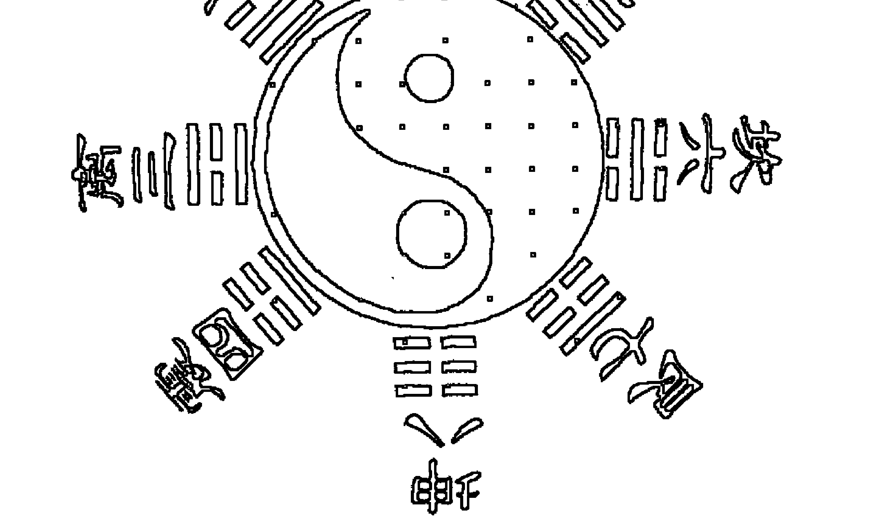

先天八卦数为乾一、兑二、离三、震四、巽五、坎六、艮七、坤八。

## 四、后天八卦

后天八卦又称文王八卦，传说为周文王所制。

后天八卦图源自于《说卦传》：帝出乎震，齐乎巽，相见乎离，致役乎坤，说言乎兑，战乎乾，劳乎坎，成言乎艮。后天八卦方位为离南坎北，震东兑西，坤西南，乾西北，巽东南，艮东北。

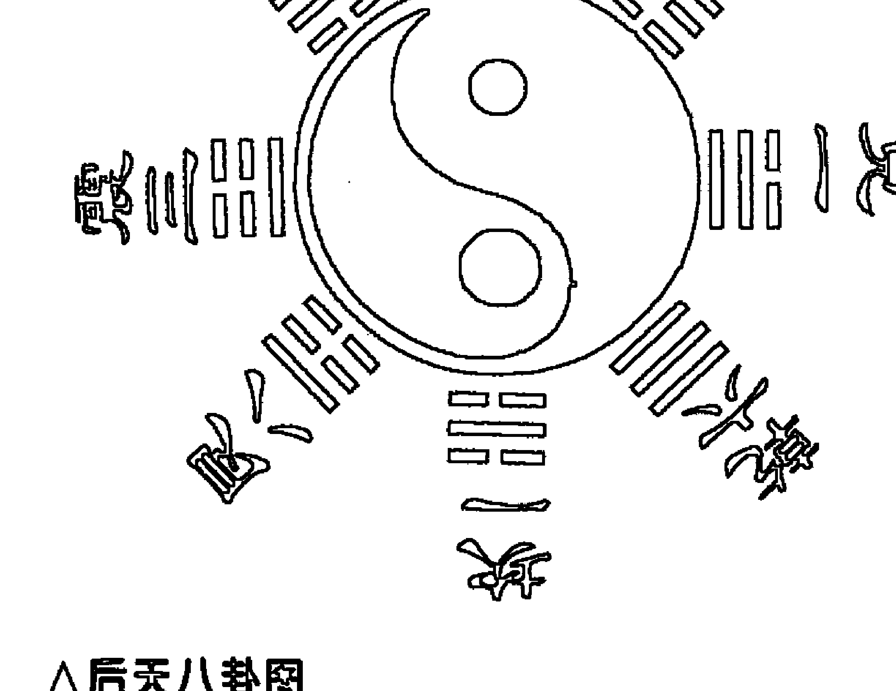

△后天八卦图

注：后天八卦图中，兑一改为兑七

后天八卦数为坎一、坤二、震三、巽四、中五、乾六、兑七、艮八、离九。

## 五、八卦基本取象及万物类象

宇宙间的事物无数种，人们把万事万物分成八种最基本类型的事物，用八卦象征这八种类型的事物，在奇门遁甲中也运用到八卦类象，现根据古人论述及平时运用整理，供读者参考。

### 八卦基本取象：

- 八卦阴阳
  乾、震、坎、艮为阳
  坤、巽、离、兑为阴

- 八卦五行
  乾兑为金，坎为水，震巽为木，离为火，坤艮为土。

- 八卦所属
  乾为老父，震长男，坎中男，艮少男。
  坤为老母，巽长女，离中女，兑少女。

- 八卦诸身
  乾为首，兑为口，坎为耳，离为目，坤为腹，艮为手，巽为股，震为足。

- 八卦性情
  乾健、坤顺、震动、巽入、坎险、离丽、艮止、兑悦。

- 八卦自然
  乾为天、坤为地、震为雷、巽为风、坎为水、离为火、艮为山、兑为泽。

- 八卦动物
  乾为马、坤为牛、震为龙、巽为鸡、坎为豕、离为雉、艮为狗、兑为羊。

## 八卦万物类象

## 乾卦

天时：天、冰、雹、霰。
地理：西北方、城市、京城。
人物：国家主席、总统、父、大人、老人、长者、老板、厂长、总经理、男人、名人、公务员、机关工作人员。
人事：刚健勇武、果决、多动少静。
身体：头、骨、肺。
时序：戌亥年月之时。
动物：虎、马、天鹅、狮子、象。
静物：金玉、珠宝、圆物、刚物、冠、镜。
屋宿：公厕、楼台、办公大楼、大厦、高级招待所、西北向之居。
家宅：秋占宅兴隆，夏占有祸，冬占冷落，春占吉利。
婚姻：贵官之眷，有声名之家。
饮食：马肉珍味、多骨、肝肺、干肉、木果、诸物之首、圆物、辛辣之物。
求名：有名，宜随内任、刑宫、武职、掌权。
谋旺：有成，利公门。
交易：宜金、玉珍宝珠贵货。
求利：有财，金、玉之利，公门中得财，秋占大利，夏占损财，冬占无财。
出行：利于出行，宜人大城市。
谒见：利见上级，办事遂心。
疾病：头面之疾，肺疾、筋骨疾、上焦疾、夏占不安。
官讼：健讼，有贵人助，秋占得胜，夏占失理。
坟墓：宜向西北，宜乾山气脉，宜天穴，宜高，秋占出贵，夏占大凶。
姓字：带金旁者，行位一四九。
数目：一四九。
五色：白色（奇门中为六白）、大赤色。
五味：辛、辣。

## 坤卦

天时：阴云、雾气、冰霜。
地理：田野、农村、平地、西南方。
人物：老母、农民、副职、众人、老妇人、大腹人。
人事：吝啬、柔顺、懦弱、众多、小人。
身体：腹、脾、肉、胃。
时序：未申年月日时。
静物：方物、柔物、布帛、丝绵、五谷、舆斧、瓦器。
动物：牛、百兽、马。
屋宿：西南方、农村、田舍、矮屋、仓库。
家宅：安稳、多阴气、春占宅舍不安。
饮食：牛肉、野味、五谷之味、芋笋之物、腹脏之物。
婚姻：利于婚姻，宜贸易、工商、税务、乡村之家，春占不利。
生产：易产，春占难产，有损或不利于母，从宜西南方。
求名：有名、宜西南方或教官、农官守土之职、春占虚。
交易：宜利交易、宜田土交易、宜五谷利、贱货、重物、布帛、静中有财、春占不利。
求财：有利，宜土中之利，贱货重物之利、静中得财，春占无财，多中取利。
谋旺：利求谋，邻里求谋，静中求谋，春占少逐，或谋于妇人。
出行：可行、宜西南行、宜往乡里行、宜陆行，春不宜。
谒见：可见，利见乡人，宜见亲朋或女人，春不宜见。
疾病：腹疾、脾胃之疾、饮食停滞、从而食不化。
官讼：理顺、得众情、讼当解散。
坟墓：宜向西南之穴、平阳之地、近田野、宜低葬，春不可葬。
姓字：带土姓人、行位八五十。
数目：二五十。
五色：黄色、黑色（奇门中为二黑）。

## 震卦

天时：雷。
地理：东方、树木、工厂、闹市、运动场、大路、竹林、草木茂盛之所。
身体：足、肝、发、声音。
人物：长男。
时序：春二月、卯年月日时。
静物：木竹、苇、乐器（竹木）、枪炮之物、音响、闹钟、核。
动物：蛇、百虫、马鸣。
屋舍：东向之居、山林之处、楼阁。
家宅：宅中不时有虚惊，春冬吉，秋占不利。
饮食：蹄、肉、山林野味、鲜肉、果酸味、菜蔬、鲤鱼（鱼）。
婚姻：可、有成、声名之家、得长男之婚，秋占不利。
求利：山林竹木之财、动处求财，或山林、竹木茶货之利。
求名：有名、宜东方之任、施号发令之职、掌弄狱之官、不茶木税课之任、或闹市市货之职。
生产：虚惊、胎动不安、头胎必生男，坐宜向东，秋不吉。
疾病：足疾、肝经之疾、惊恐不安。
谋旺：可旺、可求，宜动中谋，秋占不遂。
交易：利于成交，秋占难成，宜动中求财，山林、木竹茶货之利。
官讼：健讼、有虚惊、行移取甚反复。
谒见：可见、有宜山林之人，利见宜有声名之人。
出行：宜行，利东方、利山林之人，秋占不宜行、但恐虚惊。
坟墓：利于东向、山林中穴，秋不利。
姓字：带木姓人、行位四八三。
数目：三、八。
五味：甘、酸味。
五色：绿、碧（奇门为三碧）。

## 巽卦

天时：风。
地理：东南方之地、经商之地、草地、花坛、菜园、江河。
人物：长女、旅行者、经商者。
人事：柔和、不定、鼓舞、进退不果。
身体：头发、股、气、风疾。
时序：辰巳月日时。
静物：花草、绳索、直物、长物、竹木。
动物：鸡、百禽、蛇。
屋舍：东南向之居、寺观楼台、山林之居。
家宅：安稳利市，春占吉，秋占不安。
饮食：鸡肉、山林之味。
婚姻：可成、宜长女之婚，秋占不利。
生产：易生、头胎产女、秋占损胎、宜向东南坐。
求名：宜文职、宜茶果、工商、税务、交通之职。宜东南之任。
求利：有利三倍、宜山之利、竹货木货之利，秋不利。
交易：可成、进退不一、交易之利、山林交易、山林木茶之利。
谋旺：可谋旺、有财可成，秋占多谋少遂。
出行：有出入之利，宜向东南行，秋占不利。
谒见：利见经商之人、山林之人，利见文人秀士。
疾病：股肱之疾、风疾、肠疾、中风、塞邪气疾。
姓字：草木旁姓氏、行位五三八。
官讼：宜和、恐遭上级巡视官员之责。
坟墓：宜东方向、山林之穴、多树木、秋占不利。
数目：五三八。
五味：酸味。
五色：绿、蓝（奇门为四绿）。

## 坎卦

天时：月、雨、雪、露、霜、水。
地理：北方、湖、溪涧、泉井、卑湿之地、沟渎、地沼、有水之处。
人物：中男、江湖之人、舟人、盗贼、骗子。
人事：险陷卑下，外示以柔，内序以利，漂泊不成，随波逐流。
身体：耳、血、肾。
时序：子年月日。
静物：带核之物，酒器、水具、丛棘、酒。
动物：猪、鱼、水中之物、狐、水族。
屋舍：向北之居、近水、水阁、江楼、宅中湿地之处。
饮食：猪肉、酒、冷味、海味、汤、酸味、宿食、鱼带血、掩藏、有带核之物、水中之物、多骨之物。
家宅：不安、暗昧、防盗骗。
婚姻：利中男之婚，宜北方之婚，不利在辰戌丑未月婚。
生产：难产有险，宜次胎，男，中男，辰戌丑未月有损，宜北向。
求名：艰难，恐有灾险，宜北方之任，鱼盐河泊之职。
求利：防盗失。
交易：不利成交，恐防失陷，宜水边交易，宜鱼、盐、酒之交易。
谋旺：不宜谋旺，秋冬占可谋。
出行：不宜远行，宜涉舟，宜北方之行，防盗匪；恐遇险阻溺之事。
谒见：难见，宜见江湖之人，或有水旁姓氏之人。
疾病：耳痛、心疾、感染、肾疾、胃冷、水泻、血病、下部生殖系统疾病。
官讼：有阴险，有失道理。
坟墓：宜北向之穴、近水傍之墓、不利葬。
姓字：点水旁之姓氏。
数目：一、六。
方道：北方。
五味：碱、酸。
五色：为黑色或白色（奇门中为一白）。

## 离卦

天时：日、电虹、霓、霞。
地理：南方、商业区、高坡、洞穴，窑、文化娱乐、冶炼之所，其地面向阳处。
人物：中女、文人、文艺演出之人。
人事：文化，聪明才学，相见虚心，美丽。
身体：头、目、心、上焦。
时序：午火年月日时。
静物：火、书、文、干戈、干燥之物。
动物：雉、龟鳖、蚌、蟹。
屋舍：南舍之居，阳明之宅、明窗、虚室。
家宅：安稳、平善、冬占不安。
饮食：雉肉、煎炒、烧炙方物、干脯之体、熟肉。
婚姻：不成、利中，夏占可成，冬占不利。
生产：易生，产中女，冬占有损，坐宜向南。
求名：有名，宜南方之职，文官之任，宜炉冶亢场之职。
求利：有财宜南方求，有文书之财，冬占有失。
交易：宜有文书之交易。
出行：宜动向南方，就文书之行，冬占不宜行，宜行舟。
谒见：可见南方人，冬占不顺，秋见文书考案才士。
官讼：易散，文书动，词讼明辩。
疾病：目疾、心疾、上焦病，夏占伏暑，时疫。
坟墓：南向之幕，无树木之年，阳穴。夏占出文人，冬不利。
姓字：带次或立人旁人士姓氏。
数目：三二七九。
五色：红、紫（奇门为九紫）。
五味：苦。

## 艮卦

天时：云、雾。
地理：山径路近山城，丘陵、坟墓，东北方。
人物：少男、闲人、山中人、童子。
人事：拒绝、阻隔、守静，进退不决，止住，不见。
身体：手指、骨鼻、背。
时序：丑寅年月日时。
静物：土石、瓜果、黄物、土中之物。
动物：虎、狗、鼠、黔啄之物、狐。
家宅：安稳，诸事有阻，家人不睦，春占不安。
屋舍：东北方之居，山居近石，近路之宅。
饮食：土中物味，诸兽之肉，墓畔竹笋之属；野味。
婚姻：阻隔难成，成变迟，利少男之婚，宜对乡里婚，春占不利。
求名：阻隔无名，宜东北方之任，宜土官山城之职。
生产：难生，有险阻之厄，宜向东北，春占有损。
交易：难成，有山林田土之交易，春占有失。
出行：不宜远行，有阻，宜近陆行。
谒见：不可见，有阻，宜见山林之人。
疾病：手指之疾，胃脾之疾。
官讼：贵人阻滞，官讼未解，牵联不决。
坟墓：东北之穴，山中之穴，近路旁有石，春占不利。
姓字：带土字旁之姓氏。
数目：五八十。
五色：黄、咖啡色、白（奇门为八白）。
五味：甘。

## 兑卦

天时：雨泽、星。
地理：泽、水际、缺池、废井，山崩破裂之地。
人物：少女、妾、口齿伶俐之人。
人事：喜悦、口舌。
身体：舌、口、喉、肺、痰、涎。
时序：酉年月日时。
静物：金刀、金类、乐器、带口之物，毁折之物。
动物：羊、泽中之物。
屋舍：西向之居，近泽之居。
家宅：不安、防口舌，秋占喜悦，夏占家宅有祸。
饮食：羊肉、泽中之物、宿味、辛辣之物味。
婚姻：不成，秋占可成，有喜，主成婚之吉，利婚少女，夏占不利。生产不利，恐有损胎，产多生女，夏占不利。
求名：因名有损，利西之任，宜做警察，武职，翻译等职。
求利：无利有损，财利主口舌，秋占有财喜，夏占不利。
出行：不宜远行，防口知，或损失，宜西行，秋占有利宜行。
交易：难有利，防口舌，有竞争，秋占有交易之财，夏占不利。
谒见：利行西方，见有咒诅。
疾病：口舌、咽喉之疾，牙痛、气逆喘疾，饮食不利。
坟墓：宜西向，防穴中有水，近泽之墓，或葬废穴，夏占不宜。
官讼：争讼不已曲直未决，因讼有损，防刑，秋占有利。
姓字：带口带金字旁姓氏。
数目：四二九。
五色：白、赤（奇门为七赤）。
五味：辛辣。

### 六、河图、洛书

《河图》、《洛书》是流传至今的周易八卦体系中重要的内容和组成部分。目前所知，最早记载《河图》、《洛书》的文献是《尚书·顾命篇》，讲周成王死，康王继位，在继位大典上，陈列着各种器物：

越王五重。陈宝、赤刀、大训、弘壁、琬、琰，在西序；大玉、夷玉、天球、河图，在东序。

《论语·子罕》篇中有：子曰：“凤鸟不至，河不出图，吾已矣夫”。且《系辞》又云：“河出图，洛出书，圣人则之”。相传远古时伏羲氏即位之时，有龙马高八尺五寸，长颈骼上，有翼，马身龙鳞，蹈水而不没，负图而出。大禹治水时，有神龟负书而出于洛水。所以《汉书·五行志》中说：“伏羲氏继天而立，受河图则而画之，八卦是也，禹治洪水，赐洛书而陈之，洪范是也，圣人行其道而主其真，河图洛书相为经纬，八卦九章相为表里。”

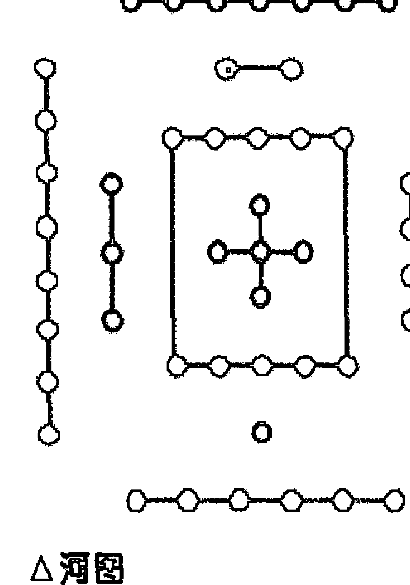

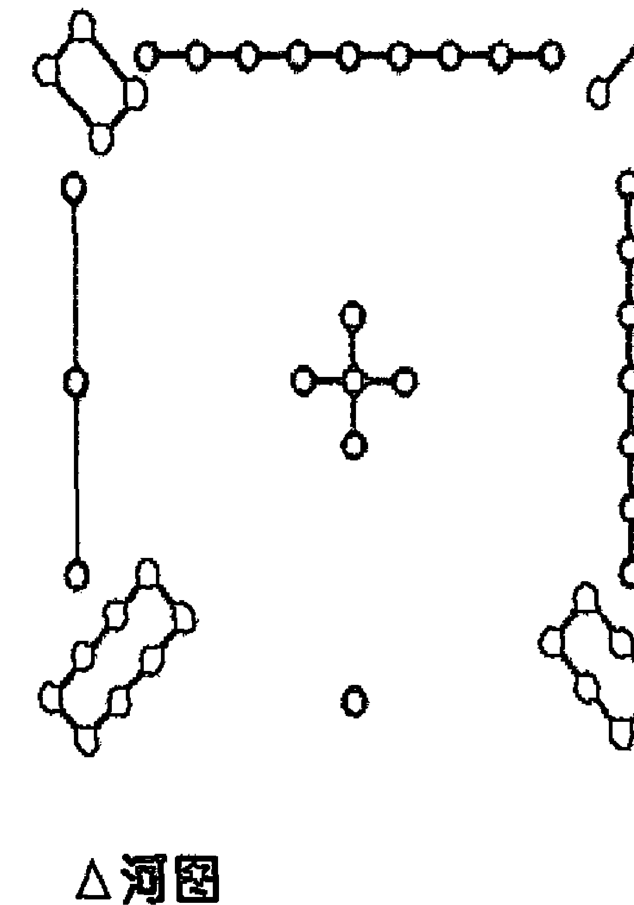

河图中共有五十五个黑白点，代表天地之数五十五。其中白点为单数一、三、五、七、九，代表阳，又代表天，称为“天数”；黑点为双数二、四、六、八、十，代表阴，又代表地，称为“地数”。天数相加是二十五，地数相加是三十，天地之数共得五十五。

河图中还将一至五这五个数，称为“生数”；将六至十这五个数，称为“成数”，两者间有着相生相成的关系。生数象征初生、发生，成数象征着形成、已生成，天数为阳，地数为阴。朱子曰：“所谓天者，阳之轻清而位乎上者也。所谓地者，阴之重浊而位乎下者也”。

天一生水，地六成之居北，后天坎卦。天三生木，地八成之居东，后天震卦。地二生火，天七成之居南，后天离卦。地四生金，天九成之居西，后天兑卦。天五生土，地十生之居中太极。

洛书黑白点共四十五，阳数是一白、三碧、九紫、七赤四正之位，合后天坎、震、离、兑四卦。阴数二黑、四绿、八白、六白在四隅之位，合后天乾、艮、巽、坤四卦。依此而作的九宫图，纵横皆为十五之数，即“戴九履一，左三右七，二四为肩，八六为足”。

## 七、阴阳、五行

### 1、阴阳

阴阳是对自然界互相关系的某些事物和现象对立双方的概括，它象征并说明了宇宙中万物变化现象的刚柔动静的性质与作用，宇宙间一切事物的发生、发展和变化都是阴、阳对立统一运动的结果。天、男、日、刚、动、上、明、前尊、福等一些积极性的事物属于阳；地、女、月、柔、静、下、暗、后、卑、祸等一些消极性的事物属于阴。八卦中乾、坎、艮、震属阳，巽、离、坤、兑属阴，天干中甲、丙、戊、庚、壬属阳，乙、丁、己、辛、癸属阴；地支中子、寅、辰、午、申、戌属阳，丑、卯、巳、未、酉、亥属阴。阴和阳相互对立，相互制约，相互影响，相互利用，相互消长，阴中包含着阳，阳中包含着阴。阴极变阳，阳极变阴，循环往复而无穷。如冬至交头九，阴气正浓，天气正寒，但冬至阳升，阳气逐渐上升，阴气逐渐下降，所以奇门遁甲用阳局；夏至阳气盛极，天气正热，但夏至阴升，阴逐渐上升，阳气逐渐下降，奇门遁甲就改用阴局。如此循环，年年往复。

由上述可知，阴阳是世界上万事万物生成的基础，它具有事物的相对性、无限可分性及相互制约、相互利用、相互促成性。

### 2、五行

五行学说是我国古哲学思想的重要组成部分，是我国劳动人民的独创，它论述了世界的本质问题，世界是由木、火、土、金、水五种基本物质组成的，自然界的各种事物和现象都是这五种物质不断运动和相互作用的结果，五行之间存在着相生相克的关系。

- 五行：木、火、土、金、水。

五行相生，表示一事物对另一事物有促进生长的作用：

- 木生火，火生土，土生金，金生水，水生木。

五行相克，表示一事物对另一事物的制约和克制作用：

- 木克土，土克水，水克火，火克金，金克木。

## 五行属性归类表：

| 五行 | 木 | 火 | 土 | 金 | 水 |
| :--- | :--- | :--- | :--- | :--- | :--- |
| 方位 | 东 | 南 | 中 | 西 | 北 |
| 数目 | 三八 | 二七 | 五十 | 四九 | 一六 |
| 性质 | 曲直 | 炎上 | 稼穑 | 从革 | 润下 |
| 颜色 | 青 | 赤 | 黄 | 白 | 黑 |
| 时令 | 春 | 夏 | 四季月 | 秋 | 冬 |
| 气候 | 风 | 热 | 湿 | 燥 | 寒 |
| 天干 | 甲乙 | 丙丁 | 戊己 | 庚辛 | 壬癸 |
| 地支 | 寅卯 | 巳午 | 辰戌丑未 | 申酉 | 亥子 |
| 五脏 | 肝 | 心 | 脾 | 肺 | 肾 |

## 五行旺相表：

| 五行 | 旺 | 相 | 休 | 囚 | 死 |
| :--- | :--- | :--- | :--- | :--- | :--- |
| 木 | 春、东方 | 夏、南方、火 | 水、北方、冬 | 西、西方、秋 | 中央坤艮及四季月 |
| 火 | 夏、南方 | 中央坤艮及四季月 | 东、春 | 北、水、冬 | 秋、西方、金 |
| 土 | 中央坤艮及四季月 | 秋、西方、金 | 夏、南方、火、丙丁巳午月 | 东方、木、甲乙寅卯月春 | 北方、水冬、壬子癸月 |
| 金 | 秋、西方 | 冬、北方、冬 | 中央坤艮及四季月 | 火、南方、夏 | 春、东方、木 |
| 水 | 冬、北方 | 木、东方 | 秋、西方、金 | 中央坤艮及四季月 | 南、火 |

## 八、天干

中国传统的记时符号，代表太阳对地球的影响，代表阳性的符号就是天干。

> 天干，犹木之干，强而为阳；支，犹木之支，弱而为阴。

天干有十位，即甲、乙、丙、丁、戊、己、庚、辛、壬、癸。

十天干有阴阳之分，在《周易》中，甲、丙、戊、庚、壬为五阳干，乙、丁、己、辛、癸为五阴干。天干中的五阳利客不利主，做事宜先动、耀武扬威先发制人；五阴干利主不利客，做事宜后动，悄声匿迹后发制人。在奇门遁甲中，甲、乙、丙、丁、戊为五阳时，己、庚、辛、壬、癸为五阴时，阳时利客，阴时利主。它们在奇门中的应用如下：

### 十天干方位与属性：

- 甲乙东方木，其中甲为阳木，为森林之木，乙为阴木，为花草之木；
- 丙丁南方火，其中丙为阳火，为太阳之火，丁为阴火，为灯盏之火；
- 戊己中央土，其中戊为阳土，为大地之土，己为阴土，为田园之土；
- 庚辛西方金，其中庚为阳金，为斧钺之金，辛为阴金，为首饰之金；
- 壬癸北方水，其中壬为阳水，为大海之水，癸为阴水，为雨露之水。

十天干配身体：甲为头，乙为肩，丙为额，丁齿舌，戊己鼻面，庚为筋，辛为胸，壬为胫，癸为足。

十天干配腑脏：甲胆，乙肝，丙小肠，丁心，戊胃，己脾，庚大肠，辛肺，壬膀胱，癸肾。

十天干相冲：甲庚相冲，乙辛相冲，丙壬相冲，丁癸相冲。相冲是根据天干的阴阳属性定的，同性相斥，阳与阳冲，阴与阴冲。

### 相冲示意图：

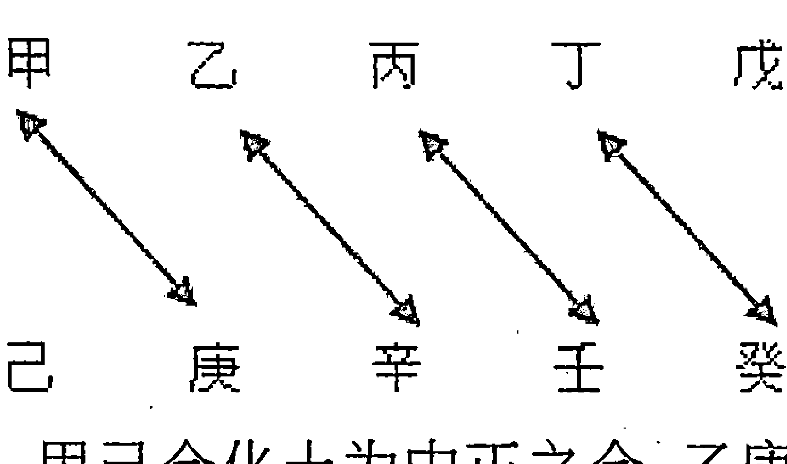

十天干相合：甲己合化土为中正之合，乙庚合化金为仁义之合，丙辛合化水为威制之合，丁壬合化木为淫荡之合，戊癸合化火为无情之合。相合是根据天干的阴阳属性，异性相吸，阳与阴合，阴与阳合。

### 相合示意图：

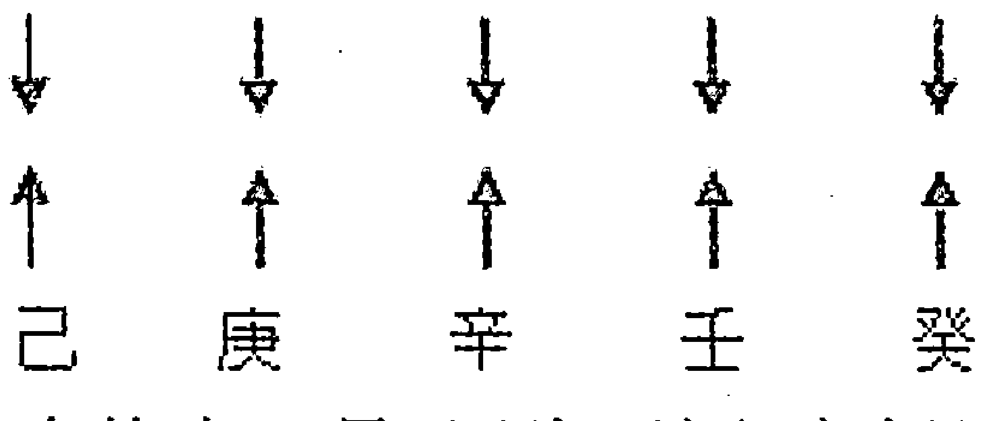

十天干所代表的吉凶是：甲为天福，宜行恩施惠，进德赏功。乙为天德，宜施恩赏德，敛恤抚告。丙为天威，宜发号施令，以彰雄威。丁为太阴，宜静居无忧，勿嗔谴谪。戊为天武，宜发号施令，行诛屠戮。己为六合，又为明堂，宜发明旧事，休疆理城。庚为天狱，宜决断刑狱，诛戳邪恶。辛为天庭，宜正法治囚，莫为吉事。壬为天牢，宜平讼决狱，吉事勿为。癸为天藏，又名天网，宜扬威责罚，积蓄收敛。

十天干旺衰用十二个状态表示，其状态在奇门里就代表所测人及事物的状态，在不同的空间和不同的时间里十天干的状态是不同的。

长生，犹如人刚出生，“万物发生向荣，如人始生而向长也”。

沐浴，犹如小孩出生后的洗浴阶段，“以万物始生，形体柔脆，易为所损，如人生后三日，以沐浴之，几至困绝也”。

冠带，如小孩可以穿衣戴帽阶段，“万物渐荣秀，如人具衣冠也”。

临官，比喻人可以参加工作，有经济收入了，即“如人之临官也”。

帝旺，极旺盛阶段，“万物成熟，如人之兴旺也”。

衰，中年之后，“万物形衰，如人之气衰也”。

病，此谓更衰弱阶段，“万物病，如人之病也”。

死，气尽身亡，“万物死，如人之死也”。

墓，象尸体入土，又称为库，“以万物成功而藏之库，如人之终而归墓也”。

绝，气已绝尽，“以万物在地中，未有其相，如母腹空，未有物也”。

胎，此为受胎之状态。

养，此为成形，“万物在地中成形，如人在母腹成形也”。

以上所述，就是事物由生到壮大，到衰死，然后再出生，反复循环不已的过程。可见下表。

### 十天干生旺死绝表：

| 时令状态 | 甲木 | 丙火 | 戊土 | 庚金 | 壬水 | 乙木 | 丁火 | 己土 | 辛金 | 癸水 |
| :--- | :--- | :--- | :--- | :--- | :--- | :--- | :--- | :--- | :--- | :--- |
| 长生 | 亥 | 寅 | 寅 | 巳 | 申 | 午 | 酉 | 酉 | 子 | 卯 |
| 沐浴 | 子 | 卯 | 卯 | 午 | 酉 | 巳 | 申 | 申 | 亥 | 寅 |
| 冠带 | 丑 | 辰 | 辰 | 未 | 戌 | 辰 | 未 | 未 | 戌 | 丑 |
| 临官 | 寅 | 巳 | 巳 | 申 | 亥 | 卯 | 午 | 午 | 酉 | 子 |
| 帝旺 | 卯 | 午 | 午 | 酉 | 子 | 寅 | 巳 | 巳 | 申 | 亥 |
| 衰 | 辰 | 未 | 未 | 戌 | 丑 | 丑 | 辰 | 辰 | 未 | 戌 |
| 病 | 巳 | 申 | 申 | 亥 | 寅 | 子 | 卯 | 卯 | 午 | 酉 |
| 死 | 午 | 酉 | 酉 | 子 | 卯 | 亥 | 寅 | 寅 | 巳 | 申 |
| 墓 | 未 | 戌 | 戌 | 丑 | 辰 | 戌 | 丑 | 丑 | 辰 | 未 |
| 绝 | 申 | 亥 | 亥 | 寅 | 巳 | 酉 | 子 | 子 | 卯 | 午 |
| 胎 | 酉 | 子 | 子 | 卯 | 午 | 亥 | 亥 | 寅 | 巳 | 巳 |
| 养 | 戌 | 丑 | 丑 | 辰 | 未 | 未 | 戌 | 戌 | 丑 | 辰 |

## 九、地支

地支属阴，是根据月亮在一年之内圆缺盈亏的十二次确定的，故地支有：

- 子
- 丑
- 寅
- 卯
- 辰
- 巳
- 午
- 未
- 申
- 酉
- 戌
- 亥。

十二支方位与属性：寅卯东方木，巳午南方火，申酉西方金，亥子北方水，辰戌丑未四季土（每季最后一个月）。

十二支配月建：正月建寅，二月建卯、三月建辰，四月建巳，五月建午，六月建未，七月建申，八月建酉，九月建戌，十月建亥，十一月建子，十二月建丑。

十二支配十二时辰：每一个地支为一个时辰，每个时辰代表两个小时，一天二十四小时中有十二个时辰，地支对应时辰详见下表：

| 时辰 | 子 | 丑 | 寅 | 卯 | 辰 | 巳 |
| :--- | :--- | :--- | :--- | :--- | :--- | :--- |
| 时间 | 23—1 | 1—3 | 3—5 | 5—7 | 7—9 | 9—11 |
| 时辰 | 午 | 未 | 申 | 酉 | 戌 | 亥 |
| 时间 | 11—13 | 13—15 | 15—17 | 17—19 | 19—21 | 21—23 |

十二支相冲：子午冲、丑未冲、寅申冲、卯酉冲、辰戌冲、巳亥冲。

地支相冲者，阴阳相同，方位相对，五行相克。表示排斥、冲克之意。

相冲示意图：

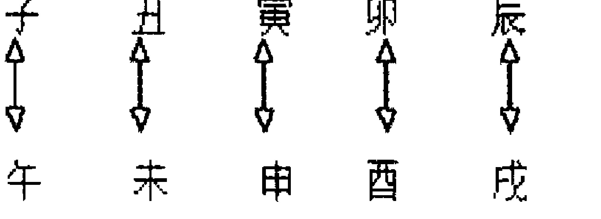

十二支化合：子丑合化土、寅亥合化木、卯戌合化火、辰酉合化金、巳申合化水、午未合化土。

按五行，相合者为和好之意，合中相生者，越合越好；合中相克者，处事先好后坏。

### 地支相合示意图：

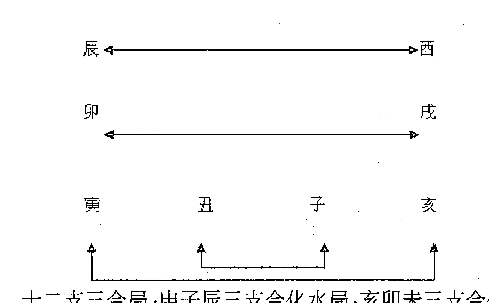

十二支三合局：申子辰三支合化水局、亥卯未三支合化木局、寅午戌三支合化火局、巳酉丑三支合化金局（见图）。三合局表示一种力量的聚集。

### 三合局示意图：

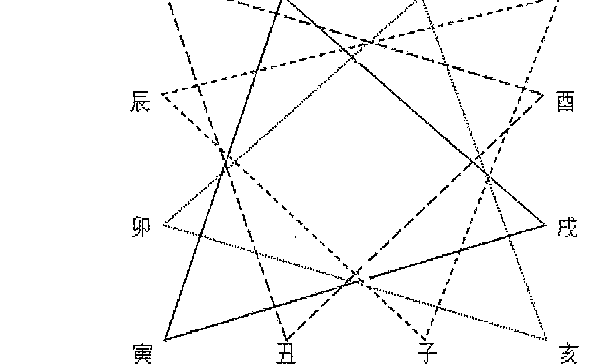

十二支相刑：子刑卯为无理之刑；寅巳申为无恩之刑；丑未戌为持势之刑；辰午酉亥为自刑。相刑就是互相伤害，互相刑罚。

十二支配身体：子为耳，丑为胞肚，寅为手，卯为指，辰为肩、胸，巳为面、咽啮，午为眼，未为脊梁，申为经络，酉为精血，戌为命门、腿足，亥为头。

十二支配脏腑：寅为胆，卯为肝，巳为心，午为小肠，辰戌为胃，丑未为脾，申为大肠，酉为肺，亥为肾、心包，子为膀胱、三焦。

十二支配九宫：

| 巳 辰 四宫 | 午 九宫 | 未 申 二宫 |
| :--- | :--- | :--- |
| 卯 三宫 |  | 酉 七宫 |
| 寅 丑 八宫 | 子 一宫 | 戌 亥 六宫 |

图-1 十二地支在手上的位置图

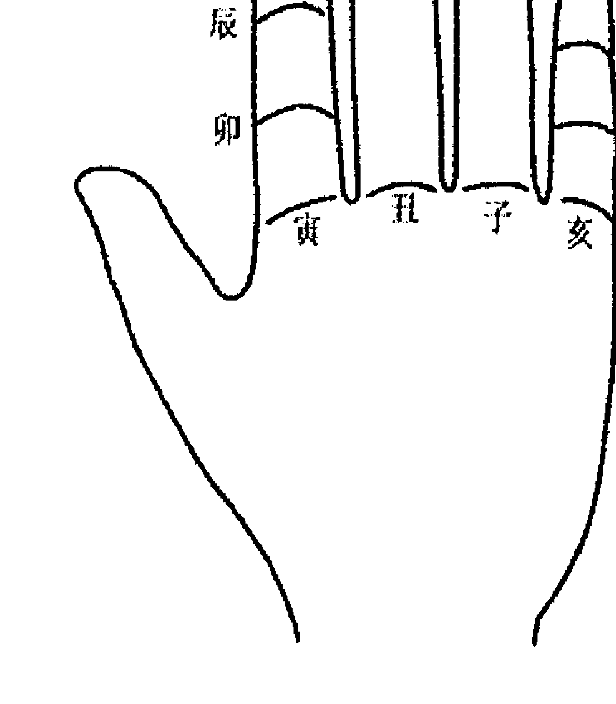

## 十、马星

马星在奇门运用中表示动的意思，比如遇马星可能外出、搬迁或工作调动之类事情发生。寻找马星应以时辰来定，一般在地支三合局中第一个地支对冲的方位为马星。具体规定是：寅午戌三个时辰中任一时辰时，其马星在申位；巳酉丑三个时辰时，马星在亥位；申子辰三个时辰时，马星在寅位；亥卯未三个时辰时，马星在巳位（时家奇门预测中均用时上马星）。

马星示意图：
下图内带圈的地支为马星。

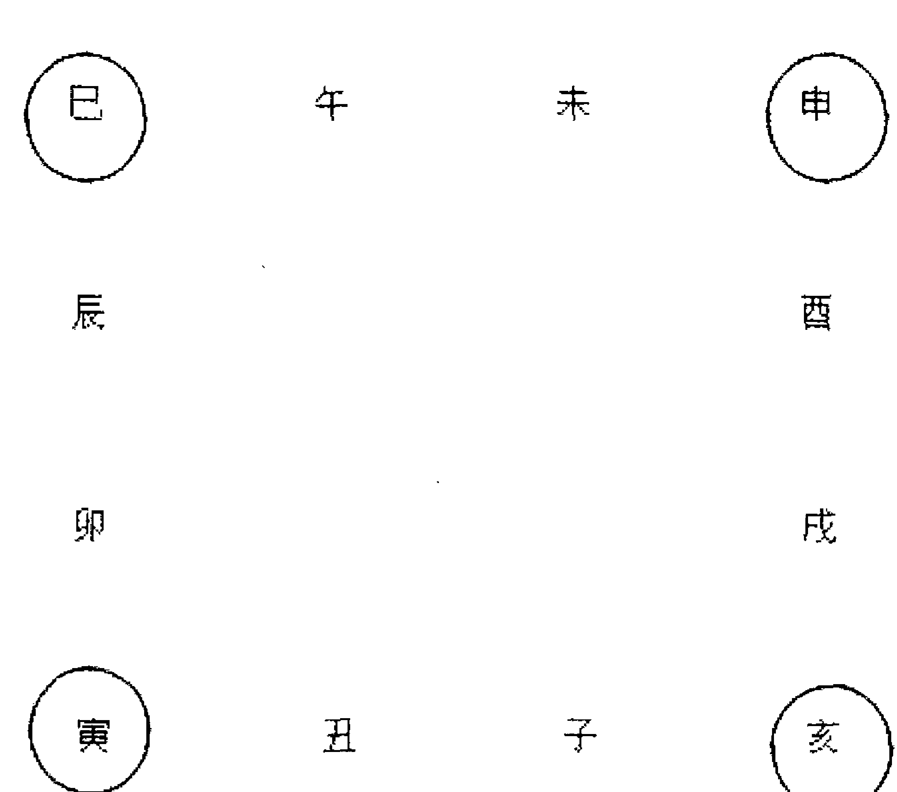

## 十一、六甲旬空

十天干与十二地支相配，构成了中国传统的记日法，二者相配是游动的，但又有规律性。二者相配形成六十甲子，共有六个旬首：甲子旬、甲寅旬、甲辰旬、甲午旬、甲申旬、甲戌旬。因为十个天干与十二个地支轮流相搭配，六甲每一甲下总有两个地支轮空，这两个轮空的地支就为旬空，因此形成了六甲旬空。其形式如下：

- 甲子旬中戌亥空，甲戌旬中申酉空，甲申旬中午未空，
- 甲午旬中辰巳空，甲辰旬中寅卯空，甲寅旬中子丑空。

## 十二、日上起时诀

日上起时法是起局的重要基础知识，因为奇门遁甲起局要用年、月、日、时的干支，但万年历上只有年月日的干支，而时辰的天干则必须根据日上起时法来推出，其口诀方法均从子时上起算。口诀如下：

甲己还加甲，乙庚丙作初，丙辛起戊子，丁壬庚子居，戊癸推壬子。

即甲己日从甲子起，乙庚日从丙子起，丙辛日从戊子起，丁壬日从庚子起，戊癸日从壬子起，以此来推算出时干。

例：丙寅日的辰时，寻找时辰的干支时，其口诀是：丙辛起戊子，即从子时上顺时针起戊子，就形成戊子、己丑、庚寅、辛卯、壬辰，辰时的天干就是壬。

## 十三、六十甲子

古人使用一个天干和一个地支分别搭配的方法来记年、月、时，十天干和十二地支的最小公倍数是六十，所以它们从头结合到底为一个循环，称为六十甲子。六十甲子与五音十二律结合起来，形成纳音五行，为了方便读者查找使用，表中还配了1900年至2039年对应表。见下表：

### 六十花甲子纳音表

| 年号 | 公元 | 年命 | 年号 | 公元 | 年命 | 年号 | 公元 | 年命 | 年号 | 公元 | 年命 | 年号 | 公元 | 年命 | 年号 | 公元 | 年命 |
| :--- | :--- | :--- | :--- | :--- | :--- | :--- | :--- | :--- | :--- | :--- | :--- | :--- | :--- | :--- | :--- | :--- | :--- |
| 甲子 | 1924 1984 | 海中金 | 甲戌 | 1934 1994 | 山头火 | 甲申 | 1944 2004 | 泉中水 | 甲午 | 1954 2014 | 沙中金 | 甲辰 | 1964 2024 | 佛灯火 | 甲寅 | 1974 2034 | 大溪水 |
| 乙丑 | 1925 1985 | 海中金 | 乙亥 | 1935 1995 | 山头火 | 乙酉 | 1945 2005 | 泉中水 | 乙未 | 1955 2015 | 沙中金 | 乙巳 | 1965 2025 | 佛灯火 | 乙卯 | 1975 2035 | 大溪水 |
| 丙寅 | 1926 1986 | 炉中火 | 丙子 | 1936 1996 | 涧下水 | 丙戌 | 1946 2006 | 屋上土 | 丙申 | 1956 2016 | 山下火 | 丙午 | 1966 2026 | 天河水 | 丙辰 | 1976 2036 | 沙中土 |
| 丁卯 | 1927 1987 | 炉中火 | 丁丑 | 1937 1997 | 涧下水 | 丁亥 | 1947 2007 | 屋上土 | 丁酉 | 1957 2017 | 山下火 | 丁未 | 1967 2027 | 天河水 | 丁巳 | 1977 2037 | 沙中土 |
| 戊辰 | 1928 1988 | 大林木 | 戊寅 | 1938 1998 | 城墙土 | 戊子 | 1948 2008 | 霹雳火 | 戊戌 | 1958 2018 | 平地木 | 戊申 | 1968 2028 | 大驿土 | 戊午 | 1978 2038 | 天上火 |
| 己巳 | 1929 1989 | 大林木 | 己卯 | 1939 1999 | 城墙土 | 己丑 | 1949 2009 | 霹雳火 | 己亥 | 1959 2019 | 平地木 | 己酉 | 1969 2029 | 大驿土 | 己未 | 1979 2039 | 天上火 |
| 庚午 | 1930 1990 | 路旁土 | 庚辰 | 1940 2000 | 白蜡金 | 庚寅 | 1950 2010 | 松柏木 | 庚子 | 1960 2020 | 壁上土 | 庚戌 | 1970 2030 | 钗钏金 | 庚申 | 1980 2040 | 石榴木 |
| 辛未 | 1931 1991 | 路旁土 | 辛巳 | 1941 2001 | 白蜡金 | 辛卯 | 1951 2011 | 松柏木 | 辛丑 | 1961 2021 | 壁上土 | 辛亥 | 1971 2031 | 钗钏金 | 辛酉 | 1981 2041 | 石榴木 |
| 壬申 | 1932 1992 | 剑锋金 | 壬午 | 1942 2002 | 杨柳木 | 壬辰 | 1952 2012 | 长流水 | 壬寅 | 1962 2022 | 金箔金 | 壬子 | 1972 2032 | 桑柘木 | 壬戌 | 1982 2042 | 大海水 |
| 癸酉 | 1933 1993 | 剑锋金 | 癸未 | 1943 2003 | 杨柳木 | 癸巳 | 1953 2013 | 长流水 | 癸卯 | 1963 2023 | 金箔金 | 癸丑 | 1973 2033 | 桑柘木 | 癸亥 | 1983 2043 | 大海水 |

## 十四、九宫八卦位置图

九宫是空间，是不动的。八卦分先天八卦和后天八卦，九宫是和后天八卦相配，形成了九宫八卦图。其旺衰同五行旺衰。

| 巽卦四宫 属木 东南方 | 离卦九宫 属火 南方 | 坤卦二宫 属土 西南方 |
| :--- | :--- | :--- |
| 震卦三宫 属木 东方 | 中五宫 属土 (寄二宫) | 兑卦七宫 属金 西方 |
| 艮卦八宫 属土 东北方 | 坎卦一宫 属水 北方 | 乾卦六宫 属金 西北方 |

## 十五、二十四节气

地球运行到某个角度为某个节气，二十四节气，就是把一年中由于地球在公转轨道上的位置变化所引起的地面演变情况分作二十四个阶段，每十五天左右为一个节气，合成二十四节气。二十四节气在我国发祥极为久远，河图、洛书中已明确提出四时五方、八卦九宫概念，内含二至、二分及八节等内容。汉武帝太初元年（公元前104年）实施太初历，第一次把二十四节气订入历法。二十四节气排列如下：

- 春分
- 清明
- 谷雨
- 立夏
- 小满
- 芒种
- 夏至
- 小暑
- 大暑
- 立秋
- 处暑
- 白露
- 秋分
- 寒露
- 霜降
- 立冬
- 小雪
- 大雪
- 冬至
- 小寒
- 大寒

立春、雨水、惊蛰。

二十四节气对照阳历有规律可循，上半年节气的阳历日期为6日或21日左右，下半年节气的阳历日期为8日或23日左右，上下一般只差一两天，为便于记忆可概括为：上半年6、21（日），下半年8、23（日）。也可参考下表：（表中阿拉伯数字为公历日期）

| 季节 | 春       | 夏       | 秋       | 冬       |
| :--- | :------- | :------- | :------- | :------- |
| 节气 | 立春 2.4 | 立夏 5.6 | 立秋 8.8 | 立冬 11.8 |
|      | 雨水 2.20 | 小满 5.21 | 处暑 8.23 | 小雪 11.23 |
|      | 惊蛰 3.6 | 芒种 6.6 | 白露 9.8 | 大雪 12.8 |
|      | 春分 3.21 | 夏至 6.22 | 秋分 9.23 | 冬至 12.21 |
|      | 清明 4.6 | 小暑 7.8 | 寒露 10.8 | 小寒 1.6 |
|      | 谷雨 4.21 | 大暑 7.23 | 霜降 10.23 | 大寒 1.21 |

古人认为，在冬至这个节气中时，阴气达到顶峰，而阳气开始产生，叫做“冬至一阳生”；到夏至这个节气，阳气达到顶峰，而阴气开始产生，叫“夏至一阴生”。

## 十六、定局原理

奇门遁甲把一年分为阴阳二遁，阳遁从二十四节气中的冬至到夏至，阴遁则从夏至到冬至。二十四节气和八卦相对应，即八卦八方各对应三个节气，一年二十四节气正好对应八个卦。一节气十五天，五天一局，每局用一个六十甲子，十五天三局。

以六十甲子推演，每天用一个干支，五天演一局，每五天中第一个天干不是甲就是己，甲和己就称为符头。同样在这五天中的上元里第一天的地支总是子午卯酉中的一个，中元里第一天的地支总是寅申巳亥中的一个，下元里第一天的地支总是辰戌丑未中的一个。以此，遁甲规定：子午卯酉为上元，寅申巳亥为中元，辰戌丑未为下元。

下图中是一年二十四节气奇门遁甲用局表，该图的规律是：

1.  在上中下三元中分成三个独立的循环系统，这就是一七四、二五八、三九六。
2.  九宫中第一个节气第一局必是本宫数，如坎一宫第一个节气为冬至，冬至一七四，第一局为一数。
3.  每宫中三个节气的规律是：第二个节气在第一个局数上，阳遁加一数，阴遁减一数，如冬至后是小寒，加一数小寒第一局为二数。宫中第三个节气是大寒，第一局则为三数，三个节气横排是一二三。每节气三元规律是，两元（局）间隔五个数，阳遁顺加，阴遁逆减。如立春八五二，用完八局后，即九、一、二、三、四，下一局用五局；又如小雪五八二，用完五局后，即、四、三、二、一、九，下一局用八局。

## 附：一年二十四节气奇门遁甲用局表

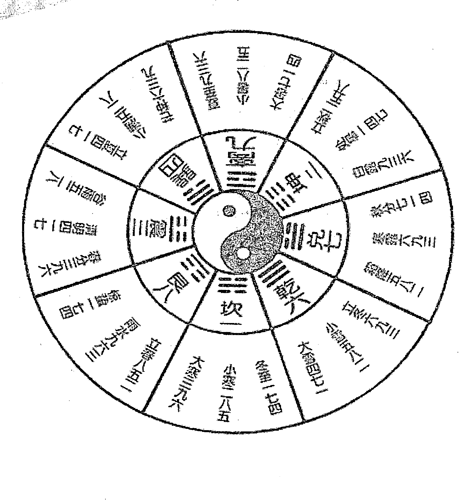

## 十七、置闰和拆补

我们知道一年是365.242216天，但遁甲是360天演72局，余下5.25天，余下这个数怎么处理，自古就有两种方法，置闰法是用集中处理的方法，拆补法是用分散处理的方法。

### 置闰法：

也叫超神接气，即甲己符头与节气的关系。甲己符头在节气前面的就叫“超神”，甲己符头在节气后面的就叫“接气”，甲己符头与节气同时，就叫“正授”。如果超神超过九日，则需置闰。置闰必须在冬至之前，大雪之后。置闰法一般研究者不易计算，用局可查找奇门遁甲万年历。

### 拆补法：

是用“分散”处理之法，不需要专门安排置闰，多余的时间，自然随节气时间逐渐均分到二十四节中去了，这种方法可使用一般历书，再对照奇门遁甲局表就可以确定任何一天的奇门遁甲局数。

其方法是：

-   1、依万年历的日期，查出该日的干支历；
-   2、根据奇门遁甲用局表确定该日所处的节气中的局数；
-   3、按日干支符头的地支来定，子午卯酉为上元，寅申巳亥为中元，辰戌丑未为下元的规定，确定该日为几局。

例：2005年11月18日，查万年历为丙午日，节气为立冬六九三，阴局，丙午日的符头为甲辰，依据辰戌丑未为下元的规定，符头甲辰的地支为辰，故应用六九三的下元阴三局。

## 十八、阴阳二遁顺序图

阳遁 1—9 宫形成一个顺排的闭环，阴遁 9—1 宫形成一个逆排的闭环，应用时按阳顺阴逆的顺序操作。

### 阳遁顺序图：

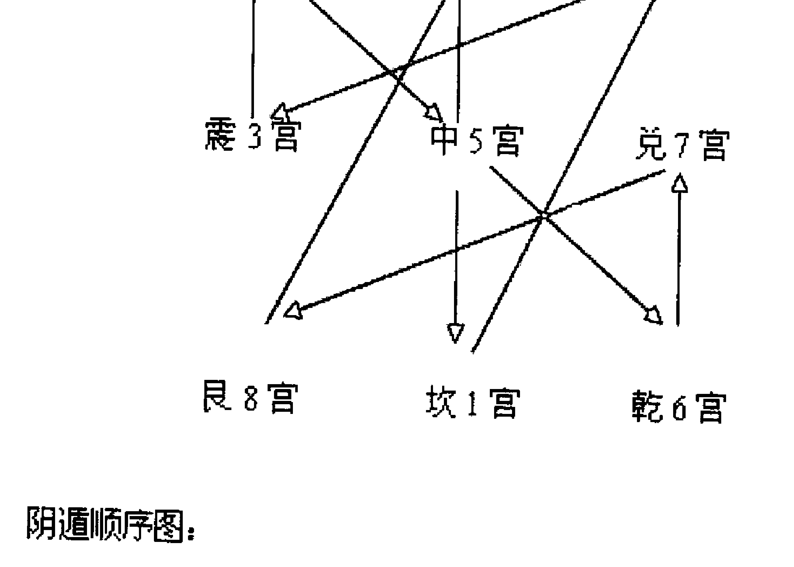

### 阴遁顺序图：

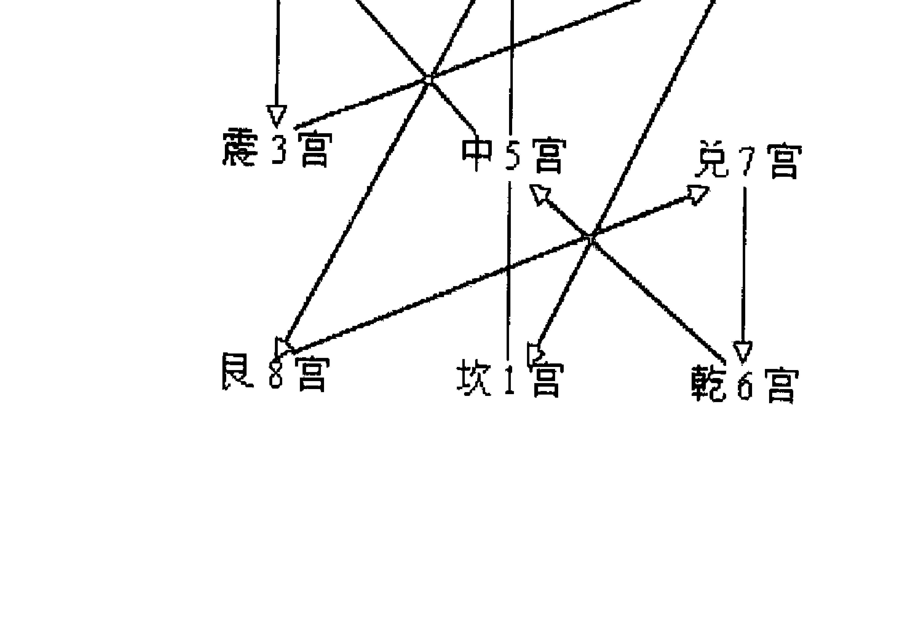

## 十九、三奇六仪顺序

六仪为戊、己、庚、辛、壬、癸六位。六甲甲子、甲戌、甲申、甲午、甲辰、甲寅六位分别隐藏于戊、己、庚、辛、壬、癸六者之中，形成甲子戊、甲戌己、甲申庚、甲午辛、甲辰壬、甲寅癸，六甲为六位将帅，其中甲子为元帅。三奇为乙、丙、丁，是元帅身边最得力的三个助手。

十天干将甲隐藏起来，剩下九干，以配九宫八卦阵。六甲分别隐藏在六仪之下，与乙、丙、丁三奇分占九宫。它们有固定不变的顺序和队形。这个顺序和队形就是：

-   戊、己、庚、辛、壬、癸、丁、丙、乙

按阳遁一至九宫顺排，阴遁九至一宫逆排。三奇六仪在九宫中的排列顺序不同，是决定奇门遁甲不同局式的主要依据。

## 二十、八神顺序、属性及吉凶

八神是古人在天人感应中发现的与九宫八卦有对应性质的八种神秘力量，它们是直符、螣蛇、太阴、六合、白虎、玄武、九地、九天。八神为神盘，八神顺序不变，阳遁顺时针排列，阴遁逆时针排列。

-   直符：禀中央土，为天乙之神，诸神之首，所到之处百恶消散。
-   螣蛇：禀南方火，为虚诈之神，性柔而口毒，可出惊恐怪异之事。
-   太阴：禀西方金，为阴佑之神，性阴匿暗昧。
-   六合：禀东方木，为护卫之神，性平和，司婚姻、交易中间介绍之事。
-   白虎：禀西方金，为凶恶刚猛之神，性好杀，司兵戈争斗杀伐病死。
-   玄武：禀北方水，为奸谗小盗之神，性好阴谋贼害，司盗贼逃亡、口舌之事。
-   九地：坤土之象，万物之母，为坚牢之神，性柔好静。
-   九天：乾金之象，万物之父，为威悍之神，性刚好动。

## 二十一、八门顺序、吉凶及属性

八门在奇门遁甲天、地、人格局中代表人事，所以在奇门预测中极为重要，特别是用神所临之门以及值使门与人间事物关系很大。

八门为：开门、休门、生门、伤门、杜门、景门、死门、惊门。八门为人盘，八门排列顺序阴遁、阳遁是一致的，阳遁、阴遁均按顺时针排列。

-   开门：居乾六宫属金，旺于秋，相于四季末月，休于冬，囚于春，死于夏。代表工厂、公司、商店、工作、父亲、上级、领导、法官、都市。利开店、求财、上官、赴任等。
-   休门：居坎一宫、属水，旺于冬季，相于秋，休于春，囚于夏，死于四季末月，代表公务员、机关科室人员，休闲、利接待，婚姻、求财等。
-   生门：居艮八宫，属土，旺于四季月，相于夏，休于秋，囚于冬，死于春。代表财利、利润、房地产、养殖，利求财造屋，上官赴任等。
-   伤门：居震三宫，属木，旺于春，相于冬，休于夏，囚于四季月，死于秋。代表车辆、竞争、博弈。利讨债、捕捉、赌博、泛猎等。
-   杜门：居巽四宫属木，旺于春季，相于冬，休于夏，囚于四季月，死于秋。代表：保密、闭塞、躲藏方向。利躲灾避难、防洪筑堤。
-   景门：居离九宫属火，旺于夏，相于春，休于四季月，囚于秋，死于冬。代表：文书、合同、消息、官司、邮件、证件、名次、前景。利献策筹谋，选士荐贤、火攻杀戮。
-   死门：居坤二宫属土，旺于四季月，相于夏，休于秋，囚于冬，死于春。代表地皮、死人、坟地、凶灾、不愉快。利吊死送丧，刑戮战争。
-   惊门：居兑七宫属金，旺于秋，相于四季月，休于冬，囚于春，死于夏，代表口舌官司、惊恐、律师。利斗讼官司、抢捕盗贼，蛊惑乱众。

开门、休门、生门为三吉门，杜门、景门为平门，死门、惊门、伤门为凶门。上述吉凶是指在一般情况下，在实践中要根据门的含义具体情况来分析，且不可一概而论。

## 二十二、九星顺序、属性及吉凶

九星在奇门遁甲中代表天时，即天体运动对地球和人类的影响。古人从常见的行星中，根据它们运转歇宿的位置，选择其中有代表性的九颗，分别与地上的九宫八卦相对应，九星分别为天蓬星、天任星、天冲星、天辅星、天英星、天芮星、天禽星、天柱星、天心星。九星为天盘，九星顺序不变，阳遁、阴遁均按顺时针排列。

九星旺衰不同于八门、九宫的旺衰，其口诀是：我生之月诚为旺，与我同行即为相，废于父母休于财，囚于鬼兮真不妥。例：天蓬星落三、四宫为旺，落一宫为相，落六、七宫为废，落离九宫为休，落二、五、八宫为囚。

天心星、天任星、天辅星、天禽星为吉星，天冲星、天英星为平星，天蓬星、天芮星、天柱星为凶星（吉凶指的一般情况下）。

-   1. 天蓬星：居坎一宫属水，旺于春，相于冬，休于夏，囚于四季月，废于秋。代表大盗、破财，也代表能做大事业的人。利安抚边境。
-   2. 天芮星：居坤二宫属土，旺于秋，相于四季月，休于冬，囚于春，废于夏。代表病星、学生、佛龛。利交友。
-   3. 天冲星：居震三宫属木，旺于夏，相于春，休于四季月，囚于秋，废于冬。代表武士、处事雷厉风行。利征伐战斗，报仇解怨，施恩交友。
-   4. 天辅星：居巽四宫属木，旺于夏，相于春，休于四季月，囚于秋，废于冬。代表文化、老师、漂亮。利教育、经商、婚嫁。
-   5. 天禽星：居中五宫属土，旺于秋，相于四季月，休于冬，囚于春，废于夏。代表方正、厚道之人。利见上级，经商、婚嫁。
-   6. 天心星：居乾六宫属金，旺于冬，相于秋，休于春，囚于夏，废于四季月。代表医生、圆形，有心计之人。利医疗，经商，婚嫁，求谋，进见领导及兴师动旅。
-   7. 天柱星：居兑七宫属金，旺于冬，相于秋，休于春，囚于夏，废于四季月。代表凶灾、破败。利建造营垒，训练士兵。
-   8. 天任星：居艮八宫属土，旺于秋，相于四季月，休于冬，囚于春，废于夏。代表吉利、厚道之人。利安民、入官见贵、经商、婚嫁。
-   9. 天英星：居离九宫属火，旺于四季月，相于夏，休于秋，囚于冬，废于春。代表烈性、砖窑等，利上官见贵，应举报书，出入远行，饮宴作乐。

## 九星旺相休囚表

| 旺相 | 旺   | 相     | 休         | 囚         | 废         |
| :--- | :--- | :----- | :--------- | :--------- | :--------- |
| 春   | 蓬   | 冲、辅 | 柱、心     | 任、禽、芮 | 英         |
| 夏   | 冲、辅 | 英     | 蓬         | 柱、心     | 任、禽、芮 |
| 秋   | 任、禽、芮 | 柱、心 | 英         | 冲、辅     | 蓬         |
| 冬   | 柱、心 | 蓬     | 任、禽、芮 | 英         | 冲、辅     |
| 季月 | 英   | 任、禽、芮 | 冲、辅     | 蓬         | 柱、心     |

## 二十三、八门九星八神规律图（阳遁一局）

奇门遁甲这个数理模型分为地盘、天盘、人盘、神盘四层，下面是八门、九星、八神在阳遁一局的位置图。

地盘即九宫八卦，一宫为坎卦，五行属水，代表北方；二宫为坤卦，五行属（阴）土，代表西南方；三宫为震卦，五行属木，代表东方；四宫为巽卦，五行属木，代表东南方；五宫为中宫，五行属（阳）土，代表中央；六宫为乾卦，五行属金，代表西北方；七宫为兑卦，五行属金，代表西方；八宫艮卦，五行属（阳）土，代表东北方；九宫离卦，五行属火，代表南方。

天盘即九星，讲的是天体运动对地球和人的影响。与一宫对应五行属水的天蓬星，与二宫对应五行属土的天芮星，与三宫对应五行属木的天冲星，与四宫对应五行属木的天辅星，与五宫对应五行属土的天禽星，与六宫对应五行属金的天心星，与七宫对应五行属金的天柱星，与八宫对应五行属土的天任星，与九宫对应五行属火的天英星。

人盘即八门，根据阴阳五行和八卦的原理，在不同方位对人和事物产生的影响。与一宫对应五行属水的休门，与二宫对应五行属土的死门，与三宫对应五行属木的伤门，与四宫对应五行属木的杜门，与五宫对应五行属土的死门（因五宫寄于二宫，故也用死门），与六宫对应五行属金的开门，与七宫对应五行属金的惊门，与八宫对应五行属土的生门，与九宫对应五行属火的景门。

神盘即直符、螣蛇、太阴、六合、白虎、玄武、九地、九天。

| 宫位 | 西北（六宫） | 西（七宫） | 西南（二宫） | 南（九宫） | 东南（四宫） | 东（三宫） | 东北（八宫） | 北（一宫） |
| :--- | :--- | :--- | :--- | :--- | :--- | :--- | :--- | :--- |
| 八神 | 九天 | 太阴 | 九地 | 玄武 | 六合 | 白虎 | 螣蛇 | 直符 |
| 八门 | 开门 | 惊门 | 死门 | 景门 | 杜门 | 伤门 | 生门 | 休门 |
| 九星 | 天心星（癸） | 天柱星（丁） | 天芮星（壬/己） | 天英星（乙） | 天辅星（辛） | 天冲星（庚） | 天任星（丙） | 天蓬星（戊） |
| 宫卦 | 乾 | 兑 | 坤 | 离 | 巽 | 震 | 艮 | 坎 |

## 二十四、纸上快速起局法（摘自《神奇之门》张志春著）

第一步是先把阳历的年月日时换算成干支历。

第二步是根据节气和上中下三元的规律，确定求测日所用遁甲局数，是阳遁几局，或阴遁几局。

第三步，在纸上画一个井字形九宫格或者米字形八宫格，将一至九宫分别按奇门遁甲格局填在格内。

第四步，在纸上一至九宫格内，按遁甲几局三奇六仪的排布规律，即戊、己、庚、辛、壬、癸、丁、丙、乙这个永定例、永远不变的顺序，将六仪三奇布在一至九宫格内。

第五步，找出预测时辰的旬首，比如乙亥时，甲成为旬首；辛亥时，甲辰为旬首；戊戌时，甲午为旬首；即预测时辰是六甲中哪一甲大将在地盘值班。同时根据该甲所隐的六仪，即知道地盘上该甲在几宫值班了。

第六步，根据地盘上六甲中值班一甲所在宫位，即可找出与它对应的天盘上值班的九星之一，这就是值符；人盘上值班的八门之一，这就是值使。这样把这个时辰内的值符和值使就找出来了，并一一写在纸上。

第七步，根据“值符随时干”的规律，看预测时辰的天干在地盘几宫，就将值符直接写在这个宫内，同时将它原在地盘宫内的六仪三奇也随之写在它如今运转到的宫内。

第八步，值符落宫确定了，将其余八星连同它们原来地盘内所携带的六仪三奇也一一写在运转到的宫内，这样用事时辰天盘运行的格局就确定了。

第九步，根据“值使随时宫”的规律，将值使的八门之一按时间和宫位运行的顺序，确定它所落宫位，然后把它写在该宫格内。同时，将其余七门按固定顺序，一一写在其他宫格之内。这样，八门运转到问事时辰的格局也就一目了然了。

第十步，根据阳遁顺时针运转，阴遁逆时针运转的规律和小值符永远追随大值符的规律，将神盘中的小值符首先写在大值符所落宫内，然后，将螣蛇、太阴、六合、白虎（勾陈）、玄武（朱雀）、九地、九天按顺序一一写在其他七个宫内。这样，八神盘在问事时辰运行的格局也就确定了。

### 现举例说明起局方法：

#### 1、阳遁起局：以2005年5月29日20时58分为例。

##### 第一步：换算干支历，即把阳历换算成干支历。

2005年5月29日20时58分

乙酉年辛巳月癸丑日壬戌时

（查万年历换算年、月、日干支历；按日上起时法得出时上天干壬）

###### 第二步：确定遁甲用局

2005年5月29日20时58分

乙酉年辛巳月癸丑日壬戌时，阳五局

（置润局：可查奇门遁甲万年历得出所用局。拆补局：节气为小满，阳局，小满上中下元依次是五、二、八局，癸丑日的符头为己酉，依据符头子午卯酉用上元的规定，癸丑的符头地支为酉，癸丑日应用阳五局。）

###### 第三步：画九宫格

2005年5月29日20时58分

乙酉年辛巳月癸丑日壬戌时，阳五局

（画九宫格，标出九宫宫数，若熟悉九宫位置了就可以不标了。）

| 4宫 | 9宫 | 2宫 |
| :--- | :--- | :--- |
| 3宫 | 5宫 | 7宫 |
| 8宫 | 1宫 | 6宫 |

###### 第四步：布六仪三奇

2005年5月29日20时58分

乙酉年辛巳月癸丑日壬戌时，阳五局

| 4 宫乙 | 9 宫壬 | 2 宫丁 |
| :--- | :--- | :--- |
| 3 宫丙 | 5 宫戊 | 7 宫庚 |
| 8 宫辛 | 1 宫癸 | 6 宫己 |

（按戊己庚辛壬癸丁丙乙顺序，依据阳局顺布，几局就从几宫布戊的规定，阳五局则在五宫起戊，六宫布己，七宫布庚，八宫布辛，依次类推。）

###### 第五步：找旬首

2005年5月29日20时58分

| 4 宫乙 | 9 宫壬 | 2 宫丁 |
| :--- | :--- | :--- |
| 3 宫丙 | 5 宫戊 | 7 宫庚 |
| 8 宫辛 | 1 宫癸 | 6 宫己 |

乙酉年辛巳月癸丑日壬戌时，阳五局，甲寅旬（壬戌时，旬首为甲寅，操作时可从壬戌上，逆推至甲，壬戌、辛酉、庚申、己未、戊午、丁巳、丙辰、乙卯、甲寅。）

手上操作时，将拇指放在戌位，因戌时天干是壬，故可从戌位上起甲，逆时针数至壬位，该地支寅就是逆推的甲位，也就是旬首甲寅。下面是图示：

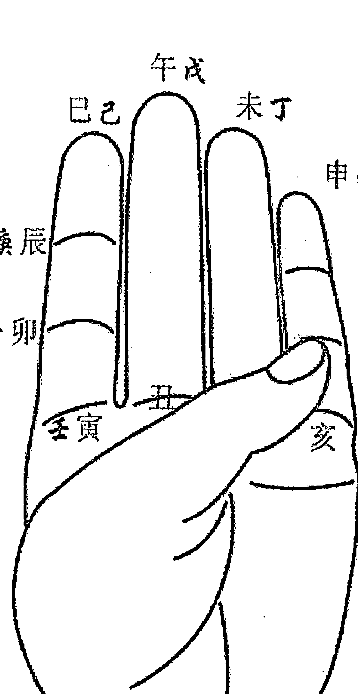

###### 第六步：确定值符和值使门

2005年5月29日20时58分

乙酉年辛巳月癸丑日壬戌时，阳五局，甲寅旬，天蓬星值符，休门值使。

| 4宫乙 | 9宫壬 | 2宫丁 |
| :--- | :--- | :--- |
| 3宫丙 | 5宫戊 | 7宫庚 |
| 8宫辛 | 1宫癸 | 6宫己 |

（根据值班大将甲寅隐于癸下，壬戌时甲寅（癸）在一宫值班，对应的九星是天蓬星，天蓬星就是值符，对应的八门是休门，休门就是值使。将它们写在纸上。）

###### 第七步：值符随时干

2005年5月29日20时58分

乙酉年辛巳月癸丑日壬戌时，阳五局，甲寅旬，天蓬星值符，休门值使。

| 4宫乙 | 9宫壬（天蓬星癸） | 2宫丁 |
| :--- | :--- | :--- |
| 3宫丙 | 5宫戊 | 7宫庚 |
| 8宫辛 | 1宫癸 | 6宫己 |

（值符天蓬星随时上的干支壬，现时干壬在九宫，故天蓬星写在九宫，同时将天蓬星原来所在地盘宫内的六仪癸写在九宫。）

###### 第八步：布其它八星和天盘奇仪

2005年5月29日20时58分

乙酉年辛巳月癸丑日壬戌时，阳五局，甲寅旬，天蓬星值符，休门值使。

| 己（天心星乙） | 癸（天蓬星壬） | 辛（天任星丁） |
| :--- | :--- | :--- |
| 庚（天柱星丙） | 戊（天禽星） | 丙（天冲星庚） |
| 丁（天芮星辛） | 壬（天英星癸） | 乙（天辅星己） |

（顺时针依次将其余八星连同它们原来地盘内所携带的六仪三奇也一一写在运转到的宫内，天禽星寄二宫，随天芮星运转。）

###### 第九步：排八门

2005年5月29日20时58分

乙酉年辛巳月癸丑日壬戌时，阳五局，甲寅旬，天蓬星值符，休门值使。

| 开门 己 | 休门 癸 | 生门 辛 |
| :--- | :--- | :--- |
| 天心星乙 | 天蓬星壬 | 天任星丁 |
| 惊门 庚 | 戊（天禽星） | 伤门 丙 |
| 天柱星丙 | | 天冲星庚 |
| 死门 丁 | 景门 壬 | 杜门 乙 |
| 天芮星辛 | 天英星癸 | 天辅星己 |

（值使随时宫，阳遁顺数，甲寅（癸）时休门在一宫值班，卯时休门则在二宫值班，辰时在三宫，巳时在四宫，午时在五宫，未时在六宫，申时在七宫，酉时在八宫，戌时就在九宫值班了，将休门排在九宫里，生门在二宫，伤门在三宫……依次顺排。这就是“值使随时宫”的规律。）

###### 第十步：安八神

2005年5月29日20时58分

乙酉年辛巳月癸丑日壬戌时，阳五局，甲寅旬，天蓬星值符，休门值使。

| 九天 开门 己 天心星乙 | 直符 休门 癸 天蓬星壬 | 螣蛇 生门 辛 天任星丁 |
| :--- | :--- | :--- |
| 九地 惊门 庚 天柱星丙 |  戊  | 太阴 伤门 丙 天冲星庚 |
| 玄武 死门 丁 天芮星辛 | 白虎 景门 壬 天英星癸 | 六合 杜门 乙 天辅星己 |

（小直符随大值符，阳遁顺排八神，现大值符天蓬星在九宫，故小直符就写在九宫，然后依次顺排，螣蛇在二宫、太阴在七宫、六合在六宫、白虎在一宫、玄武在八宫、九地在三宫、九天在四宫。）

#### 2、阴遁起局：以2005年11月19日18时21分为例。

##### 第一步：换算干支历，即把阳历换算成干支历。

2005年11月19日18时21分

乙酉年丁亥月丁未日己酉时

###### 第二步：确定遁甲用局

2005年11月19日18时21分
乙酉年丁亥月丁未日己酉时，阴三局

（置闰局：可查奇门遁甲万年历得出所用局。拆补局：节气为立冬节，阴局，立冬节上中下元依次是六、九、三局，丁未日的符头为甲辰，依据符头逢辰戌丑未用下元的规定，丁未日应用阴三局。）

###### 第三步：画九宫格

2005年11月19日18时21分
乙酉年丁亥月丁未日己酉时，阴三局

| 4宫 | 9宫 | 2宫 |
|-----|-----|-----|
| 3宫 | 5宫 | 7宫 |
| 8宫 | 1宫 | 6宫 |

（画九宫格，标出九宫宫数，若熟悉九宫位置了就可以不标了。）

###### 第四步：布六仪三奇

2005年11月19日18时21分
乙酉年丁亥月丁未日己酉时，阴三局

| 4宫 乙 | 9宫 辛 | 2宫 己 |
| :--- | :--- | :--- |
| 3宫 戊 | 5宫 丙 | 7宫 癸 |
| 8宫 壬 | 1宫 庚 | 6宫 丁 |

（按戊己庚辛壬癸丁丙乙顺序，依据阴局逆布，几局就从几宫布戊的规定，阴三局则在三宫起戊，二宫布己，一宫布庚，九宫布辛，八宫布壬，依次类推。）

###### 第五步：找旬首

2005年11月19日18时21分
乙酉年丁亥月丁未日己酉时，阴三局，甲辰旬

| 4宫 乙 | 9宫 辛 | 2宫 己 |
| :--- | :--- | :--- |
| 3宫 戊 | 5宫 丙 | 7宫 癸 |
| 8宫 壬 | 1宫 庚 | 6宫 丁 |

（己酉时，旬首为甲辰，操作时可从己酉上，逆推至甲，己酉、戊申，丁未，丙午，乙巳，甲辰。）

手上操作时，将拇指放在酉位，因酉时天干是己，故可从酉位上起甲，逆时针数至己位，该地支辰就是逆推的甲位，也就是旬首甲辰。下面是图示：

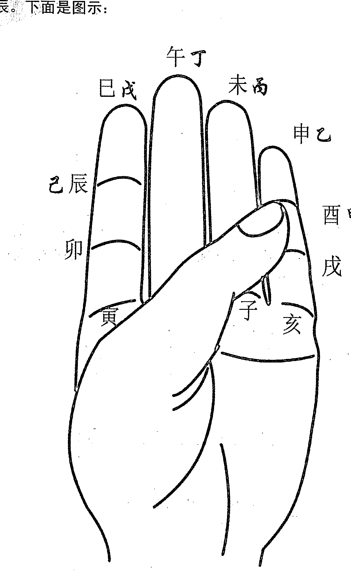

###### 第六步：确定值符和值使门

2005年11月19日18时21分
乙酉年丁亥月丁未日己酉时，阴三局，甲辰旬，天任星值符，生门值使。

| 4宫 乙 | 9宫 辛 | 2宫 己 |
| :--- | :--- | :--- |
| 3宫 戊 | 5宫 丙 | 7宫 癸 |
| 8宫 壬 | 1宫 庚 | 6宫 丁 |

（根据值班大将甲辰隐于壬下，辰时甲辰（壬）在八宫值班，对应的九星是天任星，天任星就是值符，对应的八门是生门，生门就是值使。将它们写在纸上。）

###### 第七步：值符随时干

2005年11月19日18时21分
乙酉年丁亥月丁未日己酉时，阴三局，甲辰旬，天任星值符，生门值使。

|   |   | 壬 |
| 乙 | 辛 | 天任星己 |
| 戊 | 丙 | 癸 |

（值符天任星随时干己，现时干己在二宫，故天任星写在二宫，同时将天任星原来所在地盘宫内的六仪壬写在二宫己上。）

###### 第八步：布其它八星和天盘奇仪

2005年11月19日18时21分
乙酉年丁亥月丁未日己酉时，阴三局，甲辰旬，天任星值符，生门值使。

| 丁 | 庚 | 壬 |
| :--- | :--- | :--- |
| 天心星乙 | 天蓬星辛 | 天任星己 |
| 天柱星戊 | 丙 | 天冲星癸 |
| 丙 己 天芮星壬 | 辛 天英星庚 | 乙 天辅星丁 |

（顺时针依次将其余八星连同它们原来地盘内所携带的六仪三奇也一一写在运转到的宫内，天禽星寄二宫，随天芮星运转。）

###### 第九步：排八门

2005年11月19日18时21分
乙酉年丁亥月丁未日己酉时，阴三局，甲辰旬，天任星值符，生门值使。

| 伤门 丁 | 杜门 庚 | 景门 壬 |
| :--- | :--- | :--- |
| 天心星乙 | 天蓬星辛 | 天任星己 |
| 生门 癸 | 丙 | 死门 戊 |
| 天柱星戊 | | 天冲星癸 |
| 丙 休门 己 | 开门 辛 | 惊门 乙 |
| 天芮星壬 | 天英星庚 | 天辅星丁 |

（值使随时宫，阴遁逆数。甲辰(壬)时生门在八宫值班，巳时生门则在七宫值班，午时在六宫值班，未时在五宫值班，申时在四宫值班，酉时就在三宫值班，把生门写在三宫，这就是“值使随时宫”的规律。）

###### 第十步：安八神

2005年11月19日18时21分
乙酉年丁亥月丁未日己酉时，阴三局，甲辰旬，天任星值符，生门值使。

| 太阴 伤门 丁 天心星乙 | 螣蛇 杜门 庚 天蓬星辛 | 直符 景门 壬 天任星己 |
| :--- | :--- | :--- |
| 六合 生门 癸 天柱星戊 | 丙 | 九天 死门 戊 天冲星癸 |
| 白虎 丙休门 己 天芮星壬 | 玄武 开门 辛 天英星庚 | 九地 惊门 乙 天辅星丁 |

（小直符随大值符，阴遁逆排八神。现大值符天任星在二宫，故小直符就写在二宫，然后依次逆排，螣蛇在九宫、太阴在四宫、六合在三宫、白虎在八宫、玄武在一宫、九地在六宫、九天在七宫。）

## 二十五、三奇六仪格局

古人经过实践，根据阴阳五行生克制化的原理和大量积累起来的吉凶应验的经验，归纳成一些吉凶的格局，供人们在预测中参考。

### 十干克应：

十天干在九宫中每宫的天盘（即在上边的天干）和地盘（即下边的天干）相遇后发生关系的结果。下表是名称，表后边文内的十干克应是结果。

### 奇仪克应名称表：

| 天盘地 / 地盘 | 乙 (日奇) | 丙 (月奇) | 丁 (星奇) | 戊 | 己 | 庚 | 辛 | 壬 | 癸 |
|--------------|-----------|-----------|-----------|----|----|----|----|----|----|
| 乙 (日奇) | 日奇 伏吟 | 日月 并行 | 人遁 吉格 | 青龙 合灵 | 垐神 不明 | 太白 蓬星 | 白虎 猖狂 | 小蛇 得势 | 华盖 蓬星 |
| 丙 (月奇) | 奇仪 顺遂 | 月奇 悖师 | 星随 月转 | 青龙 返首 | 火孛 地户 | 太白 入荧 | 干合 孝师 | 水蛇 入火 | 华盖 孝师 |
| 丁 (星奇) | 奇仪 相佐 | 三奇 顺遂 | 奇入 太阴 | 青龙 耀明 | 朱雀 入墓 | 亭亭 之格 | 狱神 得奇 | 干合 蛇刑 | 螣蛇 天矫 |
| 戊 (甲子) | 利阴 害阳 | 飞鸟 跌穴 | 青龙 转光 | 伏吟 | 犬遇 青龙 | 太白 伏宫 | 困龙 被伤 | 小蛇 化龙 | 天乙 合会 |
| 己 (甲戌) | 日奇 入雾 | 火孛 入刑 | 火入 勾陈 | 贵人 入狱 | 地户 逢鬼 | 官符 刑格 | 入狱 自刑 | 凶蛇 入狱 | 华盖 地户 |
| 庚 (甲申) | 日奇 被刑 | 炎入 太白 | 年月日 时格 | 值符 飞宫 | 刑格 返名 | 太白 同宫 | 白虎 出刀 | 太白 擒蛇 | 太白 入网 |
| 辛 (甲午) | 青龙 逃走 | 谋事 成就 | 朱雀 入狱 | 青龙 折足 | 游魂 入墓 | 白虎 干格 | 伏吟 天庭 | 螣蛇 相缠 | 网盖 天牢 |
| 壬 (甲辰) | 日奇 入地 | 火入 天罗 | 互神 互合 | 青龙 入牢 | 地网 高张 | 金化 水流 | 凶蛇 入狱 | 蛇入 地罗 | 复见 螣蛇 |
| 癸 (甲寅) | 华盖 蓬星 | 华盖 孝师 | 朱雀 投江 | 青龙 华盖 | 地刑 玄武 | 大格 | 天牢 华盖 | 幼女 奸淫 | 天网 四张 |

下边十天干克应第一个天干代表天盘天干，第二个天干代表地盘天干，如“乙丙”乙为天盘天干，丙为地盘天干，后边是天地盘结合的结果。

- 甲甲：“双木成林”伏吟万事闭塞阻碍多，宜静守为吉。
- 甲乙：“青龙合灵”逢门吉事吉，逢门凶事凶。
- 甲丙：“青龙返首”大吉大利，如逢迫墓击刑吉事也成凶。
- 甲丁：“青龙耀明”，谒见贵人，求名逐利皆吉。
- 甲戊：天克地，凶同甲甲。
- 甲己：“贵人入狱”，公私皆不利。
- 甲庚：“值符飞宫”，吉事不吉，凶事更凶。
- 甲辛：“青龙折足”，逢吉门生动方可谋为；若逢凶门主招灾失财。
- 甲壬：“青龙入天牢”，凡阴阳之事都不利。
- 甲癸：“青龙华盖”，门吉者招福，门凶者多怪异。
- 乙甲：“利阴害阳”，门凶迫，财破人伤。
- 乙乙：“日奇伏吟”，不宜谒贵求名，只宜安分守己。
- 乙丙：“奇仪顺遂”，遇吉星升官进职；遇凶星夫妻离别。
- 乙丁：“奇仪相佐”，文书吉，百事可为。
- 乙戊：同乙甲。
- 乙己：“日奇入雾”，被土所昧，门凶者必凶。
- 乙庚：“日奇被刑”，争讼财产，夫妻怀私，不融洽。
- 乙辛：“青龙逃走”，奴仆部署或子女被拐走，六畜皆遭伤亡。
- 乙壬：“日奇入地”，长幼悖乱，奴欺主或官讼是非。
- 乙癸：“华盖逢星”，隐遁修道修仙，或流浪天涯。
- 丙甲：“飞鸟跌穴”，百事洞彻，不劳而获。
- 丙乙：“日月并行”，公私百事吉。
- 丙丙：“月奇悖师”，文书诉讼，逼迫破耗遗失。
- 丙丁：“三奇顺遂”，贵人得文书吉利；常人平静。
- 丙戊：同丙甲。
- 丙己：“火孛入刑”，“囚人刑杖”，文书、出行得吉门则吉，得凶门转凶。
- 丙庚：“荧入太白”，门户破坏，盗贼耗损。
- 丙辛：“谋事成就”，病人不凶。
- 丙壬：“火入天罗”，为客不利，是非颇多。
- 丙癸：“华盖悖师”，阴人陷害，灾祸颇生。
- 丁甲：“青龙转光”，升官进职，鸿图大展。
- 丁乙：“人遁吉格”，加官进禄，婚财皆喜。
- 丁丙：“星随月转”越级高升，慎防乐极生悲。
- 丁丁：“奇入太阴”，文书即至，喜事遂心。
- 丁戊：同丁甲。
- 丁己：“火入勾陈”，奸私仇冤，事因女人。
- 丁庚：“年月日时格”，文书阻隔，行人必归。
- 丁辛：“朱雀入狱”，罪人释囚，官人失位。
- 丁壬：“互神互合”，贵人恩诏，讼狱公平。
- 丁癸：“朱雀投江”，文书口舌俱消，音信沉溺。
- 戊：戊头乃六甲所遁藏，所以看各千克应戊不列。
- 己甲：“犬遇青龙”，门吉谋生遂意，上人见喜，门凶枉劳心机。
- 己乙：“墓神不明”，宜隐居修道修仙。
- 己丙：“火悖地户”，男者冤冤相害，女者不致淫污。
- 己丁：“朱雀入墓”，文状词讼，先曲后直。
- 己戊：同己甲。
- 己己：“地户逢鬼”，病者必死，百事不遂。
- 己庚：“刑格返名”，词讼先动者不利，阴人（老婆）有谋害之情。
- 己辛：“游魂入墓”，家冤作崇，惊怪之事。
- 己壬：“地网高张”，狡童佚女，奸情伤杀。
- 己癸：“地刑玄武”，男女疾病垂危，词讼有囚狱之灾。
- 庚甲：“太白伏宫”，百事不可谋为，通常主换地盘。
- 庚乙：“太白逢星”，退守吉，进动凶。
- 庚丙：“太白入荧”，占贼必来，为客得。
- 庚丁：“亭亭之格”，因私匿起官司，门吉有救。
- 庚戊：同庚甲。
- 庚己：“官符刑格”，官司被重刑。
- 庚庚：“太白同宫”，官灾横祸，兄弟失和。
- 庚辛：“白虎干格”，远行车折，惊死。
- 庚壬：“金化水流”，远行走失迷路，男女音信茫然。
- 庚癸：“反吟大格”，行人到来，官司停止，生产母子俱凶。
- 辛甲：“困龙被伤”，官司破败，居抑守分则安，妄动则祸。
- 辛乙：“白虎猖狂”，家败人亡，远行多灾，尊长不喜。
- 辛丙：“干合孛师”，荧惑出现，占雨无，占晴旱，占时必因财致讼。
- 辛丁：“狱神得奇”，经商获倍利，囚人逢赦宥。
- 辛戊：同辛甲。
- 辛己：“入狱自刑”，奴仆背主，讼难伸。
- 辛庚：“白虎出力”，刀刃相折，主客相残，逊让退步，可稍安，强进则血溅衣衫。
- 辛辛：“伏吟天庭”，公废私就，讼狱自罹名。
- 辛壬：“凶蛇入狱”，两男争女，诉讼不息，先动失理。
- 辛癸：“天牢华盖”，日月失明，误入天网动止怪张。
- 壬甲：“小蛇化龙”，男儿发达，如意婴孩。
- 壬乙：“小蛇得势”、禄马光华、女人柔顺、占孕生子。
- 壬丙：“水蛇入火”，官灾刑禁，祸不单行。
- 壬丁：“干合蛇刑”，文书牵连，贵人匆匆，男吉女凶。
- 壬戊：同壬甲。
- 壬己：“凶蛇入狱”大祸将至，顺守者吉，词讼理曲、败诉。
- 壬庚：“太白擒蛇”，刑狱公平，立判邪正。
- 壬辛：“螣蛇相缠”，纵有吉门也不安，若有谋望被人欺瞒。
- 壬壬：“蛇入地网”，外事缠绕，内事索索，吉门吉星，庶免蹉跎，动荡不安。
- 壬癸：“幼女奸淫”，家有丑声，门吉星凶反祸福隆。
- 癸甲：“天乙会合”，婚财皆喜，有贵人相助成合，吉格，若门凶迫制有官非。
- 癸乙：“华盖逢星”，贵人进禄，常人平安。
- 癸丙：“华盖悖师”，贵贱逢之不同，上人见喜，常人技艺糊口。
- 癸丁：“螣蛇夭矫”，文书官司，难逃火焚。
- 癸戊：同癸甲。
- 癸己：“华盖地户”，男女占之音信皆阻，躲灾避难为吉。
- 癸庚：“太白入网”，争讼力平，自甘堕落。
- 癸辛：“网盖天牢”，占讼占病，死亡难逃。
- 癸壬：“复见螣蛇”，嫁娶重婚，后嫁无子，不保年华。
- 癸癸：“天网四张”，行人失信，病讼皆伤。

### 八门克应：

门加门，即飞移到另一宫的门加在所到宫不动的门上，所产生的结果。门加奇仪，即飞移到另一宫的门和所到宫的天盘奇仪相加。下边第一个门是飞门，第二个门是所到宫的门，如开加休，即开门飞到坎宫，坎宫的门应是休门。又如开加辛，即飞门（开门）加天盘辛所发生的结果。

#### 静应

开加开：主贵人宝物财喜。
开加休：主见贵人财喜及开张铺店，贸易大利。
开加生：主见贵人，谋望所求遂意。
开加伤：主变动、更改、移徙，事皆不吉。
开加杜：主失脱，刊印书契小凶。
开加景：主见贵人，因文书不利。
开加死：主官司惊扰，先忧后喜。
开加惊：主百事不利。
开加戊：财名俱得。
开加乙：小财可求。
开加丙：贵人印绶。
开加丁：远信必至。
开加己：事绪不定。
开加庚：道路词讼。谋为两岐。
开加辛：阴人道路。
开加壬：远行有失，注意破财。
开加癸：阴人失财小凶。

#### 动应

开加开：六里六十里见贵人，及斗打者为应。
开加休：一里十一里逢四足畜相斗，妇人着皂衣，及文人言功名事。
开加生：八里十八里逢阴人并四足物，或阳人言争产财帛事。
开加伤：三里十三里逢夫人车马，随人弄火。
开加杜：四里十四里逢阳人急唱或僧道为应。
开加景：九里十九里逢贵人骑马或抱文书为应。
开加死：二里十二里逢老人啼哭，或开土埋葬为应。
开加惊：七里十七里逢兄妹同行为应。

占身命：金水命者吉利，土命者平稳，火木二命主官司、疾病、破财，不利。

#### 静应

休加休：求财、进人口、谒贵吉，上任、修造亦大利。
休加生：主得阴人财物，谒贵谋望，虽迟也吉。
休加伤：上官喜庆，求财不得，有亲戚分产。变动事不吉。
休加杜：主破财，失物难寻。
休加景：主求文书印信事不至，反招小口凶。
休加死：主文印官司事不吉，远行，僧道事不吉，占病凶。
休加惊：主损财、招非并疾病、惊恐事。
休加开：主开张店铺及见贵、求财等喜事大吉。
休加戊：财物和合。
休加乙：求谋重，不得；求轻，可得。
休加丙：文书和合喜庆。
休加丁：百讼休歇。
休加己：暗昧不宁。
休加庚：文书词讼先结后解。
休加辛：疾病退愈，失物不得。
休加壬、癸：阴人词讼牵连。

#### 动应

休加休：一里或十一里逢青衣夫妇歌唱为应。
休加生：八里十八里逢妇人下黑上黄，或皂衣公吏人。
休加伤：三里十三里逢匠人拿木棍或皂衣公吏人。
休加杜：四里十四里逢青衣妇人引孩童行唱。
休加景：九里十九里逢皂衣公吏人骑骡马。
休加死：二里十二里逢孝服人哭泣，更有绿衣人相拌。
休加惊：七里十七里逢皂衣人打足，妇人引孩童。
休加开：六里十六里逢人打架，叹气，畜物斗敌。

占身命：木命者大利，金命者脱耗，土命者灾疾，火命者大凶，丙丁、戊己、巳午、辰戌丑未、年月日时者不利。

#### 静应

生加生：主远行、求财、婚姻、生育吉。
生加伤：主亲友变动，道路不吉。
生加杜：主阴谋，阴人破财，不利。
生加景：主阴人、小口不宁及文书事，后吉。
生加死：主田宅官司，病主难救。
生加惊：主尊长财产、词讼，病迟愈，吉。
生加开：主见贵人，求财大发。
生加休：主阴人处求财谋利，吉。
生加戊：嫁娶、求财、谒贵皆吉。
生加乙：主阴人生产，迟吉。
生加丙：主贵人印绶、婚姻、书信喜事。
生加丁：主词讼、婚姻、财利大吉。
生加己：主得贵人维持，吉。
生加庚：主财产争讼破产，不利。
生加辛：主产妇疾病，后吉。
生加壬：主遗失财后得，贼盗易获。
生加癸：主婚姻不成，余事皆吉。

#### 动应

生加生：八里十八里逢皂衣人及朱衣贵人。
生加休：一里十一里逢皂衣人及扛钱人。
生加伤：三里十三里逢公吏人持棍或培土载树。
生加杜：四里十四里逢人拿彩色物行喝，并长叹息者。
生加景：九里十九里逢贵人车马，相随多人。
生加死：二里十二里逢孝服人哭泣。
生加惊：七里十七里逢人赶畜及有人说词讼事。
生加开：六里十六里逢贵人车马，并有蛇咬猪者。

占身命：火土金命者大利，水木命者，不利，多厄难，更忌甲乙卯年月日时者，不利。若壬癸命主肿胀，凶。

#### 静应

伤加伤：主变动，远行折伤，凶。
伤加杜：主变动，失脱，官司，桎梏，百事凶。
伤加景：主文书印信，口舌，惹是生非。
伤加死：主官司印信凶，出行大忌，占病凶。
伤加惊：主亲人疾病忧惊，媒伐不利，凶。
伤加开：主见贵人、开张、走失、变动之事，不利。
伤加休：主男人变动或托人办事，财名不利。
伤加生：主房产、种植事业，凶。
伤加戊：主失脱难获。
伤加乙：主求谋不得，反防盗失财。
伤加丙：主道路损失。
伤加丁：主音信不实。
伤加己：主财散人死。
伤加庚：主讼狱被刑杖，凶。
伤加辛：主夫妻怀私恣怨。
伤加壬：主囚盗牵连。
伤加癸：主讼狱被冤，有理难伸。

#### 动应

伤加伤：三里十三里逢二车塞道争行。
伤加杜：四里十四里逢公吏人及木匠伐树，并有妇人抱小儿过。
伤加景：九里十九里逢色衣人骑骡马过。
伤加死：二里十二里逢埋葬及孝服人哭泣。
伤加惊：七里十七里逢人斗打及赶畜，并有妇人与少女同行。
伤加开：六里十六里逢人折墙安门解板，或二猪相咬。
伤加休：一里十一里逢老妇与少男通行。
伤加生：八里十八里逢人伐树，或培土。

#### 占身命

水火木命者吉，金命者主病，土命者凶，官司刑仗。

#### 静应

杜加杜：主因父母疾病、田宅出脱事，凶。
杜加景：主文书印信阻隔，男人小口疾病。
杜加死：主田宅文书失落，官司破财，小凶。
杜加惊：主门户内忧疑惊恐，并有词讼事。
杜加开：主见贵人官长，谋事主先破己财，后吉。
杜加休：主求财有益。
杜加生：主男人小口破财，田宅求财不利。
杜加伤：主兄弟相争，破财不利。
杜加戊：主谋事不成，密处求财得。
杜加乙：宜暗求男人财物，得主不明致讼。
杜加丙：主文契遗失。
杜加丁：主男人讼狱。
杜加己：主私谋害人招非。
杜加庚：主因女人讼狱被刑。
杜加辛：主打伤人，词讼，男人小口凶。
杜加壬：主奸盗事，凶。
杜加癸：主百事皆阻，病者不食。

#### 动应

杜加杜：四里内逢妇人引儿孙着绿衣。
杜加景：九里十九里逢孕妇着色衣，或公吏人骑赤马。
杜加死：二里十二里逢丧服人哭泣。
杜加惊：七里十七里逢歌唱，锣鼓声，或人言公讼事。
杜加开：六里十六里逢歌唱及犬咬猪。
杜加休：一里十一里逢唱戏，或皂衣妇人抱孩儿。
杜加生：八里十八里逢人扛钱或手拿食物并唱词。
杜加伤：三里十三里逢木匠拿木棍。

占身命：火命者发贵，水命者发富，木命者平稳，金命者疾病，土命者官司凶，若金年月日时者不利，如逢水火年月日时者吉。

### 静应：

- 景加景：主文状未动有预先见之意，内有男人小口忧患。
- 景加死：主官讼，因田宅事相争，惹麻烦。
- 景加惊：主官讼，女人小口疾病，凶。
- 景加开：主官人升迁，吉；求文印更吉。
- 景加休：主文书遗失，争讼不休。
- 景加生：主阴人生产大喜，更主求财旺利，行人皆吉。
- 景加伤：主姻亲小口口舌。
- 景加杜：主失脱文书，散财后平。
- 景加戊：因财产词讼，远行吉。
- 景加乙：主讼事不成。
- 景加丙：主文书急迫，火速不利。
- 景加丁：主因文书印状招非。
- 景加己：主官司牵连。
- 景加庚：主讼人自讼。
- 景加辛：主阴人词讼。
- 景加壬：主因贼牵连。
- 景加癸：主因奴婢受刑。

### 动应：

- 景加景：九里十九里逢人抱文书，更有火光惊恐。
- 景加死：二里十二里逢丧服人哭泣，色衣人骑马。
- 景加惊：七里十七里逢争讼斗打，宜避之。
- 景加开：六里十六里逢人成队行，官人骑马。
- 景加休：一里十一里逢女人哭泣与卖鱼人并行。
- 景加生：八里十八里逢小儿赶牛，人背钱以袋装之。
- 景加伤：三里十三里逢色衣女人坐车轿或乘骡马。
- 景加杜：四里十四里逢老少妇领黑衣子行。

占身命：主火灾。水命者大凶，金命者疾病，木命者中平，土命者富。若值金水年月日时者不利。

### 静应：

- 死加死：主官事稽留，印信无气，凶。
- 死加惊：主因官司不结，忧疑患病，凶。
- 死加开：主见贵人，求印信文书事大利。
- 死加休：主求财物事不吉，若问僧道求方吉。
- 死加伤：主官司动而被刑杖，凶。
- 死加杜：主破财，妇人风疾，腹肿，阻绝凶。
- 死加景：主因文契印信财产事见官，先怒后喜，不凶。
- 死加戊：主作伪财。
- 死加乙：主求事不成。
- 死加丙：主信息忧疑。
- 死加丁：主老阳人疾病。
- 死加己：主病讼牵连不已，凶。
- 死加庚：主女人生产，母子俱凶。
- 死加辛：主盗贼失脱难获。
- 死加壬：主讼人自讼自招。
- 死加癸：主妇女嫁娶事凶。

### 动应：

- 死加死：二里十二里逢妇人二泣凶。
- 死加惊：七里十七里逢丧哭泣或死畜物类。
- 死加开：六里十六里逢开坟哭泣，或畜斗伤。
- 死加休：二里十二里逢青衣妇人哭泣。
- 死加生：八里十八里逢孝子拿生物大恸。
- 死加伤：三里十三里逢人抬棺椁。
- 死加杜：四里十四里逢埋葬及纸扎彩色物。
- 死加景：九里十九里逢重孝人哭泣退吉进凶。

占身命：主有孝服病死之凶，水木命并年月日时者大凶。余平。

### 静应：

- 惊加惊：主疾病，忧虑，惊恐。
- 惊加开：官事忧疑，能见贵人不凶。
- 惊加休：主求财事或口舌事，迟吉。
- 惊加生：主因妇人生产或求财事惊忧，皆吉。
- 惊加伤：主因商议同谋害人，事泻惹讼，凶。
- 惊加杜：主因失脱破财惊恐，不凶。
- 惊加景：主词讼不息，小口疾病，凶。
- 惊加死：主因宅中怪异而生是非，凶。
- 惊加戊：主损财，信阻。
- 惊加乙：主谋财不得。
- 惊加丙：主文书印信惊恐。
- 惊加丁：主词讼牵连。
- 惊加己：主恶犬伤人成讼。
- 惊加庚：主道路损折，遇贼盗，凶。
- 惊加辛：主女人成讼，凶。
- 惊加壬：主官司囚禁，病者大凶。
- 惊加癸：主被盗，失物难获。

### 动应：

- 惊加惊：七里十七里逢二女吵闹，傍人说打官司。
- 惊加开：六里十六里逢官吏役人争讼。
- 惊加休：一里十一里逢青衣妇人说官司。
- 惊加生：八里十八里逢女人引童子赶牛，小儿拿吃物。
- 惊加伤：三里十三里逢男女吵闹打孩子，宜退回，若强行，主车折马死凶。
- 惊加杜：四里十四里逢僧道同行，或男女同相商。
- 惊加景：九里十九里逢色衣妇人说官司。
- 惊加死：二里十二里逢女人哭泣及丧亡者。

占身命：主词讼、官灾口舌，血光之事。若丙丁巳午年月日时占者凶。甲乙寅卯年月日时占者亦不利。

## 二十六、常用吉凶格

### 吉格：

- 青龙返首（戊加丙）：除病以外百事吉，若迁击刑则变凶。
- 飞鸟跌穴（丙加戊）：百事大吉，迁病则凶。

### 九遁：

| 神盘 |      |      | 太阴 | 九天 |      |      |      |      |
| :--- | :--- | :--- | :--- | :--- | :--- | :--- | :--- | :--- |
| 天盘 | 丙   | 乙   | 丁   | 丙   | 九地 | 丙   | 乙   | 乙   |
| 人盘 | 生   | 开   | 休   | 生   | 丁   | 开   | 开   | 休   |
| 地盘 | 丁戊 | 己   |      |      | 休   | 辛   | 坤   | 艮   |
| 格名 | 天遁 | 地遁 | 人遁 | 神遁 | 鬼遁 | 风遁 | 云遁 | 龙遁 |

- 天遁：百事兴旺。
- 地遁：出门、建房、安葬、埋伏皆吉。
- 人遁：百事和集。
- 风遁：宜顺风击敌。
- 云遁：宜藏形蔽敌。
- 龙遁：宜捕掩敌人、修桥、穿井。
- 虎遁：宜招安、防守、藏兵、用计。
- 鬼遁：宜哨探、偷营劫寨。

### 三奇得使：

天盘三奇加地盘值使门，其中以乙在甲戌甲午旬，丙在甲子甲申旬，丁在甲辰甲寅旬为最有用。

### 玉女守门：

值使门会丁奇。最吉利。

### 三诈、五假：

| 神盘 | 太阴   | 九地   | 六合   | 九天 | 九地 | 九地 | 六合 | 九天 |
| :--- | :----- | :----- | :----- | :--- | :--- | :--- | :--- | :--- |
| 天盘 | 乙丙丁 | 乙丙丁 | 乙丙丁 | 乙丙丁 | 丁己癸 | 癸己 | 丁己 | 壬   |
| 人盘 | 休开生 | 休开生 | 休开生 | 景   | 杜   | 死   | 伤   | 惊   |
| 地盘 |        |        |        |      |      |      |      |      |
| 格名 | 真诈   | 重诈   | 休诈   | 天假 | 地假 | 神假 | 物假 | 人假 |

- 真诈：宜施恩，隐遁，求仙。
- 重诈：宜进人口，取财，拜官授爵。
- 休诈：宜合药治邪祈禳之事。
- 地假：宜潜伏，加杜门者可以藏形、躲灾、埋伏。
- 天假：宜争战、诉讼、签订合同、求官献策。
- 神假：利埋葬。
- 人假：利捕捉逃亡者。
- 鬼假：利狩猎、建坟。

### 天显时格：

甲己日己巳时、甲戌时，乙庚日甲申时，丙辛日甲午时，丁壬日甲辰时，戊癸日甲寅时。遇此时凡军事、工作、经商、出行皆吉。

### 凶格：

- 伏吟：即门或星伏于本宫。遇伏吟利主不利客，破财伤人，唯宜收敛财货。
- 反吟：九星八门落入对冲之宫，遇反吟利客不利主，遇事速度快，或半途而废，求财无力反蚀本，近病则愈，远病难愈。
- 青龙逃走（乙加辛）：主客皆伤，百事不利。
- 白虎猖狂（辛加乙）：家败人亡，百事凶。
- 螣蛇夭矫（癸加丁）：官非口舌，百事皆凶。
- 朱雀投江（丁加癸）：惊恐怪异，口舌官非。
- 荧入太白（丙加庚）：战宜回避，不可冲击。
- 太白入荧（庚加丙）：占凶必来，利客不利主。
- 大格（庚加癸）：图谋未遂，求人不见。
- 小格（庚加壬）：又称移荡格，遇事多有变动，不宜出师。
- 门迫：即门克宫，吉门被迫吉不就，凶门被迫祸重重。
- 年月日时格：庚加于年月日时上主凶。
- 悖格：丙加值符，值符加丙，或丙加年月日时之上，做事无序，求财尽早抽身。
- 天网四张（癸加癸）：此时不宜举事，举事则祸。

### 六仪击刑：

击刑是地支相刑（见十二支相刑），击刑表示事物受到了损伤、受到刑罚，如财产受损、人过度劳累，还代表辞职等。因三奇没有击刑，只有六仪有击刑，六甲隐于六仪下，所以，知道了六甲位置，也就知道了六仪位置，六仪击刑的位置规律只要记住申子辰，寅午戌即可。从下表中可以看到地支申子辰分别居于八、三、四宫，寅午戌分别居于四、九、二宫中，与申子辰、寅午戌对应的庚戊壬、癸辛己只要进入该宫，就为击刑。

| （甲寅）癸（甲辰）壬 四宫 | （甲午）辛 九宫 | （甲戌）己 二宫 |
| :----------------------- | :------------- | :------------- |
| （甲子）戊 三宫          | 五宫           | 七宫           |
| （甲申）庚 八宫          | 一宫           | 六宫           |

### 三奇六仪入墓表：

入墓是指事物受到了限制，天盘入墓主事情遇到了麻烦，地盘入墓表示犹豫。入墓分入库和入墓，旺相为入库，衰为入墓，旺衰状态由月令判定。

| 辛、壬 四宫 | 九宫 | 乙、癸 二宫 |
| :---------- | :--- | :---------- |
| 三宫        | 五宫 | 七宫        |
| 丁、己、庚 八宫 | 一宫 | 乙、丙、戊 六宫 |

## 二十七、主客论

奇门遁甲特别重视主客，就是说在有博弈、商战的时候，是主动进攻还是待机而动，是先发制人还是后发制人？这就是为主还是为客的问题，用奇门遁甲指导行动，应先在奇门局上分清分主客关系，明辨奇门局上是主能取胜还是客能取胜？再去运用奇门遁甲制定战略战术。

古人在《奇门遁甲秘笈大全》中对主客关系有精辟的论述：太公曰，凡主客动静不定，变化莫测，故主客不定之象，或以先动为客，后动为主，或以动为客，静为主，或以先声为客，或以天盘为客，地盘为主，诸事总有用诀。成败胜负皆贵乎主以宾之紧要也。如出兵动众，以我为客，至彼地为主，或贼巢及贼所侵之城郭为主，或以阳为客，阴为主，或反客为主反主为客。若选将求贤，招兵买马，干谒访友之类，是我为客，彼他彼人为主。如有人来求我，或通知我，而我未知，是彼为客，我为主。如在对阵，或不在此对敌，再又分主客也。或此时交锋，若利客，宜先耀武扬威，放炮呐喊；若利主，惟宜偃旗息鼓，禁声而敌，埋伏取胜。

凡发兵须看贼巢远近，如发兵时交战，或不同时交锋，不可以先动为客。待临敌取主客，到时而用之可也。如此时主客不利，只宜固守。倘若急迫，或被围困，宜以计胜，或运筹闭六戊，或乘天马等类亦可。如国事，都省府县乡事，家宅官讼，坟茔，求谋名利，婚姻，行人，失脱，逃走，捕捉，即以地盘为主人，天盘为客人事。是多不能细述。大凡天盘诸星生合地盘为上，地盘生合天盘次之。如客生主为称意美满，进益多端；主生客为耗散迟延；主客比和，行藏皆遂；主克客及半实半虚，自败，虚花事为不果；客克主则战败无成，求吉格凶。故善用奇门者，先分主客，然后再明占法。如此时利主，我即为主，比时利客，我即为客。或以进为客，不进为主，在我心一不可执一。为客为主，任我可也。

实践证明古人的主客论仍具有深远的指导意义，关于主客论的原则，我们应认真理解、灵活应用。

区分主客大体把握下面几条：

- 先动为客，后动为主。
- 行动为客，静守为主。
- 先声为客，后声为主。
- 天盘为客，地盘为主。

在区分了主客关系之后，还要依据格局判断利主还是利客，以帮助人们选择时空，指导行动、战胜对手。

## 二十八、定应期（摘自《奇门法窍》）

奇门一盘，星门生克，奇仪吉凶，固然是确定的，但是应验的年、月、日、时，事情的远近，或应年月、或应时日，从星门奇仪衰旺而断，须神而明之，不可执泥。先定地支，后配天干，得干支的方法，只在正时确定。假如，甲子值符加离九宫，为子午相冲，子与丑合，应验应当在丑年、月、日、时；甲午值符加坎一宫，也是子午相冲，午与未合，必然应在未日；甲寅值符加坤二宫，为寅申相冲，寅与亥合，应验在亥日；甲申值符加艮八宫，也为寅申相冲。巳与申合，应在巳日；甲戌值符加巽四宫，为辰戌相冲，卯与戌合，应验在卯日；甲申值符加艮八宫，也为寅申相冲，巳与申合，应在巳日；甲戌值符加巽四宫，为辰戌相冲，卯与戌合，应验在卯日；甲辰值符加乾六宫，也是辰戌相冲，辰与酉合，应验在酉日。这是值符相冲法，定支也是如此。甲戌值符加坤二宫，为戌刑未，卯与戌合，应验在卯日；甲子值符加震三宫，为子刑卯，子与丑合，应验在丑日；甲寅值符加巽四宫，为寅刑巳，寅与亥合，应在亥日。这是值符相刑法，定支也是如此。值符落在旬空，必以出旬论断。假如甲子旬中空戌、亥，是加在乾六宫，必然应验在戌、亥日，因为戌、亥为重，阳与阳比，阴与阴比。这是旬空法，定支也是如此。如果既不冲，又不刑，又不空，论断时必须看天盘六仪所带的地支来定支，也照看冲合，逢冲以其合定支，逢合以其所冲定支。天盘所带的地支又不冲，又不合，以星、门生克来确定。生逢生日，克逢克日。应验有先后的分别，值符应主先，值使应主后。

## 二十九、奇门遁甲预测判断方法

奇门遁甲是一个时空立体数理模型，就好像一间半透明的房子，预测者只要奇门知识掌握得好，有一定的实战经验，就会从不同的方位看到室内的物品。奇门用神多，其基本用神就有六十四个，判断时可以多用神、多个角度，依据象数理去分析局中的用神关系，以求得正确的判断结果。

### 1、分清性质，找准用神

找准用神就抓住了事物的主要矛盾。预测中一定要弄清所测事情的性质、目的，否则就取不准用神，实战中不但测不准，可能会提出错误的建议。如测病应先判断是新病还是旧病，新病遇冲则愈，旧病遇冲则凶。

### 2、明确状态，知己知彼

竖看用神宫。用神是求测人和所测事情及与其相关联的人和事。如：诉讼，值符代表原告，天乙代表被告，开门代表法官，六合代表证据等，它们自成用神。它们落宫的八门、九星、八神、奇仪及宫的旺衰、吉凶就代表了它们的吉凶状态。若求测人和对自己相助的用神宫旺相、得奇、得吉门、吉星、吉格则吉，反之，对手和对自己不利的用神宫旺相、得奇、得吉门、吉星、吉格则凶，对预测人应尽力做到知己知彼，百战不殆。

### 3、五行生克，断其结果

横看关系宫。在找准用神后，一般就要以宫的五行看求测人与其它用神宫的生克关系即宫与宫的关系，但重大事情则要兼看求测人的年命（出生年的年干）落宫。日干为主线，五行生克决断，假如日干或年命居震三宫克时干坤二宫时，则求测人伤他；时干艮八宫生日干乾六宫，是他来求我；日干在兑七宫，时干在乾六宫，二者均属金，则和平相处，公平合理，其它用神之关系道理相同。

### 4、环顾全局，选择主客

奇门遁甲局的九宫不是孤立的，它们是互相联系的，而且是运动的。选择主客，要仔细推敲各用神格局，全面环顾九宫局象，权衡各方利弊关系，切不可“瞎子摸象”、“井蛙观天”，要依据实际情况，提出切合实际的建议，指导人们运筹帷幄之中，决胜千里之外。

## 第二部分 分实例解析

易断天机 皆为未雨绸缪 奇门有术 尽在实践之中

## 大会现场表演，遁甲显露神奇

（根据现场录音整理）

河南安阳是中国七大古都中的第一都，是商代后期都城，这里既有出土甲骨文的殷墟博物院，又有文王演周易的羑里城，是归藏易和周易的发源地。

自1989年以来，安阳周易研究会与国际易经学会、中华炎黄文化会等学术团体合作，一年一届举行周易与现代化的国际学术研讨会，1998年9月15日至18日在这里召开了第九届周易与现代化国际研讨会。

这届会议规模最大，人数最多，有来自澳大利亚、美国、德国、法国、俄罗斯、韩国以及台湾地区、香港特别行政区和大陆除西藏、青海以外各省、市的易学专家、研究者500余人，河北省周易研究会在张志春会长的率领下，组团参加，我作为研究会理事，也荣幸地出席了这届大会。

会议期间，在张会长带领下，河北省的代表不仅一一汇报了大家研究的成果，而且在9月16日晚上，经大会会务组安排，由张会长做了有关奇门遁甲的专场学术报告，最后安排我用奇门遁甲进行现场公开预测表演。

说实话，来之前，张会长提出让我准备在大会上进行现场预测表演，以便充分展示我们河北省周易研究会致力于易学现代化、科学化的成果，虽然我信心十足，但紧张和精神压力还是不小的，因为在国际性的易学大会上，从来还没见过哪一位易学研究者敢公开进行现场预测表演，何况这一次大会又是人数最多、规模最大的一次呢！作为我的老师，张会长敢于做出这样的安排，80%的把握肯定是有的。再者，张会长讲得清楚：既然作为学术研究，就同任何科研一样，不怕失败。我们决不故弄玄虚，而是实事求是地进行科学实验，如果是真理，就不怕实践检验。

16日晚八时，奇门遁甲专场学术报告会在阳光宾馆三楼大会议室准时开始，国家一级演员、电视剧《三国演义》中司马懿和《水浒传》中高俅的扮演者魏宗万先生，天津大学建筑系教授、中国易学堪舆研究院院长亢亮先生也前来助兴，今天会场不但座无虚席，而且后边还站着好多人前来听课。

张志春会长从科学的角度，深入浅出地讲解了奇门遁甲的推演原理，以及为什么说它是高层次的预测学，并首先以第二次世界大战为例，用奇门遁甲验证攻守双方的胜负；而后又以张会长和我受有关部门的邀请到某大城市预测抢劫银行大案的实例，说明了奇门遁甲在现实社会中的应用价值。张会长讲到9点半左右停了下来，为了证明奇门遁甲的科学性，张会长向大会宣布：

> “下面由我们研究会的理事杜新会先生做现场预测表演，测准了，大家也不要认为我们水平高；测错了，说明我们水平低，请大家原谅（掌声），在场的人员谁都可以预测，但因时间关系，只限两人，下面表演开始，谁预测？”

张会长的话音刚落，哗地一下会场内站起20多人，还有一部分坐着举手的。张会长站起来，对着举手的代表随便用手指了会场东侧一位戴眼镜的男同志，又指了西南角一位中年男子。

我坐在主席台上，也不知这二位测什么事。东侧戴眼镜的同志操着一口湖北话，首先说：“我想预测一下。我写了三本书，这三本书能不能出版？”

我看一下手中事先起好的奇门格局，张口就答：“先说你这三部书的写作质量，应属中上等水平，这三本书只能出版一本，另两本不能出版。”

我目视这位求测者，整个会场听众的眼光也都投向了这位先生，等待他的评判，但他没下定语，而是又问：“我写的这三部书，第一部叫《中国方术大师传奇》，第二部是《易书应用学“梅易”新编》，第三部是《三元九星阳宅学》，我想问，这三部书哪本能出版？”

他的话音刚落，我立即答道：“你讲的时候我已经看了格局，第一本书可以出版，因为第一本书遇到开门了，开门生你，门开了，当然你的书就能出了。第二本第三本出版不了。”

实际上这位先生当时说的书名，我根本没听清，只是根据他说的第一、第二、第三的数字为依据来预测的。

“我再问一下，我这本书要出版，从哪个方向找贵人帮忙？”

“从你家的北方或东北方找人帮忙比较好，到南方找人，人家要你钱。”

“我的书稿出版社已经看过，他们的意见也只是第一本书能出版，你的预测完全正确！”

全场热烈鼓掌，我赶紧站起来向大家致谢。

掌声还没落，会场中间突然站起来一位中年女同志，右臂高举，示意发言，而且要求很强烈。我心想，不是大会宣布只测两个人，怎么又冒出来一个？张会长也不清楚，看到她一副迫切的样子，对她说：“你讲吧。”

“我是浙江文艺出版社的编辑，他的书稿我看过了，我证明，他的第一部书稿符合出版条件，预测非常准确。”

大家又报以热烈掌声。

第二位要求预测的人是位中年男子，操着河南口音说：“我想测测我的家庭和我有什么事？”

嗬！这个问题提的面可是够宽的，公开表演有点无从下手，我心里边想边低头看奇门局，这位男同志站立在会场后边的西南角，局上为坤宫，宫中有景门，景门主血光，“血光”这两个字刚在脑子里一闪，立刻又被对方提的“家庭”两个字给挡住了，大会表演容不得仔细分析，我对着话筒说：“我说错了，请你批评，你提的问题可能是因小辈或下级的原因而引起了官讼,造成了破财,我所说的破财是指各方面的破财。”

整个会场的人把眼光都投到这位提问者身上，全场鸦雀无声,我满指望对方说上一句"测得对",但对方抬起右手,在胸前摆了摆。

"不对？"我问他,他表示赞同,并说:"我今天主要是想测测我本人的事。"

测本人,我毫不犹豫地答道:"在道路上发生了车祸,伤及的位置在身体的左侧腰部和胳膊上,而且还流了血(我边说边用自己的身体示意伤及的部位,并用手指着他的左侧)。这次如果测错了,你公布实情,我就承认测错了。"

这次这位男子很快作出了反应,并显得有些激动,抬起左臂,右手指着腰部说:"我今年二月初四坐汽车出去,翻了车,第八根肋条骨折,左胳膊也流了不少血,测得非常对。"

又是一阵热烈的掌声,我站起来向大家致谢。

这时张会长宣布:"表演到此结束。下边请魏宗万先生为大家表演节目。"

可能是紧张的原因,大会表演中发言的三位同志,会后我都记不清是谁了。我本想找他们再核对一下会上没说的情况,但由于不知人家姓名,一时难以寻找。正在发愁,没想到,会后他们三个人都主动找我来了。

首先来的是写书的那位戴眼镜的先生,原来这位先生是湖北省荆州市委党校张贵河副教授,他称赞我"所测各点皆极精确",并表示今后一定要学会奇门遁甲。

第二个找我的是浙江文艺出版社编辑蔚然(笔名)女士,她交给我一封信,信是这样写的：

杜老师:您好!
我参加会议的第一天,湖北荆州党校的张贵河老师就来找我,询问我所在的出版社能否接受他写的三部书稿(顺便说一句，我与他素不相识,他是从会议名册上知道我的)我答应看了书稿再说。两天后的晚上,也即奇门遁甲演讲会召开前的一小时,张贵河老师前来询问结果,我告诉他,三部书稿中比较符合出版标准,最有可能出版的只有一种:《中国方术大师传奇》这部书质量较好,显示作者有一定水平……此后不久,我们便去参加奇门遁甲演讲会。会上,张贵河老师当众向您询问他的三部书稿能否出版,您用奇门遁甲的方法演算后明确告诉他:三部书稿中只有第一本(即《中国方术大师传奇》)有出版之可能,该书稿质量数中上等水平,且只可能在北方的出版社出版,不可能在南方的出版社出版。此结果与我和张老师的谈话情况完全吻合,而您是不可能知道我们的谈话内容的,因为我们在会前都不认识您。更何况整个演算过程只用了一两分钟。奇门遁甲的神奇、快速,真令我大感惊讶,于是便忍不住站起来说明了您的判断正确。这是一次成功的演示。事实证明,奇门遁甲无愧于"中国方术之王"的称号,是中国传统文化中的一朵奇葩,是值得我们学习、继承并发展的。

蔚然
1998年9月18日

第三个找我的是出车祸的代表,他叫王成周,是河南省林州市任村镇牛岭山村人、林州市周易研究会会员。

他说:"那天大会表演,说我引起了官讼,破了财,我是破了三千元左右,我主要是想看看奇门遁甲能不能测出我出车祸的事。"

我讲:"你们翻车是在春天,死了两个人,不知对不对？"

王说:"死俩伤仨,你又测准了。杜老师,我也不是奉承你们河北,这回你们河北的奇门遁甲真是叫响了,在这几百人的会上敢公开表演,说明你们是真奇门遁甲。"

现场的情况验证了，出书的情况后来怎样了呢？历经一年多,于2000年2月张贵河先生著的《中国方术大师传奇》易名为《中国异人传奇》，由北方的花山文艺出版社（位于河北省石家庄市）出版了，而帮他的贵人正是该社的编审张志春老师。由此，现场预测的情况完全得到了证实。

下面让我们具体看一下那天晚上九点半时的奇门格局：

1998年9月16日21时30分
戊寅年辛酉月丙寅日己亥时，阴九局，甲午旬，天心星值符，

| 九地 | 玄武 | 白虎 |
| :--- | :--- | :--- |
| 伤门己 天任星癸 | 杜门丁 天冲星戊 | 景门癸 天辅星丙 |
| 九天 | 壬 | 六合 |
| 生门乙 天蓬星丁 | | 死门戊 天英星庚 |
| 直符 | 螣蛇 | 太阴 |
| 休门辛 天心星己 | 开门庚 天柱星乙 | 壬惊门丙 天芮星辛 |

开门值使。（注：该局使用的是拆补局，书中大部分为置闰局）

我当时是这样分析判断的：

### （一）对第一人的预测

1.  为什么断三本书中只能出版一本？

该人位于大会场的东侧，奇门局上为震三宫的位置；景门代表所写的书，现景门落坤二宫，宫中有天辅文曲星，又上乘白虎及丙奇，文章应属上乘，但天盘癸入墓及癸加壬凶格，那么再来判断其文章的写作质量必定是属于中上等水平。

既然书的写作水平属中上等，为什么断三本书稿只能出版一本呢？景门为书稿，落坤二宫为两本，开门为出版社落坎一宫，现景门落宫土来克开门落宫水，断有两本不能出版。另外，震宫代表预测人，属木，克景门落宫土，也主只能出一本，另两本不能出版。

2.  三本书稿中哪本能出版呢？

前边我已断出只能出版一本，而后他又说了三本书名，问哪本能出。他说第一本，我就看一宫，一宫中逢开门吉门，又生他所在的震三宫，断第一本书能出。他说第二本，我就看二宫，二宫克开门出版社，又受三宫之克，必然出版不了。他说第三本，我看三宫和景门书稿落宫的关系，三宫克景门落宫，也出版不了。

3.  从哪个方向找人帮忙能出版呢？

预测人位于震三宫，北方逢开门，是指北方的出版社大门开着，开门落坎宫属水，生预测人，所以说可以到北方找人帮忙。三宫属木，克艮八宫土，宫中有值符吉神和休门吉门及天心吉星，也可以到他所克制的艮方，即东北方去找人。

为什么不能到南方和其他方向呢？因为别的方向不是克预测人的震三宫，就是格局不好，如到南方，则看离宫，宫中逢杜门，杜门主闭塞不通，表明出版社之门不畅通，上乘玄武，又有地盘甲子戊，戊为钱财落离宫受冲，必破财，所以也不能到南方的出版社。

### （二）对第二个人的预测

1.  为什么说他在道路上遇到了车祸？

预测人位于会场的西南角，奇门格局上对应的是坤二宫，宫中白虎主刑伤、主道路，景门主血光，说明在道路上有血光之灾。怎么造成的呢？第一看旬空之宫，因为旬空则藏有玄机，现巽四宫旬空，宫中有伤门，伤门主车辆，车辆宫克预测人宫，必是车祸。

从另一个角度看，预测人位于坤宫，天盘癸为预测人现状，地盘癸为以前的状态，现地盘癸落巽四宫，也是伤门宫克预测人宫，为车祸。何时出车祸，春天木旺才能克预测人之宫，故断春天出的车祸。

2.  伤及的部位是怎样断出的？

死门主伤疤，落兑七宫，为左腰部，宫中戊加庚为"值符飞宫"凶事更凶，死门又主死人，落兑宫主二数，故断死二人，景门主血光，也落兑宫，兑为左，故伤在左腰和左臂。

### 一、战争风云

#### 北约集结重兵，战争一触即发

位于欧、亚、非三大洲中心地位的巴尔干半岛，具有极重要的地理位置，由于民族、宗教和领土等方面的争端，加上大国势力的倾轧，这个地区历史上战争频频，特别是本世纪初，在萨拉热窝发生的塞尔维亚爱国者刺杀奥国王储引发第一次世界大战的事件，素有欧洲"火药桶"之称。进入90年代以来，南斯拉夫联盟发生了科索沃自治省阿尔巴尼亚族与塞尔维亚当局的尖锐冲突，1998年2月阿族武装分子与塞尔维亚当局警察交火，9月联合国安理会要求双方立即停火，通过对话解决争端。10月南联盟被迫答应欧安组织向科索沃派出观察团，以监督安理会决议的执行情况，以美国为首的北约成员国以阻止"人道主义灾难"为由，向南斯拉夫发出军事干预的威胁。

1999年1月16日，欧安组织驻科索沃观察团团长沃克尔宣布，经他"亲自现场调查"，发现塞尔维亚警察部队在拉察克村"屠杀了45名阿族平民"。他的言论立即遭到南联盟的驳斥，并以"撒谎"为由宣布这位美国退役将军为不受欢迎的人，限定其在48小时内离开南斯拉夫。同时南联盟还拒绝了海牙国际法庭首席检察长阿尔布尔夫人"入境调查"。两名北约高官—北约驻欧洲部队最高司令、美国人克拉克将军与北约军事委员会主席、德国人坶曼将军要求会见南联盟领导人米洛舍维奇，向其转达北约的"严厉警告"，但被告知米洛舍维奇"没空"。

南联盟的上述行动，惹恼了以美国为首的北约西方国家。美国国务卿奥尔布赖特说南必须允许阿尔布尔夫人调查，"这是国际社会的共同要求"，南米总统若不听话，北约将启动对南正式空中打击方案。

俄罗斯外交部对南局势表示忧虑。联合国安理会18日也召开紧急会议，商讨阿族人被杀事件，安南还呼吁塞阿两族尽快重新和谈。

由于南联盟不肯听从北约摆布，一时该国上空阴云密布，黑云压城。这是一个巴尔干半岛的小国，面对世界上最强大的北约军事集团，力量对比实在太悬殊了。况且前车之鉴尤在，伊拉克敢于摸美国的老虎屁股，曾两次遭到美国的空中打击，损失惨重。一时间科索沃危机成了举世瞩目的焦点。

1999年2月20日10时20分，中央电视台第四频道新闻广播报道了北约与南联盟紧张对峙的消息，北约成员国纷纷增兵，调动大型武器对南实行军事威胁，这个装满火药的火药桶面临着即将点燃的重要时刻。

我想这又是一次较大的国际事件，战争打不打？虽然当时我对科索沃危机的来龙去脉并不是十分了解，因为他们离我们毕竟太远了，但是事态的扩大谁也说不清会向什么方向发展，为什么不起局预测一下呢？为了积累资料，我起局后得出如下结论，记到笔记本上：

- 谈判不成功。
- 北约要对南动武。
- 北约实施飞机轰炸，导弹袭击。
- 北约的飞机导弹将会被南炮火击落。
- 南虽会遭重大损失但敢于斗争不会屈服。

这个结论测出后几分钟，我给河北省民族宗教事务厅的副处长刘志华打电话，告诉他所测结果。不久又向省周易研究会张志春会长汇报了以上结果。

但是战争并没有马上打响。南斯拉夫为避免战火，冻结了对沃克尔的驱逐令，2月份还参加了在法国举行的塞阿谈判。和平的曙光几度出现，我也一直非常密切地关注局势的发展，以验证我的预测是否准确。
经过艰苦的两轮谈判，由于北约坚持北约部队必须进驻科索沃，而南联盟坚决反对任何外来驻军，致使和谈破裂。

3月24日北约以美国为首的八个成员国公然对弱小的主权国家南联盟进行狂轰滥炸，点燃了当今世界最大的一团战乱之火，强行使一个国家内部的民族问题国际化，震惊世界，世人注目。实际上科索沃危机成了美国全球战略的突破口。

1999年4月18日，我和张志春会长应邀出席廊坊市的周易与当代科学研究会成立大会，出席大会的除廊坊市的领导外，还有其它易学界的名人，由中国国际广播电台翻译联络部的陈小姐陪同的日本放送协会中岛木祖也、淄昭浩等4位人员，组成NHK卫星专题节目—走向明天的周易，也来进行现场采访、并摄制录相。

大会上，我以北约是否对南动武的预测为实例，做了奇门遁甲学术报告，针对当时新闻报道北约在对南实施空中打击更加猛烈的同时，还加紧部署地面部队，世人关注北约会不会出动地面部队进攻南联盟的情况，仍依这一奇门局现场分析:战争的最终结局是北约临休门，必然要找个台阶回到谈判桌上来，谈判解决科索沃问题。战争的结束时间应在夏至之前（阳历6月22日）。大会之后，北约对南联盟的空中打击更加猛烈，北约国家领导人多次发出威胁:不排除地面进攻的可能!

预测的准确不准确不但我关心，廊坊的周易界朋友也关心，很怕我的预测在日本电视记者的摄象机面前给周易界丢了人。结果战争的发展与我预测的基本一致。

从3月24日起到6月9日，北约对南斯拉夫进行78天的野蛮轰炸，使南70%地区的电力系统受损。北约还炸毁了60座桥梁，12条铁路，12个机场，2000多平民死亡，6000多人受伤，整个经济损失达6000亿美元，需要16年才能恢复战前水平。

5月8日美国为首的北约还悍然用导弹袭击了我驻南大使馆，造成我严重伤亡，激起了全国人民的极大愤慨，使人们深切地感受到战争离我们并不遥远。

南斯拉夫军民也多次击落北约的飞机和导弹。

在南人民顽强抵抗面前，北约的狂轰滥炸并不能解决问题，有关国家只好探讨政治解决方案，5月6日七国集团和俄罗斯外长发表了政治解决科索沃问题的原则声明。5月28日南同意在保证主权和领土完整的前提下接受八国协议，并同意联合国安理会通过决议。6月10日，联合国安理会以14票赞成，中国弃权通过政治解决科索沃危机的1244号决议。

这一场在一九九九年上半年发生的震惊世界的战乱停止了，留给了人们许多深深的思考。

##### 奇门格局

1999年2月20日10时30分
己卯年丙寅月癸卯日丁巳时，阳五局，甲寅旬，天蓬星值符，休门值使。

| 九地 | 九天 | 直符 |
| :--- | :--- | :--- |
| 休门庚 天柱星乙 | 生门己 天心星壬 | 伤门癸 天蓬星丁 |
| 玄武 | 戊 | 螣蛇 |
| 戊开门丁 天芮星丙 | | 杜门辛 天任星庚 |
| 白虎 | 六合 | 太阴 |
| 惊门壬 天英星辛 | 死门乙 天辅星癸 | 景门丙 天冲星己 |

##### 分析依据

1.  为何断谈判不成？

以庚和丙为矛盾双方，甲子戊为调解人，甲子戊如克庚丙，庚丙生甲子戊则和解，有一克甲子戊者则不能和解。
庚现落巽四宫属木，丙落乾六宫属金，甲子戊落震三宫属木，庚与甲子戊均属木比和。而丙宫则克甲子戊宫，所以断不能和解。
日干、时干也为谈判双方，日干落震三宫属木，时干落坤宫属土，二宫相克也主谈判不成。

2.  如何断出北约要向南联盟动武的？
3.  如何断出北约对南联盟实施飞机轰炸？
4.  北约飞机、导弹将被南联盟的防空炮火击落是怎么断出的？
5.  为什么断南联盟遭严重打击，但仍敢于斗争而不屈服？
6.  为什么断北约不会发动地面进攻？

因有九地和惊门，惊门主口舌官司，又落艮宫，艮宫为止，故断北约不会派出地面部队进攻南联盟。

7.  为什么断夏至以前战争结束？

死门为事情的结束，但现在逢空亡，不起作用，再看休门，休门表示事情的休止，现休门落巽四宫，四宫在时间上为立夏至夏至(5月6日至6月22日)，所以断夏至前结束战争。

#### 美伊剑拔弩张，战争是否打响？

这是两位做生意的朋友(两兄弟)，在找我预测生意之后聊天时，让我预测的世界大事。哥哥林守军，弟林守清，均为浙江乐清市在石家庄做服装生意的个体老板，是认识多年的老交情。

1998年2月7日中午13时20分，通过手机联系，弟先到我家。我说：“你哥哥待会要来，一定会坐在圆桌东北角的那张椅子上。”当时客厅里有一张圆桌，三把椅子。其弟半信半疑地笑着说：“你有那么神？”我说不信你就当场验证。遂将桌面上所有书籍和物品挪走，并躲进卧室看书。不一会儿其兄敲门，其弟开门后，哥问：“老杜呢？”弟答：“在里屋。”我赶紧从里屋向外探身说：“你先坐。”只见其兄先用手摸了摸东南角那把椅子但并未坐下，而是随后坐在东北角的椅子上。其弟见状，叹服地说：“刚才杜部长预测你坐东北角，你怎么就真坐在这啦？杜部长的奇门让你坐哪儿你就坐哪儿。”

闲聊时其兄说：“这几天我听外电广播，美国和伊拉克又顶起牛来，互不相让，你能预测一下是否打得起来？”我说：“这很简单，一句话，打不起来。”弟兄俩面带惊诧说：“真打不起来？了不得啊，美国有三艘航空母舰，数百架飞机，不是吓唬人的，上一次不就打起来了吗？”

是的，提起第一次海湾战争，虽时过七年，人们记忆犹新，当时海湾上空战云密布，重兵压境，为了美国的利益，在制止伊拉克撤出被侵占的科威特努力失败后，1991年1月17日，以美国为首的多国部队发动历时 43 天的"沙漠风暴"行动，50 万大军给了伊拉克以毁灭性的打击，为此美国不惜花费 610 亿美元的沉重代价。自 1997 年 10 月以来，为执行联合国对伊拉克实行全面销毁大规模杀伤性武器核查和武器禁运的 687、700 号决议，美伊关系再度紧张，美调兵遣将，战争引信在燃烧，两冤家怒目相向，戟指而立。

美军集结三万兵力，三艘航空母舰（尼米兹号、乔治·华盛顿号、独立号），每舰有 70 多架舰载飞机，还有巡洋舰、潜艇等组成战斗编队，另有 400 余架飞机，英军航母"无敌"号等也来加盟，陆军人员比上次少得多，目的就要通过实施空中轰炸迫使伊总统萨达姆接受核查条件，因此这次行动命名"沙漠惊雷"。

这将是一场现代化高科技战争的实验场，美国将使用比它在 1991 年海湾战争中攻击性更猛烈、更准确、更灵活、更具杀伤性的武器，例如 250 枚经过制导改进的"战斧"导弹，每枚可以释放出 166 枚小炸弹；"挂体破坏者"炸弹重达 2268 公斤，由 F－15 喷气式战斗机携带通过激光束制导可炸穿 3.7 米厚的混凝土，摧毁地下军事指挥中心。当然还有一些不被媒体报道的先进武器，一旦亮相，威力无比。

而伊拉克军队在上次海湾战争中损失大半，不堪一击，国民经济几乎全面崩溃，只有兵力 38 万，飞机 200 架，坦克 2000 辆，数百枚萨姆导弹，数十个飞毛腿导弹发射架。

伊拉克总统萨达姆态度强硬，是当今为数不多的敢摸美国老虎屁股的人物，自然不肯坐以待毙，下决心不惜一切代价，同山姆大叔打一场老鼠戏猫的"圣战"。

- 首先实行全民动员，百万老弱病残参加训练，决心破釜沉舟，拼死一战；
- 其次让平民百姓进入总统府和军事设施，使美军投鼠忌器，限制其打击能力，同时还有不少外国人也加入"人体盾牌"；
- 三是充分利用新闻媒介，包括大量美国记者在内的各国 400 名记者云集巴格达，近30个电视台派出摄制组，中国中央电视台也加入其中；
- 四是将其军队化整为零，分散各地；
- 最后准备以报复性恐怖活动将战争引向美国国内。

而林氏弟兄来访的12月7日正是双方剑拔弩张，大战在即的危急时刻，美国防部长科恩和国务卿奥尔布赖特在1月30日和31日分别宣布：“外交努力已经结束，美国将在近期内对伊采取军事行动。”2月5日中国副总理兼外长钱其琛电告美国务卿，中国不赞同使用武力，并说江泽民对目前伊拉克武器核查危机日益恶化深表关切。7日德国总理科尔首次表示支持美国对伊实施军事打击。在这种扑朔迷离、瞬息万变而又战云密布的形势下，我预测的结果则是：“这次打不起来。”

以后的实事证明了我的预测。

世界每时每刻焦虑万分地关注着海湾，支持美动武的只有英国。德、加、澳、新、日五国赞成和解失败后再动武，中、俄、法等15国主张和平解决。联合国秘书长安南在18日与五个常任理事国代表协商后达成一致意见，同意他去巴格达进行通过外交手段和平解决伊拉克武器核查危机的斡旋。20日安南去伊拉克；当天美国总统和其外交政策班子进行90分钟的研究之后表示不管安南斡旋成功与否，美国的军事准备将继续进行下去。表现了不打垮萨达姆决不罢休的气势。23日安南与伊拉克副总理阿齐兹在巴格达签署了联合国在伊拉克进行武器核查的协议。24日安理会赞赏协议，而美国则表示将密切注视伊拉克是否言行一致，如伊“干预或破坏”武器核查工作，美国将“迅即采取强有力的行动。”

一场举世瞩目的第二次海湾战争在千钧一发的危机时刻非常勉强地“和平解决”了，“沙漠惊雷”终于没有炸响，让几个月来密切注视其动态的世界人民非常谨慎地松了一小口气。

由此，我在2月7日的预测，在2月23日得到了完全的证实。

##### 奇门格局

1998年2月7日13时20分

戊寅年甲寅月乙酉日癸未时，阳五局，甲戌旬，天心星值符，开门值使。

| 六合 杜门丙 天冲星乙 | 白虎 景门乙 天辅星壬 | 玄武 死门壬 天英星丁 |
| :--- | :--- | :--- |
| 太阴 伤门辛 天任星丙 | 戊 | 九地 戊惊门丁 天芮星庚 |
| 螣蛇 生门癸 天蓬星辛 | 直符 休门己 天心星癸 | 九天 开门庚 天柱星己 |

##### 分析依据

#### 为什么断其哥要坐在东北方这把椅子？

月干癸代表兄弟姐妹，甲寅月癸为月干，现癸落艮八宫，艮八宫方位为东北方，判断其哥来后坐落方向，应以月干癸落宫为其哥所坐方位。

#### 怎样断美国和伊拉克不会再次动武呢？

预测战争以天盘值符和庚落宫生克判断。值符代表防守一方，庚为白虎代表进攻一方。又以主客关系的生克来判断，主代表防守一方，客代表进攻一方。

首先从局上看一下双方的状况：

值符为守方为伊拉克落坎一宫，坎一宫就代表伊拉克的状况，宫中休门伏吟，主破财伤人，宫中己加癸为“地刑玄武”，主男女疾病垂危，有囚狱词讼之灾。正说明伊拉克不遵守联合国有关协议，被施行经济制裁，造成国内食品药物十分短缺，从而使很多儿童营养不良，患病死亡的困难境地。

庚为攻方为美国落乾六宫，乾为首，上乘九天，九天之上好扬兵，宫中庚加己为‘官符刑格’，说明美国充当着世界警察角色，宫中临天柱星又逢开门主美国公开宣称要发兵攻打伊拉克。但到底打不打呢？我们再从三个方面分析：

-   值符为伊拉克落坎一宫属水，庚为美国落乾六宫属金，金来生水，攻守双方相生为和，必不会真的动武。
-   另外该局八门伏吟，伏吟主不动，这也是判断打不打的重要依据。
-   再从主客关系看：以天盘时干癸为客，为美国，落艮八宫，癸下临辛，辛则为主，为伊拉克，辛金生癸水，为主来生客，主客相生为和，也说明美国不会向伊拉克发动战争。

#### 老萨妄自强硬，白宫早欲进攻

一九九八年十一月十日晚，石家庄市政府某局长邀请河北周易研究会会长张志春和另三位理事在饭店用餐，席间大家谈古论今，气氛热烈。九点钟刚过，学会理事王兆平对我说：‘老杜，你用奇门给他看看。’王指的是省社会科学院某研究所的丁所长。丁所长也是学会理事之一，只是以前我们没有接触过。‘丁所长，你离婚了，现在你又搞着一个。’由于正谈在兴头上，又知道他是学会理事，也就少了些顾虑，我心想话到，开门见山，随口便说。‘行，这奇门还真准，我是离婚了，现在正谈着一个对象，她也是离了婚的。’丁所长答的直率，随着又测了一些其他情况。

谈话间王兆平提起了往事说：‘老杜，你们用奇门预测第二次美伊危机不会打起来，测得很准，邵伟华的《周易与应用》杂志还登出了你和张会长的文章。’

‘新加坡的《应用易学》杂志也刊登了。’张会长补充道。那一次伊拉克摆出一副天不怕地不怕的架势，美国也准备大动干戈，在大战一触即发的紧要时刻，伊拉克一转身，让美国扑了空，来了个“小鼠戏猫”的游戏。

“不过，最近我用六爻预测美国和伊拉克明年还要打。”王兆平说完，大家议论纷纷，有的说萨达姆既顽固又狡诈，敢与头号强国较量，有的说美国横行霸道，到处充当“世界警察”的角色。我看着刚才为了所长预测的格局说：“咱们就依现在的时间看，我认为美国还会对伊拉克实施打击，大概在明年春天或更早一点，美国这一方斗争劲头十足，凶气冲天，看来非打不可。”

大家见我说得这样肯定，有的相信，有的说还要等等看。

一个多月以后，美国众议院将要对炒得沸沸扬扬的美国总统克林顿“绯闻”进行弹劾表决，使克林顿将面临着极大的危机。恰在此时又传来联合国特委会主席巴特勒在其给联合国的报告中认定巴格达没有遵守上个月做出的与联合国全面合作的诺言，继续设法限制武器核查工作。克林顿曾经宣布伊拉克无条件接受核查，暂时取消对伊空袭命令。但是这一次似乎失去了耐心。12月16日，随着克林顿一声令下，部署在海湾地区的美军战船和轰炸机向伊拉克发射了数百枚“战斧式”巡航导弹，以示对伊拉克拒不接受联合国武器核查的惩罚。美国乃至全世界关注的焦点立刻从克林顿弹劾表决转移到萨达姆的生死存亡上。美军此次代号为“沙漠之狐行动”向伊拉克“军事和安全”基地设施给予了毁灭性的打击，经过四天四轮的猛烈空袭，19日美国总统克林顿和英国首相布莱尔，同时宣布打击伊拉克的“目的已经达到”，停止空袭。

但这次所谓的“沙漠之狐行动”遭到中、俄、法及大部分世界舆论的强烈批评和谴责。在宣布停止空袭后的数月内，美国仍对伊拉克进行了数次空袭。

（联合国特委会是“联合国销毁伊拉克化学生物和核武器特别委员会”的简称。）

##### 奇门格局

1998年11月10日21时08分

戊寅年癸亥月辛酉日己亥时，阴三局，甲午旬，天英星值符，景门值使。

| 太阴 景门戊 天冲星乙 | 螣蛇 死门乙 天辅星辛 | 直符 惊门辛 天英己 |
| :--- | :--- | :--- |
| 六合 杜门壬 天任星戊 | 丙 | 九天 丙开门己 天芮星癸 |
| 白虎 伤门庚 天蓬星壬 | 玄武 生门丁 天心星庚 | 九地 休门癸 天柱星丁 |

##### 分析依据

1、怎样断出丁所长的婚姻情况的？测婚姻庚为男，乙为女。庚落艮八宫为六仪击刑主凶，宫中白虎、伤门、天蓬星也主凶，庚加壬为移荡格，说明男方离婚了。乙落离九宫加辛为“龙逃走”凶格，也主离婚之象，故断其离婚了。为什么说丁所长又搞了一个对象？庚为男，丁为妾、为第二个妻子，地盘庚也主男，现庚上乘丁，说明丁所长又搞了一个对象。地盘丁落乾六宫上乘癸，癸与丁相冲说明所搞的对象也是离了婚的。

2、为什么断美国还会对伊拉克实施打击？庚为攻方，代表美国，值符为守方，代表伊拉克。现庚落艮八宫为六仪击刑，测战争，击刑为态度蛮横，白虎其神好杀、专司兵戈、杀伐、争斗，伤门主争斗，天蓬星为大盗、为大凶星。庚加壬为移荡格，断美国有动象，由此可见美国要对伊拉克实施打击了。值符落坤二宫，宫中逢惊门主恐慌，辛加己为“入狱自刑”，奴仆背主，诉讼伸冤不得，故断伊拉克遭打击后会恐慌，但又会受到内部的牵制，不能与美国对敌，其原因辛加己为“入狱自刑”，奴仆背主，讼难伸。表明伊拉克不听美国的话，遭打击却无处诉苦。再从时干己主事体落兑宫看，时干逢开门表明该事的大门开了，战争不可避免。虽然庚宫不克值符宫，二宫均属土为比和，但格局太凶，故断非打不可。

### 二、洪水灾害

长江决口注定，水患定能制服

1998年7月24日晚7时30分，中央电视台播发了国家防汛抗旱总指挥部的紧急部署迎战长江大洪水。温家宝副总理当天零时主持召开国家防总紧急全体会议，要求各地紧急行动起来，做好各项工作，确保长江大堤安全。同时还发布24日长江干流水情通报：宜昌、沙市、汉口、九江、湖口、大通水文站的水情资料表明，长江已经出现继1954年之后的第二次全流域洪水，中下游部分河段和洞庭湖水位将接近或超过历史最高水位，防汛形势更加严峻。

看完这条消息，回想着6月下旬以来，长江干流洪水一直居高不下的危急状况，我的心也十分沉重，长江位于我国中部，洪水一旦控制不住，该造成多大的危害啊！历史上长江几次出现洪水泛滥，成千上万的灾民家破人亡。今天的洪水又猛于往年，会不会决口成灾呢？

我起局预测：还好。局上显示出大堤虽然十分危险，会出现决口，但是能堵住，不会造成十分巨大的危害。

7月30日上午9时30分，中国气功科学研究会顾问，某局的张主任给我来电话，询问我测没测长江水情？会不会出现大的决口？

我告诉他我已经在24日测过，有决口，但面积不会很大，也能堵住。从局上看有大惊无大险，不会出现江河横溢的特大灾情。

张局长不放心，说：“现在长江第三次洪峰已经安全通过武汉。武汉大堤修得还算坚固，下边的江西可能差点，这两天江西很危险，一旦决口可是不得了。”

听了他的电话，我也很忧虑：这么大的洪水，决口会出现在什么地方，能否守得住？

以后长江干流多次出现险情，湖北省为减轻干流压力还在8月5日下午2时果断地炸毁了两处民垸。湖南西洞庭的安造大垸溃决，垸内安乡县城告急，但居民安全转移。8月1日晚8时，紧依长江大堤内侧的湖北省嘉鱼县牌州湾民垸突然溃口，不少群众危急，空军某团一连指导员高建成奉命率部营救不幸被洪水吞没，光荣牺牲。

这些小的溃口都没有给长江沿岸造成特别巨大的灾难，而江西九江出现的决口真是令人惊心动魄。

我们从电视上看到：8月7日中午12时30分，九江城区4公里处发生管涌，瞬间洪水如久锁牢笼的猛兽冲垮堤坎60余米，滚滚波涛直冲九江城，被用来堵口的载重汽车被冲得象一只铁盒子，600吨的水泥船堵不住，……洪峰从4米高处倾泻，40万九江市民危在旦夕。驻石某集团军堵口技术小分队在俞副军长的带领下奉命急飞现场，利用钢木土石混合封堵技术，筑起一道降服洪魔的百米屏障。经广大军民的奋力拼搏，历经五天五夜110多小时的连续作战，打桩1400余根，排险堵漏400余次，用300多万只沙包（含料42100多吨），把今年长江上最大的决口堵住了，古老的九江城保住了，也可以说是“有大惊、无大险”吧。

##### 奇门格局

1998年7月24日19时40分

戊寅年己未月壬申日庚戌时，阴一局，甲辰旬，天心星值符，开门值使。

| 九地 惊门庚 天任星丁 | 玄武 开门丙 天冲星己 | 白虎 休门丁 天辅星乙 |
| :--- | :--- | :--- |
| 九天 死门戊 天蓬星丙 | 癸 | 六合 生门己 天英星辛 |
| 直符 景门壬 天心星庚 | 腾蛇 杜门辛 天柱星戊 | 太阴 癸伤门乙 天芮星壬 |

##### 分析依据

1、为什么断长江会出现决口？
测江河决口否，主要看时干宫和巽宫，因为时干主事体，巽宫主河道。现时干庚落巽四宫，宫中惊门为：凶门克宫凶更起。河道里有庚，庚为白虎、为凶灾，惊门与庚同宫，河水必泛滥，故断有决口之处。另外，时干庚克日干壬也主凶。

2、为什么断决口不大，且能堵住？
巽宫河道里虽有惊门和庚表明长江要决口，但幸有天任吉星、九地吉神护佑，己未月天任星旺相，断不会决大口，即使有也能堵住。

#### 洪水从天而降，嫩江险象环生

嫩江位于我国东北地区西北部，是松花江的一条支流，发源于大兴安岭伊勒呼里山，河流由北向南流经山区丘陵地带，并由莫力达瓦旗流入平原地带，全河长 1370 公里，流域面积 28.3 万平方公里。1969 年嫩江曾发生新中国建国以来的第一次大洪水，齐齐哈尔水文站洪峰流量 1 万立方米每秒，约五十年一遇，淹没农田 140 万亩，滨州铁路中断 276 米，铁路停运月余。

进入 1998 年 8 月我国的中南和东北同时暴雨成灾，江河涨满，一次又一次的洪峰居高不退，对两岸造成严重的威胁。全国军民在党中央的领导下全力投入抗洪斗争，我们河北虽然不在第一线，但经过 1996 年夏季的洪水，也深知“水火无情”。我的心和全国人民一样，无时无刻不在牵挂着灾区的人民。

1998 年 8 月 9 日 19 时 30 分，新闻广播播发了国家防汛总指挥部发布的汛情通报，先播长江，后播嫩江、松花江。经过看报纸知道东北嫩江流域地广人稀，又是一片低洼沼泽地，防汛堤坝仅为 20 年一遇的标准，更令人担心的是我国重要的石油工业基地正在这片低洼地中，大庆市频频告急，数十万军民严防死守。

嫩江的前景如何？会不会对大庆造成严重威胁？我放心不下，决定测一测，起局后一看，发现嫩江将险象环生，十分不妙，且会有多处决口，河水泛滥成灾。

第二天我即向国家人体科学学会和中国气功研究会常务理事叶教授，中国气功研究会顾问，某单位的张主任汇报了预测结果。他们再三询问我嫩江的险情如何？我据预测结果又向他们做了回答。

后据《中国青年》报8月16日报道：8月15日午夜2时，松花江肇源县胖头泡堤坝在50多天浸泡后出现重大险情，直接威胁大庆油田采油七厂、九厂、头台油田。昨天嫩江第四次洪峰到达大庆，使胖头泡的水位一夜之间猛涨70厘米。今天洪水以每小时两公里的速度直接浸入新站油田。据悉，新站油田的油井已经全部关掉，人员已经全部撤至松花江坝外集结，随时准备抗击洪水，保卫油田。

另据新华社大庆8月17日电：“8月14日至16日，嫩江大庆境内的拉海、胖头泡、马场坝相继溃决，洪水直逼大庆油田。为了保卫我国最大的石油生产基地，现在27万军民正昼夜奋战在抗洪第一线。”

《人民日报》8月20日在“总指挥遇险记”一文中报道：“嫩江抗洪抢险总指挥，黑龙江省副省长王宗璋赶到胖头泡险工段执意把指挥部设在最危险的地段上。十五日凌晨2时许，凶猛的洪水在离指挥部仅400多米的大坝决开一个口子，此时的抗洪人员再也没有物资去填充这个口子，王宗璋总指挥果断地下达了沿大坝两端有秩序撤退的命令。群众在部队的掩护下先撤了下去，部队官兵也在有组织的撤退。王宗璋总指挥目送着大家，不管工作人员怎样催促，坚持要走到最后。”

也正是因为在全体军民的努力下，英勇抗击洪灾，减少了损失。

##### 奇门格局

1998年8月9日19时30分

戊寅年庚申月戊子日壬戌时，阴五局，甲寅旬，天英星值符，景门值使。

| 玄武 开门乙 天心星己 | 白虎 休门壬 天蓬星癸 | 六合 生门丁 天任星辛 |
| :--- | :--- | :--- |
| 九地 惊门丙 天柱星庚 | 戊 | 太阴 伤门庚 天冲星丙 |
| 九天 戊死门辛 天芮星丁 | 直符 景门癸 天英星壬 | 螣蛇 杜门己 天辅星乙 |

##### 分析依据

为什么断嫩江会发生多处决口？我是这样分析的：时干壬主事体落离九宫，宫中休门、天蓬星主大水，壬癸又主水，上乘白虎主凶灾，四水加白虎汇于时干宫中，另外，庚申月水旺、土休，且九宫又没有土，必是大面积决口。

巽主河道逢开门，主大水之门洞开，上乘玄武为邪恶之神，说明河道里的水肆孽泛滥。

该局大局反吟，反吟主决口、主反复多次决口。

#### 传言大水造访，原是虚惊一场

1996年8月初连续几天的暴雨造成河北省西部太行山区山洪暴发，形成漳河水系、釜阳河水系、滹沱河水系、大清河水系干支流暴满，上游山区多处山体滑坡，河床决口，50年一遇的特大洪水殃及河北90多个县市，1万多个村庄。石家庄市西部的井陉县几天降雨450mm，相当于一年的降水量，县城入水高达6米，全城全部被淹，交通、电力、通讯中断，石太铁路从阳泉至石家庄北站有38处塌方和裂缝，交通断绝。这场洪灾经军民奋力抢救取得胜利，但危害之大给人们留下了极为深刻的印象。

1997年6月11日下午，我与本处另四名同志正在办公，原人事处长李某走了进来急急火火地说：“你们听说了没有？外面盛传今年还要发大水，鹿泉市一老汉挨家挨户地推销塑料布，说是先欠帐，不发水不要钱，发了水再给钱。”

去年那场洪灾，损失巨大，仅井陉、鹿泉两县市就死了十余人，人们谈洪色变，余悸未消，传说今年又有大水，难免议论纷纷，将信将疑。

“你是从哪得来的消息？”我笑着问。

“我原先在井陉县当过环保局副局长，最近从井陉来了好几拨人都这么说，人心惶惶的。老杜啊，你给测一测，这消息准不准？”

“不用测，仅凭一个老汉推销塑料布就判断发大水这不是开玩笑吗？这老汉这么一嚷嚷，就赚走不少钱。”

这时副处长张某在一边助阵说：“那你也得测一下，可别像冲井陉那样，把咱们也冲跑了。”

在一片强烈要求声中，我拿起笔，起好局，很快预测完毕，站起来郑重地说：“所有在场的人作证：我宣布，李某听到的消息是谣言，1997年河北省不会发大水，没有洪灾。在座的各位谁也不会被冲走，这结果测错了我请客。”

大家一听，乐呵呵地指着我说：“光请客不行，要是发了大水，还得扣你的工资。”

到1997年12月底为止，河北省不但没有发生洪涝灾害，相反不少地区还出现了旱情。

##### 奇门格局

1997年6月11日16时40分

丁丑年丙午月甲申日壬申时，阳三局，甲子旬，天冲星值符，伤门值使。

| 玄武 休门辛 天心星己 | 九地 生门丙 天蓬星丁 | 九天 伤门癸 天任星乙 |
| :--- | :--- | :--- |
| 白虎 开门壬 天柱星戊 | 庚 | 直符 杜门戊 天冲星壬 |
| 六合 庚惊门乙 天芮星癸 | 太阴 死门丁 天英星丙 | 螣蛇 景门己 天辅星辛 |

##### 分析依据

1、为什么说听到的消息是谣言？
景门主消息，落乾六宫，宫中己加辛主游魂入墓，家仙作祟，惊怪之事，说明消息为凶信。但该宫旬空主消息不实，又上乘螣蛇主虚假，故断为假凶信，属谣言。

2、怎样断出1997年河北省不会发水呢？
地区的确定：李处长求测的就是河北省会不会闹洪水，所测的结果也必然是河北省的结果，那就不能断为全国至全世界都不会发洪水，这正是奇门遁甲最基本的理论依据“时空条件。”
不会发生水灾的依据：天蓬落离九宫，为休囚状态，宫中九地吉神，生门属土，有奇为吉，两个奇丙丁均为火，表明天蓬水神不起作用。虽遇九星反吟，但格局好，无妨大局。休门也是判断水灾的主要依据。现休门落巽四宫，上乘玄武主凶，但宫中天盘辛入墓，地盘又为巳土，断也不会泛滥。综上所断97年河北不会发生水灾。

#### 防洪意识必要，河北并无洪涝

1998年5月12日下午15时45分，整洁舒适的游222次列车行驶在冀东平原上，我和某科长、黄干事乘此列车出差唐山。同座的两位旅客正热烈的谈论着未来的汛情。对于水，我们比较敏感，因为河北省1963年海河流域发生特大洪水，毛主席曾发出“一定要根治海河”的伟大号召，在很困难的情况下全省动员修了很多年的水利。就在刚过去不久的1996年夏季，河北又爆发了一次几十年一遇的洪灾，给全省造成巨大损失。所以听到他俩在谈论今年河北的汛情，我也很注意地听了起来。

早在1997年国家防汛抗旱总指挥部就曾经向全国发出报道：1998年将会有特大降雨，防汛形式十分严峻。这两位旅客显然是内行，他们谈到河北的防汛工程，并分析河北省今年还要有大的洪水。

听到这里，我暗暗担心，倘若再来1996年那样的大水怎么得了？我决定用奇门做预测，掏出笔记本，起了奇门格局，局上显示：河北今年无大水。

两位旅客仍在谈论，并表示出忧虑。我忍耐不住便插话说：“你们说得真可怕，可是依我看，今年没水灾。”“你怎么知道？”其中一位年长者对我的判断明显表示怀疑。“我在业余时间研究周易，刚才听见你们谈论今年要闹洪水，我在本上预测了一下，得出了这个结论。”随着我的解释，他俩交换了一下目光。“噢，原来你在研究周易，那你说不闹水灾，是指全国？还是单指河北？”那个年轻一点的问。

“当然是指河北啦，因为你们刚才谈的就是河北，京津被河北包围，自然也在其内。”

“今年可是难说，我们水利部门接到上级通知，形势不容乐观，现在上上下下都很紧张。”

我说：“有准备当然要比没准备强，水灾要是不发生不是更好吗？”

“听说周易非常神奇，看你说的这样有把握，你好像研究多年了，你在哪个单位工作？”

我告诉他们，我在联通河北分公司工作，同时询问他俩的工作单位。原来他们都在省水利厅下属单位，一位姓武，一位姓隋。

刚才一直在旁边看我们谈话的某科长和黄干事也说：过了汛期，咱们都验证一下准不准。

果然，1998年的夏季，长江流域暴雨倾盆，山洪暴发，江水猛涨，两月不足，8次洪峰给沿江数省区人民造成严重威胁和损失。东北地区松花江、嫩江流域频频告急，河水决口直逼大庆。特大洪灾南北同时闹起，党中央国务院中央军委动员全国军民全力以赴投入了一场空前未有的波澜壮阔的抗洪斗争，大量人力物力财力与肆虐的洪魔抗争，98伟大的抗洪精神书写了中华民族历史又一壮烈的篇章，而河北省却恰恰相反，雨量很小，个别地方还在抗旱，北京、天津亦如此。

##### 奇门格局

1998年5月12日15时45分

戊寅年丁巳月己未日壬申时，阳七局，甲子旬，天柱星值符，惊门值使。

| 九地 伤门庚 天英星丁 | 九天 丙杜门壬 天芮星庚 | 直符 景门戊 天柱星壬 |
| :--- | :--- | :--- |
| 玄武 生门丁 天辅星癸 | 丙 | 螣蛇 死门乙 天心星戊 |
| 白虎 休门癸 天冲星己 | 六合 开门己 天任星辛 | 太阴 惊门辛 天蓬星乙 |## 分析依据

测有无水灾以天蓬星和休门来判断，如天蓬星和休门乘旺相又带壬、癸和庚格，则河水泛滥而闹水灾；如休囚空亡或休门落于二、五、八宫受土之克则不发洪水。

该局天蓬星落乾六宫，不带壬癸又空亡，空亡主没有，断无洪灾。

再看休门落于艮八宫，虽带癸水，又上乘白虎，但休门属水，落于土宫受克，必无水灾。

## 三 刑事侦破

#### 惊世爆炸惨案，奇门巧断凶顽

“爆炸啦！爆炸啦！棉三宿舍楼爆炸了。”一时间人心惶惶，人们奔走相告，一整天电话里、话题里议论的几乎全是爆炸事件。

“千刀万剐的家伙，炸的4座楼全是平民百姓的宿舍楼，而且都是旧楼，真残忍。”

“爆炸的地方都戒严了，1000多名武警把通向爆炸的街道都封锁了。”

“街上警车、救护车的警笛响了一天，也不知道死了多少人。”

3月16号上午，先是易友王建国，随后是公安局的两个朋友也打来电话询问爆炸案的预测情况。我预测后得出如下结论：

- 1. 罪犯是内部人。
- 2. 该罪犯有犯罪史。
- 3. 罪犯现在已逃往外地，躲藏在西南方向。
- 4. 该案能破，罪犯也能抓住，且时间不会拖延很长。

在以后的报纸报道中是这样描述这次爆炸案件的侦破情况的：

2001年3月16日凌晨，河北省省会石家庄市一片静谧、祥和。然而，善良的人们没有想到，一团罪恶的阴影正悄悄向他们袭来——凌晨4时16分，石家庄市长安区育才街国棉三厂宿舍15号楼、16号楼相继发出声声巨响，15号楼西侧厚重的外墙被炸开一个大洞。与其相邻的16号楼伴随着巨响，顷刻间夷为平地；

4时30分，长安区和平路市建一公司宿舍1号楼发生爆炸，第3单元被炸塌；

4时45分，新华区电大街13号市五金公司宿舍楼发生爆炸，其中第1单元倒塌；

发生爆炸，该楼一侧地面被炸一个大坑……

在这场突如其来的灾难中，108名无辜的群众永远告别了自己的亲人，38人仍在医院接受治疗。

爆炸声惊醒了酣睡的石家庄人，震惊了全国，也震惊了海内外。在党中央、国务院和地方各部门的共同努力下，紧急抢救伤员、处理现场、安置善后等工作迅速而又有条不紊地进行着。

谁是这一恶行的罪魁祸首？如何尽快缉拿犯罪分子？摆在公安机关面前的任务紧迫而重大。让这一重大案件早日水落石出，其重要意义不言而喻。

3月16日12时30分许，爆炸事件发生不足8小时，在一系列紧锣密鼓的工作中，一名犯罪嫌疑人纳入了公安民警的视线：他叫靳如超，男，41岁，无业，1988年因强奸罪曾被石家庄市长安区人民法院判处10年有期徒刑。

经过公安人员缜密的调查和分析，犯罪嫌疑人靳如超的马脚逐渐暴露出来：

- 靳如超住在被炸塌的国棉三厂宿舍16号楼2单元201室，与住在301室的一家人因房屋纠纷长期不和，曾扬言炸楼；
- 国棉三厂宿舍15号楼被炸的墙洞里面是靳如超继母所住的房间，靳如超与她矛盾很深；靳如超前妻尚美兰的父母住在被炸的长安区和平路市建一公司宿舍1号楼，靳如超对尚美兰提出离婚耿耿于怀；
- 被炸的新华区电大街13号市五金公司宿舍楼是尚美兰与其现在丈夫住的地方；被炸塌的桥东区裕华路民进街12号二层小楼原属靳如超生母所有，但2000年7月被靳如超的姐姐靳丽香私自卖给别人，只分给他1万元，由此两人产生纠纷，为防报复，靳丽香甚至一直不让靳如超知道她的家庭住址；
- 据靳丽香介绍，靳如超一直喜爱摆弄炸药、硫磺，家中专门收藏有介绍炸药制作和使用的化工书籍。早在1988年前就曾在家中试验过炸药；
- 靳如超曾与一名叫韦志花的云南女子同居3个月，后来韦志花拿了他600元钱跑回云南。今年2月17日，靳如超向其妹借了1000元钱，扬言去云南找韦志花。经云南省公安机关确认，靳如超于今年3月9日在云南省马关县将韦志花杀死后潜逃。

短短数小时，犯罪嫌疑人就得以基本确定。事后证明，这一工作对石家庄市“3·16”特大爆炸案的最终告破，功不可没。

兵贵神速。几个小时后，公安部发布A级通缉令在全国通缉靳如超。印有靳如超详细体貌特征的通缉令迅速传遍了大江南北，为最终将靳如超抓获争取了时间。

3月20日19时，公安部发出紧急通知，部署从3月21日零时至23日24时，组织为期3天的全国集中统一搜捕行动，查缉重大犯罪嫌疑人靳如超。通知要求全国各级公安机关加强领导，充分准备，全警参战，全力以赴，周密部署，不留死角。同时注意发挥基层治保组织作用，广泛发动群众提供线索。

当晚20时，全国各地公安机关闻警而动，迅速落实公安部部署。作为自1983年追捕“二王”以来，我国警方规模最大的一次集中搜捕行动拉开了序幕……

3月22日晚8时30分，广西壮族自治区北海监狱职工陈学球下班后驾驶摩托车，途经福成至北海公路时，突然从路边密密的丛林里窜出一男子，拦住车并要求搭乘前往合浦方向。陈学球在与其交谈时发现，此人听觉有障碍，口音不清，仅用手示意指路，还要求将车停在阴暗处，形迹可疑。

陈学球顿时觉得此人的体貌特征与近几天大街小巷张贴的公安部通缉令上犯罪嫌疑人靳如超十分相似。他伺机在海城区庙山村委会附近停车，不再搭乘此人。等这人离开后，陈学球迅速驾车赶到附近的高德镇边防派出所报案。在辨认通缉令上的照片时，陈学球几乎喊了出来：“太像了！”

高德镇派出所迅速将这一情况报告北海市公安局。市局领导立即带领刑侦人员赶赴高德镇，随后又调集全市各警种赶往现场。经沿途查访，警方发现，这名可疑男子在附近杂货店还买了一瓶饮料、香烟等物品。公安人员对这个男子触摸过的物品和钞票进行检验，经提取指纹比对，发现这个男子的指纹有15个特征与通缉令上的靳如超相同。由此认定，这就是靳如超的指纹。

靳如超出现了！

广西壮族自治区公安厅、北海市公安局立即全警总动员，全力出击，在可疑男子出现的地方及周围进行大规模搜查，并下令对北海所有的进出口进行严密设卡。

7时30分，北海市公安干校6名民警正在北海市郊靖海镇军屯村附近执行搜索任务，这时，一青年男子骑着摩托车飞驰而来，报告说有一名与靳如超特征相似的男子往军屯村龙头江水库方向逃窜。两民警立即跨上那青年男子的摩托车后座，向水库方向追去。

6名民警顺线追查，在团江小学附近发现一名背着编织袋匆匆逃跑的可疑男子。看到有民警追赶，那名男子立即丢掉编织袋，往干涸的库区逃窜。民警紧追不舍，精疲力竭的男子无处可逃，只得束手就擒。此时是8时20分。

在民警面前，这名男子哀叹说：“你们不用问了，我就是你们要抓的人！”

民警从可疑男子身上查获身份证、离婚证和云南省马关县韦志花的身份证等物品，并从其丢弃在树丛中的编织袋中，搜出365克硝铵炸药、34枚雷管以及1000多元现金和火车票、汽车票、交通图等物。

经提取这名男子的十指指纹进行比对，认定此人就是公安部通缉的重大犯罪嫌疑人靳如超。

经初步审讯，靳如超对实施石家庄市“3·16”特大爆炸案和在云南省马关县杀害韦志花的犯罪事实供认不讳：

2001年3月9日，靳如超在云南省马关县将韦志花杀害后，从昆明乘飞机转道天津潜回石家庄。3月13日，靳如超在河北某地用900元向非法加工、制造炸药的不法分子购买大量硝铵炸药。随后，他谎称购买“鸡饲料”，雇用出租汽车和三轮摩托车，分批将炸药偷偷运回石家庄市附近藏匿。

3月16日凌晨2时许，靳如超又多次雇用出租汽车、三轮摩托车，并花钱雇开车的司机，帮他将这些炸药分别运到石家庄市国棉三厂宿舍15、16号楼等4处爆炸地点，欲将其仇视的前妻一家，以及自己一直怀恨在心的亲戚和邻居炸死。

4时16分开始，靳如超一个一个地点着雷管和导火索，引爆炸药，开始其罪恶疯狂的犯罪行动。他交待，其中有3个爆炸地点是在他听到爆炸声，看到砖头飞出来后，才逃跑的。

引爆最后一个爆炸点后，靳如超乘出租车向南逃跑，来到元氏县收费站前一百米处时，靳如超提出下车，并步行绕过收费站。随后，靳如超搭乘一辆面包车，经邯郸、郑州等地，一路上换了很多次车，逃往广西。3月21日，他到达北海市，发现车站、路口到处都张贴有公安部的通缉令，惊恐万分，不敢住旅社，整日躲在野草丛中。

公安机关证实，靳如超的供述与公安机关对现场勘查、侦查所掌握的情况相一致，可以认定此案为靳如超所为。

滥杀无辜，罪责难逃。疯狂实施“3·16”特大爆炸案的重大犯罪嫌疑人，终将受到正义的审判。

该案的侦破与预测情况基本一致。

##### 奇门格局

###### 第一个局：依爆炸发生时间起局

2001年3月16日4时16分

辛巳年辛卯月戊寅日甲寅时，阳四局，甲寅旬，天英星值符，景门值使。

|      | 九天       | 直符       | 螣蛇       |
|------|------------|------------|------------|
| 上   | 杜门戊     | 景门癸     | 己死门丙   |
| 中   | 天辅星戊   | 天英星癸   | 天芮星丙   |
| 下   | 九地       |            | 太阴       |
| 上   | 伤门乙     |            | 惊门辛     |
| 中   | 天冲星乙   | 己         | 天柱星辛   |
| 下   | 玄武       | 白虎       | 六合       |
| 上   | 生门壬     | 休门丁     | 开门庚     |
| 中   | 天任星壬   | 天蓬星丁   | 天心星庚   |

###### 第二个局：依问事时间起局
2001年3月16日9时30分
辛巳年辛卯月戊寅日丁巳时，阳四局，甲寅旬，天英星值符，景门值使。

|      | 六合       | 白虎       | 玄武       |
|------|------------|------------|------------|
| 上   | 死门庚     | 惊门丁     | 开门壬     |
| 中   | 天心星戊   | 天蓬星癸   | 天任星丙   |
| 下   | 太阴       |            | 九地       |
| 上   | 景门辛     |            | 休门乙     |
| 中   | 天柱星乙   | 己         | 天冲星辛   |
| 下   | 螣蛇       | 直符       | 九天       |
| 上   | 己杜门丙   | 伤门癸     | 生门戊     |
| 中   | 天芮星壬   | 天英星丁   | 天辅星庚   |

分析依据

1.  为什么断是内部人作案？
    在第一个格局里是伏吟局，伏吟就主内部，主相识，熟人作案。

2.  为什么断罪犯有犯罪史？
    在第二个格局中，天蓬星主爆炸犯罪分子落离九宫，宫中有癸，凡天蓬星带壬、癸、辛必有前科，宫中还有惊门主官司，天盘丁为玉女，故该罪犯应有因妇女犯罪的历史。

3.  为什么断罪犯已逃往外地，躲藏在西南？
    第一个格局中，天蓬星为罪犯落坎一宫，伏吟，本应在市内，但该宫旬空，空则已逃。第二个格局中，天蓬星落离九宫为外盘，主在外地，大局反吟，说明身无定处，到处逃窜。

    罪犯躲在什么方向呢？应以第二局中的杜门来判断，杜门为罪犯躲藏方向，现落艮八宫，应躲在东北方向，但该宫空亡，故不应在该方，该局大局反吟，应在杜门相反的方向，所以断西北方向的可能性较大。

4.  为什么断该案能破，罪犯也能抓住，且时间不会拖延很长？
    第二个局中，日干为戊，庚加戊形成日格，逢格案必破。大局反吟，也主能破案，反吟又主速度快，综断很快就会破案。

## 四 用奇门之术，侦破诈骗要案

1997年7月20日是我人生道路上的又一个转折点，这一天我从石家庄物资贸易中心调动到了中国联通河北分公司，当我跨进公司大门的时候，我知道一个新的还不好猜测的局面即将开始了。

上午一报到，办公室的刘主任就对我说：“你刚来，先不安排别的工作。有一个欠话费的案子你先抓一下，下午石家庄移动电话局来人给你介绍情况。”我有些吃惊，按惯例，刚到一个新单位一般都要给几天熟悉情况的时间，上午报到下午就介入情况，一方面说明这个单位雷厉风行高效率的作风，另一方面似乎还隐含着这个案子的特别重大，是不是刻不容缓了？

“另外，”刘主任还不容我多想接着说：“咱们联通有个规定，新调入的人员试工期三个月。”我明白了：这案子就是一张考卷，破了，你合格，破不了，就……今年我已经51岁了，不是一个再能随意调动工作的年龄了，能否破案对我来说将是一场考验。

##### 奇门实用预测学

下午2点，联通石家庄移动电话局负责催缴话费的刘小姐来找我。她是个利索人，落座后只简单地作了一下自我介绍：1996年大学毕业，参加工作整一年，在市场部搞销售，临时抽出来催缴话费。很快转入正题，她说：联通河北分公司自1995年开始在省内七个城市陆续建设移动电话网，省会石家庄移动电话于1997年3月1日正式开通运营。刚开通时没有经验，只顾发展用户，忽视了用户资料的审查，再加上网上监控系统不健全，导致出现不少欠费户。最近发现有13个手机用户欠费高达60多万元。局长派人初步调查，所留联系地址、电话都是假的，也找不到持机人。通过他们的手机催缴话费，开始还推托一些理由，这两天全关了机，变得无影无踪……

我一边听刘小姐介绍一边想：他们地址都是假的，偌大世界人海茫茫，何处去找这13个持机人呢？破案的难度太大了。

我悄悄在掌上起奇门局，局里显示一是此案能破；二是与内部人员有关。我心里有了底（见第一局）。

听完小刘的介绍，我说：“我刚来，不懂通信业务，以前也没有破过这方面的案子，咱们一块商量着来，共同侦破此案。”

我们经过三天的紧张调查，初步判断这13个用户恶意透支电话费，数额巨大，已构成诈骗。向领导一汇报，领导火冒三丈：刚开张就被骗去60多万这还了得！指示不惜一切代价，一定要破获这件中国联通河北分公司成立以来的第一案。

8月4日下午，我们向公安机关报了案，公安局派出两名精干刑警，要我和小刘协助他们办案。

第二天通过调查发现内部员工肖某与购买这13张手机卡的人员有关系，再查详细话单，这13部手机还互有联系，说明这是一个有预谋的诈骗团伙。

肖某在购买这13张卡时帮助他们填写了用户资料，肯定是熟人关系，但他是否陷入犯罪还不清楚，大家一直分析到深夜才结束。

8月7日早上，公安机关传唤肖某，肖被带走后我起局预测看他是否会被放出来，放出来则只是认识罪犯或帮其购卡，放不出则是参与犯罪。局上显示是能放出，且他会说出犯罪嫌疑人的有关情况（见第二局）。

预测准确：肖某放出来了。他承认这事是高中同学李某所为，但并不知李某欠这么多话费，且对李某现住址等详细情况一概不知，只知李某大学毕业分配到石家庄车辆厂工作后停薪留职去了北京，干什么不知道，但知道李某在北京的一个BP机号。说来也巧，李某到公司找肖某时，刘小姐曾见过他，脑子中还有印象。

公安机关这边审着肖某，我和刘小姐那边分析着60多万元的详细话单，打印话单所用的打印纸就消耗了整整一箱。我们对60多万元的详细话单分类登记，从几千万个打出打进的电话号码中寻找蛛丝马迹。这几千万个电话大部分是国际长途，共十几个国家，国内有十几个省市，均为漫游电话，说明这13部电话是在外地打的，但具体在何处却不是很清楚。

他们在短短的三个月内打这么多电话是什么目的呢？从话单显示只有很少几个是黄色电话，通话地点杂乱无章，没有规律。

我们把13部电话作了个图，图上显示这13部电话互有联系，其中的两部电话与李某在北京的BP机有联系。

8月10日下午17时30分，按公安局领导指示，我们四人乘一辆吉普车立即出发去北京抓购机人李某。汽车驶上高速公路，大家议论如何能在茫茫人海的北京抓住这个李某。18时10分，公安局的张科长问：“老杜，你研究周易，看看这次能抓住人吗？”

我向坐在前排的刘小姐要了张名片，在名片背后起了奇门局，汽车高速飞驰，我的脑子高速运转：“能抓住，明天下午。”我肯定地说（见第三局）。

大家半天谁也不说话，我知道每个人都在思考，一多半是怀疑我的预测。明天一这么短的时间就能抓住？嫌疑犯现在在哪还不知道呢！不会是天方夜谭吧。当然大家也很希望这是真的。

张科长也不愿让我难堪，只是淡淡地说了一句：“明天再看吧。”从这以后大家一路无话，只有汽车飞驰带来的轰鸣声伴随着我们复杂而又急切的心情向北京驶去。

进京已是晚9点多，吃过晚饭，大家简单地研究了第二天的工作，决定不打草惊蛇，先去寻呼台查找用户资料，弄明白李某的工作单位、住址和联系电话。

在北京办案难度大一点，整整一个上午跑了两个电信单位才摸清了李某在一个个体图片社工作。这图片社在某公司大院内租了一间房。BP机的呼号现还使用。这一情况使我们眉头大展，立即驱车前往某公司。

到公司门前已是中午12时半，大家也顾不上吃饭，死盯住大门口，注视着每个出出入入的人员。但老是这么盯着也不是事，临时一磋商，决定由我进入大院摸摸情况。我装作若无其事进了大门。嗬！这公司大院也太大了，里面好几座大楼，还有招待所，还挂着不少单位的牌子，图片社只是在院中租了一间房子，从外面看里面只有三四个人。

根据院子里的房屋布局，我选了招待所停车场做“蹲坑”位置。

我回到车里，在纸上画了一张地形图，说明我的意见，大家无异议，车子开进院内停车场，我们在车内观察。14时10分，从图片社走出两个年轻人，小刘一惊，说：“那个高个就是！”

“看准了，别急，别弄错。”经验丰富的刑警小王劝小刘稳住。

“没错，绝对没错。”小刘又一次确认。

“小王你和我下车尾随他们，老杜你带车拉开距离跟随着我们，走！”张科长果断地分配了任务。

为了安全，我让小刘下车原地等待。我带车缓缓跟在张科长身后。出了公司大门是一条南北大街，出大门向南约100米有家银行，目标进了银行，张科长小王也跟进，我将车停在银行前，告诉司机不要熄火，也向银行走去。还没到银行大门，小王先出来了，凭经验我意识到目标可能从银行出来了。我赶紧背转身，向北走几步，然后蹲下来装着系鞋带。其实目标只出来了一个矮个子，高个子李某则还留在银行内。事后知道：他们到银行办支票，但却忘了盖章，小个子是回去补章去了。

天赐良机！等小个子拐进公司大门，我和小王一使眼色，小王进了银行，我守住大门，以防不测。张科长早已靠在李某旁边，小王冷不防喊了声：“李某某。”对方马上下意识地应了声。“你出来一下，有件事跟你说一下。”小王向外引他。李某不知有“诈”，走出银行，距汽车还有几米，我把车门一开，张科长和小王架住李某就塞进了汽车，开车就走，拐了两个弯，停在路边树荫下，就地展开审讯。

经过一阵攻心战，李某就是缄口不言，一直到15时30分，才说出是北京一个姓贺的让他从石家庄买手机卡，买回以后就交给了贺某。贺某是兰州市人，1983年从北京某大学毕业，一直在京干个体，现在和他一起开图片社，也就是说贺某是此案的主谋。

再说那个和李某一起去银行的小个子，拿印章回到银行后不见了李某，传呼李某总不回电话。小个子似乎意识到李某出事，就向图片社小老板贺某汇报。贺某心怀鬼胎，让小个子不停地传呼李某，而自己却不呼他。

汽车里的审讯时间不长，李某毕竟年青，不是公安对手，最终表示愿意配合公安机关抓获贺某。

现在只有弄清贺某确切地址才能将其抓获，但让李某传呼他多次，只回了一个电话，说是现在颐和园附近，离这很远，暂时还回不到公司，他不露面，怎么抓他?

## 120 实用预测学

一时没有办法，我们到花园饭店租了间客房让司机和小刘看着李某，我和公安局的同志出来研究对策。

经反复分析，觉得贺某还不会露面，这使我们陷入困境，怎么办？我又一次起局再次预测，看能不能抓住贺某，这次起局的时间是下午5时10分，预测结果：

- 一、能抓住
- 二、明日子时，也就是今夜11时至1时才能抓住
- 三、罪犯会自动出现(见第四局)

下午5时30分，经请示公安局领导，领导说从目前情况看，贺某不好抓了，你们暂时先撤回来，不要抓不住贺某，李某再跑了。公安局的张、王二同志给我做工作，往石家庄撤。当然我不同意了，案子是我们单位的，抓不住主犯就挽不回损失，再说破不了案我也没法交差。我心里虽然火急火燎，但还是耐心反过来给他们做说服工作，我尽量从客观上分析说能抓住贺某，后来干脆讲：“我预测今夜11点到1点能抓住他，如果过了一点再抓不住，咱们就返回。”虽然我们为同一个目的而来，但此时各自的心情却不言而喻。公安的同志也有难处：一是上级让撤，把抓住的李某带回去，命令难违；二是在首都抓人怕惹出麻烦，何况现在还带着一个犯罪嫌疑人。我则坚持我的预测结果。大家反复发表各自的意见，最后公安的同志还是给了我点面子：今夜1点抓不住，连夜往回撤。

尽管只有几个小时，也实在是太难熬了。中午大家就都没有顾上吃饭，晚饭由刘小姐安排了一桌子菜，但谁也没有吃多少。

时间一分一秒的过去，李某的BP机沉默不语。

22时30分“嘀嘀嘀……”李某的BP机终于发出了期盼已久的声音。公安局的同志马上追问“谁呼你？”

“是贺某呼的，这个电话号码我知道在什么地方，是个饭馆，我们常在那吃饭。”李某回答。

“给你个立功的机会，领我们去。”张科长对他说。说完又将我和小王找到一边说：“在首都晚上抓人，咱按规定办，先去派出所。”

所，让他们配合一下，别出乱子，赶紧退房，出发。

我们还没动，贺某又传呼李某，我们仍不让给对方回电话。汽车飞速地奔向了派出所，一路谁也不说话，但大家谁都明白，一场新的战斗要打响了！

北京的派出所很严，所长答复：“配合可以，抓人必须经分局批准，为防止人跑了，我先派俩民警配合你们把人控制住，你们去人到分局办手续。”北京的公安真不错，关键时刻帮了大忙。当我们赶到该饭馆外的巷子时，已是深夜十二点整。小王先下车走到巷口悄悄侦察，发现从楼群内走来二男一女，都是年青人，赶紧退回车内，待这三人走到附近时，王问李某：“是不是贺某？”“是，胖点的那个。”

“上！弄他！”小王冲我说完，我俩从两侧向三人包抄过去，没等贺某反过味来，我俩架起他就塞进了汽车，手铐“咔嚓”一声戴上了，跑不了了，我们大舒一口气，一看表：0:05分。返回石家庄天已是早7点半了。

经审讯，原来是贺某看到中国联通刚成立，石家庄的入网费才300元，还不用预交话费，而北京的入网费却高达1500元，就想从石家庄买一部分手机卡到北京倒卖。但由于用石家庄市的卡到北京打电话要按漫游收费，因此没有人买。

贺某这几年倒卖飞机票，手头有几万元钱，与另两个外地大学生合伙在北京开个图片社，一边倒票一边开店，生意也不行，破罐子破摔，用着不用付话费的手机，给国外的朋友国内的客户乱打一气，短短的三个月话费竟达60多万元。正应了一句老话：“不怕你现在蹦得欢，就怕给你拉清单。”用贺某的话说：“做梦也没想到我们用了这么多话费。”

公安机关经过侦察，情况基本属实。要钱，贺某没有。但还不错，他从他朋友那里“借”了一辆“奔驰”560型轿车算作电话费的赔付，案子自此终结。

为此我受到公司提前转正的奖励，并被任命为联通河北分公司人事保卫部的负责人。

##### 奇门格局

我下面对四个奇门局分别进行分析：

###### 第一局:1997年7月29日14时

丁丑年丁未月壬申日丁未时，阴一局，甲辰旬，天心星值符，开门值使。

| 直符 | 九天 | 九地 |
| --- | --- | --- |
| 休门壬 天心星丁 | 生门戊 天蓬星己 | 伤门庚 天任星乙 |
| 螣蛇 开门辛 天柱星丙 | 癸 | 玄武 杜门丙 天冲星辛 |
| 太阴 癸惊门乙 天芮星庚 | 六合 死门己 天英星戊 | 白虎 景门丁 天辅星壬 |

##### 分析依据

- 1、为什么此案能破？
该局九星反吟，测破案，反吟主破案。另外，从开展调查工作的角度看，值使门为调查人，庚为被调查对象，现值使开门落震三宫属木，庚落坤二宫属土，开门宫克庚宫，只要展开调查就能摸到线索，现开门宫旬空，说明还没展开调查工作，待冲实后则开展工作，明日酉日冲实正应30号开展调查工作。

- 2、为什么断与内部人员有关？
玄武主小盗、主案犯及与该案有关人员，现玄武落兑七宫，阴局兑宫为内盘，说明与内部人员有关。

###### 第二局:1997年8月7日9时15分

丁丑年戊申月丁巳日乙巳时，阴二局，甲辰旬，天柱星值符，惊门值使。

| 九天 | 九地 | 玄武 |
| --- | --- | --- |
| 伤门癸 天心星丙 | 杜门己 天蓬星庚 | 景门辛 天任星戊 |
| 直符 生门壬 天柱星乙 | 丁 | 白虎 死门乙 天冲星壬 |
| 螣蛇 丁休门戊 天芮星辛 | 太阴 开门庚 天英星己 | 六合 惊门丙 天辅星癸 |

##### 分析依据

- 1、为什么断肖某会被释放？
辛为被关押之人，为肖某落坤二宫，上乘玄武主肖某办错了事，或有违法之事，辛下为戊，辛与戊相冲，冲则放出；辛下又临丁，辛加丁为“狱神得奇”，囚人逢赦宥。另外大局象九星反吟，反吟主去而复返，所以断肖某必释放。

- 2.为什么断肖某会说出有关情况？
时干乙主事体落兑七宫，宫中有死门和地盘壬，死门和壬在一起主“讼人自讼”，自己招认，故断肖某会讲出其他人的有关情况。

###### 第三局:1997年7月10日18时10分

丁丑年戊申月甲申日癸酉时，阴五局，甲子旬，天禽星值符，死门值使。

| 螣蛇 | 直符 | 九天 |
| --- | --- | --- |
| 杜门癸 天英星己 | 戊景门辛 天禽星癸 | 死门丙 天柱星辛 |
| 太阴 伤门己 天辅星庚 | 戊 | 九地 惊门乙 天心星丙 |
| 六合 生门庚 天冲星丁 | 白虎 休门丁 天任星壬 | 玄武 开门壬 天蓬星乙 |

##### 分析依据

- 1. 为什么断能抓住贺某？
因为肖某已供出是贺某买走了这13张手机卡，公安机关又掌握了贺某的一些基本情况和BP机号，现去抓他，就以逃犯来看。六合代表逃犯，落艮八宫属土，伤门代表公安伏于震三宫属木，伤门宫克六合宫，贺某必被抓获。另外，艮八宫中庚加丁之格为年格，逢格案必破，也说明能抓获贺某。

- 2. 应期是怎样断的？
断第二天乙酉日下午抓获贺某，是因伤门公安伏于本宫，第二天酉日冲动伤门公安，公安动起来才能抓住逃犯。下午抓住是因六合宫的生门伏吟，待未申之时，也就是13时至17时前，落于坤二宫的值使死门冲动艮八宫的六合宫，即为应期。

###### 第四局：1997年7月11日17时10分

丁丑年戊申月乙酉日乙酉时，阴五局，甲申旬，天冲星值符，伤门值使。

| 白虎 休门丙 天柱星己 | 六合 生门乙 天心星癸 | 太阴 伤门壬 天蓬星辛 |
|--------------------------|----------------------------|----------------------------|
| 玄武 戊开门辛 天芮星庚 |                            | 腾蛇 杜门丁 天任星丙 |
| 九地 惊门癸 天英星丁 | 九天 死门己 天辅星壬 | 直符 景门庚 天冲星乙 |

##### 分析依据

为什么断今晚11时至明天凌晨1时能抓住贺某？
仍以六合为逃犯，伤门为公安来看。现六合落离九宫属火，伤门落坤二宫属土，六合宫生伤门宫，说明能抓住贺某。但甲申旬中空午、未，离九宫旬空，旬空则暂不生伤门，须待冲实离九宫逃犯才能抓住。
坎宫代表子时，也就夜11时至1时，到子时该宫当令冲实离九宫，即可抓获贺某。
另外，该局乾六宫中庚加乙，为日格、时格，两个格为快、为速，所以断子时定能抓住贺某。

#### 罪犯心毒手辣，料他在劫难逃

丁某，28岁，石家庄市人，无业。1995年4月2日曾持枪将一派出所民警打成重伤，此前曾多次持枪杀人抢劫作案，长期潜逃在外。1996年5月24日正是“严打”期间，他顶风作案在下午4时20分窜回石家庄手持猎枪和手榴弹在新华区某货物托运站打伤一名财会人员，抢劫现金13万元后逃走。
屡作大案，使丁某成为石家庄第一号要犯，成为公安部通缉的重犯，此人作案时还自报家门：“我就是丁某。”社会上一时传言四起，有人将他传成来无影去无踪的飞檐走壁之人。
省委、省政府、市委、市政府对此案极为重视，对追捕丁某多次作出重要指示，市公安局也采取多种手段并发动群众全力进行缉捕。5月29日我们保卫处一上班就按市公安局通缉令的指示精神布置工作。
约10时，石家庄市公安局某分局二科王科长和刘科长两人到我单位检查摸排工作。刘科长负责我们单位的公安工作，来往较多，知道我在研究周易，所以一进门不说别的，劈头就问：“杜处长，丁某在哪里？”
我手中刚好有一张起好的奇门局，随口就说：“他就在石家庄。”
梁副处长正要给二位让座，两科长一听我说丁某就在石家庄，顾不上坐，走到我桌前急切地问：“什么方向？”
“东南方，4里或14里远。”我回答。
“这案子能破吗？”
“能破。”我回答很肯定。
王科长一听能破案，马上对我说：“杜处长，咱们去一块干，为民除害，市里还奖励十万元呢，哪怕有重要线索也行啊，怎么样？”
我当然明白王科长不是为了钱，我顾不上回答他急切的问话，只是埋头分析着格局，然后说：“不行，这案子你破不了，我也破不了。”
“嗯？为什么？市里有指示，全力以赴，不分界限，谁破都行。”王科长可能认为丁某既在市内，案子又能破，上级这么重视，条件具备得差不多了。
我告诉他：“因为格局符号显示，你我都被囚起来了，有劲使不上。局上显示其他分局能破此案。”
王科长似乎不甘心：“好事还轮不上？先说正事吧。”
接着我们开始汇报工作。并密切注视有关情况。
据6月6日石家庄日报报道：6月5日上午获知丁某藏匿在长安区建明南路纺器工厂宿舍1号楼1单元503号，而且携有两枚手榴弹和匕首。市委常委，市公安局长穆培文和局党委书记杨继宏紧急调集特警支队，长安分局和河东派出所干警秘密包围了丁某藏身的住所，并迅速制定了行动方案。13时40分全副武装的特警冲进屋内。正在屋内看电视的丁某慌忙举起手榴弹。说时迟，那时快，特警的冲锋枪同时打响，击中丁某头部，紧接着，“轰”的一声，手榴弹炸响，丁某当场毙命，干警无一伤亡。
6月7日，公安部长陶驷驹发布命令嘉奖有功干警，市领导还向他们颁发了立功证章和奖金。

##### 奇门格局

1996年5月24日10时
丙子年癸巳月辛酉日癸巳时，阳五局，甲申旬，天柱星值符，惊门值使。

| 六合 | 白虎 | 玄武 |
| --- | --- | --- |
| 杜门辛 天任星乙 | 景门丙 天冲星壬 | 死门乙 天辅星丁 |
| 太阴 伤门癸 天蓬星丙 | 戊 | 九地 惊门壬 天英星庚 |
| 螣蛇 生门己 天心星辛 | 直符 休门庚 天柱星癸 | 九天 戊开门丁 天芮星己 |

##### 分析依据

- 1、抢劫犯以天蓬星为用神。今天蓬星落震三宫，震为长男，巳月三宫旺相，为青壮年，年龄在28至30岁左右，身高1.73米或1.78米；蓬星临癸，为再逃犯，临伤门，会开车、能争斗，上乘太阴，为人阴险毒辣。
- 2、六合为逃犯，杜门为藏匿方向。今六合、杜门均落内盘巽四宫，为内为近，故断该案犯藏在市中心东南方向，距离大约四里或十四里的地方。甲午辛为罪人，临杜门落四宫，又为入墓，既为深藏，又为被困死之象。
- 3、白虎、伤门为公安军警，今伤门与天蓬同宫，天蓬生白虎宫，说明该案犯与公安人员有关系，或本人曾干过军警；值使惊门也为捕盗之人，今惊门落兑七宫，冲克天蓬星落宫，说明此案能破。又庚为阻隔之神，坎一宫庚加癸，既为月格，又为时格，逢两个庚格，更能说明此案一定能破，而且在本月内较短时间就能破案。
- 4、值使惊门落兑七宫，七天左右可破案，六月五日癸酉日，值
- 5、王科长为预测人，以日干辛代表，现辛落巽四宫不克天蓬星落宫，故断王科长破不了此案。庚格也是破案的依据，庚下临癸，癸为月干，故断兄弟单位可破获此案。

#### 案起奸情蹊跷，难逃恢恢法网

1997年8月1日，我与石家庄公安局某分局刑侦大队盛大队长及石家庄市物资贸易中心人保处梁副处长等五人在长城饭店就餐，盛大队长说：“我这儿今年发了六起凶杀案，破了五起，还有一起没破，压力不小。”梁处长说：“杜处长是研究周易的，让他给测测，看能破吗？”盛大队长怀疑地看着我说：“有准吗？”我知道很多人都不相信预测，争辩是没有用的，只有用事实说理。“你什么线索也不用提供，看我测的结果对不对。”我胸有成竹，很快起好局对大家说：

> “这个案子被杀死的不是一个人。”

盛大队长说：

> “两口子被杀。”

大家点头，对我的预测表示赞同。

> “凶手和被害人互相认识，与奸情有关，凶手抢了一部分财物，包括钱和金银首饰，作案者两至三人，其中有一个高个。”

说完这些我抬起头，盛大队长问我：

> “这个案能破吗？”

这是问题的关键，我毫不犹豫地说：

> “能破，但当下破不了，时间要长点，到阴历8月份，也就是国庆节前后才能破。根据我的预测经验，符号明显的显示能破案。”

> 盛大队长认真地问：“罪犯现在在哪个方向？”

> “东边。”

> 盛说：“你说的有点门，这个案发在6月17日，是河北某报社的人，影响比较大，借你的吉言，我们加紧行动，争取像你说的那样把案破了。”

> 我说：“奇门遁甲预测准确率比较高，根据就是时空条件，咱们再开个玩笑验证一下，你心里想一个人，然后你指个方向，我说

出他的大体特征。”盛不大相信地反问：“我心里想，用手指一下你就能测出来？”“好，试试看。”盛想了一想，用手一指西北方向，我张口就答：“这个人年龄比较大，在机关工作，是个领导，到退休年龄了，但他不愿退休。”盛说：“真神了！我想的这个人是某副厅长，快退休了。我只这么一指，你就测这么准，不是亲眼所见，我简直不能相信。”

8月份我在该分局搞60万话费被骗案子，与一起搞案子的两个干警谈起这起杀人案时，我讲了预测结果，他们半信半疑，都等着看阴历8月份能不能破案，我也自信十足地等待着。9月13日是公休日，盛大队长急约我见面，高兴地说：“你测的杀人案前天晚上11点破了，和你预测情况一致（两名罪犯作案均是熟人，9月11日在河北清河县抓住一人，10月13三日在广州抓住一人）。你研究的这门学问是科学，对工作、对社会大有帮助，老杜，你要好好研究，日后必有大用。”

该杀人案侦破后，各级领导都很重视。9月15日下午区政府召开表彰大会，给公安分局荣记集体一等功，奖励3万元。《河北经济报》10月22日刊登了《为了慰藉无辜的魂灵……》侦破纪实，报道了“6·17”特大入室抢劫杀人案的全过程。

##### 奇门格局

###### 1997年8月1日20时

丁丑年丁未月乙亥日丙戌时阴四局，甲申旬，天芮星值符，死门值使。

| 白虎 景门癸 天任星戊 | 六合 死门己 天冲星壬 | 太阴 惊门戊 天辅星庚 |
| --- | --- | --- |
| 玄武 杜门辛 天蓬星己 | 乙 | 螣蛇 开门壬 天英星丁 |
| 九地 伤门丙 天心星癸 | 九天 生门丁 天柱星辛 | 直符 乙休门庚 天芮星丙 |

##### 分析依据

- 1、被害人的情况是怎样判断的？
杀人案被害人看死门，现死门落离宫，上乘六合主死了两个以上，宫中已加壬主“地网高张”狡童佚女，奸情杀伤。死者是一对夫妇，女方看乙奇落乾六宫，女方的第三者以丙为用神，落艮八宫，乙奇受丙来生，必有外遇。男方看庚也落乾六宫生坎一宫中的第三者丁奇，故男方也有外遇。
- 2、为什么断是熟人作案，与奸情有关？
杀人案以天蓬为凶手落震三宫，天蓬落宫生死门宫说明凶手与死者认识。天蓬凶手在震三宫，宫中的天盘、地盘都有必然的内在联系，地盘已飞落离宫，与死门同宫，也主相互认识。死门宫中地盘壬飞落离宫，与死门同宫，也主相互认识。死门宫中地盘壬飞落兑七宫形成壬加丁淫荡之合，又逢开门，主凶手常与死者有奸情，这个结论也结合天蓬宫中上乘玄武和死门宫上乘六合而断的。经济上有联系，主要看蓬宫中有杜门，杜门加伤门主兄弟相争，田产破财。另外，戊为钱财落坤二宫属内盘，戊加于庚上，又临马星，空亡，说明死者家里钱遇到白虎凶神了，凶手必抢了钱，庚主金属，惊门主带缺口之物，天辅星主漂亮，华贵之物，所以断凶手也抢了金银首饰。
- 3、罪犯二至三人，有一个高个？
蓬星与玄武同落震宫，所以断二至三人作案（实际为二人作案），木主高，断必有一高个，杜门主躲藏方向，现落三宫，故断躲在东方。
- 4、为何断阴历八月份破案？
乾宫中有庚加丙形成时格，有格则能破，又庚为公安在乾六宫克天蓬之宫，所以断此案能破。
应期一是值使死门所临天盘奇仪为己，阴历八月正是己酉月；二是酉月金旺木衰正是兑宫冲克天蓬所落三宫，所以断己酉月破案。

#### 先得奇门指教，一路押解追讨

1996年6月28日下午，某派出所副所长李某给我打电话说：”我周日(30日)准备到安徽押解个人犯(犯罪嫌疑人)，你给测测有事吗？另外，我从安徽回来后，周二或周三(7月2日或3日)再到保定方向抓个罪犯，你看能抓住吗？“

10分钟后我答复他：”到安徽，人犯能押回来，这个人犯应该是个盗窃犯，押解人犯不会有事，但你到安徽后，对方单位可能对你们发点难，提点额外条件才让提走人犯，你得提防着点。“

”好，我知道了“李所长说。我接着又告诉他：”到保定抓人的事，依我预测7月4日能抓住，这人上身穿红上衣，下身穿深色裤子。你去吧，罪犯逃不了，肯定能抓住。“李所长听了很高兴，但又不太相信的说：”那好，等我办完事，再验证你预测的结果怎么样。“

7月3日下午4时30分，李所长打来电话说：”我从安徽把人犯带回来了，和你预测的一样，押解人犯倒挺安全，就是对方向我们要了1250元的特情费，没办法，人家说使用了特情才把人抓住的。“第一个情况验证了，我很关心第二个情况，接着就问他：”你什么时间去保定抓人？“

”到现在所长还没说呢？“看来李所长是不知道情况了。

“反正我是预测明天能抓住罪犯，你要是不去，就是我测错了。”我虽有把握但也不敢吹大话。

7月5日上午，李所长又打来电话：“你现在到我们所里来一下，有点急事。”我赶到派出所，问什么急事，李所长指着铐在院子里的一个年轻人说：“老杜，你看看，你看看，他穿是什么衣服？”我定睛一看，不由得一阵喜悦涌上心头。只见那个年轻人上身穿枣红色半袖上衣，下身穿深咖啡色短裤，穿的衣服着色与我预测的一致。李所长接着说：“我给你说去保定抓人实际是去的定州，怕泄密才说是同方向的保定，这就是你预测从定州抓回来的罪犯，你看象不？”我不解地问李所长：“三号下午咱俩通话，问你去不去保定，你不是说不清楚吗？怎么四号人就被抓回来了呢？”李所长说：“是啊，三号没通知让去，我也没问，四号早晨上级就给我打传呼，让我马上到所里，到了所里，车辆和人都在等我，上车就走，到了定州一个砖窑上，也没费劲，手到擒来，抓了就走，一共抓了3个，我让你来主要是让你验证一下。”

##### 奇门格局

1996年6月28日15时30分
丙子年甲午月丙申日丙申时，阴九局，甲午旬，天心星值符，开门值使。

| 太阴 | 螣蛇 | 直符 |
| --- | --- | --- |
| 壬开门丙 天芮星癸 | 休门庚 天柱星戊 | 生门辛 天心星丙 |
| 六合 惊门戊 天英星丁 | 壬 | 九天 伤门乙 天蓬星庚 |
| 白虎 死门癸 天辅星己 | 玄武 景门丁 天冲星乙 | 九地 杜门己 天任星辛 |

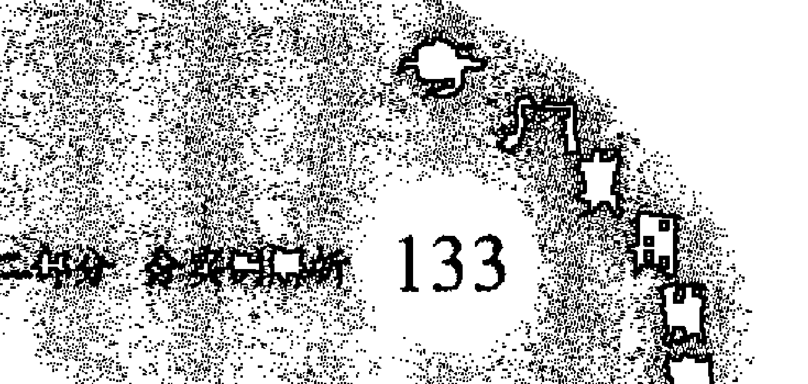

##### 分析依据

- 1. 押解人犯无险：辛为罪犯落坤二宫，临生门为盗窃财物而犯罪。开门为值使门、为押解人落巽四宫旬空，戊戌日为五月三十日戊辰相冲将巽宫辰冲实，押解人即可出发。值使开门宫属木克罪犯辛宫土，押解必顺利。
- 2. 到安徽后对方提额外条件：安徽在石家庄的东南方，正好东南方巽宫和时干同宫，宫中丙加癸为"华盖悖师"小人陷害，灾祸频生，壬加癸为"幼女奸淫"主家有丑声，故断对方要提额外条件，才让押回人犯。
- 3. 六合为逃犯落震三宫属木，宫中惊门主官讼凶事，天盘戊在三宫为六仪击刑，必遭刑罚。伤门为刑警落兑七宫属金，上乘九天利出击抓捕。现伤门宫克六合宫，逃犯必抓住。
- 4. 罪犯衣服的着色：以玄武为小盗，以该宫的天盘奇仪为上衣着色，地盘奇仪为下衣着色，现玄武落坎一宫，天盘丁为红色上衣着色，地盘乙为绿色，落坎宫故断深色裤子。
- 5. 应期：值使开门，所临天盘奇仪为应期，现值使开门临壬，白虎也为公安，艮宫白虎临马，壬寅日马星当令即动，所以断壬寅日既七月四日可抓住罪犯。

## 嫌犯溜之仓皇，必会自投罗网

1996年9月28日，因涉嫌一起诈骗案，石家庄市公安局某分局干警王某和彭某身着便服，来到石家庄市物资贸易中心楼下租赁给个体户朱某的柜台前，想诱其出门，然后将其带走，于是就对朱某说："有点生意，想请你谈谈，出去谈好吗？"
"好，你稍等一下。"
朱某放下手头的活，就随二人一起出来，徐某、彭某二人在前，朱某在后，快走到门口时，朱某忽然警觉起来，暗自寻思："店里的人并不多，谈生意干嘛非要把我叫出门外，莫不是……”
他这么一想，转身便撒腿往楼上跑，徐、彭二人也穷追不舍，谁知，追到楼上后，就不见了朱某的踪影。朱某此时利用他对地形的熟悉早已逃之夭夭。
无奈，徐、彭二人只好到楼上中心保卫处找我：“杜处长，刚才我们着便装到楼下来传唤在你们这租赁柜台的个体户朱某，谁知朱某跑掉了，请你们配合一下，让他的家人把他找回来。”
我问徐：“什么事？”
“诈骗案涉及到了他。”
“你们暴露身份了吗？”
徐答道：“没暴露。”于是，他二人把事情的经过叙述了一遍。
我听完情况马上派干事小徐去到楼下找朱某。等候期间，干警王某和彭某让我预测今天能否抓住朱某，我当即起局，依奇门局说：“第一，能抓住；第二，朱某一会儿就回来，而且是自投罗网。咱们在这张网等待就行了。也检验一下奇门遁甲准不准，古书上是这样写的，反正我预测也不会影响你们执行任务。”
果然，17时50分朱某在家人的陪同下到了保卫处，原来朱某预感来人是公安机关的，有点害怕，就从后门跑了，保卫处干事小徐到柜台找其家人说保卫处找小朱，他家人无奈，只好打传呼让朱回来。干警向他出示了传唤手续，把朱某带走了。

##### 奇门格局

1996年9月28日17时30分
丙子年丁酉月戊辰日辛酉时，阴六局，甲寅旬，天蓬星值符，休门值使。

| 九天 | 九地 | 玄武 |
|------|------|------|
| 生门丙 | 伤门辛 | 杜门庚 |
| 天任星庚 | 天冲星丁 | 天辅星壬 |
| 直符 |  | 白虎 |
| 休门癸 | 己 | 景门丁 |
| 天蓬星辛 |  | 天英星乙 |
| 腾蛇 | 太阴 | 六合 |
| 开门戊 | 惊门乙 | 己死门壬 |
| 天心星丙 | 天柱星癸 | 天芮星戊 |

##### 分析依据

- 1、为什么断人能抓住？
预测抓捕逃犯以伤门为干警，六合为逃犯，现伤门落离宫属火克六合乾宫金，逃犯能抓住。

- 2、为什么逃犯自投罗网？
六合为逃犯，宫中死门加天盘壬主讼人自讼，自投罗网，另外，时干辛与伤门同在离宫，时干克六合逃犯当下被擒。

#### 运用奇门攻心，击溃对手防线

面前的这个对手实在难以对付，不由得让我一阵一阵紧皱眉头。公司财务部负责人刘某有贪污嫌疑，总经理办公会决定由我正面找其谈话，弄清问题后将其免职。这事说着容易，实施起来有着相当的难度。

刘某，女性，42岁，个头高大，头脑灵活，伶牙俐齿，非寻常之辈。她在其它单位曾任过财务科长和审计科长，如何做账富有经验，如何对付查账也有手段。

而我调来仅仅4个来月，对公司、刘某并不十分了解。偏偏公司办公会又将这棘手的任务压给了我。怎么下手？虽然领导已多次催促，但证据不足，总觉得时机不成熟，所以行动方案迟迟难定。

1997年12月1日，刚上班，总经理突然对我说：“一会儿新财务负责人就来报到，你安排一下，今天就让刘某向他交班。下午3点30分，召集财务部开会宣布，散会后你与刘某谈话，具体做法由你来酌定。”

这事虽在意料之中，但也未免来之过急。

“不急不行啊，财务上绝对不能出一点问题，时间再拖，可能会出别的大问题。”总经理的顾虑是有道理的。这么大的家业马虎不得。

一上午，工作上的急事还挺多，几次想起局预测，但都被其它的事情打断，直到下午2点多才将局起好，真是不测也着急，测了更着急，局上显示：因目前证据不足，刘某不会交待问题，麻烦不会小。

这给我带来很大的思想压力：我与刘某都是部门负责人，对方掌握财务大权，如果查出问题，话还好说，如果查不出问题，刘某可不是好惹的，我如何收场？如何站得住脚？可我又不能不执行经理办公会决定。今天下午就是正面交锋的最后时刻。对我来说，背水一战，只能取胜，不能失败。话是这么说，可到现在也没有一个过硬的证据做炮弹，我心急如焚，如何取胜呢？

想起古时兵法所说：“知己知彼，百战不殆”，于是我把办公室的门反锁住，静下心来，刘某和我各处于什么状态呢？我再一次仔细研究奇门格局，得出如下结果：

- 一、刘某确有贪污行为，且为屡犯；
- 二、我方尚不掌握其确凿的贪污证据；
- 三、刘某态度顽固，不会主动交待；
- 四、局上显示利攻方不利守方，我必须采取攻势，从战术上看，我的战术对头，对方战术失利；
- 五、今晚11时前，刘顽抗，11时后方始交待；
- 六、11时后刘会交出赃款；
- 七、最终结果，刘某卷铺盖走人，离开公司。

局虽如此，仍有不利于我之处，不禁暗犯嘀咕，但时间紧迫，不容多想，以防万一，果断决策，召集有关人员战前分析，大家都感到骨头难啃，也拿不出好办法，我只好依奇门指导我今天的行动了。

下午3点30分，财务部全体会准时召开，新负责人上任，4点10分散会。

按计划自4点50分开始，由我和新调入的小徐在2311房间找刘某谈话，我主谈。先由聊天拉家常开始，看似轻松实际很艰难，半个小时后，刘某憋不住了：“杜部长今天找我看来是有事啊？”

“是有事，主要是了解一下，你有没有违犯财务纪律的事情。”语气坚定，但口气较缓。

“噢，照杜部长的意思，我是有什么问题啦？”真是听话听音，她的反应很快，反问是话带锋芒，我知道较量开始了。

“有问题没问题要问你自己，最清楚的还是你。”我的话象闪着寒光的利剑，形成一种威严的气势。

“我有什么事，请杜部长指出来吧。”她自以为很老练，语气中以攻为守。

“自己的事还是自己说出来好，你好，我好，大家好，如果让我说出来，我们也不会以这种方式与你谈话了。”会用什么方式，办法自然很多，想必她也明白。

沉默，刘某开始沉默。从晚上6点前开始，一直到晚11点，刘某一小时也说不了两句话，并摆出满不在乎的神态。沉默并不是平静，而是一种无声的较量。她不急，我也不躁，但依局所示，我必须不停地进攻，因此从6到11点我一直对她进行政策攻心，并不急于求成。

晚11点，照局上所测，刘某精神将会败退，看时刻将近，我开始了新一轮的进攻：“老刘，你印过财务凭证吗？”
“印过。”她随口回答。
“多少钱一本？”我问。
“可能是3.6元一本吧？”好象记得很清楚又不太很清楚。
“还需要我往下问吗？”
“这有什么问题？”她看了我一眼，目光很快避开了。
我知道刘某贪污但证据不足，刘某做贼心虚也不知我的底，真是麻秸秆打狼，两头怕。我只能采用“引而不发”、“含而不露”的策略，不停地发起攻击。
“哎，40多岁的人啦，没有问题我问你干什么？”
又是一阵沉默，刘某开始泄气了，低着头不吭声。
“说吧，谁先找的谁？”
“……是一个熟人介绍的，我先找的印刷厂……”
刘某开始交待吃几千元回扣的问题，别的问题我们无证据，她也闭而不谈。0点40分，谈话结束，刘某从办公室的柜子里交出了所得赃款。白纸、蓝字、红手印手续一张，我松了口气。
钱一到手，我立即给总经理打电话汇报。总经理说：“好！干得漂亮，我怎么也睡不着，手机一直开着，等待消息，真怕谈不成出麻烦，财务主管搞贪污，这是一颗定时炸弹，说不定什么时候就爆炸了，这回消除了一个大隐患。”
第二天，我们迅速调查取证，正面落实了她印凭证时在厂加价吃回扣的证据。12月5日，她被辞退了。

##### 奇门格局

1997年12月1日14时10分
丁丑年辛亥月丁丑日丁未时，阴二局，甲辰旬，天柱星值符，惊门值使。

| 太阴 | 螣蛇 | 直符 |
| :--- | :--- | :--- |
| 惊门庚 天英星丙 | 丁开门戊 天芮星庚 | 休门壬 天柱星戊 |
| 六合 死门丙 天辅星乙 | 丁 | 九天 生门癸 天心星壬 |
| 白虎 景门乙 天冲星辛 | 玄武 杜门辛 天任星己 | 九地 伤门己 天蓬星癸 |

##### 分析依据

- 1、刘某确有贪污行为，而且是惯犯：
刘某和我是同事关系，取月干辛为用神、为刘某，辛落坎一宫，上乘玄武。玄武主盗贼，玄武临辛为惯犯，说明刘某既有贪污行为又是惯犯。

- 2、刘某贪污的证据我方没掌握：
六合为证据落震三宫，现甲辰旬，寅、卯宫旬空，六合在三宫，该宫空亡，主没有证据，或证据没落实。

- 3、刘某不会轻易交待问题：
辛为刘某落坎一宫，乘玄武为能言善辩，逢杜门主保密，在这里主守口如瓶，不交待问题。再者杜门逢丁、己、癸为地遁吉格宜秘密行事。
我的阻力大是因，丁为日干、为我本人，丁也为时干主事体，现落离九宫，宫中丁下逢庚，庚为阻力，故断撬开刘某的嘴，难度很大。

- 4、该局利客，我战术也对头：
做事先分主客，以主客判断事情成败，九宫中天盘为客，地盘为主。天盘丁奇即为日干，又为时干，为客，为进攻方，落离九宫处临官状态旺相，地盘庚为防守方，落离九宫为沐浴败地状态。丁火克庚金，为客克主，行动利客，也就是说，这次谈话，谁为客谁胜，谁主动进攻谁胜，做事先动为利，耀武扬威，从气势上压倒对方。

以胜负论，开休生三吉门，我据开门击冲对方，应有利于我。

景门主战术落艮八宫属土，与日干宫火相生，战术对我方有利。景门宫艮土克月干辛落宫坎水，对方防守策略不对头。

- 5、刘某晚11点后才交待：
辛为月干为刘某，六甲中的甲午隐于辛下，甲午辛落坎宫形成与地支子相冲，夜11时为子时，甲午辛被冲起，故断刘某11时后交待问题。另外，时干丁主事体主谈话，虽逢庚为阻力，上乘螣蛇主缠绕，但时干逢开门主最终刘某必交待，待到子时冲午火，大门洞开，刘某交待问题。
甲子戊为资本，为所得赃款，落离宫为9数，辛落宫为水克戊落宫火，说明刘某不再保存赃款，要交出来，戊下临庚，也主钱要变换地方。11点后交出来是子时冲戊落宫午火所致。

- 6、最终结局是离开本单位：
辛为刘某落坎宫受冲，冲必动，辛宫克开门宫主刘某要离开单位了，辛加己主自感不能在公司工作了，必然要离开本单位，地盘月干辛上乘乙奇落艮八宫，形成乙加辛“龙逃走”之格局，也主离开公司。庚为处分落巽宫不克辛落宫，辛落宫又不带庚，所以不会给其处分，只能一走了事。

- 7、我是怎样选择谈话方位的？
打仗讲究选择有利时机和有利地形，我没有选择时间的条件了，只有选择地利了。2311房间的大沙发位于房间的北侧偏东，刘某如坐沙发西侧，则为正北方，属子位。如坐东侧则为东北方属艮位。现是亥月水旺，坐北方助她，如坐艮方，亥月土处休囚对其不利。
我如按原椅子位置坐离位，亥月水旺火死，水来克火，利彼伤我。我坐东南巽位属木，亥月木处于相地，又巽木正克休囚之土，所以我选在巽位，安排刘某坐在艮位。交锋时利我伤彼。

### 四、出行吉凶

> 远行虽然平安，琐事麻烦不断

都说欧洲风景优美，经济发达，我早就有这个愿望，到欧洲旅游一趟，只是没有机会。

2000年11月，受某公司邀请，我们一行七人组团到欧洲旅游，出发前自然要预测一下出国是否平安，途中是否顺利。因为工作太忙，只是大致看了一下，预测结果共四条：

- 一、一路平安，没有危险
- 二、乘飞机时会晚点起飞；
- 三、途中不顺，遇官非口舌事，并有雨；
- 四、遇有小偷且要丢东西；

预测结果让我既高兴，又犯难，高兴的是途中安全，不会出危险，犯难的是途中要遇小偷，还要偷我们的东西。这预测结果我是告诉同伴呢？还是不告诉？要是告诉大家，万一测不准，这是给大家添堵，扫大家的兴，要是不告诉大家，又怕真的丢了东西，落埋怨，左思右想，还是只告诉了领队的团长，但是领队并没有在意。以后途中所发生的情况和预测结果完全一致。

我们20日从北京乘飞机第一站到法国巴黎，正点飞抵，法国周易研究会的同行们还专门为我接风。在巴黎游玩三天，22日晚，按行程安排，大家看文艺演出，我因应邀与巴黎周易同行交流周易研究经验而没去看演出，当晚也没与大家再见面。

第二天，也就是23日早上，按约定在大厅集合，一见面，只见他们个个绷着脸，谁也不说话，要按往常，早就开起玩笑了，今天不知怎么了。我问有什么事吗？其中一人就说了：“丢东西了。”
“丢什么了？”我问。
“两个照相机。”邯郸分公司老总答。
原来，到剧场后，人们下车进了剧场，所带的照相机等物都留在了汽车上，由司机负责看管，司机去了一次洗手间，只十分钟时间，车窗玻璃就被小偷砸了，小偷翻窗而入，偷走两个提包，内有两架相机及杂物。

不高兴的事还在后边，旅程是23日早8:30从巴黎乘飞机到德国慕尼黑，大家按当地导游的安排，8时正上了中巴车，汽车在向机场行驶的途中，塞了十几分钟的车，等赶到机场时飞机刚起飞，只好改签下午14时多的班机。白白在机场候机厅等了半天。

到慕尼黑后，连两天都下小雨，24日早上在等汽车外出时，大家围着我问我以后还丢东西吗？我预测后立即对大家说：“你们听好了，今天还要丢东西，咱们七个人都在场，可别再埋怨我不告诉你们！”

这一天旅游，大家都手不离相机，钱也把的紧紧的，到了傍晚，司机师傅说要调换一下汽车，时间不长，换了一辆中巴，等我们到饭店吃饭时，邯郸分公司的李总突然说：“怎么找不到照相的三角架了？”中巴车也不大，找了好几遍就是找不到，李总问司机是不是刚才换车没有把三角架倒到这辆车上，司机说都装上了。司机师傅是个60的中国人，移居德国已30多年，这时他说话了：“一个三角架不就值二、三十元嘛！”李总一听就急了，冲着司机吼道：“什么二、三十元，这是带遥控的，一千多块钱呢，肯定换车时没装上。”老头一脸不服气，也不敢吭声，老总非让去原来的车上找，司机只好开车拉着李总去找三角架。这车一开走，不知谁说了一句：“今天没出门，杜总就算了，今天还要丢东西，看看，轮到老李了。”大家“轰”一声都笑了，冲着我开了一通玩笑。

这回到原车上找东西本是个简单事，来回用半个小时就足够了，可这老同志却用了两个多小时，总算在车座底下找到了，返回时，在慕尼黑开了三十年车，回来楞是找不到我们所在的餐馆。

再说在餐馆吃饭也不顺当，当地的导游是中国女孩，为了想多赚点钱，退了预定的餐馆，带我们去了一家小餐馆，但没预订。等了两个多小时才吃上饭，吧台上摆了一排中国酒盒，却是空瓶，上了一个菜就上米饭，大家让老板按中国的用餐顺序，先上菜后上饭，女老板说：“德国就是这个上法。”大家气得一顿乱话，老板讲：“这是德国，你们再吵我就叫警察了。”这一说不要紧，气得大家真的跟板吵了起来，谁也没吃好这顿饭。全程十五天，和我预测的完全一致。

##### 第一个奇门格局：

2000年11月19日10:50
庚辰年丁亥月辛巳日癸巳时，阴五局，甲申旬，天冲星值符，伤门值使。

| 螣蛇 杜门丁 天任星己 | 值符 景门庚 天冲星癸 | 九天 死门己 天辅星辛 |
| :--- | :--- | :--- |
| 太阴 伤门壬 天蓬星庚 | 戊 | 九地 惊门癸 天英星丙 |
| 六合 生门乙 天心星丁 | 白虎 休门丙 天柱星壬 | 玄武 戊开门辛 天芮星乙 |

##### 第二个奇门格局：

2000年11月24日6:57
庚辰年丁亥月丙戊日辛卯时，阴八局，甲申旬，天心星值符，开门值使。

| 太阴 辛生门丁 天芮星壬 | 螣蛇 伤门己 天柱星乙 | 值符 杜门庚 天心星丁 |
| :--- | :--- | :--- |
| 六合 休门乙 天英星癸 | 辛 | 九天 景门丙 天蓬星己 |
| 白虎 开门壬 天辅星戊 | 玄武 惊门癸 天冲星丙 | 九地 死门戊 天任星庚 |

##### 分析依据：

###### 对第一个奇门局的分析：

- 1. 为什么说乘飞机会晚点？
该局八门伏吟，主迟缓，时干癸主出国这件事，现落兑七宫，时干癸上乘九地，也主迟缓，故断飞机要晚点。

- 2. 为什么断出国平安？
日干辛为本人落乾六宫，宫中逢开门之吉门主平安，辛加乙虎猖狂，这里应断离家远行。

- 3. 为什么断出国不顺，有口舌是非事，且还会下雨？
伏吟主远行不顺，时干癸落兑七宫，加地盘丙为悖格，悖格主此行遇麻烦事，临惊门主口舌是非事，有雨是因天柱星落坎宫，坎宫中有壬，必有雨。

- 4. 为什么断要遇小偷，还要丢东西？
日干辛落乾六宫，上乘玄武，玄武主小偷，又逢开门，玄武逢开门说明小偷必来，八门伏吟主破财，故断小偷会偷走东西。

###### 对第二个奇门格局的分析：

###### 为什么又断还会丢东西呢？
时干辛主事体，落巽四宫，现入墓，主在丢失物品上遇有麻烦，生门落巽四宫，主阴谋、破财，上乘太阴也主有个暗算，故断还要丢东西，实际是司机换车时没把三角架倒到另一辆车上去，和遭人暗算一致。

#### 出国发财心切，黄粱一梦方醒

王某是某医院的针灸大夫，不久前碰上一桩美事：有一个做国外生意的大老板，邀请他以专家的身份到欧洲去发展。这可是个千载难逢的好机会，为了增加信心，探明前程，王某兴冲冲找上门来：

“杜部长，你给咱测测这次出国会有什么结果吧。”王大夫的心情可以理解，出国意味着能力和机遇，收获的将是财富和荣誉，是多少人梦寐以求的好事，说实话我也为他高兴。

我起好局，提笔预测，仔细一分析，倒吸一口凉气，这可不象王大夫说的那么美：“情况糟得很，要半途而废，一无所获，我看你还是不去为好。”这样的格局显然大出意外，但局中明白所示，我只好据实相告。

王大夫火热的心情犹如泼上一瓢凉水，情绪激动起来：“怎么会糟糕得很呢？别人出国都能名利双收，遇到我就不行了吗？”

我劝他冷静下来，并让他详细地把情况说一说。原来省健身娱乐器材公司组团20人，到欧洲的南斯拉夫首都贝尔格莱德开个商店，公司已经到那里进行过考察和论证，认为有利可图，招聘了四位医生，签了如下合同：由老板负责他们在南的吃、住和路费，每月月底薪400美元，若有营利再提成8%。按说“旱涝保收”应该是没问题的。我给他预测的情况不妙，自然他会难以接受。

但是我相信我的预测，再次告诉他：“你出国是为挣钱，可是格局上显示你挣不了钱，事情不会很顺利，干不了几天就得回来，还是小心为妙，决不能去。”也许是出国的诱惑力太大了，这种机会岂能错过，王某不放心接着又问：“什么原因？是有危险？还是有什么其它不好的事？”

“从局上看，你们乘飞机去不会有什么危险，只是到了目的地，目的达不到：或开店不顺，或开店不成，即使开了店也得赔钱，老板赚不到钱，你们又怎么挣钱？”我自己都感觉到冷水浇得有点多了。

没想到王大夫不肯放过这个机会，似乎在权衡着利弊：“只要人没有危险就行。老板已经进行过考察，我们只管打工，并签有合同，他开不成店也得给我们开工钱，他不赚钱，顶多那8%的提成挣不成。”

“出门和求财就怕反吟局，可现在你恰恰就是个反吟局，当然这还只是格局的显示。另外实际情况也说明：南斯拉夫战火连天，局势不稳，也不是一天两天了，因此我的意见供你参考，你在国内不是也挺好吗，何苦到国外受那份洋罪？我说的不少了，大主意你自己拿。”我也够苦口婆心的了。

王大夫九牛不回：“老板也是中国人，再不济，工资得给我开吧。说到打仗，电视上报导，别处打，首都不是还没打嘛。”看来我的劝说失败了。

几天后，我给王大夫家打电话，还想劝他不要去，但是他已经远走高飞了。

一连三、四个月没有消息。忽然有一天省某医院的一个医生问我：“你听说王某的事情了吗？”我说：“他不是到南斯拉夫挣大钱去了吗？”
“嗨！回来了，狼狈而归。一分钱没挣着，差点还回不来了，可让人家给坑苦了。幸亏他还会点气功，给咱们国家驻南斯拉夫使馆的一个工作人员治了治病，人家帮助他把护照从老板手里要了出来，然后才跟着人家回国了。听说其他人状况都很惨，想回都回不来。”

得到这个消息，我主动给王大夫家去电话询问，王大夫是争强好胜顾脸面的人，不肯多说。过了一段时间才向我稍稍透露：

原来他们南斯拉夫之行是私人组团去的，本打算去开饭店和中医门诊部，但是租的饭店不景气，每天营业额只有1000个第纳尔（含人民币1400元），要想保本，营业额必须达到7000第纳尔才行。仅仅一个月就垮了。想开中医门诊部，贝尔格莱德有关方面不批准，老板又不会让他们白吃白喝，就让他们几个医生和搞声乐的人都去洗盘子，当服务员。这些人哪干过这些活，但异国他乡，举目无亲，身不由己。不干又不行，遭白眼挨骂是常事。不想干，想回国，没那么简单，去的时候一下飞机老板就把护照全收走了。用王大夫的原话说：“在国内，老板说得挺好，让我搞气功，他花钱把我吹红了，挣钱就挣老了。谁知到了国外，尽让我端盘子、洗碟子，真他妈不是玩意儿。这小子就别想回国，我已经报告公安局了，公安局说他早就是挂号人物，只要他一回来，马上就抓他。”

王大夫还告诉我：“我回来后听说店垮了，老板也跑了，我们当中只回来4个人。嗨，黄粱梦一场啊！”

痛苦而又惊险的经历，让王大夫彻底服了气。

##### 奇门格局

1997年7月27日18时

丁丑年丁未月庚午日乙酉时，阴一局，甲申旬，天任星值符，生门值使。

太阴 | 螣蛇 | 值符
惊门壬 | 开门戊 | 休门庚
天心星丁 | 天蓬星己 | 天任星乙
六合 | | 九天
死门辛 | | 生门丙
天柱星丙 | 癸 | 天冲星辛
白虎 | 玄武 | 九地
癸景门乙 | 杜门己 | 伤门丁
天芮星庚 | 天英星戊 | 天辅星壬

##### 分析依据

###### 1、为何断到南斯拉夫开不成店？

测开店就怕开门空亡，现开门落离九宫，正逢空亡，宫中甲子戊为旺表示投入资本多，上乘螣蛇和天蓬星，表示该店要赔本。开门宫属火，丁奇年干为老板落乾宫属金，开门店铺正克老板，老板逢伤门临马星，说明赔了钱就跑。

###### 2、出国为何挣不到钱是怎样断的？

该局九星反吟，反吟主求财不得反蚀本，即使有宝也难留。出国求财遇到反吟，不要说挣钱了，去都不能去，因为出行遇反吟主半途而归。

###### 3、人乘飞机无危险是怎样断的？

开门主飞机落离九宫，日干庚为本人落坤二宫，飞机生本人，日干宫中逢休门之吉门，天任星之吉星，又上乘值符，定是平安无险。

#### 难阻出行之意，祸至追悔莫及

每个人都盼福不盼祸，都想趋吉避凶，我的战友赵景录经理也电话向我求测吉凶问题。

赵经理是河北省汽车工业贸易总公司销售一处经理，公司买了一辆桑塔那轿车，但汽车牌照却是在秦皇岛市办理的，最近为牌照手续方面的事情准备让另一个战友白庆波开车去秦皇岛处理。已经决定第二天出发，想让我预测一下去秦皇岛办事顺利否？

我按打电话时间起局预测，经过分析认为此行不顺利：汽车途中要出交通事故，特别是返回途中汽车右轮要撞坏。我立即将这一预测结果告诉了赵经理，并劝他过几天再去就能躲过凶灾事故。

因为是战友，赵经理知道我讲话是认真的，所以马上给白庆波打电话转告了我的意思，让他过几天再去。白庆波是个老司机，开车技术很好，听赵经理一说并不以为然，坚持要去，赵经理也拗不过他，只好同意，但要他必须和我联系一下。
白庆波是个爽快人，不一会儿电话就打到我家，说道：“听说你给我预测了一下，说我去秦皇岛要出事故？”
“老白，这不是开玩笑，通过用周易预测，可能回来途中要出点事。”我据实相告。
“人有事吗？”
“人没事。”
“我开了20多年车了，还能出事吗？”白庆波笑着回答，从语气中听的出，他根本不信我的预测。
“你最好别去，要去就出事故。”我仍极力劝阻。
“我小心点吧。”他听我说话认真，也认真回答。
放下电话，老白心想这周易真这么灵吗？信则有，不信则无，当过兵的人不信这一套，路上开车小心就是了。
最终老白不听劝阻，他还是去了。
从石家庄开车到秦皇岛要一天的时间，一路上小心谨慎，天傍黑，平安到达目的地，没事。
返回时，谨慎再谨慎，很怕横祸临头。车行至徐水县高速公路口时（当时京深高速公路还没全线开通），一过缴费口，白庆波一边加速一边对同车的另一个人说：“来得时候，我的战友杜新会用周易预测我会出事故，净胡说八道！回去后我得教训教训他！”话音刚落，因正是转弯处，地面有散落的沙子，车速又快，方向盘不听使唤，汽车直朝高速公路的铁护栏上撞去，“砰”的一声，整个右轮胎报废，胎箍都变了形。俩人都傻了眼，晃晃脑袋，蹬蹬腿，人一点伤也没有。赶紧检查车辆，除轮胎以外别无损坏，于是赶紧换上备胎，一路慢行，再不敢提教训我的话了。

回到石家庄，白庆波一见到赵经理，就说：“我算服周易了！真的出了事故。我开车20多年都没出过事，这回方向盘就是不听使唤，瞪着眼愣是撞上了，真他妈邪门了！”

##### 奇门格局

1995年3月25日20时30分
乙亥年己卯月乙卯日丙戌时，阳九局，甲申旬，天芮星值符，死门值使。

| 玄武 | 九地 | 九天 |
| :---: | :---: | :---: |
| 死门辛 天冲星壬 | 惊门壬 天辅星戊 | 开门戊 天英星庚 |
| 白虎 景门乙 天任星辛 | 癸 | 值符 癸休门庚 天芮星丙 |
| 六合 杜门己 天蓬星乙 | 太阴 伤门丁 天心星己 | 螣蛇 生门丙 天柱星丁 |

##### 分析依据

###### 1、为什么断此次出行不顺利？

测战友以月干为用神，兼看出行方向。月干己落艮八宫，秦皇岛也位于石家庄东北方，也以艮八宫分析，月干己逢六合，说明有同行人；临杜门，克艮宫主此行不顺，又主男人破财，临天蓬星也主破财；己加乙为墓神不明，地户逢星，宜遁迹隐形为利，不宜出行。日干为人，时干为事。现时干丙落乾六宫属金，日干乙落震三宫属木，时干克日干，也主出行不顺，办事不利。

###### 2、为什么断此行要出车祸？

伤门为车，景门为道路。伤门落坎宫主财名不利，景门落震宫，宫中乙加辛为凶格，上乘白虎凶灾之神，现震宫道路带凶神凶格克月干艮宫，说明途中要出车祸。去途出车祸还是返途出车祸？坤二宫与艮八宫为反吟之宫，所以返途（从秦皇岛回石家庄）看坤宫，戊加庚为飞宫凶格，庚为白虎，返途遇庚，主事故，开门加庚也主道路词讼、事故之象。又甲申旬中午、未空、坤宫正逢空亡之地，空则藏有玄机，出空恐有事故发生。

出什么样的车祸？死门、白虎主伤灾，现死门落巽四宫，白虎落震三宫均克坤二返途之宫，故而返途之中可能出事故。又坤宫上乘九天，主车，也主远途，在外盘主外地，九天在物主园状物，开门也主园状物，按九宫格断，坤为右肩，为汽车右侧轮胎要损坏。

震三宫和巽四宫也克艮八宫，去途为什么不出事呢？主要是宫中地盘有乙奇，遇奇则吉，又乙奇为年干、为太岁，故去途不会出事故。

###### 3、事故应期是怎样断的？

出空之日，当在己未日，29日为应期。

#### 旅游不听规劝，幸而有惊无险

1996年8月3日早上6点，我刚起床，还没出卧室门，就听到女儿和我爱人在说话，隐约听到要去旅游，我出来一看，女儿正在收拾东西，准备出发去旅游。我问她去哪儿？女儿说是去五岳寨，昨天晚上同学们在电话里约定的，早上6点半在火车站广场的五岳寨旅游专线站集合。

女儿大了，参加工作已经三年多了，一般的事情我不干涉，听说去百里地外的五岳寨旅游，我下意识地在手上快速起局，结论是天气有雨，还是大雨，不宜远行，若去则有虚惊事，我就劝女儿别去了。女儿问我怎么了，我说：“主要是天气有雨，你们玩不好，还要出点虚惊事。”

我这一说，女儿犹豫了，愣了一下问我：“什么虚惊事？是有坏人啊？”

不是坏人，是受惊吓，主要是天气不好，人倒是不会有危险，别去了，要去过几天再去吧。“我劝女儿最好别去。”

去还是不去，女儿为了难，站在客厅门口想了想说：“我到汽车站跟同学商量一下，那就不去了。”

可我女儿还是去了，正象预测的那样：当天上午就下了雨，因雨大不但没玩成，反而遇到了山洪，虽有惊无险，却终生难忘那可怕的场面。下面是我女儿回来后用笔描述的经过：

我到了车站跟同学们一说爸爸的预测结果，大家都扫了兴，也没了主意，同学王丽香说：“到五岳寨玩不了，咱们就找个地方野餐一顿就回来，要不买了这么多东西，回家怎么办呢，那就太扫兴了。”她这么一说，几个人都同意，我也没了主意，只好与同学们一起出发了。

路上，同学们有说有笑，我也把爸爸的话给忘到九霄云外了。

汽车开到半路天就下起了蒙蒙细雨，但并不影响我们的勃勃兴致。三个小时很快过去，来到山脚下，放眼望去，满山的青翠，山石被雨水冲刷的闪闪发亮，河道里的小溪清凉透明。雨越下越大，我们穿好雨衣，打上雨伞，开始往山上爬，可刚到半山腰，台阶上的雨水象小溪一样从山上流下，越来越大，越过鞋面冲下山去，同学们只好扫兴而归，住进了山下的旅馆，直到第二天下午，雨一直也未停，河道里雨水夹着泥石拍打着石块，发出“轰”的声音，使人越发的心焦。下午三点钟了，事先预定接我们的车还没有来，没办法，同学们只好坐了一辆大客车返回，客车行驶了不到两公里，山坡上滑下的石头、大树挡在公路上，已经有人去搬树了，我心想要是车正走着，有石头和树砸到车上就惨了。汽车继续前行。在绕行一块大石头时，路边的土被雨水泡软了，汽车前轮滑下了路边，车身一下子就倾斜了，全车人心提到嗓子眼，幸好车撞到了路边的一棵树上熄了火。无奈，我们只好换乘一辆小中巴，行驶到一座小桥中间时，河水已漫过桥面，溢进了车厢，拖鞋都漂起来了，同学们惊叫着站了起来。就在这时，车熄了火，男同学们都冒雨下去推车，总算过了河，中巴车却趴下开不动了。这时，见到了原定来接我们司机，他说过河时车坏了，他没修好，正要去找人修，一个小时车还没修好，上不着村，下不着店，周围一片漆黑，只听到洪水冲刷岸边的声音，同学们都害怕了，只有我心里还有点数，因为爸爸给我说有惊无险。这时，有一辆小中巴路过，我们拦下了这辆车，司机说是救灾车，正准备到上游救人，说上面村子已经冲下三个人，这时我们才意识到这是在发洪水。半小时后，司机把我们接到附近一个小村庄，我们在村里的小卖部买了水和饼干，挤在车里过了一夜。

第二天，我们坐的小中巴还没修好，司机又把我们转给了一辆老式大客车，行至一座桥时，我们停下了，浑黄的河水已漫过桥身，漫上了公路十几米，过往的车辆都被拦在那里，许多乘客都下来围在那不知怎么办才好，当看到我们的客车底盘很高，车又大又稳时，都纷纷要求坐我们的车，一下子车里挤满了四十多人。半小时后车开始过河了，河水很快漫过了车底盘，坐在车里能听到汽车逆水而行的声音，可以看到近一米高的桥栏在水里只露出十公分高，突然车猛的向右晃了一下，撞了一下桥栏，紧接着又向左晃，车上两个年轻力壮的司机吃力地在打着方向盘，原来，刚才桥左边有一辆拖拉机撞坏桥栏，斜停在桥上，司机想躲拖拉机但洪水太猛，打不过方向盘，左躲右闪地总算没让洪水把车冲下桥去，使我们闹了一场虚惊。

车刚过了桥，我们回首望去，不远处一棵大树顺流而下，我们庆幸刚才有惊无险，否则连人带车也要去和那棵大树作伴去了。眨眼间洪水又涨了许多。后边的七八辆中巴车和一部分乘客眼看着我们的大客车远去，谁也不敢再过河了。

汽车越开路越好走，但每个人仍心有余悸，中午12点，我们平安地回到市里，一到家，我的第一句话就是：“可把我吓坏了，总算到家了。”

这场雨持续了几天，形成了河北省50年一遇的特大洪水，给全省几十个县市造成了巨大损失。

##### 奇门格局

1996年8月3日6时

丙子年乙未月壬申日癸卯时，阴一局，甲午旬，天柱星值符，惊门值使。

| 太阴 | 螣蛇 | 值符 |
|---|---|---|
| 杜门己 天英星丁 | 癸景门乙 天芮星己 | 死门辛 天柱星乙 |
| 六合 伤门丁 天辅星丙 | 癸 | 九天 惊门壬 天心星辛 |
| 白虎 生门丙 天冲星庚 | 玄武 休门庚 天任星戊 | 九地 开门戊 天蓬星壬 |

##### 分析依据

- 1、测出行，忌伏吟，该局就是八门伏吟，八门主人事，出门必不顺，旅游玩不好，伏吟不动为宜。
- 2、日干壬为出行人落兑七宫，壬加辛为螣蛇相缠，不得安宁。宫中惊门值使伏于本宫主忧虑惊疑，惊门加日干壬主官司囚禁，被困之象。时干癸落离宫克日干兑宫不利出行。
- 3、天蓬星主雨落于所去之方乾宫，逢九地、开门和壬主大雨之象。所去方乾宫中，天盘戊入墓也主有麻烦事情。
- 4、人无危险的依据是所去之方为西北乾位与日干兑宫比和，故不会伤及人员。且宫中逢开门吉门，九地吉神应断人员平安。

#### 国外平安无险，早知航班误点

中国联通河北分公司办公室的刘主任定于1997年9月8日到意大利，参加意达太尔公司组织的高级管理学习班，他担任团长，成员十人。8月26日一上班，他就来到我的办公室让我预测一下此次出国安全如何。我起局后对他说：“平安无事，但要延误时间。”

“你说的这延误时间具体是指什么？”虽无大碍，刘主任仍不放心。

“飞机的问题，不能按时起飞。”我回答。

“飞机的问题？不会从中途掉下来吧。”飞机不比汽车，有问题可以停在一边修理，但要从天上掉下来，就不是“平安”的问题了。

“不会，你放心去吧，真要是晚了点，你别太着急就行了。”我很肯定地告诉他。

“只要不出事，晚不晚的没关系。”刘主任放心地离去了。

后来那天的事实果然如此，去时飞机迟飞两个小时，什么原因不清楚。9月17日返回时，因北京飞往罗马的飞机起飞前发现故障，没有按时起飞又延误了7个小时。

##### 奇门格局

1997年8月26日8时40分

丁丑年戊申月庚子日庚辰时，阴四局，甲戌旬，天冲星值符，伤门值使。

| 太阴 | 螣蛇 | 值符 |
|------|------|------|
| 惊门辛 | 开门癸 | 休门己 |
| 天蓬星戊 | 天任星壬 | 天冲星庚 |
| 六合 | | 九天 |
| 死门丙 | | 生门戊 |
| 天心星己 | 乙 | 天辅星丁 |
| 白虎 | 玄武 | 九地 |
| 景门丁 | 乙杜门庚 | 伤门壬 |
| 天柱星癸 | 天芮星辛 | 天英星丙 |

##### 分析依据

###### 1、为什么断到意大利去平安无事呢？

日干庚为预测人落坎一宫，宫中庚加辛为“白虎干格”，远行车折、惊死，宫中又有天芮凶星，应是出事故之象，但我大胆地断平安无事，这是因为宫中有乙奇，杜门为平门，门宫相生，应不会有大事故。更主要的是出行要看出行方向，意大利在我国西方，应以兑宫来看，兑宫中有生门门之吉门，且门宫相生，天辅吉星，九天吉神，又有戊加丁“青龙耀明”之吉格，该宫又生日干宫，必无凶险。再从航线上来看也是吉，九天主航线，落兑宫，宫中皆是吉，也是平安之象。

###### 2、为什么断飞机要延误时间呢？

时干庚主事体落坎一宫，宫中有凶格、凶星、必有不顺之事，什么地方不顺呢？坎宫中逢杜门主迟缓，乘玄武暧昧之神，故断此次出行要延误时间。

## 寻踪觅人

#### 家女外出未归，追遇人犯拐卖

石家庄市物资贸易中心综合处副处长吕巨是个热心肠的人，1996年7月15日找到我说：“保健用品商场的李经理说有个朋友的女孩是本市人，19岁了，到燕春饭店前的劳务市场去找工作，好几天了不见人，可能失踪了，你能给测测吗？”我出于同情，很爽快地说：“行，你让那个经理来吧。”于是吕处长就主动找到该经理说：“我们中心的杜处长学周易测得挺准，你去给小孩测测吧。”该经理说：“我不信这一套。”

吕处长回来告诉我对方说的话，我听了笑了笑说：“不信？咱们现在就给他测一测。”按当日10:40时起局预测，只三四分钟便预测完毕，对吕处长说：“小孩被两个人贩子骗走了，是坐一辆红色摩托车走的，人被卖了，价钱在4000元左右，人在东边，生命没危险。你把这话告诉那个经理，看他信不信。”

下午，吕处长照原话对那个经理说了，那经理听后惊讶地说：“这么厉害，你快领我去见见这个人。”

李经理个不高，黑黑的，两眼挺有神，一脸恭敬的样子，找到我办公室，见了我说：“杜处长，对不起，我对你不太了解，我对周易也不懂，上午有事也没来，吕处长一说我赶紧来了。丢的这个孩子是我外甥女，请你再给测测说详细点吧。”

我仍以原局说：“小孩是被两个人骗去的，人现在在东边80里或300里远的地方。中间可能还要被转卖一次，如卖两次的话，一次卖3000元左右，一次卖4000元左右。小孩在外边有点害怕，想跑跑不掉，但人安全。罪犯也能抓住。小孩回来的时间可能长点，应在8月上旬，具体说应在8月9日戊寅日回来。”

该经理听后说：“你测的还挺准。我所了解的情况和你说的差不多，这个事已报案了，公安局工作也有进展，是两个人贩子干的，现在已经抓住了一个，红摩托车也扣住了。小孩被骗走后先以3000元卖给藁城一个27岁的农民，因小孩哭闹，那一家又转手以4000元卖给衡水枣强县农村的一个农民。现在公安局和家里人已经去枣强两天了。只是你说8月9日回来，我觉得不会那么长时间吧？”

“我是以奇门断的，到底什么时候回来看结果吧。”我回答。
事实是公安局和家人到枣强以后，农民把人藏起来了，不给钱不让见人，耽搁时间长，经当地公安机关鼎力相助于8月9日才把人解救出来。

##### 奇门格局

1996年7月15日10时40分
丙子年乙未月癸丑日丁巳时，甲寅旬，阴八局，天冲星值符，伤门值使。

| | | |
|---|---|---|
| 太阴 生门丙 天蓬星壬 | 螣蛇 伤门戊 天任星乙 | 值符 杜门癸 天冲星丁 |
| 六合 休门庚 天心星癸 | 辛 | 九天 景门壬 天辅星己 |
| 白虎 开门己 天柱星戊 | 玄武 辛惊门丁 天芮星丙 | 九地 死门乙 天英星庚 |

##### 分析依据

###### 1、为什么说人被骗卖到东边了？

时干丁奇为失踪之女孩，惊门为官司又上乘玄武，临辛为罪犯，故断被骗，玄武逢辛为惯犯，所以是人贩子拐骗走了。丁落坎宫火入水乡主凶，天芮星为大凶星，未月为相更凶，惊门主受惊吓，时干丁下临丙奇，丙为天威，又为男人。时干坎宫空亡又乘玄武为变换地点和再转卖。坎宫中门宫相生又有丙奇，不会有生命危险。

方向：六合为失踪人方向，在震宫所以断在东方，震属木，数为三、八木，故断80里或300里的地方。

被卖钱数：第一次被卖3000元是因值使伤门主事体落九宫，宫中戊为钱财下临乙奇为与女人有牵连之财，离为三、九数，未月伤门入墓不旺断3000元。

第二次被卖4000元是时干下临丙，丙为第三者，事情必与丙有关，天盘丙飞临巽四宫，宫中天蓬星为大盗，生门又代表钱财，四宫代表四数为4000元。

该女孩想跑跑不出来是这样断的，女孩被卖与人为妻，从婚姻关系看，乙为女，庚为男，乙落乾宫克震宫之庚是女孩不从。乙奇临马星想逃跑，但乙在乾入戌墓，临死门被关押所以断想跑但跑不了。

###### 2、为什么说是两个人贩子骑红色摩托车把人骗走了？

玄武为罪犯在坎宫临辛为惯犯，惊门为二数断两人。

值使伤门主车，在离九宫主红色，伤门未月休囚必是小型车辆，断为红色摩托，伤门车上乘腾蛇主奴仆拐带，断摩托车把人带走了。

###### 3、能破案：

白虎为公安落艮八宫克玄武人贩子坎宫。另外局中三宫中有庚加癸日格也必破案，杜门为罪犯躲藏方向宫中有天网癸必跑不掉。

###### 4、应期：

女孩年命为戊午年生人，戊落离宫逢伤门，又值使门为伤门，临天盘戊故断戊日放出，查万年历断戊寅日可被放出。

#### 幼童失踪不归，稍待时日回返

小李某是农行某办事处李副主任的男孩，今年6岁，在某小学上学前班。1998年6月2日中午11点家长接他下学时发现他不见了。宝贝的失踪引起全家人的恐慌和焦虑。小李某的爷爷闻讯卧倒在床两天粒米不进，奶奶逢人便哭。亲戚朋友、同事上百人出动寻找，张贴启事。李副主任的单位也在农行内部发出大量的寻人传真，公安新华分局也派出力量，6月4日《燕赵都市报》以“小李某你在哪里？”为题发出启事，并刊登照片，一时消息传遍全市并起广泛关注，有人说一个专门拐骗孩童的犯罪团伙潜入石市，闹得人心惶惶，大人孩子不得安宁。

我与李副主任并不认识，李副主任是朋友托朋友辗转知道我会预测的，先是由我公司出差的石副部长从北京联通总部给我打来长途电话，又委托他的另一个朋友—光达宾馆总经理牛田雄带领孩子家长一共5个人，于1998年6月3日下午3点20分来到我的办公室。

我先起好局，一边观局一边询问孩子的丢失时间，出生年月，李副主任一一作答。基本情况问清后，我抬起头发现5个人的目光齐刷刷地投向我，焦灼万分的李副主任眼睛更是一眨不眨。

“孩子没有危险，也不会饿着，更不会受伤，你们可以放心。”我尽可能用缓慢清楚的语气告诉他们。

“是吗？要是真的就太好了。”几个人长舒了一口气，室内紧张凝固的气氛轻松了不少。

“一般来说问题不大，我预测4000多例了，测孩子走失的事也不少，以我的经验，不会错。”我再次肯定。

接着，我又按发现孩子丢失的时间—2日中午11点10分起了第二局。这时所有的人屏息静气，只听得见我用钢笔“沙沙”的写字声。

起好局后，我一边看一边说：“丢的是男孩，正在上学。第一，正像我刚才所测，孩子平安无险，可以放心；第二，孩子被人哄骗走了，可能以3000元钱被卖掉。”说到这里，李副主任“咝”的一口凉气，几个人略显惊慌。“第三，罪犯住在南面，可能是两人以上作案，还是与你相熟的平辈人干的，但是案子不易破；第四，孩子现在在西北方或东北方，回是肯定要回来，但也很顺利不了。”随着预测内容的扑朔迷离，几个人的眉头一松一皱。我稍作停顿，5个人一言不发，依然全神贯注：“从格局上看，孩子很聪明，有主意，他自己会想办法回来的，当然也有人帮助。时间就在今天，如果今天不回来，下周肯定能回来，你们别着急，也不用到处瞎找，找也不会找到，到时候他自然会回来。”

“孩子才六岁，现在落在坏人手里……真的不会出什么问题吗？”李副主任依然放心不下。

为了使他们相信预测的准确性，缓解一下他们的紧张情绪，我想从其它方面予以证实便说：“奇门遁甲的预测方法准确率比较高，我再用这种方法测一下其他情况，如果测得不错，你们就应该相信孩子确实没有危险。”说完大家都没有吭声，静听下文：

“你个子不太高，但孩子的妈妈是个高个儿。”

李副主任露出惊讶之色：“是高个儿，身高1.70米。”

“你本人在单位是个副职领导。”在这之前我并不知道李是副主任。

“我在农行办事处是副主任。你说的这些都对，我相信你的预测，只要你说孩子没危险我就放心了。”

满怀着不安和希望，他们回去了。

第二天上午，牛田雄总经理打来电话说：“杜部长，你说的真对，小孩昨天晚上回来了，一家人高兴得不得了。他还真是被人哄骗走的。”

几天后，牛田雄和李副主任再次来到我的办公室，喜笑颜开，顾不上落座，李副主任便滔滔不绝：“杜部长，真是太感谢你了。你的预测给了我无法形容的希望和鼓舞，当天我回去给家人一说，他爷爷腾得一下就从床上坐了起来，直让我再说一遍，问这问那，又问了你的情况，大家都觉得有了盼头。当天晚上，朋友们听说小孩能回来，好家伙！聚了四十多个人，分成两拨儿，手提木棒，就在附近建筑工地找了起来，民工们正在睡觉，见来了这么多人，手电乱晃，民工们被吼了起来，吓得不知道怎么回事。一直到夜里两点才返回。正像你所说没有找到，倒是当天孩子自己回来了……”

原来，李副主任那天乘班车送孩子上学，距门口十几米让孩子下了车，看着孩子向学校走去，就离开了。小李某走到校门口，被一个骑摩托车的三十来岁的男人叫住，看着面熟，他说有一个好玩具要送给李某，带孩子回家去取，一会儿再把他送回来。孩子在车上渐渐感觉出不对头，但又不敢吭声。换乘出租车后，又一个女的带李某到一个很大的商场买了四件玩具，又来到一个老太太家吃饭睡觉，那女的问李某父母叫什么，家里的住址、电话号码等，小李某都回答如流。第二天又乘汽车，孩子说坐了很远很远，天黑时来了一个男的骑摩托车把这妇女和孩子带到火车站，上了火车妇女哄着孩子睡着了，醒来后就见不到那个妇女了。

孩子乘坐的是北京南到石家庄的751次火车，途中被列车员发现报告了乘警，他们给李某买了吃的，并问清家庭住址、电话，随即报告石家庄铁路分局公安处乘警指挥中心，指挥中心在将近11时和家长联系上了。接了这个电话，家里反而乱成一锅粥，爷爷奶奶要去，妈妈要去，亲朋好友也要去，还是李副主任冷静，决定自己和一个朋友去。到了公安处，李某正在玩耍，没有一点受过惊吓的样子。

李副主任说，过去不了解周易，以为预测是封建迷信骗人的，这一次要不是亲身体验，绝对不相信这是真的。

六月二十四日《河北日报》以“小李某回来了”为题报导了事情的经过。当然正像我预测的那样，拐骗孩子的罪犯没有抓住，案子也没破了。

##### 奇门格局

###### 一、按李副主任到我办公室预测时的格局：

1998年6月3日15时20分

戊寅年丁巳月辛巳日丙申时，阳六局，甲午旬，天英星值符，景门值使。

| 直符 | 腾蛇 | 太阴 |
| :--- | :--- | :--- |
| 伤门辛 天英星丙 | 乙杜门癸 天芮星辛 | 景门己 天柱星癸 |
| 九天 生门丙 天辅星丁 | 乙 | 六合 死门戊 天心星己 |
| 九地 休门丁 天冲星庚 | 玄武 开门庚 天任星壬 | 白虎 惊门壬 天蓬星戊 |

###### 二、按发现丢失李某的时间起的格局：

1998年6月2日11时20分

戊寅年丁巳月庚辰日壬午时，阳六局，甲戌旬，天柱星值符，惊门值使。

| 六合 | 白虎 | 玄武 |
| :--- | :--- | :--- |
| 伤门庚 天任星丙 | 杜门丁 天冲星辛 | 景门丙 天辅星癸 |
| 太阴 生门壬 天蓬星丁 | 乙 | 九地 死门辛 天英星己 |
| 螣蛇 休门戊 天心星庚 | 直符 开门己 天柱星壬 | 九天 乙惊门癸 天芮星戊 |

这两个局虽然时间不同，但均一致的反映出了小孩被拐骗，能平安回来的信息，下面我从两个格局上来分析是怎样判断的。

###### 1、为什么断小孩被拐骗了？

测大事要看年命，李某是1992年出生的，即壬申年，壬就为年命。第一个局天盘壬落乾六宫，宫中上乘白虎主凶，天蓬大盗之星飞临，说明小孩遇到大盗了。第二个局天盘壬落震三宫，上乘太阴主阴谋策划，又遇天蓬大盗之星，且格局为壬加丁主淫荡之合，说明罪犯采用了哄骗的手法把小孩给拐骗了。为什么说被卖了3000元呢？第二个局三宫中天蓬大盗上乘太阴主密谋策划，临生门为财利，壬加丁也主贪财，三宫主卖小孩得利3000元。从时干主事体来看：两个局的时干均在三宫，宫中逢生门主财利，三宫也主3000元，说明小孩被拐骗是为得利3000元而干的。

###### 2、怎样断出小孩平安，没生命危险的呢？

小孩年命为壬，壬如果旺相逢奇，又遇吉门则无险，反之则凶。第一个局壬落乾六宫虽逢白虎凶神、惊门凶门、天蓬凶星，但壬到乾为临官状态，还处于旺的状态，又下临太岁戊，为有惊无险。第二个局壬在三宫，虽有天蓬大盗在身旁，但上乘太阴吉神，逢生门吉门，又有丁奇护佑，也是有惊无险，因处临官禄地故断有吃有喝，不会受到伤害。从时干代表小孩的角度看也同样：第一个局时干丙落三宫，上乘九天主小孩在远方，生门虽落三宫主亲人道路不吉，但天盘丙奇合九天、生门，此为神遁吉格。遇此格利密谋策划、靠诡诈多变取胜，根据是否对自己有利而采取行动。该格正与小孩心里明白“遇到坏人了”，“想爸爸妈妈不敢说，怕他们打我”。表面顺从听话，心里牢记家庭住址和电话号码的情景一致。神遁吉格不但表明小孩平安，还表明小孩要设计返回家中。第二个局时干壬与年命一致，前边已分析过了，不再分析。小孩的爸爸最担心小孩生命受到伤害，为什么我果断地讲连一点伤也不会受？这是因为时干为小孩，庚为仇人。庚落宫如果要克时干宫，小孩则会受伤。现第一个局时干丙落三宫属木，庚落坎一宫属水，庚宫生时干宫小孩不会受伤。第二个局时干壬落三宫属木，庚落四宫也属木，两宫同属木为比和不相克，亦不会受伤。

###### 3、罪犯情况及能破案否？

杜门为罪犯躲藏方向，现两个局中杜门均在离九宫，离为南，故断躲在南方。第一个局天蓬星为大盗落乾宫属金，玄武为小盗落坎宫属水，二者相生，断为二人作案。第二个局玄武空亡，可看天蓬落宫，天蓬落三宫为三数，所以断二至三人作案。熟人作案：两个局的时干下均临丁奇，必与丁奇有关，丁奇为月干，月干主兄弟又均与日干预测者比和，断可能是熟人且是兄弟辈作案。

一是两个局中均无庚格；
二是伤门、白虎均不克天蓬大盗；
三是天蓬星临太岁、吉门和丁奇，说明罪犯虽做坏事但不会被抓住。

###### 4、小孩现在方向和回来时间是怎样断的？

第一个局中六合主方向现落兑七宫，本应在西方，但兑七宫中逢死门，主该方大门紧闭，故断小孩不会在此方向。马星也是判断方向的依据，申时马星在寅落艮宫，艮为东北方，小孩是从北京（东北方）开往石家庄的列车上发现的，正应东北方。到时候小孩就会返回，是因为日干代表预测人，时干代表小孩，两个局中的日干和时干落宫均属木，二宫比和被拐骗的小孩必能回来。判断小孩今天或一周回来，是以值符旬空被填充或冲实来断的，今天戌亥两个时辰是晚上7点至11点，戌亥当令时将值符宫冲实小孩则能回来。如今天回不来还要到一周时的辰巳日填实才能归。

###### 5、怎样断出小孩长相、性格及李主任身份和爱人情况的？

时干丙代表小李某落三宫属木，震为长男应为男孩，天辅星为文曲星，时干临天辅是个学生，天盘丁和景门主文章，落艮八宫和坤二宫均属土，时干克丁、景说明小孩不爱学习，九天主动、主调皮，所以断好动。乙奇为李妻落离九宫为长生之地，巳月离火旺，宫中杜门属木，木主高，所以断预测人的妻子是大高个儿。日干代表本人落巽四宫，上乘值符为领导，位于四维之宫应为副职。

#### 丈夫逢凶遇难，又失汽车产权

1996年8月20日上午11点左右，单位里来了3位妇女，其中还有一位老太太。挨着屋的找我，神情十分急切，有人把她们领到我的办公室，问明来意，原来是有急事找我预测，看着3人着急的神情我真想马上为她们预测，但我正在工作，我请她们中午1点以后来。

1点20分，她们如约而至，那位中年妇女是河北省井陉县某厂的康某某，经县工会干部介绍特意找我，预测她丈夫的下落。老太太是她婆婆，另一位是她的妹妹。3人随便落座，康女士坐在我办公室的西南角。康女士叙述其丈夫8月4日下午，开汽车离开家，一直到今天还未见回，音讯皆无，请我千万帮忙给测一下丈夫的情况。

我马上起局问她：“你家或是你村的东南方有条河，你爱人单位离河很近，那天你爱人是到单位去了，对吗？”康女士回答：“可对哩。”就在前不久的8月初，河北省的中西部地区暴雨成灾，几十年不遇的一场洪水给不少家庭带来严重损失。我看了看奇门局，欲言又止，最后还是直言相告：“情况不太好，你爱人这么长时间不回家，与这次洪水有关……，你们应该有思想准备。”

这时其婆母已是泪如雨下，我赶紧劝慰老太太别太伤心。过了一会其婆母说：“杜老师您就直说吧，这上面（指奇门局）有什么就说什么。”

我对她们说：“人去了单位，在河道里出了事，也就是被洪水冲走了，从局上看凶多吉少。”

康女士又问：“人还能找到吗？要找上哪儿去找？”我忍耐不住，又不能出于好心迷哄这不幸的家庭，缓缓说道：“说实在的，我很不愿意说出你们很不愿听的话，但我得实事求是地说，人生还的可能性已经很小，也很难找回来，或找不回来，人还在水里，方向东北约80里，黄壁庄水库的可能性比较大。”

看来她们也有了一定的精神准备，康女士说：“杜老师，您测的这些我都相信。我丈夫是开车到单位了，因为下大雨，单位里还剩下几个工人，他不放心就开车去看看，到单位必须要过一条河，平时河里并没有水。这次特大山洪实在厉害，把水泥桥都冲垮了。我也知道人是不行了，但我听别人说你测的很神。我们抱着一线希望一块到石家庄来找你……，我丈夫的事也就这样了，我还想知道一下汽车的情况。”

我再一次看了一眼格局对她说：“你爱人开的是辆旧车，也被水冲了一下，但问题不大。好像这车不是你爱人的或者是购车款还没有付，为车的证件还惹有官司。”

康女士似乎并不理会我的话，又说：“你看这车能给我家吗？”

我说：“这里边有什么事我不太清楚，但依奇门来看，这车还给不了你家。”

康女士介绍了车的情况，这是她丈夫从某局开过来的，才几天时间，想买下但各种证件和手续都还没办，钱给了没有，（当事）人都没了，康说也不问了。出事那天汽车被冲出100多米也没坏，昨天某局刚把车要走。看着三位愁眉苦脸的妇女，我又劝告其婆母保重身体，老太太说：“我那当家的身体不好。”我说：“肺有问题，是不是肺结核？”她很惊讶地说：“就是肺结核，看看这，城里人真行，什么都能看出来。”事实是后经家人多方寻找，失踪人下落不明，汽车也没有要回来。

##### 奇门格局

1996年8月30日13时30分
丙子年丙申月己亥日辛未时，阴四局，甲子旬，天辅星值符，杜门值使。

| 玄武 开门丁 天柱星戊 | 白虎 休门丙 天心星壬 | 六合 生门辛 天蓬星庚 |
| :--- | :--- | :--- |
| 九地 乙惊门庚 天芮星己 | 乙 | 太阴 伤门癸 天任星丁 |
| 九天 死门壬 天英星癸 | 直符 景门戊 天辅星辛 | 螣蛇 杜门己 天冲星丙 |

##### 分析依据

1、为什么说失踪人在家的东南方被洪水冲走了？

时干辛主事体落坤宫，辛下临乙为“白虎猖狂”主家败人亡，辛下临庚为白虎出力，测外出则大祸临头。康女士来后坐坤宫位置，宫中格局也为家败人亡。遇天蓬星为水神、上乘六合为大水。水神与六合同宫主水大，格局凶为洪水，家败人亡应与洪水有关。我们再从其丈夫的情况来分析，庚为丈夫落震宫，宫中有惊门和天芮星全是凶星，庚加己为刑格大凶之象。其丈夫是1967年生人，农历为丁未年，丁为丈夫，年命落巽四宫，巽宫为东南方，该宫又临马星，所以断其夫到东南方了。开门为单位与年命同宫，必是到单位去了。天柱星主雨师，玄武主水，去时必下大雨。巽主长河，长河与开门同宫，主长河的大门开了，又临马星，说明洪水来临，综上所述，断其夫到单位时是在河道里被冲走了，人生还的可能性不大了。

###### 2、人为什么找不到？

人就是死了，也应能找到尸体，我断找不到人，首先是以丈夫庚落宫和其夫年命丁落宫与康女士坐坤宫的生克关系来断的，庚宫和年命宫均属木克坤宫，说明人不归。再以死门落艮宫断，死门代表死者，艮宫中九天主远，外盘主远，四维之宫亦主远，而且又与康女士的坐落宫相冲（八门反吟主冲），也是不归之象。既断人已死，则以死门宫断位置，艮为东北方，取八数为距离，应在80里远，宫中壬癸为水又为天网地网，故断死尸在水库中。

###### 3、为什么汽车有纠葛，且康女士得不到？

伤门为汽车属木落兑宫受金克为旧车，兑宫中癸为水加丁为“腾蛇妖娇”凶格，断被水冲了一下。兑主口舌，癸加丁亦主口舌官司。为什么有口舌？地盘丁奇主执照及手续，天盘丁奇下临戊，戊为资本，丁又是丈夫年命，年命宫中上乘玄武，故断因没付车款才没办执照。值符为车主，庚为丈夫，现伤门汽车克庚而生值符，所以断汽车归车主，丈夫得不到汽车。

###### 4、公爹的病是怎样断的？

其婆母坐震宫，与天芮病星同宫，宫中惊门主肺，惊门到震宫为门迫大凶，庚加己为刑格，断是肺结核病，九地主久远，说明其公公早就有肺病。

#### 悲哉车毁人亡，叹兮货物遭抢

河北省汽贸公司一分公司赵景录经理单位的司机开车去广州送货，按日程早该回归了，但久无音讯。赵经理心中焦急，1996年12月24日11点10分给我打来电话，要我测一测是怎么回事，人与车有无危险。听他急火火的声音，我告诉他十分钟以后可问结果。我马上起局，可能赵经理实在等待不及，只两三分钟过后就打来电话：“怎么样？有事没事？”

我向赵经理说：“怎么我看是两个司机呢？”
“就是两个司机去的。”赵经理回答。
“司机是属什么的？”
“属马的。”也就是甲午年生人。

因为我和赵经理是多年的老战友，说话没有障碍：“事情不好，破财伤人，大凶之象：第一司机撞车了，人也可能死了，第二遭盗了，你们赶紧派人去查查吧。”

赵经理沉吟一阵，似有预感：“那能在什么地方？”

“挺远，南面1000多里，这次撞车的责任可能还在你们司机，依我看他是睡着了，车速又快，发生了事故。”放下电话，赵经理忙着准备派人去查找司机，还未出发，河南省确山县公安交通部门打来了长途电话，说汽贸中心的两名司机开东风汽车由南向北行驶时，在该县与逆方向行驶的一辆大卡车相撞，双双身亡，通知单位迅速派人处理交通事故。

事后验证：两名司机去广州送货，回程时拉了一车桔子，在河南省确山县境内一交叉路口与对面一辆大卡车相撞，两名司机当场死亡，由于事发后报警太晚，在交警部门赶到之前，车上的桔子被当地老百姓一抢而光，汽车备胎，电瓶等备件也被盗抢。据家人讲，还丢失了8000元现金。河南确山距石家庄市约1000多华里，与预测基本相符。

##### 奇门格局

1996年12月24日11时10分

丙子年庚子月乙未日壬午时，阳一局，甲戌旬，天芮星值符，死门值使。

| 九地 休门辛 天辅星辛 | 九天 生门乙 天英星乙 | 直符 壬伤门己 天芮星己 |
| :--- | :--- | :--- |
| 玄武 开门庚 天冲星庚 | 壬 | 腾蛇 杜门丁 天柱星丁 |
| 白虎 惊门丙 天任星丙 | 六合 死门戊 天蓬星戊 | 太阴 惊门癸 天心星癸 |

##### 分析依据

1. 为什么断汽车被撞和遭盗了？

该局九星伏吟，伏吟主破财伤人。时干壬主事体，伤门主汽车同落坤二宫，伤门加死门为“官司印信凶，出行大忌”；伤门加己为“财散人死”；伤门加壬为“因盗牵连”；壬加壬主“蛇入地网”，又主辰辰自刑；己加己为“地户逢鬼”，病者必死，百事不遂。加之伤门克宫为门迫，该宫全是凶的信息，自然是大祸临头了。另外，我还看了开门宫，为什么要看开门宫呢？因为司机出车是干工作去了，看看司机工作如何。开门主工作落震三宫，宫中迁天冲星主开车速度快，上乘玄武主困倦，也主工作中遇到小偷了，庚加庚为兄弟雷攻，三宫为震动，在这主汽车与汽车相撞。庚为凶灾克时干伤门宫，综上依据，断司机疲劳驾驶，又开快车与汽车相撞，尔后又遭盗抢。

2. 为什么断司机死了，并且是两人？

时干壬为部属为司机落坤宫，现坤宫空亡，空亡则主司机不……在人世，死亡之象。人既死则看死门落宫，死门落坎一宫上乘六合，六合表明不是一个司机，时干司机落二宫应为两人。

###### 3、为什么断在南边1000里出的事故？

时干壬落中五宫寄二宫，二宫又空亡，事故应出在西南方，但赵经理讲该司机是去广州办事，广州在石家庄的正南方，从道理上讲应为南方，坤宫属土，土为五数和十数，外盘为远，四维之宫更主远，故断为1000华里。

#### 少年逃学出走，究竟人躲哪方？

居住在河北省深泽县城15岁的中学生刘某，自小就不爱学习，曾经两次留级，进入初中后觉得课程更紧张了，考试总是不及格。县城中学的老师、校长多次找到他的父母劝告刘某退学，或者是转学。无奈，刘的父母通过关系把他转到一个乡办中学读书，但他仍“江山依旧”，影响班里的成绩，班主任找到乡中学校长，表示坚决不要刘某，校长也不好讲话，于是将刘某的父母找来，又劝告他们把他转到别的学校去。

家长也很伤脑筋了，对刘某好说歹说，软招硬招都说了、用了，似乎不起作用，没办法又千方百计托人拉关系把他转到离县城30余里外的铁杆乡中学住校学习了。

期中考试就要来临，刘某自知很难闯过这一关，于1998年11月10日凌晨3点，趁着夜色，翻墙逃出学校。在他起床穿衣时正好被邻床的同学发现，问他干什么，他说是要去厕所，结果有去无回。早上学生报告了老师，老师通知了家长，家长四处寻找不见踪迹，便告诉各处亲友，见了刘某就留住他。

刘某的舅舅姓曹，在河北省政府当处长，接到外甥从学校逃跑的电话后，非常担心其年龄小会出事，立即打电话给我：“杜部长，麻烦你一下，看看我这个属鼠的外甥跑到什么地方去了？有没有危险？什么时候能回来？”

我很快预测，当下告诉曹处长：

- 一、孩子无危险
- 二、跑到西南方200里远的大城市去了，说准确点就是石家庄市，会找一个长辈，这长辈会收留他
- 三、明天能回来。

说完这三点，曹处长接着问我还能看出点什么来吗？我告诉他：“你的外甥性格外向好动，眼睛可能近视，这次出走的原因是受到老师的批评，萌生了外出打工挣钱的念头。另外你姐夫，也就是孩子父亲在机关工作，具体说应是公检法部门，并在这工作很长时间了。”

刚说到这里，曹处长打断了我的话说：“杜部长，这些你是怎么知道的？”

“我哪能都知道？我是用奇门测出来的。”

“是吗？那你测的很准确啊！”

“我再补充一点，你姐夫是从事文书和说教工作的。”

“对，他在公安局搞预审，即审讯犯人，又搞案卷。”

最后，我让曹处长转告他姐夫，不要着急，明天见消息。

果然，第二天中午12点，曹处长下班回来，刘某正在家门口等他呢。原来是外甥一听又要期中考试就很怵头，加上老师在班上又着重点到他，让他抓紧学习，不能影响班里的总成绩。他外甥左思右想，晚上睡不着觉，决心一跑了之。早上坐6点一班最早的班车，一下子就到了200里外的石家庄市，下了车也就毫无目的地逛商场，转大街，晚上在小旅馆住了一夜，因身上再也没钱，第二天只好投奔舅舅家。

##### 奇门格局

1998年11月10日15时9分

戊寅年癸亥月辛酉日丙申时，阴三局，甲午旬，天英星值符，景门值使。

| 太阴 | 螣蛇 | 直符 |
|------|------|------|
| 生门戊 | 伤门乙 | 杜门辛 |
| 天冲星乙 | 天辅星辛 | 天英星己 |

##### 分析依据

- 1. 为什么断外甥没危险？
时干丙为外甥落兑七宫处死地，处境不利，但有天禽吉星，九天吉神又有值符生之，必无凶险。再从年命戊落四宫看，戊下临乙奇为吉象，宫中生门与太阴也为吉，现四宫旬空，测吉凶遇空“吉事不吉，凶事不凶”，也为无险。

- 2. 为什么断跑到西南方了？
其外甥出走的原因是为了逃避考试，是一种躲藏行为，杜门代表躲藏方向，现杜门落坤二宫，坤为西南方，二宫为二数，四维宫为远，值符代表首，又代表大城市，故断跑到西南方200里远的大城市了。

- 3. 为什么说会去找一个长辈呢？长辈为什么会收留他呢？
丙为时干为外甥，落兑七宫，受坤宫中的值符之生，值符主长辈，为长辈收留，地盘丙也为外甥落坤宫与天盘日干辛相合，合则为收留，日干为预测人，说明曹处长收留他。另外，从其外甥年命戊来看，戊落巽四宫，戊又为太岁，说明要去找长辈。

- 4. 为什么断他明天能回来呢？
格局中的空亡则有原因，现巽四宫空亡，其外甥年命戊也空亡，宫中吉门、吉神、又有乙奇，虽空无凶，待冲实之日必回。今天是辛酉日，明日是壬戌日，待戌日当令，冲实年命戊宫必回。

###### 5、怎样断出其外甥的情况呢？

丙为时干为外甥落七宫，上乘九天主性格外向、天生好动，丙加癸与天芮病星同宫，主眼睛近视或有病。天辅星为老师落离九宫与伤门同宫克时干丙宫，主老师批评他。
想挣钱是年命戊临生门，生门主利润，但空亡主外甥想挣钱却挣不到。

###### 6、怎样断出小孩爸爸的情况呢？

曹处长与小孩的爸爸是平辈关系，那么就看月干，现月干癸落乾六宫，乾为首，为机关部门，宫中逢死门主执法部门，天柱星主说教，地盘丁主文书，上乘九地主久远，说明在公检法机关从事文书和说教工作很长时间了。

#### 失踪事发新疆，遥测却在河北

山东省荷泽市的田先生从山东组织民工到新疆摘棉花。1998年9月27日他从新疆给我打来电话说：“杜老师，首先感谢你对我这次组织民工到新疆的准确预测：我组织了两个专列，来了4100多人和你预测的4000人左右基本一致，人数少了或多了都会让我赔大钱。另外还有一件事请你帮忙测一下：新疆农八师石河子总场有个干部和他爱人吵了两句，老婆一生气走了。给家里打了个电话说现在在乌鲁木齐，离石河子150多公里，还说准备坐火车回江苏老家，麻烦你给预测一下：一人在哪里？二能不能回来？三怎么办才好？我过几分钟再跟你通话。”

我听他讲完，随口问了一下出走人的出生年份，答应马上预测。
约十分钟后，田先生又打来电话，我对他说：“一、人没有危险；二、没有走远，不会在乌鲁木齐市，更不会去江苏，我认为人就在石河子，在她家南边的可能性最大，而且躲在长辈人家里，是个老太太。”

说到这里田先生问我：“那去哪里找呢？”
“不用找，她自己会回来，而且是先来电话，随后人再来。”
“那会在什么时候回来？”
“应该是今天，或者是过一周，人肯定能回来。”
听我说完，田先生对我说：“杜老师，我这离石河子还有20多里，我马上打出租去朋友那里通知他，一有消息我马上跟你联系，多谢你了。”

第二天，田先生来电话说：“杜老师，你测得真准，我朋友的爱人回来了。昨天下午6点多给家里打了个电话，说她在石河子。夜11点前回到了家里，看来她只是想吓唬一下她爱人。”

接着他又详细地给我介绍了寻找经过：“昨天，我的朋友发现爱人出走，给我打电话，让我找你预测。可是我这里打不了长途，我只好拿着手机跑到山头上给你通话。后我打出租到石河子，我的朋友已先派人到乌鲁木齐市找了。他自己也租好车马上就要去乌鲁木齐市。我把你预测的情况一说，他打消了去乌市的念头。初步判断她躲在石河子一位朋友的母亲那里，我的朋友给这位老太太也打过电话询问，但她们事先已商量好，老太太矢口否认。派往乌鲁木齐的人白在车站等了一天。”

田先生说他的朋友很感激我对此事的准确预测，田先生表示回到山东后第一件事就是到石家庄来看我，并想好好学习奇门遁甲。

##### 奇门格局

1998年9月27日15时40分
戊寅年辛酉月丁丑日戊申时，阴四局，甲辰旬，天英星值符，景门值使。

| 直符 | 九天 | 九地 |
| :--- | :--- | :--- |
| 伤门壬 天英星戊 | 乙杜门庚 天芮星壬 | 景门丁 天柱星庚 |
| 螣蛇 生门戊 天辅星己 | 乙 | 玄武 死门丙 天心星丁 |
| 太阴 休门己 天冲星癸 | 六合 开门癸 天任星辛 | 白虎 惊门辛 天蓬星丙 |

##### 分析依据

###### 1、为什么说人没危险？
奇门遁甲是个时空立体模型，朋友测朋友妻取用神要准确，这个局就是多角度多用神分析的。
辛为月干、为朋友落乾六宫，乾为首、为机关，宫中白虎主凶、惊门主虚惊，正符合其朋友为机关干部和爱人出走后的状况。辛既为朋友，与辛相合的丙则为朋友之妻。现丙落兑七宫，其宫中逢死门主其妻生气，遇天心星主有心计，地盘丁奇说明平安无事、丁奇在兑宫为长生之地，说明平安，上乘玄武主其瞒着丈夫，暗地出走。
从另一个角度再看，乙为妻、又为其妻年命，落离九宫，乙下临壬为出走，乙在离为长生状态，故也为平安无险。

###### 2、为什么说其妻没走远，藏在南边一老太太家里？
丙为友妻落兑宫，乙为妻又为妻年命落离九宫，这两个代表出走人的符号都落内盘，内盘主近，必没走远。
年命乙奇落离与杜门同宫，杜门为躲藏，说明其妻现正躲藏着呢；躲在什么方向？杜门所落之宫就为躲藏方向，杜门落离，离为南方，故断躲在南方。
躲在哪里？乙下临壬，壬为水代表流动，流到哪里？天盘壬落巽四宫，巽为老太太、为家庭，故断躲在一个老太太家里。
实际：其妻确实没走远，藏在离其家不远的一个孤身老太太家里。

落在巽四宫，壬下临戊，应在戊处，戊为年干，为长辈，宫中上乘值符也主长辈，巽又主长女，必为老太太处。另一个用神丙也为出走人，落兑七宫，丙下临丁，应与丁有关，天盘丁落坤二宫，坤主女又主母，上乘九地主久远，说明该母为老母。所以断朋友妻藏在一个老太太处。

###### 3、为什么断今天先来电话，后自己回来？
丙为出走人下临丁，丁主电话；又景门也主电话落坤二宫，与出走人地盘乙奇同宫，天盘乙奇又生景门，天柱星主语言，故断先来电话。
断自己回来：一是出走人乙奇与丈夫同落离宫主能回来；二是出走人丙奇落兑七宫与辛丈夫乾六宫均属金，二宫比和也应回来；三是出走人年命乙奇落离宫属火，日干丁其为预测人落坤二宫属土，乙宫火生丁宫土，出走人应是自己返回之象。

#### 少女出走成习，此次人在何处？

1997年3月16日晚上，我在石家庄物资局招待所向省周易研究会会员、七十三岁的王修义师傅学习奇门遁甲。21时50分我爱人打来传呼说：“有急事，有个小女孩出走，其母和另一个人到家求测，我说你不在家，人家说就是等到天亮也要等，不见不行，现正在客厅坐着，是你回来还是让她们去找你？”我想孩子失踪，大人心急火燎，此事不办不行，于是我让爱人告诉她们到招待所找我。
22时10分，她们来到招待所，其中一位焦急地说：“杜老师，我慕名而来，我是燃料公司煤店的，叫王××，3天前我的女儿早上没带书包就走了，到现在也没回来……”说着眼泪就要掉下来。我连忙劝她不要着急，先起个局看看。

我边预测边问：“你女儿不是第一次出走，可能是第四次吧？”
“呦，这也能测出来？是第四次了，都16岁了，真没办法。”王答。
接着我判断道：“其它就不说了，你女儿出了家门先去东南，后往北；在北边600里的地方被警方收留，没有危险，很快就会通知你，你先接到信儿，才能找到她。”
王女士迫不及待：“能看看在哪？我们去找行吗？”
“不行，找也找不到，你就等信吧，一两天就能回来。”我回答。
第二天，一个电话打到王家，其女儿正在北京。
原来，这女孩13号早离家，先往东南到了火车站，晚上乘22时的火车到了北京，因身无分文、食宿无着，夜间在北京的大街上乱转，被巡逻的警察发现，觉得可疑，警察一问，道出实情，16号被收容，17号电话通知家长，18号凌晨其父将其从北京接回。

##### 奇门格局

1997年3月16日22时10分

丁丑年癸卯月丁巳日辛亥时，阳七局，甲辰旬，天芮星值符，死门值使。

| 六合 | 白虎 | 玄武 |
| :---: | :---: | :---: |
| 景门辛 天蓬星丁 | 死门己 天任星庚 | 惊门癸 天冲星壬 |
| 太阴 杜门乙 天心星癸 | 丙 | 九地 开门丁 天辅星戊 |
| 螣蛇 伤门戊 天柱星己 | 直符 丙生门壬 天芮星辛 | 九天 休门庚 天英星乙 |

##### 分析依据

- 1、为什么说其女儿第四次出走？
时干辛为其女儿，落巽四宫，亥时马星在巽四宫主其女儿出走，上乘六合主其女儿出走并非第一次，四宫为四次，辛加丁：囚人逢赦，也说明其女儿出走原因是不愿囚在家里，而愿意到外地乱转。

- 2、为什么说先往东南，后到北边600里的地方？
时干辛乘六合，是其女儿出走的方向，巽为东南，正是火车站方向。其女儿82年出生，年命壬戌，现天盘壬也代表其女儿，落坎一宫在北边，地盘时干辛也主其女，也落坎一宫，说明其确在北边。600里是因坎宫属水，水数为一、六水，因壬水在坎宫为帝旺状态主远，故断600里。

- 3、为什么说被官方收留了？
时干辛为其女儿，天盘辛在巽四宫为入墓，被关押之象，但辛下有太岁丁奇，没有凶险，辛加丁主会放出；地盘辛上临壬，壬主地网，被网住之象；谁来网住其女？值符主领导在坎宫，坎宫中有丙奇，丙为天威，应断官方，天盘辛下又有太岁丁奇，所以断被官方收留了。

- 4、为什么说先得到信儿，才能找到其女儿？
景门主信息，与时干辛同宫，逢马星为传递；传递什么信息？时干辛入墓被收容，加丁为狱神得奇，囚人逢赦，说明其女被收容的消息要传出来，也主人能放出来。日干丁为王本人，落兑七宫，兑主口，丁奇主信息，也主电话，逢开门说明其女的信息是通过电话传过来的。

- 5、应期：
时干辛主事体，在内盘又临马星主速，应己未日返回，又以阴日看庚上之干为返回日期，阳日看庚下之干为返回日期。今天是丁巳日为阴日，应看庚上之干，庚上之干为己，己未日可返回。

#### 子出走父担忧，问奇门解烦忧

石家庄市裕龙饭店的吴经理是北京市某区的政协委员，在石家庄为某台商经营饭店。1997年8月16日晚9点40分，他打来电话说：“市政府某局长的小孩离家出走了，你看能不能给他测一测，如果有时间，我让他直接与你联系。”

家长丢失孩子的心情我很理解，岂有不帮忙之理。我连忙对吴经理说：“有时间，这是大事，你赶快给他通话。”不一会儿，某局长来电：“真对不起，杜处长，这么晚了还要打扰您。我那孩子今天7点多给跑了，您能不能给测一测，看他在哪？怎么才能找回来？他是1980年生的。”

起过局，我在电话里答复他：

- 一、孩子出走的起因是与他妈妈生气
- 二、他走时没骑自行车，先往东后往东南去了，没多远，就藏在本市，暂时还不想回来
- 三、他带的钱不多
- 四、你们也不要找，找也找不到，后天壬辰日也就是18日，他自己会自动回来

某局长回答说：“你刚才所测，凡我知道的都对，确实是与他妈妈生气后走的，没骑车，也没钱，有人看见他出门先向东；这些都对，现在我最担心的是他会不会出危险？”
“这你放心，什么危险也不会有。”
第二天，某局长放心不下，与吴经理一起到省周易研究会探究，恰好我也在场，大家又一次预测他的孩子会在18日平安返家。
8月18日中午，我的BP机响了，是吴经理打来的传呼，内容为：“某局长的小孩已经回来，与预测一致，谢谢。”
原来这孩子贪玩，不爱学习，他妈妈说了两句，赌气出走，但也无处可去，就在市里东南方一带东游西转，白天逛商场，晚上睡墙角；两天后食宿无着，饥饿难挨，还是回到了温暖的家里。

##### 奇门格局

1997年8月16日21时40分

丁丑年戊申月庚寅日丁亥时，阴八局，甲申旬，天心星值符，开门值使。

| 太阴 辛休门丁 天芮星壬 | 螣蛇 生门己 天柱星乙 | 直符 伤门庚 天心星丁 |
|---------------------------|---------------------------|---------------------------|
| 六合 开门乙 天英星癸 | 辛 | 九天 杜门丙 天蓬星己 |
| 白虎 惊门壬 天辅星戊 | 玄武 死门癸 天冲星丙 | 九地 景门戊 天任星庚 |

##### 分析依据

###### 1、为何断与小孩其母生气才跑？
丁为时干为其儿落巽四宫，丁下加壬为淫荡之合，在这里主想入非非，宫中上乘太阴主预谋策划，逢天芮凶星及马星，说明其儿离家出走之心早就存在，只是时机不成熟；庚为其儿年命落坤宫，下临丁奇为庚格主凶，丁也为太岁，在坤宫乘值符应为其儿的母亲，丁奇上乘庚，又有庚加辛白虎干格，宫中逢伤门，为打斗生气，又天盘时干丁奇落巽宫克坤宫母亲，断为其儿与母亲生气才跑的。丁奇落巽四宫为帝旺，又有休门之吉门、太阴之吉星，所以断其儿没危险；但景门为饮食落乾宫克时干丁宫，主挨饿，丁宫中天芮为病星，在巽宫不严重，这里应看成饿得难受或有小病。

###### 2、如何断出走方向的？
六合为出走方向落震三宫为东方，宫中有开门说明其儿出门就往东边去了，伤门为自行车，也为其他车辆，落坤二宫，空亡，说明没骑车，也没乘车远走。其儿年命为庚，落内盘说明没走远，但庚落空亡之地主没在坤方。那在何方？天盘时干落巽四宫，临马星说明跑到东南方了，宫中马星加休门，为闲逛之象，丁加壬为合，为躲藏，所以断其儿在东南方。

###### 3、身上没带多少钱：
是以戊为判断依据。戊为钱财落乾六宫为入墓，戊下加庚，逢庚为白虎，钱财入墓加白虎主无钱，戊落宫又克时干落宫，所以断没带多少钱。

###### 4、为何断找不到，18号会自己回来？
时干丁落四宫属木，日干庚落坤二宫属土，时干宫克日干宫，表明现在其儿自己还不想回来，这种局象就是找也找不到，待到辰日其儿丁奇乘马星当值之日，也就是18日，其儿自己会主动返回。

#### 英雄抢险遇难，借问奇门判断

接连几天的暴雨，山洪倾泻、河水四溢，省会石家庄市处于紧张状态之中，虽然双休日，我仍到公司担任防汛值班。上午10点多接到四通公司石家庄分公司崔经理的电话，说有个特殊关系的朋友让马上去他的公司帮忙预测有人失踪之事。

我赶到四通石家庄分公司，有三位研究易经的朋友也在，其中任某指着一位50岁的男同志说：“他的外甥失踪了，请你们谁给测一测。”

大家分别用六爻、梅花易、奇门遁甲三种方法预测，一致认为人已不可生还。

我依奇门答复对方：“人是在外面被水冲走的，遗体应在东南长形河道里，被埋在泥里，具体位置应与4数有关，但比较远一点。你们可到东南方4里，14里，40里的河道里去寻找。17号以前就可找到。随后我又问预测人：“东南方有没有河道？”“有。”他回答。

这时任某介绍说：“这位是鹿泉市邮电局刘局长。他们是为抗洪抢险出的事，失踪的是局里的职工、抢险队员，也是刘局长的亲外甥。”

事情发生的经过是：
8月4日，突如其来的暴雨袭击使鹿泉市较低洼的东南部变成一片汪洋。下午3点，隶属市邮电局的东营、永壁两个支局接连告急：营业室、电力室进水，面临停机危险，一旦停机，鹿泉市东南部重灾区的通信将全部中断。价值数百万元的设备也将严重损毁，后果不堪设想。险情在即，刘局长亲自率领13名抢险队员，携带抢险器材，分乘两辆汽车冒雨向永壁支局支援。
永壁村已被大水包围，汽车无法开进。抢险队员绕到村北防护大堤上，眼前是一条河，河水漫过桥面。刘局长指挥队伍分两组过桥。第一组通过。第二组6人走到桥中心时，陡涨的洪水呼啸而来，顷刻间将6人冲下河去，卷向下游，6人中有一人抓住了一只冲下来的大油罐，有一人随水冲到电杆的高处，这两人直到第二天凌晨4时半才获救，而另4名抢险队员却下落不明。又经过5天的大力寻找，只有3名抢险队员的尸体被找到，最后一名队员却无论如何找不到。这时刘局长在别人推荐下找到我们。
预测后的第4天也就是13号，刘局长给我打来电话说：“我们按你所指的方向，距离都找了仍没找到。周围的地里也组织过人员挖过，也没发现，你再给看看怎么样？”
“我听了你对抢险过程的介绍，又看到了《石家庄日报》刊登你们抢险的英雄事迹，非常受感动。我又仔细研究过，所测的方向，距离不会错，失踪的人现在还在水里，你们不要在干地上找，要在长形有水的地方去找。依我看人还没有被完全埋住，还露着一点，你们仔细找找吧，距离还可以拉远一点，人肯定可以找到。”

我回答。

英雄抢险而去，各级领导都非常重视，又组织人员在失踪地点附近去找。刘局长则按我所说派人乘车向东南40里远的方向延伸，开展寻找工作。

8月14日下午1点40分，开车在东南方沿绞河寻找的人员忙了一上午也不见踪影，实在太累了，就想歇一会。于是把车停在栾城县梅村东北的桥旁，几个人又渴又累，心里直发愁：到哪里去找呢？

这时，有两个拾东西的农村妇女从桥下跑上来，面带惊恐地对他们说：“桥下面有个东西，好象是只人手，看不清楚，吓了我们一跳，赶紧上来了。”说者无心听者有意，几个人不约而同一跃而起赶到桥下，用棍子扒了扒，正是一只半截的人手露出水面，人的身体卡在桥洞下，被冲下来的水泥盖板挡在中间，大部分身体被泥沙埋住。经初步辨认死者衣服，正是失踪已十天之久的抢险队员孙书江。下午4点多，由县武警中队的战士们将尸体打捞了上来。

事后刘局长打来电话表示感谢，并证明实际距离是44华里。

失踪的抢险队员遗体找到了，一直惦念不安的心象一块石头落了地。英雄为抗洪抢险贡献了宝贵的生命，我通过周易研究为寻找英雄出了一份力，也是对烈士英灵及其家属的一份安慰吧。

1996年8月8日，《石家庄日报》曾在头版头条报道了鹿泉市邮电局不畏艰险，抗洪救灾英雄事迹。记者郝卫以“抗洪救灾英雄谱”为标题，副标题是：“记鹿泉市邮电局抗洪抢险群体”作了报道。

##### 奇门格局

1996年8月10日10时30分

丙子年丙申月己卯日己巳时，阴二局，甲子旬，天芮星值符，死门值使。

| 玄武 | 白虎 | 六合 |
| :--- | :--- | :--- |
| 生门己 | 伤门辛 | 杜门乙 |
| 天蓬星丙 | 天任星庚 | 天冲星戊 |
| 九地 |  | 太阴 |
| 休门癸 |  | 景门丙 |
| 天心星乙 | 丁 | 天辅星壬 |
| 九天 | 直符 | 螣蛇 |
| 开门壬 | 丁惊门戊 | 死门庚 |
| 天柱星辛 | 天芮星己 | 天英星癸 |

##### 分析依据

1、为什么断抢险队员被洪水冲走，且已死亡？
上级测下级，长辈测小辈，以时干为用神。现时干己落巽四宫，四宫中天蓬为水神，处旺相，玄武为水也主洪水泛滥，己加丙为悖格主大凶。甲戌己落巽宫与辰相冲，巽又主长河，综断抢险队员被洪水沿河道冲走。
死亡是以时干落宫和年命乙（1965年生）来断的。时干己落巽宫格局凶，年命乙奇申月处死地，落坤二宫为入墓，入墓则死。

2、为什么断人被埋在水中的泥里还露着一点儿？
时干己落巽宫，为落长形河道里，河道里天蓬水神旺主有水，己加丙主阳人以冤相害，己又为地户，逢水必在长形河水里被泥沙埋住。还露着一点是因宫中逢生门之故，巽主臂，应露着点手臂。

3、为什么断在东南方与4数有关的距离上？
时干己为用神为失踪人落巽四宫主4数，四维之宫主远，所以断被冲出4里、14里、40里远，应在44里也与四宫正对应。

4、为什么断17号前能找到？
我是以死门落乾六宫旬空填实来断的，但实际情况是应在14号癸未日，为什么应癸未日，事后总结是庚下临癸之因。时干临阳星，庚下之干为应期。时干己临天蓬阳星，故以庚下之干为应期。

5、为什么尸体在桥下找到？
这一点我当时没有测出来，回过头来总结，生门主桥，巽主长河，时干与生门同宫，说明失踪人在河道里一个桥下的水里。

#### 人已去魂不归，觅踪迹尸难回

1996年8月初，河北省中西部地区暴雨成灾，洪水肆虐。水退后的21日10点，石家庄市人大某委李主任，领着井陉县经协办开发公司的办公室主任张某三人找到我。他们的心情很沉重，该办公室张主任进屋后坐到西南角，话说得很少，其他人简单地说明了来意：公司的经理赵宝成在洪水期间失踪，十多天过去了，踪影皆无，他现在哪里？

我起好局答复说：“人确实是被洪水冲走了，应该是在单位被水冲走的，但是已经没有生还的可能。”

张主任似有精神准备，他低沉地说：“这么多天了，一点消息也没有。今天来的都是单位同事，没有亲属，该怎么说你就怎么说吧。”

我依局分析：“出事那天，你和赵经理都在单位，而你先走了，否则你也会被冲走。赵经理被冲走后沿河道被冲到水库里，恐怕难以找回了。”

张主任回忆：“8月4日下午下暴雨，我去单位叫经理快回家，因雨越下越大，山洪下来很危险，但他不回去。我第三次叫他时屋内水深已达30厘米。经理忠于职守，害怕单位出问题，硬是不回去，而且非让我走，我只好趟水回去了，我走后不久山洪就下来了。第二天就看不到赵经理了，找了很多天也没找到。家属还找了一个看香火的人测算，说是埋在一个河套拐弯的地方，要往下挖三米才能找到，于是老家来了好几十人，跟着那人到了一个河的拐弯处，挖了三天也没找到，累得实在没劲了才停止。”

我说：“封建迷信骗人的东西不能相信，我用奇门遁甲预测，你们回去验证一下，尽量去找。给家属们也做做工作，我说的也不一定都对，仅供你们参考。”

他们回去后又发动群众协助家人到处去寻找，一听说水库里打捞出尸体或其他地方有消息就赶快去辨认，但是终无结果。到9月底实在找不到了，才为这位以身殉职的好经理召开了追悼会。

至今人还是没有消息。

##### 奇门格局

1996年8月21日10时

丙子年丙申月庚寅日辛巳时，阴八局，甲戌旬，天柱星值符，惊门值使。

| 太阴 死门乙 天英星壬 | 螣蛇 辛惊门丁 天芮星乙 | 直符 开门己 天柱星丁 |
| --- | --- | --- |
| 六合 景门壬 天辅星癸 | 辛 | 九天 休门庚 天心星己 |
| 白虎 杜门癸 天冲星戊 | 玄武 伤门戊 天任星丙 | 九地 生门丙 天蓬星庚 |

##### 分析依据

1. 为何断人是在单位里被冲走了？
下级测上级，值符为领导，现值符落坤宫，与开门同宫，开门主单位，说明经理失踪与单位有关系，坤宫天盘己为六仪击刑，又有天柱破军之星，必有凶灾。天柱也主雨师，为大水来破坏。该宫正空亡，空亡主经理已不在人世。
年干丙也为领导落乾六宫，丙落乾宫为入戌墓，入墓也大凶；丙加于庚上，庚主凶灾，说明领导遇到大凶了；天蓬凶星也为水神，水神逢马星主大洪水，年干丙本已大凶又遇马星主被洪水冲走。
综断赵经理在单位里被洪水冲走，人已没生还的可能了。

2. 为什么断经理被冲走沿河道冲到水库里了，且难以找回尸体？
前边断经理被洪水冲走遇难，尸体以死门落宫断，现死门落巽四宫，巽为河道，所以断沿河道被冲走。宫中地盘壬主大水，巽宫中有辰，辰为水的库，所以断尸体随水入库了。另外年命戊落坎宫也主尸体与水有关，地盘戊在艮宫与癸合也表明与水有关。
预测人坐坤宫属土，失踪人年命戊落坎宫属水，预测人落宫克失踪人年命宫主找不回人来。

3. 为什么断预测人出事那天在单位如不走也会被洪水冲走？
预测人坐坤宫与开门和值符同宫说明他和经理同在单位，坤宫格局凶说明单位要有凶灾事，但该宫空亡，主预测人离开了单位。
日干庚也代表预测人落兑七宫，庚加己为刑格，本主预测人有凶灾，但兑宫空亡，空亡说明预测人凶事不凶，更主要的是兑宫中有休门之吉门，天心之吉星，又上乘九天，九天主动，主走，故断预测人离开了单位才躲过了凶灾。

#### 父去音讯全断，京城略有麻烦

我单位赵××的岳父在定州市办了个毛衣加工厂，1998年12月16日下午1点多接了北京侄子的电话，要他去一下，于是他就开一辆面包车出发，并告诉家里去了北京。

第二天家里人不放心给他的手机通话没有应答，呼他的BP机也不回话。

第三天家人沉不住气，拨通其北京侄子的电话，答复是根本没有通过电话，人也没见着。

这时家里人开始到处寻找，几天后也不见踪影。

小赵一上班就找到我的办公室，见我正忙着，不好意思打扰。中午11点45分临下班时又找到我，简单说了其岳父失踪的经过。我听了甚觉蹊跷：52岁的人，又没带多少钱，能有什么事？就是出了事故，有车牌号、手机、BP机也能查到家里，这事怪了，还是测测再说吧。

我依局提出如下意见：

1. 人无危险；
2. 与车有关；
3. 要破钱财；
4. 人在北京；
5. 22号可能有消息，如果无消息，28号人肯定回来。

到22号，小赵又找到我说：该去的地方都找过了，还是没有任何线索，并担忧地问我人在何处？我仍肯定地说还在北京。

因为都在一起工作，这么多天仍无消息，我心里也很着急，23、24号接连两天问小赵都说还没找到，家里派人到涿洲去找了。小赵还通过电信局查询其岳父出走前手机通话记录，一家人忙得不亦乐乎。

25号一上班小赵笑容满面向我报告人找到了，说是开车撞了人，被北京市公安局给拘留了，不过事儿不大，详情还不太清楚，人什么时候能放出来也不知道。

我听说人还活着，一块石头落了地，就看28号是不是能回来了。

12月28日，他的岳父果然被放了回来。
原来小赵的岳父51岁才学会开汽车，技术欠佳，交通法规不熟，本想开车去北京给朋友送几张照片，谁知北京不象县城，面包车可以到处可跑。进京后不知怎么开的，竟闯到长安街上，因禁行而被交通民警罚款20元。这一罚使学会开车才一年的小赵岳父六神无主，大街不让走，只好拐进一条小胡同，小胡同人多路窄，越慌神技术越差，离开罚款的警察不到三百米，转弯时车尾扫倒一辆自行车，骑车人摔倒在地，车竟不停，被人追上送到交管部门，连人带车扣了下来，也不知什么原因，家里人迟迟接不到通知，搞得精神紧张了好几天。

##### 奇门格局

1998年12月21日11时45分
戊寅年甲子月壬寅日丙午时，阴七局，甲辰旬，天冲星值符，伤门值使。

| 螣蛇 | 直符 | 九天 |
| :--- | :--- | :--- |
| 死门乙 天任星辛 | 惊门壬 天冲星丙 | 开门辛 天辅星癸 |
| 太阴 景门丁 天蓬星壬 | 庚 | 九地 休门丙 天英星戊 |
| 六合 杜门己 天心星乙 | 白虎 伤门戊 天柱星丁 | 玄武 庚生门癸 天任星己 |

##### 分析依据

1. 为什么说人没危险？
年干戊为其岳父落坎一宫，虽宫中上乘白虎凶神，天柱凶星，但坎宫有休门吉门，天心吉星，上乘九天主动，所以只是虚惊一场，人无大碍。

2. 为什么说与车有关？
伤门为车与用神戊同落坎一宫，必与车有关，伤门汽车遇白虎，白虎又主道路，临天柱破军凶星应为道路上出了事，宫中丁应为丁字路口或弯道处。

3. 为什么说要破财？
坎宫中的符号凶多吉少，伤门落坎宫主男人变动，财名不利；甲子戊为钱财遇伤门主失脱难获。以上各点就决定了必破钱财。

4. 为什么说人在北京？
六合为出走方向，杜门为躲藏方向，二者均落艮八宫，现艮八宫空亡，空亡之宫表明人不在该方向，所以再以别的用神来看在何方向。戊为年干代表岳父落坎宫为北方，阴遁坎宫为外盘主远，水主1数和6数，应断北方600里，正是北京所在地。

5. 为什么断22号如没消息，28号人就回来？
其岳父47年生人，年命为丁落震三宫，宫中景门和丁均主信息，现空亡待填实冲实之日为有消息和人回来，22号是癸卯日，虽填实但没消息。28日是己酉日，酉与卯相冲，将旬空的年命丁奇冲实，人则能回来。
那为什么不断应在年、月上呢，这是因为，日干和时干都在内盘主速之故。

#### 工人报复厂长，无端哑女遭殃

张厂长是距石家庄不远的某镇兴盛福利厂的厂长。1996年的一天，他突然到我家来，进门就说：“杜老师，实在不好意思，又来找麻烦您来了。”我让他先坐下，随后起局，对他说：“亲友变动，道路不吉，你要找丢失的人，对吗？”“对啊！是我的表嫂，在我厂里替班时失踪的，你看能找到吗？”张厂长顾不得寒暄，急切地问道。

“能找到，现在她在东南方140多里远的地方，有吃有喝，有人帮助，没有危险。”

“那我到什么地方去找呢？”

“不用找，一星期内他会回来，说具体点可能是丁丑日那天回来。”

他面带怀疑，似乎是自言自语：“那不可能吧，她是个哑巴，又不识字，不会说也不会写，附近都找了见不着人，你说140多里肯定不会那么远，只有一会的工夫，能跑那么远吗？真那么远怎么回来？”

“这你不用担心，人有旦夕祸福，马有转缰失蹄，这话古已有之，不必过多焦虑。其实你厂里丢失的这名哑女也是事出有因。依我预测是有小人与你作对，人是被拐骗并用一辆汽车拉走的，这个人和你在钱财上有过矛盾，你好好想想会是谁？”

我的这番话正戳到张厂长的痛处，他承包的这个兴盛福利厂是镇民政部门下属的一个福利小厂，效益还不错。但是张厂长打着办福利企业的旗号，却没有按规定使用一个残疾职工。每次税务所来检查时，他总是从附近村庄找来一些残疾人充数，混过检查，然后给每个残疾人发20元钱，再管一顿饭送回家，以此达到免税目的。

但是没有不透风的墙，这种偷税漏税的行为还是败露了。税务所接到举报，派了三名稽查员进厂调查。消息灵通的张厂长赶在税务人员进厂之前，急忙从各村拉来一些残疾人，其中就有正在寻找的哑女郑某。

应付过税务人员的检查后，照例给他们管饭送回。但万万没想到：吃完午饭后，郑某想到镇上转转，可一出厂门还没弄清东南西北，就被两名来历不明的男子劫上汽车。

说起郑某，虽是哑女，但人老实，长得漂亮，听说女儿失踪，郑某的父母老泪纵横，哑女的丈夫也多次向厂里要人。人命关天，大家都为郑某焦虑万分，厂里也派人四下寻找，但总不见踪影。

张厂长方寸已乱，无心再指挥生产，又怕事情闹大，传到税务所去，几年的心血就要付诸东流，只好宣布厂里停产放假，工人回家。

且说厂里的雇佣工人王芳，家住距厂140多里远的王村，厂里放假回村后，无意中对父亲说起郑某失踪一事，父亲一听忙说：“咱村村北干河边有一个哑巴，也是个女的，来了好几天了，该不会是你厂里丢的那个人吧？”王芳听后立即随父亲来到干河边一看，果然不错，正是郑某，王芳马上打电话告诉厂里。

原来张厂长和一些工人曾在工资问题上发生过矛盾，一直没有妥善解决。有几个人早就想报复报复张厂长，多次寻机没有实现，这一次听说税务所来查，于是心生一计，趁着无人，将其表嫂哑女郑某拉上汽车一走140里，把郑某扔到河边后溜之大吉。

郑某并不知自己已被劫持，还以为他们还要送她回去，车子一去不返，她在河边孤身一人，两眼茫茫，有苦难言，天晚无处投宿，只好睡在干河边上的草垛里。

天无绝人之路，第二天，一个放羊的老汉发现了她，以后每天给她两三个馒头充饥，直至被发现。

##### 奇门格局

1996年6月15日11时30分

丙子年癸巳月癸未日戊午时，阳遁三局，甲寅旬，天任星值符，生门值使。

| 螣蛇 | 太阴 | 六合 |
| :--- | :--- | :--- |
| 伤门戊 | 杜门己 | 景门丁 |
| 天冲星己 | 天辅星丁 | 天英星乙 |
| 直符 | | 白虎 |
| 生门癸 | | 庚死门乙 |
| 天任星戊 | 庚 | 天芮星壬 |
| 九天 | 九地 | 玄武 |
| 休门丙 | 开门辛 | 惊门壬 |
| 天蓬星癸 | 天心星丙 | 天柱星辛 |

##### 分析依据

1. 为什么说哑嫂被骗走了？
时干戊为事体落巽宫，上乘螣蛇主奴仆拐带，所以断被拐骗；伤门在巽宫主车辆、变动、失脱、官司凶，巽又主风、主快，天冲星也主快，故为乘车而去；其表嫂45岁，壬辰年生人，年命壬上乘天盘庚，庚为白虎，为凶，天盘壬下临辛，辛主罪犯，说明其表嫂遇到罪犯了，辛也主犯了错误，不该糊里糊涂的上车。其表嫂是哑巴的特征在奇门格局中是这样看的：兑为口，兑宫中天芮星为病症，上乘白虎主刑伤，说明嘴上有病；什么病呢？兑口逢死门，说话的口遇到死门，主口被关闭，故为哑巴。

2. 方向、距离、吉凶情况是怎样断的？
月干癸为表兄，与癸相和的戊应为表嫂，现戊正临巽四宫，巽主东南方，四维宫主距离远，所以说人在东南方140里左右远的地方。本人年命壬飞临乾宫为临宫旺相，逢惊门，只是虚惊，太岁丙落艮宫属土，生年命乾宫金，不会有大凶灾；另外，日干、月干逢生门为吉，上乘值符百灾消除，从预测者本人和兄长的角度也说明不会出事。月干癸加戊逢生门主有贵人帮助，表嫂年命壬落乾宫为禄地应有吃有喝。

3. 被拐骗的原因：
庚为仇人落兑七宫，逢死门为恼火，兑为二数为两个仇人，上乘白虎主凶恶，乙加壬为日奇入地，长幼悖乱，奴欺主或官讼是非。庚落宫克震宫月干表兄和巽宫戊表嫂，震宫中值符为领导，生门主钱财，故断仇人为钱财事和领导有矛盾，而采取报复行动，想以此给厂长添麻烦。

4. 能否回来及应期：
戊为失踪之人，用神与月干、日干癸相比和，说明人必能回来。归期是这样断的：日干癸为阴干，阴日看庚上之干为应期，阳日看庚下之干为应期，今日为阴日，故看庚上之干为应期，庚上之干为丁，故断丁丑日可回来。

### 六、婚姻家庭

#### 怄气欲想离婚，遁甲解其心病

俩口子生气是常有的事，可气生大了就危险了。

刘女士下午上班不久就来找我，一进门就满脸不高兴的样子，不等对方开口，我便先问：“怎么这么不高兴？”

“可不呗，你给看看，我能离婚吗？”对方哑着嗓子说。

“哟，过的好好的，怎么想起离婚来了，别没事拿我开玩笑，这玩笑可开不得。”我不想给她测。

“真的，不是开玩笑，你给看看，能离吗？”

我看对方很认真，嗓子也全哑了，知道是认真的，于是就起局预测。

这局里显示男方办事有点不对，但没有男女关系方面的错误，根本就没有离婚的迹象，于是我半开玩笑地说：“别胡思乱想了，两口子互相道个歉，什么事也就没了。”

“真的，这回我是真想离婚，昨天我大女儿结婚，他就是不出席，婚礼还不让我去，我偷偷的去了一下，昨晚回来就跟我大发脾气，这不我都说不出话来了。”

“怎么女儿结婚都不参加？是不是你爱人不同意你女儿的婚事啊？”

“是。女儿愿意，他就是不同意，不参加婚礼不说，还不让女婿进门，你说气不气人，这没法过了。”刘女士气生大了。

“依我看，你俩没事，很快就好，女婿的事最终也会好的，你消消气，用不了一年，他就认女婿了。”

“你说的都是真的？”

“我不会骗你，到时候看吧。”

第二天，刘女士主动对我说：“昨天我也不理我那口子了，他看我气的嗓子也哑了，跟我说了半天好话，但还是不吐口让女婿过来。”

到第二年四月，在刘女士母亲家翁婿见了面，关系缓和多了，“五一”放假期间，合家在一起吃了顿团圆饭。

##### 奇门格局

2002年9月10日14时30分

壬午年己酉月辛丑日乙未时，阴九局，甲午旬，天心星值符，开门值使。

| 玄武 死门丁 天冲星癸 | 白虎 惊门癸 天辅星戊 | 六合 开门戊 天英星丙 |
| --- | --- | --- |
| 九地 景门己 天任星丁 | 壬 | 太阴 壬休门丙 天芮星庚 |
| 九天 杜门乙 天蓬星己 | 直符 伤门辛 天心星乙 | 螣蛇 生门庚 天柱星辛 |

##### 分析依据

1. 为什么断丈夫处事有过错？
庚为夫，落乾宫，庚下临辛，辛主过错，所以断丈夫处事不正确。

2. 为什么断离不了婚？
庚为夫，落乾宫，乙为妻落艮宫，乙落宫生庚落宫，为夫妻相生，故断离不了婚。

3. 为什么断两口子互相沟通一下关系就融洽了？
时干乙主事体落艮宫，乙下临己，己为地产，说明两口子各自有想法，逢杜门主互相不勾通、不交流，只要乘“九天”，互相交流一下就好了。

#### 离婚虽达协议，重圆终会实现

国内某知名企业驻河北的总经理郄某，30来岁，不但事业有成，收入也颇丰。

这天，郄某特意电话约我说有事请教，寒暄几句，转入正题，说想测测婚姻如何。

我直率地答复：“你婚姻不顺，两口子不合，而且很长时间了，主要是你的错，你有婚外情，情人比你小六岁，还有工作，但你离不了婚。”

郄总等我说完，笑着说：“杜总你这回测错了。”

“哪错了？”我边看格局边不解地问。

“我和老婆已经谈好了离婚协议，我们都在协议上签了字，孩子她带，我一次性给她30万元，后天回湖北，车票都买好了。”

“咳，别看你签了字，也离不了，你们俩还会反悔。”我自信地讲。

“不可能吧，东西都收拾好了，车票今天上午也买了，不可能。”

再变了。"郝总仍然坚持他的意见。
"根据我的预测经验，你们肯定不会离，即使离了，也会复婚，咱们以后看吧。另外，我这局上还显示是你办事不对。
"是我不对，也不是我不尽人情，我不知为什么和爱人在一起就没性生活，总找不到感觉，杜总你说，我才30岁，就不过性生活，行吗？我俩从不吵架，什么都好，就像是同事一样，没有激情，真没办法。

"你有外遇，当然没激情了，而且小情人像是结了婚的。"
"是结了婚的，在县里开着小店，对我特别好。"
"别管怎么好，反正我认为你们结合不了，都有小孩了，最好别离。"我还是依局劝导。

9号，郝总来了电话："杜总，你算得真准，哈哈……！"
"怎么了？"我问。
"昨天我爱人带着东西到了车站，说什么也不走了，就是不上火车，我没办法，只好给她退了票。回来后她说死也不离婚，没办法，不离就不离吧，反正也没什么大矛盾。再一想，你对我的情况也不了解，一测就说离不了，我还是听你的吧！"

2004年底，郝总调回广州总部任职，情人的关系也断了，2005年春节来电话表示感谢。

奇门格局：
2004年3月6日17时10分
甲申年丁卯月甲申日癸酉时，阳七局，甲子旬，天柱星值符，惊门值使。

| 螣蛇 | 太阴 | 六合 |
| :--- | :--- | :--- |
| 杜门乙 天心星丁 | 景门辛 天蓬星庚 | 死门己 天任星壬 |
| 直符 伤门戊 天柱星癸 | 丙 | 白虎 惊门癸 天冲星戊 |
| 九天 丙生门壬 天芮星己 | 九地 休门庚 天英星辛 | 玄武 开门丁 天辅星乙 |

分析依据：

- 1、为什么说郝总有错误、且时间长久？
庚为郝总落坎一宫，庚下临辛，辛主错误，说明郝总处事不正确，上乘九地主久远，八门伏吟主婚不顺。

- 2、为什么说郝总婚姻不顺的原因是有情人？
庚为男为郝总，丁为情人落乾六宫，丁乘玄武暧昧之神，临开门生庚宫，说明郝总有情人，丁下临乙奇，乙为妻，表明这个情人结过婚。

- 3、为什么断郝总与情人结不了婚？
一是丁奇情人宫空亡，二是丁下临乙，乙落乾宫为入墓，入墓主犹豫，故断与情人结不了婚。

- 4、为什么断郝总不离婚？
虽八门伏吟，但庚坎宫生乙巽宫，相生表明虽闹意见但不会离婚。
该局大局反吟，表示破镜重圆，即使离了婚也要复婚。

#### 家有难言之隐，奇门识破因由

恋爱结婚几乎是每个人人生道路上难以逾越的重要关口，谁都希望自己拥有幸福美满的家庭。但是无数现实正像一位作家所说：幸福的家庭有着各自的幸福，不幸的家庭有着各自的不幸。因此就有夫妻反目、离异破裂等违反人们初衷的现象。这种令人极不愉快的现象能否事先预测得以避免呢？常常成为人们渴盼的愿望，前不久我就遇到了这样一位：

小杨，四川人，头脑灵活又吃苦耐劳。改革开放以后，他只有十七、八岁，只身一人来石家庄打工。1986年我认识他时，他正在施工队当小工，肯卖力气，人又热情机灵，被物资贸易中心招待所李所长看中，留他在招待所食堂工作，每月工资200元。后来小杨利用业余时间做点小生意。以后干脆到劝业场当了业务员，听说是发了大财，还与石家庄市郊区一个女大学生结了婚，有了女儿。一个外地农村小伙混到这一步也算成绩辉煌，很多人提起他都说：“傻小子睡凉炕，全凭时气壮。”

我和小杨也只是认识，来往并不密切，也已经好几个月没有见到他了。1996年10月9日中午，小杨闲转到了我的办公室，当时正好我起好一奇门格局。我们先是闲聊了几句，后来小杨问我在忙什么。我说正在研究奇门遁甲，小杨问研究到什么程度了？我漫不经心地看着局对小杨说：“你现在正倒着霉呢，你因钱财的事有官司……，怎么你老婆也走了？要离婚……，这是怎么回事？”

小杨有点吃惊，说：“是呀，还真准，我老婆正闹离婚呢，为孩子的抚养费，她跟我要的钱多，我不给，昨天她刚回娘家去了。”

“不对吧，不是你老婆要跟你离婚，而是你主动不要你老婆了。原因嘛……，主要是你有了情人。其实要我说，你差不多就行了，找小姐就找小姐呗，干嘛非要离婚呢？”我直言不讳地说。”

“啊？这是谁告诉你的？肯定是有人给你说我的事了。"小杨不相信我刚才的判断是预测出来的，认为一定有人事事先通风报信。"你没听说学了奇门遁甲，来人不用问，别说咱们几个月没有见面，就是见了面哪有时间谈你的家事？"过多的解释是多余的，我的反问更让小杨惊疑。这时我单位的徐干事在一边说："处长这么多年一直在研究周易，象测你这样的事多了，你就是不说也能测出来。"小杨信服地点点头。

##### 奇门格局

1996 年 10 月 9 日 12 时 30 分
丙子年戊戌月己卯日庚午时，阴六局，甲子旬，天心星值符，开门值使。

|直符|九天|九地|
|---|---|---|
|惊门戊 天心星庚|开门癸 天蓬星丁|休门丙 天任星壬|
|螣蛇|己|玄武|
|死门乙 天柱星辛|生门辛 天冲星乙|
|太阴|六合|白虎|
|己景门壬 天芮星丙|杜门丁 天英星癸|伤门庚 天辅星戊|

##### 分析依据

- 1、为什么说小杨正倒霉呢？
该局九星反吟，反吟主不顺，小杨站立于东南方，东南巽宫中逢惊门主官司，戊为钱财，下临庚主钱财逢白虎，说明正为钱财闹官司。
日干己也为小杨落艮八宫为入墓，入墓也主近期遇麻烦。

- 2、为什么断其要离婚？
庚为夫,乙为妻。庚落乾六宫属金,乙落震三宫属木,庚宫克乙宫,丈夫克妻子,表明夫妻关系不和。
再从日干己来看,己代表小杨,与己相合的值符则代表小杨的妻子,现值符落巽四宫属木,己落艮八宫属土,二宫相克,也表明夫妻关系不好。
乙为妻落震三宫加地盘辛主"龙逃走",说明其妻已离家出走。
综上所断其婚必离。

- 3、为什么说小杨离婚的原因是第三者造成的？
庚为男,丁为第三者,为男方的情人。庚落乾六宫属金,丁落坎一宫属水,庚宫生丁宫,说明小杨有情人,而且小杨追求第三者。小杨克其妻又生第三者,必是因情人而闹离婚。

#### 姻缘不可强求，劝君莫再纠缠

1998年1月17日上午,八一小学的杨老师领着一名30多岁的男子来到我的办公室,她介绍说这是某公司孟经理,想请我预测一下婚姻,孟经理入座以后,并不多言,看意思,他对我的预测能力持怀疑态度。

我起好局,也不抬头,看着局说:"你目前尚未结婚;你和一个比你小得多的女子谈恋爱,但最终谈不成。我说的不知对不对？"

孟经理说:"能看出为什么成不了？"

"主要是女方母亲反对。"

"是,可她现在正做她母亲的工作,从目前看我俩关系非常好,她对我确实不错。我们在一起,亲亲密密,没有任何矛盾可言。"

"你俩关系确实不错,我直说,你也别在意,你俩在一起早就同床了。但只能好一段，不能成夫妻。"

孟经理当时就怔了，显然，他对我能测出他生命中最隐秘的东西十分诧异，他认为无论如何，这属于个人私事，检验这种事儿的只能靠医学手段，而有时甚至连医学都无能为力，况且从来没有听说过，预测能把这种事儿也预测出来。过了好一会儿，他才十分尴尬地点了点头说："我是63年生的，她是74年生的，她妈嫌年龄差的太多，不同意，但她对我是铁了心了。我认为，只要女儿愿意，当妈的迟早拗不过，谁不愿自家的女儿幸福，我是真心实意对她好的。"
"我希望你俩能谈成，就怕女方顶不住家里的压力，我预测归预测，不一定百分之百的准，你该怎么办还怎么办，只是给你提个醒。"孟经理又点点头说："好，回去我抓紧做工作，还有点事，请杜老师给看看我妈身体怎么样？"我依格局说："你妈是头上的病，我认为神经上有病，不好治，但也没大事。"孟经理说："杜老师说的真准，我妈得神经病已经多年了，经常犯病，看了好多地方也看不好。"
事隔3个多月，孟经理又失魂落魄、神情沮丧地来找我来了。一见面他就说："还真让您测准了，完了，对象和我彻底吹了，她是个大学生，她妈虽然反对，但她和我关系确实很好，前几天，也不知为什么，突然改变了主意，给我吹了，怎么说也不行。"为此，他仍心存侥幸，希望能够破镜重圆，美梦再续。于是他求道："杜老师，你测得那么准，一定有破解的方法，你帮帮忙，使我们重新言归于好吧。""破镜不可圆，缘份已尽，无法挽回，你还是早点另作打算吧。"我劝他。

##### 奇门格局

1998年1月8日9时20分
丁丑年癸丑月乙卯日癸未时，阳八局，甲戌旬，天英星值符，景门值使。

| 直符 杜门己 天英星癸 | 腾蛇 丁景门辛 天芮星己 | 太阴 死门乙 天柱星辛 |
| :--- | :--- | :--- |
| 九天 伤门癸 天辅星壬 | 丁 | 六合 惊门丙 天心星乙 |
| 九地 生门壬 天冲星戊 | 玄武 休门戊 天任星庚 | 白虎 开门庚 天蓬星丙 |

##### 分析依据

- 1. 为什么断出孟经理还没结婚？
乙奇代表妻子落坤二宫，现是癸未时，甲戌旬，坤宫旬空，也就是说妻子空，必是没成婚。日干乙下临丁奇，丁奇为妾，地盘乙也为妻落兑七宫为少女，所以断其找了个比他年龄小很多的女子。
- 2. 怎样断出两个人未婚同床的呢？
日干乙奇既代表本人又代表女方落坤二宫，乙下临辛，辛主犯错误，在这主同居，未进行婚姻登记就同居就是违犯婚姻法。日干乙又下临丁奇，丁奇又主男方的第三者，乙奇也为女方在坤宫属土，女方的第三者为丙落兑七宫属金，女方土来生第三者丙金，说明女方还要再找一个对象，所以我说他们只能相好一阵，而不能结为夫妻。
- 3. 为什么说因母亲反对而最终结不成婚？
乙为妻落坤二宫，死门伏于宫中说明女方母亲反对这门亲事，乙加辛主龙逃走，也为女方不同意，另外，大格局为八门伏吟，伏吟也主婚姻不成。
- 4. 怎样断其母亲得的是神经病呢？
我是从四个方面判断的，第一首先看天芮病星落在了离九宫,离代表头部,辛在离宫为自刑,上乘腾蛇主缠绕,说明病在头部,第二再看乾宫,因为乾为首,也主头,宫中有庚加丙主病必来,上乘白虎凶神,更断是头部有病,第三看坤宫,因为坤宫代表母亲,死门为凶门,乙加辛主到处走动,也主凶,第四,看年干丁宫,丁代表长辈,代表母亲,现丁落离九宫,临天芮病星,正主头部有病。八门伏吟主时间长,天心、乙奇为医生其落宫均不克天芮病星之宫。综上几条,故断其母为神经病,不好治愈。

#### 孕妇虽遇难产，母子均得平安

30多岁的李老板在石家庄市北15公里的正定县做板材生意,原在厂里当团委书记,后来辞职下海,前几年生意平平不赔不赚。1998年初让我预测生意,我用奇门指导,他到9月份已赢利60余万,预计年底利润可达100万,他终日喜上眉梢。
李老板已有一子,老婆还想要个闺女,9月2日李给我打电话称其夫人已怀孕数月,测测这次是男是女,将来生产是凶是吉?
10分钟后,他又来电询问预测结果,我答复说怀的是男孩,生产不顺,可能难产。电话中李老板忧心忡忡,道出原委:
李妻今年已35岁,由于身体较弱,高龄怀孕,总怕流产,不再上班,在家卧床休息,如此仍不放心,一直打保胎针。儿子已经13岁,间隔这么长时间,再生第二胎,最怕难产。随后他问我怎么办才好?
我告诉他:夫人应继续卧床休息,不要有顾虑,分娩时最好做剖腹产。并再三叮嘱他多看医生。
9月20日,李老板又来电话:"杜老兄,我老婆已经住院,医生会诊后决定明天下午做剖腹产,你看看明天的手术会不会顺利?有没有危险?"
经过起局我答复他:"明日手术顺利,母子平安,尽可放心。"

“真的没事？你可别用话安慰我。”李放心不下。
我再次告诉他格局符号显示一切正常，不必担心。
第二天下午4时35分，李老板电话传喜讯：“杜老兄，非常感谢，我老婆刚生了个男孩，非常顺利。今天下午手术推迟到4点才做，半个小时就好了。老婆正做结扎手术，没有危险了，我赶紧给老兄打个电话。”
我向他表示祝贺，他连忙说：“杜老兄你真行啊，跟你预测的完全一样，回头我请你喝喜酒。”
李老板的次子满月那一天，我正出差秦皇岛，李老板的电话传到我的手机上，邀我喝喜酒，尽快赶回，但我分身无术，只好再次向他表示祝贺，祝其夫人与孩子平安。

##### 奇门格局

###### 第一个预测格局：

1998年9月2日10时47分
戊寅年庚申月壬子日乙巳时，阴九局，甲辰旬，天禽星值符，死门值使。

| 玄武 | 白虎 | 六合 |
| :--- | :--- | :--- |
| 死门乙 天蓬星癸 | 惊门己 天任星戊 | 开门丁 天冲星丙 |
| 九地 | | 太阴 |
| 景门辛 天心星丁 | 壬 | 休门癸 天辅星庚 |
| 九天 | 直符 | 螣蛇 |
| 杜门庚 天柱星己 | 壬伤门丙 天禽星乙 | 生门戊 天英星辛 |

##### 分析依据

- 1、怎样断出怀的是男孩？
占胎孕以坤宫为主，所得之门为胎，阳为男，阴为女。现坤宫所得之门为开门，开门为阳，故断男孩。

- 2、为什么断难产？
以坤宫为产室，地盘天芮星为产母，天盘星克地盘星主母有凶。现坤宫中天盘星为天冲星属木，正克地盘天芮星产母，表明孕妇生产时难产。

- 3、怎样断要做剖腹产？
坤宫为产室，丁与壬相合，相合则不会顺产，宫中又有开门，产室逢开门，主产室的门开了，表明生产时只有剖腹产了。

###### 第二个格局：

1998年9月20日18时36分
戊寅年辛酉月庚午日乙酉时，阴一局，甲申旬，天任星值符，生门值使。

| 太阴 惊门壬 天心星丁 | 螣蛇 开门戊 天蓬星己 | 直符 休门庚 天任星乙 |
| :--- | :--- | :--- |
| 六合 死门辛 天柱星丙 | 癸 | 九天 生门丙 天冲星辛 |
| 白虎 癸景门乙 天芮星庚 | 玄武 杜门己 天英星戊 | 九地 伤门丁 天辅星壬 |

##### 分析依据

- 1、怎样判断生男孩的？
坤宫中休门为阳，必是男孩。

- 2、怎样断剖腹产手术成功的？
时干乙奇主事体，又主医生，落艮八宫，宫中乙下临庚主手术，上乘白虎，白虎主催产神，景门主血光，也主胎安产速，生产遇白虎和景门必顺利，故断手术必成功。

#### 红娘热心牵线，无缘百年好合

早上，办公室的刘秘书一上班，抢先对我说：“完了，完了，我这三年寿增不成了。人家说介绍成一对姻缘增寿三年，我好不容易找一个当媒人的机会，正让你测准了，没有成功，还白白让我和小郭耽搁了两个多小时。”

小刘爱说爱笑，与同事小郭都在25岁左右，一个新婚不久，一个刚刚领证，虽说都是刚介入婚姻不久的女青年，却也非常热心地为一对青年牵线搭桥，可能是因为这方面的经验不足，上个星期曾找我预测此事是否能成？

我起好了局，没有急于答复她们，先说了小郭要介绍的这个男小伙最近正不愉快呢，还办了不应该办的事，为什么不高兴？男小伙已经告诉过小郭。

小郭听我一说很是惊讶，连声说：“对，对，对。”并追问他为什么不高兴？一边的小刘也再三央求我给说说是为什么事。两人瞪大眼睛，听我讲结果。

“这小伙子原先搞了个对象，父母亲反对，所以他常发牢骚，同时我这局上还显示他犯了错。”面对两个年青的女孩子，我只好依局直说。

“啊！对！他爸爸妈妈嫌女方太矮就是不同意，但是他俩感情又特别好，没办法只好吹了。”小郭听我讲完，拍着手跳了起来。

小刘着急了：“那我俩今天的介绍能成功吗？”

“成不了。”我肯定地回答：“女方长得有点黑，男方不会乐意。”

小刘一听有些泄气：“那怎么办呀？”

我劝她们还是朝成功的方向努力，就是成不了也还是办了一件好事。她俩一听又乐了，叽叽嘎嘎，决心力促成功。

她们所牵的这条红线，女方是医生，身高1.62米，肤色稍黑；男方是石家庄有线电视台的记者，结果正如我所测。

##### 奇门格局

1999年1月29日15时15分
戊寅年乙丑月辛巳日丙申时，阳三局，甲午旬，天心星值符，开门值使。

| 六合 | 白虎 | 玄武 |
|---|---|---|
| 生门戊 天冲星己 | 伤门己 天辅星丁 | 杜门丁 天英星乙 |
| 太阴 休门癸 天任星戊 | 庚 | 九地 庚景门乙 天芮星壬 |
| 螣蛇 开门丙 天蓬星癸 | 直符 惊门辛 天心星丙 | 九天 死门壬 天柱星辛 |

##### 分析依据

- 1、怎样断出男方正不高兴的呢？
男方是72年生人，农历干支历是壬子年，壬为男方的年命落乾六宫，壬下临辛主犯错，死门在宫主生气，天柱星为破军星遇之为凶，上乘九天在这里主发牢骚。
什么原因造成的呢？天盘年命壬主现状，地盘壬年命主原来。现地盘年命壬落兑七宫，壬上乘乙和庚，乙主女，庚主男，乙庚又主夫妻或恋爱对象，必与谈恋爱事有关。乙庚下均临壬，壬主流动主散，说明男小伙原先搞一个对象吹了。为什么吹呢？天盘壬与死门同宫，遇死门主家长反对这门亲事。
怎样断出男方家长反对的事先告诉了小郭呢？一是壬为男方年命，代表男落乾六宫属金；二是庚为男方落兑七宫也属金；日干辛代表小郭落坎一宫属水，男方乾宫金生小郭坎宫水，表明男方充分信任小郭。三是时干丙主事体落艮八宫、丙逢开门，开门表示事情公开了，综断小郭已经知道男方生气的原因了。

- 2、怎样断出这次的事成不了呢？
首先看乙庚关系:二者虽在兑七宫,同宫比和,但均临壬,和天芮凶星同宫,庚加壬主男方散,乙加壬主女方散,不成之象。
其次看庚和丁、乙和丙的关系:庚为男方落兑宫,丁为另一个女孩子落坤二宫,丁与庚相生,男小伙要与丁谈成。而女方乙呢,丙为另一个追求女方的男小伙,落艮八宫属土,丙宫生乙宫,表明女方会被另一个男方所追求。
再次男方年命壬临死门,也主男方爱情的大门暂时关闭,所以断今天小刘和小郭介绍的对象成不了。

#### 时空数理模型，透视相面高人

一日上街,偶遇一搞相面的中年男子张某,闲聊之中,感觉有值得探讨之处,于是约好第二天晚上在我的办公室面谈。第二天晚上,我还约了易友王瑞民一起与张某会面,谈了一会,张某说到:“只听说过奇门遁甲是高层次的预测,但始终没有见过,不知学问到底如何？”我见他说的诚恳,便对他说:“想见见?这好办。”于是让王瑞民当下起了奇门局,对张某说:“你的主要情况,这奇门局上都应该显示,今天咱们是探讨,如果错了,请多原谅。””“没关系,你们看到什么就说什么,我给别人相面也是有啥说啥。”张某也很爽快。我和王瑞民一起看局,我对张某说:“咱俩人是见过面的了,我先不说,让他说,你看准不准。”说完我指着奇门局中的七宫,示意王瑞民先说说张某的婚姻状况,因为我已经在格局中看到一些情况。王瑞民开门见山:“你有一个相好的，这女的待你是真好。你们从 93 年就好上了,她长得不错,但不如你爱人漂亮。”

##### 奇门 212 实用预测学

张某听了一声不吭，不说对也不说错。我接着补充：“实际上你们相好已 6 年了，从 91 年或 92 年你们两口子就公开吵架，你爱人长相好，好动不好静，是不是离婚了。”这一次张某开口了：“是，我前妻是长得不错，我们已离婚了，我出生在辛丑年。”

“你前妻现在又结婚了。”我边看局边说。“是的，她和别人结了婚。”张如实回答。

“但你现在这个相好的是有夫之妇，她丈夫是农民，后来开了工厂当了老板，也能干，就是他们夫妇不常在一起。”说到这，我抬起头看着他。

“嗯……这都对。”看来他的婚姻确实很不顺利。

“我再说一点，错了，请多包涵。你被执法机关抓过，但是没判刑。我是指被抓一天也算，而且你还破了财。”随着交谈的深入，话题向纵深发展。

“刑是没判，也算不上什么被抓，公安局的人到我家叫过我一回，是因为女人的事，罚了我 5000 元钱，就放了，也不是什么公安警察，实际是公安局的联防队。”张某有些不堪回首。

“啊，罚了你 5000 块，那咱们看看给开收据了没有？”我问王瑞民：“景门在哪儿？”王瑞民指了指三宫，三宫正旬空。

“他们罚了款，没给你开收据或收条，钱被他们私分了。”我很果断地指出。

“是，是没开收条，我怎么还敢向他们要收条？农村的事现在没法说，人家想咋办就咋办吧。”张某叹了口气。我对他说这就是奇门预测，信息都表现出来了。张某很惊讶，虽然一时还难理解，但也心服口服。我们本想向他学点相面知识，但局上显示他不愿教，再一问果然他以天黑看不清气色为由，坚持不教。

##### 奇门格局

1998年12月16日20时10分

戊寅年甲子月丁酉日庚戌时，阴四局，甲辰旬，天英星值符，景门值使。

| 螣蛇 | 直符 | 九天 |
| :--- | :--- | :--- |
| 死门己 天冲星戊 | 惊门戊 天辅星壬 | 开门壬 天英星庚 |
| **太阴** |  | **六合** |
| 景门癸 天任星己 | 乙 | 休门庚 天芮星丁 |
| **白虎** | **玄武** | **九地** |
| 杜门辛 天蓬星癸 | 伤门丙 天心星辛 | 生门丁 天柱星丙 |

##### 分析依据

###### 1、为什么断他有第三者？

庚为男、乙为妻、丁为第三者女人。现庚落兑七宫，庚下临丁，又有天芮凶星同宫，在这里天芮星为事情的病星，主男方有错误。又庚落兑宫与天盘丁奇乾宫比和，故断必有第三者插足。断他们相好六年是因丁宫上乘九地，九地主久远，丁落乾六宫为六年。

###### 2、为什么断1991年或1992年夫妻开始闹矛盾的？

地盘庚和地盘乙为以前的婚姻状况，现二者均落坤二宫，乙、庚之上均临壬。壬主流动、主分开，该宫逢马星也主走，开门落坤宫主官司，坤宫从流年上代表91年、92年，该两年逢开门，也主矛盾公开。

###### 3、二人的离婚和原妻再婚是怎么看的？

张师傅是辛丑年生人，年命为辛落艮八宫，辛为丈夫，与其相合的丙即为其妻。丙落坎一宫，辛宫克丙宫夫妻不和，再深一步看，丙下临辛又上乘玄武，主其妻犯错，辛宫空亡主已离婚。其妻再婚：乙为妻落兑七宫属金，其妻的第三者为丙，丙落坎一宫属水，乙宫生丙宫为再婚。

###### 4、怎样断出他被抓情况的？

辛为年命落艮八宫，上乘白虎主凶灾，逢杜门，辛下临癸为“天牢华盖”，日月失明，误入天网，动止乖张。年命逢天网，又有天蓬凶星应为经常犯错误之人，地盘辛也为张师傅落坎一宫，上乘玄武，所以断他必被关押过。但该宫空亡，空亡则没被判刑。天蓬星主破财，故断其破了财。收钱没打收条是因：景门主收条落震三宫，但该宫空亡，空亡则表明没打收条。再从代表执法人的伤门来看，伤门落坎一宫，上乘玄武主执法人将钱据为己有。

#### 离婚事宜缓，破镜终会重圆

一天，我刚上班，办公桌上材料堆了一大摞。我刚准备整理，一对中年夫妇推门进来，女同志高兴地说：“杜老师，今年再有三天就过去了，我们特地来谢你的。”

我见这位女同志曾在哪见过，可一时又想不起来，正在犹豫之时，她便说：“你不记得我了，11月份我的朋友小罗带我找过你。”

我这时才恍然大悟，记得11月份的一天，正准备下班，我的一个朋友带一位愁眉苦脸的女同志来找我。正好刚上班也不忙，我起局后对她说：“你离过一次婚，前夫家庭条件比较好，但身体不好，从局上看你，婆婆对你不错，离婚后孩子归了你。目前你夫妻二人不和，你丈夫有外遇，不过你们离不了婚，但你必须再忍耐几个月。”

此人听后，情绪似乎好了一些。她对我说：“其实我家庭条件也很好，我与前夫也因感情不和才离婚的，考虑到我离过一次，又带着一个孩子，找一个条件差的，能好好过日子也就算了。他是厂里的业务员，谁知他又与同厂的另一个女业务员经常一同出差。开始我并没有怀疑他，可在一次他出差回来后，我给他洗衣服时在他的上衣口袋里发现了他俩的合影。我怎么这么命苦呢，与他离吧，我们又有了一个男孩，不离吧，忍耐到何时是个尽头呢。”

我听后劝告他说：“别急，现在已到11月份了你最多忍耐到年底，你回去后，与你丈夫心平气和地谈谈，讲讲后果的严重性，不要再与他吵了，那样反倒把事情搞糟，依我预测看，最多到春节前，你俩的关系就会好了。”

果然，今天他们夫妻来说，那个女业务员调离了，其夫也于春节前与妻子和好。

##### 奇门格局

1995年11月14日18时3分

乙亥年丁亥月己酉日癸酉时，阴五局，甲子旬，天禽星值符，死门值使。

| 螣蛇 杜门癸 天英星己 | 直符 戊景门辛 天禽星癸 | 九天 死门丙 天柱星辛 |
| :--- | :--- | :--- |
| **太阴** 伤门己 天辅星庚 | **戊** | **九地** 惊门乙 天心星丙 |
| **六合** 生门庚 天冲星丁 | **白虎** 休门丁 天任星壬 | **玄武** 开门壬 天蓬星乙 |

##### 分析依据

1.  其爱人有外遇：庚为其夫落艮八宫，庚下临丁主有外遇。
2.  离不了婚：乙为女方落兑七宫，逢惊门主常有口舌，庚为男方落艮八宫，庚落宫生乙落宫不会离婚。从日干宫看，日干己为李某落震三宫，与己相和的甲即为值符、为其丈夫，现值符落离九宫，日干己落宫生丈夫值符落宫也主离不成婚。
3.  春节前关系好转：庚为男落艮八宫，丁为第三者落坎一宫，丁加壬为淫荡之合，现是亥月，丁宫还旺，到丑月艮土当令，必克坎水丁宫，春节前其夫必与第三者关系疏远，第三者之女调走，是因丁下为壬之由，壬为水主流动，第三者调走，其丈夫自然也与第三者断了来往。艮土当令必生兑金乙宫，所以春节前丑月两人关系好转。

#### 神秘人神秘事，遇奇门方启齿

1998年，河北省周易研究会在鹿泉市旅游区抱犊寨举行会员活动后，应抱犊寨负责人的邀请，我和会长张志春等人住在山上的宾馆里。

抱犊寨海拔580米，山上有600亩平地，四面峭壁，易守难攻，传说当年韩信曾屯兵于此，出奇制胜。今日秋高气爽，夜游山景，鸟瞰东方，通明的灯火已将省会与鹿泉相连一起，令人心旷神怡。

回到宾馆，景区牛科长对我说：“有个特殊人物想找你预测一下。”当时我正与会长、副会长谈话，让牛科长另请高明，但牛科长不依，说：“人家就指名找你，请劳大驾，不远，旁边屋内。”既然如此，又不知特殊人物的身份，只好随科长去了。

一进305房间，就见一位30来岁高个女子坐在那里，浓眉大眼，长发披肩，一身运动服。见我们进来，忙站起来说：“不好意思，打扰杜老师了。”

很快，我在本上起局，局上显示该女子婚姻坎坷，已经离婚，此次想测与有妇之夫暧昧一事。如此隐私当着外人我不便问，但她是不是要测此事？还需她说了才算准确。我不好问，她也难答，我只好用右手由我胸前向右横着点了三下，我点着第三下的地方说：“是不是测现在这个？”意思是指测第三者，她点点头笑了说：“对牛科长不保密。”

我讲出她于1986年离婚，原因是她脾气不好，这点得到她的肯定。我又仔细看局后告诉她：“1993年还有一个长相好，比较胖的男子与你分手。”她承认：“是的。”

其实这次预测的实质问题是她想测与目前情人的情况，看得出她很想听听我的预测结果，但又似乎实在难以启齿。虽然我在局中已经看出这点，但又不敢贸然断语。格局中的所有信息都在我的脑子里高速运转：情人、长相、发展、结局……最后我还是下决心说：“你还有一个相好的，个头不高，长相一般，是个科长，若说错了请你原谅。”

“测的很准，那你看看我俩将来怎样？”如此直率显示出东北女子那特有的豪爽风格。

“他呀，只是和你相好一段时间，明年你们就黄了，他是有家室的人，与爱人不会离婚。”

“那是我对他说不要与他爱人离婚的，真的，我说了好几次了。”她急切的回答，生怕我不相信。我想这事还真怪，无奇不有。“好到什么时间我不清楚，反正现在还行。”她自言自语，充满了迷茫。

“你信佛教吧？”我问她。

“不对，我信道教，前几个月我还在十方院（道观）出了家。不过以前也信过佛教，只是不愿剃掉头发才改信道教。你别看我才32岁，离开老家已经快十年了，在世上真没啥意思，出家算了。”她长出一口气，仿佛看破了红尘。

出家？怎么我看局上显示观里不收留你呢？十方院离抱犊寨只有几里地，那是著名的道教活动场所。

杜老师，你还真行。十方院在历史上是乾道院，今年省道协重申道教的规定：乾道（男）与坤道（女）不允许在一个道观出家。所以前不久将坤道遣散，我目前还没找到坤道院，暂时无处可去。

看来她在家不容易，出家也不那么顺利。接着我又给她断出：来钱快，花钱也快，最近又给小孩寄去300元钱，她妹夫有病等事，说得她连连赞叹不已。

面对如此特殊人物，我劝慰她热爱生活，珍惜生活，希望她有个好的归宿。

##### 奇门格局

1998年10月17日21时56分

戊寅年壬戌月丁酉日辛亥时，阴六局，甲辰旬，天芮星值符，死门值使。

| 九天 | 九地 | 玄武 |
| :--- | :--- | :--- |
| 死门乙 天柱星庚 | 惊门戊 天心星丁 | 开门癸 天莲星壬 |
| **直符** |  | **白虎** |
| 己景门壬 天芮星辛 | **己** | 休门丙 天任星乙 |
| **螣蛇** | **太阴** | **六合** |
| 杜门丁 天英星丙 | 伤门庚 天辅星癸 | 生门辛 天冲星戊 |

##### 分析依据

1.  怎样断其来意是测情人的？日干丁落艮八宫入墓，表明凡事有麻烦，丁下临丙，丙为女方的情人，逢杜门为保密，但空亡之宫为半保密，故断来意是测情人的。当然时干辛也主事体，落乾六宫为沐浴，也主桃花，上乘六合主婚姻合和事。
2.  怎样断出她已有过两次婚姻的？第一次是看乙、庚关系，乙为女方为预测人，落巽四宫为桃花，在外盘为墙外桃花，应属风流之人，宫中乙逢庚主凶，又有死门和天柱星，同时，马星又飞临，表明其首次婚姻已结束。何时结束的？空亡藏玄机，根据其年龄，应断其填实之年离的婚，丁下临丙正应86年为丙寅年离的婚。第二次是看的丙奇，现丙落兑七宫，宫中休门，天任星和丙奇、乙奇均为吉，故断第二个丈夫长相好，戊月天任星落兑宫为旺，旺则胖。怎么看出离婚的？丙为第三者，又为第二个丈夫，丙下临乙，乙在该宫为受制，天盘乙下逢庚，临死门又有马星主分离，同时兑七宫中，上乘白虎主事凶，测婚姻遇丙加乙格局主凶，93年为癸酉年，该年当令必与第二个男子分手。
3.  为什么又断她还有一个情人，明年就吹？前面讲过，日干丁下临丙为有情人，丁为预测人，与谁相合则谁就是其情人，丁与壬在十天干中为淫荡之合，壬就是其现在的情人，壬落震三宫，上乘值符为单位的领导，因壬处死地，故断职务为科长，临天芮主黑，本来落震宫主情人身材高，但空亡，壬又处死地状态，说明该人个不高，宫中格局不好，又无三奇，长相必一般。为什么成不了？壬下临辛说明该人犯了错误，壬落宫克丁落宫，二人必然不能成婚，明年己卯年壬落宫填实当令，必克丁落宫，所以断明年与该男子的暧昧关系必散。
4.  怎样断其信教和观里不收留她呢？日干丁落艮八宫，上乘腾蛇主信教。丁落空亡之宫，身人教但心不实，丁下临丙之情人心，不会静下来。观里不收留是因天芮星主道观，落震三宫克艮八宫日干丁宫，表明道观不收留她。
5.  怎样断其他事的？日干丁奇落艮八宫生乾六宫中的生门，表明预测人挣钱有门路，乾六宫中有天冲主挣钱速度快，辛加戊为相冲，戊为资本，逢冲主花的也快。戊又与时干辛同宫，说明钱也与孩子有关。天盘戊为资本落离九宫为冲，戊下临丁，丁既主学生又主信息，戊落离主三数，故断给上学的孩子寄去了300元。月干壬主兄妹落震三宫，震宫主动，景门主血光，天芮主病，表明同辈的兄弟姐妹中有病灾或凶灾，因壬落外盘主外人，预测人问及妹妹情况，故断其妹夫有病。

#### 夫君受骗反省，离婚之意难成

中年妇女耿某，在我一个杨姓朋友的介绍下找到我，时间是1997年的8月31日下午。来的目的是要我测测她的婚姻去向。

她说：“我的丈夫有外遇，他和一个女人租房子到外面去住，我说他不听。我已经向法院递交了离婚诉状。星期二就开庭，请杜老师给测测法庭能判离婚吗？”

我起好局对她说：“离不了，还是好好过日子吧。”

耿某很不服气：“为什么离不了？反正我是铁了心了，坚决要跟他离。”

我说：“你劲头这么大，可是事不由己。主要是你丈夫不跟你离，法院自然也不会判离。”

耿说：“我俩都说好了，他也同意离。”

由于我们不熟，也无必要抬杠。我对她说：“到法庭上再看吧，他不会离，你最后也会心软。这离不成的原因还有一点，即和你丈夫同居的这个女人可能是个骗子，骗点钱财是她的目的，和你丈夫结婚则没有这个打算，这点你可以放心。你也应该念在孩子的份上给他一个改正的机会，都老夫老妻了，离什么婚呀？”

耿女士并不甘心，又问：“要判离婚，房子归谁？”我说：“房子归你。”耿点点头：“差不多，肯定归我，你说我离不成，我就不相信。”

看她如此坚决，我只好说：“我不敢保证你一辈子不离婚，但我敢说这一次法庭上你离不成。”

耿女士并不听我述诉，反而追问：“我离了婚往前走好不好？”我说：“离了对你不利，我这局上显示，你还是以不离为好。”

由于我反复坚持我的观点，耿女士得不到支持，半信半疑地离去了。

9月9日中午，朋友杨某给我来电话：“上次介绍小耿找你测离婚的事，测的真准。9月2日法院开庭没有判离。9号开庭，男的还是坚决不离。临开庭我给她两口子调解，男的认了错，承认和一个女的在外面租房住，但前不久他去给女的交房租时，发现她把屋内新买的电视机、床、家具都卷走了，人跑得无影无踪，整个一个大骗子。我给小耿说了说，她也心软了，答应不离了。”

杨某还称赞我通过准确预测给小耿做了工作，等于挽救了她两口子这个家庭。

##### 奇门格局

1997年8月31日16时

丁丑年戊申月乙巳日甲申时，阴七局，甲申旬，天禽星值符，死门值使。

| 太阴 杜门辛 天辅星辛 | 螣蛇 景门丙 天英星丙 | 直符 死门 癸 天禽星癸 |
| :--- | :--- | :--- |
| **六合** 伤门壬 天冲星壬 | **庚** | **九天** 惊门戊 天柱星戊 |
| **白虎** 生门乙 天任星乙 | **玄武** 休门丁 天蓬星丁 | **九地** 开门己 天心星己 |

##### 分析依据

###### 1、为什么断离不了婚？

按一般奇门遁甲书籍论述，伏吟主婚散，但实践证明不能一概而论，该局为六甲伏吟局，就没有离成。主要依据有以下几点：一是乙为妻落艮八宫，乙加乙为“日奇伏吟”只宜安分守己，不宜闹离婚，宫中逢生门和天任星为吉门吉星，经法庭调解，小耿心软，宫中上乘的白虎是表示耿某脾气急爆和当时离婚的决心比较大。临马星是表示女方先提出的离婚。二是庚为丈夫落中五宫寄二宫，庚又为时干，庚加庚为大凶之象，但逢空亡，主凶事不凶，宫中又有天禽吉星，所以断二人离不了婚。

###### 2、为何男方和第三者结不了婚？

庚为男，落五宫寄二宫，丁为插足的第三者女人落坎一宫，宫中上乘玄武主道德败坏，逢天蓬主大盗，所以断第三者女方必是个以色骗财之人。庚落宫属土，丁落宫属水，庚克丁，故断男方与第三者结不了婚。

###### 3、为何断离了婚对女方今后不利？

因为乙为日干为本人，乙加乙为“日奇伏吟”，不宜谒贵求名，只宜安分守己。这就是说：妄动则祸，不能再闹了，如真离了也不能再婚，再婚则不幸福。

张志春按：此局虽为伏吟局，但乙日甲申时又为天显时格，为吉格，故此也是判断离不了婚的一条依据。

### 七、凶吉祸福

#### 不听奇门预测，令郎果遭车祸

毛泽东主席常常好引用古人的一句名言：“凡事预则立，不预则废”预就有预先考虑周到的意思，市政府某局的王局长由于工作关系，与我相熟，而且也曾在业务上给过我们大力支持，他也好“预”，我通过预测，告诉他“半年之内你的小孩将有灾祸，但人无大碍”，最后是什么结果呢？

这是寒冷的冬季，街上的行人不多，我刚从外面回到办公室坐下，手机就响了，是王局长打来的，先寒暄了几句，话题就转到“预测”上来。话语中听出今年机关要实行机构改革、人事难免要有变化，王局长面对今后的工作方向有些把握不准。这天是二00三年的一月十四日，正是年初岁尾之际，在辞旧迎新的时候，人们对未来充满憧憬和希望，但人算不如天算，王局长已经五十来岁，虽然年富力强，但也是介于退与不退之间，今年的运程如何，他来询问我这个老朋友了。

我看他着急，约他马上到我这里，他果然很快来了。面色有些愁眉不展，我也边让他茶，边与他闲聊，一边就在本上起局，几分钟后，我告诉他：“今年工作内部稍有变化，显示办公位置要变动一下，但你离不开这个岗位。身体也不会有什么毛病，完全可以放心过一个好年。”

王局长听后，眉头稍稍舒展，点了根烟，又问到：“没事最好，家里头怎么样？”我依格局分析了一会，对他说：“家里情况一般，说实话我怎么看着会有车祸呢？”他一听紧张起来，因为他每天上班少不了用车，说了今年没事，怎么又会有车祸？

我见他疑惑，又问起他家车的情况，他说他的独生子过年就23岁了，爱玩汽车，在某单位上班，我说：“这可一定要注意，这格局里看，车要出事，而且是你儿子出事，但人不会有什么问题。”他吸了一口冷气，说：“那也不得了。”他再三询问：“车会在什么地方，什么时间出事，如何避免？”我说：“时间从立春起到五月上旬立夏前，出事地点是在路上，车头部撞坏，这段时间让你儿子能不开车就尽量不要开车，就是开车要千万小心，不要开快车，不要莽撞。”我还一再叮嘱他：“虽然可能发生车祸，但小孩不会出问题，不会伤筋动骨，更无生命危险，只有些小伤，这你可以放心。”

王局长又皱起了眉头，看来这次预测，开始带着疑问来，刚刚放松了一口气，我这么一说，他又紧张了起来。要说也真是，快过年了，谁不会拣好听话甜和人说呢？干嘛非要给他心里添堵？但我是出于对老朋友的关心，非说不行。

从年前到正月初七这段时间，他也确确实实地再三告诫他的儿子开车要小心，不要快，能不开车就不开车。

2003年正月初七晚十一时左右，王局长的儿子拉着本单位的处长到正定办事，车出北市口进入收费站，交费通过后，道路由宽变窄，驶入国道。国道由红白相间的水泥墩隔离，中间由铁管相连接。小王司机一出收费口便加速前进。不料，“咣”一声巨响，车一下子就撞到隔离墩上，连结隔离墩的铁管都向上翘了起来，把几个水泥隔离墩挤到一块儿。小王只觉得震动剧烈，从座椅上弹了起来，头碰车顶，刹那间心想：“完了”。过了好一会儿，再看车子，车头已经撞扁，水箱发动机被撞得稀烂，车灯、保险杠等零件散落一地。——不过，还好，身子骨还能动弹，身上也无出血之处，头脑也还清醒……。

3月19日，王局长特意找到我谈了这个情况。他说后来交通队事故科、保险公司前去查验，认定损失在2万多元，所幸儿子一点伤都没有，只是右腿疼了一个多星期也就好了。儿子还说刚撞车时那一会儿，只觉得天都快要塌下来了。清醒以后，后悔不已。

爸爸的告诫没当回事。
当然，王局长的办公室也由东院搬到了西院。

##### 奇门格局：

2003年1月14日10时
壬午年癸丑月丁亥日乙巳时，阳八局，甲辰旬，天冲星值符，伤门值使。

| 玄武 | 九地 | 九天 |
|------|------|------|
| 杜门丙 | 景门庚 | 死门戊 |
| 天心星癸 | 天蓬星己 | 天任星辛 |
| 白虎 |  | 值符 |
| 伤门乙 | 丁 | 惊门壬 |
| 天柱星壬 |  | 天冲星乙 |
| 六合 | 太阴 | 螣蛇 |
| 生门辛 | 休门己 | 开门癸 |
| 天芮星戊 | 天英星庚 | 天辅星丙 |

##### 分析依据：

- 1. 为什么说王局长的办公位置要有变化？
开门代表工作单位现伏于乾六宫，说明王局长工作不会有变化，但该宫中上乘腾蛇主变化，反吟又临马星主动，伏吟主内部，必是办公位置变化。

- 2. 为什么说其儿会有车祸？
首先，时干乙奇落震三宫，该宫空亡，空亡则藏有玄机，宫中伤门主车，上乘白虎，白虎主道路凶灾，震宫主动，时干乙奇下临壬水，说明其儿开车外出时在道路上要出事。日干落宫也旬空，为什么不断王局长出车祸呢？因为王局长宫中逢生门，为吉门，故断王局长无凶事；
其次，王局长儿子1980年生人，年命为庚落离宫，庚加巳为刑格，也表明出车祸。景门加景门主‘男人小口凶’，景门加庚主‘讼人自讼’，说明其儿自己开车时才会出事；

- 3、为什么断其儿虽出车祸，而人平安？
一是，时干宫空亡，空亡则表明凶事不凶；二是，时干临禄地，属旺相；三是，伤门宫生庚年命宫，故断人平安；

- 4、什么断车头撞坏？
该格局中离宫和坤宫格局最凶，离宫代表车头部、坤宫代表车右前部，如撞车，必是头部被撞。

- 5、为什么建议立夏前其儿不要开车？
伏吟主破财伤人，应不动，动则祸，日、时宫正旬空，时间为2月4日至5月5日，填实为车祸应期。

#### 侄子寻衅斗殴，唯有投案自首

朋友刘明是某宾馆经理，约我中午在其宾馆用餐，并告诉我：有个朋友也来，你给看看。
于是我事先按中午的时间起好了奇门局，12时整，刘经理的朋友准时赶到，看年龄40岁，听口音是本地人。同来的还有一30岁左右的男从。刚进门刘经理就和朋友热情地聊了起来他那朋友对刘经理说：“这就是我那侄子。”他不介绍，我也不问来人是谁，只管喝茶。
酒过三旬，刘经理笑看对其朋友说：“让咱们位老兄给看看。”边说边冲我示了一下意。这40岁的男似乎明白了刘经理的意思，向我介绍说：“我和老板是好朋友，这是我的远房侄子，为侄子的事过来坐坐。”其侄子站起来说：“我姓董，某村的。”我看着奇门局：“你现在有官司在身，有违法或犯罪事，目前，你挺害怕的，不知说的对不对。”
“对，我跟别人打架了。”小董惊讶地答道。
“那我就接着说，你打断了对方两根肋条。”
“你怎么知道的？”
“我是从这奇门局上看出来的。”
他叔叔也不知道我是谁，见我说的这么准，猜着我是搞预测的，就赶紧搭话：“这位师傅你给指点一下，看他以后怎么办？”
“怎么办？只有自首，别无选择。”我态度坚决。
“自首了会不会给关起来？”他叔叔问。
“他是哪一年出生的？”
“71年，属猪的。”
“没事，不会关起来，判不了实刑，也就是说不会进监狱。”
“要不去公安局自首行不行？”小董担心地问道。
“不行，这格局上显示你必然要走这一步，而且自首了，越快越好。如果拖下去，或到外地躲，就会大祸临头。”
“非去自首，别的没路了？”他叔叔还是不放心。
“我刚才讲了，只有自首，别无选择，这是奇门格局上显示的，不是我主观上的想法。”
“就按杜总说的办吧，我去派出所问过了，只要投案自首，到派出所把事讲清，就从轻处理，派出所说这也不是太大的事。”刘经理也劝他们。
最后叔侄二人同意第二天到派出所自首。
事后了解到，这小董是市郊某村的，在市里一个小饭馆当厨师。一天，三个小青年来饭馆喝酒，酒醉后话不投机，打了小董两耳光，小董也不是善茬。叫来几个小哥们，把对方打了一顿，原来是想打几下出气，谁知小弟兄们手重，对方的一个人被打断了两根肋条，人家一报案，公安局要抓小董，小董不知如何是好，先跑再说，躲到广州半年多。老躲也不是法，想回来又怕公安局抓，于是他叔叔托刘经理到派出所打探，打探结果是只要自首，就从轻处理，不会关押。但是刘经理又怕派出所唬弄他，如果小董自首再把他关起来，这样又对不住朋友，于是请我来预测。
事情的结果，第二天，小董就去派出所自首，先交2000元保证金，办了取保候审手续，在家等待处理，以后被判一年有期徒刑，缓期一年执行。

奇门格局：
2002年9月12日12时30分
壬午年己酉月癸未日，戊午时，阴九局，甲寅旬，天辅星值符，杜门值使。

| 螣蛇 | 值符 | 九天 |
|------|------|------|
| 伤门丁 天冲星癸 | 杜门癸 天辅星戊 | 景门戊 天英星丙 |
| 太阴 |  | 九地 |
| 生门己 天任星丁 | 壬 | 死门丙 天芮星庚 |
| 六合 | 白虎 | 玄武 |
| 休门乙 天蓬星己 | 开门辛 天心星乙 | 惊门庚 天柱星辛 |

分析依据：
怎样断出小董有违法犯罪事的？
这是按方位断的，小董坐园桌的西北方，应为乾六宫位置，该宫中天盘庚代表小董处病地，时运较差，庚下临辛主罪错，上乘玄武也主违法犯罪，惊门主官司在身，天柱又为凶星，综断不是一般的违法事，应有犯罪行为。断小董害怕是以惊门为惊恐，结合其它符号综断的。
怎样断出打伤别人两根肋条的？
小董讲是打架引起的，打架必伤人，纵观全局，九宫中兑七宫格局最凶，宫中又有天芮病星，该宫代表胸部，死门带地盘庚，说明断了肋条，兑先天卦代表二数故断断两根肋条，那为什么不断后天卦数七呢？因为中表盘丙与壬均不旺，故断小数。

#### 为什么小董“只有自首，别无选择”？

首先地盘庚也代表小董落兑七宫，该宫中死门加壬主‘讼人自讼、自招’，是自首的明显标志，这就是事物的规律，违者必大祸临头。
其次，玄武主一般犯罪的人落乾六宫，值使杜门为公安落离九宫，离火克乾金，必被抓获。杜门与天网癸同宫，已被天网网住，无藏身之地。
再次，如小董逃跑，以逃犯论，六合为逃犯落艮宫，伤门为追捕的刑警落巽四宫，巽木克艮土，终被抓捕归案。

#### 怎样断出小董自首后不会进监狱？

辛为罪人，辛又是小董年命，代表小董，地盘乘庚主小董要受惩处，但无天网和地网壬，说明不会被监禁。天盘辛落坎一宫，开门与法官同宫，主法官同情小董，空亡判缓刑。
天盘辛落坎一宫，开门与法官同宫，主法官同情小董，空亡判缓刑。

#### 近期将有车祸，驾车需加谨慎

丁总经理经营一家民营企业，十几年下来，固定资产也达到了上亿。这天，为经营投资的事来电话让我预测。
我在用奇门预测的同时，又请易友刘成云用小六壬的方法帮助预测。老刘测后说：“这个人今年有车祸。”
我依局答：“车祸时间应在夏至后 45 天内。”老刘赞同地说：“我这里也是显示这段时间出事。”
“……投资的事就这样了，这里还要提醒你，再有两个月左右，你要出车祸。”我给丁总讲完投资的事后，说车祸的事。
丁总似乎不太在意：“严重吗？”
“没有生命危险，但要伤人破财。”
“那就不怕，我每天开车或坐车，只要生命没危险就不怕。”
“还是小心点吧，我的预测也不是百分之百，万一出了大事，就不好挽回了。”
“那好，你给我保驾吧。”
“到夏至还有两个多月，在这期间你可以放心开车，到6月21日夏至后，我再提醒你，尽量避免车祸。”
两个多月过云了，一切平安，6月21日起，丁总每周打一次电话求测怎样防车祸。
7月底，我带队去张家口市参加河北联通组织“网络优化技术技能”比赛，7月25日晚丁总来电预测车祸事，我没听见电话。
“7月28日晚，丁总打来电话，激动地说：‘杜总，真让你算准了，昨晚我出车祸了。’”
“伤着没有？”
“我没伤着，对方撞掉了四颗牙。真是万幸呀！”
原来，进入夏至后，丁总除每周预测一次外，开车一直格外谨慎，车速不快，谁知出事前两天，又该预测了，却没联系上我。28日晚1点多开车回家，到了一个十字路口，只有黄灯警示，丁总的车由北向东转弯，这时，从东侧驶来一辆两轮摩托，车速很快，刹车不及，一下撞到丁总的车门，摩托车上的两个人均受了皮外伤，其中一人撞掉了四颗牙，丁总的车门也被撞坏了，丁总因驾照过期，在交警的调解下，赔了对方一些钱了事。
“该我出事，25号我给你打电话你总不接，后来我也忙，第二天也没再跟你联系，第三天就出事了，不过没出大事，这一段开车，我一直记着你说的话，所以车速一直不快，没办法，再过十来天就过了夏至了，就是躲不过去。”

##### 奇门格局：

2005年4月5日21时50分
乙酉年己卯月己未日乙亥时，阳六局，甲戌旬，天柱星值符，惊门值使。

| 九地 | 九天 | 值符 |
|------|------|------|
| 休门辛 天英星丙 | 生门乙 天芮星辛 | 伤门己 天柱星癸 |
| 玄武 | 乙 | 螣蛇 |
| 开门丙 天辅星丁 |  | 杜门戊 天心星己 |
| 白虎 | 六合 | 太阴 |
| 惊门丁 天冲星庚 | 死门庚 天任星壬 | 景门壬 天蓬星戊 |

分析依据：
1、为什么断丁总要出车祸？
日干己为丁总落坤二宫为六仪击刑，击刑主破财伤人，该宫空亡应藏玄机，己加癸也主破财伤人，什么原因导致破财伤人呢？伤门主车，门克宫主凶，伤门落坤宫，又击刑出行大忌，在这里断驾车出行要出车祸。时干乙奇落离宫，乙加辛主错误，乙加辛形成龙逃走格，庚为凶灾落内盘，落内盘凶灾必现，综断，驾车外出定要出车祸。
2、为什么断夏至后45天内要出事故呢？
一是值符天柱星属金落坤宫受生，以值符生逢生时，克逢克时为应期。现坤宫受离宫之生，离宫就为应期。离宫中有天干癸，按理推算，癸未月凶险最大。
二是值符宫逢空亡，冲实、填实之月日为用期，丑日、申日为应期。发生事故时正为离宫当令时的丑日。

#### 奇门解析预言，地球不会毁灭

很多年以前，社会上就流传法国大“预言家”能准确预测几百年以后的事情，有的甚至连姓名都能猜出来，如二次世界大战的发动者希特勒只差一个字。这个预言家是 400 多年前法国一个叫诺查丹玛斯的医生，他 1555 年写了一本诗集《诸世纪》提到：“1999 年 7 月，恐怖的魔王从天而降。”到了本世纪 70 年代，日本人五岛勉对这本书进行解释，把“地球的末日”时间定为 1999 年的 8 月 18 日，说这一天太阳、月亮和九大行星将组成一个十字架形状，届时“恐怖大王”与“十大字架”同时降临地球，人类将遭到“超过一切想象的劫难”等等。
随着这个日期的逐步临近，社会上不少人心惶惶。特别是个别气功组织的教主也多次宣传“地球要爆炸”，更加剧了一部分人的恐惧心理。1999 年 3 月 24 日下班时，我接到河北藁城市李香来打来的电话说：“很多人议论纷纷，说今年世界要爆炸了，不要再存钱了，该吃该喝抓紧点，不然享受不上了。”问我是否会发生这事。
接到电话后，我即起局告诉李香来：“人类大劫难不会发生，传言有假，别相信那些不负责任的杂志，从局上看你也不会有凶灾。”
虽然这样答复，但我也不塌实，心想：听说这个大预言家测了很多事都挺准，而大十字架人类大劫难又被不少杂志炒了好多年，在社会上有了一定影响，究竟准不准，需要好好看一看。我又反复研究格局，仍认为这种灾难绝不会发生。
7 月 25 日下午 4 点 10 分，在有近 30 人参加的奇门遁甲研讨班上，张志春会长做了该班研讨结束的讲话，一个道士装束的，来自北京白云观道教学院的学员崔理明站起来说：“我提一个问题，是有关人类大劫难的，现在北京传说得很厉害，不知道这事会不会发生？”当时我正担任助教，回答他说：“你提的问题有不少人都关心，咱们可以现场用奇门遁甲预测一下。”于是当下有人在黑板上起局，我依该局发表自己的观点：“时干空亡，说明大劫难不可能发生，代表消息的符号景门空亡，表明传言不真实，景门上腾蛇应属谣言。8月18日很快就到，到时可以验证。”
实践是检验真理的唯一标准，8月18日很快就到了，这一天，无论是在诺查丹玛斯的家乡法国，还是五岛勉的日本老家，甚至全世界都没有出现大劫难，这个“预言家”的预言宣告破产。
个别人员，进行蛊惑人心的宣传“人类要劫难，地球要爆炸”的歪理邪说随着时间的到来也不攻自破。

##### 奇门格局

1999年3月24日17时40分
己卯年丁卯月乙亥日乙酉时，阳四局，甲申旬，天心星值符，开门值使。

| 螣蛇 | 太阴 | 六合 |
|------|------|------|
| 景门丁 天蓬星戊 | 死门壬 天任星癸 | 惊门乙 天冲星丙 |
| 直符 | 己 | 白虎 |
| 杜门庚 天心星乙 |  | 开门戊 天辅星辛 |
| 九天 | 九地 | 玄武 |
| 伤门辛 天柱星壬 | 生门己 天芮星丁 | 休门癸 天英星庚 |

##### 分析依据

为什么断1999年8月18日人类没有大劫难？

- 1、日干乙为预测者本人落坤二宫，临惊门主虚惊，该宫正旬空，旬空主吉事不吉，凶事不凶，既然凶事不凶，也就谈不上大劫难了，更何况宫中有太岁己和丙奇护佑，单从这一点上也断人类没有大劫难，他本人也没有凶灾。
- 2、时干乙为事体也落坤二宫旬空，空则为无，应断劫难不会发生。
- 3、8月18日是农历壬申月，壬申月也落坤二宫位置，宫中有太岁和丙奇也不会发生大劫难（乙奇落坤宫为入墓，不起吉的作用）。
- 4、既然人们对此事议论纷纷，应看消息真假，景门代表消息，现景门落巽四宫处旺相，又有天蓬凶星也旺，应断为传播面甚广或为真消息，但关键是宫中上乘腾蛇主虚假，所以从消息面上看也不会象人们传言的那样人类有大劫难了，地球要爆炸了。

#### 祸起婚外插足，离异多灾少福

1996年12月29日晚21时45分。我的一位熟人领着一个十分时髦的年青女子小齐找到我家说：“杜老师，小齐有点急事，麻烦你给测一下。”我也没说话，起局后问小齐：“你是测官司事。”小齐答道：“不是，我测婚姻。我想和一个已婚男人结婚，你看他能离婚吗？”原来是第三者插足之事，这在易经范畴讲还是属于官司事。小齐说她属鼠，男的属蛇。我静观格局，说：“不好离，主要是男的爱人不跟他离。他爱人可能是个会计，有技术，而且很厉害，颇有心计，你们斗不过她。”
“那女的是个会计。”小齐证实了我的说法，又问：“你看这个男的对我是否真心？”“现在是真心，至于将来能不能和你结婚，难说。”
“他们现在正在闹离婚的事，杜老师再看看，他们到底能不能离？”
“能离，但不好离，强离就会出凶灾大事，依我看还是不离好。”小齐顿时花容失色，脸色大变，眼中噙泪说：“我就怕你说这句话，要是他离不了，我就完了。”
“从格局看，你们关系发展已经很深，别人也已经知道了，这个男的好象是和你在一个单位工作，而且是个小领导。”
小齐点头道：“对！我俩一个单位，他是个科长。杜老师，我不跟他结婚今后就没法过了，我家里也知道了，实在不行我们就想别的办法。”
“不行，你俩是不是想跑？”
小齐毫无表情地说：“这事也瞒不了你。我俩商量过，他要离不了婚，我们就跑到外地永远不回来了。”
“跑，从法律上讲是重婚罪，从经济上讲你们没经济收入，另外也不是个长久之计。”
小齐却一再恳求破解，我就对她说：“周易是大道之源，凡事必须合天理，也就是合法。从奇门上说结局要是离了就出事，这就是说这种事没办法破解，你最好冷静下来，不然后果不堪设想。我劝你最好别找这个男的，不然非出事不可，时间也就是几天的事。”结果，小齐不听劝告，回去后加压，逼迫男方离婚。1996 年 1 月 3 日阴历乙巳日，男方因离婚之事而与其妻在家发生争吵，其妻劝男方看在孩子份上别离，而男方执意要离，其妻拿起一个玻璃啤酒瓶在桌子上一磕，用磕破的半截瓶子向男方右脸猛力戳去，男的顿时血流满面，到医院缝合了 26 针，右眼只差 0.2 毫米就被扎瞎了，落了个满脸疤。这真是不听劝告，酿成如此大祸。后验证此婚已离，但小齐与男方还没结婚。

##### 奇门格局

1996 年 12 月 29 日 21 时 45 分
丙子年庚子月庚子日丁亥时，阳七局，甲申旬，天英星值符，景门值使。

| 直符 | 螣蛇 | 太阴 |
|------|------|------|
| 死门庚 天英星丁 | 惊门丙 天芮星壬 | 开门戊 天柱星壬 |
| 九天 | 丙 | 六合 |
| 景门丁 天辅星癸 |  | 休门乙 天心星戊 |
| 九地 | 玄武 | 白虎 |
| 杜门癸 天冲星己 | 伤门己 天任星辛 | 生门辛 天蓬星乙 |

##### 分析依据

###### 1、断其来意：

时干丁为事，落震三宫，丁加癸为朱雀投江主口舌官司，所以断是为官司事而来。

###### 2、如何测出三人的基本情况的？

庚代表男方，乙代表其妻，丁代表第三者小齐。庚现落巽四宫，逢死门主男方不愉快，上乘值符主在单位是个领导，庚下临丁说明男方已另有新欢，地盘丁也为小齐，同宫属木比和，天盘丁与天盘庚比和又同在内盘宫，说明小齐与男方同在一个单位。
小齐作为第三者插足于他人家庭，事情已公开依据是天盘丁落震三宫，丁加癸主争斗，上乘九天说明此事已被吵得沸沸扬扬，传播面广。
预测时辰是丁亥时，亥、卯、未时马星在巳，庚与地盘丁同落巽四宫临马星说明，他们有离家私奔的设想。
乙为男方之妻落兑七宫，逢休门主是公职人员，乙下临戊，戊主钱财，故断是做会计工作的，临天心星主有心计。

###### 3、此婚能离，不好离。

庚为男方落四宫，乙为妻落兑七宫属金，乙来克庚，离婚之象，但乙宫中上乘六合吉神、休门吉门和天心吉星，主女方不想离婚。地盘乙奇也主男妻落乾六宫为入库，主做事犹豫不决。庚男四宫中逢死门，大局中六宫辛加乙，主男方要抛弃原配，庚下有丁奇第三者，天盘丁奇加地盘癸上乘九天，说明男方架不住第三者的纠缠，所以断此婚必离。

#### 退休干部造访，经理回避有术

1998年6月28日，我正在家休息，某公司刘经理心急火燎地把电话打到我家问：“老杜，我听说涿州原单位一伙退休老干部最近要来石家庄找我，你快给我测测他们到底来不来，若来，我是见他们还是不见他们，我应该采取什么策略？”因是熟人求测，我当即起局预测。
几分钟后我得出预测结果。于是我拿起电话，拨通了刘经理的手机说：“我刚才预测了，第一这些人要来，他们来时不会通知你，要秘密地来，这次来你还是不见为好，躲躲风头，因为来者不善，他们情绪不好，想闹事，且人多气盛，很可能来5个人或10个人。”
刘经理听后顿感紧张，忙问：“来那么多人噢？”
“数就是这么个数，也可能测得不对，你参考吧。”我又接着说，“第二既然来者不善，你最好避其锋芒，三十六计走为上计，离开石家庄，就说到外地联系工作去了。第三你向哪个方向去呢？从奇门局上看，紧急情况向南边去最好，用术语说这叫：‘缓则从门，急从神’，这样可以避开对方。”
刘经理似乎心存侥幸，反复问我：“他们真的要来吗？”
“真的要来。”
“那不走行不行？”
“非走不可，这种格局显示：既使我不劝你走，你也得走，因为有马星冲你，不可能不走。”

"准确地说，他们哪天来？"

"明天来。"

"那我走几天？"

"两天，周一、周二就行。"

"那好吧，我就听你的，明一早我就离开，我给办公室王主任交待一下，中间有事我再和你联系。"

刘经理放下电话立即拨通了王主任的电话，王主任极力劝说刘经理别走，认为见见老干部们好，刘经理又再三考虑，最后还是选择我的意见。

第二天早上7时30分刘经理给我打了个电话说：“我现在就出发了，你看行不？”我十分有把握地对他说：“你放心地走吧，这边不会有什么麻烦事的。”

8时30分该办公室王主任打电话告诉我接待工作准备就绪，每个细节都考虑到了。就等他们来了。

10时30分，王主任又打来电话满是疑惑地问：“老杜怎么一点儿动静也没有啊，是不是他们改变主意不来了？"

"不会改变主意，来是肯定来，具体几点来我也没推算。"我又一次对我的预测作了充分地肯定。

"不行我给老单位的熟人打个电话问问？"

"别问，防止走漏风声。"我立刻制止他。

"那就等着吧，我等的实在是着急，就怕不来了。"

10时50分左右，王主任又来了个电话压低声音说：“老杜，来了，你测得真准，奇门遁甲真神了，涿州老单位确实来了10个人，坐了满满一屋子人，我刚见了他们一下，出来先给你打个电话，其它情况咱们回头再说。”

事后，刘经理和王主任给我述说了缘由：刘经理原任涿州某公司法人代表兼经理，当时董事会任命的任职期限是自1992年1月1日至1994年12月31日止，任职期满，刘经理看到单位也不景气，在向上级机关提出书面辞呈的同时，又被石家庄一家公司聘为了总经理。三年多来刘经理一直在石家庄的公司工作，但老单位没人接班，又没进行离任审计，营业执照上法人代表还是刘经理。进入1998年老单位越来越不景气，职工四个月不发工资了，生活受到了严重影响，厂里的党委书记也患了病，原来的副总经理也都不管事了，无奈，退休干部、职工共130多人推选了10名代表，到石家庄找法人代表刘经理，要求刘经理出面解决职工的吃饭问题，于是就出现了前面的一幕。退休职工代表来前，王主任根据我的预测，提前做好了准备，赢得了宝贵的时间。退休职工代表来后，他一面称因事前没预约，刘经理按计划到邢台办事去了，一面对职工们进行了劝慰。职工代表倾诉了他们生活的艰苦、困顿，他们的忧怨，他们日思夜想的渴盼。王主任表示等刘经理回来，一定要向他如实汇报。下午3时许，情绪渐趋平定的职工代表又风尘仆仆地返回了涿州。

##### 奇门格局

1998年6月28日17时30分

戊寅年戊午月丙午日丁酉时，阴六局，甲午旬，天冲星值符，伤门值使。

| 腾蛇 生门丙 天任星庚 | 直符 伤门辛 天冲星丁 | 九天 杜门庚 天辅星壬 |
| :--- | :--- | :--- |
| 太阴 休门癸 天蓬星辛 | 己 | 九地 景门丁 天英星乙 |
| 六合 开门戊 天心星丙 | 白虎 惊门乙 天柱星癸 | 玄武 己死门壬 天芮星戊 |

##### 分析依据

- 怎样断出明天要来10个人闹事的？

刘经理听说来一伙退休老干部找他，而老企业不景气，工人工资发不出来，来者肯定不善，所以取庚为用神，代表来者，现庚落坤二宫，为内盘，庚落内则来，庚与值符宫相邻则速，今日是午日，明日是未日，庚正落未日上，且庚加壬主动，故断未日来，也就是第二天来。

坤宫中庚为临官之地为旺，上乘九天有闹事之嫌，逢杜门主保密，来者必秘密地来石家庄。

来后不顺，庚加己为刑格，这表明一是来者气势较凶；二是来者大热天遭罪办不了事。坤宫属土，土数为五、十之数，庚旺应加倍，断来者10人。

- 为何断刘经理非走不可？

日干丙主刘经理落巽四宫，丙下临庚主凶，但幸遇该宫旬空（甲午旬中空辰、巳），凶事不凶。日干旬空则表示不在，马星冲实填实之时则离开，辰时填实，受马星冲必离开。再从其年命壬上看，壬落乾六宫，逢死门主心中不愉快，现酉时，巳酉丑时马星在亥位，壬正临马星，所以说刘经理非走不可。

- 为什么向南方去好呢？

奇门书上说：躲灾避难“缓则从门急从神”，这个神即指值符而言，因值符是最吉之神（符号），其神所到之处，百恶消散。现值符在离九宫，宫中辛加丁为“狱神得奇，经商获倍利，囚人逢赦宥”也为吉格，所以向南方走最吉利。

为什么说走两天呢？这要从三个角度来分析。一是庚代表来者，在坤二宫，占未、申两日，可能呆两天；二是时干丁奇在兑七宫，先天八卦数为二数，时干主事也可断为两天；三是日干丙奇在四宫，宫中旬空，空则可减半计数，也为二数。综合分析，应走两天，实际情况是第二天刘经理在邢台真有事而不能回来。

#### 美容院遭诈骗，欲擒凶放长线

###### (一)

1997年12月5日，我下班后乘出租车赶往朋友家，这时我的BP机响了起来，“有急事，速回电话，美容院李某”的字幕映入眼帘。我与该老板只是相识，她呼我有急事必非一般事情。到了朋友家，我立即起了奇门局，然后，给她回电话询问何事，她的声音非常焦急，请我帮她进行预测：

> “我今天接到一封信，吓死我了，是个黑令，让我拿两万元钱，我怎么办……我去不去……？”

“你别着急，慢点讲。”我听她讲话有点慌乱，安慰她平静下来。

> “是这么回事，早晨我们美容院值班的小张起床后，一开门发现门下有封信，就把信交给我。信的抬头写着‘黑令’两字，落款是‘黑社会’。信上写着：限你3日之内准备两万元现金，用报纸包好，7日晚上8点放到上安电厂生活小区第一个台球案下，只准一人前往，若报案或声张，拿你儿子小命来换！杜大哥你说我招谁惹谁了，这么毁我！你赶紧给我测测是谁干的这事，我小孩有危险吗？”

李老板讲述的时候，预测结果早已出来了，我当即告诉她：“这个写信的人你认识，是个男的，中年人，个子不太高，1米72左右，有前科，以前作过案。”

> “能，这个案子能破。”

> “我小孩有危险吗？”

> “小孩不会出任何危险，这点你放心。”

> “那我有没有危险？”

> “你也没任何危险。”

“我该怎么办？”

“你先报案，听公安局安排。我认为还是去送钱，诱他出来，以便乘机抓住他，当然你别用真钱，你就依靠公安吧，不会出危险。”

“我已经向公安局报了案，遇到这事，我吓晕了，下午才想起呼你，这事你可得费心，别让我孩子出危险。”

晚上10时左右，我从朋友家回来路过美容院，见了李老板和其爱人，李老板正愁的里走外转，一见我来赶忙让座，李老板说：“你说的罪犯特征，我想不起有这么个人。”其爱人问：“你给好好测测，是有人给我闹事想吓唬我，还是真有人想整我？”我仍依原格局说：“这事儿是真的，不存在吓唬的事，这人肯定要来，而且是从西边来往西边去，这人你们相互都认识，你好好回忆回忆，特别是在你们这干过临时工的人，与你在经济上有瓜葛的人。”李老板两口子怎么也想不起与谁有解不开的疙瘩。只好等公安局的部署了。（奇门格局和分析依据见后第一次预测）

###### (二)

1997年12月7日一大早，李老板找到我说：“公安局今天晚上8点行动，安排我按照犯罪分子的要求去做，把2万元钱送到预定地点。并让我打开手机，随时听候他们的命令行动。你给测测看有没有危险？那写信敲诈我的人去不去取钱，公安局能不能抓到他？”

我起局预测，依奇门格局对她说：“第一，你没任何危险，你就放心去吧；第二这个罪犯很狡猾，就怕公安今晚抓不住他，即使抓住了也要跑掉；第三，要真想抓住他，得等到晚上11点以后才能抓住，你告诉公安局的同志，尽量多盯会。”李老板说：“没危险我就放心了，回头我见了分局的讲一下，让弟兄们辛苦辛苦，平时我和他们分局的人都熟，这又是他们该办的案子，肯定帮忙，不过你上次说能破案，怎么这回又说就怕公安局今晚抓不住罪犯呢？”我看着格局说：“案肯定能破，但从这上边看，罪犯很狡猾，溜掉的可能性大。”

事情的结局正如我所测，当晚让罪犯溜了。

经过是这样的：7 日下午公安局出动 15 名干警，6 辆汽车，5 点多就化装埋伏在上安电厂生活区台球案附近。罪犯指定的放钱点位于工农路西端路北。新世纪娱乐城门前，东侧是一排台球案子，西侧是一个售货亭，亭子里有公用电话。晚 7 点一名中年男子出现在售货亭附近，开始他装作闲逛的样子四处遛达，到 7 时 30 分在电话亭旁蹲了下来。这名行踪可疑的男子早被埋伏在附近的公安人员纳入视线，通过手机给李老板描述了可疑人的面貌特征，李老板听后极力回想，怀疑象是装修过美容院的一个施工队的小工头。19 时 40 分李老板接到公安局出发的电话，按部署提了个包，从容的出了美容院，刚一走到路边，一辆由化了装的公安人员开的出租车就停到李老板面前，一照面心领神会，上车就走。车开的不快，差三分不到 8 点就到了台球案子旁。李老板拿着事先准备好的一个包走到第一个台球案子前，因天冷晚上已没人玩台球，掀起盖台球案子的塑料布，把“钱”放到案子下边后便乘出租车离开了。这边，蹲在黑暗中的那名男子早就把戴在头上的棉帽耳落了下来，他斜眼盯着李老板的一举一动，车一走，就推着自行车朝第一个台球案子走来，到马路边时把一只帽耳往脸前一拉，蒙住了半个脸，弯腰伸手朝案子下摸了一把，没拿“钱”，而后骑上自行车就朝西走，这小子真狡猾，试探有无埋伏。公安局的刑警因罪犯没拿钱，当时就是抓住他，也会因证据不足而不能立案，所以就没抓他，而是用一辆汽车由东向西开过来尾随他，可没走多远是一个十字路口，这名男子刚过路口，这时由南向北开过一辆大卡车，车开着大灯，车速也很快，正好挡住了跟踪的汽车，等汽车过后，罪犯也不知去向。跟踪的汽车返回，公安局的刑警们在现场继续守候，晚10点罪犯还没来取钱，就让李老板把钱取了回去，埋伏的人员也全撤了，抓捕没成功。
公安分局的刑侦人员分析罪犯不会死心，一定还会再来，暂不要打草惊蛇，耐心钓他。(奇门格局和分析依据见第二次预测)

###### (三)

没抓住罪犯，李老板自然还要提心吊胆地过日子，特别是对儿子严加保护，一步也不让离开。

> 可等到你了，我在等一整天了。今早上又从门缝里发现了一封信，让我15号晚上9点把2万块钱送到电厂宿舍前边第五个台球案子下边。信里还说我报告了公安局，要给我点眼色看看，我出门一看我店里的大玻璃窗被半截砖砸了个大窟窿。信上还写着若不执行命令，血洗全家，可吓死我了。你快给测测我家会不会出事？15号能逮住这小子吗？

罪犯气焰如此嚣张，我不禁火冒三丈，起笔预测答复李老板三点：一、有惊无险，你和小孩都安全；二、罪犯那天晚上7点以后行动，公安也在7点以后行动；三、这回定能抓住罪犯，我今晚等你好消息。

15号晚上7点刚过，公安局张副局长亲率16名干警分乘5辆汽车，进入预定地点埋伏下来。

李老板也在美容院持机待命。

晚8点左右，上次那名可疑青年又来到台球案子附近转来转去。约8时40分这名可疑人到电话亭用四川口音给李老板来了个电话：

> 你今晚来不来送货哟，你如果不来我可就不客气了。

“我去，马上就去。”李老板装做害怕的样子。一切按公安局的计划进行。约9时，李老板把包钱的包放到了第五个台球案子下边，转身上出租车向西开去。走了约200多米，又乘等候在那里的另一辆汽车到了台球案子对面的一座宿舍楼三楼上。

这是三楼一户居民家，屋里没开灯，公安局的指挥所就设在这里，放钱地点的所有情况在路灯下尽收眼底，张副局长和另三名干警正在观察放钱点附近的一切动静。李老板赶紧拿出专为此事花500元刚买的望远镜，张局长指了指那名蹲着的男子问李老板，李老板通过望远镜一望，连声说：“是他，在我那干过装修活，叫什么记不住了。”

9点15分，这名可疑人看看四周没任何动静，站起身来，先是解开胸扣，又把棉帽耳放开拉到脸前遮住半个脸，好象他的帽耳就是隐身帽，骑车飞速冲到第五个台球案子旁，没下车，一只脚踩地，一弯身，从案子下摸出捆钱的包放入怀里就向西窜去。楼上的张副局长见时机已成熟，用移动电话指挥埋伏的干警：“罪犯向西跑了，立即行动！”西边立即冲出三名便衣刑警，罪犯一看不好，马上扭转自行车向东逃，这时东边又冲出四名刑警，这一下罪犯可慌了神，在马路上转了两个圈，硬着头皮向西闯去，只见西边的刑警队员一抬脚，罪犯连人带车摔到一旁，没等他爬起来手铐早戴到了手腕上。

我也睡不着，一直等消息。

晚11点李老板的电话来了：“抓住了。”声音充满了喜悦，“这小子是元氏县某某村的，叫张××，31岁了，去年给我店装修时因施工质量不好我扣了他1000块钱，他想敲诈我，刚才在公安局都交待了。”

三个月后，张××被判5年有期徒刑。1998年1月1日《燕赵晚报》以《美容院外的幽灵》为题报道了这一案件的侦破过程。

整个敲诈过程李老板让我预测了三次，下面我将三个格局分

##### 奇门格局

第一次预测(拆补局)。
1997年12月5日18时18分
丁丑年辛亥月辛巳日丁酉时，阴四局，甲午旬，天蓬星值符，休门值使。

| 六合 乙死门庚 天芮星戊 | 太阴 惊门丁 天柱星壬 | 螣蛇 开门丙 天心星庚 |
| :--- | :--- | :--- |
| 白虎 景门壬 天英星己 | 乙 | 直符 休门辛 天蓬星丁 |
| 玄武 杜门戊 天辅星癸 | 九地 伤门己 天冲星辛 | 九天 生门癸 天任星丙 |

##### 分析依据

- 罪犯的基本情况是怎样断的？

这种以威胁小孩生命来敲诈钱财的犯罪分子应以天蓬星为用神，因天蓬星为大盗。现天蓬星落兑七宫，该宫的符号就是罪犯的特征，天蓬星遇辛为惯犯，宫中天盘辛为日干又为月干，也主罪人，日干辛代表李老板，李老板与罪人同宫，又与月干朋友同宫应是熟人作案，过去曾经是朋友。
休门主中年男子，又主有工作之人，但辛加丁主囚人逢赦宥，说明该人离开了或与日干李老板分手了。
身高是以兑宫来断的，兑后天八卦数为7，先天数为2，所以断其为1.70米或1.72米。

- 如何断出罪犯与李老板在经济上有瓜葛的？

- 不是有人想闹事和吓唬，而是真的敲诈是怎么判断的？

景门主消息落三宫为旺相，旺则为真消息，宫中上乘白虎为凶神，景门与壬同宫主盗事牵连，景门落三宫主口舌争斗，壬加己主大祸将至。都是说明是真有人想敲诈。当然，从时干丁落离九宫和日干辛落兑七宫的格局也能看出事情的本质来。

- 李老板及其儿子不会有危险是怎样判断的？

日干辛为李老板落兑七宫，处临官旺地，下又有太岁丁奇保护，宫中有休门之吉门。又上乘值符为无凶之象。
辛为李老板落兑宫属金，庚为害人者，落巽四宫属木，庚落宫木不克辛落宫金也说明无凶险。
时干丁为李老板的儿子落离九宫为旺相，虽然宫中有惊门之凶门，上乘太阴主小人陷害，但时干丁又为年干为太岁，这样就形成其儿子与太岁同宫之势，太岁主吉，断无凶险。另外，害人者庚落宫木也不克时干丁落宫火，也主无凶灾。

- 为什么说能破案呢？

杜门为罪犯躲藏之地，落艮八宫，宫中地盘为癸，癸为天网，这个网即为法律之网，躲藏之地遇网则被擒，所以断能破案。

第二次预测。
1997年12月7日7时40分
丁丑年壬子月癸未日丙辰时，阴四局，甲寅旬，天任星值符，生门值使。

| 白虎 乙死门庚 天芮星戊 | 六合 惊门丁 天柱星壬 | 太阴 开门丙 天心星庚 |
| :--- | :--- | :--- |
| 玄武 景门壬 天英星己 | 乙 | 螣蛇 休门辛 天蓬星丁 |
| 九地 杜门戊 天辅星癸 | 九天 伤门己 天冲星辛 | 直符 生门癸 天任星丙 |

##### 分析依据

- 李老板前去给罪犯送钱没危险。

日干癸为李老板落乾六宫，处于帝旺状态为吉象，宫中有生门，天任星、值符、吉门吉星吉神均与李老板同宫，自然任何凶险不会出了。

- 今晚抓不住罪犯。

天蓬星主罪犯落兑七宫，临辛为惯犯，上乘螣蛇主狡诈，休门虽是吉门但落兑宫既主招惹是非和惊恐，又主停止和平安，辛加丁奇为“狱神得奇”，囚人逢赦宥，说明钻入公安埋伏圈的罪犯必能脱逃。

- 十一点以后能抓获罪犯。

该格局中子、丑旬空，空则有因，坎一宫为子位为夜11时至1时旬空，宫中伤门主刑警。罪犯所处位置兑七宫中，辛下有丁奇，必与丁奇有关系，丁奇飞到离九宫，九宫中上乘六合，六合又为逃犯。虽伤门宫属水，六合宫属火，伤门宫刑警可以克住六合宫之逃犯，但伤门宫旬空暂不克六合宫，须待填实之时才能发挥作用，到子时正是伤门宫填实之时，所以断11点以后才能抓获罪犯，只可惜10点埋伏的刑警就撤了。

第三次预测。
1997年12月13日16时20分

丁丑年壬子月己丑日壬申时，阴一局，甲子旬，天蓬星值符，休门值使。

| 白虎 惊门己 天英星丁 | 六合 癸开门乙 天芮星己 | 太阴 休门辛 天柱星乙 |
| :--- | :--- | :--- |
| 玄武 死门丁 天辅星丙 | 癸 | 螣蛇 生门壬 天心星辛 |
| 九地 景门丙 天冲星庚 | 九天 杜门庚 天任星戊 | 直符 伤门戊 天蓬星壬 |

##### 分析依据

这个奇门局以古书上所说是不易破案的，格局中没有庚格，白虎、值使门又不克天蓬星，我依奇门符号和格的含义，认真分析后认为能抓住罪犯，我事先曾和易友研究过，易友某某认为不能抓住，结果验证我的分析是对的，我是怎样分析的呢？

- 为何断李老板有惊无险呢？

己为日干为李老板落巽四宫，上乘白虎主凶，惊门加天盘己主恶犬伤人成讼，但惊门在四宫又主惊恐不凶，日干己为帝旺状态，下临丁为“朱雀入墓”文状词讼，先曲后直，自然是有惊无险了。

- 罪犯和公安都在晚上7点后行动是怎样断出的？

天蓬星主罪犯，伤门主抓捕刑警均落乾六宫，现乾六宫旬空，须待填实后方可行动，乾在时间上为戌、亥之时，戌又代表晚7－9时，所以断晚7点后行动。

- 能抓住罪犯是怎样断的呢？

天蓬星罪犯落入乾宫的旬空之宫，戊加壬为青龙入天牢，甲子戊到戌为入墓，且入的空墓，空则藏有玄机，这里的空则表示罪犯已钻进公安局的网里，只是还没显示出来，一旦时间一到，罪犯必然被擒获。宫中伤门受克表示两个意思：一是罪犯受到刑伤，二是罪犯的自行车受到克制。

> 张志春按：此案能破，符合‘杜门逢庚、辛、壬、癸或天盘六仪克地盘六仪、或地盘六仪生天盘六仪，一般也能破案’的依据，此例坎一宫中杜门逢庚，而且地盘六仪戊生天盘六仪庚，故能破案，抓住罪犯。

#### 捉曹放曹有因，再次纠缠必然

###### (一)
1996年9月10日15时4分我与本处的人正在办公，忽然电话铃响了，副处长郭某接了电话后，愁眉苦脸地坐在椅子上，我关心地问了一句“怎么了？”“我妈刚才来电话说我弟弟好几天没回家了，哪也找不着，你给测测看有危险吗？”
我随即起局，然后对郭说：“你弟弟在东南方向，距离这里80里地，是因为官司和钱的事，有两个仇人看着他，暂时回不来，人没有危险，你问问你弟媳，看她知道不知道是怎么回事？”郭马上给其弟媳打电话询问情况，然后对我说：“是出事了，人在藁城一个村里，已经有四、五天了，不让回来，好象是为经济上的事，我弟妹也说不清楚，是个朋友打电话跟她说的。她怕老人着急就没给家里说，你看能为多少钱？人什么时间能回来？”我说：“钱的数额比较大，不是九万就是九十万，人大概明天能回来，你弟弟是干什么的？怎么涉及到那么多钱？”郭说：“干个体的，自己开了一个装饰公司，前一段听说与藁城投资办厂有点联系。”原来，其弟用自己装饰公司的名义，给别人承租农村一个小纺织厂的合同盖了章，该纺织厂厂长因诈骗吃了官司，工厂亏损，工厂内的其他人将郭弟偷偷绑架到藁城市南的某村庄，非法拘禁。其弟说：“那天上午骑自行车去送小孩到幼儿园，出门不远就感到后边有一辆吉普车不紧不慢的跟在后边，我也没在意，到了红绿灯口，我拐了弯，吉普车违章也跟着我拐了弯，我还奇怪呢，等我送了小孩，一上马路，有两辆汽车，一前一后堵住了我的去路。从车上下来四个人，上去就拧我，我不知道是怎么回事，还跟他们打了起来。他们人多把我摁进了汽车，一下子就拉到村里关了起来。”对方不听其弟的辩解，硬逼他分担89万元的债务。其弟为能早日回来，在朋友的帮助调解下，被迫在债务书上签了字，于第二天被放了回来。（见第一个格局）。

> 其弟说：“那天上午骑自行车去送小孩到幼儿园，出门不远就感到后边有一辆吉普车不紧不慢的跟在后边，我也没在意，到了红绿灯口，我拐了弯，吉普车违章也跟着我拐了弯，我还奇怪呢，等我送了小孩，一上马路，有两辆汽车，一前一后堵住了我的去路。从车上下来四个人，上去就拧我，我不知道是怎么回事，还跟他们打了起来。他们人多把我摁进了汽车，一下子就拉到村里关了起来。”

##### （二）

1997年3月21日上午，郭副处长又对我提起弟弟的事：

> 自从上次那伙农民将我弟弟抓去又放回来之后，一家人仍提心吊胆，惟恐他们哪一天再来闹事，我弟弟是个老实人，上次也是为急于脱身才在欠帐单上签了字。89万这对于我们全家人来说也是个天文数字。我弟弟回来的第二天，我们就到检察院报了案，其答复是：“这帮农民再来，就立即报案，以非法拘禁罪先抓他们，可咱们知道他们什么时候来呀？又怎么知道他们再来又用什么方式对待我弟呢？”

我听后又给他起局，仔细端详局势，然后很肯定的讲：

> 还要来，告诉你弟弟最近别露面。

> 还露面呢？这一段时间就没敢回家，一直在别的朋友家躲着呢。

> 他现在的地方有人泄密，农民能得到消息，不过他们抓不走你弟弟，告诉他躲起来。

> 那让他再换个地方？

> 反正让你弟弟小心点吧，农民也不懂法，人要让他们弄走就麻烦了。

> 能看出他们什么时间来吗？

> 阴历二十六、二十七，下周三、四。

郭处长马上抓起电话通知了其弟。

周五下午，其弟打来电话讲述了昨晚惊心动魄的一幕：其弟接到农民还要来的消息后，就加紧了防范，借了朋友一套房子，从周三起，整天躲在屋里，电视也不敢开大音量，晚上也不敢开灯，生怕有一丝疏忽暴露了目标。

周三，平安无事。

周四，一整天也没动静，晚上，天黑了下来，其弟松了口气，心想：肯定杜处长的预测是错误的，已经到这个时候了，那帮家伙不一定来了，躲过这个晚上就可以松口气了。正想着，“嘭、嘭、嘭”三声敲门声，“哎哟，真他妈的来了！”吓得其弟大气不敢出，站在屋里，脚都不敢挪动一下，生怕弄出动静来。紧接着又是三声，再接下来又敲了几次，停了一会儿，其弟听见几个人下楼的脚步声。

八点多钟，又是一阵敲门声，连续几次。
晚十点多，又来一次。
晚十二点多，又一次。
两点多又来了。

最后一次是凌晨三点多，敲门声突然响起，而且大的出奇。并听见有人说“这小子肯定不在，咱们得到的消息不准确，回去再做打算吧。”一伙人的脚步声远去了。

第二天上午，其弟没敢下楼，从头天晚上起，其弟睡意全无，滴米未进，也不觉得饿，好不容易熬到下午三点，其弟硬着头皮左望右瞧一阵，才壮着胆子走下楼给我们打电话。

我在电话里问他：“你怎么不报警呢？”
“这屋里没电话，干着急没办法，我从窗户里看见他们来了十几个人，有一辆小面包车。唉，不管怎样，有你的预测，他们抓不到我。”

以后，其弟又找我预测几次，都测得仇人不再来。果然，至今那伙农民没再来找麻烦。

##### 奇门格局

###### 第一个格局：

1996年9月10日15时4分

丙子年丁酉月庚戌日甲申时，阴九局，甲申旬，天柱星值符，惊门值使。

| 六合 杜门癸 天辅星癸 | 太阴 景门戊 天英星戊 | 螣蛇 壬死门丙 天芮星丙 |
| :--- | :--- | :--- |
| 白虎 伤门丁 天冲星丁 | 壬 | 直符 惊门庚 天柱星庚 |
| 玄武 生门己 天任星己 | 九地 休门乙 天蓬星乙 | 九天 开门辛 天心星辛 |

##### 分析依据

-   1. 为什么断其弟被抓是为官司事、钱财事？
时干庚主事体落兑七宫，逢惊门主官司，庚加庚主官灾横祸，兄弟失和。戊为其弟年命落离九宫，戊下临戊，戊为钱财，戊落离宫为9数，断9万或90万。丁为月干为其弟落震三宫，逢伤门之凶门，又上乘白虎主凶，所以断为官司事。

-   2. 为什么断在东南方80里被拘禁？
丁为月干为其弟落震三宫，伤门加伤门远行主折伤凶，上乘白虎更凶，震为东、震为木，木数为3和8数；六合为出走方向落巽四宫，为东南方，巽宫为四维宫为远，巽木也主3数和8数，综断为东南方80里。四宫中癸为六仪击刑，格局为癸加癸“天网四张”说明其弟被关押，宫中逢杜门主此事比较隐蔽。

###### 3、怎样断出被两个仇人看管的？

庚为仇人落兑七宫属金，兑也主二人，月干丁为兄弟落震三宫属木，仇人庚宫克兄弟丁宫，说明其弟被人看管不让回来。

###### 4、为什么断有朋友帮忙，人不会出危险？

月干丁为其兄落震三宫，丁下临丁奇，用神遇奇则无险。丁又为朋友，其弟遇朋友为帮助之意。

###### 5、第二天回来是怎样断的呢？

六合宫中有癸加癸之天网，伏吟逢冲，网才能开，第二天为辛亥日，形成亥巳相冲，网被冲开，其弟放回。

###### 第二个格局：

1997年3月21日9时01分

丁丑年癸卯月壬戌日乙巳时，阳四局，甲辰旬，天任星值符，生门值使。

| 螣蛇 | 太阴 | 六合 |
| :--- | :--- | :--- |
| 休门乙 天冲星戊 | 生门戊 天辅星癸 | 伤门癸 天英星丙 |
| 直符 开门壬 天任星乙 | 己 | 白虎 己杜门丙 天芮星辛 |
| 九天 惊门丁 天蓬星壬 | 九地 死门庚 天心星丁 | 玄武 景门辛 天柱星庚 |

##### 分析依据

###### 1、怎样断出有人要来抓其弟呢？
庚代表仇人、代表抓其弟的人，现落坎一宫，阳局庚落内盘主仇人必来。

###### 2、怎样断出有人暴露了其弟的住址？
景门主消息，落乾六宫，临马星主传播，辛主罪人，天柱星主说、主传播，上乘玄武主小人贪利告密。
庚主仇人，落坎一宫，现景门宫生庚宫，说明仇人是得到消息才来抓其弟的。

###### 3、癸为月干代表其弟落坤二宫属土，庚为仇人落坎宫属水，月干宫克庚宫，仇人抓不走其弟。

###### 4、癸落坤宫也为入库主躲藏，上乘六合主躲藏地点为两个。

###### 5、怎样断出应期的？
该局我断了两个日子，首先看庚格，现庚下临丁为格，周三丁卯日来，但仇人没来；二是断周四戊辰日来，果然来了。这是因为值使门所临之干为戊，所以断戊辰日来。

#### 捉曹放曹有因，再次纠缠必然

已近午夜，四周沉入寂静。我正在家里潜心夜读，突然，“叮……”刺耳的电话铃响起。时间已经不早，谁在这个时候会打进电话来呢？抬头看表，正是1998年4月6日的晚上22时30分。电话那一端传来要好的朋友王为民急切的声音：“杜处，我知道这个时候你还不会睡，有一件事弄得我很腻歪，不找你说一说，心里很麻烦。”

“那你就说说嘛，看我能帮你什么忙？”我安慰他。

“我今天上街，有个算卦的小子给我算了一卦，楞说我的小孩要有灾，我上他那个当呢！如果让他说下去，他就要用解灾来骗我的钱财。可我要是不信，又怕真的要出什么事。你能不能给我看一下，我现在正值班，呆一会再打电话给你。”从他的语气中我听出了焦灼和不安，现在各家都是独生子女，哪一个不是心肝宝贝？没事怕有事，谁不盼平安？既是好朋友，又是测孩子的凶灾，怠慢不得，马虎不得，天再晚也要测。我丝毫不敢大意，起好局，思索了几分钟。这是个伏吟局，属破财伤人的局象，虽然情况不是很妙，但无论怎么看，朋友王某的小孩也不会有什么凶事，我轻轻地出了口气。这时电话铃又响，在寂静的夜色中显得分外清亮和紧迫。果然是王某询问结果。我拿起话筒对他说：“你放心吧，一、你的小孩没有凶事，二、你也不会有事，三、倒是要考虑你的朋友要出大倒霉事了。”
“什么？我的朋友，什么朋友？”王某急不可耐地打断了我的话，看来他还没有从焦虑中缓解过来。
“什么朋友，我不清楚，反正和你关系非常密切，这个人长相稍黑一些。”我给他提供线索。
“嗯，想不上来。哎，管不了那么多了，我的孩子肯定没事吧？”王为民不放心，又追问了一遍。
“你把心放肚里，肯定没事。你应该好好想一想和你关系好的朋友吧。”我再次叮嘱他。王为民在话筒那边迟疑了一下，问了一句：“要出什么倒霉大事？”
“车祸。”我很肯定地告诉他。
“什么时间？”
“很快，就在两三天之内。”
“车祸？谁呀，……哎，管不了那么多，谁知道是谁，该谁就是谁吧。”这种事情能往哪个朋友头上按呢？他轻轻地放下了电话。第三天，8号傍晚，电话铃响，又是朋友王为民来电：“哎呀，杜处，你前天预测我的朋友要出事，真是倒大霉了，今天我为他整整跑了一天。”
“怎么回事？”我当然想知道得更详细一些。
“他开车撞死人了，早晨出的事，这不我刚回来，进门就给你打电话。”
王为民的朋友是个出租汽车司机，为了多拉快跑，人休车不休，两个司机开一辆车，每早七点钟交接班。七号早六点，距交班还有一小时，王的这位朋友送乘客由火车站到西郊后，想趁着这段时间再拉一趟客人，于是加足油门，飞速赶往火车站。车到和平医院门口，突然从北边慢车道上斜出一位中年男子骑自行车横穿马路。也真该着：这男子是刚刚从农村进城打工的，对城市交通车辆规律可能还不熟悉，而这司机又是慌忙地赶路，再加上清晨六时，天未大亮突然冒出的自行车令司机连踩刹车的功夫都没有，这农民被撞出几米开外，待司机下车一看已是七窍流血，一命归天，尽管是在大医院门口，也用不着抢救了。最后王的这位朋友虽然没有被判刑，但也赔了对方家属好几万块钱才了事。

##### 奇门格局

1998年4月6日22时30分

戊寅年丙辰月癸未日癸亥时，阳四局，甲寅旬，天英星值符，景门值使。

| 九天 杜门戊 天辅星戊 | 直符 景门癸 天英星癸 | 螣蛇 己死门丙 天芮星丙 |
| :--- | :--- | :--- |
| 九地 伤门乙 天冲星乙 | 己 | 太阴 惊门辛 天柱星辛 |
| 玄武 生门壬 天任星壬 | 白虎 休门丁 天蓬星丁 | 六合 开门庚 天心星庚 |

##### 分析依据

-   1. 为什么说小孩和王为民没凶事？
癸为时干代表小孩，癸又为日干代表王为民，现癸落离九宫，宫中虽有癸加癸天网四张之凶格，但癸落离九宫为网高，网高即使有灾也不会大，又有值符吉神临日干，则会百灾消除，故断小孩和王为民没凶事。

###### 2、为何断朋友有大倒霉事，且是车祸？
该局为八门九星伏吟，伏吟一般要出破财伤人之事。那谁要出凶灾呢？年、月、日、时分别代表长辈、兄弟姐妹辈、自己和孩子辈。王为民和孩子因有值符，值符为吉神，故断不会出事；年干戊代表父辈落巽四宫，戊落四宫为临官之地旺相，宫中又有天辅星之吉星，说明父辈不会出事；再看兄弟辈，月干丙落坤二宫，宫中天芮星、死门、螣蛇及奇仪格局全是凶，丙加丙为“月奇悖师”主文书诉讼，逼迫破耗、遗失。己加己为“地户逢鬼”病者必死，百事不遂。这破财伤人之事肯定应在兄弟辈人上了。兄弟辈又分是自家兄弟还是外边朋友，丙在二宫，阳局二宫为外盘，外盘说明不是自己家里的兄弟姐妹有凶事，而是外边的朋友出事。出甚么凶事？月干丙落坤宫属土，谁克坤宫呢？只有三宫和四宫属木而克坤宫，四宫因有天辅吉星虽克无妨，而三宫有伤门，伤门代表汽车，春天伤门宫旺，宫中又逢天冲星，汽车遇天冲主速度快，克坤宫应为车祸。当然，所有的伏吟局都是伤门宫克坤宫，不一定都出事，该局的判断正确是因：一是王某问的就是凶灾事，二是月干宫格局太凶，三是辰月伤门宫旺相。

#### 求测不知原委，只好一语点破

这天，有人打电话来：“老杜啊，忙什么呢？你给我测一测怎么样？”——是熟人，某医院的刘大夫，知识分子。
“不过你不要问我要测什么事，你先测测我找你要测什么事？”这两句话好象绕口令，攥着拳头要你猜。
“这可就费事啦，你先说说，不省点事吗？”我告诉他。
“别，还是你先测测，我先听你说，然后我再说。”
大概是有什么秘密需要点破，如同开锁先要拿钥匙，如果测不出他要测什么事，剩下的事儿也就不必再进行了。既然他提出这种要求，我也不再多问。放下电话开始起局，刘大夫今年五十有六，事业有成，家庭幸福，会有什么事？
起出局后，仔细一看，大吃一惊——这是破财伤人，官灾横祸的一个局，怪不得他说话吞吞吐吐，欲说又止。在电话里我告诉他：“刘大夫，情况不妙啊！”他不说只好我先说了，说实话我也不愿意说。
“那你先说吧。”刘大夫还是坚持要我先说。
“我可照直说了。你测的是工作上的凶灾事，你在行医时出了问题，有官灾，要挨整，对不对？”虽然友情不错，还是一语点破。
“是啊，真是遇到麻烦了。前一段时间，有个患者求医，我看他经济困难，就介绍他去一个小医院，让他少做一些检查，省点钱。不料他拿着小医院开的发票回单位后不给报销很恼火，到我们医院把我告了。领导很认真，找我了解情况，我做了如实反映，领导极不满意。你说我这么大岁数了，老老实实干了一辈子，我担心领导认为我吃了小医院的回扣，你看他们会不会处理我？”刘大夫一生行医，离退休没几年了，遇到这种事情，也不知怎么办了。
“依我看，这是免不了的。”我肯定地回答。
“会不会公开处理？”他担心地问。
“会公开处理，要受处分。”
“不会开除吧？”他很不安。
“这倒不会，处分一下，过一段时间也就没事了。”我这样回答并不只是想安慰他一下。
“那好，那我心里就有底了。”

不久，刘大夫被医院以通报的形式给予行政严重警告处分，停止了一年的处方权，当时单位正在调资，按规定应该给刘大夫向上调一级工资，为此，也没有调成。
一年以后，刘大夫恢复了正常的工作。

##### 奇门格局

1996年10月30日16时

丙子年戊戌月庚子日甲申时，甲申旬，阴八局，天心星值符，开门值使。

| 白虎 | 六合 | 太阴 |
| :--- | :--- | :--- |
| 杜门壬 天辅星壬 | 景门乙 天英星乙 | 辛死门丁 天芮星丁 |
| 玄武 |  | 螣蛇 |
| 伤门癸 天冲星癸 | 辛 | 惊门己 天柱星己 |
| 九地 | 九天 | 直符 |
| 生门戊 天任星戊 | 休门丙 天蓬星丙 | 开门庚 天心星庚 |

##### 分析依据

-   1、为什么断刘大夫要测工作上的凶灾事？
时干庚主事体落乾六宫，逢开门为工作事，庚加庚为“太白同宫”，官灾横祸，兄弟失和。所以断刘大夫要测工作上的凶灾事。

###### 2、为什么要公开处理刘大夫，且只给处分不开除？
时干庚落宫逢开门，开门在这里主事情公开，不保密。日干也为庚代表本人，庚下临庚，庚为白虎为处分，故断其处分会被公开。
不会被开除的依据是：一是大局伏吟，伏吟主不动，不动说明还会在本单位；二是开门主单位，日干本人与开门同宫，既同宫比和当然就不会被开除了；三是丙为太岁落坎宫属水，日干庚宫属金，日干生太岁为不犯上，这也是不被开除的原因；四是马星落艮八宫，不冲日干宫和开门宫，也主不动。

#### 算命判断有灾，奇门据理揭穿

晚饭摆上桌，冒着热气，还没有动筷子，桌上的电话铃急促地响了起来，一接：长途，温州老于来的，还很着急。
老于是朋友，近50岁，精明的生意人。前几年经济搞活，老于起步早，手里有了一大把钞票，日子过得很滋润。
他在电话里忧心忡忡说：昨天有个算命的说他的老伴1998年过不去，必定要死。两口子一听吓得一晚上也没睡好觉，今天白天如热锅上的蚂蚁，不知怎么办才好，直到傍晚才想起给我打电话，让我测测他老伴今年能不能过去。
> 我对他：“你怎么能相信江湖骗子的话，他吓唬你，目的是骗你钱的，他说你老伴要死，你老伴就会死吗？”
> 老于仍心有余悸回答说：“这先生在这一带很有名气，所以才害怕得不行。”
> 我预测后告诉他：“你的老伴1998年只会有小的不顺，但决不会有任何大的凶灾，更谈不上死亡的问题。”
我这样说，老于仍不放心，我越说没事，他越多心，一再在电话中要求我再仔细好好看看，有什么就说什么，千万不要瞒着他。
那个算命先生的断言把老于吓成这个样子，是我想象不到的，于是我干脆对他说：“这样吧，到年底，你再给我打个电话，要是你老伴真的死了，我这一辈子就不再研究这奇门遁甲了。”
看我态度这般坚决，老于在电话中忙说：“杜老师你别在意，我心里实在是害怕，因为这个算命先生在我们家乡算准了不少。但我对你研究的奇门遁甲还是很想信的，也曾领教过，你说没事就最好了。”
1999年2月16日，正月初一上午，桌上的电话铃又响了，温州，老于给我拜年，还特意代表他的老伴向我全家祝贺春节。
事实是他老伴在1998年除了得了点小病外，再无凶事。

##### 奇门格局

1997年12月27日19时5分

丁丑年壬子月癸卯日壬戌时，阳七局，甲寅旬，天冲星值符，伤门值使。

| 九地 休门辛 天蓬星丁 | 九天 生门己 天任星庚 | 直符 伤门癸 天冲星壬 |
| :--- | :--- | :--- |
| 玄武 开门乙 天心星癸 | 丙 | 螣蛇 杜门丁 天辅星戊 |
| 白虎 惊门戊 天柱星己 | 六合 丙死门壬 天芮星辛 | 太阴 景门庚 天英星乙 |

##### 分析依据

庚为夫，乙为妻，夫测妻吉凶如何，可直接看乙奇落宫之格局。现乙落震三宫为临官禄地为吉。宫中逢开门为门迫，遇吉门虽不为吉，但也不为凶，逢天心星也为吉星，故断无凶灾，更不会死。
预测人测妻子凶灾，从日干癸上也能看出其妻吉凶状况，现日干癸落坤二宫为入墓，主预测人不高兴，宫中伤门克宫主凶，但上乘值符则百灾俱消，说明预测人没有大凶灾。既然预测人没凶灾那么其妻也就不会死了。
另外，日干癸为预测人，与其相合的戊则为其妻，现戊落艮八宫为长生之地，逢空亡，空亡则吉事不吉，凶事不凶，所以也反映其妻没有大的凶灾。

#### 义气伪证来做，翻供必然招灾

田某是某小厂厂长，涉嫌行贿被检察院收审，这期间其爱人曾找我预测其能否被释放。我准确地测出他会于1月7日释放。1月12日下午，他夫妇俩找到我说：“杜处长测得真准，今日特意拜访认识认识。”我说：“我也是正在研究，还需要学习提高”。
田厂长说：“虽然我被收审，但没有什么问题，回来后我总琢磨在检察院里说的话不对头，有的不是实事。过两天就要审那个说我给他行贿的人，要我出庭作证，我要翻供，请你看一看是否可以？”
我起局预测后当即说：“不行，我这局是伏吟局，也就是说不能动，翻供就有凶灾，千万不能翻，你就是不找我预测，单凭判断你也不能翻供，你翻供检察院肯定不饶你。”
田某很义气地说：“我就是倒霉也要翻，不翻朋友就要倒霉。”我再次劝他：“我预测你不能翻，翻必有灾。”田厂长似有疑虑：“我再考虑考虑，有事我再找你测一测。”
2月3日中午，田厂长的爱人给我打来电话说：“今天上午，老田在法庭作证时推翻了以前的供词。他刚一出法庭，检察院以他作伪证为名又把他收审了。”

后来田厂长一直被关押到10月5日午时才被释放。

##### 奇门格局

1997年1月12日17时30分

丙子年辛丑月甲寅日癸酉时，阳八局，甲子旬，天任星值符，生门值使。

| 直符 | 螣蛇 | 太阴 |
| :--- | :--- | :--- |
| 杜门戊 天任星癸 | 景门壬 天冲星己 | 死门癸 天辅星辛 |
| 九天 伤门庚 天蓬星壬 | 丁 | 六合 惊门己 天英星乙 |
| 九地 生门丙 天心星戊 | 玄武 休门乙 天柱星庚 | 白虎 丁开门辛 天芮星丙 |

##### 分析依据

该局为八门伏吟，伏吟不能妄动，动则破财伤人，田要翻供从大局上就能定出不能翻。时干癸代表事，日干也为癸代表本人同落坤二宫，癸加辛为“网盖天牢”占讼占病，死亡难逃，癸下临辛，辛为罪错，说明此举错误，辛又为月干、为朋友，癸寄坤二宫，癸加丁为‘螣蛇妖矫’文书官司火焚难逃。坤宫死门临之，更是凶上加凶，上乘太阴主有人谋害。该格局测翻供则不能翻，要想躲灾避难，宜伏不宜动，以守为宜，可惜田某不听劝告，被关押几个月。

#### 断定爱车被盗，早有预防灾祸

在铁路上工作的王会荣和朋友卢兰凤找我预测生意前景，谈完后，我问王会荣有没有汽车，王说：“有一辆。”

“那你要小心了，当心你的汽车被盗。”我是依局先相劝。
“没事，我已买了防盗锁，平日也很经心。”她好像早考虑在先。
“还是小心为妙，因为局上有要丢车的信息，时间应在农历六、七月。”小王听后有所警觉，表示一定注意。

在回去的一段时间内，小王十分警惕，人一离车就加锁，但时间一长也就有点松懈。

1997年7月12日，农历丁未月乙卯日，小王从河南办完事开车返回，行至某县境内，与一摩托车发生交通事故，摩托车被撞但不严重。车主是当地人，报了当地交通事故科后，经现场勘察，主要责任在摩托车一方，但摩托车主一张口反而要王会荣他们赔偿8000元。王会荣驳斥他：“你的摩托新车才值多少钱？何况责任在你并不在我。”当地交通事故科的人让王会荣将汽车留下，待回到事故科研究后再接受处理。因在外地王会荣无奈，只好将汽车交给了处理事故的人，乘公共汽车返回石家庄。

第二天，王给事故科打电话询问，答复说摩托车主坚持要赔8000元。王在电话中据理相争决不答应。更离奇的是事故科的人告诉她汽车已经丢了。王问：“汽车已经交给你们，怎么会丢了？”事故科答复：“我们刚离开一会儿，留在现场的汽车就不见了，询问当地的老百姓，都说不知道。”

小王差点儿没把肺气炸，立即找了辆汽车开到某县交通事故科，答复仍然是汽车丢了，还说他们找过摩托车主，车主说没见到汽车，还坚持让王赔偿8000元。

王一看知道其中必定有鬼，偌大的一辆汽车留在事故现场，怎么说丢就丢了？

王会荣走南闯北，具有一定的社会经验。回到石家庄后，立即找省公安厅反映情况。在省厅的干预下，"丢失的"汽车找了回来，事故也得到妥善处理。结果是赔偿摩托车主1000元了结。
王从一开始听到汽车丢了马上联想到我的预测，实在没有想到丢失汽车是在这种情况下发生的。

##### 奇门格局

1997年3月2日17时30分
丁丑年壬寅月癸卯日辛酉时,阳六局,甲寅旬,天芮星值符,死门值使。

| 九天 景门辛 天英星丙 | 直符 乙死门癸 天芮星辛 | 螣蛇 惊门己 天柱星癸 |
| 九地 杜门丙 天辅星丁 | 乙 | 太阴 开门戊 天心星己 |
| 玄武 伤门丁 天冲星庚 | 白虎 生门庚 天任星壬 | 六合 休门壬 天蓬星戊 |

##### 分析依据

1.  **怎样断出她的汽车将会被盗呢？**
    伤门为汽车落艮八宫旬空，空则藏有玄机，什么玄机？宫中上乘玄武，玄武为暧昧之神，主小偷，小偷与伤门同宫又旬空，待填实则可能被盗。

2.  **何时被盗呢？**
    该局断应期,阴日看庚上之干,又兼看旬空之宫。今日是卯日,为阴日,现庚上为丁,可断丁未月发生被盗,丁未月又冲实该艮八宫,更肯定丁未月要出事,实际上是应在庚上之干了,因为1997年7月12日是立秋节前,属丁未月的范围。

### 八、投资风险

> 运筹帷幄之中，决胜千里之外

山东省的田某与单位签订了承包协议，主要做劳务输出工作。前半年曾向外省输出了几批技术工人，但因操作不当，没有赚到钱，1998年的6月有朋友传来信息：向新疆输出采摘棉花的民工，兴许能发一笔财。

于是从6月底开始，田某与新疆农八师石河子农场联系，双方很快于7月10日达成协议：田某向新疆输送采棉民工3500人，农场到山东考查核实招收民工情况后，先付民工去新疆的路费15万元；民工在新疆采摘棉花每一公斤可得四角五分钱，田某从中收取5%作管理费；去时路费由农场支付，返程则由农民自付；如民工招聘不够，每少一人，罚款500元。

合同虽然签订了，能否招到这么多人，田某心中没底，又据说本地区的某单位去年向新疆输送采棉工，协议定为3400人，实际只招了1980人，第一列民工专列只运送800人，第二专列只运了1200人，仅运输费就亏大了，历史的经验值得注意。更令田某担心的是：从7月10日发出5000份广告之后，到7月26日半个多月过去了，连一个报名的都还没有。而且已经与铁路部门签订了专列合同：第一列1700人，8月23日晚22时准时发出；第二列1800人，8月25日晚22时发出。屈指算来还有不到一个月的时间：如果再招不到民工，这两个专列3500人，铁路按每人票费180元收，假若新疆方面来考察，民工没招够，15万元定金再不能落实……后果将不堪设想。

一夜没合眼的田某7月26日早7点多就给我打来长途，要求预测一下：这笔生意能不能做？是赔还是赚？民工能招多少？棉花长势如何？民工收入会有多少？有没有麻烦事？

接话后我认为：这是一笔赔赚数万、数十万的大生意，干成了，新疆产的棉花就不会烂到地里，山东的农民也会增加收入。今年山东这个地区种了100多万亩西瓜，成熟后价格特别的低，每斤只卖到3-5分钱，每亩地不仅不能赚钱，反而要倒贴100多元。农民种西瓜赔了，如从摘棉花上找回来，也是利国利民的大好事。

我仔细地分析起我刚起好的奇门格局，并做出如下判断：

一、生意能成：领导比较支持，与新疆方面合作不成问题。
二、能赚钱30万左右。
三、新疆农场的15万定金能打过来。
四、能招民工4000人，最多可达4400人。
五、新疆棉花长势不错，但也不是最好，成熟期可能迟点，但不知因何原因受点损失。
六、农民收入人均800元左右，比预想的可能少点。
七、在整个过程中要有点官非口舌的麻烦事，农民的组织纪律性较差，可能会出现争斗打架现象，也会出现民工的流失。
八、目前招聘工作中的战略战术不妥，特别是不重视宣传，不愿花钱做广告，如果不改变策略，民工将招不够数。

鉴于以上情况，我建议田某：

一、加大广告宣传力度。深入各镇各村，找当地领导，让当地农民熟悉的领导出面做工作，使农民消除顾虑，吃下定心丸，放心去新疆挣钱。
二、为防民工流失，一定要签好协议，要有制约措施。
三、做好组织工作，每一步都要制定详细的行动方案和对突发事件的处理预案，主要包括上车前、途中、下车、抵达目的地后的吃、住、农民的工资及与新疆方面的合作等问题。
四、后期要注意口舌官司，但也不会有大的凶事。

与田某通话的时间很长，很费心力。他仔仔细细地询问，我不厌其烦地解答。他深信与我的通话会对他的行动有着重要的指导作用；我也很清楚我的每一句话都可能会对他的经营决策活动产生重大影响。在以后的行动过程中，他一直让我预测并指导他的行动，我也一直非常关注这一事情的进展过程。我想应当让事实证明：中华民族的传统文化与现代化的经营活动结合起来，将会产生多么重大的作用。

田某是个雷厉风行，很有魄力的人，听了我的一番分析，放下电话，信心倍增，召集工作人员，研究具体方案，立即放手大干：

一、迅速加印5000份广告在各县广泛散发。
二、在当地电视台大作广告并连续播出。
三、请新疆农八师石河子农场负责人（均为军人）着军装在电视上发表讲话，欢迎农民到新疆帮助收棉。农民出于对解放军的信任，心里踏实多了。
四、亲自带人到各县找县长、县委书记及劳动局长，联系输出民工事宜，请求当地领导大力支持。
五、改变招聘办法：过去农民要报名，先交30元报名费，现在在30元报名费用中，由中介人收20元，另10元做上车保证金，农民登上火车，即退还10元钱。这样就大大调动了农村干部的积极性，他们把本村农民组织起来集体报名，干部们得到了组织中介费，而农民由于有了村干部的组织也放下心来，结伴报名，还能得到返回的10元钱，积极性大增。

由于战略战术对头，又实施得力，自8月7日至14日之间，一下子就招进4100人，14日以后报名的人仍络绎不绝，每天都要谢绝200人，最多时达400人，虽如此仍有走后门请求当民工的，不得已又增加了52人，总人数达到4152人。人员虽超，但因是包车专列，运输费用并没有增加，无形中又节约了一大笔开支。田某的心情由阴转晴，愁眉苦脸变得喜笑颜开了。

这天晚上，田某和两个助手在一起喝酒，谈起民工蜂拥而至，两个助手提出何不趁热打铁，再招一列车民工？田某也感到再招2000人不成问题，一拍桌子：行！就再招一列。但是又一想：还是谨慎一点好，请杜老师测一下再定吧。于是拨动手机，一个电话打过来，请我定夺。

我二话不说，果断答复："坚决不能再增加一列，否则前功尽弃，一分钱也不能挣到。"

田某对可能到手的大钱不挣不太甘心，反复向我述说"大好形势"，但我始终以奇门结果告之："决不能干，再增一列，赔钱无疑。"

最终将田某说服，打消了再增一专列民工的念头。

事情的发展果在预测之中：

15万元运输定金按时到位；民工招聘4152人，分两个专列按时发出。到新疆后，组织工作严密，农场的大巴车等在车站，民工一下车就被接到各个分场，吃住得到妥善安排。

棉花如测长势很好，但成熟期推迟一周左右，让民工等待了几天，恰在此时，天公又不作美，9月17日晚上，霜冻提前到来，棉花受到一定损害。原来设想在两个月内，每个民工收入千元左右，最后统计只有800余元。

进入9月，口舌官司时有发生：9月2日上午，某分场员工与民工发生争执。9月22日晚六分场某连职工与民工争斗，有四人殴斗致伤住院。9月12日六分场七连民工乘坐送开水的拖拉机发生交通事故，车翻后将一女民工的脾脏砸坏住院手术，还烫伤了一名民工。

各个农场为在棉花成熟期间抢摘棉花，采取各种手段竞争民工，而民工则是哪里有利就奔哪里去，哪怕报酬多给一分钱也动心，民工流失1000多人，因此在结帐时，农场一方相应地扣回了流失民工的部分进疆路费。

至10月26日和11月8日进疆民工分两批顺利返回山东。

12月中旬将所有尾帐结清，此次输送民工采棉获纯盈利36万元。

事后田某对我谈起他当时的一些情况：

开始发了5000份广告，一个报名的也没有，我就不敢再做广告，因为做一次报纸和电视广告就要付出4800元。你预测我能招4000人，我很怀疑是否测错了，因为当时连一个报名的都没有，但一想以前你给我测得都准，我相信按你所测盈利30万，应该干一次。我最佩服的是你及时劝阻我增发第三列专列，因为新疆农场都按合同招人，再增加2000人就安排不了。如果盲目过去，棉花成熟期又晚了几天，各农场都安排满了。光专列费用就要损失36万，还不要说其它，真悬啊……另外，你测我赚30万，多出的6万到了嘴里也得吐出去，本来36万已经到手，但回到山东后，农民说我给他们算得钱不对，找我闹事，我给他们退了一部分钱，还有几个人上法院把我给告了，说我克扣民工的伙食费，官司打了一年多，又退了一部分钱，最后还得应了你测的30万这个数，哎，真没办法啊！

##### 奇门格局

1998年7月26日上午8时

戊寅年已未月甲戌日戊辰时，阴四局，甲子旬，天辅星值符，杜门值使。

| 直符 | 九天 | 九地 |
| :--- | :--- | :--- |
| 伤门戊 天辅星戊 | 杜门壬 天英星壬 | 乙景门庚 天芮星庚 |
| 螣蛇 | | 玄武 |
| 生门己 天冲星己 | 乙 | 死门丁 天柱星丁 |
| 太阴 | 六合 | 白虎 |
| 休门癸 天任星癸 | 开门辛 天蓬星辛 | 惊门丙 天心星丙 |

##### 分析依据

###### 1、为什么断这笔生意能成？
输出民工的目的是求财，我是从两个角度来断成不成的。首先，田某是以中介人的身份出现的，一方面与新疆签定了输送民工的合同，另一方面要动员组织民工去新疆采棉，而田某只收管理费，所以，我们把它看成是中介生意，那么在格局就显示出：日干己为当地农民，时干戊为新疆农场，六合则为中介人田某。现日干落震三宫，时干落巽四宫，二宫比和双方满意，六合落坎一宫生日干宫和时干宫，说明田某对农民对农场都负责任，此笔生意必成交。

再从合作求财来分析：日干为田某一方，时干为新疆一方，二宫比和，也说明双方合作成功，且公平交易。

领导支持是：戊为太岁为上级领导，值符为直接领导均落巽四宫，与日干比和，说明各级领导和主管部门都支持这次民工进新疆采棉行动。

###### 2、为什么断能赚30万？
按古人说法，一般大局伏吟主破财伤人，那我为什么大胆的断出要赚30万呢？这是因为："日干己为田某落在了震三宫，宫中逢生门为利润，日干坐于生门上，古人还有："生门之上好求财"一说，太岁、值符、甲子戊（资本）与日干比和，哪有求不到的财呢？宫中上乘螣蛇主田某在这次求财中绞尽脑汁设法得财，当然也主其相信预测之术。得多少财呢？天冲星为财星落本宫为相，为得财多，三宫为三数或八数。三数或八数中的哪一个呢？日干己在震宫为病地，必取小数"三"，根据格局中的象、数、理综合分析应得30万元。

###### 3、什么断定金能打过来？
日干为田某落三宫，甲子戊为资本、为定金落巽四宫，二宫比和，说明定金必能得到。

###### 4、什么断可招民工4000人呢？
日干为田某，时干为民工。现时干戊落巽四宫为临官禄地为旺相，说明民工多，宫中逢伤门主竞争，落四宫为四数，旺相为4000人。我还以伤门为专列，时干为民工，天盘戊为一列，地盘戊为一列，共两列，按常理断，一列2000人，两列4000人。
有了4000民工，那民工去不去新疆呢？时干戊与日干己二宫比和，必去无疑。

###### 5、怎样断新疆棉花长势的？
天辅星为棉花落巽四宫，临太岁戊和值符为长势好，伏吟主成熟晚，逢伤门又伏吟主受损，综合断，棉花长势应为上中等水平。

###### 6、怎样断农民人均收入800元左右的？
时干戊为民工，生门为利润，二者落宫为比和关系，主得财较丰。时干戊为民工，下临甲子戊为财，宫中又有伤门，伤门主竞争，说明民工极想多得到一些报酬，但伤门在宫又主少得一些报酬。生门为利润三、八数，按理分析应得800元。比预想的少一些（田某预计每个民工可得1000元）。

###### 7、什么断民工有打架和民工流失现象？
时干宫中逢伤门，伤门加杜门主变动，失脱、官司、桎梏、百事凶。又九星伏吟主伤人，伤门主争斗，民工必有打架争斗事件，也主官非口舌。伤门在巽主变动，伤门加戊又主失脱难获，说明民工有流失现象。

###### 8、什么说目前田某战略战术不对头？
日干为田某，景门主战略战术，主宣传广告，现景门落坤二宫，宫中有庚和天芮病星，主策略不对头，上乘九地主迟慢。日干宫克景门宫表明田某不愿意作广告，不重视招聘策略，如不改变策略，自然也就招不上民工了。

#### 买卖不能不做，陷阱不得不防

1996年3月26日下午，在石家庄市物资贸易中心租赁柜台的宁晋县个体老板郭清亮，找到我求测说："我想和省建某公司在留村工地做笔生意，我销给对方22万块钱的电线，你看这生意能做吗？"我即起局说："这生意可不能做，对方要占你的便宜，小心受骗。交货后他不会付款。"

"不会付款？我要是少做点呢？"

"少做点也不行，咱们认识十年了，我劝你别干，否则就会赔本。"

"这两年的生意太难做，来笔生意不容易，我要是一手交钱，一手交货行不行？"

"可以是可以，就怕办不成，你记着，送到货后不给钱你就别卸货，不行就拉回来，31号为卯日你别去。"我再三叮嘱他。

"好，我就照你说的办。"

3月31日建筑队几次电话说急着用货，让马上送货，货到付款，郭清亮怕出事只拉了9.3万元的电线，送到工地，对方说会计刚出去，不能立即付款，后天一准把支票送到单位，几番好话说得郭没了主意，结果郭就把货卸了。

第二天，我见到郭问生意情况如何，郭说了卸货的经过。我对郭说："咱们不是说好的吗？不给钱就不卸货吗？"郭说："人家净说好话，中间还有一个熟人也帮着他们说话，我觉得没问题，说是明天给送支票来。"我说："但愿如此。"第二天、第三天支票的事仍杳无音信。郭老板急了，三天两头找对方要钱，同时也了解到，欠债户不是省建筑公司，而是省建筑公司把工程转包给了一个乡镇小建筑队。到6月中旬只还了郭老板2万元，余7.3万元货款到1998年底也没给。对方也无力偿还，郭想到法院起诉，又怕追不回欠款再搭上诉讼费，见了我只是叹气，后悔当初不听劝告。

##### 奇门格局

1996年3月26日14时10分

丙子年辛卯月壬戌日丁未时，阳六局，甲辰旬，天蓬星值符，休门值使。

| 螣蛇 休门庚 天任星丙 | 太阴 生门丁 天冲星辛 | 六合 伤门丙 天辅星癸 |
| 直符 开门壬 天蓬星丁 | 乙 | 白虎 杜门辛 天英星己 |
| 九天 惊门戊 天心星庚 | 九地 死门己 天柱星壬 | 玄武 乙惊门癸 天芮星戊 |

##### 分析依据

1.  日干丁主事体落离宫，逢生门主生意事，时干丁加辛为"朱雀入狱"，官人失位，说明这笔生意有变化，不会正常运作，且有闪失。
2.  值使休门为事体落巽四宫主破财，上乘螣蛇交易有诈，宫中庚加丙为贼必来，为客得财，郭老板是货主应为主，建筑队为买方应为客，客必得财。
3.  日干壬为推销人郭老板落震三宫，他的状况是：临开门为门迫，"吉门被迫吉不就"，开门加日干壬主远行有失，三宫中又有旺相的天蓬星，天蓬星主破大财之星，大凶之象。日干壬加丁主淫荡之合，说明郭老板贪利而破财。
4.  日干丁奇为买方为建筑队，落离九宫，他的状况是：丁加辛主官人失位，说明建筑队做生意言而无信，离九宫中有生门、丁奇、太阴形成真诈格局，凡遇诈设计可求财，主建筑队设了个小圈套就可得到一笔财物。
5.  卯日被骗是因值符、日干、开门和天蓬星旬空填实之故，卯日填实，店门开了，破财之星临郭老板，哪有不破财之理呢。

#### 不听规劝下海，三百万元尽折

1996年12月26日单位的张女士到保卫处找我，她乐呵呵地说：“老兄给算算，咱今天算什么事？”我说：“别开玩笑，有事算，没事回去干工作。”小张说：“真有事，帮帮忙，帮帮忙。” 我问：“什么事？”小张说：“考考你，他们都说找你预测不用说什么事，你都能说出来，我也来试一把。”无奈，我只好起局。

看了看局象，我对她说：“你爱人想辞职，去赚大钱，是不是这个事？”小张说：“是，还真对，今天找你就是让你给出个主意。”

原来小张的爱人是某局副局长，准备停薪留职，下海经商办厂，已通过关系准备贷款300万，事情谈的已有点眉目了，这么大的款项小张不放心，找我预测这事行不行。我测完后摇摇头，很认真地对小张说：“依我看，千万别让你爱人辞职，办厂更不行，放着局长不好好当，下什么海呀！在这里他们领导支持他，回去赶紧劝劝你爱人别辞职，如果他不听，300万非赔光不可。”小张一听，也严肃了，说：“他当不当局长我不在乎，就怕贷这300万赔了，到时候连利息也还不了怎么办？”我劝小张说：“根据我的预测经验，千万别让你爱人办厂，你要是不听我的劝，真要办厂，什么时间你爱人赔的差不多了，你给我打个招呼，咱们验证一下。”

后果如所测。1998年4月16日，小张到中国联通河北分公司人事部找我(新调入的单位)一进门就一脸沮丧，说：“老杜，让你算准了，我爱人辞了职，通过关系贷了300万，一年时间三百万全没了。上次你预测后，我坚决反对他办厂，我爱人就是不听，现在他帐上一点钱也没有了，前两天请客，跑到家里拿了1000块钱，我急得没办法。”我问：“300万怎么没了？”小张说：“我简单给你算一下，银行利息30万，买了两辆汽车38万，费用30万，另外搞了三笔生意都没赚。第一笔是1997年7月办了一个科技有限公司，投进去50万，生产电子防火开关，因产品落后，价格又高，没几个月就完了，净赔28.5万；第二笔是去年8月份与人合伙灌氧气，按合同我们这一方只出25万押金，对方负责设备和产品包销，但对方没有实力，退也退不出来，只好又投进去40万，等于对方骗了我们，到现在也没挣着钱；第三笔与别人搞密封垫产品，对方出专利，我们出资金，从97年8月份到现在产品也没出来，这就进去了几十万，加上别人还借了点，现在工人工资也开不出来。我这是大概算算，300万全光了，前几天我爱人出差，才走几天，就把银行吓坏了，老打电话找我爱人，银行也怕贷款泡汤了。当时你是极力劝我，不让我爱人办厂，可我说人家，人家就是不听，这真是自作自受。”

##### 奇门格局

1996年12月26日10时
丙子年庚子月丁酉日乙巳时，阳一局，甲辰旬，天禽星值符，死门值使。

| 九天 生门乙 天英星辛 | 直符 壬伤门己 天禽星乙 | 腾蛇 杜门丁 天柱星己 |
| :--- | :--- | :--- |
| 九地 休门辛 天辅星庚 | 壬 | 太阴 景门癸 天心星丁 |
| 玄武 开门庚 天冲星丙 | 白虎 惊门丙 天任星戊 | 六合 死门戊 天蓬星癸 |

##### 分析依据

###### 1、怎样断出小张是测爱人辞职经商的？

时干乙奇主事体，落巽四宫，乙加辛为龙逃走，必是变动之事，宫中逢生门主经商，应是为经商事而变动，谁变动呢？开门为工作，庚代表丈夫，二者同落艮八宫，甲辰旬中空寅、卯，艮八宫空亡，开门空主官职、工作空，庚落艮八宫为六仪击刑，主不顺，主辞职，上乘玄武想捞钱，庚下临丙，丙为太岁，为领导支持，综合时干宫和空亡宫断出小张来意。

###### 2、为什么断其爱人办厂不利？

开门代表工厂、商店，办工厂最怕开门空亡和入墓，今开门落艮八宫既入墓又空亡，表示工厂必破败，又艮八宫中庚加丙主贼必来，上乘玄武，主内部有人要捞单位的钱。

另外死门值使测办厂也主凶，甲子戊主资本落乾六宫为入墓，逢死门，天蓬主资本散失。从求财得利来看，甲子戊克生门，生门主利润，落巽四宫为破财，生门落宫又克其丈夫庚落宫，求财不利。

###### 3、为什么说辞职不利？

从主客关系上看，也就是说辞职好还是不辞职好，我是这样分析的，天盘时干乙奇代表客、代表动（辞职），地盘辛金代表主，代表静（不辞职），现辛金克乙木，利主不利客。

从其丈夫角度论主客也一样，天盘庚金为客，落八宫为六仪击刑主凶，地盘丙火为主，又是主克客，利静守不利妄动，所以说辞职不利。

#### 遥测名画真赝，一买一卖赚钱

1997年5月7日17时40分，我接到河北省沧州市南皮县王某打来的长途电话说：“杜老师，我这有幅画，请你用奇门遁甲给测测，是真的还是假的，不知道能测吗？”我说：“能测，你过十分钟再打过来电话。”十分钟后王某又打来电话问预测情况，我说：“我先说一下画的情况，首先说这幅画是一幅不带彩色的画；第二这幅画比较旧，时间较长；第三这幅画是真画，而且是高级别的画，是名人画的；第四，你想买下这幅画。”没等我说完王某就急着问我：“这画肯定是真的吗？”我说：“是真的。”王某又问：“我要是想买下来能行吗？”我答：“准能买下来。”王说：“买下来好吗？”我说：“当然好啦，买下来就能赚大钱。”王犹豫地说：“前边你测的都对，这是一幅齐白石的六蟹图，挺大，我就是吃不准画是真的还是假的，再一个齐白石一生以卖画为生，民间散落他的画太多，买了又怕赔钱，杜老师你再给我好好看看，我是买还是不买？”我看着奇门局说：“一定买下来，你给对方压价，最高出9000元，最低出3000元，我也不知道人家给你要多少钱，不管怎么样最好是买下来，你应该赚8万。”王说：“别说赚8万，就是赚8千也行啊。我现在老觉得这画不保险。”我问：“你知道这画怎么来的吗？”王说：“是个农民，收废品从老百姓家收来的，他让我看着给价，现在因吃不准真假，我也没给他说定价钱。”我说：“为了保险起见，你找个地方鉴定一下，但这个机会你别错过。”王说：“行，就听你的，我想法买下来。”

过了约一星期时间，王某又给我打来电话说：“杜老师，太谢谢你了，我才从北京回来，我前几天让你预测后，给卖主先押了两千块钱，带着六蟹图到北京荣宝斋鉴定了一下，这画是真的，他们劝我在北京参加拍卖，还给我贴了标签，我怕卖价低了，又怕卖不出去再贴钱，就带回来了。”

1998年3月25日王某又打来电话，说了六蟹图的情况，王以3千元的价格买进，在家只放了一个多月就以8万元的价格卖了出去，赚了一笔钱。

##### 奇门格局

1997年5月7日17时40分

丁丑年乙巳月己酉日癸酉时，阳四局，甲子旬，天辅星值符，杜门值使。

| 九天 杜门乙 天冲星戊 | 直符 景门戊 天辅星癸 | 螣蛇 死门癸 天英星丙 |
| :--- | :--- | :--- |
| 九地 伤门壬 天任星乙 | 己 | 太阴 己惊门丙 天芮星辛 |
| 玄武 生门丁 天蓬星壬 | 白虎 休门庚 天心星丁 | 六合 开门辛 天柱星庚 |

##### 分析依据

- 1、该画为何不带彩色？
景门主画卷落离九宫，宫中六仪主颜色。天盘戊属性为土，颜色为黄色，地盘癸属性为水，颜色为黑色。

- 2、怎样断画卷旧，时间长？
该局八门伏吟主时间长。

- 3、为什么断是真画，且是名人字画？
景门主画卷，天辅吉星临之，六仪戊和癸合，合则吉，上乘值符主高级、高档、名画，所以断该画为真画，且是名人所画。

- 4、怎样看出王某要买下这幅画的？
景门为画，天盘戊与画同落离九宫，戊为甲子戊，离九宫为午火，子午相冲必主动。时干癸主货物落坤二宫，日干己主买主，落兑七宫，时干坤土之宫生日干兑金之宫，王某必然想买下这幅画，但日干兑宫中临惊门，说明王某忧心重重，怕买下假画，上乘太阴也主王某要精心策划一番。

###### 5、为何要力劝王某买下该画，并断出要赚钱？

王某预测的目的就是要我帮其出主意，该奇门局八门伏吟，宜收敛钱财，宜买货，测买货时干生日干，不管好货孬货都有利，所以该画卷应买下来，能赚钱是生门主利润，现落艮八宫属土，生日干兑七宫金，且生门宫中上乘玄武主投机，逢天蓬星主盈大利，说明这是一笔很有利的生意。

###### 6、买价和卖价的价格是怎么断的呢？

戊为资本落离九宫逢冲，离为三数，九宫又主九数，所以断3或9千元能买下来。生门主利润落艮八宫为八数，因有天蓬、玄武在宫故断为八万元为卖出价。

#### 失策穷途末路，得法时来运转

惠满丰活性液肥（中国）有限公司是个合资企业，1997年3月19日晚上，该公司李老板通过我的朋友，请我到河北宾馆一叙，并请我就企业的经营态势与企业前景进行预测。我依奇门格局首先对企业目前运行态势指出有三：

- 第一工厂现在停产；
- 第二企业生产的肥料销出去不少，但货款没收回多少，光出货不回钱；
- 第三目前经营状况不佳，资金不足，产品积压，压货500多吨，也不愿意再向外出货了。

事实是，当时肥料市场不好，工厂生产的肥料赊销出去后，收不回货款，产品积压500多吨，工厂只好停产。所以，李老板听后有些激动地说：“嗯，说得对。”并急切地问道："那什么时候好转呢？"我说："阴历八月份以后就好转，在这之前不会有起色，明年立春后就红火了，前景不错，能发大财，依你现在的状况，根据我的预测，你应改变经营策略，首先卖货应收款到付货，至少也要收一大部分款，不能急于出货，而不顾回笼资金；其次要依靠各地代理商推销产品，给代理商一定的优惠条件，通过他们让农民看到惠满丰肥料的实惠。再次要加大宣传力度，制作广告、录像带，利用各种办法去宣传产品。"李老板很深沉地一边点头一边说试试。

随后李老板按照我提的几条建议进行运作，首先在各省报纸做广告，又请专家教授制作惠满丰肥料科教片并在中央电视台第七套节目中播出；同时发展、培训代理商，并基本上采取了款到付货的办法，经过一系列的工作，到当年秋分后公司开始好转，翌年立春后，不但销出了所有的积压产品，而且生产供不应求，工厂由一个班次生产扩展为两个班次生产，仍供应不上。仅4个月的时间就盈利700万元。

##### 奇门格局

1997年3月19日21时15分
丁丑年癸卯月庚申日丁亥时，阳四局，甲申旬，天心星值符，开门值使。

| 六合 惊门乙 天冲星戊 | 白虎 开门戊 天辅星癸 | 玄武 休门癸 天英星丙 |
| :--- | :--- | :--- |
| 太阴 死门壬 天任星乙 | 己 | 九地 己生门丙 天芮星辛 |
| 螣蛇 景门丁 天蓬星壬 | 直符 杜门庚 天心星丁 | 九天 伤门辛 天柱星庚 |

##### 分析依据

1、工厂停产是以开门预测出来的，开门代表工厂，现在甲申旬，午、未旬空，开门在离九宫旬空，又上乘白虎凶神，空则代表停产。

2、资金缺乏，产品积压是以甲子戊和时干落宫预测的。甲子戊为资本落离九宫，离宫为午火与甲子戊相冲，资本逢冲为财散，戊空亡也主没有资金。产品积压是因时干丁奇为产品，落艮八宫为入库，入库则积压，时干丁在艮八宫属土，日干庚代表李老板落坎一宫属水，时干克日干，货易卖出，但艮八宫中货物逢天蓬破财凶星，又上乘、螣蛇，说明卖出货后，收不回资金，地盘丁上乘日干庚，庚为白虎主阻隔，坎宫中又逢杜门主闭塞，所以产品入库，李老板不愿再出售，产品出售不了，经营必然不景气。

3、改变经营策略的依据是：首先要款到付货，因为时干货物克日干货主，货容易销出去，另外生门为利润，落兑七宫属金生日干李老板，所以只要改变售货方式就可以盈利。

第二要发展代理商，通过代理商推销产品。格局中六合为代理商落巽四宫属木，宫中惊门飞临，主代理商虚惊、担心，六合宫克时干宫代理商不认李老板的产品，但日干庚宫李老板又生六合宫代理商，这说明李老板必须通过代理商售出货物，要加大对代理商的工作。

第三代理商不认李老板的产品什么原因呢？主要是宣传力度不够。格局中景、丁为广告，艮八宫中景门、天盘丁奇克日干李老板，地盘丁奇落坎一宫"火入水乡"上乘庚金白虎，都主宣传力度不够。发现了问题，策略就出来了，所以建议李老板要加大宣传力度，事实证明这三条策略是正确的。

#### 虽说生意到手，终究难遂人意

1996年4月30日上午8时56分石家庄市物贸中心业务部陈经理找我预测中介重油生意。原来这笔生意卖主是大庆油田劳动服务公司，买主是桂林发电厂，物贸中心从大庆搞到手是870元一吨，卖给桂林是920元一吨，中间50元差价由物贸中心和大庆劳动服务公司对半分利。

陈经理初步联系好了，认为双方没问题了，才来找我给测一下，看看这笔生意行不行？

我很快起好局后问陈：“怎么运输？”

“由桂林联系运输，用火车运。”

“这生意做不成，主要是没车皮，运输上出问题，你忙忙乎乎地联系，最后可能成不了。”

“我觉得到目前为止还没问题，你也知道咱干了一辈子业务了，没把握不费这么大劲，不过你说做不成，现在还看不出来，试试吧，能成更好，不成我也有准备。”

经过近三个月的联系，最终因运输问题解决不了而生意无成。不过陈经理也没损失，原打算亲自去一趟，但一想到我的预测，想一想还是用电话联系，省了路费吧，结果正如所测。

##### 奇门格局

1996年4月30日8时56分

丙子年壬辰月丁酉日甲辰时，阳四局，甲辰旬，天任星值符，生门值使。

| 太阴 杜门戊 天辅星戊 | 六合 景门癸 天英星癸 | 白虎 己死门丙 天芮星丙 |
| :--- | :--- | :--- |
| 螣蛇 伤门乙 天冲星乙 | 己 | 玄武 惊门辛 天柱星辛 |
| 直符 生门壬 天任星壬 | 九天 休门丁 天蓬星丁 | 九地 开门庚 天心星庚 |

##### 分析依据

- 1. 测经纪人生意，日干为买方，时干为卖方，六合为经纪人。现日干丁落坎一宫，时干甲辰壬落艮八宫，六合经纪人落离九宫，时干宫克日干宫，卖方不愿意，此奇门格局为八门九星伏吟，伏吟主生意不成，为何不成？伤门主运输车皮落震三宫空亡，其原因为没有车皮，有油运不过去。

- 2. 劳而无功。六合为中介人为陈经理落离九宫，宫中临景门伏吟，景门主热闹，主表面忙乎，但离宫中格局为癸加癸"天网四张"主百事不利。

- 3. 应期在未月，生意彻底告吹是因：值符落艮八宫旬空，值符填实、冲实为应期，未月未与丑相冲，值符被冲实，所以未月生意告吹。

#### 老板无米下锅，亟待投资拨款

某公司河北分公司伍经理于 1997 年 8 月 23 日 10 点给我的手机打电话，话说他们的公司近期与外商在投资问题上发生了矛盾，在总公司的协调下，外商答应继续投资，看看最近外商还给不给打款？要打款给打多少？要不打款为什么？我讲现在正在出差的路上，下午给他回话。

我下午给伍经理答复了以下几点：第一外商不愉快；第二现在东南亚金融危机，他们不一定有钱，即使有钱也不会给你再投；第三你的项目急需要钱，虽然外商不给你投资但你马上能得到钱，数目是 2 千万，这笔款来源于国内，而且很快就拨过来，时间在下周末。

伍经理说："我明天，也就是周一到总公司去协商让外商尽快打款的事。"我讲："你去吧，下周你能拿到款，周五差不多，但不是外商的款，我认为是你们总公司的款。"

实际情况是：伍经理周一到了总公司，总公司领导经研究认为，外商的资金也很紧张，我们不必再硬去求外商，由总公司先给垫2千万，星期五总公司给伍经理的公司办了2千万的汇票，8月30日伍经理把情况告诉了我。

##### 奇门格局

1997年8月23日10时40分
丁丑年戊申月丁酉日乙巳时，阴一局，甲辰旬，天心星值符，开门值使。

| 太阴 癸景门乙 天芮星丁 | 螣蛇 死门辛 天柱星己 | 直符 惊门壬 天心星乙 |
| :--- | :--- | :--- |
| 六合 杜门己 天英星丙 | 癸 | 九天 开门戊 天蓬星辛 |
| 白虎 伤门丁 天辅星庚 | 玄武 生门丙 天冲星戊 | 九地 休门庚 天任星壬 |

##### 分析依据

1、日干丁奇为伍经理，落艮八宫为外盘入墓，入墓主在外活动受限，丁下加庚为受阻，上乘白虎也主凶；时干乙奇为投资方落巽四宫属木，宫中逢死门主不愉快，天芮星入该宫主做事有不当之处，宫中有癸加丁主口舌争端；现时干宫巽木克日干宫艮土主投资方对合作有意见，所以暂不会继续投资。

2、甲子戊为资本落兑七宫属金，克时干巽四木宫，说明投资方暂时无款。

3、甲子戊资本落七宫为内盘，与日干宫相生，说明总公司内部先给拨款，数量为2千万是因兑宫也为二数，根据象数理综合分析的原则，故断可给两千万元。

4、应期是这样断的：兑七宫中甲子戊下临辛为甲午辛，戊加辛为‘青龙华盖’，吉门会合则谋事可成，凶门会合则凡事多凶。本局中，甲子戊落宫与日干落宫相生，且临吉门（惊门在特定组合下也可论吉），故断可成。甲午辛中的‘午’为地支，可对应日期。从值符（天心星）和值使（开门）的运转来看，结合日干丁的落宫，推断应期在‘午’日或与‘午’相关的日期，即星期五（午日）。实际结果也正是星期五总公司办了汇票。

辛为子午相冲,相冲则速,在内盘为近为速。速,断哪一天呢?日干丁奇落艮八宫入墓又空亡,辛丑日冲出日干,壬寅日日干丁出空,所以断周五壬寅日可拿到两千万工程款,实际情况是辛丑日谈妥,壬寅日办的手续。

#### 欲做服装生意，枉自操心费力

1997年12月21日中午12点50分,浙江省乐清市在石家庄市经商的个体老板林守清给我打来电话称:现在市场形势不好,什么生意也干不成,最近想再搞服装生意,自己进料,让别人来加工,看这笔生意能赚钱呗?我说:“这是你的老本行,你要看准了,应该是没问题的,不过我得起个局看看。”

我起完局没几分钟,林老板又打来电话问预测结果,我依奇门局说:“这个事成不了,你给对方出的加工费太低,对方不愿给你加工,可是你出价高了,又赚不了钱,依我看,你干不成这笔加工生意。白操心费力,即使干成了也赚不了钱。”小林又说:“我想年前干一次,加工几千套衣服,市场我也调查了,我这两天正跑这事,我算了算帐觉得没问题啊。”我说:“你试试吧,每个环节都计划好,别出漏洞,我预测你是干不成,你也别完全依我预测的为根据,你努力去搞,争取搞成。”小林说:“那好,我接着谈,争取干成。”

1998年4月6号晚我给林守清打电话验证这个事,林说:“还是你测的对,没搞成,我给你打电话预测时已经觉得把握很大了,我是准备加工女装,我自己进料,让石家庄大华服装厂来加工,当时算每套服装赚10块钱,每天准备加工300套,大约一天赚2至3千块。”我问:“你当时算的成本是多少?”小林说:“我算的成本是一套65元,批发出去不低于75元,按5%的次品率算,我是能赚钱的,大华厂开始同意给我加工,后来因为活忙,我出的加工费也没有别人的高，又不同意干了，再加上市场价格也不行了，批出去才70元一套，这中间只有5块钱的赚头，加上次品，也只能赚2块钱，如果再有点别的意外事，就赔了，反正这事白费了半天劲，也没弄成。

##### 奇门格局

1997年12月21日12时50分

丁丑年壬子月丁酉日丙午时，阴四局，甲辰旬，天英星值符，景门值使。

| 白虎 生门辛 天蓬星戊 | 六合 伤门癸 天任星壬 | 太阴 杜门己 天冲星庚 |
| :--- | :--- | :--- |
| 玄武 休门丙 天心星己 | 乙 | 螣蛇 景门戊 天辅星丁 |
| 九地 开门丁 天柱星癸 | 九天 乙惊门庚 天芮星辛 | 直符 死门壬 天英星丙 |

##### 分析依据

- 1. 为什么说这笔加工生意干不成？ 局中日干丁奇为林老板落艮八宫为入墓，时干丙奇落震三宫，日干宫和时干宫均落空亡(甲辰旬中空寅卯)，空亡则事不成。
- 2. 为什么断对方不愿给加工呢？ 时干丙为大华服装厂落三宫属木，上乘玄武想多收加工费，日干丁为林老板落艮八宫属土，时干木克日干土，主大华厂不愿给林老板加工。
- 3. 为什么说白操心费力，即使干成了也赚不了钱呢？ 丁奇林老板落艮八宫为入墓主凶，丁加地盘癸为朱雀投江凶格，丁加癸又为冲，冲则动，主操心。赚不了钱是因时干克日干，甲子戊克生门。

#### 再三劝导不听，十八万元打漂

1997年1月下旬，战友刘某带一妇女到了我的办公室，还没等他开口，我就知道是预测来了。这位女同志姓耿，个子不高，但很利索，健谈。

原来耿女士想投资做生意，没有把握，求测前景如何。我没问她要做什么生意，起局后即答复千万不能做，不要说赚钱，本也收不回来。

他俩见我只在纸上画了几笔，仅仅两分钟时间，还没问做什么，张口就不行，感到困惑不解，怀疑是不是草率了点儿？俩人急忙说：“我们还没详细说呢，怎么就不行？” “我是做鞋的生意，地点是南三条鞋市，你再给好好看看。”

南三条市场是全国十大小商品市场之一，声名远扬，鞋市又占据该市场的整整一条街，可以说是北方或全国的鞋子集散地，近几年来生意很红火，一般来说能在这里做鞋的生意是财源滚滚，有赚无赔的。

我一听耿女士在这里做鞋的批发生意，会不会看错？我不敢大意，又看了格局。还是那个结论：不能投资，投资就赔钱。

我力劝她不要冒这个风险，战友刘某也劝她就此为止，不妨再找其他项目发财。耿女士深有惋惜之意，但见我俩相劝，当场表示不再考虑。

谁知回去耿女士当即改变了主意。这批发生意是她和别人合伙出资，她出少部分资。合伙者不相信我的预测，认为别人做都能赚钱，怎么偏偏咱就赚不了？那个姓杜的不一定算的准不准呢？舍不得孩子套不住狼，让我说咱就干，真要是赔了，也是我赔的多。合伙者这么一表态，耿女士一想有道理，干就干吧。于是## 奇门实用预测学

两人投资近30万，从山东进了球鞋和便鞋，雄心勃勃地干了起来。

一年很快过去了，1998年2月24日下午，战友刘某和耿女士又找到了我。耿女士很不好意思地诉说了一年来的情况。

原来，当时他们了解到山东胶州市生产的运动鞋和休闲鞋销路很好，合伙者又到胶州考察，厂里生产的鞋供不应求，于是认为：从山东厂直接取货，在石家庄南三条批发，肯定发了。经过与部分同行朋友协商都说行，可以进货。

经过一番筹划，1997年五月底买进了30万元的鞋子，但市场风云变幻，品种更新更快，一买进式样就有点过时。再加上这批鞋子鞋型太瘦，河北这一带人的脚肥，不好销。进价五块八角，加上运费成本就达6元一双。当时到山东考察时零售价可达12元，运回后别说卖12元，按本钱6元也没人要，还有部分小孩鞋，同样卖不出去。

怎么办？降价？处理？一双鞋赔2-3元，还是很疲软。最后还是突然想起了我预测时说过的一句话：有“反复”之象，于是赶紧到山东德州找了个买主，把运动鞋买走了，仅这一种鞋就赔了10万元。剩下的各类鞋至1998年2月24日处理的还剩下6箱，真是不听劝，一年算白干，费心又费力，净赔18万。

##### 奇门格局

1997年1月22日8时

丙子年辛丑月甲子日戊辰时，阳三局，甲子旬，天冲星值符，伤门值使。

| 螣蛇 | 太阴 | 六合 |
| :--- | :--- | :--- |
| 开门己 天辅星己 | 休门丁 天英星丁 | 生门乙 天芮星乙 |
| 直符 惊门戊 天冲星戊 | 庚 | 白虎 伤门壬 天柱星壬 |
| 九天 死门癸 天任星癸 | 九地 景门丙 天蓬星丙 | 玄武 杜门辛 天心辛 |

##### 分析依据

1、该局九星伏吟，天时不利，主不宜求财，特别是投资求财，更是大忌。

2、该局八门反吟，遇反吟主求财不利反蚀本；即使能赚钱也“有宝难留”；反吟不利远行，如硬是远行必不顺；反吟还主进了货还要返回之象。

3、从甲子戊资本与生门利润这一对矛盾来分析，首先戊伏吟主不应投入、落震三宫为六仪击刑、资本遇击刑为损耗，三宫为3、8之数，正应投入30万、损失18万。

生门利润落坤二宫，宫中庚加庚为“太白同宫”官灾横祸。另一格局是乙加乙“日奇伏吟”不宜谒贵求名，只宜安分守己。另外，天盘乙和地盘乙入墓，三奇入墓主凶。

戊为资本落三宫属木，生门为利润落二宫属土，资本克利润，这种格局投入只能赔本。

4、再从时干戊主事体来看，戊受击刑，击刑此处难求财，震为东方，从石家庄到山东求财更是大凶。

三宫中日干戊、时干戊同宫，宫中惊门，为门迫，惊门与戊同宫主损财。

古书也有反伏门迫有财难觅之说。

上述各条均是求财的大忌。

#### 眼前红火非凡，身后烦恼无限

长期以来，中国的电信业由“中国电信”独霸天下，“只此一家”的做法曾使用户有种种议论，在经济改革的大潮中，“中国联合通信有限公司”应运而生，它的诞生打破了“中国电信”的垄断局面。

但是“联通通信公司”的起步相当艰难，特别是河北分公司，GSM一期4万门工程投资3亿元，经过三年的建设，终于在1997年3月，在省会石家庄市首先开通了移动电话网，并正式投入了运营。

要正常运营就必须发展用户，为此，报纸宣传，电视广告，费了九牛二虎之力，诺大省城从3月到8月的半年时间只发展用户2000个，而联通公司总部要求河北分公司年底前，在石家庄必须达到6000户，照目前的速度，年底完成任务可能就是一句空话，联通公司河北分公司的全体员工无不心急万分，所属的石家庄移动电话局更是压力千钧，局长召开“诸葛亮会”，集思广益，号召大家献计献策。

于是就有了9月9日石家庄移动电话局给联通通信公司河北分公司的一份报告，说是找到了一条“一块钱用手机”的好计策。办法是大作广告，推出租号业务即：客户自备手机，每天只交租号费一元钱，每月30元，加上坐机费50元，客户每月只交80元就可使用130网打手机，话费另计。这项营销策略行不行？谁也说不准。

10号上午8点50分，联通公司的河北分公司一个部长让我预测一下租号业务的可行性如何？我随即起局答复说：“依我看这计划不行。”

“怎么个不行法？”某部长感到很意外。

“这计划若开展，对公司很不利。主要是用户中相当一部分人要钻我们的空子，占我们的便宜，公司要损失话费。”

“损失大吗？”

“不会小。”

“那抓紧催缴话费行不行？”

“我认为这个点子不行，主要是从格局上看公司的网现在还不完善，用户还不愿意用我们的网。”尽管我的话可能不顺耳，但我还是照直说，“这是因为刚起步，全省开通后就好了。你说的租号业务不能开展，我只是参考一下，这要找人好好研究一下再定。”

最终公司没有采纳我的意见，推出了“一块钱用手机”的营销策略，到年底不但果真完成了放号6000个的任务，而且还超额了2000个。为此，公司决定奖励这一好点子，石家庄移动局获点子奖3000元，同时还召开了庆功会。

面对这一事实我想：是我的预测技术不高？还是奇门遁甲这种方法不灵呢？这一疑虑一直困扰了我几个月。

实践是检验真理的唯一标准：

到了1998年3月份，“一块钱用手机”的弊端开始显露，用户逃亡率增加，欠费率开始上升，但没引起公司领导重视，仍在开展租号业务。4月份，累计欠费率猛增至话费总收入的35%，再这样下去后果不堪设想，5月份总经理下令立即停止租号业务，至此才证明了我的预测是正确的。

- 一是号码出租时由于缺乏市场经验，对用户资料审查不严，为欠费埋下了祸根。
- 二是用户缴300元买了手机卡，不用预交话费，对用户也没有其它制约措施，造成了部分用户话费超多了就扔卡的现象。
- 三是话费监控系统不健全，不能进行实时监控，对到外地的漫游用户所产生的话费，一个月才能从总部传递一次，当发现大额欠费用户时，再停机也就晚了。

只可惜这次预测没有引起公司领导的警觉，对这一“点子”科学论证不够，才导致了不良后果。

##### 奇门格局

1997年9月10日8时50分

丁丑年己酉月乙卯日庚辰时，阴三局，甲戌旬，天芮星值符，死门值使。

| 玄武 杜门庚 天蓬星乙 | 白虎 景门壬 天任星辛 | 六合 死门戊 天冲星己 |
| :--- | :--- | :--- |
| 九地 伤门丁 天心星戊 | 丙 | 太阴 惊门乙 天辅星癸 |
| 九天 生门癸 天柱星壬 | 直符 休门己 天芮星庚 | 螣蛇 开门辛 天英星丁 |

##### 分析依据

###### 1、为什么说“一块钱用手机”的点子不行？

日干乙奇主预测人现落兑七宫，乙奇为受制状态主凶，宫中遇惊门主忧患。地盘日干乙奇落巽四宫，上乘庚，庚为白虎主凶，庚加日干乙上为日格也主凶，说明对预测人不利。景门主计划、主租号点子，现落离九宫为伏吟，伏吟则不宜实施，实施则破财。再从景门和日干的关系看，景门宫属火克日干宫金，此为计划克预测人，说明该计划不符合市场规律，是一项赔钱的营销方案，对公司是不利的。

日干为预测人，又代表公司，时干为手机卡，又为用户。测销货日干克时干，主货主急着想卖卡，因时干庚落巽四宫逢杜门又伏吟主卡卖不出，宫中上乘玄武又逢庚主该网卡不好使，又主用户中有贪利人，天蓬星临之主破财，也主大盗，说明是一桩赔大钱的事情。

###### 2、为什么说网不好使呢？

时干庚为网、为卡，四宫中上乘玄武逢杜门主网闭塞，又以丁为网络落三宫逢伤门，主网有伤病，上乘九地主迟钝，地盘戊在三宫为六仪击刑，均为不利。景门也为网，伏于九宫上乘白虎，壬加辛之凶格，同样表明网不好用。

#### 做假帐不可取，如实报得第一

某市信用社李主任是工作上争强好胜的女强人。1998年底全市46个单位要按全年利润完成情况排定名次，李主任决心要拿第一。

离报表还有几天时间，李主任带领手下几员大将做了充分准备，并从各个渠道获得信息，认为今年获得第一不成问题。

谁知半路杀出个程咬金，一据悉兄弟单位的霍主任报表数字比她多出了200万。李主任闻听着了急，上午急忙把报表从上级财务处要了回来，准备把数字搞上去，与霍主任争个高低。谁知这消息又被霍主任知道了，也立即把报表抽了回来。这一举动又让李主任得知，1999年的元旦，李主任召集手下科长晚上加班，准备把指标再提上去。但是指标提高，第一拿上了，明年的工作咋干？李主任不禁犯愁，再说倘若霍主任要是把指标降下来，可就坑了自己了，你长他降，差距拉大，明年任务就费老劲了。是加指标还是减指标？对方抽回报表是加还是要减？他若加是加多少？要是减又会减多少？李主任摸不透对方，进退两难，主意难定，众科长面面相觑，众说纷纭。焦急之中，李主任忽然对科长们说：“我认识杜新会，他是河北省周易研究会的理事，何不向他求教？”大家都劝李主任赶快打电话，在这关键时刻指点迷津。李主任打来电话，简单说明情况，并问这种事情能测吗？我回答：“应该可以，因为奇门就源于军事，指导人们怎样战胜对手。”我立即布局，并于十分钟后，答复如下：

- 一、你今年工作有成绩，应该拿第一，你的业绩指标是真实的，但你犯了一个小错误，报表报早了，你的各项指标底数让别人提前知道了。
- 二、对方是男的，他的业绩指标是虚假的，我这奇门符号里有作假的标志。
- 三、对方抽回报表是有人帮他，不是增而是降。降的数字是三或九，我认为是降300万，这样，你要增指标就是上当了。因为你一增就会增200万以上才能超过他原报表数字，他要是降300万，可你又增200万，明年你们的任务差距就是400万，你的工作将很难干了。
- 四、根据以上情况你应该采取的策略是：保持平常心态，降一或六数，我认为应降100万。他要增指标，明年他没法干，他要降，你比他的利润指标还高。
- 五、关于争第一，依我看你能争第一。

李主任听了我的分析，极为赞赏，决定保持平常心态，降下100万利润指标，为明年留点利润。众科长按照主任的指使，加班加点干到深夜，第二天一早把表报了上去。

第二天下午2点，李主任打来电话，很高兴地对我说：“杜老师，我真佩服你，今天上午46个单位的名次已经排定，我们是第一。霍主任他们也正如你所测：真降了指标300万，我也按你所说降了100万，财务处一排名我们比他还多32万，他们是1120万，我们是1152万。说真的，全系统谁都知道我们干得不错，我们的收储率比他们高多了，这我们还留有余地呢，他们社做的表肯定是假表，按你的指点，我们不但不加反而下降，这是竞争对手绝对没有想到的。他大幅度的降下指标是想明年把我们狠坑一下，幸亏我没有上当，你的奇门真奇，实在感谢！”

##### 奇门格局

1999年1月1日17时55分

戊寅年甲子月癸丑日辛酉时，阳一局，甲寅旬，天心星值符，开门值使。

| 直符 | 螣蛇 | 太阴 |
| :--- | :--- | :--- |
| 开门癸 天心星辛 | 休门戊 天蓬星乙 | 生门丙 天任星己 |
| 九天 | 壬 | 六合 |
| 惊门丁 天柱星庚 |  | 伤门庚 天冲星丁 |
| 九地 | 玄武 | 白虎 |
| 死门己 天芮星丙 | 景门乙 天英星戊 | 杜门辛 天辅星癸 |

##### 分析依据

- 1. 为何说李主任的利润指标真实，但犯了一个小错误？
日干癸为李主任落巽四宫，宫中上乘值符表明气宇轩昂，天心星主正直，开门主工作，说明李主任在工作上很正派。日干癸下临辛，辛为金牌、为第一，子月辛金旺相，落四宫为入库，不为人墓，综断李主任的报表没有做假。
癸下临辛，辛又主错误，逢开门，说明李主任不注意保密，报表过早，让竞争对手知道了她完成利润的底细。

- 2. 为何断竞争对手利润指标虚假？
戊为月干、为竞争对手，落离九宫，宫中上乘螣蛇主虚假，逢天蓬星主对手野心大，做大假，故断对方的利润指标做了假。

- 3. 为何断对方撤回报表要降300万？
仍以月干戊宫来看，戊下临乙奇为有贵人帮忙。上乘腾蛇主狡诈，月干为竞争对手，时干为指标，月干克时干，说明对手不想报高指标了，逢休门主退缩，戊在离为子午相冲，冲则动，离宫主三数，故断降300万。

- 4、为何建议李主任降100万指标？
日干为李主任，时干为指标，时干克日干，必是降指标才对，减多少？时干落乾六宫，乾宫代表1和6数，按理分析，应减1数，即100万。

- 5、为何劝李主任保持平常心态？
日干癸落四宫为六仪击刑，说明李主任为争先进大上肝火。地盘辛落四宫为入库，一方面主李主任在加指标还是减指标的问题上还犹豫不定，另一方面主李主任在争先进的问题上还没摆正位置，所以我劝她要保持平常心态。

- 6、为何断李主任能拿第一名？
古人经验遇反吟则半途而废，可我为什么却断李主任能拿第一名呢？这主要依据是：辛主金牌，地盘辛上乘日干癸，天盘辛下临日干癸，李主任和金牌同宫，这就决定了李主任要得第一名，遇反吟主快，也主反复。

在预测中，单看相生相克容易断错，特别是这个局，辛为金牌克日干癸，月干又克辛，那谁得金牌呢？不可能谁也不得，所以细分析谁与金牌同宫谁得。

#### 要想买房赚钱，须把时辰来选

刘老太太的老家是河北省清河县，早年随父到石家庄市落户，积蓄了一部分钱，解放前买了十间旧房，“文革”中房子被“改造”，归了房管所。“文革”后落实私房政策，把十间房子又归还了刘老太太，姐妹俩各分得五间。

时间不长，随着城市建设的发展，刘老太太的五间旧房规划在内，使她成了“搬迁户”。旧房没有了，政府又在联盟小区分给她两套单元房，“坏事”变成了好事。刘老太太将房租出去“吃”租金。两年后一合计，不如卖掉一套合算，遂召集子女们商议，决定卖出二楼的一套三居室单元房。

卖房的信息发出很长时间了，房子依然没有出手，不是价钱不合适，就是买房人嫌没有暖气。刘老太太甚感困惑，1996年11月10日早7点30分找我预测：房子什么时候能卖出去？能卖多少钱？

我预测后告诉她：“你呀，不要太着急，到明年6月份，有人来问房时你就谈，一谈就成，房子可卖，价钱你可以多要，但到手大概10万元左右。”

果然在多半年的时间里，问房的人不少，可就是成交不了。阴历6月，真有两人找上门来买房。刘老太太要价11万，各种税费全不负担，低于这个价格不卖。而对方坚持只给9.5万元，多一分钱也不买，说了两次，取得不了一致，双方互不理睬，这样就搁了起来。刘老太太又问我怎么办，我让她耐心等待。

过了约20天，买主又主动找上门来，要求再谈谈。几经拉锯，对方答应出到10万元。

刘老太太想到我的预测，立即拍板，当下收下了2万元定金，并很快办好了过户手续。

房子卖出去了，10万元如何处理又成了难题，刘老太太原打算均分给子女，但子女意见又不一致，有的说分一部分，有的说全分掉，相互之间还引起了小猜测。老太太定下主意，谁的话也不听了，把钱存入银行，自己吃利息。这也正应了卖房后还有麻烦事的预测信息。

##### 奇门格局

1996年11月10日19时30分
丙子年己亥月辛亥日戊戌时，阴六局，甲午旬，天冲星值符，伤门值使。

| 白虎 | 六合 | 太阴 |
| 景门乙 | 死门戊 | 惊门癸 |
| 天柱星庚 | 天心星丁 | 天蓬星壬 |
| 玄武 | | 螣蛇 |
| 杜门壬 | 己 | 开门丙 |
| 天芮星辛 | | 天任星乙 |
| 九地 | 九天 | 直符 |
| 伤门丁 | 生门庚 | 休门辛 |
| 天英星丙 | 天辅星癸 | 天冲星戊 |

##### 分析依据

- 1、为什么断刘老太太心情急躁？
日干辛为刘老太太落乾六宫，辛下临戊，甲午辛与甲子戊相冲，冲则表示急躁，宫中天冲星又主风厉，所以断刘老太太想急着将房卖出。

- 2、为什么断农历六月可谈成？
时干为货，日干为人。现时干戊落离九宫属火，日干辛落乾六宫属金，时干宫克日干宫，主货能卖出。时干下临丁，伤门值使落艮八宫，所临天盘之干为丁，明年为丁丑年，六月又为丁未月，故断六月可卖出。

- 3、为什么断可卖10万元？
生门为利润落坎一宫，坎宫为水，数为1、6之数，所以断可卖10万元。

#### 海南采购冬瓜，合伙才能赚钱

蔬菜批发商赵成杰来电话求测，说是他准备到海南省的海口市进一车冬瓜运到石家庄来卖，问问能不能盈利？

我依局答复：

- 一、货的质量不错，但是在运输途中会有腐烂变质现象，这要特别注意。
- 二、你只能得一半利，这笔生意做起来有难度，但还可以赚钱，可以做。
- 三、好像你还有合伙人，也就是说有人和你一块做这笔生意。

我说完后，赵某说：“我没有与别人合伙，只自己一家，采购员还没有派出去呢。”

但事情的发展都一如我测：

赵某在我预测完后，很快派出一名业务员乘火车到海口市进货。在车上该业务员遇到同在一个蔬菜批发市场的同行，无巧不成书，也是到海口贩冬瓜，二人越谈越近，一拍即合，商定合二为一共同向石家庄发冬瓜。俩人在海口以每斤0.32元的价格收购了8万斤冬瓜，先装汽车乘轮船渡海，再从广州倒火车再到石家庄，成本达到每斤0.67元。

腐烂变质的冬瓜近2千斤，他们以0.8元一斤批发出去，盈利近5千元，两家各分2千多元。

##### 奇门格局

1999年3月30日16时14分

己卯年丁卯月辛巳日丙申时，阳三局，甲午旬，天心星值符，开门值使。

| 六合 | 白虎 | 玄武 |
| :--- | :--- | :--- |
| 生门戊 天冲星己 | 伤门己 天辅星丁 | 杜门丁 天英星乙 |
| 太阴 | | 九地 |
| 休门癸 天任星戊 | 庚 | 景门乙 天芮星壬 |
| 螣蛇 | 直符 | 九天 |
| 开门丙 天蓬星癸 | 惊门辛 天心星丙 | 死门壬 天柱星辛 |

##### 分析依据

###### 1、为什么断冬瓜会有一部分腐烂变质？

时干丙为货为冬瓜，丙落艮八宫为长生，宫中逢开门为货比较好，但艮八宫中丙下临癸为悖格，逢天蓬凶星上乘螣蛇主霉烂变质，故嘱咐赵老板防冬瓜霉烂。

###### 2、为什么断只能得一半利？

时干丙落艮八宫属土，日干辛落坎一宫属水。时干克日干，生意不好做。甲子戊为资本落巽四宫，生门为利润也落巽四宫，同宫比和主能盈利，但生门宫空亡只能得一半利。

###### 3、为什么说赵老板有合伙人？

时干丙主事体落艮八宫，逢开门主为工作事，上乘螣蛇主事情有变化。

戊为资本，生门为利润，上乘六合主多，说明投资与分利不是赵老板一家，应还有一家投资与分利的合伙人。

#### 出租商场容易，若想获利却难

物资流通行业原是计划经济的产物，近几年向市场经济转换，受到了很大冲击。石家庄市物资贸易中心的经营也同样不景气，经公司领导研究，准备把物资贸易中心商场的大部分场地出租出去，把出租工作交给了经理助理李文华。

李助理于1996年3月22日11点10分到保卫处找我预测说：“老杜，你测测咱们商场能租出去吗？租出去后结果怎么样？”我起出奇门局看了一会儿说：“第一‘五一’前后能租出去，具体说应在5月5日后；第二谁租谁倒霉，谁租谁亏损，最终干不成；第三最后必有口舌官司；第四我们要租金60万，人家只给40万，不知对不对？”李助理说：“这谁也不知道，反正现在我正谈着几家，我负责出租这一块，心里也没底，过来听听你的预测。”后经验证全部与预测一致。

经过是：石家庄市蓝天商场，5月初给李助理谈好租赁物贸中心一楼的大部分和二层的全部场地，共2400平方米，租金李助理提出60万元，而蓝天商场只给40万元，最后以40万一季度的租金签了5年合同，五月六日上午蓝天商场交了40万元现金。租赁合同生效。

蓝天商场租了该商场后，立即着手装修，铺地面、吊顶、粉刷墙壁、订做柜台、招收员工，因为面积太大，又招商出租一部分柜台，紧紧张张于8月初开业，经营食品、家电。由于经营不善，亏损严重，被迫于11月中旬关张，仅装修费就亏损近百万元。双方签租赁合同为五年，但只执行了三个多月，于是想先把柜台悄悄撤离，在没有和我方打招呼的情况下，晚上10点来了几辆大卡车，几十个人准备撤走柜台，因我方早有准备，警卫拦着汽车，硬是不让对方开车，避免了损失。双方经过协商，蓝天商场又找来一家公司于12月租了该商场，事情才算了结。

##### 奇门格局

1996年3月22日11时10分

丙子年辛卯月戊午日戊午时，阳九局，甲寅旬，天禽星值符，死门值使。

| 九天 | 直符 | 螣蛇 |
| --- | --- | --- |
| 景门戊 天英星壬 | 癸死门庚 天禽星戊 | 惊门丙 天柱星庚 |
| 九地 杜门壬 天辅星辛 | 癸 | 太阴 开门丁 天心星丙 |
| 玄武 伤门辛 天冲星乙 | 白虎 生门乙 天任星己 | 六合 休门己 天蓬星丁 |

##### 分析依据

- 1、为什么说商场能租出去？
日干戊为出租方，时干戊为承租方，均落巽四宫，同宫比和，出租商场必成之象。

- 2、为什么断5月5日后为应期？
时干戊主事体落巽四宫，该宫旺时可成，5月5日交立夏节，所以断立夏节后出租事可成。

- 3、谁租赁谁亏损怎么断的？
测出租后的商场效益，也以开店来测，现开门落兑七宫克日干和时干宫，说明对出租方和承租方均不利。值使死门主事体，测开店死门值使主大凶，现死门落离九宫，宫中庚加戊为伏宫格，经商遇此格主此地不比它地。
时干戊也主事体，戊加壬为“青龙入天牢”凡阴阳事都不利，地盘壬在四宫为六仪击刑为大凶。

- 4、为何必有口舌官司？
时干戊加壬主凶，景门加天盘戊主“因财产词讼”。所以断有口舌官司。

- 5、怎么断出出租方想要60万租金，但对方只给40万租金呢？
生门为利润落坎一宫属水，数为一、六，生日干戊四宫木，说明出租方想要60万租金。戊为资本又为时干为承租方，在四宫应为只出租金40万，为什么一宫属水一、六数不断100万呢？这主要是时干宫中40万与60万断接近，合乎情理断出的。

#### 老两口下岗开店，再也不愁吃穿

路某和李某夫妇年龄都已四十六、七岁了，均因企业不景气下岗，在家待业两年多了。最近看到电视里不断播出更新就业观念，不等不靠，重新就业的广播，就找城管办在石家庄市新华区批了个摊位，又做个售货亭，打算卖一些烟酒副食。夫妻俩从未经过商，担心投资几千元，再打了水漂，就找我预测办售货亭能盈利否？我经过预测，立即答复他们：“能行，小店赚钱少不了，你们大胆干吧，不过还得再投点资才能赚钱；另外，还要遇到些麻烦事，但不会有大事，和气生财，遇事谦让点就能过去。”路某问我：“你说的再投资那是肯定的，我们只做了个亭子，还没定位，什么货也没进，你说的麻烦事是哪方面的？”我说：“为地皮的事，有点麻烦，也没大事，你们就干吧，再过一周就能开张了。”

果然，因售货亭放置位置问题，停车场及旁边的小吃部与他们夫妇发生了矛盾，小吃部嫌亭子离他们太近，影响小吃部的生意，让把亭子向停车场方向移1米。车场的值勤人员则说亭子压了存车线，影响停车场的收入，让把亭子往小吃部方向挪一点。让了东边，西边不干，让了西边，东边又不干，夫妻俩左右为难，找城管办，答复说：亭子位置是研究定的，不能更改。路某无奈，只好按我说的，东家说好话，西家去道歉，对方吵了几天，由于路某总是陪笑说好话，双方便不再与路某争吵。

一周后，1998年4月16日，小售货亭终于开张了，夫妇俩辛勤经营，一开张就很顺利，5月3日告诉我，小店的地理位置好，来往行人多，货卖得也快。现在营业额每天400多元。一个月就1.2万元，按15%的利润赚，一个月就能赚1800元。到了夏天有冷饮，月收入2000元以上是没问题的。

果然，夏季到来，月赢利达3000多元。

##### 奇门格局

1998年4月9日17时10分
戊寅年丙辰月丙戌日丁酉时，阳一局，甲午旬，天辅星值符，杜门值使。

| 玄武 休门戊 天蓬星辛 | 九地 生门丙 天任星乙 | 九天 伤门庚 天冲星己 |
|----------------------|----------------------|----------------------|
| 白虎 开门癸 天心星庚 | 壬                   | 直符 杜门辛 天辅星丁 |
| 六合 惊门丁 天柱星丙 | 太阴 壬死门己 天芮星戊 | 螣蛇 景门乙 天英星癸 |

##### 分析依据

- 1、为什么说开烟酒副食亭能赚钱？
测开店铺看开门，现开门为店铺，落震三宫，逢天心吉星，日干丙奇为路某夫妇落离九宫，开门震木生日干离火，主开此店吉利。从日干丙来看，更为有利，日干丙合宫中生门、九地为重诈。求财必得利，丙奇在离宫为帝旺，即得财之地，又丙下临乙奇，又逢天任吉星，求财更为有利。

- 2、为何又断出再投资才能赚钱？
因为甲子戊为资本落巽四宫属木，生门为利润落离九宫属火，戊生生门主再添加资本可以得利润。

- 3、怎么断出为地皮事有麻烦事？
开门为店铺，在三宫吉门受迫吉不就，上乘白虎，格局癸加庚不利，断店铺必有麻烦事。什么麻烦事？死门为地皮落坎一宫属水，临天芮凶星，死门坎宫水克日干离宫火，必是因地皮而有麻烦事。没大事是因日干格局非常好，所以断不会出大麻烦事。

- 4、断一周开张，是因甲子戊虽落四宫临官旺地，主有钱，但甲午旬中空辰、巳，戊为资本旬空，也主有钱进不了货，待填实有了货则可产生利润，另外，空则藏有玄机，填实之日为应期，4月16日为巳日，正为填实之日，所以断应期为一周。

#### 要搞美容保健，赚钱却有时限

某美容院陈老板根据经营情况很想扩大经营项目，又苦于没合适的场地，正好毗邻有个小二层楼，只是该楼地方太小，建筑结构又不合适，楼下除了楼梯，只有十平米的空间，二层也只60平方米。经反复盘算觉得搞个保健房还可以，保健内容是足疗和氧吧。但改造门脸、内部装修和购买设备需要投入8万元，先期投资这么大，能否收回成本，能不能赚钱，心里实在是没底，于是两口子请我给预测一下，租下小楼开店好不好，能赚钱就干，不能赚钱就不租了。

他们说的小楼我也见过，该楼是某单位主体楼向临街方向突出的一个小二层楼，不知过去是干什么用的，多年来一直闲置不用，1996年以800元的价格租给了内部职工张某，张某也不敢贸然投资，所以什么用场也派不上。因此陈老板夫妇一提出租楼，就巴不得立即租给陈老板。

- 你是特别想租下这个小楼
- 租了肯定能赚钱
- 你的店里会出现小偷，小偷是内部的，你要注意内部人员
- 干一段时间你就不干了

陈老板夫妇问我：“我要投8万进去，这不是个小数，你给好好看看，我为什么干一段时间就不干了？”我说：“这是因为你想干别的生意，也可能是受大气候的影响。”陈老板夫妇说：“行，投资能赚就行，不可能干一辈子，我们马上和他们去谈。至于小偷的事，我小心点就是了。”

事后证明：陈老板夫妇先期投入8万元，第一个月就盈利4万多元，两个月就收回了成本，平均月毛收入4万元，赚了一笔钱。夏天遭了一次盗，夜里小偷从后小窗户里爬进店里，当时店里有三人睡觉，偷了几百元钱。年底，又有一个给其搞装修的人，写勒索信，以杀死其儿子威胁其夫妇，企图敲诈2万元现金，被公安局抓获判了刑。1998年3月全国九届人大召开后，朱镕基当选国务院总理，提出了政府机关要裁减50%工作人员的改革方案，政府官员不敢去保健，之后保健店的收入骤减，保健店也于1998年6月关张。陈老板在年初正好有一笔大生意要做，也就做他的生意去了。

##### 奇门格局

1997年4月12日14时
丁丑年甲辰月甲申日辛未时，阳一局，甲子旬，天蓬星值符，休门值使。

| 直符 | 螣蛇 | 太阴 |
| --- | --- | --- |
| 伤门戊 天蓬星辛 | 杜门丙 天任星乙 | 景门庚 天冲星己 |
| 九天 生门癸 天心星庚 | 壬 | 六合 死门辛 天辅星丁 |
| 九地 休门丁 天柱星丙 | 玄武 壬开门己 天芮星戊 | 白虎 惊门乙 天英星癸 |

##### 分析依据

- 1. 如何断出陈老板要赚钱的？
日干庚为承租方陈老板落坤二宫属土，时干辛为出租方张某落兑七宫属金，日干宫生时干宫陈老板极想租下此楼。测租房好否？以值符为租房人陈老板落巽四宫属木，生门为被出租的楼房落震三宫亦属木，二者同属木为比和，租后应能盈利；从投资办店的角度看也能盈利，甲子戊为资本落巽四宫，生门为利润落震三宫，同样比和盈利；再从时干的角度看，时干辛主事体落兑七宫，辛加丁主经商获倍利，也能赚钱。

- 2. 店里将来会有小偷是怎样断的？
开门为店落坎一宫，宫中上乘玄武又逢天芮凶星主店内有小偷，日干庚落坤宫下临己为刑格，主受刑、遭殃，庚加壬为月格，主辰月，又主壬子月，玄武落坎宫当令之月旺，坎一宫中逢开门，门开了，玄武小偷必然要进来了，且宫中又有壬，玄武在内盘，小偷应是内部人，所以断12月（阴历壬子月）要注意防盗。

- 3. 如何断出只能干一段时间的？
一是日干庚加己为刑格主凶，庚加壬为移荡格主流动。二是日干坤二宫属土克开门坎一宫水，必是干一段就不干了。

#### 促销声势浩大，成效欲速不达

中国联通是大型国有电信企业，号称第二电信。联通河北分公司经过三年建设于1997年3月在石家庄率先开通130移动电话网，但用户太少，为扩大用户，该公司想利用“八·一”建军节开展促销活动。事前该公司刘某请我预测效果如何，能卖出多少手机卡？

经过预测，我回答说：“你们卖的东西我也不了解，平时的销售量我也不清楚，我只能按局中的数字说，第一你们这次促销活动不太成功，效果不好；第二卖出的产品数字为‘三’数，比如，30个、300个、3000个或3万个。”刘某说：“肯定比30多，比3万少，卖出3000个我就满意了。”我说：“那只能是300个，因为这次促销达不到你的理想效果，刚才你说卖出3000个你就满意了，我预测的结果是达不到你满意，这应该是300个。”显然预测结果刘某不满意也不相信。

1997年8月1日中国联通河北分公司大张旗鼓开展促销宣传活动，大街上悬挂横幅标语，派人散发印刷的宣传品，又开宣传车到开通的四县市进行宣传，在这之前还召集代销商开了促销预备会。促销活动的组织应该是一流的，但无奈联通河北的130网刚开通，石家庄地区只有13个基站，通话质量当然就上不去了，而中国电信在石家庄地区有40多个基站，用户买一个手机要开销几千元，必然要货比两家了。

事后统计表明：整个8月份共卖出313个，与预测的基本一致。

##### 奇门格局

1997年7月24日22时
丁丑年丁未月丁卯日辛亥时，阴七局，甲辰旬，天冲星值符，伤门值使。

| 直符 | 九天 | 九地 |
| --- | --- | --- |
| 休门壬 天冲星辛 | 生门辛 天辅星丙 | 伤门丙 天英星癸 |
| 螣蛇 | | 玄武 |
| 开门乙 天任星壬 | 庚 | 庚杜门癸 天芮星戊 |
| 太阴 | 六合 | 白虎 |
| 惊门丁 天蓬星乙 | 死门己 天心星丁 | 景门戊 天柱星己 |

##### 分析依据

- 1、为什么断此次促销活动效果不好？
销售产品，以时干辛为所卖产品落离九宫，宫中格局是辛加丙，辛在九宫为自刑，说明是因产品自身质量有问题，辛加丙为合，合则卖不出。又以日干丁为售货人落艮八宫，丁落八宫为入墓，入墓则象征被囚困，宫中逢惊门主担心。现时干产品离宫火生日干经理艮宫土，表明产品恋人，销售不畅，所以断效果不好。

- 2、为何断只能售出300个产品？
奇门遁甲的布局用的是后天八卦数，但在断数时则以先天八卦数和后天八卦数同时使用，使用时是以旺衰来定数的大与小。该局时干辛为产品，落离九宫，先天八卦数为三，后天八卦数为九，那么为什么要断三数，不断九数呢？主要依据是，辛在离九宫为自刑，又处病地，必以小数来断。断出300是因经理说能卖3000个就满意为理想效果，前边已分析此次促销达不到理想效果，必是300个左右。

#### 欲借贷三百万，问奇门梦难圆

1997年1月22日上午，石家庄物资贸易中心业务员张树勋到办公室找我说：“麻烦处长给测点事，我们部想搞个项目，准备到银行贷款300万，你给测测能成吗？”我说：“好事。”当即起局预测：“这笔款银行不贷给你。”张一听就着急了：“你再给仔细看看，银行那边说了好几次了，每次都说没问题。而且要了我们公司一些资料，我也填了贷款表，经理对这事也很重视，让财务处全力协助我们办下这笔贷款。”我一听张说的这么认真，而且又是关系到公司业务的大事，便再一次仔细看了看奇门格局：“我看这样吧，我再用另一种方法测测。你到哪个方向的银行贷款？”张说：“正东边的开发区银行。”我仍用该格局预测后说：“贷不成，主要是银行不给贷。咱们公司资金这么紧张，你别受我预测的影响，该怎么努力就怎么努力，争取办下来。”在以后的两个月里，张树勋几次见到我都说，银行方的办事人说肯定能办成。5月份，张到办公室找我说：“哎，完了，还是你测的对，贷款的事泡汤了，白跑了几个月，银行不给贷。”我问：“你是不是受我预测的影响了？”张说：“绝对没有，你预测后，我怕办不成，反而更加劲了，他们一直说得挺好，后来变卦了，现在是彻底黄了。”

##### 奇门格局

1997年1月22日9时12分
丙子年辛丑月甲子日己巳时，阳三局，甲子旬，天冲星值符，伤门值使。

| 直符 景门戊 天冲星己 | 螣蛇 死门己 天辅星丁 | 太阴 惊门丁 天英星乙 |
|--------------------------|--------------------------|--------------------------|
| 九天 杜门癸 天任星戊 | 庚                       | 六合 庚开门乙 天芮星壬 |
| 九地 伤门丙 天蓬星癸 | 玄武 生门辛 天心星丙 | 白虎 休门壬 天柱星辛 |

##### 分析依据

- 1. 第一种方法：值符为银行落巽四宫属木，值使伤门为贷款人落艮八宫属土，值符宫克值使宫，银行不放款。
- 2. 第二种方法：以所去之方来断，银行在东边为震属木，震三宫中九星为天任星属土，宫克星银行克借贷人，也主贷款不成。
- 3. 多角度分析：时干为事体，时干己落离九宫，宫中逢死门，死门主办事不成，银行贷款之门关闭不开，所以贷款不成。

#### 历尽劫波余难，好事终得圆满

我的朋友大郝在某事业单位工作，有一天，他突然打电话给我说：“我准备自己办个化肥厂，生产全元素化肥，你帮我测测看，能不能办成，要是办成了，能不能赚钱？”

大郝只简单地说了个大概意思，我也没多问，经过预测我答复说：“你的工厂方位是在东边30里，厂房为老厂房，你投资70万或200万，这个工厂能办成。你是阴历八月份投的资，今年元旦前后就能产出化肥，只要一生产就能赚钱，而且这次你要赚大钱了。一过春节，到阴历二月就能赚大钱。这里有你们领导支持你，你放心大胆的干吧。根据我的预测经验，你这回赚钱的机会来了。”

大郝道：“行啊，老杜，你测得越来越准了，说的有门，我是在东边租了个乡镇企业的旧厂房，离咱们市也就是小30里吧，买专利花了7.7万，买设备以及其他投入下来也得60多万，总共加起来差不多也就是你说的70万吧，准备年前后出产品，至于赚钱不赚钱这就难说了，你说领导支持，我不说你也明白，也有他一股，当然他得支持啦，你再预测一下我注意点什么呢？”

我说：“你注意别引起口舌官司就行，主要是别让别人坑你钱财就行。”

1997年5月份，经与大郝联系后验证，事情的发展过程是：他从银行贷款200万人民币，个人又凑了10万，其中办工厂用了70万，留下30万做流动资金，另100万借给了帮助从银行贷款的人，这个人用款半年多，还不起帐了，用三辆进口小轿车顶了欠帐，用大郝的话说：“后悔没听你的话，可把我坑苦了，我把三辆顶帐的小轿车处理完之后，赔了好几十万。不过工厂办得倒不错，我这个厂是1996年12月18日出的产品，你测我要赚大钱，还真赶上这拨了，刚出产品时，正赶上小麦打冬水追肥，化肥卖的很快，刚一过春节，又赶上小麦返青追肥，又卖了一大批，仅这两拨，钱就回笼的差不多了。到1998年春节后，就全部收回了210万的总投资。到1998年5月份，已盈利十几万了。”大郝的喜悦之情溢于言表。

##### 奇门格局

1996年11月14日17时20分
丙子年己亥月乙卯日乙酉时，阴九局，甲申旬，天柱星值符，惊门值使。

| 玄武 伤门己 天任星癸 | 白虎 杜门丁 天冲星戊 | 六合 景门癸 天辅星丙 |
| 九地 生门乙 天蓬星丁 | 壬 | 太阴 死门戊 天英星庚 |
| 九天 休门辛 天心星己 | 直符 开门庚 天柱乙 | 螣蛇 壬惊门丙 天芮辛 |

##### 分析依据

- 1、怎样断出工厂厂房情况的？
生门为厂房落震三宫为受宫制，应为旧房，时干和生门同落震三宫主厂房方位，震为东方，三宫为三数，故断东边30里。

- 2、为何说办厂投资70万或200万？
戊为资本落兑七宫，先天八卦数为二，后天八卦数为七，根据象、数、理的原则，办化肥厂如断为2万或7万，这就太少了，要断700万或2000万，个人办厂，有些太大了，所以取了个中间数。

- 3、为什么说要赚大钱了？
日干乙代表大郝，时干也是乙又代表事，二者同落震三宫，宫中生门代表利润，天蓬星为财星，亥月正当令，又落入子孙宫，必是求财有利，更重要的是由九地、生门、乙奇组成重诈之格局，主求财大发。

- 4、怎么看出领导支持的？
值符为直接领导落坎一宫属水，逢开门既为一个单位，又主知情，值符宫水生日干宫木，说明领导支持。

- 5、为什么要注意防凶灾？
首先日干宫中有天蓬星，该星既有捞大钱好的一面，又有破财的一面；其次值使门为惊门落乾宫而克日干宫，惊门主官司口舌。再次看月干己落巽四宫，月干为朋友与日干宫比和，月干宫中上乘玄武，玄武主贪财暧昧之事，所以断要注意口舌官司，防别人坑其钱财。

#### 日方贷款无望，国内银行解难

某通信有限公司于一九八四年成立之后，一度采用“中中外”的融资模式，即外商到中国对电信行业投资，按国家规定不允许直接投入，必须经过中方的一个合资公司，再由中方的合资公司对电信企业投资，这就是“中中外”的融资模式。某公司就是通过某联合通信工程有限公司吸收了日本国的NTT I公司的资金。

NTT I公司是日本国最大的电话电报公司，NTT I是它的国外投资部。这次对某公司的GSM移动通信工程投资计划共6亿元人民币，第一期投入3.2亿元，先建四万门的移动电话网，第二期2.8亿元建三万门移动电话网。

三方自1995年开始合作，最初还行，到1996年后半年就有了矛盾，1997年6月，日方在付了2.6亿元人民币后就开始拖着不再投资了。到8月份由总部出面作协调，日方答应继续投资。

9月，对日方不太放心的某公司金部长问我，日方是否还继续投资？我预测后答复道：“有变化，他们正在犹豫，最终结果是他们停止投入。你们应早做准备，另辟融资渠道。”

以后该公司内的部长们也多次向我询问，我每次预测的结果均一致，反映日方不再投资。

这个结果出乎很多人的预料，不少人表示怀疑，认为日方已经投入不少资金，半途而废，损失巨大，他们会干这种事吗？

而以后的事实证明了我的预测：日方今天查开支帐目，明天又要各种数据。合资公司也多次派人到某公司的下属七个分公司逐个核对帐目，而资金则不再投入。但是从言语上并不表态不投资了，就这样一直拖着。

某公司的建设任务按总部要求依然十分繁忙地进行着，且放号业务非常重。但由于日方不再投资，建了半截的移动网开通不了，连员工发工资也只能勉强维持到第二年的3月份，一时间公司上下都十分焦急。最后还是通过国内的银行贷款解决了资金困难，才使网络建设得以继续。

司上下人人都十分关心资金问题。
缺少资金使公司陷入窘境，特别是工程款，建了工程就要付款。公司的领导多次向总部汇报请示和告急。总部经过研究当机立断：不能影响工程进度，由总部先垫付2000万元给该公司。该公司又于1998年5月20日从农业银行贷款2000万元，才解决了燃眉之急。
事实不出所测：1998年10月，日方发来正式通知：不再给该公司投资了，并向总部提出转让所投资项目。这一年的下半年总部也采取了相应的对策，不再采用“中中外”的融资模式，改由银行贷款进行建设经营。

##### 奇门格局

1997年9月23日8时40分

丁丑年己酉月戊辰日丙辰时，阴七局，甲寅旬，天芮星值符，死门值使。

| 螣蛇 | 直符 | 九天 |
|---|---|---|
| 景门丙 天英星辛 | 庚死门癸 天芮星丙 | 惊门戊 天柱星癸 |
| 太阴 杜门辛 天辅星壬 | 庚 | 九地 开门己 天心星戊 |
| 六合 伤门壬 天冲星乙 | 白虎 生门乙 天任星丁 | 玄武 休门丁 天蓬星己 |

##### 分析依据

+   1. 为什么断日方不再投资了？

该事以合伙求财断，时干代表投资方日本NTTI公司，日干代表中方公司。

现时干丙落巽四宫属木，宫中景门主规划、主合同、主电信行业，丙处临官之地为旺相，表明该公司较大，但丙下临辛主错误，辛在巽宫为入墓，地盘入墓主犹豫不决，上乘腾蛇主变化，说明日方对正在执行的投资方案犹豫不定。

日干戊落坤二宫处衰病状态，也说明中方公司正在初建阶段，力量比较弱。宫中临惊门主预测人担心，戊为日干加庚形成飞宫凶格，戊又为资本，加庚上主资金不足。惊门加戊主因田宅致讼，逢天柱破军星主雪上加霜，天时条件极端不利，地盘癸落坤宫为入未墓，也说明预测人犹豫不定。

能否合伙成？日方能否再投资？还应看时、日宫的五行关系，现时干宫克日干宫，加之各自宫中的格局表明，断日方不会再向该公司投资了。

###### 2、为什么建议早做准备，另找资金？

坤宫中天盘戊为日干，也为资金，戊加庚求财“此人不比它人”，表明不能再等日方的资金了，必须另寻资金来源。从哪里寻资金来源？戊在内盘，戊癸相合，也表明在国内寻找资金来源。从上述分析中看出日方不再投资，所以建议及早另寻资金

### 九、诉讼官司

#### 原告胜券在握，被告心地龌龊

1997年11月10日18时30分，我下班刚进家，便见到易友老李在客厅坐着，气色不太好。老李是某大工厂研究所的高级工程师，我刚才一进门，就觉得他无事不登三宝殿，今日一来，必有要事，于是，我问他：“哟，下着雪你怎么来了？有事啊？”李师傅说：“我早就来了，一直在等你，我有点打官司的事，请你给预测一下。”我简单地问了几句，得知李师傅是原告，被告是他所在工厂的厂长。便拿出笔记本，起好局，我对李师傅说：“你是原告，你胜诉，法官倾向你；被告不占理，却气势嚣张，叫嚷得很凶，但最终要败诉；律师很狡猾，他在某些事上有所担心，你小心点呗。你这是怎么回事，咱们经常在一起，怎么就没听说过你有官司事呢？”

老李说：“打官司的事我谁也没说过，唉！别提了，工厂突然给了我一个大处分。是这么回事，我外甥在澳大利亚，和郊区一个公司有笔生意，去年公司要到澳大利亚去考察，我外甥就让这家公司顺带帮我也一起办理出国护照，去澳大利亚看看，钱由我外甥来出。这个公司就给我登记了一个副经理职务，并于1996年7月24日出了国。出国前，我向我们所长请了假，所长给我出具了政审材料，厂党委组织部长也给开了‘同意李海东同志出国’的干部政审信。我从澳大利亚回来后又补办了请假手续。谁料到，事隔一年后，也就是1997年7月份，厂里突然贴出一个通告，给了我一个行政记过处分、降两级工资。我气得够呛，觉得这事不公平，凭什么事先不跟我通个气，给处分也得有个理由呀，不能说给就给了。于是我就去找所长，所长说这是厂里处分的，他不知道。我又去找厂长。厂长说，我们就这么处分了，你不服你就上告吧。我一气之下，到市工会请了个律师，写了个诉状到市劳动仲裁委员会把厂长给告了。这老百姓告当官的，那哪行呢？厂长对下边说，打，打到底，一定要打赢，组织人员加班加点整材料。好家伙，真是泰山压顶，满城风雨，让我喘不过气来。另外，厂里好几千人也不明真相，都睁眼看着我呢。10月28号开了庭，厂劳资处长代表厂里说我私自出国，请假无效，又说我搞第二职业，更厉害的是给我扣了个大帽子，说我干扰工厂的工作秩序。在法庭上我也申诉了我的理由，提供了证据材料。可是到现在也没结果，我也想过了，若仲裁错了，我就告到法院，反正闹到这一步，我也豁出去了。杜老师，现在是关键时候，所以你一定要帮我好好测测，我能打赢吗？下一步怎么办？”

老李在叙述中，由于情绪过份激动，脸涨得黑紫，端着茶杯的手也在不停地颤抖。我受他影响，同时也出于同情，便不由得也气从心中来，猛地增加了一股责任感、义务感，觉得自己是研究奇门遁甲的，而研究的目的也无非是用于实践，指导实践，使其发扬光大，造福人类，如果不能做到这一点，还研究它做什么！于是我细观格局，悉心分析，向老李指出：第一官司肯定能打赢；第二你虽能打赢，但格局利于主，应为主。从策略上讲，现在你不主动出击为宜，要等着他们来主动找你，同时你做事要谦和，见好就收，只要给撤消处分，就别到法院告了。

老李说："有你预测我心里更不怕了。"我送走李师傅，不一会，他又返了回来说："杜老师，你给我爱人打个电话，把预测的情况给她说一下，今天是她硬叫我来找你预测的，她特信你的。"我照办了。

结果事情的发展和预测得一模一样，厂里经过咨询和研究感到：再打下去，厂里必败诉，就让所长和组织部长做老李的工作。只要撤诉，处分撤消，就补发老李被扣的2千多元工资，诉讼费也由厂里承担。老李依我说的，见好就收，答应撤诉。事后，老李说：预测以后那一阵子，我索性就照你说的，等他们主动来找我。

果然，过了没多久，他们天天找我说好话，求我撤诉。12月27号撤诉那天，厂里派了最高级的轿车接我去劳动仲裁委员会，我提的条件厂里全答应了，连我的内退和爱人长期没有解决的工伤问题也给解决了，真痛快。厂长气得很，因我请了假，所长没如实汇报，把所长的职也给撤了，组织部长给我开了出国政审证明，但怕担责任，让他写了检查，劳资处长处分我，一事先没找我谈话核实情况；二处分材料没让我签字，明知官司打不赢硬要去打，也写了检查。真是整来整去，反倒整了他们自己，对我一点损害也没有。也多亏了你的预测，既稳定了我的情绪，增强了我的信心，又指导了我的官司，以后有事还得找你测。这官司究竟是怎么测的呢？

##### 奇门格局

1997年11月10日18时30分
丁丑年辛亥月丙辰日丁酉时，阴九局，甲午旬，天心星值符，开门值使。

| 九天 | 九地 | 玄武 |
|---|---|---|
| 休门乙 天蓬星癸 | 生门己 天任星戊 | 伤门丁 天冲星丙 |
| 直符 开门辛 天心星丁 | 壬 | 白虎 杜门癸 天辅星庚 |
| 螣蛇 惊门庚 天柱星己 | 太阴 丙死门壬 天芮星乙 | 六合 景门戊 天英星辛 |

##### 分析依据

###### 1、为什么说官司能打赢？

值符为原告，开门主仲裁机关同落震三宫属木，天乙天冲星主被告落坤二宫属土，坤宫中天盘为丁奇，丁奇为年干为太岁，与地盘壬相合为淫荡之合，五宫中的丙也寄于坤二宫，丙为天威很凶，上乘玄武主无理，宫中又逢伤门和天冲星主被告无理搅三分，势大气大，仗势欺人，争讼很凶，只可惜被告坤土受仲裁机关震木之克，被告必败诉，原告必胜诉，老李的官司定能打赢。

###### 2、预测能胜诉后应采取什么样的策略呢？

奇门预测后，应能指导行动，采取什么策略有利于我？时干丁奇主事体，天盘丁奇为客，地盘壬水为主，现在是主来克客；日干壬为李师傅落坎一宫，天盘壬为客，地盘乙为主，壬水生乙木，是客来生主从时干、日干上看均利于主，所应选择为主的策略来指导自己的行动。为主则采取不主动去找厂领导，也不再上告，而是要等待对方上门来找我，则对我有利。

#### 既然分手已定，法庭力争主动

他们离婚了，这是我最不愿意看到的结局。

女方小云，1955年生人，患先天性耳聋，是某厂的工人，厂子不景气放长假休息。她于1980年曾与某厂工人刘某结婚，后生有一子很可爱，不料1987年刘某因病去世，留下5岁的儿子，小云时年32岁。

男方小姜，1953年生人，某厂工人，因脾气古怪，1987年与原配离婚，7岁的儿子随其生活。

1991年6月经人介绍两人结婚，男方只有一间平房，女方则有两间旧单元楼房，于是与孩子搬到女方家住，两家合一家，虽不富裕但也过得去。

谁知天有不测风云，从1993年以后两人所在工厂都不景气，女方工厂破产，小云在家待分配，月领生活费240元。男方单位虽未破产，但也因产品滞销长期放假，月工资180元。

1997年10月男方单位盖了新房，分得二室一厅，但要交6万5千元购房款。两人拿出所有积蓄还借了4000元，买房后很快入住。

随着住房制度改革的加快进行，1998年4月女方单位的住房也让职工购买，2间单元房折价6000元，俩人又借钱将其买下。

本来收入就少，又借了这么多钱买房子，生活越发拮据，两人商量后把位于市中心的旧楼以每月600元的价格出租，这样日子过的也还可以。

自从有了新房，男方小姜的老毛病就又犯了，整天嫌小云这不好，那不对，继而发展到今天骂一句，明天打一下的局面，小云不堪忍受，一还嘴小姜就变本加厉。连亲戚朋友都看不下去，纷纷劝说小姜要吸取教训，不能这样对待小云，但他表面上点头称是，背后依然我行我素。

万般无奈，1998年7月26日，小云一纸诉状递上法庭，法庭调解多次，小云态度十分坚决，非离不可。

小姜托了熟人给法官片面讲了财产的来源与分割条件。法官开庭调查时，小云又陈述不清。法官给小云做工作：2间旧单元房归小云，再加1.5万元现金。小云认为不合理。法官说："你不签字就撤诉，能给你1万就很不错。"没办法小云只好违心地签了字。走出法庭，小云很生气，越想越觉得法官对财产分割不公。于是找到我预测官司前景如何?

我答复她：一、离婚必成，但你写的诉状不好，特别是证据提供的不充分；二、你还应再去找庭长，这个案子还要重新审理；三、法庭最终不会偏向男方；四、男方应拿出3万元左右给你；五、必须采取主动进攻的态度，认为不公平就不要签字，摆出法院判决就要求上诉的强硬态度，这样就能达到目的。

小云听后，自己先笑了，带着疑问的口气说："小姜肯给3万吗？他也穷得很，再说法院当着我俩的面总是向着他说话，我说的理由法官不听。"

我鼓励她："没问题，你在法庭上要信心十足，就采取主动出击的策略，没问题。

之后，小云按我所说的意见，将共同财产逐项向法官陈述，法官表现不耐烦。小云按我的主意又去找庭长，申诉自己的理由。在庭长的干预下，法官才好像明白是怎么回事，同意了小云对财产分割的意见。于是开始对小姜做工作，小姜说：“打死我也拿不出3万元，要拿3万我就拒不同意离婚。”

两人的感情终究还是破裂了。9月18日法庭依法判决：男方小姜一次性付给小云现金2.9万元，其它财产也合理地进行了分割。

1998年10月22日，由法庭执行庭进行了执行，一场婚姻官司至此结束。

##### 奇门格局

1998年8月11日20时10分

戊寅年庚申月庚寅日丙戌时，阴八局，甲申旬，天心星值符，开门值使。

| 玄武 开门癸 天冲星壬 | 白虎 休门壬 天辅星乙 | 六合 生门乙 天英星丁 |
| 九地 惊门戊 天任星癸 | 辛 | 太阴 辛伤门丁 天芮星己 |
| 九天 死门丙 天蓬星戊 | 直符 景门庚 天心星丙 | 螣蛇 杜门己 天柱星庚 |

##### 分析依据

+   1、为什么说婚姻必离？

庚为男落坎一宫属水，乙为女方落坤宫属土，乙宫克庚宫，女方年命为乙，乙落坤宫为入墓，入墓则凶，乙加辛主离婚，临马星也主离婚，所以断此婚必离。

六合为证据与乙奇同落坤二宫旬空，主小云向法院提供的证据不足。

景门为诉状落坎一宫火入水乡说明诉状写得不好。

###### 2、为什么断此案要重新审理？

测官讼遇反吟局则会重审，该局八门反吟，故断必重新审理。

###### 3、为什么断法院最终不向着男方？

值符为原告落坎一宫属水，天乙天蓬星为被告落艮八宫属土，开门为法官落巽四宫属木，惊门为讼神落震三宫。值符宫中有庚加丙之格主女方态度强硬，应采取主动进攻的策略，临景门主策略正确。

天乙宫中乘九天主趾高气扬，心比天高，逢死门男方不愉快，想说说不出理由，逢天蓬星主破财，丙加戊为“鸟跌穴”格，测凶事遇“鸟跌穴”官司必败。

开门宫中上乘玄武主法官糊涂，癸在四宫六仪击刑，说明法官极不高兴。

开门宫和惊门宫克被告天乙艮宫，主被告必败，也主法官不倾向于被告。现为申月，原告落坎宫为相、为旺，也主胜诉。

###### 4、为什么断原告得3万元左右？

戊为资本落震三宫六仪击刑，主损失，戊宫克被告艮宫，主被告损财，戊在震宫主三、八数，按道理分析，应为3万元。断被告应给原告3万元左右。

###### 5、为什么必须采取主动进攻的策略？

值符为原告，日干庚为预测人同落坎一宫，宫中庚加丙利客不利主，景加休主讼不息，又八门反吟，也是利客不利主，所以让小云为客，采取先说先动，主动进攻决不让步的策略。

#### 一审已成败诉，二审能否打赢？

一审官司败诉了，某通信公司王经理满腔气愤，饭也吃不下去，马上与我通电话商量二审官司还打不打？我一边听王经理介绍官司情况，一边进行预测。

说来这官司输得也真是窝囊：

有个女客户于1997年3月21日从某通信分公司买了一部西门子S4型手机，交了6100元，她购机后不久到山西省太原市出差，因太原的移动电话网还未建成，所以女客户手机不能使用，该客户一气之下找到消费者协会，要求退机和赔偿。消协调解不成，她一纸诉状又把某通信分公司推上了法庭。原告诉称：1997年3月19日从市有线电视台和某报上看到“某通信手机，一拨即通，全国漫游”的广告后，即买了一部西门子S4手机，买后发现该机并不能“全国漫游”，甚至在省会大城市如太原都无法使用。因此原告认为被告的行为已违反《中华人民共和国广告法》、《中华人民共和国消费者权益保护法》等有关规定，已构成民事违法，必须对其欺诈行为承担民事责任。……据此，要求被告退机并赔偿原告损失12200元。

此时，正值某通信分公司开业不久，没想到遇到如此麻烦。人家电信局每天都做“中国电信全球通，通全球”的广告，也没听说有谁告它，怎么我们一个“全国漫游”的广告词就成了被告呢？还落下“有欺诈行为”的罪名，真是不可思议。

在一审法庭上，公司派员应诉答辩如下：

+   1. 在购机大厅标有我公司十七个城市的全国分布示意图。
    2. 购机时发给购机者每人一份说明只通十七个城市的广告。
    3. 服务台宣传只通十七个城市。

但是，庭审中原告不承认见到和收到只通十七个城市的任何材料。因此法院一审判决某通信分公司原价退回原告6100元，并赔偿原告6100元，共计12200元；原告退还手机一部。

一审败诉，王经理难以接受，想找省里领导并要坚持上诉，继续打官司。

我依预测结果，提出如下意见：

+   1. 省里领导不会管这种事；
    2. 即使上诉，二审还会败诉；
    3. 法院倾向对方；
    4. 倘若上诉，还会要撤诉。

王经理不依不饶，不服某区法院（1997）第209号民事判决书，请了律师写了“民事上诉状”于1997年12月1日上诉至某市中级人民法院。

上诉状中除阐述了前三条理由外，还对“退手机一部价款6100元”提出异议，这6100元是由SIM卡费300元，吉祥号拍卖费300元，预交话费押金100元和手机费4500元构成，而法院却将这四者混为一谈。尤其令人不可理解的是在一审中原告实际发生的1664.45元的话费，也让某通信分公司承担，实在不合理。

为打赢二审官司，王经理又于1998年1月7日给两位省长写信，恳请省长对二审判决给以关注，但是没有回音。

托人到中级法院摸底，法官透露：一审判决正确，二审不会改判。

这是个难题：二审不打，冤气难申，若打二审，败诉不说，还可能招来新闻单位曝光，起到反面广告宣传作用……，也正是这左右为难的关键时刻，王经理电话让我预测，想再听听我的意见，最后经反复思索，决定撤诉，以不惹下更大的麻烦为好，于是在1998年1月18日要求撤诉。市中级人民法院19日下达了“民-终字第5-02号民事裁定书”准予上诉人某分公司撤回上诉，双方均按原审判决执行，裁定书为终审裁定。

其过程正应验了我的预测。

##### 奇门格局

1998年1月16日20时
丁丑年癸丑月癸亥日壬戌时，阳五局，甲寅旬，天蓬星值符，休门值使。

| 九天 开门己 天心星乙 | 直符 休门癸 天蓬星壬 | 螣蛇 生门辛 天任星丁 |
| 九地 惊门庚 天柱星丙 | 戊 | 太阴 伤门丙 天冲星庚 |
| 玄武 戊死门丁 天芮星辛 | 白虎 景门壬 天英星癸 | 六合 杜门乙 天辅星己 |

##### 分析依据

+   1. 为什么说省里领导不管此事？

   年干丁奇为太岁，代表省里领导，现落艮八宫为入墓，入墓则表明不愿意管这种事，宫中逢死门又旬空，也主省领导的大门关闭着，上乘玄武，非一般关系所能敲开。

    2. 为什么断二审也会败诉？

   仍以值符为原告，天乙为被告，开门为法官来分析。现值符落离九宫属火，天乙天英星落坎一宫属水，开门落巽四宫属木。开门宫乘九天逢天心星，说明法院公正，开门宫生值符宫，表明法院向着原告方，天乙宫生开门宫主被告方听从法院方的意见。既然法官倾向于被告，再打二审必败无疑。

    3. 为什么断就是上诉了也会撤诉？

   景门主诉状，也主诉讼事，落坎一宫主死地，又逢旬空表明诉讼事不成。

   该局八门反吟，反吟主反复主重审，但该局法官倾向原告，景门又旬空，格局壬加癸，有天网地网罩住景门诉状，壬、癸又主水，流动之意，所以撤诉。

#### 只有主动进攻，方能反败为胜

###### (一)

李厂长经由我朋友找到我，称其在河北省某县租赁承包了一个工厂，想预测一下工厂的状况。我预测其状况有以下几点：

+   第一，你的厂子目前亏损，很不景气。
    第二，工厂内部不团结且凶事不断。
    第三，你为此事伤透脑筋，毫无办法。你想干又干不下去，想撤又犹豫不决。
    第四，最终你得放弃经营这个厂。

李厂长听了我的预测后说：“说的挺对，我已经投进300万了，要是不干就亏大了，继续经营行不行？”我说：“不行了，产品质量太差，厂里内部也不行，越干越亏损。”李厂长又问：“那你看我今后怎么办好？”我说：“撤，悄悄地撤，不让出租方知道，不然损失更大。”李厂长说：“回去我们研究研究。”

经过反复研究，李厂长决定采纳我的意见，人员、车辆悄悄撤离了。1998年5月初，李厂长又见到我说：“你的一句话值了300万。去年我让你测工厂的事，你让我撤，我听了你的话，果断采取了撤离的措施，不然现在得赔进500万。这厂是1993年我租赁承包的，期限8年，只干了4年就不行了，一是产品太次，二是雇了当地的老百姓当临时工，不服管理，净动手打干部，再是出租方有个电厂，咱用他们的电，一有矛盾就拉闸，第一次停电就达三个月，后来又停了两次，损失大啦，没办法，不撤不行了，正好你预测撤了好，我们赶紧撤了，撤离前压了他们300万电费没缴，咱也亏不了什么，现在他们老找咱协商怎么办，我说用我投资的设备顶电费，对方也没办法。你的预测真行，和打仗差不多。”我说：“奇门遁甲本身就主要用于战争，用于现代的商战也是同样的。”

##### （二）

1998年6月9日我下班刚到家，李厂长又把我接到他的办公室，开门见山就说了起来。原来李厂长自从撤离后，对方派人一直追着他要300万电费，李厂长采取了不予理睬的态度，让手下人去应付，几个回合下来，对方感到在李厂长的地盘上要债，劳民伤财还没效果，于是放出风来：如再不解决，就要法庭相见。下级将情况汇报上来，李厂长也很气愤：他们电霸作风，想停电就停电，搞的我们无法生产，又想告我们，就是法院判了，也执行不了。但李厂长毕竟是个有头脑的人，发火归发火，冷静一想，将来和法院作对是行不通的，下一步怎么办？还是请我来预测一下，做个参考。

> “我依计答复李厂长：‘这局上显示谁当原告谁胜，谁当被告谁倒霉，法院向着原告，依奇门指导，你想取胜就得当原告，你应当先下手起诉对方。’”

> “‘起诉对方？能行吗？咱们欠人家电费。’李厂长还没思想准备。”

> “‘你必须起诉对方，否则你就亏大了，这事必须要快办，局上显示反吟，这说明速度快，也表示宜乱中取胜。’我坚持我的意见。”

李厂长思考了一会儿下了决心，决定先行起诉对方，以攻为守，但仍不放心，又问我两个问题：一是法院向着我们吗？二是将来官司的最终结果还给对方钱否？

> “我又答复：第一，如你当了原告，法院肯定向着你；第二，最终结果是调解，你再退给对方60万了事。我又补充道：你们要注意收集证据材料，这方面对你们不太有利。”

> “李厂长讲：‘前边你指点我们取得了初步胜利。商场如战场，我们再与他打一仗，下一步我们仍按你的意见办，不过我得再开会研究一下，争取先下手。’”

第二天李厂长召开领导班子扩大会，分析了形势，并提出先行起诉对方的意见，会议形成决议，决定起诉对方。

1998年6月15日该厂向某市中级人民法院经济一厅递交了诉状。起诉书中诉电厂电霸作风违反合同和政府有关不能随意停电的精神，多次停电，给工厂造成损失，导致被迫停产，要求电厂赔偿经济损失300万元。

当对方接到法院的传票时都愣了，他们根本没想到李厂长的厂会先起诉，因为他们也于6月18日向市法院经济二厅递交了起诉状，状告李厂长的厂欠交电费，只可惜他们晚了三天。双方为争当原告，先开了战，法院只能依法裁定，按时间顺序先诉者为原告。原、被告双方都清楚：谁败诉谁就至少损失300万元，作为李厂长一方损失就更大了，因为国家有规定，欠电价是按欠价的月9%计罚的，300万电费每月就罚20.7万，18个月就是372万，加本金应为672万，这可是个天文数字。所以双方都派出了得力人员出庭打官司。

这官司打起来是马拉松式的，规定法院审理期限为6个月，结果没按时审完，延长了6个月，又没审完，又延长了6个多月。双方唇枪舌战，各自举证。开始李厂长一方证据不足，代理人设法在庭审中使被告方吐出全部证据，而后再收集证据反驳对方，多次开庭，越开对原告方越有利。

经一年多的审理，终于有了结果，2000年3月31日代理人给我打来电话称判决书已下达，损失互相折抵后，原告方赔付被告方58.3万，与预测的60万接近。事后李厂长回忆说：当时不撤离工厂，损失就大多了，撤离后如不当原告，让对方先告了我们，我当时在当地有500多万元货款没收回来，对方一搞诉讼保全，扣住就全给人家了，那可就把我老底全给端走了。

##### 奇门格局

第一个：

1997年10月27日8时

丁丑年庚戌月壬寅日甲辰时，阴八局，甲辰旬，天辅星值符，杜门值使。

| 直符 杜门壬 天辅星壬 | 九天 景门乙 天英星乙 | 九地 辛死门丁 天芮星丁 |
| 腾蛇 伤门癸 天冲星癸 | 辛 | 玄武 惊门己 天柱星己 |
| 太阴 生门戊 天任星戊 | 六合 休门丙 天蓬星丙 | 白虎 开门庚 天心星庚 |

##### 分析依据

+   1.  断该工厂亏损一是以该奇门局是八门九星伏吟断的，伏吟主破财、主亏损；二是开门为工厂落乾六宫上乘白虎主凶，格局又庚加庚大凶之格；三是时干壬和日干壬同落巽四宫为六仪击刑大凶，日干四宫中杜门加杜门主破耗亏损。
    2.  断工厂内部不团结，凶事不断是因：开门为工厂落乾六宫，上乘白虎主凶事，格局是庚加庚主兄弟失和，官灾横祸，开门工厂乘凶神、凶格又克日干宫，必是工厂内部争斗不止，凶事连连。
    3.  壬日干为李厂长落巽四宫，壬落巽四宫为六仪击刑主大凶，宫中壬加壬为自刑，说明李厂长自己决策上有错误。为什么干不下去？天盘日干壬落四宫为入墓，说明李厂长被囚困，有劲也施展不开，地盘日干壬也入墓主李厂长犹豫不决，所以说李厂长伤透了脑筋。
    4.  最终要放弃经营该厂是因：开门带凶神，凶格落乾六宫属金，日干壬落巽四宫属木，现正是金旺木衰之时，旺乾金冲克衰巽木，当然要放弃经营该厂了。
    5.  为何说该厂产品质量差？时干壬为产品逢击刑和自刑，说明质量太次，自刑也主是因为自己工厂内部的原因，造成的产品质量差。

###### 6、为何要悄悄地撤？

壬为日干下临壬，壬为大水，主流动，在这里主走，日干逢击刑主辞职，主撤退，四宫中逢杜门，杜门主隐蔽，所以要悄悄撤为宜。如公开撤，开门宫中庚为白虎，为阻隔冲克日干李厂长，对预测方则大为不利。

#### 第二个

1998年6月9日18时20分

戊寅年戊午月丁亥日己酉时，阳三局，甲辰旬，天柱星值符，惊门值使。

| 直符 | 螣蛇 | 太阴 |
|---|---|---|
| 开门壬 天柱星己 | 休门辛 天心星丁 | 生门丙 天蓬星乙 |
| 九天 庚惊门乙 天芮星戊 | 庚 | 六合 伤门癸 天任星壬 |
| 九地 死门丁 天英星癸 | 玄武 景门己 天辅星丙 | 白虎 杜门戊 天冲星辛 |

##### 分析依据

+   1、为什么说谁要当原告谁胜诉？
    值符为原告落巽四宫，天乙天辅星为被告落坎一宫，开门为法官落巽四宫。他们三者各自的状态如何呢？
    先看原告，四宫中临开门与法官同宫比和，说明法官在执法中倾向原告，但宫中有天柱破军星必有损失，格局壬加己为“凶蛇入狱”主词讼理曲，破财。
    再看被告，坎一宫中景门属火入水乡凶，上乘玄武，主无理。己加丙为火孛地户，主男者冤冤相害凶格。
    同时天乙生值符和开门，表明被告被原告牵着鼻子走，处于被动不利地位，生开门说明求着法官办案。总之当被告不利，当原告有利。

    2、为什么断当原告有利还要赔对方 60 万呢？本身原告就欠对方电费 300 万，要把损失降低到最低程度就行。现甲子戊为资金，落乾六宫表明 60 万，克巽四宫中的值符原告，而却生坎一宫中的天乙被告，必是原告赔被告 60 万了事。

### 十、职业生涯

#### 无意起局预测，调动却成事实

1997 年 4 月 15 日上午物贸中心召开中层干部会，会议由石家庄市物资集团总公司副总经理兼物贸中心崔总经理主持，崔总主要讲业务经营情况，因为我是人事保卫处长，他讲的内容与我从事的工作联系不紧密，听了一会儿，我就走了神，也不知为什么，突然想测测我的工作怎么样？于是，我便用信笺纸起了个局，刚一看心里便咯噔一下，格局显示：我的工作要变动。再看，还是变动，时间是在阴历六月份。我心里嘀咕：我工作干得挺好的，又没办错事，与领导、同事、下级关系处理得也不错啊，为什么工作克我（指变动）？百思不得其解，也许是自己测自己不一定准吧，我自我安慰。4 月 21 日，河北省公安厅通信处原处长刘哲学（退休后在联通河北分公司担任顾问）介绍我认识了中国联通河北分公司的总经理，闲谈中，总经理对我说：“你到我这来干吧，我这还缺人呢。”我心里一动，莫不是工作变动应在这吗？由于第一次见面，没思想准备，也不知道联通是做什么业务的，没有贸然答应，只当人家在说客套话，回头一想，相互又不认识，我已经 51 岁了，又没专业技术，不大可能。4 月 27 日刘处长又给我打电话说，总经理想再见我一面，我约了张志春会长一同前往，原来是联通公司有一个骗话费案子正愁没人搞，总经理想让我来搞案子，约我来就是再面试一下，但没提案子的事，只是闲谈了一会。

在等电梯时，他又对我说：“老杜，怎么样，你调我这来吧，我这不错。这是真的，说调就马上办手续。”我说：“行。”事后，我征求张会长意见，张会长说：“人家两次请你过去，联通又是大型国有企业，你到联通是往上走，别犹豫，调吧。”

5月上旬联通河北分公司把商调函交给了我，把我的档案调了过去，并说近两天就办调动手续，但我心里明白：根据预测，从时间上还差两个月呢！6月1日总经理给我打了个电话说：“最近联通总部来了文件，人员调动暂时冻结，你调动事先停停再说吧。”我又测了一下工作能否调成，结论是：能调成，只不过是时间长点。果然，阳历7月28日，农历丁未月辛未日我正式调到了中国联通河北分公司工作。一个月后我被任命为联通河北分公司人事保卫部负责人。

这次调动我共预测了五次，每次的结论都是调动必成。现把第一次我预测的格局进行一下分析：

##### 奇门格局

1997年4月15日10时

丁丑年甲辰月丁亥日乙巳时，阳一局，甲辰旬，天禽星值符，死门值使。

| 九天 生门乙 天英星辛 | 直符 壬伤门己 天禽星乙 | 螣蛇 杜门丁 天柱星己 |
| 九地 休门辛 天辅星庚 | 壬 | 太阴 景门癸 天心星丁 |
| 玄武 开门庚 天冲星丙 | 白虎 惊门丙 天任星戊 | 六合 死门戊 天蓬星癸 |

##### 分析依据

+   1、怎么断出工作要调动的呢？调了好不好呢？
    日干丁奇为我自己落坤二宫，开门为工作单位落艮八宫与日干落宫对冲，冲则调动，艮宫旬空，天盘庚为六仪击刑，主我要辞职。
    调了好不好呢？日干丁奇落坤二宫，丁奇又为年干、为太岁，也为我的年命，临太岁百灾消除，大吉大利，值符为领导，月干壬为同事，同落离九宫属火，生日干坤宫土，必是调动后对我有利。再看日干宫中的腾蛇主预测，杜门主技术，天柱星主说教，说明我的预测技术要得到发挥。当然，时干乙加辛也主调动，逢生门主为财利而调动。但时干克日干，我经过认真分析认为：时干主工作任务，克日干主工作任务重，事实证明这一判断是正确的。

    2、为什么应在未月呢？
    一是当前日干丁落坤宫正处于沐浴、冠带状态，须待到未月日干落宫当令时最旺，那时我才能有力量调动；二是开门工作在艮八宫正旬空，待到未月才能冲实，冲实为应期，所以断未月调成。

#### 打消调动之心，好景近在眼前

某女是信用社存款科的科长，其领导给她下达了1997年存款3.3亿元的任务，近年来由于各银行之间业务竞争激烈，眼看时间过半，拉来的存款还不足预定任务的三分之一，她不禁心生疑虑，以为领导要拿她开刀，于是心生走念，能不能调走，调走好不好，思来想去，决定找我预测。1997年7月9日她来到我办公室，预测后我对她说：“你的工作任务确实不易完成，但并不像你所认为的那样，领导就是为了整你，她给你们加任务，主要是存储任务压力大，但你们关系还不错，你比较尊重她，别多心，她不会整你。至于调工作，我认为你调不走，而且不调动有利。你回去好好干，到立秋后就会开始好转，到年底我认为能完成任务。”

女科长表面答应不再托人调工作，但事后还是不放心，四处托人，找好了一个银行，眼看就要成了，但最终还是没调成。事后见了我说：“还得按你说的办；找了不少人，就是调不成。”1998年验证：97年立秋后业务开始回升，到9、10两月形势大好，年底上下齐动员，突击了一下，完成了存款任务3.5亿元，还超额完成了任务。

##### 奇门格局

1997年7月9日17时30分
丁丑年丁未月壬子日己酉时，阴八局，甲辰旬，天辅星值符，杜门值使。

| 六合 死门丙 天蓬星壬 | 太阴 惊门戊 天任星乙 | 螣蛇 开门癸 天冲星丁 |
| 白虎 景门庚 天心星癸 | 辛 | 直符 休门壬 天辅星己 |
| 玄武 杜门己 天柱星戊 | 九地 辛伤门丁 天芮星丙 | 九天 生门乙 天英星庚 |

##### 分析依据

+   1. 开门为工作单位落坤二宫，宫中癸加丁主“螣蛇妖矫”文书官司，难逃火焚，又上乘螣蛇主缠绕，正说明单位内部不顺利。
    时干己为储户落艮八宫，逢杜门主闭塞，上乘玄武说明储款户索要好处费，该宫空亡也主储户不多，没有储户，拉不来存款，当然任务完不成了。
    2. 年干丁为女科长的领导落坎一宫，丁下临丙为威严，宫中逢伤门主能争善斗，说明该领导是个争强好胜，比较严厉之人。
    开门主工作落坤二宫属土，正克领导坎一宫水，正应领导的工作不好干，压力很大。
    时干也主工作任务落艮八宫属土，也克领导坎一宫水，也表明领导的担子很重，工作难度大。
    日干壬在兑宫属金，生丁奇领导坎宫水，表明女科长与领导关系内在没有大矛盾。

    3、立秋后是阴历七月份，阳历八月份，该月是开门当值，求财办事大吉，以后到阴历八、九、十月又为休门、生门当值，必然业务形势好转。

    4、开门为单位，日干壬为女科长，现开门坤宫土来生日干壬兑宫金，表明单位不让女科长调走。
    那调走好呢还是不调走好呢？日干宫中利客则调动有益，利主则不动有益，天盘壬为客属水，地盘己为主属土，现主来克客，说明此事利主好那么就该不调动。从格局上分析，壬加己为“凶蛇入狱”，大祸将至，顺守者吉，也主不调动有利。

#### 不信岗位变动，事后方得验证

某研究所的副所长秦某是我多年的老朋友，1997年7月25日我到该所办事遇到了他，闲聊中他便请我给测测最近怎么样。秦所长是做公安工作的，对奇门遁甲不了解，更不相信，只是随便问一下，我起了局对他说：“你最近不高兴，主要原因是在工作上同事对你不满，另外你的工作要调动。”秦所长说：“不高兴嘛，是有点，你说我工作要动，你看是领导动我，还是我自己要求动？”我答：“领导动你，动到西边。”秦有点不相信地说：“这不可能，我是搞技术的，不可能到西边大院去搞行政。”我说：“我这奇门格局上就这么显示，我只能这么说，当然这也不是百分之百的准，给你说了没坏处，心里有点准备呗。动的时间我也告诉你，就在今年年底，到时候再看吧。”秦所长听我说完，也不相信，哈哈大笑：“老杜，你什么时候学了这么一手，这样吧，测准了，我好好请你撮（吃）一顿。”

年底，我的预测果然应验了，秦所长说：“老杜，真让你算准了，正西开了个门诊所，调我去当主任，是局领导的决定，我只好服从。调令已经来了，过几天就去上班，上次你给我算的时候，我一点也不相信，咱俩一见面你就说我工作要调动，我觉得你在说梦话，真的，我说的都是心里话，现在我感到你研究的奇门遁甲真有科学性，你好好研究吧。”

##### 奇门格局

1997年7月25日9点20分

丁丑年丁未月戊辰日丁巳时，阴七局，甲寅旬，天芮星值符，死门值使。

| 玄武 开门丁 天蓬星辛 | 白虎 休门乙 天任星丙 | 六合 生门壬 天冲星癸 |
| 九地 惊门己 天心星壬 | 庚 | 太阴 伤门辛 天辅星戊 |
| 九天 死门戊 天柱星乙 | 直符 庚景门癸 天芮星丁 | 螣蛇 杜门丙 天英星己 |

##### 分析依据

+   1.  为什么断秦副所长现在不高兴？
    日干戊为本人落艮八宫，宫中逢死门主生气，又遇天柱破军凶星，格局是戊加乙，门凶事则凶，故断秦所长思想不愉快。
    2.  为什么断同事在工作上对其不满？
    月干为同事，年干为太岁、为领导，丁奇既是月干，又是领导落巽四宫属木，二者同克日干艮八宫土，必是对其不满，月干四宫中上乘玄武，主有人给上级打小报告。
    3.  为什么断工作要调动，而且是西边？
    预测的时间是巳时，马星落在亥宫，即乾六宫，而开门为单位落在巽四宫，正受马星之冲，冲必动；再从另一个角度看，开门为工作也为单位，开门宫克日干戊，必是单位让秦某调动，丁奇为太岁、为领导落四宫也克日干，说明是单位领导要让秦某调动，而不是秦某要求调动。
    调往西边是看开门的地盘奇仪辛得出的结论，地盘辛表示方向，辛为金，金为西方，又天盘辛落在兑七宫，正为西方，所以断调往西方。

    4、应期是以日干宫空亡看的，日干为秦某待填实之月才能受开门（单位）之克，才能调动，到丑月填实，所以断年底要调动。

#### 经理职务虽定，最终不能成行

石家庄市某协会准备成立一个广告公司，按国家有关政企分开的规定，广告公司必须和协会脱离关系。

协会领导已经与办公室李主任谈了话，准备让她组建广告公司，谈完话，李主任马上找我预测去广告公司好不好。

我预测后，带着怀疑的口气问她：“我怎么预测你去不成呢？”

> > “不可能吧，你再看看，我们协会一把手找我谈的，去是没问题了，只是我怕去了不好，因为去广告公司就得和协会脱离关系，在协会旱涝保丰收（指固定收入），到公司就得拼命干了，不干拿不了钱，还要养几个人，我觉得以我的能力，只要到了公司应该能挣一笔钱，你主要看我去了好不好？”

> > “我还是觉得你去不成，从局上看你去了不像你说的能挣钱，这个公司办不好，还是以不动为好。你在协会当你的办公室主任多好，稳稳当当，既有权又有钱。”

> > “哪有钱哪，就那点死工资，我想去公司拼一下，我今年都40多岁了，再不去我这辈子就没机会了。”

李主任胸有成竹要去广告公司，我呢，坚持说她去不成，而且去了不好。结局如何？一个多月后，李主任又见了我，未开口先笑了起来，“哎，还是杜部长测得对，领导让我们单位另外一个男的，是个副处长，去了广告公司，不知为什么都定死的事了，又变了卦。”

1998年9月初，李主任又来电话证实了该广告公司经营半年多，一直处于亏损状态，虽然靠着协会的牌子，揽了一点小生意，但挣的不如开销的多，10万元的开办费越来越少。李主任庆幸地说：“没去算对了，人家当处长的干不好别人还议论呢，我要去干不好还不定别人怎么说我呢。”

##### 奇门格局

1998年1月25日10时20分
丁丑年癸丑月壬申日乙巳时，阳九局，甲辰旬，天辅星值符，杜门值使。

| 太阴 癸生门庚 天芮星壬 | 六合 伤门丙 天柱星戊 | 白虎 杜门丁 天心星庚 |
| 螣蛇 休门戊 天英星辛 | 癸 | 玄武 景门己 天蓬星丙 |
| 直符 开门壬 天辅星乙 | 九天 惊门辛 天冲星己 | 九地 死门乙 天任星丁 |

##### 分析依据

+   1. 为什么断李主任去不成广告公司？
    时干乙主事体落入乾六宫，逢死门主广告公司的门对李主任来说已关死，死门加乙奇主求事不成。
    乙奇在乾宫为入墓，主办事不顺利。
    日干壬主本人落艮八宫处衰病状态，现为甲辰旬，艮宫旬空，空则不成。

    2、为什么断去了不好呢？
    开门为公司落艮八宫，凡测开店，办公司开门空亡则大凶，空亡在这里表示将来要关张。开门加日干壬主远行有失，破财招灾。
    从主客关系看，也就是动了好还是不动好？艮八宫中天盘日干壬为客，地盘乙为主，天盘壬水生地盘乙木，客生主，利主，乾六宫天盘时干乙为客，地盘丁为主，又是天盘乙木生地盘丁火，客生主，也利主，利主则不动，动则祸，所以断去了广告公司不好。

#### 数理已然注定，应聘录取难成

1993年以后，随着计划经济向市场经济转化的深入，石家庄市物资贸易中心的经济效益日渐低下。保卫处的干事小徐是大专毕业生，精明能干，工作上也兢兢业业。这一天他突然对我说：“处长，我有点事想请您给测一测。”当时我心里很纳闷，成天见面，还有什么不好意思的呢？于是我对他说：“这好办，你就说测什么吧。”

> > “有个公司正在招聘，我想去应聘，不知能否成……”

我一边跟他闲聊，一边起局预测，起局的结果将是难以录取或不被录取，但告不告诉他呢？我有些犹豫：我要是如实告诉他不会被录取，他一定会有我不放他走的想法，但要说他一定会被录取于情于理都会相悖，于是我婉转地对他说：“人往高处走，水往低处流。咱们物资系统这几年怕是缓不上劲儿来。哪好去哪，人之常情，我也支持你，但据局上显示你去应聘，不会被录取。”

> > “处长，您再给仔细看看，我已应聘过了。”

小徐又详细地叙述了经过，原来肯德基天津分公司到石家庄经过考察，决定在中山中路开设一个分店，招聘部分大堂领班。

应聘点设在国际大厦，小徐经过报名、填表、初试、复试，闯关斩将，认为已经有了很大的把握，才来找我预测。我很坦率而又肯定地对他说：“从你的实际感觉上说你可能被录取，但是从我的格局上显示，你录取不了。对方已将大门关死，你怎么能进去呢？当然从我个人来讲还是支持你去，也希望你能去。”

“处长，平时您给别人预测什么我都相信，就是这次预测是不是……”他虽然面带微笑，但仍然能感觉出来他的怀疑。的确，他自身条件不错，自信也是理所应当的。

一个月过去了，小徐没有“调动”的动静，他主动地找我说没有被录取，边说边叹气：“还不如事先请您给预测一下，如果早知道是这个结果，我费这劲儿干嘛。”

“去应聘也好，就算是一次锻炼的机会吧，以后人们的择业，就业观念都将会有很大的转变，多见见世面，经历一些场面，对今后没有坏处。”我劝慰他吸取经验不要灰心。

##### 奇门格局

1997 年 1 月 9 日 16 时 30 分

丙子年辛丑月辛亥日丙申时，阳二局，甲午旬，天禽星值符，死门值使。

| 九天 | 直符 | 螣蛇 |
| --- | --- | --- |
| 伤门丙 天英星庚 | 辛杜门戊 天禽星丙 | 景门癸 天柱星戊 |
| 九地 生门庚 天辅星己 | 辛 | 太阴 死门壬 天心星癸 |
| 玄武 休门己 天冲星丁 | 白虎 开门丁 天任星乙 | 六合 惊门乙 天蓬星壬 |

##### 分析依据

- 1. 测应聘，时干代表应聘之事，日干代表小徐本人，值使门代表肯德基公司招聘考核成员。首先从时干丙落宫分析，时干丙落巽四宫，宫中逢伤门主竞争，上乘九天利竞争，但该宫旬空主事落空。九天也主好高骛远，丙加庚主事有阻力，也主事情消退，不成之象。
- 2. 其次，从日干辛落离宫来看，辛在离宫为自刑，说明因自己的原因而受到刑罚。宫中逢杜门主闭塞，日干辛下临丙为天盘和地盘相合，合则调不走。宫中上乘值符和戊加丙大吉格，表明该事又没什么危害。
- 3. 再次，从值使死门落兑宫来看，兑主口，值使主考官，考官的口逢到死门必不同意录取小徐。从兑宫的格局来看，壬为天网，主考官逢网也主不录取。另外，日干辛落宫克值使落宫，表明小徐对监考官的决定不满意。综上所述，从该局来分析，小徐不会被肯德基公司录取。

> 张志春按：也可以开门为招聘单位，克日干辛所落之宫，自然是不被录取之象。

#### 官员来电求测，近日是否退休

国家机关人员膨胀，财政开支过大，已经成为制约国民经济发展的重要障碍。

精减机构，裁减人员成为九届全国人民代表大会的主要议题之一。1998年3月新任国务院总理朱熔基同志即提出国家行政机关要减员二分之一以上，无疑这是利国利民的重大举措。

张某是国务院某部的官员，到1998年7月就到退休年龄了。面临着国家机关的精减，对自己的前景自然早有考虑，因此几个月以前就曾找我预测他到时能不能办理退休，当时我曾答复他："领导不会让你退，还退不了。"九届全国人大已开过两个多月，到5月份，国家机关的精简裁员也进入实施阶段，一大批年轻公务员或转其他企业或事业单位，或者入学深造，一批已近退休年龄的老公务员自然要提前办理退休手续。张某这时离退休时间也只有两个月了，5月19日，我接到他打来的电话：“老杜啊，你上次预测我不能按时退休，可是现在这种形势，很多比我年轻的同志都要被精简，我这个年龄，肯定是留不下了。其实我也并不留恋机关，只是前些日子，中国某研究会会长跟我联系，很希望我退休以后到他那里去帮助工作，我自己也很愿意，你再给我测测看，7月份到底能不能办手续，我好提前做准备。”

张某的这种心情我非常理解，面临人生的重大转折关头，每个人都会有所谋划，因此我再次经过认真的起局预测后告诉他：“你还不能着急办手续，上级领导不会让你退休的，7月份肯定退不了。”

“嗯，还会有这事？不可能。”他深感疑惑。“很可能。”我又一次肯定。“那你这么肯定，你说我什么时候才能退休？”“立冬以后吧。”我这样回答他。

1998年7月30日，张某来电话：“真让你测着了，到现在我也没有退。5月份你说我不会退休，我一直不相信，所以一进7月，我就找领导要求办手续，但一直说研究研究，最近明确答复我：说现在机关人心浮动，工作上还需要我，让我再干一段时间。”

他还很信服地说：“周易真是神奇，明明看着不可能的事偏偏会发生，你要好好地研究啊，这东西是科学。”

经验证：11月7日是立冬日，张某于11月底才办理了退休手续。

##### 奇门格局

1998年5月19日16时
戊寅年丁巳月丙寅日丙申时,阳五局,甲午旬,天任星值符,生门值使。

| 螣蛇 | 太阴 | 六合 |
| --- | --- | --- |
| 景门丙 天冲星乙 | 死门乙 天辅星壬 | 惊门壬 天英星丁 |
| 直符 杜门辛 天任星丙 | 戊 | 白虎 戊开门丁 天芮星庚 |
| 九天 伤门癸 天蓬星辛 | 九地 生门己 天心星癸 | 玄武 休门庚 天柱星己 |

##### 分析依据

测退休古代称退役,如开门落宫克日干落宫则可退休。该局正是开门落宫克日干落宫,应断能退休,可我却断7月份退不了休,这是为什么呢?其依据有四点:

- 1. 时干丙主事体落巽四宫,现为丙申时甲午旬,甲午旬中空辰巳,巽宫旬空,丙主事体但旬空,表明退休之事办不成。
- 2. 开门主工作单位落兑七宫属金,日干丙主预测人张某落巽四宫属木,开门克日干宫本人必退休。但日干丙落宫旬空,须待巽宫冲实.填实之月才能退休。1998年戊亥月可冲实日干宫,开门才能克日干宫,故断立冬后才能退休。那为什么不断1999年的辰巳月日干宫填实才退呢?主要是日干丙与时干丙同落内盘,内盘主速,所以应期断在1998年立冬后。
- 3. 退休手续应以丁奇为用神,现丁奇落兑宫,宫中丁下逢庚,庚为阻力,说明退休手续办不下来。
- 4. 丙为预测者本人,地盘丙主原来的状态,位于震三宫,上乘值符(领导)又与天盘丙落宫比和,地盘丙又与辛相合说明与领导关系不错。值符逢杜门,杜门主闭塞、主不同意,表明领导暂时不会让其退休。

#### 请假要讲时辰，方能获得批准

1998年9月15日，"第九届周易与现代化国际研讨会"准备在河南省安阳市召开，出席大会的邀请函早已发给了河北省周易研究会。会长张志春与我协商准备参加，随着周易知识的不断普及和深入，影响日益扩大，这一次大会不同往常，可说是周易界的盛会，是历届大会中人数最多、规模最大的一次会议，现在海内外报名人数已达500多人。张会长还准备在大会期间做一场"奇门遁甲"的学术专题报告，报告会上还拟让我用"奇门遁甲"做一次现场预测表演。这次大会对我来说相当重要，这不但是对我的预测水平的检验，也是对张会长带领奇门遁甲研讨小组几年心血的检验，我感到身上的担子着实不轻。为此我早就给单位领导打过招呼，为了不影响工作，我准备利用休年假去参加大会。

9月12日是星期五，再过双休日就是15日，因此一上班我就向领导正式请假，还不错：准假一周。不料风云难测，瞬息万变。就在这一天晚上，由于我单位下属公司的干部闹矛盾，从几百里外的分公司赶到了石家庄，找到经理家中，要求解决问题，使得经理非常恼火。第二天上午，我正在家休息，经理电话打过来，很不高兴地说："现在工作这么忙，研讨会就不要去参加了。这个公司闹矛盾的事就由你来解决。"一句话让我兴冲冲准备参加安阳周易研讨会的计划化为泡影。我赶紧把这消息通知张会长，张会长劝告我不要着急，想办法再给领导说一说，再争取一下。也是急中生智：既学奇门，当用奇门。奇门可以择吉时，为什么不能用奇门指导一下如何把假请下来呢？于是我一边加紧安排工作，一边起第二天的奇门格局，从奇门局上选择什么时候去经理家中能顺利地请下假来。奇门起局以每两小时为一局，我排了星期六上午六个小时三个局，通过筛选觉得第一个局早上7点到9点去请假把握比较大，但因为是休息日，去得太早显然不妥。于是第二天上午8点50分，我按奇门设想准时叩开经理家的门，经过一番诉说，经理终于答应准假。但是要求星期一（15日）上班后要安排好工作才能出发。至此参加研讨会的愿望实现。我既感激领导满足了我的要求，也感激奇门这门技能，又一次正确灵验地指导了我的行动，使我按计划赴安阳参加第九届周易与现代化国际研讨会。

##### 奇门格局

1998年9月13日上午7时至9时
戊寅年辛酉月癸亥日丙辰时,阴六局,甲寅旬,天蓬星值符,休门值使。

| 九地 伤门辛 天冲星庚 | 玄武 杜门庚 天辅星丁 | 白虎 景门丁 天英星壬 |
| --- | --- | --- |
| 九天 生门丙 天任星辛 | 己 | 六合 己死门壬 天芮星乙 |
| 直符 休门癸 天蓬星丙 | 螣蛇 开门戊 天心星癸 | 太阴 惊门乙 天柱星戊 |

##### 分析依据

测请假准否，以值符为领导，为批假人，以天乙为下级为请假人。现天乙天任星落震三宫属木，宫中逢生门和丙奇主吉利，上乘九天，九天好扬兵，我应主动去讲，值符落艮八宫属土，天乙宫克值符宫请假必准。

#### 大会即将召开，规模效果如何

宿州市位于安徽省的北部，1997年5月20日，中国易科技应用学术研讨会就在宿州市东方宾馆举行。我随河北省周易研究会的张志春会长作为贵宾应邀参加了大会。这天晚上在餐厅用餐时，宿州市中国古代易学文化教研中心董事长高飞向我问道："杜老师，请你用奇门预测一下，明天将有多少人到会，好吗？" 我说："当然可以。"随即大会秘书李燕从笔记本上撕下一页纸递给我，我就在纸上起局。当时在座的有：高董事长，宿州市人大冯秘书，南京东方书社的闫经理等人。我对大家说："不一定测得太准。根据奇门局上显示分析，明天参会人数为140人。"

我刚说到这里，看到高董事长面带不悦。当时我还不太清楚是什么原因，后来有人告诉我，在我预测之前，高飞曾找人预测过两次，第一个人说到会人数将达到600人，高飞很高兴。过了一段时间，又找人预测一次，说是能有400人，高飞也很满意，而找我预测，一说有140人，难怪他有些泄气。

我接着说："这次大会当地领导非常支持，不过大会材料有三份还没有准备好，而且材料早就着手准备了，但总是反复，直到现在还没有落实。"

高飞坦言："明天开会到多少人，我现在还没数。但你讲当地领导支持我们搞易学研究成立学术组织这是确实的。你说的大会材料还没有准备好也对，有几份我还不清楚。"这时大会秘书李燕插话说："是有三份材料还没有搞好，不过今天晚上就会落实了。"我凑近高董事长耳边小声地说："你这次大会开销大约5万元，可能要赔2万多。明天开会主要领导不会到场，他们担心会惹起是非。"高飞也小声地答道："估计情况会这样。"

坐在桌子北面的李燕突然问我："杜老师，你能不能给我看一看？"我随即问："你属什么的？""大龙。""我说："你才21岁嘛，怎么就大学毕业了？但是确是大学文化，学文科，你数理化不行，从事的却是与电有关的职业，现在也不顺利，不知道说得对不对？”

“哎呀，测得都对。”李燕很吃惊，接着说：“要按我的年龄推算，现在我该上大学二年级，但是我曾跳了两级班，所以已经大学毕业了。我学的是文科，不喜欢数理化，现在的工作是销售手机，不过现在我不干了。杜老师，你用的奇门术可真厉害呀，我也想学学，不知能不能学会？”

“只要具备一般的易学知识，特别你又是很聪明的大学生，怎能学不会呢？”

经验证：第二天上午大会开幕式到会 138 人，下午又有两名与会者赶到，正好 140 人，市主管局—科委的副主任到会并讲了话，而原定的市政府主要领导因事未到。又据高飞讲本次大会赔款 2 万元。

##### 奇门格局

1997 年 5 月 20 日 20 时

丁丑年乙巳月壬戌日庚戌时，阳七局，甲辰旬，天芮星值符，死门值使。

| 九天 | 直符 | 螣蛇 |
| --- | --- | --- |
| 开门庚 天英星丁 | 丙休门壬 天禽星庚 | 生门戊 天柱星壬 |
| 九地 惊门丁 天辅星癸 | 丙 | 太阴 伤门乙 天心星戊 |
| 玄武 死门癸 天冲星己 | 白虎 景门己 天任星辛 | 六合 杜门辛 天蓬星乙 |

##### 分析依据

- 1、为什么说到会140人左右？
开门为大会，时干为到会人数。现时干庚落巽四宫为四数，所以断到会140人左右。为什么不断400人呢？主要是八门反吟之故，反吟说明有部分人报名后又反悔不来了。
- 2、当地领导对大会支持是如何断的？
开门为大会，落巽四宫，年干丁奇为领导，巽四宫中地盘有丁奇，说明这次大会领导支持。天盘丁奇也主领导落震三宫，与巽四宫开门大会同属木，为比和关系，也说明领导支持。但三宫中丁奇加地盘癸为朱雀投江凶格，又惊门临之，主市里主要领导虚惊担心引起口舌是非。甲辰旬中空寅卯，震宫空亡，空亡也主不到会。
- 3、为什么断出大会有三份材料没落实？
景门为大会材料落坎一宫，景门属火，坎宫属水，此为火入水乡凶。又丁奇主文章，落三宫为三份，丁加癸为朱雀投江也主凶，甲辰旬中空寅卯，震三宫旬空，空则主没落实。三宫中上乘九地主久远，说明该材料早就开始准备，但始终没落实好。
- 4、大会开销5万元是怎么断的？
开门大会在四宫属木，甲子戊为资本.生门为利润落坤宫属土，本次大会是按每位与会代表交费500元来收费的。从大局象来看八门反吟，求财遇到反吟主有宝难留，还会赔本。生门与甲子戊均落坤二宫，土为五数，二宫又为二数，因为前边已经断大会要赔本，故断大会要支出5万元，赔本2万元。
- 5、断李燕为什么是大学生呢？
李燕坐在圆桌的坎宫位置，坎宫中有景门，景门主有大学文凭，又上乘白虎，白虎也主文化，所以断她是大学生。李燕坐坎宫生三宫中丁奇，丁奇主文科，本人应是学文科的。数理化不行是景门主理科，落坎一宫，为火入水乡之故。
- 6、李燕为什么是从事与电有关的工作呢？
开门主工作落巽四宫，宫中天英星主火，丁奇主电，上乘九天主动，综合判断应从事与电有关的工作。
- 7、为什么说不顺呢？
开门宫中有庚，表明工作不顺，日干壬落离九宫逢庚也主不顺，大局八门反吟更主不顺。

#### 村委主任选举，结果令人诧异

石家庄市郊区某村的村委会选举工作就要开始了，该村党支部事先就人选问题开了个会，意见比较统一，仍想推选现任村党支部书记兼村主任的李某继任村主任。经与乡领导通气，乡领导也支持该村党支部的意见。

临近选举的前几天，村里突然出现了一张大字报，引起了村民一阵骚动。大字报的内容很长，主要是批评现任村主任李某十年来政绩不突出，表扬十年前的村主任马某政绩显赫，罗列了很多具体事例，并呼吁村民在这次选举要选马某当村主任。而马某呢，也在村里到处演说，如果他此次当选村主任要给村民发钱、盖楼等，许了很多愿，经他一搞，村民要求马某当选的呼声越来越高了起来。

马某，1936年生人，今年已64岁，十年前曾任村委会主任，后落选，以后就在村办企业里上班，60岁时退休在家休息。

村里按平时选举惯例，村党支部圈定的候选人，一般情况就算定了，谁知半路杀出个“程咬金”，村党支部也乱了阵脚。现任村党支书和村主任的李某在上级领导的支持下，召开党支部会和村支委会，统一思想要求干部们下去分头给村民做工作，不要听信马某的乱许愿，还要支持现村主任继任。一连几天工作，村里的干部们认为李某当选已基本不成问题了。

3月22日，村副主任唐某向我询问此次选举村主任的结果，并提供了现任村主任李某1952年出生，前任村主任马某1936年出生的情况，经过预测我答复他说：上级领导支持李某，但他的工作方法较差，伤了一部分群众，他本人想连任，但村民不会选他当村主任。马某虽岁数大，上级领导不支持他，但他能顺民心，肯定要被选中村主任，在这个问题上你应注意和他的关系。

后果不出所料，64岁的马某，以1800票当选了村主任，而李某却以800票的大额差票落了选。

##### 奇门格局

2000年3月22日19时05分

庚辰年己卯月己卯日癸酉时，阳三局，甲子旬，天冲星值符，伤门值使。

| 太阴 | 六合 | 白虎 |
| --- | --- | --- |
| 杜门丁 天英星己 | 庚景门乙 天芮星丁 | 死门壬 天柱星乙 |
| 螣蛇 伤门己 天辅星戊 | 庚 | 玄武 惊门辛 天心星壬 |
| 直符 生门戊 天冲星癸 | 九天 休门癸 天任星丙 | 九地 开门丙 天蓬星辛 |

##### 分析依据

- 1、为什么断领导支持1952年出生的候选人，而不支持1936年出生的候选人？
庚为年干、为太岁、为上级领导，落离九宫，1952年是壬辰年，年干壬就代表1952年出生的候选人现落坤二宫，与太岁庚落宫相生，说明上级领导支持该候选人。1936年是丙子年，年干丙就代表1936年出生的候选人现落乾六宫受太岁庚落宫之克，说明上级不支持。
- 2、为什么断1952年出生的李某，群众关系不好，而1936年出生的马某群众关系好？
时干癸为群众为选民落坎一宫，与1952年壬落宫相克，与1936年丙相生，这表明了选民支持1936年出生的候选人。
- 3、为什么断1952年出生的候选人选不上，1936年出生的能选上？
开门为官印伏于乾六宫，1952年壬落坤二宫生开门宫，说明其想当村主任，1936年丙与开门同宫说明村主任之官印与其同宫必当选。

## 升学考试

#### 在美国考执照，遭质疑却顺利

1997年8月23日凌晨5时30分，我正在熟睡，一阵急促的电话铃把我惊醒，我拿起听筒，电话里传出了李教授的声音：“老杜吗，我是老李，我在北京家里，这么早就打扰你，给你添麻烦了。刚才我女儿从美国打来一个电话，挺着急的，她在美国考行医执照，前些日子你和张会长在北京不是预测她考试成绩不错吗，现在就是因为她考得不错，惹出了麻烦，一起考试的人在8月12号都发给了通知，我的女儿8月22号却收到一信，通知她提供背景材料，解释为什么考试成绩这么好，说要等到9月8号考试中心研究后再确定。我女儿非常气愤，准备请律师和考试中心打官司，我给你打电话就是请你预测一下，打官司能胜吗？”我说：“好，我预测一下。”

半小时后，我告诉李教授：“我对美国的法律不了解，按奇门格局，这个事虽是凶事，但把握好了能变成好事。第一你女儿不宜打官司，考试中心也不怕法院。第二这次没通知录取你女儿，主要是录取人员的问题，但他们没恶意，是善意的怀疑。第三证明你女儿考试成绩好的证据很多，但她没收集。第四提供证据后你女儿能被录取。时间应该在阴历9月份，阳历10月份，具体说10月7号以后才能收到录取通知书。”李教授说：“好，我按你说的马上告诉我女儿。”

李教授的女儿按我的建议向美国考试中心提供了大量背景材料，诸如复习笔记、在北京读医科大学6年的成绩单、校长推荐信；她在美国读研究生时的导师给写的证明：以优异成绩毕业的证明；她为了做一名医生，放弃了在哥伦比亚大学年薪优厚的工作的证明；甚至连哥伦比亚大学图书馆管理员也出具了证明写道：“她总是第一个到图书馆，最后一个离开，你们要怀疑她的考考试成绩是可笑的。"……总共收集了各种证据材料共8磅重，从纽约寄到费城邮资就花了30美金。9月9日她就打电话询问考试中心，当时是秘书接的电话，她一报名字，秘书立即就说："你的名字太熟悉了，你真优秀，你是阳性结果(POSITIVE)，等通知吧。"但是10月7号通知还没收到，李教授又接到女儿焦急的电话后，10月8日给张志春老师打了一个电话说："老杜给我女儿预测考试行医执照说阴历9月份接到通知书怎么还没到？"张老师说："今天刚进入寒露，才进9月份，你等着吧，既然预测能考上那就错不了。"第二天10月9日其女儿果然收到了考试中心10月7日发出的通知书。

事后，李教授的爱人对我说："当时我女儿看到别人都接到了通知书，唯有她没接到，在这近一个月的日子里吃不下睡不好，身体瘦了十多斤，所有裤子裙子腰部都肥得不能穿，急得要请律师打官司。你预测后，他们才没行动，现在已和薪金较高的某某医院签了工作合同。

你从未见过我女儿，而且她在美国，那么远，我们只是给你打了个电话，你预测如此的准确，真令人信服，你对这个事情的预测，扭转了我们全家周边好多人，包括一部分美国人对中国传统文化的认识，这是了不起的学问，是科学。我女儿曾激动地说：真正先进的科学文化在我们中国！"

##### 奇门格局

1997年8月23日5时30分

丁丑年戊申月丁酉日癸卯时，阴一局，甲午旬，天柱星值符，惊门值使。

| 太阴 杜门己 天英星丁 | 腾蛇 癸景门乙 天芮星己 | 直符 死门辛 天柱星乙 |
| --- | --- | --- |
| 六合 杜门丁 天辅星丙 | 空 | 九天 惊门壬 天心星辛 |
| 白虎 生门丙 天冲星庚 | 玄武 休门庚 天任星戊 | 九地 开门戊 天蓬星壬 |

##### 分析依据

1、为何断不宜打官司，考试中心也不怕法院？

预测诉讼，伏吟就不宜打官司，开门为法官伏于乾宫，宫中戊为诉讼费，入墓遇天蓬破财之凶星，必是诉讼费很高，宫中上乘九地主迟缓，如要打官司必费力又破财。

天乙为被告，现天乙天芮星落离九宫属火，宫中遇乙奇和景门之吉门，应主有理。开门为法院落乾六宫属金，被告离火克法院乾金，说明被告不怕法院。

2、考试成绩优异反倒没接到录取通知书为何说录取人员是善意的怀疑？

该格局中戊为月干落坎一宫，戊上逢庚为月格，凡测考试逢年月日时格就主评分统计或录取人员作祟，宫中上乘玄武也主作事不当，但宫中逢休门和天任吉星应主怀疑成绩不真实是善意的。

从另一个角度看，其女儿年命为己，也代表其女儿，己落巽四宫，宫中上乘太阴主有人陷害，己加丁主先受冤枉，后得昭雪，己下临丁奇，主录取人员非恶意。

3、为什么断证据有利却没收集？

六合为证据落震三宫属木，时干癸为其女儿，落离九宫属火，现震三宫中逢天辅文曲吉星和丁奇、丙奇，丁奇又为太岁，均来生时干宫，说明证据有利其女儿的录取，但证据宫中伤门伏吟，伏吟主没有收集证据。

4、为什么最终能被录取？

丁奇为太岁临天辅星落震三宫生时干离九宫，必被录取，从另一个角度看：天辅为老师，天芮为考生，天辅落宫生天芮落宫也主能被录取。从局上分析应为第几名？年干为太岁，太岁生景门文章必是第一名。

5、为何断10月7号以后才能收到录取通知书？

空亡必藏有玄机，宫中年命己落旺宫，下临太岁，为吉象，太岁丁又为通知书，现四宫旬空，须待填实、逢冲之日、月为应期。因日干丁在外盘，时干癸在内盘，一内一外，又八门伏吟必主时间长，所以，应断到戌月冲实四宫，通知书才能到达。10月8号是寒露节，开始进入庚戌月，所以10月9号就收到了录取通知书。

#### 儿考军事院校，母忧奇门来解

张红明的女儿被解放军西安通讯学院录取了，终于实现了美好的理想。老张两口子欣喜万分，马上打电话向我报告佳音并表示感谢，我也真替她们高兴。

张红明现任石家庄市某物资贸易中心工会主席。他们两口子都是部队转业的团职军官。出于对军队的热爱和受部队的熏陶，他们的独生女儿自小向往军营，两年前入伍到了北京，在总参通讯部队服役，非常希望能通过报考军校长期留在部队服务。张主席过去曾向我询问女儿的愿望能否实现，我答复她可以。但是部队有规定：战士服役不满两年，是不能报考军校的，他的女儿也就一边安心服役，一边准备功课，打算一到两年时间就考军校。

1998年7月2日符合报考条件的女儿终于走上了考场，参加全军军事院校的招生考试，连续考三天，五门功课总分为500分。报考人多，录取额少，竞争将十分激烈。能不能考上，女儿心中忐忑不安。张主席听了女儿电话中的诉说，也很为女儿的前途着急，一连好几天要找我预测一下，但总不凑巧。直到7月10日终于用电话联系上了。

经过起局分析，我答复张主席：“你女儿成绩出类拔萃，肯定会被录取，考试分数为400分左右。”这样答复自然不是出于投其所好的目的，张主席听后当然十分高兴：“啊呀，这一说我可放心多了，要是女儿录取了，我要好好谢谢你。”我告诉她：你就静等佳音吧！

半个月后，7月24日，张主席又来电话：

> 报告一个好消息，我女儿考了382分，超过了360分的录取分数线，是部里参加考试战士中的第一名，录取大有希望。你测她出类拔萃，果然很准，再有消息我马上告诉你。

又过了半个月，8月9日，女儿接到了录取通知书，是部里唯一被录取的女战士。张主席两口子马上乘车到了北京为女儿庆祝一番，12日一回石家庄急忙向我转告消息。

后来张主席又向我谈了当时为什么急着找我预测的理由：其女儿考试完后对她说，考场纪律不是很严，不少人在抄书，可她又没有这方面的准备，害怕不平等的竞争，愿望要落空。当妈的听了心急火燎，几天寝食不宁，这次考中了，又高兴得几天没睡好觉。

##### 奇门格局

1998年7月10日10时20分

戊寅年己未月戊午日丁巳时，阴二局，甲寅旬，天心星值符，开门值使。

| 太阴 丁休门戊 天芮星丙 | 螣蛇 生门壬 天柱星庚 | 直符 伤门癸 天心星戊 |
| --- | --- | --- |
| 六合 开门庚 天英星乙 | 丁 | 九天 杜门己 天蓬星壬 |
| 白虎 惊门丙 天辅星辛 | 玄武 死门乙 天冲星己 | 九地 景门辛 天任星癸 |

##### 分析依据

考大学要看考生自身的旺相状态，也要看丁奇、景门，还要看太岁与考生的生克关系，当然格局也是一个重要因素。

该局中丁奇为时干，为其女儿，也为试卷落巽四宫，丁奇到巽四宫为帝旺状态，说明其女儿考试的成绩比较好，自身状态好，主好运气来临。

巽宫中由休门、丁奇、与太阴组成人遁吉格，逢此格为际会风云客，主出类拔萃之人物，且百事遂意。

丁奇与太岁戊同宫主学校录取。丁奇也表明考试分数，落四宫应为400分左右，所测382分与其接近。

#### 不知录取与否，测后心中宽慰

石家庄市国棉三厂子弟小学的张晓荣是我多年的工友，前些日子为她外甥能否考上大学的事曾让我预测过。1997年的8月23日16时，她又给我打来电话，很焦虑不安地说：“你预测我的外甥能考上大学，怎么别的学生的录取通知书都到了，就我外甥没接到呀？”

这事倒也奇怪。我说：“我觉得没有问题，前一段你妹妹也找我测过，我很认真地测过，不行你等两天再看。”

放下电话，我放心不下：不会有什么失误吧？不行再测一次。于是我又一次起局，结果还是可以考上，而且录取通知书今天应当寄到，但真正拿到手里须到8月28日，即壬寅日才行。

对这个结果我也琢磨不出为什么会是这样。

第二天，即8月28日，我给学生的家长张晓华打电话说：“你姐昨天问你儿子录取通知书的事，我又测了一下，昨天你们应当收到，但不知为什么没有接着？”

张玉华说：“我儿子在辛集市上学，一般通知书会发到学校，就是寄到了我们也不知道。今天去了一个女同学，要有通知书，今天就可以带回来。”

我接着又对她说：“从我预测看，仍然可以录取，但不会是你原先说的那个计算机专业，可能要改换专业。通知书要到28号才能拿到，什么原因还不清楚。”

8月25日，张晓华又给我打来电话，开头就说：“给你报个喜讯，我儿子被保定河北农大录取了而且还是本科。以前报计算机专业，后来我们又变了，志愿学食品科学工程了。23日通知发到学校，昨天那个女同学带回来了，我们还没拿到手。”我说：“不要着急，顺其自然吧，等你儿子接到通知书告诉我一声。”

后验证，因其儿子利用假期学驾驶，时间紧，直到8月28日，即壬寅日才到女同学家取回通知书。

##### 奇门格局

1997年8月23日16时

丁丑年戊申月丁酉日戊申时，阴一局，甲辰旬，天心星值符，开门值使。

| 玄武 死门丙 天冲星丁 | 白虎 惊门丁 天辅星己 | 六合 开门己 天英星乙 |
| --- | --- | --- |
| 九地 景门庚 天任星丙 | 癸 | 太阴 癸休门乙 天芮星辛 |
| 九天 杜门戊 天蓬星庚 | 直符 伤门壬 天心星戊 | 螣蛇 生门辛 天柱星壬 |

##### 分析依据

1、年干丁奇为大学落离九宫，戊为时干为其儿落艮八宫，现丁奇落宫生时干落宫，主大学能录取。

2、时干戊为其儿在八宫加于地盘庚之上，主换地盘，在考学上主换专业。

3、景门主书信也主录取通知书落震三宫为旬空。今天是丁酉日，酉卯相冲为实，所以断今天通知书应该到（通知书到了辛集学校，距石家庄180华里）。

4、丁下之干是接到录取通知书的时间，现丁落离宫下临己，似乎应断为己日，但己是六甲中甲所隐之地，戊在离宫中与午相遇构成寅午三合局中的二合，三合中还缺寅，到了寅日必成三合局，丁奇录取通知书遇三合日为到达之应期。当然丁奇生值使开门主速度快，丁奇落内盘也主快，这都是判断的依据。

#### 小李拜师匆匆，无奈高师出行

1996年12月，中国首届周易应用学术研讨会在湖北省鄂州市的四星级宾馆凤凰山庄举行。山庄建于一座小山之下，三面环水，一面环山，清静幽雅。大会时间安排很紧，各地代表只好利用晚饭后的时间自由交流。

12月6日晚19时40分，有四川省代表李顺祥，黑龙江代表老王及山东代表小李到宾馆找我，了解奇门遁甲预测的方法。我给他们进行现场演示，很快起局，三人赞赏地说：“只用了一分钟，比六爻还快，真行。”这时山东代表小李（1977年生人）对我说：“杜老师，你能不能给我测件事？”“当然可以，你要测什么事？”我问他。“我想测一下拜师的事，您看能不能行？”我依刚才起好的局对他说：“拜师？条件还不成熟，第一拜师你要有钱，而你现在上衣右口袋里只有400元钱怎么能拜师呢？”我边说边用手指着他的上衣右口袋。

这时黑龙江的代表老王说：“哎呀妈呀，奇门真准，我俩搁一块儿住呢，我最清楚他只有400元钱。”小李很不好意思地从口袋里掏出钱来，一数正好400块。我又接着说：“第二，你拜的师傅离你家太远，而且师傅也呆不住，很快就走了，我想问问，你想拜谁为师？”小李吞吞吐吐不愿说。这时四川省代表李顺祥说：“我参加了四柱预测特训班，认识的人多，你说嘛，想拜哪一个为师？”

小李很不情愿地说：“我准备拜邵伟华老师为师。”李顺祥马上说：“这个可行不通，邵老师还要到泰国去呢。”

我又说出了第三项理由：“第三条，你文化不高，可能还只是初中毕业。”小李“嗯”了一声，老王说：“他是初中毕业。”

“第四，你不想干工作，也不愿听父母的话。”

“是的，家里不愿让我来。”听到这，我劝他：“学周易是好事，但不能脱离现实，要慢慢来，打好基础才行。”同时，我也看出邵老师的预测中心会搬迁。果然不久以后就迁到湖北省的咸宁市了。

##### 奇门格局

1996年12月6日19时40分

丙子年己亥月丁丑日庚戌时，阴二局，甲辰旬，天柱星值符，惊门值使。

| 螣蛇 丁生门戊 天芮星丙 | 直符 伤门壬 天柱星庚 | 九天 杜门癸 天心星戊 |
| --- | --- | --- |
| 太阴 休门庚 天英星乙 | 丁 | 九地 景门己 天蓬星壬 |
| 六合 开门丙 天辅星辛 | 白虎 惊门乙 天冲星己 | 玄武 死门辛 天任星癸 |

##### 分析依据

1、怎样断出小李上衣右口袋里有400元钱呢？

戊和生门均为钱财落巽四宫，四数为400元。那为什么不断4000元呢？主要是开门为工作落艮八宫旬空，说明其没工作，加之生门受克，主没收入。再从日干丁落四宫来看，天芮为学生，腾蛇为预测，说明小李正在学习预测，也不会有更多的钱，另外天芮落四宫受克处于死地，财星不旺也主钱不多。

钱在上衣右口袋里是以天芮为兜、口袋，落四宫为左上部，作为小李来看就为右边了。

2、为什么断所拜的师傅要走了？

天辅星为老师，天芮星为学生。天辅星落艮八宫旬空主不在，马星落坤宫正冲艮八宫老师，故断老师要走。

天芮星和天辅星均落四维之宫，四维宫主远，所以断其离老师家太远（山东省文登县与湖北省鄂州市）。

3、为什么断小李文化不高？

日干丁为小李落巽四宫属木，代表文凭的是天辅星，天辅星落艮八宫属土，日干克天辅星，说明小李不爱学习，天辅星空亡主没有文凭。

4、为什么断小李不愿干工作，又不听父母的话？

日干丁落宫属木克开门宫土主不愿干工作，克年干丙主不听父母的话。

### 十二、债务追讨

#### 欠债讨要迷茫，奇门指点一二

石家庄市正定县的个体户李老板原在广东搞纺织品生意，认识了广东省南海市某印染有限公司的黄经理。

黄经理为提高印染质量，急着想购置一台进口蒸呢机。印染的布料经过这台设备整理后，布料柔软，手感特好，质量、价格可以提高很多，但在当地很难寻到质量和价格都很适当的这种机器，于是黄经理把这心事透给了李老板。李老板很想做这一中介生意。

经过多方打听，李得知天津红旗毛纺厂有一台闲置的九成新意大利进口的KD-90型蒸呢机欲转让，该机购进价为320万元，最低转让价210万元。李与广东黄经理一联系，黄嫌要价太高。

李老板又多次与天津红旗印染厂进行艰难交涉，讨价还价降到190万元。黄经理虽然想购机，但一时手头紧，拿不出钱来，天津方却坚持一手交钱一手交货，双方相持不下。

好不容易促成的买卖眼看要“黄”，李老板苦思冥想出了个万全之计，即签订三方购销协议，先由李老板垫付190万元购买蒸呢机运到广东，由广东和天津购销两方直接谈判设备的质量验收等问题，李对此不介入，只管垫付资金。三个月后，购方要连本带息及中介费共付给李230万元。这样李可赚40万元。

很快两个月零二十天过去了，为确保按时收回垫支的货款，李老板提前十天从石家庄赶到广东南海市，催促黄经理尽早准备资金。

而广东省黄经理自从把设备运到广东后，立即组织技术人员安装，一试机发现机器有问题，再试机还是有问题，多次调修仍不能投入使用，原来是关键部件电脑板有了毛病。

黄经理正为此事大伤脑筋之时，李老板前来讨债，黄经理闭口不谈190万元垫付资金，而是大谈特谈机器的毛病问题，是啊，数百万元买回一堆不能使用的“废物”，搁谁谁也不高兴。

但是李老板也自有话说，强调合同规定：设备的质量好坏，由购销双方鉴定，与中介方无关。黄经理对此也无可奈何，但又不想出这一大笔“冤枉钱”，于是推托机器款未凑够，没有付款的意思，李天天催，黄天天推。

10月15日，已经超过还款期近一周了，李老板心急如焚，但又不能表现出来，白天要帐，晚上回宾馆团团转，怎么也想不出一个好办法来。猛然间想起了远在数千里之外的我，于是立即打来电话：“杜老兄，我现在广州要帐，请你给测一下，这帐能要回来吗？”

我当时正准备去上班，接到电话立即起局，简单预测后告诉他：“帐能要回，但时间稍长点，对方有点不愿给，你抓紧跟他要，千万别灰心，肯定能要回，至于方式，我认为采取温和态度为好，不急不躁，不行就到他单位去‘上班’。”

通话之后，李老板信心倍增，每天到黄经理办公室一坐，不多说什么，接连几天黄经理招架不住，先付了150万元让李先回去。李收下后，按我所说并不忙“打道回府”，而是仍天天到黄办公室准时“上班”。

又过了许多天到10月31日，李老板将所有的出差物品从宾馆转移到黄经理的办公室，乐呵呵地说：“你给不完我款，我也没法回去交待，只好在你办公室里住下了。”黄经理颇有身份，又顾及脸面，实在也经不起李老板的这一“软招”，当天签单，将所欠80万元全部还给了李老板。

机器有故障，黄经理只好到意大利请来了厂家的技术人员进行调试。李老板事后说：“我给你打电话时急得嘴上起燎泡，舌头都生了溃疡。”

##### 奇门格局

1997年10月15日7时50分 丁丑年庚戌月庚寅日庚辰时，阴三局，甲戌旬，天芮星值符，死门值使。

| 玄武 杜门庚 天蓬星乙 | 白虎 景门壬 天任星辛 | 六合 死门戊 天冲星己 |
| --- | --- | --- |
| 九地 伤门丁 天心星戊 | 丙 | 太阴 惊门乙 天辅星癸 |
| 九天 生门癸 天柱星壬 | 直符 丙休门己 天芮星庚 | 螣蛇 开门辛 天英星丁 |

##### 分析依据

1、为何断这笔债能要回？
讨债仍以值符（债主），天乙（欠债人），伤门（讨债人）三者的生克关系来判断。
先从大格局看，该奇门局八门伏吟，伏吟宜讨债，宜收敛钱财，这是能追回欠款的大好标志。
再看值符与伤门，天乙天蓬星的关系。值符落坎一宫属水，伤门落震三宫属木，天乙落巽四宫亦属木，值符与伤门天乙相生，表明债主与欠债人关系较好，且债可全部收回。伤门宫与天乙宫二者比和也表示讨债可成。

2、为何断时间稍长点，且对方不愿给？
伤门为讨债人落震三宫，宫中上乘九地，九地主迟缓。八门伏吟也主迟慢。
另外，日干、时干均落外盘也表示时间长。
天乙蓬星落巽四宫，上乘玄武主无理，也主贪财、暧昧，逢杜门主不想给，宫中又有庚，主阻力，故断对方不愿意给。

3、讨债应采取的策略？
八门伏吟主软磨，不能吵闹，以软代硬逼对方。伤门宫与天乙宫比和也表明采用温和方式较好。

#### 陈年旧债难讨，全靠奇门指导

1992年11月14日，河北信息服务台从石家庄物资贸易中心购买了一辆三峰牌面包车，车款共计6.7万元，在欠款3.7万元的情况下将车提走，物资贸易中心多次催促对方补交余款，但是该单位直至破产也未能补交。

1993年7月23日，物资贸易中心将此案诉讼至法院，由于河北信息服务台已无力偿还，依据法律程序又改诉该单位的上级主管。1994年6月29日，法院下达民事裁定书，判由河北信息服务台的上级主管单位偿还车款3.7万元及利息7千余元。但该单位领导称本单位是事业单位，不能用国家行政拨款还债为由不予以偿还。法院虽有判决但一直无法执行。

1995年6月物资贸易中心领导经过研究，将追讨欠款任务交给我。1995年11月6日上午我召集保卫处其它同志开会研究，副处长梁志海同志对我说：“这笔欠款已追了好几年都未追回，法院虽有判决也不好执行，不如你用奇门遁甲预测一下，看这笔欠款能不能追回来？”我说：“以前我虽然没有管这笔欠款，但曾经测过，还是能追回，现在我再测一次看能否讨回这笔欠款。”随即我便起局预测。经过分析后，我对大家说：“这次不但能要回本金，而且利息也能要回来。”大家听后都说：处长是不是测错了，能还本就不错了，别说还利息了。我又检查了一遍，认为预测程序没问题，于是我说：“从奇门上看这笔欠款能追回来，而且有利息，不过暂时还不了，主要是因为法院怵欠款单位，下一步抓紧找法院，催促一下法院。

不久我们便与法院联系，执行庭王庭长说：“被告是省直的事业单位，不好执行判决，要不你们先到被告单位看他们有什么值钱的东西，必要时查封他们的东西，去的同时也催催他们还款。”

1995年11月14日，我与梁副处长准备去被告单位催促还款，去之前我用奇门预测并将预测结果告诉他，我说：“此行必与被告方发生争吵，且利客不利主，也就是利进攻一方，今天肯定要吵架，我们一定要设法占上风，火力要猛点。”

次日，早8时10分我们到省某事业单位张副主任办公室，进门后我们便很和气地先自我介绍说：“我们是市物贸中心的，是来催一下服务台那笔欠款。”

“服务台的事别找我们，我们还找不到他们呢？”张副主任一听就不太高兴地说。

“法院有裁定，不找你们找谁！”

“你出去，我还要办公！”张副主任立即站起来指着我说。

我一看对方出言不逊，正中下怀。马上也站起来，朝他的办公桌猛拍一掌，震得桌子上的杯盖都掉下来了，并且大声说：“你欠钱不还，有什么资格让我出去，法院裁定你们单位还款，难道你不清楚，你们办公司光知道挣钱往口袋里装，欠了债你不管了，你算什么干部？”

“你敢骂人？”张副主任急了。

“你要是不还钱，我还要揍你呢，不行就把我们单位的职工叫来，咱们一块到省政府去评评理，你们欠钱不还还有什么理。”持续了近一小时，围了一大堆人，我们按方案气势逼人，张副主任不敢再吭声。可能是对方怕我们单位职工闹事，一会儿对方单位进来另一位领导答应研究一下，给法院一个答复。这次讨债实际上是一场戏，但为今后的工作打下了基础。

1996年7月中旬，保卫处配合法院冻结了省某事业单位存在银行账户上的6.1万元，冻结账户后对方没有反映，我们趁势找法院，不久就将款划归我公司，除收回欠款3.7万元之外，另又收回利息2.3万元，此次讨债大获全胜。

##### 奇门格局

两次预测格局如下：

1995年11月6日9时10分
乙亥年丙戌月辛丑日癸巳时，阴九局，甲申旬，天柱星值符，惊门值使。

| 直符 | 九天 | 九地 |
| :--- | :--- | :--- |
| 杜门庚 天柱星癸 | 景门辛 天心星戊 | 死门乙 天蓬星丙 |
| 螣蛇 | 壬 | 玄武 |
| 伤门丙 天芮星丁 | | 惊门己 天任星庚 |
| 太阴 | 六合 | 白虎 |
| 生门戊 天英星己 | 休门癸 天辅星乙 | 开门丁 天冲星辛 |

##### 分析依据

1.  为什么断本息全还？
    值符为债主落巽四宫属木，天乙天辅星为欠债单位落坎一宫属水，伤门为讨债人伏于震三宫。天乙生值符和伤门宫，伤门宫又与值符宫比和本息全还之象，八门伏吟主迟还，也主利讨债。

2.  为什么断法院休欠债单位？
    值符为原告落巽四宫，天辅星为被告落坎一宫，开门为法院落乾六宫，开门法官伏吟主不愿主动去执行，什么原因？丁加辛主官人失位，又开门生被告克原告，故断法院休被告，虽有判决而不执行。

###### 3、为何要采用促法院之策略？
开门法官伏而不动，主没履行职责，所以要促法院，让法院动起来，使其不失位，依法执行判决。

1995年11月14日7时1分
乙亥年丁亥月己酉日戊辰时，阴五局，甲子旬，天禽星值符，死门值使。

| 太阴 | 螣蛇 | 直符 |
| :--- | :--- | :--- |
| 休门己 天辅星己 | 生门癸 天英星癸 | 伤门辛 天禽星辛 |
| 六合 | 戊 | 九天 |
| 开门庚 天冲星庚 | | 杜门丙 天柱星丙 |
| 白虎 | 玄武 | 九地 |
| 惊门丁 天任星丁 | 死门壬 天蓬星壬 | 景门乙 天心星乙 |

##### 分析依据

1.  为什么断欠债能还？
    债主值符、欠债人天乙天禽星、讨债人伤门三者同落坤二宫为比和，此债必还。九星伏吟利收敛财物，利讨债。

2.  为什么此行必要干仗，且利客不利主？
    时干戊主事体落坤二宫，伏吟利讨债，门主人事，现伤门讨债人落坤宫，天盘克地盘，客克主，必然干仗，且利客不利主，另外天禽星为阳星，时干戊加阳星上也利客。所以选择在讨债中要大张旗鼓、制造声势，如要干仗则主动进攻，火力要猛，故我们选择为客，虽在对方单位，对方人多势众，但我们策略对，结果大获全胜。

#### 赴津讨债艰难，最终满意而归

1998年6月14日，某化工有限责任公司总经理封某打来电话：“老杜，我有点事请你帮忙给测一下。现在我的货销出去不少，可对方总给不了钱，我准备两天内亲自出马去一趟天津要账，你给测测能否要回点货款？”

我起好奇门格局后电话答复封经理：“我也不清楚你去什么单位要账，就依局给你说两点，供你参考，第一你们双方相处的关系不错；第二你去后不是很顺利，对方只能给一部分，不可能全给。但只要你去就能要回一部分款，数目可能在200多万；第三你这两天去不成，18日才能去。”封经理听后说：“对方是个大企业，现在欠我几百万，但他们现在的经济形势也不景气，我请你预测好心里有个底，只要你说能要回来一部分我就去一趟。”

6月18日前因事封经理想走没走成，18日才脱开身带车去天津要欠款。

6月23日下午15时多，封经理从天津打来电话说：“怎么要账这么不顺利呢？你再给测测这一趟能否要回点货款呢？”我当即答复：“虽然有点不顺，但你肯定能拿回一笔钱，我上次说给200万，这回测也是200万，你耐心等两天，千万别心慈手软，要摆出一付不拿钱决不离开的架势，对方肯定让你拿回一部分货款。”封经理说：“听你的，我再待几天，争取拿回点钱去。”

7月2日封经理给我打电话说：“我已回到石家庄，天津的欠款要回来230万，办的承兑汇票，款已入账了。”我问：“你在天津待了几天？”

“一共10天。”

“要款难度大吗？”

“现在回头看还不算太大。6月23号给你通了电话后，我就天天找他们催，他们还不错，给了230万，以前要账从没给过这么多。天津方面欠别人款也很多，要账的人有好几拨，别人一分钱也没拿走。真是和你预测的一模一样。”

##### 奇门格局

1998年6月14日19时1分
戊寅年戊午月壬辰日庚戌时，阳九局，甲辰旬，天辅星值符，杜门值使。

| 九地 | 九天 | 直符 |
| :--- | :--- | :--- |
| 惊门乙 天任星壬 | 开门辛 天冲星戊 | 休门壬 天辅星庚 |
| 玄武 | 癸 | 螣蛇 |
| 死门己 天蓬星辛 | | 生门戊 天英星丙 |
| 白虎 | 六合 | 太阴 |
| 景门丁 天心星乙 | 杜门丙 天柱星己 | 伤门庚 天芮星丁 |

##### 分析依据

1.  封经理和欠债单位关系处得不错：
    伤门为讨债人，天乙为欠债人。现伤门和天乙天芮星同落乾六宫，同宫比和，说明两家关系还不错。从日干与时干落宫看也一样，日干代表封经理一方，时干代表对方，日干壬落坤二宫属土，时干庚落乾六宫属金，日干宫生时干宫，双方一直关系较好。

2.  去天津要账虽不太顺，但能要回200多万：
    值符为债主，伤门为讨债人，天乙天芮星为欠债人。值符生讨债人和欠债人，讨债只能还一部分，伤门和天乙同在乾六宫，说明双方协商处理还债之事，二者比和也主能还一部分，但宫中伤门属木落乾金之宫为宫制不利，又癸加丁、庚加丁格局较凶，断要账不会很顺。
    能要回200多万是因戊为资本落兑七宫，宫中逢生门为吉象，戊下临丙奇也为吉象，但戊落七宫处死地，兑宫先天为七数，后天为二数，戊处死地应取小数才对，所以断200万，戊为资本下临丙奇，有三奇相助可多断一些，要回200多万就是这样分析出来的。为什么不断20万呢？周易讲象、数、理，封经理的厂比较大，产品销量也大，断200万符合封经理的实际情况，也就是说分析得合理。

###### 3、断封经理18号出发：
日干为壬落坤二宫为长生状态，说明封经理目前状况不错。壬为阳水，主流动，日干临壬表明封经理的决心很大，但壬下临庚，庚主阻力，今日是辰日，壬处墓状，要想走，须待壬水当令之日才能动，18日是丙申日正逢壬水当令，又临马星当值，必然要动。

### 十三、失物寻踪

#### 丢款急煞老太，人老健忘无奈

1999年12月3日中午，我刚吃过午饭，准备在办公室稍稍“迷糊”一会儿，手机响起，电话中传出书商小胡的声音：“杜老师，又有事麻烦你了，我妈有点钱放到纸箱子里了，又给丢了，你给测测吧，看是谁偷的？”我一听小胡又是测丢钱之事，就问：“怎么搞的，又丢钱了？”因为前一段时间小胡就测过家里丢钱的事，如今来电话称又丢了钱，真是太不小心了，我答应预测一下。

很快起好格局，仔细推敲：不是被盗，倒是自己忘记了放钱的地方，钱应该还在家里的一个纸箱子里，钱数应该是9000元左右。

我把预测结果告诉了小胡，小胡听后怀疑地说：“家里该找的地方都找遍了，我们把屋子翻腾的就象打了败仗撤退一样乱，就是找不到，你说没丢就好，这钱是我妈放的，她着急上火，要不你给我妈说一下你测的结果？”。

小胡的母亲就在旁边，立即接了电话，我边安慰边耐心的讲，经过预测认为没有被盗，钱也没丢失，是自己忘记放钱的地方了，到纸箱子里再好好找一下。

老太太则反复讲，记得非常清楚钱放到一个纸箱里了，可家里几个纸箱，都找好几遍了就是没有，我让她再仔细找。

14时，小胡又打来电话，声音中带着惊喜说：“钱找到了，确实是我妈记错了地方，你说没丢，还真没丢，是在另外一个纸箱子里找到的，纸箱很破，上面落了一层土，9000块钱用破报纸包着，报纸外面卷了一些破棉花，棉花的外面又用一个旧沙发套包着。开始我们把几个纸箱都翻了个过，一中午就是没找到，还是我妹妹来后，一下子就找到了，到现在我妈也没想起来是啥时候把钱放到那里的”。

##### 奇门格局

1999年12月3日12时25分
己卯年乙亥月己丑日庚午时，阴二局，甲子旬，天芮星值符，死门值使。

| 螣蛇 | 直符 | 九天 |
| :--- | :--- | :--- |
| 杜门庚 天英星丙 | 景门戊 天芮星庚 | 死门壬 天柱星戊 |
| 太阴 | | 九地 |
| 伤门丙 天辅星乙 | 丁 | 惊门癸 天心星壬 |
| 六合 | 白虎 | 玄武 |
| 生门乙 天冲星辛 | 休门辛 天任星己 | 开门己 天蓬星癸 |

##### 分析依据

1.  为什么测不是被盗？
    丢没丢失钱物，先看玄武，玄武是盗贼，现玄武落乾六宫旬空，空则为无，为没出现，故断不是被盗。
2.  为什么断是其母遗忘，放错地方？
    时干庚主事体落巽四宫，宫中上乘腾蛇，腾蛇主遗忘，必是忘记。
3.  为什么断钱还在家里的箱子里呢？
    该局八门伏吟，伏吟主内部，主不动，所以断钱没动；戊主钱财落离九宫为内盘，也为内部，天芮主包、纸、布、箱，所以断在家里箱子里。
4.  为什么断9000元？
    戊为钱财落离九宫，先天数为三数，后天数为九数，宫中有丁奇为禄地、为旺，应为9000元。

#### 手机再次不见，能否失而复得？

小胡是个书商，因生意繁忙购置了手机。同样也是因为忙，这样昂贵的东西，有时就马马虎虎地遗忘在什么地方，连她自己都想不起来了。这不，她又打来电话，开口就道歉：“杜老师，真不好意思，我的手机又丢了。”

我一听不禁皱起了眉头：“咋搞的，你不是前两天刚丢了一个新手机吗？怎么又丢了一个？”这可不是儿童玩具，说丢就丢的。上次丢手机，她就让我预测过一次，不料再一再二。

“谁知道是咋回事呢，老是倒霉。刚才我下班打出租车回家，到家后不久，想打个电话才发现手机不见了。可是我怎么也想不起来丢到什么地方了，真急死人。没办法，只好求你给再预测一下，看它到底藏在什么地方。”这时是1998年4月27日下午5时20分。

起局分析后，我马上回电话给小胡，告诉她：“这回手机没有丢，是忘在办公室里了。”“是吗？那太好了。”“那你能测出它是在外面的书架上，还是在办公桌的抽屉里？”听得出她先是一喜又是一疑。

“在抽屉里。”我准确地回答她。
“会不会丢？”
“丢不了的。”
“要是丢不了，我明天上班再去拿，是不是可以？”因为她家离书店有八华里远，来回打出租也很麻烦。
“行！找到了给我回个电话。”

第二天一早，小胡急忙赶到书店，果然手机就在书架旁边办公桌的抽屉里放着。一块石头落了地，不禁喜出望外，抓起电话，向我报喜讯。

我劝她今后多加小心，别拿着几千块钱的东西当玩具，走哪

##### 奇门格局

1998年4月27日17时20分
戊寅年丙辰月甲辰日癸酉时，阳八局，甲子旬，天任星值符，生门值使。

| 直符 | 螣蛇 | 太阴 |
| :--- | :--- | :--- |
| 杜门戊 天任星癸 | 景门壬 天冲星己 | 死门癸 天辅星辛 |
| 九天 | 丁 | 六合 |
| 伤门庚 天蓬星壬 | | 惊门己 天英星乙 |
| 九地 | 玄武 | 白虎 |
| 生门丙 天心星戊 | 休门乙 天柱星庚 | 开门辛 天芮星丙 |

##### 分析依据

1.  为什么说手机没丢？
    日干壬为预测人，落于离九宫，要按古书上讲，景加壬主因盗牵连，壬加己主大祸将至。可我却断她手机没丢，是忘记带了，主要依据是日干上乘螣蛇，螣蛇主自己遗忘，所以断是遗忘而不是丢失。景门代表手机，与日干同宫，手机必回。
2.  为什么断手机放在办公室抽屉里？
    时干癸也代表所失的手机，落坤二宫为入墓，入墓为深藏，宫中有天辅星飞临，天辅星属木，为长形，坤又主腹，伏吟主内部，所以断忘在抽屉里了。
    日干壬落宫生时干癸落宫，说明预测人主动去找，手机才能回来。

#### 汇报尚未开始，现场先作表演

人们常说：“耳听为虚，眼见为实。”有时碰巧了，叙述和实践同时进行，就会收到事半功倍的效果，这一次在向首长汇报工作的同时就无意中进行了一场现场表演。

1997年的7月18日上午，我与王建国随河北省周易研究会会长张志春去北京，向中国气功科学研究会张顾问和中国人体科学学会常务理事、中国气功科学研究会常务理事叶教授及某局局长汇报几年来研究奇门遁甲的成果。

快到12时，我正在讲解如何起局，张局长起身到另一个房间取公文包，不一会儿匆匆返回焦急地说：“我包里的文件不见了，这可是几份急着用的文件，这可麻烦了。”听他一说，我低头看了一下正在讲解的奇门格局，随口说：“你的文件没有在宾馆，也不会丢，再找找看。”

叶教授接着对张局长说：“你看看，你刚开口，老杜就给你看出来了，文件没在宾馆，你到外边找吧。”

张局长说：“我昨天就在这宾馆里看了一下文件，然后带公文包回单位了，别处哪也没去，要是丢也只能丢在宾馆里。”

我告诉他从局上看，文件不是五张就是五份。到下午1点以后，3点以前才能找到。

张局长赶紧给单位打电话让人寻找，张志春会长让王建国和张局长一起到另一个房间里再看看，但都没有结果。这时王建国也起局预测，也认为文件在宾馆以外，并没有丢失。

张局长很着急，多次打电话催促单位里的人查找，还派司机小孙开车回单位找。时过中午1时，仍无结果，张主任劝大家先去吃饭，张局长很抱歉地说：“我找不着文件，一时着急连吃饭也给忘了。”

带着这种心情，张局长的胃口也不会太好。13时25分，他的手机响了：“文件找到了，在汽车的座垫底下。”这是司机小孙打来的。

张局长的脸上露出了笑容，吩咐小孙马上把文件送来下午还要用。一旁的叶教授打趣说：“这下你就好好吃饭吧，奇门遁甲说你1点以后能找到，1点以前你就找不到。”一席话说得大家都乐了。

不一会儿司机小孙拿着文件进了餐厅，大家问是怎么回事，小孙说：我们三个人把凡是可能放文件的地方都翻遍了，包括汽车里也看了，就是找不到。后来小宋翻开汽车座垫只一下就找到了。

回到宾馆客房，小孙悄悄对我说：“你说这事怪不怪，我也在汽车里翻了好几遍，楞是找不到，1点以后小宋帮我找，一翻座垫就看见了，就为这，局长还把我批了一顿，说我不细心，你说冤不冤？”

##### 奇门格局

1997年7月18日12时5分
丁丑年丁未月辛酉日甲午时，阴五局，甲午旬，天芮星值符，死门值使。

| 太阴 | 螣蛇 | 直符 |
| :--- | :--- | :--- |
| 杜门己 天辅星己 | 景门癸 天英星癸 | 死门辛 天芮星辛 |
| 六合 | 戊 | 九天 |
| 伤门庚 天冲星庚 | | 惊门丙 天柱星丙 |
| 白虎 | 玄武 | 九地 |
| 生门丁 天任星丁 | 休门壬 天蓬星壬 | 开门乙 天心星乙 |

##### 分析依据

1.  为什么说文件在宾馆外边？
    丁奇为文件，落艮八宫，阴遁八宫为外盘，所以说文件没有在宾馆，而应在宾馆外边。
2.  为什么说文件没丢失？
    丁奇文件落八宫为入库，丁奇下临丁奇为临太岁，在这里不为凶，宫中逢生门与天任星为吉门吉星，故断没丢失；上乘白虎，在这里断与公安有关之文件。另外，时干与日干辛同落坤宫，辛加辛为午午为自刑，上乘值符说明是自己放错了地方，或忘记了才造成的。
3.  为什么说当天下午1点后才能找到？
    时干辛主失物也主丢失的文件，与日干本人同在内盘主速度快，必然时间不长就会找到。何时找到？丁奇为文件入丑库，逢冲必出来，当时是午时，到未时即13时以后，未冲丑库，文件必然会找到。
4.  为什么说是5份文件？
    丁奇为文件落艮八宫，时干也主文件落坤二宫都属土，土为五数，所以断为5份文件。

#### 柜中存款不见，孙儿如实交待

王老太太打来电话，很焦急很忧虑地告诉我她放在家里的钱少了4200元，问问是怎么回事。

“你没放错地方吧？”我先问她。

“没有，这钱肯定是丢了。”

我劝她不要着急。十分钟后给她回了电话：

“第一，钱是真丢了，原先放在屋子东面的木柜中间位置的一个包里或信封里；第二，拿钱的不是外人，是家里人或熟人，应是个学生，十三岁；第三，4200元不是一次拿走而是分次拿走的，还有一个同伙，家住东南方也是学生；第四，这钱买了一辆自行车，还打了游戏机和吃喝用了。”这是我通过起局得出的信息，应该说，作案人的范围比较明确和集中。

但是王老太太不能接受这样的判断，我刚说完，她就在电话中大声说道：“唉，什么呀，你说的不对，就是放钱的地方说对了，我是放在东北角大立柜的中间，包袱下面压着一个信封，里面装着5000元，少了4200元，还剩了800元。”喘了口气，她又说到：“别的就不对啦，我那孙子倒是个学生，十三岁，他能干这事吗？哪有那么大的胆子。家里也没有增加自行车，再说他平时按时上下学，哪有时间出去玩？我想这事肯定是大人干的，我该不该到公安局去报案？”

听着她着急的声音，我连忙劝阻：“你千万不能去公安局报案。我这局上显示肯定是内部人，而且是学生，你要报了案，万一是你的孙子干的，影响可就大了。”

老太太有所考虑说了声：“那好吧，我去问问这孩子。”说着放下了电话。

二十分钟后，王老太太又打来电话：“我和老伴很严肃地问了我孙子，他不承认拿钱的事，我们看也不像是他干的。一会儿我再到他最要好的同学家去问问，不过这个同学的家不在东南方，而在西北方。”

我再次表明了我的预测意见，但无法说服她。

当晚8时10分，王老太太又一次打来电话说：“都弄清啦，还真是我那孙子干的。在我们老俩去找他的同学之后，我儿子、女儿把那孩子叫到小屋里一顿吓唬，就全招了。我这孙子从小就跟我长大，平时娇惯，每天都少不了零花钱，却还干这事。他承认分十几次拿了这些钱，还真买了一辆车，不过不是自行车，而是一辆电动小赛车，只有十几公分长，车不大钱不少，花了 500 元，在省博物馆前边买的，准是让人骗了。余下的钱和另一个同学打游戏机，买羊肉串瞎花了。”老太太边说边叹气，最后又说了一句：“跟你测的一样啊。”

针对其中的疑点我又问：“他那个同学家在什么方向？”

“在西南边有二里多地，原先我们不清楚他这个同学，真气死我了。我这 5000 元钱是为我女儿买房子准备的，全让这孩子胡糟了。唉！幸好还没有去公安局报案，要不然可丢死人了。”

##### 奇门格局

1997 年 12 月 13 日 18 时 55 分
丁丑年壬子月己丑日癸酉时，阴一局，甲子旬，天蓬星值符，休门值使。

| 太阴 | 滕蛇 | 直符 |
| --- | --- | --- |
| 杜门辛 天柱星丁 | 景门壬 天心星己 | 死门戊 天蓬星乙 |
| 六合 | 癸 | 九天 |
| 癸伤门乙 天芮星丙 | | 惊门庚 天任星辛 |
| 白虎 | 玄武 | 九地 |
| 生门己 天英星庚 | 休门丁 天辅星戊 | 开门丙 天冲星壬 |

##### 分析依据

- 1、怎样断出放钱的位置的？
时干癸为所失之物，癸落震三宫为长生主多，震又主东方，伤门主木柜，天芮主包又主信封。

- 2、为何断是家里的学生干的？
玄武主小偷落坎一宫，八门伏吟主破财，钱真的丢了，伏吟又主内部或家里人作案。小偷有什么具体特征，仍以玄武坎宫断，坎宫中丁为学生。丁下临戊，戊为钱财，说明学生与钱有关，即是学生必是小孩，时干癸代表小孩，现癸在震三宫；年龄可断13岁。

- 3. 为何断有同伙，且不是一次干的？
时干癸主事体，上乘六合主多次。时干又主小孩，上乘六合断有同伙，另外玄武宫中丁奇不动状态下在巽四宫（地盘丁奇），而四宫逢杜门正是小偷躲藏之方，辛在四宫又为入库，入库为在其家躲藏，辛下临丁又为学生，巽宫方向代表东南，故断同伙藏在东南方。

- 4. 钱的去向是如何断的。
时干癸落三宫属木，日干己为测事人落艮八宫属土，时干克日干丢失之钱不易找回。
时干既主事体又主其孙子，宫中逢伤门，伤门主车，带乙奇丙奇为好车，因该局八门伏吟主破财。联系起来断其孙子买了车。
景门主酒食，也主游玩、游戏机一类，落离九宫属火，时干癸属木来生景门火，说明其孙子将钱花销在了吃喝、玩游戏机上了。

#### 院长丢包懊悔，士兵拾金不昧

河北省赞皇县法院的李院长不慎将大哥大包丢失，包里除大哥大外，还有钱和证件。这时是1996年9月13日的下午18时10分，他打来电话，问我丢失的大哥大包是不是还能找回来？最后还说了一句："你搞预测还需要我提供其它情况吗？"我说："够了，不用，过一会儿再来电话问问。"
十分钟后，李院长来电询问结果。我指出："你的包不是被盗了，而是自己丢失了，包内除大哥大外，还有600元钱，三个证件。"

“哎哟，你测得都对，特别是我的三个证件，你是怎么测出的？”李院长不等我话音落下，急切地问话。

我对他说：“我既不信神弄鬼，也没有特异功能，全凭着奇门格局中的时空符号来预测。我说你的包百分之百能找回来，我连百分之九十九都不说。包的找回可能与一个女的有关，找回的时间，快了是明天，慢了，一周之内。”

李院长说：“这包是怎么丢的，我自己也说不清楚。反正下午从法院出来时还有，后来到鹿泉市的部队办了点事，回到家里发现包没有了，怎么回忆也不知道丢哪了，按你说的，那我就死等了。”

第二天早上即9月14日早8时25分，李院长家里的电话铃响起，是鹿泉市某部队的一位女家属按包内的电话号码打来的，让李院长去那里取包。李院长放下电话马上通知我，说让马上去取包，我现在就去部队。

实际情况是：9月13日李院长自己开车到鹿泉市某部队办事，在准备返回石市的家中时，把大哥大包放到轿车的后盖上，然后从口袋里掏出车钥匙，开车就走。轿车开出几十米，包被颠到军营内的马路上。李院长开车回家发觉包没了，但也想不起如何丢掉的。部队战士捡到包后，交给了指导员的爱人，她又告诉了指导员，便按着包内的电话号码打来电话，大哥大包完璧归赵。

##### 奇门格局

1996年9月13日18时10分
丙子年丁酉月癸丑日辛酉时，阴九局，甲寅旬，天辅星值符，杜门值使。

| 白虎 | 六合 | 太阴 |
|---|---|---|
| 开门辛 天心星癸 | 休门乙 天蓬星戊 | 生门己 天任星丙 |
| 玄武 | 壬 | 螣蛇 |
| 惊门庚 天柱星丁 | | 伤门丁 天冲星庚 |
| 九地 | 九天 | 直符 |
| 壬死门丙 天芮星己 | 景门戊 天英星乙 | 杜门癸 天辅星辛 |

##### 分析依据

- 1. 为什么断包是自己丢失而不是被盗的？
日干癸为李院长落乾六宫，癸下临辛，辛为错误，说明在丢包问题上是自己的错误造成的。
时干辛为包，落巽四宫为入墓为被人收存，辛加癸为日月失明，误入天网，不逢玄武必是自己丢失。

- 2. 为什么断包内除大哥大外，还有600元钱和三个证件？
李院长讲丢的包内有钱和证件。格局中甲子戊为钱，落坎一宫，遇空亡丢失，坎宫为一、六之数，戊下临乙奇，应断大数，故断600元。
丁为证件，天盘丁奇落兑二宫，临庚为凶，应断二、七之数，但宫中有伤门，伤门为木可断三数，又根据地盘丁奇落三宫，综合判断应为三个证件。

- 3. 为什么断包与女人有关？
时干为丢失之物落巽四宫，巽为女，可能与女人有关，又根据景门为手机，戊为现金落坎一宫，宫中戊下临乙奇，乙奇为阴干、为女人，故断与女人有关。

- 4. 为什么断能找回？
遇反吟局，失物必回。日干克时干自己必须去找或去取才能回来。

### 十四、牢狱官司

#### 儿被警方传唤，为父焦虑不安

战友王某是某公司的领导，由于我俩工作都很忙，平时联系也不太多。6月23日这天，他突然打来电话，焦急地说儿子被派出所叫去两三天了，至今也没有回来，他请我赶紧给测测，看他儿子会不会有问题。他还讲，听说儿子和一个同学关系不错，他的同学在某监狱财务科当会计，因挪用公款开办酒厂之事败露，现已逃跑在外，也不知这事会不会牵扯到自己的儿子？

我预测后，对战友讲了如下几点：

- 1. 儿子在派出所没有受罪，有吃有喝，不用担心；
- 2. 他可能在钱财上与这事有牵连；
- 3. 儿子会主动把事情讲清楚的，没有凶险，也不会被判刑；
- 4. 6月26号不放出来，7月2号准放；
- 5. 他的同学因触犯法律肯定会被抓获。

7月2日晚，我的战友又给我打电话，说儿子已在18点以前被放了出来，儿子的同学也在济南被抓获。原来，这个同学利用当会计的职务之便，多次挪用公款，涉案金额高达70多万。这个会计曾给过他儿子一部手机，因此我说他与罪犯在钱财上有牵连。案发前，这个会计自感大祸即将临头，无奈之下，只好一跑了之，走前把电话号码告诉过战友的儿子，好让同学给通风报信。案发后，公安局经过侦查，了解到战友的儿子与罪犯来往频繁，于是传唤了战友的儿子。由于只是怀疑，并没有证据证明其儿是同伙，故传唤后让其儿吃住在旅馆，耐心讲明法律政策，其儿积极和公安局配合，很快就使罪犯落网。正如我所预料的那样，他儿子没有凶险，7月2日被放了回来，一切平安。

##### 奇门格局：

2002年6月23日 8点30分

壬午年丙午月壬戌日甲辰时，阴九局，甲辰旬，天禽星值符，死门值使。

| 太阴 | 螣蛇 | 值符 |
| :--- | :---: | :---: |
| 杜门癸 天辅星癸 | 景门戊 天英星戊 | 壬死门丙 天禽星丙 |
| 六合 | 壬 | 九天 |
| 伤门丁 天冲星丁 | | 惊门庚 天柱星庚 |
| 白虎 | 玄武 | 九地 |
| 生门己 天任星己 | 休门乙 天蓬星乙 | 开门辛 天心星辛 |

##### 分析依据：

###### 1、为什么说他的儿子不会受罪？
时干壬为其儿落中五宫寄坤二宫为长生，乘天禽吉星，表明不受罪无凶灾。纵观全局景门宫生时干宫，景门主饭食，戊主钱财，说明有人给他儿子买饭吃。

###### 2、为什么说他儿子可能在钱财上与同学有牵连？
他儿子71年出生，年命为辛，辛下临辛，辛为罪错，逢开门，犯法的门开了，说明他儿子与会计有牵连，所做事情不保密，大家都知道了。

###### 3、为什么说会主动把事情讲清楚，且没有凶险？
时干壬与死门同宫，主“讼人自讼”，说明他儿子会主动配合公安机关说出一切有关情况。没凶险、不判刑是因壬处长生状态，旺不为凶，他的儿子年命辛逢吉门开门，表明必被放出。

###### 4、为什么断6月26或7月2号放出来？
日干、时干壬寄二宫，阴局坤二宫为内盘，时间应短，6月26日为丑日可冲动时干坤宫，但没放出。第二时间是值使死门当值之时，壬下临壬，壬水主流动，所以说必放出。

###### 5、为什么说他儿子的同学必被抓获？
值使死门为公安落坤二宫属土，他儿子的同学贪污公款，以玄武为用神落坎宫属水，死门宫克玄武宫，必被擒。杜门为躲藏地点伏于四宫，宫中癸加癸天网四张，凡杜门宫带癸主天网恢恢，也说明必被抓获。

#### 民警制造假案，翻供再次被关

1997年4月28日中午，我正在单位午休，接到一个女同志打来的电话，称其弟是某派出所的副所长，因制造假伤害案被检察院关了起来，详细情况她也不清楚，求测一下能否放出来？因为其弟我也熟悉，便立即起局，预测的结果是能放出来，被关押的原因是他得了别人的钱财，在证据材料上做了假，犯了错误。该女再问我别的事，我讲，只看出这些，别的看不出来，不过有一点要注意，人虽能放出来，但要注意别出现反复。

事后证明有个施工队的包工头在与别人打架时，把对方打成重伤。包工头与其弟私人关系不错，此案正好由其弟来处理，包工头怕影响工程挣不了钱，于是就想出了花钱让人代过的花招，包工头与代过人和假证人策划好后到派出所受审，其弟碍于哥们情义，又得包工头1000元，知情不察，睁一只眼，闭一只眼，他所搞的案卷材料均是假的，故意办成假案，在法院开庭时受害人出庭作证，发现被告不是真凶，于是阴谋败露，副所长被关押，虽于1997年5月12日被释放，却因搞假案被清理出了公安队伍。

该副所长释放后又丢了工作，气恼之极，遂与包工头订立攻守同盟进行翻案，只可惜其不听姐姐之劝，结果又被关押。预测与实际情况相符。

##### 奇门格局

1997年4月28日13时20分

丁丑年甲辰月庚子日癸未时,阳二局,甲戌旬,天冲星值符,伤门值使。

| 玄武 | 九地 | 九天 |
| :--- | :--- | :--- |
| 杜门壬 天心星庚 | 景门乙 天蓬星丙 | 死门丁 天任星戊 |
| 白虎 | 辛 | 直符 |
| 伤门癸 天柱星己 | | 惊门己 天冲星癸 |
| 六合 | 太阴 | 螣蛇 |
| 辛生门戊 天芮星丁 | 休门丙 天英星乙 | 开门庚 天辅星壬 |

##### 分析依据

- 1、如何断能放出来的呢？
辛为被关押之人,地盘辛落坤二宫,上乘丁奇,丁奇为太岁,吉利之象;天盘辛落艮八宫、辛下临丁为“狱神得奇”,囚人逢赦宥,人被释放之格局。

- 2、关押的原因是以什么为依据断出来的？
壬为月干代表兄弟落巽四宫,壬落四宫为辰辰自刑,说明是因自己的原因造成的,宫中上乘玄武和杜门必是因秘密贪财而造成的。
六合为证据落艮八宫,宫中天芮病星加天盘辛,天芮主证据有问题,辛主违法,说明证据材料有违法现象。

- 3、为什么说防反复呢？
八门伏吟主破财伤人,九星又反吟,主事情要反复,所以劝其防反复。

#### 弟弟失足成恨，姐姐求测解难

1996年6月3日上午8时55分，石家庄物资贸易中心的业务员王某领着山东淄博市博山区的李某找到我预测。原来李某的弟弟是山东淄博某工厂的业务员，常年住在石家庄推销其厂的产品，也是物贸中心的业务关系户，一个人在外闲得发慌，前天晚上独自到小饭店喝酒，遇一暗娼，俩人一见面便勾搭到一起，自然下场不会好，当晚因酒后嫖娼被公安局关押。李某一接到其弟被拘留的通知书，就赶紧乘车到了石家庄，通过王某找到公安局简单询问了一下情况，接着在王某的推荐下，让我预测其弟能否放出来？会不会被判刑或劳改？

我测后告诉他：“一、你弟能放出，不会被判刑，但要关押一段时间；二、要被罚款，连罚款带开销大约要一万四千元左右；三、有‘贵人’帮忙，你再找找人，给办案人员说一说，家庭也要表个态度，要严格教育，给他一个改过机会，会有人帮忙的。”

后验证，1996年6月24日即丙子年甲午月壬辰日其弟被罚款后放出，其它过程也与预测一致。

##### 奇门格局

1996年6月3日上午8时55分

丙子年癸巳月辛未日壬辰时，阳三局，甲申旬，天禽星值符，死门值使。

| 玄武 | 九地 | 九天 |
|----------------------------|----------------------------|----------------------------|
| 死门戊 天冲星己 | 惊门己 天辅星丁 | 开门丁 天英星乙 |
| 白虎 | 庚 | 直符 |
| 景门癸 天任星戊 | | 庚休门乙 天禽星壬 |
| 六合 | 太阴 | 螣蛇 |
| 杜门丙 天蓬星癸 | 伤门辛 天心星丙 | 生门壬 天柱星辛 |

##### 分析依据

- 第一、其弟能放出：甲午辛为被关押之罪人，地盘辛上临壬，壬为地牢，大凶，被长期关押之象，但甲辰壬落六宫被戊冲散，反变为放出之象。天盘辛也为罪人落坎宫，受子冲，也为放出之象，辛下加丙，丙为太岁主有贵人帮忙。时干壬和地盘辛落六宫逢生门，生门为吉门，也主人能放出。再看月干癸代表其弟落三宫为长生，旺相不判，所以断其弟肯定不会判刑或劳教，必被放出。

- 第二、但要关押一段时间：是因为天盘辛落坎一宫，辛下临丙形成丙辛合，合则说明要被关押一段时间。

- 第三、要罚款：癸为月干为兄弟，癸下临戊，戊为钱财在三宫为六仪击刑，所以断罚款处理。数额：天盘戊在四宫为临官禄位状态应为多，综合分析连罚带开销1.4万元（家中三人一直在石家庄住旅馆，开销较大）。

#### 被拘缺少证据，近日便得回还

包某经人介绍，找我预测其丈夫被关押之事，她说：“我丈夫是某厂厂长，检察院在12月28日将他传走，说有人举报他贪污，好几天了也不让回来，请杜老师测测他能被放回来吗？”

看着她着急的样子，我即起局说：“举报信的内容不实，检察院没有什么证据。你丈夫很可能是因为开展业务送了一部分礼，牵连的人较多，共有6个人。我测的结果是你爱人不会被判刑，但要破一些财，1月7日准能被放回来。”

包某听我一说如释重负：“太谢谢了，你这么一说我宽慰多了，他有没有事我不清楚，你说牵连到6个人，我还没听说过。”

1月4日下午四时，包某又找到我：“杜老师，上回你说牵连到六个人，还真是这个数，你再给测测，看他还能被放回来吗？”

我又一次预测后对她说：“7日准能放回来，你应该放心。”

到1月6日早八时，包某又匆匆忙忙地找到我，上气不接下气地说：“坏了！坏了！今早我刚出门就遇到一个熟人，说是我爱人问题不小，检察院说的放不出来。”

我说：“这不可能，我两次预测都是7号放出来，不行我再测测。”说着拿起笔，刚写了几个字，包某的BP机响了。她马上回了电话，随即喜笑颜开，说：“好消息，检察院让单位现在去保人哩。”说着她顾不上再等我预测，又急急忙忙地回丈夫单位找人去了。她走后我却纳闷，测了两次都是7号，怎么6号就放人呢？我只好等结果了。

实际是第二天7号晚亥时她丈夫被放了出来。

##### 奇门格局

1996年12月31日9时30分

丙子年庚子月壬寅日乙巳时，阳七局，甲辰旬，天芮星值符，死门值使。

| | | |
|---|---|---|
| 白虎 惊门己 天任星丁 | 玄武 开门癸 天冲星庚 | 九地 休门丁 天辅星壬 |
| 六合 死门辛 天蓬星癸 | 丙 | 九天 生门庚 天英星戊 |
| 太阴 景门乙 天心星己 | 螣蛇 杜门戊 天柱星辛 | 直符 丙伤门壬 天芮星乙 |

##### 分析依据

###### 1、为什么说举报信内容不实和证据不足？
景门为举报信，落艮八宫，现是庚子月，景门处死地又落空亡之宫，主举报内容不实，也可能凭空想象或道听途说的。
六合主证据落震三宫，该宫逢死门也逢空亡，空亡则说明没证据或没掌握证据。

###### 2、为什么说牵连了6个人？
在预测案件时，值符临天干壬为牵连人多。现值符和壬同落乾六宫为临官状态，子月壬又旺，旺则为多。落六宫为6个人。

###### 3、为什么断不会被判刑？
辛为罪人，也主被关押之人，天盘辛落震三宫，辛下临癸主误入天网。辛下临癸，必与癸有关，现天盘癸飞落离九宫，宫中逢开门，而开门为工作，开门上乘玄武，玄武主送礼，说明其爱人为开展业务而送礼，误被关押。天盘辛落三宫空亡，也主放出，不被判刑。
地盘辛也主罪人落坎一宫，辛上乘戊，此为甲午辛和甲子戊天地盘相冲，冲必放出。
再从代表其丈夫的庚来看，庚落兑七宫，庚遇生门为吉象，庚下临戊为要换地盘，现其丈夫被关押，换地盘也主放出之象。

###### 4、为什么断要破一笔财？
戊为钱财，天盘戊落坎一宫，加于地盘辛上子午相冲戊被冲，主钱财被冲，冲必破财。
地盘戊落兑七宫，上乘庚，庚为白虎为破耗之神，也主破财。

###### 5、为什么断1月7号会放出？
地盘辛为罪人，落坎一宫，开门为执法机关落离九宫。辛宫克开门宫主释放时间快。
天盘辛落三宫，地盘为天网，逢冲时可放出。今天是12月31日农历壬寅日，待到1月7号，农历巳酉日正冲震三宫辛，必定被释放。

#### 行长被囚一年，罪名难成获释

某银行李副行长，因涉嫌受贿被区检察院立案侦查，并在1997年1月6日被逮捕。一般情况下被捕人大都被判刑。这可急坏了李副行长的妻子刘某，在其夫被捕的第二天晚上，在我的一个熟人的带领下找到我，看丈夫的凶吉如何？

我依局象分析后肯定地答复她：判不了刑，最终要无罪释放，证据对检察院不利，有些证据会有变化，但阻力或麻烦不会少，审判时间长，人释放的时间也相应会晚些。

刘某一听判不了刑，刚才还阴云密布的脸一下子云开雾散，激动得眼含热泪，向我述说着她丈夫平时胆小谨慎，老实过分，干银行工作二、三十年，熬上副行长相当不易，怎么转眼就成了罪犯？儿子现在正搞着对象，全家人都乱了套。

我劝她不要着急，应该相信法律是公正的。

也就在她丈夫被捕之前几天的1997年1月1日新修改的《刑法》正式实施，市检察院为贯彻落实刑法，决定在某区召开1997年第一案第一庭的观摩现场会，把这个副行长的行贿案作为典型，成了新刑法实施后的第一案，并组织了全市各区县的检察院前来观摩，准备应该说是很充分的。

2月3日开庭审理，当然支持公诉的是某区的检察院，审判由该区法院主持。在检察院宣读起诉书后，法庭调查，传证人到庭作证。第一个证人是被公诉的给李副行长行贿的某厂厂长，该厂长在法庭上推翻了在检察院的原证词，一下子主要证人的证词改变，证据不足，庭审无法进行，宣布休庭，观摩会中途流产。

5月4日第二次开庭，证人仍坚持没有行贿，控辩双方唇枪舌战各执己见。最后法庭以检察院未能提供足够证据，认为公诉人指控被告人犯受贿罪的证据不足，指控的犯罪不能成立。依照《中华人民共和国刑事诉讼法》第一百六十二条第三项之规定，判被告人李某某无罪。这一审判决的时间是1997年10月23日。进行了好几个月的侦查，认为很有把握，本想在同行和上级面前做个示范的区检察院，没有想到会是这样结果，自然对法院的判决不服，立即于同月29日向市中级人民法院提出抗诉。经过市法院的审理，1998年2月19日下达了1998年某市刑字第15号刑事裁定书，驳回抗诉，维持原判。至此李副行长被关押一年多的案件终于得到公正的判决，无罪释放，恢复了工作。

##### 奇门格局

1997年1月7日10时20分。

丙子年辛丑月己酉日己巳时，阳二局，甲子旬，天芮星值符，死门值使。

| 螣蛇 伤门癸 天柱星庚 | 太阴 杜门壬 天心星丙 | 六合 景门乙 天蓬星戊 |
|----------------------------|----------------------------|----------------------------|
| 直符 辛生门戊 天芮星己 | 辛   | 白虎 死门丁 天任星癸 |
| 九天 休门丙 天英星丁 | 九地 开门庚 天辅星乙 | 玄武 惊门己 天冲星壬 |

##### 分析依据

- 1. 为什么断刘某丈夫不会被判刑？
辛为罪人，庚为判刑的标志，庚克辛，一定会被判刑。辛上乘壬、癸也会被判刑。
现辛落震三宫属木，庚落坎一宫属水，庚宫生辛宫断不会被判刑。

- 2. 为什么断人能释放？
人被关押能否释放，主要看天、地盘辛落宫格局。
天盘辛落震三宫，宫中逢生门之吉门。又上乘值符吉神，必有救。
地盘辛落坤二宫，上乘乙奇，形成乙加辛“青龙逃走”之格局，更说明被关押的副行长会被释放。

- 3、为什么断证据对检察院不利，且会有变化？
开门为检察院，六合为证据，生克决断。
开门落坎一宫属水，六合落坤二宫属土。六合宫克开门，证据对检察院不利。坤二宫中乙奇入墓说明证据有梗塞或麻烦、乙加辛主证据有变化。

- 4、怎样断审判时间长，审判有阻力？
开门又主法官、也主审判工作，开门宫中逢庚为阻力，上乘九地主迟缓，审判时间长，人必释放时间晚。

### 十五、健康疾病

#### 女儿疑患绝症，母亲忧心忡忡

2002年12月2日中午，已经到下班的时间了。我正准备去吃饭，突然接到北京某律师事务所的王律师打来电话。她的心情十分急迫，原来她有一个独生女儿是美国某律师事务所驻上海的律师，马上就要调到香港的律师事务所去工作。临行前，她的这位女儿去上海的某大医院检查身体时，意外发现自己的耳下淋巴肿大发炎。医生建议她去上海肿瘤医院做穿刺化验。一听“穿刺”俩字，她怕极了。于是马上给远在北京的母亲打了电话。俗话说：闺女跟娘亲。这位母亲得知这一消息也十分惊慌，不知所措。心急之下就给我打了电话，让我测一下她的女儿是不是有肿瘤之类的病症。

我安慰她不要着急，淋巴肿大不一定就是肿瘤，对方强烈要求给预测一下，无奈，只好起局预测。十几分钟以后，忐忑不安的她又来电话询问结果。我告诉她：“您放心吧，您女儿的淋巴应是普通发炎肿大，格局上没有显示不好的病症。您下午就安心等您女儿给您报平安吧。”她听后，稍微安下一点心来，但还是在惊恐不安的等着女儿下午检查的结果。事情就是这么怪，你越急，它越慢。女儿的检查结果一直出不来，下午王律师急的给我打了三次电话。我安慰她，让她安心等待，并让她一有结果马上告诉我。

下午4点多钟，她的电话来了。在电话中她用十分兴奋地语调告诉我：“结果出来了，真如您给预测的一样，不是癌症，是一般的淋巴发炎。”电话中她感激得不得了，因为，我们从没见过面，只是通过朋友认识的，所以，她一再表示谢意说：“这虽然只有几个小时的时间，但在这漫长的等待中，您准确的预测给我的安慰真是太大了。我只有这一个女儿，她又有着这么一份不错的工作，要真是有个三长两短……”她激动地说不下去了。我讲这没什么，您女儿没病我也就放心了。

我为什么预测她女儿的病症只是一般的发炎肿大，而不是癌症肿瘤之类的呢？请看此局：

2002年12月2日12点10分

壬午年辛亥月甲辰日庚午时，阴二局，甲子旬，天芮星值符，死门值使。

| 腾蛇 杜门庚 天英星丙 | 直符 丁景门戊 天芮星庚 | 九天 死门壬 天柱星戊 |
| 太阴 伤门丙 天辅星乙 | 丁 | 九地 惊门癸 天心星壬 |
| 六合 生门乙 天冲星辛 | 白虎 休门辛 天任星己 | 玄武 开门己 天蓬星癸 |

分析依据：

- 1、该局大局伏吟，属破财伤人之事，测其女病因，正属此事。
- 2、天芮星主病症，落离九宫，上乘值符，正说明其女病在头部，宫中有丁奇，一般有奇则吉，所以不会有大病；景门不是凶门，虽有地盘庚，但这说明只是一个良性疙瘩，值符和丁奇在宫不会是恶性肿瘤。
- 3、时干庚为女儿，在巽4宫，处于长生位，说明其女状态正佳，也不会有大凶。
- 4、时干克日干为凶事，时干主事体，但上乘腾蛇主虚假，临杜门主事情不明，不真。
- 5、日干甲辰壬在二宫，壬加戊表明信息不清；临死门，说明不高兴。从从预测人的状态讲，壬处长生，时干女儿状态枉相，不可能为癌症；

#### 出差返家探母，癌症预先知晓

我母亲患心脏病多年，平时服用一些治疗心脏病的药，一直平安。最近我到湖北鄂州市参加邵伟华老师组织召开的“中国首届周易应用学术研讨会”，刚一回来就听说母亲身体不太好，马上回家探望。一进门见母亲正坐在家里，我悬着的心放下了，问了问情况，说是心脏有点难受。我随手拿了张纸起局预测，不测还好，一测真令我心惊：癌症。第二天我给我大姐打去一个电话，说母亲耳后有个小瘤，昨天用奇门预测可能是恶性的，准备明天一起陪母亲去医院检查一下。我这么一说，大姐着了急，再三询问是不是恶性的？我答复是恶性的，但不会发展很快，明天到医院看看再说。

第二天早8点，我和大姐一起到了家里，大姐不放心，又让我再测一下，千万别搞错，我又起局预测，然后在一张纸上写下三个字：“淋巴癌。”大姐点点头表示明白了，这时母亲很惊奇地问我们：“怎么你们都一块回来啦？”因为我姐弟俩居住地相距较远。大姐慢声慢气地对母亲说：“听新会在电话里说你的心脏又有点不好，咱们到医院去检查检查，顺便再看看你下巴那个小疙瘩有事没有？”

“没事，我这两天是感冒了，心脏病是老毛病，已经吃过药了，用不着去医院。”母亲坚持不去医院。经过再三说服，母亲同意了。我们乘出租车直奔省四院。这是省内肿瘤专科医院，老太太虽然八十多岁了，但头脑很清醒，耳不聋，眼不花，一下车就问：“平时看病不都去人民医院吗？怎么这次又换了医院？”我们赶忙说：“那边正修着马路，汽车开不过去，就在这看看吧。”

医生给我母亲做了活检化验，过程也很简单，当天下午四时，化验结果出来了，确诊为“何杰金氏淋巴瘤。”用医生的话说：“毒瘤，没治。”我很难过又很担心，再翻出预测的格局，又一次仔细推敲，认为虽然是毒瘤但发展不会很快，近两年内病情不会恶化。果然，两年过去了，我母亲仍无不适感觉。

##### 奇门格局

1996年 12月 12日 8时

丙子年庚子月癸未日丙辰时，阴四局，甲寅旬，天任星值符，生门值使。

| 白虎 | 六合 | 太阴 |
| :--- | :--- | :--- |
| 乙死门庚 天芮星戊 | 惊门丁 天柱星壬 | 开门丙 天心星庚 |
| 玄武 景门壬 天英星己 | 乙 | 螣蛇 休门辛 天蓬星丁 |
| 九地 杜门戊 天辅星癸 | 九天 伤门己 天冲星辛 | 直符 生门癸 天任星丙 |

##### 分析依据

- 1、怎样断出母亲是淋巴癌的？
天芮星代表病落巽四宫，宫中有死门、庚及白虎三个凶的符号，必是癌症，巽为颈，故断为淋巴癌。
- 2、怎样断该癌发展不会快，近两年病情不会恶化？
天芮病神落巽四宫受制，主病情不重，巽宫中有乙奇，乙奇为医生为医药，与天芮同宫，说明医疗及时。
时干丙也主病症落坤宫，古人讲丙加庚主贼必退，在这里时干丙加庚表明病不会迅速发展，时干临天心星医药之星同样也主医疗及时。乙奇天心星落宫均不克天芮病星，说明该病不能根除，医药与病同宫只能用药物维持。
- 3、母亲是甲寅年生人，年命为癸落乾六宫，宫中上乘值符吉神、生门吉门、天任吉星、且旺相必为吉。另外关键是母年命宫克天芮病宫，此为人克病，病情发展必缓慢。

#### 父病女儿求测，只恨无力回天

田某是石家庄市物资贸易中心的会计，1996年4月18日17时20分，她急匆匆地找到我说：“杜处长，咱有急事请您帮帮忙，我爸的病从13号到现在越来越重，已经大小便失禁，不能活动。家里人估计我爸最近可能就不行了。衣服也准备好了。麻烦你给测测是哪一天，我们好有个准备。”

我立即起局对田会计说：“你父亲的病已经很长时间了，多种疾病并存，是不是脾有病，还有心脏病、糖尿病？”

田说：“你说的这些病他都有，医生正用药维持治疗，我心里明白不好治了。”

我看田会计挺急，便劝其不要急：“我看你父亲这两个月不会有生命危险，过了4月25日反而会逐渐好转，到第三个月不太好，病情要反复，这可是个险关，恐怕不好过。不过这些只是参考意见，人命关天，要从多方面考虑。”

田会计看来早有思想准备，说：“没有，我们只是想做到心中有数。不过你说的这两个月没危险我还有些怀疑，可别到时措手不及啊。”

“情况如何，到时候看吧。”

经验证，其父25日后病情果然好转，在医院住了些日子，危险期已过去，遂回家调养，后病情发作，于7月31日病逝。

奇门格局
1996年4月18日
17时20分

丙子年壬辰月乙酉日癸未时，阳二局，甲戌旬，天冲星值符，伤门值使。

| 玄武 | 九地 | 九天 |
| --- | --- | --- |
| 杜门壬 | 景门乙 | 死门丁 |
| 天心星庚 | 天蓬星丙 | 天任星戊 |
| 白虎 |  | 直符 |
| 伤门癸 |  | 惊门己 |
| 天柱星己 | 辛 | 天冲星癸 |
| 六合 | 太阴 | 螣蛇 |
| 辛生门戊 | 休门丙 | 开门庚 |
| 天芮星丁 | 天英星乙 | 天辅星壬 |

##### 分析依据

- 1、病情：八门伏吟，九星反吟主病重时间长。八、三、四宫和二、七、六宫格局俱凶主身体不能自由行动，到处都是病。
天芮主病落艮八宫，上乘六合，病非一种，芮落艮在内主脾有病，也主全身麻木。时干也主病落震三宫，癸主糖尿病，宫中伤门，天柱、白虎俱凶，主糖尿病凶。丁为心脏落坤二宫逢死门，且丁下临辛，辛主过错，主心脏不正常运转，说明心脏也有病。
- 2、4月25日后病情好转，两月内没大凶的依据是：天心为医生落巽四宫属木，天芮落艮八宫属土，天心宫克天芮宫病必好转。25日正好天心星落宫当令，所以断25号后病好转。
两月内没大凶原因：天芮星落生门则吉，天心克天芮，药物仍起作用。年命己落兑宫为长生，上乘值符为吉；八门伏吟主时间长；死门主大凶，辰月至死门落宫间隔有巳午两月，死门现旬空，至未月才能填实，所以断两月内无事。
- 3、第三个月大凶：丙为年干为其父落坎一宫，宫中休门，丙奇共太阴为真诈，测病遇诈主病情反复。九星反吟，久病逢冲必死，死门落坤二宫旬空，旬空中藏有玄机，至己未月为第三个月，填实之月死门当令大凶必现，再从年命上看，甲戌己为年命，到未月为未戌相刑。
到未月乙奇和时干癸也入墓主大凶。

#### 手术有无危险？测后坦然签字

罗女士在石家庄市防疫站工作，打来电话要求我测一测她父亲的病情。我尽量不问过多的情况，有意多从局上分析，然后答：“你的父亲现不在家里，从局上看已经住院很长时间了。”

“对，他月初住进和平医院，已经三个星期了。”

我接着分析：“他的病是肾病，可能还有糖尿病，心脏也不太好，不知是不是这样？”

“非常对。”罗女士在电话中说：“这三种病都有。他的肾病很严重，医院想给他做手术，我主要想问问，手术后能下手术台吗？能下就做，不能下就不做。他今年72岁高龄了，这两天我家里人都拿不定主意，我突然想起你在研究周易，所以给你打电话求救。” 我告诉她：“我认为手术将会成功，可下手术台，手术部位在身体左侧。”

“要是你测着能下手术台，我们就下决心让他做手术了。”罗女士似乎有了几分把握：“具体在哪个部位做手术， 我还不太清楚。”

“在疾病的问题上，我的预测只供参考，你们还是应当听医生的，服从医院的安排。我想提醒一点：手术后可能会转成别的病，你们注意点，但也没大事。”

9月份，罗女士电话告知：“父亲8月中旬做肾切除手术，在身体左侧开刀，手术成功。肾癌没事了，但是心脏病厉害了，多住了一段时间医院。在手术前，正是根据你的预测全家才统一了思想，在医院签字同意手术，手术成败姑且不论，首先在思想上消除了一大半的顾虑，能有今天的结果，全家都很欣慰，我妈特地让我打电话向你表示感谢。”

直到2001年，罗父依然健在。

##### 奇门格局

1997年7月21日10时11分
丁丑年丁未月甲子日己巳时，阴七局，甲子旬，天柱星值符，惊门值使。

| 白虎 | 六合 | 太阴 |
| :--- | :--- | :--- |
| 景门壬 天冲星辛 | 死门辛 天辅星丙 | 惊门丙 天英星癸 |
| 玄武 杜门乙 天任星壬 | 庚 | 螣蛇 庚开门癸 天芮星戊 |
| 九地 伤门丁 天蓬星乙 | 九天 生门己 天心星丁 | 直符 休门戊 天柱星己 |

##### 分析依据

- 1. **怎样断出其父住院了？**
乾为父，阴局乾为内盘，现乾宫旬空，说明其父没在家里，哪去了？年干丁奇也为父落艮八宫，丁奇落八宫入丑墓，宫中逢伤门主病灾，丁下临乙奇，乙奇为医院，上乘九地主时间长，所以断其父住医院很长时间了。
- 2. **如何断出病症的？**
天芮为病症落兑七宫，阴局主病在内部，宫中庚主癌症，癸水与庚同宫应为肾癌，癸与芮同宫又为糖尿病。丁主心脏落艮八宫为入墓主病，逢伤门主心脏受损；景门也主心脏落巽四宫，上乘白虎也主心脏有病。
- 3. **为什么手术会很成功，但又要转移成别的病？**
庚为癌症落兑七宫为帝旺，庚下临戊为换地盘，说明病可除掉，宫中遇开门说明：一是病情诊断明确，二是开门为吉门又主开刀，病必除掉，所以断手术会成功。庚加戊与开门在兑七宫，断为在左腹开刀。
手术后病情转移是因兑七宫中有螣蛇之故，测病遇螣蛇一为缠绕，二为转移，但宫中有开门之吉门病虽转移但无凶险。
张志春按：又时干己主事体，为开刀手术之事，落坎一宫，临生门，天心吉星，天心星为医生，下临丁奇，上乘九天吉神，故断手术成功，不会有危险。

#### 看他年纪轻轻，却有疑难病症

1997年5月21日，我和省周易研究会张志春会长一起应邀出席了安徽省宿州市“中国易学科技应用学术研讨会”。当天下午张会长还做了奇门遁甲的学术报告。
晚饭后，大会副秘书长、南京东方文化书社的闫海清经理领着南京市的一个与会青年代表找我给该青年测一下疾病。
我当即起局预测后说：“肾病，较重，不是一种病。”话音刚落，该青年立即把房门关住，冲我扑嗵一下跪在地上，我连忙将其拉起连声说：“别这样，别这样，有话慢慢说。”他紧紧拉着我的手，眼含热泪急切地说：“杜老师，你救救我吧。”我说：“咱们都是搞周易研究的，我也就有啥说啥了。”他连着几声“好”字。我说：“依这个局看，你的性功能不行，说白了近期不能过夫妇生活。病根在肾，而且还引起糖尿病。”他一副无奈的神情，很沮丧地说：“我请好几个人用六爻、手相预测都说我是肝病，你瞧我的手多黄。只有你用奇门一下子就说对了，我是肾病，也有糖尿病。杜老师，你看看我还能治好吗？”
虽然我与他素不相识，但还是以实相告：“不好治，你吃多少药，去过多少医院目前也不会很见效，不过你不要灰心，还是赶快到医院抓紧治，时间长了才能有效。”他又一次紧紧抓着我的手说：“杜老师你说的一点都不错，请你给我想想办法吧。”我不是医生，爱莫能助，但也给他出了个主意：“这样吧，我的老师张志春会长懂中医，经验丰富，他可能会给你想想办法。不过他正忙着接待来访者，我想办法把张老师找来。”他连声说：“太感谢了，太感谢了。”我连忙去张会长处，说明原委，张会长仍用我的起局，预测结果完全一致，同时也依中医理论给该青年讲了调理的方法及注意事项等。

##### 奇门格局

1997年5月21日19时30分

丁丑年乙巳月癸亥日壬戌时，阳七局，甲寅旬，天冲星值符，伤门值使。

| 九地 | 九天 | 直符 |
| :--- | :--- | :--- |
| 休门辛 天蓬星丁 | 生门己 天任星庚 | 伤门癸 天冲星壬 |
| 玄武 | | 螣蛇 |
| 开门乙 天心星癸 | 丙 | 杜门丁 天辅星戊 |
| 白虎 | 六合 | 太阴 |
| 惊门戊 天柱星己 | 丙死门壬 天芮星辛 | 景门庚 天英星乙 |

##### 分析依据

- 1、为什么说病根是肾并引发糖尿病？
天芮星为病神落坎一宫为肾病，上乘六合主有多种病，天盘六仪壬主糖尿病。
- 2、为什么说病严重？
天芮病神与死门同落坎一宫，表示病重，大凶之象又上乘六合主缠绵不好治愈。天盘日干癸代表该青年，现癸飞落坤二宫为入墓，癸加壬为复见螣蛇凶格，伤门在二宫木克土主凶，乙奇和天心星为医生均不克天芮落宫，故断该青年病重不易治愈。幸有吉神值符临日干，暂时还没有大凶。
- 3、为什么说该青年不能过性生活？
坎宫为阴部，逢死门、天芮星主生殖器有病，甲寅旬中空子丑，坎宫空亡，为无房事。六合也主阴私合和之事，遇空为无性生活。
另外乾宫也代表男性生殖器，宫中有庚主阻碍，景门克宫为凶。

#### 岳父手术在即，急煞孝顺女婿

1997年1月20日上午，河北正定县的易学朋友苗永江给我打来电话，告诉我他介绍一个姓冯的朋友到石家庄来找我预测点事，请帮帮忙，我答应了。

下午4时冯某到了我办公室，说想测岳父的病情。

依局我说：一、病很重，脾胃或胰腺部位有瘤；二、良性；三、要手术，刀口长约20厘米或27厘米；四、手术医生医术高，教授级，手术将很成功，无危险。

“能下手术台，将来恢复也快。”按说这是好兆头，因此我很快将信息告诉了他。

可是冯某并没有喜形于色，反而仍心事重重地询问我：“不做手术行不行？”我说：“依我看不行，这局里已经显示动手术之象了。”他又问：“那哪天做手术好？”我答：“后天，星期三要做。当然这要听医生的安排，实际上哪一天也没有问题。”冯仍不放心：“家里人都很担心手术会出危险，请杜老师看看会不会出事？”我答道：“从我预测上看不会出事，而且还是绝对不会有危险。”冯的神色稍有松弛：“那就多谢杜老师了。我岳父现正在二院住院，我得赶快去看看。”说完赶紧走了。

第二天，苗永江又给我打来电话，问冯某是否来找过我。我给他讲了昨天预测的情况。苗说：“冯某家里前些天曾找过我，省二院已经确诊为恶性肿瘤，冯某去找你主要是让你预测不动手术行不行。他们怕既是恶性肿瘤，动手术是死，不动手术也是死，与其花了钱受了罪还不如不动。"我说："他到我这里倒没说这些，我昨天所预测的，你可以再给他家里说一遍，别让他们担心。"苗答应马上去说，有了消息再通电话。

2月3日，苗永江打来电话："好消息啊，你测的几条都对了，星期三手术，主刀的是主任也是教授，星期五化验结果出来了是良性瘤，开了个大口子，将近一尺长，手术很成功，病人恢复得不错，这一家子都夸你测得准。"

##### 奇门格局

1997年1月20日4时

丙子年辛丑月壬戌日戊申时，阳五局，甲辰旬，天英星值符，景门值使。

| 九地 景门丙 天冲星乙 | 九天 死门乙 天辅星壬 | 直符 惊门壬 天英星丁 |
|---|---|---|
| 玄武 杜门辛 天任星丙 | 戊 | 螣蛇 戊开门丁 天芮星庚 |
| 白虎 伤门癸 天蓬星辛 | 六合 生门己 天心星癸 | 太阴 休门庚 天柱星己 |

##### 分析依据

- 瘤的部位：天芮，时干戊为病症落兑七宫，戊主脾胃也主胰腺，戊下逢庚，庚为瘤。说明脾和胰腺部位有瘤，宫中有丁奇和开门吉门，故断为良性瘤。

- 要动手术：芮落兑七宫病重不好治，但宫中逢开门又有戊加庚时格，也为值符飞宫和换地盘，主动手术；又逢岳父年命为庚落乾六宫，庚加己为刑格也主开刀动手术，开门与芮星在七宫断刀口20公分或27公分。

- 医生技术高，没危险；乙奇为主刀医生落离九宫为长生状态，宫中天辅星为文曲星旺应是教授，死门宜动手术，上乘九天好扬兵，乙宫克天芮宫，手术必成功，不会有危险。

- 手术后恢复快：丙为太岁为冯某岳父，落巽四宫为临官状态，景门主血光，主动手术也主营养跟得上，丙下临乙为医生、药物，说明治疗及时。再看其岳父年命庚落乾宫为休囚状态，临休门之吉门。综合病人在两宫的旺衰状态和医生情况，所以断恢复快。

- 动手术之应期：乙奇为医生落离九宫临死门主不动，甲子日为周三(22日)冲动乙奇去克天芮病宫，为动手术之日。又天心为医生，甲子日当令为旺，所以断周三甲子日动手术。

#### 院长家事如何？ 夫人右臂骨折

随着周易研究的不断深入，其影响也在不断扩大，有很多人逐步对它有了兴趣和认识，不少人常常来询问。

1998年8月30日晚22时30分，我在北京与某研究院原院长，现国家高技术某计划主题首席科学家刘某的交谈中对其家事进行了预测：

“你夫人正在家歇病休，不是因病，而是工伤，单位还是照常开着工资。”我话音刚落，刘院长马上回答：“她是把胳膊摔伤了。”

“是右胳膊，已经骨折。原因是她走路太快，不小心摔的，不太好治，只能治好七八成，你找的医生水平差点儿。”

刘院长随即向我介绍了详细情况：

其夫人退休后，单位又返聘她继续工作。大概是特别珍惜宝贵的时光吧，刘夫人平时走路像是带着一阵风，英姿飒爽不减当年。这次在班上急着下楼，可能是心急，也许是眼力不济，把最后两个阶梯当成一个阶梯来迈，一个踉跄栽倒在地，骨头也摔折了。

到北京三口一医院就诊时，骨头没接正。按通常的做法，矫正时要把骨折处重新敲断，然后再重接。这对一个已经退休的老太太来说未免残酷一些，同时年龄大了，骨质也松了，再折腾还可能伤及其他部位。最后决定不再继续手术。刘院长又慕名请了北京一有名的专治骨病的老太太给捏，效果也不是很好。现在刘夫人只好在家歇着，胳膊不能干重活。因为是在班上出的事故，所以单位按工伤对待。

刘院长接着又要我为他负责的科研工程进行预测，认为我测得准确，勉励我加紧研究，继承和发扬民族文化，使传统文化和现代科学更好接轨，为社会多做贡献。

##### 奇门格局

1998年8月3日22时20分
戊寅年己未月壬午日辛亥时，阴二局，甲辰旬，天柱星值符，惊门值使。

| 九地 | 玄武 | 白虎 |
| 死门己 | 惊门辛 | 开门乙 |
| 天蓬星丙 | 天任星庚 | 天冲星戊 |
| 九天 | 丁 | 六合 |
| 景门癸 | | 休门丙 |
| 天心星乙 | | 天辅星壬 |
| 直符 | 螣蛇 | 太阴 |
| 杜门壬 | 丁伤门戊 | 生门庚 |
| 天柱星辛 | 天芮星己 | 天英星癸 |

##### 分析依据

- 怎样判断其妻因工作休息了？乙奇为妻落坤二宫为入墓，入墓为休息，上乘白虎必因伤所致，乙奇与开门同宫，开门又主工作单位，说明其妻在工作单位出的事，乙下临戊，戊为资本、为钱财，说明其妻因工伤开着工资，天冲星主风厉、主快，现临坤宫，表明其妻走路太快而造成伤灾。另外，乙下临戊，必与戊有关，戊飞到坎一宫，乙宫克太岁戊宫为灾，逢伤门，临天芮必是其妻有病。

- 怎样判断其妻伤及右胳膊并不是痊愈呢？“四、二为肩”，四宫、二宫也主胳膊，巽宫中死门为裂痕，说明面对其本人方向的左胳膊，实际是本人的右胳膊骨折了。天芮为病症落坎一宫，乙奇为医生落坤二宫，乙宫虽克天芮病宫，但乙奇入墓主医生技术不强，所以断不能完全治好其妻的病。

#### 面对黄泉泰然，归去来兮平安

石家庄市物资贸易中心综合业务部经理梁某，1996年10月29日上午一进我办公室的门就对我说：“杜兄，你还得帮老弟一把，我要去天津做手术了，食道里这两个瘤，医生说前边的好做，后边的不好做，给咱测测将来还能见面呗。”我还没开口，梁志海副处长就抢先开玩笑说：“见不了面就上五里庄爬烟囱呗（指火葬场），还测他干嘛。”大家都哈哈大笑，梁某也笑着说：“可别，我才30多岁，烧出来的骨灰，上地都不肥，给咱测测。” 我预测完给梁某说了如下几点：“一、你这两个瘤，现在测，还是良性的（前几天曾测出过梁食道里长有两个良性瘤），大小约2公分；二、手术没有任何危险，五里庄爬烟囱的事你就先免了吧；三、手术要在你的右胸动刀，刀口约30公分；四、手术很快就做，时间大约在一周左右，下月6、7号吧；五、住院费要用2万块钱。” 我说完这些，梁某半疑半信的说：“你说了好几方面的事，可能差不多。就是动手术的时间我觉得没那么快，我和天津医院联系了，因为是大手术，手术前好歹一检查也得10天半月的，要不医院吃什么（指盈利）？”

我也不多解释，只是说：“你放心去吧，手术很成功，你没任何危险，别有思想顾虑，回来我们去看你。”

梁某当天就又给天津的医院联系，第二天就坐火车赶到了医院。住院后经会诊：食道里长了一个平滑肌瘤和一个淋巴结合球，分别为2×2和1.5×1.5厘米大小，一个在食道前壁，一个在后壁。因为梁某认识医院一个熟人，各项常规检查很快就做完了，并定于11月7号做手术。

说来也怪，医院按手术方案从左肋动手术，术前也做了消毒、备皮，上手术台前，主刀医生临时改变主意，决定从右肋开刀，当时梁某还想：定好的方案都变了，非按杜老兄算的在右肋动刀不行，真是神了。

手术很顺利，医生在梁某的右肋开了一个近一尺长的大刀口，从食道里切除了两个小瘤，缝合了21针，住院23天，医疗费2.1万元，术后一切正常。

##### 奇门格局

1996年10月29日9时50分
丙子年戊戌月己亥日己巳时，阴八局，甲子旬，天任星值符，生门值使。

| 六合 | 太阴 | 螣蛇 |
| --- | --- | --- |
| 伤门己 天柱星壬 | 杜门庚 天心星乙 | 景门丙 天蓬星丁 |
| 白虎 辛生门丁 天芮星癸 | 辛 | 直符 死门戊 天任星己 |
| 玄武 休门乙 天英星戊 | 九地 开门壬 天辅星丙 | 九天 惊门癸 天冲星庚 |

##### 分析依据

- 为什么断食道里是两个良性瘤？：天芮星为病症落震三宫，辛主颗粒，主小瘤，上乘白虎主凶，但天芮落震三宫主病情不重，宫中又有生门吉门和丁奇，必是良性瘤。

- 手术没危险是怎么断的？：己为时干、为日干，梁某59年出生，己也为其年命，落巽四宫为帝旺状态，虽宫中有伤门之凶门，天柱之凶星，己加壬之凶格，但戊月土旺，己帝旺又逢天芮病星受克，必无凶险。

- 怎样断手术在右胸开刀？：天芮病星落震宫，震宫主预测人的右胸，丁加癸为相冲，上乘白虎主手术刀口，在三宫，断刀口为30厘米。

- 动手术时间在11月6、7号是怎样断出的？：日干时干同落巽宫，宫中天盘甲戊己和地盘甲辰壬相冲，时干逢冲必速。近期可做手术。乙奇为医生落艮八宫，宫中逢休门，休门在这里有两层含义，一层意思是乙奇逢吉门为医生医术高；另一层意思是休门主休息的意思，医生休息被冲起时就是动手术的时间，29号是己亥日，丁未日是11月6号，戊申日是11月7号，6号、7号均落坤宫正冲艮宫休息的乙奇医生，医生才可以动手术。

- 为什么断住院费要用2万元？：戊为钱为住院费落兑七宫，兑宫先天数为2，后天数为7。戊落兑宫处死地，应取小数为应，所以断2万，逢死门主开销之意。

#### 黑发人遭不幸，白发人担忧伤

省广告公司的张副经理是我的老战友，1995年5月22日下午他与另一战友到办公室找到我，想测测其长子有什么病。我很奇怪说：“20多岁的大小伙子会有什么病？”张副经理说：“孩子的身体现在不太好，你用周易的方法测一下，看看是什么病？”

张经理的长子就在石家庄劝业场工作，平时我也常见他，小伙子看外表挺健壮的，怎么会有病呢？但他们一副认真的样子，看来这个事还得测。我起局后一看确实不妙，便说：“是有病。”张急切地问：“什么病？”我说：“是大肠上的病，去大医院检查检查吧。”张神情紧张，连忙问：“要紧吗？”我安慰他：“还是到医院检查吧，病可能不好治，但我再测也得到医院去治。”

晚上我给与他同来的战友打去电话，告诉他：“张副经理的独生子患的是癌症，可能是直肠癌，不好治，当时我测出来了不敢说，你该劝他带孩子再到大医院去查查。”战友问：“真的吗？他儿子才24岁，能得癌症？现在正在医院检查，还没确定是什么病呢。”我说：“我测的是这病，但愿我测得不准。”

几天后，张经理给我打电话说：战友已将我预测的结果告诉他，已在省四院检查，结果也出来了，确诊为直肠癌，你看能治好吗？我尽量回避他的问题说：“尽量到大医院治，孩子还年青，应多往好处想。”

听着我的回答，张经理叹了口气说：“老杜啊，咱俩是多年的老战友，你应该对我实说，到底能不能治好？”

我很无奈，只好说：“不好治，但是今年还不会有事，明年的壬辰月阳历4月是个关口，你还是尽量治吧。”张说：“我明白了，我尽到我做父亲的责任吧。”

以后，张经理多方设法给孩子治疗，去北京等几个大城市，还到处托人找偏方，请气功师治疗，但是病情还是越来越恶化。其子于1996年4月30日17时病逝（丙子年壬辰月丁酉日己酉时），年仅25岁。

##### 奇门格局

1995年8月22日16时
乙亥年甲申月乙酉日甲申时，阴四局，甲申旬，天芮星值符，死门值使。

| 太阴 杜门戊 天辅星戊 | 螣蛇 景门壬 天英星壬 | 直符 乙死门庚 天芮星庚 |
| 六合 伤门己 天冲星己 | 乙 | 九天 惊门丁 天柱星丁 |
| 白虎 生门癸 天任星癸 | 玄武 休门辛 天蓬星辛 | 九地 开门丙 天心星丙 |

##### 分析依据

- 为什么断其儿病是直肠癌？天芮星为病神落坤二宫在内为腹部，坤二宫中庚为大肠，大肠逢庚之白虎主凶，庚主瘤，死门主恶性，所以断为直肠癌。

- 为什么治不好？天芮星主病落坤宫属土，乙奇主医生也落坤二宫，天地盘均入墓，不起作用，天心也主医生伏于乾六宫属金，两个代表医生、医药的符号均不克天芮病宫，所以不能治好。从大局来看伏吟局主孝服损人口。父测儿，时干庚为儿，加庚主横祸。古书曰：值符空亡，年命不保；天芮落死则死，所以断其儿病治不好。

- 为什么断明年三月大凶？其儿71年出生，年命辛落坎一宫，状态为长生，另外，时干庚也为其儿，现落临官之宫，所以今年不会有事，待到明年丙子年，子与甲午辛相冲，久病逢冲必现大凶，三月为辰月，辰月为辛金之墓，所以断明年三月大凶。那为什么不断当年丑月时干庚金入墓为应期呢？因为庚金在申月正旺，到丑月为入库，入库可断为住院（实际到丑月病加重住院）。

#### 有病不看医生，偏信巫术丧命

1996年12月10日下午我回家看望母亲，正好堂侄杜某来家闲坐，刚见面就说现在倒霉透了，让我预测运气。

杜某今年48虚岁，在某机械厂工作，近几年机械行业不景气，正好他身体有病，厂里就让他在家休息。平时我们很少见面，对他的情况也不了解，今天他提出让我预测，自然我也不能推辞。

起好奇门局，心里先是一惊，何止是倒霉，恐怕春节后就会大难临头。局上显示：第一他患有脑血栓，已经栓了三次了，病重时身体左半部不能动或麻木；第二有心脏病；第三腹部右侧有个7厘米长的疤，可能是动手术落下的。

杜某惊讶不已，连声称赞预测都对，并说疤是做阑尾炎手术留下的。接着他又让我再给说说其它的。

我又笑着指出：“别看你病这么重媳妇对你还挺好，另外你破了财了，怎么像是在东边让骗子骗了8000块钱？”

一说到这，杜某的表情由惊讶变成了沮丧，哎了一声说：“是，这事都不能提，让人家给骗了8000块钱，能看出是怎么骗的吗？”

“与文书、证件有关……，在震三宫为三数，是不是骗子用三张扑克牌押钱骗的？”

“是，5月份我去人民医院看病，带了8000块钱去交费，糊涂了，不知为什么就走到医院门口去了，见有几个人围在一起，有个年轻的小子用三张扑克牌来回倒，我看别人押钱都赢了，也不知为什么我就押了钱，旁边的人都劝我押这张，押那张，糊里糊涂的就把8000块钱押进去了，真倒霉。”杜某边说边叹气。

“你出这事后，心理压力太大，不要总爱说丧气话，事情出了就别再提了，以免伤身体，我劝你从现在起就要好好注意身体，该看病就看病，千万千万别不当回事。”我极力劝慰他。

杜某只是答应。他走后我给叔伯嫂和我母亲说：“我预测他身体病得厉害，你们劝劝他该看病就看病，药费报不了自己花钱也得看，我这上边符号显示明年过不去，恐怕一进正月就不行了，无论如何也要加紧看病。”

从这以后，我又见了杜某两面。正月初四，杜某去姨姨家串亲戚，姨姨看他有病，就在当地请了个巫婆，巫婆给他跳大神，还说是狐精缠身，让他又蹦又跳，搞得杜某精疲力尽，加上骑车往返20余里，到家又晚，回家不久感到有点恶心，半夜脑溢血，初五早上7时左右病逝。

##### 奇门格局

1996年12月10日15时30分
丙子年庚子月辛巳日丙申时，阴四局，甲午旬，天蓬星值符，休门值使。

| 白虎 伤门壬 天英星戊 | 六合 乙杜门庚 天芮星壬 | 太阴 景门丁 天柱星庚 |
|---------------------------|---------------------------|---------------------------|
| 玄武 生门戊 天辅星己 | 乙                         | 螣蛇 死门丙 天心星丁 |
| 九地 休门己 天冲星癸 | 九天 开门癸 天任星辛 | 直符 惊门辛 天蓬星丙 |

##### 分析依据

- 断病之依据：
第一，天芮星为病症落离宫，离主头，宫中杜门临之为阻隔，又逢庚大凶，格局庚加壬为小格也主凶，在离先天数为三，故断主要病症为脑血栓，并栓了三次；八、三、四宫在外盘主身体左侧，八宫中休门被克，己加癸地刑玄武凶，三宫生门受克，戊为击刑，四宫中白虎伤门凶，所以断身体左侧病严重时不能动或麻木。
第二，丁和景门为心脏落坤二宫，景门到坤宫为泄气，丁加庚上主心脏有病；脑血管有病是巽为血管，上乘白虎、伤门又辰辰自刑来断的；
第三，死门为疤，下临天心星为医院、为医生，七宫主7厘米，说明疤与医生有关，故断手术后落一个七厘米的疤；
第四，明年更要注意身体：时干丙为病、为事体，落兑七宫，临死门者大凶，时干丙下临丁奇当下无妨，丁又主丁丑年，年命庚金入墓则大凶现出。夫妇关系好是乙庚同宫比和为好。

- 被骗8000元：日干辛为杜某落六宫，临惊门、天蓬星必是破财，又玄武为骗子落震三宫为东方，宫中戊为钱财受击刑，震木为三、八之数，天辅落三宫为旺，所以断8000元。天辅主文化用品与玄武同宫，震为三数，结合社会上的骗子骗人的手法断为三张扑克牌骗的。

- 应期：上边说了年命庚金丁丑年入墓，丑年难过去；再细看，正月为壬寅月，天盘壬落巽四宫为辰辰自刑，伤门白虎同宫，现旬空，待填时之月大凶必现，又地盘壬上逢庚也主壬寅月大凶。

### 十六、故障诊断

#### 设备故障频频，技师如坐针毡

2002年4月初，中国联通某分公司的一个传输子环发生瞬间断停现象，这个子环由十几基站及发射塔组成，涉及两三个县网络覆盖。机房的监视器显示，2兆线路出现瞬断，但是中断时间太短，每次只有两至三秒，而且发生次数也不多，一时难以查出故障在哪里，公司的技术人员认为，这可能是偶然的故障，只作为一般故障看待。

五月中旬，传输瞬断问题又开始出现，而且频率较高，这就成了大故障，所有的技术人员都到场，就是查不出原因，只好找生产厂家了。该分公司的光传输使用了甲公司和乙公司的设备，究竟是哪个公司的设备出了问题？联通公司马上通知两公司的技术人员赶来。这两公司都很重视，甲公司的高级技术督导，乙公司的副总经理以及搞研发的高级工程师都亲临现场，两公司的技术人员经过仔细分析、排查，均未查出故障的原因，于是，都称自己的设备没问题。联通某分公司无奈，只好将这一情况汇报到省公司。

省公司某部的孙经理接到这一报告，非常重视，立即派副经理赶赴某分公司现场指挥，处理该事故，派出的人出发后，他想试试我的预测水平，于是打来电话，电话中只说某分公司的传输出了问题，让我预测什么地方出了故障？

为了让传统文化发扬光大，近几年我特别重视周易在工作中的应用，这又是一次实验，对这次传输故障，我很快做出如下分析：

- 故障在传输设备内部，不是传输线路问题；
- 该故障会反复出现；
- 故障持续时间较长，且不好查出原因。

讲完这三条，孙经理说：“肯定是设备内部的问题这没错，瞬……”## 奇门格局：

2002年5月22日17点25分

壬午年乙巳月庚寅日乙酉时，阳七局，甲申旬，天英星值符，景门值使。

| 白虎 开门辛 天蓬星丁 | 玄武 休门己 天任星庚 | 九地 生门癸 天冲星壬 |
|---------------------|---------------------|---------------------|
| 六合 惊门乙 天心星癸 | 丙                  | 九天 伤门丁 天辅星戊 |
| 太阴 死门戊 天柱星己 | 螣蛇 丙景门壬 天禽星辛 | 直符 杜门庚 天英星乙 |

##### 分析依据：

1.  为什么说故障在设备内部？
天芮星主故障，现天芮星落坎一宫，在阳局为内盘，且景门主通讯设备，所以断故障必在内部。坎宫中丙辛合，说明设备不通畅。壬下临辛，辛也主错误(故障)，该格局为“腾蛇相缠”，为凶格。再看光缆线路：巽为长，为线路，巽四宫中逢开门，主线路畅通，说明不是线路上的故障。

2.  为什么故障会反复出现？
因为大局八门反吟，故障必反复出现。
乙奇和天心星主排除故障的技术人员，上乘六合，主技术人员多，乙奇和天心不克天芮病星，又因天芮宫临腾蛇，主缠绕之象反吟又要反复，所以故障一时半时排除不了。

3.  为什么说故障在甲公司？
因为预测人讲甲公司用“1”代表，乙公司用“2”代表，坎一宫有天芮故障之星，二宫旬空，空则代表没有，故断是甲公司的设备有故障。

4.  为什么说查找时间长？
时干乙奇落震三宫，日干庚落乾六宫，时一内盘，一外盘，主时间长。

#### 盛夏空调歇菜，三伏酷暑难捱

2002年的夏天，是我国半个世纪以来最热的一个夏天。石家庄、北京等地的最高气温达到了43℃，酷暑难当。今天（2002年7月14日）最高气温达到了40℃以上，据电视台的天气预报：今天、明天、后天都是高温酷暑天气，最高温度达43℃以上。消息吓人啊！

可酷暑偏偏又遇到了坏空调。真倒霉！这关键是候，我家的空调却出现了故障。

中午，打开空调开关以后，空调不能启动了。去年秋天刚刚安装的名牌家用中央空调却出现了故障，又是这么热的天气，能不着急吗？于是我马上给服务的商家打了电话，并在家等待。在这等待的时间里酷热难当，心情郁闷，于是起局预测。空调的问题到底出在哪里？能不能修好？

预测结果是：空调有三个故障：水管有空气阻隔（水冷式空调），水不循环；空调的电路板有问题，需更换；另外，空调在房屋中的水管路线设计有问题。维修的技术人员技术再好，一时半时也不能修好，得拖好几天，估计到19日才能修好。

那我的预测对不对呢？

17点45分服务商的维修技术人员急匆匆赶到。他们一来，就开始了紧张的工作。

站在我家窗外安装空调的护栏上，他们又是检查，又是修理，浑身大汗淋漓，衣服都湿透了。我在一边看着，也是汗水淋淋。但是一直到夜里22点仍未修好，空调始终不能正常启动。不过空调的故障找到了，果如我所测。一是电脑板有了问题，按下停机开关后，主机的风扇仍不停的转动却不送冷风。再就是，水管出现了空气，阻隔了水的流动，也制不了冷，修理人员说可能是由于平时家里人少，安装的5个盘管只开了一两个，盘管的水温转换太快，压缩机的打开次数过多，从而水管中进入空气，水不能循环。因为故障复杂，又到了深夜，只好到明天再重新修理。我也无奈，修不好也不能不讲人情，走就走吧！晚上，酷热难当，幸好有一台旧电扇还能用，只好临时对付。

到了15日一早，技术人员就来进行修理，但仍未见效。于是和天津的生产厂家电话进行联系，请求更换电脑板，可厂家就是不同意更换，服务商也急了，电话里直给厂家喊叫，让厂家来人，经再三交涉16日厂家才同意换电脑板。而16日、17日连续酷热高温，真是难熬到了极点。
直到19日厂家才把电脑板寄过来，安装好，空调总算能用了。但是，空调的启动仍有一些问题。经技术人员检查，原来，空调的水管路由设计不太合理，一是空调上的水管太长，二是上下折了几个弯，所以水的压力不够，空调一旦停电停水后，水管中就有空气进入，再次启动时水管中的这些空气就形成阻隔。所以，虽然空调能够使用了，但并没有彻底修好。还需要明年再改装水管，加装水泵。

##### 奇门格局：

2002年7月14日17时30分

壬午年丁未月癸未日辛酉时，阴八局，甲寅旬，天冲星值符，伤门值使。

| 太阴 休门丙 天蓬星壬 | 腾蛇 生门戊 天任星乙 | 直符 伤门癸 天冲星丁 |
|----------------------|----------------------|----------------------|
| 六合 开门庚 天心星癸 | 辛                   | 九天 杜门壬 天辅星己 |
| 白虎 惊门己 天柱星戊 | 玄武 辛死门丁 天芮星丙 | 九地 景门乙 天英星庚 |

##### 分析依据

为什么断故障有三个？

开门代表空调落震三宫，宫中逢天干庚，庚代表阻隔、故障，上乘六合，六合代表多个，三宫为三数，说明空调有三个故障。

#### 为什么断空气阻断了水管中水循环？

天芮星代表故障落在了坎一宫，坎代表水，辛代表空气，宫中天盘辛和地盘丙相合，空气被合住，说明水管中有空气阻塞，逢死门主水路不通，乘玄武说明水路中出现了淫秽事—即空气阻塞。

地盘辛也为空气落坤二宫，辛上有癸，癸为天网，网把空气网住了，也说明空气受阻。

#### 为什么断电脑板有故障？

丁奇为电路落坎一宫，丁与天芮病星同宫，表明电路有故障，宫中上乘玄武主电工作不好。地盘丁也主电落坤二宫，癸加丁凶格，坤宫中上乘值符，值符代表领导、代表顶端，综断应是电脑板有故障。

时干主事体临空亡，辛主空气，丁主电脑板，所以必须要排除水管中的空气、更换电脑板才能正常工作。

#### 为什么断水管路由设计有问题？

景门主设计落乾宫，乾主圆、主金属，宫中乙奇入墓，逢庚，说明水管路线设计有问题。

#### 为什么断一时修不好，须待到子日才能修好？

天心为医生，也就是修理人员，天心医生不克天芮病星，说明一时修不好。何时能修好？

待到时干宫填实、冲实才能修好。今天是14日未日，到19日戊子日填实可修好。

#### 长征一号火箭，因故推迟升天

1996年3月2日19时20分，我在家里和女儿一起看新闻联播，中央电视台报道我国将于1996年4月1日发射长征一号火箭。女儿问我：“爸爸，您看这一次发射能成功吗？”

女儿这样问是有原因的：1995年1月25日19时30分，我曾用六爻的方法，准确地测出了于第二天凌晨6点40分发射的亚太二号卫星将会发生爆炸，并马上向河北省周易研究会的张志春会长做了汇报，当时女儿正好在场。所以电视新闻一报道要发射火箭，女儿马上要我预测。

这次我使用的是奇门预测方法，思考了好一会儿，说：“这枚火箭不能如期发射，时间要推迟。”

女儿不放心地问：“会不会象亚太二号卫星那样……？”我说：“不会，从局上看不出有爆炸的迹象，到时间再验证吧。”

后来长征一号火箭果然未能如报道的时间那样按期发射，推迟后发射成功。

##### 奇门格局

1996年3月2日19时20分

丙子年庚寅月戊戌日壬戌时，阳一局，甲寅旬，天心星值符，开门值使。

| 九地 壬死门己 天芮星辛 | 九天 惊门丁 天柱星乙 | 直符 开门癸 天心星己 |
|-------------------------------|-------------------------------|-------------------------------|
| 玄武 景门乙 天英星庚   | 壬                            | 螣蛇 休门戊 天蓬星丁   |
| 白虎 杜门辛 天辅星丙   | 六合 伤门庚 天冲星戊   | 太阴 生门丙 天任星癸   |

##### 分析依据

1.  测火箭发射以天冲星为用神，现天冲星落坎一宫，其状态为废，旬空，主该火箭不会按时升空，逢伤门不利发射，宫中有庚为阻隔，庚加戊主换时间发射。
2.  时干主事体，时干壬落巽四宫，为辰辰自刑，宫中临死门不会按时发射；天芮病星飞临，主因火箭有故障而不能按时发射；上乘九地主拖延，主推迟。
3.  开门值使落坤二宫，开门既主事体又主发射工作人员，现天芮病星克开门发射人员主故障不能及时排除；又开门克天冲星火箭，主发射人员因故障不会在4月1日冒然发射。

#### 故障隐于何方？直指东南八十

中国联通河北分公司成立四年多了，已建了32个基站。1999年4月份传输中心的某主任开始对河北的干线微波巡检，发现石家庄至邢台间，电路一直有故障，表现在主备不能切换，这种故障很容易造成两市的中继线路中断，一旦中断，邢台、邯郸两市130网的用户手机将不能使用。

这事可不能马虎，某主任立即利用通信网上不忙的夜间，奔赴各个基站去查找故障源头，一个多月没发现故障，最近一连三个晚上查找仍没结果。

6月4日下午我们从省分公司开会回移动电话局。某主任对局长说：“我已经连查了三个晚上了，都没结果，这可怎么办哪？”局长边开车边说：“还得想法查，不查怎么办！”我看两人都为查不到故障而发愁，于是就想用奇门遁甲试一试，看故障在哪个方向，局长一听就高兴了，说：“嗨，忘了杜局长这一手了，你给测测，看看是哪个基站的毛病？”

回到办公室，某主任迫不及待地让我预测，我起好局，却有些发愁，因为我是行政干部，对设备情况不清楚，又刚调到移动电话局，一次基站都没去过，不太清楚什么符号代表什么故障，于是对某主任说，只能依符号说它代表的含义，然后你再具体去找故障。某主任表示理解，并让我先断出故障所在方向。我指出在东南方约80里的基站有问题，并问某主任这个方位是否有站。根据方向、距离，某主任说那就是赵县基站了。

接着某主任又问什么故障，我依符号说，设备中带孔的东西或有气体的部件有故障，位置偏上半部，这故障时间很长了。

某主任心中有数了，表示检查回来验结果。

他们直奔赵县基站，先查带孔的调节板子，确有故障，更换了一块，又检查微波波导充气机，这波导充气机是向波导馈线里充气用的，它一坏，波导里传的电磁波就会进潮湿气体，波导损耗增大，很容易引发大事故，这次一查还真有故障，发现难，排除容易，很快就修好了。

实际上预测的还不很准，在同一方向的隆尧县基站，设备的站型开关也有故障存在，我没能断出来，某主任他们及时查出并排除了。

##### 奇门格局

1999年6月4日16时48分

己卯年己巳月丁亥日戊申时，阳二局，甲辰旬，天心星值符，开门值使。

| 九地 辛伤门戊 天芮星庚 | 九天 杜门癸 天柱星丙 | 直符 景门壬 天心星戊 |
|------------------------------|----------------------------|----------------------------|
| 玄武 生门丙 天英星己   | 辛                         | 螣蛇 死门乙 天蓬星癸 |
| 白虎 休门庚 天辅星丁   | 六合 开门己 天冲星乙 | 太阴 惊门丁 天任星壬 |

##### 分析依据

天芮星主故障，落巽四宫，宫中六仪有辛和戊下均临庚金，主凶，辛在巽宫为入墓，辛主肺，肺带孔，又辛主气，故断是带孔、带气的部件坏了。

九地主久远，所以断此故障时间很长了。

能排除故障是因：乙奇医生（技术人员）落兑七宫克巽宫天芮故障星之故。

未能断出隆尧基站的故障是：站型开关位置不对，在局上丁为开关，地盘丁落艮八宫入墓主凶，上乘庚和白虎，应断为开关有故障，但我未能断出来。

#### 奇门其大无外，遁甲其小无内

石家庄市信托投资股份公司的张某为测某件事找到我和王瑞民，测完后三人闲聊。我说：“奇门遁甲测得方面很广，就连汽车有什么故障都能测出来。”“是吗？那你能不能测测我开的汽车有什么故障没有？”张某对奇门预测产生了极大的兴趣，今天又正好开车过来，还赶上了话题，想证实一下。

我依刚才起过的局对他说：“你的汽车肺有毛病……在后边，那就是排气管不畅。”

张很吃惊：“真对呀，我的同事汽车费油找不到毛病，他把他车上的化油器换到我的车上了。我每天早晨一发动车，先排一通黑烟，过一会才正常。谁看了谁笑。”

王瑞民接着说：“你车的左侧有划痕，而且还不是一道。”张答：“是，就像用小耙子耙过一样，有多少道我不清楚，约有两厘米宽，还很长。”

我说：“站在车尾看你车，右前灯坏过，但不是撞坏的。”张证实：“前两天右前灯不亮了，我刚把车开到修理厂换了一个。”
经过一番“诊断”，张某兴致很高，他非拉着我和王瑞民下楼去看看车。院内停着一辆黑色的公爵王轿车，他打着手电让我和王瑞民车前车后地看划痕和右灯，果然与预测的完全一致。

其时是1996年12月1日18时许。

##### 奇门格局

1996年12月1日18时

丙子年己亥月壬申日己酉时，阴八局，甲辰旬，天辅星值符，杜门值使。

| 六合 死门丙 天蓬星壬 | 太阴 惊门戊 天任星乙 | 螣蛇 开门癸 天冲星丁 |
|:-------------------------|:-------------------------|:-------------------------|
| 白虎 景门庚 天心星癸 | 辛                        | 直符 休门壬 天辅星己 |
| 玄武 杜门己 天柱星戊 | 九地 辛伤门丁 天芮星丙 | 九天 生门乙 天英星庚 |

##### 分析依据

1.  如何断排气管有故障？
伤门为汽车落坎一宫受生应为新车，但坎一宫中有天芮故障之星，说明汽车有故障。按戴九履一之法断，坎一宫为汽车尾部，辛主肺也主气，临故障芮星，又在后边，说明排气管有故障，上乘九地主迟慢，表明排气管排气不畅。
2.  如何断车头左侧有划痕？
把整个格局看成一部汽车，死门为疤痕落巽四宫，巽为长形痕迹，上乘六合主多道，死门在巽主左（站在车尾看），故断车头左侧有划痕。
3.  如何断右前灯坏过？
丁为灯，天盘丁与天芮病星同宫，又丁入坎宫为火入水乡主凶，地盘丁落坤宫上乘癸，癸加丁为蛇妖矫凶格，右前灯必坏过。为什么不断是撞坏的呢？因宫中临开门之吉门，所以断是自然损坏。

#### 除夕电视故障，何处寻找机师

要说家里的电视机出了点故障，找人修修就可以了，算不得什么大事，可是要是发生在特殊的时间和地点，那就很令人头痛了。1997年的2月6日，正是鼠年的除夕，家家户户都急急忙忙地准备迎接中国人最重要的日子牛年春节，特别是这天晚上的春节联欢晚会更是举国瞩目的欢乐焦点。而偏偏在这天早上，我爱人对我说：“昨天晚上电视机图象突然不清楚了，你打开看看是不是天线有问题了？”

我打开电视一看：图象严重失真，颜色模糊不清，有彩色，有黑白，画面扭曲得像条绳索在屏幕上来回晃动。经查天线没有问题，家中还有一台小彩电播映正常，说明也不是电视台信号问题，据此判断是大彩电内部出现故障。

我爱人十分着急：“哎呀，可别坏了，今天是小年，到处都放假，没处给修呀。要不你测测，看看是什么毛病？”

我起局预测后对爱人说：“是电视本身的问题，内部电的毛病，不是大毛病，一修就好。可是今天上哪去修呢？”

虽说有一台小彩电也还可以看，可是在大过年的时候，放着大彩电不能看，喜庆的气氛将会减少不少，况且今天不修好，好几天的假期更难找人修理。

我灵机一动：“你们学校不是有教无线电的老师吗？找个老师给修修吧。

我爱人一想对呀，但打了两次电话都没有人接。她无奈地说：“可能都回家过年去了，没有人再会修了，怎么办？”

“不论技术好坏，只要稍懂点常识就行。奇门局上显示不管良医庸医，只要懂点技术就能治好，而且11点以前就能治好，楼内还有没有懂无线电的。”我问。

“要不然找楼上的小乔给看看？他是我们电子技工学校毕业的学生。”我爱人说完马上上楼去找小乔。

8点半，小乔来后，检查了线路和开关，沉思了一会猛然说：“哎呀，你这是电视着磁了。”我忙问：“是怎么造成的？”乔说：“肯定是你们不注意拿着带磁铁的东西如小收音机一类电器从电视机前走过造成了着磁。”我仔细一回忆，可能是我昨天拿吸尘器，吸尘土时离电视机近了一点，让它着了磁。

小乔说：“这不是大毛病，这样吧。老师讲过修理的方法，用块磁铁，把电视机屏幕上的磁赶走就行，家里有磁铁吗？我试试看。”

家里还正好有块小磁铁，小乔拿着它在电视机前晃来晃去，彩电图象随着磁铁的晃动，逐渐变得清晰，令人烦恼的扭曲变得正常起来。经过一个小时的消磁，除了屏幕的四角还有磁消不掉外，正面基本恢复正常。

小乔说：“没有专用工具，只能修到这种程度，好在电视机本身也具有消磁功能，剩下的一点磁慢慢也会自动清除。”我非常感激说：“大年三十让你忙了这半天，没有你，今晚的春节联欢会，就看不好了，太谢谢了。”

果然，过了一段时间，电视机屏幕上的磁一点也没有了。

##### 奇门格局

1997年2月6日6时59分

丁丑年壬寅月己卯日丁卯时，阳八局，甲子旬，天任星值符，生门值使。

| 九地 开门丙 天心星癸 | 九天 休门庚 天蓬星己 | 直符 生门戊 天任星辛 |
|---------------------------|---------------------------|---------------------------|
| 玄武 惊门乙 天柱星壬 | 丁                        | 螣蛇 伤门壬 天冲星乙 |
| 白虎 丁死门辛 天芮星戊 | 六合 景门己 天英星庚 | 太阴 杜门癸 天辅星丙 |

##### 分析依据

1.  怎样断电视机故障的？
景门为电视机、又为电视图象落坎一宫，景门属火，火入水乡，主电视机有故障，寅月景门旺相没大故障，宫中有地盘庚，庚为白虎主凶，主损坏，上乘六合主家有两台电视，也主画面多处不清晰。有何故障？天芮星和时干丁主故障落艮八宫，死门、白虎主凶，丁为电也主电磁在艮八宫为入墓，说明电视机内部与电有关的部件故障，实际该故障应在了磁上。
2.  为什么说不管良医庸医一修就好？
乙奇、天心星为医生，为修理人员，分落震三宫和巽四宫均属木，寅月木旺正克天芮星落宫，所以断只要懂点修理常识就能修好。从局中分析，乙奇落三宫逢惊门，说明小乔心存余虑，上乘玄武主技术不高，天心星落四宫，开门克宫为门迫，丙加癸为悖格，上乘九地主迟慢，也说明修理人员技术不高或修理器械差，所以故障不会全部排除。
3.  当日11时前修好：预测时已近早7点即卯时，天心星主修理人员落巽四宫，辰巳时天心星当令正旺，克天芮故障之星有力，故断11时前就能修好。

#### 车子前胎跑气，测得局长服气

主抓运行维护和工程技术的某副局长和传输中心某主任都想用预测的方法，测测通信设备的故障情况。

“你测测石家庄市我们联通和电信之间网上有故障吗？”某副局长问我。

我依局回答说：有故障，不是一个，这故障电信已经查出来了，还涉及到钱的事，数目应是6万。某副局长连声说测得对。

原来中国电信的GSM移动通信网和联通的GSM移动通信网最近信号有时连不通，信号也有不稳定现象，影响了通话质量，经检查必须更换设备部件才能排除故障。要换部件电信提出要联通出钱，某副局长经初步测算需要58600元，与我预测的数字接近，现故障正在排除中。

兴头上，某副局长又让我测测他的自行车有没有损坏，某主任也在一边助兴。我笑了笑回答说：“你的自行车前胎慢跑气！”某副局长笑了，点头称是，说是一星期打两次气。接着我又指出自行车是黑色的，后闸坏了，自行车的车把碰了个死坑。某副局长验证说车把没有死坑，别的都对。

第二天是公休日，我与易友们研究奇门，谈及此事，说是车把死坑没有测对，请大家帮助找原因。易友们一分析认为不该断车把，而应该断前车轮坏了四根辐条，我立即电话核实此事，某副局长讲辐条是断过，但不知几根，我让他去检查，果然是前轮坏了四根辐条。

网络故障和自行车故障是怎样断的呢？

奇门格局

1999年6月4日5时10分

己卯年己巳月丁亥日己酉时，阳二局，甲辰旬，天心星值符，开门值使。

##### 奇门格局

| 螳螂 | 太阴 | 六合 |
| :--- | :--- | :--- |
| 死门乙 天蓬星庚 | 惊门丁 天任星丙 | 开门己 天冲星戊 |
| 直符 景门壬 天心星己 | 辛 | 白虎 休门庚 天辅星癸 |
| 九天 杜门癸 天柱星丁 | 九地 辛伤门戊 天芮星乙 | 玄武 生门丙 天英星壬 |

##### 分析依据

#### 一、通信网故障

###### 1、为什么断网上的故障不是一个？

时干主事体，现时干己落坤二宫，为六仪击刑凶，开门主设备、主机器，遇击刑应有故障，上乘六合为两个。

###### 2、为什么断涉及6万元钱？

时干下临戊，戊为钱财，逢开门说明故障已经查明。天盘甲子戊落坎一宫，坎宫代表一、六之数，宫中伤门旺、辛旺应取大数，故断6万元。

#### 二、自行车故障

###### 1、为什么说自行车前胎慢跑气？

天芮星主故障落坎一宫，辛主肺、主气体落坎宫受冲，辛加乙虎猖狂之凶格，必是自行车的胎气有问题，九地主久远、主迟缓，说明胎气早就慢跑气。是前胎还是后胎？值符为头落震三宫，宫中天心星主圆，震宫主动，该宫空亡，又有壬加己凶蛇入狱之凶格，说明前轮胎慢跑气。

###### 2、为什么说自行车是黑色的？

伤门主自行车落坎宫，遇天芮星主黑色。

###### 3、为什么说后闸坏了？

断故障除看天芮星外，还应综观全局，仔细分析。地盘丁落艮八宫空亡又入墓主凶，丁上乘癸形成癸加丁蛇天矫之凶格，因丁主车闸，必是闸损坏，是前闸还是后闸？现天盘丁落离九宫，离主头，本应断前闸，但离宫中丁为临官旺地，又有天任吉星、太阴吉神和丙奇，所以不能断前闸损坏。地盘丁落艮八宫，按戴九履一之法断，应为后闸损坏。

###### 4、为什么说自行车前轮的四根辐条损坏？

格局中巽宫格局较凶，也应有故障，巽宫主前、主长型、主风、主四数，天蓬星为坎水之星，坎主轮，腾蛇主缠绕，乙加庚为日奇被刑凶格，综断前轮损坏四根辐条。

#### 车子前胎跑气，测得局长服气

场上生意平平，汽车也出毛病

秦皇岛市的方圆酒店布局合理，环境幽雅。1998年8月7日中午12时15分，我与河北联通秦皇岛分公司的某副总经理等四人在这里用餐，围坐在一张斜摆的小方桌边。菜还没有端上来，秦皇岛某分公司搞三产的负责人黄某打趣说：“杜部长，听说你在研究周易，能给我们测一测吗？”我推辞不过，只好起局。并对他说：“刚才我到你开的咖啡屋去看了看，我认为你的店现在没有赚，反而在赔钱。”

“哎，这是真的，我这店一开张就没有盈利过，每天的营业额只有400元。”他很爽快，实话实说。

“其实你管理上还可以，对手下的五个员工要求还严，但负责人犯了错误，被你批评了。”

“是，昨天我刚把那负责人给撤了，他能力不行，不会办事。”

“另外，你店里的顾客大都是本地人，我看外地游客不多。”

虽然我没开过酒店，这时也能看出个眉目。

我这里晚上是夜市，倒是热闹。但开业这一个多月来，也正像你所说的，客人都是本地人。既然如此，酒店要想发展，拉住本地回头客，十分重要。我劝他改变经营策略，要办出特色。黄老板点头称是，说：我也早有此意，但付诸实施还有待时日。他兴味盎然，要我再测测其它事情。

那就测测你的汽车吧。我接过他的话头说。

你的汽车排气管有点问题，而且车头左前方被撞过，留有一个五厘米左右的深坑。

一点不错，是有个坑。黄老板承认。

左后尾灯被撞坏过，以后又修复好了。我一边说一边用目光询问。

尾灯是被他撞坏的。老板指了指某副总经理，某副总经理呵呵地笑了笑。

你这车呀，多处碰撞，毛病不少。不管黄老板是不是高兴，他让我测，我就测哪说哪。

唉，这车谁拿过来都可以开，名符其实的教练车，撞的地方多了，没法说。黄老板半是埋怨半是无奈。吃过饭，有人提出要看看车，实地验证一下，我们四人一起到车前，果然与预测一致，一点不差。

##### 奇门格局

1998年8月7日12时15分 戊寅年己未月丙戌日甲午时，阴五局，甲午旬，天芮星值符，死门值使。

| 太阴 | 螣蛇 | 直符 |
| :--- | :--- | :--- |
| 杜门己 天辅星己 | 景门癸 天英星癸 | 死门辛 天芮星辛 |
| **六合** |  | **九天** |
| 伤门庚 天冲星庚 | 戊 | 惊门丙 天柱星丙 |
| **白虎** | **玄武** | **九地** |
| 生门丁 天任星丁 | 休门壬 天蓬星壬 | 开门乙 天心星乙 |

##### 分析依据

###### 1、对咖啡屋经营现状的预测：

开门为店，日干为预测人。开门得奇门吉格，生合日干宫则大吉大利，反之则凶。现开门伏于乾六宫，宫中虽有乙奇，但乙奇到乾宫为入墓，入墓、伏吟则不吉，所以断现在赔钱。
日干丙落兑宫属金，开门落乾六宫也属金，二宫比和又得月建未土之生，将来生意可获小利。
时干辛为顾客落坤宫，宫中辛加辛为自刑，说明顾客自己已不愿意进店，伏吟也主顾客少。阴遁二、六、七、九为内盘，测顾客主本地人，故断本地人来的多。
景门主经营策略落离九宫，宫中癸加癸为天网四张格主凶，上乘螣蛇也不吉，景门克日干说明其经营策略不对头，应调整策略，搞点特色经营，以吸引顾客。
时干辛又主部属落坤宫属土，土为五数，应为五名部属。时干宫生日干宫，说明部属服从管理。时干辛下临辛，辛主犯错误，宫中逢死门为挨批评。

###### 2、对汽车状况的预测：

以九宫方位代表汽车的对应方位，十天干和五行代表汽车的各个部件，天芮星主故障。伤门主汽车伏于震三宫，宫中庚加庚，为碰撞，上乘六合说明多处碰撞。天芮星伏于坤二宫，宫中辛主肺，也主排气管，甲午辛加甲午辛为午午自刑，坎宫中也有辰辰自刑，所以断排气管有故障。
死门为疤痕与值符同宫，说明车头部被撞过一个坑，死门落坤宫，坤属土，土为五数，断疤痕为五厘米大小。那疤痕在车的哪一侧呢？现甲午旬中空辰巳，也就是巽宫旬空，空则说明巽宫方向缺一块，背向车头，应在车头左方有疤痕。
丁主车灯落艮八宫，方向在左后方，丁奇落艮八宫为入墓，灯既入墓则不亮，上乘白虎主撞过，逢生门为修好。

#### 停电停暖黑暗，恢复如我所断

进入小寒节气以后，天气日益严寒。1997年1月7日正是冰天雪地。偏偏此时，我居住的这片宿舍楼早上停电，导致取暖锅炉不能运转，室内外温度相差无几。中午下班吃过饭没有在家久留，赶紧回单位去了，心想下午再不来电，晚上睡觉岂不挨冻？

19时5分，我下班回家，没有电，暖气自然也不会供。楼上小徐跑到我家，我爱人和小徐一边抱怨停电一边对我说：“你能给测测什么时候给送电吗？”

“行。”我随即起局。

屋里冷得她俩人谁也没有坐下，站在一边看我的预测结果。

“据我预测，应该是7点40分以前送电。如果这个时间不来电，就到寅时送电了。”我抬起头对她俩说。

“什么是寅时？”她们不理解。

“就是凌晨3时至5点时，但按局上说应该是今天晚上7时40分以前来电。”

“那好，我回家告诉我爱人，7点40不来电，我们就上我妈那去睡了，这里冷得受不了。”

“小徐做了今晚不在这睡的打算。

“我认为你们两口子走不了。你现在站在西边，在我这格局上显示为‘天网四张’，有网把你网住了，你怎么还能动呢？当然这也可以说明7点40分准能来电。”我进一步做了说明。

小徐看了看表：“到7点40还有20分钟，我先上楼等着，把电源开关打开。”说着出门上楼了。

我们燃着蜡烛开始吃饭。19点33分，我爱人看着表说：“还差七分钟……”忽的一下，满屋通明，来电了，楼内一片欢腾。

不一会儿小徐跑下楼来，高兴地说：“预测什么时候来电精确到分钟了，而且什么现代仪器也不用，真是神了。”

“不是我神，这是中国传统文化的魅力。”我也兴奋地答道。

##### 奇门格局

1997年1月7日19时5分 丙子年辛丑月己酉日甲戌时，阳二局，甲戌旬，天冲星值符，伤门值使。

| 螣蛇 杜门庚 天辅星庚 | 太阴 景门丙 天英星丙 | 六合 辛死门戊 天芮星戊 |
| :--- | :--- | :--- |
| **直符** 伤门己 天冲星己 | 辛 | **白虎** 惊门癸 天柱星癸 |
| **九天** 生门丁 天任星丁 | **九地** 休门乙 天蓬星乙 | **玄武** 开门壬 天心星壬 |

##### 分析依据

- 1. 什么为停电？
丁奇为电落艮八宫入墓，入墓则表明停电。艮八宫逢生门说明停电是暂时的，上乘九天主很快来电。

- 2. 为什么断19时40分前来电？
一是问何时来电时间为甲戌时，格局中戌位即乾六宫，逢开门主电应在戌时来电。二是日干己和时干己同宫均落内盘，日、时落内则速。
三是值使门是值班的门，又主事体，应在其当令时可来电，现伤门值使落震三宫。把一个时辰（两小时）划分为十二份，每份10分钟，按十二地支表示。19时零分开始，第一个10分钟为子，第二个10分为丑，第三个10分为寅，第四个10分为卯…… 卯时分正是19时30分至19时40分，卯又代表震宫正是值使伤门当令之时，所以断19时40分前来电。

#### 断电不是唬人，有备方能无患

中国联通石家庄移动电话局是河北省石家庄地区130移动电话网的运营单位，现已拥有4万多用户。

2000年3月30日中午11时移动电话局突然接到供电局将于31日上午10时30分停电的通知。停电对我们通信单位来说是太可怕了，即使有自备发电机也不敢保证通信网络不出问题，要是出了问题，后果不堪设想。

我急忙看了通知书，通知书是发给承租方石家庄某医疗器械厂的，原因是某医疗器械厂欠电业局1407810.42元电费，我们移动局租了某医疗器械厂的房子做机房，停他的电也就停了我们的电。我们的电费是按月付给该厂的，可近几个月该厂生产经营不景气，被石家庄市中级人民法院执行庭封了财务科的帐，有钱也没法支付电费。

处理停电的事，局里决定由我出面协调。我下午一上班就找到石家庄电业局某分局，向办公室说明了来意，阐明了停电可能会造成不可估量的损失，并请求暂不要停电。主任联系后称局领导在开会，让我等，但局长一下午也没露面，办公室主任转告我“局领导的意思：不交电费就停电。”我心里话：我们是电信运营部门，电业局不一定敢停电，下停电通知书也可能是吓唬我们一下吧。

第二天早6：30我起床后，心里直犯嘀咕，于是起局预测电业局今天上午10：30时到底停不停电，预测结果是停电！太可怕了！我怕测不准，又按10：30时起局预测，结果仍是停电，仔细推敲结论是：巳时（9时-11时）停电，申时（下午5-7时）复电。

我就停电一事立即与我的上司通了电话，并通知了相关部门，他们半信半疑地说：“真停电吗？你可别吓唬我们。”我的回答是肯定的。

为了尽可能不让供电局停电，我不到8点就到供电局某分局去找局长，局长答复不交电费必须停电。我以停电可能会人为的造成重大通信中断事故为由，试图阻挠他们停电，供电局长则以国家有规定，不交电费就停电为由，坚持按通知时间停电。

我回到单位，立即找了承租方—某医疗器械厂的冯厂长，冯厂长哈哈一笑，不在乎地说：“停不了电！以前欠的电费比现在还多，也没停过，这回更停不了，我找个人给说说情，你放心吧，停不了电。”

找来的说情人不是别人，正是供电局局长的夫人，现某医疗器械厂的财务科长，经再三交涉也没成功。

上午10点20分供电局来了四个人，毫不客气地给停了电，由于我们早有准备，用自备发电机发电，保障着通信设备能正常运行。

没钱电业局不会给复电，我们让承租方冯厂长想办法，可某医疗厂的财务室被法院封了，找法院给某医疗器械厂解封，法院没有答应，但倒想出了一个办法，即先由我们移动局用房租垫付电费，经过一翻周折总算解决了电费。下午16：33分，供电局来人，现开支票，现复电，与预测完全一致。

##### 奇门格局

第一个格局：
按预测时奇门格局：
2000年3月31日6时30分
庚辰年己卯月戊子日乙卯时，阳九局，甲寅旬，天禽星值符，死门值使。

第二个格局：

| 太阴 生门丁 天心星壬 | 六合 伤门己 天蓬星戊 | 白虎 杜门乙 天任星庚 |
| :--- | :--- | :--- |
| **螣蛇** 休门丙 天柱星辛 | 癸 | **玄武** 景门辛 天冲星丙 |
| **直符** 癸开门庚 天禽星乙 | **九天** 惊门戊 天英星己 | **九地** 死门壬 天辅星丁 |

按电业局发的停电通知时间的奇门格局：
2000年3月31日10时30分
庚辰年己卯月戊子日丁巳时，阳九局，甲寅旬，天禽星值符，死门值使。

| 白虎 开门乙 天任星壬 | 玄武 休门辛 天冲星戊 | 九地 生门壬 天辅星庚 |
| :--- | :--- | :--- |
| **六合** 惊门己 天蓬星辛 | 癸 | **九天** 伤门戊 天英星丙 |
| **太阴** 死门丁 天心星乙 | **螣蛇** 景门丙 天柱星己 | **直符** 癸杜门庚 天禽星丁 |

##### 分析依据

###### 1、为什么断电业局10：30时会停电？
第一个格局，丁为电，现丁落四宫与地盘壬相合，合则为停电；10：30时为巳时，正是巽宫，丁又在巽宫逢合，必是10：30时停电。
时干乙为事体现落坤二宫，乙落坤二宫为入墓，入墓则有不顺之事，且乙下临庚，庚为白虎主阻隔，也表明停电。

第二个格局中丁奇为电，落艮八宫入墓，为停电。又空亡主停电，宫中死门主通电的大门关闭，所以也断停电，因为这个局是按巳时起的局，这个时辰代表电的丁奇入墓又空亡，必是10：30时停电，当然电业局通知已写明10：30时停电。

###### 2、为什么断申时会复电呢？
这主要是依第二个格局断的，丁在艮八宫为入墓，只有冲出墓才能复电，何时冲出墓呢？丁的对冲宫是坤二宫，待到申时坤二宫当令时，冲出丁奇，则会来电。

### 十七、体育赛事

#### 巴西德国决战，究竟谁操胜券？

举世瞩目的第十七届世界杯足球赛将在今晚举行，大家都在议论，巴西和德国到底谁能夺冠？我也想预测一下两队的胜负，只可惜由于工作太忙，腾不出时间。因为中国联通河北分公司这两天正举行“中兴杯”乒乓球赛，决赛在石家庄进行，决赛的组织活动由我负责。

30号上午，颁奖及闭幕仪式结束后，我们几个人刚回到会务组，一个陌生人从广州打来电话，自称是广州球迷，很想知道今晚决赛的胜负结果。据他讲，为了找到我，他费尽了周折，多方打听之后才得到了我的手机号码。

虽然会务组的几个人都想跟我说话，但我被这广州人的精神所打动，于是，答应了他的要求，预测的结果是巴西队胜。同时我还看出该人是搞赌球的，于是电话中我讲：“你如果是球迷，我告诉你巴西队今晚获胜。如果你搞赌球活动，出了事我概不负责。”对方只是道谢，也不回答我的问题，我也就不再理会他了。

这时，省分公司的王女士半开玩笑地说：“杜总，你别光给别人测了，看看我爱人怎么样？”

我马上说：“你爱人出差了，他在机关工作，而且过去上学时学习特别好，另外他还戴眼镜。”

王女士笑道：“他确实在机关工作，今天刚出差，过去学习不错，也戴眼镜，你说的一点不错，太神了！”大家都笑着议论周易预测是一门科学。

大家正说着，又进来一位年轻的女士，她没戴眼镜，坐在了南边。我指着这位不认识的女士说：“你的眼睛不好，戴眼镜。”她很吃惊，说她确实眼睛不好，平时是戴眼镜的。在坐的几个人一看测得这么准，围着我七嘴八舌地问起来，我是左推辞右谦让，但还是测了很多事。

到了晚上，世界杯决赛刚刚结束五分钟，广州的那个人就打来电话，他很感谢我，称我预测的很准。为了验证，我问他是不是搞赌球了，他爽快地说：“我也坐庄，也投注，但本钱不大，这回大获全胜，赚啦！太感谢杜老师了！”他还再三邀请我到广州，说如果我到广州去，一定会好好地招待我。

##### 奇门格局

2002年6月30日11点34分
壬午年丙午月己巳日庚午时，阴六局，甲子旬，天心星值符，开门值使。

| 直符 惊门戊 天心星庚 | 九天 死门癸 天蓬星丁 | 九地 休门丙 天任星壬 |
| :--- | :--- | :--- |
| **螣蛇** 死门乙 天柱星辛 | 己 | **玄武** 生门辛 天冲星乙 |
| **太阴** 己景门壬 天禽星丙 | **六合** 杜门丁 天英星癸 | **白虎** 伤门庚 天辅星戊 |

##### 分析依据：

###### 1、巴西队取胜是怎样断的？
测球赛，首先要分清主队和客队，两个外国队均在外国比赛，怎样分清主客队呢？ 在巴西与德国比赛中，我是这样区分的，德国队与我国均在北半球，应视其为主队，巴西在南半球，应为客队。现天盘时干庚为客队落在乾六宫属金，地盘时干庚为主队落巽四宫属木，客队金克主队木，巴西必胜；其二，乾六宫中伤门利博弈，白虎主凶，说明巴西队技高一筹；其三是大局九星反吟，反吟利客，客队胜；第四个依据是辛为金牌落兑七宫属金，克主队，与客队比和，故断巴西队必胜。

###### 2、怎么看出广州人可能参与赌球？
日干己代表预测人落八宫，己主淫秽，另外，宫中上乘太阴，太阴主阴谋策划，其又是测球赛，综断可能参与赌球。

###### 3、王女士爱人的情况是如何断的？
庚为王女士的爱人，落乾六宫，庚下临戊主换地盘，甲子旬中空戌亥，乾六宫庚旬空，综合判断表示王女士的爱人离家外出了。
乾为首，乾宫主政府或机关，庚为夫落乾宫，故断他在机关工作。
庚宫中天辅文曲星飞临，表明有文凭；又艮八宫中天芮主学生，景门主学校，加之太岁壬生庚宫，说明其夫在学生时代成绩好。
景门又主眼睛落艮八宫，天芮病星飞临说明眼有病，天盘壬水加地盘丙火必戴眼镜。

###### 4、进屋一年轻女子坐在南边是如何断其戴眼镜的？
这是以房屋的方向来判断的，该人进屋就坐在南边，离宫为南，则以离宫内的符号代表该女子，离宫表示人的头部，宫中癸水加于丙火之上必是戴眼镜之人。

#### 比赛难决雌雄，士气扬我威风

2002年10月，河北A公司在石家庄市组织了“通讯杯”足球邀请赛，除省内各通信企业球队外，还邀请了两家新闻单位的足球队，共有十二支足球队参赛。

“通信杯”邀请赛应该是省队参赛，但河北省联通公司工会主席让我们石家庄联通公司代表省队参赛，说实在的，我这个市队对人家省队，从技战术、实力各方面都差着一个级别。

我任联通公司副总经理，还兼任工会主席，球赛自然由我带队出征。当时，通信行业正值竞争激烈时期，业务上的竞争必然延伸到球赛上来，这场比赛不仅是体育场上的较量，也是企业的声誉与精神面貌的交锋。比赛不仅比体育的技术战术水平，比的也是企业的文化与精神！这次参赛，我很重视，每场比赛之前，都起局预测，进行指导。队员们的斗志也十分昂扬。

比赛，先进行小组循环赛。十二支足球队分散各小组，各小组的球队捉对厮杀。所以，每场小组比赛，公司的啦啦队都到场助威。大家士气高涨，比赛也十分紧张激烈。小组比赛结束，我队以全胜战绩进入复赛。

当然，后面的比赛进入淘汰赛，这将十分残酷，只要输一场就会被淘汰出局，所以比赛就更加紧张。而我队复赛的第一个对手恰好是A公司代表队。A队是一个强队，他们比赛以来和我们一样也一场没输，士气也非常高涨，而且对方又是主办方，志在必得，他们肯定想拿下这场比赛，向决赛挺进。

比赛肯定不好打，如何打好这场比赛，我心中也没有多少胜算。

大家也想拿下这一比赛，因为这也关系到我们企业的声誉。到了晚上，我还在为第二天的比赛苦苦思索。脑子有压力就失眠，只睡了三个小时就醒了，一看表才凌晨2点40分，我猛然想到明天上午就要比赛，于是我披衣下床，再次起局预测，希望能从奇门格局中找到克敌制胜的方法。

448 奇门实用预测学

天的球赛何不用奇门遁甲的主客论来指导一下呢？这奇门遁甲来源于军事上的排兵布阵，最擅长战争、体育比赛、商战的指导。天明这场球赛，如果奇门遁甲格局的形势利客则我为客，主动进攻。如果格局的形势利主，则我为主，采取防守策略。

我以比赛的开始时间来起局，预测的结果是利客。也就是说，这场赛事场上策略是主动发起进攻，场外的策略是大造声势，摇旗呐喊。根据预测结果，我采取了一系列利客的措施。

首先，早晨我要求队员们提前40分钟到场，也就是早于对方到场。

其次，为了鼓劲，开赛前，我把预测的结果告诉队员们，并做最后动员：“今天的比赛，谁主动进攻谁取胜，我要求你们进攻！进攻！只要有口气就要再进攻！为联通公司争光！”我刚讲完，队长小吴就笑着说：“杜总又给咱们预测了，进攻就赢球，弟兄们，猛踢啦！”其实我每一场都预测，也都明确告诉了队员。

最后，我亲自组织，把我方一百多名啦啦队排成方队坐在看台上，做好助威准备。

联通省工会主席、市公司的领导成员也都相继赶到助威。

比赛马上就要开始，我坐在看台上，其他老总问我预测了没有？我讲等好消息吧。说这话的时候我心里信心十足，因为，我相信我的预测结果。

队员们也争气，一上场就大胆、主动进攻，真是超水平发挥，啦啦队呐喊助威、激励队员勇猛进攻。果然我队先攻进一球，但被判无效，虽然生气，我们也理解裁判。

九十分钟鏖战，全场比赛0:0。接下来以点球决胜负。点球扣人心弦，结果我队以5:3取得胜利，进入4强。大家兴高采烈，互相庆贺。这场比赛，真是赛出了我们的作风，我们的威风，我们的水平。

经过4强赛，我们又杀入了决赛，“通信杯”邀请赛我队得了亚军。

##### 奇门格局：

2002年10月16日9时
壬午年辛亥月戊子日壬戌时，阴九局，甲寅旬，天辅星值符，杜门值使。

| 太阴 生门己 天任星癸 | 螣蛇 伤门丁 天冲星戊 | 直符 杜门癸 天辅星丙 |
| :---: | :---: | :---: |
| 六合 休门乙 天蓬星丁 | 壬 | 九天 景门戊 天英星庚 |
| 白虎 开门辛 天心星己 | 玄武 惊门庚 天柱星乙 | 九地 壬死门丙 天芮星辛 |

##### 分析依据：

为什么讲这场比赛利客不利主呢？
- 首先，地盘时干壬为主队，现寄坤宫属土；天盘时干壬为客队，现落乾宫属金。主队生客队，利客不利主，利客则利进攻一方，也就是说，谁进攻、谁声势大，谁就取胜。
- 其次，坤宫中为主一方临杜门，杜门克坤宫，门克宫主凶；宫中癸入墓，入墓主不能正常发挥；壬上有癸罩住，主不详；癸加丙为悖格，表明心理、战术有点乱。当然，应看到该宫中乘值符，说明为主的队气宇轩昂，实力也不弱，而客队乾宫中死门临之，门宫相生主吉利，死门主杀伐，利比赛，更重要的还表明球门关闭，不宜易失球。
- 再次，看战术，景门为战术落兑七宫属金，与乾宫客队比和说明战术利客队，利客则应采用进攻之战术，不应防守，故我告戒队员们进攻，并亲自指挥啦啦队助威。

#### 中哥韩国首战，世界杯赛遗憾

2002年韩日世界杯让中国队44年来第一次冲出亚洲走向世界，亿万中国人无不为之欢欣鼓舞，明天就要开赛了，公司的人和全国人民一样都在关心这场比赛。今晚公司中层干部要开会，提前到的几个中层干部聊的话题都是世界杯赛，后来大家非要我用奇门预测中哥比赛的结果，也是无奈，只好预测，结果是中国队败，我也不愿意说出来，直笑不答，最后，大家非让说，我如实公布结果，也不知谁说：“杜总，你测中国队胜多好。”

“我也想让中国队胜，没办法，预测结果就是这样。”我答道。

6月4日约两点左右，我公司的刘总从韩国光州体育场的比赛现场打过来电话：“杜总，你测测一会儿比赛谁胜？”

“早测了，中国队败。”

“你好好测测吧，到处都是咱们的啦啦队。”电话里啦啦队的喊声听得一清二楚。

“你助威不行，不让我去韩国，你去韩国助威，这球非输不可，回来得找你算账。”我和李总开玩笑。

“今天，在旅行车上，导游出题让压谁赢球，钱也不多，合人民币几块钱，在车上的中国人都压中国队赢。”

“完了，输球还输钱，你这个啦啦队镇不住对方，回来罚你吧。”

6月4日下午2:30分，中国与哥斯达黎加队的比赛开始，这是中国队参加的第一场比赛，上万名中国球迷从中国赶到韩国光州体育场，能容纳42880人的光州体育场处处都能看到五星红旗，场下啦啦队的呐喊声、加油声此起彼伏，球迷们带着无怨无悔的支持和美好的愿望，希望中国队能在世界杯的赛场上创造奇迹。

比赛的前60分钟都是属于中国球迷的。光州体育场完全是中国队的主场，在国内比赛时听到的各种加油口号这里都能听到。当巨大的五星红旗传递到球门后的看台时，哥斯达黎加的球迷还知趣地把自己的国旗收起。下半时第15分钟后，随着中国队球门被攻破，双方球迷的士气也发生了逆转。被压抑很久的哥斯达黎加球迷展现了南美人狂热的本性，男男女女围成好多圈蹦蹦跳跳。中国队5分钟后失掉了第二个球，现场内两万多中国球迷齐声唱起了国歌，香港的几位球迷现场赶写了一条标语，“起来！前进！男儿当进球！”洪亮的国歌声让人振奋，哥斯达黎加球迷的欢呼也被完全淹没。比赛结束，即将退场的中国球迷在光州世界杯赛场打出了“知足者常乐”的标语。“其实来了就行了，”一位天津球迷补充道，“只要世界看到中国队来了，中国球迷来了就行了。”中国球迷大部分都安静地接受了0:2的结果。

##### 奇门格局

2002年5月30日19时48分
壬午年乙己月戊戌日壬戌时，阳五局，甲寅旬，天蓬星值符，休门值使。

| 九天 | 直符 | 螣蛇 |
| :--- | :--- | :--- |
| 开门己 天心星乙 | 休门癸 天蓬星壬 | 生门辛 天任星丁 |
| 九地 惊门庚 天柱星丙 | 戊 | 太阴 伤门丙 天冲星庚 |
| 玄武 戊死门丁 天芮星辛 | 白虎 景门壬 天英星癸 | 六合 杜门乙 天辅星己 |

##### 分析依据
天盘时干壬为客队，地盘时干壬为主队。我国与哥斯达黎加同在韩国比赛，以地盘时干为我方落离九宫，天盘时干壬为哥斯达黎加队落坎宫属水，水克火，客队克主队，故断我国队输球。

#### 英雄飞越壶口，新郎壮举黄河

我国新华社5月21日发布一则消息：黄河壶口摩托车大飞跃活动将于6月20日上午在黄河壶口瀑布两岸举行，届时，北京电视台将现场直播。即将驾驶摩托车飞跃壶口的是一位从小在黄河边长大的黄河娃—朱朝辉。他表示，6月20日的飞跃将采用“硬着陆”的方式，让摩托车在不设置任何保护设施的情况下完成飞跃。

这则消息发布后在中国乃至世界产生了不小的反响，朱朝辉以这种史无前例的英雄壮举向新中国成立五十周年和迎接澳门回归献礼，并显示了一个黄河边长大的24岁青年的力量。

风险无疑很大，成功了是英雄，万一有个闪失……

这一天终于来到了：1999年6月20日星期六。恰巧这一天河北省周易研究会正在举办奇门遁甲研讨班，张志春会长安排我上午讲课。9点48分，也就是北京电视台现场直播前十分钟，书商小胡打来电话说山西有个小伙子要骑摩托车飞跃黄河，挺惊险的，10点钟电视台要直播，赶紧测测他是否能飞过去？我对他说，我现在正在讲课不能测。10点零5分，张会长宣布课间休息。我立即向学员们宣布了此事，学员们顿时情绪大振，纷纷要求老师给现场测一下，活跃活跃气氛。
我随即答应道：“咱也不怕露丑，现在预测，正好一会儿验证。”
我起好局，简单观察了一下格局，然后在黑板上写了四条：一、飞越成功；二、反复几次才能飞越；三、车辆受损；四、人摔倒，但无险。写完以后学员们个个显出惊讶神情，我当场解释：从预测看能成功飞跃，不会失败，但小伙子可能要试车才正式飞过去。局上显示车辆被克，可能飞过去后冲力过大，摩托车会有损坏，人可能要摔个跟头。从局上看这辆车买有两个月了。
解释完后，我立即打电话给小胡，转告了这四点预测意见。小胡在电话中说又改到11点半才能飞跃。因为教室里没有电视机，我把飞跃时间又向学员们公布。学员们都要求按飞跃时间再起局预测。我把11点半的格局写到黑板上，张会长又详细地讲解了该局也是飞跃成功之象，但仍有不顺之事。由于飞跃时间还不到，继续上课，只好有待于下午上课时再验证了。

> 新华社壶口6月20日电 (记者刘书云): 山西吉县青年农民今天驾驶摩托车成功飞越黄河壶口瀑布，从而成为驾驶摩托车飞越黄河的第一人。上午11时50分许，在山西一侧起飞跑道上，朱朝辉戴上头盔，跨上摩托车，加油向壶口冲去。朱朝辉腾空飞越，成功落在陕西一侧80米长的接迎跑道上。但落桥接口处的不平造成他摔倒，人车飞离，朱的手部受了轻伤。……

> 《燕赵晚报》载文: 这是本世纪末最浪漫的一场婚礼，……12时整，盛大的婚礼在黄河岸边隆重举行，新郎朱朝辉穿着他飞跃黄河时的紫色骑士服，挽着新娘王彩丽款款走上飞车跑道上的红色地毯，数以万计的观众热烈欢呼……

以上是新华社和燕赵晚报记者写的文字报道。当天中午学员们都知道了飞跃结果，预测的四条与实际完全相符，无不称赞奇门的测事准确。

##### 奇门格局

1999年6月20日9时48分
己卯年庚午月癸卯日丁巳时，阳三局，甲寅旬，天任星值符，生门值使。

| 九天 | 直符 | 螣蛇 |
| :--- | :--- | :--- |
| 开门丙 天蓬星己 | 休门癸 天任星丁 | 生门戊 天冲星乙 |
| 九地 惊门辛 天心星戊 | 庚 | 太阴 伤门己 天辅星壬 |
| 玄武 死门壬 天柱星癸 | 白虎 庚景门乙 天芮星丙 | 六合 杜门丁 天英星辛 |

##### 分析依据

###### 1、为什么断飞跃黄河能成功？
- 首先从日干与时干这一对矛盾来分析，日干癸落离九宫属火，宫中吉门、吉星，又乘值符，正处旺象，时干丁落乾宫属金，处于休囚之地，事情成败，一般时干生日干或日干克时干成功率较高。
- 其次，从航线上来分析，因为摩托车要在宫中飞行30多米，所以要看航线如何，九天主航线落巽四宫，巽主长河，蓬落该宫主大水，但宫中有丙、己，丙为天威，己为沟壑，说明河道里水流湍急。航线逢开门主航线畅通，天盘丙处长生，加地盘已为“火悖入刑”本为凶，但遇开门之吉门则为吉利。
- 再看车辆，伤门为摩托落兑七宫，宫中有己，己处长生说明车辆处于良好状态，己为太岁，主高级车、也主平安，又上乘太阴吉神、天辅吉星，更加断定平安。车辆宫克航线宫定能飞跃成功。

###### 2、为什么断反复几次才飞跃成功呢？
时干丁主事体，临马星又上乘六合，说明朱朝辉要试几次车才能飞越。

###### 3、为什么断成功飞跃黄河，但车要受损？
伤门主摩托车落兑七宫受克，地盘有壬主飞驰，说明飞过后要受损，幸宫中有太岁等吉神，吉神护佑，故断不会有大损伤。

###### 4、为什么断人要摔个跟头，但没危险？
- 首先以时干主事体又主驾驶员来断，丁为时干落乾六宫，丁下临辛为“朱雀入狱”官人失位，辛又主失误，上乘六合，说明此事有两个以上的动作做的不好。
- 其次看伤门，伤门即主摩托车，又主驾驶员，伤门落兑受克主受损，己加壬为“地网高张”，狡童佚女，奸情伤杀，表明驾驶员要受伤，但有太岁己，又处长生，不会有大凶险。再次伤门宫中地盘为壬，壬主流动主车速快，这也是受伤的原因之一。
怎么受伤？综观九宫格局，虽坎一宫和艮八格局最凶，但这两个宫旬空，不会出凶险，再看离九宫格局也较凶险，宫中癸加丁为相冲，该格又为“蛇天矫”文书官司，难逃火焚。离和值符为头，相冲表明摔跟头，电视画面显示的实际情况是，人从车头前摔了出去。

#### 女足不会夺冠，只与亚军有缘

1999年7月1日晚，中央电视台“新闻联播”播出我国女子足球队在美国参加世界杯比赛，以2:0战胜俄罗斯队，进入四强，还要夺取冠亚军的决赛权。由于中国的男足总是不能尽如人意，不少人担心中国女队的体质和技术是否能胜于西方队员，还有人顾虑这次比赛在美国举行，各种不利因素是否干扰比赛公正正常的进行。因此，看完电视，我的女儿就要求我预测一下，看看女足这次能得第几名。我起局后说：“哎呀，看来只能得亚军了。”

“得不了冠军吗？”女儿关心的问。
“得不了。”
“会不会得第三、四名？”
“也不会，只能是第二名。”我很肯定地回答。

由于女足当时只获得四分之一决赛权，还要再踢两场才能最后见分晓，我们只好看比赛过程了。
7月4日，中国队与欧洲强队挪威队在美国波士顿相遇，中国女足以5:0的悬殊比分狂胜挪威队。取得决赛权。同一天东道主美国队与巴西队进行另一场半决赛以2:0胜出。这样7月10日中国队将与美国队在洛杉矶的玫瑰碗体育场进行争夺冠亚军的决赛。

在中美两队将要比赛的前一天，即北京时间7月10日（星期六）的奇门遁甲研讨班上，因女足大战在即，我以此例对学员们进行预测体育比赛的实例讲解，即我国女足要得第二名。
赛前预测等待第二天赛后证实，我认为这样对学员们更有说服力，而且结论肯定，决不是模棱两可。以此来验证奇门遁甲是不是科学。如果事后诸葛亮，那就失去了意义，不能令人信服。

由于东西半球时间差的关系，7月10日在美国的比赛赶上北京已是第二天凌晨，无数的球迷打开电视机，关注这一时刻。北京时间7月11日凌晨，中国队与美国队争夺本世纪最后一个女子世界杯冠军比赛开始，双方拼抢很凶，尤其在本土作战的美国队，凭借天时、地利、人和及身体上的优势，频频向中国队施压，但后方稳健的中国队总在最后一刻令对手功亏一篑。虽然场面上中国队并不占优势，但始终没有给对手一次机会。而在加时赛时中国队的一次头球射门，差点令对手“金球”丧命。经120分钟的苦战，“玫瑰碗”足球场又重演了1994年美国世界杯决赛上的一幕：点球决胜负。残酷的点球大战，运气欠佳的中国队以4:5惜败。

美国之行中国女足虽未能夺冠，但其表现足以令国人骄傲和自豪。正如江泽民总书记所说：中国女足姑娘们的表现极大地鼓舞了全国人民的爱国热情。

女足姑娘回国后受到英雄般的欢迎，各级组织和团体给了她们很高的荣誉，也的确是当之无愧的。

##### 奇门格局

1999年7月1日19时25分
己卯年庚午月甲寅日甲戌时，阴三局，甲戌旬，天芮星值符，死门值使。

| 太阴 杜门乙 天辅星乙 | 螣蛇 景门辛 天英星辛 | 直符 丙死门己 天芮星己 |
| :--- | :--- | :--- |
| 六合 伤门戊 天冲星戊 | 丙 | 九天 惊门癸 天柱星癸 |
| 白虎 生门壬 天任星壬 | 玄武 休门庚 天蓬星庚 | 九地 开门丁 天心星丁 |

##### 分析依据

因为此后还有四支队伍进行比赛，各队也还不知道和谁比赛，只能看金牌和我国女足的关系了。
现日干代表我国女足落兑七宫属金，辛为金牌落离九宫属火，离火克兑金，说明金牌与我女足无缘。我女足落兑宫，兑先天数为二数，故断女足得第二名。那为什么不断得第三、四名呢？除上述理由外，该局大局伏吟，伏吟利主，我女足与其他客队交锋必胜，但要与在本土作战的美国队来说，我女足则属客队。当时进入四强的队已有美国队，所以断我女足要得亚军，不会得三、四名。

#### 国际象棋大战，谢军必夺皇冠

8年以前，我国21岁的谢军打破了欧美人64年对国际象棋世界冠军的垄断，成为41年来第一位来自东方的非苏联籍世界冠军，这位国际象棋新“女皇”从此名震寰宇。两年后，谢军抵挡住格鲁吉亚棋手约谢莉阿妮的挑战，保住了世界冠军的头衔。但是1996年2月，谢军负于匈牙利的苏珊·波尔加。失冠后的谢军并没有消沉，卧薪尝胆，东山再起，向着新的冠军冲刺。

最后一届传统赛制的女子国际象棋世界冠军赛经过一番波折之后，谢军与俄罗斯的加里亚娃争夺“皇冠”。从1999年7月30日起，两强大战于俄罗斯的喀山市，真可谓棋逢对手，将遇良才，双方经过8局的激烈较量，以4比4战成平手。余下的战程将要移师我国的沈阳，这又将是一场“恶战”。

1999年8月6日16时10分，河北省电子器材公司的副经理孙某找我要求预测一下双方谁能取胜。我立即起局，因为是伏吟局，字写得少，局也简单，也很容易判断，我马上告诉他：“谢军胜。”孙副经理疑惑地说：“这么有把握吗？现在连一半还没赛完呢。”“有把握。”我果断地回答。

8月22日从沈阳传出消息：勇于挑战自我的国际象棋特级大师谢军梦圆沈阳，她今天在国际象棋女子世界冠军赛第十五局比赛中，执黑以出色防御逼和破釜沉舟的俄罗斯选手加里亚莫娃，从而以8.5比6.5的比分获得冠军。谢军兴奋地对记者说，三年前糊涂地失利一直令她耿耿于怀，因此几年来从没放弃努力，以求战胜对手重夺冠军。她还表示，在人生的征程中不会停止挑战自我。

##### 奇门格局

1999年8月6日16时10分
己卯年辛未月庚寅日甲申时，甲申旬，阴四局，天芮星值符，死门值使。

| 太阴 | 螣蛇 | 直符 |
| :--- | :--- | :--- |
| 杜门戊 天辅星戊 | 景门壬 天英星壬 | 乙死门庚 天芮星庚 |
| 六合 | | 九天 |
| 伤门己 天冲星己 | 乙 | 惊门丁 天柱星丁 |
| 白虎 | 玄武 | 九地 |
| 生门癸 天任星癸 | 休门辛 天蓬星辛 | 开门丙 天心星丙 |

##### 分析依据

该局大局伏吟，预测比赛，伏吟利主，我国选手与外国选手比赛，我国选手为主，外国选手为客，当然，又以比赛地作为主客，此次比赛各在双方国家比赛8局，所以应以选手定主客，大局利主则我国选手谢军胜。

#### 球队强强相争，究竟鹿死谁手？

从1998年6月10日开始在法国举行的第16届世界杯足球赛，牵动着世界各国球迷的心。截止7月6日，已经决出最后四强：巴西、荷兰、法国和克罗地亚四支球队。

这1/4半决赛，更加引人关注，成了人人谈论的话题，我刚到单位，迎面走来司机张某：“杜部长，明天巴西对荷兰的足球赛，你给测测哪队能胜？”

进入办公室我预测后告诉他：“巴西胜。”

“巴西胜？现在荷兰刚战胜了阿根廷，状态极好，气势特凶，很多人都看好荷兰队。”他不相信。

> “阿根廷在地球的哪个方向？”
> “南美洲。”
> “荷兰呢？”
> “北欧。”
> “那就对了，奇门预测讲究空间方位，谁在北边谁败，谁离法国近谁胜。不过两支球队实力都不弱，攻势都很凶，明天会有一场激战。”
> “能测出比分吗？”
> “能，不是1:0，就是5:3。”

一会儿市场部小徐和干事小黄也来找我预测球赛，我将预测结果告诉他们。

“什么？5:3？”这么大比分？不可能吧？球赛很少出现这么大比分，他们对预测结果表示怀疑。

球赛8号凌晨2点40开始，凌晨3点多，我醒了，忙打开电视，巴西与荷兰正在激战，解说员正在解说：“有人说这是世纪之战，是提前进行的冠亚军决赛……”

全场90分钟战罢，1:1战平，球员在场内稍作休息，准备进行加时赛。我心里直犯嘀咕：比赛都要结束了，比分才1:1，我预测的5:3的比分能产生吗？相差太悬殊了。

加时赛的前半场15分钟内双方门前互有险球，但仍是平局。

加时赛的后半场，双方体力下降，但仍踢得精彩，只可惜谁也没进球，只好以残酷的点球决胜负。

点球大战，巴西门将塔法雷尔扑出两个点球，最后巴西以5:3的比分战胜了荷兰队。

事实再一次证明，奇门遁甲预测是完全正确的。

##### 奇门格局

1998年7月7日10时
戊寅年己未月乙卯日辛巳时，甲戌旬，阴二局，天蓬星值符，休门值使。

| 九地 | 玄武 | 白虎 |
| :--- | :--- | :--- |
| 生门乙 天冲星丙 | 伤门丙 天辅星庚 | 杜门庚 天英星戊 |
| 九天 | | 六合 |
| 休门辛 天任星乙 | 丁 | 丁景门戊 天芮星壬 |
| 直符 | 螣蛇 | 太阴 |
| 开门己 天蓬星辛 | 惊门癸 天心星己 | 死门壬 天柱星癸 |

##### 分析依据

1.  首先要分清主客。在法国比赛，按说巴西和荷兰均为客队，但巴西在南美洲，距离更远，远来为客，应以巴西为客队；荷兰在欧洲，距法国很近，应为主队。
2.  以地盘时干辛为主队，代表荷兰队，在艮八宫为土；己加辛游魂入墓凶格；上乘值符吉神，值符又为裁判，与裁判同宫，说明裁判向着荷兰队。临天蓬凶星，很厉害，但蓬星为水受宫之克。

受月令未土之克，所以为被囚之象。开门虽为吉门，但落八宫为入墓；又足球赛就是破门，你逢开门，还不是让人家踢进5个球。
3、以天盘时干辛为客队，代表巴西队，在震三宫，震为足，不愧是一只足球劲旅、前世界冠军队。辛加乙虎猖狂，实力很足。临天任吉星，天任吉星落三宫虽受克，但旺于月令。又休门吉门生宫，上乘九天，九天之上好扬兵，得胜之象。关键一点，震木克艮土，客克主，所以必然巴西队胜。休门在三宫，可能输掉三个球。

### 十八、气象阴晴

#### 阴雨连绵误工，老天何时放晴？

2002年12月中旬以来，石家庄地区由于大雾，已经一周没有见到阳光了。这雾能见度只有二十几米，汽车开着雾灯缓缓的行驶，就这样交通事故还是增加了许多，人们的心情也变得郁闷起来。

今天一上班，我的同事刘副总经理就到了我的办公室，进门就说：“这鬼天气什么时候能变好啊！害的我们也割接不了！”原来，刘副总经理是负责工程建设的，CDMA网二期和GSM网六期工程最近又建了一批基站，这几天他正忙着要把这批基站割接入网的事情，又是CDMA网的割接，又是GSM网的割接。准备工作忙得不可开交。人忙天不忙，老天不帮忙，每天照样布撒大雾。为了保证通信，按要求，割接工作只能在夜里11点到凌晨5点进行，而且，这些基站分布在18个县区，这么大的雾，考虑到人员安全，谁敢出车去施工。所以，他今天一到这里就牢骚满腹，叫苦连天。”快测测，这天气什么时间能晴天？”刘总迫不及待地催我。事关工作，不测也得测，于是我便开始起局。

经过预测，我告诉他：“晴天，可就时间长了。局上显示，以后几天，还会有雨雪天气，要到 27 日天才会真正出太阳。”他一听就急眼了：“天气老不放晴，这割接怎么进行啊！总部都已经批准割接了，这鬼天气，怎么办那？”我跟他半开玩笑地说：“不晴天，你就好好休息吧！”刘总十分丧气的的走了。

实际情况是：第二天，仍下大雾，21 日雨加雪；后来，又连续几天下大雪，直到 27 日中午才出了太阳。

##### 奇门格局：

2002 年 12 月 19 日 14 时 42 分

壬午年壬子月辛酉日乙未时，阴一局，甲午旬，天柱星值符，惊门值使。

| 太阴 伤门己 天英星丁 | 螣蛇 杜门乙 天芮星己 | 直符 景门辛 天柱星乙 |
| --- | --- | --- |
| 六合 生门丁 天辅星丙 | 癸 | 九天 死门壬 天心星辛 |
| 白虎 休门丙 天冲星庚 | 玄武 开门庚 天任星戊 | 九地 惊门戌 天蓬星壬 |

##### 分析依据：

- 1. 近日为什么不会晴天？
    天英星为火神落巽四宫，如天英星火神克时干则会晴天，现时干乙落在离九宫，天英星不克时干宫，又空亡，所以不会晴天。

- 2. 为什么必然有雾？
    丁奇逢空亡，一般主有雾，现地盘丁奇落巽四宫逢空亡，必然有雾。

- 3. 为什么还会有雨雪？
    天柱星为雨神，逢壬癸，则下雨。现在天柱星落坤二宫逢癸，故不但不会晴天，反而还会下雨；另外，冬天天心星逢壬癸要下雪，现在天心星落兑七宫，宫中有壬故断要下雪。

- 4、为什么断27日才能晴天？
    天英星为火神落巽四宫，甲午旬中空辰巳，现巽四宫旬空，火神不现，须待填实火神发力才能出太阳，27日是己巳日，填实巽宫，才出太阳。

#### 难求晴空万里，开通仪式有雨

中国联通邢台分公司因多种外部原因没有按时开通GSM移动电话网，被上级通报批评，总经理和副总经理被扣罚了全月的业绩工资，全体员工的业绩工资也被暂时下浮了20%，为此，其主管单位联通河北分公司的总经理亲自督战邢台，才使工程工作和中国电信的互连互通工作得以顺利进行。

7月7日上午10时正，我突然接到省分公司派到邢台准备开通仪式的某秘书科长从邢台打来的长途：明天举行的开通仪式至关重要，还要向邢台的下岗职工捐款，邢台市市级领导和各界要人参加，你是否给测一下明天的天气状况？要是有雨，我们好早做安排。

当时我面前正好摆有现成的奇门格局，就随口答道：“明天有雨。”

“能肯定吗？”某科长又问。

“能。”我答道。

“那我们可按你的意思，准备雨具了？”

“准备吧，肯定有雨，雨不会太小。”我的口气使在座的一位同志感到吃惊，他说：“杜部长，你这一手真不简单，你不是正在测足球赛吗？怎么又测起下雨来了，看来奇门遁甲真是奇妙无穷，明天我也到邢台，要真下雨可就麻烦了。”

第二天一早，还未到上班时间，某科长就传来信息：“雨具已经准备好了，现在邢台的天空乌云密布，阴得象一张黑脸，只是目前雨点还没有‘哗啦啦啦……’”

1998年7月8日上午9点多，位于闹市区的联通邢台分公司门前，彩球飘扬，军乐齐鸣，参加开通仪式和看热闹的人围了一片。原定9点18分正式举行开通仪式，因我预测有雨而提前剪彩。大约9时20分左右，总经理正讲着话，雨点便不客气地开始往下砸，工作人员准备好的雨具这时全派上了用场，由于是雨中即景、情景交融，邢台市长、电信局长、劳动局长、总经理在讲话时，真是越讲越有劲，越讲越鼓舞人心。

会后大家开玩笑说：这叫风调雨顺。

说来也凑巧，联通邢台分公司半个多月就放号600多个，一炮打响，实现开门红，在全国三省九市的开通工作中争了个第一名。

##### 奇门格局

1998年7月7日10时

戊寅年己未月乙卯日辛巳时，阴二局，甲戌旬，天蓬星值符，休门值使。

| 九地 生门乙 天冲星丙 | 玄武 伤门丙 天辅星庚 | 白虎 杜门庚 天英星戊 |
| --- | --- | --- |
| 九天 休门辛 天任星乙 | 丁 | 六合 丁景门戊 天芮星壬 |
| 直符 开门己 天蓬星辛 | 螣蛇 惊门癸 天心星己 | 太阴 死门壬 天柱星癸 |

##### 分析依据

天柱星主雨、壬、癸为水，天辅主风。天柱星落于乾六宫，宫中见天盘壬和地盘癸，必是下雨之象，天柱如落坎一宫为旺象，带壬主大雨，带癸主小雨。现天柱落乾六宫为比和之宫，说明雨不太旺，虽带壬水，只能是中雨。

天辅星主风落离九宫主旺，又逢伤门之凶门，必有风。另外整个格局中，三宫中辛加乙为白虎猖狂，遇有虎猖狂也主有风。天辅落离宫，离火主三数，应断风力三级。

#### 明日开业典礼，天公是否作美？

保定市的 130 移动通讯网定于 1998 年 7 月 28 日举行开通仪式，这是我们省联通公司下属单位的一项重要活动。仪式上要请很多党政重要人物参加剪彩，营业厅的外面张贴了很多大幅标语和灯笼，并请大型军乐队进行表演，“万事俱备，只欠东风”。现在最关键的就是天气：时值酷暑，骄阳之下，贵宾燥热难耐；暴雨倾盆，仪式在水中进行，客人也大煞风景，标语公物淋坏不说，军乐表演也无法助兴。于是 27 日下午 14 时，联通保定分公司的总经理给我打来电话：“杜部长，现在我们正为明天的开通仪式作紧张的准备，现在最担心的就是老天爷不帮忙。你给测测，明天上午 9 点半到 10 点半天气情况 怎么样？可千万别下雨啊！”几分钟后，我给保定老总回电：“明日阴天，没雨，有微风，特别好。”说实话，这天气纯属老天爷的特殊关照。“真的吗？ 那太好了。可别跟邢台开通仪式那样，来一阵雨，那叫我怎么办哪。”保定的总经理还是有点忧虑。“你放心吧，我说不下它肯定不下，明日一切顺利，省分公司的部门领导都去参加开通典礼，我也去，到时候咱当场验证。”我回答的不容置疑。

第二天参加开通仪式的除保定市的领导和有关单位领导外，还有河北省七个地市联通分公司的经理和省分公司的机关同志。和预测的一样，整个天空阴得像是罩上一层昏暗的纱布，既见不到一点阳光，也看不到一片单独的云彩。阵阵轻风带给人们丝丝凉意，开通仪式非常顺利。

仪式一结束，大家纷纷拥上来开玩笑，都说怎么预测得这么准? 其中邯郸分公司的副总经理还是二级作家，说了一句文绉绉的话：

> “恰是轻风不带雨，有我们杜部长在，我不用再听天气预报了。”

##### 奇门格局：

按开通仪式举行时间起局

1998年7月28日9时至11时

戊寅年己未月丙子日癸巳时，阴四局，甲申旬，天芮星值符，死门值使。

| 九地 杜门丙 天心星戊 | 玄武 景门辛 天蓬星壬 | 白虎 死门癸 天任星庚 |
| --- | --- | --- |
| 九天 伤门丁 天柱星己 | 乙 | 六合 惊门己 天冲星丁 |
| 直符 乙生门庚 天芮星癸 | 螣蛇 休门壬 天英星辛 | 太阴 开门戊 天辅星丙 |

##### 分析依据

测天气，天柱星为雨师，天辅星为风伯、天蓬星、壬、癸为水神。如天柱星、天蓬星带壬、癸游于一、三、七宫则雨，现天柱星飞到震三宫，没带壬、癸水神，主没雨。天辅星主风落乾六宫，克巽四宫中的日干丙，主有风；另天辅星逢开门也主有风。风力大小一看格局吉凶，二看天辅旺衰。现乾六宫中戊加丙为龙回首吉格，天辅落乾为休之状态，故断有小风。

### 十九、诸事百问

#### 不惟手相抱歉，掌上格局灵验

1997年5月22日晚，参加安徽省宿州市中国易学科技应用学术研讨会的部分专家在宏宇宾馆雅间用晚餐。“各路英雄”聚齐，有南京大学教授，江苏省周易研究会李廉会长，湖北省十堰大学李玉瑞教授，杭州市周易研究会任易德副会长，陕西省周易研究会陈鼎龙第一副理事长及助理张正安，南京东方文化书社闫海青经理，河北省周易研究会会长张志春教授，还有东道主宿州市古代易学文化研究教育中心高飞董事长及夫人王小红。高夫人王小红比别人到的稍晚，是第一次与大家见面，介绍以后就坐在我的旁边。席间，闫海青经理指着坐在对面的陈鼎龙老师对高夫人说：“请陈大师送你几句话吧。”意让陈老师预测一下。陈老师稍停便对高夫人说：“你是女人长着男人相，脾气不好，爱发火，有话存不住，有火不发，闷着，喉咙会闹毛病。”接着开玩笑说：“实在憋不住你就砸东西，把电视机，屋里的大小东西都砸了。”他的话引得大家一阵大笑。

不一会，坐在我身边的高夫人伸过手来让我给她看手相，我说：“这我不内行，你让陈大师看吧。”高夫人不吭声，一会儿又伸过手来让我看。她的这一动作在座的各位都看到了，如果再不预测似乎不太合适。我推开她的手，伸出自己的左手说：“我不看你的手，我这里有反光镜。”说着左手上快速布起奇门局。高夫人莫名其妙，又伸出手来让我看。我仍将她的手推开说：“那我也送你两句。”大家的目光一齐转向我这里，我很明白：在座的哪一位都不是等闲之辈，皆为易界名人，他们也很想看看奇门遁甲预测的效果如何。“你是做生意的，原来有公职，现在不干了，自己做点买卖，应该是做烟酒生意的，对不对？”我问她。

##### 奇门实用预测学

“是的，我原来在纺织厂工作，现在自己开着一个门市，卖烟酒。日杂用品。”高夫人回答。

“但你的生意做得不好，赔了本，你现在压着一百箱高档酒，急着出手但卖不出去。”高夫人惊讶得连连点头：“是的，是的。”

此时，桌上鸦雀无声，高夫人要求我继续预测。

我又看了看左手说：“你昨天还为一件口舌是非事生气了，而且掉了眼泪。”

“你是看哪里知道的？你也没看手相，怎么说的这么具体？”高夫人似乎有些不可思议，也不再继续追问了。

高飞董事长说：“她压了多少箱酒，我也不太清楚，杜老师怎么测得这样准？”

张志春会长回答说：“这两年我们致力研究奇门遁甲，经过研究认为奇门预测是一种高层次的预测学，它信息量大、准确率高、简捷、直观，刚才我们老杜就是用奇门预测的。”

饭后，高夫人找到大会工作人员问：“酒桌上那个瘦高个是谁，他什么都不看，但说的真准。”

工作人员告诉她是河北张会长的学生，不一会儿高夫人就带着她的妹妹到了我和张会长的房间。

我问高夫人：“你都压了什么酒？”

“五粮液、剑南春、泸州老窖、古井贡四种共一百箱，这些连高飞都不知道。”

“那你昨天是不是生气了？”

“是的，昨天在宾馆和高飞生气，我哭了，不过俺们也没吵架，从来没有动过手，只是说了说。这个你们也能从奇门遁甲上看出来？可怪不怪？”

从这以后，当地很多人要找张会长和我预测，忙得不亦乐乎。

##### 奇门格局

1997年5月22日18时30分

丁丑年乙巳月甲子日癸酉时，阳五局，甲子旬，天禽星值符，死门值使。

| 六合 杜门癸 天蓬星乙 | 白虎 景门辛 天任星壬 | 玄武 死门丙 天冲星丁 |
| --- | --- | --- |
| 太阴 伤门己 天心星丙 | 戊 | 九地 惊门乙 天辅星庚 |
| 螣蛇 生门庚 天柱星辛 | 直符 戊休门丁 天禽星癸 | 九天 开门壬 天英星己 |

##### 分析依据

- 1. 为什么说高夫人原有公职，现不干了，自己是做烟酒生意的？
    日干戊为预测人落坎一宫，临休门，表明休息了，开门主公职，落乾六宫空亡，主不干公职了。
    日干戊落坎一宫，戊又为钱财、资本，必与钱打交道，所以断高夫人是做生意的。做什么生意的？戊为资本飞落坎一宫，癸主阴水应断为酒。丁为阴火应主烟。所以断高夫人是做烟酒生意的。
- 2. 为什么说生意赔本？
    该局是八门伏吟，伏吟测生意主破财。另外，戊为资本落坎宫，生门为利润落艮宫，利润克资本也必赔本。
- 3. 为什么说压着 100 箱酒，又卖不出去？
    八门伏吟主积压，坎一宫水主 1 数和 6 数，戊在坎一宫为十二状态的“胎”地为弱，故应取 1 数，开店积压货 1 箱和 10 箱数少，不符合赔本一说，故断 100 箱。时干癸落四宫，逢杜门主闭塞，也主积压卖不出去，逢天蓬星主赔本。
    日干戊落坎一宫属水，时干癸落四宫属木，现日干生时干。

- 4、怎样断出高夫人昨天生气了，并且掉了泪？
    日干戊主高夫人落坎宫，坎宫中，戊加癸主无情之合，丁加癸主口舌是非，八门又伏吟主内部，综断高夫人生气了。什么时间？今天是甲子日，天盘时干癸六仪击刑，昨天为癸亥日，故断昨天生气了。掉了泪是这样断的，丁为火主眼睛，现丁火入坎宫为火入水乡凶，丁加癸主眼不好，但上乘吉神值符，无病。根据其昨天生气，又不是眼睛有病，故断掉了眼泪。

#### 思维模式不同，异议却是真理

“老杜，真是应了你说的了，邯郸的基站最后还是拆了。”我的同事对我说。

原来中国联通河北分公司已在石家庄等七个城市又建立了分公司，且很快就要全部开通运营，而邯郸分公司虽成立了分公司，并建了四个基站，但由于技术上的原因，邮电部始终没有批准其开通。因此邯郸分公司的四个基站就处于闲置状态，别的城市基站短缺，网络覆盖不好，影响通信质量，特别是邢台分公司基站少的可怜，市内只有两个基站，急需增加基站，以增加网络覆盖面。

1998年5月7日下午，中国联通河北分公司的中层干部，在会议室里研究拆不拆邯郸基站的问题，会场气氛显得有些严肃，因为这不是一个小问题。

参加会议的人员约20人，由总经理主持，每个人都发表自己见解，持拆除邯郸基站意见的中层干部认为：邯郸没被上级批准开通，放着基站不用，是个浪费，不如先补充到其它城市，这样可以增加营业收入。持不拆除的意见认为：说不定邮电部很快就批准邯郸开通了，现在把已安装好的设备拆除，将来再安装浪费太大，另外，从邯郸拆下的基站设备运到邢台，一路颠簸，会不会使设备受到损坏。两种意见争执不下。我坐在会议室里听着他们的争论，随手起了个奇门格局，预测该基站到底拆还是不拆？结果格局显示是必拆无疑。正在这时，参加会议的石家庄移动电话局某局长走到我座旁，悄声的问我：“你测没测拆基站的事？”我也悄声说：“刚测了，拆！”与会的中层干部已基本发表完意见，会议暂时处于沉默。我按奈不住对预测结果的相信，说了一声：“拆！”总经理立即冲着我就批了起来：“你是行政干部，你懂什么，发表什么意见。”要从懂不懂技术的角度来说，我确实不懂技术，但我运用的是另外一种思维模式“奇门遁甲预测”，预测的结果是拆除邯郸基站，我发表意见也是想让公司少走弯路，但我挨了批，我也不反驳，心里想：实践才是检验真理的唯一标准，让事实来说话吧。

会上，总经理综合大家意见，最后拍板：邯郸基站不拆了。进入 7 月份，邢台分公司告急，该公司拟于 7 月 8 日正式开通，但诺大的一个邢台市区只有两个基站，即使开通了，网络也覆盖不住全市，势必造成用户不满，公司领导面对这种状况，只好又于 7 月 3 日开会研究，会议最后决定马上组织人员，立即拆除邯郸的两个基站，补充到邢台市区。

7 月 4 日，邯郸拆除基站的工作就紧张的进行了，7 月 8 日邢台 130 移动电话网正式开通，新补充的两个基站发挥了重要作用，邢台分公司的放号业务也一炮打响。

##### 奇门格局

1998 年 5 月 7 日 16 时 20 分

戊寅年丁巳月甲寅日壬申时，阳一局，甲子旬，天蓬星值符，休门值使。

| 九地 开门丁 天柱星辛 | 九天 休门癸 天心星乙 | 直符 生门戊 天蓬星己 |
| --- | --- | --- |
| 玄武 壬惊门己 天芮星庚 | 壬 | 螣蛇 伤门丙 天任星丁 |
| 白虎 死门乙 天英星丙 | 六合 景门辛 天辅星戊 | 太阴 杜门庚 天冲星癸 |

##### 分析依据

- 1、为什么断基站必拆无疑？
    首看大局，该局是八门反吟，反吟说明基站必拆；次看时干壬，壬现落震三宫，壬下临庚主流动，也说明要拆；再看景门，景门主基站落坎一宫，宫中辛加戊格局，形成子午相冲，相冲则拆迁。
- 2、为什么拆了好？
    反吟利客，利拆迁，所以应选择为客，即拆基站，这样才有利大局。

#### 老汉操劳够多，分家又起风波

同家族的杜某一生勤奋，1994 年将自家原有的 11 间旧平房翻盖成两层楼，拥有房屋 20 间。他家有三个儿子，现都成家立业。盖楼时为不引起家庭矛盾，杜某自己独资建楼。房子盖好了，杜某寻思：自己已经 50 多岁，黄昏夕阳，万一那一天突发急病，三个儿子再为房产闹起矛盾，我这一片好心岂不……，越想越不安，一种急迫感促使他想早一天为孩子把家分开，但是又舍不得让孩子们离开自己。于是 1995 年 3 月 22 日请来律师帮助分割财产，并将自己与老伴的赡养事宜书写了律师见证书，书中除阐明房产及赡养事宜外，还规定了老人在世或房屋拆迁以前，家中出租的房租应归老人。三个儿子当时并无异议，律师见证书也就没有分发给儿子们，几年过去生活正常。
到了 1999 年初，长子就提出：早点分家。而杜某夫妇商议：坚决不分。
到 4 月中旬长子闹得很凶，非分不可。杜某无奈打电话给我，要我晚上到他家里解决纠纷，目的是还要维持现状，暂不分家，原因是该地块很快就要开发，面临拆迁问题，我明白他的意思。
当晚 19 时，我去了他家，先起了个奇门局看看今晚家是分成还是分不成？一会开家庭会是谁有理谁没理？结论是：一、该家必分无疑；二、谁坐西边谁不讲道理。结论虽有，但我不动声色，静观事态发展以验证预测成果。
到晚 8 时，全家人到齐了。另有三个长辈，其中我辈最大，还有孩子的舅舅及一个伯伯。先由其舅舅开场白要求全家人顾全大局，家务公开，心平气和，解决好分家事宜。接着我把律师见证书宣读一遍。随后大家发表意见。
长子气哼哼地说：“我什么也不管，今天就是必须要分家，分不成我就把我花钱买的玻璃全部砸了。叫我搬出这个家也行，盖楼用我的八号铁丝全部给我抽出来。给多少钱我不要，必须把楼砸了，把铁丝抽出来。”
他这么一说，我再一低头看格局：他正好坐在西边，西边乘玄武，主办事不讲道理。这时大家议论纷纷，异口同声谴责长子说话没有道理，不依律师见证书为原则。长子则不听别人相劝并扬言：“我是个痛快人，最迟明晚 8 点给回话，否则就采取行动，出了人命也不怕。”
说完拂袖而去，独自上楼回自己屋去了。
我一看谈僵了，就劝，让其媳妇去叫他，过了一会儿仍不见其回来，我亲自上楼去做工作，他仍坚持必须分家，不分不行，分家后的房租也要归他自己，大有九牛二虎不回之势。

我又转回楼下，杜某为顾及脸面怕事情闹大影响不好，便与老伴商量，作出让步：将房产分给三个儿子，由他们自己支配，房费也各随其便。

当下又叫来长子继续开会，三个儿子各得5间或4间房，家庭矛盾遂告平息。由此也验证了奇门遁甲预测的准确性。

##### 奇门格局

1999年4月24日20时

己卯年戊辰月丙午日戊戌时，阳八局，甲午旬，天芮星值符，死门值使。

| 太阴 生门丙 天心星癸 | 六合 伤门庚 天蓬星己 | 白虎 杜门戊 天任星辛 |
| 腾蛇 休门乙 天柱星壬 | 丁 | 玄武 景门壬 天冲星乙 |
| 直符 丁开门辛 天芮星戊 | 九天 惊门己 天英星庚 | 九地 死门癸 天辅星丙 |

##### 分析依据

###### 1、为什么断分家必成事实？

先定六亲，分出内外盘，分家的双方，同在一处不分，一内一外必分。现年干己为父母，为杜某夫妇，已落坎一宫，阴遁为内盘，时干戊为儿子，落坤二宫为外盘，用神一内一外必定分家。

局中九星反吟，反吟主快。

###### 2、为什么断谁坐屋西边谁没道理？

一家共十口人，分坐屋中各方，局中九宫分八方。西方上乘玄武，玄武主贪财无理，天盘壬也处沐浴状态，所以断西方坐落之人为计较财利之人，也主不讲道理。

#### 科长好奇预测，彼此其乐融融

2002年7月19日，我们单位在国际大厦请某局的人吃饭，财务部经理非让我作陪，席间，为活跃气氛、拉近距离，她对所请的两位科长说：“我们杜总是省周易研究会的副会长，会预测，你们有啥事可以让他给测一下。”

其中坐在东南角的副科长带着好奇的眼神，要求给他测一测，他试探着说：“你看看我爱人的情况怎么样？”

“你爱人个子较高，应为1.63或1.65米之间；她头脑灵活，善于待人接物，做事喜欢争强好胜，而且在学校时学习不错，只可惜因拿错了主意，耽误了学习。”我依局回答。

和他同来的科长不等副科长回答就说：“他爱人1米63，是办公室主任，过去在班里学习很好，成绩总在前三名，因为上中专而耽误了考大学，现在正在上MBA硕士，你看他爱人现在在哪儿？”

“在东偏北方向，不在本地”我肯定地回答。

副科长吃惊地说：“我过去还真不信这些，我和杜总是第一次见面，不过你说的还真对，我爱人现在在沧州。你看她长相怎么样？”

我笑着说：“实话实说，长相一般。”

副科长也笑着说是。

待了一会儿，我突然又对副科长说：“你想调动工作，但手续不好办，而且你调动的工作单位在东南方，离你现在的单位很远。”

副科长更是惊讶：“杜总，真是太神了，我上周才有了这个想法，我岳父要我调动一下工作，想调到东南角的怀特城附近（石家庄市东南角），而我现在住在靶场街（石家庄西北角）。”

既然对方高兴，我就直言不讳：“你有汽车，不过车来路不明，证件、手续不全，要是我说错了请你原谅。”

他笑着说：“不瞒杜总，我的车确实是手续不全。”

吃完饭后，副科长他们还一直对我的预测表示着浓厚的兴趣，甚至怀疑我有特异功能。我解释说，并非我有特异功能，只是我所研究的是老祖宗流下来的传统文化，是按照时空、数理格局的规律进行预测罢了。他们表示一定要邀请我做客，好好了解一下周易这门神奇的学问。

奇门格局：
2002年7月19日 19时14分
壬午年丁未月戊子日壬戌时，阴二局，甲寅旬，天心星值符，开门值使。

| 六合 | 太阴 | 螣蛇 |
| :--- | :--- | :--- |
| 景门庚 天英星丙 | 丁死门戊 天禽星庚 | 惊门壬 天柱星戊 |
| 白虎 杜门丙 天辅星乙 | 丁 | 直符 开门癸 天心星壬 |
| 玄武 伤门乙 天冲星辛 | 九地 生门辛 天任星己 | 九天 休门己 天蓬星癸 |

分析依据：

###### 1、如何断其妻情况的？

乙为其妻落艮八宫，宫中伤门、天冲星属木，身材较高。但该宫旬空，则兼看地盘乙奇，落震三宫，宫中杜门、天辅星仍属木，应为身材较高，震三宫为三数，故断身高为1.63米；为保险起见，天盘乙奇宫属土，土为5数，断身高或为1.65米。

艮八宫上乘玄武，主头脑灵活，善于待人接物，临伤门做事喜争强好胜，玄武又主学习上乘，但乙妻下临辛，辛主错误，景门代表计划，又代表大学，落四宫，景门宫克乙奇宫，综断其妻虽学习好，但拿错了主意而没上了大学。

其妻在外地是因乙奇在外盘又旬空，空主不在家，艮宫主东北，必在东北方。

长相一般是因乙奇宫中没临开休生三吉门和乙丙丁三奇及心辅禽任星。

###### 2、如何判断副科长本人情况的？

日干戊为副科长，落离九宫，上乘太阴，说明正在谋划事情。日干落宫克开门(单位)兑宫，说明副科长不想再在该单位工作了，戊加庚为换地盘，必是想调动工作。调动方向是戊下临庚，应与庚有关，现庚飞落巽四宫，为东南方，阴局四宫为外盘，又是四维之宫，必距离远。

###### 3、如何断汽车情况的？

伤门主汽车，落艮八宫旬空，空则必藏有玄机。现日干戊宫生伤门宫，应断副科长有汽车。艮八宫中伤门上乘玄武，主汽车来路不明，丁奇代表汽车手续落离宫，现天盘丁奇逢庚，主没有正规手续，上乘太阴，表明手续是阴谋策划的，地盘丁落坤宫与壬合为淫荡之合，宫中又有腾蛇主虚假，必是没合法手续。

#### 疑惑真品赝品，起局一测即准

1997年4月23日，石家庄物资贸易中心的业务员张某在和大家一起交谈时，突然想起一件事，向我发问：“杜处长，听说你用奇门遁甲能测很多事，我得到一幅画很珍贵，说是名家作品，你能给测测是真品还是赝品？”

我依局判断：“应该是真品，这幅画大小尺寸应为30或38厘米，画面颜色由黑、红、黄、碧色组成。但这幅画毁损严重，目前放在一个长辈家里的木柜中间部位。”

听我说得具体，在场的人似乎都半信半疑，目光集中到张某身上，张说：“你说的都对，是个朋友弄来的，那能测出这画一共弄来几幅吗？”

“三幅。”我回答。

“还真是三幅，是从一个老和尚那里搞来的，是清朝皇帝溥仪的弟弟溥杰先生画的，经行家鉴定过，画有八开纸大小，画的是一只水碗，碗上有花，旁边有蜡烛和蜡烛的影子。颜色也相符，画弄来后，让我妈一直把它保存在木柜里。”

##### 奇门格局

1997年4月23日11时9分
丁丑年甲辰月乙未日壬午时，阳五局，甲戊旬，天心星值符，开门值使。

| 九天 | 直符 | 腾蛇 |
| :--- | :--- | :--- |
| 死门庚 天柱星乙 | 惊门己 天心星壬 | 开门癸 天蓬星丁 |
| 九地 戊景门丁 天芮星丙 | 戊 | 太阴 休门辛 天任星庚 |
| 玄武 杜门壬 天英星辛 | 白虎 伤门乙 天辅星癸 | 六合 生门丙 天冲星己 |

##### 分析依据

###### 1、为何断该画是真画？
景门为画，落震三宫为旺，上乘九地吉神，宫中又有丁奇和丙奇故断真画。

###### 2、怎样断出画的尺寸大小和颜色的？
景门主画在震三宫，三宫为3、8木，因宫中戊受击刑，不能断大幅画，只能断30厘米或38厘米大小。颜色是以三宫中奇仪九星和宫的颜色所属断的，丁、丙为火主红色，戊主黄色，天芮星主黑色震三宫为碧色。

###### 3、为何说该画损坏严重？
景门宫中有天芮病星，甲子戊又受击刑，说明该画损坏严重。

###### 4、怎样断出该画存放地点的？
丁奇为年干，主长辈，现与景门画同宫，必放在长辈处；又景门画落震三宫，震宫属木断放在木柜中；把九宫看成一个木柜整体，依戴九履一之法断，三宫为柜的胸部，该画应在木柜的中间部位。

说其搞了三幅画，是因景门在三宫、三数之故。

#### 年青酒后胆壮，闯祸隐情显现

石家庄市物资贸易中心保卫处有个年青的警卫芦某，他25岁，高1.80米，英俊魁梧，可称是标准的男子汉形象。1996年9月29日给班长打来电话要请假一个班(12小时)，说是腿上有一个小伤口，到第二个班时又请假，班长来向保卫处报告，保卫干事小徐答复说："请病假要有医院证明，还要经保卫处批准。"到第三个班时，芦某的爱人又打电话为芦请假，小徐告诉她："杜处长要小芦到处里来，有事要讲。"

10月8日小芦上了班，我让小芦和他的班长一块到我的办公室。我关心地问他："腿伤着了？"小芦气恼地说："嗨，甭提了，那天喝了点酒，在舞厅被人在腿上扎了一刀，还好，不太重。"

我的桌上刚好摆着一副起好的奇门格局，我一边听他讲，一边看着格局说："小芦，怎么我听你讲的情况和我这奇门遁甲预测的不一样呢？"芦说："我说的可都是真的。"我问他："你是在什么地方被扎伤的？"芦答："桥西的一个舞厅。"问："别人为什么扎你？"答："喝酒喝多了。"又问："几个人？""两个。""扎什么地方了？""就扎腿上了。"

我问一句他答一句，倒也流利。我很严肃地对小芦说："小芦，现在咱们屋里共五个人（梁副处长、徐干事、苏班长在场）。我按奇门遁甲给你说说：第一，你说的不全是事实，主要部分被你隐瞒了；第二，你的起因是酒喝多了，还与钱有关；第三，你的右胸部应该还有一刀。你看是我测错了？还是你没说实话？"

这时小芦的班长老苏沉不住气了，对小芦说："你说实话吧，处长学的是周易，这玩艺可神哩，你啥都瞒不住。"

小芦低着头红着脸说："是因为钱，不过也喝了酒。"我说："不是两个人吧，应该是三个人。"小芦再也不敢隐瞒："处长说的都对，是三个人。那是农历八月十五，晚上我上班，朋友来找我，还有上一班的警卫小刘。我在后门值班，违犯制度班上喝酒，玩了会儿扑克，为输十几元钱，朋友在我腿上扎了一刀，就这么回事。”

“还没说全吧，你胸部有伤没有？”我追问。
苏班长急了，对小芦说：“你这是干啥？让你捉迷藏呢？到底胸上有没有伤？你让我看看。”

小芦犹豫了半天才小声说了一个字：“有”，并撩起上衣，只见其左胸部有黄豆粒大小的一块疤，还结着红伤口，小芦无气地说：“胸口这一刀，我跟谁都不敢说。”他接着叙说了经过：“他扎了我腿上一刀后，我就跑出了警卫室，他就追我。我只好围着院里的设备转，最后被他堵住，他朝我胸部扎了一刀。后来小刘把他拉住了，我就赶紧打出租上医院了。”

显然这是一件严重违犯制度的重大问题，苏班长赶紧向我做检讨：“处长，我当班长的也有责任，那天晚上我在前门值班，光知道他们吵了几句，不知道出了这么大的事，真危险，刀子再偏一点就扎到心脏上了，回去我们开个会教育教育。”

我对他们进行了批评教育。事后，警卫们互相传说：“以后不能在杜处长那里说瞎话，人家一掐指头，什么事都算得出来。”

##### 奇门格局

1996年10月8日14时
丙子年戊戌月戊寅日己未时，阴四局，甲寅旬，天任星值符，生门值使。

| 九天 | 九地 | 玄武 |
|---|---|---|
| 伤门己 | 杜门戊 | 景门壬 |
| 天冲星戊 | 天辅星壬 | 天英星庚 |
| 直符 |  | 白虎 |
| 生门癸 | 乙 | 乙死门庚 |
| 天任星己 |  | 天芮星丁 |
| 螣蛇 | 太阴 | 六合 |
| 休门辛 | 开门丙 | 惊门丁 |
| 天蓬星癸 | 天心星辛 | 天柱星丙 |

##### 分析依据

###### 1、怎样断出小芦没说实话？
景门主信息落坤二宫为泄气，为休囚状态，上乘玄武主假信，当小芦一开始说被扎伤过程，就断其讲的是谎话。另外，戊为日干落三宫，宫中逢杜门为保密，说明小芦不说实话。

###### 2、为什么断是为钱而被扎伤的？
时干己主事体，因小芦是部属，己也代表小芦，现时干落巽四宫，时干己下临戊，戊为钱财，必与钱财有关。宫中九天好扬兵，伤门为争斗，天冲主风励，又临马星，故断为钱而被扎伤。

###### 3、为什么断三个人？
日干和月干均是戊，落离宫为先天三数，故断有三个人参与。

###### 4、为什么断左胸部还被扎一刀？
死门主伤疤落兑七宫，宫中有天芮病星、庚金和白虎，说明胸部还有一刀，落兑宫主面对我的右侧，他本人的左侧。

#### 新宅花钱不少，可惜风水不好

河北省周易研究会举办的第六期奇门遁甲研讨班即将结束，在结束的当天中午，几个学员与我和张志春老师共进午餐，饭后学员们请我到学员住室坐一坐。

江苏学员金健栋拿出一张纸说：“杜老师，我们早就盼你来讲课，说你工作忙，没时间，今天见面，得难为难为你。”意思是让我预测，边说边把纸递给我，上边有一个布好的奇门格局，局下边写着：测购买住宅好不好。我看了一下格局说：“你已经交了一部分钱了，也就是订金，不买也不行。”金惊讶地说：“哎呀，真对，我是交了一部分钱了。”接着我讲了买房后损耗大，别的没什么不好的。

河南学员王某是某检察院的干部，他也递过一张纸来，上面也有起好的奇门格局，也要求测房子。我看了看他递过来的格局说：“你的房子比较大，新房，宽敞，三室一厅，只是风水不太好。”

“哪不好？”
“房下的阴沟不好，下水道堵塞，向上泛污水，而且不是一次了，少说也三次了。”
“哎呀，甭提了，我爱人单位前两年就集资盖房，我们交了5.8万元，97年开始盖，去年房子盖好分到手，三室一厅，挺满意，分了钥匙后，楼上的一家先装修，结果把下水道给堵了，因为我们没在那住，也不知道，楼上的污水从厕所里泛上来，屋里水有十公分深，从门缝里溢到了楼道里，气味难闻，邻居找到我们才知道。清扫完，可下水道疏不通，只是稍通一点，只好凑合。几天后，又堵了，没办法，为防再堵塞，就从厕所里的墙底部向楼外打了两个洞，让脏水向外流。过了些日子，下水道又堵塞，臭水夹着粪便从洞里流向了楼头院里，臭的不行，邻居都很烦，又找我们，我们才又去打扫，已经好几次了。这事我实在是不想提，一提就恶心，今天遇到杜老师，你得给我想个法怎么办？”
“改下水道，别无办法？”
“什么时间改？”
“春分后改。”
“行，听你的，我们也问过了，花2000元就可以改好。”
“那你就破费点呗。”
“行，那我就下决心了。”

这是怎么预测的呢？格局是这样的：
2000年1月13日，21时10分
己卯年丁丑月庚午日丁亥时，阳八局，甲申旬，天蓬星值符，休门值使。

| 九地 休门乙 天柱星癸 | 九天 生门丙 天心星己 | 直符 伤门庚 天蓬星辛 |
| :--- | :--- | :--- |
| 玄武 丁开门辛 天芮星壬 | 丁 | 螣蛇 杜门戊 天任星乙 |
| 白虎 惊门己 天英星戊 | 六合 死门癸 天辅星庚 | 太阴 景门壬 天冲星丙 |

分析依据：

###### 1、怎样断出王某家是三室一厅的新房呢？
生门为房屋，落离九宫，离主三数、九数，断房间应取三数，再者，时干丁为房，落震三宫，也为三数，所以断三居室住房，离宫中丙为帝旺状态，下临太岁己，又有天心星飞临，应断为新房，房间宽敞。

###### 2、为什么断其所测的家宅风水不好呢？
测家宅时干为宅，日干为居住人。现时干丁落震宫属木，日干庚落坤宫属土，时干木克日干土，说明其家宅风水不好，但现丑月土旺，木囚，虽木来克土，但无碍大事。什么地方风水不好呢？时干丁落三宫，宫中天芮主沟，玄武代表淫污，时干丁下临壬主水，丁壬合主堵塞，宫中开门克宫，辛主罪错凶，阴沟水与开门同宫，说明下水道堵塞，污水泛滥。另外，值使主旧宅，值符主新宅，现值使休门落巽四宫，门宫相生，又有乙奇在宫，居住环境不会有问题，再看新宅，值符天蓬星落坤二宫，宫中伤门克宫凶，庚加丁为时格凶，庚加辛为白虎干格也凶，必是新宅居住环境有问题。

###### 3、为什么断春分后对新宅进行修理就会好的呢？
时干主事体，开门主动工，现时干丁落震三宫与开门同宫，震宫代表的时间是春分后四十五天，必是春分后动工。

### 二十、预测来意

来者尚未开口，预知何事相求

新加坡国立大学教授黄先生，为弘扬传统文化，利用暑假期间遍访国内周易界高手。黄先生是通过省外事办的刘某到的河北省，快中午时我接到张志春老师电话，在宾馆见了黄先生。除刘某和张老师外，还有刘某的妹妹。黄先生显然对奇门遁甲很感兴趣，午饭后，刘某的妹妹说：“我正好有个事想预测一下。”我立即接过话茬说：“到了宾馆房间再说吧，你不要说你测什么事，我一起局就知道你要测什么。”大家都来了兴趣。在客房里，我起好局说：“我把结果写在纸上，然后你对大家说你测什么，反正咱俩也不认识。”于是，我背着他们在纸上写了三个字。刘某的妹妹看我准备好了，冲我说：“我想问一下，工作调动的事。”

这时大家把眼光都投向了我，我用两个手指把纸提起来，纸上写着“调动事”。大家都很惊讶。

我看看局又对黄先生说：“顺便说一下，你的牙齿不好，有换掉的。”黄先生说：“是，牙齿换了好几颗了，都是后牙。”大家都不明白，刘某的妹妹没开口，这奇门就测出什么事来了，大家有些困惑。张老师从奇门是个时空数理模型的角度又详细介绍了奇门的科学性，大家这才对奇门有所认识。

#### 刘某的想法是怎么测出来的呢？

奇门格局
1997年7月12日14时
丁丑年丁未月乙卯日癸未时，阴二局，甲戌旬，天蓬星值符，休门值使。

| 白虎 杜门庚 天英星丙 | 六合 丁景门戊 天芮星庚 | 太阴 死门壬 天柱星戊 |
| 玄武 伤门丙 天辅星乙 | 丁 | 螣蛇 惊门癸 天心星壬 |
| 九地 生门乙 天冲星辛 | 九天 休门辛 天任星己 | 直符 开门己 天蓬星癸 |

分析依据：

###### 1、为什么断刘某妹妹是测调动事呢？
时干、日干、值使门是判断来意的主要依据。现时干癸落兑七宫，癸下临壬为流动之意，上乘腾蛇主变化，惊门主担心事，日干乙奇落艮八宫，乙下临辛形成“龙逃走”格局，值使休门伏于本宫，但辛为甲午年，落坎宫形成子午相冲，上乘九天，也主远走高飞之象，故断是为调动事而预测。

###### 2、为什么断黄先生牙齿不好、换了好几颗？
因为黄先生在我预测时一直站在我面前看我的格局，这个格局又代表黄先生本人，局中显示丁落离宫，离为“戴九”为头部，丁为牙齿，下临庚，庚为白虎主凶，宫中天芮为病星，说明牙齿有病，上乘六合主多，戊加庚主换地盘，综断的，牙齿坏了，换了几颗。

#### 调动实乃上策，升迁还能发财

“杜总，我是林某，我到你们公司楼下了，我想去拜访你。”这是林某第三次来电话了，前两次来电话找我预测，我均以没在单位为由拒绝了，这次人家到了我楼下，尽管很忙，我也不能再推辞了，何况林某又是我们的关系单位，于是我请林某我办公室，其间，我起好了奇门局。

林某刚入座，不等其发问，我便先开口：“你找我是为调动工作的事。”

“我2005年怎么样？”林某也不接我的问话。

“你今年最大的事是调动工作。你是哪年出生的？”我也边看格局边说。

“丁酉年出生。”

“2005年你升职。”

“除了调动升职，还有什么？”

“发财。你看，你今年调动工作，而且是向上走，调了工作，又升官又发财，今年运气不错。”

“那好，到时候再验证吧，我去年找过你，你说我去年提升不了，2005年才能提升，所以今年一过年我就找你来了。另外，我调动工作的事已经有点消息了，但不知道最终能调成吗？”

“能调成，调了不错，用术语说：'这叫小蛇化龙'，财官两旺。”

2005年6月17日，林某正式调动了，确实由小部门调到了一个大部门，并且升了职。9月林某给我来电说：“杜总，你年初说的三件事，已经实现两件了，工作调了，职务升了，只剩下发财的事还没实现。”收入与职务是成正比的，必然也是增涨的，我心里想，即使发了财你也不会告诉我。

##### 奇门格局：

2005年1月18日15时40分
甲申年丁丑月，壬寅日戊申时，阳八局，甲辰旬，天冲星值符，伤门值使。

| 太阴 开门己 天英星癸 | 六合 丁休门辛 天芮星己 | 白虎 生门乙 天柱星辛 |
| --- | --- | --- |
| 螣蛇 惊门癸 天辅星壬 | 丁 | 玄武 伤门丙 天心星乙 |
| 直符 死门壬 天冲星戊 | 九天 景门戊 天任星庚 | 九地 杜门庚 天蓬星丙 |

##### 分析依据

为什么断林某是为调动工作事来的？
时干戊主事体，落坎一宫，戊加庚主换地盘。九天主远走高飞。

#### 怀抱琵琶遮面，三女欲语难言

时空在奇门格局中是反映事物规律的基本原理，下面这个例题我就根据同一时间，三人所坐方位不同，断出三人的婚姻都出现了问题。

傍晚 6 点多，朋友刘某打来电话说，有两个朋友早就想让我给预测预测，我正好晚上没有其它安排，也就答应了。

19:40 分，老刘到家里来了，随其来的不是我想象的两位男士，而是三位中年女士。老刘开门见山：“她们都是我的朋友，早就想见见你。”

我笑笑也不说话，拿笔起好局，开口就对着坐西边的董女士说：“你是测婚姻事！”这位女士好像还没回过味来，一愣神才说：“是。”

坐西北的毛女士赶紧问：“你看我测什么？”

“婚姻。”我毫不含糊。

第三位女士姓张，坐北边，比较稳重，先冲我笑了笑，然后，不紧不慢地问：“那我呢？”

“你也应该是测婚姻，或者说有测婚姻的因素，不过你们三人一起来，准确率怕不高，最好你们一个一个测，另外，婚姻问题最好保点密。”我边说边想：怪了，怎么三人婚姻都有问题呢？

这时坐西北的毛女士站起来要求先测，我把她领到书房里，问她，是不是想测婚姻。她讲是，并告诉我她是 61 年出生的。

这局中显示其丈夫已有小妾，其与丈夫离婚，丈夫应远走高飞，该女有再婚之象。我讲完，她说，测的都对。我问她既然和丈夫离了婚，为什么现在和原夫还有联系呢？她说原夫是搞艺术的，已调到北京，因离婚时讲好孩子的抚养费由原夫负担，所以常为孩子的学费联系。其间我再三指出其心目中早有情人，但男方没离婚，她承认以前有过情人，但一直担心自己还有没有再婚的缘份，我告诉她，必婚无疑。

第二个女士又问了一些注意事项，挺满意的走了。

坐西边的董女士来测，我第一句话就说：“我直说，你丈夫有病，有一个男人与你相好。”

董女士干脆跟我说白了：夫妻二人因性格不和而分居，主要想问能否离婚。

我劝她，凑合过比离了好，再找一个不一定比现在的好。

轮到第三位张女士了，我怕测错了，让她用数字代表自己，她报了个“6”数，我心里一惊，又是婚姻上有问题，该人长期有外遇。于是我采取了你问我不说的策略，一会该女憋不住了说：“是不是我婚姻上也……？”

“从我这局上看，你丈夫与你能白头偕老，但你心中另有所爱，是个没离婚的人。”该女也不否认，绕开话题问财运，财运当然不错。

对上述三女的预测，朋友刘某不等我问，就主动述说三人的婚姻状况，与预测完全一致，奇门的数理时空模型一局测三人，三人测同一事又一次反映了奇门数理模型的准确性。

##### 奇门格局：

2002年10月6日19时45分

壬午年庚戌月丁未日庚戌时，阴四局，甲辰旬，天英星值符，景门值使。

| 太阴 | 螣蛇 | 直符 |
| :--- | :--- | :--- |
| 死门己 天冲星戊 | 惊门戊 天辅星壬 | 开门壬 天英星庚 |
| 六合 |  | 九天 |
| 景门癸 天任星己 | 乙休门庚 乙 | 天芮星丁 天柱星丙 |
| 白虎 | 玄武 | 九地 |
| 杜门辛 天蓬星辛 | 伤门丙 天心星辛 | 生门丁 天柱星丙 |

##### 分析依据：

- 1. 为什么说三人都是测婚姻事？
三人的来意，我都是按方位断的。第一位女士坐在西边看兑七宫，宫庚代表夫，乙代表妻，丁代表男方的情人，必是为婚姻事来测的。第二位女士坐在西北方看乾宫，丁下临丙，丙为女人的第三者，九地、生门、丁奇形成诈格，也说明婚姻有问题。第三位女士坐北边看坎宫，宫中乘玄武主暧昧，丙为女方情人，丙下临辛主犯错误，更说明是为婚姻事来测的。

- 2. 对西北方女士婚姻的预测
第一人先以乙、庚落宫看，庚为夫，落兑七宫，庚下临丁，其夫已有婚外恋，庚乘九天远走高飞，61年出生辛为年命落艮八宫，现辛为预测人丙则为夫，旬空又克丙夫落宫，必离婚。日干丁也为预测人落乾六宫，丁下临丙，主有婚外恋，上乘九地主久远，说明早就有情人。其情人天盘丙落坎宫，宫中丙辛相合主没离婚，乘玄武只是搞婚外情。必婚是丁下临丙，又天盘壬落坤宫生丁奇，再就是逢诈格主过舍填房客必婚之故。壬也为原夫生丁主仍有来往。

- 3. 对第二位女士婚姻的预测
第二位女士坐西边，以兑七宫分析，庚为夫，临天芮病星，丈夫必是有病，庚加丁为日格，逢日格夫妻不良，婚姻不顺。乙为妻，下临丁，主甘为人妾。劝其不离主要是临休门，吉门暂不会离，休门也主退让。

- 4. 对第三位女士婚姻的预测
以其所报“6”数用乾六宫来预测，与夫不离婚是宫中逢生门之吉门，另有所爱是因丁下临丙，和九地、生门、丁奇诈格来看的。其财运好是因乘生门、九地、丁奇，吉门、吉星逢丁奇之故。

#### 来人玉口难开，不如我先道来

2002年7月20日，某房地产开发商介绍一位男子到我家来，想预测一下。来人没报姓名，坐下后讲：“某某介绍我来的”。我也没问测什么，依局开口便说：“你有麻烦事，是因为情人事引起的，你今天就是为这事来的。”来人没有表态，我干脆再往深处说：“你的情人长得漂亮，26或31岁，身高1.66米，比较厉害；你爱人在医院工作，现在正和你闹矛盾，去年秋天要与你离婚，不过现在不想离了。另外，你的情人可能还和你爱人接触过。”

> 杜老师，我也不隐瞒，是这么回事，我爱人去年确实曾提出过离婚，我有个相好的，是东北人，脾气有点急，身高不是1.66米，而是1.67米，正象你说的，俩人有过接触，她给我爱人打过电话，说我爱人和我已没有感情，要我们离婚。

你现在很犹豫，不想离婚，你的情人虽表面缠着你闹，但也在犹豫。你现在有两套房，一套在一楼，一套在四楼，而且其中的一套装修得很好，但没有花钱。”我继续依局往下说。

“杜老师，你真是神了，我确实有两套房，现在住的是四楼的那套。这是一位朋友帮忙装修的，我怎么给他钱他也不要。杜老师，你再看看，要是我离婚了，孩子可能跟谁？”他的话题又转移到了婚姻上。

“你有个男孩，很调皮，如果离婚，孩子跟你的可能性比较大。另外，你来钱的地方很多，还可能有店面；而且你的店不属于合法经营，比如你利用别人的钱投资，收回成本后，返还本金，却不付利息。”我回答完他的提问，又把话题转到了他的经济上去。

“对了，我的女朋友开了一个店，她是法人代表，我是股东，我们确实利用别人的资金来经营，你说得一点不错。”他也不隐瞒，看来这人手中肯定有些权力，不然谁会白借给他钱用呢！

随后，他又问我和他爱人及情人的关系什么时候可以解决，以及他的工作情况怎样。

我说：“你和你爱人还要生活一段时间，将来离不离全在你自己，目前你两口子从心眼里讲谁也不想离婚。不过，你的情人立冬以后可能更要纠缠你。”

“对，我爱人现在不想离。”他立即答到。

我又说：“你现在的工作岗位很好，你不愿意离开，但你的直接领导对你不满意，而你们的最高上司对你很好，对你的直接上司又不满，你有时还告你直接上司的状。”

他完全承认了。

来人被说得心服口服，说有时间一定再来拜访。

2003年元月，预测人和我通了电话，验证了其情人立冬后纠缠他的情况。

##### 奇门格局：

2002年7月20日 10点58分

壬午年丁未月己丑日己巳时，阴五局，甲子旬，天禽星值符，死门值使。

| 直符 | 九天 | 九地 |
| :--- | :--- | :--- |
| 戊景门辛 天禽星己 | 死门丙 天柱星癸 | 惊门乙 天心星辛 |
| 螣蛇 杜门癸 天英星庚 | 戊 | 玄武 开门壬 天蓬星丙 |
| 太阴 伤门己 天辅星丁 | 六合 生门庚 天冲星壬 | 白虎 休门丁 天任星乙 |

##### 分析依据：

1、其来意是怎样判断的？
日干己为预测人，时干己为事，现均落艮八宫，己落八宫为入墓，入墓则有麻烦事。己又为地户主淫秽，己下临丁，应与丁有关，丁为男人的第三者，天盘丁情人落乾六宫，生坎宫庚男方，初断其来意是因情而惹有麻烦。再深断，宫中伤门主争斗之事，又庚为夫落坎一宫属水，乙为妻落坤二宫属土，乙庚两宫相克，婚姻不顺，断必是婚姻有麻烦事，原因出自第三者插足。

2、其情人的状况是怎样断的？
丁奇为情人落乾六宫，宫中休门为吉门，天任为吉星，丁加乙吉格，主长相漂亮；天任星落乾宫主旺相，乾主1、6数，天任星落乾宫为旺，身高应在1.66米；上乘白虎主性刚；丁下临乙，乙落乾宫为入墓，说明其犹豫不决，丁在乙上，妾容不得原配，有逼来人与妻离婚之象；天盘乙为妻落坤宫，天盘丁为妾落乾宫，乙生丁，二人相识或有过接触。

3、其夫妻关系是怎样断的？
乙为妻落坤二宫，宫中天心星主医院、医生类，故断在医院工作，实际情况是在医院做收费工作，中五宫的戊寄二宫，戊为钱财，说明与钱财打交道。
乙宫土克庚宫水，夫妻不和，坤宫中乙下临辛，且乙奇在坤宫为入墓，天盘入墓主有麻烦事，乙宫克庚宫，乙加辛龙逃走，主妻先提出离婚。上乘九地主时间久，宫中惊门主官司，坤宫在时间上是立秋后45天，故断去年秋后闹离婚。
既然乙庚相克，那为什么又断不想离婚？其依据是：虽乙庚相克，但乙宫中有天心吉星，庚宫中有生门之吉门，遇吉门吉星一般情况都不想离婚。

4、其它情况是怎样断的？
房子情况是这样断的：生门为房，现落坎一宫，上乘六合，主两套以上，一宫中天盘庚不旺，应断小数，主有一套一层的房子。另一套在几层？就要看日干和时干落宫，现日干时干已均落艮八宫克生门坎宫，所以不考虑艮八宫有房，再看日干、时干已地盘落宫，地盘已落巽宫，应断还有一套四层的房子。该宫乘值符主高级，临景门主华丽，必是装修的不错。该宫中戊为资金，下临己，己为地户，在钱上有隐私之事，故断装修没给钱。
小孩是男孩：时干已落艮八宫，艮为少男，伤门主争斗，断男孩较调皮。
如离婚男孩归预测人：日干、时干同宫，必是归预测人。
来钱的地方多：生门为财利落坎一宫，上乘六合，主收入来自多方。
开的店没有合法经营：日干已上乘太阴，主阴谋策划，生开门店铺七宫，而七宫中上乘玄武主投机，主有不法事，逢天蓬星说明通过不法手段获取丰厚利润。七宫中壬为沐浴状态，为获利欲望强，壬加丙为悖格乘玄武，说明开店不守法。
戊为资本在外盘，应不是本人的资金。
第三者立冬后可能纠缠：丁落乾宫，上乘白虎为凶，该宫现旬空，待立冬后填实，白虎凶相毕露，必要纠缠男方。
工作岗位好：开门为岗位落兑七宫，日干宫生之，说明预测人对工作岗位满意，宫中有太岁壬，与单位主要领导关系好。
值符为预测人的直接上司，落巽四宫，克日干己宫，主直接上司对其不满，但预测人落宫上乘太阴，临伤门争斗之门，必是向太岁壬告直接上司的状。

#### 莫道来意先测，起局一语道破

下班时间已过，我收拾桌面正准备离开办公室，女青年小王进来了，很恳切地要求我给她测一测。我一看她认真的表情知道她不是开玩笑，即提笔列局，也不问她要测什么，直接对她说：“你是测小孩的事。”

小王说话吞吞吐吐，欲言又止，我又问她对不对？她含含糊糊地道出了部分实情：原来她是1997年“五一”结的婚，已经一年半多了，今年打算要生一个孩子，最近朋友请客，她夫妇都喝了酒，害怕胎儿受影响。

我看她很腼腆，话也说不透，干脆依局给她说了两点：一、你已找过医生看过，是40来岁的女医生让你做人工流产术；二、时间定在下星期三。

说完这两点，我又补充说：“实际上你还在犹豫，是做？是不做？但医生说要做，你不听又不行，我要是劝你不做，你也不会听得进去。劝不劝的，下星期三你肯定要去，我劝也白劝。”

小王听我说完，眼睛一亮：“你说的真准，我到医院检查过了，是40多岁的大夫让我下星期三做手术。”

周二下午小王请假一周，按与医院约定的时间，周三到医院服了打胎药，周六又做了人工流产手术。

##### 奇门格局

1998年12月4日17时40分

戊寅年癸亥月乙酉日乙酉时，阴七局，甲申旬，天禽星值符，死门值使。

| 九地 | 玄武 | 白虎 |
| :--- | :--- | :--- |
| 死门己 天心星辛 | 惊门丁 天蓬星丙 | 开门乙 天任星癸 |
| 九天 | 庚 | 六合 |
| 景门戊 天柱星壬 |  | 休门壬 天冲星戊 |
| 直符 | 螣蛇 | 太阴 |
| 庚杜门癸 天禽星乙 | 伤门丙 天英星丁 | 生门辛 天辅星己 |

##### 分析依据

1、怎样断出其来意的?
日干代表小王本人，时干代表小孩，现日干、时干乙奇均落坤二宫，乙落坤宫为入墓，入墓则有麻烦事，乙下又临庚，庚为白虎主凶，庚落艮八宫又加于日干、时干乙上形成庚格主凶。坤宫中又上乘白虎主血光之灾，坤主腹，主产室，逢开门主生产，预测人并没大腹便便，那就应断为流产。另外，九星反吟主胎不实，这表明预测人要做流产手术。

2、怎样断出医生让小王做人工流产?
乙为小王落坤二宫属土，逢开门事已公开，天心星主医生落四宫属木，宫中上乘九地为老医生，在四宫为40来岁，死门临之宜行刑、诛伐，现医生克小王和小孩，断让小王做人工流产。
小王对做流产犹豫，是日干乙下临癸，癸落坤宫也为入墓，地盘入墓主犹豫不决。天心克日干、克腹，不做手术也不行。

3、怎样断出周三为做手术期的?
旬空藏玄机，现甲申旬中午、未旬空，日干、时干落坤均旬空，这旬空则藏有应期之玄机。因日干、时干旬空，天心医生还克不着，待到冲实旬空宫之日、时则受克，12月9日周三为庚寅日当令，正冲旬空之宫，则为手术应期。为什么不断更长的时间呢？主要是日、时同在内盘，又逢开门主速之故。

### 二十一、误判错断

#### 预测人能返回，结果杳无音讯

河北省正定县某局徐局长，也是河北省周易研究会的理事，上午9点多给我打来电话称：小孩的舅舅大脑不清楚，离家出走，去向不明，家人四处寻找不见踪影，看看人还能回来否？我当即预测并答复四点：第一、人还活着，现在到处游荡，没有危险；第二、方向在东南方14里或40里远的地方；第三、人能返回；第四、近期可回，时间应在第四天头上。

结果，徐局长电话告诉我人没有回来。我又反复研究该测例，认为我预测错了，事实证明确实测错了，失踪人至今未返回。为什么断错？从以下正错两种分析中，可以看出当时我判断错误的原因。

##### 奇门格局

1997年1月18日9时15分

丙子年辛丑月庚申日辛巳时，阳五局，甲戌旬，天心星值符，开门值使。

| 太阴 | 六合 | 白虎 |
| :--- | :--- | :--- |
| 开门辛 天任乙 | 休门丙 天冲壬 | 生门乙 天辅丁 |
| 螣蛇 | 戊 | 玄武 |
| 惊门癸 天蓬丙 |  | 杜门壬 天英庚 |
| 直符 | 九天 | 九地 |
| 死门己 天心辛 | 景门庚 天柱癸 | 开门丁 天芮己 |

##### 错误分析依据

- 1、为什么断到处游荡和无危险？
月干辛为其内弟、为失踪人，落巽四宫，宫中辛加乙为相冲，又逢开门，同时马星在乾宫正冲巽四宫，故断到处游走。当时断人无危险，主要看了两点：一点是月干辛逢天任吉星和太阴吉神；第二点是失踪人年命已落艮八宫，上乘值符，所以断平安无险，虽两个用神入墓，但我忽视了其凶的作用。

2、为什么断失踪人在东南方 14 里或 40 里远的地方？
月干辛在巽宫，辛又入辰墓，巽宫主东南也主四数，故断在东南方 14 里或 40 里。

3、为什么断失踪人能返回？
主要是古人有“遇反吟人必归”之说。

4、应期为什么断第四天可以回来？
因月干辛入辰墓，第三天为戌日，第四天为亥日，乾宫中有马星，马星当令之日可将月干冲出，人即能回来。

##### 正确分析依据

#### 人为什么回不来？

- 1、以月干辛来看，辛入辰墓，入墓则凶，格局辛加乙为虎猖狂，该格局主家败人亡，失踪人出走遇开门，说明外边的大门敞开着，应断人不易回来。
- 2、失踪人年命已落艮八宫，己也入墓，同时，丑月己入月墓，死门旺相，又逢己加辛游魂入墓之凶格，应断人已死亡，不会回来。以上错误与正确两种判断来看，其主要分歧点就是用神入墓，入墓大凶，虽遇反吟局也不能断为吉。

#### 判断失车不归，日后却又寻回

人民医院的路某将自行车放在自家楼房前，吃过晚饭去推车时，发现车子不翼而飞，马上给我打电话，求测自行车丢失否？我测后答复：自行车被偷走了，小偷是西南方 20 里或 50 里远的人，你也别找了，自行车回不来了。路听后也就自认倒霉不再寻找。但我测错了，路的自行车第二天下午奇迹般的又回到了原处，我百思不得其解，至今也没有一个圆满的解释。

通过这个例子正说明：一是我本人技术不高；二是奇门遁甲这个数理模型还不够严谨，不可能对万事万物都能测准。下面我把这一实例写出来供大家研究，并敬请指导。

##### 奇门格局

1998 年 1 月 10 日 19 时 5 分

丁丑年癸丑月丁巳日庚戌时，阳八局，甲辰旬，天冲星值符，伤门值使。

| 六合 | 白虎 | 玄武 |
| :--- | :--- | :--- |
| 丁生门辛 天芮星癸 | 伤门乙 天柱星己 | 杜门丙 天心星辛 |
| 太阴 |  | 九地 |
| 休门己 天英星壬 | 丁 | 景门庚 天蓬星乙 |
| 螣蛇 | 直符 | 九天 |
| 开门癸 天辅星戊 | 惊门壬 天冲星庚 | 死门戊 天任星丙 |

##### 错误分析依据

- 1. 为什么说自行车找不回来了？
时干庚落兑七宫属金，日干丁落巽四宫属木，按古人讲：测失物，时干克日干，物难归。所以断自行车找不回来。

2、为什么断小偷藏在西南方 20 里或 50 里远的地方？
玄武为小偷落坤二宫，宫中逢杜门主小偷做事隐蔽、藏的深，杜门又主小偷躲藏方向，坤主西南四维宫为远，阳遁坤宫在外盘主远，坤宫为二宫，又坤土为五，所以断藏在 20 里或 50 里远的地方。

##### 张志春按：

- 1、如果以伤门为自行车，则伤门在离九宫，日干丁生伤门宫，也是可找回之象。
- 2、仍以时干庚代表自行车，也可以玄武宫生时干庚宫，玄武未必都按小偷论，在此，坤宫临天心吉星、丙奇，丙下临辛为错误，显然也可以断为好人错骑了自行车，玄武主一时糊涂，待清醒后自动把车子送回来了；再者丑年丑月，坤宫逢年破月破，破则主偷车或错骑被人撞见，故自动送回来了。

## 中国建筑风水文化与住宅环境研讨会

2005 中国·北京

作者于2005年11月1日在北京国务院第二招待所“中国建筑风水文化与住宅环境研讨会”上作为专家讲课。

責編：簡潤生

> 醫者，易也。醫則調身，易則調神。

—— 曾國藩

ISBN 988-98339-0-5

ISBN 988-98339-0-5

定价：35.00元