# 奇门改运秘术

凡阳世间的壮、病、老、衰、男、女等，过去曾做过坏事，如果能够在佛菩萨和我等十殿阎王等圣贤诞生之日辰，斋戒（吃素）发誓忏悔，保证以后改正不再作恶，或尽力坚持竭力地做一两件好事的，命尽死后到阴间时，可准许他免受一重之苦。除了为臣而不忠、为子而不孝、自杀横死和阴谋诡计陷害好人，以致被天雷击毙或命丧水火虎狼蛇毒者之外，则要押交各狱中审查，考核其功德深浅，衡量减免其该受各苦的劫数以赎善报。此外，还可以汇集阳世间人所犯的事项到阴间该被罚入哪个地狱去受何种刑罚的条款律则，用浅显明白的文句，使世人知道，等有德行的人来普传天下，让世人都能知晓，以劝化世人。

地藏王菩萨说：“对！就这么做，很好，很好！”于是在八月初三日，就和十殿阎王与所有的神明，将所拟好的奏议，呈给玉皇大帝。玉帝看后说：“太好了，太好了！往后所有的神明鉴察世人，假如有人发誓愿意向善，在生时忏悔改过一件过错，能够不再违犯，准予赎去二个罪刑；假如忏悔改过，尽力实行，达五件之多的，所有的罪刑一概赦免，男的必定投生福德之地，妇女可以投生转为男身；如果改正过错后做善事超过五件的话，就准许他在阳间替祖先修阴间的冥福阴德，用来超度眷属的亡灵，脱离苦恼。应尽快将所奏的各条法则和方法，编纂记载于《玉历宝钞》之中

微信76003923

## 家中摆放神佛的讲究

中国人一直是崇拜多神的民族，信仰自由，所以各式各样的神像均有人信奉膜拜。即使在今日相当西化的香港、澳门仍然有很多人保持传统的习俗，在商铺中摆放神桌，朝夕虔诚上香。

### 一、男戴观音女戴佛

关于开运饰物，现如今的佩戴习惯一般是男戴观音女戴佛。身为女子，世事烦扰，难免愁肠百结，佛的宽容、大度、静默正可化解种种愁绪。因此，女子佩戴佛，可促使自己平心静气，豁达心胸，静观世事起伏，笑看风起云涌。

观音是中国数千年来慈善与救赎的化身，是真善美的代名词。观音心性柔和，仪态端庄，由男士来佩戴，可消弭暴戾，远离是非，世事洞明，永保平安，消灾解难，远离祸害。

观音菩萨可以救助世上的一切痛苦和困厄。观音菩萨能急人所急，难人所难，随时解救困厄的人。观音可以现出三十三应身,能把人渡往幸福的彼岸,观音菩萨救人是不图回报的。

### 二、依照习俗，摆放神桌有些宜忌需要注意：

- 1. 神桌应向大门。各位倘若不信，请看天下大小庙宇道观，所有神像均是面向大门，便知此言不谬。家中除了某些神像应该面向大门外，其余的则不需墨守成规。
- 2. 商铺与一般住家安置神位，应置大厅。神位两侧要注意不可对门或走道，此乃偏冲大凶，例如冲龙边；易造成家运衰退，夫妻缘浅薄，男主人及大房男丁，有重病及血光之灾。冲虎边；家中多是非争执，女眷及次房男丁身体易病，男多运途不顺，女多口舌及好权。
- 3. 祖先牌位不要高过神明。案上如有供奉祖先，其祖先牌位要是高过神明也是错误，家中容易以下犯上，奴欺主，天地颠倒，女强男弱。
- 4. 不可同时供奉两姓以上的祖先牌位。现在有许多家庭供奉双姓以上的祖先，但是神案上应以主姓的祖先为要，不可同时供奉两姓以上的祖先牌位，如有此错误；会造成家乱、不合、运势不通，易患精神疾病。
- 5. 要有正确的神明炉的知识。一般人对于神明炉的知识非常的欠缺，包括神职人员，大家应知道，长年祭拜神明所修的功果皆在炉内，在安奉神位的过程炉内必须分天地、安八卦、分置炉宝，层层安放，这些都是有规矩的，不是过年就倒出重来或随意移动，如此等于神位要重来、功果也要重修。在坊间贩售的神明炉，在选购过程应特别注意尺寸，因其炉的规格必须合门公尺，为何如此说；一般的炉只重炉口外径与外高，正确应该是炉口内径与内深、底座的内径与外径都要有字，但是绝大部分皆不合标准，且多为门公尺上的黑字如：失脱、官鬼、离、劫财等。如所供的炉有此问题，多数都无法避开以上的关煞。

### 三、观音摆设的讲究

- 1、忌观音与其它神祇一起供奉。有很多人、很多商铺饭店都把观音与其它神祇如关帝放在一起来供奉，其实这并不妥当。这是因为：
  - 一是在饭店内供奉观音像是很不适宜的，因为观音清净无暇，并且戒荤腥。观音吃素守斋，只宜用鲜花及水果供奉，因此倘若与其它神祇放在一起，那么其它神祇亦不可用三牲拜祭了。
  - 二是观音是佛教的神（观音清净无暇戒荤腥），而关帝则是民间崇拜的英雄偶像；而且观音慈悲为怀，戒杀生，而关帝则是嫉恶如仇，在血腥中建功立业！故此把两者摆放在一起供奉，确是格格不入。
  - 三是上面曾经提过，关帝宜向大门，但观音不需如此。观音最宜“坐西向东”。

- 2、观音三不向。观音是清净无暇以及戒荤腥，故此有三不向：
  - 一不向厕所；
  - 二不向房门；
  - 三不向饭桌。

倘若能够遵守以上这三种避忌，则大致不成问题了。

### 四、佛像摆放的讲究

一般住居皆设有神案，当然世俗的供佛行为用于保障生命财产安全，佛祖的圣像请回家供奉早晚拜拜，可以保平安，但是，各位应该知道佛像请回家以后的后遗症有多少，又应该如何安放才可保平安呢？

- 1. 佛像请回家千万不可以当贵重古董看待，而锁在保险柜内，这是最不恭敬的。否则会使家里大小不平安心。
- 2. 佛像的质材不必计较，只要庄严为原则。
- 3. 佛像的安放处不要在房间卧室内，以免晚上多梦。
- 4. 佛像不要一见到就请回家，佛像越多，家人的心越容易造成多心。
- 5. 佛像不要随便丢弃于不洁净的地方。
- 6. 佛像带在身上的不可以一同去厕所方便。
- 7. 佛像老旧不要的应请到寺庙，或用金纸一同烧化（初一、十五奉送回归本位）。
- 8. 佛像放在车上应面向前看前方。
- 9. 佛像不要随便放在佛桌内抽屉中。
- 10. 小佛像如要放在佛堂桌上应用小盘子垫红纸。
- 11. 佛像或保身符挂像不要乱丢弃卧室内。
- 12. 佛像纸类挂图，千万不可卷起来，否则会引发你的头痛。
- 13. 佛像如有损坏破裂，应该用金纸选择一、三、五、七、九日中在日光下烧化（用水果更佳），送他们归回本位（双日双时亦可）。佛像的眼神、手指如有损坏应该及时修补重画，否则家中罹患同样的怪病。（例手指断亦可用红纸卷起来接好，若是身上裂开，至少用红纸贴起来，或剪成手形补好）。
- 14. 佛像或十字架（正心）都具有同样的效力（有以下的说法：佛即心，耶稣亦是心；神是心，天亦是心；信耶稣得永生——博爱的心，永远不生不灭，信佛——不生不灭，万法唯心，有信心者能得永生，没有信心者，仙佛难度）。

### 五、祖先不宜与天神平排

有些人家把祖先的牌位照片摆放在神桌上，与观音、关帝、黄大仙等平排，放在一起供奉。其实这并不适宜，因为祖先只是家神，与这些天神自难相提并论，应该把祖先放在“天神”之下，那便较为适宜！总括而言，拜神主要是人们要求心安理得，倘若作奸犯科，做伤天害理之事，那么即使拜尽天下神仙，亦始终心中有愧，根本于事无补的！倘若行善积福，即使不拜神像，亦可心安理得，妖邪自会退避三舍的。

### 六、神佛安置

#### 1、神位安置要慎重

常常被人问道：在屋宅、营业场所或公司办公室里，设置佛堂或神位，藉供礼佛拜神，对于事业经营或财利，会不会有帮助。礼佛拜神本来纯粹只是个人的信仰，但后来往往形成了风俗习惯，所以无论在国内外，都可以看到很多营业地方或公司办公室内，供奉了神像或佛像，以求诸佛的护佑。纯就风水立场来看，在设置佛堂神位后，每天都需要点灯燃香，在五行中属火旺的地方，所以在设置时要慎重选择方位。不过一般人，因为礼敬诸佛、神，所以供佛安神位置都会做慎重规划。其实，在商业场所或公司办公室，并不一定要设佛堂神位，但是如果决定设置，在风水上必须注意一些忌讳和遵守一些原则。

#### 2、基本原则是：

- 1. 神位宜安置在住宅的吉方或主人命宫之吉方才能得福。
- 2. 神位宜向屋前或左右，忌背向而坐。
- 3. 神位宜背靠墙壁。诸佛、神像后面必须有固定的墙作为靠山，供桌的左右空间要相等，或者左边（青龙）稍宽亦可，但不可以右边（白虎）太窄小，可以在右边放一棵树或盆栽。对于神佛除要常燃香外，也要常供香花水果，表示礼敬。
- 4. 神位忌背向宅之坐山。
- 5. 神位忌安置在太岁的凶煞方。
- 6. 神位忌安置在过道的上方。
- 7. 神位忌安置在梁的下方。当然要避免安放在横梁下方,造成诸神佛被横梁压迫的现象,如果有这种现象,可以利用天花板加以处理,便无大碍。
- 8. 不可设在大门进口或房间进门的两侧墙上。因为进出过道，人来人往，开门关门的「动」，不但气流混杂，对诸神佛不敬重。
- 9. 厕所及储藏室外墙或面对厕所门口的地方，也要避开。这地方污秽不洁亵渎神明，厕所有水，与火相对，产生克害，对公司人员有不利影响，容易引起口舌是非争论等。
- 10. 避免神位正对办公室门口，人们在里面办公，会有被监督的感觉，心里总是忐忑不安，长期下来一定会影响工作情绪，最好也能避免。
- 11. 在多层建筑的大厦或公寓里，要避免设置在上层是厨房或厕所的地方，以避免污秽，如果污水渗漏，那就更不好了。
- 12. “敬神如神在”佛堂、神位最重要是“清静”，即要在清洁安静的地方，可以设置在面对大门的对面墙上。神位对着大门，开门见佛，心生欢喜，当然有利人际关系，积极向上，有益事业发展和财源广进了。
- 13. 设置时方位要选择在火土相生或木火相生的地方，因香火五行属火，总是以生火或火生土的卦位较理想，避免火金、水火相克的位置，通常除非五行有转化，否则比较少安置乾（西北方）兑（西方）两个卦位上。
- 14. 设置时，除位置必须依照房屋坐向，室内卦位五行生克关系外，同时要注意安置时的流年时间，要避免安错位置。
  - 流年逢寅、午、戌年、煞坐北。神位（包括祖先位），莫安置坐北向南。
  - 流年逢亥、卯、未年，煞坐西。神位（包括祖先位）莫安置坐西向东。
  - 流年逢巳、酉、丑年、煞坐东。神位（包括祖先位）莫安置坐东向西。
  - 流年逢申、子、辰年，煞坐南。神位（包括祖先位），莫安置坐南向北。
- 15. 在装修中宅主人，如要求制作神桌，要注意以下几点：
  - (1) 神桌高度要用门公尺，由地下量起适合高度，取吉字为用。
  - (2) 神桌长度由左至右量起，至适合长度，取吉字为用。
  - (3) 神桌对面距离，宜超过神桌高度二位半为吉。
  - (4) 神桌对面不可电线杆子，屋内外角，柱子及一线碍眼之物。
  - (5) 神桌前日光灯、宜平行。
  - (6) 神桌不可高于门楣，谓之“衡剑”，主凶。

总之，佛堂神位设计原则是要庄重，严肃，具有灵气。佛堂神位设置得理想，不但可以丰富心灵精神，实际上，也有助于事业兴旺，所以凡事必须慎重。

## 超度亲人亡者的具体方法

谁家没有祖辈、父辈？——谁不想他们早日离苦得乐、早生善处？由于绝大多数人，生前造作种种恶业，死后，大多数投生三恶道（地狱、饿鬼、畜生）。我们活着的人，每天自娱自乐，潇洒快活，只恨时间过得太慢！而堕在恶道的亲人们，每时每刻都很痛苦，个个度日如年！

目前，社会上绝大多数人（包括绝大多数在家居士）头脑中有一个误区——总认为“超度亡者”是出家师父、寺庙的事情，总认为自己“没有那个能力”。其实，事实并非如此！ 您、您的家人，任何人都可以“救拔（超度）”死去的亲人！《地藏经》中，光目女（地藏菩萨前身）救度已经投生地狱的母亲，就是 在罗汉善知识的指点下，自己发愿、念佛完成的！请记住：

- 1、不论您学佛时间长短、“念佛功夫”深浅，都可以、都有能力超度、救拔自己的亡故亲人！
- 2、现在开始，马上做！马上超度！亡者马上得益！多耽搁一天，他们多遭受无量罪！（为人子孙，于心何忍？！）

超度程序（方法）：

第一步：洗手、写牌位

竖写（分三行）：

## 佛力超荐xxx及累劫冤亲债主赴坛闻法往生西方极乐世界之莲位

(一般用黄纸、毛笔书写。若没有，也可用其它笔、纸代替，关键是自己的发心)

第二步：（每天超度前洗手）安位、招请

把牌位张贴在佛、菩萨像的侧边、或者下方。

> > (合掌) 南无常住十方佛（三遍……）、南无长住十方法（三遍……），南无常住十方僧（三遍……）

弟子 xxx 至诚祈请 阿弥陀佛、观世音菩萨 神力 召请 xx 省 xx 市 xx 县 xx 镇 xx 村 xx x （亡者姓名）赴坛闻法、求生西方极乐世界（三遍）

第三步：念诵准备

### 香赞

> > 炉香乍爇(ruò)；法界蒙熏；诸佛海会悉遥闻。随处结祥云；诚意方殷；诸佛现身。

- 南无 香云盖菩萨摩诃萨（三称）
- 南无 本师释迦牟尼佛（三称）
- 净口业真言 唵，修利修利，摩诃修利，修修利，萨婆诃。
- 净身业真言唵，修多咧，修多咧，修摩咧，修摩咧，萨婆诃。
- 净意业真言 唵，嚩日啰怛诃贺斛（以上咒语各3遍）

第四步：忏悔、发愿生西、代授三皈依：

请 xxx 及其冤亲，跟随我一起至诚忏悔：

往昔所造诸恶业，皆由无始贪嗔痴。
从身语意之所生，一切我今皆忏悔！（三遍）

愿消三障诸烦恼，愿得智慧真明了。
普愿罪障悉消除，往生净土成佛道！（三遍）

祈请诸佛菩萨证明、摄受，愿 xxx 及其冤亲债主罪灭善生。

请 xxx 及其冤亲，从今日起，跟随我一起皈依三宝：

皈依佛，当愿众生，体解大道，发无上心！（三遍）
皈依法，当愿众生，深入经藏，智慧如海！（三遍）
皈依僧，当愿众生，统理大众，一切无碍。和南圣众！（三遍）
皈依佛，不堕地狱（三遍）
归依法，不堕饿鬼（三遍）
皈依僧，不堕畜生（三遍）
皈依佛竟。归依法竟。皈依僧竟。

请 xxx 及其冤亲，跟随我一起至诚发愿求生极乐世界：

愿生西方净土中，九品莲花为父母。
花开见佛悟无生，不退菩萨为伴侣！（三遍）

（注意：以上仪式，念诵时，必须发自自己内心！对亡者一片悲心，对佛菩萨一片赤诚！这样才能感动亡者、感动佛菩萨！）

第五步：（反复对亡者开示）请 xxx 跟随我念诵“阿弥陀佛”万德洪名、求生西方极乐世界

- 念诵《佛说阿弥陀经》1遍。
- 《心经》3遍。
- 念诵“南无阿弥陀佛”圣号 10-30 分钟，多多益善！

中间，要交替反复祈请：弟子 xxx（自己姓名）至诚祈请阿弥陀佛、观世音菩萨，慈悲加持、摄受、接引 xxx（亡者名）往生西方极乐世界，早成佛道！

第六步：回向：

愿以此忏悔、发愿、念佛求生西方极乐世界的功德，回向法界、六道一切众生，回向历劫历生的冤亲，回向一切见者闻者，回向 xxx 及其累劫冤亲，业障罪障消除，善根福德智慧增长，早生西方极乐世界，早成佛道！（三遍）{一次超度仪式完毕。最好每天一次}

亡者目前在何处、超度后在何处何道，可以有四种方式知晓：

- 1、睡觉前，祈请佛菩萨加持示梦，告知亲人在何处；
- 2、请亡者给自己或者其他亲人托梦，告知现状；
- 3. 使用“占察轮”占察亡者去向；
- 4. 请能够观察的善知识予以观察告知现状。

## 六字大明咒的由来及念法

“六字真言”又作“六字大明咒”（梵 vidyâ-s!ad!aks!arî）。密教重要咒语，又称观世音菩萨心咒。梵语为 Om mani padme hum。音译有‘唵嘛呢叭吽’、‘唵嘛呢呗咪吽’、‘唵么抳钵讷铭吽’、‘唵摩尼钵头迷吽’等多种译法。意为‘归命莲华上之宝珠’。依密教所传，此六字系阿弥陀佛见观世音菩萨而叹称之语，被视为一切福德、智慧及诸行的根本。为西藏地区家喻户晓之真言，在汉族佛教地区也相当盛行。

藏传佛教宝典：《Mani Kambum》尝详述此六字的由来，谓昔有无量光佛，欲救济世界庶民，而现观自在菩萨之身，生于西方福德莲华国的王苑莲池。因生于莲华上，故称为莲华生菩萨。此菩萨在无量无边佛前发利益一切有情之大愿时，从身上发出六道光明，救济六欲界众生。后又为普度苦海，而现一面千手千眼之相。

- 时无量光佛谓大慈悲者圣观音藉此真言，以关闭六道生死之门。即‘唵’能闭诸天之门，以白色表示。
- ‘嘛’能闭修罗之门，以绿色表示。
- ‘呢’能闭人间之门，以黄色表示。
- ‘叭’能闭畜生之门，以蓝色表示。
- ‘咪’能闭饿鬼之门，以红色表示。
- ‘吽’能闭地狱之门，以黑色表示。
故此六字能令六道空虚；并谓若要了解此六字，须反复诵持。

此外，北宋・天息灾译《大乘庄严宝王经》，也藉由除盖障菩萨之请问，而说此明咒之由来与功德。经云，此明咒系观音之微妙本心。释尊于过去世，为得此咒，遍历微尘数世界，供养无数百千万俱胝那庾多之如来，尚不能闻此明咒，后闻莲华上如来知此明咒，遂到彼如来处得闻之。

持诵此明咒时，九十九恒河沙数如来、微尘数菩萨、三十三天、四大天王、娑哦啰龙王、无热恼龙王、地中药叉、虚空神等，皆来卫护。若得此如意摩尼之宝，则七代亲族皆得解脱。若持此明咒，可得无碍辩才，得清净智，得大慈悲。

西藏人多将此六字大明咒刻于金石、木片等物之上，而立之于路旁，或写在布片上，挂在屋上，贴在水车、风车上，而令回转不绝，或装在小形圆筒上，一面持诵，一面回转。彼等相信旋转法轮之功德，得以了脱生死轮回之苦。

## 〈观世音菩萨心咒持诵法〉

### （一）普通念诵法

此咒神妙殊胜，非可言喻。无论男女老幼富贵贫贱，皆可念诵，愈多愈妙，以满十万遍为最小限，每次至少须念一百零八遍，行止坐卧，皆可行之。念者须身心清净，忌葱蒜等荤，念时应发菩提心、大悲心，至诚皈依观音菩萨，心缘一境，不可散乱。久久行之祸乱悉免，所求无不如意。

### (二)念诵特别观想法

念诵时，当观想‘嗡’字成白色，‘嘛’字成绿色，‘呢’字成黄色，‘叭’字成蓝色，‘咪’字成红色，‘吽’字成黑色。密教主旨，须三密相应。何谓三密？身体清净，身密也；口念咒语，唇动而不出声，口密也；意中观想各字之色，意密也。行之日久，自然相应。行者能观梵字最善，若不能熟记，观汉字亦可。念诵而能作观想者，效力最大。若不能观想，普通念诵亦可。

### (三)表法之奥义

此六字顺次表法，以六道轮回言之。‘嗡’表天道，‘嘛’表阿修罗道，‘呢’表人道，‘叭’表畜生道，‘咪’表鬼道，‘吽’表地狱道。念此六字，即能断轮回，出三界，证圣果。此六凡之表法也。又‘嗡’字由菩提心发生，初入十信位，由是增进，‘嘛’字入十住位，‘呢’字入十行位，‘叭’字入十回向位，‘咪’字入十地位，‘吽’字入金刚乘至大觉位。故念此六字，即能立超十地，成无上正等正觉。此四圣之表法也。此咒经文博大，奥义甚多。此不过略举一二，使行者明此功效，增长信心也。

### (四)救灾祈福法

发心念诵者，于所住之处，房屋宅院，分为东、南、西、北、中五方，每方屋顶，树旗一面，约七寸方形，上书此咒。东方白旗，持国天王镇护也。南方黄旗，增长天王镇护也。西方红旗，广目天王镇护也。北方绿旗，多闻天王镇护也。中央蓝旗，二十八宿及诸星宿天镇护也。如此镇设，旗帜受风飘摇，发扬咒方，自得诸天护持，获福无量。

## 真传“送五鬼”秘法

中国古代的趋避术所以能流传下来，自有他神奇之处。有好些连打针带吃药都治不好的病，用画符或趋避术立见成效，怎能不为之震惊？应该说这也是个不解之谜，很有必要进行深入研究。

“送五鬼”之法一直在民间流传着，人们所以崇信它，是因为有好多人用之则收益。假如屡用不验，自然早就已被抛进历史的垃圾堆里去。

### 解释“送五鬼”法

爻位所属：初爻为家亲；二爻为土地；三爻为外鬼；四爻为黄仙；五爻为天地；六爻为神佛。

**以官鬼爻为用。** 官鬼爻临初爻，是家亲；官鬼爻在二爻，是土地神；官鬼爻在三爻，是外鬼；官鬼爻在四爻，是黄仙；官鬼爻在五爻，是天瘟，地瘟，二十五瘟君；官鬼爻在六爻，是神佛。官鬼爻空亡或不上卦，不是鬼闹事。如果鬼爻伏在世爻或用神爻下，是身边有鬼，要论属于什么鬼，按上面所讲的去判断。据笔者经验，凡忌神发动克世，亦作官鬼论，动、变爻宜仔细分析，属何六亲与发动之原因。

**注意动爻。** 鬼在初爻动，是家亲闹事，俗言“家鬼闹家神”。动化出父母爻，是长辈要钱花；动化出子孙爻，是小字辈；动化出兄弟爻，是同辈；动化出妻财爻，是原先的妻子或没结婚就死去的女友；动化出官鬼爻，是家里有屈死的冤魂。

### 看许什么愿：

如果动化出的是亥水，许猪愿（猪头）；如果动化出的是酉金，许鸡愿；如果动化出的是财爻，许钱愿……如果临呈蛇、青龙发动尤验。

### 怎么去“送五鬼”

让崇信解灾者到花圈店扎五个纸人，在夜深人静时，送到十字路口（农村到村外）烧掉，也可同时焚化纸钱。如果是许猪愿或鸡愿，需在家里摆上祭品，焚香祷告。祷告词可根据不同情况，临时编写。

在焚烧纸钱时，可用烧纸墨书“祭文”。祭文的写法式样如下：

### 祭文

> 家住南赡部洲中国××省××市××乡××镇。欠钱××贯，至今未能偿还。望请幽冥地府、城隍爷、土地爷多多恕罪，今奉献金元宝××个，银元宝××个，冥钱××亿元，零用钱××文，天堂地府通用币××元。还清欠债其余部分专献给天曹真君，地府真君，本命之神，本命星君、善禄官、衣禄官、本库官、只此以住宿世账目一次还清。唯愿烧醮之后，命运好转，合家安吉，万事遂心所愿，四时无纤小之灾，八节有泰来之庆。虔诚祈祷，愿赐祯祥。今谨备供仪，伏望鉴纳，照察经文，唯折冥债，圆满谨疏，还债钱纳入地府库，敬请曹官大人查收。

焚烧的方向，以查出五鬼的地支来定，比如地支是寅卯，去东方烧，余仿此。

> [按]：我在这里要嘱告易友的是：因为断卦讲究“活起活断”，所以从六爻断“送五鬼”也要活变，且不可死板教条。笔者在本书前面的“眼睛瞎而复明”，“胃病肝癌吓死人”的事例中，使用了“送五鬼”法，有奇效，也有笔者的领悟与活变之处。

### 对施“送五鬼”术的两点要求：

- 1. “送五鬼”之法是用以治病救人、积德行善的，绝不允许借“送五鬼”之机骗取钱财。
- 2. 心诚则灵。凡是不信者不要硬劝人家去做，即便勉强做了，也不好使。

## 中医祝由治病术

祝由，就是向神诉说病痛的情况，请求神灵帮忙治病的意思。有好多人是不相信这种事的，只有在临死的时候才惊惶失措才肯相信，但往往为时已晚矣，何不在病情还在初中阶段的时候就多方综合治疗呢。为什么就不相信奇迹出现的可能性呢，为什么总在失去以后才后悔才珍惜呢。

祝由一术原本我也是不相信的，我以前是学中医的，总以为自己很了不起，看不起那些邪门，后来我的一位病人对我失去了信心就找了一个自称用祝由术治病的高人，那人治病的时候就用两根香在病人的患处念咒几分钟后让你吞符，回来后病就好了。我那病人告诉我后我还不相信，后来我那患了几年骨质增生的二叔也给那高人治好后我才真的相信。他家在大石山里，交通很不方便，我每次去拜访他的时候等候他的病人都排了长队，好不容易等到了一个机会，原以为他会教我很多东西的，却不料等来的只有一句话，那就是大家都熟知的“精诚所至，金石为开”。好多年过去了，迟到今天我才真正明白这句话的意义，也才能用祝由术医好了些人。当我再次去拜访这位高人，想把我的领悟告诉他的时候，先生却已长眠于九泉，我多想再听听先生再给我一句话啊，那怕是骂我的话。

精诚所至，金石为开。就这一句话能治好的病吗，我说能。这句话的意思旨在修练的时候，旨在你对病人的关心程度，如果你在修练的时候能全神贯注，一心一意总在装着病人，把为人治病作为你的天责，把神灵当作你的师父，相信神的存在，相信神的力量，没有一丝一毫的怀疑，那么假以时日你就会领悟到神的恩赐，在为人画符治病的时候也能如此，则功成矣。凡心存邪念，图谋不轨，或不相信神灵的存在者，劝议你不要学了，学了也不会成功的。

设坛。学法者，设坛是不能少的，不管你的坛是大是小是简是陋都要设，贵在诚心，首先，到喷绘店喷一幅高约1米宽约60公分左右的太乙救苦天尊的画像，择一吉日在家里择一合适的位置摆一张八仙桌，然后把图像靠墙挂于八仙桌的上面，桌上放一香炉，第一天学法者要写一张学法的誓神文，写时要尽量简单明了，能表明你学法的用意和决心就可以。用黄纸或红纸写均可，再摆上供品，要求是苹果香蕉红枣桔子和鲜花及茶酒各三杯。要求素供，不宜供荤。不可用檀香，一般香就可以。治病时还要点两根蜡烛，另外烧纸币时要求用寿金，当然其他的也可以，贵在诚心。

以上都准备好后每天每次上香九支，三拜九叩后先念救苦宝诰和金光神咒至少一柱香的时间，49天后于每天寅时起来，准备半碗清水，毛笔一支，上香九支，首先念救苦宝诰三遍，然后念金光神咒七遍，再念书符咒三遍后用毛笔蘸水练画各种治病符，练时要全神贯注，精神要集中。练至各种治病符能够一挥而就时。第一步成功（练习期间可以不摆供品）。

给病人治病时，上香九支后先念救苦宝诰一遍，然后念：“恭请大慈大悲太乙救苦天尊，药王孙真人，九天玄女娘娘合众仙师到坛，保佑弟子，扶持弟子XXX大显威灵。”一遍，然后禀明事由，如“今天XXX因XXX病久治不愈，特请弟子XXX做法画符治疗……”（可据实情自编），念书符咒三遍后开始画符，画好符后加盖道印（一般盖道经师宝或玉皇印），把符放香上顺时针绕三圈，对符念三遍轩辕黄帝治病神咒和金光神咒后书符完毕。这时如果病人在旁就把符烧于半碗水中，对符念曰：“天罗神，地罗神，人离难，难离身，一切灾殃化为尘”一遍，给病人水连符灰一起服下，烧纸钱后念送神咒收坛。

### 救苦宝诰：

> > 青华长乐界，东极妙严宫。七宝芳骞林，九色莲花座，万真环拱内，百亿瑞光中。玉清灵宝尊，应化玄元始，浩劫垂慈济，大千甘露门，妙道真身，紫金瑞相，随机赴感，誓愿无边，大圣大慈，大悲大愿，十方化号，普渡众生，亿亿劫中，度人无量，寻声赴感。太乙救苦天尊。

### 金光神咒：

> > 天地玄宗，万炁本根，广修亿劫，证吾神通。三界内外，唯道独尊，体有金光，覆映吾身，视之不见，听之不闻，包罗天地，养育群生，受持万遍，身有光明，三界侍卫，五帝司迎，万神朝礼，役使雷霆，鬼妖丧胆，精怪亡形，内有霹雳，雷神隐名，洞慧交彻，五炁腾腾，金光速现，覆护真人。

### 书符咒

天圆地方，律令九章，捻笔在手，万病除殃。吾奉太上老君急急如律令。

### 轩辕黄帝治病神咒

天地既判，五雷初分，三元久烈，八卦成形，人有病患，皆由五形，按病疗药，方在皇农。先天有道，内循五脏，外乎七情，人有诚念，无感不通，山有五岳，斗有七星，随我所指，诸症技穷，轩辕帝道，蚩尤避兵，速消远愈，顷刻通灵，急急如律令。太上元始慈悲敕。

### 送神咒

适才弟子 XXX，迎请冒渎神圣，能焚宝香。今当奉送，后有所求，还当叩请，稽首归穹。

所谓各种治病符图在此我就不公开了，如果你连治病符图都没有说明你还不够资格学习祝由术，如果我直接给你那也来得太容易了，书店多的是，还是你自己去找吧。我也不是故意为难你，因为学这个法门要的是诚心，是百分之千的诚心，要求百分之千的诚和信，不能有丝毫的怀疑，也不是一天两天就能学得来的，要有慈悲救苦之心，要行善积德，不可乱杀生，不能吃狗牛马驴之肉，不可讲粗话，在家要孝顺父母，在外要善意待人，要不贪不骗不骄不躁，也就说要做一个百分百的好人。（注：练法的头 49 天不可吃荤，不可同房，也不能间歇练习，否则功力大减，甚至功亏一篑。）

我本来不想公开这个心法的，但我知道学习的人虽多，学成的人一定很少，我敢说每一亿人当中最多有一位得道者，因为真正有耐力有诚心有志于救苦救难的人实在太少了，社会使然，世态炎凉，这又能怪谁呢。

当然我此心并不是在给你们泼冷水，我写出来的目的是希望有志于此的朋友能够学成此技以救万民于病痛之中。就算只有一位则我愿足矣。

## 万病一碗水

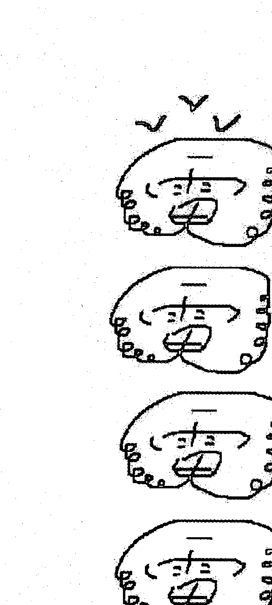

咒语：
谨请五雷大将军，
神将纷纷降来临
飞云跑马千万里
黑风暴雨不送情
五雷打破情行庙
下雷打破庙情行
万病一碗水，
子永雷，敬永福
急急如律令！

左手三山诀端碗，右手剑指画符号。

用剑指在水中画五雷神符。

先要净手，忌食牛肉。符咒必须一笔写成。边画符边念咒每天七次，修炼七七四十九天，更见效。

五雷符不同的门派有不同的画法和用法，我常用于临床的各类结石病治疗效果显著，驱除邪灵附体也是好东西。

## 斩桃花最佳方法

万一您的先生或太太有外遇的话，您想要斩掉对方不正常男女关系，除了要去包容与宽恕对方，使所爱的人早日回心转意外，唯一的方法就是利用植物「仙人掌或铁树」，压在本人的桃花位，来斩除桃花运。因桃花的「花」形容为很幼嫩的一颗星，此星最怕有尖刺植物。

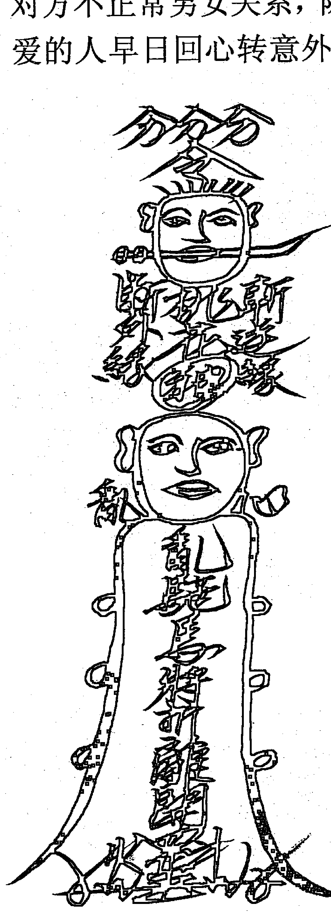

斩桃花 方位如下：

- 申、子、辰命（生肖属猴、鼠、龙）的人用仙人掌或铁树，压在住宅酉位（西方）。
- 亥、卯、未命（生肖属猪、兔、羊）的人用仙人掌或铁树，压在住宅子位（北方）。
- 巳、酉、丑命（生肖属蛇、鸡、牛）的人用仙人掌或铁树，压在住宅午位（南方）。
- 寅、午、戌命（生肖属虎、马、狗）的人用仙人掌或铁树，压在住宅卯位（东方）。

### 斩桃花符咒

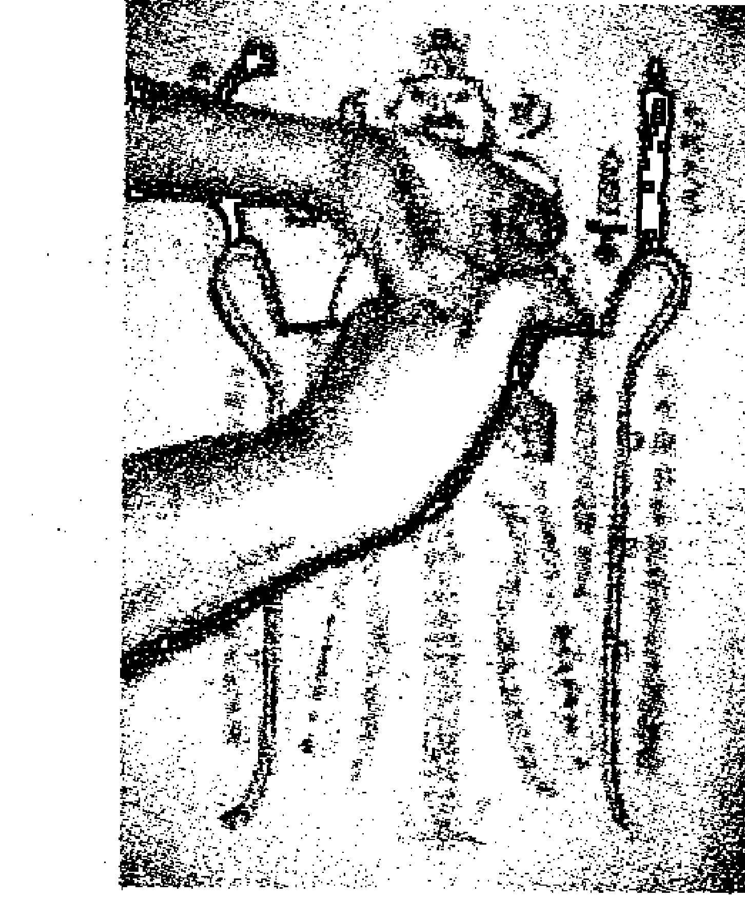

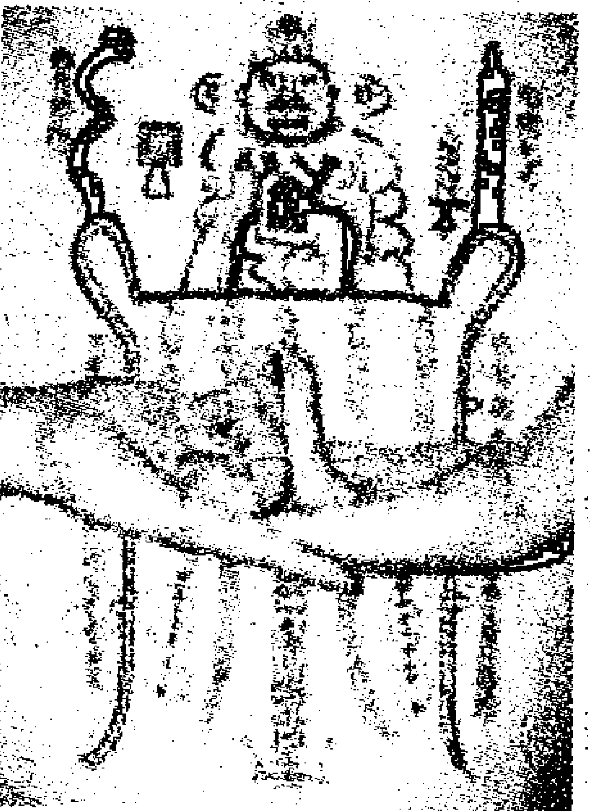

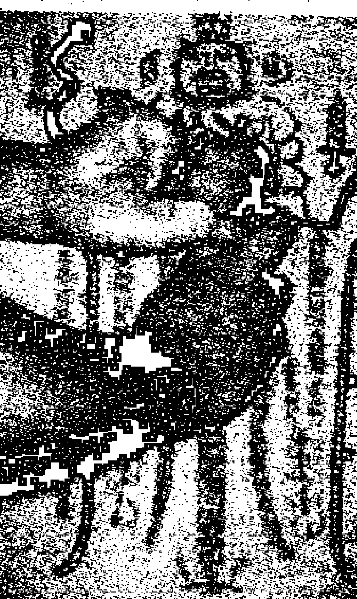

化解桃花煞：
根据八卦九宫户型分析，主卧室处于六煞文曲位，非常容易招致外来野花破坏夫妻感情。

桃花旺盛必招致外遇影响婚姻必须用桃花斩斩除。

摆放泰山石化解。

注意：桃木制品的正确摆放？

- 1. 早晨时（七—九点）摆放或悬挂，悬挂的高度为家中普通钟表的高度。
- 2. 一般挂在房间的东墙，或在专家指导下摆放。
- 3. 桃木、檀香木等天然木类，容易自然裂开，脱落颜色，属于自然正常现象，不影响风水。

### 八卦桃木镜

材质: 纯桃木——经开光处理

作用:专斩第三者，夫妻中有外遇者必用，与桃木八卦配合而成使用效果更佳。

安放:1、适合挂于有外遇者床头之墙上，正对其头部，除斩第三者外，不会妨害本人运程。

- 2、在客厅中，男子挂白虎方，女子挂青龙方，按兄弟次序或姐妹次序，147在前，258在中，369在后。

注意: 辰时（7-9点）

- 1、早九点前摆放或悬挂，悬挂的高度为家中普通钟表的高度。
- 2、一般挂在房间的东墙，或在专家指导下摆放。
- 3、桃木、檀香木等天然木类，容易自然开裂，脱落颜色，属于自然正常现象，不影响风水。

## 催桃花最佳方法：

如果您想要找到理想的情人，可利用花瓶装八分满的水而不插花(注意水质宜清澈，理想的情人气质格调较高；若水脏了应再换水，免水质浊，情人条件较不理想。）放在本人的桃花位您的桃花运很快就会降临。

### 催桃花方位如下：

- 申、子、辰命（生肖属猴、鼠、龙）的人在住宅酉位（西方）花瓶颜色为白色装八分满的水而不插花。
- 亥、卯、未命（生肖属猪、兔、羊）的人在住宅子位（北方）花瓶颜色为水蓝色装八分满的水而不插花。
- 巳、酉、丑命（生肖属蛇、鸡、牛）的人在住宅午位（南方）花瓶颜色为红色装八分满的水而不插花。
- 寅、午、戌命（生肖属虎、马、狗）的人在住宅卯位（东方）花瓶颜色为绿色装八分满的水而不插花。

### 一、鼻子中央皮肉紧绷

明显地露出骨来，形成了鼻骨如刀锋般突出，这便是相学中所说的“剑锋鼻”。剑锋鼻配上颧骨高削 和 下巴尖削的脸型，这种女人大多很势利，为人感情淡漠，而且尖酸刻薄，此乃必克之相，老公非死即瘫。

### 二、鼻梁扁平塌陷

或者脸大嘴大但鼻子又小又低，这个在相学里叫“夫宫陷”，也是一种克法。但是这种克夫一般不会把老公给克死，只是老公容易败财，最多也只是把老公克破财。因为这种女人胆子小，又处处会牵制老公的行为，比如投资什么的。

### 三、眼入凶光 颧骨过高且露骨

（以超过丈夫的为标准），都是比较典型的克夫相，一个女人最重要的就是目光柔 和 ，如果眼光犀利，或漂浮不定或死气沉沉那就不好了。

### 四、还有一种就是眼眶宽大但眼白很多眼珠在眼眶内打转

眼眶宽大本来是好相貌，但是眼白一多，就变成了三白眼，或者四白眼，此又是大克之相！三白眼的人大多对丈夫的健康不利。

### 五、还有一些比如两腮削 印堂狭 两鬓窄 下巴尖嘴唇薄额头短 眉毛杂等

拥有这些特征的女人即使本身福气好，也大多只会享福，不能帮夫，在古人看来不能帮夫即不是好女，但从现在的角度来看不能算是克！

- 1. 眼光如水：眼睛水汪汪、眼神似笑非笑的人天生桃花很旺，电力超强。
- 2. 天生卷发：天生卷发的人喜欢尝新，而且本身也很有魅力，喜欢到处放电，生性淫荡。
- 3. 眼白有痣：眼白有痣的人天生带有强烈的桃花，不管到哪里都是强力发电机，异性都会不断的投怀送抱。
- 4. 股道道乱毛：屁股沟有痣的人一生桃花不断，做事情往往都以下半身思考。
- 5. 桃花纹：手掌边缘有很多细纹称为桃花纹，桃花纹越多的人异性缘越好，桃花越旺。
- 6. 感情线复杂：感情线非常复杂的人异性缘很好，因此这辈子感情生活非常精采，一生中桃花不断。

面相学——耳朵耳朵是人的感管之一，我们每天都通过耳朵接收各种不同的讯息，所以耳朵被喻为听采宫。耳朵在相学上是判断金运、智力 和 体况的部位。又，耳朵可以判断幼年时代的状况如何。如耳朵贫弱的幼童，不但身体虚弱，而且智能也较低。耳朵可分为上、中、下三部分：上为天轮，中为人轮，下为地轮（天廓、地廓即是）。并以此判定人的 和 、智、情。

- 1. 大耳稳重谨慎头脑清醒
耳大耳门亦大，耳门的的宽度也可见人的气度与聪明度。耳门宽大，一般来说，都是心胸比较宽阔的人！所谓：“耳门宽广，聪明豁达”——表现出丰沛的吞吐能量，故能拥有广大的胸襟！耳大是有福的命相，是为理智型的人，对知识的追求 和 好奇更强，具备过人的见解，是非善恶，真理俗见，均能了然于胸。生命力充沛，个性稳重谨慎、做事头脑清醒、实实在在、脚踏实地，并且任劳任怨。大耳之人一般都智谋远大、性情豁达，一生运佳、事业必然有成。各自领域的大人物，平时只要细心观察，就会发觉周围的大老板、大学者、大官员都有着一副大耳，这就大耳的神奇之处！

### 2、小耳感情用事，情急冲动

小耳的人是为感性型的人！情感较为之细腻，而意志不够坚定。他们可是很容易被别人的意见所左右的人。生活上的困惑特多，往往为芝麻绿豆的小事而过意不去，不太爱面对现实。因自我意识强，所以对别人中肯的意见较难接纳，进而影响到人际关系。判断力较差，感情用事，个性冲动，心直口快。不定性，是为急性子且率性的人。此人对用钱较无计划，一生难有积蓄，不太适合做生意。慎重规划一下自己的人生，别把自己搞得一团糟唷！

### 3、厚耳肉厚的耳，财源广进

找个厚耳的人当老公！耳朵有肉，耳大肥厚，是长寿的长相，他长寿，就可以 和 你厮守终身，最幸福的就是可以比你爱的人先死，他那么长寿你的愿望不难达成！整只耳朵圆圆的，而且肉又很厚的耳朵，内廓的形状也好，结实有力。这种耳朵，有一种亲手造成富豪的运气，至于这笔亲手挣来的财富，能不能守得住，这就要 和下巴的相配合起来观察，才能够知道。这种耳朵的人，善于活动，很有气魄，还有一套利用别人来经营事业的手腕。也善于应付各种变化。有这样的男人，可以把大事交给他考虑啦！

### 4、薄耳肉薄的耳，财总不聚

肉薄耳的人容易有神经过敏的倾向，缺乏自信。凡事耿耿于怀，巨细无遗。且常患有失眠、食欲不振、便秘等病症。这种人总是没有积蓄，一生会经常受人差使，缺乏赚钱的本领。所谓“墙高万丈，挡的是不来之人”——想的多而做得少又有什么用！还有耳朵轮廓漂亮，但又显得太薄的人，会嫌钱，但很容易花光，存不住钱。他们在文化事业方面会有优秀的才能，可以在社会成名，但在财利方面则较为淡薄。

### 5、厚耳垂耳垂肥厚命中富贵

恭喜恭喜！！耳垂厚的人有福气，可享金钱运哟！特别是耳垂肥厚至可以放下米粒者，更是显富显贵的人！这种人身硬体朗，心情舒畅，光风霁月，金钱运、朋友运都不错，对人十分宽厚，有一份温馨、体谅的心意，所以家庭较幸福，人际关系也相当不错。基本上，他们没有欲念，但也不缺什么钱花，还可以自然地增加财产。君不见年画中的罗汉，菩萨像耳垂都是厚重的，从而让人感觉耳垂厚是好的命相！耳垂或垂珠较虽小，但有些人却是富裕者，他们或属继承财产，或是做投机生意获意外之财者。还有特殊的的例外是：垂珠小但颚形端正者，他们可以藉此弥补缺失，使事业得心应手！

### 6、没耳垂赚钱较难

这种耳垂的肉极薄，而且又小。这种人想象力丰富，对人感情味浓，是性情中人。不过，他们对现实有点漠不关心，好幻想，缺少一种计划性。往往凭一时的情绪，欲望而处事。如果这是像三角板的锐角般的耳垂的话，是和金钱没有缘份的相，用钱犹如水冲沙。若是整只耳朵长得小而肉又薄，更没有耳垂的人，可能会在浪费或是失败下破财。要想赚进一点钱，确实不是一件易事。所以要特加留心，应培养自己对金钱的概念，提高理财能力。

### 7、长耳长寿，可享天伦

长耳朵也是长寿相！头脑比较聪明、机敏。也多半比较勤勉，处事小心谨慎。所谓“日图三餐，夜图一宿”——他们少有欲望，乐于安份守已。同时，由于他们的平和，晚年可以和儿孙生活在一起，享到一种清淡的儿孙之福，天伦之乐。其实，人岂能有十全十美的呢？长耳之人有时也有点患得患失的心理，会觉得一生人太过于平淡无奇。也难怪，人的欲望是无穷尽的嘛。但建立一个平凡但丰富的人生，已是一件难得的好事了！

### 8、短耳保守顾忌多虑

耳朵短的人，思想比较保守，顾忌多，也无主见，依赖感极强，胆子也比较小，看似安分乖巧，不会追求过于刺激的生活，犹如小鹿般的性格。虽然常常在表面上十分平静，但是内心却并非沉默，而是充满渴望与幻想，有许多莫名其妙的思绪在他们的心里撞击，令他们陷入太多的空想与幻想之中。另一方面渴望被聆听和被赞美是他们性格的另一方面，总希望自己做出的成绩能够得到别人的肯定，就算是一点小小的称赞，也会令他们受到很大的鼓舞！所以可以用鼓励的方法多多推动他们的事业。

### 9、斜耳勇敢理智，做事仔细

耳朵贴着头，整个看起来倾斜的人，相当聪明，比较有理智（相对而言感情较淡漠）！办事有计划，不心慌，常言道：心慌吃不得热粥，乘车看不得三国。他们深谙世道，凡事都按步骤进行，面面俱到，而不是凭一时心血来潮。遇到困难，既不退却，也不莽撞，而是凭理智去解决。不过较喜欢批评别人，爱搜集别人的隐私，有时真令人怕怕。再不收敛一下，可会缩小自己的社交圈子哦。

### 10、软耳欠胆量

用手去捏耳朵，如果有软的感觉，那么多属处事消极的人。一般而言，他们比较没有什么胆量，没有什么主张。如果是从正面看不到耳朵的人，他们多属于性格胆小，行动力较差的人，如果给他安排工作，最好从旁协助、督促。古人云：“一屋不扫，何以扫天下”，不注意处理细微之事的人，每当碰到关键时候，则显得毫无主张，优柔寡断。软耳人，耳朵软，有易受人哄骗的倾向。若是男性，则意味着怕老婆，惧内，典型的“妻管严”。

### 11、高耳耳高于眉，智力高超

一般人的耳朵的上端，较眉毛的位置为高，尤其孩童耳朵比眼位高些。成人具有这样的耳相，属于平民的现实生活型者多。其生命力旺盛，思想纯正，从不会为物质生活烦恼，智力高超，能吃苦，受长辈的喜爱，能获得上司的赏识与提拔，但是缺乏支配别人的力量。与耳朵在眼下的人不同，少有登上高职位的机会。若要成功，只能靠其本人的努力，对荣誉有正确理解，明智的自知。故而比较适合做学者、教授、专家等，在专业方面可取得一定成就。

### 12、低耳，耳低于眉具统御才能

耳朵的上端，低于眉毛，高过眼睛，这是很正常的位置。此耳型之人为贵人相，有精辟的思想，既知其一，又知其二，所以容易获得他人的信任、支持，且有不俗的统御才能，官途财运必然亨通。但如果耳朵的位置过于低下，可能会变成骄傲、任性或破财，而且沉溺于物欲与性欲，因此事业没有什么成就，属平平凡凡的人。所谓性格使然，要严于对己，才可干得一番事业。

### 13、耳廓突出的积极者

耳骨外突的人，是属于实干的类型。内廓向外突出的人，处事积极，性格以外向者居多。所以图书馆等静止的工作就不太适合他们了。何况，他们喜欢刺激和冒险，如果有侦探、间谍之类的工作，他们一定乐此不疲（做不做得好是另一回事，做了再说！）。在他人眼里，他们可能具反叛个性。而且他们的审美观独特，不是常人所认同。其实他们头脑敏捷，手脚麻利，工作勤快，处事比较稳当，得心应手，其办事效率极高。心里绝不胡思乱想。但是，常言道：金无足赤，人无完人。耳骨外突的人通常是事无巨细，不分主次。总让人觉得自以为是，好辩，是不好招惹的角色。所以在人情世故上还是要谦逊一点。

### 14、面不见耳正面不见耳时运良好

因为脸孔侧面的肉特别多，从正面看去时，几乎使耳朵完全看不见，就是所谓的正面不见耳。这种相的人，体力和气魄都全，做起事业来手面很大，同时也已建立起了相当的地位。而且，这种人总是努力不懈，运气也好，他确实有一手创下一番事业的了不起的本领，所谓“有子满腹才，不怕运不来”。正面不见耳，代表此人目前运程亨通。若是耳朵小而不易看出全貌者，智能较为优秀，判断力准确，工作效率特好，如果要应徵人才，首选这种人，定可让老板有物超所值的感受！除此之外，具有这种耳相的女子可是旺夫益子的好太太，的确“可娶”哦！

### 15、灵通的地狱耳

长得像精灵一般。头脑灵动，变化神速。小道消息特别灵通敏感，是很佳的资料搜集者。所以最适合于成为资料搜集员、记者或政治家。有这样的朋友，可以从中吸取到不少资料与情报，但也要小心他会把你的秘密扬了出去哟！虽然好像诸事八卦，不过，他们也只不过是好奇心较一般人强罢了，在重要关头，他们还是会分大小轻重的。

### 16、欠思考力的硬耳

耳有软有硬，软耳个性柔弱，那是不是硬的耳朵就是个性强硬呢？不一定。通常耳朵硬的人身体健康且多从事体力劳动。不过，也许也是因为他们从事体力多，所以自然欠缺思考力方面的训练。不过，他们个性也较为憨厚，有主见。作为男性有此耳也是较大男人主义之人，在家中定当一家之主。最理想的耳朵，应该是硬中有弹性，而软硬又适中者，这种人软硬兼施，处事待人非常高明！如女性中呈粉红色而具有弹性硬度最好，会有攀龙附凤的机会！

### 17、招风耳

招风耳，就是在正面可以明显地看到人的两耳，并且两耳远离后脑。有这样的耳朵，其主人当然也是“眼观四路，耳听八方”！说白一点，就是什么事都爱打听，探个究竟的人。他们开始给人好问、好学的好印象，可是相处下来，你就会觉得他们的问题也未免太多了吧！何况总有一些问题是人家不好回答的，但他们还是要打破沙锅问到底，这不是为难别人吗？但他们可能会委屈地说：只不过是好奇而已嘛，而且，事无不可对人言，有什么不可以告诉我呢？！哎，这样的人，真是令人又爱又恨。招风耳的同志们，就改改这种“盘问”吧。

### 18、额头不平滑

凡属于帮助丈夫的人，额角一般不平滑，发角底而乱。但幸好他们的眉头较开，心胸开阔，有阿Q精神。即使对任何事情都不会斤斤计较。

### 19、鼻梁低

虽然说鼻梁低的女人有帮夫运，但又不能太低（即扁），准头最好圆而有肉，因这代表正财鼻，会靠个人努力而导致事业有所成就。

### 20、面肥大又圆

脸不仅要圆，而且要够肥，带肉。好似肥肥沈殿霞的那种面相。若是面相太尖就代表不够有夫妻，既不是旺夫益子，又不可以帮助丈夫的事业。

### 21、双颧要长得好

高度要贴近眼尾，并且有肉包住，而非露出颧骨那种。

### 22、腮骨显露，下巴饱满

腮骨最好有点显露，但非突出那种，同时要有肉包住，但又不能太多肉。肉太多是属于享乐型，而前面说那种是有领导才能，能得下属信赖及拥戴。

### 23、嘴唇要厚

女人人口大代表善于交际应酬，事业心重，做事能干。若娶得如此能干的妻子，夫复何求呢！

### 24、斩邪咒

> 北斗昂昂，斗转魁罡。冲山山裂，冲水水竭。灾咎豁除，殃愆殄灭。凶神恶鬼，莫敢前当。顺罡者生，逆罡者亡。天符到处，永断不祥。上帝有敕，敕斩邪妖。火铃一振，魔魅魂消。急急如律令。

# 民间禁忌和一些阴阳常识

## 一、民间禁忌和一些阴阳常识

1.  下雨天打雷的时候，要向门外丢一把刀或剪子，可以辟邪，因为可以防止被雷惊吓的邪物逃进屋里来。
2.  不要带幼儿去看葬礼或去上坟，因为小孩子天灵盖未闭合，灵光尚存，可以见到大人看不见的东西，但是小孩子阳气不旺。容易被阴气侵扰而得病。
3.  半夜或雾天有熟悉的人叫你名字，切要等到三声后才能答应。
4.  半夜不能照镜子，所以在民间，老百姓家里的镜子都是扣着放的。
5.  新居的房门上要挂一块镜子，据说是照妖镜，不过现在不多见了。
6.  天黑以后回家，进门后，要转过身来关好门，不能直接带上门，原因不详。
7.  半夜起来去厕所或进入其他没有人的地方，要先大声咳嗽，以提示阴阳互相回避。
8.  正午时分是一天中的凶时，过去杀人不都在午时三刻吗，所以这个时候不要独自去野外乱走。
9.  人穿红衣而死会变成厉鬼，所以不要给将死之人穿红衣。
10. 独自在野外，遇到旋风，要在风的中央连吐两口唾液，
11. 人的中指的血液具有先天的纯阳之气，可以辟邪，关键时刻可咬破中指。
12. 在旷野中，遇单独妇女、老人、孩子，不可随便与他搭语，也不可随便帮助。

## 13、辟邪之物

官服、砚台、婴儿襁褓。屠夫刀。中指血。杨柳。

## 14. 辟邪之人

武士、屠夫、毛发浓重的壮年男子、有功名的举人、有修为的僧道、过8旬的老人、初生的婴儿、善人。

## 二、见鬼十法和防鬼十招

### 见鬼十法

1.  **换眼角膜**：换上死人的眼角膜，睁开眼，他们就在身边。
2.  **孕妇跳楼**：跳楼的瞬间，你会看到你不想看的。
3.  **杯仙**：一个杯子、一张纸，大家将手指按住杯底，鬼魂便因号召而来，但请鬼容易送鬼难。
4.  **十字路口敲碗**：传说十字路口是阴气最重的地方，在十字路口敲碗可以引来饿死鬼。过程中不能停止敲击，否则鬼便会看见你。
5.  **鬼捉迷藏**：找一只黑猫，在夜里玩捉迷藏，鬼也会一起参加。一旦找不到某个人，把黑猫放出，跟着它走，便能见到鬼，但小心遇到鬼打墙。
6.  **尸泥涂眼**：用埋尸体的土涂在眼睛上能看到鬼，但也有可能因此失明。
7.  **室内打伞**：在室内将伞打开，会聚集阴气，鬼魅现身。
8.  **半夜梳头发**：午夜十二点对着镜子梳头发，可以看到想看的鬼。
9.  **倒着看**：身体向前弯下腰，从两腿之间向后看，你会看到另一个世界的通道。但是当你吸引到任何『过路客』的注意时，你必须马上停止这个动作。鬼会误以为你是准备要出生的胎儿，正邀请它来投胎…
10. **装死人**：终极见鬼方法——去死。穿上寿衣装好妆，假装自己是死人，并准备一柱香，睡着后便能走进冥府，但切记要在香烧完之前回来。

### 防见鬼十招

1.  **司空不宜留荫**：在面相学上，司空乃发光之处，若额前留“荫”遮及司空位，等于弄熄这盏明灯，霉气、衰气便会缠住你不放，灵体鬼怪也容易接近你，故司空位的头发最好剪碎或拨开。
2.  **逛夜街忌穿红衣**：夜晚外出，有两大忌，一忌穿黑衣，皆因黑黑沉沉的颜色，鬼怪灵体最喜欢依附在此。二忌穿红衣，红色对于恶鬼来说，属标奇立异的颜色，容易惹起注意，爱出夜街的男女要谨记。
3.  **戒鬼字挂口边**：“小鬼”、“衰鬼”、“鬼理你”、“这么鬼麻烦啊”是不少人的口头禅。记住，这类说话不宜多说，因发音磁场可能会触及鬼怪。如果你常把“鬼”字挂口边，实在要戒。
4.  **长走廊安灯**：很多家居间隔都有长走廊，长走廊经常不见阳光，造成阴盛阳衰的局面，是鬼怪灵异最爱藏匿之处，所以若家中有长走廊，记得装一盏长明灯增强阳气，免得鬼怪停留不走。
5.  **爬山戴玉器**：登山远足是不错的假日消闲活动，但由于高地湿气重，加上很多动物死后，尸体腐化于此，无形中强化了负面磁场。不想见到“脏东西”，不妨佩戴一些玉器饰物，借此增强个人的正面磁场。
6.  **别玩碟仙笔仙**：年轻人爱寻求刺激，喜欢大伙儿玩碟仙、笔仙，从而预知未来事。事实上，如此直接与灵体接触、沟通，日常很容易会感应到“它们”的存在。尤其发觉近来印堂发黑气者，这类玩意更是大忌。
7.  **八卦挡邪气**：殡仪馆是先人出殡的地方，兼且弥漫哀伤气氛，故负面磁场旺盛。家住殡仪馆附近的朋友，建议在窗外挂一块八卦。当中的八个卦数代表正气，正气十足，自然不怕邪气入屋，住近殡仪馆都不怕。
8.  **探病先拜家神**：若需要经常出入医院探病，事前不妨先拜神，求个心安理得。若然探望的病人是你的亲戚，拜祭家神特别奏效；而倘若病人是朋友而非亲戚，则可以到一般庙上香祈求神明庇佑。
9.  **住酒店忌尾房**：去旅行住酒店，不少人都说尾房不宜住。这的确有根有据，皆因尾房通常日照不足，有欠阳气，而灵体最喜欢流连此类阴暗之地，所以如果住酒店被分配尾房，不妨换房。
10. **灵性号码要避忌**：至于酒店房间的门牌号码也需留意，在风水学上，“二”及“五”均属灵性的数字，故酒店房间尾数不宜有“二”或“五”，不然容易引起灵怪注意，时运低者便可能和“它们”撞个正着。

## 三、驱鬼10招

1.  **第一招：佩玉**：玉乃是吉祥之饰物，佩玉则百邪不侵。但要特别注意，可不要买到塑胶或玻璃的仿冒品！
2.  **第二招：倒放扫帚**：在睡觉之前，把扫帚反过来靠于墙角，包准一睡到天亮。
3.  **第三招：破中指**：本招完全是应急的方法，万一手中没有其他法宝，快点破中指以血溅之！
4.  **第四招：红线捉鬼**：碗中盛满干净的水，碗口外沿围上一条打了活结的红色丝线，摆在桌下或床下面，可煮沸一锅油，好来个「油炸鬼」！
5.  **第五招：挂钟馗像**：俗传钟馗是「鬼中之王」，最喜欢抓小鬼下酒，真是标准的「鬼见愁」！问题是鬼太多了，好意塞两只请客，那可怎么得了！
6.  **第六招：古钱**：将古代方孔通宝，不拘大小，以红线悬于颈间，乃因古钱历经万人之手，可集众人之阳气，以抵御阴间鬼魂。
7.  **第七招：挂八卦**：在家宅的门楣上方挂上八卦图，包准鬼魅不敢入屋。但有一点要特别注意的，如果你是买到外行人画的，或自己为了省钱而自行画了权充，连所谓的「乾」、「坤」都弄错了。那可要倒霉了！
8.  **第八招：斩鸡头**：这可不是「选举」专用的招术，苦家宅不干净，杀鸡时，一刀斩下鸡头扔过屋顶，也能驱鬼。这是古法，用在现代，住宅是高楼大厦，万一是摩天楼，如果您能扔得过，那就是真的有鬼了呢！
9.  **第九招：唬鬼**：事先在手心用毛笔写上「我是鬼」，这个道理和以人为制人的道理是一样的。
10. **第十招：虎牙**：除非，碰上的是棺材里伸手——死要钱的！虎能役使「怅鬼」，猛虎的尖牙更显威力十足，因此经常可以看到项链的坠子是颗虎牙。可得检查是不是被虫蛀了，或者是假货冒充，被不道德的商人用来「骗鬼」了。

另外，经常出差或者去外地旅行住旅馆，一些要记得一些避忌方法。因为如果不注意，极有可能会被“好兄弟”盯上。

### 1、入门前：敲门、侧身

到旅馆入住的时候，开房门之前有门铃要先按门铃，没有门铃就敲个三下，然后进去之前要先侧个身，表示对“好兄弟”的尊重。

### 2、进入后：开灯、冲马桶、开橱柜、掀被拍枕

进入旅馆房间之后要把所有的灯，包括台灯、厕所……等等全部都打开，然后到厕所去冲马桶表示把污秽都冲掉，接着要开橱柜，然后把被子掀起把枕头拍一拍，这些动作都是表示告知“好兄弟”请他走开的意思。

### 3、就寝时：鞋子乱放、亮灯

睡觉的时候最好开个小灯可以避邪气，也会带给自己有安全感，另外鞋子不要整齐的摆在床边，传说如果摆的很整齐的话晚上“好兄弟”会穿着走，因此鞋子最好摆乱或者一正一反。

# 改运秘术

### 新年开运法

买一条新手帕，分别在四个角落用黑色笔写上“吉”字，手帕中央写上自己姓名及【大吉大利、心想事成】，再将平日用旧的一条手帕分别在四个角落写上【除】字，手帕中央写上自己姓名及【岁岁年年、恶运尽除】，将两条手帕在农历过年的初一子时，面向西方火化并洒上七粒米及少许盐即可开运！

### 蛋壳转运法

收集十个完整的空蛋壳，将它们用清水洗干净，用黑色铅笔在每个蛋壳上写<怨>字再将蛋壳打碎，放在院子中过一夜，然后将蛋壳碎片拿到附近的公园中的泥土地上埋起来，不久后运气就会好转了！

### 催讨钱财法

准备桂竹一支，香炉一个，朱砂两钱檀香粉少许将桂竹剖半用朱砂在内层写上债务人的名字及所欠的金额再将桂竹合起插在香炉之中，每逢初一.十五的子时，燃香祷告：五路财神协助催讨欠款，这样实行三个月，债务便可回收！

## 招财法

在一张红纸上写上聚宝盆三个字，将纸放在碗中，再放在家中隐秘的脚落在每天下班回家后把身上不用的零钱丢到碗中，这样持续三个礼拜，然后将零钱拿到银行换新钞，每天带在身上，如此就可以财源滚滚来！

## 招财法

准备一个竹子做成的存钱筒，每天存入一元，直到存入六十元止当存到六十元时用一小块红纸，写上『小财进，偏财出』贴在竹筒上六天，六天后，将竹筒中的钱每日花掉三元，等到六十元花完，就会有偏财运到来

## 生财法

拿三片桃花瓣及三枚一元硬币，将一元硬币贴在桃花瓣上，再将三片附有硬币的桃花瓣分别用红包袋装着，在元月一日时拿出来，一封给父亲，一封给母亲，一封自己留着，放在每天都可以接触到的地方，如此就可以带来许多金银财宝了！

### 财源广进法

买一个新的玻璃花盆(形状是圆形)，再准备一颗小型的圆形水晶；将水晶放置在花瓶正中央，水晶周围放19枚硬币，再在花盆中放入阴阳水，将花盆放置在办公室的左方，这样便可以招来财运喔！

### 求财法

在门前入口的地毯或脚踏垫下，放入一百元以上的纸钞，进出时口中念：双脚踏入来，富贵带进来。如此便可带进满屋的钱财！

## 招财法

将一颗白萝卜中央挖一个如一元硬币大小之孔，并剪一圆形之红纸写上”金银财宝 ”四字，将红纸塞入白萝卜中央，白萝卜周围再粘一圈红纸，上午八点挂在门旁上方挂十二天即可．每日对着它 喊一次财 招 进宝”，如此 便有意想不到之财运。

## 招财法

准备一个新的锅子，放入十二枚硬币(字面要朝上)，放在屋外一夜，第二天在锅中放入榕树叶七片及七粒小石头，将它们和先前的硬币一起煮沸，等到冷却后，将十二枚硬币用红包袋装起，放置于客厅电视机上，而锅子内的水及树叶就洒向屋外四周，如此就会有一整年的好财运。

## 求偏财运

在农历挑一个吉日，在进大门的左上方挂一个红布袋，内装九十九枚硬币（一角、二角、五角、一元均可，不相同无所谓），讨其见红大喜及长长久久之意，居家必能财源滚滚，平安顺利！

### 求财法

在子时（自晚上 11 点至零晨 1 点），将面粉加水揉成面团，然后用瓶盖压出一个圆形，上方用小铁钉钻一小孔，一面刻上” 金” 字，另一面刻上姓名和出生年月日，然后在刻字的部份撒上金粉。待完成干后，穿过红绳，挂在自己常出入的通道上方。但此法只可维持一年，一年之后必须重制。

## 求财法(适用于做生意)

（材料都用新的）用高梁酒磨墨，然后拿毛笔在红纸上写上：天天人来风也来，招财进宝。背面写上自己的名字，连续七天后一起烧掉，保证一定会财源滚滚！

## 求偏财运

找一个瓶底宽、瓶口小，约能放入硬币的瓶子，倒入阴阳水（一半自来水、一半煮开过的热水），约八分满，再放入十枚相同的硬币（但必须是相同的才行），把瓶子放在室外一天一夜，因为日属阳、夜属阴，最后把瓶子移入家中，诚心求得财源滚滚，必可如愿以偿！

## 招财术

拿一个圆形底平的盘子，里面摆上六个反面朝上的一元硬币，围成圆形，再用十二个五角的硬币，正面朝上围在外圈，然后在中心点点上朱砂，平时放在太阳照得到的地方，每月十五日拿出去照月光，连续三个月，自然招财进宝，财源滚滚而来！

## 求意外之财

用新的毛笔在红色的纸片上,连续五天写上(祖师招财)四个字,之后将这五张纸放在供奉祖先的案桌上,五天之后再把这五张纸拿到离自己住家最近的十字路口烧掉,同时唸自己的名字和地址,不出半个月,就可以得到一笔意外之财！

## 无根水聚财法

承接法：拿一器皿，摆在头高处，接收无根水〔未落地的雨水〕，用黑布盖住。

## 家中聚财法

将家中的门窗全部打开，让秽气全都散出去，然后拿一个新的茶壶，里面摆上十二个正面朝上的硬币，放在客厅用烘炉煮沸（如果没有用电磁炉也可以），再用电扇将蒸气吹散全屋，大约在水沸后进行20－30分钟，如此家中的财运就能旺起，可以聚集钱财，让你风生水起好运来！

## 泥人储金法

自己亲手用泥土或纸黏土做一个泥人，置于阳光下一个钟头以后，将泥人放于床头，泥人下再放一张钞票（不论金额大小），一天摸三次泥人的头，并一面在心中许愿，直到达成目标为止，目标达成后再打碎泥人即可。

求财法：连续七天将无根水洒在屋内的财位（一般是客厅之四个角落）。

## 聚财避邪法

把桃枝切成七小支像火柴棒大小的长度，然后用五色线（黑白黄红蓝）捆在一起，然后随身携带，听说可以聚财，最主要的是把它泡在水里洗澡，据说这样可避免被一些灵异的朋友冒犯！

### 增进姻缘法

准备一张喜帖及一张红纸，先用红纸将喜帖中他人的姓名、地址贴盖掉。在红纸上写下自己的姓名及出生年月日，并写下“婚姻急至”，再将喜帖放置枕头下十二天。十二天后在清晨六点到户外挖一个洞，向上天祈求天赐良缘，再火化埋入土中即可。

## 求姻缘法

准备一面新的小镜子和一盆盐水，用布沾盐水擦拭镜子。等镜子干了后，用毛笔沾浓墨在镜子上写出对方的名字及肖像。白天将镜子带在身上，晚上睡觉时放在枕头下，如此暗恋对象不知不觉就会接近（施行此咒不能告诉别人，有效期限为一年，一年之后将镜子打破）。

## 求姻缘

将鸡蛋挖一小洞，清出里面的蛋黄、蛋白，放入二十颗红豆，要一颗一颗的放，同时默唸：想要一段美好的姻缘。之后在蛋壳上绑上一段红线，放在家门口，假以时日必有姻缘上门！

## 求姻缘法

用清水加盐，磨墨，然后将自己的名字、八字、现住哪里，写在一条红色丝带上。趁着月圆之夜，恳请月下老人赐予姻缘，然后将丝带绑在脚指头上（男左女右），除了洗澡之外，不准拿下。少则七天，多则四十九天，必会遇上好姻缘。最重要的事成之后要将丝带烧掉，这段姻缘才能平顺幸福。

## 求姻缘

在农历十五晚上子时，取三小片杨柳枝的皮（用刀片削成薄片）和桃花瓣六片放置于清水中。面对窗外的月光，点一小根红蜡烛，一边用清水洗脸，心中一边默唸求赐姻缘。然后将水泼向家里周围的任一植物，等红蜡烛烧完之后，姻缘将会随之而来！

## 求桃花缘的方法

取玫瑰花十二朵，先以冷水泡一晚；次日清晨约五点钟左右，改以热水泡花瓣。加自己最喜欢的香水泡澡，同时心中默念自己的名字，求玫瑰仙子赐予姻缘。连续七天就可求得异性缘喔！

## 事事如意法

准备三颗龙眼干及三颗花生（均须带壳）及一个红包袋，在早上十二点前吃掉。将壳和籽放置在红包袋内，并将自己的姓名与想实现的愿望写在红包袋外的左下角。然后将红包袋藏置衣柜下隐密的地方，不要去挪移它，自然能心想事成！

### 去除霉运法

准备三十三颗糯米，将自己的三根头发放入糯米中（三三三代表散散散），再把糯米和头发一起放入红包袋中。出门时将红包袋放置离家最近的十字路口，让人和车辆踏过，霉运就会随之散去！

## 去霉开运法

准备一颗去掉蛋白蛋黄的空鸡蛋壳，放入自己的头发和指甲，然后把鸡蛋壳装入一个小容器中，倒入第二次的洗米水（要淹没蛋），放置二十四小时后，朝东边倒掉。同时要把蛋倒掉，并把蛋摔破，然后将破的蛋壳丢掉即可。

## 改运法

到河边找五颗圆滑、大小不拘的石头，洗净后，漆上白、黄、金、绿、橙等五种颜色，放在一个装满水的容器中（水必须淹过石头），然后放在床头。睡前用一盏小灯照着水面，隔天早上再关掉。每五天换一次水，如此连续做四次便可见效。此法可祛除霉气，开运进财！

## 事事顺利法

先拔三根自己的头发，再剪三小片指甲，全部放入红袋子内封死，放到自己的枕头下睡一天。隔日中午十二点整，把红包袋埋进土里，再用脚踩三下，霉气就会离你而去，从此做事便会顺顺利利！

## 屋内驱魔法

在碗内先倒入冷水，再加入滚水（顺序不可弄反），调温约四十度左右。随后放入白米七粒和盐一小匙及榕树叶七片，稍微和一下，待融解之后，将水洒在屋内所有墙面上。嘴里还要念着自己的姓名和地址，剩的水端出屋外倒掉即可。但在来回的路途中，听到有人叫自己的名字时，绝对不可回头！此法可以驱逐屋内霉气和邪魔，让住在屋内的人每天都神清气爽，精神百倍！

## 求长寿健康法

红包袋一只，内装绿豆、红豆各三颗，将袋口封死后，随身携带六天，然后丢到床底下。这样身上有任何不好的秽气，都会转移到红包袋上，自然可以心情开朗、健康长寿！

## 去病法

在自己农历生日的那天，选个吉时，将七朵大红的玫瑰花、七颗白色的小石头，还有少许的米和盐，全部放在浴缸内泡澡约十分钟。如此便可包你一整年身强体壮，百病不侵！

泡澡的水及里面的东西丢弃即可，最重要的是不能被人踩到，否则就会失效。此法最适用那些小病不断的人，而且年纪越小效果越强！

## 乔迁好运到

将新房子打扫干净后，宣纸摊开放在地上，选一颗黄色扁平的石头（或将石头染黄）放在纸中央，上头摆一些米。纸的四个角落摆上其它四谷（麦、豆、稗、粟，后两者可用小鸟饲料代替），诚心地希望伟大的黄帝护佑居家繁荣。然后将纸上的所有东西连同宣纸包好，收入一小空盒内，放置神坛上，五谷之神自会带来意想不到的好运！

## 事业顺利法

在圆月的夜里，把自己的名字写在一张黄纸上，然后向月亮祈求让自己事业顺利。之后照东南西北的顺序各走七步，回到原处挖个洞将这张纸埋起来（没回到原处则无效）。快则七天，慢则一个月，自己的事业就会一帆风顺！

## 达成愿望秘法

准备一只不透明的瓶子，在瓶口处封上一张白纸，柳枝穿过这张白纸插在瓶内。然后把瓶子藏在隐密的地方，每天入睡前对着瓶子集中精神，默念心中的愿望，愿望就能提早达成！

## 去倒霉运法（也称金蚕脱壳法）

拿一颗生蛋，先把里面的蛋黄和蛋白通通清掉（蛋口不要太大），再把蛋染红。然后将自己的几根头发及少许的指甲，通通放在蛋壳里，拿一块小红纸将蛋口封住。心里祈祷霉运快快离去，之后将蛋壳拿到河流或溪边去放，最好是最急流的地方，代表霉运越快离我们而去！

## 去霉运法

选定一天的子时（晚上十一点到清晨一点，最好是生日、除夕，或任何季节的时候，如：春至、秋分），拿一颗煮熟的鸡蛋，蛋过手后就不要给其他人看到。随后在手心中放一点朱砂和九十九滴新开的米酒和匀之后，抹在蛋壳上。然后找一个露天地方把蛋吃掉，最后朝家相反的方向走一百步，把蛋壳高高地抛掉，就可以将坏运抛到脑后，烟消云散！

## 鸡蛋转运法

老一辈的人说，要是感觉身体状况不是很好，或是运气差的话，可在端午节当天午时（十一点到一点），拿一个煮熟的鸡蛋涂上雄黄粉，用朱砂在蛋壳上写下自己的生辰八字。一手握蛋抱在胸口，另一手用水擦净全身（以前在山中是用泉水，现用自来水即可）。然后把蛋壳剥去吃掉，最重要的是要把蛋壳丢到户外，越远越好，途中不能回头，也不能与家人交谈，如此恶运才会离你远去喔！

## 去疾病转运法

中秋节即到，生病或运气不顺时可用。每年农历八月十四日，中秋节前夕晚上九点以前，把自己的头发分成三部份，象征性地剪下少许，先剪中间，右边剪完再换左边，然后连同手和脚的指甲一起放进红包袋中，再放入一百元。密封后从家中出发，拿到外面丢弃，途中不可和他人说话，丢完后也不能回头。回家后就不要再出门，直到隔天早上，如此噩运就会离你远去！！（见红大吉，即使捡到的人也不会缠上坏事）

## 去屋内秽气法

中秋节即到，生病或运气不顺时可用。每年农历八月十四日，中秋节前夕晚上九点以前，把自己的头发分成三部份，象征性地剪下少许，先剪中间，右边完再换左边，然后连同手和脚的指甲一起放进红包袋中，再放入一百元。密封后从家中出发，拿到外面丢弃，途中不可和他人说话，丢完后也不能回头。回家后就不要再出门，直到隔天早上，如此噩运就会离你远去！！（见红大吉，即使捡到的人也不会缠上坏事）

## 乔迁顺利法

在新屋进门前，准备一个米瓮，瓮内下层摆米，中间摆面线，上层摆糖果，放在厨房任一角落。一周后全部吃完，如此居家不但平安顺利，工作也会一帆风顺喔！

## 诸事顺利的方法

取一个不是自己买的鸡蛋（可托他人买），把这颗鸡蛋摆在床底下胸的位置，三天后取出。男放左手，女放右手，男的将蛋向左方转一百零八圈，女的往右边转。转完之后把蛋放在碗内用生米盖上，置于土地公旁边，如此便可样样顺心、事事如意。但这个方法只能持续三天，时间到了要把蛋丢进海中才行，否则就会遭来恶运喔！切记！切记！

## 十赌九赢法

首先将自己的姓名用红色朱砂写在白纸上，并放在头顶的帽子里，然后再将对方三人的姓名以同样的方式放于自己的左足底，不让对方知道。之后保证你“十赌九赢”喔！

## 在职场求得长官青睐的方法

在无名指戴上白金戒指（男左女右），然后在戒指环上用细红线圈三圈；保证你日后在工作场合得老板缘喔！简单吧！

## 考试顺利法

考试前一晚，拿一张正方形的白纸，在纸的中央用红笔划上星星的图样，在星形的五个角落各放进一颗糖果，然后对纸诚心地祷告，希望猫头鹰将智慧降临在这些糖果上。第二天出门前将这些糖果吃下，另外那张白纸用信封封起来，丢到垃圾桶中，这样就能提升考运，帮助你考试顺利。

## 考试顺利法

取长、宽各三寸的白纸一张，平均分配为九个方格，再用新的毛笔在每个方格内写上〔日〕字，一共九个字。考试将此张纸随身带著，就会有令人满意的好成绩喔！

## 考试顺利法

考试前一晚，将苹果洗净后浸泡在红茶中，当天早上将苹果取出削皮（切记果皮不能削断），然后喝一点红茶，将整个苹果配早餐吃掉。

## 揭秘画符用笔的加赦方法

这种加持方法分为“受大赦”和“受小赦”两种方式，其区别就在于加持的时间。“受大赦”加持的时间是腊月三十的晚上，“受小赦”的时间是选择每个月的三十的晚上。其余的方法和过程是完全一样的。

“受大赦”的笔可以长期使用，“受小赦”的笔只可以用一年就会失去效力。

需要准备的用品：新毛笔三只（最多一次可以加持三只，一只作朱砂笔，一只作墨笔，一只备用笔），供品五样，黄香一把，烧纸若干。

这里提醒大家的是，一定要牢记，画符用的笔，笔尖是绝对不许用手摸的，否则画出来的符是没有用的。切记、切记。

## 加持的方法

-   一. 提前找一个无主的孤坟，一定要是“无主”的“孤坟”，就是长期没有人来上坟的那种。
-   二. 在选定的日子的下午，最好是傍晚，到选定的坟前，将供品摆上，点上香（三只，其余的和纸钱一起烧掉），插在坟前，然后烧纸。烧完纸后，跪下磕三个头。和坟的主人说，借你的地方，给我的笔加持，还请主人谅解，本人没有恶意。一点香供、纸钱还望主人笑纳，算是本人的一点心意。然后站起，将三只笔笔尖向上（摘掉笔帽）插在坟头上。就可以回去了。
-   第二天的白天到坟头去把笔取回来，向坟主道谢，然后离开。

加持过的笔有几样忌讳大家要牢记。

-   1. 不许怀孕的人和身上来事的女人动。
-   2. 不许跨过。
-   3. 不许用作其他用处。
-   4. 不许用手摸笔尖。
-   5. 不要有脏物污染，特别是血液。
-   6. 以上各条如有违反，笔的功能就会消失，成为废笔没有用了。

## 道教驱邪镇鬼法

佩带玉饰：玉乃石之精髓，经过千万年的吸取日月精华，采集天地灵气，故而鬼魅不能相侵。但又传玉石乃上古女娲补天时落下人间的五色石碎屑所化，故而能趋吉避凶。

倒放扫帚：在睡觉前把你们家的扫帚倒过来，放在墙角，保准你一觉睡到大天亮。

用血：此招是应急之法，万一遇鬼之时手中没有其他镇鬼之物，就弄破自己的手指，把血挤出来洒到鬼的身上用来驱鬼，据说很灵。但万一你要遇到吸血鬼，笔者敬告大家，要是真的遇到吸血鬼而你手上又没什么驱鬼之物，还是快跑吧。

红线：据说在碗里盛上干净的水，碗口外沿围系一条打了活结的红色绳子，摆在桌下或床下，这样鬼就不敢在屋里呆着，要逃出去，不然会被捉了。

挂钟馗像：民间传说钟馗乃是鬼王，最喜欢抓一些闹事的鬼来下酒，在家里挂一张钟馗像，就不会再有鬼进来侵扰了。

古钱：民间有用古钱辟邪的习俗，方孔通宝不拘大小，以红线悬于颈间，乃因古钱历万人之手，可集众人之阳气以抵御阴间鬼魂（五帝钱最好）。

## 挂佛像和八卦

在家宅的门楣上挂起一张八卦图，或在家里的中堂上挂一张佛像，都能让鬼怪进不了屋子。

## 斩鸡头

相传在广西一些地方还有斩杀鸡头的驱邪之法，若发觉家宅不干净，就杀鸡斩头，将鸡头一下子扔过屋顶，这样鬼怪就会逃走。

## 唬鬼

这是一种特殊的心理战术，即事先在手心里用毛笔写上“我是鬼”，便可使鬼受吓逃掉，因一般的鬼是怕与别的鬼对抗的。

## 老虎牙

老虎凶猛，猛自其张牙舞爪之势，使牙之利能使得怅鬼乖乖听其驱使，可见厉害了。故而民间常家有人的项链里坠着一颗老虎牙，鬼魅见后不能近身。

## 石菖蒲

那玩意自古被称做“蒲剑”，乃是天中五瑞之首，道士们经常用来驱邪，拿它来扫，大概可以把灰烬清理干净（自古流传的，石菖蒲是中药，很灵）。

## 利器吓鬼

医护人员遇鬼时，会立刻将制服整理好，摆出一副专业、正气的形象，令一些负磁场、不正气的东西知难而退。此外，有说鬼惧利器响声，所以医护人员会把小剪刀等利器放在身上，抛到地上吓鬼，以备不时之需。

如还怕邪者用沾过茶米水的红绳系在手腕。

身上带五帝钱，顺、康、雍、乾、嘉时期的钱币。

## 禁解

指掐诀(捻诀)以禁制鬼神外物及解除禁制。《金镇流珠引》卷十四注：“禁即捻左手指，解即捻右手指。圣君授天师左禁右解，用之无穷也”。

## 诀目

指掐诀手势。《道法会元》卷一六0：“祖师心传诀目，通幽洞微，召神御鬼，要在于握诀，默运虚元，因目之为诀。”诀目各有名称，大多称其某诀，如本师诀，上清诀、五雷诀、灵官诀等；也有称手印或印，如元帅印、火铃印等；少数称局，如雷局。每种诀目都有相应的象征意义，如雷局象征天雷，火铃印象征拟想的流火金铃。构成诀目的，主要是手掌各部分之间的掐捏部位即诀文，及勾连方式。简单的只掐一个诀文，如北帝诀为左手大指掐坎文(中指下节末)，复杂的须顺次变换多个掐捏部位即诀文，或同时掐几个诀文。掌指的掐、勾、握、屈、直，有单掌的，称单诀；有两手共结的，称双诀。其名目繁多，常常一法所用即达数种乃至数十种。因道派传承不同，同一诀名或诀目不同。各道派皆传有诀谱，载明本派所用诀目。

## 诀目的法窍

研究掌指诀，首先应了解和掌握拳指之“目”，目共计十二种，全在掌指纹中。
-   寅，为斩目，斩鬼断虎狼虫蛇，吹掐之。
-   卯为颠目，司断颠邪，吹掐。
-   辰，为气目，去肿毒疼痛，咒水生云雪雷雹。
-   巳，为通目，可发符用兵，通天入地，书行批押阖牒。
-   午，为光目，咒水治眼目暗，消肿痛，止血行气。
-   未，为成目，就吉起造镇宅、求财交关求官，除虚耗。
-   申，为去目，召发兵将，追捉鬼祟。
-   戌，为贼目，飞行夜行，人鬼莫见。
-   亥，为勾目，收鬼追魂，勾召城隍社令。
-   子，为利目，通脏腑，解热结心燥。
-   丑，为奸目，断怪捉鬼。

凡是使用上目，才掐便应念真言曰：“百鬼谙邪，泛泛桑精，急急如火令摄禁。”诵念三遍，存想日月在头顶照耀，斗星在身前闪烁，掐定诀目，脚步丁立，便见效验。当然效验的优劣全凭功力深浅而定。运用掌指诀目的作用，是使你的真气、灵力更具有方向性、目标性、针对性，使其更具威力。是一种极好的功法，大家可在修习中使用和验证这一不传之秘。

## 六种斗法简介

-   （一）戴履斗：头上戴七星斗，足踏七星斗，手持七星剑，剑尖发出七星斗形之光，如七团火球。功用：驱邪治病，用时心存仁慈，赶跑即可，一般情况切勿灭之。
-   （二）朝真斗：欲朝真时，头戴七星斗，足勿踏斗。功用：朝真时防外道邪魔干扰或变形欺骗，存想威光赫赫则外邪远遁，顺利上朝奏事。多用于朝真或出神之时，用来护身。
-   （三）召将斗：头可以不戴而只足踏斗罡，斗柄罡星向前；手中七星剑代表兵将令，功用召请功曹、丁甲、黄巾力士等均可同此。不可轻易使用。
-   （四）存真斗：行、坐、住、修炼之用，可以令人清静减少识神干扰和外界骚扰。日常修习时存想此斗复身，并念真言曰：“正气周流，七星罩头，表里洞映，光彻重楼，尸邪亡坠，万神卫周。”
-   （五）卧斗：人之元神在未坚固之前最易受干扰，特别是在睡眠中。阴性信号干扰后易于疲劳甚至走阳。故睡眠之际，宜在手中剔斗罩住己身，使魂魄不外游，万气归于中宫，邪不敢扰也。真言曰：“北斗灵灵，魁罡复身，拘魂制魄，夜卧安宁，万神守舍，气气通神。”
-   （六）升斗：有事欲祈求上圣时，存想头顶七星斗一座为升天之梯，天神站于其上，斗星变高大连接于元神和肉身之间，直入九重之上。

银杏树。银杏树龄长达千余年，因在夜间开花，人不得见，暗藏神秘力量，因此许多镇宅的符印要用银杏木刻制。

-   5. 柏树。刚直不阿，被尊为百木之长，木材细致有芳香，气势雄伟，能驱妖孽。
-   6. 茱萸。“遥知兄弟登高处，遍插茱萸少一人。”茱萸是吉祥植物，香味浓烈，可入药。古时习俗，夏历九月九日，佩戴茱萸，可以去邪辟恶。
-   7. 无患子。以中日两国为多，在植物中尤为受到尊崇，因其结实球形如枇杷，生青熟黄，内有一核如珠，就是佛教所称的“菩提子”，用以串联作念珠携带，可保平安。
-   8. 葫芦。多籽，原产印度，在风水学中葫芦是能驱邪的植物，亦有多子多福的含意，古人常种植在房前屋后。

## 替身的还法

换童子还替身的解释：从天界投生到人间的人大致分两类，一类是地位高的天神，负有使命分灵下凡，这些都是高能量的人，投生到人间不是大官就是大师。这些人如能担负起固有的使命，就能正常的住世人间，没有履行天界使命的天庭会将其召回，也就是常见的大智者夭寿，英才早逝。另一类是普通的天神，即一般工作人员，金童玉女。为什么要换童子呢？因天道仍属欲界，容易动男女私情，被称之为犯花，女性天神只要犯花一次就会被打下界来，男性天神要犯5次花才会被打下界。下界时要过五道门，8座关，受尽磨难到人间，人称“五花八门”下界，这类人大多投生到经济条件较好的家庭，少儿时眉清目秀，聪明伶俐。这些人大多信命，情感复杂，婚姻结局不好。这些人最易通灵，部分人能读到高中或考上大学，易出问题，出现偏执、幻觉、躁狂、抑郁等症状，一部分人甚至会离家出走，会出意外，结局悲惨。一部分表现为神经系统疾病，从神学角度说是天界派灵体来给他制造磨难，让其尝遍人间苦难，而不愿留住人间，重返天界。这其中的一部分人因为有天道根基而能与天界、地界的灵体沟通，成为通灵者，转达天意而能住留人间，另一部分皈依佛道，改变了信息场，从而转变命运。但一般都归依道教，因为归依佛教会影响以后的婚姻。

## 查童子方法

-   1. 号脉法：首先用意念与仙家沟通（一定要闭上眼睛），禀告你要为香客查是否童子。然后开始号脉，主要摸香客的左手手指尖和手心。（如果香客是有仙的，一定要他用意念与仙家沟通，让仙家先退了或你直接让他的仙家回避一下，以免影响准确率）一般拇指尖跳是火神庙的童子，食指尖跳是阎王庙的童子，中指尖跳是天上来的童子，无名指尖跳是山神庙的童子，小指尖跳是土地庙的童子，小指尖里侧（靠无名指这面）跳是土地庙的童子，手心跳的是前世因缘童子。
-   2. 仙查法：请堂口的仙家直接去查。
-   3. 八字法：春秋寅子贵，冬夏卯未辰；金木马卯合，水火鸡犬多；土命逢辰巳，童子定不错。

## 现在讲讲童子到底是什么

童子就是我们所说的短命鬼。一般活不到19岁后，也有可能活到那个时候，但是却会在几个关头处一样可以夭折。基本关头都是逢3、6、9的年头上，一般最常见的是19岁和23岁，是虚岁。

童子是由各界仙灵转世的（男的叫童子，女的叫童女），童子转世的人年轻时都不顺，比一般人多灾多难。童子需要换身才会顺利，如果不换会有大凶险，一般活不过35，也不好结婚。中年也容易患突发性的疾病骤然去世，按这行的说法叫做被抓走了。

童子一般都是上方的仙童因为犯错、思凡、劫难等原因被罚下界的，下界时要经过很痛苦的五花八门阵的锤炼，而且因为是犯错下界，命运都很悲惨。

这些多是某某神仙旁边的坐下童子，或是侍奉神仙、从事小事物的仙官。当他们私自未经允许下凡人间，投身凡胎后，如果突然又想回去，就可以很容易地走。如果被神仙发现他们的踪迹，也会不管一切方法将他们带回去。因为他们既然已投身为人，所以等于是一个人魂魄，所以一旦他走了，回去原来的神仙身边，自然这个投身的凡胎也会死了。

有些人就用扎辫子的方法：“后脑处留着小长辫”把小孩拴住...但效果不好。

## 送替身分真假两种：

- 1. 真替身是用布做的，要求是人多高替身多高，将患者的头发拔下7根，糊在替身头上。关于替身的衣服，以查出替身的干支的色泽来定，比如癸亥，干支属水，水为黑色，上下身都用黑布，如是丁丑，干火支土，上用红色，下用黄色，其余仿此。
- 2. 假替身是用纸做的，让崇信者到花圈店，扎个纸人。

有几种替身是无效的。

送替身的时间：一般选阴历的3、6、8、9或初一、十五的凌晨丑时（3-5点钟）为佳。

送替身的人：最好是童子的舅舅（救救），其次是叔叔（赎赎），再者是姐姐（解解）。父母和兄长不可以。切记，切记。

送替身用的烧纸，用36张，49张或81张。烧纸在送之前要在还替身的人身上顺划3圈，逆划三圈。

替身一般要求立着送，尽量不要放倒。

送替身的人在回来的路上不许说话，不许回头。

一般替身都是送到庙上。

送替身时还要打表，一般道家庙里有专用的表格，直接填写就可以了。如果是堂口给办的，因各家不一样这里就不详细谈了，关键的是把送替身的去处、童子的姓名、家庭的详细住址、出生的年、月、日、时，送替身的时间等主要内容写清就可以了。

注：我建议替身尽量在庙里还，以免给自己招业障！福生无量天尊！

## 各种考试必及格之灵法

对于每一个正准备考大学的学生来说，无论是他本身还是其家人，都会有一种不安的焦虑心情，哪怕是全校的顶尖生，也不能肯定在考试当中就能尽力发挥，有可能还面临落榜的尴尬局面。每一个学生和家长都承受着无以言说的沉重压力，但这毕竟是通向成功的一大门道，没办法呀，自古至今都如此了。另外，社会上的其他考试成员也莫不忧心忡忡，为考试提前淌汗。

为此，贫道结合历代祖师的经验，运用符咒之灵力为好多学生解决了这个难题。方法是考试之前（离考试前20天），佩带“文昌符”一张，“增智符”一张，“考试必及格”一张。共三张符佩带在左上身，考试时常用手触摸就能得心应手，就能把所学所掌握的知识尽力的发挥得淋漓尽致。如考场不允许带符，也可以在临行前把“考试必及格符”烧入半碗清水中，水连符灰饮完即可，功效非常。

复习期间佩带“文昌符”和“增智符”，考试时佩带或饮服“考试必及格符”。贫道运用此法帮好多学生或社会其他考试成员解决了考试难通关的难题，即使有少数考不上的，也为他们减少了心中的压力，更好的从事于其他方面的工作和学习。

符咒是道家的通玄之学，自古至今没有人能解释清楚她是否是迷信，但对于道家人来说她永远是神圣的，只有入道之人或亲身体会过鬼神的人才能真正明白和相信道法的存在和力量。所以说，道法是玄而神秘的文化，一般人是不容易领悟的。所以，如果不是学道之人千万不要照书乱画符，对自己不利，因符是有灵力的，如果你没有灵力护体，符上的鬼神不会听你指挥。常言道“请神容易送神难”，神送不走就会找你麻烦，有时就为此因福得祸了。说到这里意思就是凡有要画符的学生或家长一定要请专业的法师画符，不要为省一点小钱而胡来哦。

后祝愿各学子梦想成真。

## 如何给自己开财库

何谓财库？财也，人民币也。库者，放人民币的地方。现实中有很多的朋友都说道缘先生，我的财运很好，只是赚多少花多少，到年底什么钱都留不下来。我有一公务员朋友，夫妻两个都是公务员，她在税务局，她老公在环保局，两个人年薪都是非常高，可是她却对我说，她们表面有车有房，实际上已经是负资产了。我不知道在江苏公务员一年有多少，我只知道她开的车就价值不菲。为什么会这样呢？就是因为没有财库。来财容易，但是守财难。

现在道缘先生在此，教大家自己开财库。那么这个财库如何开呢？开了又有什么好处呢？财库是吸财的，你说开了财库会有什么好处？自己想吧，呵呵。

第一，请大家根据自己的五行找到属于自己的财位。如何查找财位？根据本人命中的用神，大家可以查一下。找到财位之后，在上面根据自己的五行放上相应的东西。比如五行属水（则放上金属制品的器具），五行属火（则放上木雕），五行属土（则放上大红的装饰物），五行属金（则放上盆景），五行属木（则放上装饰水缸）。

第二，装饰图画。俗话说山主人丁水主财。要想有财，必须有水。所以我可以告诉大家，在客厅里面放上山水画无疑是最好的选择。有山有水，有财有库。

## 第三，睡觉的床

请大家注意是睡觉的床，所以不用来问我我租的房子能不能用这类的话，只要是睡觉的床就可以。床是咱们一天接触时间最久的地方，所以床的位置选择弄的好，那么财运自然就上来了。那么如何来将床的位置弄好呢？这个也要和五行有关。五行为水的人，最好的位置在西方和北方。五行为木的人，最好的位置在东方和北方。五行为金的人，最好的位置在西方。五行为火的人，最好的位置在南方和东方。五行为土的人，最好的位置在南方。

财库开好之后，那么就放心大胆地去工作吧，相信财运永远都会跟随着你，祝大家成功！

## 民间转运大全三十法

- 1. 蛋壳转运法
收集十个完整的空蛋壳，将它们用清水洗干净，用黑色铅笔在每个蛋壳上写<怨>字，再将蛋壳打碎，放在院子中过一夜，然后将蛋壳碎片拿到附近的公园中的泥土地上埋起来，不久后运气就会好转了！

- 2. 催讨钱财法
准备桂竹一支，香炉一个，朱砂两钱，檀香粉少许。将桂竹剖半，用朱砂在内层写上债务人的名字及所欠的金额，再将桂竹合起插在香炉之中。每逢初一、十五的子时，燃香祷告五路财神协助催讨欠款，这样实行三个月，债务便可回收！

- 3. 招财法
准备一个竹子做成的存钱筒，每天存入一元，直到存入六十元止。当存到六十元时，用一小块红纸，写上『小财进，偏财出』贴在竹筒上六天。六天后，将竹筒中的钱每日花掉三元，等到六十元花完，就会有偏财运到来。

- 4. 财源广进法
买一个新的玻璃花盆（形状是圆形），再准备一颗小型的圆形水晶；将水晶放置在花盆正中央，水晶周围放19枚硬币，再在花盆中放入阴阳水。将花盆放置在办公室的左方，这样便可以招来财运喔！

- 5. 增进姻缘法
准备一张喜帖及一张红纸，先用红纸将喜帖中他人的姓名、地址贴盖掉。在红纸上写下自己的姓名及出生年月日，并写下“婚姻急至”，再将喜帖放置枕头下十二天。十二天后，在清晨六点到户外挖一个洞，向上天祈求天赐良缘，再火化埋入土中即可。

- 6. 招财法
将一颗白萝卜中央挖一个如十元硬币大小之孔，并剪一圆形之红纸写上“金银财宝”四字，将红纸塞入白萝卜中央，白萝卜周围再黏一圈红纸。上午八点挂在门旁上方，挂十二天即可。每日对喊一次“招财进宝”，如此便有意想不到之财运。

- 7. 招财法
准备一个新的锅子，放入十二枚硬币（字面要朝上），放在屋外一夜。第二天在锅中放入榕树叶七片及七粒小石头，将它们和先前的硬币一起煮沸。等到冷却后，将十二枚硬币用红包袋起，放置于客厅电视机上，而锅子内的水及树叶就洒向屋外四周，如此就会有一整年的好财运。

- 8. 新年开运法
买一条新手帕，分别在四个角落用黑色笔写上“吉”字，手帕中央写上自己姓名及【大吉大利、心想事成】。再将平日用旧的一条手帕分别在四个角落写上【除】字，手帕中央写上自己姓名及【岁岁年年、恶运尽除】。将两条手帕在农历过年的初一子时，面向西方火化并洒上七粒米及少许盐即可开运！

- 9. 去除霉运法
准备三十三颗糯米，将自己的三根头发放入糯米中（三三三代表散散散），再把糯米和头发一起放入红包袋中。出门时将红包袋放置离家最近的十字路口，让人和车辆踏过，霉运就会随之散去！

- 10. 生财法
拿三片桃花叶及三枚一元硬币，将一元硬币贴在桃花叶上，再将三片附有硬币的桃花叶分别用红包袋装着。在元月一日时拿出来，一封给父亲，一封给母亲，一封自己留着，放在每天都可以接触到的地方，如此就可以带来许多金银财宝了！

- 11. 求姻缘法
准备一面新的小镜子和一盆盐水，用布沾盐水擦拭镜子。等镜子干了后，用毛笔沾浓墨在镜子上写出对方的名字及肖像。白天将镜子带在身上，晚上睡觉时放在枕头下，如此暗恋对象不知不觉就会接近（施行此咒不能告诉别人，有效期限为一年，一年之后将镜子打破）。

- 12. 招财法
在一张红纸上写上“聚宝盆”三个字，将纸放在碗中，再放在家中隐密的角落。在每天下班回家后，把身上不用的零钱丢到碗中，这样持续三个礼拜。然后将零钱拿到银行换新钞，每天带在身上，如此就可以财源滚滚来！

- 13. 如愿以偿法
晚上睡觉前，在床上平躺，全身放轻松，心中诚心默念并在脑中描绘出自己的愿望。如此反复数日后，心中愿望即可达成！

- 14. 防止外遇法
由玫瑰花上拔下三根花刺，再将花刺涂上红色指甲油，然后将三根花刺放置在情人的影子，并用脚将三根花刺踏入泥沙中。如此后你便可完全掌握他的心啰！

- 15. 泥人储金法
自己亲手用泥土或纸黏土做一个泥人，置于阳光下一个钟头以后。将泥人放于床头，泥人下再放一张钞票（不论金额大小）。一天摸三次泥人的头，并一面在心中许愿，直到达成目标为止。目标达成后再打碎泥人即可。

- 16. 去霉开运法
准备一颗去掉蛋白蛋黄的空鸡蛋壳，放入自己的头发和指甲，然后把鸡蛋壳装入一个小容器中，倒入第二次的洗米水（要淹没蛋），放置二十四小时后，朝东边倒掉，同时要把蛋摔破，然后将破的蛋壳丢掉即可。

- 17. 求财法
在门前入口的地毯或脚踏垫下，放入一百元以上的纸钞，进出时口中念着～双脚踏入来，富贵带进来～如此便可带进满坑满屋的钱财！

- 18. 改运法
到河边找五颗圆滑、大小不拘的石头，洗净后，漆上白、黄、金、绿、橙等五种颜色，放在一个装满水的容器中（水必须淹过石头），然后放在床头。睡前用一盏小灯照着水面，隔天早上再关掉。每五天换一次水，如此连续做四次便可见效，此法可祛除霉气，开运进财！

- 19. 事事顺利法
先拔三根自己的头发，再剪三小片指甲，全部放入红包袋内封死，放到自己的枕头下睡一天。隔日中午十二点整，把红包袋埋进土里，再用脚踩三下，霉气就会离你而去，从此做事便会顺顺利利！

- 20. 求偏财运
在农历挑一个吉日，在进大门的左上方挂一个红布袋，内装九十九枚硬币（面值不相同无所谓），讨其见红大喜及长长久久之意，居家必能财源滚滚，平安顺利！

- 21. 求姻缘
将鸡蛋挖一小洞，清出里面的蛋黄、蛋白，放入廿颗红豆，要一颗一颗的放，同时默念：想要一段美好的姻缘。之后在蛋壳上绑上一段红线，放在家门口，假以时日必有姻缘上门！

- 22. 求偏财运
找一个瓶底宽、瓶口小，约能放入硬币的瓶子，倒入阴阳水（一半自来水、一半煮开过的热水），约八分满，再放入十枚相同的硬币（面值必须是相同的才行）。把瓶子放在室外一天一夜，因为日属阳、夜属阴。最后把瓶子移入家中，诚心求得财源滚滚，必可如愿以偿！

- 23. 屋内驱魔法
在碗内先倒入冷水，再加入开水（顺序不可弄反），调温约四十度左右。随后放入白米七粒和盐一小匙及榕树叶七片，稍微和一下，待融解之后，将水洒在屋内所有墙面上，嘴里还要念着自己的姓名和地址。剩的水端出屋外倒掉即可，但在来回的路途中，听到有人叫自己的名字时，决不可回头！此法可以驱逐屋内霉气和邪魔，让住在屋内的人每天都神清气爽，精神百倍！

- 24. 去病法
在自己农历生日的那天，选个吉时，将七朵大红的玫瑰花，七颗白色的小石头，还有少许的米和盐，全部放在浴缸内泡澡约十分钟，如此便可包你一整年身强体壮，百病不侵！泡澡的水及里面的东西丢弃即可，最重要的是不能被人踩到，否则就会失效。此法最适用那些小病不断的人，而且年纪越小效果越强！

- 25. 招财术
拿一个圆形低平的盘子，里面摆上六个反面朝上的一元硬币，围成圆形，再用十二个五角的硬币，正面朝上围在外圈，然后在中心点点上朱砂。平时放在太阳照得到的地方，每月十五日拿出去照月光，连续三个月，自然招财进宝，财源滚滚而来！

- 26. 去疾病转运法
中秋节即到，生病或运气不顺时可用。每年农历八月十四日，中秋节前夕晚上九点以前，把自己的头发分成三部份，象征性地剪下少许，先剪中间，右边完再换左边，然后连同手和脚的指甲一起放进红包袋中，再放入一百元，密封后从家中出发，拿到外面丢弃。途中不可和其它人说话，丢完后也不能回头，回家后就不要再出门，直到隔天早上，如此噩运就会离你远去！！（见红大吉，即使捡到的人也不会缠上坏事）

- 27. 去屋内秽气法
准备一颗生鸡蛋，戳一小孔，将蛋白蛋黄清出，里面装满三分之一的白醋，加少许盐，摆在阳台或庭院（阳光可以照到的地方）。等完全蒸发之后，将蛋壳敲碎，撒在盆栽中的泥土上就行啦！

- 28. 求意外之财
用新的毛笔在红色的纸片上，连续五天写上（佛光招财）四个字。之后将这五张纸放在供奉祖先的案桌上，五天之后再把这五张纸拿到离自己住家最近的十字路口烧掉，同时念自己的名字和地址。不出半个月，就可以得到一笔意外之财唷！

- 29. 十赌九赢法
首先将自己的姓名用红色朱砂写在白纸上，并放在头顶的帽子里，然后再将对方三人的姓名以同样的方式放于自己的左足底，不让对方知道，之后保证你“十赌九赢”喔！

- 30. 事事如意法
准备三颗龙眼干及三颗花生（均须带壳）及一个红包袋，在早上十二点前吃掉，将壳和籽放置在红包袋内，并将自己的姓名与想实现的愿望写在红包袋外的左下角，然后将红包袋藏置衣柜下隐密的地方，不要去挪移它，自然能心想事成！

## 家里闹“鬼”应该怎么办

每一栋房子或大厦、公寓都有所谓的外鬼门及内鬼门。外鬼门是指东北方位，内鬼门是指西南方位。而如果你从正东北方位画一条虚线到对角的西南方位，此虚线称为“鬼线”。而室内的阳宅中，位居外鬼门（东北方位）、内鬼门（西南方位），或鬼线的地区都属于较不吉祥之地或属凶位。

### 神位要远离鬼门

我们家中若有安佛堂或神位者，都应该尽量避开这些方位，因为外鬼门及内鬼门，都是阴气较重的地方，一些业障、阴魂、鬼魅大多是从这边出没的。

### 鬼门——鬼魂的入口

而且除了居家之外，屋外是有许多鬼灵在游荡的，而这些鬼魅大多是从鬼门进入你家中的。一般只要有拜门神或土地神皆可平安无事。

讲究的人可以用一些镇宅避邪的图案或法器等来安宅及镇宅。

### 易躲藏鬼魂的房间

如果一个房子的大门是开向东北方或是西南方，那么，只要不要在此方安佛堂或神位即可，是不属于不吉的房子。

但很巧的是，大多数的房子之玄关（大门）都是避开东北向或西南向的。但万一供佛在鬼门、鬼在线，或家中没有供佛，也无门神等，那么这屋子就容易躲藏鬼魅或不干净之物。且鬼线更是鬼灵进入屋内穿越的路径，所以在特别忌讳此路径上供佛（除非您家中的佛像已经过装藏或开光洒净等），大家可得注意了。

### 避邪方法——地藏王菩萨圣像

有一种可以改善鬼门的方式～那就是在东北方位或西南方位供奉佛教的地藏王菩萨圣像。因为地藏菩萨的愿力及加持力，会收服及教化这些鬼灵的，所以地藏王菩萨圣像是可以封掉家中鬼门的。

### 避邪方法——关公圣像

另外，若家中如有不干净、不安宁、闹鬼魅、精灵、邪魔干扰的现象，只要你诚心的供养、礼敬及祈求关圣帝君（关公），那必得关公的护佑。因关公有『三界伏魔大帝』之称号。

### 方位算法：

- 假设将房子的平面面积的长与宽各分为三等份。
- 将屋内面积平均区分为九个小区域（类似九宫格）。
- 以房屋之中心点为量度方位的基准点，那么每一格代表一个方位。
- 如果你住的房子是透天屋，则依每一层楼的地板面积各别画出九宫格，也就是每一层楼分开各画九宫格。
- 如果住的房子是公寓或套房，则依自己居住的单位（公寓或套房）面积，画出九宫格。

## 桃花的用法和破法

当今市面上论桃花、求桃花、招桃花的仪式处处可见，可见现代人对“桃花”的喜爱。

以专业角度来说，“桃花”二字只是泛称，它实际是玉门桃花、咸池桃花、红艳桃花、沐浴桃花、正缘桃花……等所组成。

“桃花”在八字里，属于神煞类，与正统的八字四柱论命有所区隔。在保守的古代，并不鼓励自由恋爱，尤其是女性，为了符合“良家妇女”的形象，面对爱情只能被动等待，并且要从一而终。在如此保守封闭的社会环境下，异性缘、性魅力，并不被当时的人所鼓励与接受，在古代，“命带桃花”往往以负面解读居多。基于上述原因，许多江湖术士常把命带桃花，解读为三妻四妾、一夜风流、红杏出墙……等等。然而，若以现今开放的标准衡量；某些“桃花”却带来迷人、性感的魅力，在许多现代人看来，反倒是件值得骄傲的事呢！

都有什么桃花呢？

天喜桃花。这是一种代表爱情美好的桃花。上天言好事，桃花随风来。一般地，命局中带乙酉为这种桃花。酉是酒，为喜悦、开心、高兴。乙是小龙，从天而来。故有此名。那么我们说，某人要带这种桃花，怎么办呢，就是用花瓶。插上桃花枝，如果没有，则以其它的花木，系上红绳，来招桃花。当然，摆放的方位是卦主的桃花位。所以，追求爱情美好，可能这么做一下。

### 红鸾桃花

早恋，早熟，小孩子搞对象。一般地，年命和时柱中带甲午，有这种倾向。这种桃花，破解法是，再比如你孩子的桃花位弄个钉子。要铁的。再放一支短笛。钉子如果可以，最好是钉在地下。要不然，你儿子还好，你姑娘12岁就开始搞对象，总不是好事。

### 墙内桃花

拥有浪漫闺房情趣的。在月日四柱中，见壬子，这种桃花，男女都喜欢性事。而且花样多。我说不上这是好事，还是坏事。欲纵则伤体。破的方法多是以鱼缸类的为主。养六条小金鱼，如果你觉得老公性欲不强，还可以养个龟好了。

### 咸池桃花

让你成为万人迷的桃花。这个与古人的论法是一致的，但要专指在时支上的。申子辰在酉，寅午戌在卯，巳酉丑在午，亥卯未在子。带此桃花与它支合，多是会有第三者，跟别人来的象。在八字中，有先天八字，后天八字之说。先天是指你出生的时候的八字，后天则是你起卦的时候的八字。如果先后八字中的桃花与先后中的出现了合。也是如此。跟了什么人，就要看这个八字代表什么了。比如，年干，多是领导、长辈类。月干，同学，朋友，同事等。这种桃花带羊刃，叫桃花刃，我们都说，色是刻骨钢刀，指的就是这个。这类女人在性生活中不错，但是有的可能会使男人死掉。如果男命八字羊刃带桃花，称为桃花劫，若逢财来化劫或逢财来刑冲，一生将发生一次因色大破财之事；女命四柱…七杀带桃花，称为桃花煞，逢刑冲破害，一生必将发生一次色难或因色情与人争执斗殴，或发生桃色官司。如果咸池桃花带刑，则为桃花刑。可能会因色祸身。女命桃花带七杀又多合，如果还是酉和子，此为桃花煞，多是风尘女子，有这种倾向。

### 沐浴桃花

性观念开放，作风大胆的沐浴桃花。这是按长生十二宫论的桃花。男女临这种桃花时，多是想性生活，而且强烈。想找一夜情吗，就是用这种。具体摆法，不可说不可说，当然，群中一些易友可能自己能明白怎么弄。

### 正缘桃花

这是指可以成家立业的桃花。这种桃花，一些易学大师都懂。其实就是寻找配偶的一种方法，即有相合的象。合八字中夫妻宫的桃花。它的招引方法是，打开窗子，按你的桃花所属，来摆放一些东西。比如子是水，取子水相关的衣物，及物品摆放。如果会道家符的，就更好了，还可以带一个符。在正缘桃花中，还有一种情况，就是你没有，四柱中无桃花。怎么办呢，看日干下临的地支，找它的三合、六合的合神。然后，按你的桃花位进行风水处理。

### 红艳桃花

高雅优美追求者众的红艳桃花。这种桃花一般指丁卯，女孩子比较喜欢，遇之追求者多，而且自己又不至于失身。属于那种让他们看得见，摸不着的女孩。在装扮上，象红红的嘴唇，红绿的小上衣，多为招这种桃花的象。

### 玉门桃花

爱情占有欲、性欲皆强的玉门桃花。人间二月桃花尽，春风又度玉门关。这种桃花是什么？一般我的看法是，以己卯为此桃花。卯就是二月，还是门。己是接近到辰土时，即二月桃花尽。己又是面，又是口，下巴。此类桃花，占有欲、性欲皆强。方法是，可以用粉色的床单，床下摆一叠书类的，床头放一绿色的风水轮。当然，如果你的床前有这类东西，你不想要此桃花，就拿走。

### 墙外桃花

容易精神出轨的墙外桃花。八字墙外桃花论法有二派，一是以“年支”定位，论日柱与时柱咸池论。墙外桃花的判断很复杂。古人有一个口诀：日迎寅午戌，见兔跃卯时；日上申子辰，听鸡酉啼叫；日逢巳酉丑，跃马入午阳；日出亥卯未，群鼠欢乐在子夜。它主要是指在年上的，为墙外。当然，具体情况，还要综合判断。我一般的用法是，有招引的，为墙外。我平时是在六爻和测字中用。八字因为我不太精，所以，基本不敢用。招引是需要年支与卦爻中的桃花相合。如果不是，则不论。而在测字中，则是看姓氏中，有无桃花星，及与所测字时的四值相比较。

关于每个人的桃花位。一般的看法是：

- 凡生肖属鼠、属龙、属猴，桃花位在西方。
- 凡生肖属马、属狗、属虎，桃花位在东方。
- 凡生肖属鸡、属牛、属蛇，桃花位在南方。
- 凡生肖属兔、属羊、属猪，桃花位在北方。

当然，并不是你属这个，就可以按这个布局。如果你懂风水，最好是按玄空风水或是奇门风水来布置。如果你摆在五黄位，或白虎位，不但招不来桃花，还会惹麻烦。桃花最好的用具是，鱼缸，鱼是六条；桃花枝，但要九枝，多与少都不行；花瓶；还有一个就是床。而且，在摆的时候，也不是什么时间都行，要找日子。一般来讲，是生合桃花的日子为好。比如，你的桃花是酉，最好是辰日辰时。

1. 若桃花与二德、正官、正印、正财同柱，作吉论。
2. 桃花坐空亡，便是无桃花了。心意不定，酒色荒淫。

## 根据桃花所生的季节，还可以分成以下几类

**桃花春。** 从正月至三月为阳春，为桃花开放的季节，故取名为桃花春。古人三月游春，此时诗人仕女敞开情怀，互诉衷肠，桃花飘香......桃花春以卯木为真桃花。此外还有更细的说法，辛卯为死桃花，癸卯、己卯为活桃花，乙卯为仁慈桃花，丁卯为淫欲桃花。死桃花不易开放，活桃花易开放；仁慈桃花心地善良，无恶毒之心；淫欲桃花之人，言谈举止等方面层次低，以淫见长。

**桃花扇。** 四至六月的桃花，是桃树结果的时候，名为桃花扇。因为四、五、六月为夏季，是人们乘凉纳暑的季节，扇子成为文人雅士手中的一件宠物。以午为桃花之人，也就显得文雅洒脱了（火为文明之象）。但亦有类别之分，壬午为死桃花，甲午为活桃花，丙午为礼仪桃花，戊午为枯萎桃花，庚午为金钗桃花，因此一般以午为桃花之人对生活都比较负责。

**桃花刀。** 七至九月是金秋之时，为金当令，故名为桃花刀。以酉为桃花者为真桃花刀，其辛酉为最强的桃花刀，而癸酉、丁酉为淫欲桃花，带此桃花者，肾功能特别强。乙酉为无根桃花，己酉为活桃花。凡带桃花刀之人，婚姻或恋爱时都易造成争斗现象。

**桃花酒。** 十至十二月为冬季，是伏藏之际，是古人享乐的季节。不免饮酒作乐，故名为桃花酒。因古时风尘之所饮酒后即兴作乐，而以此桃花最为淫欲。壬子为真桃花酒，最为厉害，庚子次之，丙子、戊子为死桃花，甲子为仁义桃花。带桃花酒者肾功能强，存淫欲之心。

## 桃花在四柱中还有分别

- 裸体桃花：命局日柱为甲子日、庚午日、丁卯日、癸酉日即为裸体桃花，以女命为主。
- 沐浴桃花：日干对命局地支之十二运星为沐浴，如遇合、冲、刑即是沐浴桃花。
- 遍野桃花：命局子、午、卯、酉全者，即是遍野桃花。
- 墙外桃花：日干为子，时支为子午卯酉者；日干为午，时支为子午卯酉者；日干为卯，时支为子午卯酉者；日干为酉，时支为子午卯酉者，为墙外桃花。
- 咸池桃花：日支为寅午戌，年月时支为卯；日支为申子辰，年月时支为酉；日支为亥卯未，年月时支为子；日支为巳酉丑，年月时支为午；三合五行阳干之沐浴，即咸池，故称为咸池桃花。
- 红艳桃花：年干或日干为甲乙，命局地支为午；年干或日干为丙，命局地支为寅；年干或日干为丁，命局地支为未；年干或日干为戊己，命局地支为辰；年干或日干为庚，命局地支为戌；年干或日干为辛，命局地支为酉；年干或日干为壬，命局地支为子；年干或日干为癸，命局地支为申的，即为红艳煞桃花。

**倒插桃花：** 年支为子、月支为亥、日支为卯、时支为未；年支为午、月支为巳、日支为酉、时支为丑；年支为卯、月支为寅、日支为午、时支为戌；年支为酉、月支为申、日支为子、时支为辰的，即为倒插桃花。

**滚浪桃花：** 命局天干五合，地支相刑，即是滚浪桃花。如日柱为丙子、时柱为辛卯，丙辛五合、地支子卯相刑。

**残枝桃花：** 日支为申子辰、月支为巳午未、时支为巳；日支为寅午戌、月支为亥子丑、时支为亥；日支为巳酉丑、月支为寅卯辰、时支为寅；日支为亥卯未、月支为申酉戌、时支为申的，即是残花杀。男命犯此，盗贱之命；女命犯之，少入娼门，老贫困无依。

桃花与七杀同柱为桃花杀，必为色亡。桃花与比劫同柱者，好淫伤身。桃花与伤官同柱者，因色而病。桃花与七杀同柱，必定迟婚，且多妾命。其中滚浪桃花、裸体桃花，残枝桃花最凶兆，因色情而亡。

**按所在的位置不同，桃花在八字中还有论：** 桃花在年柱者，为头，为早年；处月柱者，为胸肩，为青年，为当令桃花；处日柱者为腹部，为中年；处时柱者，为脚，为晚年。

生日不可改变，但是居住的环境可以改变。下面我就来介绍一下在风水学中如何找桃花位，找到桃花位后，加以制止，就能阻止“桃花劫”的蔓延，现简介如下：

> “立亥卯未向见子水，立巳酉丑向见午水；立申子辰向见酉水；立寅午戌向见卯水！”

## 大门向东北、正东的摆放花瓶有助桃花运

我简单解释一下：阳宅可以以门向来推出室内桃花的位置。

大门向东北，正东的，桃花出现在正北位，“门向‘亥’、‘卯’或‘未’，桃花位便是在‘子’位”，此方如果摆放花瓶，或饲养金鱼，家人便容易招来桃花运。

大门向东南、正西的，桃花出现在正南位了，“门向‘巳’、‘酉’或‘丑’，桃花位便是‘午’位”，这地方如果摆放葫芦形的花瓶，家人便容易招来桃花运了。

大门向西南，正北的，桃花出现在正西了，“门向‘申’、‘子’或‘辰’，桃花位便是‘酉’位”，这方位如果饲养金鱼，家人便容易招来桃花运了。

大门向正南，西北的，桃花出现在正东位了，“门向‘寅’、‘午’或‘戌’，桃花位便是‘卯’位”，这方位如果摆放花瓶及插上桃花，家人便容易招来桃花运了。

这是一个总体的概括：正面使用是如果还没有情侣可以根据自己大门方向催桃花，如果已经有情侣就在这些桃花位避免放这些东西，大家能明白吗？

## 12生肖的天生桃花位在哪里

- 猪兔羊在正北，
- 蛇鸡牛在正南，
- 猴鼠龙在正西，
- 虎马狗在正东。

我简单解释一下。属猪兔羊桃花位在正北，什么是正北？好比在山东济南出生的人，他的桃花位分三大类：

全国的，济南的正北像北京天津是他的桃花位；全市的，济南市的正北是他的桃花位；全家的，在家庭的正北方位。正面利用，如果没有情侣可以去北京发展，住在北京的正北方位，并且住在家里的正北卧室，这样桃花很旺，异性人缘非常的好。

反面利用，如果发现自己的爱人近来“行动有鬼”，要检查一下这些地方，是不是根据他的属相住在了他的桃花位，是不是桃花位有鱼，有水，有花等等。

## 桃花斩是斩断烂桃花的利器

人到而立之年，首先要恋爱、结婚，这段时光是美好幸福的，然而，没有永远的坦途，婚姻本来夫妻两人上个月还好好的，夫妻恩爱有加，不知为什么，下个月其中一方忽然转变，对自己的爱人形同陌路，毫无任何好感，再也找不到从前的感觉，而此时，其他（她）异性也“恰巧”出现，让出现问题的一方重又找到恋爱的冲动，这种情况，用《周易》的理论来解释就叫做犯桃花，说明已经走到这个运程，如果不采取措施，很可能最终的结果各奔东西，不仅影响夫妻二人，其中还有孩子、老人等所有爱我们的人……

最简单、最直接有效的方法，则是在睡房内摆放一把桃花斩，（好像一把剑插进桃花内，借此除去桃花煞）；夫妻双方谁出现问题，则靠近谁的床头摆放。

- 久久百合笔筒

百合意义为百年和好之意，将久久百合笔筒放于出现问题者的办公桌上，能起到和好作用，白色开光为好，并且在笔筒能放两人合影照片，效果更佳。

## 强力特制桃木剑

如果家里爱人出现的出轨行为非常严重，建议还是使用比较强力的桃木剑，尤其是婚后桃花比较有效，直接放在桃花位，如果爱人愿意配合，两个人四只手同心同德一起挂上，效果非常非常的明显。

## 桃木化煞龙凤镜

除了桃木化煞制桃花外，还能帮助夫妻合好如初，“斩杀”第三者。为夫妻感情设计专用，防止家庭感情出现危机，婚外情，确保家庭和睦，不被第三者打扰，维持夫妻感情，合好如初。适合放于主卧室床头。

## 汉白玉吉祥如意瓶

汉白玉瓶体、桃木底座、精致摆件，经开光道教文化特殊处理。卧室家庭使用为好，合家欢乐，情意融融，主要是协助夫妻感情使用。卧室床头摆放主夫妻感情，家庭客厅摆放主和睦，吉祥如意。唯一一款为家庭设计的维系家庭和睦、夫妻感情的专用吉祥法器。

以上四种对制止桃花劫作用非常好，再介绍一些催桃花的，如：粉红水晶球、改运白水晶、鲜花，金鱼，葫芦、龙凤配等等。已有情侣者禁用，没有情侣者效果尤佳。

## 九凤破秽法

### 一、九凤破秽水的简介

九凤破秽水是道家一种最基本的内修法术，非常高级，而且用途广泛，基本上所有的符咒，包括上香，书符，净坛，内修等道家日常应用上能用到水的都跟九凤水有联系。影视里有时候看到有人画完符，然后喝一口水，喷在符纸上，这一口水其实就是九凤破秽水。包括放在水里面，风水先生洒净，用杨柳枝，柏树枝在屋里洒的这个水也是九凤破秽水。还有古时候黄巾军，白莲教等等用一碗白水治病，来拉拢群众，用的也是九凤破秽水。在民间也称为万病一碗水，就是不管什么病，天天喝这一碗水就能把病治好。

在古代器质性的疾病其实很少，虽然古代的生产能力不高，但民心纯朴智慧，遇到事情的时候就按照应该的道理去做，思路也很简单，心性纯洁，所以用这个方法特别的有效果。现在的人思维复杂，平日里思维上面胡思乱想带来的负面影响日积月累会停留在身体里，还有日常饮食上面的不注意，包括种种不合乎天地运行规律的事情都会留下大量负能量积存在身体里面。清理掉这些负能量，有两种最简单的方式，就是用水和火，但是火一般人用不了，那个太难掌握了。因为火对应着人的心，为神明。心火没有几个人能制得住，更何况现在的人整日思虑沉沉，妄动无明。道家讲究柔和纯净，处下不争，所以道家的典型特点是用水，水比较柔和，利万物而无声，处下不争。不像火那样很跳跃。

道家里面有各种各样练水的方法，其中九凤水是用处最多的。它是以水为载体，融合天地间跟能量并发发挥到极致，也会起到冬天不冷，夏天不热，无疾病增智慧的效果。

### 二、九凤破秽水的具体步骤

1. 早上起来，洗脸刷牙完毕，先念八大神咒，念完八大神咒后念取水咒同时取水，要是念不了八大神咒，就关键念前三个，净心咒、净口咒、净身咒。

> 【净心神咒】太上台星 应变无停 驱邪缚魅 保命护身
智慧明净 心神安宁 三魂永久 魄无丧倾

> 【净口神咒】丹朱口神 吐秽除氛 舌神正伦 通命养神
罗千齿神 驱邪卫真 喉神虎贲 气神引津 心神丹元 令我通真 思神炼液 道气长存

> 【净身神咒】灵宝天尊，安慰身形。弟子魂魄，五脏玄冥。青龙吉庆，白虎卫形，朱雀顾护，玄武摄精，血尸臭秽，凶恶潜宁，七液得注，五脏化生，我持神咒，元亨利贞

2. 取水

在念咒前，需要预先准备一碗水，这碗水是什么水可是有要求的，最上乘的水是阴阳水，阴阳水怎么配制在古时候是有极其严格的要求的，现在的条件已经没法再按古时候那样去做了，五方五行跟按时辰去取水这些一样是非常困难，并不具备可操作性。所以现在的简化方法为一半烧开的热水，一半生凉水。这生凉水一般人怕拉肚子的话，可以用凉的纯净水代替，这半碗热开水半碗凉纯净水，两个水放一起，这就是阴阳水。阴阳水准备的多少视一天的用量来决定，如果一天的用量非常大，就要准备一个大茶缸或者一个大海碗。要是用量很小，那就可以只准备一个小碗，早上喝一点，晚上临睡前打坐喝一点，要喝完它不能浪费。

在取水的时候，有一个取水咒，取水咒的咒文为：“水神水神，五气之精。周流三界，百关通津。收除火毒，却退炎神。神精荡荡，威气雄雄。流人胃腑，五脏之中。神清气爽，魄定魂安。万魔荡迹，润液有功。玉帝敕命，镇安火星。急急如律令。”关键在心意诚敬，这咒是一边倒水一边念咒，倒水的速度要争取和念咒的速度是一样。盛水的小碗是单独的，不要和别的碗混杂，最好是找一个新碗固定下来。

3. 祝文、过香火

取水之后，放在面前，古时候是要放在香案上神像面前，点香合掌，去请上圣高真诸位护法灵光护持，现在有些人没有香案，就把水放在面前就可以了，同样是合掌或者抱拳，虔诚去祈祷，念祝文（祈祷词）：恭惟天地，神清太虚。上圣高真，诸座恩师。今有弟子，敕化神水，虔诚伏请，灵光护持。如果要是有香的话，就把碗在香上面绕三圈，过下香火，基本上过完香火之后，所有在水里的脏东西就都消失掉了。

4. 九凤破秽咒

接下来念九凤破秽咒：“谨请九凤破秽。精邪灭亡。天将神吏。径下云罡。星移斗转。潋艳三光。上应九天。下应九地。雷公霹雳。电母摇钟。风云际会。布满天空。乾坤定位。鬼哭神工。万神翊卫。法则成功。急急如律令。”（念三遍）

5. 手诀

#### ①日君诀

掐诀，念咒，取气（采气），观想，用剑指写在水里面，写在水里这个过程中意念非常重要，得让这个字真真正正的穿过水面，直接在水中写出来。结手诀的时候，手一定要放松，手诀是与外界连接的天线。

左手持日君诀 食指第一节
右手比剑诀
然后口中默念咒：唵嘛呢叭咪吽
谨请日宫太阳郁仪帝君。降布灵光 真气入神水。（密咒要默念）
然后静观红日当空，采气，闭气，观灵气从剑指里面出来之后，就像一道激光一样，直接射穿水面，在水里面写一个字。

#### ②月君诀

掐诀，念咒，取气（采气），观想，书写的方法同前。
左手持月君诀 无名指第一节
右手比剑诀，
然后口中默念咒：紫微黄书，名曰太玄。散月华水，养魄和魂。方中严事，发自玄关。藏天隐月，五灵夫人。飞光九道，映朗泥丸。急急如律令。（密咒要默念）
然后采气，月亮的气是明亮的浅黄色，特别清凉的，具体的方法跟注意事同前。右手剑指在杯中画字。

#### ③天罡诀

掐诀，念咒，取气（采气），观想，书写方法同前。
左手持天罡诀 食指指甲的后面一点点位置上
右手比剑诀，
然后口中默念咒：天帝释章，佩带天罡。五方凶恶之鬼，何不消亡。飞仙一吸，万鬼伏藏。唵吽，唵吽吽，哞吽哒，唎娑诃。（密咒要默念）
然后采气，天罡紫微星君其实说的就是北极星，北极中天紫微大帝，所以取气的时候一定要面向正北方，这个气是纯正的红紫色的，非常灿烂的红紫色，取气，书写的方法同前，右手剑指在杯中画字。

#### ④煞文

掐诀，念咒，取气（采气），观想，书写的方法同前。左手持诀右手比剑诀，
然后口中默念咒：“天煞。地煞。年煞。月煞。日煞。时煞。阳煞。阴煞。一切妖邪鬼祟。逢煞自煞。”（密咒要默念）
然后采气，取四方气，念咒的时候微微闭眼，观想站在屋子中间，像漏斗一样，你站在漏斗中心，一瞬间就把东南西北五方的气全都吸过来。书写的方法跟要求同前述，右手剑指在杯中画字。

### 7. 九凤破秽符

九凤破秽符有很多种，下面介绍就是其中一个常见的。

抱拳：“谨请九凤破秽真君赐降灵光”九凤真君是著名的一个护法神将，真君非常慈悲，他誓愿护持所有正法。只要念动咒语就有九只凤凰飞出来，发出无比纯净的碧色光芒，代表着生命的气息。

把这道符写在水里，写完可以给人治病或者洒净驱除一些不良的信息体，皮肤病也可以用九凤破秽水来洗，如果仅仅是内修的话，可以喝掉。喝水的方法是大口喝小口咽，喝一大口，分三小口咽下去，咽的时候脖子往上一扬，咕咕有声，这样咽下去的水，能量是直接到任脉里面，到丹田，而不是走的胃里面的那个五脏循环系统。

用手指蘸这个水，往上一弹，往下一弹，往左一弹，往右一弹，往前一弹，往后一弹。弹水的同时念：“九凤翱翔。破秽十方。仙人导引。出入华房。上朝金阙。亲见玉皇。一切污秽。速离远方。”（三遍）（可以发声）

念完三遍相当于做一个完整的结尾。弹水是来净化屋子，当这个屋子充满光明的时候，这个屋子就一点不良的杂乱气息也没有了。

这个方法练好了可以隔空写在法器或者护身符上，来起到清理和加持的作用。具体的使用方式跟用途，要自己在生活众多练习多总结，融会贯通成为自己的东西。现在外界变化巨大，尤其是放射尘对人的影响无比巨大，放射尘为土中存火，随风而动，所以对症的法子就是以水来滋养，既济，是能量得到新的平衡。特别需要注意的是，这个法子净化掉的不仅是看得到的疾病，更还有看不到的那些东西，尤其是在内修的时候。所以在使用一段时间后，经常会出现莫名奇妙的情绪变化，这个变化的程度因人而异，变化所体现的方面也不一样，常见的诸如突如其来的烦恼，身边的事情忽然变得不顺利，暴躁，怨恨，感伤，嫉妒等等，原因就是内在的一些东西被激发出来，这个时候至关重要，一定要坚持下去并且要尽可能的多多的练习。这个状态在古代叫做正邪相攻，是一种内在能量重新调整的状态，不坚持的话，以前所做的所有努力就前功尽弃了，很多道友在这个时候放弃掉，是非常非常的可惜的。此时心态的调整尤其重要，一定要坚定，一定要虚心，一定要脚踏实地，一定要尽可能的降低自己的欲求，遇到事情一定要先看自己的不对，因为这个时候内心中哪怕一点点骄横，一点点开脱的借口，都会给将来的自己带来无穷的麻烦，道法广大难度无心。希望能够看得到的这个法的道友善自珍惜，默默精修，时至神知其中的玄妙。

## 七煞锁魂阵

七煞：又叫七杀，偏官等。是根据日干五行来取。

- 日干是甲木，八字中见有庚金的即为命带七煞。
- 日干是乙木，八字中见有辛金的即为命带七煞。
- 日干是丙火，八字中见有壬水的即为命带七煞。
- 日干是丁火，八字中见有癸水的即为命带七煞。
- 日干是戊土，八字中见有甲木的即为命带七煞。
- 日干是己土，八字中见有乙木的即为命带七煞。
- 日干是庚金，八字中见有丙火的即为命带七煞。
- 日干是辛金，八字中见有丁火的即为命带七煞。
- 日干是壬水，八字中见有戊土的即为命带七煞。
- 日干是癸水，八字中见有己土的即为命带七煞。

带七杀的人有杀气，有威严，如果七杀有制可以掌大权，如果七杀没制容易发生意外。

七煞锁魂阵是一个非常恶毒的法阵，由魑魅魍魉魃魅魋这七煞困守，夜夜对拘留在法阵内的亡魂进行噬心摧残，直至魂魄飞散，就如同人遭受千刀万剐的酷刑一般，不会立刻死去，只会慢慢的熬干你的生命，这种法阵要求施法者必须具备非常高的法力，否则根本无法驱动七煞前来锁魂，同时要求施法者必须非常冷酷甚至是残忍，才能吸引七煞驱动阵法。

但此法亦有制化，制法有三：

- 1. 食神可制之。
- 2. 四季休囚可制之。
- 3. 印绶可化之。

如在四阴之地，或八字是全阴的人，无制也。反之此法威力无穷矣。

术者懂之，方能善熟运用，慎之。

## 将军箭的用法及解救

八字破生死一直是大家梦寐以求的绝学，我们知道盲人有能力快速推断出生死大灾，虽然不一定说死便死，但是大灾之年丝毫不差，这是为什么呢，那就让我们首先从72关杀着手，破解将军箭下的奥秘！

什么叫做将军箭，怎么用，有法门么？这些问题，我都会一一交代清楚，握箭在手，岂有不惊死众人的神断出炉！

### 一：口诀

- 酉戌辰时春不旺，未卯子时夏中亡
- 寅午丑时秋并忌，冬季亥申巳为殃
- 一箭伤人三岁死，二箭须教六岁亡
- 三箭九岁儿难活，四箭十二岁身亡

#### 查法：

以生月对照时辰而查。春季逢酉戌辰时为一箭，夏季逢未卯子时为二箭，以此类推。关于弓箭双全：所谓弓就是地支相冲也。如果八字带箭又有相冲，则弓箭全而应大凶，无冲则凶小，如生春月命局有相冲的为有弓，再见时上酉戌辰任一字的为中箭，这样有弓又有箭必验。当然如果春月见酉戌辰三字为正宗的将军箭会应大凶。

##### 春箭

（寅卯辰月）见酉戌辰为中箭，我们仔细探询下，在春季内，辰箭为童箭，一般上出现在童限内，而酉戌连箭，无论是大运顺逆排，都会出现在四五十岁。这是一般法门，也就是春防四五的来历！

##### 夏箭

（巳午未月）见未卯子为中箭，在夏季内，未为童箭，男命一般要防，因为男为顺运，无论是哪个运出生，20岁以内为应箭期。而夏箭的复杂点在于无法准确知道何运有凶，卯子无论怎么走，都有40年的间隔断！

##### 秋箭

（酉申戌月）见寅午丑为中箭，在秋季出生的男孩，无论是顺逆走，都会在20岁以内碰到将军箭，顺走且防40岁内在灾祸！

##### 冬箭

（亥子丑月）见亥申巳为中箭，亥在童限内，巳申为两个方向，逆行灾重！

- 1. 男：戊寅年 乙丑 癸酉 庚申
此八字丑月申时，犯了将军箭，冲箭应箭为期，第一步大运即走丙寅运，双冲时柱，为开弓，亡！

- 2. 男：戊午年 辛酉 辛卯 庚寅
五凶局之一，原局信息很明显，建禄透比劫印，是凶中之凶（旺相总则），酉月寅时为箭，应箭期亡！

- 3. 乾造：丁 丙 辛 乙（辰巳空）
卯 午 丑 未
八字是夏季未时，中箭！当然我们也可以从学理中发现，既土重金埋，需要木来疏导，庚辰年刚好切入时柱，车祸而亡！

- 4. 乾造：甲 壬 丁 丙
子 申 酉 午
大运：甲戌 流年：辛巳
此年日主放牛落水而亡。
寅午丑时秋并忌可见中箭，午箭有子来冲，主少年大灾，并不一定会死，事实上在童限内亡！

- 5. 乾：（选自白宝泉先生的：命理解真）
癸巳 庚申 丙辰 庚寅
命主在：丙辰运 丙子年 乙未月：命主有极凶之灾（实际命主被钢模砸头而死）
这个八字不用细看也知道箭已逢冲，中年有灾。必死！在此不录！

- 6. 乾：壬寅 甲辰 丁丑 己酉
8岁10个月交大运：9 乙巳 19 丙午 29 丁未 39 戊申 49 己酉
辛巳年壬辰月辛酉日酉时开手扶车自己开车死亡。
本局也是，辰酉相合，本身箭不重，戊申运天克地冲是个引发点，多往此想想也能明白应箭与冲箭的区别！

中将军箭不死也要逢大灾，这是我总结的一个规律，应箭期的找法有两条思路，相当准。将军箭的死亡方式不是简单的病死，基本上是意外之灾，算男不算女，更为详细的秘密，以后会做解答！

### 二、应事

将军箭专妨男儿，女命不忌。如小儿带此煞，轻则头面、手足带伤疤，重则眼瞎耳聋、四肢残疾，乃至夭折（参考口诀后半段）！

### 三、化解法

- 1. 石碑法：出钱打一座外形似箭的石碑，刻上“箭来碑挡，弓开弦断”两句话，选一个路口，挖一个坑，放上这个人的生辰八字，再把石碑压上去。

- 2. 替身法：做一个草人当替身，将孩子生辰八字写在草人上，再用竹箭射过草人后，用纸钱一起焚化。

- 3. 化解法：
根据相应方向，在桥头或贫路口冲煞。届时，家人带着小孩，备上香烛酒菜，以及竹制的弓箭，等候在路旁，若见路上有人走来，便上前拦住，请其射箭为小孩去除关煞，并请此人吃点酒菜，以表谢意，有的还要小孩拜其为“干爹”，称为“撞拜继”，说这样才能使小孩长命富贵，易养成人。
上面是不太严格的用法，也应验，但有时不准。下面所述是正宗严格的用法，符合的必验。

> 将军箭 男怕将军箭，女怕阎罗关。

### 一 将军箭（专论男命用）

> 酉戌辰时春不旺，未卯子时夏中亡，寅午丑时秋并治，冬季亥申巳遭殃。

此为坊间常见神煞论法，盖以寅卯辰月见时支为酉戌辰、巳午未月见时支为未卯子、申酉戌月见时支为寅午丑、亥子丑月见时支为亥申巳者，谓之为“将军箭”，以为天折或伤残之命。

然若不知具体用法，而徒以此口诀来论，则错者往往十居八九。现详说“将军箭”如下。

### 二 将军箭内涵

#### 1 将军箭分三箭（正箭）

一箭三岁死，二箭六岁亡，三箭九岁天，此是三箭真。

不是有缘者，不得传于人。读者视有缘，得此三箭真。

- 一箭一、四、七、十月，酉、未、寅、亥是也。
- 二箭二、五、八、十一月，戌、卯、午、申是也。
- 三箭三、六、九、十二月，辰、子、丑、巳是也。

#### 2 真箭与假箭

有箭有弓为真箭，有箭无弓不伤人。

时箭日冲为真箭，有箭无冲为假箭。

#### 3 如何伤人

- (1)时箭弓在日支，箭伤自己。一箭三岁死，二箭六岁亡，三箭九岁天。
- (2)弓在日支，为喜用神或忌神，伤自己。为闲神，伤闲神所代表的六亲。
- (3)弓在月支，为用神，伤自己。余者伤兄弟或六亲。
- (4)弓在年支，为用神，伤自己。余者伤自己或父母。
- (5)局中无弓，弓在大运，为用神、忌神，伤自己。余者伤六亲。
- (6)有箭无弓不伤人，箭落空亡亦不伤人。

例：甲戌、庚午、庚午、丙子。此男孩死于04年5月虚9岁。

例2、癸未、乙卯、癸未、壬戌。此人有箭无弓，大运亦无，百岁无恙。

例3、戊戌、丁巳、己丑、辛未。此人有弓有箭，但箭落空亡，无伤也。

## 阎罗关：（月对时）

- 春见丑未，夏见辰戌
- 秋见子午，冬见寅卯

## 流霞煞：（日干对时）

- 甲鸡
- 乙犬
- 丙羊加
- 丁猴
- 戊蛇
- 已午马
- 庚龙
- 辛兔
- 壬亥猪
- 癸时虎

## 四柱关：（月对时）

- 正巳
- 二辰
- 三卯
- 四寅
- 五丑
- 六子
- 七亥
- 八戌
- 九酉
- 十申
- 冬未
- 腊午

## 准提火供仪式

供奉准提菩萨像，摆放准提镜（可用一面圆镜替代）

南无极乐本尊众生慈父阿弥陀佛。（三称三拜）

南无七俱胝佛母大圣准提王菩萨。（三称三拜）

南无护法韦陀尊天菩萨伽蓝圣众菩萨。（三称三拜）

净法界咒和护身咒（各持7遍）

嗡蓝（观想种子字，清净坛场）

嗡齿临（结金刚拳印）

六字大明咒（结金刚拳印持21遍）：

嗡玛尼贝美吽

七俱胝佛母心大准提陀罗尼（结准提印，持多遍，观想准提种子字）：

稽首皈依苏悉帝，头面顶礼七俱胝，

我今称赞大准提，惟愿慈悲垂加护。

南无飒哆喃 三藐三勃陀俱胝南怛侄他

(namosaduonan sanmiao sanputuo juzhinan dazhituo)

唵折隶 主隶 准提娑婆诃

(weng zheli zhuli zhunti suopohe)

准提咒心（结准提印，持二十一遍）

唵 折隶 主隶 准提娑婆诃 (weng zheli zhuli zhunti suopohe)

唵部林（一字大轮咒，持1遍）

普请：

启告十方。一切诸佛。般若菩萨。金刚天尊。及诸业道。
无量圣贤。我今佛子。以大慈悲。乘佛神力。召请十方。
尽虚空界。三途地狱。诸恶趣中。旷劫饥虚。一切饿鬼。
阎罗诸司。天曹地府。业道冥官。婆罗门仙。久远先亡。
旷野冥灵。虚空诸天。及诸眷属。异类鬼神。唯愿诸佛。
般若菩萨。金刚天尊。无量圣贤。及诸业道。愿赐威光。
悲增护念。普愿十方。尽虚空界。天曹地府。业道冥官。
无量饿鬼。多生父母。先亡久远。婆罗门仙。一切冤结。
负于财命。种种类族。异类鬼神。各及眷属。乘如来力。
于此时中。决定降临。得受如来。上妙法味。清净甘露。
饮食充足。滋润身田。福德智慧。发菩提心。永离邪行。
归敬三宝。行大慈心。利益有情。求无上道。不受轮回。
诸恶苦果。常生善家。离诸怖畏。身口意业。恒常清净。
证无上道。

- 十方一切刹 诸佛菩萨众 无量诸圣贤
- 及诸业道官 唯愿大慈悲 降临于法会
- 摄受花香灯涂果乐 微分少供养

火供：

点燃火盆，诵准提咒，用汤勺向火中投递供物（大米、芝麻、酥酪或者蜂蜜、饼干、点心等），念诵准提咒百千遍。

### 念诵：

神咒加持净法食　普施河沙众鬼神
愿皆饱满舍悭贪　速脱幽冥生净土

### 传授皈依：

- 诸佛子等：尽形寿。皈依佛。皈依法。皈依僧。（三说。法师说一遍。众答一遍）
皈依佛两足尊。皈依法离欲尊。皈依僧众中尊。（三说）
皈依佛不堕地狱。皈依法不堕饿鬼。皈依僧不堕旁生。（三说）
汝等佛子：尽形寿。皈依佛竟。皈依法竟。皈依僧竟。（三说）

念南无阿弥陀佛圣号百千遍

### 往生咒（拔一切业障根本得生净土陀罗尼）（7遍）：

南无阿弥多婆夜 哆他伽多夜哆地夜他 阿弥利都婆毗
阿弥利哆 悉耽婆毗 阿弥唎哆 毗迦兰帝 阿弥唎哆 毗
迦兰多 伽弥腻 伽伽那 枳多迦利娑婆诃

### 回向：

- 火供功德殊胜行，无边胜福皆回向
普愿沉溺诸众生，速往无量光佛刹
十方三世一切佛　一切菩萨摩诃萨摩诃般若波罗蜜。

### 火供的要义浅释

#### 一、火供的意义：

佛法中任何修行最基本的目的是消除无始之业障，增益福德、智能二资粮，进而到究竟的佛果位。密法中得到以上目的的方法不胜枚举，其中用火作上供养布施的方法便叫做火供。

#### 二．火供修行程度：

火供因修行者的智能高低和修行的程度深浅不同，可分为上等修行火供、中等修行火供、下等修行火供。

##### （一）上等修行火供：又称究竟火供、真实火供、大乐智供，属于无形火供。

主持火供的上师透彻了解大菩提、大空性二者无二无别，拥有最究竟的智能，在禅定中以究竟的智能之火烧我执、断烦恼所知二障，不必用有形的火、有形的福物、有形的坛城。属于最究竟的火供。

- 有能力修此火供的上师，如莲花生大士、龙钦巴祖师、持名无畏洲...等大持明者。

###### 上等火供修行之果报：

- 1. 本性清净——普贤王如来之法身佛。
- 2. 自性清净——五方佛之报身佛。
- 3. 悲心清净——释迦牟尼佛之化身佛、一切佛菩萨之成就

##### （二）中等修行火供：属于无形火供。

上师在日常生活中，时时都在修行火供。随时观想自身为文武百尊、诸佛菩萨之化身。自己的口便是火炉坛城，脐轮代表金刚智能之火。至于火供时所使用的金刚匙只以两手代替之。左手代表智能空性之金刚匙，右手代表方便菩提心之金刚匙，以手代表的左右金刚匙来供养口之火炉坛城，所供养之福物转为甘露，清净自身。

###### 中等修行火供之果报：

依自己本尊所修行而得之果报，如修金刚萨埵即得金刚萨埵之果位。

##### （三）下等修行火供：

属于有形火供。

修火供的上师无法如前述二者一样作禅定的火供修行，必须藉有形的火、有形的福物、有形的坛城来修火供。

目前佛教界的上师，即使有禅定修火供的能力，但为了配合众生的根器，一律修持有形的火供。

以下便是介绍下等修行火供的修持方法：

- 1．借地法：
  - （1）借地意义：往昔释迦佛，不论传法、讲经、修法或涅盘时均需借地，主因依业力因果及清净之意。释尊在菩提迦即成佛之前，须借地而禅定成佛，因而向地神母请求完成成佛所需之一小正方形土地，地神母即由地里现出半身，赞叹：「汝为福德、智能圆满之佛，汝请用之。」说毕，地神母即融入空性。从此刻起，所有佛教之任何宗派都须修借地法，否则所修之法，功德无法圆满。就法会而言，如大火供、大灌顶、大烟供、超渡、闭关、建庙宇、舍利塔均须借地，始能圆满吉祥无劫难，但小修法时，如个人修行则不修借地。
  - （2）借地时二种必经程序：
    - （1）向政府借地：可分两种情形：1 若宗教国家：如西藏、尼泊尔、台湾等不须此程序。2 若非宗教国家，则须先向政府机关借地，通过后才可修法。
    - （2）向建物或土地之地主借地，须地主允诺同意。
    - （3）向地神母借地：须 1 皈依 2 发菩提心 3 观想本尊后，地神母将由地现，欢喜赞叹，并请修行者用之，而后即消失于空性。
  - （3）借地之修法有三种：
    - （1）向地神母借地的修法。
    - （2）属于己地的修法：地属于自已之地，作任何修法无业障产生。
    - （3）地加持：经上师加持后，属于我专用之修行地，可以办会。

- 2. 火供的布置：
  - （1）上师及弟子身布置
    - （1）坐在清净的蒲团上，身体作七支坐，内心具无量之慈悲心，然后观想本尊。
    - 1 息火供：主法者（指上师及喇嘛），坐西朝东，法衣一律素白，现报身佛之形象。
    - 2 增火供：主法者（指上师及喇嘛），坐北朝南，法衣一律黄色，现报身佛之形象。
    - 3 怀火供：主法者（指上师及喇嘛），坐东朝西，法衣一律红色，现报身佛之形象。
    - 4 诛火供：主法者（指上师及喇嘛），坐南朝北，法衣一律黑色或绿色，现忿怒之形象。
  - （2）主法者面前，法座要准备之法器及物品：金刚杵、金刚铃、金刚匙、小鼓、甘露宝瓶（瓶中装马头明王本尊加持之甘露净水）忿怒香、白芥子（驱魔用）。

  - （2）坛城布置
    - （1）坛城恭置于上师左侧，坛城中间备有本尊的佛像或唐卡。最上等的坛城是沙子的坛城。如果没有，可用彩绘的唐卡代表坛城。最方便是五堆米，中间放朵玛，朵玛右侧是白菩提代表（酒掺1008种加持之甘露药物），左侧是红菩提代表（红茶掺35种加持之甘露药物），坛城最前方排放八供杯（水水花香灯涂食乐），坛城空处放置荟供的供品。供品是福德资粮，准备越丰盛，福报越大。
    - 2) 息、增、怀、诛坛城的差别：
      - 息：坛城为白色，观想佛菩萨为白色，修行之上师和弟子均穿白色衣服。盛装供的福物与不供的福物之盘子为白色，且盘内的福物也为白色。其意义为消除内外之障碍及魔障（四魔），而得福慧二种资粮，为利济众生，圆成佛道。
      - 增：坛城为黄色，观想佛菩萨为黄色，上师及弟子均需穿黄色衣服。盛装供的福物与不供的福物之盘子为黄色，且盘内的福物也为黄色。其意义为佛法根本之菩提心增长，慈悲、智能、财势、长寿、空性、福慧二资粮均增长，并愿众生均沾以上法益，共登觉岸。
      - 怀：坛城红色，观想佛菩萨为红色，上师及弟子均穿红色衣服。盛装供的福物与不供的福物之盘子为红色，且盘内的福物也是红色。其意义为勾召从空性中来自十方诸佛菩萨之加持力，菩提心、慈悲、智能、空性、财势、长寿，所有神通力，不可思议之力量，融入我及一切众生之心，并转为空性，令一切众生圆满且获得一切诸佛菩萨之力量泉源，并成就不生不灭之佛果。
      - 诛：坛城为蓝色、绿色、黑色，观想佛菩萨为忿怒本尊，其颜色则其中任一颜色即可，无特别规定。盛装供的福物与不供的福物之盘子为黑色或蓝色，盘内之福物为黑或蓝色。
      - *（注）诛火供分有诛作法和诛供养两种：
      - 诛作法火供的对象必须为十恶怨贼。器世间少有此类极恶之魔鬼，即使有之，诸佛菩萨慈悲，亦不忍诛之，所以目前没有上师作诛作法火供，只修诛供养火供。以供养方式勾召魔鬼，使其皈依佛门，遵善法行善事。

###### ◎诛作法之对象：此魔为十恶怨敌及十逆怨贼：

| 序号 | 内容 |
|------|------|
| 1 | 毁灭佛教 |
| 2 | 摧残三宝 |
| 3 | 劫夺僧财 |
| 4 | 谩骂大乘 |
| 5 | 戕害上师 |
| 6 | 挑拨金刚兄弟 |
| 7 | 障难修行 |
| 8 | 绝无慈悲 |
| 9 | 背弃誓戒 |
| 10 | 颠倒业果 |

###### ◎诛作法上师之条件：

- 1. 如莲花生大士....等大持明者。
- 2. 诛杀十恶魔之后，有能力将其度至阿弥陀佛净土者。
- 3. 使十恶魔死后，神识没有痛苦者。
- 4. 修法上师和十恶魔之间要大因缘者。

###### ◎诛作法之福物：

诛作法福物一律黑色，含有毒性。须以糌粑加上前面息增怀之福物和成粘土，作成息神（魔鬼形象）朵玛，此朵玛中须加入人血，有毒的水，而八供杯也不一样。人的血、毒水、花三者代表人的五根。以人的脂肪香，脂肪做成的灯、胆的毒，及五大肉（人肉、大象肉、马肉、狗肉、孔雀肉）供养忿怒金刚之火，口念忿怒的咒语，勾召魔鬼。此为莲花生大士所作，目前无为之。

###### ◎诛供养之福物：

与息、增、怀福物一致。

###### ◎诛供养之处所：

山谷、魔鬼聚集处、尸陀林、峭壁、尸骸、不吉祥处。

###### ◎诛供养之坛城：

火炉坛城呈三角型，色黑。炭火是人骨之余烬。若是沙子坛城，必须是黑沙。而坛城上之福物与息增怀一样，颜色为黑色。

- 3. 火炉坛城布置与说明：
  - (1) 火供之火炉坛城布置可分为大小二种：
    - 大坛城：高度——手肘长。长度——二手张开之手臂长。
    - 小坛城：长度、高度约为东南西北二个手肘见方。上面为黄色坛城。
    - 火供坛城之形式：息－白色－圆形。增－黄色－四方形。怀－红色－半圆形。诛－黑色－三角形。坛城中本尊所拿之法器，各坛城中心位置所使用之法器，各个续部解释均不一样。就使用木头而言，除诛法之木头可随便使用外，其余息、增、怀均有规定。密宗有一千多种火供，坛城一定要用白色细沙子。使用头之长度、高度则约半个肘高。冰片，西藏红花须洒在地上及息增怀之木头上，但诛之木头则不需要。在坛城中心，须要置油灯，火供开始时，才点燃油灯。坛城四方须有四支旗子，东方白色，南方黄色，西方红色，北方蓝色，东南中间有大的旗子，代表火神，为本尊或火神颜色。以上所述的坛城布置，乃依密宗续部之规矩。郊外修火供，必须按照这些规矩如法修之。但若在佛寺，闭关中心，佛堂时，因空间有限，坛城位置由主法上师观想方位，没有严格规定。

- 4．火神介绍：
在轮回中有八护方神（东方帝释天、南方焰摩天、西方水天、北方药叉、东南火天、西南罗刹、西北风天、东北自在天）其中的东南火天就是火神，他永远住在东南方向。修火供时，上师及弟子在禅定中观想，祈请火神降临于火坛城的火焰中，此时火焰和火神无二无别。看到火焰时，心中要坚信他是火神，火神腹中真有坛城和本尊。

### 火神的形象：

火神脸上胡须满腮，头顶束发，身骑土黄色的羊，右手执小水瓶，左手执火炉，面露慈悲相。

### 火神的颜色：

- 息火神：白色。
- 增火神：黄色。
- 怀火神：红色。
- 诛火神：蓝色。

### 火供坛城：

布置火供坛城前须完成借地程序，坛城还没开始布置前，使用之地须如玻璃平滑，尔后须于地上洒冰片，西藏红花，白檀香。

# 5. 火供福物的布置与说明：

## （1）火供福物的布置

安置在上师的右侧，如下所示：

- 25% ——第一次供养火神之福物
- 50% ——供养本尊之福物
- 25% ——第二次供养火神之福物

## （2）福物的种类：

### （1）供的福物：

- 1. 橄榄油、奶油、食用油、芥子油：财富的力量
  - 息：渐次恢复已失去的资产、财富。
  - 增：增长资产、财富。
  - 怀：勾召财神、龙王、五大等财富，融入自身。
  - 诛：立断阻碍一切资产、财富的力量。
- 2. 柳木：威严的力量
  - 息：渐次恢复威严的力量。
  - 增：增长威严的力量。
  - 怀：勾召诸佛菩萨、大自在天王、神、龙王等一切威德力，融入自身。
  - 诛：立断阻碍威严的力量。
- 3. 芝麻：（白、黑）除障的力量。
  - 息：消除贪、瞋、痴、破戒、杀生等罪障。
  - 增：增长福、智二资粮。
  - 怀：勾召诸佛菩萨之慈悲、智能的力量，来对治诸种障碍。
  - 诛：立断我执、除病障、消诸业。
- 4. 糌粑：大乐的力量。
  - 息：渐次消除不快乐之因，使之恢复快乐。
  - 增：增长大乐的力量。
  - 怀：勾召一切大乐的力量。
  - 诛：立断痛苦。
- 5. 米：福德的力量。
  - 息：消除阻碍福德的力量。
  - 增：增长福德的力量。
  - 怀：勾召世间出世间的福德力量。
  - 诛：立断阻碍福德的力量。
- 6. 青稞：精神的力量。
  - 息：渐次消除精神萎靡的力量。
  - 增：增强精神。
  - 怀：勾召精神力量。
  - 诛：立断萎靡不振，使之神采奕奕。
- 7. 带壳之谷物：失物失而复得的力量。
  - 息：已走失的牲畜（如大象、马、牛等）或丢失的谷物，再度寻回。
  - 增：增加牲畜方面的财富。
  - 怀：勾召福德的力量。
  - 诛：立断阻碍牲畜方面财富的力量。
- 8. 豆：力气的力量。
  - 息：白豆，渐次恢复力气。
  - 增：黄豆，增强力量，使力大如狮、虎。
  - 怀：红豆，勾召力气。
  - 诛：黑豆、绿豆、蓝豆，立断无力之障碍。
- 9. 麦（大、小麦、高粱）：除病的力量。
  - 息：除病障，渐次恢复健康。
  - 增：增强健康的力量。
  - 怀：勾召药师佛之力量，消除病障。
  - 诛：立断病障。
- 10. 百节草、茅草：长寿的力量。
  - 息：消除阻碍长寿的力量。
  - 增：延寿的力量。
  - 怀：勾召长寿佛、天王、五大、太阳、月亮等长寿的力量。
  - 诛：立断阻碍长寿的力量。
- 11. 芥子：驱魔的力量。
  - 息：阻止魔鬼的侵入。
  - 增：增强驱魔的力量。
  - 怀：勾召普巴金刚、忿怒莲师等忿怒本尊及护法的力量融入自身。
  - 诛：杀魔的力量。
- 12. 吉祥草：吉祥的力量。
  - 息：渐次消除不吉的力量。
  - 增：增长吉祥的力量。
  - 怀：召请一切吉祥的力量融入自身。
- 13. 金子、银、铜、珊瑚、七宝、玛瑙、象牙：消除烦恼、所知二障，如吝啬、悭贪等障碍，恢复其本来俱足之福德、资粮。
- 14. 五色布：供养火神，消除障碍，福德增长，此物为特别对火神之供养，其余 13 种福物均为对佛菩萨之供养。其中槟榔只需一、二颗。其它供物则愈多愈好。

以上为密续所讲之供的福物种类及意义。

### （2）不供的福物：消除二障，得到的福德、智能二资粮，并以下列物品代表之：

- 1. 诃子、白檀香、茶、无毒、无肉之中药。
- 2. 水果：放置很久、破掉、烂掉、有毒之水果不可，其余不受限制。
- 3. 花：息－白花；增－黄花；怀－红花；诛－不一定需要花，但若供养，则以蓝绿为主，无供养亦可，有毒性亦可。颜色相同最好。
- 4. 在供福物中没有提到之谷物－如玉米等都可以，但需无毒。
- 5. 糖果、饼干、酒、果汁、牛奶等均可。

火供时荟供之供与不供之福物：火供之供养时，特别供养火炉坛城之本尊有：

- 1. 朵玛
- 2. 白菩提
- 3. 红菩提
- 4. 荟供品－愈多愈好
- 5. 八供杯。

# 三．火供的目的

（一）闭关的人，持咒语或观想不清净之障碍消除殆尽，得到闭关之成就，所以闭关圆满一定要修息、增、怀、诛之火供，若果无法四种皆修，最少要修息之火供。

（二）犯五无间罪、破三昧耶戒之后，发露忏悔，以身（顶礼、大礼拜、小礼拜、绕佛）、口（咒语、如百字明等）、意（发愿不再犯），在菩萨面前忏悔，尔后再修息火供，可涤除破戒之罪障。

（三）往生人之息火供（又称超度）此火供根本福物是往生者之身体。将供、不供之福物放在往生人身上，然后一齐观想甘露，供养火坛城之本尊，往生者之业障尽除，烦恼、所知二障永断，福德、智能二资粮俱足，便可超脱生死轮回之桎梏，往生极乐净土。

（四）为期超过一星期、十天、一个月之大法会圆满后要修息、增、怀、诛火供，表示法会圆满、吉祥。

（五）兴建庙宇、舍利塔之前一定要修息、增、怀、诛火供，因其中都有借地法。如此工程才能顺利完竣。

（六）国家战争、地震、台风、火灾、水灾频仍，若修火供，三灾八难均得灭熄。

（七）舍利塔、佛像、庙宇开光及连续大灌顶圆满之后，一定要修息、增、怀、诛火供。

（八）个人为了消灾、祈福，得安乐、解热恼，修火供最善妙。

总之，人生活在娑婆世界期间，修火供可助众生消灾解厄，偿愿满意，但火供之究竟目的是帮助众生永离烦恼深渊，得无苦之真乐，成就涅槃佛果。

# 四．火供主法者之条件：

- （一）上品主法者之条件：
  - 1. 任一本尊之成就。
  - 2. 显、密圆融，学行精湛。
  - 3. 具大菩提心及无量之慈悲心。
- （二）中品主法者之条件：
  - 1. 虽然没有成就任一本尊，但密法之升起次第，圆满次第意义了解。
  - 2. 学行高深。
  - 3. 具无量慈悲心。
  - 4. 持守小乘律仪戒律之一。
  - 5. 持守大乘菩萨戒之戒律。
- （三）下品主法者之条件：
  - 1. 佛法了解，升起次第，圆满次第意义了解。
  - 2. 具无量慈悲心。
  - 3. 接受本尊灌顶。
  - 4. 闭关可有可无。
  - 5. 熟悉修行方法及程序。

# 五. 火供的升起次第：

（一）以第一次供养火神的福物来供养火，火神意乐，供毕，上师及弟子礼赞他，于是智能尊（火神之自性）离开火坛城，安住在火坛城的东南隅。

（二）上师及弟子观想三昧耶尊（火神之形体）。三昧耶尊腹中有本尊的坛城，坛城中间是本尊，周围是十方诸佛菩萨围绕。

（三）上师及弟子祈请本尊及十方诸佛降临，融入火神的三昧耶尊，于是拿供养本尊的福物来供养本尊。供毕，礼赞本尊，在本尊面前祈愿：障云消尽，福慧益显，于是本尊的身、口、意、事业、功德等的加持都融入自身。

（四）本尊的智能尊回自己的净土，或融入自性中。

（五）祈请已安住在东南隅的火神之智尊再度降临到火坛城的三昧耶尊中，再以第二次供养火神之福物来供养、礼赞他。火神再度意乐，此时我们祷祝息、增、怀、诛都能满愿。

（六）心中竭诚感谢火神，并祈求他下次修火供时再度降临，火神应允。

（七）火神智能尊回住东南隅，他的三昧耶尊融入上师及弟子的肚脐中（因为我的身体火轮在肚脐中）。

（八）发愿吉祥圆满。

# 六. 火供蕴涵六波罗密之修行：

无论修任何佛法，其中均蕴涵有六波罗密多之修行，火供也不例外。续部中，修火供之规矩，亦提到修火供时，升起次第非了解，便具足六波罗密多的修行。

- **（一）布施波罗密：**
  修火供、烧福物来上供下施，是财施。观想、禅定、念咒语、修息、增、怀、诛火供是法施。真正高修行者，以禅定修火供，了解火供意义是无畏施。布施波罗密火供圆满，可得布施波罗密成就。
- **（二）持戒波罗密：**
  - 息火供：观想息本尊，准备息坛城、息福物、修息法。
  - 增火供：观想增本尊，准备增坛城、增福物、修增法。
  - 怀火供：观想怀本尊，准备怀坛城、怀福物、修怀法。
  - 诛火供：观想诛本尊，准备诛坛城、诛福物、修诛法。
  依以上四者如履如法地修行，均不混淆，不犯续部规矩，便是清净之持戒波罗密，可得持戒波罗密之成就。
- **（三）忍辱波罗密：**
  - 1. 安所苦忍之忍辱：修行人心中产生：众生之痛苦是我之痛苦，我之痛苦是我之痛苦，如此随顺众生心，为他解脱一切障碍。消除对治痛苦的方法是火供时准备福物等没有吝啬，为众生及佛事业任劳任怨。
  - 2. 耐怨害忍之忍辱：阿底峡尊者说：“他恨我不恨，他害我不害，他打我不打，他骂我不骂，忍辱自可泯灭冤仇”。修行人以慈悲心替敌人、瞋厌的对象修火供，祈祝他们超脱三途之苦，得永久之真乐，便是高度的忍辱修行人。
  - 3. 谛察法忍之忍辱：相信佛法、信仰佛法，深信密法息、增、怀、诛之事业都很珍贵难得，天天都修火供，不但没有辛苦、埋怨，进而有悦乐之心。
  修火供时圆满以上三者可得忍辱波罗密之成就。
- **（四）精进波罗密：**
  精进的最大障碍便是懈怠、昏睡、不悦等，修火供时，应当有人一我十，人百我千之勇猛心，调伏精进之敌人，立愿禅定精进，持咒精进，观想本尊精进，方能得火供之功德，得精进波罗密之成就。
- **（五）禅定波罗密：**
  修火供时，升起息、增、怀、诛等事业永不断灭的坚固念头，是禅定波罗密。修火供时，观想供品变甘露，观想一切功德在利济众生，是禅定波罗密。面向火坛城，心中坚信火是本尊，是坛城，是禅定波罗密，不用火和福物等外相之物，禅定功夫越好，火供力量越大，是禅定波罗密的最高境界，可得禅定波罗密成就。
- **（六）般若波罗密：**
  修火供的目的、功德、修行、禅定，属于般若波罗密。观想坛城、本尊、供养亦是般若波罗密。修法时，具有空心、悲心、智能，三者一体，不缺其中任一，更是般若波罗密。以上火供的目的均在助众生离诸种苦，获究竟解脱，可得般若波罗密的成就。

# 七. 火供的时间

## （一）以月分：

- 1. 息、增火供：农历每月一日至十五日。
- 2. 怀火供：农历每月一至廿五日。
- 3. 诛火供：农历每月下旬，若是护法火供，以九日、十九日、廿九日最吉祥。

## （二）以天分：

- 1. 息火供：旭日东升午时之前。
- 2. 增火供：一天中，从上午九时至下午三时之间。
- 3. 怀火供：中午到下午五时，或者下午到晚上七时。
- 4. 诛火供：黄昏到晚上。

# 八. 火供的性相：

- （一）禅定的力量。
- （二）福物的功德。
- （三）修法的方法。
- （四）咒语的加持力。
- （五）佛法的威德力。
- （六）火炉变成本尊或坛城。

以上六种性相力量和合相聚，才算是真正火供。

# 九. 火供的功德：

息火供：消除所知、烦恼二障，得到佛果成就。

增火供：增益福、慧二资粮。

怀火供：勾召福慧二资粮，消除所知、烦恼二障。

诛火供：断我执，除四魔，以忿怒的智能来打、破、杀二障、四魔，可以即世成佛。

## （一）胜义谛之功德：

密乘修行持明者，为成佛果位，修息、增、怀、诛火供。

息火供：可得东方佛金刚萨埵及所有息本尊之报身佛成就果位。

增火供：可得南方宝身佛及所有增本尊之报身佛成就果位。

怀火供：可得西方阿弥陀佛所有怀本尊之报身佛成就果位。

诛火供：可得北方不空成就佛及所有诛本尊之报身佛成就果位。

四者一起修，可得中央毗卢遮那佛及所有本尊的成就。

修行高深之持明者，修禅定胜义谛，不须火供和福物，只了解火供意义，用禅定来修火供，可得法身佛普贤王如来最究竟之果位。

## （二）世俗谛之功德：

增寿、除病、改运、开智、种福、得子、化解灾厄、生意兴隆、家庭和谐、国家平安等，功德可谓无量无边。

# 十．火供的回向：

## （一）胜义谛：

以三轮体空之回向，布施六道一切如母众生，希望众生免于陷入轮回漩涡，进而获得究竟解脱的永远喜乐。三轮体空之回向，功德永远不坏，而且渐次增益。

## （二）世俗谛：

回向给众生，愿世间的众生获得外相上的利益。如失明者重现光明，欲得寿者得长寿，欲除病者病除之，陷于三恶趣的众生，速离之，进而升至三善道。

## 公开运用密咒治病的秘密法

首先恭敬诵念：南无消灾延寿药师佛（十遍）。然后念密咒治某病（姿势：盘坐合掌或站立。前有佛像则更好）

- 1. 专治胃病真言法
  方法：全身放松，闭目，二手交叉置于胃部，观想药师佛形象及想象佛的治病能量进入胃部。感到温暖舒服。并运用念力使一股真气在胃部顺逆各转108次。后默念真言：“凉亚吗陀呢”108遍。一定时候会觉得在胃部有温暖震动，病魔消失，饮食正常。
  时间：每天放松闭目默念六次，每次20分钟左右。早晨30分钟，睡前1小时。或念真言：“嘻努滑努嘻滑来。”
- 2. 专治肝病真言
  方法：全身放松，入静闭目。接收佛的治病信息。同时默念真言：“吽嗒哪哑努”108遍。并观想真言能量在病区治疗去除病痛！日久就感到肝病消失，恢复健康。
  时间：早是5点半到7点，下午1点半到二点半，晚上8点半至10点。
  方法二：全身放松入静观想佛后，默念真言“吽发吽发吽吽发”七遍。然后观想全身收到佛的金光，再默念“吽嗒哪亚哪”真言。
  时间：半小时以上，每天三至六次，晚上睡前用手侧掌，按摩足心涌泉穴10分钟。
- 3. 专治脊椎腰椎病真言
  方法：全身放松入静默念真言：“吽哈哑哈发啦哑”。并观想佛的光辉形象，如果能观想到佛的光照到患者病痛处，就有立竿见影的效果！
  时间：每天早上五点半到六点，晚上8点到9点半。
  （治病时可坐也可站）
- 4. 专治结石真言：
  方法：盘坐，放松闭目，合掌。默念“南无（N A M O）药师佛”十遍。观想佛像或观看佛像。同时接收佛的治病信息到病症处。默念真言：“咻哈嗒 当当略”。使结石排出。
  时间：每天修持三次。每次25分钟以上。早中晚各一次。
- 5. 专治高血压病真言：
  方法：自然坐，放松，闭目入静二足与肩同宽。足跟着地，足趾上仰。然后观想佛的光辉形象，有光照来。使血压降低恢复正常。并默念真言：“阿悉陀夜吽呢哈”！观想血压从头降至足下。
  时间：每天早中晚三次。每次一小时左右。（服药者，药吃完为止）
- 6. 专治低血压病真言：
  方法：站立，放松，闭目。二足与肩同宽。十足趾轻轻抓地。观想佛的光辉形象放光照耀，气血通畅暖和。同时默念真言“南无喝啰怛那哆啰夜耶”。观想血压从脚向上升高，心跳正常，感觉舒畅！头晕消失！
  时间：每日早中晚三次，各约一小时。
- 7. 专治糖尿病真言：
  方法：静坐，放松。用手轻拍腰部三至五分钟，到觉有发热时止。然后闭目，观想佛的光辉形象放光照耀。默念真言“咻托纳滑资来”。使体内血糖结构正常！
  时间：每天至少早晚各一次约一小时。（偏方：老冬瓜上白霜刮下，口服有特效）
- 8. 专治支气管炎真言：
  方法：静坐，闭目，放松。接收佛的治病信息能量。默念真言：“哈特啦屈哑”。观想佛的信息能量在胸口病区去除炎症。若有轻微震动，并有温暖之感观，则疾病将不久消失之兆，也有可能立刻消失，观想病气从双足排出。
  时间：每天早中晚一次，每次一小时。
- 9. 专治肺病真言：
  方法：静坐，放松闭目。先默念“南无消灾延寿药师佛”十遍。然后接收佛的治病信息能量。并默念真言：“吓亚吓托来发也”。观想真言能量在肺部发生轻微共振，使病魔消失。观想病气向下从足底排出，入地。
  时间：早中晚各一次。时间一时左右。
- 10. 专治鼻炎真言：
  方法：放松静坐，闭目。二手擦热，用二中指搓鼻梁二侧，思想集中在鼻孔旁五分的“迎香”穴。搓五分钟。然后接收佛的治疗信息。然后默念真言：“啊哑来努哈吽”，观想真言在鼻旁产生治疗效果。
  时间：早上起床后半小时，上午一小时。晚上睡前半小时。
- 11. 专治肾病真言：
  最先默念：南无消灾延寿药师佛（十遍）然后依下法治病。
  方法：先轻轻拍打腰两侧的肾部五分钟，至略有发热为止。然后全身放松、入静闭目。接收佛的治病信息。默念真言：“吽托录哑吽吒”。观想佛治病信息在病区发生治疗作用！
- 12. 专治心脏病真言：
  先以恭敬心默念：“南无消灾延寿药师佛”（十遍），观想佛的光辉形象！正为患者治病。
  方法：静坐，先两手搓热，按摩足掌心五分钟（或108下即可）。然后全身放松闭目。观想佛的治病信息注入心脏，同时默念真言：“柒哩滑塔哟吽嘛呢哈”（108遍，或反复默念）默念真言能量在心脏内发生治疗作用，意念有红光使病魔消除。
  时间：早中晚各一次。每次一小时左右。
  方法二：或时刻默念真言“吽端乐哇哑唵”。使心脏功能自动获得调节。
- 13. 专治眼疾真言：
  方法一：静坐放松闭目。站也可。默念真言21遍或49遍：“但尔也他，咽哩弥哩，梨枳咽哩，系帝，护庚护庚，护也摩宁，护鲁护鲁，怒鲁怒鲁，娑婆诃。”观想佛的治疗信息在眼中发生很好的治疗作用。感到清凉、明亮。眼疾消除。
  方法二：静坐放松闭目。默念真言：“释伽薛尧”。作手印如下：二手平伸，左右食指相扣，各大拇指各搭中指成印。然后默念真言。观想佛的光辉照射双眼。
  时间：早晚各一小时。

以上公开了几种常见病的方法，但如果要治疗疑难病的话，则必须要修持许多特殊的方法，要有三四年的功夫才行！现在为了对于佛教修行法，有信仰的人，而且有时间修持，我也不妨公开出来，让有志于为大众服务的，尤其是医生在治疗疑难病例时，有极好的疗效！方法如下：

- 一、以恭敬心念诵“四皈依”（四皈依是指“皈依佛、皈依法、皈依僧、皈依金刚上师）十万遍。
- 二、念诵观世音菩萨的六字大明真言十万遍：“嗡嘛呢呗美吽”。
- 三、念“南无大悲观世音菩萨”十万遍。
- 四、以恭敬心礼拜观世音菩萨，十万遍。

# 道门五雷法术

雷法起源于古代民众对雷神的崇拜，五雷法又称五雷正法，五雷天心正法，掌心雷，五雷掌等。小五雷主要应用于祛邪治病。她简单，效果明显。

## 一、口诀

“电母雷公，速降神通，随我除病（痛），轰轰轰轰轰，吾奉太上老君急急如律令。”

## 二、雷图

先画图，接着汉字笔画顺序写“雷”字，然后在“雷”字底部左侧起笔，顺时针方向画一大外圈，包围“雷”字，其间顺势画三个顺时小圈。

## 三、雷诀

左右手掌心向上，手指自然伸直，两手中指和无名指分别向上竖直，左右手姿势一样，然后右手食指和小指分别重叠在左手食指和小指上，左右中指和无名指并排相靠贴，左拇指里侧压在右食指尖指腹，右拇指尖内扣放在右食指根部横纹上。

## 四、灵官诀

中指伸直，食指尖掐在中指第一节横纹背部，拇指尖里侧掐在中指第一节横纹，拇指尖与食指尖相对，无名指和小指屈于掌心。

## 五、步骤

- 1. 画向东方，跪势、盘腿或自然坐均可。
- 2. 手掐“雷诀”放于小腹前，轻闭双眼。
- 3. 意想雷电的能量信息，分别依次的与自身心、肝、肺、脾、肾相沟通融合。每个脏器各1分钟左右，然后接着意想雷电的能量信息灌注我整个身体。我与其融为一体，约5分钟左右。最后口鼻同时吸气，意想把雷电的精气能量吸入，沉入下丹田（鼻呼气），反复7次。
- 4. 睁开双眼，敞“雷诀”变化成左“本师诀”、右“灵官诀”。

- 5. 左“本师诀”放于左腰侧稍前，右手抬于胸前，“灵官诀”斜指左前方，掌手斜向前。

- 6. 随腿势意想一道灵光灵气注入“灵官诀”中指尖。然后顺势朝身前地上反复书写“雷图”21—49遍，默念口诀。

## 六、要旨

- 1. 在该年第一个春雷日，朝雷鸣方向修炼效果最佳（因有意修炼，则不会受惊）。

- 2、修炼7～49天法成奇效。

- 3. 每次修炼时间、次数不必有意计算，一切均凭自我感觉（否则分神，反而影响效果）。

- 4. 医疗时，左手掐定“本师诀”，用右手“灵官诀”朝病灶书写，灵图应相互重叠，不必计较书写是否工整（其它各法同理！），反复进行不少于7分钟。

- 5. 医疗结束时，用意念把灵图打在掌心（或虚画），顺势用掌拍打病灶部位49次，接着从上到下依次拍拍身体3遍（拍打力量以能随为准，不能太轻）。

- 6. 如某些病灶部位不便拍打，则可其相对应的反而进行。例如面门或异性敏感部位，面部则可在其后脑勺拍打，依次类推。

- 7. 此法适用于各类疾病的调理，尤其是风湿病。

- 8. 每次医疗时间不应少于10分钟。

- 9. 如果不念口诀，那么画灵图时，只要心想口诀的整体意思或加消炎、止痛、器官正常、功能恢复等与疾病相反的意念，也会产生效果。

## 五雷神咒

- 無上玉清王　統天三十六　九天普化中
- 化形十方界　披髮騎麒麟　赤腳躡層冰
- 手把九天　嘯風鞭雷霆　能以智慧力
- 攝伏諸魔精　濟度長夜魂　利益於眾生
- 如彼銀河水　千眼千月輪　誓於未來世
- 永颺天尊教

## 雷法秘旨

自己灵，法也灵，我若不灵，谁会雷神，我能善感，雷神善应，一感一应千定万定，有心感神，神反不应。无心之感，其应如响，无非果无，但无妄念，一片真心，莫名其识。心与雷神，混然如一，我即雷神，雷神即我，随我所应，应无不可，利济，上和天心，好生为德，天且不违，雷奉天命，能违我乎？

人道以调心为要，以精思为妙，调心是入静，精思是存想，入静者，是指杂念一起，急当调伏，收制，精思者，观我之神，想我这身，有物可以存，谓之真想，无物以强存谓之妄想，凝一神而万神俱凝，聚一气而万气皆聚，真妄本空，逆顺俱寂，三际圆通，一灵光耀，此乃和静调心之要也，一念动则万念悉起，一窍开则九窍俱开，此无他，以神驭气之道也，念之起灭皆从此心，调伏凡心，心死神活，则见真我，以真变神，无法不应。

师云：正心诚意，神气冲和，故道即法也，法即道也。天将守律，地祇卫门，元神用事，灵光常存，可以驱邪，可以治病，可以达帝，可以啸命风雷，可以造化，法中之要，非专子符，非泥于咒，先以我之正气，合将之灵。德者道之符，诚者法之本，道无德不足为道，法非诚不足言法，法是心之臣，心是法之主，无疑则心正，心正则法灵，守一则心专，心专则法验，非法之灵验，盖汝所以。

## 道教法器和令牌在宗教仪式中的意义

- 1. 鼓，通神及辟邪之用及醒人振奋的传讯工具。醮坛多用、扁平手鼓等法器。晨钟暮鼓原道门之习，藉以说明时间来去匆匆，也警惕人生应当日日振奋。
- 2. 圭筒，也称朝简、笏或手板，其长约五十厘米，宽五厘米，厚约五毫米，稍弯，上端略窄，用漆涂饰。古代大臣进宫朝觐，要持笏谒见帝王。如今道教斋醮时也用圭简，法师两手相合，恭执圭简於胸前，以谒见三清、玉帝等神灵。
- 3. 法尺，长约卅厘米，宽约二厘米，厚约一厘米的木尺，主要功能是去除不祥及逐鬼。法尺通常用在道教斋醮法事上，形状面刻有尺度、绘有吉祥图案，如葫芦等。另外，形状四棱的天蓬尺是发挥天蓬神的辟邪力量的法器，他比法尺更有威力。古人认为，度量衡讲究「规矩」及「合法」，且具有驱魔的力量。尺则被广泛利用在信仰活动，仅次于斗。道士和工匠也以鲁班尺、文公尺、丁兰尺等作为计算吉凶祸福。
- 4. 法绳，也称法鞭，俗称法索。法绳是一条长鞭，木柄刻有蛇头或龙头，其上拴有长约一米的麻绳或绵绳，构成龙身龙尾或蛇身蛇尾。法绳多为法师驱逐恶灵、鞭挞恶灵及辟邪之用，及传旨时使用，至於道士施行法术时也使用法绳。
- 5. 法剑，又称宝剑、剑或七星剑，长约六十厘米，有铁制和桃木制两种，古代道士有佩剑的规定。铁制纲剑剑身两面各镶有北斗七星图案，七星剑一般是两把合一，可合起来使用，称为合剑；也可两手各握一把，称双剑。七星剑是斩杀恶灵的有力辟邪法器。至於桃木剑（桃剑）剑身画有符咒，多用来驱魔，威力强大。
- 6. 筊，也称玟或教，有以青铜制成或木制，不过通常是以竹根削成半月形，涂成红色的卜具。其长度各异，较合规格的长约三厘米，宽约二厘米，凸面有十五级横线，据说十二级代表十二时辰，其他三级是三界。筊形如半月形，后面凹，平面有个小洞，以便穿上红绳。一条红绳两头各穿一个，成为一双，红绳上头打个结。筊两个一对，平面为阳，凸面为阴。在神灵前祈祷时，将筊掷在地上。若一双筊一阴一阳，则是圣筊，意思是神表示加纳或肯定；若两个平面则是笑筊，表示冷笑，即无。但若两个凸面是伏筊，表示神生气，即否定。筊是用於判定鬼神意向的最简单方法，在所有的祭礼都经常使用，在仪式进行，可用筊不停占卜神意。
- 7. 法印，道教对刻法印之质料非常注重，多是木刻，但木质刻要寻雷劈枣木为佳。青铜印也有不少人使用，印上的字几乎都是神仙称号；如「道、经、师」，总称「三宝」，即代「三清」的传承。「三清」是道教最高的尊神，即是元始天尊、灵宝天尊、道德天尊的圣号，其他的神仙各有各的仙号刻印及道法的印璽。
- 8. 手炉，源于古代灌献礼所的用圭瓚。醮坛仪式的发炉，即是道士执手炉燃香，以行祭仪。
- 9. 龙角，又称灵角、號角等，制造的材料包括牛角、锡角及铝角三大类。角身刻有北斗七星和南斗六星、或刻日、月二字。龙角在古代战争中作号角，如今是醮坛法器，具有招神驱邪双重作用。
- 10. 令牌，源于古代军队的虎符或称雷令、五雷牌。此牌用枣木造，以雷劈枣木刻令牌为佳。令牌的弧顶刻有「风云雷电雨」，平底刻有金、木、水、火、土五行。其正面刻有「雷霆號令」；左边刻有角、亢、氐、房、心、尾、箕；右边刻有斗、牛、女、虚、危、室、壁；背后刻有龙盘七星剑，其意「总召万灵」；两侧刻有奎、娄、胃、昂、毕、觜、参、井、鬼、柳、星、张、翼、轸，共为天上廿八宿的名称。两旁刻有「天声天声震动雷震」及「霹雳一声随令降临」。其形状特征是上圆下方，象征天地，是召集神灵的最神圣法器。

## 见鬼十法和防见鬼十招

### 见鬼十法

- 1. 换眼角膜：换上死人的眼角膜，睁开眼，他们就在身边。
- 2. 孕妇跳楼：跳楼的瞬间，你会看到你不想看的。
- 3. 杯仙：一個杯子、一张紙，大家將手指按住杯底，鬼魂便因号令而来。但请鬼容易送鬼难。
- 4. 十字路口敲碗：傳說十字路口是陰氣最重的地方，在十字路敲碗可以引來餓死鬼。過程中不能停止敲擊，否則鬼便會看見你。
- 5. 鬼捉迷藏：找一只黑貓，在夜裡玩捉迷藏，鬼也會一起參加。一旦找不到某個人，把黑貓放出，跟著它走，便能見到鬼。但小心遇到鬼打墙。
- 6. 尸泥涂眼：用埋尸体的土涂在眼睛上能看到鬼，但也有可能因此失明。
- 7. 室内打傘：在室内將傘打開，會聚集陰氣，鬼魅現身。
- 8. 半夜梳頭髮：午夜十二點對著鏡子梳頭髮，可以看到想看的鬼。
- 9. 倒著看：身體向前彎下腰，從兩腿之間向後看，你會看到另一個世界的通道。但是当你吸引到任何『過路客』的注意時，你必須馬上停止這個動作。鬼会誤以為你是准备要出生的胎兒，正邀請它來投胎...
- 10. 裝死人：終极見鬼方法——去死。穿上壽衣装好妝，假装自己是死人，並准备一柱香，睡著後便能走進冥府，但切記要在香燒完之前回來。

### 防见鬼十招

- 一、司空不宜留荫：在面相学上，司空乃发光之处，若额前留“荫”遮及司空位，等于弄熄这盏明灯，霉气、衰气便会缠住你不放，灵体鬼怪也容易接近你，故司空位的头发最好剪碎或拨开。
- 二、逛夜街忌穿红衣：夜晚外出，有两大忌，一忌穿黑衣，皆因黑黑沉沉的颜色，鬼怪灵体最喜欢依附在此。二忌穿红衣，红色对于恶鬼来说，属标奇立异的颜色，容易惹起注意，爱出夜街的男女要谨记。
- 三、戒鬼字挂口边：“小鬼”、“衰鬼”、“鬼理你”、“这么鬼麻烦啊”是不少人的口头禅。记住，这类说话不宜多说，因发音磁场可能会触及鬼怪。如果你常把“鬼”字挂口边，实在要戒。
- 四、长走廊安灯：很多家居间隔都有长走廊，长走廊经常不见阳光，造成阴盛阳衰的局面，是鬼怪灵异最爱藏匿之处，所以若家中有长走廊，记得装一盏长明灯增强阳气，免得鬼怪停留不走。
- 五、爬山戴玉器：登山远足是不错的假日消闲活动，但由于高地湿气重，加上很多动物死后，尸体腐化于此，无形中强化了负面磁场。不想见到“脏东西”，不妨佩戴一些玉器饰物，借此增强个人的正面磁场。
- 六、别玩碟仙笔仙：年轻人爱寻求刺激，喜欢大伙儿玩碟仙、笔仙，从而预知未来事。事实上，如此直接与灵体接触、沟通，日常很容易会感应到“它们”的存在。尤其发觉近排印堂发黑气者，这类玩意更是大忌。
- 七、八卦挡邪气：殡仪馆是先人出殡的地方，兼且弥漫哀伤气氛，故负面磁场旺盛。家住殡仪馆附近的朋友，建议在窗外挂一块八卦。当中的八个卦数代表正气，正气十足，自然不怕邪气入屋，住近殡仪馆都不怕。
- 八、探病先拜家神：若需要经常出入医院探病，事前不妨往拜神，求个心安理得。若然探望的病人是你的亲戚，拜祭家神特别奏效；而倘若病人是朋友而非亲戚，则可以到一般庙上香祈求神明庇佑。
- 九、住酒店忌尾房：去旅行住酒店，不少人都说尾房不宜住。这的确有根有据，皆因尾房通常日照不足，有欠阳气，而灵体最喜欢流连此类阴暗之地，所以如果住酒店被分配尾房，不妨换房。
- 十、灵性号码要避忌：至于酒店房间的门牌号码也需留意，在风水学上，“二”及“五”均属灵性的数字，故酒店房间尾数不宜有“二”或“五”，不然容易引起灵怪注意，时运低者便可能和“它们”撞个正着。
- 另外，经常出差或者去外地旅行住旅馆，一些要记得一些避忌方法。因为如果不注意，极有可能会被“好兄弟”盯上......
- 一、入门前：敲门、侧身：到旅馆入住的时候，开房门之前有门铃要先按门铃，没有门铃就敲个三下，然后进去之前要先侧个身，表示对“好兄弟”的尊重。
- 二、进入后：开灯、冲马桶、开橱柜、掀被拍枕：进入旅馆房间之后要把所有的灯，包括台灯、厕所……等等全部都打开，然后到厕所去冲马桶表示把污秽都冲掉，接着要开橱柜，然后把被子掀起把枕头拍一拍，这些动作都是表示告知“好兄弟”请他走开的意思。
- 三、就寝时：鞋子乱放、亮灯：睡觉的时候最好开个小灯可以避邪气，也会带给自己有安全感，另外鞋子不要整齐的摆在床边，传说如果摆的很整齐的话晚上“好兄弟”会穿着走，因此鞋子最好摆乱或者一正一反。
- 四、禁忌：在陌生的环境最好不要太铁齿或者口出秽言，在有些旅馆中会摆放圣经或者佛经等等，不要因为宗教不同就做出不礼貌的举动。

## 破解“婚姻灾”

- 1、晚婚：古人提出的界线是28以后算是晚婚，到这个年龄阶段，工作事业基本稳定下来，人生观与爱情观相对成熟了，该经历的挫折都经历过了，所谓吃一堑长一智，比较明智地对待与选择婚姻，这样就有可能避免婚灾的形成。现在北京上海等一些发达城市晚婚的人很多，35岁以前不结婚的大有人在。主要原因是人们的知识水平与婚姻观念发生了重大变化，不再把婚姻看成青年时期唯一的一件大事，而是把这段黄金时间用于事业、学业和兴趣爱好上去。
- 2、找个有过婚史的人结婚：如果八字中明显婚姻不顺，可以找离过婚的人结婚，这样对本人来讲是一次婚姻，但对对方来讲是两次婚姻，这对婚姻总的来看，也可以算是两次婚姻，于是乎就避免了第二次。还有从客观上讲，经历过婚姻挫折的人会正确冷静地对待婚姻，也积累了一些成熟的经验，从而倍加珍惜来之不易的婚姻。
- 3、八字中有羊刃日的人：可以找也带羊刃日的人结婚。其理由也许是半斤对八两，双方战个平手，相互制约，也可能避免了第二次婚姻。
- 4、找属相相合相生的人结婚：属相相冲相刑的人，离婚机率很大，但属相六合或三合的人，往往相濡以沫，举案齐眉，离婚的机率很小，所以也是调整婚姻不顺的一个好办法，从选择恋爱对像开始更加行之有效。
  - 相合的属相：兔狗，马羊，鼠牛，牛猪，龙鸡。
  - 相冲的属相：马牛，羊鼠，蛇虎，龙兔，鸡犬，猪猴。
- 5、从喜用方向上来调整：每个八字都有有利于恋爱婚姻的喜用方位（对你有利的方位），如果能在这个方位上发展，则对婚姻有利。
- 6、从颜色上来调整：每个八字也都有有利于婚恋的喜用的颜色（适合你的颜色），颜色是五行的直接体现，颜色可以影响人的情绪和心理状态，假如在“相亲”“约会”时能穿上这种喜用颜色，可以调节两人的性感情绪，增进两人的感情，增加成功的可能性。同样，假如两人感情产生了裂痕，也可以从空间和衣服色彩上来调整，达到彼此赏心悦目的效果，这样也有利于感情婚姻。
- 7、从物品上来调整：包括风水用品、情趣饰品、和五行饰品等。有时发现有些夫妻经常吵架，原因竟是睡房摆放的某件物品与主人属相或喜用五行犯冲所致。如有人属兔，但睡了一张有凤凰图饰的金凤床，故常常烦躁不安，无名火旺。还有人属猪，但附近摆放了一条蛇的饰品，结果也是同床异梦，夫妻反目。还有些五行忌金喜木的，却在睡房摆放了金属类的刀枪剑戟等，结果是强金克木，“自相残杀”。每个人，每对夫妻都有不同的喜用五行，要因人而宜去调整这些五行物品，所以夫妻睡房最好调整一些适合双方喜用五行的、与属相相合相生的物品，切忌人云亦云，不分青红皂白，听信一些大师的什么“几月运程”，胡乱摆放一些物品，假若摆错了，那岂不是弄巧成拙，自寻烦恼？在这里倒不是说大师们指点错了，而是他们指点的是总体的东西，不一定适合每个人或每对夫妻。具体情况，还需要具体分析处理。
- 8、心理调整了：古代虽然没有心理学一说，但其实古人早就在自觉不自觉地运用心理调整了。比如中医的“三分病，七分养”，就是指的心理调养，而且心理调养占七成，占很重要的位置。婚姻不顺或婚灾实质上就是病，这个病症在何处，必须找准，然后再对症下药。首先应该从自身找起，调整好自己的心态，树立正确的爱情观与婚姻观，切忌陷入情网不能自拔，从一定意义上来说，“看破红尘”并非消极，而是知己知彼，从而冷静处理。在爱情婚姻中，付出与忍让也许是一种美德，但一味地付出忍让，也许会助长了另一方的懒惰与霸气，失去婚姻的平衡，从而形成不平等的感情婚姻，不平等的感情婚姻，已经注定了失败的基础。古人讲“修身养性”，是指修心为上，修身次之。假如在爱情与婚姻上，修就一颗平常心，冷静心，慈悲心，也许就避免了不幸的结局。所以说来说去，婚姻的调整关键还是主观上的调整，心理上的调整。所以有些大师建议人们多去信佛，多去修行，多去行善积德，的确有一定道理与作用。婚姻大事，不可儿戏。既需要客观上的调整，更需要主观上的调整。命虽注定，但运可调适。愿人们都能有一份美好的爱情，有一桩美好的婚姻。

## 女性无姻缘的化解

爱情道路并非是一帆风顺的，出现了坎坷可能是你选择了错误的约会地点、选择了错误的家居摆设所致。你的姻缘感情幸运星在哪里呢？可能在你房子里面的床上，也可能在房子的厕所位置。如果在床上的话，则恭喜你你的桃花运很好；如果幸运星在你房子的厕所位的话，那就可怜了，可能是人老珠黄都没有人去找你谈恋爱，很少有对你倾慕的对象，桃花运几乎没有。所以不管怎么样，单身的女青年一定要找出自己的姻缘感情幸运之处，好好的利用它，使它发挥出它强大的爱情力量，帮你找到幸福如意的郎君。

从风水和命理角度分析，个人桃花位是要在吉位的，可以把床位安放在桃花位上，可以使好的姻缘尽快来临或者是放置绿色的植物，来催动你的桃花宫，达到促进姻缘的目的。但是坏的桃花位比如桃花煞等位置则大忌摆放床位和绿色植物、空花瓶等物品，会使各种烂桃花蜂拥而至，让你无所适从。那样的话即使原本有好的姻缘也会被破坏掉，严重的话会导致失恋、无婚姻或者招来已婚男人的骚扰，做人人痛骂的小三。具体的桃花位有多个方面：风水的桃花位、个人的桃花位、流年的桃花位等等，需要专业的风水、命理人士来推测。要找到好的姻缘则要把过去的一些不好的东西扔掉：

- 1. 和以前男朋友、情人有关的东西：比如前男友的相片、衣物、玩具、礼物等等，为了开始一段新的美好的恋情，必须得抛弃以前的一切，和以前划清界限。
- 2、诱导单身信息的物品：比如自己的大幅单身照片、自画像等等，这些都是诱使个人信息的一些诱因，应该摆放的是俊男靓女的合影才能达到促进姻缘的目的，单身照只能加剧单身生活，他带来的只是单身的信息磁场，所以要扔掉或者妥善收藏好。
- 3、象征单身的摆设：比如只有一个床头柜，床头柜本身应该是有两个的，一左一右比较和谐，但是你缺了一个的话就像是一对夫妻缺了一个人一样。而且里面堆得满满的自己的个人物品，哪能容得下另外一个人的物品呢？那怎么能有容得下另外一个人的磁场信息呢？所以要适当摆放一些成双成对的物品为吉。
- 4、女性香水、摆设：很多女孩子喜欢自己房间洒上某某牌子香水，一进去鼻子都感觉轰的一下，比较呛人。然后屋子里面都是什么内衣、袜子，全部都是女性的一些个人用品等，如果有男性朋友进入的话会有进入敌军司令部之感觉，毛骨悚然，无处下脚。所以这些都是不利的。
- 5、尖角、冲煞等：房间内不要有过多的尖角物品和冲煞的物品，更不要设置很多镜子等。

那我们扔掉了这些冲击对方信息的物品之后，该如何增强桃花运势呢？那我们就应该增加一些这方面的物品和摆设了。

- 1. 给对方留出一定的空间：不要把房间、衣柜等都堆的满满的，要给未来的老公留出一个位置，比如衣柜要留出一般至少三分之一的空间，床头柜要空一个或者另一个摆放一些异性喜欢的物品等。
- 2. 放置成双成对的物品：两夫妻的公仔或者一些比较招姻缘的物品等。比如咱们腾讯的男女企鹅宝贝一对、鸳鸯鸟一对、两颗心等都会给你带来很好的感情运。
- 3. 粉红色的饰物：风水中粉红色也是代表爱情的一个颜色，所以在桃花位摆放一些粉红色的饰品或者女性朋友佩戴粉红色的琉璃花等都是可以招桃花的利器。
- 4. 圆形的物品：因为圆形是有曲线的，象征人体的曲线，所以圆形的物品在感情上也是一种促进作用，可以给你带来意想不到的爱情能量。

再补充两个禁忌：梳妆台的镜子不能对着卧室门、梳妆台的镜子不能对着床。

上面这几个方面都是贫道精心整理的，希望对各位单身的或者正在热恋中需要巩固感情的女性朋友有帮助。

## 画地为牢布阵法与破解法

画地为牢，似乎十分玄乎。本人也是听说的，有一个可“画地为牢”的阵法。

布阵法：你所布的“牢”必须是方形的，由你所定的四个顶角所构成的一个方形就是“牢”的范围。日出方向为东，按“左西右东”的说法，即右。四个顶点，左上角放一盆绿色植物（只要是绿色植物，什么都行，最好是芦荟或小松苗）；左下角放一装满火炭的盆（越烈越好）；右上角放一盆泥土（要潮湿的，不要干的）；右下角放一小杯雨水（越“新鲜”越好）。“牢”正中要放一个金属盒子（注意，一定是金属材质的），内置一些香灰，再插上一枝香（一枝就行了）。随后，用朱砂从四角往中间画线，使四角的每个物品与中间的金属盒子相连，这就形成了一个“X”，接着就“画地为牢”，把四角相连，用朱砂画出一个方形。然后，准备四张黄纸，不用太大，用猪血（用人血效果更好，但不提倡）分别写上“苦”、“塞”、“圳”、“填”，贴在方形的四边。然后就牺牲一下自己的一点血啦，用不了多少的。割破自己的右手食指，在随便一张纸（要烧得了的，不提倡锡纸一类）上用血写上一个“真”字，烧了，撒在金属盒里。现在，被困在“牢”里的人就会发现，自己一想走出这个方形，就会有一层“玻璃”挡住自己了。

不得不说，这是超垃圾的一个阵法，没几个人会去做的。不是说它的效果，效果还是蛮不错的，但是，这么麻烦的一个阵法，谁会傻到等你把它布完来整自己啊，呵呵。但也不排除被困住的可能，还有破阵之法，待会儿接着发。

“画地为牢”是我为它起的名字，这是一个听说来的阵法，不知那位朋友知道原名的，告诉我一下。有必要说一下，烧了“真”字纸条将其灰撒在金属盒子上只是一种开阵方法，此阵有两种开阵方法。上面介绍的是第一种“请君入瓮”的方法。由于你要在中间的金属盒子上撒灰，所以人还在阵中，阵还未真正开启，随你大摇大摆地走出去，但只要有人走进来，阵便会启动，困住来人，可谓“只能出，不能进”。还有一种方法是你想困的人已在阵中，在用第一种方法，对方只会像你一样走出来。因此，有一种方法不入阵直接开阵。金属盒子是阵心，我们可以准备四张纸，全都写上“真”，贴在四角的四样物品上，通过朱砂传到金属盒子，可以直接开阵，直接困住对方。

## 房事禁忌

## 择日优生

在中国关于性健康、优生这一概念可以追溯到5千年前的黄帝时代，有本书叫《素女经》，就是记载了黄帝和素女关于性健康和优生的对话。在《洞玄子》一书中，洞玄子说：“天地间人最高贵，人的最大欲望莫过于性。效法天地，遵守房事的戒律，则养生延年，反之，则伤神早夭。”先将一年中房事禁忌和优生之日整理出来，供大家参考，希望大家能从中获益。

### 一、房事禁忌日：

房事禁忌日，必须遵守，否则后果不堪设想。

- 1、阴历5月16绝对不能有性事：
此日为天地之气交合之日，一但有性事，三年必有生命之危。如若不信，于当日晚可在自家朝东的墙面上悬挂新布一尺，第二日清晨观看，必有血色，这血色代表了天地交合印证。
曾有有钱人不信此事，于是自掏腰包请了几个乞丐在这一天去嫖娼，然后三年内跟踪这几个乞丐，果然，不出三年，这几个乞丐都先后死去。

- 2、本命年：
洗完头后头发未干，不能有房事，否则引起脱发严重及其它身体不适。

- 3、阴历每月的初一、初七、初八、二十二、二十三和最后一日。小月的十五、大月的十六（农历满30天为大月，少于 30 天为小月)，否则极易造成痴呆儿。

不知道大家注意没有：世界上所有的弱智儿都一个长相，原因很简单，是因为他们都没有自己父母的任何遗传基因。我们知道近亲结婚很容易生弱智儿，但其实也有非常多的夫妻并不是近亲，但同样生下了弱智儿，比如象很出名的湖北武汉弱智儿指挥家舟舟，其父母并非近亲。之所以会这样的，皆因在这几天受孕。

#### 4、二十四节气中：

- 立春、立夏、立秋、立冬、大寒、大暑、春分、秋分、夏至、冬至。

5、极端雷雨天不宜有房事。

6、疲倦时不宜房事，否则造成身体虚脱伤元气。

7、房事后，切忌急于立即清洗阴部，更不可用凉水清洗，否则湿寒入内，易患疾病；男子射精后尚处于勃起状态，应立即取出，否则极易伤及男子元气，女子则应立即将阴部夹紧睡觉，尽量不将精液溢出，此时对女子身体特别是美容养颜有极大的好处。

注：以上禁忌日如不遵守，否则在以上日期受孕极易造成痴呆儿、畸形儿、大伤男士元气、短阳寿等。

### 二、优生日：

农历每月初二、初三、初五、二十为王相日（这几日受孕而诞生的子女成人后均为帝王、将相命格，即大富贵之人），为最好时机。在这几日的半夜后到鸡鸣之前行房事更佳。

### 三、建议：

以上日期均以农历为准，大家愿意的话，不妨在自家的挂历上将这些日子做上记号，以示提醒。如果出差或旅游在外怕记不住这些日期，现在手机已经很先进，可以在手机中的“记事本”功能里将这些日子输入，届时手机到了该日会象闹钟一样自动提示。

或许很多人并不相信这些，觉得这是无稽之谈，甚至认为这是荒谬的迷信思想。殊不知在这世界上尚有许许多多的未解之谜，很多现象是我们目前的科学技术所无法解释的。所谓仁者见仁，智者见智吧。

## 旅游拍照十大禁忌

人们在享受旅游的好时光，除了玩得开心，还要特别注意旅游照相的相关禁忌：

- 1. 不要与风景名胜中的陵墓为背景合影。与陵墓为背景合影，可能会引起某种不适。

- 2. 不要随便与他人合影。北方某旅游景点请一长相酷似伟人的人坐堂，不少游客于是频频与他合影。后来该坐堂的人不幸过世，结果不少与他合过影者那一段时间都不好过。旅游外出时，要特别谨慎与陌生人合影，防止自己的运势下降。

- 3. 踏青旅游不要与千年老树、百年老屋合影，道理不说自明。

- 4. 不要在高压线、墙角边等拍照，否则会给自己带来难解的煞气。有一些朋友在野外取景时，会蹲在墙角边拍照；有时也会将高压线收进景框内，殊不知这是犯了忌讳。

- 5. 谨慎与过世的家人墓地合影。清明节时去扫墓，一些朋友出于对悼念亲人的缘故，与自己亲人的墓碑合影，岂不知一些镜头包含了他人墓地，结果可能会有不妙。因此要谨慎再谨慎。

- 6. 三人合照有讲究。过去画师会拒绝把三人画进图内。据说中间的合照者受到左右两旁的朋友排挤。因此我们在旅游拍照时，最好避开三人一起合影。如果实在不能避免，那么最好在两侧的朋友拿衣物照相，以示还有一人在场。有人员要加入拍照。

7. 不能在塔的正下方拍照，其实这往往是被游客朋友忽视的。因为塔的正下方就是被压制住的感觉，塔是用来镇妖的。与此相关的是，如果我们到了某寺庙，切记，不要与寺庙的佛像合影。

8. 女人怀孕后慎重外出旅游。记住，旅游不能在阴气很重的地方照相，比如无人居住的空屋、僻静的屋苑等。这不仅对大人不好、对胎儿更不好。

9. 不要与很久年代的衣物、家居合影。一些人到故宫玩，往往趁工作人员不注意，偷偷溜进去坐在皇帝或大臣用过的椅子上拍照，甚至还想上龙床拍照。或者穿上太监穿过的衣衫拍照，如果得逞，那么麻烦很可能随之而来。

10. 夜游时最好不要乱照相，否则不明物体会入镜与你合影；对于突如其来的物体，要谨慎拍摄。一些人以为是 UFO，又是拍摄又是摄像，往往可能 UFO 没拍到，而其他东西却给你带来麻烦了。

照相不仅是给我们留下一段难忘的历程，也不仅仅是一门技巧，更重要的是我们要懂得正确的照相地点、时间，明白旅游照相的禁忌。只有这样，我们才能玩得开心、游得愉快，让自己快快乐乐每一天。

## 死人的禁忌

死者安葬后第一天（有的地方第三天）到新坟添土、烧纸、祭奠，称为“圆坟”。一般是死者的长子带领全家去，有的地方是凡有“服”之亲都去。

从人死后算起，每七天必祭奠一次，称为“做七”或“过七”。其中一七称“头七”、三七又称“散七”、五七、七七又称“满七”、“断七”或“尽七”，较为重要。

“一七”，丧家设灵座，供牌位，举行隆重仪式，受唁开吊。

“三七”，死者的子女要拿着香火，到三叉路口呼唤死者，或上坟焚香接引亡灵回家。

“五七”，民间认为这一天死者亡灵回家“省亲”，丧家除举行祭奠，还要延请僧道诵经，亲友均来吊唁。有些地方还按亡者岁数扎制纸花、剪纸旗，另外再糊一口“升”字纸旗以谷草杆穿扎，沿路一直从家门口插到坟地。

“七七”，丧家举行隆重祭奠，亲友都来烧纸，或到坟前祭拜。

人死后或安葬 100 天后，即“百日”，也是一个隆重的祭供日，又称“百日祭”。到这天，容重孝服的要改穿常孝服，一般人多除去孝服。

一个人死后，其子女要服孝三年，俗称“服三”，满一周年烧纸祭奠，叫“周年”或“烧周年”，古代称为“小祥”。第二个周年叫“大祥”，也要去坟地致祭。满三周年烧纸祭奠，死者的亲友毕至，各带供品、纸扎。三周年过后，死者的子女即可脱去孝服，改换平常衣着。所以三周年又叫“脱服”或“除孝”，古代称为“禫”（tan 坦）服。按照传统的说法，丧葬礼仪至此才算正式结束。

“服三”之后，对死者的祭奠转入普通的上坟，不再有特殊的忌日。上坟一年大致三次：即清明，举新火；七月十五，尝新谷；十月初一，送寒衣。有些地方除了以上三个节令外，再加上元旦、冬至和除夕。藉此，家人在悠长的岁月中继续保持着同死者的“联系”，并寄托自己绵长无尽的哀思。

## 去除阴灵

### （一）去除阴灵：

阴灵附身，亦即是一般所谓的「卡阴」，也就是有阴魂附在身上或经常跟在身边、徘徊不去。常言所说的「鬼附身」或是「阴魂不散」也都是卡阴。

卡阴的原因很多，主要有两种：一种是前世或累世的因果所带来的，如被前世未了情缘的异性遇上而附身；另一种是无意间惹上的，常见的情形有：

- 1. 常去山边、海边者，当本身身体虚弱或磁场较为特殊时，易被海边流尸或山边冤魂跟随或附身；
- 2. 年轻男性，路过坟地，见到碑上美貌女性而口出戏言，造成阴魂跟随。

卡阴后常见的现象是：

- 1. 睡眠不好、多梦、体弱、易疲倦、精神散涣。卡阴的人，有些自己知道，常觉得在睡梦中有人来找，或纠缠不去、或陪伴入眠等，长期下去，当然造成身体更加虚弱、易倦及精神无法集中。
- 2. 举止反常、反应迟钝、忧郁倾向、精神有耗弱、异常倾向者，大多数都有可能是阴灵附身。

卡阴的情形，如果能找出问题的原因（附身的始由），并予适切的协助建议与处理，通常在情况未超过三年的情形下，大多会有不错的效果。

卡阴除了前述二种情形外，还有一种极为普遍常见的情形是祖先的阴魂骚扰，也属卡阴，另在下一节详述。

因为大环境的改变，近年来，发现具有「灵媒体质」的人越来越多，所谓「灵媒体质」是指因为本身特殊体质的磁场，容易感应或接收某些讯息的人（乩童便是其中之一），具灵媒体质者，大都带有济世救人的天命或职责，若能用心修持，日后大都能以渡化众生为职，但具灵媒体质者，初始也都会出现幻听、幻象、多梦不眠、精神恍惚等现象，但却因不明缘由，常被误为卡阴或精神官能病症（忧郁症、强迫症等），最后弄得身心俱疲，不堪收拾，殊为遗憾可惜。若能告知因果天命之始由，再循序辅导，大都能摆脱身体不适的障碍，顺利走入本身的天命命格。

#### 婴灵一定要超渡吗？

### （二）渡婴灵：

婴灵系因父母堕胎(或流产)而来。有无婴灵或堕胎几次由观灵之方式即可得知，此亦可印证婴灵存在之事实。婴灵对父母之不满与怨恨因无处宣泄，故只能藉由对父母与其周围亲人之干扰来引起注意，常见之影响为制造父母或亲人之外伤、车祸、夫妻吵架、不孕、家庭不合、病痛缠身、金钱损失、事业不顺、子女不肖等问题。

#### ◎婴灵的种类有数种：

- 1、父母堕胎后，婴灵可能骚扰父母，也可能骚扰他的兄弟姊妹，因此有人本身虽无堕胎，但却因其父母曾经堕胎，而受婴灵骚扰。
- 2、夫妻之一方如有外遇并堕胎者，也会骚扰夫妻当事人。要注意的是：女性如有外遇并堕胎，婴灵除了会骚扰母亲外，婴灵的祖先（即外遇对象男方的祖先）还可能来骚扰，尤其当流产的是男婴并为外遇男方之长子时，被骚扰的机率就几乎百分之百（详见下节）。
- 3. 子宫外孕而流产者，也会有婴灵的骚扰。

#### ### 婴灵是否一定要超渡？如何超渡？

超渡婴灵的意思是将未能投胎的灵送去他该去的地方，不要流离人间，成为孤魂。大多数婴灵会骚扰亲人，但婴灵像人一样，各有不同的个性脾气，所以扰扰亲人的方式程度也各不相同，脾气个性不好的婴灵，怀愿报复的仇恨心较为强烈，但也有部分个性温和的婴灵不会骚扰亲人，因此，不是所有婴灵都需要超渡，对未来骚扰的婴灵，我们也无须去干扰超渡他，以免超渡不当反而弄巧成拙。

#### ### 婴灵应如何超渡才正确？

有人对同一婴灵年年办超渡，或想到就办，以为超渡越多次越能表示关心，结果婴灵还是跟在父母身边；有些婴灵办了超渡却无法渡走，有些婴灵渡走后一段时日又回来跟随。究其原因，大致为：

- 1. 婴灵超渡，如系仅以念经、办法会、竖立牌位等方式为之，常会发生渡走后又返回，或根本未能顺利超渡之情形，较好的方法是应先替婴灵取名，再办超渡，由仙佛呼名带走的婴灵不易再回来。
- 2. 有效的婴灵超渡，只要办理一次即可，常作反而弄巧成拙，因为办超渡法会时，婴灵会返回，常办超渡使婴灵不断返回，会使婴灵留恋人间，反而不愿离去。
- 3、办妥超渡后，家人若仍经常谈论或怀念婴灵，也会使婴灵渡走后再返回。
- 4、同一婴灵如果渡走后再返回，将使第二次超渡的困难度增加，返回越多次，超渡越困难，因此，婴灵超渡应由可靠者进行。

### （三）祖先骚扰：

祭拜祖先为中国文化中的人伦要事。虔诚者，亦能得祖先之庇佑，但祭拜不当或疏失亦常造成祖先之不满与骚扰，于是造成升迁工作之不顺、财务损失、家庭不合、健康不佳、子女不肖等情形。

一般人均认为祖先理所当然的应该庇佑后世子孙，事实却不尽然。因为祖先与其后世子孙分属阴阳两界，无法沟通，当祖先无人祭拜流离失所或有所不满，而极希其子孙能知其需求而有所配合时，却因阴阳两隔，无法传达，只好对其子孙不断骚扰，当其子孙觉得诸事不顺或病痛缠身、久治不愈时，便会转而寻求问事或通灵，最后找出答案，这也是阴阳间沟通的唯一方法。所以这种祖先骚扰的模式极为普遍且俯拾即是，但在工商繁荣及讲求「证据」的知识社会，却常为人所忽略不察或斥为无稽。

祖先骚扰的情况，在佛家及儒道思想的中国人社会极为普遍，且常与中国人重男轻女、传宗接代的观念，纠缠一起，这种情况在西方社会就比较少见。

祖先骚扰的原因，常见的有下列数种：

- 1、祭拜不当：
常见情形有：
- （1）收养或过继子女者，其后世子孙为对过继或收养之祖先未予以祭拜，引起祖先不满。或是被人收养或过继他人后，曾再寻祖，表示希望归宗之意，但又疏于祭拜，也会遭来祖先不满。
- （2）有双姓之后世子女，未对两姓祖先分别祭拜（只祭拜其中之一姓），引来未被祭拜祖先之不满。
- （3）祖先牌位迁移疏失，造成祖先无人祭拜，或未得祖先之同意擅自迁移祖先之牌位。
- （4）接引或引渡大陆祖先牌位来台，但在接引过程中，有所疏失不当或在祭拜时有所疏漏。

#### 2、退婚、离婚之疏失

一般传统习俗，在订婚或结婚时，均有祭拜祖先，但退、离婚时则都疏于向祖先禀告，于是造成姻缘阳断阴未断之情形，因此退离婚后再婚者，常会有家庭不顺不合之情形，都是由于祖先骚扰之故而来。

#### 3、嗣子传宗接代之纠纷

男女外遇生下男丁，该男丁又无法认祖归宗时，则必引来祖先之骚扰，如是带着前夫之子而再婚之女性，其前夫之子若为长子或宗嗣，也常引来祖先找人；再如私生之长子，不拜或拜错祖先，也都极易引来祖先干扰。当前社会男女关系复杂，但中国人社会重男轻女传宗接代之观念又依然强烈，因此引来之阴阳纠葛极为普遍。

#### 4、与已婚者外遇引致祖先之骚扰

与已婚者（有夫之妇或有妇之夫）外遇，不但增加本身之业障，也很容易引起对方祖先之愤慨与骚扰，此种情形也可称是为「卡阴」的一种，世人均不信此，以为只是卫道人士之语，常到事态严重问出症结，再来悔悟，但却常已不堪收拾。这也是当前社会乱象的原因，令人感慨。

中国人的伦理文化，特别看重传宗接代之职责，故而女子之「子宫」，古称「花种」，被视为传宗接代之「工具」，此一「工具」为人践踏时，阴界视为极为严重之事，祖先之愤慨亦由此而来。因此，与已婚者外遇，「卡阴」之机会极高，而且处理之过程极其困难，所以，红杏出墙之女性及与已婚者外遇之男性，均应自我警惕。

除前述现象外，祖先风水不妥或流离失所等，也都可能引来祖先骚扰，总而言之，当祖先对其后世子孙不满或对本身际遇不满时，会对自家子孙作引人注意式的骚扰；当外人伤其子孙或断其宗嗣时，祖先又会对伤害者作报复式的骚扰。

### （四）解冤亲债主：

冤亲债主是每个人在过去累世(前世)时所得罪或结怨而造成之仇家。这些宿仇在累世时，未能处理妥当或化解，便可能在今世循线而至，造成个人在事业工作、升迁、健康、金钱等方面之阻碍与损失，所以，解冤亲债主就是化解个人前世、累世与人所结之怨仇，使个人前世累世之仇家，在此世不再前来骚扰寻仇。

冤亲债主中有一种是领旨前来清算的，最为麻烦。这种领旨清算就如同阳间经法院判决后取得「支付命令」或「执行凭证」，可以合法讨债的情形一样。这种冤亲债主如未化解，常会在个人运势发展的重要关键造成伤害。一位知名学者曾叹：每在重要人事改组时，他都被列为「口袋名单」或「第一人选」，但总是在发布前一刻产生变化，这就是遭到冤亲债主领旨亲算的标准典型。

以往，解冤亲债主都必须采取「办法会」的方式处理，简单的要办一天或半天法会，慎重些的，要办一、二周，既劳师动众又所费不赀，但近十余年来，已有了更为省时简化的方式，约一小时即可完成，颇为符合当前重时效的社会需求。

有些人累世之冤亲债主极多，何时循线而至不得而知，对已知或已造成骚扰之冤亲债主可以化解，但尚未找来之冤亲债主则无法化解。因此，较好的方法是，每当遇到障碍与不顺时，或每隔三、五年或更久，均应请人观察一次。

### （五）渡亡魂：

为让往生的亲人过得安好，民间常有为亡者办理超渡仪式的情形。但是由于不知礼俗，常常弄巧成拙，或是不能达到预期目的。常见的问题是：

- 1、往生亲人是否已经顺利超渡？
这是当事人常感疑惑及最难查证之事。当然，是否已顺利超渡可以透过「牵亡魂」的方式（详见下段）或委请灵通者观察即可得知。此外，未能顺利超渡的亲人，如果成为游魂孤魂，通常会常跟在亲人身边，如果后人或子孙觉得不顺也可藉此间接得知。

#### 2、同一亡者，应多久办一次超渡？

基本上，顺利的超渡只要办理一次即可。换言之，往生者顺利超渡以后，就不必再办超渡，此后只要一年四次定期祭拜即可（春节、清明、端午、忌日）。但是有些家属经常一年一次或数年一次替同一往生者办超渡，或是想到就办，以为办得越多越能表现后辈的诚意与关心，事实不然，已被超渡者都已归位在灵界静修，若是亲人一再办理超渡，反而使其亡魂容易受到牵引，或是灵修受到干扰，甚至使其流连留恋人世，干扰亲人。

#### 3、往生时，带有重病或身体残缺的亡者，应该如何超渡？

车祸、肢体不全、或长期病痛缠身的亡者，因为灵体不全，通常不易被顺利超渡，即使勉强超渡，日后转世投胎也极易造成畸形胎或带来因果病。此种亡者之超渡必须经过较为复杂的方式程序处理。像这样的亡者在经过「牵亡魂」的过程时，大都会主动表示自己身体不适或残缺的情况，希望亲人协助。

所谓的「牵亡魂」，又称牵亡，是一种民间习俗，就是将已逝亲人的魂请出，与之对话或沟通。已往生之亲人是否顺利超渡？目前身处何方？生前病痛有无减轻？是否流离失所无所依估？对家属有何交待或需求？均可以从牵亡的过程得到解答。但是，已经超渡过的亡者，是无法用一般牵亡的方式，将其魂请出与亲人对话。而且，牵亡的方式可以偶一为之，常办也会使亡者留恋阳间与亲人，反而不妥。

#### 【东天目山有全球堕胎婴灵的永久牌位】, --大家赶快祈请!!

恳请曾堕过胎的人们为自己的堕胎婴灵祈请，祈请他们去东天目山昭明寺，那里有全球堕胎婴灵的永久牌位，大家只需祈请自己的堕胎婴灵去那里，给他们一个好的去处，让他们有地方住，有人问，还有人为他们念三时系念超度他们往生极乐，举手之劳就能利益这些婴灵，大家赶快祈请啊。

东天目山很殊胜，是西方极乐世界的接引站，有很多真修真干的清净僧众，力量不可思议，不要错过了。有很多人在那里立了牌位后，众生都得到超度，有的托梦，有的甚至现形感谢立牌位的人让他们升到了极乐世界，感应不可思议。而我们要做的只是在佛前祈请，祈请那些被我们伤害过的婴灵，去那里，不要让那些可怜的婴灵们无家可归，四处漂泊，无依无靠，被人欺凌了。赶快祈请吧。

浙江省临安市东天目山昭明寺全球堕胎婴灵永久牌位，牌位号 I8433。

#### 【简单召请文】

（准备三柱香在自家门口或阳台对虚空请）（或在佛前恳请佛力加被）

恭请‘南无大愿地藏王菩萨’(三称)

（登记人 xxx xxx）往昔所造堕胎杀业，在此诚心求忏悔，恳请‘南无大愿地藏王菩萨’慈悲加持护念，令其皈依佛、法、僧三宝(皈依佛、皈依法、皈依僧)(三称)应生未生胎儿现已皈依佛、法、僧三宝，

现请以上应生未生胎儿前往：浙江省临安市东天目山昭明寺听经闻法、领受功德、累积资粮、离苦得乐，速登西方极乐净土。

愿以今日所修之功德回向给弟子所有的应生未生胎儿。

# 回向偈：

> 愿生西方净土中，九品莲花为父母，花开见佛悟无生，不退菩萨为伴侣。

+   1. 平日阳间父母念佛、吃素、戒杀、放生、布施、持咒、行善等功德，均可回向给应生未生胎儿领受。

# 改运秘术 40 种

## 招财法

在一张红纸上写上聚宝盆三个字，将纸放在碗中，再放在家中隐密的角落，在每天下班回家后把身上不用的零钱丢到碗中，这样持续三个礼拜，然后将零钱拿到银行换新钞，每天带在身上，如此就可以财源滚滚来！

## 如愿以偿法

晚上睡觉前，在床上平躺，全身放轻松，心中诚心默念并在脑中描绘出自己的愿望，如此反复数日后心中愿望即可达成！

## 防止外遇法

由玫瑰花上拔下三根花刺，再将花刺涂上红色指甲油，然后将三根花刺放置在情人的影子，并用脚将三根花刺踏入泥沙中，如此后你便可完全掌握他的心啰！

## 泥人储金法

自己亲手用泥土或纸黏土做一个泥人，置于阳光下一个钟头以后，将泥人放于床头，泥人下再放一张钞票（不论金额大小），一天摸三次泥人的头，并一面在心中许愿，直到达成止，目标达成后再打碎泥人即可.

## 去霉开运法

备一颗去掉蛋白蛋黄的空鸡蛋壳，放入自己的头发和指甲，然后把鸡蛋壳装入一个小容器中，倒入第二次的洗米水（要淹没蛋），放置二十四小时后，朝东边倒掉同时要把蛋摔破，然后将破的蛋壳丢掉即可。

### 求财法

在门前入口的地毯或脚踏垫下，放入一百元以上的纸钞，进出时口中念着～双脚踏入来，富贵带进来～如此便可带进满坑满谷的钱财！

## 改运法

到河边找五颗圆滑，大小不拘的石头，洗净后，漆上白、黄、金、绿、澄等五种颜色，放在一个装满水的容器中（水必须淹过石头），然后放在床头，睡前用一盏小灯照着水面，隔天早上再关掉，每五天换一次水，如此连续做四次便可见效，此法可祛除霉气，开运进财！

## 事事顺利法

先拔三根自己的头发，再剪三小片指甲，全部放入红包袋内封死，放到自己的枕头下睡一天，隔日中午十二点整，把红包袋埋进土里，再用脚踩三下，霉气就会离你而去，从此做事便会顺顺利利！

## 求偏财运

在农历挑一个吉日，在进大门的左上方挂一个红布袋，内装九十九枚硬币（面值，不相同无所谓），讨其见红大喜及长长久久之意，居家必能财源滚滚，平安顺利！

## 求姻缘

将鸡蛋挖一小洞，清出里面的蛋黄、蛋白，放入廿颗红豆，要一颗一颗的放，同时默念：想要一段美好的姻缘，之后在蛋壳上绑上一段红线，放在家门口，假以时日必有姻缘上门！

## 求偏财运

找一个瓶底宽、瓶口小，约能放入硬币的瓶子，倒入阴阳水（一半自来水、一半煮开过的热水），约八分满，再放入十枚相同的硬币（或古钱币皆可，但必须是相同的才行），把瓶子放在室外一天一夜，因为日属阳、夜属阴，最后把瓶子移入家中，诚心求得财源滚滚，必可如愿以偿！

## 屋内驱魔法

在碗内先倒入冷水，再加入开水（顺序不可弄反），调温约四十度左右，随后放入白米七粒和盐一小匙及榕树叶七片，稍微和一下，待融解之后，将水洒在屋内所有墙面上，嘴里还要念着自己的姓名和地址，剩的水端出屋外倒掉即可，但在来回的路途中，听到有人叫自己的名字时，决不可回头！此法可以驱逐屋内霉气和邪魔，让住在屋内的人每天都神清气爽，精神百倍！

## 去病法

在自己农历生日的那天，选个吉时，将七朵大红的玫瑰花，七颗白色的小石头，还有少许的米和盐，全部放在浴缸内泡澡约十分钟，如此便可包你一整年身强体壮，百病不侵！泡澡的水及里面的东西丢弃即可，最重要的是不能被人踩到，否则就会失效。此法最适用那些小病不断的人，而且年纪越小效果越强！

## 招财术

拿一个圆形低平的盘子，里面摆上六个反面朝上的一元硬币，围成圆形，再用十二个五角的硬币，正面朝上围在外圈，然后在中心点点上朱砂，平时放在太阳照得到的地方，每月十五日拿出去照月光，连续三个月，自然招财进宝，财源滚滚而来！

## 去疾病转运法

中秋节即到，生病或运气不顺时可用，每年农历八月十四日，中秋节前夕晚上九点以前，把自己的头发分成三部份，象征性地剪下少许，先剪中间，右边完再换左边，然后连同手和脚的指甲一起放进红包袋中，再放入一百元，密封后从家中出发，拿到外面丢弃，途中不可和其它人说话，丢完后也不能回头，回家后就不要再出门，直到隔天早上，如此噩运就会离你远去！！（见红大吉，即使捡到的人也不会缠上坏事）

## 去屋内秽气法

准备一颗生鸡蛋，戳一小孔，将蛋白蛋黄清出，里面装满三分之一的白醋，加少许盐，摆在阳台或庭院（阳光可以照到的地方），等完全蒸发之后，将蛋壳敲碎，撒在盆栽中的泥土上就行啦！

## 求意外之财

准备三颗龙眼干及三颗花生（均须带壳）及一个红包袋，在早上十二点前吃掉，将壳和籽放置在红包袋内，并将自己的姓名与想实现的愿望写在红包袋外的左下角，然后将红包袋藏置衣柜下隐密的地方，不要去挪移它，自然能心想事成！

## 去霉运法

选定一天的子时（晚上十一点到清晨一点，最好是生日、除夕，或任何季节的时候，如：春至、秋分），拿一颗煮熟的鸡蛋，蛋过手后就不要给其它人看到，随后在手心中放一点朱砂，和九十九滴新开的米酒和匀之后，抹在蛋壳上，然后找一个露天地方把蛋吃掉，最后朝家相反的方向走一百步，把蛋壳高高的抛掉，就可以将坏运抛到脑后，烟消云散！！！

## 乔迁好运到

将新房子打扫干净后，宣纸摊开放在地上，选一颗黄色扁平的石头（或将石头染黄）放在纸中央，上头摆一些米，纸的四个角落摆上其它四谷（麦、豆、稗、粟后两者可用小鸟饲料代替），诚心地希望伟大的黄帝护佑居家繁荣，然后将纸上的所有东西连同宣纸包好，收入一小空盒内，放置神坛上，五谷之神自会带来意想不到的好运！

## 聚财避邪法

把桃枝切成七小支像火柴棒大小的长度，然后用五色线（黑白黄红蓝）捆在一起，然后随身携带，听说可以聚财，最主要的是把它泡在水里洗澡，据说这样可避免被一些灵异的朋友冒犯！

## 求长寿健康法

红包袋一只，内装绿豆和红豆各三颗，将袋口封死后，随身携带共六天，然后丢到床底下。这样身上有任何不好的秽气，都会转移到红包袋上，自然可以心情开朗，健康长寿！

## 求姻缘

在农历十五晚上子时，取三小片杨柳枝的皮（用刀片削成薄片）、和桃花瓣六片放置于清水中，面对窗外的月光，点一小根红蜡烛，一边用清水洗脸，心中一边默念求赐姻缘，然后将水泼向家里周围的任一植物，等红蜡烛烧完之后，姻缘将会随之而来！

## 家中聚财法

将家中的门窗全部打开，让秽气全都散出去，然后拿一个新的茶壶，里面摆上十二个正面朝上的硬币，放在客厅用烘炉煮沸（用电磁炉也可以），再用电扇将蒸气吹散全屋，大约在水沸后进行20－30分钟，如此家中的财运就能旺起，这样可以聚集钱财，让你风生水起好运来！

## 事业顺利法

在满月的夜里，把自己的名字写在一张黄纸上，然后向月亮祈求让自己事业顺利，之后照东南西北的顺序各走七步，回到原处挖个洞将这张纸埋起来，（没回到原处则无效）快则七天，慢则一个月，自己的事业就会一帆风顺！

## 达成愿望秘法

准备一只不透明的瓶子，在瓶口处封上一张白纸，柳枝穿过这张白纸插在瓶内，然后把瓶子藏在隐密的地方，每天入睡前对着瓶子集中精神，默念心中的愿望，愿望就能提早达成！

## 去霉运法（也称金蚕脱壳法）

拿一颗生蛋，先把里面的蛋黄和蛋白通通清掉，蛋口不要太大，再把蛋染红，然后将自己的几根头发及少许的指甲，通通放在蛋壳里，拿一块小红纸将蛋口封住，心里祈祷霉运快快离去，之后将蛋壳拿到河流或溪边去放，最好是最急流的地方表霉运越快离我们而去！

## 考试顺利法

考试前一晚，拿一张正方形的白纸，在纸的中央用红笔划上星星的图样，在星形的五个角落各放进一颗糖果，然后对纸诚心跪地祷告，希望猫头鹰将智慧降临在这些糖果上，第二天出门前将这些糖果吃下，另外那张白纸用信封封起来，丢到桶中，这样就能提升考运，帮助你考试顺利。

## 求财法(适用做生意)

（材料都用新的）用高粱酒磨墨，然后拿毛笔在红纸上写上：天天人来风也来 招财进宝。背面写上自己的名字，连续七天后一起烧掉，保证一定会财源滚滚！

### 求财法

在子时（自晚上11点至凌晨1点），将面粉加水揉成面团，然后用瓶盖压出一个圆形，上方用小铁钉钻一小孔，一面刻上“金”字，另一面刻上姓名和出生年月日，然后在刻字的部份撒上金粉。待完成后，穿过红绳，挂在自己常出入的通道上方。但此法只可维持一年，一年之后必须重制。

## 鸡蛋转运法

老一辈的人说，要是感觉身体状况不是很好，或是运气差的话，可在端午节当天午时（十一点到一点），拿一个煮熟的鸡蛋涂上雄黄粉，用朱砂在蛋壳上写下自己的生辰八字，一手握蛋抱在胸口，另一手用水擦净全身（以前在山中是用泉水，现用自来水即可），然后把蛋壳剥去吃掉，最重要的是要把蛋壳丢到户外，越远越好，途中不能回头，也不能与家人交谈，如此恶运才会离你远去喔！

## 乔迁顺利法

在新屋进门前，准备一个米瓮，瓮内下层摆米，中间摆面线，上层摆糖果，放在厨房任一角落，一周后全部吃完，如此居家不但平安顺利，工作也会一帆风顺喔！

## 考试顺利法

取长、宽各三寸的白纸一张，平均分配为九个方格，再用新的毛笔在每个方格内写上（日）字，一共九个字，考试将此张纸随身带着，就会有令人满意的好成绩喔！

## 诸事顺利的方法

取一个不是自己买的鸡蛋（可托他人买），把这颗鸡蛋摆在床底下靠胸的位置，三天后取出，男放左手，女放右手，男的将蛋向左方转一百零八圈，女的往右边。转完之后把蛋放在碗内用生米盖上，置于土地公旁边，如此便可样样顺心、事事如意。但这个方法只能持续三天，时间到了要把蛋丢进海中才行，否则就会遭来恶运喔！切记！切记！

## 十赌九赢法

首先将自己的姓名用红色朱砂写在白纸上，并放在头顶的帽子里，然后再将对方三人的姓名以同样的方式放于自己的左足底，不让对方知道之后保证你“十赌九赢”喔！

## 在职场求得长官青睐的方法

在无名指戴上白金戒指（男左女右），然后在戒指环上用细红线圈三圈；保证你日后在工作场合得老板缘喔！简单吧！

## 求桃花缘的方法

取玫瑰花十二朵，先以冷水泡一晚；次日清晨约五点钟左右，改以热水泡花瓣，加自己最喜欢的香水泡澡，同时心中默念自己的名字，求玫瑰仙子赐予姻缘，连续七天就可求得异性缘喔！

## 无根水聚财法

+   * 承接法: 拿一器皿, 摆在头高处, 接收无根水 (未落地的雨水), 用黑布盖住。
+   * 求财法: 连续七天将无根水洒在屋内的财位 (一般是客厅之四个角落)。

## 求姻缘法

用清水加盐, 磨墨, 然后将自己的名字、八字、现住哪里, 写在一条红色丝带上, 趁着月圆之夜, 恳请月下老人赐予姻缘, 然后将丝带绑在脚指头上 (男左女右), 除了洗澡之外, 不准拿下, 少则七天, 多则四十九天必会遇上好姻缘. 最重要的事成之后要将丝带烧掉, 这段姻缘才能平顺幸福。

## 考试顺利法

考试前一晚, 将苹果洗净后浸泡在红茶中, 当天早上将苹果取出削皮, 切记果皮不能削断, 然后喝一点红茶, 将整粒苹果配早餐吃掉。

# 正一派法术秘传

## 一、家畜兴旺二法

### 1、安槽法:

此法适用于农村山区、家中养牛、猪、鸡等家畜，都可用此法使家畜长得快，不得瘟病。

方法：如家中养猪，要安猪槽，安猪槽前在槽下挖一坑。用面粉做一猪，有七寸长左右，嘴要张，在锅中蒸熟。坑中放朱砂、神砂、心红（银珠）、金精石、银精石五样药（药店都有）各十克，将面猪站立放在猪槽下坑中，嘴向东方，在面猪嘴前放点猪食，将猪槽放在坑上。在猪圈门口或圈内设坛。焚三支香，一对蜡，烧点纸钱。请神，即请猪大王，多念几声“有请猪大王”。念安槽咒：“三根茅草一间房，再来一根当中梁，丁字虎、八字龙，青龙白虎来护槽，宁叫青龙高一丈，不叫白虎抬头望，青龙高了自下降，白虎抬头要伤亡，吾奉太上老君急急如律令。”一边念咒一边用毛草在地下摆出符样，没有毛草可用其它草代替，用三根针横放在符中（符中细线代表针）。（参见符图：1）念完咒摆出符后，用快刀（家中菜刀即可）将符竖起从中间砍开，针要砍断。

此法只管六十年，六十年后又要重新安槽。其它家畜也是同样的方法。养牛就做一面牛、入牛食、请牛大王，养鸡、做面鸡、放鸡食、请鸡大王其它都是一样。

## 六畜瘟疫退煞符

用法：贴或化陰陽水灑

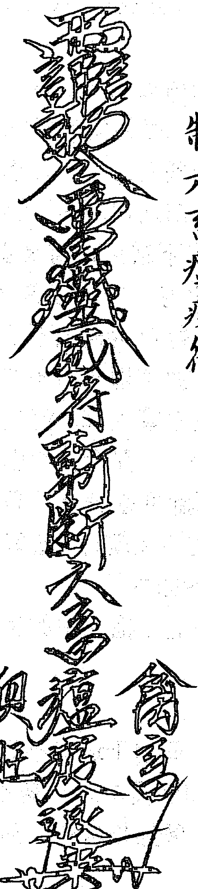

## 制六畜瘟疫符

用法：貼農牧場或化陰陽水潑灑淨化

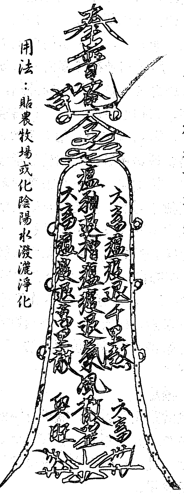

### 2、扫槽法：

扫槽法比安槽简单、可以使家畜不得病瘟，家畜肯吃，长得快，此法最多管1～3年。

方法：如养猪，可在圈门口或猪圈内设坛，请神、请猪大王，用一扫帚在猪圈内四角处扫，可将猪瘟邪气全扫掉，边念咒边扫，从里向外扫，扫槽咒：“一扫槽、扫帚到，二扫槽、瘟气掉，三扫槽、扫九代，邪气煞气齐扫掉，马灵官出令，用下千票，出下威灵，前来安槽。安槽要请诸佛菩萨，诸佛菩萨现金身，一年喂猪（鸡、牛等）长千斤，一头五头喂的多，每年两槽也不多，五月买猪十月卖，肯吃肯长来的快，瘟气邪气再不来，上长运气进猪（鸡、牛等）财。马灵官管九代，瘟气邪气不遭害。吾奉太上老君急急如律令。”咒念完扫出门外后，在圈内写：“姜太公在此斩妖除邪杀鬼万千急急如律令。”写时随便用什么东西写在墙上就行，最好用毛笔蘸朱砂写在黄纸上，然后贴在猪圈内。其它家畜在扫槽时也用此法，只是把扫槽咒中的字改变一下。

# 二、禳星

禳星就是犯了煞星，需进行禳解。适用于运气不好、多灾多难、夫妻不和、父子不和、口舌是非、久病不愈、心慌心乱、不归家宅、身中邪气、邪煞报应等，都可归于犯煞星。

禳解方法：择一吉日，设坛，备好香蜡纸等供品，一面镜子，大小都可，七星灯（一盏灯中有七个灯芯）一盏，红公鸡一只，红纸一张。焚香蜡纸，摆好供品，将七星灯放在供桌上点燃。镜子放在坛上，镜面照坛前方，如坛位是坐北向南，镜子应照在南方，红公鸡放在坛前。代请师显灵显圣，让患者跪在坛前。用鸡冠血点三滴在镜子上，镜子照在患者身上，将红纸搭在患者头上，鸡冠血点三滴在红纸上，患者双手可把红纸扶住，以免红纸从头上掉下来。念灵官禳星咒（念出声）：

> > 灵官咒，灵官法，马灵官下来有邪法，请马灵官下位来禳煞，禳你阴煞还阳煞，禳你邪煞还神煞，口舌是非一起压，禳你天上星，地下坑，禳你太阳星，狗咬星，日光星，月光星，夜马星，扫帚星，乌龟豪煞星，小儿星，有煞退煞，有病退病，百病齐退，万病齐抓，吾奉太上老君急急如律令。

接着再念玄天咒

> > 真武大将军，玄天自上尊，脚踏龟蛇将，宝剑现七星，皂旗遍日月，代领百万兵，仙佛见之皆拱手，邪魔见之化灰尘，有人念动玄天咒，八大金刚随后跟，天上念起天也动，地下念起地也崩，倘有邪魔不服者，宝剑一举永无踪，吾奉太上老君急急如律令。

用令牌在坛前拍三下，念令牌祛邪咒：

> > 令牌一响天摇地动，踏一脚鬼怕神惊（脚用力在地下踏一下），上方打开灵霄殿，下方打开地狱门，石门打开火烟起，才显方伦大将军，方伦领兵来到此，邪魔鬼怪尽除根，吾奉太上老君急急如律令。

边念咒边用令牌在患者身前后拍数下。

# ◎避是非、风波符

※午時門口燒化三道。

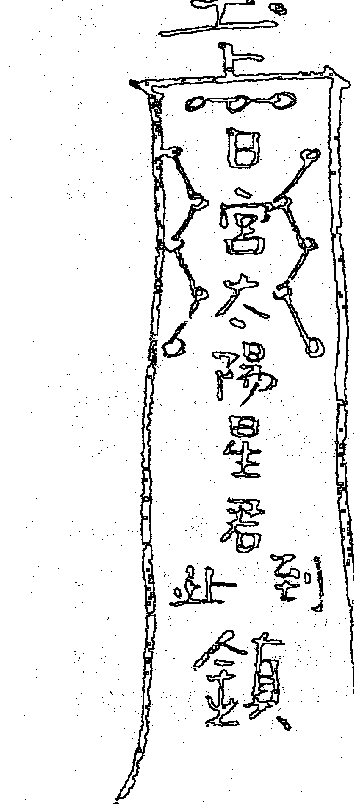

# ◎护身除病符

※带身。

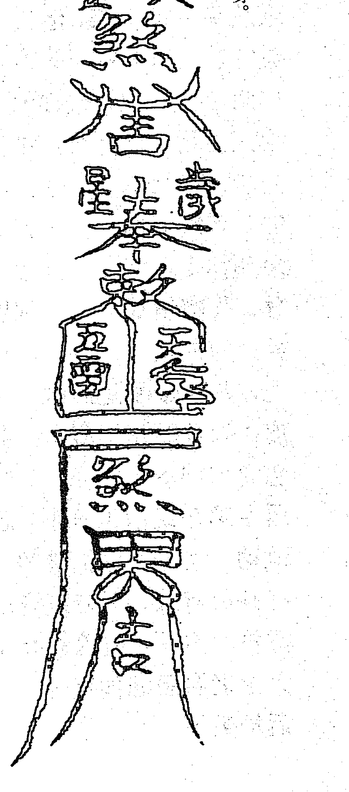

将红纸从患者头上取下，用红鸡冠血点患者前额、头顶、后脑三处各一滴血，患者叩三个头后可站起。

谢师送神，再次焚香蜡纸，念送神咒：“弟子×××（施术者法名）虔诚谢过三清祖师、观音菩萨、历代先师等诸位仙师，助弟子行法，治病疗疾、普救苍生、恭焚宝香，叩首奉送，后有所求，还当叩请。”

将红纸让患者家中人或其它人送在野外焚烧，镜子也送在野外，再烧些纸钱。也可将红纸和纸钱烧在室内，将纸灰和镜子送在野外扔掉。

# 三、天坑镇法

天坑镇法是一种制人之法，此法简单易行，且效果好。施法时在对方门前或对方必经之路上挖一坑，坑内画一太极图，用九张黄纸把对方名字分别写在九张黄纸上，每张黄纸写一个名字，将九张有名字的黄纸十字重叠放在坑中，名字朝上。用一瓷碗，在碗上用朱砂画五雷符，也可在一张黄纸上画五雷符，盖上“道经师宝”法印，贴在碗内。碗扣放在有姓名的九张纸上。（见符图：2）用一新青砖，在砖上用朱砂画泰山镇符（见符图：3），在砖左右两侧各画泰山镇符（见符图：4），将砖平放在碗上，符朝上。

请神，就是烧部分黄裱纸于坑中，并向神灵通报要办的事。将坑埋好，只要对方从坑中经过就会患病。

解法：将坑中砖、碗、有姓名的黄纸取出即可破解，对方就会病愈。

# 四、消灾法

此法适用于多灾多难之人，家中经常有横祸出现。灾难很可能降临某一人身上，也有可能会全家人都有灾难，原因不明。由灾难而影响到家庭不和、工作不顺、身患疾病，个人一切都不顺等等。
禳解的方法可以用疏文的形式进行消除灾难。此法的运用要求对方一定要信神灵，在阳间不能作恶多端、诽谤神灵，否则不灵。

方法：选一黄道吉日，备好香蜡纸，备好香花，美酒、香茶、水果等供品。用黄纸墨汁书写好疏文。
设坛，坛上供奉：“南宫孚佑帝君恩主、九天司命真君恩主、先天豁命灵官恩主、精忠武穆王恩主。各位恩师”神位，神位用红纸墨汁书写。如果在自己坛上消灾，自己坛上没有供奉以上神位的，也要将以上神位设在自己的坛上。如要在对方家中消灾的，就写以上神位即可。
此法白天、晚上都可进行。坛设好后，摆好供品、焚香蜡纸，请神，请神一定要把所供奉的主神请上。要求对方跪在坛前，叩三个头，可发愿心，灾难消后如何精忠报国，如何报达神恩之愿。将疏文焚烧，对方再叩三个头。再次焚香蜡纸，谢师、送神。
此法可在佛道两家庙中办，效果更好。

图2

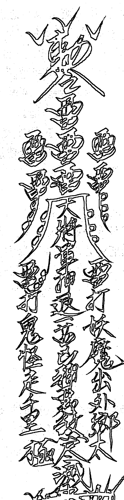

五雷押煞符

用法：贴或带身

## 泰山镇煞符

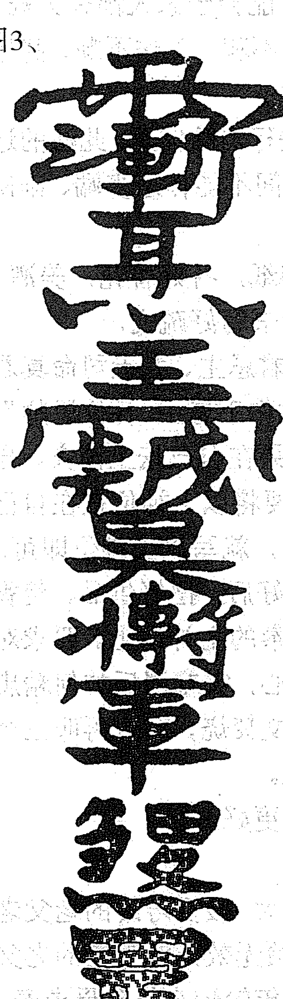

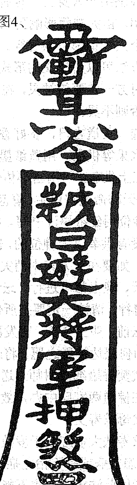

左方二道用墨汁画在黄纸上贴用，可镇煞，两道都可用，只用一道即可，不是同时用两道。

# 五、为父母求寿文

为父母求寿法大多应用于岁数较大，接受寿终的老父老母。如身患重病或有不治之症医治无效必定寿终的老父老母不能用此法求寿。也不能为年轮较小的父母求寿，如为 40 岁~60 岁的父母求寿为时过早。但有少数父母寿数较少，寿数在60岁以上，可为其增加寿数。总之具体情况具体对待。
为父母求寿、延长父母的寿命，其父母必须要信奉神灵。此法是为自己的父母求寿，他人的父母能否用此法求寿呢？是一样的。在求寿数时不能要求太高，一切都是靠神灵作主，靠神灵来延长父母的寿数，到底能延寿多少年？是五年、十年、二十年或三十年，难说。过高的要求就是靠神灵也办不到，三年、五年、多则十年，神灵很可能都办不到。增加三十年或更多的寿数，谁也办不到，如果能办到，某些人就能活到千岁以上。
给父母延寿数，父母一定要发愿心，在发愿心时可以要求诸神给自己增加三年、五年或十年的寿命，不要要求太高，并在发愿心时一定要讲明如何还愿，还什么等。如给父或母求寿后，如求寿五年，已经达到，五年后可继续求寿，方法还和以前一样。有些给父母求寿，要反复增加二至三次寿，有的只一次，第二次再也求不上了，这也与人的缘份有关。
求寿的方法，选一黄道吉日备好香蜡纸、香花、美酒、香茶、水果等供品。用黄纸墨汁书写。如果在自己坛上为父母求寿的，自己坛上没有供奉以上神位的，也要将以上神位设在自己的坛上。如果在对方家中求寿的，就写以上神位即可。
此法白天、晚上都可进行。坛设好后，摆好供品，焚香蜡纸，请神，请神一定要把所供奉的主神请上。要求对方跪在坛前，叩三头，可发愿心。将疏文焚烧，对方再叩三头，再次焚香蜡纸，谢师、送神。
此法可在佛道两家庙中办，效果更好。

## 六、为求子接嗣文

此法可为久婚不育者求子，也可为家族子孙后代者求子。凡求子者一定要信奉神灵。选一黄道吉日，备好香蜡纸、香花、美酒、香茶、水果等供品。用黄纸墨汁书写好疏文。盖上“道经师宝”法印，法印可盖在最后落名处。
设坛，坛上供奉：“文昌梓潼帝君、九天司命真君、先天豁落灵君”神位。神位用红纸墨汁书写。如果在自己坛上给别人求子，自己坛上没有供奉以上神位的，也要将以上神位设在自己的坛上。如果在对方家中求子的，就写以上神位即可。
此法白天、晚上都可进行。坛设好后，摆好供品，焚香蜡纸，念请神咒，在念请神咒中一定要把所供奉的主神请上。要求求子的夫妇二人跪在坛前，叩三个头，可发愿心。请诸神在阴中帮助，求子接嗣，如求到子后如何还愿，报答神恩。施术者可以帮助求子的人请求神灵求子，将疏文焚烧，求子者再叩三个头。再焚香蜡纸，谢师、送神。
此法可在佛道两家庙中办，效果更好。

## 七、为求功名法

此法可为有志之士求取功名。此法的运用大多是有一定的条件，不是能给每个人都能求取功名。对那些有上进心，又有一定的工作能力、有知识但没有机遇的人求取功名较容易。对那些游手好闲，又想贪图荣华富贵，想求一官半职的人，用此法是无用的，因此法的运用，全靠诸神帮助，每个人的所作所为，神灵都知，如果为不该有功名的人求取功名，神灵在阴中是不会帮助的。此法还可以为已有功名地位的大德者求取更高的功名。

方法：选一黄道吉日，备好香蜡纸、香花、美酒、香茶、水果等供品。用黄纸墨汁书写好疏文，盖上“道经师宝”法印，法印可盖在最后落款处。

设坛，坛上供奉：“九天司命真君、先天豁落灵官，文昌梓潼帝君”神位。神位用红纸墨汁书写。如果在自己坛上求功名的，自己坛上没有供奉以上神位的，也要将以上神位设在自己坛上。如果在对方家中求功名的，就写以上神位即可。

此法白天、晚上都可进行。坛设好后，摆好供品，焚香蜡纸，念请神咒，在念请神咒中一定要把所供奉的主神请上。要求对方跪在坛前，叩三头，发愿心。请求神灵帮助为自己求取功名。如功名取得后，如何精忠报国，报答神恩。施术者也可帮助对方求神灵在阴中给一定的功名。将疏文焚烧在坛前，对方再叩三个头。再次焚香蜡纸，谢师、送神。

此法可在佛道两家庙中办，效果更好。

## 八、求病愈法

此法可为久病不愈，经医治无效的病人求快速病愈的方法。无论什么病症，也无论病情的严重程度或病危的病人，只要信奉神灵都可用此法求病愈。

方法：选一黄道吉日备好香蜡纸、香花、美酒、香茶、水果等供品。用黄纸墨汁书写好疏文，盖上道经师宝法印，法印可盖在最后落款处。

设坛，坛上供奉：“文昌梓潼帝君、九天司命真君、先天豁落灵官”神位。神位用红纸墨汁书写。如果在自己坛上求病愈的，自己坛上没有供奉以上神位的，也要将以上神位设在自己的坛上。如果在对方家中求病愈的，就写以上神位即可。

此法白天、晚上都可进行。坛设好后，摆好供品，焚香蜡纸，请神，在请神时一定要把所供奉的主神请上。要求对方跪在坛前，叩三个头，发愿心。请求神灵帮助病愈。如病愈后，如何精忠报国，报答神恩。施术者也可帮助对方求神灵在阴中给患者治病。将疏文焚烧在坛前，对方再叩三个头。再次焚香蜡纸，谢师、送神。此法可在佛道两家庙中办，效果更好。

## 九、为消前世冤孽

此法适用于因果病，今世多灾多难、万事不顺，大多为前世冤孽深重，要想使今生来得顺利、无灾无难，一定要把前世冤孽消掉。

有前世做孽的因，大多反映今世有灾难的果。如果消除前世的孽，必须今世要信奉神灵，多做善事，多积阴德，用消前世冤孽的方法，消除前世冤孽，今世就会无灾无难。

方法：选一黄道吉日，备好香蜡纸、香花、美酒、香茶、水果等供品。用黄纸墨汁书写好疏文，盖上道经师宝法印，法印可盖在最后落名处。

设坛，坛上供奉：“文昌梓潼帝君、九天司命真君、先天豁落灵官”神位。神位用红纸墨汁书写。如果在自己坛上消前世冤孽的，自己坛上没有供奉以上神位的，也要将以上神位设在自己的坛上。如果在对方家中消前世冤孽的，就写以上神位即可。

此法白天、晚上都可进行。坛设好后，摆好供品，焚香蜡纸，请神，在请神时一定要把所供奉的主神请上。要求对方跪在坛前，叩三个头，发愿心。请求神灵帮助为自己消前世冤孽。如前世冤孽消除后，如何精忠报国，报答神恩。施术者也可帮助对方求神灵在阴中给一定的帮助。将疏文焚烧在坛前，对方再叩三个头，再次焚香蜡纸，谢师、送神。

此法可在佛道两家庙中办，效果更好。

## 十、延寿长生大法

> >咒：稽首太上尊，归命礼北辰。仰启二尊帝，朝现七元君。经始蜀者出，道为天人根。天地生元气，灵光聚北辰。紫微开帝座，玄阙列真君。於是七元君，大圣善通灵。济渡诸厄难，超出苦众生。三魂得安健，邪魅不能侵。五方降真气，万福自来并。长生超八难，皆由奉七星。与天地同生，与日月并存。天地理循环，返老成全真。生生身自在，世世保神清。善此光中影，家保道心宁。吾今常持诵，延寿又长生。吾奉太上老君急急如律令。

延寿长生大法是道家的根本大法，也就是长生不老大法，是长寿的捷径之法。此法说容易就很容易，做到难就很难。对那些真正修行严守清规戒律的人来说，很容易做到；那些不守清规戒律，又追求使自己能长生不老的人来说，就难于上青天。

修炼此法的前题必须要修心，使自己具备高尚的情操，再修此法，就会长生不老。修炼此法就严守道门道规，必须做到不杀生、不偷盗、不乱淫、不妄语。多做好事积阴德，多救人，多布施，多敬神灵，最好以素食为主。能基本做到以上条件的，再修炼此法，就打开了长生不老的大门。

此法的修炼较简单，每天至少要练一次，最好早晚各一次，天天习练，活一天练一天，没有练四十九天的限制。早上清早起床净手净口后，就面向北方，念咒一遍（默念出声都可），可用剑指在空中画延寿符一遍（见符图：5），晚上在临睡前面向北方练一遍。方向要求永远是北方，西方也可，其它方向都不可。

此法修炼时，不需要再设坛请神和敬神，敬神靠平时敬，练完后也不需要送神谢师，练一遍最多有两分钟，也可以每天多练几遍，也可每天多念几遍咒语，或者每天练5分钟、10分钟等。此法的修炼贵在坚持，不能两天打鱼三天晒网。任何地方都可练，走在哪练在哪。

经常修炼此法，能避邪祛魔、消灾免难、强身益智。

## 十一、千斤榨

> > 灵官咒，灵官法，灵官使起泰山榨，泰山重的千斤榨，给你上起千斤法，榨你头，榕你腰，轧你血水顺河漂，抬不起头，撑不起腰，七柱明香把你烧，千人抬不起，万人拉不起，吾奉太上老君急急如律令。

千斤榨是一种治人之法，可制人于死地，也可用于各种动物。有人把千斤榨称为定身法，说法也有道理。千斤榨使上后，有千斤以上重量，众多人也抬不起来，给人使上后，有千斤的压迫感，使人不能动，时间短者可患病，时间长者可要命，此法用时一定要慎重。

用法：在近距离时用剑指右手画符（见符图：6），边画边念符咒意念对方身上即可。

解法：咒曰：奉请九牛祖师来造起，阴九牛、阳九牛、快快起，若不起九牛来造起，吾奉太上老君急急如律令。画解法符（见符图：7）时念解法咒意念对方身上即可。

## 十二、定身法

咒曰：天灵灵、地灵灵，定身祖师来降临，铁牛祖师来降临，铜牛祖师来降临。定你头，定你腰，定你腿。前不动，后不动，左不动，右不动。手一指，喊声“定”，说不动，就不动，抬不起手，扭不动腰，二脚入地不动摇，谨请南头六星，北斗七星，吾奉太上老君急急如律令。

使用方法：定身法不仅可以定人，而且可以定任何活着的动物。用时念咒，画定身符（见符图：8）于对方身体一次，用剑指向对方一指，喊一声“定”，对方即可定住。此法的应用熟练时不用念咒画符，只要用剑指一指，喊一声“定”，对方能定住，才算真正掌握定身法。

解法：咒曰：千法解，万法解，只有我来解，铁牛祖师来解退，铜牛祖师来解退，叫你走，你就走，谨请南斗六星，北斗七星，吾奉太上老君急急如律令。

## 破千斤煞法

【法咒】
太上有令命我行，手挟天雷镇诸煞。五方五帝护我形，役使六丁兼六甲，诸煞凶神违我令，将尔永镇泰山石。

【白话详解】千斤煞是煞神中最凶的一煞，宜用此镇之。

## 消灾疏文

伏以
圣智圆通唤醒黎民归正道。
神恩远被渡人智筏出迷津。
今据
××省××县（市）×××（对方姓名）本命生于××年××月××日××时，诚惶诚恐。
稽首顿首。谨以素筵、香茶、鲜花之仪。为消灾植福之事。虔诚敬献于南宫孚佑帝君恩主。
九天司命真君恩主。先天豁落灵官恩主。
精忠武穆王恩主。暨列位恩师之座前
空念鸾下，生居中士。愧未能超行正道。
每误入邪征，以致灾害及身。甚至疾病缠绵，无计可申。
转恩××××堂（主神祭祀是坛，如三清坛，观音坛）
列圣诸真，飞鸾显化。济世救人。大开觉路。指点迷津
鸾下×××（对方姓名），自效劳以来。兢兢业业。始终贯彻。以报洪恩。无如年来坎坷时常。
精神萎靡。愿求讽经以后，却病延年。灾消祸解。家门清泰。疾病康安，永无恶曜之侵临。
定有吉星之护体。无任恳祷之至。谨拜奉闻。天运          年    月    日×××（施术者法名）九叩上申。

## 为父母求寿疏文

××省××县（市）居住弟子×××（施术者法名）
谨以素筵、鲜果、香花、清酒之仪。敬献于
九天司命真君；
先天豁落灵君；
文昌梓潼帝君座前。伏以神恩广大无感不通。圣泽巍峨
有求皆应。稽查善恶之权。主持功过之柄。
窃念弟子生母（父）×××（求寿者姓名）年当××岁，
气力渐衰。劬芝未报。合适短难知。为人子者实抱隐忧。
伏乞×××堂（供奉主神的神坛称堂，如供奉三清，就
称三清堂）。飞鸾敬示。始知帝恩开施格外，大溥洪慈。
故虔心发愿。×××（施术者姓名）为母（父）求寿。
稍答亲恩。
伏冀恩主鉴此愚忱。据情启奏。赐生母（父）以登寿考，
再延寿数。赦弟子不孝前愆。无任恳祷之至。瞻仰之至。

天运         年       月       日×××（施术者法名）

九叩上申。

## 求子接嗣疏文

××省××县（市）居住弟子×××（施术者法名）谨
以素筵、鲜果、香花、清酒之仪。敬献于九天司命真君。
先天豁落灵君；文昌梓潼帝君座前。伏以神恩广大无感
不通。
圣泽巍峨有求皆应。稽查善恶之权。主持功过之柄。叨
念弟子宿业深重。生前失修。叹伯道之无儿。悲潘安之
孤独。膝下稀微。椿萱爱孙心切。天伦畅乐修夫妻育子志殷。兴怀不寐。耿耿聚衷。伏乞×××堂（供奉主神的坛即称堂，如供奉三清，就称三清堂）。始知帝恩开施格外。大溥洪慈。故虔心发愿。×××（施术者法名）谨为弟子求嗣以接宗支。伏冀恩主鉴此愚忱。据情启奏。俾继承宗祧，胡万斯年，垂裕后昆，世世相传，无任恳祷之至。瞻仰之至。

天运 年 月 日×××（施术者法名） 九叩上申。

## 求功名疏文

××省××县（市）居住弟子×××（施术者法名）谨以素筵、鲜果、香花、清酒之仪。敬献于九天司命真君。先天豁落灵君。文昌梓潼帝君座前，伏以神恩广大无感不通。圣泽巍峨有求皆应。稽查善恶之权。主持功过之柄。窃念弟子二十年寒窗。三更灯火。勤修罔懈。仕途多乖。未得寸进。官阶聚玉腰金。总难步超，儒生扬眉吐气。每含下第之羞。徒抱凌云之志。固穷素守栓材摈斥，求进无门，声价难增。伏乞×××堂（供奉主神的坛即称堂，如供奉三清，就称三清堂）。飞鸾启示。始知帝恩开施格外。大溥洪慈。故虔心发愿。×××（施术者法名）谨为弟子求名，显祖耀宗以振门楣。伏冀恩主鉴此愚忱。据情启奏。俾得一官半职，服务官界。得追杨震之高风。免效李广之奇数。无任恳祷之至。瞻仰之至。

天运          年     月     日×××（施术者法名）

九叩上申。

## 求病愈疏文

××省××县（市）居住弟子×××（施术者法名）谨以素筵、鲜果、香花、清酒之仪。敬献于九天司命真君。先天豁落灵君。文昌梓潼帝君座前，伏以神恩广大无感不通。圣泽巍峨有求皆应。稽查善恶之权。主持功过之柄。窃念弟子身体素弱，时欠健康。任服药石。难得回春。终年坎坷时常。渐见形容憔悴。恐因修省疏漏，以致病疫牵缠。忧心耿耿。时抱隐忧。伏乞×××堂（供奉主神的坛即称堂，如供奉三清，就称三清堂）。飞鸾启示。始知帝恩开施格外。普度洪慈。故虔心发愿。×××（施术者法名）谨为弟子祈安却病延年，消灾解厄。元辰光彩，命宫安泰。伏冀恩主鉴此愚忱。据情启奏。俾得病躯健全身早平安。灾随电扫，福同云生。无任恳祷之至。瞻仰之至。

天运          年     月     日×××（施术者法名）

九叩上申。

## 消前世冤孽疏文

××省××县（市）居住弟子×××（施术者法名）谨以素筵、鲜果、香花、清酒之仪。敬献于九天司命真君。

先天豁落灵君。

文昌梓潼帝君座前，伏以，神恩广大无感不通。圣泽巍峨有求皆应。稽查善恶之权。主司功过之柄。窃念弟子宿孽未除业障缠身。梦想颠倒。运命频年多乖。丛集愆尤冤孽前世所结。或多杀生灵。或多亏阴骘。以致到处不谐。莫知所自。伏乞×××（供奉主神的坛既称堂，如供奉三清，就称三清堂）飞鸾启示。始知帝恩开施格外。 普度洪慈。故虔心发愿。×××（施术者法名）谨为弟子求消前世冤孽。并解当世业障。伏冀恩主鉴此愚忱。据情启奏。俾得罪业消除，转祸为祥，身心安泰，诸患不侵，无任恳祷之至。瞻仰之至。

天运 年 月 日×××（施术者法名）

九叩上申。

## 实用小法术与符咒

收惊法：清茶一杯置案上，燃点三支香，向灶君禀告小孩姓名、住址、生辰年月日时，以及目前精神状况。（大人受惊同样可用此法）

然后把三支香在小孩面前、胸前上下摆动，口念收惊咒，如下：
拜请九天司命护宅真君来收惊，收起小儿（女）某某失落魂魄，受惊元神，归在本身。收起东方惊无惊、西方惊无惊、南方惊无惊、北方惊无惊、中央惊无惊，五方正气护身煞气除，大惊小惊化无事。子丑寅卯辰巳午未申酉戌亥，十二元神自在，百病消除身无灾，日吃饭乳知香味，夜好安眠不啼哭，生命之光照灵台，吾奉「九天司命护宅真君急急如律令」。（反复念三遍）
黄纸朱砂写符。在惊吓之人睡着后。将写完之符在惊吓之人头上绕三圈。再其头一米处烧掉。普通惊吓一天可好，严重符咒写七道 每日一道 睡着后烧。

## 香袋收惊法

无烟香 檀香 的香袋三个 在惊吓之人睡着后 在他头上绕三圈烧掉。大人小孩皆有用。

## 收惊夜啼咒

> ‘天苍苍，地苍苍，小儿夜啼惊不祥，吾师今日来收捉，小儿即夕立安康。天惊地惊，年惊月惊，日惊时惊，水惊火惊，前檐公吊惊，后檐公吊惊，六六三十六惊，吾师奉法来收捉，要受铁枷铁锁形，诸神速速远离去，小儿稳睡永安宁。吾奉太上老君急急如律令敕。’

‘祝由厌梦咒’：祛除噩梦的符咒

> ‘赫赫阳阳，日出东方，断释恶梦，拔除不祥，急急如律令’，此咒须于清晨日出之时，手执刀面向东方口含净水一口面东喷之。念此咒一遍，诵咒后用刀背剁三下。切忌刀刃冲自己。

## 夜啼咒

天皇皇，地皇皇，我家有个夜哭郎，过路君子念三遍，一觉睡到大天亮。

## 收惊收魂咒

> 荡荡游魂何处留存、虚惊异怪坟墓山林、今请山神五道路将军、当方土地家宅灶君、查落真魂。收回附体、筑起精神。天门开、地门开千里童子送魂来。吾奉太上老君急急敕令。

## 失魂人

用黄纸朱砂字写两张。晚上一张在大门口烧，一张在房间门口烧。无论大人小孩受惊吓整日昏昏沉沉的，百试百灵。

## 止血咒语：

太阳出来一滴油，手执金鞭倒骑牛；三声喝令长流水，一指红门血不流。雪山童子来，雪山童子到，雪山童子止。

## 防自杀咒语：

> 大千世界，无挂无碍。自去自来，自由自在。要生便生，莫找替代。

## 启度文：

拜请三清三境三位天尊，太上老君，张赵二郎，岳王祖师李公真人，东山老人，南山小妹，南海观音，伏羲神农，轩辕皇帝，雷神大帝，盘古圣王，地母元君，玉皇大帝，横山七郎，罗山九郎，三天开皇，五岳大地，神霄王府，龙虎玄坛赵元帅，三茅真君，五星二十八宿，诸神仙手持符咒法术，与（某某——作法人）愿救众生苦难，治病回生，降魔除邪，避却奸恶，愿魁罡护体威灵显著，千叫千应，万叫万灵，不叫自灵。避邪符绘到八卦镜上可避邪降祥。也可以挂在家里，黄布红字书写。平安符红纸黑字画符戴身，五雷符黄纸朱砂字画符，镇。

## 符法的朱砂选择

朱砂分为几种类型：超箭，朱标，牡丽，黄标，此皆是在红朱砂中。

- 超箭：鲜红，不黄不紫。适合盖写意雄强一路，火。
- 朱标：红里透出金黄的色彩极好，适合盖工整一路的印，金。
- 牡丽：红偏紫，色泽深沉。适合豪放一路的印风，木。
- 黄标：有朱标和箭镞的特点，略近朱标，土。

五行中尚差一行水，即黑朱砂，辰州符法也很著名的其中一个很大的原因就是，辰州便是以产红朱砂、黑朱砂闻名。

红砂用法一般用于文符，其性缓，其情慢，适合缓发积蓄之效，如招桃花、聚财之用。黑砂用法为武符，其性急，其情暴，适合快速处理如治邪、镇煞、驱鬼之用。

符中又有五行相配，依据五行之理，配以符行变化，能引导天地之气，法天象地，拟乎事而应乎人，所以符法对朱砂的使用是相当重要的。

## 九种类型的鬼灵附体的鉴别方法与解决之道

最常见的也是最不容易解决的不幸，就是与灵性事件的不期而遇。为什么自己或家人总是不顺，或出灾祸，甚至殃及人命？为什么好好的人，却突然呆若木鸡，或疯了，或残了？为什么好好的身体，却突然病倒，去医院检查却无任何疾病？……总之，凡是找不到原因的突发灾祸，或到医院查不出疾病，又无办法治愈的病痛，基本上都是因为自己的“冤亲债主、历代宗亲”没有得到有效超拔而造成。那么怎样确认就是它们前来“讨债”的征兆呢？笔者认为，可由下列征兆判别：

1.  自己不能控制与支配自己的言行，本来心里想去东，结果自己的腿却往西走，甚至说话变嗓变音，自己都不知道自己说了些什么，甚或脱衣赤身乱跑。（这是典型的低等灵体上身的表现）
2.  身上不定位的跳动，或无端发热、发冷、发抖、肢体不由自主的颤动、睡觉经常鬼压床，白天眼睛酸痛畏光、睁不开眼，天一黑马上精神，眼也睁开了。（这是灵体上身串脉的附体现象）
3.  心脏无端发憋，像压着一块大石头，喘不上气来，气短、或突然心跳过速……嗓子像被人掐着，说话费劲。（这是被灵体袭击或欲寄生在被附体者心脏内的反应）
4.  经常无端恶心、干呕，从前爱干净的人，突然变得不爱洗澡、不理发、懒床、想哭、眼睛发直、发呆、自觉浑身无力、发软。（这是非正常死亡的灵体上身的征兆）
5.  眼睛瞳仁比正常人的变大，不聚光，发散，从前爱读书的人，不再爱读书，因为看文字都是双影，自觉看不清楚文字。（这是动物灵体上身的症状）
6.  喜黑，害怕光亮，喜欢一个人独处，害怕与人相处，自觉是无用之人，活在严重的自责当中，乃至自暴自弃，绝望，严重时想自杀，自杀之念一般在每天上午最为严重，甚至动手秘密实施自杀计划。（这是自杀身亡的灵体上身的征兆）
7.  频做淫乱之梦，或喜好手淫，或不能自控的手淫，导致手淫恶性循环、身体与运气日趋变差。（这是一种专门服食人类精气的淫鬼上身的征兆，男女均包括在内）
8.  平日正常的人，突然无端或因一点小事，就起暴躁，乃至对他人大打出手，实施暴力，直至杀人，自己竟不能自控或并不自知。（这是与此人怨气极深的冤亲债主找上来报仇的征兆）
9.  原来不信佛道教，也未念经修法，却因一场大病，或一场危及生命的大难，或什么难也没有，就突然看见佛菩萨，并会给人查事，看病，消灾，打难，甚至也教人念佛，给人超度者，都是自己的冤亲债主找来附在自己身体上所为，因并非自己修出来的功德所致，对出现功能者并不是什么好事，如果按照附体的要求，给人查事，看病，消灾，打难而收费者，一旦附体离体，不但自己的功能消失，还会遭遇更大的人生磨难。危险之至，不可不知！！！（此类附体一般都为狐、黄、蟒长四大家族和非正常死亡者，也就是民间称之为碑王的亡灵）

上述9类附体现象，就是当今经常发生在人身上的普遍现象，并且，现代医学对这些怪病，至今无有效的治愈方法，大家可以上述9类现象为鉴别自己或家人身上是否有附体的依据。如果知道自己是被附体了，怎样做才能让其离体而恢复自身的健康平安呢？这才是我们眼前最为关注与关心的问题，也是最不好解决的问题，笔者对此问题，谈一点自己的经验体会。

首先，附体并非无缘无故的上身，如果它们找上你，自有找你的因缘，所谓世间并不存在“无源之水与无本之木”是也。笔者认为，可采取下列办法解决：

1.  加强体育锻炼，经常晒太阳，让身体内的阴气减弱直至消失殆尽。身体为阳体，让阳气回归身体，转阴为阳，符合肉身的需要和规律，但这种办法只管一时，一旦你的年龄增大，体质变弱，它们仍然会伺机而上，你终归逃不脱它们的跟踪与惩罚。笔者曾见一30多岁的女白领，被附体后腿脚疼痛，到医院检查却无任何疾病，于是每天跑步锻炼，很快症状消失。可是一段时间没有锻炼，结果老病复发，仍然极为痛苦。
2.  作为安抚，将它们供奉起来，这种方法也可得一时安宁，但不是长久之计。因为它们找上来的主要目的，不仅要供养，更重要的是想利用你的人身，借体修行，积功累德，以期获得未来的宝贵人身。而你一旦接受它们的要求，就意味着将你自己的宝贵人身贡献出来，完全交由它们占有、使用，为它们的意识需求服务，而后，你来接受求助者的金钱物质的供养，以完成与它们精神能量与物质需求的交换。有人说，我不要钱行不行？我可以告诉你，它们绝不会同意。因为他们知道这个世界的因果大律，“天下没有免费的午餐”，你为别人免费办事，可它们今后还得还你，不如现在就做了结。如果你抗旨不受，等待你的将是“严格调教”，直到你不得不答应接受求助者的财物供养为止！可悲的是，如生前从事这个行业，是再难以转世为人身的，故请迷恋仙家与神通的人三思！
3.  用送童子或烧纸钱恭送的方法。这个方法也属于调解性质，实践中，对有类似症状的人，有的有用，有的就无用，有的能送走，有的也送不走。但不会激起冤亲债主的愤怒！
4.  请道门等能降魔的师傅出面降服，将它们擒拿、收缴或击散，让它们乖乖就擒，而退出讨债的执着。此法可能凑效，可是此法所带来的负效应，也许会将讨债者的仇恨放大若干倍，只会激起讨债者对被讨债者更深的仇恨，也许今世，也许来世，一旦时机成熟，被降服过的冤亲债主将反击的更加激烈与彻底！
5.  念经修法、忏悔、回向来超度这些仙家，也就是自己的冤亲债主、历代宗亲。请佛菩萨出面，调解你们双方的世代恩怨，直到将它们说服去善道或西方净土，停止对你的讨伐和骚扰为止。这将是一个漫长的修行过程，也许一度你的猛利修法会严重失灵，使你面临对佛法丧失信心的危险，因为无始劫来的冤亲债主是不会轻易放弃报仇雪恨的机会的，这也是为什么当今越来越多的怪病无法治愈的原因！

## 命理看哪些人不能戴耳环

耳环又称耳坠，是戴在耳朵的饰品，古代又称珥、珰。大部分耳环都是金属的，有些可能是石头、木、或其他相似的硬物料。通常女性戴耳环比较多一点。耳环透过一个在耳珠内的穿洞来勾住耳朵（除了夹式耳环之外），其他选择包括耳骨、耳门、耳内侧等等。“穿耳”通常指穿耳珠，其他部分会特别指明。耳珠是耳朵中神经线最少的一个部分，穿耳后康复的时间亦较短。其他部位如耳骨、耳门，则比较容易发炎。

耳环可以由金属、塑胶、玻璃、宝石等物料制成。有些是圈状的，有些是垂吊式的，有些是颗粒状。耳环的重量和大小受人体的承受能力限制，有些习惯戴重耳环的人，戴久了便会发觉耳珠和耳洞都被拉长了。从命理上来看，究竟哪些人不能戴耳环呢？

- 一、凡是属牛、羊、马的朋友，不论男女都要谨慎戴耳环。
从命理上来看，属牛、羊、马的朋友因属相的原因通常是不可以戴耳环、甚至在脖子上佩戴挂坠都要严格控制。因此，这些属相的朋友如果你发现自己戴耳环后，或者在脖子上佩戴挂坠后，出现了运势上的不顺，包括健康、情感、财运、事业等问题，那么，你不妨将耳环和挂坠取下来，没准就能对症下药了。
- 二、凡是命理五行上有冲忌的朋友，要谨慎佩戴耳环。
这是什么意思呢？人的命理五行是不一样的，如果一个人命理忌讳“金”，那么，你就不要佩戴金属的耳环，包括质地为金、银、铁、不锈钢等制作的耳环。
同理，如果你命理五行忌讳木，那么，你就要避开木的耳环；如果是命理忌讳火，那么，要忌讳塑料、琉璃等制作的耳环；如果命理五行忌讳土，那么，通常玉类的耳环是不可以佩戴的。

### 三、其他相关佩戴耳环的问题

近来不少朋友还咨询了其他相关佩戴耳环的问题，郑博士在此一并回答：

- 1、耳洞不幸被拉伤，还能不能戴漂亮的耳环？
说明你和耳环没有缘分。
- 2、能不能戴假冒的耳环？
有位朋友说：“曾几何时，我一戴耳环，耳朵就烂。可是我最喜欢的饰品就是耳环，现在只能戴真的，是不是不能戴假冒的耳环？苦恼”。
如果你命理五行喜金，佩戴的却是塑料的耳环，尽管外表镀上一层金粉，也是不可以的。
- 3、打耳洞后因为上学一直不能戴耳环，用什么可以代替？
上面说过，如果你是属牛，你本身是不适合佩戴耳环的。你的情况郑博士建议你暂时什么都不要佩戴，等到毕业后再讲。
- 4、是不是怀孕的人不能戴耳环？
坊间有传说，怀孕的人不能戴耳环。这主要是指不适合佩戴耳环的那些属相、以及命理上不适合佩戴耳环的朋友，其他朋友只要不碍事，那么就可以佩戴耳环。

### 5、拍签证不能戴耳环吗？

是的，如果你要出国，去拍照，那么，通常是不可以佩戴耳环的。这个问题其实与命理无关。郑博士顺便回答罢了。

### 6、睡觉的时候能不能戴耳环？

这个要具体分析，如果是为了美观佩戴耳环，那么睡觉时可以取下来；如果是为了补命理的不足而佩戴耳环，那么最好是不要取下来。

### 四、什么时间打耳洞为宜？

打耳洞是为了佩戴耳环，因此，什么时间打耳洞是有讲究的。最低限度，冲忌自己属相的那天，你是不能去打耳洞的。与此同理，打耳洞后，第一次佩戴耳环也是要挑日子的，此后则可随意了。

此外，佩戴耳环还应与年龄相协调，年轻的少女宜戴多边形等造型感、动感较强的耳钉、耳环，以塑造充满青春活力、朝气蓬勃的形象，对于制造耳环的材料，不一定要太过苛求。而中年女性一定要佩戴有质感的珠宝类耳饰，品质上乘的观感远比造型的出位独特更加重要。

可见，即使小小的佩戴耳环的事情，也是与自身的命理有关，与自己的运势有关。

## 公开运用密咒治病的秘密法

真言法专治各种疾病的修持法

首先恭敬诵念：南无消灾延寿药师佛（十遍）。

然后念密咒治某病（姿势：盘坐合掌或站立。前有佛像则更好）

### 1、专治胃病真言法

方法：全身放松，闭目，二手交叉置于胃部，观想药师佛形象及想象佛的治病能量进入胃部。感到温暖舒服。并运用念力使一股真气在胃部顺逆各转108次。后默念真言：“凉亚吗陀罗呢”108遍。一定时候会觉得在胃部有温暖震动，病魔消失，饮食正常。

时间：每天放松闭目默念六次，每次20分钟左右。早晨30分钟，睡前1小时。或念真言：“嘻努滑努嘻滑来。”

### 2、专治肝病真言

方法：全身放松，入静闭目。接收佛的治病信息。同时默念真言：“吽嗒哪哑努”108遍。并观想真言能量在病区治疗去除病痛！日久就感到肝病消失，恢复健康。

时间：早晨5点半到7点，下午1点半到2点半，晚上8点半至10点。

方法二：全身放松入静观想佛后，默念真言“吽发吽发吽吽发”七遍。然后观想全身收到佛的金光，再默念“吽嗒哪亚哪”真言。时间：半小时以上，每天三至六次，晚上睡前用手侧掌，按摩足心涌泉穴10分钟。

### 3、专治脊椎腰椎病真言

方法：全身放松入静默念真言：“吽哈哑哈发啦哑”。并观想佛的光辉形象，如果能观想到佛的光照到患者病痛处，就有立竿见影的效果！时间：每天早上五点半到六点，晚上8点到9点半。（治病时可坐也可站）

### 4、专治结石真言：

方法：盘坐，放松闭目，合掌。默念“南无（NAMO）药师佛”十遍。观想佛像或观看佛像。同时接收佛的治病信息到病症处。默念真言：“吽哈嗒当当略”。使结石排出。时间：每天修持三次。每次25分钟以上。早中晚各一次。

### 5、专治高血压病真言：

方法：自然坐，放松，闭目入静，二足与肩同宽。足跟着地，足趾上仰。然后观想佛的光辉形象，有光照来。使血压降低恢复正常。并默念真言：“阿悉陀夜吽呢哈”！观想血压从头降至足下。时间：每天早中晚三次。每次一小时左右。（服药者，药吃完为止）

### 6、专治低血压病真言：

方法：站立，放松，闭目。二足与肩同宽。十趾轻轻抓地。观想佛的光辉形象放光照耀，气血通畅暖和。同时默念真言“南无喝啰怛那哆啰夜耶”。观想血压从脚向上升高，心跳正常，感觉舒畅！头晕消失！
时间：每日早中晚三次，各约一小时。

### 7、专治糖尿病真言：

方法：静坐，放松。用手轻拍腰部三至五分钟，到觉有发热时止。然后闭目，观想佛的光辉形象放光照耀。默念真言“咔托纳滑资来”。使体内血糖结构正常！

时间：每天至少早晚各一次约一小时。(偏方：老冬瓜上白霜刮下，口服有特效)

### 8、专治支气管炎真言：

方法：静坐，闭目，放松。接收佛的治病信息能量。默念真言：“哈特啦届哑”。观想佛的信息能量在胸口病区去除炎症。若有轻微震动，并有温暖之感！则疾病将不久消失之兆！也有可能立刻消失！观想病气从双足排出。

时间：每天早中晚一次，每次一小时。

### 9、专治肺病真言：

方法：静坐，放松闭目。先默念“南无消灾延寿药师佛”十遍。然后接收佛的治病信息能量。并默念真言：“吓亚吓托来发也”。观想真言能量在肺部发生轻微共振，使病魔消失。观想病气向下从足底排出，入地。

时间：早中晚各一次。时间一小时左右。

### 10、专治鼻炎真言：

方法：放松静坐，闭目。二手擦热，用二中指搓鼻梁二侧，思想集中在鼻空旁五分的“迎香”穴。搓五分钟。然后接收佛的治疗信息。然后默念真言：“啊哑来努哈吽”，观想真言在鼻旁产生治疗效果。

时间：早上起床后半小时，上午一小时，晚上睡前半小时。

### 11、专治肾病真言：

最先默念：南无消灾延寿药师佛（十遍）然后依下法治病。

方法：先轻轻拍打腰两侧的肾部五分钟，至略有发热为止。然后全身放松、入静闭目。接收佛的治病信息。然后默念真言：“吽托录哑吽吒”。观想佛治病信息在病区发生治疗作用！

### 12、专治心脏病真言：

先以恭敬心默念：“南无消灾延寿药师佛（十遍）”，观想佛的光辉形象！正为患者治病。

方法：静坐，先两手搓热，按摩足掌心五分钟（或108下即可）。然后全身放松闭目。观想佛的治病信息注入心脏，同时默念真言：“燊哩滑塔哟吽嘛呢哈”（108遍，或反复默念）。默念真言能量在心脏内发生治疗作用，意念有红光使病魔消除。

时间：早中晚各一次。每次一小时左右。

方法二：或时刻默念真言“吽端乐哇哑唵”。使心脏功能自动获得调节。

### 13、专治眼疾真言：

方法一：静坐放松闭目。站也可。默念真言21遍或49遍：“但尔也他，咽哩弥哩，梨枳咽哩，系帝，护庚护庚，护也摩宁，护鲁护鲁，怒鲁怒鲁，娑婆诃。”观想佛的治疗信息在眼中发生很好的治疗作用。感到清凉、明亮。眼疾消除。

方法二：静坐放松闭目。默念真言：“释伽薛尧”。作手印如下：二手平伸，左右食指相扣，各大拇指各搭中指成印。然后默念真言。观想佛的光辉照射双眼。

时间：早晚各一小时。

以上笔者公开了几种常见病的方法，但如果要治疗疑难病的话，则必须要修持许多特殊的方法，要有三四年的功夫才行！现在为了对于佛教修行法，有信仰的人，而且有时间修持，佛教法师释觉修也不妨公开出来，让有志于为大众服务的，尤其是医生在治疗疑难病例时，有极好的疗效！方法如下：

- 一、以恭敬心念诵“三归依”（三归依是指“归依佛、归依法、归依僧）十万遍。
- 二、念诵观世音菩萨的六字大明真言十万遍：“嗡嘛呢呗美吽”。
- 三、念“南无大悲观世音菩萨”十万遍。
- 四、以恭敬心礼拜观世音菩萨，十万遍。

## 化解冤亲债主的方法

### 一、要化解时的必要认知

许多人觉得我是好人，心地好，从来没害人之心，为何会有冤亲债主？其实，无量劫来，我们身、口、意三业，造作了太多的贪瞋痴、杀盗淫等恶业，跟无量无边的众生结了不少怨仇。别的恶业暂且勿论，单是杀生吃肉，就跟他们结下深厚的怨仇。

> 印光大师说：“凡属危险大病，多由宿世现生杀业而得。”一碗之肉，冤魂缠绕，一念杀心，罪债难逃。

它们被我们杀害时产生无量的痛苦，这个怨恨就像无形枷锁，把它们的痛苦牢牢的锁住，让它们无时无刻不在痛苦的折磨中，而不得开解。它们痛苦如此之大，难怪今世遇到杀害它们的人，就迫不及待的要讨债——讨回一个公道。我们看到人临终时的痛苦现象，看起来都不忍心。为什么会有那些现象？这都是他的冤亲债主来找他算帐。他不懂这些道理，只知道跟众生结罪缘，不懂自己累劫来的冤亲债主，大部份都是被自己吃来的！

不仅是病苦，就连日常生活中许多不如意、不顺遂的事，也常常是受到冤亲债主干扰而不自知。

> 《地藏经》中提到：“阎浮提行善之人，临命终时，亦有百千恶道鬼神，或变作父母，乃至诸眷属，引接亡人，令落恶道，何况本造恶者。”

这些临命终时现身的恶道鬼神，也都是冤亲债主变现来诱骗我们前往三恶道受苦的。

因此，当我们遇到重大病苦或诸多不顺时，理应依照佛法的教导来正确面对，而非到处求神问卜，藉卜卦改运来化解灾难，这种做法即使花再多的钱，终究也是徒然！

> 印光大师说：“世人有病及危险灾难等，不知念佛修善，妄欲祈求鬼神，遂致杀害生命，业上加业，实为可怜。人生世间，凡有境缘，多由宿业。既有病苦，念佛修善，忏悔宿业，业消则病愈。彼鬼神自己尚在业海之中，何能令人消业？即有大威力之正神，其威力若比佛菩萨之威力，直同萤火之比日光。佛弟子不向佛菩萨祈祷，向鬼神祈祷，即为邪见，即为违背佛教，不可不知。”

#### 疾病的种类：

病有三种。

1.  第一种病是生理的疾病。饮食不当或寒暑不留意招惹的病，比如说感冒，发烧了，怎么办呢？赶快上医院打针吃药，绝对不能耽误。因为身体发烧之后恐出现并发症，引起其它别的病变，耽误不得，赶快去打针吃药，几天后也就好了。
2.  第二种是业障病。凡是到医院能检查出来的病就叫业障病。你要肯真心念佛，就能消这个业障。大陆一位居士的肺门上长了一个比鸡蛋还大的肿瘤，发病时大口地吐血。大夫一看没治了，发出死亡通知书。他母亲是学佛人，学得相当好就告诉他：“儿子，咱们不治了，咱们找个高明的大夫吧。”找谁呢？大医王。“儿子，你就念佛吧，死呢，咱们就死到阿弥陀佛那里去！”就这样他念佛求往生。念了两个月的佛，回家后就往外吐血、吐烂肉，吐了四次不吐了，后来再到医院检查，肿瘤没有了。

了。

这就是由自己业力所感得的业障病（例如癌症、糖尿病、脑血栓、冠心病等等这些病症较重、患者痛苦、不易治愈的疾病都可以归纳到业障病之内，尤其是我们学佛修行之后，很多人业障现前反而得了重病，这些都是障碍我们修学的业障病）。业障病怎么去除呢？自己的业力还得自己消。他没烧金元宝，也没烧黄纸钱，就是死心塌地地念佛，最后肿瘤没有了。普贤菩萨在十大愿王中教给我们“忏悔业障”，诚心的忏悔才是消除修学路上众多业障的主要方法。

业障病需要不需要吃药呢？也需要吃药。但要明白吃药是助缘，助你好得快，能治业障病的主因是清净心、忏悔心，诵经念佛来祈求佛菩萨加持的恭敬心。心里没有贪、瞋、痴三毒，外边的毒素就不会感染，再用客观因素的助缘吃点药，病就好得快。

第三种病不好治。什么病呢？冤亲债主的病。什么是冤亲债主的病？到医院检查不出来因，但是自我感觉身体又确实有病。病源是什么？冤亲债主，所谓冤鬼附身。

医生没法医治，药物对他不起作用。这一类病如何治？佛法的超度诵经、解冤释结对这类病有效。超度，用现代话来讲，就是调解、劝导。因为过去做错了事，希望求谅解。诵经、拜忏的目的就是调解，如果对方接受了，他离开，病就会好起来。

现代人被冤亲债主附身的很多，神智失常、胡言乱语，严重的就送精神病院去治疗，结果愈治疗愈糟糕。冤亲债主这个病最好找高僧大德从中调解化解。可到哪里去找高僧大德？

高僧大德是可遇而不可求。找不到怎么办？在佛前忏悔业障，自己去调解，要天天忏悔，这就需要诵《地藏经》，念地藏王菩萨，然后把功德回向给这些冤亲债主。今天他不饶你，明天、后天还这样做，直到能够感动他们为止。为什么不念“阿弥陀佛”？因为这句佛号功德不可思议，登地菩萨尚不能知其少分功德，何况是在六道轮回中的鬼神界众生！

蕅益大师在《弥陀要解》中提到：“一声阿弥陀佛，即释迦本师于五浊恶世，所得之阿耨多罗三藐三菩提法。今以此果觉，全体授与浊恶众生，乃诸佛所行境界。唯佛与佛能究尽，非九界自力所能信解也。”印光大师也提到：“净土法门，唯佛与佛乃能究尽。登地菩萨，不能知其少分。”

“法无高下，应机则妙；药无贵贱，对症则良”。在《地藏经》中，释迦牟尼佛将他灭度后、弥勒佛未出世之前的娑婆世界众生，嘱咐地藏菩萨代为照顾与救度，换言之，佛不在世，地藏菩萨为代理佛。

不明理的人，不知道解冤释结要从化解冤亲债主内心的仇恨着手，反而利用“大鬼赶小鬼”的打压方式，仗着他们所拜的鬼神或符咒，去驱赶冤亲债主，强迫他们离开。此举不但成效不彰，还会把冤亲债主给惹毛，虽然可能暂时屈服于大鬼的势力，暂时离开不来讨债，但等到过阵子因缘又具足时，就会变本加厉来算这笔帐。犹如欠债人对待讨债人，不但无还债之诚心，反而以强蛮手段对待讨债人，导致仇上加仇，所以冤冤相报，苦不堪言。

明理的人，了解凡事皆有因缘，“欲知前世因，今生受者是；欲知来世界，今生作者是”。为彻底解冤释结，帮助对方离苦得乐，理应以慈悲心、真诚心念佛诵经来回向给冤亲债主。藉由自己真诚忏悔的心力与佛菩萨大慈大悲的法力，来化解冤亲债主内心的仇恨、解除他们身心的痛苦、并帮助他们超生善道或往生到极乐世界，这样才能真正解开户昔纠缠不清、冤冤相报的恶缘。

## 二、每日固定的修行功课

要知道我们累劫的冤亲债主在恶道里没有能力解脱，完全靠我们以真诚心、清净心、慈悲心修行，来帮助他们离苦得乐。但要化解冤亲债主心中的仇恨，不是短时间可以办到的事情，必须要发长远心为冤亲债主永脱恶道来修行，来让冤亲债主感受到我们真诚忏悔的诚意。这些诚意如同心灵甘露，不但能清洗我们的贪嗔痴慢，也可浇熄冤亲债主心中的怒火，化怨恨成宽容，再藉由佛力加持，来帮助他们离苦得乐。

为了解冤释结，我们要发愿在固定时间内专门为他读多少部经，数量要多。例如发愿念一百部经或一千部经，而这一百部经或这一千部经，是专门为他而念的。这个有功德，而且力量很大。就像《地藏经》上所说的，七分功德，念的人得六分，他得一分。但是这种为超度而诵经、念佛，一定要有期限。比如说在一年内念完一千部经。不能说念一千部，遥遥无期，想到就念，没想到就不念，那是没用的。

- 1、昭告：每天做功课时，在问讯前，先净身口意，在佛前说明此次做功课的目的。“南无大慈大悲阿弥陀佛、观世音菩萨、地藏王菩萨，弟子为代○○○及他的累劫冤亲债主忏悔所有的业障，特持诵《地藏经》一卷、往生咒21遍、阿弥陀佛圣号一千声。企盼○○○与他累劫冤亲债主的业障能早日消除，深信净土念佛法门，一心称念阿弥陀佛，求生西方极乐世界。”然后问讯、三拜。
- 2、诵《地藏经》，往生咒21遍，合掌念“阿弥陀佛”一千声。
- 3、诵经持咒念佛后，站起来代冤亲债主忏悔、皈依三宝与发愿。
- (1).忏悔：○○○的累劫冤亲债主，您们多生以来因业障重，故轮回六道不得解脱。今天我代您们在佛前发露罪愆，您们要志诚恳切，随我忏悔。往昔所造诸恶业，皆由无始贪瞋痴，从身语意之所生，今对佛前求忏悔。（念一次拜一次，重复三次）
- (2).皈依：○○○的累劫冤亲债主，您们累劫以来不闻三宝之名，不解皈依之义，所以受轮回之苦。我现在在佛前代您们皈依三宝，我念一遍，您们跟着我念一遍（下列皈依词每段念一遍后，心中再默念一遍）：皈依佛、皈依法、皈依僧。皈依佛两足尊，皈依法离欲尊，皈依僧众中尊。皈依佛竟，皈依法竟，皈依僧竟。（一拜）皈依佛，皈依法，皈依僧。皈依佛，自今而后决不皈依外道天魔；皈依法，自今而后决不皈依外道邪说；皈依僧，自今而后决不皈依外道徒众。皈依佛竟，皈依法竟，皈依僧竟。（一拜）皈依佛，皈依法，皈依僧。皈依佛，生生世世永不堕地狱；皈依法，生生世世永不堕饿鬼；皈依僧，生生世世永不堕畜生。皈依佛竟，皈依法竟，皈依僧竟。（一拜）

### (3). 发愿：

○○○的累劫冤亲债主，您们既然已经皈依三宝成为佛弟子，我现在再代您们在佛前发四弘誓愿，令您们听闻来依愿修行，汝今谛听：众生无边誓愿度，烦恼无尽誓愿断，法门无量誓愿学，佛道无上誓愿成。（念一次拜一次，重复三次。）

### 4、结束语：

○○○的累劫冤亲债主，○○○长久劫来轮回生死，因为无明迷惑造业而伤害你们，致使你们在六道轮回中遭受无量的痛苦与烦恼。○○○深深感到罪障深重，深感后悔，实在非常对不起您们。我刚才代你们读诵《地藏经》一卷、往生咒21遍、阿弥陀佛圣号一千声，又代您们在佛前忏悔业障、皈依三宝及发四弘誓愿，这所有的功德全部回向给你们，希望能藉由佛力加持，来化解您们心中的怨恨、解除您们身心的痛苦，并帮助您们离苦得乐。也希望你们能够原谅ooo，给他一个改过自新的机会，不要来障碍他，赶快找个好地方好好修行，破迷开悟，念佛往生西方极乐世界。我也代您们将此堂功课所有功德，回向给十法界一切众生，愿法界众生同生净土、同圆种智。

### 5、回向偈：

愿以此功德，庄严佛净土，上报四重恩，下济三途苦，若有见闻者，悉发菩提心，尽此一报身，同生极乐国。（建议仍然用地藏法门中超度冤亲债主的回向偈）

## 治病渡人小法术

（一）止血：七个圈一个“●”。用剑指在流血处逆时针画七圈，然后点一个点。点的同时用意念以压倒病魔的气势默念“不流！不流！就不流”如流鼻血不止，可使患者举手过头，左鼻孔流血举右手，医者以左手中指勾其右手，右手划圈点点，反之亦是。双孔流血举双手。医者只用一手勾其一手（男左女右）。

（二）止痛：一个“十”七个圈。同前先在痛处画一个十字，然后用右手剑指划七个圈，默念“不痛！不痛！就不痛”！一般3—7次就不痛了。如是牙痛辅之点接相应穴位如合谷、地仓、颊车等。其它也可辅接相应穴道和阿是穴。

以上是救急性的医治，尤其在求医者愁眉苦脸忍痛的来说，你施小术给其缓解，对治病的信心倍增。气功是使医者和被医者良性信息同步的。过去道中人炼此法，大多是师徒相称，只可对面相传，口口相授，书上不能写，写出来的也是隐密难懂，笔者自己炼功多年，从未教人，一方面是遵师嘱，另一方面看到其中的咒语玄妙神奇、虽受过高等教育，有些至今仍不能用现代科学解其理，望功课德高者赐教。过去所谓三千功满，八百行圆。经过自炼与教人，完全可以不经那么长时间苦炼，只须修炼七七四十九天甚至在七天之内就可得道通灵、为人治病。下面是要点道了，这个道是从虚无中来的，你首先要放掉一切学好此道的束缚，一切经验、框框、成规、习惯……一切执着，脑子里是一种虚无的状态。

### 一、炼剑指发气：

用无根水（未落地的雨水）放于碗中，用右手剑指指向水，左手三指托碗，右手剑指对水画一个“牛”字（注：无最后一笔）。分四划，每划一笔说一句话（默念），一飘金牛头“丿”，横端日月流“一”，倒下千斤坠“丨”，一挑鬼神愁“丁”（注：无上面“一”）。练49天者一天练一次，每次七遍。练七天者，一天练七次，四十九遍。练完后水不丢，用纸盖住，第二天又练，中间不加水，练完后，水向太阳方向倒掉。

### 二、对不会采气的初练功者先学采气法：

奉送四句话：纯阳来自天门开，日珠月珠应时采，地阴真灵随可取，逍遥自在火自添。峨眉剑派主张采纯阳之刚气；日月之精华，日月交辉之时和太阳刚出来的那一刹那，这就是天门开的气，这段时间不长，10—30分钟。晚上12点—1点叫阴中之阳，也是采气的好时光，农历14、15、16月圆时采纯阴之气，采太阳用指尖和玄关，采月亮用劳宫和肚脐，能看到实景时，眼睛看着采，看不到实物要神采，全凭心意下功夫。指尖和劳宫各穴都是人身敏感之处，指尖属阴用来吸阳气，阴阳交感。劳宫属阳用来吸阴气。采进来的气，不执着的叫它定在那里，进来就是。注意要到风景美好的地方，古庙松柏长青、磁场大的地方采气。采地阴之气是指尖吸劳宫放，收支平衡，这除能保护自己以外，还有消磁场的作用，有病气可以放出去。在人多的地方，尤其是别人收功后，武术场地人走后，都留有信息，自己松静下来，进入气功态，手自然接气吸气状，意想指尖和劳宫采气。走路时，手指微伸想指尖和劳宫或手旋小圈意在吸气，这都叫逍遥自在火自添。

### 三、采气以后，还要炼气。也奉赠四句话，请炼者在松静中体悟：

怀抱乾坤太极球：两手中指互点津液到劳宫，双手合拍无缝，意想手心有太阳热，不要用劲，一旦有热感，就睁开眼，然后左右手抱小球，由小到大，再由大到小……，中间似有一磁力线感，也可以手指一绷一松，这是打开劳宫的方法。

横端太虚日月流：右手在上手心向上想太阳热，左手向下抓月亮，胸前互换，有太阳的手有热感，有月亮的手心有凉感。

搓手阴阳灵气动：有些人发不出外气，就拱手摆掌，意想手中间有太阳热，从慢到快108次，放下来做立掌对推108次，胸前抱球，左手不用劲，右手用劲搓左手手背。然后左手用劲搓右手背放松，隔2—8公分距离，互换数次。直到手有气感。

龙虎混元鬼神愁：虎掌（爪）状，劳宫用力发出去放松，收回来指尖吸气，换手做数次。龙掌（爪）胸前划圈，出气时指尖发气，收回来时放松，劳宫吸气。换手再做。虎爪是五指分屈如钉钯，龙爪是四指紧靠伸直，大指展开。

### 四、渡气法；

在采气炼气的基础上，道中人称鼎内有了真种子，内气充盈，自我感觉精满气足神旺，能够内气外发之时，发外气渡人，为人消灾去病。也奉送四句话：

玄凝剑指点化生：“玄”，峨眉剑派内功是方术和丹道兼修的玄功，它是以丹鼎内修为养生，将自身之精气炼成金丹大药，以求长生，以方术修炼为‘替天行道渡全真’。发放外气为人治病，仅仅是剑派玄门内功中一种法术，剑指点化生是一种手法手式，把气运于手指，剑指一般是食指、中指伸直，拇指压无名指及小指甲上，运气于食、中指端，点向病灶，使病气化无，正气生长，这就是点化生。

阴阳五雷镇乾坤：阴五雷掌（五指伸开微屈，运气于手掌，以内劳宫为中心，对病灶）手心向下为阴，手指尖发气，掌心收气，这叫阴发阳收；手心向上为阳五雷掌，阳发（掌心发）阴收（指尖收）。

玄关调动五行气：玄关指上丹田，即用玄宫这个穴来调动心肝脾肺肾五行之气，使其除病扶正。

永把生死出入门：患者有黑气死光，为禁忌症、这不能勉强执着的强治，另外手术期中，穿孔梗阻病人，遗传性神经病者慎治。

### 五、辩证施功。

根据患者强弱、老少、病的虚实、阴阳多少采取不同方法施治。

- 1. 升降法；上补下泄中调合，即用五雷掌上推为补、下拉为泄、中间划圈为调合。
- 2. 顺气法: 顺补反泄中调合；顺时针划为补，反时针划为泄，一顺一反为调合。
- 3. 灵动拍打分两种，一种是灵动性自然接触，接触到有吸拉感处，即该处有病，要重点施治。另一种是手隔距（7—10公分）拍打到那里有滞感即病重处。
- 4. 梅花指针弹点法: 五指屈向病灶弹点，要灵动，有吸拉感处重点施功。
- 5. 开穴玄关命宫收:术者的玄关照病人的玄关，木者玄关发热后，照病人的患处，肺有病照肺……，最后必须照肾为收功（补肾）。
- 6. 贴掌法: 用手掌贴病灶，使其发热，如手心有异感，如冷热麻等分辨病症寒热虚实而决定补泄。
- 7. 稼接法; 有六句话：
- 离兑手上走: 即心肺上的病，术者用手（剑指）引导，在病灶处先反时针划三圈从右边手引出去丢掉。然后顺时针划九圈从左边引出去丢掉。反九圈再从右引出去，胸前背后离兑（心肺）处施功。
- 黄婆脚下流: 黄婆代表脾胃系统，凡此处有病要从脚下流出去，胸背两面均可。实症性的顺时针划36圈，区时针划72圈后从脚下涌泉引出去。虚症性的反36圈，顺72圈后从涌泉引出去。
- 昆仑引会阴: 昆仑代表头部，凡头部有病时顺时针36圈反36圈从百会引向会阴出去。雷动补坎宫，雷代表肝，肝胆之病顺36圈反36圈，有包块和结石的意想熔化后从导管拉出来，同时意想肝胆顺手势转动，最后要补坎宫（肾），即治肝胆都要补肾。
- 止痛剑光闪：是说止病用剑指发气。
- 导补三昧火：三昧火指手心劳宫发出之热，遇到要补的虚症，要用劳宫发热去补。
- 8. 移接法：还是六句话：搬来他身换己身，为人受过苦修行，鼎中若有真种子，定将他身换太平，若有不轨弄玄虚，到时苍天不饶人。先引导病人入静，医者要把信息注入病人体内，使之同步共振。同时用男左女右，即从男病人的左手把病气搬移到自己身上，然后用三种方法消除之。一种是指尖吸劳宫放出去；二种是心肾相交，即心火下降肾水上升（用意念）；三种是中指和拇指互相摩擦把病气丢掉。此三种方法都有消磁场的作用，自己的病消了，病人的病也就好了。
- 9. 灵动法：六句话：不运火而火自炼，无为天心巧安排，神功灵动寻患处，悟法法灵法自来，识得阴阳五行妙，用时神功自然全。用灵动法查病治病即神功灵动寻患处，无为天心是无意识，关键是一个“无”字，圆圆融融，融万念于一念，为一念而无念，用无的态度来治病，把脑子里的传统观念、经验、条条框框、成规执着、牵挂顾虑、利益得失都放掉，使自己处于虚无状态，要高度松静，调动起自己各层次的思维，这就是进入最智慧的思维，也就是进入一种恍兮惚兮的深层气功态，这就能无为而无不为了。不是有人能请神、请高级智慧生命玉皇大帝、请师父来治病吗？这就是调动自己的潜意识，潜在能力，元精元神元气充足，先天一炁从虚无中来，不采气而自采，不发气而气自发，不运火而火自炼，静静的凝神，恍惚中微笑，一切解决的方法就出来了。

## 补财库

财富钱财人人都要追求的。但往往都不能如愿，为何会如此呢？人们很少去了解自己本身的财库多或少，而一味的求财、求神问事，但往往只能解决眼前的一时，而没办法真正的从根本着手解决问题。道法中有许多的法事及方法，可以帮助人在追求，事业及名利中，减少阻碍，如阳宅布局、旺店、旺市、旺贵人、打禁小人等等，增加有利自己的一面，转移不利自己的因缘，进而减少损失，帮忙守住成果。补财库是一种减少损失、很有效的方法。

### 1. 寄天库

什么是寄天库。因为我们今生所做的德是在后世所受用，故我们先将天库钱跟天钱寄在天库之中已备我们来生受用，则有一话，天库寄补，则后世不愁也。

### 2. 还地库

由于人今生所受跟过去世的功德业障皆有一定的关系。故我们前生所做之业或所欠之财必须还之。故此法是在还前生之债让冤亲债主前来讨债，或扰乱我们在世的安宁，故可保在生者事事顺利，小人远离。

### 3. 补水库

水府掌管现世人的财富。如果我们自己的水库空虚，在生又如何有其财富呢？故需要补水库以让财富吉祥

这是道教在招财法科中最为正统的做法，与坊间所听到的补财库是有所不同的。而且其法是当中最重要的部分是在奏疏跟封库押送。最后一一清点库钱。这样的法科需要正统且传度奏职的法师才有能力行之。当你三库都补完后，则可请法师为你做造库的法事。

何为造库。许多人会赚钱，也有钱赚但奇怪那钱往往赚进来后没多久又流掉了，自己也不知道为什么好像钱都守不住。这就是所谓的有财无库。如同农夫会种田而且田地也会收成但他却没有谷仓，那收下来的稻谷只好放在那边，过没多久该烂的烂了，被人偷走或拿去。结果自己所得的稻谷还有多少一样的。当你三库补完开始入了财，就要开始造库... 经由法师做法造库推动财库招财。使求法者财库饱满，且不会随意漏财！！

求财禄本身要多做功德，多行善（留德比留财更重要）。其实人间钱财本是共有，有福的人才能受用支配钱财的，无福的人只是守财奴隶而已，古有明训【三代勤俭、一代开空】创业维艰，对于钱财不易求，就会特别珍惜，也会特别勤奋，到第三代，吃好、穿好、用的方便、花的轻松，反正钱伸手就有，不会去想钱从哪里来，如何来，怎么来，又没赚钱的经验、理财的观念，坐吃山空则是必然的结果。

有此可知人的福禄、财源是各有因缘，守得住比赚得多、花的凶更重要，因此人常自叹，没有财库守不住钱财，守不住钱财有两种：一种乱花钱乱买东西，反正花钱人就爽，事后又会后悔不已，一种借钱给人拿不会来，投资事业别人赚钱，自己却赔钱，赚钱却别人享用，心有不舍，不甘愿，来补财库比较快有感应，有效果。

如果只是花钱习惯，没钱也要借贷花用，只求自己享受不去想后果，因为这是习性，除了自己悔改外，怎么补都没用。

如果明知对方没能力还钱，又愿意借贷给对方，或是贪高利息，政治上的投资，前者是上辈子可能有欠债这辈子还（如父子关系等等）！后者心术不正，怨不得人，自作自受，这两者补财库也没用。

赚钱习惯性，花钱就爽又自己懊悔不该买，不是一味追求享受，常常有花钱的欲望，守不住钱财，或是常常受到朋友蛊惑，被借不还，投资常失误，有不舍，不应该的心，可以用补财库的法事，让自己转变。

补财库的法事，有许多的做法，许多门派不尽相同，最好经过个人信仰的主神或法派祖师应允，帮忙做主，效果比较快，也会更有效果。如果是道场法会，聚众人的力量效果也很大。

当然能补又补，不要一补再补【就变成帮别人补财库】，财利本身，可遇可求【但不可强求】，因为想补财库，是否需要还要看（天曹掌财禄司，地府受生院十二库官，水府财库曹官）他们愿不愿意让你补财库，不然就变成把自己的财库补到别人的裤袋内。

## 最适转运补财库

- 1、长期或周期性的财运、财库、事业，不顺利或不稳定。
- 2. 持续赚钱、努力赚钱也有赚到钱、却怎么也存不住钱。例如：身体疾病要花钱、意外花费、钱财被偷或被拐骗、其他额外花费。
- 3. 希望延续更多的财运财库。

## 转运补财库说明

- 1. 一个人命运的好坏，都是与生俱来的“福分”。有缘无缘，有福可享或是无福可受。一切的“福源”都来自祖先的“阴德”及自身累世的“福德”及现世的业报。
- 2. 随着成长，常因讲话做事工作，不小心或不经意的言行举止而“失德”。如：失言、恶口、拐、骗、而失口德或感情执着无明，滥情纵欲、堕胎杀生，或心不生善念、负面思想、脾气骄躁等，而“损德”，终会有“福源”不足现象。
- 3. 转运补财库的意义，即在于祈请神明作立，祈求开恩赦罪赐福，以修补耗损及先天不足的福缘与福报。补财库的方法也很多，但要注意须以正道的方法，添补正财的收入，如系以不当的方法去增加偏财、横财，也很容易遭致横祸或付出代价。

# 开财门

备水果三样，清茶五杯。香炉（如果没有香炉用碗装米来插香代替） 铁罐（用于烧刈金 通金（黄钱）。点烛一对，香九根，念请库官开财库咒语：“天清地灵，拜请祖师来助法，助法请库官，香烟遥遥透天庭。香烟沉沉透地府，拜请三界库官神，降下坛前助弟子。弟子某某财运欠佳，财库不开，拜求库官来显灵，助下弟子开财库，上下二界库满盈。助下金银财宝库。弟子信香三拜请，拜请十二库官速降临。神兵火急如律令。”咒语七遍。然后掷杯（没有杯者，我们提供两枚铜钱，一正一反即为圣杯）。如果掷出三次没有出现两次圣杯者，等待一会，再念咒语七遍再掷，有圣杯（一阴一阳）后就继续将请阴阳二界库官符（1）烧在香炉里。再在事先准备好的罐子里烧刈金通金。

烧完后再烧开财库符（2），念咒：“祖师敕法来开库，本师敕法来开库，不开别人库，不助别人财，专专要开某某财库来。开启财库库满盈，金银财宝永不缺，赐下正财，偏财，横财，就手来。吾奉太上老君敕，急急如律令。”

再烧旺财库符（3），念旺财库咒：“祖师急急来旺财，本师急急来旺财，旺财童子助法来旺财，有进无出发大财，日进千里财，夜入万家宝，赐助财子某某 财旺丰荣盛，急急如律令。”

以上是第一天晚上所做的。

第二天晚上开始造财库，点香点烛，先化镇煞符（4），跟刈金 通金一起烧。接着将一道的招财符（折成三角的那道）带身上，放钱包上。 接着念造库咒：

> “拜请祖师急急来造库，本师急急来造库，七祖仙师来造库，造库仙师来造库。造库三师三童子，造库三师三童郎，奉请库官神，洞天福地库银满。赐化阳财化真宝。吾今做法祈库官，天清清地灵灵，拜请库官显威灵，神通度化归财宝，运换阳财归某某，急急如律令。”

念完后掷杯，（铜钱）如果是阴阳圣杯就继续。无杯等待会，再念造财库咒，至有圣杯为止。

烧化催财库符（5），配合刚才的造财库咒三次。

化招财进宝符（6），配合刈金通金烧化于自己家的门口。

然后再化三官大帝招财符（7）在香炉。

第三天开始补财库，同样香九根，烛一对。首先念补财库咒语7遍。

> “一柱清香透天庭，二柱清香入地府，三柱清香来请神，焚香献吊闯纷纷，拜请库官降坛前，弟子一心专拜请，拜请阴阳二界库官神，助法弟子某某补财库，先化通宝充地府，阳间财宝换得来，阴间地府银库满，阳间金银满堂开，拜请库官急急显威灵，不补别人财，不补别人库，专专要补某省某市某地（地址）某某（人名）财归库，十二宫中库银金银跟着来。急急如律令。”

烧少许刈金纸钱，掷铜钱，如果有圣杯就继续做下面的，没有则重新念咒，直到有圣杯为止。完了后在门口烧添财库符（8）口念“进纳五方财入库”然后烧 增库符（9）以上两道都是得配合金银纸一起烧。然后返回屋中，化纳财贵库符在香炉里。烧完烧金银纸钱，再到大门烧化添财库符（10）一道，化金银纸。在香炉内化库官增库符（11）化金银纸 。再化普庵招财符（12）。化刈金。最后一道路招财符（13）烧门口。配合刈金烧化。到此全部完成。将剩下的刈金金银纸一起烧于铁罐内。点香九根。谢神。

# 奇门求财26法让你招正财偏财

### ◎奇门求财法-01:
想旺偏财者，身上可佩带五帝钱或十运钱，以增进财气运势，如将五帝钱（顺治、康熙、雍正、乾隆、嘉庆）等钱币串起，挂在腰间，能防谗言及小人所害；而如果进入丧家，或经常出入不干净的场所时，可将五帝钱拨弄一下，离开时，在门外再以剑指在手掌心写一“除”字，即可去晦辟邪；而平日入庙参拜时，也可将五帝钱取下，在天公炉上绕三圈，或是放在自家神案前四十九天，也可增强五帝钱之开运能量。

### ◎奇门求财法-02:
准备一个小福袋（或银楼装金饰的小红袋），穿上红绳，袋内放入5枚一角、五角及一元的硬币，用红纸写上姓名和出生年月日，在凌晨12点时，挂在自己每天出入的房门上方，慢慢地，你的财气就会临门了。

### ◎奇门求财法-03:
制作八卦招财包，先准备好一个红色的小布包，在布上或贴或画个八卦图，布包内放入五谷（黄豆、黑豆、绿豆、红豆及米各少许）与盐混合，再将布包绑上线，逢春节时，在门廊或店门迎风处挂上，只要有人进出或风吹过，即有迎风生财的效果，必须每年一换，可驱晦气、添增人气和增强财富运。

### ◎奇门求财法-04:
随身携带一只开运饰品，不但能辅助财运更能避灾，所选择之饰品最好能符合与自己能量相近的，可转变自己的不良磁场，如天珠、水晶、八卦玉佩等，经持咒开光后，可防血光煞气并辅助财运，而尾戒、玉镯也可防小人、防漏财及增添贵人运。

### ◎奇门求财法-05:
先准备一个圆形的盘子，里面摆放 5 个一元硬币，圈围成圆形，再用 10 个一元的硬币，圈在一元硬币的外围，然后在中心点用红笔点上朱砂，先默想自己的姓名和出生八字，并喊三声：○○○（自己名字）富贵生财，之后放置在阳光照得到的窗口或阳台，到了晚上即收起，盖上红布，而在每月十五再拿出去照月光，如此连续四十九天，自然财源滚滚而来！

### ◎奇门求财法-06:
红包袋招财术：先准备好一个红包袋，袋内放入大小钱币数枚，放于皮夹或口袋内，随身携带，另准备一个红包袋，内装百元红纸钞一张，在黄纸上写一满字，随纸钞同时装入于红袋内，长期放置于头或床垫头下方，慢慢的你的财气就会越来越旺了。

### ◎奇门求财法-07:
想要升职、加薪、创业及得偏财者，如在家中的北面贴上一张用金色颜料、毛笔写上“财”字的红纸，再将床头移往南面，床尾下方放一张红色的踏垫，则有旺助事业及增加偏财之功效。此外，在家中北方放置五颗白水晶，及在房门入口放一块红地毯，在地毯的下面再放一个红包、内装新钞、古铜钱及茶叶、米少许，则有化煞招财增福之效。

### ◎奇门求财法-08:
藉助风水的力量来改运，只需多花点心思在居家或办公环境上，种植一些开运植物，或是在室内财位摆放圆盘，盘内共装九十九枚硬币（一角、五角、一元均可），为财富长长久久之意，不但能久聚财源还可开运，并将逆境磁场自然转化，幸运平安顺利也将会常伴左右呢…

### ◎奇门求财法-09:
每当时运有点不顺时，也可以入庙参拜，求神庇佑，但记得一定要从面向庙的右边进入，而从左边出门，称为“入龙门、出虎口”，也是改运去晦的一种小方式。

### ◎奇门求财法-10:
向神佛、菩萨借财借运，也是一种求财的开运法，借库吉日一般选为农历的正月最佳；应准备好五果及红枣、甜糕等，到香火旺的庙宇向神佛参拜祈福借运，“借库”即在不好的年头，藉着仙佛的旺气来利及自身在新的来年能够财运亨通、衣食无虞，也有增财添福发旺运之涵意。

### ◎奇门求财法-11:
如果你的钱财怎么都留不住，想要旺财聚财者，可在家中财位摆放一尊貔貅神兽、三脚金蟾蜍或是聚宝盆，也可在墙面挂上招财童子或刘海戏金蟾的图画，以求偏财旺运及长聚财源。

### ◎奇门求财法-12:
准备一个红包袋，用笔在袋上写四个字：“对我生财”，再将红包袋折成一只纸船，一边折心里默念：“福气临门财运满载”，然后将纸船放在枕头底下压着，等到家里有祈福拜神的日子，再拿出来烧化掉，如此财源即可满载而来了！

### ◎奇门求财法-13:
拿九枚硬币(一元或五角元的皆可)，再和一张写有自己生辰八字的纸包在一起，放入盛满水的杯碗中，放入冰箱冷冻库结成冰块，在晴天的时候，拿到屋外溶化成水之后，将水洒在房子的四周围，再将硬币擦拭干净后装入红包袋内，放在口袋或皮包里，平日随身携带即可招来光明之财。

### ◎奇门求财法-14:
准备一个全新的圆形陶瓷水盆，放入一颗水晶在水盆的正中央，水晶周围再放入 21 枚硬币，再在盆中第一次注入冷热阴阳水，将水盆放置在入门室内的斜对角，如此即可以招来偏财好运喔。

### ◎奇门求财法-15:
准备好有一个有盖子的小箱子或木盒，在小箱或盒面上，贴上圆型的红纸，上写自己名的财母盒（密教聚宝盒之称谓），将小箱或木盒放置于床底底的角落，每天回到家后，便将口袋或皮包内的零钱置入盒中，同时默念我的财气回到库位，在四十九天之后，将能让你的聚财能力增强。

### ◎奇门求财法-16:
准备一个透明干净，能放入硬币的瓶子，倒入阴阳水（一半自来水、一半煮开过的水），约七八分满，再放入十枚相同的硬币，把瓶子放在室外处一天一夜，因为日属阳、夜属阴，最后把瓶子移入家中，诚心求得财源滚滚，必可让你如愿以偿！

### ◎奇门求财法-17:
掷硬币招财术，钱币握于手中，一枚钱币，只能许愿一次(看好黄历当日的良辰吉时)，将许过愿的钱币，往自己的背后丢入于水池或大海中，然后带着欢喜心快速地离开，不要再去回头去探寻钱币落于何方，只要你的心够诚，愿望自能慢慢实现。

### ◎奇门求财法-18:
日月水招财术:先准备空碗一只，放置于顶楼阳台，至少七天，如能得雨水（非自来水），将之取回带入室内，于月光能照射到的窗户（此时不可再照射到阳光），经过七日后，将碗内剩余的水分取出一些装入小瓶中，平日随身配载，或放于大衣、皮包、口袋内，水旺财来，可增加自己的偏财运。

### ◎奇门求财法-19:
在家中的财位放置五种颜色(白青黑赤黄)的水晶，可增加贵人缘及财运，工薪阶层亦能得加薪或升职；如果发觉自己常无法集中精神及多口舌是非、招惹小人缠身，则可在床头的两旁放一对圆润饱满的陶瓷瓶，在其下面各压一个红包袋，袋内放入少许的米、茶叶、新钞及榕树叶，可化煞并可开财运。

### ◎奇门求财法-20:
先用一张红纸做成一艘纸船，将干净的海砂放入一碗清水中，念光明神咒或财神咒 49 遍，再将手指(剑指状)沾少许砂水轻洒在船上，同时观想财神将金银财宝运入宅内，接着用剑指在纸船上笔划”财至“的字形，如能连续施行四十九天，再将船首朝内放入家中的保险箱内，船底垫上一叠纸钞，则发财之日不远矣。

### ◎奇门求财法-21:
在农历春节时，准备一个小酒缸或陶瓮，缸内下层摆米，中间摆面线，上层摆圆饼，缸外贴上福财两字的红纸，放在厨房的一角，七日后全部吃完，如此居家可保平安，这一年的工作及财运也会跟着顺利喔…!

### ◎奇门求财法-22:
拿一个圆形低平的盘子，里面摆上五枚古铜钱，围成圆形，再用十二枚硬币，正面朝上围在外圈，然后在“中心点”放上二粒龙眼核，为龙点晴( 金 )，平时放在太阳照得到的地方，每月十五日再拿出去吸收月光，连续三个月，自然招财进宝，财源滚滚而来。

### ◎奇门求财法-23:
准备一些五元、十元或五十元的铜板，选择良辰吉日，将这些零钱分别藏置于家中的重要角落或抽屉、柜子内，也可将铜板粘于收银机或电话的底端。这些钱币即为您的财气钱母;在放置这些钱母时，精神一定要集中且心中要有光明的想法,想像着钱财如阳光放射般永远旺盛地跟随着自己,大自然的财气力量才会帮助您达到理想境地...。

### ◎奇门求财法-24:
在红纸袋内装入一元、五十元及一百元的三张新钞,红纸袋外面写上财源滚滚四个字,于农历春节的好日子或财神生日的当天,放置在自家神案的香炉下压着,平日对神明上香时,顺带祈求财运顺利、福气盈门,如此经过四十九天之后,将会发觉自己的财气真是越来越旺了...。

### ◎奇门求财法-25:
准备一个香包或小瓶,将五色宝石(天然水晶或属于青、赤、黄、白、黑此五色的天然矿石,都可使用),代表木、火、土、金、水,成分包括白水晶、黑碧玺、橄榄石、红玉髓、黄水晶等,依照五行相生互旺的原理排列,再放入有德行老师所加持过的催财符及铜钱;将五行招财袋(或宝瓶)放在自己的口袋、皮包中,能产生出源源不绝之开运招财能量磁场,也将助您一整年的财运顺心、心想事成!在股市投资、签彩券或牌桌上,则妙不可言,护佑自己财运旺盛,更有助于集中精神,增强本身气场。

### ◎奇门求财法-26:
阴功开运,所谓一念之善可破九灾,古云:积善之家,必有余庆。用自己的爱心及善念可以化解灾难,平日献血救人或是常行布施，多多捐款救灾自然可以化解灾厄，也由于「存好心、积阴德」，自然会为自己带来好的福德资粮，今世得享财富或能够中得大奖的人，也都是累世所积的善业，如今才能享受福报呢；但所谓「积阴功」，即为善不欲人知，如果经常向人吹嘘自己的善行，那可是伪善，最后反而会落得无功喔…。

# 烧香不慎会被灵体缠身

何时上香，才是最容易招致附体、魔障的时间？根据笔者多年参访修行界的经验、以及跟随上师修法和上香多年的感应，针对当今被越来越多的附体整的焦头烂额的上香者，笔者略说如下，希望能以此文为同修、道友提供一个如何上香才是正确有益的参考，以避免道友中总是出现因烧香引鬼，导致莫名业障病缠身、霉运连连、破财败家。。。等等，所谓“请神容易，送神难”的尴尬局面。

首先，我们知道，上香是佛教的一种特殊的礼敬仪式，而另两大宗教的基督教和伊斯兰教，就没有上香礼赞教主的仪式。可对于涵容法界的佛教来说，袅袅的香烟一升起，就可由上香者的相应心而勾招不同法界众生的到来：如果上香者心相应的是佛菩萨，那佛菩萨就一定能前来应供，如果心相应神仙，那神仙就会来应供，如果心相应的是大仙，那大仙就会来应供，如果心相应的是鬼类众生，那鬼类就会来应供。。。

可悲的是，很多人并不懂这些上香的隐意，而随意上香，也许为了味道好嗅，比如饭店或歌厅的卫生间等、也许为了好玩。。。岂不知，当你毫无目的的燃上一炷香的时候，恰恰是你的厄运开始的时候，因为那些隐藏在肮脏角落里多劫的“暗物质”们，开始睁开了它们那惺忪的充满渴望的双眼，你可能已经被盯上了。。。

何饭店及饭店的卧房、或嘈杂的歌厅以及灯光阴暗的咖啡屋。。。等经常隐藏大量灵体的原因之所在。

其次，需要我们知道的是，上香除了心相应的原理外，还要注意上香的时间。根据笔者总结的经验，给佛菩萨上香，除了最好在初一，十五的清晨上一柱香之外，对于平时诵经持咒的修行者，应于每天清晨给佛菩萨上一炷香，一炷香是三支，燃尽的时间，最好与您做功课的时间相应，也就是说，如果您的功课需要一小时才能做完，那么，就烧一小时可燃尽的香，如果是四十分钟能做完，那就烧四十分钟可燃尽的香，以此类推，以功课的时间来决定燃香的时间。

但如果过了晚间九点，笔者建议，无论是供佛，还是做功课就都不要再燃香了，因为，此时辰至凌晨五点以前，正是孤魂野鬼，魍魉精魅出游的时间，此时段燃香，极易招致恶灵附体，导致自己或家人的恶疾与霉运。修习烧烟的同修注意，虽经笔者请教仁祥上师，师父答复 “在夜间11点——凌晨3点以前的时间段内不得烧烟，其他时段均可烧烟”。但根据笔者的经验，为保自己与家人的平安起见，最好避开晚间九点以后——凌晨5点以前的时段烧烟，此经验同样适用一般上香礼佛的时间。

说了上面这么多，你应当明白了，上香不可以不分时间的随意上，否则必招致不必要的“麻烦”，我们将这些“麻烦”通称为“冤亲债主”。而一旦招惹了它们，可不是那么轻易就能够解决掉的。轻者恐怕也得“疯”一阵，比如无故脱衣“裸奔者”，突然昏迷倒地者、突然无故对人施暴者、突然欲自杀者。。。重者可能会“疯”一辈子，被诊断为精神分裂症、癫痫、抑郁症、躁狂症。。。，一生要不停的服用那些抑制精神的药物，导致被附体者——精神病患神情木僵、躁狂、懒床、喜脏、怕光。。。等诸多痛苦。所以，请大家务必谨慎对待上香一事。上述仅为笔者的经验，对于有上师的道友，最好就上香问题请教你自己的上师，以上师的回答为最终的正确答案。但如上师说子夜11点以后也可以上香的话，那可是绝对不能听信的哦！

### 1、上香礼佛的真实意义是什么？
寺院是佛教徒培福修慧的场所，古称丛林，通常在寺院大雄宝殿上供奉的叫释迦牟尼佛，是古印度净饭王的太子，后出家修行，在菩提树下证道。成为大彻大悟的觉者，是佛教的创始人，被佛弟子尊为“世尊”、“本师”等。上香礼佛的真实意义在于表达对佛陀的尊敬、感激与怀念。去染成净，奉献人生，觉悟人生。如此而行，自然福慧具足，心想事成。

### 2、供养佛、菩萨一定要上香吗？
不一定。供养佛、菩萨方法很多，通常用鲜花（表因）和水果（表果），如果条件不具备，仅供一杯清水（表清净平等）也行。但是，绝对不用酒肉来供养佛菩萨。通常用“香、花、灯、涂、果、乐”六供养，其中之一均可。

### 3、上香的含义是什么？
- 第一、表示虔诚恭敬供养三宝，以此示范接引众生。
- 第二、表示传递信息于虚空法界，感通十方三宝加持。
- 第三、表示燃烧自身，普香十方，提醒佛门弟子无私奉献。
- 第四、表示点燃了佛教徒的戒定真香，含有默誓“勤修戒、定、慧，熄灭贪、嗔、痴”意，佛并不嗜好世间大香贵香，但却喜欢佛弟子的戒、定真香。

### 4、上香求财可以得到吗？
不可以。佛经上讲：“佛氏门中，有求必应”。关键要懂得其中道理，求财要如理如法去求。燃香成灰是表示无私的奉献，即佛门所说的“布施”。这启示我们：从生求财求福，先要舍财种福。财布施是因，得财富是果。舍是因，得是果，舍得不二。所以，一个人的福报是自己修来的，不是佛菩萨施舍给你的。佛门常讲：“命由己造，福由己求。”烧大香就发大财吗？这纯属“以凡夫之心，度诸佛之腹”。大彻大悟、大慈大悲的诸佛菩萨，又怎会像凡夫众生一样，去在意你大香小香而分别赐富呢？当然不会。

### 5、有人一定要上香怎么办？
寺院是公共活动场所，一般会限制烧大香，加上节假日人流量多，烧大香稍为不慎就会灼伤他人，浓烟滚滚，不利环保，也易引起火患，如此，求福不成，反造无边罪业。一定要烧大香的信众，可将大香交给寺院管理人员，同意安排焚烧，焚烧时，寺院里的法师也会为你们祈祷。

### 6、上香礼佛应当许什么样的愿？
上香礼佛时应当心地清净，果能一尘不染，获福无边。若要许愿，当放弃自私自利，损人利己的念头，发利益社会、利益众生之大心愿，则功德无量。佛经上讲“礼佛一拜，灭罪河沙；念佛一声，福增无量”是也。

### 7、礼拜佛菩萨，上几支香为宜？
上三支香为宜。此表示“戒、定、慧”三无漏学；也表示供养佛、法、僧常住三宝。这是最圆满且文明的上香供养。上香不在多少，贵在心诚，所谓“烧三支文明香，敬一片真诚心”。

### 8、寺院里供的佛菩萨很多，给每个佛、菩萨都要烧三支香吗？
不一定。一般在大雄宝殿前上三支香就行了，其他各殿合掌礼拜，效果是一样的。当然，也可以按照寺院的规定，根据寺院香炉分布的情况自行决定，但每个香炉中不超过三支香为宜。

### 9、把点燃的香拿在手上拜佛正确吗？
不正确。把香点燃后应插在香炉中间。

### 10、如何上香才是正确？
上香时，用大拇指、食指将香夹住，余三指合拢，双手将香平举至眉齐，观想佛菩萨显现在我们的眼前，接受香供养。如果人很多时，将香直竖向上，以免烧到他人，然后走到距佛像三步远的距离，举香观想拜佛。上香时以一支为宜，若要上三支香，则将第一支香插中间（口念，供养佛）、第二支香插右边（口念供养法）、第三支插左边（口念供养僧）、合掌（供养一切众生，愿此香华云，遍满十方界，供养一切佛，尊法诸贤圣）。

### 11、香不能叫“买”而应该叫“请”。
### 12、自己请自己的香，不能由别人付香火钱。
### 13、最好用自己的火点燃香（三支即可，不需要大把大把的烧）。
### 14、燃烧香千万不能用嘴去吹灭
双手轻握三支青香（男的左手在上，右手在下，女士反之），突然向上方一提，燃烧的火随即会熄灭，千万不能用嘴去吹灭。
### 15、举香的高度不得底于下身
举香的高度不得底于下身，把香举至额头一般高，闭眼许愿；然后三拜：一拜右转，面朝东方（一般大殿的门是朝南的），许愿，然后朝南，朝北二拜、三拜。
### 16、用左手燃香，因为右手杀生
拜完后即可将香插到香炉内，注意：应该用左手燃香，因为右手杀生，左手相对来说要平和，不可往香炉内一丢了之。
### 17、女人来大姨妈时不要去上香。
### 18、庙里的垫子中间是给出家人拜佛用的，男人跪拜用左边的，女人用右边的垫子；
### 19、在庙里按顺时针方向行走拜佛

20、进庙时尽量不要走中间，沿阶梯边沿而上，男左女右，进门时尽量不要走正门，因为方丈早晚课时都是从正门进的，而沙弥等从偏门进，所以为了和寺院一致，大家都尽量应该从偏门进，男左女右，出门时也从偏门出就是。

21、不要踩在门槛上，一般寺院门槛做得很高。进庙门的时候，千万不要踩门槛，门槛是神的肩膀，踩了就是不敬。

22、去许愿是要还愿的。一年后无论愿望是否实现，都要回去还愿。如果没许愿光是拜，就不用。

23、不要在寺院吃荤食。

## 鬼门十三针

是民间流传下来的一种法术，它是专门用于惩治邪病的，古代的针灸书籍几乎都引用了这套针法。

### 孙真人针十三鬼穴歌

百邪颠狂所为病，针有十三穴须认，凡针之体先鬼宫，次针鬼信无不应。一一从头逐一求，男从左起女从右，一针人中鬼宫停，左边下针右出针，第二手大指甲下，名鬼信刺三分深，三针足大指甲下，名曰鬼垒入二分，四针掌后大陵穴，入针五分为鬼心，五针申脉为鬼路，火针三下七锽锽，第六却寻大椎上，入发一寸名鬼枕，七刺耳垂下五分，名曰鬼床针要温，八针承浆名鬼市，从左出右君须记，九针劳宫为鬼窟，十针上星名鬼堂，十一阴下缝三壮，女玉门头为鬼藏，十二曲池名鬼臣，火针仍要七锽锽，十三舌头当舌中，此穴须名是鬼封，手足两边相对刺，若逢狐穴只单通，此是先师真妙诀，狂猖恶鬼走无踪。

一针鬼宫，即人中，入三分。二针鬼信，即少商，入三分。三针鬼垒，即隐白，入二分。四针鬼心，即大陵，入五分。五针鬼路，即申脉（火针），三下。六针鬼枕，即风府，入二分。七针鬼牀，即颊车，入五分。八针鬼市，即承浆，入三分。九针鬼窟，即劳宫，入二分。十针鬼堂，即上星，入二分。十一针鬼藏，男即会阴，女即玉门头，入三分。十二针鬼臣，即曲池（火针），入五分。十三针鬼封，在舌下中缝，刺出血，仍横安针一枚，就两口吻，令舌不动，此法甚效。更加间使、后溪二穴尤妙。

男子先针左起，女子先针右起。单日为阳，双日为阴。阳日、阳时针右转，阴日、阴时针左转。

刺入十三穴尽之时，医师即当口问病人；何妖何鬼为祸，病人自说来由，用笔一一记录，言尽狂，方宜退针。

## 鬼门十三针歌诀

- 一针人中二少商
- 三针隐白四陵良
- 五针申脉六风府
- 七针颊车八承浆
- 九针劳宫十上星
- 十一曲池火针强
- 十二会阴不用忙
- 十三舌底在中央

## 各穴位子及针刺手法

人中穴；位于鼻中沟上三分之一与下三分之二交界处。针法；斜刺从下向上刺入3-5分

少商穴；属手太阴肺经。位于手拇指未节外侧，距指甲0。1寸。针法；从外向内直刺

隐白穴；属足太阴腺经。位于足趾内侧，去指甲角一分许取穴。针法；从外向内直刺

大陵穴；属手厥阴心包经，位于腕掌横纹的中点处，当掌长肌与侧腕屈肌腱之间。针法；从外向内直刺。

申脉穴；属足太阳膀胱经，是八脉交会穴之一。位于足外侧部 外直下方凹陷中。针法；从外向内直刺。

风府穴；别名舌本，鬼枕。鬼穴。曹溪。属督脉。位于颈部，当后正中发际直上一寸，枕外隆凸直下，两侧斜方肌之间凹陷中。针法；从外想内直刺

颊车穴；属足阳明胃经，位于面颊部，下颌角前上方约一横指当上下齿用力咬紧时，嚼肌隆起处。针法；从外向内直刺

承浆穴；别名天池，鬼市，垂浆。属任脉，位于面部，当唇沟的正中凹陷处。针法；从外向内直刺

劳宫穴；属手厥阴心包经，位于掌心，当2，3，掌骨，握拳曲指时中指尖处。针法；直刺3-5分

上星穴；别名鬼堂，明堂。神堂，属督脉，位于头部，当前发际正中直上1寸。针法；直刺1-4寸，可透少海[曲池对侧]

会阴穴；别名屏翳，海底，下极。属任脉，位于会阴部，男性当阴囊根部与肛门连线的中点，女性当大阴唇联合与肛门连接线的中点。针法；从下向上直刺，要刺出血

## 怎样检查

用大拇指与二拇指掐住患者中指根部一节的两侧[如中医问脉那样]如果跳动感很强，就是有外邪在作怪如果无此征兆，则是属于癫痫病。

## 怎么样治疗

首先要采取劝说的方法，比如你可以说，你是哪方的神仙？哪位屈死的冤鬼有什么要求你跟我说。我都能办到，你或要吃或要喝。是要猪头还是要烧鸡。要是缺钱花，可以给你焚化纸钱，总之我可以满足你的一切要求。。。

如果经你的再三劝说对方却不理不采，那就要动硬的了，拿出银针来恐赫它

如果恐吓还不服，那就要采取针刺的方法惩治它。

## 针法

常用针有毫针，三棱镇针和皮肤针，其中最常用的是毫针

针扎上后，先要采取轻刺激的方法，边扎针边恐赫它；你服不服？如果多方说服了那就讲条件，按它的要求去办，如果不服，那就要采取强刺激的方法，进深针或大弧度捻转，或用里提插或者进针后手持针柄作震颤动作等，在通常情况下只要少商一针就管用，也可以在十三针中任选二至三针 我必须强调说明的是要给来着留条后路不要把事情做绝了，以避免后患 [舌底会阴，人中]这三个尽量不用，因为用这三个中的任何一个穴位，都能把对方封住，治死于死地，如不用此三穴，其他的穴位都可以 制服它，并能放走它。

即或它已经被你制服，并且走了，也要以礼相待，仍要还原愿焚化纸钱

在你为患者治病时，最好是戴上一道护身符以防自己遭灾惹祸

## 怎样治癫痫病

如果碰上的患者是癫痫病，那就要采取治癫痫病的方法

在发病抽搐时，可针刺十宣劳宫两穴

长期治疗，用心俞，肺俞，肝俞，大肠俞，胆俞等

## 破关口

四十一关者,直难关 百日关 千日关 阎王关 鬼门关 鸡飞关 铁蛇关 断桥关 落井关 四柱关 短命关 浴盆关 汤火煞 水火关 深水关 将军箭 桃花煞 红艳煞 流霞煞 夜啼关 白虎关 雷公打脑关 天狗关 四季关 急脚关 急脚煞 五鬼关 金锁关 金锁匙 直难关 取命关 断肠关 埋儿关 天吊关 休庵关 撞命关 下情关 劫煞关 血刃关 基败关

此四十一关 又大有小 小者可以躲 大者则须破关 最忌的 男怕将军箭, 女怕断桥关。

问, 这些关口如何查法。

胡翠华说, 我今传你关口口诀如下, 按诀查找, 百无一失。

- 直难星: 又名直头。正二太阳三四阴, 五六火星君休说, 七八水孛更为殃,九十水气为难绝, 十一十二是金星, 此是仙家真口诀。
- (2)、百日关:寅申巳亥月: 辰戌丑未时。子午卯酉月: 寅申巳亥时。辰戌丑未月: 子午卯酉时。忌百日内, 不得出大门, 房门不忌。百日关者, 专以十二生肖月忌各所内百犯之, 童限月内百日必有星辰难养。
- (3)、千日关:甲乙马头龙不住, 丙丁鸡猴奔山岗, 戊己逢蛇在草,庚辛遇虎于林下, 壬癸丑亥时须忌, 孩儿值此有烦恼。

夫千日关者，如甲乙生人午时的便是，其余仿此。犯之主有惊风、吐乳之灾，忌住难星。另一说法；三岁之前不宜到姥家，或莫至姥家供奉祖先牌位处。

### (4)、阎王关

春忌牛羊水上波，夏逢辰戌见阎罗，秋逢子午君须避，冬时生人虎兔时，甲乙丙丁申子辰，戊己庚生亥卯未，辛兼壬癸寅午戌，生孩切虑不成人。日主旺不妨，弱则难养。犯此，孩童小时应该避免观看诵经作法或作功德场合，难养，带天德、月德可解。

### (5)、鬼门关

子丑寅生人、酉午未时真。卯辰巳生人、申戌亥为刑。午未申生人、莫犯丑寅卯。酉戌亥生人、子辰巳难乎。夫鬼门关者，以十二支生人、逢各所值时辰、论小儿时上、并童限逢之不可远行。一生不宜进阴庙、有应公、万善祠、坟墓区及殡仪馆等。宜烧地府钱给地府众鬼神制化则吉。

### (6)、鸡飞关

甲乙巳酉丑、孩儿难保守。庚辛亥卯未、父母哭断肠。壬癸寅午戌、生下不见日。己戊丙丁子、不过三朝死。此关童命犯之难养，夜生不妨，限遇亦凶，以年干生人取用。避免孩子看杀鸡、杀鱼、杀鸭等行为，可烧牛头马面钱、或称牛马将军钱，制化即吉。

### (7)、铁蛇关

金戌化成铁，火向未申绝，木辰枝叶枯，水上丑寅灭。此关最凶，童命时上带、童限更值之则难养。并忌见麻痘凶，壮命行限值之亦有灾凶，重则倒寿、十有九验，以命纳音取用，如甲子生人戌时是。儿时出麻疹、疹痘须特别小心，也容易遭动物咬伤，若遭动物咬伤速就医，回家用阴阳水烧化铜蛇铁狗钱于其中则吉。

### (8)、断桥关

正寅二兔三猴走，四月耕牛懒下田，五犬六鸡门外立，七龙戏水八蛇缠，九马十羊十一猪，冬季老鼠闹喧喧。此关以月建遇十二时支论，乃指南中第一关，小儿生时带着难养，壮命行限值之、加以刻度凶星到，必倒寿无有不验。犯此忌过桥、汲水照影。宜用水官钱祭祀水官大帝。

### (9)、落井关

甲己见蛇伤，乙庚鼠内藏，丙辛猴觅果，丁壬犬吠汪，戊癸愁逢兔，孩儿有水殃。此关以年干取、如甲己生人巳时是，君流年浮沉合之少壮命皆有水灾之厄，切宜防慎吉。

### (10)、四柱关

正七休生巳亥时，二八辰戌不堪推，三九卯酉生儿恶，四十寅申主哭悲。五十一月丑未死，六十二月子午啼。此关俗忌坐轿车、止忌生时，带着童限不忌，大抵亦无甚凶。犯此忌坐栏杆椅太早。

### (11)、短命关

寅午戌龙当，巳酉丑虎郎，申子辰蛇上，亥卯未寻羊。此关生时上带、主惊呼夜啼难养，如日干健则无事，日主弱凶。

### (12)、浴盆关

浴盆之煞最可气，春月忌龙夏忌羊，秋季犬儿须切忌，冬月逢牛定主伤。此生下地之时不可用脚盆，须用铁锅、火盆之类，洗之后无忌也，只忌月内一周之外不忌。

### (13)、汤火煞

子午卯酉休逢马，寅申巳亥虎惊人，辰戌丑未羊相触，常防汤火厄相侵。此杀如子午卯酉生人忌午时，若小儿犯此招汤火之灾，亦忌此限。盖人生水火乃养生之要、何能免乎，知防慎则吉矣。用火神钱制化、或到火神庙拜拜即吉。

### (14)、水火关

春月生戌未，夏月见丑辰，秋月生丑戌，冬月见未辰。须防水火之灾。

民俗制化法：祭火神及水官大帝，用火神钱拜火神、用水官钱拜水官大帝。

### (15)、深水关

春忌寅申夏忌羊，秋生鸡嘴实堪伤，三冬切忌牛生角。十个孩儿九个亡。童限最忌麻痘灾。犯此关之人与前世父母纠缠不清，应该避免在清明节、端午节、中秋节、除夕祭拜祖先，满月及周岁皆要提前一天举行。

### (16)、将军箭

酉戌辰时春不旺，未卯子时夏中亡，三寅午时秋并忌，冬季亥申巳为殃，一箭伤人三岁死，二箭伤人六岁亡，三箭伤人九岁亡，四箭伤人十二亡。此箭有弓则凶何也？十二支相冲是也。假如酉戌辰时春生带箭，八字有相冲弓箭全凶，无冲则不忌。犯此忌见弓箭，二岁忌流年中箭。民间祭刀箭方法，备将军钱及草人当替身，将孩子生辰八字写在草人上，再用竹箭象征性射过草人后，同将军一起制化即吉。或至银楼打一把黄金小剪刀随身携带亦吉。

### (17)、桃花煞

寅午戌兔从卯里出，巳酉丑马跃南方走，申子辰鸡叫乱人伦，亥卯未鼠子当头忌。此煞男女皆忌，乃五行沐浴也，主淫乱不节，女命最忌、亦名咸池杀。一生感情所困。

### (18)、红艳煞

多情多愁少人知，六丙逢寅辛见鸡，癸临申上丁见未，眉开眼笑乐嘻嘻，甲乙午申庚见戌，世间只作众人妻，戊己怕辰壬怕子，禄马相逢作路妓，任是富豪官宦女，花前月下会佳期。假如丙年生人遇寅时是、余仿此。

### (19)、流霞煞

甲鸡乙犬丙羊加，丁见猴儿戊见蛇，己马庚龙辛是兔，壬猪癸虎祸如麻。假如甲生人见酉时行限是，忌羊刃同到，女主产厄、男主刀伤。又云：犯此男主他乡死、女主产后亡。

### (20)、夜啼关

子午卯酉单怕羊，寅申巳亥虎羊？，辰戌丑未鸡常叫，连宵不睡到天光，春人怕马夏逢鸡，秋子冬卯不暂移，小儿若犯此关煞，定是三周半夜啼。此关利害难治，只是两样起例不同，因并录之、云后一例有验。

### (21)、白虎关

火人白虎须在子，金人白虎在卯方，水土生人白虎午，木人白虎酉中藏。此关时上带，主见惊风之症，又忌出痘时带难养，童限遇之则有血光损伤之厄。烧白虎钱制化。

### (22)、雷公打脑关

甲牛乙马丙丁鼠，戊己原来在犬？，庚辛逢虎须防避，壬鸡癸猪有忧惶。限遇此关流年天厄、卒暴、阳刃、火值之，主雷火之厄，若遇天月二德可解。犯此忌惊闻锣鼓、雷公及大声叫喊。

### (23)、天狗关

子人见戌丑人亥，寅人见子卯人丑，辰人见寅巳人卯，午人见辰未人巳，申人见午酉人未，戌人见申亥人酉。此即天狗星是也，如子生人则从戌上起子顺行亥卯丑寅子丑辰寅巳卯也，小儿行年童限值之有惊怖血光之疾，命中时上带则有狗伤之厄，切宜防之、慎之。犯此月内怕闻犬吠声。小孩易有颜面伤害破相，刀、剪、钻、针须收好，用天狗钱制天狗煞。

### (24)、四季关

春生巳丑不为祥，夏遇申辰惹祸殃，秋季猪羊都不吉，冬逢虎兔两伤亡。此关详考乃四季天地荒芜曰，人命逢此曰有始无终，苗而不秀亦难养。季节交换注意身体保护。

### （25）、急脚关

春忌亥子不过关，夏逢卯未在中间，秋季寅戌还须忌，冬月辰戌死不难。此关即八座杀，惟忌修造动土凶。犯此须避动土、修造、开挖事。宜用山神土地钱制化

### （26）、急脚煞

甲乙命人申酉是，丙丁亥子实堪悲，戊己怕寅卯上逢，庚辛巳午不须疑，壬癸切须防丑未，更加辰戌命遭危。此煞如甲乙年生人遇申酉时是也，主幼小之年难养。

### （27）、五鬼关

子人见辰丑人见卯，寅人见寅卯人见丑，辰人见子巳人见亥，午人见戌未人见申，申人见酉酉人见未，戌人见午亥人见巳。此关只是死气也，四柱多见难养，童限值之主有跌伤。犯此忌近病殡仪馆、墓地、乱葬岗、棺木店及入庵堂、寺观。

### （28）、金锁关

戌上起子不通番，顺年顺月任循环，顺日顺时依此煞，男逢辰戌便为关，女逢丑未轮为害，遇者必须用解关。惟犯此关不可佩带金银铁锁之物，及纽扣串绳索之类、有验。

### （29）、金锁匙

正七逢申人必死，二八鸡哥命必厄，三九犬儿寻声吠，四十逢猪是锁匙，五十一逢子巳死，六十二与丑非奇。少带金银饰品即吉

### （30）、直难关

小儿最怕逢直难，羊刃劫杀不须轮，甲壬戊旬逆申起，庚丙旬人数起寅，数至本年方是杀，三九六十二为真，小儿若是逢斯难，父母徒然生此身。此关主多啾唧、星却不为害，琴堂所说更灵，而此复载随人用。易受又硬又直的利器所伤

### (31)、取命关

甲乙丙丁申子辰，戊己庚主亥卯未，辛申壬癸寅午戌，生还切虑不成人。日主旺则多病疾，主弱则难养成。莫至供奉七爷、八爷庙、有应公、万善祠、十八王公庙，并须远离丧葬场合、庙宇建醮、法会、中元普渡场合皆忌。宜用本命钱制化

### (32)、断肠关

甲乙生逢午未时，丙寅辰巳报君知，庚子生孩元申虎，壬癸逢牛不负犁。勿看杀猪羊，勿入屠宰场。小孩应避免看杀鸡、杀鸭等杀生行为。宜用牛马将军钱制化。

### (33)、埋儿关

子午卯酉逢野牛，寅申巳亥山猿群，辰戌丑未兔惊闹，此关埋儿惊凶丧。勿看出山、凶丧保平安。此关埋儿惊凶丧。勿看出山、凶丧。自幼难养。宜重拜父母或拜神明为契子保平安

### (34)、天吊关

申子辰生巳午时，寅午戌生龙马侵，亥卯未生申午起，巳酉丑生卯子真。逆病庶生之子。从小两眼呆滞、眼珠翻白。

### (35)、休庵关：（即和尚关）

子午卯酉忌辰戌丑未，辰戌丑未忌子午卯酉，寅申巳亥忌寅申巳亥，论坐命推便为关。犯此忌入庵寺见僧尼。制化法：烧七星钱、请七星娘娘来保护、烧床母经及三十六婆姐钱则吉。

### (36)、撞命关

子遇丑羊寅女宫，卯执戌蟹巳阳全，申马未坐磨锅也，辰午酉亥自嫌宫。此命不亡需夭折，也用过房就别宗。亥年生于亥时是。从小难养、体弱多病、易有夭折现象，拜认干爹干妈可平安。

### (37)、下情关

春生寅酉子，夏生戌亥巳，秋生申丑亡，冬生子午推。莫让小孩看人磨刀，宜拜神明为契父，俗云：称父母为叔叔、阿姨。

### (39)、劫煞关

申、子、辰年生于四月，巳、酉、丑年生于正月，寅、午、戌年生于十月，亥、卯、未年生于七月是。小心提防钱财损失。

### (40)、血刃关：血光关

凡正月生于丑时，二月生于未时，三月生于寅时，四月生于申时，五月生于卯时，六月生于酉时，七月生于辰时，八月生于戌时，九月生于巳时，十月生于亥时，十一月生于午时，十二月生于子时是。易有意外血光之灾，或车祸及撞伤，用本命钱或车厄钱制化。

### (41)、基败关

凡正、二、三月生于未、戌、亥时，四、五、六月生于子、辰、巳时，七、八、九月生于丑、申、酉时，十、十一、十二月生于寅、卯、午时是。出生后身体状况差、容易营养不良，忌看盖房子、打地基，宜拜神明为契子、或注意肠胃方面的治疗便能转危为安

### ※捉拿夜啼鬼：以烧过火之柴头削平，用朱砂写字于柴上。

> 【拨火杖、拨火杖、天上五雷公、差来作神将，捉拿夜啼鬼，打杀不许放，急急如律令敕】

将柴书就、晚间放在小儿床头，男左女右、勿惊扬、恐不灵，明早宝烛送出门外。

破关之法宜在4月十八。其余第马可以自己找日子到日子时先烧开关符于神坛上，念拜请辞

第马今逢大吉之年 大吉之月 大吉之日大吉之时 年月日时 大吉大利 百无禁忌 特为弟子某某某 生逢 某某关拜于某某关之都统将军判官曹员官员将吏 一切兵马

第马磕头拜下

然后到破关坛口前

## 不可不知的七大漏财风水习惯

### 一、坐着时腿不停的抖动

话说“站有站相，坐有坐相”，现实生活中很多人都做不到这一点，相当一部分人坐着的时候喜欢抖动腿，或是翘起二郎腿单腿晃动。先不说这样舒不舒服，你可知道这样抖来抖去会把自己的财运抖走，甚至好运气也会被抖完。年轻人注意这些的不多，年长一些的人会比较忌讳腿脚不停的抖晃，在他们看来这样的人财运一般都不会太好。

### 二、衣服上的口袋过多

造型新颖的服装是时下流行的元素。在这里要提的是宽松肥大的休闲类衣服，这类的衣服一般口袋很多，甚至遍布服装上上下下。口袋散布在衣服各个地方，在财运方面代表着散布，有句话说赚钱容易守财难，难道你想把自己辛苦赚来的钱财散布出去？当然，并不是说不让你去穿，而是说在购买的时候尽量选择口袋少的。

### 三、随便浪费水

对于瓶装水，很多人不太在意，有时候喝了一半就会随手扔掉，有的甚至刚打开还没喝几口就有可能抛掉。不止瓶装水，还有桶装水，纯净水亦或是自来水，这里不存在扔或抛的问题，可是依然有好多人习惯性接一大杯水，喝不喝或是喝多喝少都不得而知。大家都知道水在风水上代表财、财运。试想，你每天都将喝不掉的水倒掉，无疑是将自己的财运拒之门外或弃之不顾，那怎么让财运登门呢？

### 四、善待招财植物

很多人喜欢在室内摆放一些绿色植物，尤其是开运招财的，比如常见的开运竹、发财树、红星凤梨等等，有些人将绿植随便放在哪个角落便不再理会，绿植连太阳都晒不到，有的更是养不了多久便会枯萎。别以为养了这些绿植就会自有好运登门，如果你不能善待它们，它们的磁场又怎能发挥作用，就算它们真的想给你带来财运到时候只怕也是爱莫能助。

### 五、保持门口的清洁卫生

房门也就是入户门，对家人的运势影响比较大。选房购屋时，大门的方向我们无法更改，但一定要保持它的清洁卫生。而大门做为最主要的纳气口，不管是流年事业运气、健康运气还是财运都是由它引进，让它始终保持一个整洁的卫生状态，这样会对我们的财运有所改变。

### 六、室内灯光宜明不宜暗

柔和明亮的灯光可以凝聚气场，在风水上讲过财位宜明不宜暗，如果你不知道自己的财位在哪里，那么就让家居中保持明亮的色度所起的作用也是一样的。

### 七、乱摆吉祥物

在生活中，随身佩戴吉祥物的人很多，招桃花、招财、旺运的等等各种功效的都有人佩戴。而在家中摆放的吉祥物，大都是旺财旺运的。有些人请购回去就随手放在一个地方，岂知这样的摆放方法大都弊大于利。在你不确定的情况下宁可不摆放也不要乱摆，可以在咨询过相关专家的意见后再进行合理的安放。

## 奇门化解小人方法

每年惊蛰，街头巷尾很多时候都看见一些善信在纸老虎前烧衣祭祀，目的除了化解一些对自己不利的小人和解除厄运外，更祈求家庭和睦，事业顺利。

小人的形成有很多种，最主要的是个人修为。例如：凡事树大招风，必然容易引人嫉妒；另一种则是因为风水上的影响，以致容易招惹小人，例如窗前有大烟囱，天斩煞，路冲；门口有灯柱，墙角冲射；又或是门前对正煤气表，水喉等；又或是商铺前有汽车收费表，路牌和街灯柱等，这些都会令宅主容易招惹官非口舌，常常因为小小的争执事端，而种下招惹小人的祸根。

还有一个最容易被人忽略的原因，就是每年流年飞星三碧所临之方向，它对小人的形成也有很大的影响。今年的风水流年飞星是五黄入中，各星归伏本位，名为伏吟，而今年三碧飞到之方位是东方，流年飞星的三碧，是主一些官非口舌，盗贼小人，故若住宅的窗口或大门是向东方，再加上有上述形容的冲射，便需要加倍小心和忍让，当然除了摆设各种化煞福品外，最好还是拜祭小人，化解由小人所产生的灾祸。

去年的某天遇到一位朋友黄先生，见他满面晦滞气色，两颧黑暗，心绪不宁，于是问他，是否近来有官非口舌，夫妻经常嘈吵。黄先生说：「自从入住青衣某花园后，生意便不大如前，夫妻俩经常因小事而嘈吵，最近还无端端的惹下官非。」在黄先生的邀请下我为他堪舆家宅风水，细问才知黄先生于入伙前没有净化住宅和拜四角，在装修和入伙时更没有择取良辰吉日，再且，他家中也没有安装祖先神位之外，黄先生的宅向是正南偏西，流年飞星六入中宫，三碧到西南，农历七月是八白星入中，五黄亦飞到西南，而他住宅之西南方恰巧有一支大烟囱，故此便应验黄先生会招惹官非，于是，我首先为黄宅安奉大神，地主及压制小人，跟着净化住宅和拜四角，再到街外为黄先生进行祭天，祭地，祭神，祭鬼和奇门化解小人的仪式，几个月后，黄先生到访我公司，连番多谢我能为他化解官非的困扰，和令他的生意蒸蒸日上。

从风水学上分析，如果窗前有大烟囱，天斩煞，路冲等情况，最佳的化解方法可于窗前放置一对铜龙龟，龙龟背内放六个真的古钱，再加少量茶叶及米；门口有灯柱，墙角冲射，对正煤气表或水喉等情况，则可以压门坎或用六个真古钱排成地天泰卦（三阴三阳对合）放于门后来化解，如商铺前有汽车收费表，路牌和街灯柱，这些都是争执事端招惹小人的祸根，故会使人容易招惹官非口舌，化解方法可准备红头绳一条，小人衣纸和香烛一份，首先将小人衣纸内的纸男女小人及纸老虎取出，然后将纸小人及纸老虎一并用红头绳系于铺前的冲射物上，跟着上香烛，随后将衣纸，小人老虎一并火化。

如果因为本身风水已受到影响，而且又已经招惹了官非，那么情况便会变得严重，故此必须运用奇门风水中的「奇门化解小人法」来化解。

首先必须在住宅安装明神或暗神和地主；跟着更要压制小人，净化住宅和拜四角，并须到街外为宅主进行祭天、祭地、祭神、祭鬼和奇门化解小人的仪式。

现在教大家奇门化解小人所需要的祭品及化解方法步骤，首先要准备财神衣纸、地主衣纸、先人衣纸、小人衣纸各三份；灶君衣纸一份、五角衣纸一套（即五份地主衣纸），香烛和拜五角祭品一套。（五角祭品则包括：苹果、橙、雪梨各5个、片糖5片、熟鸭蛋5只、连皮生肥猪肉5件、果汁糖25粒、红枣25粒、花生125粒）；另外再预备五色豆（绿豆、红豆、白豆、黑豆和黄豆）各半斤，杨柳一支、细胶桶一个、木饭壳一支和五果（苹果、橙、香蕉、提子、柑）。

当准备了祭品后，先将拜祭五角的衣纸及物品分成五份，祭小人衣纸及物品放于路边，然后上香烛，首先是上五角香烛，再上小人香烛，然后将小人衣纸内的纸小人取出，用柳枝用力打三下，口中祈求一些化解小人说话，将纸老虎压住纸小人，连同小人衣纸一同火化，最后将五色豆用细胶桶搅拌后，用木饭壳将五色豆散向燃烧中的小人衣，当然在整个祭祀的过程中，最好是能颂念心经或大悲咒和佛号。

## 久不生育化解秘法

在我们日常生活中，有很多小两口夫妻恩爱，性生活也正常，但结婚多年也不怀孕，四处求医仍是毫无效果。如果是某一方或两方生理功能欠缺需要医疗手段来解决。如果确准不是生理欠缺，笔者在实践过程中，也搜集、总结了一些行之有效的化解秘法。

### 一、通用化解法

- 用红皮鸡蛋壳（去青黄），内装三枚大枣，放在床下，二十天取出烧灰，配酒服下即会怀孕。
  另外还需配合化解物品：
  1.  请一对麒麟放在家里的厅内，要开过光，最好是到道教开光，佛教开光效果不如道教。麒麟坐下要放一双筷子，古有麒麟送子之说，下垫筷子，谐音“快子”快快得子含义。
  2.  也可以请观音送子，需要到佛教开光，道教效果不是很好。请送子观音需要每日烧香，供应香火。

- 如果女性身体较胖，必须减肥，减肥以后方能怀孕。

### 二、八字命理化解法：

此种方法必须是懂得一定八字命理知识的人才能调理，只要有些八字命理常识就能实施。此法道理很简单，就是看看夫妻两个八字不能生育的命理原因，然后针对具体原因，通过五行调理。

#### ●八字寒暖湿燥失衡化解方法：

比如八字比较燥，女性不容易怀胎，坐不住胎，流产等，需要温湿调侯，让命主多洗澡，家中色调以及穿衣用冷色调，多吃冷饮，少吃肉类高蛋白营养，另外重要一点多吃绿豆粥、绿豆芽，绿豆有去温解热功能，且豆是种子，种子女吗。如果女命八字比较寒，需要热补需吃热性物质，如黄豆、黄豆芽，不宜吃凉性食物。也可以找中医配些中药。

#### ●八字子女星受克的化解方法:

补通关五行，比如子女星是金受克，需要用土来通关；子女星是水受克的需要用金来通关。不一一细说，命理师都知道。怎样补呢？

- 须土通关的：可以在家南面或厅内放黄色麒麟（材质铜、陶器、水晶、玉器等，不可用木质麒麟）。或放狗、牛、龙、羊这四种化解物。
- 需金通关的：在家厅内放黄色或银色或白色麒麟，最好是铜质、水晶、玉器，不能用陶器。或放猴与鸡的化解物。
- 需水通关的：在家西面或厅内放水晶、水晶球、放鱼缸。或放猪与鼠的化解物。
- 需木通关的：在家北面或厅内放木质麒麟。或放兔与虎的化解物。
- 需火通关的：在家东面或厅内放红色麒麟木质最好。或放马与蛇的化解物。

#### ●八字子女星弱或空亡或不现化解方法:

这主要直接补子女星的五行。用十二属相最为有用，比如金是子女星，用申、酉摆申酉两个属相物与床头或亭中，另外也可以带这两个属相的配饰。其它五行道理一样。

化解久不生育化解方法主要是以上几种方法，当然还有很多方法和秘法，如果能做到上面几种方法就足够了，因为这方法实施起来比较简单容易，其它方法也很有效，但实施起来有些难度，故不在此披露。以上几种方法最好同时做，效果比较好。

## 走好运的奇招秘诀

败情敌术：准备一颗红蛋，用毛笔在红蛋上写上自己的名字及情人的名字。将红蛋用红纸绑上两个同心结，然后放在向日葵旁三天三日。在情路上就能所向披靡，战无不胜。

消灾解难法：将自己的生辰八字，用毛笔写在一张红纸上。红纸上并简略的注明自己近来不顺遂，希望能有转机的事项。然后在一个月圆的子时，将红纸在杨柳树下烧掉即可。

求婚万灵丹：将一朵红色的玫瑰花，全部的花瓣摘下。然后将摘下的花瓣放进一个加满水的透明玻璃杯中。将玻璃杯在阳光下放置七天，再将花瓣洗净泡成一杯玫瑰花茶。自己喝下一半，给对方喝下一半，不出三个月他就会向你求婚了。

青春永驻法：临睡前将玫瑰花束和盘子放在枕头旁边。因为维纳斯最喜欢柠檬和蜂蜜的香味，所以必须在盘子滴上少数柠檬汁及蜜蜂，方能把他引出来。如此经过三周，你的皮肤就会变得白皙细嫩。

梦想成真法：准备一面镜子，然后埋在榕树下七七四十九天。拿回家中，每天早上对着镜子大声说出自己的愿望。连续再四十九天如此不间断，所求的事就会美梦成真。

广结善缘法：〈提供给希望跟周遭朋友、同事相处和睦的人，只要使用此方法，就会广结善缘、人际关系良好。〉准备一张白纸，在白纸上写上你希望和他维持良好关系人的姓名。然后和红花的种子，一起放入信封。好好的收藏着，就能和信封内所记载的人相处的很好。

### 集中注意法

〈提供给正准备考试的朋友，只要使用此方法，就会使自己心神安定，做事读书事半功倍〉准备一个袋子绣上太阳图案，放入四颗向日葵种子。让太阳照射七日。随时带在身上，就可保心神安定、记忆力集中。

### 鸿运当头法

〈提供给运气正逢低潮或面对抉择的朋友们，一个诸事顺遂的方法〉准备一只毛笔，在农历初二、十六的日子。准备一盆热水，让蒸气布满镜中。用毛笔在布满蒸气的镜中，写下“鸿运当头”四个字。如此连续三个月，你就会鸿运当头、霉气尽除了。

### 增进婚姻法

〈提供给已趋结婚年龄的朋友们，可以顺利的促使自己的姻缘早日到来〉在枕头左右两边，各准备十朵玫瑰花每日更换，并日夜用灯光或蜡烛照着它。连续九十九天不间断，即可红鸾星动、婚姻急至。

### 生意兴隆法

〈提供需要跟客户订契约的朋友一个顺利签约的小秘方〉首先在办公室的桌上放一盒朱砂，要订契约谈生意时，把朱砂盒掀开，生意谈好时，印章盖下的当时，印章不要急着拿起来，要前、后、左、右摇一下，然后再拿起来，这样生意必顺利谈成，而对方看到朱砂后也不会使诈。注意：谈生意用的印章，须用四角印章，不要用圆的印章。

### 求职顺利法

在求职前先用一张白纸写下自己的姓名、年龄、生肖、住址，再准备一支笔（任何笔都行），一起放入红包袋中。之后，再从祖先供桌前的香炉中取少许的香灰，然后放入红包袋中，并跟祖先说明其用意。将红包袋压在自己的枕头下一天，在面试当天取出笔来书写履历表，并把红包袋放在口袋中，如此，即可得到祖先的保佑，求职将无往不利。

### 招财进宝法

拿一张大张的红纸，剪下20个大小一样的元宝。在每个元宝的背面各写一个字，把”招财进宝”四个字写完。写完后再拿标准的信封：寄件人写内详，收信人地址写自己家里的地址，收件人则写上自己的名字，写完寄出去。

### 和解法

和好朋友吵架，而没有脸去向他道歉，这时就可用此小秘方来跟他和好如初。首先准备一条长20公分的丝带，和三枚中间有孔的古代钱币。用丝带将钱币串起来，再打上五个结，之后将它系在书包、皮包或常用的背包。在满月的夜晚，对著满月说出你想和谁和好的愿望，许愿后的第三天晚上解开一个结，接着每隔三天再解开一个结。当解到最后一个结时，你们之间的心结就会化解了。至于那些钱币，可要好好保存起来。

### 乞求意外之财法

首先准备五张红纸，连续五天用毛笔在红纸写下”佛光招财”四个字（一天一张）。之后将这五张红纸放在供奉祖先的案桌上摆五天。五天以后把这五张红纸拿到离自己住家最近的十字路口烧掉，同时念自己的名字和地址，这样，不出半个月就会有一笔意外之财。

### 考运亨通法

考试前一天把一个红的大苹果放入盛满水的桶内，让它浮在水上。考试当天起床后，把果皮成一条状削下，绝对不可以削断，然后把果皮置入红茶内泡成苹果红茶，先吃完苹果再喝下红茶。这样罗马神话中的女神波摩娜就会保护考生，使考生心情平静，下笔有如神助。

### 招财法 1

首先用毛笔在一个红包袋上写四个字：”卞福金刚”。将红包袋折成一只纸鹤，边折心里边默念：”福运到来财运不断”，然后将纸鹤放在枕头底下压三天以上，等到家里有拜拜的时候，再来烧掉。这样财源就滚滚而来啦！

### 求子

先准备两个红包袋，一袋装着先生的指甲、头发和玉兰花，然后将它放在太太的枕头下；另一个红包袋则放太太的指甲、头发和玉兰花，将它放在先生的枕头下。然后再拿四个红包袋，里面分别装入一个十元硬币，将这四个红包袋放在床的四个角落。床头放一个小夜灯，日夜都要点着，不能熄灭。

### 感情感应法

每天洗澡的时候，在放水的过程中，除了自己以外，不要让别人进入浴室。要洗澡前，看镜子是否有雾，有了以后，就要很诚心的在镜子上写下你心中暗恋的对象的名字。（在洗澡时，字要留着）洗完澡以后，再用清水泼镜面三次即可。

### 防小人秘方

首先拿七颗花生或是七粒花生（皆可），然后丢在枕头下或是床铺底下。再来拿七根大头针放在皮夹或是皮包内，放七天就可以了！如此，就可以提防小人了！

### 恋爱秘方

首先买一副全新的扑克牌（没有玩过的），然后冥想暗恋的对象，抽出黑桃A和红心A，将这两张牌让对方摸过。在当天晚上十二点的时候，用红笔将他的名字写在黑桃A中心，再用黑笔将自己的名字写在红心A中心。写完，将这两张牌合在一起，放在月光下三十分钟。之后，将两张牌贴在一起，放在自己的皮包，或是时常可以摸到的位置，这样，暗恋的对象就会渐渐对自己有好感了，记得不能让别人碰到，不然就无效了！

### 月光许愿法

这是流行的月光许愿法方法很简单：在新月的时候（也就是初一月光呈眉型时），准备一张干净的白纸，在月光下剪成鱼的形状，大小皆可，但切勿做眼睛，之后，将剪好的鱼放在枕头下，每晚睡前将你的愿望许一遍，等到月圆时，将鱼拿出来放在月光下，然后用笔为鱼画上眼睛（正反面皆要），对着鱼将愿望再说一次，之后，将鱼放入河流中流去即可，不久，所许的愿望就会实现了。

### 抛开恶运法

准备一个红包袋以及一张两面都是红色的纸，还有七个桔子皮、自己的头发七根，再剪下一些指甲。把剪下来的指甲和头发放进红包袋里，在红包袋外写上自己的名子和恶运。之后，再把准备好的红纸写上<好运到>，然后把桔子皮包起来。把红纸和红包袋放到枕头上压七天。七天后，将红包袋内的桔子皮用来泡澡，洗净身体。而红包袋则拿到海边丢到大海，让自己的恶运随着大海流走，这样好运就会随之而来了！

### 爱情招运法

首先拿一个全新的红包袋，里面装入你和他的合照，或各人照各一张，之后将红包袋封起来，在红包袋的右手写女方地址、姓名、生日，左方写男方的地址、姓名、生日，中间写（天赐良缘），在洗澡或睡觉时，把红包袋放在枕头下，其余的时间把它带在身上，一个月后，对方就会慢慢接近你了！

### 招财法2

在端午节的时候，拿一张红纸写上（对我生财）四个字，然后将这张红纸贴在艾草旁边，到了黄昏，把艾草和（对我生财）的红纸包在一起，放在家里，财运就会跟着一起来了！

### 求财法

拿十个五角或一元的硬币，和写有一张自己农历出生年月日的纸包在一起，再放入有装满水的铁碗中，放入冰箱结冰，找个有太阳的日子，拿到屋外晒成温水之后，将水洒在屋子四周，再将硬币用红包袋装起来，放在皮包里，随身携带即可。

### 苦恋开花法

挑七个又红又熟的桑果放入红包袋内，如法泡制准备两份，男女一人一份，在晚上八点整，在各自庭院，埋入土里，并在上面用力踏七下，若无庭院就埋在盆景里，最后祈求两人关系越陷越深，最后会赢得双方家长的同意，获得世人的祝福。

### 心想事成法

睡觉前，用一根新点燃的红蜡烛，在装满水的盆子里滴入1、2朵烛泪，在捞起来包在手帕里并压在枕头下面。这时将你的愿望说出，当愿望实现后，把蜡烛泪装入信封袋中，选一个月圆（十五）的晚上，埋入土中即可！

### 金榜题名法

准备18条，每条各九寸的红丝线，选一个安静的晚上，用胶水将红线贴在自己卧房的门上左右各九条。每贴一条时，心里默念九次六字真言 [翁嘛呢呗咪吽] 并且心中想着：自己所准备的都考出来。剩下的就是静下心来准备读书，期待金榜题名时。

### 开运法

准备一套全新的砚台和毛笔，以及七张红色纸（长、宽各十公分），在红纸的正面写下“鸿运当头”，在每天同一时间内各写一张，共写七天，完成后将七张红纸一起放入皮包中，不久后，好运就会不停的到来唷！

### 促进阴缘法

准备五条不同颜色，代表姻缘线的彩带，再准备五朵玫瑰花及一个新的圆形盘子，将五朵花放在盘内排成五角形，再在盘子中央点上一根红色小蜡烛，在半夜十二点时将蜡烛点燃合掌向月下老人许愿，等到蜡烛烧完就大功告成，姻缘将会很快到来！

### 求婚秘方

将一朵红色的玫瑰花，花瓣全部摘下，将摘下来的花瓣放进一个透明的玻璃杯中，在杯中加满水，放在阳光下晒一天，一天后，将花瓣拿出洗净，泡成一杯玫瑰花茶，自喝下一半，另外半杯给心仪的对象喝下，不用多久，心仪的另一半就会向你求婚了！恭喜你将会收到一份精致的礼物～莲花宝瓶天珠！

### 蛋壳转运法

收集十个完整的空蛋壳，将它们用清水洗干净，用黑色铅笔在每个蛋壳上写＜怨＞字再将蛋壳打碎，放在院子中过一夜，然后将蛋壳碎片拿到附近的公园中的泥土地上埋起来，不久后运气就会好转了！

### 催讨钱财法

准备桂竹一支，香炉一个，朱砂两钱，檀香粉少许。将桂竹剖半，用朱砂在内层写上债务人的名字及所欠的金额，再将桂竹合起插在香炉之中。每逢初一十五的子时，燃香祷告五路财神协助催讨欠款，这样实行三个月，债务便可回收！

### 招财法 3

准备一个竹子做成的存钱筒，每天存入一元，直到存入六十元止。当存到六十元时，用一小块红纸，写上‘小财进，偏财出’贴在竹筒上六天，六天后，将竹筒中的钱每日花掉三元，等到六十元花完，就会有偏财运到来。

### 财源广进法

买一个新的玻璃花盆（形状是圆形），再准备一颗小型的圆形水晶；将水晶放置在花瓶正中央，水晶周围放19枚硬币，再在花盆中放入阴阳水，将花盆放置在办公室的左方，这样便可以招来财运喔！

### 增进姻缘法

准备一张喜帖及一张红纸，先用红纸将喜帖中他人的姓名、地址贴盖掉。在红纸上写下自己的姓名及出生年月日，并写下”婚姻急至”。再将喜帖放置枕头下十二天，十二天后在清晨六点到户外挖一个洞，向上天祈求天赐良缘，再火化埋入土中即可。

### 招财法4

将一颗白萝卜中央挖一个如十元硬币大小之孔，并剪一圆形之红纸写上”金银财宝”四字，将红纸塞入白萝卜中央，白萝卜周围再黏一圈红纸，上午八点挂在门旁上方挂十二天即可。每日对喊一次”招财进宝”，如此便有意想不到之财运。

### 招财法5

准备一个新的锅子，放入十二枚硬币（字面要朝上），放在屋外一夜，第二天在锅中放入榕树叶七片及七粒小石头，将它们和先前的硬币一起煮沸，等到冷却后，将十二枚硬币用红包袋装起，放置于客厅电视机上，而锅子内的水及树叶就洒向屋外四周，如此就会有一整年的好财运。

### 新年开运法

买一条新手帕，分别在四个角落用黑色笔写上”吉”字，手帕中央写上自己姓名及【大吉大利、心想事成】，再将平日用旧的一条手帕分别在四个角落写上【除】字，手帕中央写上自己姓名及【岁岁年年、恶运尽除】，将两条手帕在农历过年的初一子时，面向西方火化并洒上七粒米及少许盐即可开运！

### 去除霉运法

准备三十三颗糯米，将自己的三根头发放入糯米中（三三三代表散散散），再把糯米和头发一起放入红包袋中，出门时将红包袋放置离家最近的十字路口，让人和车辆踏过，霉运就会随之散去！

## 养鱼催财法

养鱼催财，要留意几点：一是鱼缸的形状。二是养鱼的种类。三是养鱼的数目。四是鱼的颜色。以下便会将这些重点作详细的分析，提供给各位在打算养鱼催财之前作为参考资料。

- 一、鱼缸形状与五行的关系
    1.  圆形的鱼缸，五行属水，可以生旺水，故为吉利之论。
    2.  长方形的鱼缸，五行属木，虽然泄水气，但是有情的生助，亦可作吉论。
    3.  正方形的鱼缸，五行属土，土能克水，出现互相克制的力量，故选择鱼缸不宜选择五行属土的四方形。
    4.  六角形的鱼缸，以六为水数，故其五行属水，但多角形的五行属火，为水火驳杂，故亦不宜用之布局催财。
    5.  三角形或八角形的鱼缸，五行属火，遇水成为互相克制之象，亦不宜选用。

    据以上五行的分析，最吉利的形状有长方形及圆形，大家在日后选择金鱼时，要多加注意。

- 二、养鱼的种类
    一些做生意的人士，多喜爱饲养金鱼，而金鱼的类别是非常多的，一般可分为三大类。
    1.  咸水鱼——咸水鱼是用接近海水咸度的水来饲养，其颜色鲜艳，令人赏心悦目，是容易死掉的。
    2.  热带鱼——热带鱼的饲养比较困难，必须悉心照料，否则这些鱼很快便会死去。家中的生物常常死去，不是一个好兆头。

3、金鱼——一般金鱼的生命力都比较强、比较耐养，容易打理，一般家庭适宜饲养这类金鱼来催财。很多人都认为养鱼数目以单数为吉，如一、三、五、七、九；又以双数为凶，如二、四、六、八、十，这些人以双数的“双”字与“伤”字谐音相同，故云不吉。实则不应如此推断，因这风水另有学理分析。在风水中，一般把鱼的数目用河图来配合或以洛书来配合，两者配合，相得益彰。现以洛书数来配合养鱼尾数而论风水。

- 一尾——一白贪狼星，为吉星，可以旺财。
- 二尾——二黑巨门星，为凶星，不利财运。
- 三尾——三碧禄存星，为凶星，不利财运。
- 四尾——四绿文曲星，为吉星，可以旺财。
- 五尾——五黄廉贞星，为凶星，不利财运。
- 六尾——六白武曲星，为吉星，可以旺财。
- 七尾——七赤破军星，为凶星，不利财运。
- 八尾——八白左辅星，为吉星，可以旺财。
- 九尾——九紫右弼星，为吉星，可以旺财。

十尾作一尾论，十一尾作二尾论，十二尾作三尾论，余此类推。以上洛书来论鱼数的吉凶，继续再用河图五行来论吉凶。一尾——河图五行属水，可以加强水的力量，水为旺财之气，故作吉论。

二尾——河图五行属木，会损耗水的力量，水气被损耗，故作平平之论。

三尾——河图五行属木，会泄耗水的力量，水气被泄，作不利论。

四尾——河图五行属金，可以生旺水的力量，水气加强财自旺，吉利。

五尾——河图五行属土，会克制水的力量，水气被制，故作不利论。

六尾——河图五行属水，可以加强水的力量，水为旺财之气，故作吉论。

七尾——河图五行属火，会损耗水的力量，水气被损耗，故作平平之论。

八尾——河图五行属木，会泄耗水的力量，水气被泄，作不利论。

九尾——河图五行属金，可以生旺水的力量，水气加强财自旺，吉利。

十尾——河图五行属土，可以加强水的力量，水为旺财之气，故作吉论。

从河图与洛书的配合，养鱼最吉利的数目便是一尾、四尾、六尾及九尾，各位希望利用养鱼作布局催财者要多加注意。

### 四、鱼的颜色

不同颜色的金鱼，都有不同的五行所属，对风水上或多或少都会带来影响。假设饲养的鱼类颜色是金色或白色，便是五行属金，金可以生水，故催财力量较强。

假设饲养的鱼类颜色是黑色、蓝色或灰色，便是五行属水，水能旺水，故催财力量亦很强。假设饲养的鱼类颜色是红色、紫色或橙色，便是五行属火，火会损耗水的力量，故催财力量会较弱。假设饲养的鱼类颜色是黄色或啡色，便是五行属土，土能克水，故催财力量亦很弱。

## 催财风水秘诀

一个人欲成富贵者，不能用盲目的努力和辛勤就能实现的，只有根据自身的命局用神，选准符合本命用神，爱好、力所能及的行业为目标再去努力、辛勤，只有这样就有很大的机会成功，否则像社会无数的人，一生辛勤劳苦到头来也是两手空空、一无所成、贫困潦倒、自叹无能！

是无能吗？不是！每个人都有他命局专长的一项，但大多数行业是无法合命局用神的，不能形成一生爱好和兴趣的。如果每个人都能捉准自身的成功事业五行用神、方位、方法，他就越做越起劲，越搞越兴旺。他的爱好行业成功了，财富本是成功带来的副产品。

后天助旺命局用神的行业、方位、方式、方法，就是靠高明的风水师帮助了，不是一时的冲动就是兴趣，若不选准，很快就会由兴趣冷却下来再无法提起精神。风水是为人运用宇宙的运转五行来和合每个人先天所需的五行。如运用得正确就会给每个人带来很大的成功和帮助。但风水是外因要通过每个人命局内因如起作用的。现在我来解释每个人最需要弄清的是怎样才能成功地创造财富：

- 一、命局用神是有正财，很小偏财，命中又合成能以财生官的命局，就要设法帮自己找出专长，命局用神潜能，选准自己的工作目标的行业，发挥专长取正财。外因风水环境上就要选择具有运星当令的旺财星到门或到向上来路或旺星飞到江、河、湖、海等有水的方位。（如八运的最旺向星“八”就是当令的旺财星），若无河、海亦可在居家选择当令方位设人造水池、鱼缸、冷气风口都有一定的催正财的功力。命如无偏财的人最忌去催旺偏财，这样越催越破财，更为严重的催出灾难来。祖坟方面是选择背山面水并且玄空卦线旺山旺向的坟地，如能这样做到，积我裴翁三十多年来为人救贫催财，可以说百发百中，行行出状元，个个都发财！

- 二、命局旺财，并有官印守护财的人：这种人命可受纳正财、偏财、官商联合发大财。选准了这种人的用神五行，确立行业，选准项目，并且应合大运进退，就很容易发大财。但能成就财运多少就要靠后天风水的帮助了。所做的行业五行合命局用神风水环境，住宅风水最宜选择合成门诀的风水居所，尤其能选择卦局盘合三般巧卦的，并且旺山旺向的是为上上大吉的风水吉局。其次选择旺山旺向的基础上能选择到玄空飞星向盘飞全盘合十旺气归中住宅亦是富翁风水局。

- 三，能选择到门气当令并能门门生入，补气生旺，连星相生，并能当令，这样的居室或祖坟相助旺，亦能成富。再有一种就是居室和祖坟都当运，并合零正卦运，来路生门气，门气生主人，这就是重重生入家富贵。我裴翁三十多年来用上述方法帮人立宅安坟，救贫催财，真是其效惊人。我回顾就是用上述方法造风水催财救贫，造就成一方首富或行业大王，就有68人之多，所做都见奇巧。

## 奇门法术之玉女反闭局法

经曰：凡用三元九宫遁甲，无三奇吉门者，则不可出行，宜玉女反闭局而去。

经曰：反闭避者，在室中，六尺庭中六步，在野六十步，并以六为数，见定数托，便以左手执六算，各长一尺三寸，右手劈吸王气，叩齿十二通了，祷祝心下为某事，然后却回身背王气。谨启某年月日时，某谨天父地母，六甲六旬十二时辰，青龙蓬星明堂，天上玉女，六戊藏形之神，某好乐长生之术，行不择日，出不问时，今欲行游，为某事敬祈大事，谨按天文，请玉女画地局，出天门入地户，闭金关，乘玉辂，玉女青龙、白虎、朱雀、玄武、勾陈、六合、六甲神、十二时神，乘而行，到 所，左右巡防，随行随止，随卧随起。辟除盗贼，鬼魅消亡，君子见我喜乐倍常，小人见我欢跃惶惶，男女见我供侍酒浆，百恶鬼贼当我者亡。今日禹步，上应天罡玉女，侍劳下者破，所求者得，所愿者成。帝王、大臣、二千石、长吏，见我爱如赤子。今日请玉女大神，随我进为局法。

又咒曰：五为天目，与天相逐，睛如协电，明辉八极，彻如表里，无物不然，逆害之徒皆摧灭，魁罡之下无动无作，急急如律令。

请神入局：

若人志心修持，既济乾坤三台九宫，四纵五横，禹步而能出天门入地户，育天鼎，想诸神护卫，之后心育于道，冥心一观，万物若空，上知有物，不知有物之自造，斯可大矣哉。右天请福，六甲六丁执胜，文伯禹步各作局，分而布之。

## 九宫八卦图局：

咒曰：吾左魁右魑，右鬼左魑，上魁下魑，下魁上魑。吾藏身三五之中，之里，颠倒三五，低昂步罡魁，为我生形。吾戴日戴月，足履北斗、三台、七星，覆我五星，照我二十八宿罗列，卫我璇玑玉衡，卫我身形。衣斗履斗，与斗同仪，令步罡三五，合成步璇，蹑衡趋祥，紫微三五。胜乘罡御斗，秉正天威，万世常存，日月同辉，邪道五害皆伏，魁罡之下无动无作，急急如律令。

## 玉女反闭诀：

阴阳二遁，有闭塞八方皆无门可出，即依玉女反闭局而出，此缓则从门，急则叭神之谓也。凡入阵掩捕，出入远行，见贵上官赴任，即出天门入地户，乘玉女而行，去人皆不见.用事之人，右手持刀闭气作法，画地布局，室内六尺为式，在庭六步为式，门外六丈为式.在野二百四寻为止，画匝四围，并以六为数，先定六数讫，先左手持六筹；各长一尺二寸，右手执刀，向旺方呼浊气一口，次吸旺气，默饮讫，咒齿十二通， 祷祝心下事，然后却回身背旺气启请祝曰：维年月日时，某敢昭告于天父地母，六甲六丁玉女六戊藏形之神，某好乐长生之术，行不择日出不问时.今欲为某事虔告天地神祇，丁甲大神，谨按天门拜请六丁玉女真君，画地局，出天门，入地户，闭金斗乘玉辂，玉女、青龙、白虎；朱雀、玄武、勾陈、腾蛇、六合、六甲、神王神将，乘我而行，行到某所，左右巡防，随行随止，随卧随起，辟除盗贼，鬼魅消亡，君子见我，喜乐非常，小人见我，欢跃惶惶。男女见我、供侍酒浆，百恶鬼贼，见我者亡。今日禹步。上应天罡玉文侍傍，下辟不祥，万精厌伏。所向无殃，所理病瘥，所供者达，所击者破，所求者得，所愿者成。帝王大臣，二千石长吏，见我者爱如赤子，今日请召玉女真君护我，进急急如九天玄女道母元君律令。

咒曰：吾左魁右（鬼票），右魁左（鬼票）。上魁下（鬼票），下魁上（鬼票），吾藏身三五之中，（鬼+鹳无鸟字旁）（鬼行）之内。（鬼+鹳无鸟字旁）（鬼+甫）之里。颠倒三五，低昂步罡，为我生形，吾载日载月，足履北斗，三台七星，覆我五星。照我二十八宿罗列，卫我璇玑玉衡。卫我身形，衣斗履斗，与斗同仪，今我步罡三五合成，步璇蹑衡趋祥，紫微三五腾声，乘罡御斗，秉正天威。万世常存，日月同辉，邪道五害皆伏，魁罡之下无动无作，急急如律令。咒毕，左手执筹，右手执刀，自鬼门起，左画一圈，布四方八千十二神位。甲日便从甲地入局，乙日便从乙地入局，丙日便从丙地入局，丁日便从丁地入局。庚日便从庚地入局，辛日便从辛地入局，壬日便从壬地入局，癸日便从癸地入局。一说戊日只从乾入局，己日只从巽入局，手持六筹祷祝四方。

谨请东方功曹大冲天罡，青帝甲乙大神，降于居所，侍卫我身。

谨请南方太乙胜光小吉，赤帝丙丁大神，降于居所，侍卫我身。

谨请西方传送从魁河魁，白帝庚辛大神，降于居所，侍卫我身。

谨请北方登明神后大吉，黑帝壬癸大神，降于居所，侍卫我身。

## 右谨四方神讫，便从所求日辰上安置筹法

假令子日子上安第一筹，丑上第二筹，寅上第三筹，卯上第四筹，辰上第五筹，巳上第六筹。

## 术曰：

鼠行失穴入狗市，便移子上第一筹，安戌上。大呼东方青龙下。

牛入兔园食甘草，便移丑上第二筹，安卯上。大呼南方朱雀下。

猛虎逡巡入巳位，便移寅上第三筹，安巳上。大呼西方勾陈下。

兔入牛栏伏不起，便移卯上第四筹，安丑上。大呼西方白虎下。

龙入马厩因留止，便移辰上第五筹，安午上。大呼北方玄武下。

蛇行宛转来申里，便移巳上第六筹，安申上；大呼东方六合下。

若午日，即从午上命上第一筹。

马入龙泉饮甘水，便移午上筹安辰上。

- 羊羔易位入酉乡，便移未上筹安酉上。
- 猿猴踊跌向猪中，便移申上筹安亥上。
- 鸡飞扑落来羊位，便移酉上筹安未上。
- 狗入鼠穴捕其子，便移戌上筹安子上。
- 猪入虎穴自投死，便移亥上筹安寅上。

喝筹讫，但两支夹一干，先成者天门，后成者为地户。如子日先取丑上一筹，掩闭天门。次取申上一筹，横闭地户，向庚上玉女方而去一百二十步外，不可回顾，如事三呼，本日玉女，并念玉女咒，或再念三奇咒而去，大吉。若值何奇，念何奇咒，方如遇四仲地户，不成将初筹第一筹，安冲辰命之成地户之门，亦依此法作用退身少许而行。

## 十二局天门地户玉女反闭立成：

| 日辰 | 天门 | 地户 | 玉女 | 取筹闭天门 | 取筹闭地户 |
| :--- | :--- | :--- | :--- | :--- | :--- |
| 子日 | 丙 | 乙 | 庚 | 丑上 | 申上 |
| 丑日 | 丙 | 乙 | 辛 | 丑上 | 申上 |
| 寅日 | 丙 | 庚 | 乾 | 丑上 | 辰上 |
| 卯日 | 庚 | 丁 | 壬 | 辰上 | 亥上 |
| 辰日 | 庚 | 丁 | 癸 | 辰上 | 亥上 |
| 巳日 | 庚 | 壬 | 艮 | 辰上 | 未上 |
| 午日 | 壬 | 辛 | 甲 | 未上 | 寅上 |
| 未日 | 壬 | 辛 | 乙 | 未上 | 寅上 |
| 申日 | 壬 | 辛 | 巽 | 未上 | 戌上 |
| 酉日 | 甲 | 癸 | 丙 | 戌上 | 巳上 |
| 戌日 | 甲 | 癸 | 丁 | 戌上 | 巳上 |
| 亥日 | 甲 | 丙 | 坤 | 戌上 | 巳上 |

吉事出地，入天门，乘玉女，而去勿返顾。凶事出天门，入地户，乘玉女，而去勿返顾。

如子日庚玉女，酉华盖，子青龙，乙地户，丙天门，六丁玉女，天之贵神，不比青龙明堂太阴等星，依法用之，神验。

经曰：若不布局，请神喝算，则神无验矣。