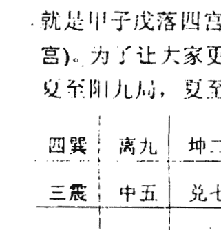
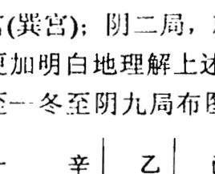
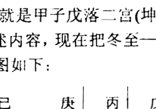
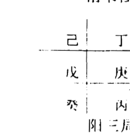
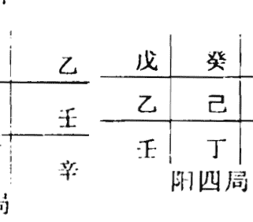
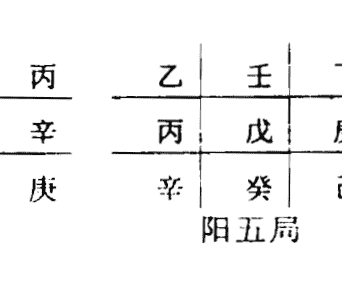
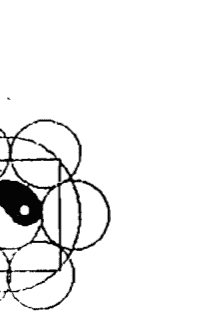

# 奇門日課預測學

黃立溪 著

中州古籍出版社

# 目錄

- 序言 (5)
- 序言 (8)
- 第一章 奇門遁甲基礎知識 (10)
- 一、十天干與九宮八卦 (10)
- 二、一年二十四節氣與陰陽二遁 (13)
- 三、日干支與上中下三元的劃分 (16)
- 四、超神、接氣、置閏與拆補法 (17)
- 五、九星、八門、八神的信息特徵 (22)
- 六、三奇六儀及其組合 (26)
- 七、伏吟、反吟 (27)
- 八、五不遇時 (27)
- 九、空亡 (27)
- 十、六儀擊刑 (27)
- 十一、奇儀組成凶格 (27)
- 十二、三奇入墓 (28)
- 十三、門和宮的迫制 (28)
- 十四、值符和值使 (28)
- 第二章 奇門日課快速起局法 (30)
- 第三章 陽宅日課吉凶預測 (37)
- 一、預測陽宅日課吉凶的方法、要點和要求
- 二、預測陽宅日課實例……………… (39)
- 第四章 陰宅日課吉凶預測…………… (54)
- 一、預測陰宅日課吉凶的方法、要點和要求
- 二、預測陰宅日課實例…………… (55)
- 第五章 開張日課吉凶預測…………… (66)
- 一、預測開張日課吉凶的方法、要點和要求
- 二、預測開張日課實例…………… (67)
- 第六章 出行日課吉凶預測…………… (71)
- 一、預測出行日課吉凶的方法、要點和要求
- 二、預測出行日課實例…………… (72)
- 第七章 奇門與結婚日課 ……………… (75)
- 第八章 奇門與床門調整…………… (88)
- 第九章 奇門日課與海灣戰爭 …………… (98)
- 對失誤日課補救方法…………… (103)
- 解答學員疑難問題…………… (105)
- 附 擇吉索引使用說明 ……… (109)

## 序 言

自從《奇門日課預測學》問世以來，在短短幾個月中，每天從全國各地郵寄來的信件像雪花一樣飄來，舍下的電話雖然沒有證券行熱線電話那樣忙碌，但是從全國各地打來的電話時常響起，有廣東湛江和茂名的讀者，有廣西南寧、柳州、河池、桂平、百色、梧州、玉林等地的讀者。有的要求解答在看書過程中所遇到的疑難問題；有的叫我幫他分析一下，他選 的建房、開張、葬墳山的日課可不可使用；有的詢問招收學員事宜；有的指出書中不足之處；有的要求增加奇門與結婚日課，奇門與床位調整，奇門與博彩等內容。讀者高度稱讚拙著《奇門日課預測學》寫得很精彩，毫無半點拖泥帶水之意，對問題一針見血地指出來，內容由淺入深，循循善誘，的確是一本奇門日課快速入門的好教材，很多讀者說，以前買了不少奇門書籍，學了幾年，還是學不進去，因為那些書籍，很多是東湊西拼的，毫無新意，對問題的解釋多半是模棱兩可，不痛不癢。自從買到拙著《奇門日課預測學》後，一看，內容新穎，令人耳目一新，對問題解釋切中要害，一針見血，令人一看就懂，自從買到拙著後，學習不夠半個月就學會正確起局，解決了學習奇門前進路上攔路虎。讀者對拙著的肯定是對本人的支持和鼓勵，在此表示衷心感謝。為了報答廣大讀者對拙著的支持和厚愛，本人決定對原教材中錯漏之處進行改正補漏，並且增加兩部分內容，一、奇門與結婚日課。二、奇門與床位調整。在日常生活

中，一個擇日師經常會遇到人們叫選結婚日課或評結婚日課，有的要求選擇日課幫助他們實現頭胎生男或生女的願望。這些內容在這章將有詳細介紹。床位調整是相當重要的，因為，一個人一生中有三分之一時間是在床上度過的，如果床位適合你的命，那麼你就會睡得香，休息得好，第二天早上起床就會精神飽滿，神采奕奕，就會信心百倍地把工作做好，就會掙得更多錢；如果床位不適合你的命，你就會休息不好，失眠，多夢，第二天早上起床就會感到頭昏腦脹、無精打采，就會影響你的工作，影響你的財運，影響你的健康，結合命運運用奇門把床位調整到最佳位置，是我近年來的最新研究成果，適合命運的床位它能使人們休息得更好，更加健康，能夠更好地在工作中發揮自己的潛能，為社會為自己創造更多財富。

本人近期將隆重推出《商戰與奇門》一書，此書是本人經過多年潛心研究成果，是從無數經商老闆，實踐中總結出來的成果。此書將獻給廣大經商朋友和廣大奇門愛好者，教你如何在瞬息萬變的商戰中立於不敗之地。其內容有：1、出行方位與年命的配合。2、談生意年坐方位的選擇。3、投資求財、4、交易求財。5、買賣房地產求財。6、合夥求財。7、開店求財。8、博彩求財。

在增改版，本人無不竭盡所能，把平日運用奇門選擇日課的方法、技巧及近期的研究成果：奇門與結婚日課，奇門與床位調整等內容以最通俗的筆法闡述，毫不保留地獻給廣大讀者，企盼廣大讀者能看得津津有味，並在樂趣中獲得知識，掌握運用奇門造福他人，造福自己，這是我

夜以繼日整理編寫《奇門日課預測學》增改版的最大願望和意圖，希望此書對社會大眾或五術界朋友有所裨益，並得到共鳴。

二〇〇四年二月十五日
黃立溪于容城

# 序言

擇吉術隨著術數興起，幾乎與各種術數同步，人們不管辦什麼事都期望選一個好日子，使所辦之事得以成功。不管如何，通過擇吉，給予人們一種心理寄託，使人們對所辦之事增強信心，這樣就會對所辦之事取得成功的可能性增大。

擇吉，不分富貴貧賤，小到平民，大到國家主席、總統，均有擇吉的行為和嚮往。小到婚娶營造，大到開國大典，均要擇吉。

擇吉術的派別非常之多，形成一個龐大系統。據不完全統計，擇吉術有一百二十多種，使人們不知道哪一家為真，哪一家為謬。現在社會上用得比較多的是五行、命理、六爻、奇門、河洛理數、紫白訣。歷家、斗首等。不管哪一家均難以理解和神秘莫測，使學習者頭昏眼花、心煩意亂，什麼太歲、歲破、月破、天德、歲德、月德、天赫、歲刑、三煞、喪門、弔客、福星等等何止一百二十位，真是諸家擇日眾紛云，彼家言吉彼家凶，對盡諸書總不同。

本人大學畢業，從事日課研究已有十多年，曾經使用過多種方法預測日課：六爻、河洛、正五行、返卦還宮、破軍星、紫白星等。我認為用上述方法預測日課吉凶各有特點，但準確率都不太令人滿意。自從我研究奇門遁甲。並把奇門遁甲應用到日課吉凶預測後，才發現奇門遁甲應用於日課預測切實可行，而且準確率極高，分析範圍較廣闊，它可以分析出日課應凶應吉在那方面，應驗在那個年

命身上，所應年命是男是女，是老是幼。奇門遁甲是我所接觸的預測術中準確率最高的一種，它把天時、地利、人和與影響人類生活的某些能量場四個方面，與時間、空間巧妙結合在一起。無論古人和今人都對奇門遁甲方評價較高，清代四庫全書編纂者為《遁甲演義》，撰寫的提要中稱奇門遁甲方技之中，最有理致。1994年12月上海文化出版的由復旦大學一批學者編寫的《中國神秘文化百科知識》一書也說：“奇門遁甲方稱中國方術之王，是中國方術中式占的集大成者，過去號稱帝王之學，它融周易、天文、律曆、陰陽五行學說於一體”，成為目前探索中國神秘文化熱潮中的一個焦點。

曾有不少學者、名家在前幾年預言，將在八運掀起奇門遁甲熱，將會有不少人去研究應用奇門遁甲方進行風水佈局和選擇吉課，2003年是七運最後一年，今年已有不少人研究奇門，應用奇門，書攤有關奇門書籍最暢銷，明年2004年進入八運，將會有更多人致力於奇門研究，應用奇門為民造福。我將會傾盡全力與奇門專家、學者和廣大愛好者一起不斷研究它，充實它，應用它，發展它，使它為世界人類文明進步、發展作出更大的貢獻。

公元2003年3月18日于容城

# 第一章 奇門遁甲基礎知識

## 一、十天干與九宮八卦

奇門遁甲來源於軍事上的排兵布陣，具體而言，就是九宮八卦陣。

甲乙丙丁戊己庚辛壬癸，這十天干符號，在奇門遁甲中，甲為元帥為主將，他經常隱蔽在陣中，所以叫遁甲。

乙丙丁為三奇，是元帥或主將身邊最得力的輔佐官，乙為日奇，丙為月奇，丁為星奇。

戊己庚辛壬癸叫做六儀，也就是六支儀仗隊，六面旗幟，所謂六甲，即甲子、甲戌、甲申、甲午、甲辰、甲寅，這六甲就是六位將帥，其中甲子為元帥，其它五甲為大將，他們在排兵布陣中都要隱遁在一定的旗幟之下，在奇門遁甲的九宮八卦中，他們儀仗旗幟是固定不變的，元帥甲子以戊為儀仗、因此叫甲子戊，二甲大將甲戌以己為儀仗，因此叫甲戌己，三甲大將甲申以庚為儀仗，因此叫甲申庚，四甲大將甲午以辛為儀仗，因此叫甲午辛，五甲大將甲辰以壬為儀仗，因此又叫甲辰壬，六甲大將甲寅以癸為儀仗，因此叫甲寅癸，這是永遠不變的將帥儀仗配備準則。

十天干將甲隱遁起來，剩下九干，以配九宮八卦，六甲分別隱遁在六儀之下，與乙丙丁三奇分占九宮，他們有固定不變的順序和隊形，這個順序和隊形就是：

戊己庚辛壬癸丁丙乙，也就是說，戊永遠挨著己，己永遠挨著庚，庚永遠挨著辛，辛永遠挨著壬，壬永遠挨著癸，癸永遠挨著丁，丁永遠挨著丙，丙永遠挨著乙，乙永

遠挨著戊，無論誰在前誰在後，前後鄰居是不變的。
冬至一夏至 陽遁 順排六儀，逆布三奇，次序為：戊己庚辛壬癸丁丙乙；夏至一冬至 陰遁 逆排六儀，順布三奇，次序為：戊乙丙丁癸壬辛庚己。

### 遁甲規律表

| 六甲 | 一甲 | 二甲 | 三甲 | 四甲 | 五甲 | 六甲 | 三奇 | 三奇 | 三奇 |
| :---: | :---: | :---: | :---: | :---: | :---: | :---: | :---: | :---: | :---: |
| | 甲子 | 甲戌 | 甲申 | 甲午 | 甲辰 | 甲寅 | 星奇 | 月奇 | 日奇 |
| 六儀 | 戊 | 己 | 庚 | 辛 | 壬 | 癸 | 丁 | 丙 | 乙 |

甲子戊遁在幾宮，就是奇門遁甲的幾局，例如陽四局，就是甲子戊落四宮(巽宮)；陰二局，就是甲子戊落二宮(坤宮)。為了讓大家更加明白地理解上述內容，現在把冬至一夏至陽九局，夏至一冬至陰九局布圖如下：

| 丙 | 辛 | 癸 |
| 丁 | 乙 | 己 |
| 庚 | 壬 | 戊 |
陽六局

| 丁 | 庚 | 壬 |
| 癸 | 丙 | 戊 |
| 己 | 辛 | 乙 |
陽七局

| 癸 | 己 | 辛 |
| 壬 | 丁 | 乙 |
| 戊 | 庚 | 丙 |
陽八局

| 壬 | 戊 | 庚 |
| 辛 | 癸 | 丙 |
| 乙 | 己 | 丁 |
陽九局

### 夏至一冬至陰九局

| 丁 | 乙 | 丙 |
| 丙 | 癸 | 辛 |
| 庚 | 戊 | 壬 |
陰一局

| 乙 | 丙 | 庚 |
| 辛 | 乙 | 丁 |
| 壬 | 己 | 癸 |
陰二局

| 乙 | 辛 | 己 |
| 戊 | 丙 | 癸 |
| 壬 | 庚 | 丁 |
陰三局

| 戊 | 壬 | 庚 |
| 己 | 乙 | 丁 |
| 辛 | 癸 | 丙 |
陰四局

| 己 | 癸 | 辛 |
| 庚 | 戊 | 丙 |
| 丁 | 壬 | 乙 |
陰五局

| 庚 | 丁 | 壬 |
| 辛 | 己 | 乙 |
| 丙 | 癸 | 戊 |
陰六局

| 陰七局 | 陰八局 | 陰九局 |
|-------|-------|-------|
| 辛 丙 癸 | 壬 乙 丁 | 癸 戊 丙 |
| 壬 庚 戊 | 癸 辛 己 | 丁 壬 庚 |
| 乙 丁 己 | 戊 丙 庚 | 己 乙 辛 |

## 二、 一年二十四節氣與陰陽二遁

在奇門遁甲，人們把十天干代表軍隊上的將帥、奇兵、儀仗分別佈在九宮八卦中，正轉、倒轉進行演練共形成陽九局和陰九局，共十八 種格局，這是地盤上十八種定局，如果以十天干每一干代表一個時辰，即時家奇門，六十個時辰，即六十甲子正好演練完一局。我們知道一個時辰為兩小時，一天為 24 個小時，十二個時辰 ， 60÷12=5，這就是 5 天演練一局，古人把五天一局稱一元，一個節氣十五天，正好為三局，第一個五天這一局為上元，第二個五天為中元，第三個五天稱下元，即一個節氣配上中下三元。一年共 24 個節氣，一個節氣三元，24 ×3=72，即共 72 局，古人根據八卦九宮陳與時間和空間關係，對此做了巧妙安排，坎卦一宮北方對應冬至、小寒、大寒三個節氣；艮卦八宮東北方對應立春、雨水、驚蟄三個節氣。震卦三宮東方對應春分、清明、穀雨三個節氣；巽卦四宮東南方對應立夏、小滿、芒種三個節氣，以離卦九宮正南方對應夏至、小暑、大暑三個節氣，以坤卦二宮西南方對應立秋、處暑、白露三個節氣，以兌卦七宮正西方對應立冬、小雪、大雪三個節氣。根據 冬至一陽生，夏至一陰生的原理，陰陽

兩遁以冬至、夏至二個節氣為界線。
初學者，對某節氣的上中下三元，即三個五天中分別用陽遁幾局，陰遁幾局，這是怎麼規定？依據什麼？有什麼規律感到眼花繚亂，難以記憶，現教你一種簡單方法，一看就懂，先看下圖(一)

| 坎一 | 艮八 | 震三 | 巽四 | 離九 | 坤二 | 兌七 | 乾六 |
| --- | --- | --- | --- | --- | --- | --- | --- |
| 冬至 小寒 大寒 | 立春 雨水 驚蟄 | 春分 清明 穀雨 | 立夏 小滿 芒種 | 夏至 小暑 大暑 | 立秋 處暑 白露 | 秋分 寒露 霜降 | 立冬 小雪 大雪 |
| 一 二 三 | 八 九 一 | 三 四 五 | 四 五 六 | 九 八 七 | 二 一 九 | 七 六 五 | 六 五 四 |
| 七 八 九 | 五 六 七 | 九 一 二 | 一 二 三 | 三 二 一 | 五 四 三 | 一 九 八 | 九 八 七 |
| 四 五 六 | 二 三 四 | 六 七 八 | 七 八 九 | 六 五 四 | 八 七 六 | 四 三 二 | 三 二 一 |

從上圖可知，冬至、小寒、大寒三個節氣落坎一宮，冬至上元為陽一局，中元為陽七局，下元為陽四局，小寒上元為陽二局，中元為陽八局，下元為陽五局，大寒上元為陽三局，中元為陽九局，下元為陽六局。夏至、小暑、大暑三個節氣落離九宮，夏到上元為陰九局，中元為陰三局，下元為陰六局，小暑上元為陰八局，中元為陰二局，下元為陰五局，大暑上元為陰七局，中元為陰一局，下元為陰四局，其它節氣所落之宮依次類推。總之八卦在幾宮對應的第一個節氣的上元就用陽遁或陰遁幾局，即坎艮震巽四陽宮用陽遁；離坤兌乾四陰宮用陰遁。在未熟練之前，只要一查此表就可知道某一節氣內某一天是第幾局。有些讀者再會問，此表雖然可查知某一天是第幾局管事，但難以記憶，有無簡易方法記憶，當然有，回答是肯定的，現

教你一種簡易記憶方法。只要你認真細緻品味此表，你就會發現，四陽宮，即坎艮震巽分別對應第二個節氣，第三個節氣上元用幾局，按照陽遁順序排而定，即坎一宮冬至上元用陽一局，小寒上元用陽二局，大寒上元用陽三局，規律為一二三；艮八宮上元為八九一；震三宮上元為三四五；巽四宮上元為四五六，只要知道上元局數，則中元和下元局數可用排山掌在掌上推，上元和中元局數隔六位，中元和下元局數也隔六位，陽遁順推六位，陰遁逆推六位。例坎一宮，冬至上元陽一局，中元則在一元一局坎宮前一位坤二宮順點六位為兌七宮，即冬至中元為陽七局；下元則在中元陽七局兌宮前一位艮八宮順點六位為巽四宮，即冬至下元為陽四局。夏至上元為陰九局，中元則在離九宮後一位艮八宮逆點六位為震三宮，即夏至後中元為陰三局；下元則從震三宮後一位即坤二宮逆點六位為乾六宮，即夏至後下元為陰六局。

| 巽四 | 中五 | 乾六 |
|------|------|------|
| 震三 |      | 兌七 |
| 坤二 |      | 艮八 |
| 坎一 |      | 離九 |

### 排山掌

## 三、日干支與上中下三元的劃分

從上一節我們知道，一年二十四節氣每個節氣所轄十五天中，上中下三元所用陽遁和陰遁的局數，但是具體到每一天應該用陽遁幾局，還是陰遁幾局，這是怎樣確定呢？只要你讀完本節就會一清二楚。

- 1. 每一元第一天的天干，不是甲就是己，古人把這個元頭稱為符頭，即符頭只有二個不是甲就是己。
- 2. 凡上元的第一天的地支總是子午卯酉中的一個，與甲己符頭組合為甲子、甲午，或己卯、己酉，即上元第一天必定是甲子、甲午、己卯，己酉四天中的某一天。中元第一天的地支為寅申巳亥中的一個，與甲己符頭組合為甲寅、甲申或己巳、己亥，即中元第一天必定是甲寅、甲申、己巳、己亥四天中的某一天。下元第一天的地支總是辰戌丑未中的一個，與甲己符頭組合為甲辰、甲戌或己丑、己未，即下元第一天必定是甲辰、甲戌、己丑、己未四天中的某一天。每一元為五天，上中下三元為十五天，剛好是一個節氣。例如2003年正月初六庚戌日，應該用奇門哪一局呢？先找符頭，庚戌日屬甲辰旬符頭為己酉，子午卯酉為上元，故知這一天該用上元，再根據這一天在立春後，雨水前，所以應該用立春後上元，立春節十五天上中下元為八五二，上元為陽八局，故知這一天應該用陽八局。

## 四、超神、接氣、置閏與拆補法

從上兩節我們知道，時家奇門每個節氣所用的元既與節氣相聯繫，又與日干支相聯繫，共有三種情況。

第一種情況，交節的這一天正好碰上上元符頭，即日

干支為甲子、甲午或己卯、己酉，古人稱之為“正授”，但實際上這種情況現並不多見。

第二種情況，上元符頭在節氣的前邊，這叫“超神”，超在節氣前邊，這種情況較多，例如2003年農曆五月廿三丙寅日寅時交夏至，丙寅日符頭為甲子，即夏至前五月廿一日為甲子，從廿一日這一天就是夏至上元，應用陰九局，這就叫“超神”。

第三種情況，節氣在前即交節時間在前，上元符頭在後，這叫“接氣”，一般在置閏之後才出現此情況。

置閏就是接著這個節氣下元的最後一天開始，把這個節氣上中下三元重複一遍，這樣重複十五天，本來是“超神”，一下子變為“接氣”，即上元符頭跑到下一個節氣的後邊了，但是置閏有一個規定，就是在芒種和大雪這兩個節氣才能置閏。這是因為芒種在夏至前屬於陽遁最後一個節氣，大雪在冬至前，屬於陰遁最後一個節氣。

拆補法：不採用置閏法，直接把上中下三元放在每一個節氣中，又遵循六十甲子循環中子午卯酉為上元，寅申巳亥為中元，辰戌丑未為下元的規律，只要一進入交節時辰就用這個節氣規定的遁甲局。

## 五、 九星、八門、八神的信息特徵

### (一) 九星特點

- 1. 天蓬星 原名貪狼星，與北方一宮坎卦相對應，陽星．五行屬水，坎水正當隆冬季節，至冷至寒至暗，喜陰害陽，人們認為它與盜賊出沒有關係，所以把它稱為凶星、盜星。

### （二）八门信息特征

八门，休生伤杜景死惊开，其中生休开为三吉门，伤惊死为三凶门，景门有吉有凶，杜门中平，有小凶，这是大致划分，但随着用于各类事不同，到落宫位不同而变化所谓吉门也有所忌，凶门也有所宜。

在奇门术的运用中，无论是测运、测事、算命，日课八门的作用最明显，最重要。

1. 休门 休门居北方坎宫，五行属水，属吉门，旺于冬季，特别是子月，相于秋，休于春，囚于夏，死于四季末月。日课用于见贵，上官赴任、嫁娶、经营建造、测运、测事见之可断进钱财，有贵人相助。
2. 生门 生门居于东北艮宫，属吉门，旺于四季月，特别是丑寅之月，相于夏，休于秋，囚于冬，日课用于见官求官、嫁娶迁移、谋求百事皆吉，就是不能用于下葬、治丧，用于算命、测运、测事，可断事业旺盛，钱财易进。
3. 伤门 伤门居东方震宫，五行属木，属凶门，旺于春，特别是卯月，相于冬，休于夏，囚于四季月，死于秋，日课用索债、赌博、渔猎吉，其它方面属凶，主伤病，事业有损失之事。
4. 杜门 杜门居东南巽宫，属木，属于小凶之门，旺于春季，特别是辰巳月，相于冬，休于夏，囚于四季月，死于秋。日课一般舍去不用，因为它主杜塞、阻碍、停滞，测运、算命遇上杜门，断其事业有阻，困难重重。
5. 景门 景门属南方离宫，五行属火，属中吉之门，旺于夏，特别是午月，相于春，休于四季月，囚于秋，死于冬，日课用于考工、考学、上书吉。如断身体方面，测是患病，易是非、横祸、血光之灾。
6. 死门 死门居西南坤宫，五行属土，属凶门，旺于秋季，特别是未申月，相于夏，囚于冬，死于春，日课最宜于葬祖、立庙、吊孝吉，其它方面凶论，主丧事孝服、重伤、身处绝境，测运，测事，如用神遇之，可断有伤害，丧事或处境不好。
7. 惊门 惊门居西方兑宫，五行属金属凶门，旺于秋，特别是酉月，相于四季月，休于冬，囚于春，死于夏，日课用于赌博、官司、测事、测运遇之，可断有惊险官司。口舌、打斗之事发生。
8. 开门 开门居西北乾宫，五行属金，属吉门，旺于秋季，特别是戌亥月，相于四季末月，休于冬，死于夏，日课用于谋商大计，见贵考学，参军、嫁娶、建造等皆吉，测运、测事遇之，可断事业旺盛，权力有加，经济收益好。

### （三）八神信息特征

八神是值符、腾蛇、太阴、六合、白虎、玄武、九地、九天的总称。八神中凶神在奇门日课中起到提纲性作用，用神遇上白虎、玄武，十有九凶，现逐个论述。

1. 值符 属中央土，是八神之首，其性善良，对所到之宫的人和事起荫佑作用，遇吉添吉，见凶减凶，但若遇凶神，凶门过于集中，值符也难挡得住凶神凶门的凶性。
2. 腾蛇 属阴土，其性虚诈，司惊恐怪异之事，得吉门则静，遇凶门易挑起官司、破财之事。
3. 太阴 属阴金，其性阴匿暗昧，为荫佑之神。
4. 六合 属木，其性平和，喜作婚姻之媒约，交易说合。
5. 白虎 属金，其性好杀好斗，凶狠无比，主凶险、牢狱、死亡、病伤，用神与白虎同宫或受白虎宫克制。可能发生三种灾害：一是伤病；二是官非牢狱；三是外力侵害或天灾人祸，三种中必有一种或两种，甚至三种，静则小伤小灾，动则大病甚至死亡。
6. 玄武 属水，性喜偷盗，阴谋挑衅，所到之处，大则挑起官司，小则口角是非，否则就有失财失物。
7. 九地 属土，性温良恭谦。
8. 九天 属金，其性刚强好动，奋发向上，并能取得一定成功。

八神中，以值符为最吉之神，六合、太阴、九天、九地，次之，白虎、玄武为最凶之神，用于日课，白虎、玄武绝不能用，用之必有祸害。

## 六、三奇六仪及其组合

三奇六仪其两套，分别排在天盘和地盘，经过演局后天地盘的奇仪，组成81个格局，现列如下：

| 天盘 | 地盘 | 主事 |
| --- | --- | --- |
| 戊 | 戊 | 伏吟，凡事闭塞，静守为吉 |
| 戊 | 乙 | 青龙合灵门，吉事更吉，凶事更凶 |
| 戊 | 丙 | 青龙回首，动作大利，如逢墓迫击刑，吉事成凶 |
| 戊 | 丁 | 青龙耀明，利谒贵求名，值墓迫，招惹是非 |
| 戊 | 己 | 贵人入狱，公私皆不利 |
| 戊 | 庚 | 值符飞宫，吉事不吉，凶事更凶 |
| 戊 | 辛 | 青龙折足，吉门生助尚可谋为，逢凶门招灾、破财、足疾 |
| 戊 | 壬 | 青龙入天牢，凡阴阳皆不利 |
| 戊 | 癸 | 青龙华盖，吉格吉门多招福，门凶多破财 |
| 乙 | 戊 | 利阴害阳，门逢凶迫，破财人伤 |
| 乙 | 乙 | 伏吟，不宜谒贵求名，只可安分守己 |
| 乙 | 丙 | 奇仪顺遂，吉星迁官进职，凶星；夫妻离别 |
| 乙 | 丁 | 奇仪相佐，文书吉事，百事皆可为 |
| 乙 | 己 | 日奇入墓，被土暗味，门凶必凶 |
| 乙 | 庚 | 日奇被刑，争讼财产，夫妻私怀 |
| 乙 | 辛 | 青龙逃走，奴仆拐带，六畜皆伤 |
| 乙 | 壬 | 日奇入地，尊卑悖格，官司是非 |
| 乙 | 癸 | 华盖逢官星，遁迹修道，隐匿藏形，躲灾避难吉 |
| 丙 | 戊 | 飞鸟跌穴，谋为百事皆吉 |
| 丙 | 乙 | 日月并行，公谋私为皆吉 |
| 丙 | 丙 | 月奇朱雀，文书吉利逼迫，破耗损失 |
| 丙 | 丁 | 月奇朱雀，文书吉利，常人宜静，得三吉门为天遁 |
| 丙 | 己 | 太悖入刑，囚人刑杖，文书不利，吉门得吉 |
| 丙 | 庚 | 荧入太白，门破户败，盗贼耗失 |
| 丙 | 辛 | 谋事成就，病人不凶 |
| 丙 | 壬 | 火入天网，为客不利，是非颇多 |
| 丙 | 癸 | 华盖悖格，阴人害事，灾祸颇多 |
| 丁 | 戊 | 青龙转光，官人升迁，常人盛昌 |
| 丁 | 乙 | 人遁，贵人加官进禄，常人婚姻财喜 |
| 丁 | 丙 | 星随月转，贵人越级高升，常人乐里生悲 |
| 丁 | 丁 | 星奇入太阴，文书即至，喜事遂心 |
| 丁 | 己 | 火入勾陈，奸仇冤，事因女人 |
| 丁 | 庚 | 年月日时格，文书阻隔，行人必归 |
| 丁 | 辛 | 朱雀入狱，罪人失囚，官人失位 |
| 丁 | 壬 | 五神至合，贵人恩昭，讼狱公平 |
| 丁 | 癸 | 朱雀投江，文书口舌俱消，言信沉溺 |
| 己 | 戊 | 犬遇青龙，门吉谋望遂意，上人见喜，门凶者枉劳心机 |
| 己 | 乙 | 墓神不旺，地户逢星，宜遁迹隐形为利 |
| 己 | 丙 | 火悖地户，阳人以冤相害，阴人必致淫污 |
| 己 | 丁 | 朱雀入墓，文状诉讼，先曲后直 |
| 己 | 己 | 地户逢鬼，病者必死，百事不遂 |
| 己 | 庚 | 刑格返名，词讼先动不利，后动利，阴星有谋害之情 |
| 己 | 辛 | 游魂入墓，易遭阴邪，小人作崇 |
| 己 | 壬 | 地网高涨，狡童佚女，奸情伤杀 |
| 己 | 癸 | 地刑玄武，男女疾病垂危，有囚狱词讼之灾 |
| 庚 | 戊 | 太白天乙伏宫，百事皆凶 |
| 庚 | 乙 | 太白逢星，退吉进凶，谋为不利 |
| 庚 | 丙 | 太白入荧，占贼必来，为客进利，为主破财 |
| 庚 | 丁 | 亭亭之格，因私匿起官司，门吉有救，门凶事凶 |
| 庚 | 己 | 刑格，官司被重罚 |
| 庚 | 庚 | 战格、官灾横祸、兄弟相攻 |
| 庚 | 辛 | 白虎干格，远行车折马死 |
| 庚 | 壬 | 小格，远走迷失道路，男女音信难通 |
| 庚 | 癸 | 大格，行人不至，官司被败，生产母子俱伤，凶 |
| 辛 | 戊 | 因龙被伤，官司破财，屈抑守份，妄动祸殃 |
| 辛 | 乙 | 白虎猖狂，人亡家败，远行多殃，尊长不喜 |
| 辛 | 丙 | 干合悖格，门吉事吉，门凶事凶，占事因财致灾 |
| 辛 | 丁 | 狱神得奇，经商获倍利，囚人逢赦 |
| 辛 | 己 | 入狱自刑，奴仆背主，狱讼难伸 |
| 辛 | 庚 | 白虎出力，刀刃相接，主客相残，逊让尚可，强行血溅衣衫 |
| 辛 | 辛 | 伏吟天庭，公废私就，讼狱自罗罪名 |
| 辛 | 壬 | 山蛇入狱，两男争女，讼狱不息，先动失理 |
| 辛 | 癸 | 天牢华盖，日月失明，误入天网，动辄乘张 |
| 壬 | 戊 | 小蛇化龙，男人发达，女产婴童 |
| 壬 | 乙 | 小蛇得势，女子温柔，男人通达，占孕生子，禄马光华 |
| 壬 | 丙 | 水蛇入火，官灾刑禁，络绎不绝 |
| 壬 | 丁 | 干合蛇刑，文书牵连，贵人匆匆，男吉妇凶 |
| 壬 | 己 | 凶蛇入狱，大祸将至，顺守可吉，词讼理由 |
| 壬 | 庚 | 太白擒蛇，刑狱公平，立剖邪正 |
| 壬 | 辛 | 腾蛇相缠，得奇门也不能安，若有谋望，被人欺瞒 |
| 壬 | 壬 | 蛇入地网，外人缠绕，内事索索，吉门吉星，庶免蹉跎 |
| 壬 | 癸 | 幼女奸淫，家有丑声，门吉星凶，反祸福隆 |
| 癸 | 戊 | 天乙会合，财喜婚姻，吉人赞助成合，若门凶或迫制，反祸官非 |
| 癸 | 乙 | 华盖逢星，贵人禄位，常人平安 |
| 癸 | 丙 | 华盖悖格，贵贱逢之皆不利，唯上人见喜 |
| 癸 | 丁 | 蛇天娇，文书官司，火焚莫逃 |
| 癸 | 己 | 华盖地户，男女占之音信皆阻，躲灾避难为吉 |
| 癸 | 庚 | 太白入网，明暴争讼力平 |
| 癸 | 辛 | 网盖天牢，占讼占病，死罪莫逃 |
| 癸 | 壬 | 复见腾蛇，嫁娶重婚，后嫁无子，不保年华 |
| 癸 | 癸 | 天网四张，行人失伴，病讼皆伤 |

## 七、伏吟、反吟

伏吟即是星门伏在本宫，凡六甲之时，星门、符皆为伏吟，如甲子时、甲戌时、甲申时、甲午时、甲辰时、甲寅时以及癸亥时，这七个时辰的奇门局星门俱伏，伏吟之时不宜用事。天蓬星+天蓬星和死门+死门、甲申庚+甲申庚最凶，一般多为阻滞、破财、孝服。

反吟，星门、值符落到对宫，反吟不吉，遇吉门无害，不遇吉门则事情危急，灾祸将至，反吟速度快，成败易分，出行可能半途而废，近病不药而愈，久病定死难愈，婚姻不成，求财无利反蚀本。

## 八、五不遇时

时干克日干，阳时干克阳日干，阴时干克阴日干为五不遇时，甲日庚午时，乙日辛己时，丙日壬辰时，丁日癸卯时戊日甲寅时，己日乙丑时，庚日丙子时，辛日丁酉时，壬日戊申时，癸日己未时，用于择吉，一般尽量避开为好。

## 九、空亡

我们在日课中使用的是时家奇门，所以，空亡指的是时辰空亡，不是日空亡，甲子旬戌亥空，即乾宫落空；甲戌旬申酉空，即坤宫兑宫落空；甲辰旬寅卯空，即艮宫震宫落空；甲寅旬子丑空，即坎宫艮宫落空；甲午旬辰巳空，即巽宫落空，甲申旬午未空，即离宫坤宫落空。空者虚也，在日课中用神和要素所在宫空亡，绝不能用，如葬课、死门空亡，家败人亡，不能用。

## 十、六仪击刑

击刑是指六甲值符加所行之宫而被刑。戊(甲子)加卯宫(震)子刑卯；己(甲戌)加未宫(坤)戌刑未；庚(甲申)加寅宫(艮)申刑寅；辛(甲午)加午宫(离)午午自刑；壬(甲辰)加辰宫(巽)辰辰自刑；癸(甲寅)加己宫(巽)寅刑巳。击刑极凶，用于日课，用神之宫击刑，其时绝不可用，动则有灾，甚至牢狱、死亡、测运、测事，用神宫击刑，必有灾害或吉事不吉，凶事更凶。

## 十一、奇仪组成的凶格

- 辛+乙 白虎猖狂、主惊诈、破损、伤害
- 乙+辛 青龙逃走、主损失破败
- 癸+丁 蛇天矫、主虚惶、争斗、不安宁
- 丁+癸 朱雀投江、主口舌争讼、水患
- 庚+庚 战格、主白虎相斗
- 庚+己 刑格、主刑罚、破财损名誉
- 庚+丙 太白入荧、主惹贼、招祸、破财
- 丙+庚 荧入太白、含义同上
- 庚+戊 天乙伏宫、主百事皆凶
- 庚+乙 太白逢星、一般可用

在奇门日课中，用神落宫尽量避免上述奇仪组成的凶格。

## 十二、三奇入墓

按十天干十二长生诀推，阳顺阴逆，艮为丁墓，乾为丙丁墓，坤为乙墓，如三奇入墓，有三奇等于无，应避免，墓的性质为凶，吉事不吉，凶事更凶。

## 十三、门和宫的迫制

门克宫叫迫，如伤门克艮宫，宫克门叫做制，如震宫克生门。迫和制，均主不利，但有区别，吉门迫宫，凶象。不吉或不凶，宫制吉门，“吉不就”小吉或不吉，凶门不管是迫宫或被宫制，均主更凶。

## 十四、值符、值使

根据预测时的干支，首先找出这一干支所在的旬，是甲子旬，还是甲戌旬、甲申旬、甲午旬、甲辰旬或甲寅旬，知道了哪一旬，就知道了地盘上是六甲中哪一大将在带班，他所在宫位对应的天上九星之一就是值班的星座，奇门遁甲中叫值符。

值使的确定以值符为准，也就是说，天上值班的星座是谁，与它对应宫次的八门之一就是在人间值班的门吏，值班的门吏就是值使。

# 第二章 奇门日课快速起局法

上面第一章我们论述了奇门的基础知识，在大家熟悉了基础知识后，就要进入下一步起奇门局象和断事了。就象大家初学四柱预测一样，了解了十天干、十二地支相生、相克、相冲、相刑、六合、三合等基础知识后就转入下步排四柱和分析命局了。现在我介绍一种最实用最先进的快速起局法，只要你认真领会以下内容，将会迅速学会起局，不象有的书写得那么繁琐，让你费了九牛二虎之力还不知道怎样起局，以至半途而废。

1. 第一步 列出用事时间的年月日时干支，即排好日课四柱。
2. 第二步 根据节气和上中下三元的规律，确定求测日所用遁甲局数，是阳遁几局，还是阴遁几局。
3. 第三步 在纸上画一个井字形九宫格，然后按遁甲几局三奇六仪的排布规律，即阳局戊己庚辛壬癸丁丙乙；阴局戊乙丙丁癸壬辛庚己这个定例，永远不变的顺序，将六仪三奇布在一至九宫格内。
4. 第四步 找出预测时辰的旬首，例如丙子时，甲成为旬首，丙寅时，甲子为旬首；即预测时辰是六甲中哪一大将在地盘值班，同时根据所隐的六仪，即知道地盘上该甲在几宫值班了。
5. 第五步 根据时辰旬首，所遁六仪落在地盘何宫位，该宫位对应天盘值班九星之一，就是值符，预测日课使用的值符就是地盘值符，地盘上值班的八门之一，就是值使。确定了值符星，将其余八星连同它们原来地盘内所有携带的六仪，三奇也一一写在运转到的宫内，这样用事时辰天盘运行格局就确定了。
6. 第六步 根据“值使随时宫”的规律，将值使八门之一按时间和宫位运行顺序，确定他所在宫位，然后把它写在该宫格内，同时将其余七门按固定顺序一一写在其它宫内，这样八门运转到问事时辰的格局也就一目了然。
7. 第七步 排八神，根据阳遁顺时针转，阴遁逆时针转，将神盘直符先写在旬首所隐六仪所落之宫内，然后将腾蛇、太阴、六合、白虎、玄武、九地、九天、按顺序一一写在其它宫内七个宫内，这样，八神盘在问事时辰运行的格局就确定了。

至此奇门遁甲起局过程就全部完成，每个宫内天地人神及三奇六仪所形成的格局一目了然，下面举例图文并茂说明问题，让大家更易理解和接受。

例：巽宅使用 2003 年二月初九日卯时进人

- 第一步 查万年历排好日课四柱：癸未 乙卯 癸未 乙卯
- 第二步 找出日干支癸未日的符头，由癸未日往前数己卯为符头，己卯前一天交惊蛰，根据子午卯酉为上元的规律可知，癸未日是惊蛰节的上元，在未熟练前查一下上图(一)就知道此日该用阳遁一局了。
- 第三步 在纸上画一个井字形九宫格分别填上一至九宫的号码，然后按阳遁一局六仪三奇排布规律，将六仪三奇分别写在九宫格内的最底层，以表示为地盘上的格局，如图(二)所示。注意：阳一局甲子戊落坎一宫，阳二局甲子戊落坤二宫，阳三局甲子戊落震三宫，阳四局甲子戊落巽四宫，阳五局甲子戊落中宫，阳六局甲子戊落乾六宫，阳七局甲子戊落兑七宫，阳八局甲子戊落艮八宫，阳九局落离九宫，阴局与阳局同样。只要知道甲子戊落何宫，其它宫三奇六仪的排布则按阳遁，戊己庚辛壬癸丁丙乙，阴遁按戊乙丙丁癸壬辛庚己顺序布上即可。
- 第四步 排天盘，又叫加天干。先查出时柱旬首，再看旬首遁何字，再拿该字加在地盘的时干上，定位后，按地盘顺序转动排列即成天盘，如上例癸未日乙卯时，乙卯时属甲寅旬，甲寅为旬首，甲寅遁于癸，通常叫甲寅癸，将癸加到时干乙上，按地盘顺序转动，戊加到己，丙加到丁，庚加到癸，辛加到戊，乙加到丙，己加到庚，丁加至辛，即完成天盘布局了。如图(三)所示。
- 第五步 排天盘九星，天盘九星与对应天盘以相同方法而排，九星地盘如图(四)。日课时柱旬首所遁之字落于何宫。将何宫之星调到时干上再按地盘模式旋转而成，如上例阳一局癸未日乙卯时，乙卯时属甲寅旬，旬首甲寅遁于癸，甲寅癸落在地盘乾宫，乾宫的九星为天心星，将天心星加到时干乙所落的离九宫内，其它星按地盘顺序旋转即可，如图(五)所示。
- 第六步 排八门，八门地盘定局如图(六)所示，地盘八门是不用排的，要排的是动态天盘八门，先找出时柱的旬首，确定旬首所遁之字落于地盘何宫，该宫之门就为“值使”用排山掌从旬首所落之宫开始点到用时之支，时支落在何宫，即为值使所落之宫，注意阳遁顺点，阴遁逆点，如上例癸未日乙卯时，甲寅癸为旬首落乾宫，开门为值使用排山掌由旬首甲寅癸落乾宫开始由地支寅顺点到卯时落兑宫，即开门值使落兑宫，其它七门按地盘顺序旋转即可。

### 第七步 排八神

八神顺序为：直符、腾蛇、太阴、六合、白虎、玄武、九地、九天。八神中直符就是时辰旬首所遁之字落何宫，该宫对应天盘值班之星，如上例，乙卯时甲寅癸落乾宫，乾六宫对应之星为天心星，即天心星为直符，直符落乾六宫，其它七神按地盘顺序布上即可。

注：阳局顺布，阴局逆布八神。如图(八)

至此在纸上所起癸未日乙卯时阳遁一局的格局就算完成了，下一步就是如何根据该局象判断日课吉凶了，请大家乘胜追击，继续看下一章，阳宅日课吉凶预测。

## 图(二)

| 辛 | 乙 | 己 |
|---|---|---|
| 庚 | 壬 | 丁 |
| 丙 | 戊 | 癸 |

## 图(三)

| 丁 辛 | 癸 乙 | 戊 己 |
|---|---|---|
| 己 庚 | 壬 | 丙 丁 |
| 乙 丙 | 辛 戊 | 庚 癸 |

## 图(四)

| 巽四 | 离九 | 坤二 |
|---|---|---|
| 辅 | 英 | 芮 |
| 震三 | 兑七 | 冲 |
| 柱 | 任 | 蓬 |
| 心 | 艮八 | 坎一 |
| 乾六 | | |

## 图(五)

| 丁 柱辛 | 癸 心乙 | 戊 蓬己 |
|---|---|---|
| 己 芮庚 | 壬 | 丙 任丁 |
| 乙 英丙 | 辛 辅戊 | 庚 冲癸 |

## 图(六)

| 巽四 杜 | 离九 景 | 坤二 死 |
|---|---|---|
| 震三 伤 | 兑七 惊 | |
| 生 | 休 | 开 |
| 艮八 | 坎一 | 乾六 |

## 图(七)

| 景丁 柱辛 | 死癸 心乙 | 惊戊 蓬己 |
|---|---|---|
| 杜己 芮庚 | 壬 | 开丙 任丁 |
| 伤乙 英丙 | 生辛 辅戊 | 休庚 冲癸 |

## 图(八)

| 虎丁 景 柱辛 | 武癸 死 心乙 | 地戊 惊 蓬己 |
|---|---|---|
| 合 杜己 芮庚 | 壬 | 天 开丙 任丁 |
| 阴 伤乙 英丙 | 蛇 生辛 辅戊 | 符 休庚 冲癸 |

# 第三章 阳宅日课吉凶预测

人自从母胎开始就受到自然界的影响，好的环境能使人健康生长，恶劣的环境使人生病、短命，健康状况不佳，天人感应，以人居住地最为强烈，人们由于居住在某一环境，叫做地利，预测这种地利，也就是从使用土地时的年月日时开始的，叫日课，日课的吉凶是可以通过预测的。奇门遁甲是高层次预测学，不但可以预测自然界的变化和人的命运，同样能准确预测日课吉凶的，阳宅包括人居住、娱乐、办公、经营、房屋。日课包括动土、入宅、造大门、植廊、挖井、作灶等。

## 一、用神落宫要求

- 1. 首先要求用神吉利，有吉门，开休生三吉门之一落在用神宫，吉门与用神宫相生或比和才能吉利。
- 2. 有吉神、神盘的值符，太阴、六合、九地、九天为吉神，白虎、玄武为凶神，如果白虎、玄武落用神宫，即使用神宫有吉门也不能用，腾蛇遇吉门则表现中性，遇凶门则凶。
- 3. 用神宫无凶格，如六仪击刑，奇仪凶格，乙+辛青龙逃走，辛+乙白虎猖狂，丁+癸朱雀投江，庚+癸叫大格等凶格。
- 4. 用神宫无反吟、伏吟。

## 二、人口落宫与住宅落宫的要求

日干落宫为人，时干落宫为宅，要求宅人落宫相生或比和，如果宅落宫克人落宫叫做屋宅伤人，人口遭殃，人落宫克宅落宫可用。

三、用神落宫不能空亡，日干、时干落宫，即宅人落宫也不能空亡。

这是预测日课吉凶的最重要的三个要素，大家一定要记住，并且抓住坐山、人、宅三个要素进行综合分析，才能下正确结论，下面举实例分析，让大家真正进入运用奇门准确预测日课吉凶，从实例学到知识，学到为民为己造福的本领，这是本人写书的出发点和最终目的。

### 坐山有虎必伤人 屋宅落空凶上凶

由于不少人听说我运用奇门预测日课相当准确，因此有不少人慕名而来，前不久一名来者给我献上一份礼物：二〇〇三年二月初九日卯时：癸未 乙卯 癸未 乙卯。说是广西容县某镇宅主使用此课进人，其宅坐巽向乾，来者要求我用奇门评评此课是否可用。此课为阳一局，甲寅旬子丑空，现在让我们一起来分析此课吉凶吧。

| 虎丁 | 武癸 | 地戊 |
|---|---|---|
| 景 | 死 | 惊 |
| 柱辛 | 心乙 | 蓬己 |
| 合 | | 天 |
| 杜己 | | 开丙 |
| 芮庚 | 壬 | 任丁 |
| 阴 | 蛇 | 符 |
| 伤乙 | 生辛 | 休庚 |
| 英丙 | 辅戊 | 冲癸 |

- 1. 首先看用神，巽宅，以巽宫为用神，景门落巽宫，门宫相生，景门虽不属吉门，也不属凶门。门落宫方面无问题，八神中白虎凶神落用神宫，白虎为最凶之神，所到之宫主伤人、孝服、横祸。
- 2. 人落离宫，宅落艮宫，宅人落宫相生，看起来似无问题，但宅落宫旬空，凶论。
- 3. 白虎落巽宫，首先遭殃的是落巽宫的丁年出生之人，其次是落在艮宫的乙年出生的年命，因为艮宫内有伤门凶门，门宫相克，又旬空虚弱，受震巽宫相侵。

我分析完上述三点后，我对来者说，此课为大凶之课，必有损丁之事发生，并且是丁年或乙年出生之人。

听我讲解完后，来者说：黄师傅果然名不虚传，测得很准。并公开谜底：宅主在初九日早上6点多钟进人，忙到中午十一点多钟开酒席，开酒席才想起自己97年(丁丑)出生的儿子，到处喊不见，心里才慌张起来，派人到处去找，找了很久，最终在水井中找到了宅主的儿子——已经死了，来者一边讲，一边感到不解，二月山家得令，此课又成格局，美其名为双飞蝴蝶格，很多先生说这是上上格之课，竟然死人。看来要跟黄师傅学习奇门遁甲才能分析出此课吉凶。

### 屋宅伤人　祸难挡

九四年十月廿十日丑时，壬宅落脚，甲戌乙亥、壬子、辛丑阴五局，甲午旬辰巳空。

| 阴 | 蛇 | 符 |
|---|---|---|
| 死己 辅己 | 惊癸 英癸 | 开辛 芮辛 |
| 合 | 戊 | 天 |
| 景庚 冲庚 | | 休丙 柱丙 |
| 虎 | 武 | 地 |
| 杜丁 任丁 | 伤壬 蓬壬 | 生乙 心乙 |

- 1. 壬宅用神落坎宫，有伤门凶门到宫和玄武凶神到宫星伏吟，天蓬、凶门、凶神聚会必主大凶。
- 2. 宅落坤宫，人口落坎宫，宅克人，叫做屋宅伤人，必有人遭殃。
- 3. 分析凶灾落在什么人年命身上，用神落坎宫，坎宫有玄武凶神，伤门凶神，天蓬凶星，凶神、凶门、凶星聚会，凶性极强，此宫天盘为壬，故必应凶在壬年出生之人。离宫、惊门凶门落宫，门宫相克，此宫天盘六仪为癸，故应凶在癸年出生之人，艮宫有杜门，门宫相克，白虎凶神又到宫，祸最烈，此宫天盘六仪为丁，故应凶在丁年出生之人。

这一日课，是我一位易友拜访我的见面礼，他听我讲解完后，说非常准确，实际情况是宅主用此课后第二个月，即农历十一月，宅主一长子（丁未命）车祸遭重伤，后来采取措施，挖起金砖，经风水调理，化解后才使长子免去死灾。大家会问为什么会是长子受伤呢，大家首先要熟悉河图、洛书，先后天八卦，上面分析艮宫有白虎、杜门，门宫相克，天盘六仪为丁，故应凶在丁年出生的，另艮先天为震，震为长男，故应凶在长男身上。宅主家庭无乙年壬年出生之人，如果有也必应凶，活生生的事实证明，奇门日课的天人感应相当灵敏的，大家给别人出日课，一定要相当慎重，否则稍有差错，会给别人的家庭，甚至社会造成极大的危害。

### 吉门到山 有虎也应凶

丁宅落脚，二〇〇二年五月廿九日未时，壬午 丁未 戊寅 己未 阴六局，甲寅旬空子丑。

| 武 惊乙 柱庚 | 虎 开戊 心丁 | 合 休癸 蓬壬(己) |
|---|---|---|
| 地 死壬(己) 芮辛 | 己 | 阴 生丙 任乙 |
| 天 景丁 英丙 | 符 杜庚 辅癸 | 蛇 伤辛 冲戊 |

分析此课吉凶：

- 1. 丁宅用神落离宫，开门吉门到宫，宫制门，白虎凶神到宫，凶性毕露。
- 2. 宅落震宫，人口落离宫，宅人相生。
- 3. 用神落宫，宅人落宫不空亡。

虽然宅人相生，又不落空，但由于用神宫有毛病，凶神凶格就会作乱，就会出问题，实际情况是落脚后不久，家里人无缘无故伤病，破财不少。从这个实例说明了大家不能简单地认为用神宫有吉门到或三奇到就大吉大利，还要运用五行生克关系分析吉门与落之宫的生克关系，还要分析八神的吉凶，白虎、玄武凶神到用神宫，十有九凶。

### 值符吉神难解屋宅伤人

坐巽向乾宅落脚，九九年九月初十日卯时。己卯 甲戌 癸卯 乙卯 阴九局 甲寅旬子丑空

| 符 | 天 | 地 |
|---|---|---|
| 景庚 | 死辛 | 惊乙 |
| 柱癸 | 心戊 | 蓬丙 |
| 蛇 | | 武 |
| 杜丙 | | 开己 |
| 芮丁 | 壬 | 任庚 |
| 阴 | 合 | 虎丁 |
| 伤戊 | 生癸 | 休 |
| 英己 | 辅乙 | 冲辛 |

分析：1、巽宅用神落巽宫，景门到宫，门宫相生，直符大吉神到宫，又不旬空，用神落宫无问题。2、宅落坤宫，人落坎宫、旬空，坤土克坎水，即屋宅伤人必应凶。

实际情况是：落脚后倒二楼楼面时，因水泥质量差，楼面不牢固，导致与水泥厂打官司，但官司没打赢，楼面重新翻工，错误的日课导致，宅主官司破财。有的人认为直符是八神最吉之神，所到之处百恶消散，诸凶寂灭。从此例说明了一个问题，虽然直符吉神落在用神宫，但如果用神落宫、宅落宫、人落宫三要素受到破坏，同样会应凶。

### 用神旬空祸连连

艮坤兼丑未宅进人日课，二〇〇一年八月十一日子时。辛巳 丁酉 癸巳 壬子，阴四局，甲辰旬空寅卯。

| 蛇 | 符 | 天 |
|---|---|---|
| 开戊 | 休壬 | 生庚 |
| 辅戊 | 英壬 | 芮庚 |
| 阴 | | 地 |
| 惊己 | | 伤丁 |
| 冲己 | 乙 | 柱丁 |
| 合 | 虎 | 武 |
| 死癸 | 景辛 | 柱丙 |
| 任癸 | 蓬辛 | 心丙 |

二〇〇二年三月份，一个农村老叔来到我家里，还未坐下，开口就说，黄师傅，我是亲戚介绍来找你的，亲戚说你评日课好准，我是特地来叫你评一个去年进人的日课，就是上课。我排好奇门局，详查审视局象后，我就对老叔说：你使用此课进人属大凶之课，必有损丁破财之事发生，尤其是对辛年、乙年、庚年出生之命不利，如果你家里有上述年命之人必然有灾，还未等我把话讲完，老叔就抢着插话：黄师傅你讲得真准，自从进人后至今，一家人没有平安过，我媳妇是81年出生的，在进人当年十二月死于煤气中毒，大仔65年出生，做生意自从进人后一直不顺，二仔74年出生，开车出车祸，撞车，幸好人未受伤，但车被撞坏，修车花去不少钱。

解释：艮宅，用神落艮宫，艮宫旬空，死门凶门又到宫，门又反吟，凶祸难免，用神宫凶，其它宫凶神凶门作乱，祸事必来。先看坎宫蓬 + 蓬，景门落坎宫反吟，又遇白虎凶神到宫，落在此宫之命必遭凶死无疑，此宫天盘六仪为辛。81年(辛酉)出生的媳妇就是辛年出生的，故应凶在她身上。再看坤宫，庚 + 庚也属大凶，虽然有九天吉神，生门吉门到宫也难解其凶，大仔65年(乙巳年)出生的就是乙年出生的，乙落中宫，按三奇六仪中宫寄坤二宫，故乙年出生应凶，二仔74年(甲寅)出生，甲(戊)落巽宫，腾蛇到宫，星伏吟，虽有开门到宫，但门宫相克。因此74年甲寅命也应凶。

### 重新进人 奇门日课显神功

几天后，原来叫我评用二〇〇一年八月十一日子时进艮宅吉凶的老叔又来找我，他说：黄师傅，前几天评我的进人日课非常准，既然进人日课大凶，请帮帮忙，积积德，帮我选一个奇门日课重新进人，我全家人都会感激不尽的。看着朴实的老叔，诚恳的请求，此时我是无法找出理由拒绝他的恳求的，加上我们做风水这一行要行善积德，为民造福。因此我帮他选了一个重新进人的吉课，并教他如何破了原来进人的日课，及一些调理方法，重新进人日课是二〇〇二年四月廿一日辰时，壬午 乙巳 庚子 庚辰 阳二局甲戌旬申酉空。

| 蛇己 | 阴 | 合 |
|---|---|---|
| 生 | 伤庚 | 杜丙 |
| 冲庚 | 辅丙 | 英戊 |
| 符 | 辛 | 虎 |
| 休丁 | | 景戊 |
| 任己 | | 芮癸 |
| 天 | 地 | 武癸 |
| 开乙 | 惊壬 | 死 |
| 蓬丁 | 心乙 | 柱壬 |

先看用神宫：艮宅艮宫为用神，有开门吉门到宫，门宫相生，九天吉神又到宫，三奇中乙奇丁奇又到宫，用神宫又不旬空，用神宫有三奇，有吉门，吉神，用神相当吉利，另宅人同落在离宫，比和同旺，又不旬空，完全符合奇门吉课的要求，因此，此老叔自从使用此课重新进人后，一切顺利，家人身体健康，大仔做生意顺利，重新开始赚钱，二仔开车平安顺利，年底老叔夫妇登堂拜谢，感激不尽，并且说了一大堆好听的话。

### 凶门到门遭横祸

丙壬兼午子开壬门，二〇〇一年闰四月廿二日寅时落脚，辛巳 甲午 丁未 壬寅 阳九局，甲午旬辰巳空

| 蛇辛 | 阴 | 合 |
|---|---|---|
| 休 | 生壬 | 伤戊 |
| 冲壬 | 辅戊 | 英庚 |
| 符 | | 虎 |
| 开乙 | 杜庚 | |
| 任辛 | 癸 | 芮丙 |
| 天 | 地 | 武 |
| 惊己 | 死丁 | 景丙 |
| 蓬乙 | 心己 | 柱丁 |

分析：首先大家要明白阳宅开门以向上为用神，不是以坐山为用神，否则取错用神，全盘皆错。丙宅开壬门，以坎宫为用神，死门凶门到坎宫，门宫相克，人口落坎宫，屋宅落离宫，宅人落宫又相冲克，属大凶之课，必有损丁破财之事发生。实际情况是：用事后当月损丁二人，一个是丁年(丁卯命)，另一个是庚年(庚子命)。大家只要认真审视此课局象，就会清楚凶灾为什么会落在丁年和庚年出生的人。先看坎宫，天盘六仪为丁，为丁年出生之人，坎宫临死门，门宫相克，用神凶，其它宫凶神凶门乱动，艮宫有惊门，坤宫有伤门，坤艮二宫克制坎宫，五月坤艮二宫旺相，坎宫处于休囚之地，因此落在坎宫的丁年出生之命必有大凶，必有生死之灾。再看兑宫，杜门到宫，门宫相克，白虎凶神又到宫，因此落在兑宫庚年出生之人也必应大凶。

### 灶口临凶门  凶神应凶神速

壬宅在乾位作灶，灶坐乾向巽，二〇〇〇年八月廿十日巳时落脚，庚辰 乙酉 戊寅 丁巳 阴六局，甲寅旬空子丑。

| 武 | 虎 | 合丙 |
|---|---|---|
| 死戊 | 惊癸 | 开 |
| 心庚 | 蓬丁 | 蓬丙 |
| 地 | | 阴 |
| 景乙 | | 休辛 |
| 柱辛 | 己 | 冲乙 |
| 天 | 符 | 蛇 |
| 杜壬 | 伤丁 | 生庚 |
| 芮丙 | 英癸 | 辅戊 |

分析：作灶同作大门一样以向上为用神，灶向巽，以巽宫为用神，死门凶门到宫，门宫相克，玄武凶神又到宫，主应凶快而灾重。用事当天下午屋主父亲得急病入院留医，第三天因抢救无效而死亡。大家会问为什么凶灾落在老父身上呢？大家首先明白用神凶，其它凶神恶杀无制作乱，审视此课局象，白虎落离宫，惊门也落离宫，门宫相克，凶门凶神聚会，此宫对应之命难保，离先天为乾，乾为老人、老父，大家在判断日课吉凶应在什么年命或老或少，或男或女，一定要先弄清奇门局象，分析三要素和每一宫的吉凶情况，并且要熟练掌握先后天八卦。象此例，如果不知道离先天为乾，就无法判断应凶在老父身上。

### 坐山凶门加凶神祸速来

广西容县某学校，建成后进行剪彩仪式，实属进人，坐子向午，使用九五年八月十二日巳时，乙亥 甲申 庚子 辛巳 阴三局 甲戌旬 申酉空

| 阴 | 蛇 | 符 |
|---|---|---|
| 死辛 | 惊己 | 开癸 |
| 英乙 | 芮辛 | 柱己 |
| 合 | | 天 |
| 景乙 | | 休丁 |
| 辅戊 | 丙 | 心癸 |
| 虎 | 武 | 地 |
| 杜戊 | 伤壬 | 生庚 |
| 冲壬 | 任庚 | 蓬丁 |

分析：子宅以坎宫为用神，伤门凶门到宫，玄武凶神又到宫，凶神凶门聚会于用神宫，必应祸速来，另人落乾宫，宅落巽宫，宅人落宫又相冲克，也主应凶，因此此课为大凶之课，必有横祸发生，实际情况是剪彩结束后，一个被邀请来进行剪彩的校友从校门外走入校内，刚行到校门口，即刻晕倒在地，后经抢救无效而死亡。

### 门凶 宅空 作附屋也损丁

广西容县某镇，老宅辛山乙向，在甲卯方作附屋，使用二〇〇三年正月廿三日午时落脚，癸未 甲寅 丁卯 丙午 阳九局 甲辰旬寅卯空。

| 符 | 蛇 | 阴辛 |
|---|---|---|
| 开己 | 休乙 | 生 |
| 蓬壬 | 任戊 | 冲庚 |
| 天丁 | | 合 |
| 惊 | | 伤壬 |
| 心辛 | 癸 | 辅丙 |
| 地 | 武 | 虎 |
| 死丙 | 景庚 | 杜戊 |
| 柱乙 | 芮己 | 英丁 |

分析：首先大家要弄清楚作附屋以什么作用神。附屋是主建筑的附属体，农村多见，前代人做了主屋或原来有主屋，后来在主屋旁边增建的住房，不管坐向如何，一律以主屋的坐山为用神。原宅坐辛向乙，因此以兑宫为用神，兑宫有伤门凶门，门宫相克，主有凶伤，又宅落艮宫，人落震宫，宅人落宫相克，丙午时属甲辰旬寅卯空，即宅人落宫又旬空，主大凶，应祸神速。实际情况是刚落好脚不久，来帮落脚的宅主外兄突然跌倒在地口吐鲜血，宅主立即打电话120，急救车20多分钟赶到，但为时已晚。从此例说明了一个问题，没有一定水平的时师最好不要帮人择日，不要贪图利是，翻一下通书，几分钟就完成一个日课，这不但危害别人，使人家家破人亡，而且还会对社会造成恶劣影响，作为当代时师，害人利己的事切莫为，要树立为民造福的思想观念，拿人家利是，一定要凭真才实学为人家办好事，办实事，把差错减少到最低程度。

# 第四章 阴宅日课吉凶预测

阴宅，是指后人把前人尸骨安葬的场所，就是人们平常所说的坟山，阴宅也包括祠堂、庙宇、香火厅等亡人安息的地方，日课包括动土、下葬、立碑、修坟、进香火等。

我们在举实例前，先向大家介绍阴宅日课预测的方法。

- 1. 用神（坐山或向）要吉利。即用神宫有吉门、吉神，大繇一定要注意阴宅的吉门与阳宅略有不同，阴宅的吉门为开休死三吉门，而不是阳宅中开休生三吉门，生门在阳宅为吉门，在阴宅却是凶门。
- 2. 死门落宫，天盘星代表生人，地盘宫代表死人（仙命），天地盘五行相生（比和）吉，相克为凶。
- 3. 用神宫旬空和死门落宫旬空都是凶论，死门落宫值旬亡，轻则破财、疾病，重则损丁、牢狱之灾。
- 4. 分析阴宅日课，只要用神落宫与死门落宫吉，就是吉课，不必考虑日干与时干落宫的生克关系。

### 用神临凶门 急病退财

葬辛山，用2002年八月初九日申时 壬午 己酉 丙戌 丙申 阴三局，甲午旬辰巳空

| 蛇 生戊 冲乙 | 符 伤乙 辅辛 | 天 杜辛 英己(丙) |
|---|---|---|
| 阴 休壬 任戊 | 丙 | 地 景己(丙) 芮癸 |
| 合 开庚 蓬壬 | 虎 惊丁 心庚 | 武 死癸 柱丁 |

此课是一位奇门好友提供的，说是一位择日老师傅出给别人葬坟山，叫我起局分析一下是吉是凶，并且一起交流一下看法，我审视局象片刻，我说此课是凶课，用事后，必有疾病破财之事发生。解释：先看用神宫、辛山，以兑宫为用神，景门落兑宫，门宫相克，主有凶灾，就我个人经验，预测日课，凡是景门落在兑宫、乾宫、坎宫、离宫都作凶门论，景门落艮宫、坤宫、震宫、巽宫作平门论。如测考学作吉门论。再看死门落宫、死门落乾宫，生人为天柱星，死人为乾宫，生人与死人比和，但六仪癸 + 丁为蛇天矫凶格。易友听我讲了判断和解释理由后，说：“讲得非常准确，理由也充分，实际结果是葬后四小时一男丁得急病，立即送去医院留医，花去5000多元未愈。”

### 星门伏吟 吉未到祸先到

葬癸山丁向，95年十月初八日子时，乙亥 丁亥 甲子 甲子 阴四局，甲子旬戌亥空

| 符 | 天 | 地 |
| ---- | ---- | ---- |
| 杜 戊 辅 戊 | 景 壬 英 壬 | 死 庚 芮 庚 |
| 蛇 伤 己 冲 己 | 乙 | 武 惊 丁 柱 丁 |
| 阴 生 癸 任 癸 | 合 休 辛 蓬 辛 | 虎 开 丙 心 丙 |

此课是广西容县某公司经理葬祖使用，原师吹嘘此课如何如何了得，并美其名曰：双鼠夜游格，日干甲木在年月日得长生，年支乙木在日时支得贵人，甲子日甲子时为大进日大进时，此课为上上之吉课，用后必定财官两旺。经理一家人听后高兴得很，并重金酬谢，以此来报答师傅拣得这么好的日子。此课是否真的有那个师傅吹得那么神，让我们一起来用奇门测一下，先布好局分析用神落宫和死门落宫。癸山用神落坎宫、休门吉门到宫，六合吉神到宫，有的人会问，既有吉门，又有吉神，好似难定吉凶，其实此课星门伏吟，前面我向大家讲过，凡是星门伏吟，蓬+蓬、死+死、庚+庚落宫，都是大凶的。落在此三宫中的吉门起不了吉的作用，现在用神坎宫蓬+蓬是星门伏吟三凶格中的一种，必主大凶。再看死门落坤宫，庚+庚也是星门伏吟三凶格中一种，也是主大凶，用神落宫大凶，死门落宫也大凶，应凶必重而快。实际情况是落葬金斗后土还未培好，祭主（经理）就晕倒在地，一同去葬山的兄弟叔侄马上把他抬回家，但还未抬到家，在半路已经死亡，吉未到，祸先到。奉劝那些不懂择日真学的师傅不要光在日课四柱上安个好名，做游戏，让人听后津津乐道，但却害人不浅，害人也害己。

### 祠堂落脚    生门到宫也损丁

广西容县某村祠堂，辛山乙向，用 98 年八月十六日酉时落脚，戊寅 辛酉 丙戌 丁酉 阴一局，甲午旬空辰己

| 合 惊 辛 柱 丁 | 阴 开 壬 心 己 | 蛇 休 戊 蓬 乙 |
| 虎 死 乙 芮 丙 | 癸 | 符 生 庚 任 辛 |
| 武 景 己 英 庚 | 地 杜 丁 辅 戊 | 天 伤 丙 冲 壬 |

先分析用神宫、辛山，用神落兑宫，生门到宫，在阴宅，生门属凶门，阴宅中的生门相当于阳宅中死门，都是主易有死亡之事发生，因此用神宫属凶。再看死门落震宫，天芮星代表活人，震宫代表死人，死人克活人，活人必有灾，另白虎凶神落在此宫，主死亡孝服，用神宫和死门落宫都凶，应凶快，由于是祠堂，众人之事，应凶范围广。实际情况是：落脚后不久，损老男二人，中年妇人一人，并有一对夫妻外出被撞断脚，凶事接连不断，祸害不浅。

### 用神临凶门 丢官失职进班房

葬坐午向子，用 99 年四月廿四日巳时安葬，己卯 庚午 庚寅 辛巳 阳八局，甲戌旬空申酉。

| 第一列 | 第二列 | 第三列 |
|--------|--------|--------|
| 天 生 壬 冲 癸 | 符 伤 癸 辅 己 | 蛇 杜 己 英 辛 |
| 地 休 戊 任 壬 | 丁 | 阴 景 辛 芮 乙 |
| 武 开 庚 蓬 戊 | 虎 惊 丙 心 庚 | 合 死 乙 柱 丙 |

这是广西某公司经理使用此课葬其父亲，葬后不久经理乌纱帽保不住，2001 年又因经济问题被判刑三年，想当年八面威风的经理，要在班房中度过三年，竟然是错误日课造成的。现在让我们分析此课吧。午山，以离宫为用神，伤门凶门到宫，主伤病、破财、失职等，虽然有直符吉神到宫，但也难解其凶，再看死门落宫，天柱星为活人，乾宫为死人，活人与死人比和，不旬空，死门落宫无问题，但用神凶，其它宫凶神、凶门发动就会出问题。再分析经理年命落宫，49 年(己丑)出生的，看此课局象，己落在坤宫、杜门到宫，门宫相克，主阻滞、闭塞不通，腾蛇到宫，主有怪异之事发生，坤宫又旬空，即年命落宫旬空，甲戌己落坤宫遭六仪击刑，戊未相刑。由此可知经理丢官失职进班房是由错误的葬祖日课造成的。

### 祠堂落脚用凶课 未进香火先损丁

祠堂落脚，卯山西向兼乙辛，95年二月初九日寅时，乙亥 己卯 己亥 丙寅 阳七局，甲子旬戌亥空。

| 武 死 英 庚 丁 | 地 惊 芮 壬(丙) 庚 | 天 开 柱 戊 壬(丙) |
| 虎 景 辅 丁 癸 | 丙 | 符 休 心 乙 戊 |
| 合 杜 冲 癸 己 | 阴 伤 任 己 辛 | 蛇 生 蓬 辛 乙 |

此课是玉林某堂出给北流河泉某宗族作祠堂之课。让我们一起分析此课。卯山用神落震宫，景门到宫，白虎凶神到宫，用神凶，凶神恶煞必发动，主凶灾孝服。再看死门落巽宫，天英星为生人，巽宫为死人，生人与死人相生，但玄武凶神到宫，主是非、官非、破财。综合分析此课为大凶之课，应凶重而快，实际结果是作后不久损丁三人，祸害不浅。

### 死人克活人  长女失常

广东罗生葬祖，巽山乾向，2002 年二月十一日丑时，壬午 癸卯 辛卯 己丑 阳四局 甲申旬空午未

| 虎 死 丙(己) 芮 戊 | 武 惊 辛 柱 癸 | 地 开 庚 心 丙(己) |
|-------------------|---------------|-------------------|
| 合 景 癸 英 乙     | 己            | 天 休 丁 蓬 辛    |
| 阴 杜 戊 辅 壬     | 蛇 伤 乙 冲 丁 | 符 生 壬 任 庚    |

分析：巽山以巽宫为用神，白虎凶神到山，主凶灾横祸死门也落巽宫，天芮星为活人，巽宫为死人，死人克活人，主活人不安，实应凶。巽宫天盘六仪为丙和己，应凶在丙年和己年出生的人，实际结果是宅主长女，在用事后第七天，精神失常，到处乱跑乱唱，好好的一个女孩却因错误日课造成精神失常，实在可惜，奉劝那些没有掌握择日真诂的时师不要再帮别人出日课了，多拜师学艺，掌握真才实学后再帮别人出日课也不迟，否则害人害己。

### 葬母用吉课 财源广进福禄添

葬卯山西向兼乙辛，用2002年十月十五日申时，壬午 辛亥 辛卯 丙申 阴三局 甲午旬空辰己。

| 蛇 | 符 | 天 |
| 生戊冲乙 | 伤乙辅辛 | 杜辛英己(丙) |
| 阴休壬任戊 | 丙 | 地景己(丙)芮癸 |
| 合开庚蓬壬 | 虎惊丁心庚 | 武死癸柱丁 |

这是我出给一个朋友葬其母选的吉课，先布好此课局象，再分析用神宫和死门落宫，卯山以震宫为有神，震宫有休门吉门到宫，门宫相生，又有太阴吉神到宫，用神又不旬空，完全符合葬课用神落宫的吉利要求，用神宫吉，其它宫的凶神恶煞藏伏。再分析死门落宫，死门落乾宫，天柱是为活人，乾宫为死人，活人与死人比和，又不旬空虽有玄武凶神到宫，但由于用神吉利，其它宫凶神恶煞藏伏，不发动，无危害性。因此，此课为中上吉之课，用后至今样样顺利，祭主作工头，用此课后，很多人找他做工程，并且不拖欠工程款，子女学习比原来大有进步，主人一家对我都十分感激。这里有一点本人经验作法向大家透露，凡是作阴宅，用神宫吉利，无凶神凶门、击刑、旬空，其它宫的凶神藏伏。死门落宫只要活人与死人不相克，不旬空就达到要求了，即有凶神也不显凶性，如果用神宫不吉利，即有凶神、凶门、击刑、旬空中任何一种存在都属用神宫不吉利，那么死门落宫有凶神必猖狂，必呈凶性，大家一定要记清楚这一点，否则无法断准日课吉凶，断不准，帮人评日课，选日课就会出差错，就会给别人造成不必要的损失，害人亦害己。

## 业务项目

### 风水日课：

-   1. 用挨星诀秘断阴阳宅风水吉凶。
-   2. 用玄机风水催丁、催贵、催财。
-   3. 运用玄机风水进行工厂、商场、铺面和住宅室内风水旺财布局。
-   4. 用奇门精选阴阳宅葬造吉课，工厂、铺面开张吉课。
-   5. 用奇门遁甲调理补救风水，补救错误日课所造成的祸害。
-   6. 运用奇门结合命运选择最佳出行时间，最佳洽谈时间和最佳洽谈方位，使你在瞬息万变商战中立于不败之地。

### 命运预测：

-   1. 财运（个人、合资、股票、博彩）
-   2. 官运（提职、调动、降职、牢狱）
-   3. 婚姻（恋爱、结婚、离婚、外遇）
-   4. 病伤（自身、父母、夫妻、儿女）
-   5. 学业（中考、高考、学位）

常年不定期面向全国招收四柱、六爻、风水、奇门日课学员，讲究信誉，包教包会。

业务服务：面测、信件预测、电话预测

联系地址：广西玉林容县种子公司

邮编：537500

电话：（0775）5337577

联系人：黄立溪

# 第五章 开张日课吉凶预测

现代社会是市场经济相当繁荣的社会，各行各业竞争都非常激烈，人们在做某种经营行业时都想能够顺利发展下去，规模不断扩大，钱越赚越多，开业前首先是选地点，选好地点后就得选一个吉利的日课开张了。开业分两种：一种以坐山为用神，有工厂、矿场、饲养场等生产产品的企业；另一种以向为用神的，有商店、饮食、游乐、服务等坐地经营行业。

## 开业日课吉凶判断要点：

-   1、 私营生产企业，以坐山为用神，首先要求用神吉利，然后就是要求用神宫与业主年命落宫相生或比和。
-   2、 国营合资企业，以坐山为用神，要求用神吉利。日干代表工厂自己，自己就是业主，坐山(用神)要与业主(日干)落宫相生。
-   3、 甲子戊代表资本，生门代表利息，利息生资本为吉，利息克资本为凶，用神、业主、资本均不能空亡。
-   4、 商店、饮食、游乐、服务等坐地经营以向上为用神，这点与生产企业以坐山为用神不同，其它判法要求相同。

### 擅选时间开张 面临倒闭方觉醒

广西某车行老板原来一点都不相信日课，办什么事情靠自己感觉去做，或干脆使用国家大节日。他在2001年开了一个摩托车行，他自己选2001年7月1日共产党生日这一天早上8点多钟开张。开张后生意一直较差，面临倒闭危机，铺面坐卯向酉，2001年7月1日是农历五月十一日，8点多钟是辰时，课格辛巳 甲午 乙丑 庚辰，阴九局，甲戌旬空申酉，老板为54年（甲午）出生的。

| 地 | 武 | 蛇 |
| :---: | :---: | :---: |
| 开 庚 柱 癸 | 休 辛 心 戊 | 生 乙 蓬 丙 |
| 天 | 壬 | 合 |
| 惊 丙 芮 丁 | 伤 己 任 庚 |  |
| 符 | 蛇 | 阴 |
| 死 戊 英 己 | 景 癸 辅 乙 | 杜 丁 冲 辛 |

分析：
1. 开车行为坐地经营以向为用神，卯山西向，以兑宫为用神，伤门凶门到宫，并且反吟，用神又旬空，属凶论，必主不顺、破财。
2. 利息落坤宫、旬空，甲子戊为资本落艮宫，利息与资本相冲克，也不符合开张日课要求。
3. 甲（戊）年命落艮宫，与用神兑宫相生，但可惜用神凶又旬空，与业主相生也无用。由上面分析知道，此开张时间违犯了开张日课的要求，难怪生意越做越差，有时一个星期卖不出一部车，面临倒闭是难免的。

### 妙手回春 扭转乾坤

车行老板由于生意差，心想事不成，在朋友劝说和“开导”之下，开始有点相信命运，相信办什么大事需要一个好的日课。2003年正月份老板终于找到了我，请求我帮他想办法走出目前困境，我先算了他的八字：甲午 丙寅 戊午 庚申，一岁起运，按他命中用神为水和结合玄机风水布局法，把他的办公桌由原来坐南向北，改为坐北向南，调正办公室时间为 2003年正月十六日辰时，癸未 甲寅 庚申 庚辰，十六日为月破日，通书上注大事不宜，又与老板年命日冲、时冲，但他使用此课调整办公室后开始有转机，一天或二天卖出一部车，比原来一个星期卖不出一部车要好得多。由于调整办公桌得几天就尝到了甜头，因此他就迫切要求我帮他选一个日课重新开张，我经过严密推算，选正月廿五日巳时，即早上9:48分进行重新开张，我要求他在开张前一天停业一天，搞卫生，开张时由老板亲自打开大门，接着由老板把事先准备好贴有开张大吉字样的牌子放到门口正前方显眼处。结果开张第一天卖出三部车，相当于原来二、三个星期所卖出的车，自从开张到现在，生意一直都比较好，老板对我感激不尽，我对自己运用奇门日课和玄机风水布局挽救一个面临倒闭的车行感到自豪，为社会作了一件有益的事。现在让我们一起分析开张日课：癸未 甲寅 己巳 己巳，阳六局，甲子旬戌亥空。

| 虎 | 武 | 地 |
| :---: | :---: | :---: |
| 死辛 英丙 | 惊癸 芮辛 | 开己 柱癸 |
| 合 | 乙 | 天 |
| 景丙 辅丁 |  | 休戊 心己 |
| 阴 | 蛇 | 符 |
| 杜丁 冲庚 | 伤庚 任壬 | 生壬 蓬戊 |

分析：
1. 卯山西向铺面，开车行属坐地经营，以向上为用神，兑宫为用神，休门吉门到宫，门宫相生，九天吉神又到宫，吉门吉神到宫，用神又不旬空，属吉论，主得贵人相助，办事顺利，钱财易进，利经营求财。
2. 老板甲（戊）午命落兑宫，与用神同宫，比和同旺。
3. 生门代表利息落乾宫，甲子戊代表资本落兑宫，利息与资本比和同旺。

由上三点知道，此课完全符合开张吉课的要求，属于上吉之课，此课能扭转乾坤，挽救一个面临倒闭的车行全在奇门数理之中。

### 用错误日课开张 未满月关门大吉

乾山巽向铺面开张日课，2002年正月初六日卯时，壬午 壬寅 丙辰 辛卯，阳五局，甲申旬午未空，老板53年癸已命。

|   |   |   |
|---|---|---|
| 武 景癸 蓬乙 | 地 死辛 任壬 | 天 惊丙 冲丁 |
| 虎 杜己 心丙 | 戊 | 符 开乙 柱庚 |
| 合 伤庚 柱辛 | 阴 生丁 芮癸 | 蛇 休壬 英己 |

分析：铺面属坐地经营，以向上为用神，巽宫为用神，景门到宫，玄武凶神到宫，主是非、破财，甲寅癸落巽宫，六仪击刑，主遭刑害，老板癸已命，年命落巽宫，遭击刑，也主不顺。利息和资本落坎宫，比和。但用神凶其它宫凶门，凶神乱动就会至灾。实际情况是：开张当天，铺面内的光管被烧，老板的摩托车放在铺面外，不知什么时候小偷已把摩托车的后垫偷走。开张不够一个月，又因非法销售种子，被种子管理站收缴并罚款，并且被勒令关门、停止营业，用着错误的日课开张，不赚一分钱，反而先破财，开张未满月就关门大吉。

# 第六章 出行日课吉凶预测

出行是指人们离开家庭出外办事，出行日课是指离开家门的时间。

人们几乎每天都要离家办事，如上班、上学、赶圩、做生意、办事、旅行，探亲戚看朋友等等，有的要择吉而行，有的并不需要择吉，比如工人、干部上班，学生去上学，农民种地，三天一圩，这是顺应天理，为了生计之事，不在日课择吉范围内。

出行的目的有所不同，有的出门经商求财，有的外出旅游观光，有的外出探亲，都希望达到顺利，最好是在出行前择个吉日良时，争取充分利用时间和空间，把事情办得更好。

-   1. 外出求财，日课要求：目的地即用神吉利，并与出行者年干落宫相生，比和为好。
-   2. 出行办事，指赴外地办公事、入学、旅游等不与盈利有关的出行，其日课要求往方（目的地）吉利，目的地与出行人年命落宫相生，比和更佳。

### 凶日进货 钱财被劫

九九年三月份一个女老板叫我测一下她在去年正月十二日8点多钟出行往广州进货，看出行是否平安顺利。戊寅 甲寅 丙戌 壬辰，阳五局，甲申旬，午未空，老板 61 年辛丑命

|   |   |   |
|---|---|---|
| 武 伤丁 芮乙 | 地 杜庚 柱壬 | 天 景己 心丁 |
| 虎 生壬 英丙 | 戊 | 符 死癸 蓬庚 |
| 合 休乙 辅辛 | 阴 开丙 冲癸 | 蛇 惊辛 任己 |

我审视她出行局象后，对她说：你去年正月十二日出行必不顺，途中肯定有被抢劫之事发生，失财又失物。实际情况是：到了广州，货还未进，被抢手机，金银首饰，钱包，损失过万元。

分析：老板由容县往广州进货，广州为容县的东方，以震宫为目的地，为用神，看震宫生门到宫，门宫相克，白虎凶神到宫，主出行不利，有被抢劫之事发生，再看年命辛落坤宫，与目的地震宫相克，不符合出行要求的吉利要素。

### 目的地临白虎 车毁人亡

二〇〇二年五月份一个朋友叫我测一下他的朋友在四月初二日下午四点左右出车往佛山提货的吉凶情况，车主48年戊子命。壬午 乙巳 辛巳 丙申，阳四局，甲午旬空辰巳。

| 武 死癸 英戊 | 地 惊丙 芮癸 | 天 开辛 柱丙 |
| 虎 景戊 辅乙 | 己 | 符 休庚 心辛 |
| 合 杜乙 冲壬 | 阴 伤壬 任丁 | 蛇 生丁 蓬庚 |

我审视奇门局象片刻，我说：你的朋友此次出行必遭凶事，性命难保。实际情况是他的朋友出车还未到佛山，在途中出车祸，车毁人亡。分析：由容县往佛山，佛山在容县的东方，以震宫为用神，白虎凶神到宫，景门又到宫，甲子戊落震宫，六仪击刑，必主有凶祸之事发生，另车主年命落震宫，临白虎，击刑，也主极凶，因此车主遭横祸全在出行日课数理大凶所造成的。

### 出行择吉课  旅途平安又得财

二 00 三年正月一个朋友叫我选一个好日脚去北京办事，年命为 65 年乙已命。我给他选了一个用正月十七日申时，即下午3：48分从家里出发的日课，癸未 甲寅 辛酉 丙申 阳二局，甲午旬空辰已。

| 地 | 天 | 符 |
|---|---|---|
| 伤丙 英庚 | 杜戊(辛) 芮丙 | 景癸 (辛) 戊 |
| 武 | 蛇 |  |
| 生庚 辅己 | 死壬 辛心癸 |  |
| 虎 | 合 | 阴 |
| 休己 冲丁 | 开丁 任乙 | 惊乙 蓬壬 |

北京在容县的北方，以坎宫为用神，开门吉门到宫，六合吉神，三奇中乙奇丁奇又落坎宫，用神落宫又不旬空，用神相当吉利，乙已命落乾宫，与用神坎宫相生，完全符合出行吉课的要求。

后来朋友在二月十八日回到家，马上打电话给我：此次往北京办事非常顺利，旅途平安，并在北京捡得500元钱，对我为他选择得如此好的日课出行，感激不尽。

# 第七章 奇门与结婚日课

结婚是人们一生中的头等大事，不管是城市还是农村，不管是平民百姓，还是当官的。都会把结婚当作一件头等大事来操办，在举行婚礼前购置家俱、电器把房子装饰一新，再有就是叫择日师选择吉利日子举行婚礼，在宾馆、酒店或家里办宴席，请亲戚朋友来喝二杯，高兴，热闹一翻，那是少不了的。

通常结婚日课选择是比较严格的，比较烦锁的，首先要求根据女命选大利月或小利月，根据通书在大利月或小利月选择有不将星，六合，三合或有天德，月德等吉利日，并且要求此日不能冲男女命日主，又不能冲女命阴胎，男命阳气，又周堂白虎不能值夫值妇。日课包括送礼金日课，迎亲日课，铺床日课。随着时代发展，很多古代的结婚礼节被人们省掉，但结婚是人们一生中头等大事，总得有个仪式，只有在举行隆重仪式后，才会感到自己已经真正结婚，已经成为真正的夫妇。从此之后可享受做丈夫的权利或做妻子的权力，从此之后也必须承担做丈夫的义务或做妻子的义务。这对社会，对家庭生活的稳定是有利的。

用奇门来选择结婚日课，一切从简，只选择铺床日课，根据男女命和床位坐向选择吉利时间铺床对新婚夫妇，婚后互敬互爱，生活幸福美满和养儿育女都有好处。下面介绍我多年实践总结出来的经验和方法，并举实例解释，使广大奇门爱好者从实例中学到知识，学到为民为己造福的本领。

## 结婚日课由三大要素组成

- 以床向为用神，即以睡觉时脚所向方位为用神，可用罗庚在床位处开庚就可知道床的坐向了，要求用神吉利、有吉门、吉神、无奇仪凶格和六仪击刑，用神不旬空。
- 要求夫妻年干所落的宫位相生或比和，不能相冲要克，不能旬空。
- 要求坤宫不旬空，坤宫天盘之为胎儿，阳星为男胎儿，阴星为女胎儿，坤宫所临之门也为胎儿，阳门为男胎儿，阴门为女胎儿，如果落在坤宫是阳星旬空，那么婚后要怀男胎儿比较困难，如果落在坤宫是阴星旬空，那么婚后要怀女胎儿比较困难。

这是本人探索研究多年的经验，在此毫不保留地献给广大奇门爱好者，目的是把奇门遁甲由古代排兵布阵到应用于日课为社会、为民、为己造福，把我国博大精深的传统文化发扬广大。

### 结婚用凶课 新婚蜜月闹离婚

二〇〇三年五月份，一个朋友到我家，他说，他一个亲戚在今年三月份结婚，四月份却闹离婚，你对奇门研究很深，能不能用奇门来补救呢？避免闹笑话，结婚不够二个月又闹离婚。 我说如果他们俩闹离婚不是因命运造成的，而是因为日课造成的，补救措施是有的，你先了解一下他们俩出生时间和结婚铺床时间及床的坐向，我的朋友回去后，第二天下午带他的亲戚一起到我家，我朋友的亲戚一表人材，眉清目秀，1.75米左右的身材，属于南方标准帅哥身材，结婚不够二个月又闹离婚，原因何在。让我们一起分析一下他们的结婚日课就会一清二楚了。男命：一九七三年五月十五日申时，四柱：癸丑、戊午、壬午、戊申 女命：一九七七年四月十六日午时，四柱：丁巳、乙巳、庚申、壬午，铺床时间是二〇〇三年三月初五日申时即下午四点十八分铺床，床坐北向南，

结婚铺床四柱：丙辰、己酉，四局，甲子旬

| 宫位 | 神 | 门 | 星 | 天干 |
| :--- | :--- | :--- | :--- | :--- |
| 东南 | 符 | 景 | 丙 | 芮戊 |
| 正南 | 蛇 | 死 | 辛 | 柱癸 |
| 西南 | 阴 | 惊 | 庚 | 心丙 |
| 正东 | 天 | 杜 | 癸 | 英乙 |
| 中宫 | 己 | | | |
| 正西 | 合 | 天 | 丁 | 蓬辛 |
| 东北 | 地 | 伤 | 戊 | 辅壬 |
| 正北 | 武 | 生 | 乙 | 冲丁 |
| 西北 | 虎 | 休 | 壬 | 任庚 |

柱：癸未、壬申，阳遁，旬空戌亥。

分析：看铺床时间的奇门局象，床坐北向南，以离宫为用神，死门凶门到方，腾蛇到方，主有虚惊怪异之事发生，甲午辛落离宫遭六仪击刑，用神落宫属凶论，男命癸丑落震宫，女命丁巳落兑宫，震兑两宫相冲克，用神落宫和夫妻年命落宫都不符合奇门日课要求，夫妻年命在震兑两个对冲之宫，难怪结婚后，夫妻矛盾重重，争吵不断，出现新婚蜜月闹离婚的新奇之事，我的朋友和他的亲戚听我解释日课后，知道是因为错误日课造成的，恳求我尽快帮他选择一个好日课重新铺床，否则，婚姻很快就要破裂了。

### 用吉课重新铺床 新婚夫妇和好如初

在朋友和他的亲戚恳求下，加上研究从事我们这一行的，最终宗旨就是为民造福，我查一下通书，七七年丁巳女命，三、九月是大利月，三、八月是小利月，如果按照通书和习惯的择日法，要到八、九月才有日课，等到八、九月，他们可能还未来得及使用你的吉课铺床，早已劳燕分飞了。时间紧迫，只能在五月份选时间铺床，越快越好我经过认真推算，帮他选择二〇〇三年农历五月十六日午时，中午十二点十八分铺床，四柱：癸未、戊午、己未、庚午，阳九局，甲子旬空戌亥，

| 宫位 | 神 | 门 | 星 | 天干 |
| :--- | :--- | :--- | :--- | :--- |
| 东南 | 天 | 休 | 辛 | 冲壬 |
| 正南 | 符 | 生 | 壬 | 辅戊 |
| 西南 | 蛇 | 伤 | 戊 | 英庚（癸） |
| 正东 | 地 | 开 | 乙 | 任辛 |
| 中宫 | 癸 | | | |
| 正西 | 阴 | 杜 | 庚(癸) | 芮丙 |
| 东北 | 武 | 惊 | 己 | 蓬乙 |
| 正北 | 虎 | 死 | 丁 | 心己 |
| 西北 | 合 | 景 | 丙 | 柱丁 |

床坐北向南，以离宫为用神，离宫有直符吉神，生门吉门，门宫相生，用神吉利，男命癸丑命落兑宫，女命丁巳落坎宫，男女命落宫相生，用神男女命落宫均不旬空，他们自从用此课重新铺床后，夫妻不再争吵，有什么事情，大家好好商量，互相体贴，谅解，和好如初，成为令街邻近舍羡慕的一对恩爱夫妻。夫妻俩曾多次买水果来拜访我及多次打电话给我以表示谢意。

### 用吉课铺床 喜得凰女

二〇〇三年七月份一对年轻夫妇经朋友介绍来到我家，从交谈中知他们俩都是在单位上班的，对八字、风水、日课不太相信，持半信半疑态度。这次他们夫妻俩到我家，是因为听别人说我研究奇门，用奇门测事非常准确，他们怀着好奇心叫我测一下他们在去年国庆节结婚有没有问题。他们由于怕麻烦和不太相信日课，没有叫择日师选日课结婚，他们自己决定用二〇〇三年十月一日国庆节这一天结婚。他们俩的父母知道他们在国庆节结婚，就叫几个师傅帮评一下，此日是否适合他们的儿女结婚，男命：一九七〇年二月十九日丑时；女命：一九七六年六月廿三日午时，那些老师傅翻开通书一查，10月1日是农历八月廿五日，又查女命，八月妨夫主，此日周堂白虎又值妇，择日老师傅对他们父母说，年轻人真是无知，真是大胆，妨夫主、值妇，对新婚夫妇不利的日子竟敢用，叫他们父母劝说不要用这个日子，用后必出事，应该在农历十月或十一月结婚比较有利，但年轻人始终不相信这一套。坚持在10月1日这一天举行婚礼，他们对父母说：请贴已送到朋友和同事手中，已经不可能再更改了。

我问：“你们记得那天几点钟铺床和床的坐向吗？”他们说：“大根是早上10点左右铺床，屋坐东向西，床头靠近东边。”

让我们奇门测一下他们10月1日那天结婚是否真的妨夫，是否真的值妇，是否真的象那些老师傅说肯定有事出。结婚铺床四柱：壬午、己酉、壬寅、乙巳，阴一局，甲辰旬空寅卯。

| 宫位 | 神 | 门 | 星 | 天干 |
| :--- | :--- | :--- | :--- | :--- |
| 东南 | 虎 | 死 | 乙 | 芮丁 |
| 正南 | 合 | 惊 | 辛 | 柱己 |
| 西南 | 阴 | 开 | 壬 | 心乙 |
| 正东 | 武 | 景 | 己 | 英丙 |
| 中宫 | 癸 | | | |
| 正西 | 蛇 | 休 | 戊 | 蓬辛 |
| 东北 | 地 | 杜 | 丁 | 辅庚 |
| 正北 | 天 | 伤 | 丙 | 冲戊 |
| 西北 | 符 | 生 | 庚 | 任壬 |

分析：床坐东向西，以兑宫为用神，休门吉门到方，门宫相生，腾蛇到方，门吉，腾蛇呈中性，用神不旬空，用神吉利；男命落乾宫，女命落坎宫，男女命落宫相生，而且都不旬空，完全符合奇门日课要求，再看坤宫，天心星为阴星，开门为阴门，我断婚后第一胎肯定生女先。经过一番认真审视局象后，我对他们说：你们用10月1日国庆节那天结婚，夫妻和睦，互敬互爱，婚后第一胎先生女。他们听我讲后，感到很惊讶，这个也能测得出，那些老师傅都说有事出，只有你说没有事出，还能测出生女先，看来奇门遁甲不是迷信，而是一门科学，从此例说明了一个问题，人们习惯的结婚日课择日法：选大利月、小利月，日时不冲阴胎、阳气，日周堂白虎不值夫、值妇。日课四柱中夫星，子星要旺相等严格的择日法，受到当今很多年轻人的挑战，越来越多年轻人结婚时选国家节日，元旦、五一、十一等节日举行婚礼，他们当中有的刚好碰上月是妨夫或妨妇，日周堂白虎值夫值妇，铺床时间又冲阴胎或冲阳气，但是结婚多年竟然平安顺利，夫妻和睦，互敬互爱，令传统择日师百思不得其解。用奇门遁甲可简化以前结婚的择日法，只要根据夫妻年命和铺床方位，选一个合适时间铺床就可以了。至于年轻人想在哪一个月，哪一天举行结婚仪式都无关紧要。正如奇门遁甲用在阴阳宅日课不忌三杀岁破，天地官符等神杀，只要完全符合拙著《奇门日课预测学》中择日要求就可以大胆、放心使用。

### 用神临惊门　玄武凶神婚后常失眠

二〇〇二年三月初十日（壬午、甲辰、庚申），一个年轻男子到我处占卦测运气，他占得山天大畜卦，无动爻，官鬼寅木持世，遭日冲破，官鬼暗动，官鬼又临玄武之神，主疾病进财，昏迷，官鬼寅木又在下卦乾宫，乾为头，因此我对他说，你近期经常头痛，失眠，头昏脑胀，精神不振。年轻仔抢着说：“黄师傅你说得一点不错，我现在的情况正如你所说的，以前没有这种现象出现，是自从去年农历十一月结婚后才出现头痛，经常失眠，爱人也同我一样经常头痛，真正够邪了。”我说，你记得结婚铺床时间和床位的坐向以及你的出生时间和爱人的出生时间吗？他说，他的出生时间是一九七五年九月初八日申时，他爱人是一九七九年七月初八日丑时，但铺床时间不记得清楚，但家里有日课单，至于床的坐向就不知道了。第二天他邀我到他家看风水，在床位处我用罗庚格了一下，床坐巽向乾，床对面摆着一个梳妆台，梳妆台的镜正对着床头。我在客厅饮茶时，他在房间找出结婚铺床的日课单，原来是二〇〇一年十月十四日酉时，即下午四点十八分铺床。我回来后用奇门先测他的铺床日子：辛巳、庚子、乙丑、乙酉，阳一局，甲申旬午未空。

| 宫位 | 神 | 门 | 星 | 天干 |
| :--- | :--- | :--- | :--- | :--- |
| 东南 | 蛇 | 伤 | 丙 | 任辛 |
| 正南 | 阴 | 杜 | 庚 | 冲乙 |
| 西南 | 合 | 景 | 辛 | 辅己 |
| 正东 | 符 | 生 | 戊 | 蓬庚 |
| 中宫 | 壬 | | | |
| 正西 | 虎 | 死 | 乙 | 英丁 |
| 东北 | 天 | 休 | 癸 | 心丙 |
| 正北 | 地 | 开 | 丁 | 柱戊 |
| 西北 | 武 | 惊 | 己 | 芮癸 |

大家来看奇门局象，床坐巽向乾以乾宫为用神，惊门凶门到方玄武凶神又到方，惊门主惊恐，是非，口舌，玄武主昏迷，破财。男乙卯命落兑宫，女己未命落乾宫，年命落宫相生。原来他们夫妇婚后经常头痛、失眠，主要是因为铺床日课造成的，其次是房间里的东西摆设不合理造成的。找到了“病因”就要对症下药了。我运用奇门帮他选了一个重新铺床的日课，二〇〇二年四月初一日寅时，并在铺床前把对准床头的梳妆台搬到别的位置，自从重新铺床后，他们夫妻俩身体逐渐好转，四月中旬开始不再失眠和头痛了，恢复正常，令他们一家人感到惊奇和迷惑不解。其实只要掌握奇门起局法，运用我上面所介绍的结婚日课三大要素去分析重新铺床的日课就会一清二楚了。此课四柱为：壬午、辛巳、庚辰、戊寅，阳四局。甲戌旬空申酉，有兴趣的朋友可以自己起局推算一下，在此我就不再起局推算了。

### 用神遇击刑 婚后胎儿保不住

二〇〇四年正月十七日，广东湛江一位学员打电话来：“黄老师，我的堂哥结婚三年了，堂嫂怀了两胎都流产了，堂哥七六年丙辰命，堂嫂七八年戊午命，他们在二〇〇〇年三月初七日结婚，铺床是在中午十二点十八分，床坐西向东，我按老师所提供的资料及起局法，排了一下他们结婚铺床时间，阳一局，床坐西向东，以震宫为用神，甲子戊落震宫遭六仪击刑，景门落震宫主血光之灾，用神落宫凶，堂哥年命落离宫，堂嫂年命落震宫，年命落宫相生，但堂嫂年命落震宫遭击刑，对堂嫂不利，因此造成两次流产，由于我跟你学奇门日课还未够三个月，不知道我的分析正确与否，请老师指教。”我让学员过十分钟再打电话过来。结婚铺床四柱：庚辰、庚辰、己亥、庚午，阳一局，甲子旬空戌亥。

| 宫位 | 神 | 门 | 星 | 天干 |
| :--- | :--- | :--- | :--- | :--- |
| 东南 | 合 | 死 | 丙 | 任辛 |
| 正南 | 虎 | 惊 | 庚 | 冲乙 |
| 西南 | 武 | 开 | 辛 | 辅己 |
| 正东 | 阴 | 景 | 戊 | 蓬庚 |
| 中宫 | 壬 | | | |
| 正西 | 地 | 休 | 乙 | 英丁 |
| 东北 | 蛇 | 杜 | 癸 | 心丙 |
| 正北 | 符 | 伤 | 丁 | 柱戊 |
| 西北 | 天 | 生 | 己 | 芮癸 |

我排好局象，认真审视局象，刚过十分钟电话又响了，我拿起话筒，传来了学员急切的声音：“老师我分析正确吗？”我说：“你分析得相当正确，你跟我学习还未够三个月就能够分析得如此具体，如此准确，我为有你这样的学员而感到高兴和自豪，希望你以后继续认真研究，认真学习，多通过身边的实例来提高自己的知识水平和提高分析问题的能力，以后遇到什么问题多打电话和多写信给老师。过了几天我的学员又打电话来：“老师帮我看一下，我帮堂哥重新选过铺床时间，你看能不能用，时间是二〇〇四年二月初十日未时，四柱：甲申、丙寅、戊寅、己未，阳三局，甲寅旬空子丑。”此课完全符合奇门结婚铺床日课要求，在这里我就不再起局分析了，有兴趣的朋友可自己起局分析一下，对提高自己在这方面的知识有帮助，不妨试一试。

# 第八章 奇门与床位调整

人们一生中命运与阴宅和阳宅息息相关，如果有好的阴宅荫佑和充满灵气的阳宅庇护，地杰出人灵，一个良好的生态环境，就会孕育一代代头脑聪明，身体健康，大有作为的人群。这个道理人们都非常清楚，但有一个问题，经常会让人们忽略，而且又与人们的生活息息相关，人的一生有三分之一时间与它相伴，那就是床。

如果床位适合你的命，那么你就会睡得香，休息得好，第二天早上起床就会精神饱满，神采奕奕，就会信心百倍地把工作做好，就会为社会创造更多财富，为自己挣得更多钱；如果床位不适合你的命，你就会休息不好，经常失眠，多梦，第二天早上起床就会感到头昏脑胀，无精打采，就会影响你的健康，影响你的工作，影响你的财运。结合命运运用奇门把床位调整到最佳位置，是我近年来的最新研究成果。选择适合命运的床位，它能使人们休息得更好，更加健康，能够更好地在工作中发挥自己的潜能，为自己创造更多财富。天地人是统一的，失衡则变，平衡为通，有通有变，自然规律合理的布局，良好的易调，使人体气场与自然环境、居室气场和谐统一，就确保进入良性循环，人住其中，就会身体健康，做事有信心，如意顺利。上面说明了床位对人们的重要性。下面详细介绍，调整床位应该掌握下面三要点：

- 取准八字喜用神，把床位调整到命局喜用神方。
- 床位落宫要求吉利，不能落在白虎方和凶门所在方，不遇六仪击刑。
- 年命落宫与床位落宫要求相生，比和，年命落宫与床位落宫都不能旬空。

下面举实例分析，让大家真正从实例中学到知识，从实例中掌握运用奇门为民为己造福的真本领。

### 床位落在白虎方 伤灾又破财

李生出生于一九四九年正月初九日酉时，四柱：己丑、丙寅、丁卯、己酉，一岁起运，从李生的命局知道丁火日主生于寅月，寒气未尽，火不算得令，但日支卯木旺印生丁火，月干透太阳丙火帮身，月日支寅卯半会木局生丙丁火，日主还是属旺论，年干透己土食神吐秀，以财星为用，五行构成火生土，土生金，五行流通到财星，行财运必发财。李生自四十一岁开始行辛酉大运，即从一九九〇年开始搞运输业发财。按八字用神论，李生的床位应该调整到屋宅的西方最适宜，但李生在一九九六年三月请外地一位有名的风水师来家里看风水，李生宅坐壬向丙兼子午，风水师在宅外转一圈后，又在屋里转一圈，并上楼顶左望又看一番后，然后下到地下，在厅堂中间开庚定向，口里念念有词，掐几下指头，对李生说：“李老板你把床位调整到巽方最理想，那是生气方，组合柜调到兑方祸害位，用组合柜去压住凶方，经过调整后，保证生意兴隆，保证你发大财。”李生听那个风水师吹一番后，非常高兴，认定自己今年福星高照，遇到了大贵人，马上叫老婆上街买酒肉回来，他要同大师痛饮几杯，大师饮得满脸通红，带着酒气对李生说：“老板你按照我所讲的，把床位和组合柜的位置调整后，今年肯定发财，肯定比去年发得多。”大师酒足饭余之后，李生重金打发大师回去。然后李生按照那个大师的要求，把床位搬到巽位，组合柜搬到兑位，调整不够一个月，李生在四月份却出车祸撞断左脚，医了大半年才好转，受了不少苦，退了一笔大财。李生非常后悔听信那个大师一番胡言，既挨痛，又退大财。让我们来分析一下李生一九九六年搬床的奇门局象。甲戌旬空申酉，

| 宫位 | 神 | 门 | 星 | 天干 |
| :--- | :--- | :--- | :--- | :--- |
| 东南 | 虎 | 开 | 戊 | 柱辛 |
| 正南 | 合 | 休 | 己 | 心丙 |
| 西南 | 阴 | 生 | 丁 | 蓬癸 |
| 正东 | 武 | 惊 | 癸 | 芮壬 |
| 中宫 | 庚 | | | |
| 正西 | 蛇 | 伤 | 乙 | 任戊 |
| 东北 | 地 | 死 | 丙 | 英乙 |
| 正北 | 天 | 景 | 辛 | 辅丁 |
| 西北 | 符 | 杜 | 壬 | 冲己 |

巽方有开门吉门，但门迫宫，门又反吟，巽宫有白虎凶神主有凶险，病伤之灾。幸好李生已丑命落在离宫与巽宫相生，离宫、巽宫又不旬空，因此只断左脚，而没有造成生命危险，那是不幸之中万幸了。从李生的命局知道，巽方为李生的忌神方，命中的羊刃方，一九九六年四月癸巳月，月又逢羊刃，比劫旺相，巽宫白虎凶性毕露，伤灾破财在所难免了。

### 床临惊门凶门官司破财

罗生是一个国家政府工作人员，在要害部门任第一把手，他是一九六八年二月廿二日寅时出生，四柱：戊申、乙卯、己丑、丙寅，五岁起运。罗生月透七杀，七杀又坐禄，杀旺攻身，幸好时透丙火正印，丙火正印坐寅得长生，化杀生身有力，25岁开始行戊午大运，用神有力，在工作中得领导赏识，连连升职。罗生不满足现在所坐的职位，为了再升职，他花重金聘请了不少风水大师帮他进行风水布局。其中有一位风水师在命理方面也有独到见解，他分析罗生的八字分析得头头是道，命局日主弱，以时干丙火印星化杀为用，现行戊午大运，火气已相当盛，应把床位调到西南方降火气，并声称如果你把床位调到西南方，一年内不升职，我烧书。罗生见那个大师讲得有道理，又那么坚决，于是在二〇〇二年把床位从东方移到西南方，不够三个月罗生就被上级纪检隔离检查，有人揭发罗生有经济问题，罗生不但不升官，还惹上官司。请看奇门局象，

| 宫位 | 神 | 门 | 星 | 天干 |
| :--- | :--- | :--- | :--- | :--- |
| 东南 | 虎 | 景 | 丁 | 蓬辛 |
| 正南 | 合 | 死 | 乙 | 任丙 |
| 西南 | 阴 | 惊 | 壬 | 冲癸 |
| 正东 | 武 | 杜 | 己 | 心壬 |
| 中宫 | 庚 | | | |
| 正西 | 蛇 | 开 | 辛 | 辅戊 |
| 东北 | 地 | 伤 | 戊 | 柱乙 |
| 正北 | 天 | 生 | 癸 | 芮丁 |
| 西北 | 符 | 休 | 丙 | 英己 |

西南方，坤宫有惊门凶门，主官司破财，奇仪组合壬十癸，主幼女奸淫，家有丑声，门吉星凶，反祸福隆，门凶则呈凶。罗生年命落艮宫，艮宫有伤门凶门，主伤病，事业有损，难怪罗生惹上官司。后来罗生的妻子通过朋友介绍找到我，要我想办法帮帮他们。后来我运用奇门结合玄机风水，把罗生宅内风水进行合理布局，并把床位进行重新调整后不够一个月，罗生就被恢复官职，纪检检查清楚，是别人诬陷罗生。从这个实例可以看出，要真正运用风水为民造福，必须有本事，夸夸其谈害人不浅。

### 床位临吉方 升官进职

潘生在县级事业单位上班，在二〇〇二年三月份通过熟人介绍找到我，他说，现在组织正在考核他，拟提职为某科室科长之职，与他竞争科长之职位还有一个强劲对手，听说这个对手有一个亲戚在市级政府部门任职，与竞争对手家常有来往。潘生问我，有办法通过风水帮补，把竞争对手击败，我说可以试一试，应该有效果，但不敢说百分之百成功。第二天，潘生约我到他家看风水，宅坐壬向丙兼子午，潘生年命：一九七六年四月初十日卯时，四柱：丙辰、癸巳、庚申、己卯，九岁起运，命局七杀旺相，伤官制杀，七杀受制化为权，又加上潘生庚金日主日下坐禄，失气而有强根帮身，正是当官之命，根据命局特点，我建议潘生把床位移到西北方，组合柜移到北方，运用玄机风水在室内进行布局后，潘生在七月份如愿以偿地登上科长宝座，把强劲对手击败。请看二〇〇二年奇门局象，

| 宫位 | 神 | 门 | 星 | 天干 |
| :--- | :--- | :--- | :--- | :--- |
| 东南 | 虎 | 景 | 丁 | 蓬辛 |
| 正南 | 合 | 死 | 乙 | 任丙 |
| 西南 | 阴 | 惊 | 壬 | 冲癸 |
| 正东 | 武 | 杜 | 己 | 心壬 |
| 中宫 | 庚 | | | |
| 正西 | 蛇 | 开 | 辛 | 辅戊 |
| 东北 | 地 | 伤 | 戊 | 柱乙 |
| 正北 | 天 | 生 | 癸 | 芮丁 |
| 西北 | 符 | 休 | 丙 | 英己 |

休门吉门到乾宫，直符大吉神又落乾宫，潘生年命又落乾宫，正是主潘生得贵人相助，得领导赏识器重，年命落宫临直符，直符为领导，正应潘生将走上领导岗位。

### 掌上明珠逃学 只因床临凶位

梁老师是一位中学老师，宝贝儿子是一九九二年五月廿一日丑时出生，四柱：壬申、丙午、戊辰、癸丑，五岁起运。梁老师在二〇〇三年二月份通过朋友介绍找到我，一到家就向我诉说：“黄师傅我教了十几年书，桃李遍天下，但竟然连自己的儿子教不听，现在读小学三年级，下学期就是四年级了，但是这个月他竟然不愿上学，已经不愿上学一个星期了，怎样做思想工作都不行，又哄又吓也不灵，他就是不想上学，打也不是，骂也不行，听说黄师傅你很有办法，请帮帮忙吧。”我说，明天到你家看看你宝贝儿子的床位是否摆错了，以及室内布局是否不合理而影响到你儿子不想上学，第二天，我到梁老师家开罗庚格了一下，宅坐子向午兼癸丁，他儿子的床铺在子位，一个一米多高衣柜摆在乾位，根据梁老师儿子的命局喜用神为金和奇门风水布局法，把床位和衣柜的位置对调，即衣柜摆在子位，床摆在乾位，经过床位调整后第三天奇迹就出现了，梁老师的儿子早上早早就起床，梁老师觉得奇怪，儿子起床这么早干什么。梁老师问他儿子，你起床这么早干什么事。爸，我要去学校读书了，不想再去玩了。自从调整床位后，梁老师的儿子读书非常认真，学习进步非常快，成绩不断提高。期考成绩由原来班56名同学排第50名上升到第25名，梁老师后来经常到我家，我们成为好朋友。

朋友，请看二〇〇三年奇门局象，

| 虎 杜癸 芮辛 | 合 景戊 柱丙 | 阴 死己 心癸 |
| :--- | :--- | :--- |
| 武 伤丙 英壬 | 庚 | 蛇 惊丁 蓬戊 |
| 地 生辛 辅乙 | 天 休壬 冲丁 | 符 开乙 任己 |

乾宫有直符吉神和开门吉门，又是梁老师的儿子命局用神方。年命落坎宫与乾宫相生，完全符合运用奇门调整床位的要求。

# 第九章 奇门日课与海湾战争

一九九一年一月十七日爆发的第一次海湾战争与二〇〇三年三月二十日爆发的第二次海湾战争，举世瞩目，很多易学专家、爱好者纷纷运用六爻预测两次战争的胜负情况和战争结束时间。现在让我们一起运用奇门来分析两次海湾战争。

第一次海湾战争，是因伊拉克在90年8月举兵占领一个主权国家科威特而引起的。91年1月17日12点40分以美国为首的多国部队出兵攻打伊拉克，第一次海湾战争正式爆发。让我们运用奇门，根据战争爆发时间排出日课，起奇门局来分析战争双方胜败情况及预测在什么时候结束。日课：庚午 己丑 丁亥 丙午，阳八局，甲辰旬寅卯空

| 蛇 | 阴 | 合 |
| :--- | :--- | :--- |
| 休乙 | 生丙 | 伤庚 |
| 柱癸 | 心己 | 蓬辛(丁) |
| 符 | | 虎 |
| 开辛 | | 杜戊 |
| 芮壬 | 丁 | 任乙 |
| 天 | 地 | 武 |
| 惊己 | 死癸 | 景壬 |
| 英戊 | 辅庚 | 冲丙 |

- 1. 分清主客，值符落宫为主，庚金落宫为客。第一次海湾战争是因伊拉克出兵攻占科威特，美国为首的多国部队为了自身的利益，出兵帮助科威特驱赶伊拉克军队离开科威特国家。因此科威特及美国为首的多国部队为主，伊拉克军队离开本国去占领科威特为客。

看奇门局象，值符落震宫属木为科威特及美国为首的多国部队，庚金落坤宫属土为伊拉克军队。值符落宫震木直克庚金落宫坤土，因此主必胜无疑，即科威特及美国为首的多国部队必胜，伊军必败，必定从科威特撤军。

- 2、 震方（科威特及美国为首多国部队）有开门吉门，利征战远行，考学参军，六仪辛+壬为凶蛇入狱，两男争女，讼狱不息，先动失理，丁+壬为，丁壬相合，主贵人恩诏，讼狱公平。

坤宫（伊军）临伤门，伤门属凶门，主人遭疾病刑伤之象，六仪庚+辛为白虎干格，不宜远行，远行车折马伤。

- 3、 丙午时为甲辰旬寅卯空，待寅卯月寅卯日填实之时，震宫之木必克死坤宫之土，伊军必撤军，91年2月4日交立春，1月17日至2月3日都是丑月管事，伊军得月令之助，态度强硬，决不撤军，同美国为首多国部队进行战斗，2月4日立春后，寅月主事立春后出现第一个寅卯日是2月13日甲寅日，2月14日乙卯日，这两日都是属于立春后上旬，寅月上旬丙火主事，中下旬为甲木主事，因上坤宫伊军得丙火生，还要逞强坚持下去。再看立春后第二个寅卯日是2月25日丙寅日，2月26日丁卯日，此两日是立春后下旬，雨水节管事，震木当令，坤土处死地，这两天伊军必定宣布撤军。实际是2月26日丁卯日6点35分伊军宣布撤军，由1月17日战争爆发到2月26日伊军宣布撤军一共打了40天的第一次海湾战争宣告结束。大家会发现2月26日丁卯日正好是震宫旬空填实之日，又是天盘六仪丁之日。奇门遁甲本身起源于战争，因此用它来预测战争数理是相当充分的，相当准确的。

第二次举世瞩目的海湾战争在2003年3月20日10点35分爆发，美国实行单边主义政策，绕过联合国，以伊拉克拥有大规模杀伤性武器为借口，单独宣布对伊动武。战争爆发日课：癸未 乙卯 壬辰 乙巳，阳四局，甲辰旬空寅卯。现在让我们分析这次战争的胜败情况，及何时结束战争

| 阴 休 乙 冲 戊 | 合 生 戊 辅 癸 | 虎 伤 癸 英 丙 |
| :--- | :--- | :--- |
| 蛇 开 壬 任 乙 | 己 | 武 杜 丙 芮 辛 |
| 符 惊 丁 蓬 壬 | 天 死 庚 心 丁 | 地 景 辛 柱 庚 |

- 1、 美英联军攻打伊拉克，远离本国作战为客。伊拉克军队在本土作战为主。
- 2、 以日干天盘落宫为美英联军，落震宫临开门，利征战远行考学参军，六仪壬+乙名为小蛇得势，女人柔顺，男人通达，测孕育生子，禄马光华。

以日干地盘落宫为伊拉克军队，落艮宫临惊门，为凶门主惊恐，创伤，官非之事，又为破损，六仪丁+壬，主贵人恩昭，讼狱公平。

- 3、3月20日至4月5日都是卯木管事，4月5日为清明辰月，辰月前九天为乙木，癸三戊土十八天。因此美英联军震木在4月14日前最旺相，而伊军艮土在4月14日前必被克“死”。根据震宫的六仪为壬，并且寅卯日木最旺相，中断在4月9日壬子日或4月11日甲寅日，4月12日乙卯日美英联军攻陷伊拉克首都巴格达。实际战况是：

4月9日壬子日美军开坦克试探性进入伊拉克首都巴格达城内，没有遇到伊军任何抵搞。10 11 12这三日美军陆续进入巴格达，并控制了巴格达。巴格达为伊拉克首都，是萨达姆政权象征，首都已被美军控制，意味着美军已经胜利，伊军已经失败。

## 业务项目

**风水日课：**

- 1、 挨星诀秘断阴阳宅风水吉凶。
- 2、 玄机风水催丁、催贵、催财。
- 3、 运用玄机风水进行工厂、商场、铺面和住宅室内风水旺财布局。
- 4、 用奇门精选阴阳宅葬造吉课，工厂、铺面开张吉。
- 5、 用奇门遁甲调理补救风水，补救错误日课所造成的祸害。
- 6、 运用奇门结合命运选择最佳出行时间，最佳洽谈时间和最佳洽谈方位，使你在瞬息万变商战中立于不败之地。

**命运预测：**

- 1、 (个人、合资、股票、博彩)
- 2、 (提职、调动、降职、牢狱)
- 3、 婚姻(恋爱、结婚、离婚、外遇)
- 4、 病伤(自身、父母、夫妻、儿女)
- 5、 学业(中考、高考、学位)

常年不定期面向全国招收四柱、六爻、风水、奇门日课学员，讲究信誉，包教包会。

业务服务：面测、信件预测、电话预测

联系地址：广西玉林容县种子公司

邮编：537500

电话：(0775)5337577

联系人：黄立溪

## 对失误日课的补救方法

正确的日课能开发地利为人造福，错误的日课则给人们带来种种不必要的祸害，当人们发现日课凶，出现灾祸时，就必须采取补救措施，就象人得了病就必须尽快看医生，找药吃，调理机体内部平衡，提高抗病力，否则将会使病情越来越严重。错误的日课给人们造成祸害时，也得及时采取补救措施，避免祸害加深加激，其采取补救措施必须根据不同情况采取不同的补救措施，就象医生给病人开药就必须根据病人不同的病情开不同的药，对症下药才是良医，我们运用奇门化解错误的日课造成祸害时，也要“对症下药”。如人们发现葬祖后出现问题时，很多人采取挖坟措施，作灶出现问题时马上把灶拆掉，作屋出现问题时，通常采取把落脚砖挖起，有的甚至把房屋拆掉。上述的方法虽然有效果，但有的方法可取，有的方法不可取，如果是花费多年心血和巨资建造的几层楼房，因错误日课出现问题，而把它摧毁，那是多么可惜，并且本人认为此种方法不可取。如果葬祖因错误日课出现问题，但穴地却是砂环水抱，藏风聚气的风水宝地，采取挖坟措施，我认为此种做法也不可取。

- 一、 如果葬祖日课有问题，并且穴地不藏风聚气，属于不成结之地，果断采取挖坟措施，重新选吉地和选正确日课安葬。
- 二、 如果葬祖单是日课造成出现问题，而穴地是一卦好地，立向又合水法，那么就没有必要挖坟。只要能按照下面要求做就可以了。首先按拙著《奇门日课预测学》阴宅日课要求选一个好日课，按日课时辰在坟堂内焚香九枝，右手(或左手)持香，面向穴地的坐方，两手心相合(中间留出一个鸡蛋大的空间)双目轻闭，意念土地神保佑平安顺利，站、蹲、坐姿都可以，时间为2-3分钟，然后将九枝香分三柱三次插下，直到香燃过后方可离开坟地。
- 三、 如果建房因日课出现问题，只要能按照下面要求做就可以了，首先按拙著《奇门日课预测学》阳宅日课要求选一个好日课，按日课时辰在中厅焚香九枝，右手或左手持香，面向宅的坐山方，两手心相合(中间留出一个鸡蛋大空间)双目轻闭，意念土地神保佑平安顺利，站、蹲、坐姿都可以，时间为2-3分钟，然后将九枝香分三柱三次插下。
- 四、 如果是作大门、作灶，或阴宅立碑以向上为用神，日课凶造成祸害时，采取补救措施与二、三点做法基本一致，只要在焚香时面与宅向一致，与二、三点面向坐山方略有不同，其它做法完全相同。

## 解答全国各地学员 读者的疑难问题

自从拙著《奇门日课预测学》问世以来，深受海内外读者喜爱，经翻版传播，已散布岭南各省和港澳地区，每天从全国各地邮寄来的信件象雪花一样飘来，舍下的电话时常响起，有很多读者要求解答各种疑难问题，但由于本人时间有限，精力有限，不能逐一解答各位读者的疑难问题，请读者谅解。在此刊登解答全国各地读者，学员所遇到几个共同的问题。

广东湛江学员秦铭来信。请问黄老师：

- 一、“天盘直符”与“地盘直符”有何区别？在什么情况下运用“天盘直符”，在什么情况下运用“地盘直符”？

答：平时我们所说的直符实际上就是小直符，我们把小直符加到时柱旬首所遁六仪在地盘之宫时称为“地盘直符”，把小直符加到时柱旬首所遁六仪在天盘之宫时称为“天盘直符”，凡是在奇门日课中使用“地盘直符”排法，凡是在测事测运时使用“天盘直符”排法，这是本人经过多年实践总结出来的经验做法。

广西河池市学员韦成耀来信

- 二、请问黄老师：用神有吉门、吉星、吉神、吉格同时加临，人宅相生，用神，人宅又不旬空，但此日对用方来说是三杀方，以年来论是岁破方，以月来论，用方犯大小月建或天地官符，该日子还能用吗？

答：实践证明，只要符合《奇门日课预测学》中的择吉要求，此日课就可以放心使用，致于其它一切神煞，都可以不考虑，如三杀、岁破、日破、天地官符、剑锋煞，大小月建，截路空亡，黑道等都不必考虑，我的教材及辅导资料都有实例，你可详细阅读分析，相信你会慢慢领会和接受这方面内容的。

### 三、广西钦州市学员胡宜培来信。

请问黄老师：有很多人说用奇门选择日课要符合年家、月家、日家、时家奇门才保险，单是符合时家奇门不够保险，这种说法听起来很有道理，老师你的看法如何呢？

答：奇门遁甲，分年家、月家、日家、时家奇门，但使用最广泛，最具有科学性，准确率最高，最常用的是时家奇门，很多人片面理解时家奇门，认为时家奇门就是一个时辰，用在日课应吉是短暂的，不得长久，其实他们不清楚，时家奇门是无数先贤在年家、月家、日家奇门的基础上经过长期探索研究不断完善和发展过来的，把用事应吉应凶准确到用事时辰，时家奇门在特定的年月前提下，最讲究日时配合的科学性，以日定局，以时定旬首，星、门、神在各宫的排布法，根据不同时辰的奇门局象，分析某日配某时在什么方位(空间)最利人们从事各种活动，最有利于人们调动主观能动性，最有利于人们趋吉避凶，充分利用天时，地利。这就是人们平常所说的日课，其实不管你使用什么日课，都是在特定的年月下，最讲究日时配合的科学性，大家都清楚在某方位用事，年月日都相同，但使用时辰不同，所呈现的吉凶祸福截然不同，也就是人们平常说这一天配这个时辰在某方位用事吉，在某方位用事凶会出问题。这种提法与我们使用时家奇门注重日时的科学配合是一致的。年家、月家、日家奇门虽然有它各自的用处，但用在日课使用价值并不高如果按年家、月家、日家在某个方位都很吉利，有吉门，吉神，三奇到方，但按时盘，即日时配合的奇门局象，某方位是凶的，有白虎或玄武凶神，有死门或惊门，伤门，凶门到方，宅人落宫又相冲克，此课百分之百要出问题。但如果某个日课对某方位而言按年家、月家、日家都不吉利，但日时配合符合拙著《奇门日课预测学》中的择吉要求：用神吉利，宅人落宫相生，此和，用神宅人落宫又不旬空，此课用事后只会应吉，不会应凶。前贤经过长期探索实践总结出来的时家奇门最具科学性，准确率最高，应用范围最广。因此现在市面上的奇门书籍都是介绍时家奇门使用方法，而极少介绍年家、月家、日家奇门的使用方法，有的书籍虽有介绍，但只不过是用极有限的编幅略略而谈，一笔带过。在中国近代使用奇门比较有名气的两位专家学者，一个是刘广斌，著有《奇门预测学》另一个是河北省周易研究学会会长张志春先生著有《神奇之门》，这两位德高望重的专家，学者都是介绍时家奇门的使用方法，运用时家奇门测事，测运的，相信你应该有这两本书籍。不管是阳宅日课，还是阴宅日课，或其它日课，只要符合拙著《奇门日课预测学》中的择吉要求，就可以放心大胆地使用，只会应吉，不会应凶。理论上如果在某方位用事，年月日家奇门都符合，又符合时家奇门，这样最好不过的，但是这样的日课一年找不出二个，甚至一年找不出一个，这种择吉方法局限性太强，无法满足人们在社会活动中的择吉需要，更谈不上推广和应用奇门为社会，为民为已造福了。

# 择吉索引使用说明

- 1. 索引只提供日课用神(如坐山、门向、目的地)供择吉时参巧。
- 2. 由于各种日课用途不同，附加要素不同，所以，提供的日课不可能作出详细的说明，在日课选择时，除用神外，其他要素也必须按照规定的要求认真进行挑选 ，以防失误。
- 3. 在乾宫，兑宫，离宫中的择吉索引，有些既适合阳宅使用，也适合阴宅使用。但在局数数字右边注有“阴”字，表示此局此日此时，只适合阴宅使用，不能用于阳宅。如第1页阳遁乾宫，1 甲丁壬日，甲辰旬乙时，表示阳一局丁壬日，甲辰旬乙已时，只能用于阴宅使用，不能用于阳宅使用。

## 阳遁乾宫

| 局数 | 日 | 旬 | 时 | 局数 | 日 | 旬 | 时 |
| :--- | :--- | :--- | :--- | :--- | :--- | :--- | :--- |
| 1 | 乙庚 | 甲戌 | 丙子 | 3 | 丙辛 | 甲申 | 壬辰 |
| 1 | 乙庚 | 甲戌 | 辛巳 | 3 | 丙辛 | 甲午 | 乙未 |
| 1 阴 | 丁壬 | 甲辰 | 乙巳 | 3 阴 | 丙辛 | 甲午 | 丙申 |
| 1 | 丁壬 | 甲辰 | 戊申 | 3 | 丙辛 | 甲午 | 己亥 |
| 1 | 戊癸 | 甲辰 | 壬子 | 3 | 丁壬 | 甲午 | 壬寅 |
| 1 | 戊癸 | 甲寅 | 乙卯 | 3 | 丁壬 | 甲辰 | 戊申 |
| 1 阴 | 戊癸 | 甲寅 | 丙辰 | 3 | 戊癸 | 甲寅 | 丙辰 |
| 1 | 戊癸 | 甲寅 | 壬戌 | 3 | 戊癸 | 甲寅 | 辛酉 |
| 2 | 丙辛 | 甲午 | 戊戌 | 4 | 乙庚 | 甲戌 | 戊寅 |
| 2 | 丁壬 | 甲午 | 壬寅 | 4 | 乙庚 | 甲申 | 壬午 |
| 2 | 丁壬 | 甲辰 | 乙巳 | 4 | 乙庚 | 甲申 | 乙酉 |
| 2 | 丁壬 | 甲辰 | 己酉 | 4 阴 | 乙庚 | 甲申 | 丙戌 |
| 2 | 戊癸 | 甲辰 | 壬子 | 4 | 丙辛 | 甲申 | 己丑 |
| 2 | 戊癸 | 甲寅 | 丙辰 | 4 | 丙辛 | 甲申 | 壬辰 |
| 2 | 戊癸 | 甲寅 | 戊午 | 4 | 丙辛 | 甲午 | 丙申 |
| 2 | 戊癸 | 甲寅 | 辛酉 | 4 | 丙辛 | 甲午 | 戊戌 |
| 3 | 丙辛 | 甲申 | 戊子 | 4 | 丁壬 | 甲辰 | 丙午 |
| 4 | 丁壬 | 甲辰 | 辛亥 | 6 | 丁壬 | 甲辰 | 庚戌 |
| 4 | 戊癸 | 甲寅 | 戊午 | 6 | 戊癸 | 甲寅 | 丁己 |
| 5 | 甲己 | 甲戌 | 乙亥 | 6 | 戊癸 | 甲寅 | 辛酉 |
| 5 | 乙庚 | 甲戌 | 己卯 | 7 | 乙庚 | 甲戌 | 丙子 |
| 5 | 乙庚 | 甲戌 | 壬午 | 7 | 丙辛 | 甲申 | 戊子 |
| 5 | 乙庚 | 甲申 | 丙戌 | 7 | 丙辛 | 甲午 | 己亥 |
| 5 | 丙辛 | 甲申 | 戊子 | 7 | 丁壬 | 甲午 | 庚子 |
| 5 | 丙辛 | 甲申 | 辛卯 | 7 | 丁壬 | 甲辰 | 丙午 |
| 5(1) | 丙辛 | 甲午 | 己亥 | 7(1) | 丁壬 | 甲辰 | 戊申 |
| 5 | 丁壬 | 甲午 | 辛丑 | 7 | 丁壬 | 甲辰 | 辛亥 |
| 5 | 戊癸 | 甲寅 | 己未 | 8 | 甲己 | 甲子 | 丙寅 |
| 5 | 戊癸 | 甲寅 | 庚申 | 8 | 乙庚 | 甲戌 | 丁丑 |
| 6 | 乙庚 | 甲戌 | 丙子 | 8 | 乙庚 | 甲戌 | 戊寅 |
| 6 | 乙庚 | 甲戌 | 戊寅 | 8(1) | 乙庚 | 甲戌 | 辛己 |
| 6 | 乙庚 | 甲申 | 丙戌 | 8 | 丙辛 | 甲申 | 己丑 |
| 6 | 丙辛 | 甲申 | 辛卯 | 8 | 丙辛 | 甲申 | 庚寅 |
| 6 | 丙辛 | 甲午 | 戊戌 | 8 | 丙辛 | 甲午 | 丙申 |
| 8 | 丁壬 | 甲午 | 辛丑 | 9 | 丙辛 | 甲申 | 戊子 |
| 9 | 乙庚 | 甲戌 | 丙子 | 9 | 乙庚 | 甲戌 | 庚辰 |
| 9 | 乙庚 | 甲戌 | 己卯 | 9 | 戊癸 | 甲寅 | 戊午 |
| 9 | 乙庚 | 甲申 | 丙戌 | 9 | 戊癸 | 甲寅 | 壬戌 |
| 9 | 丙辛 | 甲申 | 辛卯 | | | | |

## 阳遁坎宫

| 局数 | 日 | 旬 | 时 |
| :--- | :--- | :--- | :--- |
| 1 | 甲己 | 甲子 | 辛未 |
| 1 | 甲己 | 甲子 | 癸酉 |
| 1 | 乙庚 | 甲戌 | 丁丑 |
| 1 | 乙庚 | 甲申 | 乙酉 |
| 1 | 丁壬 | 甲辰 | 丙午 |
| 1 | 戊癸 | 甲寅 | 戊午 |
| 2 | 甲己 | 甲子 | 己巳 |
| 2 | 甲己 | 甲戌 | 乙亥 |
| 2 | 丙辛 | 甲午 | 丙申 |
| 2 | 丁壬 | 甲辰 | 戊申 |
| 2 | 戊癸 | 甲辰 | 癸丑 |
| 2 | 戊癸 | 甲寅 | 壬戌 |
| 3 | 甲己 | 甲子 | 乙丑 |
| 3 | 乙庚 | 甲申 | 丙戌 |
| 3 | 丙辛 | 甲午 | 戊戌 |
| 4 | 丙辛 | 甲申 | 戊子 |## 阳遁坎宫
| 局数 | 日 | 旬 | 时 |
|---|---|---|---|
| 4 | 丁壬 | 甲午 | 壬寅 |
| 4 | 丁壬 | 甲午 | 癸卯 |
| 4 | 丁壬 | 甲辰 | 戊申 |
| 5 | 甲己 | 甲子 | 丙寅 |
| 5 | 乙庚 | 甲戌 | 戊寅 |
| 5 | 丙辛 | 甲申 | 壬辰 |
| 5 | 丙辛 | 甲午 | 戊戌 |
| 6 | 乙庚 | 甲戌 | 壬午 |
| 6 | 丙辛 | 甲申 | 戊子 |
| 6 | 丁壬 | 甲辰 | 辛亥 |
| 7 | 甲己 | 甲子 | 壬申 |
| 7 | 丁壬 | 甲辰 | 己酉 |
| 8 | 甲己 | 甲子 | 癸酉 |
| 8 | 丙辛 | 甲申 | 辛卯 |
| 8 | 丙辛 | 甲午 | 己亥 |
| 9 | 乙庚 | 甲戌 | 辛巳 |
| 9 | 丙辛 | 甲午 | 乙未 |
| 1 | 甲己 | 甲子 | 丙寅 |
| 1 | 乙庚 | 甲申 | 甲申 |
| 1 | 丙辛 | 甲申 | 庚寅 |
| 1 | 丙辛 | 甲午 | 乙未 |
| 1 | 丁壬 | 甲午 | 辛丑 |
| 2 | 乙庚 | 甲戌 | 庚辰 |
| 2 | 乙庚 | 甲申 | 乙酉 |
| 2 | 丙辛 | 甲申 | 辛卯 |
| 3 | 甲己 | 甲子 | 乙丑 |
| 3 | 丙辛 | 甲午 | 丙申 |
| 4 | 甲己 | 甲子 | 乙丑 |
| 4 | 甲己 | 甲子 | 辛未 |
| 4 | 乙庚 | 甲申 | 丙戌 |
| 5 | 乙庚 | 甲戌 | 丙子 |
| 5 | 乙庚 | 甲申 | 丁亥 |
| 5 | 丙辛 | 甲午 | 甲午 |
| 6 | 甲己 | 甲子 | 丙寅 |

## 阳遁艮宫
| 局数 | 日 | 旬 | 时 |
|------|------|------|------|
| 6 | 乙庚 | 甲戌 | 丁丑 |
| 6 | 乙庚 | 甲戌 | 癸未 |
| 6 | 丙辛 | 甲申 | 己丑 |
| 8 | 甲己 | 甲子 | 己巳 |
| 8 | 甲己 | 甲子 | 癸酉 |
| 8 | 乙庚 | 甲申 | 丙戌 |
| 8 | 丁壬 | 甲辰 | 庚戌 |
| 8 | 戊癸 | 甲寅 | 辛酉 |
| 9 | 乙庚 | 甲戌 | 丙子 |
| 9 | 丁壬 | 甲午 | 庚子 |

## 阳遁震宫
| 局数 | 日 | 旬 | 时 |
|------|------|------|------|
| 1 | 甲己 | 甲子 | 丙寅 |
| 1 | 丙辛 | 甲午 | 乙未 |
| 2 | 乙庚 | 甲戌 | 庚辰 |
| 2 | 丙辛 | 甲申 | 辛卯 |
| 3 | 甲己 | 甲子 | 庚午 |
| 3 | 乙庚 | 甲戌 | 辛巳 |
| 3 | 丙辛 | 甲午 | 丙申 |
| 3 | 戊癸 | 甲寅 | 己未 |
| 4 | 甲己 | 甲子 | 辛未 |
| 4 | 乙庚 | 甲申 | 丙戌 |
| 4 | 戊癸 | 甲寅 | 辛酉 |
| 5 | 乙庚 | 甲戌 | 丙子 |
| 5 | 丙辛 | 甲午 | 己亥 |
| 5 | 戊癸 | 甲寅 | 丙辰 |
| 6 | 甲己 | 甲子 | 丙寅 |
| 6 | 丁壬 | 甲午 | 辛丑 |
| 7 | 丙辛 | 甲午 | 丙申 |
| 7 | 戊癸 | 甲寅 | 庚申 |
| 8 | 甲己 | 甲子 | 己巳 |
| 8 | 乙庚 | 甲申 | 丙戌 |
| 8 | 戊癸 | 甲寅 | 乙卯 |
| 8 | 戊癸 | 甲寅 | 辛酉 |
| 9 | 丁壬 | 甲午 | 庚子 |
| 8 | 丁壬 | 甲辰 | 庚戌 |

## 阳遁巽宫
| 局数 | 日 | 旬 | 时 |
|---|---|---|---|
| 1 | 乙庚 | 甲戌 | 壬午 |
| 1 | 丙辛 | 甲申 | 壬辰 |
| 1 | 丁壬 | 甲辰 | 己酉 |
| 2 | 甲己 | 甲子 | 壬申 |
| 2 | 乙庚 | 甲戌 | 丙子 |
| 2 | 乙庚 | 甲申 | 丁亥 |
| 3 | 甲己 | 甲子 | 丙寅 |
| 3 | 甲己 | 甲子 | 壬申 |
| 3 | 乙庚 | 甲戌 | 丁丑 |
| 3 | 丙辛 | 甲申 | 己丑 |
| 3 | 戊癸 | 甲寅 | 乙卯 |
| 4 | 甲己 | 甲子 | 丁卯 |
| 4 | 乙庚 | 甲戌 | 己卯 |
| 4 | 丁壬 | 甲辰 | 乙巳 |
| 4 | 戊癸 | 甲寅 | 庚申 |
| 5 | 戊癸 | 甲寅 | 丁巳 |
| 6 | 丁壬 | 甲辰 | 丁未 |
| 7 | 丙辛 | 甲申 | 庚寅 |
| 7 | 戊癸 | 甲辰 | 壬子 |
| 7 | 戊癸 | 甲寅 | 丙辰 |
| 7 | 戊癸 | 甲寅 | 壬戌 |
| 8 | 甲己 | 甲子 | 乙丑 |
| 8 | 乙庚 | 甲申 | 丁亥 |
| 8 | 乙庚 | 甲戌 | 庚辰 |
| 8 | 丁壬 | 甲辰 | 丙午 |
| 8 | 戊癸 | 甲寅 | 丁巳 |
| 9 | 甲己 | 甲子 | 庚午 |
| 9 | 乙庚 | 甲戌 | 丁丑 |
| 9 | 丁壬 | 甲辰 | 丁未 |
| 9 | 戊癸 | 甲寅 | 己未 |

## 阳遁离宫
| 局数 | 日 | 旬 | 时 |
|---|---|---|---|
| 1 | 乙庚 | 甲戌 | 壬午 |
| 1 | 丙辛 | 甲午 | 丁酉 |
| 1 | 丁壬 | 甲辰 | 己酉 |
| 2 | 甲己 | 甲子 | 壬申 |
| 2 | 乙庚 | 甲戌 | 丙子 |
| 2 | 乙庚 | 甲戌 | 壬午 |
| 2 | 丙辛 | 甲午 | 己亥 |
| 2 | 戊癸 | 甲寅 | 乙卯 |
| 3 | 甲己 | 甲子 | 丙寅 |
| 3 | 甲己 | 甲子 | 壬申 |
| 3 | 乙庚 | 甲戌 | 丁丑 |
| 3 | 丁壬 | 甲辰 | 乙巳 |
| 3 | 丁壬 | 甲辰 | 辛亥 |
| 3 | 戊癸 | 甲寅 | 乙卯 |
| 3 | 戊癸 | 甲寅 | 丙辰 |
| 4 | 甲己 | 甲子 | 丁卯 |
| 4 | 乙庚 | 甲戌 | 己卯 |
| 4 | 丁壬 | 甲辰 | 乙巳 |
| 4 | 丁壬 | 甲寅 | 戊午 |
| 4 | 戊癸 | 甲寅 | 庚申 |
| 5 | 戊癸 | 甲子 | 己巳 |
| 5 | 甲己 | 甲午 | 乙未 |
| 5 | 丙辛 | 甲午 | 丙申 |
| 5 | 丁壬 | 甲辰 | 戊申 |
| 5 | 丁壬 | 甲辰 | 庚戌 |
| 6 | 甲己 | 甲戌 | 乙亥 |
| 6 | 乙庚 | 甲戌 | 戊寅 |
| 6 | 丁壬 | 甲午 | 庚子 |
| 6 | 戊癸 | 甲寅 | 壬戌 |
| 7 | 甲己 | 甲子 | 乙丑 |
| 7 | 甲己 | 甲子 | 辛未 |
| 7 | 甲己 | 甲戌 | 乙亥 |
| 7 | 戊癸 | 甲寅 | 己未 |
| 7 | 戊癸 | 甲寅 | 壬戌 |
| 8 | 甲己 | 甲子 | 乙丑 |
| 8 | 丁壬 | 甲午 | 壬寅 |
| 8 | 丁壬 | 甲辰 | 己酉 |
| 8 | 戊癸 | 甲辰 | 壬子 |
| 8 | 戊癸 | 甲寅 | 丁巳 |
| 9 | 甲己 | 甲子 | 庚午 |
| 9 | 丙辛 | 甲午 | 丙申 |
| 9 | 丁壬 | 甲午 | 壬寅 |
| 9 | 丁壬 | 甲辰 | 丁未 |
| 9 | 戊癸 | 甲寅 | 己未 |

## 阳遁坤宫
| 局数 | 日 | 旬 | 时 |
|---|---|---|---|
| 1 | 丙辛 | 甲午 | 戊戌 |
| 1 | 丁壬 | 甲辰 | 丁未 |
| 1 | 戊癸 | 甲寅 | 辛酉 |
| 2 | 甲己 | 甲子 | 庚午 |
| 2 | 丙辛 | 甲午 | 丁酉 |
| 2 | 丁壬 | 甲辰 | 辛亥 |
| 2 | 戊癸 | 甲辰 | 壬子 |
| 2 | 戊癸 | 甲寅 | 丙辰 |
| 2 | 戊癸 | 甲寅 | 己未 |
| 3 | 甲己 | 甲子 | 辛未 |
| 3 | 丁壬 | 甲午 | 壬寅 |
| 3 | 丁壬 | 甲辰 | 己酉 |
| 3 | 丁壬 | 甲辰 | 庚戌 |
| 4 | 丙辛 | 甲午 | 丙申 |
| 4 | 丙辛 | 甲午 | 己亥 |
| 4 | 戊癸 | 甲寅 | 乙卯 |
| 4 | 戊癸 | 甲寅 | 丁巳 |
| 5 | 甲己 | 甲子 | 丁卯 |
| 5 | 甲己 | 甲子 | 壬申 |
| 5 | 丁壬 | 甲辰 | 乙巳 |
| 5 | 丁壬 | 甲辰 | 丁未 |
| 6 | 甲己 | 甲子 | 辛未 |
| 6 | 丙辛 | 甲申 | 乙未 |
| 6 | 丙辛 | 甲申 | 丁酉 |
| 6 | 戊癸 | 甲寅 | 丙辰 |
| 6 | 戊癸 | 甲寅 | 庚申 |
| 7 | 甲己 | 甲子 | 丙寅 |
| 7 | 甲己 | 甲子 | 己巳 |
| 7 | 丁壬 | 甲辰 | 乙巳 |
| 7 | 丁壬 | 甲辰 | 丙午 |
| 7 | 戊癸 | 甲寅 | 辛酉 |
| 8 | 丙辛 | 甲午 | 丙申 |
| 8 | 丁壬 | 甲午 | 庚子 |
| 8 | 丁壬 | 甲辰 | 辛亥 |
| 8 | 戊癸 | 甲寅 | 丙辰 |
| 8 | 戊癸 | 甲寅 | 戊午 |
| 9 | 甲己 | 甲子 | 丁卯 |
| 9 | 丙辛 | 甲午 | 戊戌 |
| 9 | 丁壬 | 甲辰 | 丙午 |
| 9 | 丁壬 | 甲辰 | 戊申 |
| 9 | 戊癸 | 甲寅 | 丁巳 |
| 9 | 戊癸 | 甲寅 | 壬戌 |

## 阳遁兑宫
| 局数 | 日 | 旬 | 时 |
|------|------|------|------|
| 1 | 甲己 | 甲子 | 乙丑 |
| 1 | 甲己 | 甲子 | 戊辰 |
| 1 | 甲己 | 甲子 | 己巳 |
| 1 | 甲己 | 甲子 | 庚午 |
| 1 | 丙辛 | 甲午 | 戊戌 |
| 1 | 丁壬 | 甲午 | 壬寅 |
| 1 | 丁壬 | 甲辰 | 戊申 |
| 1 | 丁壬 | 甲辰 | 辛亥 |
| 1 | 戊癸 | 甲辰 | 壬子 |
| 1 | 戊癸 | 甲寅 | 乙卯 |
| 1 | 戊癸 | 甲寅 | 己未 |
| 1 | 戊癸 | 甲寅 | 壬戌 |
| 2 | 甲己 | 甲子 | 乙丑 |
| 2 | 甲己 | 甲子 | 丙寅 |
| 2 | 甲己 | 甲子 | 辛未 |
| 2 | 丙辛 | 甲申 | 戊子 |
| 2 | 丙辛 | 甲申 | 庚寅 |
| 2 | 丙辛 | 甲申 | 壬辰 |
| 2 | 丙辛 | 甲午 | 戊戌 |
| 2 | 丁壬 | 甲午 | 辛丑 |
| 2 | 丁壬 | 甲午 | 壬寅 |
| 2 | 丁壬 | 甲辰 | 乙巳 |
| 2 | 丁壬 | 甲辰 | 丁未 |
| 2 | 丁壬 | 甲辰 | 己酉 |
| 2 | 戊癸 | 甲辰 | 壬子 |
| 2 | 戊癸 | 甲寅 | 丙辰 |
| 2 | 戊癸 | 甲寅 | 戊午 |
| 2 | 戊癸 | 甲寅 | 辛酉 |
| 2 | 戊癸 | 甲寅 | 壬戌 |
| 3 | 丙辛 | 甲申 | 戊子 |
| 3 | 丙辛 | 甲申 | 辛卯 |
| 3 | 丙辛 | 甲申 | 壬辰 |
| 3 | 丙辛 | 甲午 | 乙未 |
| 3 | 丙辛 | 甲午 | 丁酉 |
| 3 | 丁壬 | 甲午 | 壬寅 |
| 3 | 丁壬 | 甲辰 | 丙午 |
| 3 | 丁壬 | 甲辰 | 戊申 |
| 3 | 丁壬 | 甲辰 | 庚戌 |
| 4 | 甲己 | 甲子 | 戊辰 |
| 4 | 甲己 | 甲子 | 壬申 |
| 4 | 乙庚 | 甲申 | 乙酉 |
| 4 | 乙庚 | 甲申 | 丁亥 |
| 4 | 丙辛 | 甲申 | 己丑 |
| 4 | 丙辛 | 甲申 | 壬辰 |
| 4 | 丙辛 | 甲午 | 丙申 |
| 4 | 丙辛 | 甲午 | 戊戌 |
| 4 | 丁壬 | 甲午 | 庚子 |
| 4 | 丁壬 | 甲午 | 辛丑 |
| 4 | 戊癸 | 甲寅 | 丙辰 |
| 4 | 戊癸 | 甲寅 | 己未 |
| 4 | 戊癸 | 甲寅 | 戊午 |
| 4 | 戊癸 | 甲寅 | 壬戌 |
| 5 | 甲己 | 甲子 | 辛未 |
| 5 | 乙庚 | 甲申 | 丙戌 |
| 5 | 丙辛 | 甲申 | 辛卯 |
| 5 | 丙辛 | 甲申 | 壬辰 |
| 5 | 丁壬 | 甲辰 | 丙午 |
| 5 | 丁壬 | 甲辰 | 丁未 |
| 5 | 丁壬 | 甲辰 | 戊申 |
| 5 | 戊癸 | 甲寅 | 乙卯 |
| 5 | 戊癸 | 甲寅 | 戊午 |
| 5 | 戊癸 | 甲寅 | 庚申 |
| 5 | 戊癸 | 甲寅 | 辛酉 |
| 6 | 甲己 | 甲子 | 乙丑 |
| 6 | 甲己 | 甲子 | 丁卯 |
| 6 | 甲己 | 甲子 | 己巳 |
| 6 | 甲己 | 甲子 | 壬申 |
| 6 | 丙辛 | 甲午 | 丙申 |
| 6 | 丙辛 | 甲申 | 丁酉 |
| 6 | 丙辛 | 甲申 | 戊戌 |
| 6 | 丁壬 | 甲午 | 壬寅 |
| 6 | 丁壬 | 甲辰 | 戊申 |
| 6 | 丁壬 | 甲辰 | 己酉 |
| 6 | 丁壬 | 甲辰 | 庚戌 |
| 6 | 戊癸 | 甲寅 | 乙卯 |
| 6 | 戊癸 | 甲寅 | 丙辰 |
| 6 | 戊癸 | 甲寅 | 辛酉 |
| 7 | 甲己 | 甲子 | 丙寅 |
| 7 | 甲己 | 甲子 | 戊辰 |
| 7 | 甲己 | 甲子 | 庚午 |
| 7 | 甲己 | 甲子 | 壬申 |
| 7 | 乙庚 | 甲申 | 丙戌 |
| 7 | 乙庚 | 甲申 | 丁亥 |
| 7 | 丙辛 | 甲申 | 壬辰 |
| 7 | 丙辛 | 甲午 | 乙未 |
| 7 | 丙辛 | 甲午 | 己亥 |
| 7 | 丙辛 | 甲午 | 戊戌 |
| 7 | 丁壬 | 甲午 | 庚子 |
| 7 | 丁壬 | 甲辰 | 丙午 |
| 7 | 丁壬 | 甲辰 | 辛亥 |
| 8 | 乙庚 | 甲申 | 乙酉 |
| 8 | 丙辛 | 甲申 | 乙丑 |
| 8 | 丙辛 | 甲申 | 庚寅 |
| 8 | 丙辛 | 甲申 | 辛卯 |
| 8 | 丙辛 | 甲午 | 丙申 |
| 8 | 丁壬 | 甲午 | 辛丑 |
| 8 | 戊癸 | 甲辰 | 戊午 |
| 8 | 戊癸 | 甲辰 | 庚申 |
| 8 | 戊癸 | 甲辰 | 壬戌 |
| 9 | 甲己 | 甲子 | 丁卯 |
| 9 | 甲己 | 甲子 | 戊辰 |
| 9 | 甲己 | 甲子 | 壬申 |
| 9 | 乙庚 | 甲戌 | 庚辰 |
| 9 | 乙庚 | 甲申 | 乙酉 |
| 9 | 丙辛 | 甲申 | 辛卯 |
| 9 | 丁壬 | 甲辰 | 己酉 |
| 9 | 丁壬 | 甲辰 | 庚戌 |
| 9 | 戊癸 | 甲辰 | 壬子 |
| 9 | 戊癸 | 甲寅 | 戊午 |
| 9 | 戊癸 | 甲寅 | 辛酉 |
| 9 | 戊癸 | 甲寅 | 壬戌 |

## 阴遁乾宫
| 局数 | 日 | 旬 | 时 |
| --- | --- | --- | --- |
| 1 | 乙庚 | 甲申 | 丙戌 |
| 1 | 丙辛 | 甲申 | 辛卯 |
| 1 | 丙辛 | 甲午 | 丙申 |
| 1 | 丙辛 | 甲午 | 己亥 |
| 1 | 丁壬 | 甲午 | 辛丑 |
| 1 | 丁壬 | 甲午 | 癸卯 |
| 1 | 丁壬 | 甲辰 | 乙巳 |
| 1 | 丁壬 | 甲辰 | 戊申 |
| 1 | 丁壬 | 甲辰 | 辛亥 |
| 1 | 戊癸 | 甲辰 | 壬子 |
| 1 | 戊癸 | 甲寅 | 乙卯 |
| 1 | 戊癸 | 甲寅 | 丁巳 |
| 1 | 戊癸 | 甲寅 | 己未 |
| 1 | 戊癸 | 甲寅 | 壬戌 |
| 2 | 乙庚 | 甲戌 | 丁丑 |
| 2 | 乙庚 | 甲戌 | 戊寅 |
| 2 | 丙辛 | 甲午 | 丙申 |
| 2 | 丁壬 | 甲午 | 辛丑 |
| 2 | 丁壬 | 甲辰 | 丙午 |
| 2 | 丁壬 | 甲辰 | 己酉 |
| 2 | 丁壬 | 甲午 | 癸卯 |
| 2 | 丁壬 | 甲辰 | 庚戌 |
| 2 | 丁壬 | 甲辰 | 辛亥 |
| 2 | 戊癸 | 甲寅 | 乙卯 |
| 2 | 戊癸 | 甲辰 | 癸丑 |
| 2 | 戊癸 | 甲寅 | 戊午 |
| 2 | 戊癸 | 甲寅 | 壬戌 |
| 3 | 乙庚 | 甲戌 | 丙子 |
| 3 | 乙庚 | 甲戌 | 辛巳 |
| 3 | 丙辛 | 甲申 | 戊子 |
| 3 | 丁壬 | 甲辰 | 丙午 |
| 3 | 丁壬 | 甲辰 | 辛亥 |
| 3 | 戊癸 | 甲寅 | 丙辰 |
| 3 | 戊癸 | 甲寅 | 己未 |## 阴遁乾宫

| 局数 | 日 | 旬 | 时 |
|------|----|----|----|
| 3 | 戊癸 | 甲寅 | 辛酉 |
| 4 | 乙庚 | 甲戌 | 丙子 |
| 4 | 乙庚 | 甲戌 | 戊寅 |
| 4 | 丙辛 | 甲申 | 庚寅 |
| 4 | 丙辛 | 甲申 | 辛卯 |
| 4 | 丙辛 | 甲午 | 丁酉 |
| 4 | 丙辛 | 甲午 | 戊戌 |
| 4 | 戊癸 | 甲寅 | 丙辰 |
| 4 | 戊癸 | 甲寅 | 辛酉 |
| 5 | 乙庚 | 甲申 | 丙戌 |
| 5 阴 | 乙庚 | 甲申 | 丁亥 |
| 5 | 丙辛 | 甲申 | 戊子 |
| 5 | 丙辛 | 甲午 | 丙申 |
| 5 阴 | 丙辛 | 甲午 | 己亥 |
| 5 | 丁壬 | 甲午 | 辛丑 |
| 5 | 丁壬 | 甲辰 | 丁未 |
| 5 | 丁壬 | 甲辰 | 戊申 |
| 6 | 甲己 | 甲戌 | 乙亥 |
| 6 | 乙庚 | 甲戌 | 己卯 |
| 6 | 丙辛 | 甲午 | 丙申 |
| 6 阴 | 丙辛 | 甲午 | 丁酉 |
| 6 | 丙辛 | 甲午 | 戊戌 |
| 6 | 丁壬 | 甲辰 | 辛亥 |
| 6 | 戊癸 | 甲寅 | 戊午 |
| 7 | 甲己 | 甲戌 | 乙亥 |
| 7 | 乙庚 | 甲戌 | 戊寅 |
| 7 | 乙庚 | 甲戌 | 壬午 |
| 7 | 乙庚 | 甲申 | 乙酉 |
| 7 | 丙辛 | 甲申 | 己丑 |
| 7 | 丁壬 | 甲辰 | 丙午 |
| 7 阴 | 丁壬 | 甲辰 | 丁未 |
| 7 | 丁壬 | 甲辰 | 戊申 |
| 7 | 戊癸 | 甲寅 | 丙辰 |
| 7 | 戊癸 | 甲寅 | 庚申 |
| 7 | 戊癸 | 甲寅 | 辛酉 |
| 8 | 乙庚 | 甲戌 | 丙子 |
| 8 | 乙庚 | 甲戌 | 辛巳 |
| 8 | 乙庚 | 甲申 | 乙酉 |
| 8 | 丙辛 | 甲申 | 戊子 |
| 8 | 丙辛 | 甲申 | 壬辰 |
| 8 | 丙辛 | 甲午 | 己亥 |
| 8 | 戊癸 | 甲寅 | 丙辰 |
| 9 | 乙庚 | 甲戌 | 丙子 |
| 9 | 乙庚 | 甲戌 | 辛巳 |
| 9 | 丙辛 | 甲申 | 己丑 |
| 9 | 丙辛 | 甲申 | 辛卯 |
| 9 | 丙辛 | 甲午 | 乙未 |
| 9 | 丙辛 | 甲午 | 戊戌 |
| 9 | 丁壬 | 甲午 | 壬寅 |
| 9 | 丁壬 | 甲辰 | 乙巳 |
| 9 | 丁壬 | 甲辰 | 丁未 |
| 9 | 丁壬 | 甲辰 | 己酉 |

## 阴遁坎宫

| 局数 | 日   | 旬   | 时   |
|------|------|------|------|
| 1    | 甲己 | 甲子 | 丙寅 |
| 1    | 丙辛 | 甲申 | 己丑 |
| 1    | 丁壬 | 甲辰 | 己酉 |
| 2    | 乙庚 | 甲戌 | 丙子 |
| 2    | 丙辛 | 甲午 | 己亥 |
| 3    | 甲己 | 甲子 | 壬申 |
| 3    | 乙庚 | 甲申 | 丙戌 |
| 3    | 丁壬 | 甲辰 | 己酉 |
| 3    | 戊癸 | 甲辰 | 癸丑 |
| 4    | 乙庚 | 甲戌 | 壬午 |
| 4    | 丙辛 | 甲戌 | 丙申 |
| 5    | 乙庚 | 甲戌 | 戊寅 |
| 5    | 乙庚 | 甲戌 | 癸未 |
| 5    | 丙辛 | 甲申 | 壬辰 |
| 5    | 丁壬 | 甲辰 | 丙午 |
| 6    | 甲己 | 甲子 | 己巳 |
| 6    | 丁壬 | 甲午 | 壬寅 |
| 7    | 丁壬 | 甲辰 | 戊申 |
| 7    | 戊癸 | 甲辰 | 壬子 |
| 8    | 甲己 | 甲子 | 己巳 |
| 8    | 甲己 | 甲戌 | 乙亥 |
| 8    | 乙庚 | 甲戌 | 癸未 |
| 8    | 丙辛 | 甲申 | 己丑 |
| 8    | 丁壬 | 甲辰 | 戊申 |
| 9    | 乙庚 | 甲申 | 乙酉 |
| 9    | 丙辛 | 甲午 | 己亥 |

## 阴遁艮宫

| 局数 | 日 | 旬 | 时 |
|------|----|----|----|
| 1 | 甲己 | 甲子 | 辛未 |
| 2 | 乙庚 | 甲戌 | 辛巳 |
| 2 | 丙辛 | 甲午 | 甲午 |
| 2 | 丙辛 | 甲午 | 戊戌 |
| 3 | 甲己 | 甲子 | 丁卯 |
| 3 | 丙辛 | 甲申 | 辛卯 |
| 3 | 丙辛 | 甲申 | 丙申 |
| 4 | 甲己 | 甲子 | 壬申 |
| 4 | 丁壬 | 甲午 | 辛丑 |
| 5 | 乙庚 | 甲戌 | 丙子 |
| 6 | 甲己 | 甲子 | 辛未 |
| 6 | 丙辛 | 甲申 | 壬辰 |
| 6 | 丙辛 | 甲午 | 丁酉 |
| 7 | 丙辛 | 甲午 | 丙申 |
| 7 | 丁壬 | 甲午 | 壬寅 |
| 8 | 丙辛 | 甲申 | 辛卯 |
| 9 | 甲己 | 甲子 | 丙寅 |

## 阴遁震宫

| 局数 | 日 | 旬 | 时 |
|------|----|----|----|
| 1 | 甲己 | 甲子 | 辛未 |
| 1 | 乙庚 | 甲戌 | 丙子 |
| 1 | 丙辛 | 甲申 | 戊子 |
| 2 | 甲己 | 甲子 | 己巳 |
| 2 | 乙庚 | 甲申 | 丙戌 |
| 2 | 丙辛 | 甲午 | 戊戌 |
| 3 | 甲己 | 甲子 | 丁卯 |
| 3 | 丙辛 | 甲申 | 辛卯 |
| 3 | 丙辛 | 甲午 | 丙申 |
| 4 | 甲己 | 甲子 | 丙寅 |
| 4 | 甲己 | 甲子 | 壬申 |
| 4 | 乙庚 | 甲戌 | 丁丑 |
| 4 | 丁壬 | 甲午 | 辛丑 |
| 4 | 戊癸 | 甲寅 | 戊午 |
| 5 | 甲己 | 甲子 | 壬申 |
| 5 | 乙庚 | 甲戌 | 丙子 |
| 5 | 乙庚 | 甲申 | 丁亥 |
| 5 | 丙辛 | 甲午 | 己亥 |
| 5 | 戊癸 | 甲寅 | 丙辰 |
| 6 | 乙庚 | 甲戌 | 壬午 |
| 6 | 乙庚 | 甲申 | 丙戌 |
| 6 | 丙辛 | 甲申 | 壬辰 |
| 6 | 丙辛 | 甲午 | 丁酉 |
| 7 | 丙辛 | 甲申 | 壬辰 |
| 7 | 丙辛 | 甲午 | 丙申 |
| 7 | 戊癸 | 甲寅 | 己未 |
| 8 | 甲己 | 甲子 | 戊辰 |
| 8 | 丁壬 | 甲午 | 壬寅 |
| 8 | 戊癸 | 甲寅 | 丁巳 |
| 9 | 甲己 | 甲子 | 丙寅 |
| 9 | 乙庚 | 甲戌 | 戊寅 |
| 9 | 戊癸 | 甲寅 | 丙辰 |
| 9 | 戊癸 | 甲寅 | 壬戌 |

## 阴遁巽宫

| 局数 | 日 | 旬 | 时 |
|------|----|----|----|
| 1 | 乙庚 | 甲戌 | 丁丑 |
| 1 | 戊癸 | 甲寅 | 戊午 |
| 2 | 乙庚 | 甲申 | 丁亥 |
| 2 | 戊癸 | 甲辰 | 壬子 |
| 3 | 甲己 | 甲子 | 乙丑 |
| 3 | 甲己 | 甲戌 | 乙亥 |
| 3 | 戊癸 | 甲辰 | 壬子 |
| 3 | 戊癸 | 甲寅 | 壬戌 |
| 4 | 甲己 | 甲戌 | 乙亥 |
| 4 | 乙庚 | 甲申 | 乙酉 |
| 4 | 戊癸 | 甲寅 | 壬戌 |
| 5 | 甲己 | 甲子 | 戊辰 |
| 5 | 乙庚 | 甲申 | 乙酉 |
| 5 | 戊癸 | 甲寅 | 丁巳 |
| 6 | 丁壬 | 甲辰 | 乙巳 |
| 7 | 甲己 | 甲子 | 壬申 |
| 7 | 丁壬 | 甲辰 | 乙巳 |
| 7 | 戊癸 | 甲寅 | 乙卯 |
| 8 | 甲己 | 甲子 | 壬申 |
| 8 | 乙庚 | 甲戌 | 壬午 |
| 8 | 丁壬 | 甲午 | 庚戌 |
| 8 | 戊癸 | 甲寅 | 乙卯 |
| 8 | 戊癸 | 甲寅 | 辛酉 |
| 9 | 乙庚 | 甲戌 | 壬午 |
| 9 | 丁壬 | 甲辰 | 戊申 |
| 9 | 戊癸 | 甲寅 | 庚申 |

## 阴遁离宫

| 局数 | 日   | 旬   | 时   |
|------|------|------|------|
| 1    | 乙庚 | 甲戌 | 丁丑 |
| 1    | 丁壬 | 甲午 | 壬寅 |
| 1    | 丁壬 | 甲辰 | 丁未 |
| 2    | 甲己 | 甲子 | 乙丑 |
| 2    | 丁壬 | 甲辰 | 己酉 |
| 2    | 戊癸 | 甲寅 | 丁巳 |
| 2    | 戊癸 | 甲寅 | 壬戌 |
| 3    | 甲己 | 甲子 | 辛未 |
| 3    | 甲己 | 甲戌 | 乙亥 |
| 3    | 丙辛 | 甲午 | 丁酉 |
| 3    | 戊癸 | 甲寅 | 壬戌 |
| 3    | 戊癸 | 甲寅 | 己未 |
| 4    | 甲己 | 甲子 | 乙丑 |
| 4    | 甲己 | 甲子 | 庚午 |
| 4    | 甲己 | 甲戌 | 己亥 |
| 4    | 乙庚 | 甲戌 | 戊寅 |
| 4    | 乙庚 | 甲戌 | 辛巳 |
| 4    | 丁壬 | 甲辰 | 丁未 |
| 4 阴 | 丁壬 | 甲辰 | 己酉 |
| 5    | 甲己 | 甲子 | 戊辰 |
| 5    | 丙辛 | 甲午 | 乙未 |
| 5    | 戊癸 | 甲寅 | 丁巳 |
| 6    | 甲己 | 甲子 | 丁卯 |
| 6 阴 | 甲己 | 甲子 | 壬申 |
| 6 阴 | 丙辛 | 甲午 | 戊戌 |
| 6    | 丁壬 | 甲午 | 辛丑 |
| 6    | 丁壬 | 甲辰 | 乙巳 |
| 7 阴 | 甲己 | 甲子 | 丙寅 |
| 7    | 甲己 | 甲子 | 壬申 |
| 7 阴 | 乙庚 | 甲戌 | 壬午 |
| 7 阴 | 丙辛 | 甲午 | 乙未 |
| 7    | 丁壬 | 甲午 | 庚子 |
| 7    | 丁壬 | 甲辰 | 乙巳 |
| 8 阴 | 乙庚 | 甲戌 | 丙子 |
| 8    | 乙庚 | 甲戌 | 壬午 |
| 8    | 乙庚 | 甲申 | 丙戌 |
| 8 阴 | 丁壬 | 甲辰 | 乙巳 |
| 8    | 丁壬 | 甲辰 | 庚戌 |
| 8    | 戊癸 | 甲寅 | 乙卯 |
| 8    | 戊癸 | 甲寅 | 辛酉 |
| 9    | 丙辛 | 甲午 | 丁酉 |
| 9    | 丁壬 | 甲辰 | 戊申 |
| 9    | 戊癸 | 甲寅 | 庚申 |

## 阴遁坤宫

| 局数 | 日 | 旬 | 时 |
|------|----|----|----|
| 1 | 甲己 | 甲子 | 乙丑 |
| 1 | 甲己 | 甲子 | 丁卯 |
| 1 | 乙庚 | 甲戌 | 壬午 |
| 1 | 丙辛 | 甲午 | 戊戌 |
| 1 | 丁壬 | 甲午 | 辛丑 |
| 1 | 丁壬 | 甲辰 | 乙巳 |
| 1 | 丁壬 | 甲辰 | 丙午 |
| 1 | 戊癸 | 甲寅 | 庚申 |
| 1 | 戊癸 | 甲寅 | 乙卯 |
| 2 | 甲己 | 甲子 | 辛未 |
| 2 | 戊癸 | 甲寅 | 乙卯 |
| 2 | 戊癸 | 甲寅 | 戊午 |
| 3 | 丁壬 | 甲午 | 庚子 |
| 3 | 丁壬 | 甲午 | 壬寅 |
| 3 | 戊癸 | 甲寅 | 戊午 |
| 3 | 戊癸 | 甲寅 | 辛酉 |
| 4 | 甲己 | 甲子 | 己巳 |
| 4 | 甲己 | 甲子 | 辛未 |
| 4 | 丙辛 | 甲午 | 乙未 |
| 4 | 丙辛 | 甲午 | 丁酉 |
| 4 | 丁壬 | 甲辰 | 庚戌 |
| 5 | 甲己 | 甲子 | 庚午 |
| 5 | 丙辛 | 甲午 | 丁酉 |
| 5 | 丁壬 | 甲午 | 辛丑 |
| 5 | 丁壬 | 甲午 | 壬寅 |
| 5 | 丁壬 | 甲辰 | 乙巳 |
| 5 | 丁壬 | 甲辰 | 丁未 |
| 5 | 戊癸 | 甲寅 | 庚申 |
| 5 | 戊癸 | 甲寅 | 壬戌 |
| 6 | 甲己 | 甲子 | 乙丑 |
| 6 | 甲己 | 甲子 | 丙寅 |
| 6 | 丁壬 | 甲辰 | 丁未 |
| 6 | 丁壬 | 甲辰 | 辛亥 |
| 6 | 戊癸 | 甲寅 | 乙卯 |
| 6 | 戊癸 | 甲寅 | 丁巳 |
| 6 | 戊癸 | 甲寅 | 己未 |
| 7 | 丙辛 | 甲午 | 己亥 |
| 7 | 戊癸 | 甲寅 | 丁巳 |
| 8 | 丁壬 | 甲午 | 庚子 |
| 8 | 丁壬 | 甲辰 | 辛亥 |
| 9 | 甲己 | 甲子 | 庚午 |
| 9 | 甲己 | 甲子 | 壬申 |
| 9 | 丙辛 | 甲午 | 乙未 |
| 9 | 丙辛 | 甲午 | 丙申 |
| 9 | 丙辛 | 甲午 | 戊戌 |
| 9 | 丁壬 | 甲辰 | 乙巳 |
| 9 | 丁壬 | 甲辰 | 丙午 |
| 9 | 丁壬 | 甲辰 | 庚戌 |
| 9 | 戊癸 | 甲寅 | 己未 |

## 阴遁兑宫

| 局数 | 日 | 旬 | 时 |
|------|-----|-----|-----|
| 1 | 甲己 | 甲子 | 丁卯 |
| 1 | 甲己 | 甲子 | 戊辰 |
| 1 | 甲己 | 甲子 | 壬申 |
| 1 | 乙庚 | 甲申 | 乙酉 |
| 1 | 丙辛 | 甲申 | 辛卯 |
| 1 | 丙辛 | 甲午 | 乙未 |
| 1 | 丙辛 | 甲午 | 丙申 |
| 1 | 丙辛 | 甲午 | 丁酉 |
| 1 | 丙辛 | 甲午 | 己亥 |
| 1 | 丁壬 | 甲午 | 辛丑 |
| 1 | 丁壬 | 甲辰 | 乙巳 |
| 1 | 丁壬 | 甲辰 | 庚戌 |
| 1 | 戊癸 | 甲辰 | 壬子 |
| 1 | 戊癸 | 甲辰 | 乙卯 |
| 1 | 戊癸 | 甲辰 | 丙辰 |
| 1 | 戊癸 | 甲辰 | 己未 |
| 2 | 甲己 | 甲子 | 丙寅 |
| 2 | 甲己 | 甲子 | 辛未 |
| 2 | 甲己 | 甲子 | 壬申 |
| 2 | 丙辛 | 甲申 | 戊子 |
| 2 | 丙辛 | 甲申 | 己丑 |
| 2 | 丙辛 | 甲申 | 辛卯 |
| 2 | 丙辛 | 甲申 | 庚寅 |
| 2 | 丙辛 | 甲午 | 乙未 |
| 2 | 丙辛 | 甲午 | 丙申 |
| 2 | 丁壬 | 甲午 | 辛丑 |
| 2 | 丁壬 | 甲辰 | 乙巳 |
| 2 | 丁壬 | 甲辰 | 丙午 |
| 2 | 丁壬 | 甲辰 | 丁未 |
| 2 | 丁壬 | 甲辰 | 己酉 |
| 2 | 丁壬 | 甲辰 | 辛亥 |
| 2 | 戊癸 | 甲寅 | 乙卯 |
| 2 | 戊癸 | 甲寅 | 戊午 |
| 2 | 戊癸 | 甲寅 | 庚申 |
| 2 | 戊癸 | 甲寅 | 壬戌 |
| 3 | 乙庚 | 甲申 | 丙戌 |
| 3 | 丙辛 | 甲申 | 戊子 |
| 3 | 丙辛 | 甲申 | 己丑 |
| 3 | 丙辛 | 甲申 | 壬辰 |
| 3 | 丙辛 | 甲午 | 己亥 |
| 3 | 丁壬 | 甲辰 | 乙巳 |
| 3 | 丁壬 | 甲辰 | 丙午 |
| 3 | 丁壬 | 甲辰 | 辛亥 |
| 3 | 戊癸 | 甲寅 | 乙卯 |
| 3 | 戊癸 | 甲寅 | 丁巳 |
| 3 | 戊癸 | 甲寅 | 辛酉 |
| 4 | 乙庚 | 甲申 | 丙戌 |
| 4 | 丙辛 | 甲申 | 戊子 |
| 4 | 丙辛 | 甲申 | 辛卯 |
| 4 | 丙辛 | 甲申 | 壬辰 |
| 4 | 丙辛 | 甲午 | 丙申 |
| 4 | 丙辛 | 甲午 | 丁酉 |
| 4 | 丙辛 | 甲午 | 戊戌 |
| 4 | 丙辛 | 甲午 | 己亥 |
| 4 | 丁壬 | 甲午 | 壬寅 |
| 4 | 丁壬 | 甲辰 | 乙巳 |
| 4 | 丁壬 | 甲辰 | 戊申 |
| 4 | 丁壬 | 甲辰 | 己酉 |
| 4 | 丁壬 | 甲辰 | 庚戌 |
| 4 | 戊癸 | 甲寅 | 乙卯 |
| 4 | 戊癸 | 甲寅 | 丙辰 |
| 4 | 戊癸 | 甲寅 | 己未 |
| 4 | 戊癸 | 甲寅 | 辛酉 |
| 5 | 甲己 | 甲子 | 乙丑 |
| 5 | 甲己 | 甲子 | 丙寅 |
| 5 | 甲己 | 甲子 | 己巳 |## 阴遁兑宫

| 局数 | 日   | 旬   | 时   |
|------|------|------|------|
| 5    | 丙辛 | 甲午 | 丙申 |
| 5    | 丁壬 | 甲午 | 辛丑 |
| 5    | 丁壬 | 甲午 | 壬寅 |
| 5    | 丁壬 | 甲辰 | 丁未 |
| 5    | 丁壬 | 甲辰 | 戊申 |
| 5    | 丁壬 | 甲辰 | 己酉 |
| 5    | 戊癸 | 甲辰 | 壬子 |
| 5    | 戊癸 | 甲寅 | 乙卯 |
| 5    | 戊癸 | 甲寅 | 己未 |
| 5    | 戊癸 | 甲寅 | 庚申 |
| 5    | 戊癸 | 甲寅 | 辛酉 |
| 5    | 戊癸 | 甲寅 | 戊午 |
| 5    | 丁壬 | 甲辰 | 丙午 |
| 6    | 甲己 | 甲子 | 乙丑 |
| 6    | 甲己 | 甲子 | 戊辰 |
| 6    | 甲己 | 甲子 | 壬申 |
| 6    | 丁壬 | 甲辰 | 辛亥 |

## 阴遁兑宫

| 局数 | 日   | 旬   | 时   |
|------|------|------|------|
| 6    | 戊癸 | 甲辰 | 壬子 |
| 6    | 戊癸 | 甲寅 | 丙辰 |
| 6    | 戊癸 | 甲寅 | 戊午 |
| 6    | 戊癸 | 甲寅 | 己未 |
| 6    | 戊癸 | 甲寅 | 壬戌 |
| 7    | 甲己 | 甲子 | 丙寅 |
| 7    | 甲己 | 甲子 | 丁卯 |
| 7    | 甲己 | 甲子 | 己巳 |
| 7    | 甲己 | 甲子 | 辛未 |
| 7    | 乙庚 | 甲申 | 乙酉 |
| 7    | 乙庚 | 甲申 | 丙戌 |
| 7    | 丙辛 | 甲申 | 己丑 |
| 7    | 丙辛 | 甲申 | 辛卯 |
| 7    | 戊癸 | 甲寅 | 丙辰 |
| 7    | 戊癸 | 甲寅 | 戊午 |
| 7    | 戊癸 | 甲寅 | 辛酉 |
| 7    | 戊癸 | 甲寅 | 壬戌 |

## 阴遁兑宫

| 局数 | 日   | 旬   | 时   |
|------|------|------|------|
| 8    | 甲己 | 甲子 | 乙丑 |
| 8    | 甲己 | 甲子 | 己巳 |
| 8    | 乙庚 | 甲申 | 乙酉 |
| 8    | 丙辛 | 甲申 | 戊子 |
| 8    | 丙辛 | 甲申 | 庚寅 |
| 8    | 丙辛 | 甲申 | 壬辰 |
| 8    | 丙辛 | 甲午 | 丙申 |
| 8    | 丙辛 | 甲午 | 己亥 |
| 9    | 甲己 | 甲子 | 乙丑 |
| 9    | 甲己 | 甲子 | 庚午 |
| 9    | 甲己 | 甲子 | 己巳 |
| 9    | 甲己 | 甲戌 | 乙亥 |
| 9    | 乙庚 | 甲申 | 丙戌 |
| 9    | 乙庚 | 甲申 | 丁亥 |
| 9    | 丙辛 | 甲申 | 己丑 |
| 9    | 丙辛 | 甲申 | 辛卯 |

## 阴遁兑宫

| 局数 | 日   | 旬   | 时   |
|------|------|------|------|
| 9    | 丙辛 | 甲午 | 乙未 |
| 9    | 丙辛 | 甲午 | 戊戌 |
| 9    | 丁壬 | 甲午 | 庚子 |
| 9    | 丁壬 | 甲午 | 壬寅 |
| 9    | 丁壬 | 甲辰 | 乙巳 |
| 9    | 丁壬 | 甲辰 | 己酉 |

# 奇门万年历使用说明

为适应奇门算命的需要，特编写从 1921—2010 年简化奇门万年历。

本万年历设公元时间和奇门局数两项。

奇门局是以每 5 天为一局顺序排列的，所以万年历中把公元时间作了简化，如 4—8 日五天为一局，表中只列头一天的时间：4 月（2 局）。

使用时，第一步先在普通万年历找出农历后月日，对照出公元年月日。第二步按公元年月日在奇门万年历中找出奇门局数。

如农历 53 年 12 月 20 日，对照公元是 54 年 1 月 24 日。从公历 1 月 23 日—27 日，这五天使用阳三局。又如农历 99 年 7 月 1 日，对照公历 99 年 8 月 11 日，从公历 8 月 10 日 -14 日五天，使用阴地局。

奇门每年有阴局阳局，其交替时间在年份旁边加注。如公元 60 年 6 月 20 日转用阴局，60 年 12 月 17 日转用阳局。

奇门每局的头一天，不是甲日便是己日,第二天是乙、庚日，第三天是丙、辛日，第四天是丁、壬日，第五天是戊，癸日。第局交替均从头一天的子时开始。

6月15日 转阴 1921年 12月27日 转阳 6月25日 转阴 1922年

| 公元 | 局 | 公元 | 局 | 公元 | 局 | 公元 | 局 | 公元 | 局 |
|------|----|------|----|------|----|------|----|------|----|
| 1.1  | 二 | 6    | 一 | 8    | 六 | 1.1  | 七 | 6    | 八 |
| 6    | 八 | 11   | 七 | 13   | 七 | 6    | 四 | 11   | 四 |
| 11   | 五 | 16   | 五 | 18   | 一 | 11   | 二 | 16   | 一 |
| 16   | 三 | 21   | 二 | 23   | 四 | 16   | 八 | 21   | 七 |
| 21   | 九 | 26   | 八 | 28   | 六 | 21   | 五 | 26   | 五 |
| 26   | 六 | 31   | 六 | 10.3 | 九 | 26   | 三 | 31   | 二 |
| 31   | 八 | 6.5  | 三 | 8    | 三 | 31   | 九 | 6.5  | 八 |
| 2.5  | 五 | 10   | 九 | 13   | 五 | 2.5  | 六 | 10   | 六 |
| 10   | 二 | 15   | 九 | 18   | 八 | 10   | 八 | 15   | 三 |
| 15   | 九 | 20   | 三 | 23   | 二 | 15   | 五 | 20   | 九 |
| 20   | 六 | 25   | 六 | 28   | 六 | 20   | 二 | 25   | 九 |
| 25   | 三 | 30   | 八 | 11.2 | 九 | 25   | 九 | 30   | 三 |
| 3.2  | 一 | 7.5  | 二 | 7    | 三 | 3.2  | 六 | 7.5  | 六 |
| 7    | 七 | 10   | 五 | 12   | 五 | 7    | 三 | 10   | 八 |
| 12   | 四 | 15   | 七 | 17   | 八 | 12   | 一 | 15   | 二 |
| 17   | 三 | 20   | 一 | 22   | 二 | 17   | 七 | 20   | 五 |
| 22   | 九 | 25   | 四 | 27   | 四 | 22   | 四 | 25   | 七 |
| 27   | 六 | 30   | 二 | 12.2 | 七 | 27   | 三 | 30   |    |
| 4.1  | 四 | 8.4  | 五 | 7    | 一 | 4.1  | 九 | 8.4  | 四 |
| 6    | 一 | 9    | 八 | 12   | 四 | 6    | 六 | 9    | 二 |
| 11   | 七 | 14   | 一 | 17   | 七 | 11   | 四 | 14   | 五 |
| 16   | 五 | 19   | 四 | 22   | 一 | 16   | 一 | 19   | 八 |
| 21   | 二 | 24   | 七 | 27   | 一 | 21   | 七 | 24   | 一 |
| 26   | 八 | 29   | 九 |      |    | 26   | 五 | 29   | 四 |

| 公元 | 局 | 公元 | 局 | 公元 | 局 | 公元 | 局 | 公元 | 局 |
|------|----|------|----|------|----|------|----|------|----|
| 5.1  | 四 | 9.3  | 三 |      |    | 5.1  | 二 | 9.3  | 七 |    |
| 12月22日 | 转阳 | 6月20日 | 转阴 | 1923年 | 12月17日 | 转阳 | 6月14日 | 转阴 |    |
| 9.8  | 九 | 1.1  | 四 | 6    | 四 | 8    | 三 | 1.1  | 二 |
| 13   | 三 | 6    | 二 | 11   | 一 | 13   | 六 | 6    | 八 |
| 18   | 六 | 11   | 八 | 16   | 七 | 18   | 七 | 11   | 五 |
| 23   | 七 | 16   | 五 | 21   | 五 | 23   | 一 | 16   | 三 |
| 28   | 一 | 21   | 三 | 26   | 二 | 28   | 四 | 21   | 九 |
| 10.3 | 四 | 26   | 九 | 31   | 八 | 10.3 | 六 | 26   | 六 |
| 8    | 六 | 31   | 六 | 6.5  | 六 | 8    | 九 | 31   | 八 |
| 13   | 九 | 2.5  | 八 | 10   | 三 | 13   | 三 | 2.5  | 五 |
| 18   | 三 | 10   | 五 | 15   | 九 | 18   | 五 | 10   | 二 |
| 23   | 五 | 15   | 二 | 20   | 九 | 23   | 八 | 15   | 九 |
| 28   | 八 | 20   | 九 | 25   | 三 | 28   | 二 | 20   | 六 |
| 11.2 | 二 | 25   | 六 | 30   | 六 | 11.2 | 六 | 25   | 三 |
| 7    | 六 | 3.2  | 三 | 7.5  | 八 | 7    | 九 | 3.1  | 一 |
| 12   | 九 | 7    | 一 | 10   | 二 | 12   | 二 | 6    | 七 |
| 17   | 三 | 12   | 七 | 15   | 五 | 17   | 五 | 11   | 四 |
| 22   | 五 | 17   | 四 | 20   | 七 | 22   | 八 | 16   | 三 |
| 27   | 八 | 2    | 三 | 25   | 一 | 27   | 二 | 21   | 九 |
| 12.2 | 二 | 17   | 九 | 30   | 四 | 12.2 | 四 | 26   | 六 |
| 7    | 四 | 4.1  | 六 | 8.4  | 二 | 7    | 七 | 31   | 四 |
| 12   | 七 | 6    | 四 | 9    | 五 | 12   | 一 | 4.5  | 一 |
| 17   | 一 | 11   | 一 | 14   | 八 | 17   | 一 | 10   | 七 |
| 22   | 一 | 16   | 七 | 19   | 一 | 22   | 七 | 15   | 五 |
| 27   | 七 | 21   | 五 | 24   | 四 | 27   | 四 | 20   | 二 |
|      |    | 26   | 二 | 29   | 七 |      |    |      |    |

5.1 八 9.3 九 30 四

12月26日 6月24日 12月21日

1924年 转阳 转阴 1925年 转阳

| 公元 | 局 | 公元 | 局 | 公元 | 局 | 公元 | 局 | 公元 | 局 |
|------|----|------|----|------|----|------|----|------|----|
| 5.5  | 一 | 7    | 六 | 1.5  | 四 | 10   | 四 | 12   | 三 |
| 10   | 七 | 12   | 七 | 10   | 二 | 15   | 一 | 17   | 六 |
| 15   | 五 | 17   | 一 | 15   | 八 | 20   | 七 | 22   | 七 |
| 20   | 二 | 22   | 四 | 20   | 五 | 25   | 五 | 27   | 一 |
| 25   | 八 | 27   | 六 | 25   | 三 | 30   | 二 | 10.2 | 四 |
| 30   | 六 | 10.2 | 九 | 30   | 九 | 6.4  | 八 | 7    | 六 |
| 6.4  | 三 | 7    | 三 | 2.4  | 六 | 9    | 六 | 12   | 九 |
| 9    | 九 | 12   | 五 | 9    | 八 | 14   | 三 | 17   | 三 |
| 14   | 九 | 17   | 八 | 14   | 五 | 19   | 九 | 22   | 五 |
| 19   | 五 | 22   | 二 | 19   | 二 | 24   | 九 | 27   | 八 |
| 24   | 六 | 27   | 六 | 24   | 九 | 29   | 三 | 11.1 | 二 |
| 29   | 八 | 11.1 | 九 | 3.1  | 六 | 7.4  | 六 | 6    | 六 |
| 7.4  | 二 | 6    | 三 | 6    | 三 | 9    | 八 | 11   | 九 |
| 9    | 五 | 11   | 五 | 11   | 一 | 14   | 一 | 16   | 三 |
| 14   | 七 | 16   | 八 | 16   | 七 | 19   | 五 | 21   | 五 |
| 19   | 一 | 21   | 二 | 21   | 四 | 24   | 七 | 26   | 八 |
| 24   | 四 | 26   | 四 | 26   | 三 | 29   | 一 | 12.1 | 二 |
| 29   | 二 | 12.1 | 七 | 31   | 九 | 8.3  | 四 | 6    | 四 |
| 8.3  | 五 | 6    | 一 | 4.5  | 六 | 8    | 二 | 11   | 七 |
| 8    | 八 | 11   | 四 | 10   | 四 | 13   | 五 | 16   | 一 |
| 13   | 一 | 16   | 七 | 15   | 一 | 18   | 八 | 21   | 一 |
| 18   | 四 | 21   | 一 | 20   | 七 | 23   | 一 | 26   | 七 |
| 23   | 七 | 26   | 一 | 25   | 五 | 28   | 四 | 31   | 四 |
| 28   | 九 | 31   | 七 | 30   | 二 | 9.2  | 七 |      |    |

6月19日 转阴 1926年 转阳 12月16日 转阴 6月14日 1927年

| 公元 | 局 | 公元 | 局 | 公元 | 局 | 公元 | 局 | 公元 | 局 |
|------|----|------|----|------|----|------|----|------|----|
| 1.5  | 二 | 10   | 一 | 12   | 六 | 1.5  | 八 | 10   | 七 |
| 10   | 八 | 15   | 七 | 17   | 七 | 10   | 五 | 15   | 五 |
| 15   | 五 | 20   | 五 | 22   | 一 | 15   | 三 | 20   | 二 |
| 20   | 三 | 25   | 二 | 27   | 四 | 20   | 九 | 25   | 八 |
| 25   | 九 | 30   | 八 | 10.2 | 六 | 25   | 六 | 30   | 六 |
| 30   | 六 | 6.4  | 六 | 7    | 九 | 30   | 八 | 6.4  | 三 |
| 2.4  | 八 | 9    | 三 | 12   | 三 | 2.4  | 五 | 9    | 九 |
| 9    | 五 | 14   | 九 | 17   | 五 | 9    | 二 | 14   | 九 |
| 14   | 二 | 19   | 九 | 22   | 八 | 14   | 九 | 19   | 三 |
| 19   | 九 | 24   | 三 | 27   | 二 | 19   | 六 | 24   | 六 |
| 24   | 六 | 29   | 六 | 11.1 | 六 | 24   | 三 | 29   | 八 |
| 3.1  | 三 | 7.4  | 八 | 6    | 九 | 3.1  | 一 | 7.4  | 二 |
| 6    | ... | 9    | 二 | 11   | 三 | 6    | 七 | 9    | 五 |
| 11   | 七 | 14   | 五 | 16   | 五 | 11   | 四 | 14   | 七 |
| 16   | 四 | 19   | 七 | 21   | 八 | 16   | 三 | 19   | 一 |
| 21   | 三 | 24   | 一 | 26   | 二 | 21   | 九 | 24   | 四 |
| 26   | 九 | 29   | 四 | 12.1 | 四 | 26   | 六 | 29   | 二 |
| 31   | 六 | 8.3  | 二 | 6    | 七 | 31   | 四 | 8.3  | 五 |
| 4.5  | 四 | 8九  | 五 | 11   | 一 | 4.5  | 一 | 8    | 八 |
| 10   | 一 | 13   | 八 | 16   | 一 | 10   | 七 | 13   | 一 |
| 15   | 七 | 18   | 一 | 21   | 七 | 15   | 五 | 18   | 四 |
| 20   | 五 | 23   | 四 | 26   | 四 | 20   | 二 | 23   | 七 |
| 25   | 二 | 28   | 七 | 31   | 二 | 25   | 八 | 28   | 九 |
| 30   | 八 | 9.2  | 九 |      |    | 30   | 四 | 9.2  | 三 |

| 公元 | 局 | 公元 | 局 | 公元 | 局 |
|------|----|------|----|------|----|
| 12   | 七 | 1.5  | 四 | 9    | 四 |
| 17   | 一 | 10   | 二 | 14   | 一 |
| 22   | 四 | 15   | 八 | 19   | 七 |
| 27   | 六 | 20   | 五 | 24   | 五 |
| 10.2 | 九 | 25   | 三 | 29   | 二 |
| 7    | 三 | 30   | 九 | 6.3  | 八 |
| 12   | 五 | 2.4  | 六 | 8    | 六 |
| 17   | 八 | 9    | 八 | 13   | 三 |
| 22   | 二 | 14   | 五 | 18   | 九 |
| 27   | 六 | 19   | 二 | 23   | 九 |
| 11.1 | 九 | 24   | 九 | 28   | 三 |
| 6    | 三 | 29   | 六 | 7.3  | 六 |
| 11   | 五 | 3.5  | 三 | 8    | 八 |
| 16   | 八 | 10   | 一 | 13   | 二 |
| 21   | 二 | 15   | 七 | 18   | 五 |
| 26   | 四 | 20   | 四 | 23   | 七 |
| 12.1 | 七 | 25   | 三 | 28   | 一 |
| 6    | 一 | 30   | 九 | 8.2  | 四 |
| 11   | 四 | 4.4  | 六 | 7    | 二 |
| 16   | 七 | 9    | 四 | 12   | 五 |
| 21   | 一 | 14   | 一 | 17   | 八 |
| 26   | 一 | 19   | 七 | 22   | 一 |
| 31   | 七 | 24   | 五 | 27   | 四 |## 1929年

| 公元 | 局 | 公元 | 局 | 公元 | 局 | 公元 | 局 | 公元 | 局 |
| :--- | :--- | :--- | :--- | :--- | :--- | :--- | :--- | :--- | :--- |
| 9 | -- | 11 | 六 | 1.4 | 八 | 9 | 七 | 11 | 七 |
| 14 | 七 | 16 | 七 | 9 | 五 | 14 | 五 | 16 | 一 |
| 19 | 五 | 21 | 一 | 14 | 三 | 19 | 二 | 21 | 四 |
| 24 | 二 | 26 | 四 | 19 | 九 | 24 | 八 | 26 | 六 |
| 29 | 八 | 10.1 | 六 | 24 | 六 | 29 | 六 | 10.1 | 九 |
| 6.3 | 六 | 6 | 九 | 29 | 八 | 6.3 | 三 | 6 | 三 |
| 8 | 三 | 11 | 三 | 2.3 | 五 | 8 | 九 | 11 | 五 |
| 13 | 九 | 16 | 五 | 8 | 二 | 13 | 九 | 16 | 八 |
| 18 | 九 | 21 | 八 | 13 | 九 | 18 | 三 | 21 | 二 |
| 23 | 三 | 26 | 二 | 18 | 六 | 23 | 六 | 26 | 六 |
| 28 | 六 | 31 | 六 | 23 | 三 | 28 | 八 | 31 | 九 |
| 7.3 | 八 | 11.5 | 九 | 28 | 一 | 7.3 | 二 | 11.5 | 三 |
| 8 | 二 | 10 | 三 | 3.5 | 七 | 8 | 五 | 10 | 五 |
| 13 | 五 | 15 | 五 | 10 | 四 | 13 | 七 | 15 | 八 |
| 18 | 七 | 20 | 八 | 15 | 三 | 18 | 一 | 20 | 二 |
| 23 | 一 | 25 | 二 | 20 | 九 | 23 | 四 | 25 | 四 |
| 28 | 四 | 30 | 四 | 25 | 六 | 28 | 二 | 30 | 七 |
| 8.2 | 二 | 12.5 | 七 | 30 | 四 | 8.2 | 五 | 12.5 | 一 |
| 7 | 五 | 10 | -- | 4.4 | 一 | 7 | 八 | 10 | 四 |
| 12 | 八 | 15 | 一 | 9 | 七 | 12 | 一 | 15 | 七 |
| 17 | 一 | 20 | 七 | 14 | 五 | 17 | 四 | 20 | 一 |
| 22 | 四 | 25 | 四 | 19 | 二 | 22 | 七 | 25 | 一 |
| 27 | 七 | 30 | 二 | 24 | 八 | 27 | 九 | 30 | 七 |
| 9.1 | 九 | | | 29 | 四 | 9.1 | 三 | | |

**12月15日 转阳** | **6月13日 转阴** | **12月25日 转阳**
:--- | :--- | :---

## 1930年

| 公元 | 局 | 公元 | 局 | 公元 | 局 | 公元 | 局 |
| :--- | :--- | :--- | :--- | :--- | :--- | :--- | :--- |
| 5.4 | 八 | 6 | 九 | 1.4 | 二 | 8 | 一 |
| 9 | 四 | 14 | 一 | 16 | 六 | 14 | 五 |
| 14 | 八 | 19 | 七 | 21 | 七 | 19 | 三 |
| 19 | 五 | 24 | 五 | 26 | 一 | 24 | 九 |
| 24 | 三 | 29 | 二 | 10.1 | 四 | 29 | 六 |
| 29 | 九 | 6.3 | 八 | 6 | 六 | 2.3 | 八 |
| 2.3 | 六 | 8 | 六 | 11 | 九 | 8 | 五 |
| 8 | 八 | 13 | 三 | 16 | 三 | 13 | 二 |
| 13 | 五 | 18 | 九 | 21 | 五 | 18 | 九 |
| 18 | 二 | 23 | 九 | 26 | 八 | 23 | 六 |
| 23 | 九 | 28 | 三 | 31 | 二 | 28 | 三 |
| 28 | 六 | 7.3 | 六 | 11.5 | 六 | 3.4 | 一 |
| 3.5 | 五 | 8 | 八 | 10 | 九 | 9 | 七 |
| 10 | 一 | 13 | 二 | 15 | 三 | 14 | 四 |
| 15 | 七 | 18 | 五 | 20 | 五 | 19 | 三 |
| 20 | 四 | 23 | 七 | 25 | 八 | 24 | 九 |
| 25 | 三 | 28 | 一 | 30 | 二 | 29 | 六 |
| 30 | 九 | 8.2 | 四 | 12.5 | 四 | 4.3 | 四 |
| 4.4 | 六 | 7 | 二 | 10 | 七 | 8 | 一 |
| 9 | 四 | 12 | 五 | 15 | 一 | 13 | 七 |
| 14 | 一 | 17 | 八 | 20 | 一 | 18 | 五 |
| 19 | 七 | 22 | 一 | 25 | 七 | 23 | 二 |
| 24 | 五 | 27 | 四 | 30 | 四 | 28 | 八 |

**6月23日 转阴** | **12月20日 转阳** | **6月17日 转阴**
:--- | :--- | :---

## 1931年

| 公元 | 局 | 公元 | 局 | 公元 | 局 | 公元 | 局 | 公元 | 局 |
| :--- | :--- | :--- | :--- | :--- | :--- | :--- | :--- | :--- | :--- |
| 10 | 六 | 1.3 | 八 | 8 | 七 | 10 | 九 | 1.3 | 四 |
| 15 | 七 | 8 | 五 | 13 | 五 | 15 | 三 | 8 | 二 |
| 20 | 一 | 13 | 三 | 18 | 二 | 20 | 六 | 13 | 八 |
| 25 | 四 | 18 | 九 | 23 | 八 | 25 | 七 | 18 | 五 |
| 30 | 六 | 23 | 六 | 28 | 六 | 30 | 一 | 23 | 三 |
| 10.5 | 九 | 28 | 八 | 6.2 | 三 | 10.5 | 四 | 28 | 九 |
| 10 | 三 | 2.2 | 五 | 7 | 九 | 10 | 六 | 2.2 | 六 |
| 15 | 五 | 7 | 二 | 12 | 六 | 15 | 九 | 7 | 八 |
| 20 | 八 | 12 | 九 | 17 | 三 | 20 | 三 | 12 | 五 |
| 25 | 二 | 17 | 六 | 22 | 九 | 25 | 五 | 17 | 二 |
| 30 | 六 | 22 | 三 | 27 | 九 | 30 | 八 | 22 | 九 |
| 11.4 | 九 | 27 | 一 | 7.2 | 三 | 11.4 | 二 | 27 | 六 |
| 9 | 三 | 3.4 | 七 | 7 | 六 | 9 | 六 | 3.4 | 三 |
| 14 | 五 | 9 | 四 | 12 | 八 | 14 | 九 | 9 | 一 |
| 19 | 八 | 14 | 三 | 17 | 二 | 19 | 三 | 14 | 七 |
| 24 | 二 | 19 | 九 | 22 | 五 | 24 | 五 | 19 | 四 |
| 29 | 四 | 24 | 六 | 27 | 七 | 29 | 八 | 24 | 三 |
| 12.4 | 七 | 29 | 四 | 8.1 | 一 | 12.4 | 二 | 29 | 九 |
| 9 | 一 | 4.3 | 一 | 6 | 四 | 9 | 四 | 4.3 | 六 |
| 14 | 一 | 8 | 七 | 11 | 三 | 14 | 七 | 8 | 四 |
| 19 | 七 | 13 | 五 | 16 | 五 | 19 | 一 | 13 | 一 |
| 24 | 四 | 18 | 二 | 21 | 八 | 24 | 一 | 18 | 七 |
| 29 | 二 | 23 | 八 | 26 | 一 | 29 | 七 | 23 | 五 |

**12月14日 转阳** | **6月27日 转阴** | **12月24日 转阴** | **6月22日 转阳**
:--- | :--- | :--- | :---

## 1932年

| 公元 | 局 | 公元 | 局 | 公元 | 局 | 公元 | 局 |
| :--- | :--- | :--- | :--- | :--- | :--- | :--- | :--- |
| 28 | 四 | 31 | 四 | 28 | 二 | | |
| 5.3 | 一 | 9.5 | 七 | 5.3 | 八 | | |

**12月19日 转阳** | **6月17日 转阴** | **12月14日 转阳**
:--- | :--- | :---

## 1933年

| 公元 | 局 | 公元 | 局 | 公元 | 局 | 公元 | 局 | 公元 | 局 | 公元 | 局 |
| :--- | :--- | :--- | :--- | :--- | :--- | :--- | :--- | :--- | :--- | :--- | :--- |
| 8 | 四 | 10 | 三 | 1.3 | 二 | 8 | 一 | 10 | 六 | | |
| 13 | 一 | 15 | 六 | 8 | 八 | 13 | 七 | 15 | 七 | | |
| 18 | 七 | 20 | 七 | 13 | 五 | 18 | 五 | 20 | 一 | | |
| 23 | 五 | 25 | 一 | 18 | 三 | 23 | 二 | 25 | 四 | | |
| 28 | 二 | 30 | 四 | 23 | 九 | 28 | 八 | 30 | 六 | | |
| 6.2 | 六 | 10.5 | 六 | 28 | 六 | 6.2 | 六 | 10.5 | 九 | | |
| 7 | 八 | 10 | 九 | 2.2 | 八 | 7 | 三 | 10 | 三 | | |
| 12 | 二 | 15 | 三 | 7 | 五 | 12 | 九 | 15 | 五 | | |
| 17 | 五 | 20 | 五 | 12 | 二 | 17 | 九 | 20 | 八 | | |
| 22 | 七 | 25 | 八 | 17 | 九 | 22 | 三 | 25 | 二 | | |
| 27 | 一 | 30 | 二 | 22 | 六 | 27 | 六 | 30 | 六 | | |
| 7.2 | 六 | 11.4 | 六 | 27 | 三 | 7.2 | 八 | 11.4 | 九 | | |
| 7 | 八 | 9 | 九 | 3.4 | 一 | 7 | 二 | 9 | 三 | | |
| 12 | 二 | 14 | 三 | 9 | 七 | 12 | 五 | 14 | 五 | | |
| 17 | 五 | 19 | 五 | 14 | 四 | 17 | 七 | 19 | 八 | | |
| 22 | 七 | 24 | 八 | 19 | 三 | 22 | 一 | 24 | 二 | | |
| 27 | 一 | 29 | 二 | 24 | 九 | 27 | 四 | 29 | 四 | | |
| 8.1 | 四 | 4 | 四 | 29 | 六 | 8.1 | 二 | 12.4 | 七 | | |
| 6 | 二 | 9 | 七 | 4.3 | 四 | 6 | 五 | 9 | 一 | | |
| 11 | 五 | 14 | 一 | 8 | 一 | 11 | 八 | 14 | 一 | | |
| 16 | 八 | 19 | 一 | 13 | 七 | 16 | 一 | 19 | 七 | | |
| 21 | 一 | 24 | 七 | 18 | 五 | 21 | 四 | 24 | 四 | | |
| 26 | 四 | 29 | 四 | 23 | 二 | 26 | 七 | 29 | 二 | | |

## 1934年

| 公元 | 局 | 公元 | 局 | 公元 | 局 | 元 | 局 | 公元 | 局 |
| :--- | :--- | :--- | :--- | :--- | :--- | :--- | :--- | :--- | :--- |
| 31 | 廿 | | 28 | 八 | 31 | 九 | | | |
| 9.5 | 九 | | 5.3 | 四 | 9.5 | 三 | | | |

**6月16日 转阴** | **12月23日 转阳** | **6月21日 转阴**
:--- | :--- | :---

## 1935年

| 公元 | 局 | 公元 | 局 | 公元 | 局 | 公元 | 局 |
| :--- | :--- | :--- | :--- | :--- | :--- | :--- | :--- |
| 1.3 | 八 | 7 | 七 | 9 | 九 | 1.2 | 四 |
| 8 | 五 | 12 | 五 | 14 | 三 | 7 | 二 |
| 13 | 三 | 17 | 二 | 19 | 六 | 12 | 八 |
| 18 | 九 | 22 | 八 | 24 | 七 | 17 | 五 |
| 23 | 六 | 27 | 六 | 29 | 一 | 22 | 三 |
| 28 | 八 | 6.1 | 三 | 10.4 | 四 | 27 | 九 |
| 2.2 | 五 | 6 | 九 | 9 | 六 | 2.1 | 六 |
| 7 | 二 | 11 | 六 | 14 | 九 | 6 | 八 |
| 12 | 九 | 16 | 三 | 19 | 三 | 11 | 五 |
| 17 | 六 | 21 | 九 | 24 | 五 | 16 | 二 |
| 22 | 三 | 26 | 九 | 29 | 八 | 21 | 九 |
| 27 | 一 | 7.1 | 三 | 11.3 | 二 | 26 | 六 |
| 3.3 | 七 | 6 | 六 | 8 | 六 | 3.3 | 三 |
| 8 | 四 | 11 | 八 | 13 | 九 | 8 | 一 |
| 13 | 三 | 16 | 二 | 18 | 三 | 13 | 七 |
| 18 | 九 | 21 | 五 | 23 | 五 | 18 | 四 |
| 23 | 六 | 26 | 七 | 28 | 八 | 23 | 三 |
| 28 | 四 | 31 | 一 | 12.3 | 二 | 28 | 九 |
| 4.2 | 二 | 8.5 | 四 | 8 | 四 | 4.2 | 六 |
| 7 | 七 | 10 | 二 | 13 | 七 | 7 | 四 |
| 12 | 五 | 15 | 五 | 18 | 一 | 12 | 一 |
| 17 | 二 | 20 | 八 | 23 | 一 | 17 | 七 |
| 22 | 八 | 25 | 一 | 28 | 七 | 22 | 五 |

**12月18日 转阳** | **6月18日 转阴** | **12月13日 转阳** | **6月26日 转阴**
:--- | :--- | :--- | :---

## 1936年

| 公元 | 局 | 公元 | 局 | 公元 | 局 | 公元 | 局 | 公元 | 局 |
| :--- | :--- | :--- | :--- | :--- | :--- | :--- | :--- | :--- | :--- |
| 27 | 四 | 30 | 四 | 27 | 二 | 30 | 七 | | |
| 5.2 | -- | 9.4 | 七 | 5.2 | 八 | 9.4 | 九 | | |

## 1937年

| 公元 | 局 | 公元 | 局 | 公元 | 局 | 公元 | 局 | 公元 | 局 |
| :--- | :--- | :--- | :--- | :--- | :--- | :--- | :--- | :--- | :--- |
| 9 | 三 | 1.2 | 二 | 27 | 八 | 30 | 九 | 1.2 | 八 |
| 14 | 六 | 7 | 八 | 5.2 | 四 | 9.4 | 三 | 7 | 五 |
| 19 | 七 | 12 | 五 | 7 | 一 | 9 | 六 | 12 | 三 |
| 24 | -- | 17 | 三 | 12 | 七 | 14 | 七 | 17 | 九 |
| 29 | 四 | 22 | 九 | 17 | 五 | 19 | 一 | 22 | 六 |
| 10.4 | 六 | 27 | 六 | 22 | 二 | 24 | 四 | 27 | 八 |
| 9 | 九 | 2.1 | 八 | 27 | 八 | 29 | 六 | 2.1 | 五 |
| 14 | 三 | 6 | 五 | 6.1 | 六 | 10.4 | 九 | 6 | 三 |
| 19 | 五 | 11 | 二 | 6 | 三 | 9 | 三 | 11 | 九 |
| 24 | 八 | 16 | 九 | 11 | 九 | 14 | 五 | 16 | 六 |
| 29 | 二 | 21 | 六 | 16 | 九 | 19 | 八 | 21 | 三 |
| 11.3 | 六 | 26 | 三 | 21 | 三 | 24 | 二 | 26 | -- |
| 8 | 九 | 3.3 | -- | 26 | 六 | 29 | 六 | 3.3 | 七 |
| 13 | 三 | 8 | 七 | 7.1 | 八 | 11.3 | 九 | 8 | 四 |
| 18 | 五 | 13 | 四 | 6 | 二 | 8 | 三 | 13 | 三 |
| 23 | 八 | 18 | 三 | 11 | 五 | 13 | 五 | 18 | 九 |
| 28 | 二 | 23 | 九 | 16 | 七 | 18 | 八 | 23 | 六 |
| 12.3 | 四 | 28 | 六 | 21 | 一 | 23 | 二 | 28 | 四 |
| 8 | 七 | 4.2 | 四 | 26 | 四 | 28 | 四 | 4.2 | -- |
| 13 | -- | 7 | -- | 31 | 二 | 12.3 | 七 | 7 | 七 |
| 18 | -- | 12 | 七 | 8.5 | 五 | 8 | -- | 12 | 五 |
| 23 | 七 | 17 | 五 | 10 | 八 | 13 | -- | 17 | 二 |
| 28 | 四 | 22 | 二 | 15 | 一 | 18 | 七 | 22 | 八 |

## 1938年### 1939年-1940年
1939年12月23日转阳，6月20日转阴；1940年12月17日转阳。

| 公元 | 局 | 公元 | 局 | 公元 | 局 | 公元 | 局 | 公元 | 局 |
|------|----|------|----|------|----|------|----|------|----|
| 7    | 七 | 9    | 九 | 1.2  | 四 | 6    | 四 | 8    | 三 |
| 12   | 五 | 14   | 三 | 7    | 二 | 11   | 一 | 13   | 六 |
| 17   | 二 | 19   | 六 | 12   | 八 | 16   | 七 | 18   | 七 |
| 22   | 八 | 24   | 七 | 17   | 五 | 21   | 五 | 23   | 一 |
| 27   | 六 | 29   | 一 | 22   | 三 | 26   | 二 | 28   | 四 |
| 6.1  | 三 | 10.4 | 四 | 27   | 九 | 31   | 八 | 10.3 | 六 |
| 6    | 九 | 9    | 六 | 2.1  | 六 | 6.5  | 六 | 8    | 九 |
| 11   | 六 | 14   | 九 | 6    | 八 | 10   | 三 | 13   | 三 |
| 16   | 三 | 19   | 三 | 11   | 五 | 15   | 九 | 18   | 五 |
| 21   | 九 | 24   | 五 | 16   | 二 | 20   | 九 | 23   | 八 |
| 26   | 九 | 29   | 八 | 21   | 九 | 25   | 三 | 28   | 二 |
| 7.1  | 三 | 11.3 | 二 | 26   | 六 | 30   | 六 | 11.2 | 六 |
| 6    | 六 | 8    | 六 | 3.2  | 三 | 7.5  | 八 | 7    | 九 |
| 11   | 八 | 13   | 九 | 7    | 一 | 10   | 二 | 12   | 三 |
| 16   | 二 | 18   | 三 | 12   | 七 | 15   | 五 | 17   | 五 |
| 21   | 五 | 23   | 五 | 17   | 四 | 20   | 七 | 22   | 八 |
| 26   | 七 | 28   | 八 | 22   | 三 | 25   | 一 | 27   | 二 |
| 31   | 一 | 12.3 | 二 | 27   | 九 | 30   | 四 | 12.2 | 四 |
| 8.5  | 四 | 8    | 四 | 4.1  | 六 | 8.4  | 二 | 7    | 七 |
| 10   | 二 | 13   | 七 | 6    | 四 | 9    | 五 | 12   | 一 |
| 15   | 五 | 18   | 一 | 11   | 一 | 14   | 八 | 17   | 一 |
| 20   | 八 | 23   | 一 | 16   | 七 | 19   | 一 | 22   | 七 |
| 25   | 一 | 28   | 七 | 21   | 五 | 24   | 四 | 27   | 四 |
| 30   | 四 |      |    | 26   | 三 | 29   | 七 |      |    |

## 1941年-1942年
9.4七，5.1八，9.3九；6月15日，12月27日，6月25日转阴；1941年转阳，1942年转阴。

| 公元 | 局 | 公元 | 局 | 公元 | 局 | 公元 | 局 | 公元 | 局 |
|------|----|------|----|------|----|------|----|------|----|
| 1.1  | 二 | 6    | 一 | 8    | 六 | 1.1  | 七 | 6    | 八 |
| 6    | 八 | 11   | 七 | 13   | 七 | 6    | 四 | 11   | 四 |
| 11   | 五 | 16   | 五 | 18   | 一 | 11   | 二 | 16   | 一 |
| 16   | 三 | 21   | 二 | 23   | 四 | 16   | 八 | 21   | 七 |
| 21   | 九 | 26   | 八 | 28   | 六 | 21   | 五 | 26   | 五 |
| 26   | 六 | 31   | 六 | 10.3 | 九 | 26   | 三 | 31   | 二 |
| 31   | 八 | 6.5  | 三 | 8    | 三 | 31   | 九 | 6.5  | 八 |
| 2.5  | 五 | 10   | 九 | 13   | 五 | 2.5  | 六 | 10   | 六 |
| 10   | 二 | 15   | 九 | 18   | 八 | 10   | 八 | 15   | 三 |
| 15   | 九 | 20   | 三 | 23   | 二 | 15   | 五 | 20   | 九 |
| 20   | 六 | 25   | 六 | 28   | 六 | 20   | 二 | 25   | 九 |
| 25   | 三 | 30   | 八 | 11.2 | 九 | 25   | 九 | 30   | 三 |
| 3.2  | 一 | 7.5  | 二 | 7    | 三 | 3.2  | 六 | 7.5  | 六 |
| 7    | 七 | 10   | 五 | 12   | 五 | 7    | 三 | 10   | 八 |
| 12   | 四 | 15   | 七 | 17   | 八 | 12   | 一 | 15   | 二 |
| 17   | 三 | 20   | 一 | 22   | 二 | 17   | 七 | 20   | 五 |
| 22   | 九 | 25   | 四 | 27   | 四 | 22   | 四 | 25   | 七 |
| 27   | 六 | 30   | 二 | 12.2 | 七 | 27   | 三 | 30   | 一 |
| 4.1  | 四 | 8.4  | 五 | 7    | 一 | 4.1  | 九 | 8.4  | 四 |
| 6    | 一 | 9    | 八 | 12   | 四 | 6    | 六 | 9    | 二 |
| 11   | 七 | 14   | 一 | 17   | 七 | 11   | 四 | 14   | 五 |
| 16   | 五 | 19   | 四 | 22   | 一 | 16   | 一 | 19   | 八 |
| 21   | 二 | 24   | 七 | 27   | 一 | 21   | 七 | 24   | 一 |
| 26   | 八 | 29   | 九 |      |    | 26   | 五 | 29   | 四 |
| 5.1  | 四 | 9.3  | 三 |      |    | 5.1  | 二 | 9.3  | 七 |

## 1943年
12月22日转阳，6月20日转阴；1943年，12月17日转阳，6月14日转阴。

| 公元 | 局 | 公元 | 局 | 公元 | 局 | 公元 | 局 | 公元 | 局 | 公元 | 局 |
|------|----|------|----|------|----|------|----|------|----|------|----|
| 8    | 九 | 1.1  | 四 | 6    | 四 | 8    | 三 | 1.1  | 二 | ...  | ...|
| 13   | 三 | 6    | 二 | 11   | 一 | 13   | 六 | 6    | 八 | ...  | ...|
| 18   | 六 | 11   | 八 | 16   | 七 | 18   | 七 | 11   | 五 | ...  | ...|
| ...  | ...| ...  | ...| ...  | ...| ...  | ...| ...  | ...| ...  | ...|

## 1944年-1945年
1944年转阳，12月26日，6月24日转阴；1945年转阳，12月21日。

| 公元 | 局 | 公元 | 局 | 公元 | 局 | 公元 | 局 | 公元 | 局 |
|------|----|------|----|------|----|------|----|------|----|
| 5.5  | 一 | 7    | 六 | 1.5  | 四 | 10   | 四 | 12   | 三 |
| 10   | 七 | 12   | 七 | 10   | 二 | 15   | 一 | 17   | 六 |
| 15   | 五 | 17   | 一 | 15   | 八 | 20   | 七 | 22   | 七 |
| 20   | 二 | 22   | 四 | 20   | 五 | 25   | 五 | 27   | 一 |
| 25   | 八 | 27   | 六 | 25   | 三 | 30   | 二 | 10.2 | 四 |
| 30   | 六 | 10.2 | 九 | 30   | 九 | 6.4  | 八 | 7    | 六 |
| 6.4  | 三 | 7    | 三 | 2.4  | 六 | 9    | 六 | 12   | 九 |
| 9    | 九 | 12   | 五 | 9    | 八 | 14   | 三 | 17   | 三 |
| 14   | 九 | 17   | 八 | 14   | 五 | 19   | 九 | 22   | 五 |
| 19   | 三 | 22   | 二 | 19   | 二 | 24   | 九 | 27   | 八 |
| 24   | 六 | 27   | 六 | 24   | 九 | 29   | 三 | 11.1 | 二 |
| 29   | 八 | 11.1 | 九 | 3.1  | 六 | 7.4  | 六 | 6    | 六 |
| 7.4  | 二 | 6    | 三 | 6    | 三 | 9    | 八 | 11   | 九 |
| 9    | 五 | 11   | 五 | 11   | 一 | 14   | 二 | 16   | 三 |
| 14   | 七 | 16   | 八 | 16   | 七 | 19   | 五 | 21   | 五 |
| 19   | 一 | 21   | 二 | 21   | 四 | 24   | 七 | 26   | 八 |
| 24   | 四 | 26   | 四 | 26   | 三 | 29   | 一 | 12.1 | 二 |
| 29   | 二 | 12.1 | 七 | 31   | 九 | 8.3  | 四 | 6    | 四 |
| 8.3  | 五 | 6    | 一 | 4.5  | 六 | 8    | 二 | 11   | 七 |
| 8    | 八 | 11   | 四 | 10   | 四 | 13   | 五 | 16   | 一 |
| 13   | 一 | 16   | 七 | 15   | 一 | 18   | 八 | 21   | 一 |
| 18   | 四 | 21   | 一 | 20   | 七 | 23   | 一 | 26   | 七 |
| 23   | 七 | 26   | 一 | 25   | 五 | 28   | 四 | 31   | 四 |
| 28   | 九 | 31   | 七 | 30   | 二 | 9.2  | 七 |      |    |
| 9.2  | 三 |      |    | 5.5  | 八 | 7    | 九 |      |    |

## 1946年-1947年
6月19日转阴；1946年，12月16日转阳，6月14日转阴；1947年。

| 公元 | 局 | 公元 | 局 | 公元 | 局 | 公元 | 局 | 公元 | 局 |
|------|----|------|----|------|----|------|----|------|----|
| 1.5  | 二 | 10   | 一 | 12   | 六 | 1.5  | 八 | 10   | 七 |
| 10   | 八 | 15   | 七 | 17   | 七 | 10   | 五 | 15   | 五 |
| 15   | 五 | 20   | 五 | 22   | 一 | 15   | 三 | 20   | 二 |
| 20   | 三 | 25   | 二 | 27   | 四 | 20   | 九 | 25   | 八 |
| 25   | 九 | 30   | 八 | 10.2 | 六 | 25   | 六 | 30   | 六 |
| 30   | 六 | 6.4  | 六 | 7    | 三 | 30   | 八 | 6.4  | 三 |
| 2.4  | 八 | 9    | 三 | 12   | 九 | 2.4  | 五 | 9    | 九 |
| 9    | 五 | 14   | 九 | 17   | 五 | 9    | 二 | 14   | 九 |
| 14   | 二 | 19   | 九 | 22   | 八 | 14   | 九 | 19   | 三 |
| 19   | 九 | 24   | 三 | 27   | 二 | 19   | 六 | 24   | 六 |
| 24   | 六 | 29   | 六 | 11.1 | 六 | 24   | 三 | 29   | 八 |
| 3.1  | 三 | 7.4  | 八 | 6    | 九 | 3.1  | 一 | 7.4  | 二 |
| 6    | 一 | 9    | 二 | 11   | 三 | 6    | 七 | 9    | 五 |
| 11   | 七 | 14   | 五 | 16   | 五 | 11   | 四 | 14   | 七 |
| 16   | 四 | 19   | 七 | 21   | 八 | 16   | 三 | 19   | 一 |
| 21   | 三 | 24   | 一 | 26   | 二 | 21   | 九 | 24   | 四 |
| 26   | 九 | 29   | 四 | 12.1 | 四 | 26   | 六 | 29   | 二 |
| 31   | 六 | 8.3  | 二 | 6    | 七 | 31   | 四 | 8.3  | 五 |
| 4.5  | 四 | 8    | 五 | 11   | 一 | 4.5  | 一 | 8    | 八 |
| 10   | 一 | 13   | 八 | 16   | 一 | 10   | 七 | 13   | 一 |
| 15   | 七 | 18   | 一 | 21   | 四 | 15   | 五 | 18   | 四 |
| 20   | 五 | 23   | 四 | 26   | 四 | 20   | 二 | 23   | 七 |
| 25   | 二 | 28   | 七 | 31   | 二 | 25   | 八 | 28   | 九 |
| 30   | 八 | 9.2  | 九 |      |    | 30   | 四 | 9.2  | 三 |
| 5.5  | 四 | 7    | 三 |      |    | 5.5  | 一 | 7    | 六 |

## 1948年
12月26日转阳，6月23日转阴；1948年，12月20日转阳，6月18日转阴。

| 公元 | 局 | 公元 | 局 | 公元 | 局 | 公元 | 局 | 公元 | 局 |
|------|----|------|----|------|----|------|----|------|----|
| 12   | 七 | 1.5  | 四 | 9    | 四 | 11   | 三 | 1.4  | 二 |
| 17   | 一 | 10   | 二 | 14   | 一 | 16   | 六 | 9    | 八 |
| 22   | 四 | 15   | 八 | 19   | 七 | 21   | 七 | 14   | 五 |
| 27   | 六 | 20   | 五 | 24   | 五 | 26   | 一 | 19   | 三 |
| 10.2 | 九 | 25   | 三 | 29   | 二 | 10.1 | 四 | 24   | 九 |
| 7    | 三 | 30   | 九 | 6.3  | 八 | 6    | 六 | 29   | 六 |
| 12   | 五 | 2.4  | 六 | 8    | 六 | 11   | 九 | 2.3  | 八 |
| 17   | 八 | 9    | 八 | 13   | 三 | 16   | 三 | 8    | 五 |
| 22   | 二 | 14   | 五 | 18   | 九 | 24   | 五 | 13   | 二 |
| 27   | 六 | 19   | 二 | 23   | 九 | 26   | 八 | 19   | 九 |
| 11.1 | 九 | 24   | 九 | 28   | 三 | 31   | 二 | 24   | 六 |
| 6    | 三 | 29   | 六 | 7.3  | 六 | 11.5 | 六 | 29   | 三 |
| 11   | 五 | 3.5  | 三 | 8    | 八 | 10   | 九 | 3.5  | 一 |
| 16   | 八 | 10   | 一 | 13   | 二 | 15   | 三 | 10   | 七 |
| 21   | 二 | 15   | 七 | 18   | 五 | 20   | 五 | 15   | 四 |
| 26   | 四 | 20   | 四 | 23   | 七 | 25   | 八 | 20   | 三 |
| 12.1 | 七 | 25   | 三 | 28   | 一 | 30   | 二 | 25   | 九 |
| 6    | 一 | 30   | 九 | 8.2  | 四 | 12.5 | 四 | 30   | 六 |
| 11   | 四 | 4.4  | 六 | 7    | 二 | 10   | 七 | 4.4  | 四 |
| 16   | 七 | 9    | 四 | 12   | 五 | 15   | 一 | 9    | 一 |
| 21   | 一 | 14   | 一 | 17   | 八 | 20   | 一 | 14   | 七 |
| 26   |    | 19   | 七 | 22   | 一 | 25   | 七 | 19   | 五 |
| 31   | 七 | 24   | 五 | 27   | 四 | 30   | 四 | 24   | 二 |
|      |    | 29   | 二 | 9.1  | 七 |      |    | 29   | 八 |

## 1948年（续）
| 公元 | 局 | 公元 | 局 | 公元 | 局 | 公元 | 局 | 公元 | 局 |
|------|----|------|----|------|----|------|----|------|----|
| 9    | 一 | 11   | 六 | 1.4  | 八 | 9    | 七 | 11   | 七 |
| 14   | 七 | 16   | 七 | 9    | 五 | 14   | 五 | 16   | 一 |
| 19   | 五 | 21   | 一 | 14   | 三 | 19   | 二 | 21   | 四 |
| 24   | 二 | 26   | 四 | 19   | 九 | 24   | 八 | 26   | 六 |
| 29   | 八 | 10.6 | 六 | 24   | 六 | 29   | 六 | 10.1 | 九 |
| 6.3  | 六 | 6    | 九 | 29   | 八 | 6.3  | 三 | 6    | 三 |
| 8    | 三 | 11   | 三 | 2.3  | 五 | 8    | 九 | 11   | 五 |
| 13   | 九 | 16   | 五 | 8    | 二 | 13   | 九 | 16   | 八 |
| 18   | 九 | 21   | 二 | 13   | 九 | 18   | 三 | 21   | 二 |
| 23   | 三 | 26   | 八 | 18   | 六 | 23   | 六 | 26   | 六 |
| 28   | 六 | 31   | 六 | 23   | 三 | 28   | 八 | 31   | 九 |
| 7.3  | 八 | 11.5 | 九 | 28   | 一 | 7.3  | 二 | 11.5 | 三 |
| 8    | 二 | 10   | 三 | 3.5  | 七 | 8    | 五 | 10   | 五 |
| 13   | 五 | 15   | 五 | 10   | 四 | 13   | 七 | 15   | 八 |
| 18   | 七 | 20   | 八 | 15   | 三 | 18   | 一 | 20   | 二 |
| 23   | 一 | 25   | 二 | 20   | 九 | 23   | 四 | 25   | 四 |
| 28   | 四 | 30   | 四 | 25   | 六 | 28   | 二 | 30   | 七 |
| 8.2  | 二 | 12.5 | 七 | 30   | 四 | 8.2  | 五 | 12.5 | 一 |
| 7    | 五 | 10   | 一 | 4.4  | 一 | 7    | 八 | 10   | 四 |
| 12   | 八 | 15   | 一 | 9    | 七 | 12   | 一 | 15   | 七 |
| 17   | 一 | 20   | 七 | 14   | 五 | 17   | 四 | 20   | 一 |
| 22   | 四 | 25   | 四 | 19   | 二 | 22   | 七 | 25   | 一 |
| 27   | 七 | 30   | 二 | 24   | 八 | 27   | 九 | 30   | 七 |
| 9.1  | 九 |      |    | 29   | 四 | 9.1  | 三 |      |    |
| 6    | 三 |      |    | 5.4  | 一 | 6    | 六 |      |    |

| 6月23日 转阴 1951年 | 12月20日 转阳 | 6月17日 转阴 1952年 |
| :---: | :---: | :---: |
| 公元 局 | 公元 局 | 公元 局 |
| 6.4 四 | 9 四 | 11 三 | 1.4 二 | 8 |
| 9 二 | 14 一 | 16 六 | 9 八 | 13 七 |
| 14 八 | 19 七 | 21 七 | 14 五 | 18 五 |
| 19 五 | 24 五 | 26 一 | 19 三 | 23 二 |
| 24 三 | 29 二 | 10.1 四 | 24 九 | 28 八 |
| 29 九 | 6.3 八 | 6 六 | 29 六 | 6.2 六 |
| 2.3 六 | 8 六 | 11 九 | 2.3 八 | 7 三 |
| 8 八 | 13 三 | 16 三 | 8 五 | 12 九 |
| 13 五 | 18 九 | 21 五 | 13 二 | 17 九 |
| 18 二 | 23 九 | 26 八 | 18 九 | 22 三 |
| 23 九 | 28 三 | 31 二 | 23 六 | 27 六 |
| 28 六 | 7.3 六 | 11.5 六 | 28 三 | 7.2 八 |
| 3.5 三 | 8 八 | 10 九 | 3.4 一 | 7 二 |
| 10 一 | 13 二 | 15 三 | 9 四 | 12 五 |
| 15 七 | 18 五 | 20 五 | 14 七 | 17 七 |
| 20 四 | 23 七 | 25 八 | 19 三 | 22 一 |
| 25 三 | 28 一 | 30 二 | 24 九 | 27 四 |
| 30 九 | 8.2 四 | 1.5 四 | 29 六 | 8.1 二 |
| 4.4 六 | 7 二 | 10 七 | 4.3 四 | 6 五 |
| 9 四 | 12 五 | 15 一 | 8 一 | 11 八 |
| 14 一 | 17 八 | 20 一 | 13 七 | 16 一 |
| 19 七 | 22 -- | 25 七 | 18 五 | 21 四 |
| 24 五 | 27 四 | 30 四 | 23 二 | 26 七 |
| 29 二 | 9.1 七 | | | 28 八 | 31 九 |
| 5.4 八 | 6 九 | | | 5.3 四 | 9.5 三 |

| 12月14日 转阳 | | 6月27日 转阴 | | 1953年 | | 12月24日 转阳 | | 6月22日 转阴 | |
| :---: | :---: | :---: | :---: | :---: | :---: | :---: | :---: | :---: | :---: |
| 公元 | 局 | 公元 | 局 | 公元 | 局 | 公元 | 局 | 公元 | 局 |
| 10 | 六 | 1.3 | 八 | 8 | 七 | 10 | 九 | 1.3 | 四 |
| 15 | 七 | 8 | 五 | 13 | 五 | 15 | 三 | 8 | 二 |
| 20 | 一 | 13 | 三 | 18 | 二 | 20 | 六 | 13 | 八 |
| 25 | 四 | 18 | 九 | 23 | 八 | 25 | 七 | 18 | 五 |
| 30 | 六 | 23 | 六 | 28 | 六 | 30 | 一 | 23 | 三 |
| 10. | 九 | 28 | 八 | 6.2 | 三 | 10.5 | 四 | 28 | 九 |
| 10 | 三 | 2.2 | 五 | 7 | 九 | 10 | 六 | 2.2 | 六 |
| 15 | 五 | 7 | 二 | 12 | 六 | 15 | 九 | 7 | 八 |
| 20 | 八 | 12 | 九 | 17 | 三 | 20 | 三 | 12 | 五 |
| 25 | 二 | 17 | 六 | 22 | 九 | 25 | 五 | 17 | 二 |
| 30 | 六 | 22 | 三 | 27 | 九 | 30 | 八 | 22 | 九 |
| 11.4 | 九 | 27 | 一 | 7.2 | 三 | 11.4 | 二 | 27 | 六 |
| 9 | 三 | 3.4 | 七 | 7 | 六 | 9 | 六 | 3.4 | 三 |
| 14 | 五 | 49 | 四 | 12 | 八 | 14 | 九 | 9 | 一 |
| 19 | 八 | 91 | 三 | 17 | 二 | 19 | 三 | 14 | 七 |
| 24 | 二 | 1 | 九 | 22 | 五 | 24 | 五 | 19 | 四 |
| 29 | 四 | 24 | 六 | 27 | 七 | 29 | 八 | 24 | 三 |
| 12.4 | 七 | 29 | 四 | 8.1 | 一 | 12.4 | 二 | 29 | 九 |
| 9 | 一 | 4.3 | 一 | 6 | 四 | 9 | 四 | 4.3 | 六 |
| 14 | 一 | 8 | 七 | 11 | 二 | 14 | 七 | 8 | 四 |
| 19 | 七 | 13 | 五 | 16 | 五 | 19 | 一 | 13 | 一 |
| 24 | 四 | 18 | 二 | 21 | 八 | 24 | 一 | 18 | 七 |
| 29 | 二 | 23 | 八 | 26 | 一 | 29 | 七 | 23 | 五 |
| | | 28 | 四 | 31 | 四 | | | 28 | 二 |
| | | 5.3 | 一 | 9.5 | 七 | | | 5.3 | 八 |

## 1954年 12月19日 转阳 6月17日 转阴 1955年 12月29日 转阳
| 公元 | 局 | 公元 | 局 | 公元 | 局 | 公元 | 局 | 公元 | 局 |
| :---: | :---: | :---: | :---: | :---: | :---: | :---: | :---: | :---: | :---: |
| 8 | 四 | 10 | 三 | 1.3 | 二 | 8 | 一 | 10 | 六 |
| 13 | 一 | 15 | 六 | 8 | 八 | 13 | 七 | 15 | 七 |
| 18 | 七 | 20 | 七 | 13 | 五 | 18 | 五 | 20 | 一 |
| 23 | 五 | 25 | 一 | 18 | 三 | 23 | 二 | 25 | 四 |
| 28 | 二 | 30 | 四 | 23 | 九 | 28 | 八 | 30 | 六 |
| 6.2 | 八 | 10.5 | 六 | 28 | 六 | 6.2 | 六 | 10.5 | 九 |
| 7 | 六 | 10 | 九 | 2.2 | 八 | 7 | 三 | 10 | 三 |
| 12 | 三 | 15 | 三 | 7 | 二 | 12 | 九 | 15 | 五 |
| 17 | 九 | 20 | 五 | 12 | 五 | 17 | 九 | 20 | 八 |
| 22 | 九 | 25 | 八 | 17 | 九 | 22 | 三 | 25 | 二 |
| 27 | 三 | 30 | 二 | 22 | 六 | 27 | 六 | 30 | 六 |
| 7.2 | 六 | 11.2 | 六 | 27 | 三 | 7.2 | 八 | 11.2 | 九 |
| 7 | 八 | 9 | 九 | 3.4 | 一 | 7 | 二 | 9 | 三 |
| 12 | 二 | 14 | 三 | 9 | 七 | 12 | 五 | 14 | 五 |
| 17 | 五 | 19 | 五 | 14 | 四 | 17 | 七 | 19 | 八 |
| 22 | 七 | 24 | 八 | 19 | 三 | 22 | 一 | 24 | 二 |
| 27 | 一 | 29 | 二 | 24 | 九 | 27 | 四 | 29 | 四 |
| 8.1 | 四 | 12.4 | 四 | 29 | 六 | 8.1 | 二 | 12.4 | 七 |
| 6 | 二 | 9 | 七 | 4.3 | 四 | 6 | 五 | 9 | 一 |
| 11 | 五 | 14 | 一 | 8 | 一 | 11 | 八 | 14 | 四 |
| 16 | 八 | 19 | 一 | 13 | 七 | 16 | 一 | 19 | 七 |
| 21 | 一 | 24 | 七 | 18 | 五 | 21 | 四 | 24 | 一 |
| 26 | 四 | 29 | 四 | 23 | 二 | 26 | 七 | 29 | 一 |
| 31 | 七 | | | 28 | 八 | 31 | 九 | | |
| 9.5 | 九 | | | 5.3 | 四 | 9.5 | 三 | | |

## 6月26日 转阴 1956年 12月23日 转阳 6月21日 转阴 1957年
| 公元 | 局 | 公元 | 局 | 公元 | 局 | 公元 | 局 | 公元 | 局 |
| :---: | :---: | :---: | :---: | :---: | :---: | :---: | :---: | :---: | :---: |
| 1.3 | 七 | 7 | 八 | 9 | 九 | 1.2 | 四 | 7 | 四 |
| 8 | 四 | 12 | 四 | 14 | 三 | 7 | 二 | 12 | 一 |
| 13 | 二 | 17 | 一 | 19 | 六 | 12 | 八 | 17 | 七 |
| 18 | 八 | 22 | 七 | 24 | 七 | 17 | 五 | 22 | 五 |
| 23 | 五 | 27 | 五 | 29 | 一 | 22 | 三 | 27 | 二 |
| 28 | 三 | 6.1 | 二 | 10.4 | 四 | 27 | 九 | 6.1 | 八 |
| 2.2 | 九 | 6 | 八 | 9 | 六 | 2.1 | 六 | 6 | 六 |
| 7 | 六 | 11 | 六 | 14 | 九 | 3 | 八 | 11 | 三 |
| 12 | 八 | 16 | 三 | 19 | 三 | 11 | 五 | 16 | 九 |
| 17 | 五 | 21 | 九 | 24 | 五 | 16 | 二 | 21 | 九 |
| 22 | 二 | 26 | 九 | 29 | 八 | 21 | 九 | 26 | 三 |
| 27 | 九 | 7.1 | 三 | 11.3 | 二 | 26 | 六 | 7.1 | 六 |
| 3.3 | 六 | 6 | 六 | 8 | 六 | 3.3 | 三 | 6 | 八 |
| 8 | 三 | 11 | 八 | 13 | 九 | 8 | 一 | 11 | 二 |
| 13 | 一 | 16 | 二 | 18 | 三 | 13 | 七 | 16 | 五 |
| 18 | 七 | 21 | 五 | 23 | 五 | 18 | 四 | 21 | 七 |
| 23 | 四 | 26 | 七 | 28 | 八 | 23 | 三 | 26 | 一 |
| 28 | 三 | 31 | 一 | 12.3 | 二 | 28 | 九 | 31 | 四 |
| 4.2 | 九 | 8.5 | 四 | 8 | 四 | 4.2 | 六 | 8.5 | 二 |
| 7 | 六 | 10 | 二 | 13 | 七 | 7 | 四 | 10 | 五 |
| 12 | 四 | 15 | 五 | 18 | 一 | 12 | 一 | 15 | 八 |
| 17 | 一 | 20 | 八 | 23 | 一 | 17 | 七 | 20 | 一 |
| 22 | 七 | 25 | 一 | 28 | 七 | 22 | 五 | 25 | 四 |
| 27 | 五 | 30 | 四 | | | 27 | 二 | 30 | 七 |
| 5.2 | 二 | 9.4 | 七 | | | 5.2 | 八 | 9.4 | 九 |

| 12月18日 转阳 | | 6月16日 转阴 | | 1958年 | | 12月28日 转阳 | | 6月26日 转阴 | |
| :---: | :---: | :---: | :---: | :---: | :---: | :---: | :---: | :---: | :---: |
| 公元 | 局 | 公元 | 局 | 公元 | 局 | 公元 | 局 | 公元 | 局 |
| 9 | 三 | 1.2 | 二 | 7 | 一 | 9 | 六 | 1.2 | 七 |
| 14 | 六 | 7 | 八 | 12 | 七 | 14 | 七 | 7 | 四 |
| 19 | 七 | 12 | 五 | 17 | 五 | 19 | 一 | 12 | 二 |
| 24 | 一 | 17 | 三 | 22 | 二 | 24 | 四 | 17 | 八 |
| 29 | 四 | 22 | 九 | 27 | 八 | 29 | 六 | 22 | 五 |
| 10.4 | 六 | 27 | 六 | 6.1 | 六 | 10.4 | 九 | 27 | 三 |
| 9 | 九 | 2.1 | 八 | 6 | 三 | 9 | 三 | 2.1 | 九 |
| 14 | 三 | 6 | 五 | 11 | 九 | 14 | 五 | 6 | 六 |
| 19 | 五 | 11 | 二 | 16 | 九 | 19 | 八 | 11 | 八 |
| 24 | 八 | 16 | 九 | 21 | 三 | 24 | 二 | 16 | 五 |
| 29 | 二 | 21 | 六 | 26 | 六 | 29 | 六 | 21 | 二 |
| 11.3 | 六 | 26 | 三 | 4.1 | 八 | 11.3 | 九 | 26 | 九 |
| 8 | 九 | 3.3 | 一 | 6 | 二 | 8 | 三 | 3.3 | 六 |
| 13 | 三 | 8 | 七 | 11 | 五 | 13 | 五 | 8 | 三 |
| 18 | 五 | 13 | 四 | 16 | 七 | 18 | 八 | 13 | 一 |
| 23 | 八 | 18 | 三 | 21 | 一 | 23 | 二 | 18 | 七 |
| 28 | 二 | 23 | 九 | 26 | 四 | 28 | 四 | 23 | 四 |
| 12.3 | 四 | 28 | 六 | 31 | 二 | 12.3 | 七 | 28 | 三 |
| 8 | 七 | 4.2 | 四 | 8.5 | 五 | 8 | 一 | 4.2 | 九 |
| 13 | 一 | 7 | 一 | 10 | 八 | 13 | 四 | 7 | 六 |
| 18 | 一 | 12 | 七 | 15 | 一 | 18 | 七 | 12 | 四 |
| 23 | 七 | 17 | 五 | 20 | 四 | 23 | 一 | 17 | 一 |
| 28 | 四 | 22 | 二 | 25 | 七 | 28 | 一 | 22 | 七 |
| | | 27 | 八 | 30 | 九 | | | 27 | 五 |
| | | 5.2 | 四 | 9.4 | 三 | | | 5.2 | 二 |

| 12月23日 | 6月20日 | 12月17日 |
| :---: | :---: | :---: |
| 1959年 | 转阳 | 转阴 | 1960年 | 转阳 |
| 公元 | 局 | 公元 | 局 | 公元 | 局 | 公元 | 局 | 公元 | 局 |
| 7 | 八 | 9 | 九 | 1.2 | 四 | 6 | 四 | 8 | 三 |
| 12 | 四 | 14 | 三 | 7 | 二 | 11 | 一 | 13 | 六 |
| 17 | 一 | 19 | 六 | 12 | 八 | 16 | 七 | 18 | 七 |
| 22 | 七 | 24 | 七 | 17 | 五 | 21 | 五 | 23 | 一 |
| 27 | 五 | 29 | 一 | 22 | 三 | 26 | 二 | 28 | 四 |
| 6.1 | 二 | 10.4 | 四 | 27 | 九 | 31 | 八 | 10.3 | 六 |
| 6 | 八 | 9 | 六 | 2.1 | 六 | 6.5 | 六 | 8 | 九 |
| 11 | 六 | 14 | 九 | 6 | 八 | 10 | 三 | 13 | 三 |
| 16 | 三 | 19 | 三 | 11 | 五 | 15 | 九 | 18 | 五 |
| 21 | 九 | 24 | 五 | 16 | 二 | 20 | 九 | 23 | 八 |
| 26 | 九 | 29 | 八 | 21 | 九 | 25 | 三 | 28 | 二 |
| 7.1 | 三 | 11.3 | 二 | 26 | 六 | 30 | 六 | 11.2 | 六 |
| 6 | 六 | 8 | 六 | 3.2 | 三 | 7.5 | 八 | 7 | 九 |
| 11 | 八 | 13 | 九 | 7 | 一 | 10 | 二 | 12 | 三 |
| 16 | 二 | 18 | 三 | 12 | 七 | 15 | 五 | 17 | 五 |
| 21 | 五 | 23 | 五 | 17 | 四 | 20 | 七 | 22 | 八 |
| 26 | 七 | 28 | 八 | 22 | 三 | 25 | 一 | 27 | 二 |
| 31 | 一 | 12.3 | 二 | 27 | 九 | 30 | 四 | 12.2 | 四 |
| 8.5 | 四 | 8 | 四 | 4.1 | 六 | 8.4 | 二 | 7 | 七 |
| 10 | 二 | 13 | 七 | 6 | 四 | 9 | 五 | 12 | 一 |
| 15 | 五 | 18 | 一 | 11 | 一 | 14 | 三 | 17 | 一 |
| 20 | 八 | 23 | 一 | 16 | 七 | 19 | 一 | 22 | 七 |
| 25 | 一 | 28 | 七 | 21 | 五 | 24 | 四 | 27 | 四 |
| 30 | 四 | | | 26 | 二 | 29 | 七 | | |
| 9.4 | 七 | | | 5.1 | 八 | 9.3 | 九 | | |

| 6月15日 | 12月27日 | 6月25日 |
| :---: | :---: | :---: |
| 转阴 | 1961年 | 转阳 | 转阴 | 1962年 |
| 公元 | 局 | 公元 | 局 | 公元 | 局 | 公元 | 局 | | |
| 1.1 | 二 | 6 | 一 | 8 | 六 | 1.1 | 七 | 6 | 八 |
| 6 | 八 | 11 | 七 | 13 | 七 | 6 | 四 | 11 | 四 |
| 11 | 五 | 16 | 五 | 18 | 一 | 11 | 二 | 16 | 一 |
| 16 | 三 | 21 | 二 | 23 | 四 | 16 | 八 | 21 | 七 |
| 21 | 九 | 26 | 八 | 28 | 六 | 21 | 五 | 26 | 五 |
| 26 | 六 | 31 | 六 | 10.3 | 九 | 26 | 三 | 31 | 二 |
| 31 | 八 | 6.5 | 三 | 8 | 三 | 31 | 九 | 6.5 | 八 |
| 2.5 | 五 | 10 | 九 | 13 | 五 | 2.5 | 六 | 10 | 六 |
| 10 | 二 | 15 | 九 | 18 | 八 | 10 | 八 | 15 | 三 |
| 15 | 九 | 20 | 三 | 23 | 二 | 15 | 五 | 20 | 九 |
| 20 | 六 | 25 | 六 | 28 | 六 | 20 | 二 | 25 | 九 |
| 25 | 三 | 30 | 八 | 11.2 | 九 | 25 | 九 | 30 | 三 |
| 3.2 | 一 | 7.5 | 二 | 7 | 三 | 3.2 | 六 | 7.5 | 六 |
| 7 | 七 | 10 | 五 | 12 | 五 | 7 | 三 | 10 | 八 |
| 12 | 四 | 15 | 七 | 17 | 八 | 12 | 一 | 15 | 二 |
| 17 | 三 | 20 | 一 | 22 | 二 | 17 | 七 | 20 | 五 |
| 22 | 九 | 25 | 四 | 27 | 四 | 22 | 四 | 25 | 七 |
| 27 | 六 | 30 | 二 | 12.2 | 七 | 27 | 三 | 30 | 一 |
| 4.1 | 四 | 8.4 | 五 | 7 | 一 | 4.1 | 九 | 8.4 | 四 |
| 6 | 一 | 9 | 八 | 12 | 四 | 6 | 六 | 9 | 二 |
| 11 | 七 | 14 | 一 | 17 | 七 | 11 | 四 | 14 | 五 |
| 16 | 五 | 19 | 四 | 22 | 一 | 16 | 一 | 19 | 八 |
| 21 | 二 | 24 | 七 | 27 | 一 | 21 | 七 | 24 | 一 |
| 26 | 八 | 29 | 九 | | | 26 | 五 | 29 | 四 |
| 5.1 | 四 | 9.3 | 三 | | | 5.1 | 二 | 9.3 | 七 |

## 12月22日 转阳 | 6月20日 转阴 | 1963年 | 12月17日 转阳 | 6月14日 转阴

| 公元 | 局 | 公元 | 局 | 公元 | 局 | 公元 | 局 | 公元 | 局 |
|---|---|---|---|---|---|---|---|---|---|
| 8 | 九 | 1.1 | 四 | 6 | 四 | 8 | 三 | 1.1 | 二 |
| 13 | 三 | 6 | 二 | 11 | 一 | 13 | 六 | 6 | 八 |
| 18 | 六 | 11 | 八 | 16 | 七 | 18 | 七 | 11 | 五 |
| 23 | 七 | 16 | 五 | 21 | 五 | 23 | 一 | 16 | 三 |
| 28 | 一 | 21 | 三 | 26 | 二 | 28 | 四 | 21 | 九 |
| 10.3 | 四 | 26 | 九 | 31 | 八 | 10.3 | 六 | 26 | 六 |
| 8 | 六 | 31 | 六 | 6.5 | 六 | 8 | 九 | 31 | 八 |
| 13 | 九 | 2.5 | 八 | 10 | 三 | 13 | 三 | 2.5 | 五 |
| 18 | 三 | 10 | 五 | 15 | 九 | 18 | 五 | 10 | 二 |
| 23 | 五 | 15 | 二 | 20 | 九 | 23 | 八 | 15 | 九 |
| 28 | 八 | 20 | 九 | 25 | 三 | 28 | 二 | 20 | 六 |
| 11.2 | 二 | 25 | 六 | 30 | 六 | 11.2 | 六 | 25 | 三 |
| 7 | 六 | 3.2 | 三 | 7.5 | 八 | 7 | 九 | 3.1 | 一 |
| 12 | 九 | 7 | 一 | 10 | 二 | 12 | 三 | 6 | 七 |
| 17 | 三 | 12 | 七 | 15 | 五 | 17 | 五 | 11 | 四 |
| 22 | 五 | 17 | 四 | 20 | 七 | 22 | 八 | 16 | 三 |
| 27 | 八 | 22 | 三 | 25 | 一 | 27 | 二 | 21 | 九 |
| 12.2 | 二 | 27 | 九 | 30 | 四 | 12.2 | 四 | 26 | 六 |
| 7 | 四 | 4.1 | 六 | 8.4 | 二 | 7 | 七 | 31 | 四 |
| 12 | 七 | 6 | 四 | 9 | 五 | 12 | 一 | 4.5 | 一 |
| 17 | 一 | 11 | 一 | 14 | 八 | 17 | 一 | 10 | 七 |
| 22 | 一 | 16 | 七 | 19 | 一 | 22 | 七 | 15 | 五 |
| 27 | 七 | 21 | 五 | 24 | 四 | 27 | 四 | 20 | 二 |
| | | 26 | 二 | 29 | 七 | | | 25 | 八 |
| | | 5.1 | 八 | 9.3 | 九 | | | 30 | 四 |
| 5.5 | 一 | 7 | 六 | 1.5 | 四 | 10 | 四 | 12 | 三 |
| 10 | 七 | 12 | 七 | 10 | 二 | 15 | 一 | 17 | 六 |
| 15 | 五 | 17 | 一 | 15 | 八 | 20 | 七 | 22 | 七 |
| 20 | 二 | 22 | 四 | 20 | 五 | 25 | 五 | 27 | 一 |
| 25 | 八 | 27 | 六 | 25 | 三 | 30 | 二 | 10.2 | 四 |
| 30 | 六 | 10.2 | 九 | 30 | 九 | 6.4 | 八 | 7 | 六 |
| 6.4 | 三 | 7 | 三 | 2.4 | 六 | 9 | 六 | 12 | 九 |
| 9 | 九 | 12 | 五 | 9 | 八 | 14 | 三 | 17 | 三 |
| 14 | 九 | 17 | 八 | 14 | 五 | 19 | 九 | 22 | 五 |
| 19 | 三 | 22 | 二 | 19 | 二 | 24 | 九 | 27 | 八 |
| 24 | 六 | 27 | 六 | 24 | 九 | 29 | 三 | 11.1 | 二 |
| 29 | 八 | 11.1 | 九 | 3.1 | 六 | 7.4 | 六 | 6 | 六 |
| 7.4 | 二 | 6 | 三 | 6 | 三 | 9 | 八 | 11 | 九 |
| 9 | 五 | 11 | 五 | 11 | 一 | 14 | 二 | 16 | 三 |
| 14 | 七 | 16 | 八 | 16 | 七 | 19 | 五 | 21 | 五 |
| 19 | 一 | 21 | 二 | 21 | 四 | 24 | 七 | 26 | 二 |
| 24 | 四 | 26 | 四 | 26 | 三 | 29 | 一 | 12.1 | 八 |
| 29 | 二 | 12.1 | 七 | 31 | 九 | 8.3 | 四 | 6 | 四 |
| 8.3 | 五 | 6 | 一 | 4.5 | 六 | 8 | 二 | 11 | 七 |
| 8 | 八 | 11 | 四 | 10 | 四 | 13 | 五 | 16 | 一 |
| 13 | 一 | 16 | 七 | 15 | 一 | 18 | 八 | 21 | 一 |
| 18 | 四 | 21 | 一 | 20 | 七 | 23 | 一 | 26 | 七 |
| 23 | 七 | 26 | 一 | 25 | 五 | 28 | 四 | 31 | 四 |
| 28 | 九 | 31 | 七 | 30 | 二 | 9.2 | 七 | | |
| 9.2 | 三 | | | 5.5 | 八 | 7 | 九 | | |

## 6月19日 转阴 1966年 12月16日 转阳 6月14日 转阴 1967年

| 公元 | 局 | 公元 | 局 | 公元 | 局 | 公元 | 局 | 公元 | 局 |
|---|---|---|---|---|---|---|---|---|---|
| 1.5 | 二 | 10 | 一 | 12 | 六 | 1.5 | 八 | 10 | 七 |
| 10 | 八 | 15 | 七 | 17 | 七 | 10 | 五 | 15 | 五 |
| 15 | 五 | 20 | 五 | 22 | 一 | 15 | 三 | 20 | 二 |
| 20 | 三 | 25 | 二 | 27 | 四 | 20 | 九 | 25 | 八 |
| 25 | 九 | 30 | 八 | 10.2 | 六 | 25 | 六 | 31 | 六 |
| 30 | 六 | 6.4 | 六 | 7 | 九 | 30 | 八 | 6.4 | 三 |
| 2.4 | 八 | 9 | 三 | 12 | 三 | 2.4 | 五 | 9 | 九 |
| 9 | 五 | 14 | 九 | 17 | 五 | 9 | 二 | 14 | 九 |
| 14 | 二 | 19 | 九 | 22 | 八 | 14 | 九 | 19 | 三 |
| 19 | 九 | 24 | 三 | 27 | 二 | 19 | 六 | 24 | 六 |
| 24 | 六 | 29 | 六 | 11.1 | 六 | 24 | 三 | 29 | 八 |
| 3.1 | 三 | 7.4 | 八 | 6 | 九 | 3.1 | 一 | 7.4 | 二 |
| 6 | 一 | 9 | 二 | 11 | 三 | 6 | 七 | 9 | 五 |
| 11 | 七 | 14 | 五 | 16 | 五 | 11 | 四 | 14 | 七 |
| 16 | 四 | 19 | 七 | 21 | 八 | 16 | 三 | 19 | 一 |
| 21 | 三 | 24 | 一 | 26 | 二 | 21 | 九 | 24 | 四 |
| 26 | 九 | 29 | 四 | 12.1 | 四 | 26 | 六 | 29 | 二 |
| 31 | 六 | 8.3 | 二 | 6 | 七 | 31 | 四 | 8.3 | 五 |
| 4.5 | 四 | 8 | 五 | 11 | 一 | 4.5 | 一 | 8 | 八 |
| 10 | 一 | 13 | 八 | 16 | 一 | 10 | 七 | 13 | 一 |
| 15 | 七 | 18 | 一 | 21 | 七 | 15 | 五 | 18 | 四 |
| 20 | 五 | 23 | 四 | 26 | 四 | 20 | 二 | 23 | 七 |
| 25 | 二 | 28 | 七 | 31 | 二 | 25 | 八 | 28 | 九 |
| 30 | 八 | 9.2 | 九 | | | 30 | 四 | 9.2 | 三 |
| 5.5 | 四 | 7 | 三 | | | 5.5 | 一 | 7 | 六 |

## 6月26日 转阴 | 6月23日 转阴 | 1968年 12月20日 转阳 | 6月18日 转阴

| 公元 | 局 | 公元 | 局 | 公元 | 局 | 公元 | 局 |
|---|---|---|---|---|---|---|---|
| 12 | 七 | 1.5 | 四 | 9 | 四 | 11 | 三 | 1.4 | 二 |
| 17 | 一 | 10 | 二 | 14 | 一 | 16 | 六 | 9 | 八 |
| 22 | 四 | 15 | 八 | 19 | 七 | 21 | 七 | 14 | 五 |
| 27 | 六 | 20 | 五 | 24 | 五 | 26 | 一 | 19 | 三 |
| 10.2 | 九 | 25 | 三 | 29 | 二 | 10.1 | 四 | 24 | 九 |
| 7 | 三 | 30 | 九 | 6.3 | 八 | 6 | 六 | 29 | 六 |
| 12 | 五 | 2.4 | 六 | 8 | 六 | 11 | 九 | 2.3 | 八 |
| 17 | 八 | 9 | 八 | 13 | 三 | 16 | 三 | 8 | 五 |
| 22 | 二 | 14 | 五 | 18 | 九 | 21 | 五 | 13 | 二 |
| 27 | 六 | 19 | 二 | 23 | 九 | 26 | 八 | 18 | 九 |
| 11.1 | 九 | 24 | 九 | 28 | 三 | 31 | 二 | 23 | 六 |
| 6 | 三 | 29 | 六 | 7.3 | 六 | 11.5 | 六 | 28 | 三 |
| 11 | 五 | 3.5 | 三 | 8 | 八 | 10 | 九 | 3.5 | 一 |
| 16 | 八 | 10 | 一 | 13 | 二 | 15 | 三 | 10 | 七 |
| 21 | 二 | 15 | 七 | 18 | 五 | 20 | 五 | 15 | 四 |
| 26 | 四 | 20 | 四 | 23 | 七 | 25 | 八 | 20 | 三 |
| 12.1 | 七 | 25 | 三 | 28 | 一 | 30 | 二 | 25 | 九 |
| 6 | 一 | 30 | 九 | 8.2 | 四 | 12.5 | 四 | 30 | 六 |
| 11 | 四 | 4.4 | 六 | 7 | 二 | 10 | 七 | 4.4 | 四 |
| 16 | 七 | 9 | 四 | 12 | 五 | 15 | 一 | 9 | 一 |
| 21 | 一 | 14 | 一 | 17 | 八 | 20 | 一 | 14 | 七 |
| 26 | 一 | 19 | 七 | 22 | 一 | 25 | 七 | 19 | 五 |
| 31 | 七 | 24 | 五 | 27 | 四 | 30 | 四 | 24 | 二 |
| | | 29 | 二 | 9.1 | 七 | | | 29 | 八 |
| | | 5.4 | 八 | 6 | 九 | | | 5.4 | 四 |

## 1969年 12月15日 转阳 | 6月13日 转阴 | 1970年 12月25日 转阳

| 公元 | 局 | 公元 | 局 | 公元 | 局 | 公元 | 局 | 公元 | 局 |
|---|---|---|---|---|---|---|---|---|---|
| 9 | 一 | 11 | 六 | 1.4 | 八 | 9 | 七 | 11 | 七 |
| 14 | 七 | 16 | 七 | 9 | 五 | 14 | 五 | 16 | 一 |
| 19 | 五 | 21 | 一 | 14 | 三 | 19 | 二 | 21 | 四 |
| 24 | 二 | 26 | 四 | 19 | 九 | 24 | 八 | 26 | 六 |
| 29 | 八 | 10.1 | 六 | 24 | 六 | 29 | 六 | 10.1 | 九 |
| 6.3 | 六 | 6 | 九 | 29 | 八 | 6.3 | 三 | 6 | 三 |
| 8 | 三 | 11 | 三 | 2.3 | 五 | 8 | 九 | 11 | 五 |
| 13 | 九 | 16 | 五 | 8 | 二 | 13 | 九 | 16 | 八 |
| 18 | 九 | 21 | 八 | 13 | 九 | 18 | 三 | 21 | 二 |
| 23 | 三 | 26 | 二 | 18 | 六 | 23 | 六 | 26 | 六 |
| 28 | 六 | 31 | 六 | 23 | 三 | 28 | 八 | 31 | 九 |
| 7.3 | 八 | 11.5 | 九 | 28 | 一 | 7.3 | 二 | 11.5 | 三 |
| 8 | 二 | 10 | 三 | 3.5 | 七 | 8 | 五 | 10 | 五 |
| 13 | 五 | 15 | 五 | 10 | 四 | 13 | 七 | 15 | 八 |
| 18 | 七 | 20 | 八 | 15 | 三 | 18 | 一 | 20 | 二 |
| 23 | 一 | 25 | 二 | 20 | 九 | 23 | 四 | 25 | 四 |
| 28 | 四 | 30 | 四 | 25 | 六 | 28 | 二 | 30 | 一 |
| 8.2 | 二 | 12.5 | 七 | 30 | 四 | 8.2 | 五 | 12.5 | 七 |
| 7 | 五 | 10 | 一 | 4.4 | 一 | 7 | 八 | 10 | 四 |
| 12 | 八 | 15 | 一 | 9 | 七 | 12 | 一 | 15 | 一 |
| 17 | 一 | 20 | 七 | 14 | 五 | 17 | 四 | 20 | 七 |
| 22 | 四 | 25 | 四 | 19 | 二 | 22 | 七 | 25 | 一 |
| 27 | 七 | 30 | 二 | 24 | 八 | 27 | 九 | 30 | 七 |
| 9.1 | 九 | | | 29 | 四 | 9.1 | 三 | | |
| 6 | 三 | | | 5.4 | 一 | 6 | 六 | | |

## 6月23日 转阴 1971年 转阳 6月17日 转阴 1972年

| 公元 | 局 | 公元 | 局 | 公元 | 局 | 公元 | 局 | 公元 | 局 |
|---|---|---|---|---|---|---|---|---|---|
| 1.4 | 四 | 9 | 四 | 11 | 三 | 1.4 | 二 | 8 | 一 |
| 9 | 二 | 14 | 一 | 16 | 六 | 9 | 八 | 13 | 七 |
| 14 | 八 | 19 | 七 | 21 | 七 | 14 | 五 | 18 | 五 |
| 19 | 五 | 24 | 五 | 26 | 一 | 19 | 三 | 23 | 二 |
| 24 | 三 | 29 | 二 | 10.1 | 四 | 24 | 九 | 28 | 八 |
| 29 | 九 | 6.3 | 八 | 6 | 六 | 29 | 六 | 6.2 | 六 |
| 2.3 | 六 | 8 | 六 | 11 | 九 | 2.3 | 八 | 7 | 三 |
| 8 | 八 | 13 | 三 | 16 | 三 | 8 | 二 | 12 | 九 |
| 13 | 五 | 18 | 九 | 21 | 五 | 13 | 五 | 17 | 九 |
| 18 | 二 | 23 | 九 | 26 | 八 | 18 | 九 | 22 | 三 |
| 23 | 九 | 28 | 三 | 31 | 二 | 23 | 六 | 27 | 六 |
| 28 | 六 | 7.3 | 六 | 11.5 | 六 | 28 | 三 | 7.2 | 八 |
| 3.5 | 三 | 8 | 八 | 10 | 九 | 3.4 | 一 | 7 | 二 |
| 10 | 一 | 13 | 二 | 15 | 三 | 9 | 七 | 12 | 五 |
| 15 | 七 | 18 | 五 | 20 | 五 | 14 | 四 | 17 | 七 |
| 20 | 四 | 23 | 七 | 25 | 八 | 19 | 三 | 22 | 一 |
| 25 | 三 | 28 | 一 | 30 | 二 | 24 | 九 | 27 | 四 |
| 30 | 九 | 8.2 | 四 | 12.5 | 四 | 29 | 六 | 8.1 | 二 |
| 4.4 | 六 | 7 | 二 | 10 | 七 | 4.3 | 四 | 6 | 五 |
| 9 | 四 | 12 | 五 | 15 | 一 | 8 | 一 | 11 | 八 |
| 14 | 一 | 17 | 八 | 20 | 一 | 13 | 七 | 16 | 一 |
| 19 | 七 | 22 | 一 | 25 | 七 | 18 | 五 | 21 | 四 |
| 24 | 五 | 27 | 四 | 30 | 四 | 23 | 二 | 26 | 七 |
| 29 | 二 | 9.1 | 七 | | | 28 | 八 | 31 | 九 |
| 5.4 | 八 | 6 | 九 | | | 5.3 | 四 | 9.5 | 三 || 12月14日 转阳 公元 | 12月14日 转阳 局 | 6月27日 转阴 公元 | 6月27日 转阴 局 | 1973年 公元 | 1973年 局 | 12月24日 转阳 公元 | 12月24日 转阳 局 | 6月22日 转阴 公元 | 6月22日 转阴 局 |
| :---: | :---: | :---: | :---: | :---: | :---: | :---: | :---: | :---: | :---: |
| 10 | 六 | 1.3 | 八 | 8 | 七 | 10 | 九 | 1.3 | 四 |
| 15 | 七 | 8 | 五 | 13 | 五 | 15 | 三 | 8 | 二 |
| 20 | 一 | 13 | 三 | 18 | 二 | 20 | 六 | 13 | 五 |
| 25 | 四 | 18 | 九 | 23 | 八 | 25 | 七 | 18 | 八 |
| 30 | 六 | 23 | 六 | 28 | 六 | 30 | 一 | 23 | 三 |
| 10.5 | 九 | 28 | 八 | 6.2 | 三 | 10.5 | 四 | 28 | 九 |
| 10 | 三 | 2.2 | 五 | 7 | 九 | 10 | 六 | 2.2 | 六 |
| 15 | 五 | 7 | 二 | 12 | 六 | 15 | 九 | 7 | 八 |
| 20 | 八 | 12 | 九 | 17 | 三 | 20 | 三 | 12 | 五 |
| 25 | 二 | 17 | 六 | 22 | 九 | 25 | 五 | 17 | 二 |
| 30 | 六 | 22 | 三 | 27 | 九 | 30 | 八 | 22 | 九 |
| 11.4 | 九 | 27 | 一 | 7.2 | 三 | 11.4 | 二 | 27 | 六 |
| 9 | 三 | 3.4 | 七 | 7 | 六 | 9 | 六 | 3.4 | 三 |
| 14 | 五 | 9 | 四 | 12 | 八 | 14 | 九 | 9 | 一 |
| 19 | 八 | 14 | 三 | 17 | 二 | 19 | 三 | 14 | 七 |
| 24 | 二 | 19 | 九 | 22 | 五 | 24 | 五 | 19 | 四 |
| 29 | 四 | 24 | 六 | 27 | 七 | 29 | 八 | 24 | 三 |
| 12.4 | 七 | 29 | 四 | 8.1 | 一 | 12.4 | 二 | 29 | 九 |
| 9 | 一 | 4.3 | 一 | 6 | 四 | 9 | 四 | 4.3 | 六 |
| 14 | 一 | 8 | 七 | 11 | 二 | 14 | 七 | 8 | 四 |
| 19 | 七 | 13 | 五 | 16 | 五 | 19 | 一 | 13 | 一 |
| 24 | 四 | 18 | 二 | 21 | 八 | 24 | 一 | 18 | 七 |
| 29 | 二 | 23 | 八 | 26 | 一 | 29 | 七 | 23 | 五 |
|  |  | 28 | 四 | 31 | 四 |  |  | 28 | 二 |
|  |  | 5.3 | 一 | 9.5 | 七 |  |  | 5.3 | 八 |

| 12月19日 | 1974年转阳 | | 6月17日 | 转阴 | | 1975年 | | 12月29日 | 转阳 |
| :--- | :--- | :--- | :--- | :--- | :--- | :--- | :--- | :--- | :--- |
| 8 | 四 | 10 | 三 | 1.3 | 二 | 8 | 一 | 10 | 六 |
| 13 | 一 | 15 | 六 | 8 | 八 | 13 | 七 | 15 | 七 |
| 18 | 七 | 20 | 七 | 13 | 五 | 18 | 五 | 20 | 一 |
| 23 | 五 | 25 | 一 | 18 | 三 | 23 | 二 | 25 | 四 |
| 28 | 二 | 30 | 四 | 23 | 九 | 28 | 八 | 30 | 六 |
| 6.2 | 八 | 10.5 | 六 | 28 | 六 | 6.2 | 六 | 10.5 | 九 |
| 7 | 六 | 10 | 九 | 2.2 | 八 | 7 | 三 | 10 | 三 |
| 12 | 三 | 15 | 三 | 7 | 五 | 12 | 九 | 15 | 五 |
| 17 | 九 | 20 | 五 | 12 | 二 | 17 | 九 | 20 | 八 |
| 22 | 九 | 25 | 八 | 17 | 九 | 22 | 三 | 25 | 二 |
| 27 | 三 | 30 | 二 | 22 | 六 | 27 | 六 | 30 | 六 |
| 7.2 | 六 | 11.4 | 六 | 27 | 三 | 7.2 | 八 | 11.4 | 九 |
| 7 | 八 | 9 | 九 | 3.4 | 一 | 7 | 二 | 9 | 三 |
| 12 | 二 | 14 | 三 | 9 | 七 | 12 | 五 | 14 | 五 |
| 17 | 五 | 19 | 五 | 14 | 四 | 17 | 七 | 19 | 八 |
| 22 | 七 | 24 | 八 | 19 | 三 | 22 | 一 | 24 | 二 |
| 27 | 一 | 29 | 二 | 24 | 九 | 27 | 四 | 29 | 四 |
| 8.1 | 四 | 12.4 | 四 | 29 | 六 | 8.1 | 二 | 12.4 | 七 |
| 6 | 二 | 9 | 七 | 4.3 | 四 | 6 | 五 | 9 | 一 |
| 11 | 五 | 14 | 一 | 8 | 一 | 11 | 八 | 14 | 四 |
| 16 | 八 | 19 | 一 | 13 | 七 | 16 | 一 | 19 | 七 |
| 21 | 一 | 24 | 七 | 18 | 五 | 21 | 四 | 24 | 一 |
| 26 | 四 | 29 | 四 | 23 | 二 | 26 | 七 | 29 | 一 |
| 31 | 七 |  |  | 28 | 八 | 31 | 九 |  |  |
| 9.5 | 九 |  |  | 5.3 | 四 | 9.5 | 三 |  |  |

## 6月26日 转阴 1976年 12月23日 转阳 6月21日 转阴 1977年

| 公元 | 局 | 公元 | 局 | 公元 | 局 | 公元 | 局 | 公元 | 局 |
|------|----|------|----|------|----|------|----|------|----|
| 1.3  | 七 | 7    | 八 | 9    | 九 | 1.2  | 四 | 7    | 四 |
| 8    | 四 | 12   | 四 | 14   | 三 | 7    | 二 | 12   | 一 |
| 13   | 二 | 17   | 一 | 19   | 六 | 12   | 八 | 17   | 七 |
| 18   | 八 | 22   | 七 | 24   | 一 | 17   | 五 | 22   | 五 |
| 23   | 五 | 27   | 五 | 29   | 七 | 22   | 三 | 27   | 二 |
| 28   | 三 | 6.1  | 二 | 10.4 | 四 | 27   | 九 | 6.1  | 八 |
| 2.2  | 九 | 6    | 八 | 9    | 六 | 2.1  | 六 | 6    | 六 |
| 7    | 六 | 11   | 六 | 14   | 九 | 6    | 八 | 11   | 三 |
| 12   | 八 | 16   | 三 | 19   | 三 | 11   | 五 | 16   | 九 |
| 17   | 五 | 21   | 九 | 24   | 五 | 16   | 二 | 21   | 九 |
| 22   | 二 | 26   | 九 | 29   | 八 | 21   | 九 | 26   | 三 |
| 27   | 九 | 7.1  | 三 | 11.3 | 二 | 26   | 六 | 7.1  | 六 |
| 3.3  | 六 | 6    | 六 | 8    | 六 | 3.3  | 三 | 6    | 八 |
| 8    | 三 | 11   | 八 | 13   | 九 | 8    | 一 | 11   | 二 |
| 13   | 一 | 16   | 二 | 18   | 三 | 13   | 七 | 16   | 五 |
| 18   | 七 | 21   | 九 | 23   | 五 | 18   | 四 | 21   | 七 |
| 23   | 四 | 26   | 九 | 28   | 八 | 23   | 三 | 26   | 一 |
| 28   | 三 | 31   | 三 | 12.3 | 二 | 28   | 九 | 31   | 四 |
| 4.2  | 九 | 8.5  | 六 | 8    | 四 | 4.2  | 六 | 8.5  | 二 |
| 7    | 六 | 10   | 八 | 13   | 七 | 7    | 四 | 10   | 五 |
| 12   | 四 | 15   | 二 | 18   | 一 | 12   | 一 | 15   | 八 |
| 17   | 一 | 20   | 五 | 23   | 一 | 17   | 七 | 20   | 一 |
| 22   | 七 | 25   | 七 | 28   | 七 | 22   | 五 | 25   | 四 |
| 27   | 五 | 30   | 一 |      |    | 27   | 二 | 30   | 七 |
| 5.2  | 二 | 9.4  | 四 |      |    | 5.2  | 八 | 9.4  | 九 |

| 12月18日 转阳 | | 6月16日 转阴 | | 12月28日 转阳 | | 6月26日 转阴 | | 1978年 | |
| :---: | :---: | :---: | :---: | :---: | :---: | :---: | :---: | :---: | :---: |
| 9 | 二 | 1.2 | 二 | 7 | 一 | 9 | 六 | 1.2 | 七 |
| 14 | 六 | 7 | 八 | 12 | 七 | 14 | 七 | 7 | 四 |
| 19 | 七 | 12 | 五 | 17 | 五 | 19 | 一 | 12 | 二 |
| 24 | 一 | 17 | 三 | 22 | 二 | 24 | 四 | 17 | 八 |
| 29 | 四 | 22 | 九 | 27 | 八 | 29 | 六 | 22 | 五 |
| 10.4 | 六 | 27 | 六 | 6.4 | 六 | 10.4 | 九 | 27 | 三 |
| 9 | 九 | 2.1 | 八 | 6 | 三 | 9 | 三 | 2.1 | 九 |
| 14 | 三 | 6 | 五 | 11 | 九 | 14 | 五 | 6 | 六 |
| 19 | 五 | 11 | 二 | 16 | 九 | 19 | 八 | 11 | 八 |
| 24 | 八 | 16 | 九 | 21 | 三 | 24 | 二 | 16 | 五 |
| 29 | 二 | 21 | 六 | 26 | 六 | 29 | 六 | 21 | 二 |
| 11.3 | 六 | 26 | 三 | 7.1 | 八 | 11.3 | 九 | 26 | 九 |
| 8 | 九 | 3.3 | 一 | 6 | 二 | 8 | 三 | 3.3 | 六 |
| 13 | 三 | 8 | 七 | 11 | 五 | 13 | 五 | 8 | 三 |
| 18 | 五 | 13 | 四 | 16 | 七 | 18 | 八 | 13 | 一 |
| 23 | 八 | 18 | 三 | 21 | 一 | 23 | 二 | 18 | 七 |
| 28 | 二 | 23 | 九 | 26 | 四 | 28 | 四 | 23 | 四 |
| 12.3 | 四 | 28 | 六 | 31 | 二 | 12.3 | 七 | 28 | 三 |
| 8 | 七 | 4.2 | 四 | 8.5 | 五 | 8 | 一 | 4.2 | 九 |
| 13 | 一 | 7 | 一 | 10 | 八 | 13 | 四 | 7 | 六 |
| 18 | 一 | 12 | 七 | 15 | 一 | 18 | 七 | 12 | 四 |
| 23 | 七 | 17 | 五 | 20 | 四 | 23 | 一 | 17 | 一 |
| 28 | 四 | 22 | 二 | 25 | 七 | 28 | 一 | 22 | 七 |
|  |  | 27 | 八 | 30 | 九 |  |  | 27 | 五 |
|  |  | 5.2 | 四 | 9.4 | 三 |  |  | 5.2 | 二 |

| 公元 | 局 | 公元 | 局 | 公元 | 局 | 公元 | 局 | 公元 | 局 |
|------|----|------|----|------|----|------|----|------|----|
| 7    | 八 | 9    | 九 | 1.2  | 四 | 6    | 四 | 8    | 三 |
| 12   | 四 | 14   | 三 | 7    | 二 | 11   | 一 | 13   | 六 |
| 17   | 一 | 19   | 六 | 12   | 八 | 16   | 七 | 18   | 一 |
| 22   | 七 | 24   | 七 | 17   | 五 | 21   | 五 | 23   | 七 |
| 27   | 五 | 29   | 一 | 22   | 三 | 26   | 二 | 28   | 四 |
| 6.1  | 二 | 10.4 | 四 | 27   | 九 | 31   | 八 | 10.3 | 六 |
| 6    | 八 | 9    | 六 | 2.1  | 六 | 6.5  | 六 | 8    | 九 |
| 11   | 六 | 14   | 九 | 6    | 八 | 10   | 三 | 13   | 三 |
| 16   | 三 | 19   | 三 | 11   | 五 | 15   | 九 | 18   | 五 |
| 21   | 九 | 24   | 五 | 16   | 二 | 20   | 九 | 23   | 八 |
| 26   | 九 | 29   | 八 | 21   | 九 | 25   | 三 | 28   | 二 |
| 7.1  | 三 | 11.3 | 二 | 26   | 六 | 30   | 六 | 11.2 | 六 |
| 6    | 六 | 8    | 六 | 3.2  | 三 | 7.5  | 八 | 7    | 九 |
| 11   | 八 | 13   | 九 | 7    | 一 | 10   | 二 | 12   | 三 |
| 16   | 二 | 18   | 三 | 12   | 七 | 15   | 五 | 17   | 五 |
| 21   | 五 | 23   | 五 | 17   | 四 | 20   | 七 | 22   | 八 |
| 26   | 七 | 28   | 八 | 22   | 三 | 25   | 一 | 27   | 二 |
| 31   | 一 | 12.3 | 二 | 27   | 九 | 30   | 四 | 12.2 | 四 |
| 8.5  | 四 | 8    | 四 | 4.1  | 六 | 8.4  | 二 | 7    | 七 |
| 10   | 二 | 13   | 七 | 6    | 四 | 9    | 五 | 12   | 一 |
| 15   | 五 | 18   | 一 | 11   | 一 | 14   | 八 | 17   | 一 |
| 20   | 八 | 23   | 一 | 16   | 七 | 19   | 一 | 22   | 七 |
| 25   | 一 | 28   | 七 | 21   | 五 | 24   | 四 | 27   | 四 |
| 30   | 四 |      |    | 26   | 二 | 29   | 七 |      |    |
| 9.4  | 七 |      |    | 5.1  | 八 | 9.3  | 九 |      |    |

## 6月16日 转阴、1981年 12月27日 转阳 6月25日 转阴 1982年

| 公元 | 局 | 公元 | 局 | 公元 | 局 | 公元 | 局 | 公元 | 局 |
| --- | --- | --- | --- | --- | --- | --- | --- | --- | --- |
| 1.1 | 二 | 6 | 一 | 8 | 六 | 1.1 | 七 | 6 | 八 |
| 6 | 八 | 11 | 七 | 13 | 七 | 6 | 四 | 11 | 四 |
| 11 | 五 | 16 | 五 | 18 | 一 | 11 | 二 | 16 | 一 |
| 16 | 三 | 21 | 二 | 23 | 四 | 16 | 八 | 21 | 七 |
| 21 | 九 | 26 | 八 | 28 | 六 | 21 | 五 | 26 | 五 |
| 16 | 六 | 31 | 六 | 10.3 | 九 | 26 | 三 | 31 | 二 |
| 31 | 八 | 6.5 | 三 | 8 | 三 | 31 | 九 | 6.5 | 八 |
| 2.5 | 五 | 10 | 九 | 13 | 五 | 2.5 | 六 | 10 | 六 |
| 10 | 二 | 15 | 九 | 18 | 八 | 10 | 八 | 15 | 三 |
| 15 | 九 | 20 | 三 | 23 | 二 | 15 | 五 | 20 | 九 |
| 20 | 六 | 25 | 六 | 28 | 六 | 20 | 二 | 25 | 九 |
| 25 | 三 | 30 | 八 | 11.2 | 九 | 25 | 九 | 30 | 三 |
| 3.2 | 一 | 7.5 | 二 | 7 | 三 | 3.2 | 六 | 7.5 | 六 |
| 7 | 七 | 10 | 五 | 12 | 五 | 7 | 三 | 10 | 八 |
| 12 | 四 | 15 | 七 | 17 | 八 | 12 | 一 | 15 | 二 |
| 17 | 三 | 20 | 一 | 22 | 二 | 17 | 七 | 20 | 五 |
| 22 | 九 | 25 | 四 | 27 | 四 | 22 | 四 | 25 | 七 |
| 27 | 六 | 30 | 二 | 12.2 | 七 | 27 | 三 | 30 | 一 |
| 4.1 | 四 | 8.4 | 五 | 7 | 一 | 4.1 | 九 | 8.4 | 四 |
| 6 | 一 | 9 | 八 | 12 | 四 | 6 | 六 | 9 | 二 |
| 11 | 七 | 14 | 一 | 17 | 七 | 11 | 四 | 14 | 五 |
| 16 | 五 | 19 | 四 | 22 | 一 | 16 | 一 | 19 | 八 |
| 21 | 二 | 24 | 七 | 27 | 一 | 21 | 七 | 24 | 一 |
| 26 | 八 | 29 | 九 | 26 | 五 | 29 | 四 |
| 5.1 | 四 | 9.3 | 三 | 5.1 | 二 | 9.3 | 七 || 12月22日 转阳 公元 | 12月22日 转阳 局 | 6月20日 转阴 公元 | 6月20日 转阴 局 | 1983年 公元 | 1983年 局 | 12月17日 转阳 公元 | 12月17日 转阳 局 | 6月14日 转阴 公元 | 6月14日 转阴 局 |
| --- | --- | --- | --- | --- | --- | --- | --- | --- | --- |
| 8 | 九 | 1.1 | 四 | 6 | 四 | 8 | 三 | 1.1 | 二 |
| 13 | 三 | 6 | 二 | 11 | 一 | 13 | 六 | 6 | 八 |
| 18 | 六 | 11 | 八 | 16 | 七 | 18 | 七 | 11 | 五 |
| 23 | 七 | 16 | 五 | 21 | 五 | 23 | 一 | 16 | 三 |
| 28 | 一 | 21 | 三 | 26 | 二 | 28 | 四 | 21 | 九 |
| 10.3 | 四 | 26 | 九 | 31 | 八 | 10.3 | 六 | 26 | 六 |
| 8 | 六 | 31 | 六 | 6.5 | 六 | 8 | 九 | 31 | 八 |
| 13 | 九 | 2.5 | 八 | 10 | 三 | 13 | 三 | 2.5 | 五 |
| 18 | 三 | 10 | 五 | 15 | 九 | 18 | 五 | 10 | 二 |
| 23 | 五 | 15 | 二 | 20 | 九 | 23 | 八 | 15 | 九 |
| 28 | 八 | 20 | 九 | 25 | 三 | 28 | 二 | 20 | 六 |
| 11.2 | 二 | 25 | 六 | 30 | 六 | 11.2 | 六 | 25 | 三 |
| 7 | 六 | 3.2 | 三 | 7.5 | 八 | 7 | 九 | 3.1 | 一 |
| 12 | 九 | 7 | 一 | 10 | 二 | 12 | 三 | 6 | 七 |
| 17 | 三 | 12 | 七 | 15 | 五 | 17 | 五 | 11 | 四 |
| 22 | 五 | 17 | 四 | 20 | 七 | 22 | 八 | 16 | 三 |
| 27 | 八 | 22 | 三 | 25 | 一 | 27 | 二 | 21 | 九 |
| 12.2 | 二 | 27 | 九 | 30 | 四 | 12.2 | 四 | 26 | 六 |
| 7 | 四 | 4.1 | 六 | 8.4 | 三 | 7 | 七 | 31 | 四 |
| 12 | 七 | 6 | 四 | 9 | 五 | 12 | 一 | 4.5 | 一 |
| 17 | 一 | 11 | 一 | 14 | 八 | 17 | 一 | 10 | 七 |
| 22 | 一 | 16 | 七 | 19 | 一 | 22 | 七 | 15 | 五 |
| 27 | 七 | 21 | 五 | 24 | 四 | 27 | 四 | 20 | 二 |
|  |  | 26 | 二 | 29 | 七 |  |  | 25 | 八 |
|  |  | 5.1 | 八 | 9.3 | 九 |  |  | 30 | 四 |

## 1984年 12月26日 转阳 6月24日 转阴 1985年 12月21日 转阳

公元 | 局 | 公元 | 局 | 公元 | 局 | 公元 | 局 | 公元 | 局
---|---|---|---|---|---|---|---|---|---
5.5 | 一 | 7 | 六 | 1.5 | 四 | 10 | 四 | 12 | 三
10 | 七 | 12 | 七 | 10 | 二 | 15 | 一 | 17 | 六
15 | 五 | 17 | 一 | 15 | 八 | 20 | 七 | 22 | 七
20 | 二 | 22 | 四 | 20 | 五 | 25 | 五 | 27 | 一
25 | 八 | 27 | 六 | 25 | 三 | 30 | 二 | 10.2 | 四
30 | 六 | 10.2 | 九 | 30 | 九 | 6.4 | 八 | 7 | 六
6.4 | 三 | 7 | 三 | 2.4 | 六 | 9 | 六 | 12 | 九
9 | 九 | 12 | 五 | 9 | 八 | 14 | 三 | 17 | 三
14 | 九 | 17 | 八 | 14 | 五 | 19 | 九 | 22 | 五
19 | 三 | 22 | 二 | 19 | 二 | 24 | 九 | 27 | 八
24 | 六 | 27 | 六 | 24 | 九 | 29 | 三 | 11.1 | 二
29 | 八 | 11.1 | 九 | 3.1 | 六 | 7.4 | 六 | 6 | 六
7.4 | 二 | 6 | 三 | 6 | 三 | 9 | 八 | 11 | 九
9 | 五 | 11 | 五 | 11 | 一 | 14 | 二 | 16 | 三
14 | 七 | 16 | 八 | 16 | 七 | 19 | 五 | 21 | 五
19 | 一 | 21 | 二 | 21 | 四 | 24 | 七 | 26 | 八
24 | 四 | 26 | 四 | 26 | 三 | 29 | 一 | 12.1 | 二
29 | 二 | 12.1 | 七 | 31 | 九 | 8.3 | 四 | 6 | 四
8.3 | 五 | 6 | 一 | 4.5 | 六 | 8 | 二 | 11 | 七
8 | 八 | 11 | 四 | 10 | 四 | 23 | 五 | 16 | 一
13 | 一 | 16 | 七 | 15 | 一 | 18 | 八 | 21 | 一
18 | 四 | 21 | 一 | 20 | 七 | 23 | 一 | 26 | 七
23 | 七 | 26 | 一 | 25 | 五 | 28 | 四 | 31 | 四
28 | 九 | 31 | 七 | 30 | 二 | 9.2 | 七 |  | 
9.2 | 三 |  |  | 5.5 | 八 | 7 | 九 |  |

## 6月19日 转阴 1986年 12月16日 转阳 6月14日 转阴 1987年

| 公元 | 局 | 公元 | 局 | 公元 | 局 | 公元 | 局 | 公元 | 局 |
| --- | --- | --- | --- | --- | --- | --- | --- | --- | --- |
| 1.5 | 二 | 10 | 一 | 12 | 六 | 1.5 | 八 | 10 | 七 |
| 10 | 八 | 15 | 七 | 17 | 七 | 10 | 五 | 15 | 五 |
| 15 | 五 | 20 | 五 | 22 | 一 | 15 | 三 | 20 | 二 |
| 20 | 三 | 25 | 二 | 27 | 四 | 20 | 九 | 25 | 八 |
| 25 | 九 | 30 | 八 | 10.2 | 六 | 25 | 六 | 30 | 六 |
| 30 | 六 | 6.4 | 六 | 7 | 九 | 30 | 八 | 6.4 | 三 |
| 2.4 | 八 | 9 | 三 | 12 | 三 | 2.4 | 五 | 9 | 九 |
| 9 | 五 | 14 | 九 | 17 | 五 | 9 | 二 | 14 | 九 |
| 14 | 二 | 19 | 九 | 22 | 八 | 14 | 九 | 19 | 三 |
| 19 | 九 | 24 | 三 | 27 | 二 | 19 | 六 | 24 | 六 |
| 24 | 六 | 29 | 六 | 11.1 | 六 | 24 | 三 | 29 | 八 |
| 3.1 | 三 | 7.4 | 八 | 6 | 九 | 3.1 | 一 | 7.4 | 二 |
| 6 | 一 | 9 | 二 | 11 | 三 | 6 | 七 | 9 | 五 |
| 11 | 七 | 14 | 五 | 16 | 五 | 11 | 四 | 14 | 七 |
| 16 | 四 | 19 | 七 | 21 | 八 | 16 | 三 | 19 | 一 |
| 21 | 三 | 24 | 一 | 26 | 二 | 21 | 九 | 24 | 四 |
| 26 | 九 | 29 | 四 | 12.1 | 四 | 26 | 六 | 29 | 二 |
| 31 | 六 | 8.3 | 二 | 6 | 七 | 31 | 四 | 8.3 | 五 |
| 4.5 | 四 | 8 | 五 | 11 | 一 | 4.5 | 一 | 8 | 八 |
| 10 | 一 | 13 | 八 | 16 | 一 | 10 | 七 | 13 | 一 |
| 15 | 七 | 18 | 一 | 21 | 七 | 15 | 五 | 18 | 四 |
| 20 | 五 | 23 | 四 | 26 | 四 | 20 | 二 | 23 | 七 |
| 25 | 二 | 28 | 七 | 31 | 二 | 25 | 八 | 28 | 九 |
| 30 | 八 | 9.2 | 九 |  |  | 30 | 四 | 9.2 | 三 |
| 5.5 | 四 | 7 | 三 |  |  | 5.5 | 一 | 7 | 六 |

## 12月26日 转阳 6月23日 转阴 1988年 12月20日 转阳 6月18日 转阴

| 公元 | 局 | 公元 | 局 | 公元 | 局 | 公元 | 局 | 公元 | 局 |
|------|----|------|----|------|----|------|----|------|----|
| 12 | 七 | 1.5 | 四 | 9 | 四 | 11 | 三 | 1.4 | 二 |
| 17 | 一 | 10 | 二 | 14 | 一 | 16 | 六 | 9 | 八 |
| 22 | 四 | 15 | 八 | 19 | 七 | 21 | 七 | 14 | 五 |
| 27 | 六 | 20 | 五 | 24 | 五 | 26 | 一 | 19 | 三 |
| 10.2 | 九 | 25 | 三 | 29 | 二 | 10.1 | 四 | 24 | 九 |
| 7 | 三 | 30 | 九 | 6.3 | 八 | 6 | 六 | 29 | 六 |
| 12 | 五 | 2.4 | 六 | 8 | 六 | 11 | 九 | 2.3 | 八 |
| 17 | 八 | 9 | 八 | 13 | 三 | 16 | 三 | 8 | 五 |
| 22 | 二 | 14 | 五 | 18 | 九 | 21 | 五 | 13 | 二 |
| 27 | 六 | 19 | 二 | 23 | 九 | 26 | 八 | 18 | 九 |
| 11.1 | 九 | 24 | 九 | 28 | 三 | 31 | 二 | 23 | 六 |
| 6 | 三 | 29 | 六 | 7.3 | 六 | 11.5 | 六 | 28 | 三 |
| 11 | 五 | 3.5 | 三 | 8 | 八 | 10 | 九 | 3.5 | 一 |
| 16 | 八 | 10 | 一 | 13 | 二 | 15 | 三 | 10 | 七 |
| 21 | 二 | 15 | 七 | 18 | 五 | 20 | 五 | 15 | 四 |
| 26 | 四 | 20 | 四 | 23 | 七 | 25 | 八 | 20 | 三 |
| 12.1 | 七 | 25 | 三 | 28 | 一 | 30 | 二 | 25 | 九 |
| 6 | 一 | 30 | 九 | 8.2 | 四 | 12.5 | 四 | 30 | 六 |
| 11 | 四 | 4.4 | 六 | 7 | 二 | 10 | 七 | 4.4 | 四 |
| 16 | 七 | 9 | 四 | 12 | 五 | 15 | 一 | 9 | 一 |
| 21 | 一 | 14 | 一 | 17 | 八 | 20 | 一 | 14 | 七 |
| 26 | 一 | 19 | 七 | 22 | 一 | 25 | 七 | 19 | 五 |
| 31 | 七 | 24 | 五 | 27 | 四 | 30 | 四 | 24 | 二 |
|  |  | 29 | 二 | 9.1 | 七 |  |  | 29 | 八 |
|  |  | 5.4 | 八 | 6 | 九 |  |  | 5.4 | 四 |

## 1989年 12月15日 转阳 6月13日 转阴 1990年 12月25日 转阳

| 公元 | 局 | 公元 | 局 | 公元 | 局 | 公元 | 局 | 公元 | 局 |
|------|----|------|----|------|----|------|----|------|----|
| 9 | 一 | 11 | 六 | 1.4 | 八 | 9 | 七 | 11 | 七 |
| 14 | 七 | 16 | 七 | 9 | 五 | 19 | 五 | 16 | 一 |
| 19 | 五 | 21 | 一 | 14 | 三 | 14 | 二 | 21 | 四 |
| 24 | 二 | 26 | 四 | 19 | 九 | 24 | 八 | 26 | 六 |
| 29 | 八 | 10.1 | 六 | 24 | 六 | 29 | 六 | 10.1 | 九 |
| 6.3 | 六 | 6 | 九 | 29 | 八 | 6.3 | 三 | 6 | 三 |
| 8 | 三 | 11 | 三 | 2.3 | 五 | 8 | 九 | 11 | 五 |
| 13 | 九 | 16 | 五 | 8 | 二 | 13 | 九 | 16 | 八 |
| 18 | 九 | 21 | 八 | 13 | 九 | 18 | 三 | 21 | 二 |
| 23 | 三 | 26 | 二 | 18 | 六 | 23 | 六 | 16 | 六 |
| 28 | 六 | 31 | 六 | 23 | 三 | 28 | 八 | 31 | 九 |
| 7.3 | 八 | 11.5 | 九 | 28 | 一 | 7.3 | 二 | 11.5 | 三 |
| 8 | 二 | 10 | 三 | 3.5 | 七 | 8 | 五 | 10 | 五 |
| 13 | 五 | 15 | 五 | 10 | 四 | 13 | 七 | 15 | 八 |
| 18 | 七 | 20 | 八 | 15 | 三 | 18 | 一 | 20 | 二 |
| 23 | 一 | 25 | 二 | 20 | 九 | 23 | 四 | 25 | 四 |
| 28 | 四 | 30 | 四 | 25 | 六 | 28 | 二 | 30 | 七 |
| 8.2 | 二 | 12.5 | 七 | 30 | 四 | 8.2 | 五 | 12.5 | 一 |
| 7 | 五 | 10 | 一 | 4.4 | 一 | 7 | 八 | 10 | 四 |
| 12 | 八 | 15 | 一 | 9 | 七 | 12 | 一 | 15 | 七 |
| 17 | 一 | 20 | 七 | 14 | 五 | 17 | 四 | 20 | 一 |
| 22 | 四 | 25 | 四 | 19 | 二 | 22 | 七 | 25 | 一 |
| 27 | 七 | 30 | 二 | 24 | 八 | 27 | 九 | 30 | 七 |
| 9.1 | 九 |  |  | 29 | 四 | 9.1 | 三 |  |  |
| 6 | 三 |  |  | 5.4 | 一 | 6 | 六 |  |  |

## 6月23日 转阴 1991年 12月20日 转阳 6月17日 转阴 1992年

| 公元 | 局 | 公元 | 局 | 公元 | 局 | 公元 | 局 | 公元 | 局 |
|------|----|------|----|------|----|------|----|------|----|
| 1.4  | 四 | 9    | 四 | 11   | 三 | 1.4  | 三 | 8    | 一 |
| 9    | 二 | 14   | 一 | 16   | 六 | 9    | 八 | 13   | 七 |
| 14   | 八 | 19   | 七 | 21   | 七 | 14   | 五 | 18   | 五 |
| 19   | 五 | 24   | 五 | 26   | 一 | 19   | 三 | 23   | 二 |
| 24   | 三 | 29   | 二 | 10.1 | 四 | 24   | 九 | 28   | 八 |
| 29   | 九 | 6.3  | 八 | 6    | 六 | 29   | 六 | 6.2  | 六 |
| 2.3  | 六 | 8    | 六 | 11   | 九 | 2.3  | 八 | 7    | 三 |
| 8    | 八 | 13   | 三 | 16   | 三 | 8    | 五 | 12   | 九 |
| 13   | 五 | 18   | 九 | 21   | 五 | 13   | 二 | 17   | 九 |
| 18   | 二 | 23   | 九 | 26   | 八 | 18   | 九 | 22   | 三 |
| 23   | 九 | 28   | 三 | 31   | 二 | 23   | 六 | 27   | 六 |
| 28   | 六 | 7.3  | 六 | 11.5 | 六 | 28   | 三 | 7.2  | 八 |
| 3.5  | 三 | 8    | 八 | 10   | 九 | 3.4  | 一 | 7    | 二 |
| 10   | 一 | 13   | 二 | 15   | 三 | 9    | 七 | 12   | 五 |
| 15   | 七 | 18   | 五 | 20   | 五 | 14   | 四 | 17   | 七 |
| 20   | 四 | 23   | 七 | 25   | 八 | 19   | 三 | 22   | 一 |
| 25   | 三 | 28   | 一 | 30   | 二 | 24   | 九 | 27   | 四 |
| 30   | 九 | 8.2  | 四 | 12.5 | 九 | 29   | 六 | 8.1  | 二 |
| 4.4  | 六 | 7    | 三 | 10   | 七 | 4.3  | 四 | 6    | 五 |
| 9    | 四 | 12   | 五 | 15   | 一 | 8    | 一 | 11   | 八 |
| 14   | 一 | 17   | 八 | 20   | 一 | 13   | 七 | 16   | 四 |
| 19   | 七 | 22   | 一 | 25   | 七 | 18   | 五 | 21   | 四 |
| 24   | 五 | 27   | 四 | 30   | 四 | 23   | 二 | 26   | 七 |
| 29   | 二 | 9.1  | 七 |      |    | 28   | 八 | 31   | 九 |
| 5.4  | 八 | 6    | 九 |      |    | 5.3  | 四 | 9.5  | 八 |## 12月14日 6月27日 1993年 12月24日 6月2日 转阳 转阴 转阳 转阴

| 公元 | 局 | 公元 | 局 | 公元 | 局 | 公元 | 局 | 公元 | 局 |
|------|----|------|----|------|----|------|----|------|----|
| 10 | 六 | 1.3 | 八 | 8 | 七 | 10 | 九 | 1.3 | 四 |
| 15 | 七 | 8 | 五 | 13 | 五 | 15 | 三 | 8 | 二 |
| 20 | 一 | 13 | 三 | 18 | 二 | 20 | 六 | 13 | 八 |
| 25 | 四 | 18 | 九 | 23 | 八 | 25 | 七 | 18 | 五 |
| 30 | 六 | 23 | 六 | 28 | 六 | 30 | 一 | 23 | 三 |
| 10.5 | 九 | 28 | 八 | 6.2 | 三 | 10.5 | 四 | 28 | 九 |
| 10 | 三 | 2.2 | 五 | 7 | 九 | 10 | 六 | 2.2 | 六 |
| 15 | 五 | 7 | 二 | 12 | 六 | 15 | 九 | 7 | 八 |
| 20 | 八 | 12 | 九 | 17 | 三 | 20 | 三 | 12 | 五 |
| 25 | 二 | 17 | 六 | 22 | 九 | 25 | 五 | 17 | 二 |
| 30 | 六 | 22 | 三 | 27 | 九 | 30 | 八 | 22 | 九 |
| 11.4 | 九 | 27 | 一 | 7.2 | 三 | 11.4 | 二 | 27 | 六 |
| 9 | 三 | 3.4 | 七 | 7 | 六 | 9 | 六 | 3.4 | 三 |
| 14 | 五 | 9 | 四 | 12 | 八 | 14 | 九 | 9 | 一 |
| 19 | 八 | 14 | 三 | 17 | 二 | 19 | 三 | 14 | 七 |
| 24 | 二 | 19 | 九 | 22 | 五 | 24 | 五 | 19 | 四 |
| 29 | 四 | 24 | 六 | 27 | 七 | 29 | 八 | 24 | 三 |
| 12.4 | 七 | 29 | 四 | 8.1 | 一 | 12.4 | 二 | 29 | 九 |
| 9 | 一 | 4.3 | 一 | 6 | 四 | 9 | 四 | 4.3 | 六 |
| 14 | 一 | 8 | 七 | 11 | 二 | 14 | 七 | 8 | 四 |
| 19 | 七 | 13 | 五 | 16 | 五 | 19 | 一 | 13 | 一 |
| 24 | 四 | 18 | 二 | 21 | 八 | 24 | 一 | 18 | 七 |
| 29 | 二 | 23 | 八 | 26 | 一 | 29 | 七 | 23 | 五 |
|  | 28 | 四 | 31 | 四 |  | 28 | 二 |  |  |
|  | 5.3 | 一 | 9.5 | 七 |  | 5.3 | 八 |  |  |

## 1994年 12月19日 转阳 6月17日 转阴 1995年 12月29日 转阳

| 公元 | 局 | 公元 | 局 | 公元 | 局 | 公元 | 局 | 公元 | 局 |
|------|----|------|----|------|----|------|----|------|----|
| 8 | 四 | 10 | 三 | 1.3 | 二 | 8 | 一 | 10 | 六 |
| 13 | 一 | 15 | 六 | 8 | 八 | 13 | 七 | 15 | 七 |
| 18 | 七 | 20 | 七 | 13 | 五 | 18 | 五 | 20 | 一 |
| 23 | 五 | 25 | 一 | 18 | 三 | 23 | 二 | 25 | 四 |
| 28 | 二 | 30 | 四 | 23 | 九 | 28 | 八 | 30 | 六 |
| 6.2 | 八 | 10.5 | 六 | 28 | 六 | 6.2 | 六 | 10.5 | 九 |
| 7 | 六 | 10 | 九 | 2.2 | 八 | 7 | 三 | 10 | 三 |
| 12 | 三 | 15 | 三 | 7 | 五 | 12 | 九 | 15 | 五 |
| 17 | 九 | 20 | 五 | 12 | 二 | 17 | 九 | 20 | 八 |
| 22 | 九 | 25 | 八 | 17 | 九 | 22 | 三 | 25 | 二 |
| 27 | 三 | 30 | 二 | 22 | 六 | 27 | 六 | 30 | 六 |
| 7.2 | 六 | 11.4 | 六 | 27 | 三 | 7.2 | 八 | 11.4 | 九 |
| 7 | 八 | 9 | 九 | 3.4 | 一 | 7 | 二 | 9 | 三 |
| 12 | 二 | 14 | 三 | 9 | 七 | 12 | 五 | 14 | 五 |
| 17 | 五 | 19 | 五 | 14 | 四 | 17 | 七 | 19 | 八 |
| 22 | 七 | 24 | 八 | 19 | 三 | 22 | 一 | 24 | 二 |
| 27 | 一 | 29 | 二 | 24 | 九 | 27 | 四 | 29 | 四 |
| 8.1 | 四 | 12.4 | 四 | 29 | 六 | 8.1 | 二 | 12.4 | 七 |
| 6 | 二 | 9 | 七 | 4.3 | 四 | 6 | 五 | 9 | 一 |
| 11 | 五 | 14 | 一 | 8 | 一 | 11 | 八 | 14 | 四 |
| 16 | 八 | 19 | 一 | 13 | 七 | 16 | 一 | 19 | 七 |
| 21 | 一 | 24 | 七 | 18 | 五 | 21 | 四 | 24 | 一 |
| 26 | 四 | 29 | 四 | 23 | 二 | 26 | 七 | 29 | 一 |
| 31 | 七 |  |  | 28 | 八 | 31 | 九 |  |  |
| 9.5 | 九 |  |  | 5.3 | 四 | 9.5 | 三 |  |  |

## 6月26日 转阴 1996年 12月23日 转阳 6月21日 转阴 1997年

| 公元 | 局 | 公元 | 局 | 公元 | 局 | 公元 | 局 | 公元 | 局 | 公元 | 局 |
|------|----|------|----|------|----|------|----|------|----|------|----|
| 1.3 | 七 | 7 | 八 | 9 | 九 | 1.2 | 四 | 7 | 四 |  |  |
| 8 | 四 | 12 | 四 | 14 | 三 | 7 | 二 | 12 | 一 |  |  |
| 13 | 二 | 17 | 一 | 19 | 六 | 12 | 八 | 17 | 七 |  |  |
| 18 | 八 | 22 | 七 | 24 | 七 | 17 | 五 | 22 | 五 |  |  |
| 23 | 五 | 27 | 五 | 29 | 一 | 22 | 三 | 27 | 二 |  |  |
| 28 | 三 | 6.1 | 二 | 10.4 | 四 | 27 | 九 | 6.1 | 八 |  |  |
| 2.2 | 九 | 6 | 八 | 9 | 六 | 2.1 | 六 | 6 | 六 |  |  |
| 7 | 六 | 11 | 六 | 14 | 九 | 6 | 八 | 11 | 三 |  |  |
| 12 | 八 | 16 | 三 | 19 | 三 | 11 | 五 | 16 | 九 |  |  |
| 17 | 五 | 21 | 九 | 24 | 五 | 16 | 二 | 21 | 九 |  |  |
| 22 | 二 | 26 | 九 | 29 | 八 | 21 | 九 | 26 | 三 |  |  |
| 27 | 九 | 7.1 | 三 | 11.3 | 二 | 26 | 六 | 7.1 | 六 |  |  |
| 3.3 | 六 | 6 | 六 | 8 | 六 | 3.3 | 三 | 6 | 八 |  |  |
| 8 | 三 | 11 | 八 | 13 | 九 | 8 | 一 | 11 | 二 |  |  |
| 13 | 一 | 16 | 二 | 18 | 三 | 13 | 七 | 16 | 五 |  |  |
| 18 | 七 | 21 | 五 | 23 | 五 | 18 | 四 | 21 | 七 |  |  |
| 23 | 四 | 26 | 七 | 28 | 八 | 23 | 三 | 26 | 一 |  |  |
| 28 | 三 | 31 | 一 | 12.3 | 二 | 28 | 九 | 31 | 四 |  |  |
| 4.2 | 九 | 8.5 | 四 | 8 | 四 | 4.2 | 六 | 8.5 | 二 |  |  |
| 7 | 六 | 10 | 二 | 13 | 七 | 7 | 四 | 10 | 五 |  |  |
| 12 | 四 | 15 | 五 | 18 | 一 | 12 | 一 | 15 | 八 |  |  |
| 17 | 一 | 20 | 八 | 23 | 一 | 17 | 七 | 20 | 一 |  |  |
| 22 | 七 | 25 | 一 | 28 | 七 | 22 | 五 | 25 | 四 |  |  |
| 27 | 五 | 30 | 四 |  |  | 27 | 二 | 30 | 七 |  |  |
| 5.2 | 二 | 9.4 | 七 |  |  | 5.2 | 八 | 9.4 | 九 |  |  |

## 12月18日 转阳 6月16日 转阴 1998年 12月28日 转阳 6月26日 转阴

| 公元 | 局 | 公元 | 局 | 公元 | 局 | 公元 | 局 | 公元 | 局 |
|------|----|------|----|------|----|------|----|------|----|
| 9 | 三 | 1.2 | 二 | 7 | 一 | 9 | 六 | 1.2 | 七 |
| 14 | 六 | 7 | 八 | 12 | 七 | 14 | 七 | 7 | 四 |
| 19 | 七 | 12 | 五 | 17 | 五 | 19 | 一 | 12 | 二 |
| 24 | 一 | 17 | 三 | 22 | 二 | 24 | 四 | 17 | 八 |
| 29 | 四 | 22 | 九 | 27 | 八 | 29 | 六 | 22 | 五 |
| 10.4 | 六 | 27 | 六 | 6.1 | 六 | 10.4 | 九 | 27 | 三 |
| 9 | 九 | 2.1 | 八 | 6 | 三 | 9 | 三 | 2.1 | 九 |
| 14 | 三 | 6 | 五 | 11 | 九 | 14 | 五 | 6 | 六 |
| 19 | 五 | 11 | 二 | 16 | 九 | 19 | 八 | 11 | 八 |
| 24 | 八 | 16 | 九 | 21 | 三 | 24 | 二 | 16 | 五 |
| 29 | 二 | 21 | 六 | 26 | 六 | 29 | 六 | 21 | 二 |
| 11.3 | 六 | 26 | 三 | 7.1 | 八 | 11.3 | 九 | 26 | 九 |
| 8 | 九 | 3.3 | 一 | 6 | 二 | 8 | 三 | 3.3 | 六 |
| 13 | 三 | 8 | 七 | 11 | 五 | 13 | 五 | 8 | 三 |
| 18 | 五 | 13 | 四 | 16 | 七 | 18 | 八 | 13 | 一 |
| 23 | 八 | 18 | 三 | 21 | 一 | 23 | 二 | 18 | 七 |
| 28 | 二 | 23 | 九 | 26 | 四 | 28 | 四 | 23 | 四 |
| 12.3 | 四 | 28 | 六 | 31 | 二 | 12.3 | 七 | 28 | 三 |
| 8 | 七 | 4.2 | 四 | 8.5 | 五 | 8 | 一 | 4.2 | 九 |
| 13 | 一 | 7 | 一 | 10 | 八 | 13 | 四 | 7 | 六 |
| 18 | 一 | 12 | 七 | 15 | 一 | 18 | 七 | 12 | 四 |
| 23 | 七 | 17 | 五 | 20 | 四 | 23 | 一 | 17 | 一 |
| 28 | 四 | 22 | 二 | 25 | 七 | 28 | 一 | 22 | 七 |
|  |  | 27 | 八 | 30 | 九 |  |  | 27 | 五 |
|  |  | 5.2 | 四 | 9.4 | 三 |  |  | 5.2 | 二 |

| 公元 | 局 | 公元 | 局 | 公元 | 局 | 公元 | 局 | 公元 | 局 |
|------|----|------|----|------|----|------|----|------|----|
| 7 | 八 | 9 | 九 | 1.2 | 四 | 6 | 四 | 8 | 三 |
| 12 | 四 | 14 | 三 | 7 | 二 | 11 | 一 | 13 | 六 |
| 17 | 一 | 19 | 六 | 12 | 八 | 16 | 七 | 18 | 七 |
| 22 | 七 | 24 | 七 | 17 | 五 | 21 | 五 | 23 | 一 |
| 27 | 五 | 29 | 一 | 22 | 三 | 26 | 二 | 28 | 四 |
| 6.1 | 二 | 10.4 | 四 | 27 | 九 | 31 | 八 | 10.3 | 六 |
| 6 | 八 | 9 | 六 | 2.1 | 六 | 6.5 | 六 | 8 | 九 |
| 11 | 六 | 14 | 九 | 6 | 八 | 10 | 三 | 13 | 三 |
| 16 | 三 | 19 | 三 | 11 | 五 | 15 | 九 | 18 | 五 |
| 21 | 九 | 24 | 五 | 16 | 二 | 20 | 九 | 23 | 八 |
| 26 | 九 | 29 | 八 | 21 | 九 | 25 | 三 | 28 | 二 |
| 7.1 | 三 | 11.3 | 二 | 26 | 六 | 30 | 六 | 11.2 | 六 |
| 6 | 六 | 8 | 六 | 3.2 | 三 | 7.5 | 八 | 7 | 九 |
| 11 | 八 | 13 | 九 | 7 | 一 | 10 | 二 | 12 | 三 |
| 16 | 二 | 18 | 三 | 1.2 | 七 | 15 | 五 | 17 | 五 |
| 21 | 五 | 23 | 五 | 17 | 四 | 20 | 七 | 22 | 八 |
| 26 | 七 | 28 | 八 | 22 | 三 | 25 | 一 | 27 | 二 |
| 31 | 一 | 12.3 | 二 | 27 | 九 | 30 | 四 | 12.2 | 四 |
| 8.5 | 四 | 8 | 四 | 4.1 | 六 | 8.4 | 二 | 7 | 七 |
| 10 | 二 | 13 | 七 | 6 | 四 | 9 | 五 | 12 | 一 |
| 15 | 五 | 18 | 一 | 11 | 一 | 14 | 八 | 17 | 一 |
| 20 | 八 | 23 | 一 | 16 | 七 | 19 | 一 | 22 | 七 |
| 25 | 一 | 28 | 七 | 21 | 五 | 24 | 四 | 27 | 四 |
| 30 | 四 |  |  | 26 | 二 | 29 | 七 |  |  |
| 9.4 | 七 |  |  | 5.1 | 八 | 9.3 | 九 |  |  |

| 公元 | 局 | 公元 | 局 | 公元 | 局 | 公元 | 局 | 公元 | 局 |
|------|----|------|----|------|----|------|----|------|----|
| 1.1 | 二 | 6 | 一 | 8 | 六 | 1.1 | 七 | 6 | 八 |
| 6 | 八 | 11 | 七 | 13 | 七 | 6 | 四 | 11 | 四 |
| 11 | 五 | 16 | 五 | 18 | 一 | 11 | 二 | 16 | 一 |
| 16 | 三 | 21 | 二 | 23 | 四 | 16 | 八 | 21 | 七 |
| 21 | 九 | 26 | 八 | 28 | 六 | 21 | 五 | 26 | 五 |
| 26 | 六 | 31 | 六 | 10.3 | 九 | 26 | 三 | 31 | 二 |
| 31 | 八 | 6.5 | 三 | 8 | 三 | 31 | 九 | 6.5 | 八 |
| 2.5 | 五 | 10 | 九 | 13 | 五 | 2.5 | 六 | 10 | 六 |
| 10 | 二 | 15 | 九 | 18 | 八 | 10 | 八 | 15 | 三 |
| 15 | 九 | 20 | 三 | 23 | 二 | 15 | 五 | 20 | 九 |
| 20 | 六 | 25 | 六 | 28 | 六 | 20 | 二 | 25 | 九 |
| 25 | 三 | 30 | 八 | 11.2 | 九 | 25 | 九 | 30 | 三 |
| 3.2 | 一 | 7.5 | 二 | 7 | 三 | 3.2 | 六 | 7.5 | 六 |
| 7 | 七 | 10 | 五 | 12 | 五 | 7 | 三 | 10 | 八 |
| 12 | 四 | 15 | 七 | 17 | 八 | 12 | 一 | 15 | 二 |
| 17 | 三 | 20 | 一 | 22 | 二 | 17 | 七 | 20 | 五 |
| 22 | 九 | 25 | 四 | 27 | 四 | 22 | 四 | 25 | 七 |
| 27 | 六 | 30 | 二 | 12.2 | 七 | 27 | 三 | 30 | 一 |
| 4.1 | 四 | 8.4 | 五 | 7 | 一 | 4.1 | 九 | 8.4 | 四 |
| 6 | 一 | 9 | 八 | 12 | 四 | 6 | 六 | 9 | 二 |
| 11 | 七 | 14 | 一 | 17 | 七 | 11 | 四 | 14 | 五 |
| 16 | 五 | 19 | 四 | 22 | 一 | 16 | 一 | 19 | 八 |
| 21 | 二 | 24 | 七 | 27 | 一 | 21 | 七 | 24 | 一 |
| 26 | 八 | 29 | 九 |  |  | 26 | 五 | 29 | 四 |
| 5.1 | 四 | 9.3 | 三 |  |  | 5.1 | 二 | 9.3 | 七 |

## 12月22日 转阳 6月20日 转阴 2003年 12月17日 转阳 6月14日 转阴

| 公元 | 局 | 公元 | 局 | 公元 | 局 | 公元 | 局 | 公元 | 局 |
|------|----|------|----|------|----|------|----|------|----|
| 8 | 九 | 1.1 | 四 | 6 | 四 | 8 | 三 | 1.1 | 二 |
| 13 | 三 | 6 | 二 | 11 | 一 | 13 | 六 | 6 | 八 |
| 18 | 六 | 11 | 八 | 16 | 七 | 18 | 七 | 11 | 五 |
| 23 | 七 | 16 | 五 | 21 | 五 | 23 | 一 | 16 | 三 |
| 28 | 一 | 21 | 三 | 26 | 二 | 28 | 四 | 21 | 九 |
| 10.3 | 四 | 26 | 九 | 31 | 八 | 10.3 | 六 | 26 | 六 |
| 8 | 六 | 31 | 六 | 6.5 | 六 | 8 | 九 | 31 | 八 |
| 13 | 九 | 2.5 | 八 | 10 | 三 | 13 | 三 | 2.5 | 五 |
| 18 | 三 | 10 | 五 | 15 | 九 | 18 | 五 | 10 | 二 |
| 23 | 五 | 15 | 二 | 20 | 九 | 23 | 八 | 15 | 九 |
| 28 | 八 | 20 | 九 | 25 | 三 | 28 | 二 | 20 | 六 |
| 11.2 | 二 | 25 | 六 | 30 | 六 | 11.2 | 六 | 25 | 三 |
| 7 | 六 | 3.2 | 三 | 7.5 | 八 | 7 | 九 | 3.1 | 一 |
| 12 | 九 | 7 | 一 | 10 | 二 | 12 | 三 | 6 | 七 |
| 17 | 三 | 12 | 七 | 15 | 五 | 17 | 五 | 11 | 四 |
| 22 | 五 | 17 | 四 | 20 | 七 | 22 | 八 | 16 | 三 |
| 27 | 八 | 22 | 三 | 25 | 一 | 27 | 二 | 21 | 九 |
| 12.2 | 二 | 27 | 九 | 30 | 四 | 12.2 | 四 | 26 | 六 |
| 7 | 四 | 4.1 | 六 | 8.4 | 二 | 7 | 七 | 31 | 四 |
| 12 | 七 | 6 | 四 | 9 | 五 | 12 | 一 | 4.5 | 一 |
| 17 | 一 | 11 | 一 | 14 | 八 | 17 | 一 | 10 | 七 |
| 22 | 一 | 16 | 七 | 19 | 一 | 22 | 七 | 15 | 五 |
| 27 | 七 | 21 | 五 | 24 | 四 | 27 | 四 | 20 | 二 |
| 26 | 二 | 29 | 七 | 25 | 八 |  |  |  |  |
| 5.1 | 八 | 9.3 | 九 | 30 | 四 |  |  |  |  |## 2004年 12月26日 转阳 6月24日 转阴 2005年 阳 12月21日 阳

| 公元 | 局 | 公元 | 局 | 公元 | 局 | 公元 | 局 | 公元 | 局 |
| --- | --- | --- | --- | --- | --- | --- | --- | --- | --- |
| 5.5 | 一 | 7 | 六 | 1.5 | 四 | 10 | 四 | 12 | 三 |
| 10 | 七 | 12 | 七 | 10 | 二 | 15 | 一 | 17 | 六 |
| 15 | 五 | 17 | 一 | 15 | 八 | 20 | 七 | 22 | 七 |
| 20 | 二 | 22 | 四 | 20 | 五 | 25 | 五 | 27 | 一 |
| 25 | 八 | 27 | 六 | 25 | 三 | 30 | 二 | 10.2 | 四 |
| 30 | 六 | 10.2 | 九 | 30 | 九 | 6.4 | 八 | 7 | 六 |
| 6.4 | 三 | 7 | 三 | 2.4 | 六 | 9 | 六 | 12 | 九 |
| 9 | 九 | 12 | 五 | 9 | 八 | 14 | 三 | 17 | 三 |
| 14 | 九 | 17 | 八 | 14 | 五 | 19 | 九 | 22 | 五 |
| 19 | 三 | 22 | 二 | 19 | 一 | 24 | 九 | 27 | 八 |
| 24 | 六 | 27 | 六 | 24 | 九 | 29 | 三 | 11.1 | 三 |
| 29 | 八 | 11.1 | 九 | 3.1 | 六 | 7.4 | 六 | 6 | 六 |
| 7.4 | 二 | 6 | 三 | 6 | 三 | 9 | 八 | 11 | 九 |
| 9 | 五 | 11 | 五 | 11 | 一 | 14 | 二 | 16 | 三 |
| 14 | 七 | 16 | 八 | 16 | 七 | 19 | 五 | 21 | 五 |
| 19 | 一 | 21 | 二 | 21 | 四 | 24 | 七 | 26 | 八 |
| 24 | 四 | 26 | 四 | 26 | 三 | 29 | 一 | 12.1 | 二 |
| 29 | 二 | 12.1 | 七 | 31 | 九 | 8.3 | 四 | 6 | 四 |
| 8.3 | 五 | 6 | 一 | 4.5 | 六 | 8 | 二 | 11 | 七 |
| 8 | 八 | 11 | 四 | 10 | 四 | 13 | 五 | 16 | 一 |
| 13 | 一 | 16 | 六 | 15 | 一 | 18 | 八 | 21 | 一 |
| 18 | 四 | 21 | 五 | 20 | 七 | 23 | 一 | 26 | 七 |
| 23 | 七 | 26 | 一 | 25 | 五 | 28 | 四 | 31 | 四 |
| 28 | 九 | 31 | 七 | 30 | 二 | 9.2 | 七 | | |
| 9.2 | 三 | | | 5.5 | 八 | 7 | 九 | | |

## 6月19日 转阴 公元 6月19日 转阴 局 2006年 公元 2006年 局 12月16日 转阳 公元 12月16日 转阳 局 6月29日 转阴 公元 6月29日 转阴 局 2007年 公元 2007年 局

| 公元 | 局 | 公元 | 局 | 公元 | 局 | 公元 | 局 | 公元 | 局 |
| --- | --- | --- | --- | --- | --- | --- | --- | --- | --- |
| 1.5 | 二 | 10 | 一 | 12 | 六 | 1.5 | 八 | 10 | 七 |
| 10 | 八 | 15 | 七 | 17 | 七 | 10 | 五 | 15 | 五 |
| 15 | 五 | 20 | 五 | 22 | 一 | 15 | 三 | 20 | 二 |
| 20 | 三 | 25 | 二 | 27 | 四 | 20 | 九 | 25 | 八 |
| 25 | 九 | 30 | 八 | 10.2 | 六 | 25 | 六 | 30 | 六 |
| 30 | 六 | 6.4 | 六 | 7 | 九 | 30 | 八 | 6.4 | 三 |
| 2.4 | 八 | 9 | 三 | 12 | 三 | 2.4 | 五 | 9 | 九 |
| 9 | 五 | 14 | 九 | 17 | 五 | 9 | 二 | 14 | 六 |
| 14 | 二 | 19 | 九 | 22 | 八 | 14 | 九 | 19 | 三 |
| 19 | 九 | 24 | 三 | 27 | 二 | 19 | 六 | 24 | 九 |
| 24 | 六 | 29 | 六 | 11.1 | 六 | 24 | 三 | 29 | 九 |
| 3.1 | 三 | 7.4 | 八 | 6 | 九 | 3.1 | 一 | 7.4 | 三 |
| 6 | 一 | 9 | 二 | 11 | 三 | 6 | 七 | 9 | 六 |
| 11 | 七 | 14 | 五 | 16 | 五 | 11 | 四 | 14 | 八 |
| 16 | 四 | 19 | 七 | 21 | 八 | 16 | 三 | 19 | 二 |
| 21 | 三 | 24 | 一 | 26 | 二 | 21 | 九 | 24 | 五 |
| 26 | 九 | 29 | 四 | 12.1 | 四 | 26 | 六 | 29 | 七 |
| 31 | 六 | 8.3 | 二 | 6 | 七 | 31 | 四 | 8.3 | 一 |
| 4.5 | 四 | 8 | 五 | 11 | 一 | 4.5 | 一 | 8 | 八 |
| 10 | 一 | 13 | 八 | 16 | 一 | 10 | 七 | 13 | 四 |
| 15 | 七 | 18 | 一 | 21 | 七 | 15 | 五 | 18 | 二 |
| 20 | 五 | 23 | 四 | 26 | 四 | 20 | 二 | 23 | 五 |
| 25 | 二 | 28 | 七 | 31 | 二 | 25 | 八 | 28 | 八 |
| 30 | 八 | 9.2 | 九 | | | 30 | 四 | 9.2 | 一 |
| 5.5 | 四 | 7 | 三 | | | 5.5 | 一 | 7 | 四 |

## 12月26日 转阳 6月23日 转阴 2008年 12月20日 转阳 6月18日 转阴

| 公元 | 局 | 公元 | 局 | 公元 | 局 | 公元 | 局 | 公元 | 局 |
| --- | --- | --- | --- | --- | --- | --- | --- | --- | --- |
| 12 | 九 | 1.5 | 四 | 9 | 四 | 11 | 三 | 1.4 | 二 |
| 17 | 三 | 10 | 二 | 14 | 一 | 16 | 六 | 9 | 八 |
| 22 | 六 | 15 | 八 | 19 | 七 | 21 | 七 | 14 | 五 |
| 27 | 七 | 20 | 五 | 24 | 五 | 26 | 一 | 19 | 三 |
| 10.2 | 一 | 25 | 三 | 29 | 二 | 10.1 | 四 | 24 | 九 |
| 7 | 四 | 30 | 九 | 6.3 | 八 | 6 | 六 | 29 | 六 |
| 12 | 六 | 2.4 | 六 | 8 | 六 | 11 | 九 | 2.3 | 八 |
| 17 | 九 | 9 | 八 | 13 | 三 | 16 | 三 | 8 | 五 |
| 22 | 三 | 14 | 五 | 18 | 九 | 21 | 五 | 13 | 二 |
| 27 | 五 | 19 | 二 | 23 | 九 | 26 | 八 | 18 | 九 |
| 11.1 | 八 | 24 | 九 | 28 | 三 | 31 | 二 | 23 | 六 |
| 6 | 二 | 29 | 六 | 7.3 | 六 | 11.5 | 六 | 28 | 三 |
| 11 | 六 | 3.5 | 三 | 8 | 八 | 10 | 九 | 3.5 | 一 |
| 16 | 九 | 10 | 一 | 13 | 二 | 15 | 三 | 10 | 七 |
| 21 | 三 | 15 | 七 | 18 | 五 | 20 | 五 | 15 | 四 |
| 26 | 五 | 20 | 四 | 23 | 七 | 25 | 八 | 20 | 三 |
| 12.1 | 八 | 25 | 三 | 28 | 一 | 30 | 二 | 25 | 九 |
| 6 | 二 | 30 | 九 | 8.2 | 四 | 12.5 | 四 | 30 | 六 |
| 11 | 四 | 4.4 | 六 | 7 | 二 | 10 | 七 | 4.4 | 四 |
| 16 | 七 | 9 | 四 | 12 | 五 | 15 | 一 | 9 | 一 |
| 21 | 一 | 14 | 一 | 17 | 八 | 20 | 一 | 14 | 七 |
| 26 | 一 | 19 | 七 | 22 | 一 | 25 | 七 | 19 | 五 |
| 31 | 七 | 24 | 五 | 27 | 四 | 30 | 四 | 24 | 二 |
| | | 29 | 二 | 9.1 | 七 | | | 29 | 八 |
| | | 5.4 | 八 | 6 | 九 | | | 5.4 | 四 |

## 12月15日 6月13日 12月25日

## 2009年 转阳 转阴 2010年 转阳

| 公元 | 局 | 公元 | 局 | 公元 | 局 | 公元 | 局 | 公元 | 局 |
| --- | --- | --- | --- | --- | --- | --- | --- | --- | --- |
| 9 | 一 | 11 | 六 | 1.4 | 八 | 9 | 七 | 11 | 七 |
| 14 | 七 | 16 | 七 | 9 | 五 | 14 | 五 | 16 | 一 |
| 19 | 五 | 21 | 一 | 14 | 三 | 19 | 二 | 21 | 四 |
| 24 | 三 | 26 | 四 | 19 | 九 | 24 | 八 | 26 | 六 |
| 29 | 八 | 10.1 | 六 | 24 | 六 | 29 | 六 | 10.1 | 九 |
| 6.3 | 六 | 6 | 九 | 29 | 八 | 6.3 | 三 | 6 | 三 |
| 8 | 三 | 11 | 三 | 2.3 | 五 | 8 | 九 | 11 | 五 |
| 13 | 九 | 16 | 五 | 8 | 二 | 13 | 九 | 16 | 八 |
| 18 | 九 | 21 | 八 | 13 | 九 | 18 | 三 | 21 | 二 |
| 23 | 三 | 26 | 二 | 18 | 六 | 23 | 六 | 26 | 六 |
| 28 | 六 | 31 | 六 | 23 | 三 | 28 | 八 | 31 | 九 |
| 7.3 | 八 | 11.5 | 九 | 28 | 一 | 7.3 | 二 | 11.5 | 三 |
| 8 | 二 | 10 | 三 | 3.5 | 七 | 8 | 五 | 10 | 五 |
| 13 | 五 | 15 | 五 | 10 | 四 | 13 | 七 | 15 | 八 |
| 18 | 七 | 20 | 八 | 15 | 三 | 18 | 一 | 20 | 二 |
| 23 | 一 | 25 | 二 | 20 | 九 | 23 | 四 | 25 | 四 |
| 28 | 四 | 30 | 四 | 25 | 六 | 28 | 二 | 30 | 七 |
| 8.2 | 二 | 12.5 | 七 | 30 | 四 | 8.2 | 五 | 12.5 | 一 |
| 7 | 五 | 10 | 一 | 4.4 | 一 | 7 | 八 | 10 | 四 |
| 12 | 八 | 15 | 一 | 9 | 七 | 12 | 一 | 15 | 七 |
| 17 | 一 | 20 | 七 | 14 | 五 | 17 | 四 | 20 | 一 |
| 22 | 四 | 25 | 四 | 19 | 二 | 22 | 七 | 25 | 一 |
| 27 | 七 | 30 | 二 | 24 | 八 | 27 | 九 | 30 | 七 |
| 9.1 | 九 | | | 29 | 四 | 9.1 | 三 | | |
| 6 | 三 | | | 5.4 | 一 | 6 | 六 | | |## 后记

本人大学毕业，从事四柱、六爻、风水、奇门日课研究已有十多年，在十几年中拜访了不少师傅，得到了不少有真才实学的师傅心传口授、点拔，使我在易学方面有了长足进步和发展，奇门日课预测学是在易友一再鼓励和催促下，本人经过一年多时间定稿、修改，再修改，直到认为它确是一本通俗易懂，图文并茂的快速入门丛书，才真正铅印与大家见面，通过读这本书，可使广大奇门日课爱好者，少走弯路，快速入门。很快掌握运用奇门日课为民为己造福，这是我写这本书的目的，只要能达到这个目的，我就满足了。书中难免有不足之处，望大家多多指正，以便再版时改正。

黄立溪

二〇〇三年三月于容城

## 业务项目

风水日课：

- 运用挨星诀秘断阴阳宅风水吉凶。
- 运用玄机风水催丁、催贵、催财。
- 运用玄机风水进行工厂、商场、铺面和住宅室内风水旺财布局。
- 用奇门精选阴阳宅葬造吉课，工厂、铺面开张吉课。
- 用奇门遁甲调理补救风水，补救错误日课所造成的祸害。
- 运用奇门结合命运选择最佳出行时间，最佳洽谈时间和最佳洽谈方法，使你在瞬息万变商战中立于不败之地。

命运预测：

- 财运（个人、合资、股票、博彩）
- 官运（提职、调动、降职、牢狱）
- 婚姻（恋爱、结婚、离婚、外遇）
- 病伤（自身、父母、夫妻、儿女）
- 学业（中考、高考、学位）

常年不定期面向全国招收四柱、六爻、风水、奇门日课学员，讲究信誉，包教包会。

业务服务：面测、信件预测、电话预测

联系地址：广西玉林容县种子公司

邮编：537500

电话：（0775）5337577

联系人：黄立溪

# 奇門遁甲秘笈使用方法

# 第三篇 奇門遁甲之奇儀星神屬象

## 一、奇儀象意

奇儀指的是十天干除甲外的九干而言，乙、丙、丁為日、月、星（三奇），戊己庚辛壬癸為（六儀）。三奇六儀在不同的時間，不同的方位，有不同的作用和性質。

- 天文——太陽。
- 地理——高地、高山、樹林。
- 人物——總統、總理、國王、貴族、官吏。
- 物品——金、玉、寶物、皇冠、青色物。
- 屋舍——宮殿、高塔。
- 事業 —— 藝術、實業、企業。
- 身體 —— 肝膽、眼睛、筋。
- 性情 —— 威嚴、正直、愉快、頑固、獨斷、浪費。
- 飲食 —— 精美食物、酸性食物。

### 乙奇的象意

- 天文 —— 月亮。
- 地理 —— 草原、花圃。
- 人物 —— 總統夫人、旅行者、皇后、船員。
- 物品 —— 銀、水銀、日用品、綠色之物。
- 屋舍 —— 餐廳、集會所。
- 事業 —— 航運業、玄秘之術。
- 身體 —— 肝、目、手爪。
- 性情 —— 自我、敏感、幻想、懦弱、依賴、忍耐。
- 飲食 —— 澀味的食物、一般的食物。

天文 —— 木星。

### 丙奇的象意

- 天文 —— 月亮。
- 地理 —— 草原、花圃。
- 人物 —— 總統夫人、旅行者、皇后、船員。
- 物品 —— 銀、水銀、日用品、綠色之物。
- 屋舍 —— 餐廳、集會所。
- 事業 —— 航運業、玄秘之術。
- 身體 —— 肝、目、手爪。
- 性情 —— 自我、敏感、幻想、懦弱、依賴、忍耐。
- 飲食 —— 澀味的食物、一般的食物。

### 戊儀的象意

饮食——烧烤食品、香味浓的食品。

天文——水星。

地理——平原、堤坝。

人物——公使、使节、教师。

物品——书籍、文具、黄色之物。

屋舍——学校、商店、福利合作社。

事业——行医、商业。

身体——胃、舌、肉。

性情——机智、顺应、雄辩、狡猾、虚伪、焦虑。

### 己儀的象意

饮食——鲜美之物。

天文——金星。

地理——田地、平原。

人物——歌星、舞女、妓女、闲居者。

物品——衣服、寝具、戒指、橙色之物。

屋舍 —— 閨房、劇院。
事業 — 美術、歌劇業。
身體 — 脾、舌、脂。
性情 — 溫和、忠實、富人情味、優柔寡斷、怠惰、溺色。
飲食 — 甜美之物、穀物。

### 辛儀的象意

- 飲食 — 辛辣之物、甘美之物。
- 性情 — 敏感、多情、富理想、不安、疏忽、善欺瞞。
- 身體 — 大腸、鼻子、皮膚。
- 事業 — 狩獵、牧畜業。
- 屋舍 — 墓地、仙幻之境。
- 物品 — 鋼鐵、刀刃、神器、白色之物。
- 人物 — 巫女、間諜、嗜酒漢。
- 地理 — 礦地、池塘。
- 天文 — 兇星。

### 壬儀的象意

- 身體——膀胱、耳、骨。
- 事業——軍職、屠業。
- 屋舍——軍營、牢房。
- 物品——槍砲、地雷、燈燭、黑色之物。
- 人物——軍人、盜賊、廚師。
- 地理——戰地、沙場。
- 天文——火星。

- 飲食——辛辣之物、酒醬之物。
- 性情——實際、持久、中庸、憂鬱、苛刻、冷淡。
- 身體——肺、鼻、毛。
- 事業——道術、武術。
- 屋舍——寺院、道觀。
- 物品——農具、斧鎚、弓箭、透明之物。
- 人物——農民、木匠、宗教之徒。
- 地理——荒地、墓地。
- 天文——土星。

### 癸儀的象意

- 天文——羅星。
- 地理——暗地、黃泉。
- 人物——偵探、間諜、兇手、屍首。
- 物品——冥紙、生死冊、棺木、紫色之物。
- 屋舍——洞穴、陰府。
- 事業——警察、調查員。
- 身體——腎臟、耳朵、頭髮。
- 性情——活動、啓發、強制、陽奉陰違。
- 飲食——醬米、淡色之物。
- 性情——積極、勇敢、熱烈、粗野、性急、破敗。
- 飲食——鹹味濃的食物、煎炸之物。

## 二、八門象意

### 休門的象意

- 天文——白雲、甘露。
- 地理——市場、海洋。

### 生門的象意

- 飲食——蔬菜、水果。
- 性情——積極、慷慨、善變。
- 身體——胃、鼻涕、指甲。
- 事業——農業。
- 屋舍——閤房、山莊。
- 物品——紅色之物、全新之物。
- 人物——鹽吏、新娘、嬰兒。
- 地理——草原、山嶽。
- 天文——黃沙、狂風。
- 人物——貴人、官吏、老人。
- 物品——白色粉末、流質物品。
- 屋舍——涼亭、茶館。
- 事業——企業、實業。
- 身體——腎臟、耳朵、尿、骨頭。
- 性情——豪放、機智、樂觀。
- 飲食——酒、乳品。

### 傷門的象意

- 天文：雷電、青氣
- 地理：獵場、森林
- 人物：病人、醫生、殘廢者
- 物品：破毀之物、碧色之物
- 屋舍：工廠、醫院
- 事業：醫藥業

### 杜門的象意

- 天文：紫虹、微風
- 地理：營房、溝渠
- 人物：警察、小偷、少年
- 物品：柔軟之物、綠色之物
- 屋舍：華麗的建築物、旅館
- 事業：漁業

- 身体——肝、眉、淚、氣。
- 性情——小心、疑惑、優柔寡斷。
- 饮食——魚類、水產類。

### 景門的象意

- 天文——太阳、晚霞。
- 地理——都市、街道。
- 人物——美人、学生、典吏。
- 物品——紫色、美丽之物。
- 屋舍——宫殿、妓院。
- 事业——国家考试合格者。
- 身体——心脏、眼睛、血、脉。
- 性情——正直、热情、好动、虚荣。
- 饮食——糕饼之食品。

### 死門的象意

- 天文——雾、污染的空气、山岚瘴气。
- 地理——墓地、荒野。
- 人物——犯人、獄吏、死屍。
- 物品——硬物、黑色之物。
- 屋舍——牢獄、殯儀館。
- 事業——刑警。
- 身體——脾、頰、尿、肉。
- 性情——頑固、吝嗇、自私。
- 飲食——粉類。

### 驚門的象意

- 天文——霹靂、閃電、黃色的雨。
- 地理——斷崖、洞穴。
- 人物——軍人、將軍、武官。
- 物品——赤色之物、曉的東西。
- 屋舍——兵營、官衙。
- 事業——軍職。
- 身體——肺、口、唾、齒。
- 性情——膽小、倔強、虛偽。
- 飲食——燒烤之食品。

### 開門的象意

- 天文——碧霞、濃霧。
- 地理——田地、平原。
- 人物——廟祝、氣象觀測員、占卜者。
- 物品——丹藥、黃色之物。
- 屋舍——廟宇、寺觀。
- 事業——仙佛之道。
- 身體——腸、額、汗毛。
- 性情——穩重、莊嚴、獨斷。
- 飲食——穀類、煮熟的食。

## 三、九星象意

### 天蓬星的象意

- 天文——陰雨。
- 地理——江河、海洋。
- 人物——船員、神女。
- 物品——漁具、笠、傘、油漆。
- 屋舍——船舟、妓院、酒楼。
- 事业——盐官。
- 身体——耳朵、肾脏、膀胱。
- 性情——沈滞不开朗。
- 饮食——酒、乳类。

### 天芮星的象意

- 天文——雾、露。
- 地理——平原、田地。
- 人物——农夫、孕妇。
- 物品——布疋、棋盘、空盆。
- 屋舍——农舍、田舍、矮屋。
- 事业——农务官。
- 性情——固执、忍耐。
- 身体——颊、肌肉、任脉。
- 饮食——稻麦、五谷、砂糖。

### 天衝星的象意

- 天文 — 虹霓。
- 地理 — 森林、果園。
- 人物 — 証人、經理人、樵夫。
- 物品 — 斧、槌、笛、鈴、鼓。
- 屋舍 — 高台、大廈。
- 事業 — 林務官。
- 身體 — 心、腦、三焦、類。
- 性情 — 善辯、乖巧。
- 飲食 — 水果、烤炸食品。

### 天輔星的象意

- 身體 — 眉毛、肝臟、膽腑。
- 事業 — 戶政官員。
- 屋舍 — 工廠、寺廟。
- 物品 — 針、線、筆、墨、書信。
- 人物 — 僧尼、木匠。
- 地理 — 花壇、墓地。
- 天文 — 虹霓。
- 性情
温和、柔顺。
- 饮食
蔬菜、面食类。

### 天禽星的象意

- 天文——飓风。
- 地理——荒山野地、悬崖绝壁。
- 人物——盗贼、凶手。
- 物品——刀、枪、炸弹、手铐。
- 屋舍——高塔、破厝。
- 事业——执法人员。
- 身体——脑、血液。
- 性情——野蛮、粗暴、不通情理。
- 饮食——腐败的食物、腐臭的鱼。

### 天心星的象意

- 天文——晴天。
- 地理——城市。
- 人物——大官、富豪。
- 物品——車輛、寶物、帽子。
- 屋舍——宮城、官衙。
- 事業——武官。
- 身體——額頭、骨骼、督脈。
- 性情——果敢、勇為。
- 飲食——肉干、骨頭。

### 天柱星的象意

- 天文——冰、霜。
- 地理——池、沼、湖泊。
- 人物——漁夫、巫婆、道士。
- 物品——鍋、斧、碗、杯、桶
- 屋舍——學校、寺廟。
- 事業——寺廟管理員
- 身體——口、肺臟、大腸。
- 性情——狡詐陰險。
- 飲食——牲品、鳥類。

### 天任星的象意

- 天文 —— 风沙。
- 地理 —— 高山、峻峰。
- 人物 —— 道士、神仙。
- 物品 —— 桌椅、被毯、屏风。
- 屋舍 —— 旅馆、仓库。
- 事业 —— 监狱官。
- 身体 —— 鼻子、脾脏、胃腑。
- 性情 —— 消极、退却。
- 饮食 —— 素食食品、脂肪。

### 天英星的象意

- 天文 —— 太阳、烈日。
- 地理 —— 闹市、繁华之地。
- 人物 —— 商人、学生、知识份子。
- 物品 —— 图画、镜子、灯烛。
- 屋舍 —— 商店、官衙。
- 事业 —— 典狱员、图画管理员。

## 四、八神象意

### 值符的象意

- 天文——晴。
- 地理——草地、山野。
- 人物——神佛、道士、贵人。
- 物品——金银、珍珠、财宝、印绶。
- 屋舍——寺庙。
- 事业——道士、官吏。
- 身体——胃、鼻、涕、指甲。
- 性情——高雅、稳重。
- 饮食——蔬菜、水果。

### 腾蛇的象意

- 天文——太阳。
- 饮食——海苔、内脏。
- 性情——忠良正直。
- 身体——眼睛、心脏、小肠。

### 太陰的象意

- 天文 —— 月亮。
- 地理 —— 墓地、荒野。
- 人物 —— 下人、奴婢、女人。
- 物品 —— 繩索、契約、錢。
- 屋舍 —— 妓院、酒樓、茶館。
- 事業 —— 山林閒懋業、漁牧繁殖業。
- 身體 —— 心、眼、血、脈。
- 性情 —— 虛偽、狡詐。
- 飲食 —— 粉狀物、干物。
- 地理 —— 懸崖、洞穴。
- 人物 —— 道士、文人。
- 物品 —— 羽毛、字跡、彫琢之物。
- 屋舍 —— 書房、涼亭。
- 事業 —— 藝術家。
- 身體 —— 肺、口、唾、膚。
- 性情 —— 正直、慈愛。

### 六合的象意

- **天文**：雨。
- **地理**：营地、兵营、溝渠。
- **人物**：木匠、艺人。
- **物品**：舟车、衣服、糕點。
- **屋舍**：劇場、戲院、旅社。
- **事業**：音樂師。
- **身體**：肝、眉、淚、氣。
- **性情**：溫柔、善良、慈愛。
- **飲食**：魚、水產類。

### 勾陳的象意

- **天文**：雷。
- **地理**：森林、狩獵地。
- **人物**：獵人、軍人。
- **物品**：刀劍、弓箭、斧、鐵鏈。
- **飲食**：酒、乳類。

### 九地的象意

- 饮食——蚤、醬酒之食品。
- 性情——聰慧、好動、急躁。
- 身體——腎、耳、尿、骨。
- 事業——商人、實業家。
- 屋舍——丹船、商鋪。
- 物品——冠帽、油、鹽、煤炭。
- 人物——伶人、嗜酒者。
- 地理——市場、海洋。
- 天文——風。

### 朱雀的象意

- 屋舍——牢房、軍事大樓。
- 事業——警官、軍人。
- 身體——膽、筋、類、膿。
- 性情——威猛、剛烈。
- 飲食——獸、畜。

### 九天的象意

- 天文——云。
- 地理——田地、平原。
- 人物——农夫、孕妇。
- 物品——布疋、箱子、桌椅。
- 屋舍——银行、寺庙。
- 事业——农林畜牧业者。
- 身体——脾、颊、尿、肉。
- 性情——文雅、吝啬、自私。
- 饮食——芋瓜類。
- 天文——雾。
- 地理——街道、都市、京城。
- 人物——医生、老人、占卜者。
- 物品——车、药、符箓。
- 屋舍——学校、寺庙。
- 事业——宗教事业。
- 身体——肠、额、汗、毛。

## 五、九宫象意

### 一白的象意

- 天文：水、云、霜、虹。
- 地理：北方、海洋、沟渠、水泉、深渊、潮湿之地。
- 人物：中男、船员、僧道、贼寇、多情者、医师、律师、哲学家。
- 物品：栋梁、坚心、带核之物、酒器、车辆、涂料。
- 屋舍：酒店、水塔、向北居所。
- 事业：盐务官、航运业、渔业。
- 身体：肾脏、膀胱、血气、阴部。
- 性情：冷静、冷酷、放荡。
- 饮食：酒、咸味的食物、茶。

### 二黑的象意

- 天文：雾、露、云、阴天。
- 地理：西南方、原野、田埂、宫阙、城邑、墙垣。
- 人物——母、妻、儒、農、僧。
- 物品——榖類、陶瓷器、方形的東西、車、帛。
- 屋舍——矮屋、田舍、倉庫。
- 事業——農官、農業、畜牧業。
- 身體——腹、脾、胃、胸肋、任脈、消化器官。
- 性情——吝嗇、柔順、懦弱、遲慢。
- 飲食——土産、甜味的食物、牛肉、動物內臟類肉食。

### 三碧的象意

- 天文——雷、電、霓虹。
- 地理——鬧市、門枋、森林。
- 人物——長男、太子、廟祝、將帥、證人、性格果燥者。
- 物品——軍車、槍、砲、樂器、直形的竹、木之物。
- 屋舍——佛、道家旅行之居所、山村中之樓閣。
- 事業——林務官、鄉守、法官、木匠、茶葉商人。
- 身體——足、肝、髮、三焦氣穴、咽喉、聲音。
- 性情——剛毅、決斷、急燥。
- 飲食——水果、蔬菜、蹄肉、酸味的食品。

### 四綠的象意

- 天文——風、霜、露。
- 地理——東南方、林苑、園圃、草原。
- 人物——長女、妻子、探險家、醫者、寡婦、媒婆。
- 物品——繩索、樂器、竹木草具、鐘擺、針線、信件、風扇。
- 屋舍——寺觀樓閣、山林中別墅。
- 事業——醫業、介紹業、稅官、監考官、園林業、或導遊巡檢之職。
- 身體——耳、肝膽、口腔、髮。
- 性情——溫和、不定、守德、慳吝。
- 飲食——麵、雞魚肉食、山林野味、蔬果酸味之類食品。

### 五黃的象意

- 天文——狂暴颶風、天災。
- 地理——荒山野嶺、墓地、戰場。
- 人物——盜賊、暴徒、兇手、死人。
- 物品——刀、槍、炸彈、刑具。
- 屋舍——破厝、墓園。
- 事業——司法者、刑警、屠宰業。
- 身体 —— 印堂、人中、脊柱、脑部、血液。
- 性情 —— 阴险、残暴、凶恶。
- 饮食 —— 腐败之食物、毒药。

### 六白的象意

- **天文** —— 云、晴天。
- **地理** —— 西北方、古迹名胜、险要关隘、名城、高地。
- **人物** —— 国家、地方之首长或领导人、男性长者、贵人。
- **物品** —— 金玉、贵重圆形物品。
- **屋舍** —— 眺望台、高楼大厦、驿舍、车站。
- **事业** —— 交通事业、武职、驿站长。
- **身理** —— 脑、首、骨、肺、督脉。
- **性情** —— 刚健武断、好动直爽、严正威武。
- **饮食** —— 珍馐、马肉、辛辣之食物。

### 七赤的象意

- **天文** —— 秋天、星月、雨泽。
- **地理** —— 井、泉、沼泽。
- 人物：少女、美女、情婦、歌伎、巫婆、說客、學者、評論家。
- 物品：金屬類物品、錢、酒盃器皿。
- 屋舍：娛樂場、敗牆絕壁宅舍、近澤之所。
- 事業：翻譯官、娛樂事業、刑警武官。
- 身體：口腔、舌喉、痰涎、肛門。
- 性情：能言善辯、好享樂、易挫折。
- 飲食：羊肉、魚鱔、水產植物、辛辣味之食物。

### 八白的象意

- 天文：雲霧、光芒。
- 地理：東北方向、山岡、河堤、幽谷、山城。
- 人物：少男、獨裁者、繼承者、囚犯、門衛。
- 物品：桌椅、黃色物品、棉被、重的物品。
- 屋舍：近路之宅、山居、停車場。
- 事業：基建工程、地政土管之職。
- 身體：手、手指、鼻、背、胃脾。
- 性情：懦滯、多疑、外剛中軟、勤儉。
- 飲食：山珍野味、糕餅、土特產物品。

### 九紫的象意

- 天文 —— 日、朝霞、晴朗。
- 地理 —— 南方、高坡、風景區、窯爐之處。
- 人物 —— 中女、美女、貴族、文人、藝術家、革命者、軍人、眼患者。
- 物品 —— 書籍、燈具、股票、匾額、光焰、中空的樹木或植物。
- 屋舍 —— 學校、法院、文明機構、礦藏企業、陽明之宅、向南居所、空虛之室。
- 事業 —— 文教事業、爐冶、礦藏企業、票證交易、石油類生意。
- 身體 —— 目、額、心、腹、上焦、面。
- 性情 —— 聰慧熱情、有正義感、好勝。
- 飲食 —— 水產飛禽肉食品、煎烤食品、華筵宴會。

# 第四篇 奇門剋應吉凶決定法

## 一、天、地盤奇儀剋應吉凶

| 天盤 | 地盤 |
|------|------|
| 甲 | 雙木成林，剛正威嚴，富貴榮華。 |
| 乙 | 藤蘿絆木，貴人提拔，事業穩固。 |
| 丙 | 青龍返首，動作大利，逢白虎擊刑，吉事成凶。 |
| 丁 | 乾柴烈火，謁貴求名吉利，若值墓迫，招惹是非。 |
| 戊 | 秃山孤木，謂之伏吟，凡事宜塞，靜守爲吉。 |
| 己 | 根制鬆土，貴人入獄，公私皆不利。 |
| 庚 | 飛宮砍伐，吉事不吉，凶事更凶。 |
| 辛 | 青龍折足，吉門生助尚有可爲，若逢凶門，招災失財，有足疾。 |
| 壬 | 青龍入天牢，有去無歸，流浪天涯。 |
| 癸 | 吉格者吉招福，門凶多乘。 |

| 乙 | 甲 |
|---|---|
| 甲: 飛鳥跌穴，謀爲百事迪吉。 | 丁: 乾柴烈火，謁貴求名吉利，若值墓迫，招惹是非。 |
| 乙: 華蓋逢星，遁跡修道，隱匿藏形，躲災避難爲吉。 | 戊: 秃山孤木，謂之伏吟，凡事宜塞，靜守爲吉。 |
| 丙: 日奇入地，尊卑悖亂，官訟是非。 | 己: 根制鬆土，貴人入獄，公私皆不利。 |
| 丁: 青龍逃走，奴僕拐帶，六畜皆傷。 | 庚: 飛宮砍伐，吉事不吉，凶事更凶。 |
| 戊: 日奇被刑，爭訟財產，夫妻懷私。 | 辛: 青龍折足，吉門生助尚有可爲，若逢凶門，招災失財，有足疾。 |
| 己: 日奇入墓，被土暗昧，門凶必凶。(得三吉門爲通) | 壬: 青龍入天牢，有去無歸，流浪天涯。 |
| 庚: 利陰害陽，門逢凶迫，財破人傷。 | 癸: 吉格者吉招福，門凶多乘。 |
| 辛: 奇儀相佐，文書事吉，百事皆可爲。 | 甲: 利陰害陽，門逢凶迫，財破人傷。 |
| 壬: 奇儀順遂，吉星遷官進職，凶星夫妻離別。 | 乙: 奇儀順遂，吉星遷官進職，凶星夫妻離別。 |
| 癸: 利陰害陽，門逢凶迫，財破人傷。 | 丙: 奇儀相佐，文書事吉，百事皆可爲。 |

| 甲 | 乙 | 丙 | 丁 | 戊 | 己 | 庚 | 辛 | 壬 | 癸 |
|---|---|---|---|---|---|---|---|---|---|
| 青龍轉光，官人升遷，常人吉昌。 | 人遁吉格，貴人加官進爵，常人婚姻財喜。 | 星隨月轉，貴人越級高升，常人樂裏生悲。 | 奇入太陰，文書即至，喜事遂心。 | 有火有爐，萬事順利，平安福壽。 | 火入勾陳，奸私讎冤，事因女人。 | 為年、月、日、時格，文書阻隔，行人必歸。 | 朱雀入獄，罪人失囚，官人失位。 | 五神互合，貴人恩詔，訟獄公平。 | 朱雀投江，文書口舌俱消，音信沈溺。 |

| 乙 | 丙 | 丁 | 戊 | 己 | 庚 | 辛 | 壬 | 癸 |
|---|---|---|---|---|---|---|---|---|
| 日月并行，豔陽麗花，公私各事俱吉。 | 伏吟洪光，月奇悻師，有勇無謀，破耗遺失。 | 辛奇朱雀，貴人人文書吉利，常人宜靜。(得三吉門為天遁) | 月奇得使，有利有益，有謀有力。 | 太悖入刑，囚人刑杖，文書不行，吉門得吉，凶門轉凶。 | 癸入太白，門戶破敗，盜賊耗失。 | 謀事成就，病人不凶。 | 火入天牢，為客不利，是非頗多。 | 華蓋悻師，陰人害事，災禍頻生。 |

| 甲 | 乙 | 丙 | 丁 | 戊 | 己 | 庚 | 辛 | 壬 |
|---|---|---|---|---|---|---|---|---|
| 犬遇青龍，門吉謀望遂意，上人見喜，門凶枉勞心機。 | 墓神不明，地戶蓬星，宜遁跡隱形為利逸。 | 火悖地戶，陽人冤冤相害，陰人必致淫汙。 | 朱雀入墓，文狀詞訟，先曲後直。 | 犬遇青龍，謀望遂意，上人見喜。 | 地戶逢鬼，病者必死，百事不遂。 | 利格返名，詞訟先動者不利後動利，陰星有謀害之情。 | 遊魂入墓，大人鬼魁，小人家仙為祟。 | 地網高張，狡童佚女，姦情傷殺。 |

| 甲 | 乙 | 丙 | 丁 | 戊 | 己 | 庚 | 辛 | 壬 | 癸 |
|---|---|---|---|---|---|---|---|---|---|
| 巨石壓木，正理難伸，訟爭難平。 | 青龍合靈門，門吉事吉，門凶事凶。 | 日出東山，先苦後甘，初難終易。 | 火燒赤壁，以寡敵眾，輕易獲勝。 | 伏吟峻山，凡事閉塞，靜守為吉。 | 物以類聚，貪圖安逸，坐吃山空。 | 助紂為虐，吉事不吉，凶事更凶。 | 反吟洩氣，招災失財，十事九敗。 | 山明水秀，有勇有謀，萬事迎刃而解。 | 岩石侵蝕，百事皆凶。 |

### 辛

### 庚

辛
伏吟天庭，公廢私就，訟獄自罹罪名。

庚
白虎出力，刀刃相接，主客相殘，遜讓退步尚可，強進血濺衣衫。

己
入獄自刑，奴僕背主，訟訴難伸。

戊
返吟被傷，耗散破財，妄動生災。

丁
獄神得奇，經商獲倍利，囚人逢赦宥。

丙
千合格，熒惑出現，占雨無，占晴旱，占事必因財致訟。

乙
白虎猖狂，人亡家敗，遠行多殃，尊長不喜，車船俱傷。

甲
困龍被傷，官司破財，屈抑守份，妄動禍殃。

癸
地刑玄武，男女疾病垂危，詞訟有牢獄之災。

壬
行人不至，官司破敗，生產母子俱傷，大凶。

辛
小格，遠行迷失道路，男女音信嗟哦。

庚
白虎干格，鐵鏈碎玉，遠行車折馬死。

己
太白同宮，伏吟戰格，官災橫禍，兄弟雷攻。

戊
官符刑格，官司被重刑。

丁
亭亭白妖，因私財起官司，門吉有救，門凶事凶。

丙
有爐無火，枉勞心機，難成大器。

乙
太白入熒，占賊必來，為客進利，為主破財。

甲
太白蓮星，退吉進凶，謀為不利。

| 天干 | 庚 | 己 | 戊 | 丁 | 丙 | 乙 | 甲 | 癸 | 壬 | 辛 | 庚 | 己 | 戊 | 丁 | 丙 | 乙 | 甲 | 癸 | 壬 |
| --- | --- | --- | --- | --- | --- | --- | --- | --- | --- | --- | --- | --- | --- | --- | --- | --- | --- | --- | --- |
| **癸** | 太白入網，爭訟力平，病訟皆傷。 | 華蓋地戶，男女占之，音信皆阻，躲災避難為吉。 | 天乙會合吉格，財喜婚姻貴人贊助成合，若門凶迫制，反招官非 | 騰蛇夭矯，文書官司，火焚莫逃。 | 華蓋悖格，貴賤逢之皆不利，唯上人見喜。 | 華蓋蓮星，貴人祿位，常人平安。 | 楊柳甘露，財喜婚姻，吉人贊助，若門凶或迫制，返禍官非。 | 幼女奸淫，家有醜聲，門吉星凶，反禍福隆。 | 蛇入地羅，外人纏繞，內事索索，吉門吉星，庶免蹉跎。 |
| **壬** | 兇蛇入獄，兩男爭女，訟獄不息，先動者失理。 | 天牢華蓋，日月失明，誤入天網，動止乖張。 | 浪中孤舟，危險憂愁，百事不吉。 | 小蛇得勢，女子溫柔，男人嗟哦，占孕生子，祿馬光華。 | 水蛇入火，官災刑禁，絡繹不絕。 | 小蛇化龍，男人發達，女產嬰童。 | 干合蛇刑，文書牽連，貴人匆匆，男吉女凶。 | 小蛇化獄，大禍將至，順守可吉，詞訟理曲。 | 兇蛇入獄，大禍將至，順守可吉，詞訟理曲。 |
| **庚** | 太白擒蛇，刑獄公平，立剖邪正。 | 騰蛇相纏，縱得吉門，亦不能安，若有謀望，被人欺瞞。 | 太白入網，爭訟力平，病訟皆傷。 | 騰蛇夭矯，文書官司，火焚莫逃。 | 華蓋悖格，貴賤逢之皆不利，唯上人見喜。 | 華蓋蓮星，貴人祿位，常人平安。 | 楊柳甘露，財喜婚姻，吉人贊助，若門凶或迫制，返禍官非。 | 幼女奸淫，家有醜聲，門吉星凶，反禍福隆。 | 蛇入地羅，外人纏繞，內事索索，吉門吉星，庶免蹉跎。 |
| **辛** | 兇蛇入獄，兩男爭女，訟獄不息，先動者失理。 | 天牢華蓋，日月失明，誤入天網，動止乖張。 | 浪中孤舟，危險憂愁，百事不吉。 | 小蛇得勢，女子溫柔，男人嗟哦，占孕生子，祿馬光華。 | 水蛇入火，官災刑禁，絡繹不絕。 | 小蛇化龍，男人發達，女產嬰童。 | 干合蛇刑，文書牽連，貴人匆匆，男吉女凶。 | 小蛇化獄，大禍將至，順守可吉，詞訟理曲。 | 兇蛇入獄，大禍將至，順守可吉，詞訟理曲。 |
| **壬** | 太白擒蛇，刑獄公平，立剖邪正。 | 騰蛇相纏，縱得吉門，亦不能安，若有謀望，被人欺瞞。 | 太白入網，爭訟力平，病訟皆傷。 | 騰蛇夭矯，文書官司，火焚莫逃。 | 華蓋悖格，貴賤逢之皆不利，唯上人見喜。 | 華蓋蓮星，貴人祿位，常人平安。 | 楊柳甘露，財喜婚姻，吉人贊助，若門凶或迫制，返禍官非。 | 幼女奸淫，家有醜聲，門吉星凶，反禍福隆。 | 蛇入地羅，外人纏繞，內事索索，吉門吉星，庶免蹉跎。 |

## 二、八門剋應吉凶

八門是奇門預測的四大條件之一，它根據陰陽五行和卦象納入九宮後的性格特點來命名的，共有休、生、傷、杜、景、死、驚、開等八門。

| 辛 | 壬 | 癸 |
| --- | --- | --- |
| 華蓋天牢，占訟占病，死罪莫逃。 | 後加騰蛇，嫁娶重婚，後嫁無子，不保年華。 | 天綱四張，行人失伴，病訟皆傷。 |

### 休門剋應吉凶

休門居於北方坎位，屬陰水。旺於冬季坎位，相於春季震位，生於乾兌位。宜求見君王或謁見領導人，上官赴任，嫁娶移徙，經商營造進取，與吉星吉神相合，百事吉利；臨九宮為反吟大凶，不利行刑斷獄。

休門屬水，無物不摧，霜雪之寒，純陰之氣，元武之精，三光不照，鬼邪所居之宮，雖為至陰之地，實乃寶瓶宮，萬物以水為生，而發揚於外，以水為死氣，收斂歸根而藏精於內，子者乃一陽復始之初，草木值此而萌動，返本還源之門，所以為吉。

> 歌曰：「休門九九氣盈室，富貴子孫田土吉，祭祀修塗入宅基，赴官遷徒事周悉，產胎逃絕入興隆，北旺冬時數六一，南北婚娶有遠親，送來六畜增官職。」

> 訣云：「休門最好聚資財，牛馬豬羊自送來，禾日婚姻南方應，遷官進職坐京台，定進羽音人產業，居家安慶永無災。」

### 生門剋應吉凶

生門居東北艮位，屬陽土，旺於四季月和坤位中宮，相於乾兌宮，迫於坎宮，生於夏季與南方離宮：宜上官、修造、嫁娶、求財、牧養皆大吉。生門艮土為少陽之方，蓋艮者寅位也；天開於子，地闢於丑，人生於寅，天氣至此而三陽俱足，開泰從此而萬物皆生，陽迴氣轉，天地好生之情，而廣及萬物，仁道生焉，所以為至吉之門，生門與乙奇合，下臨九地為地遁；與丙奇合為天遁，與丁奇合為人遁，百事大吉。

> 歌曰：「生門八八氣盈盈，凶煞皆降尊土精，因待女財人寄物，從茲致富子孫興，三年定有貴兒產，出入外州泉貨盈，嫁娶種萌并造作，消災發福有奇靈。」

> 訣云：「吉門臨著吉星辰，人財資旺各稱情，子丑年中三七月，牛羊鞍馬進門庭，早穀絲棉皆豐足，朱紫兒郎在帝京，南方商信田土進，子孫祿位到公卿。」

- 休門入休門——求財進人口謁貴吉，朝見上任修造皆大利。
- 休門入生門——主得陰人財物，干賞謀望，雖遲應吉。
- 休門入傷門——主上官喜慶，求財不得，有親故分產，變動事不吉。
- 休門入杜門——主破財，失物難尋。
- 休門入景門——主求文書印信事不至，反招口舌小凶。
- 休門入死門——主求文書印信官司事，或僧道、遠行事不吉，占病凶。
- 休門入驚門——主損財招非并疾病驚恐事，破財不利。
- 休門入開門——主開張店肆，見貴求財喜慶事大吉。

斷曰：休加甲、戊——財物和合；加乙——求謀重不得，求輕可得；加丙——文書和合喜慶；加丁——百訟休歇；加己——暗昧不寧；加庚——文書詞訟先結後解；加辛——疾病遲癒，失物不得；加壬、癸，陰人詞訟牽連。

占身命：木命者大利，金命者脫耗，土命者災疾，火命者大凶；丙、丁、戊、己、巳、午、辰、戌、丑、未年、月、日、時者不利。

- 生門入生門——主遠行求財吉。
- 生門入傷門——主親友變動，道路不吉。
- 生門入杜門——主陰謀，陰人破財不利。
- 生門入景門——主陰人、小口不寧及文書事先吝後吉。
- 生門入死門——主田宅官司、病人難救。
- 生門入驚門——主尊長財產詞訟，及病人、驚恐之事。
- 生門入開門——主見貴人，求財大發。
- 生門入休門——主陰人處求望財利吉。

斷曰：生門加甲、戊——為嫁娶，求財謁貴皆大吉；加乙——主陰人生產遁吉；加丙——主貴人印綬，婚姻、書信喜事；加丁——詞訟、婚姻、財利大吉；加己——主得貴人維持吉；加庚——主財產爭訟，破產失利；加辛——主官事、疾病，先客後吉；加壬——主遺失財後，得盜賊易獲；加癸——主婚姻不成，餘事皆吉。

占身命：火、土、金命者大利，水、木命者不利多厄難，更忌甲、乙、寅、卯年、月、日、時者不利，若壬、癸命者腫脹，凶。

### 傷門剋應吉凶

傷門居東方震位，屬陽木，旺於春，相於夏，生於冬季，臨二、八宮為迫，大凶；於物——外華內虛·傷門得奇，宜捕捉、索債、博賭、戲耍、漁獵、收斂財貨等；但不宜經商、建築、埋葬、嫁娶，更不宜上官赴任，凡吉行之事，逢傷門皆不必為。傷門雖屬陽木，然值春分之際，嫩甲滋生，精液自內而出，發揚於外，以致根本洩之太過，所以謂其外華而內虛者，以其不能勝任其勞，因謂之傷，所以凶也。

> 歌曰：「傷門氣短數三三，寅卯旺方音角間，漁獵捕征侵索債，更宜賭博追亡還，官司口舌重喪至，六畜遭瘟火盜艱，夫婦血光災眼症，三旬產厄禍力殘，刑名死從兼瘋疾，蛇虎傷人居不安。」

> 訣云：「傷門不可說，夫妻主災遁，瘧行不得，折損血財性，天災人枉死，經年有病人，商音信難得，餘事不堪陳。」

- 傷門入傷門——主變動、遠行、折傷，凶。
- 傷門入杜門——主變動、失脫，官司桎梏，百事凶。
- 傷門入景門——主文書印信口舌，動挽轆轤，各事不順。
- 傷門入死門——主官司印信凶，出行大忌，占病凶。
- 傷門入驚門——主親人疾病憂懼，謀伐不利，凶。
- 傷門入開門——主貴人開張，有走失變動之事，不利。
- 傷門入休門——主陽人變動，托人謀幹財名，不利。
- 傷門入生門——主求財受阻，半途虧損。

斷曰：「傷門加甲、戊——主失脫難獲；加乙——主求謀不得，反防盜失財；加丙——主道路損失；加丁——主音信不至；加己——財散人損；加庚——主訟獄被牽連刑杖；加辛——主夫妻懷私怨恣；加壬——主囚盜牽連；加癸——主訟獄被冤，有理難伸。」

占身命：水、木、火命者吉，金命者病，土命者凶，主有官司刑杖。

### 杜門剋應吉凶

杜門居於東南巽方，屬陽木，夏春繁盛之時，本為旺氣，蓋杜門春木，時值夏春，發生於外而津液已淺，陽氣元極，一陰將至，木性至此而力屈，欲收斂而不能，欲生旺而力盡，無力以實其子，惟伏藏其子於堅密之處，恐有傷於子，故謂杜門小凶。

杜門為藏形之方，故宜躲災避難，塞穴捕捉則吉，餘事皆不利。

> 歌曰：「杜門四四星凶惡，木星時方寅卯泊，閉堤絕水事封培，迫刑伐盜并勾捉，出亡逃難斷愁宜，隱伏邀遮俱可托，去佞速賊理閉藏，剋藏陰私能人約，用動以防盜賊侵、官刑財散瘟疫傷，蛇傷需打疥瘡膿，焚庫人亡家退落。」

> 訣云：「杜門原是木，犯者災禍頻，亥卯未年月，遭訟入獄迍，生離并死別，六畜逐時瘟，跌打見膿血，禍害及子孫。」

- 杜門入杜門——主因父母疾病，田宅出脫事，凶。
- 杜門入景門——主文書印信阻隔，陽人小口疾病。
- 杜門入死門——主田宅文書失落，官司破財小凶。
- 杜門入驚門——主門戶內受疑驚恐，並有詞訟事。
- 杜門入開門——主見貴人官長，謀事主先破己財後吉。
- 杜門入休門——主求財有益。
- 杜門入生門——主陽人小口，破財及田宅，求財不成。
- 杜門入傷門——主兄弟相爭田產，破財。

斷曰：「杜門加甲、戊——主謀事不成，密處求財得；加乙——主宜暗求，陽人財物得主不明至訟；加丙——文契遺失；加丁——主陽人訟獄；加己——主私謀害人招非；加庚——主因女人訟獄被刑；加辛——主因傷人詞訟，陽人小口恐；加壬——主奸盜事凶；加癸——主百事皆阻，病者不食。」

占身命：火命者發貴，水命者發富，木命者平穩金命者疾病，土命者官司凶；若逢年月日時，或土年月日時者不利，如逢水、火年月日時者吉。

### 景門剋應吉凶

景門居南方離位，屬火，旺於夏，相於四季之月，生於震、巽位，臨乾兌宮，火剋金大凶。蓋景門夏令之氣，萬物壯旺將老之時，陽之盛氣至此時，將有殺物之情，雖主上明下亮之方，亦不全吉：惟利文書之事，是謂次吉。

景門用事宜上書獻策，選拔將士吉，餘者不利．坤艮中宮吉，三、四、宮平穩，一宮迫吟，六、七宮迫宮大大凶；若得三奇，又宜計謀行詐破陣火攻，號令封功賞爵等事。

> 歌曰：「景門九九紫氣盈，巳午旺南陰巽生，遣使上書能解危，求謀修造訪尋謁，理葬嫁娶吉中門，行賞吏人如手提，獻策求名舜陛親，舉科選士藻文潔。」

> 訣云：「景門主血光，官符賣田莊，非橫多應有，兒孫受苦殃，生離并死別，用者要提防。」

- 景門入死門——主文狀未動，有預見之意，內有小口憂患。
- 景門入驚門——主官訟，因田宅事爭訟，多輻轤。
- 景門入開門——主官人升遷吉，求文書印信事更吉。
- 景門入休門——主文書遺失，爭訟不休。
- 景門入生門——主陰人生產大喜，更主求財旺利、行人皆吉。
- 景門入傷門——主姻親親眷，小口口舌。
- 景門入杜門——主文書失脫，散財後平。

斷曰：「景門加甲、戊——主因財產詞訟，遠行吉；加乙——主訟事不成；加丙——主文書急迫，火速不利；加丁——主因文書印狀招非；加己——主官事牽連；加庚——主訟人自訟；加辛——主陰人詞訟；加壬——主因賊牽連；加癸——主因奴婢牽連被刑。」

占身命：「火命、水命者大凶，金命者疾病，木命者中平，土命者富；若值金、水年、月、日、時（庚、辛、申、酉、壬、癸、亥、子）者不利。」

### 死門剋應吉凶

死門居西南坤位，屬陰土。旺於四季月，相於秋季，生於夏季和南方；臨於坎宮北方，土剋水，大凶而不可救；蓋其係黑星，分夜之方，秋冬肅殺之氣自此而始彰（門凶星凶），故當棄；而不用，但若得奇助，而在於刑捕誅戮或畋獵之事，有得吉者，亦可用之；不宜遠出謀為，起造嫁娶，強有為者，主傷亡宅中女性，決不可冒犯。

> 歌曰：「死門二二凶星逆，戊已坤艮方位即，捕獵漁綱刑誅戮，送喪吊死埋葬宜，忤逆重喪產業損，修造妨母及亡女。」

> 訣云：「死門之宿最為凶，修造逢之禍必優，犯者年年田產退，更防陰人俱遭凶。」

1.  死門入死門——主官司連連，印信無氣，凶。
2.  死門入驚門——主因官司不給，憂疑患病，凶。
3.  死門入開門——主見貴人，求印信文書事大利。
4.  死門入休門——主求財物事不吉，若問僧道求方吉。
5.  死門入生門——主喪事，求財得，占病死者復生。
6.  死門入傷門——主官司動而被刑杖，凶。
7.  死門入杜門——主謀為不利，凶。
8.  死門入景門——主因文契印信財產事見官，先怒後喜，不凶。

斷曰：死門加甲、戊——主作偽財騙；加乙——主求事不成；加丙——主信息憂疑；加丁——主老男人疾病；加己——主病訟牽連不已，凶；加庚——主女人生產，子母俱凶；加辛——主賊失脫難。

鬼：加壬——主讼人自讼自招：加癸——主嫁娶事凶。

占身命：主有孝服病死之凶，水、木命并年、月、日、时（亥、壬、子、癸、甲、乙、寅、卯）者大凶，余平。

### 惊门克应吉凶

惊门居西方兑位，属金。旺于秋，相于冬，生于四季和四维方位；临三、四宫，金克木大凶。盖值八月秋令，万物俱老，天地大示肃杀之威，本无生气固凶。惟宜赌博、门讼官司，掩捕盗贼，设疑伏兵，蛊惑乱众，吉事皆不可为。

> 歌曰：「惊门七七气为逆，旺在庚辛申酉地，罗网张疑立狱讼，攻门刑击一齐到，逃亡掩捕得功能，市贾修筑皆需忌，致讼虚惊疾疫兴，败囚军贼牛羊毙。」

> 诀云：「惊门不可论，瘟疫死人丁，辰年并酉月，非祸入门庭，讼捕宜可用，余事皆为凶。」

- 驚門入驚門——主疾病憂慮驚疑。
- 驚門入開門——主憂疑，官司驚恐，又主上見喜不凶。
- 驚門入休門——主求財事，或因口舌求財事遷吉。
- 驚門入生門——主因婦人，或因求財生憂驚，終吉。
- 驚門入傷門——主因商議同謀害人，事洩惹訟，凶。
- 驚門入杜門——主因失脫破財驚恐，不凶。
- 驚門入景門——主詞訟不息，及小口疾病，凶。
- 驚門入死門——主因宅中怪異，而是非，凶。

断曰：惊门加甲、戊——主损财信阻；加乙——主求财不得；加丙——主文书印信，主词讼牵连；加己——主恶犬伤人成讼；加庚——主道路损折，盗贼，凶；加辛——主女人成讼；加壬——主官司囚禁，病者大凶；加癸——主被盗，失物难获。

占身命：主词讼、官灾、口舌、血光之事，若值丙、丁、巳、午年、月、日、时者亦不利。

### 开门克应吉凶

开门居西北乾位，属阳金，旺于秋季乾兑位，相于坎位，开门在本宫不动为伏吟，乾中有玄动水生，水生而资生万物，又为天门，所以吉也；利于惩恶伐异，谋商大计，入衙见贵，攻学参军，婚娶奋迁，求财遂意，病人易痊，建基置业，百事称心；但不利上官赴任治事，有小人指背捣乱，私人谋起。

歌曰：「开门六六气宫奇，谒贵求谋利有为，立宅赴考官职进，外来财帛马牛肥，蜂蜜窖造横财发，富盛子孙利名齐，金上庚辛秋月旺，奴田富产商贾宜。」

诀云：「开门欲得来临照，奴婢牛羊百日回，财宝婚姻田地入，与隆宅舍有资财，田园招得商音进，巳酉丑年福禄来，荫袭子孙多拜绶，紫衣金带沐恩回。」

- 开门入开门——主贵人宝物财喜。
- 开门入休门——主贵人财喜及开张店铺，贸易大利。
- 开门入生门——主见贵人，谋望所求遂意。
- 开门入惊门——主百事不利。
- 开门入死门——主官司惊忧，先忧后喜。
- 开门入景门——主见贵人，因文书事不利。
- 开门入杜门——主失脱，刊印书契小凶。
- 开门入伤门——主变动更改，移徙事皆不吉。

占身命：金水命者吉利，土命者平稳，火、木二命者主官司、疾病、破财不利。

> 断曰：开门加甲、戊——财名俱得；加乙——小财可求；加丙——贵人印绶；加丁——远信必至；加己——事绪不定；加庚——道路词讼，谋为两歧；加辛——阴人道路；加壬——远行有失；加癸——阴人失财小凶。

一般而论，休门、生门、开门称为三吉门，若三吉门没有伏吟、近吟之现象为大吉，若有近、伏吟为凶。景门没有近、伏吟为吉，有为大凶。伤门、杜门、死门、惊门没有近、伏吟为凶，有为大凶。处事若遇吉则吉，表示一切顺利，遇凶则凶，百事蹇滞不前。

## 三、九星克应吉凶

奇门占事最注重天文历法的时空背景，这是它与周易和其他预测方法的最大分别。古人在长期的天象观察中，根据天上星星常歇宿的相对位置，选择其中有代表性的九颗，分别命名为天蓬、天芮、天冲、天辅、天禽、天心、天柱、天任、天英，并与阴阳五行联在一起，用以预测人的吉凶祸福。

> 曰：「辅、禽、心星为上吉，衡、任次吉理须明，大凶天蓬与天芮，小凶天柱与天英，更论五行旺相气；吉凶轻重自然分，大凶旺相凶却小，小凶旺相号中平，吉星旺相吉无比，若还无气也中平。」凡吉宿亦要过旺相，若遇休囚废没亦不可用。若上吉次吉星无旺气则中平，乘旺相气则大吉，乘死休囚废则为凶；以意审用之九星休旺者，谓九星各旺于同类月，相于我生月，休于生我月，死于妻财月，日、时同。

### 天蓬星克应吉凶

天蓬星居北方坎一宫，属水，性喜阴害阳，宜安抚边境，修筑城市；春夏挥兵大胜，秋冬亡士卒，利主不利客；嫁娶遭盗人亡，移徒失火，争斗见血，不利谒贵、营造、经商，患病或损财；不过，如果奇、门整齐时，纵然是反伏吟，则亦可消灾而无恶事发生。

> 歌曰：「天蓬主事宜秋冬，用讼安边春夏功，嫁娶俱亡移徒失，入官险道门逢凶，商贾埋葬可行否，相会奇门略少通，加土利水利客，旺相时方事可功。」

> 又云：「讼庭争竞遇天蓬，胜捷威名万事同，春夏用之皆大吉，秋冬用之最为凶，嫁娶远行多不利，葬埋修造亦闲空，须得生门同丙乙，用之万事得昌隆。」

### 天芮星克应吉凶

天芮星居西南坤二宫，属土，有收敛万物，强占财产之弊，它和财物消耗、疾病流行有关；宜授道交结，尊长亲友，受业拜师，交纳朋侪；不宜用兵、嫁娶、争讼、移徙和营造。秋冬吉，春夏凶。

> 歌曰：「受道交结芮星宜，行方值此最难明，出行用事宜先退，修造安坟发祸刑，盗贼忧惶惊小口。」

### 天冲星克应吉凶

天冲星居东方震三宫，属木。易动多变，它和事物变迁、竞争发展有关；宜征伐战斗，报仇解怨，施恩交友；春夏挥兵大胜，秋冬无功，不宜嫁娶、移徙、筑室建造、求官商贾。

> 歌曰：「天冲报怨趁春温，万里威风胆气雄，不利秋冬春夏胜，商贾移徙入官途，造葬修建要产难，须知万物来逢春。」

> 又曰：「战争解怨春夏胜，嫁娶安茔产女惊，修造移徒皆不利，利客利主须分清。」

### 天辅星克应吉凶

天辅星居东南巽四宫，属木。有慈心造化，助人为乐之德，和农事活动、文化教育有关。宜修道设教，化育万民，请谒通财，商贾得利；将兵春夏胜，一举得地千里；嫁娶多子孙，春夏更有喜。

> 歌曰：「天辅修身利葬茔，远行居官征战赢，嫁娶增见商倍利，请求移徙总称情。」

> 又曰：「天辅之星远行良，葬埋起造福绵长，上官移徙皆吉利，喜溢人才万事昌。」

### 天禽星克应吉凶

天禽星居中宫属土，占用时寄附二坤宫，喜静烦动，和事物趋向暂停有关；宜断灭群凶，入官见贵，锡爵赏功，应举谋望，嫁娶移徙，商贾营造皆吉；争战罢敌，不战用谋而敌自降。

### 天心星克应吉凶

天心星居西北乾六宫，属金。能动能静，长于心计，与领导才能、军事指挥及学术研究有关；宜兴师动旅、诛暴伐恶，入官见贵与举求谋，嫁娶移徒，商贾营建，疗病合药，秋冬吉，春夏凶，利见君子不利小人。

> 歌曰：「求仙合药见天心，商途客旅兼嫁娶，更将迁葬皆吉利，万事逢之福禄深。」

> 又曰：「天心远行偏宜利，坐贾行商俱称意，投谒贵人两益怀，更兼筑造皆丰遂。」

### 天柱星克应吉凶

天柱星居西方兑宫，属金。性好杀好战，它和惊恐怪异、强大破坏有关；宜修筑营垒、训练士卒、屯兵自固、隐迹埋形；不宜入官见贵、嫁娶移徒、商贾营建，将兵车破马伤，士卒败亡，经营损本无利，出行身上带伤。

> 歌曰：「天柱藏形谨守宜，不利商贾及谋为，嫁娶移徒营建凶，远行从此见灾危。」

> 又曰：「天柱屯兵藏形良，禁营训士亦吉昌，移徙远行营谋凶，妄行相交定中伤。」

### 天任星克应吉凶

天任星居东北艮八宫，属土。有艮止之象，和办事缓慢、阻滞有关；宜立国邑，安人民，断决群凶，教化百姓、请谒通财、将兵四时吉、万神助之，敌人自降，嫁娶多子孙，入官吉；移徙筑室凶。

> 歌曰：「天任吉宿事皆通，祭祀求官嫁娶同，断灭群凶移徙事，商贾造葬重重。」

### 天英星克应吉凶

天英星居南方离九宫，属火，性躁易暴，和血光之灾或心计之事有关；宜出入远行、饮宴作乐、上官见贵、应举报书、利；不宜嫁娶、出兵、移徙、筑室、祭祀、商贾。

> 歌曰：「天英之星嫁娶凶，筑室移徙不宜逢；上官要乐皆可用，商贾求财总是凶。」

> 又曰：「上官应用天英，远行饮宴一般同；嫁娶商贾并移徙，阴阳主客须分清。」

### 天辅之时

> 三元经曰：「天辅之时，有罪无疑，斧钻在前，天犹赦之，此时有罪，皆能自释。」

- 甲己之日己巳时
- 乙庚之日甲申时
- 丙辛之日甲午时
- 丁壬之日甲辰时
- 戊癸之日甲寅时

是天辅之时也。

## 四、八神克应吉凶

八神是以值符、螣蛇、太阴、六合、勾陈（白虎）、朱雀（玄武）、九地、九天等八个名称来解释八卦克应及其在奇门遁甲中的运用和意义的。

### 一、值符克应吉凶

值符是八神的元首，是九星的领袖，因名值符；值符原神属火，禀中央之土、贵人之位，能孕育万物，造化世界；所到之处百恶消散，诸凶寂灭，是最吉最善的神煞之一；太白庚金虽是最凶之恶煞，但若临值符之下，便消形入墓，无可作为。值符于吉处可吉，凶处不凶；天始于甲，地始于子，值符是六甲之首，固堪称万物之尊；作为形状解释则代表方正之物，颜色是或黄或白，其数为一和八。

### 二、螣蛇克应吉凶

螣蛇是中央阴土，原神属南方丙丁火，其性虚易耗，顽固而不化，专管田木禾稼之类的官司争讼。螣蛇位置的人、事、物，一般多虚幻浮夸，颜色或红或白，其数为二和八。

### 三、太阴克应吉凶

太阴是西方的阴金，是阴祐之神，带给人护庇和吉祥；因为离辛、配到西方兑宫，兑为少女，离为中女，少女中女都是阴，其阳气穷，难以化育，所以取名为太阴。太阴位置的人、事、物，一般多指女性阴私，密谋策划，专庆婚姻之事；颜色以白色为多，形态柔软，其数为四或九。

### 四、六合克应吉凶

六合的原神是东方甲木，六甲之妹六乙配于庚金为妻，怀庚金之胎，归妹与甲位，镇守东方；从甲到己的序数是六，所以命名为六合；性平和喜做婚姻、交易的媒妁、说客。六合一般多指华彩、车书、酒宴、婚姻喜事，若占物其色赤黄，数目为六与七。

### 五、白虎克应吉凶

白虎是西方庚金之形，已纳庚金，巽为风，风从虎，从甲到庚的序数是七，恰为九宫之七数，故名白虎；性好杀戮，威镇西方；专管行军战斗，疾病死伤，道路不通等凶事。
白虎之下隐有勾陈，勾陈居中属阴土；但它纳丁火之气，兑纳丁巳，所以它常隐于白虎之下，专制造惊恐、怪异、妖言惑众之类的事情。预测人、事、物，一般多指武官，或侍卫，颜色为青或白色，形状锐利，其数是七或五。

### 六、玄武克应吉凶

玄武其原神为北方壬癸水，水为黑色，得中央黄土而成其形，故取名玄武；性喜阴谋贼害，偷盗逃亡之类的事。
玄武下隐有朱雀，朱雀虽与玄武有南北之别，水火之分，但它生于丙而丙纳艮土，所以能和玄武为伍。朱雀为南方火神，统辖周天之野，掌文明之权、口舌和文書职务，如得地旺相，则是调升提拔文件即至之喜，如休失令，就有是非口舌或有打破常规的扰乱之凶。玄武位置的人、事、物，一般是医巫、疾病、死丧、损财之类的事情，颜色为赤黑，形状不圆满，有缺陷疤痕。其数四或九。

### 七、九地克应吉凶

九地是坤土之象，万物之母，是阴晦的象征，所为多是柔和恭敬、谦虚和顺之类的事，但它有时也操生杀大权，属半吉半凶；坤纳乙癸，从乙至癸的序数是九，所以取名九地。九地畏克制忌入墓，春夏财生，秋冬则杀，掌握皇太后之权柄。九地预测人、事、物，一般是指医、卜、仙道、老妇、布匹、药饵、符录等事物，颜色黑色，形状厚而有柄。数为二与八。

### 八、九天克应吉凶

九天其体属金，乾之象，万物之义，是奋发向上成果辉煌的星神之一。乾纳甲壬，性格强而好动，天始于甲，从甲到壬的序数是九，故名九天。居九天位者，其事多正言顺，时令旺相办事顺遂，如得奇、门，万福齐集，即不得奇，亦不为凶；惟忌入墓致力量难伸。其颜色赤白，形状圆或类似圆形，质坚硬。数为一或六。

## 五、星门吉凶合论

星门吉凶的论断，是将九星为外卦，以八门为内卦，外卦、内卦合成一卦，再按此卦来论断吉凶；故要论断星门的吉凶，便要知道星门的基本卦象。就九星而言，天蓬星为坎，天芮为坤，天冲为震，天辅为巽，天心为乾，天柱为兑，天任为艮，天英为离，天禽星遍游各方，配卦时随其所遇。就八门而言，休门为坎，生门为艮，伤门为震，杜门为巽，景门为离，死门为坤，惊门为兑，开门为乾。

晓解了九星和八门的基本卦象后，将遁甲盘中的值使为内卦，值符（注意：即九天星，并不是八神之值符）为外卦，如此内外卦配成「本卦」。又将要使用之方位的九星设为外卦，八门设为内卦，配成「变卦」；以「本卦」和「变卦」论断事物之吉凶。一般而言，本卦代表事物之「因」，变卦代表事物之「果」，事物吉凶判断之重点应置于「果」，即「变卦」。为便利读者易于掌握配卦，特将星门所组成之卦及其吉凶，详列下表：

| 外卦 \ 内卦 | （坎水）休门 | （艮山）生门 | （震雷）伤门 | （巽风）杜门 | （离火）景门 | （坤地）死门 | （兑泽）惊门 | （乾天）开门 |
| :--- | :--- | :--- | :--- | :--- | :--- | :--- | :--- | :--- |
| **火天英** | 坎卦 小凶 | 旅卦 大吉 | 噬嗑 小凶 | 鼎卦 小凶 | 離卦 小凶 | 晋卦 小凶 | 睽卦 小凶 | 大有 大吉 |
| **山天任** | 蒙卦 小凶 | 艮卦 大吉 | 颐卦 小凶 | 叠卦 小凶 | 賁卦 小凶 | 剥卦 小凶 | 損卦 小凶 | 大畜 大吉 |
| **泽天柱** | 困卦 小凶 | 成卦 大吉 | 随卦 小凶 | 大过 小凶 | 革卦 小凶 | 草卦 大凶 | 兌卦 大凶 | 夬卦 大吉 |
| **天天空** | 讼卦 小凶 | 遁卦 大吉 | 先妄 小凶 | 姤卦 小凶 | 同人 小吉 | 否卦 小凶 | 履卦 小凶 | 乾卦 大吉 |
| **中天禽** | 坎卦 小凶 | 艮卦 大吉 | 震卦 大吉 | 巽卦 大吉 | 離卦 小凶 | 坤卦 大凶 | 兌卦 大凶 | 乾卦 大吉 |
| **风天辅** | 涣卦 小凶 | 渐卦 大吉 | 益卦 大吉 | 巽卦 大吉 | 家人 小吉 | 觀卦 小凶 | 中孚 小凶 | 小畜 小凶 |
| **雷天冲** | 解卦 小凶 | 小过 大吉 | 震卦 大吉 | 恒卦 大吉 | 豐卦 小吉 | 豫卦 小凶 | 歸妹 大凶 | 大壯 大吉 |
| **地天芮** | 师卦 小凶 | 谦卦 大吉 | 复卦 小凶 | 升卦 小凶 | 明夷 小吉 | 坤卦 大凶 | 臨卦 小凶 | 泰卦 大吉 |
| **水天蓬** | 坎卦 小凶 | 寒卦 大吉 | 屯卦 小凶 | 井卦 小凶 | 既濟 小凶 | 比卦 小凶 | 節卦 小凶 | 需卦 大吉 |

### 卦课的判断

依上述方法找出了本卦和变卦之后，接着就是纳甲的问题；纳甲的求法，就要排出六爻重卦，首先要决定各卦初爻的十二支，按阳卦阴卦配十二支，分阳顺阴逆由初爻至上爻排列，如下表：

| 卦名 | 爻位（内→外） |
| :--- | :--- |
| **坤（老母）** | 未 卯 巳 丑 亥 酉 |
| **乾（老父）** | 子 寅 辰 午 申 戌 |
| **兑（少女）** | 巳 丑 卯 未 亥 酉 |
| **艮（少男）** | 寅 辰 午 申 戌 子 |
| **离（中女）** | 卯 丑 亥 酉 未 巳 |
| **坎（中男）** | 寅 子 戌 申 午 辰 |
| **巽（长女）** | 丑 亥 酉 未 巳 卯 |
| **震（长男）** | 子 戌 申 午 辰 寅 |
| | **初爻** → **二爻** → **三爻** → **四爻** → **五爻** → **上爻** |
| | **内卦** | **外卦** |

决定纳甲后，接着就是要找出十二天将，所谓十二天将就是贵人、螣蛇、朱雀、六合、勾陈、青龙、天空、白虎、太常、玄武、太阴、天后；其方法是从卦的纳甲和用干（若为年盘或月盘均用年干，若为日盘或时盘，均用日干，这点是要注意的）来求出的，这对于断卦是很重要的。

怎样找出十二天将呢？就是先将贵人求出来，贵人有阴、阳之分，若为阳遁局，就用阳贵人，若为阴遁局，就用阴贵人。请依下表找出来。

| 用干 | 阳贵人 | 阴贵人 |
| :--- | :---: | :---: |
| 甲 | 丑 | 未 |
| 乙 | 子 | 申 |
| 丙 | 亥 | 酉 |
| 丁 | 酉 | 亥 |
| 戊 | 未 | 丑 |
| 己 | 申 | 子 |
| 庚 | 未 | 丑 |
| 辛 | 午 | 寅 |
| 壬 | 巳 | 卯 |
| 癸 | 卯 | 巳 |

贵人的位置决定后，就可以决定十二天将，十二天将有顺将和逆将之分。方位为坎、艮、震、巽的就使用顺将，方位为离、坤、兑、乾的就使用逆将。顺将和逆将，可从下列两表中对照找出来。

**表一：阳贵人顺将**

| 贵人 | 子 | 丑 | 寅 | 卯 | 辰 | 巳 | 午 | 未 | 申 | 酉 | 戌 | 亥 |
| :--- | :--- | :--- | :--- | :--- | :--- | :--- | :--- | :--- | :--- | :--- | :--- | :--- |
| **顺蛇** | 丑 | 寅 | 卯 | 辰 | 巳 | 午 | 未 | 申 | 酉 | 戌 | 亥 | 子 |
| **顺雀** | 寅 | 卯 | 辰 | 巳 | 午 | 未 | 申 | 酉 | 戌 | 亥 | 子 | 丑 |
| **六合** | 卯 | 辰 | 巳 | 午 | 未 | 申 | 酉 | 戌 | 亥 | 子 | 丑 | 寅 |
| **勾陈** | 辰 | 巳 | 午 | 未 | 申 | 酉 | 戌 | 亥 | 子 | 丑 | 寅 | 卯 |
| **青龙** | 巳 | 午 | 未 | 申 | 酉 | 戌 | 亥 | 子 | 丑 | 寅 | 卯 | 辰 |
| **天空** | 午 | 未 | 申 | 酉 | 戌 | 亥 | 子 | 丑 | 寅 | 卯 | 辰 | 巳 |
| **白虎** | 未 | 申 | 酉 | 戌 | 亥 | 子 | 丑 | 寅 | 卯 | 辰 | 巳 | 午 |
| **太常** | 申 | 酉 | 戌 | 亥 | 子 | 丑 | 寅 | 卯 | 辰 | 巳 | 午 | 未 |
| **玄武** | 酉 | 戌 | 亥 | 子 | 丑 | 寅 | 卯 | 辰 | 巳 | 午 | 未 | 申 |
| **太阴** | 戌 | 亥 | 子 | 丑 | 寅 | 卯 | 辰 | 巳 | 午 | 未 | 申 | 酉 |
| **天后** | 亥 | 子 | 丑 | 寅 | 卯 | 辰 | 巳 | 午 | 未 | 申 | 酉 | 戌 |

**表二：阳贵人逆将**

| 贵人 | 子 | 丑 | 寅 | 卯 | 辰 | 巳 | 午 | 未 | 申 | 酉 | 戌 | 亥 |
| :--- | :--- | :--- | :--- | :--- | :--- | :--- | :--- | :--- | :--- | :--- | :--- | :--- |
| **逆蛇** | 亥 | 子 | 丑 | 寅 | 卯 | 辰 | 巳 | 午 | 未 | 申 | 酉 | 戌 |
| **逆雀** | 戌 | 亥 | 子 | 丑 | 寅 | 卯 | 辰 | 巳 | 午 | 未 | 申 | 酉 |
| **六合** | 酉 | 戌 | 亥 | 子 | 丑 | 寅 | 卯 | 辰 | 巳 | 午 | 未 | 申 |
| **勾陈** | 申 | 酉 | 戌 | 亥 | 子 | 丑 | 寅 | 卯 | 辰 | 巳 | 午 | 未 |
| **青龙** | 未 | 申 | 酉 | 戌 | 亥 | 子 | 丑 | 寅 | 卯 | 辰 | 巳 | 午 |
| **天空** | 午 | 未 | 申 | 酉 | 戌 | 亥 | 子 | 丑 | 寅 | 卯 | 辰 | 巳 |
| **白虎** | 巳 | 午 | 未 | 申 | 酉 | 戌 | 亥 | 子 | 丑 | 寅 | 卯 | 辰 |
| **太常** | 辰 | 巳 | 午 | 未 | 申 | 酉 | 戌 | 亥 | 子 | 丑 | 寅 | 卯 |
| **玄武** | 卯 | 辰 | 巳 | 午 | 未 | 申 | 酉 | 戌 | 亥 | 子 | 丑 | 寅 |
| **太阴** | 寅 | 卯 | 辰 | 巳 | 午 | 未 | 申 | 酉 | 戌 | 亥 | 子 | 丑 |
| **天后** | 丑 | 寅 | 卯 | 辰 | 巳 | 午 | 未 | 申 | 酉 | 戌 | 亥 | 子 |

**表三：阴贵人顺将**

| 贵人 | 子 | 丑 | 寅 | 卯 | 辰 | 巳 | 午 | 未 | 申 | 酉 | 戌 | 亥 |
| :--- | :--- | :--- | :--- | :--- | :--- | :--- | :--- | :--- | :--- | :--- | :--- | :--- |
| **顺蛇** | 丑 | 寅 | 卯 | 辰 | 巳 | 午 | 未 | 申 | 酉 | 戌 | 亥 | 子 |
| **顺雀** | 寅 | 卯 | 辰 | 巳 | 午 | 未 | 申 | 酉 | 戌 | 亥 | 子 | 丑 |
| **六合** | 卯 | 辰 | 巳 | 午 | 未 | 申 | 酉 | 戌 | 亥 | 子 | 丑 | 寅 |
| **勾陈** | 辰 | 巳 | 午 | 未 | 申 | 酉 | 戌 | 亥 | 子 | 丑 | 寅 | 卯 |
| **青龙** | 巳 | 午 | 未 | 申 | 酉 | 戌 | 亥 | 子 | 丑 | 寅 | 卯 | 辰 |
| **天空** | 午 | 未 | 申 | 酉 | 戌 | 亥 | 子 | 丑 | 寅 | 卯 | 辰 | 巳 |
| **白虎** | 未 | 申 | 酉 | 戌 | 亥 | 子 | 丑 | 寅 | 卯 | 辰 | 巳 | 午 |
| **太常** | 申 | 酉 | 戌 | 亥 | 子 | 丑 | 寅 | 卯 | 辰 | 巳 | 午 | 未 |
| **玄武** | 酉 | 戌 | 亥 | 子 | 丑 | 寅 | 卯 | 辰 | 巳 | 午 | 未 | 申 |
| **太阴** | 戌 | 亥 | 子 | 丑 | 寅 | 卯 | 辰 | 巳 | 午 | 未 | 申 | 酉 |
| **天后** | 亥 | 子 | 丑 | 寅 | 卯 | 辰 | 巳 | 午 | 未 | 申 | 酉 | 戌 |

**表四：阴贵人逆将**

| 贵人 | 子 | 丑 | 寅 | 卯 | 辰 | 巳 | 午 | 未 | 申 | 酉 | 戌 | 亥 |
| :--- | :--- | :--- | :--- | :--- | :--- | :--- | :--- | :--- | :--- | :--- | :--- | :--- |
| **逆蛇** | 亥 | 子 | 丑 | 寅 | 卯 | 辰 | 巳 | 午 | 未 | 申 | 酉 | 戌 |
| **逆雀** | 戌 | 亥 | 子 | 丑 | 寅 | 卯 | 辰 | 巳 | 午 | 未 | 申 | 酉 |
| **六合** | 酉 | 戌 | 亥 | 子 | 丑 | 寅 | 卯 | 辰 | 巳 | 午 | 未 | 申 |
| **勾陈** | 申 | 酉 | 戌 | 亥 | 子 | 丑 | 寅 | 卯 | 辰 | 巳 | 午 | 未 |
| **青龙** | 未 | 申 | 酉 | 戌 | 亥 | 子 | 丑 | 寅 | 卯 | 辰 | 巳 | 午 |
| **天空** | 午 | 未 | 申 | 酉 | 戌 | 亥 | 子 | 丑 | 寅 | 卯 | 辰 | 巳 |
| **白虎** | 巳 | 午 | 未 | 申 | 酉 | 戌 | 亥 | 子 | 丑 | 寅 | 卯 | 辰 |
| **太常** | 辰 | 巳 | 午 | 未 | 申 | 酉 | 戌 | 亥 | 子 | 丑 | 寅 | 卯 |
| **玄武** | 卯 | 辰 | 巳 | 午 | 未 | 申 | 酉 | 戌 | 亥 | 子 | 丑 | 寅 |
| **太阴** | 寅 | 卯 | 辰 | 巳 | 午 | 未 | 申 | 酉 | 戌 | 亥 | 子 | 丑 |
| **天后** | 丑 | 寅 | 卯 | 辰 | 巳 | 午 | 未 | 申 | 酉 | 戌 | 亥 | 子 |十二天將決定之後，就要求出六親。六親就是兄弟、子孫、妻財、官鬼、父母等，這和占卜排卦作法一樣，可以參考占卜的書籍。

## 六、宮神吉凶合論

五黃或暗劍煞沒有在值符、太陰、六合、九天、九地等宮位時為大吉，若此等吉神逢五黃或暗劍煞則為凶論。滕蛇、勾陳、朱雀三凶神，再逢五黃或暗劍煞，則為大凶論。

# 第五篇 奇門格局分論

奇門格局計有四十種，故稱奇門四十格，是古人在奇門預測中根據奇、儀、星、門五行屬性的生剋制化關係，所推理總結出來的固定的吉凶格式，它相當於數學的公式；在人生的占測應用上，十分廣泛且有效。在這四十種格局中，有十六種為吉格，有二十四種為凶格，凡為事遇吉格，萬事皆吉，若遇凶格，萬事應避免，以免招禍毀身。一般來說，吉門吉星配合乙、丙、丁三奇就是吉格，庚、辛、壬、癸組合一起就是凶格。茲分述於後：

## 一、奇門吉格

### 一、青龍返首

歌曰：「甲加丙兮龍回首」。不問陰陽二遁，得此局更合奇門者，上吉。雖無吉門亦可用事。主有貴人提拔，為事由平淡趨向成長、旺盛；舉兵利客，揚威萬里，從生擊死，一敵萬人，百事皆吉。所謂「甲加丙」者，即天盤甲加地盤丙，但以甲子旬（戊）和甲戌旬（己）才是，其他四旬則非：甲申旬為太白入癸格，甲午旬為凶格，甲辰旬為地網格，甲寅旬為天羅格，這些都不是吉格，故不以青龍返首格論。例如在上冊第二篇第一章時盤圖表廿一頁上之丙寅時盤，值符甲子（戊）與開門相合加於八宮地（丙）之上，此為青龍返首也。

### 二、飛鳥跌穴格

歌曰：「丙加甲兮鳥跌穴」。進飛得地，雲龍聚會，君臣燕喜，舉動皆宜，此時從生擊死，一敵萬人百戰百勝，不論陰陽二遁，此時出兵行營，遠遊，百事俱吉，主為事有事半功倍之效果；所謂天盤丙奇加地盤本時甲旬頭也。

例如在上冊時盤圖表第一百四十三頁陽九局甲己日辛未時盤，此時六丙在七宮，以值符天英加時干六辛於三宮，得六丙下臨六甲於九宮戊上，是為飛鳥跌穴。

### 三、玉女守門格

歌曰：「又有三奇遊六儀，號為玉女守門扉，若作陰私和合事，請君但向此中推。」三奇遊六儀者乃天上乙丙丁遊於戊、己、庚、辛、壬、癸之六儀也。玉女守門者，謂丁為玉女而會天乙值使之門也。主男女間有喜事。

例如：陽一局甲子旬甲己日庚午時盤，丁奇在兌而庚午時值使休門亦在兌是也。

### 四、三奇得使格

歌曰：「三奇得使誠堪使，六甲遇之非小補，乙馬逢犬丙鼠猴，六丁玉女騎龍虎。」

所謂三奇得使格，包括天盤為乙而地盤為己之「日奇得使格」；天盤為丙而地盤為戊之「月奇得使格」；天盤為丁而地盤為壬之「星奇得使格」。日奇得使格，主和睦相處，百事順利。月奇得使格，主財利發，地位升。星奇得使格，主爭訟消弭，競爭有利。

例如：陰三局丙辛日甲申旬戊子時盤（上冊第二五二頁），坤宮天盤為乙，地盤為己，是為「日奇得使格」。

例如：陰一局丙辛日甲午旬己亥時盤（上冊第二八五頁），坎宮天盤為丙，地盤為戊，是為「月奇得使格」。

例如：陰六局丁壬日甲午旬庚子時盤（上冊第二一〇頁），坤宮天盤為丁，地盤為壬，是為「星奇得使格」。

### 五、三奇得使格

三奇得使格：天盤乙在震宮為「日奇得使格」，主能力的發揮與增強。

例如：陰六局甲己日甲子旬庚午時盤（上冊第二一三頁），天盤乙奇在震宮是也。

例如：陽五局丙辛日甲午旬乙未時盤（上冊第八十九頁），天盤丙奇在離宮是也。

天盤丙在離宮為「月奇得使格」，主能逢凶化吉。天盤丁在兌宮為「星奇得使格」，主加強能力，逢凶化吉。

### 六、三詐

歌曰：「奇門遁甲太陰，三般難得總加臨，若還得二亦為吉，舉措藏兵必遂心」。

所謂三詐即是真詐、休詐、重詐。凡事宜開門、休門、生門三吉門合乙、丙、丁三奇，又取得地盤之九地、太陰、六合等相助，謂之陽門得助，全吉：即不得乙、丙、丁三奇亦吉。利施恩隱遁，祈禱求道。

真詐：開門、休門、生門三吉門之一，與天盤三奇之一，再與地盤之太陰神同宮，謂之「真詐」，利施恩隱遁，祈禱求道。

例如：陽四局丙辛日甲午旬丁酉時盤（上冊第七十四頁），震宮有三吉門之一休門，與天盤丁奇，地盤太陰神同宮，謂之「真詐」。

休詐：開門、休門、生門三吉門之一，與天盤三奇之一，再與地盤之六合神同宮，謂之「休詐」，宜合藥、祈神、禳災、祭祀。

例如：陽九局丁壬日甲辰旬戊申時盤（上冊第一五二頁），乾宮有三吉門之一生門，與天盤丙奇，地盤六合神同宮，謂之「休詐」。

重詐：開門、休門、生門三吉門之一，與天盤三奇之一，再與地盤之九地神同宮，謂之「重詐」，宜收降添兵，進人口、納財、襲爵、拜綬。

例如：陽二局丙辛日甲申旬己丑時盤（上冊第四十二頁），坎宮有三吉門之一開門，與天盤丁奇，地盤九地神同宮，謂之重詐。

### 七、五假

五假就是天假、地假、神假、人假、鬼假五種。

天假：景門合乙、丙、丁三奇之一，下臨地盤九天者，謂之「天假」。乙為天德，丙為天威，丁為太陰，凡三奇之靈，宜爭戰訴訟進謁求官之事。

例如：陽一局丙辛日甲申旬辛卯時盤（上冊第二十七頁），景門合天盤丙奇，地盤九天神於震宮，是為「天假」。

地假：杜門合丁、己、癸，下臨地盤九地神者，謂之「地假」。宜潛藏埋伏，遁跡藏修。

傷門合丁、己、癸，下臨地盤太陰神者，亦謂之「地假」。宜進人行間探私事。臨六合宮者，亦是「地假」，宜逃亡、躲災、隱匿避難。

例如：陽三局甲己日甲戌旬乙亥時盤（上冊第五十四頁），杜門合天盤癸，地盤九地神同於巽宮者是也。

神假：驚門合丁、己、癸，下臨地盤九地宮者，是為「神假」。利埋葬、伏藏，人不能知。

例如：陽五局丙辛日甲午旬乙未時盤（上冊第八十九頁），驚門合天盤己，地盤九地神同於艮宮，是為「神假」。

人假：驚門合六合作六壬，下臨地盤九天者，謂之「人假」。利捕捉逃亡，若太白入熒惑，其下必獲。

例如：陽七局甲己日甲子旬庚午時盤（上冊第一一三頁），驚門合天盤壬儀，與地盤九天同於巽宮，是為「人假」。

鬼假：死門合丁、己、癸，下臨地盤九地宮者，是為「鬼假」。利超亡度。例如：陰九局丁壬日甲午旬癸卯時盤（上冊第一六六頁），死門合天盤己，與地盤九地同於坤宮，是為「鬼假」。

### 八、天遁

歌曰：「生門丙合六丁，此為天遁自分明」。

經曰：「上盤六丙中盤生門下盤六丁，生門合六丙月奇下臨天上六丁，此時得月華之所蔽，亦不可犯奇門迫，其氣升，內應其心，外主其身，下注其心，名曰玄珠能聽，···」

或開門合六丙六丁，臨九地、太陰者，亦為天遁。其方主利征戰、獻策、求官、除兇、隱跡、市賈、出行、婚嫁、入宅、往來此方大吉。若乘天、月德、天恩、天赦、日祿、喜神者，百事皆吉；乘朱雀，利文書、奏章、呈文，乘騰蛇主疑惑，乘青龍主生財喜慶；如乘白虎、玄武者，主疾病損失等小事，故天遁並不是全吉的，須細審形局方可也。

例如：陽四局乙庚日乙酉時天心為值符加時干六乙，開門為值使加時干七宮即生門與月奇六丙臨六丁於一宮，是為天遁。（見上冊第七十一頁）

又例如：陰遁六局戊癸日庚申時天蓬為值符加時干六庚，休門為值使加時干四宮即生門與月奇六丙臨六丁於九宮，是謂天遁。（見上冊第二〇五頁）

### 九、地遁

凡開、休、生三吉門合乙奇，下臨地盤六合、九地、太陰三宮者，是謂地遁；得日精所蔽，可設伏謀為百事吉。若乘朱雀，惟宜設詞行詐、問諜等事宜。乘螣蛇者，宜蠱惑，乘太常者，有酒食宴會。乘白虎者，主爭鬥勝利。乘玄武，主竊取私探成功。乘勾陳主淹滯。得地遁之吉者，宜修築起造，埋葬藏匿之事，俱大吉。

例如：陽九局乙庚日乙巳時盤，天盤乙奇下臨地盤九地、開門是為地遁，主設伏謀為百事吉。（見上冊一五一頁）

### 十、人遁

開、休、生三吉門合三奇，下臨地盤六合者，是謂人遁。生門與三奇臨太陰，及生門乙奇臨九地宮位者，亦謂人遁，若和日祿喜神及貴神者，主財喜和合之事；和朱雀者，主詞訟得理；和螣蛇者，主惡夢邪魅之事；乘白虎者，忌行船；乘玄武者，防盜賊；若乘天輔、天柱之星主雨，天沖主雷，天英主電，如占疾病主危急。

例如：陽四局丙辛日丙子時盤，天盤丁奇，下臨地盤六合、開門是謂人遁，主有財喜，人事和合。（見上冊第六九頁）

### 十一、風遁

凡開、休、生三吉門合乙奇，下臨地盤，六合落於巽宮者，為風遁。乘天沖天輔二星者，此方可以祭風，但不利行舟，有信息至，行兵利火攻大勝。

例如：陽七局丙辛日辛卯時盤，天盤乙奇下臨地盤生門、六合於巽宮，是謂風遁，主可交際廣闊。（見上冊第一〇八頁）

### 十二、雲遁

三吉門合乙奇，下臨六辛宮者，名為雲遁。生門合天芮，下臨坤宮及三吉門合六辛，臨於地盤乙，或天芮合生門下臨九地於坤宮，亦皆稱為雲遁。冬月宜祈雲，夏月宜求雨，若乘白虎，主有冰雹，乘螣蛇、朱雀者，主旱；強求者，主招禍災，如行兵宜劫營，敵不能知也。

例如：陰五局戊癸日庚申時盤，天盤乙奇合開門下臨六辛於坤宮，是謂雲遁。（見上冊第二三〇頁）

又如：陰一局丙辛日庚寅時盤，天盤乙奇合天芮下臨生門於坤宮，亦是雲遁。（見上冊第二八三頁）

### 十三、龍遁

凡三吉門合天心星，甲壬六合於坎，或休門乙奇加坤，或開門六合戊加地盤九地，及休門丁奇下臨九地於坎，皆謂龍遁。此方祈雨必應，再得青龍、玄武、后神之神，主霆雨，須防奸細盜賊。

例如：陰七局乙庚日甲申時盤，天盤丁奇下臨休門、九地於坎宮，是為龍遁。此方祈雨必應，水戰必勝。（見上冊第一九一頁）

### 十四、虎遁

開門甲申庚，下臨兌宮，是為虎遁。或休門乙奇加地盤六辛於艮宮，或生門、辛加地盤乙於艮宮，亦為虎遁。此方宜祭風鎮邪驅鬼安宅，行船宜招安攻險、剿巢利為客，若安營伏兵，賊不敢來犯。

例如：陽五局丙辛日壬辰時盤，休門乙奇加地盤六辛於艮宮，是為虎遁。此方宜祭風鎮邪，驅鬼安宅。（見上冊第八十八頁）

### 十五、神遁

開門乙奇合天心星或天禽星，下臨地盤九天於乾宮，是為神遁。或生門丙奇合禽心二星，下臨地盤九天宮者，亦稱神遁。

例如：陽五局戊癸日癸丑時盤，開門乙奇合天禽星，下臨地盤九天於乾宮，是為神遁，此方宜驅神遣將施計。（見上冊第九十三頁）

### 十六、鬼遁

休門天輔星六辛下臨地盤丁奇於艮宮者，是為鬼遁。生門太陰下臨地盤丁奇，或生門九地下臨地盤丁奇者，皆稱鬼遁。宜探路偵賊處，行間諜布流言，疑惑軍心。宅中有鬼宜書符鎮之則吉，餘事不利！

例如：陰五局甲己日甲戌時盤，生門太陰下臨地盤丁奇於艮宮，是為鬼遁。（見上冊第二〇九頁）

## 二、奇門凶格

### 十七、青龍逃走

即天盤乙加地盤辛，主奴僕拐帶，六畜皆傷。

例如：陰六局戊子日，震宮（見上冊第二〇七頁）

### 十八、白虎猖狂

即天盤辛加地盤乙，主人亡家破，遠行多殃。

例如：陰六局庚午日圖盤兌宮。（見上冊第二〇三頁）

### 十九、熒惑入白

即天盤丙加地盤庚，主門戶破敗，盜賊逃跑。

例如：陰四局辛巳日圖盤坤宮。（見上冊第二三五頁）

### 二十、太白入熒

即天盤庚加地盤丙，主破財，賊必來。

例如：陰一局壬寅日圖盤震宮。（見上冊第二八六頁）

### 廿一、朱雀投江

即天盤丁加地盤癸，主文書有誤，訴訟必敗。

例如：陽四局戊子日圖盤離宮。（見上冊第七十二頁）

### 廿二、騰蛇妖嬌

即天盤癸加地盤丁，主文書官司，火焚莫逃。

例如：陽二局戊寅日圖盤艮宮。（見上冊第四十頁）

### 廿三、六儀擊刑、六儀受制

六儀擊刑：即天盤戊在震宮，天盤己在坤宮，天盤庚在艮宮，天盤辛在離宮，天盤壬在巽宮，天盤癸在巽宮。例如：陰七局己亥日圖盤震宮。（見上冊第一九五頁）

六儀受制：即休加離，杜加坤艮，景加乾兌，生死加坎，開驚加震巽，（俗稱門迫）例如：陰七局庚寅日圖盤離宮，休加離宮。（見上冊第一九三頁）六儀擊刑和六儀受制，皆為凶格，主六儀之吉兆消失，凶兆出現。

### 廿四、五不遇時

五不遇時即時干克日干，如甲日之庚時，乙日之辛時等，余類推。主不宜興兵遠行造作。

### 廿五、悖格

即丙加直符，直符加丙；或丙加歲、月、日、時之上，俱稱悖格，主莅政紀綱紊亂，丙加丙亦為悖，主見亂臣賊子。

### 廿六、飛干

飛干，即日干（用事當日的天干）在天盤而庚為地盤，亦為不吉之象。

### 廿七、飛宮

飛宮，即甲在天盤而庚在地盤，為主客俱傷。

### 廿八、伏宮

伏宮，即天盤庚加地盤甲，主有生命危險。

### 廿九、天羅

天盤為癸加地盤值符的干，歌曰：「天網四張走無路，一、二網低有通路」。又曰：「天網四張不可當，此時月事有災殃，若是有人強出者，立便身眠血見光」。

### 三十、地網

天盤為壬加地盤值符的干，主不宜出兵，出行大凶。

### 三十一、刑格

天盤為庚而地盤己，主溺色墮落，犯刑太牢。

### 三十二、戰格

天盤為庚而地盤亦為庚，主官災橫禍，兄弟雷攻。

### 三十三、小格

天盤為庚而地盤為壬，主耗散，失迷道路、音訊全無。

### 三十四、大格

天盤為庚而地盤為癸，主傷災崩潰，如鐵之生鏽。

### 三十五、年格

即天盤為庚而地盤為歲干，主不宜出兵。

### 三十六、月格

即天盤為庚而地盤為月干，主不宜出行。

### 三十七、日格

即天盤為庚而地盤為日干，主不宜出行，出兵。

### 三十八、時格

即天盤為庚而地盤為時干，亦主不宜出行，出兵。

### 三十九、墓格

墓格有兩種：一為「時墓格」，即在乙未時，天盤的乙進入坤宮；在丙戌時，天盤的丙進入乾宮；在戊戌時，天盤的戊進入乾宮；在辛丑時，天盤的辛進入艮宮；在壬辰時，天盤的壬進入巽宮，主災難接踵而來。一為「奇墓格」，即天盤乙奇入坤宮，丙奇入乾宮，丁奇入艮宮，主希望破滅，吉兆消失。

### 四十、伏吟、反吟

伏吟：即天盤與地盤為同干，即「天地同干」或「星門同原」。伏吟主凶，萬事不如意，動如不動，焦慮呻吟。

反吟：包括「六儀支沖」及「星門反原」兩種情況，適與伏吟相反。所謂「六儀支沖」，即天盤為戊而地盤為辛，或天盤為辛而地盤為戊；此乃由於戊為甲子旬首，辛為甲午旬首，子午相沖，故稱「六儀支沖」，余類推。「星門反原」即天英星與休門同宮，或天心星與杜門同宮，余類推。在奇門遁甲盤的基本位置中，休門在坎，天英星在離，坎離南北對沖，如今天英星與休門同宮，故稱「星門反原」。反吟主洩氣、招災、十事九敗、寸進尺退、一事無成。

例如：陽三局甲申時圖盤，（見上冊第五十六頁）各宮天地盤和星門皆伏吟。陽八局庚辰時圖盤，（見上冊第一三〇頁）坤宮天戊地辛，是為反吟。陽七局庚午時圖盤，（見上冊第一一三頁）坤宮天英星和休門同宮，是為星門反吟。

### 四十一、門迫與宮迫

所謂門迫即宮制其門，所謂宮迫即門制其宮。在八門的基本位置中，生、死二門五行屬土，驚、開二門五行屬金，杜門、傷門為木，景門為火，休門為水，今若將驚、開二門（屬金）置於震、巽二宮（屬木），休門（屬水）置於離宮（屬火），或將景門（屬火）置於乾、兌二宮（屬金），杜、傷（屬木）置於坤、艮二宮（屬土）、生、死（屬土）置於坎宮（屬水），是為金剋木，水剋火，木剋土，土剋水，火剋金，即門剋宮為「宮迫」。反之若將驚、開二門置於離宮，是為宮制其門為「門迫」。就宮迫而言，吉門被迫為不吉，凶門被迫禍連綿，故為事遂吉，不宜選宮迫之方。訣云：『驚開三四休臨九，杜遷故鄉二八宮，生死排來居第一，景門六七總相同，吉門被迫吉不就，凶門被迫禍重重。』

- 生、死二門五行屬土
- 驚、開二門五行屬金
- 杜門、傷門為木
- 景門為火
- 休門為水

> 「訣云：『驚開三四休臨九，杜遷故鄉二八宮，生死排來居第一，景門六七總相同，吉門被迫吉不就，凶門被迫禍重重。』」

吉門被迫吉不就，凶門被迫禍重重。

# 第六篇 應期之決定方法

應期盤之製作根據，是以最初占事之盤，判斷某方位發生作用之天盤天干，和應期盤同方位上之天盤干相同時，應期盤中宮上之干支，即是該事之應期。然而，須分陽順陰逆推算。

## 一、陽遁局

應期盤表列下：

**戊**

| 乙 | 壬 | 丁 |
|---|---|---|
| 丙 | 戊 | 庚 |
| 辛 | 癸 | 己 |

**乙**

| 丙 | 辛 | 癸 |
|---|---|---|
| 丁 | 乙 | 己 |
| 庚 | 壬 | 戊 |

**己**

| 戊 | 癸 | 丙 |
|---|---|---|
| 乙 | 己 | 辛 |
| 壬 | 丁 | 庚 |

**丙**

| 丁 | 庚 | 壬 |
|---|---|---|
| 癸 | 丙 | 戊 |
| 己 | 辛 | 乙 |

**庚**

| 己 | 丁 | 乙 |
|---|---|---|
| 戊 | 庚 | 壬 |
| 癸 | 丙 | 辛 |

**丁**

| 癸 | 己 | 辛 |
|---|---|---|
| 壬 | 丁 | 乙 |
| 戊 | 庚 | 丙 |

## 二、陰遁局

**戊**

| 己 | 癸 | 辛 |
|---|---|---|
| 庚 | 戊 | 丙 |
| 丁 | 壬 | 乙 |

**乙**

| 戊 | 壬 | 庚 |
|---|---|---|
| 己 | 乙 | 丁 |
| 癸 | 辛 | 丙 |

**辛**

| 庚 | 丙 | 戊 |
|---|---|---|
| 己 | 辛 | 癸 |
| 丁 | 乙 | 壬 |

**己**

| 庚 | 丁 | 壬 |
|---|---|---|
| 辛 | 己 | 乙 |
| 丙 | 癸 | 戊 |

**丙**

| 乙 | 辛 | 己 |
|---|---|---|
| 戊 | 丙 | 癸 |
| 壬 | 庚 | 丁 |

**壬**

| 辛 | 乙 | 己 |
|---|---|---|
| 庚 | 壬 | 丁 |
| 丙 | 戊 | 癸 |

**庚**

| 辛 | 丙 | 癸 |
|---|---|---|
| 壬 | 庚 | 戊 |
| 乙 | 丁 | 己 |

**丁**

| 丙 | 庚 | 戊 |
|---|---|---|
| 乙 | 丁 | 壬 |
| 辛 | 己 | 癸 |

**癸**

| 壬 | 戊 | 庚 |
|---|---|---|
| 辛 | 癸 | 丙 |
| 乙 | 己 | 丁 |

# 第七篇 奇門占事法——附范例數則

**辛**

| 壬 | 乙 | 丁 |
|---|---|---|
| 癸 | 辛 | 己 |
| 戊 | 丙 | 庚 |

**壬**

| 癸 | 戊 | 丙 |
|---|---|---|
| 丁 | 壬 | 庚 |
| 己 | 乙 | 辛 |

**癸**

| 丁 | 己 | 乙 |
|---|---|---|
| 丙 | 癸 | 辛 |
| 庚 | 戊 | 壬 |

奇門占事最基本的方法是「取時占事法」，這是最正統的大宗之法；其他還有「取向」、「取色」、「取數」等方法，但無論運用「取向」、「取數」、「取色」，都必須首先學會「取時占法」。運用取時占法的次序是：首先確定占事的準確時間，時間是以農曆為準，並以年、月、日、時的干支記錄顯示，其次要根據這個時間推算出當時應用的圖盤；然後再分析圖盤所顯示出的各項訊息，及其相互關係所預示事物的發展趨勢；並聯繫現實社會生活的千姿百態現象，對要占卜的事物作出判斷或預言。

在上冊我們已經學會了怎樣起一個準確的時盤，現在我們就學習從圖盤中去預測某一事物的發展趨勢和結果。

在初步階段，我們可以先從前人的經驗中學習學習，茲舉一、二例闡釋怎樣判斷及應期盤的作用：

## 范例一——遷居（年盤——丙午年）

**辛禽四天**

| 二符沖壬 | 六蛇柱乙 |
|---|---|
| 癸開蓬九 | 七任庚丙 |
| 辛死一丁 | 丙休英地 |
| 庚輔三戊 | 心五陰壬 |
| 戊生八雀 | 丁傷陳一 |
| 芮合杜乙 |  |

某君欲遷居香港，來問吉凶，於是作了占卜用的圖盤而為他作出如下的忠告：

丙午年時維公元一九六六年，屬中元陰七局。從台灣來看，香港位於西南方，在此年盤坤宮，天盤辛和地盤癸，形成一「天牢華蓋」格局，暗示著如前往或使用這方位者，將會投入別人的圈套而遭受到損失。而且開門又受到禽星的抑制，沒有了吉門的作用；天地盤和星門都很明確地顯示了不利的情況，雖然九天和四緣都很好，但結果卻無濟於事。

但是某君的太太不接受這種說法，終於舉家赴港。在丁未年香港發生了大暴亂，他們在這樣不穩定的處境中無法應付困境，因而遭到大損失。一九六八年即暴亂翌年，亦即戊申年，就是在應期盤上辛進入坤宮之時，其時和占事時丙午年之年盤，天盤辛位於坤宮相同。相信某君必定受到無可估計的損失。

從這個例子中，我們學到了怎樣根據圖盤所顯示的卦象來判斷事物發展和結果及應期的計算。

範例二——求財 (時盤——丁未年巳月癸酉日未時)

| 丙任七 | 丁輔三 | 己心五 | 一休一雀一 |
| :--- | :--- | :--- | :--- |
| 壬驚合 | 戊開一 | 庚芮一 | 一生一地一 |
| 庚柱六 | 癸八 | 乙丙一 | 一地一蓬一 |
| 辛死陰 | 癸英四 | 丙辛一 | 一蓬一傷一 |
| 戊沖二 | 壬禽四 | 辛丁一 | 一傷一天一 |
| 乙景蛇 | 己杜一 | 丁一 | 一天一 |

陳君擬開店做生意，苦於資金無著。前曾告借其兄而遭拒絕，束手無策之際，求卜問應如何解決困難。陳君之兄所住地方屬於西兌，我們只要選擇該方位為吉時，速往進行即可。於是選擇了癸酉日己未時進行。

丁未年乙巳月癸酉日己未時
查時盤圖得知為陽九局甲寅旬
句首一癸
從陳君住處來看，其兄所居住的地方是在西方。故在西方成爲吉方的時間去拜訪他，他就不會拒絕；因爲癸酉日的未時，兌宮天盤乙和地盤丙，成爲三奇順遂的格局，就是求財最好的方位。雖然星門成爲反吟，可是又有九地和一白；由此例來判斷，只要提出詳細計劃及預算收益情况，讓令兄明白，相信他必會心動而資助你進行的。

第八篇 奇门遁甲先贤歌赋

### 一、烟波钓叟歌诀

陰陽順逆妙難窮，二至還鄉一九宮，若能了達陰陽理，天地都來一掌中。軒轅黃帝戰蚩尤，涿鹿經年苦未休。偶夢天神授符訣，登壇致祭謹虔修。神龍負圖出洛水，彩鳳銜書碧雲裡。因命風后演成文，遁甲奇門從此始。一千八百當時制，太公刪成七十二，逮於漢代張子房，一十八局為精藝。先須掌上排九宮，縱橫十五在其中，次將八卦論八節，一氣統三為正宗。陰陽二遁分順逆，一氣三元人莫測，五日都來換一元，接氣超神為準的。認取九宮分九星，八門又逐九星行，九星逢甲為值符，八門值使自分明；符上之門為值使，十時一位堪憑據，值符常遺加時干，值使逆遁宮去。六甲元號六儀名，三奇即是乙丙丁。陽遁順儀奇逆布，陰遁逆儀奇順行。吉門偶合爾三奇，值此須云百事宜，更合傍宮加檢點，餘宮不可有微疵。三奇得使誠堪使，六甲遇之非小補，乙逢犬馬丙鼠猴，六丁玉女騎龍虎。又有三奇遊六儀，號為玉女守門扉，若作陰私和合事，請君但向此中推。天三門兮地私戶，更得奇門相照耀，出行百事總欣欣。太衝小吉與從魁，此是天門私出路，地戶除危定與開，舉事皆從此中去。六合太陰太常君，三辰元是地私門，更得奇門相照耀，出行百事總欣欣。六合太陰太常君，三辰元是地私門，更得奇門相照耀，出行百事總欣欣。天馬最為貴，猝然有難宜逃避，但當乘取天馬行，劍戟如山不足畏。三為生氣五為死，勝在三分衰在五，能識遊三避五時，造化輿機須記取。就中伏吟為最凶，天蓬加著地天蓬，天蓬若到天英上，須知即是返吟宮，八門返伏皆如此，生在生門死在死，縱有吉宿得奇門，萬事皆凶不堪使。六儀擊刑何太凶，甲子值符愁向東，戊刑在未申刑虎，寅巳辰辰午刑午，三奇入墓宜細推，甲日那堪相見未，丙奇屬火火墓戌，此時諸事不宜爲。更兼六乙來臨二，月奇臨六亦同論。又有時干入墓宮，課中時下忌相逢。戊戌壬辰兼丙戊，癸未丁丑亦同凶。五不過時龍不精，號為日月損光明。時干來剋日干上，甲子須知時忌庚。戊戌壬辰兼丙戊，癸未丁丑亦同凶。五不過時龍不精，號爲日月損光明。時干來剋日干上，甲子須知時忌庚。更得值符值便利，兵家用事最爲貴，常從此地擊其衝，百戰百勝君須記，天乙之神所在宮，大將宜居擊對衝，假令值符居離九，天英坐取擊天蓬，甲乙丙丁戊陽時，神居天上要君知，坐擊須憑天上奇；陰時地下亦如之，若見三奇在五陽，偏宜爲客自高強，忽然逢着五陰位，又宜爲主好裁詳。值符前三位，太陰之神在前二，後一宮中爲九天，後二之神爲九地。九天之上好揚兵，九地潛藏可立營。伏兵但向太陰位，若逢六合利逃刑。天地人分三遁名，天遁日精華蓋臨，地遁月精紫雲詳，人遁當知是太陰。生門六丙合六丁，此爲天遁自分明。開門六乙合六己，地遁如斯而已矣。休門六丁共太陰，欲求人遁無過此。要知三遁何所宜，藏形遁跡斯爲美。庚爲太白丙荧惑，庚丙相加誰會得；六庚加丙白入荧，六丙加庚荧入白，白入荧賊即來，熒入白賊須減。丙爲悖兮庚爲格，格則不通悖亂逆。天丙加地庚爲悖，庚加天丙爲飛悖。庚加日干爲伏干，日干加庚飛干格。加一宮分戰在野，同一宮分戰在國。庚加值符天乙伏，值符加庚天乙飛。庚加癸兮爲大格，加己爲刑最不宜。加壬之時爲上格，又兼月日時移，更有一般奇格者，六庚謹勿加三奇，此時若也行兵去，匹馬隻輪無反期。六癸加丁蛇妖嬌，六丁加雀投江，六乙加辛龍逃走，六辛加乙虎猖狂；請觀四者是凶神，百事逢之莫措手。丙加甲兮爲跌穴，甲加丙兮龍回首，只此二者是吉神，爲事如意十八九。八門若遇開休生，諸事皆吉。

### 二、奇門原始

是書謂之造宅三白之法，出自都天撼龍經八十一論，太乙紫微九總八卦者；天地之骨髓，星斗之樞機，八卦互變而及於無窮，五行推移而應乎無盡，以九星爲之九總，以八門爲之八卦；上可以補天地不全之化，下可以助君王不及之功。扶危助吉發瑞生祥，既同遊十二分之經國，又殊配二十八宿之格局。此書者正天地之紀綱，明陰陽之經緯，幽探蹟隱，顯達通玄。試其八卦門庭，配列九州蹊向。推遷六甲，驅使六儀，天乙值符俾之運局，太乙值使使之指揮。奇以六儀，偶以八節，上下招搖內外表應。三盤運局八卦皆通，值其吉則萬事堪爲，值其凶則一分莫舉。其一曰都天九卦，其二曰入地三元，其三曰行軍...

### 三、遁甲神機賦

兩儀主使，三才攸分。步罡攝乎鬼神，存局通乎妙旨。前修刪簡靈文，裁整諸經要理。夫甲加丙分龍回首，丙加甲分鳥跌穴，回首則悅憚易遂，跌穴則顯灼易成。身殘殺分乙遇辛而龍逃走，才虛耗兮辛遇乙而虎猖狂；癸见丁兮螣蛇妖矫；丁见癸兮朱雀投江；生丙臨戊天通用兵，乙臨己地遁安墳，休丁遇太陰人遁安營，伏干格庚臨日干，飛干格日干臨庚，庚臨值符伏干格之名，值符臨庚飛干格之說。大格庚臨六癸，刑格庚臨六己，按格所向既凶，百事糖為不喜；時干剋日干乃五不遇而災生，丙奇臨時干名為悖逆而禍起；三奇得使眾善皆臻，六儀擊刑百凶俱集。火入金鄉賊將去，太白入癸賊即來。天網四張無走路，地羅遮障不占前。值符天乙同宮取，如逢急難從神符。陽符左為前數，陰符右為前尋：二至順逆妙理玄，陽遁從冬至，前一十二氣，直符後一為九天，前二為九地，前三為六合，前五為六合，前七為太陰；太陰潛形而隱遁，六合遁身而謀議。九天之上揚威武，九地之下匿兵馬。天地備兮難量，神機妙兮莫測。學者欲臨事有謀，存心斯賦無惑！

### 四、論主客

『奇門遁甲秘籍大全』——太公曰：凡主客動靜不定，變化莫測。故主客不動之象，或以先動為客，後動為主，或以動為客，靜為主，或以先聲為客，或以天盤為客，地盤為主；諸事總有用訣，成敗勝負，皆貴乎主，以賓之緊要也。如出兵動眾，以我為客，至彼地為主；或賊巢及賊所侵之城廓為主；或以陽為客，陰為主，或反客為主，或反主為客；若選將求賢，招兵買馬，干謁訪友之類是我為客，彼為主。如在對陣，或不在此對，敵再又分主客也；或有人來求我，或通知我，而我未知，是彼為客我為主。凡發兵須看賊巢遠近，如發兵時交戰，或不動時交鋒，不可以先動為客，待臨敵取主客，到時而此時交鋒，若利客宜先耀武揚威，放炮吶喊；若利主，惟宜偃旗息鼓禁聲而敵，埋伏取勝。用之可也；如此時主客不利，只宜固守，倘若急迫，或被困困，宜以計勝；或運籌帷幄，或量敵，或乘天馬，或書符念咒亦可。如國事都省，府縣鄉事，家宅官訟，墳塋，求謀名利，婚姻，行人失脫，逃走捕捉，即以天盤為主人，地盤為客人；事多不能細述，大天盤諸星生合地盤為上地盤生合天盤次之，如客生主為稱意，美滿進益多端。主生客為耗散遲延，主客皆和，行藏皆遂；主剋客乃半實半虛，自敗虛花事為不果。客剋主，則戰敗無，求吉招凶。故善用奇門者，先分主客，然後再明占法，如此時利主，我即為主；如此時利客，我便為客。或以進為客，不進為主，在我一心，不可執一，為客為主，任我可也！

### 五、易數總斷

玉冊天元誠至理，分丁役甲洛書數，陰陽變化互逆順，參伍錯綜弁九垓，通曰三才天地人，龍虎風雲及鬼神，生土生中附神位，八卦推行列八門。一中造化露天機，上可凌空昇步飛，中可測推謹趨避，藏神合朔卜時期，出行造葬為百利，今古幾時能盡知，一千八百軒轅制，子房十八局法邃，智慧通神能達微，四十八格難推致，予今復古演成書，易數通微可精義，中人不知能推詳，跬步登階天衝長。衡輔禽任心最吉，三奇加互發禎祥。值符值使嫌衝擊，開休生門為上吉，大概要察候與節。奇門造葬合龍穴，開基斬草及行商，動用作為占方向，勿度勿疑勿反顧，至誠感應福無疆。三奇得使誠堪用，六甲遇之非小補。乙歸犬馬丙鼠猴，六丁玉女騎龍虎，又有三奇遊六儀，號為玉女守門時。甲子己卯并庚午，丙午丁酉乙卯期，利作陰司和合事，宮庭宴樂跡堪為。三奇入墓總非宜，作事此時防後危。五不過時尤可嘆，號為日月損明辰，時干來剋日干位，百事皆凶莫輕視。逆順值符統七神，地宜伏匿天揚兵，太陰六合可迴避，蛇遠勾連田土爭，白虎西方凶殺神，玄武盜賊防征途，難籌天乙六戊開，急從神兮緩從門，天三門兮地四戶，問君此法居何處，大街小吉與從魁，此是天門私出路，地戶除危定與開，作爲動用從茲走，太陰六合太常君，元是地私三吉門，若得奇門相照應，出門舉事總欣欣，太衝天馬真爲貴，有難從斯宜躲避，若然乘取天馬行，虎豹交馳終不過，最吉奇門加太陰，三般難得總照臨，宮方得合亦爲美，舉措行藏必遂心，六丙加生門加六戊，此爲天遁自分明，開門六乙加六己，地遁如斯而已矣，休門六合並太陰，欲識人遁無過此，三遁須知百事宜，藏修隱遁尤爲美，乙辛爲龍休坎羽，龍遁之名居水委，辛乙爲虎生爲過，虎遁居山在長棲，六乙加辛休門合，水氣生風鳳遁成，六乙加辛生更合，艮源坤土龍遁飛，生臨丙月九天上，神遁斯爲福世熙，六乙若然加九地，斯爲鬼遁達幽機，刑擊六儀何太凶，值符行處與時同，子戌戊未申嫌虎，辰午毛自刑巳午宮，時日門星有伏吟，休加休上蓬加蓬，惟當守己財貨飲，妄動輕謀有害侵，就中返吟子加午，尤嫌門符相對伍，偏宜散惱發倉廩，動衆興工凶必阻，奇門吉宿若加臨，可免災星福無補，宮剋門兮害爲財多，門剋宮兮宮鬼迫，吉門逼迫宜疾成，凶門遇迫凶莫測，丙爲悖逆庚爲格，格則不通悖亂逆，丙加日干及值符，忤逆紀綱應不飭，庚加本歲月日時，俱名干格生災隙，六丙加庚熒入白，寇即欲去勢可獲，六庚加丙白入賊，賊信方來勢莫測，庚加值符天乙伏，值符加庚天乙飛，加一宮兮戰在野，刑一宮兮防國持，庚加癸兮防國持，癸加庚兮爲大格，加壬之時小格生，加己爲刑道路格，日干加庚飛干推，更有一般時格者，六庚慎勿加三奇，此時若動出行去，匹馬隻輪無返期，六癸加丁蛇天矯，憂惶心事何時了，六丁加癸雀投江，奸頑訟訟入公堂，六辛加乙虎猖狂，恐俱身親有損傷，六乙加辛龍逃走，驚惶散財存否，龍回首兮甲加丙，津津悦意應無朽，六辛加甲兮鳥跌穴，百為舉動成功烈，天盤動用占爲客，地盤安靜占主穴，細看星宮奇門知，察其刑剋吉凶決，分其日月旺休方，更辨其方云氣色；假如天蓬加九宫，旺相之月在秋冬，喜逢癸壬亥子日，北方黑氣客有功；若逢天英加一地，冬時北方反主利。奇門星位做此推，人在時方加仔細。自寅至午五陽時，甲乙丙丁戊合宜，先與出行為客勝，移遠姻宮併徙移。自未至亥時五陰，己庚辛壬癸午尋，利主集謀修備用，尤宜禱造與逃離。十天六甲為宗主，上下交承開闔分。陽星加一宮門吉，陰星一宮各事凶。甲孟宜貞仲利守。官方加季吉序興。作為進往憑天局，基穴陰謀靜地乘，若見三奇在五陽，偏宜為客自高強，三奇若遇五陰上，利而為主志徜徉。三奇積蘊妙難言，陰逆後占陽順前，每時須別初中未，值把總符分後先。乙德往來恍似形，神逢酒饌市財陳，入宮移耍皆宜客，卻忌鞭刑與怒嗔。丙子月奇天威叱，火氣銷金兵不起。市賈入官行遇仙，聰無憂分聞有喜，六丁玉女太陰精。出入幽冥老不刑，謁請入官商娶吉，半為憂喜利私營。六戊三門凶不起，朱門萬里誰呵止，大馬不鳴行客隨，市賈得財驚走否，己為六合起機謀。隱匿如神天萬指，出入官行利百為。驚逃凶去小人利，六庚加時絕五本，強出遭凌入天獄，市賈道亡物有傷。百宜固守斯為福，六辛出過死尸陳。強出天庭罪縛身，問疾官商婚娶忌。自新利決罪刑多，壬是天牢強出焦，邀遮卻利亡與逃。病人進退存餘喘。官吏仇稽百事驅，癸藏出入百忌前，利病逃亡與覓仙，遁跡隱形人莫曉，病加沉重日綿綿。

國家圖書館出版品預行編目資料

仙家救貧術秘本搜地靈／鄭聿翔編著．一一一版
——臺中市 ：瑞成， 民92
面； 公分
ISBN 957-785-507-5 (平裝)
1. 相墓
294.2 92012917

仙家救貧術秘本搜地靈

-   編著：鄭聿翔
-   發行：瑞成書局 (D)
-   出版部地址：台中市東區天乙街一〇七號
-   電話：(04) 22808033
-   傳真：(04) 22808035
-   郵撥帳號：○○二○○三七三
-   門市部地址：台中市雙十路一段四一三三號二、三樓
-   電話：(04) 22220708
-   傳真：(04) 22220709
-   登記證：行政院新聞局局版台業字第○五一九號
-   訂價：二十九點八元
-   中華民國九十二年八月一版一刷