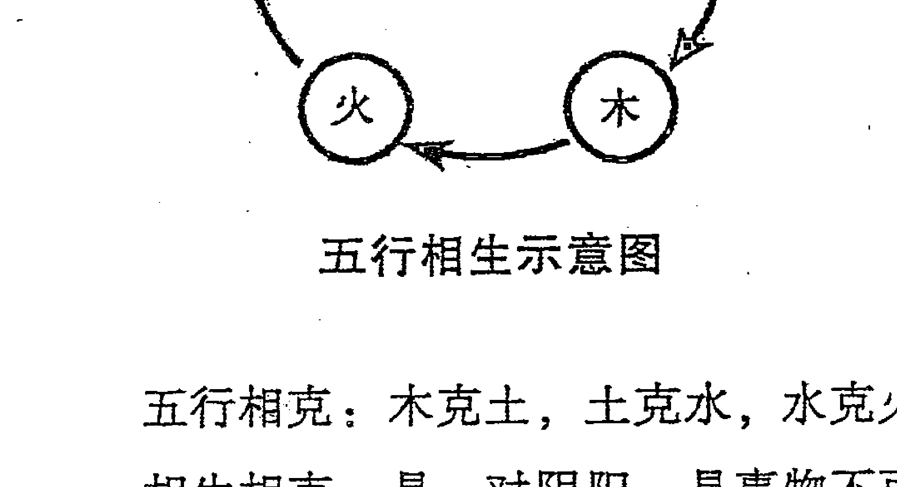
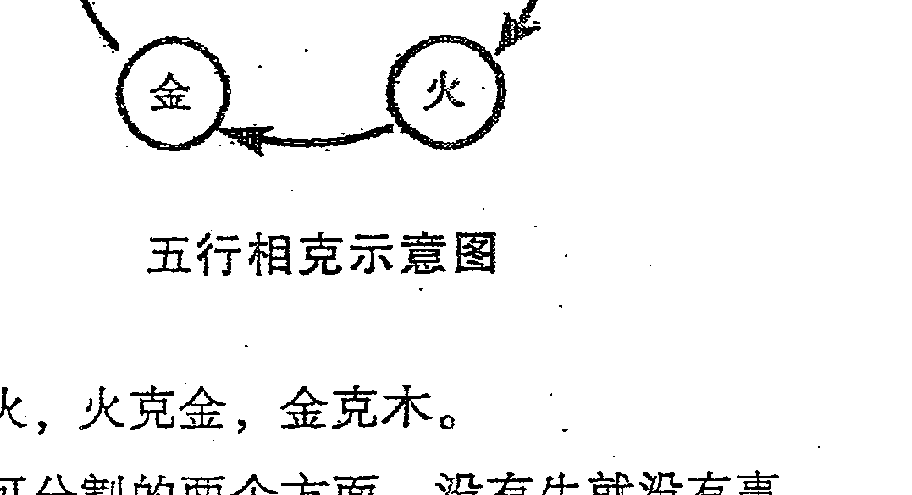
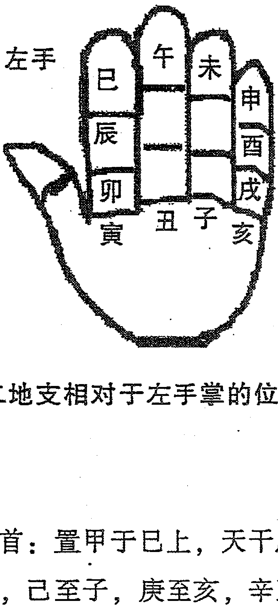

# 奇门真传

## 前言
奇门遁甲自古以来被称为“帝王之学”“最高预测学”，它是古圣先贤集体智慧的结晶，是中华民族的文化瑰宝。

中国的预测学种类繁多，为什么唯独奇门遁甲享有“帝王之学”“最高预测学”之美誉？那是因为，相较于其他预测学来说，奇门遁甲不仅在预测上更加全面细致，而且在运筹上也有着扭转乾坤之奇效！

可惜的是，现存的有参考价值的古籍较少，而且艰涩难懂，又由于时过境迁，很多理论已不能很好地应用于当代社会；而近些年面世的奇门类书籍，大多预测过程不够细致，对细节的挖掘远远不够，对卦理的解析也不够透彻，更为关键的是，这些书对奇门遁甲的精髓——运筹都鲜少提及，这给奇门爱好者们的学习造成了很多不便。

预测是发现问题，而运筹才是解决问题之道。

如果只注重预测，而不注重运筹，那是我们还没有完全领会祖先发明奇门遁甲的真实用意！祖先发明奇门遁甲，不是让我们单纯用来预测的，而是让我们通过预测发现问题，进而通过运筹去解决问题的！如果医学只会诊断，而不能治病救人，那么医学还会流传到今天吗？如果奇门遁甲只能预测问题，而不能解决问题，那么奇门遁甲的明天将会怎样？这是每个学易之人都应该深思的问题！因此，奇门遁甲的运筹功能亟待弘扬和发掘！

鉴于此，我决定写这样一本书——其内容既包括预测，同时又适当地包括运筹，以分享给每一位奇门遁甲爱好者！

我和我的学生们集思广益，曾为本书拟了几十个风格各异的备用名，几经比较和考虑后，终决定使用《奇门真传》作为本书的名字。之所以使用这个名字，主要原因在于，一是其简洁明了、朗朗上口、便于记忆，符合我一贯主张的风格；二是希望借助书名向读者传递这样一种信息，我们在学习奇门时，一定要务实，学就要学真东西，对于一些虚假的东西，要坚决摒弃，一不要学习，二不要传播，这既是对自己负责，也是对他人负责，更是对整个行业负责。这是每个学易之人应有的眼界、态度和责任！

笔者写作本书的初衷是，既让本书成为学习奇门时可随时查阅的实用工具书，让无基础的读者读过本书后，从零开始学会奇门；又能让有基础的读者读过本书后，取得进一步的提高与突破，乃至直入堂奥。

因此，在写作此书过程中，对于内容的安排，既力求将学习奇门必需的基础知识一一囊括，让无基础的读者学起来得心应手，一书在手，学习无忧；又着重把大量笔墨放在案例讲解上，力争通过大量案例的启发，培养读者举一反三的能力。在案例讲解过程中，既详细讲解了每个结论的判断依据，又在个别案例中适当讲解了运筹，希望读者在提高预测水平的同时，亦能对运筹有所了解。

在多年的教学生涯中，笔者发现很多人在学完一个案例后，不知道关键知识点在哪里，鉴于此，笔者几乎在每个案例之后都写了一个小结加以提点，这是明显有别于其他同类书的地方，希望借此给每一位读者带来帮助和启发。

笔者坚信，读了本书后，无基础的读者可以学会奇门遁甲，基础较好的读者可以窥其堂奥！读者如能进一步深入系统地学习本体系，亦能掌握催财、催官、催子、治病、催婚、改运、助考、助孕等运筹方面的高层知识！乐见每一位读者在读过本书后，都有属于自己的收获！

## 内容简介
经常有想跟我学习奇门遁甲的朋友向我咨询这样两个问题：你的奇门遁甲都讲哪些内容？和别处的奇门遁甲有何不同？因此，我专门就此问题写了此文，以便易友们能够更好地了解我的奇门遁甲到底有哪些特点。下面，我就讲一讲我的奇门遁甲和别处的到底有哪些不同。

1.  在婚姻预测中取用神的方法不同、预测理论不同。婚姻预测自古以来便是最主要、最大的预测课题之一，也是我们每个学易之人必须研究透彻的问题，因为你要时常面对求测者提出的这类问题。在古籍中，预测婚姻时往往取“乙”代表婚恋中的女方，以“庚”来代表婚恋中的男方，这种方法在古代预测时准确率很高，但在今天，这种方法的准确率就极低了，问题到底出在哪里呢？学过奇门的朋友都知道，在婚恋预测中，“乙”其实是代表第一个女朋友或第一个老婆的，而“庚”是代表第一个男朋友或者第一个老公的，在古代，除少数官贵之外，大多数男人一生只有一个老婆，在结婚之前也只有一个女朋友，这个女朋友就是他后来的老婆，在这种前提下，你用“乙”来代表他的女朋友或者老婆才是正确的，而在当今社会，很多人在结婚之前就有过多个恋爱对象，也有过事实上的婚姻，这时你再用“乙”来代表一个男士的女朋友或者老婆就不是很准确了，因为其所求测的这个女性，往往并不是这个男士的第一个女朋友或者第一个事实上的老婆。

那么，在婚姻预测中，到底用什么来代表女方，用什么来代表男方呢？我们将在后面具体阐述。此外，在奇门中怎么判断一个人有过多次婚姻？怎么能知道一个女人克夫？这些都是我们所要讲的内容。

现在易学界的很多人在预测婚恋时，大多停留在预测两个人能否确立恋爱关系或者两个人能否结婚这两个方面。其实婚恋预测远远不只包含这两方面，具体而言，婚恋预测必须包含以下7个方面，方能称为一个完整的婚恋预测体系。这7个方面分别为：

（1）未恋爱的男女何时找到对象。在此要提醒大家注意一个问题，当求测者来求测什么时候可以找到对象时，不要直接就到局上去找时间，而是要先判断此求测者能否找到对象，如果能，再定应期。这是一个逻辑顺序问题，值得大家注意，要避免陷入到沉锚效应当中。

（2）未恋爱的男女何时遇到结婚对象，注意：此处的结婚对象和前边的对象是两个概念，此处的结婚对象是指最终可以步入婚姻殿堂的人，前边的对象是指和求测者有恋爱关系的人，但有恋爱关系的人未必就是结婚对象，因为分手的很多。举例如下：

公历：2012年1月20日17:39
农历：辛卯年十二月廿七日酉时【兔】
节气：2012年01月06日06时43分【小寒】
2012年01月21日00时09分【大寒】
干支：辛卯 辛丑 庚辰 乙酉
旬空：午未 辰巳 申酉 午未
旬首：甲申
值符：天柱
值使：惊门
用局：小寒下元阳遁五局

| 神/宫 | 符/震 (东) | 蛇/离 (南) | 阴/坤 (西南) |
| :--- | :--- | :--- | :--- |
|  | 值符 | 螣蛇 | 太阴 ○ |
|  | 天柱 庚 | 天心 己 | 天蓬 癸 |
| 宫 | 武 休门 乙 | 地 生门 壬 | 天 伤门 丁 |
|  | 九天 | 戊 (中宫) | 六合 ○ |
|  | 天芮 丁 |  | 天任 辛戊禽 |
| 宫 | 虎 开门 丙 |  | 符 杜门 庚 |
|  | 九地 马 | 玄武 | 白虎 |
|  | 天英 壬 | 天辅 乙 | 天冲 丙 |
| 宫 | 合 惊门 辛 | 阴 死门 癸 | 蛇 景门 己 |

此女在2011年腊月二十七求测未来的老公何时出现，我分析后告知，其未来的老公必在2012年正月出现，他们将奉子成婚。后经反馈，其确实在此段时间内恋爱了，并且于该年年底和此人结婚了，正是奉子成婚。在短短的时间内，此预测便应验了，其被我的预测深深折服，也更加对周易这门学问深信不疑了。

以上只是讲解了能否遇到结婚对象以及何时遇到的问题，这是关键问题，其次还可以预测这个人的职业、性格、体型、相貌等，这些细节问题将在之后的章节中具体讲解，在此不加赘述。

（3）未恋爱的男女测和某人能否确立恋爱关系。
（4）热恋中的男女能否结婚。
（5）已结婚的夫妻能否离婚。
（6）离婚者测能否复婚。
（7）从多个追求者中选一个可结婚之人。举例如下：
公历：2011年8月24日09:14
农历：辛卯年七月廿五日巳时【兔】
节气：2011年08月23日19时20分【处暑】
2011年09月08日07时34分【白露】
干支：辛卯 丙申 辛亥 癸巳
旬空：午未 辰巳 寅卯 午未
旬首：甲申
值符：天任
值使：生门
用局：处暑上元阴遁一局

| 太阴 马 | 螣蛇 | 值符 |
| :--- | :--- | :--- |
| 天心 壬 | 天蓬 戊 | 天任 庚 |
| 地 杜门 丁 | 武 景门 己 | 虎 死门 乙 |
| 六合 ○ | 癸 | 九天 |
| 天柱 辛 |  | 天冲 丙 |
| 天 伤门 丙 |  | 合 惊门 辛 |
| 白虎 ○ | 玄武 | 九地 |
| 天芮 乙癸禽 | 天英 己 | 天辅 丁 |
| 符 生门 庚 | 蛇 休门 戊 | 阴 开门 壬 |

此求测者为甲子年女子，当时追求她的人有三个，一个是乙丑年男子，一个是丙寅年男子，还有一个是辛酉年男子，她的求测目的是请我在三人为其选择一个最终可以结婚的人。我建议其选择辛酉年男子，后二人于2012年年初结了婚，此女第一时间把好消息告诉了我，并向我表示了真诚的感谢。

2.  “奇门测职业”这一课题很重要，它能够瞬间让求测者信服，所以，我们有必要在这个课题上下点功夫。
奇门测职业，要领在于看求测者天地盘年命宫位的信息组合及年命地支所在宫位的信息组合。举例如下：

- 公历：2011年12月5日21:33
- 农历：辛卯年十一月十一日巳时【兔】
- 节气：2011年11月23日00时07分【小雪】
  2011年12月07日19时28分【大雪】
- 干支：辛卯 己亥 甲午 乙亥
- 旬空：午未 辰巳 辰巳 申酉
- 旬首：甲戌
- 值符：天蓬
- 值使：休门

# 用局：小雪下元阴遁二局

| 九天 O<br>天任 辛<br>虎 开门 丙 | 九地<br>天冲 乙<br>虎 休门 庚 | 玄武 马<br>天辅 丙<br>合 生门 戊 |
| --- | --- | --- |
| 值符<br>天蓬 己<br>地 惊门 乙 | 地<br>丁 | 白虎<br>天英 庚<br>阴 伤门 壬 |
| 螣蛇<br>天心 癸<br>玄 死门 辛 | 太阴<br>天柱 壬<br>符 景门 己 | 六合<br>天芮 戊丁禽<br>蛇 杜门 癸 |

此求测者为庚申年男子，在请我测了几件重要的事情后，闲聊中请我为其测一下他的职业。我分析了一下，对其说：“你是一个军人，而且是一个军官，但你在部队中是文职。”他听了之后连连竖大拇指，说：“李老师果然名不虚传，能测出我是军人已经很难得，还能进一步测出我是军人里的文职，实在了不起！今天我算长了见识！”他带着满意的微笑离开了，从此我们也成为了很好的朋友。

具体怎么测职业性质呢？这个问题将在之后的章节中教会大家。

-   3. 胎产预测中怎么判断一个女人目前有无身孕，如果没有，将在什么时候怀孕？所怀将为男孩还是女孩？
在测一个女人何时怀孕之前，要先测其有无生育能力，其次才能谈到何时怀孕的问题。那么具体怎么判断有无生育能力呢？这个问题此前在奇门领域内还没有一个人能正确地讲出来。至于测何时怀孕，也不像有些书上讲的那么繁琐，其实很简单，就是看某一个特定宫位的天干，这个方法至今还没有任何一个人公开过。所怀是男还是女，也并非有些书上常讲的看坤宫内的星、门和天干。

-   4. 奇门预测中怎么判断一个人是生是死？这个并不像有的书里讲的那么繁琐，只需紧扣年命进行判断，年命宫位只要遇上特定的几种情况，必死无疑。

5. 怎么定应期。何为应期？应期就是事情发生的时间。定应期是预测中的重点，也是难点，同时亦是必须掌握的。古籍中关于定应期的方法讲了几十种，其实定应期原本没那么复杂，如果考虑的因素太多，反而迟迟下不了结论，并因此影响你的判断。此外，有很多事往往只有两种结果，一个是成，一个是败，若只说结果，而不说应期，未免有蒙的嫌疑。

6. 在预测升学考试、公务员考试等问题时，很多书上都讲到要综合看太岁落宫、值符落宫和天辅星落宫对求测者年命宫的生克关系，但是以哪个为主呢？如果都参考肯定有出现矛盾的时候，其实，只要单独看三者之一的落宫和年命落宫的生克关系即可。

7. 空亡的查法。现在外界的奇门，很多都从时柱上查空亡，这种方法对吗？显然是不对的，在之后的章节中，我将会教给大家如何正确查空亡。

8. 何为真空？何为假空？大家各执一词，这导致很多人无所适从。本书将教会你如何辨别真空和假空。关于这一点，目前还没有哪一本书能完全说清楚。空亡是奇门遁甲中的重要基础知识，是重点，也是难点，空亡不研究透彻，你的奇门预测就上不了层次。

9. 奇门中究竟怎么定六亲？古籍中讲长辈、领导、老师等看年干，平辈人、朋友、同事、同学等看月干，小辈人、学生、徒弟等看时干，这方法显然过于笼统。当然，我们在预测中可以作为参考，但绝不能以此为主。奇门中到底如何定六亲？在之后的章节中将做详尽的阐述。

10. 奇门中到底用什么来代表求测者？很多人用日干来代表求测者，这种方法在古代的准确率是可以的，但在现在使用起来准确率很低，我只会在几种特殊情况下把日干作为参考。至于用什么来作为求测者的主要符号，在读了本书之后，你将豁然开朗。

11. 在疾病预测中到底怎么判断一个人哪些器官有病？难道如古籍所讲仅仅看天芮星落宫的五行、八卦象意及天芮星落宫的星门奇仪的组合吗？显然不是这样的。

12. 投稿预测。经常有作家朋友、网络写手向笔者求测其写的书能否出版或稿件能否被采用。这个预测课题也是我们应该掌握的，但目前还没有人就这个课题做系统的讲解。本书将把系统理论毫不保留地教给每一个读者。

13. 怎样判断一个女人做过剖腹产。曾经有一个年轻女子向我求测，当时我对她说的第一句话就是，你家的孩子是男孩，你生他的时候是剖腹产。此人听了后感到很惊奇。这个是怎么判断的？答案尽在本书案例中。

14. 奇门遁甲起初是用来指导战争的，所以将其用于博弈活动中，能够起到扭转乾坤之效果。比如在打官司、谈判、棋牌类游戏当中，有了奇门遁甲的介入，常常可以达到力挽狂澜、扭转乾坤的神奇功效。在这方面，我们做过大量的实践，让很多人从中受了益。令人遗憾的是，目前奇门研究者大都忽略了奇门的此项重要功能。

15. 奇门遁甲在升学指导、就业指导等方面有着重要的作用，可以给求测者指出一个明确的方向，从而让求测者在有限的人生中避免走不必要的弯路，进而使求测者最大限度地实现自己的人生价值！

16. 催财方法有多种，但奇门催财是效果最显著、起效最迅速的方法。它的可贵之处在于起效迅速。再好的方法，如果起效很慢，都是没有多大实际意义的。须知，人生苦短，一万年太久，只争朝夕。追逐财利没有错，通过正当途径让自己过得更幸福也没有错，君子爱财，取之有道，做到此足矣！

17. 以往的奇门书上几乎很少讲切实可行的化解方法，而本书不仅重视对预测的讲解，而且对化解进行了适当的讲解。预测是发现问题，而化解才是解决问题之道。如果只注重预测，而不注重化解，那便是我们还没有完全领会祖先发明奇门遁甲时的真实用意！祖先发明奇门遁甲，不是让我们单纯用来预测的，而是让我们通过预测来发现问题，进而通过化解去解决问题的！如果医学只能够诊断，却不能治疗，那么医学还会流传到今天吗？如果奇门只能够预测问题，而不能化解问题，那么奇门的明天将会怎样？这是一个值得深思的问题！

18. 何为“定性·定量说”？“定性·定量说”强调在预测的过程中，要先定性；再定量。那么如何定性？怎么定量？在本书之后的章节中将为大家

19. 何为“宏观·微观论”？ “宏观·微观论”强调在预测时要先从宏观上来解读，再从微观上来解读，这样可以使一个预测规范有序，如抽丝剥茧般，避免了眉毛胡子一把抓。宏观决定成败，微观决定细节。

20. 通关理论。多数人知道八字学里存在通关理论，殊不知奇门里也是存在通关一说的。为了说明通关理论的重要性，现举例如下：
公历：2013年4月21日20:02
农历：癸巳年三月十二日戌时【蛇】
节气：2013年04月20日06时03分【谷雨】
2013年05月05日16时18分【立夏】
干支：癸巳 丙辰 丁巳 庚戌
旬空：午未 子丑 子丑 寅卯
旬首：甲辰
值符：天英
值使：景门
用局：谷雨上元阳遁五局

| 玄武 | 九地 | 九天 |
| --- | --- | --- |
| 天任 辛戊禽 | 天冲 丙 | 天辅 乙 |
| 天 休门 乙 | 符 生门 壬 | 蛇 伤门 丁 |
| 白虎 | | 值符 |
| 天蓬 癸 | 戊 | 天英 壬 |
| 地 开门 丙 | | 阴 杜门 庚 |
| 六合 ○ | 太阴 ○ | 螣蛇 马 |
| 天心 己 | 天柱 庚 | 天芮 丁 |
| 武 惊门 辛 | 虎 死门 癸 | 合 景门 己 |

上述是为帮助旅德女作家预测其丢失的手机能否找回的盘。在她找我预测之前，该女作家已经找了多位大师看过，大家都说找不回来了，他们的理由是，丁奇在乾宫，冲克求测者年命所在的巽宫。对此，我提出了不同意见，我坚决地认定手机能够找回来。我的理由是：虽乾宫冲克巽宫，但由于这个盘中的坎宫处于特殊状态，使得坎宫成为了动态宫位，坎宫一动，乾宫就来生坎宫，然后坎宫再来生巽宫，这样就形成了通关，从而成功化解了乾宫冲克巽宫的问题，手机自然也就可以找到了。第二天，求测者反馈，手机果然找到了。当初说找不回来的那些人愕然了，但仍不知其所以然！

对于通关问题，需要注意的一点是，一个宫位并非在任何情况下都可以通关，而是必须满足一定的条件才可以。至于需要满足哪些条件，我将在之后的案例中详细讲解。

-   21. 能量的传递路线问题。研究预测学到了一定境界后，其实就是在研究能量的传递路线问题。大自然中处处存在着能量的传递和转换，奇门盘中也如此。由于每个宫位的能量不一样，所以宫位之间必然存在着能量的传递。但无规矩不成方圆，宫位之间能量的传递是遵循一定规律的，即每个盘的能量传递都是有一定路线的，并非毫无规矩。为了更好地把握预测，我们必须要掌握能量的传递路线问题。

22. 十二长生状态的应用。很多人都知道十二长生状态的查法，却鲜有人在奇门中加以应用，也极少有人会用。但如果会使用十二长生状态，将使整个预测更加得心应手，也能够使整个预测更加全面细致。

23. 化解疾病以及不孕等。对于化解一项，尤其是化解邪病，鲜少有人会，甚至很多研究者闻所未闻，更谈不上应用此法。以上这些都将作为本书的重点讲解内容。为了让大家对此法有一个初步的了解和认识，现举例如下：

-   公历：2014年4月28日16:48
-   农历：甲午年三月廿九日申时【马】
-   节气：2014年04月20日11时55分【谷雨】
-   2014年05月05日21时59分【立夏】
-   干支：甲午 戊辰 己巳 壬申
-   旬空：辰巳 戌亥 戌亥 戌亥

旬首：甲子

值符：天芮

值使：死门

用局：谷雨中元阳遁二局

| 白虎 | 玄武 | 九地 |
| --- | --- | --- |
| 天任 丁<br>地 休门 庚 | 天冲 己<br>天 生门 丙 | 天辅 庚<br>符 伤门 戊 |
| 六合<br>天蓬 乙<br>武 开门 己 | 辛 | 九天<br>天英 丙<br>蛇 杜门 癸 |
| 太阴<br>天心 壬<br>虎 惊门 丁 | 螣蛇<br>天柱 癸<br>合 死门 乙 | 值符 ○马<br>天芮 戊辛禽<br>阴 景门 壬 |

此局是为广西韦先生的女儿预测邪病并化解的奇门局。其女儿无缘无故发烧不退，在我为其预测以前，其女儿已经在当地医院住院治疗了两个多月，但病情无明显改善，后来又去北京某医院治疗，依然无果。再后来又找多位著名大师测过，仍然没有得出明确的结论。

在这种情况下，韦先生经人介绍找到了我。我当时看了一下此局，直接告诉他，此病非实病，而是邪病，不在医院的治疗范围内，所以住院两个多月没有明显改善。为什么说此病是邪病呢？天芮星临太岁辛金和地盘太阴，太岁代表长辈，太阴代表逝去的，所以此病为逝去的长辈让孩子得的。临景门，景门为火，为热，所以孩子发烧，乾宫为头部，所以头部发烧。

逝去的长辈让孩子生病，一般都是有诉求的。这个诉求是什么呢？太岁临景门，景门为计划、诉求，逝去的长辈是有诉求的，想让后人帮助他实现。但是现在乾宫空亡，所以说这个诉求，后人还没有给实现。找出这个诉求，让他的后人去为其实现了，病自然就好了。

晚上我据此局做了化解，第二天中午孩子的病就完全好了。

## 24. 对地盘八神的应用
绝大多数奇门研究者只重视天盘的八神，而对地盘的八神却不闻不问，这是不对的。很多时候，不看地盘八神，很多问题就看不全面，甚至有很多细节问题看不出来。如上述化解邪病的案例，若不看地盘八神之一的太阴，就很难定性为邪病。

以上所阐述的只是我的奇门特点的一部分，由于很多琐碎的知识点只有在具体案例中才能讲清楚，所以在这里并未一一列举。

# 第一章 奇门遁甲基础知识

## 第一节 基础知识说明

### 一、阴阳学说

阴阳的概念，源自中国古人朴素辩证的哲学观。古人观察到自然界中各种既对立又统一的自然现象，如天地、昼夜、寒暑、男女、上下等，以哲学的思想，归纳出“阴阳”的概念。阴阳是古人对宇宙万物两种相反相成的性质的一种抽象概括，也是宇宙对立统一及思维法则的哲学范畴。早至春秋时代的《易传》以及老子的《道德经》都提到阴阳的概念。阴阳理论已经渗透到中国传统文化的方方面面。

中国古代哲学家认为：“二气（阴阳）交感，化生万物”，万物的化生源于阴阳之间的相互作用，这一哲学思想始自先秦诸家，如《荀子·礼记》说：“天地和而万物生，阴阳接而变化起。”又说：“天地感而为万物化生。”从而指出阴阳交感是万物化生的原动力和根本条件。故又可以说，天地阴阳之间的相互作用乃是万物生成和变化的肇始。

由此可见，在整个自然界，阴阳交感是事物产生和发展的原动力。天之阳气下降，地之阴气上升，阴阳二气交感，化生出万物，并形成云雾、雷电、雨露、阳光、空气，阴阳二气相互交感，生命体方得以产生。所以，如果没有阴阳二气的交感运动，就没有自然界，也就没有生命。可见，阴阳交感又是生命产生的基本条件。

阴阳学说的基本内容包括以下四个方面：阴阳对立、阴阳互根、阴阳消长和阴阳转化。

阴阳对立是指世间一切事物或现象都存在着相互对立的阴阳两个方面，如上与下、高与低、动与静、热与冷、昼与夜等，其中上为阳、下为阴，高为阳、低为阴，动为阳、静为阴，热为阳、冷为阴，昼为阳、夜为阴……

阴阳互根是指对立的阴阳双方又是互相依存的，任何一方都不能脱离另一方而单独存在。如上为阳、下为阴，假如没有上，也就无所谓下，同样的，如果没有下，上也就无从谈起；高为阳、低为阴，假设没有高，也就无所谓低，同样的，如果没有低，高也就无从谈起。所以，阳依存于阴，阴同样依存于阳，彼此都以相对的另一方的存在为自己存在的前提条件，这就是阴阳互根。

阴阳消长是指阴阳双方不是静止不动的，而是不断处于互相制约、互相斗争中，即处于“阴消阳长、阳消阴长”的不断发展和变化过程中。就季节变化而言，由夏至秋，气候由热变凉，是一个阳消阴长的过程；由冬至春，气候由寒变暖，是一个阴消阳长的过程。阴阳之间的互相制约，使双方始终处于一种消长变化过程中，阴阳在这种消长变化中达到动态的平衡。这种相对的动态平衡，保证了宇宙万物相对健康有序地生存和发展。

阴阳转化是指相互对立的阴阳双方，在一定条件下可各自向其对立面转化。此种转化，一般是指事物或现象总体属性的改变，即属阳者在一定条件下可转变为属阴，属阴者在一定条件下也可转变为属阳。

阴阳转化与阴阳消长是密切相关的。阴阳的消长过程中伴有阴阳的转化，而阴阳的转化，又导致了阴阳的消长运动。

阴阳消长侧重于量的变化，而阴阳转化侧重于质的变化。

因为阴阳可以相互转化，而吉凶也是一对阴阳，所以吉凶也是可以相互转化的，这正是趋吉避凶、化解运筹的理论依据！

### 二、五行学说

五行学说认为宇宙是由金、木、水、火、土五种最基本物质构成的，宇宙中各种事物和现象的发展、变化都是这五种不同属性的物质不断运动和相互作用的结果。《太上化道度世仙经》中说：“五行者，金、木、水、火、土也，乃造化万物，配合阴阳，为万物之精华者也。”

#### （一）五行的特性

《尚书·洪范》中说：“五行，一曰水，二曰火，三曰木，四曰金，五曰土。水曰润下，火曰炎上，木曰曲直，金曰从革，土爰稼穑。”木，具有生发、条达的特性。火，具有炎热、向上的特性。土，具有长养、化育的特性。金，具有清静、收杀的特性。水，具有寒冷、向下的特性。

#### （二）五行的生克

五行学说以五行之间的生克关系来阐释事物之间的相互联系，认为任何事物都不是孤立的、静止的，而是在不断的相生、相克的运动之中维持着协调平衡。

相生，含有滋生、促进、助长的意思。相克，含有制约、克制和抑制的意思。

-   五行相生：木生火，火生土，土生金，金生水，水生木。





-   五行相克：木克土，土克水，水克火，火克金，金克木。

相生相克，是一对阴阳，是事物不可分割的两个方面。没有生就没有事物的发生和发展；没有克，就不能维持事物在发展和变化中的平衡与协调。没有相生，就没有相克，没有相克，也就没有相生，这种生中有克、克中有生、相反相成、互相为用的关系推动和维持着事物的正常生长、发展和变化。

> 盖造化之机，不可无生，亦不可无制，无生则发育无由，无制则亢而为害。生克循环，运行不息，而天地之道，斯无穷已。

### 三、三奇、六仪和六甲

在奇门遁甲中，有三奇和六仪。三奇指乙、丙、丁。其中乙为日奇，丙为月奇，丁为星奇；六仪指戊、己、庚、辛、壬、癸。

细心的读者会发现，三奇和六仪加一起一共只有九个天干，相较于十天干来说，唯独缺了一个甲，那么甲在哪里呢？其实“奇门遁甲”这四个字已经给出了答案，所谓“遁甲”，即甲隐遁起来了，隐遁在哪里呢？甲是隐遁在六仪当中的，即六甲和六仪有着明确的对应关系，现将对应关系介绍如下：

六甲隐遁规则：

-   一甲甲子隐遁在六仪中戊土仪仗下，故戊又称为甲子戊；
-   二甲甲戌隐遁在六仪中己土仪仗下，故己又称为甲戌己；
-   三甲甲申隐遁在六仪中庚金仪仗下，故庚又称为甲申庚；
-   四甲甲午隐遁在六仪中辛金仪仗下，故辛又称为甲午辛；
-   五甲甲辰隐遁在六仪中壬水仪仗下，故壬又称为甲辰壬；
-   六甲甲寅隐遁在六仪中癸水仪仗下，故癸又称为甲寅癸。

所以，六仪通常又分别被称为：甲子戊、甲戌己、甲申庚、甲午辛、甲辰壬、甲寅癸。

### 四、关于阳遁、阴遁以及地盘三奇六仪的排列顺序

奇门遁甲在起局时要区分阳遁和阴遁，阳遁时，地盘奇仪按戊、己、庚、辛、壬、癸、丁、丙、乙的顺序在宫位内前进着排列；阴遁时，地盘奇仪按戊、己、庚、辛、壬、癸、丁、丙、乙的顺序在宫位内后退着排列。每一年，从冬至开始的12个节气用阳遁，从夏至开始的12个节气用阴遁。

奇门遁甲用几局，地盘戊就在几宫。阳一局，地盘戊在坎一宫；阳二局，地盘戊在坤二宫。阴一局，地盘戊在坎一宫；阴二局，地盘戊在坤二宫。

### 五、关于六十花甲及所属旬别

-   一甲甲子旬：甲子、乙丑、丙寅、丁卯、戊辰、己巳、庚午、辛未、壬申、癸酉。
-   二甲甲戌旬：甲戌、乙亥、丙子、丁丑、戊寅、己卯、庚辰、辛巳、壬午、癸未。
-   三甲甲申旬：甲申、乙酉、丙戌、丁亥、戊子、己丑、庚寅、辛卯、壬辰、癸巳。
-   四甲甲午旬：甲午、乙未、丙申、丁酉、戊戌、己亥、庚子、辛丑、壬寅、癸卯。
-   五甲甲辰旬：甲辰、乙巳、丙午、丁未、戊申、己酉、庚戌、辛亥、壬子、癸丑。
-   六甲甲寅旬：甲寅、乙卯、丙辰、丁巳、戊午、己未、庚申、辛酉、壬戌、癸亥。

掌握以上知识即可找出每一时辰的旬首，但并不是很方便，不仅需要熟背六十花甲的顺序，而且耗时比较长，现介绍一种简单易操作的查旬首方法——掌上快速查旬首。

掌上快速查旬首方法如下：

在左手掌各节定出十二地支的位置（见下图）。当欲求某一时辰干支的旬首：先找出其地支所在的位置，将甲加在该地支上，然后逆行十二地支（逆时针方向），天干则顺行与之搭配，数到所求干支的天干为止，此时所落的地支，再搭配天干甲（因旬首为六甲），即是所求的旬首。



### 举例说明如下：

例如，求辛巳时的旬首：置甲于巳上，天干顺数、地支逆数，乙至辰，丙至卯，丁至寅，戊至丑，己至子，庚至亥，辛至戌，因此旬首地支为戌，因旬首天干均为甲，于是得辛巳时旬首为甲戌。

相较于第一种方法来说，掌诀求旬首的方法更简便。不过还有另外一种方法，叫做干支做差法，也是一种相对简便的方法。现一并介绍如下：

干支做差法，即地支数—天干数=旬首常数（当地支数小于天干数时，则地支数加上12之后再去减天干数）。

-   1. 当旬首常数为0时，则该组干支旬首为甲子。
-   2. 当旬首常数为2时，则该组干支旬首为甲寅。
-   3. 当旬首常数为4时，则该组干支旬首为甲辰。
-   4. 当旬首常数为6时，则该组干支旬首为甲午。
-   5. 当旬首常数为8时，则该组干支旬首为甲申。
-   6. 当旬首常数为10时，则该组干支旬首为甲戌。

### 举例说明如下：

例如，求辛巳时的旬首，用地支巳的序号6减去天干辛的序号8（因地支数小于天干数，故加12），得10，所以得旬首甲戌。

以上几种方法均可查旬首，读者可任选适合自己的方法。

### 六、六仪所含地支

戊，也称甲子戊，它暗含地支子；己，也称甲戌己，它暗含地支戌；庚，也称甲申庚，它暗含地支申；辛，也称甲午辛，它暗含地支午；壬，也称甲辰壬，它暗含地支辰；癸，也称甲寅癸，它暗含地支寅。

### 七、九宫和五行的对应关系

| 四宫：木 | 九宫：火 | 二宫：土 |
| :---: | :---: | :---: |
| 三宫：木 | 五宫：土 | 七宫：金 |
| 八宫：土 | 一宫：水 | 六宫：金 |

### 八、九宫和先天八卦

| 兑卦 | 乾卦 | 巽卦 |
| :---: | :---: | :---: |
| 离卦 | 中五宫 | 坎卦 |
| 震卦 | 坤卦 | 艮卦 |

### 九、九宫和后天八卦

| 四宫（巽卦） | 九宫（离卦） | 二宫（坤卦） |
| :---: | :---: | :---: |
| 三宫（震卦） | 中五宫 | 七宫（兑卦） |
| 八宫（艮卦） | 一宫（坎卦） | 六宫（乾卦） |

### 十、九宫和九星

| 四宫（天辅星） | 九宫（天英星） | 二宫（天芮星） |
| --- | --- | --- |
| 三宫（天冲星） | 五宫（天禽星） | 七宫（天柱星） |
| 八宫（天任星） | 一宫（天蓬星） | 六宫（天心星） |

需要指出的是，这里九星和九宫的对应关系，只是说此星的原始宫位是这个宫位，并非永远在这个宫位里不动，它不是一成不变的，有时九星在其原始宫位，有时又会转到别的宫位。

### 十一、九宫和八门

| 四宫（杜门） | 九宫（景门） | 二宫（死门） |
| --- | --- | --- |
| 三宫（伤门） | 五宫 | 七宫（惊门） |
| 八宫（生门） | 一宫（休门） | 六宫（开门） |

需要指出的是，这里的八门和九宫的对应关系，同九星和九宫的对应关系类似，只是八门的原始宫位在这里，但在整个运转过程中并非一成不变，有时八门在其原始宫位，有时会转到别的宫位。

### 十二、九星、八门和八卦

- 天蓬星、休门：和其原始宫位一宫一样，同属坎卦。
- 天芮星、死门：和其原始宫位二宫一样，同属坤卦。
- 天冲星、伤门：和其原始宫位三宫一样，同属震卦。
- 天辅星、杜门：和其原始宫位四宫一样，同属巽卦。
- 天禽星：不属于任何一卦。
- 天心星、开门：和其原始宫位六宫一样，同属乾卦。
- 天柱星、惊门：和其原始宫位七宫一样，同属兑卦。
- 天任星、生门：和其原始宫位八宫一样，同属艮卦。
- 天英星、景门：和其原始宫位九宫一样，同属离卦。

### 十三、八神

值符、螣蛇、太阴、六合、白虎、玄武、九地、九天。

### 十四、九宫和十二地支

| 辰 巳 | 午 | 未 申 |
| :---: | :---: | :---: |
| 卯 | 五宫 | 酉 |
| 寅 丑 | 子 | 亥 戌 |

### 十五、九星、八门和十二地支

- 天蓬星、休门：和其原始宫位一宫一样，含地支子。
- 天芮星、死门：和其原始宫位二宫一样，含地支未和申。
- 天冲星、伤门：和其原始宫位三宫一样，含地支卯。
- 天辅星、杜门：和其原始宫位四宫一样，含地支辰和巳。
- 天心星、开门：和其原始宫位六宫一样，含地支戌和亥。
- 天柱星、惊门：和其原始宫位七宫一样，含地支酉。
- 天任星、生门：和其原始宫位八宫一样，含地支丑和寅。
- 天英星、景门：和其原始宫位九宫一样，含地支午。

在预测时，九星和八门不仅要考虑其万物类象，还要用到其所含地支，进行生克制化。

### 十六、奇门遁甲常用术语释义

（一）太岁：共有六十位，即六十花甲，从甲子至癸亥，按顺序值年，每组干支轮值一年，来掌管人间这一年的吉凶祸福，轮值的这一组干支，便为该年的太岁。因其周而复始，循环不息，故又称“值年使者”，或“值年太岁”。如：2017年的立春时间为2月3日23时34分，从此刻开始便进入了丁酉年，“丁酉”便为这一年的太岁。

（二）年命：将被测者的出生年份转化为干支，这组干支便为其年命。如2017年的立春时间为2月3日23时34分，2018年的立春时间为2月4日5时28分，由于这段时间为丁酉年，在这二者之间出生的人，年命便为“丁酉”。

将出生于不同年份之人的年命列表如下：

| 干支 | 年份 | 干支 | 年份 | 干支 | 年份 | 干支 | 年份 | 干支 | 年份 | 干支 | 年份 |
| :--- | :--- | :--- | :--- | :--- | :--- | :--- | :--- | :--- | :--- | :--- | :--- |
| 甲子 | 1924 | 甲戌 | 1934 | 甲申 | 1944 | 甲午 | 1954 | 甲辰 | 1964 | 甲寅 | 1974 |
| 乙丑 | 1925 | 乙亥 | 1935 | 乙酉 | 1945 | 乙未 | 1955 | 乙巳 | 1965 | 乙卯 | 1975 |
| 丙寅 | 1926 | 丙子 | 1936 | 丙戌 | 1946 | 丙申 | 1956 | 丙午 | 1966 | 丙辰 | 1976 |
| 丁卯 | 1927 | 丁丑 | 1937 | 丁亥 | 1947 | 丁酉 | 1957 | 丁未 | 1967 | 丁巳 | 1977 |
| 戊辰 | 1928 | 戊寅 | 1938 | 戊子 | 1948 | 戊戌 | 1958 | 戊申 | 1968 | 戊午 | 1978 |
| 己巳 | 1929 | 己卯 | 1939 | 己丑 | 1949 | 己亥 | 1959 | 己酉 | 1969 | 己未 | 1979 |
| 庚午 | 1930 | 庚辰 | 1940 | 庚寅 | 1950 | 庚子 | 1960 | 庚戌 | 1970 | 庚申 | 1980 |
| 辛未 | 1931 | 辛巳 | 1941 | 辛卯 | 1951 | 辛丑 | 1961 | 辛亥 | 1971 | 辛酉 | 1981 |
| 壬申 | 1932 | 壬午 | 1942 | 壬辰 | 1952 | 壬寅 | 1962 | 壬子 | 1972 | 壬戌 | 1982 |
| 癸酉 | 1933 | 癸未 | 1943 | 癸巳 | 1953 | 癸卯 | 1963 | 癸丑 | 1973 | 癸亥 | 1983 |

| 干支 | 年份 | 干支 | 年份 | 干支 | 年份 | 干支 | 年份 | 干支 | 年份 | 干支 | 年份 |
| :--- | :--- | :--- | :--- | :--- | :--- | :--- | :--- | :--- | :--- | :--- | :--- |
| 甲子 | 1984 | 甲戌 | 1994 | 甲申 | 2004 | 甲午 | 2014 | 甲辰 | 2024 | 甲寅 | 2034 |
| 乙丑 | 1985 | 乙亥 | 1995 | 乙酉 | 2005 | 乙未 | 2015 | 乙巳 | 2025 | 乙卯 | 2035 |
| 丙寅 | 1986 | 丙子 | 1996 | 丙戌 | 2006 | 丙申 | 2016 | 丙午 | 2026 | 丙辰 | 2036 |
| 丁卯 | 1987 | 丁丑 | 1997 | 丁亥 | 2007 | 丁酉 | 2017 | 丁未 | 2027 | 丁巳 | 2037 |
| 戊辰 | 1988 | 戊寅 | 1998 | 戊子 | 2008 | 戊戌 | 2018 | 戊申 | 2028 | 戊午 | 2038 |
| 己巳 | 1989 | 己卯 | 1999 | 己丑 | 2009 | 己亥 | 2019 | 己酉 | 2029 | 己未 | 2039 |
| 庚午 | 1990 | 庚辰 | 2000 | 庚寅 | 2010 | 庚子 | 2020 | 庚戌 | 2030 | 庚申 | 2040 |
| 辛未 | 1991 | 辛巳 | 2001 | 辛卯 | 2011 | 辛丑 | 2021 | 辛亥 | 2031 | 辛酉 | 2041 |
| 壬申 | 1992 | 壬午 | 2002 | 壬辰 | 2012 | 壬寅 | 2022 | 壬子 | 2032 | 壬戌 | 2042 |
| 癸酉 | 1993 | 癸未 | 2003 | 癸巳 | 2013 | 癸卯 | 2023 | 癸丑 | 2033 | 癸亥 | 2043 |

注：干支历从每一年的立春开始，到下一年的立春结束。

（三）用神：在奇门遁甲中，用来代表所测事物的符号，即为该事物的用神。如所测事物为手机，在奇门遁甲中，用丁来代表手机，“丁”便为手机的用神。

### 附1：要重视地支在奇门预测中的重要作用

奇门遁甲被称为“天干学”，因此，绝大多数奇门研究者便只重视对天干的应用，而忽视了地支在奇门中的重要作用。这种认识是错误的，是对“天干学”这个词汇的误解。之所以叫“天干学”，并不是说其只使用天干，而是因为在奇门中，天干是体现在外的元素，而地支是隐藏在六仪、宫位、九星和八门中的。所以，便用体现在外的天干来将其命名为“天干学”，这是“天干学”这一称谓的由来。

在奇门中，天干与地支为一对最基本的阴阳关系，天干为阳，地支为阴，所谓“一阴一阳之谓道”“孤阴则不生，独阳则不长”，可见周易的基本精神和核心理念是追求阴阳的相对平衡、相互协调。当你只重视使用天干，而忽视了地支的时候，便易导致阴阳失衡，这严重违背了周易的基本精神与核心理念，失去了研究周易的初衷。

因此，在奇门中，天干与地支具有同等重要的作用，二者不可偏废其一。天干代表显性的信息、易于察觉的信息；地支代表隐性的信息、不易被察觉的信息。天干代表事物的表面现象；地支代表事物的实质、本质。天干代表事物的性质，地支代表事物的功能。

为什么很多奇门书上预测起来往往只能给出一个结果，而细节几乎没有呢？那是因为其没有重视对地支的应用。没有用到地支，很多细微的、隐性的信息就无法被解读出来，因此就导致了上述现象的产生。

所以，大家一定要重视对地支的应用，将天干与地支有机结合起来，方能预测的准确细致，让细微的信息无处可逃。

### 附2：谈谈外国人通过电话求测的问题

由于现代社会通讯很发达，所以我们经常能够遇到外国人通过电话或网络求测的情况，在这种情况下，我们到底该以求测者所在地的时间起卦还是以预测师所在地的时间起卦呢？对于这个问题，有的赞成前者，有的支持后者，大家各执一词，莫衷一是。那么到底该以哪个为准呢？下面笔者就根据理论和实践来谈谈笔者的观点。

笔者的观点是以预测师所在地的时间来起局。原因如下：

当外国人来求测时，根据主客原理，远来者为客，动者为客，显然外国求测者是从千里之外的远方打来电话的，符合远来者为客的原理；同时由于是求测者主动联系的预测师，是先动的一方，符合动者为客的原理。所以，在此求测者和预测师之间分主客，此求测者为客，预测师为主，我们都知道一句话，叫“客随主便”，所以在这个问题上，必须按照主人的规矩办事，即以预测师所在地的时间起卦。所谓“到什么山上唱什么歌”，外国人打电话求测，这是来到了我们的“山头”上，所以必须“唱我们的歌”，我的地盘我做主。

其次，外国人打电话求测，属于主动从另外一个空间切入预测师所在的空间内，如同穿越剧一样，今人穿越到古代，就要按照古代的规矩行事，就要遵守古代的法律制度等。

以上是从理论上来阐述这个道理的，但是，一个正确的观点，不仅要在理论上站得住脚，而且要经得起大量实践的检验，实践是检验真理的唯一标准。因此，笔者也用大量的实践来检验了这个理论，实践证明：这个观点是正确的。

## 第二节 奇门遁甲用局口诀

### 一、阳遁用局口诀

冬至一七四、小寒二八五、大寒三九六、立春八五二、雨水九六三、惊蛰一七四、春分三九六、清明四一七、谷雨五二八、立夏四一七、小满五二八、芒种六三九，此为阳遁上中下三元起局之法。

### 二、阴遁用局口诀

夏至九三六、小暑八二五、大暑七一四、立秋二五八、处暑一四七、白露九三六、秋分七一四、寒露六九三、霜降五八二、立冬六九三、小雪五八二、大雪四七一，此为阴遁上中下三元起局之法。

下面将九宫与二十四节气的对应关系以及每个节气所用局数以表格的方式表述如下：

| 巽四 | 离九 | 坤二 |
| :--- | :--- | :--- |
| 芒种 六三九<br>小满 五二八<br>立夏 四一七 | 大暑 七一四<br>小暑 八二五<br>夏至 九三六 | 白露 九三六<br>处暑 一四七<br>立秋 二五八 |
| 震三 | 中五 | 兑七 |
| 谷雨 五二八<br>清明 四一七<br>春分 三九六 | | 霜降 五八二<br>寒露 六九三<br>秋分 七一四 |
| 艮八 | 坎一 | 乾六 |
| 惊蛰 一七四<br>雨水 九六三<br>立春 八五二 | 大寒 三九六<br>小寒 二八五<br>冬至 一七四 | 大雪 四七一<br>小雪 五八二<br>立冬 六九三 |

从奇门遁甲用局口诀不难看出，从冬至开始的12个节气用阳遁，从夏至开始的12个节气用阴遁。

冬至一七四，这句口诀的意思是，从进入冬至节气开始，上元（前5天）用阳遁一局，中元（中间的5天）用阳遁七局，下元（接下来到冬至结束期间）用阳遁四局。其余节气依此类推。

夏至九三六，指的是从进入夏至节气始，上元（前5天）用阴遁九局，中元（中间的5天）用阴遁三局，下元（接下来到夏至结束期间）用阴遁六局。其余节气依此类推即可。

知道了这个规律后，就可以根据每一个特定时刻属于哪一个节气以及属于该节气上中下三元中的哪一元，再结合奇门遁甲用局口诀，就知道这一刻该用奇门遁甲的几局了。

当进入到一个新的节气时，直接从交节时刻起，开始用这个节气的上元，用60个时辰（5天）后，启用中元，中元用满60个时辰（5天）后，开始用下元。

这里需要指出的是，此时往往会出现以下两种情况，一种是某一个节气的下元未用到60个时辰，但新的节气已经到来，此时直接用新节气的上元。另一种情况是，某一个节气的下元已经用完了60个时辰，但新的节气还未到来，那么继续沿用该节气的下元，直到新的节气到来为止。

### 三、六十花甲

| 1 甲子 | 2 乙丑 | 3 丙寅 | 4 丁卯 | 5 戊辰 | 6 己巳 | 7 庚午 | 8 辛未 | 9 壬申 | 10 癸酉 |
| :--- | :--- | :--- | :--- | :--- | :--- | :--- | :--- | :--- | :--- |
| 11 甲戌 | 12 乙亥 | 13 丙子 | 14 丁丑 | 15 戊寅 | 16 己卯 | 17 庚辰 | 18 辛巳 | 19 壬午 | 20 癸未 |
| 21 甲申 | 22 乙酉 | 23 丙戌 | 24 丁亥 | 25 戊子 | 26 己丑 | 27 庚寅 | 28 辛卯 | 29 壬辰 | 30 癸巳 |
| 31 甲午 | 32 乙未 | 33 丙申 | 34 丁酉 | 35 戊戌 | 36 己亥 | 37 庚子 | 38 辛丑 | 39 壬寅 | 40 癸卯 |
| 41 甲辰 | 42 乙巳 | 43 丙午 | 44 丁未 | 45 戊申 | 46 己酉 | 47 庚戌 | 48 辛亥 | 49 壬子 | 50 癸丑 |
| 51 甲寅 | 52 乙卯 | 53 丙辰 | 54 丁巳 | 55 戊午 | 56 己未 | 57 庚申 | 58 辛酉 | 59 壬戌 | 60 癸亥 |

### 四、日上起时法

日上起时法，又称五鼠遁，口诀如下：

- 甲己还加甲，乙庚丙作初。
- 丙辛从戊起，丁壬庚子居。
- 戊癸何方发，壬子是真途。

歌诀的含义翻译成现代文如下：

甲己还加甲，即某天日柱的天干如果是甲或己，这天的子时就是甲子时，丑时为乙丑时，寅时为丙寅时……接下来各个时辰的干支按六十花甲的顺序排列即可。

乙庚丙作初，某天日柱的天干如果是乙或庚，这天的子时就是丙子时，丑时为丁丑时，寅时为戊寅时……接下来各个时辰的干支按六十花甲的顺序排列即可。

丙辛从戊起，某天日柱的天干如果是丙或辛，这天的子时就是戊子时，丑时为己丑时，寅时为庚寅时……接下来各个时辰的干支按六十花甲的顺序排列即可。

丁壬庚子居，某天日柱的天干如果是丁或壬，这天的子时就是庚子时，丑时为辛丑时，寅时为壬寅时……接下来各个时辰的干支按六十花甲的顺序排列即可。

戊癸何方发，壬子是真途，某天日柱的天干如果是戊或癸，这天的子时就是壬子时，丑时为癸丑时，寅时为甲寅时……接下来各个时辰的干支按六十花甲的顺序排列即可。

在上述过程中，需要涉及现代时间和各时辰的转换，现将二者转换关系制作成如下表格：

| 时辰 | 子时 | 丑时 | 寅时 | 卯时 | 辰时 | 巳时 |
| :--- | :--- | :--- | :--- | :--- | :--- | :--- |
| 时间 | 23~01 | 01~03 | 03~05 | 05~07 | 07~09 | 09~11 |
| 时辰 | 午时 | 未时 | 申时 | 酉时 | 戌时 | 亥时 |
| 时间 | 11~13 | 13~15 | 15~17 | 17~19 | 19~21 | 21~23 |

### 五、年上起月法

年上起月法，又称五虎遁，其口诀如下：

- 甲己之年丙作首，乙庚之岁戊为头。
- 丙辛岁首寻庚起，丁壬壬寅顺行流。
- 若言戊癸何方起，甲寅之上好追求。

歌诀的含义翻译成现代文如下：

甲己之年丙作首，逢年干是甲或己的年份，正月的月干从丙上起，即丙寅月，卯月为丁卯月，辰月为戊辰月……接下来各个月份的干支按六十花甲的顺序排列即可。

乙庚之岁戊为头，逢年干是乙或庚的年份，正月的月干从戊上起，即戊寅月，卯月为己卯月，辰月为庚辰月……接下来各个月份的干支按六十花甲的顺序排列即可。

丙辛岁首寻庚起，逢年干是丙或辛的年份，正月的月干从庚上起，即庚寅月，卯月为辛卯月，辰月为壬辰月……接下来各个月份的干支按六十花甲的顺序排列即可。

丁壬壬寅顺行流——逢年干是丁或壬的年份，正月的月干从壬上起，即壬寅月，卯月为癸卯月，辰月为甲辰月……接下来各个月份的干支按六十花甲的顺序排列即可。

若言戊癸何方起，甲寅之上好追求，逢年干是戊或癸的年份，正月的月干从甲上起，即甲寅月，卯月为乙卯月，辰月为丙辰月……接下来各个月份的干支按六十花甲的顺序排列即可。

上述过程中涉及月令的确定，而月令需要根据节气来定，现将月令和节气的对应关系制作成如下表格：

| 月份 | 月令 | 节气（节） | 中气（气） |
| :--- | :--- | :--- | :--- |
| 正月 | 寅 | 立春 | 雨水 |
| 二月 | 卯 | 惊蛰 | 春分 |
| 三月 | 辰 | 清明 | 谷雨 |
| 四月 | 巳 | 立夏 | 小满 |
| 五月 | 午 | 芒种 | 夏至 |
| 六月 | 未 | 小暑 | 大暑 |
| 七月 | 申 | 立秋 | 处暑 |
| 八月 | 酉 | 白露 | 秋分 |
| 九月 | 戌 | 寒露 | 霜降 |
| 十月 | 亥 | 立冬 | 小雪 |
| 十一月 | 子 | 大雪 | 冬至 |
| 十二月 | 丑 | 小寒 | 大寒 |

### 六、先天八卦、后天八卦和九宫

#### 1. 先天八卦和九宫

| 兑卦 | 乾卦 | 巽卦 |
| --- | --- | --- |
| 离卦 | 中五宫 | 坎卦 |
| 震卦 | 坤卦 | 艮卦 |

#### 2. 后天八卦和九宫

| 四宫（巽卦） | 九宫（离卦） | 二宫（坤卦） |
| --- | --- | --- |
| 三宫（震卦） | 中五宫 | 七宫（兑卦） |
| 八宫（艮卦） | 一宫（坎卦） | 六宫（乾卦） |

具备了以上基础知识，我们便可以学习起局方法了。

下面我们将在两个实例当中来具体介绍起局方法：

**例1，阳遁起局范例：**

公元2017年3月23日3点27分求测。

(1) 确定用局。

从万年历中查得此刻为丁酉年，癸卯月，己酉日，丙寅时。

找出该日所属的节气。从万年历中我们查得，从2017年3月20日18时28分进入春分，到2017年4月4日22时17分结束。此刻进入春分不到60个时辰，为春分上元。春分用阳遁，根据春分三九六的口诀，春分上元使用阳遁三局。

(2) 地盘布局。

在纸上画一个九宫格，按照戊、己、庚、辛、壬、癸、丁、丙、乙的顺序，将三奇六仪分别写在九宫格中。阳遁三局，戊从震三宫开始前进排列，即戊在震三宫，己在巽四宫，庚在中五宫，辛在乾六宫，壬在兑七宫，癸在艮八宫，丁在离九宫，丙在坎一宫，乙在坤二宫。

- 公历：2017年3月23日 03:27
- 农历：丁酉年二月廿六寅时【鸡】
- 节气：2017年03月20日18时28分【春分】，2017年04月04日22时17分【清明】
- 干支：丁酉 癸卯 己酉 丙寅
- 旬空：辰巳 辰巳 寅卯 戌亥
- 用局：春分上元阳遁三局

| 己 | 丁 | 乙 |
| --- | --- | --- |
| 戊 | 庚 | 壬 |
| 癸 | 丙 | 辛 |

(3) 确定值符和值使。

丙寅时的旬首是甲子，甲子隐遁在戊之下。上图中，地盘甲子戊在震三宫，故震三宫对应的天冲星为值符、伤门为值使。

(4) 排列九星。

根据“值符星永远和地盘时干同宫”的原则，丙寅时的地盘时干丙在坎一宫，所以将天冲星写在坎一宫，并将其原始宫位震宫地盘的戊也带至坎一宫的天盘。然后按九星的固定顺序，顺时针旋转，天辅星（己）写在艮八宫，天英星（丁）写在震三宫，天芮星（乙）写在巽四宫，天柱星（壬）写在离九宫，天心星（辛）写在坤二宫，天蓬星（丙）写在兑七宫，天任星（癸）写在乾六宫，天禽星（庚）写在乾六宫（阳遁时，中五宫天禽星寄艮八宫，随天任星一起转动）。这样，丙寅时的天盘格局就确定了，如下图：

- 公历：2017年3月23日03:27
- 农历：丁酉年二月廿六寅时【鸡】
- 节气：2017年03月20日18时28分【春分】，2017年04月04日22时17分【清明】
- 干支：丁酉 癸卯 己酉 丙寅
- 旬空：辰巳 辰巳 寅卯 戌亥
- 用局：春分上元阳遁三局

| 天芮乙 己 | 天柱壬 丁 | 天心辛 乙 |
| --- | --- | --- |
| 天英丁 戊 | 庚 | 天蓬丙 壬 |
| 天辅己 癸 | 天冲戊 丙 | 天任癸庚（禽）辛 |

(5) 排列八门。

根据“值使门每个时辰运行一个宫位，阳遁前进，阴遁后退”的原则，此局是阳遁三局，前进排列。甲子时伤门在震三宫，乙丑时伤门在巽四宫，丙寅时伤门在中五宫，阳遁中五宫寄艮八宫，因此，将伤门写在艮八宫。然后按照八门的固定顺序，顺时针旋转，依次将杜门写在震三宫，景门写在巽四宫，死门写在离九宫，惊门写在坤二宫，开门写在兑七宫，休门写在乾六宫，生门写在坎一宫。这样八门与九宫的格局也就一目了然了，如下：

- 公历：2017年3月23日03:27
- 农历：丁酉年二月廿六寅时【鸡】
- 节气：2017年03月20日18时28分【春分】，2017年04月04日22时17分【清明】
- 干支：丁酉 癸卯 己酉 丙寅
- 旬空：辰巳 辰巳 寅卯 戌亥
- 用局：春分上元阳遁三局

|  |  |  |
| --- | --- | --- |
| 天芮 乙<br>景门 己 | 天柱 壬<br>死门 丁 | 天心 辛<br>惊门 乙 |
| 天英 丁<br>杜门 戊 | 庚 | 天蓬 丙<br>开门 壬 |
| 天辅 己<br>伤门 癸 | 天冲 戊<br>生门 丙 | 天任癸庚（禽）<br>休门 辛 |

(6) 排列天盘八神。

根据八神中的值符永远和值符星同宫的原则，现在值符星（天冲星）在坎一宫，遂将八神中的值符写在坎一宫。然后按阳遁顺时针旋转的规律，依次将螣蛇写在艮八宫，太阴写在震三宫，六合写在巽四宫，白虎写在离九宫，玄武写在坤二宫，九地写在兑七宫，九天写在乾六宫。这样，天盘八神的格局也确定了，如下图：

- 公历：2017年3月23日03:27
- 农历：丁酉年二月廿六寅时【鸡】
- 节气：2017年03月20日18时28分【春分】，2017年04月04日22时17分【清明】
- 干支：丁酉 癸卯 己酉 丙寅
- 旬空：辰巳 辰巳 寅卯 戌亥
- 用局：春分上元阳遁三局

| 六合<br>天芮 乙<br>景门 己 | 白虎<br>天柱 壬<br>死门 丁 | 玄武<br>天心 辛<br>惊门 乙 |
| --- | --- | --- |
| 太阴<br>天英 丁<br>杜门 戊 | 庚 | 九地<br>天蓬 丙<br>开门 壬 |
| 螣蛇<br>天辅 己<br>伤门 癸 | 值符<br>天冲 戊<br>生门 丙 | 九天<br>天任癸庚 (禽)<br>休门 辛 |

(7) 排列地盘八神

地盘八神中的值符和地盘值符星同宫，地盘值符星天冲星在震三宫，遂将地盘八神中的值符写在震三宫。然后按阳遁顺时针旋转的规律，依次将螣蛇写在巽四宫，太阴写在离九宫，六合写在坤二宫，白虎写在兑七宫，玄武写在乾六宫，九地写在坎一宫，九天写在艮八宫。这样，地盘八神的格局也确定了；如下图：

- 公历：2017年3月23日03:27
- 农历：丁酉年二月廿六日寅时【鸡】
- 节气：2017年03月20日18时28分【春分】，2017年04月04日22时17分【清明】
- 干支：丁酉 癸卯 己酉 丙寅
- 旬空：辰巳 辰巳 寅卯 戌亥
- 用局：春分上元阳遁三局

| 六合 | 白虎 | 玄武 |
| :--- | :--- | :--- |
| 天芮 乙 | 天柱 壬 | 天心 辛 |
| 螣蛇 景门 己 | 太阴 死门 丁 | 六合 惊门 乙 |
| 太阴 | 庚 | 九地 |
| 天英 丁 |  | 天蓬 丙 |
| 值符 杜门 戊 |  | 白虎 开门 壬 |
| 螣蛇 | 值符 | 九天 |
| 天辅 己 | 天冲 戊 | 天任 癸庚禽 |
| 九天 伤门 癸 | 地 生门 丙 | 玄武 休门 辛 |

至此，所起的丁酉年，癸卯月，己酉日，丙寅时的奇门局就起完了。

**例2，阴遁起局范例：**

2017年9月4日13点35分问测。

（1）确定用局。

从万年历中查得此刻为丁酉年，戊申月，甲午日，辛未时。

找出该日所属的节气。从万年历中我们查得，从2017年8月23日6时20分进入处暑，到2017年9月7日18时38分结束。此刻进入处暑超过120个时辰，为处暑下元。处暑用阴遁，根据处暑一四七的口诀，处暑下元使用阴遁七局。

（2）地盘布局。

在纸上画一个九宫格，按照戊、己、庚、辛、壬、癸、丁、丙、乙的顺序，将三奇六仪分别写在九宫格中。阴遁七局，戊从兑七宫开始后退排列，即戊在兑七宫，己在乾六宫，庚在中五宫，辛在巽四宫，壬在震三宫，癸在坤二宫，丁在坎一宫，丙在离九宫，乙在艮八宫。如下图：

- 公历：2017年9月4日14:33
- 农历：丁酉年七月十四未时【鸡】
- 节气：2017年08月23日06时20分【处暑】，2017年09月07日18时38分【白露】
- 干支：丁酉 戊申 甲午 辛未
- 旬空：辰巳 寅卯 辰巳 戌亥
- 用局：处暑下元阴遁七局

| 辛 | 丙 | 癸 |
| --- | --- | --- |
| 壬 | 庚 | 戊 |
| 乙 | 丁 | 己 |

（3）确定值符和值使。

辛未时的旬首是甲子，甲子隐遁在戊之下。上图中，地盘甲子戊在兑七宫，故兑七宫对应的天柱星为值符、惊门为值使。

（4）排列九星。

根据“值符星永远和地盘时干同宫”的原则，辛未时的地盘时干辛在巽四宫，所以将天柱星写在巽四宫，并将其原始宫位兑宫地盘的戊也带至巽四宫的天盘。然后按九星的固定顺序，顺时针旋转，天心星（己）写在离九宫，天蓬星（丁）写在坤二宫，天任星（乙）写在兑七宫，天冲星（壬）写在乾六宫，天辅星（辛）写在坎一宫，天英星（丙）写在艮八宫，天芮星（癸）写在震三宫，天禽星（庚）写在震三宫（阴遁时，中五宫天禽星寄坤二宫，随天芮星一起转动）。这样，辛未时的天盘格局就确定了，如下图：

- 公历：2017年9月4日14:33
- 农历：丁酉年七月十四未时【鸡】
- 节气：2017年08月23日06时20分【处暑】，2017年09月07日18时38分【白露】
- 干支：丁酉 戊申 甲午 辛未
- 旬空：辰巳 寅卯 辰巳 戌亥
- 用局：处暑下元阴遁七局

| 天柱 戊 辛 | 天心 己 丙 | 天蓬 丁 癸 |
| --- | --- | --- |
| 天芮 癸庚 (禽) 壬 | 庚 | 天任 乙 戊 |
| 天英 丙 乙 | 天辅 辛 丁 | 天冲 壬 己 |

（5）排列八门。

根据“值使门每个时辰运行一个宫位，阳遁前进，阴遁后退”的原则，此局是阴遁七局，后退排列。甲子时惊门在兑七宫，乙丑时惊门在乾六宫，丙寅时惊门在中五宫，丁卯时惊门在巽四宫，戊辰时惊门在震三宫，己巳时惊门在坤二宫，庚午时惊门在坎一宫，辛未时惊门在离九宫。因此，将惊门写在离九宫。然后按照八门的固定顺序，顺时针旋转，依次将开门写在坤二宫，休门写在兑七宫，生门写在乾六宫，伤门写在坎一宫，杜门写在艮八宫，景门写在震三宫，死门写在巽四宫。这样八门与九宫的格局也一目了然了，如下图：

- 公历：2017年9月4日14:33
- 农历：丁酉年七月十四未时【鸡】
- 节气：2017年08月23日06时20分【处暑】，2017年09月07日18时38分【白露】
- 干支：丁酉 戊申 甲午 辛未
- 旬空：辰巳 寅卯 辰巳 戌亥
- 用局：处暑下元阴遁七局

| 天柱 戊<br>死门 辛 | 天心 己<br>惊门 丙 | 天蓬 丁<br>开门 癸 |
| --- | --- | --- |
| 天芮 癸庚（禽）<br>景门 壬 | 庚 | 天任 乙<br>休门 戊 |
| 天英 丙<br>杜门 乙 | 天辅 辛<br>伤门 丁 | 天冲 壬<br>生门 己 |

（6）排列天盘八神

根据八神中的值符永远和值符星同宫的原则，现在值符星天柱星在巽四宫，遂将八神中的值符写在巽四宫。然后按阴遁逆时针旋转的规律，依次将螣蛇写在震三宫，太阴写在艮八宫，六合写在坎一宫，白虎写在乾六宫，玄武写在兑七宫，九地写在坤二宫，九天写在离九宫。这样，天盘八神的格局也确定了，如下图：

- 公历：2017年9月4日14:33
- 农历：丁酉年七月十四未时【鸡】
- 节气：2017年08月23日06时20分【处暑】，2017年09月07日18时38分【白露】
- 干支：丁酉 戊申 甲午 辛未
- 旬空：辰巳 寅卯 辰巳 戌亥
- 用局：处暑下元阴遁七局

| 值符 | 九天 | 九地 |
| --- | --- | --- |
| 天柱 戊 | 天心 己 | 天蓬 丁 |
| 死门 辛 | 惊门 丙 | 开门 癸 |
| 螣蛇 |  | 玄武 |
| 天芮 癸庚 (禽) | 庚 | 天任 乙 |
| 景门 壬 |  | 休门 戊 |
| 太阴 | 六合 | 白虎 |
| 天英 丙 | 天辅 辛 | 天冲 壬 |
| 杜门 乙 | 伤门 丁 | 生门 己 |

(7) 排列地盘八神

地盘八神中的值符和地盘值符星同宫，地盘值符星天柱星在兑七宫，遂将地盘八神中的值符写在兑七宫。然后按阴遁逆时针旋转的规律，依次将螣蛇写在坤二宫，太阴写在离九宫，六合写在巽四宫，白虎写在震三宫，玄武写在艮八宫，九地写在坎一宫，九天写在乾六宫。这样，地盘八神的格局也确定了，如下图：

- 公历：2017年9月4日14:33
- 农历：丁酉年七月十四日未时【鸡】
- 节气：2017年08月23日06时20分【处暑】，2017年09月07日18时38分【白露】
- 干支：丁酉 戊申 甲午 辛未
- 旬空：辰巳 寅卯 辰巳 戌亥
- 用局：处暑下元阴遁七局

|  | 值符 |  | 九天 |  | 九地 |
| --- | --- | --- | --- | --- | --- |
| 六合 | 天柱 戊<br>死门 辛 |  | 太阴 | 天心 己<br>惊门 丙 | 螣蛇 | 天蓬 丁<br>开门 癸 |
| 白虎 | 螣蛇<br>天芮 癸庚禽<br>景门 壬 |  |  | 庚 | 值符 | 玄武<br>天任 乙<br>休门 戊 |
| 玄武 | 太阴<br>天英 丙<br>杜门 乙 |  | 九地 | 六合<br>天辅 辛<br>伤门 丁 | 九天 | 白虎<br>天冲 壬<br>生门 己 |

这样，每个宫内的天、地、人、神以及三奇六仪所形成的格局就完全清楚了，起局的过程就结束了。

## 第三节 八卦的万物类象

易学讲究象、数、理、占，古圣先贤们在研究易学时，主要就是从这几个角度进行深入研究的，大家可以想象象、数、理、占在整个易学体系中意味着什么。而在这其中，象又排在第一位，这便更加凸显了象在易学研究当中的重要性！由此可知，想深入研究易学，必须要对象有足够的理解和认识。尤其是八卦的万物类象，更是整个易学的基础知识，是每一个学易之人必修的内容，不懂八卦就无法在预测中很好地读取象意。因此，为了在预测时便于取象，我们应该也必须掌握八卦的万物类象。

### 一、八卦的万物类象择要

乾卦：为天、父、圆、名人、公门人、宦官、老头、皇帝、国君、主席、总统、官员、一把手、核心、男主人、男主角、权威的、尊贵的、有地位的、高档的、资深的、头部、右脚、肺、骨骼、男性生殖系统、雪、冰、良马、老马、瘠马、驳马、刚健、积极、奋进、进取、开创、开拓、尊重、好胜、眼镜、金玉、珠宝、圆物、刚物、木果、冠、镜子、水晶、球、强横、霸道、大象、狮子、楼、京城、首都、首府、高亢之所、西北方向、飞机、航天工业、宇宙飞船、盛世、圆满、阴历九、十月、白色、大赤色、玄色、最大值、辣味、于数字为1、6。

坤卦：为地、田地、田野、乡村、平原、低洼之地、郊区、承载、皇后、王后、第一夫人、母亲、女主人、女主角、老妪、布帛、布匹、被子、釜、大舆、大众、众多、柔软之物、方形、西南方、雾、云、阴天、墙壁、城邑、宫阙、农民、僧人、肥胖、缓慢、懒惰、慢性子、消极的、稳定、迟滞、大腹人、牝马、瓦器、懦弱之人、肩颈、吝啬、水泥、五谷、腹部、右肩、胃、女性生殖器官、阴历六七月、黄色、甜味、古董、中空之物（如柜子、纸壳箱、纸盒之类）、断裂之物、一切土中之物、于数字为2、8。

震卦：为雷、玄黄、长子、足、蹄子、左腰、手臂、手指、肝胆、木材、芦苇、龙、善鸣之马、兔子、蝈蝈、蕃鲜、威严、发怒、震动、地震、震源、喧哗之场所、好动、暴躁、冲动、粗鲁、强势、虹霓、东方、商旅、将帅、工匠、跑步、鼓声、法官、公安人员、军人、运动员、保安、保镖、打斗、武装人员、决断、车辆、车站、司机、驾驶员、船只、轿子、乐器、竹木、树木、森林、舞蹈、广播、歌厅、战场、阴历二月、绿色、酸味、于数字为3、4。

巽卦：为风、木、长女、文曲星、教化、教育、宣传、号召、煽动、鼓舞、鼓励、训诂、教师、传道士、法师、商人、柔和、细心、细长之物、进人、管道、长、高、近利市三倍、寡妇、空气、气体、气味、阴历三四月、东南方、长物、花草、竹木、树木、木材、山林、枝叶、木制品、纤维品、寺观楼园、蔬菜、茶叶、草药、胆、气管、神经、左肩、各类禽虫、蝴蝶、蜻蜓、蛇、蚯蚓、带鱼、鳗鱼、鳝鱼、斑马、丝线、绳子、麻、风扇、鼓风机、电吹风、干燥机、羽毛、腰带、商场、过道、长廊、风格、风俗、绿色、酸味、于数字为4、5。

坎卦：为水、沟渎、隐伏、中男、弓轮、车轮、忧虑、为险、为陷、坎坷、冒险之人、流亡之人、辛苦、劳累、体力劳动者、智慧、盗贼、黑社会成员、江湖人士、舟人、摆渡人、船夫、走街串巷的小贩、雨、霜、露、江、河、湖、海、沼泽、井、泉、池塘、鱼塘、澡堂、水族馆、浴池、水库、液体、卑湿之地、漂泊、流动、漂流、冲浪、以柔克刚、外虚内实、外柔内刚、贸易、波涛、随波逐流、耳朵、体液、血液、精液、肾脏、膀胱、泌尿系统、生殖系统、鱼水之欢、一切带核之物、老鼠、鱼、水鸟、水稻、水草、浮萍、荷花、水产、水中之物、阴历十一月、北方、一切旋转之物、黑色、油、醋、酒、酱油、石油、饮料、冷饮、刑具、咸味、于数目为1、6。

离卦：为火、太阳、阳光、光线、火苗、燃烧、急脾气、急躁、火速、变化快、外刚内柔、闪电、电、中女、甲胄、戈兵、头盔、安全帽、漂亮、光明、明亮、明星、演员、名人、灿烂、彩虹、霓虹、晚霞、南方、窑灶、砖瓦窑、冶炼厂、炼钢厂、向阳地、文人、晴天、文章、证书、眼睛、心脏、头部、干燥、灼热、红色、窗户、灯具、照明、煎炒、烧炙之物、美容、画像、明堂、古迹、教堂、电影、摄影、摄像、电视、电脑、各种电器、印刷厂、契约、合同、信件、报刊、图书、漫画、海报、相册、观察、侦查、视察、南方、阴历五月、夏天、凤凰、孔雀、萤火虫、火炬、火炉、火柴、火种、蜡烛、油灯、烟、电灯、荧光棒、红色、苦味、于数字为3、9。

艮卦：为山、路、矿、矿工、手、鼻、脊梁、后背、脚背、胸、左腿、阻隔、停止、少男、青少年、少年、儿童、丘陵、岩石、山坡、土堆、阶梯、台阶、坟墓、东北方、阴历十二月及一月、安稳、脾、云、雾、房屋、高楼、警卫、守门、矿山、高墙、石匠、手艺人、手工业者、寺观、祠堂、炕、床、桌子、椅子、坚定、执拗、倔强、虎、猫、豹、皮肤、肿块、包状物、凸起部分、不流通、黄色、棕黄、咖啡色、甜味、于数字为7、8。

兑卦：为泽、少女、喜悦、说话、吃喝、吃货、话痨、口舌、谗言、官司、外交官、说客、游说、说服、劝说、巫师、教授、律师、讲师、演说家、演说、翻译、播音员、主持人、歌手、脱口秀演员、相声演员、说书人、戏曲演员、二人转演员、心理咨询师、宣讲员、红娘、食客、牙医、小妾、妓女、毁折、杀伐、鸡、酒杯、有缺口之物品、破损的物品、雨露、细雨、井、泉、口、牙齿、口腔、咽喉、肺、右肋、食道、白色、盆地、湖泊、沼泽、山涧、洞穴、山洞、出入口、刀剑、金属制品、西方、阴历八月、辣味、于数字为2、7。

总之，八卦的含义可谓包罗万象，它囊括了世间的万事万物。

### 二、八卦中各卦卦形及八卦取象歌

乾三连，坤六断，震仰盂，艮覆碗，离中虚，坎中满，兑上缺，巽下断。

### 三、用神落在各个宫位内分别体现的状态

坎宫：辛苦（劳乎坎）、危险、凶险（坎为陷、为险）、艰难、新的开端（因为坎宫有地支子，为12地支之首，所以说是新的开端，另外坎宫对应的第一节气是冬至，冬至一阳生，是阳遁的开端。坎宫五行属水，地球上最初的生命起源于大海，起源于水），不稳定（水无固定形态，易流动），流动性，液态的。

艮宫：有阻隔、有阻碍（艮为山、为止）。

震宫：不稳定、容易发生变动、迅速。

巽宫：主快（巽为风）、变化、自由自在、犹豫不决。

离宫：主快、不稳定（离为火）、光明、美丽、空虚、变化。
坤宫：主多、杂、消极、懦弱、稳定（坤为土）、主慢（坤为静）、敬奉神佛。
兑宫：主有缺陷（兑为缺）、口舌、动口之事。
乾宫：圆形的、名贵的、高档的、著名的、性格刚健、积极的、有创造性的。

## 第四节 天干地支的万物类象

### 一、天干的万物类象

甲：五行属木，为阳木，位居东方。在体表代表头部，在体内代表胆。为毛发、功名、科甲、树木、栋梁、帽子、第一位、一数、九数、酸味、青色、体形长方、有萌动作用。在奇门中为首领、主帅。

乙：五行属木，为阴木，位居东方。在体内代表肝脏，于体表主脖项、肩、关节、膝盖。代表艺术、拐弯的物体、拐弯之处、月亮、床、修长的、柔软的、花盆、草坪、杂草地、颜色主碧或浅绿色、五味主酸甘、体质柔嫩、花草之木、毛发、胡须、乞丐、善良、二数、八数、性格柔顺。在奇门中为日奇，为医生、医药、女人、女朋友、女主人、女主角、女性。代表事物曲折、委屈、不情愿的事。代表装饰物、木制品、中医、中药。测来意时可代表求测之事与女人、老婆、医药等有关。

丙：五行属火，为阳火，位居南方。在体内主小肠，体表主肩、额、嘴唇。代表发热的、发光的、大的、光明的、希望、急躁、刚烈、乱子、制煞之器、镇宅之物、香火堂。颜色主紫赤色，五味苦辣。性格刚烈，工作清廉。在自然界中为太阳、烈火、阳光、光线。为三数、七数。在奇门中为月奇，为有权威之人，为婚姻中的第三者男人。测病为发炎、发烧、重炎症。

丁：五行属火，为阴火，位居南方。在体内主心脏，在体表主舌、眼睛、牙齿。代表小火、发热的、细小的、细心、希望、奇迹、喜讯、音讯、手机、香火、少女、花朵、灯光、烛光、光线、月光、火柴、男人的性器官、钉子、手术刀、图钉、线路、文件材料、烟囱、炉灶。颜色淡红，五味属苦。形体秀丽清高，性格和顺而有心计。为四数、六数。在奇门中为星奇，为玉女，婚姻中的第三者女人。

戊：五行属土，为阳土，位居中央。在体内主胃，体表主肋、鼻子、面部、乳房、胸、肋骨、肉。于自然界中代表突出的物体、小的山包、山冈、高原、土丘、上坡。于人物代表军人、有钱人。为五数、十数。颜色深黄，五味甘辛。性格刚烈暴躁，体形敦厚。在奇门中又为天门，代表资本、钱财、本钱、存折等。停滞不前、阻隔、阻力。女测疾病，遇戊+癸，乳房化脓长疮。己+戊在坤，肋有毛病。阻塞、增生、多余的土。戊在兑，腰有问题。戊+辛在兑，腰椎增生。临戊一般主事迟缓，需用钱去办。

己：五行属土，为阴土，位居中央。在体内主脾，体表主腹部和面部。于自然界中代表拐弯多的物体、凹陷的物体、土坑、瓷器、瓦砾、低陷之地、阴湿之地、平原、盆地、田园、地基。为六数、九数。颜色浅黄，五味甘辛。性格温顺，体质沉静。在奇门中又为地户，代表坟墓等。井底之土、陷阱。测房子见己，以前有古井或地下工事，或以前是坟墓。测事遇己，要小心陷阱或事情曲折。主幻想多、自私心、欲望、私欲。代表小的阻力、小的阻隔、轻微的增生。癸+己、己+癸在兑宫或坎宫，女性求测为输卵管或子宫阻塞。

庚：五行属金，为阳金，位居西方。在体内主大肠，体表主脐轮和筋。代表阻隔、刀具、金属、凶器、凶煞、大道。在数量上常为八数。颜色主白，五味辛辣。体形长方。性格刚健锐利。其性坚执能屈人，而不屈于人。在奇门中又代表贼人、男朋友、男人、男主人、男主角、筋骨、肿瘤、肿块、仇人、公安干警等。难以解决的矛盾、难以解决的问题、疙瘩、节点。

辛：五行属金，为阴金，位居西方。在体内主肺，体表主股部、骨骼、骨头。代表精致的金属、金银珠宝、装饰、美化、装修、管道、胡同、楼道、小的道路。为七数、八数。颜色浅白，五味苦辣。体形方正沉静，性格忠诚爽柔。在奇门中往往代表错误、罪人或犯过错误的人。过失、问题、小的问题。小颗粒、颗粒物、小的阻力。

壬：五行属水，为阳水，位居北方。在体内主膀胱、三焦，体表则主小腿。代表流动的物体、江海湖泊、自来水、上水、浴缸、浴室、大鱼缸。六数、九数。颜色深黑，五味主咸。性格柔而险。在奇门中壬为天牢，又代表与流动有关的事物。主变化、富于变化、转折。为血液、动脉。

癸：五行属水，为阴水，位居北方。在体内主肾和心包，体表则主足。代表流动的、洗手间、下水道、脏水、痣、加湿器、小鱼缸。代表眼泪、精液、肾脏、子宫、生殖系统、泌尿系统、雨露、水滴。颜色浅黑，五味咸浊。在奇门中癸为天网，往往又代表与女性、与性生活有关系的事物或人。也主变化、微小的变化。测运气见癸，为难以突破（因癸为天网，不好冲破）。无形的网，也代表网络。静脉、人体分泌物。

### 二、天干的冲克、合化及十二长生

天干之间的关系有冲克、合化。其中天干之间的冲克为：甲、庚相冲，乙、辛相冲，丙、壬相冲，丁、癸相冲，即除戊、己中央土之外，五行之间相克，阳克阳、阴克阴为冲。天干之间的合化为：甲、己合化土，乙、庚合化金，丙、辛合化水，丁、壬合化木，戊、癸合化火。其中甲、己之合为中正之合，乙、庚之合为仁义之合，丙、辛之合为权威之合，丁、壬之合为淫荡之合，戊、癸之合为无情之合。

天干的旺衰，有生旺死绝表。即甲木长生在亥，帝旺在卯，死在午，墓在未，绝在申；乙木按阳死阴生，逆行十二宫，长生在午，帝旺在寅，死在亥，墓在戌，绝在酉。

火、土相同，即丙火、戊土皆长生在寅，帝旺在午，死在酉，墓在戌，绝在亥；丁火、己土逆行十二宫，长生在酉，帝旺在巳，死在寅，墓在丑，绝在子。

庚金长生在巳，帝旺在酉，死在子，墓在丑，绝在寅；辛金逆行，长生在子，帝旺在申，死在巳，墓在辰，绝在卯。

壬水长生在申，帝旺在子，死在卯，墓在辰，绝在巳；癸水逆行，长生在卯，帝旺在亥，死在申，墓在未，绝在午。

由此可见，辰、戌、丑、未为四库，又为四墓。辰，既为壬水之墓，又为辛金之墓；戌，既为丙火、戊土之墓，又为乙木之墓；丑，既为庚金之墓，又为丁火、己土之墓；未，既为甲木之墓，又为癸水之墓。

十天干生旺死绝表如下：

| 十二运\十干 | 甲 | 乙 | 丙 | 丁 | 戊 | 己 | 庚 | 辛 | 壬 | 癸 |
| :--- | :--- | :--- | :--- | :--- | :--- | :--- | :--- | :--- | :--- | :--- |
| 长生 | 亥 | 午 | 寅 | 酉 | 寅 | 酉 | 巳 | 子 | 申 | 卯 |
| 沐浴 | 子 | 巳 | 卯 | 申 | 卯 | 申 | 午 | 亥 | 酉 | 寅 |
| 冠带 | 丑 | 辰 | 辰 | 未 | 辰 | 未 | 未 | 戌 | 戌 | 丑 |
| 临官 | 寅 | 卯 | 巳 | 午 | 巳 | 午 | 申 | 酉 | 亥 | 子 |
| 帝旺 | 卯 | 寅 | 午 | 巳 | 午 | 巳 | 酉 | 申 | 子 | 亥 |
| 衰 | 辰 | 丑 | 未 | 辰 | 未 | 辰 | 戌 | 未 | 丑 | 戌 |
| 病 | 巳 | 子 | 申 | 卯 | 申 | 卯 | 亥 | 午 | 寅 | 酉 |
| 死 | 午 | 亥 | 酉 | 寅 | 酉 | 寅 | 子 | 巳 | 卯 | 申 |
| 墓 | 未 | 戌 | 戌 | 丑 | 戌 | 丑 | 丑 | 辰 | 辰 | 未 |
| 绝 | 申 | 酉 | 亥 | 子 | 亥 | 子 | 寅 | 卯 | 巳 | 午 |
| 胎 | 酉 | 申 | 子 | 亥 | 子 | 亥 | 卯 | 寅 | 午 | 巳 |
| 养 | 戌 | 未 | 丑 | 戌 | 丑 | 戌 | 辰 | 丑 | 未 | 辰 |

以“长生”为首，代表生命发展的十二个阶段，分阴阳、顺逆。

#### （一）第一阶段——长生：开始、悠久、积累、丰厚

第一阶段为人生的开始，是人面世的开端，并非是生命的开始，体现的是生命力的开展，并不是一个人生命力最强的阶段，却是生命力蕴藏最深厚的阶段，犹如人刚出生时一样。在实际应用中，代表处于成长阶段的事物、新生事物、新的开端、出生、出厂、出道、问世、面世、生长、来源、源头、源泉、起点、原点、原始、初始、帮助、依靠、哺育、根子、苏醒、获救、救助、产生、寻找、得到、发生等含义。

#### （二）第二阶段——沐浴：积蕴

出生后，需要沐浴洗去母胎中带来的血迹，为桃花性质。在实际应用中，代表洗澡、犯桃花、入水、溺水、裸体、淫乱、淫亵、脱衣、恩泽、好处、有利、暴露、光秃秃、光滑、享受、坦诚、大小便、睡觉、破败、难看、无耻、滋润、照顾、弱点、致命处、不设防、无防护能力等含义。

#### （三）第三阶段——冠带：成熟、发越、喜庆

古代20岁接受冠礼，表示已经长大成人。在实际应用中，代表成人礼、已成人、穿衣、正装、和衣、打扮、包装、装饰、衣服、升级、荣誉、戴帽、加冕、入伍、遮盖、外表、表彰、嘉奖、防护、保管、获得证书等含义。

#### （四）第四阶段——临官：服务与问世

人至成年后，应出而问世，为社会服务，古人把出仕作为最佳出路，故为“临官”。在实际应用中，代表公家的、官府、有病、灾祸、有男人在身边、巴结当官的、阿谀奉迎、出仕、当官、拍马屁、有官运、财运好、有地位、公务员、自力更生、自我努力、成长、快要成功、国营、危险、忧虑、发愿、许诺、变化、神出鬼没等含义。

#### （五）第五阶段——帝旺：气势

为人生命力最旺盛的阶段，如日中天，是生命力的顶峰，一过顶峰，便逐渐走下坡路，所谓日中则偏，月盈则缺。在实际应用中，代表顶峰、巅峰状态、最佳状态、发达、得意、精神、兴奋、神气、有力、雄壮、高大、擅长、强大、辉煌、欣欣向荣、腾达、有权、极限、高潮、顶点、到头、终点、极点、极端、最大值、最大化、结局等含义。

#### （六）第六阶段——衰：盛极必衰

比喻人处在衰老气败之地，各项生理机能开始减退。在实际应用中，代表无力、软弱、衰弱、弱小、颓废、低迷、不景气、弱智、败落、力小、倒霉、退缩、没靠山、弱点、胆小、虚弱、矮小、无能、没本事、不学无术、高不成低不就、不敢反抗等含义。

#### （七）第七阶段——病：衰的极致

代表人的生理机能由旺转衰后，以往累积之病灶，暴露出来，很容易生病。在实际应用中代表疾病、病灶、瘟神、讨厌、憎恨、仇人、仇视、不足之处、缺点、欠缺、毛病、弱点、漏洞、把柄、要害、心病、腐败、问题、损伤、需要吃药、寻欢等含义。

#### （八）第八阶段——死：终结

比喻人之死亡，万物之毁灭。在实际应用中代表死亡、钻牛角尖、不灵活、不能变通、滞留、终结、认死理、一条道走到黑、走投无路、死胡同、没有余地、不景气、无生气、无活力、呆板、笨拙、想不开、心胸狭窄、无退路、寂静、安静、可怕等含义。

#### （九）第九阶段——墓：隐藏与潜伏

比喻人之入殓，随即进入另一个生命轮回。在实际应用中代表包容、收藏、埋藏、仓库、储藏室、容器、关闭、收拾、存放、管理、管制、受限、受阻、属于、控制、操纵、指挥、包含、囊括、陷阱、不自由、入迷、受管束、隐藏、保护、护卫、围栏、权限、昏沉、糊涂、黑暗、不流畅、不畅通、结束、阻力、堵塞、暗昧、不作为、不明白、痴迷、想不开等含义。

#### （十）第十阶段——绝：绝灭

即走到绝路，性质不吉，代表人生发展过程中，一切生机都已断绝，为彻底的绝灭。在实际应用中代表无退路、危险、绝望、绝地、绝境、决绝、悬崖、分手、断绝、背水一战、失望、心灰意冷、死心、无可救药、无能为力、无情冷酷、不通融、停止、消失、无影无踪等含义。

#### （十一）第十一阶段——胎：结胎

属生命的转机，当生命减绝后，重新结胎，于是新生命便开始了，是生机的开始，并不强壮。在实际应用中，代表怀胎、酝酿、初步打算、计划、形成、先天的、与生俱来的、天生的、本性难移、初级、勾连、牵挂、操心、想法、幼稚、弱小、年龄小、起步、胎为小墓、遗传的、命中带的、有点想不通、反应迟钝等。测是否怀孕时，女人年命临胎地，为已怀孕。在测疾病时，遇胎地，此病为先天性（胎带的）疾病。

#### （十二）第十二阶段——养：孕育、伺机发动的潜伏期

结胎之后需要长养，视为与“墓”相对，代表生机发展尚未完全成熟的隐藏，“潜龙勿用”，比“胎”更加积极。在实际应用中，代表狐疑、生长发育、寄托、收养、休养、疗养、休息、依靠、营养、滋养、扶助、怀疑、不放心、不踏实、心虚、操心、不安、过继、培养、养育、弱小、扶持等意思。

附：古人留有12长生诀，在批命盘时可借鉴，现摘录如下：

- 1. 长生：这步大运走长生，好比太阳又东升，乌云散去多晴朗，花红柳绿草生情，蛟龙出海常快乐，猛虎得食在山峰，凤凰落在梧桐树，官印逐喜得长生。
- 2. 沐浴：运交沐浴不一般，如同过河又登山，过河走的泥洼地，登山道路弯又弯。七上八下受癫痫，安安稳稳没几年，心似乱麻如蒿草，总想游春在外边。
- 3. 冠带：运交冠带主吉祥，一年更比一年强，久埋珍珠出了土，多年百宝放了光，平地一声春雷响，五湖四海把名扬。
- 4. 临官：运交临官主运亨，事业鼎盛官运通，封官进爵百事顺，呼风唤雨人称颂，若君得此临官运，步步青云又高升。
- 5. 帝旺：运交帝旺运最红，就象大海一条龙，今朝得势时运转，一步登高上天庭，这步运气真是好，犹如鲤鱼化成龙。
- 6. 衰：运交衰字不顺通，就像老虎掉进坑，天月二德能解救，天乙贵人也化凶，十年之内不可小，马虎大意可不行。
- 7. 病：要走病地时不来，生病伤财又有灾，若有吉星能解救，逢凶化吉解了灾，到时好好交交运，转危为安能解开。
- 8. 死绝：运交死绝不吉祥，卦中注意有伤亡，高堂二老不下世，本身一定也不强，车前马后要注意，克妻害子犯刑伤。
- 9. 墓：运交墓字不太强，就像半阴和半阳，一半好来一半坏，一半热来一半凉，运去黄金变了色，运来废铁也增光。
- 10. 胎养：运交胎养也吉祥，一年更比一年强，家里有了摇钱树，聚宝盆里放了光，梧桐树下拴金马，上边飞来金凤凰。

十二长生状态对应的是十二地支，是每个天干在十二地支上的状态，记忆时要分别记十天干的各个状态。

先要分清十天干的阴阳，按阳顺阴逆和阳死阴生、阴死阳生的特点，把十二种状态分别对应到九宫格中就可以了。

比如甲和乙，甲为阳木，长生在亥，把长生状态安在亥上，顺着把其他十一种状态排好，甲的死是在离宫，那么乙的长生就安在离上，按逆时针把其他十一种状态排好。这样，甲乙的十二长生就排在九宫上了。

其他天干的十二长生状态依此类推。

十二长生状态这种循环往复的过程，就是宇宙的基本规律，是宇宙中一切事物的基本秩序。从春夏秋冬的轮回，到万事万物生成往灭的历程，无不在重复这种过程。

### 三、地支的万物类象

子：五行属水，为阳水，位居北方。代表水、江、河、溪、泉水、池塘、水沟、水井、水坑、冰、低洼潮湿之地、污秽之地、泥泞之地、阴湿之地、厕所、洗澡间、浴池、洗碗池、水池、水缸、下水道、排污水处、与水有关的场所、种子、卵子、流转、贸易、江湖、文墨、圆润、聪明、淫邪等。在人主妇女、孩子、盗贼等。在动物为老鼠、田鼠、燕子、蝙蝠、鱼类、喜水动物等。在植物为荷花、水草、芦苇、浮萍、水稻等一切水中生长的植物。于人体为肾、耳、膀胱、前列腺、泌尿系统、生殖系统、血液、精。在数字为1、6、9。

丑：五行属土，为阴土，位居东北方。代表桑园、桥梁、宫殿、礼堂、阴湿之地，向暗之所、泥地、坟墓、土包、平坡、寒土、湿土、堤坝、地下室、黑暗、隐蔽、矿井、煤炭、牢狱、银行、军营、厂矿、田园、金属矿山、矿场、堤岸等。在人主贵人、尊长、神佛。在动物为牛、象、蜈蚣等。在植物为地瓜、土豆、山药、植物的根等。于人体为腹、胃、肌肉、肿块、肚子。在数字为2、5、7、8。

寅：五行属木，为阳木，位居东北方。代表山林、桥梁、花木丛生之所、花园、公园、树木、花木、木材、家具、神龛、堂庙、会所、草坪、文书、单据、发票、香炉、织机、财物等。在人主丈夫、女婿、贵人、清官、公门人、道士等。在动物为狮子、老虎、豹子、猫等。于人体为头、手、肢体、肝胆、毛发、指甲、掌、经络、脉、筋、神经。寅对应的数：因在12生肖中排第3，所以为3；在12月中为正月，排第1，所以为1；寅属艮宫，先天艮为七、后天艮为八。故寅在数字为1、3、7、8。

卯：五行属木，为阴木，位居东方。代表大街、道路、桥梁、车、花草繁茂之地、木棒、木材、床、竹篙、门窗等。在人主司机、手工业者等。在动物主兔子、蛐蛐等。在植物为花草、竹子、小树木、草木、花木、灌木、植物的茎、农作物等。于人体为肝胆、四肢、手臂、手指、腰、筋、毛发。在数字为2、3、4、6。

辰：五行属土，为阳土，位居东南方。代表土壤、坟墓、麦地、寺观、山包、高岗、土岭、湿泥、水库、井、泉等积水之所等。在人主僧人、道人、妇女等。在动物为龙、蛟、不带翅膀的虫、昆虫类的幼虫等。于人体为肩、胸、脾、消化系统等。在数字为3、4、5。

巳：五行属火，为阴火，位居东南方。代表汇聚人烟之所、热闹向阳之地、转弯之地、有涧泉之地、公共娱乐场所、砖厂、炼煤场所、冶炼厂、化工厂、烧烤店、电器行、小城镇、道路、寺观、楼台、烟火、炊烟、书画、文字、花果、砖瓦、瓷器等。在人为妇人、少妇、少女、乞丐等。在动物为蛇、蟒、蚯蚓、蝉、泥鳅、萤火虫等。在植物为藤萝、瓜秧、牵牛花、蒺藜、爬山虎、紫藤、美洲南蛇藤、忍冬、美洲柴藤、铁线莲、西番莲、蔓性八仙花、凌霄花和扶芳藤等藤蔓植物。于人体为咽喉、唇、齿、眼目、心脏、小肠等。在数字为4、5、6。

午：五行属火，为阳火，位居南方。代表大厅、会议室、电影院、游戏厅、娱乐场所、干亢之地、窑炉冶炼之所、战场、沙场、战火烽烟之处、厅堂、体育场、马棚、放牧场等。物品主电视机、音响、电器、书画、旌旗等。在人为僧人、骑马人、女秘书、宫女、使者等。在动物为马、鹿、獐、麋等。在植物为花、盆景、观赏树等。于人体为眼睛、头、心脏等。在数字为2、3、7、9。

未：五行属土，为阴土，位居西南。代表大院、田野、燥土、木材仓库、花园、庭院、墙堰、坟墓、干井、加工木材的场所、林场、木材厂、菜园、果园、酒店等。在物为衣服、帽子、药品、食物、酒器等。在人为老妇人、妇女、放羊人、寡妇、巫师等。在动物为羊、雁、白头翁等。在植物为农作物、蔬菜等。于人体为胃、腕、消化系统、右肩等。在数字为2、8。

申：五行属金，为阳金，位居西南方。代表神堂、佛堂、祠堂、麦地、大路、城宇、钢厂等。在物为金属、金属矿藏、自行车、三轮车、摩托车、火车、汽车、传送带、刀剑、金银、铁器等。在人为行人、军徒、凶恶之人等。在动物为猴子、猩猩、狒狒、猿等。在植物为坚果、榛子、核桃、栗子、松子等。于人体为右胸、右臂、骨、大肠、经络、肺、骨骼、呼吸系统等。在数字为2、7、8、9。

酉：五行属金，为阴金，位居西方。代表机厂、平坦之地、跑道、街巷、光滑之地。物品主金银、首饰、珍宝、刀剑、皮毛、爪骨、瓜果、口罩、石柱、刀具、针、酒、碑碣、铁塔等。在人为妇女、少女、阴贵人、卖酒人。在动物为鹌鹑、鸽子、鸡、鸭、鹅、善鸣叫的鸟类。在植物为葱、姜、蒜、辣椒、芥末、辣根、辛辣植物等。于人体为右肋、手臂、口、食道、骨骼、精血、小肠、肺、呼吸系统等。在数字为2、6、7、10。

戌：五行属土，为阳土，位居西北方。场所为山岭、冈坡、寺观、坟墓、厕所、监狱、窑洞、天门、看守所、有香火之地等。物品为砖瓦、瓷器、锁匙、鞋履等。在人为长者、善人、僧道之人等。在动物为狗、豺、狼等。在植物为大豆、高粱、荞菜、红柳、甘草、枸杞、枣树、仙人掌、地黄等。于人体为腿足、命门、脚踝等。在数字为1、5、6、11。

亥：五行属水，为阴水，位居西北方。代表江、河、湖、海、寺院、楼台、厕所、下水道、水沟、水坑、养猪场等。在物品为麻布、绸绢、笔墨等。在人主小儿、乞丐、掌鞋人、赶猪人、醉酒人、罪人、盗贼等。在动物为猪等。在植物为梅花、葫芦等。于人体为头、肾囊、泌尿系统、血液、体液、分泌物、脚等。在数字为1、4、6、12。

### 四、地支的刑冲合害破

地支相刑，就是地支之间互相对立刑克，造成事物的挫折不顺，于事多为触犯刑法和纪律，于人体多为疾病痛苦、手术、刀伤。

地支相刑有四种：（1）子卯相刑，即子刑卯，卯刑子，为无礼之刑。（2）寅巳申相刑，即寅刑巳，巳刑申，申刑寅，为无恩之刑。（3）丑戌未相刑，即丑刑戌，戌刑未，未刑丑，为恃势之刑。（4）辰午酉亥自相刑。

地支相冲，就是处于相对位置的地支两两互相冲克。有吉有凶，吉事逢冲不吉，凶事逢冲不凶。八门、九星若落在逢冲位置，则为反吟。其实还有一种反吟，那就是每个星都和与之对冲的门在同一个宫位内，即天蓬星和景门同宫，天任星和死门同宫……

地支相冲有六对，这就是子午相冲、卯酉相冲、辰戌相冲、巳亥相冲、丑未相冲、寅申相冲。

十二地支的化合，有三种：（1）三会局，即寅、卯、辰会东方木局，巳、午、未会南方火局，申、酉、戌会西方金局，亥、子、丑会北方水局。（2）三合局，即申子辰合水局，亥卯未合木局，寅午戌合火局，巳酉丑合金局。（3）地支之间两两相合，这就是子丑合，寅亥合、卯戌合、辰酉合、巳申合、午未合，合中相生者，越合越好，如寅亥合，亥水生寅木；辰酉合，辰土生酉金。合中相克者，做事先好后坏，先热后冷，如子丑合，丑土克子水；卯戌合，卯木克戌土。

地支相害有六对，即子未相害，丑午相害，寅巳相害，卯辰相害，申亥相害，酉戌相害。

地支相害，即受害、被害和严重受克的意思。凡遇害，如果气旺无制，则会有凶灾，轻者破财，重者损伤人口；如果气弱受制，处于休囚状态，又有相冲者，则可能调动工作或出差走动。测婚遇害，往往有第三者插足。

地支相破有六对，子酉相破，卯午相破，辰丑相破，未戌相破，寅亥相破，巳申相破。

破的含义：地支相破，为互相破坏、战克之意。为破坏、破产、捣乱、内部矛盾冲突。

- (1) 子酉相破、卯午相破。

这种破本来是相生的关系，协调合作，天经地义的事，但双方都是帝旺，旺而不生，原因是都认为自己厉害（帝旺）；又得不到好处（泄）。不去履行自己的职责，好比应该为你提供服务的职能部门，但不为你服务、不给你办事。

- (2) 辰丑相破、未戌相破。

辰中乙木破坏丑中的己土，丑土中的辛金破坏辰中的乙木；未中的丁火破戌中的辛金，戌中的辛金破未中的乙木。这两种破是内部的破坏，同室操戈，祸起萧墙，一般是隐藏的，不易察觉的。

- (3) 寅亥相破、巳申相破。

寅亥相破是生中带破，亥中壬水克寅中丙火，寅中甲木脱亥中壬水；巳申相破是合中带破，巳中丙火和戊土克申中庚金和壬水，申中壬水克巳中丙火。

### 五、八门的万物类象

八门即休门、生门、伤门、杜门、景门、死门、惊门、开门。

在预测的时候，经常要用到八门的万物类象，故将八门的万物类象列举如下。在以往的书中，介绍八门的万物类象时大多采用直接列举的方式，那样将会在很大程度上限制读者合理拓展象意的空间，鉴于此，本书决定以启发式的方式介绍八门的万物类象。

1. 休门。

(1) 从五行出发，休门属水，故主水多的地方，在人体为膀胱、肾脏、前列腺、生殖系统、泌尿系统等，在地理环境方面可以是江河湖海、沼泽、水池、池塘、水沟、洗手间等，亦为湿气重之地。水又代表男女关系，所谓鱼水之欢，因此又代表婚姻、性关系等。可代表水中的动植物等。又代表饮料、酒水、水路、游泳池、水族馆等。

（2）从字义出发，休门代表一切和休息相关的事物、休养生息、休息、卧室、疗养院、休闲的人、懒散的人、离休的人、退休的人、无业之人、待业之人、自由职业者、工作清闲之人、休止等。可代表运动缓慢的动物，如考拉等。可代表正在休息的老人、度假之人等。如测家里的环境，可代表一个闲置的长期不用的物品。

（3）从卦象卦形出发，休门起源于坎卦，坎卦的卦形上下有缺口，可代表一个上下不完整的物品、外虚内实的物品、外柔内刚之人。也可代表人生的一道坎。可代表一个两头轻中间重的物品、上下两面均有凹陷的物体。

2. 生门。

（1）从五行出发，生门属土，可代表土多的地方，如高山、假山、礁石、土坡。可代表经常和土打交道的人，如从事农业、种植业的人。可代表一片广袤的土地。

（2）从字义出发，生门为有生气的东西、生生不息的规律、生产、生孩子、接生婆、生气、生长、生意、生意人、老板、有钱之人、财务人员、种子、财运、产业、利息、利润、从事养殖业的人等。

（3）从卦象卦形出发，生门起源于艮卦，艮卦的卦形可代表倒置的洗脸盆、房屋、外实内虚的东西、翻了的船。

3. 伤门。

（1）从五行出发，伤门属木，为阳木，阳木为大的木，可代表森林、木材厂、家具厂、可以是制门厂、树木茂密的地方。

（2）从字义出发，伤门可代表受伤的人、伤害别人的人、受伤、破损的事物、伤心的人、说话伤人的人、悲痛的事、伤心的事。

（3）从卦象卦形出发，伤门起源于震卦，震为足，为公安、捕快、司机等，震卦的卦形可代表摆放整齐的饭碗、车辆、船、电饭煲、玻璃杯、水桶、木桶、上虚下实之物、下部有底上部有口的物体。

4. 杜门。

+ (1) 从五行出发，杜门五行属木，为阴木，阴木为小树木，可代表灌木、小的花草、小树枝、筷子、笛子、木质门、房子的横梁等。

+ (2) 从字义出发，杜，为堵的意思，可以代表管道等物体堵塞、代表人心里很堵、自闭、寡言、堵车、闭塞不通、血栓、中风，代表性格内向，喜欢关起门来钻研学问、技术的人，因而也可代表技术人员等。

+ (3) 从卦象卦形出发，杜门起源于巽卦，巽为风、气。巽为细长之物，故可以代表细长的物品，如绳子、管道、气管、经络、电线等。巽下断，可以代表下面断开的物品、头重脚轻的东西、被截肢的人等。

+ (4) 从谐音出发，可代表杜鹃花、杜鹃鸟等。

5. 景门。

+ (1) 从五行出发，景门五行属火，可代表美景、刚刚升起的太阳、光线、温馨的烛光、昏黄的灯光、一切美丽的场景、耀眼的、明亮的、希望、电脑、电视、光明、风景、图画、计划、规划、文章、考卷、文书、合同、协议、起诉书，状纸、消息、信息、宴席、照片、书本、各种电器、眼睛、心脏等。

+ (2) 从字义出发，可代表景色、风景、应景等。

+ (3) 从卦象卦形出发，景门起源于离卦，离中虚，可代表外实内虚之物、外刚内柔之人、善于伪装的人、心口不一、表里不一之人、内心空虚、金玉其外败絮其中等。

+ (4) 从谐音出发，可以代表憧憬等。

6. 死门。

+ (1) 从五行出发，死门五行属土，土的特性是不动的、稳定的、踏实的，可代表广阔沉稳的大地、锁具、夹子、手铐、脚镣、慢性子、起固定作用的东西；一片荒凉没有生气的黄土、一座枯山、地皮、地基、坟墓、荒冢、陶器厂、砖瓦厂、神佛用具店等。

+ (2) 从字义出发，可代表死气沉沉、火葬场、死尸、结束、行刑场、杀人的地方、不毛之地、死心眼、死板、固执的、不肯改变的人、不懂变通、死心塌地、一心一意、咬定青山不放松、一条道走到黑的人、死去的人、哀悼会、葬礼、一动不动的、死皮赖脸的人、丧葬用品店等。

(3) 从卦象卦形出发，死门起源于坤卦，坤六断，可以联想到表里如一的人、原则性强的人、坚持己见的人、固执死板的人、不懂变通之人、伤疤等。可代表低洼之处、摔碎的东西、有空隙的东西、中间折断的东西、中空之物等。

(4) 从谐音出发，可以代表死心了。

(5) 又代表不开心、疼痛等。

7. 惊门。

+ (1) 从五行出发，惊门五行属金，可代表金属、五金店、首饰加工厂、金店等。

+ (2) 从字义出发，为惊讶、惊悸、惊险、吃惊、担惊受怕、惊心动魄、胆战心惊、惊天动地、语不惊人死不休、一鸣惊人。

+ (3) 从卦象卦形出发，惊门起源于兑卦，兑为口，故主口舌、官司、诉讼、口腔、牙科、嘈杂的地方等。兑卦卦形为上缺下实，可代表一个表面空虚内心充实之人、可代表一个表面坏了里面完好的东西、外虚内实、外柔内刚、外松内紧、有缺口的物体、瓶瓶罐罐等。

8. 开门。

+ (1) 从五行出发，开门属金，为阳金，大金。首先可以想到金属多的地方或物体，如炼钢厂、金银首饰店、铁轨、暖气片等。

+ (2) 从字义出发，开门，为打开的，故为开刀、开始、有开口的东西、开裂、公开、开拓进取之人、开创事业、创始人、开心之人、正在开口讲话的人、性格开朗之人、作风开放之人、敞开的、暴露的等。

+ (3) 从卦象卦形出发，乾为天，故代表飞机。乾卦卦形为三个阳爻合在一起，可代表完美无缺的物体或人、可代表有层次感的东西，比如塔、一页页的书本、三个男人、三根平行的钢筋、平行放置的木材、平行线、纯阳之物等。

+ (4) 开门又可代表工作、公司、店铺、工厂、法官等。

八门所代表的含义包罗万象、无穷无尽，可从其五行、字义、卦象卦形等角度无限衍生出很多含义。

### 六、九星的万物类象

1. 天蓬星：又称贪狼星，为一白，原始宫位在坎宫，五行属水。代表好色、聪明、胆大、冒险、投机、江洋大盗、黑社会人士、贪污犯、杀人犯、绑匪、罪大恶极之人、偷盗、偷情、头发蓬松、不修边幅、蓬头垢面、膨胀、肿胀、水肿、帐篷、亭子、伞状的房子、色情场所、英雄、醉酒、酒鬼、性行为、大眼睛、黑皮肤、智者、打劫、绑架，也为破财之星、水神、江河湖海、茶馆、水族馆、游泳馆、游泳池、水池、鱼塘、池塘、水路、洗手间、浴室、家中水旺的地方。

2. 天芮星：又称巨门星，为二黑，原始宫位在坤宫，五行属土。代表疾病、病号、问题、毛病、缺陷、症结、变质的、贪婪、吝啬、中空之物、柜子、盒子、凹陷、低洼、菩萨、尼姑、宗教、修道之人、求仙之人、求学问者、求学者、学生、女性生殖器官、大舆、布帛、丝绵、方物、柔软之物等。为预测疾病时的主要用神。

3. 天冲星：又称禄存星，为三碧，原始宫位在震宫，五行属木。代表大的树木、森林、乔木、冲动、直性子、车辆、军队、军人、警察、武士、运动、运动员、走动、出行、电梯、机械、舞蹈、打斗、雷电、兔子、门户、高个子、身材笔挺。

4. 天辅星：又称文曲星，为四绿，原始宫位在巽宫，五行属木。代表小的花草、教师、牧师、传道士、哲学家、理学家、教化、教育、训诂、渗透、学校、儒雅、培训、培训师、教育机构、培训机构、学术机构等。

5. 天禽星：又称廉贞星，为五黄，原始宫位在中宫，五行属土。代表正直忠厚、焦点人物、有凝聚力的人、飞禽、家禽、墙头草、见风使舵之人、投机客、肥胖之人。

6. 天心星：又称武曲星，为六白，原始宫位在乾宫，五行属金。代表事物的中心、核心人物、灵魂人物、父亲、领导、长者、权威人士、德高望重之人、族长、有领导才能、有指挥才能、有管理能力、有创造性、完人、开拓进取之人、正直、医院、医药、医生、除暴安良、治疗疾病、圆形、金属物、神仙、佛、道等。

+ 7. 天柱星：又称破军星，为七赤，原始宫位在兑宫，五行属金。代表口舌、官司、毁折、意外伤灾、破财、杀伐、屠戮、好战、相声演员、说书的、讲师、律师、演说家、主持人、脱口秀演员、戏曲演员、宣讲员、咨询师、说客、中流砥柱、媒婆、动嘴的职业、柱状物、男人的性器官、能说会道、爱说、健谈、话痨、吃货、食客、爱吃喝之人、缺口等。

+ 8. 天任星：又称左辅星，为八白，原始宫位在艮宫，五行属土。代表任性、执拗、憨厚、高山、山峰、矿山、丘陵、阻碍、阻力、台阶、桌子、茶几、高处、高大、脊梁、脚背、鼻子、乳房、大肚子、弥勒佛、驼背、驼峰、田地、搞种植业之人、财产、房产、生意人、有钱人、房地产等。

+ 9. 天英星：又称右弼星，为九紫，原始宫位在离宫，五行属火。代表漂亮、性子急、急躁、发火、红脸、脾气火爆、有文化、有学历、文化行业、作家、网络、书生气、夺人眼球的事物、爆炸性的东西、火、太阳、光线、日光、明亮刺激的场所、耀眼的东西、电器、电脑、电视、烟火、烟花、色彩、画、照片、相册、书本、漫画、连环画、血光等。

### 七、八神的万物类象

奇门遁甲中的八神，是古人在天人感应中发现的存在于整个宇宙中的八种神秘力量。这就是值符、螣蛇、太阴、六合、白虎、玄武、九地、九天。

+ 1. 值符：为八神之首。代表头部、首领、主要负责人、关键先生、核心人物、导演、以自我为中心、自私的、名贵的、高档的、有地位的、知名的、钱财、资本、银行、放款人、原告、领导、贵人等。

+ 2. 螣蛇：为虚诈之神。代表虚伪善变、惊恐怪异之事、虚诈不实之事、精神压力大、事情有变、变化多端、做梦、绳索、链条、树藤、细长之物、捆绑、缠绕、死缠烂打、曲曲盘旋之物、蛇、蟒、脐带、杂乱等。

+ 3. 太阴：为荫护之神。代表内向、脸色阴沉、心思细腻、密谋策划、暗中行事、私下之事、和女人有关之事、见不得光之事、阴间、不愿公开的、雕刻等。

4. 六合：为护卫之神，专管婚姻、交易、中介之事。代表交易、婚姻、团体、团队、组织、协会、合作、组合、整合、朋友、交际、人缘好、人脉广、贸易、中介机构、婚介所、二手货等。

5. 白虎：为凶煞之神，专管行兵打仗、凶杀打斗、疾病死伤、交通事故。代表公安、交通、道路、车辆、疾病、血光、脾气暴躁、蛮不讲理等。

6. 玄武：为奸谗小盗之神，专管盗贼、逃亡、口舌之事。玄武代表犯错、作弊、投机、忘记、忽悠、欺骗、耍小聪明、奸诈、说谎、好色、偷盗、偷情、小偷等。

7. 九地：为坚牢之神。代表坚固、稳固、低矮、低处；年代久远的、历史悠久的、潜藏的、埋伏的、地府、地狱、不易察觉的、暗处的、偷偷地、暗中行事等。

8. 九天：为威悍之神。代表张扬、声势浩大的、好大喜功、爱炫耀、眼光高、高处、天空、天堂、高个子、有抱负、好高骛远、航天、航线、从高处跌落等。

在起局的时候，八神遵循如下规律：阳遁时顺时针旋转，阴遁时逆时针旋转。

## 第五节 奇门遁甲中常见格局古今释义

### 一、十干克应

十干克应，就是十个天干在天盘相遇后的各种克应关系。奇门遁甲将甲隐遁起来，其余九干又分成三奇六仪，所以也就是奇仪之间的克应关系。即天盘的乙丙丁戊己庚辛壬癸和地盘的乙丙丁戊己庚辛壬癸相遇后的各种关系。那么，甲怎么用？甲隐遁于六仪之下，也就是说，六甲以六仪为代表而看克应关系。

#### (一) 天盘甲子戊加临地盘三奇六仪的克应关系。

天盘甲子戊加临地盘甲子戊，即戊加戊，甲甲比肩，名谓伏吟。遇此，凡事不利，道路闭塞，以守为好。

天盘甲子戊加地盘乙奇，即戊加乙，甲乙会合，因甲乙均位于东方青龙之位，所以叫青龙和会，门吉事也吉，门凶事也凶。

天盘甲子戊加地盘丙奇，即戊加丙，因青龙甲木生助丙火，故为青龙返首，为事所谋，大吉大利，若逢迫墓击刑，吉事成凶。

天盘甲子戊加地盘丁奇，即戊加丁，因甲木青龙生助丁火，故为青龙耀明，宜见上级领导、贵人、求功名，为事吉利。若值墓迫，招惹是非。

天盘甲子戊加地盘甲戌己，即戊加己，因为成为戊土之墓，故为贵人入狱，公私皆不利。

天盘甲子戊加地盘甲申庚，即戊加庚，甲最怕庚金克杀，故为值符飞宫，吉事不吉，凶事更凶，求财没利益，测病也主凶。同时，甲庚相冲，飞宫也主换地方。

天盘甲子戊加地盘甲午辛，即戊加辛，因辛金克甲木，子午相冲，故为青龙折足，吉门有生助，尚能谋事，若逢凶门，主招灾、失财或有足疾、折伤。

天盘甲子戊加地盘甲辰壬，即戊加壬、因壬为天牢，甲为青龙，故为青龙入天牢，凡阴阳事皆不吉利。

天盘甲子戊加地盘甲寅癸，即戊加癸，因甲为青龙，癸为天网，又为华盖，故为青龙华盖，又戊癸相合，故逢吉门为吉，可招福临门。逢凶门者事多不利，为凶。

#### (二) 天盘乙奇加临地盘三奇六仪所形成的克应关系。

天盘乙奇加地盘甲子戊，即乙加戊，乙木克戊土，为阴害阳门（因戊为阳为天门），利于阴人、阴事、不利阳人、阳事，门吉尚可谋为，门凶、门迫则破财伤人。

天盘乙奇加地盘乙奇，即乙加乙，乙乙比肩，为日奇伏吟，不宜见上层领导、贵人，不宜求名求利，只宜安分守己为吉。

天盘乙加地盘丙，即乙加丙，乙木生丙火，为奇仪顺遂；吉星迁官晋职，凶星夫妻反目离别。

天盘乙加地盘丁，即乙加丁，为奇仪相佐，最利文书、考试，百事可为。

天盘乙加地盘甲戊己，即乙加己，因己为乙木之墓，故为日奇入墓，被土暗昧，门凶事必凶，得生、开二吉门为地遁。

天盘乙加地盘甲申庚，即乙加庚，庚金克刑乙木，故为日奇被刑，为争讼财产，夫妻怀有私意。

天盘乙加地盘甲午辛，即乙加辛，乙为青龙，辛为白虎，乙木被辛金冲克而逃，故为青龙逃走，人亡财破，奴仆拐带，六畜皆伤。测婚为女逃男。

天盘乙加地盘甲辰壬，即乙加壬，为日奇入地，尊卑悖乱，官讼是非，有人谋害之事。

天盘乙加地盘甲寅癸，即乙加癸，为华盖逢星，遁迹修道，隐匿藏形，躲灾避难为吉。

#### (三) 天盘丙奇加临地盘三奇六仪所形成的克应关系。

天盘丙加地盘甲子戊，即丙加戊，甲为丙火之母，丙火回到母亲身边，好似飞鸟归巢，故名鸟跌穴，百事吉，事业可为，可谋大事。

天盘丙加地盘乙，即丙加乙，为日月并行，公私皆为吉。

天盘丙加地盘丙，即丙加丙，为月奇悖师，文书逼迫，破耗遗失。主单据票证不明遗失。

天盘丙加地盘丁，即丙加丁，为星奇朱雀，贵人文书吉利，常人平静安乐，得三吉门为天遁。

天盘丙加地盘甲戊己，即丙加己，因丙火入戊墓，故为火悖入刑，囚人刑杖，文书不行，吉门得吉，凶门转凶。

天盘丙加地盘甲申庚，即丙加庚，为荧入太白门户破败，盗贼耗失，事业亦凶。

天盘丙加地盘甲午辛，即丙加辛，因丙辛相合，故为谋事能成，为疾病人不凶。

天盘丙加地盘甲辰壬，即丙加壬，为火入天罗，壬水冲克丙火，故为客不利，是非颇多。

天盘丙加地盘甲寅癸，即丙加癸，为华盖悖师，阴人害事，灾祸频生。

#### (四) 天盘丁奇加临地盘三奇六仪所形成的克应关系。

天盘丁奇加地盘甲子戊，即丁加戊，为青龙转光，官人升迁，常人威昌。

天盘丁加地盘三奇乙，即丁加乙，为人遁吉格，贵人加官晋爵，常人婚姻财帛有喜。

天盘丁加地盘三奇丙，即丁加丙，为星随月转，贵人越级高升，常人乐极生悲，要忍，不然因小的不忍而引起大的不幸。

天盘丁加地盘三奇丁，即丁加丁，为星奇入太阴，文书证件即至，喜事从心，万事如意。

天盘丁加地盘甲戌己，即丁加己，因戌为火库，己为勾陈，故为火入勾陈，奸私仇冤，事因女人。

天盘丁加地盘甲申庚，即丁加庚，丁为文书，庚为阻隔之神，故为文书阻隔，行人必归。

天盘丁加地盘甲午辛，即丁加辛，为朱雀入狱，罪人释囚，官人失位。

天盘丁加地盘甲辰壬，即丁加壬，为“五神互合”：贵人思诏，讼狱公平。

天盘丁加地盘甲寅癸，即丁加癸，癸水冲克丁火，为朱雀投江，文书口舌是非，经官动府，词讼不利，音信沉溺不到。

#### (五) 天盘甲戌己，即六己加临地盘三奇六仪所形成的克应关系。

天盘甲戌己加地盘甲子戊，即己加戊，因戌为犬，甲为龙，故为犬遇青龙，门吉为谋望遂意，上人见喜；若门凶，枉费心机。

天盘甲戌己加地盘乙奇，即己加乙，因戌为乙木之墓，己又为地户，故墓神不明，地户逢星，宜遁迹隐形为利。

天盘甲戊己加地盘丙奇，即己加丙，因火孛地户，男人冤冤相报，女人必致淫污。

天盘甲戊己加地盘丁奇，即己加丁，囚戊为火墓，故名为朱雀入墓，文书词讼，先曲后直。

天盘甲戊己加地盘甲戊己，即己加己，名为地户逢鬼，病者发凶或必死，百事不遂，暂不谋为，谋为则凶。

天盘甲戊己加地盘甲申庚，即己加庚，名为刑格返名，词讼先动者不利，如临阴星则有谋害之情。

天盘甲戊己加地盘甲午辛，即己加辛，名为游魂入墓，易遭阴邪鬼魅作崇。

天盘甲戊己加地盘甲辰壬，即己加壬，名为地网高张，狡童佚女，奸情伤杀，凶。

天盘甲戊己加地盘甲寅癸，即己加癸，名为地刑玄武，男女疾病垂危，有囚狱词讼之灾。

#### (六) 天盘甲申庚，即六庚加临地盘三奇六仪所形成的克应关系。

天盘甲申庚加地盘甲子戊，即庚加戊，庚金克甲木，谓天乙伏宫，百事不可谋，大凶。

天盘甲申庚加地盘三奇乙，即庚加乙，为太白逢星，退吉进凶，谋为不利。

天盘甲申庚加地盘三奇丙，即庚加丙，为太白入荧，测贼盗时，看贼人来不来，太白入荧，贼定要来，为客进利，为主破财。

天盘甲申庚加地盘三奇丁，即庚加丁，名为亭亭之格，因私匿或男女关系起官司是非，门吉有救，门凶事必凶。

天盘甲申庚加地盘甲戊己，即庚加己，名为官符刑格，主有官司口舌，因官讼被判刑，住牢狱更凶。

天盘甲申庚加地盘甲申庚，即庚加庚，名为太白同宫，又名战格，官灾横祸，兄弟或同辈朋友相冲撞，不利为事。

天盘甲申庚加地盘甲午辛，即庚加辛，名为白虎干格，不宜远行，远行车折马伤，求财更为大凶。

天盘甲申庚加地盘甲辰壬，即庚加壬，为上格，壬水主流动，庚为阻隔之神，故远行道路迷失，男女音信难通。

天盘甲申庚加地盘甲寅癸，即庚加癸，名为大格，因寅申相冲克，庚为道路，故多主车祸，行人不至，官事不止，生育母子俱伤，大凶。

#### (七) 天盘甲午辛，即六辛加临地盘三奇六仪所形成的克应关系。

天盘甲午辛加地盘甲子戊，即辛加戊，辛金克甲木，子午又相冲，故为困龙被伤，主官司破财，屈抑守分尚可，妄动则带来祸殃。

天盘甲午辛加地盘三奇乙，即辛加乙，辛金冲克乙木，故名为白虎猖狂，家败人亡，远行多灾殃测婚离散，主因男人。

天盘甲午辛加地盘三奇丙，即辛加丙，名干合悖师，门吉则事吉，门凶则事凶，测事易因财物致讼。

天盘甲午辛加地盘三奇丁，即辛加丁，辛为狱神，丁为星奇，故名为狱神得奇，经商求财获利倍增，囚人逢天赦释免。

天盘甲午辛加地盘甲戌己，即辛加己，辛为罪人，成为午火之库，故名为入狱自刑，奴仆背主，有苦诉讼难伸。

天盘甲午辛加地盘甲申庚，即辛加庚，名为白虎出力，刀刃相交，主客相残，逊让退步稍可，强进血溅衣衫。

天盘甲午辛加地盘甲午辛，即辛加辛，因午午为自刑，故名为伏吟天庭，公废私就，讼狱自罹罪名。

天盘甲午辛加地盘甲辰壬，即辛加壬，因壬为凶蛇，辛为牢狱，故名为凶蛇入狱，两男争女，讼狱不息，先动失理。

天盘甲午辛加地盘甲寅癸，即辛加癸，因辛为天牢，癸为华盖，故名为天牢华盖，日月失明，误入天网，动止乖张。

#### (八) 天盘甲辰壬，即六壬加临地盘三奇六仪所形成的克应关系。

天盘甲辰壬加地盘甲子戊，即壬加戊，因壬为小蛇，甲为青龙，故为小蛇化龙，男人发达，女人产婴童。

天盘甲辰壬加地盘日奇乙，即壬加乙，名为小蛇得势，女人柔顺，男人通旺，测孕育生子禄马光华。

天盘甲辰壬加地盘月奇丙，即壬加丙，名水蛇入火，因壬丙相冲克，故主官灾刑禁，络绎不绝。

天盘甲辰壬加地盘星奇丁，即壬加丁，因丁壬相合，故名为干合蛇刑，文书牵连，贵人匆匆，男吉女凶。

天盘甲辰壬加地盘甲戌己，即壬加己，因辰戌相冲，故名为反吟蛇刑，主官讼败诉，大祸将至，顺守可吉，妄动必凶。

天盘甲辰壬加地盘甲申庚，即壬加庚，因庚为太白，壬为蛇，故名为太白擒蛇，刑狱公平，立剖邪正。

天盘甲辰壬加地盘甲午辛，即壬加辛，因辛金入辰水之墓，故名为螣蛇相缠，纵得吉门，亦不能安宁，若有谋望，被人欺瞒。

天盘甲辰壬加地盘甲辰壬，即壬加壬，名为蛇入地罗，外人缠绕，内事索索，吉门吉星，庶免蹉跎。

天盘甲辰壬加地盘甲寅癸，即壬加癸，名为幼女奸淫，主有家丑外扬之事发生，门吉星凶，易反福为祸。

#### (九) 天盘甲寅癸，即六癸加临地盘三奇六仪所形成的克应关系。

天盘甲寅癸加地盘甲子戊，即癸加戊，戊癸相合，名为天乙入合，吉门宜求财，婚姻喜美，吉人赞助成合。若门凶迫制，反祸官非。

天盘甲寅癸加地盘乙奇，即癸加乙，名为华盖逢星，贵人禄位，常人平安。门吉则吉，门凶则凶。

天盘甲寅癸加地盘月奇丙，即癸加丙，名为华盖悖师，贵贱逢之皆不利，唯上人见喜。

天盘甲寅癸加地盘星奇丁，即癸加丁，因癸水冲克丁火，丁火烧灼癸水，故名为螣蛇天矫，文书官司，火焚也逃不掉。

天盘甲寅癸加地盘甲戌己，即癸加己，名为华盖地户，男女测之，音信皆阻，此格躲灾避难方为吉。

天盘甲寅癸加地盘甲申庚，即癸加庚，名为太白入网，主以暴力争讼，自罹罪责。

天盘甲寅癸加地盘甲午辛，即癸加辛，名为网盖天牢，主官司败诉，死罪难逃；测病亦大凶。

天盘甲寅癸加地盘甲辰壬，即癸加壬，因癸、壬均为水蛇，故名为复见螣蛇，主嫁娶重婚，后嫁无子，不保年华。

天盘甲寅癸加地盘甲寅癸，即癸加癸，名为天网四张；主行人失伴，病讼皆伤。

### 二、八门克应

八门克应，即门加门、门加三奇六仪所形成的格局及其吉凶。

#### （一）开门：
- 开加开：主贵人宝物财喜。
- 开加休：主见贵人财喜及开张店铺，贸易大利。
- 开加生：主见贵人，谋望所求遂意。
- 开加伤：主变动、更改移徙，事皆不吉。
- 开加杜：主失脱，刊印书契小凶。
- 开加景：主见贵人，因文书不利。
- 开加死：主官司惊忧，先忧后喜。
- 开加惊：主百事不利。
- 开加戊：财名俱得。
- 开加乙：小财可求。
- 开加丙：贵人印绶。
- 开加丁：远信必至。
- 开加己：事绪不定。
- 开加庚：道路词讼，谋为两歧。
- 开加辛：阴人道路。
- 开加壬：远行有失，注意破财。
- 开加癸：阴人失财小凶。

#### （二）休门：
- 休加休：求财、进人口、谒贵吉，上任、修造亦大利。
- 休加生：主得阴人财物，谒贵谋望，虽迟也吉。
- 休加伤：上官喜庆，求财不得，有亲人分房产。变动事不吉。
- 休加杜：主破财，失物难寻。
- 休加景：主求文书印信事不至，反招口舌小凶。
- 休加死：主文印官司事不吉，远行，僧道事不吉，占病凶。
- 休加惊：主损财、招非并疾病、惊恐事。
- 休加开：主开张店铺及见贵、求财等喜事，大吉。
- 休加戊：财物和合。
- 休加乙：求谋重，不得；求轻，可得。
- 休加丙：文书和合喜庆。
- 休加丁：百讼休歇。
- 休加己：暗昧不宁，后吉。
- 休加庚：文书词讼，先结后解。
- 休加辛：疾病迟愈，失物不得。
- 休加壬、癸：阴人词讼牵连。

#### （三）生门：
- 生加生：主远行、求财吉。
- 生加伤：主亲友变动，道路不吉。
- 生加杜：主阴谋，阴人破财，不利。
- 生加景：主阴人、小口不宁及文书事，后吉。
- 生加死：田宅官司，病主难救。
- 生加惊：主尊长财产、词讼、病迟愈，吉。
- 生加开：主见贵人，求财大发。
- 生加休：主阴人处求谋财利，吉。
- 生加戊：嫁娶、求财、谒贵皆吉。
- 生加乙：主阴人生产，迟吉。
- 生加丙：主贵人印绶、婚姻、书信喜事。
- 生加丁：主词讼、婚姻、财利大吉。
- 生加己：主得贵人维护，吉。
- 生加庚：主财产争讼破产，不利。
- 生加辛：主产妇疾病，后吉。
- 生加壬：主遗失财后得，贼盗易获。
- 生加癸：主婚姻不成，余事皆吉。

#### （四）伤门：
- 伤加伤：主变动，远行折伤，凶。
- 伤加杜：主变运，失脱，官司，桎梏，百事凶。
- 伤加景：主文书印信，口舌，惹是生非。
- 伤加死：主官司印信凶，出行大忌，疾病凶。
- 伤加惊：主亲人疾病忧惊，媒伐不利，凶。
- 伤加开：主见贵人、开张、走失、变动之事，不利。
- 伤加休：主男人变动或托人办事，财名不利。
- 伤加生：主房产、种植事业，凶。
- 伤加戊：主失脱难获。
- 伤加乙：主求谋不得，反防盗失财。
- 伤加丙：主道路损失。
- 伤加丁：主音信不至。
- 伤加己：主财散人病。
- 伤加庚：主讼狱被刑杖，凶。
- 伤加辛：主夫妻怀私恣怨。
- 伤加壬：主因盗牵连。
- 伤加癸：主讼狱被冤，有理难伸。

#### （五）杜门：
- 杜加杜：主因父母疾病、田宅出脱，事凶。
- 杜加景：主文书印信阻隔，男人小口疾病，迟疑不利。
- 杜加死：主田宅文书失落，官司破财，小凶。
- 杜加惊：主门户内忧疑惊恐，并有词讼事。
- 杜加开：主见贵人官长，谋事主先破己财，后吉。
- 杜加休：主求财有益。
- 杜加生：主男人小口破财，田宅求财不利。
- 杜加伤：主兄弟相争，破财不利。
- 杜加戊：主谋事不成，秘处求财得。
- 杜加乙：宜暗求男人财物，后主不明致讼。
- 杜加丙：主文契遗失。
- 杜加丁：主男人讼狱。
- 杜加己：主私谋害人招非。
- 杜加庚：主因女人讼狱被刑。
- 杜加辛：主打伤人，词讼，男人小口凶。
- 杜加壬：主奸盗事，凶。
- 杜加癸：主百事皆阻，病者不食。

#### （六）景门：
- 景加景：主文状未动有预先见之意，内有男人小口忧虑。
- 景加死：主官讼，因田宅事相争，惹麻烦。
- 景加惊：主官讼，女人小口疾病，凶。
- 景加开：主官人升迁，吉；求文印更吉。
- 景加休：主文书遗失，争讼不休。
- 景加生：主阴人生产大喜，更主求财旺利，行人皆吉。
- 景加伤：主姻亲小口口舌。
- 景加杜：主失脱文书，败财后平。
- 景加戊：因财产词讼，远行吉。
- 景加乙：主讼事不成。
- 景加丙：主文书急迫，火速不利。
- 景加丁：主因文书印状招非。
- 景加己：主官司牵连。
- 景加庚：主讼人自讼。
- 景加辛：主阴人词讼。
- 景加壬：主因贼牵连。
- 景加癸：主因奴婢受刑。

#### （七）死门：
- 死加死：主官事稽留，印信无气，凶。
- 死加惊：主因官司不结，忧疑患病，凶。
- 死加开：主见贵人，求印信文书事大利。
- 死加休：主求财物事不吉，若问僧道求方吉。
- 死加生：主丧事，求财得，占病死而复生。
- 死加伤：主官司动而被刑杖，凶。
- 死加杜：主破财，妇人风疾，腹肿。
- 死加景：主因文契印信财产事见官，先怒后喜，不凶。
- 死加戊：主作伪财。
- 死加乙：主求事不成。
- 死加丙：主信息忧疑。
- 死加丁：主老阳人疾病。
- 死加己：主病讼牵连不已，凶。
- 死加庚：主女人生产，母子俱凶。
- 死加辛：主盗贼失脱难获。
- 死加壬：主讼人自讼自招。
- 死加癸：主妇女嫁娶事凶。

#### （八）惊门：
- 惊加惊：主疾病，忧虑，惊恐。
- 惊加开：主官司忧疑，能见贵人不凶。
- 惊加休：主求财事或口舌事，迟吉。
- 惊加生：主因女人生产或求财事惊忧，皆吉。
- 惊加伤：主因商议同谋害人，事泄惹讼，凶。
- 惊加杜：主因失脱破财惊恐，不凶。
- 惊加景：主词讼不息，小口疾病，凶。
- 惊加死：主因宅中怪异而生是非，凶。
- 惊加戊：主损财，信阻。
- 惊加乙：主谋财不得。
- 惊加丙：主文书印信惊恐。
- 惊加丁：主词讼牵连。
- 惊加己：主恶犬伤人成讼。
- 惊加庚：主道路损折，遇贼盗，凶。
- 惊加辛：主女人成讼，凶。
- 惊加壬：主官司囚禁，病者大凶。
- 惊加癸：主被盗，失物难获。

### 附：想学好奇门遁甲，必须正确理解吉凶格局

现在的绝大多数学易之人，对吉凶格局没有正确的理解和认识。因此，在实际预测中，很多时候测不准，或者测反了，而且找不到原因，很是困惑。

之所以会造成以上的尴尬，全在于大家对格局的理解和认识不够深刻！想正确使用一个格局，首先要理解其原始含义，将原始含义代入要预测的事情当中，方能得出正确的结论。

现举例说明，如戊加丙格局，被称为青龙返首，被归类为大吉格。很多人在实际预测时，一遇到“青龙返首”这个格局，就按吉去断，这是错误的！为什么会犯如此之错误呢？正如笔者上述所说，因其没有深刻理解格局的原始含义。那么戊加丙青龙返首格局，它的原始含义是什么呢？它的原始含义是：一件事物返回之前的状态！其实这个原始含义并没有明确交代是吉还是凶，吉凶取决于这件事物上一次的状态。如果上一次状态为吉，则遇此格局为吉；如果上一次状态为凶，则遇此格局为凶。这才是对青龙返首格局正确的认识！在有了正确的认识之后，便不难理解为什么在某些情况下，此格局不吉了。如一个人刚升官，求测其在新的岗位上发展前景如何，遇此格，将被打回原形，此时明显为凶；如股票刚刚上涨后测其接下来是涨是跌，遇此格，股票指数将跌回到原来的位置附近，当然不为吉。

再如，庚加丙格局，被称为“贼必来”，因此被顺理成章地归类为凶格，因此，大多数人一遇到此格局，便不加思索地认为结果为凶，这是大错特错的！此格局虽叫“贼必来”，但这里的“贼”，并非特指贼，而是代指所求测的事情，所以这个格局的原始含义为：求测什么，什么便会来。所以，此格局本身并没有体现吉凶，它的吉凶取决于所求测事情本身的吉凶。在某些情况下，此格局不为凶，如你正在期待一个朋友来相聚，起局测朋友近期是否会来；正好遇到此格，这个朋友定会前来，而这恰恰是你所希望的，所以此时反而为吉。

目前，很多研究者乃至教学的老师，由于没有进行深入的实践与思考，对这些吉凶格局，完全没有自己的心得和感悟，只是机械地照本宣科，难免误人误己。

想学好奇门遁甲，就一定要正确理解吉凶格局！工欲善其事，必先利其器！

鉴于此，现结合笔者多年的实践经验，将在现代社会中常用的吉凶格局详解如下，因吉凶格局古已有之，故笔者接下来将把阐述的重点，放在常用格局在现代社会的解释和应用上面，即常用格局新解。

### 三、常用格局新解

戊加丙，为青龙返首。原始含义：所测事物将返回上一次的状态。因此吉凶取决于上一次状态。如：一官员被革职，来求测接下来的仕途，则之后将官复原职，此时便为吉；如一人买的股票刚刚见涨，来求测接下来的涨跌，则接下来将下跌，此时则为凶。

戊加庚，飞宫格。古人认为这是一个主破财、换地方等事情的凶格，但笔者在大量实践中发现并非如此。如果测换工作、出行等事情，此格局代表工作有变动、外出可成行，此时反而为吉。

戊加壬，为青龙入天牢，古人认为此格局不吉，但实践证明并非如此，不可如此武断地一刀切。如求测者年命为壬，来求财，则所求如愿，此时反而为吉。

戊加癸，为青龙华盖，测婚姻遇到此格局，代表该婚姻无很好的感情基础，有一方图财。

乙加辛，为青龙逃走，根据所测事情的不同，可以代表离婚、离开、走动、变动等含义，古人将其归类到凶格当中，但在实践当中，其并非永远代表凶。如某人想离开某个工作岗位，测能否离开，遇此格局代表能离开，如他所愿，岂不吉哉？在测家居风水时，此格局代表各种管道。

乙加癸，为华盖逢星。年命遇此格局之人，悟性高，和神秘学问有缘，直观感觉很准。

丙加戊，鸟跌穴。古人认为其在任何情况下皆吉利，但在实践当中，并非如此，其又可以代表从高处跌落、跳楼、降职等。

丙加壬，为火入天罗。口舌多，冲突多。在预测家居风水时，代表家里的灶和水距离太近。

丁加己，为火入勾陈。在测健康时，代表眼睛不好、心脏不好。在测合同、协议、文书方面，代表某些文字、条款需删除。

丁加庚，测事情代表在文书证件方面有阻力，建议在这方面不断完善。在测健康时，眼睛、心脏不好。在测家居风水时，代表灯泡不亮了。在测为什么打电话联系某人一直打不通时，代表手机信号不好。

丁加壬，为淫荡之合，在测婚姻情感问题时，代表此婚姻当中当事人有不当的男女关系。

丁加癸，为朱雀投江，根据所测事情不同，可代表杳无音信、得不到录取通知书、食言、说谎、吹牛、口舌、眼睛不好、心脏不好、落水等。

己加丁，为朱雀入墓，文书词讼，先曲后直。因“己”字弯弯曲曲，而“丁”字相对横平竖直，所以说文书词讼，先曲后直，代表事情最初较艰难，但只要坚持，结果终究是好的；也代表一件事情最初形势不明朗，但终将水落石出！

己加己，为地户逢鬼，代表坟墓或某事由坟墓的原因引起的。如测病，天芮星宫位遇此格局，则说明此病是由祖坟导致的。

己加辛，为游魂入墓。测阳宅风水时，生门宫位遇此格局，说明此宅地基下有坟墓或以前是坟墓。己为坟墓，辛为尸骨，测阴宅风水遇此格局，说明尸骨不安，亟待解决。测病遇此格局，说明是由于祖坟出了问题，所以导致生了病。

己加壬，为地网高张，多指不当的男女关系。

庚加丙，为太白入荧，又为贼必来，测贼盗时，看贼人来不来，遇贼必来格局，说明贼必定要来，因此，古人将其归类到凶格中。但是在当今社会，我们很少用奇门遁甲来测战争，而是更多地用于测其他的事情，所以这个“贼”字就有了更多新的内涵，你预测什么，这个“贼”就代表什么，意即测什么，什么就会来。因此，这个格局的吉凶，取决于所测事情本身的吉凶。如你正在期待一个朋友来相聚，起局测其近期是否会来，正好遇到此格，这个朋友定会前来，而这恰恰是你所希望的，所以此时反而为吉。

庚加己，为官符刑格，多主官司口舌、开刀、伤灾等。

庚加壬，为上格，又为小格，代表一切动态的信息。如出行、工作变动、运动等。

庚加癸，为大格，多主车祸和打斗。

辛加丁，辛为狱神，丁为星奇，故名为狱神得奇，利于经商求财，同时利于犯错之人，犯错之人遇此格局，不仅能得到宽恕，而且往往会因为歪打正着而从中受益。

辛加己，为入狱自刑；代表有人阳奉阴违、违背自己的意志，但自己又有口难言，只能藏在心里。

辛加辛，为伏吟天庭，因辛为甲午，故构成了午午自刑，自刑代表由自身原因所导致的。

壬加辛，名为螣蛇相缠，代表事情有麻烦、有牵绊，也代表东西被细长之物缠绕，如测胎儿情况时，可代表脐带绕颈。

壬加壬，为蛇入地罗，多指事情由自身原因导致。

壬加癸，为幼女奸淫，多指不当的男女关系。

癸加壬，为复见腾蛇，“复见”一词已指明了其含义，指相同的事物再次发生、遇到。

癸加癸，为天网四张，代表法网，也代表网络。

- 岁格：天盘庚加地盘年干，为岁格。
- 月格：天盘庚加地盘月干，为月格。
- 日格：天盘庚加地盘日干，为日格。
- 时格：天盘庚加地盘时干，为时格。

遇岁格、月格、日格、时格，很利于破案或寻找走失的行人，测刑事案件时，以庚格定应期很准。

六仪击刑：天盘六仪落在其地支所刑的宫位。具体来说，即：

| 击刑情况 | 解释 |
| :--- | :--- |
| 天盘甲子戊落震宫 | 子刑卯 |
| 天盘甲戌己落坤宫 | 戌刑未 |
| 天盘甲申庚落艮宫 | 申刑寅 |
| 天盘甲午辛落离宫 | 午午自刑 |
| 天盘甲辰壬落巽宫 | 辰辰自刑 |
| 天盘甲寅癸落巽宫 | 寅刑巳 |

六仪击刑代表刑伤、伤灾、刑罚等。

### 四、详述五不遇时、伏吟、反吟

五不遇时：所谓五不遇时，是指用事时的时干克日干，而且是阳干克阳干、阴干克阴干。这样，相克的两天干之间相隔五位，所以奇门遁甲中叫作“五不遇时”。

- 甲日庚午时（庚金克甲木）
- 乙日辛巳时（辛金克乙木）
- 丙日壬辰时（壬水克丙火）
- 丁日癸卯时（癸水克丁火）
- 戊日甲寅时（甲木克戊土）
- 己日乙丑时（乙木克己土）
- 庚日丙子时（丙火克庚金）
- 辛日丁酉时（丁火克辛金）
- 壬日戊申时（戊土克壬水）
- 癸日己未时（己土克癸水）癸水。

伏吟：伏吟包括星伏吟、门伏吟、全伏吟。凡九星在原始宫位不动的，为星伏吟；八门在原始宫位不动的，为门伏吟；九星和八门均在原始宫位不动的，为全伏吟。

反吟：反吟包括星反吟、门反吟和全反吟。凡九星落到与其原始宫位对冲之宫位的，为星反吟；凡八门落到与其原始宫位对冲之宫位的，为门反吟；九星和八门均落到与其原始宫位对冲之宫位的，为全反吟。

自古以来，奇门界关于五不遇时、伏吟、反吟的论述颇多，但很多论述都有失偏颇。因此，笔者觉得有必要对其加以指正，以正视听。

有些理论讲凡遇五不遇时、伏吟、反吟皆主不顺，此理论未免有失偏颇，过于武断。其实大家只要仔细想一想就知道，在五不遇时、伏吟、反吟这些时刻，全世界很多人在做各种各样的事情，难道所有的事情都凶吗？其漏洞不攻自破。

因此，不能凡遇“五不遇时”便作凶来断，此为奇门中的一大误区，希望奇门研究者能够从这个误区中走出来。遇到五不遇时，不能一概以凶来论，要重点看全局。但五不遇时测疾病一般不吉，古籍讲“五不遇时人将逝”，这点很准。

伏吟和反吟也不能完全当作凶来断，伏吟一般主事情应验的慢，主相同的事物多。比如，在测财运时，代表财运来的慢，但来的多。反吟主事情来的快，但容易反复。伏吟和反吟并不能作为判断成败的依据，只能作为判断事情应验快慢的依据之一，同时伏吟可代表近处，反吟可代表远处等。

看到一个格局，就急着去判断吉凶，这是很多人都在犯的错误，这是不对的，任何一个格局都有吉的一面，也有凶的一面，这就是阴阳，至于它到底是吉还是凶，一定要根据特定的事情去判断，甲之蜜糖，乙之砒霜，脱离了前提条件去判断吉凶，无异于空谈。

# 第二章 各类常用神煞的查法以及应用

神煞在八字预测中很重要，其往往能在预测时起到一锤定音之作用，同样的，其在奇门预测中也具有这个作用，遗憾的是，目前研究奇门的人对神煞的作用不够重视。下面，笔者将常用的一些神煞的查法以及含义介绍如下：

## 驿马
又称马星，其本意为古代驿站里的马。其查法口诀如下：申子辰马在寅；寅午戌马在申，巳酉丑马在亥，亥卯未马在巳。具体查法：以日支为主，日支为申子辰的日子，马星为寅，其他以此类推。马星往往代表走动、运动、车辆等。

## 空亡
又称旬空，甲子旬中空戌亥，甲戌旬中空申酉，甲申旬中空午未，甲午旬中空辰巳，甲辰旬中空寅卯，甲寅旬中空子丑。值得指出的是，查空亡要从日柱干支查起，并非很多人所说的从时柱干支查起，这是奇门查空亡中的一大误区，亟待纠正！空亡的简便查法：地支数-天干数=空亡数(0戌亥，2子丑，4寅卯，6辰巳，8午未，10申酉)，即将“地支”减“天干”即可。若不够减，加12再减。得数必是双数，因每句“空亡”有两天。若减后得数为2，必是子、丑空，为4，必是寅、卯空，为6，必是辰、巳空。例如“丙辰”日，辰5-丙3=2丑，即子、丑空。又如“壬申”日，申9-壬9=0，即戌、亥空。又如“辛丑”日，丑2-辛8不够减，加12再减，即2+12-8=6，6为巳，即辰、巳空。

## 桃花
又称为咸池，寅午戌见卯，申子辰见酉，亥卯未见子，巳酉丑见午。即日支为寅、午、戌时，桃花为卯；其余日支的查法依此类推。桃花为五行沐浴之地，为风流之星，主男欢女爱、男女隐私之事，容易吸引异性，也容易对异性感兴趣。

## 将星
寅午戌见午，巳酉丑见酉，申子辰见子，亥卯未见卯。地支为寅、午、戌的日子，见午为将星。其余日支的查法依此类推。即三合局中位为将星。将星是一颗权力之星，具有组织领导指挥才能，有慑众之威。代表权力、权威、领导。

## 灾煞
申子辰见午，亥卯未见酉，寅午戌见子，巳酉丑见卯。以年支为主，地支中见之者为是。灾煞，将星受冲克之煞，如申子辰将星是子，冲克子者为午，午即为灾煞。灾煞者，其性勇猛，常居劫煞之前，冲破将星，谓之灾煞。如申子辰将星在子，午却去冲子；寅午戌将星在午，子却去冲午；巳酉丑将星在酉，卯却去冲酉；亥卯未将星在卯，酉却去冲卯。是灾煞也。年命临之会有灾。

## 禄神
甲禄在寅，乙禄在卯，丙戊禄在巳，丁己禄在午，庚禄在申，辛禄在酉，壬禄在亥，癸禄在子。查法：以日干为准，见之者为是。如日干为甲，见寅即是。其余日干依此类推。禄代表钱财，年命临之必富有。所谓“一禄胜千财”。

## 羊刃
甲羊刃在卯，乙羊刃在寅，丙戊羊刃在午，丁己羊刃在巳，庚羊刃在酉，辛羊刃在申，壬羊刃在子，癸羊刃在亥。以日干为主，地支见之者为是。《三车一揽》云：“羊，言刚也；刃者，取宰割之义。禄过则刃生，功成当退不退，则过越其分。如羊之在刃，有伤也。”羊刃者，本为司刑之特殊星，而此星之特征为刚烈、暴戾、激发、急躁，年命临之者，从事军人的居多。羊刃又代表毁折、过激、过度等。

## 孤辰、寡宿
亥子丑人，见寅为孤，见戌为寡。寅卯辰人，见巳为孤，见丑为寡。巳午未人，见申为孤，见辰为寡。申酉戌人，见亥为孤，见未为寡。临之者，婚姻不顺。

## 华盖
寅午戌见戌，亥卯未见未，申子辰见辰，巳酉丑见丑。年支或日支为寅、午、戌时，见戌为华盖。其余地支的查法依此类推。年命临华盖，必聪明勤奋，心灵手巧，清静寡欲，但不免较为孤僻。华盖又为艺术星，富于文才与艺术性，遇之者气度不凡，聪明好学，喜美术、书法、绘画、音乐等艺术，见解超群，才华非凡。其性情倾向于哲学、宗教，对神秘的东西感兴趣。

## 金舆
金者，贵也。舆者，车也。故金舆有金车之象，为君子，贵人所乘之车，譬之君子居官得禄，须坐车以载之。金舆为吉星，为华丽之车，是富贵之征，为达官贵人所乘之交通工具，金舆查法：以日干为主，地支见者为是。甲龙乙蛇丙戊羊，丁己猴歌庚犬方，辛猪壬牛癸逢虎，凡人遇此福气昌。

## 文昌星
甲乙巳午报君知，丙戊申宫丁己鸡。庚猪辛鼠壬逢虎，癸人见卯入云梯。以年干论文昌。例如甲申年，文昌位在巳，乙酉年文昌位在午。丙、戊二年，文昌位在申，庚年文昌在亥，辛年文昌在子，壬年文昌在寅，癸年文昌在卯。文昌主科甲功名。乃文魁之首，其特性，主人仪表端正，有文艺细胞，口齿伶俐，眉目分明，相貌俊秀。

## 天乙贵人
甲戊庚牛羊，乙己鼠猴乡，丙丁猪鸡位，壬癸蛇兔藏，六辛逢马虎，天乙贵人方。天乙者，乃天上之神，其神最尊贵；所至之处，一切凶煞隐然而避。天乙贵人以年干、日干均可查，以年干或日干起贵人，地支见者为是。实践证明，年干的贵人大，日干的贵人小。年命临之，遇事有人帮，遇危难之事有人解救，是逢凶化吉之星。

## 太极贵人
太极贵人是一颗对神秘事物感兴趣并有着较高悟性的吉星，除此之外它还有刻苦钻研、聪明好学、逢凶化吉的功效。年命逢之，主聪明好学，有钻劲，喜文史哲宗教等科目。为人正直，做事有始有终。古诀：“甲乙生人子午中，丙丁鸡兔定亨通；戊己两干临四季，庚辛寅亥禄丰隆；壬癸巳申偏喜美，值此定当福气钟；更须贵格来相扶，候封万户到三公。”查法：从年干或者日干来查，地支见者即是。

> “甲乙生人子午中，丙丁鸡兔定亨通；戊己两干临四季，庚辛寅亥禄丰隆；壬癸巳申偏喜美，值此定当福气钟；更须贵格来相扶，候封万户到三公。”

# 第三章 奇门预测中的判断思路与技巧

## 一、宏观·微观论
何为“宏观·微观”论？一个奇门局起出来之后，在解读的过程中要按照一定的顺序去进行，这也就是笔者所总结的“宏观·微观论”。什么是“宏观·微观论”呢？“宏观·微观论”强调，在解读奇门局的过程中，要严格按照先从宏观角度确定大方向，再从微观角度进一步发掘细节的顺序来进行，由此方可使整个解读过程井然有序，有如抽丝剥茧，环环相扣，条理清晰！宏观决定吉凶成败，微观决定事件细节。

为了让大家更容易理解这个问题，特以如下奇门局举例说明：

- 公历：2017年6月1日09:29
- 农历：丁酉年五月初七日巳时【鸡】
- 节气：2017年05月21日04时30分【小满】 2017年06月05日19时36分【立夏】
- 干支：丁酉 乙巳 己未 己巳
- 旬空：辰巳 寅卯 子丑 戌亥
- 旬首：甲子
- 值符：天任
- 值使：生门
- 用局：小满下元阳遁八局

| 九天 马<br>天蓬 庚<br>生门 癸 | 值符<br>天任 戊丁禽<br>伤门 己 | 螣蛇<br>天冲 壬<br>杜门 辛 |
| 九地<br>天心 丙<br>休门 壬 | 丁 | 太阴<br>天辅 癸<br>景门 乙 |
| 玄武 O<br>天柱 乙<br>开门 戊 | 白虎 O<br>天芮 辛<br>惊门 庚 | 六合<br>天英 己<br>死门 丙 |

如某年命为戊的人求测这一天会有多少进账，根据“宏观·微观论”，要从宏观的角度确定大方向，即先用两个或两个以上（两个或两个以上宫位之间的关系为宏观角度）相关宫位的生克决定吉凶成败。在这个案例中，就是先通过生门落宫和求测者年命宫之间的生克，预测是否进账，一看生门宫来生求测者年命宫，故当天必有进账。

以上为一个宏观分析的过程，接下来就要进入微观分析的过程了，即从单一宫位内进一步挖掘细节信息，既然判断有进账，就要进一步判断从哪方面进账以及进账多少等问题了，这个时候就要看生门所在宫位了，生门在巽宫，巽为教化、教育，所以判断进账来自于这方面；然后要看一下进账有多少，生门在巽宫，临天蓬星，天蓬星代表大，同时天蓬星在巽宫旺相，故这笔进账相对来说不会小，当天进账30万元。

很多人起出奇门局，犹如老虎吃天，一时不知道从哪里人手，现在通过一个例子把“宏观·微观论”做了一个详尽的阐述，以期帮助大家在起出奇门局之后，能够很快地知道该从哪里人手。

## 二、定性·定量说
何为“定性·定量说”？“定性·定量说”强调在解读奇门局的过程中，要先确定所测事物的结果，即成败，在确定成之后，再进一步确定体量有多大。在预测时严格遵循此逻辑顺序，就不会陷入沉锚效应，可避免受到求测者问话的误导和左右。

## 三、如何测一个人的近期状况
有些求测者在求测时，往往会要求预测师先说一下他近期的主要状况，这对预测师来说是一个功底的检验，但同时也是预测师快速征服求测者的有效法宝。因此，作为预测师一定要具备此项能力，方能满怀信心地迎接各类求测者的挑战并永远立于不败之地。那么，判断一个人近期状况的要领是什么呢？此前还没有一个人公布此项技巧，下面笔者将对这个问题进行专门的讲解。

此项技巧的要领在于：重点查看求测者天盘年命、地盘年命、年命地支以及天盘年命落宫的对宫，从中提取出相同信息，此信息即为求测者当前最主要的状况。举例如下：

- 公历：2012年4月24日20:03
- 农历：壬辰年四月初四日戌时【龙】
- 节气：2012年04月20日00时12分【谷雨】 2012年05月05日10时19分【立夏】
- 干支：壬辰 甲辰 乙卯 丙戌
- 旬空：午未 寅卯 子丑 午未
- 旬首：甲申
- 值符：天柱
- 值使：惊门
- 用局：谷雨上元阳遁五局

| 滕蛇 马<br>天心 己<br>武 死门 乙 | 太阴<br>天蓬 癸<br>地 惊门 壬 | 六合<br>天任 辛戊禽<br>天 开门 丁 |
| 值符<br>天柱 庚<br>虎 景门 丙 | 戊 | 白虎<br>天冲 丙<br>符 休门 庚 |
| 九天 ○<br>天芮 丁<br>合 杜门 辛 | 九地 ○<br>天英 壬<br>阴 伤门 癸 | 玄武<br>天辅 乙<br>蛇 生门 己 |

此为己巳年求测者，当时笔者看了一下奇门局，对其讲：“你近来在吃药。”她听后深感惊讶。这个结论是怎么得出来的呢？判断依据如下：

她是1989年出生的，年命己巳，天盘已在巽宫，临天心星和地盘乙奇，天心星和地盘乙奇均为医药的符号；地盘已在乾宫，临天盘乙奇，乙奇为医药的符号，同时所落之乾宫也为医药、医院的符号；其为己巳年出生，年命地支巳在巽宫，巽宫的天心星和地盘乙奇均为医药的符号；接下来看天盘年命宫对冲之宫位，其天盘年命已在巽宫，与之对冲的为乾宫，乾宫临乙奇，为医药的符号，乙奇临生门来冲克其年命己所在之巽宫，为花钱买药之象。因此，笔者断言其最近在吃药。

只要大家掌握了此要领，从笔者所强调的四个宫位内提取出相同的信息，就完全可以大胆下结论。

## 四、如何测一个人不久后的状况
此项仍是对预测师功底的一个检验，因此要求每个预测师一定要掌握此项技巧，只有将这些常用的技巧都熟练掌握，才能够成为一个技术全面的预测师。那么，我们如何来预测一个人不久后的状况呢？今笔者将判断要领披露如下：此法重点查看天盘年命宫位及年命地支宫位，综合解读每个宫位内的信息，最后从中提取出相同信息，此为求测者即将发生的事情。这是笔者通过大量实践总结出的很实用的技巧，希望大家能够掌握。举例如下：

- 公历：2011年12月5日21:33
- 农历：辛卯年七月廿五日巳时【兔】
- 节气：2011年11月23日00时07分【小雪】 2011年12月07日19时28分【大雪】
- 干支：辛卯 己亥 甲午 乙亥
- 旬空：午未 辰巳 辰巳 申酉
- 旬首：甲戌
- 值符：天蓬
- 值使：休门
- 用局：小雪下元阴遁二局

| 九天 ○ | 九地 | 玄武 马 |
|---|---|---|
| 天任 辛 | 天冲 乙 | 天辅 丙 |
| 武 开门 丙 | 虎 休门 庚 | 合 生门 戊 |
| 值符 |  | 白虎 |
| 天蓬 己 | 丁 | 天英 庚 |
| 地 惊门 乙 |  | 阴 伤门 壬 |
| 腾蛇 | 太阴 | 六合 |
| 天心 癸 | 天柱 壬 | 天芮 戊丁禽 |
| 天 死门 辛 | 符 景门 己 | 蛇 杜门 癸 |

此求测者为壬子年男子，其在笔者预测结束后，顺便问：“你知道我明天要去做什么吗？”笔者回答：“你明天将会和朋友一起吃饭。”他随即反驳：“不可能，我根本没有这个计划，我明天去参加一个工作的面试。”笔者说：“至于是否可能，现在还不是盖棺定论的时候，一切以事实为准，后天你再来告诉我。”到了12月7日，他再次找到笔者，一开口便说：“大师，你神了，我那天确实和朋友去吃饭了，这件事本不在我的计划之中，谁知突然遇到了多年不见的朋友，便一起去吃了饭。”笔者的预测得到了验证。

这个结论是怎么得出来的呢？判断依据如下：
此求测者年命为壬子，那么就分别看壬所落宫位内的信息和地支子所在的坎宫内的信息，今壬落坎宫，那么我们直接看坎宫内的信息即可，此为求测者接下来将要做的重要事情。坎宫内天盘为壬，地盘为己，己为月干，说明其将和朋友在一起，坎宫内还有天柱星和景门，天柱星为兑卦，兑为口，代表吃；坎宫属水，代表喝；景门代表饮食宴乐。综合起来解读，一幅吃饭的画面便展现了出来。因此，笔者当时断言他第二天将要和朋友一起吃饭，最终得到了有力的验证。

## 五、如何测一个人的职业
奇门测职业这一项很重要，因为有些人在找预测师预测时，会首先要求预测师预测一下其职业，这时候如果预测师测错了，就很难让求测者信服了，所以，我们有必要在这个项目上下功夫。

奇门测职业，要领在于重点查看求测者天地盘年命宫位的信息组合及年命地支所在宫位的信息组合。举例如下：

- 公历: 2011年12月5日 21:33
- 农历: 辛卯年七月廿五日巳时【兔】
- 节气: 2011年11月23日00时07分【小雪】 2011年12月07日19时28分【大雪】
- 干支: 辛卯 己亥 甲午 乙亥
- 旬空: 午未 辰巳 辰巳 申酉
- 旬首: 甲戌
- 值符: 天蓬
- 值使: 休门
- 用局: 小雪下元阴遁二局

| | | |
|---|---|---|
| 九天 ○<br>天任 辛<br>武 开门 丙 | · 九地<br>天冲 乙<br>虎·休门 庚 | 玄武 马<br>天辅 丙<br>合 生门 戊 |
| 值符<br>天蓬 己<br>地 惊门 乙 | 丁 | 白虎<br>天英 庚<br>阴 伤门 壬 |
| 螣蛇<br>天心 癸<br>天 死门 辛 | 太阴<br>天柱 壬<br>符 景门 己 | 六合<br>天芮 戊丁禽<br>蛇 杜门 癸 |

此求测者为庚申年男子，预测结束后，他要求笔者顺便为其测一下他的职业。笔者分析了一下，对其说：“你是一个军人，而且是一个军官，但你在部队中是文职。”他听了之后连连竖起大拇指，说：“李老师果然名不虚传，今天我算见识了！”接下来，他又请笔者测了几件要事，笔者为其做了详细的预测和指点，他带着满意的微笑离开了，从此我们也成了很好的朋友。

这个结论是怎么得出来的呢？判断依据详述如下：

他的年命是庚，天盘庚在兑宫，兑主杀伐，伤门代表军人，白虎也代表军人，兑宫含地支酉，酉为庚的羊刃，羊刃也代表军人；地盘庚在离宫，临天冲星，天冲星代表军人。综合其年命天地盘宫位所体现出来的信息，其为军人的信息很明显。

为什么说他是一个军官呢？天盘庚在兑宫，临天英星和伤门，天英星含地支午，求测时日支为午，天英星所含的地支午为将星，将星代表领导、权力，伤门含地支卯，卯为当时的太岁，太岁代表领导。地盘庚在离宫，离宫含地支午，为将星，代表领导，临天冲星，天冲星含地支卯，卯为太岁，太岁代表领导。所以其为军队中的领导，故说其为军官。

为什么说其在部队为文职呢？天盘庚在兑宫，临天英星，天英星主文化方面的职务，代表文职。地盘庚在离宫，离主文职。综合判断其为文职。故说其在部队中为文职。

## 六、如何测来意
测来意为奇门预测中的高层内容，当一个人来求测时，还未等对方说想测什么，预测师便直接说出了他要求测的事情，这个时候求测者该是何等地信服预测师？所以说，测来意是奇门快速征服求测者的另一个制胜法宝。就目前易学界的现状来说，研究奇门的人大多不懂测来意，这是绝不应该的。行话讲：“学会奇门遁，来人不用问。”只有做到了这一点，才说明奇门研究达到了一定的造诣。否则，怎么敢对别人说自己学过奇门呢？下面我们就讲一下如何测来意。

测来意的要领如下：重点查看日干、时干、年命、值符、值使落宫的信息组合，从中提取出相同信息。举例如下：

- 公历：2011年12月31日20:27
- 农历：辛卯年十二月初七日戌时【兔】
- 节气：2011年12月22日13时30分【冬至】 2012年01月06日00时54分【小寒】
- 干支：辛卯 庚子 庚申 丙戌
- 旬空：午未 辰巳 子丑 午未
- 旬首：甲申
- 值符：天英
- 值使：景门
- 用局：冬至中元阳遁七局

| 太阴 | 六合 | 白虎 |
| :--- | :--- | :--- |
| 天柱 戊 | 天心 乙 | 天蓬 辛 |
| 天 伤门 丁 | 符 杜门 庚 | 蛇 景门 壬 |
| 螣蛇 | | 玄武 |
| 天芮 壬 | 丙 | 天任 己丙禽 |
| 地 生门 癸 | | 阴 死门 戊 |
| 值符 马○ | 九天 ○ | 九地 |
| 天英 庚 | 天辅 丁 | 天冲 癸 |
| 武 休门 己 | 虎 开门 辛 | 合 惊门 乙 |

此求测者（年命丙寅）曾经找过很多人预测，没有一个让他信服的，他因此对周易预测的真实性产生了怀疑，今天是慕名前来找笔者的，希望能在笔者这里得到满意的答案。于是付款请笔者为其一测。

笔者问他：“你今天想测点什么呢？”

他说：“您不妨先测测我今天想问您哪方面的问题吧。”

笔者分析了奇门盘，对他说：“你今天来找我是想测一下感情问题，你这份感情不顺利，阻碍重重。”求测者顿时向笔者投来了惊讶的目光，随后求测者对笔者说：“李老师，久闻不如一见，您确实是高人！那接下来您就好好帮我看看我的感情问题吧。”

随后，笔者为其做了详细的预测，并指点其该如何做。一周后，其给笔者打来电话，说按照笔者说的做了之后，现在感情好多了，并向笔者表示感谢。

为什么说他来是想测一下感情问题？笔者将判断依据详解如下：

测来意，要综合看日干、时干、值符、值使、年命宫位的信息，从中提取出相同信息。今天盘日干和值符同落艮宫，临休门，休门代表婚姻、感情，地盘日干庚在离宫；临六合，六合主感情，临乙加庚，也代表感情，所以说其是来求测感情的。为什么说这份感情阻碍重重呢？因为休门在艮宫，艮为山，代表阻隔、阻碍，庚加己为官府刑格，代表有口舌。六合在离宫，临杜门，闭塞不通。所以说，这份感情阻碍重重。再举一例：

- 公历：2012年12月18日17:21
- 农历：壬辰年十一月初六日酉时【龙】
- 节气：2012年12月07日01时18分【大雪】 2012年12月21日19时11分【冬至】
- 干支：壬辰 壬子 癸丑 辛酉
- 旬空：午未 寅卯 寅卯 子丑
- 旬首：甲寅
- 值符：天禽
- 值使：死门
- 用局：大雪下元阴遁一局

| 六合 | 太阴 | 螣蛇 |
|------|------|------|
| 天冲 丙 | 天辅 丁 | 天英 己 |
| 阴 伤门 丁 | 蛇 杜门 己 | 符 景门 乙 |
| 白虎 ○ | 癸 | 值符 |
| 天任 庚 | 空 | 天芮 乙癸禽 |
| 合 生门 丙 | 空 | 天 死门 辛 |
| 玄武 ○ | 九地 | 九天 马 |
| 天蓬 戊 | 天心 壬 | 天柱 辛 |
| 虎 休门 庚 | 武 开门 戊 | 地 惊门 壬 |

此人一直想学习奇门测来意的内容，但苦于一直找不到这方面的高手，后听人说笔者在这方面有研究，就找到了笔者，付款后，要求为其预测一下来意。笔者分析了一下以上奇门局，对其说：“你是来求测疾病的。”他当即回应：“李老师果然是高手，您测对了，我确实想测一下疾病问题。”随后，笔者为其进行了详细的预测，并指点其应该到哪个方位、哪类性质的医院进行治疗。那么，笔者是如何测得其是来求测疾病的呢？现将判断思路详解如下：

测来意，重点看日干、时干、值符、值使、年命所在宫位体现出的信息，从中提取出相同信息，这个相同信息就是求测者要求测的问题。

此局中，日干、值符、值使宫临天芮星和乙奇，天芮星代表疾病，乙奇代表医药，癸水在兑宫为病地，因此，其求测疾病的信息很明显。

在此多透露一个知识点：当日支为日干的病地时，一般求测疾病的比较多，如丙申日、戊申日、丁卯日、己卯日、壬寅日、癸酉日。此外，值符落日干之病地时，一般求测疾病的会比较多。日干坐墓地，求测生死的比较多。辰、戌、丑、未日测丢东西的比较多，因辰、戌、丑、未为四库，库主收藏。日坐胎地的日子，求测怀孕的比较多。这是笔者于大量实践中总结出来的，希望大家能够掌握。

## 七、如何定六亲

传统奇门中也有对六亲的论述，即年干为父母、长辈、领导、老师等，月干为兄弟姐妹、同行、同事、同辈等，时干为子女、晚辈、下属、学生等，与日干相合之干为配偶。此法在做简单预测时可以用，但涉及求测者同时问多个人的情况时，就未免捉襟见肘了。比如，求测者在求测长辈的问题时，往往是既问父亲的情况，又问母亲的情况，而一个年干是不能同时代表这两个人的。因此，在实践中，上述方法在笔者这里并不经常被用到。笔者经常按以下方法法定六亲：

对男性而言，偏印为父，正印为母，比肩为兄弟，劫财为姐妹，食神为儿子，伤官为女儿，正财为妻。于女性而言，偏印为母亲，正印为父亲，比肩为姐妹，劫财为兄弟，食神为女儿，伤官为儿子，正官为夫。

为便于大家更好地使用十神定六亲关系，现附十神关系表于下：

| 天干/年命 | 甲 | 乙 | 丙 | 丁 | 戊 | 己 | 庚 | 辛 | 壬 | 癸 |
| :---: | :---: | :---: | :---: | :---: | :---: | :---: | :---: | :---: | :---: | :---: |
| 甲 | 比肩 | 劫财 | 偏印 | 正印 | 偏官 | 正官 | 偏财 | 正财 | 食神 | 伤官 |
| 乙 | 劫财 | 比肩 | 正印 | 偏印 | 正官 | 偏官 | 正财 | 偏财 | 伤官 | 食神 |
| 丙 | 食神 | 伤官 | 比肩 | 劫财 | 偏印 | 正印 | 偏官 | 正官 | 偏财 | 正财 |
| 丁 | 伤官 | 食神 | 劫财 | 比肩 | 正印 | 偏印 | 正官 | 偏官 | 正财 | 偏财 |
| 戊 | 偏财 | 正财 | 食神 | 伤官 | 比肩 | 劫财 | 偏印 | 正印 | 偏官 | 正官 |
| 己 | 正财 | 偏财 | 伤官 | 食神 | 劫财 | 比肩 | 正印 | 偏印 | 正官 | 偏官 |
| 庚 | 偏官 | 正官 | 偏财 | 正财 | 食神 | 伤官 | 比肩 | 劫财 | 偏印 | 正印 |
| 辛 | 正官 | 偏官 | 正财 | 偏财 | 伤官 | 食神 | 劫财 | 比肩 | 正印 | 偏印 |
| 壬 | 偏印 | 正印 | 偏官 | 正官 | 偏财 | 正财 | 食神 | 伤官 | 比肩 | 劫财 |
| 癸 | 正印 | 偏印 | 正官 | 偏官 | 正财 | 偏财 | 伤官 | 食神 | 劫财 | 比肩 |

经大量实践检验，此定六亲之方法十分实用。

为让读者见证此定六亲之方法的实用性，现举例如下：

公历：2013年1月7日 10:49

农历：壬辰年十一月廿六日巳时【龙】

节气：2013年01月05日 12时33分【小寒】
2013年01月20日 05时51分【大寒】

干支：壬辰 癸丑 癸酉 丁巳

旬空：午未 寅卯 戌亥 子丑

旬首：甲寅

值符：天柱

值使：惊门

用局：小寒上元阳遁二局

| 太阴 | 六合 | 白虎 |
| --- | --- | --- |
| 天蓬 乙 | 天任 丁辛禽 | 天冲 己 |
| 武 生门 庚 | 地 伤门 丙 | 天 杜门 戊 |

此求测者年命为癸酉，经人介绍找到笔者，付款后要求笔者为其预测一些重要事情。在笔者为其预测完所有的事之后，他很满意，并称赞奇门遁甲不愧为帝王之学。由于其本身也对奇门有点研究，就和笔者聊了一会儿，并聊到奇门中如何定六亲的问题，笔者把常用的方法讲给了他，他一看和别的书上讲的不同，于是要求笔者用此方法为其做个示范，出于交流的目的，笔者答应了。

笔者看了一下当时的奇门局，对其讲：

> “我就说说你父亲是做什么的吧。你父亲是开车的，开的是大车，如果我没看错，应该是吊车！”

说完了，只见其立刻竖起了大拇指，说：

> “李老师，您太厉害了，佩服佩服！我爸就是开吊车的。这不仅说明您的预测功底深厚，同时也说明了您定六亲的方法是正确的。能麻烦您具体给我讲讲是怎么测出来的吗？”

笔者随后为其详细讲解了具体判断思路。现将判断依据详解如下：

该求测者年命为癸水，其父便可以用辛金来代表。今辛金落离宫，临伤门，伤门代表车辆，临天任星，天任星含地支寅，为当日的金舆，金舆代表大车，故其父职业和车有关。为什么说是吊车呢？临天任星，天任星为艮卦，代表山，所以说这个车很高、很大，临辛加丙合格，合格代表复杂，六合也主复杂，说明这个车的结构比较复杂。还临丁，丁的形状犹如吊车吊东西的起重臂。综合这些特点，笔者断这个车是吊车，因此说其父亲是开吊车的。

## 八、如何将同宫内的各元素组合成象

想在奇门预测上达到一定的造诣，就一定要扎实学好每一项基本功，这样才能在预测时得心应手。这其中的基本功就包括同宫内各元素的组合成象。有了这项基本功，你的奇门预测会更加形象化、细致化。下面我们就来讲一讲如何将同宫内的各元素组合成象。此法重点在于从同宫内各元素中提取出关于同一件事物的不同部分，然后进行组合，像拼图形一样，将一件事物形象地、立体地呈现出来。现举例如下：

- 公历：2011年12月31日21：23
- 农历：辛卯年十二月初七日亥时【兔】
- 节气：2011年12月22日13时30分【冬至】
  2012年01月06日00时54分【小寒】
- 干支：辛卯 庚子 庚申 丁亥
- 旬空：午未 辰巳 子丑 午未
- 旬首：甲申
- 值符：天英
- 值使：景门
- 用局：冬至中元阳遁七局

| 值符<br>天英 庚<br>天.死门 丁 | 螣蛇<br>天芮 壬<br>符 惊门 庚 | 太阴<br>天柱 戊<br>蛇 开门 壬 |
| --- | --- | --- |
| 九天<br>天辅 丁<br>地 景门 癸 | 丙 | 六合<br>天心 乙<br>阴 休门 戊 |
| 九地 马○<br>天冲 癸<br>武 杜门 己 | 玄武○<br>天任 己丙禽<br>虎 伤门 辛 | 白虎<br>天蓬 辛<br>合 生门 乙 |

以上为某求测者向笔者求测其家里风水的奇门局，笔者当时根据此奇门局详细讲解了其家里每个方位的主要情况，为了示范同宫内各元素组合成象的方法，现将其家里西北方位的情况作为范例来讲解。

笔者当时说他家里西北是浴室。这个结论是怎么得出来的呢？判断依据如下：

辛金在乾宫为沐浴，沐浴为洗澡之意，临天蓬星，天蓬星为浴室的水，生门为艮卦，为手，马星为寅，生门含地支寅，手在动，用手洗澡之意。辛加乙代表拐弯的管状物，临天蓬星，代表水管，浴室肯定是有水管的。

再举一例：

公历：2012年11月11日17:15

农历：壬辰年九月廿八日酉时【龙】

节气：2012年11月07日08时25分【立冬】

2012年11月22日05时50分【小雪】

干支：壬辰 辛亥 丙子 丁酉

旬空：午未 寅卯 申酉 辰巳

旬首：甲午

值符：天冲

值使：伤门

用局：立冬上元阴遁六局

| 螣蛇 | 值符 | 九天 ○ |
| :--- | :--- | :--- |
| 天任 丙 | 天冲 辛 | 天辅 庚 |
| 天 生门 庚 | 地 伤门 丁 | 武 杜门 壬 |
| 太阴 | | 九地 ○ |
| 天蓬 癸 | 己 | 天英 丁 |
| 符 休门 辛 | | 虎 景门 乙 |
| 六合 马 | 白虎 | 玄武 |
| 天心 戊 | 天柱 乙 | 天芮 壬己禽 |
| 蛇 开门 丙 | 阴 惊门 癸 | 合 死门 戊 |

以上是笔者为某求测者调整风水时起的奇门局。当时由于不便请笔者前去实地勘察，于是请笔者起卦帮其远程调整一下。起卦后，笔者详细说出了其家里各个方位的摆设情况，并指出了风水的利弊。现将其家里西南的风水情况作为范例给大家详细讲解一下。

当为其讲到家里西南的摆设情况时，笔者对其说：“你家西南方是一个立式空调。”他当时感到无比惊讶，也为笔者的远程调整风水能力深深折服。那么，笔者为什么测出其家里西南方是一个立式空调呢？现将判断思路详解如下：

西南宫位内天辅星和杜门为巽卦，巽卦代表风，临庚加壬移荡格，移荡格主动，说明这里的风经常做大的运动，由此说明此物品能够吹风、换气，在家居当中，具有此类性质的物品一般无非就空调、风扇、换气扇之类，但为什么说是立式空调呢？因为其所临之神为九天，九天主高大的物体，那么，在这几种当中，最高大的便是立式空调。因此说为立式空调，应验！

## 九、天干与地支在奇门预测中的区别与联系

奇门遁甲被称为“天干学”，绝大多数奇门研究者便只重视对天干的应用，而忽略了地支在奇门中的作用，这种认识是错误的，其实是对“天干学”这个词汇的误解。之所以叫“天干学”，并不是说其只使用天干，而是因为在奇门中，天干是体现在外的元素，而地支是隐藏在六仪、宫位、九星和八门中的，所以，便用体现在外的天干来将其命名为“天干学”，这是“天干学”这一称谓的由来。

在奇门中，天干为阳，地支为阴，所谓“一阴一阳之谓道”“孤阴则不生，独阳则不长”，在奇门中，天干与地支具有同等重要的作用，二者不可偏废其一。天干代表显性的信息、易于察觉的信息；地支则代表隐性的信息、不易被察觉的信息。天干代表事物的表面现象；地支代表事物的实质、本质。天干代表事物的性质；地支则代表事物的功能。

为什么很多奇门书预测起来往往只给出一个结果，而细节性的东西几乎没有？那是因为其没有重视对地支的应用，没有用到地支，很多细微的、隐性的信息就无法被解读出来，因此就导致了上述现象。所以，大家一定要重视对地支的应用，将天干与地支有机结合起来使用，方能预测的准确细致，让细微的信息无处可逃。

## 十、关于前任、现任、下任值符的重要应用

研究奇门的人都知道值符的重要性，值符宫所体现的信息是当前正在发生的最主要的信息，其余各宫位必须在遵循值符宫所体现出的信息的前提下，演绎着自己的特定角色。举个例子，值符宫相当于宪法，而其余各宫位相当于法律，宪法是根本大法，其余各个领域的法律必须遵循宪法的基本原则，不能与之产生冲突。值符宫相当于火车头，其余各宫位相当于火车的每节车厢，虽然在列车运行过程中同一时刻每节车厢的运动不会完全相同，但每节车厢的大体运行趋势必须和火车头保持一致。明白了此理，也就明白了值符宫的重要性以及其余各宫位与值符宫的关系。

知道现任值符重要性的人不少，至于前任值符、下任值符，却很少有人去关注，确切地说是很少有人知道这两个概念。一切事物皆存在三种状态，那就是过去、现在和未来，当然值符也不例外。现任值符宫体现了当前正在发生的主要事情，仿此理，前任值符则体现了过去发生的最重要的事情，下任值符则预示着未来将要发生的主要的事情。知道了这个规律，就不仅知道了一件事情目前的发展趋势，也知道了其在过去和未来的情况，由此便可以更好地回顾过去和展望未来，很好地掌握一件事情的发展脉络。

## 十一、定应期的主要方法

关于定应期，经典古籍中有如下论述：

> 奇门局一排出来，结合所测的事情去论断，对于吉凶成败是很容易确定的，但是应验的年、月、日、时，事情的远近，或应年月、或应日时，从星门奇仪衰旺而断，须神而明之，不可执泥。

先定地支，后配天干，得干支的方法，只在正时确定。假如，甲子值符加离九宫，为子午相冲，子与丑合，应验应当在丑年、月、日、时；甲午值符加坎一宫，为子午相冲，午与未合，应验应当在未年、月、日、时。又如，值使休门加震三宫，为子卯相刑，应验在子年、月、日、时。又如，时干加在日干之墓上，应验在墓库之期。凡此种种，不一而足，学者宜融会贯通，灵活运用。

## 十二、论空亡

1.  同宫二支论空亡：在坤宫和艮宫中（乾宫和巽宫虽然也都含有两个地支，但是在空亡时，这两个地支同时空亡，所以不在此列），含有两个地支，当此宫内有一个地支空亡时，如何来判断该宫位是否空亡？这时要根据“阴与阴比，阳与阳比”的原则，看空亡地支的阴阳属性与该宫地盘天干的阴阳属性是否相同，相同则该宫空亡；不同则不空。如下边这个局艮宫就不空：
    公历：2011年12月25日13:22
    农历：辛卯年十二月初一日未时【兔】
    节气：2011年12月22日13时30分【冬至】
    2012年01月06日00时54分【小寒】
    干支：辛卯 庚子 甲寅 辛未
    旬空：午未 辰巳 子丑 戌亥
    旬首：甲子
    值符：天蓬
    值使：休门
    用局：冬至上元阳遁一局

    | 值符 | 螣蛇 | 太阴 马 |
    |------|------|---------|
    | 天蓬 戊 | 天任 丙壬禽 | 天冲 庚 |
    | 合 伤门 辛 | 虎 杜门 乙 | 武 景门 己 |
    | 九天 | | 六合 |
    | 天心 癸 | 壬 | 天辅 辛 |
    | 阴 生门 庚 | | 地 死门 丁 |
    | 九地 ○ | 玄武 ○ | 白虎 |
    | 天柱 丁 | 天芮 己 | 天英 乙 |
    | 蛇 休门 丙 | 符 开门 戌 | 天 惊门 癸 |

    因空者为地支丑，而艮宫地盘天干为丙，丑为阴支，丙为阳干，一阴一阳，所以艮宫不空。如下边这个局，艮宫就空亡：
    公历：2011年12月31日20:27
    农历：辛卯年十二月初七日戌时【兔】
    节气：2011年12月22日13时30分【冬至】
    2012年01月06日00时54分【小寒】
    干支：辛卯 庚子 庚申 丙戌
    旬空：午未 辰巳 子丑 午未
    旬首：甲申
    值符：天英
    值使：景门
    用局：冬至中元阳遁七局

    | 太阴<br>天柱 戊<br>天 伤门 丁 | 六合<br>天心 乙<br>符 杜门 庚 | 白虎<br>天蓬 辛<br>蛇 景门 壬 |
    | 腾蛇<br>天芮 壬<br>地 生门 癸 | 丙 | 玄武<br>天任 己丙禽<br>阴 死门 戊 |
    | 值符 马○<br>天英 庚<br>武 休门 己 | 九天 ○<br>天辅 丁<br>虎 开门 辛 | 九地<br>天冲 癸<br>合 惊门 乙 |

    因空者为地支丑，而艮宫地盘天干为己，丑为阴支，己为阴干，根据“阴与阴比”的原则，此时艮宫空亡。

2.  地盘值符宫和地盘值符宫所对冲的宫位不空。如：
    - 公历：2011年12月31日20:27
    - 农历：辛卯年十二月初七日戌时【兔】
    - 节气：2011年12月22日13时30分【冬至】
    - 2012年01月06日00时54分【小寒】
    - 干支：辛卯 庚子 庚申 丙戌
    - 旬空：午未 辰巳 子丑 午未
    - 旬首：甲申
    - 值符：天英
    - 值使：景门
    - 用局：冬至中元阳遁七局

    | 太阴<br>天柱 戊<br>天 伤门 丁 | 六合<br>天心 乙<br>符 杜门 庚 | 白虎<br>天蓬 辛<br>蛇 景门 壬 |
    |------------------------------|------------------------------|------------------------------|
    | 腾蛇<br>天芮 壬<br>地 生门 癸 | 丙 | 玄武<br>天任 己丙禽<br>阴 死门 戊 |
    | 值符 马○<br>天英 庚<br>武 休门 己 | 九天 ○<br>天辅 丁<br>虎 开门 辛 | 九地<br>天冲 癸<br>合 惊门 乙 |

    坎宫看似空亡，但是被地盘值符宫离宫所冲，已被冲实，所以看似空亡，实则不空。

3.  被日支冲实的宫位不空。如：
    - 公历：2011年3月4日 07:30
    - 农历：辛卯年正月三十日辰时【兔】
    - 节气：2011年02月19日08时25分【雨水】
      2011年03月06日06时29分【惊蛰】
    - 干支：辛卯 庚寅 戊午 丙辰
    - 旬空：午未 午未 子丑 子丑
    - 旬首：甲寅
    - 值符：天任
    - 值使：生门
    - 用局：雨水下元阳遁三局

    | 六合<br>天英 丁<br>阴 景门 己 | 白虎<br>天芮 乙<br>合 死门 丁 | 玄武 马<br>天柱 壬<br>虎 惊门 乙 |
    | --- | --- | --- |
    | 太阴<br>天辅 己<br>蛇 杜门 戊 | 庚 | 九地<br>天心 辛<br>武 开门 壬 |
    | 螣蛇 ○<br>天冲 戊<br>符 伤门 癸 | 值符 ○<br>天任 癸庚禽<br>天 生门 丙 | 九天<br>天蓬 丙<br>地 休门 辛 |

    坎宫看似空亡，但是已被日支午所冲实，所以实则不空。

4.  被月支填实的宫位不空。如：

    公历：2011年12月31日20:27
    农历：辛卯年十二月初七日戌时【兔】
    节气：2011年12月22日13时30分【冬至】
    2012年01月06日00时54分【小寒】
    干支：辛卯 庚子 庚申 丙戌
    旬空：午未 辰巳 子丑 午未
    旬首：甲申
    值符：天英
    值使：景门
    用局：冬至中元阳遁七局

    | 太阴<br>天柱 戊<br>天 伤门 丁 | 六合<br>天心 乙<br>符 杜门 庚 | 白虎<br>天蓬 辛<br>蛇 景门 壬 |
    | 腾蛇<br>天芮 壬<br>地 生门 癸 | 丙 | 玄武<br>天任 己丙禽<br>阴 死门 戊 |
    | 值符 马○<br>天英 庚<br>武 休门 己 | 九天 ○<br>天辅 丁<br>虎 开门 辛 | 九地<br>天冲 癸<br>合 惊门 乙 |

    此局坎宫看似空亡，但已经被月令子填实，所以实则不空。

5.  动不为空，临马星不为空。如上边举过的例子，落宫虽空，但临马星或被年月日时冲起，则以不空论。

# 第四章 分类占断

## 第一节 婚恋预测

婚恋预测是第一大预测课题，因为婚姻和我们绝大多数人息息相关。具体而言，其又包含了很多方面的内容。婚恋预测主要包含以下7个方面，分别为：

- 1. 未恋爱的男女何时找到对象。判断依据：当求测者为男时，看乙奇落宫。如果乙奇落宫生求测者年命落宫，或者乙奇落宫和求测者年命落宫通气，抑或乙奇落宫内的星、门和求测者年命宫同气，说明能找到女朋友。找到的时间，则看乙奇落宫的天干和地支。对方的职业、性格特点、体型、相貌等看天盘乙奇落宫的格局组合和地盘乙奇落宫的格局组合。当求测者为女时，看庚落宫。如果庚落宫生求测者年命落宫，或者庚落宫和求测者年命落宫通气，抑或庚落宫内的星、门和求测者年命落宫同气，说明能找到男朋友。找到的时间，则看庚落宫的天干和地支。对方的职业、性格特点、体型、相貌等看天盘庚落宫内的格局组合和地盘庚落宫内的格局组合。

需要提醒大家注意的是：当求测者来求测什么时候可以找到对象时，不要直接就到局上去找时间，而是要先判断此求测者能否找到对象，如果能，再定应期。因为有很多人一生也没谈过对象。这是一个逻辑顺序问题，一定要加以注意，避免陷入沉锚效应！

- 2. 未恋爱的男女何时遇到结婚对象。注意：此处的结婚对象和前边的对象是两个概念，此处的结婚对象是指最终可以步入婚姻殿堂的人，前边的对象是指和求测者有恋爱关系的人，但有恋爱关系的人未必就是结婚对象，因为分手的很多。判断依据：当求测者为男时，看其年命正财落何宫。如果正财落宫生求测者年命落宫，或者正财落宫和求测者年命落宫通气，抑或正财落宫内的星、门和求测者年命宫同气，说明能找到结婚对象。找到的时间，则看正财落宫的天干和地支。对方的职业、性格特点、体型、相貌等看天盘正财落宫的格局和地盘正财落宫的格局。当求测者为女时，看其年命正官落何宫。如果正官落宫生求测者年命落宫，或者正官落宫和求测者年命落宫通气，抑或正官落宫内的星、门和求测者年命宫同气，说明能找到结婚对象。找到的时间，看正官落宫的天干和地支。对方的职业、性格特点、体型、相貌等看天盘正官落宫的格局组合和地盘正官落宫的格局组合。举例如下：

    - 公历：2012年1月20日17:39
    - 农历：辛卯年十二月廿七日酉时【兔】
    - 节气：2012年01月06日06时43分【小寒】 2012年01月21日00时09分【大寒】
    - 干支：辛卯 辛丑 庚辰 乙酉
    - 旬空：午未 辰巳 申酉 午未
    - 旬首：甲申
    - 值符：天柱
    - 值使：惊门
    - 用局：小寒下元阳遁五局

    | 值符<br>天柱 庚<br>武 休门 乙 | 螣蛇<br>天心 己<br>地 生门 壬 | 太阴 ○<br>天蓬 癸<br>天 伤门 丁 |
    | --- | --- | --- |
    | 九天<br>天芮 丁<br>虎 开门 丙 | 戊 | 六合 ○<br>天任 辛戊禽<br>符 杜门 庚 |
    | 九地 马<br>天英 壬<br>合 惊门 辛 | 玄武<br>天辅 乙<br>阴 死门 癸 | 白虎<br>天冲 丙<br>蛇 景门 己 |

    丁卯年女子求测何时遇到结婚对象。首先判断其未来能否结婚，因其年命为丁，丁的正官为壬，故其未来的老公用壬来代表。现壬落艮宫，艮宫为先天震卦的位置，求测者年命丁落在震宫，二者为先后天通气的关系，所以首先判断此女未来会结婚。那么何时遇到结婚对象呢? 壬在艮宫，艮宫含地支丑和寅，天干为壬，现在是辛丑月，顺数接下来便是壬寅月。所以，其未来的老公必在壬寅月出现。后经反馈，确实是在壬寅月遇到的。在短短的时间内，此预测便应验了，其被我们的预测深深折服，也更加对周易这门学问深信不疑了。

以上只是讲解了能否遇到以及何时遇到的问题，这是关键问题，其次还可以测遇到的这个人的职业、性格、体型、相貌等，这些细节问题会在后面的案例中专门讲解，在此不多赘述。

在此要提醒大家注意一个问题，当求测者来求测什么时候可以遇到结婚对象时，不要直接就到局上去找时间，而是先要判断此求测者能否结婚，如果能，再定应期。这是一个逻辑顺序问题，一定要加以注意，避免陷入沉锚效应！

- 3. 未恋爱的男女测和某人能否确立恋爱关系。判断依据：以庚代表男方，以乙奇代表女方。当男士来求测时，如果乙奇落宫生庚落宫，则能够确立恋爱关系；当女士来求测时，如果庚落宫生乙奇落宫，可以确立关系。举例如下：

    - 公历: 2012年1月25日 12:35
    - 农历: 壬辰年正月初三日午时【龙】
    - 节气: 2012年01月21日00时09分【大寒】 2012年02月04日18时22分【立春】
    - 干支: 辛卯 辛丑 乙酉 壬午
    - 旬空: 午未 辰巳 午未 申酉
    - 旬首: 甲戌
    - 值符: 天辅
    - 值使: 杜门
    - 用局：大寒上元阳遁三局

    | 玄武<br>天蓬 丙<br>符 景门 己 | 九地 ○<br>天任 癸庚禽<br>蛇 死门 丁 | 九天 ○<br>天冲 戊<br>阴 惊门 乙 |
    | 白虎<br>天心 辛<br>天 杜门 戊 | 庚 | 值符<br>天辅 己<br>合 开门 壬 |
    | 六合<br>天柱 壬<br>地 伤门 癸 | 太阴<br>天芮 乙<br>武 生门 丙 | 腾蛇 马<br>天英 丁<br>虎 休门 辛 |

    此求测者为男士，用庚来代表他，用乙奇来代表对方。今乙奇落坎宫，庚落离宫，二宫冲克，不会确立恋爱关系。经反馈，见面后双方对彼此印象一般，后此事便不了了之。

- 4. 热恋中的男女能否结婚。判断依据:看对方年命落宫是否生求测者年命落宫。如果对方年命落宫生求测者年命落宫，会结婚。如不是此种情况，则不会结婚。婚后夫妻感情如何，看六合落宫和休门落宫内格局组合。举例如下：

    - 公历：2012年6月7日 15:31
    - 农历：壬辰年闰四月十八日申时【龙】
    - 节气：2012年06月05日14时25分【芒种】 2012年06月21日07时08分【夏至】
    - 干支：壬辰 丙午 己亥 壬申
    - 旬空：午未 寅卯 辰巳 戌亥
    - 旬首：甲子
    - 值符：天心
    - 值使：开门
    - 用局：芒种上元阳遁六局

    | 六合 ○马<br>天冲 丁<br>虎 生门 丙 | 白虎<br>天辅 丙<br>武 伤门 辛 | 玄武<br>天英 辛<br>地 杜门 癸 |
    | 太阴<br>天任 庚乙禽<br>合 休门 丁 | 乙 | 九地<br>天芮 癸<br>天 景门 己 |
    | 螣蛇<br>天蓬 壬<br>阴 开门 庚 | 值符<br>天心 戊<br>蛇 惊门 壬 | 九天<br>天柱 己<br>符 死门 戊 |

    求测者为丙寅年女子，其男朋友为乙丑年生人，她来求测时已经濒临分手，但我告诉她虽然目前看似必分，但对方在本月15日一定会联系你。最终也一定会结婚。求测者年命丙在离宫，其男朋友年命乙在震宫来生离宫，所以会结婚。经反馈，此二人已于壬辰年腊月结婚。当时还为其预测了很多细节问题，其连连称准，深深地被周易所折服。

- 5. 已结婚的夫妻能否离婚。判断依据：看六合宫位的格局，同时兼看双方年命落宫的生克。

- 6. 离婚者测能否复婚。判断依据：对方年命宫如生求测者年命宫，可成；否则不成。

- 7. 从多个追求者中选一个可结婚之人。判断依据：从中选取其年命宫生求测者年命宫之人。举例如下：

    - 公历：2011年8月24日09:14
    - 农历：辛卯年七月廿五日巳时【兔】
    - 节气：2011年08月23日19时20分【处暑】 2011年09月08日07时34分【白露】
    - 干支：辛卯 丙申 辛亥 癸巳
    - 旬空：午未 辰巳 寅卯 午未
    - 旬首：甲申
    - 值符：天任
    - 值使：生门
    - 用局：处暑上元阴遁一局

    太阴 马<br>天心 壬<br>地 杜门 丁<br>六合 ○<br>天柱 辛<br>天 伤门 丙<br>白虎 ○<br>天芮 乙癸禽<br>符 生门 庚<br>螣蛇<br>天蓬 戊<br>武 景门 己<br>癸<br>玄武<br>天英 己<br>蛇 休门 戊<br>值符<br>天任 庚<br>虎 死门 乙<br>九天<br>天冲 丙<br>合 惊门 辛<br>九地<br>天辅 丁<br>阴 开门 壬

    此求测者为甲子年女子，当时追求她的人有三个，一个是乙丑年的，一个是丙寅年的，一个是辛酉年的。之所以为其选择辛酉年男子，是因该男子年命辛在震宫，来生求测者年命甲子戊所在的离宫。当时还为其预测了此三人的职业、长相、体型、性格等细节问题，在此不加赘述。

### 案例一：为张小姐预测其和男朋友能否成婚

2015年11月24日晚上9点多，张小姐在微信上联系笔者，请笔者为其预测最终能否和现在的男朋友结婚，于是笔者起出如下奇门局：
公历：2015年11月24日21:48
农历：乙未年十月十三日亥时【羊】
节气：2015年11月22日23时26分【小雪】 2015年12月07日18时53分【大雪】
干支：乙未 丁亥 甲辰 乙亥
旬空：辰巳 午未 寅卯 申酉
旬首：甲戌
值符：天辅
值使：杜门
用局：小雪上元阴遁五局

| 白虎<br>天心 乙<br>符 景门 己 | 六合<br>天蓬 壬<br>天 死门 癸 | 太阴<br>天任 丁<br>地 惊门 辛 |
| 玄武 ○<br>天柱 丙<br>蛇 杜门 庚 | 戊 | 螣蛇<br>天冲 庚<br>武 开门 丙 |
| 九地 ○马<br>天芮 辛戊禽<br>阴 伤门 丁 | 九天<br>天英 癸<br>合 生门 壬 | 值符<br>天辅 己<br>虎 休门 乙 |

起出局之后，笔者要来了男女双方的年命，女方年命为癸亥，男方年命为庚申，据此分析上述奇门局，笔者告诉求测者，“你之前结过婚，对方个子不高，身体也不好，但主要因为对方有家庭暴力行为，而且爱找小姐，所以你们离婚了，还因为离婚把怀的孩子也打掉了。”

求测者立即回应：“是的，李老师说的太对了，我前夫个子不高，而且一身病，但我并没有因此嫌弃他，我和他于2009年结婚，但是因为他时常的暴力行为和私生活问题，让我对他心灰意冷，最后于2012年离了婚。当时把孩子打掉，也确实出于无奈，哎，为这事我至今仍然内疚，毕竟孩子是无辜的。”

在无健康原因的情况下，笔者一向是反对堕胎的，在给学生们讲课时，笔者也曾多次阐述过这样的观点，今天遇到这样的案例，笔者从因果、此事对女性健康以及运势的影响、此事对孩子的不公等几个角度讲了堕胎的危害，希望每一个看到本书的读者，都能够重视此建议！

接下来笔者继续为其预测：“你和你现在的男朋友是能够结婚的；而且你们会奉子成婚！”

一席话之后，张小姐面露喜悦之情，问到：“真的吗？真的会奉子成婚吗？我还担心自己由于身体原因无法怀孕呢。”

笔者回答：“一定是奉子成婚。”

于是，她又开始对奉子成婚这个话题感兴趣了，问：“我很好奇，奉子成婚这个课题古人应该没有研究过，这个方法你是怎么研究出来的呢？”

“这是我的绝活之一，古人确实没有传下预测这个的方法，因为那时候这种现象很少，但现在这种现象不算少，所以就有必要去深入研究它，于是我根据大量的同类现象总结出了这样的方法，和其他学问一样，奇门遁甲也是需要与时俱进的！”

最后，她又问了结婚时间，笔者告知应是2017年阴历2月。

后来，她果然因为先怀了孕，而在2017年阴历2月和其男朋友结婚了。

我们从此成为了朋友，此后她不仅自己时常找我求测，还介绍了多个朋友找笔者学习。

现将上述预测结论的判断依据详解如下：

- 1. 为什么说其之前结过婚，后来离婚了？判断依据如下：

六合在离宫，临死门，六合为婚姻，死门为结束，所以说之前有一次婚姻已经结束了；再加之六合在离宫，离者，离也，也是离过婚的另一个佐证；其年命癸水在坎宫，临地盘六合、癸加壬复见腾蛇，六合为婚姻，复见腾蛇为相同的事情再一次发生，故断其之前结过婚，也只有这样，接下来的婚姻才符合相同的事情再一次发生的情况。

- 2. 为什么说她和她现在的男朋友能够结婚，而且会奉子成婚？判断依据如下：

(1) 她男朋友的年命庚在兑宫，她本人年命癸水在坎宫，兑宫属金，坎宫属水，对方年命所落之兑宫，来生求测者年命所落之坎宫，故断能够结婚。

(2) 六合、休门临时干、时支者，为奉子成婚。今休门落乾宫，乾宫含地支亥，为时支，故断为奉子成婚！

- 3. 为什么说他们将在2017年阴历2月份结婚呢？判断依据如下：

已恋爱之男女，已经判断能够结婚的，看结婚时间，以六合落宫所临之门的原始宫位的天盘天干来定年份，以值使门所落宫位的地支来定月份，用之极准！这是我于实践中总结出的经验，在这里毫不保留地教给每一位有缘之人。

依据以上理论，现六合在离宫，所临之门为死门，死门的原始宫位是坤宫，那么就看坤宫的天盘天干。坤宫的天盘天干为丁，所以可以判定在丁酉年结婚。那么在几月份呢？这个要看值使门所在宫位的地支，现值使门在震宫，含地支卯，所以说其会在丁酉年的卯月结婚。

**小结**：该案例当中，需要重点掌握的内容有两个：

- 1. 奉子成婚的判断方法。
- 2. 已恋爱之男女，已经判断能够结婚的，如何判断结婚时间。

### 案例二：为王先生预测婚姻

2016年3月30日，王先生找到笔者，请求为其测一下婚姻。笔者遂起出以下奇门局：

公历：2016年3月30日 18:15
农历：丙申年二月廿二日酉时【猴】
节气：2016年03月20日12时30分【春分】 2016年04月04日16时27分【清明】
干支：丙申 辛卯 辛亥 丁酉
旬空：辰巳 午未 寅卯 辰巳
旬首：甲午
值符：天英
值使：景门
用局：春分下元阳遁六局

| 螣蛇 马<br>天芮 癸<br>天 死门 丙 | 太阴<br>天柱 己<br>符 惊门 辛 | 六合<br>天心 戊<br>蛇 开门 癸 |
| 值符 ○<br>天英 辛<br>地 景门 丁 | 乙 | 白虎<br>天蓬 壬<br>阴 休门 己 |
| 九天 ○<br>天辅 丙<br>武 杜门 庚 | 九地<br>天冲 丁<br>虎 伤门 壬 | 玄武<br>天任 庚乙禽<br>合 生门 戊 |

起出局之后，笔者又要来了夫妻双方的年命，求测者王先生的年命为丙寅，其妻子的年命为丁卯。

据此分析奇门局片刻，笔者对其讲：“你们两个人是奉子成婚。”讲到这里，他当即回应：“是的，我们认识后关系发展的很快，不久她就怀孕了，所以很快就结婚了。”

笔者继续讲到：“恕我直言，你们两个人并没有很好的感情基础，你们俩的结合属于各取所需，你母亲是做生意的，经济条件比较好，这是对方所看重的；对方的父亲是做官的，这个又恰恰是你们所需要的。”

一席话之后，王先生已经竖起了大拇指，并连连称赞，“李老师，我找很多大师预测过，也见识过很多大师为我的朋友们预测，但能预测到您这个程度的，我还是第一次见识到。您说的太对了，我们俩也确实如您所说各取所需，她父亲做官，我母亲做生意，他们看重我们的经济条件，我们看重他们的权力和人脉，哎，可能一开始就是个错误。”

停顿了一会儿，他继续说到：“您看我们最后会不会离婚？”

笔者告诉他：“女方性格太霸道，爱冲动，你们夫妻平时争吵和冲突不断，实话实说，最终会离婚。”

他沉默了一会儿，然后说：“谢谢李老师，现在真是悔不当初，如果一开始就能请您测，又哪来今天的麻烦。”

后来得知，他们果然于戊戌月离婚了。

现将上述预测结论的判断依据详解如下：

- 1. 为什么说他们是奉子成婚呢？判断依据如下：

休门或六合宫位有时干或时支的，为奉子成婚。此局休门在兑宫，兑宫的地支酉为时支，故为奉子成婚。

- 2. 为什么说他们两个人并没有很好的感情基础，两人的结合属于各取所需？判断依据如下：

六合在坤宫，遇戊加癸格局，此为无情之合，所以说没有很好的感情基础。戊为钱财，因此有一方图财；天心星和开门为乾卦，为权力，因此另一方图对方的权力。

- 3. 为什么说女方的父亲做官，男方的母亲做生意？判断依据如下：

(1) 女方年命为丁，故甲为其父，而单看一个甲，就要看值符，值符在震宫，临天英星和景门，景门为值使，而震宫地盘的丁为辛金的偏官，故其父为做官的。

(2) 男方年命为丙，乙奇为其母，今乙奇在乾宫，临生门、地盘戊和天任星，均为钱财、经商之象，所以说其母亲是做生意的。

- 4. 为什么说女方性格太霸道，爱冲动，他们夫妻间平时争吵和冲突不断呢？判断依据如下：

(1) 女方年命丁在坎宫，临天冲星和伤门，天冲星和伤门在性格特征上代表霸道、爱冲动。故此女性格霸道、爱冲动。

(2) 休门代表婚姻关系，在兑宫，兑为口舌，而壬加己构成了辰戌相冲，为冲突。故夫妻间争吵、冲突不断。临白虎，则闹的很凶。

- 5. 为什么说他们最终会离婚呢？判断依据如下：

六合在坤宫，对冲求测者年命丙所在之艮宫，此为其一；六合宫位的天干戊遇天心星、开门为入墓，此为其二；求测者年命丙遇丙加庚贼必去格局，此为其三；年命丙落宫空亡，此为其四；求测者年命丙所在的艮宫，克对方年命丁所在的坎宫，此为其五。

### 小结：

- 1. 有人或许会问，从理论上来说，甲也可以代表男方丙的父亲，为什么在此局当中，这个甲代表的是女方丁的父亲，而非男方丙的父亲呢？要看甲代表的到底是女方丁的父亲，还是男方丙的父亲，这个时候就要根据值符宫和丁、丙二者落宫的远近亲疏来决定了，值符在震宫，震宫的地支卯为女方年命的地支，而地盘丁又是女方年命的天干，故此局中值符代表的是女方的父亲。
- 2. 同样的，或许也会有人问，从理论上来说，乙奇也可以代表女方丁的母亲，为什么在此局当中，这个乙奇代表的是男方丙的母亲，而非女方丁的母亲呢？要看乙奇代表的到底是女方丁的母亲，还是男方丙的母亲，这个时候就要根据乙奇宫和丁、丙二者落宫的远近亲疏来决定了，乙奇在乾宫，和男方年命丙所在的艮宫通气（乾为先天艮），同时乾宫又有天任星和生门，故乾宫和艮宫又同气，所以此局中的乙奇为男方的母亲，而非女方的母亲。

### 案例三：为濒临离婚的夫妻化解，二人终和好如初

2014年6月13日午时，一乙丑年女子求测婚姻。遂起局如下：
公历：2014年6月13日11:15
农历：甲午年五月十六日午时【马】
节气：2014年06月06日02时03分【芒种】 2014年06月21日18时51分【夏至】
干支：甲午 庚午 乙卯 壬午
旬空：辰巳 戌亥 子丑 申酉
旬首：甲戌
值符：天辅
值使：杜门
用局：芒种中元阳遁三局

| 玄武 马<br>天蓬 丙<br>符 景门 己 | 九地<br>天任 癸庚禽<br>蛇 死门 丁 | 九天<br>天冲 戊<br>阴 惊门 乙 |
| 白虎<br>天心 辛<br>天 杜门 戊 | 庚 | 值符<br>天辅 己<br>合 开门 壬 |
| 六合 ○<br>天柱 壬<br>地 伤门 癸 | 太阴 ○<br>天芮 乙<br>武 生门 丙 | 螣蛇<br>天英 丁<br>虎 休门 辛 |

看了一下局，笔者对求测者说：

- 1. 男方固执、倔强、思维僵化，他的思维方式是女方所反对的，双方观点时常是对立的。判断依据如下：

其年命为乙，正官为其夫，庚为乙的正官，故代表其老公。现庚在离宫，临天任星，固执。死门代表倔强、死心眼。离宫又代表头，引申为思维，临死门，故思维僵化。乙在坎宫，坎宫属水，庚在离宫，离宫属火，二者为冲克的关系，同时又是水火不容，所以互相否定对方、时常对立。

- 2. 这对夫妻当初是奉子成婚的。判断依据如下：

因六合临时干壬水。六合临时干的，为奉子成婚的判断依据之一。

- 3. 男方现在有外遇，而且女方也知道此事，她是通过聊天工具看到证据的。判断依据如下：

庚在离宫为沐浴桃花之地，且地盘临丁，外遇之象很明显。
之所以女方知道此事，因为女方年命在坎宫，丁在乾宫来生之，而且丁所在之乾宫有休门，这和坎宫是同气的，故断定女方知道此事了。

为什么说女方是通过聊天工具看到证据的呢？因为丁在乾宫，临天英星来生女方乙奇所在之坎宫，天英星代表网络、聊天工具等，所以说是通过聊天工具看到证据的。

4. 你们现在已经分居了。

判断依据如下：

六合在艮宫，空亡，六合所在宫位空亡的，已婚的可直断夫妻间聚少离多、处于分居状态或者两个人经常处于异地的状态。谈恋爱的，可断为异地恋。

5. 之所以会导致如此之境地，主要是缘于他们夫妻住处的风水原因，他们住处的南边煞气重，南边的空间占据的太满，杂物比较多，无生气，金属物很多，有钉子等，而且还有地漏一类的脏水。西北水汽重，有洗手间，这两处风水导致了婚姻会有外遇，并且夫妻间时常闹对立。

判断依据如下：

（1）庚为煞气，在离宫，故说南边煞气重。
（2）离宫有天任星、九地和地盘的螣蛇，故说南边空间占据太满，杂物较多。
（3）之所以说无生气，因死门之故。
（4）之所以说金属物多、有钉子等，因离宫有庚和丁，代表金属物、钉子。

后来，笔者为其做了相关化解，让其将离宫清空并打扫干净，又在离宫放了一盆水草，并让其将原来尾数为999的手机号（9是最大的阳数，想想皇帝为什么叫九五之尊，大概就明白了9的含义。9是最大的阳数，而求测者是女性，女性属阴，就应该用一些柔顺的数字，而不应该用至阳之数，尤其是这样3个9连贯的至阳之数就更不能用了，女性使用尾数为99或者999的手机号码、qq号码的，在婚姻中必定会强势、暴躁，并因此产生一系列的婚姻问题，大家不妨注意观察）换掉，换成了笔者为其选取的号码。

当年9月24号，此人向笔者报喜，说他们已经和好，其老公搬回家里住了，现在感情很稳定。就这样，经笔者化解后，分居半年、濒临离婚的夫妻和好如初，笔者很欣慰。十年修得同船渡，百年修得共枕眠，两个人能结为夫妻不容易，衷心祝愿他们能白头偕老！

### 案例四：为矛盾重重的夫妻化解，二人婚姻终回到正轨

2014年7月10日，一乙丑年女子找到笔者求测婚姻。于是，笔者起局如下：

- 公历：2014年7月10日 17:24
- 农历：甲午年六月十四日酉时【马】
- 节气：2014年07月07日12时14分【小暑】 2014年07月23日05时41分【大暑】
- 干支：甲午 辛未 壬午 己酉
- 旬空：辰巳 戌亥 申酉 寅卯
- 旬首：甲辰
- 值符：天辅
- 值使：杜门
- 用局：小暑上元阴遁八局

| 六合 | 太阴 | 螣蛇 ○马 |
|------|------|-----------|
| 天蓬 丙 | 天任 戊 | 天冲 癸 |
| 符 死门 壬 | 天 惊门 乙 | 地 开门 丁 |
| 白虎 | | 值符 ○ |
| 天心 庚 | 辛 | 天辅 壬 |
| 蛇 景门 癸 | | 武 休门 己 |
| 玄武 | 九地 | 九天 |
| 天柱 己 | 天芮 丁辛禽 | 天英 乙 |
| 阴 杜门 戊 | 合 伤门 丙 | 虎 生门 庚 |

笔者看完奇门局，断测如下：

1. 夫妻间经常吵架，夫妻关系不融洽，婚姻现在是痛苦远远多于幸福。夫妻俩的性格都比较刚烈、急躁、吃软不吃硬。而且现在夫妻生活很少。

判断依据如下：

- （1）婚姻情况看六合宫位和休门宫位。今六合在巽宫，宫内天盘天干丙和地盘天干壬相冲，说明夫妻间冲突多，死门，说明他们的婚姻比较痛苦、不愉快。看完了六合宫位，现在看休门宫位，休门在兑宫，宫位内的天盘壬（甲辰壬）和地盘己（甲戌己）构成了冲格（辰戌相冲），这代表夫妻间冲突很多。休门在兑宫，兑为口，代表口舌，兑又为缺陷、缺憾，说明他们婚姻中口舌多，这个婚姻目前有着极大的缺陷。

- （2）为什么说他们目前的夫妻生活很少呢？休门代表实质性的夫妻关系（六合代表名义上、法定意义上的夫妻关系，基本等同于结婚证所体现的含义），今休门在兑宫，空亡，所以说他们目前的夫妻生活很少。

2. 影响他们婚姻关系最严峻的两个问题，一个是男方现在有外遇，另一个是关于钱的事。

判断依据如下：

- （1）为什么说男方现在有外遇呢？求测的女士年命为乙，庚为乙的正官，故可用庚来代表其老公。庚在震宫，震宫含地支卯，为桃花（求测日为午日，寅午戌日见卯为桃花）。丁在坎宫来生庚所在之震宫，最重要的是坎宫的伤门和震宫是同气的关系，由此可以确定男方有外遇。如果单纯是丁所在的宫位来生庚所在的宫位，而没有同气或者其他限定性条件的存在，不可贸然断为有外遇，因为这个世界上还有一种男女关系叫单相思或者暗恋。

- （2）为什么说他们时常因为钱的事而吵架？因乙在乾宫，带着生门来克庚所在之震宫之故。

3. 导致夫妻经常吵架的风水原因是：他们住处西边有一口井，厨房里灶和水的距离太近。导致夫妻婚姻中出现第三者的风水原因是：他们家门上有很多个钉子。

判断依据如下：

- （1）兑宫为西边，兑宫空，代表西边是空的东西，地盘为己土，己土代表凹陷，说明此处有一个空的、凹陷的东西，天辅星代表细长，说明此物是一个空的、凹陷的且形状为细长的东西，宫位内有壬水和休门，说明这个空的、凹陷的且形状为细长的东西里边存着很多水，所以断定为一口井。因有休门的存在，故必影响他们的婚姻。

为什么说她家的厨房里灶和水距离太近呢？巽宫的丙加壬，为灶和水太近之象。

（2）为什么说她家门上有很多钉子呢？坎宫的伤门代表门，而辛金代表金属，丁代表钉子，组合在一起，即门上有很多钉子之象，故得此结论。

以上预测结论均得到了其肯定，之后笔者又为其做了相关的化解。笔者让其将门上多余的钉子弄掉，同时择日将其厨房内的灶和水做了适当的改造。

当年9月13号，其向笔者报喜，说经化解后，她的夫妻关系得到了明显的改善，现在双方不再像以前那样吵架，遇到问题不再那么冲动，可以坐下来好好商量了，生孩子的事情也提到了日程上来。

得到这样的消息，笔者由衷地为他们感到高兴，再一次祝福他们婚姻幸福、早生贵子。

### 案例五：丙寅年男子求测婚姻

一天，曾经有过一面之缘的一个朋友在 QQ 上请笔者帮忙看下婚姻，遂起局如下：

公历：2017 年 6 月 13 日 13:45
农历：丁酉年五月十九日未时【鸡】
节气：2017 年 06 月 05 日 19 时 36 分【芒种】 2017 年 06 月 21 日 12 时 24 分【夏至】
干支：丁酉　丙午　辛未　乙未
旬空：辰巳　寅卯　戌亥　辰巳
旬首：甲午
值符：天心
值使：开门
用局：芒种中元阳遁三局

| 九地 马 | 九天 | 值符 |
| 天芮 乙 | 天柱 壬 | 天心 辛 |
| 虎 景门 己 | 武 死门 丁 | 地 惊门 乙 |
| 玄武 | 庚 | 螣蛇 |
| 天英 丁 | | 天蓬 丙 |
| 合 杜门 戊 | | 天 开门 壬 |
| 白虎 | 六合 | 太阴 ○ |
| 天辅 己 | 天冲 戊 | 天任 癸庚禽 |
| 阴 伤门 癸 | 蛇 生门 丙 | 符 休门 辛 |

> > 起完局，笔者对他说：“你最近和你妻子吵架了，吵的比较凶，甚至经常喊着要离婚。”
> > “对，这几天比较激烈的一次。她动不动就说要离婚。”他回复。
> > “吵架是因为你妈，你妈最近身体不太好，你们吵架和这件事有关。”
> > “是的，我妈身体不舒服，也不说，弄的大家都很别扭，就吵了。天天吃完饭，就自己在屋里不出来了。”
> > “不过你妻子对你挺好的，虽然吵着说要离婚，其实她并不是真的想离婚。”
> > “我知道她对我好，我去年生病的时候，她怀着孩子一直在照顾我。只是最近这架势，我担心婚姻会不会到破裂的程度？”
> > 笔者看了乾宫的信息，继续对他说：“你们家的西北有大型的金属，而且这个金属中间是空的，里边还有水，应该是暖气片。”
> > “太对了，那里有个暖气片。”
> > “把暖气片移走吧。”
> > 半个月后，笔者问他：“暖气片移走了吗？”
> > “放储藏室了。”
> > “现在你们不吵了吧？”
> > “现在关系好多了，之后一直没吵过。”

现将上述结论的判断依据详解如下：

#### 1. 为什么说最近吵得很凶？

判断依据如下：
婚姻主要看六合和休门。休门宫位庚加癸为大格，说明婚姻中有争执、有吵架。丙寅年男子年命丙在兑宫，为说，为吵架；丙寅年男子的老婆用正财辛代表，临惊门，为兑卦，为说，为吵架。综合看，婚姻中吵架比较凶。辛在坤宫临辛加乙、惊门，克六合落宫，惊门为说，六合为婚姻，组合起来就是吵的凶了就说要离婚。

#### 2. 为什么说吵架的原因和丙寅年男子妈妈的身体状况有关？

判断依据如下：
乙奇在巽宫，临马星对冲乾宫，说明吵架是由乙奇引起的。而乙奇为丙的偏印，故代表丙寅年男子的妈妈。为什么说和其妈妈的身体状况有关呢？因乙奇临天芮星，说明其妈妈身体不舒服；临九地，主偷偷的，不舒服也不说。乙所在的巽宫克制辛所在的坤宫，说明丙寅男妈妈的这种行为让妻子有压力。但辛在坤宫，生男方年命丙所在的兑宫，说明女方对男方还是很好的。

#### 3. 为什么说其家里西北有暖气片？

判断依据如下：
庚为大型的金属，天任星为艮卦，说明这个金属的体积比较大，乾宫空亡，说明这个大型金属中间是空的，临休门和癸水，说明里边还有水。中间空且里边有水的大型金属，在家居当中就是暖气片。

#### 4. 为什么让其将暖气片移走，夫妻关系就好了呢？

判断依据如下：
休门临庚加癸大格，为争执、吵架。如果把庚和癸去掉，那么吵架就会缓解。庚为大型金属物质，癸为含水的东西，正是暖气片，所以将暖气片移走，夫妻关系就好了。

## 第二节 财运预测

财运预测同样是一个大的预测项目，细而分之，又可以分为多个小的类别。但万变不离其宗，理是一样的，都脱离不了同一个理。凡占测财运，只要财宫来生年命宫，必定获利。

这里的财，不仅指甲子戊和生门，还包括日干之财，年命之财。何为日干之财？假如日干为戊，壬和癸皆为财。何为年命之财？假如年命是乙，戊和己皆为财。此论和八字学中财的定义相同。在财运预测中，这些财要通看。凡求财，只要上述财所落宫位生求测者年命宫位，求财必获利。

求财预测就是这么简单，并不像有些人写的那样分很多类，如果分类的话，这个世界上的求财方法有无数种，难道我们的预测方法也要分无数种吗？如果那样的话，我们这一生连求财预测这一个课题都无法研究透彻，何谈为人指点迷津？显然那些理论根本不足为信！

无论研究什么，重在研究其中的理，把这个理研究透彻了，整个事情便迎刃而解了。这个理便是这件事情当中涉及的所有要素以及各要素之间的相互关系！比如求财预测，主要涉及两个要素，一个是求财之人（当然这个求财之人可以是一个团体，也可以是多个人合伙，也可以是单个人，我们将这些统称为求财之人）；另一个就是所求之财。测求财的结果，无非就是想知道能不能求到这个财。进一步讲，就是看这个钱最终是否进入了求测者的钱包。将此转化为奇门语言，就是看财宫是否来生求测者年命宫位！

### 案例一：为钱先生预测项目是否可行

2015年5月11日21点多，钱先生请笔者为其测一个合伙项目是否可以做。于是起出以下奇门局：
公历：2015年5月11日21:32
农历：乙未年三月廿三日亥时【羊】
节气：2015年05月06日03时52分【立夏】 2015年05月21日16时44分【小满】
干支：乙未 辛巳 丁亥 辛亥
旬空：辰巳 申酉 午未 寅卯
旬首：甲辰
值符：禽
值使：生门
用局：立夏中元阳遁一局

| 值符 马<br>天任 丙壬禽<br>阴 伤门 辛 | 螣蛇 ○<br>天冲 庚<br>合 杜门 乙 | 太阴 ○<br>天辅 辛<br>虎 景门 己 |
| 九天<br>天蓬 戊<br>蛇 生门 庚 | 壬 | 六合<br>天英 乙<br>武 死门 丁 |
| 九地<br>天心 癸<br>符 休门 丙 | 玄武<br>天柱 丁<br>天 开门 戌 | 白虎<br>天芮 己<br>地 惊门 癸 |

起出局之后，笔者要来了求测者和合伙人双方的年命，求测者年命为癸，合伙人年命为壬。

据此分析以上奇门局，笔者对其讲：“这个合伙的事情，由对方主导。”

求测者回应：“是的，他的人脉和资源比较广，所以这件事情由他来主导。”

笔者继续说：“你们要做的是运输，运输的东西是煤。”

讲到这里，他顿时露出惊讶的表情：“这个都能测到？神了！我们要做的正是运输煤。”

笔者接着说：“你们这个事最后做不成。”

过了两个月，他再次请笔者预测，于是问了他之前合作的事情最后怎么样，他回答没做成。

现将上述预测结论的判断依据详解如下：

#### 1. 为什么说这个合伙的事情，由对方主导呢？

判断依据如下：
对方年命为壬，壬在巽宫，临值符，值符代表起主导作用。故此事由对方主导。

#### 2. 为什么说他们要做的是运输，运输的东西是煤呢？

判断依据如下：
因事情由对方主导，所以要看对方年命宫位的情况。对方年命壬在巽宫，巽宫有伤门和马星，代表车辆跑动。巽宫的天任星为艮卦，卦形为：☶，伤门为震卦，卦形符号为：☳，两个卦形为一正一反的关系，说明车一直往返于两地之间。再来看天任星和地盘辛金的组合，天任星为山、矿，辛金为块状物，以上所有信息组合起来，就是车往返于两地之间运输矿里开采的块状物。辛金上有丙火，说明这种块状物可以燃烧，产生向上的火焰，故此块状物为煤。

所以说，他们要做的是运输，要运输的为煤。

#### 3. 为什么说他们这个事最后做不成呢？

判断依据如下：
时干辛金在坤宫，落空亡，同时又对冲其年命癸所在的宫位，事不成；其年命癸落艮宫，临九地和休门，九地为不动之象，休门为休息之象，故此事无法启动。

小结：此局关键在于对艮卦、震卦卦形组合后的解读，以及对天任星、地盘辛金和天盘丙火这个组合的正确解读。

### 案例二：为河北申先生预测工厂情况

2016年3月16日13点多，河北申先生在微信上联系笔者，要求笔者为其测一下工厂情况。遂起出以下奇门局：
公历：2016年3月16日13:01
农历: 丙申年二月初八日未时【猴】
节气: 2016年03月05日11时43分【惊蛰】 2016年03月20日12时30分【春分】
干支: 丙申 辛卯 丁酉 丁未
旬空: 辰巳 午未 辰巳 寅卯
旬首: 甲辰
值符: 天任
值使: 生门
用局: 惊蛰下元阳遁四局

| 六合 ○ <br> 天英 癸 <br> 阴 开门 戊 | 白虎 <br> 天芮 丙 <br> 合 休门 癸 | 玄武 <br> 天柱 辛 <br> 虎 生门 丙 |
| 太阴 <br> 天辅 戊 <br> 蛇 惊门 乙 | 己 | 九地 <br> 天心 庚 <br> 武 伤门 辛 |
| 滕蛇 <br> 天冲 乙 <br> 符 死门 壬 | 值符 <br> 天任 壬己禽 <br> 天 景门 丁 | 九天 马 <br> 天蓬 丁 <br> 地 杜门 庚 |

据此局分析片刻，笔者对其讲：“你这里经常有客户爽约，很多客户接触时明明谈的很好，可转身就变卦，再也不联系你了。”
他当即回应：“说的太对了，最近很多客户都是这样，新客户就不说了，很多合作多年的老客户也是如此，我到现在也不知道问题出在了哪里。”
“你的工厂西北有丁字形排水设施，排水设施架的很高，下边有大的金属物支撑，这就是导致客户经常爽约的主要原因。”
他随即回应：“对，西北是很大的排水设施，只要工厂在运转，那里就时刻在排水。这个需要怎么处理呢？”
笔者说：“我告诉你一个短期的应急方法，可以主动联系你那些客户，带他们去正规足疗店做足浴，这样那些客户很快就会回来了。如果想彻底解决问题，还是要在风水上做相关调整的。”
他表示一切照做。
笔者继续说：“你这个工厂辰巳月要停产的，只因工厂东南地势过低，积满了脏水，而且是静态水，应该是蓄水池。”
“是的，那里是工厂的蓄水池，里面有大量的脏水。”
之后他按照笔者说的请客户们去正规足疗店做足浴，那些客户又回来了。于是他又忙了起来，一时把笔者说的风水调整一事忘记了。他的工厂果然于4月20日停产了，然后他立即联系笔者，笔者又为其做的风水调整，6月20日工厂又开工了。

现将上述预测结论的判断依据详解如下：

1. 为什么说他这里经常有客户爽约，很多客户接触时明明谈的很好，可转身就变卦，再也不联系他了？
判断依据如下：
时干在乾宫，临丁加庚行人必归，走了；杜门，不通；临马星，也是走了；又对冲开门宫，走到别处去了，九天，跑到九霄云外去了，越来越远了。所以有些客户就爽约了。

2. 为什么说工厂西北有丁字形排水设施，排水设施架的很高，下边有大的金属物支撑？
判断依据如下：
天蓬星为大量的水，杜门为巽卦，代表管道，组合在一起就是排水的管道，临马星，说明水一直处于动态，即一直在向外排水，临九天，架的很高，地盘庚为金属支撑物。天盘九天和地盘九地的组合，代表水流经高处的排水设施后，最后流入了地下。

3. 为什么说带他们去正规足疗店做足浴，这样那些客户很快就会回来了？
判断依据如下：
时干在乾宫，冲克开门所在的巽宫，但此时坎宫有值符，可引动坎宫来通关。景门代表娱乐场所，壬加丁是男女关系，己为弯曲的小巷子。可以带客户去这类娱乐场所谈生意。但笔者一般不建议客户去这种地方，所以看看能不能有变通的方法：景门为娱乐场所，己为弯曲的小巷子，天任星为艮卦，代表手足，壬为水，坎宫也为水，组合起来也有足浴的象。故建议其带客户去正规足疗店做足浴。

#### 4. 为什么说他的工厂辰巳月会停产？

判断依据如下：
开门在巽宫，空亡（不运转），又遇戊癸合格，都说明会停产，而且临下一任值符，接下来必然发生，巽宫辰巳两月，所以说辰巳月肯定要停产。

#### 5. 为什么说其工厂东南地势过低，积满了脏水，而且是静态水？

判断依据如下：
巽宫空，所以说东南地势很低，宫内有癸水，癸水为脏水，所以说积满了脏水。为什么说是静态水呢？戊癸合之故，合主不动、静止状态。

小结：此案例关键点在于，对通关的应用以及对象意的精细解读。

### 案例三：为马双龙运筹讨债

马双龙是笔者学生的朋友，由于有一笔钱借出去一直未能要回，于是找到笔者，想让笔者通过奇门遁甲帮他讨回来。遂起出以下奇门局：

- 公历：2015年8月1日09:13
- 农历：乙未年六月十七巳时【羊】
- 节气：2015年07月23日11时30分【大暑】 2015年08月08日04时01分【立秋】
- 干支：乙未 癸未 己酉 己巳
- 旬空：辰巳 申酉 寅卯 戌亥
- 旬首：甲子
- 值符：天蓬
- 值使：休门
- 用局：大暑中元阴遁一局

| 滕蛇 | 值符 | 九天 |
|------|------|------|
| 天心 壬 | 天蓬 戊 | 天任 庚 |
| 武 惊门 丁 | 虎 开门 己 | 合 休门 乙 |
| 太阴 ○ | 癸 | 九地 |
| 天柱 辛 | | 天冲 丙 |
| 地 死门 丙 | | 阴 生门 辛 |
| 六合 ○ | 白虎 | 玄武 马 |
| 天芮 乙癸禽 | 天英 己 | 天辅 丁 |
| 天 景门 庚 | 符 杜门 戊 | 蛇 伤门 壬 |

起完局，笔者要来了马双龙的年命，其年命为庚。据此分析以上奇门局，笔者对其讲：“你这笔钱反反复复要了好几回，现在对方已经不接你的电话了。”

他回答：“是的，一开始还接我的电话敷衍一下，后来干脆连电话也不接了。”

笔者说：“你这个事情也好办，找一个讨债公司，本月10日就可以要回，但是讨债公司会拿3成。”后来，又就细节问题对其进行了指点。

后来的一切果然如笔者所料，马先生按笔者的指点找了一个讨债公司，款项于当月的10日悉数要回，其给了讨债公司3成作为回报。

现将上述预测结论的判断依据详解如下：

1. 为什么说现在对方已经不接他的电话了？
判断依据如下：
月干在艮宫，对冲求测者年命所落的坤宫，代表对方在抵抗。景门在艮宫空亡，说明对方根本不接电话。

2. 为什么说找一个讨债公司，本月10日就可以要回，但是讨债公司会拿3成？
判断依据如下：
（1）戊在离宫，临天蓬星和开门，来生求测者年命所在的坤宫，天蓬星为黑社会，开门为公司，组合在一起即讨债公司，当把离宫的这些象表现出来，即找讨债公司，就引动了离宫，离宫就来生求测者年命所落之坤宫，钱也就要回来了。

(2) 戊在离宫，离宫含地支午，所以是午日可要回，再和天干戊组合，即戊午日。

(3) 离宫戊加己，己为甲戊己，含地支戌，戊在戌为入墓，入墓即损失，离宫先天为3数，所以要损失3成，给讨债公司作为回报。

### 案例四：己巳男求测财运

有天晚上笔者正准备休息，有个易友给笔者发来一个局：“李老师，你帮我看看财运吧，我最近的生意有点压力，没怎么开单，我的年命是己巳。”遂起出以下奇门局：

公历：2016年12月28日 21:27
农历：丙申年十二月三十日亥时【猴】
节气：2016年12月21日18时44分【冬至】
　　　2017年01月06日06时08分【小寒】
干支：丙申　庚子　甲申　乙亥
旬空：辰巳　辰巳　午未　申酉
旬首：甲戌
值符：天任
值使：生门
用局：冬至中元阳遁七局

| 白虎 | 玄武 ○ | 九地 ○ |
| :--- | :--- | :--- |
| 天芮 壬 | 天柱 戊 | 天心 乙 |
| 阴 休门 丁 | 合 生门 庚 | 虎 伤门 壬 |
| 六合 | 丙 | 九天 |
| 天英 庚 |  | 天蓬 辛 |
| 蛇 开门 癸 |  | 武 杜门 戊 |
| 太阴 马 | 螣蛇 | 值符 |
| 天辅 丁 | 天冲 癸 | 天任 己丙禽 |
| 符 惊门 己 | 天 死门 辛 | 地 景门 乙 |

笔者看了一下天地盘年命宫位：“你是做文化行业或者电子信息类行业的。”

“对，我是做文化行业的。”

“你在单位是个小领导。”笔者说。

“我是个领导，最近财运不行。你看看有没有办法？”

“你最近的生意被同事搞砸了。”笔者没有急于回答他的问题，而是根据离宫体现的信息说。

“恩，是的，我的生意被同事搞砸过。”

“你家正南方有一个大型金属，如暖气片之类。”

“是的，家的正南是一个暖气片。”

“我稍后帮助你化解，另外，你多跟上司打打电话，上司会告诉你怎么做。你之前和上面的领导缺乏沟通。”

“恩，是的。”

半年后，笔者问他：“半年前的那个局，你那些运筹都做了吗？效果怎么样？”

“都做了。和客户的关系进步了，财运也好转了。”

“给上面的领导打了电话吗？”

“打了，领导说以后要跟客户多联系联系感情。”

现将上述预测结论的判断依据详解如下：

#### 1. 为什么说求测者是做文化行业的？

判断依据如下：

求测者年命已落乾宫，有丙和景门，为文化行业。地盘年命在艮宫，有天辅星为文化教育，综合看，定是做文化行业。

#### 2. 为什么说求测者是个领导？

判断依据如下：

年命已在乾宫，临值符，乾宫和值符都为领导之意。年命地支在巽宫，有休门含地支子，为当日的将星，因此断求测者是个领导。

#### 3. 为什么说求测者的生意被同事搞砸过？

判断依据如下：

戊和生门在离宫，地盘有庚，形成飞宫格来克求测者年命宫，而庚又正好是月干，因此断生意被同事搞砸过。

#### 4. 为什么让其跟上司打电话求教？

判断依据如下：

求财就要让戊和生门落宫来生年命落宫，戊和生门在离宫，可以通过艮宫或者坤宫通关来生年命已所在的乾宫。艮宫有地盘值符，因此可以考虑用艮宫来通关。丁为电话，已为求测者，地盘值符和值使为上司，惊门为说话，太阴为私下的，组合在一起就是私下打电话向上司求教。

### 案例五：预测甲子女卖房

那天，笔者的学生正在车上，这时收到朋友的信息：“你帮我看看，我的房子什么时候能够卖出去？”其朋友年命甲子戊。于是起出以下奇门局：

公历：2016年4月9日17:39
农历：丙申年三月初三日酉时【猴】
节气：2016年04月04日16时27分【清明】
　　　2016年04月19日23时26分【小寒】
干支：丙申 壬辰 辛酉 丁酉
旬空: 辰巳 午未 子丑 辰巳
旬首: 甲午
值符: 天辅
值使: 杜门
用局: 报数起局

| 值符 | 螣蛇 | 太阴 |
| :--- | :--- | :--- |
| 天蓬 辛 | 天任 己 | 天冲 癸 |
| 合 休门 丁 | 虎 生门 庚 | 武 伤门 壬 |
| 九天 | | 六合 |
| 天心 乙 | 丙 | 天辅 丁 |
| 阴 开门 癸 | | 地 杜门 戊 |
| 九地 ○ | 玄武 ○ | 白虎 马 |
| 天柱 戊 | 天芮 壬丙禽 | 天英 庚 |
| 蛇 惊门 己 | 符 死门 辛 | 天 景门 乙 |

对上述奇门局分析片刻后，笔者的学生对其朋友说: "你这房子不但价格卖不高，而且还会亏，会亏4万元。"

其朋友回复: "按现在的情况来看，肯定要亏了。我2012年花109万买来的，现在准备110万卖出去，这价格要是算上银行利息，肯定亏了。即便是这价格，来看房的人还是都看看就没有下文了。要不是我着急用钱，我都不想卖了。"

笔者的学生继续说: "你要找一家中介，房子很快就可以卖掉了，乙丑日就能签合同，买房的人是为了学区房才买的。"

3天后的甲子日，其朋友在微信上跟她说: "今天有人来看过了，想买这个房，正如你此前所说，觉得这里就读的学校不错，不出意外，明天应该要签单。"

第二天，朋友又跟她说: "房子卖了105万，返租8个月，正是亏了4万元。"

#### 1. 为什么说价格卖不高？

判断依据如下：

戊在艮宫，临九地，说明当时的价格很低。戊加己，甲戊己的戊为戊土的墓库，钱被收藏起来了，说明要亏，戊在艮宫为八数，逢空减半，因此亏4万。

#### 2. 为什么让其找中介？

判断依据如下：

时干丁为客户，在兑宫临六合，地盘时干在巽宫，又有地盘六合，六合为中介，因此最后成交的客户一定是中介带过来的。

#### 3. 为什么说乙丑日就能签合同？

判断依据如下：

景门在乾宫，临马星，说明很快会签合同，临庚加乙合格，也是很快的意思，因签合同也是一种合作，所以临庚加乙合格，会很快签合同。为什么是乙丑日呢？景门宫位有地盘乙，乾宫为先天的艮卦，暗含地支丑，组合后正好是乙丑，故乙丑日签合同。

#### 4. 为什么说买房的人是为了学区房才买的？

判断依据如下：

丁在兑宫，临天辅星，天辅星为学校，兑宫有地支酉，为时支，代表子女，地盘丁在巽宫，巽宫也为学校、教育，因此客户是为了子女择校的问题才买此房的，所以说是为了学区房才买的。

后来，她又把局拿给笔者看，笔者看完说：“你这个卖房的朋友是口腔科医生，同时还教学。”

“是的，口腔科医生，在临床上也带研究生。”学生回答。

笔者又说：“你和你这个朋友是读书时认识的，你们就读于同一所大学。”

笔者学生回复：“是的，我们以前在同一个大学读书，大一大二之间的暑假，在社团认识的。”

> “你看坎宫，她的年命是甲子戊，用戊代表她，用辛金代表你。这个信息很精彩。”

#### 5. 为什么说其朋友是口腔科医生？

判断依据如下：

其朋友地盘年命戊在兑宫，兑为口腔，杜门为技术，年命地支子在坎宫，临天芮星，是疾病的符号，上述符号组合在一起就是研究口腔技术、治疗疾病的人，所以说是口腔科医生。其朋友天盘年命戊在艮宫，临天柱星和惊门，天柱星和惊门同为兑卦，为口腔。综合起来看，其朋友必是口腔科医生。

为什么说其朋友同时还教学？因地盘戊在兑宫，又临天辅星，天辅星为教育、教学，兑为讲课，所以说同时还教学。

#### 6. 为什么说笔者学生和她这个朋友是读书时认识的？

判断依据如下：

因其朋友年命为甲子，故坎宫的子代表其朋友，笔者学生是辛，在地盘，说明她们过去就认识。临天芮星，说明是读书的时候认识的。另外坎宫还有年干，对于学生来说，年干代表她们的校长，现在校长和她们同宫，当然说明她们就读于同一所学校、归同一个校长管了。

## 第三节 官运预测

研究奇门预测的人，绝大多数在提到官运预测时，第一个想到的便是开门，认为开门是测官运时的不二用神，其实这是不对的。这些误区的产生，充分说明了两个问题，一个说明大家被一些错误的理论误导了，再一个说明大家实践少，不注重用实践去检验理论。

笔者通过大量实践检验，预测官运时以开门作为用神往往是不准的，测官运，要以值符和求测者年命的官杀（正官和偏官）为用神，当满足下列条件之一时，即可以成功升迁：

1.  值符宫位来生求测者年命宫位或者值符和求测者年命同宫。
2.  求测者年命的官、杀所在的宫位来生求测者年命宫位。

注意：满足以上条件之一即可，不需要同时满足所有的条件。通常情况下，首重官杀，值符次之。在遇到笔者总结的公式局的时候，则首重值符。

### 案例一：为钱先生预测竞选厅长

钱先生是某厅的官员，此次作为候选人之一，将和另一位候选人申先生竞逐厅长职位，于是来请笔者测一下此事。笔者起出以下奇门局：

公历：2016年10月30日08:01
农历：丙申年九月廿一日辰时【猴】
节气：2016年10月23日07时45分【霜降】
　　　2016年11月07日07时47分【立冬】
干支：丙申 戊戌 乙酉 庚辰
旬空：辰巳 辰巳 午未 申酉
旬首：甲戌
值符：天柱
值使：惊门
用局：霜降中元阴遁八局

| 白虎 | 六合 ○ | 太阴 ○ |
| :--- | :--- | :--- |
| 天冲 癸 | 天辅 壬 | 天英 乙 |
| 合 生门 壬 | 阴 伤门 乙 | 蛇 杜门 丁 |
| 玄武 | 辛 | 螣蛇 |
| 天任 戊 | | 天芮 辛丁禽 |
| 虎 休门 癸 | | 符 景门 己 |
| 九地 | 九天 | 值符 ○ |
| 天蓬 丙 | 天心 庚 | 天柱 己 |
| 玄 开门 戊 | 地 惊门 丙 | 天 死门 庚 |

竞选的双方是申先生和求测者钱先生，二者年命分别为丁和丙。为了看最终是二者中哪一位当选，下面我们逐一分析。

1.  首先看一下申先生能否当选。

根据笔者所提出的测官运三原则，年命落宫有官、杀、值符三个宫位中的至少一个来生，方可当选。今申先生年命丁在兑宫，其正官壬水在离宫，不来生；其七杀癸水在巽宫，依然不来生；值符在乾宫，还是不来生。故申先生此次无法当选。其年命落宫构成了“丁加己”火入勾陈格局，此为无法当选的又一个佐证。

2.  其次看一下求测者钱先生能否当选。

钱先生年命丙在艮宫，被七杀壬水所在的离宫生，故断钱先生必然当选。其地盘年命在坎宫，和宫位内的天盘庚构成了“庚加丙”贼必来，此时需注意，不要一味地把“贼必来”当做凶格看，这个局是测钱先生能否当选厅长，既然遇到“贼必来”格，即这个位子必然由钱先生来坐，而且坎宫是下一任值符所在的宫位，是接下来必然发生的事情，故钱先生当选更加确定无疑了，这是钱先生当选的又一个佐证。

3.  判断钱先生当选后，可以再看看其未来的工作情况。

工作情况看开门宫位，开门在艮宫，艮为阻力、阻碍；因此在工作过程中会遇到不小的阻力，丙在艮宫为长生，长生为开端、初期，故在其上任初期就会遇到很多阻力、困难。开门在艮宫为入墓，入墓为休止、停止，宫位内九地为不动之象，故在其工作期间，其推动的一些事情会戛然而止。

后来，果然如我所测，钱先生成功当选了厅长，其专门向笔者报喜并表达了真诚的感谢！在其后来的工作当中确实出现了笔者所预测到的情况，但由于其事先有了准备，把影响降到了最低，并无大碍。

小结：此局的要点，在于对官运之用神的正确使用以及对下一任值符的应用。

### 案例二：为牛先生预测竞选局长

牛先生为某局的领导，其作为候选人之一将要参加局长竞选，和其一起角逐局长职位的是任先生，于是前来请笔者预测一下此事。笔者起出以下奇门局：

- 公历：2012年1月15日22:14
- 农历：辛卯年十二月廿二日 亥时【兔】
- 节气：2012年01月06日06时43分【小寒】
　　　　 2012年01月21日00时09分【小寒】
- 干支：辛卯 辛丑 乙亥 丁亥
- 旬空：午未 辰巳 申酉 午未
- 旬首：甲申
- 值符：天蓬
- 值使：休门
- 用局：小寒中元阳遁八局

| 太阴 马 | 六合 | 白虎 ○ |
| :--- | :--- | :--- |
| 天冲 壬 | 天辅 癸 | 天英 己 |
| 合 休门 癸 | 虎 生门 己 | 武 伤门 辛 |
| 螣蛇 | | 玄武 ○ |
| 天任 戊丁禽 | 丁 | 天芮 辛 |
| 阴 开门 壬 | | 地 杜门 乙 |
| 值符 | 九天 | 九地 |
| 天蓬 庚 | 天心 丙 | 天柱 乙 |
| 蛇 惊门 戊 | 符 死门 庚 | 天 景门 丙 |

竞选的双方是任先生和求测者牛先生，其中任先生的年命为壬，牛先生的年命为辛。由于任先生资历深，支持者中又不乏重量级人物，因此其一度呼声很高。但笔者并未受这些因素的影响，而是严格按照奇门局的显示来下结论。

分析了一下这个局，笔者得出的结论是：此次竞选必是求测者牛先生当选。但是在未来的工作中会遇到不少阻力，而且会发生很大的群众性事件。

现将上述预测结论的判断依据详解如下：

#### 1. 为什么说是牛先生当选？

判断依据如下：

看二者谁当选，我们不妨按照测官运方法逐一分析。

首先，看一下任先生，其年命壬在巽宫，官杀和值符宫位均不生，不仅如此，其年命壬在巽宫既入墓，又临休门，休门为休息、退休之意，故种种迹象表明，任先生无法当选。

接下来看一下牛先生，其年命辛在兑宫，被值符所在的艮宫所生，因此必当选；而且其年命甲午辛（辛为甲午）又是下一任值符，为即将掌权之象，这是其当选的另一个佐证。

#### 2. 为什么说牛先生在未来的工作中会遇到不少的阻力，而且会发生很大的群众性事件？

判断依据如下：

工作情况看开门，今开门在震宫，对冲其年命所在的兑宫，故工作中会出现问题，宫位内的天任星为艮卦，艮卦为阻隔、阻力，故工作中阻力大。

时干为群众，今时干丁在震宫，临螣蛇来对冲其年命所在的兑宫，说明会发生群众性事件，时干丁临合格，合主多，说明参与的群众比较多，所以说是很大的群众性事件。

后来如笔者所测，牛先生果然当选为局长，当时所测的群众性事件也被笔者言中，由于之前便提醒过他，其在事件发生之初便采取了积极的应对措施，及时、妥善地处理了那起事件，最终并无大碍。

> “凡事豫则立，不豫则废”

正应了古人那句饱含智慧的话：“凡事豫则立，不豫则废”！

小结：此案例再一次很好地证明了，开门非官运之用神！

## 第四节 军事预测

奇门遁甲在古代主要用于军事预测和指导，奇门遁甲来源于军事，用之于战争，古籍中实例比较少，但还是留下了一些预测经验的。

奇门遁甲中以六甲为元帅和主将，遁在六仪之下，而六甲最怕六庚来克，所以古人以甲与庚这一对矛盾双方来代表战争的双方。一般以值符落宫为主，以六庚落宫为客。凡值符落宫克六庚落宫，则主胜，反之则客胜。又以旺相休囚论胜负，旺相者为胜，休囚者为负。凡战争用阵又以景、惊二门主之。经云“景门宜破阵”。又治乱之法，要看惊门。所以，如果主宫得景、惊二门，或是景、惊二门落宫与值符宫相生，则主胜；反之，则客胜。如果主、客所乘皆旺相，俱得二门，不相刑克，其力相等，则两相恐惧，不战而退。如果六庚为值符，则是主、客同宫，主客两家不分胜负或讲和。如果主、客相生，两家可能讲和。

预测军事情报和信息，以景门为用神，景门落宫空亡或景门临玄武、腾蛇，为谣言。

预测作战计划部署，以值符为上级，开门为官长，庚为敌人。如果开门受庚和值符克制又休囚入墓而无吉星相助者，则表示计划部署不当，损失惨重，招致上级批评问罪。如果值符生开门，而且又克庚，则表示计划部署得当，旗开得胜，将会受到上级的嘉奖和提升。

预测敌人来不来，以六庚为用神，六庚落在内四宫则来，落在外四宫则不来，又“太白入荧”主敌人会来，“荧入太白”主贼去。如果贼已入城，看六庚在内四宫，为不去；在外四宫为去。又六庚落宫被地盘宫克，表示贼安营不稳，自惊而退。如果六庚克所落之宫，再乘玄武、天蓬或白虎，则必然大战一场，乘九天，大张声势，鸣鼓而进。乘九地，则会偃旗息鼓悄悄而来。庚下之干即为敌人的来去时间。

预测攻城，以六庚为攻者，以天禽星为守城者。六庚乘旺相星，得开门加中五官，其城必破。又地盘天禽星所乘之宫，得旺相及吉门者，其守将可擒。反之，守将必死。

预测守城，以天禽星为守者，以天蓬星、六庚为攻城者。天禽星落宫得休、生、杜、景四门，又旺相，有六丙，其城不会被攻破。如果无吉门旺相，再犯开门，天蓬星乘六庚加入中宫，则不守。

预测派遣（选将）何人为宜，从众将中找出年命之干被开门所冲者，即为应派之人。

以上为古人留给我们的经验，但由于时过境迁，和古代战争相比，现代战争发生了天翻地覆的变化，因此大家要根据实际情况，灵活应用上述理论。

### 案例：测2016年朝鲜半岛会否发生战事

关注朝鲜半岛局势的人，一定不会忘记2016年2月的那段紧张时刻，当时朝鲜半岛上空阴云密布，各方剑拔弩张、调兵遣将，大有战争一触即发之势。各大新闻媒体纷纷聚焦朝鲜半岛，一时间，朝鲜半岛成为举世瞩目的焦点。各大媒体和全世界很多人都在关注朝鲜半岛会否再次发生大规模战争一事，笔者也不例外，因此，笔者当时便起出奇门局对此事进行了预测：

- 公历：2016年2月17日21:35
- 农历：丙申年正月初十日亥时【猴】
- 节气：2016年02月04日17时46分【立春】
　　　　 2016年02月19日13时33分【雨水】
- 干支：丙申 庚寅 己巳 乙亥
- 旬空：辰巳 午未 戌亥 申酉
- 旬首：甲戌
- 值符：天冲
- 值使：伤门
- 用局：立春下元阳遁二局

| 六合 | 白虎 | 玄武 |
| :--- | :--- | :--- |
| 天芮 戊<br>蛇 伤门 庚 | 天柱 癸<br>阴 杜门 丙 | 天心 壬<br>合 景门 戊 |
| 太阴<br>天英 丙<br>符 生门 己 | 辛 | 九地<br>天蓬 乙<br>虎 死门 癸 |
| 螣蛇<br>天辅 庚<br>天 休门 丁 | 值符<br>天冲 己<br>地 开门 乙 | 九天 ○马<br>天任 丁辛禽<br>武 惊门 壬 |

分析片刻后，得出如下预测结论：朝鲜半岛此次不会发生大规模战争！认为会发生战争的朋友们，最终都将是虚惊一场。

判断依据如下：

1.  在此局当中，庚为进攻的一方，值符为反击的一方，进攻方庚在艮宫，虽然来克反击方值符所在的坎宫，但由于庚在艮宫为入墓，能量明显不足，同时入墓代表不动、停止，所以根本不会真的进攻，再加上有休门，休门为休息、不动之意，也说明不会真的进攻。反击方值符在坎宫，坎为辛苦、坎坷，体现出目前防守反击的一方形势很艰难，同时坎宫在寅月为休的状态，能量不足，目前没有打这场战争的能力。同时，甲申庚为下任值符，代表事情未来的发展方向。现甲申庚在艮宫，入墓，又临休门，都足以说明不会发生大规模的战争。
2.  既然庚所在的一方又不想真正发动进攻，那么它兴师动众、调兵遣将为哪般呢？答案是：醉翁之意不在酒，其手中的剑另有所指。为什么得出如此结论呢？因庚所在之艮宫的螣蛇，螣蛇代表虚诈不实，说明它目前所表现出来的，并非其真实用意。此举可谓用心险恶！最后的事态果然如笔者所测，那次的事件慢慢平息了，大家想象中的战争并没有如约而至，2016年就这样悄无声息地过去了。

## 第五节 工作预测

工作预测包括毕业求职、求职就业、竞聘上岗、工作调动等。

一般以开门代表工作及单位，以年干代表上级领导，以值符代表顶头上司，以月干代表同事，以求测者年命代表求测之人，以时干代表下级或单位职工群众。

年命落宫旺相，又得吉门吉格吉神者，表示自身条件好，得天时地利；再得开门落宫来生，则求职顺利；如果年命被开门落宫冲克，又无通关者，## 案例一：东北唐寅虎为儿子求测何时可找到工作

2016年5月7日21点多，唐寅虎先生联系笔者，请笔者为其预测一下其儿子何时可找到工作。遂起出以下奇门局：

公历：2016年5月7日21:01
农历：丙申年四月初一亥时【猴】
节气：2016年05月05日09时41分【立夏】
2016年05月20日22时36分【小满】
干支：丙申 癸巳 己丑 乙亥
旬空：辰巳 午未 午未 申酉
旬首：甲戌
值符：天禽
值使：生门
用局：立夏上元阳遁四局

| 螣蛇 | 太阴 ○ | 六合 ○ |
| :--- | :--- | :--- |
| 天冲 乙<br>阴 死门 戊 | 天辅 戊<br>合 惊门 癸 | 天英 癸<br>虎 开门 丙 |
| 值符<br>天任 壬己禽<br>蛇 景门 乙 | 己 | 白虎<br>天芮 丙<br>武 休门 辛 |
| 九天<br>天蓬 丁<br>符 杜门 壬 | 九地<br>天心 庚<br>天 伤门 丁 | 玄武 马<br>天柱 辛<br>地 生门 庚 |

起完局，笔者要来了其儿子的年命，孩子年命为甲戌（己），据此分析，笔者对其说：“你儿子能找到工作，乙未月就可以找到。”他随即回应：“那还挺快的，工作大概是哪个方位的？”笔者看了一下局，“西南方向的。叫你儿子专门向南京的单位投简历，专投政府下辖的单位。”他听了笔者的话，让他的儿子完全按照笔者所说的去投简历，最后被南京市政府下辖的一个单位录用了。他们父子俩都很高兴，也被笔者的预测深深折服！

## 现将上述预测结论的判断依据详解如下：

#### 1. 为什么说他儿子能找到工作，乙未月就可以找到？

判断依据如下：

- (1) 其儿子年命为己，在震宫，开门在坤宫，开门宫虽未直接生其子年命所在的震宫，但是由于乾宫有值使和马星，坎宫又是下一任值符宫，故二者可起到联合通关的作用，故可以找到工作。
- (2) 开门在坤宫，坤宫含地支未，同时坤为二，代表二个月后可找到工作，二个月后恰是未月，当年的未月即乙未月。

#### 2. 为什么说工作在西南方向，让其儿子专门向南京的单位投简历，专投政府下辖的单位？

判断依据如下：

- (1) 开门在坤宫，坤为西南方，故说工作在西南方。
- (2) 西南方向有很多城市，因开门所在的坤宫含地盘丙，即地盘太岁，地盘太岁代表上一个朝代的中央政府所在地，即此前的国民党政府所在地，乃南京也！而且宫位内的天英星为离卦，离为南，说明该城市名字里有一个“南”字，这便更加确定了是南京。
- (3) 开门所在的坤宫含地支申，申为当年的太岁地支，太岁为政府机关，开门和太岁地支的组合，可解读为政府机关的下辖单位。所以让其子专投政府下辖的单位。

小结：此局的关键点在于对地盘太岁的解读。

### 案例二：壬申男求测找工作

有一天，一求测者在QQ上找笔者，请我帮他看一下工作：“我辞职到现在没工作，在家干农活，有段时间了，您看看我何时可找到工作？”

于是，笔者起出了如下奇门局：

- 公历：2017年5月15日20:27
- 农历：丁酉年四月十九日戌时【鸡】
- 节气：2017年05月05日15时30分【立夏】
-        2017年05月21日04时30分【小满】
- 干支：丁酉 乙巳 壬寅 庚戌
- 旬空：辰巳 寅卯 辰巳 寅卯
- 旬首：甲辰
- 值符：天芮
- 值使：死门
- 用局：立夏下元阳遁七局

| 九天 ○<br>天英 庚<br>地 开门 丁 | 值符<br>天芮 壬<br>天 休门 庚 | 螣蛇 马<br>天柱 戊<br>符 生门 壬 |
| 九地<br>天辅 丁<br>武 惊门 癸 | 丙<br><br> | 太阴<br>天心 乙<br>蛇 伤门 戊 |
| 玄武<br>天冲 癸<br>虎 死门 己 | 白虎<br>天任 己丙禽<br>合 景门 辛 | 六合<br>天蓬 辛<br>阴 杜门 乙 |

“你很快就可以找到工作的，去家的东南方找，会找到五行既有火又有金的行业。”说完，笔者继续看了一下局，做了进一步补充：“你接下来找到的这个工作，还是你之前的单位，你做的应该是生产模具的工作。”

他当即回应：“大师你神了！我之前干的工作正是生产模具，但现在不想再干这行了，想转行。”笔者又说：“从局上看，你还是会回原单位的。”“好的，大师。您看我什么时候找到下一份工作？”“阴历四月份就能够找到。”他感觉不可思议：“真的有这么快吗？”笔者回答：“是的，请放心。”

一个多月后，他来找笔者：“我真的回了原单位，继续做模具了，原单位也正是在我家的东南，神了！”

## 现将上述预测结论的判断依据详解如下：

#### 1. 为什么说他很快就可以找到工作，去家的东南方找，会找到五行既有火又有金的行业？

判断依据如下：

- (1) 开门在巽宫，其年命壬在离宫，巽宫属木，离宫属火，巽宫生离宫，故可以找到工作。巽为风，为快，故很快就可以找到。
- (2) 巽为东南方，所以去东南方找。
- (3) 巽宫有庚、天英星和地盘丁，庚属金，天英星和丁属火，因此会找到五行既有火又有金的行业。

#### 2. 为什么说他接下来找到的这个工作，还是他之前的单位，他做的应该是生产模具的工作？

判断依据如下：

- (1) 开门宫有庚金，庚金在巽宫为长生状态，长生代表初始的、原来的，所以还是原工作。
- (2) 开门宫有时干，时干为各种零件，时干在巽宫处于长生的位置，长生为源头，说明这份工作是生产零件源头的，零件的源头即模具；天英星和庚的组合、庚加丁的组合，都是锻造金属的象意，制作模具要把金属锻造成特定的形状。综上，所以说他做的是生产模具的工作。

#### 3. 为什么说阴历四月份就能够找到工作？

判断依据如下：

开门在巽宫，巽宫现空亡，待填实可找到工作，巳月可填实巽宫，故应期为巳月；开门所带的暗干为乙，和地支巳组合，正好是乙巳月。综上，所以是乙巳月找到这份工作。

小结：该案例重点在于对 12 长生状态的解读。

### 案例三：奇门结合外应为庚午年男子预测应聘成功否

该男子前一天刚参加了某单位面试，当天晚上便做了一个梦，梦到了棺材，心里有点堵，不知是吉还是凶，于是请笔者测一下，遂起出以下奇门局：

公历：2013年10月25日 12:58
农历：癸巳年九月廿一日午时【蛇】
节气：2013年10月23日14时09分【霜降】
2013年11月07日14时13分.【立冬】
干支：癸巳 壬戌 甲子 庚午
旬空：午未 子丑 戌亥 戌亥
旬首：甲子
值符：天芮
值使：死门
用局：霜降下元阴遁二局

| 螣蛇 | 值符 | 九天 |
| :--- | :--- | :--- |
| 天英 庚 | 天芮 戊丁禽 | 天柱 壬 |
| 阴 杜门 丙 | 蛇 景门 庚 | 符 死门 戊 |
| 太阴 | | 九地 |
| 天辅 丙 | 丁 | 天心 癸 |
| 合 伤门 乙 | | 天 惊门 壬 |
| 六合 马 | 白虎 | 玄武 ○ |
| 天冲 乙 | 天任 辛 | 天蓬 己 |
| 虎 生门 辛 | 武 休门 己 | 地 开门 癸 |

对上述奇门局，笔者分析后对求测者讲：“想去这个单位的人很多，竞争很激烈。”他回答：“确实如此，光我们学校就有很多人参加了面试，听说外校也有很多。”

笔者继续说到：“尽管如此，你还是能去成。”他随即问：“确定吗，李老师？” 此时他显然是不够自信的。“很确定，你就等消息吧！”他又问：“大概什么时候会被录取呢？”笔者又看了一下局，告诉他，11月4日会被录取。

接下来的一切果然如笔者所测，他在11月4日那天被录取，他第一时间高兴地把这个消息告诉了笔者。

现将上述预测结论的判断依据详解如下：

#### 1. 为什么说想去这个单位的人很多，竞争很激烈？

判断依据如下：

月干为竞争者，今月干落坤宫，来生开门所在的乾宫，生代表向往，而坤又主多，故有很多人向往该单位，参与到竞争大军当中，所以竞争很激烈。

#### 2. 为什么说尽管如此，他还是能去成？

判断依据如下：

首先，年命庚在巽宫，开门在乾宫，开门宫冲克年命宫，看似成不了，这个时候要进一步看是否有转机，现在是子日，坎宫为动态，所以坎宫可以完成通关任务，由此达到乾宫生坎宫，坎宫生巽宫的目的，所以此工作可成。

其次，其年命庚临庚加丙，贼必来格局，所以单位这个“贼”必来。

再次，他提到梦到棺材一事，这明显给了笔者一个外应，棺材是肯定要收人的，类比到其所求测的事情中，就是他必被该单位所收。

最后，他求测的时辰也给了笔者一个很好的外应，求测时为庚午时，他年命也是庚午，其年命落到时柱上，而时柱为员工，所以他必然成为该单位员工。

#### 3. 为什么是 11 月 4 日被录取？

判断依据如下：

开门宫空亡，需要填实的时候可应事，所以待戊日填实之际可录取，而开门宫临己，己又为甲戊，综合看，必是甲戊日录取。

小结：此局的关键，是对通关以及外应的应用。

## 第六节 胎产预测

关于女性怀孕后判断胎儿是男是女？胎儿是否健康？产期的确定？分娩是否顺利？现将笔者在大量实践中总结的经验归纳如下：

- 1. 判断是否怀孕。看年命是否在日干的胎地。看年命是否处于自身胎地。看坤宫天盘干是否为日干的食伤。满足以上三种情况中的一种且该宫位不空亡者，即为已怀孕；否则未怀孕。
- 2. 未怀孕者看何时怀孕，看六合宫天盘天干，此为未来怀孕时间；已怀孕者看是何时怀的孕，看六合宫地盘天干，此为怀孕时间。
- 3. 判断胎位情况及分娩是否顺利：用时干来代表胎儿，时干宫位临天芮星或者时干在病地，胎儿健康有问题；如时干临腾蛇或壬加辛格局，胎儿会有脐带绕颈的情况；如时干入墓或者时干落宫格局特别凶，则胎儿保不住。

注意事项如下：

- 1. 有人来求测时，首先要看此人是否已怀孕。有的人求测时已怀孕，只不过时间短，还不知道。
- 2. 其次要看这个人能否怀孕。有的女人由于先天原因或者后天原因不能怀孕，测了半天最后是错的。这是很多人经常犯的错误，建议大家不要陷入沉锚效应中。

### 案例一：为洪淼淼预测胎儿健康否

2016年6月16日15点多，洪淼淼女士在微信上请笔者测一下其所怀的胎儿是否健康。由于这次怀孕不在计划之内，怀孕前夫妻俩一直在服药，所以很担心胎儿的健康会受到影响，因此决定找笔者测一下。于是笔者起出奇门局如下：

- 公历：2016年6月16日15:48
- 农历：丙申年五月十二日申时【猴】
- 节气：2016年06月05日13时48分【芒种】  
  2016年06月21日06时34分【夏至】
- 干支：丙申 甲午 己巳 壬申
- 旬空：辰巳 辰巳 戌亥 戌亥
- 旬首：甲子
- 值符：天英
- 值使：景门
- 用局：芒种下元阳遁九局

| 值符 | 腾蛇 | 太阴 |
|---|---|---|
| 天英 戊 | 天芮 庚 | 天柱 丙 |
| 天 惊门 壬 | 符 开门 戌 | 蛇 休门 庚 |
| 九天 |  | 六合 |
| 天辅 壬 | 癸 | 天心 丁 |
| 地 死门 辛 |  | 阴 生门 丙 |
| 九地 | 玄武 | 白虎 ○马 |
| 天冲 辛 | 天任 乙癸禽 | 天蓬 己 |
| 武 景门 乙 | 虎 杜门 己 | 合 伤门 丁 |

起出局之后，笔者要来了对方的年命，对方年命为癸。笔者分析了一下这个局，其年命癸水在坎宫，临杜门，杜门含地支巳，正是癸水之胎地，怀孕之象确实很明显，而且癸水旁有乙奇，乙奇为癸水之食神，食神为子女之意，这是其怀孕的一个佐证。继续看了一下这个局，笔者对其说：“你们属于未婚先孕。”她当即回应：“是的，还没有结婚，这次怀孕是个意外。”笔者继续说：“虽然怀孕前你们一直在吃药，但胎儿的健康并没有受到影响。”她的喜悦之情油然而生：“太好了，现在我心里的石头总算落地了，这可是我一直最担心的问题！”笔者又说到：“尽管放心吧，健康肯定没问题，但是胎儿会出现脐带绕颈的小状况，一定要定期去医院做检查。”

她严格按照笔者说的去做了，于7月6日去医院做了检查，检查结果显示，胎儿被脐带绕颈一周！所幸的是，她按笔者说的及时去做了检查，规避了风险，最终孩子平安降生，名字也是请笔者给起的，现在孩子很健康！

现将上述预测结论的判断依据详解如下：

- 1. 为什么说他们是未婚先孕？
   判断依据如下：
   休门在坤宫，遇时支申，故为未婚先孕。
- 2. 为什么说会出现脐带绕颈的情况呢？
   判断依据如下：
   时干为胎儿，今时干在震宫，遇壬加辛螣蛇相缠的格局，螣蛇相缠主有东西缠住胎儿，死门为死死缠住之象。九天为高处，说明缠绕的部位是胎儿身体的高位，天辅星为巽卦，在人体代表颈部，综合起来解读，脐带绕颈之象显矣。

小结：此局有两个关键知识点，一个是未婚先孕的判断方法，另一个是对胎儿脐带绕颈现象的判断，针对本局来说，就是对壬加辛格局的妙用。

### 案例二：为北京某学生预测其妻胎产情况

2015年8月14日20点多，笔者在北京的学生在微信上联系笔者，请笔者为其预测其怀孕的妻子会顺产还是剖腹产，遂起出以下奇门局：

公历：2015年8月14日20:13
农历：乙未年七月初一日戌时【羊】
节气：2015年08月08日04时01分【立秋】
2015年08月23日18时37分【处暑】
干支：乙未 甲申 壬戌 庚戌
旬空：辰巳 午未 子丑 寅卯
旬首：甲辰
值符：天蓬
值使：休门
用局：立秋中元阴遁五局

| 九天 天任 丁 武 休门 己 | 九地 天冲 庚 虎 生门 癸 | 玄武 马 天辅 己 合 伤门 辛 |
| 值符 天蓬 壬 地 开门 庚 | 戊 | 白虎 天英 癸 阴 杜门 丙 |
| 螣蛇 ○ 天心 乙 天 惊门 丁 | 太阴 ○ 天柱 丙 符 死门 壬 | 六合 天芮 辛戊禽 蛇 景门 乙 |

据此局，笔者知道这个学生的年命为戊，故用癸来代表其妻，癸水在兑宫，临杜门，杜门含地支巳，为癸水之胎地，怀胎之象很明显。

笔者继续分析此局，对其说：“你妻子会剖腹产的，这也是最好的选择。”他回答：“我本身对顺产和剖腹产没什么要求，安全第一，到时根据情况定。”

笔者喜欢抓住一切机会给学生讲知识，由于求测者笔者的学生，作为教学，笔者又从局上挖掘了一些其他的信息，讲给了他：“你和你妻子属于老少配，年龄差距比较大。” 他回答：“是的，我是1968年生人，她是1983年生人，相差15岁。” 笔者再次挖掘出一些信息：“你之前离过婚，离婚也是因为现在的这个妻子，当时你导致她怀孕，所以不得不赶紧和前妻离婚，和现在的这个结婚。” 他开始兴奋了：“老师，你神了，这件事除了我们自己，还没有人知道。”

后来，鉴于当时的情况以及孕妇的年龄等因素，医生果断采取了剖腹产的方式。

## 现将上述预测结论的判断依据详解如下：

- 1. 为什么说其妻最后会剖腹产呢？
判断依据如下：
时干庚为胎儿，落离宫，构成了庚加癸大格，凡事遇大格，皆主大动干戈，同时庚加癸也为破坏之意，故会剖腹产；孕妇癸水在兑宫，白虎为开刀，杜门为技术手段，这是剖腹产的另一个佐证；坤宫逢伤门，且甲戊己在坤宫，和坤宫的地支未构成了戊未相刑，均为剖腹产之意。坤宫的玄武属水，代表剖腹产所流的血液，综上，定做剖腹产。
- 2. 为什么说他和他的妻子属于老少配，年龄差距比较大呢？
判断依据如下：
男方年命戊在乾宫，乾为老男，其妻为癸水（癸水为戊的正财，正财为妻子），癸水在兑宫，兑为少女，一个是老男，一个是少女，所以说年龄差距大，为老少配。
- 3. 为什么说其离过婚？
判断依据如下：
六合在乾宫，乾宫的天干戊入墓，所以说其离过婚。乾宫的六合和景门的组合，代表结婚证，今景门在乾宫入墓，代表结婚证被没收了，这是离婚的又一个有力证据。综合看，其定离过婚。而且乾宫为上一任值符宫，上一任值符宫代表过去必然发生过的事情，所以其离婚之事很明显。

### 案例三：谢女士求测何时分娩

4月23日是谢女士的预产期，她早已按捺不住兴奋的心情，时刻准备着迎接这个小生命的到来。预产期这天很快就要过去了，怎奈肚子却一直没有动静，于是在晚上10点多，通过笔者的学生联系到笔者，向笔者求测何时可分娩。遂起出以下奇门局：

- 公历：2017年4月23日22:49
- 农历：丁酉年三月廿七日亥时【鸡】
- 节气：2017年04月20日05时26分【谷雨】
- 2017年05月05日15时30分【立夏】
- 干支：丁酉 甲辰 庚辰 丁亥
- 旬空：辰巳 寅卯 申酉 午未
- 旬首：甲申
- 值符：天柱
- 值使：惊门
- 用局：谷雨上元阳遁五局

| 九地<br>天英 壬<br>武 生门 乙 | 九天<br>天芮 丁<br>地 伤门 壬 | 值符 ○<br>天柱 庚<br>天 杜门 丁 |
|------------------------------|------------------------------|--------------------------------|
| 玄武<br>天辅 乙<br>虎 休门 丙 | 戊                           | 螣蛇 ○<br>天心 己<br>符 景门 庚 |
| 白虎 马<br>天冲 丙<br>合 开门 辛 | 六合<br>天任 辛戊禽<br>阴 惊门 癸 | 太阴<br>天蓬 癸<br>蛇 死门 己 |

起出局之后，笔者要来了产妇的年命，其年命为戊。

笔者看了一下奇门局，其怀孕的信息很明显，其年命戊落坎宫，正落在胎地，为怀胎之象，同时，辛与戊同宫，辛是戊之食伤，为子女，这是怀孕的又一个佐证。年命落宫内的天任星为艮卦，艮卦为房子，同上边的信息组合在一起，正是怀孕后待产之象。

笔者继续分析此局，对她说：“你现在很急着见到孩子，很担心孩子的出生过程遇到麻烦。”她说：“是的，预产期很快就过了，还是没动静，真的很害怕遇到麻烦。”

笔者接着对她说：“别担心，不会有太大的麻烦，不过孩子出生要迟一些，将在4月30日出生，需要剖腹产。”

4月30日笔者接到反馈，孩子果然于当天0点出生了，采用了剖腹产的方式。

现将上述预测结论的判断依据详解如下：

- 1. 为什么说她现在很急着见到孩子，很担心孩子的出生过程遇到麻烦？
    - (1) 时干丁代表胎儿，落离宫，被戊所在的坎宫冲克，冲克代表母亲想让胎儿尽快脱离母体，此为母亲见子心切之象。
    - (2) 年命戊在坎宫，临惊门，为担心，说明其正在担心一些事情，临辛金（戊之食伤，为子女），说明其担心的事情和胎儿有关，暗干为庚金，庚金为阻力、麻烦，所以说其很担心孩子的出生过程遇到麻烦。
- 2. 为什么说孩子出生要迟一些，将在4月30日出生？
    - (1) 分娩为孩子同母体分离，故不宜遇合格，遇合格代表生产迟缓之意。今时干丁落离宫，遇丁壬合格，故生产迟缓，同时时干宫有地盘九地，九地也主慢，所以说孩子出生要迟一些。
    - (2) 时干遇丁壬合格，合待冲，今时干丁被壬所合，待丙去冲壬，合格被解开，胎儿方可离开母体。同时时干丁临伤门，伤门所藏暗干为丙，综合断为丙日出生，又因时干所在的离宫为先天乾卦，故有地支戌，和天干丙组合为丙戌，故为丙戌日出生。

3. 时干临伤门，产妇年命又临惊门，惊门为兑卦，均为开刀之象，故断其需要剖腹产。

小结：此案例需重点掌握对“合待冲”这一原理的应用以及对先天八卦的应用。

## 第七节 疾病预测

奇门预测人体健康与疾病状况，首先以九宫格模拟人体，将九宫格各宫位的位置对应到人体各位置，具体来说，即以离九宫代表头部，巽四宫代表左肩、左耳、左臂，坤二宫代表右肩、右耳、右臂，震三宫代表左肋、左腰，兑七宫代表右肋、右腰，艮八宫代表左腿，乾六宫代表右腿，坎一宫代表泌尿生殖系统。这是大致的对应关系。

根据奇门中每个宫位所属卦象，各宫位又与人体脏腑器官存在以下对应关系：

乾宫：为乾卦。对应大肠、脑、脊椎、督脉、右下肢、男性生殖器官等。

坤宫：为坤卦。对应脾胃、任脉、腹部、右肩、肌肉、消化系统、女性生殖器官等。

震宫：为震卦。对应肝脏、双足、神经、筋脉、筋膜、左腰、左肋等。

巽宫：为巽卦。对应胆腑、肱股、左肩、神经、肠道、气管、淋巴系统、呼吸系统等。

坎宫：为坎卦。对应肾、膀胱、前列腺、耳、髓、脑、发、性器官、血液、泌尿生殖系统、免疫系统等。

离宫：为离卦。对应心脏、心包、血脉、小肠、眼目、头面部、颈部等。

艮宫：为艮卦。对应脾胃、鼻、手、左下肢、脚背、脊背、皮肤、乳房等凸起之处。

兑宫：为兑卦。对应肺脏、气管、食道、口舌、咽喉、牙齿、右腰、右肋等。

### 奇门中各宫位所主疾病：

乾宫：主头项脑疾病、颈椎病、腰椎病、坐骨神经痛、关节炎、肠炎、便秘、痔疮、头痛、头晕、高血压、面瘫、强直性脊柱炎、中风及中风后遗症等。

坤宫：主脾胃病、腹部疾病、脾虚泄泻、慢性痢疾、消化不良、慢性鼻炎、四肢肌肉无力、口唇疾病、眩晕症、劳累疲乏等。

震宫：主肝胆疾病、左肋疾病、左腰疾病、神经性疾病、躁狂症、暴怒气郁、半身不遂、头痛、眩晕、晕车、神经衰弱、抽搐等。

巽宫：主肝胆疾病、伤风感冒、中风、神经痛、淋巴、筋脉疾病，腿抽筋、哮喘、左胸部、左肩背痛、胯骨病、血管疾病、女性抑郁症、胆囊炎、胆石症等。

坎宫：主肾病、尿毒症、膀胱病、泌尿生殖系统疾病、耳病、前列腺疾病、糖尿病、血液病、月经不调、子宫肌瘤、卵巢囊肿、各类妇科病、免疫机能低下等。

离宫：主心脏病、心脑血管疾病、眼病、心理疾病、心悸、失眠、发热、颈椎病、血液病、面部疾病、舌头疾病、头痛、头晕等症。

艮宫：主脾胃疾病、鼻子疾病、手脚疾病、腰病、脊背疾病、痘症、各种皮肤病、淋巴病、乳房疾病、甲状腺肿大等凸起之症，鼻炎、气血不通等。

兑宫：主肺病、气管疾病、口腔疾病、食道疾病、咳嗽痰喘、哮喘、食欲不振、尿道口疾病、肛门疾病、遗精、低血压、气短、贫血、鼻息肉、胃溃疡等。

此外，古人还留下了一些歌诀，分别介绍了天干、地支对应的人体器官、部位等，都可以在预测时作为参考。现介绍如下：

#### 1. 天干和人体脏腑的对应关系：

- 甲胆乙肝丙小肠，丁心戊胃己脾乡，庚主大肠辛属肺，壬系膀胱癸肾脏，三焦亦向壬中寄，包络同归入癸乡。

#### 2. 天干和体表部位的对应关系：

- 甲头乙项丙肩求，丁眼戊肋己属腹；庚系脐轮辛属股，壬胫癸足自来求。

#### 3. 地支和人体脏腑的对应关系：

- 子属膀胱水道耳，丑为胞肚及脾乡。寅胆发脉并两手，卯木十指内肝方。辰土为脾肩胸类，巳面齿咽小肠肛。午火心脏并眼目，未土胃脘膈脊梁。申金大肠经络肺，酉中精血小肠藏。戌土命门腿踝足，亥水为头及肾囊。

#### 4. 地支和体表部位的对应关系：

- 午头巳未两肩均，左右二膊是辰申。卯酉双肋寅戌腿，丑亥属脚子为阴。

#### 5. 八卦和体表部位的对应关系：

- 乾首坤腹坎耳俦，震足巽股艮手留。兑口离目分八卦，凡看疾病此中求。

预测疾病以九星中的天芮星为疾病的主要代表符号，同时兼看八门中的死门、伤门、惊门、杜门、景门等，还要看天芮星所临的三奇六仪，以及上乘八神的状况，据此来判断疾病的性质和部位，再根据奇门格局的吉凶，节气时令的旺相休囚以及与求测者本人的生克情况，综合判断疾病的轻重、发展态势以及愈后情况。

又以天心星和乙奇为医生、医药的代表符号，看其落宫与病星天芮落宫的生克关系，以判断治疗的成败及效果。

### 案例一：为求测者预测其子所患何病

2012年11月6日下午2点多，某求测者给笔者来电话，说孩子现在医院做检查，白细胞指标很高，医生初步怀疑是白血病，他很害怕，所以打电话请笔者给测一下。放下电话后，笔者起了奇门局如下：

公历：2012年11月6日14:13
农历：壬辰年九月廿三日未时【龙】
节气：2012年10月23日08时13分【霜降】
          2012年11月07日08时25分【立冬】
干支：壬辰 庚戌 辛未 乙未
旬空：午未 寅卯 戌亥 辰巳
旬首：甲午
值符：天任
值使：生门
用局：霜降下元阴遁二局

| 九天 马 | 九地 | 玄武 |
| :---: | :---: | :---: |
| 天冲 乙 | 天辅 丙 | 天英 庚 |
| 地 惊门 丙 | 武 开门 庚 | 虎 休门 戊 |
| 值符 | | 白虎 |
| 天任 辛 | 丁 | 天芮 戊丁禽 |
| 天 死门 乙 | | 合 生门 壬 |
| 螣蛇 | 太阴 | 六合 ○ |
| 天蓬 己 | 天心 癸 | 天柱 壬 |
| 符 景门 辛 | 蛇 杜门 己 | 阴 伤门 癸 |

分析后，笔者告诉该求测者，孩子不会是白血病，是肺炎导致的白细胞升高。随后就“到哪个方位及哪类医院治疗”对求测者进行了详细的指导。

2012年11月18日，该求测者告诉笔者孩子已经出院了，最后确诊的确实是肺炎，为支气管肺炎。他连称神奇，在笔者这里他再一次领略了奇门遁甲的神奇，也更加坚定了笔者学习奇门遁甲的决心！

下面将预测依据解析如下：

- 1. 看疾病，首先看天芮星，天芮星在兑宫，兑主肺，所以是肺的问题，临生门，说明不会是白血病这样重大的疾病，临丁奇，丁为火，代表炎症，所以说是肺炎。
- 2. 辛金也代表肺，在震宫，为绝地，二者兼看，更加确定了是肺的问题，而不是白血病。
- 3. 如果是白血病，天芮星所在的宫位会有天蓬星、休门、癸水或者天芮星落在坎宫，因为天蓬星、休门、天干癸和坎宫五行属水，在体内代表人体的血液，今天天芮星所在之宫位没有这些，所以肯定不是白血病。
- 4. 孩子年命为壬，天盘壬在乾宫，地盘壬在兑宫，格局不是很凶，所以断定不会是白血病。

### 案例二：学生求测疾病

有个学生在群里说：“我生病了，好难受，大家看看是什么病？”遂发了以下奇门局：

公历：2017年2月10日 16:08
农历：丁酉年正月十四日申时【鸡】
节气：2017年02月03日23时34分【立春】
2017年02月18日19时31分【雨水】
干支：丁酉 壬寅 戊辰 庚申
旬空：辰巳 辰巳 戌亥 子丑
旬首：甲寅
值符：天蓬
值使：休门
用局：立春中元阳遁五局

| 玄武 | 九地 | 九天 |
|---|---|---|
| 天芮 丁 | 天柱 庚 | 天心 己 |
| 合 死门 乙 | 虎 惊门 壬 | 武 开门 丁 |
| 白虎 | 戊 | 值符 |
| 天英 壬 | | 天蓬 癸 |
| 阴 景门 丙 | | 地 休门 庚 |
| 六合 马 | 太阴 | 螣蛇 ○ |
| 天辅 乙 | 天冲 丙 | 天任 辛戊禽 |
| 蛇 杜门 辛 | 符 伤门 癸 | 天 生门 己 |

笔者起完局，跟学生说：“感冒发烧，伴有头晕，你刚刚吃过药。”
“对，我快要烧死了，刚刚吃了药。我以往得病从来不打点滴，吃完药就好了，这次很难受。”该学生回答。
笔者接着说：“多休息，多喝水，癸酉日就会好。”
学生照做后，经反馈，他的病果然于癸酉日完全康复了。

下面将预测结论解析如下：

- 1. 为什么说是感冒发烧，且其刚刚吃过药？判断依据如下：天芮星在巽宫，巽为风，所以是风寒感冒，临丁，丁为火，为发烧，玄武为头晕，死门为难受，难受的厉害。所以是感冒发烧，伴有头晕。天芮星临乙奇，说明已经吃过药了。
- 2. 为什么让他多休息、多喝水？判断依据如下：休门在兑宫，来克天芮星所在的巽宫，休门为休息之意，故让其休息；且兑宫有休门、天蓬星和癸水，这些都为水，而兑为口，组合起来就是大口喝水的象意，而兑宫克巽宫，因此又让其多喝水。

### 案例三：求测者求测宠物狗病因

一求测者通过微信找到笔者，付款后请笔者为其测一下她的宠物狗为什么一直呕吐。于是起出以下奇门局：

- - 公历：2016年05月25日 11:29
- 农历：丙申年四月十九日午时【猴】
- 节气：2016年05月20日 22时36分【小满】
  2016年06月05日 13时48分【芒种】
- 干支：丙申 癸巳 丁未 丙午
- 旬空：辰巳 午未 寅卯 寅卯
- 旬首：甲辰
- 值符：天英
- 值使：景门
- 用局：小满上元阳遁五局

| 螣蛇 ○ | 太阴 | 六合 |
| :--- | :--- | :--- |
| 天芮 丁 | 天柱 庚 | 天心 己 |
| 天 伤门 乙 | 符 杜门 壬 | 蛇 景门 丁 |
| 值符 ○ | | 白虎 |
| 天英 壬 | 戊 | 天蓬 癸 |
| 地 生门 丙 | | 阴 死门 庚 |
| 九天 ○ | 九地 | 玄武 |
| 天辅 乙 | 天冲 丙 | 天任 戊辛禽 |
| 玄 休门 辛 | 虎 开门 癸 | 合 惊门 己 |

分析了一下整个局，笔者告知：“你的狗在5月23日那天坐车了，坐车后出现的症状，现在的症状是晕车导致的。”

她想了一下，回答：“是的，前天开车带它出去了，回来后就这样了，知道是晕车我就放心了。”

现将上述预测结论的判断依据详解如下：

为动物测疾病，一个是看天芮星落宫，一个是看时干落宫。

- 1. 天芮星在巽宫，巽宫代表肠道，螣蛇也代表细长之物，正是肠道的形状，说明是肠道出了问题。所以这个狗一直吐。
- 2. 为什么会出现上述症状？接下来找一下原因，这时候，看天芮星所在之巽宫和时干所在之坎宫。巽宫有伤门，为车，亥卯未马在巳，都是坐车的象；同时坎宫临天冲星，天冲星也为车。故说她的狗坐车了，由此导致了晕车。

## 第八节 考试预测

凡求学考试，以考生年命落宫来代表考生本人。一般以天辅星为考试院，以值符为主考官或监考官，以值使为副主考官或副监考官；以丁奇为考生所做答案，以景门为试卷；以太岁为录取学校。考生年命落宫旺相，得三奇、吉门吉格，又得天辅星、值符、年干相生者，能考入理想学校。考生年命落宫旺相，得三奇，吉门吉格，克天辅星、值符、年干者，也能考入较好学校。考生年命落宫休囚无力，又不得奇门吉格者，但得天辅星、值符、年干相生者，虽考试成绩不佳，但也能录取。如果考生年命落宫死绝入墓或空亡，又得凶门凶格，又受天辅星、值符、年干相克者，定是考不上。丁奇为考生所做答案，景门为试卷，二者落宫状态及天辅星、值符、年干的生克关系，以此来判断考试答题的优劣得分状况。以上文字为古籍中所记载，而笔者的经验是：在升学考试预测中，主要看太岁落宫和考生年命落宫之间的生克关系；考取证书一类的考试，主要看景门落宫和考生年命落宫之间的生克关系。

### 案例一：哈尔滨魏女士求测其女儿考雅思情况

2016年4月23日上午，哈尔滨魏女士打来电话，请笔者测一下其女儿考雅思情况，重点让笔者测一下凭孩子自己的能力能否考过，如果考不过好赶紧给孩子报培训班。笔者起出以下奇门局：

- - 公历：2016年4月23日 10:35
- 农历：丙申年三月十七日巳时【猴】
- 节气：2016年04月19日23时29分【谷雨】<br>2016年05月05日09时41分【立夏】
- 干支：丙申 壬辰 乙亥 辛巳
- 旬空：辰巳 午未 申酉 申酉
- 旬首：甲戌
- 值符：天心
- 值使：开门
- 用局：谷雨上元阳遁五局

| 太阴 马<br>天任 辛戊禽<br>虎 开门 乙 | 六合<br>天冲 丙<br>武 休门 壬 | 白虎 ○<br>天辅 乙<br>地 生门 丁 |
| 螣蛇<br>天蓬 癸<br>合 惊门 丙 | 戊 | 玄武 ○<br>天英 壬<br>天 伤门 庚 |
| 值符<br>天心 己<br>阴 死门 辛 | 九天<br>天柱 庚<br>蛇 景门 癸 | 九地<br>天芮 丁<br>符 杜门 己 |

起出局之后，笔者要来了孩子的年命，年命为戊寅。据分析奇门局，笔者告诉魏女士：“你女儿自己就可以考过，口语成绩尤其突出，没必要浪费钱报班了。”

后来，她按照笔者所说，让孩子自己学习备考，孩子果然顺利通过了雅思考试。

上述预测结论的判断依据详解如下：

- 1. 年命戊在巽宫，为临官状态，利于考取功名，充分说明自身状态很好，而雅思这种考试的性质是考证，看景门。今景门在坎宫，生年命所在的巽宫，因此可以考过。
- 2. 景门临天柱星，天柱星为兑卦，代表口语，天柱星在坎宫旺相，临九天，所以口语成绩尤其突出。
- 3. 当时还结合了一个外应：魏女士给笔者打电话的时候，笔者听到电话中有疑似鞭炮的声音，于是向其求证，经确认是鞭炮的声音。鞭炮响了表示庆祝，在此时求测考试能否过，当然预示着顺利通过了。

小结：此案例重点在于奇门和外应的结合。

### 案例二：奇门结合外应为谷同学预测英语四级考试

2010年12月19日上午，谷同学通过朋友找到笔者，请笔者测一下刚刚考完的英语四级考试能否通过，在寒暄的过程中，她说自己刚才由于急着来找笔者，手机不小心掉到宿舍的水盆里了（这句话给笔者提供了一个很好的外应）。笔者起出以下奇门局：

| 项目 | 内容 |
| :--- | :--- |
| 公历 | 2010年12月19日09:32 |
| 农历 | 庚寅年十一月十四日巳时【虎】 |
| 节气 | 2010年12月07日13时38分【大雪】<br>2010年12月22日07时38分【冬至】 |
| 干支 | 庚寅　戊子　癸卯　丁巳 |
| 旬空 | 午未　午未　辰巳　子丑 |
| 旬首 | 甲寅 |
| 值符 | 天禽 |
| 值使 | 死门 |
| 用局 | 大雪下元阴遁一局 |

| | 值符 ○马<br>天芮 乙癸禽<br>阴 杜门 丁 | 九天<br>天柱 辛<br>蛇 景门 己 | 九地<br>天心 壬<br>符 死门 乙 |
|---|---|---|---|
| 螣蛇<br>天英 己<br>合 伤门 丙 | 癸 | 玄武<br>天蓬 戊<br>天 惊门 辛 |
| 太阴<br>天辅 丁<br>虎 生门 庚 | 六合<br>天冲 丙<br>武 休门 戊 | 白虎<br>天任 庚<br>地 开门 壬 |

起出局之后，笔者要来了求测者的年命，其年命为己巳。

据此奇门局，再结合刚才的外应，笔者断其此次英语四级无法通过。

现将上述预测结论的判断依据详解如下：

- 1. 英语四级考试属于证书类考试，看景门，并没有生其年命己所在的震宫，且其年命己在震宫又为病地，故此次考试不会通过。而且大局伏吟，伏吟主多次，所以需要再考几次，这是此次无法通过的另一个佐证。
- 2. 时干丁奇在艮宫，下临庚，凡事有阻，丁在艮宫又入墓，还是代表此次考试通过无望。
- 3. 最关键的是，她说由于急着见笔者把手机掉到水盆里了，这句话给了笔者很明确的外应。手机用丁来代表，水盆里的水用癸水来代表，这样就构成了丁加癸朱雀投江的格局，使得考试无法通过的信息更加明朗了。

小结：此案例的关键点在于奇门和外应的结合，以及对奇门格局的灵活应用。

### 案例三：为丁巳年求测者预测考《造价工程师执业资格证书》

丁巳年男子参加了造价工程师执业资格考试，由于想尽快知道自己能否考取《造价工程师执业资格证书》，便在网上找到笔者求测，于是起出以下奇门局：

公历：2010年10月24日 18:14
农历：庚寅年九月十七日 酉时【兔】
节气：2010年10月08日18时05分【寒露】
2010年10月23日20时54分【霜降】
干支：庚寅 丙戌 丁未 己酉
旬空：午未 午未 寅卯 寅卯
旬首：甲辰
值符：天柱
值使：惊门
用局：霜降下元阴遁二局

| 玄武 | 白虎 | 六合 |
| :--- | :--- | :--- |
| 天任 辛 | 天冲 乙 | 天辅 丙 |
| 合 景门 丙 | 阴 死门 庚 | 蛇 惊门 戊 |
| 九地 | | 太阴 |
| 天蓬 己 | 丁 | 天英 庚 |
| 虎 杜门 乙 | | 符 开门 壬 |
| 九天 | 值符 | 螣蛇 |
| 天心 癸 | 天柱 壬 | 天芮 戊丁禽 |
| 武 伤门 辛 | 地 生门 己 | 天 休门 癸 |

起出局之后，笔者要来了该求测者的年命，其年命为丁巳。据此奇门局，笔者告知，其此次考试作弊了，听到这里，他立即发来了一个大拇指的表情符号，并反馈其确实作弊了。

笔者又告知，尽管如此，他还是拿不到该资格证书。

现将上述预测结论的判断依据详解如下：

- 1. 为什么说其在考试过程中作弊了？判断依据如下：造价工程师执业资格考试属于证书类考试，看景门，景门落巽宫，宫位有玄武，玄武为作弊，巽宫又为上一任值符所在的宫位，该宫位的信息为过去必然发生过的，因此作弊之事必然发生过，故断其在考试过程中作弊了。

#### 2. 为什么断其无法拿到该资格证书？

判断依据如下：

- (1) 证书看景门，景门在巽宫，不生其年命丁所在的乾宫，这是其拿不到证书的主要原因。宫位内有天任星，天任星为阻力，宫位内的辛金又入墓，这也是其拿不到证书的佐证。
- (2) 其年命在乾宫，构成了“丁加癸”朱雀投江格局，朱雀为古代送信的大鸟，它落入江中，信自然无法送到，对于考证来说，即指证书无法送达，故其无法拿到该证书。

小结：此局的要点，在于对上一任值符的应用以及对“朱雀投江”的理解。

### 案例四：指导白城市考生成功考取大连海事大学

2009年高考前夕，白城市一即将参加高考的学生请笔者指导考学事宜。遂起出以下奇门局：

- 公历：2009年05月09日 13:28
农历：己丑年四月十五日未时【牛】
节气：2009年05月05日 16时50分【立夏】
　　　2009年05月21日 05时51分【小满】
干支：己丑　己巳　甲寅　辛未
旬空：午未　戌亥　子丑　戌亥
旬首：甲子
值符：天辅
值使：杜门
用局：立夏上元阳遁四局

| 玄武 | 九地 | 九天 ○ |
| 天蓬 丁 | 天任 己壬禽 | 天冲 乙 |
| 符 生门 戊 | 蛇 伤门 癸 | 阴 杜门 丙 |
| --- | --- | --- |
| 白虎 | 己 | 值符 |
| 天心 庚 | | 天辅 戊 |
| 天 休门 乙 | | 合 景门 辛 |
| --- | --- | --- |
| 六合 ○ | 太阴 ○ | 螣蛇 |
| 天柱 辛 | 天芮 丙 | 天英 癸 |
| 地 开门 壬 | 玄 惊门 丁 | 虎 死门 庚 |

起出局之后，笔者要来了其年命，其年命为辛。据此局，结合其年命，笔者告知：“你此次考试运不错，考试时会作弊，而且能成功，会有其他的考生为你作弊提供便利。”

其当即回复：“作弊的想法现在还没有，到时看情况吧。”

对此，笔者没有多说，因为笔者知道，不在计划内的事情，不代表不会发生。笔者一向主张用事实说话，那就让最后的事实来说话好了。

笔者继续说：“你这次能考上不错的大学，要报考你家南边的学校。”

他又问：“李老师，您建议报哪个学校？”

仔细看了一下离宫，告知：“报大连海事大学”。

高考结束后，其向笔者反馈，在考试中果然作弊了。由于在开考前的攀谈中得知他前桌的考生成绩优异，于是便寻求帮助，后该考生果然为其作弊提供了便利。

到了填报志愿的时候，由于对自己的成绩不自信，他几次想放弃大连海事大学，准备转而填报一般的院校。在笔者的坚持和劝说下，最终维持了原计划，填报了大连海事大学。

后来，他如愿收到了大连海事大学的录取通知书，其在第一时间向笔者报喜并表达了真诚的感谢！

现将上述预测结论的判断依据详解如下：## 第九节 奖项预测

此处的奖项指奥斯卡奖、金马奖、诺贝尔文学奖等各个领域内的重要奖项。这些奖项有一个共同点，就是没有奖金或者相对于荣誉来说，这个奖金微不足道，而这个荣誉是最主要的。

此前，从未有人把奖项预测的取用神方法及预测依据清晰透彻地讲解出来，更没有人将此项预测的依据上升为理论。为了填补空缺，适应社会发展的需要，笔者现将自己的研究成果披露给大家。

奖项预测，以丙奇为用神，之所以能准确找到这个用神，是因为笔者对照了之前预测的多个此类案例，从中找出了一个共同规律，凡是得奖的，都和丙奇存在着密切的联系，进一步来讲，丙奇宫位生求测者年命宫位，即可获奖。由此，从实践上证明了丙奇为该项预测的用神。

做学问必须讲究严谨，以上只是从实践上证明了丙为此项预测的用神，但只要是正确的东西，不仅要能通过实践的检验，还要能够在理论上站得住脚。因此，笔者开始思考，为什么丙奇是此类预测项目的用神呢？想了一会儿，笔者恍然大悟，丙的万物类象包括权威的意思，而这些奖项都是各个领域的权威机构颁发的，得到此奖的人也算是这个领域内的权威人物，这样，丙作为用神，既通过了大量实践的检验，也在理论上站住了脚。

### 案例一：为上海电视台某主持人预测其能否获得亚洲电视大奖——“最佳谈话节目”奖

该主持人是经某著名作家介绍认识笔者的，找笔者测过很多事情，对笔者很信任。这次遇到了很重要的事情，便请笔者给测一下。她说，她得到了亚洲电视大奖“最佳谈话节目”奖的提名，问笔者其能否得到此项大奖？于是笔者起了如下奇门局：

- 公历：2012年11月30日14:00
- 农历：壬辰年十月十七日未时【龙】
- 节气：2012年11月22日05时50分【小雪】 2012年12月07日01时18分【大雪】
- 干支：壬辰 辛亥 乙未 癸未
- 旬空：午未 寅卯 辰巳 申酉
- 旬首：甲戌
- 值符：天柱
- 值使：惊门
- 用局：小雪中元阴遁八局

| 九天 ○马 | 九地 | 玄武 |
| :--- | :--- | :--- |
| 天心 庚 | 天蓬 丙 | 天任 戊 |
| 合 杜门 壬 | 阴 景门 乙 | 蛇 死门 丁 |
| 值符 | 辛 | 白虎 |
| 天柱 己 | | 天冲 癸 |
| 虎 伤门 癸 | | 符 惊门 己 |
| 螣蛇 | 太阴 | 六合 |
| 天芮 丁辛禽 | 天英 乙 | 天辅 壬 |
| 武 生门 戊 | 地 休门 丙 | 天 开门 庚 |

她的年命是甲子，甲子即甲子戊，要看戊。根据奇门局分析了片刻后，笔者告诉她：“这次你一定能得到此项大奖。而且本次奖项设置将会做出很多调整。”

她说：“太好了，那我就听您的话等待大奖到来了。有了好消息第一时间向您报喜。”

12月4号下午4点多，她给笔者发来了短信，说他们明天就要出发去新加坡参加颁奖典礼了，很期待，也很紧张，想让笔者再次确认一下是否真的能得到此项大奖。

笔者回复她：“没问题，我等着你凯旋归来。”

12月6号23点多，笔者早已关机睡觉了，她给我发来了短信：“老师，得到大奖了！”短信后边是一排感叹号，足见其心情是何等激动。

12月7号，她又给笔者发来短信，说：“本次奖项设置确实做了很多调整，今年新增加了最佳2D动画节目、最佳3D动画节目、最佳体育解说/评论员3个奖项，使单项奖总数升至38个。除此之外，获得第一或者第二奖项最多的机构将能获得最高的四个奖项：最佳地面频道、最佳卫星频道、最佳地面联播网络以及最佳卫星联播网络。”

- 为什么说其一定能获得此项大奖呢？判断依据如下：

用神丙在离宫，其年命戊在坤宫，离宫来生坤宫。故断其一定能获得此项大奖。

#### 为什么说本次奖项设置将会做出很多调整呢？

判断依据如下：

丙代表所设奖项，临天蓬星和景门，天蓬星含地支子，景门含地支午，子午相冲，逢冲必动，说明奖项设置有变动，因此说本次奖项设置会做出很多调整。

### 案例二：学生杨某求测其子能否获奖

当时笔者学生杨某的儿子即将参加大型文艺汇演，杨某很关心此次儿子能否获奖，于是请笔者帮测一下，他起了以下奇门局：

- 公历：2016年5月13日14:00
- 农历：丙申年四月初七日未时【猴】
- 节气：2016年05月05日09时41分【立夏】 2016年05月20日22时36分【小满】
- 干支：丙申 癸巳 乙未 癸未
- 旬空：辰巳 午未 辰巳 申酉
- 旬首：甲戌
- 值符：天禽
- 值使：死门
- 用局：立夏上元阳遁四局

| 九天 ○马 | 值符 | 滕蛇 |
| :--- | :--- | :--- |
| 天英 癸<br>地 杜门 戊 | 天芮 丙己禽<br>天 景门 癸 | 天柱 辛<br>符 死门 丙 |
| 九地<br>天辅 戊<br>武 伤门 乙 | 己 | 太阴<br>天心 庚<br>蛇 惊门 辛 |
| 玄武<br>天冲 乙<br>虎 生门 壬 | 白虎<br>天任 壬<br>合 休门 丁 | 六合<br>天蓬 丁<br>阴 开门 庚 |

他儿子年命为乙，据此局分析后笔者告诉他：“你儿子这次肯定能获奖，而且还是第一！”判断依据如下：

1. 以荣誉为主的奖项，看丙奇。年命乙在艮宫，丙在离宫，离宫生艮宫，能获奖。
2. 丙和值符同宫，所以是第一名。

后来，杨某向笔者反馈，他的儿子果然拿了第一名，父子俩很高兴！

## 第十节 失物预测

钱物丢失，一般以年命落宫代表失主，以用神（无固定用神的，选时干为用神）落宫代表丢失之钱物。如果年命、用神同宫，失物可以找到。如果用神落宫来生年命落宫，也能找回。

通常来说，反吟者，往往丢失在了远处；伏吟者，往往丢失在了经常活动的范围，如家里、单位或者经常去的场所。用神落空亡、墓、绝之宫，一般难找回。

用神与年命同在内盘或同在外盘，则失物丢失在家中或近处；用神与年命一个落内盘、一个落外盘，则失物丢失在外边或远处。

失物找到的时间，一般以用神生年命之日时为应期；或按庚格断；入库者，以冲出之日时为应期，旬空者以填实之日时为应期等。

很多人理不清用神和时干的区别，也不知如何分别正确地去使用，现详述如下：用神宫体现的是失物的状态、所在何处、何因丢失等，用神宫位和求测者年命宫位之间的关系，决定了失物能否找回。时干宫位和求测者年命宫位之间的关系作为可否找回的佐证，而一旦遇到必成公式或类必成公式，用时干宫位和年命宫位之间的关系来判断可否找回更直观，但失物的状态、所在何处、何因丢失等，仍看用神宫。这是值得大家注意的问题。

### 案例一：为张先生预测钥匙丢在了何处

公元2013年10月31日19点20分，张先生经朋友介绍找到笔者，请笔者为其预测他的钥匙丢在了何处。于是起局如下：

- 公历：2013年10月31日19:20
- 农历：癸巳年九月廿七日戌时【蛇】
- 节气：2013年10月23日14时09分【霜降】 2013年11月07日14时13分【立冬】
- 干支：癸巳 壬戌 庚午 丙戌
- 旬空：午未 子丑 戌亥 午未
- 旬首：甲申
- 值符：天心
- 值使：开门
- 用局：霜降中元阴遁八局

| 玄武 | 白虎 | 六合 马 |
| :--- | :--- | :--- |
| 天冲 癸 | 天辅 壬 | 天英 乙 |
| 虎 开门 壬 | 合 休门 乙 | 阴 生门 丁 |
| 九地 | | 太阴 |
| 天任 戊 | 辛 | 天芮 丁辛禽 |
| 武 惊门 癸 | | 蛇 伤门 己 |
| 九天 | 值符 | 腾蛇 ○ |
| 天蓬 丙 | 天心 庚 | 天柱 己 |
| 地 死门 戌 | 天 景门 丙 | 符 杜门 庚 |

起出奇门局之后，笔者要来其年命，其年命为戊。

据上述奇门局分析片刻后，笔者对其说：“你这个钥匙是在医院丢的，明天就可以找到，是你的同事帮忙找到的。”

他有些半信半疑：“确实是在医院丢的，去医院体检后发现钥匙不见的，不过您确定可以找到吗？我找好几个大师测过，都说找不到了。”

笔者说：“请放心，一定能找到，明天等你好消息！”

见他还是有些不放心，笔者又对其说：“别担心，明天记得报喜就行了。”

第二天，他给笔者打来电话报喜，告知钥匙找到了，确实如笔者所测，是同事帮忙找到的，原来是其同事去医院体检，医院的人说捡到了一串钥匙，正好该同事之前听说了求测者丢钥匙之事，就从医院给求测者打来了电话，后来求测者去医院发现正是自己的钥匙。

- 为什么说此钥匙是在医院丢的呢？判断依据如下：
  1. 钥匙用辛金代表，在兑宫，临天芮星，天芮星为疾病，故为到医院体检时丢的。
  2. 通关宫位坎宫临景门和天心星，景门为消息，天心星为医院，组合起来代表从医院传来关于此钥匙的消息（通关宫位为事情的转机所在，临天心星，所以转机出现在医院）。
  综上，故断为钥匙是在医院检查疾病的过程中丢失的，所以说丢在了医院。经反馈，确实是从医院传来的消息。

#### 为什么说这个钥匙他一定可以找到呢？

判断依据如下：
用神辛金在兑宫，失主年命戊在震宫，用神宫位冲克年命宫位，这恰恰是那些大师断找不到的原因。但是这个局有一个转机，转机在哪里呢？值符所在的坎宫，因值符所在的坎宫是动态的（值符宫是动态的），这样便可以起到通关的作用，由此构成了兑生坎，坎生震的局面（这是笔者讲的通关理论，这个概念是笔者在奇门界首次提出，以往八字理论中有这一概念，但是却很少有人探索其在奇门中如何应用。值得注意的是，通关理论要成立，必须符合特定的几个条件之一，此案例中坎宫为值符宫，符合其中的一个条件）。

因通关宫位是当前值符宫位，所以找到的会很快（笔者讲过，几种特定的宫位通关，找到的会特别快，其中一种宫位便是当前值符宫位），而且大局反吟，也主找到的快。

#### 为什么说是其同事帮忙找到的呢？

判断依据如下：
通关宫位为坎宫，与其对冲的宫位为离宫，而当日是午日，离宫的能量是很强的，会冲动本来就是动态的坎宫，所以离宫也在通关过程中起到了作用，而离宫有壬水，壬水为月干，月干为同事，所以断其同事在找到的过程中起了很大的作用。经反馈，恰是其同事在医院捡到钥匙。

小结：此局的关键点有两个：（1）一个是坎宫可起到通关的作用，这是此局的转机所在，是钥匙可以找到的关键因素。（2）另一个关键点是由于离宫有日支的存在，会冲动本就处于动态的坎宫，因此离宫对通关起到了助力的作用，所以离宫的信息促成了钥匙的找回，而离宫有月干壬，月干为同事，故同事为钥匙的找回起到了助力的作用。

### 案例二：巧妙运筹，成功帮助旅德女作家要回丢失的手机

公历2013年4月21日晚上8点多，旅德作家王小姐给笔者打来电话，请笔者为其预测丢失的手机能否找回。于是起出奇门局如下：

- 公历：2013年4月21日20:02
- 农历：癸巳年三月十二日戌时【蛇】
- 节气：2013年04月20日06时03分【谷雨】 2013年05月05日16时18分【立夏】
- 干支：癸巳 丙辰 丁巳 庚戌
- 旬空：午未 子丑 子丑 寅卯
- 旬首：甲辰
- 值符：天英
- 值使：景门
- 用局：谷雨上元阳遁五局

| 玄武 | 九地 | 九天 |
| :--- | :--- | :--- |
| 天任 辛戊禽<br>天 休门 乙 | 天冲 丙<br>符 生门 壬 | 天辅 乙<br>蛇 伤门 丁 |
| 白虎<br>天蓬 癸<br>地 开门 丙 | 戊 | 值符<br>天英 壬<br>阴 杜门 庚 |
| 六合 ○<br>天心 己<br>武 惊门 辛 | 太阴 ○<br>天柱 庚<br>虎 死门 癸 | 螣蛇 马<br>天芮 丁<br>合 景门 己 |

根据上述奇门局，又结合其年命辛，分析片刻后，笔者对其说：

> “你的手机是在出行过程中遗失的，非他人所偷。”

她回答：

> “是的，出行时乘坐了出租车，下车不久后就发现手机没了。”

笔者继续说：“你这个手机能找回。”

> “真的还能找回来吗？我已经给出车管理部门打了好几次电话了，他们也找那个司机谈话了，那个司机就是不承认手机在他那里。我也找了几个大师预测过，都说找不回来了。”笔者又对她说：“你那样要当然要不回来了，你按我说的去做，保证你要回来。你再给他们打电话，态度一定要很强硬、很坚决，不惜和他们打嘴架、说狠话。”放下电话，她按笔者说的去做了，果然成功要回了有自己很多个人信息的手机！她感到非常神奇！

- 为什么说这个手机是在出行过程中遗失的，而非他人所偷呢？

判断依据如下：

丁在乾宫，临马星，临马星指在出行过程中丢的，所以说她是在出行过程中弄丢的，同时她的年命临玄武，玄武主犯错误，是因为她个人犯错导致的，当时她反馈是坐出租车时弄丢的，下车时掉出租车里了，正和笔者所测的在出行过程中丢失的吻合。

- 既然能要回，这个时候就涉及运筹了，以帮助她尽快地要回手机。为什么告诉她态度一定要很强硬、很坚决，不惜和他们打嘴架、说狠话呢？

判断依据如下：

从奇门局上来看，丁代表手机，在乾宫，年命辛在巽宫，用神宫乾宫冲克其年命所在的巽宫，似乎是找不回来了，但这个时候不要急于下结论，要进一步看有无通关的宫位存在，带着这个问题重新审视这个局，虽然乾克巽，但如果有坎宫可以通关，从而达到乾生坎，坎生巽的目的就可以了。现在要确定的是，坎宫能否引动起来，只要坎宫具备引动的条件，这个通关就可以达成。现任值符是甲辰壬，下任值符是甲寅癸，坎宫有地盘癸（甲寅癸），所以坎宫是下任地盘值符宫，现任天盘值符宫和地盘值符宫是动态的，故下任地盘值符宫（坎宫）未来必将成为动态的宫位，所以很好引动。这个时候就找出坎宫所体现出来的象，把这个象体现到现实生活中，转化为实际行动，坎宫临庚加癸，为大格，代表打假、气势要凶，天柱星为口舌，这些组合起来就是对他们说话要很凶，要说狠话，临死门，态度要坚决。最后，她按笔者说的去跟出租车管理办公室交涉，态度很强硬，后来出租车管理办公室找到那个出租车司机，让其把手机还给了这个求测者。

小结：这个局的关键点在于下任值符宫现在有储存的能量，就像物理学中的势能一样，到了下任值符甲寅癸当权时，相关宫位就开始动了，将势能转化为动能，故坎宫可以起到通关的作用，此时将坎宫的象解读出来，体现到实际行动上，手机自然就找回来了。

### 案例三：预测弟子吉总的衣服丢在了何处

2015年4月27日晚上，笔者和弟子吉总以及当地县长、镇长等几个人在一起吃饭，吃了饭后各自离开酒店。28日，弟子吉总发现衣服不见了，由于装有各种卡和有效证件的钱包在衣服里，所以他比较着急。因他前一天喝了酒，所以一时回想不起来衣服到底放在了哪里，在开车去酒店和往家里打电话均没有找到后，便起局来让笔者看看衣服丢在了哪里、还能否找到。

起出如下奇门局：

- 公历：2015年4月28日09:43
- 农历：乙未年三月初十日巳时【羊】
- 节气：2015年04月20日17时41分【谷雨】 2015年05月06日03时52分【立夏】
- 干支：乙未　庚辰　甲戌　己巳
- 旬空：辰巳　申酉　申酉　戌亥
- 旬首：甲子
- 值符：天任
- 值使：生门
- 用局：谷雨下元阳遁八局

| 九天<br>天蓬 庚<br>阴 生门 癸 | 值符<br>天任 戊<br>合 伤门 己 | 螣蛇 ○马<br>天冲 壬丁禽<br>虎 杜门 辛 |
| 九地<br>天心 丙<br>蛇 休门 壬 | 丁 | 太阴 ○<br>天辅 癸<br>武 景门 乙 |
| 玄武<br>天柱 乙<br>符 开门 戊 | 白虎<br>天芮 辛<br>天 惊门 庚 | 六合<br>天英 己<br>地 死门 丙 |

弟子吉总的年命为庚，据此局分析后，笔者告诉他，衣服在他的会客室，能找到。于是我们俩开车去了他的会客室，透过透明玻璃门，看到衣服就挂在他的座椅上，开门进去后，发现钱包和各种卡、有效证件等均在，无一缺少。

为什么说他的衣服在会客室呢？

判断依据如下：

因衣服无固定用神，故用时干代表之。时干己土在乾宫，乾宫代表工作场所，乾宫又有六合，六合代表交际、会客、朋友等信息，交际、会客的工作场所就是会客室。

时干在乾宫，求测者年命在巽宫，为冲克的关系，在一般人看来，绝大多数人会认为这个衣服是找不到的，而为什么笔者坚定地说可以找到呢？

判断依据如下：

虽然其年命在巽宫，时干已在乾宫，为冲克的关系，但这个时候局中出现了一个转机，这就是离宫。离宫有值符，因值符的原因，所以离宫是动态的，那么它就要来对冲坎宫，坎宫逢冲必动。坎宫一动，乾宫就来生坎宫，坎宫继而生巽宫，这样一来，就将原来的乾克巽，转化为了乾生坎、坎生巽，这样衣服就可以找到了。在这个过程中，坎宫所起到的作用为通关作用。

小结：此案例的关键点在于对通关的应用。

### 案例四：庚午年男子求测找钥匙

这一天，庚午年男子正准备下班回家之际，突然发现家里的钥匙不见了，而家里的钥匙只有这一把。于是匆匆忙忙来找笔者求测，看看钥匙到底丢在了哪里？还能否找到？于是起出以下奇门局：

- 公历：2017年6月2日20:00
- 农历：丁酉年五月初八日戌时【鸡】
- 节气：2017年05月21日04时30分【小满】 2017年06月05日19时36分【芒种】
- 干支：丁酉 乙巳 庚申 丙戌
- 旬空：辰巳 寅卯 子丑 午未
- 旬首：甲申
- 值符：天蓬
- 值使：休门
- 用局：小满下元阳遁八局

| 白虎 | 玄武 | 九地 |
| :--- | :--- | :--- |
| 天英 己<br>合 生门 癸 | 天芮 辛<br>虎 伤门 己 | 天柱 乙<br>武 杜门 辛 |
| 六合<br>天辅 癸<br>阴 休门 壬 | 丁<br> | 九天<br>天心 丙<br>地 景门 乙 |
| 太阴 ○马<br>天冲 壬<br>蛇 开门 戊 | 螣蛇 ○<br>天任 戊丁禽<br>符 惊门 庚 | 值符<br>天蓬 庚<br>天 死门 丙 |

起出局之后，笔者分析了片刻，告诉他：“你这个钥匙丢不了，一定能找到。”

于是他开始问：“钥匙会在哪里呢？”

笔者继续看了一下局，告诉他：“这个钥匙是你自己由于疏忽大意遗忘在你家门附近了，到家门附近的中空之物上去找。”

听了笔者的话，他径直赶回家，到门附近去找，果然在鞋盒子（中空之物）上找到了他的钥匙。那把钥匙就静静地躺在鞋盒子上面，一直在安静地等着他回家。

他不用担心自己进不去屋了，也不用担心别人拿到钥匙进他的屋了。

现将判断依据详解如下：

- 1. 为什么说他这个钥匙一定能找到？
判断依据如下：
钥匙用辛金代表，今辛金在离宫，求测者年命庚在乾宫，虽然离宫克乾宫，但是由于此局中艮宫为动态宫位，可以起到通关的作用，故钥匙能找到。

- 2. 为什么说这个钥匙是他疏忽大意遗忘在家门附近了，要到门附近的中空之物上去找？
判断依据如下：
辛在离宫，临玄武代表是自己疏忽大意遗忘的。遗忘在了哪里呢？伤门为门，天芮星为中空之物。所以遗忘在门附近的中空之物上了。

### 案例五：谁动了我的钥匙？

求测者甲子女的别墅正在装修。这天，她去别墅看了一下，出来的时候发现外边的门已经锁了，于是她去找放在房子里的备用钥匙，发现钥匙不见了。于是她起了个局发到我的学生群里边，问大家：“钥匙去了哪里？”

公历：2017年6月4日 13:18
农历：丁酉年五月初十日未时【鸡】
节气：2017年05月21日04时30分【小满】
2017年06月05日19时36分【芒种】
干支：丁酉 乙巳 壬戌 丁未
旬空: 辰巳 寅卯 子丑 寅卯
旬首: 甲辰
值符: 天冲
值使: 伤门
用局: 小满下元阳遁八局

| 太阴<br>天英 己<br>蛇 惊门 癸 | 六合<br>天芮 辛<br>阴 开门 己 | 白虎 马<br>天柱 乙<br>合 休门 辛 |
| 螣蛇<br>天辅 癸<br>符 死门 壬 | 丁 | 玄武<br>天心 丙<br>虎 生门 乙 |
| 值符 ○<br>天冲 壬<br>天 景门 戊 | 九天 ○<br>天任 戊丁禽<br>地 杜门 庚 | 九地<br>天蓬 庚<br>武 伤门 丙 |

> > 笔者分析局后说：‘钥匙之前一直放在房子的正南方。’

> > 求测者回答：‘之前是一直放在房子的正南方的，可现在找不到了。’

> > ‘你这个钥匙有很多把。’

> > ‘是的，这房子正在装修，因此一共有好几把钥匙。’求测者说。

> > ‘你的钥匙被装修的人拿走的，你现在去问问负责开门的人，他能帮助你找到，乙丑日可找到。’

三天后的乙丑日，对方反馈：‘钥匙找到了，被装修的人顺手放兜里了。今天早上开门的人来了，我问他钥匙在哪里，他找到了工人，发现在工人的兜里。’

现将判断依据详解如下：

- 1. 为什么说钥匙能找到，并且让其问负责开门的人？
判断依据如下：
钥匙用辛金代表，辛金在离宫，冲年命戊所在之坎宫，需要通关才可以找到。现在要看的是有无宫位符合通关的条件。坤宫有马星，震宫有地盘值符冲动兑宫，因此，坤宫和兑宫可以联合起到通关的作用，所以钥匙能找到。坎宫虽然逢空，但有下任值使门杜门，故可以填实，因此钥匙还是可以找到的。正因为是下任值使门将坎宫填实的，所以才让求测者去问负责开门的人，因值使门可代表负责管理大门的人。

#### 2. 钥匙在哪里？为什么是多把？
判断依据如下：
天盘辛在离宫，且辛是前任值符，故离宫显示的信息是过去已经发生的。因此，钥匙过去一直放在房子的正南方。辛临六合，六合主多个，所以有多把钥匙。地盘辛在坤宫，上临乙，为月干，代表熟人，临马星为动，就是被熟人动了。地盘乙在兑宫，临生门为房子，临天心星为维修、装修，说明这个熟人是装修工人。

#### 3. 为什么是乙丑日找到？
判断依据如下：
坤宫和兑宫形成通关，两宫都有乙奇，故为乙日，最近的乙日为乙丑日，因此乙丑日找到。

小结：该案例在于对联合通关的应用以及对值使门的合理解读。

### 案例六：谁动了我的U盘？

年命为戊辰的男子由于U盘找不到了，找笔者的学生求测，于是他起出了以下奇门局：

- 公历：2017年5月22日15:59
- 农历：丁酉年四月廿七日申时【鸡】
- 节气：2017年05月21日04时30分【小满】
  2017年06月05日19时36分【芒种】
- 干支：丁酉 乙巳 己酉 壬申
- 旬空：辰巳 寅卯 寅卯 戌亥
- 旬首：甲子
- 值符：天禽
- 值使：死门
- 用局：小满上元阳遁五局

| 九天 | 值符 | 螣蛇 |
|------|------|------|
| 天英 壬 | 天芮 丁戊禽 | 天柱 庚 |
| 地 死门 乙 | 天 惊门 壬 | 符 开门 丁 |
| 九地 O | | 太阴 |
| 天辅 乙 | 戊 | 天心 己 |
| 武 景门 丙 | | 蛇 休门 庚 |
| 玄武 O | 白虎 | 六合 马 |
| 天冲 丙 | 天任 辛 | 天蓬 癸 |
| 虎 杜门 辛 | 合 伤门 癸 | 阴 生门 己 |

看此局后，笔者学生马上回复：“你在用 U 盘的时候，有人给你打了电话，打电话的是一个女性。”

如此快速又准确的回复，让求测者有些惊讶：“你神了！来电是我的一个领导，让我去吃饭，要我打用餐表，是女的。”

由于 U 盘比较重要，所以他们并没有多谈，求测者马上便问 U 盘在哪里？笔者学生再次看了几十秒的局，马上回复：“U 盘在电脑的椅子上或者旁边，你到电脑椅子的附近找找看。”

结果，电脑椅子上没有，附近也没有。恰巧这个时候，他下意识地摸了摸自己裤子后面的口袋，U 盘就在口袋里面。此时此刻，他人就在电脑椅子旁边，因此还是在电脑椅子旁边找到了 U 盘。从求测到找到 U 盘前后加起来五分钟不到，这在失物求测中算是神速了。

下面将判断思路详解如下：

- 1. 为什么说求测者在使用 U 盘的时候接到一位女性的来电？
  - 判断依据如下：
    (1) U 盘用时干来代表。年命戊落在离宫，下临地盘时干壬，地盘就是代表 U 盘过去的状态。离宫这里有丁奇，丁奇为手机，离宫可以代表头，值符也可以代表头，惊门代表口；这样组合起来的象就是，求测者在使用 U 盘的同时，嘴巴在讲电话。
    （2）景门代表消息，景门在震宫，来生求测者年命戊所在的离宫，且景门所在的震宫和离宫又通气，所以说他这个时候接到了消息。景门临乙奇，乙奇为广义上女性，所以接到的是女性的消息。
    综上所述，求测者在使用 U 盘的时候，一位女性给他打了电话。

#### 2. 为什么说在电脑椅子上或者旁边可以找到 U 盘呢？
判断依据如下：
天盘时干代表 U 盘现在的状态，居巽宫，下临乙奇，乙奇代表椅子，天英星为电脑，组合起来就是电脑的椅子上或者电脑椅子旁边。所以，最后其在电脑的椅子旁边找到的。

## 笔者学生总结：

> “这个局的关键点有两个：（1）单个宫位内象的组合，这好比一个宫位有一个完整的画面，要将这个宫位内的每个符号向同一件事上或者同一个物体上靠拢，从而将这些符号组合成完整的画面。（2）第二点算是题外话，可是也属于重点，可谓不说不可。我跟李锦泉师父学习奇门的时间，从零开始到如今零散加起来不到一年的时间，由于平时工作忙，所以有些基础还没掌握牢固。这个局能测到这种程度，完全是因为在师父平时教学的时候，见识了他断卦的思路，看见了他解析象意的思路，据此举一反三的。此时此刻，给每一个有缘的读者提一个建议，学习时，一定要重点学习老师的思路和方法，当你掌握了正确的思路和方法后，再去举一反三，很多问题就都迎刃而解了。”

## 第十一节 走失预测

测行人走失，以走失行人之年命为用神，兼看四值，长辈人兼看年干，同辈人兼看月干，小辈人兼看时干。

行人年命落宫格局佳且旺相、乘吉星吉门吉格者，人在外平安。用神落内盘，人走不远。用神落外盘，则走的很远。方向看行人年命落宫。用神宫受太岁、月干、日干、时干宫生扶，为在外有贵人帮助。若用神落宫乘凶星、凶门、凶神、凶格、人墓、空亡、六仪击刑等，则为不吉，大凶之象。

行人年命落宫乘九地、太阴，为有人潜藏；乘九天，为远走高飞；乘玄武，为被人拐骗；乘螣蛇，为有人盘查、羁留；乘白虎，有刑伤、血光；伏吟，人在近处；反吟，人在远处。

走失后能否找回或自己回来，看走失之人年命宫是否生其年命的长生宫位。

行人归期，旬空者，以填实之时日或冲实之时日为应期；逢冲者，以合为应期；逢合者，以冲为应期；又可以庚格来定应期：逢年格者年内归，逢月格者月内归，逢日格、时格者很快即回。

### 案例一：测山西孙先生走失11年的儿子能否归来

2014年7月27日中午，山西孙先生在微信上联系笔者，付款后请笔者预测其离家11年的儿子能否回来，于是起出以下奇门局：

- 公历：2014年7月27日12:45
- 农历：甲午年七月初一日午时【马】
- 节气：2014年07月23日05时41分【大暑】
  2014年08月07日22时02分【立秋】
- 干支：甲午 辛未 己亥 庚午
- 旬空：辰巳 戌亥 辰巳 戌亥
- 旬首：甲子
- 值符：天柱
- 值使：惊门
- 用局：大暑上元阴遁七局

| 太阴 〇马<br>天英 丙<br>合 生门 辛 | 螣蛇<br>天芮 癸庚禽<br>阴 伤门 丙 | 值符<br>天柱 戊<br>蛇 杜门 癸 |
| --- | --- | --- |
| 六合<br>天辅 辛<br>虎 休门 壬 | 庚 | 九天<br>天心 己<br>符 景门 戊 |
| 白虎<br>天冲 壬<br>武 开门 乙 | 玄武<br>天任 乙<br>地 惊门 丁 | 九地<br>天蓬 丁<br>天 死门 己 |

起出局之后，笔者要来其子的年命，其子年命为丙寅，据此分析以上奇门局，我对他说：“你的儿子还在人世，而且不缺钱。”

听到这样的消息，他赶紧接过话来：“人活着就好，我一直担心人早就不在了，11年了！”

笔者说：“你放心，人还在，而且还会回来！”

这个时候他赶紧问：“什么时候会回来呢？能看出人在哪里吗？”

笔者又看了一下局，“2015 年的阴历 10 月会回来，人在南京。”我继续说道。

现将上述预测结论的判断依据详解如下：

- 1. 为什么说其儿子还在人世，而且不缺钱。
判断依据如下：
(1) 其儿子年命在巽宫，临生门，为有生命，临马星，人还能活动，故说其子还在人世。
(2) 年命丙在巽宫为临官禄地，正所谓一禄胜千财，故说其不缺钱。

- 2. 为什么说人会回来？
判断依据如下：
其子年命在巽宫，虽克其长生之处艮宫，但是由于坎宫有值使惊门，故坎宫为动态宫位，因此其要冲动离宫，这样离宫便可起到通关作用，由此达到巽生离、离生艮的目的，所以说最终会回家。

#### 3. 为什么说是 2015 年阴历 10 月回来，人在南京？
判断依据如下：

- (1) 其子年命丙在巽宫，临马星，说明想回来，但是由于丙被辛所合，马星又空亡，所以暂时回不来，那么什么时候会回来呢？丙辛合，合待冲，乙冲辛，所以是乙年回来（因合住丙的辛为太岁，故应期是乙年，非乙月），即乙未年归来。马星巳空亡，故马星被冲动之日，便是其回家之时。今马星为巳，所以需亥来冲动，故亥月可回家。
综断，其子将于乙未年亥月归来，即 2015 年阴历 10 月。

- (2) 年命丙在巽宫，有地盘太岁辛（甲午），地盘太岁为上一朝代的中央政府所在地，即此前的国民党政府所在地，也就是南京，而宫位内的天英星为离卦，也代表“南”字，故南京一地呼之欲出！

2015 年阴历 10 月，孙先生来向笔者报喜，并向笔者表达感谢，告知其子已回家，此前其子正是在南京。

小结：此案例关键点有以下 4 个：对地盘太岁的解读；对马星的解读；对“合待冲”的应用；对临官禄地的解读。

### 案例二：练习跳水的神猫

笔者有一个澳大利亚学生喜欢猫，于是在家里养了一只猫，通常这个点儿猫都是在家里的，他这一天回家，突然发现猫不见了，这个突发情况让他措手不及，遂起出奇门局向笔者请教，奇门局如下：

```
公历：2016 年 5 月 23 日 10:44
农历：丙申年四月初七日未时【猴】
节气：2016 年 05 月 20 日 22 时 36 分【小满】
2016 年 06 月 05 日 13 时 48 分【芒种】
干支：丙申 癸巳 乙巳 辛巳
旬空：辰巳 午未 寅卯 申酉
旬首：甲戌
值符: 天任
值使: 生门
用局: 此为报数起局
```

| 六合<br>天英 庚<br>阴 死门 丁 | 白虎<br>天芮 壬丙禽<br>合 惊门 庚 | 玄武<br>天柱 戊<br>虎 开门 壬 |
| 太阴<br>天辅 丁<br>蛇 景门 癸 | 丙 | 九地<br>天心 乙<br>武 休门 戊 |
| 腾蛇<br>天冲 癸<br>符 杜门 己 | 值符<br>天任 己<br>天 伤门 辛 | 九天<br>天蓬 辛<br>地 生门 乙 |

据此局分析后，笔者告诉他：“猫从高处跳下去，落水了，去附近的湖里找。”
他回应：“我的楼下就是湖，这个湖挺大的，老师帮我看到这个湖的哪个方向找。”
笔者又看了一下奇门局，告诉他：“到湖里的礁石上去找。”
于是，他去寻猫了，不一会儿告诉笔者，猫找到了，果然在湖中的一片礁石上。笔者不禁感叹，好一个练习跳水的神猫！

现将上述预测结论的判断依据详解如下：

- 1. 为什么说猫从高处跳了下去，落水了？为什么让其去附近的湖边找？
  判断依据如下：
  (1) 时干辛金代表猫，辛金落乾宫，构成辛加乙白虎猖狂的格局，此代表了猫发狂的状态；时干临马星，马星主动，代表发狂后的纵身一跃；九天为高处，天蓬星为水，九天加上天蓬星，代表猫一跃从高处落水的状态；辛金在乾宫为沐浴的状态，落水后顺势洗了一个澡，好生凉爽！一系列状态组合到一起，将猫落水的状态诠释的淋漓尽致，故让其到湖里找。

#### 2. 为什么让他到湖里的礁石上去找？
判断依据如下：
天盘时干辛金临天蓬星和生门，天蓬星为湖，生门为艮卦，为山形的凸起物，对于湖来说，即为湖里的礁石；地盘时干辛金在坎宫，也代表猫在湖里，坎宫的天任星为艮卦，为礁石，仍是猫在湖里的礁石之上的象。故让其到湖里的礁石上去找。

小结：此案例在于对象的精细解读以及对多个象意组合后的再解读。

## 第十二节 生死预测

测生死，重点看年命落宫信息组合，包括天盘年命和地盘年命，也包括其年命地支，这些宫位临死门、年命入墓、年命临死门、临日干之死气，九死一生；死门宫位克年命宫位，也有生命危险。临生门、格局好者一般无生命危险。

### 案例一：测己亥年男子寿元

一天，一求测者找到笔者，请笔者为其预测一下家人的寿元。于是起出以下奇门局：

- 公历：2017年06月03日20:24
- 农历：丁酉年五月初九日戌时【鸡】
- 节气：2017年05月21日04时30分【小满】
  2017年06月05日19时36分【芒种】
- 干支：丁酉 己巳 辛酉 戊戌 (墓)
- 旬空：辰巳 寅卯 子丑 辰巳
- 旬首：甲午
- 值符：天芮
- 值使：死门
- 用局：小满下元阳遁八局

| 太阴 | 六合 | 白虎 |
| :--- | :--- | :--- |
| 天心 丙 | 天蓬 庚 | 天任 丁戊禽 |
| 地 生门 癸 | 天 伤门 己 | 符 杜门 辛 |
| 螣蛇 | | 玄武 |
| 天柱 乙 | 丁 | 天冲 壬 |
| 玄 休门 壬 | | 蛇 景门 乙 |
| 值符 ○ | 九天 ○ | 九地 ○ |
| 天芮 辛 | 天英 己 | 天辅 癸 |
| 虎 开门 戊 | 合 惊门 庚 | 阴 死门 丙 |

据此局，结合被测人的年命己亥，笔者告知，所测之人阳寿已尽，大限将至，其将于6月12日离世。

现将上述预测结论的判断依据详解如下：

#### 为什么说被测者大限将至？
判断依据如下：

- (1) 首先大局反吟，这是一个重要的参考，反吟人必归，虽然不能凭这一个因素做出最终的判断，但是测这个遇到了反吟，就意味着离世的可能性极大。
- (2) 年命已在坎宫，为绝地，这是离世的一个佐证；年命在坎宫又逢空，近病逢空则愈，久病逢空则死，既然是久病，必然不久于人世；年命临九天，为升天之象。
- (3) 年命地支亥在乾宫，临马星，代表其要走，往哪走？宫位内死门代表离世，九地为地下，二者叠加明确说明了其要离世。

而且死门正是当前的值使，年命地支亥所在的乾宫临值使，这是必然要发生的事情，所以死亡之事必发生。临马星，会很快。
此外，还结合了一个外应，起局的时间为戊戌时，下一个时辰为己亥时，己亥这一个时辰很快就过去，而他的年命正好是己亥，很快就要过去了，即不久于人世。

后来，求测者反馈，被测人于2017年6月12日午时离世。

### 案例二：学员群里测此人健在否

这是笔者的学生们在学员群里讨论的一个局，有学生在群里说：“大家来看看此人是否还健在？民政系统2016年登记显示此人于2014年病故。而其亲属却说此人还健在，我想用奇门看看。年命辛未。”奇门局如下：

- 公历：2017年5月24日10:10
- 农历：丁酉年四月廿九日巳时【鸡】
- 节气：2017年05月21日04时30分【小满】、2017年06月05日19时36分【芒种】
- 干支：丁酉 乙巳 辛亥 癸巳
- 旬空：辰巳 寅卯 寅卯 午未
- 旬首：甲申
- 值符：天柱
- 值使：惊门
- 用局：小满上元阳遁五局

| 六合 马 | 白虎 | 玄武 |
| :--- | :--- | :--- |
| 天任 辛戊禽<br>武 杜门 乙 | 天冲 丙<br>地 景门 壬 | 天辅 乙<br>天 死门 丁 |
| 太阴 ○<br>天蓬 癸<br>虎 伤门 丙 | 戊 | 九地<br>天英 壬<br>符 惊门 庚 |
| 螣蛇 ○<br>天心 己<br>合 生门 辛 | 值符<br>天柱 庚<br>阴 休门 癸 | 九天<br>天芮 丁<br>蛇 开门 己 |

经过讨论，大家一致认为：此人还健在，是政府机关信息录人出了错，导致此人“被死亡”。

现将上述预测结论的判断依据详解如下：

- 1. 为什么说此人还健在？
判断依据如下：
其年命辛在巽宫，临马星，说明此人还能自由活动，故此人尚健在；辛下临乙奇，乙奇为月干，辛在巽宫，巽宫又含地支巳，月干和月支都代表朋友，而六合为聚会，说明此人还时常和朋友们聚会，这是此人尚健在的另一个佐证。

- 2. 为什么说是政府机关信息录人出了错，导致此人“被死亡”？
判断依据如下：
开门临天芮星，说明是政府机关弄错了；宫位内的丁加己为火人勾陈，同样代表政府信息有漏洞。此外，死门临玄武，也代表死亡一事为假。

> 下午3点多，学生在群里反馈：“村委会已通过正规程序证实此人还健在。”

小结：此案例的关键点有两个：一个是对同一宫位内象的组合，另一个是对丁加己火人勾陈格局的解读。

## 第十三节 投稿预测

投稿能否成功，看景门宫和值符宫之间的生克关系，景门代表所投之稿，值符代表编辑，值符宫生景门宫，稿子被采用。稿子的质量如何，则看景门宫的组合。此为向杂志社投稿的情况。

书稿能否出版，则看开门宫和景门宫的生克关系，开门代表出版社，景门代表书稿，开门宫生景门宫，书稿必被出版。书稿质量如何则看景门宫的组合，出版社的规模等看开门宫的组合。

文章或者书是否受读者欢迎，看时干宫和景门宫之间的生克关系，时干代表读者，景门代表文章或书，时干落宫生景门落宫，受读者欢迎；时干落宫克景门落宫，不受欢迎。

### 宫克景门落宫，不受读者欢迎。

案例：为黑龙江甲子年的张治国测投稿能否被采用

公历2011年3月4日早晨7:30左右，笔者正在吃早饭，突然接到黑龙江一个朋友的电话，他叫张治国，他在电话中对笔者说：“李老师，我昨天向省公司投了一个稿，您帮我看看能否被采用，如果被采用，将会公布在省公司网站上，省公司和我们公司都给不少奖金呢。”

笔者说：“我起个局，你过5分钟左右再打电话吧。”

放下电话，笔者起了一个奇门局，奇门局如下：

- 公历：2011年3月4日07:30
- 农历：辛卯年正月三十日辰时【兔】
- 节气：2011年02月19日08时25分【雨水】
  2011年03月06日06时29分【惊蛰】
- 干支：辛卯 庚寅 戊午 丙辰
- 旬空：午未 午未 子丑 子丑
- 旬首：甲寅
- 值符：天任
- 值使：生门
- 用局：雨水下元阳遁三局

| 六合<br>天英 丁<br>阴 景门 己 | 白虎<br>天芮 乙<br>合 死门 丁 | 玄武 马<br>天柱 壬<br>虎 惊门 乙 |
| :--- | :--- | :--- |
| 太阴<br>天辅 己<br>蛇 杜门 戊 | 庚 | 九地<br>天心 辛<br>武 开门 壬 |
| 螣蛇 ○<br>天冲 戊<br>符 伤门 癸 | 值符 ○<br>天任 癸庚禽<br>天 生门 丙 | 九天<br>天蓬 丙<br>地 休门 辛 |

过了一会儿，他再次给笔者打来电话，笔者对他说：“你此次所投的稿会被采用，快的话，今天上午9到11点之间就会被采用，到时你到网站上查一下吧，你这篇稿子的内容是关于一个会议的，是你们领导发布精神教育员工的一场会议，但是稿件中部分文字会被删掉，被删掉的原因是这段文字唱高调太严重了，虽然稿子会被录用，但最终应得的奖金你却得不到，会被你的直接领导中饱私囊。”

他在电话中说：“您太厉害了，这篇文章确实是关于一个会议的，我们公司昨天下午开了一个党建和纪检监察会议，所以我就写了一篇稿投上去了。一会儿要是被采用我给您打电话，谢谢您！”

过了一会儿，早晨9点多的时候，他给笔者打来了电话，他在电话中说：“李老师，您测对了，我刚刚在网站上查了一下，文章发表了，有部分文字确实被删掉了。如果发奖金的话，需要到下周一能拿到，到时看能否给我吧，到时我再给您打电话。”

后来他又给笔者打了电话，证实奖金果然没拿到，部门主任一直没叫他去取钱，他去财务部问，说钱已经发到部门里了。就在写这个案例的前几天，笔者给他打去电话核实了一下，那笔奖金他一直也没拿到手。

上述预测的判断思路详解如下：

1. 断其此次所投的稿会被采用，快的话，今天上午9到11点之间就会被采用。

判断依据如下：

值符为审稿人员，今在坎宫，来生景门所在之巽宫，故稿子一定会被采用。断定在9到11点时被采用，是因为景门在巽宫，巽为辰和巳，但是巽宫地盘为己，为阴干，根据阴与阴比，阳与阳比，故断是巳时，因为巳为阴支，巽宫有天盘丁，当日巳时正为丁巳时。这里的坎宫看似空亡，实则不空，因为此日为午日，冲实了坎宫。

2. 断稿件部分文字会被删掉，被删掉的原因是这段文字唱高调太严重了。

判断依据如下：

丁奇为稿子里的文字，今在巽宫，为丁加己火入勾陈格局，己含地支戌，成为火库，丁奇为火，入库了，入库就相当于东西被收藏起来了，暂时不能用了，所以说部分文字将会被修改。丁在巽宫为帝旺之地，帝旺是最旺之处，有过头之意，丁为文字，故说这段文字说的有点过头，即唱高调太严重。

断这篇稿子的内容是关于领导发布精神的一场会议。理由如下：景门代表稿子，在巽宫，临六合，六合代表会议，同时巽宫为日干戊的临官禄地，临禄神的一般代表集体行为，所以说这篇稿子是关于会议的。为什么说是领导发布精神的会议呢？巽为教化，所以说是领导发布精神教育员工的会议。

3. 断最终应得的奖金他得不到，会被他的直接领导中饱私囊。理由如下：奖金以生门来代表，看生门宫和其年命宫的生克关系以决断。其年命为甲子，甲子即甲子戊，今甲子戊在艮宫，生门在坎宫，生门宫不生甲子戊宫，生门宫有值符，值符为其直接领导，还临天任星，天任星为艮卦，代表手，组合出来的象就是直接领导手里拿着这笔奖金，所以说这笔奖金最终会被其直接领导中饱私囊。

小结：此案例的关键知识点有两个，一个是对丁加己火入勾陈格局的正确解读，另一个是对值符宫位内象的解读。

## 第十四节 射覆预测

在未有任何外应提供的前提下，射覆首重时干宫，时干宫全部元素的组合，为事物的主要性质、特征、形状等；其次看值符宫，以作为参考。

在有外应的前提下，则首重外应，如问“看看我东边是什么”或者东边发出了响声等，则首先看震宫，其次看时干宫，再次看值符宫。

### 案例一：这是一个机械手表

和一行行朋友玩射覆，朋友出题后，笔者起出了以下奇门局。

公历：2016年05月31日22:39
农历：丙申年四月廿五日亥时【猴】
节气：2016年05月20日22时36分【小满】
     2016年06月05日13时48分【芒种】
干支：丙申 癸巳 癸丑 癸亥
旬空：辰巳 午未 寅卯 子丑
旬首：甲寅
值符：天辅
值使：杜门
用局：小满下元阳遁八局

| 值符 | 螣蛇 | 太阴 |
| :--- | :--- | :--- |
| 天辅 癸<br>符 杜门 癸 | 天英 己<br>蛇 景门 己 | 天芮 辛<br>阴 死门 辛 |
| 九天 ○<br>天冲 壬<br>天 伤门 壬 | 丁 | 六合<br>天柱 乙<br>合 惊门 乙 |
| 九地 ○<br>天任 丁戊禽<br>地 生门 戊 | 玄武<br>天蓬 庚<br>武 休门 庚 | 白虎 马<br>天心 丙<br>虎 开门 丙 |

射覆，首重时干宫位，次看值符宫位，今时干癸水和值符同落巽宫，巽宫的信息很集中，故只看巽宫这一个宫位即可。分析如下：

1. 巽宫有“癸加癸”，癸为足，两个癸在一起，说明此物有两个脚。
2. 癸既是月干，又是日干，同时又是时干，月干、日干、时干叠加在一起，最能代表时间，说明此物的两个脚能代表时间。能代表时间的脚，自然是机械手表的指针，由此判断此物为机械手表。
3. 基于以上信息，再结合“癸加癸天网四张”，“天网四张”说明其足以网住一切，任何人、事、物都无法逃脱，这不正是关于时间的活生生的写照吗？这个特征更加印证了此物为机械手表！

做完上述分析后，我胸有成竹地脱口而出“机械手表”，虽然他也会预测，但听到这个答案时也着实惊呆了，甚至错愕了好一会儿！随后才拿出了那块机械手表。

古人诚不欺我，奇门诚不欺我！

小结：此局关键点在于对“癸加癸”的多重解读

### 案例二：这是一个打火机

和一朋友玩射覆游戏，轮到笔者预测了，于是起出以下奇门局：

公历：2017年10月20日21:47
农历：丁酉年九月初一日亥时【鸡】
节气：2017年10月08日10时22分【寒露】
2017年10月23日13时26分【霜降】
干支：丁酉 庚戌 庚辰 丁亥
旬空：辰巳 寅卯 申酉 午未
旬首：甲申
值符：天蓬
值使：休门
用局：寒露下元阴遁三局

| 白虎 ○ | 六合 | 太阴 ○ |
| :--- | :--- | :--- |
| 天英 辛 | 天芮 丙己禽 | 天柱 癸 |
| 玄 死门 乙 | 虎 惊门 辛 | 合 开门 己 |
| 玄武 |  | 腾蛇 ○ |
| 天辅 乙 | 丙 | 天心 丁 |
| 地 景门 戊 |  | 阴 休门 癸 |
| 九地 ○ | 九天 | 值符 |
| 天冲 戊 | 天任 壬 | 天蓬 庚 |
| 天 杜门 壬 | 符 伤门 庚 | 蛇 生门 丁 |

射覆，首重时干落宫，时干丁在兑宫，接下来要做的，就是深度解读兑宫的所有元素。

1. 兑宫空，说明此物里边是空的。
2. 宫内有休门，休门五行属水，代表液体，说明里边空的部分装着液体。
3. 丁在兑宫为长生状态，长生代表源头、产生，丁为火，说明此物能产生火；兑为口，说明产生火之后，会通过缺口喷出去；“丁加癸”，丁火在天盘，癸水在地盘，说明喷火时，呈现上边有火、下边有液体的状态；腾蛇，说明喷出的火像蛇吐信子一样。

综合上述分析，断其定为打火机无疑。后边得到了印证。

小结：此局的关键在于对兑宫之象的精细解读。

## 第十五节 风水预测

奇门中各种符号在风水预测时的象意

### 一、三奇六仪象意

1. 戊：突出的物体、小的山包、土丘。
2. 己：拐弯的物体、凹陷的物体、土坑、瓷器、坟墓、瓦砾、低陷之地、阴湿之地。
3. 庚：煞气、刀具、大型金属、凶器、凶煞、大道。
4. 辛：精致的金属、管道、胡同、楼道、小的道路。
5. 壬：流动的、江海湖泊、自来水、浴缸、浴室、大鱼缸。
6. 癸：流动的、洗手间、下水道、脏水、痣、加湿器、小鱼缸。
7. 丁：光线、小火、发热的、花朵、钉子、线路、文件材料、烟囱、炉灶。
8. 丙：火性的、大火、发热的、大的、光明的、阳光、光线、制煞之器、镇宅之物、香火堂、太阳、火旺的地方。
9. 乙：艺术、拐弯的成功、拐弯的物体、月亮、床、修长的、柔软的、花盆、花草、草坪、杂草地。

### 二、八神象意

1. 值符：物体的核心部分、名贵的物品、性质重要的东西、使用频率高的物体、对生活影响比较大的建筑。
2. 螣蛇：区区盘旋的地方、缠绕的物体、鱼、虫、面临拆迁的建筑、细长之物、文身。
3. 太阴：与雕刻有关的东西、策划机构、阴暗潮湿之地。
4. 六合：被分割成多处的建筑、多个同类建筑、中介机构、和婚姻有关的场所。
5. 白虎：有杀伤力的、煞气、道路、公安机关。
6. 玄武：有水的物体。
7. 九地：稳定的物体、建筑物年代久远或者稳固、低处、不易察觉的地方。
8. 九天：高大的物体、在上面的物体、显眼的建筑物、高处。

### 三、九星象意

1. 天蓬星：膨胀、环境杂乱、池塘、水池、洗手间、河流、水坑、低洼之地、有水的地点和物品。
2. 天任星：山、矿山、环境良好、高大的建筑物或者家居物品、床、桌子、写字台。
3. 天冲星：门户、棺木、高大的树木。
4. 天辅星：漂亮之物、书架、细长之物、学校、花草、麦田、草堆、柔软之物、服装。
5. 天英星：花、电器、电脑、电视、照片、相册、荧光棒、发光体、漂亮的物品、佛、发热的、吸引眼球的、文化用品、科研教育机构。
6. 天芮星：中空之物、柜子、盒子、老化或者毁坏的物品、灶膛、低洼之处。
7. 天柱星：柱状物、发声的东西、有口或者盖的物体。
8. 天心星：物体的中心、物体的头部、圆形物品、医院、医疗卫生机构、医疗设备、保健器械、药品。
9. 天禽星：环境良好、中心地带、在农村代表堂室、家禽。

### 四、八门象意

1. 休门：床、沙发、可供休息的场所、洗手间。
2. 生门：小山、礁石、田产、财产、金融机构、闹市、有人气的地方、种子。
3. 伤门：车辆、门、车站、停车场、公安机关。
4. 杜门：堵塞、遮盖、隐藏、检察院、暴力机构、闭塞不通之处、细长之物。
5. 景门：属火的物体、火药、枪支、文章、书、电器、电视台、信号发射塔、电脑、电视、各种电器、照片、画、农村的厨房。
6. 死门：锁头、夹子、起固定作用的物品、无生气之地、坟墓、死气沉沉、废弃之地、不毛之地、纺织物、丝绸之物、低洼之地、腐烂的物品、变质的物体。
7. 惊门：镜子、有口之物、律师事务所、口舌是非之地。
8. 开门：金属物体、暖气片、圆形物、公家单位、政府部门、开阔、交通便利的场所。

### 五、八门和九星在风水预测中的区别

八门代表事物的表象，九星代表事物内在的本质。

### 案例一：为河北某易友预测祖坟风水吉凶

公历2011年10月25日13:22，一河北易友找到笔者，请笔者为其预测祖坟风水吉凶，于是，笔者按其求测时间起了奇门局如下：

```
公历：2011年10月25日13:22
农历：辛卯年九月廿九日未时【兔】
节气：2011年10月24日02时30分【霜降】
2011年11月08日02时34分【立冬】
干支：辛卯 戊戌 癸丑 己未
```

- 旬空：午未 辰巳 寅卯 子丑
- 旬首：甲寅
- 值符：天英
- 值使：景门
- 用局：霜降上元阴遁五局

| 值符 | 九天 | 九地 |
| :--- | :--- | :--- |
| 天英 癸<br>蛇 景门 己 | 天芮 辛戊禽<br>符 死门 癸 | 天柱 丙<br>天 惊门 辛 |
| 腾蛇 ○<br>天辅 己<br>阴 杜门 庚 | 戊 | 玄武<br>天心 乙<br>地 开门 丙 |
| 太阴 ○<br>天冲 庚<br>合 伤门 丁 | 六合<br>天任 丁<br>虎 生门 壬 | 白虎 马<br>天蓬 壬<br>武 休门 乙 |

起完局，笔者问他：“你们家祖坟葬的都是你什么人？”

他说：“只有我爷爷和我奶奶。”

笔者又问：“你知道他们都是哪年出生的吗？”

他回答：“我爷爷和奶奶是同一年出生的，都是1923年出生的，属猪的。”

问完之后，笔者仔细看了看奇门局，对其说：“你家的祖坟是坐南向北的，坐山不吉，坟的地势比较低洼，下雨的时候容易存水。对面有山，连绵起伏，而且山势很高。在你家祖坟东边不远处，地势低洼，是一个坑，里面有一些小的花草。坟东北不远处，有一些树木。坟西北不远处有一条活水，是一条河从那里经过。”

他回答：“是的，情况确实是这样。我家的祖坟确实是坐南向北，由于周围都是庄稼，经常耕种，所以地势比较低，下雨时经常存水。对面有一些山，是连着的，本来我们这里山很少，但我家祖坟这里偏偏有几座山。东边那里由于经常有人取土，所以现在是一个土坑，里面长满了蒿草。东北是一排杨树，在那里很多年了。西北有一条河，以前河水很清，我们小时候经常在那里洗澡、抓鱼。”

说完这些，他又说：“李老师，您刚才所说均极为准确，您能再说说这样的风水对整个家族都有哪些影响吗？”

笔者客观地对他说：“仅通过一个奇门局就把整个家族的情况详细说出来，不是一件易事，最好是拿着罗盘到现场考察，那样更精确细致一些，但是通过奇门局也是可以看出一些事情的。我就通过这个奇门局简单给你说一说吧。你父亲这一辈中老大婚姻不好，孤寡之命，一生压力大，无正当职业。老二是做生意的，做的生意和婚姻有关或者是有小姐的娱乐场所、浴池等，还算比较有钱，但同时也犯桃花。老三性格比较急，当过兵，好打好斗，有时还动刀，也经常犯桃花，因为犯桃花还打过很多次架，甚至引起过官司。”

他回答说：“确实是这样，我伯父婚姻确实不好，我伯母在2005年就去世了，当时只有50多岁，我伯父现在一个人，又无正当职业，各方面压力都很大。我爸爸是老二，现在自己在经商，开了一家婚姻介绍所和一个浴池，浴池确实有几个小姐，您看出来了，我也不瞒您。我爸爸确实犯桃花，因为这事我妈妈没少和他吵，让老师您见笑了。我三叔年轻时确实当过兵，性格很急，动不动就跟人家打起来，动刀是常事，没少因为女人打架，因为这事还进过拘留所呢，我三叔什么都好，就这点不太好。”

下面将判断思路详解如下：

断他家的祖坟是坐南向北的，坐山不吉，坟的地势比较低洼，下雨的时候容易存水。对面有山，连绵起伏，而且山势很高。在他家祖坟东边不远处，地势低洼，是一个坑，里面有一些小的花草。坟东北不远处，有一些树木。坟西北不远处有一条活水，是一条河从那里经过。

判断依据如下：

测阴宅，要看葬者的地盘年命和死门落宫，求测者的爷爷奶奶年命均是癸亥，今地盘癸在离宫，死门也在离宫，故离宫为该坟所葬之处，因此断该坟坐南向北。离宫有天芮星、甲子戊和甲午辛，甲子戊在离宫为子午相冲，甲午辛在离宫为午午自刑，星凶，格局也不吉，故断坐山不吉。

死门所处的离宫有天芮星和地盘癸水，天芮星为坤卦，代表低洼之地，癸水代表少量的水，包括雨水等，故断坟的地势比较低洼，下雨的时候容易存水。

离宫的对面为坎宫，坎宫有天任星和生门，天任星和生门均为艮卦，艮为山，临六合，六合主多，丁加壬为合格，合主多，说明有多座山，丁加壬为合格，有合在一起之意，即多座山连接在一起，连绵起伏；层峦叠嶂。说山势很高，是因为当时为戊月，戊月土旺，天任星和生门均属土，所以山势高大。

现在是寅卯空亡，故震宫空亡，震宫为空地、塌陷之意，故说东边是一个土坑。震宫有天辅星和杜门，天辅星和杜门为小的花草之类，故断东方的土坑有一些小的花草。

艮宫主东北，艮宫有天冲星和伤门，天冲星和伤门为震卦，代表树木，故断坟东北不远处，有一些树木。

乾宫为西北，有天蓬星和休门，天蓬星和休门主水，二者同宫，主大水，但为什么不说是一个大水库或者大池塘呢？关键点在于，马星为亥，亥在乾宫，马星主动，故断西北的水是流动的，所以说坟西北不远处有一条活水，是一条河从那里经过。

断其父亲这一辈中老大婚姻不好，孤寡之命，一生压力大，无正当职业。

判断依据如下：

老大看震宫，震宫有天辅星和杜门，天辅星和杜门含地支巳，而巳为现在的孤辰，休门在乾宫，又来克震宫，故断老大婚姻不好，临孤辰者，一般是孤寡之命。临腾蛇，主压力大，故断其一生压力大。开门在兑宫，冲克震宫，故其一生无正当职业。

断老二是做生意的，做的生意和婚姻有关或者是有小姐的娱乐场所或浴池等，还算比较有钱，但同时也犯桃花。

判断依据如下：

老二看坎宫，坎宫临生门和六合，生门和六合均为做生意之意。生门临六合，六合主婚姻，丁加壬为淫荡之合，往往主不正当的男女关系，所以说老二做的生意和婚姻有关或者是有小姐的娱乐场所或浴池等。坎宫临生门，临生门的一般经济情况不错，看经济情况，还要看生门所落宫位的星的旺衰，天任星在戌月是比较旺相的，同时坎宫也为日干癸水的临官禄地，所以断老二比较有钱。坎宫临丁加壬淫荡之合，而且坎宫有天任星和生门，天任星和生门均含地支寅，而寅是日干癸水的沐浴桃花之地，既临丁加壬，又临沐浴桃花，所以说老二犯桃花。

断老三性格比较急，当过兵，好打好斗，有时还动刀，也经常犯桃花，因为犯桃花还打过很多次架，甚至引起过官司。

判断依据如下：

老三看艮宫，艮宫临天冲星和伤门，临天冲星和伤门的人，一般性格都很急。艮宫临天冲星和伤门、庚，这些都是军人的符号，所以断老三当过兵。庚和丁都是武器、刀的符号，艮为手，组合出来的象就是手里拿着大刀，故断其好打好斗，有时还动刀。说老三犯桃花，是因为艮宫有庚加丁，庚加丁为男人和小妾在一起，还临太阴，太阴为阴私之事，艮宫还有地支寅，寅为日干癸水的沐浴桃花之地，故断老三犯桃花。艮宫有庚加丁，庚和丁都代表大刀，庚加丁又为亭亭之格，因私腻或男女关系起官司是非，所以说老三因为犯桃花没少打架，甚至引起过官司。

### 案例二：为河南一朋友预测阳宅风水情况

2011年12月31日晚上9点多，一辛未年朋友请笔者为其预测一下家宅风水环境，于是笔者起了如下奇门局：

公历：2011年12月31日21:23
农历：辛卯年十二月初七日亥时【兔】
节气：2011年12月22日13时30分【冬至】
2012年01月06日00时54分【小寒】干支：辛卯 庚子 庚申 丁亥
旬空：午未 辰巳 子丑 午未
旬首：甲申
值符：天英
值使：景门
用局：冬至中元阳遁七局

| 值符 | 螣蛇 | 太阴 |
|------|------|------|
| 天英 庚 | 天芮 壬 | 天柱 戊 |
| 天 死门 丁 | 符 惊门 庚 | 蛇 开门 壬 |
| 九天 |  | 六合 |
| 天辅 丁 | 丙 | 天心 乙 |
| 地 景门 癸 |  | 阴 休门 戊 |
| 九地 ○马 | 玄武 ○ | 白虎 |
| 天冲 癸 | 天任 己丙禽 | 天蓬 辛 |
| 武 杜门 己 | 虎 伤门 辛 | 合 生门 乙 |

笔者分析了一下这个奇门局，对其说了以下几点：

- 1. 他家西边有床。解析如下：乙木代表床，临休门，主休息的地方，床为主要的休息场所。
- 2. 他家浴室在房屋西北。解析如下：辛金在乾宫为沐浴，沐浴为洗澡之意，临天蓬星，天蓬星为浴室的水，生门为艮卦，为手，马星为寅，生门含地支寅，手在动，用手洗澡之意。辛加乙代表拐弯的管状物，临天蓬星，代表水管，浴室肯定是有水管的。
- 3. 他家开北门。解析如下：伤门代表门，临丙加辛，丙辛合，代表门关着的时候；临天任星，天任星含地支寅，寅为马星，马星主动，代表开门或者关门时候的动作，门肯定是要经常动的。
- 4. 他家洗手间在东北。解析如下：癸水为日干的食伤，食伤代表人体分泌物，癸水又为脏水，杜门代表隐私场所，地盘己为隐私、私事，九地也为隐私之事，这不是洗手间吗？天冲星为卯木，代表门，在这里为洗手间的门，马星为寅，在艮宫，门还经常开或者关。
- 5. 他家室内东边养花了，是经常吐水的花，肯定是滴水观音。解析如下：震宫有天辅星，为巽卦，代表花草，丁代表花朵，景门代表漂亮，所以说东边有花。癸水为少量的水，又在地盘，代表花滴下来的水，所以该花为滴水观音。

小结：该案例的重点在于对意象精确细致的解读。

### 案例三：为壬年命之富商测别墅风水

一富商自从住进新别墅之后，身体便接二连三出问题，于是通过笔者的学生找到笔者，请笔者帮测一下是何种原因。于是起出以下奇门局

- 公历：2017年04月11日13:31
- 农历：丁酉年三月十五日未时【鸡】
- 节气：2017年04月04日22时17分【清明】2017年04月20日05时26分【谷雨】
- 干支：丁酉 甲辰 戊辰 己未
- 旬空：辰巳 寅卯 戌亥 子丑
- 旬首：甲寅
- 值符：天心
- 值使：开门
- 用局：清明中元阳遁一局

| 九地 | 九天 | 值符 |
| :--- | :--- | :--- |
| 天芮 己<br>虎 死门 辛 | 天柱 丁<br>玄 惊门 乙 | 天心 癸<br>地 开门 己 |
| 玄武<br>天英 乙<br>合 景门 庚 | 壬 | 螣蛇<br>天蓬 戊<br>天 休门 丁 |
| 白虎<br>天辅 辛<br>阴 杜门 丙 | 六合<br>天冲 庚<br>蛇 伤门 戊 | 太阴 ○<br>天任 壬丙禽<br>符 生门 癸 |

> 据以上奇门局，笔者告知：“你住的房子很大，这个房子所在之处之前是医院的停尸房，这个对风水影响很大，是导致你生病的主要原因。”

听到这里，该求测者立即表现出惊讶的眼神，并回应：“正是这样，这里之前是废弃的停尸房。以前身体一直很好，自从住进这个新别墅之后身体就连续出问题，看来真的是不信不行！”

现将上述预测结论的判断依据详解如下：

- 1. 为什么说房子很大？判断依据如下：生门代表房屋，生门落乾宫，乾宫内有天任星，天任星代表大的建筑物，故说此房子很大。生门宫位临太阴，说明此房子阴气重。
- 2. 为什么说此前的停尸房是导致其生病的原因？判断依据如下：测病因，看天芮星宫位和时干宫位，二者均落巽宫，巽宫内的死门和己土代表尸体，辛金为骨头，故断上述情况为导致其生病的主要原因。
- 3. 为什么说那里是停尸房？判断依据如下：巽宫的死门和己土代表尸体，坤宫的天心星为医院，巽宫和坤宫为通气的关系，说明这些尸体和医院有关，故说那里是一个停尸房。

预测后，为其做了相应的解决方案，其身体状况好转了，直到现在该求测者的身体一直很好。

### 案例四：通过风水治疗疾病

2015年7月2号19点多，一女性求测者经人介绍找到笔者，说让笔者帮助测一下健康问题，并让笔者帮助化解。于是，起局如下：

公历：2015年7月2日 19:13
农历：乙未年五月十七日戌时【羊】
节气：2015年06月22日00时37分【夏至】2015年07月07日18时12分【小暑】
干支：乙未 壬午 己卯 甲戌
旬空：辰巳 申酉 申酉 申酉
旬首：甲戌
值符：天禽
值使：死门
用局：夏至下元阴遁六局

| 太阴 马 | 螣蛇 | 值符 ○ |
| :--- | :--- | :--- |
| 天辅 庚 | 天英 丁 | 天芮 壬己禽 |
| 阴 杜门 庚 | 蛇 景门 丁 | 符 死门 壬 |
| 六合 | | 九天 ○ |
| 天冲 辛 | 己 | 天柱 乙 |
| 合 伤门 辛 | | 天 惊门 乙 |
| 白虎 | 玄武 | 九地 |
| 天任 丙 | 天蓬 癸 | 天心 戊 |
| 虎 生门 丙 | 武 休门 癸 | 地 开门 戊 |

> 根据此局分析后，笔者对其说：“我看到什么就直接说什么，既然是想解决问题，就没必要避讳，你也别介意。”征得其同意后，笔者对其说：“你有比较严重的妇科病，而且时间比较久了。”她回答：“是的，已经两年了，曾经治疗了几次，吃了很多药，但都没有明显的效果。”

#### 上述结论的判断依据如下：

天芮星落坤宫，对于女人来说，坤宫代表妇科，而坤宫的死门代表疼痛、难受，所以说其患有严重的妇科病。

笔者接着说：“导致你患上此病的原因，是你家西南有地漏，正北有洗手间。”

#### 上述结论的判断依据如下：

- （1）坤宫为西南，宫中的己土代表凹陷，说明此处地势凹陷，天地盘壬水，代表此处凹陷是用来流水的，所以说此处有地漏。
- （2）坎宫为正北，坎宫有天地盘癸水、天蓬星、休门、玄武，皆为水，因此，正北为水汽极重的地方，而癸水又为脏水，阳宅中水汽如此重、又是脏水的地方，必为洗手间。
- （3）为什么西南和正北水多就会导致妇科病的发生呢？因为西南和正北喜砂不喜水，一旦水很多，就会导致疾病的发生，因西南和正北皆对应家里女人的妇科，所以这两个方位水多，家里女人必患妇科病。

之后，笔者又为其做了相应的化解，后来其给笔者发来了短信，说化解后第3天就好了很多，之后又去医院做了检查，现在已经完全好了，特向笔者表示感谢。

> 祝她永远健康！因为健康就是首位的1，而财富、地位、权力等等都是1后面的0，有了健康这个1，后面的0才会有意义。

### 案例五：测天津大学35斋宿舍起火事件

当时笔者坐在电脑前正准备给网络班的学生们讲课，突然电脑上弹出天津大学35斋起火的新闻，根据笔者的职业敏感和经验，笔者的第一反应是，这个起火的宿舍乾宫一定有高大的建筑物，于是决定起局一探究竟，同时，笔者想如果能即兴发挥把这个案例当场给大家讲一下，边讲边通过微信找我当地的朋友求证，这岂不是一堂很生动的课？大家的学习热情一定会空前高涨且记忆深刻，说做就做，笔者起了以下奇门局：

- 公历：2017年5月16日18:44
- 农历：丁酉年四月廿一日酉时【鸡】
- 节气：2017年05月05日15时30分【立夏】2017年05月21日04时30分【小满】
- 干支：丁酉 乙巳 癸卯 辛酉
- 旬空：辰巳 寅卯 辰巳 子丑
- 旬首：甲寅
- 值符：天冲
- 值使：伤门
- 用局：立夏下元阳遁七局

| 六合 ○马<br>天芮 壬<br>蛇 死门 丁 | 白虎<br>天柱 戊<br>阴 惊门 庚 | 玄武<br>天心 乙<br>合 开门 壬 |
| 太阴<br>天英 庚<br>符 景门 癸 | <br>丙<br> | 九地<br>天蓬 辛<br>虎 休门 戊 |
| 滕蛇<br>天辅 丁<br>天 杜门 己 | 值符<br>天冲 癸<br>地 伤门 辛 | 九天<br>天任 己丙禽<br>武 生门 乙 |

笔者分析了奇门局，对学生讲：“看到新闻后，我的第一反应是，这个起火的宿舍的乾宫一定有高大的建筑物，现在的奇门局显示，果不其然，乾宫有高大的建筑物，而且这个建筑物火很旺，是食堂、饭店这一类。”

为什么说乾宫有高大的建筑物呢？因为乾宫有天任星和九天，天任星为艮卦，代表高大的建筑物，九天也主高大，所以说乾宫有高大的建筑物。有丙火，所以说这个建筑物火很旺。宫位内有生门和己，生门为生存，说明这个建筑物和人的生存息息相关，己为口，说明这个建筑物是人们吃饭的地方，综合来看，这个高大的建筑物为食堂、饭店一类。

笔者又看了看奇门局，继续对大家讲：“这个起火的宿舍巽宫地势很低洼，而且存了很多水，一定是个湖或者大池塘之类。而且这个湖或者池塘最近被动过，比如刚刚被清理过或者加了水之类的。”

为什么得出以上结论呢？因为巽宫有天芮星和死门，天芮星和死门为坤卦，坤卦为低洼之处，所以说那里地势很低；巽宫有壬水，所以说有积水，一定是湖、大池塘之类。为什么说刚刚动过呢？因为巽宫有马星，马星代表刚刚动过；而且巽宫的甲辰壬为前任值符，前任值符宫位的信息是过去刚刚发生过的事，所以说一定是刚刚动过。

讲完这些，笔者当即找在当地的朋友求证，并把求证的结果如实告诉了学生们。求证的结果是，起火宿舍的乾宫有三个食堂，分别为风味食堂、学二食堂和清真食堂，且距离起火宿舍都很近；起火宿舍的巽宫有一个很大的湖，名为青年湖；但对于这个湖近期是否被动过，朋友表示不知情，这个也确实很难求证，从奇门局上来看，一定是动过的，但是在学术研究方面，笔者一向实事求是，既然这一点一时无从考证，不妨如实告诉大家。

正如笔者所预料的那样，这个案例让学生们的学习热情空前高涨，取得了很好的效果，大家纷纷表示课程很生动、记忆很深刻。

## 第十六节 真伪预测

### 案例一：测古币真伪

公历2013年1月3日上午9点多，一求测者付款后给笔者打来电话，说他最近在古玩市场看到一件古物，想买下来，但现在古玩市场的仿制品不少，不知此物是真是假，所以想请笔者给测一下。于是笔者起出如下奇门局：

公历：2013年1月3日9:34
农历：壬辰年十二月廿二日巳时【龙】
节气：2012年12月21日19时11分【冬至】2013年01月06日06时43分【小寒】
干支：壬辰 壬子 己巳 己巳
旬空：午未 寅卯 戌亥 戌亥
旬首：甲子
值符：天辅
值使：杜门
用局：冬至下元阳遁四局

| 太阴 | 六合 | 白虎 |
| :--- | :--- | :--- |
| 天芮 丙 | 天柱 辛 | 天心 庚 |
| 符 伤门 戊 | 蛇 杜门 癸 | 阴 景门 丙 |
| 螣蛇 | 己 | 玄武 |
| 天英 癸 | | 天蓬 丁 |
| 天 生门 乙 | | 合 死门 辛 |
| 值符 | 九天 | 九地 ○马 |
| 天辅 戊 | 天冲 乙 | 天任 壬己禽 |
| 地 休门 壬 | 武 开门 丁 | 虎 惊门 庚 |

起出奇门局后，笔者分析了片刻，在电话里说，“这是一枚古币。是真品。是别人从古墓中挖出来的。”他立即回应：“是的，正是一枚古币，而且也确实是别人从古墓中挖出来的，卖古玩的老板就是这样说的，太神奇了！”

为什么说这是一枚古币呢？判断依据如下：时干己代表此物，己在乾宫，乾代表圆形，说明此物形状为圆形，临惊门，惊门属兑卦，兑为缺口，说明此物在圆形基础上中间有一个缺口，这正是古币的形状。

为什么说这枚古币是真的呢？判断依据如下：时干己代表此古币，己在乾宫，乾宫代表政府、代表高档的，临太岁壬，太岁也代表政府、高端的，所以说此古币是真的。

为什么说此古币是别人从古墓中挖出来的呢？判断依据如下：时干己临九地，九地指地表以下，天任星为山包，乾宫还空亡，山包空了，就是坟墓。所以说是从古墓中挖出来的。

### 案例二：一同行求测要买的东西是真是假

一行行朋友在微信上给笔者留言：“有一件急事，帮我看一下，我要在网上买一个东西，你看看真假，你测完我就做决定。”并发了以下奇门局：

- 公历：2017年5月27日10:23
- 农历：丁酉年五月初二日巳时【鸡】
- 节气：2017年05月21日04时30分【小满】2017年06月05日19时36分【芒种】
- 干支：丁酉 乙巳 甲寅 己巳
- 旬空：辰巳 寅卯 子丑 戌亥
- 旬首：甲子
- 值符：天芮
- 值使：死门
- 用局：小满中元阳遁二局

| 螣蛇<br>天柱 癸<br>地 伤门 庚 | 太阴<br>天心 壬<br>天 杜门 丙 | 六合 马<br>天蓬 乙<br>符 景门 戊 |
| :--- | :--- | :--- |
| 值符<br>天芮 戊辛禽<br>武 生门 己 | 辛 | 白虎<br>天任 丁<br>蛇 死门 癸 |
| 九天 ○<br>天英 丙<br>虎 休门 丁 | 九地 ○<br>天辅 庚<br>合 开门 乙 | 玄武<br>天冲 己<br>阴 惊门 壬 |

看到局之后，笔者稍加分析后告诉他：“你要买的是一块木头，雷击木。”

他回复：“太对了，你看看我要买的这个雷击木是真是假？怕买到假的。”

笔者又看了一下局，告诉他：“这个雷击木是真的，确实能起到辟邪的作用。不过有一点，这个雷击木会有一点瑕疵，有一些裂缝。主要就是这些情况，你决定一下买不买。”

后来，他决定买了，雷击木寄到后，他专门做了鉴定，证实确实是真的。他给笔者发来了雷击木的照片，确实如笔者所说有一些裂缝。

现将上述结论的判断依据详解如下：

- 1. 为什么说这是一个雷击木？判断依据如下：
  - (1) 他没具体说是什么，这种情况用时干来代表。时干己土在乾宫，乾宫有天冲星；地盘时干己土在震宫，震属木；时支己在巽宫，巽宫有伤门。天冲星、震宫、伤门均属木，所以说他要买的是一个木头。
  - (2) 为什么说是雷击木、而且是真的？时干己土在乾宫，临惊门，惊门为响声，乾为天，所以乾宫和惊门的组合代表天上的响声，即雷，故此木是经过雷劈的；时干在乾宫，乾为纯阳之卦，说明这个木头已经成为纯阳之物，当然是雷击木了；时干己在乾宫，冲克腾蛇所在之巽宫，故可以起到辟邪的作用。综上，所以说是一个雷击木，而且是真的。
- 2. 为什么说这个雷击木会有一些裂缝？判断依据如下：时干己在乾宫，临玄武，说明有瑕疵，有什么瑕疵呢？临惊门，惊门为兑卦，为缺口、裂缝；地盘时干己在震宫，临天芮星，天芮星为坤卦，坤六断，也说明有断裂。综上，该雷击木必然有裂缝。

### 案例三：关于“划片入学”消息的真假

一天中午，有朋友在QQ上找笔者，并给笔者发来一条新闻链接：《单价60万学区房突遭下架“多校划片”所致？》。她问笔者：“能不能帮忙测测这个新闻所说的划片入学会不会出现？”朋友的担忧笔者能理解，她最近准备给小孩买学区房，担心一旦“划片入学”政策实施的话，买学区房就没有必要了。于是笔者起局看了一下：

- 公历：2016年2月29日19:32
- 农历：丙申年正月廿二日戌时【猴】
- 节气：2016年02月19日13时33分【雨水】2016年03月05日11时43分【惊蛰】
- 干支：丙申 庚寅 辛巳 戊戌
- 旬空：辰巳 午未 申酉 辰巳
- 旬首：甲午
- 值符：天心
- 值使：开门
- 用局：雨水上元阳遁九局

| 太阴 | 六合 | 白虎 ○ |
| :--- | :--- | :--- |
| 天英 戊 | 天芮 庚癸禽 | 天柱 丙 |
| 蛇 伤门 壬 | 阴 杜门 戊 | 合 景门 庚 |
| 螣蛇 | | 玄武 ○ |
| 天辅 壬 | 癸 | 天心 丁 |
| 符 生门 辛 | | 虎 死门 丙 |
| 值符 | 九天 | 九地 马 |
| 天冲 辛 | 天任 乙 | 天蓬 己 |
| 天 休门 乙 | 地 开门 己 | 武 惊门 丁 |

- 1. 消息看景门，景门位于坤二宫，临白虎，说明消息传得很凶；天柱不旺，说明消息不会传很久；宫中丙加庚为贼必去，而且坤宫空亡，说明消息最终实现不了。
- 2. 年干丙为政府单位。落坤二宫为衰病之地，又下临庚金，说明政府实施这件事情面临很大的阻力。同时，丙加庚、空亡都代表最终会放弃。于是，笔者跟她说：“你放心，划片入学的政策不会实施，你放心去买学区房吧。”直到现在，两年过去了，划片入学的政策一直没有实施。

## 第十七节 怀孕指导

此项主要针对生育能力正常的久婚不孕者，在生活中，总是有这样一些人，生育能力正常，但已经结婚多年，想怀孩子却一直怀不上，这种情况不在少数，困扰了很多人，为帮助这个群体走出阴霾，实现他们盼望已久的梦想，笔者觉得有必要对这个课题进行深入研究。

在经过大量的理论探索和实践验证之后，值得欣喜的是，笔者终于探索出了一系列切实可行的方案，这些方案让很多人圆了他们做父母的梦想。

在久婚未孕的人当中，有相当一部分人之所以未怀孕，是因为睡床的位置不对或家中胎位有问题所导致的，对此，笔者利用奇门局所显示的信息，再结合风水知识，帮助这些人很好地解决了此类问题。

睡床的位置不对往往是指睡床的位置和胎地对冲，导致家中女人不易怀孕或者容易流产，我们只要指点其将睡床移到正确的位置，上述问题就迎刃而解了。

家中胎位有问题往往是指家中胎位有缺角、有破损或者胎位受冲等，对此，我们只要通过特定的方法将缺角补全、破损修好、冲胎位之物移走，此类问题就解决了。

下面举几个实例，让读者一睹奇门在此方面的神奇功用。

### 案例一：久婚未孕，只因胎位受冲

公历2010年6月22日上午10时25分，一对年轻夫妻通过朋友介绍找到了笔者，想求笔者帮个忙。那个男子说：“李老师，说这事有些不好意思，我和我老婆2007年就结婚了，一直想要个孩子，却一直未能如愿，我和老婆到多个医院做过检查，都说我们双方身体均没有问题，听朋友说您在催子方面是行家，所以今天特此请您帮个忙。”

笔者答应后，起出了一个奇门局如下：

- 公历：2010年6月22日10:25
- 农历：庚寅年五月十一日巳时【虎】
- 节气：2010年06月21日19时28分【夏至】2010年07月07日13时02分【小暑】
- 干支：庚寅 壬午 癸卯 丁巳
- 旬空：午未 申酉 辰巳 子丑
- 旬首：甲寅
- 值符：天辅
- 值使：杜门
- 用局：夏至上元阴遁九局

| 九天 ○马<br>天英 戊<br>符 惊门 癸 | 九地<br>天芮 丙壬禽<br>天 开门 戌 | 玄武<br>天柱 庚<br>地 休门 丙 |
| --- | --- | --- |
| 值符<br>天辅 癸<br>蛇 死门 丁 | 壬 | 白虎<br>天心 辛<br>武 生门 庚 |
| 滕蛇<br>天冲 丁<br>阴 景门 己 | 太阴<br>天任 己<br>合 杜门 乙 | 六合<br>天蓬 乙<br>虎 伤门 辛 |

笔者看了一下奇门局，女方胎地在巽宫，而床却在西北乾宫，正好和胎位对冲，胎位最怕冲，这是导致其久婚不孕的元凶。

这时，笔者又看了一下床所在的乾宫和天芮星所在的离宫，对他们说：## 第十八节 伤灾预测

在伤灾预测中，伤门、庚加庚、庚加癸、庚加己、天柱星等，均可代表伤灾。发生伤灾的应期，按前述定应期的方法进行判断。

### 案例一：提前预言明星任某齐有伤灾

某一天，笔者灵光一现，突然想预测明星任某，而且欲望很强烈，于是便顺应自己的感觉，起了以下奇门局：

- **公历**：2016年12月24日16：32
- **农历**：丙申年十一月廿六日申时【猴】
- **节气**：2016年12月21日18时44分【冬至】
  2017年01月05日11时55分【小寒】
- **干支**：丙申 庚子 庚辰 甲申
- **旬空**：辰巳 辰巳 申酉 午未
- **旬首**：甲申
- **值符**：天冲
- **值使**：伤门
- **用局**：冬至上元阳遁一局

| 滕蛇 | 太阴 | 六合 ○ |
| :--- | :--- | :--- |
| 天辅 辛 | 天英 乙 | 天芮 己 |
| 蛇 杜门 辛 | 阴 景门 乙 | 合 死门 己 |
| 值符 | | 白虎 ○ |
| 天冲 庚 | 壬 | 天柱 丁 |
| 符 伤门 庚 | | 虎 惊门 丁 |
| 九天 马 | 九地 | 玄武 |
| 天任 丙壬禽 | 天蓬 戊 | 天心 癸 |
| 天 生门 丙 | 地 休门 戊 | 武 开门 癸 |

起出局之后，笔者核实了任某的年命，其年命为丙午，据此分析以上奇门局：

看着奇门局，笔者登时被吓了一跳，因为从奇门局上来看，任某在13天内会有伤灾，此次的伤灾由车辆导致，为驾驶车辆时撞到障碍物导致自己受伤，伤及的部位主要是腰部。

#### 上述预测结论的判断依据详解如下：

- 1. 为什么说任某在13天内会有伤灾，此次的伤灾由车辆导致，为驾驶车辆时撞到障碍物导致自己受伤？
  判断依据如下：
  (1) 任某年命为丙，在艮宫，被伤门所在的震宫所克，而且震宫是汇聚了值符、月干、日干、时干，不仅能量足，而且说明此事必应验！所以说其必有伤灾。
  (2) 为什么说此次的伤灾由车辆导致？伤门在震宫，临天冲星，天冲星、震宫都代表车辆，所以说此次的伤灾由车辆导致。
  (3) 为什么说是驾驶车辆时撞到障碍物导致其受伤？伤门临值符，在震宫，值符为控制，庚为障碍物，所以是驾驶车辆时撞到障碍物导致其受伤；年命丙在艮宫，艮为手，马星为车辆，地盘的丙为乱子，也是用手驾驶车辆时出了问题之意。综断，驾驶车辆时撞到障碍物导致其受伤。

- 2. 为什么说伤及的部位主要是腰部？
  判断依据如下：
  伤门在震宫，震宫可以代表腰部，也可以代表手指，为什么这里取腰部呢？因为震宫有庚，庚为大的骨头，有大的骨头的部位，为腰部，而不是手指，所以伤及的必是腰部。而且此宫位有值符，这是必然要发生的事情。

- 3. 为什么说是13天之内发生此事？
  判断依据如下：
  震为3，可以是3天，可以是13天，也可以是30天，但因为震宫临值符，事情发生的会比较快，但同时又是伏吟局，伏吟主慢，二者折中后，取13天内比较合理。

看完这个局，笔者便将预测结论提前发布在了QQ空间。
后来据媒体报道，任某远赴阿根廷参加越野摩托车世界大赛，当地时间1月3日骑到第二赛段快要终结时，不幸发生撞车意外。笔者当初的预测得到了印证。

### 案例二：提前预言明星刘某有伤灾

某一天，笔者心生一念，决定预测明星刘某，于是起奇门局如下：

- **公历**：2016年12月28日05:57
- **农历**：丙申年十一月三十日卯时【猴】
- **节气**：2016年12月21日18时44分【冬至】
  2017年01月05日11时55分【小寒】
- **干支**：丙申 庚子 甲申 丁卯
- **旬空**：辰巳 辰巳 午未 戌亥
- **旬首**：甲子
- **值符**：天柱
- **值使**：惊门
- **用局**：冬至中元阳遁七局

| 值符<br>天柱 戊<br>武 生门 丁 | 螣蛇 ○<br>天心 乙<br>地 伤门 庚 | 太阴 ○<br>天蓬 辛<br>天 杜门 壬 |
| --- | --- | --- |
| 九天<br>天芮 壬<br>虎 休门 癸 | 丙 | 六合<br>天任 己丙禽<br>符 景门 戊 |
| 九天 马<br>天英 庚<br>合 开门 己 | 玄武<br>天辅 丁<br>阴 惊门 辛 | 白虎<br>天冲 癸<br>蛇 死门 乙 |

起完局之后，笔者详细核实了刘某的年命，确认其年命为辛丑后，开始据此分析奇门局：

分析了片刻，笔者心里有了结论，不过由于觉得事情不妙，便又重新审视了这个局，最终仍未能推翻此前得出的结论。得出的结论是：

明星刘某将在辛丑月有一难，带给他这一灾难的将是马，刘某将会被马踩踏到腰脊，导致骨头多处开裂。

当看到局上显示刘某被马踩伤，笔者有些犹豫了，据笔者所掌握的信息，刘某并没有骑马的爱好，怎么会被马所伤呢？但转念一想，刘某经常拍摄影视剧、广告等，这些都是时常需要骑马的，所以被马所伤也有其合理性。

于是，在多次审视此局并确认无误后，笔者发布到了 QQ 空间。

#### 上述预测结论的判断依据详解如下：

- 1. 为什么说刘某将在辛丑月有一难，带给他这一灾难的将是马，刘某将会被马踩踏到腰脊？
  判断依据如下：
  (1) 刘某年命为辛，今辛在坤宫，受艮宫所冲，而艮宫的庚加己为伤灾，故说其必有一难。
  (2) 艮宫有马星，马星代表马，还有天英星，天英星有地支午，也为马，所以说为马所伤。而艮宫为腰脊部位，遇庚加己格局，自然是腰脊受伤了。而盘上艮宫所标注的“马”字，也是一个很好的外应，“马”字代表马，在艮宫右上角，艮宫为腰脊，正好是马抬起脚踩踏到腰脊之象。

- 2. 为什么说会导致骨头多处开裂？
  判断依据如下：庚加己为骨头损坏，开门为开裂，故骨头开裂；六合主多处，故为多处骨头开裂。

- 3. 为什么应在辛丑月？
  判断依据如下：庚加己等格局在艮宫，艮有地支丑和寅，由于艮宫地盘的天干己为阴干，根据“阴与阴比，阳与阳比”的原则，地支也取阴支，即丑。故应在辛丑月。

后来，据媒体报道，2017年1月17日，刘某在泰国郊区拍摄一场骑马的场面时，马匹忽然发狂，刘某不慎坠马，马匹踩到刘某腰脊，令他腰脊骨裂。这一消息随后也得到了官网的确认。

小结：该案例主要在于对马星和天英星的合理解读，以及对外应的巧妙运用。

# 李锦泉部分随笔

## 文化保护，迫在眉睫

据央视新闻报道，中国的周易走进了美国。从某种意义上来说，这或许是一个好消息，但同时，它也引发了我无尽的思考。

众所周知，开一个店尚且需要有自己的特色，同样的，一个国家、一个民族想生存的更好，也必须有自己的特色，我们的特色，就是我们的周易文化，它既是我们的特色，也是我们中华文化的根源。

人无远虑，必有近忧，现在，我们该有一定的忧患意识了，到了全面保护我们自己文化的时候了，也到了应该给予我们的周易文化以充分肯定的时侯了，如果连周易文化这个根基、这个最后的阵地都无法保住，最后被西方超越了，那么我们这个时代的国人全是历史的罪人，我们愧对自己的祖先，我们愧对他们的伟大智慧，到那个时候，在面对西方时，我们再也没有能够拿得出手的东西！我们将处于全面劣势！

我们中国人真的不能再凡事慢半拍了！以前的凡事慢半拍，已经给我们中华民族带来了深重的灾难，如果我们继续凡事慢半拍，我们必将重蹈历史的覆辙，这不是杞人忧天，也并非危言耸听，以前的历史很好地证明了这一点，以后的历史和事实，仍将证明这一切！

当然，我们所谓的保护，不是阻止别人来学习，而是要让自己学的更好！

## 我的教学观——教学如育婴

老师教学生，就像母亲哺育婴儿一样，只有母亲自己首先把东西吃透，完全吸收后，变成乳汁再哺育婴儿，婴儿才能吸收好；如果是拿来食物直接嚼几口，自己还没有嚼烂就塞到婴儿的口中，那样婴儿不但吸收不了，反而会遭殃！

## 对我的学生们做一个初步的统计

初步统计了一下，我的学生们所从事的行业，几乎涵盖了社会上存在的绝大多数行业，所分布的地域也很广。

从行业上来说，（以下排名不分先后）其中包括官员、生意人、科研人员、教授、教师、培训师、律师、武术学校校长、职业预测师、医生、导演、明星经纪人、电视台工作人员、警察、空乘、博物馆工作人员、电信客服、国内大学生、海外留学生、赌场洗码的、水手、司机、自由职业者……

从地域上来说，在国内，几乎涵盖了大陆各个城市以及港台；在海外，涵盖了马来西亚、韩国、澳大利亚、日本、加拿大……这个教学群，简直就是一个小社会！

这个教学群，让很多人成为了很好的朋友，也促成了很多的合作。看来，在学习之外，大家还收获了很多附加的东西！这是一个资源整合方可赢天下的时代！合理的资源整合，可取得1+1大于2的效果！

## 原来这才是大家选择我的理由

学生问：“老师，在培训行业竞争日益激烈的今天，您知道为什么您的学生反而逐年增多吗？”

- 1. 教学讲究教学艺术，因材施教，可以让每个学生都学会，而且跟您学到的东西可以应用于生活中的方方面面，所以学生们都乐于把您推荐给朋友。
- 2. 不拘泥于教材，不照本宣科，所教内容远远超过教材上的内容，而这些补充的内容，恰恰是最珍贵的东西。
- 3. 您公开预测了很多热点事件，学术水平值得信任。
- 4. 对学生负责终身指导，这让大家很踏实。
- 5. 公开承诺学不会全额退款，这是行业内别处很难做到的，这让大家很安心。
- 6. 您是实在人，只有实在人才能成为实在的老师。

原来，大家都懂得，教学有道、乐于奉献、踏实敬业的品质，才是学生选择一个老师的最佳理由！

感谢大家的信任，无以为报，唯有再接再厉！

## 医易同源，中医的春天到了，易学的春天还会远吗？

2016年12月25日，新闻里传来了一个振奋人心的好消息！这一天，《中医药法》得以正式颁布！

《中医药法》的正式颁布，标志着中医在法律层面得到了明确的认可，而自古以来医易同源，由此说明，在可以预见的未来，我们的易学行业也必将得到空前的重视，易学、中医、医易结合必将在新的时代大放异彩，谱写出新的篇章！

在历经某场浩劫后，易学领域内执业人员锐减，有真才实学者更是如凤毛麟角，对于很多人来说，这恰是一个千载难逢的好机遇，须知，机遇更喜欢垂青于有准备的人！

## 师者，父母心

—写给我的学生、弟子以及想进入易学领域的人

古话讲，医者，父母心。强调医生在对待患者时，要有一颗父母对待孩子的心。作为老师，同样需要有一颗父母心。在教学过程中，要像父母对待孩子一样，耐心、细心、负责，确保学生能够真正学到知识，并应用于实践。只有这样，才能培养出优秀的学生，传承和发扬易学文化。

The request was rejected because it was considered high risk所体现的信息频率一致了，达到了共振，所以才找到了你，这就是物以类聚、同气相求、同声相应的道理。

## 每一派风水都是中国风水文化之冰山一角

经常看到各派风水师之间不断地互相攻讦，不断地标榜自己所学才是真正的风水，其他派别的风水都是假风水，每当看到这些，我都觉得很无奈，其实只要仔细想一想就会知道，无论哪派风水，既然能流传这么多年，自有其精华在其中（当然，也不排除有糟粕在其内）。

大体上来说，我们的每一派风水都有其自身的理论体系，每一派风水理论都有其可取之处。中国的风水理论是博大精深的，它是一个很大的冰山，各派风水师看到的都只是整个冰山的一角而已；中国的风水理论是“庐山”，各派风水师之所以观点不同，那是因为大家在观察庐山时所站的角度不同而已；中国的风水理论是一头“大象”，我们的各派风水师都是摸象的盲人，有的只摸到了大象的腿，于是说大象的腿很粗，有的只摸到了大象的鼻子，于是说大象的鼻子很长，有的只摸到了大象的牙齿，于是说大象的牙齿很光滑，大家说的都正确，但又不完全正确，因为大家摸到的只是大象的局部，而不是整体。

其实中国的风水学本不应该有什么派别之分，它就是一个完整的整体，它就是那头大象，而每一个派别的风水都是那头大象身体上的一部分，有的是大象的腿，有的是大象的鼻子，有的是大象的牙齿，如是而已，你能说出哪一部分更重要吗？都重要，缺了哪一部分，这头大象都是不完整的。因此，我呼吁各派风水师不要再互相攻讦了，而是应该把这个时间用在学习其他派别风水的优点上来。

## 好名字的重要性

> 古话说：“遗子千金，不如教子一艺，教子一艺，不如赐子佳名。”

可见名字的重要性。仔细研究便会发现，古人对名字的重视程度不亚于今人，古人在起名的时候，不仅要起名，还要起字和号，并且都要经过精心的斟酌。由此说明，对名字的重视，古已有之，并非今人的创举。对于名字的重视，既然能从古代延续至今，自有其内在的道理。

对于孩子来说，好名字是父母送给孩子的第一份珍贵礼物，是孩子开启幸运之门的金钥匙。好名字亦是孩子来到世上之后这一生的良好开端，而良好的开端，是成功的一半。对于成年人来说，好名字是摆脱厄运、迎接好运的开始，是告别黑暗、迎接曙光的开端。好名字可以起到雪中送炭抑或是锦上添花之功效。

凡一生有所建树者，都有一个适合自己的好名字。很多伟人、名人都是在改了一个适合自己的名字后开始发迹的，如

- 周翔宇改名为周恩来
- 邓希贤改名为邓小平
- 霍官泰改名为霍英东
- 陈港生改名为成龙
- 刘福荣改名为刘德华
- 李贺改名为李易峰
- 汪建刚改名为汪涵
- 李刚改名为李玉刚
- 关家慧改名为关之琳
- 李美林改名为李玟
- 袁靓靓改名为袁咏仪
- 夏琳（也曾短暂用过王靖雯一名）改名为王菲
- 刘诗施改名为刘诗诗
- 赵琳改名为赵子琪
- 张燕改名为张馨予
- 唐婷改名为唐艺昕……

这些伟人和名人都曾因为改了一个适合自己的名字，从而使得自己的人生开始产生转机，从此受益终生、飞黄腾达。好名字当中隐含着强大的正能量与正向诱导力，如春风化雨一般对人生产生潜移默化的影响。

名字的好坏，不仅会影响人的命运，也会影响到其他事物，如公司、品牌、电视节目、歌曲、书、报纸杂志、网站、大型建筑物等的命运和前途。对于公司或者品牌来说，一个好的名字，不仅可以起到良好的广告传播效应，而且也更容易被顾客所接受，还可以通过好名字积极的诱导作用，为公司或者品牌带来更多的财运，促进其不断发展壮大。否则，为什么一向坚持好钢用在刀刃上的美国美孚石油公司，不惜花费上亿美元，也要为自己的公司改好名呢？

足见，好名字是人一生的宝贵财富，是公司或者品牌最宝贵的无形资产。

## 后记

以往研究奇门遁甲的人，绝大多数只用它来预测，而对其运筹功能却鲜有研究，这是因大家对奇门遁甲的认识和定位出现了偏差。笔者写作这本书，主要就是为了让大家对奇门遁甲有一个正确的认识和定位，引导大家不要只拿奇门去预测，更应该用它去运筹，如果只用它去预测，无异于大材小用！

奇门遁甲自古以来被称为“最高预测学”，其主要原因就在于，其不仅在预测上准确细致，在运筹上更有着得天独厚的先天优势，预测和运筹全面覆盖，这才是一个完整的奇门遁甲，才值得每一个奇门学者深入研究。基于此，才促使我萌生了写此书的想法。

在本书的写作过程中，我无数次想到我的爷爷，这种情况贯穿于整个写作过程当中。对于我来说，这是莫大的鼓励与鞭策！爷爷一生致力于易学研究与应用，并达到极高的造诣，只可惜生不逢时，在那个特殊的时代背景下，无法将他的易学理念、研究成果在更大的范围内传播，这是他一生的遗憾。所幸他老人家精心培养的几个学生，现在都成为了易学界的中流砥柱，对爷爷来说，这是莫大的安慰。

爷爷生前曾多次嘱咐我，在恰当的时候，一定要将这些献给渴望真知的人！这也让我的写作更加充满了动力，因为它赋予了我写作此书的另一个意义——完成爷爷的遗志！

既能让更多的人对奇门遁甲有一个正确的认识，同时也能完成爷爷的遗志，因此写作本书便成了我义不容辞的责任！这让我的写作始终充满了无穷的动力。

在本书写作过程中，得到了多位学生和朋友的支持与帮助，大家帮助我做了很多辅助工作，也提出了很多建设性意见，尤其是我的学生俞盈、韦高松、陈浩、李炳炬、满运娇等人，为本书付出了大量的时间和精力，在此一并表示感谢！

最后，尤其要感谢的是出版社的编辑们，他们在本书的策划和出版过程中，倾注了大量的心血，在此表示诚挚的谢意！

读过本书后，读者如希望进一步深入学习，或有好的建议，均可联系我，本人的电话和微信为：18643066413。