## 前沿应用研究与股市实战解秘

◎ 张海斌 著

民主与建设出版社

# 奇门应用研究与股市实战解秘

张海斌 著

民主与建设出版社

# 图书在版编目(CIP)数据

奇门应用研究与股市实战解秘/张海斌著. - 北京:民主与建设出版社,2009.12
ISBN 978-7-80112-947-5
Ⅰ. 奇… Ⅱ. 张… Ⅲ. 奇门遁甲 - 应用 - 股票 - 证券交易 - 研究 Ⅳ. B992.2 F830.9
中国版本图书馆CIP数据核字(2009)第191055号
©民主与建设出版社,2009

- 责任编辑: 赵振兰
- 封面设计: 五星设计
- 出版发行: 民主与建设出版社
- 电 话: (010)85698040 85698062
- 社 址: 北京市朝外大街吉祥里208号
- 邮 编: 100020
- 印 刷: 北京金吉士印刷有限责任公司
- 成品尺寸: 165mm×240mm
- 印 张: 23
- 字 数: 200千字
- 版 次: 2009年12月第1版 2009年12月第1次印刷
- 书 号: ISBN 978-7-80112-947-5/F.406
- 定 价: 36.00元

注:如有印装质量问题,请与出版社联系。

# 张志春题词

# 奇门应用研究与股市实战解秘

> > 拓展奇门应用研究领域
> 为市场经济服务

戊子冬月 张志春

# 欧阳万里题词

> 胸有成竹 笔下成章

万里

奇门应用研究与股市实战解秘

# 股海奇学

《奇门应用研究与股市实战解秘》一书面世了，这是奇门研究界的一件大事，也是数以千万计股民的一件幸事。特别是在当今世界经济危机的浪潮里，谁不想摸透一套股市操作规律，并能得心应手、游刃有余地搏战于股海，日进斗金，源源不断呢？

张海斌同志研究奇门多年，逐步应用于股市分析与预测，参阅了多家言述股市规律的书籍，集长补短，反复勘验，积疑生悟，留下心得，以启来者。其动机乃是让读者领悟奇门玄机，指导股市操作。

本人在股市分析上不十分擅长，只是苦心研究奇门遁甲五十余载，悟出“神星门仪”及格局是历法、天文、地理和社会、人事变化的大规律。前人对学奇门曾有评说：入门容易，半日可进，实用则难，非“活”不及。这是说进入奇门比较容易，半天就可以入门，实际操作若不活学活用就是一句空话了。奇门学术相当于一种武器，它没有阶级性，每个自然人拿来都可使用，但刚使用武器者和华蓥山双枪老太相比谁优谁劣？和汉代李广百步穿杨相比谁胜谁负？关键就是“师傅领进门，修行在自身”。多学多练，多深入实践，才能炉火纯青，一眼看破股市的运行轨迹。

在实践上，我想大抵不外乎以下三点：

- 一、具体问题具体分析。要详细了解上市公司的基本情况，作出具体的分析预测，找出该公司发展向旺的时空点进入，以获大胜。勿信股评专家的单面评价，勿听一家之言。以免误导，走向歧途，败兵折将。

- 二、灵机变通，不落旧窠。不但要找准适合自己投资的目标，还要分析国内外的经济大环境、大趋势。识时务者为俊杰，把握好大方向、大政策，有的放矢，箭到杨穿。

- 三、好事多磨。任何一门学术都要精心研究，潜心实践。天上不会掉馅饼，也不会是拿两角钱到街上买个馒头回来即可食用。要有一个学习——消化——实践的踏实过程，任何侥幸心理都不会有好的结果，踏踏实实地找出股票规律才能有真正的收获。

以上为本人阅读该书后的点滴浅见。但愿读者能从这本书里得到启发，运用于实践，使财源广进，万事如意！

刘广斌
2009年1月8日于北京

# 前言

笔者自幼喜欢修炼气功，学习易术；及长，读了邵伟华先生的《周易预测学》一书，受益良多，并深感祖国传统术数文化渊远流长，博大精深，遂立志潜心钻研奇门遁甲之学。几年之内，先后读了奇门遁甲经典之作《烟波钓叟歌》、《金函玉镜奇门遁甲》，和今人张志春先生的《神奇之门》、《开悟之门》，奇行先生的《奇门遁甲白话精解》，刘广斌先生的《奇门预测学》，杜新会先生的《周易与商战》等著作，不禁茅塞顿开，感悟多多，始知前人所谓“学会奇门遁，来人不用问”非妄语也。

奇门遁甲是中国古代术数的一个门类。在众多的术数门类中，由于奇门遁甲术与太乙术、六壬术三者最为繁难、最为高深，也最为神奇，在应用的时候又都需要按照一定规则制做、摆设一种叫做“盘”的器具，而这种器具古代称为“式”，所以古人习惯上把它们归为一类，统称为“三式”。由于“三式”最为繁难，据说其预测也最为准确，因此中国民间一直有“精通三式乃为神”、“懂得三式便是神仙”的说法。

与其他术数相比，奇门遁甲有以下三个独特之处：一，它有一套与众不同的构成要素，如三奇、六仪、九宫、九星、八门等等；二，它考察与选择的重点是趋利避害或择吉祛凶的时间与方位；三，它有一套独特的推演方法和推演工具。因此学习与应用奇门遁甲预测术，首先要理解奇门遁甲的基本原理和基本方法，掌握奇门遁甲的推演技能与技巧；同时还要理解与掌握应用对象——如买卖股票等——的知识，把二者结合起来，综合研究、思考，然后做出判断与选择。

# 奇门应用研究与股市实战解秘

中国学问讲究学以致用，经国济世，笔者在自觉稍有心得之后，便试着将奇门遁甲预测之术运用于股市预测，不意竟屡有小获，遂起一念，即把奇门遁甲的预测理论与自己的股市实战经验结合起来，写成一本书，以期与广大奇门遁甲预测学爱好者和股民相互交流，共同提高，一方面促进奇门遁甲预测学在实际应用上有所发展，一方面使广大股民在股市上有更多斩获。这就是本书的缘起。

本书以全息周期理论为本质核心架构，由古典奇门遁甲预测与西方证券市场经典预测理论的内在联系为理论依据，中西结合，古为今用，理论联系实际，重在阐发和实践西方证券市场经典预测理论与古典奇门遁甲预测理论相通相合的内在本质联系，探究其殊途同归的内在精华，体现易学在证券市场的研究实践应用价值。全书由上编奇门应用研究与中编奇门与股市应用原理和下编奇门与股市实战解秘组成，上编突出介绍了时家转盘奇门的研究应用，同时也涉足飞盘奇门与十时一局的天书奇门局的探究，重点研判了航天方面的案例。中编阐发了奇门与股市应用的根本原理。下编介绍了奇门与股市应用的具体方法原则操作技巧策略，运用较多的案例着重解析了具有代表性典型性的奇门与股市应用实战操作案例，使学者学有范例，用有所得。学者可由理论到实践，由掌握奇门预测知识至股市运用，依书按部就班，便可无师自通，达到登堂入室的地步。

本书本着以节气为体，干支为用的原则，主要以转盘时家奇门拆补局为研究对象（置闰与拆补大多数时间局数相同），辅以置闰法与飞盘奇门及台湾张耀文的十时一局的天书奇门实例，以使学者收到开拓视野，启发思维之效果。

此书为我在自学的基础上创编而成，书中基础部分于刘广斌、张志春、杜新会、叶飘然等先生著作之中多有引述与借鉴，在本书写作过程中曾得到刘广斌、张志春、杜新会等前辈及易友的指导和帮助，在此表示衷心感谢！本书是基于研究探索实践应用的目的来撰写和公开传播，书中所载均为真实事例，为保证研究与探索需要，预测结果与事实略有出入的事例均原样载入不做夸大与修改，为使读者将主要精力置于判断分析与研究实践之用，书中实例所述发生经过均简略叙述。为使本书便于学者研究普及实践使用，书中只公开了较易理解的普及版内容，更深入的实践操作内容请有志于此的学者、证券市场操作人员向本人咨询研讨，来信请寄，北京市朝阳区百子湾家园205号楼1204号，作者收。书中谬误之处在所难免，望有缘得此书的易友学者，多提宝贵意见，使此书更加完善，以致造福易学，慧及投资，善莫大焉！

张海斌
2009年10月1日于北京

# 奇门应用研究与股市实战解秘

# 目录

张志春题词 …… (1)

欧阳万里题词 …… (3)

股海奇学 …… (5)

前言 …… (7)

# 上编 奇门应用研究

### 第一章 奇门遁甲概述 …… (1)

　　一、奇门遁甲的来源 …… (3)

　　二、奇门遁甲的流派分类 …… (5)

### 第二章 奇门遁甲预测的基础知识 …… (7)

　　一、奇门的组成 …… (7)

　　　　（一）奇门之地盘 …… (7)

　　　　（二）奇门之人盘 …… (11)

　　　　（三）奇门之天盘 …… (12)

　　　　（四）奇门之神盘 …… (12)

　　二、奇门之定局 …… (13)

　　　　（一）定局概说 …… (13)

　　　　（二）定局 …… (14)

　　三、奇门排盘 …… (21)

　　　　（一）奇门定局的位置 …… (21)

　　　　（二）奇门起局的常见方式 …… (22)

　　　　（三）排地盘 …… (24)

　　　　（四）确定直符、直使 …… (25)

　　　　（五）排直符直使形成天盘人盘 …… (26)

　　　　（六）神盘排完就形成一完整的奇门九宫局盘 …… (28)

　　四、奇门的分析判断 …… (30)

　　　　（一）奇门分析判断的基础知识 …… (30)

　　　　（二）奇门预测的分析判断方法 …… (85)

　　五、奇门的决策，即如何运用奇门遁甲趋吉避凶 …… (87)

　　　　（一）急则从神缓从门 …… (87)

　　　　（二）动静先后分主客 …… (88)

### 第三章 奇门分类研究实例 …… (90)

　　（一）疾病生死分析判断研究 …… (90)

　　（二）出行出国分析判断研究 …… (99)

　　（三）工作就业前途机遇分析判断研究 …… (112)

　　（四）求学考试分析判断研究 …… (126)

　　（五）拜师学艺分析判断研究 …… (130)

　　（六）婚姻分析判断研究 …… (132)

　　（七）怀孕分娩分析判断研究 …… (137)

　　（八）官司诉讼分析判断研究 …… (138)

　　（九）财物丢失分析判断研究 …… (141)

　　（十）地理环境（风水）分析判断研究 …… (144)

　　（十一）经营求财分析判断研究 …… (152)

　　（十二）体育比赛分析判断研究 …… (162)

　　（十三）综合分析判断研究 …… (165)

　　（十四）射覆分析判断研究 …… (172)

　　（十五）奇门运筹研究 …… (173)

# 中编 奇门与股市应用原理

### 第四章 奇门数理模型的全息周期性 …… (179)

　　一、宇宙全息统一论 …… (179)

　　二、信息互感论 …… (183)

　　三、奇门遁甲是易学预测体系中最为理致的模拟宇宙统一全息信息场的天文立体动态象数理模型 …… (184)

### 第五章 奇门与证券市场应用原理 …… (186)

　　一、奇门与证券市场的内在联系 …… (186)

　　　　（一）螺旋历法与周易奇门遁甲的阴阳周期理论 …… (186)

　　　　（二）道氏理论与周易八卦奇门遁甲的联系 …… (189)

　　　　（三）艾略特波浪理论与周易八卦奇门遁甲的联系 …… (190)

　　二、奇门遁甲历（节气干支历）与江恩理论 …… (192)

　　　　（一）奇门遁甲的节气干支历 …… (192)

　　　　（二）江恩理论与奇门遁甲节气干支历 …… (197)

# 下编 奇门与股市实战解秘

### 第六章 奇门与股市应用的基本法则 …… (201)

　　一、奇门遁甲与股市预测的切入点 …… (202)

　　　　（一）灵活机变是奇门遁甲预测的切入点 …… (202)

　　　　（二）奇门遁甲与股市的切入点预测 …… (203)

　　二、奇门遁甲对证券投资者自身状况的判断 …… (206)

　　　　（一）奇门遁甲对证券投资者自身状况判断的法则 …… (207)

　　　　（二）奇门遁甲对证券投资者自身状况判断的示例 …… (209)

　　三、奇门遁甲在股票（上市公司）选择上的判断法则 …… (210)

　　　　（一）奇门遁甲对上市公司的判断法则 …… (211)

　　　　（二）奇门遁甲对上市公司判断的例释 …… (214)

### 第七章 奇门与股市应用的实战法则 …… (217)

　　一、奇门预测与股市实战中的基本用神 …… (218)

　　二、用神及其相互关系格局在股市中的体现 …… (219)

　　　　（一）强势市场（牛市）及个股的特征 …… (219)

　　　　（二）弱势市场（熊市）及个股的特征 …… (219)

　　　　（三）主要用神之间的重要关系在股市中的体现 …… (220)

　　　　（四）格局 …… (220)

　　三、星门神奇仪 …… (221)

　　　　（一）八神 …… (221)

　　　　（二）九星 …… (222)

　　　　（三）八门 …… (222)

　　　　（四）奇仪 …… (223)

　　　　（五）生门落宫的意义 …… (223)

　　四、行业及板块运用法则 …… (224)

　　　　（一）行业及板块用神 …… (224)

　　　　（二）板块应用法则 …… (227)

　　　　（三）热点行业板块的操作方法 …… (227)

　　五、当日大盘分时走势预测技巧 …… (228)

### 第八章 实战技巧与操作策略 …… (229)

　　一、奇门预测与股市中技术指标的结合使用技巧 …… (229)

　　　　（一）KDJ与奇门预测的强势弱势、买卖点 …… (229)

　　　　（二）MACD与奇门预测的波段趋势 …… (230)

　　　　（三）BOLL线与奇门预测的支撑压力位 …… (230)

　　　　（四）筹码分析与奇门预测中的跟庄技术 …… (230)

　　　　（五）移动平均线与奇门预测中的涨跌趋势 …… (230)

　　　　（六）成交量与奇门预测中的虚涨虚跌 …… (231)

　　二、奇门预测的操作策略与实战技法 …… (233)

　　　　（一）奇门对不同投资者预测的操作策略 …… (233)

　　　　（二）奇门预测与实战技法 …… (233)

　　　　（三）操作策略及仓位控制 …… (234)

### 第九章 奇门与股市实战例释 …… (235)

　　第一部分：奇门对大盘指数的预测 …… (235)

　　第二部分：奇门对单个股票权证的预测 …… (259)# 目录

- 第三部分：奇门对期货的预测 ……（293）
- 第四部分：对外汇的预测 ……（298）
- 第五部分：综合预测 ……（302）

# 第十章 最后的预测 ……（338）

- 一、要投资还是要赌博？——价值投资是根本 ……（338）
- 二、准确掌握价值时间空间三个投资周期 才是金融证券市场上的致胜法宝 ……（340）
- 附录（转载）：易学在华尔街的应用——3175.9% ……（341）

# 上编 奇门应用研究

## 第一章 奇门遁甲概述

奇门遁甲是中国古典术数之一，素有“东方术数之王”的美称，它和太乙（专讲天时自然灾害邦国大事）、六壬（专视人事吉凶）并称三式，是古代数术中的精华，古有精通三式者谓之神之说，而奇门遁甲又被数术家称为三式之最，历史上又与黄帝、姜子牙、张良、诸葛亮、刘伯温等关系密切，可见其在诸术中的地位，绝非一般数术可比。奇门遁甲历来被术数家誉为帝王军国之学，专讲行兵布阵择时辨方运筹决胜之术，是易学中衍生出来的一个影响较大的运筹占测门类。它大约产生于春秋战国时代，真正完善成形于汉魏以后。奇门遁甲以后天八卦、洛书、三奇、六仪、八门、九星、八神、二十四节气、时、空、数相配，以构成其基本格局和构架，这个格局和构架具有时空全息多维性，占测时把具体时日置于格局之中，以某一点为判断中心，便可将宇宙中某一时空方位下万物的流变规律和构成的吉凶环境体现无疑，从而为人们提供抉择用事的方法、时机和方位。


# 奇门应用研究与股市实战解秘

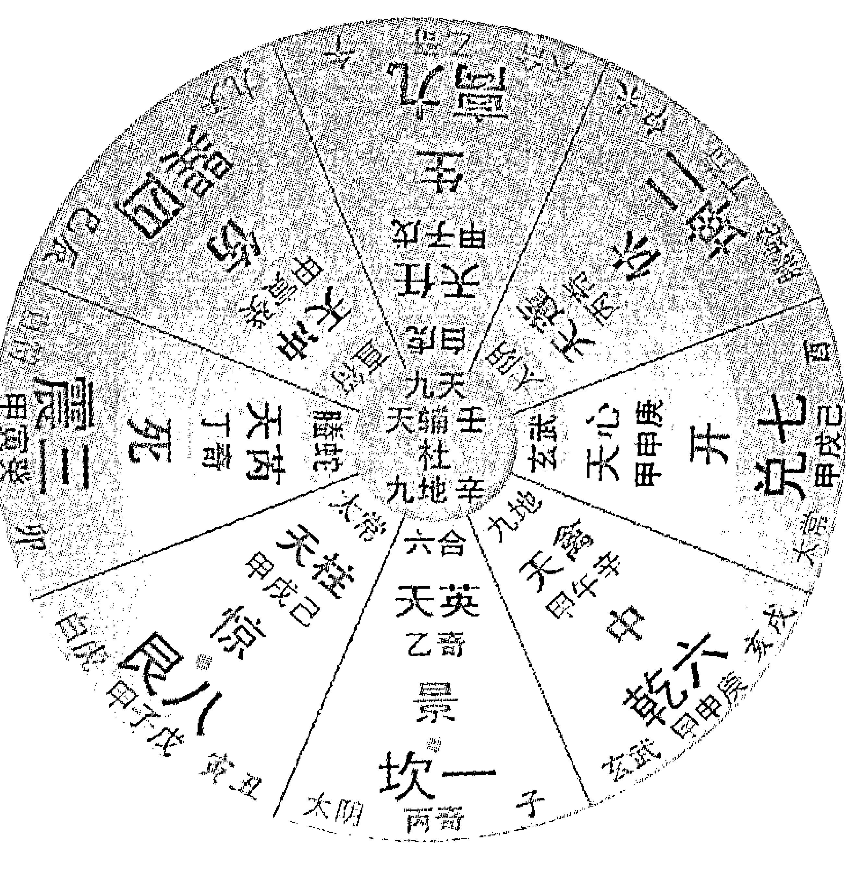

为什么叫“奇门遁甲”？“奇门遁甲”的含义是什么呢？它就是由“奇”、“门”、“遁甲”三个概念组成。“奇”就是乙、丙、丁三奇；“门”就是休、生、伤、杜、景、死、惊、开八门；“遁”是隐藏的意思，“甲”指六甲，即甲子，甲戌，甲申，甲午，甲辰，甲寅，“遁甲”是在十干中最为尊贵，它藏而不现，隐遁于六仪之下。“六仪”就是戊、己、庚、辛、壬、癸。隐遁原则是甲子同六戊，甲戌同六己，甲申同六庚，甲午同六辛，甲辰同六壬，甲寅同六癸。另外还配合蓬、任、冲、辅、英、芮、柱、心、禽九星，与值符、螣蛇、太阴、六合、白虎、玄武、九地、九天八神。奇门遁甲的占测运筹主要分为天、门、地三盘，象征三才。天盘的九宫有九星，中盘的八宫（中宫寄二宫）布八门，地盘的八宫代表八个方位，静止不动，同时天盘地盘上，每宫都分配着特定的奇（乙、丙、丁）仪（戊、己、庚、辛、壬、癸六仪）。这样，根据具体时日，以三奇，六仪，八门，八神，九星排局，以占测事物关系、性状、动向，再选择吉时吉方用事，就构成了中国神秘文化中一个特有的门类——奇门遁甲。

### 一、奇门遁甲的来源

相传奇门遁甲产生于黄帝战蚩尤年代，主要用于军事上的排兵布阵。唐朝河东节度使都虞侯李筌的《神机制敌太白阴经》第九卷《遁甲》中有：“经曰：黄帝征蚩尤，七十二战而不克，昼梦金神引领，长头，衣元狐之裘而言曰：‘某天帝之使授符于帝。’帝惊悟，求其符不得，乃问风后、力牧，力牧曰：‘此天帝也。’乃于盛水之阳，筑坛祭之，俄有元龟、巨鳌从水中出，含符致于坛而去。似皮非皮，似绨非绨，以血为文，曰：‘天乙在前，太乙在后。’黄帝受符再拜，于是设九宫，置八门，布三奇、六仪，为阴阳二遁。凡一千八拾局，名曰：天乙遁甲式。三门五将具，而征蚩尤，以斩之。”这段文字是说在黄帝战蚩尤年代，得符并推演成“天乙遁甲式”，后战胜蚩尤。

在《孙子兵法》第四卷行篇中有：“善守者藏于九地之下，善攻者动于九天之上，故能自保而全胜也。”在《后汉书·皇甫嵩传》中曰：“行兵之道，天地之宝。九天九地，各有表里。九天之上，六甲子也；九地之下，六癸酉也。子能顺之，万全可保。”这段内容是说按奇门遁甲符号九天、九地的特征，对行军作战时采取进攻或防守的策略。奇门经典《烟波钓叟赋》说：“轩辕黄帝战蚩尤，涿鹿经年战未休，偶梦天神授符诀，登坛致祭谨虔修，神龙负图出洛水，彩凤衔书碧云里，因命风后演成文，遁甲奇门从此始。”

在三国时期，诸葛亮运用奇门遁甲来布八卦阵、八阵图，进而提高军队进攻和防御能力。阵、图是军队作战或驻守时按气候、地势、敌情等因素的变化而设计部署的某种状态。罗贯中小说《三国演义》第四十九回《七星坛诸葛祭风；三江口周瑜纵火》中写道：孔明索纸笔，屏退左右，密书十六字曰：“欲破曹公，宜用火攻；万事俱备，只欠东风。”


# 上编 奇门应用研究

# 奇门应用研究与股市实战解读


欠东风。”写毕，递与周瑜曰：“此都督病源也。”瑜见了大惊，暗思：“孔明真神人也！早已知我心事！只索以实情告之。”乃笑曰：“先生已知我病源，将用何药治之？事在危急，望即赐教。”孔明曰：“亮虽不才，曾遇异人，传授奇门遁甲天书，可以呼风唤雨。都督若要东南风时，可于南屏山建一台，名曰七星坛：高九尺，作三层，用一百二十人，手执旗幡围绕。亮于台上作法，借三日三夜东南大风，助都督用兵，何如？”瑜曰：“休道三日三夜，只一夜大风，大事可成矣。只是事在目前，不可迟缓。”孔明曰：“十一月二十日甲子祭风，至二十二日丙寅风息，如何？”瑜闻言大喜，矍然而起。便传令差五百精壮军士，往南屏山筑坛；拨一百二十人，执旗守坛，听候使令。这里详细描述了诸葛亮利用奇门遁甲来借东南风之事。第八十四回《陆逊营烧七百里，孔明巧布八阵图》记载陆逊被困于诸葛亮所布的八卦石头阵，后由黄承彦引出。“陆逊正惊疑间，忽见一老人立于马前，笑曰：“将军欲出此阵乎？”逊曰：“愿长者引出。”老人策杖，徐徐而行，径出石阵，并无所碍，送至山坡之上。逊问曰：“长者何人？”老人答曰：“老夫乃诸葛孔明之岳父黄承彦也，昔小婿入川之时，于此布下石阵，名八阵图，反复八门，按遁甲休、生、伤、杜、景、死、惊、开，每日每时变化不断，可比十万精兵。”据记载：在四川奉节县、陕西勉县的诸葛亮墓附近和四川新都县等地均有八卦阵石门阵法。

从以上记述看，古人为了奠定奇门遁甲在易学体系中的王者之位，有意把它同军国统一大事联系在一起，以示其神秘莫测堪称帝王之术的用意已十分明显，这也是古人在著述流传上的惯用方法。其实，奇门遁甲一术出于战争行兵布阵对弈的需要，是我国古代先哲们观天察地模拟天体运行而逐步建立起来的一整套易学体系，它最初萌芽于黄帝时期，成形于我国春秋战国时代，是汉魏以后才形成的一门完整独特的易学门类，这一点已经在郭志诚、李至高著的《揭开奇门遁甲之谜》（东北师范大学出版社出版，1993年6月第1次印刷）一书中有明确的论证。

### 二、奇门遁甲的流派分类

奇门遁甲按时间划分，有年家奇门、月家奇门、日家奇门、时家奇门，其中日家奇门中又有金函玉镜日家奇门，近年来又把奇门之学深化到刻家奇门。

从功用上分又有数理奇门和法术奇门两类。数理奇门又分为天书奇门和地书奇门两大类，数理奇门主要用于预测；而法术奇门则用于炼丹、采气、踏罡、步斗、画符作法等。由于法术奇门较多神秘色彩，常混同于道教神鬼符法斗罡之术，更加不载于书，只传于耳，是故研习者凤毛麟角，应验者少之又少，大多已不被易学爱好者所研习了。

数理奇门中的天书奇门由于各门派传承秘密，如台湾张耀文的《透派奇门》，市面上虽有书籍介绍，但无师传心授必不得其要，所以除了嫡传弟子外，外人很少能窥其门径。由于明清以来研习者均推崇时家数理奇门，著作大都以其为主，如《奇门法窍》、《奇门旨归》、《改良奇门遁甲》等，使得时家数理奇门得以长足发展，近年来被誉为奇门专家的河北张志春先生的专著，《神奇之门》（花山文艺出版社出版，1999年4月第1版）的出版，在易学界掀起了学习奇门遁甲的热潮，为奇门遁甲的研究普及及提高创造了有利的环境和条件。

奇门遁甲按时代的差异和流派构成又分为，明清以前以排兵布阵风水诸事运筹为主，较注重方位者均研习飞盘奇门，明清及以后专以预测日常大小事为主者多研习转盘奇门，其间也有个别派别在研习飞转奇门，如张光著的《奇门遁甲卦例集锦》，专讲飞转奇门。现今各家大都以研习转盘奇门为主。在现今研习的转盘奇门中，河南刘广斌先生主张使用地盘八神而形成刘氏奇门。现今还流行有王凤麟先生的道家阴盘奇门，刘卫的天机奇门和有将古巴比伦十二星座配十二地支分列九宫形成的新式奇门，它们都是在时家奇门的基础上演化而来的。

从奇门遁甲的历史流派及门类看，奇门遁甲渐渐由古代的排兵布阵风水诸事的运筹，慢慢向以日常生活百事的预测转变，由飞盘向转盘转变，这些转变一是反应了时代科技与人的认识在不断进步，二是反应了奇门遁甲不再神秘不再为少数人利用，越来越接近百姓的日常实际生活需要，尤其是现代多用于前途机遇、健康病理、经营谋利、市场营销、企业管理、经济建设、商业竞争、证券市场等预测活动。不管是过去还是现在，奇门遁甲都较为社会所重视，所以它便成为历代政治家、军事家、谋略家、商贾的必修之课。

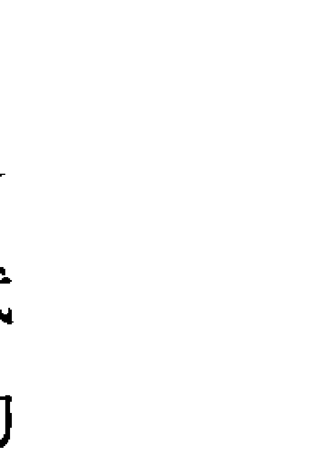

# 奇门应用研究与股市实战解秘


## 第二章 奇门基础知识

从以上对奇门遁甲的介绍中，我们知道，现在市面上流行的是时家数理转盘奇门遁甲，它在象数理预测方面最为精细，并为绝大多数爱好者所研习，下面我们就对它从组成、定局、排盘、分析判断、决策等几个方面做重点介绍。为了叙述上的方便，下文将奇门遁甲简称奇门。

### 一、奇门的组成

由于奇门是模拟天体时空而形成的筮盘，所以它是由地盘（象地）、人盘（象人事）、天盘（象天）、神盘组成。

#### （一）奇门之地盘

地盘是由洛书九宫配后天八卦三奇六仪十二地支形成以象地。

1.  洛书

    就是“戴九履一，左三右七，二四为肩，六八为足。”其图相传为古时，有神龟出洛河，其背有文，九文近头，一文近尾，三文近左肋，七文近右肋，四文近左肩，二文近右肩，六文近右足，八文近左足，五文在背中，其位九，象九宫，中五又象太极，中一文又象一气；其形方，方象地。古人对洛书推崇备至，认为它能涵盖天地人间万事万物，尤其是纵、横、斜每条直线上的3个数之和均等于15，使其成为我国古代都城制度的规划模式。如洛阳东周王城南北七里，东西八里，汉魏洛阳城南北9里，东西6里，两边的长宽之和皆为15里；西汉长安城和隋唐城都是经纬各长15里的方形结构；北魏洛阳城、隋唐长安城的南北长皆为15里。洛书的正方形排列，形成华夏历史上影响深远的九宫图，且奇妙结构和无穷变化令中外数学家为之叹服！洛书开了幻方世界的先河，成为组合数学的鼻祖。数学家华罗庚对洛书非常推崇，称“洛书可能作为我们和另一星球交流的媒介，”因为另一星球的生命只要对着数数就行了，不必依靠任何语言。关于洛书，这里限于篇幅不做赘述。

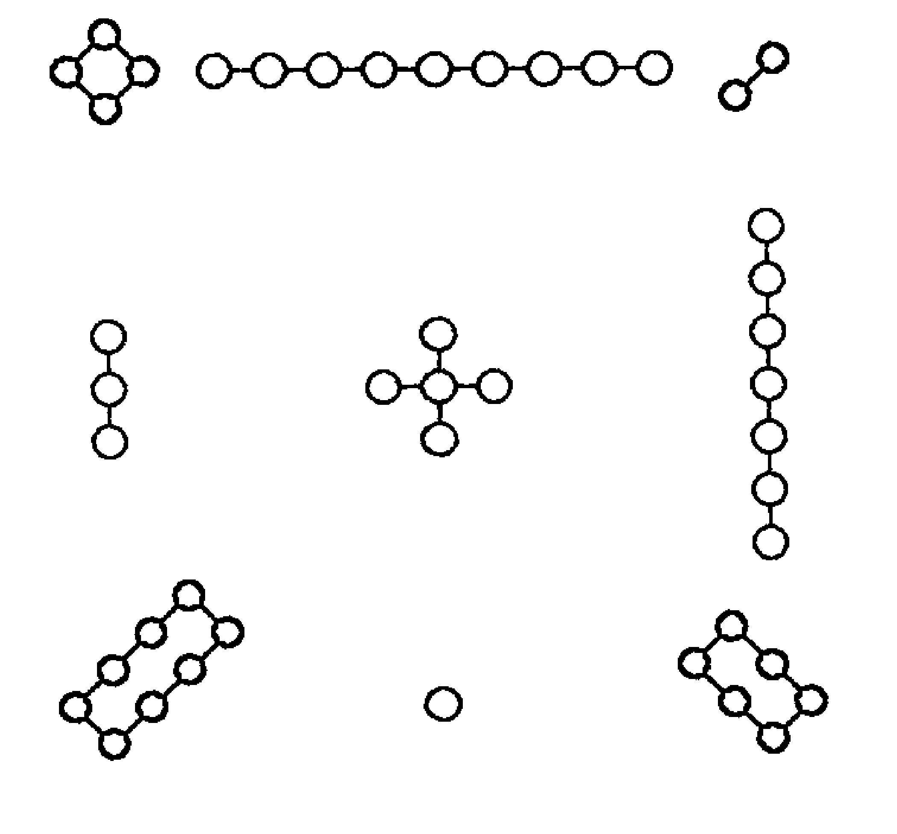

# 洛书图

古时的筮盘，是用中间穿孔的四块同心圆木片分大小从下到上叠加而形成奇门筮盘，现在为方便排盘的需要，就用九宫格来显示，要记住洛书数字在九宫格中的位置，排盘时要按照顺逆的次序经常用到。

| 巽宫4 | 离宫9 | 坤宫2 |
| :---: | :---: | :---: |
| 震宫3 | 中宫5 | 兑宫7 |
| 艮宫8 | 坎宫1 | 乾宫6 |

# 洛书九宫格

2.  后天八卦

    后天八卦相传为周文王在伏羲先天八卦的基础上，观天察地依四时八节二十四节气，即地球公转所形成的冬至夏至寒往暑来阴阳交替，制定的万事万物之八卦属性定位。后天八卦，坎一、坤二、震三、巽四、中五、乾六、兑七、艮八、离九，每卦后面的数就是洛书数。从震卦为起始点，位列正东，按顺时针方向，依次为巽卦，东南；离卦，正南；坤卦，西南；兑卦，正西；乾卦，西北；坎卦，正北；艮卦，东北。如象征节气，则震为春分，巽为立夏，离为夏至，坤为立秋，兑为秋分，乾为立冬，坎为冬至，艮为立春等，关于后天八卦，这里限于篇幅不做赘述。

| 巽 | 离 | 坤 |
| :---: | :---: | :---: |
| 震 | 兑 |
| 艮 | 坎 | 乾 |

# 后天八卦

3.  三奇六仪

    是由甲子戊、甲戌己、甲申庚、甲午辛、甲辰壬、甲寅癸六仪与丁、丙、乙三奇组成。

| 辛 | 乙 | 己 |
| :---: | :---: | :---: |
| 庚 | 壬 | 丁 |
| 丙 | 戊 | 癸 |

# 三奇六仪

4.  十二地支

    即子、丑、寅、卯、辰、巳、午、未、申、酉、戌、亥。定死在地盘上永不移位。

| 辰巳 | 午 | 未申 |
| :---: | :---: | :---: |
| 卯 | | 酉 |
| 寅丑 | 子 | 亥戌 |

# 十二地支

奇门地盘就由以上四部分在九宫格中合成，一般奇门地盘在排盘时都省略不写（奇仪除外），但它却无时无刻的装在排盘人的头脑之中。除了以上内容外，天盘九星与人盘八门在地盘上有固定的位置，永不改变，请读者要记住它们的位置，以后在排盘确定值符值使时要用到。图示如下：

| 辅杜巽 | 英景离 | 芮死坤 |
| :---: | :---: | :---: |
| 冲伤震 | 禽 | 柱惊兑 |
| 任生艮 | 蓬休坎 | 心开乾 |

# 八门九星在地盘上的位置

#### （二）奇门之人盘

人盘是由开、休、生、伤、杜、景、死、惊八门组成以象人事。

| 杜 | 景 | 死 |
| :---: | :---: | :---: |
| 伤 | | 惊 |
| 生 | 休 | 开 |

# 人盘


#### （三）奇门之天盘

天盘是由天心、天蓬、天任、天冲、天辅、天英、天芮、天禽、天柱九星和三奇六仪组成以象天。

| 辅 辛 | 英 乙 | 芮 己 |
| :---: | :---: | :---: |
| 冲 庚 | 禽 壬 | 柱 丁 |
| 任 丙 | 蓬 戊 | 心 癸 |

# 天盘

#### （四）奇门之神盘

神盘是由值符、螣蛇、太阴、六合、白虎（下隐勾陈），玄武（下隐朱雀）、九地、九天组成。

| 符 | 蛇 | 阴 |
| :---: | :---: | :---: |
| 天 | | 合 |
| 地 | 玄 | 虎 |

# 八神

最后将以上四盘合成在九宫格之中，就形成一完整的奇门筮盘。

| 符辅辛 杜巽辛 | 蛇英乙 景离乙 | 阴芮己 死坤己 |
| :--- | :--- | :--- |
| 天冲庚 伤震庚 | 禽壬 | 合柱丁 惊兑丁 |
| 地任丙 生艮丙 | 玄蓬戊 休坎戊 | 虎心癸 开乾癸 |

# 奇门筮盘

### 二、奇门之定局

#### （一）定局概说

我国古代把每天二十四个小时分为子、丑、寅、卯、辰、巳、午、未、申、酉、戌、亥十二个时辰，每个时辰相当于现在的两个小时。时家奇门是一个时辰一个格局，按时家奇门历法，每年冬至上元到第二年冬至上元为一个循环，总共是360日。每天十二个时辰，一个时辰一个格局，全年的局数是12×360=4320局，为四千三百二十局。但在这4320局中，实际上每一局重复用了四次。拿阳遁一局来说，冬至上元、惊蛰上元、清明中元、立夏中元，都完全一样，皆属于阳遁一局。这四个元共二十天，但落实到时家奇门排局，其格局类型以每个时辰一个格局计算，并不是12×20=240，而是12×20/4=60（因每一局重复用了四次）。即六十个格局，正好占据了从甲子到癸亥这十天干与十二地支的六十种结合。阳遁一局是如此，其他各局也无不如此，都重复了四次。所以全年360日，4320个时辰，因为就格局讲都重复了四次，全局时辰的格局总数就为4320/4 = 1080局。

全年1080个局，但并不是每一局都要用一个盘去演示，如果用活盘演示，每个活盘可演示从甲子到癸亥60个时辰5天内的格局。在奇门排局时，五天为一局。为什么五天为一局呢？因为每天十二个时辰，都是从子时到亥时，这是说的时辰的地支；至于这五天之内这一天和那一天同一地支的时辰，天干却是不相同的。如昨天夜半为甲子，今天夜半为丙子，后天夜半成了戊子了。这样每天十二个时辰，五天就是六十个时辰，正好把从甲子到癸亥60个花甲子用完。到第六天，夜半的时辰又从甲子开始，这就是五天为一局的道理。那么，全年奇门的局数用活盘就是1080/60 = 18局，用十八个活盘就可以演示整个年所有时辰的格局，一共十八局，就是冬至到夏至上半年阳遁九局和夏至到冬至下半年阴遁九局。

#### （二）定局

时家奇门，由年、月、日、时四大时空定位系统来定局，较年家月家日家奇门来讲，它精确到时辰来定局，反应的时空信息更为细腻。确定的时辰要定为几局，先看这个时辰所在的这一天属于哪一个节气，是这个节气的哪一元，上元、中元还是下元。十天干纪日中，甲与己为符头，分别统领子午卯酉（四仲），寅申巳亥（四孟），辰戌丑未（四季）。四仲统领的符头作为上元，四孟统领的符头作为中元，四季统领的符头作为下元（五天为一元）。即：

- 甲子、乙丑、丙寅、丁卯、戊辰为上元
- 己巳、庚午、辛未、壬申、癸酉为中元
- 甲戌、乙亥、丙子、丁丑、戊寅为下元
- 己卯、庚辰、辛巳、壬午、癸未为上元
- 甲申、乙酉、丙戌、丁亥、戊子为中元
- 己丑、庚寅、辛卯、壬辰、癸巳为下元
- 甲午、乙未、丙申、丁酉、戊戌为上元
- 己亥、庚子、辛丑、壬寅、癸卯为中元
- 甲辰、乙巳、丙午、丁未、戊申为下元
- 己酉、庚戌、辛亥、壬子、癸丑为上元
- 甲寅、乙卯、丙辰、丁巳、戊午为中元
- 己未、庚申、辛酉、壬戌、癸亥为下元

三元必须要和节气结合起来定局，我国古代在定局方面，由于体用观的分歧，形成了置闰法与拆补法两大不同的定局法。但是无论是拆补还是置闰都遵循以下歌诀：

> **阳遁歌**
>
> 冬至惊蛰一七四，小寒二八五依次。
> 大寒春分三九六，立春八五二成局。
> 雨水九六三无失，清明立夏四一七。
> 谷雨小满五二八，芒种六三九为法。

> **阴遁歌**
>
> 夏至白露九三六，小暑八二五阴局。
> 大暑秋分七一四，立秋二五八宫次。
> 处暑一四七为是，霜降小雪五八二。
> 寒露立冬六九三，大雪四七一宫识。

1.  置闰法

    置闰法的核心思想是：以干支（特指符头）为体，以节气为用。一切以干支三元顺序为核心。置闰法模拟了我国阴历三年一闰的法则，它是目前奇门爱好者使用最为普遍的一种定局方法。

    在时家奇门中使用的节气和日干有着极其紧密的联系。时家奇门五天为一元，一个节气十五天分上中下三元，一年二十四节气，15 × 24 = 360 天，地球绕太阳运行的周期是365.242212天，二十四节气按照

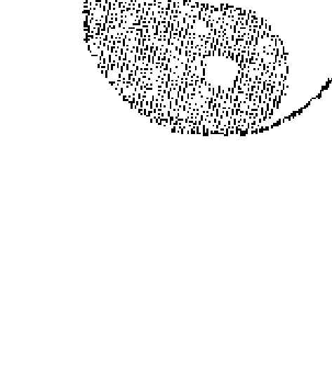## 奇门应用研究与股市实战解秘

地球绕太阳运行实际时间度数制定的（即指公历与中国农历的结合），每一个节气平均天数为15.2184日，由此以来，每个节气的这一天，就不能全与符头碰到一起，由此就出现了三种情况：

- （1）如交节的这一天正好碰上上元符头，即日干支为甲子、甲午、己卯、己酉，古人称之为“正授”，这种情况不多。

- （2）上元符头比节气先到，这叫“超神”，在时间与节气交替时比较多见。例如：（1995）农历正月初五下午三点二十四分交立春节，这一天日干支为丙寅，符头为甲子，在立春前正月初三日干支为甲子，从初三开始就是立春上元阳八局，这叫“超神”。

- （3）节气在前，上元符头在后，这叫“接气”。例如（2002年2月4日）农历辛巳年十二月二十三日立春，这一天为癸卯日，不是立春上元所需要的符头，到了2002年2月10号己酉日，才是立春上元所需要的符头，所以从己酉这一天用立春阳局上元符头。

在符头与节气交替中，上元符头在节气前边较多，在节气后边的情况较少一些。它们之间的差距，有时只有一两天，有时多则九天以上。当上元符头超过九天时，就要置闰。

置闰，就是在这个节气的最后一天，再从上元开始把这个节气的上中下三元重复一遍，这样重复十五天，本来是超神，就变为“接气”了，上元符头到下一个节气的后边了。

置闰有一个规则，只有芒种和大雪这两个节气时才能置闰，置闰的目的在于调整二十四节气与奇门遁甲上中下三元的对应关系，以保持甲、己日干支为符头，使时家奇门用局从日干支符头确定下来。

##### 2. 拆补定局法

拆补法的核心思想是：以节气为体，以干支（特指符头）为用，一切以节气为核心。

拆补定局法即把上中下三元放在一个节气中，而且仍使用日干支甲子、甲午、己卯、己酉为上元符头，甲寅、甲申、己巳、己亥为中元符头，甲辰、甲戌、己丑、己未为下元符头。时家奇门节与元之间，多数情况不是“正授”，而是“超神”，所以交接后所用上元天数不满五天，叫“拆”；交下一个节气之前，用完下元之后，还有二三四天才可以补全上元所缺的天数，叫做“补”。

除置闰拆补之外，还有两种方法，一是茅山道人所创的顺延方法，直接从每节气的交节时辰开始，用本节气的上元局，上元用满六十个时辰转入中元，中元用满六十个时辰转入下元。顺延方法完全打破以日干支符头，日干支子午卯酉为上元，寅申巳亥为中元，辰戌丑未为下元的规律。另外一种是用十时一局，一日一局，十月一局，一年一局的天书定局法，其时盘又分坐山立向之不同。

时家数理奇门中拆补与置闰两种主要定局方法，到底那种定局方法更为准确，可以明确的说，拆补与置闰两种定局之法在大多数时间起出来的遁甲局是相同的一致的，只有在少数时间起出来的局才出现不同，这是因为拆补法定局是以节气为主，而置闰法定局则是以干支为主，所以就出现了置闰法在置闰前后多与拆补法所定局数不同的情况，在实践中，古人大都以置闰法定局，今人也大都推崇置闰法，但拆补法较置闰法的优点在于，其定局在大多数时候不依赖于事先制定好的奇门遁甲历，只要有本历书便可，简便准确易用。

##### 3. 奇门定局的规律

由奇门历法可知，以乾卦六宫对应西北立冬、小雪、大雪三个节气；坎卦一宫对应北方冬至、小寒、大寒三个节气；艮卦八宫对应东北立春、雨水、惊蛰三个节气；震卦三宫对应东方春分、清明、谷雨三个节气；巽卦四宫对应东南立夏、小满、芒种三个节气；离卦九宫对应南方夏至、小暑、大暑三个节气；坤卦二宫对应西南立秋、处暑、白露三个节气；兑卦七宫对应西方秋分、寒露、霜降三个节气。奇门遁甲使用河洛理数的后天八卦方位和后天八卦数。即坎一、坤二、震三、巽四、中五、乾六、兑七、艮八、离九。

奇门遁甲将北方坎卦对应农历子月即十一月，冬至、小寒、大寒和一天中的子时；将东北艮卦对应农历十二月和正月，立春、雨水、惊蛰和一天中的丑、寅两个时辰；将东方震卦对应春分、清明、谷雨三个节气和一天中的卯时；将东南巽卦对应立夏、小满、芒种三个节气和一天中的辰、巳两个时辰；将南方离卦对应农历午月即五月，夏至、小暑、大暑和一天中的午时；将西南坤卦对应农历六月和七月，立秋、处暑、白露和一天中的未、申两个时辰；将西方兑卦对应秋分、寒露、霜降三个节气和一天中的酉时；将西北乾卦对应农历九月和十月，立冬、小雪、大雪和一天中的戌、亥两个时辰。

## 二至还乡图

从一年二十四节气奇门遁甲二至还乡用局图可看出，冬至一七四；小寒二八五；大寒三九六。从冬至开始的十五天中，分别用阳遁一局，阳遁七局和阳遁四局；小寒开始的十五天中分别用阳遁二局、八局和五局；大寒节的十五天中分别用阳遁三局，九局和六局，依此类推。从夏至开始到冬至前用阴遁。夏至九三六，小暑八二五，大暑七一四，指的是夏至后十五天内分别用阴遁九局，阴遁三局和阴遁六局，小暑节后十五天内用阴遁八局，阴遁二局和阴遁五局。大暑节后十五天内用阴遁七局，阴遁一局和阴遁四局，其余节气以此类推即可。

定局起局除节气的规律外，同时与宫卦亦有一定的联系。例如阳遁“北方坎卦对应一宫，所以从冬至节开始用阳一局；顺行东北艮卦对应八宫，所以从立春开始用阳八局；再顺行到东方震卦，对应三宫，从春分开始用阳三局；东南巽卦对应四宫，从立夏开始用阳遁四局。阴遁也如此，南方离卦对应九宫，从夏至节开始用阴九局，西南坤卦对应二宫，从立秋开始，用阴二局；西方兑卦对应七宫，从秋分开始用阴七局；西北乾卦对应六宫，立冬节开始用阴六局。不难看出，八卦在几宫，就是第一节上元用几局，坎艮震巽，用阳局。离坤兑乾，用阴局。

其中，坎、艮、震、巽四阳宫中各宫的第一个节气上元用几局，该宫第二个第三个节气的上元用局按阳遁顺排的顺序数而定，如坎一宫，冬至上元用阳一局，小寒上元则用阳二局，大寒上元就用阳三局；四阳卦宫中的三个节气的下元用局紧接该卦宫中第三个节气的上元用局数按阳遁顺排的顺序数而定，那么，冬至下元就用阳四局，小寒下元用阳五局，大寒下元用阳六局；四阳卦宫中的三个节气的中元用局紧接该卦宫中第三个节气的下元用局数按阳遁顺排的顺序数而定，那么冬至中元就用阳七局，小寒中元用阳八局，大寒中元用阳九局。

艮八宫也一样，立春上元用阳八局，雨水上元则用阳九局，惊蛰上元用阳一局；则立春下元用阳二局，雨水下元则用阳三局，惊蛰下元用阳四局；立春中元用阳五局，雨水中元则用阳六局，惊蛰中元用阳七局。

如上，震三宫春分上元用阳三局，清明上元则用阳四局，谷雨上元则用阳五局；震三宫春分下元用阳六局，清明下元则用阳七局，谷雨下元则用阳八局；震三宫春分中元用阳九局，清明中元则用阳一局，谷雨中元则用阳二局。

接上例，则巽四宫立夏上元用阳四局，小满上元则用阳五局，芒种上元则用阳六局；巽四宫立夏下元用阳七局，小满下元则用阳八局，芒种下元则用阳九局；巽四宫立夏中元则用阳九局，小满中元则用阳一局，芒种中元则用阳二局。

# 上编 奇门应用研究

芒种下元则用阳九局；巽四宫立夏中元用阳一局，小满中元则用阳二局，芒种中元则用阳三局。

离、坤、兑、乾阴四宫正好相反，四阴宫中各宫的第一个节气上元用几局，该宫第二个第三个节气的上元用局按阴遁逆排的顺序数而定，如离九宫夏至上元用阴九局，则小暑上元用阴八局，大暑上元就用阴七局。四阴卦宫中的三个节气的下元用局数紧接该卦宫中第三个节气的上元用局数按阴遁逆排的顺序数而定，那么，离九宫夏至下元就用阴六局，则小暑下元用阴五局，大暑下元就用阴四局。四阴卦宫中的三个节气的中元用局紧接该卦宫中第三个节气的下元用局数按阴遁逆排的顺序数而定，那么离九宫夏至中元用阴三局，则小暑中元用阴二局，大暑中元就用阴一局。

坤二宫也一样，立秋上元用阴二局，处暑上元则用阴一局，白露上元则用阴九局；坤宫立秋下元用阴八局，处暑下元则用阴七局，白露下元则用阴六局；坤宫立秋中元用阴五局，处暑中元则用阴四局，白露中元则用阴三局。

如上，兑七宫秋分上元则用阴七局，寒露上元用阴六局，霜降上元用阴五局；兑宫秋分下元则用阴四局，寒露下元用阴三局，霜降下元用阴二局；兑宫秋分中元则用阴一局，寒露中元用阴九局，霜降中元用阴八局。

接上例，乾六宫立冬上元用阴六局，小雪上元则用阴五局，大雪上元则用阴四局；乾宫立冬下元用阴三局，小雪下元则用阴二局，大雪下元则用阴一局；乾宫立冬中元用阴九局，小雪中元则用阴八局，大雪中元则用阴七局。

以上规律看奇门卦气，则一目了然。

### 奇门卦气：

#### 阳遁

| 宫位 | 节气及局数 | 宫位 | 节气及局数 |
|------|------------|------|------------|
| 坎   | 冬至 174   | 艮   | 立春 852   |
|      | 小寒 285   |      | 雨水 963   |
|      | 大寒 396   |      | 惊蛰 174   |
| 震   | 春分 396   | 巽   | 立夏 417   |
|      | 清明 417   |      | 小满 528   |
|      | 谷雨 528   |      | 芒种 639   |

#### 阴遁

| 宫位 | 节气及局数 |
|------|------------|
| 离   | 夏至 936   |
|      | 小暑 825   |
|      | 大暑 714   |
| 坤   | 立秋 258   |
|      | 处暑 147   |
|      | 白露 936   |
| 兑   | 秋分 714   |
|      | 寒露 693   |
|      | 霜降 582   |
| 乾   | 立冬 693   |
|      | 小雪 582   |
|      | 大雪 471   |

熟悉以上规律在运用过程中就非常方便，即便在没有奇门遁甲历的情况下，也可准确地排出阴阳局数。

奇门节气定局之法万不可忽视，节气定局其作用不仅仅是定局，而是关系到奇门的判断与应期的准确与否。

### 三、奇门排盘

#### （一）奇门定局的位置

时家奇门按照时空划分，总共四千三百二十局，后世学者通过归纳、总结，将之归纳为阴阳十八局，细分为阳九局与阴九局。阴遁逆布六仪顺布三奇，阳遁顺布六仪逆布三奇。从夏至到冬至用阴遁，从冬至到夏至用阳遁。

奇门遁甲的几局，甲子戊就在几宫。阳一局，甲子戊在坎一宫，阳二局甲子戊在坤二宫，阴一局甲子戊在坎一宫，阴三局甲子戊在震三宫，阴九局甲子戊在离九宫，阳五局甲子戊起中五宫寄坤二宫。

知道甲子戊几宫，也就知道为几局，始终按照戊、己、庚、辛、壬、癸、丁、丙、乙分布，阴遁将六仪三奇顺布和逆布。

例如阴九局：甲子戊在九宫，甲戌己在艮八宫，甲申庚在兑七宫，甲午辛在乾六宫，甲辰壬在中五宫，寄坤二宫，甲寅癸在巽四宫，丁奇在震三宫，丙奇在坤二宫，乙奇在坎一宫。

阳一局则甲子戊在坎一宫，甲戌己在坤二宫，甲申庚在震三宫，甲午辛在巽四宫，甲辰壬在中五宫，寄坤二宫，甲寅癸在乾六宫，丁奇在兑七宫，丙奇在艮八宫，乙奇在离九宫。

#### （二）奇门起局的常见方式

下面介绍三种起局方式：一为掌上起局，二为纸上起局，三为电子易学软件起局。

##### 1. 掌上起局：（以阳一局和阴六局为例）

阳一局手掌图

阴六局手掌图

##### 2. 纸上起局：

在纸上画九宫格，再填上九宫的位置，用几局在几宫的格内填上甲子戊，按阳顺阴逆排布九宫，即戊、己、庚、辛、壬、癸、丁、丙、乙：

阳一局图

| 辛 | 乙 | 己 |
| 庚 | 壬 | 丁 |
| 丙 | 戊 | 癸 |

戊己庚辛壬癸丁丙乙
1 2 3 4 5 6 7 8 9

阴六局图

| 庚 | 丁 | 壬 |
| 辛 | 己 | 乙 |
| 丙 | 癸 | 戊 |

戊己庚辛壬癸丁丙乙
6 5 4 3 2 1 9 8 7

##### 3. 电子易学软件起局

它是近年来易学与电脑科技结合的产物，它的出现是易学基础排盘起局起课起卦的革命，现在大多数易学爱好者采用此种方式起局，它有起局快速，不易出错，方便随时随地使用的特点，为大多数易学爱好者所喜爱。它不仅有电脑软件起局，而且还有掌上电脑易学软件起局，更有手机软件起局等方式，希望读者能了解使用此种方式起局排盘，将会收到事半功倍之效果。

#### （三）排地盘

假令今日为夏至后上元阴九局，甲子日丙寅时用事，那我们先排好洛书九宫盘。在手指上或纸上九宫格中排好以下顺序：

掌上
| 4 | 9 | 2 |
| 3 | 5 | 7 |
| 8 | 1 | 6 |

纸上

然后看9在哪个位置，在中指尖，我们按照顺序把戊放在那里，然后按照987654321（逆行九宫）的顺序，把戊己庚辛壬癸丁丙乙排好。如下图：

掌上

| 癸 | 戊 | 丙 |
|---|---|---|
| 丁 | 壬 | 庚 |
| 己 | 乙 | 辛 |

纸上

这个叫地盘，是最基本的盘。这样奇门变的很简单了，变成了一种简单的数字排列顺序。地盘排好了便可确定直符、直使了。

#### （四）确定值符、值使

值符、值使是时空概念的一种浓缩。为什么这么说呢？我国的预测学都建立在时空的基础上。在我国历法上使用干支表示年月日时。例如：今日为公历的2005年8月24日9时15分是农历的乙酉年（鸡）七月二十，用干支表示则为：乙酉年甲申月庚辰日辛巳时。天干甲、乙、丙、丁、戊、己、庚、辛、壬、癸。地支：子、丑、寅、卯、辰、巳、午、未、申、酉、戌、亥。它们组合起来就构成六十甲子。六十甲子按照十进制，分别有甲子、甲戌，甲申、甲午、甲辰、甲寅等六甲各自管束十组干支组合。其排列如下：

### 六十甲子排列表

| 甲子 | 乙丑 | 丙寅 | 丁卯 | 戊辰 | 己巳 | 庚午 | 辛未 | 壬申 | 癸酉 | （甲子旬） |
| 甲戌 | 乙亥 | 丙子 | 丁丑 | 戊寅 | 己卯 | 庚辰 | 辛巳 | 壬午 | 癸未 | （甲戌旬） |
| 甲申 | 乙酉 | 丙戌 | 丁亥 | 戊子 | 己丑 | 庚寅 | 辛卯 | 壬辰 | 癸巳 | （甲申旬） |
| 甲午 | 乙未 | 丙申 | 丁酉 | 戊戌 | 己亥 | 庚子 | 辛丑 | 壬寅 | 癸卯 | （甲午旬） |
| 甲辰 | 乙巳 | 丙午 | 丁未 | 戊申 | 己酉 | 庚戌 | 辛亥 | 壬子 | 癸丑 | （甲辰旬） |
| 甲寅 | 乙卯 | 丙辰 | 丁巳 | 戊午 | 己未 | 庚申 | 辛酉 | 壬戌 | 癸亥 | （甲寅旬） |

奇门以六甲隐于六仪之下形成值符，即甲子隐于六戊，甲戌隐于六己，甲申隐于六庚，甲午隐于六辛，甲辰隐于六壬，甲寅隐于六癸，简称甲子戊，甲戌己，甲申庚，甲午辛，甲辰壬，甲寅癸，在排盘时见到的地盘上的六仪所在宫位就是六甲值符宫，六甲值符宫的九星就是值符，而值使就是地盘值符宫所在的八门。

六十甲子其实就是所有时空的概括，因此在某种意义上讲，它已经涵扩了周天，我们生存空间的任何事物都应在其范围，周天就在六十甲子的范围内，因此各类预测学从根本上都在研究周天，能从周天角度来研究世界，就属于大宗预测学。奇门遁甲在排盘中应用了六十甲子周天的原理，六甲旬头其实就是六十甲子中每组的组长，所以奇门把它命名为值符，值使实质是直符所统领的卦气。

六甲为值符在局中具体如何确定呢？在时家奇门中，主要讲究时辰，比如乙丑日丁亥时，丁亥时属于甲申旬，因此甲申庚所在宫就是值符宫，按照奇门规定，地盘甲申庚所在宫的九星就是值符，甲申庚所在宫的八门就是值使。

#### （五）排直符直使形成天盘人盘

排值符的方法是值符九星加地盘时干，即值符加时干。

如上例，夏至后上元阴九局，甲子日丙寅时用事，丙寅时属于甲子旬，因此甲子戊所在地盘9宫为值符宫，因此九宫的天英星就是值符。将值符加在时干上，地盘值符宫的奇仪也跟着值符九星加于时干上，其他地盘各宫奇仪九星也随之轮转到各自宫位，便形成奇门天盘。如上例，则天英星、戊加丙于2宫，天芮、丙加庚于7宫，天柱、庚加辛于6宫，天心、辛加乙于1宫，天蓬、乙加己于8宫，天任、己加丁于3宫，天冲、丁加癸于4宫，天辅、癸加戊于9宫。

这里细心的读者会发现九星里天禽星没有排到，在时家转盘奇门里规定，位居中宫的天禽星属土与飞到中宫的奇仪一起寄居于坤2宫，因此坤2宫就有天芮与天禽两星。

排值使的方法是看用事时辰的干支，距六甲旬首为几数，便从值使门所在宫位，按照阳遁顺数阴遁逆数的规则，加于数定的宫位上，即值使随时宫。

如上例，夏至后上元阴九局，甲子日丙寅时用事，丙寅时属于甲子旬，因此甲子戊为值符，根据以上地盘，甲子戊在九宫，因此九宫的景门就是值使。用事时辰为丙寅时，按照时旬顺序，从甲子、乙丑到丙寅共3数，按照阴遁从值使景门所在的9宫，开始逆数3数，则由9宫、8宫数至7宫至，由此确定景门在7宫，景门一定，其他各门都随之轮转至各自的宫位，那么死门就在6宫，惊门在1宫，开门在8宫，休门在3宫，生门在4宫，伤门在9宫，杜门在2宫。这样就形成了奇门的人盘。如下图：

掌上天盘人盘图

| 丁 冲<br>癸 生 | 癸 辅<br>戊 伤 | 戊 英<br>丙杜壬 |
| --- | --- | --- |
| 己 任<br>丁 休 | 壬 | 丙禽芮<br>庚 景 |
| 乙 蓬<br>己 开 | 辛 心<br>乙 惊 | 庚 柱<br>辛 死 |

纸上天盘人盘图

| 丁 冲 生<br>癸 | 癸 辅 伤<br>戊 | 戊 英 杜<br>壬丙 |
| --- | --- | --- |
| 己 任 休<br>丁 | 壬 | 丙禽芮 景<br>庚 |
| 乙 蓬 开<br>己 | 辛 心 惊<br>乙 | 庚 柱 死<br>辛 |

#### （六）神盘排完就形成一完整的奇门九宫局盘

转盘时家奇门八神分别为值符（又称小值符）、腾蛇、太阴、六合、白虎、玄武、九地、九天。（牢记此顺序：值、蛇、阴、合、虎、玄、地、天）将值符加在天盘九星值符上名曰天八神，将值符加在地盘九星值符上名曰地八神，现常用的是天八神，它们的排法是小值符加值符九星所在宫位，阳遁顺行，阴遁逆行。如上例，夏至后上元阴九局，甲子日丙寅时用事，天盘八神排步如下：值符在2宫，腾蛇在9宫，太阴在4宫，六合在3宫，白虎在8宫，玄武在1宫，九地在6宫，九天在7宫。（地八神排步如下：值符在9宫，腾蛇在4宫，太阴在3宫，六合在8宫，白虎在1宫，玄武在6宫，九地在7宫，九天在2宫。）下图只显示天八神的排位。

掌上奇门完整局盘图

| 阴 冲 生<br>丁+癸 | 蛇 辅 伤<br>癸+戊 | 值 英 杜<br>戊壬丙 |
| --- | --- | --- |
| 合 任 休<br>己+丁 | 壬 | 天 芮 景<br>丙禽庚 |
| 虎 蓬 开<br>乙+己 | 玄 心 惊<br>辛+乙 | 地 柱 死<br>庚+辛 |

纸上奇门完整局盘图

| 丁冲阴<br>癸 生 | 癸辅蛇<br>戊 伤 | 戊英值<br>丙壬杜 |
| --- | --- | --- |
| 己任合<br>丁 休 | 壬 | 丙芮天<br>庚禽景 |
| 乙蓬虎<br>己 开 | 辛心玄<br>乙 惊 | 庚柱地<br>辛 死 |

自此，奇门排盘结束。（说明：阴神与暗干属于奇门中的参断因素，因此奇门阴神暗干的排法这里不做介绍。）由于奇门的排盘过于繁杂，往往成为初学者的拦路虎，这里笔者只希望通过以上的排盘过程，让读者对奇门的排盘有一概念上的认识，再通过实际操作，熟中生巧，自然就能掌握。

### 四、奇门的分析判断

#### （一）奇门分析判断的基础知识

##### 1. 八卦

八卦是我国古代的一套有象征意义的符号。用“—”代表阳，用“--”代表阴，用三个这样的符号，组成八种形式，叫做八卦。每一卦形代表一定的事物。乾代表天，坤代表地，坎代表水，离代表火，震代表雷，艮（gèn）代表山，巽（xùn）代表风，兑代表沼泽。八卦互相搭配又得到六十四卦，用来象征各种自然现象和人事现象。八卦相传是伏羲所造，主要用于易占。

- （1）八卦歌诀：
乾三连，坤六段，震仰盂，艮覆碗，
离中虚，坎中满，兑上缺，巽下断。

- （2）八卦数顺序：
震四，离三，兑二，乾一，巽五，坎六，艮七，坤八（顺序为伏羲先天八卦方位图顺序）。
后天八卦数为：乾六，坎一，艮八，震三，巽四，离九，坤二，兑七。

- (3) 八卦方位：

先天八卦：乾南，坤北，离东，坎西，兑东南，震东北，巽西南，艮西北。

后天八卦：震东，兑西，离南，坎北，乾西北，坤西南，艮东北，巽东南。

- (4) 八卦五行所属：

一是五行诠释：“五行”一词，最早出现在《尚书》的《甘誓》与《洪范》中。《尚书·洪范》记述的是周武王与箕子的对话，其中谈到：“五行：一曰水，二曰火，三曰木，四曰金，五曰土。水曰润下，火曰炎上，木曰曲直，金曰从革，土曰稼穑。润下作咸，炎上作苦，曲直作酸，从革作辛，稼穑作甘。”

“五行”在《洪范》中已被明确为水、火、木、金、土，而且被认为是首要之事。在周幽王时，已将“五行”认定为构成万物的五种基质。五行，是用五个文字符号代表物质能量的形态间相互关系及运动变化规律，其中：五行相克（克即胜过）是描述物质形态的相互关系，金胜（克）木（物质上很容易理解，简单的助记就是哪个更坚硬，就胜过软一点的），木胜（克）土，土胜（克）水（这里的土仅指泥土而非广义的大地），水胜（克）火，火胜（克）金（用老子的话来说：“天下之至柔，驰骋天下之至坚。无有入无间”）。五行相生（生即出现转化）是描述事物的变化规律，水生木（水为寒，为下降，阴极阳生，用木代表向下趋势的减少及向上势头的出现），木生火（慢慢的阳占了上风，向下的势头好像看不到了，就像火一样的快速上窜），火生土（阳极阴生，热上升到一定程度就减慢了升势，开始很短暂的平稳过度），土生金（短暂的平稳之后阴开始快速聚集，有如云的聚集一样，金即收敛，即指高度聚集），金生水（聚集到一定程度，至阴之像便出现了，有如云聚而雨下一般，水代表下降、回归）。

- 五行相生：木生火生土生金生水

- 五行相克：水克火克金克木克土

二是八卦所对应的五行：

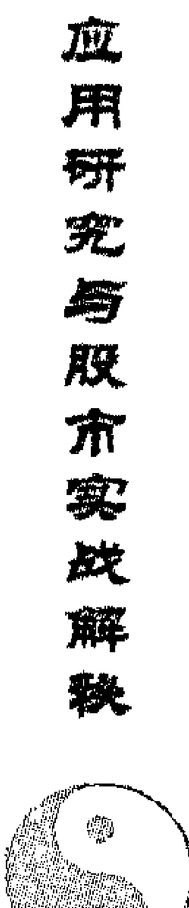

奇门应用研究与股市实战解秘

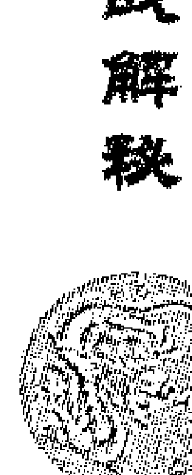

金—乾、兑 木—震、巽 土—坤、艮 水—坎 火—离
乾、兑（金）；震、巽（木）；坤、艮（土）；坎（水）；离（火）。

- ### (5) 八卦的五行生克：

乾、兑（金）生坎（水），坎（水）生震、巽（木），震、巽（木）生离（火），离（火）生坤、艮（土），坤、艮（土）生乾、兑（金）。

乾、兑（金）克震、巽（木），震、巽（木）克坤、艮（土），坤、艮（土）克坎（水），坎（水）克离（火），离（火）克乾、兑（金）。

- ### (6) 八卦旺衰：

乾、兑旺于秋，衰于冬；震、巽旺于春，衰于夏；坤、艮旺于四季，衰于秋；离旺于夏，衰于四季；坎旺于冬，衰于春（四季是指每个季节的后一个月）。

- ### (7) 八卦分阴阳：

乾、坎、艮、震、四卦，属阳卦。其中，艮为少男坎为中男震为老男（震、坎、艮中阴多阳少，表示阴从阳，故为阳卦）

坤、兑、离、巽四卦，属阴卦。其中，兑为少女离为中女巽为老女（兑、离、巽中阳多阴少，表示阳从阴，故为阴卦）

关于八卦，这里限于篇幅不做赘述。

###### 2. 八卦万物类象

八卦是研究象的，天有万象，物有万象，八卦类万物之像。象数是整个易学中极为重要的内容，物象是具体实在的，而卦象则是抽象空灵的信息符号。

凡形于外者皆叫做象，象为相似之意，世上万物庞杂纷繁，圣人将它们分类，分别归类于一个卦，用八卦拟象万物。如乾卦代表天，君王，父亲，上级领导，执法人员，军警人员，圆形物品钱，贵重财物，镜子，寒冷，冰雪，马，树上结的果实等物象。也就是说，上述物象在八卦中都用乾卦来表示。宇宙万事万物都分别归类于八卦，因此一个卦所拟象的物类难以数计，但只要记住八卦本身的爻象及八卦取象和性情就可以知道事物归类于什么卦。换言之“乾健，坤顺，震动，巽入，坎陷，离附，艮小，兑悦”是宇宙万物的八种功能属性，即八类动态之象，是据象归类的纲领。

但是每一个事物的归类又不是固定一成不变的。如保温瓶，为金属硬圆形物象，“以乾卦拟象，若瓶盖打开作兑卦，其卦象下二爻为阳爻，上爻为阴爻，断而不连，开口之象，故归类于兑卦；若瓶内无水，中空，作震卦象，其象上二爻为阴爻，象中虚而上开口，归象于震卦；若将瓶口打开，将其颠倒过来，则可视作艮卦其象上为阳爻，象征倒过来的瓶底，初爻，二爻为阴爻，断而不连，恰象瓶下开口，中空之象，故又归类于艮卦。就是说同一事物放在不同的角度来看，其象就不同。

八卦万物类象，是奇门占测中首要的基础知识，必须掌握，活学活用，否则无法进行分析判断预测。

（1）乾卦：乾卦三阳爻，纯阳刚健，故为天，天体圆运动不息，故为圆。天生万物，如君王管理万民，如父亲主管一家一样，故为君，为父。纯阳爻刚强坚固之象，所以象金、象玉，象冰。阳盛则色极红，故为火红，大赤色。刚健为马，树上的果实圆形，故为木果。由此可知，凡是积极的、向上的、刚健有力的、权威的、圆形的、男性长辈、珍贵的、富有的、寒冷的、坚硬易碎的等之类事物都归于乾卦。

[天时] 天、冰、雹、霰、晴天。

[地理] 西北方、京都、大郡、神胜之地、高贵之所、高亢之地、形胜之地、办公室、会议室、政府大楼、行政干部居住区、金属加工厂、五金车辆配件门市、车站、楼台等。

[人物] 在国家，为国君，主席，总统；在单位为书记，一把手，主要领导人；在家庭为父亲，为大人，为老人，为长辈人；在社会为名人、公门人，宦官；在性别为男，在年龄为老头。

[人事] 刚健勇武、果决、多动少静、直爽、刚健、勇敢、果断、好动少静、严正威武。

- [身体] 骨、肺、头、右腿（九宫位）、骨骼、男性生殖器官。
- [时序] 秋、九十月之交、戌亥年月之时，金年月日时。
- [动物] 马、天鹅、狮子、象。
- [静物] 金玉、宝珠、圆物、木果、刚物、冠、镜。
- [屋舍] 公厕、楼台、高堂、大厦、驿宿、西北向之居。
- [家宅] 秋占宅兴隆、夏占有祸、冬占冷落、春占吉利。
- [婚姻] 贵官之眷、有声名之家、秋占宜成、冬夏不利。
- [饮食] 珍味、多骨、果、诸物之首、圆物、辛辣之物。
- [求名] 有名、武职、掌权、驿官、宜向西北之任。
- [谋望] 利公门、宜动中有财、夏不成、冬多谋少遂。
- [交易] 宜金、玉珍宝珠贵货，易成，夏占不利。
- [求财] 有财，金、玉之利，公门中得财，秋占大利，夏占损财，冬占无财，春占有财。
- [出行] 利于出行，宜入京师，利西北之行，夏占不利。
- [谒见] 利见大人，有德行之人，宜见贵官，可见。
- [疾病] 头面之疾，肺疾、筋骨疾、上焦疾、夏占不安。
- [官讼] 利讼，有贵人助，秋占得胜，夏占失理。
- [坟墓] 宜向西北，宜乾山气脉，宜天穴，宜高，秋占出贵，夏占大凶。
- [方道] 西北正南（为上方，为高处）。
- [五色] 大赤色、玄色白色。
- [姓字] 带金旁姓名或住址名者。
- [数目] 一四六九。
- [五味] 辛、辣。

（2）坤卦：卦象为三阴爻，纯阴之卦，性柔顺，外象为大发，为万物之源，万物皆生于地。人资生于母、故也为母。阴柔故为布料。阴虚能容物，故为锅。阳大阴小，坤阴为小，故为吝啬；万物均生于地，故为均为全。坤为牛，生生相继，故为子母牛。地载万物如车载，故为大车。地生万物，故为众。操纵万物，故为柄。阴则暗，故为黑，由此可知，凡是消极的、阴柔的，方形的（故天圆地方）。软弱无力的、众多的、厚德的、承载的、辛劳的、静止的、裂开的（卦象三个阴爻中间全部断裂）等事物都属于坤卦。

- [天时] 阴云、雾气、冰霜、阴天。
- [地理] 田野、平地、西南方、大地、乡村。
- [人物] 在国家为皇后、第一夫人；在单位为职工、群众；在家庭为母亲、祖母，为老母、后母、老妇人；在社会为众人、为乡人、为小人、为大腹人、为懦弱之人、吝啬之人；在性别为女；在年龄为老妇，老年女人。
- [人事] 吝啬、柔顺、懦弱、众多、小人、谨慎正直、勤劳忍耐、内心复杂、优柔寡断、封闭沉默、逆来顺受、懦弱迟缓、依赖性强、敬奉神佛、恭敬抚养、伏藏疑惑、思想狭小及死丧过错、恭敬谦让、贞节俭约、守信诚实、感情暧昧，虚耗嫌恶、固执迟钝、邪恶。
- [身体] 腹脾、肉、胃、右肩（九宫位），女性生殖器。
- [时序] 辰戌丑未月、未申年月日时，八五十月日。
- [静物] 方物、柔物、布帛、丝绵、五谷、舆斧、瓦器。
- [动物] 牛、百兽、牝马。
- [屋舍] 西南方、村店、男舍、矮屋、土阶、仓库。
- [家宅] 安稳、多阴气、春占宅舍不安。
- [饮食] 牛肉、土中之物、甘味、野味、五谷之味、芋笋之物、腹脏之物。
- [婚姻] 利于婚姻，宜田产之家、乡村之家，或寡妇之家，春占不利。
- [生产] 易产，春难产，有损或不利于母，坐宜西南方。
- [求名] 有名、宜西南方、农官守土之职、春占虚。
- [交易] 宜利交易、宜田土交易、宜五谷利、贱货、重物、布帛、静中有财、春占不利。
- [求财] 有利，宜土中之利，贱货重物之利、静中得财，春占无财，多中取利。
- [谋望] 利谋求，邻里求谋，静中求谋，春占少遂，或谋于妇人。
- [出行] 可行、宜西南行、宜乡里行、宜陆行，春不宜。
- [谒见] 可见，利见乡人，宜见亲朋或阴人，春不宜见。
- [疾病] 腹疾、脾胃之疾、饮食停滞，从而食不化。
- [官讼] 理顺、得众情、讼当解散。
- [坟墓] 宜向西南之穴、平阳之地、近田野、宜低葬，春不可葬。
- [姓字] 带土姓人或带土住址名、行位八五十。
- [数目] 二、五、八、十。
- [方道] 西南、正北。
- [五味] 甘、甜。
- [五色] 黄、黑。

（3）震卦：

震卦两阴爻在上，一阳爻在下，表示一种向上、向外发展的趋势。震为动、为雷。阴在上，有动荡不已的样子，为龙。天玄地黄，震，乾坤始交，故为黑黄色。一阳在下，二阴在上，故有大道之象。一阳在下专静而动，故为专。阳爻动于初，锐利进取，故决断躁动。震为青绿色，故为小青竹。芦苇上于虚，下茎实，象震阳在下，阴在上之象。动，马善动善鸣，为弁足。震阳刚，躁动，故健。初阳在下，故象花生、土豆、地瓜之土中物。

[天时] 雷、雷雨、雷鸣、地震、火山喷发。

[地理] 在场所为工厂、广播电台、乐器店、游乐场、机场、发射场、车站、舞厅、歌厅、闹市、战场、森林、东方、闹市、大途、竹木林、草木茂盛之所。

[身体] 足、肝、胆、声音、左胁。

[人物] 在国家和单位为当权的二把手；在家庭为长男；在社会为驾驶员、运动员、警察、法官、军人、飞行员、列车员、社会活动家、舞蹈演员、足球爱好者、狂人、壮士。

[人事] 动而少静、勤奋、有才干、好动、仁慈直爽，性急易怒、脾气大、心烦急躁、暴躁、倔犟、自尊心强、虚惊、起动、鼓动噪。

[时序] 春二月、卯年月日时、四三八月日。

- [静物] 木竹、苇、乐器（竹木）、核、蔬菜、鲜花、树木、电话、飞机、汽车、火箭、鞭炮、闹钟、花草繁鲜之物、蹄、肉、山林野味。
- [动物] 龙、蛇、百虫、马鸣。
- [屋舍] 东向之居、山林之处、楼阁。
- [家宅] 宅中不时有虚惊，春冬吉，秋占不利。
- [饮食] 蹄、山林野味、鲜肉、果酸味、菜蔬、鲤鱼。
- [婚姻] 可、有成、声名之家、得长男之婚，秋占不利。
- [求财] 山林竹木之财、动处求财，或茶货之利。
- [求名] 有名、宜东方之任、施号发令之职、掌刑狱之官、竹茶木税课之任、或闹市市货之职。
- [生产] 虚惊、胎动不安、头胎必生男，坐宜向东，秋不吉。
- [疾病] 足疾、肝经之疾、惊恐不安。
- [谋望] 可旺、可求，宜动中谋，秋占不遂。
- [交易] 利于成交，秋占难成，动而可成，山林、木竹茶货之利。
- [官讼] 健讼、有虚惊、行移取甚反复。
- [谒见] 可见、在宜山林之人，利见宜有声名之人。
- [出行] 宜行，利东方、利山林之人，秋占不宜行、但恐虚惊。
- [坟墓] 利于东向、山林中穴，秋不利。
- [姓字] 带木姓人、行位四八三。
- [数目] 四八三。
- [方道] 东、东北。
- [五味] 甘、酸味。
- [五色] 青、绿、碧。

（4）巽卦：

巽卦一阴爻在下，有一种深入地下，向内发展的趋势，表示一种飘动而有渗透性的事物。巽为木为风，树木根善伸入地下，针大的眼斗大的风，风无孔不入，故巽为人。木又称为曲直，木匠用黑线绳取直制木，故巽为绳直，为工作工匠。风无色无味，在高空中飘拂，来往不定，故巽为高为白。为进退为不果为臭。巽二阳一阴，阳多阴少，故为头发稀少，额宽大，眼白多。巽由乾卦初爻变阴而来，乾为金玉，故作生意能获三倍巨利。巽为震的旁通卦，震阳决躁，故为躁卦。

- ［天时］风、刮风、台风、飓风、龙卷风。
- ［地理］东南方之地、草木茂秀之所、花果菜园、邮局、管道、线路、隘路、过道、长廊、寺观、草原、竹林、芦苇荡、升降机、传送带。
- ［人物］在家庭为长女、女儿；在社会为科技人员、教师、僧尼、山林仙道之人，气功师、练功者、商人、营业员、木材经营者、手艺人、能工巧匠、额头宽的人，头发细长而直的人，优柔寡断的人，自由职业者、寡妇之人。
- ［人事］柔和、不定、鼓舞、利市三倍、进退不果、柔和、细心、责任心强、反复无定不决断、心志不定、仁慈直爽、多欲、薄情、极爱清洁、疑惑、说谎。
- ［身体］头发、神经、气管、胆经、肱股、呼吸器官、食道、肠道、左肩、淋巴系统、血管肱、气、风疾。
- ［时序］春夏之交、二五八之时月日、三月、辰巳月日时、四月。
- ［静物］树木、木材、木制品、纤维品、丝线、绳子、麻、风扇、干燥机、飞机、气球、气垫船、帆船、蚊香、木香、兰花、草药、羽毛、枝叶、腰带、海带、直物、长物、竹木、工巧之器、臭、鸡毛、帆、扇、下面有口的器物。
- ［动物］鸡、百禽、山林中之禽、虫、蛇。
- ［屋舍］东南向之居、寺观楼台、山林之居。
- ［家宅］安稳利市，春占吉，秋占不安。
- ［饮食］鸡肉、山林之味、蔬果酸味。
- ［婚姻］可成、宜长女之婚，秋占不利。
- ［生产］易生、头胎产女、秋占损胎、宜向东南坐。
- ［求名］有名、宜文职有风宪之力、宜为风宪、宜茶果竹木税货之职、宜东南之任。
- **[求财]** 有利三倍、宜山之利、竹货木货之利，秋不利。
- **[交易]** 可成、进退不一、交易之利、山林交易、山林木茶之利。
- **[谋望]** 可谋望、有财可成，秋占多谋少遂。
- **[出行]** 可行，有出入之利，宜向东南行，秋占不利。
- **[谒见]** 可见，利见山林之人，利见文人秀士。
- **[疾病]** 股肱之疾、风疾、肠疾、中风、寒邪气疾。
- **[姓字]** 草木旁姓氏或住址名、行位五三八。
- **[官讼]** 宜和、恐遭风宪之责。
- **[坟墓]** 宜东方向、山林之穴、多树木、秋占不利。
- **[数目]** 三四八。
- **[方道]** 东南、西南。
- **[五味]** 酸味。
- **[五色]** 青绿、碧、洁白。

（5）坎卦：

坎卦阳爻居中，阴爻在上下，则外柔内刚，四面向中心性发展的趋势。坎为水，无处不流不渗入，成为沟渎、隐伏、险陷、心痛的现象。水能任意曲直矫柔、弯弓车轮为矫柔所成，坎又为车象、故为弓轮。坎为耳、心痛则耳痛。坎为水、血为水为红色，故为血卦。坎从乾卦变化来，乾为大赤，故坎为赤。乾为马，坎得乾中爻来，坎阳在中为脊背，阳为美，故为美脊。阴爻在上，所以为下首，阴爻在下，所以为薄蹄。水擦地而行，故为曳。对于车来说，坎为沟渎为险陷，故多凶。水流通畅，故坎为通。坎中满，又水寒故为月之象，为险陷，为盗贼。对于木来说，则内阳刚在中，故有坚硬木心之象。

- **[天时]** 月、雨、雪、露、霜、水。
- **[地理]** 江河、湖、海、沟、渠、井、泉、下水道、洼地、北方、江湖、溪涧、卑湿之地、沟渎、池沼、有水之处、酒店、冷饮店、浴室、澡堂、水族馆、地下室、暗室、自来水公司、鱼塘、饮食店、妓院。
- **[人物]** 在家庭为中男，中年男子；在社会为江湖之人、舟人、盗贼、匪徒，为数学、医生、律师、逃亡者、黑社会之人、诈骗犯、劳务人员、酒鬼、娼妇、自来水公司人员。
- [人事] 外柔和内刚厉、善谋多智、多欲、喜算计、追求时尚、多心计、阴险卑鄙、城府深、奸诈、捧上压下、做事自有主见或是随波逐流、险陷卑下，外示以柔，内序以利，漂泊不成，随波逐流。
- [身体] 肾脏、膀胱、泌尿系统、性器官、血液、血液循环系统、耳、背、腰、背脊骨。
- [时序] 冬十一月、子年月日。
- [静物] 油、盐、酒、醋、酱油、饮料、石油、药品、水车、轮子、刑具、蒺藜、丛刺、带核的果品、冷藏设备、浮萍、潜水艇、水带子、带核之物，弓轮、矮柔之物，酒器、水具、工栋、桎梏。
- [动物] 猪、鱼、水中之物、狐、水族。
- [屋舍] 向北之居、近水、水阁、江楼、花酒长器、宅中湿地之处。
- [饮食] 猪肉、酒、冷味、海味、汤、酸味、宿食、鱼、带血、有带核之物、水中之物、多骨之物。
- [家宅] 不安、暗昧、防盗、匪。
- [婚姻] 利中男之婚，宜北方之婚，不利成婚，不可在辰戌丑未月婚。
- [生产] 难产有险，宜次胎，男，中男，辰戌丑未月有损，宜北向。
- [求名] 艰难，恐有灾险，宜北方之任，鱼盐河泊之职，酒兼醋。
- [求财] 有财防失，宜水边财，恐有失险，宜鱼盐酒货之利，防遗失，防盗。
- [交易] 不利成交，恐防失陷，宜水边交易，宜鱼盐货，酒之交易，或点水人之交易。
- [谋望] 不宜谋望，不能成就，秋冬占可谋。
- [出行] 不宜远行，宜涉舟，宜北方之行，防盗匪，恐遇险阻溺之事。
- [谒见] 难见，宜见江湖之人，或有水旁姓氏之人。

###### （6）离卦

离卦与坎卦旁通，正好相反，一阴爻居中，二阳爻在外，为外刚内柔，外硬内软之性情，有由中心向外发展的趋势，有离散之象。一切鳖、蟹、龟、贝类，士兵的衣甲胄帽等外刚内柔之物均归类于离卦。离为火，故为干燥卦。离中虚，对于人来说就像一个大腹便便者。它为日、为火，故象闪电。火性炎上，故对于树木来说，象枝干枯槁。

- [疾病] 耳痛、心疾、感染、肾疾、胃冷、水泻、涸冷之疾、血病。
- [官讼] 有阴险，有失因讼，失陷。
- [坟墓] 宜北向之穴、近水傍之墓、不利葬。
- [姓字] 点水旁之姓氏或水旁住址名。
- [数目] 一、六。
- [方道] 北方、西方。
- [五味] 咸、酸。
- [五色] 黑。
- [天时] 日、电、虹、霓、霞、晴天、热天、酷暑、烈日、干旱。
- [地理] 朝阳的场所、名胜古迹、圣地、教堂、华丽的街道、电影院、电视台、画院、美术馆、图书馆、印刷厂、广告塔、电车站、冶炼厂、放射室、南方、干亢之地，窑、炉冶之所，刚燥厥地，其地面阳。
- [人物] 在家庭为中女、中年妇女；在单位为中层干部；在社会为中间层次人物，为美人、美容师、文人、作家、艺术家、演员、明星、编辑、侦察员、纪检人员、大腹、目疾人、甲胄（zhòu，盔甲）之士。
- [人事] 重礼、好美、有依赖性、聪明好学、虚心处事、知书达理、内心空虚、爱好书画和文章、性急、易冲动、孝顺、邪恶、文化之所，相见虚心，美丽。
- [身体] 眼目、心脏、视力、红血球、血液、乳房、上焦、头面、喉、小肠。

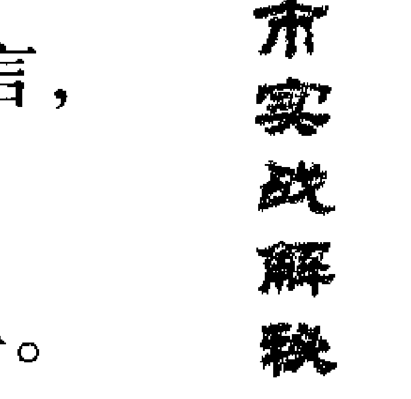

# 上编 奇门应用研究

- [时序] 夏五月，午火年月日时，三二七日。
- [静物] 字、画、美术品、报纸、刊物、图书、杂志、契约、文书、合同、书信、照相机、摄影机、录相机、电视机、复印机、照明用具、广告、奖状、电报、连环画、化妆品、火炉、打火机、火柴、烧烤物品、焊枪、霓虹灯、火、甲骨、干戈、槁衣、干燥之物。
- [动物] 雉、龟、鳖、蚌、蟹。
- [屋舍] 南舍之居，阳明之宅、明窗、虚室。
- [家宅] 安稳、平善、冬占不安，克体主火灾。
- [饮食] 雉肉、煎炒、烧炙之物、干脯之体、熟肉。
- [婚姻] 不成、利中女之婚，夏占可成，冬占不利。
- [生产] 易生，产中女，冬占有损，坐宜向南。
- [求名] 有名，宜南方之职，文官之任，宜炉冶场之职。
- [求财] 有财宜南方求，有文书之财，冬占有失。
- [谋望] 可谋望，宜文书之事。
- [交易] 可成，宜有文书之交易。
- [出行] 可行，宜动向南方，就文书之行，冬占不宜行，不宜行舟。
- [谒见] 可见南方人，冬占不顺，秋见文书考案才士。
- [官讼] 易散，文书动，词讼明辩。
- [疾病] 目疾、心疾、上焦病，夏占伏暑，时疫。
- [坟墓] 南向之幕，无树林之年，阳穴。夏占出文人，冬不利。
- [姓字] 带次或立人旁士姓氏或住址名，行位三二七。
- [数目] 二、三、七、九。
- [方道] 南、东。
- [五色] 赤、紫、红。
- [五味] 苦。

###### （7）艮卦

艮卦一阳爻在上，二阴爻在下，表示表面实内里虚，上实下虚的事物。也表示事物一种向下的发展趋势，事物发展到了顶点，必须谨慎，否则就要向相反方向发展。并且表示事物有阻碍，困难，停止不前。艮为山为止，一阳爻在坤土之上，故有小路，小石的象征。上画阳爻相连，下二阴爻中间虚空，就如门的象征。木草的果实均在上部，不在根，为阳之象，所以艮卦为果实之象。闾寺视作门卫，禁止人入内，故艮为止像。手能止住物体，狗吠使人惊吓止住不前，老鼠牙齿尖刚，鸟刚在喙，均为艮之象。艮为小石象，故坚硬多节的木像小石一样，故也为艮象。

- [天时] 云、雾、山岚。
- [地理] 山、山地、丘陵、高台、堤坝、休息室、坟场、闾寺、房屋、监狱、公安机关、派出所、大楼、城墙、仓库、宗庙、祠堂、矿山、采石场、银行、贮藏室、山径、山城、东北方，门阙。
- [人物] 在家庭为少男，表少年；在社会为少年、儿童，为土建人员、宗教人员、官僚、贵族、继承人、警卫、守门人、矿工、狱吏、石匠、储蓄所人员、闲人、山中人。
- [人事] 憨厚、安静、笃实、保守、固执、诚实、守信用、迟滞、审慎、乖戾阻隔、进退不决、反背、止住、不见。
- [身体] 鼻、背、手背、指关节、骨、脾、趾、皮、手、脚背、膝关节、肘关节、左足、颧骨、乳房、左腿、结肠。
- [时序] 冬春之月、十三月丑寅年月日时，七五十月日、土年月日时。
- [静物] 岩石、山坡、土堆、坟墓、墙壁、门坎、阶梯、台阶、门板、石碑、土炕、柜台、桌子、床、土石、瓜果、黄物、土中之物、闾寺、木生之物、藤生之瓜。
- [动物] 虎、狗、鼠、百兽、黔喙之物、狐。
- [家宅] 安稳，诸事有阻，家人不睦，春占不安。
- [屋舍] 东北方之居，山居近石，近路之宅。
- [饮食] 土中物味，诸兽之肉，墓畔竹笋之属，野味。
- [婚姻] 阻隔难成，成亦迟，利少男之婚，宜对乡里婚，春占不利。
- [求名] 阻隔无名，宜东北方之任，宜土官山城之职。
- [生产] 难生，有险阻之厄，宜向东北，春占有损。
- [交易] 难成，有山林田土之交易，春占有失。
- [谋望] 阻隔难成，进退不决。
- [出行] 不宜远行，有阻，宜近陆行。
- [谒见] 不可见，有阻，宜见山林之人。
- [疾病] 手指之疾，胃脾之疾。
- [官讼] 贵人阻滞，官讼未解，牵联不决。
- [坟墓] 东北之穴，山中之穴，近路旁有石，春占不利。
- [数目] 五、七、八、十。
- [方道] 东北方、西北方。
- [五色] 黄、棕黄、咖啡色。
- [五味] 甘、甜味。

## 奇门应用研究与股市实战解读

###### （8）兑卦

兑卦与艮卦旁通正相反，一阴爻在上，二阳爻在下，表示一种向上发展的趋势的事物，外柔内里刚硬，外虚内实的事物。兑为泽，故有吸收功能，容易与外界周边事物信息沟通。兑为泽为少女。阴爻见于外，有口舌的现象，少女快乐无忧，故为悦；兑为口为悦为少女，故为跳大神的巫师。兑居西为申酉金之秋月，故主肃杀，万物毁折，故为毁折；兑柔附于二阳刚上，故为附决。为金为西方之卦，西方多盐卤地，故为刚卤。为少女，有为妾之象。兑为悦，故于动物如羊的欢叫活蹦乱跳。

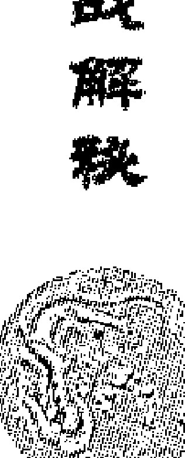

- [天时] 雨泽、新月、星、潮湿天气、气压低、露水、阴雨连绵。
- [地理] 沼泽地、峡谷、洼地、湖泊、池塘、滑冰场、游乐园、会议室、音乐厅、茶座、饭店、废墟、旧屋、山口、洞穴、井、泽、水际、缺池、废井，山崩破裂之地。
- [人物] 在家庭为少女、小女孩；可爱的女孩，少女，朋友，与用口或说、唱有关的职业的人，欢乐性职业者，破坏性职业者，巫师、巫婆、老师、教授、演讲者、解说员、翻译、外科、牙科医生、食品厂工人、饭店工人、金器加工者、秘书、非处女、妾、亲戚、和蔼可亲的人、撒娇的人、性魅力者、小人、媒人、邻居、卫生清洁工、传达人员、服务员、话务员、歌唱者、演员、钢琴家、音乐家、娱乐场所人员、小丑、歌女、金融界人物、经销人员、失败者、破坏者。
- [人事] 喜悦、吵架、毁谤、拍马屁、卑劣、奉承、色情、亲热和乐、温和、善言、喜唱歌、活跃、温厚、重感情、感召力强、重义气、忧愁、破坏性、口谗、喜悦、口舌谗毁、谤说、饮食。
- [身体] 舌、口喉、肺、痰、涎、气管、口角、颊骨、牙齿、右肋、肛门、右肩臂。
- [时序] 秋八月，酉年月日时，金年月日，二四九月日。
- [静物] 石榴、胡桃、饮食用具、带口的器物、刀剑、剪刀、玩具、破损物品、垃圾箱、金刀、金类、乐器、废物、缺器之物、毁折之物。
- [动物] 羊、泽中之物。
- [屋舍] 西向之居，近泽之居，败墙壁宅，户有损。
- [家宅] 不安，防口舌，秋占喜悦，夏占家宅有祸。
- [饮食] 羊肉、泽中之物、宿味、辛辣之物味。
- [婚姻] 不成，秋占可成，有喜，主成婚之吉，利婚少女，夏占不利。
- [生产] 不利，恐损胎或生女，夏占不利，宜坐向西。
- [求名] 难成，因名有损，利西之任，宜刑官，武职，伶官，译官。
- [求财] 无利有损，主口舌，秋占有财喜，夏占不利。
- [谋望] 成之难，谋中有损，秋占有喜，夏占不遂。
- [出行] 不宜远行，防口舌，宜西行，秋占有利行。
- [交易] 难有利，防口舌，有竞争，秋占有交易之财，夏占不利。
- [谒见] 利行西方，见有咒诅。
- [疾病] 口舌、咽喉之疾，气逆喘疾，饮食不餐。
- [坟墓] 宜西向，防穴中有水，近泽之墓；或葬废穴，夏占不宜。
- [官讼] 争讼不已，曲直未决，因讼有损，防刑，秋占为体得理胜讼。

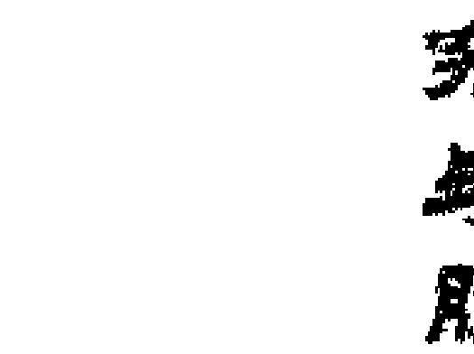

- [姓字] 带口带金字旁姓氏或住址名。
- [数目] 二、四、七、九。
- [方道] 西方、东南。
- [五色] 白。
- [五味] 辛辣。

总之，在奇门遁甲中的九宫八卦涵盖了天、地、人、时间、空间万事万物。

##### 3. 天干地支的含义

天干地支简称“干支”。《辞源》里说，“干支”取义于树木的“干枝”。十天干：甲（jiǎ）、乙（yǐ）、丙（bǐng）、丁（dīng）、戊（wù）、己（jǐ）、庚（gēng）、辛（xīn）、壬（rén）、癸（guǐ）；十二地支：子（zǐ）、丑（chǒu）、寅（yín）、卯（mǎo）、辰（chén）、巳（sì）、午（wǔ）、未（wèi）、申（shēn）、酉（yǒu）、戌（xū）、亥（hài）。

据传，早在公元前2697年，于中华始祖黄帝建国时，命大挠氏探察天地之气机，探究五行，始作甲、乙、丙、丁、戊、己、庚、辛、壬、癸十天干及子、丑、寅、卯、辰、巳、午、未、申、酉、戌、亥十二地支，相互配合成六十甲子用为纪历之符号。根据《五行大义》中记载，干支是大挠创制的。大挠“采五行之情，占斗机所建，始作甲乙以名日，谓之干，作子丑以名月，谓之枝。有事于天则用日，有事于地则用月。阴阳之别，故有枝干名也”。

###### (1) 十天干所主

奇门遁甲特别重用十天干：甲、乙、丙、丁、戊、己、庚、辛、壬、癸。

甲：五行属阳木，位居东方。五脏受病主胆，在人体表主头部。五味主酸，颜色主青色。其质劲健性直，体形长方，有萌动作用。得令为栋梁，失令为废材；受克太过则无用，生旺太过则漂泊无依。性格过于自负，不能娴于世故。在奇门中为首领，为主帅，经常遁在六仪之下。它还代表为贵人，为高档次，为名贵，为首脑、头领、大人物。

乙：五行属阴木，位居东方。五脏受病主肝，体表主脖项和肩。颜色主碧或浅绿色。五味主酸甘。体质柔嫩。得令则繁华茂盛，失令则枯萎。性格柔顺，依附世情。在奇门中为日奇，为医生，为女人，为女友或妻子，为中医，中药。它是三奇之一，三奇都有神奇、转机、希望达成之意，乙奇是曲折、柔顺地达成。乙主犹豫，只想不做。

丙：五行属阳火，位居南方。五脏受病主小肠，体表主肩或额。颜色主紫赤色，五味苦辣。性格刚烈，工作清廉。得令得时则战果辉煌，失令则灰槁无力。能成大材，但难持久。在奇门中为月奇，三奇之一，它还代表为乱子，为麻烦，为权柄，为威严。也为希望达成，但丙主悖乱，是乱的达成，有过犹不及之意。测婚恋为女人的婚外情人，男性第三者。测病为肿处，炎症部位。

丁：五行属阴火，位居南方。五脏受病主心脏，体表主胸和舌。颜色淡红，五味属苦。形体秀丽清高。性格和顺而有心计。得令是销熔暴戾，洞察奸邪；失令则愁苦、呻吟。在奇门中为星奇，为玉女，三奇之一，为顺利，为希望达成，十分圆满，为新意。测婚恋为男人的婚外情人，或情妇、妓女，女性第三者。

戊：五行属阳土，位居中方。五脏受病主胃，体表主肋和鼻子。颜色深黄，五味甘辛。性格刚烈暴躁，体形敦厚。得令则豪杰果敢，失令则愚笨痴呆。戊为钱财，为投资，为阳宅，为房子，为土地。“见戊三分笨”，测婚恋为男性第四者。在奇门中又为天门，长辈等。

己：五行属阴土，位居中央。五脏受病主脾，体表主腹部和面部。颜色浅黄，五味甘辛。性格温顺，体质沉静。得令则教化万物，失令则洁身自好。己为欲望，强烈的欲望，也为桃花，为明堂，为阴沟，为坟墓，为低洼之地。测婚恋为女性第四者。在奇门中又为地户，代表坟墓等。

庚：五行属阳金，位居西方。五脏受病主大肠，体表主脐轮和筋。颜色主白，五味辛辣。体形长方。性格刚健锐利，得令呈其专制，失令则失去雄威。其性坚执能屈人，而不屈于人。“丙为悖兮庚为格”，“格”即阻隔，障碍。庚为道路，为公安干警，为对手、仇人、贼人、敌人，测婚为丈夫等。

辛：五行属阴金，位居西方。五脏受病主肺，体表主胸部和股部。颜色浅白，五味苦辣。体形方正沉静。性格忠诚爽柔，其为用坚耐似玉，得令则黄钟，失令则瓦缶。辛为错误、错位、罪人，也为金钱、金银珠宝贵重物品、保险柜。在奇门中往往代表罪人或犯过错误的人。

壬：五行属阳水，位居北方。五脏受病主膀胱、三焦，体表则主小腿。颜色深黑，五味主咸。性格柔而险，可共忧患，难以同乐。得令则济物利人，失令则妨贤害国。壬为困境，被束缚状态，为牢狱，为遇到问题，也主流动、变动，为不稳定事物，为动水。在奇门中又代表与流动有关的事物。

癸：五行属阴水，位居北方。五脏受病主肾和心包，体表则主足。颜色浅黑，五味咸浊。性可知阴柔浅露，得令则从龙变化，狐假虎威；失令则沉溺灰心，或摇尾乞怜。癸为困境，为地网牢狱，为严重的被束缚状态，为遇到大问题，也主变化，为静水，为性，为与性生活相关之事。在奇门中往往代表与女性、与性生活有关系的事物或人。

###### (2) 十天干阴阳旺衰及吉凶

在奇门遁甲中，甲、乙、丙、丁、戊前五位为五阳干，己、庚、辛、壬、癸后五位为五阴干。

时辰遇五阳干时，利客不利主，做事宜先动，要占尽先机，获取主动权。五阳为喜神，出军征战，远行求财，迁徙起造，百事可为而得利。逃亡者不可得。古人云：得阳干者飞而不止，利客先举。

时辰遇五阴干时，利主不利客，做事宜后动，等待时机为主。五阴为恶神。举兵御敌，待敌动后自己再动可决胜。不可拜官迁徒，婚嫁出行，举造百事。宜按兵不动，密谋策划，坐收渔人之利。逃亡者可得。古人云：得阴干利为主，伏而不起则利。

十天干之间的关系有冲克、化合：甲、庚相冲，乙、辛相冲，壬、丙相冲，癸、丁相冲，即除戊、乙中央土之外，五行之间相克，阳克阳、阴克阴为冲。甲、己、合化土，乙、庚合化金，丙辛合化水，丁、壬合化木，戊、癸合化火。甲、己之合为中正之合，乙、庚之合为仁义之合，丙、辛之合为权威之合，丁、壬之合为浮荡之合，戊、癸之合为无情之合。

十天干旺衰，有生旺死绝表。即甲木长生在亥，帝旺在卯，死在午，墓在未，绝在申；乙木按阳死阴生，逆行十二宫，长生在午，帝旺在寅，死在亥，墓在戌，绝在酉。

火、土相同，即丙火、戊土皆长生在寅，帝旺在午，死在酉，墓在戌，绝在亥；丁火、己土逆行十二宫，长生在酉，帝旺在巳，死在寅，墓在丑，绝在子。

庚金长生在巳，帝旺在酉，死在子，墓在丑，绝在寅；辛金逆行，长生在子，帝旺在申，死在巳，墓在辰，绝在午。

壬水长生在申，帝旺在子，死在卯，墓在辰，绝在巳；癸水逆行，长生在卯，帝旺在亥，死在申，墓在未，绝在午。由此可见，辰、戌、丑、未为四库，又为四墓。

辰，既为壬水之墓又为辛金之墓；戌，既为丙火、戊土之墓又为乙木之墓；丑，既为庚金之墓又为丁火、己土之墓；未，既为甲木之墓又为癸水之墓。

奇门遁甲又称为天干学，所以十天干是用神的主要代表符号。十天干寄生十二宫的状态，也就是分别落入奇门九宫的状态，决定了它们得不得地利的状态。古人把十天干的旺相休囚分成十二种状态，即长生、沐浴、冠带、临官、帝旺、衰、病、死、墓、绝、胎、养。在奇门遁甲中，由于有阴阳二遁、阳顺阴逆的规律，十天干严格按照阳顺阴逆的规律分别运行在九宫中。十二状态中，长生、沐浴、冠带、临官、帝旺五个阶段为旺相，就叫得地利。衰、病、死、墓、绝五个阶段为休囚，叫不得地利。胎、养二个阶段叫中平阶段。这十二状态中，其中的墓，又叫库，即辰、戌、丑、未四个墓、库。既叫墓，又叫库，二者有什么区别呢？这就要从月令上来区分，十天干从月令上看处于旺相状态，如果落宫在墓地，就不叫入墓，而叫入库。入库就表明它并未死亡，而只是暂时被放进仓库，发挥不了作用，一旦库门打开（库被冲），被取出来，照样还可以发挥作用。如果十天干在月令上处于休囚状态，这时落宫又进入墓地，这就仿佛一个人或一件事物已经死亡被埋进坟墓一样，那就算真正的入墓，彻底完蛋了。所以在奇门应用中，一定要区分用神是入墓还是入库，绝不能将二者混为一谈。

古人还总结了十天干作为的吉凶，并分别为之命名：甲为天福，宜行恩施惠，进德赏功。乙为天德，宜施恩赏德敛恤抚告。丙为天威，宜发号施令，以彰雄威。丁为太阴，又名玉女，宜静居无忧，勿嗔谴谪。戊为天武，宜发号施令，行诛屠戮。己为六合，又为明堂，宜发明旧事，修疆理城。庚为天狱，又名天刑，宜决断刑狱，诛戮邪恶。辛为天庭，宜正法治囚，莫为吉事。壬为天牢，宜平讼决狱，吉事勿为。癸为天藏，又名天网，宜扬威责罚，积蓄收敛。

古人还总结了十天干时辰出行的歌诀，这就是：

- 六甲出门最吉利，金马玉堂逢贵人。
- 乘着六乙出门去，秃头公吏宜终身。
- 执持弓弩遇骑射，盖为时乘六丙行。
- 州官县宰相遇面，只为行时正六丁。
- 若逢戊、己出行去，两个妇人身着青。
- 庚、辛、壬时最为恶，大凶无吉有灾祸。
- 六癸出门逢骑射，多遇山林隐逸客。

其实出行的吉凶并非完全在于时辰，对古人这些歌诀只能参考。

###### (3) 十二地支所主

子：五行属阳水，位居北方。主池塘、沟河，与水有关场所；在人主妇女、盗贼；动植物主燕子、蝙蝠、蜗牛、地瓜、水萝卜、浮萍；在事上遇吉神为聪明吉祥，遇凶神主淫佚。

丑：五行属阴土，位居东北方。场所主桑园、桥梁、宫殿、礼堂、坟墓。在人主贵人、尊长、神佛；动物为牛、驴、骡子；静物主锁匙、首饰、珍宝、斛斗、鞋类。在事上遇吉神吉格主喜庆、迁官晋职；遇凶神凶格，主刑狱、词讼、口舌是非、离乡背井或疾病。

寅：五行属阳木，位居东北方。场所主山林、桥梁；在人主丈夫、女婿、贵人、清官、公门人；在物主文书、单据、发票、香炉、织机、财物、棺材；动物主老虎、豹子、猫。在事上遇吉神主文书、财帛、信息，遇凶神为失财、疾病、官非。

卯：五行属阴木，位居东方。场所主大街、道路；人上主兄弟、姑娘、妇女、盗贼、手工业者；物品主船只、车辆、门窗；动物主兔子、蚰蛐。在事上见吉神主车辆船只平安无事，遇凶神则官司口舌，或车船遇险。

辰：五行属阳土，位居东南方。场所主土堰、坟墓、麦地、寺观；在人主僧人、道人、妇女；物品主瓷器、缸瓮、灰盆、香纸、皮毛；在事上见吉神主医生药物，见凶神主屠夫、争讼。

巳：五行属阴火，位居东南方。在人为妇人、少妇、少女、乞丐；动物为长虫、蚯蚓、蝉、萤火虫；物品主书画、文字、花果、砖瓦、瓷器；在事上见吉神主文书、票证，见凶神主疫病、梦魇。

午：五行属阳火，位居南方。场所主大厅、会议室、电影院、娱乐场所；在人为僧人、骑马人、女秘书、宫女、使者；物品主电视机、音响、电器、书画、衣服、旌旗；在事上见吉神为信息、文章，见凶神为惊疑、口舌是非。

未：五行属阴土，位居西南。场所主大院、墙堰、坟墓、田野；在人为老妇人、老男人、放羊人、寡妇、巫师；在动物为羊、鹰、白头翁；在物为衣服、药品、食物、酒器；在事上见吉神为酒食、宴会、喜美之事，见凶神凶格为疾病，孝服、官灾。

申：五行属阳金，位居西南方。场所主神堂、佛堂，麦地；在人为行人、军徒、凶恶之人；物品为自行车三轮车、摩托车、火车、汽车、刀剑、金银、铁器类；在动物为猿猴、狮子；在事上遇吉神主有佳音、喜美之事，遇凶神主道路损失、疾病、破财。

酉：五行属阴金，位居西方。在人为妇女、少女、阴贵人、卖酒人；物品主金银、首饰、珍宝、刀剑、皮毛、爪骨、瓜果、口罩、石柱；动物为鸡、鸽，在事上见吉神主清谈和会，见凶神主疾患、离别。

戌：五行属阳土，位居西北方。场所为山岭、冈坡、寺观、坟墓、厕所、牢狱；在人为长者、善人、僧道之人；动物为狗、驴；植物为大豆、高粱、荞菜；物品为砖瓦、瓷器、药物、尸骨、锁匙、鞋履；在事上见吉神主吉祥，见凶神主凶灾。

亥：五行属阴水，位居北方。场所主江河、沼泽、仓库、酒店；在人为盗贼、小儿、乞丐、醉汉；动物为猪、熊；物品主笔墨、砚台、腌渍之物；在事上见吉神主婚姻、财利，见凶神主盗贼、口舌。

# 上编 奇门应用研究

在事上见吉神主办事顺利，见凶神为虚诈不实及争斗走失、牢狱之灾。

亥：五行属阴水，位居西北方。场所主江河、湖海、仓库、寺院、楼台、厕所；在人主小儿，乞丐、掌鞋人、赶猪人、醉酒人、罪人、盗贼；动物为鱼、虾、蟹类；物品为毛发、麻布、绸绢、笔墨；在事上见吉神主婚姻、求索，见凶神主争斗、难产。

##### 4. 十二地支的刑冲合化害
地支相刑有四种：

-   ①子卯相刑，即子刑卯，卯刑子，为无礼之刑。
-   ②寅巳申相刑，即寅刑巳，巳刑申，申刑寅，为无恩之刑。
-   ③丑未戌相刑，即丑刑未，未刑戌，戌刑丑，为恃势之刑。
-   ④辰午酉亥自相刑。

地支相冲，就是处于相对位置的地支两两互相冲克。有吉有凶，吉事逢冲不吉，凶事逢冲不凶。八门、九星若逢相冲位置，则为反吟。地支相冲有六对，这就是子午相冲、卯酉相冲、辰戌相冲、巳亥相冲、丑未相冲、寅申相冲。

###### 十二地支的化合：

-   ①三会局，即寅、卯、辰会东方木局，巳、午、未会南方火局，申、酉、戌会西方金局，亥、子、丑会北方水局。
-   ②三合局，即申子辰合水局，亥卯未合木局，寅午戌合火局，巳酉丑合金局。
-   ③地支之间两两相合，这就是子丑合，寅亥合、卯戌合、辰酉合、巳申合、午未合，合中相生者，越合越好，如寅亥合，亥水生寅木；辰酉合，辰土生酉金。合中相克者，做事先好后坏，先热后冷，如子丑合，丑土克子水；卯戌合，卯木克戌土。

地支相害，即受害、被害和严重受克的意思。地支相害有六对，即子未相害，丑午相害，寅巳相害，卯辰相害，申亥相害，酉戌相害。

##### 4. 八门的含义及类象

八门即开门、休门、生门、伤门、杜门、景门、死门、惊门。

一般说来，开、休、生三门吉，死、惊、伤三门凶，杜门、景门中平，但运用还必须看临何宫以及旺相休囚。古人有歌曰：吉门被克吉不就，凶门被克凶不起；吉门相生有大利，凶门得生祸难避。吉门克宫吉不就，凶门克宫事更凶。

八门在奇门遁甲天、地、人格局中代表人事，所以在奇门预测中极为重要，特别是用神所临之门以及值使门即值班的门，与所测之人、事物关系很大。

古人有八门执事歌一首，概括了八门所主的主要事项：

-   欲求财利往生方，葬猎须知死路强。征战远行开门吉，休门见贵最为良。
-   惊门官讼是非多，杜门无事好逃藏。伤门搏斗能捉贼，景门饮酒好思量。

这就是说，不论别人还是自己，如果问求财之事，起出奇门格局后，看生门落在哪个宫内，该宫所在方向就是作生意求财的方向；要问丧葬和打猎，则死门落宫方向就是最有利的方向。如果要行军打仗、出门远行、则开门落宫方向最吉；如果要拜见贵人和上级领导，以休门落宫方向最佳。惊门落宫方向一般官讼是非多。杜门落宫是躲灾避难最好的方向。伤门落宫的方向适宜搏斗、讨债、捉贼。如果要饮酒聚会，商议谋划，最好到景门落宫的方向。

奇门遁甲中的门盘，又叫人盘，所以用八门及其落宫状态来表明人和的状态，得吉门便为得人和。

八门中以开、休、生为三吉门，分别对应乾六宫、坎一宫和艮八宫，在紫白飞星中这三个宫均为白（所谓六白、一白、八白），也是吉的意思。开门，望文生义，就是开基立业的意思，所以它代表一个人一生的事业、官运。休门为休息的港湾，五行又属水，可以讲与男女云雨之事有关，所以还可以代表婚姻、家庭。生门为产业、田宅、生财之源，所以是一个人一生财运的代表。官运（广义上讲就是事业运）、财运、婚姻家庭，这是一个人一生所追求的三件大事，官运亨通、事业发达，财源滚滚，婚姻家庭美满，这是一个人所谓幸福、命运好的主要标志。所以开、休、生为三吉门。死、惊、伤为三凶门，疾病、死亡，官非诉讼、惊恐不安，意外伤灾、伤心伤身，这是一个人一生中最忌讳的三大坏事，所以用死、惊、伤三凶门来作为代表符号。

###### （1）开门：

开门居西北乾宫，五行属金。乾卦是八卦之首，为天为父，于社会之首长；乾纳甲壬，乾位有亥，亥为甲木长生之地，甲又为十干之首，所以古人对应乾宫的门命名为开门，喻万物开始之意，为大吉大利之门。考诸中国历史，几乎所有开国之君俱从西北乾位开创基业，开门之名不虚也。

开门属金，旺于秋季，特别是戌、亥月，相于四季末，休于冬，囚于春，死于夏。开门居乾宫伏吟，居巽宫反吟，居艮宫入墓，居离宫受制，居坤宫大吉，居兑宫旺相，居坎宫次吉，居震宫为迫。开门大吉，利于开业经商，征战远行，考学参军，婚娶乔迁，建筑贸易，添人进口，治病求医。

开门在测工作中代表工作、代表官职，代表文官、代表单位，在测财中代表工厂、店铺、柜台、门面，在测诉讼中代表法官，在测汽车中可代表发动机，在测航天中，可代表飞机等。一般情况下，还可代表事情的开始、公开，人的开拓精神、开朗外向的性格等。

###### （2）休门：

休门居北方坎宫，属水。坎水得乾金之生，于人为中男，上有兄下有弟，从容休闲；又坎宫处冬季最寒冷季节，万物休息冬眠，故古人命名为休门，乃休养生息之地。变为吉利之门。

休门属水，旺于冬季，特别是子月，相于秋，休于春，囚于夏，死于四季末月。休门居坎宫为伏吟，居离宫反吟，居巽宫入墓，居坤艮二宫受克，居乾兑二宫大吉，居震宫次吉。休门也为吉门，利于求见领导和贵人，上官赴任，嫁娶迁徙，经商建造，但不利行刑断狱。

休门在测工作中可代表公门人、坐办公室的人、迎来送往的人，事务工作者，休闲人，离休、退休干部，在测婚姻中可代表婚姻、家庭，出行乘船可代表水路。一般情况下可代表事情的休止，一个人善于处理上下左右的关系，性格闲散，或贪玩，懒堕等。

###### （3）生门：

生门属土，居东北方艮宫，正当立春之生，万物复苏，阳气回转，土生万物，所以古人生门，大吉大利之门。

生门旺于四季月，特别是丑、寅之月，相于夏，休于秋，囚于冬，死于春，生门居艮宫伏吟，居坤宫反吟，居巽宫入墓，居震宫受克，居离宫大吉，居乾兑二宫次吉，居坎宫被迫。生门大吉，利于求财，特别是搞房地产、种植业、养殖业等。征战出行、嫁娶建造也为吉利。但不利埋葬治丧。

生门在测工作中可代表与房屋、土地、钱物有关的部门，在测财中可代表财运、产业、房屋、阳宅、生意、利息、利润等，在测病中用神临生门，代表身体没问题，或可起死回生。一般情况下，可代表活着的人，有生气的人，性格生龙活虎的人，或从事农业、种植业、养殖业的人等。

###### (4) 伤门：
伤门居东方震宫，五行属木，正当卯月春分之后甲木帝旺之时，旺则易折；震卦主动，动则易伤；元帅甲子常隐于戊土之下，子与卯相刑，刑则受伤，故古人将与震宫对应的八门命名为伤门。伤门属凶门，主人遭疾病刑伤之象。

伤门属木，旺于春，特别是卯月，相于冬，休于夏，囚于季月，死于秋。伤门居震宫伏吟，居兑宫反吟，居坤宫入墓，居坎宫生旺大凶，居乾宫受制，居艮宫被迫大凶，居离宫泄气。伤门为凶门，不利经商、出行、赴任、修造、嫁娶，经商易破财，出行易有灾。但适宜于索债、捕捉盗贼、渔猎、赌钱等。

伤门代表公安捕盗人员，讨债人，竞争对手，代表汽车、船只、司机，代表伤心、伤灾、身体受伤部位等。

###### (5) 杜门：
杜门居东南巽宫，属木。巽为长女，受乾父之冲克，又克坤母，与父母皆不和，故在家中处事阻塞不利；又巽宫位有辰土，既是水墓、土墓又是辛金之墓；八卦九宫均为阴阳对立统一格局，西北方为开门，与它对冲的东南方自然就命名为杜门，一开一杜，二者对立统一，4+6=10，统一于五行地数（9为天数，先天八卦对冲方位二卦相加均为9数；后天八卦对冲方位二卦相加均为10数，10为地数）。

杜门属木，旺于春季，特别是辰、巳月，相于冬，休于夏，囚于四季月，死于秋。杜门居巽宫伏吟，居乾宫反吟，居坤宫入墓，居兑宫受克，居艮宫被迫，居坎宫受生，居震宫比和，居离宫泄气。杜门小凶，也为中平。在人事上多主武官、军队、警察、公安、安全等具有检察性质的单位。杜门为藏形之方，适宜于躲灾避难、捕盗剿贼、防洪筑堤、判决隐狱等，余事皆不利。

杜门代表武官、军警单位、保密单位，代表躲藏之处，代表闭塞不通、血栓、中风，代表性格内向，喜欢关起门来钻研学问、技术的人，因而也可代表技术人员，杜门临巽宫主经络、主风、主气，因而也可代表修练之人等。

###### （6）景门：

景门居南方离宫，属火。在家中为中女，在乾金为父，与丈夫中男坎水对冲，易动口舌，常有血光之灾；又景门正当日升中天、大放光明之时，但烈日炎炎，虽夏季景色美丽，但难免有酷暑之忧；又景门所在离宫正南与正北坎宫休门相对，一个万物闭藏休息，一个万物繁茂争长，故古人命名为景门。

景门属火，旺于夏，特别是午月，相于春，休于四季月，囚于秋，死于冬。居离宫伏吟，居坎宫反吟，居乾宫入墓，居兑宫被迫，居震、巽二宫生旺，居坤、艮二宫生宫为休。景门小吉，亦为中平。宜于献策筹谋，选士荐贤，拜职遣使，火攻杀戮，余者不利，谨防口舌及血光、火灾。景门多主文书之事。

景门代表光明、风景、图画、计划、规划、技术指导、文章、考卷，文书，合同、起诉书，状纸、消息、信息，还可代表宴席、酒店、饮酒、酒量，代表火器、枪支、流血、血光，出行代表旱路、道路等。

###### （7）死门：

死门居西南坤宫，属土。死门与艮宫生门相对，万物春生秋死，春种秋收，故命名为死门。

死门属土，旺于秋季，特别是未、申月，相于夏，囚于冬，死于春。居坤宫伏吟，居艮宫反吟，居巽宫入墓，居震宫受克，居离宫生旺大凶，居坎宫被迫大凶，居乾、兑二宫相生为休。死门为凶门，不利吉事，只宜吊死送丧，刑戮争战，捕猎杀牲。

死门在测工作中可代表屠户、猎户、行刑之人、吊丧之人、救死扶伤的医务人员，从地上可代表地皮、地基、坟墓、阴宅，一般情况还可代表死人、死尸、死肉、坏组织、疤痕、锁，或性格死气沉沉，死板固执，或心里不痛快，生闷气或事业不顺利，处于低潮，受困状态等。

###### （8）惊门：
惊门居西方兑位，属金。正当秋分、寒露、霜降之时，金秋寒气肃杀，草木面临凋敝，一片惊恐萧瑟之象；又兑卦为泽，为缺，为破损；又兑主口，主口舌官非，故古人将此门命名为惊门，与东方震宫伤门相对应。

惊门属金，旺于秋，特别酉月，相于四季月，休于冬，囚于春，死于夏。居兑宫伏吟，居震宫反吟，居艮宫入墓，居离宫受制，居巽宫为迫，居坎宫泄气，居坤宫受生，居乾宫比和。惊门也是一凶门，主惊恐、创伤、官非之事。适宜斗讼官司、掩捕盗贼、蛊惑乱众、赌博游戏，其余事不可为。

惊门代表官司、诉讼、口舌是非，律师，也可代表外交官，教师、歌星、言官，纪检、监察部门工作人员等，还可代表受惊、惊慌、惊恐不安等状态。

八门所涵盖的信息，还可以根据其所对应的八卦的阴阳五行性质和万物类象，进一步拓展，它们的内涵是相对固定的，外延却是无限的开放的。

八门在五行上各有属性，开、休、生为三吉门，死、惊、伤为三凶门，杜门、景门中平，预测时常以它们落宫状况，即与所落之宫的五行生克和旺相休囚来定吉凶、断应期。

古人把门克宫称为“迫”，叫“门被迫”，而且有歌说：“吉门被迫吉不就，凶门被迫事更凶。”实际就是说，吉门克宫，吉事不就，凶门克宫，事情更凶。又把宫克门叫做“制”，实际上是门受宫克，“吉门受克吉不就，凶门受克凶不起”，吉门受到地盘的制约，吉事不成凶门受到地盘宫的制约，凶事就闹不起来了。古人又把门生宫称作“和”，宫生门称作“义”。门宫相生，对于吉门来说自然为好，等于好上加好；但是对于凶门来说，如果受生，更加旺相，那就凶上加凶了。所以，不能一般认为，相生就好，相克就不好，必须具体情况具体分析，而且还要根据季节论其旺相休囚。

# ## 5. 九星的含义及类象

奇门遁甲注重的是天、地、人与时空全息，九宫八卦是代表“地”的，八门是代表“人”的，九星是代表“天”的，即“天时”（得吉星便为得天时）、天体运动对地球和人类的影响。

古人从常见的行星中，根据它们运转歇宿的位置，选择其中有代表性的九颗，分别与地上的九宫八卦相对应，这就是与一宫对应的天蓬星，与二宫对应的天芮星，与三宫对应的天冲星，与四宫对应的天辅星，与五宫对应的天禽星，与六宫对应的天心星，与七宫对应的天柱星，与八宫对应的天任星，与九宫对应的天英星。

一般说来，天心星、天任星、天禽星、天辅星为四吉星，天冲星是次吉之星；天蓬星、天芮星、天柱星为三凶星；天英星中平。

天蓬星，又名贪狼星，居坎一宫，它五行属水，为阳性。古人把它规定为凶星，因为它胆大妄为，又喜欢暗中行事，故作为杀人犯、抢劫犯、大盗、大贪污犯的代表符号。在奇门测刑事案件中，都以天蓬星作为凶犯的用神。这是其主要特征。但是吉凶是相对的，事物都有双重性。因而在一定条件下，天蓬星也可以作为吉的符号，比如镇守边关的大将，敢于投机倒把做大生意的巨商大贾，敢冒风险，具有大智慧的人，等等，往往也临着天蓬星。因为天蓬星属水，水主智。总之，聪明、胆大、喜欢暗中行事，这是它的主要特点。在预测中天蓬为大，胆大、程度大，为大盗、破财，为贪婪、好色，也为做大事的人。为敢说敢做，敢于冒险善投机，喜欢暗中行事，亦代表黑恶势力、黑社会。又为智慧之星，为与水有关之人事。为风险投资、不正当行业。

天芮星，又名巨门星，居坤二宫，它五行属土，为阴性。古人规定它为凶星，因为它有阴险、贪毒的一面，与疾病有关。所以在奇门测病中，它是疾病的主要代表符号。但它也有吉的一面，比如在测妇女孕产中它代表孕妇，在测人职业方面它代表农民，在测拜师学艺方面它代表学员，等等。因为它是坤宫的星，也同时具有坤卦的性质，即代表母亲、妇女、土地、大众、下层民众、学生等等。在预测中天芮为病，为病人、学生、佛龛、孕妇、产妇，也为错误，为有问题存在，也为好研究发现问题。

天冲星，又名禄存星，居震三宫，它五行属木，为阳性。古人规定它为吉星，因为它在战场上敢打敢冲为武士。在工作中自然也具有雷厉风行、干事爽快利索的优点。但它也有冒失、粗鲁、不稳重的一面，故有人认为它是次吉之星。在预测中天冲为爽快、莽撞、冲动，为车，为军人，武士，为武装部队、武术爱好者、拳击散打运动员、田径运动员，又为炸药、雷管、子弹。

天辅星，又名文曲星，居巽四宫，它五行属木，按奇门阴、阳二遁来分，它属阳性，但从巽卦代表长女来讲，它又属于阴性，因为阴阳本来就是相对的，看从哪个角度来认识。古人认为它是天上的文曲星，与文化教育有关，故为大吉之星。在奇门应用中，它往往代表老师、班主任、考试院、文化程度等。总之，人与动物一个重要区别就是有文化，一个人文化程度高低，能否具有较高的文化教养，与他一生命运十分有关。特别是在科教兴国，知识经济日益发展的今天，天辅星的作用更加重要。在预测中天辅为文化、教育、辅助，为文质彬彬，漂亮，有修养，为和谐、融洽、谦让，为学业有成。

天禽星，又名廉贞星，居中五宫，它五行属土，性质为阳性。因为土能生万物，古代君主实行九宫明堂制，君主是在中宫办公的，奇门遁甲排九宫八卦阵，元帅也是隐蔽在中宫的，所以中宫的天禽星自然是大吉之星。天禽星具有大地中央土的特性，忠诚老实，厚德载物。如果它临宫，则百事可为，四时皆吉。奇门有九个宫，但只有八个卦，所以中五宫没有对应的卦，同时也没有门，因为所谓门都是向外走的通道，中间不可能有门，所以也只有八门。那么中五宫的天禽星与什么卦、什么门对应呢？由于中五宫为大地之土，故与二宫的坤卦、死门相对应。在活盘奇门中，中五宫的天禽星和所临的三奇六仪永远寄坤二宫，与二宫的天芮星一起飞转，天芮星落在哪一宫，天禽星也落在哪一宫。但天芮星和天禽星所携带的三奇六仪不同，用神也就不同。在预测中天禽为方正、厚道，为中，为高，为飞行物，管理能力，为将帅，贵人扶持、公正、平和、一派正气。

天心星，又名武曲星，居乾六宫，它五行属金，按奇门阴阳二遁来分，6 宫用阴遁，故天心星属阴性，但按乾为天、为老父来讲，天心星又属阳性。既有聪明、能力，富有领导才能、能够成就大事业的特性，也有为人阴柔、心底细密、能屈能伸、乐善好施、济世救人的优点，故不仅利于军事作战、领导群众，而且也利于医卜星相，治病配药，求仙长寿。所以在奇门预测中，天心星既可作为领导、长官的用神，也是医生和医药的代表符号。它既能惩恶，也能助善。所以是大吉之星。在预测中天心为心计，为医生、医药，为管理能力，为领导，为医卜星相，为好心眼儿，为能屈能伸，做事善谋划。

天柱星，又名破军星，居兑七宫，它五行属金，按奇门阴阳二遁来分，7 宫用阴遁，按兑为少女来说，也属阴卦，故为阴性。古人认为它正当金秋肃杀之时，喜杀好战，与惊恐怪异、破坏毁折有关，一般作为凶星符号。但事物都有两重性，既然称之为天柱星，它又有顶天立地、力挽狂澜、砥柱中流的一面，所以还需结合格局、门、神、三奇六仪等符号综合判断，不可一概按凶断。它的特点是不仅好斗，具有破坏性，而且能言善辩。所以古人在人生经验预测中讲，天柱合式，直言谏议。七赤天柱位镇西垣，有气者，舌辩当世，被冲克，优伎乐工。判断职业上，如果用神临天柱星，往往职业与军警、教师、律师、演员、外交官等有关。在预测中天柱为凶灾、破财、口舌是非、为说教，为能说会道，也为支柱、骨干，有独撑局面的能力，力挽狂澜的精神。

天任星，又名左辅星，居艮八宫，五行属土，性质属阳性。古人认为土能生万物，又当春季万物萌生之时，故为大吉之星。它的特征是厚德载物，忠厚诚实，同时任劳任怨，慈祥善良，乐于助人。从职业上讲，如果用神临天任星，往往与土地、农业有关。在预测中天任为农民、地主、为种植业者、驼背之人、妻管严、老实人。勤奋积极，有任性，任劳任怨，辛苦劳碌，但固执、小气，缺乏开拓性。

天英星，又名右弼星，居离九宫，五行属火，阴性。古人认为天英星属离宫之位，烈火炎炎，性躁易暴，所以既有光明、文明、好的一面，一旦过头，就与血光之灾有关，故称之为中平之星。在职业上，如果天英星临用神，往往与火、与文明有关。在预测中天英为英勇，为急燥、烈性，为花草、砖窑，为形象、名声，为血光，为电器，为与火有关事象。

九星与九宫、八卦的对应关系，在奇门地盘上是永远不变的，但九星代表天时，所以它必须在天盘上飞，如果又飞回本宫，则为伏吟。比如天蓬星又飞回坎一宫，这时天盘上是天蓬星，地盘上也是天蓬星，在奇门中就叫作星伏吟，换句话说，就是九星又飞回本宫，伏在地盘上哭泣、呻吟。如果九星飞到与本宫对冲的方位，奇门中就叫反吟。比如天蓬星本为坎一宫的星，位在正北方，如果飞到离九宫天盘上，也就是与正北相对的正南方位上，这时天盘上是天蓬星、地盘上是天英星，这就叫反吟。而且与之相对，在天蓬星飞到离九宫天盘的同时，离九宫地盘上的天英星也飞到坎一宫的天盘上，正好互相侵占了对方的地位，二者必然相互反对、冲撞而引起痛苦，在奇门中就叫九星反吟。

九星运转的规律是随时干，也就是说，在时家奇门中，九星是随时辰的天干而运转的。某个时辰的天干落在某宫，这个时辰的值符星也就飞到某宫的天盘上。

九星的旺相休囚废，与地上五行不同。这一点一定要牢记。地上五行是旺相休囚死。即当令者旺，我生者相，生我者休，克我者囚，我克者死。九星是在天上运行的星体，本身无所谓旺相休囚，它们不受地球上四季气候的影响，因而它们的旺相休囚废，主要是针对它们对地球的作用和影响而言的。具体到奇门遁甲中，就是它们飞临某宫，对该宫的作用和影响。所以，九星的旺相休囚废与地上五行不同。这就是九星落到我生之宫最旺，落到与我五行相同之宫为相（次旺），落到我克之宫为休，落到生我之宫为废，落到克我之宫为囚。

《烟波钓叟歌》中所讲：与我同行即为相，我生之月诚为旺，废于父母休于财，囚于鬼兮真不妄。比如天蓬星五行属水，如果它飞临坎一宫则为相，因坎一宫五行也属水，属于同一种五行，古人又称之为落入兄弟宫，只能起到帮扶作用，所以这时它就处于次旺的状态。如果天蓬星飞临震三宫或巽四宫，水能生木，古人又称之为落入子孙宫，天蓬星的作用能得到最大发挥，所以它就处于最旺状态。如果天蓬星飞临离九宫，离九宫属火，天蓬星属水，古人称之为落入妻财宫，虽然水能克火，但离九宫喜欢火，火在离九宫当令，水发挥不了什么作用，所以天蓬星就处于休息的状态。如果天蓬星落入乾六宫或兑七宫，金能生水，古人称之为落入父母宫，因为乾兑均属金，金当令自然能生水，就不需要天蓬星再起作用了，所以就处于废的状态。如果天蓬星落入艮八宫或坤二宫，土能克水，古人称之为落入官鬼宫，因为艮、坤二宫属土，土当令克水，水被囚禁，所以天蓬星就处于被囚的状态。

以上是按落宫来讲，按月令来讲，也是如此。如天蓬星在亥、子两月，同属水，就处在相（次旺）的状态。在寅、卯两月，因为水能生木，就处在旺的状态。在巳、午两月，水能克火，火当令，天蓬星就处在休的状态。在申、酉两月，金能生水，金当令，自己就能生水，天蓬星就处在废的状态。在辰、未、戌、丑月四月，土能克水，土当令，天蓬星就处在囚的状态。其他八个星的旺相休囚废可依次类推。

那么，九星的旺相休囚废，是以落宫为主来判断，还是以月令为主来判断呢？根据易理和实践经验，九星的旺相休囚废，应以落宫为主来判断，兼看月令。

由于九星代表天时，而人的性格往往与遗传和先天有关，所谓“江山易改，秉性难移”，所以在测人事时，往往以所临九星的性质来判断人的个性特征。

##### 6. 八神的含义及类象

奇门中的八神，类似纳甲筮法的六神（六兽）和四柱命理中的神煞，是古人在天人感应中发现的与九宫八卦具有对应性质的八种神秘力量。这就是值符、螣蛇、太阴、六合、白虎（下隐勾陈），玄武（下隐朱雀）、九地、九天。在奇门预测中它与星门奇仪相比较不仅具有较重要的吉凶作用，而且还可作为用神使用。

所谓得神助，就是得到吉神的庇护或帮助，遇凶煞，就是带来不顺或某种凶灾。

- (1) 值符：由于它与地盘值班六甲大将和天盘值班星球相对应，故叫值符。它具有戊、己中央土的性质，是八神的领袖，所到之处，百恶消散，即使太白庚金这最凶的恶煞，临于值符之下，也便消形入墓，不能作恶了。故古人又称它为天乙之神。

值符，由于小值符与地盘六甲大将和天盘值班九星相对应，所以也叫值符，也就是八神中值班的头，带班的首领。由于甲遁在其下，因此小值符按五行性质来分，也应该属于东方甲木的性质，在神煞中属于最吉之神。其特性类似于六爻中的青龙。用神如果上乘值符，表示有最吉之神庇佑。如果用神是物品，则表示此物品是高档货物、是真品、精品、名品。如果用神是某单位、某企业的人，则表示该人在单位有一定职务，是个头头，如果在四正宫（即1、3、7、9宫），则可能是正职、一把手，如果在四维宫（即8、4、2、6宫），则可能是副职，其中第6宫又可能例外，因为6宫为乾卦，又为首，因此乾6宫也可能是正职。值符在证券预测中代表多方市场的主导一方。另外，值符还可以作为顶头上司、监考官、裁判、原告、放债人、银行、行情、战争的守方等类事物的用神。值符虽为最吉之神，但若逢空亡，则也就不起作用了。因此，古人又有值符逢空，年命不保的论断。

- (2) 螣蛇：具有南方火的性质，为虚诈之神。性格虚伪，口舌毒辣，专管惊恐怪异、虚诈不实之事。

螣蛇，也可以作为用神使用。用神临螣蛇，一般不吉，如果求事可能是虚假之事，又表示变化，如果问病则可能受惊吓，夜多恶梦，又可能被疾病缠绕，久治不愈。但也不能一律按凶断，如果某人上乘螣蛇，往往表示他对神秘文化感兴趣，或信佛信道，或喜欢易学文化等等。

- (3) 太阴：具有西方阴金性质，为荫护之神。它性格阴匿暗昧。

奇门应用研究与股市实战解读


# 上编 奇门应用研究

太阴所临之方，可以密谋策划、避难藏兵。

用神上乘太阴，表示暗地里，阴谋策划，计划周密，感情，情意绵绵，阴私之事等，也可作为此人阴险毒辣，老谋深算的贬义符号使用。

- (4) 六合：具有东方木的性质，为护卫之神。它性格开朗平和，专管婚姻交易中介之事。六合所临之方，利于谈判、交易、婚姻嫁娶。

六合，一般作为吉神使用，六合所临之方，利于谈判、交易、婚姻嫁娶。既然是六合，就不是一个，起码要有两方才能合，所以它又可表示数量多的意思。六合也可作为用神使用，如六合可代表婚姻、中介人、经纪人、行人走失方向、逃犯等。

- (5) 白虎 (下隐勾陈)：具有西方金的性质，为凶煞神。它的性格凶猛好斗，专管行兵打仗、凶杀打斗、疾病死伤、交通事故等。白虎下隐有勾陈，勾陈具有地户己土性质，己土长生于酉，故隐于白虎之下。

白虎，主道路、主风、主刑伤，多数情况下都作为凶的符号使用。但如果用神临吉星、吉门、吉格、又上乘白虎，它又可以作为吉的符号，表示人长得白，性格刚烈、有威严、有能力等。

- (6) 玄武 (下隐朱雀)：具有北方水的性质，为奸谗小盗之神。性格爱偷（包括偷情）喜盗，专管盗贼、逃亡、口舌之事。朱雀本来是南方火神，但北方玄武子水之位，正是丙火怀胎之地，所以朱雀隐于玄武之下，也管一些口舌是非之事。

用神乘玄武，一般不吉，如果是物品，则可能是腐烂变质或假冒伪劣产品，如果是人，则此人可能喜欢暗中行事，或贪污盗窃，行贿受贿，或沾花惹草、风流放荡。当然，如果用神临吉星、吉门、吉格又上乘玄武，则近朱者赤，玄武也转化为吉，只能表示此人除原则性以外，还有灵活性一面，处理事物必然会上下有别、内外有别，有圆滑的一面。玄武作用神，主要是作为小偷小摸、小的贪污受贿犯的代表符号。

- (7) 九地：具有坤土的性质，有厚载之德，为万物之母。古人称其为坚牢之神，性格柔顺安静，滋生万物。九地之方，利于屯兵固守，播种养殖。

九地，一般情况下均作为吉神使用。由于坚牢，所以也可以作为时间长的符号使用。如果开发房地产、坐地经商，上乘九地，自然不仅吉利，而且会长期稳定发展了。

###### (8) 九天

具有乾金的性质，为天为父。古人称甚为威悍之神，性格刚强好动。九天之方可以扬兵布阵，行军打仗，坐飞机旅游出国。

用神上乘九天吉神，可以主动出击，大展宏图，如果是出行，自然可以坐飞机出门或出国远行了。所以在今天，九天又可以作为飞机航线的代表符号。同样道理，如果出行临九地，则可能是要坐地铁或通过山中隧道或河底海底通道了。

八神运行的规律是阳遁顺行，阴遁逆行，随天盘九星值符运行的叫天盘八神，随地盘六甲值符运行的叫地盘八神。在奇门预测中，有人用天盘八神，有人用地盘八神（比如刘广斌《奇门预测学》即用地盘八神），也有人二者兼看。为了简化，我们只用天盘八神。

##### 7. 奇门的吉凶格局

###### (1) 十干克应

十干克应，就是十个天干在天地盘相遇后的各种克应关系。奇门遁甲将甲隐遁起来，其余九干又分成三奇六仪，所以也就是奇仪之间的克应关系。即天盘的乙丙丁戊己庚辛壬癸和地盘的乙丙丁戊己庚辛壬癸相遇后的各种关系。那么，甲怎么用？甲常隐于六仪之下，也就是说，六甲以六仪为代表而看克应关系。

第一，天盘甲子戊加临地盘三奇六仪的克应关系。

天盘的甲子戊加临地盘甲子戊，即戊加戊，叫双木成林，又名谓伏吟。遇此，凡事不利，道路闭塞，静守为好。

天盘甲子戊加地盘乙奇，即戊加乙，叫青龙合会，因甲乙均位于东方青龙之位，所以叫青龙和会，门吉事也吉，门凶事也凶。

天盘甲子戊加地盘丙奇，即戊加丙，叫龙返首，因青龙甲木生助丙火，故为青龙返首，为事所谋，大吉大利，若逢迫墓击刑，吉事成凶。

奇门应用研究与股市实战解惑


天盘甲子戊加地盘丁奇，即戊加丁，叫青龙耀明，因甲木青龙生助丁火，故为青龙耀明，宜见上级领导、贵人、求功名，为事吉利。若值墓迫，招惹是非。

天盘甲子戊加地盘甲戌己，即戊加己，叫贵人入狱，因为戊为戊土之墓，故为贵人入狱，主公私皆不利。

天盘用甲子戊加地盘甲申庚，即戊加庚，叫值符飞宫，甲最怕庚金克杀，故为值符飞宫，主吉事不吉，凶事更凶，求财没利益，测病也主凶。同时，甲庚相冲，飞宫也主换地方。

天盘甲子戊加地盘甲午辛，即戊加辛，叫青龙折足，因辛金克甲木，子午相冲，故为青龙折足，吉门有生助，尚能谋事，若逢凶门，主招灾、失财或有足疾、折伤。

天盘甲子戊加地盘甲辰壬，即戊加壬，叫龙入天牢，因壬为天牢，甲为青龙，故为青龙入天牢，凡阴阳事皆不吉利。

天盘甲子戊加地盘甲寅癸，即戊加癸，叫青龙华盖，因甲为青龙，癸为天网，又为华盖，故为青龙华盖，又戊癸相合，故逢吉门为吉，可招福临门。逢凶门者事多不利，为凶。

第二，天盘乙奇加临地盘三奇六仪所形成的克应关系。

天盘乙奇加地盘甲子戊，即乙加戊，叫利阴害阳，乙木克戊土，为阴害阳门（因戊为阳为天门），利于阴人、阴事、不利阳人、阳事，门吉尚可谋为，门凶、门迫则破财伤人。

天盘乙奇加地盘乙奇，即乙加乙，叫日奇伏吟，不宜见上层领导、贵人，不宜求名求利，只宜安分守己为吉。

天盘乙加地盘丙，即乙加丙，叫奇仪顺遂，因乙木生丙火，故为奇仪顺遂，遇吉星主迁官晋级，遇凶星主夫妻反目离别。

天盘乙加地盘丁，即乙加丁，叫奇仪相佐，最利文书、考试，百事可为。

天盘乙加地盘甲戌己，即乙加己，叫日奇入墓，因为戊为乙木之墓，故为日奇入墓，被土暗昧，门凶事必凶，得生、开二吉门为地遁。

天盘乙加地盘甲申庚，即乙加庚，叫日奇被刑，庚金克刑乙木，故为日奇被刑，主争讼财产，夫妻怀有私意。

天盘乙加地盘甲午辛，即乙加辛，叫龙逃走，乙为青龙，辛为白虎，乙木被辛金冲克而逃，故为青龙逃走，主人亡财破，奴仆拐带，六畜皆伤。测婚为女逃男。

天盘乙加地盘甲辰壬，即乙加壬，叫日奇入地，主尊卑悖乱，官讼是非，有人谋害之事。

天盘乙加地盘甲寅癸，即乙加癸，叫华盖逢星，宜遁迹修道，隐匿藏形，躲灾避难为吉。

第三，天盘丙奇加临地盘三奇六仪所形成的克应关系。

天盘丙加地盘甲子戊，即丙加戊，叫鸟跌穴，甲为丙火之母，丙火回到母亲身边，好似飞鸟归巢，故名鸟跌穴，主百事吉，事业可为，可谋大事。

天盘丙加地盘乙，即丙加乙，叫日月并行，主公谋私为皆为吉。

天盘丙加地盘丙，即丙加丙，叫月奇悖师，主文书逼迫，破耗遗失。单据票证不明遗失。

天盘丙加地盘丁，即丙加丁，叫三奇顺遂，主贵人文书吉利，常人平静安乐，得三吉门为天遁。

天盘丙加地盘甲戌己，即丙加己，叫火勃入刑，因丙火入戊墓，故为火悖入刑，主囚人刑杖，文书不行，吉门得吉，凶门转凶。

天盘丙加地盘甲申庚，即丙加庚，叫荧入白，主门户破败，盗贼耗失，事业亦凶。

天盘丙加地盘甲午辛，即丙加辛，叫谋事成就，因丙辛相合，故为谋事能成，病人不凶。

天盘丙加地盘甲辰壬，即丙加壬，叫火入天罗，壬水冲克丙火，故为客不利，是非颇多。

天盘丙加地盘甲寅癸，即丙加癸，叫华盖悖师，主阴人害事，灾祸频生。

第四，天盘丁奇加临地盘三奇六仪所形成的克应关系。

天盘丁奇加地盘甲子戊，即丁加戊，叫青龙转光，主官人升迁，常人威昌。

奇门应用研究与股市实战解秘

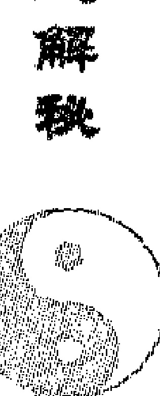

# 上编 奇门应用研究

天盘丁加地盘三奇乙，即丁加乙，叫人遁吉格，主贵人加官晋爵，常人婚姻财帛有喜。

天盘丁加地盘三奇丙，即丁加丙，叫星随月转，主贵人越级高升，但是常人却乐极生悲。

天盘丁加地盘三奇丁，即丁加丁，叫奇人太阴，主文书证件即至，喜事从心，万事如意。

天盘丁加地盘甲戌己，即丁中己，叫火人勾陈，因戊为火库，己为勾陈，故为火入勾陈，主奸私仇冤，事因女人。

天盘丁加地盘甲申庚，即丁加庚，叫年月日时格，丁为文书，庚为阻隔之神，故为文书阻隔，行人必归。

天盘丁加地盘甲午辛，即丁加辛，叫朱雀入狱，主罪人释囚，官人失位。

天盘丁加地盘甲辰壬，即丁加壬，叫互神互合，因丁壬相合，故主贵人恩诏，讼狱公平。测婚多为苟合。

天盘丁加地盘甲寅癸，即丁加癸，叫雀投江，因癸水冲克丁火，故为朱雀投江，主文书口舌是非，经官动府，词讼不利，音信沉溺不到。

第五，天盘甲戌己，即六己加临地盘三奇六仪所形成的克应关系。

天盘甲戌已加地盘甲子戊，即己加戊，叫犬遇青龙，因戊为犬，甲为龙，故为犬遇青龙，门吉为谋望遂意，上人见喜；若门凶，枉费心机。

天盘甲戌已加地盘乙奇，即己加乙，叫墓神不明，因戊为乙木之墓，己又为地户，故为墓神不明，宜遁迹隐形为利。

天盘甲戌已加地盘丙奇，即己加丙，叫火悖地户，主男人冤冤相报，女人必致淫污。

天盘甲戌已加地盘丁奇，即己加丁，叫朱雀人墓，因戊为火墓，故名为朱雀人墓，主文书词讼，先曲后直。

天盘甲戌已加地盘甲戌己，即己加己，叫地户逢鬼，主病者发凶或必死，百事不遂，暂不谋为，谋为则凶。

天盘甲戌己加地盘甲申庚，即己加庚，叫刑格返名，主词讼先动者不利，如临阴星则有谋害之情。

天盘甲戌己加地盘甲午辛，即己加辛，叫游魂入墓，主易遭阴邪鬼魅作祟。

天盘甲戌己加地盘甲辰壬，即己加壬，叫地网高张，狡童佚女，奸情伤杀，凶。

天盘甲戌己加地盘甲寅癸，即己加癸，叫地刑玄武，主男女疾病垂危，有囚狱词讼之灾。

第六，天盘甲申庚，即六庚加临地盘三奇六仪所形成的克应关系。

天盘甲申庚加地盘甲子戊，即庚加戊，叫太白伏宫，庚金克甲木，谓天乙伏宫，主百事不可谋，大凶，通常宜换地盘。

天盘甲申庚加地盘三奇乙，即庚加乙，叫太白逢星，主退吉进凶，谋为不利。

天盘甲申庚加地盘三奇丙，即庚加丙，叫白入荧，测贼盗时，看贼人来不来，白入荧，贼定要来，为客进利，为主破财。

天盘甲申庚加地盘三奇丁，即庚加丁，叫亭亭之格，主因私匿或男女关系起官司是非，门吉有救，门凶事必凶。

天盘甲申庚加地盘甲戌己，即庚加己，叫官符刑格，主有官司口舌，因官讼被判刑，住牢狱更凶。

天盘甲申庚加地盘甲申庚，即庚加庚，叫太白同宫，又名战格，官灾横祸，兄弟或同辈朋友相冲撞，不利为事。

天盘甲申庚加地盘甲午辛，即庚加辛，叫白虎干格，不宜远行，远行车折马伤，求财更为大凶。

天盘甲申庚加地盘甲辰壬，即庚加壬，叫金化水流，又为上格，壬水主流动，庚为阻隔之神，故远行道路迷失，男女音信难通。

天盘甲申庚加地盘甲寅癸，即庚加癸，叫大格，因寅申相冲克，庚为道路，故多主车祸，行人不至，官事不止，生育母子俱伤，大凶。

第七，天盘甲午辛，即六辛加临地盘三奇六仪所形成的克应关系。

奇门应用研究与股市实战解秘


# 上编 奇门应用研究


- 天盘甲午辛加地盘甲子戊，即辛加戊，叫困龙被伤，辛金克甲木，子午又相冲，故为困龙被伤，主官司破财，屈抑守分尚可，妄动则带来祸殃。
- 天盘甲午辛加地盘三奇乙，即辛加乙，叫虎猖狂，辛金冲克乙木，故名为虎猖狂，主家败人亡，远行多灾殃；测婚离散，主因男人。
- 天盘甲午辛加地盘三奇丙，即辛加丙，叫干合悖师，门吉则事吉，门凶则事凶，测事易因财物致讼。
- 天盘甲午辛加地盘三奇丁，即辛加丁，叫狱神得奇，辛为狱神，丁为星奇，故名为狱神得奇，主经商求财获利倍增，囚人逢天赦释免。
- 天盘甲午辛加地盘甲戊己，即辛加己，叫入狱自刑，辛为罪人，成为午火之库，故名为入狱自刑，主奴仆背主，有苦诉讼难伸。
- 天盘甲午辛加地盘甲申庚，即辛加庚，叫白虎出力，主刀刃相交，主客相残，逊让退步稍可，强进血溅衣衫。
- 天盘甲午辛加地盘甲午辛，即辛加辛，叫伏吟天庭，因午午为自刑，故名为伏吟天庭，主公废私就，讼狱自罹罪名。
- 天盘甲午辛加地盘甲辰壬，即辛中壬，叫凶蛇入狱，因壬为凶蛇，辛为牢狱，故名为凶蛇入狱，主两男争女，讼狱不息，先动失理。
- 天盘甲午辛加地盘甲寅癸，即辛加癸，叫天牢华盖，因辛为天牢，癸为华盖，故名为天牢华盖，主日月失明，误入天网，动止乖张。
- 第八，天盘甲辰壬，即六壬加临地盘三奇六仪所形成的克应关系。
- 天盘甲辰壬加地盘甲子戊，即壬加戊，叫小蛇化龙，因壬为小蛇，甲为青龙，故为小蛇化龙，主男人发达，女人产婴童。
- 天盘甲辰壬加地盘日奇乙，即壬加乙，叫小蛇得势，主女人柔顺，男人通达，测孕孕育生子，禄马光华。
- 天盘甲辰壬加地盘月奇丙，即壬加丙，叫水蛇入火，因壬丙相冲克，故主官灾刑禁，络绎不绝。
- 天盘甲辰壬加地盘星奇丁，即壬加丁，叫干合蛇刑，因丁壬相合，故名为干合蛇刑，主文书牵连，贵人匆匆，男吉女凶。
- 天盘甲辰壬加地盘甲戊己，即壬加己，叫凶蛇入狱，因辰戌相冲，故又名为反吟蛇刑，主官讼败诉，大祸将至，顺守可吉，妄动必凶。

天盘甲辰壬加地盘甲申庚，即壬加庚，叫太白擒蛇，因庚为太白，壬为蛇，故名为太白擒蛇，主刑狱公平，立剖邪正。

天盘甲辰壬加地盘甲午辛，即壬加辛，叫腾蛇相缠，因辛金入辰水之墓，故名为腾蛇相缠，主纵得吉门，亦不能安宁，若有谋望，被人欺瞒。

天盘甲辰壬加地盘甲辰壬，即壬加壬，叫蛇入地罗，主外人缠绕，内事索索，吉门吉星，庶免蹉跎。

天盘甲辰壬加地盘甲寅癸，即壬加癸，叫幼女奸淫，主有家丑外扬之事发生，门吉星凶，易反福为祸。

第九，天盘甲寅癸，即六癸加临地盘三奇六仪所形成的克应关系。

天盘甲寅癸加地盘甲子戊，即癸加戊，叫天乙会合，因戊癸相合，故名为天乙会合，主吉门宜求财，婚姻喜美，吉人赞助成合。若门凶迫制，反祸官非。

天盘甲寅癸加地盘乙奇，即癸加乙，叫华盖逢星，主贵人禄位，常人平安。门吉则吉，门凶则凶。

天盘甲寅癸加地盘月奇丙，即癸加丙，叫华盖悖师，主贵贱逢之皆不利，唯上人见喜。

天盘甲寅癸加地盘星奇丁，即癸加丁，叫蛇天矫，因癸水冲克丁火，丁火烧灼癸水，故名为蛇天矫，主文书官司，火焚也逃不掉。

天盘甲寅癸加地盘甲戌己，即癸加己，叫华盖地户，主男女测之，音信皆阻，此格躲灾避难方为吉。

天盘甲寅癸加地盘甲申庚，即癸加庚，叫太白入网，主以暴力争讼，自罹罪责。

天盘甲寅癸加地盘甲午辛，即癸加辛，叫网盖天牢，主官司败诉，死罪难逃；测病亦大凶。

天盘甲寅癸加地盘甲辰壬，即癸加壬，叫复见腾蛇，因癸、壬均为水蛇，故名为复见腾蛇，主嫁娶重婚，后嫁无子，不保年华。

天盘甲寅癸加地盘甲寅癸，即癸加癸，叫天网四张，主行人失伴，病讼皆伤。

###### (2) 八门克应

八门克应，即门加门、门加三奇六仪和门加宫所形成的格局及其吉凶。

- ①开门：
开加开：主贵人宝物财喜。
开加休：主见贵人财喜及开张铺店，贸易大利。
开加生：主见贵人，谋望所求遂意。
开加伤：主变动、更改移徙，事皆不吉。
开加杜：主失脱，刊印书契小凶。
开加景：主见贵人，因文书不利。
开加死：主官司惊忧，先忧后喜。
开加惊：主百事不利。
开加戊：财名俱得。
开加乙：小财可求。
开加丙：贵人印绶。
开加丁：远信必至。
开加己：事绪不定。
开加庚：道路词讼，谋为两岐。
开加辛：阴人道路。
开加壬：远行有失，注意破财。
开加癸：阴人失财小凶。

- ②休门：
休加休：求财、进人口、谒贵吉，上任、修造亦大利。
休加生：主得阴人财物，谒贵谋望，虽迟也吉。
休加伤：上官喜庆，求财不得，有亲人分房产。变动事不吉。
休加杜：主破财，失物难寻。
休加景：主求文书印信事不至，反招口舌小凶。
休加死：主文印官司事不吉，远行，僧道事不吉，占病凶。
休加惊：主损财、招非并疾病、惊恐事。

# 奇门应用研究与股市实战解密

# 上编 奇门应用研究

###### ③休门

- 休加开：主开张店铺及见贵、求财等喜事，大吉。
- 休加戊：财物和合。
- 休加乙：求谋重，不得；求轻，可得。
- 休加丙：文书和合喜庆。
- 休加丁：百讼休歇。
- 休加己：暗昧不宁，后吉。
- 休加庚：文书词讼先结后解。
- 休加辛：疾病迟愈，失物不得。
- 休加壬、癸：阴人词讼牵连。

###### ④生门

- 生加生：主远行、求财吉。
- 生加伤：主亲友变动，道路不吉。
- 生加杜：主阴谋，阴人破财，不利。
- 生加景：主阴人、小口不宁及文书事，后吉。
- 生加死：田宅官司，病主难救。
- 生加惊：主尊长财产、词讼、病迟愈，吉。
- 生加开：主见贵人，求财大发。
- 生加休：主阴人处求谋财利，吉。
- 生加戊：嫁娶、求财、谒贵皆吉。
- 生加乙：主阴人生产，迟吉。
- 生加丙：主贵人印缓、婚姻、书信喜事。
- 生加丁：主词讼、婚姻、财利大吉。
- 生加己：主得贵人维护，吉。
- 生加庚：主财产争讼破产，不利。
- 生加辛：主产妇疾病，后吉。
- 生加壬：主遗失财后得，贼盗易获。
- 生加癸：主婚姻不成，余事皆吉。

###### ⑤伤门

- 伤加伤：主变动，远行折伤，凶。
- 伤加杜：主变运，失脱，官司，桎梏，百事凶。
- 伤加景：主文书印信，口舌，惹是生非。
- 伤加死：主官司印信凶，出行大忌，吉病凶。
- 伤加惊：主亲人疾病忧惊，媒伐不利，凶。
- 伤加开：主见贵人、开张、走失、变动之事，不利。
- 伤加休：主男人变动或托人办事，财名不利。
- 伤加生：主房产、种植事业，凶。
- 伤加戊：主失脱难获。
- 伤加乙：主求谋不得，反防盗失财。
- 伤加丙：主道路损失。
- 伤加丁：主音信不至。
- 伤加己：主财散人病。
- 伤加庚：主讼狱被刑杖，凶。
- 伤加辛：主夫妻怀私恣怨。
- 伤加壬：主因盗牵连。
- 伤加癸：主讼狱被冤，有理难伸。

###### ⑥杜门

- 杜加杜：主因父母疾病、田宅出脱事，凶。
- 杜加景：主文书印信阻隔，男人小口疾病，迟疑不利。
- 杜加死：主田宅文书失落，官司破财，小凶。
- 杜加惊：主门户内忧疑惊恐，并有词讼事。
- 杜加开：主见贵人官长，谋事主先破己财，后吉。
- 杜加休：主求财有益。
- 杜加生：主男人小口破财，田宅求财不利。
- 杜加伤：主兄弟相争，破财不利。
- 杜加戊：主谋事不成，秘处求财得。
- 杜加乙：宜暗求男人财物，后主不明致讼。
- 杜加丙：主文契遗失。
- 杜加丁：主男人讼狱。
- 杜加己：主私谋害人招非。
- 杜加庚：主因女人讼狱被刑。
- 杜加辛：主打伤人，词讼，男人小口凶。
- 杜加壬：主奸盗事，凶。
- 杜加癸：主百事皆阻，病者不食。

###### ⑦景门

- 景加景：主文状未动有预先见之意，内有男人小口忧患。
- 景加死：主官讼，因田宅事相争，惹麻烦。
- 景加惊：主官讼，女人小口疾病，凶。
- 景加开：主官人升迁，吉：求文印更吉。
- 景加休：主文书遗失，争讼不休。
- 景加生：主阴人生产大喜，更主求财旺利，行人皆吉。
- 景加伤：主姻亲小口舌。
- 景加杜：主失脱文书，败财后平。
- 景加戊：因财产词讼，远行吉。
- 景加乙：主讼事不成。
- 景加丙：主文书急迫，火速不利。
- 景加丁：主因文书印状招非。
- 景加己：主官司牵连。
- 景加庚：主讼人自讼。
- 景加辛：主阴人词讼。
- 景加壬：主因贼牵连。
- 景加癸：主因奴婢受刑。

###### ⑧死门

- 死加死：主官事稽留，印信无气，凶。
- 死加惊：主因官司不结，忧疑患病，凶。
- 死加开：主见贵人，求印信文书事大利。
- 死加休：主求财物事不吉，若问僧道求方吉。
- 死加生：主丧事，求财得，占病死而复生。
- 死加伤：主官司动而被刑杖，凶。
- 死加杜：主破财，妇人风疾，腹肿。
- 死加景：主因文契印信财产事见官，先怒后喜，不凶。
- 死加戊：主作伪财。
- 死加乙：主求事不成。
- 死加丙：主信息忧疑。
- 死加丁：主老阳人疾病。
- 死加庚：主病讼牵连不已，凶。
- 死加辛：主盗贼失脱难获。
- 死加壬：主讼人自讼自招。
- 死加癸：主妇女家娶事凶。

###### ⑨惊门

- 惊加惊：主疾病，忧虑，惊恐。
- 惊加开：主官司忧疑，能见贵人不凶。
- 惊加休：主求财事或口舌事，迟吉。
- 惊加生：主因女人生产或求财事惊忧，皆吉。
- 惊加伤：主因商议同谋害人，事泄惹讼，凶。
- 惊加杜：主因失脱破财惊恐，不凶。
- 惊加景：主词讼不息，小口疾病，凶。
- 惊加死：主因宅中怪异而生是非，凶。
- 惊加戊：主损财，信阻。
- 惊加乙：主谋财不得。
- 惊加丙：主文书印信惊恐。
- 惊加丁：主词讼牵连。
- 惊加己：主恶犬伤人成讼。
- 惊加庚：主道路损折，遇贼盗，凶。
- 惊加辛：主女人成讼，凶。
- 惊加壬：主官司囚禁，病者大凶。
- 惊加癸：主被盗，失物难获。

###### （3）吉格

一般来说，吉门、吉星、吉神配三奇为吉格，凶门、凶星、凶神相遇为凶格；星、门、宫、三奇、六仪之间，五行属性相生或比和为吉；五行相刑、相冲、相克、相害和入墓为凶；甲、乙、丙、丁、戊五阳干组合多为吉；己、庚、辛、壬、癸五阴干组合多为凶，特别是遁甲中甲为主帅，最怕庚金克杀，所以遇庚多为凶格。

先介绍一下奇门遁甲中常用的吉格：

- ①青龙返首（又名龙回首）：天盘甲子戊加地盘丙奇，即戊加丙，因甲木为青龙，木生火，丙火为甲木之子，母子相顾，母亲回过头来看儿子，所以起名“龙回首”。因为丙火能克庚金，救护元帅甲木，所以为吉。宜就职、诉讼、迁移、求财、建造等，百事皆吉。但是，如果遇到门克宫，或地盘为震三宫（子卯相刑），则吉事变凶。

- ②飞鸟跌穴（又名鸟跌穴）：天盘丙奇加地盘甲子戊，即丙加戊（与“龙回首”正好相反），因丙火为南方朱雀，回到母亲甲木身边，好像鸟儿归巢一般，故起名“鸟跌穴”。因木火相生，故为吉格。宜就职、求财、诉讼、建造、婚姻等，百事吉。

- ③九遁：
  - 天遁：天盘丙奇（月奇），门盘生门，地盘丁奇（星奇）。二奇并生门，二火生艮土（生门属土，位于艮宫），故为吉格。百事生旺，利行军、打仗、上书、求官、经商、婚姻等。
  - 地遁：天盘乙奇（日奇），门盘开门，地盘六己。己为地户，开门又得日精之蔽，故百事皆吉。宜安营扎寨、埋伏截击、建筑修造等。
  - 人遁：天盘丁奇（星奇），门盘休门，神盘太阴。此遁得星精之蔽，其方可以探索、伏藏、和谈、求贤、结婚、交易等，均为吉。
  - 风遁：天盘乙奇（日奇），门遁中开、休、生之一，地盘为巽四宫。巽木主风，又得乙奇和吉门，故为风遁。如风从西北方来，宜顺风击敌；如风从东南方来，敌在东南方，不可交战。
  - 云遁：天盘乙奇（日奇），门盘中开、休、生之一，地盘六辛。此遁得云精之蔽，宜求雨、立营寨、造军械。
  - 龙遁：天盘乙奇（日奇），门盘中开、休、生之一，地盘坎（水中有龙）一宫或六癸。宜掩捕敌人、水战、修桥、穿井等。
  - 虎遁：天盘乙奇（日奇），合休门或生门，临地盘六辛于艮（寅虎）八宫，或天盘甲申庚合开门下临地盘兑宫（庚辛金，均为白虎）都称为虎遁。宜安营扎寨，设隐埋伏、修筑建造等。
  - 神遁：天盘丙奇（月奇）、门盘生门、神盘九天（九天之神）。宜攻虚、开路、塞河、造像、教化兵卒等。
  - 鬼遁：天盘丁奇（星奇），门盘杜门（人间门被堵住），神盘九地（地狱有鬼），或丁奇、开门合九地。宜偷营劫寨，设伪伏虚。

- ④三奇得使：三奇得使就是天盘乙、丙、丁加临地盘值使门，具体而言，就是天盘乙奇加临地盘甲戌己或甲午辛，天盘丙奇加临地盘甲子戊或甲申庚，天盘丁奇加临地盘甲辰壬或甲寅癸。也就是说，地盘在甲戌旬或甲午旬，天盘乙奇得使；地盘在甲子旬或甲申旬，丙奇得使；地盘在甲辰旬或甲寅旬，丁奇得使。得使可以用事，若无吉门亦有小助。

- ⑤玉女守门：丁奇又名玉女。玉女守门，就是门盘值使门所落之宫正遇地盘丁奇。具体时间是甲子旬的庚午时，甲戌旬的己卯时，甲申旬的戊子时，甲午旬的丁酉时，甲辰旬的丙午时，甲寅旬的乙卯时。玉女守门，其方利宴会喜乐之事、婚姻之事。

- ⑥三奇贵人升殿：
  - 乙奇临震宫，为日出扶桑，有禄之乡，是贵人升于乙卯正殿。
  - 丙奇到离宫，为月照端门，火旺之地，是贵人繁荣昌盛于丙午正殿。
  - 丁奇到兑宫，为星见西方，（酉为丁火长生之地）天之神位，是贵人升于丁酉正殿。
  三奇贵人升殿之时，百事可为。

- ⑦天显时格（又名天辅吉时）：甲、己日的甲子时、甲戌时，乙、庚日的甲申时，丙、辛日的甲午时，丁、壬日的甲辰时，戊、癸日的甲寅时，一句话，值班的六甲大将透出之时，或与日干相合之时，虽然此时奇门格局也是伏吟，但不为凶，反而为吉。这些时辰宜行兵、战斗、上官、参谒、求财、远行皆吉。有罪者也能逢赦免。

- ⑧三诈五假：
  - 凡做事出行宜用开、休、生三吉门所落之方位，若得乙、丙、丁三奇更好；若不得三奇，也可使用。如果开、休、生三吉门合乙、丙、丁三奇又上乘太阴、六合、九地三阴神相助者，则为三诈，经商、远行、婚娶，百事皆吉。
  - 古代兵书曰“兵不厌诈”，诈也有运筹机谋，选择时空的问题。
  - 具体而言，三吉门合三奇上乘太阴者，叫真诈。三吉门合三奇上乘六合者，叫休诈。三吉门合三奇上乘九地者，叫重诈。
  - 吉门为上，奇在其次，诈再次，奇门皆合者为上吉。
  - 五假，是天假、地假、人假、神假、鬼假。所谓假，是指借锐气来用事，事情符合其气则有利，否则不利。五假忌迫墓。
    - 景门合乙、丙、丁三奇，上乘九天，叫天假。宜争战诉讼、见贵求官，上书献策，扬兵颁号，申明盟约。
    - 杜门合丁、己、癸，上乘九地或太阴或六合，均叫地假。宜潜藏埋伏、逃亡躲灾、谋探私事。
    - 惊门合六壬上乘九天，叫人假。宜捕捉逃亡，如果再遇上“太白入荧”的格局，一定能抓获逃亡者。
    - 伤门合丁、己、癸，上乘九地，叫神假（又叫物假），宜埋藏伏藏，使人难知。又一说伤门合丁、己、癸，上乘六合为物假（又叫神假），宜于埋藏，祈祷、索债、捕捉、交易、伏藏。
    - 死门合丁、己、癸，上乘九地，叫鬼假（又叫神假），宜超度亡灵，扶重安民，破土修茔、伐邪、狩猎。

- ⑨三奇之灵：三奇乙、丙、丁，四吉神太阴、六合、九地、九天，三吉门开、休、生，各有其一，其临其方位，为吉道清灵，用事俱吉。

- ⑩奇游禄位：乙奇到震（卯为乙木临官禄地）、丙奇到巽（巳为丙临官禄地），丁奇到离（午为丁火临官禄地），为本禄之位，合三吉门，宜上官卦任，求财祈福等各种谋为都吉利。

- ⑪奇仪相合：乙庚、丙辛、丁壬为奇合，戊癸、甲己为仪合，得吉门，凡事有和之象，主和解、了结、平局、平分。

###### (4) 凶格

奇门凶格多与庚、辛、壬、癸有关，或五行之间刑冲克害入墓。主要凶格有：

- 1. 青龙逃走（又称“龙逃走”）：天盘乙奇，加地盘六辛，即乙加辛。乙木为青龙，辛金为白虎，辛金克杀乙木，虎强龙弱，故龙也要逃走而去，故名龙逃走。阴克阴，主凶。此时举兵主客皆伤，经商破财，百事为凶。测婚一般主女方先提出离婚。
- 2. 白虎猖狂（又叫“虎猖狂”）：天盘六辛，加地盘乙奇，即辛加乙。与“龙逃走”正相反。白虎在天上横行，青龙反而潜伏地下，故名虎猖狂。阴克阴，主凶。此时举事主客两伤，出入有惊恐，远行多灾祸，婚姻修造大凶。测婚一般主男方主动离婚。
- 3. 朱雀投江（又叫“雀投江”）：天盘丁奇，加地盘六癸。即丁加癸。丁属阴火，为南方朱雀，癸为阴水，似江河，天上朱雀落入地下江河之中，所以叫“雀投江”。阴水克阴火，主凶。故此时举事，主文书牵连、音信沉溺、官司口舌，或惊恐怪异，奸谋诡诈，百事凶。
- 4. 螣蛇天矫（又叫“蛇天矫”）：天盘六癸，加地盘丁奇。即癸加丁。与“雀投江”正好相反。癸属阴水，为北方玄武龟蛇，丁属阴火。天上癸犹如螣蛇掉进地上火中，被烧克而屈伸，故叫“蛇天矫”。阴水克阴火，主凶。故百事不利，虚惊不宁，文书官司。
- 5. 荧入太白（又叫“荧入白”或“火入金乡”）：天盘丙奇，加地盘六庚。即丙加庚。丙火为荧惑火星，庚金为太白金星，丙火加到庚金之上，故名“荧入太白”。阳火克阳金，庚为贼人，故曰：“火入金乡贼即去。”
- 6. 太白入荧（又叫“白入荧”）：天盘六庚，加地盘丙奇。即庚加丙。与“荧入白”正好相反。比“荧入白”更凶。此格占贼贼必来，须防贼来偷营。以固守为吉。
- 7. 大格：天盘六庚，加地盘六癸，即庚加癸，叫大格。百事凶，求人不在，经商破财，出行车破马死。只宜捕捉罪犯。
- 8. 小格（又叫“火小格”）：天盘六庚，加地盘六壬。即庚加壬。远行失迷道路，求谋破财得病。庚加壬又名移荡格，测工作，多有变动。
- ⑨刑格：天盘六庚，加地盘六己。即庚加己。因甲申庚位有未，甲戌己位有戌，未刑戌，故名刑格。主官司受刑，经商破财，出行患病。
- ⑩奇格：天盘六庚，加地盘乙、丙、丁三奇。庚加乙，乙与庚合，又称合格。庚加丙，为白入荧，主贼来，所以又叫贼格。庚加丁，丁火克庚金，又叫破格。三奇格出行用兵均大凶。
- ⑪伏宫格：天盘六庚，加地盘六甲值符宫。即庚加戊。比如阳遁一局，甲子旬，甲子戊为旬头，在地盘一宫，到丁卯时，天盘上甲申庚转到一宫，即庚加到地盘上值符甲子戊所在一宫，形成天盘上贼星庚金克杀地盘上潜伏在本宫的值符的局面，即形成庚克甲的格局，所以叫伏宫格。此格大凶，主客皆不利。求人不在，等人不来。出行在路上遇盗贼，或车折马死，百事不顺。
- ⑫飞宫格：天盘六甲值符，加地盘六庚。即戊加庚。也就是形成甲加庚的格局，与伏宫格正好相反。由于值符在天盘上飞动而遇到地盘上庚金，所以叫飞宫格。同样大凶，尤不利客。因为一般以天盘为客，地盘为主，天盘值符六甲，遭到地盘庚金克杀，自然更加不利。作战主败亡，大将遭擒；作生意破财，必须换地方。
- ⑬岁格：天盘六庚，加地盘年干（即地盘上三奇六仪十天干中，与当年年天干相同者）。用事大凶。
- ⑭月格：天盘六庚，加地盘月干。用事大凶。
- ⑮日格（又叫“伏干格”）：天盘六庚，加地盘日干。因日的天干伏在庚金之下，所以又叫“伏干格”。主客皆伤，尤不利主。奇门预测，多以日干为求测者本人，犹如“八字”中以日柱天干为命造本人一样，今遇凶星庚金，自然大凶不利。
- ⑯飞干格：天盘日干，加地盘六庚。与“伏干格”正好相反，因为日柱天干，在天用上转动，遇上地盘凶星庚金，故叫飞干格。也为大凶，主客两伤，皆不利。
- ⑰时格：天盘六庚，加地盘时干（即地盘三奇六仪中，与用事时辰的天干相同者），也主凶。
总之，年、月、日、时的天干，与庚金相遇，均为凶格。这时行兵、远行、谋事皆不利，只宜捕捉盗贼或寻找走失之人。
- ⑱六仪击刑：天盘值符，加地盘与值符相刑的宫。具体而言，即：
  - 天盘甲子戊，加地盘震三害（子刑卯）；
  - 天盘甲戌己，加地盘坤二宫（戌刑未）；
  - 天盘甲申庚，加地盘艮八宫（申刑寅）；
  - 天盘甲午辛，加地盘离九宫（午自刑）；
  - 天盘甲辰壬，加地盘巽四宫（辰自刑）；
  - 天盘甲寅癸，加地盘巽四宫（寅刑巳）。
  六仪击刑极凶，即使六仪为值符，也不可用。一动必有灾伤，若遇天网四张格，必被捕捉，有牢狱之灾。
- ⑲三奇入墓：
  - 天盘乙奇，加地盘乾六宫（乙木为阴木，长生于午，帝旺在寅，墓在戌）；或坤二宫（乙属木，按木笼统讲，墓在未）；
  - 天盘丙奇，加地盘乾六宫（戌为丙火之墓）；
  - 天盘丁奇，加地盘艮八宫（丁为阴火，长生酉，帝旺在巳，墓在丑）。
  三奇入墓，百事不宜，谋事尽休。凡事吉的不吉，凶的不凶，无力之象。
- ⑳三奇受刑（又叫“三奇受制”）：丙奇、丁奇加临地盘坎一宫，或遇地盘六仪壬、癸水，为火入水乡；乙奇加临地盘乾六宫、兑七宫，或遇地盘六仪庚、辛金，为木入金乡，均受克制，故又叫三奇受刑或三奇受制，这时不可行动。
- ㉑时干入墓：即用事时时辰天干在天盘，加临地盘所在之宫正是它的墓地，比如：
  - 丙戌时，丙属阳火，火墓在戌，因而天盘丙加地盘乾六宫，即为时干丙入墓；
  - 壬辰时，壬属阳水，水墓在辰，天盘壬加地盘巽四宫，即为时干壬入墓；
  - 癸未时，癸属阴水，墓在未，因而天盘癸加地盘坤二宫，即为时干癸入墓；
  - 戊戌时，戊为阳土，墓在戌，天盘戊加地盘乾六宫，即为时干戊入墓；
  - 己丑时，己属阴土，墓在丑，因而天盘己加地盘艮八宫时即为时干己入墓；
  - 丁丑时，丁属阴火，墓在丑，因而天盘丁加地盘艮八宫时，即为时干入墓。

###### ②门迫

门迫是讲人盘八门与地盘九宫之间的关系。其中门克宫为迫，宫克门为制，门生宫为和，宫生门为义。

古人有歌曰：
惊开三四休临九，伤杜还归二八宫，
生死排来居第一，景门六七总相同。
吉门被迫吉不就，凶门被迫祸重重。

这就是说，惊门、开门属金，临震三宫、巽四宫，为金克木；休门属水，临离九宫，为水克火；伤门、杜门属木，临坤二宫、艮八宫，为木克土；生门、死门属土，临坎一宫，为土克水；景门属火，临乾六宫、兑七宫，为火克金。以上均为门克宫，古人叫门迫或门被迫。

“吉门被迫吉不就，凶门被迫事更凶”，吉门被迫（吉门克宫），吉事不吉，做不成，但还会有反面结果；如果凶门被迫（凶门克宫），事更凶，事情办不成，强办还会带来灾祸。

###### ②伏吟

伏吟有星伏吟、门伏吟、值符伏吟。凡九星在本宫不动，叫星伏吟；八门在本宫不动，叫门伏吟；六甲值符在本宫不动，比如甲子戊加甲子戊，甲午辛加甲午辛，叫值符伏吟。

凡六甲之时，门、星、符皆为伏吟。伏吟利主不利客，伏吟时一般不宜采取行动，伏吟主迟，主慢。

伏吟之时，不宜动兵，唯宜收敛财货，比如某单位和个人欠自己的款，宜去讨债催款。其中天蓬星加天蓬星、死门加死门、甲午辛加甲午辛时最凶，一般多遭遗失破财或死伤人口。凶灾日至，若不遇吉门吉格更凶，如遇吉门吉格为有救。

天显时，伏吟一般不凶，反而为吉。

###### ㉔反吟

反吟是指九星、八门、值符落到与它相对冲的地盘宫内，故有星反吟、门反吟、值符反吟。

如天蓬星在坎一宫，落到离九宫，则为星反吟；休门本在坎一宫，落到离九宫，则为门反吟；天盘甲子戊加临地盘甲午辛，因子午相冲，故叫值符反吟。

反吟不吉，特别是门反吟更为不利，如遇三奇或吉门还问题不大，为有救，如是不遇，则凶灾将至。反吟利客不利主。反吟主快，主事有反复。

反吟主做事速度快，成败易分。如果出行，可能半途而回。如果做长久大事，可能有始无终。正如六爻预测中“新病逢冲则愈，久病逢冲则死”一样，近病反吟易愈，久病反吟难痊。测婚姻遇反吟则不成；测求财遇反吟往往空跑一趟，无利反亏本。

###### ㉕悖格

天盘丙奇加地盘值符，或天盘值符加地盘丙奇，或丙加年、月、日时干之上，均称为悖格。因为丙为天威，性格威猛，过于暴躁，容易出乱子，把事情搞乱。

悖格之时举事，多倒行逆施，纲纪紊乱，难达理想，易出乱臣贼子和叛逆之人。但丙又为三奇之一，如得三吉门相会，则可用，不能一律按凶断。

###### ㉖天网四张

天网四张：“癸加癸”叫“天网四张”。天盘是癸，地盘也是癸，叫“天网四张”。

只有甲寅旬中癸亥时，才会出现“天网四张”即“癸加癸”的格局。

遇“天网四张”格局，不可举事，举事不成，反有灾祸。

###### ㉗五不遇时

五不遇时：所谓五不遇时，是指用事时的时辰天干克当日的日干，而且必须是阳克阳、阴克阴。从日干数至被克的时干，正好是第七位，故“八字”上叫“七杀”，二干之间相隔五位，所以奇门甲中叫做“五不遇时”。

具体而言，是指甲日庚午时（庚金克甲木），乙日辛巳时（辛金克乙木），丙日壬辰时（壬水克丙火），丁日癸卯时（癸水克丁火），戊日甲寅时（甲木克戊土），己日乙丑时（乙木克己土），庚日丙子时（丙火克庚金），辛日丁酉时（丁火克辛金），壬日戊申时（戊土克壬水），癸日己未时（己土克癸水）。

凡五不遇时，大凶。纵然得三奇或吉门，也不可用。凡预测遇五不遇时，事多不顺，但不一定都凶，还要看格局的好坏，星、门的吉凶。凡用事时辰，最好避开五不遇时为妥。

#### （二）奇门预测的分析判断方法

（1）分析判断前的准备工作。一个奇门局起好以后，在分析判断前，首先要做好三项准备工作：

- 第一项准备工作，是把纲领性的用神，即天盘上的年、月、日、时干标出来，同时把求测类别的特殊用神标出来。
- 第二项准备工作，就是根据六甲旬首把格局空亡的地方标出来。古人讲，空亡藏有玄机，也就类似命理学中所谓天机泄于病处一样。奇门局中某宫逢空，往往从中可以泄露事物的一些信息，特别是有关用神所在宫如果逢空亡，更能昭示给我们一些信息。空亡究竟能给我们提示哪些玄机，这要具体情况具体分析，很难概括地讲清楚，起码它表示事物有变化，过去实，现在空了，填实或冲实之年、月、日，该事物又可能实了，或者昭示此事将来要落空、应空，空忙乎一场，等等。总之，它与事物的成败得失有关。奇门用六甲旬空，由于我们讲的是时家奇门，一般情况下只标时干空亡之处即可，有时，日干空亡也有用，甚至年干空亡、月干空亡，都能向我们提供一些信息。
- 第三项准备工作，就是把时辰的驿马星标出来。古人云：天机泄于动处。驿马星的歌诀是这样的：申子辰马在寅，寅午戌马在申，巳酉丑马在亥，亥卯未马在巳。（日、月、年的地支驿马星在奇门中一般不用，故不用标出来。）

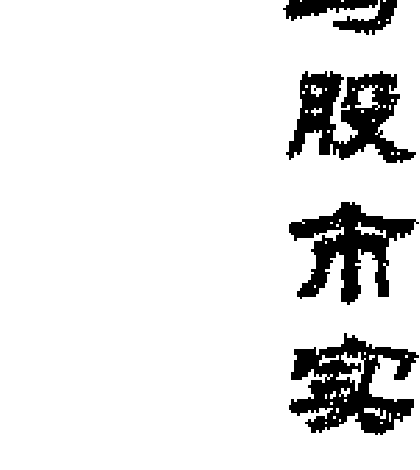

奇门应用研究与股市实战解密

（2）奇门分析判断的方法。

《奇门大全》曰：凡占事先以日主为己身，次以时支为用事。以日主临生旺，得奇仪相生，吉星吉门照应，无刑冲破害，则为主者吉；若日主临克制之宫，无奇仪吉星相照，兼有刑冲破害者，则为主凶，百事不能有成。如加生合之宫，奇仪吉格，吉星相照，则为客者吉；若临克制之宫，无奇门吉宿，六仪刑冲破害，则为客凶，百事不能成。

这就是说，奇门预测分析判断首先要看日干宫，次看时干宫，以日干为自己为所测之人，以时干为所测之事体。日干逢长生禄旺得三奇吉星吉门吉神吉格，无墓绝击刑空破则吉。若日干逢墓绝之地，再加凶门凶星凶神击刑空破凶格者必凶无疑。若日干居地盘生助之宫，又得三奇吉格吉门星神为客方必大利，若日干居地盘克制之宫，无三奇吉格吉门星神，又遇击刑空破凶格者为客方必大凶。

在实际预测中，除了要特别重视日干时干马星空亡之处外，则视所测之事体定具体用神，来看所测之事的旺相休囚与吉凶悔咎，这些可参考古人在古籍中所总结出来的各种事项的用神预测经验来分析判断。

关于奇门预测分析判断的具体方法，可参考张志春老师所著的《神奇之门》、《开悟之门》二书，有详细讲述，本书则限于篇幅，在此点到为止，不做赘述。

##### 2. 奇门定应期的主要方法

###### （1）奇门九宫格定数的方法。

奇门九宫格把一、六放在坎宫，二、七火放在离宫，三、八木放在震、巽二宫，四、九金放在乾、兑二宫，五、十土放在中五官和坤、艮二宫，这样把天数、地数、五行数、大衍之数都包含在内了，把河图、洛书都合二为一了。奇门九宫所含的数共有三组：一组是先天八卦数，二组是后天八卦数，三组是五行数。归纳起来坎一宫有1、6两个数，坤二宫有2、5、8、10四个数，震三宫有3、4、8三个数，巽四宫有3、4、5、8四个数，中五宫既无先天数，又无后天数，只有五行数5、10两个数，乾六宫有1、4、6、9四个数，兑七宫有2、4、7、9四个数，艮八宫有5、7、8、10四个数，离九宫有2、3、7、9四个数。

以上九宫所含三组数，至关重要，是奇门判断数量的依据，用神落到哪个宫，就根据该宫所含的数字来判断。该用何数，就要根据用神的旺相休囚和所临星、门、神的象和理来综合判断。

#### （2）定应期的一般方法。奇门定应期，要视所测之人事物之旺相休囚吉凶成功失败来确定，用神空亡则要取填实冲实之时定应期，用神休囚测吉事必等旺相之时为应期，用神旺相测凶事则要等休囚之时为应期，成功类事物要等用神旺相逢生合助冲墓出墓则成，失败类事物则要等用神休囚空破击刑墓绝受制之时为应期，期限类预测则以值使门落宫为时限，捕获类则以庚格为应期，凡此种种应期，不一而足，要视具体预测事项之用神，在实践中参考古人古籍之经验确定为妥。

### 五、奇门的决策，即如何运用奇门遁甲趋吉避凶

奇门预测，只是为人们咨询服务的第一步，预测出事物的成败得失、吉凶悔吝，紧接着就是为求测者提供决策意见。张志春老师在《神奇之门》一书中概括为两句话：“急则从神缓从门，动静先后分主客。”也就是如何运用奇门遁甲趋吉避凶。趋吉避凶，是人类生存和发展的需要，是每时每刻都在自觉或不自觉地进行着的决策行为。

#### （一）急则从神缓从门

急则从神，是指在事情危难、时间紧急的情况下，来不及从容选择有利的时间、有利的方位时，看此时此刻六甲值符所在方位或九星值符飞临的方位来采取行动，或主动出击，或退却避难。

缓从门，是指在事情比较从容的情况下，可以预先选定吉利的时间、吉利的方位，指导人们的行动。

奇门在选日上，要尽量避开制日、伐日。多选用宝日、义日与和日。所谓制日，指天干克地支之日，如甲戌日、癸巳日等。所谓伐日，指地支克天干之日，如己卯日、丙子日等。所谓宝日，指天干生地支之日，如甲午日、癸卯日等。所谓义日，指地支生天干之日，如甲子日，癸酉日。所谓和日，指天干地支比和之日，如丙午日、庚申日等。

奇门在选时上，一要避开五不遇时和时干入墓的方位，二要尽量不用五阴时，多用五阳时。所谓五阴时即时干是己、庚、辛、壬、癸的五个时辰。因为阴时利主不利客，不利于行动办事。所谓五阳时，即时干为甲、乙、丙、丁、戊的五个时辰。因为阳时利客不利主，所以出外办事行动则有利。

在奇门决策中，除了选时，就是择方，即选择有利的空间方位。这必须结合奇门格局所显示的具体信息来定。笼统地讲，自然是吉星、吉门、吉神、吉格所在的方位为吉。实际应用，要根据用神与周围事物的关系，所处的境遇来定。应避开三奇入墓，六仪击刑，年、月、日、时格和大小刑格及飞干格、伏宫格、飞宫格等凶格。选择乙、丙、丁三奇与开、休、生三吉门相会的方位，这是最佳方位。另外还有，得奇不得门（不算吉利方位，吉门比三奇重要），得门不得奇（算吉利方位），不得奇又不得门（算不吉利方位，加凶格，不可用）。另外还要看办什么事情，比如捕猎讨债，就可用伤门，吊唁送葬则可用死门。同时还要看神盘，太阴、六合、九地、九天为四个吉利之神，在门、星、神、三奇中，吉门最重要，吉星、三奇次之，吉神起辅助作用。

#### （二）动静先后分主客

奇门遁甲预测和决策之中有一个重要特点就是分主客。这也十分符合矛盾的辩证法。在奇门应用中，大致以以下几条原则来分主客：

- ①从动与静来分，动者为客，静者为主。
- ②从行动先后来分，先动者为客，后动者为主。
- ③从态度来分，积极主动为客，消极被动为主。
- ④从攻与防来分，进攻者为客，防守者为主。
- ⑤ 从距离来分，远者为客，近者为主。
- ⑥ 从内外来分，外者为客，内者为主。
- ⑦ 从奇门天地盘上分，天盘三奇六仪为客，地盘三奇六仪为主。
- ⑧ 从十天干记时来分，五个阳时利客，五个阴时利主。
- ⑨ 从奇门格局上分，星、门反吟局利客，星、门伏吟局利主。

###### ⑩《主客歌》

> 天盘动用占为客，地盘安静占主穴。
> 细看星宫奇门知，察其刑克吉凶决。
> 分其日月旺相方，更辨其方云气色。
> 假如天蓬加九宫，旺相之月在秋冬。
> 喜逢壬癸亥子日，北方黑气客有功。
> 若还天英加一地，冬时北方主反利。
> 奇门星位仿此推，人在时方分仔细。

具体看利主利客，以时辰而论，五阳时利客（甲、乙、丙、丁、戊五个阳时）。打仗宜主动出击、宜远行、求财、上任、迁徙、嫁娶、起造。五阴时利主，宜按兵不动，后发制人、守、等待。按奇门格局来决定，以天盘、地盘生克关系来判断，若天盘生地盘，利主。若地盘生天盘，利客。天盘克地盘，利客，地盘克天盘，利主。

明白了主客，在决策时就要做到，利主时要做主方，利客时定要为客方，才能趋吉避凶。

## 第三章 奇门分类研究实例

### 一、疾病生死分析判断研究

以天芮代表病，生死二门代表生死。

以本人年干或日干（均八字）落宫得生死二门休囚决其生死，生门生，死门难愈。如又得凶星凶格必死，其余六门主缠绵，以天芮废没之日为愈期或克天芮落宫之干支者为愈期。

若天芮落宫乘凶神凶格，日干虽得旺相气而被天芮来冲克年命者亦死，又看病人年命日干（八字中）入墓者亦死。（如死门加生门，占病死者复生。）新病落空亡者生，久病落空亡者死，又看日干带死囚之气，带凶神凶格，或不得奇门者亦死。

#### 以求测者落宫之卦判断病者

以天心、乙奇为医生落宫的方向，天冲为医院，看其与天芮星落宫的生克关系，以此判断治疗的成败及效果。

天心星、乙奇所落之宫乘奇门吉格为良医，二神乘旺相之宫，不逢奇门吉格为时医，不得旺相气及奇门吉格为庸医，不论良医、庸医，但能克天芮病神之宫者，医必有功，若病神落宫克二神落宫者，虽良医亦不能治也。

以时干代表病神，值符代表病，时干加地盘星为医生，值使加三奇或六仪为病痊之期，值使落宫的五行如生时干宫的五行，病容易好，否则难好，时干宫五行克值使宫五行也容易好，否则好得慢。

测人寿数长短事凶，以其出生之时的三盘布演，男以天冲顺布，女以天柱顺布，看至死门相隔几宫，一宫十年，余一宫一年，四维宫作二年，至生日之干宫为整个生命年岁，若年命日干旺相逢奇可再推第二轮。人以九十为标准，每宫代表十年，看天冲星落宫与死门之间相距远近定人寿数，阳遁顺数，阴遁逆数，逢五行旺相者，一生没有什么灾害，否则一生常有坎坷。

占儿女病时干入墓必死。

身体部位，何种病症，兼看死门、伤门、惊门、杜门、景门等。

天芮星所落宫看人体疾病。

#### 天干对应身体

- 甲：胆，头部
- 乙：肝，脖项和肩
- 丙：小肠，肩或额
- 丁：心脏，胸和齿舌
- 戊：胃，胁和鼻子
- 己：脾，腹部和面部
- 庚：大肠，脐轮和筋
- 辛：肺，胸部和股部
- 壬：膀胱、三焦和小腿
- 癸：肾，心包和足

#### 以洛书九宫为准：

- 坎宫：落坎宫虽缠绵但可治，泌尿生殖系统，外阴，小肠，丹田，寒疾，遗精，疝生，血液，耳，肛门，肾脏，膀胱，内分泌系统。
- 坤宫：落坤宫、中宫缠绵，右臂，右耳，右手，肌肤，疮，右肩，消化系统，脾胃，食道，胰脏，腹，泌尿系统，肾，女性生殖器。
- 震宫：落震宫不药而愈，左肋，左腰，足部，目盲，耳聋，皮肤，肝胆，左肺，血虚，痨症，吐血，失眠，惊悸。
- 巽宫：落巽宫不药而愈，左臂，左耳，头发，股，肱，神经，左肩，肝胆，血管，经络，气血，胃口，中风，三焦虚炎，伤感风热。
- 中宫：同坤宫。
- 乾宫：落乾宫不治，右脚，头部，疮，脊髓，筋骨，大肠，膀胱，便闭，肺，男性生殖器。
- 兑宫：落兑宫不治，右肋，右腰，额角，口舌，牙齿，肛门，肺部，气管，右肺，咽喉，胸膈，咳嗽，噎疾，喘急，喑哑。
- 艮宫：落艮宫或落空亡新病愈、久病死。左腿，左脚，鼻子，背，脚气，麻木，风湿，疮，手指，关节，脚趾，乳房，脾，肠胃，消化系统，虚胀，静脉曲张。
- 离宫：落离宫缠绵，头部，眼部，面部，小肠，心脏，心血管，脑血管。

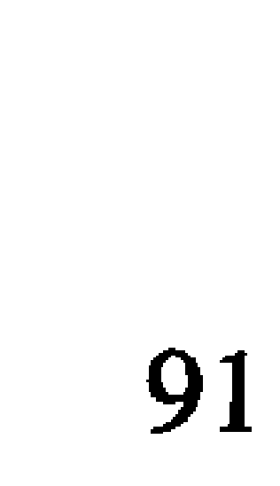

### 实例一：国王常患病，今此何时逝？

偶然间笔者在凤凰卫视上看到报道，长期患病的沙特国王法赫德近来病情又有所加重，全国又处在戒备状态。此前，诸多易友就对患病的沙特国王的生死预测过两次，均未测中，这次好多易友都对其生死的预测失去了信心。我见了凤凰卫视的报道，随即灵机一动，马上起局预测如下：

- 公历时间：2005年5月29日22时
- 农历时间：四月廿二日癸亥时小满上元
- 当日干支：乙酉辛巳癸丑癸亥
- 当日旬空：寅卯（日）子丑（时）
- 阳遁五局值符天蓬落一宫值使休门落一宫

| 六合       | 白虎       | 玄武       |
|------------|------------|------------|
| 杜门 乙    | 景门 壬    | 戊 死门 丁  |
| 天辅 乙    | 天英 壬    | 禽 天芮 丁  |
|------------|------------|------------|
| 太阴       |            | 九地       |
| 伤门 丙    |            | 惊门 庚    |
| 天冲 丙    |            | 天柱 庚    |
|------------|------------|------------|
| 螣蛇       | 值符       | 九天       |
| 生门 辛    | 休门 癸    | 开门 己    |
| 天任 辛    | 天蓬 癸    | 天心 己    |

分析：
（1）天芮为病在2宫相，逢死门病的不轻，上乘玄武为淫病暗病内脏病，丁 + 丁为病情明确，里外文书信息通达，死 + 丁为老阳人疾病，正应沙特国王有病。
（2）乙奇为医生在4宫，上乘六合逢杜门必是专家会诊，巳月乙奇所在4宫旺，必克2宫之天芮病星，看来国王有救。
（3）天心为医药在6宫休囚，逢开门定是要做手术，上乘九天手术必是从体内取出病物，己 + 己地户逢鬼不吉，病未根除，天心虽休囚于6宫，但生日干国王年命癸所在1宫，说明国王做手术服药有救。
（4）日干癸为被测者本人，上乘值符定是有身份之人，说的就是国王，临休门说明国王在病休，日干癸同时也为国王年命，癸 + 癸天网四张，行人失伴，病讼皆伤，又遇天蓬凶星，不吉大凶。巳月1宫囚死，被病星天芮所在2宫旺克，病情最终无救之象。
（5）大局伏吟，主国王患病呻吟，也主病情难好，且时间上为慢，伏吟测病一般病不会好。阳遁天芮病星在2宫在外盘，断应期为年月，未为日干同时也是国王年命癸之墓，也可能今年未月或明年戌年未月未日未时，国王在劫难逃！

结果：
2005年8月1日周一，下午3时25分，即农历乙酉年癸未月丁巳日乙巳时，据报道，国王法赫德去世，储君阿卜杜拉继任。

沙特国营电视台突然中断广播，不断播出可兰经文，其后公布死讯。（综合讯）长期患病的沙特阿拉伯国王法赫德周一去世，储君阿卜杜拉继任王位。


# 上编 奇门应用研究

### 实例二：潜水失踪，是生是死？

9月10日当天一位外地的朋友来访，闲聊中他提到9月9日当天一群朋友相约海边潜水，大伙儿上岸后发现少了一个人，寻了一会儿找不到人，以为他先回家了，哪知道到了晚上还不见人影，一直到9月10日也没有消息，家人着急，于是要我的朋友测一测。以询问时间起盘如下：

- 公历时间：2006年9月10日12时
- 农历时间：闰七月十八日丙午时
- 当日干支：丙戊丁酉壬寅丙午
- 当日旬空：辰巳（日）寅卯（时）
- 阴遁三局值符天任落五宫值使生门落六宫

| 太阴<br>死门 丁<br>天心 乙 | 螣蛇<br>惊门 庚<br>天蓬 辛 | 值符<br>开门 壬<br>天任 己 |
|---------------------------|----------------------------|---------------------------|
| 六合<br>景门 癸<br>天柱 戊 | 丙                         | 九天<br>休门 戊<br>天冲 癸 |
| 白虎<br>丙 杜门 己<br>禽 天芮 壬 | 玄武<br>伤门 辛<br>天英 庚 | 九地<br>生门 乙<br>天辅 丁 |

已经知道的预测条件是：

- (1) 潜水失踪。
- (2) 年命 1981，辛酉。
- (3) 潜水方向是住家的东北方。

朋友问：
- (1) 此人吉凶如何？
- (2) 何时有消息？

分析：
- (1) 值使门6宫生门入墓，乙奇也入墓，九地在地下，地盘太阴在阴间。
- (2) 年命辛在1宫击刑，遇庚伤门庚+辛凶格玄武凶神，恐已在水中伤亡。
- (3) 年干丙在8宫空亡，年命不保。
- (4) 六合方3宫癸主水下，戊主石头，天柱凶星被石撞，景门血光。
- (5) 景门为消息落3宫空亡，酉时冲实3宫，定会有消息。
- (6) 死门宫尸体逢太阴在隐蔽处，丁是破体，乙被挂住。

反馈：
此人已于水中死亡，于10日求测日当日找到了尸体。

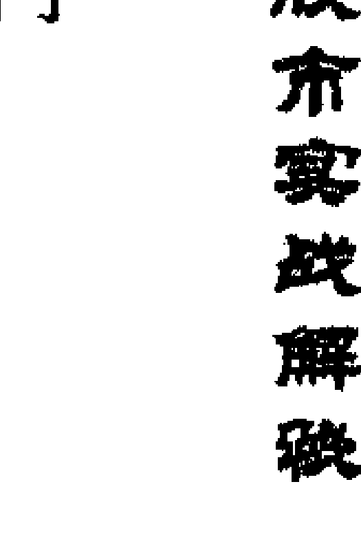

### 实例三：家中有人病，究竟是何人？

马来西亚的易友 shipotian 在风水 123 网上的预测考题：刚刚与朋友在线聊天，他提及最近家里不顺，尤其在财运与健康方面，当时动念想测测他家的近况，起盘如下：

- 公历时间：2006年9月12日12时
- 农历时间：2006闰七月二十
- 干支：丙戌丁酉甲辰庚午
- （日旬空：寅卯 时旬空：戌亥空）
- 驿马：寅 桃花：卯
- 阴遁6局值符：天心 值使：开门 符首：甲辰

| 值符 | 九天 | 九地 |
|---|---|---|
| 惊门 戊 | 开门 癸 | 休门 丙 |
| 天心 庚 | 天蓬 丁 | 天任 壬 |
| 螣蛇 | | 玄武 |
| 死门 乙 | | 生门 辛 |
| 天柱 辛 | 己 | 天冲 乙 |
| 太阴 | 六合 | 白虎 |
| 己 景门 壬 | 杜门 丁 | 伤门 庚 |
| 天禽天芮 丙 | 天英 癸 | 天辅 戊 |

请问：
（1）里面哪位成员生病？
（2）什么病？
（3）情况如何，现在有没有生命危险？

本人分析：
（1）7宫生门遇玄武破财，虎猖狂格破大财，天芮8宫生生门宫，此宫代表的人和事需要钱。
（2）日干艮宫代表小弟，壬肾腰生殖血液，丙代表长辈乱子炎症，太阴旧病慢性病久病隐性病内病，景门心血管眼目病还代表血光之灾，己为坟墓，有人亡故的可能。久病逢反吟必不可愈，遇灾祸必重，防家中有人亡，手脚有灾伤。
（3）你的朋友1宫杜门遇到困难阻力和病人，六合倒霉的事不至一件，天英着急啊，1宫生3宫乙奇又生4宫天心戊求医借钱之象。
（4）看时干6宫戊入墓，遇庚受阻遇到麻烦，白虎道路意外伤灾手术孝服，伤门车伤损之象。时干又为小辈，你的朋友小弟有伤灾，戊为尊长入墓防亡故，天辅吉星在受克之地帮扶无力，乾宫空填实为应。

五不遇时人将逝凶时，这时测出行不利。

休门代表家庭在2宫受克，丙为乱子长辈炎症，九地是本家地下入地低下，天任脚腿有伤，壬动象腿脚血液肾膀胱，己失陷，休门休养休止。

值使门开门在9宫上有九天开刀动大手术，天蓬腰肾，癸+丁凶格，手术不利。

综合来看，此家必是有老人（可能是女的）重病，可能是心血管血液心脏眼目方面的或腰肾膀胱方面的病，小弟腰腿脚受伤，有生命危险，不可大意。

Shipotian 的反馈：

父亲、母亲生病。

母亲盲肠炎，动手术开刀，花了马币5000；父亲有左肩膀疼痛的现象。

母亲动了手术后已经痊愈。

补充：

为何断是女性：景门主中女，坤宫为老女，6宫空看对宫4宫主长女，天辅也主长女，开门9宫主中女，所以断可能是女性，局中九星反吟病情可能还会有反复，6宫庚为大肠，上有白虎伤门手术象，2宫丙为炎症，坤为女人肚腹，我想可以这样来看。另外这个人若有子女，必要小心手脚伤灾。

九星反吟在这里为骤病暴病突发病，3宫死门主伤疤，天柱是破坏或肺大肠，辛是小肠或手术刀，乙禄是医技高明，蛇忽暗忽明隐病，龙逃走格为病退，震宫为腰左部突发病，乙又为女人，天柱也为女的，所以可推断为女性有盲肠病作了手术。

### 实例四：流感是否来，奇门察先机。

2009 年 4 月 28 日上午，学员兔兔小次郎与我交流三式与股市预测的有关问题时，兔兔小次郎突然想到在墨西哥爆发的甲型 H1N1 型流感（开始叫猪流感），由于受到 2003 年 SAS 流感的重大威胁，下意识的要求我预测下甲型 H1N1 型流感是否会扩散至台湾？危害有多大？什么时间能扼住其传染趋势？我便以当时时间起局预测，告诉兔兔小次郎，一是甲型 H1N1 型流感一定会扩散至台湾。二是甲型 H1N1 型流感的危害很大，立秋后疫情会非常严重，至少会造成全世界上千人的死亡。三是今年立秋后，在疫情加重的同时，会有疫苗研制成功，初步起到扼住其传染的趋势。自从那次预测后，截止到现在，甲型 H1N1 型流感已扩散至整个世界的各个角落，在秋季疫情更加肆虐，并造成至少一千人以上的直接死亡，庆幸的是我国及相关国家已在立秋后研制成功甲型 H1N1 型流感预防疫苗，开始正式进入疫情控制阶段。下面将当时的预测详述如下：

时间：2009 年 04 月 28 日 10 时 29 分
农历：己丑年四月初四日巳时
干支：己丑戊辰癸卯丁巳
旬空：午未戌亥辰巳子丑
谷雨：中元丁巳时旬首为癸
阳遁二局值符天柱落八宫值使惊门落一宫

| 太阴 生门 乙 天蓬 庚 | 六合 伤门 丁 天任 丙 | 白虎 杜门 己 天冲 戊 |
| --- | --- | --- |
| 螣蛇 休门 壬 天心 己 | 辛 | 玄武 景门 庚 天辅 癸 |
| 值符 开门 癸 天柱 丁 | 九天 惊门 戊 禽 天芮 乙 | 九地 死门 丙 天英 壬 |

## 奇门应用研究与股市实战解读

## 第三章 奇门分类研究实例

分析：

(1) 为什么说甲型 H1N1 型流感一定会扩散至台湾？

天芮为甲型 H1N1 型流感，落坎 1 宫，上乘九天，九天主大面积扩散，故甲型 H1N1 型流感不仅会扩散至台湾，而且会扩散至全世界。逢惊门，会造成一定的社会恐慌。

(2) 为什么说甲型 H1N1 型流感的危害很大，立秋后疫情会非常严重，至少会造成全世界千人以上的死亡呢？

时干丁也为甲型 H1N1 型流感，落离 9 宫，逢伤门主伤害，上乘六合主传染，临天任主任性主传染性强，临丙奇主乱子，说明甲型 H1N1 型流感传染性很强，对人类的伤害很大，会造成一定伤亡和社会灾乱。

立秋后，坤 2 宫主事，坤 2 宫上乘白虎主甲型 H1N1 型流感会爆发的很厉害，疫情会特别严重，逢天冲太岁己，主甲型 H1N1 型流感在秋季会快速传播至世界各个国家，造成较大的疫情波动。

死门落在乾 6 宫，上乘九地主多，宫中丙奇入墓，巳月 6 宫休囚，6 宫有 1、4、6、9 数，取 1 数，可判断全世界会因甲型 H1N1 型流感致病死亡人数，在一千人以上。

(3) 为什么说今年立秋后，在疫情加重的同时，有疫苗研制成功，会初步起到扼住其传染的趋势？

立秋后，坤 2 宫主事，幸好，坤 2 宫中有杜门和太岁己与甲子戊，杜门为技术为控制，太岁为国家，戊为出资，说明世界各国都在出钱研究甲型 H1N1 型流感控制疫苗，会对疫情形成初步控制。

### 二、出行出国分析判断研究

以日干落宫为出行之人，看去什么方向，这个方向如果有吉格吉门来生日干落宫，则为顺利。如果无吉门吉格，但该方向地盘宫与日干落宫比和，也为顺利。如果日干落宫得吉门吉格，克所往方向之宫，也可出行。如果出行之方得吉门吉格，但克日干落宫，虽勉强可行，但必不顺。如果所往之方遇凶门凶格，又来冲克日干落宫，则大凶。如果所往之方为时干空亡之地或为日干之墓地，则不利。如果日干或年命刑、墓、空亡出行方位之宫，也为不利。同时，也可兼看日干与时干的关系，以便帮助判断出行的利弊吉凶。

凡出行乘车，以景门所临之宫为道路，以伤门为车。遇白入荧凶格易遭盗贼，逢荧入白凶格，则可能碰上火灾，临天蓬、玄武可能被盗或丢失钱物。

凡出行乘船，以休门所落之宫为水路，以伤门为船只。如果遇青龙逃走或白虎猖狂凶格，可能遭遇风暴，如果碰上雀投江，蛇天矫凶格，则可能有沉船的危险。

如果坐飞机出行，可以九天所临之宫为航线，以开门为飞机，看其临宫状态，格局如何，以定其利弊吉凶。

测出发时间，先看日干和时干，如果日干和时干均在内盘，则行期近，如果日干和时干俱在外盘则行期远，日干和时干一内一外，也主行期远。一般以开门落宫地盘所临之干为具体出发时间，未动身时预测外出归来之期，一般以出门之日的日干落宫下临地盘之干为归来日期。

测行人在外吉凶，一般以用神及其年命落宫所临星、门、宫、神及其格局好坏旺衰来判断。

预测行人归期，以庚格来判断。阴日以庚上之干为归期，阳日以庚下之干为归期，逢年格，年内必归，逢月格，月内归来，逢日格，当日即回，逢时格，本时辰内即归。不逢格，则不归。何谓不格？乙庚合，不为格，庚金入墓或空亡，不为格。古人又以天蓬、天芮二星为代表行人，行人在千里之外以天蓬星为用神，行人在千里之内以天芮星为用神，如果时干临天蓬或天芮，则可归来，时干就是归期，伏吟不来，反吟来。如果用神临三奇和三吉门，三奇六仪又正好是行人的年干，则马上可以回来，如果凶星凶门临行人年干，必有妨碍不能归来。

由于现代社会通信及交通工具已经十分发达便利，出行预测主要以航天科研为主要研究对象。

#### 实例一：发射有迟疑，返回有惊险。

昨天晚上凤凰卫视播报了美国发现号航天飞机升空执行太空任务，由于发现号的维修延迟了这次计划发射升空的时间，大家对发现号的安全心有疑虑，于是我便据发现号升空时的北京时间起奇门局预测如下：

- 公历时间：2005年7月26日22时
- 农历时间：六月廿一日己亥时大暑上元
- 当日干支：乙酉癸未辛亥己亥
- 当日旬空：寅卯（日）辰巳（时）
- 阴遁七局值符天辅落六宫值使杜门落八宫

| | | |
|---|---|---|
| 白虎<br>死门 己<br>天心 辛 | 六合<br>惊门 丁<br>天蓬 丙 | 太阴<br>开门 乙<br>天任 癸 |
| 玄武<br>景门 戊<br>天柱 壬 | 庚 | 螣蛇<br>休门 壬<br>天冲 戊 |
| 九地<br>庚 杜门 癸<br>禽 天芮 乙 | 九天<br>伤门 丙<br>天英 丁 | 值符<br>生门 辛<br>天辅 己 |

### 分析：

(1) 先看这时的天气状况，九天所在处为发射地，九天下临旺相之天英星，这时发射地是晴天，利于发射。
(2) 以开门为发现号，上乘太阴得神助，但也说明发现号有没提到的隐患，开门在3宫受克，说明发现号状态不好。
(3) 以日干为航天员，日干辛在6宫逢值符天辅生门为得神助得天时与人和，说明航天员们素质好状态佳，在6宫乾宫，乾又为天，说明一共有7名航天人员升空执行任务（这个方位的先天卦数为7数），辛+己为入狱自刑，说明航天员在操作过程中有失误。
(4) 时干己落4宫击刑，遇死门白虎不好，己+辛为游魂入墓格大凶之兆，必有不明原因的怪事发生，幸好死门受4宫木制不至于不可挽救，时遇空亡不利出行发射事。
(5) 值使杜门也为所测之事落8宫被迫大凶，遇天芮说明出了问题有毛病，癸+乙为华盖逢星，遇杜门凶门是中途出了问题受阻之象，六庚为阻隔之神临宫不吉，庚+乙为太白逢星为客利为主则不利，上乘九地主迟慢隐性，说明问题和毛病时隐时现不会很快出现。
(6) 九天所在为发射路线，伤+休为发现号在途中飞行顺利，丙+丁逢地盘休门为天遁，符合发现号发射事，但遇天英星在坎宫火入水中不吉，出行外出办事最怕遇丙、丁，为中途受阻或联络失控，今伤门又临宫，伤门主交通工具在这里主发现号，伤门又主伤残事，以上都说明发现号要出些问题。
(7) 出行外出日干克时干尚可用事，现日干辛在6宫克时干己所在4宫，发现号在2宫生航天员所在6宫，说明可以发射，发现号在2宫克九天所在1宫，航天员在6宫生九天所在1宫，以上都说明这次发现号的发射可行，即可以成功发射！
(8) 看整个盘局为九星反吟，时干逢空，值使门逢庚格，不是最好的发射时机，最好不发射为妙。但现在已经发射，据以上分析可以明确得出判断结论，虽然这次发现号可以成功发射进入预定轨道，但宇航员在执行任务和返回地球途中，要格外小心谨慎，问题肯定会出现，反吟利客，要尽最大努力小心合理科学地操作和修复，尽量保持同地球的联系，尽可能的保全自身生命，克服一切困难安全回到家中！
最后预祝发现号安全着陆！
(9) 时逢空，事情办不成或无法办，在这里是说明航天飞机所往之方为空方即太空；九星反吟，事有反复，出行则一定能返回，美发现号此去一定能安全返回。

结果:

美国“发现号”航天飞机破例在太空被一男宇航员修复后，经多次延迟降落，终于身带25处伤于北京时间9日20时12分成功着陆于美国加州爱德华兹空军基地。机上七名宇航员安然无恙。美国宇航局指挥中心欢呼声一片，为发现号宇航员的成功返航欢呼不已。

看上面的局，不觉使人觉察到，这次发射好像是有人在无奈之中找出的最为有利的发射时间奇门局，由此可以得出，奇门在择时选方上有独到之处。

下面我们再来看看台湾张耀文的奇门局，发射用时盘，2005 年 7 月 26 日 22 时，也就是农历时间六月廿一日己亥时属于大暑上元，根据张的起局历，己亥时是过了大暑节后第二天即 24 日的甲子时开始第三天的时间，按十时一局的起法，应起阴 4 局，甲午为旬头，天蓬为值符，休门为值使，区别在于九星要用飞宫法顺飞。

- 公历时间：2005 年 7 月 26 日 22 时
- 农历时间：六月廿一日己亥时大暑上元
- 当日干支：乙酉癸未辛亥己亥
- 当日旬空：寅卯（日）辰巳（时）
- 阴遁四局值符天蓬落三宫值使休门落二宫

| 九天<br>惊门 癸<br>天芮 戊 | 九地<br>开门 己<br>天柱 壬 | 玄武<br>休门 戊<br>天英 庚 |
| --- | --- | --- |
| 直符<br>死门 辛<br>天蓬 己 | 乙<br>天冲 乙 | 白虎<br>生门 壬<br>天禽 丁 |
| 螣蛇<br>景门 丙<br>天心 癸 | 太阴<br>杜门 丁<br>天任 辛 | 六合<br>伤门 庚<br>天辅 丙 |

### 一、占卜

(1) 时干主事体，时干己落9宫临开门上有九地，正好说明发现号发射的事，以开门为航天飞机，开门落九宫受克说明航天飞机状态不好有些小毛病，上乘九地主迟慢说明航天飞机延迟了发射时间，天柱临宫说明这次发射大家有不同意见，因而有些口舌招致频频的议论，己+壬为地网高张狡童佚女、奸情伤杀，主航天飞机有问题要受伤。
(2) 日干为航天员落3宫，上乘值符百灾消除，虽有死门，但死门受宫克制凶不起，天蓬生宫大旺，测出行要出些问题不吉，辛+己为入狱自刑，航天员明知航天飞机有问题却不得不乘坐，有苦难诉，但有值符无大问题，所以航天员可以上太空。
(3) 九天为发射路线及航天飞机在天上的轨道，九天临宫说明发射地这时是晴天，癸+戊为天乙会合吉格，说明航天飞机能顺利与太空站对接，宇航员能顺利完成各项任务。惊门临宫被迫有惊恐事，天芮必会出些问题毛病之类的或路上遇到朋友（这里是航天员与太空站内工作人员相会），但本宫奇仪相合又是吉格，即是出毛病也能修复或无大碍。本宫逢空路上无阻碍，对航天飞机有利。
(4) 出行上天主要看航天员与航天飞机及路线之间的生克关系。日干在3宫生开门所在9宫，路线轨道在4宫与日干宫3宫比和又生开门所在9宫，说明此次宇航员上天可行，过程顺利无大碍。

## 奇门应用研究与股市实战解疑

(5) 看航天飞机能不能回来，开门落九地，说明航天飞机可以回到地球上来，天柱临宫说明这时基地有雨，开门被迫一是说明航天飞机受伤，二是说明当地有雨，航天飞机被迫降于别处。又古人有以远行千里以上距离的人，以天蓬为行人，看行人能不能回来，看天蓬星是否遇时干，现在天蓬临地盘时干己，说明航天员一定能回来。

### 二、择时辨方

(1) 载人航天飞机升空，选方要选九天所在之宫位有吉格，九天所在4宫有癸 + 戊天乙会合吉格，说明航天飞机能顺利与太空站对接，宇航员能顺利完成各项任务。天芮，路上会遇到朋友（这里是航天员与太空站内工作人员相会），本宫逢空路上无阻碍，本身就是太空，对航天飞机有利。只是惊门说明天上有此虹霓少许云之类的或在太空轨道上有惊恐的事情或消息。
(2) 九地是航天飞机降落所要使用的位置，九地在9宫，开门吉门临宫说明地球大门对航天飞机开着，天柱主雨主变革，也就是说降落时有雨可以临时变化降落的地点，壬也主雨主变动，开门航天飞机临时干主航天飞机一定能回到地球。
(3) 对这个所选的发射时盘课，只能说是能用，算不上大吉大利，比如说4宫的天芮（会出问题）、惊门（惊恐事），9宫的天柱（有雨）、己 + 壬（地网就是云和雨，伤者航天飞机受伤），都不吉，但也可能是限于发射的时机问题，不得不选这个课局。

#### 实例二：飞天返地很顺利，闲聊之际知玄机。

昨天中午下班后，与同事闲聊，偶而谈到测美发现号航天飞机之事，同事便要求测测这次神州六号升空与返航是否顺利？我便起盘试测如下：

公历时间：2005年9月15日12时
农历时间：八月十二日丙午时白露中元
当日干支：乙酉乙酉壬寅丙午
当日旬空：辰巳（日） 寅卯（时）
阴遁三局值符天任落五宫值使生门落六宫

| 太阴<br>死门 丁<br>天心 乙 | 螣蛇<br>惊门 庚<br>天蓬 辛 | 值符<br>开门 壬<br>天任 己 |
| --- | --- | --- |
| 六合<br>景门 癸<br>天柱 戊 | 丙 | 九天<br>休门 戊<br>天冲 癸 |
| 白虎<br>丙 杜门 己<br>禽 天芮 壬 | 玄武<br>伤门 辛<br>天英 庚 | 九地<br>生门 乙<br>天辅 丁 |

### 分析：

(1) 日干壬落2宫逢长生得地，地盘又遇驿马申，主有两名素质较好的宇航员准备出行升空。天任临宫得天时，说明宇航员积极主动严肃认真，顽强有韧性心态良好。开门为航天飞机神州六号，居坤宫大吉，得人合，说明神州六号状态良好，开门又主出行大利。开门日干驿马同宫，说明这次航天员乘坐神州六号升空十分吉利！但是，开+死主官司惊忧，先忧后喜，开+己主事绪不定，地盘甲戌己与2宫未冲刑，又甲辰壬与甲戌己形成辰戌冲，正符合神州六号捆绑的火箭点火上升时喷气与地面相冲的情景。壬+己为凶蛇入狱，大祸将至，顺守可吉，词讼理曲，但2宫又上乘值符得神助，主百灾消除，最多受惊而矣！
(2) 再来看出行要去的方位九天所在7宫，宫中戊+癸为青龙华盖，逢吉门休门大吉，又为奇仪相合，说明在路上飞行中太空中宇航员们配合良好，休门处7宫大吉得人合，天冲为火箭在本宫主航天飞机是靠火箭携载入太空中，又说明航天飞机在脱离火箭时受到冲击，天冲还可说明宜于上冲升空上天。宫中休门带来暗庚，对神州六号发射升空有阻碍不利，也可能是在空中神州六号遇到了隐藏的问题而带来惊恐，从天气来看，因戊、癸、休门主阴雨，所以发射时，很可能天气不好。
(3) 时干丙落8宫主事，8宫逢空说明是与空中天空太空凡是与空有关的事，白虎主道路主速主受阻主惊恐，杜门主神秘主技术主受阻主隐藏，天芮为出现问题，己在8宫入墓逢空，说明宇航员在神州六号这个库里逢空即游行于太空中，天禽临宫大吉得天时，丙奇临宫逢长生得地为有天威天德大吉，壬临宫主有常见的问题出现，又主变动要动的事，甲戌己与甲辰壬上下相加形成辰戌冲正符合神州六号要发射升空上冲太空事。从以上总合来看，这次神州六号发射升空会出现一些隐性或技术上的常见问题，并会给大家带来一定的惊恐，使大家心有所悬心有不定，因事体逢空之故。壬主变动，很可能这次神州六号的发射升空时间要变动几次。但宫中有天禽丙奇吉星吉仪，不会出现大的问题，总体上会十分顺利！
(4) 回落地球要看九地所在6宫，宫中天辅吉星为得天时，生门值使大吉主生还，乙奇丁奇临宫为吉道清灵，用事大吉，又乙+丁为奇仪相佐，百事可为，这时要降落的地方不论是天气还时从技术设备场地来看都吉利，利于降落。
(5) 出行主要看日干行人与出行方位之间的关系。这里航天员与神州六号同落2宫与太空九天所在7宫、地球九地所在6宫相生，说明神州六号的发射升空与回落地球都十分可行十分顺利！
(6) 日干宫与时干宫比和利于神州六号发射事，在方位上对冲，时干宫逢空，正说明神州六号要发射升空事，大局九星反吟，反吟测天气主有雨，测出行半路而回，说明由于天气原因或其他技术原因，神州六号不能按预定时间发射升空，可能要变动发射时间。反吟定主出行能返回，也就是说这次神州六号定能平安返回地球。反吟也主凶，说明这次神州六号的发射和在太空当中有惊险的事情发生。
(7) 综合以上情况，神州六号这次的发射一会变动发射时间，二会有惊无险。会再次证明人定能胜天，中国人也能征服太空，也享有太空探索的权益。

# 太空资源的利用权！

从今天神六提前发射的实际来看，此次预测的失误是对反吟局的认识不够，反吟利客利于主动行事，反吟主速主做事宜先宜快，据这一条应该判断为提前发射或积极主动发射。反吟也主容易分出成败，但应吉凶也速。反吟做事有反复，出行半路而回，测天气多有雨，而此次天气有风雪，也说明反吟局的灵验。另外时干宫壬主变动，日干宫壬也主变动，这说明此次神六的发射时间会变动，这个在局中相当明显，已经预测准确，判断失误的原因主要是考虑到九天宫中有暗庚，时干宫中有天芮杜门白虎，才判断可能因为天气或技术上的原因要推迟发射，但从实际看，大局主速利客，杜门不一定有阻隔而是主技术，白虎也不一定主有凶伤不顺而是主道路，天芮也不一定有毛病而可能是重视问题或善于钻研处理问题。

#### 实例三：近日又升空，吉凶早知道？

继美国发现号航天飞机于2005年在太空遇险成功返航后，由于任务需要，再次前往太空，对此此次往返的吉凶，起局预测如下：

- 时间：2006年06月28日12时41分
- 农历：丙戌年六月初三日午时
- 干支：丙戌甲午戊子戊午
- 旬空：午未辰巳午未子丑
- 夏至：中元第5天戊午时旬首为癸
- 阴遁三局值符天柱落三宫值使惊门落三宫

## 第三章 奇门分类研究实例

| 九天 开门 丁 天心 乙 | 九地 休门 庚 天蓬 辛 | 玄武 生门 壬 天任 己 |
| --- | --- | --- |
| 值符 惊门 癸 天柱 戊 | 丙 | 白虎 伤门 戊 天冲 癸 |
| 螣蛇 丙 死门 己 禽 天芮 壬 | 太阴 景门 辛 天英 庚 | 六合 杜门 乙 天辅 丁 |

分析：

- (1) 测出行逢合主，要耽误行期，现在戊癸合，癸主雨水，九星反吟也主雨，值使门3宫癸逢天柱也主有雨，必为阴雨而延误行期，从反窥来看是正确的。
- (2) 日干宫逢伤门主交通工具，这里就是航天飞机，但伤门是凶门，加上遇到白虎凶神，必有一些损伤，但不大，因为伤门被克凶不起来，这一点从反窥来看也是比较准确。
- (3) 天冲主火箭，与日干同宫正说明了火箭送航天员上天的情况，遇伤门，主火箭完成使命后就会损毁。
- (4) 反吟在这里不为凶格，测出行主有去有回。

这一局总体来看是吉利的，从方位上看日干所在7宫主西方，美国不是在西方吗？宇航员一共有7名，7宫就是7数正好。奇门在测这些大事上直观了当，吉凶分明。

结果：实际正如所测。

#### 实例四：“五不遇时”发射也成功。

昨晚从新闻中获知嫦娥号卫星准备于本月24日晚18时左右发射升空，在奇门中看来这可是“五不遇时”凶局？我赶紧以发射时间起局如下：

奇门应用研究与股市实战解秘

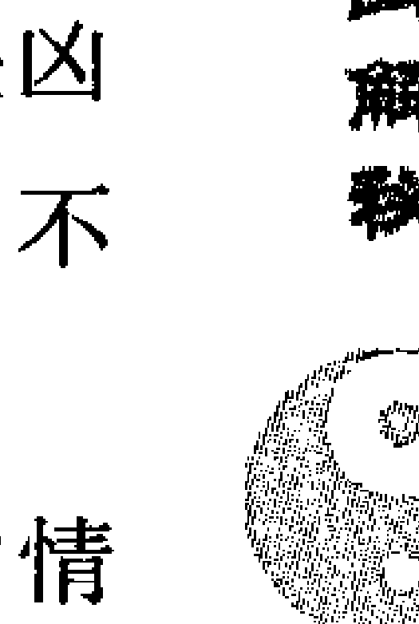

109

# 奇门应用研究与股市实战解秘

时间：2007年10月24日18时05分
农历：丁亥年九月十四日酉时
干支：丁亥庚戌辛卯丁酉
旬空：午未寅卯午未辰巳
霜降：下元丁酉时旬首为辛
阴遁二局值符天任落五宫值使生门落五宫

| 太阴<br>开门 癸<br>天心 丙 | 螣蛇<br>休门 己<br>天蓬 庚 | 值符<br>生门 辛<br>天任 戊 |
| --- | --- | --- |
| 六合<br>惊门 壬<br>天柱 乙 | 丁 | 九天<br>伤门 乙<br>天冲 壬 |
| 白虎<br>丁 死门 戊<br>禽 天芮 辛 | 玄武<br>景门 庚<br>天英 己 | 九地<br>杜门 丙<br>天辅 癸 |

- (1) 这次是发射绕月卫星，故目的地是环月轨道，也就是奇门的太阴宫位，太阴在4宫逢空正像月球运行于太空，开门便是嫦娥一号与太阴同宫吉象，预示其会按指定轨道运行，癸为轨道，丙是电子，地盘九地主平稳。
- (2) 九天为道路在7宫和天冲火箭同宫，逢伤门说的是其为加载有卫星的运输工具。
- (3) 值符是总指挥在2宫逢天任吉星生门吉门本身运气状态好就是有点保守，辛+戊击刑说的是工作较辛苦遇到一些棘手的问题，地盘虎主有能力也主研究的是轨道的问题。
- (4) 九地所在6宫是地球发射地，逢马星有发射活动，杜门天辅主有博士技术人员，地盘太阴研究的是有关月球的事，丙为乱子在六宫入墓没事，癸是网实际是轨道。
- (5) 时干丁是太岁主大事在8宫，8宫上有虎主轨道发射事，下有值符主吉利大事，死门是固定不动，天芮是探访朋友实际是绕月事，戊+辛击刑是发射冲击象。
- (6) 值使生门2宫都是吉象。加之这次卫星不载人，不涉及日干航天员，五不遇时主要是不利出行，反吟利客利发射事，加上当日为二十八宿壁星值日，十二日建为执日吉日，主百事可为。金函玉镜日家奇门该日酉时为玉堂黄道，故这次会顺利发射成功。

事实证明：嫦娥号卫星已成功进入轨道，开始了既定的科研探测工作。

#### 实例五：飞船出舱有惊疑，事前有知勿惊慌。

我国新闻部门向全世界公开发布了神舟七号飞船升空的消息后，由于当时国内正陷入三鹿奶粉事件的低潮，大家都为神舟七号飞船能否发射成功心存疑虑，于是我按神舟七号飞船发射的时间起局预测，当即告知大家神舟七号飞船能够成功发射，但是在神舟七号飞船执行任务的整个过程中会有很小的故障发生，但无大碍，不会影响飞船的正常运行，请大家不要担心。大家听后表示半信半疑，结果在神舟七号飞船航天员执行出仓任务时发生报警，经地面人员检测后，发现神舟七号飞船运行良好，并无危险因素。三天后神舟七号飞船安全返回，三名航天员状态良好。大家见了我啧啧赞叹说神了。

为什么预测神舟七号飞船发射执行任务可以成功，现判断如下：

时间：2008年09月25日21时06分
农历：戊子年八月廿六日亥时
干支：戊子辛酉戊辰癸亥
旬空：午未子丑戌亥子丑
秋分：上元癸亥时旬首为癸
阴遁七局值符天芮落二宫值使死门落二宫


上编 奇门应用研究

| 太阴 | 螣蛇 | 值符 |
| --- | --- | --- |
| 杜门 辛 | 景门 丙 庚 | 死门 癸 |
| 天辅 辛 | 天英 丙 | 禽 天芮 癸 |
| 六合 | | 九天 |
| 伤门 壬 | 庚 | 惊门 戊 |
| 天冲 壬 | | 天柱 戊 |
| 白虎 | 玄武 | 九地 |
| 生门 乙 | 休门 丁 | 开门 己 |
| 天任 乙 | 天蓬 丁 | 天心 己 |

分析：

- (1) 奇门以开门为神七落6宫逢天心九地主神七的状态良好，精密细致，运行平稳已为在设计和出仓过程中有很小缺陷。
- (2) 天冲为火箭落3宫乘六合主质量稳定，伤门主火箭承担运载神七上天的重任，壬+壬击刑主火箭完成任务就会脱落损毁。
- (3) 七宫的九天方为发射地，日干也是太岁戊+成为两个以上的航天员和国家领导人，天柱惊门主国家领导人会就神七上天一事向全世界发表公开讲话，同时也主神七在发射出仓返回的过程中会出现有惊无险的情况。
- (4) 时干2宫癸主轨道，庚主路主发射冲破大气层和回落时受大气磨擦产生的阻力，芮为科技研究，死门主神七在定死轨道，按固定的路线运行。开门九地6宫与日干宫九天路线7宫比和，主发射回落定会成功。
- (5) 伏吟主按部就班按计划顺利进行。日家奇门择日癸亥时为黄道吉日，二十八宿为奎星值日大利出行。

### 三、工作就业前途机遇分析判断研究

一般以开门代表文职工作及单位，杜门代表武职工作及单位，年干代表上级领导，值符代表顶头上司，月干代表同事，日干代表求测者本人，时干代表上级或单位职工群众。

如：日干或年命落宫旺相，又得吉门吉格吉神者，表示自身条件好，得天时地利，再得开门或杜门相生，则求职得官顺利。

如：日干或年命克开门或杜门，经过努力也能得到工作或官职，如自身不得天时地利，又受开门或杜门冲克者，必然得不到官职或工作。

# 能否晋升职务、职称：

一看天时，二看地利，三看人和，四看自身条件和运气，自身条件好，又得年干、值符、开门相生者，必然能晋升，反之则不能。开门克用神，文官降调。杜门克用神，武官降职，反吟主调任，空亡必革职，入墓不但降罚，还会招来罪戾。太岁来克，上级领导不喜，值符来克，顶头上司不爱，月干来克，同事参劾，时干来克，下边群众告状。

以开门为官星，以其所临九星为人品。如开门上乘吉星为好人，凶星为恶人。临天辅星文雅，天任星慈祥，天心星正直，天禽星忠厚，天冲星风厉，天英星昏烈，天芮星贪毒，天柱星奸诈，天蓬星大恶。

军队干部和士兵转业或退役，可以杜门为官长，以日干为退役之人，如杜门生日干，主工作需要，领导有意留你，不准转业或退役。如果杜门克日干，则准退。比和者，也准退。如果日干乘青龙逃走或荧入白者，必退役，如果乘白入荧，虎猖狂者，则不可退。如果日干临蛇天矫，则可能有官司缠身，欲退不能。如果见大格或雀投江凶格，则可能被辞职。

#### 实例一：现场一盘多断，工作机遇实战。

2005年10月7日下午我去找一个新近在无意中认识的六爻地摊算命师朋友研究一个六爻卦，不料周围来了好多看热闹的朋友，其中四人当场发问，不幸被我一一测中，现书于下，请大家欣赏。

# 上编 奇门应用研究

公历时间：2005年10月7日16时
农历时间：九月初五日壬申时秋分上元
当日干支：乙酉乙酉甲子壬申
当日旬空：戌亥（日）戌亥（时）
阴遁七局值符天柱落三宫值使惊门落八宫

| 九天 休门 己 天心 辛 | 九地 生门 丁 天蓬 丙 | 玄武 伤门 乙 天任 癸 |
| --- | --- | --- |
| 值符 开门 戊 天柱 壬 | 庚 | 白虎 杜门 壬 天冲 戊 |
| 螣蛇 庚 惊门 癸 禽 天芮 乙 | 太阴 死门 丙 天英 丁 | 六合 景门 辛 天辅 己 |

公历时间：2005年10月7日16时
农历时间：九月初五日壬申时秋分上元
当日干支：乙酉乙酉甲子壬申
当日旬空：戌亥（日）戌亥（时）
阴遁七局值符天柱落三宫值使惊门落八宫

奇门应用研究与股市实战解秘


## 第三章 奇门分类研究实例

| 天 任 乙<br>伤<br>六 巽 辛 | 六 辅 辛<br>生<br>地 离 丙 | 蛇 心 己<br>休<br>常 坤 癸 |
| --- | --- | --- |
| 符 柱 戊<br>死<br>白 震 壬 | 地 英 丙<br>杜<br>阴 中 庚 | 常 芮 癸<br>开<br>符 兑 戊 |
| 白 冲 壬<br>惊<br>天 艮 乙 | 阴 禽 庚<br>景<br>玄 坎 丁 | 玄 蓬 丁<br>中<br>蛇 乾 己 |

分析：

先看转盘时干壬在7宫，上有虎主路旁一共有7人（包括我与六爻卦师）在卦摊上（杜门主神秘），杜门又主桥，正好我们在一高速桥旁边。

(1) 先有一上次来测过六爻的男青年要我看看他找工作的情况。我先看了一下3宫，地盘虎是他站在马路边上，日干求测者与开门同宫地盘有壬，说明他在动到处找工作，日干开门同宫说明现在他可能找到一工作，工薪生门在9宫休囚我断他的月薪可能是3000元左右（离的先天数），他说人家给他3200元，又问这个单位好不好，开门在3宫被迫，戊+壬为青龙入天牢，戊为资金入天牢不好这个单位存在资金问题，天柱可能有官司，我说不好可能存在财务问题。他说这个单位还没开业，老板是个女的。他又问他会不会被录用去上班，我看时干宫有杜门就对他说这个事中间有阻隔，可能去不了，他又说这个单位在西边，我一看不太对，就用飞盘看，发现开门在7宫正克日干3宫，就对他说人家肯定不会用你，他说对，人家只是口头上答应并未和他签约。兑为女遇开门当然是个女老板了，这一局用飞盘来看完全对。

(2) 还没看完，六爻卦师就让我给看看他的子女情况。我看了一下转盘时干壬所在7宫，对他说你的孩子是搞技术（杜门）的，脾气不好不爱说话（虎、杜门），可能从事的是与车（白虎主道路车辆）有关的职业，很能干有冲劲（天冲），小伙子有前途（壬+戊为小蛇化龙），技术过硬能力强（白虎），对目前的工作不太满意（时干宫克开门宫），想换工作（壬主想动）他现在在你家东边上班。老卦师说：“对对，这小子原先在九仙桥上班现已换到现在这个单位，单位待遇不错又想走。你再看看财运”。我一看9宫，宫虽生生门，遇天蓬，就说他的财运不好，卦师说：“不对，他一月挣1300元”，我说他大手大脚敢说敢做人又贪又好色破耗之象（天蓬遇生门），卦师说：“唉！气死我了，每月挣那么多钱，我这个摊没他挣钱多，可他不但花光他的钱还伸手问我要”，我说这是因为他在外边暗地里偷偷找小姐（九地、丁奇），才缺钱，老卦师没说话，我说：“你收了他的钱，管死他不就行了”。老卦师说：“奇门真神，我也想学”，我给他介绍了张志春的《神奇之门》做为入门书。

(3) 和老卦师没说完，坐在我南边的姓左的中年人说给我看看，我看你一会儿了，你断的还行，我不说看什么，你就给我看看。我一看他坐我南边，就依9宫中生门对他说，你做生意的，具体是搞农业建筑房产等生意的，他说神了，我搞建筑的，我接着说，你指个方向我看，他指着北方说你看看，我一看坎宫，马上说你最近遇到小人（太阴）和心情不好的事了（死门），你性格严肃死板（死门），还死爱面子干着急（天英），他说对，我再一看9宫生门虽有宫生但逢天蓬，就说你最近破财了，虽然生意好挣的钱多，但因小人要破财（地盘太阴），他说对，我又说你艳福不浅，还有个小情人（9宫坎宫有丁奇），他说没有。我再一看日干宫说，你在你单位还是个头头有职务（3宫值符），好像因为钱的事有口舌事非（戊和天柱），另外你的工作有变动（开门临壬），他说对。这时天快黑了，他一拉我说咱找个饭店边吃边聊，走走。本来我想去找我玩瓷器的朋友拍几张照，见他拉我就去了。坐下点了菜（由于我不吃辛辣刺激性饭菜，也不喝酒，于是他点了3道菜，事后一看景门主饭菜，落6宫逢空测数减半可不是3道菜吗），正说话间，刚围观的一位姓王的年青朋友也坐了过来说等会儿也给他看看，我说不急。这时姓左的中年朋友对我说，我以前根本不信这些，今儿听你一测还真信了，我就是在附近建筑工地上当监理，带了几个人算是负责的，最近有朋友介绍我去西边城里当监理，我想走，这的老板扣着我的工钱不放，我和他签的合同我现在找不到了可能忘在家里哪儿了，我一看6宫六合景门空亡可不是吗，他又说这个小人，当初我根本没在合同上签字（六合景门空），现在扣我的钱不放我气死我了。我都在人家那上了好几天班了，没办法今天只得回来值班，你看看我的钱要的回来吗，我一看2宫伤门生天乙天冲宫正符合要工钱的事，值符与开门同在3宫克伤门2宫，土休木死，伤门反克值符，难以要回之象，就对他说可能要不来，再一看大局九星反吟利客，伤门宫有年干乙但乙在2宫入墓无力相助，就说你多带几个人，主动些（天任）多要几次（九星反吟）看看能不能要回一部分，他说我在西边单位上着班，在这边先请假，拖一阵看看，争取在时间上占理好要钱。我说你在西边的单位要防意外事故（兑宫有白虎），他说是的，那边因山体滑坡在维修寺庙（7宫杜门主神秘主寺庙），先要挖四五十米深的沟用来加筑地基（杜门主填堵）以防再次滑坡，有危险。我再看了看8宫对他说，你腿脚上有毛病，他说没有啊，只是以前打球肌腱受过伤，我说这不就对了吗。一看时干兑宫上有白虎就说你的女儿受过伤要防流产破伤事，他说对，我的大女儿受过伤。这时，他说刚在路边我没敢说，我办公室里有个江苏女孩比我小十多岁对我有意思，有时在办公室就想要，我老克制着自己，我怕在这事上老了老了犯错误，唉还真给你说对了。话还没说完，坐在对面的刚围观的姓王的小伙子说你给我看看。

这时已过了5点钟，我另起了局来看。

- 公历时间：2005年10月7日18时
- 农历时间：九月初五日癸酉时秋分上元
- 当日干支：乙酉乙酉甲子癸酉
- 当日旬空：戌亥（日）戌亥（时）

# 阴遁七局值符天柱落二宫值使惊门落七宫

# 奇门应用研究与股市实战解疑

| 太阴<br>杜门 丙<br>天英 辛 | 螣蛇<br>景门 癸<br>禽 天芮 丙 | 值符<br>死门 戊<br>天柱 癸 |
| --- | --- | --- |
| 六合<br>伤门 辛<br>天辅 壬 | 庚 | 九天<br>惊门 己<br>天心 戊 |
| 白虎<br>生门 壬<br>天冲 乙 | 玄武<br>休门 乙<br>天任 丁 | 九地<br>开门 丁<br>天蓬 己 |

我说，你心情不好（日干宫死门），想要动（天柱）想换工作（6宫开门逢马星），你在现在的单位没心思干了（开门空），你有学历（景门在9宫生日干宫），但你遇到，问题和难题（天芮和庚），被问题所缠（上有蛇），现在情绪很低落，有小人也在和你闹（地盘太阴）。他说有人在背地里做手脚不让他调到好的单位。你还是你单位的一个副的小头头（日干2宫值符），他说对。他问，你看我要去的单位前景如何，我一看开门马星对冲宫有杜门，就说不一定好，你对现在的单位有感情，日干宫生开门宫，他说对，我在这个单位干了十多年了当然有感情，我说你现在的上司对你不错（值符与日干同宫），他说对，就是他让我当得这个负责人。但开门宫空你的单位恐怕要变动成其他性质的单位或被解散，恐怕你也没什么保证了（开门事业空），他说是的。他说你看看我的那个关系能不能帮我调到新的单位，我一看3宫六合被开门宫克，六合宫又克日干宫，就说没戏，那个单位不买你的关系户的账，因而你的关系户也不愿答应你的事。他说对，我的那个关系户是个领导，不太爱理我的事。我又说你的关系户领导有文化温文尔雅（六合下有天辅），可能你要去的那个单位不买他的账，所以他碍于面子不太理你。他说对，你看我那个关系户官还能升吗。

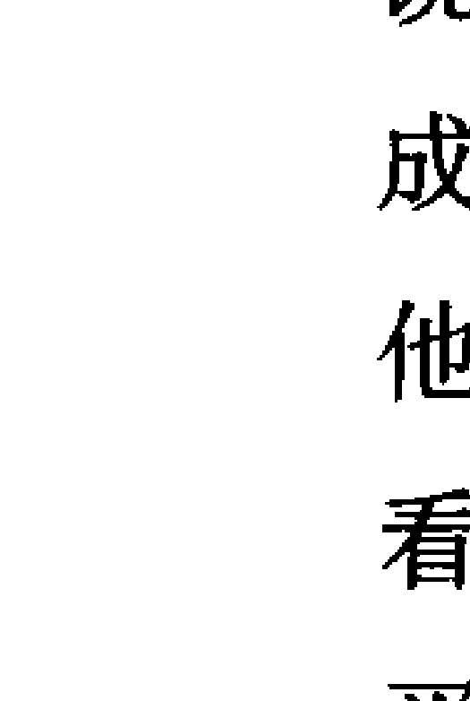

我一看开门宫克六合宫，年干宫有休门，开门宫空不生年干宫，就说没戏升了。他又问，看看我结婚了吗，我一看六合婚姻宫克日干宫，乙庚落宫对冲，丁奇6宫空，就说他现在孑然一身连女友也没有。我接着说，你头和心脏有病，女朋友生4宫丙和人好上了，克庚宫你没戏了，但她年命丁在6宫空要么运气不好要么对你虚情假意，其实你年命壬在8宫生她的年命6宫丁你喜欢他，他说对。年干乙在1宫上有玄武中有休门，你单位最高领导有官司是非口舌破财丢官之象，他说那个领导开车撞死了两个（伤门宫克死门所在2宫可不是开车撞死两个）人，可能要吃官司被判刑。他说你再看看我的父母，我说你父母退休了有慢性病在休养（1宫休门退休玄武主病地盘九地慢性），病在腰肾生殖系统（坎宫玄武休门），他父亲年命壬（1942年人）在8宫，上有白虎主恶病，生门胃病，天冲乙肝胆有病，壬腰肾膀胱有病，他说父亲有尿毒症现在隔两三天就作透析，以前自己肝不好老吃龙肝泻肝丸引起的，当时我错把坤宫当他父亲看了，说他父亲原来在单位是个领导但为副职，死门主现在有治不好的病，戊+癸病缠着好不了，也错把乾宫当他的母亲看，说他母亲有妇科病（6宫天蓬）人开拓大度（6宫空），他说我说的对、属实，可能有时人具有预测功能，所以错断时也是对的。现在看他父亲以乾6宫为参考逢空运气不好，丁+己奸私仇怨，事因女人，天蓬主好色，开门是在单位，九地是暗地里私下，可能因和单位女人过多交合伤了肾脏的原因。天蓬也是病在肾膀胱生殖系统。他说再看看有好转吗，我一看8宫壬克乙不想要中医治，（他说以前吃中药龙肝泻肝丸引起的肾病，这是医院查出来的，对中医有顾忌。）生7宫天心是想西医来治，但乙天心都不克8宫白虎，恐难治愈。他又问看他能出国发展吗，我一看外盘生门在8宫，就说去日本方向求财吉利。他说想去澳洲，有个亲戚在那。我一看马星在冲东南方4宫，但宫中有杜门克日干2宫，就说要么去不了，要么去了不会顺利。他说哎，日本到也真有个亲戚。我说全局八门伏吟，你不管是工作想调动还是想出国，都应顺其自然合乎理法，不要强动或轻动，否则不好。他说以前好几次都是一动不如一静，这次看看小心点。另外八门伏吟说明你在单位人事关系处理的不好。他说是，我就这个毛病。说到这，时间已晚了，又说了一些为他父亲运筹转运治病的话，开导开导他，留了电话就走了。

#### 实例二：竞争职务亦能测。

单位举办领导职务竞争上岗活动，要求大家尽可能的参加，因我这几年与机关领导很少来往，觉得成功的可能性很小，没有对此抱太大的希望。转念一想自己不是在学易吗，预测一下看看，若有可能不妨试试，于是按自己动念头的时间起局分析如下：

- 时间：2005 年 05 月 23 日 15 时 42 分
- 农历：乙酉年四月十六日申时
- 干支：乙酉辛巳丁未戊申
- 旬空：午未申酉寅卯寅卯
- 小满：下元戊申时旬首为壬
- 阳遁八局值符天冲落八宫值使伤门落七宫

| 太阴 | 六合 | 勾陈 |
|------|------|------|
| 开门 己 | 丁 休门 辛 | 生门 乙 |
| 天英 癸 | 禽 天芮 己 | 天柱 辛 |
| 螣蛇 | | 朱雀 |
| 惊门 癸 | | 伤门 丙 |
| 天辅 壬 | 丁 | 天心 乙 |
| 值符 | 九天 | 九地 |
| 死门 壬 | 景门 戊 | 杜门 庚 |
| 天冲 戊 | 天任 庚 | 天蓬 丙 |

分析：
测竞职以日干为预测者本人，月干为同事为一同参与竞争的人，年干为上级领导，时干为下属群众，以开门为所竞职务，以休门为贵人，以值符为顶头上司，以值使为直接领导，同时参看年命，（也有以开门为文职，以杜门为武职，必要时参考）。

- （1）日干丁奇在9宫临官为得地利，又遇被迫之休门贵人，说明贵人官不大或自身所处环境不好，也可能是被测本人正在休假或休息。年命辛在9宫病地不得地利，天禽在9宫相得天时，古有天禽合局百官元首之说，9宫天芮相于巳月得天时，但也说明有错误或失误难免，上乘六合得神助，也说明这次参与竞争的人较多，六合在9宫大概参与的人有90多人，辛+己为入狱自刑，另辛在9宫自刑，说明被测本人在竞争中有失误或日后有犯错误的可能。丁+己为火入勾陈，主有阴私之事，谋求不利，阴私仇冤，事因女人，说明有女性因某种原因在其中作用。

- （2）开门落4宫被迫，说明所竞职务是副职不大或在机场车站码头港口流通之地任职，上乘太阴得神助，开门落宫生日干本人和年命落宫9宫，又逢驿马要动，说明竞争职务有利。

- （3）上级领导年干乙奇在2宫入墓，说明其身体不好，上乘白虎说明所任是武职和副职，逢生门有生气或有利益可得，在2宫可能是女领导，现日干年命所在9宫生乙奇所在之2宫，说明竞测者有求于此人。

- （4）月干辛在9宫病地不得地利且自刑有失误，说明竞争者对手没有明显的优势。

- （5）下属群众戊在1宫上乘九天地盘逢庚，1宫休囚不克9宫之日干年命，说明群众议论纷纷对求测者有意见，但无力影响其竞职活动，戊+庚为值符飞宫格，破财换地方，要动之象。

- （6）值符逢空顶头领导不在或空缺。

- （7）值使伤门在7宫说明直接领导处境不佳或也在竞争。值使主具体事，正好说的是大家正在竞争职务之事。

- （8）太岁乙奇在2宫，和9宫相生，今年被测者有利竞职。

- （9）日干旺克时干，有利竞争，八门反吟主事有不顺反复之象，但利客利主动行事，被测者宜积极行事。

总合以判断，这次竞职对自己有利应报名参加，但八门反吟凶格，日干丁奇年命辛所在离9宫中有天芮凶星，辛+己入狱自刑凶格，丁+己火入勾陈凶格，休门迫宫，年命辛处病地且自刑，只有日干旺相得地利，逢天芮利考试做学问，凶多吉少，很难被任用。

结果：
后来经过竞争，我顺利通过笔试面试获得任职资格，因平时与机关领导没有来往，加上其他不利因素，后终于未被任用。

#### 实例三：求职去公司，是否会录用？

一网友求测其是否能被一公司录用，以下是求测局盘。

- 公历时间：2005年8月19日14时
- 农历时间：七月十五日癸未时立秋下元
- 当日干支：乙酉甲申乙亥癸未
- 当日旬空：申酉（日）申酉（时）
- 阴遁八局值符天柱落三宫值使惊门落七宫

| 九天 | 九地 | 玄武 |
| --- | --- | --- |
| 杜门 庚 | 景门 丙 | 死门 戊 |
| 天心 壬 | 天蓬 乙 | 天任 丁 |
| 值符 |  | 白虎 |
| 伤门 己 |  | 惊门 癸 |
| 天柱 癸 | 辛 | 天冲 己 |
| 螣蛇 | 太阴 | 六合 |
| 辛 生门 丁 | 休门 乙 | 开门 壬 |
| 禽 天芮 戊 | 天英 丙 | 天辅 庚 |

## 分析：

- 1. 时空，值使空，事情未定，心有疑虑或事情目前悬空。九星反吟时机不佳，机会还会再来。八门伏吟人事不和，关系未疏通。开门地盘有庚这个单位状况不很好，天辅说明这个单位是与文化有关，或有背景，上有六合是大单位，壬主这个单位要变动。
- 2. 值符为招聘单位招聘官在1宫，伤门不高兴，天柱反复善变善言，日干乙在1宫生值符宫，为你去找人家应聘，天英在1宫主昏烈，是你脾气不好太急躁爱打扮注重形象，也是说你是搞策划设计工作的，休门没工作在家休息，太阴主性格内向爱策划谋略有阴私或得人帮而不知。
- 3. 开门在6宫生你所在1宫，年干太岁加临大吉，时来生日，能成之象，竞争对手庚在4宫被开门宫克不成，大局已定，就是八门伏吟关系不通，要费些时日，九星反吟利客，是说你要主动找人家疏通关系方成。
- 4. 这事成了你可能不会在这个单位工作很久，因九星反吟另有机会或你觉的不好而另去它处。
- 5. 这个事大概会在酉月成功，因酉月时干与值使7宫填实。开门临乾宫，这个单位不是在大城市就是在首都。

## 网友反馈：

- （1）时空，值使空，事情未定，心有疑虑或事情目前悬空。
  > 答：对。
- 九星反吟时机不佳，机会还会再来。
  > 答：有可能。我的房东也是一个公司老板，他比较赏识我，以前曾有意向录用我，因他的公司已录用我的一个同学，我很不喜欢此人，不想和他在同一个公司做事，所以也无意以后被我的房东录用。
- 八门伏吟人事不和，关系未疏通。开门地盘有庚这个单位状况不很好，天辅说明这个单位是与文化有关，或有背景，上有六合是大单位，壬主这个单位要变动。
  > 答：我对此单位不是很了解，故无法向兄回答。

奇门应用研究与股市实战解秘

- （2）值符为招聘单位招聘官在1宫，伤门不高兴，天柱反复善变善言，日干乙在1宫生值符宫，为你去找人家应聘，天英在1宫主昏烈，是你脾气不好太急躁爱打扮注重形象，也是说你是搞策划设计工作的，休门没工作在家休息，太阴主性格内向爱策划谋略有阴私或得人帮而不知。
  > 答：兄说我脾气不好尚可勉强同意，我还在上学，平时需要打些小时工维持一下生活费用。发此贴问事时尚无工作。一宫九星为太阴，是否可解释为思虑较多，性格内向？
- （3）开门在6宫生你所在1宫，年干太岁加临大吉，时来生日，能成之象，竞争对手庚在4宫被开门宫克不成，大局已定，就是八门伏吟关系不通，要费些时日，九星反吟利客，是说你要主动找人家疏通关系方成。
  > 答：被兄这一说，我的心也凉了半截。也懒得找人疏通关系了。其实，我是想自己创业的，因这几年运气实在太差，且现无资本，所以想推迟一下。
- （4）这事成了你可能不会在这个单位工作很久，因九星反吟另有机会或你觉的不好而另去它处。
  > 答：很有可能。

#### 实例四：炒股为事业，工作是否辞？

听说与我关系要好的一同事要辞职以炒股为业，我不敢相信，马上起局预测如下：

- 时间：2007年8月9日20时
- 农历时间：六月廿七日丙戌时立秋下元
- 当日干支：丁亥戊申乙亥丙戌
- 当日旬空：申酉（日）午未（时）
- 阴遁八局值符天心落一宫值使开门落四宫

| 玄武<br>开门 癸<br>天冲 壬 | 白虎<br>休门 壬<br>天辅 乙 | 六合<br>生门 乙<br>天英 丁 |
| --- | --- | --- |
| 九地<br>惊门 戊<br>天任 癸 | 辛 | 太阴<br>辛 伤门 丁<br>禽 天芮 己 |
| 九天<br>死门 丙<br>天蓬 戊 | 值符<br>景门 庚<br>天心 丙 | 螣蛇<br>杜门 己<br>天柱 庚 |

分析：

- (1) 月干同事戊在3宫处在沐浴之地正想好事，戊与投资方面有关，可惜子卯击刑投资很累，戊下被癸合，证明遇到问题，资金被占用暂不能动，也是说有合作伙伴，或为长辈所纠缠。上有九地宜固守稳扎稳打方可平顺千万不可乱动，九地者迟慢，反应失时也。惊门忧心重重，天任倔强有韧性但要按部就班勤勤恳恳方可有成。
- (2) 事业看开门临值使立秋正旺，可惜在4宫被迫不得其意，上有玄武工作将要变动之象，同时也说明遇到小人有口舌是非。天冲做事雷厉风行很果敢但缺乏考虑，癸和壬都是变动之象，同时说明遇到问题和阻力，癸+壬为凶格，主事有反复。开门宫生休门宫主职业向自由业变动。
- (3) 时干主事，丙在8宫长生想大干有雄心威严但要防乱，下有戊在8宫也长生想投大资，天蓬是大干但要防破大财，死门当下低迷与经商不利，九天有大动作想出来大干，丙+戊吉格利财官大吉，只是死门利房产殡葬土地开发一类事，其余不利。
- (4) 景门主策划在1宫上有值符在策划大事正事，天心主计划周密有组织实施的才能，不过有丙主心有点乱，遇庚有阻力，丙想大干但有点火气要冷静，庚+丙为白入荧利客宜主动筹划实施不可颓废。
- (5) 顺便看看同事的爱人怀的是男是女，坤宫空看对宫8宫有天蓬主中男，怀的是一男孩将来生下可能8斤重左右。
- (6) 历来大事必看年命，同事壬年生人在9宫空亡之地不吉，主心有疑虑上下拿捏不定，白虎凶神不利，休门利公职谒访休养娱乐，壬主变动事，乙奇忧郁，壬+乙主女人柔顺，男人嗟叹，占孕必生子，禄马光华。9宫空要看对宫1宫景门与策划票证文书等有关，与1宫第4同不述。
- (7) 结论：工作有动，创业兴亡并存，举步维艰，凡事慎重可保无虞。

结果：
过了不久，其真的辞职以炒股为业，不久其妻又为其生了一男孩。

### 四、求学考试分析判断研究

凡求学考试，考生本人求测，以日干为考生。父母代考生求测，以时干为考生。还可看考生出生年的天干，以年干为用神，以天辅星为考试院，以值符为主考或监考官，以值使为副主考官或副监考官，以丁奇为文章，以景门为试卷，以年干为录取学校。如为培训班，天芮为学员，值符为主办单位，天辅为老师。

如果考生落宫旺相、得三奇、吉门、吉格，又得天辅星、值符、年干相生者，能考入理想学校。考生落宫旺相，得三奇、吉门、吉格，克天辅星、值符、年干者，也能考入较好学校。

如果考生落宫休囚无力，又不得奇门吉格者，但得天辅星、值符、年干相生者，虽考试成绩不佳，但也能录取。

如果考生落宫死绝入墓或空亡，又得凶门凶格，又受天辅星、值符、年干相克者，定然是考不上。

丁奇、景门二者落宫状态及与天辅星、值符、年干的生克关系，以此来判断考试答题的优劣及得分状况。景门落宫为考分，日干落宫为录取考生数。岁干生丁、景门落宫且得吉格，定考取一类学校。岁干生景，不得吉格，可考取普通学校。岁干不生景、丁自乘旺相，可考取代培、自费、旁听生。岁干不生丁、景，或反吟入墓，或值空亡，难以录取。岁干克景、丁，是考学不被录取，反惹出麻烦。

值符（天乙）五行生日干、景门五行，六丁宫又旺相，必获功名。年干遇三奇吉门、星，大利，虽得奇门而不得吉门，名不能得，得吉门而不得三奇，终必成功。

#### 实例一：奇门树信心，笔试定通过。

单位举办领导职务竞争上岗活动，在竞争程序中，笔试具有一票否决权，在竞争上岗中很重要，我便以动念时的时间起局分析，看看能不能通过这次笔试。

- 时间：2005年05月31日12时52分
- 农历：乙酉年四月廿四日午时
- 干支：乙酉辛巳乙卯壬午
- 旬空：午未申酉子丑申酉
- 小满：中元壬午时旬首为己
- 阳遁二局值符天冲落六宫值使伤门落二宫

| 勾陈 | 朱雀 | 九地 |
| :--- | :--- | :--- |
| 休门 癸 | 生门 壬 | 伤门 乙 |
| 天柱 庚 | 天心 丙 | 天蓬 戊 |
| 六合 |  | 九天 |
| 辛 开门 戊 |  | 杜门 丁 |
| 禽 天芮 己 | 辛 | 天任 癸 |
| 太阴 | 螣蛇 | 值符 |
| 惊门 丙 | 死门 庚 | 景门 己 |
| 天英 丁 | 天辅 乙 | 天冲 壬 |

奇门应用研究与股市实战解读

分析：

- （1）丁奇主文章主所做的考试题，现丁奇落7宫，宫中天任生兑7宫，天时不错，杜门受克，说明考题偏难或比较偏，丁奇为文章在7宫长生，但丁+癸为雀投江，不吉，考的不好，上乘九天说明所作文章宏大有气魄，逢空不吉，说明有题未作或文章未写完。
- （2）再看2宫，乙奇为考生为我在2宫入墓，不吉，考生状态不好，上乘九地主迟慢，考生反应慢，伤门被迫，说明考生很努力但竞争力不强，伤门值使为监考和日干在一宫，说明考生不是认识监考就是和监考在一个单位，天蓬休囚不怕，乙+戊利阴害阳，不利考试。2宫空亡，说明考生思维有遗漏之处。
- （3）考生年命辛亥，在3宫不得地利，没有权势，上乘六合，说明竞争者在一个个人比较多的大单位，或竞争的人较多，或竞争职位大概有34个左右，开门被迫不吉，但天禽天芮相于时令，天时不错，古有天禽合局百官元首之说，开门被迫，官职不大或难求，辛+己入狱自刑，逢天芮说明在考试竞争中自己有明显失误之处。
- （4）直符为主监考落6宫与日干落宫2宫相生，也说明考生认识主监考，景门为考卷在6宫被迫说明考题偏而难。
- （5）天辅为考试院，落1宫为休，但旺于时令，天时不错，死门被迫说明监考很严，或阅卷老师很严，把关很死，上乘螣蛇有人缠着找。日干落2宫逢空克不动1宫，丁奇文章旺于天时在7宫空而不空生1宫天辅，1宫天辅生年命所在3宫，年干乙奇为录取方和日干同在2宫，直符景门同在6宫生1宫天辅，综合来看，可以被录取，丁奇在7宫，可能得分70分左右。

实际上：
我考了70分，与预测相比一分不多一分不少，奇门真的太神了。

#### 实例二：面试显紧张，奇门示吉凶。

面试在竞争上岗中属于必过的环节，也很重要。在竞争上岗就剩下最后的面试考试时，我又以动念头的时间起局分析如下：

公历时间：2005年6月9日18时
农历时间：五月初三日癸酉时芒种上元
当日干支：乙酉壬午甲子癸酉
当日旬空：戌亥（日）戌亥（时）年命辛亥
阳遁六局值符天心落二宫值使开门落六宫

| 九地 | 九天 | 值符 |
|------|------|------|
| 乙 杜门 癸 | 景门 己 | 死门 戊 |
| 禽 天芮 丙 | 天柱 辛 | 天心 癸 |

分析：
- (1) 日干戊在2宫不得地不旺，戊+癸为青龙华盖，可惜死门凶门临宫不吉，主官事稽留，印信无气，大凶，说明日主状态不好比较被动。上乘值符得神助，值符为主考，说明有考官和我一个单位或认识我，天心在2宫被囚，说明日主心计难使，发挥有失误之处。
- (2) 丁奇为答辩文章，在1宫休囚不得地，临休门大吉，丁+壬为奇仪相合，主凡事有成，贵人相助，天冲加临，说明有点紧张和冲动，上乘六合为众人答辩，也说明答辩的人相互配合比较好，整体成绩比较理想。
- (3) 年干乙奇为录取方为上级，在4宫旺相，说明录取方是大单位大领导，临杜门在4宫说明是在机场车站码头等的军警单位，时干癸主事体在4宫旺相，癸+丙为华盖悖师，贵贱逢之不利，唯上人见喜，乙+丙为奇仪顺遂，谋事多吉，逢凶星天芮多有奸邪之事。上乘九天主快，但癸+丙凶格，也说明事情有不顺。
- (4) 值符所在2宫相于时令，直克丁奇所在休囚之1宫，天辅所在8宫也克1宫，说明主考官对答辩人的答辩不太满意。
- (5) 丁奇在1宫生年干乙奇所在4宫，说明答辩内容与单位有关对路，好像有希望。
- (6) 时干癸和年干乙奇同落4宫，说明事情吉利，答辩得到单位主要领导的赞同。
- (7) 值使开门在6宫逢空，副考官不在或没有，所谋求预测之事多半不成落空之象。
- (8) 求测人年命辛在3宫绝地，上乘玄武不吉，又临伤门不好，天英旺相在3宫不吉，只有辛+丁为狱神得奇，大吉，地盘丁奇为答辩文章，看来虽然求测者身体状况不好，但还是有希望。
- (9) 景门为试卷落9宫，上乘九天所论问题气势宏大，天柱凶星囚于时令不至于大凶，己+辛为游魂入墓，不吉。地盘年命辛自刑，说明在面试中，求测者有失误之处，但景门落宫生直符宫和天辅落宫有利于通过面试。
- (10) 丁奇所在1宫生年干时干所在4宫，年命又于年干宫比和，年干乙奇落宫来生景门落宫，看来面试通过还是有希望的。但八门伏吟，欠缺人和，不会有人来帮。

结果：
我在面试中的表现有点紧张，从面试成绩看，我还是顺利通过了面试。值得庆幸的是，我的答辩在后来的总站领导会议上，得到了总站长的赞同和表扬。

### 五、拜师学艺分析判断研究

以天芮星为访道之人，以天辅星为传道之人。若天辅得吉门、吉格来生天芮者，必得高人传授，相比和者，空见人，不传道。相克者，不能见人，或不传道。投武、拜师学武艺，以天冲星为武士，以值符为武师，二者相生，主利。彼此相克，不利。如天冲星就是值符大利。遇反吟、伏吟不利。

#### 实例：学易多年，何时有成？

某网友：学易已经好多年了，只是一直没有进步，不知何年月方能够入佳境？（年命为丁）。网友发来短信要求我为其看看，我便分析如下：

时间：2005 年 1 月 13 日 1 时
农历时间：腊月初四日辛丑时小寒上元
当日干支：甲申丁丑丁酉辛丑
当日旬空：辰巳（日）辰巳（时）
阳遁二局值符天禽落五宫值使门落三宫

| 九地 惊门 庚 天辅 庚 | 九天 开门 丙 天英 丙 | 值符 休门 戊 禽 天芮 戊 |
| 玄武 死门 己 天冲 己 | 辛 | 螣蛇 生门 癸 天柱 癸 |
| 白虎 景门 丁 天任 丁 | 六合 杜门 乙 天蓬 乙 | 太阴 伤门 壬 天心 壬 |

## 分析：

（1）刚看到你发来的短信，从盘上看，天辅空，无师承，杜门为易技在1宫逢乙奇主学易走过弯路，六合天蓬学易贪多求全，日干年命丁奇主你还是很有天赋，在8宫入墓目前运气不好，白虎遇有艰难。险阻，好似搁浅之舟，笼中之鸟，也主学习有漏洞。天任虽执著勤勉，但缺乏开拓性，景门想出名周游天下，但遇白虎恐有学识难以施展之象，时干2宫所示你在学习上有缺点和偏颇谬误之处，休门指你在反思整理修正，辛+戊击刑主你现在很矛盾，心里情绪波动很大，值符想理出头绪做出名堂。值使门3宫玄武死门暗自伤心使加压力与自己过不去，天冲内心动荡不安，己主想达到心中的理想目标。

（2）从九星伏吟看，你离成功还有一段时间，从值使落3宫看至少需要3年。你现在压力确实很大，暗自忧伤，内心忐忑不安，不过我劝你近期不要有什么大的动作和谋为，应静待时机而后动，方为上策，所谓过了一山又一山，山重水复疑无路，柳暗花明又一村，学易又何尝不是呢？

网友反馈：准确，多谢！

### 六、婚姻分析判断研究

以天盘乙奇为女方，天盘庚为男方，六合为媒人，丁奇为妾，或第三者插足女人，丙奇为第三者插足男人。

乙奇与庚两者落宫相生，又逢吉门吉格，则恋爱可成，婚姻美满，两宫相冲相克，婚事难成，或夫妻关系不好。庚宫克乙奇，男嫌女，乙奇克庚，女嫌男均不成。强成之后，必有刑克。庚入墓而成凶格刑伤丈夫，乙奇入墓临凶格，克妻子。六合落宫生乙奇落宫，媒人偏向女方，六合落宫生庚落宫，媒人偏向男方。

乙奇落宫所临的星、神、门及格局，代表女方性格、身材、长相及职业状态，庚落宫则为男方，乙奇落宫带刑击为女性凶恶，得吉星性情温良，庚落宫带凶星为男性暴烈，得吉星主男方温良。

已婚者以用神相合之干为配偶的代表符号，以他们二者关系，判断婚姻的美恶吉凶。

如测成婚或离婚可以分别看男、女双方的年命落宫情况，以此帮助判断双方恋爱或婚姻的结局。

男婚女嫁以盘中占据太阴、六合为完美。太阴、六合旺相或相生、比和，说明婚后和美，若居螣蛇、朱雀，媒人从中两相欺瞒。若居勾陈、白虎，肯定媒散难成，如成，男女也会有一早亡，半途丧偶。若居九地，婚姻能成，但很迟慢。若居九天，眼下就成，还可能会出外旅行结婚。若居玄武，要谨慎小心，内中可能有诈，或者婚后拐子带财而私奔他乡。居值符最吉，万无一失，美满称心。

#### 实例：婚姻现危机，别求费心机。

刚才一同学甲打电话来，诉其苦恼，欲求俺测之。甲已婚四年，其妻乃初中同学，虽以前早就认识，但婚后时常争吵，已多次闹离婚。最近甲偶然遇到小学同桌乙，此同桌已离婚，目前单身。甲觉得与同桌很是合得来，有离婚而与同桌乙结婚之念，不知吉凶如何。

- 时间：2005 年 10 月 18 日 22 时 29 分
- 农历：乙酉年九月十六日亥时
- 干支：乙酉丙戌乙亥丁亥
- 旬空：午未午未申酉午未
- 寒露：下元丁亥时旬首为庚
- 阴遁三局值符天蓬落六宫值使休门落七宫

| 白虎<br>死门 辛<br>天英 乙 | 六合<br>丙 惊门 己<br>禽 天芮 辛 | 太阴<br>开门 癸<br>天柱 己 |
| :--------------------------- | :------------------------------- | :--------------------------- |
| 玄武<br>景门 乙<br>天辅 戊 | 丙 | 螣蛇<br>休门 丁<br>天心 癸 |
| 九地<br>杜门 戊<br>天冲 壬 | 九天<br>伤门 壬<br>天任 庚 | 值符<br>生门 庚<br>天蓬 丁 |

俺自知水平低，所以不敢下结论，于是告诉同学甲说明天再告诉结果。请各位老师帮忙测算一下，看事情会如何进展，谢谢！！

这是网友一枚莲花在网上请笔者的实测。

1.  你的同学以9宫丙为用神，上乘六合主婚姻，逢天芮，惊门，看来婚姻要出问题，你同学的爱人与丙相合的辛在4宫上有白虎主人能力强但脾气不好或身体不好做过手术，逢天英是爱面子性子急，地盘玄武有口舌是非，辛+乙闹很凶做出出格的事，逢死门心情不好，要倒霉。辛宫生丙宫，你同学的爱人对他还有感情，你同学丙在9宫空，心里对他们的婚姻产生了怀疑，同时对3宫的小学同桌乙也有疑虑。
2.  看看3宫的小学同桌乙，上有玄武主口舌官司是非也主人淫荡，地盘甲子戊与宫中卯击刑，破财有不顺的事发生过，景门主电话主文凭主亮丽，说的就是你的同学丙来电话问你这个小学同桌乙的事，景门天辅个子高有文化也漂亮。庚在6宫上有值符，又逢生门，乙的老公是个老板有钱人，庚下有丁有情人有第三者，天蓬胆大有魄力有创劲但也淫荡，庚宫克乙宫，乙的老公不要乙了，乙所处3宫击刑主其离了婚破了财，乙宫生丙宫，小学同桌乙和你的同学丙好上了，你的同学丙在9宫逢己想好事，但逢空心里不踏实所以打电话给你。
3.  辛在4宫逢驿马死门对丙采取了行动，辛下有乙主她们认识，乙上玄武去生丙主乙暗地里在与丙好或已与丙有过关系，丙在 9 宫逢惊门想通过法律解决问题，辛在 9 宫自刑辛自己或丙做了错事，己是丙在想与乙的美事，乙上玄武也主乙虚情假意不实在。

（4）时干丁在7宫上有腾蛇，天心，说明是为了第三者女人的事正在费心思，丁+癸雀投江，休门主体休止，都主事无结果，别费心了。

看看我说的能对上你要测的事吗，对不上，也可按我的思路再看看。

一枚莲花：中午打电话向同学验证后，很是准确！！现根据验证情况，反馈如下：

（1）你的同学以 9 宫丙为用神，上乘六合主婚姻，逢天芮，惊门，看来婚姻要出问题。

> ——俺的同学曾算过八字，明年可能要离婚。

你同学的爱人与丙相合的辛在 4 宫上有白虎主人能力强但脾气不好或身体不好做过手术，逢天英是爱面子性子急，地盘玄武有口舌是非，辛+乙闹很凶做出出格的事，逢死门心情不好，要倒霉。

> ——同学的爱人的的确能力很强很能干，俺曾见过几次。脾气的确有些不好，曾做过宫外孕手术。十分爱面子，常与俺同学吵架，有几次很是出格。

辛宫生丙宫，你同学的爱人对他还有感情，你同学丙在 9 宫空，心里对他们的婚姻产生了怀疑，同时对 3 宫的小学同桌乙也有疑虑。

> ——俺同学的爱人应该对他还有感情的，只是俺同学对这段婚姻已很失望，感觉前途渺茫。同时对小学同桌也没有把握，很是疑虑。

（2）看看 3 宫的小学同桌乙，上有玄武主口舌官司是非也主人性感，地盘甲子戊与宫中卯击刑，破财有不顺的事发生过，景门主电话主文凭主亮丽，说的就是你的同学丙来电话问你这个小学同桌乙的事，景门天辅个子高有文化也漂亮。

> ——俺同学的小学同桌口才很好，当然争吵起来也不逊他人。虽然胆子很大，但好像还比较传统，作风较正。她离婚时什么都没要，的确破财不少。其人很漂亮，个子较高。

庚在6宫上有值符，又逢生门，乙的老公是个老板有钱人，庚下有丁有情人有第三者，天蓬胆大有魄力有创劲但也淫荡，庚宫克乙宫，乙的老公不要乙了，乙所处3宫击刑主其离了婚破了财。

——俺同学的小学同桌乙的前夫庚的确很有钱，但目前是厨师，还未当老板。因其有外遇，所以乙很伤心，主动与其离婚了，离婚时乙什么都没有带走，走的净人。

乙宫生丙宫，小学同桌乙和你的同学丙好上了，你的同学丙在9宫逢己想好事，但逢空心里不踏实所以打电话给你。

——确实如此，俺同学感觉与其同桌乙很投缘，但心里没有底，不知道乙究竟是怎么想的。

## （3）辛在4宫逢驿马死门对丙采取了行动，辛下有乙主她们认识。

——的确如此，俺同学的夫人辛有所察觉，盘问过俺同学，她和同学的同桌乙也认识，而且感觉较易相处。

乙上玄武去生丙主乙暗地里在与丙好或已与丙有过关系，丙在9宫逢惊门想通过法律解决问题，辛在9宫自刑辛自己或丙做了错事，己是丙在想与乙的美事，乙上玄武也主乙虚情假意不实在。

——俺同学的同桌乙曾在同学聚会上（当时同学之妻辛也在场）说喜欢过俺同学，估计对俺同学应该有好感吧，但目前只是通过电话、短信联系，平常见面也是在同学聚会场合。俺同学的确想与其同桌乙一起渡过后半生，但对乙的确没有把握，不知道乙是否真心。

## （4）时干丁在7宫上有螣蛇，天心，说明是为了第三者女人的事正在费心思，丁+癸雀投江，休门主休止，都主事无结果，别费心了。

——俺一定再劝解一下俺同学。

### 七、怀孕分娩分析判断研究

判断胎儿性别：
以坤宫天芮星为母亲，以天盘临坤宫之星为胎儿，阳星为男孩，阴星为女孩。如天禽星临坤宫为双生，阳干为男，阴干为女。又以坤宫所临之门为胎儿，阳门为男孩，阴门为女孩。以日干为母，时干为子，以时干阴阳和所临星、门、宫来判断男女。或以值符为产母，以六合或值使为胎儿来取用神。

#### 实例：是男还是女，奇门判性别？

休息期间，张分队长看到我在看易学书，就问我能不能算出他妻子怀的是男还是女，若算中一定请我吃饭，于是我立即起局如下：

时间：2006年05月10日09时16分
农历：丙戌年四月十三日巳时
干支：丙戌癸巳己亥己巳
旬空：午未午未辰巳戌亥
立夏：中元第1天己巳时旬首为戊
阳遁一局值符天蓬落二宫值使休门落六宫

| 九地 景门 丁 天柱 辛 | 九天 死门 癸 天心 | 值符 惊门 戊 天蓬 己 |
| :------------------- | :--------------- | :------------------- |
| 玄武 壬 杜门 己 禽 天芮 庚 | 壬 | 螣蛇 开门 丙 天任 丁 |
| 白虎 伤门 乙 天英 丙 | 六合 生门 辛 天辅 戊 | 太阴 休门 庚 天冲 癸 |

分析：
怀孕看坤宫，宫中天蓬为阳星定主怀的是男孩。
果然：等到其妻分娩生出的是一男孩。

### 八、官司诉讼分析判断研究

以值符为原告，天乙（值符落宫地盘之星）为被告，开门为法官，六合为证人、证据，景门为诉状，丁奇为传票，惊门为律师。如值符落宫旺相有气，又乘吉门、吉星、吉格来克天乙落宫者，原告胜。如果天乙落宫旺相有气，又乘吉门、吉星、吉格来克值符宫者，被告胜。如果二宫比和，则可能合解。如果值符宫生天乙宫，可能原告主动求和，如果天乙宫生值符宫，则可能被告主动求和。

开门落宫既克值符宫，又克天乙宫者，法官铁面无私，公平审判。开门生值符，法官向原告，开门生天乙，法官向被告。如果开门入墓，则法官糊涂，审不明白，开门落空亡，不予审理，反吟，需换官来审。

起诉书是否被法官受理，以景门为用神，代表起诉书。如果景门落宫旺相，又得三奇吉格，说明情词恳切，不被开门宫冲克者，必被受理。如果受开门宫冲克，则不予受理。如果景门落宫空亡，又乘玄武或腾蛇者，主所诉事情不实。如果六合宫逢空，则说明证据不足。

是否判刑：以甲午辛为罪人，以壬为天牢，以癸为地网，甲午辛临壬、癸者，必有牢狱之灾，临三奇，特别是丁奇者，则可能无罪释放。再结合与开门落宫的生克关系，综合判断之。

如果是犯罪本人或亲属预测，还可以日干或按六亲关系取用神。以辛为天狱，壬为天牢，癸为地网。如果用神落宫，下临辛主被囚禁，临壬、癸者为误入天地网，待冲破之日可出。如果天盘壬、癸之干下临地盘辛者，为网罗蒙头，主囚禁时间长。如果用神落空亡之宫，则不被囚禁。

#### 实例：一友被诬告偷窃。

网友柳静言，因为其朋友在成衣店购物，被诬告，发贴请占吉凶。据柳静言讲述，此事的起因是因为自己的一个朋友去一成衣店购买衣服，试完衣服走出更衣室，却被一个从事房地产业务的女生当面询问是否检到一皮包，其朋友当即告知对方并无捡到皮包。事后其朋友回家才发现，儿子在更衣室曾捡到一皮包，事先没有告诉她，就把皮包放到自己的背包里去了。柳静言的朋友后来按那位女生名片上的地址，将皮包寄还给了对方。但是那位女生却说自己的皮包里装有钱财，一再要求要钱回去。并以盗窃罪名将其朋友告上警察局，因警察局里皆对方熟识者，警察在对其友问话时百般刁难，目前案件已被送到地检署，其友将在9月3日出庭应对此事。据柳静言讲，说其朋友寄回皮包前曾打过电话给当事者确认，律师认为这是有利的情况证据，证明没有贪财之情。还说这件事请教过多位律师，皆言无罪，于法于理不构成窃盗，我遂按柳所起六壬课的时间，起奇门局全息预测分析如下：

已知柳静言的朋友为女性，年命丁未，属羊。

时间：2007年08月17日15时02分
农历：丁亥年七月初五日申时
干支：丁亥戊申癸未庚申
旬空：午未寅卯申酉子丑
立秋：上元第5天庚申时旬首为癸
阴遁二局值符天心落九宫值使开门落九宫

| 螣蛇 | 值符 | 九天 |
| :--- | :--- | :--- |
| 惊门 壬 | 开门 癸 | 休门 己 |
| 天柱 丙 | 天心 庚 | 天蓬 戊 |
| **太阴** |  | **九地** |
| 丁 死门 戊 | 丁 | 生门 辛 |
| 禽 天芮 乙 |  | 天任 壬 |
| **六合** | **白虎** | **玄武** |
| 景门 庚 | 杜门 丙 | 伤门 乙 |
| 天英 辛 | 天辅 己 | 天冲 癸 |

## 分析：

1.  以月干戊为柳静言的朋友，落震3宫，上乘太阴遇到了小人，戊落震3宫为六仪击刑大凶之格，同时戊为钱财，遇击刑必有破财之事。戊又临天芮凶星说明柳静言的朋友遇到了问题和麻烦。戊+乙遇死门凶门为凶，乙为衣物纺织品，丁奇为少女，死门为地皮，戊为房产钱财，天芮为小学生小朋友，合起来就是，柳静言的朋友，在试衣服时，遇到一个从事房地产行业的女生，丢了皮包，被柳静言朋友的儿子捡走，因此产生问题。
2.  丁奇为传票，与月干戊同落震3宫，说明柳静言的朋友一定会被起诉。
3.  景门为诉状，六合为证据，景门六合同落艮8宫落空亡，说明诉状证据不实，惊门为律师落巽4宫，与月干所在震3宫比和，说明律师支持柳静言的朋友。
4.  原告值符落离9宫，与开门同宫，说明原告与执法机关人员相熟，执法机关向原告，被告天英星落艮8宫，逢时干庚，庚下逢辛，说明被告所犯错误罪责因儿子引起。原告所在离9宫生被告所在艮8宫，原告可能主动求和。

（5）柳静言朋友的年命为丁未，落震3宫，逢死门凶门，天芮凶星，戊在震3宫为六仪击刑，戊+乙见死门为凶，上乘太阴，月干震3宫生原告所在离9宫，说明柳静言的朋友，可能在暗中背后赔钱给原告。时干庚为贼，下临辛罪人为黑社会，辛落兑7宫正克柳静言朋友的年命所在震3宫，怕是柳静言的朋友要受到黑道威胁和伤害。

其后柳静言于9月4日反馈：说其朋友被诉至检察院，在庭审时，因为对方证据不足，请来了两个黑道打手，以其友在与对方争执中所谓的人身伤害为由，在庭外跟柳静言朋友的哥哥索要了12000元台币来作和解，庭审走了个形式，双方了事。

### 九、财物丢失分析判断研究

钱物丢失，一般以日干落宫为失主，以时干落宫为丢失之钱物，也有以六合为失物或失物所落之方。如果日、时同宫，为没有丢失，可以找到。如果时干落宫乘旺相之气来生日干落宫，也能找回。反吟者也主能找回。相反，则不易找回。时干落空亡、墓、绝之宫，也主难找回。

日干与时干同在内盘，则钱物丢失在家中或近处，日干与时干同在外盘，则钱物丢失在外边或远处，日干在内，时干在外，则丢失在外边，时干在内，日干在外，则丢失在家中。

如果时干临玄武，则可能被人偷去或自己忘记，如果时干宫被玄武宫或天蓬宫所克，则可能被人盗走。玄武乘阳星为男人，乘阴星为女子，旺相有气为青壮年，休囚无气则为老年人。

丢失钱物找到时间，一般以时干生日干之日时为应期，或按庚格而断，阴干寻庚上，阳干寻庚下，入库者，以冲出之日时为应期，旬空者，以填实之日时为应期。

#### 实例：失而复又得，奇门显真功。

网上实测一例：两天前朋友在电话里告诉我，一时不小心搞丢了东西，花了半小时对我诉苦，这东西对他很重要，真是心疼！挂了电话，以她来电的时间起了一盘，请大家测一下看，不见的到底是何物？能找回吗？答案过几天反馈。

- 时间：2005 年 10 月 11 日 18 时 50 分
- 农历：乙酉年九月初九日酉时
- 干支：乙酉丙戌戊辰辛酉
- 旬空：午未午未戊亥子丑
- 寒露：上元辛酉时旬首为癸
- 阴遁六局值符天蓬落三宫值使休门落三宫

| 九天 | 九地 | 玄武 |
| :--- | :--- | :--- |
| 生门 丙 | 伤门 辛 | 杜门 庚 |
| 天任 庚 | 天冲 丁 | 天辅 壬 |
| **值符** |  | **白虎** |
| 休门 癸 |  | 景门 丁 |
| 天蓬 辛 | 己 | 天英 乙 |
| **螣蛇** | **太阴** | **六合** |
| 开门 戊 | 惊门 乙 | 己 死门 壬 |
| 天心 丙 | 天柱 癸 | 禽 天芮 戊 |

## 分析：

1.  朋友丙在4宫地盘玄武主忘了东西破了财，生门被迫也主破财，丙+庚主门户破败，盗贼耗失，主搞丢了东西。
2.  电话以景门为用在7宫，宫中丁奇，乙奇，地盘太阴，说明电话内容与古旧图书、图纸、书画、资料，医药等有关。

（3）六合为失物，地盘六合在2宫逢杜门玄武，主此失物是遗忘在不易发现的地方。天盘六合在6宫逢死门主此物被丢在不易发现的死角处，死门天芮也主此物与救死扶伤疾病有关。
（4）时干也主失物在9宫午午自刑主由自己丢失，伤门有点心疼，丁奇也主与图书、图纸、书画、资料有关。
（5）失物既然与救死扶伤疾病，图书、图纸、书画、资料有关，那么一定是医药方面的图书资料了。
（6）日干在8宫空说明是忘了一时想不起来，时生日是主失物一定能找到。

反馈：过了几天，网友反馈说，丢的是一本医书，找到了。

用飞宫分析一下：

公历时间：2005年10月11日18时
农历时间：九月初九日辛酉时寒露上元
当日干支：乙酉丙戌戊辰辛酉
当日旬空：戌亥（日）子丑（时）
阴遁六局值符天蓬落三宫值使休门落三宫

| 天 芮 壬<br>死<br>玄 巽 庚 | 六 柱 乙<br>惊<br>蛇 离 丁 | 蛇 英 丁<br>景<br>天 坤 壬 |
| :-------------------------- | :-------------------------- | :-------------------------- |
| 符 蓬 癸<br>休<br>地 震 辛 | 地 冲 辛<br>伤<br>常 中 己 | 常 禽 己<br>中<br>六 兑 乙 |
| 白 心 戊<br>开<br>阴 艮 丙 | 阴 任 丙<br>生<br>符 坎 癸 | 玄 辅 庚<br>杜<br>白 乾 戊 |

以飞宫看：

（1）景门为电话为图书馆落2宫，丁主医药书，天英着急，壬是这本书换动过地方来放，蛇是忧疑不定。
（2）又以六合为失物落9宫，天柱动过地方放，丁是书籍，乙是中医，合起来就是医学书籍，惊门犹疑不定，六合9宫生景门2宫，是医药书被放到了图书馆。
（3）以日干戊为求测者落8宫逢空又遇天心丙奇白虎主心急心乱心思悬空，开门是打开书箱柜到处找。
（4）六合9宫生日干宫主能找到，但必等到8宫冲实时，想必是第二天未时冲实8宫时，8宫冲动2宫景门宫书必被找到。从日时宫比和看主也能找到。从符使同宫看主也能找到，因为不管符是人还是使为书，它们都落在3宫，主定能找到，只是时间问题。

### 十、地理环境（风水）分析判断研究

以日干为人，以时干为住宅。时干临三奇吉门、吉星、吉神、吉格乘旺相来生日干，则为最佳住宅，此居住环境对人最为有利。如果时干不临三奇吉门，但临吉星、吉神、吉格乘旺相来生日干宫，也为较好住宅。如果时干所临有吉有凶，则为一般住宅。如果时干临凶门、凶星、凶神、凶格，又来克日干宫，自然就是大凶之宅了。其体吉凶，再根据星、门、宫等的生克关系来具体分析。

测阳宅，一般以生门为房屋，以死门为地皮（宅基），再以其旺相休囚，与日干的生克关系来判断其优劣，又以值符为新宅，以值使为旧宅。

测阴宅，一般以死门为用神，死门落宫地盘为死者，天盘为生者，吉神、吉星又得三奇，上下相生者吉，凶神、凶星不得奇，且上下相克者凶，天盘克地盘，对死者不利，地盘克天盘，对生者不利。死门落二、五、八、九宫为吉，落六、七宫次之，落一、三、四宫不吉。

遇伏吟主地脉生气弱或是宅基地皮过旧，需要翻新，遇反吟主地脉散乱藏不住生气。时干生门遇空亡击刑凶格则不吉。

#### 实例一：朋友住宅，发生何事？

今早有位朋友突然来访，因为家运不顺，但未说具体发生了什么事情，先让帮忙查查风水是不是有问题，于是临时起了个盘分析如下：

时间：2005 年 09 月 19 日 08 时 30 分
农历：乙酉年八月十六日辰时
干支：乙酉乙酉丙午壬辰
旬空：午未午未寅卯午未
白露：下元壬辰时旬首为庚
阴遁六局值符天辅落二宫值使杜门落五宫

| 太阴 | 螣蛇 | 值符 |
| :--- | :--- | :--- |
| 生门 丙<br>天任 庚 | 伤门 辛<br>天冲 丁 | 杜门 庚<br>天辅 壬 |
| 六合 | | 九天 |
| 休门 癸<br>天蓬 辛 | 己 | 景门 丁<br>天英 乙 |
| 白虎 | 玄武 | 九地 |
| 开门 戊<br>天心 丙 | 惊门 乙<br>天柱 癸 | 死门 壬<br>天芮 戊 禽 |

## 分析：

（1）时干落宫为住宅，又主事体，值使门有时也主事体，生门也为宅，日干为求测者。看此盘局象明显，必是宅主有，或家中有子女病伤破财等事。

（2）地盘值符生门在4宫，断此宅可能是坐东南向西北之宅，时克日，生门受宫克，宅克人，居之对人财不吉。

(3) 6 宫时干子女宫，壬主有问题发生，又主腿脚，己为阴暗下陷，死门损伤败兴之事，九地主时运低下，天芮有疾病出了问题，戊为财物，地盘白虎防有意外伤害，合起来就是，宅主人有意外破财，家中子女突发伤病，可能是腿脚有伤。

再看看奇门旨归飞盘的分析情况：

时间：2005 年 09 月 19 日 08 时 30 分
乙酉乙酉丙午壬辰白露下元
阴六局甲申庚午未空
值符天辅星在 2 宫值使杜门在 5 宫

| 癸 九地<br>空天心 戊<br>值 伤门 庚 | 戊 太阴<br>空天芮 壬<br>虎 生门 丁 | 丙 值符<br>空天辅 庚<br>阴 休门 壬 |
| :--- | :--- | :--- |
| 丁 九天<br>空天禽 己<br>蛇 死门 辛 | 壬 玄武<br>空天柱 乙<br>天 杜门 己 | 庚 白虎<br>空天英 丁<br>玄 开门 乙 |
| 己 六合 马<br>空天蓬 癸<br>常 惊门 丙 | 乙 螣蛇<br>空天冲 辛<br>合 景门 癸 | 辛 太常<br>空天任 丙<br>地 中门 戊 |

## 分析：

时干宫中壬主子女主所测事在 9 宫逢天芮为有病，飞来暗戊遇生门主财物，地盘白虎防意外，定主子女有病伤，失破财事，壬病在腿脚，故是子女腿脚有伤。值使门杜门也主事在中宫上有玄武主破财，飞来暗壬主子女又主有经常性问题发生，天柱口舌是非有不利的变化，也主有经常破财事子女有问题。日干丙下有戊也主与财物有关。时干与生门主宅在 9 宫，遇虎、天芮、壬、戊主有病伤破财等经常性问题，来克日干所在6宫，为宅克人大凶不宜居住。地盘值符在4宫看座向当然是东南向西北向了。

旨归飞盘重值符值使主客断事，看宅看地值符所在4宫，天癸暗来主宅中有大问题发生，伤门者有病伤损伤，戊主财物，地盘遇庚太白主破财有病伤事发生，九地主此宅地下有问题。看座向当然是坐东南向西北了。值使杜门在中宫主人，飞来暗壬主有经常性问题，壬为时干又为子女，玄武破财，天柱口舌，年干乙奇在中宫有护佑，值符宫克值使中宫，宅克人不宜居住，又值符克犯年干大凶，所以此宅中有人必受病伤和有破财事发生，壬为腿脚又主子女，一定是子女腿脚受伤。天值符在2宫主客主动主人事，暗丙为日干求测人，休门被克吉不就，壬是有问题，太白庚临宫是遇到了棘手的问题。壬又为子女，被庚加主子女出事了。旨归盘以中宫为统帅，杜门迫在中宫不吉主有阻隔不顺的事。

反馈：朋友说家中破财，儿子脚肿入院，住宅确实是坐东南向西北。

#### 实例二：网友住宅，风水如何？

网友勺南：小弟有一占阳宅风水的卦，历经多年。劳烦看看，看出什么说什么，必反馈！

+   公历时间：1998年6月9日8时
    农历时间：五月十五日甲辰时芒种中元
    当日干支：戊寅戊午丁亥甲辰
    当日旬空：午未（日）寅卯（时）
    阳遁三局值符天柱落七宫值使惊门落七宫

奇门应用研究与股市实战解秘

| 玄武 | 九地 | 九天 |
| :--- | :--- | :--- |
| 杜门 己<br>天辅 己 | 景门 丁 庚<br>天英 丁 禽 | 死门 乙<br>天芮 乙 |
| 白虎 | | 值符 |
| 伤门 戊<br>天冲 戊 | 庚 | 惊门 壬<br>天柱 壬 |
| 六合 | 太阴 | 螣蛇 |
| 生门 癸<br>天任 癸 | 休门 丙<br>天蓬 丙 | 开门 辛<br>天心 辛 |

于是我便分析如下：

+   （1）大局伏吟宅气脉微弱无力，值符看大环境，天柱在本宫旺地主此家出栋梁之材，律师老师，演艺名人等，惊门不吉易出官司怪异惊疑之事，壬+壬刑格不吉肯定闹过官司。
+   （2）值符在7宫主此宅东西坐向，值使主门向在7宫，说明大门开兑宫，宫中壬水主宅旁可能是兑方有河、水池、水沟、水塘、水井或地下水道。
+   （3）生门六合逢空主房多人少，癸+癸主宅互相遮当有阴气。
+   （4）3宫年干戊击刑遇伤门白虎天冲，主此宅父母勤快但脾气不好，日后多有伤病意外破财之事。
+   （5）此宅生门空，戊击刑，有时散财不吉。
+   （6）大局伏吟，地气弱，周围环境不是太好，宅多人少气散，易闹官司疾病，破财。
+   （7）从局中看，1999年己卯年地支应在3宫有子卯击刑破财，2000年庚辰年、2001年辛巳年有流年地支辰巳应在4宫，上有玄武口舌官司事非破财。2003年癸未年未落2宫冲实8宫生门，应有钱财可进。

网友勺南反馈：

+   （1）大局伏吟宅气脉微弱无力，值符看大环境，天柱在本宫旺地主此家出栋梁之材，律师老师，演艺名人等，惊门不吉易出官司怪异惊疑之事，壬 + 壬刑格不吉肯定闹过官司。
    答：本宅家庭成员职业有老师/商人，目前为止尚未见栋梁之材名人；在1999年和2000年有过官非，但都是有惊无险。怪异惊疑之事没有。
+   （2）值符在7宫主此宅东西坐向，值使主门向在7宫，说明大门开兑宫，宫中壬水主宅旁可能是兑方有河、水池、水沟、水塘、水井或地下水道。
    答：此宅坐寅向申，大门开在坤宫申字，宅旁（兑）有水井和地下水道。
+   （3）生门六合逢空主房多人少，癸 + 癸主宅互相遮挡有阴气。
    答：是1998年当年建的新宅，外观尚算有气势。
+   （4）3宫年干戊击刑遇伤门白虎天冲，主此宅父母勤快但脾气不好容易起冲突，日后多有伤病意外破财之事。
    答：父母双全，婚姻正常。
+   （5）此宅生门空，戊击刑，有时散财不吉。
    答：2002年之前财运不好，2003年以来转好。虽然聚财不易，但一直各方面有得力贵人扶持。
+   （6）大局伏吟，地气弱，周围环境不是太好，宅多人少气散，易闹官司疾病，破财。
    答：是新宅，2002年之前有口舌和散财。

#### 实例三：实录案例，商业风水。

上海的易友股易禅师请在下为其解析，其随师父一行去勘察过的一家商业风水，并做了反馈。现将预测详述如下：

今天（指2009年2月8日）下午14：30分左右，我（股易禅师）随师傅和同盟师兄们一起驾车去了上海市嘉定区江桥地区某厂（租赁）作现场实地勘测。一路上，我（股易禅师）和师兄们取出节后陆老板电话预约看风水的时间局进行模拟试测。由于师傅坐的是陆总的车，所以路途中师傅与陆总的谈话我们不得而知。此局，为我等一行抵达现场时局。

时间：2009 年 02 月 08 日 15 时 51 分
农历：己丑年正月十四日申时
干支：己丑丙寅甲申壬申
旬空：午未戌亥午未戌亥
立春：中元壬申时旬首为戊
阳遁五局值符天禽落九宫值使死门落四宫

| 九天 | 值符 | 螣蛇 |
| :--- | :--- | :--- |
| 死门 壬<br>天英 乙 | 惊门 丁<br>天芮 壬 | 开门 庚<br>天柱 丁 |
| 九地<br>景门 乙<br>天辅 丙 | 戊 | 太阴<br>休门 己<br>天心 庚 |
| 玄武<br>杜门 丙<br>天冲 辛 | 白虎<br>伤门 辛<br>天任 癸 | 六合<br>生门 癸<br>天蓬 己 |

下面是笔者为其所作的分析：

+   （1）时干为风水，时干壬为污水河道，壬在巽宫逢死门又入墓，所以穿流桥底，水流走向为东西向，河道目前堵塞待疏通。厂区震巽位处也为河道与桥梁河道污水相连通，上乘九天厂区较大，上盖有高楼。下临乙奇，为河道弯曲，也主要生产的是木制品，该租赁厂房，主要用于商业展柜成套生产加工。天英是厂房外观颜色主要为红色。
+   （2）值符宫主坐向，值符临 9 宫，宫中甲子戊与地盘相冲，所以可知其坐向为午山子向，宫中戊为资金临 9 宫与地盘相冲，主资金出的快，留不住资金，流动资金匮乏，临惊门凶门容易闹官司口舌怪异，壬逢天芮容易患传染病流行病，丁奇逢天芮要防火灾。
+   （3）6宫生门空，工厂大门可能开于此方，六合生门房厂虽多，但生门空为空厂房，生门空说明将来无利可图。宫中又逢天蓬，破耗之星，癸为地网，癸 + 己为凶格，主躲灾避难为上，所以此地不可经营。
+   （4）时干为员工，上乘九天临死门壬与地盘六仪击刑，说明这里死过外地的员工工人，逢天英闹过火灾或有过血光。
+   （5）日干宫上乘蛇主求测人为数术爱好者，或求测人喜好数术较迷信，加开门为工厂，临天柱主闹过官司出过事故，转手经营过，天柱临庚主经营受阻必然转让，丁奇事因女子或有过火灾。

## 股易禅师的反馈：

+   （1）时干为风水，时干壬为污水河道，壬在巽宫逢死门又入墓，所以穿流桥底，水流走向为东西向，河道目前堵塞待疏通。厂区震巽位处也为河道与桥梁河道污水相连通。上乘九天厂区较大，上盖有高楼。下临乙奇，为河道弯曲，也主要生产的是木制品，该租赁厂房，主要用于商业展柜成套生产加工。天英是厂房外观颜色主要为红色。
    ........ 正确！
+   （2）值符宫主坐向，值符临9宫，宫中甲子戊与地盘相冲，所以可知其坐向为午山子向，宫中戊为资金临9宫与地盘相冲，主资金出的快，留不住资金，流动资金匮乏，临惊门凶门容易闹官司口舌怪异，壬逢天芮容易患传染病流行病，丁奇逢天芮要防火灾。
    ........ 哈哈！你这条断的和我师傅提醒他注意这一点，整一刻隆版！！!
+   （3）6宫生门空，工厂大门可能开于此方，六合生门房厂虽多，但生门空为空厂房，生门空说明将来无利可图。宫中又逢天蓬，破耗之星，癸为地网，癸 + 己为凶格，主躲灾避难为上，所以此地不可经营。
    ........... 这一断，我师傅告诫他，农历3到4月在此设财务，拆除或搬去或打通障碍，设秘坛...
+   （4）时干为员工，上乘九天临死门壬与地盘六仪击刑，说明这里死过外地的员工工人，逢天英闹过火灾或有过血光。
+   （5）日干宫上乘蛇主求测人为数术爱好者，或求测人喜好数术较迷信，加开门为工厂，临天柱主闹过官司出过事故，转手经营过，天柱临庚主经营受阻必然转让，丁奇事因女子或有过火灾。
    ..............全部正确！如让我详细介绍很麻烦，但全部正确！

### 十一、经营求财分析判断研究

以日干为求测之人，时干为财或货物，甲子戊为资本，生门为利息，生门所临之星为财星，值符为货主，值使为购货之人，六合为经纪人，月干为同行竞争者，值符、景门为行情，值符为物主或银行，时干、值使门落宫为经营项目，值使为借贷人。开、休、生落宫为得财方向，生门落宫为得财数量，开门为店铺、门面，生门为房屋，死门为地皮。

天乙（值符下临地盘之星）为贷款人或借款人，以值符为债主，以天乙为欠债人，以伤门为讨债人，如生门落旺宫、又得奇、得吉格，则得利大，相则平，休囚利微，如休囚又逢凶格，无利赔本。甲子戊与生门落空亡，反吟，墓绝，再有凶格凶神者，不仅不得财，反会招惹是非。甲子戊和生门上乘吉星事更吉，乘凶星则含有凶的成分。又可以地盘甲子戊上乘之干来判断得财数量。

**得财时间**：甲子戊与生门同落内盘为距离近，速度快，一内一外则迟，全在外则更迟、更远。甲子戊与开门同宫，则得财迅速，又以地盘时干宫的地支定应期，为得财之年、月、日、时。伏吟，则生门对冲之宫地支为应期。

**交易求财**：以日干为买主，时干为卖主，六合为经纪人，中介人。日干生时不利卖方，时干生日干利买方。日干克时干，买主不要，时干克日干，卖主不卖。六合生日干，经纪人向买主。六合生时干，经纪人向卖主。六合入墓或空亡，必有奸诈欺瞒之事。日干与时干比和，公平交易，也主成交。日干、时干有一空亡，交易不成。

#### 投资求财

以甲子戊为资本，以生门为利息。生门落宫得奇和吉格、吉星，生甲子戊落宫吉，必获倍利，比和，得中利。生门宫克甲子戊宫，又得凶神凶格者，必赔本。甲子戊落宫生生门落宫，主添加资本仍可获利。生门落墓绝之地（指月令与生门之关系），再有凶神凶格，必耗尽资本。

#### 买货求财

以日干为买主，时干为货物。时干宫旺相得吉门吉格，又上乘吉神者，为货的质量好，休囚不得奇门吉格吉神者，质量次。如果休囚，又临凶门凶格，上乘玄武者，必是假冒伪劣产品或腐烂变质货物。时干生日干，好货孬货终有利。时干克日干，或空亡、墓绝，则无利。日干生时干，为主动去买。日干克时干，也能买成。

#### 卖货求财

以值符为卖方，值使为买方。值使乘奇门吉格生值符或二者比和，可以卖出。值符生值使，或二者相克，则卖不出去。以日干为卖方，以时干为货物，甲子戊为资本，生门为利息。日干生时干，为人恋货，不肯卖。时干生日干，为货恋人，卖不出去。日干克时干，虽想快速将货卖出去，但成交迟缓。时干克日干，卖得快。卖货有利无利，只要时干宫（货物）生甲子戊或生门宫，则可获利。时干宫不生甲子戊或生门宫，或者二者相克，则无利。时干宫乘凶神凶格来冲克日干宫者，必赔本。（二、八宫不遇反吟，则按比和断，反吟，则按对冲断）。

#### 买卖房地产求财

以生门为住宅，以死门为地皮，以值符为买房或卖房之人。生死二门乘三奇吉格，说明房屋和地皮好。如果生值符宫，对买主有利，买后可发达。如果生死二门不得吉格，说明房屋和地皮一般或质量差，如果生值符宫，则对卖主有利，卖后发达。如果二者比和，则主平安。如果生死二门休囚无力，又乘凶神凶格，说明房屋和地皮不好，如果二门宫来克值符宫，则主买后破家败财，如果值符来生此二门落宫，则必因此宅产而破败不利。以日干为买主或卖主，以生门为房屋，以死门为地皮，看其二者之间的生克关系。以日干为买主或卖主，以时干为房屋或地皮，来看其二者之间的生克关系。

**开店求财：**商场、门市部、酒店、旅馆、餐厅等，包括开办工厂等坐地经商预测，一般均以日干为求测之人，开门为其商场、门市部、工厂、酒店等的代表符号。开门乘旺相之气带三奇、吉星、吉格、吉神来生日干落宫者，为大吉大利；比和者次吉；如果开门入墓、空亡或反吟者，则未开者开不成，已开者可能停产或关门。开门落宫乘凶神凶格来冲克日干宫者，必然破耗折本。也可以日干为求测之人，以时干为店铺，看其二其的旺相休囚及其生克关系。又可以时干为顾客，乘吉门、吉格、吉神和旺相之气，又与开门相生，则顾客多；反之，则顾客少。伏吟不利，返吟半途而废。

**合伙求财：**以日干为我方，时干为合伙之人。时干乘奇门吉格来生日干宫者，对我方有利，日干宫生时干宫者，对他方有利，日干与时干比和者，公平。时干宫克日干宫者对我不利。日干宫克时干宫者，对他不利。同时，生门宫生我则吉，克我则不吉。以地盘日干为我方，以上乘天盘之干为合伙之人。天盘之干生地盘日干者，对我方有利。地盘日干生天盘之干者，对他方有利。比和者公平，二者相克则不成，成则不顺利。

**贷款或借钱：**以值符为物主或银行，以值使为借贷之人。值符生值使、或值使克值符，可以借到或贷到，如果值符克值使，或值使生值符，则借贷不遂。值符与值使有一方空亡，也主借贷不成。以所往之方的天盘星与地盘星之间的生克关系论之，天盘为动为客，为借贷人，地盘为静为主，为物主、银行，地盘星生天盘星者，必借给或贷给，二者比和，虽然肯借贷，但必迟疑，二星相克主不借，反惹羞辱。如果天盘星所临之干入地盘墓库者，则物主吝啬，不肯借。所去借贷之方，如果遇空亡，则说明物主无钱或人不在，去了也借贷不成。

**放贷：**值符为银行为放贷人，天乙（值符落宫原地盘之星）为借贷人，生门为利息。值符克天乙落宫吉，天乙克值符落宫凶。天乙生值符落宫吉，值符生天乙落宫凶，生门与天乙同克值符落宫，放出之款损失殆尽。生门与天乙同生值符落宫，本息全还。生门与天乙有一生一克值符宫者，借出之款不能全还或迟还。如果天乙落宫休囚无力，虽生值符宫，是无力偿还，结局是不全还或迟还。

#### 讨债：

值符为放债之人，天乙（值符下临地盘之星）为欠债人，伤门为讨债人。伤门克天乙，讨债人实心实意去讨。天乙克伤门，彼此争斗不服。伤门与天乙同生值符，本息全能追回。伤门与天乙同克值符，本息不还。伤门生值符，克天乙，能讨回。伤门生天乙，克值符，讨不回。天乙旺相克伤门，虽有能力，但不还。天乙休囚生伤门，虽有心还，而无力量，即使还，也还不全。如果天乙乘庚辛来克值符，必有经官之事。值符克天乙乘丁奇或景门落四宫（四宫杜门主执法机关）者，也有经官之事。甲子戊会开门落内盘者，其债速还。天乙乘天蓬或玄武，又克值符宫者，欠债人存心不还。

#### 竞标

日干为投标者，时干为标，月干为竞争对手，值使门为招标具体负责人。时干生日干则能中标，时干克日干则不能中标。

#### 中介求财

以六合为中介，日干为预测人或买方，时干为对方或卖方，时干与日干谁生六合，中介得谁的报酬，六合宫的奇仪入墓或该宫空亡，则要小心欺诈隐瞒之事发生。

下面仅列举购物等例加以说明。

#### 实例一：购书何时到？

一位网友从易家人网站邮购了几本书，在论坛起了卦，看书什么时间能到？

+   公历时间：2005年11月9日8时
+   农历时间：十月初八日甲辰时立冬上元
+   当日干支：乙酉丁亥丁酉甲辰
+   当日旬空：辰巳（日）寅卯（时）

奇门应用研究与股市实战解读## 阴遁六局值符天芮落二宫值使死门落二宫

| 太阴 | 螣蛇 | 值符 |
| :--- | :--- | :--- |
| 杜门 庚<br>天辅 庚 | 景门 丁 | 己 死门 壬<br>禽 天芮 壬 |
| 六合 |  | 九天 |
| 伤门 辛<br>天冲 辛 | 己 | 惊门 乙<br>天柱 乙 |
| 白虎 | 玄武 | 九地 |
| 生门 丙<br>天任 丙 | 休门 癸<br>天蓬 癸 | 开门 戊<br>天心 戊 |

分析：
值使门为期限，死门为值使门落坤2宫，2宫有5、10之数，因而我预测最快5日内到，最慢10日到。也就是说最快14日到，最慢19日到。

反馈：我的书邮单是11月10日到的我们县局，11月14日10时31分到我手里的。

#### 实例二：网上购物，是否成功？

我打算在淘宝网上购买一cf无线上网卡，但不知质量信誉如何，遂起局预测如下：

- 时间：2007年03月19日12时11分
- 农历：丁亥年二月初一日午时
- 干支：丁亥癸卯壬子丙午
- 旬空：午未辰巳寅卯寅卯
- 春分：上元第4天丙午时旬首为壬
- 阳遁三局值符天柱落一宫值使惊门落九宫

## 第三章 奇门分类研究实例

| 六合 死门 癸 天任 己 | 白虎 惊门 戊 天冲 丁 | 玄武 开门 己 天辅 乙 |
| 太阴 景门 丙 天蓬 戊 | 庚 | 九地 休门 丁 天英 壬 |
| 螣蛇 杜门 辛 天心 癸 | 值符 伤门 壬 天柱 丙 禽 | 九天 生门 乙 天芮 辛 |

### 分析：

(1) 时干丙主无线网卡，上有太阴是旧货也主质量没问题，景门电子通信类东西，丙+戊跌穴吉格主质量没问题，天蓬大旺于3宫不好，地盘戊子卯相刑主要为其破点财，3宫30元左右。

(2) 日干为我为买方，生空亡之3宫卖方，主买卖难成，果然买过来东西接口不对不能用，只得退了回去。双方各损失二十几元的邮费。

(3) 9宫戊击刑要花470元左右，实际是东西值500元除去对方邮费二十多元也就是470多元。

实际上：买过来接口不对，我又花了30元左右的EMS邮费寄了回去，自己损失了30元左右。

#### 实例三：买房为价忧，奇门定乾坤。

2008年3月2日子夜，网友“无心坦然”，在我的论坛发贴说：我想今年买房子，因为担心房价以后会下降很犹豫，请您看看？

我以看到其所发贴子的时间起局预测后，告诉其房价会在今年6月份后开始下跌，从长期看，房价还会上涨。结果6月份后，国内房价因为美国房地美和房利美两房公司暴出次贷危机，引发下跌，而后于2009年又开始明显大涨。


现在将分析判断过程叙述如下，以我当时看到其所发贴子的时间起局如下：

- 时间：2008年03月02日01时33分
- 农历：戊子年正月廿五日丑时
- 干支：戊子甲寅辛丑己丑
- 旬空：午未子丑辰巳午未
- 雨水：中元己丑时旬首为庚
- 阳遁六局值符天任落七宫值使生门落四宫

| 玄武<br>生门 己<br>天柱 丙 | 九地<br>伤门 戊<br>天心 辛 | 九天<br>杜门 壬<br>天蓬 癸 |
|---------------------------|---------------------------|---------------------------|
| 白虎<br>乙 休门 癸<br>禽 天芮 丁 | <br>乙<br> | 值符<br>景门 庚<br>天任 己 |
| 六合<br>开门 辛<br>天英 庚 | 太阴<br>惊门 丙<br>天辅 壬 | 螣蛇<br>死门 丁<br>天冲 戊 |

## 奇门应用研究与股市实战解密


### 分析判断：

(1) 日干辛落艮8宫，辛下地盘遇庚，主其受阻遇到难以解决的问题，上乘六合天盘逢天英，可能想急于结婚，人盘临开门想拿出钱买房。综合看，可能是其急于要结婚想买婚房开始新生活而犹豫急燥。

为什么判断房价会在2008年6月份左右下跌呢？

(2) 时干己落巽4宫，下临地盘丙，人盘生门，主房价正高正猛，逢天柱主事物会起变化，说明房价会出现转折性变化，上乘玄武恶神主房价会下跌。值使门生门居巽4宫，巽4宫从立夏开始值事，立夏一般从一年之中的6月5日左右开始，所以说房价会在2008年6月份后开始下跌。

### 为什么说房价从长期看会上涨呢？

(3) 房地产行情以景门为用神，落兑7宫，上乘值符主有大行情，逢天任主有一个漫长的上涨过程，所以说从长期看，房价会有较大的涨幅。

#### 实例四：借款为朋友，一时难要回。

2009年05月22日深夜，学员兔兔小次郎，因为家人借钱给朋友，朋友又将所借钱款借给了另外一人，他的家人一时难以将欠债要回，他十分担心，于深夜找我求测，看看能否要回这笔钱款。我以当时求测时间起局，当即告诉他，所借钱款数目不小，应在550万台币以上，近期难以要回，要做好承担损失的心理准备。后来兔兔小次郎反馈说，借出580万台币，现在很难要回来，害的我家差点要去马路上摆地摊了。

- 时间：2009年05月22日23时10分
- 农历：己丑年四月廿八日子时
- 干支：己丑己巳戊辰壬子
- 旬空：午未戌亥戌亥寅卯
- 小满：上元壬子时旬首为壬
- 阳遁五局值符天英落九宫值使景门落八宫

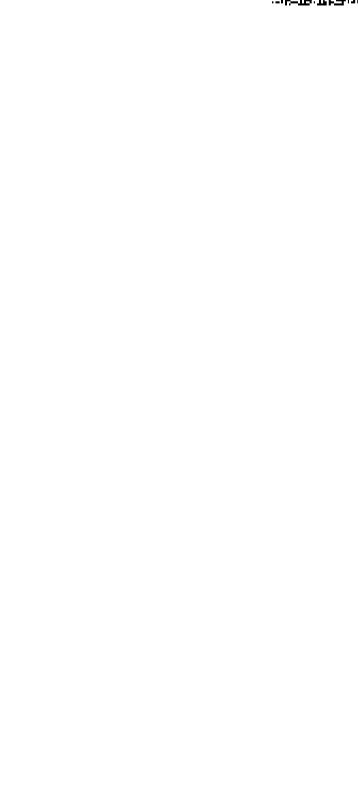

# 奇门应用研究与股市实战解秘


| 九天 | 值符 | 腾蛇 |
| --- | --- | --- |
| 惊门 乙 | 开门 壬 戊 | 休门 丁 |
| 天辅 乙 | 天英 壬 禽 | 天芮 丁 |

### 分析：

(1) 为什么说所借钱款数目不小，应在550万台币左右？
日干戊落坤2宫，为求测者兔兔小次郎，逢天芮说明求测者是学生，戊为钱财，丁奇为帐目，休门为家庭积蓄，遇天芮说明他家的钱财经济帐目积蓄出了问题，坤2宫上乘螣蛇，一方面主求测者为家里钱财帐目之事忧心重重，另一方面主家里的钱财经济帐目有变化。己为太岁又为月干落乾6宫，月干己为他家的朋友，值太岁主这个朋友有身份，可能是个大老板，坤2宫甲子戊来生乾6宫月干己，说明他家的钱借给了这位朋友。借了多少钱出去呢？戊在地盘落中5宫，天盘落坤2宫，现在巳月，中5宫坤2宫均旺相，中5宫为5，10数，坤2宫为2，5，8，10数，综合判断应为550万台币以上。

(2) 为什么说这笔借款近期难以要回，要做好承担损失的心理准备？
年干己为兔兔小次郎的父母，与月干己均落乾6宫，临伤门，为讨债者，天乙天英星为欠债者落离9宫旺相，上乘值符与债主同宫，说明欠债者与兔兔小次郎的父母相识，离9宫天英星克乾6宫伤门，说明欠债者不还，难以要回。大局九星伏吟，短期内没有希望要回，只有等以后再说了。

#### 实例五：做笔生意，盈利几何？

2009年03月03日深夜，有一朋友起局求测，说想做笔生意，但未说具体投资数目，急切想知道能盈利多少钱？我按其奇门判断，当即告诉其可盈利数目与9数有关，很可能为3.9万元左右。过了些日子，其在4月21日反馈说，盈利约为3.9万元。

现将分析判断过程详述如下：

```
时间：2009年03月03日00时28分
农历：己丑年二月初七日子时
干支：己丑丙寅丁未庚子
旬空：午未戌亥寅卯辰巳
雨水：下元庚子时旬首为辛
阳遁三局值符天心落五宫值使开门落三宫
```

| 九地 | 九天 | 值符 |
| --- | --- | --- |
| 庚 休门 乙<br>禽 天芮 己 | 生门 壬<br>天柱 丁 | 伤门 辛<br>天心 乙 |
| 玄武<br>开门 丁<br>天英 戊 | 庚 | 螣蛇<br>杜门 丙<br>天蓬 壬 |
| 白虎<br>惊门 己<br>天辅 癸 | 六合<br>死门 戊<br>天冲 丙 | 太阴<br>景门 癸<br>天任 辛 |

### 分析：

为什么当即告诉其可盈利数目与9数有关，很可能为3.9万元左右呢？
因为日干丁奇落震3宫，下临甲子戊，主其做生意投资3万元左右，生门为盈利，落离9宫旺相，取9数，故断其可盈利数目与9数有关。

### 十二、体育比赛分析判断研究

值符为裁判，以日干或时干为运动员，庚为比赛器具，辛为金牌、奖品，景门是战略、战术或比赛取胜方法、技术指导。如果主队与客队比赛，则须分主客，一般以地盘时干为主队，以天盘时干为客队，以其落宫的旺相休囚、格局好坏、生克关系来定输赢。

以比赛时间预测时，以天盘日干为客队，以地盘日干为主队，以其落宫的旺相休囚、格局好坏、生克关系来定输赢。

#### 实例一：中国巴西女足赛，赛前胜负已判定？

听说明晚20：00点中国女足与巴西女足在武汉进行比赛，谁会胜出较为关键，我以比赛时间起局如下：

- 时间：2007年09月15日20时16分
- 农历：丁亥年八月初五日戌时
- 干支：丁亥己酉壬子庚戌
- 旬空：午未寅卯寅卯寅卯
- 白露：上元第4天庚戌时旬首为壬
- 阴遁九局值符天禽落七宫值使死门落八宫

| 六合 | 太阴 | 螣蛇 |
| :--- | :--- | :--- |
| 开门 丁<br>天冲 癸 | 休门 癸<br>天辅 戊 | 生门 戊<br>天英 丙 |
| 白虎 |  | 值符 |
| 惊门 己<br>天任 丁 | 壬 | 壬 伤门 丙<br>禽 天芮 庚 |
| 玄武 | 九地 | 九天 |
| 死门 乙<br>天蓬 己 | 景门 辛<br>天心 乙 | 杜门 庚<br>天柱 辛 |

分析：

（1）在武汉比赛，巴西女足远来为客队，则中国女足为主队，以比赛时间起局预测，则以天盘日干为客队巴西女足，以地盘日干为主队中国女足，客队居7宫临酉月旺相，主队居2宫在酉月休囚，2宫生7宫主队生客队，中国女足非败不可。

（2）2宫螣蛇说明主队队员信心不足，天英踢的太急躁，生门虽有活力生气，但戊+丙鸟跌穴球门失守，不利。

（3）7宫上有值符为裁判对客队有利，伤门队员很历害，天芮善于研究解决问题，丙+庚为荧入白利主利防守，壬+庚为太白擒蛇说明客队球门守得很死，球根本踢不进去。

实际：巴西女足以4比0大胜中国女足。

#### 实例二：蒙特利尔电影节，稳获大奖提前知。

世界著名电影导演，柏林电影节金熊奖获得者，我国第六代电影导演王全安，于2009年8月30日携参选电影《纺织姑娘》，前往加拿大参加蒙特利尔电影节。当晚北京时间8时左右，我起局预测王全安这次定能获得蒙特利尔电影节大奖，当即将预测结果发短信祝贺正在加拿大转机途中的王全安。13日我得知王全安已荣获蒙特利尔电影节两项特别大奖，特地发了短信表示祝贺。下面将预测判断经过详述

奇门应用研究与股市实战解秘

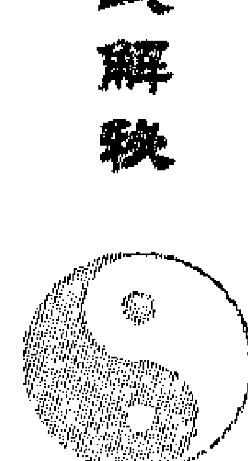

如下：
时间：2009年08月30日20时52分
农历：己丑年七月十一日戌时
干支：己丑壬申丁未庚戌
旬空：午未戌亥寅卯寅卯
处暑：下元庚戌时旬首为壬
阴遁七局值符天冲落五宫值使伤门落六宫

| 太阴<br>惊门 丁<br>天蓬 辛 | 螣蛇<br>开门 乙<br>天任 丙 | 值符<br>休门 壬<br>天冲 癸 |
| 六合<br>死门 己<br>天心 壬 | 庚 | 九天<br>生门 辛<br>天辅 戊 |
| 白虎<br>景门 戊<br>天柱 乙 | 玄武<br>杜门 癸<br>禽 天芮 丁 | 九地<br>伤门 丙<br>天英 己 |

分析：

为什么预测王全安这次定能获得蒙特利尔电影节大奖？

(1) 日干丁奇落巽4宫旺地，上乘太阴吉神，逢惊门天蓬，丁奇为电影新思想，太阴为导演策划，惊门为知名度高的名人，天蓬为有大智慧大作为的人，说明王全安为有大作为的国际著名导演。丁奇下逢辛，辛为金牌，说明王全安曾经在柏林电影节上得过国际最高大奖金熊奖。

(2) 以景门为王全安所导演的电影《纺织姑娘》，景门落艮8宫，上乘白虎，说明电影《纺织姑娘》的竞争力很强，临乙奇为上佳的影片，逢天柱会得到评委和观众的热议，戊 + 乙为青龙合灵吉格，说明电影《纺织姑娘》实力很强。

（3）值符为电影节的评委，落坤2宫，临月干壬朋友，说明评委中有王全安相识的朋友，坤2宫旺相上乘值符，可判断王全安这个相识的朋友可能为有身份的人，大概是评委会的领导。值符坤2宫与电影《纺织姑娘》所在的艮8宫比和，时干庚落坤2宫地盘，说明评委们对电影《纺织姑娘》很看好。

（4）又以时干庚为电影《纺织姑娘》落坎1宫，以辛为蒙特利尔电影节大奖落兑7宫，兑7宫生坎1宫，可以肯定的判断出，蒙特利尔电影节大奖定会颁发给王全安导演的电影《纺织姑娘》。

### 十三、综合分析判断研究

综合使用奇门预测，既是对预测者奇门基础知识掌握程度的一个考验，又是对各项奇门知识灵活应用的体现，它要求预测者既要有扎实的奇门功底，又要有丰富的社会实践经验。在预测中要找准并抓住用神，遵循奇门预测的规律，大胆灵活运用，才能做到得心应手，运用自如。

#### 实例一：婚姻事业与健康，朋友三人关心问？

昨天中午朋友请去吃饭，席间应邀为朋友预测，一盘同时断了三人，其准令朋友赞叹。

- 时间：2005年11月24日13时19分
- 农历：乙酉年十月廿三日未时
- 干支：乙酉丁亥壬子丁未
- 旬空：午未午未寅卯寅卯
- 小雪：上元第4天丁未时旬首为壬
- 阴遁五局值符天蓬落八宫值使休门落七宫

## 奇门应用研究与股市实战解读

| 九地 | 玄武 | 白虎 |
|------------------|------------------|------------------|
| 死门 庚<br>天冲 己 | 惊门 己<br>天辅 癸 | 开门 癸<br>天英 辛 |
| 九天 |  | 六合 |
| 景门 丁<br>天任 庚 | 戊 | 戊 休门 辛<br>禽 天芮 丙 |
| 值符 | 螣蛇 | 太阴 |
| 杜门 壬<br>天蓬 丁 | 伤门 乙<br>天心 壬 | 生门 丙<br>天柱 乙 |

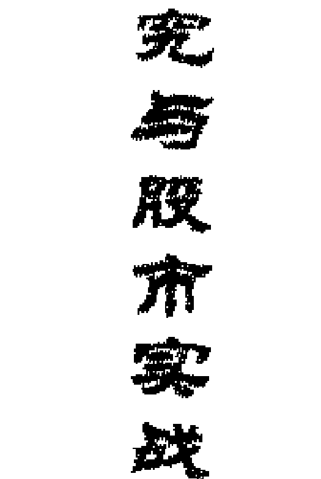

### 分析：

（1）坐巽方的女经理临死门、庚、上有九地下有玄武，主人行事稳重死板，事业受阻，内心压抑情绪低落，公司最近破财管理上有漏洞不易查出和纠正，公司出过事死过人，天冲是这个女的1.63米左右高，做事有创劲，有开拓性。庚临死门天冲又主其丈夫事业上受到冲击和考验，庚+己主被重刑。己是想好起来，4宫中有庚，是想要老公好起来，另4宫主流通，逢死门与庚不是公司流动资金出了问题，就是这个女经理血液循环心脏上有问题。问婚看六合7宫临休门天芮出了问题，婚姻处在有名无实的状态，六合戊与辛+丙同宫，婚姻靠钱财维系，日后必会因财出现纠纷和官司，明年卯月3宫填实与六合宫冲克婚姻上会出现大的矛盾。庚主夫，地盘在3宫，上有丁奇主有第三者女人，临景门这个小妹是做旅游信息咨询工作的，天任主1.68米左右高，人勤快任性，九天外地的人，3宫先天位是东北人（大连人），3宫空主老公以前的事。六合7宫地盘丙主这个女经理在生意合作上有过第三者，丙落6宫逢生门天柱是做房产开发房屋管理土建土管工作的，在乾有职务，太阴主暗中或老谋深算，地盘螣蛇虚情假意，天柱这个人做事有魄力是靠制度管人的，1.77米左右高，为人圆滑，地盘乙为太岁主有后台，可惜这个后台现人墓。6宫克4宫，这个人只是生意上的朋友，与她并无实质关系。

# 奇门应用研究与股市实战解秘

(2) 坐坤宫的男的临开门主要问工作事业上的事，地盘六合，主有两份工作或有合作事求助事，一主一兼职，但都出了问题，辛是自己的错误造成，天英这个人性子急爱面子注重形象穿戴，1.77 米左右高，上有虎工作上有意外灾祸或家有母亲辈的丧葬孝服事（坤宫），虎也主本人做过手术，坤宫脾胃消化系统，癸可能是阑尾炎或痔疮做过手术。地盘戊临开门投资上的事，见辛是在资金上有问题。问合作事，看六合，戊临芮资金短缺，值使休门公司暂在休整，六合在兑，合作方是女的，辛+丙是合上合，可能是夫妻之间合作，不过最后会因财致讼。求财看6宫生门上有太阴主要靠人际关系送礼说情，生门6宫上有太阴生太岁1宫，主要送6万左右钱去主管领导那说情，主管领导上有螣蛇好变虚诈犹豫不定，伤门天心为这事在伤脑子玩心计，壬、天心会动心，乙+壬怕出事，7宫六合、戊为中间送钱的人生1宫，定去送钱。生门天柱是违规生财，开门上有虎司法管理部门找事，值使门休门没事，时干8宫天蓬破点财，事会办成。日干宫壬+丁淫合，杜门主秘密，天蓬胆大好色，上有值符没事，8宫空，主自己以前与小妹的事。

(3) 坐离宫的小伙子上有玄武主破财，惊门官司犹疑之事，天辅主性格较温和，有人帮，地盘虎出过意外，受过伤做过手术，心肝消化不好，女朋友在1宫临伤门，人厉害有能力，从事与车船飞机交通军警司法刑侦导游走动有关的工作，天心人有管理能力有心计，高1.66米左右，有气质白净，上有蛇虚情假意三心二意，壬主工作与走动有关，乙宫克9宫女友对你不满意不同意。

实际上：后来得知，以上所测均成事实。

#### 实例二：起名改名者，也求奇门测。

下午办完事顺便去雍和宫看看有没有易学方面的好书，转了一圈没发现什么好书，就顺便进了一家起名改名的算命屋，问问看有没有什么藏书，谁知和两个算命先生攀谈了起来，从谈话中他们知道我是学奇门的，其中有一个崔姓人坐北面，让我帮他看看财运，于是我当即起局如下：

- 时间：2005 年 10 月 27 日 18 时 00 分
- 农历：乙酉年九月廿五日酉时
- 干支：乙酉丙戌甲申癸酉
- 旬空：午未午未午未戌亥
- 霜降：中元第 1 天癸酉时旬首为戊
- 阴遁八局值符天任落三宫值使生门落八宫

| 九天 | 九地 | 玄武 |
| :--- | :--- | :--- |
| 杜门 癸 | 景门 壬 | 死门 乙 |
| 天冲 壬 | 天辅 乙 | 天英 丁 |
| 值符 |  | 白虎 |
| 伤门 戊 |  | 辛 惊门 丁 |
| 天任 癸 | 辛 禽 天芮 己 |  |
| 螣蛇 | 太阴 | 六合 |
| 生门 丙 | 休门 庚 | 开门 己 |
| 天蓬 戊 | 天心 丙 | 天柱 庚 |

### 论断：

(1) 崔姓人和日干庚都落 1 宫，天心，丙奇月干是心乱，也主与同事在一起，地盘蛇心里有事纠缠，庚 + 丙贼必来，贼来定要破财。
财运看生门 8 宫，上有蛇缠着破财事，天蓬主大破财，丙心急心乱，戊是钱在 8 宫长生主钱多，丙 + 戊鸟跌穴，可能钱要破在此屋。
生门也主算命屋，上有蛇说明这个屋就是算命用的，天蓬主投机生意有大财，鸟跌穴是生意好。生门宫克日干坐宫也主破财，生门 8 宫主 800 或 8000，500 或 5000 元。再看大局八门伏吟也主破财，伏吟说明只是说在口中，还未行动，就是说还没破财。
刚断到这，对方就说对，马上要等老师回来，补交 5000 元学费，## 第三章 奇门分类研究实例

把改名学完。我才意识到这两个人是学徒，怪不得开门6宫空呢，原来这算命铺子主人不在啊，这两个人不也没正式工作吗？

(2) 坐在西边的小伙子也要给他看看，我一看兑宫，上虎中芮，又有丁，地盘六合，中有惊门，定是与女人合作或有暗昧惊疑欺诈是非之事，天芮主要出问题又主学生在学习。问财运看八宫生门逢天蓬蛇来生兑宫，定是用算命投机诈骗发财，可能为800元左右。看到这，我说：马上有一笔财来找你，而且不少。他说对。崔姓人说不对，哪有的事。小伙子说对，他不知道。我对小伙子说别和女人一起做这个事，会有是非。

又问他的老师怎么样，我一看天辅在9宫生宫大旺，景门是有绝技绝秘口诀，壬主经常出外不在，九地是保守不外传，地盘玄武比较狡猾阴险，天辅宫克兑宫，是老师不想教学生真东西。看到这，我说你的老师有真本事，对你很严格，怕伤了小伙子的心，没敢说真话。小伙子说，我的老师经常被一些有身份的人请去算命。

(3) 崔姓人说你再给这个女老板（本人不在场也不知）看看，我以为是他的朋友，就看丙宫8宫，一看就说这个女的是做大生意的（生门戊旺地盘值符），而且投机性强（天蓬），不过现在破财，又被什么事缠着（蛇），运气不好。他说你再细看看，我说你知道她的生年吗？他说我给她测过知道她是属蛇的，可能是1965年乙巳年生人，年命乙在2宫入墓，逢死门，运气极差，死门从职业上看可能是搞地皮生意的，上玄武主官司是非破财，天英是人性格急躁爱面子，长相美丽高1.69米左右，丁奇是有一个女的在帮她。刚说到这，崔姓人说你说的对极了，这个女的是做房产的，可能是要盖CBD的地方有2个单位，人家死活不搬，已经拖了好长时间了，她去年也赔了不少钱。这个女的已倒霉快三年了，我们去过她两处住宅帮她看过，并听说她有某某夫人帮她，你再看看。我一看驿马星在6宫动，六合在六宫空动，开门逢天柱，戌月6宫旺，己+庚利格反名，词讼先动者不利，说明这个女老板这个月在法院已有官司开审了，并且对她自身并不利，尽管地盘太阴，2宫年干乙生开门6宫，有高官夫人说情走后门，但

奇门应用研究与股市实战解数

大局八门伏吟，利原告不利被告，可能官司要输，加上年命入墓逢死门，弄不好要坐牢。崔姓人说这么不好，我得告诉她。随后他们又帮我测了一下名字，给我引见了一位奇门算命师，就各忙各的去了。

#### 实例三：森林大火何日灭？

### [报道追踪] 黑龙江内蒙古多处森林大火仍在燃烧

据新华社电　黑龙江省和内蒙古自治区近日燃起的森林大火牵动着人们的心，扑火官兵仍在全力以赴与大火搏斗，林业部和相关省区多名高级官员已经赶赴现场亲自督战。

记者从黑龙江省大兴安岭地区森林防火指挥部获悉，由于气象因素不利于人工增雨和化学灭火，扑火队伍将集中地面兵力对大兴安岭砍都河火场实施“攻坚战”。目前，砍都河火场总兵力为8266人，飞机5架，扑火队伍将根据火场风力、风向等条件集中扑打一线明火。

大兴安岭地区森林防火指挥部办公室值班负责人李海介绍说，由于缺少河流等自然依托，加之风力大、风向不定，用点烧防火线的方法来控制火场风险较大，容易失控。现有的8架化学灭火飞机因撒药量少及投放精度受风力影响较大等原因，也很难正常发挥作用。因此，现在只能集中地面兵力扑打一线明火。

据悉，大兴安岭地区于26日夜在砍都河火场实施的人工增雨受气象因素影响降水量不足1毫米，对地面扑火工作影响不大。气象预报显示，5月30日后大兴安岭地区将具备降水条件，届时如仍有火场未被扑灭，有关部门将实施人工增雨。

国家森林防火指挥部27日晚发布的消息：发生在黑龙江嫩江县嘎拉山和内蒙古免渡河的森林火灾仍在扑救中。

目前，嘎拉山火场有5300多人、5架飞机参加扑火；免渡河火场有4898人、3架飞机参加扑火。因风力大，风向多变，扑救十分困难。扑火前明确了保人、保村屯、保资源的扑救重点。

国家林业局局长贾治邦要求制定科学方案，周密部署，科学指挥，确保扑火人员和火场附近村屯群众生命财产安全。国家林业局副局长雷加富、张建龙已在前线协助指导地方政府组织扑救工作。

黑龙江省委书记钱运录、省长张左已听取了扑火情况汇报，并派出省委副书记栗战书赶赴火场。黑龙江副省长刘学良、内蒙古森防指领导已在前线组织指挥。

据气象部门提供的情况，黑龙江、内蒙古北部林区降水比常年减少30%以上。今年5月，黑龙江省平均降水比历年同期减少72%，平均气温比历年同期增高2.5摄氏度。这种气候条件对今年防火工作十分不利，森林火险气象等级居高不下。

看到报道，我立即起局预测如下：

公历时间：2006年5月28日15时

农历时间：五月初二日戊申时小满中元

当日干支：丙戌癸巳丁巳戊申

当日旬空：子丑（日）寅卯（时）

阳遁二局值符天心落二宫值使开门落一宫

|九地|九天|值符|
|---|---|---|
|辛 伤门 戊<br>禽 天芮 庚|杜门 癸<br>天柱 丙|景门 壬<br>天心 戊|
|玄武<br>生门 丙<br>天英 己|辛|螣蛇<br>死门 乙<br>天蓬 癸|
|白虎<br>休门 庚<br>天辅 丁|六合<br>开门 己<br>天冲 乙|太阴<br>惊门 丁<br>天任 壬|

分析：

（1）从奇门局看，景门为火灾在2宫，宫中有壬水为火灾有救，地盘辛为失误过失着火，值符景门同宫主为大火，2宫3宫休门玄武空亡难克2宫景门，主暂时火势难以控制，值使门落坎1宫有开门六合，主大约有1000人还有飞机车辆等在救火。

（2）值使门为期限，值使开门落在坎1宫主火势大概会持续10天左右，也就是到丑寅日艮8宫填实，8宫驿马动带动休门水冲克坤2宫景门火，大火可灭。看应期，以先见为应期的原则，丑日8宫填实为应，大火可灭。

丑日当为第9天，也就是6月5日大火可灭。

结果：据报道，6月6日胡锦涛总书记表彰了扑灭大火的全体官兵，在5日火情已经没有了。

### 十四、射覆分析判断研究

射覆首重时干与所射之事物用神，以所要射之事物用神宫为参考，结合当时具体情况重点分析判断，才可提高准确度，当然射覆也要有必然的先知条件，否则研究起来就较为困难，其意义也不大。

#### 实例：墙壁有装修，油漆为何色？

台湾的 Dcchang 兄：今早慢跑后，照往例到土地公庙洗脸并拜拜，拜拜时，才发现土地公后面及上面的墙面，被重新油漆，新油漆的颜色让我很不喜欢，总觉得不相配合，请问易友，究竟是上了何种颜色的油漆？

公历：2005 年 7 月 30 日辰时
当日干支：乙酉癸未乙卯庚辰
当日旬空：子丑（日）申酉（时）

### 阴遁一局值符天英落八宫值使景门落三宫

| 九地 死门 辛 天柱 丁 | 玄武 惊门 壬 天心 己 | 白虎 开门 戊 天蓬 乙 |
| 九天 癸 景门 乙 禽 天芮 丙 | 癸 | 六合 休门 庚 天任 辛 |
| 值符 杜门 己 天英 庚 | 螣蛇 伤门 丁 天辅 戊 | 太阴 生门 丙 天冲 壬 |

试用奇门来断一下：

1. 螣蛇主怪异、鬼神、迷信，这里主土地公，丁奇测事最灵，在颜色主红色，与螣蛇同宫当然是红色了。
2. 景门主寺庙旅游风景观光之地，乙为日干为 Dcchang 兄，天芮为信徒，三者同宫，说明 Dcchang 兄去了寺庙。
3. 庚为时干主事落7宫主有麻烦事或未解决的事，临休门在休息，庚+辛必定要动，说明 Dcchang 兄在运动，但不可远行，否则有灾，去了寺庙可免。
4. 还可以艮8宫为寺庙，己土为墙壁，己下有庚主克主墙被改动，杜门主神秘，这里当寺庙土地公看，天英星就是红色了。

### 十五、奇门运筹研究

奇门以运筹见长，奇门运筹是数术运用中的精华。奇门运筹分谋略决策和时空方位选择以及化解调理，一般以奇门谋略决策为主来运筹，因时空选择、化解调理需要借助自然界的神秘力量与物质组合能量场的能量，在吉凶程度上很难用科学实验去证实把握，但在心理上确实会起到一定的作用，多属于心理层面上的运筹，所以对于时空选择与化解调理运筹，应客观评判，既不能否定，也不能夸大其作用，在实践中应谨慎使用。由于篇幅所限，这里仅对奇门运筹中的谋略决策，进行简单介绍。

古人云：凡事预则立，不预则废。意思是说，大凡每遇大事，必预先计划分析，进行可行性研究分析，日后实施起来，才能按部就班，不致于手足无措，使大事荒废，错失良机。奇门谋略决策运筹，正是每于行事前，察知先机，于事前预知事体之吉凶成败，从而在事前制定应对策略方案，皆尽其预测策划之能事。奇门运筹表面看似抽象离奇，实质则省时省力，占尽先机，有现代方法所不能替代的功用。奇门预测谋略主要以时家数理转盘奇门为研究对象，立足现实，找出事物的转机之处，提出应对策略，使吉者更吉，凶者减凶，甚至挽回败局。

奇门运筹，以谋略决策为要，具体来说，大凡遇事先以天机念头动处或事物始发之时为灵机，起局加以预测，若事成，则应以谋略决策吉上加吉锦上添花。若事体不明或有败，则视事物具体情况，以奇门谋划运筹，减少损失或挽回败局。

- 以八神来说，乘值符宜深藏不露，运筹帷握，指挥若定，掌控全局；
- 乘螣蛇宜变化不定，难以琢磨；
- 乘太阴宜密谋策划，暗中行事，谈情说爱，以情感人；
- 乘六合宜借助合力，多方联合，中介合婚；
- 乘白虎宜乾纲独断，武力强制；
- 乘玄武宜钻营投机，行私舞弊，弄虚做假；
- 乘九地宜固守积蓄力量，潜伏等待时机；
- 乘九天宜主动出击，开拓前程。

- 以九星来说，遇天辅宜尊师重道，增加学问；
- 遇天英宜注重外表包装，重视礼仪；
- 遇天芮宜访问交流，注重问题事故防范；
- 遇天柱宜破旧立新，直言谏仪，言传说教；
- 遇天心宜以谋略指挥见长；
- 遇天蓬宜大胆行事，大有作为；遇天任宜果敢坚毅，谨慎勤勉；遇天禽宜镇守中宫，发号司令，稳中有胜；遇天冲宜快速上冲，讲究效率。

以八门来说，临杜门宜躲避保密或以技术见长；临景门宜包装策划宣传；临死门大事不宜；临惊门宜惊天动地一名惊人说教服人；临开门宜开发开放以政要为重；临休门宜拜见首脑休养生息以家庭为重；临生门宜投资理财商贾觅利；临伤门宜攻击竞技钓鱼博弈。

以格局来说，遇鸟跌穴龙返首，宜求财求官求婚姻，百事可为。鸟跌穴利引资，龙返首利回款。伏吟宜静待时机，反吟宜积极主动先发制人快速行事。贼必来格宜积极主动，贼必退格宜退守。伏吟、逢合利聚合之事，反吟、击刑防散乱之事。悖格防乱，投江矫矫防音信沉溺。庚格遇阻，刑格身心疲惫有损失。空亡不实，入墓防骗。五不遇时，别忧豫。

奇门专以行兵打仗为长，类比现代企业间的竞争管理再好不过。在企业运筹谋略时，以八神来看，乘九天时宜积极主动向外发展，利开发市场销售产品。乘九地时宜固守加强企业内部管理，积蓄力量，屯积谋利。乘值符时宜不露行藏，利放贷，打造名牌，加强指挥管理。乘白虎时宜以暴制暴，利突发袭击，察寻漏洞。乘螣蛇时宜声东击西，制造假象，变换不定。乘玄武时宜制造虚假消息，迷惑对方。乘太阴时宜以情动人，奖励优抚员工，策划品牌暗中行事。乘六合时宜寻求合作争取支持，利谈判中介合作。

以九星来看，临天辅时宜加强企业文化建设，平稳经营。临天英时宜策划，加强企业广告宣传，搞好包装。临天芮时宜加强行业间的互访交流，取长补短，排查事故。临天柱时宜加强企业产品品牌创新，加强制度管理，兼听采纳为明。临天心时宜加强企业战略策划，以谋略发展。临天蓬时宜大胆运作，要有大的作为。临天任时宜持之以恒，加强生产，以田地房产觅利，谨慎从事。临天冲时宜加强企业效率，保持快速发展势头。临天禽时宜领导有方，稳中求进。

以八门来说，逢杜门宜暂时躲避或设置障碍，以技术取胜，利圈养生畜。逢景门宜加强包装策划装饰鼓吹，以外表赢人，利开发旅游名胜。逢死门只宜殡葬屠宰仓储，利处理存放垃圾，地皮谋利，大事不宜。逢惊门宜辩护演说，设法一举成名。逢开门宜开拓向外发展，开发产品，开拓市场，与政府交好。逢休门宜休养生息，拜会领导，加强内部管理，利出游，利接待设置员工宿舍。逢生门宜投资贸易房产求财觅利，加强生产，利设置生产基地。逢伤门宜激励员工，加强企业间的竞争，利追讨债务。

阳时利客，反吟利客，贼必来格也利客，这时企业在决策谈判合作营销时要大动干戈，大造声势，先入为主，先发制人，占尽先机。阴时利主，伏吟利主，贼必去格利主，这时企业在决策谈判合作营销时，要静待时机，以静制动，后发制人，沉稳运作。

#### 实例：竞争职务运筹。

单位举办领导职务竞争上岗活动，要求大家尽可能的参加，因我这几年与机关领导很少来往，觉得成功的可能性很小，没有对此抱太大的希望。转念一想自己不是在学易吗，预测一下看看，若有可能不妨试试，于是按自己动念头的时间起局分析：

- 时间：2005年05月23日15时42分
- 农历：乙酉年四月十六日申时
- 干支：乙酉辛巳丁未戊申
- 旬空：午未申酉寅卯寅卯
- 小满：下元戊申时旬首为壬
- 阳遁八局值符天冲落八宫值使伤门落七宫

# 奇门应用研究与股市实战解秘

| 太阴 | 六合 | 勾陈 |
|---|---|---|
| 开门 己 丁 | 休门 辛 | 生门 乙 |
| 天英 癸 禽 | 天芮 己 | 天柱 辛 |
| 螣蛇 |  | 朱雀 |
| 惊门 癸 |  | 伤门 丙 |
| 天辅 壬 | 丁 | 天心 乙 |
| 值符 | 九天 | 九地 |
| 死门 壬 | 景门 戊 | 杜门 庚 |
| 天冲 戊 | 天任 庚 | 天蓬 丙 |

局中开门所在巽4宫虽生日干丁奇所在离9宫，表面看可以成功，但细看八门反吟，日干所在离9宫中有天芮凶星，只利交流研讨考试，辛+己入狱自刑凶格，丁+己火入勾陈凶格，虽有六合来助，休门吉门，但六合需借助外力，休门需拜求贵人，休门落迫宫，大事不妙，事有不顺，反复不定无常之象，此为天命，虽非人力可以改变，但尽人事，运筹得当，也能获得声誉，减少败局，为来日成就事业奠定基础。

当下，我按反吟局，宜积极主动，要大动干戈，大造声势的运筹策略，决定积极准备复习参加应考，以天芮利考试的优势，在初次竞争中，争取考出好成绩，一来可以给领导层一个良好的印象，二来可以表现自己的能力，展示自己的才华，增强自己在群众中的威信，增加个人魅力。

其次是日干上乘六合，当争取外力的支持和帮助，形成合力。再是逢休门贵人，宜拜会上级官员领导贵人，取得信任和支持。

通过以上运筹，尽人事听天命，纵使不能扭转乾坤，也能通过这次活动扩大自己的影响力，增加竞争经验，增强竞争实力。

结果：我顺利通过笔试面试民意测试，获得领导干部选拔任用资格，并且在面试考核中由于我的突出发挥表现，受到总站主要领导的表扬和好评，事后虽然没有被任用，但是却获得了锻炼，展露了个人才华，受到了领导的赏识，增强了威信，为今后打下了良好的基础。
如果听天由命，不积极努力，或事在人为的去蛮干，其结果，要么会丧失锻炼表现的机会，要么会造成不良的经济损失，都会造成事倍功半事于愿违的不良后果。由此，可见奇门运筹谋略决策，决非可有可无，只要运用得当，便可收到事半功倍，四两拨千斤，小钱大用的效果。

# 中编 奇门与股市应用原理

## 第四章 奇门数理模型的全息周期性

### 一、宇宙全息统一论

早在二十年前的1987年，王存臻和严春友两位先生在张颖清教授的成名之作《生物全息律》（就是基于以小窥大的中医整体观，嫁接全息照相的全息概念，来说明生物体每一相对独立的部分，为整体比例缩小这一全息现象）基础上，通过研究论证，创作了《宇宙全息统一论》（1988年3月由山东人民出版社第一次印刷出版），这就是王存臻主席主创的震惊世界科学界的宇宙全息统一论。

下面兹引述王景祜先生对《宇宙全息统一论》的推荐文章，来对《宇宙全息统一论》作整体介绍和论述。

《宇宙全息统一论》共分九章：全息思想史、宇宙全息图、物质全息律、精神全息律、物质—精神全息律、时空全息律、宇宙全息律、全息哲学观、宇宙全息统一论。

在《全息思想史》这一章中，作者介绍了古代东方朴素的全息思想，即阴阳、五行和八卦学说、《道德经》中的全息思想、中医学中的全息思想、佛教思想中全息思想、古代中世纪和近代西方哲学和科学史中的全息思想、马列主义经典著作中的朴素的全息思想，特别是恩格斯在《自然辩证法》中所表露出来的朴素的全息思想，最后，还介绍了当代国际学术界的全息思想。其中，特别提到全息技术的发展史。全息技术是1948年由盖伯发明的。他的概念和理论均构成了现代全息技术的理论基础。到了20世纪60年代初期，由于激光技术的问世，使全息照相术得到了迅速的发展。全息照相，顾名思义，它是物体全部信息的照相；即使一张照片被撕成许多碎片，每一小碎片仍能再现出物体的整个图像来。这是因为全息照片的每个部位上都受到了被摄物体各部分反射光的作用，从而使每个部位上都浓集了被摄物体整体乃至每个部位的信息。人们都有这样的体会：当从屋里观看外部景物时，无论从窗口还是从窗户的某一块玻璃，甚至某一个小孔观看出去，都能观察到窗外的全部景物，而且清清楚楚。全息照相和这种情况具有相同的道理。所以，全息照相的出现，不仅为人们提供了一种新颖的摄影技术，而且成为人类探索和认识世界的不可缺少的有力工具。

全息概念的基本含义是：部分（或子系统）与部分，部分与整体之间包含着相同的信息，或部分包含着整体的全部信息。它揭示了信息或世界的整体性、不可分割性；或宇宙在信息意义上的同一性和统一性。于是我们就看到了一幅奇妙的宇宙全息图景：宇宙间的一切系统、一切事物、一切层次都互相渗透、互相包含、互相转化、互相潜含、交互摄入、重重映现、无穷无尽……大宇宙包含着无数小宇宙；大系统包含着无数小系统；高层次包含着无数低层次；每一小宇宙、低层次、小系统都是大宇宙、高层次、大系统的缩影。作者把这种“中国套盒式”的结构称为“全息递归结构”，这一切又互相依赖，一事物依赖在一切事物上面；一切事物也依赖在每一事物上面；可以说一事物由一切事物组成，它也构成了一切事物。宇宙的一切事物互相感应，处于动态的全息联系之中，每时每刻在互相交流着内心的“情感”，形成了一曲波澜壮阔的宇宙大合唱。

“信息”这个词已经成为当今世界的时髦用语。可是，当问到“什么是信息？”时，人们却无言对答。

> “信息是物质、能量和精神的属性或存在模式，是物质、能量和精神的时空序（这里的“序”包括两个方面：有序和无序。不应把信息理解为事物的有序性，因为无序也是一种序，因而无序也是一种信息，信息是有序和无序的总和。）”

这样，我们就把信息、物质、能量和精神有机地联系成一体了。”

全息性也是事物模糊性的根源。因为全息性表明事物是亦此亦彼、此亦是彼、我中有你、你中有我；而且全息性表明事物只是关系凝聚体，而关系时时处于变动之中，是不确定的。不确定性是模糊性的一个特征。全息律的普遍性宣布了模糊性是事物普遍具有的一个属性。由此可见，宇宙全息论是辩证唯物主义根据当代科学发展成果对其普遍联系原理的必然推论和深化。

在《物质全息律》一章中，作者介绍了：

- 物理全息律
- 化学全息律
- 生物全息律
- 广义生物全息律
- 社会全息律
- 生态全息律

在这一章里，作者以他们雄厚的现代科学理论为基础，作了极其精彩而深刻的解析和叙述，看了令人十分信服。

> “生物全息律从本质上揭示了生物机体的部分与整体间的全息关系，部分即整体，整体即部分。但从存在形态上来看，部分与整体分属不同层次，属于不同的态。生物机体的部分是潜在的整体。从显态上来看，生物机体的任一部分都是与整体不同的，细胞、枝节、叶片都不同于整体。但是从潜在信息的角度来看，细胞、枝节、叶片都包含着同整体相同的信息。”

这就使生物体的每一部分都包含了DNA系统的全部信息。DNA 是整体信息的储存库，以后的发展过程（就是目前的克隆技术——本文作者注）不过是从这个信息储存库不断提取已储存的信息而已。这种信息的提取不是零散的，而是很慷慨地以 DNA 的整体信息为一个单位，整份整份地往外提取的，这样就使每一个复制细胞都分有一个元细胞的完整拷贝，从而使每一群细胞在# 中编 奇门与股市应用原理

构成更高层次的全息元的时候也按这个拷贝的模板来复制这个全息元。

1964年，斯丢瓦德对胡萝卜韧皮部的细胞进行组织培养，结果成功地再生了完整的胡萝卜植株，从而以确实的证据表明，除了植物的性细胞以外，它的体细胞也具有全能性（包括传种能力），从而揭开了克隆技术的序幕，尽管当时还没有明确提出“克隆技术”这一名称。我们不难看出，目前，国内外各类媒体所报道的“克隆技术”，实际上就是对生物体实行的自我复制过程进行控制，使之变成符合人们意志所需的“人工复制”而已。这种复制之所以成为可能，正是由于每个细胞中都包含着整个生物体的全部信息，对全部信息进行定向地选择和淘汰，就能复制出符合人们所预期的生物体来。

宇宙全息统一论揭示了能够将一切领域沟通起来的宇宙万物的构造规律，揭示了世界物质统一性的具体方式，深化了普遍联系的原理，丰富了转化论，使古老的整体观焕发青春。宇宙全息统一论首次从全息统一的高度阐明了宇宙的大统一，为科学的大统一奠定了理论基础。提出了全新的宇宙整体观，使人们从一个崭新的角度来观察自身与世界，具有重大的方法论意义，成为打开宇宙迷宫的金钥匙。它有力地促使中国文化的基础得到了现代科学的证明——天人合一与宇宙全息论。

《宇宙全息统一论》吸收了古代东方朴素的全息思想，西方哲学和科学史中的朴素的全息思想，马列著作中朴素的全息思想以及当代的全息理论和全息技术发展的成果，而提出来的新的哲学体系和理论，是我国传统哲学的一种重要的发展。

当代的克隆技术，从人的皮肤中取出一小块细胞，经过定向的培养，就能培育出人的心脏，取羊的任何一个细胞，就能培育出一头小羊，取牛的任何一个细胞，就能培育出一头小牛……这就充分证明了：在任何一小部分物体中，都含有该物体的全部的信息。早在克隆技术问世前12年，王存臻和严春友两位先生就已经在他们的著作中，把这个理论讲得十分清楚和透彻。他们在著作中正确地指出：“宇宙全息律认为：宇宙是一个n维全息体，它的任何一个组成部分都是浓缩的信息宇宙，宇宙是一个无数个信息宇宙的集合体。简言之，任一系统都包含着宇宙总体的全部信息。”随着世界上“克隆技术”的出现和发展，国内外各大媒体接二连三地对克隆羊、克隆牛……甚至人的胚胎等等，作了报道，《宇宙全息统一论》也就堂而皇之的成为克隆技术的哲学依据，也是今后发展克隆技术的理论基础，反之，克隆技术的成功和发展也是《宇宙全息统一论》论断正确性的有力证据。

总之，宇宙全息统一论是现代科学和我国古典哲学有机结合的成果。我国古代的儒家哲学和道家哲学都将宇宙看成统一的整体，理学家朱熹认为：“人人有一太极，物物有一太极”，中国医学理论把人体看成一个整体，又将人与自然看成一个整体。但是，古代的理论缺乏严格的论证，《宇宙全息统一论》的作者，根据现代科学的成果对它作了详细的论证，为古代的天人合一天人感应以小见大感而遂通的周易哲学理论，提供了有力的科学论据，使易学体系从封建迷信的死胡同里走了出来，成为为人民服务的有力工具。

### 二、信息互感论

人是即时时空信息的载体，是一种生物全息能信息载体。当他脱离母体独立地投入到宇宙空间后，无时无刻不在影响着其他信息载体，同时又无时无刻不在接受着其他信息载体的影响；强信息（不以狭隘的测定为准）始终制约和影响着弱信息，弱信息也始终抵御和承受着强信息的影响。这就是时空信息的互感性。

那么人作为宇宙中的一种生物载体，按照全息的理论，当然和其他事物之间也存在着互相感应，处于动态的全息联系之中，每时每刻在互相交流着内心的“情感”。这就是为什么从一个人的出生时间就能知道他的命运，为什么从突发事件就能知道人事吉凶的根本依据，这也是为什么作为周易体系三式之一有着帝王之学的奇门遁甲能预测证券市场走势的根本原因。

奇门应用研究与股市实战解密


### 三、奇门遁甲是易学预测体系中最为理致的模拟宇宙统一全息信息场的天文立体动态象数理模型

1.  奇门遁甲的立体模型就是天体宇宙的缩影，它包罗万象，理贯古今
    从奇门遁甲的立体构成要素八门九星奇仪八神九宫来看，就知道奇门遁甲有着深厚的天文学背景。奇门遁甲的地盘以洛书九宫八卦构成，以象地之八方八种类象，人盘以八门示人间八种事象，天盘以九星示天上九种星象来分别统管天下万事万物，天盘上又有八神居于天空以决吉凶，天地盘上又有日月星六仪来比拟事物的关系，这个天地人神立体的筮盘无不完美的模拟了天上人间日月星辰包罗万象的天体宇宙，尤其是天盘九星是古人模拟了天体中的北斗星系，来统御整个式盘，以示模拟天体之纲纪，来占测万事万物。周易《系辞》中说：“易与天地准，故能弥纶天地之道。仰以观于天文，俯以察于地理，是故知幽明之故，原始反终，故知死生之说。精气为物，游魂为变，是故知鬼神之情状。与天地相似，故不违。”做为周易预测体系的分支奇门遁甲更是立体的体现了“易与天地准”的易理和思想，所以能包容天地，触类旁通，阐释世界，知天下事。这形象地反映了奇门遁甲的立体时空全息类象模型的完美与实用。难怪清代四库全书的编辑者在为《遁甲演义》撰写的提要中，称奇门遁甲“于方技之中，最有理数”。

2.  奇门遁甲式盘中的各构成要素在占测中的类象体现了物以类聚人以群分的宇宙全息观
    奇门遁甲是以易经的八卦类象为基础来类象模拟人事物的占测的。象就是易象，它是古人仰观俯察自然人事物推理类比抽象出来的易占全息象。这种易象在《易传》中有大量的论述，比如在周易《说卦》中列举了乾卦的代表卦象，乾为天，为圜，为君，为父，为玉，为金，为寒，为冰，为大赤，为良马，为老马，为瘠马，为驳马，为木果。从全息统一的角度来看，会发现这一段有着密切的内在联系。全息论认为宇宙间看似毫无关联的事物，却可能是全息同类项，全息同类项较之非全息同类项，其化学组成模式相似程度较大，它们之间的关系也就更为密切。周易中的八卦类象正是从信息的高度对万事万物进行分类的全息同类项，全息同类项之中的事物具有可比性，它们之间可以相互感应和转化。奇门遁甲的地盘即是以八卦九宫排布，代表卦数、方位、四时、人物、五行属性等全息易象，同时也将九星八门八神奇仪干支五行等全息元代入立体时空易象模型中，形成一完整统一的宇宙全息微缩立体数理模型，以四时八节二十四气为经，以天地人神四盘为纬，以阴阳顺逆轮转，全息的模仿天体运行演化规律，与地球太阳系甚至整个宇宙形成全息同步，是以能知天下之吉凶福祸。

3.  以二十四气的节候时间来确定奇门遁甲盘局的时空周期性，反应了奇门遁甲在天文历法模式上的全息观
    由于天体运行的周期性，尤其是日月地球的运行形成节令转换而带来的气候变化，不仅使农作物产生了明显的周期季候生长性，而且对人的生理活动也有直接周期性影响，比如女性的月经就随着月球的运行而产生规律的周期性。也就是说人与自然必须要共同服从同一个客观存在着的周期定律，这个周期定律就是奇门遁甲赖以定局的二十四节气，它是地球绕太阳公转而形成的二十四个节点，这些节点具有明显的节律性和全息性，比如到了夏至，农人就知道大蒜如果不收就会散在土地里，龙虾的壳就会变硬而不方便食用一样，这时奇门遁甲也开始起用阴遁阴局。东汉时形成的，以坎冬震春离夏兑秋，二十四交代二十四节气，每气又有三候，一候5日的卦气说，正是天体运行形成的天文历法在易学中的具体应用，天文历法的这种周期节律全息性就为尤其依赖其定局的奇门遁甲提供了科学的天文学历史依据。

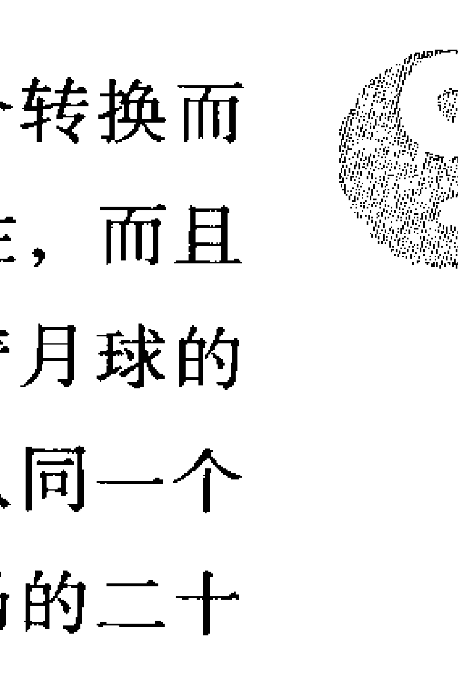

# 第五章 奇门与证券市场应用原理

### 一、奇门与证券市场的内在联系

国外证券市场经典预测理论与古典奇门遁甲预测理论的相通之处在于它们共同建立于天体运行的自然法则之上，即宇宙全息统一周期性。

证券预测理论早先起源于国外，它的经典预测方法，比较著名的有螺旋历法、道氏理论、艾略特波浪理论、江恩理论等。

#### （一）螺旋历法与周易奇门遁甲的阴阳周期理论

螺旋历法是由美国人嘉路兰（CheistopherCarolan）先生在古代历法的基础上创立的证券走势周期性预测方法。嘉路兰做为一个股票期货交易商，在1987年10月19日的股灾当日，他亲眼目睹了一个世纪以来最疯狂的交易日，仅下午几个小时华尔街股指一落千丈，数以千亿美元的市场资产付诸流水，远远超过了1929年大股灾的损失，当时整个美国仿佛处在世界的末日，并且股灾很快席卷全球，许多人倾家荡产，负债累累，甚至不少人自杀身亡，整个证券市场处在惊怕，灰暗，绝望当中。嘉路兰先生痛定思痛，怀着坚毅不屈的精神，经过两年艰辛努力，终于创建了螺旋历法。

自1992年10月螺旋历法公诸于世以来，很快风靡全球证券市场。螺旋历法有三个要素：朔望月周期、二分（春分秋分）二至（夏至冬至）点、费伯南希积数（12世纪欧洲著名的数学家意大利人费伯南希 Fibonacci 所发明的一组神奇数字，1、1、2、3、5、8、13、21、34、55、89、144、……包括“黄金分割比率”“轮回规则”）。朔望月周期描述的是月球地球太阳三者的天体运动，分至点描述的是太阳地球的运动，费伯南希数列是宇宙的生成之数，这三者的结合构建了一个简明的预测体系。“螺旋历法” 理论背后的主要精神是月球的周期影响大自然生态，同样人类的集体市场心理亦受月球周期所左右，投资者对市场前景的乐观与悲观跟随月球周期变化而起伏。这毫无疑问的表明了天体运行与人体生理活动的关联全息周期性对证券市场的周期性走势是有影响的。螺旋历法所应用的既非阳历亦非阴历，应用的是月球围绕地球运行的周期29.53天为计算的单位，它的单位与别的不同，并不是以月球运行周期的倍数为基础，所应用的进位级数根据神奇数字系列的开方而成（即朔望月周期29.53乘以神奇数字的开方），计算每一个螺旋历月份单位的月数，是以自然日数计算，并非以交易日计算。这说明它仍然是在自然历法的周期内来选择自己的走势，并没有脱离天体运行所形成的阴阳法则。利用螺旋历法分析金融市场走势，可说是一门科学也可以说是一门艺术。它所计算出来的市场转折点在时间上十分明确，准确性经常极高，分析者必须确定时间螺旋开始的焦点，否则差之毫厘，谬之千里。螺旋历法计算的是大自然影响市场情绪，在这方面仍然有十分大的研究空间，值得我们继续探索。与波浪理论不同之处，在于历法本身只重于市场价格转向的时间预测，至于量度未来价位方面则欠佳。尽管如此，自螺旋历法面世以来，其惊人的预测转向时间的准确性，比当今任何的时间投影技术，包括波浪理论在内，均有过之而无不及。

螺旋历法朔望月周期、二分二至点是其预测证券市场走势的精华。它主要表现在以下3点：

-   (1) 春分后的新月（每月农历初一）焦点所产生的螺旋顺时序引发市场顶部；冬至后满月（每月农历十五）焦点所产生的螺旋，逆时序引发市场底部。

奇门应用研究与股市实战解密


-   (2) 新月和满月焦点，在冬至到夏至之间所产生的螺旋，引发市场顶部；而在夏至到冬至之间产生的螺旋，引发市场底部。

-   (3) 按焦点产生的螺旋序列分为奇偶。新月焦点奇系列引发市场顶部；偶系列引发市场底部。满月焦点奇系列引发市场底部；偶系列引发市场顶部。

上玄月（每月农历初八）与下玄月（每月农历二十三）也常常引发市场的顶和底，这是我本人对螺旋历法更进一步的理解。

由于某一个时间点，既可能是新月螺旋指向，又可能是满月螺旋指向；既可能是冬至后螺旋指向，也可能是冬至前螺旋指向，所以一般人们在判断这个没有统一的标准，导致莫衷一是。如果我们用易学来审视，就很清楚了。上面的第一条只说了夏至后新月和冬至后满月，对夏至后满月和冬至后新月没有提到，而且对二分二至的运用不是很恰当，也是对于由于没有易学指导，只凭有限的不完全统计得来的经验总结。第二条似乎是易学的方法，但是只采用了分至，也就是日地关系来区分，把螺旋历法的核心——朔望月（月地日关系）遗漏了，还成其为螺旋历法吗？第三条似乎采用了朔望月，但只是把螺旋序列的序数分阴阳，这个实际上没有真实含义，只是数的奇偶而已，况且又忘了分至这个日地关系，也是一种伪说。那么，有没有办法把朔望月（月地日关系）和分至（日地关系）都统一起来呢？我们看看易学怎么说的。邵康节说：“阳在阴中，阳逆行；阴在阳中，阴逆行；阳在阳中，阴在阴中，则皆顺行。此真至之理，按图可以见之矣。”这一段话可以破解螺旋历法的顺逆时序触发问题，新月为阳生，夏至为阴生，夏至之后新月为阴中之阳，阳在阴中阳逆行，此焦点逆时序螺旋引发市场底部，底部为阴极生阳。满月为阴生，冬至为阳生，冬至之后满月为阳中之阴，阴在阳中阴逆行，此焦点逆时序螺旋引发市场顶部，顶部为阳极生阴。新月为阳生，冬至为阳生，冬至之后新月为阳中之阳；满月为阴生，夏至为阴生，夏至之后满月为阴中之阴，皆顺时序螺旋。冬至之后新月焦点顺时序引发市场底部，夏至之后满月焦点顺时序引发市场顶部。这样，我们就可以根据焦点在日地关系和月地关系中的阴阳属性，判断其触发方向，也就解决了‘莫衷一是’的问题，使螺旋历法的运用有了清晰、统一的标准。即根据日地关系与月地关系中的阴阳一致性（非矛盾）来确定螺旋点的顺逆和顶底问题，这才符合易学这一宇宙统一周期场理论体系。

奇门遁甲做为模拟天体运行的筮盘，其本质就是天体运化的微缩，它以冬至起阳局到夏至阳遁逆行用满开始起阴局，其起局用历正好是从冬至开始中间经春分到夏至，阳极阴生。夏至起阴局到冬至阴遁逆行用满开始起阳局，其起局用历也正好是从夏至开始中间经秋分到冬至，阴极阳生。而螺旋历法新月和满月焦点，在冬至到夏至之间所产生的螺旋，顺时序引发市场的底部和逆时序引发市场的顶部，而在夏至到冬至之间产生的螺旋，逆时序引发市场的底部和顺时序引发市场的顶部。正与奇门遁甲的这种阳满阴始阴满阳始的阳遁顺布六仪逆布三奇，阴遁逆布六仪顺布三奇的用局法则不谋而合，这说明他们有着共同的理论基础，即历法。历法就是人为把握天体运行的位置时节而设的参照坐标，其实质是天体运行周期性规律性表现。做为共同建立在历法基础上用来预测的奇门遁甲和螺旋历法，当然有着共同的天体运行背景做为其科学理论支撑，不同的是奇门遁甲是以筮盘的形式出现，更多的建立在阴阳易理的范畴中，体现的是天人合一信息互感的抽象的周期全息性，在诠释其内容时需要对抽象的信息元素进行解析罢了。从这一理论角度来看，螺旋历法正是天人合一信息互感论的杰出代表。

#### （二）道氏理论与周易八卦奇门遁甲的联系

道氏理论是由20世纪初美国的查尔斯·亨利·道和尼尔森提出后经汉密尔顿进行发展的股市技术先驱，股票价格运动的三种趋势是其精髓所在。周易奇门遁甲股市行情分析法与这三种趋势理论有异曲同工之妙。

-   (1) 道氏将基本趋势（长期趋势）分为牛熊、多空市场两种，周易奇门遁甲行情分析法将长期的股市趋势也分为两种潮流：阴与阳两极。阴阳理论也是构筑易股行情分析法的基础之一，从大势上也是与道氏观点相类。
-   (2) 道氏的次级趋势（修正趋势）持续时间一般以三周至数月不等，周易行情分析法的K线八卦象也常常是以三周作为分析周期，分析道氏理论中的经常与基本趋势运动方向相反的次级趋势波浪起伏。奇门遁甲行情分析法在这方面将用八种形态（“开、生、休、伤、死、惊、景、杜”八门）来阐述。
-   (3) 道氏的短期趋势（日常波动）采用六天内变动的股价情况作为分析的内容，周易行情分析法也是采用六天的六十四种阴阳变化来对K线的波纹运动进行分析。
-   (4) 道氏的多空市场观点将多方市场与空方市场分成三个阶段，周易奇门遁甲行情分析法在这方面也以其卦象中的三才（天、地、人）对多空牛熊市场进行更细致的分析。

道氏理论在过于注重长期趋势的分析，在新的长期波动初期常常分析不足，而且对中期趋势的变动分析也不是很足，更不要说短期趋势上的分析了，所以在目前具有中国特色的中国股市中，道氏理论对有效的选股帮助不是很大。周易行情分析法注重于中短期趋势的分析，将中短期趋势分成六十四种形态（六十四卦象），将这六十四种形态结合K线图详论，对选股与后市分析很有帮助。奇门遁甲以其全息性 能更直接深入的解析一只股票的业绩及未来的走势，对投资人选股操作作出较为准确的判断。

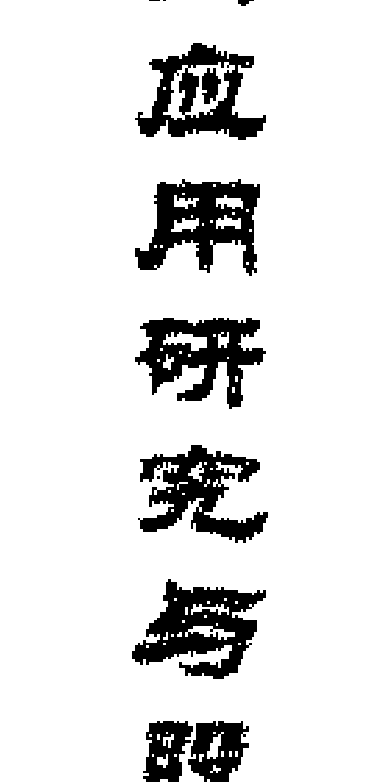

#### （三）艾略特波浪理论与周易八卦奇门遁甲的联系

艾略特波浪理论是美国的艾略特在对华尔街股票期货市场长期调查研究中，探索出涨跌规律，于1927年创立的一套较完整的波浪理论经典。股市就是一个大的波浪变化，而中国的易理则认为：变是万物规律。周易奇门遁甲行情分析法与艾略特波浪理论之间也是有所联系的。

-   (1) 艾略特波浪理论认为无论是多方市场还是空方市场，股价变化的每一个完整的循环都会呈现出八个固定的波浪趋势：多方市场是五个上升浪加三个下跌浪，空方市场是五个下跌浪加三个上升浪。周易八卦行情分析法虽然轻牛熊市场的概念，但也 将股价变化分为八种形态：乾、艮、坎、震、坤、兑、离、巽。奇门遁甲行情分析法则由后天八卦组成的地盘中坎、艮、震、巽、离阳遁示多方上升浪，坤、兑、乾示空方下跌浪。
-   (2) 艾略特波浪理论中的大浪包含小浪是互相推进与转化的，任何一浪或者一波都可归于上一浪或上一波中的小波浪。这其实也正是周易八卦的理论，周易的万物互相转化理念一直是其精髓，在各卦象中随时的变化异动都将产生新的卦象，每个卦象也归于上一卦象的一部分，易有：“无极而生太极，太极生两仪，两仪生四象，四象生八卦，八卦定吉凶，吉凶生大业”也正是这个道理。奇门遁甲是建立在周易八卦基础理论之上更为精细的一种客观事物表现形式，无疑会对周易八卦理论有所包含，比如它的地盘就是后天八卦配洛书九宫组成。
-   (3) 艾略特波浪理论中的八浪特征与周易行情分析法八卦理论也有着极其相似之处，艾略特波浪理论在实际运用上由于大浪之中有小浪、小浪之中有细浪，再加上推动与调整中经常出现变化与繁杂形态，而且对浪的准确划分难以把握，也是有缺陷的。周易八卦与奇门遁甲行情分析法重在实时分析，在浪的划分直接将现时的形态变为卦象与筮盘直接分析，更重在中短期趋势的把握，尤其是周易八卦与奇门遁甲的太极周期建立在客观的自然干支历法上，不容易被市场出现的表面现象所误导。

一个完整的股市循环是一个太极，上升浪为阳，下跌浪为阴，这是阴阳两仪，就像奇门遁甲中的阳遁升阴遁降一样。八浪的结构完全与八卦奇门地盘相吻合。以后天八卦为例：一浪为坎卦，二浪为艮卦，三浪为震卦，四浪为巽卦，五浪为离卦，A 浪为坤卦，B 浪为兑卦，C 浪为乾卦，正好是奇门遁甲筮盘地盘后天八卦的一个完整循环。

如果我们把后天八卦配上地支，正好是奇门遁甲筮盘地盘上的地支，子为一浪，在时为冬至，冬至一阳生阳遁始，可是这微阳很少有人觉察得到，这与波浪理论中关于一浪是打底浪，市场一般认为是反弹的论述不谋而合。道家的修炼基础就是要做到一阳生时“时至神知”。

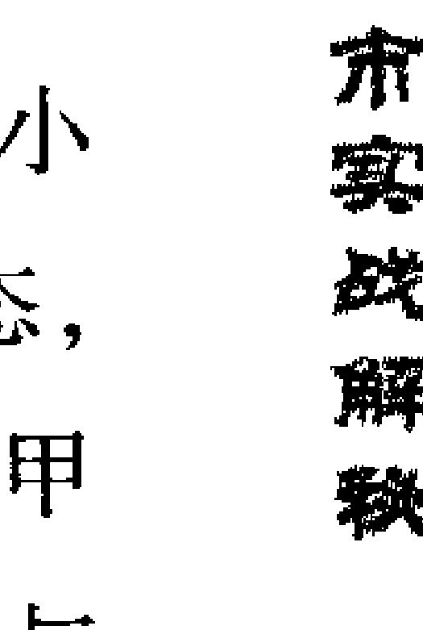

“知”，同理，我们易学的研究就是要避免股市中的“百姓日用而不知”的现象发生，尽可能在初始状态即有所发现，这点在奇门遁甲这个巨型的微缩盘神机自现，就看你如何解读了。丑寅为二浪调整，卯为三浪，如日出东方，万众瞩目。辰巳为四浪，午为五浪，此时为离卦，日头高悬，但已阳极阴生开始转向阴遁。未申为A浪，酉为B浪，戌亥为C浪。这样就结束了一个周期浪形，在实际情况中浪的表现形式复杂多变，但终归的大的表现形式莫过如此。

### 二、奇门遁甲历（节气干支历）与江恩理论

#### （一）奇门遁甲的节气干支历

历法是古人通过观察天体运行规律，总结出包括节气、置闰等内容的年月日时周期节律。我国古代以农立国，历法在指导农业生产方面作出了巨大贡献，同样今天历法在股市中也大显神通，经常遇到行情在历法节气的交接处“转折”，让投资者感到大为惊奇！节气是易学中的时空概念，在股市中却发生了易学所揭示的现象，这就反证了易学机制的自然属性和科学性。

我国历法是世界上最古老最科学的阴阳合历，它由阴历（月球盈亏周期变化即朔望月）阳历（太阳视运动周期即回归年）通过大小月置润协调成体现自然天象的阴阳历，即一年十二个月，三年一闰共37个月的中国农历。

天干地支纪历为我国历法自古所独有，它以十天干，即：甲、乙、丙、丁、戊、己、庚、辛、壬、癸、十个天干顺序，和地支，即：子、丑、寅、卯、辰、巳、午、未、申、酉、戌、亥十二个地支顺序，从各自的第一个字“甲”和“子”开始，按一定的规则一一相配，组成甲子，乙丑，丙寅等等，依此类推，乃至癸亥，共60个组合，而后又从甲子开始，再至癸亥，60 为一个循环周期，又称60 甲子或60 花甲子。可以纪时，纪日，纪月，纪年。

节气的安排决定于太阳，从冬至开始间隔地依次安排各个节气的中气。一年有 12 个月 24 个节气，每月一节一气，“小寒、立春、惊蛰、清明、立夏、芒种、小暑、立秋、白露、寒露、立冬、大雪”为“节”，为每月的起始；“冬至、大寒、雨水、春分、谷雨、小满、夏至、大暑、处暑、秋分、霜降、小雪”为“中气”，在每月的中期交接。

由农历、干支历、节气共同组成了中国特有的历法阴阳合历，俗称阴历以便与公历即阳历相区分。做为反应时空全息性的应用易学如周易八卦奇门遁甲当然离不开这个标志时空的历法，阴历。由于奇门遁甲筮盘是模拟天体运化的宇宙微缩模型，它在模拟天体宇宙时空全息性时尤其依赖于历法，即由具体的时空标志点（历法所示的时日）来抽象的显示事物的内在本质关联信息，所以奇门遁甲自古以来就有自己专门的历法即奇门遁甲历，奇门遁甲历以卦气学说为基础，把一年分为阴阳二遁，即冬至到夏至为阳遁示阳升，夏至到冬至为阴遁示阴降，阳遁由坎卦艮卦震卦巽卦组成，其中，坎卦统冬至小寒大寒二气一节，艮卦统立春雨水惊蛰二节一气，震卦统春分、清明、谷雨二气一节，巽卦统立夏、小满、芒种二节一气。阴遁由离卦坤卦兑卦乾卦组成，其中，离卦统夏至、小暑、大暑二气一节，坤卦统立秋、处暑、白露二节一气，兑卦统秋分、寒露、霜降二气一节，乾卦统立冬、小雪、大雪二节一气。每个节气平均大致有 15 日，奇门遁甲历又把每个节气分为上中下三元，以当日天干见甲己，地支见子午卯酉为上元，地支见寅申巳亥为中元，地支见辰戌丑未为下元，每元 5 日，一日 12 个时辰，5 日就有 60 个时辰也就是一元，一元又分 6 句，每句 10 个时辰归旬头六甲值符统领，奇门遁甲历便以元为单位，每元以具体时间按一定的排布规则起一局，形成遁甲筮盘来全息模拟天体宇宙。这里我们注意到了，奇门遁甲历的元是由 5 日 60 个时辰组成，我们知道易学通用的都是干支历，也就是说 60 个时辰即 60 个干支单位，60 个干支单位就是上面所提到的 60 甲子或 60 花甲子，这样奇门遁甲历就建立在以 60 花甲子为循环周期的中国特有的干支历法上。

#### （二）江恩理论与奇门遁甲节气干支历

##### 1. 江恩理论

威廉姆·江恩（William Gann 1878—1955），是20世纪20年代初期传奇的金融证券市场预测家。江恩理论是威廉姆·江恩在20世纪早期的美国金融证券市场中，通过对数学、几何学、宗教、天文学的综合运用，建立起的自己独特的分析方法和测市理论。由于他的分析方法具有非常高的准确性，有时达到令人不可思议的程度，因此江恩便成为世界金融证券市场上非常出名的人物。

1878年6月6日，江恩出生于美国德克萨斯州的一个爱尔兰家庭，他的父母是虔诚的基督徒，有深远的循道会背景。江恩自己也是一个虔诚的基督徒，他声称从圣经中发现了市场周期理论。

江恩家乡是盛产棉花之地，在1902年江恩24岁的时候，他做了第一次棉花期货合约的买卖，并从中获利，自此之后的53年，他从金融市场共获取5000万美元的利润，以当时的价值计算，相当于现在的10亿美元。

知识是在这个市场上赢取利润的必要条件，江恩从童年开始，已经意识到，自然法则是驱动这个市场的动力。他声称他用了10年的时间来学习自然法则和金融市场的关系。在这10年间，他曾到过英国，埃及和印度求取知识。当他在英国时，他不分日夜的在大英博物馆研究金融市场在过往100年里的历史，在那时，他集中研究古老数学，几何和星象与金融市场的关系。他的重要分析方法当中之一的江恩正方形，据说是由埃及和印第安寺庙结构所启发出来的。结束他的漫长研究之旅时，他认为金融市场存在着振动的法则，这些法则一经掌握，你就可以准确预计未来市场时间和价格。

1908年，江恩到纽约开展他的业务及严肃测试他的理论和买卖方法。同年，他发布了他的主要分析方法“主要时间因素”（Master Time Factor），令他在华尔街一名惊人。

在 1909 年 10 月，一本在 20 年代初期十分流行的金融杂志“报价与投资文摘”的编辑理查·怀高，为他作了长达一个月的，由记者监测他的投资买卖活动专题采访。

令这位记者惊奇的是，江恩得到的总回报高达 1000%。他一共做了 286 次买卖，在 25 天里，264 次赢和 22 次输。赢出的次数占总数 92.3%。在那个月里，他平均每隔 20 分钟便做一次买卖。在其中一个交易日里，他共做了 16 次买卖，其中八次是当天市场波动的即市逆转点。

根据江恩的朋友威廉基利的回忆，“最令人惊讶的预测是江恩在 1909 年夏天其间所作的，当时他预言九月份小麦期权将见 1.20 美元。这意味着，它必须 9 月底前见此水平。在 9 月 30 日（最后一天）芝加哥时间中午 12 点，这个期权在 1.08 美元以下，看来他的预言不能兑现了。江恩说，如果它不见 1.20 美元，将证明我的整个计算方法错误，我不关心现在是什么价格，它必须去那。果然不出江恩所料，小麦期权价格在最后 1 小时交易中升至 1.20 美元，使全国震惊。”

在江恩事业的高峰，江恩创立两间公司进行市场研究。他出版投资时事通讯和每年股票及商品展望。江恩并且主持几个投资和买卖的研讨会，江恩限制每名学生不能将材料给予他人，这些研讨会收费高昂，2500 美元甚至 5000 美元不等。以当今价值来算，上述学费等于 25000 ~ 50000 美元。

#### 江恩理论的主要内容：

- （1）股价波动是支配市场循环的重要法则。股价波动的形式是上升与下跌。当股市由上升转为下跌时，25%、50%、75% 等是重要的支撑位。当股市从低位启动时，1.25、1.5、2 等是股价重要的阻力位。
- （2）时间是循环周期的参考点。20 年、30 年、60 年以上为长期循环。1 年、2 年、3 年、……15 年等为中期循环。其中 30 年最重要，因为含有 360 个月，是一个完整圆形的度数。短期循环为 24 小时、12 小时、……甚至可缩小到4分钟，因为一天有1440分钟，地球自转一度为1440除以360，得出4分钟。
- （3） 10年是一个重要的循环。由10年前的顶部（底部）可预测10年后的顶部（底部）。此外，7年也是一个转折点，因为7天、7周、7个月都很重要。
- （4） 在5年的升势中，先升2年，跌1年，再升2年。到第59个月注意转折。在5年的跌势中，先跌2年，升1年，再跌2年。处于长期上升（下跌）时，一般不会超过3年。
- （5） 在上升的趋势中，如果以月为单位，调整不会超过2个月。如果以周为单位，调整一般在2~3周。在大跌时，短期的反弹可以维持3~4个月。
- （6） 将360度圆形按月份（和中国历法巧合）分割，来计算股市循环。

江恩线的数学表达有两个基本要素，这两个基本要素是价格和时间。江恩通过江恩圆形、江恩螺旋正方形、江恩六边形、江恩“轮中轮”等图形将价格与时间完美的融合起来。在江恩的理论中，“七”是一个非常重要的数字，江恩在划分市场周期循环时，江恩经常使用“七”或“七”的倍数，江恩认为“七”融合了自然、天文与宗教的理念。

江恩线是江恩理论与投资方法的重要概念，江恩在X轴上建立时间，在Y轴建立价格，江恩线符号由“TXP”表示。江恩线的基本比率为1：1，即一个单位时间对应一个价格单位，此时的江恩线为45度。通过对市场的分析，江恩还分别以3和8为单位进行划分，如1/3，1/8等，这些江恩线构成了市场回调或上升的支持位和阻力位。

江恩理论的优点，是阐述了时间与价位的关系，准确的时间和价位的预测，使其他任何理论难望项背。江恩理论的弱点，是缺乏对另一市场的重要因素－－成交量的描述。因此，江恩理论与道氏趋势理论、艾略特波浪理论，相互结合使用，才可起到互为弥补的作用。江恩理论的核心体系是：“时间周期论”与“空间的波动法则”，该理论涵盖了时间与空间的概念，这是江恩理论在统一全息论出现之前的高明之处。

##### 2. 江恩理论与奇门遁甲节气干支历之间的关系

江恩理论的核心是循环周期论，它与我国的古代历法、二十四节气、干支周期、奇门遁甲节气干支历及奇门遁甲全息数理模型，在探索世界的物质全息统一性方面有着异曲同工、殊途同归之效。

干支纪历中的 60 周期和 12 周期乃至 10 周期，并不是老祖宗随意想象出来的，而是对天体运行现象进行观测，计算而获得的符合客观规律的科学知识。天体运行周期与甲子周期呈整数倍的关系，这是因为九大行星围绕太阳的公转周期，除了水星以外，其余的都与甲子周期呈整数倍关系，九大行星的会合周期全部都与甲子周期呈整倍数关系。月球的公转周期和哈雷彗星的回归周期，也同样存在上述关系。可见甲子周期是有坚实的科学基础的。江恩理论中特别重视 10、30、60、360 的长期和 12 的短期周期循环，而这些数字在干支纪历中也是十分重要的时间周期，干支纪历中一旬为 10 天 10 个时辰，一个甲子周期为 60 年 60 天 60 时辰，一元 60 年，一年为 360 天 12 个月，一月 30 天，一天有 12 时辰等，无不与江恩理论中的循环周期相吻合。建立在干支历法上的奇门遁甲历也有一旬 10 个时辰，一元 60 个时辰，一个节气 3 元，一月两个节气共 30 个干支日，一天 12 个时辰 12 个筮盘局，一年 360 天等，看来干支纪历奇门遁甲历与江恩理论所重视的循环周期都是基于天体运行的时空概念上提出来的宇宙时空定位坐标参数，奇门遁甲正是基于这个坐标参数起筮盘局，来解析此刻时空存在的信息，无独有偶，江恩理论也是基于这些时空定位坐标参数来分析判断金融证券市场的趋势。从这里可以看出，这两种测市理论工具的实质本源即时空周期全息是一样的，不一样的只是它们的表现形式各自不同，江恩理论更接近于市场更易于理解和应用，而奇门遁甲的抽象不易解析性为其在金融证券市场上的应用带来天生的障碍。正因为如此，我们才要大力研究，使其比江恩理论更要精确的运用于金融证券市场。

江恩理论中“7年也是一个转折点，因为7天、7周、7个月都很重要。“七”是一个非常重要的数字，江恩在划分市场周期循环时，经常使用“七”或“七”的倍数，江恩认为“七”融合了自然、天文与宗教的理念。”这可能与西方上帝造人用了七天说有关。这一点我们从奇门遁甲的定局歌来看一下：

#### 阳遁歌

- 冬至惊蛰一七四，小寒二八五依次。
- 大寒春分三九六，立春八五二成局。
- 雨水九六三无失，清明立夏四一七。
- 谷雨小满五二八，芒种六三九为法。

#### 阴遁歌

- 夏至白露九三六，小暑八二五阴局。
- 大暑秋分七一四，立秋二五八宫次。
- 处暑一四七为是，霜降小雪五八二。
- 寒露立冬六九三，大雪四七一宫识。

奇门遁甲五日60个时辰使用同一个用局，一个节气15日分上中下三元三个用局，如“冬至惊蛰一七四，”说的就是冬至惊蛰这两个节气的上元用阳一局定局，中元用阳七局定局，下元用阳四局定局，其他节气的用局同上理。这里我们注意“一七四”“二八五”……相邻节气间的用局数的间隔数，“一七四”当中从一局开始连数至七局共7局，从七局连数至四局共7局，“二八五”当中从二局连数至八局其7局，从八局连数至五局共7局，“三九六”当中从三局连数至九局共7局，从九局连数至六局共7局，从冬至用局完到小寒用局始即从“一七四”“二八五”当中的四局到二局连数也是7局，其他相邻间的节气的用局，上个用局和下个用局之间的连续间隔数，从上个用局起算总是7数，可见在奇门遁甲历中对7数体现是无处不在的，这一点与江恩理论重视“7”看似在表面上偶然相通，其实不然，江恩认为“七”融合了自然、天文与宗教的理念。而奇门遁甲则是模拟天体运行当中的“七政”（即由太阳系中七颗行星太阳、月亮、金木水火土星运行形成一直线时的天文现象，又叫七星连珠，这时由于天体引力等其他作用，地球上相应就会发生一些变化。易理有七日来复之说是也），从这里可以看出，它们相同的根本原因，在于它们都是基于在观察天体运行模拟自然法则而建立起来的各自理论体系，亦即天体宇宙的全息统一周期性的体现。

江恩理论中“将360度圆形按月份（和中国历法巧合）分割，来计算股市循环。”这点和奇门遁甲地盘，由坎卦艮卦震卦巽卦组成上升的阳遁，由离卦坤卦兑卦乾卦组成下降的阴遁，这一阴阳往复圆环式周天公度式的奇门遁甲节气干支历不谋而合。

江恩理论的重要内容之一，“股价波动是支配市场循环的重要法则，股价波动的形式是上升与下跌。当股市由上升转为下跌时，25%、50%、75%等是重要的支撑位。当股市从低位启动时，1.25、1.5、2等是股价重要的阻力位。”这可以从奇门遁甲地盘由坎卦艮卦震卦巽卦组成上升的阳遁，由离卦坤卦兑卦乾卦组成下降的阴遁，正好是阳升阴降完成一个循环周期，如此往复循环，就像“股价波动的形式是上升与下跌”一样，实际上都是阴阳升降的不同表现形式而已。“当股市从低位启动时，1.25、1.5、2等是股价重要的阻力位。”我们看，如果以坎卦冬至开始为1，则1.25正好是奇门遁甲历中，坎卦（统冬至小寒大寒）上升为艮卦（统立春雨水惊蛰）的分界节气立春的开始位置，1.5正好是坎卦艮卦向震卦（统春分、清明、谷雨）巽卦（统立夏、小满、芒种）上升的分界节气春分的开始位置，2正好是坎卦艮卦震卦巽卦一连上升至极点转向离卦（夏至、小暑、大暑）阴遁的分界节气夏至的开始位置，如果继续上涨则从坎卦开始同样2.25、2.5、3位置依次和1.25、1.5、2的各卦分界开始节气位置相同；“当股市由上升转为下跌时，25%、50%、75%等是重要的支撑位。”我们看，如果从离卦的夏至开始为0，25%正好是离卦（统夏至、小暑、大暑）下降为坤卦（统立秋、处暑、白露）分界节气立秋的开始位置，50%正好是离卦坤卦向兑卦（统秋分、寒露、霜降）乾卦（统立冬、小雪、大雪）下降的分界节气秋分的开始位置，75%正好是离卦坤卦兑卦向乾卦（统立冬、小雪、大雪）下降的分界节气立冬的开始位置。可见江恩理论所重视的股价波动位置，其实是奇门遁甲历中的卦向卦运变时节气的交界点，节气的交界点实质是地球公转时形成的重要时空转折点。

从以上论述来看，江恩理论与奇门遁甲的基础理论均是建立在天体运行的自然法则之上，都是从不同角度对天体宇宙全息周期性的体现和描述，奇门遁甲是天人合一信息互感的抽象杰作，江恩理论更像老子所说的，“人法地，地法天，天法道，道法自然。”的宇宙自然法则在金融证券市场上的杰作。

奇门遁甲与螺旋历法、道氏理论、艾略特波浪理论、江恩理论的共同基础是天体运行的自然法则，即宇宙全息统一周期论。

## 第六章 奇门与股市应用的基本法则

由于奇门遁甲是易学预测体系中模拟宇宙统一全息周期信息场的天文立体动态象数理模型，所以它对事物具有抽象的预测性，它的预测性精华表现在对抽象全息元的解析翻译上，如从上编介绍过的奇门遁甲预测用神中我们可以看到，古人及今人已从人事物的多个方面对奇门遁甲预测用神做了较为成熟的总结，但对于近年来在中国刚刚崭露头角的股市，还没有做出一个像样的解析和翻译，我想，一是由于精通奇门遁甲预测的学者未必精通于中国股市，精通于中国股市的投资者大都不了解易学甚至于奇门遁甲，其结果是股市是股市，奇门遁甲是奇门遁甲，二者风马牛不相及，造成祖国的传统预测瑰宝无用武之地。即便是有的易学爱好者在股市预测中对奇门遁甲有所应用，但都不得其法或用法不成体系，以致偶有测准，败多成少，使奇门遁甲在股市实战预测中沦落到几近荒废的地步，此情此景，使人感到无比痛心，笔者有感于此，几经艰辛，无数次纵横于奇门与股市之间，数年来不计成本，终于在前人的基础上摸索讨寻出奇门与股市实战预测的真谛，现合盘推出，与诸位股市投资者易学爱好者共飨，以期达到

### 一、奇门遁甲与股市预测的切入点

#### （一）灵活机变是奇门遁甲预测的切入点

##### 1. 灵机论

奇门预测是信息科学史上的一大进步，它的方法是灵活多样，内容涉及面阔，用途广泛，测事具体，准确性高，这是八卦预测方法的一大创新，在中国历史上影响很大。“看了奇门遁，来人不用问”，很久以前就成了民间妇孺皆知的一句口头禅。但由于奇门预测学比较深奥，难以普及，加之有人误认为其迷信，所以没有得到广泛流传和运用。奇门预测学的显著特点是灵机变用，方法多样，省时省力，预测准确性高。比如一个人的死，用现代方法要作一系列的光波检查、生化检查等十多项程序，经过几个小时才能下出结论。如果用奇门预测，就省时省力，在很短时间里能得出结论。《奇门遁甲秘籍全书》中说：人为万物之灵，感通诸事之应。意思是：人是世界上万事万物中最灵敏的一种高级动物，通过人体信息能预测出各种事物的变化、发展和结果。中国现代预测学家邵伟华同志在他的《周易与预测学》一书说过：“人体本身就是一个信息感应器，他有预测信息的功能。”奇门预测就是靠人体信息感应，从人的一时动静及在当时空点上的事件、器皿、物品等推测入手，判断推理战争的胜负，事情的成败，人生的得失。具体说来，就是从出师打仗发马立营的开始时间，或从人的出生时间，事物得失离合的开始时间，或从器物获得的时间开始，逐年逐月逐日推理预测看是利于何时交战能得胜，何时敌人发兵，何时何方何处有敌人埋伏，或何时何方处有利于我军埋伏和出击，何日何时能成功奏凯。如果预测人生的寿命长短，行运的旺衰，就取该人的出生年月日时演布，妻妾、子女、官禄、钱财就预测出来了。如果预测事物或物品的成败久暂，就把所得到的时间或初见到的时间作为依据，进行演布，或把事物的长短方圆按五行所属配合奇门进行演布，就能测出事物的成败时间及成败程度，或器物的破损旺盛时间及程度。

如军营中只要有一见一闻或遇到移斜倒蹲，军号乱鸣，或听到善言恶语，或见到旗鼓破损，或见到鸟兽从何方来，不论是见到或听到任何一种怪异的事物，都可以作为一种吉凶祸福的预兆。如果听到人说话的几句、几声或几字，或金钲军号什物的响鸣方向数目，或乐器的响声远近，音质高低，响声数目，都可以作为奇门预测的依据。灵机变用的原因是，事物最初在大脑中反应的时间、地点、形状数目配合奇门推理过程进行预测，要活学活用，灵活变通，不能呆板机械，生搬硬套，要心绪平静，注意力专注，不能想此而考虑彼。在取物、声、数时，切忌取一而又取二，这样事物的吉凶就难以判断测定了。如果取某一事物预测不准，再取一种事物预测得又不准，就不要再继续了。这是预测者心绪不安所造成的，所以吉凶就难以测出。预测时最好只选一种事物为准。奇门预测的方法很多，形式不拘，“见物即可测”。

从以上论述我们得知，奇门预测的方法是，事物最初在大脑中反应形成的时间、地点、形状、数目等，配合奇门推理形成预测。

##### 2. 奇门预测常用切入点方法

（1）**天地正时起局预测法**。天地正时起局法，它是以求测者求测的时间或以遇到人、事、物的时间来定局排盘预测，这个时间就叫天地正时，以这个时间为切入点起出局盘来预测，就是天地正时起局预测法。这也是奇门预测的常用方法。

（2）**取时预测法**。取时预测的方法，是以特定的时间，比如人的出生时间，挑战者号航天飞机升空的时间等等，来做为切入点定局起局的方法。

（3）**取向预测法**。是用天地正时起出局后，再以向所属的宫位来预测的方法。它的实质是以方向为切入点来预测的。向，指的是方位，方向，就是求测者的住址方向和来后落座的位置，或让其随意指出一个方向。

（4）**取数预测法**。是用天地正时起出局后，再以数所示的宫位来预测的方法。它的实质是以数字为切入点来预测。取数预测法是让求测者说出一个数字，或是预测者本人看到听到某种事物的多少数目，来确定宫位，以该宫数理来进行预测。如果取到的数字大于9数，则用除法除以9，以余数做为要推理判断的宫位。

（5）**取色预测法**。是用天地正时起出局后，再以某种颜色所示的宫位来预测的方法。它的实质是以颜色为切入点来预测。按五行取色，黑色取水，以本时坎宫天地人三盘格局断；红色取火，以本时离宫天地人三盘格局断；青色取木，若色浓以本时震宫天地人三盘格局断，色淡以本时巽宫天地人三盘格局断；白色取金，纯白以本时乾宫天地人三盘格局断，淡白以本时兑宫天地人三盘格局断；黄色取土，淡黄以本时艮宫天地人三盘格局断，浓黄以本时坤宫天地人三盘格局断。

（6）**信函预测法**。信函的预测方法是以求测者的写信的时间为切入点来起局预测，同时参考信寄来的方向来推理寄信人所预测的事件。信函预测一定要让预测者写清初写信时的具体年月日时，不然预测就不可能准确。

（7）**随机预测法**。就是用非常灵活的方法来做为切入点定局排盘预测的方法。

①以时间顺次取局：当多人同时要求预测时，第一位以正时起局，第二位则以现在时刻的下一个时辰起局排盘预测。
②数字起局法：来人随机报出1—10之间的任意一数，然后，从本日旬首算起，至此数字时刻起局为用。如当日时辰旬首甲辰，来人报出2数，则可以乙巳时刻局象为用。
③笔画、声音、语言等外应起局法：以所得字的笔画，或声音的次数，语言的字数等外应为依据，再依照前面方法灵活起局为用。

#### （二）奇门遁甲与股市的切入点预测

（1）当投资人面临消息或选股判断上的彷徨犹豫时，这时的思维正是奇门遁甲与股市预测的最佳切入点。

投资人在瞬息万变的股市投资活动中，除了获取官方正规的媒体信息外，由于中国股市的不完善性，政策的不稳定性，小道消息经常满天飞，突发性变化也总是令人猝不及防，给本来就提心吊胆的股民画满了问号。尤其是各家股评众说风云，莫衷一是，往往使投资人无所适从，更让人喜忧交加的是电视报纸机构券商股评等，天天对股市评头论足，甚至大推特推各种股票。那么，当你面对突如其来的消息不知真假时，当你面对推荐的股票犹豫不决时，当你为选定的股票拿捏不定时，当你在套牢的股票面前一筹莫展时……面对如此境况，请投资人且莫惶恐，因为你所面临困境的时机就是你利用奇门遁甲预测股市或股票的最佳切入点，请你马上转变你的思维，利用当时的时间起局预测，这将会使你轻而易举的解除面临的困境而有所选择甚至有所盈利，困境就是奇门遁甲这个有力的预测武器所要发挥的最佳切入点。

（2）天地正时起局预测法是股市或股票预测的最佳切入点方法。

如上所述，当你发觉自己的预测切入点后，请首先弄清当时的年月日时，即天地正时的年月日时干支节气，接下来马上用该时间定局起局排出局盘，就可以分析判断了。这就是股市或股票预测的基本方法，这也是经过大多数人无数次检验较为准确的方法。

（3）数字起局法是解决一个人面临众多股市问题要解决时的最佳切入点方式。

当一个投资人在好几只股票面前为挑选出理想的股票为难时，这时，请分别将每只股票人为的编排好序号，并将当天的 10 个时辰从旬首为 1 起算，一一与要预测的股票对好数，这样就以当天当时的年月日时干支节气来定局，起局排盘时便以某一只股票与 10 个时辰中的某一对应的时辰来定值使，随后确定值符值使的位置即排好该股票的局，这样一只股票起一个奇门局来分析，就能较为准确地找出理想的股票了。

奇门预测重外应，要有明显的外应，对股市个股的走势实在难以用常用方法判断时，方可用之，否之难合易理。那些天天对股市进行预测，不分大小轻重，明显用常用分析方法，就能较好分析解决的，而不去努力，偏要把简单事情复杂化的投资者，请慎用此法，此乃不合易理，强易之所为也。古人说，尽人事而知天命，人事不尽，专问天命，是不明易理世理也，非易之所为。

### 二、奇门遁甲对证券投资者自身状况的判断

证券投资是一项理性的综合性投资行为，它成功的根本原因，在于投资者个人的综合素质。一个成功的证券投资者除了具备一定的投资知识外，最重要的取决于投资者的性格和心态，俗话说的好，江山易改本性难移，说的就是一个人一旦形成一种性格后，将终身很难改变。在证券市场上，在股市里，一个人一旦形成一种投资风格，也是很难在短时间内改变过来的，所以社会上有性格决定命运，股市里有性格决定输赢之说。有一个好的性格必将会有一个好的心态，这是如影随形先天所带来的所谓天赋的东西，那么有了好的性格和好的心态如果没有好运气，生不逢时也很成问题，比如巴菲特如果在1929年美国股灾时还在进行证券投资，不论他有多么好的素质和性格，都将与今日的他无法相比。如果说新一轮世界经济景气周期带给中国股市前所未有的大牛市是投资者得了天时的话，那么那些具备资金又具备投资条件和投资经验者就是得了地利与人和，如果说得天时地利人和者定能成功，那么像巴菲特、索罗斯等证券市场的巨人一定是得了神助。所谓神助就是冥冥之中一个人的气运。俗话说的好，七分靠努力，三分靠运气，看来运气在股市投资中真的是一件很重要的事。那么我们就用模拟宇宙统一全息周期信息场的天文立体动态象数理模型的奇门遁甲，来看看一个投资者的素质性格及他的运气到底如何。

在奇门遁甲预测中，日干往往代表求测者被预测者，那么日干落宫的状态就表明了被预测者当前所处的状况，在股市中就会体现一个投资者的具体情况，八神和九星反应的是投资者的性格，八门反应是投资人所从事的行业情绪及投资成败，日干加三奇六仪反应的是投资者的综合情况。

#### （一）奇门遁甲对证券投资者自身状况判断的法则

##### 1. 日干乘八神时的判断

- 日干乘值符较好，说明投资者器宇轩昂，具有投资才华，善于投资炒作，遇到情况能妥善处理。
- 日干乘螣蛇，主善变，疑心重，纠缠不清。
- 日干乘太阴，主善于策划，炒作计划周密，但易感情用事，靠感觉行事。
- 日干乘六合，主贪多，所买的股票不至一支，有时主暂时套牢。
- 日干乘白虎，主脾气太直，操作上有点武断，容易出纰漏出现损失。
- 日干乘玄武，主好投机买卖，容易被骗线，有时主头脑不清。
- 日干乘九地，主反应迟钝，利长线操作，容易错过买卖时机。
- 日干乘九天，主好高骛远，爱换股，利短线操作。

##### 2. 日干临九星时的判断

- 日干临天心，主投资炒作策略计划正确，对市场股票有主见，心思细密，头脑思维清晰。
- 日干临天蓬，主胆大，敢于买卖别人不敢买的股票，赚的多赔的也多，容易贪利而被套牢或错失利润。日干临天蓬在有庚 + 己刑格时主损失较大。
- 日干临天任，主在股市善于付出，勤快，但太谨慎小心，容易错失行情。
- 日干临天冲，主买卖较快，容易冲动，操作上经常有小的失误。
- 日干临天辅，主重视股市理论，有文人风范。
- 日干临天禽，主能按正确理论和方法操作买卖，有驾御能力。
- 日干临天英，主脾气急躁，爱追高，爱炒热门股，容易被套牢。
- 日干临天芮，主爱学习爱钻研，但容易因贪或投资有误而遭到损失。
- 日干临天柱，主疑心重，爱换股，爱发表自己的看法，一般多主赔多赚少。

##### 3. 日干遇八门时的判断

- 日干遇开门，主性格外向，多从事企业厂矿、店面等坐地经营者或负责人，或上班一族，多主事业顺利，遇事好说话，利卖出股票。
- 日干遇休门，主悠闲闲散人员，也主公务人员，善做经纪。
- 日干遇生门，主生意人、房地产土建行业的人，利投资求财获利。
- 日干遇伤门，主军警捕杀、索债等人员，爱争强好胜，利卖出获利，一般主有损失。
- 日干遇杜门，主公检法、保密技术等人员，利观望或持币或捂股，以技术取胜，多主投资买卖炒作受阻。
- 日干遇景门，主旅游、通信、美容、美术、爆破、冶炼、广告、酒店、娱乐等人员，主行情火爆，急于赚钱。
- 日干遇死门，主从事农业、屠宰、编织、殡葬、地皮等行业的人，主情绪沉闷低落，遭受损失。
- 日干遇惊门，主老师、律师、歌唱演艺人员，心里没底，担惊受怕，易因上市公司的诉讼或纠纷遭到损失。

##### 4. 日干落宫的状态与加三奇六仪的判断

- 日干入天盘墓，表示无所作为，在股市遇到情况时束手无策，能力得不到发挥。
- 日干入地盘墓，表示犹豫不决，头脑不清，处在投资的低谷。
- 日干沐浴，主光想赚钱，头脑有点不冷静。
- 日干处在生旺禄地，说明投资人整体素质高，投资条件好。
- 日干处死绝之地，主投资人整体素质不高，投资条件较差。
- 日干加乙奇，主犹豫。
- 日干加丙，主操作果断大气，性格霸道，有强迫别人买卖的意思。
- 日干加己，操作手法隐讳，想赚钱。
- 日干加庚，炒作受阻，防损失。
- 日干遇击刑，表示操作严重失误或被重套。
- 日干加辛，主预测人炒作的思路有问题，或赔过钱有过教训。
- 日干遇刑格（庚+己）主操作不顺利，破败，损失。
- 日干遇勃格（丙+六仪），操作较乱，买卖混乱。
- 日干加壬癸（天地网），难以炒作。
- 日干加地盘壬，可能有操作。
- 日干与地盘天干逢合，主投资人因事纠缠而不能专心投资炒作买卖。
- 日干与地盘天干逢冲，主投资人想操作或正在操作。
- 伏吟主困盹，不宜动，最好观望，否则易导致失误。反吟主乱，宜快进快出，不宜持有。反伏吟门迫主有不顺，不宜买卖操作。

#### （二）奇门遁甲对证券投资者自身状况判断的示例

2005年11月28日09时许，笔者对权证买卖非常感兴趣，于是就用正时起局来看买卖情况。

看看今天能买到武钢认购权证吗？

```
时间：2005年11月28日09时04分
农历：乙酉年十月廿七日巳时
干支：乙酉丁亥丙辰癸巳
旬空：午未午未子丑午未
阴遁八局值符天心落三宫值使开门落六宫
```

分析：
日干丙落4宫处在禄地说明笔者当时的状态较好，头脑清晰，乘九天爱动手痒操作频繁适宜做短线，于当天结束买卖。遇杜门示笔者为公检法人员，又示买卖受阻不太顺利，以技术为主来操作。天蓬是胆大敢于买卖，日干加壬肯定有买卖操作，但是逢悖格，必定混乱。大局八门伏吟，不宜操作买卖，否则定有不顺。
结果当日，笔者以5分钟MACD线为技术分析指标，在低位挂好单后，不到一会武钢认购权证就冲高回落，由于笔者怕成交后遭到损失，立即撤单，在我撤完单后，一直没敢操作，在操作上有点受阻，不太顺利。事实上，580001武钢认证于1.16元开盘后一瞬间上涨到1.84元，随后一路下跌到1.368元。
这个例子说明投资者在投资操作前，一定要有好的状态和好的运气，否则小者无功而返，大者会导致失误遭到损失。

### 三、奇门遁甲在股票(上市公司)选择上的判断法则

股市投资要取得收益，首先着重于上市公司的选择亦即股票的选择。选择一家业绩优良，有较好口碑上市公司的股票来做投资，相当于投资成功了一半，可见选股的重要性决非一般。一般选股主要从上市公司的净利润、每股收益、市盈率、每股净资产、市净率、每股现金流、净资产收益率、公司产品、市场竞争及形象、经营管理、高层人事变动等几个基本面去甄别衡量上市公司的优劣。但如今的上市公司弄虚造假几近成风，使投资人在表面的分析数据面前对投资毫无信心，常常有投资人前往上市公司做实地查探，更有机构投资者实地跟踪上市公司的经营管理。这些无疑给投资者带来时间金钱精力上的巨大成本，往往还不能得到真实的情况，像过去的郑百文、银广夏等上市公司就是典型的造假坑害投资者的经典案例。那么应用奇门遁甲选择判断上市公司，选择判断股票，既可以不到实地就能立即分辨真假财务数据，又可以做到省时省力，可谓在这方面有着得天独厚的优势，下面我们就重点介绍奇门遁甲在股票（上市公司）选择上的判断法则。

#### （一）奇门遁甲对上市公司的判断法则

奇门遁甲对上市公司的判断主要是通过对上市公司总体情况，高层管理人员，所得利润，经营流动资金，产品及市场的判断，来甄别上市公司的优劣。

##### 1. 对上市公司总体情况的判断法则

以开门为上市公司，开门旺相，带三奇、吉神、吉星、吉格，为效益好的规模大的企业，反之则差。

###### （1）开门乘八神的判断：

- 开门乘值符，主企业兴旺发达，名气大形象好，在国内多为大型具有优质资产的国有企业，在股市多为绩优蓝筹股。
- 开门乘螣蛇，主多次变更上市公司名称，无实力，合同债务等纠纷缠身，好重组或业绩下滑的上市公司。
- 开门乘太阴，主有计划有发展潜力，业绩有潜在增长的上市公司。
- 开门乘六合，主规模大的或下属企业较多的上市公司，有时也主企业重组。
- 开门乘白虎，主业绩增长或下滑较快，竞争力很强或有问题的上市公司。
- 开门乘玄武，主亏损或好作假账或有诉讼纠纷的上市公司，多指ST股，亏损重组股。
- 开门乘九地，主正处在缓慢发展阶段，业绩一般甚至有所下滑的上市公司。
- 开门乘九天，主知名度高，发展快，业绩好，正处在扩张阶段的上市公司，在股市多为绩优成长股。

###### （2）开门临九星的判断：

- 开门临天心，主上市公司经营策略正确，经营得力，前景看好。
- 开门临天蓬，主上市公司经营大，或容易遭受损失。
- 开门临天任，主上市公司经营发展业绩平稳。
- 开门临天冲，主上市公司经营业绩高速增长。
- 开门临天辅，主上市公司注重企业文化，注重市场形象，企业名誉较好。
- 开门临天禽，主上市公司按部就班规范经营平稳发展。
- 开门临天英，主上市公司注重广告宣传，注重经营策略，急于发展开拓市场。
- 开门临天芮，主上市公司经营管理易出问题，业绩容易下滑。
- 开门临天柱，主上市公司经营管理上有漏洞，易出问题。也主并购重组。

开门遇空亡，一般主上市公司以前在基本面上有过大的变化，比如重组购并，大股东入主注资等，有时也主上市公司业绩存在潜在下滑风险或虚而不实，也可能是经营上出现暂时性的困难，处于半停歇状态。开门空亡遇天蓬加凶格，为业绩有大幅变动或有可能面临破产，也可能重组并购，也可能退市。开门遇击刑可能重组并购改制。开门反吟、乘马星或格局逢冲，可能企业变更或迁址。

##### 2. 对上市公司高层管理人员的判断

以值符为董事长，以值使为总经理高层管理人员，以其落宫内星，门，奇仪格局来具体判断高层管理人员的素质高低好坏，是否对企业有利，是否变动等情况。有时以年干为董事长上级领导管理人员，以值符为总经理，值使为副总经理高层管理人员来判断。

年干、值符、值使落宫逢吉星、吉门、吉格，二者又相生比和者，主上市公司高层内部团结，素质较高，对企业发展有利。反之则不利。值符克值使，值使宫又遇驿马、击刑，总经理或高层管理人员必有更换变动。

##### 3. 对上市公司所得利润的判断

以生门为利润，生门及生门宫旺相，得天时地利神助，得吉神吉星吉格者主企业盈利丰厚，生门及生门宫旺相主有盈利，反之则无利。生门宫天蓬玄武加凶格必主亏损，利润为负值。生门宫所临九星为财星，以财星的旺衰看利薄利厚，利润的数目以生门落宫的先天后天八卦及五行数，结合股市中每股利润来判断。

##### 4. 对上市公司经营流动资金的判断

以甲子戊为上市公司经营流动资金，旺则流动资金充分，衰则流动资金不足，逢庚流动资金缺乏，相合资金被占用；相冲流动资金支出过快，留不住资金；击刑资金受损；逢空没资金；旺空亡暂时缺，入墓资金被困，入库暂时缺。流动资金的数量以甲子戊落宫先后天八卦五行数来判断。

##### 5. 对上市公司产品及市场的判断

以时干为产品，时干落宫旺相，逢吉门吉星，主产品好市场占有率高；反之，主市场占有率低。逢值符在市场上是高档、名牌产品，或是消费者信赖市场信誉好的产品，逢螣蛇或入墓主产品质量时好时坏没有稳定的市场；逢太阴质量好有潜在的市场前景，逢六合品种多市场占有率高；逢玄武伪劣产品无市场容易遭受管理部门处罚；逢白虎产品不成熟，市场销售快但产品容易被召回处理；逢九地存放时间长、存货多市场销售不好，逢九天畅销、远销、名气大，市场好。

## 下编 奇门与股市实战解密

#### （二）奇门遁甲对上市公司判断的例释

2005年7月22日华茂股份股价探新低，引人关注，随起局看看它的基本面。

时间：2005年07月22日20时30分

农历：乙酉年六月十七日戌时

干支：乙酉 癸未 丁未 庚戌

旬空：午未 申酉 寅卯 寅卯

小暑：下元第4天 庚戌时旬首为壬

阴遁五局 值符天蓬落三宫 值使休门落四宫

| 九天 | 九地 | 玄武 |
| --- | --- | --- |
| 休门 丁 | 生门 庚 | 伤门 己 |
| 天任 己 | 天冲 癸 | 天辅 辛 |
| 值符 | | 白虎 |
| 开门 壬 | | 杜门 癸 |
| 天蓬 庚 | 戊 | 天英 丙 |
| 螣蛇 | 太阴 | 六合 |
| 惊门 乙 | 死门 丙 戊 | 景门 辛 |
| 天心 丁 | 天柱 壬 禽 | 天芮 乙 |

### 一、奇门分析

-   (1) 先看开门宫企业的整体情况，开门落3宫逢空主企业处在半生产状态，上乘值符（空亡）曾经是国家大型企业之一，遇天蓬和壬+庚凶格说明该企业的业绩大幅下滑。
-   (2) 值符为董事长在3宫空亡不吉，临开门、壬长期在外，天蓬在经营上比较泼辣大胆。值使为总经理高层管理人员在4宫上乘九天素质高，总经理或高层管理人员留过洋受过高等培训学习，丁奇主有高的学历或新式经营，天任是经营平稳。值符宫与值使宫比和主董事长与总经理高层管理人员团结和睦有利公司发展。
-   (3) 对该上市公司所得利润的判断看生门九宫，9宫在未月休囚，生门在未月旺相，但天冲财星休于月令，九宫上乘九地主低下，遇庚利润受阻，这样据九宫2、3、7、9数来看，7数较为合理，每股利润就为0.07元左右。
-   (4) 对该上市公司经营流动资金的判断看6宫的甲子戊，它虽旺于月令但入库于6宫，所以可判断为流动资金短缺。
-   (5) 对该上市公司产品及市场的判断看时干庚落9宫，逢生门大量生产有生机，天冲生产效率高，但上乘九地主存货多市场销售不好。

### 二、下面我们看看华茂股份的实际情况

(1) 公司的唯一发起人安庆纺织厂是1958年创建的国有大型棉纺织工业企业。1998年5月27日经安徽省人民政府皖政秘［1998］83号文件批准，由安徽省安庆纺织厂作为独家发起人，对其生产经营性资产及其相关债项进行重组，并拟通过募集方式筹建设立的股份有限公司。

(2) 华茂股份2004年度业绩预警公告：
华茂股份预计2004年度实现净利润同2003年度实现净利润相比，下降50%以上。上年同期净利润为58927763.34元，每股收益为0.13元/股，本业绩预警经过注册会计师预审计。
华茂股份公布2005年三季报：每股收益0.07元，每股收益（扣除）0.07元，每股净资产1.63元，调整后每股净资产1.63元，净资产收益率4.2%，扣除非经常性损益后净利润42460584.88元，主营业务收入816130148.37元，净利润42963375.19元，股东权益1023471411.88元。

(3) 华茂股份的董事长及董事，总经理等高管人员学历均在大学以上，无报告显示其上层高管人员之间不和，说明其高层管理人员素质还值得信赖。

### 【每股指标】

| 财务指标（单位） | 2007-06-30 | 2006-12-31 | 2005-12-31 | 2004-12-31 |
|------------------|------------|------------|------------|------------|
| 审计意见         |            | 标准无保留意见 | 标准无保留意见 | 标准无保留意见 |
| 每股收益（元）   | 0.0590     | 0.1600     | 0.0900     | 0.0400     |
| 每股收益扣除（元）| 0.0460     | 0.0900     | 0.0800     | 0.0400     |
| 每股净资产（元）  | 2.3800     | 1.7400     | 1.6200     | 1.5400     |
| 每股资本公积金（元）| 0.8882   | 0.2193     | 0.2193     | 0.2214     |
| 每股未分配利润（元）| 0.3535   | 0.3822     | 0.2877     | 0.2154     |
| 每股经营活动现金流量（元） | 0.1272 | 0.4473     | 0.0878     | 0.3054     |
| 每股现金流量（元）| -0.0001    | -0.0173    | -0.0511    | 0.0653     |

上表显示华茂的现金流在2005年是最为短缺的，每股收益也是较低的。综合分析，华茂股份股价探新低，主要是由其基本面业绩大幅下滑造成，建议谨慎投资持有该股。

## 第七章 奇门与股市应用的实战法则

众所周知，我国股市由于其刚刚起步，历史短暂，从一级市场到二级市场存在许多人为因素，有许多空隙可钻，尤其在二级市场上，前几年不管是绩优股还是垃圾股，只要存在套利机会，就一齐鸡犬升天，弄得股民在股市中只知道寻找题材庄股、重组庄股，甚至连 ST 庄股也不放过，只要有庄就认为肯定能涨，连最基本的基本面业绩面都少有人看了，中国股市变成不折不扣的投机市场，加上内幕消息的作用，那几年只要有消息，就能发财，成了股民的口头禅。中国股市不光是消息市，更是政策市，只要有关股市的政策一出，犹如股市的尚方宝剑，说涨谁也拦不住，说跌就连证券市场上的主力，基金们也莫之奈何，中国股市的涨跌成了国家政策的晴雨表，成了庄家的提款机。2000 年以来，由于中国股市存在着的股权分置，国家和个人持股者的风险和收益的不公平等因素，导致了长达好几年的漫漫熊途，中国股民的损失有史以来极大地伤害了他们对股市的热情，出现了“股市就是毒品，远离股市就是远离毒品”的悲观论调。随着政府对股权分置的改革成功，中国证券市场在景气的世界经济的感召下，走出了破天荒的大牛市，许多股民和机构投资者都没来得及适应这迎面而来持续如一的大牛市，股市就涨到了 5000 点以上的高位，很多投资者在不知不觉中赚了大钱，股市的财富效应家喻户晓，于是全民皆股，连寺庙里的和尚都开户入了股市，中国股市的入市投资者以平均每天开户 20 万户以上户数在猛增。有的学者讲中国最大的牛市来了，未来要涨到 10000 点以上，确实股市也像那些学者所说的一样突破 5100 点又突破 5200 直到突破 5500 点还在涨，股市啊股市，中国的投资者对你说，爱你没商量。在投资人兴奋之余，也有机构和投资大家在唱反调，认为当前中国股市已涨到历史高位，风险大于投资，提请大家且莫刀口舔血，虎口夺食。事实上股市中的大多数股票也不像前半年那样普涨了，能涨的股票也越来越难捉摸了，板块的轮动也越来越没规律可寻了，高价股涨了还要涨，低价股盘整了还要盘整，这个市场到底怎么了，有的擅长技术分析的学者认为这是由于市场中技术性的结构性调整所致，有的擅长宏观分析的说是过剩的流动资金被期债市场分流所导致的结果，有的学者干脆说是“二八、八二”现象造成的。反正是各说各有理，实质是赚了指数赔了钱。我们投资者在身处5500点的市场高位，究竟该怎么办，是进还是退，下面我就给大家介绍一下具有周期全息预测性的奇门遁甲与技术面基本面分析相结合，是怎样提高股市预测的可靠性和准确性，实现易学预测与炒股实战相结合，互相参考互相应证，最终赢钱的技术。

### 一、奇门预测与股市实战中的基本用神

-   (1) 值符：在股市里代表多方，市场行情，值符旺相或值符宫旺相，说明买方实力强，行情上涨，这时往往成交量会放大。值符也代表企业的领导、董事、总经理等企业的经营者。值符宫空亡主无行情或以前有过行情，有时也为主力暗中进货或投机对倒买卖拉升股价。
-   (2) 生门：在股市里代表股票利润，做空方、卖方、获利方，生门旺相或生门宫旺相，说明股市人气足、买卖活跃、有行情。
-   (3) 甲子戊：在股市里代表资金面状况，股价，也代表企业的财务状况、流动资金状况。
-   (4) 开门：代表官方证券管理机构、政策面，也代表企业本身的状态。
-   (5) 日干：一般代表投资者、求测者，在测股市整体情况时，代表股市，当时股市里的主导力量、庄家、主力等，日干强说明主力有较强的做盘能力。日干具有相对性，在强势市场中，日干多代表做多的一方，在弱势市场中，日干多代表做空的一方。日干还为买进股票的一方。
-   (6) 时干：一般代表股市股票，散户，小资金者，市场状况，股民的素质心态，空方，卖出方，竞争方，企业的产品、员工等。时干还为卖出股票的一方。
-   (7) 值使门：代表具体的行情走势，做多与做空方，值使门落宫数还代表行情持续的时限。
-   (8) 景门：代表消息面，具体的操作计划，股指，点位，市场行情，在企业中代表企业策划、经营战略、企业文化、市场宣传等。

### 二、用神及其相互关系格局在股市中的体现

#### （一）强势市场（牛市）及个股的特征

-   （1）值符旺相或值符宫旺相吉格。
-   （2）生门旺相或生门宫旺相吉神吉格。
-   （3）日干旺相或日干宫旺相吉神吉格。
-   （4）时干旺相或时干宫旺相吉神吉格。

以上值符及值符宫旺相，是市场强势特征的基础，生门、值符旺相肯定是强势市场。

#### （二）弱势市场（熊市）及个股的特征

-   （1）值符休囚或值符宫休囚凶格。
-   （2）生门休囚或生门宫休囚凶神凶格。
-   （3）日干休囚或日干宫休囚凶神凶格。
-   （4）时干休囚或时干宫休囚凶神凶格。

以上值符及值符宫休囚，是市场弱势特征的基础，生门、值符休囚肯定是弱势市场。

#### （三）主要用神之间的重要关系在股市中的体现

奇门在股市里最主要的用神是值符、生门、甲子戊、日干、时干、值使。

-   (1) 值符宫生生门宫或与生门宫比和同宫，主多方吃进，后市看涨，可持股待涨，做多后市，若值符、生门旺相或落宫旺相时，要注意行情会很快见顶。
-   (2) 生门宫生值符宫，主空方抛售，后市看跌，可卖出股票止盈或止损，做空后市。
-   (3) 值符宫克生门宫，多方不做多，主股市或个股盘整或下跌。
-   (4) 生门宫克值符宫，主市场惜售，个股或股市盘整下跌或维持原来走势。
-   (5) 重点看值使门落宫八神九星八门的旺衰吉凶状况，来判定行情的幅度、时限及具体情况。
-   (6) 在对股市及个股的趋势做出正确判断后，应通过以下用神关系来决定买还是卖，当生门宫生甲子戊宫或日干宫，生门宫与甲子戊日干宫比和，时干宫生日干宫，三者有其一时，这时买进股票肯定赚钱。当值符生门旺相相克时宜卖出获利。

#### （四）格局

-   (1) 反伏吟。伏吟，在熊市多主盘跌，在牛市多主盘升，应多看少动为宜。反吟，在熊市多主振荡盘跌，在牛市多主大幅振荡或飙升，宜快出或快进。
-   (2) 跌穴返首。戊 + 丙鸟跌穴，应卖出落袋为安。丙 + 戊龙返首，在卖出后择机再进买回来。
-   (3) 虎狂龙走。辛 + 乙虎猖狂，大幅拉高或下跌。乙 + 辛龙逃走，应随走势操作，小心庄家出货。
-   (4) 天矫投江。癸 + 丁蛇天矫，走势反复不定。丁 + 癸雀投江，下跌或振荡走势。
-   (5) 飞宫伏宫。戊 + 庚飞宫与庚 + 戊伏宫，大幅换手，应调仓换股。
-   (6) 大格小格。庚 + 癸大格，庚 + 壬小格，小幅振荡调整走势，难以获利。
-   (7) 刑格悖格。庚 + 己刑格，注意不要频繁盲目操作，应多看少动，保持观望或暂时出局休整。丙 + 己、丙 + 壬、丙 + 癸为悖格，对行情的判断分析有误，处于矛盾状态，应了结出局休整观望等待明显的时机。
-   (8) 贼格。庚 + 丙白入荧贼必来利客，主做多，应大胆买进做多。丙 + 庚荧入白贼必走，主出货，应卖出了解。
-   (9) 飞干伏干。日干加庚为飞干，遇阻应暂时出局。庚加日干为伏干不要动，暂时受阻。
-   (10) 击刑。六仪击刑，不是大涨就是大跌，操作人较矛盾，心理压力大，不好获利，不要冲动，应观望为宜。

时干入墓行情不显，日干时干逢冲主有行情，但要小心买卖操作，不要冲动。五不遇时不要在操作上犹豫，观望为宜。九遁三诈五假不常用，主要看五行生克制化。

以上格局在预测中要慎用，因其在具体预测中有时作用很大，有时根本无作用，只能作为辅助参考，具体预测还要结合股票本身的技术指标来做判定。

### 三、星门神奇仪

#### (一) 八神

-   (1) 值符：行情，上涨，顶头，头部。
-   (2) 螣蛇：忽上忽下或胶着走势，趋势不明，难以把握或受调控，走势缠绵。
-   (3) 太阴：阴跌或暗中吃货出货，策划周密，潜在的，有前景的。
-   (4) 六合：平和，稳健，配合合作，收集筹码，人气聚积，平稳上涨，数量众多。
-   (5) 白虎：暴涨或暴跌，凶悍，有漏洞失误。
-   (6) 玄武：下跌或诱空，投机，小道，手法不正当，来路不正。
-   (7) 九地：走势过于平稳，长时间盘整或长时间阴跌，低位底部。
-   (8) 九天：振荡或上涨，有时虚涨或诱多，高位头部，有表现，防跳水。

#### （二）九星

九星在股市显示的是股性。

-   (1) 天辅：走势平稳。
-   (2) 天英：风风火火，行情火热。
-   (3) 天芮：下跌，振荡盘跌，盘整，存在问题的走势。
-   (4) 天禽：走势稳健。
-   (5) 天柱：下跌或诱多，变化改变。
-   (6) 天心：诡计多端，诱骗走势或按策略计划涨跌。
-   (7) 天蓬：大涨大跌。
-   (8) 天任：上涨缓慢，慢牛走势。
-   (9) 天冲：大幅振荡或快速上涨或下跌。

#### （三）八门

-   (1) 伤门：有损失，对手强硬，大幅振荡，伤脑筋。
-   (2) 杜门：套牢，悄悄的上涨或下跌，不易察觉，上涨受阻，悄悄吸纳，底部，技术性走势。
-   (3) 景门：有消息，有股评机构大量制造宣传推荐或看空的信息，也有红火的意思。
-   (4) 死门：主地皮房地产、畜牧、雕塑、屠宰、丧葬、土地种植、不动产等行业板块。
-   (5) 惊门：代表名人明星、导演演艺、律师服务、西部开发、亏损 ST、高危惊恐等行业板块。

#### （四）奇仪

-   (1) 乙：走势犹豫不决，分时K线呈现出曲线图形。
-   (2) 丙：走势较猛较乱。
-   (3) 丁：有希望向好的趋势发展。
-   (4) 戊：有资金推动的走势。
-   (5) 己：下陷下跌。
-   (6) 庚：走势趋势受阻。
-   (7) 辛：有错误有失误的操作。
-   (8) 壬：振荡或跳水。
-   (9) 癸：走势平静或缓慢下跌。

#### （五）生门落宫的意义

-   (1) 生门落本宫平顺。
-   (2) 生门落震宫不稳振幅大。
-   (3) 生门落巽宫无量下跌或行情甚微。
-   (4) 生门落离宫行情火暴。
-   (5) 生门落坤宫下跌。
-   (6) 生门落兑宫行情变坏。
-   (7) 生门落乾宫回落。
-   (8) 生门落坎宫随波逐流。

### 四、行业及板块运用法则

#### （一）行业及板块用神

##### 1. 奇仪

-   (1) 乙奇：乙代表花草园林、中医药、卫生护理、纺织服装、茶叶等行业板块。
-   (2) 丙奇：丙代表太阳能、电力电讯、制热等行业板块，加壬主水电等。
-   (3) 丁奇：丁代表电子信息、印章刻制、文字印刷、信用卡、磁卡、制卡、烟草、照明、烟火等行业板块。
-   (4) 戊：戊代表房地产、银行、金融、投资证券、财会业、资本控股、矿石、路桥工程、制瓷业、基金重仓股等行业板块。
-   (5) 己：己代表水泥、稀土、玉石、矿藏、煤炭、建材、地下隧道、建筑业、管道业等行业板块。
-   (6) 庚：庚代表钢铁、有色金属、机械轧钢、炼钢业、板材等行业板块。
-   (7) 辛：辛代表黄金、有色金属、钢铁、金融、珠宝、钻戒、钟表、仪表仪电、电子玩具业等行业板块。
-   (8) 壬：壬代表水库、交通、水运、供水供气、酒类、海港码头、船运、运输物流类等行业板块。
-   (9) 癸：癸代表石油、供水供气、食用油、酿酒、饮茶、饮料、保健品、鞋业、浴厕制品、成人用品、化肥农药等行业板块。

##### 2. 九星

-   (1) 天心：天心代表医药、医院、机械工程、国有控股企业、央企、精密仪器等行业板块。
-   (2) 天蓬：天蓬代表海运、水生海鲜与湖海渔业、捕捞业、远海运输贸易等有关的行业板块。
-   (3) 天任：天任代表矿产资源、煤矿等矿藏资源开采与建筑工程、农业等行业板块。
-   (4) 天冲：天冲代表航天、火箭、军工、橡胶轮胎、林业木材、体育运动产品、业绩快速增长等行业板块。
-   (5) 天辅：天辅代表文化教育、科教传播以及与大学研发相关联的行业板块。
-   (6) 天英：天英主信息咨询、冶炼化工、传媒、设计、照明业等行业板块。
-   (7) 天芮：天芮主农业农产品、纸业、畜牧饮奶业、生物科技等行业板块。
-   (8) 天禽：天禽代表畜牧动物养殖业、飞禽及中央国家核心中字头的企业等行业板块。
-   (9) 天柱：天柱代表国家支柱行业、建筑拆除破坏、业绩预减预亏、重组等行业板块。

##### 3. 八门

-   (1) 开门：开门代表机械加工制造、工厂制造、机场码头、车站、采掘业、汽车、飞机、火车、轮船及各行业开发、创投、奥运、国家政府参与管理、公用事业等行业板块；
-   (2) 休门：休门代表交通水运、运输、清洁、环保、参观旅游、茶馆、休闲、美容化妆、港口码头、信息参谋等有关的行业板块。
-   (3) 生门：生门代表房地产与贸易、商业投资、矿产资源类有关的行业板块。
-   (4) 伤门：伤门代表汽车、火车、轮船、飞机、航空器、捕捞渔业、桥梁、收购、体育用品等有关的行业板块。
-   (5) 杜门：杜门代表科技、军工、化工、木器家具、沟渠隧道工程等有关的行业板块。
-   (6) 景门：景门代表食品与电脑网络、文化传媒、通信、旅游酒店、广告图片绘画设计摄录影视、陶瓷、电子电器、工艺品印刷、美容、电子游戏、烟火爆竹等行业板块。
-   (7) 死门：死门主地皮房地产、畜牧、雕塑、屠宰、丧葬、土地种植、不动产等行业板块。
-   (8) 惊门：惊门代表名人明星、导演演艺、律师服务、西部开发、亏损ST、高危惊恐等行业板块。

##### 4. 八神

-   (1) 值符：值符代表银行债券、信托投资、大型有名的企业等行业板块。
-   (2) 螣蛇：螣蛇代表照明业、无线电声波探测、烟火及业绩尚不明朗的行业板块。
-   (3) 太阴：太阴代表珠宝玉器、字画古玩、医护、策划设计、内衣、私人服务、有潜在预期等行业板块。
-   (4) 六合：六合代表国际联合、中介合作、奥运、并购重组、大盘股等行业板块。
-   (5) 白虎：白虎代表高速公路、道路交通设施、爆破等行业板块。
-   (6) 玄武：玄武代表酒类、水运、油气、清洗、制冷、北方企业及业绩亏损的ST类行业板块。
-   (7) 九地：九地代表地下地面作业及业绩保持稳定或有下滑的ST类行业板块。
-   (8) 九天：九天代表航空航天、高空作业及业绩有较大增长或变动的行业板块。

##### 5. 九宫

-   (1) 乾宫：代表央企钢铁机械加工、仪电仪表、精密仪器、电器、车船、飞机、飞船、卫星、航天航空、军工制造、医药、国家控股、国有大型企业、奥运等行业板块。
-   (2) 坎宫：代表运输物流、酿酒、饮料、旅游酒店、远洋运输贸易、湖海渔业捕捞业、清洗业、供水、供气、石油、铁路、高速公路等行业板块。

交通等行业板块。

-   (3) 艮宫：代表农业路桥工程建筑、商业连锁、外贸、煤炭矿业、房地产、银行、金融、投资券商、证券业等行业板块。
-   (4) 震宫：代表车船、林业、军工、火箭、纺织服装；
-   (5) 巽宫：代表文化教育、科技、化工、化纤、石化等行业板块。
-   (6) 离宫：代表通信、网络传媒、旅游饭店、电力、光电照明、数字电视、3G通信、食品、电子信息、电子游戏、广告设计、图纸印刷、电脑数码、冶炼化工、新能源等行业板块。
-   (7) 中宫：代表地产房产中介、禽类畜牧业、农业中字头企业、央企中原地带的企业板块。
-   (8) 坤宫：代表地产农业、医药卫生、建材、畜牧屠宰、预减预亏重组并购及 ST 类行业板块。
-   (9) 兑宫：代表有色金属、娱乐演艺内衣、私人服务业、西部开发亏损重组西藏板块等。

#### （二）板块应用法则

以预测股市交易时间段的地支所在宫位内的奇仪星门神及宫位所代表的行业板块，来确定所要预测的时间段内，有所表现的行业及板块。这些行业板块可以从股市证券软件的涨跌幅里得到印证。

#### （三）热点行业板块的操作方法

-   (1) 以年为周期来预测时，首先要确定年干宫九天宫值符宫及年支宫及宫内所体现的热点行业及板块，然后从基本面和技术面来选定该行业及板块内的龙头品种，判断清楚其走势及所处的阶段，再确定是中长线操作还是短线操作。
-   (2) 以月为周期来预测时，先要确定月支宫九天宫值符宫及宫内所体现的热点行业及板块，然后要判断清楚该行业板块是刚起动还是行情已到了尾声，主要从技术面兼看基本面来判断，再确定操作方案。
-   (3) 以日及时为周期来预测时，确定了日干宫时支宫九天宫值符宫及宫内所体现的热点行业及板块后，主要是从这些热点行业及板块中发现以及找出刚起动的龙头品种，再判断选择操作。

奇门应用研究与股市实战解秘

# 下编 奇门与股市实战解秘

### 五、当日大盘分时走势预测技巧

#### 1. 对开盘的预测

开门宫乘九地，或同时巽四宫有太阴时一般主低开，有时巽四宫乘九地或太阴时也主低开，开门宫乘九天一般主高开，有时临天冲也主高开，实测中要结合巽4宫及消息面等因素综合做出具体的判断。

#### 2. 对全天走势的预测

主要看当日地支所在宫位内的星门神奇仪来判定，以八神为主，格局吉则涨，凶则跌。

#### 3. 上下午走势

主要看4宫9宫2宫内的星门神奇仪格局来判定，还要看这三宫与生门宫的关系。

## 第八章 实战技巧与操作策略

对股市的预测不管是用什么方法，最根本的目的是把握其趋势。嘉路兰的螺旋历法与江恩理论，重点把握的是证券市场的高低点周期与节变点，道氏理论与波浪理论重点把握的是证券市场的涨跌趋势。这些理论用于对大势的分析往往十分准确，对于个股的深入分析却常常显的苍白无力。但个股的行情走势是脱离不了证券市场大的趋势的，所以对于大势与个股的分析研判必须引入更加具体细致的技术性指标，像 MACD、BOLL、KDJ、移动平均线、筹码线，等等，都是为了描述市场与个股的具体走势而发明的，它们从发明到现在一直是证券市场走势的主要参考指标，相信大多数投资者对其一定不会陌生。

一把钥匙开一把锁，具体问题具体分析，奇门预测也不例外，不能脱离证券市场的基本规律而漫天谈股，它必须以证券市场为太极点，以技术指标为走势趋势的具体模拟，以证券市场及个股的基本面为根本，来建立自己的证券预测体系。这样理论结合实际，对具体的操作才会起积极性的作用。本章着重介绍奇门预测与股市中技术指标的结合使用技巧与操作策略。

### 一、奇门预测与股市中技术指标的结合使用技巧

#### （一）KDJ 与奇门预测的强势弱势、买卖点

-   (1) 周 K 线的 KDJ 在 80 线以上说明该股是强势股，正在上涨或已处在高位，应持有或择机卖出为主。周 K 线的 KDJ 在 20 线以下说明该股是弱势股，正在探低或处在低部，应择机介入为主。奇门预测时可查看以上指标特征，对应验证确定是否强弱势。
-   (2) 周 K 线的 KDJ 在 20 线以下出现黄金交叉向上，60 分钟 KDJ 也出现低位向上的黄金交叉线，这是最佳的买进信号和时机，奇门预测买进时机时，可对应参考操作。
-   (3) 周 K 线的 KDJ 在 80 线以上即将出现死亡交叉向下，60 分钟 KDJ 也出现高位向下的死亡交叉线时，这是最佳的卖出信号和时机，奇门预测卖出时机时，可对应参考操作。

#### （二）MACD 与奇门预测的波段趋势

60 分钟 MACD 在低位出现黄金交叉向上时为波段上涨的开始，奇门预测中应持股，60 分钟 MACD 在高位出现向下的死亡交叉时为波段下跌调整的开始，奇门预测中应获利止盈。

#### （三）BOLL 线与奇门预测的支撑压力位

股价处在 BOLL 线上升通道中，股价碰触穿越 BOLL 线上轨时，一般表示要冲高回落，奇门预测中注意提醒操作者短线部分应暂时卖出，长线部分继续持有。股价碰触穿越 BOLL 线下轨时，一般表示遇到支撑，奇门预测中注意提醒操作者短线部分应及时买进。

#### （四）筹码分析与奇门预测中的跟庄技术

当股价运行在高位时，低位红色筹码随股价的涨升而无增减变化时，奇门预测中应提醒操作者，继续持股不动，紧跟勿跑。低位红色筹码随股价的涨升而日渐明显减少时，奇门预测中应提醒操作者，庄家在出货，应获利了解。

#### （五）移动平均线与奇门预测中的涨跌趋势

-   (1) 当 5 日 10 日移动平均线在低位带量上穿 20 日 30 日线时，形成黄金向上交叉，后市若有成交量配合，必形成多头上涨趋势，奇门预测上涨升趋势时要对应验证。
-   (2) 当5日10日移动平均线在高位带量下穿20日30日线时，形成死亡向下交叉，必形成空头下跌趋势，奇门预测下跌趋势时要对应验证。

#### （六）成交量与奇门预测中的虚涨虚跌

当出现股指或股价无量上涨或下跌时，为虚涨虚跌，这时往往离股指股价的趋势反转已为时不远，奇门预测时要注意对应验证虚涨虚跌。

量能是证券市场的根本，没有成交量的市场是无源之水，没有成交量的股票是无法活跃的股票。量价关系是市场趋势判断的主要因素，量价关系分为两大类，一类是常见的类型，即低量低价、量增价平、量增价涨、量缩价涨、量增价跌和量缩价跌等六种；另一类是比较特殊的类型，即地量地价、天量天价、无量空涨、无量阴跌、底部放量和顶部对倒等六种，下面仅对低量低价、量增价平、量增价涨这三种常见的量价关系作重点介绍。

##### 1. 低量低价

低量低价主要是指个股（或大盘）成交量非常稀少的同时，个股股价或大盘指数也非常低的一种量价配合现象。低量低价一般只会出现在股票或大盘长期底部盘整的阶段。

当股价从高位一路下跌后，随着成交量的明显减少，股价在某一点位附近止跌企稳，并且在这一点位上下，进行长时间的低位横盘整理。经过数次反复筑底以后，股价最低点也日渐明朗，同时，由于量能的逐渐萎缩至近期最低值，从而使股票的走势出现低量低价的现象。

低量低价的出现，只是说明股价阶段性底部形成的可能性大大增强，而不能作为买入股票的依据。投资者还应在研究该股基本面是否良好、是否具有投资价值等情况后，才能做出投资决策。

> > 奇门应用研究与股市实战解秘

##### 2. 量增价平

量增价平主要是指个股（或大盘）在成交量增加的情况下、而个股的股价却几乎维持在一定价位水平上下波动的一种量价配合现象。量增价平既可以出现在上升行情的各个阶段，也可以出现在下跌行情的各个阶段之中。同时，它既可以作为卖出股票的信号，也可以作为买人股票的信号。区别买卖信号的主要特征，是要判断“量增价平”中的“价”是高价还是低价。

如果股价在经过一段时间比较大的涨幅后、处在相对高价区时，成交量仍在增加，而股价却没能继续上扬，呈现出高位量增价平的现象，这种股价高位放量滞涨的走势，表明市场主力在维持股价不变的情况下，可能在悄悄地出货。因此，股价高位的量增价平是一种顶部反转的征兆，一旦接下来股价掉头向下运行，则意味着股价顶部已经形成，投资者应注意股价的高位风险。

如果股价在经过一段比较长时间的下跌后、处在低价位区时，成交量开始持续放出，而股价却没有同步上扬，呈现出低位量增价平的现象，这种股价低位放量滞涨的走势，可能预示着有新的主力资金在打压建仓。一旦接下来股价在成交量的有效配合下掉头向上，则表明股价的底部已经形成，投资者应密切关注该股。

##### 3. 量增价涨

量增价涨主要是指个股（或大盘）在成交量增加的同时、而个股的股价也同步上涨的一种量价配合现象。量增价涨只出现在上升行情中，而且大部分是出现在上升行情的初期，也有小部分是出现在上升行情的中途。

在经过前期一轮较长时间的下跌和底部盘整后，市场中逐渐出现诸多利好因素，这些利好因素增强了市场预期向好的心理、刺激了股市的需求，市场交换逐渐活跃起来。随着成交量的放大和股价的同步上升，投资者购买股票短期内就可获得利润，赚钱的示范效应激起了更多投资者的投资意愿。

随着成交量的逐渐放大，股价也开始缓慢向上攀升，股价走势呈现量增价增的态势，这种量价之间的良好配合，对未来股价的进一步上扬，形成了真实的实质性支撑。

在奇门预测中关键要看值符，其此是生门，它们是奇门预测证券市场的根本。一般出现低量低价，天量天价时，要通过奇门预测来确定是否是个股或大盘的中期底部顶部或阶段性底部顶部。

### 二、奇门预测的操作策略与实战技法

#### （一）奇门对不同投资者预测的操作策略

-   1. 对机构大资金投资者，应着重于大势的预测，操作预测上应把握波段周期投机的时机。
-   2. 对大户投资者，要着重于长线牛股的持有跟庄预测，兼顾短线投机的预测。
-   3. 对中小散户工薪阶层，应着重于股票证券的基本面长线持有投资的预测。

#### （二）奇门预测与实战技法

-   1. 奇门在预测压力支撑位与顶部和底部时，要结合移动平均线与黄金分割比、成交量来综合研判。
-   2. 奇门在预测股指股价涨跌位时，要结合市场涨跌的预期市盈率与收益投机程度来综合判定。
-   3. 在牛市中，奇门预测要找到牛市顶点，锁定利润及时止盈。
-   4. 在熊市中，奇门预测要找到每次反弹的相对高点与调整的相对底部，做到高处卖出低处买回，不断增加持股数量，降低持股成本，直至解套获利为止。

#### （三）操作策略及仓位控制

##### 1. 牛市

-   (1) 牛市起初，选择有中线潜力的价值股，不论价格高低，大仓位（70%以上）分批逐步买入中线持有，阶段性的获利目标设定在百分之20至30左右，每逢波段调整，逢高则卖出，逢低则买进，买卖的原则多半依据20日或30日均线来操作。一定要留有20% ~30%的现金去做题材股或追逐热点。
-   (2) 牛市的高点时间段，则要依据周K线及时锁定利润，卖出中线仓位的股票，因此时股市大多具有疯牛狂躁的特征，一定要保持冷静，用低于30%的仓位，追逐热点，追捕涨停板，见好就收。
-   (3) 在牛市的回档期，一般不超过2个月，是最好的休息和进货良机。但此时投资者往往难于判明方向，不敢冒然行动，可降低仓位至半仓，重点以短线交易为主，等待方向明确，再加大仓位。

##### 2. 熊市

-   (1) 在熊市起初，则要保持警惕，以1/3仓位进行短线交易为主，找准每次反弹的底部，小有获利，浅尝即止。
-   (2) 在熊市末期，由于此时投资者处于投资情绪的低谷，恐惧心理还未去除，要反心理，加大仓位至50%，逢低就逐步分批大胆买进已看好的价值股，直至真正的底部出现，方向判明，再加码至70%以上仓位。

##### 3. 振荡市

-   (1) 牛市中的振荡市，由于投资者往往会误认为是牛市的头部而过早被洗出局，这时应保持50%以上的目标仓位，加大短线操作力度，等待方向明确后，再加仓。
-   (2) 熊市途中的振荡市，投资者往往会误认为是底部而上当，此时应减低仓位至1/3，保持短线操作，以规避风险。
-   (3) 熊市底部的振荡市，投资者往往会认为是下跌的中继而不敢建仓，这时应克服恐惧心理，加大仓位至少为一半，逐步吃进价值目标股，减少短线操作。

## 第九章 奇门与股市实战例释

### 第一部分：奇门对大盘指数的预测

取用判断经验：

在预测宏观经济面时，以日干宫来判断经济面的大体情况，以时干宫来判断具体状况。若要判断竞争对手的经济整体情况时，以日干为我方，以时干为对方，当日时干出现在同一宫位时，就要以日干所在的天地盘分主客来判断。判断友邻方时，以月干为用。具体要视各宫内星门神奇仪的吉凶组合并结合各自的类象来做出分析判断。

在预测大盘指数时，以日干为主力庄家投资者，以时干为股市散户，以景门为市场消息大盘点位，以甲子戊为入市资金，以开门为证券监管机构和政府相关部门，以值符为做多方，以生门为持股方做空方。

值符旺相逢吉格吉门主多方势力强，一般主涨，值符休囚逢空亡凶门凶格则说明多方势力弱主调整或下跌，值符旺生生门宫主涨，生门生值符宫或与值符宫相克则主跌。上涨或调整的时限参看值使门落宫数来判断。大盘指数的最高点与最低点则以九天与九地所在宫位数的旺衰来判断。流年流月流日的行情则以年干宫与年支月支日支宫来判断。当天大盘开盘点位以开盘时间起局，以开门宫与巽4宫结合来判断。

下面结合实例加以说明。

#### 实例一：金融海啸闹股灾，股市底部在哪里？

在美国经营长达200多年的雷曼兄弟公司突然宣布破产申请，标志着美国经济从次贷危机已演变成一场波及全世界的金融海啸。金融海啸，使世界各国金融市场受到史无前例的打击，西方国家各大投行不是破产就是受到重创，加之显示各国经济晴雨表的股市纷纷下滑，尤其美国在经历上世纪1929年股灾和1987年股灾后，现在又遇到了空前的金融危机，投资者倍感恐慌，不知此次金融海啸造成的股灾会有多么恐怖，股市的底部会在哪里？

我便以看到美国7000亿救市方案正式通过国会批准的新闻时间起局预测如下：

时间：2008年10月04日14时
农历：戊子年九月初六日未时
干支：戊子辛酉丁丑丁未
旬空：午未子丑申酉寅卯
秋分：下元丁未时旬首为壬
阴遁四局值符天英落七宫值使景门落六宫

| 六合<br>休门 癸<br>天任 戊 | 太阴<br>生门 己<br>天冲 壬 | 螣蛇<br>伤门 戊<br>天辅 庚 |
| 白虎<br>开门 辛<br>天蓬 己 | 乙 | 值符<br>杜门 壬<br>天英 丁 |
| 玄武<br>惊门 丙<br>天心 癸 | 九地<br>死门 丁<br>乙 | 九天<br>景门 庚<br>禽 天芮 丙 |

分析：

-   (1) 以日干来判断美国股市的整体情况，日干丁奇落坎1宫，上乘九地主下调探底低迷，临天柱主振荡难以走出稳定的行情，逢死门主行情被破坏难以走好，辛主投资多有失误，丁+辛为朱雀入狱凶格，罪人失囚，官人失位，说明美股失去昔日全球繁荣鼎盛的景象，未来必然走入低谷。以九地所在宫位来判断股市的底部，坎1宫主1、6之数，结合美股道琼斯和标普500指数，可明确判断出美股未来的底部在道琼斯6600点左右和标普指数660点左右。
-   (2) 以此为契机，来分析我国A股及香港股市的底部所在，那么，九地所在坎1宫有1、6之数，结合世界上成熟资本市场的历史走势，说明未来我国股市上证指数最低会下调至1600点左右见底，香港恒生指数最低会下调至10000点左右见底。

结果：2009年3月6日，美股道琼斯指数最低见到6470.11点，标准普尔指数见到666.8点，开始反弹上涨到2009年10月份的上万多点和上千多点。我国A股上证指数于2008年10月28日见底1664.93点后开始上涨。香港恒生指数于2008年10月27日见底10676.29点后开始上涨。

#### 实例二：大盘调整早知道？

2007年5月9日，上证大盘的走势表面上虽强劲，但上攻显得越来越乏力，当天中午休市后，我当即起奇门局预测上证大盘的走势，发现其已行至阶段性的头部高位，不敢相信，随即又起六壬课与摇六爻卦全息验证信息一致相同。

下面将当时的奇门局分析预测如下：

```
时间：2007年05月09日12时51分
农历：丁亥年三月廿三日午时
干支：丁亥乙巳癸卯戊午
旬空：午未寅卯辰巳子丑
```

| 六合<br>伤门 庚<br>天冲 辛 | 白虎<br>杜门 辛<br>天辅 乙 | 玄武<br>景门 乙<br>天英 己 |
| 太阴<br>生门 丙<br>天任 庚 | 壬<br>禽 | 九地<br>壬 死门 己<br>天芮 丁 |
| 螣蛇<br>休门 戊<br>天蓬 丙 | 值符<br>开门 癸<br>天心 戊 | 九天<br>惊门 丁<br>天柱 癸 |

#### （一）分析

-   (1) 多方值符落 1 宫在巳月处死绝空亡之地，无法生生门所在 3 宫，说明市场将无法上涨继续做多。空方持股方生门所在 3 宫有太阴，丙 + 庚荧入白，说明有主力暗中出货。
-   (2) 日干 1 宫空有癸 + 戊合格，说明市场不实在虚涨，市场上的资金因为受牵制的原因暂时短缺。时干主股市在 8 宫逢休门主股市要调整，临天蓬主大跌，戊 + 丙龙返首主是暂时性调整，后市还会上涨，届时应回头再买回来。值使开门与日干同宫主庄家主力在开仓出货。
-   (3) 时干戊主股市股票落 8 宫克日干 1 宫投资者买方，主有投资者在卖出股票退出市场，结合第 1、2 点的分析，说明股市必要调整。
-   (4) 开门政府所在 1 宫逢天心，癸，戊，说明政府暗中已有了关于财政政策的计划，1 宫地盘时干戊主股市，说明这个财政计划与股市有关。开门宫生生门宫说明政府想增加财政收入，开门值使宫填实时必是政府实施这个财政计划之时，也是股市下跌调整之时（果然在 5 月 30 日子日，财政部宣布了上调印花税的政策）
-   (5) 景门 2 宫驿马动，上有玄武主有小道消息在传播（当时市场传谣财政部要上调印花税），景门又为行情，景门宫乙奇入墓又上乘玄武，主下跌行情，值符也为行情在1宫空亡之地，主无行情。值使开门主下跌的幅度，开门宫上有值符下跌幅度必大，看点位，景门宫有2、5、8数，巳月2宫旺相，结合值使分析当取8数，可判断出这次大盘调整下跌的点位，应在3800点左右，果然大盘在6月5日第一次探低成功收于3768点后反弹上涨，在7月6日第二次探低成功收于3781点后结束调整开始新一轮的周期性上涨。
-   (6) 看应期，就是看何时调整下跌，调整多长时间。日干值使门空亡填实之时必为应期，5月30日为甲子日（60花甲子干支周期日，螺旋历法满月日）开门宫填实，股市开始调整下跌，值使门宫主调整的期限，在1宫主调整要持续一个月左右，果然上证从5月30日开始调整下跌，至7月6日探底结束开始上涨，历经1个月左右。

#### （二）奇门预测的操作策略

-   (1) 机构专业投资者应波段操作择机卖出获取最大利润，散户工薪阶层在条件具备时应波段择机卖出，忙于工作或其他事务者则以长线持有为主，等下一个波段周期高点来临时再卖出不迟。
-   (2) 卖出时机的确定，当通过以上预测知道了调整下跌的走势后，应结合上证大盘K线图，在上证周K线KDJ高位向下死亡交叉刚出现时，应马上寻找个股60分钟KDJ高位向下的死亡交叉时机来卖出股票，避免大盘调整下跌所带来的风险。

实际走势如下图所示：## 下编 奇门与股市实战解秘

# 上证周K线KDJ死亡交叉卖出图

## （三）对后市的预测

有的网友问，能不能从这个奇门局看出2007年及2008年的上证大盘走势及最高点位？

- (1) 先看今年2007年的走势，2007年为丁亥年，年干丁奇与地支亥均落在6宫，该宫上有九天主上涨，天柱在6宫旺相主股市变动涨势幅度较大，惊门说明行情在大多数人的忧郁疑虑中展开，涨幅惊人。看点位在6宫，九天为最高涨到6000点左右，6宫有戌亥两月，先见为应，则应于戌月见到6000点。九天又主大幅振荡，戌亥月正值6宫，天柱也主振荡调整，惊门使人惶恐，所以2007年戌亥月不仅为上证大盘全年的最高点位，也是全年振荡调整幅度最大的两月。

- (2) 明年为戊子年，年干戊落在8宫，上有腾蛇主走势怪异，天蓬临宫涨跌幅必大，休门主明年股市有大的休整，8宫戊+丙龙返首主这波行情从998点涨起来还会返回去。地支子在坎1宫上有值符逢空亡主2008年无像样的行情，天心生宫大旺逢空逢开门，一是主政府调控政策很强，二是主政府针对股市的政策计划大部分落空无收效，逢开门政府和监管部门必定参与。开门临戊，主股市资金有较大流出，癸+戊为合格，主政府必出台政策对资金进行调控或资金被解禁减持股过多占用，入市资金很有限。坎1宫空亡主凶，看对宫离9宫上乘白虎主暴涨暴跌较凶悍，宫中辛与杜门主投资人因投资失误大多已被套牢，辛+乙虎猖狂凶格，主大盘暴跌调整幅度较大，使投资者受到较大的损失和伤害，天辅星临宫旺相，虽有政府名人和有经验的证券学者对投资人有风险警示，但大都无能为力。看明年2008年上证大盘的点位，九地在兑7宫主上证最低会调整至1700点左右（实际2008年上证指数在10月28日农历九月三十也就是新月日前一天走出1664.93的最低点），九天在乾六宫，主上证在2008年最高点位为4600点左右（实际2008年上证指数在2月4日立春当天走出的最高点位是4672.21点）。

#### 实例三：今日股市来验证。

2006年05月26日，上证大盘反弹，不知接下来反弹还会不会延续，能否走出反转行情，于是笔者以当时的时间起局预测如下：

- 时间：2006年05月26日09时57分
- 农历：丙戌年四月廿九日巳时
- 干支：丙戌癸巳乙卯辛巳
- 旬空：午未午未子丑申酉
- 小满：中元第2天辛巳时旬首为己
- 阳遁二局值符天冲落五宫值使伤门落一宫

# 下编 奇门与股市实战解秘

| 九地 | 九天 | 值符 |
| :--- | :--- | :--- |
| 死门 乙<br>天蓬 庚 | 惊门 丁<br>天任 丙 | 开门 己<br>天冲 戊 |
| 玄武<br>景门 壬<br>天心 己 | 辛 | 螣蛇<br>休门 庚<br>天辅 癸 |
| 白虎<br>杜门 癸<br>天柱 丁 | 六合<br>伤门 戊<br>禽 天芮 乙 | 太阴<br>生门 丙<br>天英 壬 |

## 分析：

- （1）日干宫上有九地平稳迟慢，死门被克行情虽沉闷但不会下跌，乙奇逢庚上涨受阻，天蓬生宫要大胆介入不会有事。时干宫上六合有利买卖，天芮彷徨不解忧疑，伤门伤脑筋，辛与地盘构成子午相冲主坐不住想买，戊主股民持有资金，乙奇主忧柔寡断，时干生日干主有股民买入跟风行情会上涨。
- （2）值符宫空买方力量不足，生门宫丙奇入墓，有太阴吉神主有小的获利，值符宫生生门宫必涨，下午开盘明显要上涨。卯日看3宫，景门临宫逢天心主上涨。
- （3）值使门伤门在1宫，但逢天芮和凶格主上涨犹豫乏力。
- （4）景门在3宫主指数应与3数有关。

结论：今日股市必涨。实际上证报收于1613.89，全天上涨22.47点。

实际走势如下图所示：

# 奇门应用研究与股市实战解秘

## 第九章 奇门与股市实战例释

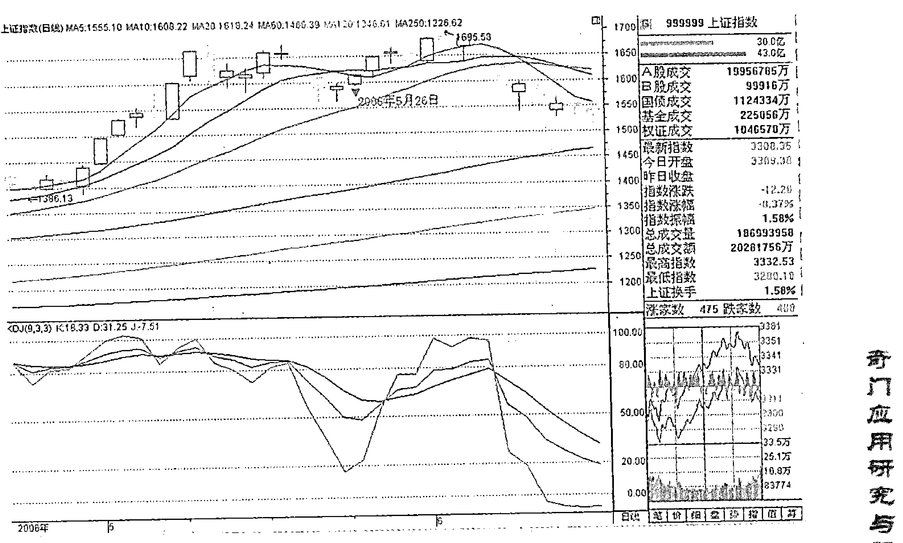

#### 实例四：大盘何时触底？奇门铁嘴断出？

龙隐网网友定力心魔对笔者说：“老大，不要出书了，请直接铁嘴断出大盘哪天触底就是最大的广告？”我回复：应该在冬至前后，以我看到你贴子的时间起局如下：

```
时间：2007年12月04日14时48分
农历：丁亥年十月廿五日未时
干支：丁亥辛亥壬申丁未
旬空：午未寅卯戌亥寅卯
小雪：中元丁未时旬首为壬
阴遁八局值符天辅落二宫值使杜门落一宫
```

| 太阴<br>惊门 戊<br>天任 壬 | 螣蛇<br>开门 癸<br>天冲 乙 | 值符<br>休门 壬<br>天辅 丁 |
| --- | --- | --- |
| 六合<br>死门 丙<br>天蓬 癸 | 辛 | 九天<br>生门 乙<br>天英 己 |
| 白虎<br>景门 庚<br>天心 戊 | 玄武<br>杜门 己<br>辛 天柱 丙<br>禽 | 九地<br>伤门 丁<br>天芮 庚 |

分析：
（1）值符景门为行情，值符临休门主盘整，景门宫空主无行情，亥月看6宫，上有九地主股市行情低迷，伤门主投资者有损失伤心，天芮出了问题在学习研究，辛主有失误，丁奇为年干太岁主国家主大事，庚是遇到阻力困难。丁又为时干主投资者或股票，日干为主力生时干，说明有主力资金在建仓，投资者有希望。值符宫生生门宫主有反弹行情存在。
（2）大事看星，星主股市的脾性，天柱落1宫说明变盘点在子月出现，结合螺旋历法，那么很可能冬至前后市场就会出现变盘的节点，这个节点很可能就是此轮调整的最低点结束点。
（3）九地在六宫，六宫有1、4、6、9数，结合江恩回调法则，4600至4900点之间应是此轮调整的最低区间。
（4）丑月景门宫填实，值符宫旺相时方有行情，值使主时限落1宫主调整还需1个月左右。
定力心魔的反窥：看来冬至前后触底，也是对的一种选择。这个大盘从11月28号到冬至，就反复忽悠筑底吧。不过，怕是不会跌破28号的低点。
实际走势如下图所示：

## 第九章 奇门与股市实战例释

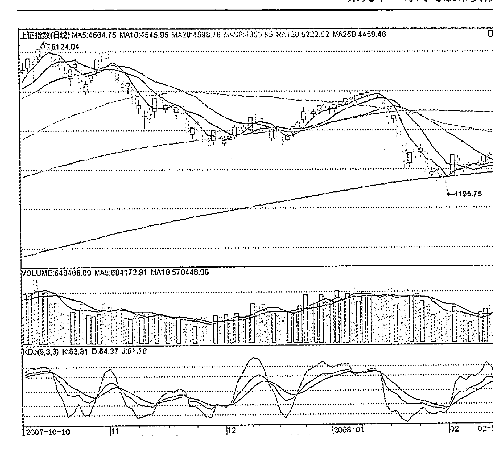

## 上证大盘在冬至前后见底反弹图

#### 实例五：上证大盘及板块，奇门判断定真机。

2008年2月21日周四，上海证券交易所大盘指数及板块的奇门预测验证。2008年2月20日晚，我思索明日上证走势及板块的表现情况，以便确定明日的具体操作方案，就按第二天开盘时间起局如下：

- 时间：2008年02月21日09时47分
- 农历：戊子年正月十五日巳时
- 干支：戊子甲寅辛卯癸巳
- 旬空：午未子丑午未午未
- 雨水：下元癸巳时旬首为庚

## 阳遁三局值符天禽落八宫值使死门落五宫

| 太阴 | 六合 | 白虎 |
|---|---|---|
| 杜门 辛<br>天心 己 | 景门 丙<br>天蓬 丁 | 死门 癸<br>天任 乙 |
| 螣蛇<br>伤门 壬<br>天柱 戊 |  | 玄武<br>惊门 戊<br>天冲 壬 |
| 值符<br>庚 生门 乙<br>禽 天芮 癸 | 九天<br>休门 丁<br>天英 丙 | 九地<br>开门 己<br>天辅 辛 |

分析：

- (1) 开门6宫有九地，4宫有太阴主低开。
- (2) 九心反吟主振荡，八门伏吟主整理，3宫上有蛇主盘整整理，伤门天柱主下跌，壬主振荡，戊在3宫击刑主跌，合起来就是振荡调整走势。

板块预测：值符在8宫，8宫主农业煤炭等，庚为钢铁，生门主商业新材料，乙奇天芮主医药造纸，癸主酒石油类等，九天在1宫，丁奇主3G通信电子信息类，丙为新能源类，天英主冶炼化工类，休门主供水供气类。

实际上：上证指数当天报收于4527.18点，下跌39.85点，昨收：4567.03，今开：4534.17，较昨日收盘低开了32.86点，最高：4568.21，最低：4452.68，成交量：613091手，成交额：1002.96亿元，指数振幅：2.53%。大盘蓝筹股普遍跌幅居前，钢铁板块继续领涨大盘，商业、新能源新材料、电子信息、3G概念、煤炭股、化工板块也有不俗的表现。

实际走势如下图所示：

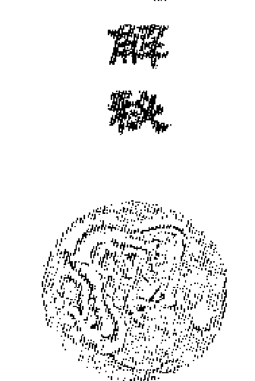

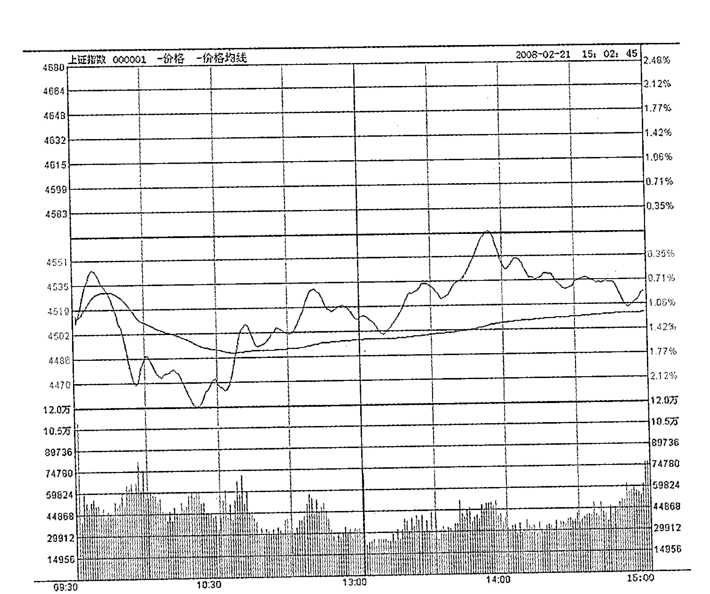

## 上证大盘低开分时图

#### 实例六：中国石油求自保，大盘指数露真谛。

中石油只求自保，不再充当救世主，股市今日走真，后市分析必有意义。

中国石油自从上市加入指数计算以来，因其占有上证指数的权重较大，它的走势直接影响上海证交所大盘指数的涨跌，所以想要搞清楚上证大盘的真实走势，首先要对中国石油的走势有一个正确的认识。比方，上证大多数股票在调整，但中国石油却上涨，那么从表面上看，上证指数也在上涨，不细作考究的话，往往会被其表面现象所蒙蔽。

2008年3月10日收盘后，我参考当天中国石油中规中矩的走势，

# 奇门应用研究与股市实战解秘

## 起局预测上证后市走势如下：

- 时间：2008年03月10日16时58分
- 农历：戊子年二月初三日申时
- 干支：戊子乙卯己酉壬申
- 旬空：午未子丑寅卯戌亥
- 惊蛰：上元壬申时旬首为戊
- 阳遁一局值符天蓬落五宫值使休门落九宫

| 九地 | 九天 | 值符 |
|---|---|---|
| 开门 丁<br>天柱 辛 | 休门 癸<br>天心 乙 | 生门 戊<br>天蓬 己 |
| 玄武 |  | 螣蛇 |
| 壬 惊门 己<br>禽 天芮 庚 | 壬 | 伤门 丙<br>天任 丁 |
| 白虎 | 六合 | 太阴 |
| 死门 乙<br>天英 丙 | 景门 辛<br>天辅 戊 | 杜门 庚<br>天冲 癸 |

## 分析：

奇门八门反吟，值符天蓬凶星，戊入地盘六己之墓，日时干宫玄武天芮惊门凶神，值使休门落9宫上乘九天有大的调整振荡幅度。九地落4宫主上证最低会调整到3000至3300点。

中石油今日走势中规中矩，盘中死守21.8元的前期底线，只求自保，不再充当救世主，股市今日走真，后市分析必有意义。上证今日探出8个月以来的新低，收盘跌破4165点一线的费伯纳契黄金支撑，成交明显放大，深成指已跌破年线，市场恐慌情绪加剧，预计短线探底4070点一带后，会引发反弹行情，请大家务必于反弹高点出逃，暂时观望为宜，以避免不必要损失。

从两盘预测看，两市入市资金严重不足，政府对股市从紧的调控手段未见改善，尤其是两会传来征收资本利得税的利空消息，三月特别是两会后春分20日左右，两会反弹行情结束，将会出现一轮较大级别的调整，最低可看到3000到3300点左右，请大家重新回忆过去股市流传的“远离股市就是远离毒品”的经典黑色名句，相信它会对大家的投资拉响风险警报，请在警报声中休息，隔岸观火为止。

实际上：上证截止2008年4月3日为止，最低下调至3271.29点，开始反弹。随后在4月20日谷雨后2天即22日见到2990.79点的阶段性底部，展开较大的反弹行情。

实际走势如下图所示：

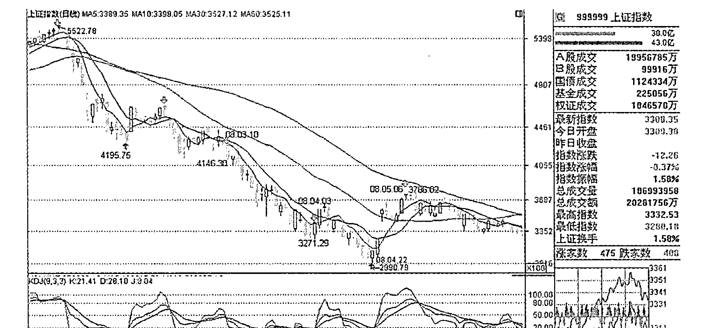

## 上证指数调整K线图

#### 实例七：上证将涨停，遁甲知时早。

上证大盘在自2007年10月见顶走出下跌趋势以来，一路狂跌至

## 奇门应用研究与股市实战解读

# 下编 奇门与股市实战解秘

2008年9月18日的1895.84点，仍然下跌不止，财政部为拯救证券市场，于当晚发布了单边征收印花税的利好，由于国家曾多次发布利好，股市反应麻木，一味下跌，所以这个利好能否扭转A股明日的走势，大多数股民心存疑虑，于是抱着同样的心态，我以明日9月19日A股的开盘时间起局，预测当日大盘的走势，预计会大涨百分之九左右，不惊喜出望外，遂打算准备好资金，以图赢利。结果第二天19日上证大盘跳空高开于2067.64点，至收盘至2075.09点，全天大涨百分之九点四六，差点涨停，真是比我的预期还好，下面将预测经过详述如下：

- 时间：2008年09月19日09时14分
- 农历：戊子年八月二十日巳时
- 干支：戊子辛酉壬戌乙巳
- 旬空：午未子丑子丑寅卯
- 白露：下元乙巳时旬首为壬
- 阴遁六局值符天芮落七宫值使死门落一宫

| 六合 | 太阴 | 螣蛇 |
|---|---|---|
| 休门 辛<br>天冲 庚 | 生门 庚<br>天辅 丁 | 伤门 丁<br>天英 壬 |
| 白虎 | | 值符 |
| 开门 丙<br>天任 辛 | 己 禽 | 己 杜门 壬<br>天芮 乙 |
| 玄武 | 九地 | 九天 |
| 惊门 癸<br>天蓬 丙 | 死门 戊<br>天心 癸 | 景门 乙<br>天柱 戊 |

分析：
为什么预测当日大盘会大涨百分之九以上？

9月19日为戊日，乾6宫当令用事，宫中景门主消息，天柱为政策有变化，乙奇为酝酿犹豫已久，戊为太岁国家财政部又为印花税，乾6宫与日干壬股市所在兑7宫比和，乾6宫也为官方，说明官方财政部发布的酝酿犹豫已久的，单边印花税征收的消息政策对股市有利。

景门为行情，落乾6宫用事，上乘九天主大涨，天柱比原来有大的变动上涨，乙为时干股民投资者，下临戊与日干壬所在兑7宫比和，说明投资者纷纷出资买入股票。乾6宫在酉月旺相，乾6宫有1、4、6、9数，取9数，那么可判断当日上证会大涨百分之九以上。

实际走势见下图所示：

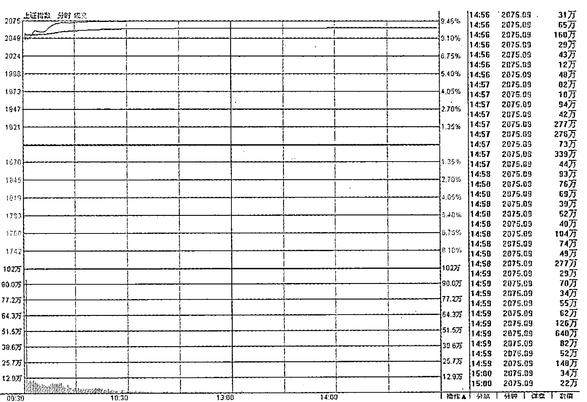

# 奇门应用研究与股市实战解秘

#### 实例八：天遁知高开，死门收红星。

2009年3月5日早上，在股市开盘前，我预测上证大盘将会高开，

# 下编 奇门与股市实战解秘

至收盘上证K线将会收出红十字星，果然至下午3时两市收盘，上证收出红十字星。

上证大盘于3月5日9时30分开盘于2220.15点，较3月4日收盘点位2198.11点高开22.04点，上证指数收在2221.08点，比开盘略收高0.93点，上证K线收出一标准的红十字星。

下面将分析判断详述如下：
公历时间：2009年3月5日9时
农历时间：二月初九日己巳时惊蛰上元
当日干支：己丑丁卯己酉己巳
当日旬空：寅卯（日）戌亥（时）
阳遁一局值符天蓬落二宫值使休门落六宫

| | | |
|---|---|---|
| 九地 | 九天 | 值符 |
| 景门 丁<br>天柱 辛 | 死门 癸<br>天心 乙 | 惊门 戊<br>天蓬 己 |
| 玄武 | | 螣蛇 |
| 壬 杜门 己<br>禽 天芮 庚 | 壬 | 开门 丙<br>天任 丁 |
| 白虎 | 六合 | 太阴 |
| 伤门 乙<br>天英 丙 | 生门 辛<br>天辅 戊 | 休门 庚<br>天冲 癸 |

分析：
(1) 为什么断当天上证大盘会高开？
开盘看开门宫并结合巽4宫综合判断，现开门落兑7宫，逢丙+丁为天遁，天遁主遁入天上高处，再逢天任吉星，结合巽4宫上乘九地吉神（昨日上证大盘上涨）主平稳，丁奇主张，景门有行情主上涨，天柱为较昨日收盘有变化，综合判断为高开，高开多少呢？开门落宫为兑7宫，兑7宫有2、4、7、9数，卯月兑7宫休囚，结合近期开盘情况取2数，那么就会知道，上证开盘至少会高开22点左右（实际上证开盘于2220.15点，较3月4日收盘点位2198.11点高开22.04点，误差已很小了）。

(2) 为什么判断上证K线会收出一红十字星？
酉日兑7宫用事，兑7宫上乘腾蛇火神主上涨不好把握，宫中开门逢丙+丁吉格为天遁，又遇天任吉星，巽4宫为巳时用事上乘九地，离9宫为午时用事上乘九天，坤2宫为未时用事上乘值符，从巽4宫开始，午时离9宫上乘九天，未时坤2宫上乘值符，均为上涨的吉神，说明当天上证大盘会上涨。既然上涨，就会有高点，高点一般看九天与值符所在的宫位，结合上证15分钟或30分钟支撑压力，卯月取离9宫的9数，可判断最高点在2239点左右（实际上证当天的最高点位在2241.76点，误差很小了）。巽4宫上有九地，为全天低点，巽4宫在卯月旺相，取8数，结合上证15分钟或30分钟支撑位，可知上证会下探至2180点左右止跌（实际上证下探的最低点在2173.49点）。上证收盘点位看死门所在的宫位，同时结合景门宫来判断。死门落离9宫，离9宫上乘九天，可知会收在较高点，景门落巽4宫上乘九地，结合预测全天会上涨，可判断收盘点位不会低于开盘点位，综合分析，可知上证当天收出一红十字星的概率较大，但是出乎意料的是，上证当天收盘在2221.08点，较开盘略收高0.93点，上证K线收出一标准的红十字星。

实际走势如下图所示：


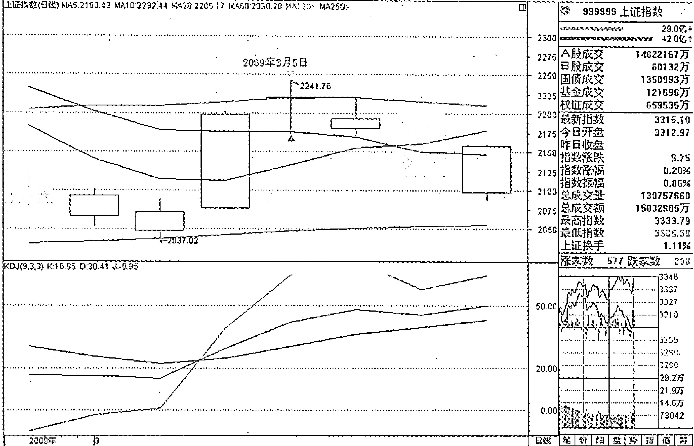

## 2009年3月5日上证单日十字星K线图

#### 实例九：购书自学，也能测准。

有好多网友，在我处购书后，自学不息，取得非常不错的自学效果，下面选其实测案例两例，加以点评，用以抛砖引玉。

（1）网友求知为乐自从购书后，认真反复研读达3遍之多，收获甚大，在实测中每每测中，收效很大，现摘其一例点评如下：

2009年4月22日，上证大盘当日分时走势及板块预测：

- 公历时间：2009年4月22日9时
- 农历时间：三月廿七日乙巳时谷雨上元
- 当日干支：己丑戊辰丁酉乙巳
- 当日旬空：辰巳（日）寅卯（时）
- 阳遁五局值符天英落四宫值使景门落一宫

| 值符 | 螣蛇 | 太阴 |
|---|---|---|
| 开门 壬<br>天英 乙 | 戊 休门 丁<br>禽 天芮 壬 | 生门 庚<br>天柱 丁 |
| 九天<br>惊门 乙<br>天辅 丙 | 戊 | 六合<br>伤门 己<br>天心 庚 |
| 九地<br>死门 丙<br>天冲 辛 | 玄武<br>景门 辛<br>天任 癸 | 白虎<br>杜门 癸<br>天蓬 己 |

求知为乐的判断：

高开低走，开盘2544点，最高2563点，最低2488点，收盘2512点，关注医药、电力、教育、有色金属，属于试验范围。

实际上：

当天上证大盘开盘于2548.11点，较上个交易日收盘点位2535.83点高开12.28点，最高2579.22点，最低2449.9点，收盘于2461.35点。上证全天高开低走，较前一交易日下跌74.48点。

实际走势如下图所示：

# 奇门应用研究与股市实战解秘

点评：从上面判断和上证当天实际走势来看，求知为乐的预测准确度误差已很小了，虽然没有写判断经过，但是预测的结果与实际已经出入不大了。板块预测方面需要加强。

下面我简单判断一下这个奇门局：
开门落巽4宫，上乘值符吉神，逢天英行情红火之星，壬+乙小蛇得势吉格，定主高开，巽4宫为4数，所以判断开盘点位为2544点左右。九天值符为全天的最高点，九天落震3宫逢空，值符落巽4宫旺相取8数，可判断全天最高点位为2580点左右。九地为全天的最低点，九地落艮8宫空亡，减半取4数或5数，那么全天的最低点可判断为2444点左右点或2455点左右。酉日兑7宫用事，宫中伤门凶门反吟，天心六合虽吉，但逢己+庚凶格，结合巽4宫离9宫坤2宫，以及日干丁奇所在的离9宫，可判断全天高开后，会走出振荡下跌的走势。收盘看死门宫与景门宫，死门落艮8宫逢空取5数，景门落坎1宫取6数，综合全天下跌判断可能收在2460点左右。

（2）网友中孚购书后，认真实践，很快掌握预测要领，在实测中连续测中，效果明显，现摘一例点评如下：

### 2009年4月20日，上证大盘当日分时走势预测：

- 公历时间：2009年4月20日9时
- 农历时间：三月廿五日辛巳时谷雨上元
- 当日干支：己丑戊辰乙未辛巳
- 当日旬空：辰巳（日）申酉（时）
- 阳遁五局值符天心落八宫值使开门落四宫

| 太阴<br>开门 辛<br>天任 乙 | 六合<br>休门 丙<br>天冲 壬 | 白虎<br>生门 乙<br>天辅 丁 |
| --- | --- | --- |
| 滕蛇<br>惊门 癸<br>天蓬 丙 |  | 玄武<br>伤门 壬<br>天英 庚 |
| 值符<br>死门 己<br>天心 辛 | 九天<br>景门 庚 戊<br>天柱 癸 | 九地<br>杜门 丁 禽<br>天芮 己 |

中孚的判断：

我认为周一的走势是这样：低开后下探，震荡得厉害；到11点多时启稳，反弹上冲；下午震荡有惊无险，全天收红（收出阳线）。

实际上：

上证指数开盘2500.17点，较上个交易日收盘点位2503.93点低开3.76点，最高2559.04点，最低2497.32点，收盘2557.46点，较上个交易日上涨53.52点。

实际走势如下图所示：

# 下编 奇门与股市实战解秘

### 奇门应用研究与股市实战解密

### 上证4月20日分时走势图

点评：对各用事宫内的走势判断较准确，但未有准确的分析出全天的开盘点位高低点及收盘点和板块，还需要努力。

下面我简单判断一下这个奇门局：

开门落巽4宫，上乘太阴，逢辛+乙凶格，加上八门反吟凶格，必主低开后，会振荡阴跌下探。11时后离9宫用事，离9宫中有六合吉神主人气集聚，天冲上涨吉星，再加上丙奇，主午时会上涨。下午未时坤2宫用事，除上乘白虎有振荡外，坤2宫全是吉门吉星三奇，当天未日也是坤2宫用事，所以当天会上涨。开盘看开门所落之巽4宫，取8数，可判断开盘点位为2488点左右，九天值符所落之宫为最高点，九天落坎1宫，值符落艮8宫，结合15分钟或30分钟K线图压力位，综合看取6数，那么最高点就为2560点左右，最低看九地落乾6宫，结合15分钟或30分钟K线图支撑位，综合看取9数，那么最低点就在2499点左右，收盘看景门与死落宫，景门落坎1宫，死门落艮8宫，综合分析，就知道上证大盘会收在2555至2566点之间。

### 第二部分：奇门对单个股票权证的预测

取用判断经验：

以日干来判断投资者的素质及投资状态，以时干来判断投资者所持股票或权证的情况，以甲子戊来判断投资者的资金状况，以生门来判断投资者的获利情况，以景门来判断投资者的操作方案手法策略情况。

以开门来判断上市公司基本面情况，以时干判断上市公司的产品销售及市场营销状况，以甲子戊来判断上市公司的流动资金情况，以生门来判断上市公司的盈利情况，以值符值使来判断上市公司的高管人员情况。

以值符来判断所测股票的多方情况，以生门来判断所测股票的持股方即空方情况，以景门结合值符来判断行情的强弱有无，以景门来判断消息面状况，以日干来判断买方情况，以时干来判断卖方情况，以时干给合多空方买卖方来判断所测股票的具体走势状况，并参考生门与日干、甲子戊与生门、时干与日干的关系来做出买卖的决定。

在具体判断时，要充分运用奇门预测股票的基本原则和实战原则，并结合 K 线与技术指标判断出精确的趋势及买卖的时间价位。

下面结合实例予以说明。

#### 实例一：股票亏7万元，何时可以解套？

2007 年 9 月 21 日，有个网友着急的问，目前股票巨亏 7 万元，什么时候可以解套？我 1977 年出生，年命丁巳。于是我按其发问时间起局预测如下：

奇门应用研究与股市实战解秘

公历时间：2007年9月21日15时
农历时间：八月十一日庚申时白露中元
当日干支：丁亥己酉戊午庚申
当日旬空：子丑（日）子丑（时）
阴遁三局值符天柱落一宫值使惊门落一宫

| 玄武<br>生门 壬<br>天任 乙 | 白虎<br>伤门 戊<br>天冲 辛 | 六合<br>杜门 乙<br>天辅 己 |
| --- | --- | --- |
| 九地<br>休门 庚<br>天蓬 戊 | （空）<br>丙 | 太阴<br>景门 辛<br>天英 癸 |
| 九天<br>开门 丁<br>天心 壬 | 值符<br>惊门 癸<br>天柱 庚 | 螣蛇<br>死门 己<br>天芮 丁 |

#### （一）分析

1.  先看日干投资者的心态和素质，日干戊落9宫与投资有关，戊+辛冲刑主资金被套，处在极度压抑难受的状态，伤门有损失伤心，戊落9宫就是损失有七万元了，白虎主操作上有失误，天冲主爱冲动未经深思熟虑就操作。年命丁在8宫入墓受困主暂不要有所作为。
2.  值符1宫空，难生4宫生门，主多方无力不做多，值符在酉月休囚，4宫生门也休囚，主该股处在弱势调整阶段，逢天柱行情走坏，空方生门宫上乘玄武主下跌走势。
3.  时干为股票逢九地主阴跌被套，逢休门天蓬伏宫格有大的调整换手。
4.  景门主行情在7宫有太阴天英以前红火过，现在见辛癸主行情受阻阴跌。
5.  局中时干宫生日干宫，生门宫生甲子戊宫，主逢低买进有利

#### （二）操作策略

6.  值符宫子月填实方可有行情，所以操作上应在周K线的KDJ处在20线以下的低位时，逢低加码买进摊低成本，于子月生门值符旺时才能开始上涨，在周K线KDJ处在80线以上高位时方可考虑卖出获利！
    实际走势如下图所示：

东方集团周K线KDJ低位弱势图

#### 实例二：占买中国联通如何？

2005年10月20日，有一朋友求测可否买人中国联通这支股票，我按其奇门局分析如下：
时间：2005年10月20日02时
农历：乙酉年九月十八日丑时

奇门应用研究与股市实战解秘

干支: 乙酉丙戊丁丑辛丑
旬空: 午未午未申酉辰巳
寒露: 下元辛丑时旬首为辛
阴遁三局值符天英落九宫值使景门落二宫

| 螣蛇<br>伤门 乙<br>天辅 乙 | 值符<br>杜门 辛<br>天英 辛 | 九天<br>景门 己<br>禽 天芮 己 |
| --- | --- | --- |
| 太阴<br>生门 戊<br>天冲 戊 | 丙 | 九地<br>死门 癸<br>天柱 癸 |
| 六合<br>休门 壬<br>天任 壬 | 白虎<br>开门 庚<br>天蓬 庚 | 玄武<br>惊门 丁<br>天心 丁 |

#### 分析:

1.  日干丁在6宫逢惊门主投资人心有疑虑惊疑不定，上乘玄武宜投机快出快进，逢天心主在思考计划，丁奇主有新奇的点子想逆势操作。
2.  以日干丁为股市落6宫上有玄武主跌，时干辛为股民落9宫自刑，上有值符，又逢杜门，说明股民大都被套牢，有大的损失。时干克日干主股民不进场入市，股市冷清没多少人气。股市的资金看甲子戊落3宫击刑，说明股市缺乏资金或有资金出逃，进入股市的资金有损失或入市资金缺乏。
3.  以值符为行情为多方落9宫在戊月休囚，生门落3宫也休囚，说明该股处于弱势，生门生值符，说明有投资者在抛售股票主该股必下跌，值符宫有杜门说明这时多方大都被套。生门3宫逢天冲主振荡走势，上有太阴，戊击刑，主有机构暗中做空振荡出货。大局九星伏吟主观望气分浓重。
4.  值使门景门落2宫，戊月2宫旺相，2宫有2、5、8、10数，加上九星伏吟主时间长，取10数，说明联通还要持续下跌10个月左右才能止跌（事实上联通从2005年10月到2006年的8月一直阴跌至2.16元见底后才开始有了新的上涨行情）。据以上分析可判断，联通的股价处在下跌通道，不可重仓介入做多。
5.  生门与甲子戊同宫，生门宫逢天冲主该股上下振幅大，景门行情宫上有九天也主该股上下振幅大，天冲九天又主短期振荡行情，宜短线买卖，所以短期逢低买入该股可获利。
6.  操作建议，专业机构投资者可根据联通的周K线KDJ在低位向上黄金交叉来临时，即时买进，在周K线KDJ处于80线以上高位时，择机卖出获利。散户及工薪阶层不建议操作。

事实上：中国联通从2005年10月19日，以2.5元开始振荡上涨至2006年1月9日的2.91元复又下跌。

实际走势如下图所示：

# 下编 奇门与股市实战解秘

#### 实例三：皇台酒业是否涨，奇门分析定策略？

2005年11月01日，有一网友问，皇台酒业是否会涨？

我按其奇门局做了如下分析：

时间：2005年11月01日10时27分
农历：乙酉年九月三十日巳时
干支：乙酉丙戌己丑己巳
旬空：午未午未午未戌亥
霜降：下元第1天己巳时旬首为戊
阴遁二局值符天芮落一宫值使死门落六宫

| 玄武<br>生门 己<br>天蓬 丙 | 白虎<br>伤门 辛<br>天任 庚 | 六合<br>杜门 乙<br>天冲 戊 |
| --- | --- | --- |
| 九地<br>休门 癸<br>天心 乙 | 丁 | 太阴<br>景门 丙<br>天辅 壬 |
| 九天<br>开门 壬 丁<br>天柱 辛 禽 | 值符<br>惊门 戊<br>天芮 己 | 螣蛇<br>死门 庚<br>天英 癸 |

#### 分析：

1.  日干己在4宫逢玄武利投机，临天蓬主想大干，逢生门想投机发大财，丙奇是想乱中求财或险中获利。
2.  值符1宫生生门4宫必涨，值符宫有甲子戊主有资金进入做多，丁奇主有消息配合在做多，惊门天芮主行情在大家对上市公司的疑问中展开。生门宫玄武天蓬说明主力资金持股大胆操盘投机，己主涨跌手法不寻常。
3.  开门落8宫，上有九天，临天柱，壬均主公司基本面有较大的变化（2005 年 4 月 22 日摘掉 ST 帽），壬与时干宫的玄武主酒类企业，生门主利润逢玄武靠酒盈利，流动资金甲子戊在 1 宫逢天芮主短缺有问题。值符所在 1 宫天芮说明高管人员有问题（公司董事长总经理隐瞒了父子关系），戊为长辈，地盘时干己为子女，说明公司董事长与总经理为父子关系（实际该公司的董事长总经理是两父子，其父任上市公司皇台酒业董事长，其子担任总经理），丁奇主票证，在这逢天芮惊门主有非法关联交易（其父将皇台 4466 万股转让给了其子的公司，使其子成为皇台第二大股东）。
4.  甲子戊为股价落 1 宫，1 宫有 1、6 之数，股价会涨至 6 元左右，值使门死门主行情的涨幅时限，落 6 宫主要涨到 6 元左右，戊月 6 宫旺相取 9 数，6 宫上有螣蛇主慢，可知该股需经 9 个月左右才能涨到 6 元左右。事实上皇台酒业从 2005 年 11 月到 2006 年 6 月底，历经大约不到 9 个月的时间，从 4 元多振荡上涨至最高 6.24 元后除权下跌。
5.  生门日干时干同宫，甲子戊宫生生门宫，说明买进就能获利。天蓬为财星在戌月休囚主获利不大。

操作建议：可在其周 K 线的 KDJ 下调至 20 线以下发出向上的黄金交叉时大胆买进，依周 KDJ 线低买高抛。

实际走势如下图所示：

奇门应用研究与股市实战解疑

# 下编 奇门与股市实战解秘

### 皇台酒业从 2005 年 11 月到 2006 年 6 月底周 K 线 KDJ 图

#### 实例四：大盘权证如何走？奇门判断来把握。

网友：若方便，麻烦楼主预测一下，周一（11 月 19 日）上证大盘，午盘（11：30）与 15 点收盘各收在什么点位，目前 5316。顺便再预测一下 031003（金融行业）权证，11 月 19 日的最高点/最低点的价位，目前 19.539 元。
以我看到你发帖时间起局预测如下，括号内为网友的反馈。（非常感谢楼主详细预测，目前上班是早出晚归，工作有点忙，没能及时反馈，请多包涵）。

- 时间：2007 年 11 月 17 日 11 时 01 分
- 农历：丁亥年十月初八日午时
- 干支：丁亥辛亥乙卯壬午
- 旬空：午未寅卯子丑申酉
- 立冬：中元壬午时旬首为己
- 阴遁九局值符天任落五宫值使生门落九宫

太阴<br>休门 辛<br>天心 癸 | 螣蛇<br>生门 乙<br>天蓬 戊 | 值符<br>伤门 己<br>天任 丙
--- | --- | ---
六合<br>开门 庚<br>天柱 丁 | 壬 | 九天<br>杜门 丁<br>天冲 庚
白虎<br>壬 惊门 丙<br>禽 天芮 己 | 玄武<br>死门 戊<br>天英 乙 | 九地<br>景门 癸<br>天辅 辛

分析：

（1）日干乙奇为求测者，落9宫主忧郁，下临戊与地盘午相冲克，主资金有损失（巳/午月损失大30%，后来的月份基本持平），上有螣蛇主焦虑不安（周六那天为工作的事情），临天蓬生门戊主有投资想发大财（曾经小投资，是想发财，呵呵），但戊与地盘午冲克就主有大的损失。天蓬主贪婪，加上九星反吟就要防乱防盲目买卖投资，螣蛇有点主意不定不利投资（每次操作还是有一定的依据，不算盲目，只是经常嫌利润少，被套很多次，以前的大损失就是这样产生的），所以从日干方面看，求测者应观望等待时机为主，不宜盲动（戊月下旬到现在没有操作，在学习炒短线，原因是没有找到可靠的方法；还有一点就是由于自己奇门没学好，运用不当，由此给我带来了一定经济损失，为此自己转换了方向）。

（2）日干又为股市主力在9宫，宫中螣蛇乙奇，天蓬生门，戊击刑，九星反吟，主走势振荡，忽上忽下不好掌握，同时有大的投资资金在进出，重新投资布局。时干为投资者股民散户落8宫，上乘白虎主为股市的凶悍走势所惊恐，临惊门心有余惊忧郁惊怕，丙奇主乱了主意，己主想赚钱反被套牢，壬是动荡不安，天芮在投资上出了问题同时也在研究学习，时干空亡主投资者散户对股市心里大都没底在观望参与的少，日干生时干主这时股市需要人气，同时也说明主力在吃进散户手里的筹码（有波动就会有利润，九星反吟应该还主快，超短线比较符合这一点，目前主要学习权证，日内交易）。

（3）值符多方落在2宫空亡，主多方看空不做多，伤门主多方投资者有损失，己主受陷害在股市主套牢，九星反吟加上丙奇，主多方阵角有点乱，天任主反应迟慢乏力。生门持股方空方落9宫生2宫多方值符，主市场在抛售股票，九星反吟主反复在抛售，值符与生门均休囚，证明市场进入弱势，很明显近期市场是一个振荡下跌的格局。值使门生门落9宫，9宫休囚，取2数或3数，那么市场反复振荡调整至少为2至3个月，振荡调整的幅度大约为200点至300点左右。值符景门主行情，值符空没行情，景门上乘九地主行情低迷。具体的点位看景门，落6宫旺相，取9数，股市至少要调整到4900点左右。

实际走势如下图所示：

### 上证大盘 2007 年 11 月 19 日日 K 线下跌趋势图

（4）周一11月19日为丁巳日，地支落4宫，上有太阴主上证大盘必阴跌，休门主休整，天心调控走势，辛入墓也主调整同时防操作失误，癸被网有套牢的。11点半为午时看9宫取2数或3数，上证应收在5200点至5300点之间或左右（实际上证午盘收在5254点），15点为申时落在2宫，取2数，收盘应在5200点左右（实际上证收在5269点）。修正：2宫有5数，所以可判断下午收盘应在5250点左右。

实际走势如下图所示：

（5）031003（金融行业）权证，基本面，看开门上乘六合不止发行了一只权证，最少应为两只（实际上深发展发行了031003和031004两只认证权证），逢天柱主营业绩有变，逢庚主经营业绩受阻（近期刚上调完存款准备金率），丁奇主股票主未来有希望有发展。其近期走势看值符与生门，生门生值符为卖出的多主阴跌（快到期了，应该是卖

#### 实例五：宝钢权证如何走？预测分析早知道。

2005年12月01日，580000宝钢权证由于上市以来走势较为活跃，参与的投资者众多，笔者随对其当日的走势进行了预测。

- 时间：2005年12月01日09时26分
- 农历：乙酉年十一月初一日巳时
- 干支：乙酉丁亥己未己巳
- 旬空：午未午未子丑戌亥
- 小雪：下元第1天己巳时旬首为戊
- 阴遁二局值符天芮落一宫值使死门落六宫

| 玄武<br>生门 己<br>天蓬 丙 | 白虎<br>伤门 辛<br>天任 庚 | 六合<br>杜门 乙<br>天冲 戊 |
| --- | --- | --- |
| 九地<br>休门 癸<br>天心 乙 | 丁 | 太阴<br>景门 丙<br>天辅 壬 |
| 九天<br>开门 壬 丁<br>天柱 辛 禽 | 值符<br>惊门 戊<br>天芮 己 | 螣蛇<br>死门 庚<br>天英 癸 |## 第九章 奇门与股市实战例释

分析：

- （1） 多方值符与资金戊同在1宫主量价配合权证会涨，逢惊门天芮主费心钻研于险处投机，戊+己贵人入狱因私欲贪婪破财落陷，丁+己虽睿智求谋但落陷难成，戊、天芮资金缺乏或投机有问题。
- （2） 生门主股票财利，与日干己、丙奇同在4宫逢天蓬，主因想投机冒险发大财，而于忙乱中大胆谋财，玄武主投机主行情上涨不实有暗中骗线出货的危险。
- （3） 多方值符1宫旺于月令，生旺相之股票生门4宫，主参与买卖者积极活跃很有人气，权证必涨。
- （4） 钢铁方面的权证参考一下6宫和庚，二者均落6宫旺宫空则不空，上有腾蛇主走势怪异不好把握，庚+癸大格主涨跌幅度较大，天英上下涨跌火暴时间较短，死门为值使门，容易走入死角或行情不被看好，也主要做空。
- （5） 综合来看，钢铁方面的权证会上涨，可以买进，但在上涨中遇到暗中出货骗线的行情来临时，要即时卖出为上。生门宫天蓬玄武求财难破财易，谨防破财。

结果：宝钢权证580000于1.71元开盘后，经过多空双方激烈角逐，最终于1.82元报收，昨日以1.66元收盘，经过全天交易较昨日上涨了0.16元。

#### 实例六：买进中石油，肯定能赚钱。

中国石油于11月5日回归沪市，不少同事对其投资价值很关注，问我现在能买吗？买进后将来能涨多高？于是我按中国石油上市首日开盘时间起局预测如下：

时间：2007年11月05日09时33分
农历：丁亥年九月廿六日巳时
干支：丁亥庚戌癸卯丁巳
旬空：午未寅卯辰巳子丑
霜降：中元第5天丁巳时旬首为癸
阴遁八局值符天冲落二宫值使伤门落九宫

| 太阴 | 螣蛇 | 值符 |
| :--- | :--- | :--- |
| 生门 丙 | 伤门 戊 | 杜门 癸 |
| 天蓬 壬 | 天任 乙 | 天冲 丁 |
| 六合 | | 九天 |
| 休门 庚 | 辛 | 景门 壬 |
| 天心 癸 | | 天辅 己 |
| 白虎 | 玄武 | 九地 |
| 开门 己 辛 | 惊门 丁 | 死门 乙 |
| 天柱 戊 禽 | 天芮 丙 | 天英 庚 |

### （一）分析

- 1. 首先看其基本面

开门落8宫，上乘白虎主业绩增长快，公司竞争力很强，逢天柱说明基本面有较大的变化，地盘临甲子戊说明有新的投资，临己主想进一步取得发展。开门宫空亡临天柱说明中石油以前有过重组。空亡看对宫2宫，上乘值符主是规模大经营好有名的企业。其业绩看生门，生门落4宫，在戌月旺相，天蓬在4宫生宫大旺，说明中石油的业绩好，生门临丙奇逢天蓬主中石油在国内拥有很大的垄断利润，每股盈利丰厚，4宫最大的数为8数，结合股市中每股的收益，可判断中石油今年的每股收益应在0.80元左右。

- 2. 看一下中石油上市当天的走势

- （1）开盘价预测：它的开盘价看开门，开门落8宫主开盘价与8数有关，参考中国石化前一日的动态市盈率，28.49元除以0.56元就约等于50.88倍，用中石化的市盈率来类比中石油的市盈率，那么中石油的上市首日开盘价在理论上就为50.88乘以0.80约等于40.7元，


结合奇门预测它的开盘价应该为48元左右（实际上中石油在其上市首日的开盘价为48.6元）。

- （2）当天的分时走势预测：11月5日当天为卯日看3宫，休门临3宫主盘跌，宫中庚+癸为大格凶格主下跌调整走势，天心临3宫主有计划有意识的调整控制走势，六合不止是中石油一家在跌，其他大盘股也在跌（实际上中石油以48.6元的最高价开盘后，就一路下跌，其他大盘股如工商行，中国石化，中国神华等也在下跌）。

- （3）当天最高价最低价预测：最高价看九天所在7宫，7宫最大数为9数，结合其开盘价，那么可判断中石油当日的最高价应在49元左右。最低价看九地所在6宫，6宫最小数为1数，结合其开盘价，那么可判断中石油当日的最低价应为41元左右（实际上中国石油当日的最高价为48.62元，最低价为41.7元）。

### 3. 中石油的近期走势预测

生门4宫克值符2宫，主持有者惜售或下跌盘整，说明中石油近期的走势主要是以下跌盘整为主。值符日干宫有杜门主做多方有被套牢的，天冲主冲动所至，癸+丁蛇妖娇为凶格主做多者被中石油的走势所迷茫，情绪压抑。

### 4. 中石油今后的走势预测

#### （1）2008年的走势

2008年为戊子年，年干戊落9宫受冲克主走势受制不会大涨大跌，走势较疲惫，地盘乙奇走的较忧郁较曲折，伤门主伤脑筋，有点伤投资者的感情，天任主走势过慢，上乘蛇主走势受调控有些缠绵。年支子在1宫，1宫上有玄武主诱骗投机有破财的，逢惊门天芮主行情会在投资者忧郁焦虑不安中展开，辛与时干丁投资者同宫，主有投资者操作失误出问题赔钱。丁奇丙奇落1宫火入水中，说明投资者暂时有些损失，将来肯定有希望赚钱。值符景门主行情，值符落2宫逢天冲杜门涨幅有限，景门落7宫上有九天但逢天辅主涨势平稳。综合看中石油明年的走势较沉稳，时间上会长一些，急性子的投资者要有心理准备。

## 奇门应用研究与股市实战解读


# 下编 奇门与股市实战解秘

- （2）今后的最高价与最低价预测：最高价看九天落7宫，结合以上预测可判断其今后一段时间的最高价应不会超过77元，最低价看九地落6宫，6宫最小数为1数，结合中石油的股价，可判断其最低价应在，当市场市盈率在40倍左右时应在31元左右，当市场市盈率在15~25倍左右时应在11元或21元左右。

### 5. 买入中石油能否获利

生门4宫生甲子戊所在9宫，买入肯定能获利。

### （二）操作策略

根据以上预测，中石油的基本面是非常优良的，投资者应持币等待中石油的价格回落至11元附近时，才应开始买入长线投资持有方可获利。

实际走势如下图所示：

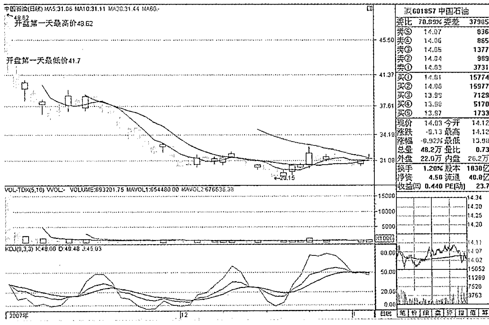

601857 中国石油日线图

#### 实例七：基本面上有突变，奇门预测察真知。

2007年3月7日，有朋友问：近日来，杭萧钢构从2元附近开始连续涨停，到底怎么回事？于是我从朋友问话的时间起局预测如下：

- 时间：2007年03月07日11时33分
- 农历：丁亥年正月十八日午时
- 干支：丁亥癸卯庚子壬午
- 旬空：午未辰巳辰巳申酉
- 惊蛰：中元第2天壬午时旬首为己
- 阳遁七局值符天任落二宫值使生门落七宫

| 九地 | 九天 | 值符 |
| :--- | :--- | :--- |
| 惊门 乙<br>天心 丁 | 开门 辛<br>天蓬 庚 | 休门 己<br>天任 壬 |
| 玄武<br>死门 戊<br>天柱 癸 | 丙 | 螣蛇<br>生门 癸<br>天冲 戊 |
| 白虎<br>丙 景门 壬<br>禽 天芮 己 | 六合<br>杜门 庚<br>天英 辛 | 太阴<br>伤门 丁<br>天辅 乙 |

分析：

- 1. 基本面预测
   - （1） 上市公司看开门，开门落9宫，上有九天主该上市公司处在扩张发展阶段，前景较好，逢天蓬主有大的发展机会，甲午辛在9宫自刑，说明公司内部在经营管理上有问题，地盘逢庚天蓬主公司有胆大妄为的不法投机分子。
   - （2） 公司的业绩看生门落7宫，逢天冲主有较快的利润增长来源，癸+戊合格主有合作项目可以盈利，螣蛇主目前这个项目还没落实。生门宫空亡主预期业绩，卯月天冲财星旺相，主未来得利必厚。

## 奇门应用研究与股市实战解密

- （3） 高管人员看年干丁奇落6宫，逢伤门主有刑伤，上有太阴主私下暗中有策划，地盘乙奇入墓主有人坐牢。开门为证券监管机构落9宫，克年干所在6宫，说明有高管人员被查处。

### 2. 趋势预测

值符2宫生7宫生门，值符宫生门宫空主无量上涨，值符2宫地盘丙奇，生门7宫天冲，说明有主力已绝对控盘，加上九星反吟，说明其涨势必速，涨幅必大。景门为行情落8宫，上有白虎主凶悍，丙奇主行情霸道，天芮主有问题。值使门生门7宫天冲主行情幅度必大。

### 3. 买卖预测

生门与甲子戊同宫，逢旺相之天冲财星，生门宫又生日干宫，主投资者买入该股必获大利。

后来了解到杭萧钢构与非洲某国签订了达300多亿元的合作盈利项目，同时杭萧钢构公司高管人员涉嫌本公司股票的非法内幕交易被处罚逮捕。

实际走势如下图所示：

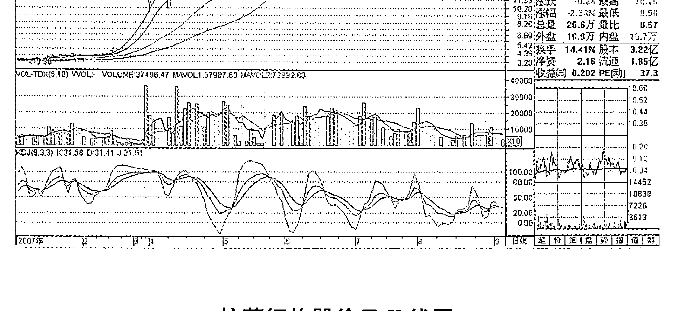

#### 实例八：股票被套，何时回本？

广东的网友：最近炒股亏了不少，腰斩了，最近全仓600282成本价24.20元，请测何时能回本？我按其发贴时间起局如下：

- 时间：2007年11月14日23时32分
- 农历：丁亥年十月初五日子时
- 干支：丁亥辛亥癸丑壬子
- 旬空：午未寅卯寅卯寅卯
- 立冬：上元壬子时旬首为壬
- 阴遁六局值符天芮落二宫值使死门落三宫

| 太阴 | 螣蛇 | 值符 |
| :--- | :--- | :--- |
| 惊门 庚<br>天辅 庚 | 开门 丁<br>天英 丁 | 己 休门 壬<br>禽 天芮 壬 |
| 玄武<br>死门 戊<br>天柱 癸 | 丙 | 螣蛇<br>生门 癸<br>天冲 戊 |
| 白虎<br>丙 景门 壬<br>禽 天芮 己 | 六合<br>杜门 庚<br>天英 辛 | 太阴<br>伤门 丁<br>天辅 乙 |

分析：
- （1） 日干癸在1宫，上有玄武主投机破财，逢杜门被套牢，临天蓬被重套，癸+癸天网四张凶格主高位被重套，加上九星伏吟，难受不能动弹。看其资金甲子戊在6宫入墓，逢伤门主必有损失。
- （2） 值符2宫生7宫生门，主近期必会反弹上涨，值符旺相于亥月，有资金在逢低介入，值符也主行情，说明有行情。景门在8宫上有白虎主行情来时凶悍，遇丙奇主会飙升，景门宫空暂无大行情。景门8宫驿马动，值符在亥子寅月旺相，生门在8宫本宫旺相，那么当8宫填实时，即丑寅月必会有大行情，到时即可有解套机会。
- （3） 生门7宫与甲子戊6宫相并，生门宫生日干宫，主逢低买入定会盈利。
- （4） 从技术上看，其周K线的KDJ已至低位，60分钟MACD线呈低背离，日K线的筹码指标显示下档低位已有大量红色获利筹码。
- （5） 操作策略，若有资金可与此时逢低买入做一波段行情，若无资金可持股不动，等待股价上涨解套。

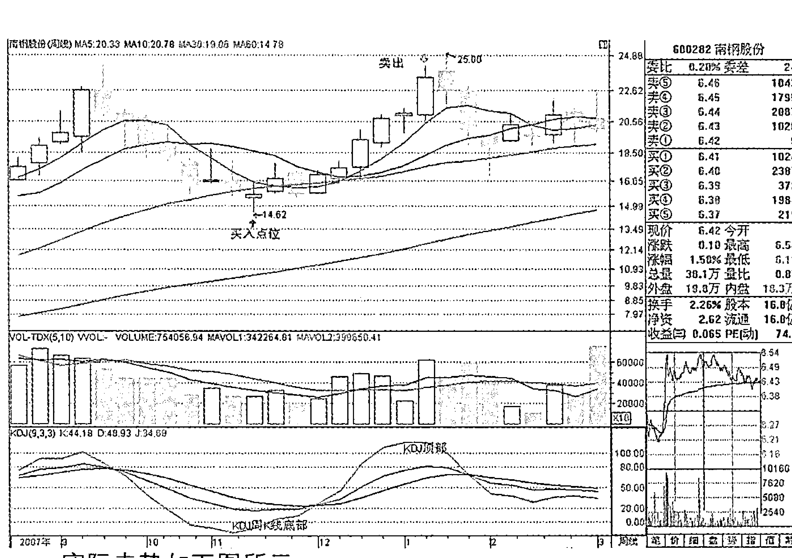

实际走势如下图所示：

## 600282 南钢股分周K线KDJ低位图

## 600282 南钢股份日 K 线筹码显示图

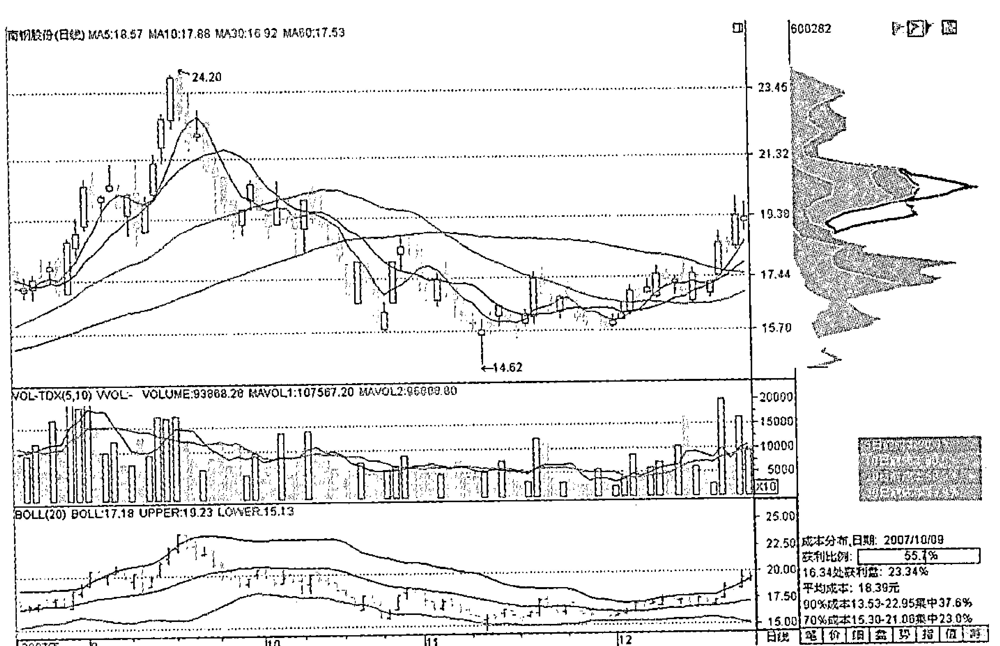

| 成本分布项 | 详情 |
| :--- | :--- |
| 日期 | 2007/10/09 |
| 获利比例 | 55.1% |
| 16.34处获利盘 | 23.34% |
| 平均成本 | 18.39元 |
| 90%成本区间 | 13.50-22.95，集中37.6% |
| 70%成本区间 | 15.30-21.06，集中23.0% |

奇门应用研究与股市实战解秘

## 600282 南钢股份 60 分钟 MACD 低背离图

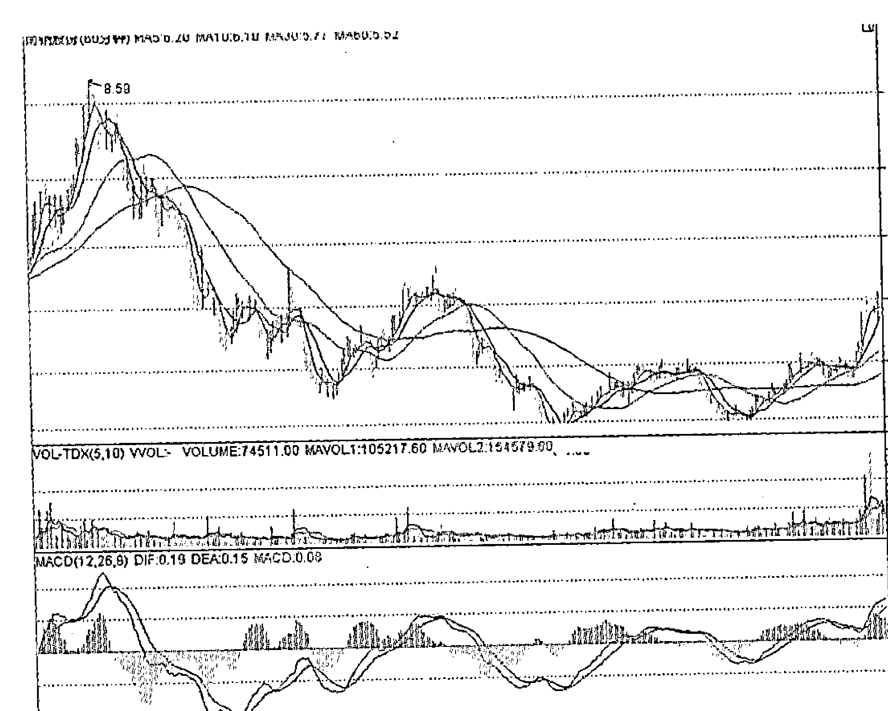

| 600282南钢股份盘口及成交明细 | 数据 |
| :--- | :--- |
| 委比 | 0.20% 委差 24 |
| 卖⑤ | 价格6.46，量1043 |
| 卖④ | 价格6.45，量1795 |
| 卖③ | 价格6.44，量2087 |
| 卖② | 价格6.43，量1028 |
| 卖① | 价格6.42，量9 |
| 买① | 价格6.41，量1024 |
| 买② | 价格6.40，量2387 |
| 买③ | 价格6.39，量372 |
| 买④ | 价格6.38，量1904 |
| 买⑤ | 价格6.37，量219 |
| 现价/今开 | 6.42 / —— |
| 涨跌/最高 | 0.10 / 6.54 |
| 涨幅/最低 | 1.58% / 6.19 |
| 总量/量比 | 38.1万 / 0.87 |
| 外盘/内盘 | 19.0万 / 19.0万 |
| 换手/股本 | 2.26% / 16.8亿 |
| 净资/流通 | 2.62 / 16.8亿 |
| 收益(三)/PE(动) | 0.065 / 74.4 |
| 14:59 | 价格6.42，276 S |
| 14:59 | 价格6.42，106 S |
| 14:59 | 价格6.43，130 B |
| 14:59 | 价格6.43，137 B |
| 14:59 | 价格6.42，400 S |
| 14:59 | 价格6.42，470 S |
| 14:59 | 价格6.42，57 S |
| 14:59 | 价格6.42，41 S |
| 14:59 | 价格6.42，100 S |
| 14:59 | 价格6.43，105 B |
| 15:00 | 价格6.42，71 S |
| 15:00 | 价格6.42，120 S |
| 15:00 | 价格6.42，45 B |

#### 实例九：何时有转机，奇门定知道？

网友问：000557 银广夏有退市风险吗？若无何时才能有转机？我当即起局如下：

时间：2007年11月23日23时35分
农历：丁亥年十月十四日子时
干支：丁亥辛亥壬戌庚子
旬空：午未寅卯子丑辰巳
小雪：下元庚子时旬首为辛
阴遁二局值符天任落九宫值使生门落二宫

| 螣蛇 | 值符 | 九天 |
| :--- | :--- | :--- |
| 开门 己<br>天蓬 丙 | 休门 辛<br>天任 庚 | 生门 乙<br>天冲 戊 |
| 太阴 | | 九地 |
| 惊门 癸<br>天心 乙 | 丁 | 伤门 丙<br>天辅 壬 |
| 六合 | 白虎 | 玄武 |
| 死门 壬 丁<br>天柱 辛 禽 天芮 己 | 景门 戊 | 杜门 庚<br>天英 癸 |

分析：

- 1. 先看日干投资者所在8宫，地盘辛主操作失误，逢天柱主心有疑虑，临死门心情不好，上乘六合主因贪多而被套牢或想股票重组的事。时干为股票落6宫，日干生时干说明投资者买了这支股票。（网友反馈说，早买了，现在被套）
- 2. 再看该股的基本面，开门为上市公司落4宫，上乘螣蛇主重组，临天蓬逢空说明该上市公司为亏损较大的企业，加上对宫的玄武，说明该企业有退市的风险，己主想好起来，丙主经营上有点乱。时干为产品落6宫，上乘玄武为酒类企业，杜门主产品滞销，逢庚主受阻不顺，逢天英主市场宣传策划。地盘癸主是酒类产品。生门为该上市公司利润落2宫，上乘九天主业绩在上升，逢天冲主利润增长较快，地盘丁奇太岁主今年有较大的盈利，乙奇入墓不吉主资不抵债，利润抵偿不了原先的亏损和债务，地盘戊逢九天主原先有债务。
- （3） 明年为戊子年，年干与地支都在1宫，宫中景门主策划，在行业为冶炼冶金等行业，年干丁奇为该上市公司的上级单位和政府领导，甲子戊为资金，己主想使该企业好起来，逢天芮在研究解决该上市公司的重组注资问题，上有白虎主强力而为。1宫生4宫开门，说明有政府上级单位与有关金属冶炼的企业来注资重组。八门反吟主事有不顺，多有反复。
- （4） 景门为消息在1宫，上乘白虎，临太岁年干丁奇，为真消息，可靠。据以上分析可知，000557重组有望，消息确实，可大胆持有该股。（网友反馈说，有消息说000557银广夏，可能被青铜峡铝业或中粮重组）
- （5） 近期走势看值符与生门的关系，值符落9宫生生门所在2宫，主该股近期会上涨，上涨幅度看值使门所在2宫，至少涨2元。值符在子月旺相，子月必涨。景门主行情在1宫乘白虎临太岁主有较大行情。
- （6） 生门2宫与日干8宫均属土相比和，主买人肯定赚钱。
- （7） 操作策略，应根据该股的周K线KDJ低位黄金向上交叉图，寻找60分钟KDJ向上金叉时机买进持有，在周K线的KDJ高位死叉来临时，择机卖出。

实际走势如下图所示：

（侧边竖排文字：奇门应用研究与股市实战解秘）


# 下编 奇门与股市实战解秘

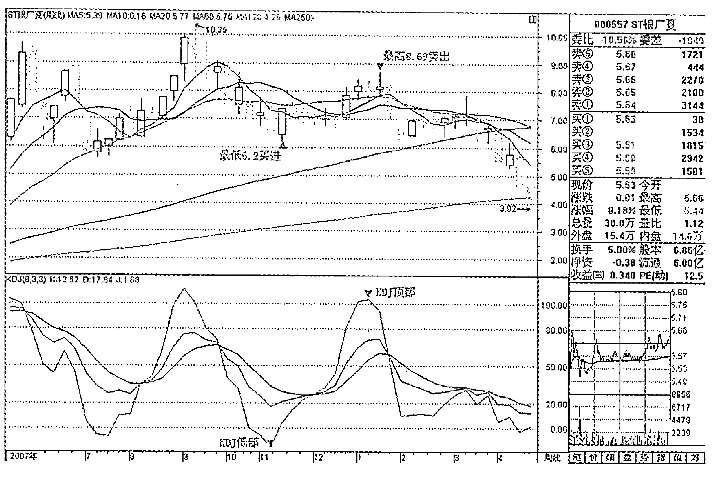

000557 银广夏周K线 KDJ低位向上黄金交叉图

#### 实例十：龙字出口，走势若何？

网友大黑天1说，请您看一只个股，我说1个字龙，请您看看未来3个月走势。谢谢！

以我看到你贴子的时间起局预测如下：

- 时间：2007年12月23日00时13分
- 农历：丁亥年十一月十四日子时
- 干支：丁亥壬子辛卯戊子
- 旬空：午未寅卯午未午未
- 冬至：下元戊子时旬首为庚
- 阳遁四局值符天心落四宫值使开门落一宫

| 值符<br>伤门 庚<br>天心 戊 | 螣蛇<br>杜门 丁<br>天蓬 癸 | 太阴<br>景门 壬<br>天任 丙 |
| :--- | :--- | :--- |
| 九天<br>生门 辛<br>天柱 乙 | 空 | 六合<br>死门 乙<br>天冲 辛 |
| 九地<br>己 休门 丙<br>禽 天芮 壬 | 玄武<br>开门 癸<br>天英 丁 | 白虎<br>惊门 戊<br>天辅 庚 |

分析：
景门空暂无行情，九星反吟主现下该股处于振荡盘整换手的过程当中。日干宫显示你有投资且有损失，戊入墓资金被套。开门宫玄武主该股有重组或基本面有变。时干宫主有调整换手的迹象，值符生门宫比和主将来有行情，生门日干同宫可买进持有。值使开门宫1、6数主6个月内必有行情。看未来3个月，丑寅月8宫驿马冲动2宫景门主蓄势振荡盘升，卯月拉升。

反馈：
ok！非常好！说理透彻！准确度高！

> “九星反吟主现下该股处于振荡盘整换手的过程当中”，近期在打压。

> “日干宫显示你有投资且有损失，戊入墓资金被套。”——对！上周几乎天天跌，刚买入就被套，还好是-10%左右，今天回升。该股走势凶悍。

> “开门宫玄武主该股有重组或基本面有变。”对！这一点偶最为欣赏，正确，已公开，但不知最后能否像龙一样飞升？重组成功？

> “生门日干同宫可买进持有”，偶就不做短线了，持有！

> “丑寅月8宫驿马冲动2宫景门主蓄势振荡盘升，卯月拉升。”等好消息！

---

问您个问题：不知此股6个月内能否翻翻或最高可到多少，行情最高潮在哪个月？现价在20左右。谢谢！

> > “最高应涨到38元以上，卯月拉升。”

反馈：

今天偶的票上涨，目前刚已解套，确实震荡上行。庄家最近如您所说大量换手，谢谢！

您说的最高价正合我的预期，我原想能够翻番。老师确实水平非一般，在股票版高手中也属一属二，希望您能多帮助小散。常来呀，老师！

#### 实例十一：网友来发问，奇门定涨跌。

2007年12月28日15时，网友寇添问600184新华光后市涨跌情况？我便依其所起的奇门局分析如下：

- 时间：2007年12月28日15时35分
- 农历：丁亥年十一月十九日申时
- 干支：丁亥壬子丙申丙申
- 旬空：午未寅卯辰巳辰巳
- 冬至：上元丙申时旬首为辛
- 阳遁一局值符天辅落八宫值使杜门落六宫

奇门应用研究与股市实战解秘


## 第九章 奇门与股市实战例释

| 太阴 | 六合 | 白虎 |
| :--- | :--- | :--- |
| 壬 开门 己<br>禽 天芮 辛 | 休门 丁<br>天柱 乙 | 生门 癸<br>天心 己 |
| 螣蛇<br>惊门 乙<br>天英 庚 | 壬 | 玄武<br>伤门 戊<br>天蓬 丁 |
| 值符<br>死门 辛<br>天辅 丙 | 九天<br>景门 庚<br>天冲 戊 | 九地<br>杜门 丙<br>天任 癸 |

分析：

- (1) 日干在6宫入墓又逢杜门必被套，上乘九地宜中长线投资，不宜短线或乱动。
- (2) 值符生门宫比和主后市有上涨，景门宫旺象上有九天主有行情必上涨。
- (3) 时干宫丙奇，主该上市公司为光电行业，上乘九地主该股处低位，最低应在14元左右。
- (4) 开门宫空有重组构并题材，上有太阴属潜在增长行业。
- (5) 该股近期最高可涨至16元左右，因九天落在坎1宫之故。

实际走势见下图所示：

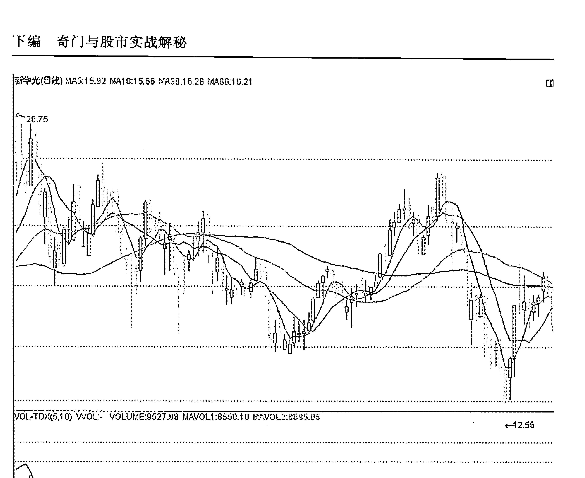

## 新华光走势图

#### 实例十二：博客常来看，股票请分析？

> 网友冰安娜：“你好！经朋友介绍，经常登陆你的博客，发现你的预测非常准确，佩服！能否麻烦你帮忙看看一只股票，属于通讯及相关设备制造业，目前股价52元左右。有劳老师预测一下该股票近期的走势，谢谢！”

以看到其贴子的时间起局分析如下：

- 时间：2008 年 01 月 05 日 14 时 08 分
- 农历：丁亥年十一月廿七日未时
- 干支：丁亥癸丑甲辰辛未
- 旬空：午未寅卯寅卯戌亥
- 冬至：下元辛未时旬首为戊
- 阳遁四局值符天辅落七宫值使杜门落二宫

| 玄武 白虎 六合 | 九地 太阴 | 九天 值符 螣蛇 |
| :--- | :--- | :--- |
| 生门 丁 天蓬 戊 | 伤门 壬 天任 癸 | 杜门 乙 天冲 丙 |
| 休门 庚 天心 乙 | 己 | 景门 戊 天辅 辛 |
| 开门 辛 天柱 壬 | 惊门 丙 禽 天芮 丁 | 死门 癸 天英 庚 |

分析：
开门为上市公司基本面，落艮8宫，艮8宫逢天柱壬水主变化，说明该股基本面有变化，艮8宫上乘六合，主该股有重组或并购题材。走势上值符所落兑7宫克生门所在巽4宫，主近期有回调迹象，丑寅月艮8宫主事，对宫坤2宫上有九天吉神天冲吉星乘驿马，冲动艮8宫，所以说丑寅月该股会有振荡略有上行。日干壬落离9宫，临癸水主被套牢，逢伤门主正在伤脑筋，临天任执意持有，乘九地是反应慢错过卖出时机。甲子戊为资金落兑7宫，与地盘甲午辛相冲克，说明目前你暂时被套资金有损正在伤脑筋。

冰安娜反馈：
非常感谢老师百忙中给我回复和预测！
我目前暂时被浅套，准确；
走势上近期有回调迹象，准确；

谢谢老师！该股目前果然回调了，老师你预测得太准了，谢谢！

#### 实例十三：生死一线，能否买入？

本人准备博一只重组或可能退市股，生死一线，停牌后何时复牌？能否重组成功？能买入否？请老师看看，谢谢！烦请太白老师详细分析一下，感谢！问半年或1年后的行情。

我以看到其贴子的时间起局预测如下：

- 时间：2008 年 01 月 09 日 22 时 30 分
- 农历：丁亥年十二月初二日亥时
- 干支：丁亥癸丑戊申癸亥
- 旬空：午未寅卯寅卯子丑
- 小寒：下元癸亥时旬首为癸
- 阳遁五局值符天蓬落一宫值使休门落一宫

| 六合 | 白虎 | 玄武 |
| :--- | :--- | :--- |
| 杜门 乙<br>天辅 乙 | 景门 壬<br>天英 壬 | 戊 死门 丁<br>禽 天芮 丁 |
| 太阴 | | 九地 |
| 伤门 丙<br>天冲 丙 | 戊 | 惊门 庚<br>天柱 庚 |
| 螣蛇 | 值符 | 九天 |
| 生门 辛<br>天任 辛 | 休门 癸<br>天蓬 癸 | 开门 己<br>天心 己 |

由于时间关系，我点到为止：

- （1）日干 2 宫主有新奇点子大的设想，想投机，投资有问题的股票。
- （2）开门 6 宫凶格伏吟局主该上市公司基本面有较大的变动，有长时间的重组行为，2 宫生 6 宫有资金注入。生门宫可看出经营有误业绩下滑较大。时干宫休门又空亡，生门宫空亡，大局伏吟主长时间停产。
- (3) 景门宫主你的操作计划太仓促有漏洞有失误变动之处，但生日干宫能实施对你有利。
- (4) 值符宫空暂无行情，值使门主该股要停牌半年 6 个月以上，日干宫克时干宫买的人少，生门宫克值符宫近期在盘跌。
- (5) 开盘时间看开门宫，应在明年的戌亥月左右。
- (6) 年干宫生开门宫主政府有关部门会关照注资给该上市公司，重组有望。
- (7) 以我的理论，生门宫与日干宫甲子戊比和，买入可获利，但要逢低以技术指标量化为主。
- (8) 明年的行情看 2 宫与 1 宫，丁奇主涨，值符主有行情，天蓬大涨，最高看 6 宫，与 6 数 9 数有关。

> xiaoxuan:
感谢老师，以您的理论看，能否看出此股麻雀变凤凰，现价 8~9 元，假如开盘后后期走势是否连续涨升？最高能看到多少？关键是停牌太久，怕得不偿失。目前这几天狂放巨量是否庄家在出逃还是最后洗盘？我还在矛盾中，稍后再给您详细反馈，谢谢！

> 太白山:
可根据开盘后的预期收益与市盈率来结合奇门数判断以后的价位，以我看会开在 6 元左右，生门旺相，日干主力宫旺相当然放量了，近期有盘整或盘跌的趋势。

> xiaoxuan:
谢谢！太白老师耐心、细致的分析。您说的此股情况与事实基本相符。此股亏损连年，看来退市已成定局。为了不误导别人，此股我给您短消息了（S*ST 鑫安 000719），供参考！前段时间一直大趋势向下，近来放巨量有所反弹，但今天回调，正确。目前应该是相对高位，想再等等看情况少量买入，还没想好。总想投机一把，呵呵。

奇门应用研究与股市实战解秘

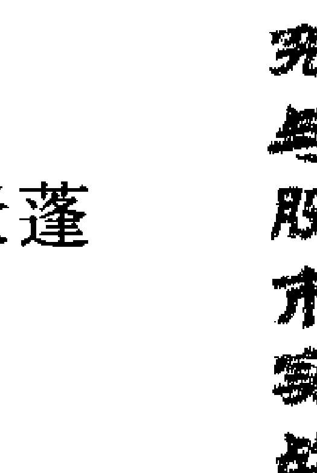

实际走势如下图所示：

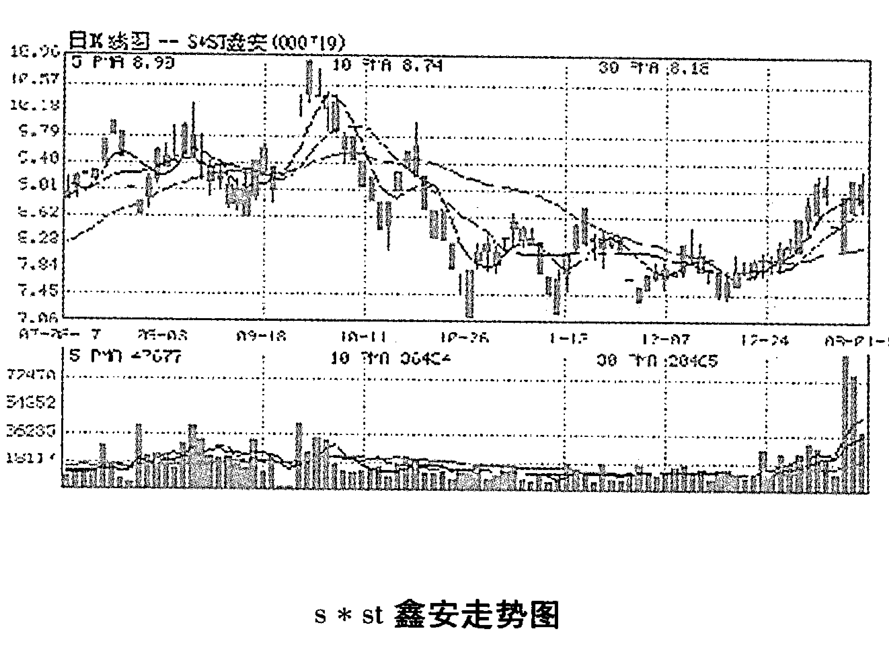

#### 实例十四：石化权证突发大涨，奇门早先一周布局。

2009 年 07 月 22 日，中国石化认购权证，在盘中突发井喷行情，被我抓个正着。上周中石化在非洲搞收购股权，就引起我的注意，加之近日已预测出上证大盘要出现大幅振荡行情，国际油价要小幅反弹，一面对石化权证进行了技术分析，另一方面发现周三的开盘局内，有石化石油大涨的信息，在上周 1.6 元仓位成本的基础上当即加大仓位给于狙击，果然在周二 21 日大盘出现剧烈振荡调整，第二天即周三 7 月 22 日，权证板块开始活跃，石化权证以 1.733 元跳空高开，盘中一路大涨见到 2.075 元最高价，收盘保持在 2.058 元，较昨日收盘价大涨百分之二十点二八，创下了奇门预测以来最好的单日收益。

下面是 2009 年 07 月 22 日中国石化开盘时间的奇门局。

- 时间：2009 年 07 月 22 日 09 时
- 农历：己丑年六月初一日巳时
- 干支：己丑辛未戊辰丁巳
- 旬空：午未戌亥戌亥子丑
- 小暑：上元丁巳时旬首为癸
- 阴遁八局值符天冲落二宫值使伤门落九宫

| 太阴 | 螣蛇 | 值符 |
| :--- | :--- | :--- |
| 生门 丙<br>天蓬 壬 | 伤门 戊<br>天任 乙 | 杜门 癸<br>天冲 丁 |
| 六合 | | 九天 |
| 休门 庚<br>天心 癸 | 辛 | 景门 壬<br>天辅 己 |
| 白虎 | 玄武 | 九地 |
| 开门 己<br>天柱 戊 | 惊门 丁<br>禽 天芮 丙 | 死门 乙<br>天英 庚 |

分析：
为什么判断中国石化权证会在当日大涨？
杜门丁奇为中国石化权证，癸为石油，均在2宫上乘值符天冲又遇丁奇，会有爆发性上涨行情。当日地支所在巽4宫中逢天蓬生门丙奇，来生日干戊所在离9宫，主买入石化权证必获较大的利润。天盘九天居7宫，值符居坤2宫，主石化权证最高价与7数2数5数有关，果然石化权证当日最高上涨至2.075元。
实际走势如下图所示：

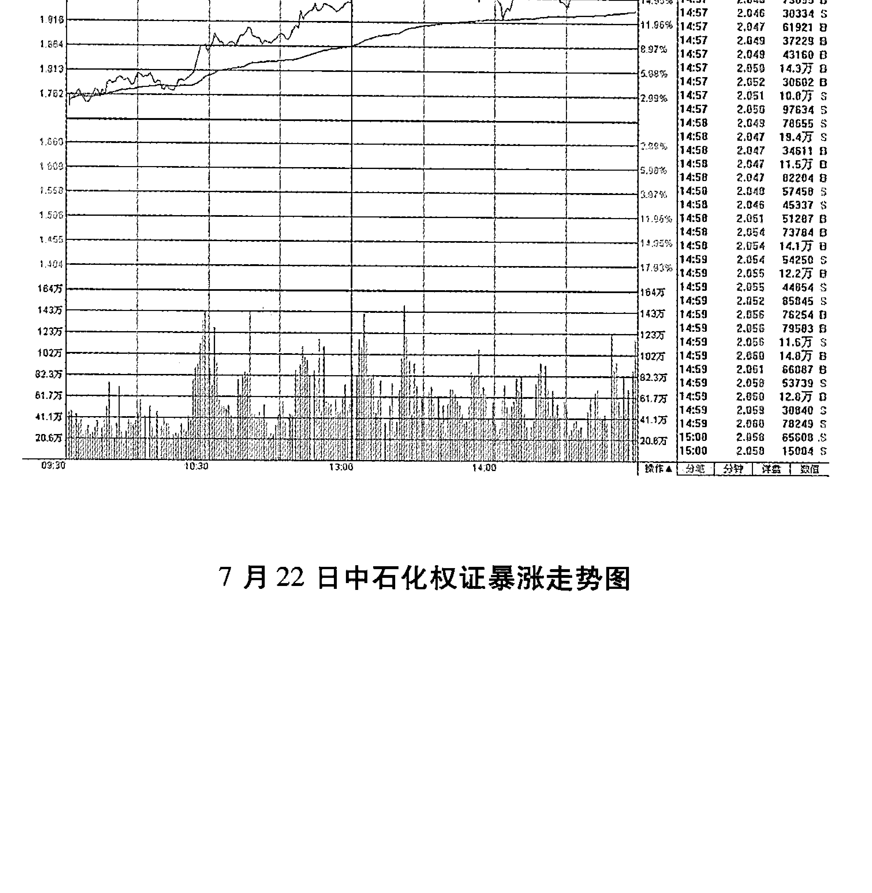

## 7月22日中石化权证暴涨走势图

### 第三部分：奇门对期货的预测

### 取用判断经验：

期货预测以时干为所测之品种合约，以日干为期货操作者或求测者，以值符为多方，以生门为空方，以景门为消息为操作策略，以甲子戊为资金状况，以所测之品种用神来判断该商品的基本面情况，以日干为主力，以时干为散户。

期货商品用神一般以乙奇为玉米、大米、小麦、棉花、橡胶等，以甲子戊为白糖、大豆、豆粕等，以辛为有色金属、铜、锌、铝、黄金等，以癸为石油、食用油、豆油、棕油等油类商品。

具体分析判断请结合实战原则与 K 线技术指标作出精确的买卖时间和价位。

下面结合实例加以说明。

#### 实例一：期货预测来参赛，玉米合约断涨跌。

易友道衍举办期货合约预测大赛，发贴要求预测：明天（2008 年 3 月 7 日），丙午日，玉米 0809 合约以开盘价和收盘价做比较，是上涨还是下跌？

我以看到其贴子的时间起局预测如下：

- 时间：2008 年 03 月 06 日 23 时 20 分
- 农历：戊子年正月廿九日子时
- 干支：戊子乙卯丙午戊子
- 旬空：午未子丑寅卯午未
- 惊蛰：下元戊子时旬首为庚
- 阳遁四局值符天心落四宫值使开门落一宫

| 值符 | 螣蛇 | 太阴 |
| :--- | :--- | :--- |
| 伤门 庚<br>天心 戊 | 杜门 丁<br>天蓬 癸 | 景门 壬<br>天任 丙 |
| 九天 | 六合 | |
| 生门 辛<br>天柱 乙 | 死门 乙<br>天冲 辛 | |
| 九地 | 玄武 | 白虎 |
| 己 休门 丙<br>禽 天芮 壬 | 开门 癸<br>天英 丁 | 惊门 戊<br>天辅 庚 |

分析：

- （1）对当天行情的分析判断：开盘看开门所在坎1宫，上乘玄武凶神，临天英凶星，逢癸+丁蛇妖矫凶格，必主低开。丙午日地支宫在离9宫，上乘螣蛇凶神主走势上下不明，临天蓬凶星主跌，丁+癸雀投江凶格也主跌，逢杜门主上涨受阻，离9宫又逢空亡，所以判断当天为下跌。
- （2）对今后行情的判断分析：值符所在巽4宫逢太白六庚主有阻隔，逢伤门主缺少做多的力量，庚+戊为伏宫大凶之格，主多方会撤换，不会再做多了。生门空方上乘九天主在高位获利者众必然要向下做空，临天柱凶星主变盘做空，遇辛+乙虎猖狂凶格必大肆做空无疑。乙奇为玉米，落兑7宫，逢死门凶门，主破坏行情，临天冲主振荡，遇乙+辛龙逃走凶格必跌。主力庄家日干丙在艮8宫乘九地主要下探，逢休门不愿做多要休整了，临天芮不看好了。时干戊所在乾6宫乘白虎凶神，惊门凶门，戊+庚飞宫凶格，也主下跌。从值符生门多空双方来看，值符生门宫旺相，且双方一致做空。


#### 实例二：豆粕强麦，走势分析。

豆粕0809合约、强麦0809合约近期走势分析预测。
依螺旋历法来看，冬至后满月为阳中之阴，逆时序引发市场顶部，冬至后新月为阳中之阳，顺时序引发市场的底部，夏至后满月为阴中之阴，顺时序引发市场顶部，夏至后新月为阴中之阳，逆时序引发市场的底部。螺旋历法的实质是探讨月球地球、太阳地球之间的相对运行关系对人类社会的实质性影响，也就是说节气与满月新月日左右的时间，均有可能引发市场的顶和底。
1月21日阴历2007年十二月十四满月时间交大寒节气，也就是说大寒节气的满月时间左右会引发市场的顶或底部，果然在1月24日，交大寒第3天，豆粕0809见底，强麦0809在1月22日也见了底。在3月5日阴历正月二十八新月时间惊蛰节气左右，市场会被引发一个阶段性顶部，这个顶部会不会是大顶呢，让我们拭目以待。在3月20日阴历二月十三满月时间春分节气左右，会引发市场的阶段性或中期性底部，那么4月4日阴历二十八新月时间清明节气左右就又是一个顶部了。

#### 实例三：大豆期货行情，奇门判断分析。

国内大型周易预测论坛龙隐网奇门遁甲版高级斑竹 Wellsome，笔者对2008年7月以后的大豆期货行情进行预测。

```
时间：2008年07月02日03时16分
农历：戊子年五月廿九日寅时
干支：戊子戊午癸卯甲寅
旬空：午未子丑辰巳子丑
夏至：中元甲寅时旬首为癸
阴遁三局值符天柱落七宫值使惊门落七宫
```

| 六合<br>杜门 乙<br>天辅 乙 | 太阴<br>景门 辛 丙<br>天英 辛 禽 | 螣蛇<br>死门 己<br>天芮 己 |
| 白虎<br>伤门 戊<br>天冲 戊 | 丙 | 值符<br>惊门 癸<br>天柱 癸 |
| 玄武<br>生门 壬<br>天任 壬 | 九地<br>休门 庚<br>天蓬 庚 | 九天<br>开门 丁<br>天心 丁 |

分析：

- (1) 以时干为大豆期货合约落兑7宫，上乘值符主有大行情，逢惊门凶门天柱破军凶星，又遇癸+癸天网四张凶格必大跌无疑。
- (2) 又以甲子戊为大豆落震4宫击刑，上乘白虎凶神，伤门凶门，天冲主震荡，戊+戊为闭塞阻隔难通，静守为吉，还是主跌。
- (3) 以日干为主力庄家落兑7宫，上乘值符主有大的动作，逢惊门凶门天柱破军凶星，又遇癸+癸天网四张凶格必向下做空无疑。
- (4) 看多方值符所在兑7宫，与时干宫同，主多方看空反手做空。
- (5) 看空方生门所在艮8宫上乘玄武做空凶神，临天任主持长时间做空，壬+壬大凶之格，必大肆做空。
- (6) 值使门主时限，值使门惊门落兑7宫主做空行情持续时间在7个月以上。
- (7) 以九天所落乾6宫可判断大豆以前的最高涨幅在5600元~5900元左右，以九地所落坎1宫判断大豆今后做空的底部应在3100元左右。

综合以上判断，可做空大豆直至 3100 元左右，再考虑反弹做多。

事实：正如所测，大豆期货合约商品一直在下跌，直至 3100 元左右才出现止跌反弹行情。

奇门应用研究与股市实战解秘


### 第四部分：对外汇的预测

### 取用判断经验：

以地盘甲子戊为主币，以天盘甲子戊为客币，来判断主客币的基本面情况。以日干为炒汇者或求测者，以时干为汇市，以值符为多方，以生门为空方，以景门为消息为操作策略。

具体分析判断请结合实战原则与 K 线技术指标作出精确的买卖时间和价位。

下面结合实例加以说明。

#### 实例一：英镑兑美元，奇门测走势。

2008 年 6 月 23 日周一，早上外汇开盘，因英国货币通胀，消息面对英镑不利，我当即起局预测英镑兑美元的走势如下：

- 时间：2008 年 06 月 23 日 06 时 36 分
- 农历：戊子年五月二十日卯时
- 干支：戊子戊午甲午丁卯
- 旬空：午未子丑辰巳戌亥
- 夏至：上元丁卯时旬首为戊
- 阴遁九局值符天英落三宫值使景门落六宫

| 九天 | 九地 | 玄武 |
| :--- | :--- | :--- |
| 壬 休门 丙<br>禽 天芮 癸 | 生门 庚<br>天柱 戊 | 伤门 辛<br>天心 丙 |
| 值符<br>开门 戊<br>天英 丁 | 壬 | 白虎<br>杜门 乙<br>天蓬 庚 |
| 螣蛇<br>惊门 癸<br>天辅 己 | 太阴<br>死门 丁<br>天冲 乙 | 六合<br>景门 己<br>天任 辛 |

分析：
- (1) 英镑为主币为地盘戊在9宫，美元为外币为天盘戊在3宫。
- (2) 英镑戊在9宫上有九地主英镑探底宜做空，另生门九地甲子戊主英国货币囤积有通胀，美元戊在3宫上有值符开门天英主涨主做多。
- (3) 值符多方天英在3宫，3宫午月休囚，生门空方在9宫午月旺，空方旺主宜做空。
- (4) 日干在2宫为主力逢玄武伤门主空，时干主事在1宫逢死门太阴主跌宜做空。
- (5) 值使门主时限，值使景门落6宫，结合外汇交易的特点判断，英镑兑美元的操作应从开盘开始，16个小时内做空为宜。

结果：英镑兑美元从6月23日周一开盘即跳空低开，随后一路下跌，在1小时图上看，15个小时内均为跌势，直至第16个小时才开始重抬升势。

#### 实例二：英镑美元行情，奇门实测。

国内大型周易预测论坛龙隐网奇门遁甲版高级斑竹 Wellsome，请笔者对2008年9月以后的英镑兑美元趋势进行预测。以 Wellsome 心动时间所起的局预测如下：

时间：2008 年 09 月 11 日 22 时 26 分
农历：戊子年八月十二日亥时
干支：戊子辛酉甲寅乙亥
旬空：午未子丑子丑申酉
白露：中元乙亥时旬首为己
阴遁三局值符天芮落四宫值使死门落一宫

| 值符 | 九天 | 九地 |
| :--- | :--- | :--- |
| 丙 休门 己<br>禽 天芮 乙 | 生门 癸<br>天柱 辛 | 伤门 丁<br>天心 己 |
| 螣蛇 | | 玄武 |
| 开门 辛<br>天英 戊 | 丙 | 杜门 庚<br>天蓬 癸 |
| 太阴 | 六合 | 白虎 |
| 惊门 乙<br>天辅 壬 | 死门 戊<br>天冲 庚 | 景门 壬<br>天任 丁 |

分析：

- (1) 以地盘甲子戊所在的震 3 宫为英镑，上乘螣蛇凶神主走势不稳，逢开门主卖出，临天英凶星主急速抛出，遇辛 + 戊困龙被伤凶格主大跌。
- (2) 以天盘甲子戊所在坎 1 宫为美元，上乘六合吉神主做多，逢死门主死做多头，临天冲主振荡上冲，逢庚太白主上涨有阻力，戊 + 庚飞宫乘六合主换手较多。酉月坎 1 宫旺相，震 3 宫休囚，美元一方力量明显较强大，综合看美元会上涨，英镑下跌无疑。
- (3) 值符多方在巽 4 宫临天芮凶星，逢休门主休止，己为下陷，丙主乱，己 + 乙为墓神不明凶格，均主看空不做多。
- (4) 生门空方所在离9宫上乘九天，九天之上好扬兵，主空方大肆做空，又临天柱破军凶星也主做空，癸为地网遇到反弹的阻力，癸+辛为网盖天牢凶格主跌。
- (5) 时干乙奇为汇市落艮8宫，上乘太阴主汇市大都在做空，惊门凶门，乙+壬为日奇入地凶格，临天辅主下跌趋势平稳。
- (6) 九地所在坤2宫主英镑最低可探至1.2000附近，九天所在离9宫主英镑以前最高可升至1.9999见顶。
- (7) 值使门死门所在坎1宫主做空的趋势可能要持续1年左右。

结果：英镑自从2007年见到2.1094的最高点后，中间虽有反弹出现，但总体趋势向下，一路下跌至今，仍未见有反转趋势出现。

奇门应用研究与股市实战解秘

## 第五部分：综合预测

### 分析判断要点：

在实际预测过程中，首先要参考所测大盘指数与个股期货外汇的历史走势及当前具体情况，比如当前的市场估值、市盈率、宏观面、新月满月点的波浪形态、二十四节气、甲子周期、江恩循环周期、菲伯南希黄金分割、道氏趋势、支撑压力位等，来建立奇门预测时的参照系，做到一把钥匙开一把锁，具体问题具体分析，力求在数理上达到准确模拟。

证券市场是一个动态开放的巨系统，因而不管是哪种预测手段，都不可能做到一测即准，一劳永逸，奇门预测也不是万能的，因而我们在预测时要对动态信息时刻密切关注，从消息面时空意念切入点来全息解析验证金融证券市场，才能达到较高的预测准确率。

下面结合实例加以说明。

#### 实例一：螺旋江恩西方论，奇门六壬通内涵。

从这次沪深两市大盘的调整看螺旋历法江恩理论与奇门遁甲大六壬的技术性科学内涵。

这次调整的一个重要时间是中国农历的大寒节气，大寒附近对于证券市场是一个重要的时间窗，不论从螺旋历法还是江恩理论来看都是一个关键的节变点。

此轮行情从螺旋历法看，正是从冬至左右开始起动引发市场上涨，至大寒左右的满月引发了这次调整，很好的印证了螺旋历法。那么从冬至左右开始至大寒左右，正好是市场在上涨了30天左右，亦即江恩之360度圆之1/12处，从空间上看正好是上证大盘上涨到了江恩回调位之1/2处（即6100减4780等于1400左右，1400除以2等于700，700加4780等于5500左右），也就是遇到1/2的强阻力位置处。

看来螺旋历法、江恩理论不是那些人所谓的无用之理论，相反，它们是分析研判证券市场走势的有力法宝，大寒的这次回调有人说是由于受到美国及港股影响所致，这只是表面现象而已。实际上上证大盘是从1月15日，也就是美股港股大调的前一天，就开始了调整步伐的。这又一次证实了螺旋历法与江恩理论的伟大之处与在技术面上的神奇和可靠性。

那么做为建立在中国农历节气干支历法基础上的奇门遁甲与大六壬，因为与螺旋历法、江恩理论有着共同的天文学背景，和周期全息性的本质体现，所以奇门遁甲与六壬能够提前预测出这次大盘调整的事实，就不足为奇了。这也是一个事物能从不同的角度得到正确预测，说明奇门遁甲与六壬，具有某种科学内涵的合理性是不容忽视的，这次调整前的预测就是有力的实证。

附奇门预测：

- 时间：2008 年 01 月 12 日 09 时 40 分
- 农历：丁亥年十二月初五日巳时
- 干支：丁亥癸丑辛亥癸巳
- 旬空：午未寅卯寅卯午未
- 小寒：上元癸巳时旬首为庚
- 阳遁二局值符天辅落七宫值使杜门落四宫

## 奇门应用研究与股市实战解密


# 下编 奇门与股市实战解秘

# 奇门应用研究与股市实战解秘

| 宫位一 | 宫位二 | 宫位三 |
| :--- | :--- | :--- |
| 玄武<br>杜门乙<br>天蓬庚 | 九地<br>景门丁<br>天任丙 | 九天<br>死门己<br>天冲戊 |
| 白虎<br>伤门壬<br>天心己 | <br>辛 | 值符<br>惊门庚<br>天辅癸 |
| 六合<br>生门癸<br>天柱丁 | 太阴<br>休门戊<br>禽天芮乙 | 螣蛇<br>开门丙<br>天英壬 |

奇门生门宫生值符宫主下跌的趋势。日干1宫主股市要调整，时干8宫主周边市场会下跌，时克日，周边市场对我国股市的走势不利，投资者不看好股市。九天2宫主最高点在5500点左右，九地9宫示这次调整最低应为4200点左右，值使门4宫显示有较大的下跌。这样两市大盘就有下探250日年线的可能，并且在4200 - 4700点左右盘整的可能性大。值使门落宫为期限，值使杜门落4宫表示这次调整可能要持续14天两周左右。

实际走势如下图所示：


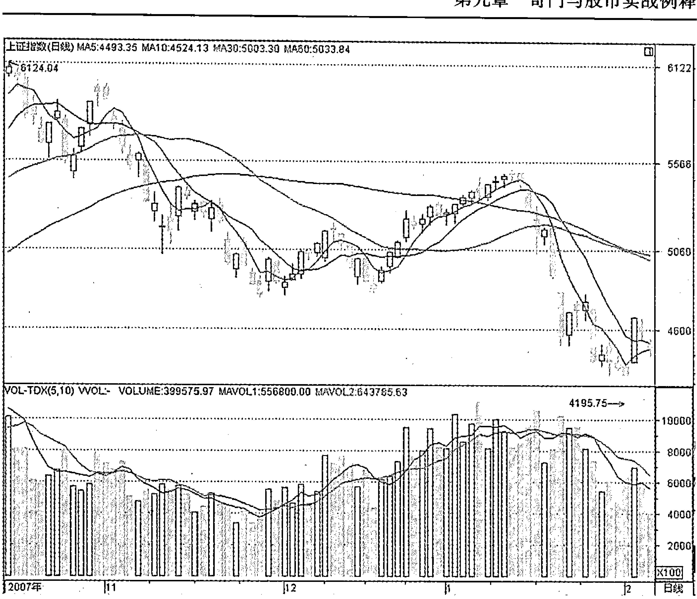

### 2008年1月12日上证大盘调整图

#### 实例二：一年之计始于春，零八股涨立春头。

中国股市走过了2006年、2007年两年的大牛市，从2005年6月6日见底的998.23点，一路上涨至2007年10月16日6124.04点的历史高点，它不仅体现了中国经济的良性持续发展，而且更是股权分置改革胜利成果的展现。那么从2007年的10月31日沪市上证指数涨至第二次高点开始调整以来，从宏观面上来看，有流动性过剩说，股市泡沫说，楼市过涨说，次贷危机说，政府调控说，市场过度融资说，大小非解禁猛虎说，等等有关沪深股市调整的宏观理由之说，初看这些说法也十分客观合理，但是我们研究股市，不光要从表象上观察和探究，更重要的是要从股市的内在机理上分析和把握。

奇门应用研究与股市实战解秘

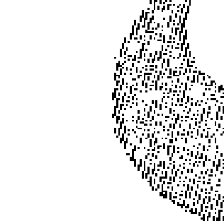

305

# 奇门应用研究与股市实战解秘

# 下编 奇门与股市实战解秘

我记得江恩理论曾说过2年往往是市场的一个周期，那么面对我们的市场，从2006年、2007年这两年的大牛市的周期来判断，我们不难看出，从技术上讲，目前市场的调整其实就是对江恩理论中关于2年周期说的验证，也是对两年大牛市的消化整理，什么流动性过剩，次贷危机，等等说法只不过是市场的外在表现和周期性走势的外在诱因而已。以螺旋历法来看，以沪市为例，上证指数从2005年6月6日的998.23点最低部运行至2008年2月1日4195.75点的暂时最底部，整整经过了33个月差四天，也就是970个自然日，以螺旋历法的29.53天为一个月的话，那么970天除以29.53天等于32.84个月，也就是说差4天多一点刚好就是螺旋历法所谓的33个周期月，这意味着到2月5日前后，市场就会真正的见到此轮调整的阶段性底部，同时也会真正的迎来新一轮周期性的开始循环点。无独有偶，2月4日是立春，从时间上讲是江恩360度时间圆的1/8处，也是江恩回调的一个重要支撑位，更是螺旋历法新月焦点的市场引发节变点。我们来看，从998.23点到6124.04点上证共上涨了5125.81点，按照下调至黄金分割比0.382处即会遇到强支撑，上证此轮下调应该至，6124.04减去1958.05点（6124.04-998.23乘以0.382）等于4165.94点，那么它离2月1日的最低点4195.75点仅仅只差29.81点。以上这些不是巧合，恰恰说明我们的市场已经离阶段性的底部不远了，不管从时间上还是点位上，真的就是这几天的事了，也许4195.75点就是本阶段调整的底部了。

立春是一年的开始，古人有谚云，一年之计在于春，一日之计在于晨。不管是市场跌破年线从技术上讲要有一个反弹也好，还是易学预测市场在2月4日立春此日要上涨也好，都说明沪深股市要有一个上涨，来为久已休歇的多头提供一个反攻的契机。从理性上讲，经过此次大幅调整，市场平均市盈率已大幅下调至25倍左右，以中石油为例，它2007年的每股收益应该在0.80元左右，那么它当前24元左右的股价已步入当前合理区域，它下跌的空间已不大。所以不管从时间上、空间上，市场的理性上，我们都应当确定目前的点位已处在沪深股市的阶段性底部区域了，不管需要二次探底还是三次筑底也好，马上迎来的将是市场的新一轮周期性循环的开始。

2 月 4 日立春，沪深股市大盘预测：

- 时间：2008 年 02 月 04 日 09 时 01 分
- 农历：丁亥年十二月廿八日巳时
- 干支：戊子甲寅甲戊己巳
- 旬空：午未子丑申酉戌亥
- 大寒：下元己巳时旬首为戊
- 阳遁六局值符天心落七宫值使开门落二宫

| 玄武 | 九地 | 九天 |
| :--- | :--- | :--- |
| 死门 辛<br>天英 丙 | 乙 惊门 癸<br>禽 天芮 辛 | 开门 己<br>天柱 癸 |
| 白虎 | | 值符 |
| 景门 丙<br>天辅 丁 | 乙 | 休门 戊<br>天心 己 |
| 六合 | 太阴 | 螣蛇 |
| 杜门 丁<br>天冲 庚 | 伤门 庚<br>天任 壬 | 生门 壬<br>天蓬 戊 |

### 分析：

奇门开门2宫上乘九天必主高开，戊日乾6宫生门，壬 + 戊蛇化龙吉格，又有天蓬主大涨。故断该日高开大幅上涨。

实际上：上综指当日高开 94.25 点，全天大涨 351.4 点，创历史上沪深股市单日最大涨幅。

实际走势如下图所示：


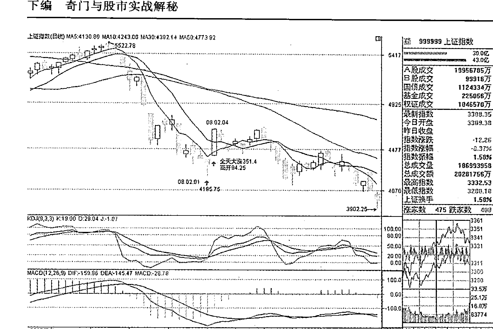

### 2008 年 2 月 4 日上证大盘单日高开大幅上涨图

#### 实例三：上证大盘综合测。

2008 年 3 月 3 日周一，时值人大政协两会开幕将会有利好出台之际，但是上周五美股大跌，A 股市场自从 2007 年 10 月见顶走熊连续下跌，便对周一的走势忧心忡忡，于是我便以上海证券交易所开盘时间起局，预测分析了上证大盘当天的分时走势，以及热点板块表现情况，感觉比预期的要好，遂解除忧虑，并结合螺旋历法波浪理论对其后市的走势做了详尽分析，现分述如下：

### （一）上证当日大盘分时走势及热点板块基本面预测分析

2008 年 3 月 3 日 9 时，上证开盘时间奇门局：

- 时间：2008 年 03 月 03 日 09 时
- 农历：戊子年正月廿六日巳时
- 干支：戊子甲寅壬寅乙巳
- 旬空：午未子丑辰巳寅卯
- 雨水：中元乙巳时旬首为壬
- 阳遁六局值符天蓬落五宫值使休门落二宫

| 九地 | 九天 | 值符 |
| :--- | :--- | :--- |
| 惊门 己<br>天柱 丙 | 开门 戊<br>天心 辛 | 休门 壬<br>天蓬 癸 |
| 玄武 | | 螣蛇 |
| 乙 死门 癸<br>禽 天芮 丁 | 乙 | 生门 庚<br>天任 己 |
| 白虎 | 六合 | 太阴 |
| 景门 辛<br>天英 庚 | 杜门 丙<br>天辅 壬 | 伤门 丁<br>天冲 戊 |

#### （1） 当日大盘分时走势预测

开门落离9宫虽上乘九天，但是巽4宫上乘九地，离9宫内戊+辛为凶格，巽4宫内有惊门天柱凶门凶星，4宫丙奇入甲戌己之天盘墓，综合判断，得出上证大盘会低开。值使休门落坤2宫，坤2宫有2、5、8、10数，结合前次上证收盘点位4348点，取2数，可判断低开22点左右，即上证当天开盘点位大约在4326点左右。

开盘后，11时前巽4宫主事，巽4宫上乘九地，宫中惊门凶门天柱凶星主振荡探低，巽4宫有3、4、8数，寅月4宫旺相取8数，主大盘最低会下探至4280点左右。到了午盘11时后，离9宫主事，离9宫上乘九天吉神开门吉门天心吉星，主振荡走高。下午13时后，坤2宫主事，坤2宫上乘值符，主大盘已涨到头了，临休门开始休整走平。值符落坤2宫，2宫有2、5、8、10数，结合实际，取5数，主下午大盘最高涨到当日分时头部的点位是4455点左右。

结合4宫九地9宫九天2宫值符来看，大盘低开探底后会在午盘走高，下午见顶走平。值使门主涨幅，值使休门落坤2宫，因坤2宫有天蓬主有大动作，所以取8数，主上证全天会上涨88点左右。

奇门应用研究与股市实战解读


# 下编 奇门与股市实战解秘

#### （2）当天热点板块预测

九天所在离9宫内，有开门主创投、开发、机械仪器板块，甲子戊主投资信托银行板块，天心主医药板块，辛为有色金属钢铁板块，离宫主传媒食品、计算机、电子信息、电力、新能源等板块。

值符所在坤2宫内，有休门主交通、环保、供水供气、远洋运输板块，天蓬主湖海水产养殖板块，乙奇主医药，壬癸主化肥、农药、酿酒、石油板块，坤宫主农业等板块。

#### （3）技术面基本面综合易学分析

上周上证大盘从技术上，下探至以4165点左右为强支撑的黄金分割区间一带止跌回升，多方勉强站稳4300点一线，距离年线尚有100点左右的上升空间，成交缩小，人气涣散，弱势难改。从盘面上看，以中石油为首的大盘指标股有明显救市的痕迹，这也是大盘企稳的主要原因。下周一，中国平安的31.2亿限售股将解禁，加上，上周五美股因美国国际集团巨亏戴尔赢利下滑的影响而大跌的因素，沪深大盘面临的考验将不言而喻。但是，从中国股市的走势上具有较强的独立性来看，加之两会在3月3日周一当天开始召开的因素考虑，当不会出现过大的振幅。

从易学预测的角度来看，六壬日上贵神，奇门开门所在离9宫生日干壬所在坤2宫，两盘均显示有政府参与救市，因而不会出现过深的振幅。

实际走势如下图所示：

## 第九章 奇门与股市实战例释

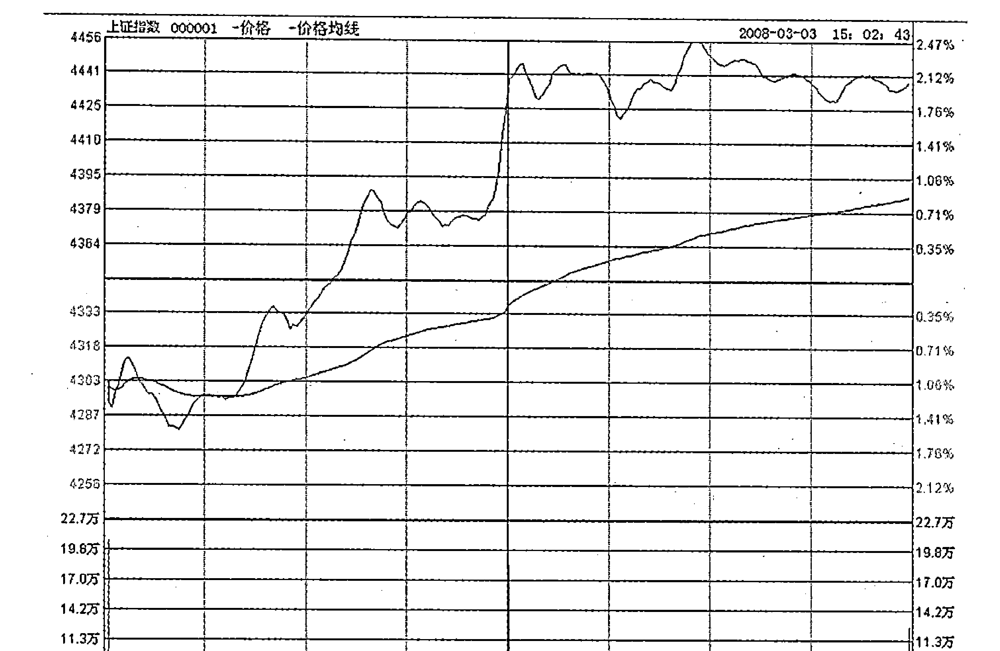

### 上证大盘分时图

盘后实况公告：受上周五美股大跌影响，沪深股市今日早盘低开，两会召开的乐观情绪令投资者憧憬两会出台一些有利于市场发展的措施，沪指在跌破4300点后逐步收复失地并迅速翻红。午后大盘继续稳步上涨，沪指一度涨逾百点，之后维持小幅震荡，收盘大涨89点，涨幅2.06%。两市的成交金额为1863.2亿元，比前一交易日增加约696.9亿元，增幅巨大，净流入约192亿元。

3月3日，沪综指开于4323.70点，较上个交易日收盘点位4348.54点低开24.84点，最高4456.96点，最低4279.35点，收报4438.27点，上涨89.72点，涨幅2.06%。

中石油今日午盘前出现快速拉高带动指数迅速上涨，市场人气增强，成交量明显放大，创投、环保、新能源、农业等概念股等强势上涨，钢铁、银行表现相对欠佳，仍然保持整体上涨走势，市场呈现个股普涨格局。

作为 2008 年最强势板块之一的创投板块，今日再度风起云涌，相关个股走势强劲，市场对其追捧有加。盘面上，力合股份、大众公用、紫光股份、复旦复华、钱江水利均强势涨停，水井坊涨 8.07%。随着两市创投概念股的再度崛起，市场上另外一个受到关注的交易品种股指期货的推出也日益临近，午后，股指期货概念股再度出现直线飚升，与创投概念股联袂起舞。盘面上，中大股份强势涨停，美尔雅、弘业股份、杉杉股份、中海海盛大涨逾 5%。

从以上报道可看出，中石油在今日的旱地拔葱是两地大盘上涨的主要原因，沪深股市今日的走势与日本、香港、亚太地区股市的走势截然相反，可见预测中国股市，必需要增加一项必要的参考因素，这个因素，我在这里不说，想大家已经心知肚明。

### （二）上证后市走势的螺旋历法波浪理论的周期性循环趋势分析

上证目前正在走大 C 浪调整浪，从 2008 年 5 月 5 日后，又处在 2007 年 10 月 16 日下跌以来的下跌第五浪之中，下面结合螺旋历法对它的子浪进行详细分析。

依螺旋历法来看，冬至后满月为阳中之阴，逆时序引发市场顶部，冬至后新月为阳中之阳，顺时序引发市场的底部。1 月 21 日阴历 2007 年十二月十四满月时间交大寒节气，也就是说大寒节气的满月时间左右会引发市场的顶部，果然在 1 月 14 日，阴历的初七上玄月头一天，上证 B 浪触顶 5522.78 点开始了暴跌，引发了上证下跌 C 浪中的第一下跌调整浪。2 月 4 日阴历 2007 年十二月二十八新月前第三天时间交立春节气，会引发市场的底部，果然在立春节气的前一日 2 月 3 日，上证见到 4195.75 点低点，随即在第二日立春当日开始反弹大幅上涨，引发了上证下跌 C 浪中的第二反弹浪。2 月 19 日是雨水节气，第二天 20 日是阴历 2008 年正月十四，月圆时间，亦即螺旋历法所谓的冬至后满月引发市场的顶部时间，实际上 2 月 20 日上证见到近期反弹的高点 4695.8点便逐日开始下跌调整，继而引发了下跌C浪中的第三下跌调整浪。在2月26日阴历08年正月二十（本月下玄月前第三天），见到下跌的第一反弹低点4123.31点，随后在阴历正月二十七新月头三天时间，也就是惊蛰节气头一天的3月4日，市场被引发出了一个4472.15点的反弹高点。从1月21日大寒左右开始至3月20日春分节气左右刚好2个月60天一个甲子循环周期左右，正好是螺旋历法的2个自然月周期，也正好是江恩2个月调整周期时间，也就是说市场的调整如果在基本面政策面有强支撑时，随时会出现大C浪中的第四浪反弹的概率很大。在3月20日阴历二月十三满月时间春分节气左右，市场会被引发出一个顶部，实际上在3月20日满月前第二天，市场在真空中见到了3857.62点的反弹高点，随后延续了大C浪中的第三下跌调整浪。4月4日阴历二十八新月前第三天时间清明节气左右会引发市场调整的又一个低部，实际上在4月3日阴历二月二十七新月前第四天，市场又一次在真空中见到了3271.29点的近期调整的低点，继续延续了大C浪中的第三下跌调整浪。从1月21日大寒左右开始至4月20日谷雨节气满月日左右，刚好3个月90天一个半甲子循环周期左右，正好是螺旋历法的3个自然月周期，也正好是江恩3个月调整周期时间，也就是说市场的调整如果在基本面政策面也现较强支撑重大利好时，随时会在4月20日谷雨节气的满月日左右，出现大C浪中的第四浪反弹。果然在4月20日，上证在见到2990.79点的低点后，在4月4日也就是满月日后第四天，财政部、国家税务总局决定从2008年4月24日起，证券交易印花税降至千分之一，随即上证开盘向上跳空高开261.54点，出现了大C浪中的第四浪反弹走势。5月6日阴历立夏四月初一新月日第二天，上证见到此轮反弹的高点3786.02点，开始了大C浪中也是去年10月份调整以来的第五浪下调。

实际走势如下图所示：

奇门应用研究与股市实战解秘

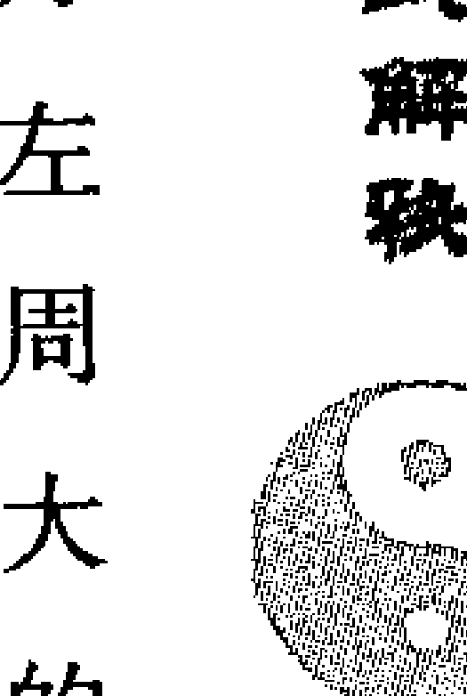

# 下编 奇门与股市实战解秘

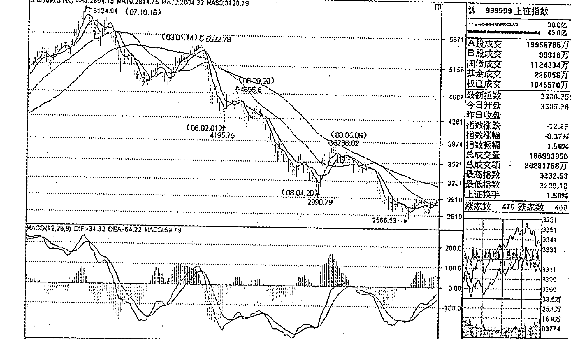

### 上证循环趋势图

#### 实例四：香港恒指综合测。

2008 年 3 月 3 日周一，正值国内人大政协两会开幕将会有利好出台之际，但是上周五美股大跌，香港 H 股市场自从 2007 年 10 月底见顶走出连续下跌趋势，便对周一的香港恒生指数走势产生疑虑，于是我便以动念头的时间，也是香港股票交易所开盘时间起局，预测分析了恒生指数当天的分时走势情况，感觉比预期的要好，遂解除忧虑，并结合螺旋历法波浪理论对其后市的走势做了详尽分析，现分述如下：

### (一) 3 月 3 日香港恒指分时走势预测

2008 年 3 月 3 日 9 时，恒生指数开盘时间奇门局：
- 时间：2008 年 03 月 03 日 09 时 43 分
- 农历：戊子年正月廿六日巳时
- 干支：戊子甲寅壬寅乙巳
- 旬空：午未子丑辰巳寅卯

## 雨水：中元乙巳时旬首为壬
## 阳遁六局值符天蓬落五宫值使休门落二宫

|  |  |  |
| :--- | :--- | :--- |
| 九地<br>惊门 己<br>天柱 丙 | 九天<br>开门 戊<br>天心 辛 | 值符<br>休门 壬<br>天蓬 癸 |
| 玄武<br>乙 死门 癸<br>禽 天芮 丁 | 乙 | 螣蛇<br>生门 庚<br>天任 己 |
| 白虎<br>景门 辛<br>天英 庚 | 六合<br>杜门 丙<br>天辅 壬 | 太阴<br>伤门 丁<br>天冲 戊 |

分析：

开门落离9宫虽上乘九天，但是巽4宫上乘九地，离9宫内戊 + 辛为凶格，巽4宫内有惊门天柱凶门凶星，4宫丙奇入甲戊己之天盘墓，综合判断，得出恒指会低开。值使休门落坤2宫，坤2宫有2、5、8、10数，结合前次恒指收盘点位24331.67点，综合香港恒指的走势特点，取8数，可判断低开880点左右，即恒指当天开盘点位大约在23451.67点左右。

开盘后，11时前巽4宫主事，巽4宫上乘九地，宫中惊门凶门天柱凶星主振荡探低，巽4宫有3、4、8数，结合开盘点位，取4数，主恒指最低会下探至23440点左右。到了午盘11时后，离9宫主事，离9宫上乘九天吉神开门吉门天心吉星，主振荡走高。下午13时后，坤2宫主事，坤2宫上乘值符，主恒指已涨到头了，临休门开始休整走平。值符落坤2宫，2宫有2、5、8、10数，结合实际，取8数，主下午大盘最高涨到当日分时头部的点位是23800点左右。

结合4宫九地9宫九天2宫值符来看，恒指低开探底后会在午盘走高，下午见顶走平。值使门主涨幅，值使休门落坤2宫，因坤2宫有天蓬主有大动作，所以取8数，主恒指收盘较开盘会上涨88点左右。

结果：恒指开盘在23491.57点，较上个交易日恒指收盘点位24331.67点，低开840.1点，全天最高点位为23738.67点，最低为23458.95点。恒指虽然全天下跌746.7点，但是恒生指数收盘点位为23584.97点，较开盘23491.57点，上涨93.4点，全天收出阳线。

作者按：

看到这里，细心的读者不难发现，在同一天用同一个局预测内地A股与香港恒生股市的涨跌截然不同，内地A股上涨了89.72点，而香港恒指却下跌746.7点，为什么这么不同呢，难道用同一奇门局预测出来的结果会自相矛盾不成？其实有心机的读者不难发现，内地和香港股市虽然涨跌不同，但是他们的共同点都是低开高走，收出的都是阳线，涨跌的不同主要是因为各自市场交易主体不同，主导因素不同所造成的，所以大家在预测各自不同体系的市场时，一定要因时因地因具体的参照情况来综合分析，这样才能做到有的放矢，一把钥匙开一把锁，具体情况具体分析，做到准确无误。

# 奇门应用研究与股市实战解秘

### （二）香港恒生指数的螺旋历法波浪走势分析

依螺旋历法来看，冬至后满月为阳中之阴，逆时序引发市场顶部，冬至后新月为阳中之阳，顺时序引发市场的底部，夏至后满月为阴中之阴，顺时序引发市场顶部，夏至后新月为阴中之阳，逆时序引发市场的底部。螺旋历法的实质是探讨月球地球、太阳地球之间的相对运行关系对人类社会的实质性影响，也就是说节气与满月新月日左右的时间，均有可能引发市场的顶和底。

香港恒生指数于2007年10月30日见顶31958.41点，距离10月24日，阴历九月十四霜降节气只有6天左右，霜降当日为螺旋历法的满月，依照螺旋历法夏至后的满月会顺时序引发市场的顶部，那么10月30日距离霜降满月历法日不过6天，可见恒指这次顶部就是由霜降满月历法日所引发，已毫无疑问了。

2007年11月22日的25861.73点，为恒指第一下跌浪的底部，它距11月23日小雪节气满月日只有一天差距，可以肯定这个底就是由小雪节气的满月所引发。2007年12月7日的29962.93点，为恒指第二反弹浪的顶部，恰巧该日是大雪节气新月日，那么12月7日的顶部就是由大雪节气的新月所引发。12月18日的26093.96点，为恒指第三下跌浪的底部，它是由位于12月22日的冬至满月所引发。依此分析，我们就会看到，2008年1月6日小寒节气的新月引发了恒指的第四反弹浪的次高点，2008年1月21日大寒节气的满月引发了恒指第五下跌浪的底部，3月5日惊蛰节气的新月引发了恒指的反弹A浪的次高点，恒指继而开始了B浪回调，3月20日春分节气的满月引发了回调B浪的底部，恒指开始了C浪上涨。

从以上分析，我们看到，恒指波动的高低点往往出现在节气或节气附近的新月或满月，结合波浪理论，很容易，我们就有可能准确把握恒指的走势。从MACD日线技术指标来看，很明显，恒指日K线与MACD出现底背离，说明恒指已完成一个五浪下跌三浪反弹上涨的周期，接下来，很可能展开一轮新的周期性循环走势。

奇门六壬所依赖的节气历法，同样被螺旋历法所应用，节气历法的实质是宇宙时空的坐标，节气历法年复一年的重复性本身反映了宇宙运行的周期性，它所包涵的信息元，不仅奇门六壬易学能够解读，螺旋历法江恩波浪理论也照样可以解读其奥，这些特征无疑都在揭示宇宙信息元的全息性和周期性，由此我们可以认识到宇宙的全息统一周期性，是股市乃至整个人类社会的发展变化的终极原因。

#### 实例五：台湾股市，加权预测。

### （一）台湾加权指数的历史走势

如下页图。

1990年2月，台北股市从最高点12682点一路崩盘，一直跌到2485点才止住，大盘在8个月内跌掉了10000点，跌幅高达80%。

全世界的股市都一样，宏观经济的持续增长、本币升值的强烈预期以及外围资本的大量涌入，构成了发动一轮大牛市的背景。当初的台北股市正是在这样的环境下，迈开了牛市的第一步。

当时台湾经济已实现连续4年平均9%的高增长，除了财政储备增长，民间收入也大幅提升。那时，岛内居民工资收入增长很快，年底的奖金分红更是丰厚。一般公务员年底可以领到1～2个月的额外薪金，一些普通行业的工人，年底一般可以多领3个月工资，一些垄断行业以及那些高速扩张的行业更是不用说了。当时全民皆股，投资变成投机，这股投机风潮方兴未艾，不管资金面、市场面或是心理面，而政策面也表现出默许态度。

由于新台币的升值预期，海外“热钱”大量涌入岛内，在居民财富增长作用下，当时台湾土地和房地产价格在短时间内翻了两番，一时间，岛内可以说是资金泛滥，巨大的资金流贪婪地寻找各种投资机会，而股票市场就成为一个最大的“蓄水池”。

指数从一千多点狂涨到一万两千多点。在当时大涨的过程当中，开户的人数从五六万人暴增到六百万人之多，可以说是全民皆股。那时几乎是买什么赚什么，因此在整个狂涨的过程中，日子都非常非常的好过，买错了股票，只要肯拿住，后来都是赚钱。因此当时消费类行业包括餐饮和百货公司，生意都非常非常的好，没有嫌价钱贵，只是看喜不喜欢而已。

为抑制股市泡沫，1988年9月，台湾相关部门出台准备征收资本利得税的政策。这个大利空让指数从8813点连跌19天到4645点。然而，由于当时台北股市投机盛行，很多人都已经处于疯狂的状态，台湾有关部门征收资本利得税这一“杀手锏”没有起多长时间的作用，台指就重新抬头，继续一路“高歌猛进”。这是典型的牛市特征，对利空不敏感直到麻木，甚至把利空当作利好去炒作。

离谱的是，一只银行股票在泡沫最高峰时，总市值竟是包括摩根大通、美洲银行、富国银行等5大银行市值的总和，而其净利润只有这五大银行的5%。到股市崩盘前的1989年最后一个季度，台股平均市盈率达到100倍，而同期全球包括新兴市场在内的其他市场市盈率都在20倍以下，当时的台北股市已经谈不上什么投资价值。

截至到现在，台股至今也没能够收复失地，十多年前的“伤口”一直留到了现在。

现在我们同样也关注一下股灾开始之后的极具毁灭性的下杀见底的位置以及反弹的高度。台指从12682跌到2485，用时8个月，之后的反弹从1990年10月到1991年5月，耗时7个月达到6100点，反弹高度为145%。

### （二）未来台湾加权指数的底与反弹顶部的周易预测

台湾的易友兔兔小次郎因父亲热炒台股期指不利，通过MSN请笔者为其预测，笔者以兔兔小次郎在MSN上请我对台股做分析预测的时间起局分析如下：

- 时间：2008年12月04日14时06分
- 农历：戊子年十一月初七日未时
- 干支：戊子癸亥戊寅己未
- 旬空：午未子丑申酉子丑
- 小雪：下元己未时旬首为癸
- 阴遁二局值符天心落一宫值使开门落一宫

# 奇门应用研究与股市实战解秘

| 玄武 伤门乙 天冲丙 | 白虎 杜门丙 天辅庚 | 六合 景门庚 天英戊 |
| :--- | :--- | :--- |
| 九地 生门辛 天任乙 | 空白 | 太阴 丁死门戊 禽天芮壬 |
| 九天 休门己 天蓬辛 | 值符 开门癸 天心己 | 螣蛇 惊门壬 天柱癸 |

## 分析：

（1）你父亲（年干戊）现在很郁闷（死门），心情不好，资金出了问题（戊遇上天芮），投资亏损被套牢（戊+壬为青龙入天牢），正在学习策划（太阴天芮），以期摆脱困境（丁奇）。你家开诊所的（天芮死门救死扶伤）。你是学生（日干临天芮），学习电子信息行业的（丁奇），想学投资（戊）。地盘螣蛇正在学数术预测。

（2）台湾股市看日干7宫，上乘太阴在阴跌调整，逢死门股市人气低迷投资气氛被破坏，死气沉沉，临天芮，股市出了问题，戊逢天芮死门与戊+壬青龙入天牢表示，台湾的投资者大多都被套死了，逢丁奇还抱有一线希望。

（3）时干8宫上乘九天，说明台股目前处于振荡时期，逢休门处在休整状态，临天蓬凶星有大的振幅或遇到大的调整，己+辛为游魂入墓凶格，处于低部低迷时期，股民大都被套牢，损失惨重。

（4）艮8宫上乘九天，主台股在丑月会开始出现反弹走势和反弹高点，因值符落1宫空亡之地，主多方做多实力有限，故台股的反弹高度大约在4800点左右。震3宫上乘九地，震3宫先天数为4数，台股的底部大约会出现在4000点左右。2009年己丑年，天干己地支丑均落在艮8宫，艮8宫中有九天天蓬休门，一方面主2009年台股有较大的振荡调整，另一方面，艮8宫上有九天也主台股有反弹振荡上升的行情，艮8宫虽空亡不吉，但对宫坤2宫上有六合人气聚积吉神，景门红火上涨吉门，天英上涨吉星，地盘丁奇星火希望之星，戊主有资金进入股市，可是值符宫空亡，加上2宫又有六庚太白，那么反弹上涨多有受阻，高度有限。8宫空亡，对宫2宫有景门，综合来看，台股在明年会出现较大的振荡调整反弹行情，加权指数反弹高度大约会在5000点~8000点之间。

### （三）2008年12月22日台湾加权指数当天走势预测

台湾的易友兔兔小次郎在我处购书后，看到12月22日台湾加权指数的开盘走势，疑惑不解，当时通过MSN就问：请测12月22日台湾加权指数的走势，我说你没看我的书吗？我的书上有教你当天大盘走势预测的，他说还未来的及看。

吾随以其发问时间也就是开盘时间起局预测分析如下：

2008年12月22日09时46分
农历：戊子年十一月廿五日巳时
干支：戊子甲子丙申癸巳
旬空：午未戌亥辰巳午未
冬至：上元癸巳时旬首为庚
阳遁一局值符天冲落六宫值使伤门落三宫

| 白虎<br>杜门 丁<br>天柱 辛 | 玄武<br>景门 癸<br>天心 乙 | 九地<br>死门 戊<br>天蓬 己 |
| :--- | :--- | :--- |
| 六合<br>壬 伤门 己<br>禽 天芮 庚 | 壬 | 九天<br>惊门 丙<br>天任 丁 |
| 太阴<br>生门 乙<br>天英 丙 | 螣蛇<br>休门 辛<br>天辅 戊 | 值符<br>开门 庚<br>天冲 癸 |

## 分析：

（1）开盘看开门乾6宫，上乘值符吉神，逢天冲上冲之星，参看巽4宫，上有白虎。主暴涨暴跌凶悍走势，判断开盘必主高开。
（2）乾6宫开门宫又遇六庚主高开后盘中上涨受阻，庚+癸为大格凶格也主开盘上攻受阻后必跌，再结合巽4宫，上有白虎凶神，临杜门主上涨受阻，逢天柱凶星必然振荡变盘，丁+辛朱雀入狱凶格，肯定走低。
（3）看当天走势主要看日支申所在宫坤2宫，上乘九地主要下探，临死门主破坏行情，逢天蓬凶星主有较大跌幅，戊+己为贵人入狱凶格，戊+壬为青龙入天牢凶格，戊为资金，以上两格均主有资金将被套，股指必跌无疑。
（4）又坤2宫空亡凶主跌，看对宫艮8宫，上乘太阴主阴跌，逢天英主涨，临生门吉门也主涨，又逢乙奇和丙奇，乙+丙为奇仪顺遂吉格，综合看为阴跌当中有反弹。
（5）从交易时间看，上午巽4宫主下跌走势，离9宫上乘玄武凶神景门天心又空亡，对宫坎1宫上乘螣蛇凶神，辛+戊为困龙被伤六仪击刑格大凶有资金出逃，也主走势不好，只有坤2宫的对宫艮8宫主阴跌当中有反弹，总合看也是盘整下跌走势。玄武所在离9宫景门空亡，景门在台湾主电子板块，那么电子板块跌幅必大。
（6）全局八门伏吟，伏吟为凶，在弱市中当以盘整下跌来判断。

12月21日周日为冬至日，20日周六为农历十一月二十三日下玄月甲午日，因螺旋历法冬至节气与甲子周期六甲日为证券市场变盘的周期性敏感时间点，所以结合以上几点综合判断，分析台湾加权指数不仅当天会高开低走，走出大幅振荡调整下跌走势，而且还会从此进入一个新的调整循环周期。

> 中新网12月22日电：据台湾媒体报道，台北股市今日与多数主要亚洲股市同步开高走低。台股加权指数一开盘攻上4750点，一度突破60日线，但随即遇压拉回，由红翻黑，终场以4535.54点，下跌158.98点作收，成交量缩小至671.53亿元新台币。

全景网12月22日讯：台湾股市周一大幅收低，台湾电子龙头企业鸿海领跌，因鸿海董事长郭台铭表示景气比想象还要坏3倍。

台湾加权股价指数收低158.98点或3.39%，报4535.54点，为12月12日以来最低收位。

据台湾媒体报道，鸿海董事长郭台铭日前表示，目前景气深不见底，景气问题比大家想的还要坏3倍。

电子股方面，除了鸿海集团率先走弱外，先前强势的NB、封测、IC设计股齐步拉回整理，华硕、硅品亮灯跌停，晶豪科、创维、茂达、扬智、义隆电也同步跌停作收。(全景网/雷鸣)

#### 实例六：A股重上3000点之测。

### （一）世界股市调整的历史回顾

兹引述有关成熟资本市场的历史经验如下：

1. 日经指数的调整，如下图：

可以看到，该图与目前的A股走势几乎如出一辙，可以说就是翻版。现在请看全图：

1986年，日本经济走势平稳，由汽车、电子、集成电路等行业带动，实力逐渐增强，至80年代末，日本汽车已称霸全世界，日本的产业在西欧、拉美遍地开花，几乎所有的国家都逼伏在日本强大的经济实力之下。1986年12月开始的不同寻常的经济繁荣被称为“平成景气”。日经指数由1983年的7000多点持续上升，在1989年12月19日达到38915点，较1983年最低点上涨了接近6倍，大批的股指沽空期权终于开始发威。高盛公司从日本保险业手中买到的股指期权被转卖给丹麦王国，丹麦王国将其卖给权证的购买者，并承诺在日经指数走低时支付收益给“日经指数认沽权证”的拥有者。该权证立刻在美国热卖，大量美国投资银行纷纷效仿，日本股市再也吃不住劲了，到2003年4月最低跌至7607点，累计跌幅高达80%，创造了日本股市历史上最大的下跌幅度。房地产连续14年下跌。整个国家的财富缩水了近50%。目前的日经指数仍然只是在10000点左右徘徊。这场股灾几乎将日本几年来的成就全部毁灭。它在日本引起的恶性后果可比于美国30年代的大萧条。

现在我们需要关注的，是股灾开始之后的极具毁灭性的第一波下杀见底的位置以及反弹的高度。如上图可知，1992年1月，日经指数在16000点位置获得支撑，从顶点38915计算下跌幅度，是58.89%，随后引发技术性反弹，高点为22500左右，反弹高度为40%。日经指数的上涨花了6年时间，跌到16000则花了两年时间，目前的A股则是上涨6倍花了29个月，下跌至2990点也就是51%左右时，用了6个月左右，才遇到支撑反弹至3776点，反弹高度为26%，按比例来说，时间周期则被浓缩。A股从6124点下跌至1664点的最低点用时10个月左右，跌幅达72.8%，快达到日经指数当年80%的跌幅。下面我们来看时间周期相近的案例。

### 2. 道琼斯指数的调整

谈及资本市场，不能不提及龙头老大道琼斯指数。一百多年来，随着资本市场的不断发展，道琼斯指数已经成为这个市场的标竿。下图是1973～1974年的回调整理图，可以看到从1973年6月的1067点到1974年12月时，道指已经一路下跌到577点。跌幅为46%，用时一年半。但是在随后的15个月内，也就是1975年3月，道指重回1000点上方，涨幅为88%。

道指2001年1月从高点11908开始调整，到2002年10月的7181点见底，跌幅40%，用时22个月，之后一路上扬至2007年的历史最高点14198，涨幅为97.7%。

### 3. 台湾加权指数的调整历史。

见实例五，台湾股市，加权预测中，“（一）台湾加权指数的历史走势”。

# 奇门应用研究与股市实战解秘

### （二）比较世界股市的调整经验，可判断未来上证的反弹空间在3000点以上

在资本市场上，历史总是在不断的重演，当然，不会简单的重复。中国既不是日本台湾，也不是美国，中国有自己的国情。但是，它山之石可以攻玉，上述例子可以告诉我们，目前的位置，从技术分析来看就是底部区域，最起码，也是一个中级底部。

1. A股与日经指数的暴跌作对比，72.8%的跌幅与日经指数80%的跌幅相差无几，日经指数大跌80%后，第一个报复性反弹高度为200%以上，我们可以期待一个中等级别的反弹，高度起码在一倍以上。

2. A股与台湾加权指数的暴跌作对比，这方面上面我们已经对比得比较详细，台湾加权指数的疯狂炒作程度是大大超过我们A股市场的，因此跌幅高达80%，但是随后的反弹幅度也是惊人的达到了145%，我们虽然暴跌了72.8%，不及台湾加权指数的跌幅，但由此我们也可以期待一个1倍以上的较大级别的超级反弹。

日本和台湾两个市场，在反弹之后才步入真正的漫漫熊市，请记住，是在反弹之后！为什么进入熊市，根本原因是经济真正进入漫长的衰退期。中国经济进入衰退期了吗？这是个复杂的问题，第一，我们对中国经济还是长期看好的；第二，即使中国经济真的进入衰退期了，我们的A股市场也绝不会在10个月暴跌72.8%的状况下连个30-40%高度的反弹都没有，就进入熊市！我们无意评论政策对股市的影响，只知道股市涨过头了自然会跌，跌过头了自然会涨，这是客观规律，只要股市存在下去，这个客观规律就不会变。

3. A股与美国道琼斯指数的暴跌作对比，A股暴跌72.8%，远未达到道琼斯指数暴跌的80%，这一对比无疑是乐观的。如果对于我们民族复兴有信心，如果对于我们国家经济发展有信心，现在确实可以买入了。历史证明，牛市中的任何一次暴跌事后看都是最佳的建仓机会，对比道琼斯两次40%以及46%幅度的回调，我们的股民太幸运了。了，能在大规模牛市的过程中等到72.8%的深度回调从而廉价买进优质的股票。那么这次调整结束之际就是反转行情的开始，A股将在今后的若干年里会以慢牛趋势不断创出新高。

4. 由申劲松的牛市每5年上涨一个台阶500点，牛市每次高点为1733点的整数倍，我们可以判断出来，上证大盘在未来至少会反弹至1664 + 1773 = 3437点左右。

### (三) 上证指数反弹的奇门预测

2009年2月6日周五，农历己丑年正月十二，是此年立春后沪深股市第三个交易日，当天上证收出自2008年10月28日低点1664.93点以来的反弹新高2181.24点，成交量也同步放大，由于其是在熊市途中的带量反弹新高，我犹豫大盘后市还能否持续反弹，便于当晚10时多起奇门局，对上证大盘指数后市走势进行了分析研究，发现后市走势十分乐观，上证指数有重上3000点，甚至有超越3400点的希望，与借鉴世界股市调整反弹的历史经验分析不谋而合，就打消了顾虑，开始谨慎看多。实际上沪市从2008年见到1664点低点开始反弹，从寅月开始到未月经过6个月的上涨，涨幅达一倍以上，见到3478点的顶部后，开始暴跌下调。当时在熊市趋势及空方情绪占据优势的情况下，为了谨慎其间，未公开这次预测结果，现将当晚奇门分析过程详述如下。

- 时间：2009年02月06日22时41分
- 农历：己丑年正月十二日亥时
- 干支：己丑丙寅壬午辛亥
- 旬空：午未戌亥申酉寅卯
- 立春：上元辛亥时旬首为壬
- 阳遁八局值符天冲落二宫值使伤门落一宫


| 九地 死门 庚 天蓬 癸 | 九天 惊门 戊 天任 己 | 值符 开门 壬 天冲 辛 |
| :--- | :--- | :--- |
| 玄武 景门 丙 天心 壬 | 丁 | 螣蛇 休门 癸 天辅 乙 |
| 白虎 杜门 乙 丁 天柱 戊 禽 | 六合 伤门 辛 天芮 庚 | 太阴 生门 己 天英 丙 |

分析：

（1）为什么说经过分析研究，发现上证后市走势十分乐观？
看大势，以日干壬所在坤2宫为股市，壬在坤2宫长生为得地，坤2宫的天冲星在寅月旺相为得天时，又逢开门吉门为得人和，坤2宫又上乘值符得神助，日干宫得天时地利人和神助为大吉，股市能不上涨吗？
日干所在的坤2宫上乘值符加临开门，地盘逢丁奇，值符为靠山，开门为政府，丁奇为文书信息为利好，说明股市得到国家政策的扶持（可不吗，国务院正式发布了四万亿一篮子经济刺激计划），逢旺相之天冲星，主股市反弹上涨时间快幅度大，地盘逢辛主股市会涨过头出现过失，同时说明投资者也会犯过错。
值符所在坤2宫生生门所在乾6宫，主股市会上涨，值符与景门为行情，今值符与景门在寅月旺于天时月令，说明股市必有行情，值使伤门落坎1宫为时限，坎1宫有1、6之数，行情旺取6数，那么主这次反弹上涨行情的时限可持续6个月左右，即从寅月开始经过卯月辰月巳月午月未月共6个月结束。

（2）为什么说上证指数有重上3000点，甚至有超越3400点的希望？
景门为行情到达的点位，现景门落震3宫，震3宫有3、4、8数，震3宫旺相取8数，但空亡，空亡取半，应该取4数，我们借鉴世界股市调整的历史经验，保守的预计反弹为一倍左右，即1664乘2等于3328点，结合奇门取数4，我们可以大胆判断上证指数反弹的点位应在3400点以上点位。

九天为行情的高点，现在九天落离9宫，离9宫有2、3、7、9数，离9宫在寅月为相，应取7数，综合判断，上证指数反弹的最高点应在3477点左右（距离后来上证指数3478点的反弹高点只有1点之差）。

据此判断，所以说上证指数有重上3000点，甚至有超越3400点的希望。

实际走势如下图所示：

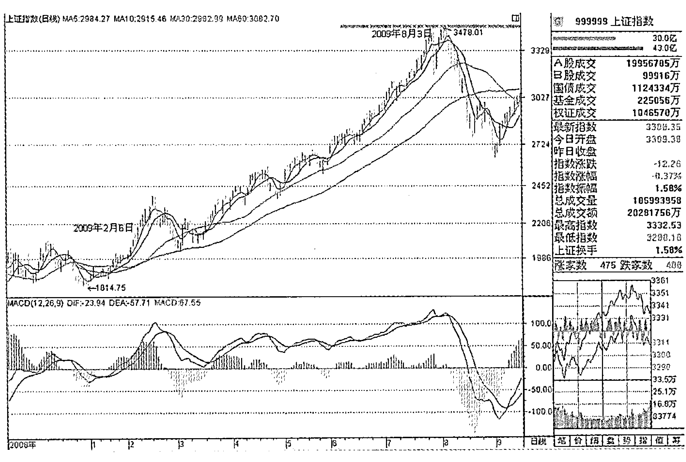

2009年2月至8月上证指数反弹上涨日K线图

## 第九章 奇门与股市实战例释

#### 实例七：未来一个月，必见两千九。

自从拙作《奇门与股市预测》在滚石出版社出版上市以来，得到了广大奇门爱好者的青睐。2009年5月27日，国内大型周易龙隐论坛网友钝剑久磨：“看了书的版面勾起了我想看的欲望，不知老师可否露一手，即时局看看上证未来一个月行情如何呢？”我当即以看到其贴子的时间起奇门局，结合上证K线技术指标分析判断出，上证未来一个月必上涨至2900点以上（当时上证指数只有2642.93点），而后上证在未月有见顶派出货兑现利润的危险，果然到2009年6月底，即一个月后的6月30日，上证指数收盘见到2959.36点，其后上证于未月底即8月4日见顶3478.01点，开始了向下大幅调整。下面将判断经过详述如下。

### 以看到贴子的时间起局预测如下：

- 时间：2009年05月27日21时52分
- 农历：己丑年五月初四日亥时
- 干支：己丑己巳壬申辛亥
- 旬空：午未戌亥戌亥寅卯
- 小满：中元辛亥时旬首为壬
- 阳遁二局值符天心落五宫值使开门落四宫

|九地|九天|值符|
|---|---|---|
|辛 开门 戊<br>禽 天芮 庚|休门 癸<br>天柱 丙|生门 壬<br>天心 戊|
|玄武<br>惊门 丙<br>天英 己|辛|腾蛇<br>伤门 乙<br>天蓬 癸|
|白虎<br>死门 庚<br>天辅 丁|六合<br>景门 己<br>天冲 乙|太阴<br>杜门 丁<br>天任 壬|

分析：

### 1. 为什么判断分析上证未来一个月必上涨至2900点以上？

看大势，以日干壬所在坤2宫为股市，壬在坤2宫长生为得地，上乘值符得神助，临生门吉门得人和，逢天心吉星为得天时，坤2宫日干宫得天时地利人和神助为大吉，说明股市必然会上涨。

日干所在的坤2宫上乘值符为有行情，地盘逢甲子戊说明有增量资金入市，甲子戊为基金说明基金大量入市，巳月生门临坤2宫旺相，又与值符同宫比和，八门反吟，主行情会快速振荡上涨，甲子戊生门同宫主这时买人股票后市定会获利。

未来一个月就是到6月30日，6月30日前为午月，午月离9宫用事，离9宫上乘九天，说明股市会上涨，景门为行情，在巳月旺相也主涨，离9宫在巳月旺相取9数，那么上证指数在午月必会上涨到2900点以上。

据此，所以判断分析上证未来一个月必上涨至2900点以上。

### 2. 为什么说而后上证在未月有见顶派发出货兑现利润的危险？

#### (1) 奇门局的分析

未月日干坤2宫用事，坤2宫中值符生门同宫，巳月坤2宫旺相，生门也旺相，八门反吟，说明成交量急剧放大，指数快速上涨，大盘有见顶之象。地盘逢甲子戊说明有增量资金介人，天心为耍心机有意识的诱多，辛为有投资资金高位误人，壬主会跳水。值符为头为尽头，未月坤2宫上乘值符，主行情要见顶走到头。

时干辛值使门开门所在巽4宫在巳月正旺，宫中甲子戊逢开门主有资金出逃，上乘九地是私下暗地里出逃，戊下逢庚主股市资金供给受阻，不看好股市从股市出来换地方投资的现象，逢天芮主股市在资金等方面遇到问题，临辛为有投资者高位误人。

未月坤2宫日干壬为主力，逢生门为获利了结，值使门见九地开门为出逃，八门反吟凶格，坤2宫值符生门旺比和主大盘放量行情见顶，见壬水为跳水暴跌。

奇门应用研究与股市实战解秘


#### (2) 技术分析

从技术指标上看，上证周K线的KDJ的J线已连续三次位居顶部位置，正开始第四次碰顶，KD线已到达高位，进人大盘开始见顶做头部的区域。

从螺旋历法亦即时间周期看，A股自2008年10月28日的低点1664.93点反弹上涨运行到未月底即8月7日（立秋）前后，达9个月多，280多个自然日，89数为费伯拉契神奇数列中的数字，89数的平方根乘于29.53天，大约就等于280天，说明未月底即8月7日前后，A股已到达敏感时间区域，随时会有调整出现。

根据江恩理论亦即空间周期看，上证大盘站上2900点，后市若到达前期底部1664点的2倍位置时，亦即3328点左右时，会产生较强的上涨阻力。上证大盘从6124点下跌至1664点开始反弹的强压力位为3368点一带（即6124减去1664乘以0.382黄金分割再加上1664就等于3368点），那么从以上两个接近的预测点位来看，只要指数接近这两个点位的区域附近，再有成交量放出来，就即有可能引发调整。

从宏观面看，IPO重启和信贷资金的紧缩调控与开始严防流入股市的监管，创业板对资金的分流已成定局，除了不够理想的中期年报马上逐一披露外，没有什么特别的利好来刺激这个市场，那么大盘将存在很大的变数。

所以总和以上因素判断，大盘在到达3368点以上区域，运行至未月底8月7日前一段时间，很可能迎来一轮调整，此轮调整很可能是对前9个多月上涨以来的一次中期消化整理。

据此判断，所以说上证在未月有见顶派发出货兑现利润的危险。

实际走势如下图所示：

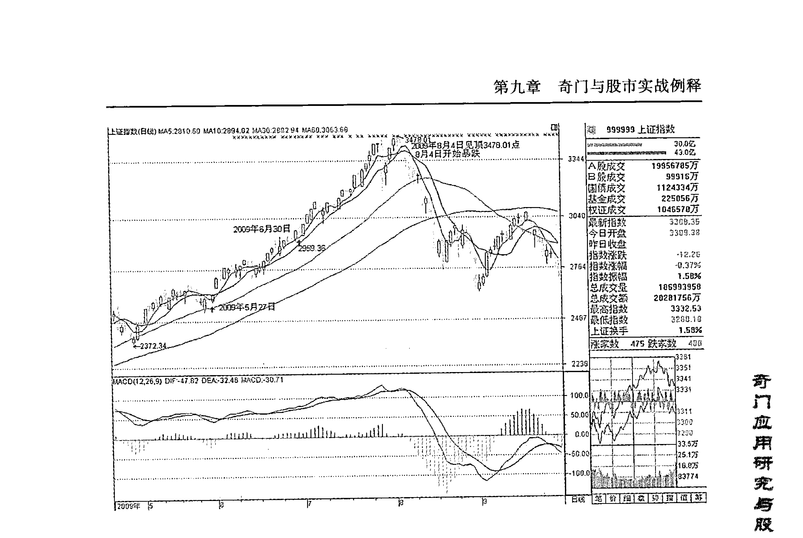

上证在一个月内上涨至2900点以上，在未月底8月3日见顶暴跌K线图

#### 实例八：暴跌必反弹，不逃必被套。

2009年07月29日，沪市大盘于3419.99点低开后一路下行，至下午14时左右开始大幅暴跌跳水，一度下跌达280多点，盘中连破3400点3300点3200点三大关口，市场陷入恐慌，尾盘14时25分左右在石化双雄等大盘权重股拉抬救护下出现反弹，最终全天上证股指暴跌171.94点，跌幅达百分之5。我于当天14时50分起奇门六壬局预测分析后市走势，发现上证后市必然会产生反弹，但是反弹不久后便会出现大幅连续暴跌中线调整行情，结果上证股指连续反弹3天，见到3478点新高，在股评人士的一片叫好声中，开始了连续向下暴跌，直至跌破3000点还未出现象样的反弹行情。下面将判断分析详述如下。

时间：2009年07月29日14时50
农历：己丑年六月初八日未时
干支：己丑辛未乙亥癸未
旬空：午未戌亥申酉申酉
大暑：下元癸未时旬首为己
阴遁四局值符天冲落八宫值使伤门落三宫

| 九地<br>杜门 壬 乙<br>天英 戊 禽 | 玄武<br>景门 庚<br>天芮 壬 | 白虎<br>死门 丁<br>天柱 庚 |
| 九天<br>伤门 戊<br>天辅 己 | <br><br>乙 | 六合<br>惊门 丙<br>天心 丁 |
| 值符<br>生门 己<br>天冲 癸 | 滕蛇<br>休门 癸<br>天任 辛 | 太阴<br>开门 辛<br>天蓬 丙 |

### （一）奇门分析

#### （1）为什么说上证后市必然会产生反弹？

值符与生门均落入艮8宫比和，逢天冲吉星与太岁己主快速上冲大涨，说明股市在短期内还有较大的反弹上涨，值符与生门落宫旺相，生门又旺于时令，说明成交量获利盘已很大（7月29日上证单日放出3028亿元的历史天量），股市将会反弹见顶。

主力日干乙奇落离9宫上乘玄武，宫中景门为行情，玄武为诱骗，逢景门，说明放量暴跌后会有反弹上涨，不过属于主力诱多行情。

结果上证股指连续反弹3天，见到3478点新高后，开始下跌调整。

#### （2）又为什么说反弹不久后便会出现大幅连续暴跌中线调整行情？

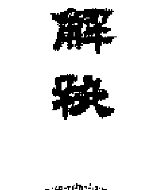

## 第九章 奇门与股市实战例释

看大势以日干宫为股市，日干乙奇落离9宫，离9宫上乘玄武恶神为不得神助，临天芮凶星不得天时，又遇庚金阻隔凶神，临壬为振荡跳水。景门为消息或行情，天芮为问题，说明一方面从消息面上看已出现问题，玄武遇景门主有小道不利的消息。另一方面说明股市行情也出现问题，玄武加日干离9宫上，主股市出现投机性诱骗行情和下跌行情，庚+壬为上格，迷失道路，音信不通，乙+壬为日奇入地，尊库悖乱，官讼事非，皆凶格，八门又伏吟，主未来必然会出现中期下跌调整。

从资金面看，甲子戊落震3宫击刑，上乘九天，主股市资金在高位有振荡出逃，戊又入地盘甲戌己之墓，己为太岁，说明国家在严查信贷资金入市，同时也主有资金将被重套，逢值使门伤门说明股市在资金面上遭到较大的损失，股市将被伤害。值符为多方在未月休囚，主买方力量已不足以推动后市持续上涨。

时干为股票，日干为投资者，日干为买方，时干为卖方，时干所在坎1宫克日干所在离9宫，对卖方空方有利，对投资者不利。今日亥日看6宫，宫中天蓬开门上乘太阴，主大幅出货调整，丙入墓主大幅下跌，辛为误人被套者不少，丙+辛主因财致讼，说明下跌必深损失必大。值符天冲景门为行情，景门临玄武，八门伏吟，说明日后两市必然会出现长时间的振荡下跌调整行情。

离9宫上乘玄武，午日离9宫用事，说明午日股市将开始下跌。坤2宫上乘白虎，宫中死门凶门，天柱凶星，地盘又遇庚金凶神，说明股市必将暴跌，未申月坤2宫用事，未月将过，可以肯定申月股市将会出现暴跌。

结果上证8月4日在盘中见到3478点新高后，于第2天午日开始连续暴跌，直到8月17日上证跌破3000点收盘于2870点，还未出现止跌企稳迹象。

### （二）螺旋历法江恩波浪理论分析

从螺旋历法看，自去年10月28日上证见底1664点起涨至今7月29日，整整9个月，9个月的时间天数大约是神奇数字89的平方根与29.53天的乘积，正好符合螺旋历法对市场的判断周期。从07年10月16日市场下跌至08年10月28日见底大约用了12个月多的时间，从08年10月28日上涨开始至今天，市场大约所用的时间为12个月乘以四分之三，大约等于9个月多，正好符合目前的上涨周期9个月左右，也正好与江恩的四分之三压力时间周期相吻合。简单的说，今日为六月初八上玄月日，是市场回调的时间窗，昨日为甲戌日六甲敏感时间窗，深市也与昨日见顶，综上所述，此次放出天量的巨幅调整，从技术上讲已完成了一个反弹上涨周期，从浪形上讲，如果07年10月至08年10月的下跌浪为A浪的话，那么从08年10月28日反弹至今天7月29日的这一浪就是B浪，接下来应该运行的是下跌C浪。又如果07年10月至08年10月的下跌为五浪下跌，那从08年10月28日反弹至09年7月29日的这一浪就为反弹A浪，接下来运行的将会是调整B浪。

### （三）基本面分析

沪深两市的基于流动性充裕催生的年内最大的一波反弹行情，被今日放量达4300多亿巨量的170多点长阴线击溃，创造了沪深股市历史上空前振幅和黑色星期三，让我们永远记住这疯狂的一天。年初到现在央行共投放信贷市场的资金达8万亿之巨，远远超过同期放贷的两倍以上，世界各国为了较快的摆脱金融危机所带来的经济衰退，纷纷向实业经济投放流动性，以缓解和恢复经济面上的疮痛，由此而引发的负面影响就是潜在的通胀，各国股市也因美联储向市场投放1万亿的流动性而出现较强劲的反弹走势，其中尤其以中国股市为最，其要么跌个底朝天，要么不顾经济面上的危机而涨个没完没了。此次在央行启动票据发行以回收流动性，第三季度开始减少流动性信贷投放，严查信贷资金入市，开启IPO和创业板的共同夹击下，沪深A股终于招架不住，开始出现大跌，应验了我在月初做出的上证会在3300点到3400左右出现振荡调整的预测。期间多头主力多次发动中石化中石油钢铁煤碳券商有色房地产银行等大盘权重股以诱多，但每次出货都因盘中缺乏承接盘，而不得不盘中再度拉起继续诱多，今天主力借中国建筑大盘航母上市交易，往日新股上市多遭暴炒的时机下，早盘趁机出货，下午跳水，尾盘又拉起，以利来日拉高继续出货。从以往的经验看，天量调整过后，市场往往会出现反弹，反弹仅仅是反弹，从技术上讲，牛市的确认只有从月线的MACD快线两次上穿慢线后，才能形成稳定可靠的大牛市，目前并未形成二次上穿的形态，所以目前言牛市尚早，做为投资者，应该清醒的认识到目前的行情已步入调整周期，而不要轻信所谓的大趋势未有改变，市场后市还有新高的论调，而是应把握反弹机会，选好品种和时机，即时快进快出，短线操作为主，保护战果，等待调整振荡结束，再行布局为好。

实际走势如下图所示：

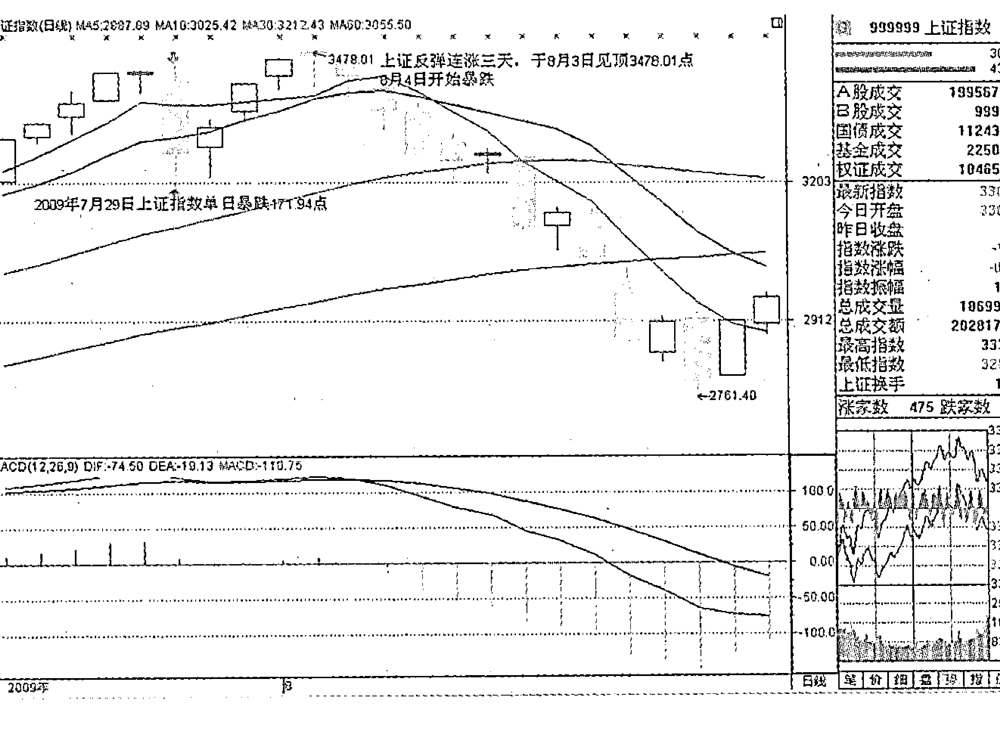

上证暴跌后连续反弹3天见顶3478.01点后暴跌K线图

## 第十章 最后的预测

衷心送给投资者的金语良言：价值投资才是最好的预测。

### 一、要投资还是要赌博——价值投资是根本

大家知不知道一个企业从创建开始，从理论上讲必须每年赢利至少百分之十才有投资的价值这个道理吗？也就是说，投一个企业或项目，成本收回的时间周期不应超过10年才是最合理的投资。为什么企业要把赢利设在百分之十以上才可做，是因为它存在有很大的风险，相比较存银行就没那么大的风险了。那么在二级市场上加上人为炒作的因素，要投一个企业，就是要分析这个企业所对应的二级市场上的股价，在投资购买后，是否会在15年内收回成本，即市盈率是否超过了15倍，这就是投资股票的根本原理。在中国90%以上的大多数投资人所购买的股票，都难以在15年内收回自己的成本，换句话说都在做投机，就是在冒险跟赌博，可自己却根本不知道。

炒股票，估值是最重要的，它决定你从二级市场上以多少价格来购买股票才是合理的。估值往往是按业绩和市盈率来定的。所以你投那只股，就要根据业绩和市盈率来投。业绩和市盈率怎么算出合理估值的？在二级市场上就是你的投资成本收回的时间周期不要超过15年，也就是你每投一元钱给所投的上市公司，这一元钱要收回来的时间周期最好不要超过15年。目前世界上大多数股市的动态市盈都在15倍左右，都在合理的投资价值区间，只有我国等少数新兴股市的市盈率在20倍以上，所以充满了投机气氛，也为投资者布满了投资陷阱。

举个例子，比方中石油，大家知道它0.75元的业绩，10倍市盈率代表你投它会在10年内收回成本。在二级市场上加上浮动炒作的成分，15倍对它最公平，也就是说你投它买它的股票，最好在15年内收回成本才合理。在中国，20倍的市盈率显然是高估了它。15倍的市盈率的话，它在二级市场上所对应的股价应在11元左右才最为合理。也就是说，在二级市场上你每买一股中石油所花费11元左右的钱，就得15年才能收回，这时它的股价在11元左右才是对应的买点，对它来讲才是最合理的投资。

0.75元的每股收益，一般的你投它最好不超过15年就能收回本钱才好，那么它对应的股价就应是11元左右，超过15年的回收期就不合算了，所以香港的才10元多，内地的18元左右，市盈率25倍左右，显然估值不合理，股价偏高，没有投资价值。有些朋友说，好多投资者是在45元到48元购买的，难道中石油就没有投资价值吗？这个是一个业绩未来预期增长的投资方法，说到底是在投机和冒险，并不代表合理的投资价值，所以它从48元一直跌到现在的18元左右了，从市盈率看，它还没跌到合理的投资区间，还有下跌的空间。

早几年宝钢两元时，没多少人买，可现在看到十多元甚至二十多元了，还在涨，想捡便宜，根本不判断自己是在投资还是在冒险，结果可想而知。这个道理好多人在说给他时，他很明白，可在买股票时，他就糊涂了。巴菲特就是根据这个十分简单的道理来买进和卖出中石油的，因为股价是围绕企业的赢利发生上下波动的，世界经济不好了，企业的赢利就会下降，股价也会下降，老巴就是这样做的，只不过他比别人早做一步罢了，他难得的是他能做到，别人做不到，是因为大多数的人觉得，自己的运气不比老巴差，所以要买比老巴更冒险的股票。

证券市场总是垂青那些老实本分的价值投资者，对那些敢于冒险的勇士总是给予无情的打击和报复，炒股的人能明白自己在投资还是在冒险赌博就行，买股前算一下，就知道自己在投资还是在冒险赌博，就不会把买股投机做成老股东，把老股东做成冒险家了。一个市场的市盈率太高，做企业的基础就没有了，相当于在玩泡沫，在赌博，就很危险。这次下跌有人说是政府在默认，我看是的，其实质就是价值回归，就是要大家别玩泡沫，搞点实际的，投点资，这个明白了，我想以后大家买股时，会有赢利的。

### 二、准确掌握价值、时间、空间三个投资周期才是金融证券市场上的致胜法宝

奇门应用研究与股市实战解秘

价值、时间、空间三个周期是投资任何金融证券市场所要研究的根本话题。

价值周期是投资分析金融证券市场的基本法则，时间与空间周期的投资分析则是为寻找最佳的买卖时机和点位提供一个良好的介入点。

如果说宏观分析为金融证券投资市场提供了可靠的价值分析，螺旋历法就是从时间上精确解决了金融证券投资市场的周期性时间循环趋势，江恩理论则是更擅长于从空间上综合分析研究金融证券投资市场的周期性循环趋势，而波浪理论更加从形态上较好地分析把握了，金融证券投资市场的周期性循环的具体运动表现形式，那么周易奇门遁甲的天文立体动态数理模型，就是螺旋历法江恩理论波浪理论分析把握金融证券投资市场的总合。

周易奇门遁甲的天文立体动态数理模型，它不仅是天体宇宙的微缩，而且更重要的是，它无时无刻地反映着与人类社会活动密切的各种周期性预知信息，反映在金融证券投资市场领域，就是它对价值周期时间周期空间周期的准确预知和把握，因而能从抽象的分析角度为我们提供可靠的投资买卖信息。由本书中所提供的理论与实践，足以证明，周易奇门遁甲的天文立体动态数理模型，是掌握价值、时间、空间三个投资周期的最佳抽象分析工具。

### 附录（转载）：

#### 易学在华尔街的应用—3175.9%

张延生、龙卫权

1997年11月12日~1998年2月12日期间，在我将张氏理论用於外汇期货的一个实验里，进场38日，共进行66次买卖，结果是45次获利，21次损失，我所运用的买卖资金，增长共3175.9%。

亦是说，短短的三个月期间，投入的10000.00美元，已升值为327590.07美元。

这些实验包括了对损失的承受，即测试巨额损失对定力、判断力和思维的干扰和影响；故意反方向，找出并等候到其底线，以确定正数和负数时候的分别；多个账户的同时操纵，人为地使某些账户盈亏参差，总和后仍然盈利，以便在日后需要时可以使用；提前预定多个指令，曾试验过在同一户口一次预定40次交易的指令，这批指令後来需差不多15天才全部执行完毕，结果是令人振奋的。

我发现：盈利对思维的干扰和影响，远远大於损失。正所谓高处不胜寒，大有大的难处。此干扰和影响的比例大约为3：1，即盈利1倍时的干扰和影响相当於损失3倍时的干扰和影响。亦是说胜利比失败更难以应付，正所谓利令智昏，财迷心窍！所以我是以如履薄冰的心理去迎接胜利的。

同时，亦深深体会到易学的精深，比如说当卦象提示是可以在什么价位成交（虽然是事实），当有“是否”的意念一闪，因为与市场的方向相反，且相距大於1000点，从6957跃升至7960（日元期货），

奇门应用研究与股市实战解秘

亦仅仅是那么一念而已，马上就乱套了，自己亦觉得好笑，“初噬告，再三渎，渎则不告”。

就像血癌病患者，相同的病情，成年人和小童治疗难度的比例是9：1，因为成年人太多思维了，而小童则天真无邪、无忧无虑、没有经验、不会怀疑，所以治疗时很轻松，远比成年人容易；或者像醉酒之人，如果从行驶着的车上跌下，或从高处坠地，其生存率将会远远高於其他常人，因为其无恐惧、不知害怕、不会挣扎、手脚不动，是标准的自由落体状态，所以大部份的时候是下肢先着地，受伤多为下肢，不会危及生命（人体以下肢的比重为大，重量远大於其他部位；而头部、胸部和腹部多有空腔的部份，比重较轻）；且人类/生物有其与生俱来的求生本能，这种本能只有在无所畏惧，或无所思、无所虑的状态下才能发挥出来，这是大部分的一般常人可望而不可及的，也是众多的修炼者所梦寐以求的，而醉酒之人则在不知不觉之中，刚刚好地、恰如其分地做到了这点。

或者说，他们没有太多的主观干扰因素。

我平时在下买卖的指令时，习惯给多3点的缓冲时间，即指令在到达波谷或波峰之前3点，以保证指令可以被执行，因为经纪执行指令有时间上的延迟，如果我可以直接下单的话，连这3点都可以省免，这样就可以把成交点放在波谷或波峰上了。

这些实验纯粹是使用易学的知识，与期货知识无关。因为我是从医出身，以前对期货和金融完全没有概念，就算到今天，对那些辛涩的术语还是莫名其妙，包括货币之间的换算、基差、套期保值和交叉盘，等等。

好在我所作的交易，价格的定义，完全不需要这些基本知识，这些术语对我完全无关紧要，可有可无，不知道还好，少了一重干扰，免得自寻烦恼。

当使用易学的知识对某一样事物作判断时，对此事物的理解和知识越少越好。如果对此事物有某一程度认识，虽然是可以抗抗拒其干扰，但潜意识里多多少少还是会/有可能存在着某些影响，至少会增加多一点麻烦，因为要人为地排除其干扰（这亦是为什么一般人不算自己的事情的原因之一，除非是水准相当高）。

从此可知“难得糊涂”的境界，亦是“无所为，而无所不为”。

这些实验亦并没有使用任何金融新闻。虽然我亦尝试过分析七国高峰会、格林斯潘的言论等，但结果是一塌糊涂，因为这亦是一种人为的干扰，真真假假、假假真真，连抗拒都来不及，还要引进？所以一早就放弃了。

在我购买的金融资讯中，仅仅是数字和曲线对我有用——报价而已。笑话：我曾经查询过看看可否把新闻资讯从我订购的金融资讯中删除，因为这除了可以减少干扰外，还能使我减免不少费用（在金融资讯中，新闻资讯是最昂贵的）。

试验表明，金融市场亦与其他的事物一样，是有规律可循的、可以预测的、可以计算的，并且可以准确地、零误差地捕捉每一个波谷和波峰的。

金融交易仅仅是需要一个价格而已，需要一个准确的，还未出现在电脑报价系统上的价格（虽然此价格已经出现，已经存在）。

就像自然界中的其他暂时尚未被人们认识的事物一样，早就存在着的了，不会因为人们不知道它的存在而不存在；或者像星星的运行一样，是有迹可循的，不会因为人们的无知而停止运行或者消失，这点是不会因为人们的意志所改变的；或者像我给别人所作的房屋估价，我需要/可以准确地判断这所房屋的价格是多少才是最公平的，因为如果要价高了，此客人没钱买，成交不了，就不成价格了（如果此客人走后，短期内市场无人问津的话；或下一个/以后的客人出的价均低於此客人的话），要价低了，对房主不公平。所以，刚刚好，双方均可以接受的价格才是最佳的价格；同时此价格必须是在房主可以接受的这段时间内，市场上可以达到的最高价格。亦是说此估价不仅要考虑到房屋本身的价值，还要考虑到市场上的价值。使用易学就可以轻易地解决这些问题。

奇门应用研究与股市实战解秘

# 下编 奇门与股市实战解秘

张氏理论包含：场理论、宏观理论、整体理论以及本质规律性的矛盾统一。

张氏理论认为：任何事物均有规律性存在，不管范围再大再小，都是有规律性的，而且这种规律有主要矛盾和次要矛盾，只要抓住主要矛盾，其他的次要矛盾就很容易处理了。不管你的问题再复杂，我把主要的、本质的抓住了，你的问题就跑不出这个规律了。而西方的方法则往往是胡子眉毛一把抓，不突出主要的，把真正的规律都忽视掉了。

张氏理论同时认为：中华文化是长远、宏观、整体地看问题的，根据具体的情况，作出具体的判断，没有死格式。如果市场变化万千，你没有变，不随着环境变，而是死格式，就得被淘汰。现在西方的理论都是固定的模式、固定的逻辑，其很多市场的方法并不很理想。如果人们都用这些固定的理论，固定的逻辑，都能掌握规律了，就不可能有什么表现，就不是规律了，所以没有固定的逻辑，没有固定的模式。

当然了，你说有没有公式或程式？肯定有。而且这种东西每人也都能学会，它是有规律可循的。但是这些我们还需要保密，大家都会用的话，可能会引起混乱，这种技术不能大家都掌握，大家都掌握了就像现在的股票市场规律一样，大家都掌握了就不成规律了，抓不到规律了。

你说我是按照西方的规律？你知道西方的资本主义社会经济发展了这么多年了，300 多年了（16 世纪到现在），股票市场自从在华尔街边那棵大树下的第一笔交易到现在也有 207 年了，西方的金融市场一直都在运作，它们有这么高的概率吗？没有！它们有这么高的回报率吗？没有！

用西方的规律达不到这样的水平！这么多年了，没有！只有用了东方的传统的东西才有这样的机会。索罗斯弄了半天，才有 31.9% 的回报率（他就对世界起了这么大的作用了）。

西方的文化，西方的科学技术，最高的层次，就是哲学；而东方传统的哲学，就已经能够把现代所有的科学技术概括在里面了（包含西方的哲学）。

张氏理论是用易学的道理运作的，用的是传统的方法，当然还有现代的方法，二者相结合。既有现代科学优秀的部份，亦有中华传统文化优秀的部份；既不完全是现代的，亦不完全是古代的。

中华传统文化是很深的，河图洛书、先天八卦，都是数学模式，数学模式最后转化成场效应，这数就是场了，不管你是大是小，只要确定你的数是属那个场，那个场就是那一个方向，那一个方位；这一个场与那一个场是什么关系，按五行生克是一定的，这不是量变与质变的问题，量再大再小，先确定是那个场，只要是这种场，不管数目再大再小，都是这种场，这种场和那种场的作用就是这个关系。

比如在赌场里面，当这一个区是这一个场时，这一个区内的几张桌子都会是这个数。如两张相邻的轮盘赌桌，可以同时依序出现廿、十八、四，接着就这一张桌是一，另一张桌是二，逐渐分开，之后就不同了，因为此时的场已经不同。

现代医学对妇女月经周期亦有同样的发现，当她们同住在一间房子里面，特别是在类似学校宿舍这样的环境时（如在十五平方米的宿舍里住八至十人），她们的月经周期会趋向同步；当她们分开一段时间之后，这些同步现象会改变；而她们再回到一起的时候，同步现象会再度出现。这就是场的作用！

> 近朱者赤，近墨者黑，亦是同样的道理。

一件事情的出现，有它的偶然性，也有它的必然性。对它不认识者，就是偶然的、突发的，和巧合的；对它有认识者，就是必然的、规律的，和预料之中的。

什么事情都是有因果关系的，不管是先有鸡还是先有蛋，先有蛋还是先有鸡，任何事物的发展，都是有它的原因的。因为它在这个地方形成这种场，在那个地方形成那种场，最后在另一个地方形成另一种场，鸡生蛋的场，蛋生鸡的场，或者是其他的什么场。即是说，每一件事物的产生，必是先有这一件事物的场的存在。

奇门应用研究与股市实战解密

简单通俗地说：若想要知道一本书的内容，不一定要看这一本书，看看此书的总字数即可，排成卦，即可得知，因为此书与此卦的内容是相似的，或者说此卦的内容就是此书的内容。

下面是一些世界上非常著名的交易记录，仅供参考：

- ◇恒生指数每年滚存回报 <120%
1989年12月～1998年12月，恒生指数的每年滚存回报，即假使在一年前开始投资的话可以获得的回报，在109个投资月份中，有28个投资月份是负面回报，其中最高回报的月份是1993年12月份，也不超过120%。

- ◇恒生指数五年滚存回报 <350%
1993年12月～1998年12月，恒生指数五年滚存回报，即假使投资期跟证券及其他长线投资一样，以五年为最起码单位的话，其中最高回报的月份是其第一年的第一个月份，即1993年12月份，也不超过350%。

- ◇量子基金——31.9%
著名投资专家索罗斯（George Soros）的“索罗斯基金管理公司”旗下最大的量子基金（Quantum Fund，量子集团内目前最老资格，最大型的基金），亦是世界三大主要基金之一（另外两个是老虎基金和维尼克基金），其29年历史以来，每年平均回报率为31.9%。一般认为：世界上没有任何一家投资基金，可以比得上它所创造的成就记录。

- ◇波浪理论大师派瑞特——444.4%
当代波浪理论大师派瑞特在1984年为期三个月的竞赛中，以444.4%的报酬率赢得全美投资竞赛的总冠军，且刷新该竞赛（USTC）的记录。

- ◇廿世纪伟大炒家江恩——1000%
威廉·江恩（William Delbert Gann），1878年6月6日出生。最为人们瞩目的，是江恩在1909年10月份的25个交易日中，共进行286次买卖，结果是264次获利，22次损失，获利率竟达92.3%。江恩所运用的买卖资金，增长共1000%，令人难以想像。事实证明江恩是一个出色的即市炒家，在上述买卖中，平均每次买卖只相差 20 分钟。在其中的一个交易日，他进行了 16 次买卖，其中八次是当天波动的即市顶或底部。江恩在 1902 年 24 岁第一次入市买卖棉花期货，自此之后的 53 年，他在市场总共获利 5000 万美元，以当时币值，金额之大，令人咋舌。

- ◇基金经理中的超级明星——林治
管理麦哲伦基金（MagellanFund）的彼得·林治（PeterLynch）被《时代杂志》誉为首席基金经理，享有全美第一名基金经理人之称。他的投资哲学令他管理的基金成为过去十年表现最佳的股票基金。如果投资者在 1977 年以 1 万美元买入这个基金，到 1990 年已升值为 19 万美元。

根据我目前收集的资料，并未发现有比 3175.9% 更高的记录（也有可能，只是我未发现，如果哪位朋友知道的，欢迎指教）。

总而言之，零售、贸易、地产和金融至目前为止，在张氏理论指导下的盈利能力，应该是其他的理论或方法，包括道氏理论、波浪理论、江恩理论、四度空间、占星学、波幅指数买卖系统、抛物线时间/价位系统、神经网络系统、专家系统、模糊逻辑、遗传基因系统、混沌理论以及您所知道的任何理论或系统，无法同日而言的。

几千年前的易学，仍然可以有效地指导今天的金融交易！可以有效地运用于我们的日常生活！这亦是至目前为止，没有其他的文化、文明、或古迹可以做到的。

当然，我们亦应承认，由于易学是中华文化的精髓所在，其难度使之无法可以为一般的投资大众所了解和使用（起码不太容易）。就像一位艺术家在雕琢塑造一件伟大的作品，并非是可以一蹴可及的，尤其这揣摩的过程更是需要长时间的学习和探索，方可渐渐领悟其中的要诀；绝非翻完几本书，就可以起卦算卦，这种自以为入門的作法却是初学者最为常见的。

因为这是系统的东西，所以学习亦要有系统。冰冻三尺非一日之寒。

虽然如此，入易学之殿堂或许并不容易，但是若能约略体会其中精要之一二，从而可以有个大致的概念，则对市场的涨跌及其脉动会有更深一层的认识，也较能以一个宏观的角度来研拟投资策略，而不致于像许多的投资者一样迷失在市场的丛林之中，惶惶不可终日于难以预料的涨跌之间。

> 在此引用威廉·江恩的一句话：“如果你学习时有所进步，而又证明你是值得教导的话，我会给你一个主宰的数字及主宰的字句”。

注：这仅仅是易学的应用之一而已，学易的目的并非为此！

1999年10月5日此成果应邀参加《中国第一届国际高新科技成果交易会》。

奇门应用研究与股市实战解秘

本书由上编奇门应用研究与中编奇门与股市应用原理和下编奇门与股市实战解秘组成，书中不仅有精彩独到的奇门研究案例，而且首开奇门预测证券市场之先河，是一部以古典奇门遁甲预测理论来研究证券市场走势理论与实践操作相结合的周易专著。

本书以全息周期理论为依据，融贯西方金融证券市场经典预测理论，中西结合，古为今用，理论联系实际，探究奇门与西方经典预测理论之间殊途同归的内在精华，体现易学在金融证券市场上的应用价值。

本书具有很强的实操性，由掌握奇门预测到股市实战，只要依书按部就班研习实践，用之得法，即可无师自通，投资必多有收益。